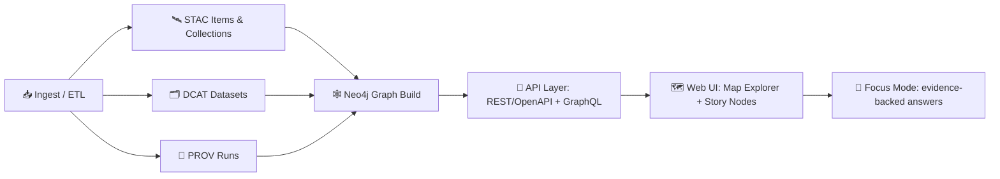

<a id="top"></a>

# 📘 KFM Master Guide v13 🧭🌾🗺️  
**Kansas Frontier Matrix (KFM)** is a provenance-first, catalog-driven, knowledge-graph-backed **living atlas of Kansas**: historical mapping + modern remote sensing + GIS + modeling + AI-assisted research — delivered via APIs + a map-first web UI.  [oai_citation:0‡Kansas Frontier Matrix (KFM) – Comprehensive Technical Documentation.docx](file-service://file-PaBDqECcJe7NbC8hvXNGDS)


> [!IMPORTANT]
> This file is the **canonical “Start Here”** for KFM: architecture, workflows, standards, and the “golden paths” for building, shipping, and governing data + code.  
> If anything contradicts this guide, **open an issue** and treat it as a governance event.

---

## 🧭 Quick Jump
- 🚀 [Start Here](#-start-here)
- 🧱 [System Architecture](#-system-architecture)
- 🗂️ [Repository Map](#️-repository-map)
- 🛰️ [Data → Catalog → Graph → API → UI Pipeline](#️-data--catalog--graph--api--ui-pipeline)
- 📚 [Modeling & Analytics](#-modeling--analytics)
- 🧑‍⚖️ [Governance, Ethics, Sovereignty](#️-governance-ethics-sovereignty)
- 🔐 [Security & Compliance](#-security--compliance)
- ✅ [Validation & CI](#-validation--ci)
- 🤝 [Contributing](#-contributing)
- 🧪 [Roadmap & Future Proposals](#-roadmap--future-proposals)
- 📦 [Reference Shelf](#-reference-shelf)

---

## 🚀 Start Here

### ✅ What KFM is (in one breath)
KFM turns **maps + datasets + documents + models** into an **auditable, queryable, mappable knowledge system** for Kansas — where every output is traceable to sources and processing steps (PROV), discoverable (DCAT), and geographically addressable (STAC).  [oai_citation:1‡Kansas Frontier Matrix (KFM) – Comprehensive Technical Documentation.docx](file-service://file-PaBDqECcJe7NbC8hvXNGDS)

### 🧰 “Golden Path” (new contributors)
1. **Read governance** → `docs/governance/ROOT_GOVERNANCE.md` 🧑‍⚖️  
2. **Pick a domain** (e.g., hydrology, air quality, archaeology, landcover) 🌊🌫️🏺🌾  
3. **Ingest one small dataset** (single county / single time slice) 📦  
4. **Emit catalogs** (STAC Item + DCAT Dataset + PROV run) 🛰️🗂️🧬  
5. **Validate** (schemas + links + checksums) ✅  
6. **Publish** (catalog registry + graph edges) 🕸️  
7. **Ship a Story Node** (human narrative) 🎬  
8. **Optional**: wire to Focus Mode (evidence-backed assistant) 🧠

> KFM’s design is intentionally modular (clean architecture) and documented as such.  [oai_citation:2‡Kansas Frontier Matrix (KFM) – Comprehensive Technical Documentation.docx](file-service://file-PaBDqECcJe7NbC8hvXNGDS)  [oai_citation:3‡Audit of the Kansas Frontier Matrix (KFM) Repository.pdf](file-service://file-1RwSrWXaDb5fnJ5gZX5kS3)

---

## 🧱 System Architecture

KFM follows **clean architecture** layers so domain logic stays stable while storage/UI can evolve.  [oai_citation:4‡Kansas Frontier Matrix (KFM) – Comprehensive Technical Documentation.docx](file-service://file-PaBDqECcJe7NbC8hvXNGDS)

### 🧩 Layers (conceptual)
- 🧠 **Domain**: core entities (Places, Events, Datasets, Observations, Tiles, Story Nodes)
- 🧪 **Services**: use cases (ingest, fuse, model, publish, narrate)
- 🔌 **Adapters**: translate between contracts ↔ domain
- 🏗️ **Infrastructure**: PostGIS, Neo4j, object storage, tile servers, Earth Engine, CI tooling

### 🕸️ Why two stores?
- 🗺️ **PostGIS** → spatial querying, tiling, analytics-friendly geometry
- 🧠 **Neo4j** → semantics + relationships (people↔places↔events↔datasets), narrative traversal

Graph-aware analysis can also surface “bridge entities” / clusters (useful for Story Nodes + discovery), aligning with graph spectral intuition.  [oai_citation:5‡Spectral Geometry of Graphs.pdf](file-service://file-DWxRbQDZGktGtiWtzAQxs8)

---

## 🗂️ Repository Map

> This is the **canonical mental model** of the monorepo. Actual trees evolve; the contracts and governance do not.  [oai_citation:6‡Audit of the Kansas Frontier Matrix (KFM) Repository.pdf](file-service://file-1RwSrWXaDb5fnJ5gZX5kS3)

```text
🏠 Kansas-Frontier-Matrix/
├─ 📁 api/                         # FastAPI + GraphQL + contracts + scripts
│  ├─ 📁 contracts/                 # OpenAPI/GraphQL + JSON Schemas (contract-first)
│  ├─ 📁 src/                       # application code (clean architecture)
│  └─ 📁 scripts/                   # ingestion, catalogs, telemetry, policy, CI helpers
│
├─ 📁 web/                         # React UI (MapLibre + Cesium), Story Nodes, Focus Mode UI
│
├─ 📁 data/                        # curated datasets (raw/processed/catalog/prov)
│  ├─ 📁 sources/                  # source manifests + download rules
│  ├─ 📁 raw/                      # immutable raw drops (append-only)
│  ├─ 📁 processed/                # normalized outputs + partitioning
│  └─ 📁 catalogs/                 # STAC/DCAT/PROV materialized outputs
│
├─ 📁 pipelines/                   # ETL + modeling pipelines (idempotent, provenance-first)
├─ 📁 mcp/                         # experiments, model cards, evaluation logs
├─ 📁 tools/                       # validators, schema-lints, helpers
├─ 📁 docs/                        # governed documentation (this file lives here)
└─ 📁 .github/                     # workflows, actions, security gates
```

---

## 🛰️ Data → Catalog → Graph → API → UI Pipeline

### 🧬 The canonical flow (KFM “spine”)


### 📦 Catalog outputs (minimum)
Every publishable pipeline run should produce:
- 🛰️ **STAC Item / Collection** for geospatial assets & footprints
- 🗂️ **DCAT Dataset** for discovery + licensing + access URLs
- 🧬 **PROV** for lineage (inputs → transforms → outputs)

This “catalog triplet” is the operational definition of “evidence-first” in KFM.  [oai_citation:7‡Kansas Frontier Matrix (KFM) – Comprehensive Technical Documentation.docx](file-service://file-PaBDqECcJe7NbC8hvXNGDS)

### 🧾 Why this works
- **STAC** answers: *what is it, where is it, what time is it, what files exist?*  
- **DCAT** answers: *who publishes it, what’s the license, how do I cite/access it?*  
- **PROV** answers: *how was it produced, by which code/config, from which inputs?*  

---

## 🧱 Modeling & Simulation in KFM

KFM treats modeling as a first-class citizen: models are versioned, reproducible, and provenance-emitting.  
For modeling/simulation discipline, see the NASA-grade modeling & simulation guide principles (verification/validation/credibility).  [oai_citation:8‡Scientific Modeling and Simulation_ A Comprehensive NASA-Grade Guide.pdf](file-service://file-LuWF23hffNAZJaZm2Gzvcd)

### 🧪 Modeling “contract”
A model run should:
- 📌 record **inputs** (dataset IDs + checksums)
- 🎛️ record **parameters** (config snapshot)
- 🧾 emit **metrics** (fit, errors, uncertainty)
- 🧬 emit **PROV**
- 🛰️ optionally emit a **STAC Item** (model artifact as dataset)
- 🗂️ optionally publish as **DCAT Dataset**

### 📈 Stats + regression (common KFM patterns)
- Regression is a workhorse for environmental and socio-economic modeling; document assumptions and diagnostics.  [oai_citation:9‡regression-analysis-with-python.pdf](file-service://file-NCS6ThhvajwNUm4crVVcGM)  [oai_citation:10‡Regression analysis using Python - slides-linear-regression.pdf](file-service://file-Ekbky5FwpaPHfZC2ttv6xR)  
- Experimental design and “how not to lie” with stats are required reading for high-stakes interpretations.  [oai_citation:11‡Understanding Statistics & Experimental Design.pdf](file-service://file-SdX6LMgi1uDRk5kd4H4Bg3)  
- Bayesian workflows are encouraged for uncertainty, calibration, and decision support.  [oai_citation:12‡think-bayes-bayesian-statistics-in-python.pdf](file-service://file-LXwJApPMVhRZgyqLb9eg7c)  
- Visual/graphical data analysis is expected in every analysis artifact (outliers, drift, distribution shifts).  [oai_citation:13‡graphical-data-analysis-with-r.pdf](file-service://file-K7oxq5mFmdE9HrPPev6c7L)

---

## 🛰️ Remote Sensing & Earth Engine

Earth Engine is a strategic accelerator for KFM, especially for landcover, drought, vegetation, and long time-series.  
Use cloud-native patterns and export results as cataloged assets.  [oai_citation:14‡Cloud-Based Remote Sensing with Google Earth Engine-Fundamentals and Applications.pdf](file-service://file-JVv3nbvtonX1HcpeERi9kV)

### ✅ Earth Engine → KFM handoff (recommended)
1. Run GEE workflow (script/notebook) ☁️  
2. Export to analysis-ready format (e.g., GeoTIFF / Zarr / GeoParquet) 📦  
3. Generate STAC Item + DCAT Dataset + PROV Run 🛰️🗂️🧬  
4. Register into graph + serve tiles / API endpoints 🕸️

---

## 🗺️ Mapping & UI Principles

KFM’s map is not “just a map” — it is a **claim with evidence**. Map design must respect audience, context, and ethics.  [oai_citation:15‡making-maps-a-visual-guide-to-map-design-for-gis.pdf](file-service://file-51FgWTn7uFXenxztXw29bP)  
KFM also treats mobile and digital cartography as evolving socio-technical practice, not static output.  [oai_citation:16‡Mobile Mapping_ Space, Cartography and the Digital - 9789048535217.pdf](file-service://file-AkVmsLhdFzwie5Gco3zgYj)

### 🖥️ Web UI foundations
- Responsive layout rules apply everywhere (desktop + mobile + kiosk).  [oai_citation:17‡responsive-web-design-with-html5-and-css3.pdf](file-service://file-Heg28TVM2nReDYTQ7nPhAK)  
- 3D/advanced visualization guidance (when needed) aligns with WebGL fundamentals.  [oai_citation:18‡webgl-programming-guide-interactive-3d-graphics-programming-with-webgl.pdf](file-service://file-7quELMw4FrspPczB9Y3BTp)  

### 🧭 Story Nodes (narrative layer)
Story Nodes are curated narratives that:
- cite datasets + artifacts
- express uncertainty
- avoid “black box” conclusions
- link map views + timelines + sources

Future Story Node upgrades and templates are tracked in the proposals doc.  [oai_citation:19‡🌟 Kansas Frontier Matrix – Latest Ideas & Future Proposals.docx](file-service://file-QrXwct2pX9kFpqgjtBiijR)

---

## 🧑‍⚖️ Governance, Ethics, Sovereignty

KFM is governed under **FAIR+CARE** and explicit sovereignty policy.  
This is not optional: it’s an engineering constraint.  [oai_citation:20‡Kansas Frontier Matrix (KFM) – Comprehensive Technical Documentation.docx](file-service://file-PaBDqECcJe7NbC8hvXNGDS)

### 🧠 Digital humanism stance
KFM is **human-centered**: the system augments decision-making and preserves accountability.  
Digital humanism framing is a core rationale for the platform’s constraints (traceability, transparency, agency).  [oai_citation:21‡Introduction to Digital Humanism.pdf](file-service://file-HC311tLjkcn1yRbyTBLJQQ)

### 🧬 Data sovereignty
Where data is sensitive (cultural sites, communities, protected knowledge), KFM must:
- apply classification rules
- enforce access controls
- avoid overexposure in UI
- prefer summary/aggregation when appropriate

---

## 🔐 Security & Compliance

KFM’s security posture is “defense-in-depth”:
- 🔏 least privilege
- 🧾 auditable pipelines
- ✅ fail-closed policy checks
- 🧬 provenance for runs (including CI)

Data space thinking helps frame trusted sharing + governance across stakeholders.  [oai_citation:22‡Data Spaces.pdf](file-service://file-7UnZyJ7eCK1egnsyuYJaFq)

> [!NOTE]
> The repository audit highlights architecture completeness but flags operational gaps that should be closed systematically (tooling, execution paths, and integration depth).  [oai_citation:23‡Audit of the Kansas Frontier Matrix (KFM) Repository.pdf](file-service://file-1RwSrWXaDb5fnJ5gZX5kS3)

---

## ✅ Validation & CI

Validation is a pipeline stage, not an afterthought.

### ✅ What must be validated
- 📦 schemas (JSONSchema / OpenAPI / GraphQL SDL)
- 🛰️ STAC correctness (links, assets, geometry, temporal)
- 🗂️ DCAT fields (license, access URLs, identifiers)
- 🧬 PROV integrity (agents, activities, entities, hashes)
- 🔗 cross-links between catalogs (STAC ↔ DCAT ↔ PROV ↔ Graph refs)

### 🧪 CI ethos
KFM enforces:
- deterministic runs (seeded configs)
- reproducible artifacts
- contract-first changes
- provenance emission for major jobs

---

## 🤝 Contributing

### 🧱 Contribution types
- 🧾 Contracts (schemas/OpenAPI/GraphQL)  
- 🛰️ Catalog work (STAC/DCAT/PROV generation + validation)  
- 🕸️ Graph enhancements (ontology mappings, new relations, entity resolution)  
- 🗺️ UI features (layers, timeline, Story Nodes, accessibility)  
- 🧪 Models (calibration, forecasts, optimization, simulations)

### 🧷 Contribution rule of thumb
If your change produces something a user can see, it must:
- have a contract
- be cataloged (or explicitly non-cataloged by policy)
- be attributable (PROV)
- be testable (CI)

---

## 🧪 Roadmap & Future Proposals

KFM v13 focuses on *operationalizing the spine* and shipping “thin vertical slices” end-to-end.  
Key proposals include:
- 🚌 real-time transit feeds (GTFS-RT watcher → STAC Items)  [oai_citation:24‡🌟 Kansas Frontier Matrix – Latest Ideas & Future Proposals.docx](file-service://file-QrXwct2pX9kFpqgjtBiijR)  
- 📚 bulk doc ingestion (OCR → graph entities → cited retrieval)  [oai_citation:25‡🌟 Kansas Frontier Matrix – Latest Ideas & Future Proposals.docx](file-service://file-QrXwct2pX9kFpqgjtBiijR)  
- 📊 dashboards/widgets paired with map selections  [oai_citation:26‡🌟 Kansas Frontier Matrix – Latest Ideas & Future Proposals.docx](file-service://file-QrXwct2pX9kFpqgjtBiijR)  
- ⏳ timeline/4D mapping upgrades  [oai_citation:27‡🌟 Kansas Frontier Matrix – Latest Ideas & Future Proposals.docx](file-service://file-QrXwct2pX9kFpqgjtBiijR)  
- 📦 PMTiles + GeoParquet dual packaging for performance  [oai_citation:28‡🌟 Kansas Frontier Matrix – Latest Ideas & Future Proposals.docx](file-service://file-QrXwct2pX9kFpqgjtBiijR)  

---

## 📦 Reference Shelf

> These sources are used as **internal implementation references** and inform KFM’s standards, patterns, and engineering culture.

### 🛰️ Modeling, simulation, and scientific rigor
- 🧪 *Scientific Modeling and Simulation: A Comprehensive NASA-Grade Guide*  [oai_citation:29‡Scientific Modeling and Simulation_ A Comprehensive NASA-Grade Guide.pdf](file-service://file-LuWF23hffNAZJaZm2Gzvcd)  
- 📉 *Regression Analysis with Python*  [oai_citation:30‡regression-analysis-with-python.pdf](file-service://file-NCS6ThhvajwNUm4crVVcGM)  
- 🧠 *Understanding Statistics & Experimental Design: How to Not Lie with Statistics*  [oai_citation:31‡Understanding Statistics & Experimental Design.pdf](file-service://file-SdX6LMgi1uDRk5kd4H4Bg3)  
- 📊 *Graphical Data Analysis with R*  [oai_citation:32‡graphical-data-analysis-with-r.pdf](file-service://file-K7oxq5mFmdE9HrPPev6c7L)  
- 🎲 *Think Bayes*  [oai_citation:33‡think-bayes-bayesian-statistics-in-python.pdf](file-service://file-LXwJApPMVhRZgyqLb9eg7c)  

### 🌍 Geospatial, mapping, and remote sensing
- ☁️ *Cloud-Based Remote Sensing with Google Earth Engine*  [oai_citation:34‡Cloud-Based Remote Sensing with Google Earth Engine-Fundamentals and Applications.pdf](file-service://file-JVv3nbvtonX1HcpeERi9kV)  
- 🧭 *Making Maps: A Visual Guide to Map Design for GIS*  [oai_citation:35‡making-maps-a-visual-guide-to-map-design-for-gis.pdf](file-service://file-51FgWTn7uFXenxztXw29bP)  
- 📱 *Mobile Mapping: Space, Cartography and the Digital*  [oai_citation:36‡Mobile Mapping_ Space, Cartography and the Digital - 9789048535217.pdf](file-service://file-AkVmsLhdFzwie5Gco3zgYj)  
- 🐍 *Python Geospatial Analysis Cookbook*  [oai_citation:37‡python-geospatial-analysis-cookbook.pdf](file-service://file-HT14njz1MhrTZCE7Pwm5Cu)  

### 🧱 Data systems, governance, and architectures
- 🧺 *Data Spaces: Design, Deployment and Future Directions*  [oai_citation:38‡Data Spaces.pdf](file-service://file-7UnZyJ7eCK1egnsyuYJaFq)  
- 🗄️ *PostgreSQL Notes for Professionals*  [oai_citation:39‡PostgreSQL Notes for Professionals - PostgreSQLNotesForProfessionals.pdf](file-service://file-742sw3gADJniEdmC19JeAC)  
- ⚙️ *Scalable Data Management for Future Hardware*  [oai_citation:40‡Scalable Data Management for Future Hardware.pdf](file-service://file-GZ8gMsQ8hxu7GWEVd3csNE)  
- 🧩 *Flexible Software Design: Systems Development for Changing Requirements*  [oai_citation:41‡F-H programming Books.pdf](file-service://file-QofzooQDG9grJwh9nFN9SY)  

### 🕸️ Graphs, networks, and advanced structures
- 🎼 *Spectral Geometry of Graphs*  [oai_citation:42‡Spectral Geometry of Graphs.pdf](file-service://file-DWxRbQDZGktGtiWtzAQxs8)  

### 🖥️ Web delivery & visualization
- 📐 *Responsive Web Design with HTML5 and CSS3*  [oai_citation:43‡responsive-web-design-with-html5-and-css3.pdf](file-service://file-Heg28TVM2nReDYTQ7nPhAK)  
- 🧊 *WebGL Programming Guide*  [oai_citation:44‡webgl-programming-guide-interactive-3d-graphics-programming-with-webgl.pdf](file-service://file-7quELMw4FrspPczB9Y3BTp)  
- 🖼️ *Compressed Image File Formats (JPEG/PNG/GIF…)*  [oai_citation:45‡compressed-image-file-formats-jpeg-png-gif-xbm-bmp.pdf](file-service://file-Y6V94sFtV6sy3w63LDy9fi)  

### 🧑‍⚖️ Human-centered / socio-technical
- 🧠 *Introduction to Digital Humanism*  [oai_citation:46‡Introduction to Digital Humanism.pdf](file-service://file-HC311tLjkcn1yRbyTBLJQQ)  
- ⚖️ *On the Path to AI: Law’s Prophecies…* (useful for AI governance thinking)  [oai_citation:47‡On the path to AI Law’s prophecies and the conceptual foundations of the machine learning age.pdf](file-service://file-NtashtRjti9J1THyYXkhAv)  
- 🧬 *Principles of Biological Autonomy* (systems + circularity lens)  [oai_citation:48‡Principles of Biological Autonomy - book_9780262381833.pdf](file-service://file-PwPXcX5554FpuRsF3iXTCf)  

---

## 🧾 Appendix A — Dataset Promotion Checklist ✅

> Use this when turning **raw data → governed artifact**.

- [ ] 📥 Source captured (manifest + license + access notes)
- [ ] 🔒 Sensitivity classified (public/internal/restricted)
- [ ] 🧹 Normalized to standard format (GeoParquet/COG/Zarr/etc.)
- [ ] 🛰️ STAC Item created (bbox, geometry, datetime, assets)
- [ ] 🗂️ DCAT Dataset created (publisher, license, access URLs)
- [ ] 🧬 PROV run created (inputs, code version, params, outputs)
- [ ] ✅ Validation passes (schemas + link checks + hashes)
- [ ] 🕸️ Graph registered (entities + relationships)
- [ ] 🗺️ UI layer published (tiles + styling)
- [ ] 🎬 Story Node optional (curated narrative + citations)

---

## 🧾 Appendix B — Story Node Checklist 🎬

- [ ] 🎯 Clear claim/question
- [ ] 🧾 Evidence list (datasets + documents)
- [ ] 🗺️ Map views defined (camera, layers, filters, timeline)
- [ ] 🧬 Provenance links included
- [ ] ⚠️ Uncertainty stated
- [ ] 🧑‍⚖️ Governance checks (sensitivity + sovereignty)
- [ ] ✅ Lint/validate story schema

---

## 🧾 Appendix C — What the Audit Said (Actionable Summary) 🧪

The repository audit reports strong conceptual architecture and modularity, but identifies areas to harden operationally (execution mechanisms, completeness of implemented paths, and integration depth). Treat audit follow-ups as tracked governance work.  [oai_citation:49‡Audit of the Kansas Frontier Matrix (KFM) Repository.pdf](file-service://file-1RwSrWXaDb5fnJ5gZX5kS3)

---

## 🔗 Footer Navigation
- ⬆️ Back to Top: [↑](#top)
- 📚 Docs Index: `docs/README.md` (if present)
- 🧑‍⚖️ Governance Root: `docs/governance/ROOT_GOVERNANCE.md`
- 🤝 Contributing: `CONTRIBUTING.md`
