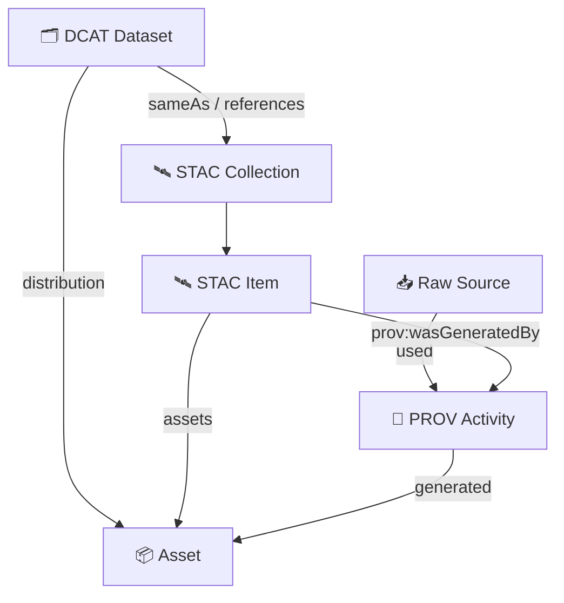
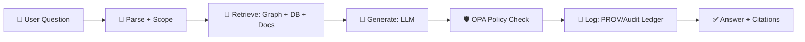

<a id="top"></a>

# 📘 KFM Master Guide v13 🧭🌾🗺️
**Kansas Frontier Matrix (KFM)** is a provenance-first “living atlas of Kansas” — turning **maps, datasets, documents, and models** into an **auditable, queryable, mappable knowledge system** where citations and metadata are first‑class (no black boxes).[^KFM_TD]


> [!IMPORTANT]
> This file is the canonical **“Start Here”** for KFM’s architecture, workflows, standards, and golden paths.  
> If anything contradicts this guide, treat it as a **governance event** and follow `docs/governance/ROOT_GOVERNANCE.md`.

---

## 🧭 Quick Jump
- 🚀 [Start Here](#-start-here)
- 🔒 [Non‑Negotiables](#-nonnegotiables)
- 🧬 [Protocol Stack](#-protocol-stack)
- 🧱 [System Architecture](#-system-architecture)
- 🗂️ [Repository Map (v13)](#️-repository-map-v13)
- 🛰️ [Evidence Spine (Pipeline)](#️-evidence-spine-pipeline)
- 📥 [Data Intake (Raw → Governed)](#-data-intake-raw--governed)
- 🧾 [Catalogs & Metadata](#-catalogs--metadata)
- 🧠 [Graph, Ontology, Semantics](#-graph-ontology-semantics)
- 🔌 [APIs & Contracts](#-apis--contracts)
- 🗺️ [UI & Story Nodes](#️-ui--story-nodes)
- 🤖 [Focus Mode (AI System)](#-focus-mode-ai-system)
- 🧑‍⚖️ [Governance, Ethics, Sovereignty](#️-governance-ethics-sovereignty)
- 🔐 [Security, Policy, Supply Chain](#-security-policy-supply-chain)
- ✅ [Validation & CI/CD](#-validation--cicd)
- 🧪 [Roadmap & Future Proposals](#-roadmap--future-proposals)
- 📚 [Reference Shelf (Project Library)](#-reference-shelf-project-library)
- 🧾 [Appendices (Checklists)](#-appendices-checklists)
- 🧷 [Footnotes & Sources](#-footnotes--sources)

---

## 🚀 Start Here

### ✅ What KFM is (in one breath)
KFM is an open-source geospatial + historical knowledge hub that publishes governed catalogs (**STAC/DCAT/PROV**), builds a **Neo4j knowledge graph**, and serves evidence via **contracted APIs** into a **map‑first UI** with narrative **Story Nodes** and an evidence‑bound **AI assistant** (“Focus Mode”).[^KFM_TD][^KFM_ETD]

### 🧬 The canonical ordering (non‑negotiable)
**ETL → STAC/DCAT/PROV → Neo4j Graph → APIs → UI → Story Nodes → Focus Mode** (no leapfrogging).[^KFM_ETD]

### 🎯 The prime directive
> **If it can’t be traced, it can’t be shipped.**  
> Every public surface in KFM must carry provenance forward: layer → dataset → processing run → source.

### 🧰 Golden Paths (pick your role)
<details>
<summary><b>🧑‍🔬 Data Contributor (first dataset → live layer)</b></summary>

1) 🧑‍⚖️ Read governance + sensitivity rules  
   - `docs/governance/ROOT_GOVERNANCE.md`  
   - `docs/governance/SOVEREIGNTY.md`  
   - `docs/governance/SECURITY.md`

2) 📦 Add a small, bounded dataset (one county / one period / one theme)

3) 🧾 Write a **Data Contract** (source, license, spatial/temporal extent, processing steps) — enforced by validators[^KFM_TD]

4) 🛰️ Emit the minimum publishable spine:  
   - **STAC** Item/Collection  
   - **DCAT** Dataset  
   - **PROV** run record  
   …and link them together[^KFM_ETD]

5) ✅ Run validations (schemas, links, hashes, policy pack)

6) 🕸️ Register graph nodes/edges (datasets/assets/activities/agents)[^KFM_ETD]

7) 🗺️ Publish a layer (tiles / GeoJSON / PMTiles depending on use)[^KFM_TD]

</details>

<details>
<summary><b>🎬 Story Author (story node → map narrative)</b></summary>

1) 🧾 Pick an evidence bundle (datasets + documents)

2) 🧭 Define the “claim/question” + uncertainty statement

3) 🗺️ Author Story Node linking map views + timeline + citations (Markdown + JSON storyboard)[^KFM_UI][^KFM_TD]

4) ✅ Validate story schema + governance checks

5) 🚢 Publish (Story Nodes are governed content, not blog posts)

</details>

<details>
<summary><b>🧑‍💻 UI/Frontend (feature → provenance-visible UX)</b></summary>

1) 🗺️ Build on MapLibre (2D) + Cesium (3D), timeline, and narrative UI[^KFM_UI]

2) ⛓️ Always surface provenance (“Layer Info” + “Layer Provenance” panel)[^KFM_ARCH]

3) 📱 Keep mobile/offline in mind (PWA + offline packs)[^KFM_UI][^KFM_ARCH]

</details>

<details>
<summary><b>🤖 AI/Focus Mode (RAG → cited answers)</b></summary>

1) 🔎 Parse intent/entities → retrieve from Neo4j + search index + PostGIS → generate answer with citations → governance check → deliver with sources[^KFM_AI][^KFM_OLLAMA]

2) 🧾 If it can’t be grounded in KFM evidence, it **refuses** or marks uncertainty (no guessing)[^KFM_AI]

3) 🛡️ Enforce policy at runtime (OPA allow/deny)[^KFM_AI][^KFM_OLLAMA]

</details>

<details>
<summary><b>🧱 Infra/DevOps (local → prod parity)</b></summary>

1) 🐳 Run the stack containerized (API + PostGIS + Neo4j + Search + optional Ollama)[^KFM_TD][^KFM_OLLAMA]

2) 🔐 Treat governance as a gate: CI blocks merges when contracts/schemas/policy fail[^KFM_TD]

3) 🧾 Produce supply-chain artifacts for automated outputs (SBOM/SLSA direction)[^KFM_ARCH]

</details>

---

## 🔒 Non‑Negotiables

> [!NOTE]
> These are **engineering constraints** (not “best practices”). They protect trust, provenance, and sovereignty.

1) ⛓ **No mystery layers** — unsourced/ad‑hoc data doesn’t enter the official catalog.[^KFM_TD]  
2) 🧾 **Contract‑first** — every dataset has a data contract (source/license/spatiotemporal/steps) enforced by validators.[^KFM_TD]  
3) 🛰️ **Catalog triplet required** — STAC + DCAT + PROV are the minimum publishable spine outputs.[^KFM_ETD]  
4) 🧬 **Provenance never breaks** — exports, stories, and AI answers carry lineage forward.[^KFM_ARCH]  
5) 🧑‍⚖️ **FAIR+CARE + sovereignty** — sensitive/cultural data is classified and handled with authority-to-control patterns.[^KFM_TD]  
6) 🛡️ **Policy‑as‑code** — governance is machine‑enforced (OPA + Conftest), not vibes.[^KFM_ARCH][^KFM_OLLAMA]  
7) 🔐 **Supply‑chain integrity** — SBOM + SLSA attestations + transparency logs for automated outputs (directional).[^KFM_ARCH]  
8) 🌱 **Sustainability is governed** — costly compute can be gated (directional).[^KFM_ARCH]  

---

## 🧬 Protocol Stack

KFM is “protocolized” so the system stays coherent while evolving. These are **versioned contracts**, not marketing labels.

### 🧾 What each protocol governs
| Protocol | What it standardizes 🧩 | Where it shows up 📍 |
|---|---|---|
| **KFM‑MDP v11.2.6** | Markdown doc rules (front‑matter, headings, admonitions, citations, diagrams) | `docs/` + Story Node Markdown |
| **MCP‑DL v6.3** | Model/agent contract & delivery loop (design language for agent pipelines) | `mcp/` + automation docs |
| **KFM‑ONTO v4.1.0** | Ontology bindings + semantic naming rules | `src/graph/` + `schemas/ontology/` |
| **KFM‑PPC v11.0.0** | Pipeline contract: required stages, determinism, outputs, IDs | `src/pipelines/` + `tools/validators/` |
| **KFM‑STAC v11.0.0** | STAC profile constraints (required fields/links/extensions) | `data/catalog/stac/` |
| **KFM‑DCAT v11.0.0** | DCAT profile constraints (license/publisher/distributions) | `data/catalog/dcat/` |
| **KFM‑PROV v11.0.0** | PROV profile constraints (agents/activities/entities/hashes) | `data/catalog/prov/` |

> [!TIP]
> Keep these versions in the YAML front‑matter of canonical docs and in schema manifests so tools can validate compatibility automatically.

### 🧠 Compatibility rule (simple)
If a pipeline emits **KFM‑STAC v11.0.0**, it must also emit **KFM‑DCAT v11.0.0** and **KFM‑PROV v11.0.0** for the same dataset version — and cross-link them.

---

## 🧱 System Architecture

KFM is modular by design: clean boundaries, layered trust, and a verifiable chain of custody.[^KFM_TD][^KFM_ETD]

### 🧩 Layers (conceptual)
- 🧠 **Domain**: Places, Events, Datasets, Observations, Story Nodes, Claims
- 🧪 **Services**: ingest → validate → catalog → graph → publish → narrate → answer
- 🔌 **Adapters**: contracts ↔ domain, PostGIS, Neo4j, search index, tile services
- 🏗️ **Infra**: object storage, tile serving, CI/CD, policy engine, audit ledger

### 🗺️ Why two “truth stores”?
- 🗺️ **PostGIS** for spatial query + tiles + heavy geometry ops[^KFM_TD]  
- 🕸️ **Neo4j** for semantic relationships, narrative traversal, multi-hop context retrieval[^KFM_TD][^KFM_AI]  

### 🔍 Why a search index?
Full‑text retrieval for documents and Story Node content (keyword + semantic search) complements the graph + PostGIS.[^KFM_TD][^KFM_AI]

---

## 🗂️ Repository Map (v13)

> v13 standardizes where subsystems live (one canonical home each) and treats Story Nodes as governed content.[^KFM_ETD]

```text
🏠 Kansas-Frontier-Matrix/
├─ 📁 data/                         # raw/work/processed + catalogs (STAC/DCAT/PROV)
│  ├─ 📁 raw/                       # immutable drops (append-only)
│  ├─ 📁 work/                      # scratch + sims + staging (governed by policy)
│  ├─ 📁 processed/                 # normalized outputs (GeoParquet/COG/etc.)
│  ├─ 📁 catalog/                   # materialized STAC/DCAT/PROV outputs
│  └─ 📁 graph/                     # CSV imports / snapshots for Neo4j
│
├─ 📁 docs/                         # governed docs (this file lives here)
│  ├─ 📁 architecture/              # blueprints, ADRs
│  ├─ 📁 governance/                # FAIR+CARE, ethics, sovereignty, security
│  ├─ 📁 reports/story_nodes/        # narrative content (draft vs published)
│  └─ 📁 library/                   # reference manifest(s) for project shelf
│
├─ 📁 schemas/                      # JSON Schemas for catalogs, story nodes, UI config, telemetry
├─ 📁 src/
│  ├─ 📁 server/                    # API service implementation + contracts boundary
│  ├─ 📁 pipelines/                 # ETL/model runs (idempotent)
│  └─ 📁 graph/                     # ontology bindings + ingest tooling
│
├─ 📁 web/                          # React UI (MapLibre + Cesium), Focus Mode UI
├─ 📁 tools/                        # validators, policy pack, schema lints
├─ 📁 mcp/                          # experiments, eval logs, model cards
├─ 📁 tests/                        # unit/integration/e2e
└─ 📁 .github/                      # workflows, security gates
```

### ✅ “One home” rule
A capability must have **one canonical home**:
- Policies → `tools/policy/` (or `tools/opa/`)
- Schemas → `schemas/`
- Pipelines → `src/pipelines/`
- Story Nodes → `docs/reports/story_nodes/`
- Library docs → `docs/library/` + `docs/library/MANIFEST.yml`

---

## 🛰️ Evidence Spine (Pipeline)

### 🧬 “Spine” diagram
```mermaid
flowchart LR
  A[📥 ETL / Ingest] --> B[🛰️ STAC Items & Collections]
  A --> C[🗂️ DCAT Datasets]
  A --> D[🧬 PROV Runs]
  B --> E[🕸️ Neo4j Graph Build]
  C --> E
  D --> E
  E --> F[🔌 APIs (REST/OpenAPI + GraphQL)]
  F --> G[🗺️ UI (Map Explorer + Timeline + Stories)]
  G --> H[🤖 Focus Mode (Cited RAG Answers)]
```

### 📦 The catalog triplet (minimum publishable output)
KFM links STAC/DCAT/PROV so discovery metadata, technical asset metadata, and lineage travel together.[^KFM_ETD]

- 🛰️ **STAC** answers “what/where/when/files?”  
- 🗂️ **DCAT** answers “publisher/license/access/citation?”  
- 🧬 **PROV** answers “how produced, from what inputs, by whom/what agent?”  

### 🧱 Determinism contract (KFM‑PPC)
Pipelines must be:
- ♻️ **Re-runnable** (same inputs + same config → same outputs)[^KFM_TD]
- 🧾 **Logged** (run manifest: inputs, params, versions, hashes)[^KFM_TD]
- 🚫 **No silent edits** (no “fixed in Excel”; no invisible steps)[^KFM_TD]

---

## 📥 Data Intake (Raw → Governed)

### 🧠 Intake philosophy
Data intake is provenance‑first: everything enters with where it came from, how it was obtained, and how it can be reproduced.[^KFM_TD][^KFM_ETD]

### 🧾 Data contracts (contract‑first)
Every dataset ships with a **data contract** (machine-readable metadata JSON/YAML) enforced by validators.[^KFM_TD]

**Contract must include (minimum):**
- `id`, `title`, `description`
- `license` + attribution expectations
- `spatial` (bbox/geometry + CRS)
- `temporal` (start/end or intervals)
- `provenance` (source URI(s), capture method, checksums, processing steps)
- `faircare` (Collective Benefit, Authority to Control, Responsibility, Ethics)[^KFM_TD]

> [!WARNING]
> If `license` or `source` is missing → **not ingestible**.

### 🧰 Golden “dataset onboarding” (thin vertical slice)
A reliable first contribution is an end‑to‑end slice:

```text
Raw → Processed → Catalog (STAC/DCAT/PROV) → Graph → API → UI Layer → (Optional) Story Node → Focus Mode ready
```

**Suggested minimal footprint**
- one county / one month / one map sheet / one theme
- one processed artifact format (e.g., GeoParquet or GeoJSON)
- one visualization format (e.g., PMTiles or vector tiles)

### 🔁 Streaming/real‑time fits the same spine
Streaming is “many small datasets over time” — still requiring provenance and classification enforcement.[^KFM_TD]  
Example patterns: gauges, sensors, daily updates, periodic scrapes.

### ♻️ Rollback & incident response
Because data changes flow through versioned catalogs and governed pipelines:
- you can revert catalog + graph updates cleanly  
- sensitive incidents require classification flip + removal + post‑mortem + new policy rules[^KFM_TD]

---

## 🧾 Catalogs & Metadata

### 🛰️ STAC (KFM‑STAC v11.0.0)
STAC is the technical asset spine:
- spatial footprint + temporal coverage
- asset links (files/tiles/services)
- checksums, roles, and technical properties

**KFM STAC profile rules (high level)**
- ✅ Every publishable dataset has a STAC Collection
- ✅ Every published artifact has a STAC Item (or Item-like asset record)
- 🔗 STAC must link to DCAT + PROV (via stable identifiers)
- 🧾 Assets must carry hashes where possible[^KFM_TD]

### 🗂️ DCAT (KFM‑DCAT v11.0.0)
DCAT is the discovery/citation surface:
- publisher, license, distributions, citation info
- access URLs (downloads or service endpoints)
- keywords/themes for search

**KFM DCAT profile rules (high level)**
- ✅ `license` is required
- ✅ at least one distribution (download or API)
- ✅ human-readable citation string (or resolvable identifier)

### 🧬 PROV (KFM‑PROV v11.0.0)
PROV is the lineage backbone.[^KFM_TD]

**KFM PROV profile rules (high level)**
- ✅ every dataset version must be linked to:
  - input entity/entities (raw sources)
  - activity (pipeline run)
  - agent (person/service/model)
- ✅ capture code version + parameters for reproducibility
- ✅ capture output hashes where possible

> [!TIP]
> Think of PROV as “debugging time travel”: when something looks wrong, you can trace what changed, when, and why.

### 🧩 Example: how catalogs connect (conceptual)


---

## 🧠 Graph, Ontology, Semantics

### 🕸️ Why Neo4j matters
The graph stores relationships across people↔places↔events↔datasets↔documents↔stories, enabling semantic traversal and multi‑hop retrieval for Focus Mode.[^KFM_TD][^KFM_AI]

### 🧭 Ontology alignment (directional)
KFM aligns where practical with established ontologies:
- 🏺 **CIDOC‑CRM** (cultural heritage events/actors/places)
- ⏳ **OWL‑Time** (temporal relations)
- 🗺️ **GeoSPARQL** concepts for geospatial semantics (as a mapping reference)

This reduces ambiguity and improves interoperability.[^KFM_TD]

### 🧱 Core node types (recommended baseline)
- `Dataset`, `Asset`, `Document`, `StoryNode`
- `Place`, `Event`, `Person`, `Organization`
- `Activity` (pipeline run), `Agent` (human/service/model)
- `Claim` (optional: narrative assertions tied to evidence)

### 🧹 Graph QA + anti‑hallucination boundary
Focus Mode should be constrained to **refuse** when evidence is absent, reducing hallucination risk.[^KFM_AI][^KFM_TD]

---

## 🔌 APIs & Contracts

### 🔒 Contracted boundary
UI/back-end are separated by well-defined REST + GraphQL endpoints so the UI evolves without bypassing provenance and policy.[^KFM_TD][^KFM_UI]

### 🧱 REST for heavy geospatial payloads
Typical uses:
- vector tiles / rasters / downloads
- bounding-box queries, caching-friendly endpoints
- PMTiles distribution references[^KFM_TD]

**Examples (illustrative)**
- `GET /layers/{layer_id}/tiles/{z}/{x}/{y}.pbf`
- `GET /datasets/{dataset_id}`
- `GET /datasets/{dataset_id}/download`
- `GET /search?q=...`

### 🕸️ GraphQL for connected semantic queries
GraphQL is ideal for traversing relationships: “place → events → documents → datasets”.[^KFM_ETD]

**Example (illustrative)**
```graphql
query EventsByPerson($name: String!) {
  person(name: $name) {
    name
    events {
      title
      date
      locations { name }
      sources { title, uri }
    }
  }
}
```

> [!NOTE]
> APIs must be versioned and validated against contracts (OpenAPI + GraphQL schema tests).

---

## 🗺️ UI & Story Nodes

### 🖥️ UI pillars
KFM’s UI combines:
- 🗺️ 2D Map Viewer (MapLibre)
- 🧊 3D Globe/Terrain (Cesium)
- ⏳ Timeline & temporal navigation
- 🎬 Story Nodes (interactive narratives)
- 🔎 Search & discovery, layer management, popups
- 🤖 Focus Mode with citations + explainability
- 📱 PWA/offline direction + collaboration roadmap[^KFM_UI][^KFM_ARCH]

### ⛓️ “Map behind the map” (provenance UX)
Users must be able to inspect:
- layer source + license
- processing steps + lineage
- dataset versions and links to catalogs[^KFM_ARCH]

### 🎬 Story Node structure (canonical)
Story Nodes are authored as:
- **Markdown**: narrative content + citations
- **JSON**: storyboard / slide states (layers, camera, time, filters)[^KFM_UI][^KFM_TD]

> [!TIP]
> Story Nodes are “governed content”: treat them like code (PRs, reviews, policy checks).

### 📱 Offline + PWA direction
Offline “packs” bundle tiles + stories for field/museum/classroom use (directional).[^KFM_UI][^KFM_ARCH]

---

## 🤖 Focus Mode (AI System)

### 🧠 How Focus Mode works (traceable RAG)
Focus Mode is a strict pipeline:
1) Parse intent/entities (scope, time, location)  
2) Retrieve evidence (Neo4j + PostGIS + doc index)  
3) Generate answer **with citations**  
4) Governance check (OPA allow/deny; redact if needed)  
5) Provenance log (append-only ledger / PROV record)  
6) Return answer + sources to UI[^KFM_AI][^KFM_OLLAMA]



### 🧾 Must‑cite + must‑refuse
- Every factual claim must have a citation.
- If it can’t be grounded in retrieved evidence, Focus Mode refuses or marks uncertainty.[^KFM_AI][^KFM_OLLAMA]

### 🔌 Ollama integration (local LLM runtime)
Ollama can power the “Generate” step while keeping KFM’s retrieval + policy layers intact.[^KFM_OLLAMA]  
Key points:
- UI never calls the model directly (always via API)
- model is sandboxed (no tools by default)
- outputs are filtered/validated post‑generation (OPA)[^KFM_OLLAMA]

---

## 🧑‍⚖️ Governance, Ethics, Sovereignty

### 🧭 FAIR+CARE is enforced, not optional
KFM enforces:
- **FAIR** via mandatory metadata/provenance
- **CARE** via sensitivity classification + authority‑to‑control patterns[^KFM_TD][^KFM_ARCH]

### 🪶 Cultural protocols & differential access (directional)
When culturally sensitive knowledge exists:
- classify it
- gate it
- preserve provenance without exposing protected details[^KFM_TD]

### 🗺️ Sensitivity-aware mapping (geo‑obfuscation)
For vulnerable sites/species/cultural locations:
- generalize coordinates
- restrict access
- attach disclaimers and context
- preserve lineage in catalogs/graph[^KFM_TD]

---

## 🔐 Security, Policy, Supply Chain

### 🧾 Policy Pack (OPA + Conftest)
Governance rules are encoded as versioned policies and evaluated in CI; policies cover:
- metadata requirements
- sensitivity rules
- citation coverage
- access gating and redaction rules[^KFM_ARCH][^KFM_OLLAMA]

### 🛡️ Runtime enforcement
OPA can intercept runtime actions (e.g., allow/deny an AI answer or dataset access) and policies can be updated without redeploying the whole system.[^KFM_AI][^KFM_OLLAMA]

### 🔐 Supply-chain provenance (directional)
Automated outputs should eventually include:
- SBOM
- SLSA attestations
- transparency log entries (Sigstore direction)[^KFM_ARCH]

---

## ✅ Validation & CI/CD

### 🧪 CI ethos
CI blocks merges when checks fail; gates include:
- tests
- schema validation
- policy checks
- security scanning[^KFM_TD][^KFM_ARCH]

### ✅ What must be validated (minimum)
- 🧾 Contracts (dataset/story/ui schemas)
- 🛰️ STAC correctness + links
- 🗂️ DCAT fields (license, access URLs, identifiers)
- 🧬 PROV integrity (agents, activities, entities, hashes)
- 🔗 Cross-links across STAC ↔ DCAT ↔ PROV ↔ Graph
- 🛡️ Policy Pack (OPA/Conftest)

### 🧠 W‑P‑E direction (Watcher → Planner → Executor)
A governed change flow for automation and AI-assisted development:
- Watcher detects changes/needs
- Planner proposes compliant actions
- Executor applies changes only if checks pass (policy+tests)  
(Direction is documented across KFM system docs.)[^KFM_ARCH]

---

## 🧪 Roadmap & Future Proposals

> v13 prioritizes **thin vertical slices** end‑to‑end: one dataset → catalogs → graph → API → UI → story → cited answers.[^KFM_ROADMAP]

### 🧭 Near‑term (practical)
- 📄 Bulk document ingestion (OCR → entity extraction → graph linking)[^KFM_ROADMAP]
- 📱 PWA + offline data packs for field/classroom use[^KFM_UI]
- 🧾 Provenance surfaces everywhere (layer info → provenance panel)[^KFM_ARCH]

### 🌌 Medium/Long‑term (frontier)
- 🧊 4D / temporal simulation + “digital twin” exploration (time as first‑class)[^KFM_ROADMAP]
- 📱 AR overlays for place-based Kansas history and environmental context[^KFM_UI]
- 🤝 Crowdsourced verification systems (OSM-style QA + peer review)[^KFM_ROADMAP]
- 🧠 Natural‑language GIS “query co‑pilot” with evidence-bound results[^KFM_ROADMAP]

---

## 📚 Reference Shelf (Project Library)

> This shelf lists the project’s internal reference documents (design, architecture, guides, compendiums).  
> Canonical inventory lives at: `docs/library/MANIFEST.yml`.

### 🧭 Core KFM system docs
- 📘 **Comprehensive Technical Documentation** — mission, principles, “no black box” ethos[^KFM_TD]
- 📚 **Expanded Technical & Design Guide** — onboarding, architecture layers, API patterns[^KFM_ETD]
- 🧱 **Comprehensive Architecture, Features, and Design** — provenance UX, governance, offline direction[^KFM_ARCH]
- 🖥️ **Comprehensive UI System Overview (Technical Architecture Guide)** — UI modules, story nodes, accessibility[^KFM_UI]
- 🤖 **AI System Overview 🧭🤖** — RAG flow, governance checks, citations, explainability[^KFM_AI]
- 🧠 **Ollama Integration Overview** — local LLM runtime + RAG embeddings + policy enforcement[^KFM_OLLAMA]
- 🗺️ **Platform Overview & Roadmap** — milestone slices and long-term capabilities[^KFM_ROADMAP]

### 🧰 Compendium portfolios (engineering shelf)
These are “learning bundles” (multi-topic portfolios) used for implementation depth:
- 🧠 **AI Concepts & more** — retrieval, evaluation, safety patterns[^LIB_AI_CONCEPTS]
- 🗺️ **Maps / Google Maps / Virtual Worlds / Archaeology / WebGL** — mapping + visualization inspirations[^LIB_MAPS_WEBGL]
- 🧑‍💻 **Various Programming Languages & Resources** — language references and patterns[^LIB_PROG_LANG]
- 🗄️ **Data Management / Architectures / Bayesian Methods / Ideas** — theory + practice references[^LIB_DATA_MGMT]
- 🧰 **Mapping/Modeling/Python/Git/HTTP/CSS/Docker/GraphQL/Security** — full-stack implementation shelf[^LIB_MAPPING_MODELING]
- 🛰️ **Geographic Info + Security + SciPy/MATLAB/ArcGIS/Spark/TypeScript/Web Apps** — applied tooling shelf[^LIB_GEO_SECURITY]

### 🧭 Suggested “learning paths” (pick a track)
- 🗺️ **Mapping track**: UI System Overview → Maps/WebGL compendium → PostGIS patterns → PMTiles/tiles
- 🧠 **AI track**: AI System Overview → Ollama Integration → AI Concepts compendium → eval harness
- 🧾 **Governance track**: Technical Documentation → Architecture/Design → governance docs (`docs/governance/*`)
- 🧱 **Platform track**: Expanded Guide → Roadmap → infra + CI docs

---

## 🧾 Appendices (Checklists)

### 🧾 Appendix A — Dataset Promotion Checklist ✅
- [ ] 📥 Source captured (manifest + license + access notes)
- [ ] 🔒 Sensitivity classified (public/internal/restricted)
- [ ] 🧾 Data contract completed + validated[^KFM_TD]
- [ ] 🧹 Normalized to standard format (GeoParquet/COG/etc.)
- [ ] 🛰️ STAC Item/Collection created + linked
- [ ] 🗂️ DCAT Dataset created (publisher/license/access URLs)
- [ ] 🧬 PROV run created (inputs/code version/params/outputs)
- [ ] ✅ Validation passes (schemas + link checks + hashes + policy pack)
- [ ] 🕸️ Graph registered (nodes + relationships)
- [ ] 🗺️ UI layer published (tiles + styling)
- [ ] 🎬 Story Node optional (curated narrative + uncertainty + citations)

### 🎬 Appendix B — Story Node Checklist
- [ ] 🎯 Clear claim/question
- [ ] 🧾 Evidence list (datasets + documents)
- [ ] 🗺️ Map views defined (camera, layers, filters, timeline)
- [ ] 🧬 Provenance links included
- [ ] ⚠️ Uncertainty stated
- [ ] 🧑‍⚖️ Governance checks (sensitivity + sovereignty)
- [ ] ✅ Validate story schema + links

### 🤖 Appendix C — Focus Mode Answer Checklist
- [ ] 🔎 Retrieval logged (what sources were used)
- [ ] 🧾 All factual claims have citations[^KFM_AI][^KFM_OLLAMA]
- [ ] 🛡️ Governance/policy check passed (OPA allow/deny)[^KFM_OLLAMA]
- [ ] 🧬 PROV/ledger record written (answer + source set)[^KFM_AI]
- [ ] ⚠️ Uncertainty is explicit where evidence is weak

### 🧾 Appendix D — Doc “Definition of Done” (for governed docs)
- [ ] Front‑matter complete + valid
- [ ] Claims link to datasets/schemas/source references where applicable
- [ ] Validation steps listed and repeatable
- [ ] Governance/FAIR+CARE/sovereignty considerations stated[^KFM_TD]

### 🧾 Appendix E — Glossary (project core)
- **Evidence Spine**: the STAC/DCAT/PROV-linked chain that preserves lineage end-to-end.
- **Data Contract**: required machine-readable metadata describing a dataset + provenance.
- **Story Node**: governed narrative content (Markdown + JSON storyboard) that drives map + timeline states.
- **Focus Mode**: evidence-backed AI assistant constrained by retrieval + policy enforcement.
- **KFM-PPC**: pipeline contract (determinism, outputs, required artifacts).
- **OPA**: Open Policy Agent used for policy-as-code (CI + runtime).
- **PMTiles / Vector Tiles**: optimized formats for fast web mapping distribution.

---

## 🔗 Footer Navigation
- ⬆️ Back to Top: [↑](#top)
- 🧑‍⚖️ Governance Root: `docs/governance/ROOT_GOVERNANCE.md`
- 🤝 Contributing: `CONTRIBUTING.md`
- 🧾 Markdown Work Protocol: `docs/standards/KFM_MARKDOWN_WORK_PROTOCOL.md`
- 🗺️ Blueprint (v13): `docs/architecture/KFM_REDESIGN_BLUEPRINT_v13.md`
- 📚 Library Manifest: `docs/library/MANIFEST.yml`

---

## 🧷 Footnotes & Sources
[^KFM_TD]: **Kansas Frontier Matrix (KFM) – Comprehensive Technical Documentation** (project library PDF).
[^KFM_ETD]: **📚 Kansas Frontier Matrix (KFM) – Expanded Technical & Design Guide** (project library PDF).
[^KFM_ARCH]: **Kansas Frontier Matrix (KFM) – Comprehensive Architecture, Features, and Design** (project library PDF).
[^KFM_UI]: **Kansas Frontier Matrix (KFM) – Comprehensive UI System Overview (Technical Architecture Guide)** (project library PDF).
[^KFM_AI]: **Kansas Frontier Matrix (KFM) – AI System Overview 🧭🤖** (project library PDF).
[^KFM_OLLAMA]: **KFM AI Infrastructure – Ollama Integration Overview** (project library PDF).
[^KFM_ROADMAP]: **Kansas Frontier Matrix (KFM) – Comprehensive Platform Overview and Roadmap** (project library PDF).

[^LIB_AI_CONCEPTS]: **AI Concepts & more** (PDF portfolio; project library).
[^LIB_MAPS_WEBGL]: **Maps / GoogleMaps / Virtual Worlds / Archaeology / Computer Graphics / Geospatial WebGL** (PDF portfolio; project library).
[^LIB_PROG_LANG]: **Various Programming Languages & Resources** (PDF portfolio; project library).
[^LIB_DATA_MGMT]: **Data Management – Theories / Architectures / Data Science / Bayesian Methods / Ideas** (PDF portfolio; project library).
[^LIB_MAPPING_MODELING]: **Mapping-Modeling-Python-Git-HTTP-CSS-Docker-GraphQL-Data Compression-Linux-Security** (PDF portfolio; project library).
[^LIB_GEO_SECURITY]: **Geographic Information-Security-Git-R coding-SciPy-MATLAB-ArcGIS-Apache Spark-Type Script-Web Applications** (PDF portfolio; project library).