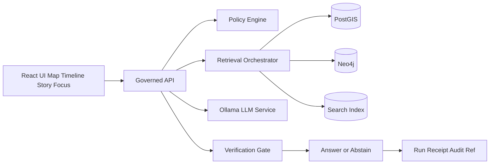

<!-- [KFM_META_BLOCK_V2]
doc_id: kfm://doc/7f5c1c61-0a2f-4a35-b72a-6a5e6e3b1d07
title: KFM Master Guide v13
type: standard
version: v13
status: draft
owners: ["@Kansas-Frontier-Matrix/core"]
created: 2026-03-04
updated: 2026-03-04
policy_label: restricted
related: ["README.md", "docs/", "data/"]
tags: ["kfm", "master-guide"]
notes: ["Default-deny; fail-closed. Verify repo paths before publishing externally."]
[/KFM_META_BLOCK_V2] -->

# KFM Master Guide v13
One canonical entrypoint for building, operating, and governing Kansas Frontier Matrix end-to-end (data → evidence → APIs → UI → Focus AI).

> **Status:** draft  
> **Owners:** `@Kansas-Frontier-Matrix/core` (update as needed)  
> **Policy:** **restricted** (needs governance review before public release)  
> **Last updated:** **2026-03-04**  


**Quick nav:**  
- [Evidence status legend](#evidence-status-legend)  
- [Scope](#scope) · [Where this fits](#where-this-fits) · [Inputs](#acceptable-inputs) · [Exclusions](#exclusions)  
- [Architecture](#architecture-at-a-glance) · [Data lifecycle](#data-lifecycle-and-promotion-gates) · [Focus Mode](#focus-mode-cite-or-abstain)  
- [Repo map](#repository-map) · [Quickstart](#quickstart) · [Workflows](#canonical-workflows)  
- [Gates](#promotion-gates-definition-of-done) · [FAQ](#faq) · [Appendix](#appendix)

---

## Evidence status legend

This guide uses three labels to enforce “cite-or-abstain”:

- **[CONFIRMED]** Verified by KFM’s written contracts/blueprints or by repo inspection (when explicitly stated).  
- **[PROPOSED]** Recommended design pattern or planned implementation; not yet verified as implemented.  
- **[UNKNOWN]** Not verified; includes minimal verification steps to convert to **[CONFIRMED]**.

> **Rule:** When you add new content, prefer **[UNKNOWN]** over guessing. Add the smallest verification steps.

[Back to top](#kfm-master-guide-v13)

---

## Scope

- **[CONFIRMED]** KFM is an evidence-first “living atlas” pattern: maps + timelines + stories + AI answers are traceable to immutable data and governed policy decisions.  
- **[CONFIRMED]** KFM’s non-negotiables include a trust membrane (UI cannot directly access databases), fail-closed policies, promotion gates, and Focus Mode “cite or abstain.”  
- **[PROPOSED]** This Master Guide is the canonical “table of contents + operating manual” for the repo and should be updated whenever interfaces, gates, or directory structure changes.  

[Back to top](#kfm-master-guide-v13)

---

## Where this fits

- **[PROPOSED]** Path: `docs/MASTER_GUIDE_v13.md` (this file).  
- **[PROPOSED]** Upstream: KFM blueprint/spec PDFs and governance charters.  
- **[PROPOSED]** Downstream: contributor docs, runbooks, ADRs, pipeline specs, validators, CI policy bundles.

**[UNKNOWN] Verification steps**
1. List repo root and confirm the actual `docs/` layout.  
2. Confirm whether this file should be symlinked/linked from root `README.md` and from `docs/README.md`.

[Back to top](#kfm-master-guide-v13)

---

## Acceptable inputs

- **[CONFIRMED]** Governance contracts and invariants (policy boundary, fail-closed, “cite or abstain”).  
- **[CONFIRMED]** Data lifecycle requirements, including promotion gates and required catalogs (DCAT/STAC/PROV) at publish boundaries.  
- **[PROPOSED]** Implementation runbooks, CI gate definitions, schema registries, connector specs, and examples that are deterministic and auditable.

[Back to top](#kfm-master-guide-v13)

---

## Exclusions

- **[CONFIRMED]** Any design that lets UI/clients bypass governed APIs to talk to storage/DB directly (this breaks the trust membrane).  
- **[CONFIRMED]** “Best-effort” governance (soft checks). KFM requires fail-closed gates for promotion and for user-visible answers.  
- **[PROPOSED]** Non-deterministic pipelines without receipts (no pinned inputs, no digests, no provenance).  
- **[CONFIRMED]** Sensitive or targeting-enabling data disclosures without explicit governance approval (default-deny).

[Back to top](#kfm-master-guide-v13)

---

## Architecture at a glance

### Layering and trust membrane

- **[CONFIRMED]** UI and external clients **never** access DB/storage directly; all access crosses the **governed API + policy boundary**.  
- **[CONFIRMED]** Policy is enforced fail-closed on **every** request (data, Story Nodes, AI).  
- **[CONFIRMED]** Focus Mode answers must **cite** admissible evidence or **abstain**, and each answer must emit an audit reference.

### Reference diagram


```mermaid
flowchart LR
  UI[React UI Map Timeline Story Focus] --> API[Governed API]
  API --> OPA[Policy Engine]
  API --> RET[Retrieval Orchestrator]
  RET --> PG[(PostGIS)]
  RET --> N4J[(Neo4j)]
  RET --> IDX[(Search Index)]
  API --> LLM[Ollama LLM Service]
  API --> V[Verification Gate]
  V --> OUT[Answer or Abstain]
  OUT --> AUD[Run Receipt Audit Ref]
```

- **[PROPOSED]** Keep the diagram in sync with real deploy topology (compose, k8s, local dev).  
- **[UNKNOWN] Verification steps**  
  1. Confirm the actual knowledge stores used in current implementation (PostGIS, Neo4j, search index types).  
  2. Confirm the actual policy engine integration (OPA as sidecar, middleware, or external service).  
  3. Confirm the Ollama call surface (REST client, SDK wrapper) and whether embeddings are served via Ollama.

[Back to top](#kfm-master-guide-v13)

---

## Data lifecycle and promotion gates

### Lifecycle zones

- **[CONFIRMED]** KFM requires a strict lifecycle with promotion gates (fail-closed).  
- **[CONFIRMED]** Promotion requires immutable artifacts and machine-readable catalogs: **DCAT + STAC + PROV**.  
- **[PROPOSED]** Standard lifecycle zones (recommended): **RAW → WORK → PROCESSED → PUBLISHED** (PUBLISHED is the externally-consumable boundary).

### Required artifacts by zone

| Zone | Intent | Mutable? | Required surfaces | Promotion gate highlights |
|---|---|---:|---|---|
| RAW | Ingested source snapshots | No | checksums, acquisition manifest, license, sensitivity | [CONFIRMED] no overwrite; record source + validators |
| WORK | Intermediate transforms | Yes (scoped) | run receipts, schema validation outputs | [CONFIRMED] fail on schema/quality thresholds |
| PROCESSED | Deterministic products | No | digests, receipts, provenance | [CONFIRMED] outputs must be reproducible from spec + inputs |
| PUBLISHED | User-facing datasets | No | DCAT + STAC + PROV, policy labels | [CONFIRMED] deny publish unless catalogs + receipts verify |

- **[UNKNOWN] Verification steps**
  1. Confirm directory names used in this repo (`data/raw`, `data/work`, etc.).  
  2. Confirm the exact catalog profiles (KFM-DCAT, KFM-STAC, KFM-PROV variants) and schema locations.

[Back to top](#kfm-master-guide-v13)

---

## Focus Mode cite or abstain

### Control loop contract

- **[CONFIRMED]** Focus Mode is an orchestrated pipeline: parse intent → retrieve admissible evidence → synthesize answer → verify citations → emit receipt/audit ref.  
- **[CONFIRMED]** If citation verification fails, the system must abstain or reduce scope (fail-closed).

### Evidence bundles

- **[PROPOSED]** Minimum “EvidenceBundle” fields:
  - `bundle_id` (stable)  
  - `inputs[]` (dataset IDs + versions + digests)  
  - `policy_decisions[]` (OPA decision refs)  
  - `citations[]` (machine-verifiable pointers to admissible sources)  
  - `verification` (pass/fail + reason codes)  
  - `audit_ref` (receipt pointer)

**[UNKNOWN] Verification steps**
1. Confirm whether EvidenceBundle is already defined in `docs/specs/` and whether there is a JSON Schema.  
2. Confirm the repository’s canonical citation format (line-level citations, page anchors, etc.).

[Back to top](#kfm-master-guide-v13)

---

## Governance and policy-as-code

### Default-deny and fail-closed

- **[CONFIRMED]** Default-deny is the baseline: if permissions/sensitivity are unclear, do not publish; require governance review.  
- **[CONFIRMED]** Promotion is blocked unless all required artifacts and validations exist and verify.

### Sensitivity and redaction

- **[PROPOSED]** Treat redaction as a first-class transform (not an afterthought).
- **[PROPOSED]** Sensitivity class should be an explicit field on every dataset + derivative.

**[UNKNOWN] Verification steps**
1. Confirm whether a sensitivity taxonomy exists in `docs/governance/` and is enforced by CI.  
2. Confirm whether redaction transformations have a schema and an attestable spec hash.

[Back to top](#kfm-master-guide-v13)

---

## Repository map

> This section is **normative** for new content, but may be **[UNKNOWN]** vs the repo’s current state. Treat it as the “target shape.”

### Proposed directory tree

```text
.
├─ docs/
│  ├─ MASTER_GUIDE_v13.md
│  ├─ governance/
│  ├─ architecture/
│  ├─ specs/
│  ├─ runbooks/
│  └─ reports/
├─ data/
│  ├─ registry/
│  ├─ raw/
│  ├─ work/
│  ├─ processed/
│  └─ published/
├─ policy/
├─ tools/
│  └─ validators/
├─ src/
│  ├─ pipelines/
│  ├─ api/
│  └─ ui/
└─ .github/
   └─ workflows/
```

- **[UNKNOWN] Verification steps**
  1. Compare this to `git ls-tree -r HEAD --name-only | sort`.  
  2. Update this tree to match reality; keep the “target” as a separate subsection if needed.

[Back to top](#kfm-master-guide-v13)

---

## Quickstart

### Reader quickstart

- **[PROPOSED]** Recommended reading order:
  1. Root `README.md` (system promise + invariants)  
  2. `docs/governance/` (default-deny, policy labels, review process)  
  3. `docs/specs/` (catalog profiles, IDs, schemas)  
  4. `docs/runbooks/` (local dev, deploy, ops)

**[UNKNOWN] Verification steps**
1. Confirm these paths exist and add links.

### Developer quickstart

```bash
# runnable: clone + basic inspection
git clone <REPO_URL>
cd <REPO_DIR>
git status
```

```bash
# pseudocode: validation gates (update paths/scripts for your repo)
# Validate catalogs
node tools/validators/validate_dcat.js data/published/<dataset>/dcat.json
node tools/validators/validate_stac.js data/published/<dataset>/stac/catalog.json

# Policy checks
conftest test policy/ -p policy/
```

```bash
# pseudocode: local stack
# docker compose up -d
# make test
# make lint
```

- **[CONFIRMED]** Anything labeled “pseudocode” must be replaced with repo-real commands before shipping.

[Back to top](#kfm-master-guide-v13)

---

## Canonical workflows

### Workflow A — Add a new dataset (RAW → PUBLISHED)

- **[CONFIRMED]** Never publish without catalogs + provenance + verification.  
- **[PROPOSED]** Steps:
  1. Define dataset identity + schema + extents + license + sensitivity.
  2. Add/verify connector definition (acquisition manifest).
  3. Run ingestion into RAW (immutable snapshot).
  4. Transform to WORK/PROCESSED deterministically.
  5. Produce catalogs: DCAT dataset + STAC items + PROV document.
  6. Run CI gates (schema, checksums, policy).
  7. Promote to PUBLISHED only if all gates pass.

**[UNKNOWN] Verification steps**
1. Confirm connector schema location (likely `data/registry/` or `docs/specs/`).  
2. Confirm catalog validators and exit codes.

---

### Workflow B — Produce a “tiny receipt” for every run

- **[PROPOSED]** Every pipeline run emits a one-line JSON receipt capturing:
  - dataset id + dataset version  
  - fetch time + source URL + HTTP validators (ETag/Last-Modified when available)  
  - spec hash (canonical JSON → SHA-256)  
  - orchestrator + run id + git SHA  
  - artifacts[] with immutable digests  
  - SPDX license id  
  - attestations[] (Cosign bundle digests)

```json
{"dataset_id":"ks:example:dataset","dataset_version":"2026-03-04T00:00:00Z","fetch_time":"2026-03-04T00:01:00Z","source_url":"https://example","http_validators":{"etag":"\"abc\"","last_modified":"Wed, 04 Mar 2026 00:00:00 GMT"},"spec_hash":"jcs:sha256:<digest>","run_id":"orchestrator:run:<id>","orchestrator":"dagster","transform_git_sha":"<sha>","artifacts":[{"path":"s3://kfm/...","digest":"sha256:<digest>"}],"rights_spdx":"CC-BY-4.0","attestations":[{"type":"cosign","bundle_digest":"sha256:<digest>"}]}
```

- **[CONFIRMED]** Receipts are gate-checkable inputs to OPA/Conftest policies (deny promotion unless present + valid).  
- **[UNKNOWN] Verification steps**
  1. Confirm whether receipt schema is defined (JSON Schema/CUE).  
  2. Confirm where receipts are stored (`provenance/receipts/...` vs `data/provenance/...`).

---

### Workflow C — Sign + attest non-container artifacts

- **[PROPOSED]** Treat geospatial artifacts (COG, GeoParquet, PMTiles) as supply-chain artifacts:
  - compute digest  
  - sign digest (identity)  
  - attach attestation (how/why/when)  
  - verify in CI (fail-closed)

**[UNKNOWN] Verification steps**
1. Confirm whether Cosign and Sigstore are already part of the toolchain.  
2. Confirm attestation predicate format (in-toto, SLSA provenance, JSON-LD PROV).

[Back to top](#kfm-master-guide-v13)

---

## Promotion gates definition of done

### Dataset promotion DoD checklist

- [ ] **[CONFIRMED]** Dataset identity is stable and deterministic (ID rules documented).  
- [ ] **[CONFIRMED]** Schema is defined; validation outputs exist and meet thresholds.  
- [ ] **[CONFIRMED]** License is recorded (SPDX id or equivalent) and policy-allowed.  
- [ ] **[CONFIRMED]** Sensitivity classification exists; redaction applied where required.  
- [ ] **[CONFIRMED]** Provenance exists (inputs, transforms, tool versions).  
- [ ] **[CONFIRMED]** Checksums/digests exist for every published artifact.  
- [ ] **[CONFIRMED]** DCAT + STAC + PROV are present and validate (fail-closed).  
- [ ] **[CONFIRMED]** Run receipt exists; references orchestrator + commit SHA + artifacts.  
- [ ] **[PROPOSED]** Cosign signatures/attestations verify (release lanes).  
- [ ] **[CONFIRMED]** UI serves only through governed APIs; no direct DB access.  

[Back to top](#kfm-master-guide-v13)

---

## Engineering baseline

### Change discipline

- **[CONFIRMED]** Prefer small, reversible, additive changes.  
- **[CONFIRMED]** Any change affecting behavior must update docs or justify why not.  
- **[CONFIRMED]** Encode invariants in CI/tests (fail-closed), not tribal memory.

### Security baseline

- **[CONFIRMED]** No secrets in repo; least-privilege tokens only.  
- **[PROPOSED]** Releases include dependency scanning + SBOM + vulnerability checks.  
- **[CONFIRMED]** Governed APIs require authN/authZ tests.

### Reliability baseline

- **[PROPOSED]** Define SLOs for critical APIs/pipelines; emit logs/metrics/traces.  
- **[PROPOSED]** Ops changes include rollback plan + runbook updates.

[Back to top](#kfm-master-guide-v13)

---

## FAQ

### Why “cite or abstain” instead of “best effort answers”?

- **[CONFIRMED]** KFM’s core promise is evidence-first outputs; unverifiable claims are treated as policy failures.

### Can the UI call the database if it’s “faster”?

- **[CONFIRMED]** No. That violates the trust membrane and breaks governance enforcement.

### What if a dataset is useful but licensing is unclear?

- **[CONFIRMED]** Default-deny. Record it as **[UNKNOWN]** and route for governance review before promotion.

[Back to top](#kfm-master-guide-v13)

---

## Appendix

<details>
<summary><strong>Appendix A — Minimal verification steps to “confirm” UNKNOWN items</strong></summary>

1. **Repo topology check**
   - Run: `git ls-tree -r HEAD --name-only | sort`
   - Update “Repository map” to match reality.

2. **Gate inventory**
   - List CI workflows: `.github/workflows/`
   - Confirm which checks are fail-closed and which are advisory.

3. **Catalog profiles**
   - Locate schema contracts for DCAT/STAC/PROV (JSON Schema/CUE).
   - Confirm validator entrypoints and exit codes.

4. **Policy boundary**
   - Locate API middleware enforcing policy (OPA).
   - Confirm clients cannot bypass it (integration tests).

</details>

<details>
<summary><strong>Appendix B — Template: “New dataset intake” mini-form</strong></summary>

- Dataset name:
- Proposed dataset_id:
- Owner/steward:
- Source URL(s):
- License (SPDX):
- Sensitivity class:
- Spatial extent:
- Temporal extent:
- Update cadence:
- Intended joins (keys):
- Validation thresholds:
- Output artifacts (formats):
- Catalog triplet paths (DCAT/STAC/PROV):

</details>
