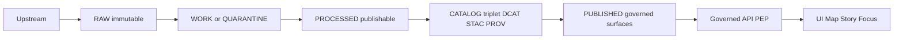
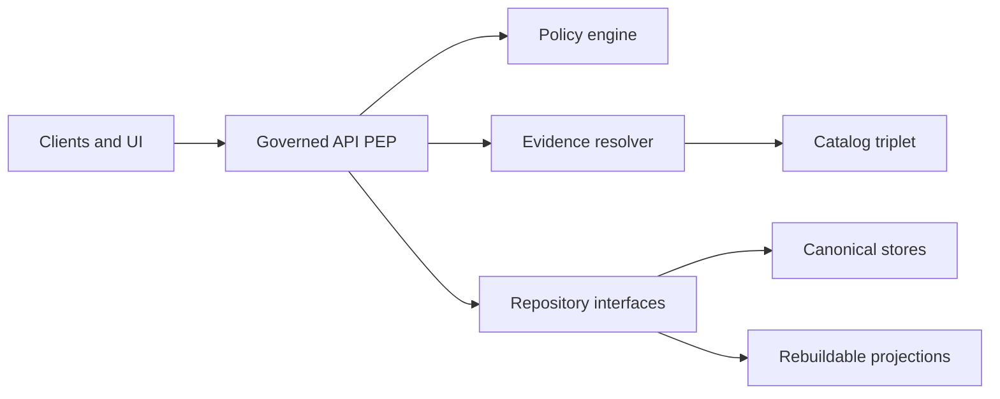
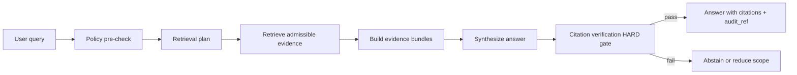

<!-- [KFM_META_BLOCK_V2]
doc_id: kfm://doc/7f5c1c61-0a2f-4a35-b72a-6a5e6e3b1d07
title: KFM Master Guide v13
type: standard
version: v13
status: draft
owners: ["@Kansas-Frontier-Matrix/core"]
created: 2026-03-04
updated: 2026-03-05
policy_label: restricted
related: ["README.md", "docs/", "data/"]
tags: ["kfm", "master-guide"]
notes: ["Default-deny; fail-closed. Treat implementation status as UNKNOWN until verified in the live repo."]
[/KFM_META_BLOCK_V2] -->

<a id="top"></a>

# KFM Master Guide v13
One canonical entrypoint for building, operating, and governing **Kansas Frontier Matrix (KFM)** end-to-end (**data → catalogs → evidence → governed APIs → UI → Focus Mode**).

> **Policy label:** **restricted**  
> This file is safe to share only after governance review and redaction of any sensitive operational details.

---

## IMPACT
- **Status:** draft
- **Owners:** `@Kansas-Frontier-Matrix/core` (adjust via `CODEOWNERS`)
- **Policy posture:** default-deny, fail-closed
- **What this guide is:** a **governance + architecture + operations index** with a strict anti-hallucination stance  
- **What this guide is not:** a claim that anything is already implemented unless explicitly verified


**Quick links:**  
[Evidence legend](#evidence-status-legend) · [Start here](#start-here) · [Non-negotiables](#kfm-non-negotiables) · [Truth path](#truth-path-and-trust-membrane) · [Promotion contract](#promotion-contract-and-gates) · [Focus Mode](#focus-mode-cite-or-abstain) · [Repo verification](#repo-reality-check) · [Workflows](#canonical-workflows) · [DoD](#promotion-definition-of-done) · [Appendix](#appendix)

---

## Evidence status legend
This guide uses three labels to enforce “cite-or-abstain” *even in documentation*:

- **[CONFIRMED]** Documented invariant/contract in KFM’s design + governance materials.
- **[PROPOSED]** Recommended pattern or “default” design choice; not guaranteed implemented.
- **[UNKNOWN]** Not verified in the current checkout; includes minimal verification steps.

> **Rule:** If you can’t ground it, mark it **[UNKNOWN]** and list the smallest verification steps.

[Back to top](#top)

---

## Start here
### Minimal orientation path
1) **This file** — read the non-negotiables and the anti-hallucination rules first.  
2) **Governance docs** — default-deny and sensitive handling. *(Path may be [UNKNOWN]; verify.)*  
3) **Architecture docs** — trust membrane + truth path + interface contracts. *(Path may be [UNKNOWN]; verify.)*  
4) **Quality/gates docs** — what blocks promotion, publishing, and merges. *(Path may be [UNKNOWN]; verify.)*

### Minimum verification steps before you change anything
Run these and paste outputs into your PR description (or attach as artifacts):

```bash
git rev-parse HEAD
command -v tree >/dev/null && tree -L 3 || true
find docs -maxdepth 2 -type f | sort | head -n 200
```

[Back to top](#top)

---

## KFM non-negotiables
These are the **design invariants**. Treat them as “must be true” in every spec, PR, and user-facing behavior.

- **[CONFIRMED] Trust membrane:** UI and external clients never access databases/object stores directly; all access flows through the governed API boundary.
- **[CONFIRMED] Fail-closed policy:** policy is evaluated on every request and any ambiguity blocks promotion/publishing/answers.
- **[CONFIRMED] Promotion gates:** dataset lifecycle promotion is gated; promotion requires checksums/digests and cross-linked **STAC + DCAT + PROV** catalogs.
- **[CONFIRMED] Focus Mode must cite or abstain:** every answer returns citations that resolve to evidence bundles, or abstains; every answer produces an audit reference.

[Back to top](#top)

---

## Hallucination and overreach discipline
This section exists to prevent “docs hallucinations” from becoming architecture.

- **[CONFIRMED]** Statements about **invariants and required gates** are safe when phrased as requirements.
- **[CONFIRMED]** Statements about **concrete tech choices, repo paths, or deployed systems** are unsafe unless directly evidenced; convert them to **[PROPOSED]** or **[UNKNOWN]** with verification steps.

**Practical rule of thumb**
- If you can test it in CI (or it’s in a published governance/architecture contract) → **[CONFIRMED]**.
- If it’s a “good default” but may change (e.g., database choice, exact API route names) → **[PROPOSED]**.
- If it depends on the current checkout or environment → **[UNKNOWN]** until you run checks.

[Back to top](#top)

---

## Scope
### What KFM is
- **[CONFIRMED]** KFM is a **governed knowledge system** where map/timeline/story and AI-assisted answers are backed by **resolvable evidence bundles** tied to specific dataset versions.
- **[CONFIRMED]** KFM is designed to be both:
  - **reproducible** (truth path + deterministic identity), and
  - **enforceable** (trust membrane + promotion contract + policy labels/obligations).

### What KFM is not
- **[CONFIRMED]** Not an “upload-and-forget portal.”
- **[CONFIRMED]** Not a UI that queries storage directly.
- **[CONFIRMED]** Not a best-effort chatbot.

[Back to top](#top)

---

## Truth path and trust membrane
### Truth path
**[CONFIRMED]** KFM’s lifecycle is a set of storage zones and validation gates that together create an auditable truth path.


```mermaid
flowchart LR
  Up[Upstream] --> RAW[RAW immutable]
  RAW --> WORK[WORK or QUARANTINE]
  WORK --> PROCESSED[PROCESSED publishable]
  PROCESSED --> CATALOG[CATALOG triplet DCAT STAC PROV]
  CATALOG --> PUB[PUBLISHED governed surfaces]

  PUB --> API[Governed API PEP]
  API --> UI[UI Map Story Focus]
```

### Trust membrane
**[CONFIRMED]** The governed API is the enforcement boundary (policy + evidence + versioning).


```mermaid
flowchart LR
  UI[Clients and UI] --> PEP[Governed API PEP]
  PEP --> PDP[Policy engine]
  PEP --> EV[Evidence resolver]
  EV --> CAT[Catalog triplet]
  PEP --> REPO[Repository interfaces]
  REPO --> CANON[Canonical stores]
  REPO --> PROJ[Rebuildable projections]
```

### Canonical vs rebuildable stores
- **[CONFIRMED]** Canonical: object storage + catalogs + provenance/receipts (source of truth).
- **[CONFIRMED]** Rebuildable: DB/search/graph/tiles (projections that can be regenerated from canonical truth).

[Back to top](#top)

---

## Promotion contract and gates
### Zones and intent
- **[CONFIRMED] RAW** — immutable acquisition (manifest, artifacts, checksums, license snapshot).
- **[CONFIRMED] WORK / QUARANTINE** — transforms + QA reports + candidate redactions; failures isolated.
- **[CONFIRMED] PROCESSED** — publishable standardized artifacts with stable IDs and checksums.
- **[CONFIRMED] CATALOG / Triplet** — cross-linked DCAT + STAC + PROV + run receipts.
- **[CONFIRMED] PUBLISHED** — governed runtime surfaces serve only promoted dataset versions.

### Minimum gates A–G
**[CONFIRMED]** Promotion to PUBLISHED is blocked unless gates are met (automatable and steward-reviewable).

| Gate | What must be present | Typical enforcement |
|---|---|---|
| A — Identity and versioning | deterministic `dataset_id`, `dataset_version_id`, `spec_hash`, content digests | schema + hashing golden tests; digest verification |
| B — Licensing and rights | license/rights fields + upstream terms snapshot | fail if license missing/unknown |
| C — Sensitivity and redaction | `policy_label` plus obligations (generalize geometry, remove fields) | OPA/Conftest fixture tests; redaction receipts |
| D — Catalog triplet validation | DCAT/STAC/PROV validate and cross-link; EvidenceRefs resolve | validators + linkcheck fail-closed |
| E — QA thresholds | dataset-specific checks and documented thresholds | QA report exists; quarantine on failure |
| F — Run receipt and audit | run receipt captures inputs, tool versions, hashes, policy decisions | receipt schema validation; append-only audit |
| G — Release manifest | promotion recorded as a release manifest referencing digests | manifest present; references match artifacts |

> **[PROPOSED]** If a gate cannot be fully automated, mark it as a **manual gate** and require explicit steward sign-off.

[Back to top](#top)

---

## Governed API contract
This guide treats the API boundary as a **policy enforcement point (PEP)**.

### Minimal endpoint families
- **[CONFIRMED]** Dataset discovery reads catalogs and is policy-filtered.
- **[CONFIRMED]** Evidence resolution is a first-class capability (EvidenceRef → EvidenceBundle).
- **[CONFIRMED]** Story publishing is governed and requires resolvable citations + review state.
- **[CONFIRMED]** Focus Mode is a governed run (receipt + citation verification hard gate).

**[PROPOSED] Illustrative endpoint set**
| Capability | Example endpoint | Notes |
|---|---|---|
| Dataset discovery | `GET /api/v1/datasets` | returns versions + policy-safe labels |
| STAC browsing/query | `GET /api/v1/stac/collections`, `GET /api/v1/stac/items` | policy filters before returning assets |
| Evidence resolution | `POST /api/v1/evidence/resolve` | fail-closed if unresolvable/unauthorized |
| Story read/publish | `GET/POST /api/v1/story` | publish gate requires review state + citations resolve |
| Focus Mode ask | `POST /api/v1/focus/ask` | returns citations or abstain + audit_ref |
| Lineage | `GET /api/v1/lineage/...` | may redact; links to receipts |

> **[PROPOSED]** Route names are not sacred. The **contract behavior** is sacred.

[Back to top](#top)

---

## Focus Mode cite-or-abstain
### Operating model
- **[CONFIRMED]** A Focus Mode request is treated as a governed run with a receipt.
- **[CONFIRMED]** Outputs include: answer text, citations (EvidenceRefs), and `audit_ref`.

### Control loop
**[CONFIRMED]** Recommended control loop (anti-hallucination by design):


```mermaid
flowchart LR
  Q[User query] --> P[Policy pre-check]
  P --> Plan[Retrieval plan]
  Plan --> R[Retrieve admissible evidence]
  R --> B[Build evidence bundles]
  B --> S[Synthesize answer]
  S --> V[Citation verification HARD gate]
  V -->|pass| Out[Answer with citations + audit_ref]
  V -->|fail| Abstain[Abstain or reduce scope]
```

### Evidence bundles
**[CONFIRMED]** In KFM, citations are not pasted URLs. A citation is an **EvidenceRef** that resolves (via the evidence resolver) into an **EvidenceBundle** containing metadata, artifacts, digests, and provenance sufficient to inspect/reproduce.

**[CONFIRMED] EvidenceBundle template shape (illustrative)**
```json
{
  "bundle_id": "sha256:bundle...",
  "dataset_version_id": "2026-02.abcd1234",
  "title": "Example record",
  "policy": {
    "decision": "allow",
    "policy_label": "public",
    "obligations_applied": []
  },
  "license": {"spdx": "CC-BY-4.0", "attribution": "Source org"},
  "provenance": {"run_id": "kfm://run/2026-02-20T12:00:00Z.abcd"},
  "artifacts": [
    {"href": "processed/events.parquet", "digest": "sha256:2222", "media_type": "application/x-parquet"}
  ],
  "checks": {"catalog_valid": true, "links_ok": true},
  "audit_ref": "kfm://audit/entry/123"
}
```

### Retrieval projections
- **[PROPOSED]** Focus Mode may query multiple projections (catalog search, text search, graph, spatial DB) *as long as results map back to EvidenceRefs that resolve to bundles*.
- **[CONFIRMED]** No “raw text from an index” is allowed as a citation without evidence linking.

### UX for abstention
- **[CONFIRMED]** Abstention is a feature; the UI must explain “why” in policy-safe terms, suggest safe alternatives, and include `audit_ref` for steward follow-up.
- **[CONFIRMED]** Never leak restricted existence via “ghost metadata” or error differences.

[Back to top](#top)

---

## Repo reality check
This guide must not hallucinate paths.

### Repo map is [UNKNOWN] until you verify
**[UNKNOWN]** Current repo structure in your checkout.  
Smallest verification steps:

```bash
git rev-parse HEAD
command -v tree >/dev/null && tree -L 2 || find . -maxdepth 2 -type d | sort
```

### Documented top-level inventory
**[PROPOSED]** A documented inventory (snapshot) expects these top-level directories:

- `apps/` — runnable services (API, UI, workers, CLI)
- `packages/` — shared libraries/modules (ingest, catalogs, evidence, policy)
- `contracts/` — OpenAPI + schemas + controlled vocab
- `policy/` — OPA/Rego policies, fixtures, tests
- `data/` — registry entries, examples, catalog artifacts, zone manifests
- `infra/` — deployment/ops
- `docs/` — architecture/runbooks/ADRs/templates
- `tools/` — validators, link checkers, CLIs
- `tests/` — unit/integration/e2e
- plus `configs/`, `scripts/`, `migrations/`, `examples/` as needed

> **[CONFIRMED]** Do not claim deeper module structure (e.g., `apps/api`) without verification.

[Back to top](#top)

---

## Quickstart
### Reader quickstart
- **[PROPOSED]** Read in this order (if present):
  1) Root `README.md`  
  2) `docs/` hub + governance docs  
  3) architecture + quality gates  
  4) runbooks (local stack, deploy, rollback)

### Developer quickstart
```bash
# runnable: clone + basic inspection
git clone <REPO_URL>
cd <REPO_DIR>
git status
```

```bash
# runnable: cheap “what exists” scans
find docs -maxdepth 3 -type f | sort | head -n 200
find policy -maxdepth 3 -type f 2>/dev/null | sort | head -n 200
find contracts -maxdepth 3 -type f 2>/dev/null | sort | head -n 200
```

```bash
# pseudocode: replace with real repo commands/targets once verified
make ci.test
make docs.lint
make linkcheck
conftest test policy/ -p policy/
```

[Back to top](#top)

---

## Canonical workflows
### Workflow A — Integrate a new data source
- **[CONFIRMED]** Never promote without receipts + catalogs + validation + policy decision record.

**[PROPOSED] Steps**
1) Define dataset identity + schema + extents + license + sensitivity label.  
2) Implement connector and register it in the data-source registry config.  
3) Acquire into RAW (immutable) with deterministic manifest + checksums.  
4) Normalize + validate in WORK/QUARANTINE; apply candidate redactions.  
5) Emit PROCESSED artifacts in approved formats with digests.  
6) Emit catalogs (DCAT always; STAC/PROV as applicable) and link-check clean.  
7) Run contract tests (API responses respect policy + provenance).  
8) Promote only if gates A–G pass.

### Workflow B — Story publishing
- **[CONFIRMED]** Publishing requires review state and resolvable citations; failures block publish.

**[PROPOSED] Steps**
1) Author Story Node with claims mapped to EvidenceRefs.  
2) Validate Story schema and citation resolvability.  
3) Apply policy review (sensitivity + obligations).  
4) Publish; emit audit record.

### Workflow C — Focus Mode request handling
- **[CONFIRMED]** Governed run: policy pre-check → retrieval → bundling → synthesis → verify → receipt.  
- **[CONFIRMED]** If citations cannot be verified, abstain or reduce scope.

[Back to top](#top)

---

## Promotion definition of done
Use this checklist for datasets, story publishing, and Focus Mode releases.

### Dataset promotion DoD
- [ ] **[CONFIRMED]** Gate A: deterministic IDs + digests + spec_hash
- [ ] **[CONFIRMED]** Gate B: licensing/rights metadata + upstream terms snapshot
- [ ] **[CONFIRMED]** Gate C: policy_label + redaction/generalization obligations (when required)
- [ ] **[CONFIRMED]** Gate D: DCAT/STAC/PROV validate and cross-link; EvidenceRefs resolve
- [ ] **[CONFIRMED]** Gate E: QA thresholds met; failures quarantined
- [ ] **[CONFIRMED]** Gate F: run receipt + audit record (append-only)
- [ ] **[PROPOSED]** Gate G: release manifest recorded and verified
- [ ] **[CONFIRMED]** Trust membrane enforced (no direct client access to stores)

### Story publishing DoD
- [ ] **[CONFIRMED]** review state recorded
- [ ] **[CONFIRMED]** every citation resolves to an EvidenceBundle and is policy-allowed
- [ ] **[CONFIRMED]** publish emits audit_ref and policy-safe provenance links

### Focus Mode DoD
- [ ] **[CONFIRMED]** citations are EvidenceRefs that resolve
- [ ] **[CONFIRMED]** citation verification is a hard gate
- [ ] **[CONFIRMED]** abstention is available and policy-safe UX is implemented
- [ ] **[PROPOSED]** evaluation harness exists and blocks regressions in CI

[Back to top](#top)

---

## Engineering baseline
### Change discipline
- **[CONFIRMED]** Prefer small, reversible, additive changes.
- **[CONFIRMED]** Encode invariants as CI/tests (fail-closed), not tribal memory.
- **[PROPOSED]** Require rollback paths for ops-significant changes.

### Security baseline
- **[CONFIRMED]** No secrets in repo; least-privilege tokens only.
- **[PROPOSED]** Releases include SBOM + dependency scanning + vuln checks.
- **[CONFIRMED]** Governed APIs require authN/authZ tests and must not leak restricted existence through errors.

### Reliability baseline
- **[PROPOSED]** Define SLOs for critical APIs/pipelines; emit structured logs/metrics/traces.
- **[PROPOSED]** Provide runbooks and verify backup/restore.

[Back to top](#top)

---

## FAQ
### Why “cite or abstain” instead of “best effort answers”?
- **[CONFIRMED]** KFM’s core promise is evidence-first outputs; unverifiable claims are treated as policy failures.

### Can the UI call the database if it’s “faster”?
- **[CONFIRMED]** No. That violates the trust membrane and breaks governance enforcement.

### What if a dataset is useful but licensing is unclear?
- **[CONFIRMED]** Default-deny. Record as **[UNKNOWN]** and route for governance review before promotion.

[Back to top](#top)

---

## Appendix
<details>
<summary><strong>Appendix A — Minimal verification steps for UNKNOWN items</strong></summary>

1) **Repo topology**
```bash
git rev-parse HEAD
tree -L 3 || find . -maxdepth 3 -type d | sort
```

2) **Gate inventory**
```bash
ls -la .github/workflows 2>/dev/null || true
rg -n "conftest|opa|linkcheck|markdownlint|schema" .github/workflows 2>/dev/null || true
```

3) **Catalog + EvidenceRef resolvability**
```bash
# pseudocode — replace with real validator tooling
# validate dcat.json, stac.json, prov.json; then test EvidenceRef resolution end-to-end
```

</details>

<details>
<summary><strong>Appendix B — New dataset intake mini-form</strong></summary>

- Dataset name:
- Proposed dataset_id:
- Owner/steward:
- Source URL(s):
- License (SPDX):
- Sensitivity/policy_label:
- Spatial extent:
- Temporal extent:
- Update cadence:
- Validation thresholds:
- Output artifacts (formats):
- Catalog triplet paths (DCAT/STAC/PROV):
- Redaction/generalization obligations (if any):

</details>

---

## Back to top
⬆️ <a href="#top">Back to top</a>
