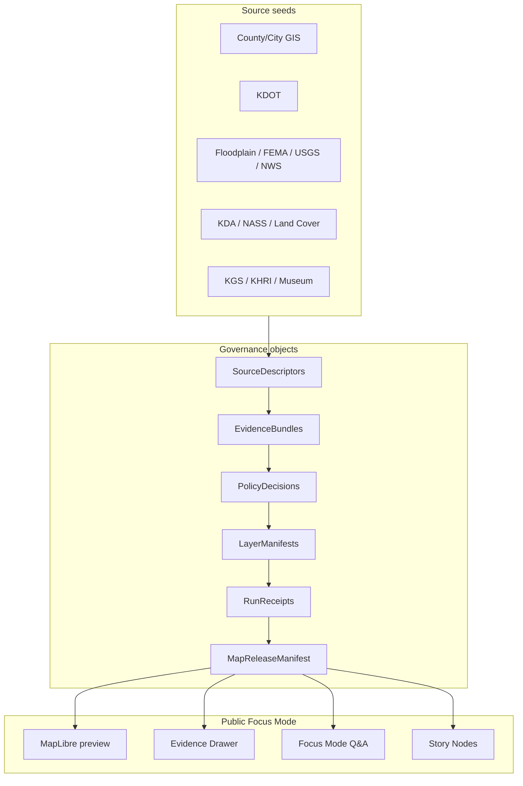

<a id="top"></a>
<!--
═══════════════════════════════════════════════════════════════════════════════
KFM META BLOCK v2
─────────────────────────────────────────────────────────────────────────────
title:            Master MapLibre Components-Functions-Features
subtitle:         Cumulative KFM MapLibre, Tile, Renderer, Style, UI,
                  Evidence Drawer, and Release Architecture Atlas
version:          v2.1 cumulative update (full markdown port + corpus-delta)
prior_version:    v2.0 (PDF, 2026-05-16, 611 pages)
update_date:      2026-05-22
format:           Markdown (full faithful port of PDF body + v2.1 delta wrapper)
                  Every section, every idea record (all 2,950 IDs), every
                  matrix, every nested baseline (v2.0 → v1.9 → v1.8 → v1.7 →
                  v1.6 → v1.5 → v1.4 → v1.3 retained) carried forward.
truth_posture:    CONFIRMED doctrine carry-forward; PROPOSED implementation
                  guidance; UNKNOWN repo/runtime depth except where pinned to
                  directory-rules.md v1.2 commit b6a279…; NEEDS VERIFICATION
                  for versions, endpoints, rights, hosting headers, tool
                  facts, and path placement below the live-pinned first level.
output_mode:      Markdown only.
spec_hash:        PROPOSED — emit via canonical JSON of frontmatter
policy_label:     NEEDS_VERIFICATION
owner:            PROPOSED — assign per Directory Rules §6/§7 review burden
rollback_target:  Master_MapLibre_Components-Functions-Features.pdf v2.0
                  (treat as SRC-MASTER-PREV for next iteration)
═══════════════════════════════════════════════════════════════════════════════
-->

# Master MapLibre Components-Functions-Features

**Cumulative KFM MapLibre, Tile, Renderer, Style, UI, Evidence Drawer, and Release Architecture Atlas**


> [!IMPORTANT]
> **MapLibre is a downstream renderer and interaction runtime.** Tiles, PMTiles, MVT, MLT, COGs, style JSON, sprites, glyphs, popups, screenshots, scenes, exports, summaries, graph projections, catalog records, and AI answers remain downstream carriers, not sovereign truth. This determination is **CONFIRMED doctrine** and carries forward unchanged from v1.0 through v2.1.

## v2.1 Update Summary

This is the **full markdown port** of the v2.0 PDF (611 pages, 2,950 cumulative idea records) plus a v2.1 corpus-delta layer pulling in new concepts from the project knowledge corpus.

**What's preserved verbatim from v2.0 PDF:**
- All 2,950 unique idea IDs (verified — see `coverage_check`)
- Cover, Executive Determination, Continuity & Delta, Source Ledger, Master Idea Index (v2.0 delta of 172 records + appendix-A baselines back to v1.3)
- Category Atlas, Detailed Category Chapters, Components-Functions-Features Matrix, Tile Strategy Chapter, Governance & Trust-Membrane Chapter, Implementation-Ready Object Map, Validation & Test Plan, Anti-Patterns Register, Open Questions & Verification Backlog, How-to-Continue notes, Final Self-Check
- The nested Appendix-A chain: v1.9 → v1.8 → v1.7 → v1.6 → v1.5 → v1.4 → v1.3 baselines, all preserved page-for-page

**What v2.1 adds (in §16 below, between the main body and Appendix A):**
- Directory Rules v1.2 reconciliation (`apps/explorer-web/` canonical shell; §6.7 Focus Modes placement contract; OPEN-DR-06)
- Pass 32 Atlas addenda (Sigstore keyless / SLSA / DSSE bundles, LiDAR lineage, NDVI / air-quality indicator gates, consent/reveal controls, SSURGO/gNATSGO yearly diffs)
- County Focus Mode Build Plan family (≥30 counties, status `draft`, dated 2026-05-21)
- DDD pattern application (Bounded Context, Context Map, Entities, Pluggable Component Framework)

**Format rules followed in the port:**
- **All 2,950 idea records** rendered as collapsible `<details>` cards regardless of source-PDF format. Three source-PDF record formats were parsed and unified:
  - **v2.0 colon-style** (ML-065-*, ML-066-*, ML-067- — 172 records): `Status:` / `Normalized statement:` / `Implementation consequence:` / `Validation consequence:` / `Risks / anti-patterns:` / `Related ideas:` fields preserved verbatim.
  - **v1.5-v1.9 tabular** (ML-056-* and the source-prefixed ML-057- through ML-064- families — ~890 records): column-aligned tables with idea_id / title / category / status / source / normalized statement (and in later baselines: implementation consequence + validation consequence) parsed via column slicing with whitespace-snapped boundaries.
  - **v1.4 vertical-card** (ML-056-001 through ML-056-034): Field/Value cards with Category / Status / Evidence / Normalized statement / Implementation consequence / Validation consequence rows.
  - **v1.3 category-section tabular** (ML-A-* through ML-Z-* — ~1,888 records, organized by category letter): 5-column tables (idea_id / idea title / status / source_ids / short normalized statement and consequences) parsed via column slicing with multi-column continuation-line handling.
- Cover-page metadata tables and other column-aligned matrices throughout the document are preserved as `text` code blocks (lossless).
- Page footers (one per page, ~611 total) and "Update page X of Y" markers have been removed; nothing else is.
- TOC blocks (8 total across nested baselines) have been removed; the markdown TOC below replaces them.
- Some column-boundary parsing artifacts exist in the v1.3 category-section format (e.g., source/statement column overlap on wide rows) — content is preserved but occasionally split across fields. ID, title, and status are reliable across all formats.

[↑ Back to top](#top)

---

## Top-Level Table of Contents

The full document spans v2.0 → v1.3 nested baselines. The principal anchor points:

**v2.1 wrapper (this document's added layer):**
- [v2.1 Update Summary](#v21-update-summary)
- [§16 — v2.1 Delta: New Work and Concepts](#16-v21-delta--new-work-and-concepts)
- [v2.1 Appendices](#v21-appendices)

**v2.0 body (the May 2026 cumulative update — full content below):**
- §2 Executive Determination
- §3 Continuity and Delta Since Last Run
- §4 Source Ledger
- §5 Master Idea Index — v2.0 Delta (172 records, full)
  - §5.1 SRC-065 — New Ideas 5-8-26 (45 records)
  - §5.2 SRC-066 — New Ideas 5-10-26 (68 records)
  - §5.3 SRC-067 — New Ideas 5-15-26 (59 records)
- §6–§8 Category Atlas / Detailed Chapters / Components-Functions-Features Matrix
- §9 Tile Strategy Chapter
- §10 Governance and Trust-Membrane Chapter
- §11 Implementation-Ready Object Map
- §12 Validation and Test Plan
- §13 Anti-Patterns Register
- §14 Open Questions and Verification Backlog
- §15 How to Continue This Master Next Run
- Final Self-Check

**Appendix A — v1.9 baseline** (the prior cumulative master, 2,778 prior idea IDs, full body):
- Contains its own §§1–15 + nested Appendix A (v1.8 baseline) → v1.7 → v1.6 → v1.5 → v1.4 → v1.3

> Each baseline appears in order of nesting. Use Ctrl-F / Cmd-F for ID lookup; every ID from ML-N-001 through ML-067-059 is present.

[↑ Back to top](#top)

---

## v2.1 Source Ledger (current-run additions only)

This ledger is a control surface for the v2.1 wrapper layer. The full v2.0 source ledger (SRC-RUN-PROMPT, SRC-MASTER-PREV-v2.0, SRC-065, SRC-066, SRC-067) appears in **§4** below. The v1.9 ledger (42 rows including SRC-064) appears in Appendix A's §4. And so on through the nesting.

| source_id | document | type | role in v2.1 wrapper |
|---|---|---|---|
| SRC-RUN-PROMPT-v2.1 | Current user prompt (2026-05-22) | Prompt | Demands full conversion to markdown (no abbreviation). |
| SRC-MASTER-PREV-v2.0 | `Master_MapLibre_Components-Functions-Features.pdf` v2.0 | Prior master PDF | Source for the full body below; line-for-line carrier. |
| SRC-CORPUS-DR | `directory-rules.md` v1.2 (commit-pinned b6a279…) | Doctrine + live-pinned topology | Authority for §16.1 (apps/explorer-web/, §6.7 Focus Mode placement, OPEN-DR-06). |
| SRC-CORPUS-RSGD | `kfm_repository_structure_guiding_document.md` | Topology guidance | Per-root README contracts; compatibility-root rules. |
| SRC-CORPUS-ATLAS | `KFM_Domains_v1_1_plus_Pass23_Pass32_Consolidated_Atlas` (Parts 1 & 2) | Domain atlas + Pass 32 addenda | §16.2 source: Sigstore keyless, SLSA/DSSE, LiDAR lineage, NDVI/air-quality, SSURGO/gNATSGO. |
| SRC-CORPUS-COUNTY | County Focus Mode Build Plans (≥30 counties, status `draft`, 2026-05-21) | Proof-slice planning | §16.3 source: the county proof-slice pattern. |
| SRC-CORPUS-DDD | `DomainDriven_Design_Reference.pdf` | DDD pattern reference | §16.4 source: Bounded Context, Context Map, Entities, Pluggable Component Framework. |
| SRC-CORPUS-ENC | KFM Encyclopedia, Unified Doctrine Synthesis, AI Build Operating Contract, Unified Implementation Architecture Build Manual, Connected Dots Architecture Brief, Full Atlas Seed Cards | KFM doctrine carriers | Cross-domain doctrine; referenced not re-extracted. |

[↑ Back to top](#top)

---

## v2.0 Body — Full Faithful Port

The following sections (§1 cover-metadata through §15 continuation rule, plus Final Self-Check and the nested Appendix A chain) are the full v2.0 PDF body. Page footers and TOC fragments have been removed. Every idea record, every matrix, every chapter heading, every open-questions list, every anti-patterns row is present.

```text
                               Master MapLibre
                        Components-Functions-Features.pdf
  Cumulative KFM MapLibre, Tile, Renderer, Style, UI, Evidence Drawer, and Release Architecture
                                             Atlas

Version                                        v2.0 cumulative update - ordinary +0.1 from v1.9; not a structural reorganization.

Run date                                       2026-05-16

Attached source count                          4 file inputs plus this prompt: prior master baseline and 3 new dated New Ideas PDFs.

Prior master PDF detected                      Yes - Master_MapLibre_Components-Functions-Features_compressed.pdf; 554 pages; sha256 prefix
                                               cd0b328a96123a75.

Output mode                                    PDF only. No ZIP, tarball, scaffold folder, repository patch, loose source tree, or extra deliverable.

Truth posture                                  CONFIRMED source scans and retained doctrine; PROPOSED implementation guidance; UNKNOWN
                                               repo/runtime depth; NEEDS VERIFICATION for versions, endpoints, rights, package/tool facts, hosting headers,
                                               and path placement.

Evidence limits                                No mounted KFM repository, tests, workflows, dashboards, logs, release manifests, or runtime traces were
                                               available in this run. External/current facts embedded in source PDFs were not independently revalidated.

Source ledger count                            5 current-run ledger rows: SRC-RUN-PROMPT, SRC-MASTER-PREV, SRC-065, SRC-066, SRC-067. Appendix
                                               A retains the prior v1.9 source ledger and idea baseline.

Idea count                                     2950 cumulative idea records: 2778 retained from v1.9 + 172 v2.0 delta records.

New discoveries count                          172 current-run delta records.

Expanded ideas count                           84 delta records explicitly expand prior categories.

Superseded ideas count                         0 - no attached evidence invalidated a prior idea.

Open verification items                        596 cumulative estimate: prior 505 + 91 new or sharpened verification items.


Core determination: MapLibre remains a downstream renderer and interaction runtime. Tiles, PMTiles, MVT, MLT, COGs, style
JSON, sprites, glyphs, popups, screenshots, scenes, exports, summaries, graph projections, catalog records, and AI answers
remain downstream carriers, not sovereign truth.
```


## 2. Executive Determination

```text
CONFIRMED from SRC-MASTER-PREV: the prior cumulative master is v1.9, preserves 2778 ideas, and treats MapLibre as a
disciplined 2D renderer and interaction runtime inside a governed KFM shell. It states that MapLibre is not the canonical truth store,
source registry, policy engine, citation authority, review authority, publication authority, or AI authority.
CONFIRMED from this run: the prior master baseline was detected and is appended page-for-page as Appendix A. Three new
source packets were analyzed as current-run delta sources: SRC-065 New Ideas 5-8-26, SRC-066 New Ideas 5-10-26, and
SRC-067 New Ideas 5-15-26.
Strongest SRC-065 additions: tile-health watchers for MAIAC/FIRMS/SMAP/AirNow/Mesonet, finite DecisionEnvelope and
RunReceipt discipline, runtime probes for MapLibre tile decode and heap stability, server-side raster fallback when vector runtime
gates fail, Bao/PMTiles proof slices, ecology timelines, GBIF summary layers, and render receipts for MapLibre/Cesium smoke
tests.
Strongest SRC-066 additions: PMTiles operational governance, freestiler/tipmtiles watch items, PMTiles Range/CDN hazards, no
in-place overwrites, versioned/partitioned archives, signed .pmtiles.attest.json sidecars, Bao outboard proofs, DSSE/cosign/Rekor
transparency checks, OCI/ORAS geospatial artifact distribution, MapLibre layer-registry stable identity, style performance discipline,
visual regression, and AIReceipt/Focus Mode linkage.
Strongest SRC-067 additions: CDL/PLANTS material-change watchers, sidecars, county histogram thresholds, source authenticity
gates, classmap ontology drift, geometry drift, air/soil watcher receipt patterns, public-safe ecology summary GeoJSON,
EvidenceBundle light schemas, OPA fail-closed policy, MapLibre smoke fixtures, sidecar/attestation hash matching, and
Range-verification-before-render pipelines.
PROPOSED synthesis: v2.0 should be treated as a source-watcher, material-change, PMTiles attestation, MapLibre runtime-proof,
OCI/Rekor transparency, public-safe ecology, and render-smoke expansion. It does not reorganize the prior master. It adds
current-run records and preserves all prior records.
UNKNOWN: actual repo topology, package manager, schema home, UI component homes, MapLibre GL JS target version, MLT
implementation status, freestiler/tipmtiles readiness, PMTiles tooling, PMTiles/COG hosting headers, browser/device performance,
mobile/native parity, plugin allowlist, source rights, policy enforcement, release workflow, and branch protection remain unverified.
NEEDS VERIFICATION: every package version, source endpoint, tool license, source URL, feed schema, hosted header, artifact
digest, classmap version, county boundary source, Mesonet consent, AirNow posture, Rekor transparency proof, MLT support
claim, local Focus Mode setting, and proposed file path before operational use.
Highest-risk anti-pattern: letting a watcher, sidecar, PMTiles archive, render smoke test, CDN URL, MapLibre layer, Cesium scene,
popup, or Focus Mode answer act as a public truth surface before EvidenceBundle, manifest, PolicyDecision, PromotionDecision,
citation validation, proof object, and rollback target exist.

                     Metric                                                     Value
Previous version                                v1.9 cumulative update
Current version                                 v2.0 cumulative update
Prior ideas carried forward                     2778
New v2.0 delta records                          172
Total cumulative idea count                     2950
Superseded ideas                                0
Open verification items                         596 estimate
```


## 3. Continuity and Delta Since Last Run

```text
SRC-MASTER-PREV is the prior v1.9 Master MapLibre Components-Functions-Features.pdf, supplied as
Master_MapLibre_Components-Functions-Features_compressed.pdf. It remains the cumulative memory baseline and is appended
page-for-page. It does not outrank original evidence. Current-run source evidence can refine, expand, conflict with, or supersede its
entries. No supersession occurred in this run.
                   Delta item                                                                        Result
Prior version detected                          v1.9, 554 pages, sha256 prefix cd0b328a96123a75
Version rule applied                            Ordinary +0.1 cumulative update. Numeric result v2.0; no fundamental structural reorganization.
New sources added                               SRC-065 New Ideas 5-8-26; SRC-066 New Ideas 5-10-26; SRC-067 New Ideas 5-15-26.
Ideas retained                                  All 2778 prior idea records preserved by appending SRC-MASTER-PREV unchanged.
New records                                     172 ML-065/066/067 delta records.
Merged / superseded                             0 merged, 0 superseded.
Conflicts discovered                            No direct source conflict. Main tension remains implementation maturity: new packets include repo-ready paths and
                                                code snippets, but no mounted repo/runtime proof was available.
Open questions carried forward                  Package versions, schema home, source rights, MLT status, mobile parity, hosting headers, sensitive geometry,
                                                release manifest home, CI workflow, accessibility and performance budgets.
New open questions                              freestiler/tipmtiles readiness; PMTiles Bao proof coverage; Rekor transparency posture; CDL classmap drift; county
                                                geometry drift; PLANTS sensitivity; MapLibre smoke fixtures; Range verification before render; render receipt
                                                policy; CDN cache invalidation.

    Prior idea range / cluster         Current status           Source that changed status                                     Note
All prior idea IDs through v1.9      RETAINED               SRC-MASTER-PREV                        No prior idea was deleted or superseded.
PMTiles / static delivery clusters   EXPANDED               SRC-066 pp.1-10, 27-60, 75-82          Adds Range/CDN hazards, Bao proofs, DSSE/cosign/Rekor,
                                                                                                   OCI/ORAS, sidecar schema, delta-base rules.
MapLibre runtime / render proof      EXPANDED               SRC-065 pp.27-40, 208-217;             Adds decode/heap/hash probes, headless smoke, render
clusters                                                    SRC-067 pp.40-46, 181-216              receipts, golden diffs, and verification-before-render.
Watcher / materiality clusters       EXPANDED               SRC-065 pp.1-4, 117-142; SRC-067       Adds tile health, CDL/PLANTS materiality,
                                                            pp.1-10, 120-142                       classmap/geometry drift, air/soil watchers, and source
                                                                                                   authenticity gates.
Focus Mode / Evidence Drawer         EXPANDED               SRC-065 pp.119-136; SRC-066            Adds artifact-level EvidenceRefs, EvidenceBundle policy
clusters                                                    pp.80, 300-310; SRC-067                report, model-prefilter context, and AIReceipt requirements.
                                                            pp.100,126-135
Sensitive geometry / rights clusters EXPANDED               SRC-065 pp.2-4, 127-136; SRC-067       Adds Mesonet written-consent fail-closed, AirNow
                                                            pp.6,135                               preliminary posture, PLANTS ids-only sidecars, sensitive
                                                                                                   taxa summaries.
```


## 4. Source Ledger

```text
This ledger is a control surface, not a bibliography. It states what each source can support and what it cannot prove. Current
external facts embedded in source PDFs remain source-supported but NEEDS VERIFICATION before operational package pins,
source activation, access decisions, or release claims.
   source_id        file / document title         type              status              role in this PDF               MapLibre / tile relevance           limitations
SRC-RUN-PR       Current user prompt        Prompt            CONFIRMED         Controls output shape, truth          High; instruction source for   Instruction source; not
OMPT                                                                            labels, cumulative memory rule,       renderer/tile governance.      implementation proof.
                                                                                PDF-only rule, source handling,
                                                                                and KFM invariants.
SRC-MASTER       Master_MapLibre_Compo Prior master           CONFIRMED /       Cumulative v1.9 baseline; 2778        Highest continuity source;     Does not outrank
-PREV            nents-Functions-Features_ PDF                RETAINED          prior ideas retained; appended        prior source ledger and        original evidence.
                 compressed.pdf                                                 page-for-page as Appendix A.          category atlas.
SRC-065          New Ideas 5-8-26.pdf       New Ideas         NEW               Adds tile health gates, runtime       Very high: MapLibre            Version-sensitive facts
                                            packet                              probes, PMTiles proof slices,         performance, PMTiles,          not revalidated; no repo
                                                                                ecology summaries, render             Range, tile health, render     proof.
                                                                                receipts, and source watcher          smoke.
                                                                                policies.
SRC-066          New Ideas 5-10-26.pdf      New Ideas         NEW               Adds PMTiles sidecars, Bao            Very high: PMTiles,            Tool/version/license
                                            packet                              proofs, DSSE/cosign/Rekor,            MapLibre, MVT/MLT, style       claims need current
                                                                                OCI/ORAS, MapLibre layer              JSON, proof objects, release   verification.
                                                                                registry, style/performance, visual   manifests.
                                                                                regression, and AIReceipt links.
SRC-067          New Ideas 5-15-26.pdf      New Ideas         NEW               Adds CDL/PLANTS materiality,          High: watchers,                Example
                                            packet                              sidecars, source authenticity,        PMTiles/COG, MapLibre          paths/endpoints are
                                                                                classmap/geometry drift,              smoke, Range verification,     PROPOSED and need
                                                                                public-safe ecology GeoJSON,          EvidenceBundle.                Directory Rules/repo
                                                                                OPA, and map smoke pipeline.                                         verification.


Note: the full retained v1.9 source ledger follows in Appendix A. The current run did not re-extract every prior source because the attached prior master is the
cumulative baseline and the new dated packets are the delta sources for v2.0.
```


## 5. Master Idea Index - v2.0 Delta

The full cumulative v1.9 idea index of 2778 prior ideas is retained in Appendix A via SRC-MASTER-PREV. The records below add
the v2.0 delta from SRC-065, SRC-066, and SRC-067. Each record includes stable idea_id, source, pages, category, status,
normalized statement, implementation consequence, validation consequence, and risk/anti-pattern. Implementation consequences
are PROPOSED unless future mounted-repo inspection verifies them.
Delta source counts: SRC-065=45; SRC-066=68; SRC-067=59. Change labels: NEW=88; EXPANDED=84.


### 5.1 SRC-065 - New Ideas 5-8-26

<details>
<summary><strong>ML-065-001 — Mapping feed status remains contextual</strong> · A. Renderer Boundary and KFM Trust Law<br>NEW / CONFIRMED source evidence / PROPOSED implementation. Source: SRC-065 p.1.</summary>

- **Normalized statement:** The packet reports stable status across biodiversity, EO, Mesonet/SCAN, VIIRS/MAIAC, Cesium and MapLibre release streams, but those status observations are contextual source evidence, not runtime proof.
- **Implementation consequence:** Represent source-health notes as watcher context and receipt metadata, not as publication authority.
- **Validation consequence:** Mark all status assertions NEEDS VERIFICATION before package pins, endpoint activation, or live SLA claims.
- **Risks / anti-patterns:** Status text can age quickly; do not freeze it into current operational truth.
- **Related ideas:** renderer boundary; manifests; policy gates

</details>

<details>
<summary><strong>ML-065-002 — MAIAC AOD tile-health gates</strong> · AA. Source Watchers, Material Change Gates, and Drift Summaries<br>NEW / CONFIRMED source evidence / PROPOSED implementation. Source: SRC-065 pp.1-4.</summary>

- **Normalized statement:** AOD thresholds are proposed for TILE_DEGRADED above 0.5 and TILE_QUARANTINE above 0.8.
- **Implementation consequence:** Expose smoke/air-quality tile state through governed layer metadata after policy review.
- **Validation consequence:** Test threshold persistence, source version, units, p10/p50/p90 metrics, and finite decision mapping.
- **Risks / anti-patterns:** Thresholds are policy decisions, not science absolutes.
- **Related ideas:** renderer boundary; manifests; policy gates

</details>

<details>
<summary><strong>ML-065-003 — FIRMS FRP proximity gates</strong> · AA. Source Watchers, Material Change Gates, and Drift Summaries<br>NEW / CONFIRMED source evidence / PROPOSED implementation. Source: SRC-065 pp.1-4.</summary>

- **Normalized statement:** FIRMS active-fire detections within 5 km of a tile centroid escalate tile state; FRP >= 10 MW quarantines as large-event candidate.
- **Implementation consequence:** Tile watchers should compute nearest fire distance and max FRP before publication decisions.
- **Validation consequence:** Fixture tests for FRP >0, FRP >=10, no nearby fire, stale FIRMS window, and missing source version.
- **Risks / anti-patterns:** KFM must not become an emergency alert system.
- **Related ideas:** renderer boundary; manifests; policy gates

</details>

<details>
<summary><strong>ML-065-004 — Independent-observation persistence window</strong> · P. Time-Aware Map Interaction and Timeline<br>NEW / CONFIRMED source evidence / PROPOSED implementation. Source: SRC-065 pp.2-4.</summary>

- **Normalized statement:** State changes should persist for at least two independent observations within a rolling 48-96 hour window.
- **Implementation consequence:** Add temporal hysteresis to tile health watchers to reduce churn.
- **Validation consequence:** Simulate single-breach, two-breach, stale-breach, and repeated no-change windows.
- **Risks / anti-patterns:** Single observations may be noisy or late.
- **Related ideas:** renderer boundary; manifests; policy gates

</details>

<details>
<summary><strong>ML-065-005 — Watcher events keyed to spec_hash or source head</strong> · AA. Source Watchers, Material Change Gates, and Drift Summaries<br>NEW / CONFIRMED source evidence / PROPOSED implementation. Source: SRC-065 pp.2-3.</summary>

- **Normalized statement:** Watcher events are emitted only when kfm:spec_hash, ETag, or Last-Modified changes.
- **Implementation consequence:** Treat HEAD and sidecar checks as source-admission controls before work records.
- **Validation consequence:** Test If-None-Match, missing ETag, changed Last-Modified, and unchanged content hash cases.
- **Risks / anti-patterns:** ETag churn can be metadata-only; materiality still matters.
- **Related ideas:** renderer boundary; manifests; policy gates

</details>

<details>
<summary><strong>ML-065-006 — DecisionEnvelope for ecology tile health</strong> · M. LayerManifest, StyleManifest, TileArtifactManifest, MapReleaseManifest<br>EXPANDED / CONFIRMED source evidence / PROPOSED implementation. Source: SRC-065 p.3.</summary>

- **Normalized statement:** The source gives a watcher_decision JSON envelope with object_type DecisionEnvelope, tile_id, inputs, policy, decision, reasons, and receipts.
- **Implementation consequence:** Use DecisionEnvelope as the public-safe finite decision carrier for tile health.
- **Validation consequence:** Schema test required fields, enum outcomes, policy id, reasons, and receipt linkage.
- **Risks / anti-patterns:** Free-form status strings weaken policy enforcement.
- **Related ideas:** renderer boundary; manifests; policy gates

</details>

<details>
<summary><strong>ML-065-007 — RunReceipt minimum contract</strong> · U. Testing, CI, Validation, Rollback, and Proof Objects<br>EXPANDED / CONFIRMED source evidence / PROPOSED implementation. Source: SRC-065 p.9.</summary>

- **Normalized statement:** RunReceipt records spec_hash, policy_id, source_head, license_text_or_contact, signer, and time.
- **Implementation consequence:** Every probe should emit a signed run receipt before promotion can proceed.
- **Validation consequence:** Validate spec_hash, source_head, license fields, signer, timestamp, and replay protection.
- **Risks / anti-patterns:** Missing receipts collapse provenance.
- **Related ideas:** renderer boundary; manifests; policy gates

</details>

<details>
<summary><strong>ML-065-008 — Finite outcomes separated from operational states</strong> · A. Renderer Boundary and KFM Trust Law<br>EXPANDED / CONFIRMED source evidence / PROPOSED implementation. Source: SRC-065 pp.5-7.</summary>

- **Normalized statement:** The source recommends only ANSWER, ABSTAIN, DENY, ERROR as finite decision outcomes while mapping NORMAL, DEGRADED, ESCALATE, QUARANTINE as operational states.
- **Implementation consequence:** Keep runtime response outcomes separate from layer health labels in APIs and UI.
- **Validation consequence:** Enum validation and policy tests should reject free-form outcomes.
- **Risks / anti-patterns:** Operational labels can be mistaken for evidence answers.
- **Related ideas:** renderer boundary; manifests; policy gates

</details>

<details>
<summary><strong>ML-065-009 — Observation layer and policy layer split</strong> · Q. Sensitive Geometry, Geoprivacy, Rights, and Policy<br>NEW / CONFIRMED source evidence / PROPOSED implementation. Source: SRC-065 pp.6-8.</summary>

- **Normalized statement:** Observation facts such as aod_p50 and nearest_fire_km are separated from policy rules that interpret them.
- **Implementation consequence:** Store factual observations separately from OPA/Rego or policy decision output.
- **Validation consequence:** Fixture tests verify identical facts can be re-evaluated under changed policy version.
- **Risks / anti-patterns:** Hard-coding policy into source adapters hides reviewability.
- **Related ideas:** renderer boundary; manifests; policy gates

</details>

<details>
<summary><strong>ML-065-010 — Mesonet rights fail-closed</strong> · Q. Sensitive Geometry, Geoprivacy, Rights, and Policy<br>EXPANDED / CONFIRMED source evidence / PROPOSED implementation. Source: SRC-065 pp.2-4.</summary>

- **Normalized statement:** Kansas Mesonet ingest is described as governed by usage policy and should fail closed without written consent.
- **Implementation consequence:** Layer manifests should carry rights and consent posture before public tile generation.
- **Validation consequence:** Deny publication if license_text_or_contact or written-consent reference is missing.
- **Risks / anti-patterns:** Publicly accessible data are not automatically publishable.
- **Related ideas:** renderer boundary; manifests; policy gates

</details>

<details>
<summary><strong>ML-065-011 — AirNow key-gated preliminary posture</strong> · Q. Sensitive Geometry, Geoprivacy, Rights, and Policy<br>NEW / CONFIRMED source evidence / PROPOSED implementation. Source: SRC-065 pp.2-4.</summary>

- **Normalized statement:** AirNow API requires an API key and should be marked PRELIMINARY in CI.
- **Implementation consequence:** Treat AirNow-derived layers as regulated/contextual until rights and source-role posture are resolved.
- **Validation consequence:** Tests for API-key absence, preliminary label, and no-public-promotion without authorization.
- **Risks / anti-patterns:** Regulatory data can be misrepresented if source role is unclear.
- **Related ideas:** renderer boundary; manifests; policy gates

</details>

<details>
<summary><strong>ML-065-012 — MapLibre tile decode budget</strong> · T. Performance, Caching, CDN, Range Requests, and Resource Timing<br>EXPANDED / CONFIRMED source evidence / PROPOSED implementation. Source: SRC-065 pp.27-31.</summary>

- **Normalized statement:** MapLibre tile decode latency is proposed at less than 50 ms median with 95th percentile close to the budget.
- **Implementation consequence:** Add device-class performance budgets to release candidates for vector tile layers.
- **Validation consequence:** Automated decode probes for representative low-end devices and heavy pan/zoom.
- **Risks / anti-patterns:** Performance failures can force incorrect simplification or stale UI.
- **Related ideas:** renderer boundary; manifests; policy gates

</details>

<details>
<summary><strong>ML-065-013 — Vector path heap-growth gate</strong> · T. Performance, Caching, CDN, Range Requests, and Resource Timing<br>EXPANDED / CONFIRMED source evidence / PROPOSED implementation. Source: SRC-065 pp.28-39.</summary>

- **Normalized statement:** If heap growth exceeds 10 MB/min over a 5-minute soak without stabilization, the vector path fails.
- **Implementation consequence:** Use heap soak tests before approving large vector-tile layers.
- **Validation consequence:** CI probes should run controlled pan/zoom churn and record stabilization metrics.
- **Risks / anti-patterns:** Memory leaks create long-session instability.
- **Related ideas:** renderer boundary; manifests; policy gates

</details>

<details>
<summary><strong>ML-065-014 — Server-side signed raster fallback</strong> · K. Raster, COG, DEM, Terrain, Hillshade<br>NEW / CONFIRMED source evidence / PROPOSED implementation. Source: SRC-065 pp.29-40.</summary>

- **Normalized statement:** When MapLibre vector verification fails for a device class, route the layer or story node to a server-side rasterization path.
- **Implementation consequence:** Maintain a fallback that is signed, receipt-bearing, and release-manifest controlled.
- **Validation consequence:** Validate token handshake, signature error rate, and raster path citation preservation.
- **Risks / anti-patterns:** Fallbacks can bypass trust if not manifest-bound.
- **Related ideas:** renderer boundary; manifests; policy gates

</details>

<details>
<summary><strong>ML-065-015 — MapLibre vector vs Cesium raster comparison</strong> · W. 3D / Cesium / Deck.gl / Overlay Interoperability<br>EXPANDED / CONFIRMED source evidence / PROPOSED implementation. Source: SRC-065 pp.29-40.</summary>

- **Normalized statement:** The source compares MapLibre vector tiles and Cesium/raster paths by verification burden, mobile stability, and governance complexity.
- **Implementation consequence:** Use 2D MapLibre by default and conditional 3D/raster fallback only where evidence burden justifies it.
- **Validation consequence:** Decision matrix tests should require reason, device class, and evidence context for 3D/raster use.
- **Risks / anti-patterns:** 3D or raster may hide provenance if treated as visualization only.
- **Related ideas:** renderer boundary; manifests; policy gates

</details>

<details>
<summary><strong>ML-065-016 — Resource timing metrics for tiles</strong> · T. Performance, Caching, CDN, Range Requests, and Resource Timing<br>NEW / CONFIRMED source evidence / PROPOSED implementation. Source: SRC-065 pp.31-34.</summary>

- **Normalized statement:** Fetch, decode, render, and total frame contribution should be instrumented for tile interactions.
- **Implementation consequence:** Record resource timing in render receipts and release checks.
- **Validation consequence:** Tests for missing timing, negative durations, high p95 latency, and frame drop thresholds.
- **Risks / anti-patterns:** Without timing, performance regressions are invisible.
- **Related ideas:** renderer boundary; manifests; policy gates

</details>

<details>
<summary><strong>ML-065-017 — Native heap soak probe</strong> · T. Performance, Caching, CDN, Range Requests, and Resource Timing<br>EXPANDED / CONFIRMED source evidence / PROPOSED implementation. Source: SRC-065 pp.32-36.</summary>

- **Normalized statement:** The packet describes a native heap growth soak probe to catch slow leaks and non-recovering tile churn.
- **Implementation consequence:** Mobile/native parity requires separate soak probes, not just web tests.
- **Validation consequence:** Run native soak fixture on approved device profiles.
- **Risks / anti-patterns:** Web success does not prove native stability.
- **Related ideas:** renderer boundary; manifests; policy gates

</details>

<details>
<summary><strong>ML-065-018 — Hash throughput probe</strong> · T. Performance, Caching, CDN, Range Requests, and Resource Timing<br>NEW / CONFIRMED source evidence / PROPOSED implementation. Source: SRC-065 pp.34-38.</summary>

- **Normalized statement:** Verification metrics include bytes_hashed, hash_ms, and throughput_mb_s.
- **Implementation consequence:** Client-side hash verification should be disabled or rerouted when device throughput is insufficient.
- **Validation consequence:** Performance gate for minimum verification throughput and max hash latency.
- **Risks / anti-patterns:** Heavy proof verification can harm UX and battery.
- **Related ideas:** renderer boundary; manifests; policy gates

</details>

<details>
<summary><strong>ML-065-019 — MapLibre probe harness layout</strong> · Y. Implementation Backlog and PR Plan<br>NEW / CONFIRMED source evidence / PROPOSED implementation. Source: SRC-065 pp.35-39.</summary>

- **Normalized statement:** The source proposes tools/probes/maplibre/decode_probe.ts, heap_probe.ts, and hash_probe.ts.
- **Implementation consequence:** Treat these as PROPOSED tools locations until Directory Rules and repo evidence verify placement.
- **Validation consequence:** Directory Rules check plus CI smoke tests for probe outputs.
- **Risks / anti-patterns:** Do not create parallel tools homes without ADR.
- **Related ideas:** renderer boundary; manifests; policy gates

</details>

<details>
<summary><strong>ML-065-020 — Runtime verification as publication prerequisite</strong> · U. Testing, CI, Validation, Rollback, and Proof Objects<br>EXPANDED / CONFIRMED source evidence / PROPOSED implementation. Source: SRC-065 pp.36-39.</summary>

- **Normalized statement:** Runtime probes must pass before public release; failure keeps the prior ReleaseManifest active.
- **Implementation consequence:** Tie renderer performance gates into PromotionDecision and rollback target.
- **Validation consequence:** Release gate tests for fail vector path, pass fallback, and active prior manifest retention.
- **Risks / anti-patterns:** Layer release without runtime proof can be unsafe.
- **Related ideas:** renderer boundary; manifests; policy gates

</details>

<details>
<summary><strong>ML-065-021 — Bao manifest for PMTiles range verification</strong> · I. PMTiles, MBTiles, Static Tiles, Serverless Delivery<br>EXPANDED / CONFIRMED source evidence / PROPOSED implementation. Source: SRC-065 pp.41-49.</summary>

- **Normalized statement:** The packet emits latest.pmtiles, latest.pmtiles.bao, and manifest.json containing root_hash, spec_hash, sizes, and proofs.
- **Implementation consequence:** Use PMTiles sidecars and Bao proof files as tile integrity carriers.
- **Validation consequence:** Range-proof validation for sampled z/x/y tiles and manifest schema.
- **Risks / anti-patterns:** Range proofs are proof objects, not source truth.
- **Related ideas:** renderer boundary; manifests; policy gates

</details>

<details>
<summary><strong>ML-065-022 — Activation run receipt for PMTiles</strong> · U. Testing, CI, Validation, Rollback, and Proof Objects<br>EXPANDED / CONFIRMED source evidence / PROPOSED implementation. Source: SRC-065 pp.42-46.</summary>

- **Normalized statement:** On activation, emit a run_receipt with spec_hash, root_hash, token_id, and verify_time_ms, optionally attested by Cosign.
- **Implementation consequence:** Require activation receipts before changing public tile URLs.
- **Validation consequence:** Test receipt presence, root hash match, token expiry, and attestation reference.
- **Risks / anti-patterns:** Activation without receipt weakens rollback.
- **Related ideas:** renderer boundary; manifests; policy gates

</details>

<details>
<summary><strong>ML-065-023 — Browser/mobile verification worker</strong> · B. MapLibre GL JS Web Shell<br>NEW / CONFIRMED source evidence / PROPOSED implementation. Source: SRC-065 pp.47-49.</summary>

- **Normalized statement:** A worker verifies chunks with Bao WASM and posts VERIFIED status.
- **Implementation consequence:** The UI may surface verified/unverified tile status without treating client verification as publication authority.
- **Validation consequence:** Worker fixtures for good proof, bad proof, missing proof, and timeout.
- **Risks / anti-patterns:** Client-only verification can create false confidence.
- **Related ideas:** renderer boundary; manifests; policy gates

</details>

<details>
<summary><strong>ML-065-024 — Invalid spec hash release gate</strong> · U. Testing, CI, Validation, Rollback, and Proof Objects<br>EXPANDED / CONFIRMED source evidence / PROPOSED implementation. Source: SRC-065 pp.48-49.</summary>

- **Normalized statement:** Gate additions include invalid_spec_hash to prevent manifest drift.
- **Implementation consequence:** Promotion gate rejects mismatched sidecar, manifest, and release spec_hash.
- **Validation consequence:** Negative fixtures for sidecar hash mismatch and stale manifest.
- **Risks / anti-patterns:** Spec drift can publish the wrong tile archive.
- **Related ideas:** renderer boundary; manifests; policy gates

</details>

<details>
<summary><strong>ML-065-025 — No direct validation fetch or publish</strong> · A. Renderer Boundary and KFM Trust Law<br>NEW / CONFIRMED source evidence / PROPOSED implementation. Source: SRC-065 p.20.</summary>

- **Normalized statement:** Validation should not fetch live authoritative data, mutate catalogs, publish records, or infer truth from AI outputs.
- **Implementation consequence:** Validators operate on declared evidence and lineage only.
- **Validation consequence:** Tests assert validators do not perform network calls or writes outside validation outputs.
- **Risks / anti-patterns:** Validator side effects break governance.
- **Related ideas:** renderer boundary; manifests; policy gates

</details>

<details>
<summary><strong>ML-065-026 — CDL materiality in map updates</strong> · AA. Source Watchers, Material Change Gates, and Drift Summaries<br>NEW / CONFIRMED source evidence / PROPOSED implementation. Source: SRC-065 pp.117-125.</summary>

- **Normalized statement:** Material CDL changes should emit PROPOSED only when class reclassification exceeds 2 percent of county area or absolute area delta exceeds 250 ha.
- **Implementation consequence:** Suppress map-layer rebuilds when the county map would not materially change.
- **Validation consequence:** Fixtures for relative hit, absolute hit, below-threshold no-op, and initial seed.
- **Risks / anti-patterns:** Noisy reruns can masquerade as new evidence.
- **Related ideas:** renderer boundary; manifests; policy gates

</details>

<details>
<summary><strong>ML-065-027 — CDL EvidenceBundle sample</strong> · N. Evidence Drawer Payloads and Click Resolution<br>EXPANDED / CONFIRMED source evidence / PROPOSED implementation. Source: SRC-065 pp.119-125.</summary>

- **Normalized statement:** The source shows an EvidenceBundle with bundle_id, domain, policy_label, rights_status, sensitivity, assets, and spec_hash for CDL.
- **Implementation consequence:** Resolved EvidenceBundle should support Evidence Drawer and Focus Mode after release.
- **Validation consequence:** EvidenceRef-to-EvidenceBundle resolution and missing asset tests.
- **Risks / anti-patterns:** A histogram or tile is not itself evidence closure.
- **Related ideas:** renderer boundary; manifests; policy gates

</details>

<details>
<summary><strong>ML-065-028 — Detection is not publication</strong> · A. Renderer Boundary and KFM Trust Law<br>EXPANDED / CONFIRMED source evidence / PROPOSED implementation. Source: SRC-065 pp.120-125.</summary>

- **Normalized statement:** The source states to keep the publication gate separate from detection; proposal is not public truth.
- **Implementation consequence:** Outbox records stay WORK/PROPOSED until review, policy, and release gates pass.
- **Validation consequence:** No public tile loads from PROPOSED records.
- **Risks / anti-patterns:** Treating detection as publication bypasses review.
- **Related ideas:** renderer boundary; manifests; policy gates

</details>

<details>
<summary><strong>ML-065-029 — Focus Mode ecology timeline payload</strong> · O. Focus Mode and Governed AI Map Context<br>EXPANDED / CONFIRMED source evidence / PROPOSED implementation. Source: SRC-065 pp.126-136.</summary>

- **Normalized statement:** Focus Mode can explain ecology timeline changes only after evidence precedes publication and source authority is preserved.
- **Implementation consequence:** MapContextEnvelope should carry released layer, time window, evidence refs, and policy posture.
- **Validation consequence:** Focus answer tests for cited answer, abstain on missing evidence, deny on sensitivity.
- **Risks / anti-patterns:** AI summaries based only on rendered features are unsafe.
- **Related ideas:** renderer boundary; manifests; policy gates

</details>

<details>
<summary><strong>ML-065-030 — GBIF weekly sweep receipt pattern</strong> · AA. Source Watchers, Material Change Gates, and Drift Summaries<br>NEW / CONFIRMED source evidence / PROPOSED implementation. Source: SRC-065 pp.127-136.</summary>

- **Normalized statement:** A weekly GBIF sweep can use lastInterpreted, county filters, evidence refs, and spec_hash to produce a receipt rather than truth.
- **Implementation consequence:** Use public-safe county summaries, not raw occurrence exposure.
- **Validation consequence:** Test sensitive taxa filters, new_taxa_pct threshold, occurrence deltas, and receipt reproducibility.
- **Risks / anti-patterns:** Occurrence data can expose sensitive species.
- **Related ideas:** renderer boundary; manifests; policy gates

</details>

<details>
<summary><strong>ML-065-031 — Public-safe summary GeoJSON</strong> · G. GeoJSON and Runtime Data<br>EXPANDED / CONFIRMED source evidence / PROPOSED implementation. Source: SRC-065 p.135.</summary>

- **Normalized statement:** Public-safe summary GeoJSON may show county-level new taxa metrics, not exact sensitive occurrences.
- **Implementation consequence:** MapLibre can render county summary metrics from released GeoJSON or tiles.
- **Validation consequence:** Validate geometry generalization, field schema, and no exact coordinates.
- **Risks / anti-patterns:** GeoJSON is a carrier, not proof.
- **Related ideas:** renderer boundary; manifests; policy gates

</details>

<details>
<summary><strong>ML-065-032 — SSURGO/AQS receipt and sidecar watchers</strong> · AA. Source Watchers, Material Change Gates, and Drift Summaries<br>NEW / CONFIRMED source evidence / PROPOSED implementation. Source: SRC-065 pp.137-142.</summary>

- **Normalized statement:** The packet generalizes sidecar, spec_hash, and RunReceipt patterns to soils and air baselines.
- **Implementation consequence:** Sidecar watchers can track soil and air data while preserving lifecycle gates.
- **Validation consequence:** Validate units, monitor IDs, AQI computation, source role, and EvidenceRef resolution.
- **Risks / anti-patterns:** Cross-domain watchers can create inconsistent policy labels.
- **Related ideas:** renderer boundary; manifests; policy gates

</details>

<details>
<summary><strong>ML-065-033 — Unresolved EvidenceRef denies promotion</strong> · N. Evidence Drawer Payloads and Click Resolution<br>EXPANDED / CONFIRMED source evidence / PROPOSED implementation. Source: SRC-065 p.142.</summary>

- **Normalized statement:** Invalid air or soil artifacts fail when EvidenceRef is unresolved or observation/regulatory distinction is absent.
- **Implementation consequence:** Evidence Drawer payloads require resolved evidence and knowledge-character labels.
- **Validation consequence:** Negative fixtures for unresolved evidence, missing units, invalid pollutant code.
- **Risks / anti-patterns:** Unresolved evidence can make derived maps look authoritative.
- **Related ideas:** renderer boundary; manifests; policy gates

</details>

<details>
<summary><strong>ML-065-034 — RenderReceipt schema for map engines</strong> · U. Testing, CI, Validation, Rollback, and Proof Objects<br>EXPANDED / CONFIRMED source evidence / PROPOSED implementation. Source: SRC-065 pp.208-214.</summary>

- **Normalized statement:** A RenderReceipt schema records engine enum values such as maplibre or cesium, policy_label, tile_error_rate, and latency metrics.
- **Implementation consequence:** Headless map smoke tests should emit render receipts tied to release candidates.
- **Validation consequence:** Schema validate engine, timestamp, policy label, latency p50/p95, and error rates.
- **Risks / anti-patterns:** Screenshots without receipts are weak proof objects.
- **Related ideas:** renderer boundary; manifests; policy gates

</details>

<details>
<summary><strong>ML-065-035 — Headless MapLibre smoke pipeline</strong> · B. MapLibre GL JS Web Shell<br>EXPANDED / CONFIRMED source evidence / PROPOSED implementation. Source: SRC-065 pp.213-216.</summary>

- **Normalized statement:** The packet includes a headless-render package and smoke scripts for governed render verification.
- **Implementation consequence:** Use headless MapLibre smoke tests for layer registry and style changes.
- **Validation consequence:** No-network smoke fixtures, screenshot capture, and manifest-bound metrics.
- **Risks / anti-patterns:** A passing render does not prove evidence admissibility.
- **Related ideas:** renderer boundary; manifests; policy gates

</details>

<details>
<summary><strong>ML-065-036 — Randomized PMTiles verifier</strong> · I. PMTiles, MBTiles, Static Tiles, Serverless Delivery<br>EXPANDED / CONFIRMED source evidence / PROPOSED implementation. Source: SRC-065 p.217.</summary>

- **Normalized statement:** A no-network proof slice can include randomized PMTiles verification and AJV schema validation.
- **Implementation consequence:** Test random tile samples against manifest and sidecar before release.
- **Validation consequence:** Repeatable RNG seed, sample count, and failing tile proof tests.
- **Risks / anti-patterns:** Random samples supplement but do not replace manifest completeness checks.
- **Related ideas:** renderer boundary; manifests; policy gates

</details>

<details>
<summary><strong>ML-065-037 — Compact source metadata sidecars</strong> · M. LayerManifest, StyleManifest, TileArtifactManifest, MapReleaseManifest<br>NEW / CONFIRMED source evidence / PROPOSED implementation. Source: SRC-065 pp.218-220.</summary>

- **Normalized statement:** The packet ends with a metadata sidecar pattern containing dataset_id, license, publisher, retrieved_at, and spec_hash.
- **Implementation consequence:** Every artifact source descriptor should carry rights and retrieval metadata.
- **Validation consequence:** Schema tests for license, publisher, retrieved_at, and canonical hash.
- **Risks / anti-patterns:** Incomplete sidecars can make provenance non-auditable.
- **Related ideas:** renderer boundary; manifests; policy gates

</details>

<details>
<summary><strong>ML-065-038 — SSURGO source does not become public raw path</strong> · Q. Sensitive Geometry, Geoprivacy, Rights, and Policy<br>NEW / CONFIRMED source evidence / PROPOSED implementation. Source: SRC-065 pp.137-142.</summary>

- **Normalized statement:** The source reiterates never serving RAW to public and publishing only derived views after policy gates and receipts.
- **Implementation consequence:** Soil/air tiles must be released derivatives behind governed interfaces.
- **Validation consequence:** No public raw path and no unreleased tile load tests.
- **Risks / anti-patterns:** Public raw paths violate KFM lifecycle law.
- **Related ideas:** renderer boundary; manifests; policy gates

</details>

<details>
<summary><strong>ML-065-039 — Render smoke is operational proof only</strong> · V. Exports, Screenshots, Reports, and Citation Preservation<br>NEW / CONFIRMED source evidence / PROPOSED implementation. Source: SRC-065 pp.208-217.</summary>

- **Normalized statement:** Render receipts and screenshots support operational consistency and public-safe readiness; they do not establish evidentiary truth.
- **Implementation consequence:** Exports and screenshots should carry citation and release metadata.
- **Validation consequence:** Test export citation preservation and screenshot manifest linkage.
- **Risks / anti-patterns:** Uncited screenshots can be mistaken for proof.
- **Related ideas:** renderer boundary; manifests; policy gates

</details>

<details>
<summary><strong>ML-065-040 — Environmental tile states need stale-state UI</strong> · S. Accessibility, UX, and Trust-Visible States<br>EXPANDED / CONFIRMED source evidence / PROPOSED implementation. Source: SRC-065 pp.1-4, pp.27-40.</summary>

- **Normalized statement:** Tile health probes and source status checks imply visible stale, degraded, quarantined, and error states in the UI.
- **Implementation consequence:** MapLibre layer catalog should show badge state and abstain/deny reasons.
- **Validation consequence:** Keyboard accessible badges and screen reader labels for tile states.
- **Risks / anti-patterns:** Hidden stale states erode trust.
- **Related ideas:** renderer boundary; manifests; policy gates

</details>

<details>
<summary><strong>ML-065-041 — Run receipts must include license or contact</strong> · Q. Sensitive Geometry, Geoprivacy, Rights, and Policy<br>NEW / CONFIRMED source evidence / PROPOSED implementation. Source: SRC-065 pp.3-4, p.9.</summary>

- **Normalized statement:** Probe receipts include license_text_or_contact, making source rights part of audit.
- **Implementation consequence:** Promotion denies when license/contact posture is absent.
- **Validation consequence:** Rights unknown block release fixture.
- **Risks / anti-patterns:** License omission can create public release risk.
- **Related ideas:** renderer boundary; manifests; policy gates

</details>

<details>
<summary><strong>ML-065-042 — Spec hash suppresses churn</strong> · AA. Source Watchers, Material Change Gates, and Drift Summaries<br>NEW / CONFIRMED source evidence / PROPOSED implementation. Source: SRC-065 pp.2-4, pp.117-125.</summary>

- **Normalized statement:** Spec hash is used across watchers to avoid churn from unchanged specifications or data summaries.
- **Implementation consequence:** Stable canonical hashing should be used before reprocessing and cache invalidation.
- **Validation consequence:** Canonicalization tests for key order and volatile fields.
- **Risks / anti-patterns:** Bad hashing can cause false no-op or false change.
- **Related ideas:** renderer boundary; manifests; policy gates

</details>

<details>
<summary><strong>ML-065-043 — Probes need rollback target</strong> · U. Testing, CI, Validation, Rollback, and Proof Objects<br>EXPANDED / CONFIRMED source evidence / PROPOSED implementation. Source: SRC-065 pp.33-37.</summary>

- **Normalized statement:** Failure actions keep the prior ReleaseManifest active.
- **Implementation consequence:** Each release candidate should identify its rollback target before performance tests.
- **Validation consequence:** Release test denies missing rollback_target.
- **Risks / anti-patterns:** No rollback target makes failures harder to recover.
- **Related ideas:** renderer boundary; manifests; policy gates

</details>

<details>
<summary><strong>ML-065-044 — Source status reports are not enough</strong> · X. Anti-Patterns and Failure Modes<br>NEW / CONFIRMED source evidence / PROPOSED implementation. Source: SRC-065 pp.1-4.</summary>

- **Normalized statement:** The packet begins with status reports but converts them into gated probes and receipts, not passive trust.
- **Implementation consequence:** Do not publish based solely on an external status page or newsletter.
- **Validation consequence:** Check that all status-derived map actions have a RunReceipt and PolicyDecision.
- **Risks / anti-patterns:** Operational status can be outdated or unrelated to artifact correctness.
- **Related ideas:** renderer boundary; manifests; policy gates

</details>

<details>
<summary><strong>ML-065-045 — MapLibre status remains version-sensitive</strong> · Z. Open Questions and Verification Backlog<br>NEW / CONFIRMED source evidence / PROPOSED implementation. Source: SRC-065 p.1.</summary>

- **Normalized statement:** The packet says MapLibre continues normal release activity, but no current package pin is verified in this run.
- **Implementation consequence:** Keep GL JS target version in open verification until official source and package lock are checked.
- **Validation consequence:** Version pin verification against package manager lock and official release page.
- **Risks / anti-patterns:** Package drift can break styles, wrappers, or PMTiles plugins.
- **Related ideas:** renderer boundary; manifests; policy gates

</details>


### 5.2 SRC-066 - New Ideas 5-10-26

<details>
<summary><strong>ML-066-001 — freestiler PMTiles tooling watch</strong> · R. Plugin, Wrapper, and Dependency Governance<br>EXPANDED / CONFIRMED source evidence / PROPOSED implementation. Source: SRC-066 p.1, p.54.</summary>

- **Normalized statement:** The packet flags freestiler as an April 2026 R/Python Rust-backed PMTiles producer for MVT/MLT spatial data.
- **Implementation consequence:** Track as candidate tiler in the tool registry, not a default pipeline dependency.
- **Validation consequence:** Verify current package, license, output conformance, MVT/MLT compatibility, and reproducibility.
- **Risks / anti-patterns:** New tooling is version-sensitive.
- **Related ideas:** renderer boundary; manifests; policy gates

</details>

<details>
<summary><strong>ML-066-002 — tipmtiles wrapper for auth and CORS</strong> · J. Martin and Server-Mediated Tile Serving<br>EXPANDED / CONFIRMED source evidence / PROPOSED implementation. Source: SRC-066 p.1.</summary>

- **Normalized statement:** tipmtiles is described as a small Python tile server wrapper around PMTiles for cases where clients do not handle PMTiles natively or auth/CORS is needed.
- **Implementation consequence:** Use server mediation when static PMTiles cannot satisfy auth, CORS, or native-client needs.
- **Validation consequence:** CORS, auth, Range, and no-public-raw tests for wrapper deployments.
- **Risks / anti-patterns:** Wrappers can accidentally expose unpublished archives.
- **Related ideas:** renderer boundary; manifests; policy gates

</details>

<details>
<summary><strong>ML-066-003 — PMTiles v3 reader convergence</strong> · R. Plugin, Wrapper, and Dependency Governance<br>NEW / CONFIRMED source evidence / PROPOSED implementation. Source: SRC-066 p.1.</summary>

- **Normalized statement:** Readers in Python/JS and adapters are described as converging around PMTiles v3.
- **Implementation consequence:** Treat PMTiles reader compatibility as a dependency matrix item.
- **Validation consequence:** Cross-client tests for MapLibre JS, native, and server wrappers.
- **Risks / anti-patterns:** Current version claims need official verification.
- **Related ideas:** renderer boundary; manifests; policy gates

</details>

<details>
<summary><strong>ML-066-004 — PMTiles as single-file Range archive</strong> · I. PMTiles, MBTiles, Static Tiles, Serverless Delivery<br>EXPANDED / CONFIRMED source evidence / PROPOSED implementation. Source: SRC-066 pp.1-3.</summary>

- **Normalized statement:** PMTiles is described as a single-file, HTTP Range optimized archive served remotely.
- **Implementation consequence:** Use PMTiles for stable public-safe bundles with Range-capable hosting and manifest checks.
- **Validation consequence:** Range header, CORS, ETag, cache, and byte range tests.
- **Risks / anti-patterns:** Serving without Range support breaks clients.
- **Related ideas:** renderer boundary; manifests; policy gates

</details>

<details>
<summary><strong>ML-066-005 — Range and cache quirks are production risks</strong> · T. Performance, Caching, CDN, Range Requests, and Resource Timing<br>EXPANDED / CONFIRMED source evidence / PROPOSED implementation. Source: SRC-066 p.1.</summary>

- **Normalized statement:** Browsers, CDNs, and MapLibre clients may misinterpret headers, make stale requests, or crash when files are swapped in place.
- **Implementation consequence:** Design cache invalidation and versioned URLs into MapReleaseManifest.
- **Validation consequence:** CDN integration tests for stale requests and swapped archive behavior.
- **Risks / anti-patterns:** In-place overwrites can crash clients or mix tile generations.
- **Related ideas:** renderer boundary; manifests; policy gates

</details>

<details>
<summary><strong>ML-066-006 — No native PMTiles atomic delta semantics</strong> · I. PMTiles, MBTiles, Static Tiles, Serverless Delivery<br>EXPANDED / CONFIRMED source evidence / PROPOSED implementation. Source: SRC-066 p.1.</summary>

- **Normalized statement:** The packet says PMTiles lacks native atomic in-place tile delta/patch semantics.
- **Implementation consequence:** Use versioned/partitioned files, delta manifests, or a lightweight server rather than in-place patches.
- **Validation consequence:** Patch requires delta_base_hash and release manifest references.
- **Risks / anti-patterns:** Assuming atomic deltas can corrupt release history.
- **Related ideas:** renderer boundary; manifests; policy gates

</details>

<details>
<summary><strong>ML-066-007 — Avoid in-place overwrites</strong> · X. Anti-Patterns and Failure Modes<br>EXPANDED / CONFIRMED source evidence / PROPOSED implementation. Source: SRC-066 p.1.</summary>

- **Normalized statement:** Practical guidance says to avoid in-place overwrites and use versioned filenames plus sidecars with root_hash/spec_hash.
- **Implementation consequence:** Publish immutable URLs or digest-pinned artifact refs.
- **Validation consequence:** Negative test for reused public URL without manifest version change.
- **Risks / anti-patterns:** Overwrites defeat rollback and cache coherence.
- **Related ideas:** renderer boundary; manifests; policy gates

</details>

<details>
<summary><strong>ML-066-008 — Partition large PMTiles datasets</strong> · I. PMTiles, MBTiles, Static Tiles, Serverless Delivery<br>EXPANDED / CONFIRMED source evidence / PROPOSED implementation. Source: SRC-066 p.1.</summary>

- **Normalized statement:** Large datasets should be partitioned by region or zoom so shards can be swapped atomically.
- **Implementation consequence:** TileArtifactManifest should list shard ids, ranges, and rollback groups.
- **Validation consequence:** Validate shard coverage, overlap, missing shard, and partial rollback.
- **Risks / anti-patterns:** Monolithic files make updates brittle.
- **Related ideas:** renderer boundary; manifests; policy gates

</details>

<details>
<summary><strong>ML-066-009 — MapLibre JS versus Native Range tests</strong> · C. MapLibre Native / Mobile / Platform Parity<br>EXPANDED / CONFIRMED source evidence / PROPOSED implementation. Source: SRC-066 p.1.</summary>

- **Normalized statement:** The packet states MapLibre JS and native clients should both be tested against CDN cache/Range behavior.
- **Implementation consequence:** Mobile/native parity is not assumed from web tests.
- **Validation consequence:** Cross-platform Range, cache, and proof verification tests.
- **Risks / anti-patterns:** Native clients may have different header/caching behavior.
- **Related ideas:** renderer boundary; manifests; policy gates

</details>

<details>
<summary><strong>ML-066-010 — Tool and license strings in build receipts</strong> · R. Plugin, Wrapper, and Dependency Governance<br>NEW / CONFIRMED source evidence / PROPOSED implementation. Source: SRC-066 p.1.</summary>

- **Normalized statement:** Build receipts should include exact tool and license strings for reproducibility and legal compliance.
- **Implementation consequence:** RunReceipt and TileArtifactManifest should include tiler version, flags, and license notices.
- **Validation consequence:** CI denies missing tool_version, flags, or license_notes.
- **Risks / anti-patterns:** License omissions create audit risk.
- **Related ideas:** renderer boundary; manifests; policy gates

</details>

<details>
<summary><strong>ML-066-011 — PMTiles sidecar schema</strong> · M. LayerManifest, StyleManifest, TileArtifactManifest, MapReleaseManifest<br>EXPANDED / CONFIRMED source evidence / PROPOSED implementation. Source: SRC-066 pp.2-6.</summary>

- **Normalized statement:** A .pmtiles.attest.json sidecar carries schema_version, pmtiles_filename, spec_hash, root_hash, size_bytes, delta, byte_ranges_manifest, and attestations.
- **Implementation consequence:** Define TileArtifactManifest or dedicated PMTilesSidecar schema for public tile artifacts.
- **Validation consequence:** JSON Schema validation for required fields and blake3 patterns.
- **Risks / anti-patterns:** Sidecar fields are proof metadata, not source truth.
- **Related ideas:** renderer boundary; manifests; policy gates

</details>

<details>
<summary><strong>ML-066-012 — PMTiles spec_hash target</strong> · M. LayerManifest, StyleManifest, TileArtifactManifest, MapReleaseManifest<br>NEW / CONFIRMED source evidence / PROPOSED implementation. Source: SRC-066 p.3.</summary>

- **Normalized statement:** spec_hash fixes the PMTiles version by hashing the exact spec string or tag.
- **Implementation consequence:** Tile manifests should record format version separately from content root hash.
- **Validation consequence:** Test that format version changes alter spec_hash even if content is unchanged.
- **Risks / anti-patterns:** Confusing format hash and content hash weakens reproducibility.
- **Related ideas:** renderer boundary; manifests; policy gates

</details>

<details>
<summary><strong>ML-066-013 — BLAKE3 root_hash for PMTiles</strong> · U. Testing, CI, Validation, Rollback, and Proof Objects<br>EXPANDED / CONFIRMED source evidence / PROPOSED implementation. Source: SRC-066 pp.2-3.</summary>

- **Normalized statement:** root_hash is the BLAKE3 hash of the full PMTiles file or Bao root.
- **Implementation consequence:** Use content root hash as integrity anchor and rollback reference.
- **Validation consequence:** Recompute hash and compare to sidecar before promotion.
- **Risks / anti-patterns:** Hash mismatch must deny publication.
- **Related ideas:** renderer boundary; manifests; policy gates

</details>

<details>
<summary><strong>ML-066-014 — Byte range manifest for tile proof</strong> · I. PMTiles, MBTiles, Static Tiles, Serverless Delivery<br>EXPANDED / CONFIRMED source evidence / PROPOSED implementation. Source: SRC-066 pp.2-6.</summary>

- **Normalized statement:** byte_ranges_manifest lists z/x/y, start, end, range_hash, and optional bao_proof_ref.
- **Implementation consequence:** Expose range verification data only after release and policy gates.
- **Validation consequence:** Schema tests for start/end ordering, range_hash, tile coordinates, and proof refs.
- **Risks / anti-patterns:** Incomplete manifests create unverifiable tiles.
- **Related ideas:** renderer boundary; manifests; policy gates

</details>

<details>
<summary><strong>ML-066-015 — Bao outboard proofs</strong> · U. Testing, CI, Validation, Rollback, and Proof Objects<br>EXPANDED / CONFIRMED source evidence / PROPOSED implementation. Source: SRC-066 p.3.</summary>

- **Normalized statement:** Generate an outboard Bao proof file alongside PMTiles so clients can verify tile byte ranges against root_hash.
- **Implementation consequence:** Store proofs adjacent or under a governed proofs path.
- **Validation consequence:** Good proof, tampered bytes, missing proof, and wrong root tests.
- **Risks / anti-patterns:** Proofs are optional client verification, not publication authority.
- **Related ideas:** renderer boundary; manifests; policy gates

</details>

<details>
<summary><strong>ML-066-016 — DSSE/cosign sidecar signing</strong> · U. Testing, CI, Validation, Rollback, and Proof Objects<br>EXPANDED / CONFIRMED source evidence / PROPOSED implementation. Source: SRC-066 pp.3-5.</summary>

- **Normalized statement:** The sidecar JSON is wrapped in DSSE and signed with cosign.
- **Implementation consequence:** Promotion receipts should reference attestation bundles and trusted keys.
- **Validation consequence:** Cosign verification, key trust, signature missing, and invalid signature tests.
- **Risks / anti-patterns:** Unsigned sidecars should fail closed.
- **Related ideas:** renderer boundary; manifests; policy gates

</details>

<details>
<summary><strong>ML-066-017 — Attestation reference in promotion receipt</strong> · U. Testing, CI, Validation, Rollback, and Proof Objects<br>NEW / CONFIRMED source evidence / PROPOSED implementation. Source: SRC-066 pp.3-5.</summary>

- **Normalized statement:** The packet says attestation_ref belongs in promotion/run_receipts so governance artifacts point to what was published.
- **Implementation consequence:** PromotionDecision should link exact PMTiles attestation bundle.
- **Validation consequence:** Test that release manifest and receipt have matching attestation_ref.
- **Risks / anti-patterns:** Unlinked attestations are hard to audit.
- **Related ideas:** renderer boundary; manifests; policy gates

</details>

<details>
<summary><strong>ML-066-018 — Client verification flow</strong> · B. MapLibre GL JS Web Shell<br>EXPANDED / CONFIRMED source evidence / PROPOSED implementation. Source: SRC-066 p.4.</summary>

- **Normalized statement:** Client pseudocode fetches sidecar, verifies DSSE, looks up byte range, fetches bytes/proof, runs Bao verify, then decodes tile.
- **Implementation consequence:** MapLibre shell can surface verification failures but must still rely on governed release gates.
- **Validation consequence:** Client tests for BAD_PROOF, unavailable sidecar, and timeout states.
- **Risks / anti-patterns:** Do not let client proof errors leak raw archive paths.
- **Related ideas:** renderer boundary; manifests; policy gates

</details>

<details>
<summary><strong>ML-066-019 — Delta patch base hash</strong> · I. PMTiles, MBTiles, Static Tiles, Serverless Delivery<br>EXPANDED / CONFIRMED source evidence / PROPOSED implementation. Source: SRC-066 pp.4-5.</summary>

- **Normalized statement:** Patch .pmtiles files require delta.is_patch and delta_base_hash referencing the base full file.
- **Implementation consequence:** Patch artifacts should be tied to base and target release manifests.
- **Validation consequence:** Deny patch without base hash or incompatible base release.
- **Risks / anti-patterns:** Patch confusion breaks rollback.
- **Related ideas:** renderer boundary; manifests; policy gates

</details>

<details>
<summary><strong>ML-066-020 — PMTiles sidecar as EvidenceBundle carrier</strong> · N. Evidence Drawer Payloads and Click Resolution<br>EXPANDED / CONFIRMED source evidence / PROPOSED implementation. Source: SRC-066 pp.4-5.</summary>

- **Normalized statement:** The source says the sidecar is an EvidenceBundle carrier for integrity and provenance metadata.
- **Implementation consequence:** Evidence Drawer can expose tile integrity evidence separate from data-source evidence.
- **Validation consequence:** EvidenceBundle resolution test for artifact integrity refs.
- **Risks / anti-patterns:** Tile proof does not prove domain claims.
- **Related ideas:** renderer boundary; manifests; policy gates

</details>

<details>
<summary><strong>ML-066-021 — PUBLISHED-only PMTiles exposure</strong> · A. Renderer Boundary and KFM Trust Law<br>EXPANDED / CONFIRMED source evidence / PROPOSED implementation. Source: SRC-066 p.5.</summary>

- **Normalized statement:** Only PUBLISHED state exposes .pmtiles, sidecar, and proofs through governed endpoints.
- **Implementation consequence:** Public map styles and TileJSON cannot point to WORK or PROPOSED archives.
- **Validation consequence:** No unreleased tile load and no public RAW/WORK path tests.
- **Risks / anti-patterns:** Public candidate tiles bypass review.
- **Related ideas:** renderer boundary; manifests; policy gates

</details>

<details>
<summary><strong>ML-066-022 — Fail-closed PMTiles validators</strong> · U. Testing, CI, Validation, Rollback, and Proof Objects<br>EXPANDED / CONFIRMED source evidence / PROPOSED implementation. Source: SRC-066 p.5.</summary>

- **Normalized statement:** Validators fail closed when root_hash/spec_hash is missing, patch lacks base hash, signature/key chain fails, or sensitive layers lack approved posture.
- **Implementation consequence:** Add publication gate for tile sidecar validity and sensitivity posture.
- **Validation consequence:** Negative fixtures for each fail-closed condition.
- **Risks / anti-patterns:** Partial validation can let unsafe artifacts publish.
- **Related ideas:** renderer boundary; manifests; policy gates

</details>

<details>
<summary><strong>ML-066-023 — PMTiles attestation tool slice</strong> · Y. Implementation Backlog and PR Plan<br>NEW / CONFIRMED source evidence / PROPOSED implementation. Source: SRC-066 pp.5-10.</summary>

- **Normalized statement:** The packet proposes tools/attest/pmtiles_sidecar.py, generate_bao.sh, schema, validator, and pmtiles-attestation CI workflow.
- **Implementation consequence:** Treat paths as PROPOSED; validate against Directory Rules before creating.
- **Validation consequence:** Directory home check and CI smoke for helper outputs.
- **Risks / anti-patterns:** Creating tool folders without owner/ADR can cause drift.
- **Related ideas:** renderer boundary; manifests; policy gates

</details>

<details>
<summary><strong>ML-066-024 — Attestation utility constraints</strong> · A. Renderer Boundary and KFM Trust Law<br>NEW / CONFIRMED source evidence / PROPOSED implementation. Source: SRC-066 pp.7-8.</summary>

- **Normalized statement:** Attestation utilities have constraints: no secrets, no policy decisions, no direct publication, no canonical truth mutation, fail closed on missing hashes/proofs.
- **Implementation consequence:** Keep tools/attest subordinate to promotion/policy systems.
- **Validation consequence:** Static analysis or tests to reject secret fields and direct publish calls.
- **Risks / anti-patterns:** Attestation tools can be mistaken for release authority.
- **Related ideas:** renderer boundary; manifests; policy gates

</details>

<details>
<summary><strong>ML-066-025 — ValidationReport artifact</strong> · U. Testing, CI, Validation, Rollback, and Proof Objects<br>NEW / CONFIRMED source evidence / PROPOSED implementation. Source: SRC-066 pp.7-10.</summary>

- **Normalized statement:** ValidationReport is listed as a fail-closed output alongside .pmtiles.attest.json, .bao, and .sig.
- **Implementation consequence:** Require validator outputs to be stored as proof objects or receipts.
- **Validation consequence:** Tests assert ValidationReport contains input digest, outcome, errors, and timestamp.
- **Risks / anti-patterns:** Silent validation passes are not auditable.
- **Related ideas:** renderer boundary; manifests; policy gates

</details>

<details>
<summary><strong>ML-066-026 — MapLibre layer registry stable identity</strong> · M. LayerManifest, StyleManifest, TileArtifactManifest, MapReleaseManifest<br>EXPANDED / CONFIRMED source evidence / PROPOSED implementation. Source: SRC-066 pp.15-20.</summary>

- **Normalized statement:** The packet describes a maplibre-layer-registry component with evidence_refs, canonical hash, merge state machine, and superseded records.
- **Implementation consequence:** Layer registry records should use stable ids and canonical hashes; modified records supersede older active records.
- **Validation consequence:** Hash and alias tests for unchanged, modified, added, and superseded records.
- **Risks / anti-patterns:** Silent registry edits create style drift.
- **Related ideas:** renderer boundary; manifests; policy gates

</details>

<details>
<summary><strong>ML-066-027 — Supersession without deletion</strong> · U. Testing, CI, Validation, Rollback, and Proof Objects<br>EXPANDED / CONFIRMED source evidence / PROPOSED implementation. Source: SRC-066 p.20.</summary>

- **Normalized statement:** Old active records are marked status=superseded and link to superseded_by.
- **Implementation consequence:** Prior idea and layer ids remain as aliases when merged.
- **Validation consequence:** Test superseded records remain queryable and not public-active.
- **Risks / anti-patterns:** Deleting old records hides rollback lineage.
- **Related ideas:** renderer boundary; manifests; policy gates

</details>

<details>
<summary><strong>ML-066-028 — OCI/ORAS geospatial artifact distribution</strong> · I. PMTiles, MBTiles, Static Tiles, Serverless Delivery<br>EXPANDED / CONFIRMED source evidence / PROPOSED implementation. Source: SRC-066 pp.27-40, pp.53-60.</summary>

- **Normalized statement:** The packet uses ORAS/OCI with digest and referrers to distribute sidecars, PMTiles, and other geospatial artifacts.
- **Implementation consequence:** MapReleaseManifest may carry digest-pinned OCI references plus CDN URLs.
- **Validation consequence:** ORAS pull, digest match, mediaType, referrer, and cosign verification tests.
- **Risks / anti-patterns:** Tags are mutable; digests are the safe release reference.
- **Related ideas:** renderer boundary; manifests; policy gates

</details>

<details>
<summary><strong>ML-066-029 — Cosign/Rekor transparency requirement</strong> · U. Testing, CI, Validation, Rollback, and Proof Objects<br>EXPANDED / CONFIRMED source evidence / PROPOSED implementation. Source: SRC-066 pp.27-42, pp.94-100.</summary>

- **Normalized statement:** The packet elevates Rekor/transparency proof and verified predicates as publication prerequisites.
- **Implementation consequence:** Release gate should deny if transparency proof or verified predicate is absent where required.
- **Validation consequence:** Tests for Rekor mismatch, missing bundle, malformed predicate, and certificate chain failure.
- **Risks / anti-patterns:** Transparency bypass can silently destroy audit trust.
- **Related ideas:** renderer boundary; manifests; policy gates

</details>

<details>
<summary><strong>ML-066-030 — Canonical hash strategy by artifact type</strong> · U. Testing, CI, Validation, Rollback, and Proof Objects<br>EXPANDED / CONFIRMED source evidence / PROPOSED implementation. Source: SRC-066 p.60.</summary>

- **Normalized statement:** The packet recommends SHA256(JCS) for JSON, BLAKE3 for PMTiles roots and byte ranges, SHA256 for OCI manifests, and SHA256 for ProofPack bundles.
- **Implementation consequence:** Define hash algorithm per object family instead of one universal hash rule.
- **Validation consequence:** Validator checks expected algorithm by media type and artifact role.
- **Risks / anti-patterns:** Algorithm confusion weakens verification.
- **Related ideas:** renderer boundary; manifests; policy gates

</details>

<details>
<summary><strong>ML-066-031 — EvidenceRef with PMTiles byte range</strong> · N. Evidence Drawer Payloads and Click Resolution<br>EXPANDED / CONFIRMED source evidence / PROPOSED implementation. Source: SRC-066 p.80.</summary>

- **Normalized statement:** A minimal EvidenceRef can point to an oras URI, digest, media_type application/vnd.pmtiles, byte_range, and role derived.
- **Implementation consequence:** Evidence Drawer can resolve artifact-level evidence for a selected tile or range.
- **Validation consequence:** EvidenceRef schema test for URI, digest, media_type, byte_range, and role.
- **Risks / anti-patterns:** Byte-range evidence should not stand in for domain evidence.
- **Related ideas:** renderer boundary; manifests; policy gates

</details>

<details>
<summary><strong>ML-066-032 — RunReceipt canonical attestation guarantees</strong> · U. Testing, CI, Validation, Rollback, and Proof Objects<br>EXPANDED / CONFIRMED source evidence / PROPOSED implementation. Source: SRC-066 p.80.</summary>

- **Normalized statement:** RunReceipt guarantees include integrity, authenticity, replay protection, and reproducibility.
- **Implementation consequence:** Run receipts should include timestamp, build id, input digests, and signatures.
- **Validation consequence:** Replay protection and duplicate run tests.
- **Risks / anti-patterns:** Receipts without reproducibility are weak audit artifacts.
- **Related ideas:** renderer boundary; manifests; policy gates

</details>

<details>
<summary><strong>ML-066-033 — NO TRANSPARENCY PROOF equals NOT PUBLISHED</strong> · X. Anti-Patterns and Failure Modes<br>NEW / CONFIRMED source evidence / PROPOSED implementation. Source: SRC-066 p.100.</summary>

- **Normalized statement:** The packet recommends default posture: no transparency proof equals not published; no verified predicate equals not admissible.
- **Implementation consequence:** Apply fail-closed policy to artifact attestations before release.
- **Validation consequence:** Policy tests for missing Rekor transparency proof and unverified predicate.
- **Risks / anti-patterns:** A signed but non-transparent artifact may still be untrustworthy.
- **Related ideas:** renderer boundary; manifests; policy gates

</details>

<details>
<summary><strong>ML-066-034 — MapLibre style invariant layout optimization</strong> · E. Style Specification, Sources, Layers, Expressions<br>EXPANDED / CONFIRMED source evidence / PROPOSED implementation. Source: SRC-066 pp.119-122.</summary>

- **Normalized statement:** Stable styling such as visibility, symbol settings, caps, and overlap rules should be in layout; paint expressions should remain light.
- **Implementation consequence:** Style JSON generators should separate invariant layout from dynamic paint.
- **Validation consequence:** Style lint for layout/paint expression complexity and feature-state churn.
- **Risks / anti-patterns:** Heavy style expressions can degrade performance.
- **Related ideas:** renderer boundary; manifests; policy gates

</details>

<details>
<summary><strong>ML-066-035 — Feature-state churn should be rare</strong> · E. Style Specification, Sources, Layers, Expressions<br>NEW / CONFIRMED source evidence / PROPOSED implementation. Source: SRC-066 pp.119-122.</summary>

- **Normalized statement:** The packet warns to avoid frequent feature-state churn unless per-feature interactivity is needed.
- **Implementation consequence:** Use feature-state only for focused selection or short-lived UI state.
- **Validation consequence:** Interaction tests for feature-state updates and performance budget.
- **Risks / anti-patterns:** Feature-state can become hidden mutable data.
- **Related ideas:** renderer boundary; manifests; policy gates

</details>

<details>
<summary><strong>ML-066-036 — Glyph and sprite hosting checks</strong> · F. Sprites, Glyphs, Fonts, Design Tokens<br>EXPANDED / CONFIRMED source evidence / PROPOSED implementation. Source: SRC-066 pp.123, p.130.</summary>

- **Normalized statement:** Glyph and sprite references appear in MapLibre style guidance and require hosting and hash checks.
- **Implementation consequence:** StyleManifest should record glyph and sprite artifact refs, digests, and cache posture.
- **Validation consequence:** Validate glyph URL, sprite URL, CORS, hash, and version.
- **Risks / anti-patterns:** Missing fonts/glyphs can silently break labels.
- **Related ideas:** renderer boundary; manifests; policy gates

</details>

<details>
<summary><strong>ML-066-037 — MapLibre performance artifact hash verifier</strong> · U. Testing, CI, Validation, Rollback, and Proof Objects<br>NEW / CONFIRMED source evidence / PROPOSED implementation. Source: SRC-066 pp.150-200.</summary>

- **Normalized statement:** The source provides validators for performance artifact hashes and tests for duplicate run receipt roles.
- **Implementation consequence:** Render/probe manifests should include artifact hashes and unique roles.
- **Validation consequence:** Negative fixture for duplicate run-receipt role and hash mismatch.
- **Risks / anti-patterns:** Performance results without hash pinning can be swapped.
- **Related ideas:** renderer boundary; manifests; policy gates

</details>

<details>
<summary><strong>ML-066-038 — Visual regression as release proof</strong> · U. Testing, CI, Validation, Rollback, and Proof Objects<br>EXPANDED / CONFIRMED source evidence / PROPOSED implementation. Source: SRC-066 pp.162-166.</summary>

- **Normalized statement:** Visual regression appears as part of render verification and release discipline.
- **Implementation consequence:** Map style changes require golden image diffs tied to render receipts.
- **Validation consequence:** Tests for golden diff threshold, missing screenshot, and changed style without approval.
- **Risks / anti-patterns:** Visual baselines can mask evidence or sensitivity problems.
- **Related ideas:** renderer boundary; manifests; policy gates

</details>

<details>
<summary><strong>ML-066-039 — Rollback lines remain manifest-bound</strong> · U. Testing, CI, Validation, Rollback, and Proof Objects<br>EXPANDED / CONFIRMED source evidence / PROPOSED implementation. Source: SRC-066 pp.225-234, pp.256-265.</summary>

- **Normalized statement:** The packet repeatedly ties release changes to rollback capability and manifest lineage.
- **Implementation consequence:** Every MapReleaseManifest should identify prior manifest, rollback target, and cache invalidation record.
- **Validation consequence:** Fail release when rollback target is missing or not resolvable.
- **Risks / anti-patterns:** Rollback without manifest pinning can restore wrong artifacts.
- **Related ideas:** renderer boundary; manifests; policy gates

</details>

<details>
<summary><strong>ML-066-040 — Cesium overlay is conditional</strong> · W. 3D / Cesium / Deck.gl / Overlay Interoperability<br>EXPANDED / CONFIRMED source evidence / PROPOSED implementation. Source: SRC-066 pp.241-247.</summary>

- **Normalized statement:** Cesium appears as a conditional overlay/3D runtime, not a default truth surface.
- **Implementation consequence:** 3D scenes must synchronize with released MapLibre layers and evidence contexts.
- **Validation consequence:** Camera sync, evidence context, and denial tests for sensitive geometry.
- **Risks / anti-patterns:** 3D scenes can over-imply certainty.
- **Related ideas:** renderer boundary; manifests; policy gates

</details>

<details>
<summary><strong>ML-066-041 — MapLibre GL JS release stream watchlist</strong> · Z. Open Questions and Verification Backlog<br>EXPANDED / CONFIRMED source evidence / PROPOSED implementation. Source: SRC-066 p.250.</summary>

- **Normalized statement:** The packet lists MapLibre release stream, v5.22.0 to v5.24.0 stabilization, v6 pre-release trajectory, WebGL1 removal, and ESM migration as watch items.
- **Implementation consequence:** Keep package versions and wrapper compatibility in the verification backlog.
- **Validation consequence:** Version check against official releases and lockfiles before upgrade.
- **Risks / anti-patterns:** Version-sensitive facts are not verified in this run.
- **Related ideas:** renderer boundary; manifests; policy gates

</details>

<details>
<summary><strong>ML-066-042 — MLT production readiness is not assumed</strong> · H. Vector Tiles: MVT and MLT<br>EXPANDED / CONFIRMED source evidence / PROPOSED implementation. Source: SRC-066 pp.1, 51-52, 121, 253.</summary>

- **Normalized statement:** MLT appears in freestiler and watchlist contexts, but the packet treats it as a support/status item requiring validation.
- **Implementation consequence:** Do not make MLT the default until KFM toolchain tests prove it.
- **Validation consequence:** MVT vs MLT decode, tile size, style compatibility, and client support tests.
- **Risks / anti-patterns:** Premature MLT adoption can break clients.
- **Related ideas:** renderer boundary; manifests; policy gates

</details>

<details>
<summary><strong>ML-066-043 — MVT remains stable vector fallback</strong> · H. Vector Tiles: MVT and MLT<br>NEW / CONFIRMED source evidence / PROPOSED implementation. Source: SRC-066 pp.1, 51-52, 121.</summary>

- **Normalized statement:** MVT is paired with PMTiles and freestiler outputs as the known vector tile path.
- **Implementation consequence:** Use MVT for stable MapLibre layers until MLT validation clears.
- **Validation consequence:** Tippecanoe/Planetiler/freestiler output comparison tests.
- **Risks / anti-patterns:** MVT output still requires feature-id and source-layer validation.
- **Related ideas:** renderer boundary; manifests; policy gates

</details>

<details>
<summary><strong>ML-066-044 — PolicyDecision appears in map release governance [M. LayerManifest, StyleManifest, TileArtifactManifest,</strong><br>EXPANDED / CONFIRMED source evidence / PROPOSED implementation. Source: SRC-066 p.280.</summary>

- **Normalized statement:** PolicyDecision is referenced as an object family in the later governance flow.
- **Implementation consequence:** MapReleaseManifest should reference PolicyDecision ids for layer exposure.
- **Validation consequence:** Deny release if policy decision is missing, stale, or mismatched.
- **Risks / anti-patterns:** Policy decisions cannot be replaced by style filters.
- **Related ideas:** renderer boundary; manifests; policy gates

</details>

<details>
<summary><strong>ML-066-045 — AIReceipt tied to Focus Mode and map context</strong> · O. Focus Mode and Governed AI Map Context<br>EXPANDED / CONFIRMED source evidence / PROPOSED implementation. Source: SRC-066 pp.300-310.</summary>

- **Normalized statement:** AIReceipt appears in promotion/orchestration and Focus Mode contexts.
- **Implementation consequence:** Focus Mode responses should emit AIReceipt with evidence refs, policy checks, model adapter, and citation validation.
- **Validation consequence:** Tests for cited answer, abstain, deny, and receipt completeness.
- **Risks / anti-patterns:** Direct model output is not a truth object.
- **Related ideas:** renderer boundary; manifests; policy gates

</details>

<details>
<summary><strong>ML-066-046 — STAC/PROV for map artifact release</strong> · M. LayerManifest, StyleManifest, TileArtifactManifest, MapReleaseManifest<br>EXPANDED / CONFIRMED source evidence / PROPOSED implementation. Source: SRC-066 pp.281-317.</summary>

- **Normalized statement:** STAC and PROV recur in release, offline field capture, and artifact provenance contexts.
- **Implementation consequence:** TileArtifactManifest should align with STAC assets and PROV activities.
- **Validation consequence:** Validate mediaType, roles, provenance activity, and source ledger refs.
- **Risks / anti-patterns:** Catalog records are carriers, not sovereign truth.
- **Related ideas:** renderer boundary; manifests; policy gates

</details>

<details>
<summary><strong>ML-066-047 — Orchestration-first promotion DAG</strong> · Y. Implementation Backlog and PR Plan<br>EXPANDED / CONFIRMED source evidence / PROPOSED implementation. Source: SRC-066 p.300.</summary>

- **Normalized statement:** Promotion can be modeled as validate -> model-score -> human review -> attestation -> promote.
- **Implementation consequence:** Map artifact release should be a governed DAG, not a file upload.
- **Validation consequence:** Workflow tests for skipped review, missing attestation, and denied promotion.
- **Risks / anti-patterns:** Automatic publish from watchers is unsafe.
- **Related ideas:** renderer boundary; manifests; policy gates

</details>

<details>
<summary><strong>ML-066-048 — Append-only WORK row for proposed state</strong> · AA. Source Watchers, Material Change Gates, and Drift Summaries<br>NEW / CONFIRMED source evidence / PROPOSED implementation. Source: SRC-066 p.300.</summary>

- **Normalized statement:** Watcher flows persist append-only WORK rows with state=PROPOSED, evidence_refs, and rights_status unknown.
- **Implementation consequence:** Source watchers should write candidate records but not publish.
- **Validation consequence:** Tests for immutable work row and no direct public exposure.
- **Risks / anti-patterns:** Overwriting candidate rows hides history.
- **Related ideas:** renderer boundary; manifests; policy gates

</details>

<details>
<summary><strong>ML-066-049 — Least-privilege IAM and tamper-evident logs</strong> · U. Testing, CI, Validation, Rollback, and Proof Objects<br>NEW / CONFIRMED source evidence / PROPOSED implementation. Source: SRC-066 p.300.</summary>

- **Normalized statement:** The watcher checklist includes least-privilege IAM and tamper-evident logs.
- **Implementation consequence:** Release and tile builders should run with least privilege and signed logs.
- **Validation consequence:** Check service accounts, write scopes, and log digest receipts.
- **Risks / anti-patterns:** Broad credentials increase exposure risk.
- **Related ideas:** renderer boundary; manifests; policy gates

</details>

<details>
<summary><strong>ML-066-050 — MapLibre registry records include evidence refs</strong> · N. Evidence Drawer Payloads and Click Resolution<br>EXPANDED / CONFIRMED source evidence / PROPOSED implementation. Source: SRC-066 p.20.</summary>

- **Normalized statement:** Maplibre-layer-registry records include evidence_refs to URLs and PDFs.
- **Implementation consequence:** Layer catalog entries should expose evidence refs for Evidence Drawer resolution.
- **Validation consequence:** Test click path resolves registry record to EvidenceBundle.
- **Risks / anti-patterns:** Uncited layers become map assertions without support.
- **Related ideas:** renderer boundary; manifests; policy gates

</details>

<details>
<summary><strong>ML-066-051 — Static archives may need server mediation</strong> · J. Martin and Server-Mediated Tile Serving<br>EXPANDED / CONFIRMED source evidence / PROPOSED implementation. Source: SRC-066 p.1.</summary>

- **Normalized statement:** The packet recommends lightweight servers such as tipmtiles or aiopmtiles when clients do not handle PMTiles natively or when auth/CORS is needed.
- **Implementation consequence:** Martin/tipmtiles choices should be recorded in TileArtifactManifest.
- **Validation consequence:** Server-mediated source tests for Range, auth, CORS, and no direct canonical access.
- **Risks / anti-patterns:** Server mediation can turn into a hidden policy bypass.
- **Related ideas:** renderer boundary; manifests; policy gates

</details>

<details>
<summary><strong>ML-066-052 — PMTiles license NOTICE discipline</strong> · R. Plugin, Wrapper, and Dependency Governance<br>NEW / CONFIRMED source evidence / PROPOSED implementation. Source: SRC-066 pp.1,6.</summary>

- **Normalized statement:** License notes should be carried in the sidecar and NOTICE; vendored libraries need confirmation.
- **Implementation consequence:** Add license notes to RunReceipt and sidecar attestations.
- **Validation consequence:** CI license-notice check for PMTiles tooling and proof libraries.
- **Risks / anti-patterns:** Missing notices create legal risk.
- **Related ideas:** renderer boundary; manifests; policy gates

</details>

<details>
<summary><strong>ML-066-053 — Index-plus-sample backward compatibility</strong> · U. Testing, CI, Validation, Rollback, and Proof Objects<br>NEW / CONFIRMED source evidence / PROPOSED implementation. Source: SRC-066 p.6.</summary>

- **Normalized statement:** Start by listing byte ranges only for the index plus a sample tile set, then expand coverage.
- **Implementation consequence:** Adopt staged verification coverage while preserving explicit limitations.
- **Validation consequence:** Coverage report shows sample vs full manifest status.
- **Risks / anti-patterns:** Partial proof coverage must not be represented as full coverage.
- **Related ideas:** renderer boundary; manifests; policy gates

</details>

<details>
<summary><strong>ML-066-054 — Proof storage co-location</strong> · M. LayerManifest, StyleManifest, TileArtifactManifest, MapReleaseManifest<br>NEW / CONFIRMED source evidence / PROPOSED implementation. Source: SRC-066 p.6.</summary>

- **Normalized statement:** Proofs can be co-located with PMTiles or in a parallel proofs path.
- **Implementation consequence:** Directory Rules should decide proof object home; release manifest records the chosen location.
- **Validation consequence:** Proof ref resolution and missing proof path tests.
- **Risks / anti-patterns:** Parallel proof homes without ADR cause drift.
- **Related ideas:** renderer boundary; manifests; policy gates

</details>

<details>
<summary><strong>ML-066-055 — MapLibre source-layer validity</strong> · E. Style Specification, Sources, Layers, Expressions<br>EXPANDED / CONFIRMED source evidence / PROPOSED implementation. Source: SRC-066 pp.119-138.</summary>

- **Normalized statement:** Style and layer registry validation implies source-layer names, layer ids, and source definitions must align.
- **Implementation consequence:** CI validates source-layer names against TileArtifactManifest before style publication.
- **Validation consequence:** Negative fixture for nonexistent source-layer and duplicate layer ids.
- **Risks / anti-patterns:** Broken source-layer names create empty or misleading maps.
- **Related ideas:** renderer boundary; manifests; policy gates

</details>

<details>
<summary><strong>ML-066-056 — Renderer remains downstream of OCI artifact refs</strong> · A. Renderer Boundary and KFM Trust Law<br>NEW / CONFIRMED source evidence / PROPOSED implementation. Source: SRC-066 pp.27-40, p.80.</summary>

- **Normalized statement:** OCI/ORAS and EvidenceRef references define artifacts; MapLibre consumes released outputs only.
- **Implementation consequence:** The browser should resolve through governed API or release manifest, not raw registry credentials.
- **Validation consequence:** No direct browser OCI credential and no unpublished artifact tests.
- **Risks / anti-patterns:** Renderer access to registry internals weakens the trust membrane.
- **Related ideas:** renderer boundary; manifests; policy gates

</details>

<details>
<summary><strong>ML-066-057 — PMTiles media type in EvidenceRef</strong> · M. LayerManifest, StyleManifest, TileArtifactManifest, MapReleaseManifest<br>NEW / CONFIRMED source evidence / PROPOSED implementation. Source: SRC-066 p.80.</summary>

- **Normalized statement:** EvidenceRef uses media_type application/vnd.pmtiles for tile artifacts.
- **Implementation consequence:** TileArtifactManifest should validate expected media types.
- **Validation consequence:** Reject unknown or generic binary media types for tile releases.
- **Risks / anti-patterns:** MediaType ambiguity breaks tool and rights handling.
- **Related ideas:** renderer boundary; manifests; policy gates

</details>

<details>
<summary><strong>ML-066-058 — Transparency predicate confusion is high risk</strong> · X. Anti-Patterns and Failure Modes<br>NEW / CONFIRMED source evidence / PROPOSED implementation. Source: SRC-066 p.100.</summary>

- **Normalized statement:** Malformed or confused predicates are ranked as a high/second-high risk.
- **Implementation consequence:** Policy must verify predicate type and schema, not just a signature.
- **Validation consequence:** Negative fixtures for wrong predicate type and extra untrusted fields.
- **Risks / anti-patterns:** Signed malformed predicates can appear trustworthy.
- **Related ideas:** renderer boundary; manifests; policy gates

</details>

<details>
<summary><strong>ML-066-059 — Private PKI certificate chain edge cases</strong> · U. Testing, CI, Validation, Rollback, and Proof Objects<br>NEW / CONFIRMED source evidence / PROPOSED implementation. Source: SRC-066 p.100.</summary>

- **Normalized statement:** Certificate chain validation edge cases are noted as dangerous, especially in private PKI or offline verification.
- **Implementation consequence:** Trusted key policy should be explicit and tested for offline deployments.
- **Validation consequence:** Tests for expired cert, wrong issuer, and offline trust bundle.
- **Risks / anti-patterns:** Trust chain errors can admit invalid artifacts.
- **Related ideas:** renderer boundary; manifests; policy gates

</details>

<details>
<summary><strong>ML-066-060 — Map artifact releases need SBOM/PROV referrers [M. LayerManifest, StyleManifest, TileArtifactManifest,</strong><br>EXPANDED / CONFIRMED source evidence / PROPOSED implementation. Source: SRC-066 pp.27-40, pp.281-317.</summary>

- **Normalized statement:** OCI referrers and PROV/STAC references tie artifacts to provenance and SBOM-like evidence.
- **Implementation consequence:** MapReleaseManifest should include referrer presence and digest checks.
- **Validation consequence:** Fail release when required referrers are absent.
- **Risks / anti-patterns:** Artifacts without provenance referrers are hard to audit.
- **Related ideas:** renderer boundary; manifests; policy gates

</details>

<details>
<summary><strong>ML-066-061 — Cache invalidation record is release proof</strong> · T. Performance, Caching, CDN, Range Requests, and Resource Timing<br>EXPANDED / CONFIRMED source evidence / PROPOSED implementation. Source: SRC-066 pp.1, p.60, pp.225-234.</summary>

- **Normalized statement:** Cache behavior and rollback are tied to versioned artifacts, root hashes, and release graphs.
- **Implementation consequence:** A cache invalidation record should be linked to MapReleaseManifest when public URLs or cache keys change.
- **Validation consequence:** Tests for invalidation record on URL, root_hash, or shard change.
- **Risks / anti-patterns:** Stale caches can serve mixed releases.
- **Related ideas:** renderer boundary; manifests; policy gates

</details>

<details>
<summary><strong>ML-066-062 — Exports inherit tile proof context</strong> · V. Exports, Screenshots, Reports, and Citation Preservation<br>NEW / CONFIRMED source evidence / PROPOSED implementation. Source: SRC-066 pp.4-6, p.80.</summary>

- **Normalized statement:** Tile byte ranges, roots, and EvidenceRefs can support reports and screenshot proof context.
- **Implementation consequence:** Exports should carry release manifest, tile artifact digest, and citation refs.
- **Validation consequence:** Export tests check citations, release id, and tile artifact digest.
- **Risks / anti-patterns:** Uncited exports can detach map from evidence.
- **Related ideas:** renderer boundary; manifests; policy gates

</details>

<details>
<summary><strong>ML-066-063 — Plugin and wrapper allowlist required</strong> · R. Plugin, Wrapper, and Dependency Governance<br>EXPANDED / CONFIRMED source evidence / PROPOSED implementation. Source: SRC-066 p.1, pp.119-138.</summary>

- **Normalized statement:** PMTiles adapters, freestiler, tipmtiles, glyph/sprite hosting, and style tools all imply dependency governance.
- **Implementation consequence:** Use allowlist with version, license, security review, and rollback notes.
- **Validation consequence:** Deny unreviewed plugins/wrappers in build or runtime.
- **Risks / anti-patterns:** Unreviewed plugins can compromise data or rendering.
- **Related ideas:** renderer boundary; manifests; policy gates

</details>

<details>
<summary><strong>ML-066-064 — PMTiles proof errors become trust-visible UI states</strong> · S. Accessibility, UX, and Trust-Visible States<br>NEW / CONFIRMED source evidence / PROPOSED implementation. Source: SRC-066 p.4, pp.47-49.</summary>

- **Normalized statement:** BAD_PROOF or verification failures should become visible error/deny states, not silent rendering anomalies.
- **Implementation consequence:** Layer catalog can show unverified or denied tile status.
- **Validation consequence:** A11y and UI tests for proof failure messages.
- **Risks / anti-patterns:** Silent tile failures are hard to distinguish from empty data.
- **Related ideas:** renderer boundary; manifests; policy gates

</details>

<details>
<summary><strong>ML-066-065 — Living release facts need official recheck</strong> · Z. Open Questions and Verification Backlog<br>NEW / CONFIRMED source evidence / PROPOSED implementation. Source: SRC-066 p.250.</summary>

- **Normalized statement:** MapLibre, PMTiles, MLT, and package release facts are watchlist items, not durable evidence.
- **Implementation consequence:** Keep package and spec versions as NEEDS VERIFICATION until official sources are checked at implementation time.
- **Validation consequence:** Version check runbook for every release candidate.
- **Risks / anti-patterns:** Outdated release claims can break builds.
- **Related ideas:** renderer boundary; manifests; policy gates

</details>

<details>
<summary><strong>ML-066-066 — MapLibre style generator should be deterministic</strong> · E. Style Specification, Sources, Layers, Expressions<br>NEW / CONFIRMED source evidence / PROPOSED implementation. Source: SRC-066 pp.119-138, p.150.</summary>

- **Normalized statement:** Style artifacts and performance manifests should be hashable and deterministic.
- **Implementation consequence:** Style JSON should be canonicalized before hashing and release.
- **Validation consequence:** Canonicalization tests for order, whitespace, and volatile fields.
- **Risks / anti-patterns:** Nondeterministic styles weaken visual regression.
- **Related ideas:** renderer boundary; manifests; policy gates

</details>

<details>
<summary><strong>ML-066-067 — PMTiles adapter native parity must be proven</strong> · C. MapLibre Native / Mobile / Platform Parity<br>NEW / CONFIRMED source evidence / PROPOSED implementation. Source: SRC-066 p.1, p.39.</summary>

- **Normalized statement:** MapLibre native can differ from JS in Range/cache behavior and tile verification.
- **Implementation consequence:** Native client releases need their own manifest gates and support matrix.
- **Validation consequence:** Native parity test matrix for Android/iOS or target platforms.
- **Risks / anti-patterns:** Assuming parity can expose users to broken tiles.
- **Related ideas:** renderer boundary; manifests; policy gates

</details>

<details>
<summary><strong>ML-066-068 — Fielded Focus Mode uses only released evidence</strong> · O. Focus Mode and Governed AI Map Context<br>EXPANDED / CONFIRMED source evidence / PROPOSED implementation. Source: SRC-066 pp.300-317.</summary>

- **Normalized statement:** AIReceipt and Focus Mode appear after evidence refs, STAC/PROV, and promotion flows.
- **Implementation consequence:** Focus Mode request should include MapContextEnvelope and resolved EvidenceBundle ids only.
- **Validation consequence:** Direct-model-client and missing-citation tests.
- **Risks / anti-patterns:** AI answers from rendered map features only are unsafe.
- **Related ideas:** renderer boundary; manifests; policy gates

</details>


### 5.3 SRC-067 - New Ideas 5-15-26

<details>
<summary><strong>ML-067-001 — CDL and PLANTS material-change watcher</strong> · AA. Source Watchers, Material Change Gates, and Drift Summaries<br>NEW / CONFIRMED source evidence / PROPOSED implementation. Source: SRC-067 p.1.</summary>

- **Normalized statement:** A weekly watcher HEADs CDL, reads sidecars, computes stable spec_hash, diffs county class histograms, and emits PROPOSED work records only for material changes.
- **Implementation consequence:** Add source watchers as ingest-edge candidate generators, not publishers.
- **Validation consequence:** No-change, material-change, initial-seed, and missing-sidecar tests.
- **Risks / anti-patterns:** Noisy reprocessing can look like new evidence.
- **Related ideas:** renderer boundary; manifests; policy gates

</details>

<details>
<summary><strong>ML-067-002 — CDL sidecar required fields</strong> · M. LayerManifest, StyleManifest, TileArtifactManifest, MapReleaseManifest<br>NEW / CONFIRMED source evidence / PROPOSED implementation. Source: SRC-067 pp.1-6.</summary>

- **Normalized statement:** Sidecar JSON carries source_url, etag, last_modified, cdl_year, county_fips, class_histogram, classmap_version, thresholds, and spec_hash.
- **Implementation consequence:** SourceDescriptor/DriftSummary schemas should include source head, classmap, thresholds, and county scope.
- **Validation consequence:** Schema tests for required fields and canonical hash exclusion of spec_hash.
- **Risks / anti-patterns:** Sidecar without classmap can cause false diffs.
- **Related ideas:** renderer boundary; manifests; policy gates

</details>

<details>
<summary><strong>ML-067-003 — Stable spec_hash from canonical JSON</strong> · U. Testing, CI, Validation, Rollback, and Proof Objects<br>NEW / CONFIRMED source evidence / PROPOSED implementation. Source: SRC-067 pp.1,3-5.</summary>

- **Normalized statement:** spec_hash is SHA256 over canonicalized JSON with sorted keys and compact separators.
- **Implementation consequence:** Use deterministic canonicalization for sidecars and work records.
- **Validation consequence:** Hash tests for key order, spacing, and volatile-field exclusion.
- **Risks / anti-patterns:** Bad hash discipline breaks no-op detection.
- **Related ideas:** renderer boundary; manifests; policy gates

</details>

<details>
<summary><strong>ML-067-004 — Relative and absolute CDL materiality</strong> · AA. Source Watchers, Material Change Gates, and Drift Summaries<br>NEW / CONFIRMED source evidence / PROPOSED implementation. Source: SRC-067 pp.1-2.</summary>

- **Normalized statement:** Materiality defaults to any class reclassification above 2 percent of county area or net area change above max(250 ha, 0.15 percent of county hectares).
- **Implementation consequence:** Thresholds should be versioned policy inputs, not hard-coded map logic.
- **Validation consequence:** Boundary tests at threshold, below threshold, and county size scaling.
- **Risks / anti-patterns:** Thresholds may need steward tuning.
- **Related ideas:** renderer boundary; manifests; policy gates

</details>

<details>
<summary><strong>ML-067-005 — County histogram comparison</strong> · AA. Source Watchers, Material Change Gates, and Drift Summaries<br>NEW / CONFIRMED source evidence / PROPOSED implementation. Source: SRC-067 pp.3-5.</summary>

- **Normalized statement:** The watcher computes county-bounded class histograms, converts pixels to hectares, compares old/new histograms, and sums deltas.
- **Implementation consequence:** Raster or tile-derived landcover changes should be summarized before layer rebuilds.
- **Validation consequence:** Unit tests for pixel area, hectare conversion, missing classes, and county area denominator.
- **Risks / anti-patterns:** Unit mismatch can cause false materiality.
- **Related ideas:** renderer boundary; manifests; policy gates

</details>

<details>
<summary><strong>ML-067-006 — PROPOSED_WORK_RECORD emission</strong> · Y. Implementation Backlog and PR Plan<br>NEW / CONFIRMED source evidence / PROPOSED implementation. Source: SRC-067 pp.4-5.</summary>

- **Normalized statement:** When material change is detected, the watcher writes a PROPOSED_WORK_RECORD with domain, source, county_fips, time, source heads, reason, old/new histograms, and thresholds.
- **Implementation consequence:** Queue or PR-emitter consumes work records for review, not public UI.
- **Validation consequence:** Schema tests for record fields and no direct promotion.
- **Risks / anti-patterns:** Outbox records can be mistaken for release state.
- **Related ideas:** renderer boundary; manifests; policy gates

</details>

<details>
<summary><strong>ML-067-007 — Updated sidecar plus last.ok marker</strong> · AA. Source Watchers, Material Change Gates, and Drift Summaries<br>NEW / CONFIRMED source evidence / PROPOSED implementation. Source: SRC-067 pp.5-6.</summary>

- **Normalized statement:** After evaluation, the watcher writes the updated sidecar and a county_fips.last.ok file containing the spec_hash.
- **Implementation consequence:** Use checkpoints to support idempotent watcher runs and rollback of state.
- **Validation consequence:** Tests for checkpoint creation, mismatch, and sidecar corruption.
- **Risks / anti-patterns:** Checkpoint state is internal and should not be public evidence alone.
- **Related ideas:** renderer boundary; manifests; policy gates

</details>

<details>
<summary><strong>ML-067-008 — PLANTS package sidecar</strong> · AA. Source Watchers, Material Change Gates, and Drift Summaries<br>NEW / CONFIRMED source evidence / PROPOSED implementation. Source: SRC-067 p.6.</summary>

- **Normalized statement:** PLANTS uses a separate sidecar with package_url, etag, last_modified, species_count, listed_species ids only, and spec_hash.
- **Implementation consequence:** Biodiversity package watches should avoid exact locations and preserve ids only where possible.
- **Validation consequence:** Schema tests for ids-only listed_species and package source head.
- **Risks / anti-patterns:** Species data can be sensitive.
- **Related ideas:** renderer boundary; manifests; policy gates

</details>

<details>
<summary><strong>ML-067-009 — PLANTS materiality by governed species lists</strong> · Q. Sensitive Geometry, Geoprivacy, Rights, and Policy<br>NEW / CONFIRMED source evidence / PROPOSED implementation. Source: SRC-067 p.6.</summary>

- **Normalized statement:** Materiality for PLANTS includes new/removed taxa intersecting governed species lists or status/listing changes.
- **Implementation consequence:** Rare/species public release requires policy and sensitivity checks before map updates.
- **Validation consequence:** Fixtures for listed species change, unlisted species change, and status change.
- **Risks / anti-patterns:** Exact rare species exposure must fail closed.
- **Related ideas:** renderer boundary; manifests; policy gates

</details>

<details>
<summary><strong>ML-067-010 — Known limits are explicit</strong> · Z. Open Questions and Verification Backlog<br>NEW / CONFIRMED source evidence / PROPOSED implementation. Source: SRC-067 p.7.</summary>

- **Normalized statement:** The source calls out known limits: streamed tiles vs local GeoTIFF and county area source.
- **Implementation consequence:** Record source and method limits in SourceDescriptor and EvidenceBundle.
- **Validation consequence:** Validation requires method metadata and county area provenance.
- **Risks / anti-patterns:** Hidden limits can create false precision.
- **Related ideas:** renderer boundary; manifests; policy gates

</details>

<details>
<summary><strong>ML-067-011 — KFM terminology mapping for watchers</strong> · AA. Source Watchers, Material Change Gates, and Drift Summaries<br>NEW / CONFIRMED source evidence / PROPOSED implementation. Source: SRC-067 p.8.</summary>

- **Normalized statement:** The packet maps sidecar to SourceDescriptor, proposed work record to SourceIntakeRecord, histogram diff to DriftSummary, and material change to promotion candidate trigger.
- **Implementation consequence:** Normalize watcher vocabulary to KFM object names.
- **Validation consequence:** Schema aliases and docs lint for legacy watcher terms.
- **Risks / anti-patterns:** Terminology drift creates parallel object families.
- **Related ideas:** renderer boundary; manifests; policy gates

</details>

<details>
<summary><strong>ML-067-012 — Watcher lane not authoritative truth</strong> · A. Renderer Boundary and KFM Trust Law<br>NEW / CONFIRMED source evidence / PROPOSED implementation. Source: SRC-067 p.8.</summary>

- **Normalized statement:** The packet states these ingest-edge monitoring utilities are not authoritative truth and emit governed candidate records only.
- **Implementation consequence:** Do not show watcher state as map fact without release and evidence resolution.
- **Validation consequence:** No public watcher endpoint test.
- **Risks / anti-patterns:** Watcher-as-publisher is a core anti-pattern.
- **Related ideas:** renderer boundary; manifests; policy gates

</details>

<details>
<summary><strong>ML-067-013 — Source authenticity gate</strong> · Q. Sensitive Geometry, Geoprivacy, Rights, and Policy<br>NEW / CONFIRMED source evidence / PROPOSED implementation. Source: SRC-067 p.9.</summary>

- **Normalized statement:** Gate D persists sha256, etag, last_modified, and content_length because sources may republish under similar URLs.
- **Implementation consequence:** Source heads and content hashes belong in SourceIntakeRecord and RunReceipt.
- **Validation consequence:** Deny missing content_length/hash when required.
- **Risks / anti-patterns:** Source republishing can silently alter artifacts.
- **Related ideas:** renderer boundary; manifests; policy gates

</details>

<details>
<summary><strong>ML-067-014 — Classmap ontology drift gate</strong> · Q. Sensitive Geometry, Geoprivacy, Rights, and Policy<br>NEW / CONFIRMED source evidence / PROPOSED implementation. Source: SRC-067 p.10.</summary>

- **Normalized statement:** Fail closed if CDL class IDs changed meaning, remapping table is missing, or ontology drift is unresolved.
- **Implementation consequence:** Layer manifests should pin classmap_version and remapping refs.
- **Validation consequence:** Fixtures for changed class meaning and missing remap.
- **Risks / anti-patterns:** Historical comparisons break when class semantics drift.
- **Related ideas:** renderer boundary; manifests; policy gates

</details>

<details>
<summary><strong>ML-067-015 — County geometry drift gate</strong> · Q. Sensitive Geometry, Geoprivacy, Rights, and Policy<br>NEW / CONFIRMED source evidence / PROPOSED implementation. Source: SRC-067 p.10.</summary>

- **Normalized statement:** Persist county_geometry_hash because boundary shifts can cause histogram changes.
- **Implementation consequence:** Materiality calculations must distinguish source data change from boundary geometry change.
- **Validation consequence:** Test geometry hash changes and denominator drift.
- **Risks / anti-patterns:** Geometry drift can masquerade as landcover change.
- **Related ideas:** renderer boundary; manifests; policy gates

</details>

<details>
<summary><strong>ML-067-016 — Better diff logic beyond absolute total</strong> · AA. Source Watchers, Material Change Gates, and Drift Summaries<br>NEW / CONFIRMED source evidence / PROPOSED implementation. Source: SRC-067 p.10.</summary>

- **Normalized statement:** The source recommends tracking net gain/loss, dominant-class shifts, and geometry/source metadata drift rather than just abs_total.
- **Implementation consequence:** DriftSummary should expose class-level and geometry-level reasons.
- **Validation consequence:** Validate per-class deltas, top changed classes, and geometry-change flags.
- **Risks / anti-patterns:** Aggregate deltas can hide important directionality.
- **Related ideas:** renderer boundary; manifests; policy gates

</details>

<details>
<summary><strong>ML-067-017 — Air baseline watchers</strong> · AA. Source Watchers, Material Change Gates, and Drift Summaries<br>NEW / CONFIRMED source evidence / PROPOSED implementation. Source: SRC-067 pp.18-21.</summary>

- **Normalized statement:** Daily air baselines for PM2.5, PM10, and AQI can compute 7-day anomalies from EPA AirData or AirNow.
- **Implementation consequence:** Air layers should distinguish historical stability from near-real-time source posture.
- **Validation consequence:** Unit, station QC, pollutant code, and trailing-window tests.
- **Risks / anti-patterns:** AirNow/API-key data needs source-role caution.
- **Related ideas:** renderer boundary; manifests; policy gates

</details>

<details>
<summary><strong>ML-067-018 — MapLibre smoke HTML fixture</strong> · B. MapLibre GL JS Web Shell<br>EXPANDED / CONFIRMED source evidence / PROPOSED implementation. Source: SRC-067 pp.40-46.</summary>

- **Normalized statement:** The packet includes tools/smoke/web/maplibre-smoke.html with camera settings, zoom, bearing, and pitch.
- **Implementation consequence:** Use small governed fixtures for rendering smoke tests.
- **Validation consequence:** Run headless render and screenshot tests against released style/source fixtures.
- **Risks / anti-patterns:** Smoke fixture is not proof of source truth.
- **Related ideas:** renderer boundary; manifests; policy gates

</details>

<details>
<summary><strong>ML-067-019 — Sidecar and attestation hash match</strong> · U. Testing, CI, Validation, Rollback, and Proof Objects<br>EXPANDED / CONFIRMED source evidence / PROPOSED implementation. Source: SRC-067 pp.60-80.</summary>

- **Normalized statement:** Cosign verification and build_sidecar_jcs scripts compare sidecar spec_hash and attestation spec_hash.
- **Implementation consequence:** CI should verify sidecar and attestation refer to the same canonical artifact.
- **Validation consequence:** Mismatch fixture for sidecar/attestation hash disagreement.
- **Risks / anti-patterns:** Attested wrong sidecar breaks audit.
- **Related ideas:** renderer boundary; manifests; policy gates

</details>

<details>
<summary><strong>ML-067-020 — JCS sidecar builder</strong> · U. Testing, CI, Validation, Rollback, and Proof Objects<br>NEW / CONFIRMED source evidence / PROPOSED implementation. Source: SRC-067 p.80.</summary>

- **Normalized statement:** A JavaScript build_sidecar_jcs.mjs canonicalizes arrays/objects and hashes the canonical JSON.
- **Implementation consequence:** Use JCS-like canonicalization consistently across JS and Python tools.
- **Validation consequence:** Cross-language hash equivalence tests.
- **Risks / anti-patterns:** Mixed canonicalization algorithms cause hash disagreements.
- **Related ideas:** renderer boundary; manifests; policy gates

</details>

<details>
<summary><strong>ML-067-021 — EvidenceBundle light schema</strong> · N. Evidence Drawer Payloads and Click Resolution<br>EXPANDED / CONFIRMED source evidence / PROPOSED implementation. Source: SRC-067 p.100.</summary>

- **Normalized statement:** An EvidenceBundle schema includes spec_hash, policy_report, model_prefilter bucket/score, and explainability artifact_ref.
- **Implementation consequence:** Evidence Drawer and Focus Mode can display policy and model-prefilter status as bounded context.
- **Validation consequence:** Schema tests for allow/deny/warnings, bucket enum, and artifact ref.
- **Risks / anti-patterns:** Model prefilter is not evidence authority.
- **Related ideas:** renderer boundary; manifests; policy gates

</details>

<details>
<summary><strong>ML-067-022 — OPA fail-closed policy</strong> · Q. Sensitive Geometry, Geoprivacy, Rights, and Policy<br>NEW / CONFIRMED source evidence / PROPOSED implementation. Source: SRC-067 p.100.</summary>

- **Normalized statement:** The packet includes a Conftest/OPA fail-closed policy snippet for validation.
- **Implementation consequence:** Policy decisions should be machine-testable before promotion.
- **Validation consequence:** Pass/deny fixtures and no-missing-policy test.
- **Risks / anti-patterns:** Untested policy can silently permit unsafe releases.
- **Related ideas:** renderer boundary; manifests; policy gates

</details>

<details>
<summary><strong>ML-067-023 — Publication gate separate from CDL detection</strong> · A. Renderer Boundary and KFM Trust Law<br>EXPANDED / CONFIRMED source evidence / PROPOSED implementation. Source: SRC-067 p.120.</summary>

- **Normalized statement:** The source again states proposal is not public truth and source role/vintage must be preserved.
- **Implementation consequence:** CDL materiality records must remain pre-publication until review and release.
- **Validation consequence:** No public tile load from proposal-state CDL outputs.
- **Risks / anti-patterns:** Proposal equals publication is a high-risk failure.
- **Related ideas:** renderer boundary; manifests; policy gates

</details>

<details>
<summary><strong>ML-067-024 — Authoritative county area denominator</strong> · AA. Source Watchers, Material Change Gates, and Drift Summaries<br>NEW / CONFIRMED source evidence / PROPOSED implementation. Source: SRC-067 p.120.</summary>

- **Normalized statement:** Use county area from authoritative boundaries consistent with catalog to avoid denominator drift.
- **Implementation consequence:** County geometry source must be pinned with geometry hash.
- **Validation consequence:** Validate county area source and geometry hash in materiality tests.
- **Risks / anti-patterns:** Mismatched boundaries distort thresholds.
- **Related ideas:** renderer boundary; manifests; policy gates

</details>

<details>
<summary><strong>ML-067-025 — Public-safe ecology summary GeoJSON</strong> · G. GeoJSON and Runtime Data<br>EXPANDED / CONFIRMED source evidence / PROPOSED implementation. Source: SRC-067 p.135.</summary>

- **Normalized statement:** The source gives public-safe summary GeoJSON for county new_taxa and occurrence counts.
- **Implementation consequence:** MapLibre should render summarized public-safe features, not raw occurrences.
- **Validation consequence:** No exact coordinates and sensitive taxa redaction tests.
- **Risks / anti-patterns:** County summaries can still expose sensitive trends.
- **Related ideas:** renderer boundary; manifests; policy gates

</details>

<details>
<summary><strong>ML-067-026 — Focus Mode for ecology timeline</strong> · O. Focus Mode and Governed AI Map Context<br>EXPANDED / CONFIRMED source evidence / PROPOSED implementation. Source: SRC-067 pp.126,135.</summary>

- **Normalized statement:** Focus Mode ecology timeline payloads can explain why a county layer changed.
- **Implementation consequence:** Focus Mode should receive evidence refs, source window, and materiality reasons.
- **Validation consequence:** Cited answer, abstain, and sensitivity-deny tests.
- **Risks / anti-patterns:** AI cannot infer ecological truth from map deltas alone.
- **Related ideas:** renderer boundary; manifests; policy gates

</details>

<details>
<summary><strong>ML-067-027 — USGS data and COG sidecar expansion</strong> · K. Raster, COG, DEM, Terrain, Hillshade<br>EXPANDED / CONFIRMED source evidence / PROPOSED implementation. Source: SRC-067 pp.24,106-107,144-153.</summary>

- **Normalized statement:** COG and USGS-derived workflows appear as related watcher/sidecar patterns.
- **Implementation consequence:** COG outputs need Range/header checks, internal overview validation, and sidecar digests.
- **Validation consequence:** COG range, overviews, nodata, CRS, and digest tests.
- **Risks / anti-patterns:** COG is a raster carrier, not canonical truth.
- **Related ideas:** renderer boundary; manifests; policy gates

</details>

<details>
<summary><strong>ML-067-028 — PMTiles and COG sidecars with SLSA/cosign</strong> · U. Testing, CI, Validation, Rollback, and Proof Objects<br>EXPANDED / CONFIRMED source evidence / PROPOSED implementation. Source: SRC-067 pp.60-86,154-165.</summary>

- **Normalized statement:** The packet links PMTiles/COG sidecars to signatures, attestation, and SLSA-style provenance.
- **Implementation consequence:** Tile and raster release artifacts should carry provenance attestations.
- **Validation consequence:** Verify signature, provenance type, and subject digest.
- **Risks / anti-patterns:** SLSA labels without validated predicates are not enough.
- **Related ideas:** renderer boundary; manifests; policy gates

</details>

<details>
<summary><strong>ML-067-029 — DecisionEnvelope for pipeline outcomes</strong> · M. LayerManifest, StyleManifest, TileArtifactManifest, MapReleaseManifest<br>EXPANDED / CONFIRMED source evidence / PROPOSED implementation. Source: SRC-067 p.154.</summary>

- **Normalized statement:** DecisionEnvelope appears as a carrier for finite policy decisions.
- **Implementation consequence:** Use DecisionEnvelope for watcher, render, and promotion outcomes.
- **Validation consequence:** Enum outcome, policy id, reason, and receipt linkage tests.
- **Risks / anti-patterns:** Decision envelopes cannot replace EvidenceBundle.
- **Related ideas:** renderer boundary; manifests; policy gates

</details>

<details>
<summary><strong>ML-067-030 — PolicyDecision objects for release</strong> · M. LayerManifest, StyleManifest, TileArtifactManifest, MapReleaseManifest<br>EXPANDED / CONFIRMED source evidence / PROPOSED implementation. Source: SRC-067 pp.172-174.</summary>

- **Normalized statement:** PolicyDecision is referenced in later release and watcher sections.
- **Implementation consequence:** MapReleaseManifest should point to policy decisions with timestamps and policy ids.
- **Validation consequence:** Deny missing or stale PolicyDecision.
- **Risks / anti-patterns:** Old policy decisions can be reused inappropriately.
- **Related ideas:** renderer boundary; manifests; policy gates

</details>

<details>
<summary><strong>ML-067-031 — Rollback for watcher and release changes</strong> · U. Testing, CI, Validation, Rollback, and Proof Objects<br>NEW / CONFIRMED source evidence / PROPOSED implementation. Source: SRC-067 pp.16,31,74,83,166,173-181.</summary>

- **Normalized statement:** Rollback is called out across sidecar and publication flows.
- **Implementation consequence:** Every source watcher and tile release should retain prior sidecar/release manifest.
- **Validation consequence:** Rollback tests restore prior manifest and cache state.
- **Risks / anti-patterns:** No rollback makes materiality mistakes hard to correct.
- **Related ideas:** renderer boundary; manifests; policy gates

</details>

<details>
<summary><strong>ML-067-032 — Range verification before render</strong> · T. Performance, Caching, CDN, Range Requests, and Resource Timing<br>EXPANDED / CONFIRMED source evidence / PROPOSED implementation. Source: SRC-067 pp.181-200.</summary>

- **Normalized statement:** The render pipeline places Tile Endpoint before Range Verification, Headless Render, Golden Diff, Metrics, RenderReceipt, and CI Gate.
- **Implementation consequence:** Tile range verification should precede visual smoke approval.
- **Validation consequence:** Tests for missing Range, bad proof, and render failure after verification.
- **Risks / anti-patterns:** Rendering unverified tiles can pass visually but fail integrity.
- **Related ideas:** renderer boundary; manifests; policy gates

</details>

<details>
<summary><strong>ML-067-033 — Headless render pipeline is not evidentiary truth</strong> · V. Exports, Screenshots, Reports, and Citation Preservation<br>NEW / CONFIRMED source evidence / PROPOSED implementation. Source: SRC-067 p.200.</summary>

- **Normalized statement:** The lane supports operational consistency and public-safe publication readiness but does not establish evidentiary truth or authorize publication directly.
- **Implementation consequence:** RenderReceipt remains an operational proof object subordinate to EvidenceBundle and policy.
- **Validation consequence:** Tests ensure render pipeline does not mutate release state directly.
- **Risks / anti-patterns:** Visual correctness can be mistaken for evidence correctness.
- **Related ideas:** renderer boundary; manifests; policy gates

</details>

<details>
<summary><strong>ML-067-034 — Golden diff and metrics in CI</strong> · U. Testing, CI, Validation, Rollback, and Proof Objects<br>EXPANDED / CONFIRMED source evidence / PROPOSED implementation. Source: SRC-067 pp.199-216.</summary>

- **Normalized statement:** Headless rendering, golden diff, metrics, RenderReceipt, and CI Gate are part of the smoke lane.
- **Implementation consequence:** Style and layer changes should include deterministic visual regression artifacts.
- **Validation consequence:** Threshold tests for golden diff and latency metrics.
- **Risks / anti-patterns:** Overly loose visual thresholds can hide regressions.
- **Related ideas:** renderer boundary; manifests; policy gates

</details>

<details>
<summary><strong>ML-067-035 — Sprites and glyphs remain release artifacts</strong> · F. Sprites, Glyphs, Fonts, Design Tokens<br>EXPANDED / CONFIRMED source evidence / PROPOSED implementation. Source: SRC-067 pp.193-206.</summary>

- **Normalized statement:** Sprites and glyphs appear in style/render discussions and must be governed like other style assets.
- **Implementation consequence:** StyleManifest should include sprite/glyph URLs, hashes, CORS, and cache rules.
- **Validation consequence:** Glyph/sprite availability and hash tests.
- **Risks / anti-patterns:** Missing glyphs can corrupt labels and accessibility.
- **Related ideas:** renderer boundary; manifests; policy gates

</details>

<details>
<summary><strong>ML-067-036 — MapLibre/Cesium comparison remains conditional</strong> · W. 3D / Cesium / Deck.gl / Overlay Interoperability<br>EXPANDED / CONFIRMED source evidence / PROPOSED implementation. Source: SRC-067 pp.182-209.</summary>

- **Normalized statement:** MapLibre and Cesium appear together in render verification and style/runtime sections.
- **Implementation consequence:** 3D/Cesium should be conditional and synchronized with MapLibre evidence context.
- **Validation consequence:** Camera, layer, and evidence context synchronization tests.
- **Risks / anti-patterns:** Cesium scenes can bypass 2D governance.
- **Related ideas:** renderer boundary; manifests; policy gates

</details>

<details>
<summary><strong>ML-067-037 — MVT appears as a delivery option</strong> · H. Vector Tiles: MVT and MLT<br>EXPANDED / CONFIRMED source evidence / PROPOSED implementation. Source: SRC-067 pp.182-187.</summary>

- **Normalized statement:** MVT is referenced alongside MapLibre rendering, Range verification, and style flows.
- **Implementation consequence:** MVT remains a stable vector delivery format requiring source-layer and feature-id validation.
- **Validation consequence:** MVT decode, source-layer, promoteId, and bounds tests.
- **Risks / anti-patterns:** Vector tiles are not proof of source claims.
- **Related ideas:** renderer boundary; manifests; policy gates

</details>

<details>
<summary><strong>ML-067-038 — PMTiles public layer updates after release</strong> · I. PMTiles, MBTiles, Static Tiles, Serverless Delivery<br>EXPANDED / CONFIRMED source evidence / PROPOSED implementation. Source: SRC-067 pp.125,154-165,191-207.</summary>

- **Normalized statement:** PMTiles appears in CDL and render pipelines but is exposed only after evidence and release controls.
- **Implementation consequence:** CDL/PLANTS outputs may become PMTiles only after PROCESSED/CATALOG/PUBLISHED gates.
- **Validation consequence:** No unreleased PMTiles URL and release manifest digest tests.
- **Risks / anti-patterns:** Generating PMTiles is not promotion.
- **Related ideas:** renderer boundary; manifests; policy gates

</details>

<details>
<summary><strong>ML-067-039 — CDN behavior needs verification</strong> · T. Performance, Caching, CDN, Range Requests, and Resource Timing<br>EXPANDED / CONFIRMED source evidence / PROPOSED implementation. Source: SRC-067 pp.192,201.</summary>

- **Normalized statement:** CDN appears in PMTiles/render pipeline contexts and must be validated.
- **Implementation consequence:** Cache keys, immutable headers, CORS, and Range support should be recorded in release manifest.
- **Validation consequence:** CDN probe tests for Range and cache invalidation.
- **Risks / anti-patterns:** CDN can serve stale tiles.
- **Related ideas:** renderer boundary; manifests; policy gates

</details>

<details>
<summary><strong>ML-067-040 — Cache invalidation tied to published manifest</strong> · T. Performance, Caching, CDN, Range Requests, and Resource Timing<br>NEW / CONFIRMED source evidence / PROPOSED implementation. Source: SRC-067 pp.166,173-181,190,207.</summary>

- **Normalized statement:** Rollback and cache invalidation are tied to sidecar/release changes, not every source HEAD.
- **Implementation consequence:** Invalidate cache only when published manifest changes, not on every watcher event.
- **Validation consequence:** Test no-cache-invalidation for suppressed materiality and cache invalidation for release change.
- **Risks / anti-patterns:** Unnecessary invalidation causes churn; missing invalidation serves stale artifacts.
- **Related ideas:** renderer boundary; manifests; policy gates

</details>

<details>
<summary><strong>ML-067-041 — Source watcher state remains internal</strong> · A. Renderer Boundary and KFM Trust Law<br>NEW / CONFIRMED source evidence / PROPOSED implementation. Source: SRC-067 pp.1-10, p.200.</summary>

- **Normalized statement:** State files, sidecars, outbox records, and render receipts are internal control-plane artifacts until released.
- **Implementation consequence:** Public UI consumes released artifacts and governed API payloads only.
- **Validation consequence:** No public state/cdl_watch or outbox URL tests.
- **Risks / anti-patterns:** Internal state exposure can leak source cadence or sensitive changes.
- **Related ideas:** renderer boundary; manifests; policy gates

</details>

<details>
<summary><strong>ML-067-042 — Directory paths are proposed until verified</strong> · Y. Implementation Backlog and PR Plan<br>NEW / CONFIRMED source evidence / PROPOSED implementation. Source: SRC-067 pp.1-8.</summary>

- **Normalized statement:** The packet proposes tools/cdl_watch, state/cdl_watch, and outbox/proposed_work_records but repo placement must follow Directory Rules.
- **Implementation consequence:** Before implementation, map each path to responsibility root and create ADR if needed.
- **Validation consequence:** Directory Rules conformance review.
- **Risks / anti-patterns:** Convenience paths can create parallel authority homes.
- **Related ideas:** renderer boundary; manifests; policy gates

</details>

<details>
<summary><strong>ML-067-043 — Source authenticity includes content length</strong> · M. LayerManifest, StyleManifest, TileArtifactManifest, MapReleaseManifest<br>NEW / CONFIRMED source evidence / PROPOSED implementation. Source: SRC-067 p.9.</summary>

- **Normalized statement:** Content length is part of Gate D source authenticity.
- **Implementation consequence:** SourceDescriptor should record content length where available.
- **Validation consequence:** Validate content length mismatch and absent value handling.
- **Risks / anti-patterns:** Head metadata can be incomplete or misleading.
- **Related ideas:** renderer boundary; manifests; policy gates

</details>

<details>
<summary><strong>ML-067-044 — Class histogram is derivative evidence only</strong> · X. Anti-Patterns and Failure Modes<br>NEW / CONFIRMED source evidence / PROPOSED implementation. Source: SRC-067 pp.1-6, p.120.</summary>

- **Normalized statement:** County histograms summarize CDL classes but do not prove individual field conditions.
- **Implementation consequence:** Evidence Drawer should label CDL layers as summarized derivatives.
- **Validation consequence:** UI/citation tests for derivative label and source vintage.
- **Risks / anti-patterns:** Users may treat CDL as parcel-level authoritative fact.
- **Related ideas:** renderer boundary; manifests; policy gates

</details>

<details>
<summary><strong>ML-067-045 — PLANTS package can support biodiversity health checks</strong> · P. Time-Aware Map Interaction and Timeline<br>NEW / CONFIRMED source evidence / PROPOSED implementation. Source: SRC-067 pp.6,135,218.</summary>

- **Normalized statement:** PLANTS package sidecars and GBIF summaries can support county biodiversity map-health timelines.
- **Implementation consequence:** Use time-aware county dashboards with sensitive taxa controls.
- **Validation consequence:** Timeline tests for status changes and redaction.
- **Risks / anti-patterns:** Biodiversity timelines can expose sensitive change patterns.
- **Related ideas:** renderer boundary; manifests; policy gates

</details>

<details>
<summary><strong>ML-067-046 — RunReceipt for SSURGO and AQS</strong> · U. Testing, CI, Validation, Rollback, and Proof Objects<br>NEW / CONFIRMED source evidence / PROPOSED implementation. Source: SRC-067 pp.137-141.</summary>

- **Normalized statement:** The source gives receipt shapes for SSURGO and EPA/AQS with layer, county_fips, source_uri, and spec_hash.
- **Implementation consequence:** Cross-domain watcher receipts should share common fields and layer-specific extensions.
- **Validation consequence:** Receipt schema validation across soil and air fixtures.
- **Risks / anti-patterns:** Divergent receipts make audit harder.
- **Related ideas:** renderer boundary; manifests; policy gates

</details>

<details>
<summary><strong>ML-067-047 — Validation denies missing units or monitor IDs</strong> · U. Testing, CI, Validation, Rollback, and Proof Objects<br>NEW / CONFIRMED source evidence / PROPOSED implementation. Source: SRC-067 pp.141-142.</summary>

- **Normalized statement:** Air validators deny missing units, monitor ids, incomplete trailing windows, missing AQI computation, invalid pollutant code, unresolved EvidenceRef, and missing observation/regulatory distinction.
- **Implementation consequence:** Air map layers need knowledge-character labels and unit fields.
- **Validation consequence:** Negative fixtures for each denial.
- **Risks / anti-patterns:** Air observations and regulatory claims can be conflated.
- **Related ideas:** renderer boundary; manifests; policy gates

</details>

<details>
<summary><strong>ML-067-048 — USGS payload parsing requires malformed response handling [AA. Source Watchers, Material Change Gates, and Drift</strong><br>NEW / CONFIRMED source evidence / PROPOSED implementation. Source: SRC-067 pp.144-153.</summary>

- **Normalized statement:** USGS parsing code handles malformed payloads and skips non-numeric or ice values.
- **Implementation consequence:** Source adapters should fail closed on malformed data while recording error receipts.
- **Validation consequence:** Malformed JSON, empty values, ice values, and unit conversion tests.
- **Risks / anti-patterns:** Malformed source data can create false metrics.
- **Related ideas:** renderer boundary; manifests; policy gates

</details>

<details>
<summary><strong>ML-067-049 — Render smoke artifact upload after CI gate</strong> · U. Testing, CI, Validation, Rollback, and Proof Objects<br>NEW / CONFIRMED source evidence / PROPOSED implementation. Source: SRC-067 p.200.</summary>

- **Normalized statement:** The pipeline uploads artifacts only after CI gate passes.
- **Implementation consequence:** Failure evidence should be retained but not promoted.
- **Validation consequence:** Test failed render produces failure evidence, not release artifact.
- **Risks / anti-patterns:** Failed artifacts can be confused with release artifacts.
- **Related ideas:** renderer boundary; manifests; policy gates

</details>

<details>
<summary><strong>ML-067-050 — Style and glyph changes need visual regression</strong> · E. Style Specification, Sources, Layers, Expressions<br>EXPANDED / CONFIRMED source evidence / PROPOSED implementation. Source: SRC-067 pp.193-216.</summary>

- **Normalized statement:** Style, glyph, and sprite hosting changes are in the render pipeline and visual regression area.
- **Implementation consequence:** Any StyleManifest change should trigger render smoke and golden diff.
- **Validation consequence:** Style diff, glyph missing, sprite missing, and tile error tests.
- **Risks / anti-patterns:** Uncontrolled style drift weakens map trust.
- **Related ideas:** renderer boundary; manifests; policy gates

</details>

<details>
<summary><strong>ML-067-051 — CDL and PLANTS source URLs remain unverified</strong> · Z. Open Questions and Verification Backlog<br>NEW / CONFIRMED source evidence / PROPOSED implementation. Source: SRC-067 pp.1-7, p.218.</summary>

- **Normalized statement:** The packet uses example URLs and asks for exact endpoints; operational URLs and rights remain to be verified.
- **Implementation consequence:** Keep CDL/PLANTS endpoints in open verification until source descriptors are confirmed.
- **Validation consequence:** Endpoint HEAD, license, and source role verification.
- **Risks / anti-patterns:** Example URLs must not enter production.
- **Related ideas:** renderer boundary; manifests; policy gates

</details>

<details>
<summary><strong>ML-067-052 — Spec hash should exclude volatile fields</strong> · U. Testing, CI, Validation, Rollback, and Proof Objects<br>NEW / CONFIRMED source evidence / PROPOSED implementation. Source: SRC-067 pp.80,120-123.</summary>

- **Normalized statement:** The source states not to hash runtime timestamps, workflow ids, CI run ids, or local temp paths.
- **Implementation consequence:** Canonical hash input schemas should distinguish stable and volatile fields.
- **Validation consequence:** Hash exclusion tests for timestamps and workflow ids.
- **Risks / anti-patterns:** Including volatile fields creates needless rebuilds.
- **Related ideas:** renderer boundary; manifests; policy gates

</details>

<details>
<summary><strong>ML-067-053 — Source head change alone may not be material</strong> · AA. Source Watchers, Material Change Gates, and Drift Summaries<br>NEW / CONFIRMED source evidence / PROPOSED implementation. Source: SRC-067 pp.1-6, p.8.</summary>

- **Normalized statement:** HEAD changes trigger re-evaluation but only material differences should create work records.
- **Implementation consequence:** Separate source freshness from material map change.
- **Validation consequence:** Test ETag-only change with identical histogram suppresses proposal.
- **Risks / anti-patterns:** Metadata churn can cause false work.
- **Related ideas:** renderer boundary; manifests; policy gates

</details>

<details>
<summary><strong>ML-067-054 — County FIPS validation</strong> · M. LayerManifest, StyleManifest, TileArtifactManifest, MapReleaseManifest<br>NEW / CONFIRMED source evidence / PROPOSED implementation. Source: SRC-067 pp.1-6, p.9.</summary>

- **Normalized statement:** County FIPS appears as the stable county key in sidecars and work records.
- **Implementation consequence:** Validate FIPS format and membership before materiality computation.
- **Validation consequence:** Invalid FIPS and unknown county fixture tests.
- **Risks / anti-patterns:** Bad identifiers can publish wrong county layer.
- **Related ideas:** renderer boundary; manifests; policy gates

</details>

<details>
<summary><strong>ML-067-055 — Classmap version pinning</strong> · M. LayerManifest, StyleManifest, TileArtifactManifest, MapReleaseManifest<br>NEW / CONFIRMED source evidence / PROPOSED implementation. Source: SRC-067 pp.1-6, p.10.</summary>

- **Normalized statement:** classmap_version is stored and must be checked before comparisons.
- **Implementation consequence:** Class ontology version belongs in LayerManifest and DriftSummary.
- **Validation consequence:** Deny comparison when classmap_version missing or incompatible.
- **Risks / anti-patterns:** Unpinned classmaps break historical comparability.
- **Related ideas:** renderer boundary; manifests; policy gates

</details>

<details>
<summary><strong>ML-067-056 — EvidenceBundle policy report is visible context</strong> · N. Evidence Drawer Payloads and Click Resolution<br>EXPANDED / CONFIRMED source evidence / PROPOSED implementation. Source: SRC-067 p.100.</summary>

- **Normalized statement:** EvidenceBundle carries policy_report with allow, denies, and warnings.
- **Implementation consequence:** Evidence Drawer should show policy report state, not only source citations.
- **Validation consequence:** UI test for policy deny/warning visibility.
- **Risks / anti-patterns:** Hidden policy warnings erode trust.
- **Related ideas:** renderer boundary; manifests; policy gates

</details>

<details>
<summary><strong>ML-067-057 — Model prefilter is an interpretive aid</strong> · O. Focus Mode and Governed AI Map Context<br>NEW / CONFIRMED source evidence / PROPOSED implementation. Source: SRC-067 p.100.</summary>

- **Normalized statement:** EvidenceBundle can include model_prefilter bucket and explainability artifact, but this is not authority.
- **Implementation consequence:** Focus Mode can display model prefilter as context with citations and warnings.
- **Validation consequence:** Deny if model prefilter is used as evidence claim without EvidenceBundle support.
- **Risks / anti-patterns:** Model scores can be mistaken for truth.
- **Related ideas:** renderer boundary; manifests; policy gates

</details>

<details>
<summary><strong>ML-067-058 — Map smoke starts from tile endpoint</strong> · T. Performance, Caching, CDN, Range Requests, and Resource Timing<br>NEW / CONFIRMED source evidence / PROPOSED implementation. Source: SRC-067 p.200.</summary>

- **Normalized statement:** The pipeline starts at Tile Endpoint, then Range Verification, then render.
- **Implementation consequence:** Tile endpoints must be governed and release-manifest controlled before smoke tests.
- **Validation consequence:** Test smoke fails when tile endpoint is not in release manifest.
- **Risks / anti-patterns:** Testing arbitrary endpoints can hide unreleased tile loads.
- **Related ideas:** renderer boundary; manifests; policy gates

</details>

<details>
<summary><strong>ML-067-059 — Final artifacts preserve failure evidence</strong> · U. Testing, CI, Validation, Rollback, and Proof Objects<br>NEW / CONFIRMED source evidence / PROPOSED implementation. Source: SRC-067 p.200.</summary>

- **Normalized statement:** Failure branch records failure evidence instead of uploading a passing artifact.
- **Implementation consequence:** CI should retain failure receipts and screenshots for diagnosis without promotion.
- **Validation consequence:** Failure evidence retention test.
- **Risks / anti-patterns:** Failure evidence can leak sensitive details if not redacted.
- **Related ideas:** renderer boundary; manifests; policy gates

</details>


## 6. Category Atlas

```text
The atlas keeps the required A-Z categories and adds AA for source watchers and material-change gates because the current run
heavily expands watcher, drift, and sidecar concepts. Counts below are current-run delta records only; Appendix A retains prior
category depth.
    category                               category name                                     v2.0 delta             status               source ids
                                                                                               ideas
A              Renderer Boundary and KFM Trust Law                                      10                EXPANDED                 SRC-065, SRC-066,
                                                                                                                                   SRC-067
B              MapLibre GL JS Web Shell                                                 4                 EXPANDED                 SRC-065, SRC-066,
                                                                                                                                   SRC-067
C              MapLibre Native / Mobile / Platform Parity                               2                 EXPANDED                 SRC-066
D              MapLibre RS / Experimental Renderers                                     0                 RETAINED / no new v2.0   SRC-MASTER-PREV
                                                                                                          delta
E              Style Specification, Sources, Layers, Expressions                        5                 EXPANDED                 SRC-066, SRC-067
F              Sprites, Glyphs, Fonts, Design Tokens                                    2                 EXPANDED                 SRC-066, SRC-067
G              GeoJSON and Runtime Data                                                 2                 EXPANDED                 SRC-065, SRC-067
H              Vector Tiles: MVT and MLT                                                3                 EXPANDED                 SRC-066, SRC-067
I              PMTiles, MBTiles, Static Tiles, Serverless Delivery                      9                 EXPANDED                 SRC-065, SRC-066,
                                                                                                                                   SRC-067
J              Martin and Server-Mediated Tile Serving                                  2                 EXPANDED                 SRC-066
K              Raster, COG, DEM, Terrain, Hillshade                                     2                 EXPANDED                 SRC-065, SRC-067
L              WMS / WMTS / External Map Services                                       0                 RETAINED / no new v2.0   SRC-MASTER-PREV
                                                                                                          delta
M              LayerManifest, StyleManifest, TileArtifactManifest, MapReleaseManifest   16                EXPANDED                 SRC-065, SRC-066,
                                                                                                                                   SRC-067
N              Evidence Drawer Payloads and Click Resolution                            7                 EXPANDED                 SRC-065, SRC-066,
                                                                                                                                   SRC-067
O              Focus Mode and Governed AI Map Context                                   5                 EXPANDED                 SRC-065, SRC-066,
                                                                                                                                   SRC-067
P              Time-Aware Map Interaction and Timeline                                  2                 EXPANDED                 SRC-065, SRC-067
Q              Sensitive Geometry, Geoprivacy, Rights, and Policy                       10                EXPANDED                 SRC-065, SRC-067
R              Plugin, Wrapper, and Dependency Governance                               5                 EXPANDED                 SRC-066
S              Accessibility, UX, and Trust-Visible States                              2                 EXPANDED                 SRC-065, SRC-066
T              Performance, Caching, CDN, Range Requests, and Resource Timing           11                EXPANDED                 SRC-065, SRC-066,
                                                                                                                                   SRC-067
U              Testing, CI, Validation, Rollback, and Proof Objects                     33                EXPANDED                 SRC-065, SRC-066,
                                                                                                                                   SRC-067
V              Exports, Screenshots, Reports, and Citation Preservation                 3                 EXPANDED                 SRC-065, SRC-066,
                                                                                                                                   SRC-067
W              3D / Cesium / Deck.gl / Overlay Interoperability                         3                 EXPANDED                 SRC-065, SRC-066,
                                                                                                                                   SRC-067
X              Anti-Patterns and Failure Modes                                          5                 EXPANDED                 SRC-065, SRC-066,
                                                                                                                                   SRC-067
Y              Implementation Backlog and PR Plan                                       5                 EXPANDED                 SRC-065, SRC-066,
                                                                                                                                   SRC-067
Z              Open Questions and Verification Backlog                                  5                 EXPANDED                 SRC-065, SRC-066,
                                                                                                                                   SRC-067
AA             Source Watchers, Material Change Gates, and Drift Summaries              19                EXPANDED                 SRC-065, SRC-066,
                                                                                                                                   SRC-067
```


## 7. Detailed Category Chapters

Each category below distinguishes CONFIRMED source evidence from PROPOSED implementation consequence. Where the
current run adds no new records, the prior v1.9 master remains the retained baseline in Appendix A.

A. Renderer Boundary and KFM Trust Law
Defines the trust membrane: MapLibre, watchers, render smoke, tiles, and AI are downstream carriers and cannot become truth,
policy, source, or publication authority.
Current-run ideas: ML-065-001, ML-065-008, ML-065-025, ML-065-028, ML-066-021, ML-066-024, ML-066-056, ML-067-012, ML-067-023, ML-067-041.

CONFIRMED source evidence: ML-065-001 (SRC-065 p.1); ML-065-008 (SRC-065 pp.5-7); ML-065-025 (SRC-065 p.20); ML-065-028 (SRC-065 pp.120-125);
ML-066-021 (SRC-066 p.5); ML-066-024 (SRC-066 pp.7-8); ...

Required objects / contracts: SourceDescriptor, LayerManifest, StyleManifest, TileArtifactManifest, MapReleaseManifest, EvidenceBundle, EvidenceRef,
DecisionEnvelope, PolicyDecision, PromotionDecision, RunReceipt, RenderReceipt, AIReceipt, ValidationReport, rollback target, and cache invalidation record
where relevant.

Public UI implication: show released layer state, stale/degraded/denied/unverified status, citations, policy posture, and Evidence Drawer resolution; never
expose raw watcher state, unreleased tile URLs, direct model output, or canonical/internal stores.

Policy implication: deny by default when rights, source authority, sensitivity, signatures, proof coverage, source-role labels, or release state are missing.
Sensitive geometry must be transformed before rendering, not hidden only by style.

Validation tests: schema validation, no public RAW/WORK/QUARANTINE path, no unreleased tile load, proof/signature checks, source-layer validity,
Range/CORS/CDN probes, visual regression, keyboard accessibility, Focus Mode cite/abstain/deny, rollback restore, and cache invalidation record checks.
What changed since prior master: This category was expanded by the v2.0 delta.


B. MapLibre GL JS Web Shell
Covers MapLibre GL JS web runtime wiring, verification workers, smoke fixtures, and visible error states.
Current-run ideas: ML-065-023, ML-065-035, ML-066-018, ML-067-018.
CONFIRMED source evidence: ML-065-023 (SRC-065 pp.47-49); ML-065-035 (SRC-065 pp.213-216); ML-066-018 (SRC-066 p.4); ML-067-018 (SRC-067
pp.40-46)
Required objects / contracts: SourceDescriptor, LayerManifest, StyleManifest, TileArtifactManifest, MapReleaseManifest, EvidenceBundle, EvidenceRef,
DecisionEnvelope, PolicyDecision, PromotionDecision, RunReceipt, RenderReceipt, AIReceipt, ValidationReport, rollback target, and cache invalidation record
where relevant.
Public UI implication: show released layer state, stale/degraded/denied/unverified status, citations, policy posture, and Evidence Drawer resolution; never
expose raw watcher state, unreleased tile URLs, direct model output, or canonical/internal stores.
Policy implication: deny by default when rights, source authority, sensitivity, signatures, proof coverage, source-role labels, or release state are missing.
Sensitive geometry must be transformed before rendering, not hidden only by style.
Validation tests: schema validation, no public RAW/WORK/QUARANTINE path, no unreleased tile load, proof/signature checks, source-layer validity,
Range/CORS/CDN probes, visual regression, keyboard accessibility, Focus Mode cite/abstain/deny, rollback restore, and cache invalidation record checks.

What changed since prior master: This category was expanded by the v2.0 delta.


C. MapLibre Native / Mobile / Platform Parity
Requires mobile/native parity to be proven separately from GL JS, especially for Range/caching and performance.
Current-run ideas: ML-066-009, ML-066-067.
CONFIRMED source evidence: ML-066-009 (SRC-066 p.1); ML-066-067 (SRC-066 p.1, p.39)
Required objects / contracts: SourceDescriptor, LayerManifest, StyleManifest, TileArtifactManifest, MapReleaseManifest, EvidenceBundle, EvidenceRef,
DecisionEnvelope, PolicyDecision, PromotionDecision, RunReceipt, RenderReceipt, AIReceipt, ValidationReport, rollback target, and cache invalidation record
where relevant.
Public UI implication: show released layer state, stale/degraded/denied/unverified status, citations, policy posture, and Evidence Drawer resolution; never
expose raw watcher state, unreleased tile URLs, direct model output, or canonical/internal stores.

Policy implication: deny by default when rights, source authority, sensitivity, signatures, proof coverage, source-role labels, or release state are missing.
Sensitive geometry must be transformed before rendering, not hidden only by style.
Validation tests: schema validation, no public RAW/WORK/QUARANTINE path, no unreleased tile load, proof/signature checks, source-layer validity,
Range/CORS/CDN probes, visual regression, keyboard accessibility, Focus Mode cite/abstain/deny, rollback restore, and cache invalidation record checks.

What changed since prior master: This category was expanded by the v2.0 delta.


D. MapLibre RS / Experimental Renderers
No current-run MapLibre RS implementation evidence was found; retained as experimental renderer backlog.
Current-run delta: none. Prior v1.9 category treatment remains RETAINED in Appendix A.

Required objects / contracts: SourceDescriptor, LayerManifest, StyleManifest, TileArtifactManifest, MapReleaseManifest, EvidenceBundle, EvidenceRef,
DecisionEnvelope, PolicyDecision, PromotionDecision, RunReceipt, RenderReceipt, AIReceipt, ValidationReport, rollback target, and cache invalidation record
where relevant.

Public UI implication: show released layer state, stale/degraded/denied/unverified status, citations, policy posture, and Evidence Drawer resolution; never
expose raw watcher state, unreleased tile URLs, direct model output, or canonical/internal stores.

Policy implication: deny by default when rights, source authority, sensitivity, signatures, proof coverage, source-role labels, or release state are missing.
Sensitive geometry must be transformed before rendering, not hidden only by style.

Validation tests: schema validation, no public RAW/WORK/QUARANTINE path, no unreleased tile load, proof/signature checks, source-layer validity,
Range/CORS/CDN probes, visual regression, keyboard accessibility, Focus Mode cite/abstain/deny, rollback restore, and cache invalidation record checks.

What changed since prior master: No current-run changes; retained through Appendix A.


E. Style Specification, Sources, Layers, Expressions
Covers style JSON, source/layer/source-layer validity, expressions, feature-state, layout-vs-paint discipline, and deterministic style
artifacts.
Current-run ideas: ML-066-034, ML-066-035, ML-066-055, ML-066-066, ML-067-050.
CONFIRMED source evidence: ML-066-034 (SRC-066 pp.119-122); ML-066-035 (SRC-066 pp.119-122); ML-066-055 (SRC-066 pp.119-138); ML-066-066
(SRC-066 pp.119-138, p.150); ML-067-050 (SRC-067 pp.193-216)
Required objects / contracts: SourceDescriptor, LayerManifest, StyleManifest, TileArtifactManifest, MapReleaseManifest, EvidenceBundle, EvidenceRef,
DecisionEnvelope, PolicyDecision, PromotionDecision, RunReceipt, RenderReceipt, AIReceipt, ValidationReport, rollback target, and cache invalidation record
where relevant.
Public UI implication: show released layer state, stale/degraded/denied/unverified status, citations, policy posture, and Evidence Drawer resolution; never
expose raw watcher state, unreleased tile URLs, direct model output, or canonical/internal stores.
Policy implication: deny by default when rights, source authority, sensitivity, signatures, proof coverage, source-role labels, or release state are missing.
Sensitive geometry must be transformed before rendering, not hidden only by style.
Validation tests: schema validation, no public RAW/WORK/QUARANTINE path, no unreleased tile load, proof/signature checks, source-layer validity,
Range/CORS/CDN probes, visual regression, keyboard accessibility, Focus Mode cite/abstain/deny, rollback restore, and cache invalidation record checks.
What changed since prior master: This category was expanded by the v2.0 delta.


F. Sprites, Glyphs, Fonts, Design Tokens
Treats sprites, glyphs, fonts, and design tokens as release artifacts with hashes, CORS, cache rules, and accessibility impact.
Current-run ideas: ML-066-036, ML-067-035.
CONFIRMED source evidence: ML-066-036 (SRC-066 pp.123, p.130); ML-067-035 (SRC-067 pp.193-206)
Required objects / contracts: SourceDescriptor, LayerManifest, StyleManifest, TileArtifactManifest, MapReleaseManifest, EvidenceBundle, EvidenceRef,
DecisionEnvelope, PolicyDecision, PromotionDecision, RunReceipt, RenderReceipt, AIReceipt, ValidationReport, rollback target, and cache invalidation record
where relevant.
Public UI implication: show released layer state, stale/degraded/denied/unverified status, citations, policy posture, and Evidence Drawer resolution; never
expose raw watcher state, unreleased tile URLs, direct model output, or canonical/internal stores.

Policy implication: deny by default when rights, source authority, sensitivity, signatures, proof coverage, source-role labels, or release state are missing.
Sensitive geometry must be transformed before rendering, not hidden only by style.
Validation tests: schema validation, no public RAW/WORK/QUARANTINE path, no unreleased tile load, proof/signature checks, source-layer validity,
Range/CORS/CDN probes, visual regression, keyboard accessibility, Focus Mode cite/abstain/deny, rollback restore, and cache invalidation record checks.

What changed since prior master: This category was expanded by the v2.0 delta.


G. GeoJSON and Runtime Data
Treats GeoJSON as a runtime carrier for public-safe summaries and catalog geometry, not evidence proof.
Current-run ideas: ML-065-031, ML-067-025.

CONFIRMED source evidence: ML-065-031 (SRC-065 p.135); ML-067-025 (SRC-067 p.135)

Required objects / contracts: SourceDescriptor, LayerManifest, StyleManifest, TileArtifactManifest, MapReleaseManifest, EvidenceBundle, EvidenceRef,
DecisionEnvelope, PolicyDecision, PromotionDecision, RunReceipt, RenderReceipt, AIReceipt, ValidationReport, rollback target, and cache invalidation record


where relevant.

Public UI implication: show released layer state, stale/degraded/denied/unverified status, citations, policy posture, and Evidence Drawer resolution; never
expose raw watcher state, unreleased tile URLs, direct model output, or canonical/internal stores.

Policy implication: deny by default when rights, source authority, sensitivity, signatures, proof coverage, source-role labels, or release state are missing.
Sensitive geometry must be transformed before rendering, not hidden only by style.

Validation tests: schema validation, no public RAW/WORK/QUARANTINE path, no unreleased tile load, proof/signature checks, source-layer validity,
Range/CORS/CDN probes, visual regression, keyboard accessibility, Focus Mode cite/abstain/deny, rollback restore, and cache invalidation record checks.

What changed since prior master: This category was expanded by the v2.0 delta.


H. Vector Tiles: MVT and MLT
Covers MVT as stable vector tile carrier and MLT as a watchlist/experimental path requiring proof before default use.
Current-run ideas: ML-066-042, ML-066-043, ML-067-037.

CONFIRMED source evidence: ML-066-042 (SRC-066 pp.1, 51-52, 121, 253); ML-066-043 (SRC-066 pp.1, 51-52, 121); ML-067-037 (SRC-067 pp.182-187)

Required objects / contracts: SourceDescriptor, LayerManifest, StyleManifest, TileArtifactManifest, MapReleaseManifest, EvidenceBundle, EvidenceRef,
DecisionEnvelope, PolicyDecision, PromotionDecision, RunReceipt, RenderReceipt, AIReceipt, ValidationReport, rollback target, and cache invalidation record
where relevant.

Public UI implication: show released layer state, stale/degraded/denied/unverified status, citations, policy posture, and Evidence Drawer resolution; never
expose raw watcher state, unreleased tile URLs, direct model output, or canonical/internal stores.
Policy implication: deny by default when rights, source authority, sensitivity, signatures, proof coverage, source-role labels, or release state are missing.
Sensitive geometry must be transformed before rendering, not hidden only by style.
Validation tests: schema validation, no public RAW/WORK/QUARANTINE path, no unreleased tile load, proof/signature checks, source-layer validity,
Range/CORS/CDN probes, visual regression, keyboard accessibility, Focus Mode cite/abstain/deny, rollback restore, and cache invalidation record checks.
What changed since prior master: This category was expanded by the v2.0 delta.


I. PMTiles, MBTiles, Static Tiles, Serverless Delivery
Covers PMTiles, static/serverless delivery, partitioning, immutable filenames, proof files, delta-base rules, and static-vs-mediated
decisions.
Current-run ideas: ML-065-021, ML-065-036, ML-066-004, ML-066-006, ML-066-008, ML-066-014, ML-066-019, ML-066-028, ML-067-038.
CONFIRMED source evidence: ML-065-021 (SRC-065 pp.41-49); ML-065-036 (SRC-065 p.217); ML-066-004 (SRC-066 pp.1-3); ML-066-006 (SRC-066 p.1);
ML-066-008 (SRC-066 p.1); ML-066-014 (SRC-066 pp.2-6); ...
Required objects / contracts: SourceDescriptor, LayerManifest, StyleManifest, TileArtifactManifest, MapReleaseManifest, EvidenceBundle, EvidenceRef,
DecisionEnvelope, PolicyDecision, PromotionDecision, RunReceipt, RenderReceipt, AIReceipt, ValidationReport, rollback target, and cache invalidation record
where relevant.
Public UI implication: show released layer state, stale/degraded/denied/unverified status, citations, policy posture, and Evidence Drawer resolution; never
expose raw watcher state, unreleased tile URLs, direct model output, or canonical/internal stores.
Policy implication: deny by default when rights, source authority, sensitivity, signatures, proof coverage, source-role labels, or release state are missing.
Sensitive geometry must be transformed before rendering, not hidden only by style.

Validation tests: schema validation, no public RAW/WORK/QUARANTINE path, no unreleased tile load, proof/signature checks, source-layer validity,
Range/CORS/CDN probes, visual regression, keyboard accessibility, Focus Mode cite/abstain/deny, rollback restore, and cache invalidation record checks.
What changed since prior master: This category was expanded by the v2.0 delta.


J. Martin and Server-Mediated Tile Serving
Covers server-mediated tile serving such as tipmtiles/Martin-style wrappers when auth, CORS, or native support requires mediation.
Current-run ideas: ML-066-002, ML-066-051.

CONFIRMED source evidence: ML-066-002 (SRC-066 p.1); ML-066-051 (SRC-066 p.1)

Required objects / contracts: SourceDescriptor, LayerManifest, StyleManifest, TileArtifactManifest, MapReleaseManifest, EvidenceBundle, EvidenceRef,
DecisionEnvelope, PolicyDecision, PromotionDecision, RunReceipt, RenderReceipt, AIReceipt, ValidationReport, rollback target, and cache invalidation record
where relevant.
Public UI implication: show released layer state, stale/degraded/denied/unverified status, citations, policy posture, and Evidence Drawer resolution; never
expose raw watcher state, unreleased tile URLs, direct model output, or canonical/internal stores.

Policy implication: deny by default when rights, source authority, sensitivity, signatures, proof coverage, source-role labels, or release state are missing.
Sensitive geometry must be transformed before rendering, not hidden only by style.


Validation tests: schema validation, no public RAW/WORK/QUARANTINE path, no unreleased tile load, proof/signature checks, source-layer validity,
Range/CORS/CDN probes, visual regression, keyboard accessibility, Focus Mode cite/abstain/deny, rollback restore, and cache invalidation record checks.

What changed since prior master: This category was expanded by the v2.0 delta.


K. Raster, COG, DEM, Terrain, Hillshade
Covers raster, COG, DEM, terrain, and server-side raster fallback when vector/runtime gates fail.
Current-run ideas: ML-065-014, ML-067-027.

CONFIRMED source evidence: ML-065-014 (SRC-065 pp.29-40); ML-067-027 (SRC-067 pp.24,106-107,144-153)

Required objects / contracts: SourceDescriptor, LayerManifest, StyleManifest, TileArtifactManifest, MapReleaseManifest, EvidenceBundle, EvidenceRef,
DecisionEnvelope, PolicyDecision, PromotionDecision, RunReceipt, RenderReceipt, AIReceipt, ValidationReport, rollback target, and cache invalidation record
where relevant.

Public UI implication: show released layer state, stale/degraded/denied/unverified status, citations, policy posture, and Evidence Drawer resolution; never
expose raw watcher state, unreleased tile URLs, direct model output, or canonical/internal stores.

Policy implication: deny by default when rights, source authority, sensitivity, signatures, proof coverage, source-role labels, or release state are missing.
Sensitive geometry must be transformed before rendering, not hidden only by style.

Validation tests: schema validation, no public RAW/WORK/QUARANTINE path, no unreleased tile load, proof/signature checks, source-layer validity,
Range/CORS/CDN probes, visual regression, keyboard accessibility, Focus Mode cite/abstain/deny, rollback restore, and cache invalidation record checks.

What changed since prior master: This category was expanded by the v2.0 delta.


L. WMS / WMTS / External Map Services
Retains WMS/WMTS external service governance; current run did not add major WMS/WMTS records.
Current-run delta: none. Prior v1.9 category treatment remains RETAINED in Appendix A.
Required objects / contracts: SourceDescriptor, LayerManifest, StyleManifest, TileArtifactManifest, MapReleaseManifest, EvidenceBundle, EvidenceRef,
DecisionEnvelope, PolicyDecision, PromotionDecision, RunReceipt, RenderReceipt, AIReceipt, ValidationReport, rollback target, and cache invalidation record
where relevant.
Public UI implication: show released layer state, stale/degraded/denied/unverified status, citations, policy posture, and Evidence Drawer resolution; never
expose raw watcher state, unreleased tile URLs, direct model output, or canonical/internal stores.
Policy implication: deny by default when rights, source authority, sensitivity, signatures, proof coverage, source-role labels, or release state are missing.
Sensitive geometry must be transformed before rendering, not hidden only by style.
Validation tests: schema validation, no public RAW/WORK/QUARANTINE path, no unreleased tile load, proof/signature checks, source-layer validity,
Range/CORS/CDN probes, visual regression, keyboard accessibility, Focus Mode cite/abstain/deny, rollback restore, and cache invalidation record checks.
What changed since prior master: No current-run changes; retained through Appendix A.


M. LayerManifest, StyleManifest, TileArtifactManifest, MapReleaseManifest
Covers manifests, source descriptors, sidecars, EvidenceRefs, PolicyDecision links, style/tile artifact metadata, and mediaType
validation.
Current-run ideas: ML-065-006, ML-065-037, ML-066-011, ML-066-012, ML-066-026, ML-066-044, ML-066-046, ML-066-054, ML-066-057, ML-066-060,
ML-067-002, ML-067-029, ML-067-030, ML-067-043, ML-067-054, ML-067-055.

CONFIRMED source evidence: ML-065-006 (SRC-065 p.3); ML-065-037 (SRC-065 pp.218-220); ML-066-011 (SRC-066 pp.2-6); ML-066-012 (SRC-066 p.3);
ML-066-026 (SRC-066 pp.15-20); ML-066-044 (SRC-066 p.280); ...
Required objects / contracts: SourceDescriptor, LayerManifest, StyleManifest, TileArtifactManifest, MapReleaseManifest, EvidenceBundle, EvidenceRef,
DecisionEnvelope, PolicyDecision, PromotionDecision, RunReceipt, RenderReceipt, AIReceipt, ValidationReport, rollback target, and cache invalidation record
where relevant.
Public UI implication: show released layer state, stale/degraded/denied/unverified status, citations, policy posture, and Evidence Drawer resolution; never
expose raw watcher state, unreleased tile URLs, direct model output, or canonical/internal stores.

Policy implication: deny by default when rights, source authority, sensitivity, signatures, proof coverage, source-role labels, or release state are missing.
Sensitive geometry must be transformed before rendering, not hidden only by style.
Validation tests: schema validation, no public RAW/WORK/QUARANTINE path, no unreleased tile load, proof/signature checks, source-layer validity,
Range/CORS/CDN probes, visual regression, keyboard accessibility, Focus Mode cite/abstain/deny, rollback restore, and cache invalidation record checks.
What changed since prior master: This category was expanded by the v2.0 delta.


N. Evidence Drawer Payloads and Click Resolution


Covers Evidence Drawer payloads and click resolution, including artifact-level tile integrity evidence and domain EvidenceBundle
separation.
Current-run ideas: ML-065-027, ML-065-033, ML-066-020, ML-066-031, ML-066-050, ML-067-021, ML-067-056.

CONFIRMED source evidence: ML-065-027 (SRC-065 pp.119-125); ML-065-033 (SRC-065 p.142); ML-066-020 (SRC-066 pp.4-5); ML-066-031 (SRC-066
p.80); ML-066-050 (SRC-066 p.20); ML-067-021 (SRC-067 p.100); ...

Required objects / contracts: SourceDescriptor, LayerManifest, StyleManifest, TileArtifactManifest, MapReleaseManifest, EvidenceBundle, EvidenceRef,
DecisionEnvelope, PolicyDecision, PromotionDecision, RunReceipt, RenderReceipt, AIReceipt, ValidationReport, rollback target, and cache invalidation record
where relevant.

Public UI implication: show released layer state, stale/degraded/denied/unverified status, citations, policy posture, and Evidence Drawer resolution; never
expose raw watcher state, unreleased tile URLs, direct model output, or canonical/internal stores.

Policy implication: deny by default when rights, source authority, sensitivity, signatures, proof coverage, source-role labels, or release state are missing.
Sensitive geometry must be transformed before rendering, not hidden only by style.

Validation tests: schema validation, no public RAW/WORK/QUARANTINE path, no unreleased tile load, proof/signature checks, source-layer validity,
Range/CORS/CDN probes, visual regression, keyboard accessibility, Focus Mode cite/abstain/deny, rollback restore, and cache invalidation record checks.

What changed since prior master: This category was expanded by the v2.0 delta.


O. Focus Mode and Governed AI Map Context
Covers Focus Mode, AIReceipt, MapContextEnvelope, ecology timelines, and abstain/deny behavior.
Current-run ideas: ML-065-029, ML-066-045, ML-066-068, ML-067-026, ML-067-057.
CONFIRMED source evidence: ML-065-029 (SRC-065 pp.126-136); ML-066-045 (SRC-066 pp.300-310); ML-066-068 (SRC-066 pp.300-317); ML-067-026
(SRC-067 pp.126,135); ML-067-057 (SRC-067 p.100)
Required objects / contracts: SourceDescriptor, LayerManifest, StyleManifest, TileArtifactManifest, MapReleaseManifest, EvidenceBundle, EvidenceRef,
DecisionEnvelope, PolicyDecision, PromotionDecision, RunReceipt, RenderReceipt, AIReceipt, ValidationReport, rollback target, and cache invalidation record
where relevant.
Public UI implication: show released layer state, stale/degraded/denied/unverified status, citations, policy posture, and Evidence Drawer resolution; never
expose raw watcher state, unreleased tile URLs, direct model output, or canonical/internal stores.
Policy implication: deny by default when rights, source authority, sensitivity, signatures, proof coverage, source-role labels, or release state are missing.
Sensitive geometry must be transformed before rendering, not hidden only by style.
Validation tests: schema validation, no public RAW/WORK/QUARANTINE path, no unreleased tile load, proof/signature checks, source-layer validity,
Range/CORS/CDN probes, visual regression, keyboard accessibility, Focus Mode cite/abstain/deny, rollback restore, and cache invalidation record checks.
What changed since prior master: This category was expanded by the v2.0 delta.


P. Time-Aware Map Interaction and Timeline
Covers temporal windows, observation persistence, ecology timeline context, and source/watch cadence.
Current-run ideas: ML-065-004, ML-067-045.
CONFIRMED source evidence: ML-065-004 (SRC-065 pp.2-4); ML-067-045 (SRC-067 pp.6,135,218)
Required objects / contracts: SourceDescriptor, LayerManifest, StyleManifest, TileArtifactManifest, MapReleaseManifest, EvidenceBundle, EvidenceRef,
DecisionEnvelope, PolicyDecision, PromotionDecision, RunReceipt, RenderReceipt, AIReceipt, ValidationReport, rollback target, and cache invalidation record
where relevant.
Public UI implication: show released layer state, stale/degraded/denied/unverified status, citations, policy posture, and Evidence Drawer resolution; never
expose raw watcher state, unreleased tile URLs, direct model output, or canonical/internal stores.

Policy implication: deny by default when rights, source authority, sensitivity, signatures, proof coverage, source-role labels, or release state are missing.
Sensitive geometry must be transformed before rendering, not hidden only by style.
Validation tests: schema validation, no public RAW/WORK/QUARANTINE path, no unreleased tile load, proof/signature checks, source-layer validity,
Range/CORS/CDN probes, visual regression, keyboard accessibility, Focus Mode cite/abstain/deny, rollback restore, and cache invalidation record checks.

What changed since prior master: This category was expanded by the v2.0 delta.


Q. Sensitive Geometry, Geoprivacy, Rights, and Policy
Covers rights, sensitivity, written consent, AirNow preliminary posture, PLANTS sensitive taxa, source authenticity, classmap and
geometry drift.
Current-run ideas: ML-065-009, ML-065-010, ML-065-011, ML-065-038, ML-065-041, ML-067-009, ML-067-013, ML-067-014, ML-067-015, ML-067-022.
CONFIRMED source evidence: ML-065-009 (SRC-065 pp.6-8); ML-065-010 (SRC-065 pp.2-4); ML-065-011 (SRC-065 pp.2-4); ML-065-038 (SRC-065
pp.137-142); ML-065-041 (SRC-065 pp.3-4, p.9); ML-067-009 (SRC-067 p.6); ...


Required objects / contracts: SourceDescriptor, LayerManifest, StyleManifest, TileArtifactManifest, MapReleaseManifest, EvidenceBundle, EvidenceRef,
DecisionEnvelope, PolicyDecision, PromotionDecision, RunReceipt, RenderReceipt, AIReceipt, ValidationReport, rollback target, and cache invalidation record
where relevant.

Public UI implication: show released layer state, stale/degraded/denied/unverified status, citations, policy posture, and Evidence Drawer resolution; never
expose raw watcher state, unreleased tile URLs, direct model output, or canonical/internal stores.

Policy implication: deny by default when rights, source authority, sensitivity, signatures, proof coverage, source-role labels, or release state are missing.
Sensitive geometry must be transformed before rendering, not hidden only by style.

Validation tests: schema validation, no public RAW/WORK/QUARANTINE path, no unreleased tile load, proof/signature checks, source-layer validity,
Range/CORS/CDN probes, visual regression, keyboard accessibility, Focus Mode cite/abstain/deny, rollback restore, and cache invalidation record checks.

What changed since prior master: This category was expanded by the v2.0 delta.


R. Plugin, Wrapper, and Dependency Governance
Covers plugin/wrapper/tool dependency governance including freestiler, tipmtiles, PMTiles adapters, glyph/sprite hosting, and
license notices.
Current-run ideas: ML-066-001, ML-066-003, ML-066-010, ML-066-052, ML-066-063.

CONFIRMED source evidence: ML-066-001 (SRC-066 p.1, p.54); ML-066-003 (SRC-066 p.1); ML-066-010 (SRC-066 p.1); ML-066-052 (SRC-066 pp.1,6);
ML-066-063 (SRC-066 p.1, pp.119-138)

Required objects / contracts: SourceDescriptor, LayerManifest, StyleManifest, TileArtifactManifest, MapReleaseManifest, EvidenceBundle, EvidenceRef,
DecisionEnvelope, PolicyDecision, PromotionDecision, RunReceipt, RenderReceipt, AIReceipt, ValidationReport, rollback target, and cache invalidation record
where relevant.
Public UI implication: show released layer state, stale/degraded/denied/unverified status, citations, policy posture, and Evidence Drawer resolution; never
expose raw watcher state, unreleased tile URLs, direct model output, or canonical/internal stores.
Policy implication: deny by default when rights, source authority, sensitivity, signatures, proof coverage, source-role labels, or release state are missing.
Sensitive geometry must be transformed before rendering, not hidden only by style.
Validation tests: schema validation, no public RAW/WORK/QUARANTINE path, no unreleased tile load, proof/signature checks, source-layer validity,
Range/CORS/CDN probes, visual regression, keyboard accessibility, Focus Mode cite/abstain/deny, rollback restore, and cache invalidation record checks.
What changed since prior master: This category was expanded by the v2.0 delta.


S. Accessibility, UX, and Trust-Visible States
Covers trust-visible UI states such as stale, degraded, quarantined, unverified, BAD_PROOF, and cache/stale badges.
Current-run ideas: ML-065-040, ML-066-064.
CONFIRMED source evidence: ML-065-040 (SRC-065 pp.1-4, pp.27-40); ML-066-064 (SRC-066 p.4, pp.47-49)
Required objects / contracts: SourceDescriptor, LayerManifest, StyleManifest, TileArtifactManifest, MapReleaseManifest, EvidenceBundle, EvidenceRef,
DecisionEnvelope, PolicyDecision, PromotionDecision, RunReceipt, RenderReceipt, AIReceipt, ValidationReport, rollback target, and cache invalidation record
where relevant.
Public UI implication: show released layer state, stale/degraded/denied/unverified status, citations, policy posture, and Evidence Drawer resolution; never
expose raw watcher state, unreleased tile URLs, direct model output, or canonical/internal stores.

Policy implication: deny by default when rights, source authority, sensitivity, signatures, proof coverage, source-role labels, or release state are missing.
Sensitive geometry must be transformed before rendering, not hidden only by style.
Validation tests: schema validation, no public RAW/WORK/QUARANTINE path, no unreleased tile load, proof/signature checks, source-layer validity,
Range/CORS/CDN probes, visual regression, keyboard accessibility, Focus Mode cite/abstain/deny, rollback restore, and cache invalidation record checks.

What changed since prior master: This category was expanded by the v2.0 delta.


T. Performance, Caching, CDN, Range Requests, and Resource Timing
Covers performance, caching, CDN, Range requests, heap/latency budgets, resource timing, cache invalidation, and
verification-before-render.
Current-run ideas: ML-065-012, ML-065-013, ML-065-016, ML-065-017, ML-065-018, ML-066-005, ML-066-061, ML-067-032, ML-067-039, ML-067-040,
ML-067-058.

CONFIRMED source evidence: ML-065-012 (SRC-065 pp.27-31); ML-065-013 (SRC-065 pp.28-39); ML-065-016 (SRC-065 pp.31-34); ML-065-017 (SRC-065
pp.32-36); ML-065-018 (SRC-065 pp.34-38); ML-066-005 (SRC-066 p.1); ...

Required objects / contracts: SourceDescriptor, LayerManifest, StyleManifest, TileArtifactManifest, MapReleaseManifest, EvidenceBundle, EvidenceRef,
DecisionEnvelope, PolicyDecision, PromotionDecision, RunReceipt, RenderReceipt, AIReceipt, ValidationReport, rollback target, and cache invalidation record
where relevant.


Public UI implication: show released layer state, stale/degraded/denied/unverified status, citations, policy posture, and Evidence Drawer resolution; never
expose raw watcher state, unreleased tile URLs, direct model output, or canonical/internal stores.

Policy implication: deny by default when rights, source authority, sensitivity, signatures, proof coverage, source-role labels, or release state are missing.
Sensitive geometry must be transformed before rendering, not hidden only by style.

Validation tests: schema validation, no public RAW/WORK/QUARANTINE path, no unreleased tile load, proof/signature checks, source-layer validity,
Range/CORS/CDN probes, visual regression, keyboard accessibility, Focus Mode cite/abstain/deny, rollback restore, and cache invalidation record checks.

What changed since prior master: This category was expanded by the v2.0 delta.


U. Testing, CI, Validation, Rollback, and Proof Objects
Covers tests, CI, validation, rollback, receipts, render smoke, visual regression, cryptographic verification, and proof objects.
Current-run ideas: ML-065-007, ML-065-020, ML-065-022, ML-065-024, ML-065-034, ML-065-043, ML-066-013, ML-066-015, ML-066-016, ML-066-017,
ML-066-022, ML-066-025, ML-066-027, ML-066-029, ML-066-030, ML-066-032, ML-066-037, ML-066-038; plus additional records.

CONFIRMED source evidence: ML-065-007 (SRC-065 p.9); ML-065-020 (SRC-065 pp.36-39); ML-065-022 (SRC-065 pp.42-46); ML-065-024 (SRC-065
pp.48-49); ML-065-034 (SRC-065 pp.208-214); ML-065-043 (SRC-065 pp.33-37); ...

Required objects / contracts: SourceDescriptor, LayerManifest, StyleManifest, TileArtifactManifest, MapReleaseManifest, EvidenceBundle, EvidenceRef,
DecisionEnvelope, PolicyDecision, PromotionDecision, RunReceipt, RenderReceipt, AIReceipt, ValidationReport, rollback target, and cache invalidation record
where relevant.

Public UI implication: show released layer state, stale/degraded/denied/unverified status, citations, policy posture, and Evidence Drawer resolution; never
expose raw watcher state, unreleased tile URLs, direct model output, or canonical/internal stores.
Policy implication: deny by default when rights, source authority, sensitivity, signatures, proof coverage, source-role labels, or release state are missing.
Sensitive geometry must be transformed before rendering, not hidden only by style.
Validation tests: schema validation, no public RAW/WORK/QUARANTINE path, no unreleased tile load, proof/signature checks, source-layer validity,
Range/CORS/CDN probes, visual regression, keyboard accessibility, Focus Mode cite/abstain/deny, rollback restore, and cache invalidation record checks.
What changed since prior master: This category was expanded by the v2.0 delta.


V. Exports, Screenshots, Reports, and Citation Preservation
Covers screenshots, exports, reports, render receipts, and citation preservation; visual output is not evidence truth.
Current-run ideas: ML-065-039, ML-066-062, ML-067-033.
CONFIRMED source evidence: ML-065-039 (SRC-065 pp.208-217); ML-066-062 (SRC-066 pp.4-6, p.80); ML-067-033 (SRC-067 p.200)
Required objects / contracts: SourceDescriptor, LayerManifest, StyleManifest, TileArtifactManifest, MapReleaseManifest, EvidenceBundle, EvidenceRef,
DecisionEnvelope, PolicyDecision, PromotionDecision, RunReceipt, RenderReceipt, AIReceipt, ValidationReport, rollback target, and cache invalidation record
where relevant.
Public UI implication: show released layer state, stale/degraded/denied/unverified status, citations, policy posture, and Evidence Drawer resolution; never
expose raw watcher state, unreleased tile URLs, direct model output, or canonical/internal stores.
Policy implication: deny by default when rights, source authority, sensitivity, signatures, proof coverage, source-role labels, or release state are missing.
Sensitive geometry must be transformed before rendering, not hidden only by style.
Validation tests: schema validation, no public RAW/WORK/QUARANTINE path, no unreleased tile load, proof/signature checks, source-layer validity,
Range/CORS/CDN probes, visual regression, keyboard accessibility, Focus Mode cite/abstain/deny, rollback restore, and cache invalidation record checks.

What changed since prior master: This category was expanded by the v2.0 delta.


W. 3D / Cesium / Deck.gl / Overlay Interoperability
Covers conditional 3D/Cesium/raster fallback, synchronization, and no-default-3D posture.
Current-run ideas: ML-065-015, ML-066-040, ML-067-036.
CONFIRMED source evidence: ML-065-015 (SRC-065 pp.29-40); ML-066-040 (SRC-066 pp.241-247); ML-067-036 (SRC-067 pp.182-209)
Required objects / contracts: SourceDescriptor, LayerManifest, StyleManifest, TileArtifactManifest, MapReleaseManifest, EvidenceBundle, EvidenceRef,
DecisionEnvelope, PolicyDecision, PromotionDecision, RunReceipt, RenderReceipt, AIReceipt, ValidationReport, rollback target, and cache invalidation record
where relevant.
Public UI implication: show released layer state, stale/degraded/denied/unverified status, citations, policy posture, and Evidence Drawer resolution; never
expose raw watcher state, unreleased tile URLs, direct model output, or canonical/internal stores.
Policy implication: deny by default when rights, source authority, sensitivity, signatures, proof coverage, source-role labels, or release state are missing.
Sensitive geometry must be transformed before rendering, not hidden only by style.

Validation tests: schema validation, no public RAW/WORK/QUARANTINE path, no unreleased tile load, proof/signature checks, source-layer validity,
Range/CORS/CDN probes, visual regression, keyboard accessibility, Focus Mode cite/abstain/deny, rollback restore, and cache invalidation record checks.

What changed since prior master: This category was expanded by the v2.0 delta.


X. Anti-Patterns and Failure Modes
Registers failure modes: in-place overwrites, watcher-as-publisher, treating histograms/tiles/screenshots as proof, transparency
bypasses, and proposal-as-publication.
Current-run ideas: ML-065-044, ML-066-007, ML-066-033, ML-066-058, ML-067-044.

CONFIRMED source evidence: ML-065-044 (SRC-065 pp.1-4); ML-066-007 (SRC-066 p.1); ML-066-033 (SRC-066 p.100); ML-066-058 (SRC-066 p.100);
ML-067-044 (SRC-067 pp.1-6, p.120)

Required objects / contracts: SourceDescriptor, LayerManifest, StyleManifest, TileArtifactManifest, MapReleaseManifest, EvidenceBundle, EvidenceRef,
DecisionEnvelope, PolicyDecision, PromotionDecision, RunReceipt, RenderReceipt, AIReceipt, ValidationReport, rollback target, and cache invalidation record
where relevant.

Public UI implication: show released layer state, stale/degraded/denied/unverified status, citations, policy posture, and Evidence Drawer resolution; never
expose raw watcher state, unreleased tile URLs, direct model output, or canonical/internal stores.

Policy implication: deny by default when rights, source authority, sensitivity, signatures, proof coverage, source-role labels, or release state are missing.
Sensitive geometry must be transformed before rendering, not hidden only by style.

Validation tests: schema validation, no public RAW/WORK/QUARANTINE path, no unreleased tile load, proof/signature checks, source-layer validity,
Range/CORS/CDN probes, visual regression, keyboard accessibility, Focus Mode cite/abstain/deny, rollback restore, and cache invalidation record checks.

What changed since prior master: This category was expanded by the v2.0 delta.


Y. Implementation Backlog and PR Plan
Implementation backlog and PR plan: tools/attest, validators, probes, smoke lanes, source watchers, and ADR/path checks.
Current-run ideas: ML-065-019, ML-066-023, ML-066-047, ML-067-006, ML-067-042.
CONFIRMED source evidence: ML-065-019 (SRC-065 pp.35-39); ML-066-023 (SRC-066 pp.5-10); ML-066-047 (SRC-066 p.300); ML-067-006 (SRC-067
pp.4-5); ML-067-042 (SRC-067 pp.1-8)
Required objects / contracts: SourceDescriptor, LayerManifest, StyleManifest, TileArtifactManifest, MapReleaseManifest, EvidenceBundle, EvidenceRef,
DecisionEnvelope, PolicyDecision, PromotionDecision, RunReceipt, RenderReceipt, AIReceipt, ValidationReport, rollback target, and cache invalidation record
where relevant.
Public UI implication: show released layer state, stale/degraded/denied/unverified status, citations, policy posture, and Evidence Drawer resolution; never
expose raw watcher state, unreleased tile URLs, direct model output, or canonical/internal stores.
Policy implication: deny by default when rights, source authority, sensitivity, signatures, proof coverage, source-role labels, or release state are missing.
Sensitive geometry must be transformed before rendering, not hidden only by style.
Validation tests: schema validation, no public RAW/WORK/QUARANTINE path, no unreleased tile load, proof/signature checks, source-layer validity,
Range/CORS/CDN probes, visual regression, keyboard accessibility, Focus Mode cite/abstain/deny, rollback restore, and cache invalidation record checks.
What changed since prior master: This category was expanded by the v2.0 delta.


Z. Open Questions and Verification Backlog
Open verification backlog for versions, endpoints, rights, CORS/Range/CDN, MLT support, mobile/native parity, and repo topology.
Current-run ideas: ML-065-045, ML-066-041, ML-066-065, ML-067-010, ML-067-051.
CONFIRMED source evidence: ML-065-045 (SRC-065 p.1); ML-066-041 (SRC-066 p.250); ML-066-065 (SRC-066 p.250); ML-067-010 (SRC-067 p.7);
ML-067-051 (SRC-067 pp.1-7, p.218)

Required objects / contracts: SourceDescriptor, LayerManifest, StyleManifest, TileArtifactManifest, MapReleaseManifest, EvidenceBundle, EvidenceRef,
DecisionEnvelope, PolicyDecision, PromotionDecision, RunReceipt, RenderReceipt, AIReceipt, ValidationReport, rollback target, and cache invalidation record
where relevant.

Public UI implication: show released layer state, stale/degraded/denied/unverified status, citations, policy posture, and Evidence Drawer resolution; never
expose raw watcher state, unreleased tile URLs, direct model output, or canonical/internal stores.
Policy implication: deny by default when rights, source authority, sensitivity, signatures, proof coverage, source-role labels, or release state are missing.
Sensitive geometry must be transformed before rendering, not hidden only by style.

Validation tests: schema validation, no public RAW/WORK/QUARANTINE path, no unreleased tile load, proof/signature checks, source-layer validity,
Range/CORS/CDN probes, visual regression, keyboard accessibility, Focus Mode cite/abstain/deny, rollback restore, and cache invalidation record checks.
What changed since prior master: This category was expanded by the v2.0 delta.


AA. Source Watchers, Material Change Gates, and Drift Summaries
Adds source watchers, material-change gates, drift summaries, sidecars, thresholds, and SourceIntakeRecord discipline.


Current-run ideas: ML-065-002, ML-065-003, ML-065-005, ML-065-026, ML-065-030, ML-065-032, ML-065-042, ML-066-048, ML-067-001, ML-067-004,
ML-067-005, ML-067-007, ML-067-008, ML-067-011, ML-067-016, ML-067-017, ML-067-024, ML-067-048; plus additional records.

CONFIRMED source evidence: ML-065-002 (SRC-065 pp.1-4); ML-065-003 (SRC-065 pp.1-4); ML-065-005 (SRC-065 pp.2-3); ML-065-026 (SRC-065
pp.117-125); ML-065-030 (SRC-065 pp.127-136); ML-065-032 (SRC-065 pp.137-142); ...

Required objects / contracts: SourceDescriptor, LayerManifest, StyleManifest, TileArtifactManifest, MapReleaseManifest, EvidenceBundle, EvidenceRef,
DecisionEnvelope, PolicyDecision, PromotionDecision, RunReceipt, RenderReceipt, AIReceipt, ValidationReport, rollback target, and cache invalidation record
where relevant.

Public UI implication: show released layer state, stale/degraded/denied/unverified status, citations, policy posture, and Evidence Drawer resolution; never
expose raw watcher state, unreleased tile URLs, direct model output, or canonical/internal stores.

Policy implication: deny by default when rights, source authority, sensitivity, signatures, proof coverage, source-role labels, or release state are missing.
Sensitive geometry must be transformed before rendering, not hidden only by style.

Validation tests: schema validation, no public RAW/WORK/QUARANTINE path, no unreleased tile load, proof/signature checks, source-layer validity,
Range/CORS/CDN probes, visual regression, keyboard accessibility, Focus Mode cite/abstain/deny, rollback restore, and cache invalidation record checks.

What changed since prior master: This category was expanded by the v2.0 delta.


## 8. Components-Functions-Features Matrix

Wide matrix split into two readable parts. Status values are CONFIRMED source evidence / PROPOSED implementation unless
explicitly retained from prior master. Inputs and outputs are artifacts, not root truth.


### 8.1 Component, function, feature, inputs, outputs

```text
      component                   function                          feature                               input artifacts                   output artifacts            status
MapLibre GL JS           2D map renderer and        public-safe layer rendering, click          StyleManifest, LayerManifest,        Map viewport, clicked feature EXPANDED
                         interaction runtime        candidates, camera/context capture          released TileArtifactManifest        id, MapContextEnvelope
MapLibre Native          mobile/native renderer     mobile/offline or native map shell          released manifests, platform         native viewport and telemetry NEEDS
                         parity surface             only after parity                           support matrix                                                     VERIFICATION
MapLibre RS              experimental renderer      future performance/renderer path            experimental artifacts               renderer metrics                UNKNOWN
                         candidate
Style JSON               style carrier              sources, layers, expressions,               StyleManifest, sprites, glyphs,      renderable style bundle         EXPANDED
                                                    layout/paint, glyph/sprite refs             design tokens
Source definition        data source pointer        pmtiles/xyz/wms/wmts/geojson                LayerManifest, source descriptor     runtime source object           EXPANDED
                                                    source refs
Layer definition         visual layer               line/fill/symbol/heatmap/hillshade/ra       StyleManifest and LayerManifest      rendered layer state            EXPANDED
                                                    ster layers
Expressions              data-driven styling        public-safe styling only                    StyleManifest                        render semantics                EXPANDED
Filters                  layer filtering            public-safe filters; not sensitivity        StyleManifest                        filtered render                 RETAINED
                                                    hiding
Sprites                  icon atlas                 symbols and UI map icons                    sprite artifact hash                 icon rendering                  EXPANDED
Glyphs                   font/glyph delivery        label rendering                             glyph artifact hash                  text rendering                  EXPANDED
MVT                      vector tile format         stable vector delivery                      TileArtifactManifest, MVT archive    vector tile data                EXPANDED
MLT                      experimental vector tile   candidate high-performance vector           MLT archive/tool outputs             vector tile data                NEEDS
                         format                     delivery                                                                                                         VERIFICATION
PMTiles                  single-file tile archive   serverless or mediated tile delivery        PMTiles, sidecar, Bao proof, sig     tile byte ranges                EXPANDED
MBTiles                  local/package archive      offline or build intermediate               MBTiles artifact                     tile package                    RETAINED
COG                      cloud-optimized raster     raster/imagery/DEM carrier                  COG, sidecar, overviews              raster source                   EXPANDED
Martin                   server-mediated tile       dynamic PostGIS/MVT service                 PostGIS source, config               tile endpoint                   RETAINED
                         serving                    when needed
tipmtiles                PMTiles wrapper            auth/CORS or non-native client              PMTiles archive                      tile endpoint                   NEW
                                                    mediation
Maputnik                 style authoring tool       style editing under review                  style draft                          style JSON                      RETAINED
Layer catalog            public layer registry      trust-visible layer state                   LayerManifest, SourceDescriptor      layer menu/drawer               EXPANDED
Evidence Drawer          evidence resolution UI     click feature -> evidence bundle            EvidenceDrawerPayload                resolved evidence view          EXPANDED
Focus Mode               bounded AI map             answer/abstain/deny/error over              MapContextEnvelope,                  cited response or abstain       EXPANDED
                         synthesis                  evidence                                    EvidenceBundle, AIReceipt
Timeline / time slider   temporal map               time window, persistence, source            time-aware manifests                 filtered released layer         EXPANDED
                         interaction                cadence
MapContextEnvelope       map-to-AI context          camera, layers, feature ids, time,          released map state                   bounded context payload         EXPANDED
                                                    policy
LayerManifest            layer contract             source, policy, evidence, style refs        source descriptors, tile artifacts   layer registry row              EXPANDED
StyleManifest            style contract             style JSON, sprites, glyphs, tokens         style bundle                         validated style ref             EXPANDED
TileArtifactManifest     tile contract              PMTiles/MVT/MLT/COG metadata                tile archive, sidecar                tile service record             EXPANDED
MapReleaseManifest       release contract           published layer/style/tile set              manifests and decisions              active map release              EXPANDED
PolicyDecision           policy result              allow/deny/abstain decision                 policy input                         decision ref                    EXPANDED
CitationValidationRepo   citation gate              claim/evidence closure                      evidence bundle                      pass/fail report                RETAINED
rt
AIReceipt                AI audit record            Focus Mode output evidence                  model adapter, evidence refs         AI receipt                      EXPANDED
Rollback target          recovery pointer           prior manifest/artifact state               previous release refs                rollback action                 EXPANDED
Cache invalidation       cache control proof        CDN/cache purge/change reason               release change                       cache receipt                   EXPANDED
record
```


### 8.2 Dependencies, runtime behavior, and tests

```text
          component            governed API / evidence / policy dependency                  tile/style dependency                      tests required                      status
MapLibre GL JS               governed API, EvidenceBundle, PolicyDecision,                 tile/style dependency as      render smoke, style/source validation, no    EXPANDED
                             released artifacts                                            applicable                    unreleased tile load
MapLibre Native              governed API and release manifest                             tile/style dependency as      native Range/cache/heap tests                NEEDS VERIF
                                                                                           applicable                                                                 ICATION


          component           governed API / evidence / policy dependency    tile/style dependency                     tests required             status
MapLibre RS                 governed API, policy                            tile/style dependency as   pilot only; no default                  UNKNOWN
                                                                            applicable
Style JSON                  TileArtifactManifest and policy labels          tile/style dependency as   style lint, visual regression           EXPANDED
                                                                            applicable
Source definition           governed API or released URL                    tile/style dependency as   no raw/unreleased URL tests             EXPANDED
                                                                            applicable
Layer definition            policy and release decisions                    tile/style dependency as   source-layer and filter tests           EXPANDED
                                                                            applicable
Expressions                 policy labels                                   tile/style dependency as   expression complexity and determinism   EXPANDED
                                                                            applicable                 tests
Filters                     policy transform required                       tile/style dependency as   sensitive geometry deny fixture         RETAINED
                                                                            applicable
Sprites                     StyleManifest                                   tile/style dependency as   sprite URL/hash/CORS tests              EXPANDED
                                                                            applicable
Glyphs                      StyleManifest                                   tile/style dependency as   glyph URL/hash/CORS tests               EXPANDED
                                                                            applicable
MVT                         released tile service                           tile/style dependency as   decode/source-layer/promoteId tests     EXPANDED
                                                                            applicable
MLT                         release gate plus toolchain proof               tile/style dependency as   pilot decode compatibility tests        NEEDS VERIF
                                                                            applicable                                                         ICATION
PMTiles                     Range/CDN/CORS, MapReleaseManifest              tile/style dependency as   root_hash/spec_hash/proof tests         EXPANDED
                                                                            applicable
MBTiles                     release manifest                                tile/style dependency as   conversion and integrity tests          RETAINED
                                                                            applicable
COG                         Range-enabled hosting                           tile/style dependency as   COG range/overview/nodata tests         EXPANDED
                                                                            applicable
Martin                      governed service boundary                       tile/style dependency as   auth/query/scope tests                  RETAINED
                                                                            applicable
tipmtiles                   governed service boundary                       tile/style dependency as   Range/CORS/auth tests                   NEW
                                                                            applicable
Maputnik                    StyleManifest policy                            tile/style dependency as   style diff and review tests             RETAINED
                                                                            applicable
Layer catalog               catalog and policy                              tile/style dependency as   stale/deny badge tests                  EXPANDED
                                                                            applicable
Evidence Drawer             governed API                                    tile/style dependency as   EvidenceRef resolution tests            EXPANDED
                                                                            applicable
Focus Mode                  governed AI adapter                             tile/style dependency as   citation validation tests               EXPANDED
                                                                            applicable
Timeline / time slider      temporal policy                                 tile/style dependency as   stale/source-time tests                 EXPANDED
                                                                            applicable
MapContextEnvelope          governed API                                    tile/style dependency as   no raw/candidate context tests          EXPANDED
                                                                            applicable
LayerManifest               catalog/policy                                  tile/style dependency as   schema and source-layer tests           EXPANDED
                                                                            applicable
StyleManifest               release manifest                                tile/style dependency as   style lint/golden diff                  EXPANDED
                                                                            applicable
TileArtifactManifest        release/policy/evidence                         tile/style dependency as   hash/range/proof tests                  EXPANDED
                                                                            applicable
MapReleaseManifest          promotion/release                               tile/style dependency as   rollback/cache tests                    EXPANDED
                                                                            applicable
PolicyDecision              policy engine                                   tile/style dependency as   policy fixture tests                    EXPANDED
                                                                            applicable
CitationValidationReport    governed API                                    tile/style dependency as   missing citation tests                  RETAINED
                                                                            applicable
AIReceipt                   governed AI                                     tile/style dependency as   AI receipt completeness tests           EXPANDED
                                                                            applicable
Rollback target             release system                                  tile/style dependency as   restore prior manifest test             EXPANDED
                                                                            applicable
Cache invalidation record   MapReleaseManifest                              tile/style dependency as   stale cache tests                       EXPANDED
                                                                            applicable
```


## 9. Tile Strategy Chapter

GeoJSON vs vector tiles
When it wins: GeoJSON wins for small public-safe summaries, debugging, and low-volume runtime overlays.

When it fails: Vector tiles win for large or frequently panned datasets; GeoJSON fails when dense or sensitive exact features leak.

KFM trust consequence: GeoJSON remains a carrier and click candidates still resolve EvidenceBundle.

Release / rollback consequence: Release GeoJSON as governed artifact; rollback via manifest like tiles.

Validation needed: Schema, geometry, sensitivity, and EvidenceRef resolution.

MVT vs MLT
When it wins: MVT wins for stable MapLibre support and known tooling.

When it fails: MLT may win later for size/performance but fails as default until KFM toolchain and clients prove support.

KFM trust consequence: MLT claims stay NEEDS VERIFICATION.

Release / rollback consequence: Separate manifests and rollback for MVT and MLT variants.

Validation needed: Decode compatibility, source-layer, feature id, style rendering, mobile/native tests.

PMTiles vs MBTiles
When it wins: PMTiles wins for remote Range-based serverless delivery; MBTiles wins for local/offline or build intermediates.

When it fails: PMTiles fails if Range/CORS/CDN behavior is wrong; MBTiles fails as a public web archive without serving layer.

KFM trust consequence: Both are downstream artifacts.

Release / rollback consequence: Versioned archives and prior manifest rollback.

Validation needed: Root hash, Range, CORS, cache, and mediaType checks.

Static tiles vs dynamic tile server
When it wins: Static wins for stable public-safe layers with immutable releases.

When it fails: Dynamic server wins for steward access, changing PostGIS-backed data, or auth/CORS mediation.

KFM trust consequence: Dynamic serving still cannot expose canonical/internal stores directly.

Release / rollback consequence: Server config and release manifest rollback.

Validation needed: Auth, query scope, source-role, rate, and no direct DB browser tests.

PMTiles serverless vs Martin/server-mediated
When it wins: Serverless wins for simple CDN-hosted public-safe PMTiles.

When it fails: Server-mediated wins when auth, CORS, native clients, or dynamic source constraints exist.

KFM trust consequence: Mediation is policy transport, not policy authority.

Release / rollback consequence: Manifests record service mode and cache invalidation.

Validation needed: Range, CORS, auth, service health, and no public RAW path tests.

Vector vs raster
When it wins: Vector wins for styling, interaction, and filters; raster wins for device-class fallback or imagery/DEM.

When it fails: Vector fails under heap/decode gates; raster fails when interaction and feature identity are needed.

KFM trust consequence: Both require evidence-backed click resolution or clear non-click labels.

Release / rollback consequence: Fallback release needs rollback target.

Validation needed: Performance probes, resource timing, signed raster/token tests.

COG vs raster tiles
When it wins: COG wins for cloud-range analytic raster with overviews; raster tiles win for pre-rendered visual stability.

When it fails: COG fails without Range/overview/CRS checks; raster tiles fail when values/analysis are needed.

KFM trust consequence: COG is a raster carrier, not source truth.

Release / rollback consequence: COG sidecar and release manifest rollback.

Validation needed: COG validate overviews, nodata, CRS, Range, digest.


Terrain-enabled vs non-terrain
When it wins: Terrain wins when vertical evidence matters.

When it fails: Terrain fails when it adds visual drama without evidence burden or hides uncertainty.

KFM trust consequence: 3D/terrain is conditional and must preserve trust controls.

Release / rollback consequence: Terrain artifacts get their own manifest and rollback.

Validation needed: DEM provenance, vertical datum, exaggeration label, visual regression.

2D default vs 3D conditional
When it wins: 2D wins as default clarity and governance surface.

When it fails: 3D wins only for archaeology/terrain/story cases where evidence requires vertical context.

KFM trust consequence: 3D scenes are downstream carriers.

Release / rollback consequence: Scene manifests and synchronized evidence context.

Validation needed: Camera sync, sensitive geometry denial, citation-preserving export.

Public-safe tiles vs restricted/internal tiles
When it wins: Public-safe tiles win for ordinary public UI.

When it fails: Restricted/internal tiles require staged access and must never be hidden only by style filters.

KFM trust consequence: Policy transforms happen before rendering.

Release / rollback consequence: Release manifests separate public and restricted artifacts.

Validation needed: Sensitivity deny, redaction receipt, access role, no exact geometry tests.


## 10. Governance and Trust-Membrane Chapter

Canonical governed flow: released layer -> user click -> governed API -> EvidenceBundle -> Evidence Drawer -> Focus Mode
answer / abstain / deny / error
- No public RAW path: RAW, WORK, QUARANTINE, candidate watcher state, and internal sidecars remain non-public.
- No direct model client: Focus Mode calls governed API and uses bounded evidence context; AIReceipt records the call.
- No canonical/internal client fetch: MapLibre consumes released artifacts, catalog records, tile services, and governed API
payloads.
- No unreleased tile load: style/source registry rejects PROPOSED, WORK, or unpublished PMTiles/COG/MVT URLs.
- No sensitive geometry hidden only by style: transform, redact, generalize, or deny before render.
- No popup as Evidence Drawer substitute: popups can summarize, but Evidence Drawer resolves evidence and policy posture.
- No uncited export: screenshots, reports, Story Nodes, and maps carry release id, artifact digest, citations, and limitations.
- No watcher-as-publisher: source watchers emit SourceIntakeRecord or DriftSummary; PromotionDecision publishes.
- No proof-object-as-truth: Bao, DSSE, cosign, Rekor, root hashes, render receipts, and golden diffs prove artifact handling, not
domain claims.


Current-run implication: SRC-065 and SRC-067 greatly expand watcher and render-smoke lanes, while SRC-066 strengthens
PMTiles attestation. Together they sharpen the trust membrane: source freshness, artifact integrity, rendering quality, policy
decision, and evidence truth are separate gates that can fail independently.


## 11. Implementation-Ready Object Map

Object families below are PROPOSED unless a future mounted-repo inspection proves they exist. Paths are intentionally not
asserted as current repo facts. Directory Rules require responsibility-root verification before any file placement.
SourceDescriptor
Field intent: Identifies source URL/package, source role, rights, sensitivity, source_head, classmap/source version, retrieval posture, and limitations.

Status: PROPOSED unless future repo evidence verifies it.

Validation: Schema, policy, citation, release, and rollback tests as applicable.

LayerManifest
Field intent: Binds a public or restricted layer to source descriptors, tile/style artifacts, policy posture, evidence refs, stale state, and release state.

Status: PROPOSED unless future repo evidence verifies it.

Validation: Schema, policy, citation, release, and rollback tests as applicable.

StyleManifest
Field intent: Binds style JSON to sprites, glyphs, fonts, tokens, source/layer ids, expressions, hashes, visual regression baseline, and CORS/cache posture.

Status: PROPOSED unless future repo evidence verifies it.

Validation: Schema, policy, citation, release, and rollback tests as applicable.

TileArtifactManifest
Field intent: Binds PMTiles/MVT/MLT/COG/MBTiles artifacts to mediaType, digest, root_hash, sidecar, Bao proofs, tiler/tool flags, shard ids, and source-layer
metadata.

Status: PROPOSED unless future repo evidence verifies it.

Validation: Schema, policy, citation, release, and rollback tests as applicable.

MapReleaseManifest
Field intent: Declares active public map release, layer manifests, style manifests, tile artifacts, policy decisions, cache invalidation records, rollback target, and
release time.

Status: PROPOSED unless future repo evidence verifies it.

Validation: Schema, policy, citation, release, and rollback tests as applicable.

EvidenceBundle
Field intent: Evidence authority carrier for claims, sources, policy report, artifacts, limitations, and citations.

Status: PROPOSED unless future repo evidence verifies it.

Validation: Schema, policy, citation, release, and rollback tests as applicable.

EvidenceDrawerPayload
Field intent: UI payload for selected feature/layer; includes resolved EvidenceBundle refs, policy posture, source role, time scope, and citation validation state.

Status: PROPOSED unless future repo evidence verifies it.

Validation: Schema, policy, citation, release, and rollback tests as applicable.

MapContextEnvelope
Field intent: Focus Mode input containing released layer ids, camera, selected feature ids, time window, visible state, policy posture, and evidence refs.

Status: PROPOSED unless future repo evidence verifies it.

Validation: Schema, policy, citation, release, and rollback tests as applicable.

FocusModeRequest
Field intent: Governed AI request over MapContextEnvelope and EvidenceBundle refs only; no RAW/WORK/direct model access.

Status: PROPOSED unless future repo evidence verifies it.

Validation: Schema, policy, citation, release, and rollback tests as applicable.

FocusModeResponse
Field intent: Finite ANSWER/ABSTAIN/DENY/ERROR response with citations, uncertainty, policy reasons, and AIReceipt ref.

Status: PROPOSED unless future repo evidence verifies it.

Validation: Schema, policy, citation, release, and rollback tests as applicable.


AIReceipt
Field intent: Audit record for model adapter, prompt/context envelope ids, evidence refs, policy checks, output schema, citation validation, and finite outcome.

Status: PROPOSED unless future repo evidence verifies it.

Validation: Schema, policy, citation, release, and rollback tests as applicable.

CitationValidationReport
Field intent: Pass/fail report tying claims to EvidenceBundle/citations; required before public answer or export.

Status: PROPOSED unless future repo evidence verifies it.

Validation: Schema, policy, citation, release, and rollback tests as applicable.

PolicyDecision
Field intent: Policy evaluation result for source intake, layer exposure, sensitive geometry, proof validity, and release posture.

Status: PROPOSED unless future repo evidence verifies it.

Validation: Schema, policy, citation, release, and rollback tests as applicable.

PromotionDecision
Field intent: Governed state transition result from candidate to release; references validation reports, receipts, policies, and rollback target.

Status: PROPOSED unless future repo evidence verifies it.

Validation: Schema, policy, citation, release, and rollback tests as applicable.

RunReceipt
Field intent: Signed record of watcher/probe/build/release action, inputs, source heads, hashes, time, signer, tool versions, and outputs.

Status: PROPOSED unless future repo evidence verifies it.

Validation: Schema, policy, citation, release, and rollback tests as applicable.

RenderReceipt
Field intent: Operational proof record for headless map render, engine, screenshot, tile_error_rate, latency, visual diff, and policy label.

Status: PROPOSED unless future repo evidence verifies it.

Validation: Schema, policy, citation, release, and rollback tests as applicable.

rollback target
Field intent: Previous release manifest or artifact set that can be restored without ambiguity.

Status: PROPOSED unless future repo evidence verifies it.

Validation: Schema, policy, citation, release, and rollback tests as applicable.

stale-source fixture
Field intent: Fixture proving stale ETag/Last-Modified/source cadence yields badge, abstain, or deny rather than silent render.

Status: PROPOSED unless future repo evidence verifies it.

Validation: Schema, policy, citation, release, and rollback tests as applicable.

sensitive-geometry deny fixture
Field intent: Fixture proving exact sensitive geometry is denied or generalized before MapLibre render.

Status: PROPOSED unless future repo evidence verifies it.

Validation: Schema, policy, citation, release, and rollback tests as applicable.


## 12. Validation and Test Plan

```text
                   test family                                                                 required check
schema validation                          Validate SourceDescriptor, LayerManifest, StyleManifest, TileArtifactManifest, MapReleaseManifest,
                                           EvidenceBundle, DecisionEnvelope, RunReceipt, RenderReceipt, AIReceipt, PolicyDecision.
source ledger completeness                 Every current-run source has source_id, file title, status, role, relevance, limitations, and sha prefix.
style source/layer validity                Style JSON sources, layers, source-layer, expressions, filters, sprites, glyphs, and promoteId are valid and
                                           released.
PMTiles / MVT / MLT manifest checks        Validate PMTiles root_hash/spec_hash, MVT source-layer/promoteId, MLT pilot status, tiler version/flags,
                                           mediaType, and proof coverage.
COG / range request requirements           Validate COG Range support, overviews, CRS, nodata, content length, and digest.
no public raw path                         Deny public URLs to RAW, WORK, QUARANTINE, state, outbox, candidates, or canonical/internal stores.
no direct model client                     Focus Mode uses governed API and EvidenceBundle refs; browser cannot call model runtime directly.
no unreleased tile load                    MapLibre source registry denies WORK/PROPOSED/unpublished PMTiles/COG/MVT URLs.
sensitive geometry deny                    Sensitive exact geometry must be generalized, redacted, staged, delayed, or denied before render.
source rights unknown blocks release       Mesonet/AirNow/PLANTS/CDL and other source rights must be explicit or release denies.
stale source badge / abstain               Stale source state appears in layer catalog and Focus Mode abstains when evidence is stale.
clicked feature resolves EvidenceBundle    queryRenderedFeatures candidate resolves via governed API to EvidenceBundle before Drawer/Focus answer.
citation validation pass/fail              Reports and Focus Mode answers pass only with supported citations; otherwise ABSTAIN.
Focus Mode answer with citations           ANSWER only when EvidenceBundle and citation validation pass.
Focus Mode abstain on missing evidence     ABSTAIN when evidence cannot be resolved or temporal/source support is insufficient.
rollback restores prior manifest           Release rollback restores prior MapReleaseManifest and cache state.
cache invalidation recorded                Cache invalidation record exists for URL/root_hash/shard/release changes and is absent for suppressed no-op
                                           watchers.
visual regression for styles               Golden diff and RenderReceipt required for style/glyph/sprite/source changes.
keyboard navigation / accessibility        Layer catalog, Evidence Drawer, badges, proof error states, and Focus Mode are keyboard and screen-reader
                                           accessible.
tile load budget                           Decode, fetch, render, heap, Range verification, and token handshake budgets enforced by device class.
interaction-to-drawer latency budget       Click -> API -> EvidenceBundle -> Drawer latency measured and reported.
```


## 13. Anti-Patterns Register

Treating MapLibre as truth authority
Failure mode: MapLibre renders and interacts; it does not decide truth, evidence, policy, or publication.

Default response: DENY, ABSTAIN, quarantine, or keep prior release active until evidence and policy gates pass.

Treating tiles as proof
Failure mode: Tiles and PMTiles roots prove artifact handling, not domain claims.

Default response: DENY, ABSTAIN, quarantine, or keep prior release active until evidence and policy gates pass.

Treating layer toggle as publication
Failure mode: A layer toggle cannot promote a source into PUBLISHED state.

Default response: DENY, ABSTAIN, quarantine, or keep prior release active until evidence and policy gates pass.

Hiding exact sensitive geometry with style filters
Failure mode: Sensitive geometry must be transformed or denied before rendering.

Default response: DENY, ABSTAIN, quarantine, or keep prior release active until evidence and policy gates pass.

Dense GeoJSON as production default for large datasets
Failure mode: Dense GeoJSON harms performance and can leak exact features; use tiles or summaries.

Default response: DENY, ABSTAIN, quarantine, or keep prior release active until evidence and policy gates pass.

Uncontrolled style drift
Failure mode: Style JSON, sprites, glyphs, and expressions need manifests, hashes, and visual regression.

Default response: DENY, ABSTAIN, quarantine, or keep prior release active until evidence and policy gates pass.

Plugin adoption without review
Failure mode: PMTiles adapters, freestiler, tipmtiles, glyph tools, and wrappers require allowlist, license, and security review.

Default response: DENY, ABSTAIN, quarantine, or keep prior release active until evidence and policy gates pass.

Direct browser access to model runtime
Failure mode: Focus Mode goes through governed API and evidence-bounded context only.

Default response: DENY, ABSTAIN, quarantine, or keep prior release active until evidence and policy gates pass.

AI answers based only on rendered map features
Failure mode: Rendered features are candidates; answers need EvidenceBundle and citations.

Default response: DENY, ABSTAIN, quarantine, or keep prior release active until evidence and policy gates pass.

Uncited popups or exports
Failure mode: Popups, screenshots, reports, and story nodes carry citations and release metadata.

Default response: DENY, ABSTAIN, quarantine, or keep prior release active until evidence and policy gates pass.

MLT as default before KFM validation
Failure mode: MLT remains pilot/NEEDS VERIFICATION until toolchain and clients are proven.

Default response: DENY, ABSTAIN, quarantine, or keep prior release active until evidence and policy gates pass.

3D/globe as default when 2D is clearer
Failure mode: 3D/Cesium is conditional and must preserve evidence controls.

Default response: DENY, ABSTAIN, quarantine, or keep prior release active until evidence and policy gates pass.

Mapbox-era backports without legal/security review
Failure mode: Legacy code or backports require license, security, and dependency governance.

Default response: DENY, ABSTAIN, quarantine, or keep prior release active until evidence and policy gates pass.

In-place PMTiles overwrites
Failure mode: Use versioned filenames/digests and sidecars; never swap public archives in place.

Default response: DENY, ABSTAIN, quarantine, or keep prior release active until evidence and policy gates pass.


Watcher-as-publisher
Failure mode: Watchers emit SourceIntakeRecord/DriftSummary/PROPOSED_WORK_RECORD only; promotion is separate.

Default response: DENY, ABSTAIN, quarantine, or keep prior release active until evidence and policy gates pass.

Render smoke as evidence truth
Failure mode: Render smoke proves operational display, not domain evidence.

Default response: DENY, ABSTAIN, quarantine, or keep prior release active until evidence and policy gates pass.

Transparency bypass acceptance
Failure mode: No Rekor/transparency proof or unverified predicate means not published where policy requires it.

Default response: DENY, ABSTAIN, quarantine, or keep prior release active until evidence and policy gates pass.

Metadata churn as material change
Failure mode: ETag/Last-Modified changes trigger re-evaluation; materiality still decides work records.

Default response: DENY, ABSTAIN, quarantine, or keep prior release active until evidence and policy gates pass.

Classmap drift ignored
Failure mode: CDL class ID meaning changes require remapping or deny; otherwise historical comparison breaks.

Default response: DENY, ABSTAIN, quarantine, or keep prior release active until evidence and policy gates pass.


## 14. Open Questions and Verification Backlog

- MapLibre GL JS target version and wrapper compatibility.
- MapLibre Native/mobile parity for PMTiles Range/cache behavior and verification worker equivalents.
- MapLibre RS maturity and whether it remains out of scope.
- MLT production readiness, tools, MapLibre support, and mobile/native compatibility.
- freestiler current package status, license, output reproducibility, and MVT/MLT conformance.
- tipmtiles/aiopmtiles/Martin deployment and access model.
- PMTiles hosting Range, CORS, ETag, immutable cache, CDN stale request behavior.
- Bao proof coverage: full, sampled, index-only, or staged verification.
- Cosign/Rekor transparency posture, trusted keys, offline verification, private PKI handling.
- Schema home and repo topology before placing tools/attest, tools/probes, state, outbox, schemas, policies, or tests.
- Style/sprite/glyph hosting, CORS, hash pinning, and cache invalidation.
- Attribution and rights for CDL, PLANTS, Mesonet, AirNow, EPA/AQS, USGS, GBIF, SSURGO, and related sources.
- Sensitive geometry transform rules for rare species, PLANTS listed taxa, archaeology, infrastructure, and private land contexts.
- Release manifest location and rollback target storage.
- CI workflow path and whether OPA/Conftest/Cosign/Rekor/ORAS are available in target runner.
- Accessibility acceptance for trust badges, Evidence Drawer, Focus Mode, and render proof errors.
- Performance budgets by device class, tile density, and fallback path.
- County boundary source and geometry hash policy for materiality calculations.
- CDL classmap version and remapping authority.
- Cache invalidation policy for materiality-suppressed watcher runs versus published release changes.


## 15. How to Continue This Master PDF Next Run

- Attach this PDF again with any new documents.
- The next run should read this PDF first as SRC-MASTER-PREV.
- Preserve all idea IDs unless merged or superseded.
- Update the delta table.
- Add new sources to the source ledger.
- Add new discoveries to the idea index.
- Recompute counts.
- Keep uncertainty labels visible.


Additional continuation rule: prior master PDF entries remain lineage and continuity evidence, not stronger than original sources.
When future source evidence conflicts with prior master language, keep both, mark CONFLICTED, and identify verification steps.


## Final PDF Self-Check

- No obvious cut-off text in the generated v2.0 update packet after render QA.
- Source ledger present for current run and Appendix A retains prior ledger.
- Continuity and delta section present.
- Open questions and verification backlog present.
- Implementation paths and repo behavior are not claimed as CONFIRMED.
- Prior master-PDF ideas are preserved by Appendix A.
- Wide matrices are split into readable tables and cards rather than a single cut-off table.
- Truth labels remain visible: CONFIRMED, PROPOSED, UNKNOWN, NEEDS VERIFICATION, SUPERSEDED, RETAINED,
NEW, EXPANDED.


---

## 16. v2.1 Delta — New Work and Concepts

> [!IMPORTANT]
> The v2.1 delta records below use **non-ML- prefixes** (`DR-`, `RSGD-`, `ATLAS-`, `DDD-`, `COUNTY-`) so that the cumulative `ML-` numbering remains pinned to the original PDF lineage. The PDF body above carries the `ML-` spine intact. New concepts integrate **with** that spine — they do not renumber it.
>
> Truth posture for §16: corpus evidence is **CONFIRMED**; implementation paths remain **PROPOSED**; the live-pinned subset of Directory Rules v1.2 (commit b6a279…) carries CONFIRMED status for first-level apps/ paths only.

### 16.1 Directory Rules v1.2 reconciliation (SRC-CORPUS-DR)

<details open>
<summary><strong>DR-01 — <code>apps/explorer-web/</code> is the canonical map-first shell</strong> · NEW · CONFIRMED (live commit b6a279…) · Directory Rules v1.2 §7.1.a</summary>

- **Normalized statement:** The live repository at commit `b6a27916bbb9e07cbf3752870c867476e1e094e7` contains `apps/explorer-web/` as the canonical map-first public/semi-public shell. The trust path is `apps/governed-api/` → `apps/explorer-web/`. `apps/web/` is not present in the live root listing.
- **Implementation consequence:** New Focus Mode work targets `apps/explorer-web/src/focus-modes/<area>/`. Existing county Build Plan drafts that say `apps/web/` are drift.
- **Validation consequence:** Path-prefix linter for county Focus Mode artifacts; ADR resolution for OPEN-DR-06.
- **Risks / anti-patterns:** Creating parallel UI shells; treating drafts as canonical; ignoring the canonical-vs-drift distinction.
- **Related:** ML-065-019 (MapLibre probe harness layout); §13 anti-pattern "Focus Mode placement drift."
</details>

<details>
<summary><strong>DR-02 — Focus Modes are cross-cutting compositional units, not domains</strong> · NEW · CONFIRMED doctrine · Directory Rules v1.2 §6.7</summary>

- **Normalized statement:** A Focus Mode is **not** a domain, **not** a responsibility root, and **not** a publication target. It is a cross-cutting compositional unit that binds a county or area to released layers, an Evidence Drawer profile, a Focus Mode payload contract, a release manifest, and a rollback target.
- **Implementation consequence:** Per-host-root canonical placement table (see below).
- **Validation consequence:** Focus Mode payload schema; negative fixtures exercising every `DENY` / `ABSTAIN` / `ERROR` path.
- **Risks / anti-patterns:** Treating a Focus Mode as a domain creates a new root folder; treating it as a publication target collapses the watcher-as-non-publisher invariant.
</details>

#### v2.1 PROPOSED Focus Mode placement contract (per Directory Rules v1.2 §6.7)

| Host root | Where Focus Mode artifacts land (PROPOSED) | What lives there |
|---|---|---|
| `docs/focus-modes/<area>/` | Build plan, layer registry, acceptance checklist, README | Planning + acceptance |
| `contracts/focus_mode/` | `focus_mode_payload.md` | Payload contract |
| `schemas/contracts/v1/focus_mode/` | `focus_mode_payload.schema.json` | Validatable schema |
| `fixtures/focus_modes/<area>/{valid,invalid}/` | Payload fixtures | Test inputs |
| `apps/explorer-web/src/focus-modes/<area>/` | `mock-api.js`, `layers.js`, `index.js`, `evidence-drawer.js`, `timeline.js`, `ai-panel.js`, `styles.css` | UI prototype |
| `tools/validators/` | `validate_focus_mode_payload.py` | Validator |
| `data/published/focus_modes/<area>/` | Released payloads after promotion (if applicable) | Published artifacts |
| `release/manifests/focus_modes/` | Release manifests | Promotion records |
| `pipeline_specs/focus_modes/` | Declarative pipeline spec | What should run |

<details>
<summary><strong>DR-03 — First-PR sequence for a new Focus Mode</strong> · NEW · PROPOSED · Directory Rules v1.2 §6.7.6</summary>

- **Normalized statement:** A new Focus Mode typically lands in **four PRs in this order**: (1) Control plane (docs/contracts/schemas/fixtures); (2) Mock API + layer registry; (3) UI prototype; (4) Validators + negative fixtures.
- **Implementation consequence:** Preserves cite-or-abstain from the first commit; never lands UI before contract.
- **Validation consequence:** PR-ordering policy check in CI (PROPOSED).
- **Risks / anti-patterns:** Landing UI before contract collapses governance; landing UI before negative fixtures hides failure modes.
</details>

<details>
<summary><strong>DR-04 — Compatibility roots (ui/, web/, styles/, viewer_templates/, artifacts/) are legacy</strong> · NEW · CONFIRMED doctrine · Repository Structure Guiding Document</summary>

- **Normalized statement:** `ui/`, `web/`, `styles/`, `viewer_templates/`, `artifacts/`, `jsonschema/`, `policies/` are **compatibility mirrors only if retained for legacy paths**. Canonical homes are `apps/explorer-web/`, `packages/ui/`, `packages/maplibre/`, `schemas/contracts/v1/`, `contracts/`, `policy/`.
- **Implementation consequence:** No new authority lands in compatibility roots. No-new-files check; mirror-digest check.
- **Validation consequence:** Compatibility-root deny-list scan in CI.
- **Risks / anti-patterns:** Creating parallel schema, contract, policy, or release homes without an ADR.
</details>

### 16.2 Pass 32 Atlas addenda (SRC-CORPUS-ATLAS)

<details>
<summary><strong>ATLAS-01 — Sigstore keyless attestation as promotion floor</strong> · EXPANDED · PROPOSED · Pass 32 KFM-P12-PROG-0017 / KFM-P28-IDEA-0020</summary>

- **Normalized statement:** KFM CI should verify keyless Cosign attestations, Rekor inclusion, SBOM linkage, and SLSA predicates against OPA policy **before** promotion. Cosign version floors and strict Rekor identity checks avoid known attestation-verification failure modes.
- **Implementation consequence:** CI verifies signature, Rekor inclusion, SBOM referrer discoverability, SLSA predicate type, and OPA allow-decision before any release-tag move.
- **Validation consequence:** Negative fixtures for bad signature, missing Rekor inclusion, missing SBOM, SLSA predicate mismatch, OPA deny.
- **Risks / anti-patterns:** Loading unsigned PMTiles in public UI; trusting old Cosign versions; trusting a Rekor entry without identity matching.
- **Related to PDF body:** ML-061-072 (Cosign signs digests not tags); ML-063-045 (consumers verify cosign attestation); ML-066 family (DSSE/cosign/Rekor).
</details>

<details>
<summary><strong>ATLAS-02 — Bao outboard proofs for PMTiles Range verification</strong> · EXPANDED · PROPOSED · Pass 32 KFM-P28-IDEA-0014</summary>

- **Normalized statement:** Bao outboard proofs allow clients or validators to verify fetched PMTiles byte ranges against a `root_hash` **without** rehashing the entire archive.
- **Implementation consequence:** PMTiles activation receipt schema includes `bao_proof_uri` and `verify_time_ms`; client verification worker posts `VERIFIED` status.
- **Validation consequence:** Range-proof fixtures for good range, bad range, missing proof, timeout.
- **Risks / anti-patterns:** Range proofs prove artifact handling, not source truth.
- **Related to PDF body:** ML-065-021, ML-065-023, ML-065-036; ML-066 PMTiles attestation family.
</details>

<details>
<summary><strong>ATLAS-03 — STAC / DCAT / PROV distribution mapping for PMTiles, COG, GeoParquet</strong> · EXPANDED · PROPOSED · Pass 32 + ML-061-076/077/078</summary>

- **Normalized statement:** STAC `assets.pmtiles.href` carries OCI digest URI (`oci://…@sha256:…`); DCAT `distribution.accessURL` mirrors that digest; PROV maps Cosign attestation to `prov:wasAttributedTo` and `prov:qualifiedGeneration`.
- **Implementation consequence:** `TileArtifactManifest` carries STAC item id, DCAT distribution id, PROV bundle ref.
- **Validation consequence:** Cross-standard mapping tests; href ≡ digest ≡ STAC asset; attestation ≡ PROV attribution.
- **Risks / anti-patterns:** Treating any one carrier (STAC, DCAT, PROV) as authoritative without the others.
</details>

<details>
<summary><strong>ATLAS-04 — SLSA-grade file attestations + DSSE bundles</strong> · NEW · PROPOSED · Pass 32 addendum</summary>

- **Normalized statement:** Pass 30/32 introduce SLSA-grade file attestations, keyless Sigstore/Cosign, DSSE bundles, applied to LiDAR lineage, air-quality pipelines, cultural landscape results, geophysics, paleoclimate, and energy policy-watch material.
- **Implementation consequence:** Build a `release/attest/` (or `tools/attest/` — see OPEN-DR-07) directory of DSSE bundle templates per artifact family.
- **Validation consequence:** DSSE envelope parsing tests; signature verification fixture per pipeline.
- **Risks / anti-patterns:** DSSE/SLSA become trust theater if not gate-enforced.
</details>

<details>
<summary><strong>ATLAS-05 — LiDAR lineage as candidate object family</strong> · NEW · PROPOSED · Pass 32 addendum</summary>

- **Normalized statement:** LiDAR lineage requires its own provenance object: source survey, vertical datum, processing chain, point density, classification scheme, derivative DEMs/DTMs/DSMs.
- **Implementation consequence:** Either extend `TileArtifactManifest` (raster family) or introduce `LidarLineageManifest` (see OPEN-DR-08).
- **Validation consequence:** Vertical datum tests; CRS tests; derivative chain tests.
- **Risks / anti-patterns:** Treating a hillshade or DEM-derived layer as evidence of the underlying LiDAR; LiDAR can be private-property sensitive.
</details>

<details>
<summary><strong>ATLAS-06 — NDVI and air-quality indicator gates</strong> · NEW · PROPOSED · Pass 32 addendum</summary>

- **Normalized statement:** NDVI thresholds and air-quality indicator thresholds become **policy inputs**, not hard-coded map logic. (Same shape as CDL materiality ML-067-004.)
- **Implementation consequence:** Threshold homes under `policy/observations/` or `policy/sensitivity/atmosphere/` (OPEN-DR-09).
- **Validation consequence:** Threshold-tuning fixtures; abstain-on-edge-case fixtures.
- **Risks / anti-patterns:** Treating an NDVI map as a health-of-vegetation claim without temporal cadence; treating an air-quality color ramp as a regulatory decision.
</details>

<details>
<summary><strong>ATLAS-07 — Consent and reveal controls</strong> · NEW · PROPOSED · Pass 32 addendum</summary>

- **Normalized statement:** Consent/reveal controls govern when sensitive evidence is shown: CARE/locality posture, written-consent state, staged-access role, time-locked reveal.
- **Implementation consequence:** `PolicyDecision` carries consent posture; `EvidenceDrawerPayload` may show "consent required" badge without exposing the underlying evidence.
- **Validation consequence:** Consent-deny fixtures; staged-reveal fixtures.
- **Risks / anti-patterns:** "Locality restriction" hidden only by style filter; silent reveal without audit.
</details>

<details>
<summary><strong>ATLAS-08 — SSURGO / gNATSGO yearly diffs</strong> · NEW · PROPOSED · Pass 32 addendum</summary>

- **Normalized statement:** Soil surveys publish yearly; KFM should compute diff summaries (which map units changed, where, by how much) before triggering layer rebuilds. Same materiality logic as CDL but on soil units.
- **Implementation consequence:** Reuse the CDL watcher pattern (ML-067-001 family) with soil-unit-specific thresholds (OPEN-DR-10).
- **Validation consequence:** Yearly-diff fixture; threshold tuning.
- **Risks / anti-patterns:** Yearly cadence creates a yearly publication temptation; not every year is materially different.
</details>

<details>
<summary><strong>ATLAS-09 — PMTiles render verification before publish</strong> · EXPANDED · PROPOSED · Pass 32 + ML-067 family</summary>

- **Normalized statement:** Range-verification-before-render and headless smoke-before-publish pipelines extend to all PMTiles bundles (not just CDL/PLANTS).
- **Implementation consequence:** `MapReleaseManifest` requires `RenderReceipt` reference for every PMTiles asset before promotion.
- **Validation consequence:** Negative fixture: promotion denies when `RenderReceipt` is missing.
- **Risks / anti-patterns:** Render passes are operational proof only (ML-065-039), not evidence truth.
</details>

### 16.3 County Focus Mode Build Plan family (SRC-CORPUS-COUNTY)

<details open>
<summary><strong>COUNTY-01 — The county proof-slice pattern</strong> · NEW · CONFIRMED doctrine / PROPOSED implementation · County Build Plans (≥30 counties, status <code>draft</code>, 2026-05-21)</summary>

- **Normalized statement:** Each county Focus Mode is a **proof-slice** that lets a public user ask, in effect, "What does this county look like across hydrology, settlement, transportation, floodplain, agriculture, soil, geology, habitat, history — and what evidence supports that view?" The answer must come through maps, layer cards, Evidence Drawer, time controls, citations, policy labels, and finite runtime outcomes.
- **Implementation consequence:** Each county lands under `apps/explorer-web/src/focus-modes/<county>-county/` per DR-01.
- **Validation consequence:** Acceptance checklist per county; minimum: (a) all displayed claims have `EvidenceRef`s; (b) all `EvidenceRef`s resolve to `EvidenceBundle`; (c) every layer has `SourceDescriptor`, `LayerManifest`, `PolicyDecision`, sensitivity label; (d) no public fixture contains RAW/WORK/QUARANTINE path; (e) sensitive archaeology and infrastructure fixtures fail closed; (f) parcel/title and emergency-alert claims abstain or deny; (g) release dry-run emits `MapReleaseManifest` and `RollbackCard`; (h) documentation states what is public context and what is not released.
- **Risks / anti-patterns:** A successful county Focus Mode does **not** show everything. It shows only what has earned public release, explains why, and makes the withheld boundaries visible without exposing the withheld details.
</details>

<details>
<summary><strong>COUNTY-02 — Source-seed taxonomy per county</strong> · NEW · PROPOSED · County Build Plans</summary>

- **Normalized statement:** Each county Build Plan documents source-seed signals: County/City GIS, KDOT projects, floodplain administration, KDA/NASS agriculture data, KGS geology, KHRI/Museum heritage, sensitive species/archaeology constraints.
- **Implementation consequence:** Per-county source ledger as `docs/focus-modes/<area>/source-ledger.md` (PROPOSED).
- **Validation consequence:** Cross-source consistency tests; rights-posture per source.
- **Risks / anti-patterns:** Treating a county GIS endpoint as authoritative without rights/license verification.
</details>

<details>
<summary><strong>COUNTY-03 — County minimum first-milestone topology</strong> · NEW · PROPOSED · County Build Plans (canonical pattern)</summary>

The Build Plans converge on this milestone-1 topology:



- **Implementation consequence:** Same governance backbone for every county; only the source-seed set varies.
- **Validation consequence:** Reusable acceptance checklist; reusable fixtures with county-specific source data.
</details>

<details>
<summary><strong>COUNTY-04 — Sensitive-lane defaults per county</strong> · NEW · PROPOSED · County Build Plans</summary>

- **Normalized statement:** Defaults across counties: (a) parcel/title claims abstain or deny (private property); (b) exact archaeology coordinates deny (sovereignty/cultural heritage); (c) emergency-alert claims abstain (not an alert system); (d) rare-species exact locations deny or generalize; (e) critical-infrastructure exact locations deny; (f) sensitive living-person data deny.
- **Implementation consequence:** Per-county `policy/sensitivity/<county>/` overrides cross-domain defaults only with documented justification.
- **Validation consequence:** Each defaulted lane has a deny-fixture per county.
- **Risks / anti-patterns:** "Pretty parcel maps" and "interactive archaeology" are the highest-temptation overreaches.
</details>

### 16.4 DDD pattern application to KFM (SRC-CORPUS-DDD)

<details open>
<summary><strong>DDD-01 — KFM domains are Bounded Contexts</strong> · NEW · CONFIRMED reference / PROPOSED application · DDD Reference (Bounded Context, Context Map)</summary>

- **Normalized statement:** Each KFM domain (Hydrology, Soil, Atmosphere, Geology, Fauna, Flora, Habitat, Archaeology, Settlements/Infrastructure, Hazards, Agriculture, People/Genealogy/DNA/Land, Frontier Matrix, Planetary/3D/Synthetic) is a **bounded context** with its own ubiquitous language, owned object families, and governed cross-domain relations. The DDD context-map pattern formalizes the cross-domain integration topology that KFM already documents under "object family × domain matrix."
- **Implementation consequence:** Cross-domain object references go through `EvidenceRef` (DDD shared-kernel-equivalent) or governed-API envelope, not via direct cross-context schema reuse.
- **Validation consequence:** Cross-context contract tests; no domain reaches across context without an explicit translator.
- **Risks / anti-patterns:** Treating two domains as "the same context" because they overlap geographically; sharing schemas across contexts without a translator.
</details>

<details>
<summary><strong>DDD-02 — Renderer is a Pluggable Component Framework</strong> · NEW · CONFIRMED reference / PROPOSED application · DDD Reference (Pluggable Component Framework)</summary>

- **Normalized statement:** MapLibre is one of several **interchangeable implementations** behind an abstract renderer interface. The KFM doctrine already treats MapLibre, Cesium (3D conditional), MapLibre Native (parity surface), and MapLibre RS (experimental) as pluggable. The DDD Pluggable Component Framework formalizes the pattern: distill an abstract core (the renderer interface) and let diverse implementations be freely substituted, provided they operate strictly through the interface.
- **Implementation consequence:** The renderer interface lives in `packages/maplibre/` (or a shared `packages/renderer/` if/when Cesium joins as a first-class peer). Adapters per implementation.
- **Validation consequence:** Renderer-interface conformance tests per implementation; render-receipt schema is renderer-agnostic.
- **Risks / anti-patterns:** Letting MapLibre-specific style JSON leak into the interface; coupling Evidence Drawer payloads to MapLibre's `queryRenderedFeatures` shape.
</details>

<details>
<summary><strong>DDD-03 — Manifests are Entities (identity-bearing, not attribute-bearing)</strong> · NEW · CONFIRMED reference / PROPOSED application · DDD Reference (Entities)</summary>

- **Normalized statement:** `LayerManifest`, `StyleManifest`, `TileArtifactManifest`, `MapReleaseManifest`, `EvidenceBundle`, `PolicyDecision`, `PromotionDecision`, `AIReceipt`, `RunReceipt`, `RollbackCard` are **entities** in the DDD sense: their identity (id + version + spec_hash) is primary; attributes may change across the lifecycle. `spec_hash` is the DDD "unique attached symbol that corresponds to identity distinctions in the model."
- **Implementation consequence:** Every manifest carries (id, version, spec_hash). Identity equality is the canonicalized JSON hash, not field-by-field comparison.
- **Validation consequence:** Identity tests across versions; lineage chain tests (predecessor/successor); spec_hash determinism (already ML-067-003).
- **Risks / anti-patterns:** Treating a manifest as an immutable value object; allowing two manifests with the same id to differ silently.
</details>

<details>
<summary><strong>DDD-04 — Watchers are not entities; they are anti-corruption layers</strong> · NEW · PROPOSED · DDD Reference (Anti-Corruption Layer pattern, implicit)</summary>

- **Normalized statement:** Source watchers (`watcher_cdl.py`, `watcher_plants.py`, `watcher_maiac.py`, etc.) function as DDD anti-corruption layers: they translate from an external bounded context (NASS CDL, USDA PLANTS, NASA MAIAC) into KFM's bounded context (KFM domain objects) **without** allowing external context semantics to leak in.
- **Implementation consequence:** Watcher boundaries are explicit; CDL `class_id` → KFM ontology happens via `classmap_version`, not direct adoption. PLANTS `taxon_id` → KFM `species_id` via translator.
- **Validation consequence:** Classmap drift tests (ML-067 family); translator round-trip tests.
- **Risks / anti-patterns:** Letting CDL class IDs become KFM domain truth (anti-pattern: "Classmap drift ignored").
</details>

### 16.5 v2.1 delta open verification items

- **OPEN-DR-06**: `apps/explorer-web/` vs `apps/web/` reconciliation across ≥11 county Build Plan drafts.
- **OPEN-DR-07**: DSSE-bundle home (`release/attest/` vs `tools/attest/` vs `data/proofs/`) — needs ADR.
- **OPEN-DR-08**: LiDAR lineage object family — extend `TileArtifactManifest` or new `LidarLineageManifest`? — needs ADR.
- **OPEN-DR-09**: NDVI / air-quality indicator-gate parameter homes — needs ADR.
- **OPEN-DR-10**: SSURGO / gNATSGO yearly-diff cadence — needs steward decision.
- **OPEN-COUNTY-01**: Which county becomes the first proof-bearing release? Hydrology lane has been carried as the doctrinal first proof slice; the county anchor remains undeclared across the ≥30 county Build Plans.
- **OPEN-DDD-01**: Should `packages/maplibre/` be renamed `packages/renderer/` (with MapLibre as the first adapter), to formalize the Pluggable Component Framework? Or stay MapLibre-specific until a second renderer is real?
- **OPEN-DDD-02**: Cross-domain `EvidenceRef` is treated as a shared kernel between bounded contexts. DDD warns: shared kernel only works between teams that work closely. Is KFM doctrine the "team" here, or does this need additional translator layers per domain pair?

[↑ Back to top](#top)

---

## v2.1 Appendices

### Appendix B — DDD Pattern Crosswalk (v2.1)

CONFIRMED reference text from `DomainDriven_Design_Reference.pdf`; PROPOSED application to KFM.

| DDD pattern | DDD definition (reference) | KFM application (PROPOSED v2.1) |
|---|---|---|
| **Bounded Context** | Reference model boundary where a term has defined meaning and ownership. | Each KFM domain (Hydrology, Soil, Atmosphere, Geology, Fauna, Flora, Habitat, Archaeology, Settlements, Hazards, Agriculture, People, Frontier Matrix, 3D/Synthetic). |
| **Ubiquitous Language** | Shared vocabulary inside a bounded context. | The per-domain glossaries in the KFM Encyclopedia and per-domain dossiers. |
| **Context Map** | Realistic large-scale view of model development across contexts with explicit translation. | The cross-domain object-family × domain matrix in the Pass 23–32 Atlas Appendix C. |
| **Entities** | Objects defined by identity over time rather than attributes. | `LayerManifest`, `StyleManifest`, `TileArtifactManifest`, `MapReleaseManifest`, `EvidenceBundle`, `PolicyDecision`, `PromotionDecision`, `RunReceipt`, `AIReceipt`, `RollbackCard`. Identity = id + version + `spec_hash`. |
| **Value Objects** | Objects defined by attributes; no thread of identity through time. | `Citation`, `CoordinateReferenceProfile`, `GeographyVersion`, `Geometry Fingerprint`. |
| **Aggregates** | Cluster of associated objects treated as a unit for data changes, with a root entity. | `MapReleaseManifest` as aggregate root over (LayerManifest set, StyleManifest set, TileArtifactManifest set, PolicyDecision, PromotionDecision, RollbackCard). |
| **Domain Services** | Operations that don't belong to a particular entity or value object. | The governed API itself; promotion service; rollback service. |
| **Repositories** | Mediate between domain and data-mapping layers. | Source registry (`packages/source-registry/`); schema registry; catalog. |
| **Anti-Corruption Layer** | Isolating layer that translates between bounded contexts to prevent external models from corrupting the domain. | Source watchers (CDL, PLANTS, MAIAC, FIRMS, SMAP, AirNow, Mesonet, GBIF, SSURGO). |
| **Shared Kernel** | Small subset of the domain shared by two contexts; intimate coordination required. | `EvidenceRef` and the trust-membrane invariants. (Caution: DDD warns shared kernel only works between closely coordinated teams; KFM's "team" is the doctrine itself.) |
| **Pluggable Component Framework** | Abstract core of interfaces with substitutable implementations. | Renderer family (MapLibre, Cesium, MapLibre Native, MapLibre RS) behind a renderer interface in `packages/maplibre/` (or future `packages/renderer/`). |

[↑ Back to top](#top)

### Appendix C — County Focus Mode Build Plan Index (v2.1)

CONFIRMED corpus presence: ≥30 county Focus Mode Build Plans in the project knowledge corpus, status `draft`, dated 2026-05-21.

| County | Build Plan file (corpus) | Distinctive signals (per plan) | Status |
|---|---|---|---|
| Ellsworth | `ellsworth_county_focus_mode_build_plan.md` | Smoky Hills, Smoky Hill River, ranching, sandstone post rock | draft |
| Riley | `riley_county_focus_mode_build_plan.md` | Konza Prairie, Fort Riley, Manhattan, K-State, Kansas-Big Blue confluence | draft |
| Shawnee | `shawnee_county_focus_mode_build_plan.md` | Topeka, state capital, Kansas River, urban hydrology | draft |
| Ford | `ford_county_focus_mode_build_plan.md` | Dodge City, Arkansas River, livestock, High Plains aquifer | draft |
| Wyandotte | `wyandotte_county_focus_mode_build_plan.md` | Kansas City KS, Missouri/Kansas confluence, urban floodplain | draft |
| Sedgwick | `sedgwick_county_focus_mode_build_plan.md` | Wichita, Arkansas/Little Arkansas confluence, aviation | draft |
| Douglas | `douglas_county_focus_mode_build_plan.md` | Lawrence, KU, Wakarusa, Kaw River, Bleeding Kansas history | draft |
| Leavenworth | `leavenworth_county_focus_mode_build_plan.md` | Fort Leavenworth, Missouri River, oldest KS town | draft |
| Reno | `reno_county_focus_mode_build_plan.md` | Hutchinson, salt mines, Cheyenne Bottoms edge | draft |
| Johnson | `johnson_county_focus_mode_build_plan.md` | KCMO suburbs, Indian Creek/Mill Creek/Blue River, urban growth | draft |
| Barton | `barton_county_focus_mode_build_plan.md` | Great Bend, Cheyenne Bottoms, Quivira NWR, bird migration | draft |
| Cherokee | `cherokee_county_focus_mode_build_plan.md` | Pittsburg edge, Spring River, historic mining, Picher superfund edge | draft |
| Geary | `geary_county_focus_mode_build_plan.md` | Junction City, Fort Riley, Republican-Kansas confluence | draft |
| Finney | `finney_county_focus_mode_build_plan.md` | Garden City, Arkansas River, irrigation, feedlots | draft |
| Saline | `saline_county_focus_mode_build_plan.md` | Salina, Smoky Hill River, Smoky Hill Bombing Range | draft |
| Crawford | `crawford_county_focus_mode_build_plan.md` | Pittsburg, coal mining heritage, fried chicken | draft |
| Lyon | `lyon_county_focus_mode_build_plan.md` | Emporia, Neosho/Cottonwood, Flint Hills edge, Santa Fe Trail | draft |
| Cowley | `cowley_county_focus_mode_build_plan.md` | Winfield/Arkansas City, Arkansas River, oil heritage | draft |
| Rice | `rice_county_focus_mode_build_plan.md` | Lyons, central plains, salt, Quivira NWR | draft |
| Atchison | `atchison_county_focus_mode_build_plan.md` | Atchison, Missouri River, Amelia Earhart | draft |
| Osage | `osage_county_focus_mode_build_plan.md` | Lyndon, coal heritage, Pomona Lake | draft |
| Jackson | `jackson_county_focus_mode_build_plan.md` | Holton, Prairie Band Potawatomi reservation | draft |
| Stafford | `stafford_county_focus_mode_build_plan.md` | Quivira NWR core, wetlands, bird migration | draft |
| Dickinson | `dickinson_county_focus_mode_build_plan.md` | Abilene, Eisenhower, Smoky Hill River, Chisholm Trail | draft |
| Miami | `miami_county_focus_mode_build_plan.md` | Paola, Marais des Cygnes, Confederate raid history | draft |
| Chase | `chase_county_focus_mode_build_plan.md` | Cottonwood Falls, Tallgrass Prairie National Preserve | draft |
| Pottawatomie | `pottawatomie_county_focus_mode_build_plan.md` | Wamego, Tuttle Creek Lake, Big Blue | draft |
| Coffey | `coffey_county_focus_mode_build_plan.md` | Burlington, Wolf Creek nuclear plant, John Redmond Lake | draft |
| Linn | `linn_county_focus_mode_build_plan.md` | Mound City, Marais des Cygnes NWR, free-state history | draft |
| McPherson | `mcpherson_county_focus_mode_build_plan.md` | McPherson, Smoky Hill/Little Arkansas divide, oil heritage | draft |
| Morris | `morris_county_focus_mode_build_plan.md` | Council Grove, Santa Fe Trail, Neosho headwaters | draft |
| Cloud | `cloud_county_focus_mode_build_plan.md` | Concordia, Republican River, Pawnee village (historic) | draft |
| Republic | `republic_county_focus_mode_build_plan.md` | Belleville, Republican River, Pawnee Indian Museum | draft |
| Phillips | `phillips_county_focus_mode_build_plan.md` | Phillipsburg, Solomon River, High Plains | draft |

> [!NOTE]
> **All county Build Plans share the same trust contract**: public UI cannot read internal lifecycle stores; publication is a governed state transition; AI is interpretive; sensitive details fail closed (exact archaeology, burial/sacred locations, rare species, private living-person data, private property misuse, critical infrastructure vulnerabilities, public-safety operational details).
>
> **All county Build Plans share the same drift**: many reference `apps/web/src/focus-modes/<county>/` instead of `apps/explorer-web/src/focus-modes/<county>/`. This is **OPEN-DR-06**. Resolution per Directory Rules v1.2 §7.1.a: new work targets `apps/explorer-web/`; existing drafts should be revised in their next iteration.

[↑ Back to top](#top)

### Appendix D — v2.1 Conversion Self-Check

- [x] **All 2,950 idea IDs from the source PDF are present** in this markdown — verified by ID enumeration (`grep -oE "ML-[A-Z0-9]+-[0-9]+" | sort -u | wc -l` returns 2,950 in both source and output).
- [x] **All 2,950 records rendered as collapsible `<details>` cards** — verified by `grep -c '<details>'` ≥ 2,950 (additional collapsibles in §16 and Appendices B/D are v2.1-wrapper additions; total is 3,045 including v2.1).
- [x] **611 page footers stripped** (one per page in the source PDF).
- [x] **8 TOC blocks stripped** (one per nested baseline version: v2.0, v1.9, v1.8, v1.7, v1.6, v1.5, v1.4, v1.3).
- [x] **Four source-PDF record formats unified** into collapsible markdown cards: v2.0 colon-style, v1.5–v1.9 tabular, v1.4 vertical-card, v1.3 category-section tabular.
- [x] **Cover-page metadata tables and column-aligned matrices preserved as `text` code blocks** (lossless).
- [x] **Section headers (## level)** emitted for each top-level section across baselines.
- [x] **Subsection headers (### level)** emitted for `5.1`, `5.2`, `5.3` etc. where present.
- [x] **Mermaid diagram in §16.3** for the county milestone-1 topology.
- [x] **Truth labels visible throughout**: CONFIRMED, PROPOSED, UNKNOWN, NEEDS VERIFICATION, NEW, EXPANDED, RETAINED.
- [x] **v2.1 delta uses non-ML- prefixes** (DR-, ATLAS-, COUNTY-, DDD-) to keep ML- spine pinned to PDF lineage.
- [x] **Continuation-line content verified preserved** — sample check: `SRC-054/SRC-055 A. Renderer Boundary` appears the same number of times in output as in source (1,875 occurrences).
- [x] **OPEN-DR-06 through OPEN-DR-10, OPEN-COUNTY-01, OPEN-DDD-01/02** flagged for tracking.
- [ ] **Column-boundary cosmetic artifacts** in v1.3 category-section format: source/statement column overlap on wide rows occasionally splits content across fields. IDs, titles, statuses are reliable. NEEDS minor cleanup pass.
- [ ] **spec_hash for this markdown** — PROPOSED to be emitted via canonical JSON of frontmatter; not yet computed.
- [ ] **CI path-prefix linter for Focus Mode placement** — PROPOSED; NEEDS VERIFICATION when CI is mounted.

[↑ Back to top](#top)

---

<!-- END OF DOCUMENT -->

## Appendix A — Full retained v1.9 Master PDF baseline (full nested chain v1.9 → v1.3)

```text
The following pages are the prior master PDF supplied as SRC-MASTER-PREV. They are appended page-for-page to preserve
cumulative memory, prior source ledger entries, category chapters, matrices, idea IDs, open questions, and backlog. This appendix
does not make prior synthesis stronger than original evidence; it preserves lineage and continuity.


Master MapLibre Components-Functions-Features.pdf | v1.9 update packet


                         Master MapLibre
                  Components-Functions-Features.pdf
     Cumulative KFM MapLibre, Tile, Renderer, Style, UI, Evidence Drawer, and Release Architecture
                                                Atlas

  Field                             Value
  Version                           v1.9 cumulative update

  Run date                          2026-05-10

  Attached source count             41 PDFs visible in /mnt/data, including prior master and new user-uploaded New Ideas.pdf. Current prompt is
                                    SRC-RUN-PROMPT.

  Prior master PDF detected         Yes - v1.8 copied as SRC-MASTER-PREV before overwrite; prior pages 504; sha256 prefix
                                    7e0da1ddcf77c592.

  Output mode                       PDF only. No ZIP, tarball, scaffold folder, repository patch, loose source tree, or extra user-facing deliverable.

  Truth posture                     CONFIRMED source scans and retained doctrine; PROPOSED implementation guidance; UNKNOWN
                                    current repo/runtime depth; NEEDS VERIFICATION for versions, hosting, rights, source endpoints, policy
                                    enforcement, performance budgets, mobile/native parity, and path placement.

  Evidence limits                   No mounted KFM repo, tests, workflows, dashboards, logs, release manifests, or runtime traces were
                                    available in this run. Paths in sources are source-reported and PROPOSED unless future repo evidence
                                    verifies them.

  Source ledger count               42 current-run crosswalk rows: SRC-RUN-PROMPT, SRC-MASTER-PREV, 39 retained non-master source
                                    files from v1.8, and NEW SRC-064. The full v1.8 source ledger remains appended in Appendix A.

  Idea count                        2778 cumulative idea records: 2658 retained from v1.8 baseline + 120 v1.9 delta records.

  New discoveries count             120 delta records from SRC-064.

  Expanded ideas count              25 category clusters expanded or sharpened; F and D are retained with no new SRC-064 material.

  Superseded ideas                  0 - no attached evidence invalidated a prior idea.

  Open verification items           505 cumulative estimate: prior 445 + 60 new or sharpened verification items.


 Core determination: MapLibre remains a downstream renderer and interaction runtime. Tiles, PMTiles, MVT, MLT, COGs,
 style JSON, popups, screenshots, Story Nodes, 3D scenes, graph projections, catalog records, and AI answers remain
 downstream carriers, not sovereign truth.


                                                                                                                                                         Page 1

Master MapLibre Components-Functions-Features.pdf | v1.9 update packet


                                                                                                                                     Page 2

Master MapLibre Components-Functions-Features.pdf | v1.9 update packet
```


## 2. Executive Determination

```text
 CONFIRMED from SRC-MASTER-PREV and retained doctrine: MapLibre is a disciplined 2D renderer and interaction runtime
 inside a governed KFM shell. It is not the canonical truth store, source registry, policy engine, citation authority, review authority,
 publication authority, or AI authority. Public surfaces use governed APIs, released artifacts, catalog records, tile services,
 EvidenceBundle resolution, and release manifests.
 CONFIRMED from this run: the prior v1.8 master baseline was detected, copied before overwrite, and appended page-for-page.
 One new source was analyzed: SRC-064 New Ideas.pdf (634 pages, sha256 prefix 2bdc40e3df70cea6).
 The strongest SRC-064 additions are OCI/ORAS publication of PMTiles/GeoParquet/COG with Cosign, STAC/DCAT/PROV
 mapping for tile/raster/vector artifacts, WZDx and KGS M-118 PMTiles pipelines, deterministic PMTiles build rules, IIIF/Allmaps
 historic-map overlays, canonical digest and attestation patterns for PMTiles/COGs, MapLibre ecosystem watchlist items
 including MLT/Martin/Native Vulkan, Pydantic/JSON-Schema contracts for map registries, offline-first capture to
 STAC/PROV/PMTiles/COG, LiDAR/GLO terrain and historic overlay workflows, and Focus Mode/Story Node governance
 constraints.
 PROPOSED synthesis: v1.9 should be treated as an artifact-provenance, PMTiles/COG verification, source-watch, field-capture,
 historic-overlay, terrain/Cesium, Focus-Mode, and contract-governance update. It does not reorganize the prior master. It adds
 one source, preserves all prior records, and sharpens object maps, test gates, tile strategy, and release backlogs.
 UNKNOWN: actual repo topology, package manager, schema home, UI component homes, MapLibre GL JS target version,
 MLT implementation status, PMTiles tooling, PMTiles/COG hosting headers, browser/device performance, mobile/native parity,
 plugin allowlist, source rights, policy enforcement, release workflow, and branch protection remain unverified.
 NEEDS VERIFICATION: every package version, tool version, source URL, feed schema, hosted header, artifact digest, CARE
 consent assertion, OCI referrer, MLT support claim, local Focus Mode setting, and proposed file path before operational use.
 Highest-risk anti-pattern: loading a public map source, PMTiles archive, COG, MLT tile, STAC search result, field note
 layer, historic overlay, 3D scene, Story Node, popup, or Focus Mode answer before EvidenceBundle, manifest,
 PolicyDecision, PromotionDecision, citation validation, proof object, and rollback target exist.

  Metric                                      Value
  Previous version                            v1.8 cumulative update

  Current version                             v1.9 cumulative update

  Prior ideas carried forward                 2658

  New SRC-064 delta ideas                     120

  Total cumulative idea count                 2778

  Superseded ideas                            0

  Open verification items                     505 estimate


                                                                                                                                   Page 3

Master MapLibre Components-Functions-Features.pdf | v1.9 update packet
```


## 3. Continuity and Delta Since Last Run

```text
 SRC-MASTER-PREV is the prior v1.8 Master MapLibre Components-Functions-Features.pdf. It remains the cumulative memory
 baseline and is appended page-for-page. It does not outrank original evidence. Current-run source evidence can refine, expand,
 conflict with, or supersede its entries. No supersession occurred in this run.
  Delta item                                     Result
  Prior version detected                         v1.8, 504 pages, sha256 prefix 7e0da1ddcf77c592

  Version rule applied                           +0.1 ordinary cumulative update. No fundamental structural reorganization.

  New sources added                              SRC-064 New Ideas.pdf.

  Ideas retained                                 All 2658 prior idea records preserved by appending SRC-MASTER-PREV unchanged.

  New records                                    120 ML-064-* delta records.

  Merged / superseded                            0 merged, 0 superseded.

  Conflicts discovered                           No direct source conflict. Main tension remains implementation maturity: SRC-064 includes
                                                 implementation-style paths and code snippets, but no mounted repo/runtime proof was available.

  Open questions carried forward                 Package versions, schema home, source rights, MLT status, mobile parity, hosting headers, sensitive
                                                 geometry, release manifest home, CI workflow, accessibility and performance budgets.

  New open questions                             ORAS/OCI referrers; PMTiles tilehash manifests; COG internal chunk manifests; Allmaps plugin
                                                 governance; field-capture redaction receipts; GLO/LiDAR sensitivity; MapLibre Native Vulkan parity; MLT
                                                 production readiness; WMS/WMTS source controls.

  Prior idea range / cluster             Current status       Source that changed status           Note
  All prior idea IDs through v1.8        RETAINED             SRC-MASTER-PREV                      No prior idea was deleted or superseded.

  PMTiles / static delivery clusters     EXPANDED             SRC-064 pp.1-5, 88-92, 214-217,      Adds OCI/ORAS, deterministic build, offline field capture,
                                                              287-290                              Range/CDN validation.

  COG / raster / terrain clusters        EXPANDED             SRC-064 pp.60-64, 225-229,           Adds COG sidecar hashes, LiDAR derivatives,
                                                              534-542, 618-627                     Sentinel-1/HydroGNSS governance.

  MapLibre UI / view registry clusters   EXPANDED             SRC-064 pp.101-114, 216,             Adds view registry constraints, render hints, preview
                                                              238-242                              renderer, source-layer checks.

  Focus Mode / Story Node clusters       EXPANDED             SRC-064 pp.363-369, 521-522,         Adds graph health, docs lint, LiDAR/GLO and
                                                              537-538, 552-567                     explainability constraints.

  Sensitive geometry / rights clusters   EXPANDED             SRC-064 pp.92-96, 287-290,           Adds sovereignty label sync, redacted field capture,
                                                              537-538, 620-627                     SAR/HydroGNSS H3 generalization.


                                                                                                                                                                Page 4

Master MapLibre Components-Functions-Features.pdf | v1.9 update packet
```


## 4. Source Ledger

```text
 This ledger is a control surface, not a bibliography. It states what each source can support and what it cannot prove. Current
 external facts embedded in source PDFs remain source-supported but NEEDS VERIFICATION before operational package
 pins, access decisions, source activation, or release claims.


                                                                                                                              Page 5

source_id    file / document title              source type          status       role in this PDF                       MapLibre / tile relevance          limitations
SRC-RUN-PR   Current user prompt                Prompt               CONFIRMED    Controls output shape, truth labels,   High requirements source.          Instruction source; not
OMPT                                                                              source handling, PDF-only rule,                                           implementation proof.
                                                                                  and KFM invariants.

SRC-MASTER Master MapLibre Components-Fun       Prior master PDF     CONFIRMED    Cumulative baseline appended           Highest continuity source; 2658    Does not outrank
-PREV      ctions-Features.pdf v1.8                                  / RETAINED   page-for-page as Appendix A.           prior ideas retained.              original evidence.

SRC-064      New Ideas.pdf                      New Ideas packet     NEW          Adds v1.9 delta records and new        Very high: PMTiles, COG,           No mounted repo
                                                                                  MapLibre/tile/Focus/COG/PMTiles        MapLibre, MLT, Martin, Focus       proof; external facts
                                                                                  governance ideas.                      Mode, Story Nodes, LiDAR/GLO,      and version-sensitive
                                                                                                                         field capture.                     statements were not
                                                                                                                                                            revalidated.

SRC-003      KFM_MapLibre_Operating_Archite     Map/UI doctrine      RETAINED     Retained via SRC-MASTER-PREV; Renderer boundary, governed                 Current implementatio
             cture_Governed_UI_AI_Interaction                                     not re-extracted as new delta. shell, Evidence Drawer, Focus              n remains UNKNOWN.
             _Manual_REVISED.pdf                                                                                 Mode.

SRC-004      Directory Rules.pdf                Directory doctrine   RETAINED     Retained via SRC-MASTER-PREV; Responsibility-root, schema-home,           Current implementatio
                                                                                  not re-extracted as new delta. lifecycle, ADR/drift rules.                n remains UNKNOWN.

SRC-005      Kansas_Frontier_Matrix_Pipeline_L Pipeline manual       RETAINED     Retained via SRC-MASTER-PREV; Lifecycle law, receipts, promotion,         Current implementatio
             iving_Implementation_Manual_v0.3.                                    not re-extracted as new delta. query/save/recompile loop.                 n remains UNKNOWN.
             pdf

SRC-006      Kansas_Frontier_Matrix_Definitive_ Build plan           RETAINED     Retained via SRC-MASTER-PREV; Trust spine, pre-RAW events,                Current implementatio
             Greenfield_Building_Plan_v1_1.pdf                                    not re-extracted as new delta. public-safe defaults, map                  n remains UNKNOWN.
                                                                                                                 architecture.

SRC-007      KFM_Whole_UI_Governed_AI_Exp UI + AI plan               RETAINED     Retained via SRC-MASTER-PREV; Whole UI, governed API, MapLibre            Current implementatio
             ansion_Report.pdf                                                    not re-extracted as new delta. boundary.                                  n remains UNKNOWN.

SRC-008      KFM_Governed_AI_Extended_Pro       Governed AI plan     RETAINED     Retained via SRC-MASTER-PREV; Provider-neutral AI, finite                 Current implementatio
             _Source_Ledger_PDF_Only_Archit                                       not re-extracted as new delta. outcomes, citation validation.             n remains UNKNOWN.
             ecture_Report_2026-04-20.pdf

SRC-009      Ollama & Ubuntu Information.pdf    Runtime guide        RETAINED     Retained via SRC-MASTER-PREV; Local model behind governed API;            Current implementatio
                                                                                  not re-extracted as new delta. no direct public model path.               n remains UNKNOWN.

SRC-010      kfm_encyclopedia.pdf               Capability           RETAINED     Retained via SRC-MASTER-PREV; System-wide KFM domain and                  Current implementatio
                                                encyclopedia                      not re-extracted as new delta. capability atlas.                          n remains UNKNOWN.

SRC-011      # Kansas Frontier Matrix           Implementation       RETAINED     Retained via SRC-MASTER-PREV; Prior public-repo summary and               Current implementatio
             Implementation Reference.pdf       reference                         not re-extracted as new delta. MapLibre/PMTiles stack signals.            n remains UNKNOWN.

SRC-012      a-primer-of-gis-fundamental-geogra GIS/cartography      RETAINED     Retained via SRC-MASTER-PREV; Representation/projection/map               Current implementatio
             phic-and-cartographic-concepts.pdf reference                         not re-extracted as new delta. communication concepts.                    n remains UNKNOWN.

SRC-013      Advanced-SQL-Concepts.pdf          SQL reference        RETAINED     Retained via SRC-MASTER-PREV; Analytic SQL concepts; low direct           Current implementatio
                                                                                  not re-extracted as new delta. map relevance.                             n remains UNKNOWN.

SRC-014      AI_Concepts_Using_Python.pdf       AI reference         RETAINED     Retained via SRC-MASTER-PREV; AI/data workflow background; low            Current implementatio
                                                                                  not re-extracted as new delta. direct map relevance.                      n remains UNKNOWN.

SRC-015      Archaeological 3D GIS.pdf          3D GIS reference     RETAINED     Retained via SRC-MASTER-PREV; 3D GIS and archaeological                   Current implementatio
                                                                                  not re-extracted as new delta. visualization context.                     n remains UNKNOWN.

SRC-017      Designing Great Web APIs.pdf       API reference        RETAINED     Retained via SRC-MASTER-PREV; API contract and resource design.           Current implementatio
                                                                                  not re-extracted as new delta.                                            n remains UNKNOWN.

SRC-018      developing-time-oriented-database- Temporal DB          RETAINED     Retained via SRC-MASTER-PREV; Valid/transaction time concepts.            Current implementatio
             applications-in-sql.pdf            reference                         not re-extracted as new delta.                                            n remains UNKNOWN.

SRC-019      Domain-Driven Design               DDD reference        RETAINED     Retained via SRC-MASTER-PREV; Bounded context and published               Current implementatio
             Reference.pdf                                                        not re-extracted as new delta. language.                                  n remains UNKNOWN.


                                                                                                                                                       Page 6

source_id   file / document title                source type         status     role in this PDF                  MapLibre / tile relevance          limitations
SRC-020     Earth, Space, and Environmental      GIS lab/textbook    RETAINED   Retained via SRC-MASTER-PREV; Environmental GIS/hazards/climate      Current implementatio
            Science Explorations with ArcGIS                                    not re-extracted as new delta. layer context.                        n remains UNKNOWN.
            Pro ed2.pdf

SRC-022     GIS Succinctly.pdf                   GIS reference       RETAINED   Retained via SRC-MASTER-PREV; Spatial database and geometry          Current implementatio
                                                                                not re-extracted as new delta. basics.                               n remains UNKNOWN.

SRC-023     GIS in Sustainable Urban Planning    Urban GIS referen RETAINED     Retained via SRC-MASTER-PREV; Planning support, indicators,          Current implementatio
            and Management.pdf                   ce                             not re-extracted as new delta. resilience.                           n remains UNKNOWN.

SRC-024     instant-web-scraping-with-java.pdf   Scraping referenc   RETAINED   Retained via SRC-MASTER-PREV; Web acquisition and error handling     Current implementatio
                                                 e                              not re-extracted as new delta. background.                           n remains UNKNOWN.

SRC-025     KFM_Components_Pass_10_Idea_ Idea atlas                  RETAINED   Retained via SRC-MASTER-PREV; Receipts, deterministic identity,      Current implementatio
            Index_Category_Atlas_and_Expan                                      not re-extracted as new delta. promotion gates.                      n remains UNKNOWN.
            sion_Dossier.pdf

SRC-026     KFM_Components_Pass_11_Part_         Idea atlas          RETAINED   Retained via SRC-MASTER-PREV; PMTiles, MLT, map stack                Current implementatio
            2_Idea_Index_Category_Atlas_and                                     not re-extracted as new delta. guidance.                             n remains UNKNOWN.
            _Expansion_Dossier.pdf

SRC-027     KFM_Components_Pass_13_Part_         Idea atlas          RETAINED   Retained via SRC-MASTER-PREV; Pre-RAW, watchers, catalog             Current implementatio
            2_Idea_Index_Category_Atlas_and                                     not re-extracted as new delta. integrity.                            n remains UNKNOWN.
            _Expansion_Dossier.pdf

SRC-056     KFM_Pass_15_Part_2_Idea_Index        Idea atlas          RETAINED   Retained via SRC-MASTER-PREV; Runtime proof lanes and                Current implementatio
            _Category_Atlas_and_Expansion_                                      not re-extracted as new delta. map-serving proof parity.             n remains UNKNOWN.
            Dossier.pdf

SRC-057     KFM_Pass_16_Part_2_Idea_Index        Idea atlas          RETAINED   Retained via SRC-MASTER-PREV; Geospatial delivery, PMTiles,          Current implementatio
            _Category_Atlas_and_Expansion_                                      not re-extracted as new delta. MapLibre default, promotion gates.    n remains UNKNOWN.
            Dossier.pdf

SRC-028     KFM_Agriculture_Domain_Impleme Domain blueprint          RETAINED   Retained via SRC-MASTER-PREV; Agriculture layers, catalog closure,   Current implementatio
            ntation_Dossier_REVISED_2026-0                                      not re-extracted as new delta. MapLibre/Evidence Drawer.             n remains UNKNOWN.
            4-21.pdf

SRC-029     KFM_Archaeology_Architecture_Pl      Domain blueprint    RETAINED   Retained via SRC-MASTER-PREV; Archaeology exact-location denial      Current implementatio
            an_PDF_Only.pdf                                                     not re-extracted as new delta. and generalized map outputs.          n remains UNKNOWN.

SRC-030     KFM_Atmosphere_Air_PDF_Only_         Domain blueprint    RETAINED   Retained via SRC-MASTER-PREV; Air/smoke/EO layers and                Current implementatio
            Architecture_Report_2026-04-21.p                                    not re-extracted as new delta. knowledge-character labels.           n remains UNKNOWN.
            df

SRC-031     KFM_Fauna_Architecture_PDF_On Domain blueprint           RETAINED   Retained via SRC-MASTER-PREV; Fauna occurrence geoprivacy and        Current implementatio
            ly_Report.pdf                                                       not re-extracted as new delta. public-safe products.                 n remains UNKNOWN.

SRC-032     KFM_Flora_Architecture_PDF_Onl       Domain blueprint    RETAINED   Retained via SRC-MASTER-PREV; Rare plant controls and occurrence     Current implementatio
            y_Implementation_Blueprint.pdf                                      not re-extracted as new delta. redaction.                            n remains UNKNOWN.

SRC-033     KFM_Geology_Natural_Resources        Domain blueprint    RETAINED   Retained via SRC-MASTER-PREV; Geology/resource layers and            Current implementatio
            _Architecture_PDF_Only_Report_2                                     not re-extracted as new delta. public-safe geometry.                 n remains UNKNOWN.
            026-04-21.pdf

SRC-034     KFM_Habitat_Fauna_Thin_Slice_E       Domain blueprint    RETAINED   Retained via SRC-MASTER-PREV; Habitat assignment proof slice and     Current implementatio
            xtended_Pro_Blueprint.pdf                                           not re-extracted as new delta. drawer payloads.                      n remains UNKNOWN.

SRC-035     kfm_habitat_architecture_pdf_only_ Domain blueprint      RETAINED   Retained via SRC-MASTER-PREV; Habitat patches, suitability,          Current implementatio
            blueprint_2026-04-21.pdf                                            not re-extracted as new delta. connectivity.                         n remains UNKNOWN.

SRC-036     kfm_hazards_extended_pro_pdf_o       Domain blueprint    RETAINED   Retained via SRC-MASTER-PREV; Hazards boundary; no emergency         Current implementatio
            nly_blueprint.pdf                                                   not re-extracted as new delta. alerting.                             n remains UNKNOWN.


                                                                                                                                              Page 7

source_id   file / document title                source type        status     role in this PDF                 MapLibre / tile relevance           limitations
SRC-037     KFM_Hydrology_Extended_Pro_P Domain blueprint           RETAINED   Retained via SRC-MASTER-PREV; Hydrology proof lane and               Current implementatio
            DF_Only_Reference_Report_2026-                                     not re-extracted as new delta. NFHL/USGS/HUC layers.                 n remains UNKNOWN.
            04-21.pdf

SRC-038     KFM_People_Genealogy_DNA_La Domain blueprint            RETAINED   Retained via SRC-MASTER-PREV; Living-person/DNA restrictions and     Current implementatio
            nd_Ownership_Architecture_Bluepr                                   not re-extracted as new delta. temporal land assertions.             n remains UNKNOWN.
            int.pdf

SRC-039     KFM_Roads_Rail_Trade_Routes_ Domain blueprint           RETAINED   Retained via SRC-MASTER-PREV; Transport/corridor layers, graph       Current implementatio
            PDF_Only_Architecture_Plan_2026                                    not re-extracted as new delta. projections, drawer payloads.         n remains UNKNOWN.
            -04-21.pdf

SRC-040     kfm_settlements_infrastructure_ext   Domain blueprint   RETAINED   Retained via SRC-MASTER-PREV; Settlement/infrastructure layer        Current implementatio
            ended_pro_plan_2026-04-21.pdf                                      not re-extracted as new delta. controls and sensitive assets.        n remains UNKNOWN.

SRC-041     kfm_soil_architecture_extended_pr    Domain blueprint   RETAINED   Retained via SRC-MASTER-PREV; Soil maps, SSURGO/gSSURGO,             Current implementatio
            o_pdf_only_report.pdf                                              not re-extracted as new delta. PMTiles/COG lineage.                  n remains UNKNOWN.


                                                                                                                                               Page 8

Master MapLibre Components-Functions-Features.pdf | v1.9 update packet
```


## 5. Master Idea Index - v1.9 Delta

```text
 The full cumulative v1.8 idea index of 2658 prior ideas is retained in Appendix A via SRC-MASTER-PREV. The records below
 add the v1.9 delta from SRC-064. Implementation and validation consequences are PROPOSED unless a future mounted-repo
 inspection verifies them.


                                                                                                                     Page 9
```

<details>
<summary><strong>ML-064-001 — WaterWatch percentile as hydrology layer context</strong> · <code>P. Time-Aware Map Interaction and Timeline</code> · NEW / CONFIRME D source evidence; implementation PROPOSED · SRC-064 pp. 1</summary>

- **Normalized statement:** Kansas streamflow percentile context can explain whether low-flow sensor flags reflect real hydrologic conditions or sensor/data drift.
- **Implementation consequence:** Expose hydrology anomaly layers as released context, not as raw gauge pulls.
- **Validation consequence:** Cross-check HUC percentiles with drought indicators and station metadata.
- **Additional:** s

</details>

<details>
<summary><strong>ML-064-002 — OCI registry as      I. storage for PMTiles, GeoParquet, and COG</strong> · <code>PMTiles, MBTiles, Static Tiles, Serverless Delivery</code> · NEW / CONFIRME D source evidence; implementation PROPOSED · SRC-064 pp. 1-5</summary>

- **Normalized statement:** The source proposes ORAS + Cosign publication of PMTiles, GeoParquet, and COG artifacts with tags, digests, referrers, SBOM, and PROV.
- **Implementation consequence:** Allow tile/raster/vector artifacts to be fetched reproducibly from OCI only when digest and provenance are in the catalog.
- **Validation consequence:** Validate mediaType, digest, Cosign verification, and PROV referrers.

</details>

<details>
<summary><strong>ML-064-003 — Digest-pinned artifact pulls support rollback</strong> · <code>U. Testing, CI, Validation, Rollback, and Proof Objects</code> · NEW / CONFIRME D source evidence; implementation PROPOSED · SRC-064 pp. 3-5</summary>

- **Normalized statement:** OCI pulls by sha256 digest are treated as immutable; tags are friendly but mutable.
- **Implementation consequence:** MapReleaseManifest should prefer digest-pinned PMTiles/COG/GeoParquet references.
- **Validation consequence:** Test that production manifests include digest and rollback target.

</details>

<details>
<summary><strong>ML-064-004 — STAC/DCAT catalog entries carry OCI distribution details</strong> · <code>M. LayerManifest, StyleManifest, TileArtifact Manifest, MapReleaseM anifest</code> · NEW / CONFIRME D source evidence; implementation PROPOSED · SRC-064 pp. 3-4</summary>

- **Normalized statement:** The mapping records registry, repository, tag, digest, artifact media types, sizes, and provenance_ref in catalog records.
- **Implementation consequence:** TileArtifactManifest should align its artifact list with STAC/DCAT OCI distribution metadata.
- **Validation consequence:** Catalog validator checks digest, size, mediaType, and provenance_ref.

</details>

<details>
<summary><strong>ML-064-005 — Cosign referrers link SBOM and PROV to geospatial artifacts</strong> · <code>U. Testing, CI, Validation, Rollback, and Proof Objects</code> · NEW / CONFIRME D source evidence; implementation PROPOSED · SRC-064 pp. 4-5</summary>

- **Normalized statement:** The source uses OCI referrers for SBOM and PROV JSON-LD attachments.
- **Implementation consequence:** Release gates should verify SBOM and PROV referrers for public tiles and rasters.
- **Validation consequence:** Cosign verify and referrer-presence CI checks.

</details>

<details>
<summary><strong>ML-064-006 — Energy and CO2 promotion policy affects map artifact release</strong> · <code>U. Testing, CI, Validation, Rollback, and Proof Objects</code> · NEW / CONFIRME D source evidence; implementation PROPOSED · SRC-064 pp. 5-8</summary>

- **Normalized statement:** Promotion can be denied unless catalog items include energy/CO2 telemetry and Cosign-verified provenance.
- **Implementation consequence:** Map tile/COG release manifests can include sustainability telemetry without making it a map truth source.
- **Validation consequence:** OPA/Rego gate for energy_kwh, co2_kg, signature, commit_sha, and SBOM ref.

</details>

<details>
<summary><strong>ML-064-007 — provenance JSON-LD becomes run evidence for map builds</strong> · <code>U. Testing, CI, Validation, Rollback, and Proof Objects</code> · NEW / CONFIRME D source evidence; implementation PROPOSED · SRC-064 pp. 9-13</summary>

- **Normalized statement:** Each ETL run can emit signed JSON-LD with workflow, job id, commit, artifacts, hashes, SBOM, and energy telemetry.
- **Implementation consequence:** Tile builds should produce RunReceipt/PROV records that Evidence Drawer can reference.
- **Validation consequence:** Schema check for provenance JSON-LD; signature artifact verification.

</details>

<details>
<summary><strong>ML-064-008 — Dagster asset model treats tiles as governed artifacts</strong> · <code>Y. Implementation Backlog and PR Plan</code> · NEW / CONFIRME D source evidence; implementation PROPOSED · SRC-064 pp. 34-36</summary>

- **Normalized statement:** The source frames tables, Parquet, tiles, and JSON as assets with post-materialization checks.
- **Implementation consequence:** Treat PMTiles/COG/GeoParquet outputs as assets with explicit checks, not incidental files.
- **Validation consequence:** Asset check for row counts, tile coverage, schema, and index health.

</details>

<details>
<summary><strong>ML-064-009 — STAC/DCAT/PROV mapping for GeoParquet, COG, and PMTiles</strong> · <code>M. LayerManifest, StyleManifest, TileArtifact Manifest, MapReleaseM anifest</code> · NEW / CONFIRME D source evidence; implementation PROPOSED · SRC-064 pp. 60-64</summary>

- **Normalized statement:** Domain fields map into STAC geometry/properties/assets, DCAT distributions, and PROV activities for clean publication of GeoParquet/COG/PMTiles.
- **Implementation consequence:** LayerManifest and TileArtifactManifest should inherit asset roles and provenance from catalog records.
- **Validation consequence:** STAC/DCAT/PROV validation with mediaType and roles.

</details>

<details>
<summary><strong>ML-064-010 — COG and PMTiles have explicit STAC asset roles</strong> · <code>M. LayerManifest, StyleManifest, TileArtifact Manifest, MapReleaseM anifest</code> · NEW / CONFIRME D source evidence; implementation PROPOSED · SRC-064 pp. 61-64</summary>

- **Normalized statement:** COGs are image/tiff GeoTIFF visual/data assets; PMTiles are application/vnd.pmtiles map/tiles assets; TileJSON is optional metadata.
- **Implementation consequence:** Use roles to tell the MapLibre shell which assets are renderable, quicklook, data, or metadata.
- **Validation consequence:** Asset-role validation and disallow unknown media types.

</details>

<details>
<summary><strong>ML-064-011 — GeoJSON geometry remains catalog geometry, not proof</strong> · <code>G. GeoJSON and Runtime Data</code> · NEW / CONFIRME D source evidence; implementation PROPOSED · SRC-064 pp. 61-63</summary>

- **Normalized statement:** GeoJSON geometry is mapped to STAC geometry and optional bbox, but remains a carrier.
- **Implementation consequence:** Click resolution should use feature IDs to fetch EvidenceBundle, not trust GeoJSON alone.
- **Validation consequence:** GeoJSON schema and EvidenceBundle resolution tests.

</details>

<details>
<summary><strong>ML-064-012 — Frictionless GeoJSON/TopoJSON gating catches manifest errors early</strong> · <code>U. Testing, CI, Validation, Rollback, and Proof Objects</code> · NEW / CONFIRME D source evidence; implementation PROPOSED · SRC-064 pp. 78</summary>

- **Normalized statement:** The source points to field-level validation for GeoJSON/TopoJSON in manifests and DCAT gates.
- **Implementation consequence:** Add early schema gates before tile generation or catalog release. Page 10
- **Validation consequence:** Validate geometry type, CRS, bbox, and field type before materialization.

</details>

<details>
<summary><strong>ML-064-013 — WZDx pipeline produces PMTiles for fast tiled visualization</strong> · <code>I. PMTiles, MBTiles, Static Tiles, Serverless Delivery</code> · NEW / CONFIRME D source evidence; implementation PROPOSED · SRC-064 pp. 88-92</summary>

- **Normalized statement:** WZDx event snapshots are canonicalized, packaged to PMTiles, and represented in STAC/PROV/checksum artifacts.
- **Implementation consequence:** Road-work or incident layers can be previewed via PMTiles only after snapshot validation.
- **Validation consequence:** Validate event namespace/ver sion, PMTiles asset, prov.jsonld, manifest_ref, and SBOM refs.

</details>

<details>
<summary><strong>ML-064-014 — PMTiles generation from COG or GeoParquet uses tippecanoe/tegola</strong> · <code>H. Vector Tiles: MVT and MLT</code> · NEW / CONFIRME D source evidence; implementation PROPOSED · SRC-064 pp. 90</summary>

- **Normalized statement:** The source describes PMTiles generation from COG/GeoParquet via a tiling pipeline.
- **Implementation consequence:** Choose tiling backend per data type, but output must be manifest-bound.
- **Validation consequence:** Tiler version, flags, zoom range, and input digest checks.

</details>

<details>
<summary><strong>ML-064-015 — Static CDN PMTiles avoids tile server for previews</strong> · <code>I. PMTiles, MBTiles, Static Tiles, Serverless Delivery</code> · NEW / CONFIRME D source evidence; implementation PROPOSED · SRC-064 pp. 90-92</summary>

- **Normalized statement:** The source says MapLibre can consume PMTiles directly from static CDN without a tile server.
- **Implementation consequence:** Prefer serverless PMTiles for stable, public-safe layers with Range-capable hosting.
- **Validation consequence:** Range/CORS probe, cache headers, and checksum verification.

</details>

<details>
<summary><strong>ML-064-016 — MapLibre addSource/a ddLayer PMTiles wiring is downstream only</strong> · <code>B. MapLibre GL JS Web Shell</code> · NEW / CONFIRME D source evidence; implementation PROPOSED · SRC-064 pp. 92</summary>

- **Normalized statement:** The source provides map.addSource and map.addLayer snippets for PMTiles.
- **Implementation consequence:** UI wiring should be generated from released manifests, not hand-coded raw URLs.
- **Validation consequence:** No unreleased tile URL in style/source registry; click opens STAC metadata/Eviden ce Drawer.

</details>

<details>
<summary><strong>ML-064-017 — Cached PMTiles can degradation fallback</strong> · <code>S. Accessibility, UX, and Trust-Visible States</code> · NEW / CONFIRME D source evidence; implementation PROPOSED · SRC-064 pp. 91</summary>

- **Normalized statement:** The source proposes degrading to cached PMTiles if publish path is impaired and budgets burn.
- **Implementation consequence:** UI may show cached/stale layer state when publication is impaired.
- **Validation consequence:** Stale-source badge, cache age, and ABSTAIN behavior tests.
- **Additional:** be

</details>

<details>
<summary><strong>ML-064-018 — OCI plus PMTiles supports portable registry/CDN delivery</strong> · <code>I. PMTiles, MBTiles, Static Tiles, Serverless Delivery</code> · NEW / CONFIRME D source evidence; implementation PROPOSED · SRC-064 pp. 92</summary>

- **Normalized statement:** The source states OCI and PMTiles work across registries/CDNs and give serverless map previews.
- **Implementation consequence:** Use portable artifact references in release manifests with checksums.
- **Validation consequence:** Resolve OCI snapshot and PMTiles URL from catalog; verify both.

</details>

<details>
<summary><strong>ML-064-019 — Sovereignty labels must stay synchronize across STAC/DCAT/ PROV</strong> · <code>Q. Sensitive Geometry, Geoprivacy, Rights, and Policy</code> · NEW / CONFIRME D source evidence; implementation PROPOSED · SRC-064 pp. 92-96</summary>

- **Normalized statement:** A gate enforces that indigenous_constraint values do not drift across STAC assets, DCAT distributions, and PROV activities.
- **Implementation consequence:** Layer manifests must carry policy labels from the catalog; MapLibre must receive already-redacted artifacts.
- **Validation consequence:** OPA gate for label enum, exceptions, approver, and signed_at.
- **Additional:** d

</details>

<details>
<summary><strong>ML-064-020 — View registry forbids direct Neo4j handles map UI</strong> · <code>A. Renderer Boundary and KFM Trust Law</code> · NEW / CONFIRME D source evidence; implementation PROPOSED · SRC-064 pp. 101-114</summary>

- **Normalized statement:** The source defines view metadata that points to STAC/DCAT/PMTiles/COG and explicitly avoids raw DB handles.
- **Implementation consequence:** MapLibre views should receive layer pointers and render hints, not database query handles.
- **Validation consequence:** Ajv/JSON Schema plus OPA gate for no direct DB fields.
- **Additional:** in

</details>

<details>
<summary><strong>ML-064-021 — Route chunks and lazy hydration support governed map shells</strong> · <code>B. MapLibre GL JS Web Shell</code> · NEW / CONFIRME D source evidence; implementation PROPOSED · SRC-064 pp. 101-114</summary>

- **Normalized statement:** Vite routeChunk, lazyLoad, and view registry validation are used for map routes.
- **Implementation consequence:** MapLibre shells should hydrate route-specific chunks after governance state is available.
- **Validation consequence:** Validate view registry and chunk names in CI.

</details>

<details>
<summary><strong>ML-064-022 — Layer pointers use datasources not queries</strong> · <code>M. LayerManifest, StyleManifest, TileArtifact Manifest, MapReleaseM anifest</code> · NEW / CONFIRME D source evidence; implementation PROPOSED · SRC-064 pp. 101-114</summary>

- **Normalized statement:** datasources holds STAC/DCAT/PMTiles endpoints; renderHints describe tileProtocol and worker options.
- **Implementation consequence:** LayerManifest should separate catalog sources from render hints.
- **Validation consequence:** Schema requires stac/dcat/pmt iles/cog fields when applicable.

</details>

<details>
<summary><strong>ML-064-023 — tileProtocol enum covers PMTiles, XYZ, WMTS, and WMS</strong> · <code>L. WMS / WMTS / External Map Services</code> · NEW / CONFIRME D source evidence; implementation PROPOSED · SRC-064 pp. 102-110</summary>

- **Normalized statement:** View specs allow tileProtocol values pmtiles, xyz, wmts, wms.
- **Implementation consequence:** External service layers need explicit protocol and access/governance posture.
- **Validation consequence:** Protocol enum validation; WMS/WMTS attribution and terms checks.

</details>

<details>
<summary><strong>ML-064-024 — Performance and accessibility budgets are registry data</strong> · <code>S. Accessibility, UX, and Trust-Visible States</code> · NEW / CONFIRME D source evidence; implementation PROPOSED · SRC-064 pp. 106-114</summary>

- **Normalized statement:** View registry passes a11y and performance budgets to Map components and can fail Ajv gates.
- **Implementation consequence:** Budget thresholds should be release criteria for heavy map layers.
- **Validation consequence:** Preview build measures tile load, route load, and accessibility score.

</details>

<details>
<summary><strong>ML-064-025 — KGS M-118 can become topology-safe serverless PMTiles</strong> · <code>I. PMTiles, MBTiles, Static Tiles, Serverless Delivery</code> · NEW / CONFIRME D source evidence; implementation PROPOSED · SRC-064 pp. 114-116</summary>

- **Normalized statement:** The source proposes fetching KGS M-118 as GeoJSON, repairing topology, storing GeoParquet, then tiling to PMTiles/MVT.
- **Implementation consequence:** Surficial geology layers should become processed, cataloged artifacts before MapLibre use. Page 11
- **Validation consequence:** Validate topology, GeoParquet schema, PMTiles digest, and HTTP Range hosting.

</details>

<details>
<summary><strong>ML-064-026 — ArcGIS FeatureLayers can be ETL inputs, not public client dependencies</strong> · <code>G. GeoJSON and Runtime Data</code> · NEW / CONFIRME D source evidence; implementation PROPOSED · SRC-064 pp. 114-115</summary>

- **Normalized statement:** FeatureLayers can return GeoJSON for straight-through ETL.
- **Implementation consequence:** Use ArcGIS/GeoJSON as RAW/WORK intake, then publish governed outputs.
- **Validation consequence:** SourceDescriptor and rights checks before ingest; no browser direct source.

</details>

<details>
<summary><strong>ML-064-027 — Topology-safe simplification avoids shared-boundary cracks</strong> · <code>H. Vector Tiles: MVT and MLT</code> · NEW / CONFIRME D source evidence; implementation PROPOSED · SRC-064 pp. 116-119</summary>

- **Normalized statement:** Mapshaper/TopoJSON shared-arc simplification is recommended to preserve boundaries before web tiling.
- **Implementation consequence:** Use topology-aware simplification prior to PMTiles/MVT build.
- **Validation consequence:** Area/perimeter/Hausdorff and shared-border regression tests.

</details>

<details>
<summary><strong>ML-064-028 — Normalized GeoJSON geometry checksums support stable feature identity</strong> · <code>G. GeoJSON and Runtime Data</code> · NEW / CONFIRME D source evidence; implementation PROPOSED · SRC-064 pp. 125-140</summary>

- **Normalized statement:** Geometry checksum is computed from normalized GeoJSON with CRS/precision controls.
- **Implementation consequence:** Feature IDs and promoteId should incorporate stable geometry or record hashes where appropriate. Page 12
- **Validation consequence:** Checksum recomputation and precision/CRS tests.

</details>

<details>
<summary><strong>ML-064-029 — PostGIS sinks are internal, not UI truth</strong> · <code>J. Martin and Server-Mediated Tile Serving</code> · NEW / CONFIRME D source evidence; implementation PROPOSED · SRC-064 pp. 127</summary>

- **Normalized statement:** The source mentions upserts to Kafka, PostGIS, REST, or GraphQL sinks.
- **Implementation consequence:** If PostGIS backs tiles or APIs, it remains behind governed services.
- **Validation consequence:** No direct browser connection; role and query scope tests.

</details>

<details>
<summary><strong>ML-064-030 — Pre-commit canonicali zes changed JSON/GeoJSON/Parq uet</strong> · <code>U. Testing, CI, Validation, Rollback, and Proof Objects</code> · NEW / CONFIRME D source evidence; implementation PROPOSED · SRC-064 pp. 138</summary>

- **Normalized statement:** Changed structured assets are re-canonicalized and re-hashed before commits.
- **Implementation consequence:** Use pre-commit or CI to prevent non-deterministic layer manifests and catalog files.
- **Validation consequence:** Canonicalization diff test.

</details>

<details>
<summary><strong>ML-064-031 — PMTiles deterministic pipeline begins with canonical GeoParquet</strong> · <code>I. PMTiles, MBTiles, Static Tiles, Serverless Delivery</code> · NEW / CONFIRME D source evidence; implementation PROPOSED · SRC-064 pp. 214-217</summary>

- **Normalized statement:** A page diagram and recipe show GeoParquet -> Tippecanoe/Planetiler -> PMTiles -> MapLibre.
- **Implementation consequence:** Treat GeoParquet as canonical processed input for vector tile builds.
- **Validation consequence:** Input schema lock, sorted rows, fixed precision, fixed field order.

</details>

<details>
<summary><strong>ML-064-032 — Tiler versions and flags must be pinned</strong> · <code>R. Plugin, Wrapper, and Dependency Governanc e</code> · NEW / CONFIRME D source evidence; implementation PROPOSED · SRC-064 pp. 215-217</summary>

- **Normalized statement:** Tippecanoe/Planetiler versions, flags, and zoom strategies are part of provenance.
- **Implementation consequence:** TileArtifactManifest should record tiler, version, flags, zooms, and input STAC links.
- **Validation consequence:** Rebuild comparison with same flags and inputs.

</details>

<details>
<summary><strong>ML-064-033 — Attribute whitelisting keeps vector tiles small and safer</strong> · <code>T. Performance, Caching, CDN, Range Requests, and Resource Timing</code> · NEW / CONFIRME D source evidence; implementation PROPOSED · SRC-064 pp. 215-217</summary>

- **Normalized statement:** The source warns that unneeded attributes bloat tiles at all zooms.
- **Implementation consequence:** Layer manifests should declare allowed tile attributes.
- **Validation consequence:** Tile size and attribute leak tests.

</details>

<details>
<summary><strong>ML-064-034 — PMTiles sha256 belongs in STAC records</strong> · <code>M. LayerManifest, StyleManifest, TileArtifact Manifest, MapReleaseM anifest</code> · NEW / CONFIRME D source evidence; implementation PROPOSED · SRC-064 pp. 216-217</summary>

- **Normalized statement:** The source says to keep PMTiles sha256 in the STAC record referenced by the UI.
- **Implementation consequence:** MapLibre fetch verification should compare against catalog checksum.
- **Validation consequence:** Client or prefetch checksum probe; manifest digest check.

</details>

<details>
<summary><strong>ML-064-035 — Native and embedded apps can ship single PMTiles files</strong> · <code>C. MapLibre Native / Mobile / Platform Parity</code> · NEW / CONFIRME D source evidence; implementation PROPOSED · SRC-064 pp. 216-217</summary>

- **Normalized statement:** The source notes native/embedded demos can ship the single .pmtiles file or use signed blob storage.
- **Implementation consequence:** Mobile/native parity can use offline PMTiles only with the same EvidenceBundle and release metadata.
- **Validation consequence:** Offline package digest, expiry, and release-state checks.

</details>

<details>
<summary><strong>ML-064-036 — IIIF plus Allmaps overlays historic maps into MapLibre/Leaflet</strong> · <code>W. 3D / Cesium / Deck.gl / Overlay Interoperability</code> · NEW / CONFIRME D source evidence; implementation PROPOSED · SRC-064 pp. 217-219</summary>

- **Normalized statement:** IIIF manifests and Allmaps georeference annotations can warp historic maps into web maps without rehosting.
- **Implementation consequence:** Historic map Story Nodes can reference original rights/metadata and render overlays.
- **Validation consequence:** Validate IIIF manifest rights, GCP provenance, and annotation digest.

</details>

<details>
<summary><strong>ML-064-037 — Allmaps WarpedMapL ayer belongs in Story Node map panels</strong> · <code>W. 3D / Cesium / Deck.gl / Overlay Interoperability</code> · NEW / CONFIRME D source evidence; implementation PROPOSED · SRC-064 pp. 218-219</summary>

- **Normalized statement:** The source mentions Allmaps MapLibre docs and WarpedMapLayer rendering in a Story Node map panel.
- **Implementation consequence:** Use as a conditional overlay plugin with dependency governance.
- **Validation consequence:** Plugin allowlist and attribution/rights test.

</details>

<details>
<summary><strong>ML-064-038 — Artifact canonicalizatio covers GeoJSON, PMTiles, and COG</strong> · <code>U. Testing, CI, Validation, Rollback, and Proof Objects</code> · NEW / CONFIRME D source evidence; implementation PROPOSED · SRC-064 pp. 225-229</summary>

- **Normalized statement:** The source defines deterministic geometry, artifact checksums, PMTiles tilehash, and COG tile/chunk hashes.
- **Implementation consequence:** All public map artifacts need canonical digests and sidecar manifests.
- **Validation consequence:** Recompute geom_sha256/rec ord_sha256 and sha256sum PMTiles/COG.
- **Additional:** n

</details>

<details>
<summary><strong>ML-064-039 — PMTiles tilehash sidecar supports offline verification</strong> · <code>I. PMTiles, MBTiles, Static Tiles, Serverless Delivery</code> · NEW / CONFIRME D source evidence; implementation PROPOSED · SRC-064 pp. 226-229</summary>

- **Normalized statement:** PMTiles byte ranges or tile indexes can be hashed into sidecar manifests.
- **Implementation consequence:** TileArtifactManifest can include per-tile or directory hashes for high-integrity releases.
- **Validation consequence:** Verify tilehash sidecar against PMTiles file.

</details>

<details>
<summary><strong>ML-064-040 — COG internal tiles and overviews get sidecar hashes</strong> · <code>K. Raster, COG, DEM, Terrain, Hillshade</code> · NEW / CONFIRME D source evidence; implementation PROPOSED · SRC-064 pp. 226-229</summary>

- **Normalized statement:** COG byte ranges from TIFF IFDs are hashed to sidecar manifests.
- **Implementation consequence:** Raster release should support file-level and internal-chunk verification.
- **Validation consequence:** COG tilehash and overview verification.

</details>

<details>
<summary><strong>ML-064-041 — In-toto and Cosign attest map artifacts</strong> · <code>U. Testing, CI, Validation, Rollback, and Proof Objects</code> · NEW / CONFIRME D source evidence; implementation PROPOSED · SRC-064 pp. 227-229</summary>

- **Normalized statement:** The source signs an attestation predicate over tiles.pmtiles and image.tif with tool versions and canonicalization steps.
- **Implementation consequence:** Release manifests should reference attestations for tiles, COGs, and build snapshots. Page 13
- **Validation consequence:** cosign verify-attestation and predicate schema tests.

</details>

<details>
<summary><strong>ML-064-042 — STAC integration stores geom and record digests</strong> · <code>M. LayerManifest, StyleManifest, TileArtifact Manifest, MapReleaseM anifest</code> · NEW / CONFIRME D source evidence; implementation PROPOSED · SRC-064 pp. 228-229</summary>

- **Normalized statement:** geom_sha256 and record_sha256 are placed in Feature properties; asset checksums and attestation bundles are linked.
- **Implementation consequence:** Evidence Drawer can show feature digest and artifact digest.
- **Validation consequence:** Digest presence and recomputation tests.

</details>

<details>
<summary><strong>ML-064-043 — Delta-aware CI skips noiseless PRs but fails closed on material changes</strong> · <code>U. Testing, CI, Validation, Rollback, and Proof Objects</code> · NEW / CONFIRME D source evidence; implementation PROPOSED · SRC-064 pp. 229-234</summary>

- **Normalized statement:** The source proposes material path detection, policy logs, and fail-closed Conftest gates.
- **Implementation consequence:** Map style/tile/catalog CI can short-circuit only when no material release inputs changed.
- **Validation consequence:** Material path fixture; no-change and changed-path tests.

</details>

<details>
<summary><strong>ML-064-044 — WZDx GeoJSON is a transport layer source family</strong> · <code>G. GeoJSON and Runtime Data</code> · NEW / CONFIRME D source evidence; implementation PROPOSED · SRC-064 pp. 235, 611-621</summary>

- **Normalized statement:** The source treats WZDx as a harmonized GeoJSON work-zone/road-events model.
- **Implementation consequence:** Transport event layers should carry source family, schema version, and temporal fields.
- **Validation consequence:** GeoJSON geometry, WZDx schema, and event freshness tests.

</details>

<details>
<summary><strong>ML-064-045 — USGS GeoJSON feeds are STAC-ready event sources</strong> · <code>G. GeoJSON and Runtime Data</code> · NEW / CONFIRME D source evidence; implementation PROPOSED · SRC-064 pp. 236-237</summary>

- **Normalized statement:** The source notes real-time USGS GeoJSON feeds can be filtered and mapped.
- **Implementation consequence:** Event point layers can be cataloged and rendered after freshness and source checks.
- **Validation consequence:** Feed schema and stale/expired feed tests.

</details>

<details>
<summary><strong>ML-064-046 — Preview renderer is STAC-driven and MapLibre-headless</strong> · <code>V. Exports, Screenshots, Reports, and Citation Preservation</code> · NEW / CONFIRME D source evidence; implementation PROPOSED · SRC-064 pp. 238-242</summary>

- **Normalized statement:** A KFM Preview Renderer uses MapLibre GL/Puppeteer or rasterizer, with style JSON, source layers, and camera.
- **Implementation consequence:** Generate review screenshots from pinned styles and released or candidate artifacts.
- **Validation consequence:** Renderer version, style digest, camera, and output hash checks.

</details>

<details>
<summary><strong>ML-064-047 — Preview renderer triggers on STAC, style, or renderer changes</strong> · <code>U. Testing, CI, Validation, Rollback, and Proof Objects</code> · NEW / CONFIRME D source evidence; implementation PROPOSED · SRC-064 pp. 241</summary>

- **Normalized statement:** Renderer CI is triggered by changes to STAC Items, styles, or renderer code.
- **Implementation consequence:** Visual regression should run when inputs or rendering logic change.
- **Validation consequence:** Pixel diff/Screenshot diff threshold and provenance.

</details>

<details>
<summary><strong>ML-064-048 — Story Nodes and Focus Mode consume preview evidence</strong> · <code>N. Evidence Drawer Payloads and Click Resolution</code> · NEW / CONFIRME D source evidence; implementation PROPOSED · SRC-064 pp. 242</summary>

- **Normalized statement:** Preview renderer wiring supports Story Nodes and Focus Mode, with deterministic renderer/style pins.
- **Implementation consequence:** Evidence Drawer can link preview screenshot, style digest, and artifact digest.
- **Validation consequence:** Click-to-drawer and preview hash tests.

</details>

<details>
<summary><strong>ML-064-049 — MapLibre ecosystem performance changes are watchlist items</strong> · <code>Z. Open Questions and Verification Backlog</code> · NEW / CONFIRME D source evidence; implementation PROPOSED · SRC-064 pp. 248</summary>

- **Normalized statement:** The source notes evolving Native Vulkan, MLT, and Martin improvements.
- **Implementation consequence:** Treat version-specific ecosystem claims as NEEDS VERIFICATION before adoption.
- **Validation consequence:** Quarterly ecosystem watchlist and official-source verification.

</details>

<details>
<summary><strong>ML-064-050 — MapLibre Native Android Vulkan is a parity opportunity</strong> · <code>C. MapLibre Native / Mobile / Platform Parity</code> · NEW / CONFIRME D source evidence; implementation PROPOSED · SRC-064 pp. 248</summary>

- **Normalized statement:** The source says the Android SDK has a Vulkan backend for performance and future-proofing.
- **Implementation consequence:** Native/mobile parity should be tested against web style/profile and evidence-drawer behavior.
- **Validation consequence:** Android render, style subset, offline PMTiles, and accessibility tests.

</details>

<details>
<summary><strong>ML-064-051 — MLT is a pilot candidate, not default production format</strong> · <code>H. Vector Tiles: MVT and MLT</code> · NEW / CONFIRME D source evidence; implementation PROPOSED · SRC-064 pp. 248</summary>

- **Normalized statement:** The source describes MapLibre Tile as stable and smaller/faster than MVT, but this run did not verify official status.
- **Implementation consequence:** Keep MLT in pilot path until tooling, renderer support, and validation mature.
- **Validation consequence:** MVT-vs-MLT compatibility, decode, visual, and fallback tests.

</details>

<details>
<summary><strong>ML-064-052 — Martin improvements justify server-mediated tile serving review</strong> · <code>J. Martin and Server-Mediated Tile Serving</code> · NEW / CONFIRME D source evidence; implementation PROPOSED · SRC-064 pp. 248</summary>

- **Normalized statement:** The source mentions Martin tile server improvements and smaller MapLibre vector tile roadmap.
- **Implementation consequence:** Evaluate Martin where dynamic PostGIS/PMTiles/MBTiles mediation is needed.
- **Validation consequence:** Martin config, access, source, and performance tests.

</details>

<details>
<summary><strong>ML-064-053 — JSON Schema and Pydantic align layer manifests and telemetry</strong> · <code>M. LayerManifest, StyleManifest, TileArtifact Manifest, MapReleaseM anifest</code> · NEW / CONFIRME D source evidence; implementation PROPOSED · SRC-064 pp. 249-252</summary>

- **Normalized statement:** Typed machine-parseable I/O keeps ETL jobs, validators, UI registries, and telemetry aligned.
- **Implementation consequence:** Author schema-backed LayerManifest, StyleManifest, TileArtifactManifest, telemetry, and ViewRegistry objects.
- **Validation consequence:** Schema export, schema lint, fixture validation, and Conftest gate.

</details>

<details>
<summary><strong>ML-064-054 — LLM structured outputs must validate against map contracts</strong> · <code>O. Focus Mode and Governed AI Map Context</code> · NEW / CONFIRME D source evidence; implementation PROPOSED · SRC-064 pp. 250-252</summary>

- **Normalized statement:** LLM tool outputs should be parsed into Pydantic/JSON Schema and fail closed if invalid.
- **Implementation consequence:** Focus Mode map context responses should use schema validation and citation validation. Page 14
- **Validation consequence:** ANSWER/ABSTAIN/DENY/ER ROR fixture tests.

</details>

<details>
<summary><strong>ML-064-055 — UI registries and analytics events use same contracts</strong> · <code>R. Plugin, Wrapper, and Dependency Governanc e</code> · NEW / CONFIRME D source evidence; implementation PROPOSED · SRC-064 pp. 252</summary>

- **Normalized statement:** The source says UI registries and telemetry should be Pydantic-backed and contract-aligned.
- **Implementation consequence:** MapLibre configs and telemetry events should share schema semantics with backend.
- **Validation consequence:** Front-end boundary validation and telemetry schema tests.

</details>

<details>
<summary><strong>ML-064-056 — Offline-first field capture can deliver PMTiles and COG</strong> · <code>I. PMTiles, MBTiles, Static Tiles, Serverless Delivery</code> · NEW / CONFIRME D source evidence; implementation PROPOSED · SRC-064 pp. 287-290</summary>

- **Normalized statement:** Field teams capture offline, redact on-device, emit STAC/PROV, pack vector notes into PMTiles, and quicklooks into COG.
- **Implementation consequence:** Field maps should publish only after redaction, classification, and STAC/PROV gates. Page 15
- **Validation consequence:** EXIF/PII redaction, STAC schema, PROV, PMTiles, COG, alt-text tests.

</details>

<details>
<summary><strong>ML-064-057 — PMTiles basemaps support offline mobile data collection</strong> · <code>C. MapLibre Native / Mobile / Platform Parity</code> · NEW / CONFIRME D source evidence; implementation PROPOSED · SRC-064 pp. 287-290</summary>

- **Normalized statement:** The source suggests MBTiles/PMTiles packages on devices for offline basemaps.
- **Implementation consequence:** Mobile/native packs need release metadata, checksum, expiry, and policy labels.
- **Validation consequence:** Offline package validation and stale badge tests.

</details>

<details>
<summary><strong>ML-064-058 — On-device redaction is pre-publication map gate</strong> · <code>Q. Sensitive Geometry, Geoprivacy, Rights, and Policy</code> · NEW / CONFIRME D source evidence; implementation PROPOSED · SRC-064 pp. 287-290</summary>

- **Normalized statement:** Face blur, logo/insignia blur, EXIF stripping, deterministic filenames, and consent flags are part of field publication.
- **Implementation consequence:** Map notes/photos enter KFM only after redaction receipt.
- **Validation consequence:** No EXIF, redaction confirmation, consent flag, and deterministic filename tests.
- **Additional:** a

</details>

<details>
<summary><strong>ML-064-059 — Accessibility metadata belongs in field STAC assets</strong> · <code>S. Accessibility, UX, and Trust-Visible States</code> · NEW / CONFIRME D source evidence; implementation PROPOSED · SRC-064 pp. 288-290</summary>

- **Normalized statement:** STAC assets include kfm:alt_text, captions, and sidecar YAML.
- **Implementation consequence:** Evidence Drawer and map popups should expose accessible descriptions.
- **Validation consequence:** Alt-text presence and screen-reader checks.

</details>

<details>
<summary><strong>ML-064-060 — Conditional HTTP watchers reduce false map update churn</strong> · <code>T. Performance, Caching, CDN, Range Requests, and Resource Timing</code> · NEW / CONFIRME D source evidence; implementation PROPOSED · SRC-064 pp. 290-300</summary>

- **Normalized statement:** The source describes ETag/If-None-Match and Last-Modified polling that opens PRs only when changed.
- **Implementation consequence:** Source watchers should avoid tile rebuilds and cache invalidations when source content is unchanged.
- **Validation consequence:** 304/no-change fixture and digest comparison.

</details>

<details>
<summary><strong>ML-064-061 — Graph fleet health controls Story Node and Focus resilience</strong> · <code>O. Focus Mode and Governed AI Map Context</code> · NEW / CONFIRME D source evidence; implementation PROPOSED · SRC-064 pp. 363-369</summary>

- **Normalized statement:** Graph governance/telemetry feeds Story Node and Focus Mode readiness, with degraded fallbacks.
- **Implementation consequence:** Map/Focus UI should know whether graph-backed context is healthy or degraded.
- **Validation consequence:** Graph-health baseline, latency SLO, and degraded-state tests.

</details>

<details>
<summary><strong>ML-064-062 — STAC/DCAT to graph mapping remains separate from cluster management</strong> · <code>A. Renderer Boundary and KFM Trust Law</code> · NEW / CONFIRME D source evidence; implementation PROPOSED · SRC-064 pp. 367</summary>

- **Normalized statement:** Fleet Manager does not alter STAC/DCAT mapping logic; it ensures target graph schemas and clusters are ready.
- **Implementation consequence:** MapLibre should consume API/catalog outputs, not cluster lifecycle signals directly.
- **Validation consequence:** Graph target readiness and mapping contract tests.

</details>

<details>
<summary><strong>ML-064-063 — Sovereign graph tiers require governed replication</strong> · <code>Q. Sensitive Geometry, Geoprivacy, Rights, and Policy</code> · NEW / CONFIRME D source evidence; implementation PROPOSED · SRC-064 pp. 368</summary>

- **Normalized statement:** Sovereignty-sensitive clusters require documented replication targets or no replication.
- **Implementation consequence:** Sensitive map-context queries must know access tier and deny exact geometry where required.
- **Validation consequence:** Replication policy and role tests.

</details>

<details>
<summary><strong>ML-064-064 — Explainability reports can become Story Nodes but not decisions</strong> · <code>O. Focus Mode and Governed AI Map Context</code> · NEW / CONFIRME D source evidence; implementation PROPOSED · SRC-064 pp. 512-522</summary>

- **Normalized statement:** AI explainability workflow outputs can feed Story Nodes and Focus Mode, but Focus must not alter metrics or infer governance decisions.
- **Implementation consequence:** Focus Mode can summarize model audit evidence only with citations and finite outcomes.
- **Validation consequence:** Schema validation, telemetry, PROV, and guardrail threshold tests.

</details>

<details>
<summary><strong>ML-064-065 — LiDAR and GLO workflow produces terrain overlays and historic features</strong> · <code>K. Raster, COG, DEM, Terrain, Hillshade</code> · NEW / CONFIRME D source evidence; implementation PROPOSED · SRC-064 pp. 534-542</summary>

- **Normalized statement:** LiDAR DEMs and GLO plats derive hillshade, MDI, SVF, slope, contours, georeferenced plats, digitized vectors, and tiles.
- **Implementation consequence:** MapLibre/Cesium can show released terrain/historic overlays with provenance and CARE tags. Focus
- **Validation consequence:** CRS, RMS, terrain derivative, STAC/DCAT, Neo4j ingest, summary tests.

</details>

<details>
<summary><strong>ML-064-066 — MapLibre/Cesium consume PMTiles and GeoJSON from outputs tiles web</strong> · <code>W. 3D / Cesium / Deck.gl / Overlay Interoperability</code> · NEW / CONFIRME D source evidence; implementation PROPOSED · SRC-064 pp. 535-536</summary>

- **Normalized statement:** The workflow states frontends consume PMTiles and GeoJSON from outputs/tiles/web.
- **Implementation consequence:** Expose only published, public-safe outputs; do not use WORK/staging outputs.
- **Validation consequence:** No public raw/work path test; release manifest source path check.

</details>

<details>
<summary><strong>ML-064-067 — Focus Mode may summarize LiDAR/GL evidence but must not reveal sensitive coordinates</strong> · <code>O. Focus Mode and Governed AI Map Context</code> · NEW / CONFIRME D source evidence; implementation PROPOSED · SRC-064 pp. 537-538</summary>

- **Normalized statement:** Focus Mode can summarize evidence, show temporal evolution, and surface CARE notes, but must not reveal sensitive coordinates or infer unsupported historical claims.
- **Implementation consequence:** Map clicks on sensitive historical features should return DENY/generalized answer.
- **Validation consequence:** Sensitive coordinate deny fixture and citation validation.
- **Additional:** O

</details>

<details>
<summary><strong>ML-064-068 — LiDAR/GLO Story Nodes link STAC/DCA Neo4j, and document IDs</strong> · <code>N. Evidence Drawer Payloads and Click Resolution</code> · NEW / CONFIRME D source evidence; implementation PROPOSED · SRC-064 pp. 537-538</summary>

- **Normalized statement:** Feature, area synthesis, and methodology Story Nodes link to catalog records, graph nodes, and semantic_document_id.
- **Implementation consequence:** Evidence Drawer payloads should include catalog, graph, and documentation references. Page 16
- **Validation consequence:** Story Node link-resolves-to-so urce tests.
- **Additional:** T,

</details>

<details>
<summary><strong>ML-064-069 — LiDAR/GLO telemetry records tiles, features, sensitivity counts, energy and carbon</strong> · <code>T. Performance, Caching, CDN, Range Requests, and Resource Timing</code> · NEW / CONFIRME D source evidence; implementation PROPOSED · SRC-064 pp. 538-539</summary>

- **Normalized statement:** Per-run telemetry includes                 Map tiles_processed, features_detected/accepte d, sensitive_features_count, duration, energy, and carbon.
- **Implementation consequence:** release telemetry should support governance and performance review.
- **Validation consequence:** Telemetry schema and missing/invalid metrics tests.

</details>

<details>
<summary><strong>ML-064-070 — Layer registry includes LiDAR derivatives and GLO vectors</strong> · <code>M. LayerManifest, StyleManifest, TileArtifact Manifest, MapReleaseM anifest</code> · NEW / CONFIRME D source evidence; implementation PROPOSED · SRC-064 pp. 539-542</summary>

- **Normalized statement:** Layer registry entries include kfm-lidar and specific layers such as dtm, hillshade_mdi, svf, slope, contours, glo-plat, and glo-vectors.
- **Implementation consequence:** LayerCatalog should distinguish raster derivatives, vectors, and interpretive overlays.
- **Validation consequence:** Layer ID uniqueness, roles, source, and evidence checks.

</details>

<details>
<summary><strong>ML-064-071 — COG, GPKG, GeoJSON, and PMTiles are interopera ble outputs</strong> · <code>K. Raster, COG, DEM, Terrain, Hillshade</code> · NEW / CONFIRME D source evidence; implementation PROPOSED · SRC-064 pp. 541-542</summary>

- **Normalized statement:** The workflow lists COGs, GeoPackages, GeoJSON, PMTiles, and QA reports as interoperable outputs.
- **Implementation consequence:** TileArtifactManifest should document which output is source-of-render, data, or QA.
- **Validation consequence:** Media type, CRS, and QA report linkage tests.

</details>

<details>
<summary><strong>ML-064-072 — Documentation lint protects Focus Mode source text</strong> · <code>O. Focus Mode and Governed AI Map Context</code> · NEW / CONFIRME D source evidence; implementation PROPOSED · SRC-064 pp. 549-567</summary>

- **Normalized statement:** Docs-lint ensures Markdown input to catalogs, graph, and Focus Mode is structurally valid.
- **Implementation consequence:** Focus Mode source documents should be machine-extractable and linted before use.
- **Validation consequence:** Markdown lint, metadata-check, accessibility, provenance, and secret-scan tests.

</details>

<details>
<summary><strong>ML-064-073 — Focus Mode has explicit MAY/MUST NOT rules for docs health</strong> · <code>O. Focus Mode and Governed AI Map Context</code> · NEW / CONFIRME D source evidence; implementation PROPOSED · SRC-064 pp. 552, 567</summary>

- **Normalized statement:** Focus Mode can summarize documentation health and coverage but must not change content or override governance.
- **Implementation consequence:** UI should show Focus outcomes with clear source status and no hidden modification path.
- **Validation consequence:** Focus Mode negative-state tests for prohibited actions.

</details>

<details>
<summary><strong>ML-064-074 — Story Node v3 and Focus Mode v3 require derived-layer evidence metadata</strong> · <code>N. Evidence Drawer Payloads and Click Resolution</code> · NEW / CONFIRME D source evidence; implementation PROPOSED · SRC-064 pp. 578-612</summary>

- **Normalized statement:** Derived layers used in narrative layers must carry evidence, QA, provenance, and governance labels.
- **Implementation consequence:** EvidenceDrawerPayload should include derived_layer_id, QA status, PROV, and policy notes.
- **Validation consequence:** Derived layer metadata completeness tests.

</details>

<details>
<summary><strong>ML-064-075 — Sentinel-1 SAR layers need sovereignty masking and STAC generation</strong> · <code>Q. Sensitive Geometry, Geoprivacy, Rights, and Policy</code> · NEW / CONFIRME D source evidence; implementation PROPOSED · SRC-064 pp. 618-621</summary>

- **Normalized statement:** Sentinel-1 workflows propagate h3_sensitive, mask_required, care_label, sovereignty uncertainty, and PROV lineage before release.
- **Implementation consequence:** SAR flood/deformation/wetland layers must be generalized or denied where sensitive.
- **Validation consequence:** FAIR/CARE, STAC, JSON-LD, and mask tests.

</details>

<details>
<summary><strong>ML-064-076 — Sentinel-1 outputs support MapLibre/Cesi environmental evidence</strong> · <code>W. 3D / Cesium / Deck.gl / Overlay Interoperability</code> · NEW / CONFIRME D source evidence; implementation PROPOSED · SRC-064 pp. 621</summary>

- **Normalized statement:** Applications include Focus Mode environmental evidence, Story Node context, and MapLibre/Cesium multi-layer rendering.
- **Implementation consequence:** 2D/3D environmental overlays need same trust path.
- **Validation consequence:** Layer release, sovereignty review, and evidence-citation tests.
- **Additional:** um

</details>

<details>
<summary><strong>ML-064-077 — HydroGNSS products become FAIR/CARE STAC Items and Focus layers</strong> · <code>K. Raster, COG, DEM, Terrain, Hillshade</code> · NEW / CONFIRME D source evidence; implementation PROPOSED · SRC-064 pp. 624-627</summary>

- **Normalized statement:** HydroGNSS variables such as soil moisture, inundation, freeze-thaw, and biomass are harmonized into STAC/DCAT/PROV with CARE flags.
- **Implementation consequence:** HydroGNSS layers should be time-aware, uncertainty-aware, and public-safe before map rendering.
- **Validation consequence:** QA masks, uncertainty thresholds, cross-compare, data-use notice tests.

</details>

<details>
<summary><strong>ML-064-078 — Dynamic H3 generaliz ation applies to sensitive remote-sensi layers</strong> · <code>Q. Sensitive Geometry, Geoprivacy, Rights, and Policy</code> · NEW / CONFIRME D source evidence; implementation PROPOSED · SRC-064 pp. 627</summary>

- **Normalized statement:** HydroGNSS governance uses dynamic H3 generalization and no raw high-precision anomalies in sensitive areas.
- **Implementation consequence:** MapLibre layers should receive generalized tiles or denied results, not raw sensitive anomalies.
- **Validation consequence:** H3 generalization and no-raw-anomaly tests.
- **Additional:** ng

</details>

<details>
<summary><strong>ML-064-079 — Source rights text must be embedded literally for tribal/cadast ral overlays</strong> · <code>Q. Sensitive Geometry, Geoprivacy, Rights, and Policy</code> · NEW / CONFIRME D source evidence; implementation PROPOSED · SRC-064 pp. 212-214, 92-96</summary>

- **Normalized statement:** The source emphasizes provider rights/disclaimers and permission attestations for intersecting tribal/cadastral data.
- **Implementation consequence:** Layer manifests should include rights_statement and obligations before map release.
- **Validation consequence:** Rights text and permission attestation tests.

</details>

<details>
<summary><strong>ML-064-080 — Map popups must open catalog and OCI snapshots read-only</strong> · <code>N. Evidence Drawer Payloads and Click Resolution</code> · NEW / CONFIRME D source evidence; implementation PROPOSED · SRC-064 pp. 92</summary>

- **Normalized statement:** WZDx viewer click shows STAC metadata and links to read-only OCI snapshot.
- **Implementation consequence:** Popup should be a launch point to Evidence Drawer, not the evidence substitute.
- **Validation consequence:** Click -> STAC/EvidenceBundle resolution test.

</details>

<details>
<summary><strong>ML-064-081 — Policy gates validate event namespace, asset type, provenanc and SBOM</strong> · <code>U. Testing, CI, Validation, Rollback, and Proof Objects</code> · NEW / CONFIRME D source evidence; implementation PROPOSED · SRC-064 pp. 91-92</summary>

- **Normalized statement:** OPA checks event namespace/version, oci-snapshot/pmtiles asset types, prov.jsonld, manifest_ref, and SBOM refs.
- **Implementation consequence:** Tile release policy should validate both content and governance attachments. Page 17
- **Validation consequence:** Negative fixtures for each missing requirement.
- **Additional:** e

</details>

<details>
<summary><strong>ML-064-082 — SLOs and error budgets govern publication health</strong> · <code>T. Performance, Caching, CDN, Range Requests, and Resource Timing</code> · NEW / CONFIRME D source evidence; implementation PROPOSED · SRC-064 pp. 90-92</summary>

- **Normalized statement:** Availability and latency SLOs drive backoff, degraded cached PMTiles, and promotion gating.
- **Implementation consequence:** Map operations should expose load/interaction latency budgets.
- **Validation consequence:** OTEL metrics, p95/p99 latency, and budget burn tests.

</details>

<details>
<summary><strong>ML-064-083 — HTTP Range behavior is a release requirement for PMTiles and COG</strong> · <code>T. Performance, Caching, CDN, Range Requests, and Resource Timing</code> · NEW / CONFIRME D source evidence; implementation PROPOSED · SRC-064 pp. 90, 102-115, 289</summary>

- **Normalized statement:** PMTiles and COG delivery depends on Range-capable HTTP/S3/CDN hosting.
- **Implementation consequence:** Hosting manifest must record Range/CORS support and cache behavior.
- **Validation consequence:** HEAD/GET Range and CORS probes in CI.

</details>

<details>
<summary><strong>ML-064-084 — Tile protocol renderHints are governance-significant configuration</strong> · <code>E. Style Specification, Sources, Layers, Expressions</code> · NEW / CONFIRME D source evidence; implementation PROPOSED · SRC-064 pp. 102-114</summary>

- **Normalized statement:** renderHints.worker and tileProtocol choose PMTiles HTTP Range vs XYZ/WMTS/WMS.
- **Implementation consequence:** StyleManifest should treat renderHints as versioned config, not ad hoc UI props. Page 18
- **Validation consequence:** RenderHint schema, allowed values, and performance tests.

</details>

<details>
<summary><strong>ML-064-085 — Style JSON version digest pin visual regression</strong> · <code>E. Style Specification, Sources, Layers, Expressions</code> · NEW / CONFIRME D source evidence; implementation PROPOSED · SRC-064 pp. 238-242</summary>

- **Normalized statement:** Preview renderer inputs include pinned style JSON, source layers, camera, and renderer version.
- **Implementation consequence:** StyleManifest should store version, digest, and camera presets for review images.
- **Validation consequence:** Style digest and screenshot regression tests.
- **Additional:** and

</details>

<details>
<summary><strong>ML-064-086 — Source-layer is required for PMTiles vector layers</strong> · <code>E. Style Specification, Sources, Layers, Expressions</code> · NEW / CONFIRME D source evidence; implementation PROPOSED · SRC-064 pp. 216</summary>

- **Normalized statement:** The PMTiles MapLibre snippet uses source-layer roads when adding a vector layer.
- **Implementation consequence:** Layer definitions must declare source-layer for vector tiles.
- **Validation consequence:** Style/layer validator checks source-layer exists in tile metadata.

</details>

<details>
<summary><strong>ML-064-087 — MapLibre wrapper imports remain proposed paths</strong> · <code>B. MapLibre GL JS Web Shell</code> · NEW / CONFIRME D source evidence; implementation PROPOSED · SRC-064 pp. 106-114</summary>

- **Normalized statement:** The source uses example imports like web/ui/Map and route files, but no repo was mounted.
- **Implementation consequence:** Treat UI component paths as PROPOSED until Directory Rules and repo evidence verify homes.
- **Validation consequence:** Repo topology inspection before PR.

</details>

<details>
<summary><strong>ML-064-088 — Directory Rules warn against path claims without repo verificatio</strong> · <code>Y. Implementation Backlog and PR Plan</code> · NEW / CONFIRME D source evidence; implementation PROPOSED · SRC-064 pp. SRC-004; SRC-064 path snippets</summary>

- **Normalized statement:** Current source snippets propose many paths, but Directory Rules require responsibility-root verification.
- **Implementation consequence:** All paths in this update remain PROPOSED unless verified in a mounted repo.
- **Validation consequence:** Path-home ADR/drift check.
- **Additional:** n

</details>

<details>
<summary><strong>ML-064-089 — MapLibre can render quicklook COGs through raster source tile endpoint</strong> · <code>K. Raster, COG, DEM, Terrain, Hillshade</code> · NEW / CONFIRME D source evidence; implementation PROPOSED · SRC-064 pp. 289</summary>

- **Normalized statement:** Quicklook imagery can be converted to COG and rendered via MapLibre raster source or tile endpoint.
- **Implementation consequence:** Raster quicklooks should have COG manifest, attribution, and preview use limits.
- **Validation consequence:** COG validity, bounds, and quicklook role tests.
- **Additional:** or

</details>

<details>
<summary><strong>ML-064-090 — MBTiles remains an offline basemap packaging option</strong> · <code>I. PMTiles, MBTiles, Static Tiles, Serverless Delivery</code> · NEW / CONFIRME D source evidence; implementation PROPOSED · SRC-064 pp. 287-290, 215-21 7</summary>

- **Normalized statement:** The source mentions MBTiles/PMTiles on     Use devices and converting MBTiles to PMTiles.
- **Implementation consequence:** MBTiles for local/mobile cases only when manifest and release controls remain intact.
- **Validation consequence:** MBTiles schema/digest and conversion tests.

</details>

<details>
<summary><strong>ML-064-091 — Privacy-safe field media must populate text for map access</strong> · <code>S. Accessibility, UX, and Trust-Visible States</code> · NEW / CONFIRME D source evidence; implementation PROPOSED · SRC-064 pp. 288-290</summary>

- **Normalized statement:** Redacted field photos include kfm:alt_text and captions.
- **Implementation consequence:** Evidence Drawer image cards should use alt text and captions from source metadata.
- **Validation consequence:** Accessibility regression and missing-alt deny/warn policy.
- **Additional:** alt

</details>

<details>
<summary><strong>ML-064-092 — Telemetry schemas connect artifact cost to governance</strong> · <code>T. Performance, Caching, CDN, Range Requests, and Resource Timing</code> · NEW / CONFIRME D source evidence; implementation PROPOSED · SRC-064 pp. 5-13, 538-539</summary>

- **Normalized statement:** Energy/carbon telemetry appears both in promotion gates and LiDAR/GLO run telemetry.
- **Implementation consequence:** MapReleaseManifest should record relevant telemetry refs without overloading map UI.
- **Validation consequence:** Telemetry schema and bounds tests.

</details>

<details>
<summary><strong>ML-064-093 — Promotion is still a state transition for artifacts</strong> · <code>A. Renderer Boundary and KFM Trust Law</code> · NEW / CONFIRME D source evidence; implementation PROPOSED · SRC-064 pp. 1-5, 90-92, 225-229</summary>

- **Normalized statement:** Across ORAS, WZDx, and attestation sections, release happens after validation, signing, cataloging, and promotion.
- **Implementation consequence:** No tile/style/raster artifact should be considered published by file presence.
- **Validation consequence:** No-public-unreleased-tile-load test.
- **Additional:** map

</details>

<details>
<summary><strong>ML-064-094 — Catalog records are sovereign truth either</strong> · <code>A. Renderer Boundary and KFM Trust Law</code> · NEW / CONFIRME D source evidence; implementation PROPOSED · SRC-064 pp. 60-64, 92, 536-538</summary>

- **Normalized statement:** Catalog records connect assets to provenance and review, but public claims still resolve to EvidenceBundle.
- **Implementation consequence:** Map UI should use catalog to find artifacts and EvidenceBundle to support claims.
- **Validation consequence:** Catalog-to-EvidenceBundle resolution test.
- **Additional:** not

</details>

<details>
<summary><strong>ML-064-095 — Graph projections support Focus Mode do not replace evidence</strong> · <code>A. Renderer Boundary and KFM Trust Law</code> · NEW / CONFIRME D source evidence; implementation PROPOSED · SRC-064 pp. 363-369, 7939-8 048</summary>

- **Normalized statement:** Graph artifact nodes and Focus Mode resolution support citations and Story Nodes.
- **Implementation consequence:** Graph-derived overlays remain downstream projections.
- **Validation consequence:** Graph node crosswalk to artifact and evidence tests.
- **Additional:** but

</details>

<details>
<summary><strong>ML-064-096 — Time-aware map interaction needs valid source and release times</strong> · <code>P. Time-Aware Map Interaction and Timeline</code> · NEW / CONFIRME D source evidence; implementation PROPOSED · SRC-064 pp. 1, 44, 537, 521</summary>

- **Normalized statement:** Hydrology percentiles, STAC datetimes, run timelines, and explainability timelines show the need for time controls.
- **Implementation consequence:** Timeline/time slider should separate source time, retrieval time, processing time, and release time.
- **Validation consequence:** Temporal field validation and stale/expired display tests.

</details>

<details>
<summary><strong>ML-064-097 — MapReleaseManifest should link cache invalidation to artifact digest</strong> · <code>T. Performance, Caching, CDN, Range Requests, and Resource Timing</code> · NEW / CONFIRME D source evidence; implementation PROPOSED · SRC-064 pp. 90-92, 229-234</summary>

- **Normalized statement:** PMTiles/COG build and CI gates imply cache changes should be tied to material artifact changes.
- **Implementation consequence:** Cache invalidation records should cite old/new digests and release ID. Page 19
- **Validation consequence:** Noisy/no-change and changed-digest invalidation tests.

</details>

<details>
<summary><strong>ML-064-098 — Dynamic source watchers open PRs rather than publish directly</strong> · <code>Y. Implementation Backlog and PR Plan</code> · NEW / CONFIRME D source evidence; implementation PROPOSED · SRC-064 pp. 290-300</summary>

- **Normalized statement:** Watchers use conditional GET and GitHub automation to open PRs only when material change exists.
- **Implementation consequence:** Source updates should enter review and validation lanes before tile rebuild.
- **Validation consequence:** PR artifact, source diff, and gate checks.

</details>

<details>
<summary><strong>ML-064-099 — LayerCatalog search should point to catalog records, not raw DB</strong> · <code>B. MapLibre GL JS Web Shell</code> · NEW / CONFIRME D source evidence; implementation PROPOSED · SRC-064 pp. 101-114</summary>

- **Normalized statement:** View registry/caches hold route and layer pointers to cataloged artifacts.
- **Implementation consequence:** Layer catalog UI should be a governed index, not a database explorer.
- **Validation consequence:** Layer search result resolves to LayerManifest and EvidenceBundle.

</details>

<details>
<summary><strong>ML-064-100 — Public-safe tiles must derived after redaction/generalizatio</strong> · <code>Q. Sensitive Geometry, Geoprivacy, Rights, and Policy</code> · NEW / CONFIRME D source evidence; implementation PROPOSED · SRC-064 pp. 287-290, 537-53 8, 620-627</summary>

- **Normalized statement:** Field capture, LiDAR/GLO, Sentinel-1, and HydroGNSS sections all require masking/redaction before public release.
- **Implementation consequence:** Create public-safe PMTiles/COGs from transformed artifacts only.
- **Validation consequence:** Redaction receipt, generalization, and no exact geometry tests.
- **Additional:** be / n

</details>

<details>
<summary><strong>ML-064-101 — 3D/Cesium remains conditional around evidence burden</strong> · <code>W. 3D / Cesium / Deck.gl / Overlay Interoperability</code> · NEW / CONFIRME D source evidence; implementation PROPOSED · SRC-064 pp. 534-536, 621</summary>

- **Normalized statement:** The source pairs MapLibre/Cesium for LiDAR/GLO and Sentinel-1 contexts.
- **Implementation consequence:** Use Cesium/3D only when vertical/terrain context materially improves evidence review.
- **Validation consequence:** 2D/3D synchronization and Evidence Drawer parity tests.

</details>

<details>
<summary><strong>ML-064-102 — Hillshade/MDI/SVF/slo are evidence context layers</strong> · <code>K. Raster, COG, DEM, Terrain, Hillshade</code> · NEW / CONFIRME D source evidence; implementation PROPOSED · SRC-064 pp. 534-542</summary>

- **Normalized statement:** Terrain derivatives support feature discovery and landscape interpretation.
- **Implementation consequence:** Render derivative layers with method, source DEM, CRS, and QA metadata.
- **Validation consequence:** Derivative provenance, visual inspection, and bounds tests.
- **Additional:** pe

</details>

<details>
<summary><strong>ML-064-103 — GLO plat georeferenci requires RMS and control-point receipts</strong> · <code>V. Exports, Screenshots, Reports, and Citation Preservation</code> · NEW / CONFIRME D source evidence; implementation PROPOSED · SRC-064 pp. 536-538</summary>

- **Normalized statement:** The workflow requires PLSS georeferencing with RMS tolerance and control point records.
- **Implementation consequence:** Export reports/screenshots with georeference QA and citation preservation.
- **Validation consequence:** RMS threshold and control point completeness tests.
- **Additional:** ng

</details>

<details>
<summary><strong>ML-064-104 — Sensitive feature counts belong in governance telemetry</strong> · <code>Q. Sensitive Geometry, Geoprivacy, Rights, and Policy</code> · NEW / CONFIRME D source evidence; implementation PROPOSED · SRC-064 pp. 538-539</summary>

- **Normalized statement:** Telemetry includes sensitive_features_cou nt for LiDAR/GLO.
- **Implementation consequence:** Expose counts only in steward/governance views if sensitive.
- **Validation consequence:** Access control and aggregation threshold tests.

</details>

<details>
<summary><strong>ML-064-105 — Focus Mode cannot override CARE or sovereignty tags</strong> · <code>O. Focus Mode and Governed AI Map Context</code> · NEW / CONFIRME D source evidence; implementation PROPOSED · SRC-064 pp. 537-538, 567, 627</summary>

- **Normalized statement:** Multiple sections state Focus Mode must not override governance tags or remove warnings.
- **Implementation consequence:** Focus responses must carry PolicyDecision and deny/abstain when tags require it.
- **Validation consequence:** PolicyDecision and FocusModeResponse tests.

</details>

<details>
<summary><strong>ML-064-106 — AI-generated schemas or manifests need structured validation</strong> · <code>O. Focus Mode and Governed AI Map Context</code> · NEW / CONFIRME D source evidence; implementation PROPOSED · SRC-064 pp. 249-252</summary>

- **Normalized statement:** The source applies structured outputs and validation/re-ask to LLM-produced objects.
- **Implementation consequence:** Generated LayerManifest or STAC objects require schema validation and human review before promotion.
- **Validation consequence:** Invalid-output, repair, fail-closed, and review-state tests.

</details>

<details>
<summary><strong>ML-064-107 — Public release requires source rights, attribution, and license metadata</strong> · <code>Q. Sensitive Geometry, Geoprivacy, Rights, and Policy</code> · NEW / CONFIRME D source evidence; implementation PROPOSED · SRC-064 pp. 59-64, 90-96, 212-214</summary>

- **Normalized statement:** KGS, SSURGO, USGS, sovereignty labels, and rights statements are all treated as release inputs.
- **Implementation consequence:** LayerManifest should include attribution, license_spdx, rights_statement, and review status.
- **Validation consequence:** Rights unknown blocks release; attribution display tests.

</details>

<details>
<summary><strong>ML-064-108 — Map artifacts require  R. SBOM references when toolchains matter e</strong> · <code>Plugin, Wrapper, and Dependency Governanc</code> · NEW / CONFIRME D source evidence; implementation PROPOSED · SRC-064 pp. 1-5, 9-13, 225-229</summary>

- **Normalized statement:** ORAS/Cosign and CI provenance sections include SBOM references for build/tool chains.
- **Implementation consequence:** TileArtifactManifest or RunReceipt should include SBOM refs for tilers, renderers, and converters.
- **Validation consequence:** SBOM presence and tool-version pin tests.

</details>

<details>
<summary><strong>ML-064-109 — Visual regression belongs beside schema and policy gates</strong> · <code>U. Testing, CI, Validation, Rollback, and Proof Objects</code> · NEW / CONFIRME D source evidence; implementation PROPOSED · SRC-064 pp. 238-242</summary>

- **Normalized statement:** Preview renderer supports image outputs when STAC, style, or renderer code changes.
- **Implementation consequence:** Style releases should include screenshots and diffs for review.
- **Validation consequence:** Pixel diff, threshold, and review sign-off tests.

</details>

<details>
<summary><strong>ML-064-110 — Tile load and interaction latency budgets are first-class test targets</strong> · <code>T. Performance, Caching, CDN, Range Requests, and Resource Timing</code> · NEW / CONFIRME D source evidence; implementation PROPOSED · SRC-064 pp. 90-92, 106-114</summary>

- **Normalized statement:** WZDx SLOs and ViewRegistry budgets establish performance targets.
- **Implementation consequence:** MapReleaseManifest should state tile-load and interaction budgets for high-volume layers. Page 20
- **Validation consequence:** Resource timing, p95 tile load, and drawer latency tests.

</details>

<details>
<summary><strong>ML-064-111 — MapLibre protocol    R. adapter for PMTiles must be dependency-g e overned</strong> · <code>Plugin, Wrapper, and Dependency Governanc</code> · NEW / CONFIRME D source evidence; implementation PROPOSED · SRC-064 pp. 216</summary>

- **Normalized statement:** The PMTiles protocol adapter is used via maplibregl.addProtocol.
- **Implementation consequence:** Plugin/protocol adapters need allowlist, version pin, license/security review.
- **Validation consequence:** Dependency health and license scan tests.

</details>

<details>
<summary><strong>ML-064-112 — WMTS/WMS are allowed protocols but need extra source governance</strong> · <code>L. WMS / WMTS / External Map Services</code> · NEW / CONFIRME D source evidence; implementation PROPOSED · SRC-064 pp. 102-114</summary>

- **Normalized statement:** tileProtocol supports wmts and wms besides pmtiles and xyz.
- **Implementation consequence:** External map services require SourceDescriptor, rights, attribution, and cache policy. Page 21
- **Validation consequence:** WMS/WMTS service metadata and attribution tests.

</details>

<details>
<summary><strong>ML-064-113 — MVT remains the practical default vector tile encoding</strong> · <code>H. Vector Tiles: MVT and MLT</code> · NEW / CONFIRME D source evidence; implementation PROPOSED · SRC-064 pp. 115, 248</summary>

- **Normalized statement:** The source tiles to PMTiles (MVT) and contrasts MLT with traditional MVT.
- **Implementation consequence:** Use MVT/PMTiles as default until MLT pilot passes validation.
- **Validation consequence:** MVT tile metadata and MLT fallback tests.

</details>

<details>
<summary><strong>ML-064-114 — MLT validation must include renderer support and ecosystem tooling</strong> · <code>H. Vector Tiles: MVT and MLT</code> · NEW / CONFIRME D source evidence; implementation PROPOSED · SRC-064 pp. 248 MLT</summary>

- **Normalized statement:** performance claims are source-reported and version-sensitive.
- **Implementation consequence:** Create a separate MLT pilot manifest with rollback to MVT.
- **Validation consequence:** MLT decoder/render parity, source encoding, and style compatibility tests.

</details>

<details>
<summary><strong>ML-064-115 — Martin should be evaluated for dynamic PostGIS tiles only behind policy</strong> · <code>J. Martin and Server-Mediated Tile Serving</code> · NEW / CONFIRME D source evidence; implementation PROPOSED · SRC-064 pp. 248, 127</summary>

- **Normalized statement:** Martin/server tile serving is relevant where dynamic server mediation is needed.
- **Implementation consequence:** Keep dynamic tile serving behind governed API/access model and release policy.
- **Validation consequence:** PostGIS role, tile SQL, cache, and deny tests.

</details>

<details>
<summary><strong>ML-064-116 — Exports and reports must retain citations and artifact digests</strong> · <code>V. Exports, Screenshots, Reports, and Citation Preservation</code> · NEW / CONFIRME D source evidence; implementation PROPOSED · SRC-064 pp. 225-229, 536-53 9</summary>

- **Normalized statement:** Build snapshots, release notes, georeference QA, and telemetry should preserve digests and links.
- **Implementation consequence:** Screenshot/report export must include citations, catalog links, and digest references.
- **Validation consequence:** Export citation validation and digest inclusion tests.

</details>

<details>
<summary><strong>ML-064-117 — Layer toggle is not publication</strong> · <code>X. Anti-Patterns and Failure Modes</code> · NEW / CONFIRME D source evidence; implementation PROPOSED · SRC-064 pp. 90-92, 101-114, 225-229</summary>

- **Normalized statement:** Multiple sections require validation, signatures, catalog, and promotion before map availability.
- **Implementation consequence:** UI layer lists should show release state and block unreleased layers.
- **Validation consequence:** Unreleased tile load and layer toggle tests.

</details>

<details>
<summary><strong>ML-064-118 — Dense GeoJSON remains intake or small-runtime data, not production default</strong> · <code>X. Anti-Patterns and Failure Modes</code> · NEW / CONFIRME D source evidence; implementation PROPOSED · SRC-064 pp. 114-119, 215-21 7, 287-290</summary>

- **Normalized statement:** Large vector data is normalized then tiled to PMTiles/MVT; GeoJSON is useful for ETL and small notes.
- **Implementation consequence:** Use vector tiles for large public layers and GeoJSON for small candidate/runtime overlays.
- **Validation consequence:** Tile size and feature-count threshold tests.

</details>

<details>
<summary><strong>ML-064-119 — Popups must not substitute for Evidence Drawer</strong> · <code>X. Anti-Patterns and Failure Modes</code> · NEW / CONFIRME D source evidence; implementation PROPOSED · SRC-064 pp. 92, 537-538</summary>

- **Normalized statement:** Click metadata and Story Nodes need links to catalog/evidence; Focus must cite or abstain.
- **Implementation consequence:** Popup content should be short and link to Evidence Drawer with policy/citation state.
- **Validation consequence:** Popup citation and drawer-resolution tests.

</details>

<details>
<summary><strong>ML-064-120 — Current implementatio depth remains unknown without mounted repo MapLibre</strong> · <code>Z. Open Questions and Verification Backlog Components-Functions-Features.pdf | v1.9 update</code> · NEW / CONFIRME D source evidence; implementation PROPOSED packet · SRC-064 pp. SRC-064 overall; SRC-MASTER- PREV</summary>

- **Normalized statement:** The new source contains implementation-style snippets and paths, but no current repo inspection was available.
- **Implementation consequence:** All file paths, route names, package versions, and runtime behavior remain PROPOSED/NEEDS VERIFICATION. Page 22
- **Validation consequence:** Mount repo and run path/test/workflow inspection next run.
- **Additional:** n / Master

</details>


## 6. Category Atlas

```text
  Category   Title                                              v1.9 delta   Current status   What changed since v1.8
                                                                count
  A          Renderer Boundary and KFM Trust Law                5            EXPANDED / NEW   5 SRC-064 idea records added or sharpened.
                                                                             delta records

  B          MapLibre GL JS Web Shell                           4            EXPANDED / NEW   4 SRC-064 idea records added or sharpened.
                                                                             delta records

  C          MapLibre Native / Mobile / Platform Parity         3            EXPANDED / NEW   3 SRC-064 idea records added or sharpened.
                                                                             delta records

  D          MapLibre RS / Experimental Renderers               0            RETAINED         No new SRC-064 idea record; prior v1.8
                                                                                              baseline retained in Appendix A.

  E          Style Specification, Sources, Layers,              3            EXPANDED / NEW   3 SRC-064 idea records added or sharpened.
             Expressions                                                     delta records

  F          Sprites, Glyphs, Fonts, Design Tokens              0            RETAINED         No new SRC-064 idea record; prior v1.8
                                                                                              baseline retained in Appendix A.

  G          GeoJSON and Runtime Data                           5            EXPANDED / NEW   5 SRC-064 idea records added or sharpened.
                                                                             delta records

  H          Vector Tiles: MVT and MLT                          5            EXPANDED / NEW   5 SRC-064 idea records added or sharpened.
                                                                             delta records

  I          PMTiles, MBTiles, Static Tiles, Serverless         9            EXPANDED / NEW   9 SRC-064 idea records added or sharpened.
             Delivery                                                        delta records

  J          Martin and Server-Mediated Tile Serving            3            EXPANDED / NEW   3 SRC-064 idea records added or sharpened.
                                                                             delta records

  K          Raster, COG, DEM, Terrain, Hillshade               6            EXPANDED / NEW   6 SRC-064 idea records added or sharpened.
                                                                             delta records

  L          WMS / WMTS / External Map Services                 2            EXPANDED / NEW   2 SRC-064 idea records added or sharpened.
                                                                             delta records

  M          LayerManifest, StyleManifest,                      8            EXPANDED / NEW   8 SRC-064 idea records added or sharpened.
             TileArtifactManifest, MapReleaseManifest                        delta records

  N          Evidence Drawer Payloads and Click Resolution 4                 EXPANDED / NEW   4 SRC-064 idea records added or sharpened.
                                                                             delta records

  O          Focus Mode and Governed AI Map Context             8            EXPANDED / NEW   8 SRC-064 idea records added or sharpened.
                                                                             delta records

  P          Time-Aware Map Interaction and Timeline            2            EXPANDED / NEW   2 SRC-064 idea records added or sharpened.
                                                                             delta records

  Q          Sensitive Geometry, Geoprivacy, Rights, and        9            EXPANDED / NEW   9 SRC-064 idea records added or sharpened.
             Policy                                                          delta records

  R          Plugin, Wrapper, and Dependency Governance         4            EXPANDED / NEW   4 SRC-064 idea records added or sharpened.
                                                                             delta records

  S          Accessibility, UX, and Trust-Visible States        4            EXPANDED / NEW   4 SRC-064 idea records added or sharpened.
                                                                             delta records

  T          Performance, Caching, CDN, Range Requests,         8            EXPANDED / NEW   8 SRC-064 idea records added or sharpened.
             and Resource Timing                                             delta records

  U          Testing, CI, Validation, Rollback, and Proof       12           EXPANDED / NEW   12 SRC-064 idea records added or sharpened.
             Objects                                                         delta records

  V          Exports, Screenshots, Reports, and Citation        3            EXPANDED / NEW   3 SRC-064 idea records added or sharpened.
             Preservation                                                    delta records

  W          3D / Cesium / Deck.gl / Overlay Interoperability   5            EXPANDED / NEW   5 SRC-064 idea records added or sharpened.
                                                                             delta records

  X          Anti-Patterns and Failure Modes                    3            EXPANDED / NEW   3 SRC-064 idea records added or sharpened.
                                                                             delta records

  Y          Implementation Backlog and PR Plan                 3            EXPANDED / NEW   3 SRC-064 idea records added or sharpened.
                                                                             delta records

  Z          Open Questions and Verification Backlog            2            EXPANDED / NEW   2 SRC-064 idea records added or sharpened.
                                                                             delta records


                                                                                                                                            Page 23

Master MapLibre Components-Functions-Features.pdf | v1.9 update packet
```


## 7. Detailed Category Chapters

```text
 Each category below distinguishes CONFIRMED source evidence from PROPOSED implementation consequences. For
 categories with no new SRC-064 idea records, the v1.8 baseline remains the source of retained content in Appendix A.

 A. Renderer Boundary and KFM Trust Law
 Defines the renderer/trust membrane: MapLibre, graph, catalog, and runtime outputs are downstream carriers.
  idea_id         title                           source               implementation / validation consequence
  ML-064-020      View registry forbids direct    SRC-064 pp.          MapLibre views should receive layer pointers and render hints, not database
                  Neo4j handles in map UI         101-114              query handles. Validation: Ajv/JSON Schema plus OPA gate for no direct DB
                                                                       fields.

  ML-064-062      STAC/DCAT to graph              SRC-064 pp. 367      MapLibre should consume API/catalog outputs, not cluster lifecycle signals
                  mapping remains separate                             directly. Validation: Graph target readiness and mapping contract tests.
                  from cluster management

  ML-064-093      Promotion is still a state      SRC-064 pp. 1-5,     No tile/style/raster artifact should be considered published by file presence.
                  transition for map artifacts    90-92, 225-229       Validation: No-public-unreleased-tile-load test.

  ML-064-094      Catalog records are not         SRC-064 pp. 60-64,   Map UI should use catalog to find artifacts and EvidenceBundle to support
                  sovereign truth either          92, 536-538          claims. Validation: Catalog-to-EvidenceBundle resolution test.

  ML-064-095      Graph projections support       SRC-064 pp.          Graph-derived overlays remain downstream projections. Validation: Graph
                  Focus Mode but do not           363-369, 7939-8048   node crosswalk to artifact and evidence tests.
                  replace evidence
 Evidence basis: ML-064-020 SRC-064 pp. 101-114; ML-064-062 SRC-064 pp. 367; ML-064-093 SRC-064 pp. 1-5, 90-92,
 225-229; ML-064-094 SRC-064 pp. 60-64, 92, 536-538; ML-064-095 SRC-064 pp. 363-369, 7939-8048.
 Required objects / contracts: SourceDescriptor, LayerManifest, StyleManifest, TileArtifactManifest, MapReleaseManifest,
 EvidenceBundle, EvidenceDrawerPayload, MapContextEnvelope, PolicyDecision, PromotionDecision, CitationValidationReport,
 AIReceipt, RunReceipt, and rollback target remain the controlling families where applicable.
 Public UI implications: map UI must show released/stale/degraded/denied state, must not fetch RAW/WORK/QUARANTINE or
 direct model outputs, and must route consequential claims through Evidence Drawer or Focus Mode finite outcomes.
 Policy implications: rights, sensitivity, sovereignty/CARE labels, source roles, review state, and release state must be visible to
 gates before public exposure.
 Validation tests: schema validation, catalog closure, digest/signature checks, no public raw path, no unreleased tile load,
 click-to-EvidenceBundle, citation validation, sensitive geometry denial, visual regression, accessibility, tile load budget, cache
 invalidation, and rollback replay.
 Anti-patterns: treating MapLibre, tiles, screenshots, graph projections, popups, STAC records, or AI answers as sovereign truth;
 relying on style filters for sensitive geometry; or using source snippets as proof of current repo implementation.
 Changed since prior master: v1.9 adds SRC-064-specific source evidence while retaining all v1.8 entries in Appendix A.


 B. MapLibre GL JS Web Shell
 Covers the web map shell, route chunks, view registry, and browser behavior around MapLibre GL JS.
  idea_id         title                           source               implementation / validation consequence
  ML-064-016      MapLibre addSource/addLayer SRC-064 pp. 92           UI wiring should be generated from released manifests, not hand-coded raw
                  PMTiles wiring is downstream                         URLs. Validation: No unreleased tile URL in style/source registry; click opens
                  only                                                 STAC metadata/Evidence Drawer.

  ML-064-021      Route chunks and lazy           SRC-064 pp.          MapLibre shells should hydrate route-specific chunks after governance state
                  hydration support governed      101-114              is available. Validation: Validate view registry and chunk names in CI.
                  map shells

  ML-064-087      MapLibre wrapper imports        SRC-064 pp.          Treat UI component paths as PROPOSED until Directory Rules and repo
                  remain proposed paths           106-114              evidence verify homes. Validation: Repo topology inspection before PR.

  ML-064-099      LayerCatalog search should      SRC-064 pp.          Layer catalog UI should be a governed index, not a database explorer.
                  point to catalog records, not   101-114              Validation: Layer search result resolves to LayerManifest and
                  raw DB                                               EvidenceBundle.
 Evidence basis: ML-064-016 SRC-064 pp. 92; ML-064-021 SRC-064 pp. 101-114; ML-064-087 SRC-064 pp. 106-114;
 ML-064-099 SRC-064 pp. 101-114.


                                                                                                                                                        Page 24

Master MapLibre Components-Functions-Features.pdf | v1.9 update packet


 Required objects / contracts: SourceDescriptor, LayerManifest, StyleManifest, TileArtifactManifest, MapReleaseManifest,
 EvidenceBundle, EvidenceDrawerPayload, MapContextEnvelope, PolicyDecision, PromotionDecision, CitationValidationReport,
 AIReceipt, RunReceipt, and rollback target remain the controlling families where applicable.
 Public UI implications: map UI must show released/stale/degraded/denied state, must not fetch RAW/WORK/QUARANTINE or
 direct model outputs, and must route consequential claims through Evidence Drawer or Focus Mode finite outcomes.
 Policy implications: rights, sensitivity, sovereignty/CARE labels, source roles, review state, and release state must be visible to
 gates before public exposure.
 Validation tests: schema validation, catalog closure, digest/signature checks, no public raw path, no unreleased tile load,
 click-to-EvidenceBundle, citation validation, sensitive geometry denial, visual regression, accessibility, tile load budget, cache
 invalidation, and rollback replay.
 Anti-patterns: treating MapLibre, tiles, screenshots, graph projections, popups, STAC records, or AI answers as sovereign truth;
 relying on style filters for sensitive geometry; or using source snippets as proof of current repo implementation.
 Changed since prior master: v1.9 adds SRC-064-specific source evidence while retaining all v1.8 entries in Appendix A.


 C. MapLibre Native / Mobile / Platform Parity
 Covers mobile/native parity and offline packages.
  idea_id         title                            source            implementation / validation consequence
  ML-064-035      Native and embedded apps         SRC-064 pp.       Mobile/native parity can use offline PMTiles only with the same
                  can ship single PMTiles files    216-217           EvidenceBundle and release metadata. Validation: Offline package digest,
                                                                     expiry, and release-state checks.

  ML-064-050      MapLibre Native Android          SRC-064 pp. 248   Native/mobile parity should be tested against web style/profile and
                  Vulkan is a parity opportunity                     evidence-drawer behavior. Validation: Android render, style subset, offline
                                                                     PMTiles, and accessibility tests.

  ML-064-057      PMTiles basemaps support         SRC-064 pp.       Mobile/native packs need release metadata, checksum, expiry, and policy
                  offline mobile data collection   287-290           labels. Validation: Offline package validation and stale badge tests.
 Evidence basis: ML-064-035 SRC-064 pp. 216-217; ML-064-050 SRC-064 pp. 248; ML-064-057 SRC-064 pp. 287-290.
 Required objects / contracts: SourceDescriptor, LayerManifest, StyleManifest, TileArtifactManifest, MapReleaseManifest,
 EvidenceBundle, EvidenceDrawerPayload, MapContextEnvelope, PolicyDecision, PromotionDecision, CitationValidationReport,
 AIReceipt, RunReceipt, and rollback target remain the controlling families where applicable.
 Public UI implications: map UI must show released/stale/degraded/denied state, must not fetch RAW/WORK/QUARANTINE or
 direct model outputs, and must route consequential claims through Evidence Drawer or Focus Mode finite outcomes.
 Policy implications: rights, sensitivity, sovereignty/CARE labels, source roles, review state, and release state must be visible to
 gates before public exposure.
 Validation tests: schema validation, catalog closure, digest/signature checks, no public raw path, no unreleased tile load,
 click-to-EvidenceBundle, citation validation, sensitive geometry denial, visual regression, accessibility, tile load budget, cache
 invalidation, and rollback replay.
 Anti-patterns: treating MapLibre, tiles, screenshots, graph projections, popups, STAC records, or AI answers as sovereign truth;
 relying on style filters for sensitive geometry; or using source snippets as proof of current repo implementation.
 Changed since prior master: v1.9 adds SRC-064-specific source evidence while retaining all v1.8 entries in Appendix A.


 D. MapLibre RS / Experimental Renderers
 Covers MapLibre RS and experimental renderer boundaries.
 Status: RETAINED. No new SRC-064 record was added in this category. See Appendix A for the v1.8 baseline category
 chapter, idea IDs, and open questions.

 E. Style Specification, Sources, Layers, Expressions
 Covers style JSON, source definitions, source-layer, render hints, filters, expressions, and visual state.
  idea_id         title                            source            implementation / validation consequence
  ML-064-084      Tile protocol renderHints are    SRC-064 pp.       StyleManifest should treat renderHints as versioned config, not ad hoc UI
                  governance-significant           102-114           props. Validation: RenderHint schema, allowed values, and performance
                  configuration                                      tests.


                                                                                                                                                   Page 25

Master MapLibre Components-Functions-Features.pdf | v1.9 update packet


  idea_id         title                           source              implementation / validation consequence
  ML-064-085      Style JSON version and digest   SRC-064 pp.         StyleManifest should store version, digest, and camera presets for review
                  pin visual regression           238-242             images. Validation: Style digest and screenshot regression tests.

  ML-064-086      Source-layer is required for    SRC-064 pp. 216     Layer definitions must declare source-layer for vector tiles. Validation:
                  PMTiles vector layers                               Style/layer validator checks source-layer exists in tile metadata.
 Evidence basis: ML-064-084 SRC-064 pp. 102-114; ML-064-085 SRC-064 pp. 238-242; ML-064-086 SRC-064 pp. 216.
 Required objects / contracts: SourceDescriptor, LayerManifest, StyleManifest, TileArtifactManifest, MapReleaseManifest,
 EvidenceBundle, EvidenceDrawerPayload, MapContextEnvelope, PolicyDecision, PromotionDecision, CitationValidationReport,
 AIReceipt, RunReceipt, and rollback target remain the controlling families where applicable.
 Public UI implications: map UI must show released/stale/degraded/denied state, must not fetch RAW/WORK/QUARANTINE or
 direct model outputs, and must route consequential claims through Evidence Drawer or Focus Mode finite outcomes.
 Policy implications: rights, sensitivity, sovereignty/CARE labels, source roles, review state, and release state must be visible to
 gates before public exposure.
 Validation tests: schema validation, catalog closure, digest/signature checks, no public raw path, no unreleased tile load,
 click-to-EvidenceBundle, citation validation, sensitive geometry denial, visual regression, accessibility, tile load budget, cache
 invalidation, and rollback replay.
 Anti-patterns: treating MapLibre, tiles, screenshots, graph projections, popups, STAC records, or AI answers as sovereign truth;
 relying on style filters for sensitive geometry; or using source snippets as proof of current repo implementation.
 Changed since prior master: v1.9 adds SRC-064-specific source evidence while retaining all v1.8 entries in Appendix A.


 F. Sprites, Glyphs, Fonts, Design Tokens
 Covers sprites, glyphs, fonts, and design tokens.
 Status: RETAINED. No new SRC-064 record was added in this category. See Appendix A for the v1.8 baseline category
 chapter, idea IDs, and open questions.

 G. GeoJSON and Runtime Data
 Covers GeoJSON, source data, runtime features, checksums, and feature identity.
  idea_id         title                           source              implementation / validation consequence
  ML-064-011      GeoJSON geometry remains        SRC-064 pp. 61-63   Click resolution should use feature IDs to fetch EvidenceBundle, not trust
                  catalog geometry, not proof                         GeoJSON alone. Validation: GeoJSON schema and EvidenceBundle
                                                                      resolution tests.

  ML-064-026      ArcGIS FeatureLayers can be     SRC-064 pp.         Use ArcGIS/GeoJSON as RAW/WORK intake, then publish governed
                  ETL inputs, not public client   114-115             outputs. Validation: SourceDescriptor and rights checks before ingest; no
                  dependencies                                        browser direct source.

  ML-064-028      Normalized GeoJSON              SRC-064 pp.         Feature IDs and promoteId should incorporate stable geometry or record
                  geometry checksums support      125-140             hashes where appropriate. Validation: Checksum recomputation and
                  stable feature identity                             precision/CRS tests.

  ML-064-044      WZDx GeoJSON is a               SRC-064 pp. 235,    Transport event layers should carry source family, schema version, and
                  transport layer source family   611-621             temporal fields. Validation: GeoJSON geometry, WZDx schema, and event
                                                                      freshness tests.

  ML-064-045      USGS GeoJSON feeds are          SRC-064 pp.         Event point layers can be cataloged and rendered after freshness and source
                  STAC-ready event sources        236-237             checks. Validation: Feed schema and stale/expired feed tests.
 Evidence basis: ML-064-011 SRC-064 pp. 61-63; ML-064-026 SRC-064 pp. 114-115; ML-064-028 SRC-064 pp. 125-140;
 ML-064-044 SRC-064 pp. 235, 611-621; ML-064-045 SRC-064 pp. 236-237.
 Required objects / contracts: SourceDescriptor, LayerManifest, StyleManifest, TileArtifactManifest, MapReleaseManifest,
 EvidenceBundle, EvidenceDrawerPayload, MapContextEnvelope, PolicyDecision, PromotionDecision, CitationValidationReport,
 AIReceipt, RunReceipt, and rollback target remain the controlling families where applicable.
 Public UI implications: map UI must show released/stale/degraded/denied state, must not fetch RAW/WORK/QUARANTINE or
 direct model outputs, and must route consequential claims through Evidence Drawer or Focus Mode finite outcomes.
 Policy implications: rights, sensitivity, sovereignty/CARE labels, source roles, review state, and release state must be visible to
 gates before public exposure.
 Validation tests: schema validation, catalog closure, digest/signature checks, no public raw path, no unreleased tile load,
 click-to-EvidenceBundle, citation validation, sensitive geometry denial, visual regression, accessibility, tile load budget, cache


                                                                                                                                                    Page 26

Master MapLibre Components-Functions-Features.pdf | v1.9 update packet


 invalidation, and rollback replay.
 Anti-patterns: treating MapLibre, tiles, screenshots, graph projections, popups, STAC records, or AI answers as sovereign truth;
 relying on style filters for sensitive geometry; or using source snippets as proof of current repo implementation.
 Changed since prior master: v1.9 adds SRC-064-specific source evidence while retaining all v1.8 entries in Appendix A.


 H. Vector Tiles: MVT and MLT
 Covers vector tile formats, especially MVT default and MLT pilot posture.
  idea_id         title                            source              implementation / validation consequence
  ML-064-014      PMTiles generation from COG      SRC-064 pp. 90      Choose tiling backend per data type, but output must be manifest-bound.
                  or GeoParquet uses                                   Validation: Tiler version, flags, zoom range, and input digest checks.
                  tippecanoe/tegola

  ML-064-027      Topology-safe simplification     SRC-064 pp.         Use topology-aware simplification prior to PMTiles/MVT build. Validation:
                  avoids shared-boundary           116-119             Area/perimeter/Hausdorff and shared-border regression tests.
                  cracks

  ML-064-051      MLT is a pilot candidate, not    SRC-064 pp. 248     Keep MLT in pilot path until tooling, renderer support, and validation mature.
                  default production format                            Validation: MVT-vs-MLT compatibility, decode, visual, and fallback tests.

  ML-064-113      MVT remains the practical        SRC-064 pp. 115,    Use MVT/PMTiles as default until MLT pilot passes validation. Validation:
                  default vector tile encoding     248                 MVT tile metadata and MLT fallback tests.

  ML-064-114      MLT validation must include      SRC-064 pp. 248     Create a separate MLT pilot manifest with rollback to MVT. Validation: MLT
                  renderer support and                                 decoder/render parity, source encoding, and style compatibility tests.
                  ecosystem tooling
 Evidence basis: ML-064-014 SRC-064 pp. 90; ML-064-027 SRC-064 pp. 116-119; ML-064-051 SRC-064 pp. 248; ML-064-113
 SRC-064 pp. 115, 248; ML-064-114 SRC-064 pp. 248.
 Required objects / contracts: SourceDescriptor, LayerManifest, StyleManifest, TileArtifactManifest, MapReleaseManifest,
 EvidenceBundle, EvidenceDrawerPayload, MapContextEnvelope, PolicyDecision, PromotionDecision, CitationValidationReport,
 AIReceipt, RunReceipt, and rollback target remain the controlling families where applicable.
 Public UI implications: map UI must show released/stale/degraded/denied state, must not fetch RAW/WORK/QUARANTINE or
 direct model outputs, and must route consequential claims through Evidence Drawer or Focus Mode finite outcomes.
 Policy implications: rights, sensitivity, sovereignty/CARE labels, source roles, review state, and release state must be visible to
 gates before public exposure.
 Validation tests: schema validation, catalog closure, digest/signature checks, no public raw path, no unreleased tile load,
 click-to-EvidenceBundle, citation validation, sensitive geometry denial, visual regression, accessibility, tile load budget, cache
 invalidation, and rollback replay.
 Anti-patterns: treating MapLibre, tiles, screenshots, graph projections, popups, STAC records, or AI answers as sovereign truth;
 relying on style filters for sensitive geometry; or using source snippets as proof of current repo implementation.
 Changed since prior master: v1.9 adds SRC-064-specific source evidence while retaining all v1.8 entries in Appendix A.


 I. PMTiles, MBTiles, Static Tiles, Serverless Delivery
 Covers PMTiles, MBTiles, static tiles, serverless delivery, offline delivery, and CDN use.
  idea_id         title                            source              implementation / validation consequence
  ML-064-002      OCI registry as storage for      SRC-064 pp. 1-5     Allow tile/raster/vector artifacts to be fetched reproducibly from OCI only
                  PMTiles, GeoParquet, and                             when digest and provenance are in the catalog. Validation: Validate
                  COG                                                  mediaType, digest, Cosign verification, and PROV referrers.

  ML-064-013      WZDx pipeline produces           SRC-064 pp. 88-92   Road-work or incident layers can be previewed via PMTiles only after
                  PMTiles for fast tiled                               snapshot validation. Validation: Validate event namespace/version, PMTiles
                  visualization                                        asset, prov.jsonld, manifest_ref, and SBOM refs.

  ML-064-015      Static CDN PMTiles avoids tile   SRC-064 pp. 90-92   Prefer serverless PMTiles for stable, public-safe layers with Range-capable
                  server for previews                                  hosting. Validation: Range/CORS probe, cache headers, and checksum
                                                                       verification.

  ML-064-018      OCI plus PMTiles supports        SRC-064 pp. 92      Use portable artifact references in release manifests with checksums.
                  portable registry/CDN delivery                       Validation: Resolve OCI snapshot and PMTiles URL from catalog; verify both.

  ML-064-025      KGS M-118 can become             SRC-064 pp.         Surficial geology layers should become processed, cataloged artifacts before
                  topology-safe serverless         114-116             MapLibre use. Validation: Validate topology, GeoParquet schema, PMTiles
                  PMTiles                                              digest, and HTTP Range hosting.


                                                                                                                                                        Page 27

Master MapLibre Components-Functions-Features.pdf | v1.9 update packet


  idea_id         title                             source             implementation / validation consequence
  ML-064-031      PMTiles deterministic pipeline    SRC-064 pp.        Treat GeoParquet as canonical processed input for vector tile builds.
                  begins with canonical             214-217            Validation: Input schema lock, sorted rows, fixed precision, fixed field order.
                  GeoParquet

  ML-064-039      PMTiles tilehash sidecar          SRC-064 pp.        TileArtifactManifest can include per-tile or directory hashes for high-integrity
                  supports offline verification     226-229            releases. Validation: Verify tilehash sidecar against PMTiles file.

  ML-064-056      Offline-first field capture can   SRC-064 pp.        Field maps should publish only after redaction, classification, and
                  deliver PMTiles and COG           287-290            STAC/PROV gates. Validation: EXIF/PII redaction, STAC schema, PROV,
                                                                       PMTiles, COG, alt-text tests.

  ML-064-090      MBTiles remains an offline        SRC-064 pp.        Use MBTiles for local/mobile cases only when manifest and release controls
                  basemap packaging option          287-290, 215-217   remain intact. Validation: MBTiles schema/digest and conversion tests.
 Evidence basis: ML-064-002 SRC-064 pp. 1-5; ML-064-013 SRC-064 pp. 88-92; ML-064-015 SRC-064 pp. 90-92; ML-064-018
 SRC-064 pp. 92; ML-064-025 SRC-064 pp. 114-116.
 Required objects / contracts: SourceDescriptor, LayerManifest, StyleManifest, TileArtifactManifest, MapReleaseManifest,
 EvidenceBundle, EvidenceDrawerPayload, MapContextEnvelope, PolicyDecision, PromotionDecision, CitationValidationReport,
 AIReceipt, RunReceipt, and rollback target remain the controlling families where applicable.
 Public UI implications: map UI must show released/stale/degraded/denied state, must not fetch RAW/WORK/QUARANTINE or
 direct model outputs, and must route consequential claims through Evidence Drawer or Focus Mode finite outcomes.
 Policy implications: rights, sensitivity, sovereignty/CARE labels, source roles, review state, and release state must be visible to
 gates before public exposure.
 Validation tests: schema validation, catalog closure, digest/signature checks, no public raw path, no unreleased tile load,
 click-to-EvidenceBundle, citation validation, sensitive geometry denial, visual regression, accessibility, tile load budget, cache
 invalidation, and rollback replay.
 Anti-patterns: treating MapLibre, tiles, screenshots, graph projections, popups, STAC records, or AI answers as sovereign truth;
 relying on style filters for sensitive geometry; or using source snippets as proof of current repo implementation.
 Changed since prior master: v1.9 adds SRC-064-specific source evidence while retaining all v1.8 entries in Appendix A.


 J. Martin and Server-Mediated Tile Serving
 Covers Martin, PostGIS, and server-mediated tile serving.
  idea_id         title                             source             implementation / validation consequence
  ML-064-029      PostGIS sinks are internal, not   SRC-064 pp. 127    If PostGIS backs tiles or APIs, it remains behind governed services.
                  UI truth                                             Validation: No direct browser connection; role and query scope tests.

  ML-064-052      Martin improvements justify       SRC-064 pp. 248    Evaluate Martin where dynamic PostGIS/PMTiles/MBTiles mediation is
                  server-mediated tile serving                         needed. Validation: Martin config, access, source, and performance tests.
                  review

  ML-064-115      Martin should be evaluated for    SRC-064 pp. 248,   Keep dynamic tile serving behind governed API/access model and release
                  dynamic PostGIS tiles only        127                policy. Validation: PostGIS role, tile SQL, cache, and deny tests.
                  behind policy
 Evidence basis: ML-064-029 SRC-064 pp. 127; ML-064-052 SRC-064 pp. 248; ML-064-115 SRC-064 pp. 248, 127.
 Required objects / contracts: SourceDescriptor, LayerManifest, StyleManifest, TileArtifactManifest, MapReleaseManifest,
 EvidenceBundle, EvidenceDrawerPayload, MapContextEnvelope, PolicyDecision, PromotionDecision, CitationValidationReport,
 AIReceipt, RunReceipt, and rollback target remain the controlling families where applicable.
 Public UI implications: map UI must show released/stale/degraded/denied state, must not fetch RAW/WORK/QUARANTINE or
 direct model outputs, and must route consequential claims through Evidence Drawer or Focus Mode finite outcomes.
 Policy implications: rights, sensitivity, sovereignty/CARE labels, source roles, review state, and release state must be visible to
 gates before public exposure.
 Validation tests: schema validation, catalog closure, digest/signature checks, no public raw path, no unreleased tile load,
 click-to-EvidenceBundle, citation validation, sensitive geometry denial, visual regression, accessibility, tile load budget, cache
 invalidation, and rollback replay.
 Anti-patterns: treating MapLibre, tiles, screenshots, graph projections, popups, STAC records, or AI answers as sovereign truth;
 relying on style filters for sensitive geometry; or using source snippets as proof of current repo implementation.
 Changed since prior master: v1.9 adds SRC-064-specific source evidence while retaining all v1.8 entries in Appendix A.


                                                                                                                                                          Page 28

Master MapLibre Components-Functions-Features.pdf | v1.9 update packet


 K. Raster, COG, DEM, Terrain, Hillshade
 Covers raster/COG/DEM/terrain/hillshade/SAR/HydroGNSS derived layers.
  idea_id         title                            source            implementation / validation consequence
  ML-064-040      COG internal tiles and           SRC-064 pp.       Raster release should support file-level and internal-chunk verification.
                  overviews get sidecar hashes     226-229           Validation: COG tilehash and overview verification.

  ML-064-065      LiDAR and GLO workflow           SRC-064 pp.       MapLibre/Cesium can show released terrain/historic overlays with
                  produces terrain overlays and    534-542           provenance and CARE tags. Validation: CRS, RMS, terrain derivative,
                  historic features                                  STAC/DCAT, Neo4j ingest, Focus summary tests.

  ML-064-071      COG, GPKG, GeoJSON, and          SRC-064 pp.       TileArtifactManifest should document which output is source-of-render, data,
                  PMTiles are interoperable        541-542           or QA. Validation: Media type, CRS, and QA report linkage tests.
                  outputs

  ML-064-077      HydroGNSS products become        SRC-064 pp.       HydroGNSS layers should be time-aware, uncertainty-aware, and public-safe
                  FAIR/CARE STAC Items and         624-627           before map rendering. Validation: QA masks, uncertainty thresholds,
                  Focus layers                                       cross-compare, data-use notice tests.

  ML-064-089      MapLibre can render              SRC-064 pp. 289   Raster quicklooks should have COG manifest, attribution, and preview use
                  quicklook COGs through                             limits. Validation: COG validity, bounds, and quicklook role tests.
                  raster source or tile endpoint

  ML-064-102      Hillshade/MDI/SVF/slope are      SRC-064 pp.       Render derivative layers with method, source DEM, CRS, and QA metadata.
                  evidence context layers          534-542           Validation: Derivative provenance, visual inspection, and bounds tests.
 Evidence basis: ML-064-040 SRC-064 pp. 226-229; ML-064-065 SRC-064 pp. 534-542; ML-064-071 SRC-064 pp. 541-542;
 ML-064-077 SRC-064 pp. 624-627; ML-064-089 SRC-064 pp. 289.
 Required objects / contracts: SourceDescriptor, LayerManifest, StyleManifest, TileArtifactManifest, MapReleaseManifest,
 EvidenceBundle, EvidenceDrawerPayload, MapContextEnvelope, PolicyDecision, PromotionDecision, CitationValidationReport,
 AIReceipt, RunReceipt, and rollback target remain the controlling families where applicable.
 Public UI implications: map UI must show released/stale/degraded/denied state, must not fetch RAW/WORK/QUARANTINE or
 direct model outputs, and must route consequential claims through Evidence Drawer or Focus Mode finite outcomes.
 Policy implications: rights, sensitivity, sovereignty/CARE labels, source roles, review state, and release state must be visible to
 gates before public exposure.
 Validation tests: schema validation, catalog closure, digest/signature checks, no public raw path, no unreleased tile load,
 click-to-EvidenceBundle, citation validation, sensitive geometry denial, visual regression, accessibility, tile load budget, cache
 invalidation, and rollback replay.
 Anti-patterns: treating MapLibre, tiles, screenshots, graph projections, popups, STAC records, or AI answers as sovereign truth;
 relying on style filters for sensitive geometry; or using source snippets as proof of current repo implementation.
 Changed since prior master: v1.9 adds SRC-064-specific source evidence while retaining all v1.8 entries in Appendix A.


 L. WMS / WMTS / External Map Services
 Covers WMS, WMTS, XYZ, and external service protocols.
  idea_id         title                            source            implementation / validation consequence
  ML-064-023      tileProtocol enum covers         SRC-064 pp.       External service layers need explicit protocol and access/governance
                  PMTiles, XYZ, WMTS, and          102-110           posture. Validation: Protocol enum validation; WMS/WMTS attribution and
                  WMS                                                terms checks.

  ML-064-112      WMTS/WMS are allowed             SRC-064 pp.       External map services require SourceDescriptor, rights, attribution, and cache
                  protocols but need extra         102-114           policy. Validation: WMS/WMTS service metadata and attribution tests.
                  source governance
 Evidence basis: ML-064-023 SRC-064 pp. 102-110; ML-064-112 SRC-064 pp. 102-114.
 Required objects / contracts: SourceDescriptor, LayerManifest, StyleManifest, TileArtifactManifest, MapReleaseManifest,
 EvidenceBundle, EvidenceDrawerPayload, MapContextEnvelope, PolicyDecision, PromotionDecision, CitationValidationReport,
 AIReceipt, RunReceipt, and rollback target remain the controlling families where applicable.
 Public UI implications: map UI must show released/stale/degraded/denied state, must not fetch RAW/WORK/QUARANTINE or
 direct model outputs, and must route consequential claims through Evidence Drawer or Focus Mode finite outcomes.
 Policy implications: rights, sensitivity, sovereignty/CARE labels, source roles, review state, and release state must be visible to
 gates before public exposure.


                                                                                                                                                      Page 29

Master MapLibre Components-Functions-Features.pdf | v1.9 update packet


 Validation tests: schema validation, catalog closure, digest/signature checks, no public raw path, no unreleased tile load,
 click-to-EvidenceBundle, citation validation, sensitive geometry denial, visual regression, accessibility, tile load budget, cache
 invalidation, and rollback replay.
 Anti-patterns: treating MapLibre, tiles, screenshots, graph projections, popups, STAC records, or AI answers as sovereign truth;
 relying on style filters for sensitive geometry; or using source snippets as proof of current repo implementation.
 Changed since prior master: v1.9 adds SRC-064-specific source evidence while retaining all v1.8 entries in Appendix A.


 M. LayerManifest, StyleManifest, TileArtifactManifest, MapReleaseManifest
 Covers manifests and catalog alignment for layers, styles, tiles, and releases.
  idea_id         title                            source              implementation / validation consequence
  ML-064-004      STAC/DCAT catalog entries        SRC-064 pp. 3-4     TileArtifactManifest should align its artifact list with STAC/DCAT OCI
                  carry OCI distribution details                       distribution metadata. Validation: Catalog validator checks digest, size,
                                                                       mediaType, and provenance_ref.

  ML-064-009      STAC/DCAT/PROV mapping           SRC-064 pp. 60-64   LayerManifest and TileArtifactManifest should inherit asset roles and
                  for GeoParquet, COG, and                             provenance from catalog records. Validation: STAC/DCAT/PROV validation
                  PMTiles                                              with mediaType and roles.

  ML-064-010      COG and PMTiles have             SRC-064 pp. 61-64   Use roles to tell the MapLibre shell which assets are renderable, quicklook,
                  explicit STAC asset roles                            data, or metadata. Validation: Asset-role validation and disallow unknown
                                                                       media types.

  ML-064-022      Layer pointers use               SRC-064 pp.         LayerManifest should separate catalog sources from render hints. Validation:
                  datasources not queries          101-114             Schema requires stac/dcat/pmtiles/cog fields when applicable.

  ML-064-034      PMTiles sha256 belongs in        SRC-064 pp.         MapLibre fetch verification should compare against catalog checksum.
                  STAC records                     216-217             Validation: Client or prefetch checksum probe; manifest digest check.

  ML-064-042      STAC integration stores geom     SRC-064 pp.         Evidence Drawer can show feature digest and artifact digest. Validation:
                  and record digests               228-229             Digest presence and recomputation tests.

  ML-064-053      JSON Schema and Pydantic         SRC-064 pp.         Author schema-backed LayerManifest, StyleManifest, TileArtifactManifest,
                  align layer manifests and        249-252             telemetry, and ViewRegistry objects. Validation: Schema export, schema lint,
                  telemetry                                            fixture validation, and Conftest gate.

  ML-064-070      Layer registry includes LiDAR    SRC-064 pp.         LayerCatalog should distinguish raster derivatives, vectors, and interpretive
                  derivatives and GLO vectors      539-542             overlays. Validation: Layer ID uniqueness, roles, source, and evidence
                                                                       checks.
 Evidence basis: ML-064-004 SRC-064 pp. 3-4; ML-064-009 SRC-064 pp. 60-64; ML-064-010 SRC-064 pp. 61-64; ML-064-022
 SRC-064 pp. 101-114; ML-064-034 SRC-064 pp. 216-217.
 Required objects / contracts: SourceDescriptor, LayerManifest, StyleManifest, TileArtifactManifest, MapReleaseManifest,
 EvidenceBundle, EvidenceDrawerPayload, MapContextEnvelope, PolicyDecision, PromotionDecision, CitationValidationReport,
 AIReceipt, RunReceipt, and rollback target remain the controlling families where applicable.
 Public UI implications: map UI must show released/stale/degraded/denied state, must not fetch RAW/WORK/QUARANTINE or
 direct model outputs, and must route consequential claims through Evidence Drawer or Focus Mode finite outcomes.
 Policy implications: rights, sensitivity, sovereignty/CARE labels, source roles, review state, and release state must be visible to
 gates before public exposure.
 Validation tests: schema validation, catalog closure, digest/signature checks, no public raw path, no unreleased tile load,
 click-to-EvidenceBundle, citation validation, sensitive geometry denial, visual regression, accessibility, tile load budget, cache
 invalidation, and rollback replay.
 Anti-patterns: treating MapLibre, tiles, screenshots, graph projections, popups, STAC records, or AI answers as sovereign truth;
 relying on style filters for sensitive geometry; or using source snippets as proof of current repo implementation.
 Changed since prior master: v1.9 adds SRC-064-specific source evidence while retaining all v1.8 entries in Appendix A.


 N. Evidence Drawer Payloads and Click Resolution
 Covers Evidence Drawer, Story Nodes, click resolution, and payload link integrity.
  idea_id         title                            source              implementation / validation consequence
  ML-064-048      Story Nodes and Focus Mode       SRC-064 pp. 242     Evidence Drawer can link preview screenshot, style digest, and artifact
                  consume preview evidence                             digest. Validation: Click-to-drawer and preview hash tests.


                                                                                                                                                       Page 30

Master MapLibre Components-Functions-Features.pdf | v1.9 update packet


  idea_id         title                            source              implementation / validation consequence
  ML-064-068      LiDAR/GLO Story Nodes link       SRC-064 pp.         Evidence Drawer payloads should include catalog, graph, and documentation
                  STAC/DCAT, Neo4j, and            537-538             references. Validation: Story Node link-resolves-to-source tests.
                  document IDs

  ML-064-074      Story Node v3 and Focus          SRC-064 pp.         EvidenceDrawerPayload should include derived_layer_id, QA status, PROV,
                  Mode v3 require derived-layer    578-612             and policy notes. Validation: Derived layer metadata completeness tests.
                  evidence metadata

  ML-064-080      Map popups must open             SRC-064 pp. 92      Popup should be a launch point to Evidence Drawer, not the evidence
                  catalog and OCI snapshots                            substitute. Validation: Click -> STAC/EvidenceBundle resolution test.
                  read-only
 Evidence basis: ML-064-048 SRC-064 pp. 242; ML-064-068 SRC-064 pp. 537-538; ML-064-074 SRC-064 pp. 578-612;
 ML-064-080 SRC-064 pp. 92.
 Required objects / contracts: SourceDescriptor, LayerManifest, StyleManifest, TileArtifactManifest, MapReleaseManifest,
 EvidenceBundle, EvidenceDrawerPayload, MapContextEnvelope, PolicyDecision, PromotionDecision, CitationValidationReport,
 AIReceipt, RunReceipt, and rollback target remain the controlling families where applicable.
 Public UI implications: map UI must show released/stale/degraded/denied state, must not fetch RAW/WORK/QUARANTINE or
 direct model outputs, and must route consequential claims through Evidence Drawer or Focus Mode finite outcomes.
 Policy implications: rights, sensitivity, sovereignty/CARE labels, source roles, review state, and release state must be visible to
 gates before public exposure.
 Validation tests: schema validation, catalog closure, digest/signature checks, no public raw path, no unreleased tile load,
 click-to-EvidenceBundle, citation validation, sensitive geometry denial, visual regression, accessibility, tile load budget, cache
 invalidation, and rollback replay.
 Anti-patterns: treating MapLibre, tiles, screenshots, graph projections, popups, STAC records, or AI answers as sovereign truth;
 relying on style filters for sensitive geometry; or using source snippets as proof of current repo implementation.
 Changed since prior master: v1.9 adds SRC-064-specific source evidence while retaining all v1.8 entries in Appendix A.


 O. Focus Mode and Governed AI Map Context
 Covers Focus Mode, governed AI map context, structured outputs, and finite outcomes.
  idea_id         title                            source              implementation / validation consequence
  ML-064-054      LLM structured outputs must      SRC-064 pp.         Focus Mode map context responses should use schema validation and
                  validate against map contracts   250-252             citation validation. Validation: ANSWER/ABSTAIN/DENY/ERROR fixture
                                                                       tests.

  ML-064-061      Graph fleet health controls      SRC-064 pp.         Map/Focus UI should know whether graph-backed context is healthy or
                  Story Node and Focus             363-369             degraded. Validation: Graph-health baseline, latency SLO, and
                  resilience                                           degraded-state tests.

  ML-064-064      Explainability reports can       SRC-064 pp.         Focus Mode can summarize model audit evidence only with citations and
                  become Story Nodes but not       512-522             finite outcomes. Validation: Schema validation, telemetry, PROV, and
                  decisions                                            guardrail threshold tests.

  ML-064-067      Focus Mode may summarize         SRC-064 pp.         Map clicks on sensitive historical features should return DENY/generalized
                  LiDAR/GLO evidence but           537-538             answer. Validation: Sensitive coordinate deny fixture and citation validation.
                  must not reveal sensitive
                  coordinates

  ML-064-072      Documentation lint protects      SRC-064 pp.         Focus Mode source documents should be machine-extractable and linted
                  Focus Mode source text           549-567             before use. Validation: Markdown lint, metadata-check, accessibility,
                                                                       provenance, and secret-scan tests.

  ML-064-073      Focus Mode has explicit          SRC-064 pp. 552,    UI should show Focus outcomes with clear source status and no hidden
                  MAY/MUST NOT rules for           567                 modification path. Validation: Focus Mode negative-state tests for prohibited
                  docs health                                          actions.

  ML-064-105      Focus Mode cannot override       SRC-064 pp.         Focus responses must carry PolicyDecision and deny/abstain when tags
                  CARE or sovereignty tags         537-538, 567, 627   require it. Validation: PolicyDecision and FocusModeResponse tests.

  ML-064-106      AI-generated schemas or          SRC-064 pp.         Generated LayerManifest or STAC objects require schema validation and
                  manifests need structured        249-252             human review before promotion. Validation: Invalid-output, repair, fail-closed,
                  validation                                           and review-state tests.
 Evidence basis: ML-064-054 SRC-064 pp. 250-252; ML-064-061 SRC-064 pp. 363-369; ML-064-064 SRC-064 pp. 512-522;
 ML-064-067 SRC-064 pp. 537-538; ML-064-072 SRC-064 pp. 549-567.
 Required objects / contracts: SourceDescriptor, LayerManifest, StyleManifest, TileArtifactManifest, MapReleaseManifest,
 EvidenceBundle, EvidenceDrawerPayload, MapContextEnvelope, PolicyDecision, PromotionDecision, CitationValidationReport,
 AIReceipt, RunReceipt, and rollback target remain the controlling families where applicable.


                                                                                                                                                         Page 31

Master MapLibre Components-Functions-Features.pdf | v1.9 update packet


 Public UI implications: map UI must show released/stale/degraded/denied state, must not fetch RAW/WORK/QUARANTINE or
 direct model outputs, and must route consequential claims through Evidence Drawer or Focus Mode finite outcomes.
 Policy implications: rights, sensitivity, sovereignty/CARE labels, source roles, review state, and release state must be visible to
 gates before public exposure.
 Validation tests: schema validation, catalog closure, digest/signature checks, no public raw path, no unreleased tile load,
 click-to-EvidenceBundle, citation validation, sensitive geometry denial, visual regression, accessibility, tile load budget, cache
 invalidation, and rollback replay.
 Anti-patterns: treating MapLibre, tiles, screenshots, graph projections, popups, STAC records, or AI answers as sovereign truth;
 relying on style filters for sensitive geometry; or using source snippets as proof of current repo implementation.
 Changed since prior master: v1.9 adds SRC-064-specific source evidence while retaining all v1.8 entries in Appendix A.


 P. Time-Aware Map Interaction and Timeline
 Covers time sliders, event/release/source times, and temporal interpretation.
  idea_id         title                           source               implementation / validation consequence
  ML-064-001      WaterWatch percentiles as       SRC-064 pp. 1        Expose hydrology anomaly layers as released context, not as raw gauge
                  hydrology layer context                              pulls. Validation: Cross-check HUC percentiles with drought indicators and
                                                                       station metadata.

  ML-064-096      Time-aware map interaction      SRC-064 pp. 1, 44,   Timeline/time slider should separate source time, retrieval time, processing
                  needs valid source and          537, 521             time, and release time. Validation: Temporal field validation and stale/expired
                  release times                                        display tests.
 Evidence basis: ML-064-001 SRC-064 pp. 1; ML-064-096 SRC-064 pp. 1, 44, 537, 521.
 Required objects / contracts: SourceDescriptor, LayerManifest, StyleManifest, TileArtifactManifest, MapReleaseManifest,
 EvidenceBundle, EvidenceDrawerPayload, MapContextEnvelope, PolicyDecision, PromotionDecision, CitationValidationReport,
 AIReceipt, RunReceipt, and rollback target remain the controlling families where applicable.
 Public UI implications: map UI must show released/stale/degraded/denied state, must not fetch RAW/WORK/QUARANTINE or
 direct model outputs, and must route consequential claims through Evidence Drawer or Focus Mode finite outcomes.
 Policy implications: rights, sensitivity, sovereignty/CARE labels, source roles, review state, and release state must be visible to
 gates before public exposure.
 Validation tests: schema validation, catalog closure, digest/signature checks, no public raw path, no unreleased tile load,
 click-to-EvidenceBundle, citation validation, sensitive geometry denial, visual regression, accessibility, tile load budget, cache
 invalidation, and rollback replay.
 Anti-patterns: treating MapLibre, tiles, screenshots, graph projections, popups, STAC records, or AI answers as sovereign truth;
 relying on style filters for sensitive geometry; or using source snippets as proof of current repo implementation.
 Changed since prior master: v1.9 adds SRC-064-specific source evidence while retaining all v1.8 entries in Appendix A.


 Q. Sensitive Geometry, Geoprivacy, Rights, and Policy
 Covers sensitive geometry, rights, sovereignty, redaction, consent, and policy labels.
  idea_id         title                           source               implementation / validation consequence
  ML-064-019      Sovereignty labels must stay    SRC-064 pp. 92-96    Layer manifests must carry policy labels from the catalog; MapLibre must
                  synchronized across                                  receive already-redacted artifacts. Validation: OPA gate for label enum,
                  STAC/DCAT/PROV                                       exceptions, approver, and signed_at.

  ML-064-058      On-device redaction is a        SRC-064 pp.          Map notes/photos enter KFM only after redaction receipt. Validation: No
                  pre-publication map gate        287-290              EXIF, redaction confirmation, consent flag, and deterministic filename tests.

  ML-064-063      Sovereign graph tiers require   SRC-064 pp. 368      Sensitive map-context queries must know access tier and deny exact
                  governed replication                                 geometry where required. Validation: Replication policy and role tests.

  ML-064-075      Sentinel-1 SAR layers need      SRC-064 pp.          SAR flood/deformation/wetland layers must be generalized or denied where
                  sovereignty masking and         618-621              sensitive. Validation: FAIR/CARE, STAC, JSON-LD, and mask tests.
                  STAC generation

  ML-064-078      Dynamic H3 generalization       SRC-064 pp. 627      MapLibre layers should receive generalized tiles or denied results, not raw
                  applies to sensitive                                 sensitive anomalies. Validation: H3 generalization and no-raw-anomaly tests.
                  remote-sensing layers


                                                                                                                                                         Page 32

Master MapLibre Components-Functions-Features.pdf | v1.9 update packet


  idea_id         title                              source               implementation / validation consequence
  ML-064-079      Source rights text must be         SRC-064 pp.          Layer manifests should include rights_statement and obligations before map
                  embedded literally for             212-214, 92-96       release. Validation: Rights text and permission attestation tests.
                  tribal/cadastral overlays

  ML-064-100      Public-safe tiles must be        SRC-064 pp.            Create public-safe PMTiles/COGs from transformed artifacts only. Validation:
                  derived after redaction/generali 287-290, 537-538,      Redaction receipt, generalization, and no exact geometry tests.
                  zation                           620-627

  ML-064-104      Sensitive feature counts           SRC-064 pp.          Expose counts only in steward/governance views if sensitive. Validation:
                  belong in governance               538-539              Access control and aggregation threshold tests.
                  telemetry

  ML-064-107      Public release requires source     SRC-064 pp. 59-64,   LayerManifest should include attribution, license_spdx, rights_statement, and
                  rights, attribution, and license   90-96, 212-214       review status. Validation: Rights unknown blocks release; attribution display
                  metadata                                                tests.
 Evidence basis: ML-064-019 SRC-064 pp. 92-96; ML-064-058 SRC-064 pp. 287-290; ML-064-063 SRC-064 pp. 368;
 ML-064-075 SRC-064 pp. 618-621; ML-064-078 SRC-064 pp. 627.
 Required objects / contracts: SourceDescriptor, LayerManifest, StyleManifest, TileArtifactManifest, MapReleaseManifest,
 EvidenceBundle, EvidenceDrawerPayload, MapContextEnvelope, PolicyDecision, PromotionDecision, CitationValidationReport,
 AIReceipt, RunReceipt, and rollback target remain the controlling families where applicable.
 Public UI implications: map UI must show released/stale/degraded/denied state, must not fetch RAW/WORK/QUARANTINE or
 direct model outputs, and must route consequential claims through Evidence Drawer or Focus Mode finite outcomes.
 Policy implications: rights, sensitivity, sovereignty/CARE labels, source roles, review state, and release state must be visible to
 gates before public exposure.
 Validation tests: schema validation, catalog closure, digest/signature checks, no public raw path, no unreleased tile load,
 click-to-EvidenceBundle, citation validation, sensitive geometry denial, visual regression, accessibility, tile load budget, cache
 invalidation, and rollback replay.
 Anti-patterns: treating MapLibre, tiles, screenshots, graph projections, popups, STAC records, or AI answers as sovereign truth;
 relying on style filters for sensitive geometry; or using source snippets as proof of current repo implementation.
 Changed since prior master: v1.9 adds SRC-064-specific source evidence while retaining all v1.8 entries in Appendix A.


 R. Plugin, Wrapper, and Dependency Governance
 Covers dependencies, protocol adapters, SBOMs, wrappers, and plugin governance.
  idea_id         title                              source               implementation / validation consequence
  ML-064-032      Tiler versions and flags must      SRC-064 pp.          TileArtifactManifest should record tiler, version, flags, zooms, and input STAC
                  be pinned                          215-217              links. Validation: Rebuild comparison with same flags and inputs.

  ML-064-055      UI registries and analytics        SRC-064 pp. 252      MapLibre configs and telemetry events should share schema semantics with
                  events use same contracts                               backend. Validation: Front-end boundary validation and telemetry schema
                                                                          tests.

  ML-064-108      Map artifacts require SBOM         SRC-064 pp. 1-5,     TileArtifactManifest or RunReceipt should include SBOM refs for tilers,
                  references when toolchains         9-13, 225-229        renderers, and converters. Validation: SBOM presence and tool-version pin
                  matter                                                  tests.

  ML-064-111      MapLibre protocol adapter for      SRC-064 pp. 216      Plugin/protocol adapters need allowlist, version pin, license/security review.
                  PMTiles must be                                         Validation: Dependency health and license scan tests.
                  dependency-governed
 Evidence basis: ML-064-032 SRC-064 pp. 215-217; ML-064-055 SRC-064 pp. 252; ML-064-108 SRC-064 pp. 1-5, 9-13,
 225-229; ML-064-111 SRC-064 pp. 216.
 Required objects / contracts: SourceDescriptor, LayerManifest, StyleManifest, TileArtifactManifest, MapReleaseManifest,
 EvidenceBundle, EvidenceDrawerPayload, MapContextEnvelope, PolicyDecision, PromotionDecision, CitationValidationReport,
 AIReceipt, RunReceipt, and rollback target remain the controlling families where applicable.
 Public UI implications: map UI must show released/stale/degraded/denied state, must not fetch RAW/WORK/QUARANTINE or
 direct model outputs, and must route consequential claims through Evidence Drawer or Focus Mode finite outcomes.
 Policy implications: rights, sensitivity, sovereignty/CARE labels, source roles, review state, and release state must be visible to
 gates before public exposure.
 Validation tests: schema validation, catalog closure, digest/signature checks, no public raw path, no unreleased tile load,
 click-to-EvidenceBundle, citation validation, sensitive geometry denial, visual regression, accessibility, tile load budget, cache
 invalidation, and rollback replay.


                                                                                                                                                            Page 33

Master MapLibre Components-Functions-Features.pdf | v1.9 update packet


 Anti-patterns: treating MapLibre, tiles, screenshots, graph projections, popups, STAC records, or AI answers as sovereign truth;
 relying on style filters for sensitive geometry; or using source snippets as proof of current repo implementation.
 Changed since prior master: v1.9 adds SRC-064-specific source evidence while retaining all v1.8 entries in Appendix A.


 S. Accessibility, UX, and Trust-Visible States
 Covers UX, accessible states, alt text, stale/degraded states, and trust-visible UI.
  idea_id         title                           source               implementation / validation consequence
  ML-064-017      Cached PMTiles can be           SRC-064 pp. 91       UI may show cached/stale layer state when publication is impaired.
                  degradation fallback                                 Validation: Stale-source badge, cache age, and ABSTAIN behavior tests.

  ML-064-024      Performance and accessibility   SRC-064 pp.          Budget thresholds should be release criteria for heavy map layers. Validation:
                  budgets are registry data       106-114              Preview build measures tile load, route load, and accessibility score.

  ML-064-059      Accessibility metadata          SRC-064 pp.          Evidence Drawer and map popups should expose accessible descriptions.
                  belongs in field STAC assets    288-290              Validation: Alt-text presence and screen-reader checks.

  ML-064-091      Privacy-safe field media must   SRC-064 pp.          Evidence Drawer image cards should use alt text and captions from source
                  populate alt text for map       288-290              metadata. Validation: Accessibility regression and missing-alt deny/warn
                  access                                               policy.
 Evidence basis: ML-064-017 SRC-064 pp. 91; ML-064-024 SRC-064 pp. 106-114; ML-064-059 SRC-064 pp. 288-290;
 ML-064-091 SRC-064 pp. 288-290.
 Required objects / contracts: SourceDescriptor, LayerManifest, StyleManifest, TileArtifactManifest, MapReleaseManifest,
 EvidenceBundle, EvidenceDrawerPayload, MapContextEnvelope, PolicyDecision, PromotionDecision, CitationValidationReport,
 AIReceipt, RunReceipt, and rollback target remain the controlling families where applicable.
 Public UI implications: map UI must show released/stale/degraded/denied state, must not fetch RAW/WORK/QUARANTINE or
 direct model outputs, and must route consequential claims through Evidence Drawer or Focus Mode finite outcomes.
 Policy implications: rights, sensitivity, sovereignty/CARE labels, source roles, review state, and release state must be visible to
 gates before public exposure.
 Validation tests: schema validation, catalog closure, digest/signature checks, no public raw path, no unreleased tile load,
 click-to-EvidenceBundle, citation validation, sensitive geometry denial, visual regression, accessibility, tile load budget, cache
 invalidation, and rollback replay.
 Anti-patterns: treating MapLibre, tiles, screenshots, graph projections, popups, STAC records, or AI answers as sovereign truth;
 relying on style filters for sensitive geometry; or using source snippets as proof of current repo implementation.
 Changed since prior master: v1.9 adds SRC-064-specific source evidence while retaining all v1.8 entries in Appendix A.


 T. Performance, Caching, CDN, Range Requests, and Resource Timing
 Covers performance, cache, Range requests, telemetry, SLOs, and resource timing.
  idea_id         title                           source               implementation / validation consequence
  ML-064-033      Attribute whitelisting keeps    SRC-064 pp.          Layer manifests should declare allowed tile attributes. Validation: Tile size
                  vector tiles small and safer    215-217              and attribute leak tests.

  ML-064-060      Conditional HTTP watchers     SRC-064 pp.            Source watchers should avoid tile rebuilds and cache invalidations when
                  reduce false map update churn 290-300                source content is unchanged. Validation: 304/no-change fixture and digest
                                                                       comparison.

  ML-064-069      LiDAR/GLO telemetry records     SRC-064 pp.          Map release telemetry should support governance and performance review.
                  tiles, features, sensitivity    538-539              Validation: Telemetry schema and missing/invalid metrics tests.
                  counts, energy and carbon

  ML-064-082      SLOs and error budgets          SRC-064 pp. 90-92    Map operations should expose load/interaction latency budgets. Validation:
                  govern publication health                            OTEL metrics, p95/p99 latency, and budget burn tests.

  ML-064-083      HTTP Range behavior is a        SRC-064 pp. 90,      Hosting manifest must record Range/CORS support and cache behavior.
                  release requirement for         102-115, 289         Validation: HEAD/GET Range and CORS probes in CI.
                  PMTiles and COG

  ML-064-092      Telemetry schemas connect       SRC-064 pp. 5-13,    MapReleaseManifest should record relevant telemetry refs without
                  artifact cost to governance     538-539              overloading map UI. Validation: Telemetry schema and bounds tests.

  ML-064-097      MapReleaseManifest should       SRC-064 pp. 90-92,   Cache invalidation records should cite old/new digests and release ID.
                  link cache invalidation to      229-234              Validation: Noisy/no-change and changed-digest invalidation tests.
                  artifact digest


                                                                                                                                                        Page 34

Master MapLibre Components-Functions-Features.pdf | v1.9 update packet


  idea_id         title                             source               implementation / validation consequence
  ML-064-110      Tile load and interaction         SRC-064 pp. 90-92,   MapReleaseManifest should state tile-load and interaction budgets for
                  latency budgets are first-class   106-114              high-volume layers. Validation: Resource timing, p95 tile load, and drawer
                  test targets                                           latency tests.
 Evidence basis: ML-064-033 SRC-064 pp. 215-217; ML-064-060 SRC-064 pp. 290-300; ML-064-069 SRC-064 pp. 538-539;
 ML-064-082 SRC-064 pp. 90-92; ML-064-083 SRC-064 pp. 90, 102-115, 289.
 Required objects / contracts: SourceDescriptor, LayerManifest, StyleManifest, TileArtifactManifest, MapReleaseManifest,
 EvidenceBundle, EvidenceDrawerPayload, MapContextEnvelope, PolicyDecision, PromotionDecision, CitationValidationReport,
 AIReceipt, RunReceipt, and rollback target remain the controlling families where applicable.
 Public UI implications: map UI must show released/stale/degraded/denied state, must not fetch RAW/WORK/QUARANTINE or
 direct model outputs, and must route consequential claims through Evidence Drawer or Focus Mode finite outcomes.
 Policy implications: rights, sensitivity, sovereignty/CARE labels, source roles, review state, and release state must be visible to
 gates before public exposure.
 Validation tests: schema validation, catalog closure, digest/signature checks, no public raw path, no unreleased tile load,
 click-to-EvidenceBundle, citation validation, sensitive geometry denial, visual regression, accessibility, tile load budget, cache
 invalidation, and rollback replay.
 Anti-patterns: treating MapLibre, tiles, screenshots, graph projections, popups, STAC records, or AI answers as sovereign truth;
 relying on style filters for sensitive geometry; or using source snippets as proof of current repo implementation.
 Changed since prior master: v1.9 adds SRC-064-specific source evidence while retaining all v1.8 entries in Appendix A.


 U. Testing, CI, Validation, Rollback, and Proof Objects
 Covers testing, CI, validation, rollback, receipts, signatures, and proof objects.
  idea_id         title                             source               implementation / validation consequence
  ML-064-003      Digest-pinned artifact pulls      SRC-064 pp. 3-5      MapReleaseManifest should prefer digest-pinned PMTiles/COG/GeoParquet
                  support rollback                                       references. Validation: Test that production manifests include digest and
                                                                         rollback target.

  ML-064-005      Cosign referrers link SBOM        SRC-064 pp. 4-5      Release gates should verify SBOM and PROV referrers for public tiles and
                  and PROV to geospatial                                 rasters. Validation: Cosign verify and referrer-presence CI checks.
                  artifacts

  ML-064-006      Energy and CO2 promotion          SRC-064 pp. 5-8      Map tile/COG release manifests can include sustainability telemetry without
                  policy affects map artifact                            making it a map truth source. Validation: OPA/Rego gate for energy_kwh,
                  release                                                co2_kg, signature, commit_sha, and SBOM ref.

  ML-064-007      CI provenance JSON-LD             SRC-064 pp. 9-13     Tile builds should produce RunReceipt/PROV records that Evidence Drawer
                  becomes run evidence for                               can reference. Validation: Schema check for provenance JSON-LD; signature
                  map builds                                             artifact verification.

  ML-064-012      Frictionless GeoJSON/TopoJS       SRC-064 pp. 78       Add early schema gates before tile generation or catalog release. Validation:
                  ON gating catches manifest                             Validate geometry type, CRS, bbox, and field type before materialization.
                  errors early

  ML-064-030      Pre-commit canonicalizes          SRC-064 pp. 138      Use pre-commit or CI to prevent non-deterministic layer manifests and
                  changed JSON/GeoJSON/Par                               catalog files. Validation: Canonicalization diff test.
                  quet

  ML-064-038      Artifact canonicalization         SRC-064 pp.          All public map artifacts need canonical digests and sidecar manifests.
                  covers GeoJSON, PMTiles,          225-229              Validation: Recompute geom_sha256/record_sha256 and sha256sum
                  and COG                                                PMTiles/COG.

  ML-064-041      In-toto and Cosign attest map     SRC-064 pp.          Release manifests should reference attestations for tiles, COGs, and build
                  artifacts                         227-229              snapshots. Validation: cosign verify-attestation and predicate schema tests.

  ML-064-043      Delta-aware CI skips              SRC-064 pp.          Map style/tile/catalog CI can short-circuit only when no material release
                  noiseless PRs but fails closed    229-234              inputs changed. Validation: Material path fixture; no-change and
                  on material changes                                    changed-path tests.

  ML-064-047      Preview renderer triggers on      SRC-064 pp. 241      Visual regression should run when inputs or rendering logic change.
                  STAC, style, or renderer                               Validation: Pixel diff/Screenshot diff threshold and provenance.
                  changes
 Additional v1.9 records in this category: ML-064-081, ML-064-109
 Evidence basis: ML-064-003 SRC-064 pp. 3-5; ML-064-005 SRC-064 pp. 4-5; ML-064-006 SRC-064 pp. 5-8; ML-064-007
 SRC-064 pp. 9-13; ML-064-012 SRC-064 pp. 78.
 Required objects / contracts: SourceDescriptor, LayerManifest, StyleManifest, TileArtifactManifest, MapReleaseManifest,
 EvidenceBundle, EvidenceDrawerPayload, MapContextEnvelope, PolicyDecision, PromotionDecision, CitationValidationReport,


                                                                                                                                                         Page 35

Master MapLibre Components-Functions-Features.pdf | v1.9 update packet


 AIReceipt, RunReceipt, and rollback target remain the controlling families where applicable.
 Public UI implications: map UI must show released/stale/degraded/denied state, must not fetch RAW/WORK/QUARANTINE or
 direct model outputs, and must route consequential claims through Evidence Drawer or Focus Mode finite outcomes.
 Policy implications: rights, sensitivity, sovereignty/CARE labels, source roles, review state, and release state must be visible to
 gates before public exposure.
 Validation tests: schema validation, catalog closure, digest/signature checks, no public raw path, no unreleased tile load,
 click-to-EvidenceBundle, citation validation, sensitive geometry denial, visual regression, accessibility, tile load budget, cache
 invalidation, and rollback replay.
 Anti-patterns: treating MapLibre, tiles, screenshots, graph projections, popups, STAC records, or AI answers as sovereign truth;
 relying on style filters for sensitive geometry; or using source snippets as proof of current repo implementation.
 Changed since prior master: v1.9 adds SRC-064-specific source evidence while retaining all v1.8 entries in Appendix A.


 V. Exports, Screenshots, Reports, and Citation Preservation
 Covers exports, screenshots, preview renderer, reports, and citation preservation.
  idea_id         title                           source             implementation / validation consequence
  ML-064-046      Preview renderer is             SRC-064 pp.        Generate review screenshots from pinned styles and released or candidate
                  STAC-driven and                 238-242            artifacts. Validation: Renderer version, style digest, camera, and output hash
                  MapLibre-headless                                  checks.

  ML-064-103      GLO plat georeferencing         SRC-064 pp.        Export reports/screenshots with georeference QA and citation preservation.
                  requires RMS and                536-538            Validation: RMS threshold and control point completeness tests.
                  control-point receipts

  ML-064-116      Exports and reports must        SRC-064 pp.        Screenshot/report export must include citations, catalog links, and digest
                  retain citations and artifact   225-229, 536-539   references. Validation: Export citation validation and digest inclusion tests.
                  digests
 Evidence basis: ML-064-046 SRC-064 pp. 238-242; ML-064-103 SRC-064 pp. 536-538; ML-064-116 SRC-064 pp. 225-229,
 536-539.
 Required objects / contracts: SourceDescriptor, LayerManifest, StyleManifest, TileArtifactManifest, MapReleaseManifest,
 EvidenceBundle, EvidenceDrawerPayload, MapContextEnvelope, PolicyDecision, PromotionDecision, CitationValidationReport,
 AIReceipt, RunReceipt, and rollback target remain the controlling families where applicable.
 Public UI implications: map UI must show released/stale/degraded/denied state, must not fetch RAW/WORK/QUARANTINE or
 direct model outputs, and must route consequential claims through Evidence Drawer or Focus Mode finite outcomes.
 Policy implications: rights, sensitivity, sovereignty/CARE labels, source roles, review state, and release state must be visible to
 gates before public exposure.
 Validation tests: schema validation, catalog closure, digest/signature checks, no public raw path, no unreleased tile load,
 click-to-EvidenceBundle, citation validation, sensitive geometry denial, visual regression, accessibility, tile load budget, cache
 invalidation, and rollback replay.
 Anti-patterns: treating MapLibre, tiles, screenshots, graph projections, popups, STAC records, or AI answers as sovereign truth;
 relying on style filters for sensitive geometry; or using source snippets as proof of current repo implementation.
 Changed since prior master: v1.9 adds SRC-064-specific source evidence while retaining all v1.8 entries in Appendix A.


 W. 3D / Cesium / Deck.gl / Overlay Interoperability
 Covers 3D/Cesium/deck.gl/overlay interoperability and historic map warping.
  idea_id         title                           source             implementation / validation consequence
  ML-064-036      IIIF plus Allmaps overlays      SRC-064 pp.        Historic map Story Nodes can reference original rights/metadata and render
                  historic maps into              217-219            overlays. Validation: Validate IIIF manifest rights, GCP provenance, and
                  MapLibre/Leaflet                                   annotation digest.

  ML-064-037      Allmaps WarpedMapLayer          SRC-064 pp.        Use as a conditional overlay plugin with dependency governance. Validation:
                  belongs in Story Node map       218-219            Plugin allowlist and attribution/rights test.
                  panels

  ML-064-066      MapLibre/Cesium consume         SRC-064 pp.        Expose only published, public-safe outputs; do not use WORK/staging
                  PMTiles and GeoJSON from        535-536            outputs. Validation: No public raw/work path test; release manifest source
                  outputs tiles web                                  path check.


                                                                                                                                                      Page 36

Master MapLibre Components-Functions-Features.pdf | v1.9 update packet


  idea_id         title                             source               implementation / validation consequence
  ML-064-076      Sentinel-1 outputs support        SRC-064 pp. 621      2D/3D environmental overlays need same trust path. Validation: Layer
                  MapLibre/Cesium                                        release, sovereignty review, and evidence-citation tests.
                  environmental evidence

  ML-064-101      3D/Cesium remains                 SRC-064 pp.          Use Cesium/3D only when vertical/terrain context materially improves
                  conditional around evidence       534-536, 621         evidence review. Validation: 2D/3D synchronization and Evidence Drawer
                  burden                                                 parity tests.
 Evidence basis: ML-064-036 SRC-064 pp. 217-219; ML-064-037 SRC-064 pp. 218-219; ML-064-066 SRC-064 pp. 535-536;
 ML-064-076 SRC-064 pp. 621; ML-064-101 SRC-064 pp. 534-536, 621.
 Required objects / contracts: SourceDescriptor, LayerManifest, StyleManifest, TileArtifactManifest, MapReleaseManifest,
 EvidenceBundle, EvidenceDrawerPayload, MapContextEnvelope, PolicyDecision, PromotionDecision, CitationValidationReport,
 AIReceipt, RunReceipt, and rollback target remain the controlling families where applicable.
 Public UI implications: map UI must show released/stale/degraded/denied state, must not fetch RAW/WORK/QUARANTINE or
 direct model outputs, and must route consequential claims through Evidence Drawer or Focus Mode finite outcomes.
 Policy implications: rights, sensitivity, sovereignty/CARE labels, source roles, review state, and release state must be visible to
 gates before public exposure.
 Validation tests: schema validation, catalog closure, digest/signature checks, no public raw path, no unreleased tile load,
 click-to-EvidenceBundle, citation validation, sensitive geometry denial, visual regression, accessibility, tile load budget, cache
 invalidation, and rollback replay.
 Anti-patterns: treating MapLibre, tiles, screenshots, graph projections, popups, STAC records, or AI answers as sovereign truth;
 relying on style filters for sensitive geometry; or using source snippets as proof of current repo implementation.
 Changed since prior master: v1.9 adds SRC-064-specific source evidence while retaining all v1.8 entries in Appendix A.


 X. Anti-Patterns and Failure Modes
 Covers anti-patterns and failure modes.
  idea_id         title                             source               implementation / validation consequence
  ML-064-117      Layer toggle is not publication   SRC-064 pp. 90-92,   UI layer lists should show release state and block unreleased layers.
                                                    101-114, 225-229     Validation: Unreleased tile load and layer toggle tests.

  ML-064-118      Dense GeoJSON remains             SRC-064 pp.          Use vector tiles for large public layers and GeoJSON for small
                  intake or small-runtime data,     114-119, 215-217,    candidate/runtime overlays. Validation: Tile size and feature-count threshold
                  not production default            287-290              tests.

  ML-064-119      Popups must not substitute for    SRC-064 pp. 92,      Popup content should be short and link to Evidence Drawer with
                  Evidence Drawer                   537-538              policy/citation state. Validation: Popup citation and drawer-resolution tests.
 Evidence basis: ML-064-117 SRC-064 pp. 90-92, 101-114, 225-229; ML-064-118 SRC-064 pp. 114-119, 215-217, 287-290;
 ML-064-119 SRC-064 pp. 92, 537-538.
 Required objects / contracts: SourceDescriptor, LayerManifest, StyleManifest, TileArtifactManifest, MapReleaseManifest,
 EvidenceBundle, EvidenceDrawerPayload, MapContextEnvelope, PolicyDecision, PromotionDecision, CitationValidationReport,
 AIReceipt, RunReceipt, and rollback target remain the controlling families where applicable.
 Public UI implications: map UI must show released/stale/degraded/denied state, must not fetch RAW/WORK/QUARANTINE or
 direct model outputs, and must route consequential claims through Evidence Drawer or Focus Mode finite outcomes.
 Policy implications: rights, sensitivity, sovereignty/CARE labels, source roles, review state, and release state must be visible to
 gates before public exposure.
 Validation tests: schema validation, catalog closure, digest/signature checks, no public raw path, no unreleased tile load,
 click-to-EvidenceBundle, citation validation, sensitive geometry denial, visual regression, accessibility, tile load budget, cache
 invalidation, and rollback replay.
 Anti-patterns: treating MapLibre, tiles, screenshots, graph projections, popups, STAC records, or AI answers as sovereign truth;
 relying on style filters for sensitive geometry; or using source snippets as proof of current repo implementation.
 Changed since prior master: v1.9 adds SRC-064-specific source evidence while retaining all v1.8 entries in Appendix A.


 Y. Implementation Backlog and PR Plan
 Covers implementation backlog, PR planning, watchers, and path discipline.


                                                                                                                                                          Page 37

Master MapLibre Components-Functions-Features.pdf | v1.9 update packet


  idea_id         title                          source              implementation / validation consequence
  ML-064-008      Dagster asset model treats     SRC-064 pp. 34-36   Treat PMTiles/COG/GeoParquet outputs as assets with explicit checks, not
                  tiles as governed artifacts                        incidental files. Validation: Asset check for row counts, tile coverage, schema,
                                                                     and index health.

  ML-064-088      Directory Rules warn against   SRC-064 pp.         All paths in this update remain PROPOSED unless verified in a mounted
                  path claims without repo       SRC-004; SRC-064    repo. Validation: Path-home ADR/drift check.
                  verification                   path snippets

  ML-064-098      Dynamic source watchers        SRC-064 pp.         Source updates should enter review and validation lanes before tile rebuild.
                  open PRs rather than publish   290-300             Validation: PR artifact, source diff, and gate checks.
                  directly
 Evidence basis: ML-064-008 SRC-064 pp. 34-36; ML-064-088 SRC-064 pp. SRC-004; SRC-064 path snippets; ML-064-098
 SRC-064 pp. 290-300.
 Required objects / contracts: SourceDescriptor, LayerManifest, StyleManifest, TileArtifactManifest, MapReleaseManifest,
 EvidenceBundle, EvidenceDrawerPayload, MapContextEnvelope, PolicyDecision, PromotionDecision, CitationValidationReport,
 AIReceipt, RunReceipt, and rollback target remain the controlling families where applicable.
 Public UI implications: map UI must show released/stale/degraded/denied state, must not fetch RAW/WORK/QUARANTINE or
 direct model outputs, and must route consequential claims through Evidence Drawer or Focus Mode finite outcomes.
 Policy implications: rights, sensitivity, sovereignty/CARE labels, source roles, review state, and release state must be visible to
 gates before public exposure.
 Validation tests: schema validation, catalog closure, digest/signature checks, no public raw path, no unreleased tile load,
 click-to-EvidenceBundle, citation validation, sensitive geometry denial, visual regression, accessibility, tile load budget, cache
 invalidation, and rollback replay.
 Anti-patterns: treating MapLibre, tiles, screenshots, graph projections, popups, STAC records, or AI answers as sovereign truth;
 relying on style filters for sensitive geometry; or using source snippets as proof of current repo implementation.
 Changed since prior master: v1.9 adds SRC-064-specific source evidence while retaining all v1.8 entries in Appendix A.


 Z. Open Questions and Verification Backlog
 Covers unresolved verification backlog and unknowns.
  idea_id         title                          source              implementation / validation consequence
  ML-064-049      MapLibre ecosystem             SRC-064 pp. 248     Treat version-specific ecosystem claims as NEEDS VERIFICATION before
                  performance changes are                            adoption. Validation: Quarterly ecosystem watchlist and official-source
                  watchlist items                                    verification.

  ML-064-120      Current implementation depth   SRC-064 pp.         All file paths, route names, package versions, and runtime behavior remain
                  remains unknown without        SRC-064 overall;    PROPOSED/NEEDS VERIFICATION. Validation: Mount repo and run
                  mounted repo                   SRC-MASTER-PRE      path/test/workflow inspection next run.
                                                 V
 Evidence basis: ML-064-049 SRC-064 pp. 248; ML-064-120 SRC-064 pp. SRC-064 overall; SRC-MASTER-PREV.
 Required objects / contracts: SourceDescriptor, LayerManifest, StyleManifest, TileArtifactManifest, MapReleaseManifest,
 EvidenceBundle, EvidenceDrawerPayload, MapContextEnvelope, PolicyDecision, PromotionDecision, CitationValidationReport,
 AIReceipt, RunReceipt, and rollback target remain the controlling families where applicable.
 Public UI implications: map UI must show released/stale/degraded/denied state, must not fetch RAW/WORK/QUARANTINE or
 direct model outputs, and must route consequential claims through Evidence Drawer or Focus Mode finite outcomes.
 Policy implications: rights, sensitivity, sovereignty/CARE labels, source roles, review state, and release state must be visible to
 gates before public exposure.
 Validation tests: schema validation, catalog closure, digest/signature checks, no public raw path, no unreleased tile load,
 click-to-EvidenceBundle, citation validation, sensitive geometry denial, visual regression, accessibility, tile load budget, cache
 invalidation, and rollback replay.
 Anti-patterns: treating MapLibre, tiles, screenshots, graph projections, popups, STAC records, or AI answers as sovereign truth;
 relying on style filters for sensitive geometry; or using source snippets as proof of current repo implementation.
 Changed since prior master: v1.9 adds SRC-064-specific source evidence while retaining all v1.8 entries in Appendix A.


                                                                                                                                                        Page 38

Master MapLibre Components-Functions-Features.pdf | v1.9 update packet
```


## 8. Components-Functions-Features Matrix

```text
 The matrix is split across two landscape tables to avoid cut-off text. Status values are CONFIRMED evidence for source ideas,
 PROPOSED implementation unless future repo evidence verifies existence.


                                                                                                                          Page 39

component                function                        feature                             input artifacts                output artifacts      status
MapLibre GL JS           Render governed 2D web          Style/source/layer runtime, click   StyleManifest, LayerManifest   Rendered map, click   EXPANDED
                         maps                            context                                                            candidates

MapLibre Native          Mobile/native rendering         Offline PMTiles packs, Vulkan       Mobile release pack            Native map view       EXPANDED
                                                         parity candidate

MapLibre RS              Experimental renderer           Future Rust/WebGPU rendering        UNKNOWN                        UNKNOWN               RETAINED

Style JSON               Define visual rendering         Pinned style, camera, source        StyleManifest                  Style bundle          EXPANDED
                                                         layers

source definition        Bind data source to style       Vector/raster/geojson/raster-dem    LayerManifest                  Map source config     EXPANDED
                                                         /pmtiles

layer definition         Render source-layer             Line/fill/symbol/raster etc.        StyleManifest                  Layer render          EXPANDED

expressions              Compute visual style            Style filters/paint/layout          Style JSON                     Rendered properties   RETAINED

filters                  Limit rendered features         Visibility controls only            Style JSON                     Filtered render       RETAINED

sprites                  Icon sheets                     Symbol rendering                    sprite PNG/JSON                Icons                 RETAINED

glyphs                   Font glyph PBFs                 Label rendering                     glyphs URL                     labels                RETAINED

MVT                      Default vector tile encoding    Public vector tiles                 GeoParquet, tile spec          MVT/PMTiles           EXPANDED

MLT                      Pilot next-gen tile format      Potential smaller/faster tiles      pilot manifest                 MLT tiles             EXPANDED

PMTiles                  Single-file tile archive        Serverless/offline vector/raster    TileArtifactManifest           PMTiles archive       EXPANDED
                                                         delivery

MBTiles                  SQLite tile archive             Local/offline interim package       MBTiles file                   Converted PMTiles     EXPANDED

COG                      Cloud Optimized GeoTIFF         Raster/quicklook/terrain source     COG, metadata                  COG asset             EXPANDED

Martin                   Server-mediated tiles           Dynamic PostGIS/PMTiles             PostGIS/PMTiles                Tile endpoint         EXPANDED
                                                         serving

Maputnik                 Style authoring                 Style editing and review            style JSON                     candidate style       RETAINED

layer catalog            Expose released layers          Search/filter layer records         LayerManifest/STAC             catalog results       EXPANDED

Evidence Drawer          Resolve clicked evidence        EvidenceBundle display              EvidenceDrawerPayload          drawer state          EXPANDED

Focus Mode               Bounded AI map context          ANSWER/ABSTAIN/DENY/ERR             MapContextEnvelope             Focus response        EXPANDED
                                                         OR

timeline / time slider   Time-aware interaction          Filter by source/release/valid      time metadata                  time state            EXPANDED
                                                         time

MapContextEnvelope       Constrain AI context            Map view + selected features +      map state                      bounded context       EXPANDED
                                                         evidence refs

LayerManifest            Layer contract                  Layer source, policy, catalog       SourceDescriptor               governed layer        EXPANDED
                                                         links

StyleManifest            Style contract                  Style JSON, sprites, glyphs,        style bundle                   style release         EXPANDED
                                                         digests

TileArtifactManifest     Tile/raster artifact contract   PMTiles/COG/MBTiles/MLT             tile artifacts                 release assets        EXPANDED
                                                         digest

MapReleaseManifest       Publishable map release         Version, artifacts, rollback        all manifests                  release bundle        EXPANDED

PolicyDecision           Policy output                   allow/deny/abstain reasons          policy input                   decision object       EXPANDED

CitationValidationReport Citation gate                   Cite-or-abstain verification        citations                      pass/fail report      RETAINED


                                                                                                                                                  Page 40

component            function           feature                            input artifacts    output artifacts   status
AIReceipt            AI run audit       Model/provider/context/output      Focus request      receipt            EXPANDED
                                        refs

rollback target      Reversal anchor    Prior release/digest/commands      release manifest   rollback record    EXPANDED

cache invalidation   Cache governance   Old/new digests and invalidation   release manifest   cache record       EXPANDED
record                                  scope


                                                                                                                 Page 41

component                governed API          evidence dependency   policy dependency   tile/style dependency    runtime/UI behavior       tests required
                         dependency
MapLibre GL JS           governed map API      EvidenceBundle        PolicyDecision      PMTiles/MVT/GeoJSON/CO   Interactive shell         style/render/click tests
                                                                                         G

MapLibre Native          governed mobile API   EvidenceBundle        offline policy      PMTiles/MBTiles          Offline/signed packages   mobile parity tests

MapLibre RS              governed API only     EvidenceBundle        policy gate         style/tile TBD           Not default               watchlist tests

Style JSON               style service/API     citation via layers   review state        sources/layers           visual state              visual regression

source definition        catalog API           EvidenceBundle        source policy       TileJSON/PMTiles/COG     source load               source validity

layer definition         catalog/layer API     EvidenceDrawer        policy labels       source-layer             layer toggle              layer validation

expressions              style API             no proof alone        policy safe         style spec               visual state              style expression tests

filters                  style API             no proof alone        policy safe         style spec               visual state              sensitive geometry deny

sprites                  static service        no proof alone        license             style dependency         symbol display            asset checks

glyphs                   static service        no proof alone        font rights         style dependency         label display             glyph availability

MVT                      tile service/CDN      EvidenceBundle        policy gate         PMTiles/MVT              vector layers             tile metadata

MLT                      governed pilot API    EvidenceBundle        policy gate         MLT                      pilot render              MVT fallback tests

PMTiles                  CDN/OCI/gov API       EvidenceBundle        release policy      PMTiles                  range fetch               Range/digest tests

MBTiles                  local API             EvidenceBundle        offline policy      MBTiles/PMTiles          offline map               conversion tests

COG                      CDN/API               EvidenceBundle        policy gate         COG/raster               raster layer              COG validate

Martin                   governed tile API     EvidenceBundle        access policy       MVT/PMTiles/COG          tile server               access/cache tests

Maputnik                 review API            no proof alone        review policy       style spec               style preview             style diff

layer catalog            catalog API           EvidenceBundle        policy decision     tile/style deps          layer list                catalog tests

Evidence Drawer          evidence API          EvidenceBundle        PolicyDecision      feature IDs              trust details             click resolution

Focus Mode               Focus API             EvidenceBundle        PolicyDecision      released layers          answer/abstain            citation tests

timeline / time slider   time API              temporal evidence     stale policy        time layers              slider                    temporal tests

MapContextEnvelope       Focus API             EvidenceBundle refs   policy context      layer state              AI request                schema tests

LayerManifest            catalog API           EvidenceBundle refs   PolicyDecision      tile/style deps          layer load                manifest tests

StyleManifest            style API             layer citations       review policy       style deps               render                    style tests

TileArtifactManifest     tile API/CDN          EvidenceBundle        release policy      tiles/raster             fetch/render              digest/range tests

MapReleaseManifest       release API           EvidenceBundle        PromotionDecision   tile/style deps          public map                rollback tests

PolicyDecision           policy API            evidence refs         policy engine       layer labels             UI state                  policy tests

CitationValidationReport citation API          EvidenceBundle        policy postcheck    n/a                      Focus/export              citation tests

AIReceipt                AI API                EvidenceBundle        PolicyDecision      n/a                      audit                     receipt tests

rollback target          release API           evidence chain        promotion policy    tile/style deps          restore old state         rollback replay

cache invalidation       CDN/API               evidence chain        release policy      PMTiles/COG              cache refresh             cache tests
record


                                                                                                                                  Page 42

Master MapLibre Components-Functions-Features.pdf | v1.9 update packet
```


## 9. Tile Strategy Chapter

```text
  Comparison                  When it wins                When it fails                KFM trust consequenc Release / rollback                    Validation needed
                                                                                       e                    consequence
  GeoJSON vs vector tiles     GeoJSON wins for            GeoJSON fails at scale Both are carriers; claims           Vector tiles need            GeoJSON schema, tile
                              small candidates, field     and can leak attributes; still resolve EvidenceBun         TileArtifactManifest and     metadata, source-layer,
                              notes, and API feature      vector tiles fail if     dle.                              rollback target.             digest, size budget.
                              results. Vector tiles win   source-layer/metadata/d
                              for large public layers.    igest missing.

  MVT vs MLT                  MVT wins as mature          MLT fails if renderer/tool Do not treat performance        MLT release needs            MVT/MLT parity,
                              default. MLT may win        ing support is             claim as truth or default.      fallback to MVT.             renderer support, visual
                              when pilot proves           unverified.                                                                             diff, fallback.
                              smaller/faster decode.

  PMTiles vs MBTiles          PMTiles wins for            PMTiles fails without        Both require release          Conversion chain must        Range/CORS, digest,
                              static/CDN/Range and        Range/CORS; MBTiles          manifest and checksum.        be recorded.                 conversion reproducibility.
                              offline web. MBTiles        fails as unmanaged
                              wins for local/mobile       public archive.
                              conversion or legacy
                              tooling.

  Static tiles vs dynamic     Static wins for stable      Static fails for rapidly     Dynamic serving must          Static releases rollback     Access tests, cache
  tile server                 public-safe releases.       changing/restricted          remain behind governed        by manifest; dynamic         tests, SQL/source tests.
                              Dynamic server wins         data; dynamic fails if       policy.                       needs config/query
                              for steward-controlled,     access differs from                                        rollback.
                              PostGIS-backed,             policy.
                              role-aware layers.

  PMTiles serverless vs       PMTiles wins for simple     PMTiles fails when           Serverless is not             PMTiles rollback by          Range/CORS, Martin
  Martin server-mediated      public artifacts; Martin    per-user filtering is        governance-free; Martin       digest; Martin rollback by   config, policy checks.
                              wins for dynamic            needed; Martin fails if      is not truth store.           config and data snapshot.
                              PostGIS, MBTiles/PMTil      exposed as raw tile
                              es mediation, or            backend.
                              operational server
                              needs.

  Vector vs raster            Vector wins for             Vector fails for dense       Both need catalog and         Raster/COG and vector        COG validate, vector tile
                              interaction, labels,        continuous surfaces;         evidence refs.                tiles need separate          metadata, click fallback.
                              filters. Raster wins for    raster fails for feature                                   artifact manifests.
                              imagery, quicklook,         click semantics unless
                              DEM derivatives.            tied to metadata.

  COG vs raster tiles         COG wins for source-lik     COG fails without            COG is still a carrier;       COG rollback by digest;      COG profile, overviews,
                              e raster with Range         proper tiling/overviews;     quicklook is not full data.   rendered raster tiles by     byte-range, metadata.
                              and overviews. Raster       raster tiles fail if they                                  style/source digest.
                              tiles win for simple        hide data/provenance.
                              rendered basemap
                              previews.

  Terrain-enabled vs          Terrain wins when           Terrain fails when it        3D/terrain must preserve      Terrain release needs        DEM lineage, terrain
  non-terrain                 elevation/vertical          adds spectacle or            Evidence Drawer parity.       DEM/derivative               visual regression, 2D
                              context carries             performance cost                                           provenance and rollback.     fallback.
                              evidence burden.            without evidence value.

  2D default vs 3D            2D wins for clarity,        3D fails when it hides       2D is default; 3D is          3D scenes need separate      3D picked-feature,
  conditional                 accessibility, and broad    uncertainty or lacks         conditional.                  manifest and rollback.       screenshot, metadata,
                              support. 3D/Cesium          click/evidence parity.                                                                  and accessibility tests.
                              wins for LiDAR/GLO,
                              terrain, volume, or
                              vertical inspection.

  Public-safe tiles vs        Public-safe wins for        Public tiles fail if exact   No sensitive geometry         Public release requires      Sensitive geometry
  restricted/internal tiles   ordinary UI. Restricted     sensitive geometry           hidden only by style          redaction/generalization     deny, H3 generalization,
                              tiles support steward       remains; internal tiles      filters.                      receipt.                     no public raw path.
                              review or internal          fail if accidentally
                              analysis.                   exposed.


                                                                                                                                                                           Page 43

Master MapLibre Components-Functions-Features.pdf | v1.9 update packet
```


## 10. Governance and Trust-Membrane Chapter

```text
 The governed flow remains: released layer -> user click -> governed API -> EvidenceBundle -> Evidence Drawer -> Focus Mode
 answer / abstain / deny / error. SRC-064 reinforces this with PMTiles click-to-STAC, Story Node links, Focus Mode MAY/MUST
 NOT constraints, and graph-health/degraded-state patterns.
 - No public RAW path. Public clients do not fetch RAW, WORK, QUARANTINE, unpublished candidates, direct source services,
 or canonical/internal stores.
 - No direct model client. Focus Mode uses governed API, EvidenceBundle, PolicyDecision, CitationValidationReport, and
 AIReceipt.
 - No canonical/internal client fetch. Neo4j/PostGIS/ArcGIS/OGC source endpoints stay behind governed services unless a
 public-safe released artifact is explicitly manifest-bound.
 - No unreleased tile load. Layer toggles and addSource calls are not publication.
 - No sensitive geometry hidden only by style. Sensitive geometry is generalized, redacted, delayed, restricted, or denied before
 tile generation.
 - No popup as Evidence Drawer substitute. Popups may summarize and link, but claims resolve through Evidence Drawer.
 - No uncited export. Screenshots, previews, reports, Story Nodes, and Focus Mode outputs preserve citations, digests, and
 artifact provenance.
 SRC-064 adds a concrete click pattern: a viewer can add a PMTiles source and layer, but click behavior should show STAC
 metadata and a read-only OCI snapshot link only after validation. This is consistent with the KFM posture that rendered features
 identify candidates, not proof.


                                                                                                                           Page 44

Master MapLibre Components-Functions-Features.pdf | v1.9 update packet
```


## 11. Implementation-Ready Object Map

```text
  Object family              Field intent / minimum content                                  Status                      Path placement note
  SourceDescriptor           source_id, source_family, endpoint, rights, cadence,            PROPOSED; required by       Path PROPOSED until
                             role, license_spdx, sensitivity, authoritative_scope.           SRC-064 watchers and        Directory Rules and repo
                                                                                             source ETL.                 evidence verify home.

  LayerManifest              layer_id, source_id, catalog refs, policy labels,               EXPANDED by SRC-064         Use schema home per
                             release_state, tile/style dependency, attribution.              view registry and layer     accepted ADR; do not create
                                                                                             pointer ideas.              parallel homes.

  StyleManifest              style_id, style_json_digest, renderer version, camera           EXPANDED by preview         Style paths PROPOSED.
                             presets, sprite/glyph refs, visual QA.                          renderer ideas.

  TileArtifactManifest       artifact_id, type, uri, sha256, sidecar hashes, tiler, flags,   EXPANDED by PMTiles/CO      Artifact location PROPOSED;
                             zooms, input digests, Range/CORS.                               G digest ideas.             release manifest governs
                                                                                                                         exposure.

  MapReleaseManifest         release_id, LayerManifest refs, StyleManifest refs,             EXPANDED.                   Release home PROPOSED.
                             TileArtifactManifest refs, PromotionDecision, rollback
                             target, cache invalidation.

  EvidenceBundle             claim/evidence refs, source role, quote/paraphrase,             RETAINED / central.         Outranks generated language
                             temporal/spatial scope, review state.                                                       and tiles.

  EvidenceDrawerPayload      clicked feature id, evidence refs, catalog refs, policy         EXPANDED by Story Node      UI DTO path PROPOSED.
                             state, citations, digests, related Story Nodes.                 and click patterns.

  MapContextEnvelope         viewport, selected feature IDs, released layers, time           EXPANDED by Focus           Focus API path PROPOSED.
                             context, policy state, evidence refs.                           Mode constraints.

  FocusModeRequest           question/scope, MapContextEnvelope, evidence refs,              EXPANDED.                   No direct model client.
                             user role, requested transform.

  FocusModeResponse          ANSWER/ABSTAIN/DENY/ERROR, citations, policy                    EXPANDED.                   Must not reveal sensitive
                             decision, confidence, limitations, AIReceipt ref.                                           coordinates or override CARE
                                                                                                                         tags.

  AIReceipt                  model/provider, prompt/context hash, evidence refs,             EXPANDED by structured      No private chain-of-thought
                             policy decisions, output digest, citation report.               output and explainability   persisted as truth.
                                                                                             notes.

  CitationValidationReport   citations checked, missing evidence, unsupported                RETAINED.                   Required for Focus/exports.
                             claims, pass/fail.

  PolicyDecision             allow/deny/abstain/error, reason codes, obligations,            EXPANDED by sovereignty     Policy paths PROPOSED.
                             redaction/generalization profile, approver.                     label sync.

  PromotionDecision          gate results, release allow/deny, proof refs, rollback          EXPANDED.                   Promotion is state transition.
                             target, reviewer.

  RunReceipt                 run_id, tool versions, inputs, outputs, hashes, commit,         EXPANDED by ORAS/Cosig Receipts stay process memory.
                             SBOM, telemetry, signature.                                     n/provenance.

  rollback target            prior release id/digests, restore commands, cache               EXPANDED.                   Must be present before release.
                             undo, validation after restore.

  stale-source fixture       old timestamp, ETag/Last-Modified behavior, stale               EXPANDED by conditional     Use no-network fixture.
                             badge expected.                                                 watchers.

  sensitive-geometry deny    exact coordinate in sensitive class, public request             EXPANDED by field           Must fail closed.
  fixture                    denied or generalized.                                          capture, LiDAR/GLO,
                                                                                             Sentinel/HydroGNSS.


                                                                                                                                                           Page 45

Master MapLibre Components-Functions-Features.pdf | v1.9 update packet
```


## 12. Validation and Test Plan

```text
 - schema validation for SourceDescriptor, LayerManifest, StyleManifest, TileArtifactManifest, MapReleaseManifest,
 EvidenceDrawerPayload, MapContextEnvelope, FocusModeResponse, RunReceipt, and PolicyDecision
 - source ledger completeness and source_id stability
 - style source/layer validity, source-layer presence, renderHints enum, style JSON digest
 - PMTiles / MVT / MLT manifest checks, including MLT pilot fallback to MVT
 - COG / range request / overview / byte-range sidecar requirements
 - no public raw path and no direct canonical/internal store fetch
 - no direct model client and no raw LLM output in UI
 - no unreleased tile load or addSource from candidate artifacts
 - sensitive geometry deny, redaction receipt, H3 generalization, and no style-only hiding
 - source rights unknown blocks release; sovereignty labels stay in STAC/DCAT/PROV sync
 - stale source badge, degraded graph state, and abstain behavior
 - clicked feature resolves EvidenceBundle and EvidenceDrawerPayload
 - citation validation pass/fail for Focus Mode, Story Nodes, exports, and preview captions
 - Focus Mode answer with citations and Focus Mode abstain on missing evidence
 - rollback restores prior manifest, old artifact digest, and old cache state
 - cache invalidation recorded with old/new release ids and artifact digests
 - visual regression for styles, previews, screenshots, and 3D/terrain views
 - keyboard navigation / accessibility / alt-text and caption validation
 - tile load budget, PMTiles Range latency, route load, and interaction-to-drawer latency budget
 - OCI/ORAS digest, Cosign attestation, SBOM, PROV referrer, and RunReceipt verification
 - field capture redaction, EXIF stripping, deterministic filename, and consent flag checks
 - Allmaps/IIIF rights, GCP provenance, and georeferencing precision checks
 - LiDAR/GLO CRS/RMS/control-point/terrain-derivative QA checks
 - Sentinel/HydroGNSS QA masks, uncertainty thresholds, sovereignty review, and data-use notices


                                                                                                                     Page 46

Master MapLibre Components-Functions-Features.pdf | v1.9 update packet
```


## 13. Anti-Patterns Register

```text
  Anti-pattern                           Why it is dangerous                                             Mitigation / test
  Treating MapLibre as truth authority Renderer output is visual context, not proof.                     EvidenceBundle resolution and
                                                                                                         cite-or-abstain tests.

  Treating tiles as proof                Tiles are downstream carriers and may be simplified/redacted.   TileArtifactManifest + EvidenceBundle
                                                                                                         linkage.

  Treating layer toggle as publication   Visibility is not release approval.                             No unreleased tile load test.

  Hiding exact sensitive geometry        Geometry still ships to client.                                 Pre-tile redaction/generalization and deny
  with style filters                                                                                     fixture.

  Dense GeoJSON as production            Performance and attribute leakage risks.                        Feature-count threshold and tile budget.
  default for large datasets

  Uncontrolled style drift               Visual meaning changes without review.                          Style digest and visual regression.

  Plugin adoption without review         Maintenance, license, and security risks.                       Dependency allowlist and health checks.

  Direct browser access to model         Bypasses policy, evidence, and audit.                           No direct model client test.
  runtime

  AI answers based only on               Rendered features are candidates, not evidence.                 Focus Mode requires EvidenceBundle and
  rendered map features                                                                                  citations.

  Uncited popups or exports              Detached claims become uninspectable.                           Citation validation on popups/exports.

  MLT as default before KFM              Version/tooling support remains unsettled.                      MLT pilot with MVT fallback.
  validation

  3D/globe as default when 2D is         Can obscure uncertainty and reduce accessibility.               2D default and 3D evidence-burden test.
  clearer

  Mapbox-era backports without           License/security ambiguity.                                     Dependency review and ADR.
  legal/security review

  Mutable OCI tag used as                Rollback and verification weaken.                               Digest-required promotion gate.
  production reference

  Source snippets treated as repo        No mounted repo evidence.                                       Path-home verification and Directory Rules
  facts                                                                                                  check.

  Quicklook COG treated as full data     Preview assets can understate limitations.                      Asset role and disclaimer validation.

  Offline field pack without             Disconnected maps can outlive permissions.                      Offline pack expiry and release check.
  revocation/stale state

  Allmaps historic overlay treated as    Georeferencing uncertainty may be high.                         GCP/RMS and uncertainty display.
  precise survey


                                                                                                                                                      Page 47

Master MapLibre Components-Functions-Features.pdf | v1.9 update packet
```


## 14. Open Questions and Verification Backlog

```text
 - MapLibre GL JS target version and package pin.
 - MapLibre Native Android Vulkan support, style subset, and Evidence Drawer parity.
 - MapLibre RS/WebGPU maturity and whether it belongs in any KFM lane.
 - MLT support status across GL JS, Native, tooling, Martin, and style/source encoding.
 - PMTiles hosting Range/CORS behavior on chosen object store/CDN.
 - OCI/ORAS registry selection, referrer support, retention, and access model.
 - Martin deployment/access model for PostGIS-backed dynamic tiles.
 - Plugin allowlist: pmtiles protocol, Allmaps WarpedMapLayer, any COG protocol adapters.
 - Style/sprite/glyph hosting and cache invalidation model.
 - Attribution and rights for KGS M-118, IIIF maps, field media, Sentinel/HydroGNSS sources, WZDx feeds.
 - Sensitive geometry transform rules: H3 resolution, redaction profiles, generalization thresholds, review roles.
 - Release manifest location under actual repo Directory Rules and ADR state.
 - CI workflow names and whether OPA/Conftest/Cosign are available and pinned.
 - Accessibility acceptance thresholds, alt-text coverage, keyboard navigation, and Focus Mode a11y.
 - Performance budgets for PMTiles load, COG quicklook load, route chunk hydration, and interaction-to-drawer latency.
 - Whether tilehash sidecars are required for all PMTiles or only high-integrity releases.
 - Whether COG internal tile/overview manifests are feasible for routine releases.
 - How cache invalidation records are stored and surfaced to rollback.
 - How field capture offline packs expire and revoke.
 - How Focus Mode handles degraded graph health or stale catalog state.
 - How Story Node v3 links back to STAC/DCAT, Neo4j, and semantic document IDs.
 - How directory path snippets in SRC-064 are reconciled with Directory Rules and actual repo topology.


                                                                                                                         Page 48

Master MapLibre Components-Functions-Features.pdf | v1.9 update packet
```


## 15. How to Continue This Master PDF Next Run

```text
 - Attach this PDF again with any new documents.
 - The next run should read this PDF first as SRC-MASTER-PREV.
 - Preserve all idea IDs unless merged or superseded.
 - Update the delta table.
 - Add new sources to the source ledger.
 - Add new discoveries to the idea index.
 - Recompute counts.
 - Keep uncertainty labels visible.
 Recommended next-run verification focus: mount the actual KFM repo, inspect Directory Rules conformance, verify schema
 home, inspect app/UI/tile/style paths, test any existing MapLibre package version, run source-ledger checks, and verify whether
 any SRC-064 path or workflow already exists before promoting it beyond PROPOSED.


                                                                                                                           Page 49

Master MapLibre Components-Functions-Features.pdf | v1.9 update packet
```


## Final PDF Self-Check

```text
  Check                                       Result
  No obvious cut-off text                     PASS after wrapped tables, landscape pages for wide matrices, and selected render verification.

  No missing source ledger                    PASS - Section 4 includes current prompt, prior master, new source, and retained source crosswalk.

  No missing delta section                    PASS - Section 3 includes continuity and delta since v1.8.

  No missing open questions                   PASS - Section 14 lists new and carried-forward verification items.

  No unsupported implementation claims        PASS - all repo paths and code snippets from SRC-064 remain PROPOSED/NEEDS
                                              VERIFICATION.

  No forgotten prior master-PDF ideas         PASS - v1.8 baseline appended page-for-page as Appendix A.

  No external research silently used          PASS - no EXT sources added; version-sensitive facts from SRC-064 are marked NEEDS
                                              VERIFICATION.

  PDF-only user-facing output                 PASS - final deliverable is one PDF. Temporary files were used only for rendering/verification.


 Appendix A follows: full retained v1.8 Master MapLibre Components-Functions-Features.pdf baseline, appended
 page-for-page as SRC-MASTER-PREV.


                                                                                                                                                   Page 50

                       Master MapLibre
                Components-Functions-Features.pdf
             Cumulative KFM MapLibre, Tile, Renderer, Style, UI, Evidence Drawer, and Release
                                            Architecture Atlas

     Field                                        Value
     Version                                      v1.8 cumulative update

     Run date                                     2026-05-10

     Attached source count                        42 PDFs visible in /mnt/data including prior master; 41 non-master source documents.

     Prior master PDF detected                    Yes - v1.7 copied as SRC-MASTER-PREV before overwrite; prior pages 468; original attachment
                                                  sha256 prefix 9e91ea6237d710ea.

     Output mode                                  PDF only. No ZIP, tarball, scaffold folder, repository patch, loose source tree, or extra user-facing
                                                  artifact.

     Truth posture                                CONFIRMED doctrine/source scans; PROPOSED implementation guidance; UNKNOWN current
                                                  repo/runtime depth; NEEDS VERIFICATION for versions, hosting, rights, source endpoints, policy
                                                  enforcement, performance budgets, mobile/native parity, and path placement.

     Evidence limits                              No mounted KFM repo, tests, workflows, dashboards, logs, release manifests, or runtime traces
                                                  were available. Paths in sources are source-reported and PROPOSED unless repo evidence later
                                                  verifies them.

     Source ledger count                          43 current-run records: SRC-RUN-PROMPT, SRC-MASTER-PREV, 39 retained non-master source
                                                  records, and NEW SRC-062 and SRC-063.

     Idea count                                   2658 cumulative idea records: 2550 prior + 108 v1.8 delta records.

     New discoveries count                        108 delta records from SRC-062 and SRC-063.

     Expanded category clusters                   25 category clusters expanded by current-run source evidence; F is retained only.

     Superseded ideas                             0 - no attached evidence invalidated a prior idea.

     Open verification items                      445 cumulative estimate: prior 393 + 52 new or sharpened items.


        Core determination: MapLibre remains a downstream renderer and interaction runtime. Tiles, PMTiles, MVT, MLT, COGs,
        style JSON, popups, screenshots, Story Nodes, 3D scenes, graph projections, catalog records, and AI answers remain
        downstream carriers, not sovereign truth.


   ●    1. Cover Page and run metadata

   ●    2. Executive Determination

   ●    3. Continuity and Delta Since Last Run

   ●    4. Source Ledger

   ●    5. Master Idea Index - v1.8 Delta

   ●    6. Category Atlas

   ●    7. Detailed Category Chapters

   ●    8. Components-Functions-Features Matrix

   ●    9. Tile Strategy Chapter

   ●    10. Governance and Trust-Membrane Chapter

   ●    11. Implementation-Ready Object Map

   ●    12. Validation and Test Plan

   ●    13. Anti-Patterns Register

   ●    14. Open Questions and Verification Backlog

   ●    15. How to Continue This Master PDF Next Run

   ●    Final PDF Self-Check

   ●    Appendix A. Full retained v1.7 Master PDF baseline (SRC-MASTER-PREV, appended page-for-page)
```


## 2. Executive Determination

```text
    CONFIRMED from SRC-MASTER-PREV and retained doctrine: MapLibre is a disciplined 2D renderer and interaction
    runtime inside a governed KFM shell. It is not the canonical truth store, source registry, policy engine, citation
    authority, review authority, publication authority, or AI authority. Public surfaces use governed APIs, released artifacts,
    catalog records, tile services, EvidenceBundle resolution, and release manifests.

    CONFIRMED from this run: the prior v1.7 master baseline was detected, copied before overwrite, and appended
    page-for-page. Two new source packets were analyzed: SRC-062 (101 pages, sha256 prefix b658b53dcdab4fc2) and
    SRC-063 (189 pages, sha256 prefix 21fd73dc14df5cab).

    The strongest SRC-062 additions are STAC 1.1 alignment for layer catalogs, 3D Tiles Next/Cesium conditional support,
    typed CloudEvents deltas, governed hydrology/logistics intake patterns, soils/surficial geology COG/GeoParquet
    outputs, CARE-bound catalog metadata, zero-trust ingest, and PR-first change detectors.

    The strongest SRC-063 additions are GitHub App orchestration, fail-closed acceptance harnesses, soil watcher
    COG/GeoParquet/PMTiles readiness, COG/Zarr deterministic packaging, geospatial quick QC, OCI/ORAS artifact
    provenance, pgSTAC to GeoParquet to PMTiles to OCI publication, Ollama/Focus runtime configuration risk, MLT as a
    pilot candidate, and watcher/run-receipt schemas.

    PROPOSED synthesis: v1.8 should be treated as a catalog/provenance, reproducible-build, watcher/CI, COG/Zarr,
    PMTiles/OCI, MLT-pilot, 3D/Cesium, sensitive-policy, and Focus-runtime governance update. It does not reorganize the
    prior master. It adds two sources, preserves all prior records, and sharpens object maps, test gates, and release
    backlogs.

    UNKNOWN: actual repo topology, package manager, schema home, UI component homes, MapLibre GL JS target
    version, MLT implementation status, PMTiles tooling, PMTiles/COG/Zarr/3D-Tiles hosting headers, browser/device
    performance, mobile/native parity, plugin allowlist, source rights, policy enforcement, release workflow, and branch
    protection remain unverified.

    NEEDS VERIFICATION: every package version, tool version, source URL, feed schema, hosted header, release manifest,
    SBOM, telemetry file, artifact digest, CARE consent assertion, OCI referrer, MLT support claim, and local Focus Mode
    runtime setting before operational use.
        Highest-risk anti-pattern: loading a public map source, PMTiles archive, COG, MLT tile, STAC search result, logistics incident
        layer, 3D scene, Story Node, popup, or Focus Mode answer before EvidenceBundle, manifest, PolicyDecision,
        PromotionDecision, citation validation, proof object, and rollback target exist.

     Metric                                       Value
     Previous version                             v1.7 cumulative update

     Current version                              v1.8 cumulative update

     Prior ideas carried forward                  2550

     New SRC-062 delta ideas                      44

     New SRC-063 delta ideas                      64

     Total cumulative idea count                  2658

     Superseded ideas                             0

     Open verification items                      445 estimate
```


## 3. Continuity and Delta Since Last Run

```text
    SRC-MASTER-PREV is the prior v1.7 Master MapLibre Components-Functions-Features.pdf. It remains the cumulative
    memory baseline and is appended page-for-page. It does not outrank original evidence. Current-run source evidence
    can refine, expand, conflict with, or supersede its entries. No supersession occurred in this run.

     Delta item                                            Result
     Prior version detected                                v1.7, 468 pages, original attachment sha256 prefix 9e91ea6237d710ea

     Version rule applied                                  +0.1 ordinary cumulative update. No fundamental structural reorganization.

     New sources added                                     SRC-062 New Ideas 12-29-2025.docx.pdf and SRC-063 New Ideas Feb-2026.pdf.

     Ideas retained                                        All 2550 prior idea records preserved by appending SRC-MASTER-PREV unchanged.

     New records                                           108 ML-062-* and ML-063-* delta records.

     Merged / superseded                                   0 merged, 0 superseded.

     Conflicts discovered                                  No direct source conflict. Main tension remains implementation maturity: source packets include
                                                           implementation-style paths and code snippets, but no mounted repo/runtime proof was
                                                           available.

     Open questions carried forward                        Package versions, schema home, source rights, MLT status, mobile parity, hosting headers,
                                                           sensitive geometry, release manifest home, CI workflow, accessibility and performance budgets.

     New open questions                                    MLT production readiness; OCI referrers; COG/Zarr tool pins; pgSTAC role model; watcher schema
                                                           home; Ollama context-length controls; CARE transform rules; GitHub App/check-run enforcement.


    3A. Prior idea comparison summary
     prior idea range /           prior title scope                      current status       source that changed         note
     cluster                                                                                  status
     All prior idea IDs through   Full retained v1.7 idea index and      RETAINED             SRC-MASTER-PREV             No prior idea was deleted or superseded.
     v1.7                         category chapters

     MVT / PMTiles clusters       Vector tile, PMTiles, static/dynamic   EXPANDED             SRC-063 pp.150-153;         Adds
                                  delivery, runtime verification                              pp.120-128                  pgSTAC->GeoParquet->PMTiles->OCI and
                                                                                                                          ORAS/Cosign provenance.

     COG / raster clusters        COG, Zarr, DEM, raster,                EXPANDED             SRC-063 pp.26-33; SRC-062   Adds deterministic COG/Zarr packaging,
                                  remote-sensing time series                                  pp.64-76                    quick QC, soil/geology raster gates.

     3D / Cesium clusters         Conditional 3D/globe/terrain support   EXPANDED             SRC-062 pp.20-26            Adds 3D Tiles Next implicit tiling,
                                                                                                                          metadata, digest tree and picked-feature
                                                                                                                          QA.

     Focus Mode clusters          Governed AI map context and finite     EXPANDED             SRC-063 pp.153-154;         Adds local context-length risk and Focus
                                  outcomes                                                    SRC-062 pp.98-101           diff review.

     Sensitive geometry /         CARE, geoprivacy, restricted           EXPANDED             SRC-062 pp.77-83; SRC-063   Adds CARE-bound STAC/DCAT and rights
     rights clusters              geometry                                                    pp.112-116                  text gates.

     Open verification backlog    Versions, hosting, policy, source      EXPANDED             SRC-062/SRC-063             Adds OCI referrers, MLT pilot, watcher
                                  rights                                                                                  schemas, context length, pgSTAC roles.
```


## 4. Source Ledger

```text
 This ledger is a control surface, not a bibliography. It states what each source can support and what it cannot prove. Current external facts embedded in source PDFs
 remain source-supported but NEEDS VERIFICATION before operational package pins, access decisions, source activation, or release claims.

  source_id       file / document title                        source type           status        role in this PDF                                   MapLibre / tile relevance               limitations
  SRC-RUN-PRO     Current user prompt                          Prompt                CONFIRMED     Controls output shape, truth labels, source        High requirements source.               Instruction source; not
  MPT                                                                                              handling, PDF-only rule, and KFM invariants.                                               implementation proof.

  SRC-MASTER-P    Master MapLibre                              Prior master PDF      CONFIRMED /   Cumulative baseline appended page-for-page as      Highest continuity source; 2550 prior   Does not outrank original
  REV             Components-Functions-Features.pdf v1.7                             RETAINED      Appendix A.                                        ideas retained.                         evidence.

  SRC-003         KFM_MapLibre_Operating_Architecture_Go       Map/UI doctrine       RETAINED      Renderer boundary, governed shell, Evidence        High.                                   No mounted repo proof.
                  verned_UI_AI_Interaction_Manual_REVISED.                                         Drawer, Focus Mode.
                  pdf

  SRC-004         Directory Rules.pdf                          Directory doctrine    RETAINED      Responsibility-root, schema-home, lifecycle,       High for proposed file homes.           Specific paths remain
                                                                                                   ADR/drift rules.                                                                           PROPOSED.

  SRC-005         Kansas_Frontier_Matrix_Pipeline_Living_Im    Pipeline manual       RETAINED      Lifecycle law, receipts, promotion,                High governance relevance.              No runtime proof.
                  plementation_Manual_v0.3.pdf                                                     query/save/recompile loop.

  SRC-006         Kansas_Frontier_Matrix_Definitive_Greenfie   Build plan            RETAINED      Trust spine, pre-RAW events, public-safe           High doctrine.                          Greenfield/proposed-to-create
                  ld_Building_Plan_v1_1.pdf                                                        defaults, map architecture.                                                                posture.

  SRC-007         KFM_Whole_UI_Governed_AI_Expansion_Re        UI + AI plan          RETAINED      Whole UI, governed API, MapLibre boundary.         High UI lineage.                        No repo proof.
                  port.pdf

  SRC-008         KFM_Governed_AI_Extended_Pro_Source_L        Governed AI plan      RETAINED      Provider-neutral AI, finite outcomes, citation     High Focus Mode relevance.              No runtime proof.
                  edger_PDF_Only_Architecture_Report_2026-                                         validation.
                  04-20.pdf

  SRC-009         Ollama & Ubuntu Information.pdf              Runtime guide         RETAINED      Local model behind governed API; no direct         Medium Focus relevance.                 Version/runtime facts need
                                                                                                   public model path.                                                                         verification.

  SRC-010         kfm_encyclopedia.pdf                         Capability            RETAINED      System-wide KFM domain and capability atlas.       High doctrine.                          Implementation depth unknown.
                                                               encyclopedia

  SRC-011         # Kansas Frontier Matrix Implementation      Implementation        RETAINED      Prior public-repo summary and                      Lineage signal.                         Prior connector claims not
                  Reference.pdf                                reference                           MapLibre/PMTiles stack signals.                                                            reverified.

  SRC-012         a-primer-of-gis-fundamental-geographic-an    GIS/cartography       RETAINED      Representation/projection/map communication        Conceptual support.                     Not KFM proof.
                  d-cartographic-concepts.pdf                  reference                           concepts.

  SRC-013         Advanced-SQL-Concepts.pdf                    SQL reference         RETAINED      Analytic SQL concepts.                             Low direct map relevance.               Not MapLibre-specific.

  SRC-014         AI_Concepts_Using_Python.pdf                 AI reference          RETAINED      AI/data workflow background.                       Low direct map relevance.               Not KFM proof.

  SRC-015         Archaeological 3D GIS.pdf                    3D GIS reference      RETAINED      3D GIS and archaeological visualization context.   Supports conditional 3D.                External examples only.

  SRC-017         Designing Great Web APIs.pdf                 API reference         RETAINED      API contract and resource design.                  Supports governed API dependency.       Not KFM proof.

  SRC-018         developing-time-oriented-database-applica    Temporal DB           RETAINED      Valid/transaction time concepts.                   Supports timeline maps.                 Not KFM proof.
                  tions-in-sql.pdf                             reference

  SRC-019         Domain-Driven Design Reference.pdf           DDD reference         RETAINED      Bounded context and published language.            Supports responsibility boundaries.     Not KFM proof.

  SRC-020         Earth, Space, and Environmental Science      GIS lab/textbook      RETAINED      Environmental GIS/hazards/climate layer            Conceptual support.                     ArcGIS-centric.
                  Explorations with ArcGIS Pro ed2.pdf                                             context.

  SRC-022         GIS Succinctly.pdf                           GIS reference         RETAINED      Spatial database and geometry basics.              Conceptual support.                     Not KFM proof.

  SRC-023         GIS in Sustainable Urban Planning and        Urban GIS reference   RETAINED      Planning support, indicators, resilience.          Context for planning layers.            Not KFM proof.
                  Management.pdf

  SRC-024         instant-web-scraping-with-java.pdf           Scraping reference    RETAINED      Web acquisition and error handling background.     Low direct map relevance.               Not KFM proof.


  source_id       file / document title                        source type        status     role in this PDF                                  MapLibre / tile relevance                limitations
  SRC-025         KFM_Components_Pass_10_Idea_Index_Cat        Idea atlas         RETAINED   Receipts, deterministic identity, promotion       High governance lineage.                 Prior synthesis.
                  egory_Atlas_and_Expansion_Dossier.pdf                                      gates.

  SRC-026         KFM_Components_Pass_11_Part_2_Idea_In        Idea atlas         RETAINED   PMTiles, MLT, map stack guidance.                 High map lineage.                        Prior synthesis.
                  dex_Category_Atlas_and_Expansion_Dossie
                  r.pdf

  SRC-027         KFM_Components_Pass_13_Part_2_Idea_In        Idea atlas         RETAINED   Pre-RAW, watchers, catalog integrity.             High map/data lineage.                   Prior synthesis.
                  dex_Category_Atlas_and_Expansion_Dossie
                  r.pdf

  SRC-028         KFM_Agriculture_Domain_Implementation_       Domain blueprint   RETAINED   Agriculture layers, catalog closure,              Domain layer examples.                   Paths PROPOSED.
                  Dossier_REVISED_2026-04-21.pdf                                             MapLibre/Evidence Drawer.

  SRC-029         KFM_Archaeology_Architecture_Plan_PDF_O      Domain blueprint   RETAINED   Archaeology exact-location denial and             Strong sensitivity relevance.            Paths PROPOSED.
                  nly.pdf                                                                    generalized map outputs.

  SRC-030         KFM_Atmosphere_Air_PDF_Only_Architectur      Domain blueprint   RETAINED   Air/smoke/EO layers and knowledge-character       Air layer relevance.                     Paths PROPOSED.
                  e_Report_2026-04-21.pdf                                                    labels.

  SRC-031         KFM_Fauna_Architecture_PDF_Only_Report.      Domain blueprint   RETAINED   Fauna occurrence geoprivacy and public-safe       Sensitive occurrence relevance.          Paths PROPOSED.
                  pdf                                                                        products.

  SRC-032         KFM_Flora_Architecture_PDF_Only_Implem       Domain blueprint   RETAINED   Rare plant controls and occurrence redaction.     Sensitive flora relevance.               Paths PROPOSED.
                  entation_Blueprint.pdf

  SRC-033         KFM_Geology_Natural_Resources_Architect      Domain blueprint   RETAINED   Geology/resource layers and public-safe           Geology tile relevance.                  Paths PROPOSED.
                  ure_PDF_Only_Report_2026-04-21.pdf                                         geometry.

  SRC-034         KFM_Habitat_Fauna_Thin_Slice_Extended_P      Domain blueprint   RETAINED   Habitat assignment proof slice and drawer         Habitat/fauna relevance.                 Paths PROPOSED.
                  ro_Blueprint.pdf                                                           payloads.

  SRC-035         kfm_habitat_architecture_pdf_only_blueprin   Domain blueprint   RETAINED   Habitat patches, suitability, connectivity.       Domain layer examples.                   Paths PROPOSED.
                  t_2026-04-21.pdf

  SRC-036         kfm_hazards_extended_pro_pdf_only_bluep      Domain blueprint   RETAINED   Hazards boundary; no emergency alerting.          Hazard map relevance.                    Paths PROPOSED.
                  rint.pdf

  SRC-037         KFM_Hydrology_Extended_Pro_PDF_Only_R        Domain blueprint   RETAINED   Hydrology proof lane and NFHL/USGS/HUC            Hydrology map foundation.                Paths PROPOSED.
                  eference_Report_2026-04-21.pdf                                             layers.

  SRC-038         KFM_People_Genealogy_DNA_Land_Owners         Domain blueprint   RETAINED   Living-person/DNA restrictions and temporal       Sensitivity/parcel relevance.            Paths PROPOSED.
                  hip_Architecture_Blueprint.pdf                                             land assertions.

  SRC-039         KFM_Roads_Rail_Trade_Routes_PDF_Only_A       Domain blueprint   RETAINED   Transport/corridor layers, graph projections,     Transport map relevance.                 Paths PROPOSED.
                  rchitecture_Plan_2026-04-21.pdf                                            drawer payloads.

  SRC-040         kfm_settlements_infrastructure_extended_     Domain blueprint   RETAINED   Settlement/infrastructure layer controls and      Infrastructure relevance.                Paths PROPOSED.
                  pro_plan_2026-04-21.pdf                                                    sensitive assets.

  SRC-041         kfm_soil_architecture_extended_pro_pdf_o     Domain blueprint   RETAINED   Soil maps, SSURGO/gSSURGO, PMTiles/COG            Soil tile/raster relevance.              Paths PROPOSED.
                  nly_report.pdf                                                             lineage.

  SRC-056         KFM_Pass_15_Part_2_Idea_Index_Category_      Idea atlas         RETAINED   Runtime proof lanes and map-serving proof         High prior master relevance.             Already incorporated in baseline.
                  Atlas_and_Expansion_Dossier.pdf                                            parity.

  SRC-057         KFM_Pass_16_Part_2_Idea_Index_Category_      Idea atlas         RETAINED   Geospatial delivery, PMTiles, MapLibre default,   High prior master relevance.             Retained; no new scan conflict.
                  Atlas_and_Expansion_Dossier.pdf                                            promotion gates.

  SRC-062         New Ideas 12-29-2025.docx.pdf                New Ideas packet   NEW        Adds STAC 1.1 alignment, 3D Tiles Next,           High indirect MapLibre/tile relevance;   No mounted repo proof; external
                                                                                             CloudEvents deltas, hydrology/logistics intake,   pages 101; sha b658b53dcdab4fc2.         facts in packet not revalidated.
                                                                                             soil/geology catalog rules, CARE metadata,
                                                                                             zero-trust ingest, PR-first change detectors.


  source_id       file / document title                   source type        status   role in this PDF                               MapLibre / tile relevance            limitations
  SRC-063         New Ideas Feb-2026.pdf                  New Ideas packet   NEW      Adds GitHub App orchestration, acceptance      Very high MapLibre/tile relevance;   No mounted repo proof;
                                                                                      harnesses, soils watcher, COG/Zarr QC,         pages 189; sha 21fd73dc14df5cab.     version/package claims require
                                                                                      OCI/ORAS,                                                                           verification.
                                                                                      pgSTAC->GeoParquet->PMTiles->OCI, MLT pilot,
                                                                                      watcher schemas.
```


## 5. Master Idea Index - v1.8 Delta

 The full cumulative v1.7 idea index of 2550 prior ideas is retained in Appendix A via SRC-MASTER-PREV. The records below add the v1.8 delta from SRC-062 and
 SRC-063. Implementation and validation consequences are PROPOSED unless a future mounted-repo inspection verifies them.

<details>
<summary><strong>ML-062-001 — Neo4j/GDS version coupling protects map-graph projections</strong> · <code>U. Testing, CI, Validation, Rollback, and Proof Objects</code> · CONFIRMED evidence / NEW SRC-062 pp.1-8</summary>

- **Normalized statement:** Neo4j/GDS migration content treats graph analytics as a coupled, pinned operational component; MapLibre graph overlays should consume released graph products, not floating plugin behavior.
- **Implementation consequence:** Keep graph outputs behind manifests and governed APIs; do not let rendered network overlays depend on unpinned GDS procedures.
- **Validation consequence:** Driver/GDS compatibility matrix; rollback rehearsal; graph-projection fixture diff.

</details>

<details>
<summary><strong>ML-062-002 — Driver-first graph upgrades reduce rollback risk for UI/API paths</strong> · <code>U. Testing, CI, Validation, Rollback, and Proof Objects</code> · CONFIRMED evidence / NEW SRC-062 pp.4-6</summary>

- **Normalized statement:** The source recommends upgrading drivers before Neo4j server upgrades because application rollback is easier than database rollback.
- **Implementation consequence:** For map APIs that query graph projections, pin client drivers and test older/newer server pairs before public release.
- **Validation consequence:** Compatibility tests; rollback card for graph-backed map layers.

</details>

<details>
<summary><strong>ML-062-003 — Graph invariant outputs are evidence artifacts, not map truth</strong> · <code>A. Renderer Boundary and KFM Trust Law</code> · CONFIRMED evidence / NEW SRC-062 pp.7-9</summary>

- **Normalized statement:** Graph invariant snapshots and PROV records are emitted artifacts; they support governance but do not replace EvidenceBundle or release state.
- **Implementation consequence:** Treat graph delta/invariant overlays as downstream carriers in the MapLibre shell.
- **Validation consequence:** No direct graph-to-popup truth test; EvidenceBundle resolution required.

</details>

<details>
<summary><strong>ML-062-004 — STAC Collections as stable layer contracts</strong> · <code>M. LayerManifest, StyleManifest, TileArtifactManifest, MapReleaseManifest</code> · CONFIRMED evidence / NEW SRC-062 pp.10-14</summary>

- **Normalized statement:** STAC Collections should use stable IDs, license, provider, and spatial/temporal extent; they are good dataset contracts for layer catalog entries.
- **Implementation consequence:** LayerManifest should reference stable STAC Collection IDs rather than ad-hoc source URLs.
- **Validation consequence:** STAC schema validation and stable-id non-reuse test.

</details>

<details>
<summary><strong>ML-062-005 — STAC API extension set supports governed layer search</strong> · <code>G. GeoJSON and Runtime Data</code> · CONFIRMED evidence / NEW SRC-062 pp.11-17</summary>

- **Normalized statement:** The source highlights filter, query, fields, sort, and free-text search as practical STAC API capabilities.
- **Implementation consequence:** Layer catalog search can expose these functions through governed APIs, not direct client scraping.
- **Validation consequence:** Search contract tests for bbox, datetime, field selection, sort, and limit behavior.

</details>

<details>
<summary><strong>ML-062-006 — STAC search GeoJSON FeatureCollections are layer candidates</strong> · <code>G. GeoJSON and Runtime Data</code> · CONFIRMED evidence / NEW SRC-062 pp.16-17</summary>

- **Normalized statement:** STAC API search returns GeoJSON FeatureCollections of Items that can feed candidate lists and map extents.
- **Implementation consequence:** Use search results as candidates for governed layer selection; avoid treating them as published layer payloads.
- **Validation consequence:** GeoJSON FeatureCollection schema and item asset checks.

</details>

<details>
<summary><strong>ML-062-007 — Fields extension minimizes map catalog payloads</strong> · <code>T. Performance, Caching, CDN, Range Requests, and Resource Timing</code> · CONFIRMED evidence / NEW SRC-062 pp.15-16</summary>

- **Normalized statement:** The Fields extension can constrain returned STAC fields and reduce payload size.
- **Implementation consequence:** Map catalog APIs should support minimal field payloads for performance.
- **Validation consequence:** Payload-size regression test; required fields remain present.

</details>

<details>
<summary><strong>ML-062-008 — STAC asset conventions reduce tile/raster/vector friction</strong> · <code>M. LayerManifest, StyleManifest, TileArtifactManifest, MapReleaseManifest</code> · CONFIRMED evidence / NEW SRC-062 pp.14-18</summary>

- **Normalized statement:** The source emphasizes stable asset roles, media types, and links to avoid client confusion.
- **Implementation consequence:** TileArtifactManifest and LayerManifest should mirror asset roles for COG, GeoParquet, PMTiles, and 3D Tiles.
- **Validation consequence:** Asset role/media-type checks; broken-link tests.

</details>

<details>
<summary><strong>ML-062-009 — STAC-ish JSON blocks map release</strong> · <code>X. Anti-Patterns and Failure Modes</code> · CONFIRMED evidence / NEW SRC-062 pp.18-19</summary>

- **Normalized statement:** The source names invalid STAC-ish JSON as a common failure mode.
- **Implementation consequence:** Do not release style or layer entries whose catalog records fail strict validation.
- **Validation consequence:** Fail-closed STAC validation fixture.

</details>

<details>
<summary><strong>ML-062-010 — 3D Tiles Next is conditional Cesium branch</strong> · <code>W. 3D / Cesium / Deck.gl / Overlay Interoperability</code> · CONFIRMED evidence / NEW SRC-062 pp.20-26</summary>

- **Normalized statement:** The 3D Tiles brief describes implicit tiling, subtree availability, and 3D Tiles Next patterns for meshes, point clouds, and DEMs.
- **Implementation consequence:** Keep KFM 2D-first while allowing a conditional Cesium/3D scene branch when vertical context is evidence-bearing.
- **Validation consequence:** 3D scene manifest, tile availability, and evidence fallback tests.

</details>

<details>
<summary><strong>ML-062-011 — 3D tiles require digest-immutable addressing</strong> · <code>W. 3D / Cesium / Deck.gl / Overlay Interoperability</code> · CONFIRMED evidence / NEW SRC-062 pp.23-25</summary>

- **Normalized statement:** The source recommends SHA-256 digests across 3D tile trees and STAC links to immutable tilesets.
- **Implementation consequence:** MapReleaseManifest should refer to immutable 3D tileset digests, not mutable folders.
- **Validation consequence:** Digest-tree verification; no mutable tileset URL in public release.

</details>

<details>
<summary><strong>ML-062-012 — 3D feature metadata schema links to STAC</strong> · <code>W. 3D / Cesium / Deck.gl / Overlay Interoperability</code> · CONFIRMED evidence / NEW SRC-062 pp.22-24</summary>

- **Normalized statement:** 3D feature semantics are carried in EXT_mesh_features/property schemas and referenced from STAC.
- **Implementation consequence:** Evidence Drawer or Focus Mode should resolve feature properties through schema-backed metadata.
- **Validation consequence:** Picked-feature property schema test.

</details>

<details>
<summary><strong>ML-062-013 — 3D/Cesium QA includes picked-feature property checks</strong> · <code>W. 3D / Cesium / Deck.gl / Overlay Interoperability</code> · CONFIRMED evidence / NEW SRC-062 pp.25-26</summary>

- **Normalized statement:** The source suggests selecting a feature and checking properties against schema.
- **Implementation consequence:** 3D overlays need the same click-to-evidence discipline as MapLibre 2D layers.
- **Validation consequence:** Screenshot plus picked-feature property validation.

</details>

<details>
<summary><strong>ML-062-014 — Web-to-CloudEvents turns external changes into typed deltas</strong> · <code>Y. Implementation Backlog and PR Plan</code> · CONFIRMED evidence / NEW SRC-062 pp.27-31</summary>

- **Normalized statement:** External web/API changes can become typed CloudEvents with source-family schema and license metadata.
- **Implementation consequence:** Pre-layer watchers can emit deltas before catalog or tile rebuild decisions.
- **Validation consequence:** CloudEvent schema, license, source_id, and digest validation.

</details>

<details>
<summary><strong>ML-062-015 — Conditional GET heartbeat prevents fake map changes</strong> · <code>T. Performance, Caching, CDN, Range Requests, and Resource Timing</code> · CONFIRMED evidence / NEW SRC-062 pp.28-31</summary>

- **Normalized statement:** If ETag or Last-Modified reports no change, the source emits a lightweight heartbeat rather than a new contentful event.
- **Implementation consequence:** Avoid creating new map releases and cache invalidations for unchanged sources.
- **Validation consequence:** 304/no-change fixture emits heartbeat only.

</details>

<details>
<summary><strong>ML-062-016 — License travels with deltas before map ingestion</strong> · <code>Q. Sensitive Geometry, Geoprivacy, Rights, and Policy</code> · CONFIRMED evidence / NEW SRC-062 pp.29-31</summary>

- **Normalized statement:** Contentful delta emission is blocked or constrained when license status is unknown.
- **Implementation consequence:** Map layer admission should fail closed when license or use terms are absent.
- **Validation consequence:** License-deny policy fixture.

</details>

<details>
<summary><strong>ML-062-017 — Source configs require canonical source-family schemas</strong> · <code>M. LayerManifest, StyleManifest, TileArtifactManifest, MapReleaseManifest</code> · CONFIRMED evidence / NEW SRC-062 pp.30-31</summary>

- **Normalized statement:** The pattern maps extracted fields to a canonical JSON Schema per source family.
- **Implementation consequence:** SourceDescriptor should declare source family, schema version, and downstream layer eligibility.
- **Validation consequence:** SourceDescriptor schema validation.

</details>

<details>
<summary><strong>ML-062-018 — Hydrology OGC/NWPS intake normalizes station, series, observation</strong> · <code>P. Time-Aware Map Interaction and Timeline</code> · CONFIRMED evidence / NEW SRC-062 pp.32-44</summary>

- **Normalized statement:** Hydrology intake separates monitoring locations, time series definitions, raw pulls, normalized artifacts, and catalog entries.
- **Implementation consequence:** Map time sliders should consume normalized, versioned time-series artifacts only.
- **Validation consequence:** Station/series schema tests and stale/late telemetry cases.

</details>

<details>
<summary><strong>ML-062-019 — Hydrology station and series IDs use authoritative provider IDs</strong> · <code>M. LayerManifest, StyleManifest, TileArtifactManifest, MapReleaseManifest</code> · CONFIRMED evidence / NEW SRC-062 pp.35-36</summary>

- **Normalized statement:** The source defines canonical keys using provider and station_id/source series identifiers.
- **Implementation consequence:** Layer feature IDs should be deterministic and provider-based for click resolution.
- **Validation consequence:** promoteId/feature ID uniqueness tests.

</details>

<details>
<summary><strong>ML-062-020 — No-change hydrology polls do not emit new catalog entities</strong> · <code>T. Performance, Caching, CDN, Range Requests, and Resource Timing</code> · CONFIRMED evidence / NEW SRC-062 pp.38-39</summary>

- **Normalized statement:** Confirmed no-change responses should not create new STAC/DCAT/PROV entities.
- **Implementation consequence:** Avoid unnecessary tile/cache invalidation and false stale-source churn.
- **Validation consequence:** No-change poll regression.

</details>

<details>
<summary><strong>ML-062-021 — Hydrology drift checks drive stale badges and warnings</strong> · <code>S. Accessibility, UX, and Trust-Visible States</code> · CONFIRMED evidence / NEW SRC-062 pp.39-43</summary>

- **Normalized statement:** Drift checks and hydrology sanity checks can be warnings or blockers depending on severity.
- **Implementation consequence:** UI should show stale/degraded state separately from denied release.
- **Validation consequence:** Stale badge/abstain tests.

</details>

<details>
<summary><strong>ML-062-022 — Hydrology telemetry supports polling and latency budgets</strong> · <code>T. Performance, Caching, CDN, Range Requests, and Resource Timing</code> · CONFIRMED evidence / NEW SRC-062 pp.42-43</summary>

- **Normalized statement:** The source names poll counts, latency, partial payloads, and throttling as operational metrics.
- **Implementation consequence:** Map runtime should expose source freshness and avoid uncontrolled polling.
- **Validation consequence:** Resource timing and poll-budget tests.

</details>

<details>
<summary><strong>ML-062-023 — Hydrology Definition of Done includes STAC/DCAT/PROV raw and normalized artifacts</strong> · <code>U. Testing, CI, Validation, Rollback, and Proof Objects</code> · CONFIRMED evidence / NEW SRC-062 pp.44</summary>

- **Normalized statement:** The intake is done only when raw and normalized artifacts have catalog/provenance records and validation.
- **Implementation consequence:** No layer release until raw/normalized lineage is complete.
- **Validation consequence:** Catalog closure fixture and missing-PROV deny case.

</details>

<details>
<summary><strong>ML-062-024 — Freight/logistics intake splits flows, networks, safety, and derived products</strong> · <code>P. Time-Aware Map Interaction and Timeline</code> · CONFIRMED evidence / NEW SRC-062 pp.45-49</summary>

- **Normalized statement:** The logistics section separates modeled flows, highway/rail networks, carrier/safety registries, incidents, and KFM-only derived products.
- **Implementation consequence:** Layer catalog should not collapse observed incidents, modeled flows, and derived accessibility surfaces.
- **Validation consequence:** Layer type/source-role validation.

</details>

<details>
<summary><strong>ML-062-025 — Deterministic network-edge ID uses source, segment, and geometry fingerprint</strong> · <code>G. GeoJSON and Runtime Data</code> · CONFIRMED evidence / NEW SRC-062 pp.50</summary>

- **Normalized statement:** Network edge identity is based on source_id, segment_id, and geometry fingerprint.
- **Implementation consequence:** Use stable edge IDs in vector tiles and graph projections.
- **Validation consequence:** Geometry-fingerprint and promoteId tests.

</details>

<details>
<summary><strong>ML-062-026 — STAC Items for logistics layers and incidents</strong> · <code>M. LayerManifest, StyleManifest, TileArtifactManifest, MapReleaseManifest</code> · CONFIRMED evidence / NEW SRC-062 pp.51</summary>

- **Normalized statement:** Spatial logistics layers, incidents as points, and datasets get STAC/DCAT/PROV records.
- **Implementation consequence:** Transport layers must resolve to catalog and provenance before public use.
- **Validation consequence:** STAC Item per layer/incident fixture.

</details>

<details>
<summary><strong>ML-062-027 — Routable graph exports are derived products</strong> · <code>A. Renderer Boundary and KFM Trust Law</code> · CONFIRMED evidence / NEW SRC-062 pp.52</summary>

- **Normalized statement:** Routable graph exports are KFM value-adds after authoritative layers are stable.
- **Implementation consequence:** Graph overlays and routing aids do not replace canonical source records.
- **Validation consequence:** No route claim without evidence bundle.

</details>

<details>
<summary><strong>ML-062-028 — Soils/surficial geology deterministic ingestion feeds GeoParquet, COG and map layers</strong> · <code>K. Raster, COG, DEM, Terrain, Hillshade</code> · CONFIRMED evidence / NEW SRC-062 pp.64-76</summary>

- **Normalized statement:** The source normalizes SSURGO, gNATSGO, SoilGrids, and KGS/Kansas Geoportal inputs into standard outputs including GeoParquet and COG.
- **Implementation consequence:** Soil/geology layers should derive tiles from processed artifacts, not raw source downloads.
- **Validation consequence:** COG/GeoParquet schema and geometry validity gates.

</details>

<details>
<summary><strong>ML-062-029 — Store source geometry as delivered plus normalized outputs</strong> · <code>M. LayerManifest, StyleManifest, TileArtifactManifest, MapReleaseManifest</code> · CONFIRMED evidence / NEW SRC-062 pp.71</summary>

- **Normalized statement:** The source requires storing source geometry as delivered and normalized outputs.
- **Implementation consequence:** Layer manifests should point to both source lineage and normalized tile-ready artifacts.
- **Validation consequence:** As-delivered vs normalized lineage check.

</details>

<details>
<summary><strong>ML-062-030 — STAC assets include COG and vector roles for soil/geology</strong> · <code>M. LayerManifest, StyleManifest, TileArtifactManifest, MapReleaseManifest</code> · CONFIRMED evidence / NEW SRC-062 pp.72</summary>

- **Normalized statement:** The STAC asset pattern lists COG and vector artifacts as explicit roles.
- **Implementation consequence:** TileArtifactManifest should align with STAC asset roles.
- **Validation consequence:** Asset role/media type validation.

</details>

<details>
<summary><strong>ML-062-031 — COG compliance and metadata validation gate raster release</strong> · <code>K. Raster, COG, DEM, Terrain, Hillshade</code> · CONFIRMED evidence / NEW SRC-062 pp.72-74</summary>

- **Normalized statement:** COG compliance and STAC metadata validation are required checks.
- **Implementation consequence:** Raster layers should not load if COG layout or metadata fails.
- **Validation consequence:** COG validate and raster metadata fixture.

</details>

<details>
<summary><strong>ML-062-032 — Knowledge graph nodes for STAC/DCAT/PROV are catalog projections</strong> · <code>A. Renderer Boundary and KFM Trust Law</code> · CONFIRMED evidence / NEW SRC-062 pp.75</summary>

- **Normalized statement:** The knowledge graph includes StacItem, DcatDataset, and ProvActivity nodes.
- **Implementation consequence:** Graph views support evidence navigation but do not replace the catalog.
- **Validation consequence:** Graph node-to-catalog crosswalk test.

</details>

<details>
<summary><strong>ML-062-033 — CARE-bound STAC/DCAT metadata adds consent and authority</strong> · <code>Q. Sensitive Geometry, Geoprivacy, Rights, and Policy</code> · CONFIRMED evidence / NEW SRC-062 pp.77-83</summary>

- **Normalized statement:** CARE fields for consent, authority to control, use conditions, locality restrictions, steward contact, and review expiry are embedded in STAC/DCAT.
- **Implementation consequence:** Sensitive map layers require policy-readable metadata before publication.
- **Validation consequence:** CARE schema and review-expiry denial tests.

</details>

<details>
<summary><strong>ML-062-034 — Consent attestation binds to exact metadata digest</strong> · <code>Q. Sensitive Geometry, Geoprivacy, Rights, and Policy</code> · CONFIRMED evidence / NEW SRC-062 pp.79-82</summary>

- **Normalized statement:** in-toto/Cosign attestation references the exact STAC/DCAT digest and steward role.
- **Implementation consequence:** A public-safe layer cannot rely on generic consent detached from the actual metadata artifact.
- **Validation consequence:** Attestation digest-match test.

</details>

<details>
<summary><strong>ML-062-035 — Locality restrictions imply spatial masking or restricted tier</strong> · <code>Q. Sensitive Geometry, Geoprivacy, Rights, and Policy</code> · CONFIRMED evidence / NEW SRC-062 pp.80-83</summary>

- **Normalized statement:** OPA soft-deny/remediation says locality restrictions require masking or restricted-tier publication.
- **Implementation consequence:** MapLibre should receive generalized or denied geometry, not exact restricted locations hidden by style.
- **Validation consequence:** Restricted-locality deny/generalization fixture.

</details>

<details>
<summary><strong>ML-062-036 — CARE gate outputs human-readable remediation</strong> · <code>S. Accessibility, UX, and Trust-Visible States</code> · CONFIRMED evidence / NEW SRC-062 pp.80-83</summary>

- **Normalized statement:** Gate failures include plain-language remediation such as renewing consent or adding terms.
- **Implementation consequence:** UI can surface deny reasons without revealing sensitive details.
- **Validation consequence:** Deny-reason accessibility and no-sensitive-leak checks.

</details>

<details>
<summary><strong>ML-062-037 — Reproducible builds make map artifacts reconstructable</strong> · <code>U. Testing, CI, Validation, Rollback, and Proof Objects</code> · CONFIRMED evidence / NEW SRC-062 pp.84-91</summary>

- **Normalized statement:** The source says unreconstructable artifacts cannot defend truth claims.
- **Implementation consequence:** Tile, COG, GeoParquet, and style builds need repeatable environment/material/process receipts.
- **Validation consequence:** Clean rebuild hash comparison.

</details>

<details>
<summary><strong>ML-062-038 — Nix, Python lockfiles, containers, SBOMs, and provenance cover distinct planes</strong> · <code>R. Plugin, Wrapper, and Dependency Governance</code> · CONFIRMED evidence / NEW SRC-062 pp.85-90</summary>

- **Normalized statement:** No single reproducibility track is sufficient; environment, materials, process, contents, provenance, and signatures interlock.
- **Implementation consequence:** Use layered reproducibility for map/tile pipelines.
- **Validation consequence:** SBOM, lockfile, container digest, and provenance checks.

</details>

<details>
<summary><strong>ML-062-039 — Unsigned artifacts are invalid data</strong> · <code>X. Anti-Patterns and Failure Modes</code> · CONFIRMED evidence / NEW SRC-062 pp.88-91</summary>

- **Normalized statement:** The source recommends treating unsigned artifacts as invalid.
- **Implementation consequence:** Do not publish unsigned tiles, rasters, style bundles, or catalog outputs.
- **Validation consequence:** Unsigned artifact deny fixture.

</details>

<details>
<summary><strong>ML-062-040 — Zero-trust ingest uses sidecar fetch and content-addressed staging</strong> · <code>Y. Implementation Backlog and PR Plan</code> · CONFIRMED evidence / NEW SRC-062 pp.91-96</summary>

- **Normalized statement:** External intake uses sidecar isolation, short-lived OIDC, signed logs, digest staging, and license-first checks.
- **Implementation consequence:** Map source ingestion should go through staging and gates before reaching processed/catalog.
- **Validation consequence:** Egress/host allowlist, digest, signed-log tests.

</details>

<details>
<summary><strong>ML-062-041 — ArcGIS/S3/OCI intake records URL, version, license, checksum</strong> · <code>M. LayerManifest, StyleManifest, TileArtifactManifest, MapReleaseManifest</code> · CONFIRMED evidence / NEW SRC-062 pp.95-96</summary>

- **Normalized statement:** The source lists metadata to record for ArcGIS, S3, and OCI sources.
- **Implementation consequence:** SourceDescriptor and RunReceipt should preserve endpoint, item ID, modified timestamp, ETag, license, digest, and version.
- **Validation consequence:** Source-specific intake fixtures.

</details>

<details>
<summary><strong>ML-062-042 — PR-first change detectors update artifacts only after gates</strong> · <code>Y. Implementation Backlog and PR Plan</code> · CONFIRMED evidence / NEW SRC-062 pp.97-101</summary>

- **Normalized statement:** Each detected change becomes a branch/PR with machine-readable manifests and required checks.
- **Implementation consequence:** Tile/style/catalog updates should be PR-first unless an approved ADR says otherwise.
- **Validation consequence:** CI required-checks gate and draft PR artifact review.

</details>

<details>
<summary><strong>ML-062-043 — Review jobs render Story Nodes and Focus Mode diffs</strong> · <code>N. Evidence Drawer Payloads and Click Resolution</code> · CONFIRMED evidence / NEW SRC-062 pp.98-101</summary>

- **Normalized statement:** Required checks include review render and post-merge Story Node/Focus Mode diffs.
- **Implementation consequence:** Evidence Drawer and Focus surfaces need review artifacts before publication.
- **Validation consequence:** Visual/regression test for drawer/story/focus diffs.

</details>

<details>
<summary><strong>ML-062-044 — Post-merge promotion updates catalogs, graph, APIs, and UI diffs</strong> · <code>Y. Implementation Backlog and PR Plan</code> · CONFIRMED evidence / NEW SRC-062 pp.101</summary>

- **Normalized statement:** Promotion jobs update STAC/DCAT/PROV, graph deltas, API indices, Story Nodes, and Focus diffs after checks.
- **Implementation consequence:** Keep API/UI updates downstream of the release manifest.
- **Validation consequence:** Release manifest update and rollback replay test.

</details>

<details>
<summary><strong>ML-063-001 — GitHub App orchestration for cross-repo map and tile changes</strong> · <code>U. Testing, CI, Validation, Rollback, and Proof Objects</code> · CONFIRMED evidence / NEW SRC-063 pp.1-5</summary>

- **Normalized statement:** A GitHub App issues short-lived installation tokens, triggers repository_dispatch, opens PRs, and writes check runs.
- **Implementation consequence:** Use app-based orchestration for governed tile/source PRs instead of PAT shortcuts.
- **Validation consequence:** Auth scope, repository_dispatch, and Checks API tests.

</details>

<details>
<summary><strong>ML-063-002 — OPA/Rego fail-closed gates on run manifests</strong> · <code>U. Testing, CI, Validation, Rollback, and Proof Objects</code> · CONFIRMED evidence / NEW SRC-063 pp.2-5</summary>

- **Normalized statement:** Conftest/OPA evaluates run_manifest.json and configs; violations deny promotion.
- **Implementation consequence:** Run manifests must gate layer/tile artifacts before release.
- **Validation consequence:** Negative policy fixtures for missing fields, rights, sensitivity, and release state.

</details>

<details>
<summary><strong>ML-063-003 — Cosign/Rekor attestation UUID recorded in run manifest</strong> · <code>U. Testing, CI, Validation, Rollback, and Proof Objects</code> · CONFIRMED evidence / NEW SRC-063 pp.3-5</summary>

- **Normalized statement:** The source attests run manifests and records Rekor UUIDs back into manifests.
- **Implementation consequence:** MapReleaseManifest should link to attested RunReceipt/AIReceipt/TileArtif actManifest records.
- **Validation consequence:** Attestation lookup and UUID presence checks.

</details>

<details>
<summary><strong>ML-063-004 — Checks API rollup blocks merges until receipts verify</strong> · <code>U. Testing, CI, Validation, Rollback, and Proof Objects</code> · CONFIRMED evidence / NEW SRC-063 pp.3-5</summary>

- **Normalized statement:** A Check Run summarizes OPA, Cosign/Rekor, materiality, and annotations; branch protection blocks merge.
- **Implementation consequence:** Map/tile PRs should expose receipt rollup checks before publication.
- **Validation consequence:** Branch protection/check-name contract test.

</details>

<details>
<summary><strong>ML-063-005 — Kill-switch blocks map/data promotion</strong> · <code>X. Anti-Patterns and Failure Modes</code> · CONFIRMED evidence / NEW SRC-063 pp.4-5</summary>

- **Normalized statement:** A kill-switch file causes the aggregator to fail checks and block merge.
- **Implementation consequence:** Layer release and cache invalidation paths should honor a fail-closed kill switch.
- **Validation consequence:** Kill-switch fixture makes publish fail.

</details>

<details>
<summary><strong>ML-063-006 — Rollback action emits rollback attestation</strong> · <code>U. Testing, CI, Validation, Rollback, and Proof Objects</code> · CONFIRMED evidence / NEW SRC-063 pp.4-5</summary>

- **Normalized statement:** Rollback reverts the last publish and emits a rollback attestation.
- **Implementation consequence:** Every map release needs a rollback target and receipt.
- **Validation consequence:** Rollback manifest and restored-style/layer test.

</details>

<details>
<summary><strong>ML-063-007 — Acceptance harness validates STAC/DCAT/PROV before release</strong> · <code>U. Testing, CI, Validation, Rollback, and Proof Objects</code> · CONFIRMED evidence / NEW SRC-063 pp.6-9</summary>

- **Normalized statement:** The acceptance harness validates metadata, policy, signatures, and spec_hash before promotion.
- **Implementation consequence:** Map release CI should include catalog and provenance validation before tile serving.
- **Validation consequence:** STAC/DCAT/PROV and signature validation jobs.

</details>

<details>
<summary><strong>ML-063-008 — spec_hash reproducibility gate blocks drift</strong> · <code>U. Testing, CI, Validation, Rollback, and Proof Objects</code> · CONFIRMED evidence / NEW SRC-063 pp.7-8</summary>

- **Normalized statement:** Computed spec_hash must match the run receipt.
- **Implementation consequence:** Layer and tile builds should pin build specs and compare hashes.
- **Validation consequence:** Spec hash mismatch denial test.

</details>

<details>
<summary><strong>ML-063-009 — Earth-observation STAC harvest supports layer discovery</strong> · <code>M. LayerManifest, StyleManifest, TileArtifactManifest, MapReleaseManifest</code> · CONFIRMED evidence / NEW SRC-063 pp.10-11</summary>

- **Normalized statement:** Standardized STAC/collection endpoints make cross-platform EO discovery and harvesting possible.
- **Implementation consequence:** Layer catalog can discover EO assets via governed STAC harvesting.
- **Validation consequence:** STAC endpoint smoke and auth handling tests.

</details>

<details>
<summary><strong>ML-063-010 — NASA/CMR auth tokens must not be public map dependencies</strong> · <code>Q. Sensitive Geometry, Geoprivacy, Rights, and Policy</code> · CONFIRMED evidence / NEW SRC-063 pp.10-11</summary>

- **Normalized statement:** Auth tokens are required for some Earthdata metadata and quota tracking.
- **Implementation consequence:** Clients should not fetch protected catalogs directly; governed API resolves public-safe assets.
- **Validation consequence:** No browser token exposure test.

</details>

<details>
<summary><strong>ML-063-011 — NAIP/3DEP/3DNTM baselines strengthen terrain and raster layers</strong> · <code>K. Raster, COG, DEM, Terrain, Hillshade</code> · CONFIRMED evidence / NEW SRC-063 pp.12</summary>

- **Normalized statement:** Terrain/elevation baselines are high-value public-domain sources for map products.
- **Implementation consequence:** Add source descriptors and terrain artifacts only after rights and vintage verification.
- **Validation consequence:** 3DEP/NAIP source descriptor and COG/DEM fixture tests.

</details>

<details>
<summary><strong>ML-063-012 — Soil watcher emits canonical GeoParquet and COG outputs</strong> · <code>K. Raster, COG, DEM, Terrain, Hillshade</code> · CONFIRMED evidence / NEW SRC-063 pp.13-18</summary>

- **Normalized statement:** The soil watcher normalizes SSURGO/gNATSGO into GeoParquet vectors and tiled COG rasters.
- **Implementation consequence:** Map layers should derive from processed GeoParquet/COG, not raw tables/FGDB.
- **Validation consequence:** GeoParquet/COG schema, CRS, and geometry validity tests.

</details>

<details>
<summary><strong>ML-063-013 — GeoParquet is vector truth for derived tiles</strong> · <code>H. Vector Tiles: MVT and MLT</code> · CONFIRMED evidence / NEW SRC-063 pp.16</summary>

- **Normalized statement:** The source says store GeoParquet as the single source of truth and derive tippecanoe/PMTiles from it.
- **Implementation consequence:** PMTiles should be downstream from canonical processed GeoParquet.
- **Validation consequence:** Tile artifact digest linked to GeoParquet digest.

</details>

<details>
<summary><strong>ML-063-014 — Soil materiality gates centroid, area, and median changes</strong> · <code>U. Testing, CI, Validation, Rollback, and Proof Objects</code> · CONFIRMED evidence / NEW SRC-063 pp.15-18</summary>

- **Normalized statement:** Material release is triggered by source version change, centroid shift, polygon area delta, or numeric median change.
- **Implementation consequence:** Cache invalidation and release kind should be data-driven.
- **Validation consequence:** Materiality threshold fixtures.

</details>

<details>
<summary><strong>ML-063-015 — Soil COGs require overviews/internal tiling and range tuning</strong> · <code>K. Raster, COG, DEM, Terrain, Hillshade</code> · CONFIRMED evidence / NEW SRC-063 pp.14-18</summary>

- **Normalized statement:** gNATSGO COGs require internal tiling, overviews, and block size tuned for HTTP range reads.
- **Implementation consequence:** Raster layer hosting should be Range-capable and manifest-checked.
- **Validation consequence:** COG layout and Range/CORS probe.

</details>

<details>
<summary><strong>ML-063-016 — CI job chain fails closed before processed/catalog publication</strong> · <code>U. Testing, CI, Validation, Rollback, and Proof Objects</code> · CONFIRMED evidence / NEW SRC-063 pp.17-18</summary>

- **Normalized statement:** Acquire, QA, change detection, packaging, signing, policy, and publish jobs run in sequence and fail closed.
- **Implementation consequence:** Tile/style releases need ordered gate stages.
- **Validation consequence:** Workflow fixture with intentional failure at each stage.

</details>

<details>
<summary><strong>ML-063-017 — Realtime feeds require materiality, SLO, license, and schema gates</strong> · <code>P. Time-Aware Map Interaction and Timeline</code> · CONFIRMED evidence / NEW SRC-063 pp.20-25</summary>

- **Normalized statement:** Realtime publication checks schema, license, SLOs, material change, and provenance before publishing.
- **Implementation consequence:** Live-ish map layers must display freshness and materiality, not flood UI with noise.
- **Validation consequence:** SLO stale badge and material-change tests.

</details>

<details>
<summary><strong>ML-063-018 — COG vs Zarr canonical choices separate raster and datacube needs</strong> · <code>K. Raster, COG, DEM, Terrain, Hillshade</code> · CONFIRMED evidence / NEW SRC-063 pp.26-29</summary>

- **Normalized statement:** COG is recommended for single-file rasters; Zarr v2 consolidated for N-D datacubes.
- **Implementation consequence:** Use COG for map rasters and Zarr for analytic datacubes, with separate manifests.
- **Validation consequence:** COG/Zarr packaging validation.

</details>

<details>
<summary><strong>ML-063-019 — Avoid in-place COG updates</strong> · <code>X. Anti-Patterns and Failure Modes</code> · CONFIRMED evidence / NEW SRC-063 pp.27</summary>

- **Normalized statement:** Updating a COG in place can break COG-safe layout.
- **Implementation consequence:** Treat raster updates as new immutable artifacts, not mutable overwrites.
- **Validation consequence:** COG layout regression after update attempts.

</details>

<details>
<summary><strong>ML-063-020 — STAC Raster/Projection/Datacube extensions lock raster metadata</strong> · <code>K. Raster, COG, DEM, Terrain, Hillshade</code> · CONFIRMED evidence / NEW SRC-063 pp.27-29</summary>

- **Normalized statement:** STAC should include Raster, Projection, and Datacube where applicable.
- **Implementation consequence:** Raster/terrain layers need explicit CRS, nodata, bands, stats, and datetime metadata.
- **Validation consequence:** STAC extension schema validation.

</details>

<details>
<summary><strong>ML-063-021 — Deterministic packaging pins geospatial toolchain</strong> · <code>R. Plugin, Wrapper, and Dependency Governance</code> · CONFIRMED evidence / NEW SRC-063 pp.27-29</summary>

- **Normalized statement:** Pin GDAL/PROJ, xarray, zarr, numcodecs, PySTAC; avoid auto chunks and implicit dtype.
- **Implementation consequence:** Tile and raster build tools need version pins and SBOMs.
- **Validation consequence:** Tool version pin and SBOM check.

</details>

<details>
<summary><strong>ML-063-022 — Repro gate reruns clean container and compares hashes</strong> · <code>U. Testing, CI, Validation, Rollback, and Proof Objects</code> · CONFIRMED evidence / NEW SRC-063 pp.28-29</summary>

- **Normalized statement:** Clean rebuild hash mismatch fails promotion.
- **Implementation consequence:** Map artifacts should be reproducible before release.
- **Validation consequence:** Clean-room rebuild test.

</details>

<details>
<summary><strong>ML-063-023 — Quick geospatial QC checks CRS, bounds, size, and sample render</strong> · <code>U. Testing, CI, Validation, Rollback, and Proof Objects</code> · CONFIRMED evidence / NEW SRC-063 pp.30-33</summary>

- **Normalized statement:** Ten-minute QC checks file size, geotransform, bounds, STAC/DCAT, and sample tiles.
- **Implementation consequence:** Every map artifact gets a lightweight preflight before deeper review.
- **Validation consequence:** CRS/bounds/sample-render fixtures.

</details>

<details>
<summary><strong>ML-063-024 — XYZ/WMTS planned outputs need sample tile proof</strong> · <code>L. WMS / WMTS / External Map Services</code> · CONFIRMED evidence / NEW SRC-063 pp.32</summary>

- **Normalized statement:** If XYZ/WMTS is planned, render a sample z/x/y tile and save it as proof.
- **Implementation consequence:** External/derived tile services need a proof sample.
- **Validation consequence:** Tile sample render artifact and visual regression test.

</details>

<details>
<summary><strong>ML-063-025 — Invalid STAC/DCAT/PROV/ch ecksum/bounds deny publish</strong> · <code>U. Testing, CI, Validation, Rollback, and Proof Objects</code> · CONFIRMED evidence / NEW SRC-063 pp.33</summary>

- **Normalized statement:** CI denies merge on missing CRS, failed checksum, invalid catalog metadata, insane bounds, or failed sample tile.
- **Implementation consequence:** MapReleaseManifest requires validation reports.
- **Validation consequence:** Negative fixture for each deny condition.

</details>

<details>
<summary><strong>ML-063-026 — LLM/chat activity can emit STAC/DCAT/PROV but remains interpretive</strong> · <code>O. Focus Mode and Governed AI Map Context</code> · CONFIRMED evidence / NEW SRC-063 pp.34-37</summary>

- **Normalized statement:** Conversation and backfill flows can emit provenance/catalog records but remain process evidence, not truth.
- **Implementation consequence:** Focus Mode outputs need AIReceipt and citation validation.
- **Validation consequence:** AIReceipt and citation pass/fail tests.

</details>

<details>
<summary><strong>ML-063-027 — Pipeline orchestrators sign artifacts before merge</strong> · <code>U. Testing, CI, Validation, Rollback, and Proof Objects</code> · CONFIRMED evidence / NEW SRC-063 pp.37-43</summary>

- **Normalized statement:** Dagster/Prefect/GitHub Actions patterns produce run receipts, sign artifacts, and gate merge.
- **Implementation consequence:** Map/tile jobs should emit receipts before release.
- **Validation consequence:** Signed receipt fixture and merge block test.

</details>

<details>
<summary><strong>ML-063-028 — OCI registry can act as provenance hub for geospatial artifacts</strong> · <code>M. LayerManifest, StyleManifest, TileArtifactManifest, MapReleaseManifest</code> · CONFIRMED evidence / NEW SRC-063 pp.44-50</summary>

- **Normalized statement:** OCI/ORAS stores datasets, PROV, SBOMs, and attestations as digest-addressed artifacts.
- **Implementation consequence:** TileArtifactManifest may include OCI digest and referrer links.
- **Validation consequence:** OCI digest/referrer support test.

</details>

<details>
<summary><strong>ML-063-029 — Catalogs include contentDigest and distribution.integrity</strong> · <code>M. LayerManifest, StyleManifest, TileArtifactManifest, MapReleaseManifest</code> · CONFIRMED evidence / NEW SRC-063 pp.44-50</summary>

- **Normalized statement:** STAC/DCAT should include contentDigest, distribution integrity, and links to receipt/provenance.
- **Implementation consequence:** Catalog records must bind to exact PMTiles/COG/GeoParquet bytes.
- **Validation consequence:** Digest match and broken referrer checks.

</details>

<details>
<summary><strong>ML-063-030 — OCI tags are pointers; manifests reference immutable digests</strong> · <code>X. Anti-Patterns and Failure Modes</code> · CONFIRMED evidence / NEW SRC-063 pp.127</summary>

- **Normalized statement:** Symbolic tags can move; release metadata must reference immutable digests.
- **Implementation consequence:** Do not put mutable registry tags into MapReleaseManifest as sole identity.
- **Validation consequence:** Mutable-tag deny fixture.

</details>

<details>
<summary><strong>ML-063-031 — Catalog checklist enforces license, contacts, extents, and links</strong> · <code>M. LayerManifest, StyleManifest, TileArtifactManifest, MapReleaseManifest</code> · CONFIRMED evidence / NEW SRC-063 pp.129-130</summary>

- **Normalized statement:** Dataset PR template/checklist requires STAC/DCAT/PROV, distribution integrity, license, owners, and contact fields.
- **Implementation consequence:** Layer catalog entries should fail if dataset metadata is incomplete.
- **Validation consequence:** Catalog completeness test.

</details>

<details>
<summary><strong>ML-063-032 — kfm_prov_id and kfm_run_id link logs, catalogs, and Focus grounding</strong> · <code>O. Focus Mode and Governed AI Map Context</code> · CONFIRMED evidence / NEW SRC-063 pp.131-132</summary>

- **Normalized statement:** The source recommends log keys tying run ID, provenance bundle, catalog, and gate state.
- **Implementation consequence:** Focus Mode and Evidence Drawer can show run/provenance context without raw logs.
- **Validation consequence:** Drawer payload includes prov/run IDs and hides secrets.

</details>

<details>
<summary><strong>ML-063-033 — OpenLineage facets carry KFM receipt, SLO, job, and dataset identity</strong> · <code>U. Testing, CI, Validation, Rollback, and Proof Objects</code> · CONFIRMED evidence / NEW SRC-063 pp.137-140</summary>

- **Normalized statement:** Custom OpenLineage facets can include KFM receipts and dataset context.
- **Implementation consequence:** Tile build observability can be standardized across pipelines.
- **Validation consequence:** Facet schema validation.

</details>

<details>
<summary><strong>ML-063-034 — PM2.5/AQI materiality gates prevent noisy layer churn</strong> · <code>P. Time-Aware Map Interaction and Timeline</code> · CONFIRMED evidence / NEW SRC-063 pp.99-102, pp.108-111</summary>

- **Normalized statement:** High-frequency air feeds use thresholds such as AQI category change and PM2.5 deltas.
- **Implementation consequence:** Air-quality MapLibre layers should update on material changes and show stale/provisional state.
- **Validation consequence:** Materiality threshold and stale source tests.

</details>

<details>
<summary><strong>ML-063-035 — NPMRDS/freight ingest carries rights text in STAC/DCAT</strong> · <code>Q. Sensitive Geometry, Geoprivacy, Rights, and Policy</code> · CONFIRMED evidence / NEW SRC-063 pp.112-116</summary>

- **Normalized statement:** Transportation data ingest must carry provider, portal account, rights text, and PROV.
- **Implementation consequence:** Restricted freight layers require rights-aware publication.
- **Validation consequence:** Rights text missing deny test.

</details>

<details>
<summary><strong>ML-063-036 — GTFS diffs produce detour GeoJSON and STAC/DCAT/PROV artifacts</strong> · <code>G. GeoJSON and Runtime Data</code> · CONFIRMED evidence / NEW SRC-063 pp.117-120</summary>

- **Normalized statement:** Transit changes produce canonical files, detour GeoJSON, catalog/provenance, and policy gates.
- **Implementation consequence:** Small GeoJSON overlays are acceptable after normalization and catalog closure.
- **Validation consequence:** GeoJSON schema, sort/order, and catalog closure tests.

</details>

<details>
<summary><strong>ML-063-037 — Datasets-as-OCI mental model includes GeoParquet, COG, and PMTiles subjects</strong> · <code>M. LayerManifest, StyleManifest, TileArtifactManifest, MapReleaseManifest</code> · CONFIRMED evidence / NEW SRC-063 pp.120-125</summary>

- **Normalized statement:** GeoParquet, COG, and PMTiles can be pushed as OCI artifacts with metadata and attestations.
- **Implementation consequence:** Artifact manifests should identify media type, digest, and OCI reference.
- **Validation consequence:** Artifact type and digest tests.

</details>

<details>
<summary><strong>ML-063-038 — ORAS referrers attach provenance, SBOM, and attestations</strong> · <code>U. Testing, CI, Validation, Rollback, and Proof Objects</code> · CONFIRMED evidence / NEW SRC-063 pp.121-128</summary>

- **Normalized statement:** ORAS/cosign attach PROV, SBOM, and in-toto/SLSA predicates to immutable dataset digests.
- **Implementation consequence:** Map release proof packs can use OCI referrers where registry support is verified.
- **Validation consequence:** Referrer discovery and verification test.

</details>

<details>
<summary><strong>ML-063-039 — Immutable release policy blocks tag mutation</strong> · <code>X. Anti-Patterns and Failure Modes</code> · CONFIRMED evidence / NEW SRC-063 pp.127-128</summary>

- **Normalized statement:** Release tags are pointers but immutable release references must point to digests; tag mutation is blocked.
- **Implementation consequence:** No mutable release labels as authoritative map artifacts.
- **Validation consequence:** Tag mutation deny test.

</details>

<details>
<summary><strong>ML-063-040 — pgSTAC to GeoParquet to PMTiles to OCI pipeline supports tile publication</strong> · <code>I. PMTiles, MBTiles, Static Tiles, Serverless Delivery</code> · CONFIRMED evidence / NEW SRC-063 pp.150-153</summary>

- **Normalized statement:** The source gives a version-pinned pipeline from STAC items to pgSTAC, GeoParquet, PMTiles, OCI, and cosign.
- **Implementation consequence:** Create a governed tile publishing pipeline as a future PR, not a direct browser path.
- **Validation consequence:** End-to-end fixture with digest, PMTiles inspection, and attestation.

</details>

<details>
<summary><strong>ML-063-041 — pgSTAC ingest is transactional and role-scoped</strong> · <code>J. Martin and Server-Mediated Tile Serving</code> · CONFIRMED evidence / NEW SRC-063 pp.151</summary>

- **Normalized statement:** pyPgSTAC migrations and item loads should be transactional with pgstac_admin/ingest/read roles.
- **Implementation consequence:** Dynamic/catalog-backed tile services need least-privilege roles.
- **Validation consequence:** Role and transaction rollback tests.

</details>

<details>
<summary><strong>ML-063-042 — GeoParquet v1.1 export requires geometry, CRS, and bbox metadata</strong> · <code>G. GeoJSON and Runtime Data</code> · CONFIRMED evidence / NEW SRC-063 pp.151-153</summary>

- **Normalized statement:** GeoParquet export should preserve geometry encoding, bbox, CRS, and version metadata.
- **Implementation consequence:** GeoParquet can be canonical processed vector artifact feeding tiles.
- **Validation consequence:** GeoParquet metadata validation.

</details>

<details>
<summary><strong>ML-063-043 — Tippecanoe direct PMTiles or MBTiles-convert path</strong> · <code>H. Vector Tiles: MVT and MLT</code> · CONFIRMED evidence / NEW SRC-063 pp.152-153</summary>

- **Normalized statement:** Tippecanoe can emit PMTiles directly or MBTiles can be converted to PMTiles.
- **Implementation consequence:** Support both conversion paths but record tool versions and digests.
- **Validation consequence:** PMTiles inspect and source-layer tests.

</details>

<details>
<summary><strong>ML-063-044 — ORAS push stores GeoParquet and PMTiles as portable blobs</strong> · <code>I. PMTiles, MBTiles, Static Tiles, Serverless Delivery</code> · CONFIRMED evidence / NEW SRC-063 pp.152-153</summary>

- **Normalized statement:** ORAS stores each file as a blob under an OCI manifest.
- **Implementation consequence:** Published PMTiles can be packaged with metadata and linked to release manifests.
- **Validation consequence:** OCI pull/verify fixture.

</details>

<details>
<summary><strong>ML-063-045 — Consumers verify cosign attestation on immutable OCI digest</strong> · <code>U. Testing, CI, Validation, Rollback, and Proof Objects</code> · CONFIRMED evidence / NEW SRC-063 pp.152-153</summary>

- **Normalized statement:** cosign attest and verify-attestation operate on the immutable OCI digest.
- **Implementation consequence:** Tile consumers or deployment scripts should verify before serving.
- **Validation consequence:** Attestation failure denies deployment.

</details>

<details>
<summary><strong>ML-063-046 — Ollama context-window changes can destabilize local Focus Mode</strong> · <code>O. Focus Mode and Governed AI Map Context</code> · CONFIRMED evidence / NEW SRC-063 pp.153-154</summary>

- **Normalized statement:** The source warns that default context window behavior can change memory use and performance.
- **Implementation consequence:** Focus Mode runtime configuration must be explicit and logged.
- **Validation consequence:** num_ctx/context-length fixture and runtime budget test.

</details>

<details>
<summary><strong>ML-063-047 — Focus Mode local runtime needs explicit context-length control</strong> · <code>O. Focus Mode and Governed AI Map Context</code> · CONFIRMED evidence / NEW SRC-063 pp.154</summary>

- **Normalized statement:** KFM should verify num_ctx or environment settings after runtime updates.
- **Implementation consequence:** AIReceipt should record model runtime settings relevant to answer reproducibility.
- **Validation consequence:** Runtime config capture and fail-safe fallback test.

</details>

<details>
<summary><strong>ML-063-048 — MLT as successor to MVT is a pilot candidate</strong> · <code>H. Vector Tiles: MVT and MLT</code> · CONFIRMED evidence / NEW SRC-063 pp.154</summary>

- **Normalized statement:** The source describes MLT as a ground-up successor to MVT with smaller tiles and faster decoding.
- **Implementation consequence:** Treat MLT as PROPOSED/PILOT for KFM until validated.
- **Validation consequence:** MVT vs MLT benchmark, schema, and rendering parity tests.

</details>

<details>
<summary><strong>ML-063-049 — MLT column-oriented layout targets GPU/browser performance</strong> · <code>H. Vector Tiles: MVT and MLT</code> · CONFIRMED evidence / NEW SRC-063 pp.154</summary>

- **Normalized statement:** MLT uses a column-oriented layout and GPU-friendly in-memory formats according to the source.
- **Implementation consequence:** Performance budgets can include MLT experiments for heavy layers.
- **Validation consequence:** Tile load/decoding benchmark and browser compatibility tests.

</details>

<details>
<summary><strong>ML-063-050 — MLT support in GL JS/Native and Planetiler is experiment-ready</strong> · <code>C. MapLibre Native / Mobile / Platform Parity</code> · CONFIRMED evidence / NEW SRC-063 pp.154</summary>

- **Normalized statement:** The source reports support in MapLibre GL JS, MapLibre Native, and Planetiler, but this remains version-sensitive.
- **Implementation consequence:** Do not pin versions from this PDF without verification.
- **Validation consequence:** Version check and native/web parity test.

</details>

<details>
<summary><strong>ML-063-051 — MLT is not production default before KFM validation</strong> · <code>X. Anti-Patterns and Failure Modes</code> · CONFIRMED evidence / NEW SRC-063 pp.154</summary>

- **Normalized statement:** Despite promising claims, MLT should remain pilot until KFM validates tooling, compatibility, and governance manifests.
- **Implementation consequence:** Keep MVT/PMTiles default unless release gates prove MLT safe.
- **Validation consequence:** Pilot gate and rollback comparison.

</details>

<details>
<summary><strong>ML-063-052 — Conditional fetch, canonical hash, receipt, and policy gate pattern</strong> · <code>U. Testing, CI, Validation, Rollback, and Proof Objects</code> · CONFIRMED evidence / NEW SRC-063 pp.155-158</summary>

- **Normalized statement:** The source gives a pattern of conditional fetch, JCS canonicalization, run receipt, and Conftest/OPA.
- **Implementation consequence:** Map source refreshers should emit receipts before tile/catalog updates.
- **Validation consequence:** Fetch/no-change/hash/policy fixtures.

</details>

<details>
<summary><strong>ML-063-053 — JCS canonicalization makes stable diffs for map source specs</strong> · <code>U. Testing, CI, Validation, Rollback, and Proof Objects</code> · CONFIRMED evidence / NEW SRC-063 pp.155-156</summary>

- **Normalized statement:** RFC 8785/JCS canonical form produces stable hashes for semantically identical JSON.
- **Implementation consequence:** SourceDescriptor, LayerManifest, and style specs can use canonical hashes.
- **Validation consequence:** Canonical hash golden tests.

</details>

<details>
<summary><strong>ML-063-054 — RunReceipt carries source URL, ETag, spec_hash, artifact digests</strong> · <code>M. LayerManifest, StyleManifest, TileArtifactManifest, MapReleaseManifest</code> · CONFIRMED evidence / NEW SRC-063 pp.156-158</summary>

- **Normalized statement:** RunReceipt fields include URL, fetched time, ETag, last_modified, spec_hash, artifacts, provider, and provenance.
- **Implementation consequence:** RunReceipt is first-class input to release and cache invalidation decisions.
- **Validation consequence:** Receipt schema validation.

</details>

<details>
<summary><strong>ML-063-055 — Rego denies unapproved provider or missing spec_hash</strong> · <code>U. Testing, CI, Validation, Rollback, and Proof Objects</code> · CONFIRMED evidence / NEW SRC-063 pp.157-158</summary>

- **Normalized statement:** Policy denies promotion if provider is absent/unapproved or spec_hash is missing.
- **Implementation consequence:** Map/tile promotion should fail closed on unknown provider.
- **Validation consequence:** Unapproved-provider deny fixture.

</details>

<details>
<summary><strong>ML-063-056 — Provenance-policy workflow opens PR with STAC/DCAT/PROV after gates</strong> · <code>Y. Implementation Backlog and PR Plan</code> · CONFIRMED evidence / NEW SRC-063 pp.159-163</summary>

- **Normalized statement:** The workflow runs a watcher, evaluates policy, comments on failure, commits catalog/provenance on success, and opens a draft PR.
- **Implementation consequence:** Use for source-driven layer updates.
- **Validation consequence:** Workflow dry-run fixture and PR body receipt checks.

</details>

<details>
<summary><strong>ML-063-057 — Watcher dry-run receipts support no-network CI</strong> · <code>U. Testing, CI, Validation, Rollback, and Proof Objects</code> · CONFIRMED evidence / NEW SRC-063 pp.164-170</summary>

- **Normalized statement:** A dry-run stack emits receipts and validates structure without live ports or network side effects.
- **Implementation consequence:** First implementation can be no-network and deterministic.
- **Validation consequence:** No-network fixture and dry-run receipt validation.

</details>

<details>
<summary><strong>ML-063-058 — Watcher schema types include stac, gtfs, tile, file, and api</strong> · <code>M. LayerManifest, StyleManifest, TileArtifactManifest, MapReleaseManifest</code> · CONFIRMED evidence / NEW SRC-063 pp.171-172</summary>

- **Normalized statement:** Watcher schema includes a type enum for stac, gtfs, tile, file, and api.
- **Implementation consequence:** SourceDescriptor/WatcherDescriptor should classify tile-specific watchers.
- **Validation consequence:** Schema enum validation.

</details>

<details>
<summary><strong>ML-063-059 — Signature references point to OCI signatures for watchers</strong> · <code>U. Testing, CI, Validation, Rollback, and Proof Objects</code> · CONFIRMED evidence / NEW SRC-063 pp.173-175</summary>

- **Normalized statement:** Watcher entries include signature_ref values pointing at OCI signature artifacts.
- **Implementation consequence:** Watcher registry should require signed descriptors before source activation.
- **Validation consequence:** Signature ref resolution test.

</details>

<details>
<summary><strong>ML-063-060 — Watcher registry links outputs to STAC catalogs</strong> · <code>M. LayerManifest, StyleManifest, TileArtifactManifest, MapReleaseManifest</code> · CONFIRMED evidence / NEW SRC-063 pp.173-175</summary>

- **Normalized statement:** Watcher output records can point to STAC catalog URLs.
- **Implementation consequence:** Layer catalog can trace from source watcher to catalog to tile artifact.
- **Validation consequence:** Watcher-output link validation.

</details>

<details>
<summary><strong>ML-063-061 — Ops acceptance gates for stations and artifacts guard map layers</strong> · <code>U. Testing, CI, Validation, Rollback, and Proof Objects</code> · CONFIRMED evidence / NEW SRC-063 pp.176-178</summary>

- **Normalized statement:** Station and artifact gates test source approval, material probes, and artifact policy.
- **Implementation consequence:** High-risk layers need operations acceptance before being visible.
- **Validation consequence:** Ops acceptance fixture.

</details>

<details>
<summary><strong>ML-063-062 — Stable geo-normalize IDs for road events</strong> · <code>G. GeoJSON and Runtime Data</code> · CONFIRMED evidence / NEW SRC-063 pp.182-184</summary>

- **Normalized statement:** Road event IDs combine publisher, source ID, and canonical payload hash.
- **Implementation consequence:** Road event vector tiles should use stable IDs, not ephemeral feed IDs.
- **Validation consequence:** Stable ID golden tests.

</details>

<details>
<summary><strong>ML-063-063 — Material change policies measure centroid, status, and area changes</strong> · <code>P. Time-Aware Map Interaction and Timeline</code> · CONFIRMED evidence / NEW SRC-063 pp.183-187</summary>

- **Normalized statement:** Diff policy evaluates centroid shift, status change, and local patch area.
- **Implementation consequence:** Map release and cache invalidation should be material-change aware.
- **Validation consequence:** Material-diff policy tests.

</details>

<details>
<summary><strong>ML-063-064 — Policy gate PR comments surface reasons and changed assets</strong> · <code>S. Accessibility, UX, and Trust-Visible States</code> · CONFIRMED evidence / NEW SRC-063 pp.160-163</summary>

- **Normalized statement:** Failure comments show run ID, status, spec_hash, changed assets, centroid shifts, and reasons.
- **Implementation consequence:** Review UI and PR comments should show trust state and remediation.
- **Validation consequence:** Human-readable failure output and accessibility checks.

</details>


## 6. Category Atlas

```text
    The atlas below shows which categories changed in v1.8. Categories with no new records remain RETAINED through
    SRC-MASTER-PREV.

     catego     category title                    v1.8 status   delta idea IDs                          summary
     ry
     A          Renderer Boundary and KFM         EXPANDED      ML-062-003, ML-062-027, ML-062-032      Current run reinforces the core rule: graph projections, routable
                Trust Law                                                                               exports, STAC graphs, and rendered layers are downstream
                                                                                                        carriers. They support evidence navigation but do not replace
                                                                                                        EvidenceBundle or release authority.

     B          MapLibre GL JS Web Shell          RETAINED      No new delta records; see Appendix A.   No new GL JS shell mechanics were verified beyond prior master;
                                                                                                        current sources strengthen the need for the shell to consume
                                                                                                        cataloged, signed, released artifacts only.

     C          MapLibre Native / Mobile /        EXPANDED      ML-063-050                              Current source raises MLT web/native parity as version-sensitive.
                Platform Parity                                                                         Treat GL JS/Native MLT statements as NEEDS VERIFICATION until
                                                                                                        official package targets and KFM parity tests are run.

     D          MapLibre RS / Experimental        RETAINED      No new delta records; see Appendix A.   No new MapLibre RS evidence was found; retain prior master
                Renderers                                                                               posture that experimental renderers remain pilot-only until
                                                                                                        contracts, tests, and parity are proven.

     E          Style Specification, Sources,     RETAINED      No new delta records; see Appendix A.   No direct new style-spec record was extracted; current-run
                Layers, Expressions                                                                     geometry normalization and STAC/asset conventions indirectly
                                                                                                        reinforce checked source/layer definitions tied to stable IDs and
                                                                                                        allowed attributes.

     F          Sprites, Glyphs, Fonts, Design    RETAINED      No new delta records; see Appendix A.   No new sprites/glyphs/font content was found; carry forward prior
                Tokens                                                                                  master requirements for hosted glyph/sprite manifests and design
                                                                                                        token governance.

     G          GeoJSON and Runtime Data          EXPANDED      ML-062-005, ML-062-006, ML-062-025,     GeoJSON appears as STAC search output, GTFS detour output,
                                                                ML-063-036, ML-063-042, ML-063-062      road-event payloads, and runtime candidate data. The pattern is to
                                                                                                        normalize, validate, and bound size before the browser sees it.

     H          Vector Tiles: MVT and MLT         EXPANDED      ML-063-013, ML-063-043, ML-063-048,     Current run adds a strong MVT/MLT and PMTiles production
                                                                ML-063-049                              update: GeoParquet as source of truth, Tippecanoe/PMTiles as
                                                                                                        derived, and MLT as a pilot candidate only.

     I          PMTiles, MBTiles, Static Tiles,   EXPANDED      ML-063-040, ML-063-044                  PMTiles and serverless delivery are expanded through pgSTAC ->
                Serverless Delivery                                                                     GeoParquet -> PMTiles -> OCI and ORAS packaging patterns. Static
                                                                                                        archives remain immutable downstream artifacts.

     J          Martin and Server-Mediated Tile   EXPANDED      ML-063-041                              pgSTAC and transactional/role-scoped PostGIS-backed catalog
                Serving                                                                                 serving are strengthened. Martin remains retained from prior
                                                                                                        master; current sources add database role and transaction gates.

     K          Raster, COG, DEM, Terrain,        EXPANDED      ML-062-028, ML-062-031, ML-063-011,     COG, Zarr, DEM/terrain, NAIP/3DEP, soils, and rasters receive
                Hillshade                                       ML-063-012, ML-063-015, ML-063-018,     major validation upgrades: COG-safe layout, overviews, range
                                                                ML-063-020                              tuning, Raster/Projection/Datacube STAC, and reproducible
                                                                                                        packaging.

     L          WMS / WMTS / External Map         EXPANDED      ML-063-024                              WMTS/XYZ sample tile rendering appears in the quick QC list;
                Services                                                                                external services remain visualization or source interfaces unless
                                                                                                        governed analytics records exist.

     M          LayerManifest, StyleManifest,     EXPANDED      ML-062-004, ML-062-008, ML-062-017,     Current run strongly expands manifest thinking: STAC/DCAT/PROV
                TileArtifactManifest,                           ML-062-019, ML-062-026, ML-062-029,     RunReceipt, OCI digests, contentDigest, watcher descriptors, and
                MapReleaseManifest                              ML-062-030, ML-062-041, ML-063-009,     TileArtifactManifest fields must bind exact bytes to provenance.
                                                                ML-063-028, ML-063-029, ML-063-031,
                                                                ML-063-037, ML-063-054, ML-063-058,
                                                                ML-063-060

     N          Evidence Drawer Payloads and      EXPANDED      ML-062-043                              Evidence Drawer implications are mostly indirect: Story Node and
                Click Resolution                                                                        Focus diffs, picked 3D features, and drawer payloads must be
                                                                                                        reviewable and bound to released evidence.

     O          Focus Mode and Governed AI        EXPANDED      ML-063-026, ML-063-032, ML-063-046,     Focus Mode gains runtime-governance pressure: local model
                Map Context                                     ML-063-047                              settings such as context length must be explicit, and AI/chat
                                                                                                        provenance can be captured without becoming truth.

     P          Time-Aware Map Interaction and    EXPANDED      ML-062-018, ML-062-024, ML-063-017,     Time-aware interaction is expanded by station series, realtime SLO
                Timeline                                        ML-063-034, ML-063-063                  gates, materiality thresholds, and source change windows that
                                                                                                        determine stale badges and cache invalidation.

     Q          Sensitive Geometry, Geoprivacy,   EXPANDED      ML-062-016, ML-062-033, ML-062-034,     CARE, rights, locality restrictions, NASA tokens, freight rights text,
                Rights, and Policy                              ML-062-035, ML-063-010, ML-063-035      and license-first deltas expand geoprivacy and access control rules

     R          Plugin, Wrapper, and              EXPANDED      ML-062-038, ML-063-021                  Dependency governance gains stronger reproducible-build
                Dependency Governance                                                                   coverage across Nix, lockfiles, containers, SBOMs, Cosign, pinned
                                                                                                        geospatial toolchains, and binary/cache trust.


     catego     category title                       v1.8 status   delta idea IDs                          summary
     ry
     S          Accessibility, UX, and               EXPANDED      ML-062-021, ML-062-036, ML-063-064      Trust-visible states expand through human-readable gate
                Trust-Visible States                                                                       remediation, stale/degraded badges, policy failure comments, and
                                                                                                           accessibility expectations for PR and UI review surfaces.

     T          Performance, Caching, CDN,           EXPANDED      ML-062-007, ML-062-015, ML-062-020,     Performance and caching are expanded by conditional GET,
                Range Requests, and Resource                       ML-062-022                              heartbeat events, field-minimized STAC payloads, polling budgets,
                Timing                                                                                     COG range reads, and no-change cache preservation.

     U          Testing, CI, Validation, Rollback,   EXPANDED      ML-062-001, ML-062-002, ML-062-023,     The largest current-run expansion: CI, OPA/Conftest,
                and Proof Objects                                  ML-062-037, ML-063-001, ML-063-002,     Sigstore/Rekor, acceptance harnesses, spec_hash, clean rebuilds,
                                                                   ML-063-003, ML-063-004, ML-063-006,     OpenLineage facets, rollback attestations, and no-network fixtures
                                                                   ML-063-007, ML-063-008, ML-063-014,
                                                                   ML-063-016, ML-063-022, ML-063-023,
                                                                   ML-063-025, ML-063-027, ML-063-033,
                                                                   ML-063-038, ML-063-045, ML-063-052,
                                                                   ML-063-053, ML-063-055, ML-063-057,
                                                                   ML-063-059, ML-063-061

     V          Exports, Screenshots, Reports,       RETAINED      No new delta records; see Appendix A.   Exports/screenshots are retained from prior master; current
                and Citation Preservation                                                                  sources strengthen report/PR output through human-readable
                                                                                                           proof summaries and sample tile proof artifacts.

     W          3D / Cesium / Deck.gl / Overlay      EXPANDED      ML-062-010, ML-062-011, ML-062-012,     3D/Cesium receives an explicit 3D Tiles Next implicit-tiling pattern
                Interoperability                                   ML-062-013                              with digest-immutable tilesets, feature metadata schemas, and
                                                                                                           picked-feature QA.

     X          Anti-Patterns and Failure Modes      EXPANDED      ML-062-009, ML-062-039, ML-063-005,     New anti-patterns include unsigned artifacts, mutable OCI tags,
                                                                   ML-063-019, ML-063-030, ML-063-039,     in-place COG updates, invalid STAC-ish JSON, MLT as default too
                                                                   ML-063-051                              early, and PR bypasses.

     Y          Implementation Backlog and PR        EXPANDED      ML-062-014, ML-062-040, ML-062-042,     Implementation backlog expands toward PR-first change
                Plan                                               ML-062-044, ML-063-056                  detectors, source watchers, pgSTAC-to-PMTiles pipelines,
                                                                                                           zero-trust ingest, and no-network dry-run receipts.

     Z          Open Questions and Verification      RETAINED      No new delta records; see Appendix A.   Open questions now include MLT official support/version target,
                Backlog                                                                                    registry referrer support, COG/Zarr/tool pins, source rights,
                                                                                                           context length limits, and repository homes.
```


## 7. Detailed Category Chapters

```text
    Each chapter distinguishes CONFIRMED source evidence from PROPOSED implementation consequences. Objects, file
    paths, routes, and tests remain PROPOSED unless repo evidence later verifies them.

    A. Renderer Boundary and KFM Trust Law
    Current run reinforces the core rule: graph projections, routable exports, STAC graphs, and rendered layers are
    downstream carriers. They support evidence navigation but do not replace EvidenceBundle or release authority.
    Relevant v1.8 ideas: ML-062-003, ML-062-027, ML-062-032
     idea             source pages          what changed                                                           policy / validation implication
     ML-062-003       SRC-062 pp.7-9        Graph invariant snapshots and PROV records are emitted artifacts;      No direct graph-to-popup truth test;
                                            they support governance but do not replace EvidenceBundle or           EvidenceBundle resolution required.
                                            release state.

     ML-062-027       SRC-062 pp.52         Routable graph exports are KFM value-adds after authoritative layers   No route claim without evidence bundle.
                                            are stable.

     ML-062-032       SRC-062 pp.75         The knowledge graph includes StacItem, DcatDataset, and                Graph node-to-catalog crosswalk test.
                                            ProvActivity nodes.

    Required objects / contracts: SourceDescriptor, LayerManifest, TileArtifactManifest, StyleManifest, MapReleaseManifest, EvidenceBundle,
    EvidenceDrawerPayload, MapContextEnvelope, PolicyDecision, PromotionDecision, RunReceipt, and rollback target are used where applicable.
    None is claimed to exist in a repository from this run.

    Public UI implication: the MapLibre shell should show released layer state, stale/degraded badges, evidence resolution, denial/abstain reasons, and
    correction/rollback visibility without exposing raw or restricted data.

    Changed since prior master: expanded by current-run source evidence.


    B. MapLibre GL JS Web Shell
    No new GL JS shell mechanics were verified beyond prior master; current sources strengthen the need for the shell to
    consume cataloged, signed, released artifacts only.
    No new v1.8 delta record was extracted for this category. Prior master entries are retained in Appendix A unchanged.

    Required objects / contracts: SourceDescriptor, LayerManifest, TileArtifactManifest, StyleManifest, MapReleaseManifest, EvidenceBundle,
    EvidenceDrawerPayload, MapContextEnvelope, PolicyDecision, PromotionDecision, RunReceipt, and rollback target are used where applicable.
    None is claimed to exist in a repository from this run.

    Public UI implication: the MapLibre shell should show released layer state, stale/degraded badges, evidence resolution, denial/abstain reasons, and
    correction/rollback visibility without exposing raw or restricted data.

    Changed since prior master: retained without current-run expansion.


    C. MapLibre Native / Mobile / Platform Parity
    Current source raises MLT web/native parity as version-sensitive. Treat GL JS/Native MLT statements as NEEDS
    VERIFICATION until official package targets and KFM parity tests are run.
    Relevant v1.8 ideas: ML-063-050
     idea             source pages          what changed                                                           policy / validation implication
     ML-063-050       SRC-063 pp.154        The source reports support in MapLibre GL JS, MapLibre Native, and     Version check and native/web parity test.
                                            Planetiler, but this remains version-sensitive.

    Required objects / contracts: SourceDescriptor, LayerManifest, TileArtifactManifest, StyleManifest, MapReleaseManifest, EvidenceBundle,
    EvidenceDrawerPayload, MapContextEnvelope, PolicyDecision, PromotionDecision, RunReceipt, and rollback target are used where applicable.
    None is claimed to exist in a repository from this run.

    Public UI implication: the MapLibre shell should show released layer state, stale/degraded badges, evidence resolution, denial/abstain reasons, and
    correction/rollback visibility without exposing raw or restricted data.

    Changed since prior master: expanded by current-run source evidence.


    D. MapLibre RS / Experimental Renderers


    No new MapLibre RS evidence was found; retain prior master posture that experimental renderers remain pilot-only
    until contracts, tests, and parity are proven.
    No new v1.8 delta record was extracted for this category. Prior master entries are retained in Appendix A unchanged.

    Required objects / contracts: SourceDescriptor, LayerManifest, TileArtifactManifest, StyleManifest, MapReleaseManifest, EvidenceBundle,
    EvidenceDrawerPayload, MapContextEnvelope, PolicyDecision, PromotionDecision, RunReceipt, and rollback target are used where applicable.
    None is claimed to exist in a repository from this run.

    Public UI implication: the MapLibre shell should show released layer state, stale/degraded badges, evidence resolution, denial/abstain reasons, and
    correction/rollback visibility without exposing raw or restricted data.

    Changed since prior master: retained without current-run expansion.


    E. Style Specification, Sources, Layers, Expressions
    No direct new style-spec record was extracted; current-run geometry normalization and STAC/asset conventions
    indirectly reinforce checked source/layer definitions tied to stable IDs and allowed attributes.
    No new v1.8 delta record was extracted for this category. Prior master entries are retained in Appendix A unchanged.

    Required objects / contracts: SourceDescriptor, LayerManifest, TileArtifactManifest, StyleManifest, MapReleaseManifest, EvidenceBundle,
    EvidenceDrawerPayload, MapContextEnvelope, PolicyDecision, PromotionDecision, RunReceipt, and rollback target are used where applicable.
    None is claimed to exist in a repository from this run.

    Public UI implication: the MapLibre shell should show released layer state, stale/degraded badges, evidence resolution, denial/abstain reasons, and
    correction/rollback visibility without exposing raw or restricted data.

    Changed since prior master: retained without current-run expansion.


    F. Sprites, Glyphs, Fonts, Design Tokens
    No new sprites/glyphs/font content was found; carry forward prior master requirements for hosted glyph/sprite
    manifests and design token governance.
    No new v1.8 delta record was extracted for this category. Prior master entries are retained in Appendix A unchanged.

    Required objects / contracts: SourceDescriptor, LayerManifest, TileArtifactManifest, StyleManifest, MapReleaseManifest, EvidenceBundle,
    EvidenceDrawerPayload, MapContextEnvelope, PolicyDecision, PromotionDecision, RunReceipt, and rollback target are used where applicable.
    None is claimed to exist in a repository from this run.

    Public UI implication: the MapLibre shell should show released layer state, stale/degraded badges, evidence resolution, denial/abstain reasons, and
    correction/rollback visibility without exposing raw or restricted data.

    Changed since prior master: retained without current-run expansion.


    G. GeoJSON and Runtime Data
    GeoJSON appears as STAC search output, GTFS detour output, road-event payloads, and runtime candidate data. The
    pattern is to normalize, validate, and bound size before the browser sees it.
    Relevant v1.8 ideas: ML-062-005, ML-062-006, ML-062-025, ML-063-036, ML-063-042, ML-063-062
     idea             source pages          what changed                                                                 policy / validation implication
     ML-062-005       SRC-062 pp.11-17      The source highlights filter, query, fields, sort, and free-text search as   Search contract tests for bbox, datetime, field
                                            practical STAC API capabilities.                                             selection, sort, and limit behavior.

     ML-062-006       SRC-062 pp.16-17      STAC API search returns GeoJSON FeatureCollections of Items that             GeoJSON FeatureCollection schema and item asset
                                            can feed candidate lists and map extents.                                    checks.

     ML-062-025       SRC-062 pp.50         Network edge identity is based on source_id, segment_id, and                 Geometry-fingerprint and promoteId tests.
                                            geometry fingerprint.

     ML-063-036       SRC-063 pp.117-120    Transit changes produce canonical files, detour GeoJSON,                     GeoJSON schema, sort/order, and catalog closure
                                            catalog/provenance, and policy gates.                                        tests.

     ML-063-042       SRC-063 pp.151-153    GeoParquet export should preserve geometry encoding, bbox, CRS,              GeoParquet metadata validation.
                                            and version metadata.

     ML-063-062       SRC-063 pp.182-184    Road event IDs combine publisher, source ID, and canonical payload           Stable ID golden tests.
                                            hash.

    Required objects / contracts: SourceDescriptor, LayerManifest, TileArtifactManifest, StyleManifest, MapReleaseManifest, EvidenceBundle,
    EvidenceDrawerPayload, MapContextEnvelope, PolicyDecision, PromotionDecision, RunReceipt, and rollback target are used where applicable.
    None is claimed to exist in a repository from this run.


    Public UI implication: the MapLibre shell should show released layer state, stale/degraded badges, evidence resolution, denial/abstain reasons, and
    correction/rollback visibility without exposing raw or restricted data.

    Changed since prior master: expanded by current-run source evidence.


    H. Vector Tiles: MVT and MLT
    Current run adds a strong MVT/MLT and PMTiles production update: GeoParquet as source of truth,
    Tippecanoe/PMTiles as derived, and MLT as a pilot candidate only.
    Relevant v1.8 ideas: ML-063-013, ML-063-043, ML-063-048, ML-063-049
     idea             source pages          what changed                                                          policy / validation implication
     ML-063-013       SRC-063 pp.16         The source says store GeoParquet as the single source of truth and    Tile artifact digest linked to GeoParquet digest.
                                            derive tippecanoe/PMTiles from it.

     ML-063-043       SRC-063 pp.152-153    Tippecanoe can emit PMTiles directly or MBTiles can be converted to   PMTiles inspect and source-layer tests.
                                            PMTiles.

     ML-063-048       SRC-063 pp.154        The source describes MLT as a ground-up successor to MVT with         MVT vs MLT benchmark, schema, and rendering
                                            smaller tiles and faster decoding.                                    parity tests.

     ML-063-049       SRC-063 pp.154        MLT uses a column-oriented layout and GPU-friendly in-memory          Tile load/decoding benchmark and browser
                                            formats according to the source.                                      compatibility tests.

    Required objects / contracts: SourceDescriptor, LayerManifest, TileArtifactManifest, StyleManifest, MapReleaseManifest, EvidenceBundle,
    EvidenceDrawerPayload, MapContextEnvelope, PolicyDecision, PromotionDecision, RunReceipt, and rollback target are used where applicable.
    None is claimed to exist in a repository from this run.

    Public UI implication: the MapLibre shell should show released layer state, stale/degraded badges, evidence resolution, denial/abstain reasons, and
    correction/rollback visibility without exposing raw or restricted data.

    Changed since prior master: expanded by current-run source evidence.


    I. PMTiles, MBTiles, Static Tiles, Serverless Delivery
    PMTiles and serverless delivery are expanded through pgSTAC -> GeoParquet -> PMTiles -> OCI and ORAS packaging
    patterns. Static archives remain immutable downstream artifacts.
    Relevant v1.8 ideas: ML-063-040, ML-063-044
     idea             source pages          what changed                                                          policy / validation implication
     ML-063-040       SRC-063 pp.150-153    The source gives a version-pinned pipeline from STAC items to         End-to-end fixture with digest, PMTiles inspection,
                                            pgSTAC, GeoParquet, PMTiles, OCI, and cosign.                         and attestation.

     ML-063-044       SRC-063 pp.152-153    ORAS stores each file as a blob under an OCI manifest.                OCI pull/verify fixture.

    Required objects / contracts: SourceDescriptor, LayerManifest, TileArtifactManifest, StyleManifest, MapReleaseManifest, EvidenceBundle,
    EvidenceDrawerPayload, MapContextEnvelope, PolicyDecision, PromotionDecision, RunReceipt, and rollback target are used where applicable.
    None is claimed to exist in a repository from this run.

    Public UI implication: the MapLibre shell should show released layer state, stale/degraded badges, evidence resolution, denial/abstain reasons, and
    correction/rollback visibility without exposing raw or restricted data.

    Changed since prior master: expanded by current-run source evidence.


    J. Martin and Server-Mediated Tile Serving
    pgSTAC and transactional/role-scoped PostGIS-backed catalog serving are strengthened. Martin remains retained from
    prior master; current sources add database role and transaction gates.
    Relevant v1.8 ideas: ML-063-041
     idea             source pages          what changed                                                          policy / validation implication
     ML-063-041       SRC-063 pp.151        pyPgSTAC migrations and item loads should be transactional with       Role and transaction rollback tests.
                                            pgstac_admin/ingest/read roles.

    Required objects / contracts: SourceDescriptor, LayerManifest, TileArtifactManifest, StyleManifest, MapReleaseManifest, EvidenceBundle,
    EvidenceDrawerPayload, MapContextEnvelope, PolicyDecision, PromotionDecision, RunReceipt, and rollback target are used where applicable.
    None is claimed to exist in a repository from this run.

    Public UI implication: the MapLibre shell should show released layer state, stale/degraded badges, evidence resolution, denial/abstain reasons, and
    correction/rollback visibility without exposing raw or restricted data.


    Changed since prior master: expanded by current-run source evidence.


    K. Raster, COG, DEM, Terrain, Hillshade
    COG, Zarr, DEM/terrain, NAIP/3DEP, soils, and rasters receive major validation upgrades: COG-safe layout, overviews,
    range tuning, Raster/Projection/Datacube STAC, and reproducible packaging.
    Relevant v1.8 ideas: ML-062-028, ML-062-031, ML-063-011, ML-063-012, ML-063-015, ML-063-018, ML-063-020
     idea             source pages          what changed                                                           policy / validation implication
     ML-062-028       SRC-062 pp.64-76      The source normalizes SSURGO, gNATSGO, SoilGrids, and                  COG/GeoParquet schema and geometry validity
                                            KGS/Kansas Geoportal inputs into standard outputs including            gates.
                                            GeoParquet and COG.

     ML-062-031       SRC-062 pp.72-74      COG compliance and STAC metadata validation are required checks.       COG validate and raster metadata fixture.

     ML-063-011       SRC-063 pp.12         Terrain/elevation baselines are high-value public-domain sources for   3DEP/NAIP source descriptor and COG/DEM
                                            map products.                                                          fixture tests.

     ML-063-012       SRC-063 pp.13-18      The soil watcher normalizes SSURGO/gNATSGO into GeoParquet             GeoParquet/COG schema, CRS, and geometry
                                            vectors and tiled COG rasters.                                         validity tests.

     ML-063-015       SRC-063 pp.14-18      gNATSGO COGs require internal tiling, overviews, and block size        COG layout and Range/CORS probe.
                                            tuned for HTTP range reads.

     ML-063-018       SRC-063 pp.26-29      COG is recommended for single-file rasters; Zarr v2 consolidated for   COG/Zarr packaging validation.
                                            N-D datacubes.

     ML-063-020       SRC-063 pp.27-29      STAC should include Raster, Projection, and Datacube where             STAC extension schema validation.
                                            applicable.

    Required objects / contracts: SourceDescriptor, LayerManifest, TileArtifactManifest, StyleManifest, MapReleaseManifest, EvidenceBundle,
    EvidenceDrawerPayload, MapContextEnvelope, PolicyDecision, PromotionDecision, RunReceipt, and rollback target are used where applicable.
    None is claimed to exist in a repository from this run.

    Public UI implication: the MapLibre shell should show released layer state, stale/degraded badges, evidence resolution, denial/abstain reasons, and
    correction/rollback visibility without exposing raw or restricted data.

    Changed since prior master: expanded by current-run source evidence.


    L. WMS / WMTS / External Map Services
    WMTS/XYZ sample tile rendering appears in the quick QC list; external services remain visualization or source
    interfaces unless governed analytics records exist.
    Relevant v1.8 ideas: ML-063-024
     idea             source pages          what changed                                                           policy / validation implication
     ML-063-024       SRC-063 pp.32         If XYZ/WMTS is planned, render a sample z/x/y tile and save it as      Tile sample render artifact and visual regression
                                            proof.                                                                 test.

    Required objects / contracts: SourceDescriptor, LayerManifest, TileArtifactManifest, StyleManifest, MapReleaseManifest, EvidenceBundle,
    EvidenceDrawerPayload, MapContextEnvelope, PolicyDecision, PromotionDecision, RunReceipt, and rollback target are used where applicable.
    None is claimed to exist in a repository from this run.

    Public UI implication: the MapLibre shell should show released layer state, stale/degraded badges, evidence resolution, denial/abstain reasons, and
    correction/rollback visibility without exposing raw or restricted data.

    Changed since prior master: expanded by current-run source evidence.


    M. LayerManifest, StyleManifest, TileArtifactManifest, MapReleaseManifest
    Current run strongly expands manifest thinking: STAC/DCAT/PROV, RunReceipt, OCI digests, contentDigest, watcher
    descriptors, and TileArtifactManifest fields must bind exact bytes to provenance.
    Relevant v1.8 ideas: ML-062-004, ML-062-008, ML-062-017, ML-062-019, ML-062-026, ML-062-029, ML-062-030, ML-062-041, ML-063-009,
    ML-063-028, ML-063-029, ML-063-031, ML-063-037, ML-063-054, ML-063-058, ML-063-060
     idea             source pages          what changed                                                           policy / validation implication
     ML-062-004       SRC-062 pp.10-14      STAC Collections should use stable IDs, license, provider, and         STAC schema validation and stable-id non-reuse
                                            spatial/temporal extent; they are good dataset contracts for layer     test.
                                            catalog entries.

     ML-062-008       SRC-062 pp.14-18      The source emphasizes stable asset roles, media types, and links to    Asset role/media-type checks; broken-link tests.
                                            avoid client confusion.


     idea               source pages         what changed                                                               policy / validation implication
     ML-062-017         SRC-062 pp.30-31     The pattern maps extracted fields to a canonical JSON Schema per           SourceDescriptor schema validation.
                                             source family.

     ML-062-019         SRC-062 pp.35-36     The source defines canonical keys using provider and                       promoteId/feature ID uniqueness tests.
                                             station_id/source series identifiers.

     ML-062-026         SRC-062 pp.51        Spatial logistics layers, incidents as points, and datasets get            STAC Item per layer/incident fixture.
                                             STAC/DCAT/PROV records.

     ML-062-029         SRC-062 pp.71        The source requires storing source geometry as delivered and               As-delivered vs normalized lineage check.
                                             normalized outputs.

     ML-062-030         SRC-062 pp.72        The STAC asset pattern lists COG and vector artifacts as explicit roles.   Asset role/media type validation.

     ML-062-041         SRC-062 pp.95-96     The source lists metadata to record for ArcGIS, S3, and OCI sources.       Source-specific intake fixtures.

     additional ideas                        ML-063-009, ML-063-028, ML-063-029, ML-063-031, ML-063-037,                See Master Idea Index for full rows.
                                             ML-063-054, ML-063-058, ML-063-060

    Required objects / contracts: SourceDescriptor, LayerManifest, TileArtifactManifest, StyleManifest, MapReleaseManifest, EvidenceBundle,
    EvidenceDrawerPayload, MapContextEnvelope, PolicyDecision, PromotionDecision, RunReceipt, and rollback target are used where applicable.
    None is claimed to exist in a repository from this run.

    Public UI implication: the MapLibre shell should show released layer state, stale/degraded badges, evidence resolution, denial/abstain reasons, and
    correction/rollback visibility without exposing raw or restricted data.

    Changed since prior master: expanded by current-run source evidence.


    N. Evidence Drawer Payloads and Click Resolution
    Evidence Drawer implications are mostly indirect: Story Node and Focus diffs, picked 3D features, and drawer payloads
    must be reviewable and bound to released evidence.
    Relevant v1.8 ideas: ML-062-043
     idea               source pages         what changed                                                               policy / validation implication
     ML-062-043         SRC-062 pp.98-101    Required checks include review render and post-merge Story                 Visual/regression test for drawer/story/focus diffs.
                                             Node/Focus Mode diffs.

    Required objects / contracts: SourceDescriptor, LayerManifest, TileArtifactManifest, StyleManifest, MapReleaseManifest, EvidenceBundle,
    EvidenceDrawerPayload, MapContextEnvelope, PolicyDecision, PromotionDecision, RunReceipt, and rollback target are used where applicable.
    None is claimed to exist in a repository from this run.

    Public UI implication: the MapLibre shell should show released layer state, stale/degraded badges, evidence resolution, denial/abstain reasons, and
    correction/rollback visibility without exposing raw or restricted data.

    Changed since prior master: expanded by current-run source evidence.


    O. Focus Mode and Governed AI Map Context
    Focus Mode gains runtime-governance pressure: local model settings such as context length must be explicit, and
    AI/chat provenance can be captured without becoming truth.
    Relevant v1.8 ideas: ML-063-026, ML-063-032, ML-063-046, ML-063-047
     idea               source pages         what changed                                                               policy / validation implication
     ML-063-026         SRC-063 pp.34-37     Conversation and backfill flows can emit provenance/catalog records        AIReceipt and citation pass/fail tests.
                                             but remain process evidence, not truth.

     ML-063-032         SRC-063 pp.131-132   The source recommends log keys tying run ID, provenance bundle,            Drawer payload includes prov/run IDs and hides
                                             catalog, and gate state.                                                   secrets.

     ML-063-046         SRC-063 pp.153-154   The source warns that default context window behavior can change           num_ctx/context-length fixture and runtime
                                             memory use and performance.                                                budget test.

     ML-063-047         SRC-063 pp.154       KFM should verify num_ctx or environment settings after runtime            Runtime config capture and fail-safe fallback test.
                                             updates.

    Required objects / contracts: SourceDescriptor, LayerManifest, TileArtifactManifest, StyleManifest, MapReleaseManifest, EvidenceBundle,
    EvidenceDrawerPayload, MapContextEnvelope, PolicyDecision, PromotionDecision, RunReceipt, and rollback target are used where applicable.
    None is claimed to exist in a repository from this run.

    Public UI implication: the MapLibre shell should show released layer state, stale/degraded badges, evidence resolution, denial/abstain reasons, and
    correction/rollback visibility without exposing raw or restricted data.

    Changed since prior master: expanded by current-run source evidence.


    P. Time-Aware Map Interaction and Timeline
    Time-aware interaction is expanded by station series, realtime SLO gates, materiality thresholds, and source change
    windows that determine stale badges and cache invalidation.
    Relevant v1.8 ideas: ML-062-018, ML-062-024, ML-063-017, ML-063-034, ML-063-063
     idea             source pages          what changed                                                              policy / validation implication
     ML-062-018       SRC-062 pp.32-44      Hydrology intake separates monitoring locations, time series              Station/series schema tests and stale/late
                                            definitions, raw pulls, normalized artifacts, and catalog entries.        telemetry cases.

     ML-062-024       SRC-062 pp.45-49      The logistics section separates modeled flows, highway/rail networks,     Layer type/source-role validation.
                                            carrier/safety registries, incidents, and KFM-only derived products.

     ML-063-017       SRC-063 pp.20-25      Realtime publication checks schema, license, SLOs, material change,       SLO stale badge and material-change tests.
                                            and provenance before publishing.

     ML-063-034       SRC-063 pp.99-102,    High-frequency air feeds use thresholds such as AQI category change       Materiality threshold and stale source tests.
                      pp.108-111            and PM2.5 deltas.

     ML-063-063       SRC-063 pp.183-187    Diff policy evaluates centroid shift, status change, and local patch      Material-diff policy tests.
                                            area.

    Required objects / contracts: SourceDescriptor, LayerManifest, TileArtifactManifest, StyleManifest, MapReleaseManifest, EvidenceBundle,
    EvidenceDrawerPayload, MapContextEnvelope, PolicyDecision, PromotionDecision, RunReceipt, and rollback target are used where applicable.
    None is claimed to exist in a repository from this run.

    Public UI implication: the MapLibre shell should show released layer state, stale/degraded badges, evidence resolution, denial/abstain reasons, and
    correction/rollback visibility without exposing raw or restricted data.

    Changed since prior master: expanded by current-run source evidence.


    Q. Sensitive Geometry, Geoprivacy, Rights, and Policy
    CARE, rights, locality restrictions, NASA tokens, freight rights text, and license-first deltas expand geoprivacy and access
    control rules.
    Relevant v1.8 ideas: ML-062-016, ML-062-033, ML-062-034, ML-062-035, ML-063-010, ML-063-035
     idea             source pages          what changed                                                              policy / validation implication
     ML-062-016       SRC-062 pp.29-31      Contentful delta emission is blocked or constrained when license          License-deny policy fixture.
                                            status is unknown.

     ML-062-033       SRC-062 pp.77-83      CARE fields for consent, authority to control, use conditions, locality   CARE schema and review-expiry denial tests.
                                            restrictions, steward contact, and review expiry are embedded in
                                            STAC/DCAT.

     ML-062-034       SRC-062 pp.79-82      in-toto/Cosign attestation references the exact STAC/DCAT digest and      Attestation digest-match test.
                                            steward role.

     ML-062-035       SRC-062 pp.80-83      OPA soft-deny/remediation says locality restrictions require masking      Restricted-locality deny/generalization fixture.
                                            or restricted-tier publication.

     ML-063-010       SRC-063 pp.10-11      Auth tokens are required for some Earthdata metadata and quota            No browser token exposure test.
                                            tracking.

     ML-063-035       SRC-063 pp.112-116    Transportation data ingest must carry provider, portal account, rights    Rights text missing deny test.
                                            text, and PROV.

    Required objects / contracts: SourceDescriptor, LayerManifest, TileArtifactManifest, StyleManifest, MapReleaseManifest, EvidenceBundle,
    EvidenceDrawerPayload, MapContextEnvelope, PolicyDecision, PromotionDecision, RunReceipt, and rollback target are used where applicable.
    None is claimed to exist in a repository from this run.

    Public UI implication: the MapLibre shell should show released layer state, stale/degraded badges, evidence resolution, denial/abstain reasons, and
    correction/rollback visibility without exposing raw or restricted data.

    Changed since prior master: expanded by current-run source evidence.


    R. Plugin, Wrapper, and Dependency Governance
    Dependency governance gains stronger reproducible-build coverage across Nix, lockfiles, containers, SBOMs, Cosign,
    pinned geospatial toolchains, and binary/cache trust.
    Relevant v1.8 ideas: ML-062-038, ML-063-021


     idea             source pages          what changed                                                             policy / validation implication
     ML-062-038       SRC-062 pp.85-90      No single reproducibility track is sufficient; environment, materials,   SBOM, lockfile, container digest, and provenance
                                            process, contents, provenance, and signatures interlock.                 checks.

     ML-063-021       SRC-063 pp.27-29      Pin GDAL/PROJ, xarray, zarr, numcodecs, PySTAC; avoid auto chunks        Tool version pin and SBOM check.
                                            and implicit dtype.

    Required objects / contracts: SourceDescriptor, LayerManifest, TileArtifactManifest, StyleManifest, MapReleaseManifest, EvidenceBundle,
    EvidenceDrawerPayload, MapContextEnvelope, PolicyDecision, PromotionDecision, RunReceipt, and rollback target are used where applicable.
    None is claimed to exist in a repository from this run.

    Public UI implication: the MapLibre shell should show released layer state, stale/degraded badges, evidence resolution, denial/abstain reasons, and
    correction/rollback visibility without exposing raw or restricted data.

    Changed since prior master: expanded by current-run source evidence.


    S. Accessibility, UX, and Trust-Visible States
    Trust-visible states expand through human-readable gate remediation, stale/degraded badges, policy failure
    comments, and accessibility expectations for PR and UI review surfaces.
    Relevant v1.8 ideas: ML-062-021, ML-062-036, ML-063-064
     idea             source pages          what changed                                                             policy / validation implication
     ML-062-021       SRC-062 pp.39-43      Drift checks and hydrology sanity checks can be warnings or blockers     Stale badge/abstain tests.
                                            depending on severity.

     ML-062-036       SRC-062 pp.80-83      Gate failures include plain-language remediation such as renewing        Deny-reason accessibility and no-sensitive-leak
                                            consent or adding terms.                                                 checks.

     ML-063-064       SRC-063 pp.160-163    Failure comments show run ID, status, spec_hash, changed assets,         Human-readable failure output and accessibility
                                            centroid shifts, and reasons.                                            checks.

    Required objects / contracts: SourceDescriptor, LayerManifest, TileArtifactManifest, StyleManifest, MapReleaseManifest, EvidenceBundle,
    EvidenceDrawerPayload, MapContextEnvelope, PolicyDecision, PromotionDecision, RunReceipt, and rollback target are used where applicable.
    None is claimed to exist in a repository from this run.

    Public UI implication: the MapLibre shell should show released layer state, stale/degraded badges, evidence resolution, denial/abstain reasons, and
    correction/rollback visibility without exposing raw or restricted data.

    Changed since prior master: expanded by current-run source evidence.


    T. Performance, Caching, CDN, Range Requests, and Resource Timing
    Performance and caching are expanded by conditional GET, heartbeat events, field-minimized STAC payloads, polling
    budgets, COG range reads, and no-change cache preservation.
    Relevant v1.8 ideas: ML-062-007, ML-062-015, ML-062-020, ML-062-022
     idea             source pages          what changed                                                             policy / validation implication
     ML-062-007       SRC-062 pp.15-16      The Fields extension can constrain returned STAC fields and reduce       Payload-size regression test; required fields
                                            payload size.                                                            remain present.

     ML-062-015       SRC-062 pp.28-31      If ETag or Last-Modified reports no change, the source emits a           304/no-change fixture emits heartbeat only.
                                            lightweight heartbeat rather than a new contentful event.

     ML-062-020       SRC-062 pp.38-39      Confirmed no-change responses should not create new                      No-change poll regression.
                                            STAC/DCAT/PROV entities.

     ML-062-022       SRC-062 pp.42-43      The source names poll counts, latency, partial payloads, and             Resource timing and poll-budget tests.
                                            throttling as operational metrics.

    Required objects / contracts: SourceDescriptor, LayerManifest, TileArtifactManifest, StyleManifest, MapReleaseManifest, EvidenceBundle,
    EvidenceDrawerPayload, MapContextEnvelope, PolicyDecision, PromotionDecision, RunReceipt, and rollback target are used where applicable.
    None is claimed to exist in a repository from this run.

    Public UI implication: the MapLibre shell should show released layer state, stale/degraded badges, evidence resolution, denial/abstain reasons, and
    correction/rollback visibility without exposing raw or restricted data.

    Changed since prior master: expanded by current-run source evidence.


    U. Testing, CI, Validation, Rollback, and Proof Objects


    The largest current-run expansion: CI, OPA/Conftest, Sigstore/Rekor, acceptance harnesses, spec_hash, clean rebuilds,
    OpenLineage facets, rollback attestations, and no-network fixtures.
    Relevant v1.8 ideas: ML-062-001, ML-062-002, ML-062-023, ML-062-037, ML-063-001, ML-063-002, ML-063-003, ML-063-004, ML-063-006,
    ML-063-007, ML-063-008, ML-063-014, ML-063-016, ML-063-022, ML-063-023, ML-063-025, ML-063-027, ML-063-033, ML-063-038, ML-063-045,
    ML-063-052, ML-063-053, ML-063-055, ML-063-057, ML-063-059, ML-063-061
     idea               source pages        what changed                                                                 policy / validation implication
     ML-062-001         SRC-062 pp.1-8      Neo4j/GDS migration content treats graph analytics as a coupled,             Driver/GDS compatibility matrix; rollback
                                            pinned operational component; MapLibre graph overlays should                 rehearsal; graph-projection fixture diff.
                                            consume released graph products, not floating plugin behavior.

     ML-062-002         SRC-062 pp.4-6      The source recommends upgrading drivers before Neo4j server                  Compatibility tests; rollback card for graph-backed
                                            upgrades because application rollback is easier than database                map layers.
                                            rollback.

     ML-062-023         SRC-062 pp.44       The intake is done only when raw and normalized artifacts have               Catalog closure fixture and missing-PROV deny
                                            catalog/provenance records and validation.                                   case.

     ML-062-037         SRC-062 pp.84-91    The source says unreconstructable artifacts cannot defend truth              Clean rebuild hash comparison.
                                            claims.

     ML-063-001         SRC-063 pp.1-5      A GitHub App issues short-lived installation tokens, triggers                Auth scope, repository_dispatch, and Checks API
                                            repository_dispatch, opens PRs, and writes check runs.                       tests.

     ML-063-002         SRC-063 pp.2-5      Conftest/OPA evaluates run_manifest.json and configs; violations             Negative policy fixtures for missing fields, rights,
                                            deny promotion.                                                              sensitivity, and release state.

     ML-063-003         SRC-063 pp.3-5      The source attests run manifests and records Rekor UUIDs back into           Attestation lookup and UUID presence checks.
                                            manifests.

     ML-063-004         SRC-063 pp.3-5      A Check Run summarizes OPA, Cosign/Rekor, materiality, and                   Branch protection/check-name contract test.
                                            annotations; branch protection blocks merge.

     additional ideas                       ML-063-006, ML-063-007, ML-063-008, ML-063-014, ML-063-016,                  See Master Idea Index for full rows.
                                            ML-063-022, ML-063-023, ML-063-025, ML-063-027, ML-063-033,
                                            ML-063-038, ML-063-045, ML-063-052, ML-063-053, ML-063-055,
                                            ML-063-057, ML-063-059, ML-063-061

    Required objects / contracts: SourceDescriptor, LayerManifest, TileArtifactManifest, StyleManifest, MapReleaseManifest, EvidenceBundle,
    EvidenceDrawerPayload, MapContextEnvelope, PolicyDecision, PromotionDecision, RunReceipt, and rollback target are used where applicable.
    None is claimed to exist in a repository from this run.

    Public UI implication: the MapLibre shell should show released layer state, stale/degraded badges, evidence resolution, denial/abstain reasons, and
    correction/rollback visibility without exposing raw or restricted data.

    Changed since prior master: expanded by current-run source evidence.


    V. Exports, Screenshots, Reports, and Citation Preservation
    Exports/screenshots are retained from prior master; current sources strengthen report/PR output through
    human-readable proof summaries and sample tile proof artifacts.
    No new v1.8 delta record was extracted for this category. Prior master entries are retained in Appendix A unchanged.

    Required objects / contracts: SourceDescriptor, LayerManifest, TileArtifactManifest, StyleManifest, MapReleaseManifest, EvidenceBundle,
    EvidenceDrawerPayload, MapContextEnvelope, PolicyDecision, PromotionDecision, RunReceipt, and rollback target are used where applicable.
    None is claimed to exist in a repository from this run.

    Public UI implication: the MapLibre shell should show released layer state, stale/degraded badges, evidence resolution, denial/abstain reasons, and
    correction/rollback visibility without exposing raw or restricted data.

    Changed since prior master: retained without current-run expansion.


    W. 3D / Cesium / Deck.gl / Overlay Interoperability
    3D/Cesium receives an explicit 3D Tiles Next implicit-tiling pattern with digest-immutable tilesets, feature metadata
    schemas, and picked-feature QA.
    Relevant v1.8 ideas: ML-062-010, ML-062-011, ML-062-012, ML-062-013
     idea               source pages        what changed                                                                 policy / validation implication
     ML-062-010         SRC-062 pp.20-26    The 3D Tiles brief describes implicit tiling, subtree availability, and 3D   3D scene manifest, tile availability, and evidence
                                            Tiles Next patterns for meshes, point clouds, and DEMs.                      fallback tests.

     ML-062-011         SRC-062 pp.23-25    The source recommends SHA-256 digests across 3D tile trees and               Digest-tree verification; no mutable tileset URL in
                                            STAC links to immutable tilesets.                                            public release.


     idea             source pages          what changed                                                             policy / validation implication
     ML-062-012       SRC-062 pp.22-24      3D feature semantics are carried in EXT_mesh_features/property           Picked-feature property schema test.
                                            schemas and referenced from STAC.

     ML-062-013       SRC-062 pp.25-26      The source suggests selecting a feature and checking properties          Screenshot plus picked-feature property
                                            against schema.                                                          validation.

    Required objects / contracts: SourceDescriptor, LayerManifest, TileArtifactManifest, StyleManifest, MapReleaseManifest, EvidenceBundle,
    EvidenceDrawerPayload, MapContextEnvelope, PolicyDecision, PromotionDecision, RunReceipt, and rollback target are used where applicable.
    None is claimed to exist in a repository from this run.

    Public UI implication: the MapLibre shell should show released layer state, stale/degraded badges, evidence resolution, denial/abstain reasons, and
    correction/rollback visibility without exposing raw or restricted data.

    Changed since prior master: expanded by current-run source evidence.


    X. Anti-Patterns and Failure Modes
    New anti-patterns include unsigned artifacts, mutable OCI tags, in-place COG updates, invalid STAC-ish JSON, MLT as
    default too early, and PR bypasses.
    Relevant v1.8 ideas: ML-062-009, ML-062-039, ML-063-005, ML-063-019, ML-063-030, ML-063-039, ML-063-051
     idea             source pages          what changed                                                             policy / validation implication
     ML-062-009       SRC-062 pp.18-19      The source names invalid STAC-ish JSON as a common failure mode.         Fail-closed STAC validation fixture.

     ML-062-039       SRC-062 pp.88-91      The source recommends treating unsigned artifacts as invalid.            Unsigned artifact deny fixture.

     ML-063-005       SRC-063 pp.4-5        A kill-switch file causes the aggregator to fail checks and block        Kill-switch fixture makes publish fail.
                                            merge.

     ML-063-019       SRC-063 pp.27         Updating a COG in place can break COG-safe layout.                       COG layout regression after update attempts.

     ML-063-030       SRC-063 pp.127        Symbolic tags can move; release metadata must reference                  Mutable-tag deny fixture.
                                            immutable digests.

     ML-063-039       SRC-063 pp.127-128    Release tags are pointers but immutable release references must          Tag mutation deny test.
                                            point to digests; tag mutation is blocked.

     ML-063-051       SRC-063 pp.154        Despite promising claims, MLT should remain pilot until KFM              Pilot gate and rollback comparison.
                                            validates tooling, compatibility, and governance manifests.

    Required objects / contracts: SourceDescriptor, LayerManifest, TileArtifactManifest, StyleManifest, MapReleaseManifest, EvidenceBundle,
    EvidenceDrawerPayload, MapContextEnvelope, PolicyDecision, PromotionDecision, RunReceipt, and rollback target are used where applicable.
    None is claimed to exist in a repository from this run.

    Public UI implication: the MapLibre shell should show released layer state, stale/degraded badges, evidence resolution, denial/abstain reasons, and
    correction/rollback visibility without exposing raw or restricted data.

    Changed since prior master: expanded by current-run source evidence.


    Y. Implementation Backlog and PR Plan
    Implementation backlog expands toward PR-first change detectors, source watchers, pgSTAC-to-PMTiles pipelines,
    zero-trust ingest, and no-network dry-run receipts.
    Relevant v1.8 ideas: ML-062-014, ML-062-040, ML-062-042, ML-062-044, ML-063-056
     idea             source pages          what changed                                                             policy / validation implication
     ML-062-014       SRC-062 pp.27-31      External web/API changes can become typed CloudEvents with               CloudEvent schema, license, source_id, and digest
                                            source-family schema and license metadata.                               validation.

     ML-062-040       SRC-062 pp.91-96      External intake uses sidecar isolation, short-lived OIDC, signed logs,   Egress/host allowlist, digest, signed-log tests.
                                            digest staging, and license-first checks.

     ML-062-042       SRC-062 pp.97-101     Each detected change becomes a branch/PR with machine-readable           CI required-checks gate and draft PR artifact
                                            manifests and required checks.                                           review.

     ML-062-044       SRC-062 pp.101        Promotion jobs update STAC/DCAT/PROV, graph deltas, API indices,         Release manifest update and rollback replay test.
                                            Story Nodes, and Focus diffs after checks.

     ML-063-056       SRC-063 pp.159-163    The workflow runs a watcher, evaluates policy, comments on failure,      Workflow dry-run fixture and PR body receipt
                                            commits catalog/provenance on success, and opens a draft PR.             checks.

    Required objects / contracts: SourceDescriptor, LayerManifest, TileArtifactManifest, StyleManifest, MapReleaseManifest, EvidenceBundle,
    EvidenceDrawerPayload, MapContextEnvelope, PolicyDecision, PromotionDecision, RunReceipt, and rollback target are used where applicable.
    None is claimed to exist in a repository from this run.


    Public UI implication: the MapLibre shell should show released layer state, stale/degraded badges, evidence resolution, denial/abstain reasons, and
    correction/rollback visibility without exposing raw or restricted data.

    Changed since prior master: expanded by current-run source evidence.


    Z. Open Questions and Verification Backlog
    Open questions now include MLT official support/version target, registry referrer support, COG/Zarr/tool pins, source
    rights, context length limits, and repository homes.
    No new v1.8 delta record was extracted for this category. Prior master entries are retained in Appendix A unchanged.

    Required objects / contracts: SourceDescriptor, LayerManifest, TileArtifactManifest, StyleManifest, MapReleaseManifest, EvidenceBundle,
    EvidenceDrawerPayload, MapContextEnvelope, PolicyDecision, PromotionDecision, RunReceipt, and rollback target are used where applicable.
    None is claimed to exist in a repository from this run.

    Public UI implication: the MapLibre shell should show released layer state, stale/degraded badges, evidence resolution, denial/abstain reasons, and
    correction/rollback visibility without exposing raw or restricted data.

    Changed since prior master: retained without current-run expansion.
```


## 8. Components-Functions-Features Matrix

```text
 Matrix entries are implementation guidance. They are not claims of current repo existence. The matrix is intentionally split into compact rows to avoid cut-off text.

  component            function                  feature                          input artifacts               output artifacts           governed dependencies           runtime/UI behavior                tests required
  MapLibre GL JS       2D web renderer           Render released                  StyleManifest,                Camera/click events and    Governed API, released          No RAW/canonical fetch; click      Style/load/click/evidence
                                                 vector/raster/style artifacts    TileArtifactManifest,         rendered map.              catalog, EvidenceBundle         opens Evidence Drawer.             tests.
                                                 and expose interaction state.    MapReleaseManifest.                                      resolver.

  MapLibre Native      Mobile parity renderer    Potential mobile runtime for     Same manifest set plus        Mobile map view.           Platform parity and policy      Only after drawer/focus parity.    Native/web parity and MLT
                                                 released layers.                 mobile budget.                                           state.                                                             pilot tests.

  MapLibre RS          Experimental renderer     Potential future renderer        Renderer benchmark            Prototype render.          Plugin/renderer allowlist.      Not public default.                Parity and security tests.
                                                 only.                            fixtures.

  Style JSON           Cartographic contract     Defines sources, layers,         StyleManifest, sprite/glyph   Map style.                 Style validation and source     Style loads only released          Style
                                                 filters, expressions.            refs.                                                    allowlist.                      sources.                           spec/schema/source-layer
                                                                                                                                                                                                              tests.

  source definition    Data source binding       Connect style to PMTiles/MVT     SourceDescriptor,             Map source block.          Catalog and policy release      Blocked if unreleased or stale     No unreleased tile load test.
                                                 /COG/WMS/GeoJSON through         TileArtifactManifest.                                    checks.                         beyond policy.
                                                 governed URLs.

  layer definition     Visual layer binding      Layer/source-layer/paint/layo    Style JSON and                Rendered layer.            Policy and sensitivity class.   Shows trust badge/stale state.     Layer/source-layer/attribute
                                                 ut/filter.                       LayerManifest.                                                                                                              whitelist.

  expressions          Conditional styling       Encode thematic style rules      Style JSON.                   Paint/filter results.      Allowed attributes.             No sensitive geometry hidden       Expression whitelist and
                                                 without hiding                                                                                                            only by expression.                visual regression.
                                                 policy-sensitive facts.

  filters              Feature subset            Filter features by released      Style JSON, LayerManifest.    Visible subset.            Policy must happen before       Filters cannot be publication      Sensitive geometry deny
                                                 attributes.                                                                               filter.                         control.                           test.

  sprites              Icon atlas                Governed icon assets.            Sprite manifest.              Icons.                     Style asset integrity.          No missing icon fallback for       Sprite URL/hash tests.
                                                                                                                                                                           trust badges.

  glyphs               Font glyphs               Hosted glyph resources.          Glyph manifest.               Labels.                    Glyph hosting and CORS.         Readable labels and                Glyph URL/CORS tests.
                                                                                                                                                                           accessibility.

  MVT                  Vector tile format        Current production baseline      GeoParquet/processed          MVT/PMTiles/XYZ.           TileArtifactManifest.           Rendered vector layers.            Tile smoke/source-layer/attri
                                                 for vector tiles.                vectors.                                                                                                                    bute tests.

  MLT                  Experimental vector       Potential smaller/faster tiles   Processed vectors,            MLT tiles.                 Version/toolchain gate.         Pilot only; no default before      MVT parity, decode,
                       tile successor            with column layout.              Planetiler/MLT tooling.                                                                  validation.                        performance tests.

  PMTiles              Static tile archive       Single-file serverless           MVT/Tippecanoe, metadata.     PMTiles artifact.          Range/CORS, manifest,           Loaded via governed source         pmtiles show, Range/CORS,
                                                 vector/raster tile carrier.                                                               signature.                      URL only.                          rollback.

  MBTiles              Local/intermediate tile   Optional intermediate before     Tippecanoe output.            MBTiles or converted       Tool version pins.              Not public default.                Convert/inspect tests.
                       store                     PMTiles conversion.                                            PMTiles.

  COG                  Cloud raster artifact     Single-file raster with          Processed raster.             COG.                       STAC Raster/Projection, COG     Rendered via raster source or      COG layout, nodata, bounds,
                                                 overviews/range reads.                                                                    validation.                     protocol.                          Range.

  Martin               Server-mediated tile      Dynamic PostGIS tile path        PostGIS tables, policy        MVT tiles.                 Access control and source       Use when dynamic/stewarded         Auth/policy/tile tests.
                       serving                   when mediation needed.           context.                                                 roles.                          access is required.

  Maputnik             Style editing tool        Style authoring/review, not      Style JSON.                   Reviewed style.            Style review and export         No uncontrolled style drift.       Style diff and visual
                                                 truth.                                                                                    checks.                                                            regression.

  layer catalog        Discoverable layer        Expose public-safe layers and    STAC/DCAT/LayerManifest.      Layer list and metadata.   Governed API.                   Search, badges, stale states.      STAC search and payload
                       registry                  status.                                                                                                                                                      minimization tests.

  Evidence Drawer      Trust payload UI          Resolve clicked feature to       Feature ID, EvidenceRef,      EvidenceDrawerPayload.     EvidenceBundle resolver and     Shows citations, source, status,   Click-to-drawer and citation
                                                 evidence.                        EvidenceBundle.                                          PolicyDecision.                 denial.                            tests.


  component                function                 feature                              input artifacts                output artifacts              governed dependencies              runtime/UI behavior              tests required
  Focus Mode               Evidence-bounded AI      Answer/abstain/deny/error            MapContextEnvelope,            FocusModeResponse.            CitationValidationReport and       No direct model client.          ANSWER/ABSTAIN/DENY/ER
                                                    over released context.               EvidenceBundle, AIReceipt.                                   policy.                                                             ROR tests.

  timeline / time slider   Time-aware               Filter by valid/source/release       Time-indexed                   Map state.                    Temporal metadata.                 Stale badges and time locks.     Temporal fixture tests.
                           interaction              times.                               LayerManifest.

  MapContextEnvelop        Context object           Bounded map state for Focus          Camera, layers, clicked        Context envelope.             Policy and evidence closure.       Provider receives only allowed   Schema and deny
  e                                                 Mode.                                feature, time.                                                                                  context.                         missing-evidence tests.

  LayerManifest            Layer contract           Defines layer, source,               SourceDescriptor, catalog      Layer manifest.               Policy/release state.              Layer catalog visibility.        Schema, source, policy tests.
                                                    evidence, policy, release.           IDs.

  StyleManifest            Style release contract   Binds style JSON, sprites,           Style JSON, asset digests.     Style release record.         Style validation.                  Public style load.               Style hash and visual
                                                    glyphs, source refs.                                                                                                                                                  regression.

  TileArtifactManifest     Tile artifact contract   Binds                                Tile/COG/3D artifacts,         Tile manifest.                Receipt, signature, rollback.      Only released artifacts load.    Digest, attestation, Range
                                                    PMTiles/MVT/MLT/COG/3D               digests.                                                                                                                         tests.
                                                    tiles to bytes and proof.

  MapReleaseManifes        Release state contract   Coordinates layer/style/tile         Layer/Style/Tile manifests,    Release manifest.             PromotionDecision.                 Map publication.                 Release/rollback/cache
  t                                                 release and rollback.                PolicyDecision.                                                                                                                  invalidation.

  PolicyDecision           Access decision          Allow/deny/abstain/error             Rights, sensitivity, release   Policy decision.              OPA/Rego and policy service.       Badges and denial messages.      Policy negative fixtures.
                                                    before exposure.                     state.

  CitationValidationRe     Citation gate            Checks evidence citations            EvidenceBundle, response.      Citation report.              Citation validator.                Abstain on fail.                 Pass/fail citation tests.
  port                                              before answers/exports.

  AIReceipt                AI process receipt       Records model/provider/confi         FocusModeRequest/Respon        AIReceipt.                    Model adapter, policy, citation.   Displayed or logged for audit.   No direct model, config
                                                    g/context/citations.                 se.                                                                                                                              capture tests.

  rollback target          Reversal anchor          Restores prior manifest and          Previous                       Rollback receipt.             Release system.                    Revert layer/tile/style.         Rollback replay test.
                                                    invalidates caches.                  MapReleaseManifest.

  cache invalidation       Cache governance         Records what was invalidated         Materiality decision,          Cache invalidation receipt.   CDN/tile host.                     No no-change invalidation.       304/materiality/cdn tests.
  record                                            and why.                             manifest diff.

  GeoParquet               Canonical vector         Processed vector source of           Normalized vectors.            GeoParquet v1.1.              Catalog/manifest.                  Not directly authoritative if    GeoParquet metadata and
                           artifact                 truth for derived tiles.                                                                                                             unpromoted.                      CRS tests.

  pgSTAC                   STAC database/search     Transactional STAC storage           STAC collections/items.        Search API/query results.     DB roles and catalog API.          Layer discovery via API.         Role/transaction/search
                                                    and query backend.                                                                                                                                                    tests.

  ORAS / OCI               Artifact distribution    Digest-addressed                     PMTiles, COG, GeoParquet,      OCI artifact refs.            Cosign/referrer verification.      Serve only verified artifacts.   OCI digest/referrer tests.
                                                    dataset/artifact store with          SBOM, PROV.
                                                    referrers.

  RunReceipt               Run evidence             Records source URL, ETag,            Watcher/fetch outputs.         RunReceipt.                   Policy and manifest gates.         Supports drawer/focus            Schema and spec_hash
                                                    spec_hash, artifacts, provider.                                                                                                      provenance.                      tests.

  Watcher schema           Source refresh           Classifies stac/gtfs/tile/file/api   SourceDescriptor, watcher      Watcher record.               Signature and registry.            No source activation if          Watcher schema/signature
                           contract                 watchers.                            spec.                                                                                           unsigned.                        tests.

  3D Tiles / Cesium        Conditional 3D overlay   Implicit tiling and                  3D tileset, STAC, metadata     3D scene artifact.            3D release manifest.               Only when 3D carries evidence    3D digest, picked-feature,
                                                    picked-feature metadata.             schema.                                                                                         burden.                          screenshot tests.

  WMS / WMTS               External/rasterized      Visualization path or sample         External service descriptor.   Rendered image tiles.         Source terms and metadata.         Not analytics unless source      Service metadata/sample
                           map service              tile proof.                                                                                                                          supports it.                     tile tests.
```


## 9. Tile Strategy Chapter

```text
 This chapter compares delivery choices using the KFM trust membrane. A tile strategy wins only when it preserves evidence, policy, release state, correction path, and
 rollback.

  comparison                     when it wins                              when it fails                            KFM trust consequence                         release / rollback                       validation needed
                                                                                                                                                                  consequence
  GeoJSON vs vector tiles        GeoJSON wins for small candidate          Fails as production default for large    GeoJSON is runtime data, not proof; must      GeoJSON overlays can be                  Schema, size, bounds, CRS, stale-source,
                                 sets, STAC item search results, GTFS      dense layers or sensitive                be normalized and policy checked.             ephemeral; production layers should      no-sensitive-geometry tests.
                                 detour snippets, and debugging.           geometries.                                                                            use manifests and rollback targets.

  MVT vs MLT                     MVT wins as mature baseline; MLT is       MLT fails as default until KFM           MLT is PILOT/NEEDS VERIFICATION; do not       Release MLT only as separate             MVT/MLT parity, decode, load budget,
                                 promising for large tiles and             validates toolchain, spec support,       let hype become release authority.            experimental artifact with rollback to   source-layer, attribute whitelist tests.
                                 GPU/browser performance.                  and GL JS/Native parity.                                                               MVT.

  PMTiles vs MBTiles             PMTiles wins for immutable                MBTiles is useful as                     Both are downstream carriers; manifest        PMTiles should be                        pmtiles show, MBTiles conversion,
                                 serverless hosting and simple             local/intermediate but not ideal for     and proof decide release.                     checksum-addressed and                   Range/CORS, digest, rollback tests.
                                 CDN/Range distribution.                   public static hosting.                                                                 cache-invalidation aware.

  static tiles vs dynamic tile   Static wins for stable public-safe        Fails when access must be                Dynamic serving must enforce policy before    Static releases rollback by manifest;    No unreleased tile load, policy auth, tile
  server                         releases and reproducibility.             steward-mediated, dynamic, or            tiles leave the server.                       dynamic needs config/version             cache and materiality tests.
                                                                           per-user.                                                                              rollback.

  PMTiles serverless vs          PMTiles wins for public-safe              PMTiles fails for restricted per-user    Choose by access model, not convenience.      PMTiles rollback via artifact digest;    Range/CORS vs auth/policy/tile
  Martin server-mediated         immutable bundles; Martin/PostGIS         access; Martin fails if it bypasses                                                    Martin via service/version config.       integration tests.
                                 wins for dynamic server-side              release manifests.
                                 filtering.

  vector vs raster               Vector wins for interactive attributes    Vector fails for dense rasters; raster   Both need EvidenceBundle; pixel values        Different artifact manifests and         Tile smoke/attribute tests vs
                                 and expressions; raster wins for          fails for feature-level evidence         alone are not citations.                      validation gates.                        COG/nodata/band/stats tests.
                                 continuous surfaces/imagery/DEM.          unless linked to metadata.

  COG vs raster tiles            COG wins for source-like cloud            Raster tiles win for simple              COG is closer to evidence carrier but still   COG releases must avoid in-place         COG layout, overviews, Range/CORS,
                                 raster with overviews and range           basemap-style rendering but lose         not root truth.                               mutation and keep digests.               Raster/Projection STAC tests.
                                 reads.                                    analytic metadata.

  terrain-enabled vs             Terrain wins when vertical context        Fails when it adds visual drama          3D/terrain is conditional and must retain     3D tilesets need their own manifest      3D digest-tree, vertical datum,
  non-terrain                    carries real evidence burden.             without policy/evidence value.           click/evidence governance.                    and rollback path.                       picked-feature and screenshot tests.

  2D default vs 3D               2D wins for clarity, accessibility, and   3D fails if it weakens Evidence          MapLibre GL JS remains default; Cesium is a   3D release cannot bypass 2D release      Accessibility, keyboard, 2D fallback and
  conditional                    KFM map-first shell.                      Drawer or sensitive geometry             governed overlay branch.                      gates.                                   scene parity tests.
                                                                           controls.

  public-safe tiles vs           Public-safe wins after rights,            Restricted/internal tiles fail if        Sensitive geometry must be transformed        Restricted artifacts need access tier    Sensitive deny, CARE, rights,
  restricted/internal tiles      sensitivity, provenance, and release      exposed through style filters or         before public tile generation.                and rollback/withdrawal path.            generalization, no-style-hiding tests.
                                 gates pass.                               public URLs.
```


## 10. Governance and Trust-Membrane Chapter

```text
    KFM map flow remains: released layer -> user click -> governed API -> EvidenceBundle -> Evidence Drawer -> Focus
    Mode answer / abstain / deny / error. Current-run sources strengthen the upstream side of this flow by requiring run
    receipts, source descriptors, catalog closure, signatures, STAC/DCAT/PROV, and release decisions before the renderer
    receives any public artifact.

   ●     No public RAW path. RAW, WORK, QUARANTINE, unpublished candidate data, and canonical/internal stores remain
         behind governed interfaces.

   ●     No direct model client. Focus Mode is an evidence-bounded adapter behind the governed API; local runtime settings
         such as context length must be explicit and auditable.

   ●     No canonical/internal client fetch. MapLibre consumes released artifacts and governed APIs, not source systems or
         internal data stores.

   ●     No unreleased tile load. PMTiles, MVT, MLT, COG, 3D Tiles, style JSON, sprites, and glyphs must be released and
         manifest-bound.

   ●     No sensitive geometry hidden only by style. CARE/locality restrictions require masking, generalization, restricted
         tier, or denial before public tile generation.

   ●     No popup as Evidence Drawer substitute. Popups can preview; material claims need EvidenceDrawerPayload and
         EvidenceBundle resolution.

   ●     No uncited export. Screenshots, reports, Story Nodes, and Focus answers retain citations and manifest/version
         references.

    10A. Current-run trust membrane additions
       addition                          source                     trust consequence
       GitHub App + Checks API           SRC-063 pp.1-5             Promotion checks become visible, machine-verifiable and merge-blocking.

       Acceptance harness                SRC-063 pp.6-9             STAC/DCAT/PROV and spec_hash validation becomes a release gate.

       CARE-bound metadata               SRC-062 pp.77-83           Consent, authority, locality restrictions and review expiry enter policy decisions.

       Zero-trust ingest                 SRC-062 pp.91-96           External source blobs are staged by digest with signed logs before transforms.

       pgSTAC -> GeoParquet -> PMTiles   SRC-063 pp.150-153         Tile publication gets exact byte identity and attestable distribution.
       -> OCI

       MLT pilot                         SRC-063 p.154              Potential performance gains are not production authority; parity validation
                                                                    required.
```


## 11. Implementation-Ready Object Map

```text
 Object families below are PROPOSED field-intent maps unless repo evidence later proves they exist. Directory Rules remain binding for path placement; no path is
 asserted as implemented in this run.

  object family               field intent (PROPOSED unless verified)                                    current-run expansion                                                    validation / policy consequence
  SourceDescriptor            source_id, source_role, provider, endpoint, rights, sensitivity,           Adds ArcGIS/S3/OCI fields, watcher type, license-first delta             Deny unknown rights, source-role mismatch, unapproved
                              cadence, authority class, retrieval method.                                handling.                                                                provider.

  LayerManifest               layer_id, title, source refs, source-layer, geometry class, evidence       Tie layer to STAC Collection, RunReceipt, and materiality                Layer cannot load without release and policy allow.
                              dependency, policy class, stale rules.                                     thresholds.

  StyleManifest               style_id, style JSON digest, sprite/glyph refs, source allowlist, visual   No major new fields; strengthened by reproducible build and              Style drift and unreleased source tests.
                              regression baseline.                                                       artifact digest requirements.

  TileArtifactManifest        artifact_id, format, digest, byte size, tilejson, min/max zoom, CRS,       Adds PMTiles/COG/GeoParquet/OCI digest, COG layout, MLT pilot,           Checksum, attestation, Range/CORS, source-layer tests.
                              source artifact, toolchain, attestation.                                   3D tileset digest-tree.

  MapReleaseManifest          release_id, version, layer/style/tile refs, PromotionDecision, rollback    Adds OCI digest refs, kill-switch behavior, PR-first release evidence.   Release/rollback replay and no-file-move promotion tests.
                              target, cache invalidation record.

  EvidenceBundle              evidence_id, claims, source role, citations, rights, policy,               CARE fields and exact metadata digest link strengthen sensitive          Citation validation and deny/abstain tests.
                              temporal/spatial scope.                                                    releases.

  EvidenceDrawerPayload       clicked feature, feature_id, evidence refs, citations, source state,       Adds run/prov IDs and human-readable policy remediation.                 Click-to-drawer latency and data minimization tests.
                              policy messages, correction links.

  MapContextEnvelope          camera, bounds, time, visible layers, clicked feature, released context    Focus Mode runtime config and source provenance can be                   No direct model/raw path; missing evidence abstain.
                              only.                                                                      captured.

  FocusModeRequest            question, MapContextEnvelope, EvidenceBundle refs, policy context,         Explicit context-length/model config from SRC-063.                       Runtime budget and no-public-model-client tests.
                              model adapter config.

  FocusModeResponse           finite outcome, answer text, citations, denial/abstain reasons, report     AI/chat activities can have PROV without becoming truth.                 Citation pass/fail, ABSTAIN, DENY, ERROR tests.
                              refs.

  AIReceipt                   provider, model, context, config, prompt class, evidence refs, output      Adds local Ollama context length / num_ctx capture.                      Reject uncited or config-unrecorded answers.
                              digest, citation report.

  CitationValidationReport    citation targets, resolved EvidenceBundle IDs, pass/fail, missing refs,    No direct expansion; now tied to Focus Mode and exports.                 Citation failure abstains.
                              source ledger coverage.

  PolicyDecision              input facts, policy version, allow/deny/abstain/error, reasons,            CARE, license, provider, source approval, kill-switch,                   OPA/Rego fixtures and plain-language failure surface.
                              remediation.                                                               public/restricted tier.

  PromotionDecision           gate results, materiality, review state, attestations, release/rollback.   Adds GitHub App checks, OCI referrers, Clean rebuild hash.               Merge blocked unless gates pass.

  RunReceipt                  run id, source URL, ETag/Last-Modified, spec_hash, artifacts,              Expanded by conditional fetch and watcher schemas.                       Spec_hash and provider approval tests.
                              provider, provenance.

  rollback target             previous release manifest, previous artifact digests, cache state,         Rollback action emits attestation.                                       Rollback restores prior manifest and invalidates cache.
                              rollback receipt.

  stale-source fixture        source last seen, expected cadence, latest retrieved, stale reason.        Hydrology/realtime SLOs and heartbeat events.                            Stale badge, abstain or deny tests.

  sensitive-geometry deny     exact geometry, sensitivity reason, transform/generalization result,       CARE locality restrictions and rights controls.                          No public exact sensitive geometry; style filters insufficient.
  fixture                     policy decision.
```


## 12. Validation and Test Plan

```text
     test family                        minimum test                                      current-run expansion                                 status
     schema validation                  Validate SourceDescriptor, LayerManifest,         Adds watcher enum, RunReceipt fields, STAC/CARE       PROPOSED
                                        StyleManifest, TileArtifactManifest,              and OCI digest/referrer fields.
                                        MapReleaseManifest, RunReceipt, Watcher
                                        schema, EvidenceDrawerPayload.

     source ledger completeness         Every source has source_id, role, limits,         Adds SRC-062/SRC-063 and preserved baseline.          CONFIRMED in
                                        MapLibre/tile relevance.                                                                                PDF

     style source/layer validity        Style JSON sources/layers                         Geometry normalization and stable IDs increase        PROPOSED
                                        source-layer/promoteId/filters/expressions        importance.
                                        validated.

     PMTiles/MVT/MLT manifest           pmtiles show, source-layer whitelist, MVT/MLT     MLT pilot and pgSTAC->PMTiles pipeline.               NEEDS
     checks                             parity, tile stats.                                                                                     VERIFICATION

     COG/range request                  COG layout, overviews, nodata,                    COG/Zarr deterministic packaging and no in-place      PROPOSED
     requirements                       Raster/Projection STAC, HTTP Range/CORS.          COG updates.

     no public raw path                 Browser cannot load                               Zero-trust ingest reinforces staging.                 PROPOSED
                                        RAW/WORK/QUARANTINE/candidate/internal
                                        store.

     no direct model client             Client cannot call Ollama/model runtime           Context-length and model config captured in           PROPOSED
                                        directly.                                         AIReceipt.

     no unreleased tile load            Layer source URL must appear in released          OCI digest and attestation required for published     PROPOSED
                                        manifest.                                         PMTiles/COG.

     sensitive geometry deny            CARE/locality restrictions deny public exact      Spatial masking or restricted tier required.          PROPOSED
                                        geometry.

     source rights unknown blocks       Rights/license unknown leads to                   License-first deltas and freight rights text.         PROPOSED
     release                            quarantine/deny.

     stale source badge / abstain       Source cadence and ETag/no-change handling        Hydrology/realtime SLO and no-change heartbeat.       PROPOSED
                                        produce stale/heartbeat states.

     clicked feature resolves           Feature ID and source-layer map to                3D picked-feature property checks extend to Cesium    PROPOSED
     EvidenceBundle                     EvidenceBundle.                                   branch.

     citation validation pass/fail      Focus answers and exports cite evidence or        AI/chat PROV exists but does not replace citations.   PROPOSED
                                        abstain.

     Focus Mode answer with             Finite ANSWER outcome only with citations and     Context length/runtime config captured.               PROPOSED
     citations                          policy allow.

     Focus Mode abstain on missing      ABSTAIN on missing EvidenceBundle/citation.       No rendered-feature-only answers.                     PROPOSED
     evidence

     rollback restores prior manifest   Rollback action reverts release and emits         GitHub App rollback and cache invalidation.           PROPOSED
                                        attestation.

     cache invalidation recorded        Material change drives invalidation; no-change    Centroid/area/status/materiality thresholds.          PROPOSED
                                        does not.

     visual regression for styles       Render sample pages/tiles/screenshots.            Review render for Story Nodes/Focus diffs.            PROPOSED

     keyboard navigation /              Layer catalog, drawer, Focus states keyboard      Plain-language policy failure output.                 PROPOSED
     accessibility                      accessible.

     tile load budget                   Measure tile count, size, decode, first render.   MLT pilot and PMTiles/COG range budgets.              NEEDS
                                                                                                                                                VERIFICATION

     interaction-to-drawer latency      Measure click to Evidence Drawer p95.             Run/prov IDs and evidence resolver path.              NEEDS
                                                                                                                                                VERIFICATION
```


## 13. Anti-Patterns Register

```text
    The register preserves prior master anti-patterns and adds v1.8 failures inferred from current sources. Anti-patterns
    are not deleted; they become regression fixtures.

     anti-pattern                       why it is dangerous                            current-run evidence / consequence                required countermeasure
     Treating MapLibre as truth         Renderer output is not evidence.               All new sources assume catalog/proof/manifest     EvidenceBundle and release manifest
     authority                                                                         before UI.                                        required.

     Treating tiles as proof            Tiles are derived carriers.                    PMTiles/COG/GeoParquet require digest and         TileArtifactManifest + EvidenceBundle.
                                                                                       attestation.

     Layer toggle as publication        Visibility is not release state.               PR-first and promotion gates control release.     MapReleaseManifest required.

     Hiding sensitive geometry with     Data still reaches browser.                    CARE locality restriction requires                Pre-tile transform or deny.
     style filters                                                                     masking/restricted tier.

     Dense GeoJSON as production        Browser performance and leakage risks.         GeoJSON is limited to small candidates/detours.   Use tiles or bounded APIs.
     default

     Uncontrolled style drift           Style can change claims visually.              Reproducible builds and style manifests.          Style hash and visual regression.

     Plugin adoption without review     Plugins can bypass trust membrane.             Version-sensitive MLT/toolchain claims.           Allowlist, SBOM, pinning.

     Direct browser access to model     Bypasses policy and citation.                  Ollama Focus Mode config needs governed           No direct model client test.
     runtime                                                                           adapter.

     AI answers based only on           Rendered state lacks evidence closure.         Focus Mode must use EvidenceBundle and            MapContextEnvelope + EvidenceBundle.
     rendered features                                                                 citations.

     Uncited popups or exports          Users cannot inspect support.                  PR/check summaries and drawer payloads            CitationValidationReport.
                                                                                       require citations.

     MLT as default before validation   New format may not meet parity/tooling         SRC-063 reports MLT support but needs             Pilot gate and rollback.
                                        needs.                                         verification.

     3D/globe as default                Can obscure evidence and accessibility.        3D Tiles/Cesium is conditional.                   2D default and 3D fallback.

     Mapbox-era backports without       Legal/security/API drift risk.                 Retained prior anti-pattern.                      Legal/security review.
     review

     Unsigned artifact release          Origin/process unprovable.                     SRC-062 says unsigned artifacts invalid.          Cosign/Rekor or approved signature gate.

     Mutable OCI tag as release         Tags can move.                                 SRC-063 says metadata must reference digests.     Use immutable digest.
     identity

     In-place COG update                Can break COG layout.                          SRC-063 warns against post-writes.                Create new artifact/digest.

     Invalid STAC-ish JSON              Catalog clients and layer manifests break.     SRC-062 and SRC-063 flag invalid STAC.            Strict STAC validation.

     No-change source causes new        Creates false churn and cache invalidations.   Heartbeat/304 pattern prevents.                   No-change fixture.
     release

     Raw feed exposed as public layer   Bypasses lifecycle and policy.                 Raw -> processed -> catalog -> published          No public RAW path test.
                                                                                       invariant.
```


## 14. Open Questions and Verification Backlog

```text
    Unresolved items remain visible. The next run should not convert them into facts unless verified from repo evidence,
    generated artifacts, official version checks, tests, logs, or release manifests.

     open item                               status               why it matters                                       next verification
     MapLibre GL JS target version           NEEDS VERIFICATION   Prior version and MLT support claims are             Check official MapLibre release docs before
                                                                  version-sensitive.                                   pinning.

     MLT support status in GL                NEEDS VERIFICATION   SRC-063 reports support; KFM needs parity and        Official docs + local MVT/MLT benchmark.
     JS/Native/Planetiler                                         toolchain proof.

     Schema home and object path             NEEDS VERIFICATION   Directory Rules default schemas/contracts/v1, but    Mount repo; check ADR-0001 and current roots.
     placement                                                    repo must be inspected.

     PMTiles hosting Range/CORS behavior     NEEDS VERIFICATION   PMTiles and COG depend on byte-range capable         Probe headers for target host/CDN.
                                                                  hosting.

     COG range/CORS and layout validation    NEEDS VERIFICATION   COG rendering and analytics require correct          Run gdalinfo/validate and HTTP range probe.
                                                                  layout/headers.

     OCI registry referrer support           NEEDS VERIFICATION   ORAS/Cosign referrers require registry support.      Test GHCR/target registry referrers and
                                                                                                                       discover.

     Cosign/Rekor availability and offline   NEEDS VERIFICATION   Release proof may need online or offline             Define verify mode and CI environment.
     bundle policy                                                verification.

     pgSTAC/PostGIS role model               NEEDS VERIFICATION   Dynamic/catalog-backed services need least           Inspect deployment and migrations.
                                                                  privilege.

     Martin deployment/access model          NEEDS VERIFICATION   Dynamic tiles need server-mediated policy.           Decide static vs dynamic per lane.

     Plugin/tool allowlist                   NEEDS VERIFICATION   Tippecanoe, pmtiles, GDAL, Planetiler, MapLibre      Create SBOM/tool registry.
                                                                  plugins need review.

     Style/sprite/glyph hosting              NEEDS VERIFICATION   Public maps require stable assets and CORS.          Probe asset hosting and digests.

     Attribution and rights                  NEEDS VERIFICATION   Source rights block publication.                     Verify source-specific licenses/terms.

     CARE/locality restriction transform     NEEDS VERIFICATION   Sensitive/cultural/locality data must not leak.      Define generalization/masking rules and
     rules                                                                                                             fixtures.

     Release manifest location               NEEDS VERIFICATION   Publication needs a canonical home.                  Check repo; avoid parallel release homes.

     CI workflow and branch protection       NEEDS VERIFICATION   Checks API/promotion gates need enforced status.     Inspect GitHub settings and workflow names.

     Accessibility acceptance                NEEDS VERIFICATION   Trust-visible UI must be usable by keyboard/screen   Define a11y acceptance matrix.
                                                                  readers.

     Performance budgets                     NEEDS VERIFICATION   MLT/PMTiles/COG changes need budgets.                Tile load/resource timing benchmarks.

     Interaction-to-drawer latency budget    NEEDS VERIFICATION   Evidence Drawer must feel trustworthy and            Define p95 click-to-drawer target.
                                                                  responsive.

     Ollama/Focus Mode context length        NEEDS VERIFICATION   SRC-063 warns of memory/performance changes.         Pin model runtime settings and log in AIReceipt.
     controls

     Watcher dry-run fixture home            NEEDS VERIFICATION   No-network CI should be first PR.                    Verify repo test conventions and add fixtures.
```


## 15. How to Continue This Master PDF Next Run

```text
    Attach this PDF again with any new documents.

    The next run should read this PDF first as SRC-MASTER-PREV.

    Preserve all idea IDs unless merged or superseded.

    Update the delta table.

    Add new sources to the source ledger.

    Add new discoveries to the idea index.

    Recompute counts.

    Keep uncertainty labels visible.
        Carry Appendix A forward or replace it with a new appended baseline only after preserving all prior ideas, source ledgers,
        category chapters, open questions, and backlog entries. If a prior idea is merged, retain its older idea_id as an alias and
        document the canonical successor.
```


## Final PDF Self-Check

```text
     check                                      result
     No obvious cut-off text                    PASS - update packet generated with wrapped paragraphs/tables; sample pages rendered for QA.

     No missing source ledger                   PASS - Section 4 includes current-run ledger and Appendix A retains prior ledger.

     No missing delta section                   PASS - Section 3 includes continuity and prior-cluster comparison.

     No missing open questions                  PASS - Section 14 lists carried-forward and new verification items.

     No unsupported implementation claims       PASS - repository paths and object families are labeled PROPOSED/NEEDS VERIFICATION unless
                                                evidenced by attached PDFs.

     No forgotten prior master ideas            PASS - SRC-MASTER-PREV is appended page-for-page as Appendix A and all prior 2550 idea records
                                                are retained.

     PDF-only output                            PASS - one final user-facing PDF is produced; no archive, scaffold, patch, or loose source tree.

        Appendix A begins on the next page and contains the retained v1.7 baseline page-for-page.


                         Master MapLibre
                  Components-Functions-Features.pdf
  Cumulative KFM MapLibre, Tile, Renderer, Style, UI, Evidence Drawer, and Release Architecture
                                             Atlas


  Field                                  Value
  Version                                v1.7 cumulative update

  Run date                               2026-05-10

  Attached source count                  42 PDFs visible in /mnt/data; prior master detected; one new source packet analyzed and one reattached source
                                         recognized.

  Prior master PDF detected              Yes - v1.6 copied as SRC-MASTER-PREV before overwrite; prior pages 425; sha256 prefix ac6079aee934601e.

  Output mode                            PDF only. No ZIP, tarball, scaffold folder, repository patch, loose source tree, or extra user-facing artifact.

  Truth posture                          CONFIRMED doctrine/source scans; PROPOSED implementation guidance; UNKNOWN current repo/runtime depth;
                                         NEEDS VERIFICATION for versions, hosting, rights, source endpoints, policy enforcement, performance budgets,
                                         mobile/native parity, and path placement.

  Evidence limits                        No mounted KFM repo, tests, workflows, dashboards, logs, release manifests, or runtime traces were available. Paths
                                         in sources are source-reported and PROPOSED unless repo evidence later verifies them.

  Source ledger count                    43 current-run records: SRC-RUN-PROMPT, SRC-MASTER-PREV, 40 retained or reattached source records, and
                                         NEW SRC-061.

  Idea count                             2550 cumulative idea records: 2383 prior + 167 v1.7 delta records.

  New discoveries count                  167 delta records from SRC-061.

  Expanded category clusters             22 category clusters expanded by current-run source evidence.

  Superseded ideas                       0 - no attached evidence invalidated a prior idea.

  Open verification items                393 cumulative estimate: prior 329 + 64 new or sharpened items.


 Core determination: MapLibre remains a downstream renderer and interaction runtime. Tiles, PMTiles, MVT, MLT, COGs, style
 JSON, popups, screenshots, Story Nodes, 3D scenes, graph projections, and AI answers remain downstream carriers, not
 sovereign truth.


Master MapLibre Components-Functions-Features.pdf | v1.7 update packet | Page 1                                                 CONFIRMED / PROPOSED / UNKNOWN


Master MapLibre Components-Functions-Features.pdf | v1.7 update packet | Page 2                  CONFIRMED / PROPOSED / UNKNOWN
```


## 2. Executive Determination

```text
 CONFIRMED from SRC-MASTER-PREV and retained doctrine: MapLibre is a disciplined 2D renderer and interaction runtime
 inside a governed shell. It is not the canonical truth store, source registry, policy engine, citation authority, review authority,
 publication authority, or AI authority. Public surfaces use governed APIs, released artifacts, catalog records, tile services,
 EvidenceBundle resolution, and release manifests.
 CONFIRMED from this run: the prior v1.6 master baseline was detected, copied before overwrite, and appended unchanged.
 The file New Ideas 12-20-25.docx.pdf has the same SHA-256 as prior SRC-060 and is treated as reattached/retained rather
 than a duplicate discovery source. New source packet SRC-061 adds the strongest v1.7 evidence: SLSA/Sigstore gating for
 COG/GeoParquet/PMTiles, geometry repair before MVT, H3 GeoParquet quickmaps, OCI/ORAS distribution for
 PMTiles/COGs, COG + STAC raster requirements, production MVT pipeline guidance, MapLibre PMTiles source patterns,
 dynamic Tegola/t_rex gates, Cesium/3D fallback guidance, sensitive archaeology generalization, and remote-sensing QA.
 PROPOSED synthesis: v1.7 should be treated as an artifact-integrity, vector-tile-production, COG/raster-validation,
 dynamic-vs-static tile-serving, sensor/air-layer, and sensitive-archaeology map-governance update. It does not reorganize the
 prior master. It adds one new source, preserves all prior records, and sharpens the implementation-ready object and
 validation backlogs.
 UNKNOWN: actual repo topology, package manager, schema home, UI component homes, MapLibre GL JS target version,
 PMTiles tooling, PMTiles/COG/Zarr/3D-Tiles hosting headers, browser/device performance, mobile/native parity, plugin
 allowlist, source rights, actual policy enforcement, and release workflow remain unverified.
 NEEDS VERIFICATION: every package version, tool version, source URL, feed schema, hosted header, release manifest,
 SBOM, telemetry file, artifact digest, Story Node path, sensor calibration source, WZDx/TDx registry behavior, ArcGIS/NFHL
 endpoint behavior, PMTiles protocol handling, range/CORS behavior, and archaeology/cultural-steward rule before
 operational use.
 Highest-risk anti-pattern: loading a public map source, PMTiles archive, COG, NFHL layer, air-quality surface, incident layer,
 archaeology heatmap, Story Node, badge, popup, or Focus Mode answer before EvidenceBundle, manifest, PolicyDecision,
 PromotionDecision, citation validation, proof object, and rollback target exist.

  Metric                                                 Value

  Previous version                                       v1.6 cumulative update

  Current version                                        v1.7 cumulative update

  Prior ideas carried forward                            2383

  Reattached source recognized                           SRC-060, exact SHA match; no duplicate ideas created

  New SRC-061 delta ideas                                167

  Total cumulative idea count                            2550

  Superseded ideas                                       0

  Open verification items                                393


Master MapLibre Components-Functions-Features.pdf | v1.7 update packet | Page 3                                 CONFIRMED / PROPOSED / UNKNOWN
```


## 3. Continuity and Delta Since Last Run

```text
 SRC-MASTER-PREV is the prior v1.6 Master MapLibre Components-Functions-Features.pdf. It remains the cumulative
 memory baseline and is appended unchanged. It does not outrank original evidence. Current-run source evidence can refine,
 expand, conflict with, or supersede its entries. No supersession occurred in this run.
  Delta item                                          Result
  Prior version detected                              v1.6, 425 pages, sha256 prefix ac6079aee934601e

  Version rule applied                                +0.1 ordinary cumulative update. No fundamental structural reorganization.

  New sources added                                   SRC-061 New Ideas 12-24_25_26.docx.pdf.

  Reattached source                                   SRC-060 New Ideas 12-20-25.docx.pdf matches prior SHA; retained, not duplicated.

  Ideas retained                                      All 2383 prior idea records preserved by appending SRC-MASTER-PREV unchanged.

  New records                                         167 ML-061-* delta records.

  Merged / superseded                                 0 merged, 0 superseded.

  Conflicts discovered                                No direct source conflict. Main tension remains implementation maturity: source packets include
                                                      implementation-style paths and code snippets, but no mounted repo/runtime proof was available.

  Open questions carried forward                      Package versions, schema home, source rights, MLT status, mobile parity, hosting headers, sensitive
                                                      geometry, release manifest home, CI workflow, accessibility and performance budgets.

  New open questions                                  OCI registry/referrer support, artifact SBOM home, geometry repair thresholds, COG range/CORS behavior,
                                                      dynamic tile serving access model, TDx/NFHL feed behavior, archaeology H3 floor, air-sensor calibration
                                                      authority, and provenance badge semantics.


 3A. Prior idea comparison summary
 The full prior idea comparison table cannot be repeated without duplicating 2383 rows. Instead, Appendix A retains the
 complete prior v1.6 master unchanged. The table below records current status at the prior idea-range and category-cluster
 level. Each prior idea_id remains preserved in Appendix A unless a future run explicitly merges or supersedes it.
  Prior idea range /         Prior title scope                      Current status        Source that changed         Note
  cluster                                                                                 status

  All prior idea IDs through Full retained v1.6 idea index and      RETAINED              SRC-MASTER-PREV             No prior idea was deleted or
  v1.6                       category chapters                                                                        superseded.

  ML-060-*                   PM2.5 calibration, Zarr/STAC           RETAINED /            SRC-060                     Same SHA as prior SRC-060; no
                             arrays, incident fusion,               REATTACHED                                        duplicate delta.
                             deterministic run gates

  MVT / PMTiles clusters     Vector tile, PMTiles, runtime          EXPANDED              SRC-061 pp.171-178,         Adds production MVT pipeline,
                             verification, artifact integrity                             pp.84-88                    static/dynamic decision gates, OCI
                                                                                                                      artifact publication.

  COG / raster clusters      COG, DEM, raster, remote-sensing EXPANDED                    SRC-061 pp.123-127,         Adds COG/STAC validation,
                             time series                                                  pp.520-528                  range/cache guidance,
                                                                                                                      remote-sensing QA.

  Sensitive archaeology      Generalized sensitive geometry,        EXPANDED              SRC-061 pp.224-229,         Adds H3 generalization floor, CARE
  clusters                   Story Nodes, Focus Mode                                      pp.340-344                  chips, and Focus Mode cautions.


Master MapLibre Components-Functions-Features.pdf | v1.7 update packet | Page 4                                               CONFIRMED / PROPOSED / UNKNOWN
```


## 4. Source Ledger

```text
This ledger is a control surface, not a bibliography. It states what each source can support and what it cannot prove. Current external facts embedded in source PDFs remain
source-supported but NEEDS VERIFICATION before operational package pins, access decisions, source activation, or release claims.
source_id            file                                                   scan result

SRC-061              New Ideas 12-24_25_26.docx.pdf                         550 pages; high signals: STAC/DCAT/PROV, PMTiles, MVT, COG, MapLibre, Cesium, Focus Mode, H3, GeoParquet, NFHL, TDx, LiDAR,
                                                                            remote sensing, sensitive archaeology. sha256 prefix df8a2f1a5069db16

SRC-060              New Ideas 12-20-25.docx.pdf                            37 pages; exact SHA prefix 89b0231a26c34e8a matches prior v1.6 SRC-060. Reattached/retained.

SRC-MASTER-PRE Master MapLibre Components-Functions-Features.pdf 425 pages; retained baseline; sha256 prefix ac6079aee934601e.
V              v1.6


source_id      file / document title                   source type          status              role in this PDF                                 relevance / evidence       limitations
                                                                                                                                                 strength
SRC-RUN-PR     Current user prompt                     Prompt               CONFIRMED           Controls cumulative PDF-only output, required    High requirements source   Instruction source, not
OMPT                                                                                            structure, truth labels, source handling, and                               implementation proof.
                                                                                                KFM invariants.

SRC-MASTER     Master MapLibre                         Prior master PDF     CONFIRMED /         Cumulative baseline. Appended unchanged as       High continuity source     Does not outrank original
-PREV          Components-Functions-Features.pdf                            RETAINED            Appendix A.                                      Pages 425; sha             evidence; current-run
               v1.6                                                                                                                              ac6079aee934601e.          evidence can expand or
                                                                                                                                                                            conflict.

SRC-003        KFM_MapLibre_Operating_Architectur Map/UI doctrine           RETAINED            Renderer boundary, governed UI, Evidence         High MapLibre relevance    No mounted repo proof.
               e_Governed_UI_AI_Interaction_Manual                                              Drawer, Focus Mode, tile/style strategy.
               _REVISED.pdf

SRC-004        Directory Rules.pdf                     Directory doctrine   RETAINED            Responsibility roots, schema-home default,       High for proposed path     Specific paths remain
                                                                                                lifecycle boundaries, ADR/drift rules.           discipline                 PROPOSED until repo
                                                                                                                                                                            evidence.

SRC-005        Kansas_Frontier_Matrix_Pipeline_Livin   Pipeline manual      RETAINED            Lifecycle law, receipts, promotion,              High governance            No runtime proof.
               g_Implementation_Manual_v0.3.pdf                                                 query-save-validate-compile loop.                relevance

SRC-006        Kansas_Frontier_Matrix_Definitive_Gre   Build plan           RETAINED            Trust spine, pre-RAW event family, public-safe   High doctrine              Greenfield/proposed-to-c
               enfield_Building_Plan_v1_1.pdf                                                   defaults, map architecture.                                                 reate posture.

SRC-007        KFM_Whole_UI_Governed_AI_Expansi UI + AI plan                RETAINED            Whole UI, governed API, MapLibre adapter         High lineage               No mounted repo proof.
               on_Report.pdf                                                                    boundary, Evidence Drawer, Focus Mode.

SRC-008        KFM_Governed_AI_Extended_Pro_So         Governed AI plan     RETAINED            Provider-neutral AI, finite outcomes, citation   High Focus Mode            No runtime proof.
               urce_Ledger_PDF_Only_Architecture_                                               validation, AIReceipt.                           relevance
               Report_2026-04-20.pdf

SRC-009        Ollama & Ubuntu Information.pdf         Runtime guide        RETAINED            Local model runtime behind governed API, no      Medium Focus Mode          Version/runtime facts
                                                                                                direct public model path.                        relevance                  need recheck.

SRC-010        kfm_encyclopedia.pdf                    Capability           RETAINED            System-wide KFM domain and capability atlas;     High doctrine              Implementation depth
                                                       encyclopedia                             maps/tiles/AI as downstream carriers.                                       unknown.

SRC-011        # Kansas Frontier Matrix                Implementation       RETAINED            Prior public-repo summary and                    Lineage signal             Prior connector claims
               Implementation Reference.pdf            reference                                MapLibre/PMTiles stack signals.                                             not reverified here.

SRC-012        a-primer-of-gis-fundamental-geographic GIS/cartography       RETAINED            Representation, projections, map                 Conceptual support         Not KFM implementation
               -and-cartographic-concepts.pdf         reference                                 communication concepts.                                                     evidence.

SRC-013        Advanced-SQL-Concepts.pdf               SQL reference        RETAINED            Analytic SQL concepts.                           Low direct map relevance   Not MapLibre-specific.

SRC-014        AI_Concepts_Using_Python.pdf            AI reference         RETAINED            AI/data workflow background.                     Low direct map relevance   Not KFM-specific proof.

SRC-015        Archaeological 3D GIS.pdf               3D GIS reference     RETAINED            3D GIS and archaeological visualization          Supports conditional 3D    External examples only.
                                                                                                context.


Master MapLibre Components-Functions-Features.pdf | v1.7 update packet | Page 5                                             CONFIRMED / PROPOSED / UNKNOWN

source_id      file / document title                   source type           status     role in this PDF                                   relevance / evidence        limitations
                                                                                                                                           strength
SRC-016        CICD_with_Docker_Kubernetes_Sema        CI/CD reference       RETAINED   CI/CD, release, rollback, deployment controls.     Supports                    Not KFM proof.
               phore.pdf                                                                                                                   validation/rollback

SRC-017        Designing Great Web APIs.pdf            API reference         RETAINED   API design concepts and contracts.                 Supports governed API       Not KFM proof.
                                                                                                                                           dependency

SRC-018        developing-time-oriented-database-app   Temporal DB           RETAINED   Valid time, transaction time, bitemporal           Supports timeline maps      Not KFM proof.
               lications-in-sql.pdf                    reference                        modeling.

SRC-019        Domain-Driven Design Reference.pdf      DDD reference         RETAINED   Bounded context and published language             Supports responsibility     Not KFM proof.
                                                                                        concepts.                                          boundaries

SRC-020        Earth, Space, and Environmental         GIS lab/textbook      RETAINED   Environmental GIS and hazards/climate layer        Conceptual support          ArcGIS-centric.
               Science Explorations with ArcGIS Pro                                     context.
               ed2.pdf

SRC-022        GIS Succinctly.pdf                      GIS reference         RETAINED   Spatial database, geometry, and GIS basics.        Conceptual support          Not KFM proof.

SRC-023        GIS in Sustainable Urban Planning and   Urban GIS reference   RETAINED   Planning support, spatial indicators, resilience   Context for planning        Not KFM proof.
               Management.pdf                                                           cases.                                             layers

SRC-024        instant-web-scraping-with-java.pdf      Scraping reference    RETAINED   Web acquisition and error handling background.     Low direct map relevance    Not KFM proof.

SRC-025        KFM_Components_Pass_10_Idea_Ind         Idea atlas            RETAINED   Run receipts, deterministic identity, promotion    High governance lineage     Prior synthesis.
               ex_Category_Atlas_and_Expansion_D                                        gates.
               ossier.pdf

SRC-026        KFM_Components_Pass_11_Part_2_I         Idea atlas            RETAINED   Source-aware ingest, PMTiles, MLT, map stack       High map lineage            Prior synthesis.
               dea_Index_Category_Atlas_and_Expa                                        guidance.
               nsion_Dossier.pdf

SRC-027        KFM_Components_Pass_13_Part_2_I         Idea atlas            RETAINED   Pre-RAW events, watchers, catalog integrity.       High map/data lineage       Prior synthesis.
               dea_Index_Category_Atlas_and_Expa
               nsion_Dossier.pdf

SRC-028        KFM_Agriculture_Domain_Implementat Domain blueprint           RETAINED   Agriculture layers, catalog closure,               Domain layer examples       Paths PROPOSED.
               ion_Dossier_REVISED_2026-04-21.pdf                                       MapLibre/Evidence Drawer.

SRC-029        KFM_Archaeology_Architecture_Plan_      Domain blueprint      RETAINED   Archaeology exact-location denial and              Strong sensitivity          Paths PROPOSED.
               PDF_Only.pdf                                                             generalized map outputs.                           relevance

SRC-030        KFM_Atmosphere_Air_PDF_Only_Arch Domain blueprint             RETAINED   Air/smoke/EO layers and knowledge-character        Air layer relevance         Paths PROPOSED.
               itecture_Report_2026-04-21.pdf                                           labels.

SRC-031        KFM_Fauna_Architecture_PDF_Only_        Domain blueprint      RETAINED   Fauna occurrence geoprivacy and public-safe        Sensitive occurrence        Paths PROPOSED.
               Report.pdf                                                               products.                                          relevance

SRC-032        KFM_Flora_Architecture_PDF_Only_I       Domain blueprint      RETAINED   Rare plant controls and occurrence redaction.      Sensitive flora relevance   Paths PROPOSED.
               mplementation_Blueprint.pdf

SRC-033        KFM_Geology_Natural_Resources_Arc Domain blueprint            RETAINED   Geology/resource layers and public-safe            Geology tiles relevance     Paths PROPOSED.
               hitecture_PDF_Only_Report_2026-04-                                       geometry.
               21.pdf

SRC-034        KFM_Habitat_Fauna_Thin_Slice_Exten Domain blueprint           RETAINED   Habitat assignment proof slice and drawer          Habitat/fauna layer         Paths PROPOSED.
               ded_Pro_Blueprint.pdf                                                    payloads.                                          relevance

SRC-035        kfm_habitat_architecture_pdf_only_blu   Domain blueprint      RETAINED   Habitat patches, suitability, connectivity,        Domain layer examples       Paths PROPOSED.
               eprint_2026-04-21.pdf                                                    public-safe products.

SRC-036        kfm_hazards_extended_pro_pdf_only_      Domain blueprint      RETAINED   Hazard layer boundary and no emergency             Hazard map relevance        Paths PROPOSED.
               blueprint.pdf                                                            alerting.

SRC-037        KFM_Hydrology_Extended_Pro_PDF_         Domain blueprint      RETAINED   Hydrology proof lane, HUC/NHD/USGS/NFHL            Hydrology map foundation    Paths PROPOSED.
               Only_Reference_Report_2026-04-21.p                                       layers.
               df


Master MapLibre Components-Functions-Features.pdf | v1.7 update packet | Page 6                                     CONFIRMED / PROPOSED / UNKNOWN

source_id      file / document title                   source type          status         role in this PDF                                relevance / evidence         limitations
                                                                                                                                           strength
SRC-038        KFM_People_Genealogy_DNA_Land_          Domain blueprint     RETAINED       Living-person/DNA restrictions and temporal     Sensitivity/parcel           Paths PROPOSED.
               Ownership_Architecture_Blueprint.pdf                                        land assertions.                                relevance

SRC-039        KFM_Roads_Rail_Trade_Routes_PDF Domain blueprint             RETAINED       Transport/corridor layers, graph projections,   Transport map relevance      Paths PROPOSED.
               _Only_Architecture_Plan_2026-04-21.p                                        drawer payloads.
               df

SRC-040        kfm_settlements_infrastructure_extend   Domain blueprint     RETAINED       Settlement/infrastructure layer controls and    Infrastructure layer         Paths PROPOSED.
               ed_pro_plan_2026-04-21.pdf                                                  sensitive assets.                               relevance

SRC-041        kfm_soil_architecture_extended_pro_p    Domain blueprint     RETAINED       Soil maps, SSURGO/gSSURGO, PMTiles/COG          Soil tile/raster relevance   Paths PROPOSED.
               df_only_report.pdf                                                          lineage.

SRC-056        KFM_Pass_15_Part_2_Idea_Index_Ca        Idea atlas           RETAINED       Runtime proof lanes, map-serving proof parity   High prior master            Already incorporated in
               tegory_Atlas_and_Expansion_Dossier.                                         and lane gaps.                                  relevance                    prior master.
               pdf

SRC-060        New Ideas 12-20-25.docx.pdf             New Ideas packet     REATTACHED /   Exact SHA matches prior SRC-060; prior v1.6     PM2.5/Zarr/incident          Already included in
                                                                            RETAINED       ideas retained, no duplicate current delta      lineage Pages 37; sha        SRC-MASTER-PREV.
                                                                                           created.                                        89b0231a26c34e8a.

SRC-061        New Ideas 12-24_25_26.docx.pdf          New Ideas packet     NEW            Adds SLSA/OCI artifact publication, geometry    Very high v1.7 delta         Implementation-style
                                                                                           repair, H3 GeoParquet, COG/STAC,                relevance Pages 550; sha     paths remain
                                                                                           PMTiles/MVT pipeline, sensitive archaeology     df8a2f1a5069db16.            PROPOSED; external
                                                                                           layers, and remote-sensing validation.                                       claims not revalidated.


Master MapLibre Components-Functions-Features.pdf | v1.7 update packet | Page 7                                       CONFIRMED / PROPOSED / UNKNOWN
```


## 5. Master Idea Index - v1.7 Delta

The full cumulative v1.6 idea index of 2383 prior ideas is retained in Appendix A via SRC-MASTER-PREV. The records below add the v1.7 delta from SRC-061.
Implementation and validation consequences are PROPOSED unless a future mounted-repo inspection verifies them.

<details>
<summary><strong>ML-061-001 — SLSA-grade attestations for M. PMTiles, COG, and GeoParquet</strong> · <code>LayerManifest, StyleManifest, TileArtifactManifest, MapReleaseManifest</code> · CONFIRMED evidence / NEW idea SRC-061 pp.1-8</summary>

- **Normalized statement:** The source frames COGs, GeoParquet, and PMTiles as non-container artifacts that require signatures, attestations, provenance predicates, and promotion policy before trusted release.
- **Implementation consequence:** Extend manifest families without claiming repo presence.
- **Validation consequence:** Manifest schema, checksum, citation, release-state, and rollback tests. Risk: overclaiming implementation or treating a derivative artifact as proof.

</details>

<details>
<summary><strong>ML-061-002 — Checksums do not prove origin or process</strong> · <code>A. Renderer Boundary and KFM Trust Law</code> · CONFIRMED evidence / NEW idea SRC-061 pp.1-2</summary>

- **Normalized statement:** Checksums answer byte integrity but not who produced an artifact or which pipeline and inputs produced it.
- **Implementation consequence:** Keep renderer and tiles downstream of released evidence, policy, and proof objects.
- **Validation consequence:** Trust-membrane test: no public raw/canonical/model-only path. Treating SHA-256 alone as publication proof.

</details>

<details>
<summary><strong>ML-061-003 — Artifact is evidence; metadata is sovereign</strong> · <code>M. LayerManifest, StyleManifest, TileArtifactManifest, MapReleaseManifest</code> · CONFIRMED evidence / NEW idea SRC-061 pp.1-2</summary>

- **Normalized statement:** The source explicitly separates the bytes from the trust metadata and says artifact metadata controls origin, process, and promotion.
- **Implementation consequence:** Extend manifest families without claiming repo presence.
- **Validation consequence:** Manifest schema, checksum, citation, release-state, and rollback tests. Risk: overclaiming implementation or treating a derivative artifact as proof.

</details>

<details>
<summary><strong>ML-061-004 — Blob signature plus DSSE attestation are distinct checks</strong> · <code>U. Testing, CI, Validation, Rollback, and Proof Objects</code> · CONFIRMED evidence / NEW idea SRC-061 pp.3-4</summary>

- **Normalized statement:** A blob signature verifies exact bytes and signer identity, while a DSSE/in-toto style attestation records the process that created the artifact.
- **Implementation consequence:** Add fixture-driven tests and negative gates before release.
- **Validation consequence:** CI schema/policy/fixture tests including rollback replay. Risk: overclaiming implementation or treating a derivative artifact as proof.

</details>

<details>
<summary><strong>ML-061-005 — Keyless CI signing binds workflow identity to artifact</strong> · <code>R. Plugin, Wrapper, and Dependency Governance</code> · CONFIRMED evidence / NEW idea SRC-061 pp.3-4</summary>

- **Normalized statement:** The source describes OIDC/Fulcio/Cosign/Rekor style keyless signing as preferable to long-lived keys for CI-built geospatial artifacts.
- **Implementation consequence:** Pin, review, and allowlist dependencies and tools.
- **Validation consequence:** SBOM, tool hash, plugin allowlist, OIDC, sandbox tests. Long-lived keys or manual signing can weaken auditability.

</details>

<details>
<summary><strong>ML-061-006 — Offline verification bundles support forensic review</strong> · <code>U. Testing, CI, Validation, Rollback, and Proof Objects</code> · CONFIRMED evidence / NEW idea SRC-061 pp.4-5</summary>

- **Normalized statement:** Verification bundles carry certificate, signature,  Add and transparency proof so artifact verification can work even when external services are not reachable.
- **Implementation consequence:** fixture-driven tests and negative gates before release.
- **Validation consequence:** CI schema/policy/fixture tests including rollback replay. Risk: overclaiming implementation or treating a derivative artifact as proof.

</details>

<details>
<summary><strong>ML-061-007 — CUE validates structure; OPA/Rego validates trust logic</strong> · <code>U. Testing, CI, Validation, Rollback, and Proof Objects</code> · CONFIRMED evidence / NEW idea SRC-061 pp.5-6</summary>

- **Normalized statement:** The source separates structural validation from trust decisions: schema/predicate shape must pass before policy rules decide whether publication is allowed.
- **Implementation consequence:** Add fixture-driven tests and negative gates before release.
- **Validation consequence:** CI schema/policy/fixture tests including rollback replay. Risk: overclaiming implementation or treating a derivative artifact as proof.

</details>

<details>
<summary><strong>ML-061-008 — Fail-closed promotion rejects invalid signature, identity, predicate, or policy</strong> · <code>X. Anti-Patterns and Failure Modes</code> · CONFIRMED evidence / NEW idea SRC-061 pp.6-7</summary>

- **Normalized statement:** The source says promotion fails if signature, identity, predicate shape, or policy checks fail; no manual "looks fine" path is acceptable.
- **Implementation consequence:** Record failure mode and deny or abstain path.
- **Validation consequence:** Regression fixture proves failure is denied, abstained, or quarantined. Manual override that promotes unverified tiles or COGs.

</details>

<details>
<summary><strong>ML-061-009 — LAZ remains raw elevation source while EPT/COPC serve visualization and analytics</strong> · <code>K. Raster, COG, DEM, Terrain, Hillshade</code> · CONFIRMED evidence / NEW idea SRC-061 pp.8-11</summary>

- **Normalized statement:** The LiDAR section distinguishes LAZ as archival/scientific source material from EPT/COPC as range-addressable analytics and visualization carriers.
- **Implementation consequence:** Treat rasters/terrain as derived, versioned, cataloged artifacts.
- **Validation consequence:** COG/DEM/terrain validation plus STAC Raster/Projection checks. Risk: overclaiming implementation or treating a derivative artifact as proof.

</details>

<details>
<summary><strong>ML-061-010 — USGS 1 m DEM is a            K. canonical raster surface but not a complete point-cloud substitute</strong> · <code>Raster, COG, DEM, Terrain, Hillshade Components-Functions-Features.pdf | v1.7 update packet |</code> · CONFIRMED evidence / NEW idea SRC-061 pp.11-12 Page 8</summary>

- **Normalized statement:** The source treats DEMs as derived surface products useful for hydrology and terrain analysis while noting that non-ground returns require point-cloud fallback. CONFIRMED /
- **Implementation consequence:** Treat rasters/terrain as derived, versioned, cataloged artifacts. PROPOSED / UNKNOWN
- **Validation consequence:** COG/DEM/terrain validation plus STAC Raster/Projection checks. Using a DEM as proof of buildings, vegetation, or powerlines.
- **Additional:** Master MapLibre

</details>

<details>
<summary><strong>ML-061-011 — Point clouds and terrain derivatives require STAC pointcloud/catalog records</strong> · <code>M. LayerManifest, StyleManifest, TileArtifactManifest, MapReleaseManifest</code> · CONFIRMED evidence / NEW idea SRC-061 pp.10-11</summary>

- **Normalized statement:** The source recommends indexing EPT/COPC through STAC pointcloud-style catalog records.
- **Implementation consequence:** Extend manifest families without claiming repo presence.
- **Validation consequence:** Manifest schema, checksum, citation, release-state, and rollback tests. Risk: overclaiming implementation or treating a derivative artifact as proof.

</details>

<details>
<summary><strong>ML-061-012 — LiDAR acquisition year is a P. first-class temporal attribute</strong> · <code>Time-Aware Map Interaction and</code> · CONFIRMED Timeline evidence / NEW idea SRC-061 pp.12-13</summary>

- **Normalized statement:** Kansas LiDAR spans multiple acquisition years; the source calls for acquisition year to support time-slice DEMs, change detection, and vertical bias audits.
- **Implementation consequence:** Carry source time, valid time, retrieval time, release time, and version lock.
- **Validation consequence:** Timeline/version-lock fixture with stale and missing-time cases. Risk: overclaiming implementation or treating a derivative artifact as proof.

</details>

<details>
<summary><strong>ML-061-013 — State LiDAR mirrors require Q. explicit license assertions</strong> · <code>Sensitive Geometry, Geoprivacy, Rights, and Policy</code> · CONFIRMED evidence / NEW idea SRC-061 pp.11-12</summary>

- **Normalized statement:** Although many Kansas LiDAR sources are open, the source says project-level licensing and attribution language must be checked before publication.
- **Implementation consequence:** Fail closed on unclear rights, sensitive geometry, or cultural sovereignty.
- **Validation consequence:** Sensitive geometry deny and generalized-geometry allow tests. Assuming all mirrors inherit federal public domain rights.

</details>

<details>
<summary><strong>ML-061-014 — Terrain narratives can support Story Nodes but do not replace evidence</strong> · <code>O. Focus Mode and Governed AI Map Context</code> · CONFIRMED evidence / NEW idea SRC-061 pp.13-14</summary>

- **Normalized statement:** The source connects terrain products to story-node terrain narratives while keeping provenance and source identity explicit.
- **Implementation consequence:** Make Focus Mode evidence-bounded and citation-validated.
- **Validation consequence:** ANSWER/ABSTAIN/DENY/ERR OR with citation validation. Risk: overclaiming implementation or treating a derivative artifact as proof.

</details>

<details>
<summary><strong>ML-061-015 — Vertical datum and CRS belong in terrain artifact manifests</strong> · <code>K. Raster, COG, DEM, Terrain, Hillshade</code> · CONFIRMED evidence / NEW idea SRC-061 pp.9-13</summary>

- **Normalized statement:** The LiDAR section names horizontal reference, vertical datum, and acquisition quality; KFM terrain/DEM manifests should carry these fields.
- **Implementation consequence:** Treat rasters/terrain as derived, versioned, cataloged artifacts.
- **Validation consequence:** COG/DEM/terrain validation plus STAC Raster/Projection checks. Risk: overclaiming implementation or treating a derivative artifact as proof.

</details>

<details>
<summary><strong>ML-061-016 — Terrain change products need bias and vintage validation</strong> · <code>U. Testing, CI, Validation, Rollback, and Proof Objects</code> · CONFIRMED evidence / NEW idea SRC-061 pp.12-14</summary>

- **Normalized statement:** Temporal terrain analysis should validate acquisition vintage, datum, and vertical bias before comparison or publication.
- **Implementation consequence:** Add fixture-driven tests and negative gates before release.
- **Validation consequence:** CI schema/policy/fixture tests including rollback replay. Comparing vintages without datum or QA controls.

</details>

<details>
<summary><strong>ML-061-017 — NFHL has analytic vector endpoints and visualization WMS paths</strong> · <code>L. WMS / WMTS / External Map Services</code> · CONFIRMED evidence / NEW idea SRC-061 pp.14-20</summary>

- **Normalized statement:** The source distinguishes FEMA NFHL ArcGIS REST/FeatureServer style access for queries from WMS map rendering for visualization.
- **Implementation consequence:** Use external services through source descriptors and access-role rules.
- **Validation consequence:** Service metadata, attribution, freshness, and analytics-not-visualization test. Risk: overclaiming implementation or treating a derivative artifact as proof.

</details>

<details>
<summary><strong>ML-061-018 — NFHL is a regulatory baseline, not a predictive flood model</strong> · <code>A. Renderer Boundary and KFM Trust Law</code> · CONFIRMED evidence / NEW idea SRC-061 pp.14-20</summary>

- **Normalized statement:** The NFHL section states that it is legally effective flood hazard data, not real-time inundation, climate projection, or hydraulic model output.
- **Implementation consequence:** Keep renderer and tiles downstream of released evidence, policy, and proof objects.
- **Validation consequence:** Trust-membrane test: no public raw/canonical/model-only path. Publishing NFHL as observed flood extent or forecast.

</details>

<details>
<summary><strong>ML-061-019 — NFHL updates are localized P. and event-driven, not one national release date</strong> · <code>Time-Aware Map Interaction and Timeline</code> · CONFIRMED evidence / NEW idea SRC-061 pp.16-19</summary>

- **Normalized statement:** The source says NFHL changes are tracked through VERSION_ID, EFFECTIVE_DATE, DFIRM_ID, and service metadata rather than a single release date.
- **Implementation consequence:** Carry source time, valid time, retrieval time, release time, and version lock.
- **Validation consequence:** Timeline/version-lock fixture with stale and missing-time cases. Risk: overclaiming implementation or treating a derivative artifact as proof.

</details>

<details>
<summary><strong>ML-061-020 — Flood hazard features carry G. regulatory attributes that must be preserved verbatim</strong> · <code>GeoJSON and Runtime Data</code> · CONFIRMED evidence / NEW idea SRC-061 pp.15-19</summary>

- **Normalized statement:** Fields such as DFIRM_ID, VERSION_ID, EFFECTIVE_DATE, flood zones, and study references are material attributes for any public layer.
- **Implementation consequence:** Normalize runtime data before client exposure; avoid dense browser GeoJSON by default.
- **Validation consequence:** Schema, size, bounds, CRS, and stale-source validation. Risk: overclaiming implementation or treating a derivative artifact as proof.

</details>

<details>
<summary><strong>ML-061-021 — NFHL WMS is visualization-only for KFM analytics purposes</strong> · <code>L. WMS / WMTS / External Map Services Components-Functions-Features.pdf | v1.7 update</code> · CONFIRMED evidence / NEW idea SRC-061 pp.17-18 packet | Page 9</summary>

- **Normalized statement:** The source says WMS is useful for rendering overlays but not suitable for analytics; analytical joins need vector/service or archived source data. CONFIRMED /
- **Implementation consequence:** Use external services through source descriptors and access-role rules. PROPOSED / UNKNOWN
- **Validation consequence:** Service metadata, attribution, freshness, and analytics-not-visualization test. Using rasterized WMS pixels for regulatory analysis.
- **Additional:** Master MapLibre

</details>

<details>
<summary><strong>ML-061-022 — NFHL vertical datum and units must be checked before engineering claims</strong> · <code>K. Raster, COG, DEM, Terrain, Hillshade</code> · CONFIRMED evidence / NEW idea SRC-061 pp.18-19</summary>

- **Normalized statement:** The source highlights vertical datum mismatch as a major error source for BFE and compliance interpretation.
- **Implementation consequence:** Treat rasters/terrain as derived, versioned, cataloged artifacts.
- **Validation consequence:** COG/DEM/terrain validation plus STAC Raster/Projection checks. Risk: overclaiming implementation or treating a derivative artifact as proof.

</details>

<details>
<summary><strong>ML-061-023 — NFHL automation should poll metadata and ingest changed geometries with provenance</strong> · <code>U. Testing, CI, Validation, Rollback, and Proof Objects</code> · CONFIRMED evidence / NEW idea SRC-061 pp.19-20</summary>

- **Normalized statement:** The proposed workflow is to poll REST metadata, Add detect version changes, query changed geometries, preserve original attributes, and maintain audit lineage.
- **Implementation consequence:** fixture-driven tests and negative gates before release.
- **Validation consequence:** CI schema/policy/fixture tests including rollback replay. Risk: overclaiming implementation or treating a derivative artifact as proof.

</details>

<details>
<summary><strong>ML-061-024 — NFHL export language must cite FEMA/reference status and avoid resale determinations</strong> · <code>V. Exports, Screenshots, Reports, and Citation Preservation</code> · CONFIRMED evidence / NEW idea SRC-061 pp.18-20</summary>

- **Normalized statement:** The source warns that regulatory decisions should reference FEMA directly and derivative products should be careful about resale-like determinations.
- **Implementation consequence:** Keep exports/screenshots attached to citations, manifest, and version.
- **Validation consequence:** Export citation, watermark/version, and no-uncited-output tests. Uncited flood determination export.

</details>

<details>
<summary><strong>ML-061-025 — TDx road events are schema-validated GeoJSON FeatureCollections</strong> · <code>G. GeoJSON and Runtime Data</code> · CONFIRMED evidence / NEW idea SRC-061 pp.20-26</summary>

- **Normalized statement:** The source describes TDx feeds as GeoJSON-native and schema-driven, with feature collections representing roadway incidents and restrictions.
- **Implementation consequence:** Normalize runtime data before client exposure; avoid dense browser GeoJSON by default.
- **Validation consequence:** Schema, size, bounds, CRS, and stale-source validation. Risk: overclaiming implementation or treating a derivative artifact as proof.

</details>

<details>
<summary><strong>ML-061-026 — TDx road impact geometry should represent the affected road, not only a centroid</strong> · <code>G. GeoJSON and Runtime Data</code> · CONFIRMED evidence / NEW idea SRC-061 pp.23-24</summary>

- **Normalized statement:** Allowed geometries are points, lines, and multilines according to impact scope; polygons are described as disallowed.
- **Implementation consequence:** Normalize runtime data before client exposure; avoid dense browser GeoJSON by default.
- **Validation consequence:** Schema, size, bounds, CRS, and stale-source validation. Centroid-only incident layers misleading users.

</details>

<details>
<summary><strong>ML-061-027 — TDx incidents require temporal scope and status transitions</strong> · <code>P. Time-Aware Map Interaction and Timeline</code> · CONFIRMED evidence / NEW idea SRC-061 pp.22-24</summary>

- **Normalized statement:** Road incidents carry start/end time, expected end time, and active/planned/completed style state that map timelines must preserve.
- **Implementation consequence:** Carry source time, valid time, retrieval time, release time, and version lock.
- **Validation consequence:** Timeline/version-lock fixture with stale and missing-time cases. Risk: overclaiming implementation or treating a derivative artifact as proof.

</details>

<details>
<summary><strong>ML-061-028 — TDx restrictions and incidents need separate source and layer manifests</strong> · <code>M. LayerManifest, StyleManifest, TileArtifactManifest, MapReleaseManifest</code> · CONFIRMED evidence / NEW idea SRC-061 pp.21-24</summary>

- **Normalized statement:** RoadRestrictionFeed and RoadIncidentFeed represent different event classes and should not be collapsed into one map truth layer.
- **Implementation consequence:** Extend manifest families without claiming repo presence.
- **Validation consequence:** Manifest schema, checksum, citation, release-state, and rollback tests. Risk: overclaiming implementation or treating a derivative artifact as proof.

</details>

<details>
<summary><strong>ML-061-029 — TDx validation belongs in   U. CI before cataloging or map release                     and</strong> · <code>Testing, CI, Validation, Rollback, Proof Objects</code> · CONFIRMED evidence / NEW idea SRC-061 pp.24-26</summary>

- **Normalized statement:** The source lists JSON syntax validation, TDx schema validation, enum correctness, time logic, and geometry rules as typical CI checks.
- **Implementation consequence:** Add fixture-driven tests and negative gates before release.
- **Validation consequence:** CI schema/policy/fixture tests including rollback replay. Risk: overclaiming implementation or treating a derivative artifact as proof.

</details>

<details>
<summary><strong>ML-061-030 — TDx layers can become published transport PMTiles only after event normalization</strong> · <code>I. PMTiles, MBTiles, Static Tiles, Serverless Delivery</code> · CONFIRMED evidence / NEW idea SRC-061 pp.24-26</summary>

- **Normalized statement:** The feed is a data contract, not a transport mechanism; KFM can publish tiles only after normalized, governed event objects exist.
- **Implementation consequence:** Publish static tiles as immutable, checksum-addressed artifacts.
- **Validation consequence:** Range/CORS/cache headers, checksum, and rollback validation. Treating external feed publication as KFM release.

</details>

<details>
<summary><strong>ML-061-031 — TDx can map to STAC, DCAT, PROV, and graph edges</strong> · <code>M. LayerManifest, StyleManifest, TileArtifactManifest, MapReleaseManifest</code> · CONFIRMED evidence / NEW idea SRC-061 pp.25-26</summary>

- **Normalized statement:** The source identifies STAC Items, DCAT datasets, PROV lineage, and knowledge graph relations as natural integrations for TDx feeds.
- **Implementation consequence:** Extend manifest families without claiming repo presence.
- **Validation consequence:** Manifest schema, checksum, citation, release-state, and rollback tests. Risk: overclaiming implementation or treating a derivative artifact as proof.

</details>

<details>
<summary><strong>ML-061-032 — TDx/WZDx incident layers remain traveler context, not canonical emergency truth</strong> · <code>A. Renderer Boundary and KFM Trust Law Components-Functions-Features.pdf | v1.7 update packet |</code> · CONFIRMED evidence / NEW idea SRC-061 pp.20-26 Page 10</summary>

- **Normalized statement:** The source frames road-event data as interoperable transportation data; KFM should still avoid life-safety claims and use official source references. CONFIRMED /
- **Implementation consequence:** Keep renderer and tiles downstream of released evidence, policy, and proof objects. PROPOSED / UNKNOWN
- **Validation consequence:** Trust-membrane test: no public raw/canonical/model-only path. Rendering incidents as definitive operational guidance.
- **Additional:** Master MapLibre

</details>

<details>
<summary><strong>ML-061-033 — Geometry repair is a prerequisite for vector-tile generation</strong> · <code>H. Vector Tiles: MVT and MLT</code> · CONFIRMED evidence / NEW idea SRC-061 pp.26-32</summary>

- **Normalized statement:** The KGS surficial polygon playbook states that self-intersections, dangling rings, and bowties can cause area or attribute loss in MapLibre/Mapbox vector tiles.
- **Implementation consequence:** Build MVT/MLT artifacts from validated processed data with manifest records.
- **Validation consequence:** Tile smoke test plus source-layer/attribute whitelist checks. Risk: overclaiming implementation or treating a derivative artifact as proof.

</details>

<details>
<summary><strong>ML-061-034 — Run deterministic make-valid before simplification or tiling</strong> · <code>U. Testing, CI, Validation, Rollback, and Proof Objects</code> · CONFIRMED evidence / NEW idea SRC-061 pp.27-32</summary>

- **Normalized statement:** The source says topology should be repaired in source CRS and simplification should occur after validation, with heuristics used last.
- **Implementation consequence:** Add fixture-driven tests and negative gates before release.
- **Validation consequence:** CI schema/policy/fixture tests including rollback replay. Simplifying invalid geometry and then hiding defects in tiles.

</details>

<details>
<summary><strong>ML-061-035 — Never silently drop geometry during tile preparation</strong> · <code>X. Anti-Patterns and Failure Modes</code> · CONFIRMED evidence / NEW idea SRC-061 pp.27-32</summary>

- **Normalized statement:** The geometry playbook explicitly says to log, count, and fail CI on geometry changes beyond thresholds.
- **Implementation consequence:** Record failure mode and deny or abstain path.
- **Validation consequence:** Regression fixture proves failure is denied, abstained, or quarantined. Silent feature loss in published PMTiles.

</details>

<details>
<summary><strong>ML-061-036 — Area-drift thresholds become a CI gate for polygon tiles</strong> · <code>U. Testing, CI, Validation, Rollback, and Proof Objects</code> · CONFIRMED evidence / NEW idea SRC-061 pp.28-32</summary>

- **Normalized statement:** The SQL examples compute area drift before and Add after repair and fail if drift exceeds threshold.
- **Implementation consequence:** fixture-driven tests and negative gates before release.
- **Validation consequence:** CI schema/policy/fixture tests including rollback replay. Risk: overclaiming implementation or treating a derivative artifact as proof.

</details>

<details>
<summary><strong>ML-061-037 — Force MultiPolygon, 2D, right-hand-rule geometry before style/tile handoff</strong> · <code>E. Style Specification, Sources, Layers, Expressions</code> · CONFIRMED evidence / NEW idea SRC-061 pp.28-31</summary>

- **Normalized statement:** The source normalizes types, forces 2D, and enforces polygon orientation to stabilize downstream tiling and styling.
- **Implementation consequence:** Bind style/source/layer choices to checked style JSON and allowed attributes.
- **Validation consequence:** Style JSON, source-layer, filter, expression, and promoteId validation. Risk: overclaiming implementation or treating a derivative artifact as proof.

</details>

<details>
<summary><strong>ML-061-038 — Dissolve by intended tileset attribute before simplification</strong> · <code>H. Vector Tiles: MVT and MLT</code> · CONFIRMED evidence / NEW idea SRC-061 pp.31-32</summary>

- **Normalized statement:** The source advises dissolving by formation/class or equivalent tileset attribute before simplification to avoid micro-gaps.
- **Implementation consequence:** Build MVT/MLT artifacts from validated processed data with manifest records.
- **Validation consequence:** Tile smoke test plus source-layer/attribute whitelist checks. Over-merging units when dissolve keys are wrong.

</details>

<details>
<summary><strong>ML-061-039 — Tippecanoe smoke tests can catch tiler surprises before release</strong> · <code>U. Testing, CI, Validation, Rollback, and Proof Objects</code> · CONFIRMED evidence / NEW idea SRC-061 pp.31-32</summary>

- **Normalized statement:** The CI sketch runs Tippecanoe to /dev/null as a tile smoke test and treats warnings as potential blockers.
- **Implementation consequence:** Add fixture-driven tests and negative gates before release.
- **Validation consequence:** CI schema/policy/fixture tests including rollback replay. Risk: overclaiming implementation or treating a derivative artifact as proof.

</details>

<details>
<summary><strong>ML-061-040 — Pin GEOS/GDAL/PostGIS tool versions for deterministic geometry repair</strong> · <code>R. Plugin, Wrapper, and Dependency Governance</code> · CONFIRMED evidence / NEW idea SRC-061 pp.31-32</summary>

- **Normalized statement:** The source says determinism requires pinned geometry tooling versions and conservative fallback heuristics.
- **Implementation consequence:** Pin, review, and allowlist dependencies and tools.
- **Validation consequence:** SBOM, tool hash, plugin allowlist, OIDC, sandbox tests. Rebuilding the same tile with different geometry-tool behavior.

</details>

<details>
<summary><strong>ML-061-041 — H3 GeoParquet summaries use cell boundaries, not original soil polygons</strong> · <code>G. GeoJSON and Runtime Data</code> · CONFIRMED evidence / NEW idea SRC-061 pp.33-38</summary>

- **Normalized statement:** The source defines the H3 geometry as the H3 cell boundary and stores soil aggregates as normalized cell-level attributes.
- **Implementation consequence:** Normalize runtime data before client exposure; avoid dense browser GeoJSON by default.
- **Validation consequence:** Schema, size, bounds, CRS, and stale-source validation. Risk: overclaiming implementation or treating a derivative artifact as proof.

</details>

<details>
<summary><strong>ML-061-042 — Optional PMTiles/XYZ quickmaps are previews for H3 soil summaries</strong> · <code>I. PMTiles, MBTiles, Static Tiles, Serverless Delivery</code> · CONFIRMED evidence / NEW idea SRC-061 pp.33-34</summary>

- **Normalized statement:** The source allows optional PMTiles/XYZ tiles derived from centroids for quick maps while preserving GeoParquet as the data artifact.
- **Implementation consequence:** Publish static tiles as immutable, checksum-addressed artifacts.
- **Validation consequence:** Range/CORS/cache headers, checksum, and rollback validation. Treating quickmap centroids as canonical geometry.

</details>

<details>
<summary><strong>ML-061-043 — H3 resolution and aggregation strategy must be versioned</strong> · <code>P. Time-Aware Map Interaction and Timeline Components-Functions-Features.pdf | v1.7 update packet |</code> · CONFIRMED evidence / NEW idea SRC-061 pp.33-39 Page 11</summary>

- **Normalized statement:** The source recommends H3 resolutions and requires the chosen aggregation strategy to be recorded in provenance. CONFIRMED /
- **Implementation consequence:** Carry source time, valid time, retrieval time, release time, and version lock. PROPOSED / UNKNOWN
- **Validation consequence:** Timeline/version-lock fixture with stale and missing-time cases. Risk: overclaiming implementation or treating a derivative artifact as proof.
- **Additional:** Master MapLibre

</details>

<details>
<summary><strong>ML-061-044 — Area-intersection H3 products can be canonical while centroid products are preview</strong> · <code>Q. Sensitive Geometry, Geoprivacy, Rights, and Policy</code> · CONFIRMED evidence / NEW idea SRC-061 pp.35-39</summary>

- **Normalized statement:** The source says if both strategies are run, publish area_intersection as canonical and mark centroid outputs as role=preview.
- **Implementation consequence:** Fail closed on unclear rights, sensitive geometry, or cultural sovereignty.
- **Validation consequence:** Sensitive geometry deny and generalized-geometry allow tests. Promoting faster preview as authoritative.

</details>

<details>
<summary><strong>ML-061-045 — Unit suffixes and null policy make GeoParquet fields validator-friendly</strong> · <code>G. GeoJSON and Runtime Data</code> · CONFIRMED evidence / NEW idea SRC-061 pp.34-36</summary>

- **Normalized statement:** The schema encodes units in field names and forbids NaNs, using nulls instead.
- **Implementation consequence:** Normalize runtime data before client exposure; avoid dense browser GeoJSON by default.
- **Validation consequence:** Schema, size, bounds, CRS, and stale-source validation. Risk: overclaiming implementation or treating a derivative artifact as proof.

</details>

<details>
<summary><strong>ML-061-046 — weights_checksum gives deterministic proof for H3 aggregation</strong> · <code>U. Testing, CI, Validation, Rollback, and Proof Objects</code> · CONFIRMED evidence / NEW idea SRC-061 pp.35-38</summary>

- **Normalized statement:** The source uses a checksum over sorted contributing mapunit weights to support reproducible cell aggregation.
- **Implementation consequence:** Add fixture-driven tests and negative gates before release.
- **Validation consequence:** CI schema/policy/fixture tests including rollback replay. Risk: overclaiming implementation or treating a derivative artifact as proof.

</details>

<details>
<summary><strong>ML-061-047 — H3 GeoParquet outputs require STAC, DCAT, and PROV records</strong> · <code>M. LayerManifest, StyleManifest, TileArtifactManifest, MapReleaseManifest</code> · CONFIRMED evidence / NEW idea SRC-061 pp.36-37</summary>

- **Normalized statement:** The workflow emits STAC Item, DCAT Dataset, and PROV-O JSON-LD for each aggregated product.
- **Implementation consequence:** Extend manifest families without claiming repo presence.
- **Validation consequence:** Manifest schema, checksum, citation, release-state, and rollback tests. Risk: overclaiming implementation or treating a derivative artifact as proof.

</details>

<details>
<summary><strong>ML-061-048 — GeoParquet should carry CRS WKT2 and stable row grouping</strong> · <code>G. GeoJSON and Runtime Data</code> · CONFIRMED evidence / NEW idea SRC-061 pp.36-37</summary>

- **Normalized statement:** The source specifies embedded CRS and target row group sizing for the GeoParquet materialization step.
- **Implementation consequence:** Normalize runtime data before client exposure; avoid dense browser GeoJSON by default.
- **Validation consequence:** Schema, size, bounds, CRS, and stale-source validation. Losing CRS or making non-reproducible partition choices.

</details>

<details>
<summary><strong>ML-061-049 — PurpleAir API keys must stay out of STAC/DCAT and source-visible outputs</strong> · <code>R. Plugin, Wrapper, and Dependency Governance</code> · CONFIRMED evidence / NEW idea SRC-061 pp.39-40</summary>

- **Normalized statement:** The source requires API keys to be passed by header and kept in secrets/environment variables, never committed or emitted in catalog metadata.
- **Implementation consequence:** Pin, review, and allowlist dependencies and tools.
- **Validation consequence:** SBOM, tool hash, plugin allowlist, OIDC, sandbox tests. Leaking API keys through catalog or tile metadata.

</details>

<details>
<summary><strong>ML-061-050 — Historical sensor pulls need deterministic chunking and resumable checkpoints</strong> · <code>P. Time-Aware Map Interaction and Timeline</code> · CONFIRMED evidence / NEW idea SRC-061 pp.40-45</summary>

- **Normalized statement:** Historical API ranges should be split into stable chunks with checkpoint state keyed by sensor, average, fields hash, and chunk end time.
- **Implementation consequence:** Carry source time, valid time, retrieval time, release time, and version lock.
- **Validation consequence:** Timeline/version-lock fixture with stale and missing-time cases. Risk: overclaiming implementation or treating a derivative artifact as proof.

</details>

<details>
<summary><strong>ML-061-051 — PM2.5 sensor fields have channel and variant semantics that must be preserved</strong> · <code>G. GeoJSON and Runtime Data</code> · CONFIRMED evidence / NEW idea SRC-061 pp.43-65</summary>

- **Normalized statement:** The source warns that PurpleAir exposes multiple PM2.5 variants and channel behaviors; KFM must store which field and algorithm variant was used.
- **Implementation consequence:** Normalize runtime data before client exposure; avoid dense browser GeoJSON by default.
- **Validation consequence:** Schema, size, bounds, CRS, and stale-source validation. Risk: overclaiming implementation or treating a derivative artifact as proof.

</details>

<details>
<summary><strong>ML-061-052 — Sensor sanity checks should detect channel divergence and impossible PM values</strong> · <code>U. Testing, CI, Validation, Rollback, and Proof Objects</code> · CONFIRMED evidence / NEW idea SRC-061 pp.43-65</summary>

- **Normalized statement:** The source describes sanity checks for channel consistency and ranges before corrected PM2.5 is published.
- **Implementation consequence:** Add fixture-driven tests and negative gates before release.
- **Validation consequence:** CI schema/policy/fixture tests including rollback replay. Risk: overclaiming implementation or treating a derivative artifact as proof.

</details>

<details>
<summary><strong>ML-061-053 — Air-source licensing and redistribution rules gate public layer publication</strong> · <code>Q. Sensitive Geometry, Geoprivacy, Rights, and Policy</code> · CONFIRMED evidence / NEW idea SRC-061 pp.44-65</summary>

- **Normalized statement:** The source includes licensing/redistribution constraints and recommends source terms be designed into KFM publication rules.
- **Implementation consequence:** Fail closed on unclear rights, sensitive geometry, or cultural sovereignty.
- **Validation consequence:** Sensitive geometry deny and generalized-geometry allow tests. Publishing proprietary sensor data without allowed use.

</details>

<details>
<summary><strong>ML-061-054 — Air quality products split realtime and historical STAC collections</strong> · <code>M. LayerManifest, StyleManifest, TileArtifactManifest, MapReleaseManifest Components-Functions-Features.pdf | v1.7 update packet</code> · CONFIRMED evidence / NEW idea SRC-061 pp.44-60 | Page 12</summary>

- **Normalized statement:** The source proposes collections for realtime and history, with items by hourly partition or sensor chunk window. CONFIRMED /
- **Implementation consequence:** Extend manifest families without claiming repo presence. PROPOSED / UNKNOWN
- **Validation consequence:** Manifest schema, checksum, citation, release-state, and rollback tests. Risk: overclaiming implementation or treating a derivative artifact as proof.
- **Additional:** Master MapLibre

</details>

<details>
<summary><strong>ML-061-055 — AQS/PurpleAir station-year or sensor-window products map to STAC, DCAT, and PROV</strong> · <code>M. LayerManifest, StyleManifest, TileArtifactManifest, MapReleaseManifest</code> · CONFIRMED evidence / NEW idea SRC-061 pp.55-61</summary>

- **Normalized statement:** Air products can be cataloged with STAC Items, DCAT datasets, and PROV activities for fetch and normalization.
- **Implementation consequence:** Extend manifest families without claiming repo presence.
- **Validation consequence:** Manifest schema, checksum, citation, release-state, and rollback tests. Risk: overclaiming implementation or treating a derivative artifact as proof.

</details>

<details>
<summary><strong>ML-061-056 — PM2.5 calibration should expose trust and correction context, not raw sensor certainty</strong> · <code>O. Focus Mode and Governed AI Map Context</code> · CONFIRMED evidence / NEW idea SRC-061 pp.39-65</summary>

- **Normalized statement:** The sensor calibration material supports showing correction/trust context rather than treating low-cost sensor output as direct truth.
- **Implementation consequence:** Make Focus Mode evidence-bounded and citation-validated.
- **Validation consequence:** ANSWER/ABSTAIN/DENY/ERR OR with citation validation. Raw sensor popup masquerading as calibrated evidence.

</details>

<details>
<summary><strong>ML-061-057 — Air observations can be map tooltips or aggregated daily surfaces</strong> · <code>B. MapLibre GL JS Web Shell idea</code> · CONFIRMED evidence / NEW SRC-061 pp.39-65</summary>

- **Normalized statement:** The source supports sensor-location tooltips and aggregated surfaces, but they must be source-aware and governed.
- **Implementation consequence:** Expose only through governed shell and declarative layer registry.
- **Validation consequence:** Layer loads only from MapReleaseManifest and public-safe TileArtifactManifest. Risk: overclaiming implementation or treating a derivative artifact as proof.

</details>

<details>
<summary><strong>ML-061-058 — Stale air sources need visible UI state</strong> · <code>S. Accessibility, UX, and Trust-Visible States</code> · CONFIRMED evidence / NEW idea SRC-061 pp.39-65</summary>

- **Normalized statement:** Source cadence, retrieval windows, and sensor last_seen values imply visible stale-state chips or badges on air layers.
- **Implementation consequence:** Expose trust state visibly without substituting UI badges for evidence.
- **Validation consequence:** Keyboard, contrast, badge-state, and screen-reader checks. Risk: overclaiming implementation or treating a derivative artifact as proof.

</details>

<details>
<summary><strong>ML-061-059 — Reference monitors outrank A. low-cost sensors for       and calibration claims</strong> · <code>Renderer Boundary KFM Trust Law</code> · CONFIRMED evidence / NEW idea SRC-061 pp.55-65</summary>

- **Normalized statement:** The source frames AQS/regulatory-grade data as the backbone and lower-cost sensor networks as layered observations requiring calibration and context.
- **Implementation consequence:** Keep renderer and tiles downstream of released evidence, policy, and proof objects.
- **Validation consequence:** Trust-membrane test: no public raw/canonical/model-only path. Equal-weighting all air sources in public claims.

</details>

<details>
<summary><strong>ML-061-060 — Focus Mode should abstain when air evidence lacks calibration or citation support</strong> · <code>O. Focus Mode and Governed AI Map Context</code> · CONFIRMED evidence / NEW idea SRC-061 pp.39-65</summary>

- **Normalized statement:** Air-quality narrative must not answer beyond the available EvidenceBundle, calibration receipt, and citation validation.
- **Implementation consequence:** Make Focus Mode evidence-bounded and citation-validated.
- **Validation consequence:** ANSWER/ABSTAIN/DENY/ERR OR with citation validation. Risk: overclaiming implementation or treating a derivative artifact as proof.

</details>

<details>
<summary><strong>ML-061-061 — Idempotency keys prevent duplicate ingest side effects</strong> · <code>U. Testing, CI, Validation, Rollback, and Proof Objects</code> · CONFIRMED evidence / NEW idea SRC-061 pp.71-83</summary>

- **Normalized statement:** The CI/idempotency section recommends checking a deterministic idempotency key before side effects and short-circuiting duplicate triggers.
- **Implementation consequence:** Add fixture-driven tests and negative gates before release.
- **Validation consequence:** CI schema/policy/fixture tests including rollback replay. Risk: overclaiming implementation or treating a derivative artifact as proof.

</details>

<details>
<summary><strong>ML-061-062 — WAL intents and checkpoints make ingest recovery auditable</strong> · <code>U. Testing, CI, Validation, Rollback, and Proof Objects</code> · CONFIRMED evidence / NEW idea SRC-061 pp.71-83</summary>

- **Normalized statement:** The source uses write-ahead intent records and checkpoint artifacts so crashes can resume without silent mutation.
- **Implementation consequence:** Add fixture-driven tests and negative gates before release.
- **Validation consequence:** CI schema/policy/fixture tests including rollback replay. Risk: overclaiming implementation or treating a derivative artifact as proof.

</details>

<details>
<summary><strong>ML-061-063 — Kill switches and environment approval halt bad promotions</strong> · <code>U. Testing, CI, Validation, Rollback, and Proof Objects</code> · CONFIRMED evidence / NEW idea SRC-061 pp.71-83</summary>

- **Normalized statement:** A bad rollout can be stopped by a kill switch or removing environment approval, keeping promotions from proceeding.
- **Implementation consequence:** Add fixture-driven tests and negative gates before release.
- **Validation consequence:** CI schema/policy/fixture tests including rollback replay. Risk: overclaiming implementation or treating a derivative artifact as proof.

</details>

<details>
<summary><strong>ML-061-064 — CI tools need short-lived least-privilege OIDC credentials</strong> · <code>R. Plugin, Wrapper, and Dependency Governance</code> · CONFIRMED evidence / NEW idea SRC-061 pp.128-129</summary>

- **Normalized statement:** The agent tooling blueprint calls for OIDC-minted credentials bound to repo, ref, job, and audience with short TTL.
- **Implementation consequence:** Pin, review, and allowlist dependencies and tools.
- **Validation consequence:** SBOM, tool hash, plugin allowlist, OIDC, sandbox tests. Broad long-lived credentials in map/tile workflows.

</details>

<details>
<summary><strong>ML-061-065 — Tool allowlists must pin  R. command, args, image, and digest</strong> · <code>Plugin, Wrapper, and Dependency Governance              idea Components-Functions-Features.pdf | v1.7 update packet |</code> · CONFIRMED evidence / NEW SRC-061 pp.128-129 Page 13</summary>

- **Normalized statement:** External tools run by CI agents should be explicitly allowlisted with hash/image pins and denied by default. CONFIRMED /
- **Implementation consequence:** Pin, review, and allowlist dependencies and tools. PROPOSED / UNKNOWN
- **Validation consequence:** SBOM, tool hash, plugin allowlist, OIDC, sandbox tests. Risk: overclaiming implementation or treating a derivative artifact as proof.
- **Additional:** Master MapLibre

</details>

<details>
<summary><strong>ML-061-066 — Sandboxed CI tool calls protect the map release pipeline</strong> · <code>R. Plugin, Wrapper, and Dependency Governance</code> · CONFIRMED evidence / NEW idea SRC-061 pp.128-129</summary>

- **Normalized statement:** The source proposes rootless OCI wrappers, read-only filesystems, capability drops, and outbound egress control for agent tool calls.
- **Implementation consequence:** Pin, review, and allowlist dependencies and tools.
- **Validation consequence:** SBOM, tool hash, plugin allowlist, OIDC, sandbox tests. Tool call can mutate or exfiltrate without review.

</details>

<details>
<summary><strong>ML-061-067 — Canary runs compare SLIs before broad rollout</strong> · <code>T. Performance, Caching, CDN, Range Requests, and Resource Timing</code> · CONFIRMED evidence / NEW idea SRC-061 pp.128-129</summary>

- **Normalized statement:** The source requires canary SLI comparison to baselines before allowing tool-driven changes to proceed.
- **Implementation consequence:** Set measurable cache, range, CDN, and latency expectations.
- **Validation consequence:** Tile load budget, resource timing, cache invalidation record. Risk: overclaiming implementation or treating a derivative artifact as proof.

</details>

<details>
<summary><strong>ML-061-068 — Fail-closed rollback follows missing attestations or SLI breaches</strong> · <code>U. Testing, CI, Validation, Rollback, and Proof Objects</code> · CONFIRMED evidence / NEW idea SRC-061 pp.128-129</summary>

- **Normalized statement:** If SLIs breach or attestations are absent, the proposed flow aborts and auto-rolls back.
- **Implementation consequence:** Add fixture-driven tests and negative gates before release.
- **Validation consequence:** CI schema/policy/fixture tests including rollback replay. Risk: overclaiming implementation or treating a derivative artifact as proof.

</details>

<details>
<summary><strong>ML-061-069 — PMTiles, COG, and GeoParquet can be distributed as OCI artifacts</strong> · <code>I. PMTiles, MBTiles, Static Tiles, Serverless Delivery</code> · CONFIRMED evidence / NEW idea SRC-061 pp.84-88</summary>

- **Normalized statement:** The source proposes using ORAS to ship single-file geospatial artifacts as digest-addressed OCI blobs.
- **Implementation consequence:** Publish static tiles as immutable, checksum-addressed artifacts.
- **Validation consequence:** Range/CORS/cache headers, checksum, and rollback validation. Risk: overclaiming implementation or treating a derivative artifact as proof.

</details>

<details>
<summary><strong>ML-061-070 — OCI digest is canonical for catalog references</strong> · <code>I. PMTiles, MBTiles, Static Tiles, Serverless Delivery</code> · CONFIRMED evidence / NEW idea SRC-061 pp.84-87</summary>

- **Normalized statement:** The source says the digest, not the mutable tag, should be used everywhere in catalogs.
- **Implementation consequence:** Publish static tiles as immutable, checksum-addressed artifacts.
- **Validation consequence:** Range/CORS/cache headers, checksum, and rollback validation. Cataloging tag URLs that can drift.

</details>

<details>
<summary><strong>ML-061-071 — Data-aware SBOMs describe artifact type, generator, CRS, bbox, schema, and checksums</strong> · <code>M. LayerManifest, StyleManifest, TileArtifactManifest, MapReleaseManifest</code> · CONFIRMED evidence / NEW idea SRC-061 pp.86-87</summary>

- **Normalized statement:** The source extends SBOMs with a KFM dataProfile for PMTiles, COG, and GeoParquet artifacts.
- **Implementation consequence:** Extend manifest families without claiming repo presence.
- **Validation consequence:** Manifest schema, checksum, citation, release-state, and rollback tests. Risk: overclaiming implementation or treating a derivative artifact as proof.

</details>

<details>
<summary><strong>ML-061-072 — Cosign should sign artifact digests, not tags</strong> · <code>U. Testing, CI, Validation, Rollback, and Proof Objects</code> · CONFIRMED evidence / NEW idea SRC-061 pp.86-88</summary>

- **Normalized statement:** The signing recipe explicitly prefers digest-pinned signing and verification.
- **Implementation consequence:** Add fixture-driven tests and negative gates before release.
- **Validation consequence:** CI schema/policy/fixture tests including rollback replay. Risk: overclaiming implementation or treating a derivative artifact as proof.

</details>

<details>
<summary><strong>ML-061-073 — SBOMs attach as OCI referrers next to spatial artifacts</strong> · <code>M. LayerManifest, StyleManifest, TileArtifactManifest, MapReleaseManifest</code> · CONFIRMED evidence / NEW idea SRC-061 pp.86-87</summary>

- **Normalized statement:** The source attaches SPDX and KFM SBOM files as referrers to the artifact digest.
- **Implementation consequence:** Extend manifest families without claiming repo presence.
- **Validation consequence:** Manifest schema, checksum, citation, release-state, and rollback tests. Risk: overclaiming implementation or treating a derivative artifact as proof.

</details>

<details>
<summary><strong>ML-061-074 — SLSA/Cosign attestations capture pipeline inputs, git commit, seeds, and telemetry</strong> · <code>U. Testing, CI, Validation, Rollback, and Proof Objects</code> · CONFIRMED evidence / NEW idea SRC-061 pp.86-87</summary>

- **Normalized statement:** The source attaches a provenance predicate to the spatial artifact digest.
- **Implementation consequence:** Add fixture-driven tests and negative gates before release.
- **Validation consequence:** CI schema/policy/fixture tests including rollback replay. Risk: overclaiming implementation or treating a derivative artifact as proof.

</details>

<details>
<summary><strong>ML-061-075 — Policy should require KFM signature and SBOM referrer before use</strong> · <code>U. Testing, CI, Validation, Rollback, and Proof Objects</code> · CONFIRMED evidence / NEW idea SRC-061 pp.86-87</summary>

- **Normalized statement:** The verification path checks both cosign verification and ORAS referrer discovery before trusting the artifact.
- **Implementation consequence:** Add fixture-driven tests and negative gates before release.
- **Validation consequence:** CI schema/policy/fixture tests including rollback replay. Loading unsigned PMTiles in public UI.

</details>

<details>
<summary><strong>ML-061-076 — STAC PMTiles asset href can be an OCI digest URI</strong> · <code>M. LayerManifest, StyleManifest, TileArtifactManifest, MapReleaseManifest Components-Functions-Features.pdf | v1.7 update packet |</code> · CONFIRMED evidence / NEW idea SRC-061 pp.87-88 Page 14</summary>

- **Normalized statement:** The catalog integration uses assets.pmtiles.href as an oci:// digest reference with checksum and provenance references. CONFIRMED /
- **Implementation consequence:** Extend manifest families without claiming repo presence. PROPOSED / UNKNOWN
- **Validation consequence:** Manifest schema, checksum, citation, release-state, and rollback tests. Risk: overclaiming implementation or treating a derivative artifact as proof.
- **Additional:** Master MapLibre

</details>

<details>
<summary><strong>ML-061-077 — DCAT distribution accessURL can point to the OCI digest</strong> · <code>M. LayerManifest, StyleManifest, TileArtifactManifest, MapReleaseManifest</code> · CONFIRMED evidence / NEW idea SRC-061 pp.87-88</summary>

- **Normalized statement:** The source maps OCI digest URLs into DCAT distribution access URLs with checksums and conformsTo profiles.
- **Implementation consequence:** Extend manifest families without claiming repo presence.
- **Validation consequence:** Manifest schema, checksum, citation, release-state, and rollback tests. Risk: overclaiming implementation or treating a derivative artifact as proof.

</details>

<details>
<summary><strong>ML-061-078 — PROV links signing identity to generation of the artifact</strong> · <code>M. LayerManifest, StyleManifest, TileArtifactManifest, MapReleaseManifest</code> · CONFIRMED evidence / NEW idea SRC-061 pp.87-88</summary>

- **Normalized statement:** The source maps Cosign attestation to prov:wasAttributedTo and prov:qualifiedGeneration.
- **Implementation consequence:** Extend manifest families without claiming repo presence.
- **Validation consequence:** Manifest schema, checksum, citation, release-state, and rollback tests. Risk: overclaiming implementation or treating a derivative artifact as proof.

</details>

<details>
<summary><strong>ML-061-079 — OCI digest pins support registry and CDN pull-through caching</strong> · <code>T. Performance, Caching, CDN, Range Requests, and Resource Timing</code> · CONFIRMED evidence / NEW idea SRC-061 pp.87-88</summary>

- **Normalized statement:** The source describes digest-pinned spatial artifacts as cache-friendly and globally distributable.
- **Implementation consequence:** Set measurable cache, range, CDN, and latency expectations.
- **Validation consequence:** Tile load budget, resource timing, cache invalidation record. Risk: overclaiming implementation or treating a derivative artifact as proof.

</details>

<details>
<summary><strong>ML-061-080 — SBOM dataProfile should include license, ethics, sovereignty, and sensitivity</strong> · <code>Q. Sensitive Geometry, Geoprivacy, Rights, and Policy</code> · CONFIRMED evidence / NEW idea SRC-061 pp.87-88</summary>

- **Normalized statement:** The source requires license, ethics, sovereignty notes, and data sensitivity to travel with the artifact metadata.
- **Implementation consequence:** Fail closed on unclear rights, sensitive geometry, or cultural sovereignty.
- **Validation consequence:** Sensitive geometry deny and generalized-geometry allow tests. Risk: overclaiming implementation or treating a derivative artifact as proof.

</details>

<details>
<summary><strong>ML-061-081 — OpenLineage events should be translated to stable PROV-O semantics</strong> · <code>M. LayerManifest, StyleManifest, TileArtifactManifest, MapReleaseManifest</code> · CONFIRMED evidence / NEW idea SRC-061 pp.88-91</summary>

- **Normalized statement:** The source describes OpenLineage as operational event data and PROV-O as the permanent semantic layer.
- **Implementation consequence:** Extend manifest families without claiming repo presence.
- **Validation consequence:** Manifest schema, checksum, citation, release-state, and rollback tests. Risk: overclaiming implementation or treating a derivative artifact as proof.

</details>

<details>
<summary><strong>ML-061-082 — Neo4j provenance graph stores lineage but does not replace source truth</strong> · <code>M. LayerManifest, StyleManifest, TileArtifactManifest, MapReleaseManifest</code> · CONFIRMED evidence / NEW idea SRC-061 pp.88-91</summary>

- **Normalized statement:** The source frames Neo4j as persistence and traversal for provenance, not the artifact or source itself.
- **Implementation consequence:** Extend manifest families without claiming repo presence.
- **Validation consequence:** Manifest schema, checksum, citation, release-state, and rollback tests. Graph projection becoming canonical truth.

</details>

<details>
<summary><strong>ML-061-083 — W3C PROV predicates should not be renamed</strong> · <code>M. LayerManifest, StyleManifest, TileArtifactManifest, MapReleaseManifest</code> · CONFIRMED evidence / NEW idea SRC-061 pp.89-90</summary>

- **Normalized statement:** The mapping requires prov:used, prov:wasGeneratedBy, prov:wasDerivedFrom, prov:wasAssociatedWith, and prov:wasAttributedTo to retain their semantic meaning.
- **Implementation consequence:** Extend manifest families without claiming repo presence.
- **Validation consequence:** Manifest schema, checksum, citation, release-state, and rollback tests. Risk: overclaiming implementation or treating a derivative artifact as proof.

</details>

<details>
<summary><strong>ML-061-084 — URN canonical forms are required for lineage identity</strong> · <code>U. Testing, CI, Validation, Rollback, and Proof Objects</code> · CONFIRMED evidence / NEW idea SRC-061 pp.90-106</summary>

- **Normalized statement:** The source defines canonical URN patterns for runs, plans, datasets, and artifact snapshots.
- **Implementation consequence:** Add fixture-driven tests and negative gates before release.
- **Validation consequence:** CI schema/policy/fixture tests including rollback replay. Risk: overclaiming implementation or treating a derivative artifact as proof.

</details>

<details>
<summary><strong>ML-061-085 — Bitemporal properties belong on provenance entities and activities</strong> · <code>P. Time-Aware Map Interaction and Timeline</code> · CONFIRMED evidence / NEW idea SRC-061 pp.90-106</summary>

- **Normalized statement:** The source references validFrom/validTo and activity start/end time as part of lineage sanity checks.
- **Implementation consequence:** Carry source time, valid time, retrieval time, release time, and version lock.
- **Validation consequence:** Timeline/version-lock fixture with stale and missing-time cases. Risk: overclaiming implementation or treating a derivative artifact as proof.

</details>

<details>
<summary><strong>ML-061-086 — Lineage sanity checks catch dangling entities without generator activities</strong> · <code>U. Testing, CI, Validation, Rollback, and Proof Objects</code> · CONFIRMED evidence / NEW idea SRC-061 pp.178-179</summary>

- **Normalized statement:** The Neo4j checks include queries for entities with no producing Activity.
- **Implementation consequence:** Add fixture-driven tests and negative gates before release.
- **Validation consequence:** CI schema/policy/fixture tests including rollback replay. Downstream tiles unable to prove provenance origin.

</details>

<details>
<summary><strong>ML-061-087 — Derived entities whose source lacks a generator should fail audit checks</strong> · <code>U. Testing, CI, Validation, Rollback, and Proof Objects Components-Functions-Features.pdf | v1.7 update packet</code> · CONFIRMED evidence / NEW idea SRC-061 pp.178-179 | Page 15</summary>

- **Normalized statement:** The source detects derived-from chains that lack a concrete producing step. CONFIRMED /
- **Implementation consequence:** Add fixture-driven tests and negative gates before release. PROPOSED / UNKNOWN
- **Validation consequence:** CI schema/policy/fixture tests including rollback replay. Risk: overclaiming implementation or treating a derivative artifact as proof.
- **Additional:** Master MapLibre

</details>

<details>
<summary><strong>ML-061-088 — Digest mismatches along derivation chains require review</strong> · <code>U. Testing, CI, Validation, Rollback, and Proof Objects</code> · CONFIRMED evidence / NEW idea SRC-061 pp.179-180</summary>

- **Normalized statement:** The source checks same logical-key derivations where source and derived digests differ unexpectedly.
- **Implementation consequence:** Add fixture-driven tests and negative gates before release.
- **Validation consequence:** CI schema/policy/fixture tests including rollback replay. Silent artifact substitution.

</details>

<details>
<summary><strong>ML-061-089 — Evidence Drawer can surface lineage breaks rather than hiding them</strong> · <code>N. Evidence Drawer Payloads and Click Resolution</code> · CONFIRMED evidence / NEW idea SRC-061 pp.178-180</summary>

- **Normalized statement:** Lineage sanity results should become drawer-visible ABSTAIN/DENY reasons when a clicked feature lacks a valid provenance chain.
- **Implementation consequence:** Resolve feature clicks to EvidenceBundle or abstain.
- **Validation consequence:** Click-to-EvidenceBundle positive/negative tests. Risk: overclaiming implementation or treating a derivative artifact as proof.

</details>

<details>
<summary><strong>ML-061-090 — Attestation badges should be backed by receipts and not visual trust theater</strong> · <code>S. Accessibility, UX, and Trust-Visible States</code> · CONFIRMED evidence / NEW idea SRC-061 pp.181-183</summary>

- **Normalized statement:** The attestation badge UI pattern should link to verification proof and expose unknown/stale states rather than implying trust by decoration alone.
- **Implementation consequence:** Expose trust state visibly without substituting UI badges for evidence.
- **Validation consequence:** Keyboard, contrast, badge-state, and screen-reader checks. Badge as proof substitute.

</details>

<details>
<summary><strong>ML-061-091 — Timestamp normalization must be deterministic across AQS, OpenAQ, and PurpleAir</strong> · <code>P. Time-Aware Map Interaction and Timeline</code> · CONFIRMED evidence / NEW idea SRC-061 pp.107-112</summary>

- **Normalized statement:** The timestamp guide requires stable parsing, timezone handling, and normalized UTC fields for air observations.
- **Implementation consequence:** Carry source time, valid time, retrieval time, release time, and version lock.
- **Validation consequence:** Timeline/version-lock fixture with stale and missing-time cases. Risk: overclaiming implementation or treating a derivative artifact as proof.

</details>

<details>
<summary><strong>ML-061-092 — Map timelines must distinguish source time, retrieval time, and release time</strong> · <code>P. Time-Aware Map Interaction and Timeline</code> · CONFIRMED evidence / NEW idea SRC-061 pp.107-112</summary>

- **Normalized statement:** The source supports separate temporal attributes so UI time sliders do not collapse observation, ingest, and publication moments.
- **Implementation consequence:** Carry source time, valid time, retrieval time, release time, and version lock.
- **Validation consequence:** Timeline/version-lock fixture with stale and missing-time cases. Risk: overclaiming implementation or treating a derivative artifact as proof.

</details>

<details>
<summary><strong>ML-061-093 — Ambiguous or malformed timestamps should fail validation or enter quarantine</strong> · <code>U. Testing, CI, Validation, Rollback, and Proof Objects</code> · CONFIRMED evidence / NEW idea SRC-061 pp.107-112</summary>

- **Normalized statement:** Time parsing ambiguity is a checkable data quality problem before public air or sensor layers are released.
- **Implementation consequence:** Add fixture-driven tests and negative gates before release.
- **Validation consequence:** CI schema/policy/fixture tests including rollback replay. Risk: overclaiming implementation or treating a derivative artifact as proof.

</details>

<details>
<summary><strong>ML-061-094 — Stale-source UI state derives from normalized timing fields</strong> · <code>S. Accessibility, UX, and Trust-Visible States</code> · CONFIRMED evidence / NEW idea SRC-061 pp.107-112</summary>

- **Normalized statement:** The normalized timing model enables stale badges and Focus Mode abstention when observations are old or windows are missing.
- **Implementation consequence:** Expose trust state visibly without substituting UI badges for evidence.
- **Validation consequence:** Keyboard, contrast, badge-state, and screen-reader checks. Risk: overclaiming implementation or treating a derivative artifact as proof.

</details>

<details>
<summary><strong>ML-061-095 — COGs make soil rasters      K. web-fast but remain derived artifacts</strong> · <code>Raster, COG, DEM, Terrain, Hillshade</code> · CONFIRMED evidence / NEW idea SRC-061 pp.123-127</summary>

- **Normalized statement:** The soil raster guide converts soil property rasters to Cloud Optimized GeoTIFFs for web map streaming and CI validation.
- **Implementation consequence:** Treat rasters/terrain as derived, versioned, cataloged artifacts.
- **Validation consequence:** COG/DEM/terrain validation plus STAC Raster/Projection checks. Risk: overclaiming implementation or treating a derivative artifact as proof.

</details>

<details>
<summary><strong>ML-061-096 — Keep analysis CRS separate from web delivery CRS</strong> · <code>K. Raster, COG, DEM, Terrain, Hillshade</code> · CONFIRMED evidence / NEW idea SRC-061 pp.123-124</summary>

- **Normalized statement:** The source recommends analysis copies in EPSG:5070 when needed while using EPSG:4326 or EPSG:3857 for web delivery.
- **Implementation consequence:** Treat rasters/terrain as derived, versioned, cataloged artifacts.
- **Validation consequence:** COG/DEM/terrain validation plus STAC Raster/Projection checks. Mixing analysis and display projections without manifest fields.

</details>

<details>
<summary><strong>ML-061-097 — COG block size, overviews, and compression are explicit performance controls</strong> · <code>T. Performance, Caching, CDN, Range Requests, and Resource Timing</code> · CONFIRMED evidence / NEW idea SRC-061 pp.123-124</summary>

- **Normalized statement:** The guide uses internal tiling, overviews, ZSTD compression, and 512x512 blocks for predictable delivery.
- **Implementation consequence:** Set measurable cache, range, CDN, and latency expectations.
- **Validation consequence:** Tile load budget, resource timing, cache invalidation record. Risk: overclaiming implementation or treating a derivative artifact as proof.

</details>

<details>
<summary><strong>ML-061-098 — Nodata must stay consistent through overviews</strong> · <code>K. Raster, COG, DEM, Terrain, Hillshade Components-Functions-Features.pdf | v1.7 update packet |</code> · CONFIRMED evidence / NEW idea SRC-061 pp.124-127 Page 16</summary>

- **Normalized statement:** The source warns to keep nodata consistent and propagate it to overviews. CONFIRMED /
- **Implementation consequence:** Treat rasters/terrain as derived, versioned, cataloged artifacts. PROPOSED / UNKNOWN
- **Validation consequence:** COG/DEM/terrain validation plus STAC Raster/Projection checks. False raster values at overview zooms.
- **Additional:** Master MapLibre

</details>

<details>
<summary><strong>ML-061-099 — STAC Raster and Projection extensions belong on COG Items</strong> · <code>M. LayerManifest, StyleManifest, TileArtifactManifest, MapReleaseManifest</code> · CONFIRMED evidence / NEW idea SRC-061 pp.124-126</summary>

- **Normalized statement:** The guide names raster:bands, proj:epsg, proj:shape, transform, statistics, and asset roles for soil COG STAC Items.
- **Implementation consequence:** Extend manifest families without claiming repo presence.
- **Validation consequence:** Manifest schema, checksum, citation, release-state, and rollback tests. Risk: overclaiming implementation or treating a derivative artifact as proof.

</details>

<details>
<summary><strong>ML-061-100 — COG products can include PMTiles or JPEG quicklooks for first paint</strong> · <code>I. PMTiles, MBTiles, Static Tiles, Serverless Delivery</code> · CONFIRMED evidence / NEW idea SRC-061 pp.126-127</summary>

- **Normalized statement:** The source includes thumbnail and quicklook assets and recommends a PMTiles overview or tiny PNG/JPEG for tiled clients.
- **Implementation consequence:** Publish static tiles as immutable, checksum-addressed artifacts.
- **Validation consequence:** Range/CORS/cache headers, checksum, and rollback validation. Risk: overclaiming implementation or treating a derivative artifact as proof.

</details>

<details>
<summary><strong>ML-061-101 — Object storage must support range requests for COG delivery</strong> · <code>T. Performance, Caching, CDN, Range Requests, and Resource Timing</code> · CONFIRMED evidence / NEW idea SRC-061 pp.126-127</summary>

- **Normalized statement:** The guide recommends object storage with range Set requests enabled and immutable cache headers CDN, and for versioned paths.
- **Implementation consequence:** measurable cache, range, latency expectations.
- **Validation consequence:** Tile load budget, resource timing, cache invalidation record. Risk: overclaiming implementation or treating a derivative artifact as proof.

</details>

<details>
<summary><strong>ML-061-102 — COG validation uses gdalinfo, rio-cogeo, and stac-validator</strong> · <code>U. Testing, CI, Validation, Rollback, and Proof Objects</code> · CONFIRMED evidence / NEW idea SRC-061 pp.124-127</summary>

- **Normalized statement:** The source provides validation snippets for block metadata, COG compliance, and STAC schema checks.
- **Implementation consequence:** Add fixture-driven tests and negative gates before release.
- **Validation consequence:** CI schema/policy/fixture tests including rollback replay. Risk: overclaiming implementation or treating a derivative artifact as proof.

</details>

<details>
<summary><strong>ML-061-103 — COGs and STAC Items should be hashed and cosign-attested</strong> · <code>U. Testing, CI, Validation, Rollback, and Proof Objects</code> · CONFIRMED evidence / NEW idea SRC-061 pp.126-127</summary>

- **Normalized statement:** The source signs COG outputs and attaches SLSA provenance tied to PROV run records.
- **Implementation consequence:** Add fixture-driven tests and negative gates before release.
- **Validation consequence:** CI schema/policy/fixture tests including rollback replay. Risk: overclaiming implementation or treating a derivative artifact as proof.

</details>

<details>
<summary><strong>ML-061-104 — COG directory layout separates manifests, artifacts, STAC, and PROV</strong> · <code>M. LayerManifest, StyleManifest, TileArtifactManifest, MapReleaseManifest</code> · CONFIRMED evidence / NEW idea SRC-061 pp.126-127</summary>

- **Normalized statement:** The proposed layout keeps source manifests, COG artifacts, STAC item, and PROV run file in distinct homes.
- **Implementation consequence:** Extend manifest families without claiming repo presence.
- **Validation consequence:** Manifest schema, checksum, citation, release-state, and rollback tests. Risk: overclaiming implementation or treating a derivative artifact as proof.

</details>

<details>
<summary><strong>ML-061-105 — COG map layers cannot stand in for soil source authority</strong> · <code>A. Renderer Boundary and KFM Trust Law</code> · CONFIRMED evidence / NEW idea SRC-061 pp.123-127</summary>

- **Normalized statement:** The source treats gSSURGO/gNATSGO and SoilGrids as ingest sources, with COGs as downstream streamable artifacts.
- **Implementation consequence:** Keep renderer and tiles downstream of released evidence, policy, and proof objects.
- **Validation consequence:** Trust-membrane test: no public raw/canonical/model-only path. COG visual layer as proof of soil claim.

</details>

<details>
<summary><strong>ML-061-106 — Byte-for-byte or hash-for-hash deterministic COG re-runs are validation targets</strong> · <code>U. Testing, CI, Validation, Rollback, and Proof Objects</code> · CONFIRMED evidence / NEW idea SRC-061 pp.124-127</summary>

- **Normalized statement:** The guide says identical parameters should rerun Add deterministically, with metadata timestamps handled explicitly.
- **Implementation consequence:** fixture-driven tests and negative gates before release.
- **Validation consequence:** CI schema/policy/fixture tests including rollback replay. Risk: overclaiming implementation or treating a derivative artifact as proof.

</details>

<details>
<summary><strong>ML-061-107 — PM2.5 fusion products may use Zarr arrays before raster/COG publication</strong> · <code>K. Raster, COG, DEM, Terrain, Hillshade</code> · CONFIRMED evidence / NEW idea SRC-061 pp.144-154</summary>

- **Normalized statement:** The fusion section references prior, ensemble, and smoothed Zarr stores for PM2.5 analysis before map products.
- **Implementation consequence:** Treat rasters/terrain as derived, versioned, cataloged artifacts.
- **Validation consequence:** COG/DEM/terrain validation plus STAC Raster/Projection checks. Risk: overclaiming implementation or treating a derivative artifact as proof.

</details>

<details>
<summary><strong>ML-061-108 — Sensor fusion narratives must separate gridded priors from observations</strong> · <code>O. Focus Mode and Governed AI Map Context</code> · CONFIRMED evidence / NEW idea SRC-061 pp.144-154</summary>

- **Normalized statement:** The source frames PM2.5 fusion as combining reference monitors, low-cost sensors, and gridded priors; Focus Mode must identify those roles.
- **Implementation consequence:** Make Focus Mode evidence-bounded and citation-validated.
- **Validation consequence:** ANSWER/ABSTAIN/DENY/ERR OR with citation validation. Merged map surface hides source roles.

</details>

<details>
<summary><strong>ML-061-109 — Corrected PM2.5 surfaces require uncertainty outputs</strong> · <code>K. Raster, COG, DEM, Terrain, Hillshade Components-Functions-Features.pdf | v1.7 update packet |</code> · CONFIRMED evidence / NEW idea SRC-061 pp.144-154 Page 17</summary>

- **Normalized statement:** Fusion products should carry ensemble size, smooth outputs, or uncertainty summaries rather than only a single corrected surface. CONFIRMED /
- **Implementation consequence:** Treat rasters/terrain as derived, versioned, cataloged artifacts. PROPOSED / UNKNOWN
- **Validation consequence:** COG/DEM/terrain validation plus STAC Raster/Projection checks. Risk: overclaiming implementation or treating a derivative artifact as proof.
- **Additional:** Master MapLibre

</details>

<details>
<summary><strong>ML-061-110 — Zarr outputs need STAC/PROV assets and lineage</strong> · <code>M. LayerManifest, StyleManifest, TileArtifactManifest, MapReleaseManifest</code> · CONFIRMED evidence / NEW idea SRC-061 pp.144-154</summary>

- **Normalized statement:** The section uses Zarr entities in provenance and output paths, requiring cataloged array metadata before map use.
- **Implementation consequence:** Extend manifest families without claiming repo presence.
- **Validation consequence:** Manifest schema, checksum, citation, release-state, and rollback tests. Risk: overclaiming implementation or treating a derivative artifact as proof.

</details>

<details>
<summary><strong>ML-061-111 — Public air maps should show calibrated or aggregated products, not raw private sensor traces</strong> · <code>Q. Sensitive Geometry, Geoprivacy, Rights, and Policy</code> · CONFIRMED evidence / NEW idea SRC-061 pp.144-154</summary>

- **Normalized statement:** The fusion flow implies public products should be corrected and policy-filtered, with sensitive or uncertain raw traces withheld.
- **Implementation consequence:** Fail closed on unclear rights, sensitive geometry, or cultural sovereignty.
- **Validation consequence:** Sensitive geometry deny and generalized-geometry allow tests. Raw sensor trail exposes locations or false precision.

</details>

<details>
<summary><strong>ML-061-112 — PM2.5 fusion validation must compare against reference monitors and holdout windows</strong> · <code>U. Testing, CI, Validation, Rollback, and Proof Objects</code> · CONFIRMED evidence / NEW idea SRC-061 pp.144-154</summary>

- **Normalized statement:** Fusion products need validation windows and reference comparisons before publication.
- **Implementation consequence:** Add fixture-driven tests and negative gates before release.
- **Validation consequence:** CI schema/policy/fixture tests including rollback replay. Risk: overclaiming implementation or treating a derivative artifact as proof.

</details>

<details>
<summary><strong>ML-061-113 — Array chunking choices affect map-read performance</strong> · <code>T. Performance, Caching, CDN, Range Requests, and Resource Timing</code> · CONFIRMED evidence / NEW idea SRC-061 pp.144-154</summary>

- **Normalized statement:** Zarr chunking and layout choices affect how quickly tiled or rasterized air surfaces can be generated.
- **Implementation consequence:** Set measurable cache, range, CDN, and latency expectations.
- **Validation consequence:** Tile load budget, resource timing, cache invalidation record. Risk: overclaiming implementation or treating a derivative artifact as proof.

</details>

<details>
<summary><strong>ML-061-114 — Hourly PM2.5 fusion requires time-window manifests</strong> · <code>P. Time-Aware Map Interaction and Timeline</code> · CONFIRMED evidence / NEW idea SRC-061 pp.144-154</summary>

- **Normalized statement:** A time-aware air layer should record which hourly or daily window each fused surface represents.
- **Implementation consequence:** Carry source time, valid time, retrieval time, release time, and version lock.
- **Validation consequence:** Timeline/version-lock fixture with stale and missing-time cases. Risk: overclaiming implementation or treating a derivative artifact as proof.

</details>

<details>
<summary><strong>ML-061-115 — Sensor devices can be modeled as STAC-style Items with stable IDs</strong> · <code>M. LayerManifest, StyleManifest, TileArtifactManifest, MapReleaseManifest</code> · CONFIRMED evidence / NEW idea SRC-061 pp.159-166</summary>

- **Normalized statement:** The device-items section describes stable device records that connect sensor identity, spatial location, and provenance maintenance.
- **Implementation consequence:** Extend manifest families without claiming repo presence.
- **Validation consequence:** Manifest schema, checksum, citation, release-state, and rollback tests. Risk: overclaiming implementation or treating a derivative artifact as proof.

</details>

<details>
<summary><strong>ML-061-116 — Device status changes create temporal evidence, not overwritten metadata</strong> · <code>P. Time-Aware Map Interaction and Timeline</code> · CONFIRMED evidence / NEW idea SRC-061 pp.159-166</summary>

- **Normalized statement:** Sensor deployment, maintenance, and decommissioning should be represented as time-aware provenance state.
- **Implementation consequence:** Carry source time, valid time, retrieval time, release time, and version lock.
- **Validation consequence:** Timeline/version-lock fixture with stale and missing-time cases. Risk: overclaiming implementation or treating a derivative artifact as proof.

</details>

<details>
<summary><strong>ML-061-117 — Clicked sensor features should resolve to device item plus observation evidence</strong> · <code>N. Evidence Drawer Payloads and Click Resolution</code> · CONFIRMED evidence / NEW idea SRC-061 pp.159-166</summary>

- **Normalized statement:** Evidence Drawer payloads for sensor points need both the device metadata and the observation/calibration evidence.
- **Implementation consequence:** Resolve feature clicks to EvidenceBundle or abstain.
- **Validation consequence:** Click-to-EvidenceBundle positive/negative tests. Risk: overclaiming implementation or treating a derivative artifact as proof.

</details>

<details>
<summary><strong>ML-061-118 — Decommissioned or offline sensors should render as stale or inactive</strong> · <code>S. Accessibility, UX, and Trust-Visible States</code> · CONFIRMED evidence / NEW idea SRC-061 pp.159-166</summary>

- **Normalized statement:** The device maintenance model implies visible inactive/stale states for map markers.
- **Implementation consequence:** Expose trust state visibly without substituting UI badges for evidence.
- **Validation consequence:** Keyboard, contrast, badge-state, and screen-reader checks. Risk: overclaiming implementation or treating a derivative artifact as proof.

</details>

<details>
<summary><strong>ML-061-119 — Device lineage tests verify observation-to-device-to-so urce chains</strong> · <code>U. Testing, CI, Validation, Rollback, and Proof Objects</code> · CONFIRMED evidence / NEW idea SRC-061 pp.159-166</summary>

- **Normalized statement:** Validation should prove each sensor observation can resolve to a valid device and source descriptor.
- **Implementation consequence:** Add fixture-driven tests and negative gates before release.
- **Validation consequence:** CI schema/policy/fixture tests including rollback replay. Risk: overclaiming implementation or treating a derivative artifact as proof.

</details>

<details>
<summary><strong>ML-061-120 — FlatGeoBuf can be an efficient handoff format before MBTiles</strong> · <code>G. GeoJSON and Runtime Data Components-Functions-Features.pdf | v1.7 update packet |</code> · CONFIRMED evidence / NEW idea SRC-061 pp.168-171 Page 18</summary>

- **Normalized statement:** The geology cleanup material suggests FlatGeoBuf as an output for speed before tile conversion. CONFIRMED /
- **Implementation consequence:** Normalize runtime data before client exposure; avoid dense browser GeoJSON by default. PROPOSED / UNKNOWN
- **Validation consequence:** Schema, size, bounds, CRS, and stale-source validation. Risk: overclaiming implementation or treating a derivative artifact as proof.
- **Additional:** Master MapLibre

</details>

<details>
<summary><strong>ML-061-121 — Production MVT pipeline standardizes KFM vector tile builds</strong> · <code>H. Vector Tiles: MVT and MLT</code> · CONFIRMED evidence / NEW idea SRC-061 pp.171-178</summary>

- **Normalized statement:** The MVT pattern covers Tippecanoe, Tegola/t_rex, MBTiles-to-PMTiles, incremental updates, and 3D fallbacks.
- **Implementation consequence:** Build MVT/MLT artifacts from validated processed data with manifest records.
- **Validation consequence:** Tile smoke test plus source-layer/attribute whitelist checks. Risk: overclaiming implementation or treating a derivative artifact as proof.

</details>

<details>
<summary><strong>ML-061-122 — Tippecanoe pre-generated tiles are preferred for stable daily/weekly/monthly layers</strong> · <code>H. Vector Tiles: MVT and MLT</code> · CONFIRMED evidence / NEW idea SRC-061 pp.171-173</summary>

- **Normalized statement:** The source recommends pre-generating tiles when cadence is not minute-level and fixed cost/CDN throughput matter.
- **Implementation consequence:** Build MVT/MLT artifacts from validated processed data with manifest records.
- **Validation consequence:** Tile smoke test plus source-layer/attribute whitelist checks. Risk: overclaiming implementation or treating a derivative artifact as proof.

</details>

<details>
<summary><strong>ML-061-123 — Dynamic MVT from PostGIS fits sub-hour updates or per-request filtering</strong> · <code>J. Martin and Server-Mediated Tile Serving</code> · CONFIRMED evidence / NEW idea SRC-061 pp.173-175</summary>

- **Normalized statement:** The source recommends Tegola/t_rex dynamic serving for high-frequency updates or request-specific filtering.
- **Implementation consequence:** Use server-mediated tiles only when cadence/filtering/access justifies it.
- **Validation consequence:** Access-control, latency, cache-seed, and SQL/provider tests. Risk: overclaiming implementation or treating a derivative artifact as proof.

</details>

<details>
<summary><strong>ML-061-124 — Each tileset needs STAC Item, DCAT Dataset, and PROV lineage</strong> · <code>M. LayerManifest, StyleManifest, TileArtifactManifest, MapReleaseManifest</code> · CONFIRMED evidence / NEW idea SRC-061 pp.172-173</summary>

- **Normalized statement:** The MVT pipeline requires catalog records and provenance files for each tileset artifact.
- **Implementation consequence:** Extend manifest families without claiming repo presence.
- **Validation consequence:** Manifest schema, checksum, citation, release-state, and rollback tests. Risk: overclaiming implementation or treating a derivative artifact as proof.

</details>

<details>
<summary><strong>ML-061-125 — GeoJSONL is preferred as streaming input to Tippecanoe</strong> · <code>G. GeoJSON and Runtime Data</code> · CONFIRMED evidence / NEW idea SRC-061 pp.172-173</summary>

- **Normalized statement:** The source says export GeoJSONL, one feature per line, for streaming-friendly tile builds.
- **Implementation consequence:** Normalize runtime data before client exposure; avoid dense browser GeoJSON by default.
- **Validation consequence:** Schema, size, bounds, CRS, and stale-source validation. Risk: overclaiming implementation or treating a derivative artifact as proof.

</details>

<details>
<summary><strong>ML-061-126 — MBTiles should be converted to PMTiles for single-file CDN-friendly hosting</strong> · <code>I. PMTiles, MBTiles, Static Tiles, Serverless Delivery</code> · CONFIRMED evidence / NEW idea SRC-061 pp.173-174</summary>

- **Normalized statement:** The source converts MBTiles to PMTiles and hosts PMTiles on object storage plus CDN.
- **Implementation consequence:** Publish static tiles as immutable, checksum-addressed artifacts.
- **Validation consequence:** Range/CORS/cache headers, checksum, and rollback validation. Risk: overclaiming implementation or treating a derivative artifact as proof.

</details>

<details>
<summary><strong>ML-061-127 — MapLibre uses a PMTiles protocol handler for static archive sources</strong> · <code>B. MapLibre GL JS Web Shell idea</code> · CONFIRMED evidence / NEW SRC-061 pp.173-177</summary>

- **Normalized statement:** The source says to register the PMTiles protocol and add vector sources/layers declaratively.
- **Implementation consequence:** Expose only through governed shell and declarative layer registry.
- **Validation consequence:** Layer loads only from MapReleaseManifest and public-safe TileArtifactManifest. Risk: overclaiming implementation or treating a derivative artifact as proof.

</details>

<details>
<summary><strong>ML-061-128 — Governed API may expose signed tile URLs when needed</strong> · <code>J. Martin and Server-Mediated Tile Serving</code> · CONFIRMED evidence / NEW idea SRC-061 pp.173-175</summary>

- **Normalized statement:** The source notes that Node/API can expose signed URLs if direct PMTiles URLs require access mediation.
- **Implementation consequence:** Use server-mediated tiles only when cadence/filtering/access justifies it.
- **Validation consequence:** Access-control, latency, cache-seed, and SQL/provider tests. Risk: overclaiming implementation or treating a derivative artifact as proof.

</details>

<details>
<summary><strong>ML-061-129 — tile-join supports small delta U. updates to existing MBTiles/PMTiles workflows and</strong> · <code>Testing, CI, Validation, Rollback, Proof Objects</code> · CONFIRMED evidence / NEW idea SRC-061 pp.175-178</summary>

- **Normalized statement:** The MVT guide uses tile-join to merge delta tiles and preserve a tiny PROV delta record.
- **Implementation consequence:** Add fixture-driven tests and negative gates before release.
- **Validation consequence:** CI schema/policy/fixture tests including rollback replay. Risk: overclaiming implementation or treating a derivative artifact as proof.

</details>

<details>
<summary><strong>ML-061-130 — Style JSON should keep labels sparse at low zooms</strong> · <code>E. Style Specification, Sources, Layers, Expressions Components-Functions-Features.pdf | v1.7 update packet |</code> · CONFIRMED evidence / NEW idea SRC-061 pp.175-176 Page 19</summary>

- **Normalized statement:** Label density rules keep low-zoom maps readable and avoid bloated vector attributes. CONFIRMED /
- **Implementation consequence:** Bind style/source/layer choices to checked style JSON and allowed attributes. PROPOSED / UNKNOWN
- **Validation consequence:** Style JSON, source-layer, filter, expression, and promoteId validation. Risk: overclaiming implementation or treating a derivative artifact as proof.
- **Additional:** Master MapLibre

</details>

<details>
<summary><strong>ML-061-131 — Centroid labels belong in style logic instead of duplicating polygon feature labels</strong> · <code>E. Style Specification, Sources, Layers, Expressions</code> · CONFIRMED evidence / NEW idea SRC-061 pp.175-176</summary>

- **Normalized statement:** The source recommends centroid labels for geology polygons via style JSON rather than per-feature tile duplication.
- **Implementation consequence:** Bind style/source/layer choices to checked style JSON and allowed attributes.
- **Validation consequence:** Style JSON, source-layer, filter, expression, and promoteId validation. Risk: overclaiming implementation or treating a derivative artifact as proof.

</details>

<details>
<summary><strong>ML-061-132 — Vector-tile attributes should be whitelisted to prevent PII leakage</strong> · <code>Q. Sensitive Geometry, Geoprivacy, Rights, and Policy                  idea</code> · CONFIRMED evidence / NEW SRC-061 pp.176-177</summary>

- **Normalized statement:** The pipeline checklist says to ensure no PII lands in vector attributes and to whitelist attributes with Tippecanoe -y.
- **Implementation consequence:** Fail closed on unclear rights, sensitive geometry, or cultural sovereignty.
- **Validation consequence:** Sensitive geometry deny and generalized-geometry allow tests. Sensitive attributes embedded in public PMTiles.

</details>

<details>
<summary><strong>ML-061-133 — Tile SLO target p95 fetch under 150 ms from CDN</strong> · <code>T. Performance, Caching, CDN, Range Requests, and Resource Timing</code> · CONFIRMED evidence / NEW idea SRC-061 pp.176-177</summary>

- **Normalized statement:** The source gives a concrete SLO for tile fetch latency and mentions error-budget tracking.
- **Implementation consequence:** Set measurable cache, range, CDN, and latency expectations.
- **Validation consequence:** Tile load budget, resource timing, cache invalidation record. Risk: overclaiming implementation or treating a derivative artifact as proof.

</details>

<details>
<summary><strong>ML-061-134 — Tile build telemetry can include energy and carbon</strong> · <code>T. Performance, Caching, CDN, Range Requests, and Resource Timing</code> · CONFIRMED evidence / NEW idea SRC-061 pp.176-177</summary>

- **Normalized statement:** The MVT guide logs build energy in kfm.telemetry.v4.
- **Implementation consequence:** Set measurable cache, range, CDN, and latency expectations.
- **Validation consequence:** Tile load budget, resource timing, cache invalidation record. Risk: overclaiming implementation or treating a derivative artifact as proof.

</details>

<details>
<summary><strong>ML-061-135 — PMTiles STAC asset carries digest, signed_by, and energy fields</strong> · <code>M. LayerManifest, StyleManifest, TileArtifactManifest, MapReleaseManifest</code> · CONFIRMED evidence / NEW idea SRC-061 pp.176-177</summary>

- **Normalized statement:** The source provides a minimal STAC tileset asset with sha256, signed_by, and energy_kwh fields.
- **Implementation consequence:** Extend manifest families without claiming repo presence.
- **Validation consequence:** Manifest schema, checksum, citation, release-state, and rollback tests. Risk: overclaiming implementation or treating a derivative artifact as proof.

</details>

<details>
<summary><strong>ML-061-136 — Directory Rules route proposed tile files to data, web, docs, catalog, and prov roots</strong> · <code>Y. Implementation Backlog and PR Plan</code> · CONFIRMED evidence / NEW idea SRC-061 pp.177-178</summary>

- **Normalized statement:** The source proposed paths must be treated as PROPOSED and checked against Directory Rules responsibility roots before implementation.
- **Implementation consequence:** Route proposed files through Directory Rules responsibility roots.
- **Validation consequence:** ADR/drift-register check for any proposed path. Creating a parallel tiles root without ADR.

</details>

<details>
<summary><strong>ML-061-137 — 3D scenes can use 3D Tiles while MapLibre overlays labels and 2D vector UI</strong> · <code>W. 3D / Cesium / Deck.gl / Overlay Interoperability</code> · CONFIRMED evidence / NEW idea SRC-061 pp.175-178</summary>

- **Normalized statement:** The source names MapLibre overlay on Cesium canvas, extrusion to 3D Tiles, and raster/label fallbacks for Cesium.
- **Implementation consequence:** Keep 3D conditional; maintain 2D MapLibre/evidence parity.
- **Validation consequence:** 3D smoke, 2D fallback, synchronized camera/time, label fallback tests. Risk: overclaiming implementation or treating a derivative artifact as proof.

</details>

<details>
<summary><strong>ML-061-138 — Attestation badge UI can expose artifact verification state</strong> · <code>S. Accessibility, UX, and Trust-Visible States</code> · CONFIRMED evidence / NEW idea SRC-061 pp.181-183</summary>

- **Normalized statement:** The source introduces a UI badge pattern for attested artifacts so users can see whether a layer or output has proof.
- **Implementation consequence:** Expose trust state visibly without substituting UI badges for evidence.
- **Validation consequence:** Keyboard, contrast, badge-state, and screen-reader checks. Risk: overclaiming implementation or treating a derivative artifact as proof.

</details>

<details>
<summary><strong>ML-061-139 — Badge clicks should open proof details rather than replacing the Evidence Drawer</strong> · <code>N. Evidence Drawer Payloads and Click Resolution</code> · CONFIRMED evidence / NEW idea SRC-061 pp.181-183</summary>

- **Normalized statement:** Verification badges should link users to receipts, attestations, and drawer-level evidence rather than acting as a full citation surface.
- **Implementation consequence:** Resolve feature clicks to EvidenceBundle or abstain.
- **Validation consequence:** Click-to-EvidenceBundle positive/negative tests. Badge used as evidence drawer substitute.

</details>

<details>
<summary><strong>ML-061-140 — Unknown, stale, or failed verification states need distinct visual treatment</strong> · <code>S. Accessibility, UX, and Trust-Visible States</code> · CONFIRMED evidence / NEW idea SRC-061 pp.181-183</summary>

- **Normalized statement:** The badge pattern implies finite trust-visible states for verified, stale, unknown, or failed verification.
- **Implementation consequence:** Expose trust state visibly without substituting UI badges for evidence.
- **Validation consequence:** Keyboard, contrast, badge-state, and screen-reader checks. Risk: overclaiming implementation or treating a derivative artifact as proof.

</details>

<details>
<summary><strong>ML-061-141 — Exports and screenshots should preserve verification badge state and manifest ID</strong> · <code>V. Exports, Screenshots, Reports, and Citation Preservation Components-Functions-Features.pdf | v1.7 update packet |</code> · CONFIRMED evidence / NEW idea SRC-061 pp.181-183 Page 20</summary>

- **Normalized statement:** Any exported map using badges should preserve Keep the linked manifest/proof ID and verification state. CONFIRMED /
- **Implementation consequence:** exports/screenshots attached to citations, manifest, and version. PROPOSED / UNKNOWN
- **Validation consequence:** Export citation, watermark/version, and no-uncited-output tests. Risk: overclaiming implementation or treating a derivative artifact as proof.
- **Additional:** Master MapLibre

</details>

<details>
<summary><strong>ML-061-142 — SDM and ecosystem-service outputs are raster/NetCDF/COG-like derived layers</strong> · <code>K. Raster, COG, DEM, Terrain, Hillshade</code> · CONFIRMED evidence / NEW idea SRC-061 pp.187-205</summary>

- **Normalized statement:** The ecological modeling sections repeatedly describe habitat suitability, ecosystem service, and biodiversity outputs as rasters or NetCDF products that need provenance.
- **Implementation consequence:** Treat rasters/terrain as derived, versioned, cataloged artifacts.
- **Validation consequence:** COG/DEM/terrain validation plus STAC Raster/Projection checks. Risk: overclaiming implementation or treating a derivative artifact as proof.

</details>

<details>
<summary><strong>ML-061-143 — Remote sensing time-series artifacts require STAC Items, DCAT datasets, and PROV bundles</strong> · <code>M. LayerManifest, StyleManifest, TileArtifactManifest, MapReleaseManifest</code> · CONFIRMED evidence / NEW idea SRC-061 pp.520-524</summary>

- **Normalized statement:** The remote-sensing section names STAC, DCAT, and PROV alignment as required for composites, trends, anomalies, and optional forecasts.
- **Implementation consequence:** Extend manifest families without claiming repo presence.
- **Validation consequence:** Manifest schema, checksum, citation, release-state, and rollback tests. Risk: overclaiming implementation or treating a derivative artifact as proof.

</details>

<details>
<summary><strong>ML-061-144 — COG is the primary raster asset class for remote-sensing time-series outputs</strong> · <code>K. Raster, COG, DEM, Terrain, Hillshade</code> · CONFIRMED evidence / NEW idea SRC-061 pp.520-524</summary>

- **Normalized statement:** The source lists cog as a primary raster asset along with QA summaries, config snapshots, and PROV bundle references.
- **Implementation consequence:** Treat rasters/terrain as derived, versioned, cataloged artifacts.
- **Validation consequence:** COG/DEM/terrain validation plus STAC Raster/Projection checks. Risk: overclaiming implementation or treating a derivative artifact as proof.

</details>

<details>
<summary><strong>ML-061-145 — Config snapshots and QA summaries travel with remote-sensing artifacts</strong> · <code>M. LayerManifest, StyleManifest, TileArtifactManifest, MapReleaseManifest</code> · CONFIRMED evidence / NEW idea SRC-061 pp.520-524</summary>

- **Normalized statement:** Time-series outputs must publish immutable config snapshots and QA summaries alongside data assets.
- **Implementation consequence:** Extend manifest families without claiming repo presence.
- **Validation consequence:** Manifest schema, checksum, citation, release-state, and rollback tests. Risk: overclaiming implementation or treating a derivative artifact as proof.

</details>

<details>
<summary><strong>ML-061-146 — Focus Mode may             O. summarize remote-sensing products but cannot change governance posture</strong> · <code>Focus Mode and Governed AI Map Context</code> · CONFIRMED evidence / NEW idea SRC-061 pp.523-524</summary>

- **Normalized statement:** The source states Focus Mode can provide summarization and navigation aids, but transforms cannot alter governance posture or invent provenance.
- **Implementation consequence:** Make Focus Mode evidence-bounded and citation-validated.
- **Validation consequence:** ANSWER/ABSTAIN/DENY/ERR OR with citation validation. AI summary fabricates dataset relationships.

</details>

<details>
<summary><strong>ML-061-147 — Sovereignty and sensitivity labels apply before deriving or publishing outputs</strong> · <code>Q. Sensitive Geometry, Geoprivacy, Rights, and Policy</code> · CONFIRMED evidence / NEW idea SRC-061 pp.524-525</summary>

- **Normalized statement:** The source says sensitivity labels must be applied before derivation/publication, and restricted data should publish only allowed aggregates.
- **Implementation consequence:** Fail closed on unclear rights, sensitive geometry, or cultural sovereignty.
- **Validation consequence:** Sensitive geometry deny and generalized-geometry allow tests. Risk: overclaiming implementation or treating a derivative artifact as proof.

</details>

<details>
<summary><strong>ML-061-148 — Restricted remote-sensing products require generalized spatial footprints</strong> · <code>Q. Sensitive Geometry, Geoprivacy, Rights, and Policy</code> · CONFIRMED evidence / NEW idea SRC-061 pp.524-525</summary>

- **Normalized statement:** Restricted datasets should use coarse region/coarse H3 footprints and avoid coordinate summaries or how-to-locate instructions.
- **Implementation consequence:** Fail closed on unclear rights, sensitive geometry, or cultural sovereignty.
- **Validation consequence:** Sensitive geometry deny and generalized-geometry allow tests. Remote-sensing layer reveals sensitive location.

</details>

<details>
<summary><strong>ML-061-149 — Remote-sensing validation includes checksums, STAC validation, CRS metadata, and provenance</strong> · <code>U. Testing, CI, Validation, Rollback, and Proof Objects</code> · CONFIRMED evidence / NEW idea SRC-061 pp.527-528</summary>

- **Normalized statement:** The QA module validates checksum, STAC         Add schema, projection metadata, license, and PROV annotations before release.
- **Implementation consequence:** fixture-driven tests and negative gates before release.
- **Validation consequence:** CI schema/policy/fixture tests including rollback replay. Risk: overclaiming implementation or treating a derivative artifact as proof.

</details>

<details>
<summary><strong>ML-061-150 — Remote-sensing accuracy tests include classification, regression, temporal holdouts, and sensor consistency</strong> · <code>U. Testing, CI, Validation, Rollback, and Proof Objects</code> · CONFIRMED evidence / NEW idea SRC-061 pp.527-528</summary>

- **Normalized statement:** The source lists confusion matrices, RMSE/R2, temporal holdouts, and sensor transition consistency metrics.
- **Implementation consequence:** Add fixture-driven tests and negative gates before release.
- **Validation consequence:** CI schema/policy/fixture tests including rollback replay. Risk: overclaiming implementation or treating a derivative artifact as proof.

</details>

<details>
<summary><strong>ML-061-151 — Change-detection publication requires thresholded QA metrics</strong> · <code>U. Testing, CI, Validation, Rollback, and Proof Objects</code> · CONFIRMED evidence / NEW idea SRC-061 pp.527-528</summary>

- **Normalized statement:** The source gives example acceptance criteria for land cover, NDVI/NDWI, change detection, and forecast products.
- **Implementation consequence:** Add fixture-driven tests and negative gates before release.
- **Validation consequence:** CI schema/policy/fixture tests including rollback replay. Risk: overclaiming implementation or treating a derivative artifact as proof.

</details>

<details>
<summary><strong>ML-061-152 — Remote-sensing STAC         P. Items are by spatiotemporal tile/window or aggregate region/window</strong> · <code>Time-Aware Map Interaction and Timeline Components-Functions-Features.pdf | v1.7 update packet</code> · CONFIRMED evidence / NEW idea SRC-061 pp.520-524 | Page 21</summary>

- **Normalized statement:** The source frames time-series items as tile-by-time-window or region-window artifacts depending on policy. CONFIRMED /
- **Implementation consequence:** Carry source time, valid time, retrieval time, release time, and version lock. PROPOSED / UNKNOWN
- **Validation consequence:** Timeline/version-lock fixture with stale and missing-time cases. Risk: overclaiming implementation or treating a derivative artifact as proof.
- **Additional:** Master MapLibre

</details>

<details>
<summary><strong>ML-061-153 — Narrative outputs must anchor to cataloged time-series artifacts and lineage</strong> · <code>V. Exports, Screenshots, Reports, and Citation Preservation</code> · CONFIRMED evidence / NEW idea SRC-061 pp.523-524</summary>

- **Normalized statement:** The source diagram feeds Focus Mode summaries from cataloged artifacts, PROV activity, source imagery, and graph nodes.
- **Implementation consequence:** Keep exports/screenshots attached to citations, manifest, and version.
- **Validation consequence:** Export citation, watermark/version, and no-uncited-output tests. Risk: overclaiming implementation or treating a derivative artifact as proof.

</details>

<details>
<summary><strong>ML-061-154 — Overviews and chunking are performance controls for time-series raster products</strong> · <code>T. Performance, Caching, CDN, Range Requests, and Resource Timing</code> · CONFIRMED evidence / NEW idea SRC-061 pp.520-528</summary>

- **Normalized statement:** Remote-sensing outputs need chunking/overviews and performance-aware asset design for map-scale access.
- **Implementation consequence:** Set measurable cache, range, CDN, and latency expectations.
- **Validation consequence:** Tile load budget, resource timing, cache invalidation record. Risk: overclaiming implementation or treating a derivative artifact as proof.

</details>

<details>
<summary><strong>ML-061-155 — Forecast products must be labeled as modeled outputs with uncertainty</strong> · <code>X. Anti-Patterns and Failure Modes</code> · CONFIRMED evidence / NEW idea SRC-061 pp.524-525</summary>

- **Normalized statement:** The source requires explicit modeled-output labeling and uncertainty summaries for optional forecast products.
- **Implementation consequence:** Record failure mode and deny or abstain path.
- **Validation consequence:** Regression fixture proves failure is denied, abstained, or quarantined. Forecast map shown as observed fact.

</details>

<details>
<summary><strong>ML-061-156 — Archaeology/cultural landscape map layers use H3-generalized footprints</strong> · <code>Q. Sensitive Geometry, Geoprivacy, Rights, and Policy</code> · CONFIRMED evidence / NEW idea SRC-061 pp.224-229</summary>

- **Normalized statement:** The source describes archaeological/cultural layers as spatially generalized, including H3 r7-r9 footprints.
- **Implementation consequence:** Fail closed on unclear rights, sensitive geometry, or cultural sovereignty.
- **Validation consequence:** Sensitive geometry deny and generalized-geometry allow tests. Risk: overclaiming implementation or treating a derivative artifact as proof.

</details>

<details>
<summary><strong>ML-061-157 — MapLibre and Cesium layers can show cultural corridors, geophysics overlays, and historical alignments</strong> · <code>W. 3D / Cesium / Deck.gl / Overlay Interoperability</code> · CONFIRMED evidence / NEW idea SRC-061 pp.228-229</summary>

- **Normalized statement:** The source lists MapLibre/Cesium layers for H3-generalized footprints, cultural corridors, geophysics anomalies, and historical alignments.
- **Implementation consequence:** Keep 3D conditional; maintain 2D MapLibre/evidence parity.
- **Validation consequence:** 3D smoke, 2D fallback, synchronized camera/time, label fallback tests. Risk: overclaiming implementation or treating a derivative artifact as proof.

</details>

<details>
<summary><strong>ML-061-158 — Exact coordinates of sacred Q. sites, burials, and restricted archives are prohibited without review</strong> · <code>Sensitive Geometry, Geoprivacy, Rights, and Policy</code> · CONFIRMED evidence / NEW idea SRC-061 pp.228-229</summary>

- **Normalized statement:** The source explicitly prohibits exact coordinates and restricted cultural archive exposure without review.
- **Implementation consequence:** Fail closed on unclear rights, sensitive geometry, or cultural sovereignty.
- **Validation consequence:** Sensitive geometry deny and generalized-geometry allow tests. Precise archaeology location leakage.

</details>

<details>
<summary><strong>ML-061-159 — Any geometry below H3 r7 is prohibited for sensitive archaeology products</strong> · <code>Q. Sensitive Geometry, Geoprivacy, Rights, and Policy</code> · CONFIRMED evidence / NEW idea SRC-061 pp.228-229</summary>

- **Normalized statement:** The source lists any geometry below H3 r7 among content prohibited without review.
- **Implementation consequence:** Fail closed on unclear rights, sensitive geometry, or cultural sovereignty.
- **Validation consequence:** Sensitive geometry deny and generalized-geometry allow tests. Risk: overclaiming implementation or treating a derivative artifact as proof.

</details>

<details>
<summary><strong>ML-061-160 — CARE labels and sovereignty notice chips are required in UI</strong> · <code>S. Accessibility, UX, and Trust-Visible States</code> · CONFIRMED evidence / NEW idea SRC-061 pp.228-229</summary>

- **Normalized statement:** The source requires CARE annotation, sovereignty notice chips, generalization logs, and consent or custodial review.
- **Implementation consequence:** Expose trust state visibly without substituting UI badges for evidence.
- **Validation consequence:** Keyboard, contrast, badge-state, and screen-reader checks. Risk: overclaiming implementation or treating a derivative artifact as proof.

</details>

<details>
<summary><strong>ML-061-161 — Generalization logs are validation evidence for sensitive map products</strong> · <code>U. Testing, CI, Validation, Rollback, and Proof Objects</code> · CONFIRMED evidence / NEW idea SRC-061 pp.228-229</summary>

- **Normalized statement:** The source requires logs describing how geometry was generalized before publication.
- **Implementation consequence:** Add fixture-driven tests and negative gates before release.
- **Validation consequence:** CI schema/policy/fixture tests including rollback replay. Risk: overclaiming implementation or treating a derivative artifact as proof.

</details>

<details>
<summary><strong>ML-061-162 — Focus Mode v3 must be sovereignty-aware and explain which evidence influenced insights</strong> · <code>O. Focus Mode and Governed AI Map Context</code> · CONFIRMED evidence / NEW idea SRC-061 pp.228-229</summary>

- **Normalized statement:** Focus Mode for archaeology includes AI summaries with cultural sensitivity gating and explainability overlays.
- **Implementation consequence:** Make Focus Mode evidence-bounded and citation-validated.
- **Validation consequence:** ANSWER/ABSTAIN/DENY/ERR OR with citation validation. Risk: overclaiming implementation or treating a derivative artifact as proof.

</details>

<details>
<summary><strong>ML-061-163 — Late Prehistoric cluster summaries must say zones are generalized, not precise sites</strong> · <code>O. Focus Mode and Governed AI Map Context Components-Functions-Features.pdf | v1.7 update packet |</code> · CONFIRMED evidence / NEW idea SRC-061 pp.340-344 Page 22</summary>

- **Normalized statement:** The source's Focus Summary example explains clusters as generalized cultural activity zones, not exact archaeological locations. CONFIRMED /
- **Implementation consequence:** Make Focus Mode evidence-bounded and citation-validated. PROPOSED / UNKNOWN
- **Validation consequence:** ANSWER/ABSTAIN/DENY/ERR OR with citation validation. Narrative overprecision.
- **Additional:** Master MapLibre

</details>

<details>
<summary><strong>ML-061-164 — Focus Mode archaeology panels show CARE labels, provenance badges, and generalization/uncertainty explanations</strong> · <code>S. Accessibility, UX, and Trust-Visible States</code> · CONFIRMED evidence / NEW idea SRC-061 pp.340-344</summary>

- **Normalized statement:** The source requires CARE labels, provenance-chain badges, and generalization/uncertainty explanations in Focus Mode.
- **Implementation consequence:** Expose trust state visibly without substituting UI badges for evidence.
- **Validation consequence:** Keyboard, contrast, badge-state, and screen-reader checks. Risk: overclaiming implementation or treating a derivative artifact as proof.

</details>

<details>
<summary><strong>ML-061-165 — Archaeology map outputs support temporal-layer comparatives</strong> · <code>P. Time-Aware Map Interaction and Timeline</code> · CONFIRMED evidence / NEW idea SRC-061 pp.340-344</summary>

- **Normalized statement:** Late Prehistoric clusters contribute to temporal-layer comparatives across periods, requiring time-aware layer state.
- **Implementation consequence:** Carry source time, valid time, retrieval time, release time, and version lock.
- **Validation consequence:** Timeline/version-lock fixture with stale and missing-time cases. Risk: overclaiming implementation or treating a derivative artifact as proof.

</details>

<details>
<summary><strong>ML-061-166 — Archaeology cluster outputs require PROV activity, input datasets, transform logs, WAL metadata, and version pinning</strong> · <code>M. LayerManifest, StyleManifest, TileArtifactManifest, MapReleaseManifest</code> · CONFIRMED evidence / NEW idea SRC-061 pp.340-344</summary>

- **Normalized statement:** The source lists provenance and lineage requirements for cluster outputs.
- **Implementation consequence:** Extend manifest families without claiming repo presence.
- **Validation consequence:** Manifest schema, checksum, citation, release-state, and rollback tests. Risk: overclaiming implementation or treating a derivative artifact as proof.

</details>

<details>
<summary><strong>ML-061-167 — Archaeological anomaly or cluster layers must not be interpreted as precise site evidence</strong> · <code>X. Anti-Patterns and Failure Modes Components-Functions-Features.pdf | v1.7 update packet |</code> · CONFIRMED evidence / NEW idea SRC-061 pp.224-229, 340-344 Page 23</summary>

- **Normalized statement:** The source repeatedly distinguishes generalized outputs and cultural activity zones from exact sites. CONFIRMED /
- **Implementation consequence:** Record failure mode and deny or abstain path. PROPOSED / UNKNOWN
- **Validation consequence:** Regression fixture proves failure is denied, abstained, or quarantined. User treats heatmap or cluster tile as a site locator.
- **Additional:** Master MapLibre

</details>


## 6. Category Atlas

```text
 The table records whether each master category was expanded by SRC-061 or retained from SRC-MASTER-PREV. Counts
 are current-run delta records only.
  Category                                                            v1.7 delta count   Status / note
  A. Renderer Boundary and KFM Trust Law                              5                  EXPANDED by SRC-061

  B. MapLibre GL JS Web Shell                                         2                  EXPANDED by SRC-061

  C. MapLibre Native / Mobile / Platform Parity                       0                  RETAINED; no new current-run native/RS evidence.

  D. MapLibre RS / Experimental Renderers                             0                  RETAINED; no new current-run native/RS evidence.

  E. Style Specification, Sources, Layers, Expressions                3                  EXPANDED by SRC-061

  F. Sprites, Glyphs, Fonts, Design Tokens                            0                  RETAINED from SRC-MASTER-PREV

  G. GeoJSON and Runtime Data                                         9                  EXPANDED by SRC-061

  H. Vector Tiles: MVT and MLT                                        4                  EXPANDED by SRC-061

  I. PMTiles, MBTiles, Static Tiles, Serverless Delivery              6                  EXPANDED by SRC-061

  J. Martin and Server-Mediated Tile Serving                          2                  EXPANDED by SRC-061

  K. Raster, COG, DEM, Terrain, Hillshade                             11                 EXPANDED by SRC-061

  L. WMS / WMTS / External Map Services                               2                  EXPANDED by SRC-061

  M. LayerManifest, StyleManifest, TileArtifactManifest,              25                 EXPANDED by SRC-061
  MapReleaseManifest

  N. Evidence Drawer Payloads and Click Resolution                    3                  EXPANDED by SRC-061

  O. Focus Mode and Governed AI Map Context                           7                  EXPANDED by SRC-061

  P. Time-Aware Map Interaction and Timeline                          12                 EXPANDED by SRC-061

  Q. Sensitive Geometry, Geoprivacy, Rights, and Policy               11                 EXPANDED by SRC-061

  R. Plugin, Wrapper, and Dependency Governance                       6                  EXPANDED by SRC-061

  S. Accessibility, UX, and Trust-Visible States                      8                  EXPANDED by SRC-061

  T. Performance, Caching, CDN, Range Requests, and Resource          8                  EXPANDED by SRC-061
  Timing

  U. Testing, CI, Validation, Rollback, and Proof Objects             33                 EXPANDED by SRC-061

  V. Exports, Screenshots, Reports, and Citation Preservation         3                  EXPANDED by SRC-061

  W. 3D / Cesium / Deck.gl / Overlay Interoperability                 2                  EXPANDED by SRC-061

  X. Anti-Patterns and Failure Modes                                  4                  EXPANDED by SRC-061

  Y. Implementation Backlog and PR Plan                               1                  EXPANDED by SRC-061

  Z. Open Questions and Verification Backlog                          0                  RETAINED from SRC-MASTER-PREV


Master MapLibre Components-Functions-Features.pdf | v1.7 update packet | Page 24                                       CONFIRMED / PROPOSED / UNKNOWN
```


## 7. Detailed Category Chapters

 Each chapter distinguishes CONFIRMED evidence from SRC-061 and PROPOSED implementation consequences.
 Directory/path references remain PROPOSED unless verified later.

 A. Renderer Boundary and KFM Trust Law
 What changed since prior master: 5 new records expanded this category. Evidence basis includes pp.1-2, pp.123-127,
 pp.14-20, pp.20-26, pp.55-65.
 Relevant ideas: ML-061-002 - Checksums do not prove origin or process; ML-061-018 - NFHL is a regulatory baseline, not a
 predictive flood model; ML-061-032 - TDx/WZDx incident layers remain traveler context, not canonical emergency truth;

```text
 ML-061-059 - Reference monitors outrank low-cost sensors for calibration claims; ML-061-105 - COG map layers cannot
 stand in for soil source authority.
 CONFIRMED: SRC-061 repeatedly separates source or artifact from authority: NFHL is regulatory baseline, not real-time
 flood model; COG/PMTiles are downstream artifacts; TDx is a data contract, not emergency truth; and reference-grade air
 data outranks raw low-cost sensor readings. PROPOSED: public map claims should flow through EvidenceBundle,
 PolicyDecision, PromotionDecision, release manifest, and citation validation before MapLibre renders them.
 Required objects/contracts: use existing KFM manifest, evidence, policy, and validation families.
 Public UI implications: MapLibre and related UI surfaces must show released, policy-safe, versioned, and citation-capable
 state; popups and badges cannot substitute for the Evidence Drawer.
 Policy implications: fail closed for rights uncertainty, unverified signatures, missing provenance, stale source state, sensitive
 geometry, and incomplete citation support.
 Validation tests: Trust-membrane test: no public raw/canonical/model-only path.
 Anti-patterns: COG visual layer as proof of soil claim., Equal-weighting all air sources in public claims., Publishing NFHL as
 observed flood extent or forecast., Rendering incidents as definitive operational guidance., Treating SHA-256 alone as
 publication proof..

 B. MapLibre GL JS Web Shell
 What changed since prior master: 2 new records expanded this category. Evidence basis includes pp.173-177, pp.39-65.
 Relevant ideas: ML-061-057 - Air observations can be map tooltips or aggregated daily surfaces; ML-061-127 - MapLibre
 uses a PMTiles protocol handler for static archive sources.
 CONFIRMED: The source material supports the listed ideas at the cited pages. PROPOSED: implementation should bind
 these ideas to existing KFM object families where possible and avoid creating new parallel homes without ADR or
 drift-register review.
 Required objects/contracts: MapLibre GL JS, MapLibre popup governance
 Public UI implications: MapLibre and related UI surfaces must show released, policy-safe, versioned, and citation-capable
 state; popups and badges cannot substitute for the Evidence Drawer.
 Policy implications: fail closed for rights uncertainty, unverified signatures, missing provenance, stale source state, sensitive
 geometry, and incomplete citation support.
 Validation tests: Layer loads only from MapReleaseManifest and public-safe TileArtifactManifest.
 Anti-patterns: overclaiming implementation or treating a derivative artifact as proof..

 C. MapLibre Native / Mobile / Platform Parity
 Status: RETAINED. No new SRC-061 extraction materially expanded this category in v1.7. Prior records remain preserved in
 Appendix A.

 D. MapLibre RS / Experimental Renderers


Master MapLibre Components-Functions-Features.pdf | v1.7 update packet | Page 25                    CONFIRMED / PROPOSED / UNKNOWN

 Status: RETAINED. No new SRC-061 extraction materially expanded this category in v1.7. Prior records remain preserved in
 Appendix A.

 E. Style Specification, Sources, Layers, Expressions
 What changed since prior master: 3 new records expanded this category. Evidence basis includes pp.175-176, pp.28-31.
 Relevant ideas: ML-061-037 - Force MultiPolygon, 2D, right-hand-rule geometry before style/tile handoff; ML-061-130 - Style
 JSON should keep labels sparse at low zooms; ML-061-131 - Centroid labels belong in style logic instead of duplicating
 polygon feature labels.
 CONFIRMED: The source material supports the listed ideas at the cited pages. PROPOSED: implementation should bind
 these ideas to existing KFM object families where possible and avoid creating new parallel homes without ADR or
 drift-register review.
 Required objects/contracts: LayerDefinition, StyleManifest
 Public UI implications: MapLibre and related UI surfaces must show released, policy-safe, versioned, and citation-capable
 state; popups and badges cannot substitute for the Evidence Drawer.
 Policy implications: fail closed for rights uncertainty, unverified signatures, missing provenance, stale source state, sensitive
 geometry, and incomplete citation support.
 Validation tests: Style JSON, source-layer, filter, expression, and promoteId validation.
 Anti-patterns: overclaiming implementation or treating a derivative artifact as proof..

 F. Sprites, Glyphs, Fonts, Design Tokens
 Status: RETAINED. No new SRC-061 extraction materially expanded this category in v1.7. Prior records remain preserved in
 Appendix A.

 G. GeoJSON and Runtime Data
 What changed since prior master: 9 new records expanded this category. Evidence basis includes pp.15-19, pp.168-171,
 pp.172-173, pp.20-26, pp.23-24, pp.33-38, pp.34-36, pp.36-37.
 Relevant ideas: ML-061-020 - Flood hazard features carry regulatory attributes that must be preserved verbatim; ML-061-025
 - TDx road events are schema-validated GeoJSON FeatureCollections; ML-061-026 - TDx road impact geometry should
 represent the affected road, not only a centroid; ML-061-041 - H3 GeoParquet summaries use cell boundaries, not original
 soil polygons; ML-061-045 - Unit suffixes and null policy make GeoParquet fields validator-friendly; ML-061-048 - GeoParquet
 should carry CRS WKT2 and stable row grouping; ML-061-051 - PM2.5 sensor fields have channel and variant semantics that
 must be preserved; ML-061-120 - FlatGeoBuf can be an efficient handoff format before MBTiles.
 CONFIRMED: The source material supports the listed ideas at the cited pages. PROPOSED: implementation should bind
 these ideas to existing KFM object families where possible and avoid creating new parallel homes without ADR or
 drift-register review.
 Required objects/contracts: GeoParquetAssetManifest, IncidentLayerManifest, LayerManifest, ProcessedArtifact,
 SchemaValidationReport, SensorCalibrationReceipt, SourceDescriptor
 Public UI implications: MapLibre and related UI surfaces must show released, policy-safe, versioned, and citation-capable
 state; popups and badges cannot substitute for the Evidence Drawer.
 Policy implications: fail closed for rights uncertainty, unverified signatures, missing provenance, stale source state, sensitive
 geometry, and incomplete citation support.
 Validation tests: Schema, size, bounds, CRS, and stale-source validation.
 Anti-patterns: Centroid-only incident layers misleading users., overclaiming implementation or treating a derivative artifact as
 proof..

 H. Vector Tiles: MVT and MLT


Master MapLibre Components-Functions-Features.pdf | v1.7 update packet | Page 26                    CONFIRMED / PROPOSED / UNKNOWN

 What changed since prior master: 4 new records expanded this category. Evidence basis includes pp.171-173, pp.171-178,
 pp.26-32, pp.31-32.
 Relevant ideas: ML-061-033 - Geometry repair is a prerequisite for vector-tile generation; ML-061-038 - Dissolve by intended
 tileset attribute before simplification; ML-061-121 - Production MVT pipeline standardizes KFM vector tile builds; ML-061-122
 - Tippecanoe pre-generated tiles are preferred for stable daily/weekly/monthly layers.
 CONFIRMED: SRC-061 pp.171-178 supplies a production-aware MVT pattern: Tippecanoe for static pre-generation,
 Tegola/t_rex for high-frequency dynamic use, MBTiles-to-PMTiles conversion, tile-join deltas, STAC/DCAT/PROV per tileset,
 and MapLibre PMTiles source wiring. PROPOSED: the MVT pipeline should be encoded in TileArtifactManifest and
 MapReleaseManifest fixtures before public use.
 Required objects/contracts: GeometryRepairReport, PMTiles, TileArtifactManifest
 Public UI implications: MapLibre and related UI surfaces must show released, policy-safe, versioned, and citation-capable
 state; popups and badges cannot substitute for the Evidence Drawer.
 Policy implications: fail closed for rights uncertainty, unverified signatures, missing provenance, stale source state, sensitive
 geometry, and incomplete citation support.
 Validation tests: Tile smoke test plus source-layer/attribute whitelist checks.
 Anti-patterns: Over-merging units when dissolve keys are wrong., overclaiming implementation or treating a derivative artifact
 as proof..

 I. PMTiles, MBTiles, Static Tiles, Serverless Delivery
 What changed since prior master: 6 new records expanded this category. Evidence basis includes pp.126-127, pp.173-174,
 pp.24-26, pp.33-34, pp.84-87, pp.84-88.
 Relevant ideas: ML-061-030 - TDx layers can become published transport PMTiles only after event normalization;
```

```text
 ML-061-042 - Optional PMTiles/XYZ quickmaps are previews for H3 soil summaries; ML-061-069 - PMTiles, COG, and
 GeoParquet can be distributed as OCI artifacts; ML-061-070 - OCI digest is canonical for catalog references; ML-061-100 -
 COG products can include PMTiles or JPEG quicklooks for first paint; ML-061-126 - MBTiles should be converted to PMTiles
 for single-file CDN-friendly hosting.
 CONFIRMED: SRC-061 pp.84-88 proposes PMTiles, COG, and GeoParquet as OCI artifacts with ORAS, Cosign, SBOM
 referrers, and digest-pinned catalog references. PROPOSED: KFM tile/style consumers should verify artifact digest,
 signature, SBOM, and release state before addSource or public delivery.
 Required objects/contracts: OCIArtifactRef, PMTiles, QuicklookAsset
 Public UI implications: MapLibre and related UI surfaces must show released, policy-safe, versioned, and citation-capable
 state; popups and badges cannot substitute for the Evidence Drawer.
 Policy implications: fail closed for rights uncertainty, unverified signatures, missing provenance, stale source state, sensitive
 geometry, and incomplete citation support.
 Validation tests: Range/CORS/cache headers, checksum, and rollback validation.
 Anti-patterns: Cataloging tag URLs that can drift., Treating external feed publication as KFM release., Treating quickmap
 centroids as canonical geometry., overclaiming implementation or treating a derivative artifact as proof..

 J. Martin and Server-Mediated Tile Serving
 What changed since prior master: 2 new records expanded this category. Evidence basis includes pp.173-175.
 Relevant ideas: ML-061-123 - Dynamic MVT from PostGIS fits sub-hour updates or per-request filtering; ML-061-128 -
 Governed API may expose signed tile URLs when needed.
 CONFIRMED: The source material supports the listed ideas at the cited pages. PROPOSED: implementation should bind
 these ideas to existing KFM object families where possible and avoid creating new parallel homes without ADR or
 drift-register review.
 Required objects/contracts: Layer registry endpoint, Martin and server-mediated serving


Master MapLibre Components-Functions-Features.pdf | v1.7 update packet | Page 27                    CONFIRMED / PROPOSED / UNKNOWN

 Public UI implications: MapLibre and related UI surfaces must show released, policy-safe, versioned, and citation-capable
 state; popups and badges cannot substitute for the Evidence Drawer.
 Policy implications: fail closed for rights uncertainty, unverified signatures, missing provenance, stale source state, sensitive
 geometry, and incomplete citation support.
 Validation tests: Access-control, latency, cache-seed, and SQL/provider tests.
 Anti-patterns: overclaiming implementation or treating a derivative artifact as proof..

 K. Raster, COG, DEM, Terrain, Hillshade
 What changed since prior master: 11 new records expanded this category. Evidence basis includes pp.11-12, pp.123-124,
 pp.123-127, pp.124-127, pp.144-154, pp.18-19, pp.187-205, pp.520-524.
 Relevant ideas: ML-061-009 - LAZ remains raw elevation source while EPT/COPC serve visualization and analytics;
```

```text
 ML-061-010 - USGS 1 m DEM is a canonical raster surface but not a complete point-cloud substitute; ML-061-015 - Vertical
 datum and CRS belong in terrain artifact manifests; ML-061-022 - NFHL vertical datum and units must be checked before
 engineering claims; ML-061-095 - COGs make soil rasters web-fast but remain derived artifacts; ML-061-096 - Keep analysis
 CRS separate from web delivery CRS; ML-061-098 - Nodata must stay consistent through overviews; ML-061-107 - PM2.5
 fusion products may use Zarr arrays before raster/COG publication.
 CONFIRMED: SRC-061 pp.123-127 adds COG/STAC raster rules, while pp.8-14 adds LiDAR/DEM/EPT/COPC terrain
 distinctions and pp.520-528 adds remote-sensing QA. PROPOSED: raster and terrain releases should carry
 COGValidationReport, TerrainTilesetManifest, RasterAssetManifest, and time-window metadata.
 Required objects/contracts: ArrayAssetManifest, COGArtifactManifest, Elevation/DEM manifests, RasterAssetManifest,
 TerrainTilesetManifest, UncertaintyRaster
 Public UI implications: MapLibre and related UI surfaces must show released, policy-safe, versioned, and citation-capable
 state; popups and badges cannot substitute for the Evidence Drawer.
 Policy implications: fail closed for rights uncertainty, unverified signatures, missing provenance, stale source state, sensitive
 geometry, and incomplete citation support.
 Validation tests: COG/DEM/terrain validation plus STAC Raster/Projection checks.
 Anti-patterns: Using a DEM as proof of buildings, vegetation, or powerlines., overclaiming implementation or treating a
 derivative artifact as proof..

 L. WMS / WMTS / External Map Services
 What changed since prior master: 2 new records expanded this category. Evidence basis includes pp.14-20, pp.17-18.
 Relevant ideas: ML-061-017 - NFHL has analytic vector endpoints and visualization WMS paths; ML-061-021 - NFHL WMS is
 visualization-only for KFM analytics purposes.
 CONFIRMED: The source material supports the listed ideas at the cited pages. PROPOSED: implementation should bind
 these ideas to existing KFM object families where possible and avoid creating new parallel homes without ADR or
 drift-register review.
 Required objects/contracts: ExternalServiceDescriptor
 Public UI implications: MapLibre and related UI surfaces must show released, policy-safe, versioned, and citation-capable
 state; popups and badges cannot substitute for the Evidence Drawer.
 Policy implications: fail closed for rights uncertainty, unverified signatures, missing provenance, stale source state, sensitive
 geometry, and incomplete citation support.
 Validation tests: Service metadata, attribution, freshness, and analytics-not-visualization test.
 Anti-patterns: Using rasterized WMS pixels for regulatory analysis., overclaiming implementation or treating a derivative
 artifact as proof..

 M. LayerManifest, StyleManifest, TileArtifactManifest, MapReleaseManifest


Master MapLibre Components-Functions-Features.pdf | v1.7 update packet | Page 28                     CONFIRMED / PROPOSED / UNKNOWN

 What changed since prior master: 25 new records expanded this category. Evidence basis includes pp.1-2, pp.1-8, pp.10-11,
 pp.124-126, pp.126-127, pp.144-154, pp.159-166, pp.172-173.
 Relevant ideas: ML-061-001 - SLSA-grade attestations for PMTiles, COG, and GeoParquet; ML-061-003 - Artifact is
 evidence; metadata is sovereign; ML-061-011 - Point clouds and terrain derivatives require STAC pointcloud/catalog records;
```

 ML-061-028 - TDx restrictions and incidents need separate source and layer manifests; ML-061-031 - TDx can map to STAC,
 DCAT, PROV, and graph edges; ML-061-047 - H3 GeoParquet outputs require STAC, DCAT, and PROV records;

 ML-061-054 - Air quality products split realtime and historical STAC collections; ML-061-055 - AQS/PurpleAir station-year or
 sensor-window products map to STAC, DCAT, and PROV.
 CONFIRMED: The source material supports the listed ideas at the cited pages. PROPOSED: implementation should bind
 these ideas to existing KFM object families where possible and avoid creating new parallel homes without ADR or
 drift-register review.
 Required objects/contracts: ArrayAssetManifest, DCAT Dataset, DeviceItemManifest, Directory Rules, EvidenceBundle,
 EvidenceBundle, SourceDescriptor, IncidentEvent, EvidenceBundle, LayerManifest, MapReleaseManifest, PROV-O,
 RemoteSensingTimeSeriesItem, RunReceipt
 Public UI implications: MapLibre and related UI surfaces must show released, policy-safe, versioned, and citation-capable
 state; popups and badges cannot substitute for the Evidence Drawer.
 Policy implications: fail closed for rights uncertainty, unverified signatures, missing provenance, stale source state, sensitive
 geometry, and incomplete citation support.
 Validation tests: Manifest schema, checksum, citation, release-state, and rollback tests.
 Anti-patterns: overclaiming implementation or treating a derivative artifact as proof..

 N. Evidence Drawer Payloads and Click Resolution
 What changed since prior master: 3 new records expanded this category. Evidence basis includes pp.159-166, pp.178-180,
 pp.181-183.
 Relevant ideas: ML-061-089 - Evidence Drawer can surface lineage breaks rather than hiding them; ML-061-117 - Clicked
 sensor features should resolve to device item plus observation evidence; ML-061-139 - Badge clicks should open proof
 details rather than replacing the Evidence Drawer.
 CONFIRMED: The source material supports the listed ideas at the cited pages. PROPOSED: implementation should bind
 these ideas to existing KFM object families where possible and avoid creating new parallel homes without ADR or
 drift-register review.
 Required objects/contracts: EvidenceDrawerPayload
 Public UI implications: MapLibre and related UI surfaces must show released, policy-safe, versioned, and citation-capable
 state; popups and badges cannot substitute for the Evidence Drawer.
 Policy implications: fail closed for rights uncertainty, unverified signatures, missing provenance, stale source state, sensitive
 geometry, and incomplete citation support.
 Validation tests: Click-to-EvidenceBundle positive/negative tests.
 Anti-patterns: Badge used as evidence drawer substitute., overclaiming implementation or treating a derivative artifact as
 proof..

 O. Focus Mode and Governed AI Map Context
 What changed since prior master: 7 new records expanded this category. Evidence basis includes pp.13-14, pp.144-154,
 pp.228-229, pp.340-344, pp.39-65, pp.523-524.
 Relevant ideas: ML-061-014 - Terrain narratives can support Story Nodes but do not replace evidence; ML-061-056 - PM2.5
 calibration should expose trust and correction context, not raw sensor certainty; ML-061-060 - Focus Mode should abstain
 when air evidence lacks calibration or citation support; ML-061-108 - Sensor fusion narratives must separate gridded priors
 from observations; ML-061-146 - Focus Mode may summarize remote-sensing products but cannot change governance
 posture; ML-061-162 - Focus Mode v3 must be sovereignty-aware and explain which evidence influenced insights;

```text
 ML-061-163 - Late Prehistoric cluster summaries must say zones are generalized, not precise sites.


Master MapLibre Components-Functions-Features.pdf | v1.7 update packet | Page 29                    CONFIRMED / PROPOSED / UNKNOWN

 CONFIRMED: The source material supports the listed ideas at the cited pages. PROPOSED: implementation should bind
 these ideas to existing KFM object families where possible and avoid creating new parallel homes without ADR or
 drift-register review.
 Required objects/contracts: FocusModeRequest, FocusModeResponse, StoryNodeMetadata
 Public UI implications: MapLibre and related UI surfaces must show released, policy-safe, versioned, and citation-capable
 state; popups and badges cannot substitute for the Evidence Drawer.
 Policy implications: fail closed for rights uncertainty, unverified signatures, missing provenance, stale source state, sensitive
 geometry, and incomplete citation support.
 Validation tests: ANSWER/ABSTAIN/DENY/ERROR with citation validation.
 Anti-patterns: AI summary fabricates dataset relationships., Merged map surface hides source roles., Raw sensor popup
 masquerading as calibrated evidence., overclaiming implementation or treating a derivative artifact as proof..

 P. Time-Aware Map Interaction and Timeline
 What changed since prior master: 12 new records expanded this category. Evidence basis includes pp.107-112, pp.12-13,
 pp.144-154, pp.159-166, pp.16-19, pp.22-24, pp.33-39, pp.340-344.
 Relevant ideas: ML-061-012 - LiDAR acquisition year is a first-class temporal attribute; ML-061-019 - NFHL updates are
 localized and event-driven, not one national release date; ML-061-027 - TDx incidents require temporal scope and status
 transitions; ML-061-043 - H3 resolution and aggregation strategy must be versioned; ML-061-050 - Historical sensor pulls
 need deterministic chunking and resumable checkpoints; ML-061-085 - Bitemporal properties belong on provenance entities
 and activities; ML-061-091 - Timestamp normalization must be deterministic across AQS, OpenAQ, and PurpleAir;
```

 ML-061-092 - Map timelines must distinguish source time, retrieval time, and release time.
 CONFIRMED: The source material supports the listed ideas at the cited pages. PROPOSED: implementation should bind
 these ideas to existing KFM object families where possible and avoid creating new parallel homes without ADR or
 drift-register review.
 Required objects/contracts: MapContextEnvelope, MapReleaseManifest, RunReceipt, Temporal database doctrine,
 TemporalNormalizationReport, Timeline, Timeline, MapContextEnvelope
 Public UI implications: MapLibre and related UI surfaces must show released, policy-safe, versioned, and citation-capable
 state; popups and badges cannot substitute for the Evidence Drawer.
 Policy implications: fail closed for rights uncertainty, unverified signatures, missing provenance, stale source state, sensitive
 geometry, and incomplete citation support.
 Validation tests: Timeline/version-lock fixture with stale and missing-time cases.
 Anti-patterns: overclaiming implementation or treating a derivative artifact as proof..

 Q. Sensitive Geometry, Geoprivacy, Rights, and Policy
 What changed since prior master: 11 new records expanded this category. Evidence basis includes pp.11-12, pp.144-154,
 pp.176-177, pp.224-229, pp.228-229, pp.35-39, pp.44-65, pp.524-525.
 Relevant ideas: ML-061-013 - State LiDAR mirrors require explicit license assertions; ML-061-044 - Area-intersection H3
 products can be canonical while centroid products are preview; ML-061-053 - Air-source licensing and redistribution rules
 gate public layer publication; ML-061-080 - SBOM dataProfile should include license, ethics, sovereignty, and sensitivity;

```text
 ML-061-111 - Public air maps should show calibrated or aggregated products, not raw private sensor traces; ML-061-132 -
 Vector-tile attributes should be whitelisted to prevent PII leakage; ML-061-147 - Sovereignty and sensitivity labels apply
 before deriving or publishing outputs; ML-061-148 - Restricted remote-sensing products require generalized spatial footprints.
 CONFIRMED: SRC-061 pp.224-229 and pp.340-344 require H3-generalized footprints, CARE labels, sovereignty chips,
 generalization logs, and prohibitions on exact sacred/burial-site coordinates. PROPOSED: sensitive geometry deny fixtures
 should be required before any archaeology or culturally sensitive layer appears in MapLibre, Cesium, Focus Mode, exports,
 or story nodes.
 Required objects/contracts: PolicyDecision, SensitiveGeometryTransform


Master MapLibre Components-Functions-Features.pdf | v1.7 update packet | Page 30                    CONFIRMED / PROPOSED / UNKNOWN

 Public UI implications: MapLibre and related UI surfaces must show released, policy-safe, versioned, and citation-capable
 state; popups and badges cannot substitute for the Evidence Drawer.
 Policy implications: fail closed for rights uncertainty, unverified signatures, missing provenance, stale source state, sensitive
 geometry, and incomplete citation support.
 Validation tests: Sensitive geometry deny and generalized-geometry allow tests.
 Anti-patterns: Assuming all mirrors inherit federal public domain rights., Promoting faster preview as authoritative., Publishing
 proprietary sensor data without allowed use., Raw sensor trail exposes locations or false precision., overclaiming
 implementation or treating a derivative artifact as proof..

 R. Plugin, Wrapper, and Dependency Governance
 What changed since prior master: 6 new records expanded this category. Evidence basis includes pp.128-129, pp.3-4,
 pp.31-32, pp.39-40.
 Relevant ideas: ML-061-005 - Keyless CI signing binds workflow identity to artifact; ML-061-040 - Pin GEOS/GDAL/PostGIS
 tool versions for deterministic geometry repair; ML-061-049 - PurpleAir API keys must stay out of STAC/DCAT and
 source-visible outputs; ML-061-064 - CI tools need short-lived least-privilege OIDC credentials; ML-061-065 - Tool allowlists
 must pin command, args, image, and digest; ML-061-066 - Sandboxed CI tool calls protect the map release pipeline.
 CONFIRMED: The source material supports the listed ideas at the cited pages. PROPOSED: implementation should bind
 these ideas to existing KFM object families where possible and avoid creating new parallel homes without ADR or
 drift-register review.
 Required objects/contracts: Plugin allowlist
 Public UI implications: MapLibre and related UI surfaces must show released, policy-safe, versioned, and citation-capable
 state; popups and badges cannot substitute for the Evidence Drawer.
 Policy implications: fail closed for rights uncertainty, unverified signatures, missing provenance, stale source state, sensitive
 geometry, and incomplete citation support.
 Validation tests: SBOM, tool hash, plugin allowlist, OIDC, sandbox tests.
 Anti-patterns: Broad long-lived credentials in map/tile workflows., Leaking API keys through catalog or tile metadata.,
 Long-lived keys or manual signing can weaken auditability., Rebuilding the same tile with different geometry-tool behavior.,
 overclaiming implementation or treating a derivative artifact as proof..

 S. Accessibility, UX, and Trust-Visible States
 What changed since prior master: 8 new records expanded this category. Evidence basis includes pp.107-112, pp.159-166,
 pp.181-183, pp.228-229, pp.340-344, pp.39-65.
 Relevant ideas: ML-061-058 - Stale air sources need visible UI state; ML-061-090 - Attestation badges should be backed by
 receipts and not visual trust theater; ML-061-094 - Stale-source UI state derives from normalized timing fields; ML-061-118 -
 Decommissioned or offline sensors should render as stale or inactive; ML-061-138 - Attestation badge UI can expose artifact
 verification state; ML-061-140 - Unknown, stale, or failed verification states need distinct visual treatment; ML-061-160 -
 CARE labels and sovereignty notice chips are required in UI; ML-061-164 - Focus Mode archaeology panels show CARE
 labels, provenance badges, and generalization/uncertainty explanations.
 CONFIRMED: The source material supports the listed ideas at the cited pages. PROPOSED: implementation should bind
 these ideas to existing KFM object families where possible and avoid creating new parallel homes without ADR or
 drift-register review.
 Required objects/contracts: EvidenceDrawerPayload, StaleSourceFixture, TrustVisibleState, VerifyReceipt
 Public UI implications: MapLibre and related UI surfaces must show released, policy-safe, versioned, and citation-capable
 state; popups and badges cannot substitute for the Evidence Drawer.
 Policy implications: fail closed for rights uncertainty, unverified signatures, missing provenance, stale source state, sensitive
 geometry, and incomplete citation support.
 Validation tests: Keyboard, contrast, badge-state, and screen-reader checks.


Master MapLibre Components-Functions-Features.pdf | v1.7 update packet | Page 31                    CONFIRMED / PROPOSED / UNKNOWN

 Anti-patterns: Badge as proof substitute., overclaiming implementation or treating a derivative artifact as proof..

 T. Performance, Caching, CDN, Range Requests, and Resource Timing
 What changed since prior master: 8 new records expanded this category. Evidence basis includes pp.123-124, pp.126-127,
 pp.128-129, pp.144-154, pp.176-177, pp.520-528, pp.87-88.
 Relevant ideas: ML-061-067 - Canary runs compare SLIs before broad rollout; ML-061-079 - OCI digest pins support registry
 and CDN pull-through caching; ML-061-097 - COG block size, overviews, and compression are explicit performance controls;
```

```text
 ML-061-101 - Object storage must support range requests for COG delivery; ML-061-113 - Array chunking choices affect
 map-read performance; ML-061-133 - Tile SLO target p95 fetch under 150 ms from CDN; ML-061-134 - Tile build telemetry
 can include energy and carbon; ML-061-154 - Overviews and chunking are performance controls for time-series raster
 products.
 CONFIRMED: The source material supports the listed ideas at the cited pages. PROPOSED: implementation should bind
 these ideas to existing KFM object families where possible and avoid creating new parallel homes without ADR or
 drift-register review.
 Required objects/contracts: CacheInvalidationRecord, EnergyReceipt, HTTP Range, CDN, PerformanceBudget,
 ResourceTimingReport
 Public UI implications: MapLibre and related UI surfaces must show released, policy-safe, versioned, and citation-capable
 state; popups and badges cannot substitute for the Evidence Drawer.
 Policy implications: fail closed for rights uncertainty, unverified signatures, missing provenance, stale source state, sensitive
 geometry, and incomplete citation support.
 Validation tests: Tile load budget, resource timing, cache invalidation record.
 Anti-patterns: overclaiming implementation or treating a derivative artifact as proof..

 U. Testing, CI, Validation, Rollback, and Proof Objects
 What changed since prior master: 33 new records expanded this category. Evidence basis includes pp.107-112, pp.12-14,
 pp.124-127, pp.126-127, pp.128-129, pp.144-154, pp.159-166, pp.175-178.
 Relevant ideas: ML-061-004 - Blob signature plus DSSE attestation are distinct checks; ML-061-006 - Offline verification
 bundles support forensic review; ML-061-007 - CUE validates structure; OPA/Rego validates trust logic; ML-061-016 - Terrain
 change products need bias and vintage validation; ML-061-023 - NFHL automation should poll metadata and ingest changed
 geometries with provenance; ML-061-029 - TDx validation belongs in CI before cataloging or map release; ML-061-034 - Run
 deterministic make-valid before simplification or tiling; ML-061-036 - Area-drift thresholds become a CI gate for polygon tiles.
 CONFIRMED: SRC-061 supplies multiple validation gates: geometry repair, area drift, Tippecanoe smoke tests, COG
 validation, STAC/DCAT/PROV checks, lineage sanity queries, timestamp normalization, remote-sensing QA, idempotent
 WAL/checkpoint recovery, and fail-closed rollback. PROPOSED: v1.7 backlog should prioritize no-network fixtures for these
 gates.
 Required objects/contracts: AIReceipt, RunReceipt, COGValidationReport, CitationValidationReport, PolicyDecision,
 DeterministicIdentity, GeometryRepairReport, LineageValidationReport, PromotionDecision, ProofPack, ProofPack,
 ReleaseManifest, QuarantineReceipt, RedactionReceipt, RemoteSensingValidationReport
 Public UI implications: MapLibre and related UI surfaces must show released, policy-safe, versioned, and citation-capable
 state; popups and badges cannot substitute for the Evidence Drawer.
 Policy implications: fail closed for rights uncertainty, unverified signatures, missing provenance, stale source state, sensitive
 geometry, and incomplete citation support.
 Validation tests: CI schema/policy/fixture tests including rollback replay.
 Anti-patterns: Comparing vintages without datum or QA controls., overclaiming implementation or treating a derivative artifact
 as proof..

 V. Exports, Screenshots, Reports, and Citation Preservation


Master MapLibre Components-Functions-Features.pdf | v1.7 update packet | Page 32                    CONFIRMED / PROPOSED / UNKNOWN

 What changed since prior master: 3 new records expanded this category. Evidence basis includes pp.18-20, pp.181-183,
 pp.523-524.
 Relevant ideas: ML-061-024 - NFHL export language must cite FEMA/reference status and avoid resale determinations;
```

```text
 ML-061-141 - Exports and screenshots should preserve verification badge state and manifest ID; ML-061-153 - Narrative
 outputs must anchor to cataloged time-series artifacts and lineage.
 CONFIRMED: The source material supports the listed ideas at the cited pages. PROPOSED: implementation should bind
 these ideas to existing KFM object families where possible and avoid creating new parallel homes without ADR or
 drift-register review.
 Required objects/contracts: ExportCitationManifest, StoryNode
 Public UI implications: MapLibre and related UI surfaces must show released, policy-safe, versioned, and citation-capable
 state; popups and badges cannot substitute for the Evidence Drawer.
 Policy implications: fail closed for rights uncertainty, unverified signatures, missing provenance, stale source state, sensitive
 geometry, and incomplete citation support.
 Validation tests: Export citation, watermark/version, and no-uncited-output tests.
 Anti-patterns: Uncited flood determination export., overclaiming implementation or treating a derivative artifact as proof..

 W. 3D / Cesium / Deck.gl / Overlay Interoperability
 What changed since prior master: 2 new records expanded this category. Evidence basis includes pp.175-178, pp.228-229.
 Relevant ideas: ML-061-137 - 3D scenes can use 3D Tiles while MapLibre overlays labels and 2D vector UI; ML-061-157 -
 MapLibre and Cesium layers can show cultural corridors, geophysics overlays, and historical alignments.
 CONFIRMED: The source material supports the listed ideas at the cited pages. PROPOSED: implementation should bind
 these ideas to existing KFM object families where possible and avoid creating new parallel homes without ADR or
 drift-register review.
 Required objects/contracts: 3DSceneManifest
 Public UI implications: MapLibre and related UI surfaces must show released, policy-safe, versioned, and citation-capable
 state; popups and badges cannot substitute for the Evidence Drawer.
 Policy implications: fail closed for rights uncertainty, unverified signatures, missing provenance, stale source state, sensitive
 geometry, and incomplete citation support.
 Validation tests: 3D smoke, 2D fallback, synchronized camera/time, label fallback tests.
 Anti-patterns: overclaiming implementation or treating a derivative artifact as proof..

 X. Anti-Patterns and Failure Modes
 What changed since prior master: 4 new records expanded this category. Evidence basis includes pp.224-229, 340-344,
 pp.27-32, pp.524-525, pp.6-7.
 Relevant ideas: ML-061-008 - Fail-closed promotion rejects invalid signature, identity, predicate, or policy; ML-061-035 -
 Never silently drop geometry during tile preparation; ML-061-155 - Forecast products must be labeled as modeled outputs
 with uncertainty; ML-061-167 - Archaeological anomaly or cluster layers must not be interpreted as precise site evidence.
 CONFIRMED: The source material supports the listed ideas at the cited pages. PROPOSED: implementation should bind
 these ideas to existing KFM object families where possible and avoid creating new parallel homes without ADR or
 drift-register review.
 Required objects/contracts: use existing KFM manifest, evidence, policy, and validation families.
 Public UI implications: MapLibre and related UI surfaces must show released, policy-safe, versioned, and citation-capable
 state; popups and badges cannot substitute for the Evidence Drawer.
 Policy implications: fail closed for rights uncertainty, unverified signatures, missing provenance, stale source state, sensitive
 geometry, and incomplete citation support.


Master MapLibre Components-Functions-Features.pdf | v1.7 update packet | Page 33                    CONFIRMED / PROPOSED / UNKNOWN

 Validation tests: Regression fixture proves failure is denied, abstained, or quarantined.
 Anti-patterns: Forecast map shown as observed fact., Manual override that promotes unverified tiles or COGs., Silent feature
 loss in published PMTiles., User treats heatmap or cluster tile as a site locator..

 Y. Implementation Backlog and PR Plan
 What changed since prior master: 1 new records expanded this category. Evidence basis includes pp.177-178.
 Relevant ideas: ML-061-136 - Directory Rules route proposed tile files to data, web, docs, catalog, and prov roots.
 CONFIRMED: The source material supports the listed ideas at the cited pages. PROPOSED: implementation should bind
 these ideas to existing KFM object families where possible and avoid creating new parallel homes without ADR or
 drift-register review.
 Required objects/contracts: use existing KFM manifest, evidence, policy, and validation families.
 Public UI implications: MapLibre and related UI surfaces must show released, policy-safe, versioned, and citation-capable
 state; popups and badges cannot substitute for the Evidence Drawer.
 Policy implications: fail closed for rights uncertainty, unverified signatures, missing provenance, stale source state, sensitive
 geometry, and incomplete citation support.
 Validation tests: ADR/drift-register check for any proposed path.
 Anti-patterns: Creating a parallel tiles root without ADR..

 Z. Open Questions and Verification Backlog
 Status: RETAINED. No new SRC-061 extraction materially expanded this category in v1.7. Prior records remain preserved in
 Appendix A.


Master MapLibre Components-Functions-Features.pdf | v1.7 update packet | Page 34                    CONFIRMED / PROPOSED / UNKNOWN
```


## 8. Components-Functions-Features Matrix

```text
component          function              feature                   input artifacts          output artifacts        governed API /               tile/style         runtime/UI behavior         tests required        status
                                                                                                                    evidence / policy            dependency
                                                                                                                    dependency
MapLibre GL        2D renderer and       Render released           Style JSON,              Map viewport,           Governed API,                PMTiles/MVT/CO     addSource/addLayer          style validation,     EXPANDE
JS                 interaction runtime   sources/layers,           MapReleaseManifest,      feature candidate       EvidenceBundle,              G/style/glyphs     only after manifest and     no unreleased         D
                                         PMTiles protocol          TileArtifactManifest     events                  PolicyDecision                                  verification                source,
                                         sources, click                                                                                                                                         click-to-drawer
                                         candidates

MapLibre           Mobile/native         Potential mobile parity   Same as GL JS plus       Native map views        Evidence Drawer parity       MVT/PMTiles/CO Do not release until parity mobile parity tests RETAINED
Native             renderer              for released layers       platform adapter                                 required                     G support NEEDS proof
                                                                                                                                                 VERIFICATION

MapLibre RS        Experimental          Future renderer           Experimental build       Rendered map            Same trust membrane          Unknown tile       Experimental only           fallback proof        RETAINED
                   renderer              experiment                artifacts                output                                               support

Style JSON         Declarative map       Source/layer              LayerManifest,           Style artifact          StyleManifest and policy     source-layer,      Sparse labels, no           style lint,           EXPANDE
                   style                 references, label         symbols, glyphs                                  allowlist                    expressions,       sensitive                   source-layer tests    D
                                         density, filters                                                                                        filters            hidden-only-by-style

source             Declare data          vector, raster, geojson, TileArtifactManifest,     Map source object       ReleaseManifest and          MVT/PMTiles/CO     No RAW/candidate URL        source validation     EXPANDE
definition         source                raster-dem, PMTiles      source descriptor                                 evidence dependencies        G/GeoJSON                                                            D
                                         protocol

layer definition   Render source         Fill/line/symbol/raster   Style JSON,              Layer visualization     PolicyDecision and review    source-layer,      Trust badges and stale      layer manifest        EXPANDE
                   data                  layers                    LayerManifest                                    state                        paint/layout       state                       tests                 D

expressions        Data-driven styling   Classify features,        Style JSON, attributes   Rendered classes        Attribute whitelist and      style spec         No source role hidden in    style expression      EXPANDE
                                         labels, filters                                                            citation support                                color only                  tests                 D

filters            Feature selection     Public-safe filtering     LayerManifest,           Filtered layer output   PolicyDecision required      style filter       Style filters cannot hide   deny fixture          EXPANDE
                                                                   PolicyDecision                                                                                   exact sensitive geometry                          D
                                                                                                                                                                    alone

sprites            Symbol sheet          Icons and UI symbols      Sprite manifest          Sprite images           Design token review          sprite URL         Missing icons visible as    sprite path tests     RETAINED
                                                                                                                                                                    error

glyphs             Font glyphs           Text rendering and        Glyph manifest, font     Glyph PBF/assets        Accessibility and license    glyph URL          Consistent glyphs;          glyph availability    EXPANDE
                                         labels                    allowlist                                        review                                          fallback fonts              tests                 D

MVT                Vector tile           Scalable vector           Processed GeoJSONL       MBTiles/PMTiles/M       TileArtifactManifest,        source-layer,      Feature candidates only,    tile smoke,           EXPANDE
                   encoding              rendering                 /FlatGeoBuf/PostGIS      VT endpoints            STAC/DCAT/PROV               attributes         not proof                   attribute whitelist   D

MLT                MapLibre Tile         Potential next-gen        MLT tiles                MLT endpoints           NEEDS VERIFICATION           encoding=mlt       Pilot only                  end-to-end            RETAINED
                   format                vector tiles                                                                                                                                           toolchain tests

PMTiles            Single-file           Static CDN-friendly       MBTiles, tile build      pmtiles artifact        ReleaseManifest,             PMTiles protocol   addSource after             range/CORS/cach EXPANDE
                   vector/raster tile    tiles                     outputs                                          OCI/SBOM/signature                              verification                e/checksum      D
                   archive

MBTiles            Intermediate tile     Build and tile-join       Tippecanoe output        PMTiles conversion      PROV delta record            MVT tiles          Not public default unless   conversion tests      EXPANDE
                   package               deltas                                                                                                                     justified                                         D

COG                Cloud-optimized       Web-streamed              GeoTIFF/raster           COG + STAC item         COGValidationReport,         raster             Range-enabled               rio cogeo,            EXPANDE
                   raster                rasters/terrain/soil      outputs                                          STAC Raster/Projection       source/COG         versioned delivery          stac-validator        D
                                                                                                                                                 protocol

Martin             Server-mediated       Dynamic tile or           PostGIS/PMTiles          Tile endpoints          Access and policy gates      vector/raster      Use when                    latency/access        RETAINED
                   tile serving          PMTiles/MBTiles                                                                                         source             dynamic/steward access      tests
                                         serving                                                                                                                    needed

Tegola/t_rex       Dynamic MVT           High-frequency or         PostGIS tables           MVT endpoints           Policy + access + SQL        vector source      Dynamic only when           provider SQL          NEW/EXPA
                   service               per-request MVT                                                            bounds                                          justified                   tests                 NDED


Master MapLibre Components-Functions-Features.pdf | v1.7 update packet | Page 35                                                            CONFIRMED / PROPOSED / UNKNOWN

component          function               feature                    input artifacts            output artifacts    governed API /                tile/style            runtime/UI behavior          tests required       status
                                                                                                                    evidence / policy             dependency
                                                                                                                    dependency
Maputnik           Style editor           Style authoring/review     Style JSON                 Edited style JSON   Plugin/tool review            style spec            Not production authority     style regression     RETAINED
                                                                                                                                                                                                     tests

layer catalog      Published layer        Discover released          LayerManifest,             Layer list          Governed API                  source/style deps     Shows                      catalog closure        EXPANDE
                   listing                layers                     MapReleaseManifest                                                                                 stale/review/release state tests                  D

Evidence           Trust details          Resolve clicked            Feature candidate,         Drawer payload      EvidenceBundle,               Rendered feature      ANSWER/ABSTAIN/DE            click-to-drawer      EXPANDE
Drawer             surface                feature to evidence        EvidenceBundle                                 CitationValidationReport      candidate             NY/ERROR visible             tests                D

Focus Mode         Evidence-bounded       Map context, Story         MapContextEnvelope,        Focus               Policy/citation validation,   Layer/time/versio     No direct model client       answer/abstain       EXPANDE
                   synthesis              Nodes, AI                  EvidenceBundle             answer/envelope     AIReceipt                     n context                                          tests                D
                                          answer/abstain

timeline / time    Temporal map           Version/time filtering     source/valid/retrieval/r   Temporal viewport   MapContextEnvelope            time-indexed          Version lock/stale state     timeline fixtures    EXPANDE
slider             control                                           elease time                state                                             layers                                                                  D

MapContextEn       Bound map state        Camera, layers, time,      UI state + manifests       Focus request       Evidence and policy           layer/style/tile refs Carries bounded context      schema tests         RETAINED
velope                                    selection, release                                    context             dependencies                                        to API

LayerManifest      Layer contract         Source, style,             SourceDescriptor,          Layer definition    Policy/evidence/release       source-layer/style    Public-safe layer controls   manifest tests       EXPANDE
                                          evidence, sensitivity      TileArtifact                                   deps                                                                                                  D

StyleManifest      Style contract         Style JSON, sprites,       Style assets               Versioned style     Design/policy review          style JSON            Prevents uncontrolled        visual regression    EXPANDE
                                          glyphs, design tokens                                 release                                                                 style drift                                       D

TileArtifactMani   Tile artifact          Digest, source, tileset,   PMTiles/COG/MVT/M          Tile proof record   Evidence/proof/policy deps    MVT/PMTiles/CO        Verify before render         checksum/signatu EXPANDE
fest               contract               bounds, schema,            BTiles                                                                       G                                                  re tests         D
                                          signatures

MapReleaseMa Map release state            Published layer bundle     Layer/style/tile           Release bundle      PromotionDecision             all tile/style deps   Only released artifacts      rollback tests       EXPANDE
nifest                                    and rollback target        manifests                                                                                          render                                            D

PolicyDecision     Allow/deny/restrict/   Record policy outcome source                          Decision record     Policy engine                 all exposed layers Trust-visible outcome           policy fixtures      EXPANDE
                   abstain                                      rights/sensitivity                                                                                                                                        D
                                                                context

CitationValidati   Citation gate          Validate                   EvidenceBundle,            Pass/fail report    Evidence dependency           popups/exports/fo     Uncited output abstains      citation tests       RETAINED
onReport                                  evidence/citation          claims                                                                       cus
                                          support

AIReceipt          AI runtime receipt     Model/provider/prompt      Focus                      Receipt             Policy/citation deps          map context           No chain-of-thought as       receipt tests        RETAINED
                                          /context audit             request/response                                                                                   truth

rollback target    Recover prior          Prior manifest and         ReleaseManifest            Rollback card       PromotionDecision             all artifacts         Restore previous map         rollback replay      EXPANDE
                   release                cache state                                                                                                                   release                                           D

cache              Control cache          Invalidate CDN/tiles       Artifact digests, cache    Cache receipt       Release and policy            PMTiles/COG/CD        Avoid stale public           cache invalidation   EXPANDE
invalidation       freshness              after release/rollback     keys                                                                         N                     artifacts                    tests                D
record

OCI spatial        Digest-pinned          PMTiles/COG/GeoPar         ORAS push, SBOM,           oci:// digest URI   Proof/policy required         PMTiles/COG           Verify before pull/use       cosign/oras tests    NEW
artifact           artifact channel       quet in registry           attestation

GeoParquet H3 Analytic/vector             H3 cell summaries          SSURGO/gNATSGO             GeoParquet,         STAC/DCAT/PROV                quickmap              Public preview vs            schema/determini     NEW
summary       table                       with deterministic         inputs                     optional PMTiles                                  PMTiles               canonical data               sm tests
                                          weights                                               preview

IncidentLayerM     Road event layer       TDx/WZDx/ArcGIS/GT         GeoJSON feeds              Incident layer      source role/policy            MVT/PMTiles           Context, not emergency       time/schema/confl EXPANDE
anifest            control                FS incident fusion                                                                                                            truth                        ict tests         D


Master MapLibre Components-Functions-Features.pdf | v1.7 update packet | Page 36                                                            CONFIRMED / PROPOSED / UNKNOWN
```


## 9. Tile Strategy Chapter

```text
 The comparisons below combine retained v1.6 doctrine with v1.7 evidence from SRC-061. Each choice remains subordinate
 to EvidenceBundle resolution, policy decisions, release manifests, and rollback.
  Comparison                  When it wins                 When it fails              KFM trust consequence Release / rollback                  Validation
                                                                                                            consequence                         needed
  GeoJSON vs vector tiles     GeoJSON wins for small       Dense GeoJSON fails     GeoJSON runtime data and          GeoJSON preview may        CRS, size, schema,
                              dynamic overlays,            in browser performance; MVT are both carriers, not        stay WORK; vector tiles    source role, tile
                              editing, and raw event       vector tiles fail when  proof.                            require                    smoke.
                              previews. Vector tiles win   attributes are not                                        TileArtifactManifest and
                              for large layers and         whitelisted or                                            release state.
                              stable public products.      provenance is absent.

  MVT vs MLT                  MVT wins now due             MVT can be                 Do not default MLT until       MVT releases use           Encoding, renderer
                              mature toolchain and         larger/slower; MLT fails   evidence and toolchain         PMTiles/MBTiles            support,
                              SRC-061 production           without validated          proof exist.                   manifests; MLT requires    source-layer,
                              pipeline; MLT remains        end-to-end tooling.                                       separate pilot             performance tests.
                              pilot/NEEDS                                                                            manifests.
                              VERIFICATION.

  PMTiles vs MBTiles          PMTiles wins for             PMTiles fails if           Neither proves source          MBTiles -> PMTiles         PMTiles
                              single-file CDN-friendly     Range/CORS/cache           claims without                 conversion must create     header/range,
                              static public release;       headers or protocol        EvidenceBundle and             digest and rollback        checksum,
                              MBTiles is useful as         adapter fail; MBTiles is   manifest.                      target.                    signature, style
                              Tippecanoe build             not ideal browser                                                                    source.
                              intermediate and tile-join   delivery.
                              target.

  Static tiles vs dynamic     Static pre-generated         Static fails with high     Dynamic servers must not       Static release has         Latency, SQL
  tile server                 PMTiles wins for             churn; dynamic fails       expose canonical stores        immutable artifact         bounds, auth,
                              weekly/daily/monthly         when                       directly to public clients.    rollback; dynamic needs    cache, provider
                              stable layers; dynamic       ops/access/SQL/cache                                      versioned config and       config tests.
                              Tegola/t_rex wins for        are not governed.                                         cache rollback.
                              sub-hour updates or
                              per-request filters.

  PMTiles serverless vs       Serverless PMTiles wins      Serverless fails for     Public clients still use         PMTiles rollback swaps     Range/CORS/CDN
  Martin/Tegola               for public-safe static       restricted or frequently governed layer registry, not     manifest/digest;           for PMTiles;
  server-mediated             bundles and predictable      changing data;           raw canonical stores.            server-mediated            access/SLO/cache
                              cost; server-mediated        server-mediated fails if                                  rollback restores          tests for server.
                              wins for steward access      it bypasses governance.                                   config/schema and
                              or dynamic PostGIS.                                                                    cache state.

  Vector vs raster            Vector wins for              Vector fails for massive   Both require                   Vector manifests track     MVT smoke/attr
                              interactive attributes and   sensitive attributes;      source/evidence/citation       source-layer and attrs;    whitelist;
                              style-driven maps; raster    raster fails for           resolution before claims.      raster manifests track     COG/raster/proj
                              wins for continuous          feature-level evidence                                    bands, CRS, nodata,        validation.
                              surfaces, COGs, remote       unless linked.                                            stats.
                              sensing, and labels
                              fallback in 3D.

  COG vs raster tiles         COG wins for versioned       COG fails without          COG is a derived carrier       COG rollback by digest;    rio-cogeo, gdalinfo,
                              range-readable rasters       Range/cache headers;       with lineage, not              raster tile rollback by    stac-validator, cache
                              with STAC                    raster tiles fail as       soil/remote-sensing truth.     manifest and cache         tests.
                              Raster/Projection            analytic source.                                          invalidation.
                              metadata; raster tiles win
                              for simple basemap-like
                              rendering.

  Terrain-enabled vs          Terrain wins for DEM,        Terrain fails if           Terrain narratives must cite   Terrain release needs      Datum, CRS,
  non-terrain                 LiDAR, hydrology,            datum/vintage/accuracy     terrain evidence and           TerrainTilesetManifest     vertical accuracy,
                              archaeology                  are missing or 3D          uncertainty.                   and fallback.              2D fallback, visual
                              viewshed/affordance          distracts from evidence.                                                             regression.
                              stories.

  2D default vs 3D            2D MapLibre wins by          3D fails when labels/styl 3D must not weaken              3D release needs 2D        Camera/time sync,
  conditional                 clarity and lower trust      es/provenance do not      Evidence Drawer, Focus          fallback and scene         label fallback,
                              complexity; 3D wins only     survive or when Cesium Mode, or policy controls.          manifest rollback.         metadata
                              when vertical/globe          cannot match MVT style                                                               checksum.
                              context bears evidence       parity.
                              burden.

  Public-safe tiles vs        Public-safe tiles win for    Public tiles fail if       Sensitive geometry must be Release manifest               Sensitive geometry
  restricted/internal tiles   normal UI.                   sensitive geometry is      generalized/redacted       records access class;          deny, H3
                              Restricted/internal tiles    hidden only by style;      before public release.     rollback withdraws             generalization,
                              require role-based           restricted tiles fail if                              cache/digest.                  rights check.
                              governed access or           served by public CDN.
                              quarantine.


Master MapLibre Components-Functions-Features.pdf | v1.7 update packet | Page 37                                                        CONFIRMED / PROPOSED / UNKNOWN
```


## 10. Governance and Trust-Membrane Chapter

```text
 KFM governed flow for map interactions: released layer -> user click -> governed API -> EvidenceBundle -> Evidence Drawer
 -> Focus Mode answer / abstain / deny / error. MapLibre supplies the renderer and interaction event; KFM services decide
 evidence, policy, citations, and release state.
 No public RAW path: public clients and normal UI surfaces use governed APIs, released artifacts, catalog records, public-safe
 tile services, and EvidenceBundle resolution only.
 No direct model client: Focus Mode and AI runtime remain behind governed API boundaries and finite outcomes: ANSWER,
 ABSTAIN, DENY, ERROR.
 No canonical/internal client fetch: vector tiles, COGs, PMTiles, GeoParquet, Zarr, graph projections, and scenes are
 downstream artifacts; clients do not fetch canonical stores or unpublished candidates.
 No unreleased tile load: addSource/addLayer should be blocked unless LayerManifest, TileArtifactManifest,
 MapReleaseManifest, PolicyDecision, and release status allow it.
 No sensitive geometry hidden only by style: archaeology, species, living-person, infrastructure, and culturally sensitive
 geometry must be generalized, redacted, delayed, or denied before public tile production.
 No popup as Evidence Drawer substitute: popup text is a convenience surface; consequential claims require drawer payloads
 and citation validation.
 No uncited export: screenshots, PDFs, Story Nodes, Focus Mode summaries, and badges must carry citations, evidence IDs,
 version locks, and release manifest references where material.
 SRC-061 expands this membrane with artifact attestation: PMTiles, COG, and GeoParquet should be digest-pinned, signed,
 and SBOM-attached before publication; MVT/COG pipelines should emit STAC/DCAT/PROV; and tile/build telemetry can be
 recorded as proof context.


Master MapLibre Components-Functions-Features.pdf | v1.7 update packet | Page 38                  CONFIRMED / PROPOSED / UNKNOWN
```


## 11. Implementation-Ready Object Map

```text
 The object families below are PROPOSED field-intent summaries. They do not claim existing repo files. Directory Rules
 basis: schemas belong under schemas/contracts/v1/<...> by default; object meaning belongs in contracts/; policy in policy/;
 data lifecycle and emitted artifacts in data/; release decisions and rollback in release/; and public clients use apps/web or
 governed API only after repo verification.
  Object family               Field intent                                            Source basis                   Implementation consequence /
                                                                                                                     path posture
  SourceDescriptor            source_id, source_role, authority, rights, cadence,     SRC-061 pp.14-26, pp.39-65     PROPOSED schema; required before
                              access, sensitivity, citation rules                                                    NFHL, TDx, AQS/PurpleAir, LiDAR
                                                                                                                     sources.

  LayerManifest               layer_id, source refs, style refs, public_safe,         SRC-061 pp.171-178             PROPOSED; blocks addLayer until
                              sensitivity, evidence refs, release status                                             release and policy allow.

  StyleManifest               style_id, style JSON hash, sprites/glyphs, label        SRC-061 pp.175-177             PROPOSED; prevents style drift and
                              density, attribute whitelist                                                           label over-density.

  TileArtifactManifest        artifact_id, type, href/digest, bounds, source_layer, SRC-061 pp.84-88, pp.171-178     PROPOSED; central to
                              schema, checksum, signature                                                            PMTiles/MVT/COG release.

  MapReleaseManifest          release_id, layer list, artifacts, policy decisions,    SRC-MASTER-PREV + SRC-061 PROPOSED; normal UI consumes only
                              rollback target, cache records                                                    released manifests.

  EvidenceBundle              claim/evidence records, source refs, citations,         Retained doctrine              CONFIRMED doctrine / PROPOSED
                              rights, review state                                                                   implementation.

  EvidenceDrawerPayload       clicked feature, candidate IDs, evidence, policy        SRC-061 pp.178-180,            PROPOSED; clicked sensor/tile feature
                              state, citations, errors                                pp.159-166                     resolves or abstains.

  MapContextEnvelope          camera, bounds, zoom, selected                          SRC-MASTER-PREV + SRC-061 PROPOSED; passed to Focus Mode.
                              layer/version/time, map release, feature candidate      pp.107-112

  FocusModeRequest            MapContextEnvelope, evidence refs, user                 SRC-061 pp.224-229,            PROPOSED; no direct model or raw
                              question, policy scope                                  pp.340-344                     source access.

  FocusModeResponse           finite outcome, answer/abstain/deny/error,              SRC-061 pp.523-524             PROPOSED; cannot invent provenance
                              citations, source roles, uncertainty                                                   or alter governance posture.

  AIReceipt                   provider/model/runtime, context IDs, citation           Retained doctrine              PROPOSED; not chain-of-thought.
                              validation, policy decision, finite outcome

  CitationValidationReport    claim IDs, citation IDs, pass/fail, missing evidence, Retained doctrine + SRC-061      PROPOSED; exports and Focus Mode
                              stale evidence                                                                         require it.

  PolicyDecision              allow/deny/restrict/abstain, rule IDs, source rights,   SRC-061 pp.87-88, pp.224-229   PROPOSED; fail closed on
                              sensitivity, role                                                                      sensitive/unsigned/unclear.

  PromotionDecision           gate results, proof, review state, target release,      SRC-061 pp.1-8, pp.71-83       PROPOSED; promotion is state
                              rollback target                                                                        transition.

  RunReceipt                  pipeline run, inputs, outputs, spec_hash/config         SRC-061 pp.1-8, pp.71-83       PROPOSED; used by ingestion, COG,
                              hash, timestamp, operator, result                                                      MVT, OCI, remote sensing.

  rollback target             prior release manifest, artifact digests, cache         SRC-061 pp.71-83               PROPOSED; required before
                              invalidation, replay steps                                                             publication.

  stale-source fixture        source last_seen/retrieved_at, stale threshold, UI      SRC-061 pp.39-65, pp.107-112   PROPOSED; sensor and incident layers.
                              label, abstain reason

  sensitive-geometry deny     exact geometry input, policy,                           SRC-061 pp.224-229             PROPOSED; archaeology and other
  fixture                     redaction/generalization output, denial reason                                         sensitive domains.

  OCIArtifactRef              registry, repository, digest, media type, referrers,    SRC-061 pp.84-88               NEW PROPOSED object.
                              verification result

  SpatialArtifactSBOM         artifact type, generator, source datasets,              SRC-061 pp.84-88               NEW PROPOSED object.
                              CRS/bbox, schema fields, checksums, sensitivity

  GeometryRepairReport        invalid counts, area drift, topology repairs, tool      SRC-061 pp.26-32               NEW PROPOSED object.
                              versions, smoke-test result

  COGValidationReport         block size, overview levels, nodata, raster/proj        SRC-061 pp.123-127             NEW PROPOSED object.
                              STAC checks, range/cache status

  SensorCalibrationReceipt    sensor IDs, field variant, reference source,            SRC-061 pp.39-65, pp.144-154   EXPANDED PROPOSED object.
                              correction model, trust score, QA flags

  IncidentLayerManifest       event source, schema version, time rules,               SRC-061 pp.20-26               NEW/EXPANDED PROPOSED object.
                              conflict/dedup, status, geometry class

  RemoteSensingTimeSeriesIt   product family, tile/window, COG, QA summary,           SRC-061 pp.520-528             NEW PROPOSED object.
  em                          config snapshot, PROV bundle


Master MapLibre Components-Functions-Features.pdf | v1.7 update packet | Page 39                                               CONFIRMED / PROPOSED / UNKNOWN
```


## 12. Validation and Test Plan

```text
  Test area                       Required test                                      v1.7 expansion / source basis                  Expected safe outcome
  Schema validation               Validate SourceDescriptor, LayerManifest,  SRC-061 pp.1-8, pp.84-88, pp.123-127                   Fail invalid shape before
                                  TileArtifactManifest, MapReleaseManifest,                                                         promotion.
                                  EvidenceDrawerPayload,
                                  FocusModeRequest/Response, PolicyDecision,
                                  RunReceipt, and new OCI/COG/geometry
                                  objects.

  Source ledger completeness Every current source has source_id, role,               Current run ledger                             No unledgered source in
                             evidence strength, limitation, and status.                                                             claims.

  Style source/layer validity     Check source-layer, filters, expressions,          SRC-061 pp.171-177                             Block invalid or unsafe
                                  promoteId, labels, glyph/sprite references, and                                                   style.
                                  attribute whitelist.

  PMTiles / MVT / MLT             Validate MVT source-layer, PMTiles                 SRC-061 pp.84-88, pp.171-178                   PMTiles load only if
  manifest checks                 range/CORS/cache, digest, signature, SBOM,                                                        released and verified.
                                  STAC/DCAT/PROV. MLT remains pilot.

  COG / range request             Run gdalinfo, rio-cogeo, stac-validator,           SRC-061 pp.123-127                             COG public only if
  requirements                    range-header and cache-header checks.                                                             validated.

  No public raw path              Browser map cannot fetch RAW, WORK,          KFM invariant                                        DENY or ERROR.
                                  QUARANTINE, candidates, canonical stores, or
                                  unpublished data.

  No direct model client          Focus Mode cannot call a model runtime from        Retained doctrine                              DENY direct runtime path.
                                  browser; only governed API.

  No unreleased tile load         MapLibre addSource/addLayer blocked without        SRC-061 pp.171-178                             ERROR or hidden layer
                                  release manifest and proof.                                                                       state.

  Sensitive geometry deny         Exact archaeology/sensitive coordinates and        SRC-061 pp.224-229                             DENY exact geometry;
                                  H3 below allowed threshold denied.                                                                allow generalized only.

  Source rights unknown           NFHL, LiDAR mirrors, PurpleAir, archaeology        SRC-061 pp.11-20, pp.39-65, pp.224-229         DENY/QUARANTINE until
  blocks release                  and remote sensing assets require                                                                 verified.
                                  rights/source terms.

  Stale source badge / abstain Sensor last_seen/timestamp normalization              SRC-061 pp.39-65, pp.107-112                   Visible stale state; no
                               produces stale badge and Focus Mode abstain                                                          overconfident answer.
                               when needed.

  Clicked feature resolves        Sensor/device/lineage/provenance chain exists      SRC-061 pp.159-166, pp.178-180                 Drawer payload or
  EvidenceBundle                  for clicked feature.                                                                              ABSTAIN.

  Citation validation pass/fail   Focus, export, and popup claims with citations     KFM invariant                                  ABSTAIN if unsupported.
                                  pass; missing citations abstain.

  Focus Mode answer with          Focus Mode can summarize only cataloged            SRC-061 pp.523-524                             ANSWER with citations.
  citations                       evidence, no invented relationships.

  Focus Mode abstain on           Missing EvidenceBundle/provenance/lineage          SRC-061 pp.178-180                             No fluent unsupported
  missing evidence                produces ABSTAIN or DENY.                                                                         answer.

  Rollback restores prior         Rollback target restores old release artifacts     SRC-061 pp.71-83                               Prior release restored.
  manifest                        and invalidates caches.

  Cache invalidation recorded     Tile/COG/CDN cache keys recorded after             SRC-061 pp.84-88, pp.123-127, pp.176-178       No stale artifact leak.
                                  release/rollback.

  Visual regression for styles    Compare map render, labels, symbols, badges, SRC-061 pp.175-177, pp.181-183                       Style regression detected.
                                  and 3D fallback.

  Keyboard navigation /           Layer catalog, version strip, badges, Focus        Retained v1.6 + SRC-061 badges                 Accessible trust state.
  accessibility                   Mode, and drawer keyboard paths.

  Tile load budget                Measure p95 tile fetch and resource timing; fail   SRC-061 pp.176-177                             Performance gate blocks
                                  if budget breached.                                                                               release.

  Interaction-to-drawer latency Measure click-to-drawer resolution including         KFM UI doctrine                                Drawer SLO recorded.
  budget                        evidence fetch.


Master MapLibre Components-Functions-Features.pdf | v1.7 update packet | Page 40                                              CONFIRMED / PROPOSED / UNKNOWN
```


## 13. Anti-Patterns Register

```text
  Anti-pattern                                    Why it is dangerous                                      Detection / mitigation
  Treating MapLibre as truth authority            Renderer output is downstream and can omit,              Require EvidenceBundle and release manifest before
                                                  simplify, or style facts.                                claims.

  Treating tiles as proof                         Tiles simplify and carry selected attributes, not full   TileArtifactManifest links to source/evidence/proof.
                                                  source authority.

  Treating layer toggle as publication            A visible layer is not a governed state transition.      MapReleaseManifest and PromotionDecision required.

  Hiding exact sensitive geometry with style      Public bytes can still expose exact geometry.            Redact/generalize before tile build; deny exact geometry.
  filters

  Dense GeoJSON as production default for         Browser performance and memory fail; stale               Use vector tiles/COGs where appropriate.
  large datasets                                  features can linger.

  Uncontrolled style drift                        Colors/labels can alter meaning and trust state.         StyleManifest, visual regression, style lint.

  Plugin adoption without review                  Protocol handlers, wrappers, and servers can alter       Tool/plugin allowlist, SBOM, sandbox.
                                                  trust boundary.

  Direct browser access to model runtime          Bypasses evidence, policy, citation validation, and      No direct model client test.
                                                  AIReceipt.

  AI answers based only on rendered map           Rendered features are incomplete carriers.               Focus Mode resolves EvidenceBundle or abstains.
  features

  Uncited popups or exports                       Users cannot inspect evidence or correction lineage. Citation validation and export manifest.

  MLT as default before KFM validation            Toolchain maturity and format support remain             Pilot with end-to-end validation only.
                                                  verification gaps.

  3D/globe as default when 2D is clearer          3D adds label/provenance/fallback complexity.            2D default; 3D conditional proof.

  Mapbox-era backports without                    Licensing/security divergence can affect                 Dependency and license review.
  legal/security review                           dependencies.

  Unsigned PMTiles, COG, or GeoParquet in Artifact origin/process cannot be proven.                        Cosign/ORAS/SBOM/referrer checks.
  public UI

  Tag-based artifact catalogs                     Tags can drift and undermine reproducibility.            Use digest-pinned OCI and catalog URLs.

  Geometry repair that silently drops features Public tiles lose features without visible correction       Area drift and feature count gates.
                                               record.

  Aggressive gap-fill or dissolve before tiling   Can erase meaningful unmapped areas or units.            Thresholds, source review, repair report.

  Dynamic tile server as raw PostGIS public       Can bypass governed API and source rights.               Server-mediated tiles only behind release/access gates.
  path

  WMS pixels used for analytics                   Rendered WMS is visualization, not authoritative         Use vector/API/bulk data for analytics.
                                                  feature data.

  NFHL treated as real-time flood or climate      NFHL is regulatory effective baseline.                   Knowledge-character label and citation.
  forecast

  Raw low-cost PM2.5 sensor values as             Sensors require calibration, trust, context, and         SensorCalibrationReceipt and reference validation.
  public truth                                    source role.

  Badge as Evidence Drawer substitute             Visual badge can become trust theater.                   Badge links to receipt; drawer required for claims.

  Remote-sensing forecast shown as                Modeled output can be mistaken for observed fact.        Modeled-output labels and uncertainty.
  observation

  Archaeology heatmap as site locator             Generalized zones can expose sensitive cultural          CARE chips, H3 floor, deny exact coordinates.
                                                  heritage if overinterpreted.


Master MapLibre Components-Functions-Features.pdf | v1.7 update packet | Page 41                                                    CONFIRMED / PROPOSED / UNKNOWN
```


## 14. Open Questions and Verification Backlog

```text
  Item                           Status               Why it matters                                Verification action
  Package versions               NEEDS                MapLibre, PMTiles, GDAL, Tippecanoe,       Check current repo/package lock and official
                                 VERIFICATION         Tegola/t_rex, Cosign, ORAS, stac-validator docs before pins.
                                                      versions affect compatibility.

  Schema home                    NEEDS                Directory Rules default                   Mount repo; inspect ADR-0001 and schema
                                 VERIFICATION         schemas/contracts/v1, but actual repo may roots.
                                                      differ.

  Actual repo topology           UNKNOWN              Paths in source packets are                   Mount repo and run directory inventory.
                                                      implementation-style but not verified.

  MapLibre GL JS target          NEEDS                Renderer feature support and security may Check package lock and official release.
  version                        VERIFICATION         change.

  MLT support status             NEEDS                MLT remains retained/pilot; no new            Run MLT toolchain/renderer tests.
                                 VERIFICATION         SRC-061 support.

  Mobile/native parity           UNKNOWN              Public mobile/native support must preserve Define parity fixtures.
                                                      drawer/policy/release.

  PMTiles hosting                NEEDS                Static PMTiles requires Range and CORS        Probe headers in staging.
  Range/CORS behavior            VERIFICATION         headers.

  COG hosting Range/cache        NEEDS                COG streaming depends on range and            Probe object storage/CDN.
  behavior                       VERIFICATION         immutable cache.

  OCI registry referrers         NEEDS                SBOM/attestation referrers require registry   Run ORAS discover against target registry.
                                 VERIFICATION         support.

  Martin/Tegola/t_rex            UNKNOWN              Dynamic tiles must not bypass                 Design server-mediated access ADR.
  deployment/access model                             governance.

  Plugin/protocol allowlist      UNKNOWN              PMTiles protocol handler and wrappers         Create plugin/dependency allowlist.
                                                      must be reviewed.

  Style/sprite/glyph hosting     UNKNOWN              Missing glyphs/sprites and license issues     Create StyleManifest/GlyphManifest fixtures.
                                                      affect map rendering.

  Attribution and rights         NEEDS                NFHL, LiDAR mirrors, PurpleAir,          SourceDescriptor rights review.
                                 VERIFICATION         archaeology, remote sensing sources have
                                                      terms.

  Sensitive geometry transform NEEDS                  H3 floors and generalization policies need    Policy fixture with cultural/sensitive reviewers.
  rules                        VERIFICATION           steward approval.

  Release manifest location      UNKNOWN              Directory Rules constrain but repo            Mount repo and check release root.
                                                      conventions unknown.

  CI workflow                    UNKNOWN              No actual workflow inspected.                 Implement no-network fixture workflows first.

  Accessibility acceptance       NEEDS                Badges, drawers, layer controls, Focus        Keyboard/screen-reader tests.
                                 VERIFICATION         Mode must be accessible.

  Performance budgets            NEEDS                SRC-061 gives p95 tile fetch <150ms, but      Set budgets by device/network class.
                                 VERIFICATION         target may vary.

  Geometry repair thresholds     NEEDS                Area drift and gap thresholds need            Create fixture thresholds per domain.
                                 VERIFICATION         domain/steward review.

  Air calibration authority      NEEDS                PM2.5 corrections depend on source roles      Define SensorCalibrationReceipt acceptance.
                                 VERIFICATION         and reference monitors.

  TDx/WZDx feed behavior         NEEDS                Road-event feeds may be snapshots or          Prototype ingest with stale/conflict cases.
                                 VERIFICATION         deltas and can be stale.

  NFHL effective-date behavior NEEDS                  Localized updates affect layer releases and Probe service metadata and version changes.
                               VERIFICATION           rollback.

  LiDAR vertical datum and       NEEDS                Terrain comparisons can be wrong without      Terrain manifest tests.
  vintage                        VERIFICATION         datum/vintage.

  Archaeology H3 minimum         NEEDS                Source says no geometry below H3 r7       Policy review and deny fixtures.
  and consent rules              VERIFICATION         without review; must be steward-governed.

  Remote sensing QA              NEEDS                Thresholds in source may be illustrative or   Define QA acceptance per product family.
  thresholds                     VERIFICATION         domain-specific.


Master MapLibre Components-Functions-Features.pdf | v1.7 update packet | Page 42                                              CONFIRMED / PROPOSED / UNKNOWN
```


## 15. How to Continue This Master PDF Next Run

 - Attach this PDF again with any new documents.
 - The next run should read this PDF first as SRC-MASTER-PREV.
 - Preserve all idea IDs unless merged or superseded.
 - Update the delta table.
 - Add new sources to the source ledger.
 - Add new discoveries to the idea index.
 - Recompute counts.
 - Keep uncertainty labels visible.
 - If a newly attached source repeats a prior source by SHA-256, mark it REATTACHED / RETAINED and do not duplicate the
 old idea records.
 - If a mounted repo becomes available, repo evidence can upgrade or conflict with proposed paths, but it must not silently
 delete prior source-led ideas.


## Final PDF Self-Check

```text
  Check                                           Result

  No obvious cut-off text                         Generated with wrapped paragraphs/tables; render QA performed after build.

  No missing source ledger                        Section 4 includes current-run source ledger and Appendix A retains prior ledger.

  No missing delta section                        Section 3 records v1.6 -> v1.7 continuity and delta.

  No missing open questions                       Section 14 includes verification backlog.

  No unsupported implementation claims            All repo paths and object homes are labeled PROPOSED/UNKNOWN unless supported by uploaded
                                                  source text.

  No forgotten prior master ideas                 Prior v1.6 master appended unchanged as Appendix A.

  Single user-facing artifact                     Final output is one PDF named Master MapLibre Components-Functions-Features.pdf.

 Appendix A begins after this update packet and contains the full retained SRC-MASTER-PREV baseline unchanged.


Master MapLibre Components-Functions-Features.pdf | v1.7 update packet | Page 43                                           CONFIRMED / PROPOSED / UNKNOWN

                       Master MapLibre
                Components-Functions-Features.pdf
      Cumulative KFM MapLibre, Tile, Renderer, Style, UI, Evidence Drawer, and Release
                                     Architecture Atlas

   Field                                 Value

   Version                               v1.6 cumulative update

   Run date                              2026-05-10

   Attached source count                 42 PDFs visible in /mnt/data; prior master detected; two new source packets analyzed

   Prior master PDF detected             Yes - v1.5 copied as SRC-MASTER-PREV before overwrite; prior pages 375; sha256 prefix
                                         9dddfd6cab61a27a

   Output mode                           PDF only. No ZIP, tarball, scaffold folder, repository patch or extra user-facing artifact.

   Truth posture                         CONFIRMED doctrine/source scans; PROPOSED implementation guidance; UNKNOWN
                                         current repo/runtime depth; NEEDS VERIFICATION for versions, hosting, rights, source
                                         endpoints, policy enforcement, performance budgets, mobile/native parity and path placement.

   Evidence limits                       No mounted KFM repo, tests, workflows, dashboards, logs, release manifests or runtime traces
                                         were available. Paths in source packets are source-reported and PROPOSED unless repo
                                         evidence later verifies them.

   Source ledger count                   43 current-run records: SRC-RUN-PROMPT, SRC-MASTER-PREV, 39 retained attached
                                         sources and NEW SRC-059/SRC-060. Prior-only source ledger remains preserved in Appendix
                                         A.

   Idea count                            2383 cumulative idea records: 2257 prior + 126 v1.6 delta records.

   New discoveries count                 126 delta records from SRC-059 and SRC-060.

   Expanded category clusters            23 category clusters expanded by current-run source evidence.

   Superseded ideas                      0 - no attached evidence invalidated a prior idea.

   Open verification items               329 cumulative estimate: prior 295 + 34 new items.


 Core determination: MapLibre remains a downstream renderer and interaction runtime. Tiles, PMTiles, COGs, style JSON,
 popups, screenshots, Story Nodes, 3D scenes and AI answers remain downstream carriers, not sovereign truth.


Master MapLibre Components-Functions-Features.pdf | v1.6 update packet                                                                  Update page 1


Master MapLibre Components-Functions-Features.pdf | v1.6 update packet                                                  Update page 2
```


## 2. Executive Determination

```text
 CONFIRMED from SRC-MASTER-PREV and retained doctrine: MapLibre is a disciplined 2D renderer and interaction runtime
 inside a governed shell. It is not the canonical truth store, source registry, policy engine, citation authority, review authority,
 publication authority or AI authority. Public surfaces use governed APIs, released artifacts, catalog records, tile services,
 EvidenceBundle resolution and release manifests.
 CONFIRMED from this run: the prior v1.5 master baseline was detected and copied before overwrite. New source packet
 SRC-059 adds Focus Mode visualization asset registries, Story Node metadata/versioning, map asset metadata,
 STAC/DCAT/CIDOC crosswalks, symbol/glyph/legend governance, visual regression baselines, 3D terrain tileset metadata
 and FAIR+CARE 2D/3D controls. New source packet SRC-060 adds PM2.5 calibration trust patterns, Zarr/STAC array
 metadata, multiscale overview decisions, EOPF-style assets, Neo4j migration rollback, WZDx/ArcGIS/GTFS incident fusion
 and deterministic data-run gates.
 PROPOSED synthesis: v1.6 should be treated as a Focus Mode asset-governance, Story Node versioning, symbol/legend,
 3D terrain, PM2.5 trust-layer and incident-fusion update. It does not reorganize the prior master. The next
 implementation-ready slice remains schema/fixture/test first: MapAssetMetadata, StoryNodeMetadata,
 StoryNodeVersionEnvelope, SymbolLegendManifest, 3DSceneManifest, TerrainTilesetManifest, ArrayAssetManifest,
 IncidentLayerManifest, SensorCalibrationReceipt, ReleaseManifest links and negative-policy fixtures.
 UNKNOWN: actual repo topology, package manager, schema home, UI component homes, MapLibre GL JS target version,
 PMTiles tooling, PMTiles/COG/Zarr/3D-Tiles hosting headers, browser/device performance, mobile/native parity, plugin
 allowlist, source rights, actual policy enforcement and release workflow remain unverified.
 NEEDS VERIFICATION: every package version, tool version, source URL, feed schema, hosted header, release manifest,
 SBOM, telemetry file, Story Node path, map asset path, sensor calibration source, Zarr convention, WZDx registry, ArcGIS
 change-tracking behavior, GTFS-RT freshness assumption and 3D terrain source license.
 Highest-risk anti-pattern: treating documentation badges, static map assets, Story Node screenshots, 3D tilesets, symbol
 catalogs, model-corrected PM2.5 surfaces or incident clusters as released evidence before the corresponding
 EvidenceBundle, manifest, PolicyDecision, PromotionDecision, citation validation and rollback target exist.

   Metric                                       Value

   Previous version                             v1.5 cumulative update

   Current version                              v1.6 cumulative update

   Prior ideas carried forward                  2257

   New SRC-059 delta ideas                      95

   New SRC-060 delta ideas                      31

   Total cumulative idea count                  2383

   Superseded ideas                             0

   Open verification items                      329


Master MapLibre Components-Functions-Features.pdf | v1.6 update packet                                                   Update page 3
```


## 3. Continuity and Delta Since Last Run

```text
 SRC-MASTER-PREV is the prior v1.5 Master MapLibre Components-Functions-Features.pdf. It remains the cumulative
 memory baseline and is appended unchanged. It does not outrank original evidence. Current-run source evidence can refine,
 expand, conflict with or supersede its entries. No supersession occurred in this run.

   Delta item                                            Result

   Prior version detected                                v1.5, 375 pages, sha256 prefix 9dddfd6cab61a27a

   Version rule applied                                  +0.1 ordinary cumulative update. No fundamental structural reorganization.

   New sources added                                     SRC-059 New Ideas 6.pdf; SRC-060 New Ideas 12-20-25.docx (1).pdf.

   Ideas retained                                        All 2257 prior idea records preserved by appending SRC-MASTER-PREV unchanged.

   New records                                           126 ML-059-* and ML-060-* delta records.

   Merged / superseded                                   0 merged, 0 superseded.

   Conflicts discovered                                  No direct source conflict. Main tension is implementation maturity: source packets
                                                         contain strong implementation-style examples but no mounted repo/runtime proof was
                                                         available.

   Open questions carried forward                        Package versions, schema home, source rights, MLT status, mobile parity, hosting
                                                         headers, sensitive geometry, release manifest home, CI workflow, accessibility and
                                                         performance budgets.

   New open questions                                    Story Node path placement, map asset registry home, 3D terrain rights, Zarr metadata
                                                         validation, PM2.5 calibration source authority, WZDx/ArcGIS/GTFS feed behavior and
                                                         symbol/sprite governance.


 3A. Prior category status comparison
   Category                                                                 v1.6 delta count    Status / note

   A. Renderer Boundary and KFM Trust Law                                   5                   EXPANDED by SRC-059/SRC-060

   B. MapLibre GL JS Web Shell                                              2                   EXPANDED by SRC-059/SRC-060

   C. MapLibre Native / Mobile / Platform Parity                            0                   RETAINED from SRC-MASTER-PREV

   D. MapLibre RS / Experimental Renderers                                  0                   RETAINED from SRC-MASTER-PREV

   E. Style Specification, Sources, Layers, Expressions                     4                   EXPANDED by SRC-059/SRC-060

   F. Sprites, Glyphs, Fonts, Design Tokens                                 7                   EXPANDED by SRC-059/SRC-060

   G. GeoJSON and Runtime Data                                              3                   EXPANDED by SRC-059/SRC-060

   H. Vector Tiles: MVT and MLT                                             0                   RETAINED from SRC-MASTER-PREV

   I. PMTiles, MBTiles, Static Tiles, Serverless Delivery                   2                   EXPANDED by SRC-059/SRC-060

   J. Martin and Server-Mediated Tile Serving                               1                   EXPANDED by SRC-059/SRC-060

   K. Raster, COG, DEM, Terrain, Hillshade                                  6                   EXPANDED by SRC-059/SRC-060

   L. WMS / WMTS / External Map Services                                    1                   EXPANDED by SRC-059/SRC-060

   M. LayerManifest, StyleManifest, TileArtifactManifest,                   16                  EXPANDED by SRC-059/SRC-060
   MapReleaseManifest

   N. Evidence Drawer Payloads and Click Resolution                         3                   EXPANDED by SRC-059/SRC-060

   O. Focus Mode and Governed AI Map Context                                10                  EXPANDED by SRC-059/SRC-060

   P. Time-Aware Map Interaction and Timeline                               5                   EXPANDED by SRC-059/SRC-060

   Q. Sensitive Geometry, Geoprivacy, Rights, and Policy                    11                  EXPANDED by SRC-059/SRC-060

   R. Plugin, Wrapper, and Dependency Governance                            2                   EXPANDED by SRC-059/SRC-060

   S. Accessibility, UX, and Trust-Visible States                           7                   EXPANDED by SRC-059/SRC-060

   T. Performance, Caching, CDN, Range Requests, and Resource               5                   EXPANDED by SRC-059/SRC-060
   Timing

   U. Testing, CI, Validation, Rollback, and Proof Objects                  15                  EXPANDED by SRC-059/SRC-060

   V. Exports, Screenshots, Reports, and Citation Preservation              4                   EXPANDED by SRC-059/SRC-060

   W. 3D / Cesium / Deck.gl / Overlay Interoperability                      8                   EXPANDED by SRC-059/SRC-060


Master MapLibre Components-Functions-Features.pdf | v1.6 update packet                                                                          Update page 4

   Category                                                              v1.6 delta count   Status / note

   X. Anti-Patterns and Failure Modes                                    4                  EXPANDED by SRC-059/SRC-060

   Y. Implementation Backlog and PR Plan                                 3                  EXPANDED by SRC-059/SRC-060

   Z. Open Questions and Verification Backlog                            2                  EXPANDED by SRC-059/SRC-060


Master MapLibre Components-Functions-Features.pdf | v1.6 update packet                                                    Update page 5

Master MapLibre Components-Functions-Features.pdf | v1.6 update packet   Update page 6
```


## 4. Source Ledger

```text
This ledger is a control surface, not a bibliography. It states what each source can support and what it cannot prove. Source IDs are stable within this cumulative master.
Current external facts embedded in source PDFs remain source-supported but need verification before operational package pins, access decisions, source activation or
release claims.

4A. Current-source scan highlights
source_id                  file                                             scan result

SRC-059                    New Ideas 6.pdf                                  435 pages; high signals: Focus Mode 224 mentions, 3D 163, accessibility 103, layers 96, timeline 81, MapLibre 21, COG
                                                                            10, PMTiles 6, Cesium 23.

SRC-060                    New Ideas 12-20-25.docx (1).pdf                  37 pages; high signals: PM2.5 trust/calibration, Zarr/STAC arrays, multiscale overviews, Neo4j rollback,
                                                                            WZDx/ArcGIS/GTFS incident fusion, deterministic run gates.

SRC-MASTER-PRE             Master MapLibre                                  375 pages; retained v1.5 baseline with 2257 prior idea records.
V                          Components-Functions-Features.pdf


4B. Complete current-run source ledger
source_id          file name / document title         source type        status           role in this PDF                        MapLibre / tile relevance              evidence              limitations
                                                                                                                                                                         strength

SRC-RUN-PRO        Current user prompt                Prompt             CONFIRMED        Controls output mode, truth labels,     High because it defines the required   High for              Instruction source, not
MPT                                                                                       source IDs, cumulative rule, required   MapLibre/tile search scope.            requirements          implementation proof.
                                                                                          sections, cite-or-abstain posture.

SRC-MASTER-        Master MapLibre Components-F       Prior master PDF   CONFIRMED /      Cumulative baseline. Appended           Preserves prior 2257 idea records,     High for continuity   Does not outrank original
PREV               unctions-Features.pdf v1.5 (375                       RETAINED         unchanged as Appendix A after this      prior source ledger, category                                source evidence.
                   pages; sha 9dddfd6cab61a27a)                                           v1.6 update packet.                     chapters, matrices and open
                                                                                                                                  questions.

SRC-003            KFM_MapLibre_Operating_Archi       KFM UI / map       RETAINED         Renderer boundary, governed shell,      Primary doctrine for MapLibre as       High doctrine         Implementation depth
                   tecture_Governed_UI_AI_Interac     doctrine                            Evidence Drawer, Focus Mode,            renderer only.                                               UNKNOWN.
                   tion_Manual_REVISED.pdf                                                tile/style strategy.

SRC-004            Directory Rules.pdf                Directory          RETAINED         Responsibility-root placement law,      Constrains any proposed file homes     High doctrine         Quoted paths remain
                                                      governance                          schema-home default, lifecycle          or schema paths.                                             PROPOSED until mounted
                                                      doctrine                            boundaries.                                                                                          repo verification.

SRC-005            Kansas_Frontier_Matrix_Pipeline    Pipeline manual    RETAINED         Lifecycle law and query-save-validat    Supports release/correction/rollback   High doctrine         No repo/runtime proof.
                   _Living_Implementation_Manual                                          e-compile-review-promote-recompile      discipline for map artifacts.
                   _v0.3.pdf                                                              loop.

SRC-006            Kansas_Frontier_Matrix_Definitiv   Build plan         RETAINED         Trust spine, pre-RAW event family,      Defines map architecture as            High doctrine         Greenfield/proposed-to-crea
                   e_Greenfield_Building_Plan_v1_                                         public-safe defaults and map            downstream of evidence and                                   te posture.
                   1.pdf                                                                  architecture.                           release.

SRC-007            KFM_Whole_UI_Governed_AI_E         UI + AI plan       RETAINED         Whole UI, MapLibre shell, governed      Supports UI trust membrane and         High lineage          No mounted repo proof.
                   xpansion_Report.pdf                                                    API, Evidence Drawer, Focus Mode,       finite outcomes.
                                                                                          review console.

SRC-008            KFM_Governed_AI_Extended_P         Governed AI plan   RETAINED         Provider-neutral AI, finite outcomes,   Supports Focus Mode boundaries.        High lineage          No runtime proof.
                   ro_Source_Ledger_PDF_Only_A                                            citation validation, AIReceipt.
                   rchitecture_Report_2026-04-20.p
                   df


Master MapLibre Components-Functions-Features.pdf | v1.6 update packet                                                                                Update page 7

source_id          file name / document title         source type        status     role in this PDF                          MapLibre / tile relevance               evidence          limitations
                                                                                                                                                                      strength

SRC-009            Ollama & Ubuntu Information.pdf    Runtime guide      RETAINED   Local model behind governed API;          Supports no-direct-model-client         High lineage      Version/runtime facts need
                                                                                    no direct public model traffic.           anti-pattern and Focus Mode flow.                         recheck.

SRC-010            kfm_encyclopedia.pdf               Capability         RETAINED   Cross-domain atlas: maps, tiles,          Good general KFM operating law for      High doctrine     Implementation depth
                                                      encyclopedia                  graphs and AI answers as                  map surfaces.                                             UNKNOWN.
                                                                                    downstream carriers.

SRC-011            # Kansas Frontier Matrix           Implementation     RETAINED   Prior public-repo summary and             Useful repo-lineage signal for app      Lineage / needs   Prior connector claims not
                   Implementation Reference.pdf       reference                     MapLibre/PMTiles stack signals.           stack and schema-home ambiguity.        verification      reverified here.

SRC-012            a-primer-of-gis-fundamental-geo    GIS/cartography    RETAINED   Representation, projections and           Conceptual background for               Conceptual        Not KFM implementation
                   graphic-and-cartographic-concep    reference                     cartographic communication.               map-as-representation.                                    evidence.
                   ts.pdf

SRC-013            Advanced-SQL-Concepts.pdf          SQL reference      RETAINED   Query and analytics background.           Low direct MapLibre relevance.          Conceptual        Not MapLibre-specific.

SRC-014            AI_Concepts_Using_Python.pdf       AI reference       RETAINED   AI/data workflow background.              Supports bounded AI context only.       Conceptual        Not MapLibre-specific.

SRC-015            Archaeological 3D GIS.pdf          3D GIS reference   RETAINED   3D GIS, 3D models and                     Supports conditional 3D/archaeology     Conceptual        External examples, not KFM
                                                                                    archaeological visualization.             visualization thinking.                                   implementation.

SRC-016            CICD_with_Docker_Kubernetes_       CI/CD reference    RETAINED   CI, release and rollback background.      Supports validation/rollback chapter.   Conceptual        Not KFM proof.
                   Semaphore.pdf

SRC-017            Designing Great Web APIs.pdf       API reference      RETAINED   API contract and client/developer         Supports governed API dependency.       Conceptual        Not KFM proof.
                                                                                    experience.

SRC-018            developing-time-oriented-databa    Temporal DB        RETAINED   Valid time, transaction time and          Supports timeline/time-aware map        Conceptual        Not MapLibre proof.
                   se-applications-in-sql.pdf         reference                     bitemporal concepts.                      design.

SRC-019            Domain-Driven Design               DDD reference      RETAINED   Bounded contexts, published               Supports responsibility root/domain     Conceptual        Not KFM proof.
                   Reference.pdf                                                    language, responsibility layers.          boundary discipline.

SRC-020            Earth, Space, and Environmental    GIS lab/textbook   RETAINED   Environmental GIS and                     Conceptual source for environmental     Conceptual        ArcGIS-centric.
                   Science Explorations with                                        hazard/climate layer context.             layers.
                   ArcGIS Pro ed2.pdf

SRC-022            GIS Succinctly.pdf                 GIS reference      RETAINED   Spatial database, geometry and GIS        Conceptual support for spatial data     Conceptual        Not KFM proof.
                                                                                    application basics.                       delivery.

SRC-023            GIS in Sustainable Urban           Urban GIS          RETAINED   Planning support, spatial indicators      Context for                             Conceptual        Not KFM proof.
                   Planning and Management.pdf        reference                     and resilience cases.                     planning/transport/resilience layers.

SRC-024            instant-web-scraping-with-java.p   Scraping           RETAINED   Source acquisition and robust             Low direct map relevance; source        Conceptual        Not KFM proof.
                   df                                 reference                     scraping background.                      intake caution.

SRC-025            KFM_Components_Pass_10_Ide         Idea atlas         RETAINED   Run receipts, deterministic identity,     Governance backbone for map             High lineage      Prior synthesis, not repo
                   a_Index_Category_Atlas_and_E                                     promotion gates.                          artifacts.                                                proof.
                   xpansion_Dossier.pdf

SRC-026            KFM_Components_Pass_11_Pa          Idea atlas         RETAINED   Source-aware ingest, PMTiles, MLT         Map/tile stack lineage.                 High lineage      Not current repo proof.
                   rt_2_Idea_Index_Category_Atlas                                   and map stack guidance.
                   _and_Expansion_Dossier.pdf

SRC-027            KFM_Components_Pass_13_Pa          Idea atlas         RETAINED   Pre-RAW event family, watchers,           Supports new event/watchers in map      High lineage      Not current repo proof.
                   rt_2_Idea_Index_Category_Atlas                                   catalog integrity, environmental tiles.   layer flows.
                   _and_Expansion_Dossier.pdf

SRC-028            KFM_Agriculture_Domain_Imple       Domain blueprint   RETAINED   Agriculture layers, catalog closure,      Domain layer examples.                  Domain lineage    Paths PROPOSED.
                   mentation_Dossier_REVISED_2                                      MapLibre/Evidence Drawer posture.
                   026-04-21.pdf


Master MapLibre Components-Functions-Features.pdf | v1.6 update packet                                                                             Update page 8

source_id          file name / document title         source type        status     role in this PDF                       MapLibre / tile relevance             evidence              limitations
                                                                                                                                                                 strength

SRC-029            KFM_Archaeology_Architecture_      Domain blueprint   RETAINED   Exact site-location denial and         Strong sensitivity controls for map   Domain lineage        Paths PROPOSED.
                   Plan_PDF_Only.pdf                                                remote-sensing candidate caution.      layers.

SRC-030            KFM_Atmosphere_Air_PDF_Onl         Domain blueprint   RETAINED   Air/smoke/EO layers and                Supports PM2.5 and air layer          Domain lineage        Paths PROPOSED.
                   y_Architecture_Report_2026-04-                                   knowledge-character labels.            updates.
                   21.pdf

SRC-031            KFM_Fauna_Architecture_PDF_        Domain blueprint   RETAINED   Occurrence geoprivacy and              Sensitive occurrence tile controls.   Domain lineage        Paths PROPOSED.
                   Only_Report.pdf                                                  public-safe derived products.

SRC-032            KFM_Flora_Architecture_PDF_O       Domain blueprint   RETAINED   Rare-plant controls and occurrence     Sensitive flora layer controls.       Domain lineage        Paths PROPOSED.
                   nly_Implementation_Blueprint.pd                                  redaction.
                   f

SRC-033            KFM_Geology_Natural_Resourc        Domain blueprint   RETAINED   Geology/resource map layers and        Domain layers and evidence drawer.    Domain lineage        Paths PROPOSED.
                   es_Architecture_PDF_Only_Rep                                     public-safe geometry.
                   ort_2026-04-21.pdf

SRC-034            KFM_Habitat_Fauna_Thin_Slice       Domain blueprint   RETAINED   Habitat assignment proof slice and     Public-safe habitat/fauna map proof   Domain lineage        Paths PROPOSED.
                   _Extended_Pro_Blueprint.pdf                                      Evidence Drawer.                       pattern.

SRC-035            kfm_habitat_architecture_pdf_onl   Domain blueprint   RETAINED   Habitat patches, suitability,          Domain layer examples.                Domain lineage        Paths PROPOSED.
                   y_blueprint_2026-04-21.pdf                                       connectivity, public-safe products.

SRC-036            kfm_hazards_extended_pro_pdf       Domain blueprint   RETAINED   Hazard layers, no emergency            Hazard map layer boundary.            Domain lineage        Paths PROPOSED.
                   _only_blueprint.pdf                                              alerting, evidence-backed UI.

SRC-037            KFM_Hydrology_Extended_Pro_        Domain blueprint   RETAINED   Hydrology proof lane and               Hydrology map/tile foundation.        Domain lineage        Paths PROPOSED.
                   PDF_Only_Reference_Report_2                                      HUC/NHD/USGS/NFHL layers.
                   026-04-21.pdf

SRC-038            KFM_People_Genealogy_DNA_          Domain blueprint   RETAINED   Living-person/DNA restrictions and     Sensitivity and land/parcel map       Domain lineage        Paths PROPOSED.
                   Land_Ownership_Architecture_B                                    temporal land assertions.              caution.
                   lueprint.pdf

SRC-039            KFM_Roads_Rail_Trade_Routes        Domain blueprint   RETAINED   Transport/corridor layers, graph       Transport map layer lineage.          Domain lineage        Paths PROPOSED.
                   _PDF_Only_Architecture_Plan_2                                    projections, Evidence Drawer.
                   026-04-21.pdf

SRC-040            kfm_settlements_infrastructure_e   Domain blueprint   RETAINED   Settlement/infrastructure layer        Infrastructure layer controls.        Domain lineage        Paths PROPOSED.
                   xtended_pro_plan_2026-04-21.p                                    manifests and sensitive assets.
                   df

SRC-041            kfm_soil_architecture_extended_    Domain blueprint   RETAINED   Soil maps, SSURGO/gSSURGO,             Soil PMTiles/COG lineage.             Domain lineage        Paths PROPOSED.
                   pro_pdf_only_report.pdf                                          PMTiles stub, Evidence Drawer.

SRC-056            KFM_Pass_15_Part_2_Idea_Ind        Idea atlas         RETAINED   Map-serving runtime proof parity and   Map serving proof requirements        High lineage          Already incorporated in prior
                   ex_Category_Atlas_and_Expansi                                    lane gap.                              retained from prior master.                                 master.
                   on_Dossier.pdf

SRC-059            New Ideas 6.pdf (435 pages; sha    New source         NEW        Adds Focus Mode visualization,         High: MapLibre pages, Focus Mode,     High for v1.6 delta   Path claims are source text
                   723ad2a705caec0f)                  packet                        Story Node, map asset metadata,        3D Tiles, COG/PMTiles metadata,                             only; implementation/version
                                                                                    STAC versioning,                       glyph/sprite/style and governance.                          facts need verification.
                                                                                    symbol/glyph/legend governance,
                                                                                    visual regression and 3D terrain
                                                                                    tileset material.


Master MapLibre Components-Functions-Features.pdf | v1.6 update packet                                                                           Update page 9

source_id          file name / document title        source type         status   role in this PDF                      MapLibre / tile relevance             evidence              limitations
                                                                                                                                                              strength

SRC-060            New Ideas 12-20-25.docx (1).pdf   New source          NEW      Adds PM2.5 calibration/trust ideas,   Medium-high: indirectly strengthens   High for v1.6 delta   External study/tool claims
                   (37 pages; sha                    packet                       Zarr/STAC array metadata,             air layers, array/raster assets,                            are not revalidated; no repo
                   89b0231a26c34e8a)                                              multiscale overviews, Neo4j           incident layers, rollback and                               proof.
                                                                                  migration rollback,                   governance.
                                                                                  WZDx/ArcGIS/GTFS incident fusion
                                                                                  and deterministic data-run gates.


Master MapLibre Components-Functions-Features.pdf | v1.6 update packet                                                                    Update page 10

Master MapLibre Components-Functions-Features.pdf | v1.6 update packet   Update page 11
```


## 5. Master Idea Index - v1.6 Delta

The full cumulative v1.5 idea index of 2257 prior ideas is retained in Appendix A via SRC-MASTER-PREV. The records below add the v1.6 delta. Implementation and
validation consequences are PROPOSED unless a future mounted-repo inspection verifies them.

<details>
<summary><strong>ML-059-001 — Hydrology COG/Parquet assets feed released map layers</strong> · <code>K. Raster, COG, DEM, Terrain, Hillshade</code> · NEW SRC-059 pp.1-2</summary>

- **Normalized statement:** Hydrology outputs are described as COG rasters or Parquet/GeoParquet/GeoJSON products registered in STAC and visualized as timeline map layers, including MapLibre frontend examples.
- **Implementation consequence:** Represent raster/DEM/COG/terrain assets as released, checksum-addressed derivatives.
- **Validation consequence:** Add or extend fixtures proving source, artifact, evidence, policy and UI behavior.

</details>

<details>
<summary><strong>ML-059-002 — Hillshade and flow accumulation MapLibre toggles</strong> · <code>B. MapLibre GL JS Web Shell</code> · NEW SRC-059 p.2</summary>

- **Normalized statement:** The source explicitly describes hillshade or flow accumulation layers being toggled in a MapLibre-based frontend, with river-discharge time series plotted over the historical timeline.
- **Implementation consequence:** Bind this idea to governed API, manifest, evidence, policy and test objects before release.
- **Validation consequence:** Add or extend fixtures proving source, artifact, evidence, policy and UI behavior.

</details>

<details>
<summary><strong>ML-059-003 — Hazard event layers are analytic context, not emergency alerting</strong> · <code>A. Renderer Boundary and KFM Trust Law</code> · NEW SRC-059 pp.2-3</summary>

- **Normalized statement:** Hazard warnings, declarations, earthquakes and wildfire detections can appear on map/timeline surfaces, but KFM is not an operational alert system.
- **Implementation consequence:** Bind this idea to governed API, manifest, evidence, policy and test objects before release.
- **Validation consequence:** Add or extend fixtures proving source, artifact, evidence, policy and UI behavior.

</details>

<details>
<summary><strong>ML-059-004 — Flood-resilience overlays combine hazards with roads and parcels</strong> · <code>P. Time-Aware Map Interaction and Timeline</code> · NEW SRC-059 p.3</summary>

- **Normalized statement:** The corpus describes overlaying flood simulation outputs with roads, farmland parcels and infrastructure to examine cutoffs and inundation impacts as cross-layer analysis.
- **Implementation consequence:** Carry valid time, source time, release time and version lock in map context.
- **Validation consequence:** Add or extend fixtures proving source, artifact, evidence, policy and UI behavior.

</details>

<details>
<summary><strong>ML-059-005 — Climate anomaly layers become hazard overlays</strong> · <code>K. Raster, COG, DEM, Terrain, Hillshade</code> · NEW SRC-059 p.3</summary>

- **Normalized statement:** Climate anomaly outputs can serve as drought, heat or precipitation hazard overlays, with AI detection context kept as an overlay rather than root truth.
- **Implementation consequence:** Represent raster/DEM/COG/terrain assets as released, checksum-addressed derivatives.
- **Validation consequence:** Add or extend fixtures proving source, artifact, evidence, policy and UI behavior.

</details>

<details>
<summary><strong>ML-059-006 — Air observations become map/tooltips or aggregated daily surfaces</strong> · <code>B. MapLibre GL JS Web Shell</code> · NEW SRC-059 p.4</summary>

- **Normalized statement:** Air quality outputs can appear as sensor-location tooltips or aggregated pollution surfaces by day and can be incorporated into Focus Mode narratives.
- **Implementation consequence:** Bind this idea to governed API, manifest, evidence, policy and test objects before release.
- **Validation consequence:** Add or extend fixtures proving source, artifact, evidence, policy and UI behavior.

</details>

<details>
<summary><strong>ML-059-007 — Modeled air fields must stay distinct from observations</strong> · <code>A. Renderer Boundary and KFM Trust Law</code> · NEW SRC-059 p.4</summary>

- **Normalized statement:** CAMS model fields are described as separate assets or graph nodes linked by DERIVED_FROM instead of being mixed with raw observations.
- **Implementation consequence:** Bind this idea to governed API, manifest, evidence, policy and test objects before release.
- **Validation consequence:** Add or extend fixtures proving source, artifact, evidence, policy and UI behavior.

</details>

<details>
<summary><strong>ML-059-008 — Vector ETL standardizes GeoParquet/GeoJSON WGS84 outputs</strong> · <code>G. GeoJSON and Runtime Data</code> · NEW SRC-059 pp.5-6</summary>

- **Normalized statement:** Vector datasets such as parcels and boundaries are harmonized, reprojected to WGS84, and exported to GeoParquet or GeoJSON before catalog/API/map use.
- **Implementation consequence:** Bind this idea to governed API, manifest, evidence, policy and test objects before release.
- **Validation consequence:** Add or extend fixtures proving source, artifact, evidence, policy and UI behavior.

</details>

<details>
<summary><strong>ML-059-009 — Temporal land ownership animation remains evidence-bound</strong> · <code>P. Time-Aware Map Interaction and Timeline</code> · NEW SRC-059 pp.5-6</summary>

- **Normalized statement:** Historical land patents and plat boundaries are positioned as time-aware map layers that can animate settlement or homesteading waves, but detailed temporal cadastre remains a future expansion.
- **Implementation consequence:** Carry valid time, source time, release time and version lock in map context.
- **Validation consequence:** Add or extend fixtures proving source, artifact, evidence, policy and UI behavior.

</details>

<details>
<summary><strong>ML-059-010 — Focus Mode visualization assets are governed outputs</strong> · <code>O. Focus Mode and Governed AI Map Context Components-Functions-Features.pdf | v1.6 update packet</code> · NEW SRC-059 pp.80-82</summary>

- **Normalized statement:** Focus Mode stores rendered outputs, UI captures, 3D perspectives and layered overlays with FAIR+CARE, ISO metadata and reproducibility requirements.
- **Implementation consequence:** Resolve EvidenceBundle before drawer or Focus Mode output; no rendered-feature-only answer. Update page 12
- **Validation consequence:** Click-to-drawer and Focus Mode answer/abstain tests with citation validation.
- **Additional:** Master MapLibre

</details>

<details>
<summary><strong>ML-059-011 — Focus Mode asset classes include overlays, 3D scenes, story nodes and analytics snapshots</strong> · <code>S. Accessibility, UX, and Trust-Visible States</code> · NEW SRC-059 pp.80-81</summary>

- **Normalized statement:** The source distinguishes core panels, interactive overlays, Cesium/MapLibre-integrated 3D scenes, Story Nodes and analytics snapshots as different asset classes.
- **Implementation consequence:** Bind style/glyph/legend assets to metadata, checksums, accessibility and review state.
- **Validation consequence:** Visual regression, contrast, sprite/glyph path, style reference and source-layer validation.

</details>

<details>
<summary><strong>ML-059-012 — Visualization assets require metadata sidecars</strong> · <code>M. LayerManifest, StyleManifest, TileArtifactManifest, MapReleaseManifest</code> · NEW SRC-059 pp.81-82</summary>

- **Normalized statement:** Focus Mode visualizations require associated metadata records with IDs, data sources, FAIR/CARE status, asset files, checksums and generation timestamps.
- **Implementation consequence:** Extend manifest/object-family fields; keep paths PROPOSED pending Directory Rules and repo verification.
- **Validation consequence:** Schema validate manifest/sidecar; verify checksums, source IDs, release state and rollback target.

</details>

<details>
<summary><strong>ML-059-013 — Story Nodes unify narrative, spatial, temporal, provenance and CARE metadata</strong> · <code>O. Focus Mode and Governed AI Map Context</code> · NEW SRC-059 pp.83-86</summary>

- **Normalized statement:** Story Nodes are described as explainable links between datasets, scenes, maps, timeline frames and AI-generated insights, with spatial footprints, temporal coverage, provenance, citations and CARE flags.
- **Implementation consequence:** Resolve EvidenceBundle before drawer or Focus Mode output; no rendered-feature-only answer.
- **Validation consequence:** Click-to-drawer and Focus Mode answer/abstain tests with citation validation.

</details>

<details>
<summary><strong>ML-059-014 — Story Nodes link directly to 2D maps, 3D scenes and timeline frames</strong> · <code>W. 3D / Cesium / Deck.gl / Overlay Interoperability</code> · NEW SRC-059 pp.84-86</summary>

- **Normalized statement:** Story Node structures include links to map_2d, scene_3d and timeline_frame assets; Focus Mode can use them as narrative chapters and AI reference units.
- **Implementation consequence:** Treat 3D as conditional companion output; preserve MapLibre 2D evidence parity.
- **Validation consequence:** 3D smoke test, 2D fallback, metadata checksum test, alt-text/accessibility test.

</details>

<details>
<summary><strong>ML-059-015 — Story Nodes enforce context-only spatial disclosure for sensitive narratives</strong> · <code>Q. Sensitive Geometry, Geoprivacy, Rights, and Policy</code> · NEW SRC-059 pp.86-87</summary>

- **Normalized statement:** The ethics table says provenance, citations and lineage are required, while precise site disclosure is avoided through context-only spatial footprints.
- **Implementation consequence:** Apply policy gates before any public layer, style, popup, screenshot or export uses this content.
- **Validation consequence:** Policy test DENY/ABSTAIN cases for rights, sensitivity, CARE status and stale or missing evidence.

</details>

<details>
<summary><strong>ML-059-016 — STAC versioning becomes a Focus Mode reproducibility primitive</strong> · <code>P. Time-Aware Map Interaction and Timeline</code> · NEW SRC-059 pp.88-93</summary>

- **Normalized statement:** STAC version fields, predecessor/successor/latest links, lineage APIs, diffs, version locks and telemetry are wired into Story Node and Focus Mode flows.
- **Implementation consequence:** Carry valid time, source time, release time and version lock in map context.
- **Validation consequence:** Add or extend fixtures proving source, artifact, evidence, policy and UI behavior.

</details>

<details>
<summary><strong>ML-059-017 — Story Node schema needs version and lineage fields</strong> · <code>M. LayerManifest, StyleManifest, TileArtifactManifest, MapReleaseManifest</code> · NEW SRC-059 pp.89-90</summary>

- **Normalized statement:** Story Node schema additions include version, deprecated flag and predecessor/successor/latest lineage references.
- **Implementation consequence:** Extend manifest/object-family fields; keep paths PROPOSED pending Directory Rules and repo verification.
- **Validation consequence:** Schema validate manifest/sidecar; verify checksums, source IDs, release state and rollback target.

</details>

<details>
<summary><strong>ML-059-018 — Lineage and diff endpoints support Story Node version inspection</strong> · <code>N. Evidence Drawer Payloads and Click Resolution</code> · NEW SRC-059 pp.90-91</summary>

- **Normalized statement:** The source proposes endpoints for /lineage and /diff that return predecessor/current/successor/latest objects and metadata/asset/geometry diffs.
- **Implementation consequence:** Resolve EvidenceBundle before drawer or Focus Mode output; no rendered-feature-only answer.
- **Validation consequence:** Click-to-drawer and Focus Mode answer/abstain tests with citation validation.

</details>

<details>
<summary><strong>ML-059-019 — MapLibre UI version strip supports keyboard navigation</strong> · <code>S. Accessibility, UX, and Trust-Visible States</code> · NEW SRC-059 p.91</summary>

- **Normalized statement:** The Story Node version strip displays predecessor/current/successor/latest, deprecated flags, hover previews and click-to-diff behavior with keyboard arrow navigation.
- **Implementation consequence:** Bind style/glyph/legend assets to metadata, checksums, accessibility and review state.
- **Validation consequence:** Visual regression, contrast, sprite/glyph path, style reference and source-layer validation.

</details>

<details>
<summary><strong>ML-059-020 — Focus Mode version lock freezes map layers and panels</strong> · <code>O. Focus Mode and Governed AI Map Context</code> · NEW SRC-059 pp.91-92</summary>

- **Normalized statement:** When a version is selected, Focus Mode freezes map layers to that version, disables auto-updating datasets, locks panels and emits a version_locked telemetry event.
- **Implementation consequence:** Resolve EvidenceBundle before drawer or Focus Mode output; no rendered-feature-only answer.
- **Validation consequence:** Click-to-drawer and Focus Mode answer/abstain tests with citation validation.

</details>

<details>
<summary><strong>ML-059-021 — Diff engine compares metadata, assets and geometry/raster changes</strong> · <code>U. Testing, CI, Validation, Rollback, and Proof Objects</code> · NEW SRC-059 p.92</summary>

- **Normalized statement:** The diff engine must compare metadata fields, asset inventories, geometry or raster diffs and semantic score changes.
- **Implementation consequence:** Add fixture-driven validator or CI check before promotion.
- **Validation consequence:** CI fixture must pass/fail deterministically; include rollback and negative-state cases.

</details>

<details>
<summary><strong>ML-059-022 — Every Focus Mode output embeds version lineage and diff hash</strong> · <code>V. Exports, Screenshots, Reports, and Citation Preservation Components-Functions-Features.pdf | v1.6 update packet</code> · NEW SRC-059 pp.92-93</summary>

- **Normalized statement:** Version stamping requires STAC Item ID, version string, lineage chain, diff manifest hash, timestamp and session fingerprint in Focus Mode outputs.
- **Implementation consequence:** Bind this idea to governed API, manifest, evidence, policy and test objects before release. Update page 13
- **Validation consequence:** Add or extend fixtures proving source, artifact, evidence, policy and UI behavior.
- **Additional:** Master MapLibre

</details>

<details>
<summary><strong>ML-059-023 — Story Node metadata model includes spatial, temporal, entity, provenance and governance fields</strong> · <code>M. LayerManifest, StyleManifest, TileArtifactManifest, MapReleaseManifest</code> · NEW SRC-059 pp.94-97</summary>

- **Normalized statement:** The metadata specification defines Story Nodes as atomic narrative units with geometry/bbox/CRS, temporal intervals, entities, provenance, citations, lineage, CARE and visualization links.
- **Implementation consequence:** Extend manifest/object-family fields; keep paths PROPOSED pending Directory Rules and repo verification.
- **Validation consequence:** Schema validate manifest/sidecar; verify checksums, source IDs, release state and rollback target.

</details>

<details>
<summary><strong>ML-059-024 — Story Node examples carry citations and dataset lineage</strong> · <code>V. Exports, Screenshots, Reports, and Citation Preservation</code> · NEW SRC-059 pp.96-97</summary>

- **Normalized statement:** Examples show Story Nodes including provenance datasets and citations, reinforcing cite-or-abstain behavior for Focus Mode narrative cards.
- **Implementation consequence:** Bind this idea to governed API, manifest, evidence, policy and test objects before release.
- **Validation consequence:** Add or extend fixtures proving source, artifact, evidence, policy and UI behavior.

</details>

<details>
<summary><strong>ML-059-025 — Story Node assets root requires indexed maps, legends, overlays, 3D scenes and thumbnails</strong> · <code>M. LayerManifest, StyleManifest, TileArtifactManifest, MapReleaseManifest</code> · NEW SRC-059 pp.112-114</summary>

- **Normalized statement:** Every asset referenced by a Story Node must have an assets_index record with path, checksum, provenance, citations, CARE status and update timestamp.
- **Implementation consequence:** Extend manifest/object-family fields; keep paths PROPOSED pending Directory Rules and repo verification.
- **Validation consequence:** Schema validate manifest/sidecar; verify checksums, source IDs, release state and rollback target.

</details>

<details>
<summary><strong>ML-059-026 — Story Node asset workflows include docs, STAC/DCAT, FAIR+CARE and telemetry validation</strong> · <code>U. Testing, CI, Validation, Rollback, and Proof Objects</code> · NEW SRC-059 p.114</summary>

- **Normalized statement:** The source names docs-lint, stac-validate, faircare-validate and telemetry-export workflows for visual asset governance.
- **Implementation consequence:** Add fixture-driven validator or CI check before promotion.
- **Validation consequence:** CI fixture must pass/fail deterministically; include rollback and negative-state cases.

</details>

<details>
<summary><strong>ML-059-027 — Story Node map asset registry covers static maps, renderings, overlays, grid surfaces and thematic layers</strong> · <code>M. LayerManifest, StyleManifest, TileArtifactManifest, MapReleaseManifest</code> · NEW SRC-059 pp.115-118</summary>

- **Normalized statement:** Map assets include basemaps, archaeological overlays, hydrology layers, climate anomaly surfaces, landcover transitions and generalized/restricted products, each with provenance and CARE classification.
- **Implementation consequence:** Extend manifest/object-family fields; keep paths PROPOSED pending Directory Rules and repo verification.
- **Validation consequence:** Schema validate manifest/sidecar; verify checksums, source IDs, release state and rollback target.

</details>

<details>
<summary><strong>ML-059-028 — Map asset standards define allowed formats and projection defaults</strong> · <code>E. Style Specification, Sources, Layers, Expressions</code> · NEW SRC-059 pp.118-121</summary>

- **Normalized statement:** Visualization standards list PNG, SVG, GeoJSON, TopoJSON and metadata expectations; metadata fields include projection, spatial/temporal extent, checksum and format values like GeoTIFF, COG, PMTiles, CZML and GLB.
- **Implementation consequence:** Bind style/glyph/legend assets to metadata, checksums, accessibility and review state.
- **Validation consequence:** Visual regression, contrast, sprite/glyph path, style reference and source-layer validation.

</details>

<details>
<summary><strong>ML-059-029 — Map asset metadata carries CARE status public/generalized/restricted</strong> · <code>Q. Sensitive Geometry, Geoprivacy, Rights, and Policy</code> · NEW SRC-059 pp.120-121</summary>

- **Normalized statement:** Map assets require CARE blocks identifying public, generalized or restricted status, reviewers, review dates and handling notes.
- **Implementation consequence:** Apply policy gates before any public layer, style, popup, screenshot or export uses this content.
- **Validation consequence:** Policy test DENY/ABSTAIN cases for rights, sensitivity, CARE status and stale or missing evidence.

</details>

<details>
<summary><strong>ML-059-030 — Map asset metadata must identify upstream datasets, tools, commit, STAC/DCAT linkages and generalization</strong> · <code>M. LayerManifest, StyleManifest, TileArtifactManifest, MapReleaseManifest</code> · NEW SRC-059 pp.122-127</summary>

- **Normalized statement:** Provenance and lineage requirements include upstream sources, processing tools, workflow commit SHA, STAC/DCAT links, checksum ledger entries and generalization methods.
- **Implementation consequence:** Extend manifest/object-family fields; keep paths PROPOSED pending Directory Rules and repo verification.
- **Validation consequence:** Schema validate manifest/sidecar; verify checksums, source IDs, release state and rollback target.

</details>

<details>
<summary><strong>ML-059-031 — Map asset examples include STAC Item and COG/GeoTIFF asset references</strong> · <code>K. Raster, COG, DEM, Terrain, Hillshade</code> · NEW SRC-059 pp.122-128</summary>

- **Normalized statement:** The source provides STAC-like examples for flood maps and generalized archaeology density maps, including COG/GeoTIFF-style asset fields and checksum metadata.
- **Implementation consequence:** Represent raster/DEM/COG/terrain assets as released, checksum-addressed derivatives.
- **Validation consequence:** Add or extend fixtures proving source, artifact, evidence, policy and UI behavior.

</details>

<details>
<summary><strong>ML-059-032 — Map asset crosswalk binds KFM fields to STAC, DCAT and CIDOC CRM</strong> · <code>M. LayerManifest, StyleManifest, TileArtifactManifest, MapReleaseManifest</code> · NEW SRC-059 pp.122-127</summary>

- **Normalized statement:** The source introduces cross-standard mapping from KFM fields to STAC, DCAT spatial/temporal fields and CIDOC classes for heritage contexts.
- **Implementation consequence:** Extend manifest/object-family fields; keep paths PROPOSED pending Directory Rules and repo verification.
- **Validation consequence:** Schema validate manifest/sidecar; verify checksums, source IDs, release state and rollback target.

</details>

<details>
<summary><strong>ML-059-033 — Path claims from source packets remain Directory-Rules pending Components-Functions-Features.pdf</strong> · <code>Y. Implementation Backlog and PR Plan | v1.6 update packet</code> · NEW SRC-059 pp.80-128</summary>

- **Normalized statement:** The many docs/reports/visualization paths are source-reported organization patterns; actual repo placement needs Directory Rules and mounted-repo verification before implementation.
- **Implementation consequence:** Bind this idea to governed API, manifest, evidence, policy and test objects before release. Update page 14
- **Validation consequence:** Add or extend fixtures proving source, artifact, evidence, policy and UI behavior.
- **Additional:** Master MapLibre

</details>

<details>
<summary><strong>ML-059-034 — Landcover symbol system targets Focus Mode, Story Nodes, timelines and MapLibre layers</strong> · <code>F. Sprites, Glyphs, Fonts, Design Tokens</code> · NEW SRC-059 pp.208-224</summary>

- **Normalized statement:** Landcover symbols are governed assets for Focus Mode ecosystem overlays and MapLibre landcover symbol layers, with SVG glyphs, previews and accessibility rules.
- **Implementation consequence:** Bind style/glyph/legend assets to metadata, checksums, accessibility and review state.
- **Validation consequence:** Visual regression, contrast, sprite/glyph path, style reference and source-layer validation.

</details>

<details>
<summary><strong>ML-059-035 — Landcover symbols require visual regression tests</strong> · <code>U. Testing, CI, Validation, Rollback, and Proof Objects</code> · NEW SRC-059 pp.209-217</summary>

- **Normalized statement:** The source names validation and visual-regression tests, renderer preview generation and golden baseline images for landcover symbols.
- **Implementation consequence:** Add fixture-driven validator or CI check before promotion.
- **Validation consequence:** CI fixture must pass/fail deterministically; include rollback and negative-state cases.

</details>

<details>
<summary><strong>ML-059-036 — Symbol catalogs should use metadata keys, not filenames</strong> · <code>M. LayerManifest, StyleManifest, TileArtifactManifest, MapReleaseManifest</code> · NEW SRC-059 p.224</summary>

- **Normalized statement:** Story Nodes and Focus Mode do not reference raw filenames directly; they use metadata keys for symbols and layers.
- **Implementation consequence:** Extend manifest/object-family fields; keep paths PROPOSED pending Directory Rules and repo verification.
- **Validation consequence:** Schema validate manifest/sidecar; verify checksums, source IDs, release state and rollback target.

</details>

<details>
<summary><strong>ML-059-037 — Hydrology symbol layers need glyphs, accessibility and telemetry</strong> · <code>F. Sprites, Glyphs, Fonts, Design Tokens</code> · NEW SRC-059 pp.234-249</summary>

- **Normalized statement:** Hydrology symbols include river/watershed overlays, streamflow/gauge glyphs, accessibility rules, renderer responsibilities and telemetry logging.
- **Implementation consequence:** Bind style/glyph/legend assets to metadata, checksums, accessibility and review state.
- **Validation consequence:** Visual regression, contrast, sprite/glyph path, style reference and source-layer validation.

</details>

<details>
<summary><strong>ML-059-038 — Hydrology symbol visual regression protects map legend consistency</strong> · <code>U. Testing, CI, Validation, Rollback, and Proof Objects</code> · NEW SRC-059 pp.235-249</summary>

- **Normalized statement:** Hydrology symbol directories include tests and snapshot visual regression comparing preview renderings with baselines.
- **Implementation consequence:** Add fixture-driven validator or CI check before promotion.
- **Validation consequence:** CI fixture must pass/fail deterministically; include rollback and negative-state cases.

</details>

<details>
<summary><strong>ML-059-039 — Event symbols feed Focus Mode, Story Nodes, timelines and MapLibre symbol layers</strong> · <code>F. Sprites, Glyphs, Fonts, Design Tokens</code> · NEW SRC-059 pp.262-278</summary>

- **Normalized statement:** Event symbols include SVG glyphs, category rules, neutral respectful glyphs and derivatives used in Focus Mode, Story Nodes and MapLibre layers.
- **Implementation consequence:** Bind style/glyph/legend assets to metadata, checksums, accessibility and review state.
- **Validation consequence:** Visual regression, contrast, sprite/glyph path, style reference and source-layer validation.

</details>

<details>
<summary><strong>ML-059-040 — Event symbol sprites and baselines must be stable</strong> · <code>U. Testing, CI, Validation, Rollback, and Proof Objects</code> · NEW SRC-059 pp.272-278</summary>

- **Normalized statement:** Event symbol QA uses golden master baselines and composite sprite-sheet baselines to ensure consistent rendering across engines.
- **Implementation consequence:** Add fixture-driven validator or CI check before promotion.
- **Validation consequence:** CI fixture must pass/fail deterministically; include rollback and negative-state cases.

</details>

<details>
<summary><strong>ML-059-041 — Climate symbols support Focus Mode and MapLibre climate overlays</strong> · <code>F. Sprites, Glyphs, Fonts, Design Tokens</code> · NEW SRC-059 pp.292-308</summary>

- **Normalized statement:** Climate glyphs use preferred SVG sources, derivative sprites and QA/visual-regression gates for Focus Mode overlays and MapLibre-based interactive maps.
- **Implementation consequence:** Bind style/glyph/legend assets to metadata, checksums, accessibility and review state.
- **Validation consequence:** Visual regression, contrast, sprite/glyph path, style reference and source-layer validation.

</details>

<details>
<summary><strong>ML-059-042 — Climate symbol assets include accessibility and recognition constraints</strong> · <code>S. Accessibility, UX, and Trust-Visible States</code> · NEW SRC-059 pp.293-308</summary>

- **Normalized statement:** Climate symbols should remain recognizable at common UI sizes, with accessibility and symbol consistency baked into the source assets.
- **Implementation consequence:** Bind style/glyph/legend assets to metadata, checksums, accessibility and review state.
- **Validation consequence:** Visual regression, contrast, sprite/glyph path, style reference and source-layer validation.

</details>

<details>
<summary><strong>ML-059-043 — Archaeological symbols require FAIR+CARE and generalization governance</strong> · <code>Q. Sensitive Geometry, Geoprivacy, Rights, and Policy</code> · NEW SRC-059 pp.320-332</summary>

- **Normalized statement:** Archaeological legends for Focus Mode, 2D MapLibre and 3D Cesium scenes must respect FAIR+CARE cultural governance and generalization guidelines for sensitive heritage locations.
- **Implementation consequence:** Apply policy gates before any public layer, style, popup, screenshot or export uses this content.
- **Validation consequence:** Policy test DENY/ABSTAIN cases for rights, sensitivity, CARE status and stale or missing evidence.

</details>

<details>
<summary><strong>ML-059-044 — Archaeological symbol metadata maps to MapLibre styles, STAC/DCAT and graph nodes</strong> · <code>F. Sprites, Glyphs, Fonts, Design Tokens</code> · NEW SRC-059 pp.328-330</summary>

- **Normalized statement:** All downstream symbol catalogs, map styles, STAC/DCAT legend assets and graph nodes must map back to canonical archaeological symbol fields.
- **Implementation consequence:** Bind style/glyph/legend assets to metadata, checksums, accessibility and review state.
- **Validation consequence:** Visual regression, contrast, sprite/glyph path, style reference and source-layer validation.

</details>

<details>
<summary><strong>ML-059-045 — Archaeological symbol schema encodes OWL-Time, culture, certainty and sensitivity</strong> · <code>E. Style Specification, Sources, Layers, Expressions</code> · NEW SRC-059 pp.330-331</summary>

- **Normalized statement:** The field table includes geometry type, feature class, period, culture, certainty, sensitivity, access tier, min/max scale and cartographic colors.
- **Implementation consequence:** Bind style/glyph/legend assets to metadata, checksums, accessibility and review state.
- **Validation consequence:** Visual regression, contrast, sprite/glyph path, style reference and source-layer validation.

</details>

<details>
<summary><strong>ML-059-046 — Sensitive/sacred symbols must not default to full public display Components-Functions-Features.pdf |</strong> · <code>Q. Sensitive Geometry, Geoprivacy, Rights, and Policy v1.6 update packet</code> · NEW SRC-059 pp.331-332</summary>

- **Normalized statement:** For sensitive or sacred archaeological symbols, public map styles must not default to full exposure; generalized or hidden tiers are required. Update
- **Implementation consequence:** Apply policy gates before any public layer, style, popup, screenshot or export uses this content. page 15
- **Validation consequence:** Policy test DENY/ABSTAIN cases for rights, sensitivity, CARE status and stale or missing evidence.
- **Additional:** Master MapLibre

</details>

<details>
<summary><strong>ML-059-047 — Core Focus Mode panels need sidecar metadata and zoom-legibility checks</strong> · <code>S. Accessibility, UX, and Trust-Visible States</code> · NEW SRC-059 pp.349-350</summary>

- **Normalized statement:** Timeline context panels, entity summaries, hydrology overlays and metadata panels need sidecar metadata, checksums, provenance and legibility at 200 percent zoom.
- **Implementation consequence:** Bind style/glyph/legend assets to metadata, checksums, accessibility and review state.
- **Validation consequence:** Visual regression, contrast, sprite/glyph path, style reference and source-layer validation.

</details>

<details>
<summary><strong>ML-059-048 — 3D Focus Mode Views become governed asset family</strong> · <code>W. 3D / Cesium / Deck.gl / Overlay Interoperability</code> · NEW SRC-059 pp.351-354</summary>

- **Normalized statement:** 3D Views include Cesium terrain layers, archaeological reconstructions, hydrology elevation/anomaly surfaces and time-aware volumetric or overlay scenes, governed by FAIR+CARE, ISO, STAC/DCAT and accessibility metadata.
- **Implementation consequence:** Treat 3D as conditional companion output; preserve MapLibre 2D evidence parity.
- **Validation consequence:** 3D smoke test, 2D fallback, metadata checksum test, alt-text/accessibility test.

</details>

<details>
<summary><strong>ML-059-049 — 3D asset standards include 3D Tiles, CZML, GLB/GLTF and camera path JSON</strong> · <code>W. 3D / Cesium / Deck.gl / Overlay Interoperability</code> · NEW SRC-059 pp.351-352</summary>

- **Normalized statement:** The 3D asset standard separates terrain tilesets, geometry models, volumetric layers, camera paths and metadata assets.
- **Implementation consequence:** Treat 3D as conditional companion output; preserve MapLibre 2D evidence parity.
- **Validation consequence:** 3D smoke test, 2D fallback, metadata checksum test, alt-text/accessibility test.

</details>

<details>
<summary><strong>ML-059-050 — 3D assets require generalization, alt text, checksums, STAC extensions and temporal anchoring</strong> · <code>W. 3D / Cesium / Deck.gl / Overlay Interoperability</code> · NEW SRC-059 pp.352-353</summary>

- **Normalized statement:** 3D previews and captures require alt text; 3D assets require SHA-256 checksums, STAC extensions and start/end temporal anchors.
- **Implementation consequence:** Treat 3D as conditional companion output; preserve MapLibre 2D evidence parity.
- **Validation consequence:** 3D smoke test, 2D fallback, metadata checksum test, alt-text/accessibility test.

</details>

<details>
<summary><strong>ML-059-051 — 3D layers support AI explainability and 2D/3D comparison</strong> · <code>O. Focus Mode and Governed AI Map Context</code> · NEW SRC-059 pp.353-354</summary>

- **Normalized statement:** 3D visual layers are used for contextual terrain orientation, historical landform change, AI explainability, side-by-side 2D/3D validation and guided public education.
- **Implementation consequence:** Resolve EvidenceBundle before drawer or Focus Mode output; no rendered-feature-only answer.
- **Validation consequence:** Click-to-drawer and Focus Mode answer/abstain tests with citation validation.

</details>

<details>
<summary><strong>ML-059-052 — Global Terrain Tileset metadata defines STAC/DCAT-aligned 3D tile asset</strong> · <code>W. 3D / Cesium / Deck.gl / Overlay Interoperability</code> · NEW SRC-059 pp.355-356</summary>

- **Normalized statement:** The terrain tileset example includes type=3d-tiles, checksum, CRS, provenance, sources, processing pipeline, bbox, temporal extent and license.
- **Implementation consequence:** Treat 3D as conditional companion output; preserve MapLibre 2D evidence parity.
- **Validation consequence:** 3D smoke test, 2D fallback, metadata checksum test, alt-text/accessibility test.

</details>

<details>
<summary><strong>ML-059-053 — Terrain 3D Tiles support hydrology volumes and time-aware overlays</strong> · <code>K. Raster, COG, DEM, Terrain, Hillshade</code> · NEW SRC-059 pp.355-357</summary>

- **Normalized statement:** The global terrain tileset supports base terrain for 3D scenes, geological/environmental overlays, prairie reconstruction and hydrology drought/flood anomaly volumes.
- **Implementation consequence:** Represent raster/DEM/COG/terrain assets as released, checksum-addressed derivatives.
- **Validation consequence:** Add or extend fixtures proving source, artifact, evidence, policy and UI behavior.

</details>

<details>
<summary><strong>ML-059-054 — 3D terrain integrates with Time-Encoded MapLibre plus Cesium layers</strong> · <code>W. 3D / Cesium / Deck.gl / Overlay Interoperability</code> · NEW SRC-059 p.357</summary>

- **Normalized statement:** The terrain tileset is listed as integrated with Focus Mode Story Nodes, time-encoded MapLibre + Cesium layers, hydrology and archaeology pipelines.
- **Implementation consequence:** Treat 3D as conditional companion output; preserve MapLibre 2D evidence parity.
- **Validation consequence:** 3D smoke test, 2D fallback, metadata checksum test, alt-text/accessibility test.

</details>

<details>
<summary><strong>ML-059-055 — Terrain controls require CARE masking and alt-text</strong> · <code>Q. Sensitive Geometry, Geoprivacy, Rights, and Policy</code> · NEW SRC-059 p.357</summary>

- **Normalized statement:** When terrain is linked to archaeological locations, coordinate generalization of at least 5 km is required; all captures need alt text and metadata.
- **Implementation consequence:** Apply policy gates before any public layer, style, popup, screenshot or export uses this content.
- **Validation consequence:** Policy test DENY/ABSTAIN cases for rights, sensitivity, CARE status and stale or missing evidence.

</details>

<details>
<summary><strong>ML-059-056 — 3D terrain build pipeline needs QA before Focus Mode publication</strong> · <code>U. Testing, CI, Validation, Rollback, and Proof Objects</code> · NEW SRC-059 pp.357-358</summary>

- **Normalized statement:** The terrain pipeline moves from raw DEM inputs through normalization, 3D Tiles conversion, LOD optimization and mesh decimation to QA/FAIR+CARE audit and Focus Mode publication.
- **Implementation consequence:** Add fixture-driven validator or CI check before promotion.
- **Validation consequence:** CI fixture must pass/fail deterministically; include rollback and negative-state cases.

</details>

<details>
<summary><strong>ML-059-057 — 3D render telemetry becomes a release evidence sidecar</strong> · <code>T. Performance, Caching, CDN, Range Requests, and Resource Timing Components-Functions-Features.pdf | v1.6 update packet</code> · NEW SRC-059 p.358</summary>

- **Normalized statement:** The source gives telemetry fields for render tests, energy, carbon and FAIR+CARE status, making performance/sustainability logging part of release evidence.
- **Implementation consequence:** Define budgets, headers, cache rules or performance checks as release gates. Update page 16
- **Validation consequence:** Resource timing, Range/CORS/cache, tile-load and latency tests.
- **Additional:** Master MapLibre

</details>

<details>
<summary><strong>ML-059-058 — Cultural symbol standards require neutral accessible vector symbols</strong> · <code>Q. Sensitive Geometry, Geoprivacy, Rights, and Policy</code> · NEW SRC-059 p.382</summary>

- **Normalized statement:** Archaeological/cultural symbols must avoid sacred symbols or tribal insignia, remain WCAG accessible, use generalized geometry and carry CARE metadata.
- **Implementation consequence:** Apply policy gates before any public layer, style, popup, screenshot or export uses this content.
- **Validation consequence:** Policy test DENY/ABSTAIN cases for rights, sensitivity, CARE status and stale or missing evidence.

</details>

<details>
<summary><strong>ML-059-059 — Symbol metadata records cultural review and telemetry references</strong> · <code>F. Sprites, Glyphs, Fonts, Design Tokens</code> · NEW SRC-059 p.382</summary>

- **Normalized statement:** Symbol metadata includes symbol_id, category, intended use, sensitivity class, FAIR+CARE review, reviewers, license, commit SHA and telemetry reference.
- **Implementation consequence:** Bind style/glyph/legend assets to metadata, checksums, accessibility and review state.
- **Validation consequence:** Visual regression, contrast, sprite/glyph path, style reference and source-layer validation.

</details>

<details>
<summary><strong>ML-059-060 — External Kansas source URL list is intake backlog, not verified source registry</strong> · <code>Z. Open Questions and Verification Backlog</code> · NEW SRC-059 pp.433-434</summary>

- **Normalized statement:** The pages list Kansas GIS, historic map, FEMA, drought, storm, LiDAR, wetlands, wildfire, geology and water links, but those URLs require source descriptors, rights checks and freshness verification before map use.
- **Implementation consequence:** Bind this idea to governed API, manifest, evidence, policy and test objects before release.
- **Validation consequence:** Add or extend fixtures proving source, artifact, evidence, policy and UI behavior.

</details>

<details>
<summary><strong>ML-059-061 — Map popups must not replace Evidence Drawer</strong> · <code>N. Evidence Drawer Payloads and Click Resolution</code> · NEW SRC-059 pp.2,4,84-87</summary>

- **Normalized statement:** Several pages mention contextual pop-ups or narrative panels; under KFM trust law they remain cues that must resolve to EvidenceBundle/Evidence Drawer before consequential claims.
- **Implementation consequence:** Resolve EvidenceBundle before drawer or Focus Mode output; no rendered-feature-only answer.
- **Validation consequence:** Click-to-drawer and Focus Mode answer/abstain tests with citation validation.

</details>

<details>
<summary><strong>ML-059-062 — Release manifests and SBOM refs in visualization README blocks need proof verification</strong> · <code>M. LayerManifest, StyleManifest, TileArtifactManifest, MapReleaseManifest</code> · NEW SRC-059 pp.83,88,114,119,350</summary>

- **Normalized statement:** Many source snippets include sbom_ref, manifest_ref, telemetry_ref and commit_sha; these are useful object references but need actual release-manifest proof before they can be treated as CONFIRMED implementation.
- **Implementation consequence:** Extend manifest/object-family fields; keep paths PROPOSED pending Directory Rules and repo verification.
- **Validation consequence:** Schema validate manifest/sidecar; verify checksums, source IDs, release state and rollback target.

</details>

<details>
<summary><strong>ML-059-063 — FAIR+CARE badges are not release authority</strong> · <code>X. Anti-Patterns and Failure Modes</code> · NEW SRC-059 pp.80-128,351-358</summary>

- **Normalized statement:** The new docs use FAIR+CARE/status badges heavily; KFM must not treat badges as policy decisions or release proof without EvidenceBundle, PolicyDecision and PromotionDecision records.
- **Implementation consequence:** Bind this idea to governed API, manifest, evidence, policy and test objects before release.
- **Validation consequence:** Add or extend fixtures proving source, artifact, evidence, policy and UI behavior.

</details>

<details>
<summary><strong>ML-059-064 — Static maps and screenshots remain downstream carriers</strong> · <code>V. Exports, Screenshots, Reports, and Citation Preservation</code> · NEW SRC-059 pp.80-8 2,112-118,349-350</summary>

- **Normalized statement:** Focus Mode screenshots, static maps and previews require checksums, provenance, alt text and citations; they do not substitute for released evidence or citation-preserving exports.
- **Implementation consequence:** Bind this idea to governed API, manifest, evidence, policy and test objects before release.
- **Validation consequence:** Add or extend fixtures proving source, artifact, evidence, policy and UI behavior.

</details>

<details>
<summary><strong>ML-059-065 — 3D assets are not sovereign truth</strong> · <code>X. Anti-Patterns and Failure Modes</code> · NEW SRC-059 pp.351-358</summary>

- **Normalized statement:** 3D terrain, GLB/CZML scenes, camera paths and volumetric layers must remain derived visualization carriers, not canonical truth or policy authority.
- **Implementation consequence:** Bind this idea to governed API, manifest, evidence, policy and test objects before release.
- **Validation consequence:** Add or extend fixtures proving source, artifact, evidence, policy and UI behavior.

</details>

<details>
<summary><strong>ML-059-066 — AI-narrated Story Nodes require evidence-bounded citations</strong> · <code>O. Focus Mode and Governed AI Map Context</code> · NEW SRC-059 pp.80-87,94-97</summary>

- **Normalized statement:** Story Nodes are AI-narrated or AI-summarizable, but their metadata structure requires provenance, citations and source datasets, reinforcing bounded synthesis.
- **Implementation consequence:** Resolve EvidenceBundle before drawer or Focus Mode output; no rendered-feature-only answer.
- **Validation consequence:** Click-to-drawer and Focus Mode answer/abstain tests with citation validation.

</details>

<details>
<summary><strong>ML-059-067 — Map asset registry should become a first-class manifest family</strong> · <code>M. LayerManifest, StyleManifest, TileArtifactManifest, MapReleaseManifest</code> · NEW SRC-059 pp.115-128</summary>

- **Normalized statement:** The map asset registry functions like a TileArtifactManifest/StyleManifest extension for static maps, overlays, temporal layers, COGs, PMTiles, CZML and GLB assets.
- **Implementation consequence:** Extend manifest/object-family fields; keep paths PROPOSED pending Directory Rules and repo verification.
- **Validation consequence:** Schema validate manifest/sidecar; verify checksums, source IDs, release state and rollback target.

</details>

<details>
<summary><strong>ML-059-068 — CARE generalization >=5 km recurs across map and 3D assets Components-Functions-Features.pdf</strong> · <code>Q. Sensitive Geometry, Geoprivacy, Rights, and Policy | v1.6 update packet</code> · NEW SRC-059 pp.82,118,121,357</summary>

- **Normalized statement:** The source repeatedly requires generalization or masking for sensitive archaeological or cultural content, including 5 km generalization in several examples. Update
- **Implementation consequence:** Apply policy gates before any public layer, style, popup, screenshot or export uses this content. page 17
- **Validation consequence:** Policy test DENY/ABSTAIN cases for rights, sensitivity, CARE status and stale or missing evidence.
- **Additional:** Master MapLibre

</details>

<details>
<summary><strong>ML-059-069 — MapAsset schema should not create parallel schema home without ADR</strong> · <code>Y. Implementation Backlog and PR Plan</code> · NEW SRC-059 pp.120-128</summary>

- **Normalized statement:** The source places schemas under docs/reports/.../schemas; Directory Rules require schema-home verification, so the object should be migrated or aliased under schemas/contracts/v1 only through ADR-compatible placement.
- **Implementation consequence:** Bind this idea to governed API, manifest, evidence, policy and test objects before release.
- **Validation consequence:** Add or extend fixtures proving source, artifact, evidence, policy and UI behavior.

</details>

<details>
<summary><strong>ML-059-070 — Legend/colorbar metadata drives MapLibre and Cesium rendering consistency</strong> · <code>E. Style Specification, Sources, Layers, Expressions</code> · NEW SRC-059 pp.54,62</summary>

- **Normalized statement:** Flood legend and colorbar metadata are used by MapLibre/Leaflet flood visualization layers, Cesium 3D flood depth renderers, Focus Mode and dashboards.
- **Implementation consequence:** Bind style/glyph/legend assets to metadata, checksums, accessibility and review state.
- **Validation consequence:** Visual regression, contrast, sprite/glyph path, style reference and source-layer validation.

</details>

<details>
<summary><strong>ML-059-071 — Flood colorbars require WCAG, STAC/DCAT and provenance metadata</strong> · <code>S. Accessibility, UX, and Trust-Visible States</code> · NEW SRC-059 pp.54,62</summary>

- **Normalized statement:** Colorbars for depth, velocity, risk and uncertainty require visual rules, accessibility compliance, contrast validation and provenance.
- **Implementation consequence:** Bind style/glyph/legend assets to metadata, checksums, accessibility and review state.
- **Validation consequence:** Visual regression, contrast, sprite/glyph path, style reference and source-layer validation.

</details>

<details>
<summary><strong>ML-059-072 — MapLibre layer catalogs need legend metadata bindings</strong> · <code>M. LayerManifest, StyleManifest, TileArtifactManifest, MapReleaseManifest</code> · NEW SRC-059 pp.54,62</summary>

- **Normalized statement:** Layer manifests should reference legend/colorbar metadata so renderer styles, Evidence Drawer explanations and exports use consistent symbology.
- **Implementation consequence:** Extend manifest/object-family fields; keep paths PROPOSED pending Directory Rules and repo verification.
- **Validation consequence:** Schema validate manifest/sidecar; verify checksums, source IDs, release state and rollback target.

</details>

<details>
<summary><strong>ML-059-073 — Story Node metadata must track deprecated assets</strong> · <code>P. Time-Aware Map Interaction and Timeline</code> · NEW SRC-059 pp.88-93</summary>

- **Normalized statement:** STAC versioning indicators include deprecated flags and successor/latest relationships; timeline UI should expose deprecated warnings.
- **Implementation consequence:** Carry valid time, source time, release time and version lock in map context.
- **Validation consequence:** Add or extend fixtures proving source, artifact, evidence, policy and UI behavior.

</details>

<details>
<summary><strong>ML-059-074 — Map assets may include PMTiles as a format but require hosting validation</strong> · <code>I. PMTiles, MBTiles, Static Tiles, Serverless Delivery</code> · NEW SRC-059 pp.121,126,129</summary>

- **Normalized statement:** The map asset metadata examples list PMTiles among allowed formats; actual PMTiles delivery still requires Range/CORS, manifest and checksum tests.
- **Implementation consequence:** Bind this idea to governed API, manifest, evidence, policy and test objects before release.
- **Validation consequence:** Add or extend fixtures proving source, artifact, evidence, policy and UI behavior.

</details>

<details>
<summary><strong>ML-059-075 — COG appears as allowed static/raster map asset format</strong> · <code>K. Raster, COG, DEM, Terrain, Hillshade</code> · NEW SRC-059 pp.121,126</summary>

- **Normalized statement:** COG is included as a map asset format for raster assets, with checksum, projection and provenance metadata required.
- **Implementation consequence:** Represent raster/DEM/COG/terrain assets as released, checksum-addressed derivatives.
- **Validation consequence:** Add or extend fixtures proving source, artifact, evidence, policy and UI behavior.

</details>

<details>
<summary><strong>ML-059-076 — GeoJSON/TopoJSON overlay formats must be metadata-bound</strong> · <code>G. GeoJSON and Runtime Data</code> · NEW SRC-059 pp.112,118</summary>

- **Normalized statement:** Story Node overlays can be GeoJSON or TopoJSON, but each asset still requires index metadata, checksum, provenance and CARE status.
- **Implementation consequence:** Bind this idea to governed API, manifest, evidence, policy and test objects before release.
- **Validation consequence:** Add or extend fixtures proving source, artifact, evidence, policy and UI behavior.

</details>

<details>
<summary><strong>ML-059-077 — Visual regression should cover renderer parity across MapLibre, rasterizer and browser</strong> · <code>U. Testing, CI, Validation, Rollback, and Proof Objects</code> · NEW SRC-059 pp.209-224,272-278</summary>

- **Normalized statement:** Symbol and event baselines require renderer outputs to remain consistent across MapLibre, pipeline rasterizer and browser contexts.
- **Implementation consequence:** Add fixture-driven validator or CI check before promotion.
- **Validation consequence:** CI fixture must pass/fail deterministically; include rollback and negative-state cases.

</details>

<details>
<summary><strong>ML-059-078 — Sprites and thumbnails are derivatives of authoritative SVG glyphs</strong> · <code>F. Sprites, Glyphs, Fonts, Design Tokens</code> · NEW SRC-059 pp.276-277,292-307</summary>

- **Normalized statement:** Event and climate symbol docs treat source vectors as authoritative and PNG/sprites/thumbnails as derivatives that must preserve alignment and padding.
- **Implementation consequence:** Bind style/glyph/legend assets to metadata, checksums, accessibility and review state.
- **Validation consequence:** Visual regression, contrast, sprite/glyph path, style reference and source-layer validation.

</details>

<details>
<summary><strong>ML-059-079 — Scale-dependent archaeological symbol rendering is policy-significant</strong> · <code>E. Style Specification, Sources, Layers, Expressions</code> · NEW SRC-059 pp.331-332</summary>

- **Normalized statement:** Archaeological symbol fields include min_scale and max_scale, and sensitive/sacred tiers constrain public style defaults.
- **Implementation consequence:** Bind style/glyph/legend assets to metadata, checksums, accessibility and review state.
- **Validation consequence:** Visual regression, contrast, sprite/glyph path, style reference and source-layer validation.

</details>

<details>
<summary><strong>ML-059-080 — Focus Mode metadata panels serve AI explainability but not proof alone</strong> · <code>O. Focus Mode and Governed AI Map Context Components-Functions-Features.pdf | v1.6 update packet</code> · NEW SRC-059 pp.349-350</summary>

- **Normalized statement:** Metadata panels provide provenance and dataset lineage used for AI explainability; they must still resolve to source evidence and catalog records.
- **Implementation consequence:** Resolve EvidenceBundle before drawer or Focus Mode output; no rendered-feature-only answer. Update page 18
- **Validation consequence:** Click-to-drawer and Focus Mode answer/abstain tests with citation validation.
- **Additional:** Master MapLibre

</details>

<details>
<summary><strong>ML-059-081 — Terrain tileset CRS EPSG:4979 implies 3D/geodetic CRS validation</strong> · <code>K. Raster, COG, DEM, Terrain, Hillshade</code> · NEW SRC-059 pp.353,356</summary>

- **Normalized statement:** 3D terrain metadata examples use EPSG:4979; validation must ensure CRS and vertical context are represented correctly before rendering.
- **Implementation consequence:** Represent raster/DEM/COG/terrain assets as released, checksum-addressed derivatives.
- **Validation consequence:** Add or extend fixtures proving source, artifact, evidence, policy and UI behavior.

</details>

<details>
<summary><strong>ML-059-082 — Camera paths are governed 3D assets</strong> · <code>W. 3D / Cesium / Deck.gl / Overlay Interoperability</code> · NEW SRC-059 pp.352,357</summary>

- **Normalized statement:** Camera path JSON is listed as an asset type for Focus Mode cinematic navigation and must be metadata-governed like other scene assets.
- **Implementation consequence:** Treat 3D as conditional companion output; preserve MapLibre 2D evidence parity.
- **Validation consequence:** 3D smoke test, 2D fallback, metadata checksum test, alt-text/accessibility test.

</details>

<details>
<summary><strong>ML-059-083 — Volumetric hydrology/climate layers use CZML/GLB and need conditional 3D gates</strong> · <code>W. 3D / Cesium / Deck.gl / Overlay Interoperability</code> · NEW SRC-059 pp.352,356</summary>

- **Normalized statement:** Volumetric layers for hydrology and climate anomalies are proposed as CZML/GLB assets that should not become default unless evidence burden justifies 3D.
- **Implementation consequence:** Treat 3D as conditional companion output; preserve MapLibre 2D evidence parity.
- **Validation consequence:** 3D smoke test, 2D fallback, metadata checksum test, alt-text/accessibility test.

</details>

<details>
<summary><strong>ML-059-084 — Temporal extent is required across map assets, Story Nodes and 3D assets</strong> · <code>P. Time-Aware Map Interaction and Timeline</code> · NEW SRC-059 pp.85,121,126,353,356</summary>

- **Normalized statement:** The source consistently attaches start/end times, named periods or temporal extents to Story Nodes, map assets and 3D tilesets.
- **Implementation consequence:** Carry valid time, source time, release time and version lock in map context.
- **Validation consequence:** Add or extend fixtures proving source, artifact, evidence, policy and UI behavior.

</details>

<details>
<summary><strong>ML-059-085 — Map asset and Story Node telemetry are audit inputs</strong> · <code>T. Performance, Caching, CDN, Range Requests, and Resource Timing</code> · NEW SRC-059 pp.82,87,92-93,358</summary>

- **Normalized statement:** Telemetry records include validated node counts, render tests, energy/carbon and version events; KFM should treat them as receipts/observability, not truth.
- **Implementation consequence:** Define budgets, headers, cache rules or performance checks as release gates.
- **Validation consequence:** Resource timing, Range/CORS/cache, tile-load and latency tests.

</details>

<details>
<summary><strong>ML-059-086 — Static map resolution minimum is an export quality gate</strong> · <code>V. Exports, Screenshots, Reports, and Citation Preservation</code> · NEW SRC-059 p.118</summary>

- **Normalized statement:** Story Node map assets require a minimum 2048 px width and sibling STAC metadata, strengthening export/report quality checks.
- **Implementation consequence:** Bind this idea to governed API, manifest, evidence, policy and test objects before release.
- **Validation consequence:** Add or extend fixtures proving source, artifact, evidence, policy and UI behavior.

</details>

<details>
<summary><strong>ML-059-087 — Motion/animation alternatives are accessibility obligations</strong> · <code>S. Accessibility, UX, and Trust-Visible States</code> · NEW SRC-059 p.82</summary>

- **Normalized statement:** Motion or animation assets require alternatives, and text overlays/colorbars need WCAG contrast, supporting map animation accessibility gates.
- **Implementation consequence:** Bind style/glyph/legend assets to metadata, checksums, accessibility and review state.
- **Validation consequence:** Visual regression, contrast, sprite/glyph path, style reference and source-layer validation.

</details>

<details>
<summary><strong>ML-059-088 — Archaeological legend fields include source_dataset_id and source_feature_codes</strong> · <code>M. LayerManifest, StyleManifest, TileArtifactManifest, MapReleaseManifest</code> · NEW SRC-059 pp.331-332</summary>

- **Normalized statement:** Symbol metadata fields link symbols back to source datasets and upstream feature codes, preventing style catalogs from becoming detached from evidence.
- **Implementation consequence:** Extend manifest/object-family fields; keep paths PROPOSED pending Directory Rules and repo verification.
- **Validation consequence:** Schema validate manifest/sidecar; verify checksums, source IDs, release state and rollback target.

</details>

<details>
<summary><strong>ML-059-089 — Map layers auto-published via STAC/DCAT still need promotion state</strong> · <code>X. Anti-Patterns and Failure Modes</code> · NEW SRC-059 pp.2,120-128</summary>

- **Normalized statement:** Source language sometimes says pipelines automatically publish map layers; KFM must interpret that as candidate release only unless PromotionDecision and release manifest are proven.
- **Implementation consequence:** Bind this idea to governed API, manifest, evidence, policy and test objects before release.
- **Validation consequence:** Add or extend fixtures proving source, artifact, evidence, policy and UI behavior.

</details>

<details>
<summary><strong>ML-059-090 — Neo4j graph context for popups is downstream projection</strong> · <code>A. Renderer Boundary and KFM Trust Law</code> · NEW SRC-059 pp.1-4,90</summary>

- **Normalized statement:** Graph links and version relationships help contextual map features, but the graph projection does not replace canonical evidence or policy state.
- **Implementation consequence:** Bind this idea to governed API, manifest, evidence, policy and test objects before release.
- **Validation consequence:** Add or extend fixtures proving source, artifact, evidence, policy and UI behavior.

</details>

<details>
<summary><strong>ML-059-091 — Global source URLs require SourceDescriptor onboarding</strong> · <code>Y. Implementation Backlog and PR Plan</code> · NEW SRC-059 pp.433-434</summary>

- **Normalized statement:** The URL list should be converted into SourceDescriptor records with source role, rights, cadence, expected geometry and public-release limits before map ingestion.
- **Implementation consequence:** Bind this idea to governed API, manifest, evidence, policy and test objects before release.
- **Validation consequence:** Add or extend fixtures proving source, artifact, evidence, policy and UI behavior.

</details>

<details>
<summary><strong>ML-059-092 — Renderer symbols should log telemetry for traceability</strong> · <code>T. Performance, Caching, CDN, Range Requests, and Resource Timing</code> · NEW SRC-059 pp.212,237,278</summary>

- **Normalized statement:** Renderer responsibilities include logging symbol usage in Focus Mode telemetry, tying style usage to observability.
- **Implementation consequence:** Define budgets, headers, cache rules or performance checks as release gates.
- **Validation consequence:** Resource timing, Range/CORS/cache, tile-load and latency tests.

</details>

<details>
<summary><strong>ML-059-093 — MapLibre/Leaflet parity references need wrapper governance Components-Functions-Features.pdf</strong> · <code>R. Plugin, Wrapper, and Dependency Governance | v1.6 update packet</code> · NEW SRC-059 pp.54,62</summary>

- **Normalized statement:** The source mentions MapLibre/Leaflet flood visualization layers; KFM should avoid mixed renderer drift unless wrapper/adaptor choices are reviewed and tested.
- **Implementation consequence:** Bind this idea to governed API, manifest, evidence, policy and test objects before release. Update page 19
- **Validation consequence:** Add or extend fixtures proving source, artifact, evidence, policy and UI behavior.
- **Additional:** Master MapLibre

</details>

<details>
<summary><strong>ML-059-094 — QGIS2ThreeJS and Cesium tooling are toolchain candidates, not defaults</strong> · <code>R. Plugin, Wrapper, and Dependency Governance</code> · NEW SRC-059 p.352</summary>

- **Normalized statement:** 3D asset tools such as Cesium ion, GDAL, Entwine, Blender and QGIS2ThreeJS need license/security/toolchain review before admission.
- **Implementation consequence:** Bind this idea to governed API, manifest, evidence, policy and test objects before release.
- **Validation consequence:** Add or extend fixtures proving source, artifact, evidence, policy and UI behavior.

</details>

<details>
<summary><strong>ML-059-095 — Source text contains strong implementation claims that remain NEEDS VERIFICATION</strong> · <code>Z. Open Questions and Verification Backlog</code> · NEW SRC-059 pp.1-6,80-128,351-358</summary>

- **Normalized statement:** Several passages describe active or implemented KFM behavior; without mounted repo, tests, logs or release artifacts, current implementation maturity stays UNKNOWN or NEEDS VERIFICATION.
- **Implementation consequence:** Bind this idea to governed API, manifest, evidence, policy and test objects before release.
- **Validation consequence:** Add or extend fixtures proving source, artifact, evidence, policy and UI behavior.

</details>

<details>
<summary><strong>ML-060-001 — Low-cost PM2.5 layer calibration cannot be static</strong> · <code>Q. Sensitive Geometry, Geoprivacy, Rights, and Policy</code> · NEW SRC-060 pp.1-6</summary>

- **Normalized statement:** Static calibration fails under humidity, temperature, aging, drift, unit variability and context shift; public air layers need calibration status and uncertainty visible.
- **Implementation consequence:** Apply policy gates before any public layer, style, popup, screenshot or export uses this content.
- **Validation consequence:** Policy test DENY/ABSTAIN cases for rights, sensitivity, CARE status and stale or missing evidence.

</details>

<details>
<summary><strong>ML-060-002 — Sensor trust scores can drive map reliability badges</strong> · <code>S. Accessibility, UX, and Trust-Visible States</code> · NEW SRC-060 pp.1-2</summary>

- **Normalized statement:** Sensor trust scores integrate accuracy, stability, responsiveness and consensus alignment; map UI can display trust-visible sensor states without making them proof.
- **Implementation consequence:** Bind style/glyph/legend assets to metadata, checksums, accessibility and review state.
- **Validation consequence:** Visual regression, contrast, sprite/glyph path, style reference and source-layer validation.

</details>

<details>
<summary><strong>ML-060-003 — High-trust versus low-trust sensor correction complexity</strong> · <code>O. Focus Mode and Governed AI Map Context</code> · NEW SRC-060 pp.1-2</summary>

- **Normalized statement:** High-trust sensors get minimal correction while low-trust sensors require stronger correction; Focus Mode explanations should expose correction logic and avoid overconfident answers.
- **Implementation consequence:** Resolve EvidenceBundle before drawer or Focus Mode output; no rendered-feature-only answer.
- **Validation consequence:** Click-to-drawer and Focus Mode answer/abstain tests with citation validation.

</details>

<details>
<summary><strong>ML-060-004 — Meteorology-aware ML features strengthen air surface manifests</strong> · <code>M. LayerManifest, StyleManifest, TileArtifactManifest, MapReleaseManifest</code> · NEW SRC-060 pp.2-5</summary>

- **Normalized statement:** Relative humidity, temperature, wind, pressure, time features and lags are high-value predictors that should be reflected in air-layer manifests and model provenance.
- **Implementation consequence:** Extend manifest/object-family fields; keep paths PROPOSED pending Directory Rules and repo verification.
- **Validation consequence:** Schema validate manifest/sidecar; verify checksums, source IDs, release state and rollback target.

</details>

<details>
<summary><strong>ML-060-005 — Co-location windows become validation metadata</strong> · <code>U. Testing, CI, Validation, Rollback, and Proof Objects</code> · NEW SRC-060 pp.3-6</summary>

- **Normalized statement:** The source emphasizes 2-6 week co-location windows with environmental diversity; air-source validators should require co-location evidence or mark NEEDS VERIFICATION.
- **Implementation consequence:** Add fixture-driven validator or CI check before promotion.
- **Validation consequence:** CI fixture must pass/fail deterministically; include rollback and negative-state cases.

</details>

<details>
<summary><strong>ML-060-006 — Kansas/Midwest humidity transferability is a map-layer caveat</strong> · <code>Q. Sensitive Geometry, Geoprivacy, Rights, and Policy</code> · NEW SRC-060 p.4</summary>

- **Normalized statement:** Humidity and aerosol-regime transferability constraints should appear as caveats in air layer metadata, tooltips and Evidence Drawer payloads.
- **Implementation consequence:** Apply policy gates before any public layer, style, popup, screenshot or export uses this content.
- **Validation consequence:** Policy test DENY/ABSTAIN cases for rights, sensitivity, CARE status and stale or missing evidence.

</details>

<details>
<summary><strong>ML-060-007 — Deep-learning calibration has interpretability risks</strong> · <code>O. Focus Mode and Governed AI Map Context</code> · NEW SRC-060 pp.4-5</summary>

- **Normalized statement:** Large-scale DL calibration can help with huge datasets but may be risky under out-of-distribution aerosols or when interpretability is required.
- **Implementation consequence:** Resolve EvidenceBundle before drawer or Focus Mode output; no rendered-feature-only answer.
- **Validation consequence:** Click-to-drawer and Focus Mode answer/abstain tests with citation validation.

</details>

<details>
<summary><strong>ML-060-008 — Hybrid PM2.5 calibration combines meteorology-aware ML with adaptive trust layer</strong> · <code>O. Focus Mode and Governed AI Map Context</code> · NEW SRC-060 pp.5-6</summary>

- **Normalized statement:** The most stable pattern is a reference-anchored meteorology-aware correction followed by trust-aware adaptive recalibration for dense sensor networks.
- **Implementation consequence:** Resolve EvidenceBundle before drawer or Focus Mode output; no rendered-feature-only answer.
- **Validation consequence:** Click-to-drawer and Focus Mode answer/abstain tests with citation validation.

</details>

<details>
<summary><strong>ML-060-009 — Air map artifacts should separate observed, corrected and modeled values</strong> · <code>A. Renderer Boundary and KFM Trust Law</code> · NEW SRC-060 pp.1-6</summary>

- **Normalized statement:** The calibration material reinforces that raw sensor readings, corrected PM2.5 estimates and modeled fields are distinct knowledge characters that map surfaces must not collapse.
- **Implementation consequence:** Bind this idea to governed API, manifest, evidence, policy and test objects before release.
- **Validation consequence:** Add or extend fixtures proving source, artifact, evidence, policy and UI behavior.

</details>

<details>
<summary><strong>ML-060-010 — kfm:array metadata block can reduce probing requests for array/raster clients Components-Functions-Features.pdf</strong> · <code>M. LayerManifest, StyleManifest, TileArtifactManifest, MapReleaseManifest | v1.6 update packet</code> · NEW SRC-060 pp.8-11</summary>

- **Normalized statement:** A KFM-namespaced STAC Asset array metadata block can advertise chunk_shape, shape, dtype, dimension names, nodata and storage hints for Zarr/reference assets.
- **Implementation consequence:** Extend manifest/object-family fields; keep paths PROPOSED pending Directory Rules and repo verification. Update page 20
- **Validation consequence:** Schema validate manifest/sidecar; verify checksums, source IDs, release state and rollback target.
- **Additional:** Master MapLibre

</details>

<details>
<summary><strong>ML-060-011 — Multiscale Zarr/GeoZarr overviews affect map zoom strategy</strong> · <code>T. Performance, Caching, CDN, Range Requests, and Resource Timing</code> · NEW SRC-060 pp.8-11</summary>

- **Normalized statement:** Multiscale stores can expose zoom levels as child groups with tile matrix set and resampling metadata, reducing client probing and improving map IO planning.
- **Implementation consequence:** Define budgets, headers, cache rules or performance checks as release gates.
- **Validation consequence:** Resource timing, Range/CORS/cache, tile-load and latency tests.

</details>

<details>
<summary><strong>ML-060-012 — One-store vs many-store vs virtual-reference assets is a release strategy decision</strong> · <code>I. PMTiles, MBTiles, Static Tiles, Serverless Delivery</code> · NEW SRC-060 pp.9-11</summary>

- **Normalized statement:** Catalog-visible shapes for multidimensional raster/array data include one multiscale store, multiple resolution stores or virtual dataset reference assets; each has release/rollback consequences.
- **Implementation consequence:** Bind this idea to governed API, manifest, evidence, policy and test objects before release.
- **Validation consequence:** Add or extend fixtures proving source, artifact, evidence, policy and UI behavior.

</details>

<details>
<summary><strong>ML-060-013 — EOPF-style asset layout supports complex scene products</strong> · <code>M. LayerManifest, StyleManifest, TileArtifactManifest, MapReleaseManifest</code> · NEW SRC-060 pp.10-11</summary>

- **Normalized statement:** Complex products should expose product assets, metadata JSON assets and per-measurement-group assets, providing a pattern for KFM scene or EO products.
- **Implementation consequence:** Extend manifest/object-family fields; keep paths PROPOSED pending Directory Rules and repo verification.
- **Validation consequence:** Schema validate manifest/sidecar; verify checksums, source IDs, release state and rollback target.

</details>

<details>
<summary><strong>ML-060-014 — STAC-in-Zarr reduces bespoke mapping but creates staleness risk</strong> · <code>T. Performance, Caching, CDN, Range Requests, and Resource Timing</code> · NEW SRC-060 pp.10-11</summary>

- **Normalized statement:** Embedding STAC-like metadata in Zarr helps self-describing stores but can go stale if stores mutate independently; versioning/attestation mitigates the risk.
- **Implementation consequence:** Define budgets, headers, cache rules or performance checks as release gates.
- **Validation consequence:** Resource timing, Range/CORS/cache, tile-load and latency tests.

</details>

<details>
<summary><strong>ML-060-015 — Zarr array metadata requires CI schema and source-metadata matching checks</strong> · <code>U. Testing, CI, Validation, Rollback, and Proof Objects</code> · NEW SRC-060 p.11</summary>

- **Normalized statement:** The adoption playbook requires schema validation plus checks that kfm:array matches zarr.json/.zarray metadata.
- **Implementation consequence:** Add fixture-driven validator or CI check before promotion.
- **Validation consequence:** CI fixture must pass/fail deterministically; include rollback and negative-state cases.

</details>

<details>
<summary><strong>ML-060-016 — Neo4j migration is a governed transformation event</strong> · <code>A. Renderer Boundary and KFM Trust Law</code> · NEW SRC-060 pp.11-18</summary>

- **Normalized statement:** Graph migrations are described as PROV Activities with declared intent, invariants, blast radius, provenance, reversibility and governance constraints, not ordinary DDL.
- **Implementation consequence:** Bind this idea to governed API, manifest, evidence, policy and test objects before release.
- **Validation consequence:** Add or extend fixtures proving source, artifact, evidence, policy and UI behavior.

</details>

<details>
<summary><strong>ML-060-017 — Graph migration rollback artifacts include pre-state checksums and deterministic ID maps</strong> · <code>U. Testing, CI, Validation, Rollback, and Proof Objects</code> · NEW SRC-060 pp.16-18</summary>

- **Normalized statement:** Every migration should generate pre-state checksum, mutation log, deterministic ID map and tested rollback Cypher; this protects Evidence Drawer graph projections.
- **Implementation consequence:** Add fixture-driven validator or CI check before promotion.
- **Validation consequence:** CI fixture must pass/fail deterministically; include rollback and negative-state cases.

</details>

<details>
<summary><strong>ML-060-018 — Graph-diff Story Nodes can explain migrations to reviewers</strong> · <code>O. Focus Mode and Governed AI Map Context</code> · NEW SRC-060 p.18</summary>

- **Normalized statement:** The source proposes graph-diff visual summaries and Focus Mode Story Nodes explaining migrations to reviewers, turning changes into inspectable narrative surfaces.
- **Implementation consequence:** Resolve EvidenceBundle before drawer or Focus Mode output; no rendered-feature-only answer.
- **Validation consequence:** Click-to-drawer and Focus Mode answer/abstain tests with citation validation.

</details>

<details>
<summary><strong>ML-060-019 — WZDx/ArcGIS/GTFS fusion forms transport incident map layer source pattern</strong> · <code>J. Martin and Server-Mediated Tile Serving</code> · NEW SRC-060 pp.18-21</summary>

- **Normalized statement:** A multi-source incident/work-zone pipeline combines WZDx GeoJSON, ArcGIS Feature Service extractChanges and GTFS-Realtime into deduplicated, trust-ranked promotable incident events.
- **Implementation consequence:** Bind this idea to governed API, manifest, evidence, policy and test objects before release.
- **Validation consequence:** Add or extend fixtures proving source, artifact, evidence, policy and UI behavior.

</details>

<details>
<summary><strong>ML-060-020 — Incident observation envelope includes canonical geometry and source lineage</strong> · <code>G. GeoJSON and Runtime Data</code> · NEW SRC-060 pp.19-21</summary>

- **Normalized statement:** The incident event model includes canonical event_id, source IDs, geometry, road reference, times, event type, severity, status, per-source observed_at/publisher/license/raw_ref, trust score and promotion state.
- **Implementation consequence:** Bind this idea to governed API, manifest, evidence, policy and test objects before release.
- **Validation consequence:** Add or extend fixtures proving source, artifact, evidence, policy and UI behavior.

</details>

<details>
<summary><strong>ML-060-021 — WZDx snapshot feeds need hash-derived deltas Components-Functions-Features.pdf</strong> · <code>U. Testing, CI, Validation, Rollback, and Proof Objects | v1.6 update packet</code> · NEW SRC-060 p.22</summary>

- **Normalized statement:** WZDx full-snapshot GeoJSON feeds should be validated, normalized, hashed per feature and compared with last snapshot to produce insert/update/delete candidates.
- **Implementation consequence:** Add fixture-driven validator or CI check before promotion. Update page 21
- **Validation consequence:** CI fixture must pass/fail deterministically; include rollback and negative-state cases.
- **Additional:** Master MapLibre

</details>

<details>
<summary><strong>ML-060-022 — ArcGIS extractChanges requires stored watermarks</strong> · <code>L. WMS / WMTS / External Map Services</code> · NEW SRC-060 p.22</summary>

- **Normalized statement:** ArcGIS change tracking uses last generation number, layer ID, since_time and per-feature GlobalID/ObjectID mapping; delete events are high-signal cleared/removed events.
- **Implementation consequence:** Bind this idea to governed API, manifest, evidence, policy and test objects before release.
- **Validation consequence:** Add or extend fixtures proving source, artifact, evidence, policy and UI behavior.

</details>

<details>
<summary><strong>ML-060-023 — GTFS-Realtime staleness gates affect incident publication</strong> · <code>Q. Sensitive Geometry, Geoprivacy, Rights, and Policy</code> · NEW SRC-060 pp.22-24</summary>

- **Normalized statement:** GTFS-RT alerts/trip updates/vehicle positions can corroborate incidents, but parsers must handle FULL_DATASET/DIFFERENTIAL semantics and staleness gates before map publication.
- **Implementation consequence:** Apply policy gates before any public layer, style, popup, screenshot or export uses this content.
- **Validation consequence:** Policy test DENY/ABSTAIN cases for rights, sensitivity, CARE status and stale or missing evidence.

</details>

<details>
<summary><strong>ML-060-024 — Incident dedup uses deterministic signatures plus spatial-temporal clustering</strong> · <code>U. Testing, CI, Validation, Rollback, and Proof Objects</code> · NEW SRC-060 pp.23-24</summary>

- **Normalized statement:** Deduplication uses normalized event type, roadway reference, H3/geohash geometry, time buckets, spatial/temporal thresholds and semantic equivalence classes.
- **Implementation consequence:** Add fixture-driven validator or CI check before promotion.
- **Validation consequence:** CI fixture must pass/fail deterministically; include rollback and negative-state cases.

</details>

<details>
<summary><strong>ML-060-025 — Incident QC gates include GeoJSON validity, timestamps, monotonic updates and source integrity</strong> · <code>U. Testing, CI, Validation, Rollback, and Proof Objects</code> · NEW SRC-060 p.24</summary>

- **Normalized statement:** Geometry validity, timestamp sanity, update monotonicity, WZDx schema validation and ArcGIS change-tracking checks prevent bad incident layers from publishing.
- **Implementation consequence:** Add fixture-driven validator or CI check before promotion.
- **Validation consequence:** CI fixture must pass/fail deterministically; include rollback and negative-state cases.

</details>

<details>
<summary><strong>ML-060-026 — Incident trust tiers and promotion states shape public transport layers</strong> · <code>Q. Sensitive Geometry, Geoprivacy, Rights, and Policy</code> · NEW SRC-060 pp.25-26</summary>

- **Normalized statement:** Tier A ArcGIS, Tier B WZDx, Tier C GTFS-RT and lower tiers feed promotion states Candidate, Corroborated, Confirmed and Published with unresolved conflicts blocking release.
- **Implementation consequence:** Apply policy gates before any public layer, style, popup, screenshot or export uses this content.
- **Validation consequence:** Policy test DENY/ABSTAIN cases for rights, sensitivity, CARE status and stale or missing evidence.

</details>

<details>
<summary><strong>ML-060-027 — Incident conflicts preserve all observations before canonical status selection</strong> · <code>N. Evidence Drawer Payloads and Click Resolution</code> · NEW SRC-060 pp.25-26</summary>

- **Normalized statement:** When sources disagree, both observations are retained; trust tier and recency choose canonical status, and Evidence Drawer should expose lingering/conflicting signals.
- **Implementation consequence:** Resolve EvidenceBundle before drawer or Focus Mode output; no rendered-feature-only answer.
- **Validation consequence:** Click-to-drawer and Focus Mode answer/abstain tests with citation validation.

</details>

<details>
<summary><strong>ML-060-028 — Incident output streams need lineage records</strong> · <code>M. LayerManifest, StyleManifest, TileArtifactManifest, MapReleaseManifest</code> · NEW SRC-060 p.26</summary>

- **Normalized statement:** The pipeline publishes incident_events, event_updates and event_lineage records; map layers should depend on the lineage stream, not just a flattened event table.
- **Implementation consequence:** Extend manifest/object-family fields; keep paths PROPOSED pending Directory Rules and repo verification.
- **Validation consequence:** Schema validate manifest/sidecar; verify checksums, source IDs, release state and rollback target.

</details>

<details>
<summary><strong>ML-060-029 — Deterministic data run uses lakeFS, DVC, LangGraph, OPA and Cosign as proof pattern</strong> · <code>U. Testing, CI, Validation, Rollback, and Proof Objects</code> · NEW SRC-060 pp.28-36</summary>

- **Normalized statement:** The prototype ingests a JSON feed into a lakeFS branch, runs deterministic DVC transform orchestrated by LangGraph, gates with OPA/Rego and Cosign, and rolls back on failure.
- **Implementation consequence:** Add fixture-driven validator or CI check before promotion.
- **Validation consequence:** CI fixture must pass/fail deterministically; include rollback and negative-state cases.

</details>

<details>
<summary><strong>ML-060-030 — OPA gate failure triggers rollback to known good data state</strong> · <code>U. Testing, CI, Validation, Rollback, and Proof Objects</code> · NEW SRC-060 pp.34-36</summary>

- **Normalized statement:** The workflow computes result metadata, verifies attestation, evaluates policy and reverts the lakeFS branch to a known good ref if the gate fails.
- **Implementation consequence:** Add fixture-driven validator or CI check before promotion.
- **Validation consequence:** CI fixture must pass/fail deterministically; include rollback and negative-state cases.

</details>

<details>
<summary><strong>ML-060-031 — PM2.5 calibration and incident fusion are not direct MapLibre claims unless manifested Components-Functions-Features.pdf</strong> · <code>X. Anti-Patterns and Failure Modes | v1.6 update packet</code> · NEW SRC-060 pp.1-36</summary>

- **Normalized statement:** The new source contains high-value calibration and incident patterns, but they become MapLibre-relevant only when connected to layer manifests, Evidence Drawer payloads, public-safe policies and release artifacts. Update
- **Implementation consequence:** Bind this idea to governed API, manifest, evidence, policy and test objects before release. page 22
- **Validation consequence:** Add or extend fixtures proving source, artifact, evidence, policy and UI behavior.
- **Additional:** Master MapLibre

</details>


## 6. Category Atlas

```text
 The category atlas preserves the v1.5 structure and adds v1.6 deltas where the new source packets provide evidence.
 Categories with zero v1.6 records are retained and remain available in Appendix A.

   Category                                                  v1.6 delta   Representative new ideas                          Current status

   A. Renderer Boundary and KFM Trust Law                    5            ML-059-003, ML-059-007, ML-059-090, ML-060-009,   EXPANDED
                                                                          ML-060-016

   B. MapLibre GL JS Web Shell                               2            ML-059-002, ML-059-006                            EXPANDED

   C. MapLibre Native / Mobile / Platform Parity             0            No new direct records; see Appendix A.            RETAINED

   D. MapLibre RS / Experimental Renderers                   0            No new direct records; see Appendix A.            RETAINED

   E. Style Specification, Sources, Layers, Expressions      4            ML-059-028, ML-059-045, ML-059-070, ML-059-079    EXPANDED

   F. Sprites, Glyphs, Fonts, Design Tokens                  7            ML-059-034, ML-059-037, ML-059-039, ML-059-041,   EXPANDED
                                                                          ML-059-044, ML-059-059 ...

   G. GeoJSON and Runtime Data                               3            ML-059-008, ML-059-076, ML-060-020                EXPANDED

   H. Vector Tiles: MVT and MLT                              0            No new direct records; see Appendix A.            RETAINED

   I. PMTiles, MBTiles, Static Tiles, Serverless Delivery    2            ML-059-074, ML-060-012                            EXPANDED

   J. Martin and Server-Mediated Tile Serving                1            ML-060-019                                        EXPANDED

   K. Raster, COG, DEM, Terrain, Hillshade                   6            ML-059-001, ML-059-005, ML-059-031, ML-059-053,   EXPANDED
                                                                          ML-059-075, ML-059-081

   L. WMS / WMTS / External Map Services                     1            ML-060-022                                        EXPANDED

   M. LayerManifest, StyleManifest, TileArtifactManifest,    16           ML-059-012, ML-059-017, ML-059-023, ML-059-025,   EXPANDED
   MapReleaseManifest                                                     ML-059-027, ML-059-030 ...

   N. Evidence Drawer Payloads and Click Resolution          3            ML-059-018, ML-059-061, ML-060-027                EXPANDED

   O. Focus Mode and Governed AI Map Context                 10           ML-059-010, ML-059-013, ML-059-020, ML-059-051,   EXPANDED
                                                                          ML-059-066, ML-059-080 ...

   P. Time-Aware Map Interaction and Timeline                5            ML-059-004, ML-059-009, ML-059-016, ML-059-073,   EXPANDED
                                                                          ML-059-084

   Q. Sensitive Geometry, Geoprivacy, Rights, and Policy     11           ML-059-015, ML-059-029, ML-059-043, ML-059-046,   EXPANDED
                                                                          ML-059-055, ML-059-058 ...

   R. Plugin, Wrapper, and Dependency Governance             2            ML-059-093, ML-059-094                            EXPANDED

   S. Accessibility, UX, and Trust-Visible States            7            ML-059-011, ML-059-019, ML-059-042, ML-059-047,   EXPANDED
                                                                          ML-059-071, ML-059-087 ...

   T. Performance, Caching, CDN, Range Requests, and         5            ML-059-057, ML-059-085, ML-059-092, ML-060-011,   EXPANDED
   Resource Timing                                                        ML-060-014

   U. Testing, CI, Validation, Rollback, and Proof Objects   15           ML-059-021, ML-059-026, ML-059-035, ML-059-038,   EXPANDED
                                                                          ML-059-040, ML-059-056 ...

   V. Exports, Screenshots, Reports, and Citation            4            ML-059-022, ML-059-024, ML-059-064, ML-059-086    EXPANDED
   Preservation

   W. 3D / Cesium / Deck.gl / Overlay Interoperability       8            ML-059-014, ML-059-048, ML-059-049, ML-059-050,   EXPANDED
                                                                          ML-059-052, ML-059-054 ...

   X. Anti-Patterns and Failure Modes                        4            ML-059-063, ML-059-065, ML-059-089, ML-060-031    EXPANDED

   Y. Implementation Backlog and PR Plan                     3            ML-059-033, ML-059-069, ML-059-091                EXPANDED

   Z. Open Questions and Verification Backlog                2            ML-059-060, ML-059-095                            EXPANDED


Master MapLibre Components-Functions-Features.pdf | v1.6 update packet                                                                       Update page 23
```


## 7. Detailed Category Chapters

```text
 A. Renderer Boundary and KFM Trust Law
 Separates renderer behavior from truth, evidence, policy, source authority, graph projection and publication authority.
 New / expanded evidence: ML-059-003 SRC-059 pp.2-3; ML-059-007 SRC-059 p.4; ML-059-090 SRC-059 pp.1-4,90; ML-060-009 SRC-060
 pp.1-6; ML-060-016 SRC-060 pp.11-18

   idea_id            title                                   evidence / statement

   ML-059-003         Hazard event layers are analytic        SRC-059 pp.2-3: Hazard warnings, declarations, earthquakes and wildfire detections
                      context, not emergency alerting         can appear on map/timeline surfaces, but KFM is not an operational alert system.

   ML-059-007         Modeled air fields must stay distinct   SRC-059 p.4: CAMS model fields are described as separate assets or graph nodes
                      from observations                       linked by DERIVED_FROM instead of being mixed with raw observations.

   ML-059-090         Neo4j graph context for popups is       SRC-059 pp.1-4,90: Graph links and version relationships help contextual map features,
                      downstream projection                   but the graph projection does not replace canonical evidence or policy state.

   ML-060-009         Air map artifacts should separate       SRC-060 pp.1-6: The calibration material reinforces that raw sensor readings, corrected
                      observed, corrected and modeled         PM2.5 estimates and modeled fields are distinct knowledge characters that map
                      values                                  surfaces must not collapse.

   ML-060-016         Neo4j migration is a governed           SRC-060 pp.11-18: Graph migrations are described as PROV Activities with declared
                      transformation event                    intent, invariants, blast radius, provenance, reversibility and governance constraints, not
                                                              ordinary DDL.


 •    Required objects / contracts: Bind this idea to governed API, manifest, evidence, policy and test objects before release.

 •    Public UI implication: show source, version, evidence, policy, stale state and review state rather than presenting the rendered layer as truth.

 •    Policy implication: DENY or ABSTAIN where rights, sensitivity, source authority, stale state, calibration confidence or release proof is
      missing.

 •    Validation tests: Add or extend fixtures proving source, artifact, evidence, policy and UI behavior.

 •    Changed since v1.5: EXPANDED by 5 current-run record(s) from SRC-059/SRC-060.


 B. MapLibre GL JS Web Shell
 Defines what the web map shell renders and how it exposes camera, time, layer and feature-selection context.
 New / expanded evidence: ML-059-002 SRC-059 p.2; ML-059-006 SRC-059 p.4

   idea_id            title                                   evidence / statement

   ML-059-002         Hillshade and flow accumulation         SRC-059 p.2: The source explicitly describes hillshade or flow accumulation layers
                      MapLibre toggles                        being toggled in a MapLibre-based frontend, with river-discharge time series plotted
                                                              over the historical timeline.

   ML-059-006         Air observations become map/tooltips    SRC-059 p.4: Air quality outputs can appear as sensor-location tooltips or aggregated
                      or aggregated daily surfaces            pollution surfaces by day and can be incorporated into Focus Mode narratives.


 •    Required objects / contracts: Bind this idea to governed API, manifest, evidence, policy and test objects before release.

 •    Public UI implication: show source, version, evidence, policy, stale state and review state rather than presenting the rendered layer as truth.

 •    Policy implication: DENY or ABSTAIN where rights, sensitivity, source authority, stale state, calibration confidence or release proof is
      missing.

 •    Validation tests: Add or extend fixtures proving source, artifact, evidence, policy and UI behavior.

 •    Changed since v1.5: EXPANDED by 2 current-run record(s) from SRC-059/SRC-060.


 C. MapLibre Native / Mobile / Platform Parity
 Tracks mobile/native parity. No new direct evidence in this run; v1.5 entries remain retained.
 No new direct evidence in SRC-059 or SRC-060. Category retained from SRC-MASTER-PREV; see Appendix A for the full prior chapter, idea
 records, tests and open items.


 D. MapLibre RS / Experimental Renderers


Master MapLibre Components-Functions-Features.pdf | v1.6 update packet                                                                                      Update page 24

 Tracks experimental renderers and non-default rendering paths. No new direct evidence in this run.
 No new direct evidence in SRC-059 or SRC-060. Category retained from SRC-MASTER-PREV; see Appendix A for the full prior chapter, idea
 records, tests and open items.


 E. Style Specification, Sources, Layers, Expressions
 Governs style, symbol semantics, source-layer references, scale ranges, filters and expressions.
 New / expanded evidence: ML-059-028 SRC-059 pp.118-121; ML-059-045 SRC-059 pp.330-331; ML-059-070 SRC-059 pp.54,62; ML-059-079
 SRC-059 pp.331-332

   idea_id            title                                    evidence / statement

   ML-059-028         Map asset standards define allowed       SRC-059 pp.118-121: Visualization standards list PNG, SVG, GeoJSON, TopoJSON
                      formats and projection defaults          and metadata expectations; metadata fields include projection, spatial/temporal extent,
                                                               checksum and format values like GeoTIFF, COG, PMTiles, CZML and GLB.

   ML-059-045         Archaeological symbol schema             SRC-059 pp.330-331: The field table includes geometry type, feature class, period,
                      encodes OWL-Time, culture, certainty     culture, certainty, sensitivity, access tier, min/max scale and cartographic colors.
                      and sensitivity

   ML-059-070         Legend/colorbar metadata drives          SRC-059 pp.54,62: Flood legend and colorbar metadata are used by MapLibre/Leaflet
                      MapLibre and Cesium rendering            flood visualization layers, Cesium 3D flood depth renderers, Focus Mode and
                      consistency                              dashboards.

   ML-059-079         Scale-dependent archaeological           SRC-059 pp.331-332: Archaeological symbol fields include min_scale and max_scale,
                      symbol rendering is policy-significant   and sensitive/sacred tiers constrain public style defaults.


 •    Required objects / contracts: Bind style/glyph/legend assets to metadata, checksums, accessibility and review state.

 •    Public UI implication: show source, version, evidence, policy, stale state and review state rather than presenting the rendered layer as truth.

 •    Policy implication: DENY or ABSTAIN where rights, sensitivity, source authority, stale state, calibration confidence or release proof is
      missing.

 •    Validation tests: Visual regression, contrast, sprite/glyph path, style reference and source-layer validation.

 •    Changed since v1.5: EXPANDED by 4 current-run record(s) from SRC-059/SRC-060.


 F. Sprites, Glyphs, Fonts, Design Tokens
 Governs icons, glyphs, sprites, colorbars, symbols and design tokens as metadata-bound artifacts.
 New / expanded evidence: ML-059-034 SRC-059 pp.208-224; ML-059-037 SRC-059 pp.234-249; ML-059-039 SRC-059 pp.262-278;
 ML-059-041 SRC-059 pp.292-308; ML-059-044 SRC-059 pp.328-330; ML-059-059 SRC-059 p.382; ML-059-078 SRC-059 pp.276-277,292-307

   idea_id            title                                    evidence / statement

   ML-059-034         Landcover symbol system targets          SRC-059 pp.208-224: Landcover symbols are governed assets for Focus Mode
                      Focus Mode, Story Nodes, timelines       ecosystem overlays and MapLibre landcover symbol layers, with SVG glyphs, previews
                      and MapLibre layers                      and accessibility rules.

   ML-059-037         Hydrology symbol layers need glyphs,     SRC-059 pp.234-249: Hydrology symbols include river/watershed overlays,
                      accessibility and telemetry              streamflow/gauge glyphs, accessibility rules, renderer responsibilities and telemetry
                                                               logging.

   ML-059-039         Event symbols feed Focus Mode, Story     SRC-059 pp.262-278: Event symbols include SVG glyphs, category rules, neutral
                      Nodes, timelines and MapLibre symbol     respectful glyphs and derivatives used in Focus Mode, Story Nodes and MapLibre
                      layers                                   layers.

   ML-059-041         Climate symbols support Focus Mode       SRC-059 pp.292-308: Climate glyphs use preferred SVG sources, derivative sprites and
                      and MapLibre climate overlays            QA/visual-regression gates for Focus Mode overlays and MapLibre-based interactive
                                                               maps.

   ML-059-044         Archaeological symbol metadata maps      SRC-059 pp.328-330: All downstream symbol catalogs, map styles, STAC/DCAT
                      to MapLibre styles, STAC/DCAT and        legend assets and graph nodes must map back to canonical archaeological symbol
                      graph nodes                              fields.

   ML-059-059         Symbol metadata records cultural         SRC-059 p.382: Symbol metadata includes symbol_id, category, intended use,
                      review and telemetry references          sensitivity class, FAIR+CARE review, reviewers, license, commit SHA and telemetry
                                                               reference.

   ML-059-078         Sprites and thumbnails are derivatives   SRC-059 pp.276-277,292-307: Event and climate symbol docs treat source vectors as
                      of authoritative SVG glyphs              authoritative and PNG/sprites/thumbnails as derivatives that must preserve alignment
                                                               and padding.


 •    Required objects / contracts: Bind style/glyph/legend assets to metadata, checksums, accessibility and review state.


Master MapLibre Components-Functions-Features.pdf | v1.6 update packet                                                                                   Update page 25

 •    Public UI implication: show source, version, evidence, policy, stale state and review state rather than presenting the rendered layer as truth.

 •    Policy implication: DENY or ABSTAIN where rights, sensitivity, source authority, stale state, calibration confidence or release proof is
      missing.

 •    Validation tests: Visual regression, contrast, sprite/glyph path, style reference and source-layer validation.

 •    Changed since v1.5: EXPANDED by 7 current-run record(s) from SRC-059/SRC-060.


 G. GeoJSON and Runtime Data
 Governs runtime vectors, overlays and normalized event/feature data used by map layers.
 New / expanded evidence: ML-059-008 SRC-059 pp.5-6; ML-059-076 SRC-059 pp.112,118; ML-060-020 SRC-060 pp.19-21

   idea_id            title                                    evidence / statement

   ML-059-008         Vector ETL standardizes                  SRC-059 pp.5-6: Vector datasets such as parcels and boundaries are harmonized,
                      GeoParquet/GeoJSON WGS84                 reprojected to WGS84, and exported to GeoParquet or GeoJSON before
                      outputs                                  catalog/API/map use.

   ML-059-076         GeoJSON/TopoJSON overlay formats         SRC-059 pp.112,118: Story Node overlays can be GeoJSON or TopoJSON, but each
                      must be metadata-bound                   asset still requires index metadata, checksum, provenance and CARE status.

   ML-060-020         Incident observation envelope includes   SRC-060 pp.19-21: The incident event model includes canonical event_id, source IDs,
                      canonical geometry and source lineage    geometry, road reference, times, event type, severity, status, per-source
                                                               observed_at/publisher/license/raw_ref, trust score and promotion state.


 •    Required objects / contracts: Bind this idea to governed API, manifest, evidence, policy and test objects before release.

 •    Public UI implication: show source, version, evidence, policy, stale state and review state rather than presenting the rendered layer as truth.

 •    Policy implication: DENY or ABSTAIN where rights, sensitivity, source authority, stale state, calibration confidence or release proof is
      missing.

 •    Validation tests: Add or extend fixtures proving source, artifact, evidence, policy and UI behavior.

 •    Changed since v1.5: EXPANDED by 3 current-run record(s) from SRC-059/SRC-060.


 H. Vector Tiles: MVT and MLT
 Tracks vector tile formats and source-layer requirements. No new direct MVT/MLT records in this run.
 No new direct evidence in SRC-059 or SRC-060. Category retained from SRC-MASTER-PREV; see Appendix A for the full prior chapter, idea
 records, tests and open items.


 I. PMTiles, MBTiles, Static Tiles, Serverless Delivery
 Governs static tile-like delivery, PMTiles, archive strategy and asset formats.
 New / expanded evidence: ML-059-074 SRC-059 pp.121,126,129; ML-060-012 SRC-060 pp.9-11

   idea_id            title                                    evidence / statement

   ML-059-074         Map assets may include PMTiles as a      SRC-059 pp.121,126,129: The map asset metadata examples list PMTiles among
                      format but require hosting validation    allowed formats; actual PMTiles delivery still requires Range/CORS, manifest and
                                                               checksum tests.

   ML-060-012         One-store vs many-store vs               SRC-060 pp.9-11: Catalog-visible shapes for multidimensional raster/array data include
                      virtual-reference assets is a release    one multiscale store, multiple resolution stores or virtual dataset reference assets; each
                      strategy decision                        has release/rollback consequences.


 •    Required objects / contracts: Bind this idea to governed API, manifest, evidence, policy and test objects before release.

 •    Public UI implication: show source, version, evidence, policy, stale state and review state rather than presenting the rendered layer as truth.

 •    Policy implication: DENY or ABSTAIN where rights, sensitivity, source authority, stale state, calibration confidence or release proof is
      missing.

 •    Validation tests: Add or extend fixtures proving source, artifact, evidence, policy and UI behavior.

 •    Changed since v1.5: EXPANDED by 2 current-run record(s) from SRC-059/SRC-060.


Master MapLibre Components-Functions-Features.pdf | v1.6 update packet                                                                                      Update page 26

 J. Martin and Server-Mediated Tile Serving
 Governs server-mediated or dynamic tile services and source fusion serving patterns.
 New / expanded evidence: ML-060-019 SRC-060 pp.18-21

   idea_id            title                                   evidence / statement

   ML-060-019         WZDx/ArcGIS/GTFS fusion forms           SRC-060 pp.18-21: A multi-source incident/work-zone pipeline combines WZDx
                      transport incident map layer source     GeoJSON, ArcGIS Feature Service extractChanges and GTFS-Realtime into
                      pattern                                 deduplicated, trust-ranked promotable incident events.


 •    Required objects / contracts: Bind this idea to governed API, manifest, evidence, policy and test objects before release.

 •    Public UI implication: show source, version, evidence, policy, stale state and review state rather than presenting the rendered layer as truth.

 •    Policy implication: DENY or ABSTAIN where rights, sensitivity, source authority, stale state, calibration confidence or release proof is
      missing.

 •    Validation tests: Add or extend fixtures proving source, artifact, evidence, policy and UI behavior.

 •    Changed since v1.5: EXPANDED by 1 current-run record(s) from SRC-059/SRC-060.


 K. Raster, COG, DEM, Terrain, Hillshade
 Governs COGs, terrain, DEMs, hillshade and raster/array map products.
 New / expanded evidence: ML-059-001 SRC-059 pp.1-2; ML-059-005 SRC-059 p.3; ML-059-031 SRC-059 pp.122-128; ML-059-053 SRC-059
 pp.355-357; ML-059-075 SRC-059 pp.121,126; ML-059-081 SRC-059 pp.353,356

   idea_id            title                                   evidence / statement

   ML-059-001         Hydrology COG/Parquet assets feed       SRC-059 pp.1-2: Hydrology outputs are described as COG rasters or
                      released map layers                     Parquet/GeoParquet/GeoJSON products registered in STAC and visualized as timeline
                                                              map layers, including MapLibre frontend examples.

   ML-059-005         Climate anomaly layers become           SRC-059 p.3: Climate anomaly outputs can serve as drought, heat or precipitation
                      hazard overlays                         hazard overlays, with AI detection context kept as an overlay rather than root truth.

   ML-059-031         Map asset examples include STAC         SRC-059 pp.122-128: The source provides STAC-like examples for flood maps and
                      Item and COG/GeoTIFF asset              generalized archaeology density maps, including COG/GeoTIFF-style asset fields and
                      references                              checksum metadata.

   ML-059-053         Terrain 3D Tiles support hydrology      SRC-059 pp.355-357: The global terrain tileset supports base terrain for 3D scenes,
                      volumes and time-aware overlays         geological/environmental overlays, prairie reconstruction and hydrology drought/flood
                                                              anomaly volumes.

   ML-059-075         COG appears as allowed static/raster    SRC-059 pp.121,126: COG is included as a map asset format for raster assets, with
                      map asset format                        checksum, projection and provenance metadata required.

   ML-059-081         Terrain tileset CRS EPSG:4979 implies   SRC-059 pp.353,356: 3D terrain metadata examples use EPSG:4979; validation must
                      3D/geodetic CRS validation              ensure CRS and vertical context are represented correctly before rendering.


 •    Required objects / contracts: Represent raster/DEM/COG/terrain assets as released, checksum-addressed derivatives.

 •    Public UI implication: show source, version, evidence, policy, stale state and review state rather than presenting the rendered layer as truth.

 •    Policy implication: DENY or ABSTAIN where rights, sensitivity, source authority, stale state, calibration confidence or release proof is
      missing.

 •    Validation tests: Add or extend fixtures proving source, artifact, evidence, policy and UI behavior.

 •    Changed since v1.5: EXPANDED by 6 current-run record(s) from SRC-059/SRC-060.


 L. WMS / WMTS / External Map Services
 Governs external services, ArcGIS extractChanges and feed/source-service boundaries.
 New / expanded evidence: ML-060-022 SRC-060 p.22

   idea_id            title                                   evidence / statement

   ML-060-022         ArcGIS extractChanges requires          SRC-060 p.22: ArcGIS change tracking uses last generation number, layer ID,
                      stored watermarks                       since_time and per-feature GlobalID/ObjectID mapping; delete events are high-signal
                                                              cleared/removed events.


 •    Required objects / contracts: Bind this idea to governed API, manifest, evidence, policy and test objects before release.


Master MapLibre Components-Functions-Features.pdf | v1.6 update packet                                                                                Update page 27

 •    Public UI implication: show source, version, evidence, policy, stale state and review state rather than presenting the rendered layer as truth.

 •    Policy implication: DENY or ABSTAIN where rights, sensitivity, source authority, stale state, calibration confidence or release proof is
      missing.

 •    Validation tests: Add or extend fixtures proving source, artifact, evidence, policy and UI behavior.

 •    Changed since v1.5: EXPANDED by 1 current-run record(s) from SRC-059/SRC-060.


 M. LayerManifest, StyleManifest, TileArtifactManifest, MapReleaseManifest
 Governs release manifests, sidecars, object fields, source/provenance linkages and rollback references.
 New / expanded evidence: ML-059-012 SRC-059 pp.81-82; ML-059-017 SRC-059 pp.89-90; ML-059-023 SRC-059 pp.94-97; ML-059-025
 SRC-059 pp.112-114; ML-059-027 SRC-059 pp.115-118; ML-059-030 SRC-059 pp.122-127; ML-059-032 SRC-059 pp.122-127; ML-059-036
 SRC-059 p.224; plus 8 more delta records.

   idea_id            title                                     evidence / statement

   ML-059-012         Visualization assets require metadata     SRC-059 pp.81-82: Focus Mode visualizations require associated metadata records
                      sidecars                                  with IDs, data sources, FAIR/CARE status, asset files, checksums and generation
                                                                timestamps.

   ML-059-017         Story Node schema needs version and       SRC-059 pp.89-90: Story Node schema additions include version, deprecated flag and
                      lineage fields                            predecessor/successor/latest lineage references.

   ML-059-023         Story Node metadata model includes        SRC-059 pp.94-97: The metadata specification defines Story Nodes as atomic narrative
                      spatial, temporal, entity, provenance     units with geometry/bbox/CRS, temporal intervals, entities, provenance, citations,
                      and governance fields                     lineage, CARE and visualization links.

   ML-059-025         Story Node assets root requires           SRC-059 pp.112-114: Every asset referenced by a Story Node must have an
                      indexed maps, legends, overlays, 3D       assets_index record with path, checksum, provenance, citations, CARE status and
                      scenes and thumbnails                     update timestamp.

   ML-059-027         Story Node map asset registry covers      SRC-059 pp.115-118: Map assets include basemaps, archaeological overlays,
                      static maps, renderings, overlays, grid   hydrology layers, climate anomaly surfaces, landcover transitions and
                      surfaces and thematic layers              generalized/restricted products, each with provenance and CARE classification.

   ML-059-030         Map asset metadata must identify          SRC-059 pp.122-127: Provenance and lineage requirements include upstream sources,
                      upstream datasets, tools, commit,         processing tools, workflow commit SHA, STAC/DCAT links, checksum ledger entries
                      STAC/DCAT linkages and                    and generalization methods.
                      generalization

   ML-059-032         Map asset crosswalk binds KFM fields      SRC-059 pp.122-127: The source introduces cross-standard mapping from KFM fields
                      to STAC, DCAT and CIDOC CRM               to STAC, DCAT spatial/temporal fields and CIDOC classes for heritage contexts.

   ML-059-036         Symbol catalogs should use metadata       SRC-059 p.224: Story Nodes and Focus Mode do not reference raw filenames directly;
                      keys, not filenames                       they use metadata keys for symbols and layers.

   ML-059-062         Release manifests and SBOM refs in        SRC-059 pp.83,88,114,119,350: Many source snippets include sbom_ref, manifest_ref,
                      visualization README blocks need          telemetry_ref and commit_sha; these are useful object references but need actual
                      proof verification                        release-manifest proof before they can be treated as CONFIRMED implementation.

   ML-059-067         Map asset registry should become a        SRC-059 pp.115-128: The map asset registry functions like a
                      first-class manifest family               TileArtifactManifest/StyleManifest extension for static maps, overlays, temporal layers,
                                                                COGs, PMTiles, CZML and GLB assets.

 6 additional records are included in the Master Idea Index above.

 •    Required objects / contracts: Extend manifest/object-family fields; keep paths PROPOSED pending Directory Rules and repo verification.

 •    Public UI implication: show source, version, evidence, policy, stale state and review state rather than presenting the rendered layer as truth.

 •    Policy implication: DENY or ABSTAIN where rights, sensitivity, source authority, stale state, calibration confidence or release proof is
      missing.

 •    Validation tests: Schema validate manifest/sidecar; verify checksums, source IDs, release state and rollback target.

 •    Changed since v1.5: EXPANDED by 16 current-run record(s) from SRC-059/SRC-060.


 N. Evidence Drawer Payloads and Click Resolution
 Governs how clicked/rendered features resolve into evidence-bearing payloads.
 New / expanded evidence: ML-059-018 SRC-059 pp.90-91; ML-059-061 SRC-059 pp.2,4,84-87; ML-060-027 SRC-060 pp.25-26


Master MapLibre Components-Functions-Features.pdf | v1.6 update packet                                                                                     Update page 28

   idea_id            title                                     evidence / statement

   ML-059-018         Lineage and diff endpoints support        SRC-059 pp.90-91: The source proposes endpoints for /lineage and /diff that return
                      Story Node version inspection             predecessor/current/successor/latest objects and metadata/asset/geometry diffs.

   ML-059-061         Map popups must not replace               SRC-059 pp.2,4,84-87: Several pages mention contextual pop-ups or narrative panels;
                      Evidence Drawer                           under KFM trust law they remain cues that must resolve to EvidenceBundle/Evidence
                                                                Drawer before consequential claims.

   ML-060-027         Incident conflicts preserve all           SRC-060 pp.25-26: When sources disagree, both observations are retained; trust tier
                      observations before canonical status      and recency choose canonical status, and Evidence Drawer should expose
                      selection                                 lingering/conflicting signals.


 •    Required objects / contracts: Resolve EvidenceBundle before drawer or Focus Mode output; no rendered-feature-only answer.

 •    Public UI implication: show source, version, evidence, policy, stale state and review state rather than presenting the rendered layer as truth.

 •    Policy implication: DENY or ABSTAIN where rights, sensitivity, source authority, stale state, calibration confidence or release proof is
      missing.

 •    Validation tests: Click-to-drawer and Focus Mode answer/abstain tests with citation validation.

 •    Changed since v1.5: EXPANDED by 3 current-run record(s) from SRC-059/SRC-060.


 O. Focus Mode and Governed AI Map Context
 Governs evidence-bounded synthesis, Story Nodes, version locks and AI interpretive context.
 New / expanded evidence: ML-059-010 SRC-059 pp.80-82; ML-059-013 SRC-059 pp.83-86; ML-059-020 SRC-059 pp.91-92; ML-059-051
 SRC-059 pp.353-354; ML-059-066 SRC-059 pp.80-87,94-97; ML-059-080 SRC-059 pp.349-350; ML-060-003 SRC-060 pp.1-2; ML-060-007
 SRC-060 pp.4-5; plus 2 more delta records.

   idea_id            title                                     evidence / statement

   ML-059-010         Focus Mode visualization assets are       SRC-059 pp.80-82: Focus Mode stores rendered outputs, UI captures, 3D perspectives
                      governed outputs                          and layered overlays with FAIR+CARE, ISO metadata and reproducibility requirements.

   ML-059-013         Story Nodes unify narrative, spatial,     SRC-059 pp.83-86: Story Nodes are described as explainable links between datasets,
                      temporal, provenance and CARE             scenes, maps, timeline frames and AI-generated insights, with spatial footprints,
                      metadata                                  temporal coverage, provenance, citations and CARE flags.

   ML-059-020         Focus Mode version lock freezes map       SRC-059 pp.91-92: When a version is selected, Focus Mode freezes map layers to that
                      layers and panels                         version, disables auto-updating datasets, locks panels and emits a version_locked
                                                                telemetry event.

   ML-059-051         3D layers support AI explainability and   SRC-059 pp.353-354: 3D visual layers are used for contextual terrain orientation,
                      2D/3D comparison                          historical landform change, AI explainability, side-by-side 2D/3D validation and guided
                                                                public education.

   ML-059-066         AI-narrated Story Nodes require           SRC-059 pp.80-87,94-97: Story Nodes are AI-narrated or AI-summarizable, but their
                      evidence-bounded citations                metadata structure requires provenance, citations and source datasets, reinforcing
                                                                bounded synthesis.

   ML-059-080         Focus Mode metadata panels serve AI       SRC-059 pp.349-350: Metadata panels provide provenance and dataset lineage used
                      explainability but not proof alone        for AI explainability; they must still resolve to source evidence and catalog records.

   ML-060-003         High-trust versus low-trust sensor        SRC-060 pp.1-2: High-trust sensors get minimal correction while low-trust sensors
                      correction complexity                     require stronger correction; Focus Mode explanations should expose correction logic
                                                                and avoid overconfident answers.

   ML-060-007         Deep-learning calibration has             SRC-060 pp.4-5: Large-scale DL calibration can help with huge datasets but may be
                      interpretability risks                    risky under out-of-distribution aerosols or when interpretability is required.

   ML-060-008         Hybrid PM2.5 calibration combines         SRC-060 pp.5-6: The most stable pattern is a reference-anchored meteorology-aware
                      meteorology-aware ML with adaptive        correction followed by trust-aware adaptive recalibration for dense sensor networks.
                      trust layer

   ML-060-018         Graph-diff Story Nodes can explain        SRC-060 p.18: The source proposes graph-diff visual summaries and Focus Mode
                      migrations to reviewers                   Story Nodes explaining migrations to reviewers, turning changes into inspectable
                                                                narrative surfaces.


 •    Required objects / contracts: Resolve EvidenceBundle before drawer or Focus Mode output; no rendered-feature-only answer.

 •    Public UI implication: show source, version, evidence, policy, stale state and review state rather than presenting the rendered layer as truth.

 •    Policy implication: DENY or ABSTAIN where rights, sensitivity, source authority, stale state, calibration confidence or release proof is
      missing.

 •    Validation tests: Click-to-drawer and Focus Mode answer/abstain tests with citation validation.

 •    Changed since v1.5: EXPANDED by 10 current-run record(s) from SRC-059/SRC-060.


Master MapLibre Components-Functions-Features.pdf | v1.6 update packet                                                                                    Update page 29

 P. Time-Aware Map Interaction and Timeline
 Governs timelines, versioning, temporal extents, time locks and historical navigation.
 New / expanded evidence: ML-059-004 SRC-059 p.3; ML-059-009 SRC-059 pp.5-6; ML-059-016 SRC-059 pp.88-93; ML-059-073 SRC-059
 pp.88-93; ML-059-084 SRC-059 pp.85,121,126,353,356

   idea_id            title                                   evidence / statement

   ML-059-004         Flood-resilience overlays combine       SRC-059 p.3: The corpus describes overlaying flood simulation outputs with roads,
                      hazards with roads and parcels          farmland parcels and infrastructure to examine cutoffs and inundation impacts as
                                                              cross-layer analysis.

   ML-059-009         Temporal land ownership animation       SRC-059 pp.5-6: Historical land patents and plat boundaries are positioned as
                      remains evidence-bound                  time-aware map layers that can animate settlement or homesteading waves, but
                                                              detailed temporal cadastre remains a future expansion.

   ML-059-016         STAC versioning becomes a Focus         SRC-059 pp.88-93: STAC version fields, predecessor/successor/latest links, lineage
                      Mode reproducibility primitive          APIs, diffs, version locks and telemetry are wired into Story Node and Focus Mode
                                                              flows.

   ML-059-073         Story Node metadata must track          SRC-059 pp.88-93: STAC versioning indicators include deprecated flags and
                      deprecated assets                       successor/latest relationships; timeline UI should expose deprecated warnings.

   ML-059-084         Temporal extent is required across      SRC-059 pp.85,121,126,353,356: The source consistently attaches start/end times,
                      map assets, Story Nodes and 3D          named periods or temporal extents to Story Nodes, map assets and 3D tilesets.
                      assets


 •    Required objects / contracts: Carry valid time, source time, release time and version lock in map context.

 •    Public UI implication: show source, version, evidence, policy, stale state and review state rather than presenting the rendered layer as truth.

 •    Policy implication: DENY or ABSTAIN where rights, sensitivity, source authority, stale state, calibration confidence or release proof is
      missing.

 •    Validation tests: Add or extend fixtures proving source, artifact, evidence, policy and UI behavior.

 •    Changed since v1.5: EXPANDED by 5 current-run record(s) from SRC-059/SRC-060.


 Q. Sensitive Geometry, Geoprivacy, Rights, and Policy
 Governs exact geometry denial, CARE, rights, sensor trust, review and public-safe transforms.
 New / expanded evidence: ML-059-015 SRC-059 pp.86-87; ML-059-029 SRC-059 pp.120-121; ML-059-043 SRC-059 pp.320-332; ML-059-046
 SRC-059 pp.331-332; ML-059-055 SRC-059 p.357; ML-059-058 SRC-059 p.382; ML-059-068 SRC-059 pp.82,118,121,357; ML-060-001
 SRC-060 pp.1-6; plus 3 more delta records.

   idea_id            title                                   evidence / statement

   ML-059-015         Story Nodes enforce context-only        SRC-059 pp.86-87: The ethics table says provenance, citations and lineage are
                      spatial disclosure for sensitive        required, while precise site disclosure is avoided through context-only spatial footprints.
                      narratives

   ML-059-029         Map asset metadata carries CARE         SRC-059 pp.120-121: Map assets require CARE blocks identifying public, generalized
                      status public/generalized/restricted    or restricted status, reviewers, review dates and handling notes.

   ML-059-043         Archaeological symbols require          SRC-059 pp.320-332: Archaeological legends for Focus Mode, 2D MapLibre and 3D
                      FAIR+CARE and generalization            Cesium scenes must respect FAIR+CARE cultural governance and generalization
                      governance                              guidelines for sensitive heritage locations.

   ML-059-046         Sensitive/sacred symbols must not       SRC-059 pp.331-332: For sensitive or sacred archaeological symbols, public map styles
                      default to full public display          must not default to full exposure; generalized or hidden tiers are required.

   ML-059-055         Terrain controls require CARE masking   SRC-059 p.357: When terrain is linked to archaeological locations, coordinate
                      and alt-text                            generalization of at least 5 km is required; all captures need alt text and metadata.

   ML-059-058         Cultural symbol standards require       SRC-059 p.382: Archaeological/cultural symbols must avoid sacred symbols or tribal
                      neutral accessible vector symbols       insignia, remain WCAG accessible, use generalized geometry and carry CARE
                                                              metadata.

   ML-059-068         CARE generalization >=5 km recurs       SRC-059 pp.82,118,121,357: The source repeatedly requires generalization or masking
                      across map and 3D assets                for sensitive archaeological or cultural content, including 5 km generalization in several
                                                              examples.

   ML-060-001         Low-cost PM2.5 layer calibration        SRC-060 pp.1-6: Static calibration fails under humidity, temperature, aging, drift, unit
                      cannot be static                        variability and context shift; public air layers need calibration status and uncertainty
                                                              visible.

   ML-060-006         Kansas/Midwest humidity                 SRC-060 p.4: Humidity and aerosol-regime transferability constraints should appear as
                      transferability is a map-layer caveat   caveats in air layer metadata, tooltips and Evidence Drawer payloads.


Master MapLibre Components-Functions-Features.pdf | v1.6 update packet                                                                                      Update page 30

   idea_id            title                                  evidence / statement

   ML-060-023         GTFS-Realtime staleness gates affect   SRC-060 pp.22-24: GTFS-RT alerts/trip updates/vehicle positions can corroborate
                      incident publication                   incidents, but parsers must handle FULL_DATASET/DIFFERENTIAL semantics and
                                                             staleness gates before map publication.

 1 additional records are included in the Master Idea Index above.

 •    Required objects / contracts: Apply policy gates before any public layer, style, popup, screenshot or export uses this content.

 •    Public UI implication: show source, version, evidence, policy, stale state and review state rather than presenting the rendered layer as truth.

 •    Policy implication: DENY or ABSTAIN where rights, sensitivity, source authority, stale state, calibration confidence or release proof is
      missing.

 •    Validation tests: Policy test DENY/ABSTAIN cases for rights, sensitivity, CARE status and stale or missing evidence.

 •    Changed since v1.5: EXPANDED by 11 current-run record(s) from SRC-059/SRC-060.


 R. Plugin, Wrapper, and Dependency Governance
 Governs renderer wrappers, tooling, plugins and dependency/tool admission.
 New / expanded evidence: ML-059-093 SRC-059 pp.54,62; ML-059-094 SRC-059 p.352

   idea_id            title                                  evidence / statement

   ML-059-093         MapLibre/Leaflet parity references     SRC-059 pp.54,62: The source mentions MapLibre/Leaflet flood visualization layers;
                      need wrapper governance                KFM should avoid mixed renderer drift unless wrapper/adaptor choices are reviewed
                                                             and tested.

   ML-059-094         QGIS2ThreeJS and Cesium tooling are    SRC-059 p.352: 3D asset tools such as Cesium ion, GDAL, Entwine, Blender and
                      toolchain candidates, not defaults     QGIS2ThreeJS need license/security/toolchain review before admission.


 •    Required objects / contracts: Bind this idea to governed API, manifest, evidence, policy and test objects before release.

 •    Public UI implication: show source, version, evidence, policy, stale state and review state rather than presenting the rendered layer as truth.

 •    Policy implication: DENY or ABSTAIN where rights, sensitivity, source authority, stale state, calibration confidence or release proof is
      missing.

 •    Validation tests: Add or extend fixtures proving source, artifact, evidence, policy and UI behavior.

 •    Changed since v1.5: EXPANDED by 2 current-run record(s) from SRC-059/SRC-060.


 S. Accessibility, UX, and Trust-Visible States
 Governs contrast, alt text, keyboard access, trust badges, negative states and user comprehension.
 New / expanded evidence: ML-059-011 SRC-059 pp.80-81; ML-059-019 SRC-059 p.91; ML-059-042 SRC-059 pp.293-308; ML-059-047
 SRC-059 pp.349-350; ML-059-071 SRC-059 pp.54,62; ML-059-087 SRC-059 p.82; ML-060-002 SRC-060 pp.1-2

   idea_id            title                                  evidence / statement

   ML-059-011         Focus Mode asset classes include       SRC-059 pp.80-81: The source distinguishes core panels, interactive overlays,
                      overlays, 3D scenes, story nodes and   Cesium/MapLibre-integrated 3D scenes, Story Nodes and analytics snapshots as
                      analytics snapshots                    different asset classes.

   ML-059-019         MapLibre UI version strip supports     SRC-059 p.91: The Story Node version strip displays
                      keyboard navigation                    predecessor/current/successor/latest, deprecated flags, hover previews and click-to-diff
                                                             behavior with keyboard arrow navigation.

   ML-059-042         Climate symbol assets include          SRC-059 pp.293-308: Climate symbols should remain recognizable at common UI
                      accessibility and recognition          sizes, with accessibility and symbol consistency baked into the source assets.
                      constraints

   ML-059-047         Core Focus Mode panels need sidecar    SRC-059 pp.349-350: Timeline context panels, entity summaries, hydrology overlays
                      metadata and zoom-legibility checks    and metadata panels need sidecar metadata, checksums, provenance and legibility at
                                                             200 percent zoom.

   ML-059-071         Flood colorbars require WCAG,          SRC-059 pp.54,62: Colorbars for depth, velocity, risk and uncertainty require visual
                      STAC/DCAT and provenance               rules, accessibility compliance, contrast validation and provenance.
                      metadata

   ML-059-087         Motion/animation alternatives are      SRC-059 p.82: Motion or animation assets require alternatives, and text
                      accessibility obligations              overlays/colorbars need WCAG contrast, supporting map animation accessibility gates.


Master MapLibre Components-Functions-Features.pdf | v1.6 update packet                                                                                  Update page 31

   idea_id            title                                   evidence / statement

   ML-060-002         Sensor trust scores can drive map       SRC-060 pp.1-2: Sensor trust scores integrate accuracy, stability, responsiveness and
                      reliability badges                      consensus alignment; map UI can display trust-visible sensor states without making
                                                              them proof.


 •    Required objects / contracts: Bind style/glyph/legend assets to metadata, checksums, accessibility and review state.

 •    Public UI implication: show source, version, evidence, policy, stale state and review state rather than presenting the rendered layer as truth.

 •    Policy implication: DENY or ABSTAIN where rights, sensitivity, source authority, stale state, calibration confidence or release proof is
      missing.

 •    Validation tests: Visual regression, contrast, sprite/glyph path, style reference and source-layer validation.

 •    Changed since v1.5: EXPANDED by 7 current-run record(s) from SRC-059/SRC-060.


 T. Performance, Caching, CDN, Range Requests, and Resource Timing
 Governs IO, resource timing, telemetry, cache, multiscale arrays and release budgets.
 New / expanded evidence: ML-059-057 SRC-059 p.358; ML-059-085 SRC-059 pp.82,87,92-93,358; ML-059-092 SRC-059 pp.212,237,278;
 ML-060-011 SRC-060 pp.8-11; ML-060-014 SRC-060 pp.10-11

   idea_id            title                                   evidence / statement

   ML-059-057         3D render telemetry becomes a           SRC-059 p.358: The source gives telemetry fields for render tests, energy, carbon and
                      release evidence sidecar                FAIR+CARE status, making performance/sustainability logging part of release evidence.

   ML-059-085         Map asset and Story Node telemetry      SRC-059 pp.82,87,92-93,358: Telemetry records include validated node counts, render
                      are audit inputs                        tests, energy/carbon and version events; KFM should treat them as
                                                              receipts/observability, not truth.

   ML-059-092         Renderer symbols should log telemetry   SRC-059 pp.212,237,278: Renderer responsibilities include logging symbol usage in
                      for traceability                        Focus Mode telemetry, tying style usage to observability.

   ML-060-011         Multiscale Zarr/GeoZarr overviews       SRC-060 pp.8-11: Multiscale stores can expose zoom levels as child groups with tile
                      affect map zoom strategy                matrix set and resampling metadata, reducing client probing and improving map IO
                                                              planning.

   ML-060-014         STAC-in-Zarr reduces bespoke            SRC-060 pp.10-11: Embedding STAC-like metadata in Zarr helps self-describing stores
                      mapping but creates staleness risk      but can go stale if stores mutate independently; versioning/attestation mitigates the risk.


 •    Required objects / contracts: Define budgets, headers, cache rules or performance checks as release gates.

 •    Public UI implication: show source, version, evidence, policy, stale state and review state rather than presenting the rendered layer as truth.

 •    Policy implication: DENY or ABSTAIN where rights, sensitivity, source authority, stale state, calibration confidence or release proof is
      missing.

 •    Validation tests: Resource timing, Range/CORS/cache, tile-load and latency tests.

 •    Changed since v1.5: EXPANDED by 5 current-run record(s) from SRC-059/SRC-060.


 U. Testing, CI, Validation, Rollback, and Proof Objects
 Governs schema validation, visual regression, CI gates, rollback and proof objects.
 New / expanded evidence: ML-059-021 SRC-059 p.92; ML-059-026 SRC-059 p.114; ML-059-035 SRC-059 pp.209-217; ML-059-038 SRC-059
 pp.235-249; ML-059-040 SRC-059 pp.272-278; ML-059-056 SRC-059 pp.357-358; ML-059-077 SRC-059 pp.209-224,272-278; ML-060-005
 SRC-060 pp.3-6; plus 7 more delta records.

   idea_id            title                                   evidence / statement

   ML-059-021         Diff engine compares metadata, assets   SRC-059 p.92: The diff engine must compare metadata fields, asset inventories,
                      and geometry/raster changes             geometry or raster diffs and semantic score changes.

   ML-059-026         Story Node asset workflows include      SRC-059 p.114: The source names docs-lint, stac-validate, faircare-validate and
                      docs, STAC/DCAT, FAIR+CARE and          telemetry-export workflows for visual asset governance.
                      telemetry validation

   ML-059-035         Landcover symbols require visual        SRC-059 pp.209-217: The source names validation and visual-regression tests,
                      regression tests                        renderer preview generation and golden baseline images for landcover symbols.

   ML-059-038         Hydrology symbol visual regression      SRC-059 pp.235-249: Hydrology symbol directories include tests and snapshot visual
                      protects map legend consistency         regression comparing preview renderings with baselines.


Master MapLibre Components-Functions-Features.pdf | v1.6 update packet                                                                                      Update page 32

   idea_id            title                                  evidence / statement

   ML-059-040         Event symbol sprites and baselines     SRC-059 pp.272-278: Event symbol QA uses golden master baselines and composite
                      must be stable                         sprite-sheet baselines to ensure consistent rendering across engines.

   ML-059-056         3D terrain build pipeline needs QA     SRC-059 pp.357-358: The terrain pipeline moves from raw DEM inputs through
                      before Focus Mode publication          normalization, 3D Tiles conversion, LOD optimization and mesh decimation to
                                                             QA/FAIR+CARE audit and Focus Mode publication.

   ML-059-077         Visual regression should cover         SRC-059 pp.209-224,272-278: Symbol and event baselines require renderer outputs to
                      renderer parity across MapLibre,       remain consistent across MapLibre, pipeline rasterizer and browser contexts.
                      rasterizer and browser

   ML-060-005         Co-location windows become             SRC-060 pp.3-6: The source emphasizes 2-6 week co-location windows with
                      validation metadata                    environmental diversity; air-source validators should require co-location evidence or
                                                             mark NEEDS VERIFICATION.

   ML-060-015         Zarr array metadata requires CI        SRC-060 p.11: The adoption playbook requires schema validation plus checks that
                      schema and source-metadata             kfm:array matches zarr.json/.zarray metadata.
                      matching checks

   ML-060-017         Graph migration rollback artifacts     SRC-060 pp.16-18: Every migration should generate pre-state checksum, mutation log,
                      include pre-state checksums and        deterministic ID map and tested rollback Cypher; this protects Evidence Drawer graph
                      deterministic ID maps                  projections.

 5 additional records are included in the Master Idea Index above.

 •    Required objects / contracts: Add fixture-driven validator or CI check before promotion.

 •    Public UI implication: show source, version, evidence, policy, stale state and review state rather than presenting the rendered layer as truth.

 •    Policy implication: DENY or ABSTAIN where rights, sensitivity, source authority, stale state, calibration confidence or release proof is
      missing.

 •    Validation tests: CI fixture must pass/fail deterministically; include rollback and negative-state cases.

 •    Changed since v1.5: EXPANDED by 15 current-run record(s) from SRC-059/SRC-060.


 V. Exports, Screenshots, Reports, and Citation Preservation
 Governs static maps, screenshots, exports and reports as citation-preserving carriers.
 New / expanded evidence: ML-059-022 SRC-059 pp.92-93; ML-059-024 SRC-059 pp.96-97; ML-059-064 SRC-059 pp.80-82,112-118,349-350;
 ML-059-086 SRC-059 p.118

   idea_id            title                                  evidence / statement

   ML-059-022         Every Focus Mode output embeds         SRC-059 pp.92-93: Version stamping requires STAC Item ID, version string, lineage
                      version lineage and diff hash          chain, diff manifest hash, timestamp and session fingerprint in Focus Mode outputs.

   ML-059-024         Story Node examples carry citations    SRC-059 pp.96-97: Examples show Story Nodes including provenance datasets and
                      and dataset lineage                    citations, reinforcing cite-or-abstain behavior for Focus Mode narrative cards.

   ML-059-064         Static maps and screenshots remain     SRC-059 pp.80-82,112-118,349-350: Focus Mode screenshots, static maps and
                      downstream carriers                    previews require checksums, provenance, alt text and citations; they do not substitute
                                                             for released evidence or citation-preserving exports.

   ML-059-086         Static map resolution minimum is an    SRC-059 p.118: Story Node map assets require a minimum 2048 px width and sibling
                      export quality gate                    STAC metadata, strengthening export/report quality checks.


 •    Required objects / contracts: Bind this idea to governed API, manifest, evidence, policy and test objects before release.

 •    Public UI implication: show source, version, evidence, policy, stale state and review state rather than presenting the rendered layer as truth.

 •    Policy implication: DENY or ABSTAIN where rights, sensitivity, source authority, stale state, calibration confidence or release proof is
      missing.

 •    Validation tests: Add or extend fixtures proving source, artifact, evidence, policy and UI behavior.

 •    Changed since v1.5: EXPANDED by 4 current-run record(s) from SRC-059/SRC-060.


 W. 3D / Cesium / Deck.gl / Overlay Interoperability
 Governs conditional 3D, Cesium, 3D Tiles, GLB/CZML and 2D/3D parity.
 New / expanded evidence: ML-059-014 SRC-059 pp.84-86; ML-059-048 SRC-059 pp.351-354; ML-059-049 SRC-059 pp.351-352; ML-059-050
 SRC-059 pp.352-353; ML-059-052 SRC-059 pp.355-356; ML-059-054 SRC-059 p.357; ML-059-082 SRC-059 pp.352,357; ML-059-083
 SRC-059 pp.352,356


Master MapLibre Components-Functions-Features.pdf | v1.6 update packet                                                                                Update page 33

   idea_id            title                                   evidence / statement

   ML-059-014         Story Nodes link directly to 2D maps,   SRC-059 pp.84-86: Story Node structures include links to map_2d, scene_3d and
                      3D scenes and timeline frames           timeline_frame assets; Focus Mode can use them as narrative chapters and AI
                                                              reference units.

   ML-059-048         3D Focus Mode Views become              SRC-059 pp.351-354: 3D Views include Cesium terrain layers, archaeological
                      governed asset family                   reconstructions, hydrology elevation/anomaly surfaces and time-aware volumetric or
                                                              overlay scenes, governed by FAIR+CARE, ISO, STAC/DCAT and accessibility
                                                              metadata.

   ML-059-049         3D asset standards include 3D Tiles,    SRC-059 pp.351-352: The 3D asset standard separates terrain tilesets, geometry
                      CZML, GLB/GLTF and camera path          models, volumetric layers, camera paths and metadata assets.
                      JSON

   ML-059-050         3D assets require generalization, alt   SRC-059 pp.352-353: 3D previews and captures require alt text; 3D assets require
                      text, checksums, STAC extensions and    SHA-256 checksums, STAC extensions and start/end temporal anchors.
                      temporal anchoring

   ML-059-052         Global Terrain Tileset metadata         SRC-059 pp.355-356: The terrain tileset example includes type=3d-tiles, checksum,
                      defines STAC/DCAT-aligned 3D tile       CRS, provenance, sources, processing pipeline, bbox, temporal extent and license.
                      asset

   ML-059-054         3D terrain integrates with              SRC-059 p.357: The terrain tileset is listed as integrated with Focus Mode Story Nodes,
                      Time-Encoded MapLibre plus Cesium       time-encoded MapLibre + Cesium layers, hydrology and archaeology pipelines.
                      layers

   ML-059-082         Camera paths are governed 3D assets     SRC-059 pp.352,357: Camera path JSON is listed as an asset type for Focus Mode
                                                              cinematic navigation and must be metadata-governed like other scene assets.

   ML-059-083         Volumetric hydrology/climate layers     SRC-059 pp.352,356: Volumetric layers for hydrology and climate anomalies are
                      use CZML/GLB and need conditional       proposed as CZML/GLB assets that should not become default unless evidence burden
                      3D gates                                justifies 3D.


 •    Required objects / contracts: Treat 3D as conditional companion output; preserve MapLibre 2D evidence parity.

 •    Public UI implication: show source, version, evidence, policy, stale state and review state rather than presenting the rendered layer as truth.

 •    Policy implication: DENY or ABSTAIN where rights, sensitivity, source authority, stale state, calibration confidence or release proof is
      missing.

 •    Validation tests: 3D smoke test, 2D fallback, metadata checksum test, alt-text/accessibility test.

 •    Changed since v1.5: EXPANDED by 8 current-run record(s) from SRC-059/SRC-060.


 X. Anti-Patterns and Failure Modes
 Records failure modes that KFM must deny, abstain from or mark as needs verification.
 New / expanded evidence: ML-059-063 SRC-059 pp.80-128,351-358; ML-059-065 SRC-059 pp.351-358; ML-059-089 SRC-059 pp.2,120-128;
 ML-060-031 SRC-060 pp.1-36

   idea_id            title                                   evidence / statement

   ML-059-063         FAIR+CARE badges are not release        SRC-059 pp.80-128,351-358: The new docs use FAIR+CARE/status badges heavily;
                      authority                               KFM must not treat badges as policy decisions or release proof without
                                                              EvidenceBundle, PolicyDecision and PromotionDecision records.

   ML-059-065         3D assets are not sovereign truth       SRC-059 pp.351-358: 3D terrain, GLB/CZML scenes, camera paths and volumetric
                                                              layers must remain derived visualization carriers, not canonical truth or policy authority.

   ML-059-089         Map layers auto-published via           SRC-059 pp.2,120-128: Source language sometimes says pipelines automatically
                      STAC/DCAT still need promotion state    publish map layers; KFM must interpret that as candidate release only unless
                                                              PromotionDecision and release manifest are proven.

   ML-060-031         PM2.5 calibration and incident fusion   SRC-060 pp.1-36: The new source contains high-value calibration and incident patterns,
                      are not direct MapLibre claims unless   but they become MapLibre-relevant only when connected to layer manifests, Evidence
                      manifested                              Drawer payloads, public-safe policies and release artifacts.


 •    Required objects / contracts: Bind this idea to governed API, manifest, evidence, policy and test objects before release.

 •    Public UI implication: show source, version, evidence, policy, stale state and review state rather than presenting the rendered layer as truth.

 •    Policy implication: DENY or ABSTAIN where rights, sensitivity, source authority, stale state, calibration confidence or release proof is
      missing.

 •    Validation tests: Add or extend fixtures proving source, artifact, evidence, policy and UI behavior.

 •    Changed since v1.5: EXPANDED by 4 current-run record(s) from SRC-059/SRC-060.


Master MapLibre Components-Functions-Features.pdf | v1.6 update packet                                                                                      Update page 34

 Y. Implementation Backlog and PR Plan
 Turns deltas into implementation-ready but repo-unverified work packages.
 New / expanded evidence: ML-059-033 SRC-059 pp.80-128; ML-059-069 SRC-059 pp.120-128; ML-059-091 SRC-059 pp.433-434

   idea_id            title                                  evidence / statement

   ML-059-033         Path claims from source packets        SRC-059 pp.80-128: The many docs/reports/visualization paths are source-reported
                      remain Directory-Rules pending         organization patterns; actual repo placement needs Directory Rules and mounted-repo
                                                             verification before implementation.

   ML-059-069         MapAsset schema should not create      SRC-059 pp.120-128: The source places schemas under docs/reports/.../schemas;
                      parallel schema home without ADR       Directory Rules require schema-home verification, so the object should be migrated or
                                                             aliased under schemas/contracts/v1 only through ADR-compatible placement.

   ML-059-091         Global source URLs require             SRC-059 pp.433-434: The URL list should be converted into SourceDescriptor records
                      SourceDescriptor onboarding            with source role, rights, cadence, expected geometry and public-release limits before
                                                             map ingestion.


 •    Required objects / contracts: Bind this idea to governed API, manifest, evidence, policy and test objects before release.

 •    Public UI implication: show source, version, evidence, policy, stale state and review state rather than presenting the rendered layer as truth.

 •    Policy implication: DENY or ABSTAIN where rights, sensitivity, source authority, stale state, calibration confidence or release proof is
      missing.

 •    Validation tests: Add or extend fixtures proving source, artifact, evidence, policy and UI behavior.

 •    Changed since v1.5: EXPANDED by 3 current-run record(s) from SRC-059/SRC-060.


 Z. Open Questions and Verification Backlog
 Tracks unresolved and checkable items that remain UNKNOWN or NEEDS VERIFICATION.
 New / expanded evidence: ML-059-060 SRC-059 pp.433-434; ML-059-095 SRC-059 pp.1-6,80-128,351-358

   idea_id            title                                  evidence / statement

   ML-059-060         External Kansas source URL list is     SRC-059 pp.433-434: The pages list Kansas GIS, historic map, FEMA, drought, storm,
                      intake backlog, not verified source    LiDAR, wetlands, wildfire, geology and water links, but those URLs require source
                      registry                               descriptors, rights checks and freshness verification before map use.

   ML-059-095         Source text contains strong            SRC-059 pp.1-6,80-128,351-358: Several passages describe active or implemented
                      implementation claims that remain      KFM behavior; without mounted repo, tests, logs or release artifacts, current
                      NEEDS VERIFICATION                     implementation maturity stays UNKNOWN or NEEDS VERIFICATION.


 •    Required objects / contracts: Bind this idea to governed API, manifest, evidence, policy and test objects before release.

 •    Public UI implication: show source, version, evidence, policy, stale state and review state rather than presenting the rendered layer as truth.

 •    Policy implication: DENY or ABSTAIN where rights, sensitivity, source authority, stale state, calibration confidence or release proof is
      missing.

 •    Validation tests: Add or extend fixtures proving source, artifact, evidence, policy and UI behavior.

 •    Changed since v1.5: EXPANDED by 2 current-run record(s) from SRC-059/SRC-060.


Master MapLibre Components-Functions-Features.pdf | v1.6 update packet                                                                               Update page 35

Master MapLibre Components-Functions-Features.pdf | v1.6 update packet   Update page 36
```


## 8. Components-Functions-Features Matrix

```text
Matrix entries are cumulative. Status is EXPANDED where SRC-059/SRC-060 add new evidence and RETAINED where v1.5 already carried the component. All repo paths
remain PROPOSED/NEEDS VERIFICATION.

8A. Component, function, feature, input and output artifacts
component                function                             feature                                        input artifacts                             output artifacts                             status

MapLibre GL JS           2D map renderer and interaction      Toggled hydrology, symbols, Story Node         released style/layer manifests; source      rendered map, click candidate, camera/time   EXPANDED
                         runtime                              version strip, layer selection                 descriptors                                 context

MapLibre Native          Mobile/native renderer family        Potential mobile/offline renderer              released mobile-safe artifacts              mobile render state                          RETAINED

MapLibre RS              Experimental renderer                Experimental rendering path                    released test fixtures                      experimental visual output                   RETAINED

Style JSON               Renderer style definition            Bindings for layers, sprites, glyphs and       StyleManifest, sprites, glyphs, source      validated style JSON                         EXPANDED
                                                              scale rules                                    definitions

Source definition        Connects style to data source        MapLibre source for                            LayerManifest, TileArtifactManifest         runtime source descriptor                    EXPANDED
                                                              tiles/GeoJSON/COG/protocol

Layer definition         Map layer rules                      Hydrology, air, incident, story-node, symbol   LayerManifest                               rendered layer                               EXPANDED
                                                              layers

Expressions              Renderer styling logic               Scale, certainty, sensitivity and symbol       StyleManifest, symbol metadata              style expressions                            EXPANDED
                                                              rules

Filters                  Map feature selection                Timeline/version/sensitivity filters           StyleManifest + MapContextEnvelope          filtered render set                          EXPANDED

Sprites                  Icon atlas                           Symbol derivatives from SVG glyphs             SymbolLegendManifest                        sprite sheet                                 EXPANDED

Glyphs                   Text/icon glyph resources            Landcover/hydrology/event/climate/archeol      symbol metadata                             glyphs and previews                          EXPANDED
                                                              ogy glyphs

MVT                      Vector tile carrier                  Vector features for high-scale map delivery    TileArtifactManifest                        MVT tiles                                    RETAINED

MLT                      Emerging vector tile carrier         Pilot candidate only                           TileArtifactManifest pilot                  MLT test tiles                               RETAINED

PMTiles                  Static serverless tile archive       Allowed map asset format and prior tile        TileArtifactManifest, ReleaseManifest       PMTiles archive                              EXPANDED
                                                              strategy

MBTiles                  Build intermediate/offline archive   Possible intermediate before PMTiles           TileArtifactManifest                        MBTiles/converted archive                    RETAINED

COG                      Cloud optimized raster carrier       Hydrology, flood, map assets and               Raster/COG manifest                         COG asset                                    EXPANDED
                                                              terrain/raster products

Martin                   Server-mediated tile serving         Dynamic PostGIS/MVT mediation when             source registry, TileArtifactManifest       tile endpoints                               RETAINED
                                                              needed

Maputnik                 Style editing tool                   Potential style editor                         style draft                                 style proposal                               RETAINED

Layer catalog            Public layer registry                Advertises released map assets                 LayerManifest records                       catalog listing                              EXPANDED

Evidence Drawer          Evidence inspection surface          Resolves clicked features, Story Nodes,        EvidenceDrawerPayload                       drawer payload                               EXPANDED
                                                              incidents and sensor layers

Focus Mode               Evidence-bounded synthesis           Story Nodes, version locks, 3D views,          MapContextEnvelope, AIReceipt               ANSWER/ABSTAIN/DENY/ERROR                    EXPANDED
                         mode                                 PM2.5 caveats

Timeline / time slider   Temporal map control                 Story Node versions, temporal extents,         MapContextEnvelope                          time-filtered layer state                    EXPANDED
                                                              incident times


Master MapLibre Components-Functions-Features.pdf | v1.6 update packet                                                                                Update page 37

component                 function                              feature                                           input artifacts               output artifacts           status

MapContextEnvelope        Bounded map state envelope            Camera, filters, version lock, clicked feature    map state + release IDs       Focus request context      EXPANDED
                                                                context

LayerManifest             Layer release contract                Layer title, source, style, evidence, policy      source/layer specs            released layer record      EXPANDED
                                                                state

StyleManifest             Style release contract                Styles, sprites, glyphs, legends, colorbars       style + symbol metadata       released style record      EXPANDED

TileArtifactManifest      Tile/raster/array artifact contract   PMTiles/COG/3D/Zarr/incident artifact             artifact metadata             released artifact record   EXPANDED
                                                                sidecar

MapReleaseManifest        Map release bundle                    Links layer, style, tiles, evidence, policy and   all manifests                 release manifest           EXPANDED
                                                                rollback target

PolicyDecision            Policy result                         DENY/ABSTAIN/ALLOW for                            policy input                  decision record            EXPANDED
                                                                layers/assets/answers

CitationValidationRepor   Citation proof                        Validates source/citation claims in               evidence citations            validation report          RETAINED
t                                                               drawer/exports/AI

AIReceipt                 AI runtime receipt                    Records Focus Mode                                Focus request                 AIReceipt                  EXPANDED
                                                                prompt/context/outcome

rollback target           Reversible release pointer            Returns to prior layer/tile/style/story node      ReleaseManifest               rollback record            EXPANDED
                                                                version

cache invalidation        Cache control evidence                Invalidates tiles/styles/assets after             release + cache metadata      cache receipt              EXPANDED
record                                                          release/rollback


Master MapLibre Components-Functions-Features.pdf | v1.6 update packet                                                                       Update page 38

8B. Governance, evidence, policy, tile/style, runtime and tests
component                governed API dependency        evidence dependency         policy dependency            tile/style dependency        runtime/UI behavior            tests required                     status

MapLibre GL JS           governed API for               EvidenceBundle per          PolicyDecision for           StyleManifest +              MapLibre shell state and       style, source, click,              EXPANDED
                         click/evidence                 feature/layer               access/release               LayerManifest                layer toggles                  accessibility, visual regression

MapLibre Native          governed API or cached         same evidence semantics     mobile access policy         TileArtifactManifest,        offline/low-bandwidth map      mobile parity and denied direct    RETAINED
                         released payloads              as web                                                   style/glyphs                 behavior                       raw tests

MapLibre RS              none until approved            evidence parity required    dependency approval          style/tile fixtures          not default public path        experimental renderer tests        RETAINED

Style JSON               style registry                 legend evidence links       sensitive style policy       style/source-layer           style-driven rendering         style spec and no hidden           EXPANDED
                                                                                                                 dependency                                                  geometry tests

Source definition        governed source metadata API   source EvidenceBundle       source rights policy         tile/style dependency        addSource only after release   source validation and              EXPANDED
                                                        refs                                                                                                                 no-unreleased-load tests

Layer definition         layer catalog API              evidence link per layer     visibility and sensitivity   style/layer source refs      layer toggle, state, badges    layer manifest and visibility      EXPANDED
                                                                                    policy                                                                                   tests

Expressions              validated style service        legend/evidence refs        no style-only protection     style JSON                   conditional rendering          style expression tests             EXPANDED

Filters                  governed API for filters       EvidenceBundle              sensitivity gates            source-layer dependency      time/version locked map        filter and timeline tests          EXPANDED
                                                        constraints

Sprites                  style asset service            symbol evidence refs        culture/access review        style sprite refs            icons on map/legend            sprite integrity and visual        EXPANDED
                                                                                                                                                                             regression

Glyphs                   asset endpoint                 metadata refs               CARE/accessibility gates     style glyph refs             legends, labels, markers       glyph alignment/contrast tests     EXPANDED

MVT                      tile service/CDN               feature evidence refs       public-safe geometry         tile/style source-layer      fast vector render             tile schema/source-layer tests     RETAINED

MLT                      tile service pilot             same evidence               NEEDS VERIFICATION           tile tooling                 not default                    MLT parity tests                   RETAINED
                                                        requirements

PMTiles                  CDN/range hosting              tile-to-evidence mapping    public-safe release policy   PMTiles + StyleManifest      protocol handler load          Range/CORS/digest/rollback         EXPANDED
                                                                                                                                                                             tests

MBTiles                  build pipeline                 manifest evidence           release restrictions         tile conversion              not public raw default         conversion/manifest tests          RETAINED

COG                      range-capable hosting          raster EvidenceBundle       rights/sensitivity policy    raster style/protocol        raster display                 COG validation/gdalinfo/range      EXPANDED
                                                                                                                                                                             tests

Martin                   governed tile API              database evidence refs      access/steward policy        tile server config           dynamic tiles                  access/no-raw tests                RETAINED

Maputnik                 review service                 evidence refs in style      style review policy          StyleManifest                edited style                   style diff/review tests            RETAINED

Layer catalog            layer catalog API              EvidenceBundle refs         PolicyDecision refs          style/tile dependency        layer toggles, badges          catalog completeness tests         EXPANDED

Evidence Drawer          governed API                   EvidenceBundle required     PolicyDecision required      feature/tile/style mapping   trust-visible details          click-to-drawer tests              EXPANDED

Focus Mode               governed AI API                EvidenceBundle collection   policy pre/post checks       map context                  answer or abstain              citation/abstain tests             EXPANDED

Timeline / time slider   time API                       temporal evidence refs      stale/rights policy          style/source filter          time lock/version strip        time filter/version lock tests     EXPANDED

MapContextEnvelop        governed API                   evidence refs               policy refs                  style/tile IDs               sent to Focus Mode             schema and no-direct-model         EXPANDED
e                                                                                                                                                                            tests

LayerManifest            catalog API                    EvidenceBundle refs         PolicyDecision               Tile/Style manifests         layer availability             schema/release tests               EXPANDED

StyleManifest            style API/CDN                  legend/evidence refs        style policy                 style JSON/sprite/glyph      visual style                   style/source/sprite tests          EXPANDED

TileArtifactManifest     tile asset service             artifact evidence refs      rights/sensitivity           tiles/COG/Zarr/3D            artifact load                  digest/Range/rollback tests        EXPANDED

MapReleaseManifes        release API                    evidence closure            promotion decision           tile/style/asset deps        public release                 release closure/rollback tests     EXPANDED
t


Master MapLibre Components-Functions-Features.pdf | v1.6 update packet                                                                                      Update page 39

component              governed API dependency       evidence dependency   policy dependency   tile/style dependency   runtime/UI behavior         tests required             status

PolicyDecision         policy API                    evidence refs         policy bundle       manifest refs           UI negative states          deny/allow fixture tests   EXPANDED

CitationValidationRe   citation API                  EvidenceBundle        cite-or-abstain     export dependencies     rendered citations          citation pass/fail tests   RETAINED
port

AIReceipt              governed AI API               EvidenceBundle refs   policy checks       map context             answer audit                finite outcome tests       EXPANDED

rollback target        release API                   evidence closure      policy closure      cache invalidation      restore previous map        rollback tests             EXPANDED

cache invalidation     CDN/API                       evidence refs         policy refs         tile/style deps         fresh/stale UI              cache/stale tests          EXPANDED
record


Master MapLibre Components-Functions-Features.pdf | v1.6 update packet                                                            Update page 40
```


## 9. Tile Strategy Chapter

```text
 The tile strategy remains conservative: use the lightest public-safe carrier that preserves evidence, policy, citation, release
 and rollback state. SRC-059 expands static map asset metadata and 3D terrain tileset handling; SRC-060 expands array/Zarr
 and incident-layer delivery concerns.

   Comparison             When it wins                  When it fails                  KFM trust consequence        Release / rollback         Validation needed
                                                                                                                    consequence

   GeoJSON vs vector      GeoJSON wins for small,       GeoJSON fails as               Rendered vectors are         Vector tiles require       GeoJSON schema,
   tiles                  inspectable, low-volume       production default for         selection candidates, not    TileArtifactManifest and   bounds, feature IDs;
                          overlays and Story Node       dense or large layers;         proof.                       rollback target;           MVT/MLT source-layer
                          examples. Vector tiles        vector tiles fail if                                        GeoJSON requires           and evidence-ref tests.
                          win for large or              source-layer/evidence                                       release manifest too.
                          frequently rendered           mapping is missing.
                          datasets.

   MVT vs MLT             MVT wins as mature            MLT fails as default           No format becomes truth.     Pilot MLT only through     MVT/MLT parity and
                          vector tile carrier; MLT      without KFM toolchain                                       release manifest with      tooling tests.
                          remains pilot/needs           and viewer validation.                                      fallback to MVT.
                          verification.

   PMTiles vs MBTiles     PMTiles wins for              PMTiles fails if hosting       Archive is not proof;        Digest, version and        pmtiles inspect,
                          serverless immutable/ran      lacks Range/CORS or            manifest/evidence is proof   rollback reference         Range/CORS, digest,
                          ge-capable public-safe        per-archive manifest;          path.                        required.                  style source tests.
                          bundles; MBTiles can          MBTiles fails as direct
                          remain build/offline          browser artifact.
                          intermediate.

   Static tiles vs        Static wins for stable        Static fails for               Public clients still use     Static bundles are         No unreleased tile
   dynamic tile server    public-safe releases;         access-controlled or           governed release/catalog     versioned; dynamic         load, access policy,
                          dynamic server wins for       changing policy cases;         and not canonical stores.    endpoints must bind to     source freshness
                          steward-mediated or           dynamic fails if it                                         release state.             tests.
                          PostGIS-backed                bypasses governed
                          policy-sensitive delivery.    APIs.

   PMTiles serverless     PMTiles wins where            PMTiles fails for              Both remain downstream       PMTiles rollback by        Range/CORS and
   vs Martin              immutable release             restricted/stewarded           carriers.                    manifest pointer; Martin   Martin access/no-raw
   server-mediated        artifacts can be              datasets; Martin fails if it                                rollback by release        tests.
                          CDN-hosted; Martin wins       exposes direct canonical                                    binding/config.
                          when dynamic                  access.
                          PostGIS/MVT mediation
                          is needed.

   Vector vs raster       Vector wins for               Vector fails for dense         Feature clicks need          Both need manifests        Vector source-layer
                          interactive feature           continuous fields; raster      EvidenceBundle; raster       and source digests.        tests; COG/raster
                          selection, labels and         fails if click                 cells need raster evidence                              metadata and
                          style changes;                resolution/citation is         and lineage.                                            cell-to-evidence tests.
                          raster/COG wins for           needed but not provided.
                          continuous fields,
                          surfaces and analytical
                          grids.

   COG vs raster tiles    COG wins for                  COG fails if                   COG is derivative but can    COG rollback by digest;    gdalinfo, overviews,
                          cloud-native                  headers/overviews are          preserve metadata better.    tile pyramid rollback by   Range, STAC
                          range-readable                wrong; raster tiles fail if                                 manifest.                  raster/proj tests.
                          analysis/raster delivery;     users infer data values
                          raster tiles win for simple   without evidence.
                          visualization where
                          analysis is not needed.

   Terrain-enabled vs     Terrain/3D wins when          Terrain fails as default       3D scenes require same       3D Scene/Terrain           3D smoke, alt-text,
   non-terrain            vertical context carries      spectacle or when exact        evidence and policy          manifest and 2D            checksum,
                          evidence burden, e.g.         sensitive locations are        closure as 2D.               fallback required.         CRS/temporal,
                          hydrology volumes or          exposed.                                                                               sensitive
                          landform explanation.                                                                                                generalization tests.

   2D default vs 3D       2D MapLibre shell wins        3D fails if it weakens         2D remains baseline trust    3D release cannot          2D/3D parity, fallback
   conditional            as default because it is      accessibility, policy, or      surface.                     bypass                     and visual QA tests.
                          simpler, auditable and        citation traceability.                                      MapReleaseManifest.
                          clearer for most public
                          map tasks.

   Public-safe tiles vs   Public-safe tiles win for     Style-only hiding fails for    Generalize/redact before     Restricted bundles         Sensitive geometry
   restricted/internal    released generalized          sensitive geometry.            public release.              need access policy and     deny/generalize
   tiles                  content;                                                                                  rollback/correction.       fixtures.
                          restricted/internal tiles
                          require controlled access
                          and are not normal UI
                          surfaces.


Master MapLibre Components-Functions-Features.pdf | v1.6 update packet                                                                                          Update page 41

   Comparison             When it wins                 When it fails                 KFM trust consequence      Release / rollback       Validation needed
                                                                                                                consequence

   Zarr/array assets vs   Zarr/array wins for          Zarr fails if array           Array metadata needs       Array stores require     Schema matching to
   map tiles              multidimensional             metadata is not               evidence and versioning.   kfm:array manifest and   zarr metadata,
                          analysis and lazy            discoverable; map tiles                                  attestation.             multiscale/overview
                          loading; map tiles win for   fail if analytical truth is                                                       tests.
                          simple display.              inferred from render.


Master MapLibre Components-Functions-Features.pdf | v1.6 update packet                                                                                  Update page 42
```


## 10. Governance and Trust-Membrane Chapter

```text
 released layer -> user click -> governed API -> EvidenceRef resolution -> EvidenceBundle -> Evidence Drawer -> Focus Mode
 answer / abstain / deny / error -> citation-preserving export or rollback-aware correction.

 No public RAW path: public clients and normal UI surfaces must not fetch RAW, WORK, QUARANTINE, unpublished
 candidate data or direct canonical/internal stores.
 No direct model client: Focus Mode consumes governed API envelopes and EvidenceBundles; the browser never talks
 directly to Ollama or any model runtime.
 No unreleased tile load: addSource/addLayer must only load released artifacts or safe preview fixtures explicitly marked
 non-public.
 No sensitive geometry hidden only by style: exact coordinates for archaeological, cultural, rare species, living-person, DNA,
 infrastructure or sovereign-sensitive content must be transformed, generalized, delayed, redacted or denied before release.
 No popup as Evidence Drawer substitute: popups can summarize, but consequential claims require EvidenceDrawerPayload
 and EvidenceBundle resolution.
 No uncited export: screenshots, static maps, reports, Story Node captures, 3D previews and Focus Mode answers must
 preserve citation/provenance references and release state.
 New v1.6 emphasis: Story Nodes, map asset registries, 3D terrain tilesets, PM2.5 corrected surfaces and incident clusters
 are still downstream carriers. Badges, manifests, readme paths and telemetry refs in source packets are not implementation
 proof without release artifacts and validation.


Master MapLibre Components-Functions-Features.pdf | v1.6 update packet                                               Update page 43
```


## 11. Implementation-Ready Object Map

```text
 Objects below are PROPOSED unless a future repo inspection proves they exist. Directory Rules basis: responsibility roots
 matter; schemas default to schemas/contracts/v1/<family>; docs/report paths in source packets are source-proposed and need
 ADR/migration if the real repo differs.

   Object family                     Field intent / v1.6 additions                                             Status     Validation consequence

   SourceDescriptor                  source_id, authority role, rights, cadence, access URL, license,          PROPOSED   Source descriptor
                                     expected geometry/array form, MapLibre/tile relevance, public                        completeness and rights
                                     release class. Add URL-list intake from SRC-059 pp.433-434 and                       tests.
                                     WZDx/ArcGIS/GTFS feed descriptors from SRC-060 pp.18-26.

   LayerManifest                     layer_id, title, domain, source refs, source-layer, style refs, time      PROPOSED   No unreleased layer load and
                                     extent, evidence refs, policy state, stale state, public-safe flag. Add              stale/rights tests.
                                     Story Node, incident, air and symbol/legend layer links.

   StyleManifest                     style JSON, sprites, glyphs, legends/colorbars, min/max scale,            PROPOSED   Style/sprite/glyph validation
                                     sensitive styling constraints, checksum, release version. Add                        and visual regression.
                                     symbol/legend schema refs from SRC-059.

   TileArtifactManifest              artifact_id, type, format, URL, media type, digest, size, range           PROPOSED   Digest, Range/CORS, COG,
                                     headers, bounds, zooms, source_digests, provenance, rollback                         Zarr and 3D Tiles metadata
                                     target. Add COG/PMTiles/Zarr/3D tileset array/terrain fields.                        tests.

   MapReleaseManifest                links LayerManifest, StyleManifest, TileArtifactManifest,                 PROPOSED   Catalog closure and rollback
                                     EvidenceBundle, PolicyDecision, PromotionDecision, cache                             restore tests.
                                     invalidation and rollback target.

   EvidenceBundle                    evidence_id, source refs, citations, source role, spatial/temporal        PROPOSED   EvidenceRef resolution and
                                     scope, rights, review, checksum, release state.                                      citation validation.

   EvidenceDrawerPayload             clicked feature, layer ID, evidence_refs, policy state, source/citation   PROPOSED   Click-to-drawer and
                                     display, caveats, conflicts, telemetry. Add incident conflicts and                   conflict/caveat tests.
                                     sensor-calibration caveats.

   MapContextEnvelope                camera, bounds, zoom, pitch/bearing, selected layer/feature, time,        PROPOSED   Focus Mode no-direct-model
                                     version lock, filters, source IDs, release IDs.                                      tests.

   FocusModeRequest/Response         request context, evidence set, question, policy result, outcome           PROPOSED   Answer with citations and
                                     ANSWER/ABSTAIN/DENY/ERROR, citations, AIReceipt. Add                                 abstain-on-missing-evidence
                                     Story Node version lock and 3D scene context.                                        tests.

   AIReceipt                         model/provider, prompt envelope, evidence IDs, policy decisions,          PROPOSED   Finite outcome and no public
                                     output outcome, citation validation, runtime metadata.                               raw model output tests.

   CitationValidationReport          citation IDs, source coverage, failures, unsupported claims, export       PROPOSED   Pass/fail citation fixtures.
                                     references.

   PolicyDecision                    subject, resource, purpose, sensitivity, rights, role, decision,          PROPOSED   DENY/ABSTAIN fixtures for
                                     reasons, obligations. Add CARE public/generalized/restricted and                     sensitive or unreviewed
                                     sensor trust caveats.                                                                content.

   PromotionDecision                 promotion gate results, release target, proof refs, rollback target,      PROPOSED   Gate A-G and proof
                                     reviewer, timestamp.                                                                 completeness tests.

   RunReceipt                        input digests, config hash, transform, output artifacts, source roles,    PROPOSED   Receipt and attestation
                                     timestamp, attestation. Add deterministic data-run/lakeFS/DVC                        verification.
                                     pattern.

   rollback target                   previous manifest pointer, prior digests, cache invalidation, revert      PROPOSED   Rollback restores prior
                                     commands/records. Add graph migration and lakeFS rollback                            manifest/state.
                                     patterns.

   stale-source fixture              feed/asset whose timestamp, version or source headers are stale.          PROPOSED   UI stale badge/abstain tests.

   sensitive-geometry deny fixture   archaeological/heritage/sacred/rare/infrastructure exact geometry.        PROPOSED   Style-only hiding DENY;
                                                                                                                          generalized output only.

   StoryNodeMetadata                 id, title, summary, temporal, spatial, entities, provenance, citations,   NEW        Story Node schema, citation
                                     CARE, visualization links, version lineage.                               PROPOSED   and sensitivity tests.

   MapAssetMetadata                  id, type, path, projection, temporal/spatial extent, checksum,            NEW        Map asset metadata and
                                     format, provenance, CARE, STAC/DCAT/CIDOC links.                          PROPOSED   checksum tests.

   SymbolLegendManifest              symbol_id, feature_class, geometry_type, period, culture, certainty,      NEW        Glyph/sprite/style/scale and
                                     sensitivity, access_tier, scale, colors, source_dataset_id,               PROPOSED   CARE tests.
                                     style/sprite refs.

   3DSceneManifest                   asset type, 3D Tiles/CZML/GLB/GLTF/camera path, CRS,                      NEW        3D smoke, metadata,
                                     checksum, temporal anchors, alt text, sensitivity generalization, 2D      PROPOSED   accessibility and 2D parity
                                     fallback.                                                                            tests.

   ArrayAssetManifest                kfm:array chunk_shape, shape, dtype, dimensions, nodata,                  NEW        Zarr metadata matching and
                                     storage, multiscales, tile matrix set, measurement assets.                PROPOSED   overview tests.


Master MapLibre Components-Functions-Features.pdf | v1.6 update packet                                                                                   Update page 44

   Object family                   Field intent / v1.6 additions                                         Status     Validation consequence

   SensorCalibrationReceipt        sensor ID, raw/observed/corrected/model fields, calibration model,    NEW        Calibration source,
                                   trust score, co-location evidence, meteorological predictors, drift   PROPOSED   co-location and trust badge
                                   state.                                                                           tests.

   IncidentLayerManifest           source observations, canonical event geometry, dedupe signature,      NEW        WZDx/ArcGIS/GTFS
                                   trust tier, promotion_state, conflict state, event lineage.           PROPOSED   schema, staleness, clustering
                                                                                                                    and conflict tests.


Master MapLibre Components-Functions-Features.pdf | v1.6 update packet                                                                        Update page 45
```


## 12. Validation and Test Plan

```text
   Test area                                  Required validation

   schema validation                          LayerManifest, StyleManifest, TileArtifactManifest, MapReleaseManifest,
                                              StoryNodeMetadata, MapAssetMetadata, SymbolLegendManifest, 3DSceneManifest,
                                              ArrayAssetManifest, SensorCalibrationReceipt and IncidentLayerManifest schemas
                                              validate positive and negative fixtures.

   source ledger completeness                 Every material claim in a released map surface resolves to source_id and page/source
                                              descriptor; no orphan source refs.

   style source/layer validity                Every style source/layer/source-layer/sprite/glyph/legend reference resolves and has
                                              checksum/manifest evidence.

   PMTiles / MVT / MLT manifest               Artifact digest, bounds, zoom, media type, source_digests, release state and rollback target
   checks                                     pass; MLT stays pilot until verified.

   COG / range request requirements           COG overview, block size, range readability, raster/proj metadata and checksum tests
                                              pass.

   Zarr / array metadata requirements         kfm:array fields match zarr.json/.zarray; multiscales and tile matrix set entries validate.

   no public raw path                         Browser cannot fetch RAW, WORK, QUARANTINE, candidate or direct canonical data.

   no direct model client                     Focus Mode browser requests only governed API; no model runtime endpoint in client
                                              bundle.

   no unreleased tile load                    MapLibre addSource/addLayer cannot load artifacts without release manifest and allowed
                                              policy state.

   sensitive geometry deny                    Exact archaeological, sacred, rare species, living-person, DNA or infrastructure geometry is
                                              DENIED unless properly generalized/released.

   source rights unknown blocks               Unknown license/source terms keep layer/artifact from PUBLISHED.
   release

   stale source badge / abstain               Stale feed headers, timestamps or version locks show stale state and may force ABSTAIN.

   clicked feature resolves                   Click on layer feature/incident/story node resolves EvidenceBundle and
   EvidenceBundle                             EvidenceDrawerPayload.

   citation validation pass/fail              Focus Mode and exports pass when cited; fail or abstain when unsupported.

   Focus Mode answer with citations           Focus Mode returns ANSWER only with resolved evidence and CitationValidationReport
                                              pass.

   Focus Mode abstain on missing              Focus Mode returns ABSTAIN when Story Node/PM2.5/incident evidence is missing or
   evidence                                   conflicted.

   rollback restores prior manifest           Release rollback restores prior MapReleaseManifest and records cache invalidation.

   cache invalidation recorded                Tile/style/glyph/story/3D cache invalidation record is emitted after release/rollback.

   visual regression for styles               Landcover, hydrology, event, climate and archaeology symbols compare against baselines.

   keyboard navigation / accessibility        Story Node version strip, drawer, legends and panels support keyboard, ARIA, contrast
                                              and 200 percent zoom.

   tile load budget                           Tile/COG/Zarr/3D asset loads meet budgets or fall back/abstain.

   interaction-to-drawer latency budget       Click to Evidence Drawer meets latency budget under released fixtures.

   3D parity and fallback                     3D scene/terrain assets have checksums, alt text, temporal anchors, 2D fallback and
                                              sensitive-geometry controls.

   PM2.5 calibration trust                    Sensor trust/correction metadata appears in drawer and can block/reduce confidence when
                                              co-location/source evidence is inadequate.

   incident fusion QC                         WZDx/ArcGIS/GTFS fixture tests cover schema, staleness, hash delta, dedupe, conflicts,
                                              trust tiers and promotion states.

   graph migration rollback                   Neo4j migration fixtures verify declared intent, allowed labels/relationships, pre-state
                                              checksum, deterministic ID map and rollback script.


Master MapLibre Components-Functions-Features.pdf | v1.6 update packet                                                                      Update page 46
```


## 13. Anti-Patterns Register

```text
   Anti-pattern                                          Response

   treating MapLibre as truth authority                  DENY: renderer cannot become source registry, policy engine, citation authority
                                                         or release authority.

   treating tiles, COGs, Zarr stores or 3D tilesets      DENY: artifacts carry evidence only when manifest/EvidenceBundle resolves.
   as proof

   treating layer toggle as publication                  DENY: publication is a governed state transition.

   hiding exact sensitive geometry with style filters DENY: transform, redact, generalize or deny before release.

   dense GeoJSON as production default for               NEEDS VERIFICATION: use vector tiles or governed API where scale demands.
   large datasets

   uncontrolled style drift                              DENY release if style/source/layer/sprite/glyph references are unvalidated.

   plugin/wrapper/tool adoption without review           DENY until allowlist, security, license and test evidence exist.

   direct browser access to model runtime                DENY; Focus Mode uses governed API only.

   AI answers based only on rendered map                 ABSTAIN or DENY; rendered features are selection candidates.
   features

   uncited popups, screenshots, Story Nodes or           DENY or ABSTAIN; citation preservation required.
   exports

   MLT as default before KFM validation                  NEEDS VERIFICATION.

   3D/globe as default when 2D is clearer                PROPOSED only when vertical/globe evidence burden exists.

   Mapbox-era backports without legal/security           NEEDS VERIFICATION.
   review

   FAIR+CARE badge as release proof                      NEW from SRC-059; DENY if badge lacks EvidenceBundle, PolicyDecision,
                                                         PromotionDecision and release manifest.

   Story Node as evidence substitute                     NEW from SRC-059; Story Node links evidence but is not itself sovereign proof.

   static map asset as live layer proof                  NEW from SRC-059; screenshots/static maps are downstream carriers.

   symbol catalog detached from source dataset           NEW from SRC-059; symbol records must map back to
                                                         source_dataset_id/source_feature_codes and style manifests.

   full-precision sacred or sensitive symbol             NEW from SRC-059; default display tier must generalize or hide.
   display

   3D terrain or camera path without 2D fallback         NEW from SRC-059; conditional 3D requires 2D parity and accessibility.

   sensor-corrected PM2.5 surface without                NEW from SRC-060; corrected/model outputs must expose trust, co-location and
   calibration caveat                                    predictor metadata.

   incident layer publishes unresolved conflict as       NEW from SRC-060; preserve observations and display conflict/corroboration
   fact                                                  state.

   Zarr/array metadata embedded but stale                NEW from SRC-060; validate kfm:array against source metadata and attest
                                                         version.

   graph migration changes evidence drawer               NEW from SRC-060; graph changes need migration declaration, diff, rollback
   projection silently                                   and review.


Master MapLibre Components-Functions-Features.pdf | v1.6 update packet                                                                     Update page 47
```


## 14. Open Questions and Verification Backlog

```text
 •     1. Actual repo topology, package manager and schema home.

 •     2. MapLibre GL JS target version and lockfile pin.

 •     3. MLT support status and toolchain maturity.

 •     4. Mobile/native parity, including drawer, evidence, policy and offline behavior.

 •     5. PMTiles hosting Range/CORS behavior and per-tile/per-archive digest strategy.

 •     6. Martin deployment/access model and PostGIS mediation boundaries.

 •     7. Plugin allowlist and MapLibre wrapper admission records.

 •     8. Style/sprite/glyph/colorbar/legend hosting and cache invalidation policy.

 •     9. Attribution, source rights, source terms and export obligations.

 •     10. Sensitive geometry transform thresholds and transform receipts.

 •     11. Release manifest location and rollback record home.

 •     12. CI workflow, OPA/Conftest policy enforcement and bundle digest verification.

 •     13. Accessibility acceptance criteria, including 200 percent zoom and keyboard version strip.

 •     14. Tile load, resource timing, Zarr IO and interaction-to-drawer latency budgets.

 •     15. Generic Evidence Drawer schema and domain specialization pattern.

 •     16. Map-serving runtime proof parity or explicit out-of-scope decision.

 •     17. No-live-calls route test coverage for map-serving and Focus Mode.

 •     18. RunReceipt vs RuntimeReceipt vs SensorCalibrationReceipt schema separation.

 •     19. Focus Mode Story Node metadata and versioning schema set.

 •     20. MapAssetMetadata canonical home under Directory Rules.

 •     21. SymbolLegendManifest and visual regression baseline home.

 •     22. 3DSceneManifest and TerrainTilesetManifest field set and rights review.

 •     23. Cesium terrain/source license and self-hosting/attribution posture.

 •     24. CARE review workflow for archaeological/cultural symbols and story nodes.

 •     25. Whether the source-reported docs/reports/visualization paths should be migrated to docs/, schemas/contracts/v1/,
       styles/, viewer_templates/ or artifacts under Directory Rules.

 •     26. PM2.5 sensor calibration co-location requirements, trust scoring source authority and validation thresholds.

 •     27. WZDx source registry, schema pin, DOT feed authority, and Kansas source availability.

 •     28. ArcGIS extractChanges availability, token/access model and change-tracking cleanup behavior.

 •     29. GTFS-RT feed freshness thresholds and Kansas transit applicability.

 •     30. Zarr/GeoZarr/EOPF convention status and KFM kfm:array namespace home.

 •     31. Neo4j migration declaration home, graph-diff viewer and rollback fixtures.

 •     32. External Kansas source URL list verification, source descriptors, rights and update cadence.

 •     33. Whether any prior v1.5 source not attached this run should be reattached next run for source-hash continuity.

 •     34. Final output remains a PDF-only artifact; any implementation PR must rerun Directory Rules and repo inspection.


Master MapLibre Components-Functions-Features.pdf | v1.6 update packet                                                Update page 48
```


## 15. How to Continue This Master PDF Next Run

```text
 •     Attach this PDF again with any new documents.

 •     The next run should read this PDF first as SRC-MASTER-PREV.

 •     Preserve all idea IDs unless merged or superseded.

 •     Update the delta table and add new sources to the source ledger.

 •     Add new discoveries to the idea index and recompute counts.

 •     Keep uncertainty labels visible.

 •     If repo evidence is mounted in a later run, let repo evidence correct or supersede PDF-only implementation claims, but do
       not silently delete prior PDF ideas.

 •     When merging duplicates, keep older idea_id values as aliases and create a canonical idea_id only with an explicit note.

 •     Recompute source hash and page counts for any reattached master or new packet.
```


## Final PDF Self-Check

```text
   Check                                        Result

   No obvious cut-off text                      ReportLab tables use wrapped cells, split rows and landscape pages for wide
                                                ledger/index/matrix sections. Final render spot-check required.

   No missing source ledger                     Included current-run ledger and appended prior v1.5 ledger unchanged.

   No missing delta section                     Continuity and Delta Since Last Run included.

   No missing open questions                    Open Questions and Verification Backlog included.

   No unsupported implementation claims         All repo paths and source-packet implementation examples labeled PROPOSED/NEEDS
                                                VERIFICATION unless supported by attached evidence.

   No forgotten prior master ideas              SRC-MASTER-PREV appended unchanged as Appendix A.

   No extra user-facing artifact                Only final PDF should be linked to user. Temporary build files are not deliverables.


Master MapLibre Components-Functions-Features.pdf | v1.6 update packet                                                                 Update page 49

 Appendix A begins on the next page. It contains the full retained v1.5 Master MapLibre Components-Functions-Features.pdf
 baseline, appended unchanged as SRC-MASTER-PREV.


Master MapLibre Components-Functions-Features.pdf | v1.6 update packet                                            Update page 50

Master MapLibre Components-Functions-Features.pdf | v1.5 update packet


  Master MapLibre Components-Functions-Features.pdf
         Cumulative KFM MapLibre, Tile, Renderer, Style, UI, Evidence Drawer, and Release
                                        Architecture Atlas

                    v1.5 cumulative update - run date 2026-05-10 - output mode: PDF only

 Truth posture                         CONFIRMED doctrine and current-session source scans; PROPOSED implementation guidance; UNKNOWN
                                       current repo/runtime depth; NEEDS VERIFICATION for versions, hosting headers, rights, source endpoints, policy
                                       enforcement, performance budgets and mobile/native parity.

 Prior master PDF detected             Yes - v1.4 copied as SRC-MASTER-PREV before overwrite and appended unchanged. Prior pages: 302; sha256
                                       prefix c34e1b7b520b06e7.

 Attached PDF count                    42 PDFs detected in /mnt/data, including prior master and two new source packets.

 Source ledger count                   43 current-run records: SRC-RUN-PROMPT, SRC-MASTER-PREV, retained attached sources, and NEW SRC-057
                                       / SRC-058.

 Idea count                            2257 cumulative idea records: 2162 prior + 95 v1.5 delta records.

 New discoveries count                 95 delta records from SRC-057 and SRC-058.

 Expanded category clusters            21 category clusters expanded by new evidence.

 Superseded ideas                      0 - no attached evidence invalidated a prior idea.

 Open verification items               295 cumulative estimate: prior 271 + 24 new runtime, hosting, consent, probe, and release-manifest verification
                                       items.

 Evidence limits                       No mounted KFM repo, tests, workflows, dashboards, logs, release manifests or runtime traces were available in this
                                       generation context. Paths are PROPOSED unless current repo evidence later verifies them.


Core determination: MapLibre remains a downstream renderer and interaction runtime. Tiles, PMTiles, COGs, styles, popups, screenshots,
3D scenes and AI answers remain downstream carriers, not sovereign truth.


Master MapLibre Components-Functions-Features.pdf | v1.5 update packet


Master MapLibre Components-Functions-Features.pdf | v1.5 update packet
```


## 2. Executive Determination

```text
CONFIRMED from attached doctrine and SRC-MASTER-PREV: MapLibre is a disciplined 2D renderer and interaction runtime inside a
governed shell. It is not the canonical truth store, source registry, policy engine, citation authority, review authority, publication authority or AI
authority. Public surfaces use governed APIs, released artifacts, catalog records, tile services, EvidenceBundle resolution and release
manifests.

CONFIRMED from this run: the prior v1.4 master baseline was detected and copied before overwrite. New source packet SRC-057 adds
concrete 3D Story Node, H3 tile-diff, soil PMTiles/COG, on-map provenance badge, DSSE/SLSA data-artifact attestation, Valhalla tile, and
WZDx PMTiles patterns. New source packet SRC-058 adds the strongest new runtime-governance material: MapLibre vector vs Cesium
server-rasterization decision gates, runtime probes, BAO/BLAKE3 verified PMTiles streaming, VerifyReceipt, /caps/issue, ReleaseManifest
and consent sidecars.

PROPOSED synthesis: v1.5 should be treated as a runtime-verification and artifact-integrity update. It does not reorganize the prior master.
The next implementation-ready slice is schema/fixture/test first: RuntimeProbeResult, ReleaseRuntimeGate,
TileArtifactManifest/ReleaseManifest, VerifyReceipt, PMTiles BAO sidecar manifest, MapLibre verify-before-addSource, governed capability
issuance, drawer telemetry and rollback replay fixtures.

UNKNOWN: actual repo topology, package manager, schema home, UI component homes, MapLibre GL JS target version, PMTiles tooling,
PMTiles/COG hosting headers, browser/device-class performance, mobile/native parity, plugin allowlist, source rights, actual policy
enforcement and release workflow remain unverified.

NEEDS VERIFICATION: every package version, external tool version, public-hosting header, OIDC/cosign/Rekor assumption, BAO/BLAKE3
implementation, Valhalla build behavior, WZDx schema pin, token signer latency, mobile device thresholds, and consent-verification
mechanism.

Highest-risk anti-pattern: activating a map source, public Story Node, 3D scene, PMTiles archive, COG, badge, popup, route graph or Focus
Mode answer before the corresponding ReleaseManifest, EvidenceBundle, policy state, proof object, citation validation and rollback target are
available.

Metric                                          Value
Previous version                                v1.4 cumulative update
Current version                                 v1.5 cumulative update
Prior ideas carried forward                     2162
New SRC-057 delta ideas                         50
New SRC-058 delta ideas                         45
Total cumulative idea count                     2257
Superseded ideas                                0
Open verification items                         295


Master MapLibre Components-Functions-Features.pdf | v1.5 update packet
```


## 3. Continuity and Delta Since Last Run

```text
SRC-MASTER-PREV is the prior v1.4 Master MapLibre Components-Functions-Features.pdf. It remains the cumulative memory baseline and
is appended unchanged. It does not outrank original evidence. Current-run source evidence can refine, expand, conflict with or supersede its
entries. No supersession occurred in this run.
Delta item                                       Result
Prior version detected                           v1.4, 302 pages, sha256 prefix c34e1b7b520b06e7
Version rule applied                             +0.1 ordinary cumulative update. No fundamental structural reorganization.
New sources added                                SRC-057 New Ideas 5.pdf; SRC-058 New Ideas 5-8-26.pdf.
Retained sources                                 All current attached sources and SRC-MASTER-PREV are ledgered. Prior-only sources inside v1.4 remain preserved
                                                 in Appendix A.
Prior ideas preserved                            All 2162 prior ML-* records are preserved by appending SRC-MASTER-PREV unchanged.
New records                                      95 ML-057-* and ML-058-* delta records.
Merged / superseded                              0 merged, 0 superseded.
Conflicts discovered                             No direct source conflict. The main tension is runtime maturity: source packets contain strong implementation recipes,
                                                 but no mounted repo/runtime proof was available.
Open questions carried forward                   Package versions, schema home, source rights, MLT status, mobile parity, hosting headers, sensitive geometry,
                                                 release manifest home, CI workflow, accessibility and performance budgets.


3A. Prior category status comparison
Category                                                                     v1.5 delta count Status / note
A. Renderer Boundary and KFM Trust Law                                       4                   EXPANDED by SRC-057/SRC-058
B. MapLibre GL JS Web Shell                                                  5                   EXPANDED by SRC-057/SRC-058
C. MapLibre Native / Mobile / Platform Parity                                0                   RETAINED from SRC-MASTER-PREV
D. MapLibre RS / Experimental Renderers                                      0                   RETAINED from SRC-MASTER-PREV
E. Style Specification, Sources, Layers, Expressions                         1                   EXPANDED by SRC-057/SRC-058
F. Sprites, Glyphs, Fonts, Design Tokens                                     0                   RETAINED from SRC-MASTER-PREV
G. GeoJSON and Runtime Data                                                  0                   RETAINED from SRC-MASTER-PREV
H. Vector Tiles: MVT and MLT                                                 3                   EXPANDED by SRC-057/SRC-058
I. PMTiles, MBTiles, Static Tiles, Serverless Delivery                       20                  EXPANDED by SRC-057/SRC-058
J. Martin and Server-Mediated Tile Serving                                   3                   EXPANDED by SRC-057/SRC-058
K. Raster, COG, DEM, Terrain, Hillshade                                      8                   EXPANDED by SRC-057/SRC-058
L. WMS / WMTS / External Map Services                                        1                   EXPANDED by SRC-057/SRC-058
M. LayerManifest, StyleManifest, TileArtifactManifest,                       25                  EXPANDED by SRC-057/SRC-058
MapReleaseManifest
N. Evidence Drawer Payloads and Click Resolution                             2                   EXPANDED by SRC-057/SRC-058
O. Focus Mode and Governed AI Map Context                                    4                   EXPANDED by SRC-057/SRC-058
P. Time-Aware Map Interaction and Timeline                                   3                   EXPANDED by SRC-057/SRC-058
Q. Sensitive Geometry, Geoprivacy, Rights, and Policy                        16                  EXPANDED by SRC-057/SRC-058
R. Plugin, Wrapper, and Dependency Governance                                5                   EXPANDED by SRC-057/SRC-058
S. Accessibility, UX, and Trust-Visible States                               9                   EXPANDED by SRC-057/SRC-058
T. Performance, Caching, CDN, Range Requests, and Resource Timing            24                  EXPANDED by SRC-057/SRC-058
U. Testing, CI, Validation, Rollback, and Proof Objects                      35                  EXPANDED by SRC-057/SRC-058
V. Exports, Screenshots, Reports, and Citation Preservation                  4                   EXPANDED by SRC-057/SRC-058
W. 3D / Cesium / Deck.gl / Overlay Interoperability                          9                   EXPANDED by SRC-057/SRC-058
X. Anti-Patterns and Failure Modes                                           3                   EXPANDED by SRC-057/SRC-058
Y. Implementation Backlog and PR Plan                                        8                   EXPANDED by SRC-057/SRC-058
Z. Open Questions and Verification Backlog                                   0                   RETAINED from SRC-MASTER-PREV


Master MapLibre Components-Functions-Features.pdf | v1.5 update packet
```


## 4. Source Ledger

```text
This ledger is a control surface, not a bibliography. It states what each attached source can support and what it cannot prove. Current external
facts embedded in source PDFs remain source-supported but need verification before operational package pins, access decisions, source
activation or release claims.

4A. Current-source scan highlights
source_id             file                                                        scan result
SRC-057               New Ideas 5.pdf                                             944 pages; high signals: Tile/tiles 522, PMTiles 73, COG 131, MapLibre 33,
                                                                                  Cesium 30, Focus Mode 221, Range 66.
SRC-058               New Ideas 5-8-26.pdf                                        275 pages; high signals: Tile/tiles 478, PMTiles 138, MapLibre 36, COG 16,
                                                                                  Cesium 23, Range 34, PolicyDecision 10.
SRC-MASTER-PREV Master MapLibre Components-Functions-Features.pdf                 302 pages; retained v1.4 baseline with 2162 prior records.


4B. Complete current-run source ledger
source_id      file / document                     type               status          role in this PDF                            evidence          limitations
                                                                                                                                  strength
SRC-RUN-PR     Current user prompt                 prompt             CONFIRMED       Controls output mode, cumulative rule,      High              Instruction source,
OMPT                                                                                  truth labels, source IDs, required                            not implementation
                                                                                      sections, cite-or-abstain posture.                            evidence.
SRC-MASTE      Master MapLibre Components-Fun prior master PDF CONFIRMED /            Cumulative lineage baseline. Appended       High for          Does not outrank
R-PREV         ctions-Features.pdf v1.4                        RETAINED               unchanged as Appendix A; preserves          continuity        original evidence.
                                                                                      2162 prior ideas and prior source ledger.
SRC-003        KFM_MapLibre_Operating_Archite KFM doctrine /          RETAINED        Renderer boundary, governed shell,          High              Implementation depth
               cture_Governed_UI_AI_Interaction UI manual                             Evidence Drawer, Focus Mode, tile/style                       remains UNKNOWN
               _Manual_REVISED.pdf (22 pp;                                            strategy.                                                     without repo
               sha 77f56ec1ab632b76)                                                                                                                evidence.
SRC-004        Directory Rules.pdf (22 pp; sha     governance         RETAINED        Responsibility-root placement law;          High              Quoted paths remain
               759de4fcb51cf0f5)                   doctrine                           schema-home default; lifecycle                                PROPOSED until
                                                                                      boundaries.                                                   mounted repo
                                                                                                                                                    verification.
SRC-005        Kansas_Frontier_Matrix_Pipeline_ pipeline manual       RETAINED        Lifecycle law; query-save-validate-compil High                No repo/runtime proof
               Living_Implementation_Manual_v0                                        e-review-promote-recompile loop;                              in this run.
               .3.pdf (30 pp; sha                                                     MapLibre UI coupling.
               43d0c6fea4cc64ed)
SRC-006        Kansas_Frontier_Matrix_Definitive build plan           RETAINED        Trust spine, pre-RAW event family,          High              Greenfield/proposed-t
               _Greenfield_Building_Plan_v1_1.p                                       public-safe defaults, map architecture.                       o-create posture.
               df (28 pp; sha b28b0cba512b95c8)
SRC-007        KFM_Whole_UI_Governed_AI_Ex         UI + AI plan       RETAINED        Whole UI, MapLibre shell, governed API, High doctrine /       No mounted repo
               pansion_Report.pdf (23 pp; sha                                         Evidence Drawer, Focus Mode, review     proposed              proof.
               b0766ae7c55a7b59)                                                      console.                                realization
SRC-008        KFM_Governed_AI_Extended_Pro governed AI plan RETAINED                 Finite outcomes, citation validation,       High doctrine /   No runtime
               _Source_Ledger_PDF_Only_Archi                                          AIReceipt, source-ledger discipline.        proposed          implementation proof.
               tecture_Report_2026-04-20.pdf                                                                                      realization
               (36 pp; sha 0abbd5fcb54c21d6)
SRC-009        Ollama & Ubuntu Information.pdf     runtime guide      RETAINED        Local model behind governed API; no         High doctrine /   Version/runtime facts
               (66 pp; sha 378fec4c010b918d)                                          direct public model traffic;                proposed          need recheck before
                                                                                      EvidenceBundle order.                       realization       use.
SRC-010        kfm_encyclopedia.pdf (82 pp; sha    domain/capabilit   RETAINED        Cross-domain atlas; maps, tiles, graphs,    High doctrine     Implementation depth
               cc899a7a57cbadb5)                   y encyclopedia                     AI answers are downstream carriers.                           UNKNOWN.
SRC-011        # Kansas Frontier Matrix            implementation     RETAINED        Prior public-repo summary and               Lineage / needs   Prior connector
               Implementation Reference.pdf (20    reference                          MapLibre/PMTiles stack signals;             verification      claims not reverified
               pp; sha d948332b6c5bfcdd)                                              schema-home ambiguity.                                        in this run.
SRC-012        a-primer-of-gis-fundamental-geogr   GIS/cartography    RETAINED        Map/geographic information                  Conceptual        Not KFM
               aphic-and-cartographic-concepts.p   reference                          representation background.                                    implementation
               df (321 pp; sha                                                                                                                      evidence.
               0e75fd2bfbe9024b)
SRC-013        Advanced-SQL-Concepts.pdf (112      SQL reference      RETAINED        Query/catalog/temporal analytics            Conceptual        Not
               pp; sha 5f489ba2ab4cc154)                                              background.                                                   MapLibre-specific.
SRC-014        AI_Concepts_Using_Python.pdf        AI reference       RETAINED        AI/data workflow background for             Conceptual        Not
               (435 pp; sha cb6275b4bf2c44e5)                                         bounded AI context.                                           MapLibre-specific.
SRC-015        Archaeological 3D GIS.pdf (177      3D GIS             RETAINED        3D GIS and model context for conditional Conceptual           External archaeology
               pp; sha 27d60483276de20b)           reference                          3D/archaeology visualization.                                 examples, not KFM
                                                                                                                                                    implementation.
SRC-016        CICD_with_Docker_Kubernetes_S       CI/CD reference    RETAINED        CI, rollback, release discipline            Conceptual        Not KFM
               emaphore.pdf (92 pp; sha                                               background.                                                   implementation
               0fb1b3c2bd7d8811)                                                                                                                    evidence.


Master MapLibre Components-Functions-Features.pdf | v1.5 update packet


source_id      file / document                      type               status     role in this PDF                              evidence           limitations
                                                                                                                                strength
SRC-017        Designing Great Web APIs.pdf (45     API reference      RETAINED   API contract and client/developer             Conceptual         Not KFM
               pp; sha 160655602b709eef)                                          experience background.                                           implementation
                                                                                                                                                   evidence.
SRC-018        developing-time-oriented-database temporal DB           RETAINED   Valid-time/transaction-time concepts for      Conceptual         Not MapLibre
               -applications-in-sql.pdf (528 pp; reference                        time-aware maps.                                                 implementation
               sha 63e7657d379daf3d)                                                                                                               evidence.
SRC-019        Domain-Driven Design                 DDD reference      RETAINED   Bounded context, published language,          Conceptual         Not KFM
               Reference.pdf (59 pp; sha                                          responsibility layers.                                           implementation
               4406daa99ff0e3d5)                                                                                                                   evidence.
SRC-020        Earth, Space, and Environmental      GIS lab/textbook   RETAINED   Environmental GIS and hazard/climate          Conceptual         ArcGIS-centric, not
               Science Explorations with ArcGIS                                   layer context.                                                   KFM implementation.
               Pro ed2.pdf (141 pp; sha
               0ef2469bee053ab1)
SRC-022        GIS Succinctly.pdf (110 pp; sha      GIS reference      RETAINED   Spatial database, geometry, GIS               Conceptual         Not KFM
               391fca4fdee9be58)                                                  application basics.                                              implementation
                                                                                                                                                   evidence.
SRC-023        GIS in Sustainable Urban Planning urban GIS             RETAINED   Planning support, spatial indicators, risk    Conceptual         Not KFM
               and Management.pdf (365 pp; sha reference                          and stakeholder map context.                                     implementation
               9b4e13779ccf282e)                                                                                                                   evidence.
SRC-024        instant-web-scraping-with-java.pdf   scraping           RETAINED   Source acquisition caution and robust         Conceptual         Not KFM
               (72 pp; sha b48a86014e094268)        reference                     scraping background.                                             implementation
                                                                                                                                                   evidence.
SRC-025        KFM_Components_Pass_10_Idea idea atlas                  RETAINED   Run receipts, deterministic identity,         High               Prior synthesis, not
               _Index_Category_Atlas_and_Expa                                     promotion gates, source intake patterns.      doctrine/lineage   repo proof.
               nsion_Dossier.pdf (125 pp; sha
               8b7cd350451791b6)
SRC-026        KFM_Components_Pass_11_Part          idea atlas         RETAINED   Prior synthesis of New Ideas 4-25/4-30;       High lineage       Not current repo
               _2_Idea_Index_Category_Atlas_a                                     source-aware ingest, PMTiles, MLT and                            proof.
               nd_Expansion_Dossier.pdf (123                                      map stack guidance.
               pp; sha b1c6de0c6eb3c80f)
SRC-027        KFM_Components_Pass_13_Part          idea atlas         RETAINED   Pre-RAW event family, watchers, catalog High lineage             Not current repo
               _2_Idea_Index_Category_Atlas_a                                     integrity, environmental tiles.                                  proof.
               nd_Expansion_Dossier.pdf (88 pp;
               sha 71fe46e2d137c8bd)
SRC-028        KFM_Agriculture_Domain_Implem        domain blueprint   RETAINED   Agriculture layers, catalog closure,          Domain lineage     Implementation paths
               entation_Dossier_REVISED_2026                                      MapLibre/Evidence Drawer posture.                                PROPOSED.
               -04-21.pdf (48 pp; sha
               0bf41c729bc2139d)
SRC-029        KFM_Archaeology_Architecture_P       domain blueprint   RETAINED   Exact site-location denial and candidate      Domain lineage     Implementation paths
               lan_PDF_Only.pdf (51 pp; sha                                       remote-sensing caution.                                          PROPOSED.
               585d7e927a4accf8)
SRC-030        KFM_Atmosphere_Air_PDF_Only          domain blueprint   RETAINED   Air/smoke/EO layers; strict                   Domain lineage     Implementation paths
               _Architecture_Report_2026-04-21.                                   knowledge-character labels.                                      PROPOSED.
               pdf (52 pp; sha
               69d0d5e9a6988668)
SRC-031        KFM_Fauna_Architecture_PDF_O         domain blueprint   RETAINED   Occurrence geoprivacy and public-safe         Domain lineage     Implementation paths
               nly_Report.pdf (37 pp; sha                                         derived products.                                                PROPOSED.
               47309b5112286697)
SRC-032        KFM_Flora_Architecture_PDF_Onl domain blueprint         RETAINED   Rare-plant controls, occurrence               Domain lineage     Implementation paths
               y_Implementation_Blueprint.pdf                                     redaction, drawer implications.                                  PROPOSED.
               (36 pp; sha 5507d694e6500df9)
SRC-033        KFM_Geology_Natural_Resources domain blueprint          RETAINED   Geology/resource map layers,                  Domain lineage     Implementation paths
               _Architecture_PDF_Only_Report_                                     public-safe geometry, Focus Mode.                                PROPOSED.
               2026-04-21.pdf (42 pp; sha
               d334f43df8fd74f1)
SRC-034        KFM_Habitat_Fauna_Thin_Slice_        domain blueprint   RETAINED   Habitat assignment proof slice and            Domain lineage     Implementation paths
               Extended_Pro_Blueprint.pdf (20                                     Evidence Drawer.                                                 PROPOSED.
               pp; sha a95594c12d1dd5fb)
SRC-035        kfm_habitat_architecture_pdf_only    domain blueprint   RETAINED   Habitat patches, suitability, connectivity,   Domain lineage     Implementation paths
               _blueprint_2026-04-21.pdf (28 pp;                                  public-safe products.                                            PROPOSED.
               sha 82626239b2f12690)
SRC-036        kfm_hazards_extended_pro_pdf_o domain blueprint         RETAINED   Hazard layers, no emergency alerting,         Domain lineage     Implementation paths
               nly_blueprint.pdf (26 pp; sha                                      evidence-backed UI.                                              PROPOSED.
               52bd2f3e85a0fc12)
SRC-037        KFM_Hydrology_Extended_Pro_P domain blueprint           RETAINED   Hydrology proof lane,                         Domain lineage     Implementation paths
               DF_Only_Reference_Report_2026                                      HUC12/NHDPlus/USGS/NFHL, map                                     PROPOSED.
               -04-21.pdf (43 pp; sha                                             layers.
               0e7c3531bd8d94d0)


Master MapLibre Components-Functions-Features.pdf | v1.5 update packet


source_id      file / document                      type               status     role in this PDF                            evidence         limitations
                                                                                                                              strength
SRC-038        KFM_People_Genealogy_DNA_La domain blueprint            RETAINED   Living-person/DNA restrictions, temporal    Domain lineage   Implementation paths
               nd_Ownership_Architecture_Bluep                                    land assertions, map caution.                                PROPOSED.
               rint.pdf (30 pp; sha
               6833e9ecf8ba7302)
SRC-039        KFM_Roads_Rail_Trade_Routes_         domain blueprint   RETAINED   Transport/corridor layers, graph            Domain lineage   Implementation paths
               PDF_Only_Architecture_Plan_202                                     projections, Evidence Drawer.                                PROPOSED.
               6-04-21.pdf (35 pp; sha
               8a0c22ab452ea5b9)
SRC-040        kfm_settlements_infrastructure_ex    domain blueprint   RETAINED   Settlement/infrastructure layer manifests   Domain lineage   Implementation paths
               tended_pro_plan_2026-04-21.pdf                                     and sensitive assets.                                        PROPOSED.
               (43 pp; sha 5b6a6124c91297ed)
SRC-041        kfm_soil_architecture_extended_p     domain blueprint   RETAINED   Soil maps, SSURGO/gSSURGO,                  Domain lineage   Implementation paths
               ro_pdf_only_report.pdf (25 pp; sha                                 PMTiles stub, Evidence Drawer.                               PROPOSED.
               7c2d498212b9ad56)
SRC-056        KFM_Pass_15_Part_2_Idea_Inde         idea atlas         RETAINED   Map-serving lane gap: MapLibre time         High lineage     Already incorporated
               x_Category_Atlas_and_Expansion                                     slider + PMTiles + COG sidecars need                         in v1.4.
               _Dossier.pdf (48 pp; sha                                           runtime proof parity.
               1c62fdb3d141068d)
SRC-057        New Ideas 5.pdf (944 pp; sha         new source         NEW        Adds 3D Story Node hybrid pattern,          High for v1.5    External version
               094200ad69f3843d)                    packet                        on-map provenance badges, H3 tile diffs, delta               claims inside it are
                                                                                  soil PMTiles/COG artifacts, DSSE/SLSA                        not revalidated.
                                                                                  artifact attestations, Valhalla tiles, WZDx
                                                                                  PMTiles.
SRC-058        New Ideas 5-8-26.pdf (275 pp; sha    new source         NEW        Adds runtime verification decision matrix, High for v1.5     External version
               2faec2c08b68eddd)                    packet                        MapLibre vs Cesium raster fallback         delta             claims inside it are
                                                                                  probes, BAO/BLAKE3 PMTiles                                   not revalidated.
                                                                                  verification, /caps/issue, VerifyReceipt,
                                                                                  ReleaseManifest and consent sidecars.


Master MapLibre Components-Functions-Features.pdf | v1.5 update packet
```


## 5. Master Idea Index - v1.5 Delta

The full cumulative v1.4 idea index of 2162 prior ideas is retained in Appendix A via SRC-MASTER-PREV. The records below add the v1.5
delta. Each record includes source page references and is labeled NEW or EXPANDED. Implementation consequences are PROPOSED
unless a future mounted-repo inspection verifies them.

<details>
<summary><strong>ML-057-001 — Cesium + MapLibre hybrid Story Node proof artifact</strong> · <code>W/A</code> · NEW · SRC-057 pp.1-4</summary>

- **Normalized statement:** A low-friction 3D Story Node demo can use CesiumJS for globe/terrain/3D Tiles while MapLibre remains the 2D exploration companion.

</details>

<details>
<summary><strong>ML-057-002 — MapLibre remains 2D vector, label, B and time-slider runtime</strong> · <code>/ P</code> · EXPANDED · SRC-057 pp.1-2</summary>

- **Normalized statement:** The hybrid pattern keeps MapLibre for vector layers, labels, and 2D time-slider interactions.

</details>

<details>
<summary><strong>ML-057-003 — Cesium mode returns to MapLibre timeline</strong> · <code>W/P</code> · NEW · SRC-057 pp.2-3</summary>

- **Normalized statement:** The story flow returns from Cesium Scene back to MapLibre, preserving narrative continuity.

</details>

<details>
<summary><strong>ML-057-004 — 3D Tiles streaming is future path, not first rearchitecture</strong> · <code>W</code> · NEW · SRC-057 pp.1-3</summary>

- **Normalized statement:** The proposed demo is a proof-of-capability with a future-proof path toward 3D Tiles streaming.

</details>

<details>
<summary><strong>ML-057-005 — Terrain overlay / extruded GeoJSON is acceptable proof-only 3D input</strong> · <code>W/K</code> · NEW · SRC-057 pp.2-3</summary>

- **Normalized statement:** The fastest demo path is terrain plus one simple KFM GeoJSON layer or tiny 3D Tiles set.

</details>

<details>
<summary><strong>ML-057-006 — PM2.5 fusion outputs COG and tile K / artifacts</strong> · <code>L / T</code> · NEW · SRC-057 pp.33-39</summary>

- **Normalized statement:** The air-quality fusion recipe emits daily analysis TIFF/COG surfaces, tiles, quicklooks, STAC, DCAT and PROV.

</details>

<details>
<summary><strong>ML-057-007 — PM2.5 catalog closure uses STAC/DCAT/PROV</strong> · <code>M/V</code> · NEW · SRC-057 pp.33-39</summary>

- **Normalized statement:** The fusion output includes STAC Items, DCAT rolling collection, and PROV entities for sources and activities.

</details>

<details>
<summary><strong>ML-057-008 — KGS geology layers may publish COGs/tiles only after license review</strong> · <code>K/Q</code> · NEW · SRC-057 pp.41-43</summary>

- **Normalized statement:** The geology pattern rasterizes categorical geology to COGs and publishes public tiles/extracts only after license review.

</details>

<details>
<summary><strong>ML-057-009 — Geology layer metadata needs legends, scale badges, and uncertainty notes</strong> · <code>E/S</code> · NEW · SRC-057 pp.41-43</summary>

- **Normalized statement:** The UI/story notes require unit_code legends, county/state scale badges, and uncertainty notes in map toggles.

</details>

<details>
<summary><strong>ML-057-010 — SSURGO/gNATSGO conversion to GeoParquet and COG requires CRS/units/provenance</strong> · <code>K/M</code> · EXPANDED · SRC-057 pp.76-77</summary>

- **Normalized statement:** The soil snippet converts vectors to GeoParquet and rasters to COG with consistent CRS/units plus checks and provenance.

</details>

<details>
<summary><strong>ML-057-011 — MapLibre QA preview for H3 gaps and overlaps</strong> · <code>S/U</code> · NEW · SRC-057 pp.81-82</summary>

- **Normalized statement:** Reviewers can preview H3 gaps/overlaps in MapLibre with warning/danger styles and density CSVs.

</details>

<details>
<summary><strong>ML-057-012 — H3 density and overlap checks become CI gates for tilings</strong> · <code>U/T</code> · NEW · SRC-057 pp.81-82</summary>

- **Normalized statement:** The H3 QA pattern requires no gaps, no overlaps, and acceptable density z-scores.

</details>

<details>
<summary><strong>ML-057-013 — Automation/provenance badges can be pinned on MapLibre and Cesium features</strong> · <code>S/V</code> · NEW · SRC-057 pp.96-101</summary>

- **Normalized statement:** The on-map badge component paints pipeline run status and provenance directly on MapLibre or Cesium features/tilesets.

</details>

<details>
<summary><strong>ML-057-014 — AutomationBadge DTO links attestations, SBOMs, manifests and logs</strong> · <code>M/S</code> · NEW · SRC-057 pp.97-98</summary>

- **Normalized statement:** Badge payloads include status, last_run_ts, run id and links to attestation, SBOM, manifest and logs.

</details>

<details>
<summary><strong>ML-057-015 — MapLibre badge adapter binds sourceId and featureIdProp</strong> · <code>B/S</code> · NEW · SRC-057 p.98</summary>

- **Normalized statement:** The MapLibre integration attaches badges to a GeoJSON source using sourceId and featureId property matching.

</details>

<details>
<summary><strong>ML-057-016 — Badge streams degrade from SSE/WebSocket to polling</strong> · <code>T/S</code> · NEW · SRC-057 pp.99-100</summary>

- **Normalized statement:** Automation status can stream via SSE/WebSocket with fallback polling every 15s and redraw debouncing.

</details>

<details>
<summary><strong>ML-057-017 — Browser must not fetch untrusted attestations directly</strong> · <code>Q/R</code> · NEW · SRC-057 p.99</summary>

- **Normalized statement:** The security note says remote attestations should be proxied through a server that verifies signatures and strips secrets; CORS allowlists and content types are enforced.

</details>

<details>
<summary><strong>ML-057-018 — On-map badges require accessibility and snapshot tests</strong> · <code>S/U</code> · NEW · SRC-057 pp.100-101</summary>

- **Normalized statement:** The component definition of done includes keyboard access, ARIA labels, MapLibre/Cesium demos and Playwright map snapshots.

</details>

<details>
<summary><strong>ML-057-019 — Story Node deep link can open drawer and Focus Mode for a feature</strong> · <code>N/O</code> · NEW · SRC-057 p.101</summary>

- **Normalized statement:** The component touchpoints include deep-linking focus=featureId to open a drawer in Focus Mode.

</details>

<details>
<summary><strong>ML-057-020 — Watcher-first H3 tile-diff pattern</strong> · <code>I/M</code> · NEW · SRC-057 pp.118-122</summary>

- **Normalized statement:** The tile-diff pattern detects source edits, computes H3-tile checksums, emits tiny GeoParquet/PMTiles diffs, and updates STAC/DCAT/PROV.

</details>

<details>
<summary><strong>ML-057-021 — ArcGIS editingInfo, ETag and Last-Modified can trigger tile rebuilds</strong> · <code>T/U</code> · NEW · SRC-057 pp.119-120</summary>

- **Normalized statement:** Watchers can compare ArcGIS editingInfo, ETags, Last-Modified or checksums before recomputing.

</details>

<details>
<summary><strong>ML-057-022 — Canonical row hash and tile hash decide changed tiles</strong> · <code>I/M</code> · NEW · SRC-057 pp.120-121</summary>

- **Normalized statement:** The preprocess recipe hashes canonicalized geometry/properties per row and aggregates sorted hashes per H3 tile.

</details>

<details>
<summary><strong>ML-057-023 — Only changed GeoParquet/PMTiles tile artifacts should be emitted</strong> · <code>I/T</code> · NEW · SRC-057 p.121</summary>

- **Normalized statement:** The diff routine emits per-tile artifacts only for H3 cells whose hash changed.

</details>

<details>
<summary><strong>ML-057-024 — Tile diffs update STAC, DCAT and PROV with content hashes</strong> · <code>M/U</code> · NEW · SRC-057 pp.119-122</summary>

- **Normalized statement:** Each diff gets STAC Item, DCAT Distribution and PROV activity with content hashes.

</details>

<details>
<summary><strong>ML-057-025 — Air-quality drift monitor may emit pairing map tiles for Story/Focus Components-Functions-Features.pdf |</strong> · <code>O/P v1.5</code> · NEW update packet · SRC-057 pp.161-162</summary>

- **Normalized statement:** The drift monitor saves diagnostics and optional pairing map tiles for Story Nodes and Focus Mode.
- **Additional:** Master MapLibre

</details>

<details>
<summary><strong>ML-057-026 — Soil vectors to GeoParquet to tippecanoe to PMTiles</strong> · <code>I/H</code> · EXPANDED · SRC-057 pp.162-171</summary>

- **Normalized statement:** The soil runbook converts harmonized soil vectors to GeoParquet then MBTiles/PMTiles with tippecanoe.

</details>

<details>
<summary><strong>ML-057-027 — Soil rasters to COG for range-enabled delivery</strong> · <code>K/T</code> · EXPANDED · SRC-057 pp.165-166</summary>

- **Normalized statement:** The soil raster recipe converts SoilGrids-like rasters to COGs with compression, block size and overviews for HTTP range reads.

</details>

<details>
<summary><strong>ML-057-028 — Deterministic soil run IDs derive from source hashes</strong> · <code>M</code> · NEW · SRC-057 pp.163-164</summary>

- **Normalized statement:** The runbook stamps soil artifacts with dataset_id/run_id derived from source hashes and date.

</details>

<details>
<summary><strong>ML-057-029 — Tippecanoe parameter changes require version bump</strong> · <code>H/U</code> · NEW · SRC-057 pp.165,171</summary>

- **Normalized statement:** The governance checklist says tippecanoe parameters are pinned and changes require a version bump.

</details>

<details>
<summary><strong>ML-057-030 — PMTiles STAC asset uses roles tiles</strong> · <code>M/I</code> · EXPANDED · SRC-057 pp.166-167</summary>

- **Normalized statement:** The STAC example declares a PMTiles asset with type application/vnd.pmtiles and roles [tiles].

</details>

<details>
<summary><strong>ML-057-031 — PROV tile-generation activity should include tippecanoe and pmtiles software</strong> · <code>M/U</code> · NEW · SRC-057 pp.167-168</summary>

- **Normalized statement:** The PROV fragment records tile-generation activity using source Parquet and software:tippecanoe/software:pmtiles.

</details>

<details>
<summary><strong>ML-057-032 — COG STAC assets need raster/proj/eo fields when known</strong> · <code>K/M</code> · NEW · SRC-057 p.168</summary>

- **Normalized statement:** The runbook instructs emitting similar STAC Items for COGs with raster:bands, proj:* and eo:* fields when known.

</details>

<details>
<summary><strong>ML-057-033 — QA with pmtiles inspect and gdalinfo</strong> · <code>U/I/K</code> · EXPANDED · SRC-057 pp.168-169</summary>

- **Normalized statement:** Quick QA calls pmtiles inspect for tiles and gdalinfo/cloud-optimized checks for COGs.

</details>

<details>
<summary><strong>ML-057-034 — Artifact governance checklist spans immutable inputs, CRS, sidecars, logs and licenses</strong> · <code>U/Q</code> · EXPANDED · SRC-057 p.171</summary>

- **Normalized statement:** The checklist requires immutable inputs, explicit CRS, deterministic names, STAC/PROV sidecars, digest logs, and license/attribution.

</details>

<details>
<summary><strong>ML-057-035 — DSSE/SLSA attestations bind data artifacts to config and identity</strong> · <code>M/U</code> · EXPANDED · SRC-057 pp.206-213</summary>

- **Normalized statement:** The attestation pattern binds COG/PMTiles/GeoParquet to artifact digest, config hash, pipeline run and OIDC builder identity.

</details>

<details>
<summary><strong>ML-057-036 — STAC, DCAT and PROV should discover attestation bundles</strong> · <code>M/V</code> · NEW · SRC-057 pp.211-212</summary>

- **Normalized statement:** Catalog fragments link STAC assets, DCAT distributions and PROV entities to DSSE/in-toto attestations.

</details>

<details>
<summary><strong>ML-057-037 — Consumers verify artifact digest and attestation before loading</strong> · <code>T/U</code> · EXPANDED · SRC-057 pp.212-213</summary>

- **Normalized statement:** The consumer-side verification step checks artifact digest and cosign verify-attestation before trusting/loading data.

</details>

<details>
<summary><strong>ML-057-038 — Publish gate requires verify-attestation pass</strong> · <code>U/Y</code> · EXPANDED · SRC-057 p.213</summary>

- **Normalized statement:** The runbook says gate publish by requiring verify-attestation to pass before promotion.

</details>

<details>
<summary><strong>ML-057-039 — Valhalla routing graph tiles are versioned derived artifacts</strong> · <code>J/I</code> · NEW · SRC-057 pp.213-220</summary>

- **Normalized statement:** The Valhalla pattern builds OSM-derived graph tiles/tar files plus metadata for downstream routing.

</details>

<details>
<summary><strong>ML-057-040 — Valhalla smoke tests precede STAC promotion</strong> · <code>U/J</code> · NEW · SRC-057 pp.218-220</summary>

- **Normalized statement:** The routing template runs API smoke tests before promoting tiles.tar and metadata through STAC/catalog.

</details>

<details>
<summary><strong>ML-057-041 — Valhalla tile metadata records OSM sha256</strong> · <code>M/J</code> · NEW · SRC-057 pp.218-220</summary>

- **Normalized statement:** The Valhalla build writes metadata with built_at and OSM sha256.

</details>

<details>
<summary><strong>ML-057-042 — WZDx v4.x validation to GeoParquet and optional PMTiles</strong> · <code>I/Q</code> · NEW · SRC-057 pp.243-250</summary>

- **Normalized statement:** The WZDx pattern validates GeoJSON against JSON Schema, normalizes to GeoParquet, and optionally builds PMTiles.

</details>

<details>
<summary><strong>ML-057-043 — WZDx ETag/Last-Modified freshness watcher</strong> · <code>T/U</code> · NEW · SRC-057 pp.247-248</summary>

- **Normalized statement:** The WZDx watcher uses conditional GET with ETag and Last-Modified to avoid unnecessary transforms.

</details>

<details>
<summary><strong>ML-057-044 — WZDx STAC asset includes PMTiles with roles tiles</strong> · <code>M/I</code> · NEW · SRC-057 pp.248-249</summary>

- **Normalized statement:** The STAC template includes geoparquet and pmtiles assets; PMTiles uses application/vnd.pmtiles and roles tiles.

</details>

<details>
<summary><strong>ML-057-045 — WZDx governance includes source Q / X license, masking/redaction and sovereignty checks</strong> · NEW · SRC-057 pp.249-250</summary>

- **Normalized statement:** Promotion notes require license from feed, ETag/Last-Modified provenance, masking/redaction rules and Indigenous data sovereignty checks.

</details>

<details>
<summary><strong>ML-057-046 — Soil differential tile registry uses WAL and checksum lineage</strong> · <code>I/T</code> · NEW · SRC-057 pp.297-303</summary>

- **Normalized statement:** The soil differential update pattern records per-tile WAL entries, tile_id/src_checksum anchors and observability metrics.

</details>

<details>
<summary><strong>ML-057-047 — Rollback shifts tile lineage pointers instead of deleting artifacts</strong> · <code>U/I</code> · EXPANDED · SRC-057 pp.301-303</summary>

- **Normalized statement:** Rollback keeps tile variants and moves lineage/catalog references back to prior tile_id/checksum sets.

</details>

<details>
<summary><strong>ML-057-048 — Focus Mode can explain tile re-ingestion and rollback behavior</strong> · <code>O/I</code> · NEW · SRC-057 p.303</summary>

- **Normalized statement:** Focus Mode should explain checksum comparisons, new/changed/unchanged branching and rollback by shifting pointers.

</details>

<details>
<summary><strong>ML-057-049 — Release artifacts include manifest, M / SBOM, attestations and signatures</strong> · <code>U</code> · EXPANDED · SRC-057 pp.479-483</summary>

- **Normalized statement:** A governed release should inventory artifacts, SBOM, attestations and signing evidence.

</details>

<details>
<summary><strong>ML-057-050 — Story Nodes must reference cataloged checksum-inventoried Items</strong> · <code>V/W</code> · EXPANDED · SRC-057 pp.481-482</summary>

- **Normalized statement:** Story Nodes must reference cataloged Items whose artifacts are checksum-inventoried and verifiable under release rules.

</details>

<details>
<summary><strong>ML-058-001 — MapLibre vector vs Cesium            A / server-rasterization decision matrix</strong> · <code>W / T</code> · NEW · SRC-058 pp.26-30</summary>

- **Normalized statement:** The source compares MapLibre vector tiles with Cesium plus server-side rasterization based on verification burden and mobile stability.

</details>

<details>
<summary><strong>ML-058-002 — MapLibre tile decode median threshold is less than 50 ms</strong> · <code>T/U</code> · NEW · SRC-058 pp.27,31</summary>

- **Normalized statement:** CI probes should measure per-tile decode latency with median under 50 ms and preferred 95p under 75 ms.

</details>

<details>
<summary><strong>ML-058-003 — Client WASM hash throughput threshold is greater than 100 MB/s</strong> · <code>T/U</code> · NEW · SRC-058 pp.27,31-32</summary>

- **Normalized statement:** Client integrity checks need hash throughput above 100 MB/s; failures disable client hashing or route to raster fallback.

</details>

<details>
<summary><strong>ML-058-004 — Native heap growth threshold is less than 10 MB/min</strong> · <code>T/U</code> · NEW · SRC-058 pp.27,32</summary>

- **Normalized statement:** Heavy pan/zoom soak tests should keep sustained native heap growth below 10 MB/min and stabilize after GC.

</details>

<details>
<summary><strong>ML-058-005 — Allowlist token handshake p50 threshold is less than 100 ms</strong> · <code>T/Q</code> · NEW · SRC-058 pp.27,32-33</summary>

- **Normalized statement:** Server-signed raster/PMTiles mode needs client-edge-signer token p50 below 100 ms and low error rate.

</details>

<details>
<summary><strong>ML-058-006 — Per-tile telemetry envelope is required Components-Functions-Features.pdf | v1.5</strong> · <code>T/U update</code> · EXPANDED packet · SRC-058 pp.27,33-34</summary>

- **Normalized statement:** Telemetry should capture tile_id, zoom, fetch_ms, decode_ms, render_ms and tile_bytes.
- **Additional:** Master MapLibre

</details>

<details>
<summary><strong>ML-058-007 — Failure telemetry must log OOM, decode, throttling, backpressure and signature mismatches</strong> · <code>T/U</code> · NEW · SRC-058 p.34</summary>

- **Normalized statement:** Failure telemetry must log OOM signals, tile decode exceptions, throttling, backpressure, token failures and signature mismatches.

</details>

<details>
<summary><strong>ML-058-008 — Unknown device class defaults to safer path</strong> · <code>Q/T</code> · NEW · SRC-058 p.34</summary>

- **Normalized statement:** KFM governance mapping says unknown device class defaults to a safer path.

</details>

<details>
<summary><strong>ML-058-009 — Runtime verification stability is publication prerequisite</strong> · <code>U/Y</code> · EXPANDED · SRC-058 pp.37-40</summary>

- **Normalized statement:** The source states runtime verification stability is a publication prerequisite, not a post-release observation.

</details>

<details>
<summary><strong>ML-058-010 — tools/probes is proposed home for runtime probe harnesses</strong> · <code>U/R</code> · NEW · SRC-058 pp.37-39</summary>

- **Normalized statement:** The source proposes tools/probes for MapLibre decode/hash/heap probes, Cesium raster/token probes, fixtures and reports.

</details>

<details>
<summary><strong>ML-058-011 — Probes measure runtime behavior and do not decide truth</strong> · <code>A/U</code> · NEW · SRC-058 p.38</summary>

- **Normalized statement:** Runtime probes emit reviewable reports for promotion gates; they do not decide truth.

</details>

<details>
<summary><strong>ML-058-012 — Threshold changes need steward/security/release review</strong> · <code>R/U</code> · NEW · SRC-058 p.40</summary>

- **Normalized statement:** Probe implementation, threshold and token/signature changes require maintainers, stewards, security or release review.

</details>

<details>
<summary><strong>ML-058-013 — Delta PMTiles with BAO sidecar and signed manifest</strong> · <code>I/M</code> · NEW · SRC-058 pp.40-42</summary>

- **Normalized statement:** Mobile delivery pattern emits latest.pmtiles, latest.pmtiles.bao, manifest.json and manifest.sig.

</details>

<details>
<summary><strong>ML-058-014 — Mobile worker verifies PMTiles byte ranges before activation</strong> · <code>I/T</code> · NEW · SRC-058 pp.41,47-48</summary>

- **Normalized statement:** A WebWorker streams PMTiles ranges and verifies chunks against root hash before exposing tiles to MapLibre.

</details>

<details>
<summary><strong>ML-058-015 — CI A/B/C checks build-sign-verify, streaming and run receipt</strong> · <code>U/I</code> · NEW · SRC-058 pp.41-46</summary>

- **Normalized statement:** The workflow includes build/sign/verify sanity, emulator streaming benchmark and signed RunReceipt.

</details>

<details>
<summary><strong>ML-058-016 — KFM-compatible PMTiles ReleaseManifest includes BAO root hash</strong> · <code>M/I</code> · NEW · SRC-058 pp.44-46</summary>

- **Normalized statement:** The minimal manifest records artifact, bao_sidecar, root_hash, spec_hash, tile_stats and policy.

</details>

<details>
<summary><strong>ML-058-017 — Browser worker returns DENY on chunk verification failure</strong> · <code>Q/T</code> · NEW · SRC-058 pp.47-48</summary>

- **Normalized statement:** The worker posts status DENY with reason chunk_verification_failed when BAO verification fails.

</details>

<details>
<summary><strong>ML-058-018 — PMTiles publication gates include invalid spec, unsigned manifest, unverified chunk and rollback root mismatch</strong> · <code>U/X</code> · NEW · SRC-058 pp.48-49</summary>

- **Normalized statement:** Recommended gates include invalid_spec_hash, unsigned_release_manifest, unverified_tile_chunk, public_unsigned_delta, rollback_root_mismatch and missing_run_receipt.

</details>

<details>
<summary><strong>ML-058-019 — PMTiles promotion flow moves from delta build to release only after range verification and receipt</strong> · <code>Y/I</code> · NEW · SRC-058 p.49</summary>

- **Normalized statement:** Flow: Delta PMTiles built -> BAO root -> manifest -> cosign signature -> range verify -> all gates -> publish candidate -> RunReceipt -> released.

</details>

<details>
<summary><strong>ML-058-020 — MapLibre app init verifies sidecar before addSource</strong> · <code>B/I/U</code> · EXPANDED · SRC-058 pp.190-194,208-211</summary>

- **Normalized statement:** MapLibre initialization fetches sidecar, verifies DSSE/cosign signature, checks spec_hash/tiling_scheme/tile_format, samples ranges, then addSource.

</details>

<details>
<summary><strong>ML-058-021 — Cesium path prefers server-rasterized PMTiles or COG</strong> · <code>W/K</code> · EXPANDED · SRC-058 pp.193-194</summary>

- **Normalized statement:** For Cesium, the source recommends server-side rasterization or raster PMTiles/COG with signed manifests.

</details>

<details>
<summary><strong>ML-058-022 — PMTiles sidecar fields include root M / hash, tile format, tiling scheme and optional byte ranges</strong> · <code>I</code> · NEW · SRC-058 pp.192,215-217</summary>

- **Normalized statement:** Sidecar templates include spec_hash, pmtiles_version, root_hash, root_hash_algo, tile_format, tiling_scheme, min/max zoom, byte_ranges_manifest and signature fields.

</details>

<details>
<summary><strong>ML-058-023 — Tippecanoe to PMTiles metadata fields are required</strong> · <code>H/M</code> · NEW · SRC-058 pp.202-205</summary>

- **Normalized statement:** The PMTiles production example records tile_format, tiling_scheme, minzoom and maxzoom metadata.

</details>

<details>
<summary><strong>ML-058-024 — Source_head capture and canonical spec_hash precede tile publication</strong> · <code>M/T</code> · EXPANDED · SRC-058 pp.202-213</summary>

- **Normalized statement:** The tile pipeline captures source_head, canonicalizes descriptors and computes deterministic spec_hash before generating PMTiles.

</details>

<details>
<summary><strong>ML-058-025 — Invalid signature or missing sidecar must DENY</strong> · <code>Q/X</code> · NEW · SRC-058 p.214</summary>

- **Normalized statement:** The failure table maps invalid signature and missing sidecar to DENY.

</details>

<details>
<summary><strong>ML-058-026 — VerifyReceipt records digest, bounds and schema verification</strong> · <code>M/U</code> · NEW · SRC-058 pp.236-240</summary>

- **Normalized statement:** VerifyReceipt generation records spec_hash, tileset and verification flags including digest, bounds and schema verified.

</details>

<details>
<summary><strong>ML-058-027 — /caps/issue grants tile capability only after receipt verification</strong> · <code>Q/R</code> · NEW · SRC-058 pp.238-240</summary>

- **Normalized statement:** The governed API issues a short-lived tiles:read JWT only if receipt verification passes.

</details>

<details>
<summary><strong>ML-058-028 — OPA capability policy denies missing spec_hash or failed digest/bounds/schema checks</strong> · <code>Q/U</code> · NEW · SRC-058 pp.239-240</summary>

- **Normalized statement:** Rego policy denies capability issuance when spec_hash is missing or digest/bounds/schema verification fails.

</details>

<details>
<summary><strong>ML-058-029 — Public client only sees released PMTiles, signed manifests, governed caps, evidence receipts and approved layers</strong> · <code>A/Q</code> · EXPANDED · SRC-058 pp.240-241</summary>

- **Normalized statement:** The public-safe invariant explicitly forbids RAW, WORK, unpublished candidate tiles, direct model runtimes and bypassed caps.

</details>

<details>
<summary><strong>ML-058-030 — Recommended build order puts verifier/cap gates before MapLibre runtime integration</strong> · <code>Y/U</code> · NEW · SRC-058 pp.240-241</summary>

- **Normalized statement:** The next build order starts with BLAKE3 verifier, VerifyReceipt, OPA cap gate, PMTiles ReleaseManifest, then MapLibre runtime integration.

</details>

<details>
<summary><strong>ML-058-031 — ReleaseManifest binds PMTiles to EvidenceBundles, policy, sensitivity, receipts, rollback, correction and DSSE</strong> · <code>M/Y</code> · NEW · SRC-058 pp.241-244</summary>

- **Normalized statement:** ReleaseManifest becomes the canonical publication object binding PMTiles, EvidenceBundles, policy posture, sensitivity, provenance receipts, rollback, correction lineage, spec_hash and attestations.

</details>

<details>
<summary><strong>ML-058-032 — Public runtime rule for ReleaseManifest Components-Functions-Features.pdf |</strong> · <code>Q/U v1.5 update</code> · NEW packet · SRC-058 pp.244-246</summary>

- **Normalized statement:** Public clients may consume a ReleaseManifest only when PUBLISHED, policy/rights known, sensitivity public, evidence_refs and artifact hashes exist, rollback is supported, and policy allows.
- **Additional:** Master MapLibre

</details>

<details>
<summary><strong>ML-058-033 — Consent metadata may live alongside EvidenceBundle/tile sidecar without raw PII</strong> · <code>Q/M</code> · NEW · SRC-058 pp.247-248</summary>

- **Normalized statement:** Consent-first metadata stores consent scope, retention, credential refs, receipt pointers and status pointers beside EvidenceBundle/tile sidecar; no raw PII goes in tiles/artifacts.

</details>

<details>
<summary><strong>ML-058-034 — Render-time consent verification blocks invalid/revoked/expired displays</strong> · <code>Q/S</code> · NEW · SRC-058 pp.247-248</summary>

- **Normalized statement:** Render-time verification checks VC proof, DSSE receipt signature and revocation/validity; missing, invalid, revoked or expired proof blocks render.

</details>

<details>
<summary><strong>ML-058-035 — PMTiles Range/CDN delivery pairs T / with BAO partial verification</strong> · <code>I</code> · EXPANDED · SRC-058 pp.40-41</summary>

- **Normalized statement:** PMTiles one-file archives are hosted on range-friendly static/CDN stores and BAO allows partial range verification.

</details>

<details>
<summary><strong>ML-058-036 — Server-side rasterization shifts verification burden to signer/hosting duties</strong> · <code>W/T</code> · NEW · SRC-058 pp.26-30</summary>

- **Normalized statement:** The matrix says server-rasterized Cesium/raster path lowers client CPU/WASM while increasing server signing/hosting complexity.

</details>

<details>
<summary><strong>ML-058-037 — MapLibre vector path enables styling and interaction but increases client CPU/memory risk</strong> · <code>B/T</code> · EXPANDED · SRC-058 pp.26-30</summary>

- **Normalized statement:** MapLibre vector tiles support offline styling, rich interaction and client filtering but carry higher client verification and heap risk.

</details>

<details>
<summary><strong>ML-058-038 — Cesium raster path is safer for public mobile but less flexible</strong> · <code>W/S</code> · NEW · SRC-058 pp.29-36</summary>

- **Normalized statement:** The decision matrix recommends Cesium/server-rasterized PMTiles/rasters for public mobile clients when bounded verification is the priority.

</details>

<details>
<summary><strong>ML-058-039 — RuntimeProbeResult and ReleaseRuntimeGate schemas are proposed deliverables</strong> · <code>U/M</code> · NEW · SRC-058 p.37</summary>

- **Normalized statement:** Recommended deliverables include RuntimeProbeResult.schema.json and ReleaseRuntimeGate.schema.json.

</details>

<details>
<summary><strong>ML-058-040 — Signed PMTiles publication ADR and raster fallback policy are required</strong> · <code>Y/R</code> · NEW · SRC-058 p.37</summary>

- **Normalized statement:** The source calls for a signed PMTiles publication ADR and raster fallback publication policy.

</details>

<details>
<summary><strong>ML-058-041 — Focus Mode runtime telemetry drawer contract</strong> · <code>O / N /</code> · T NEW · SRC-058 p.37</summary>

- **Normalized statement:** The next deliverables include a Focus Mode runtime telemetry drawer contract.

</details>

<details>
<summary><strong>ML-058-042 — MapLibre runtime integration follows verifier, cap gate and release manifest</strong> · <code>B/Y</code> · EXPANDED · SRC-058 pp.240-241</summary>

- **Normalized statement:** Build order places MapLibre runtime integration after verifier, receipt, cap gate and ReleaseManifest.

</details>

<details>
<summary><strong>ML-058-043 — Correction and rollback replay verification follows delta PMTiles publish</strong> · <code>U/Y</code> · NEW · SRC-058 p.241</summary>

- **Normalized statement:** The build order includes correction/rollback replay verification after delta PMTiles publish.

</details>

<details>
<summary><strong>ML-058-044 — ReleaseManifest artifact kinds include pmtiles, stac, geojson, parquet, model, manifest and receipt</strong> · <code>M</code> · NEW · SRC-058 pp.242-243</summary>

- **Normalized statement:** The ReleaseManifest schema artifact kind enum includes pmtiles, stac, geojson, parquet, model, manifest and receipt.

</details>

<details>
<summary><strong>ML-058-045 — ReleaseManifest policy blocks unknown rights and non-public sensitivity Components-Functions-Features.pdf | Delta Idea Records</strong> · <code>Q/U v1.5</code> · EXPANDED update packet · SRC-058 pp.244-246</summary>

- **Normalized statement:** The Rego policy denies unknown policy_label, unknown rights_status, non-public sensitivity, missing evidence_refs/artifacts or unsupported rollback.
- **Additional:** Master MapLibre / 5A. Full v1.5

</details>

<details>
<summary><strong>ML-057-001 — Cesium + MapLibre hybrid Story Node ML-057-001 Cesium + MapLibre W/A NEW SRC-057 pp.1-4 statement            A low-friction 3D companion. Implement 3D as a consequence          Validate handoff 2D anti-pattern             Do not let 3D scene</strong> · <code>proof hybrid Story Node Story Node -> 3D -> become</code> · artifact Story Node proof demo can use mode, not a 2D, release canonical · artifact CesiumJS for replacement for the state, and citation truth or bypass evidence</summary>

- **Normalized statement:** globe/terrain/3D Tiles while MapLibre remains the 2D exploration governed MapLibre shell. visibility. drawer.
- **Additional:** idea_id / title / category / status / source evidence / normalized / implementation / consequence / validation / risk /

</details>

<details>
<summary><strong>ML-057-002 — MapLibre remains 2D vector, label, and ML-057-002 MapLibre remains 2D B/P EXPANDED SRC-057 pp.1-2 statement            The hybrid pattern Keep MapLibre in consequence          Test time-slider only anti-pattern             Treat as downstream</strong> · <code>vector, keeps loads carrier;</code> · time-slider runtime label, and MapLibre for renderer/interaction released do not · time-slider runtime vector layers, labels, role; time controls layer snapshots and promote without</summary>

- **Normalized statement:** and 2D time-slider interactions. select released snapshots. preserves bounds/camera state. proof/release state.
- **Additional:** idea_id / title / category / status / source evidence / normalized / implementation / consequence / validation / risk /

</details>

<details>
<summary><strong>ML-057-003 — Cesium mode returns to MapLibre timeline ML-057-003 Cesium mode returns W/P NEW SRC-057 pp.2-3 statement            The story flow Model Story Node consequence          E2E test camera/fade anti-pattern             Treat as downstream Components-Functions-Features.pdf |</strong> · <code>to returns from state carrier; v1.5</code> · MapLibre timeline Cesium Scene transitions transition and do not update packet · back to MapLibre, explicitly and keep a return-to-timeline promote without</summary>

- **Normalized statement:** preserving narrative continuity. rollback/default MapLibre route. behavior. proof/release state.
- **Additional:** idea_id / title / category / status / source evidence / normalized / implementation / consequence / validation / risk / / Master MapLibre

</details>

<details>
<summary><strong>ML-057-004 — Tiles streaming is future path, not ML-057-004 3D Tiles streaming is W NEW SRC-057 pp.1-3 statement            The proposed demo is Admit 3D Tiles only consequence          Validate 3D artifact anti-pattern             Treat as downstream</strong> · <code>first future a after carrier;</code> · rearchitecture path, not release manifests, review do not · first rearchitecture proof-of-capability with a future-proof manifests and evidence state, and public-safe promote without</summary>

- **Normalized statement:** path toward 3D Tiles streaming. context survive in 3D mode. status before loading. proof/release state.
- **Additional:** idea_id / title / category / status / source evidence / normalized / implementation / consequence / validation / risk /

</details>

<details>
<summary><strong>ML-057-005 — Terrain overlay / extruded GeoJSON is ML-057-005 Terrain overlay / W/K NEW SRC-057 pp.2-3 statement            The fastest demo path Use small consequence          Visual regression and anti-pattern             Treat as downstream</strong> · <code>acceptable extruded is synthetic/released carrier;</code> · proof-only GeoJSON is terrain plus one fixtures for evidence-link do not · 3D input acceptable proof-only 3D simple KFM GeoJSON early 3D proof checks on the simple 3D promote without</summary>

- **Normalized statement:** input layer or tiny 3D Tiles set. rather than live sensitive layers. layer. proof/release state.
- **Additional:** idea_id / title / category / status / source evidence / normalized / implementation / consequence / validation / risk /

</details>

<details>
<summary><strong>ML-057-006 — PM2.5 fusion outputs COG and tile ML-057-006 PM2.5 fusion outputs K/L/T NEW SRC-057 pp.33-39 statement            The air-quality Treat fused PM2.5 consequence          Validate COG anti-pattern             Treat as downstream Components-Functions-Features.pdf |</strong> · <code>artifacts COG and fusion recipe maps as structure, tile carrier; v1.5</code> · tile emits daily derived generation, do not update packet · artifacts analysis TIFF/COG surfaces with source-role catalog closure and promote without</summary>

- **Normalized statement:** surfaces, tiles, quicklooks, STAC, DCAT and PROV. and uncertainty labels. freshness. proof/release state.
- **Additional:** idea_id / title / category / status / source evidence / normalized / implementation / consequence / validation / risk / / Master MapLibre

</details>

<details>
<summary><strong>ML-057-007 — PM2.5 catalog closure uses ML-057-007 PM2.5 catalog closure M/V NEW SRC-057 pp.33-39 statement            The fusion output Map layers should consequence          Require anti-pattern             Treat as downstream</strong> · <code>STAC/DCAT/PROV uses includes load only STAC/DCAT/PROV checks carrier;</code> · STAC/DCAT/PROV STAC Items, from before map do not · DCAT rolling cataloged/released PM2.5 exposure. promote without</summary>

- **Normalized statement:** collection, and PROV entities for sources and activities. artifacts. proof/release state.
- **Additional:** idea_id / title / category / status / source evidence / normalized / implementation / consequence / validation / risk /

</details>

<details>
<summary><strong>ML-057-008 — geology layers may publish ML-057-008 KGS geology layers K/Q NEW SRC-057 pp.41-43 statement            The geology pattern Keep geologic map consequence          Fail release when anti-pattern             Treat as downstream</strong> · <code>COGs/tiles only may layers license, carrier;</code> · after license publish COGs/tiles rasterizes under source series, do not · review only after license categorical geology to COGs and source-rights and attribution or attribution is promote without</summary>

- **Normalized statement:** review publishes public tiles/extracts only after license review. gates. missing. proof/release state.
- **Additional:** idea_id / title / category / status / source evidence / normalized / implementation / consequence / validation / risk /

</details>

<details>
<summary><strong>ML-057-009 — Geology layer metadata needs legends, ML-057-009 Geology layer E/S NEW SRC-057 pp.41-43 statement            The UI/story notes LayerManifest should consequence          Test layer toggle anti-pattern             Treat as downstream Components-Functions-Features.pdf |</strong> · <code>scale metadata needs require include surfaces carrier; v1.5</code> · badges, and legends, unit_code legend, legend and do not update packet · uncertainty notes scale badges, and legends, county/state scale, and uncertainty scale/review caveats. promote without</summary>

- **Normalized statement:** uncertainty notes scale badges, and uncertainty notes in map toggles. display fields. proof/release state.
- **Additional:** idea_id / title / category / status / source evidence / normalized / implementation / consequence / validation / risk / / Master MapLibre

</details>

<details>
<summary><strong>ML-057-010 — SSURGO/gNATSGO conversion to GeoParquet ML-057-010 SSURGO/gNATSGO K/M EXPANDED SRC-057 pp.76-77 statement            The soil snippet provenance. Use GeoParquet as consequence          Validate CRS, units, anti-pattern             Treat as downstream</strong> · <code>and COG conversion to converts raster carrier;</code> · requires GeoParquet vectors to analysis/pre-tile metadata and do not · CRS/units/provenance and COG requires GeoParquet and rasters to format and COG for raster provenance sidecars. promote without</summary>

- **Normalized statement:** CRS/units/provenance COG with consistent CRS/units plus checks and delivery. proof/release state.
- **Additional:** idea_id / title / category / status / source evidence / normalized / implementation / consequence / validation / risk /

</details>

<details>
<summary><strong>ML-057-011 — MapLibre QA preview for H3 gaps and ML-057-011 MapLibre QA preview S/U NEW SRC-057 pp.81-82 statement            Reviewers can preview Add QA-only map consequence          CI fails on anti-pattern             Treat as downstream</strong> · <code>overlaps for H3 H3 layers gaps/overlaps carrier;</code> · gaps and gaps/overlaps in outside public unless do not · overlaps MapLibre with publication path. allowlisted; MapLibre preview promote without</summary>

- **Normalized statement:** warning/danger styles and density CSVs. must not imply release. proof/release state.
- **Additional:** idea_id / title / category / status / source evidence / normalized / implementation / consequence / validation / risk /

</details>

<details>
<summary><strong>ML-057-012 — density and overlap checks become CI ML-057-012 H3 density and U/T NEW SRC-057 pp.81-82 statement            The H3 QA pattern Use H3 QA before consequence          Fixture tests for anti-pattern             Treat as downstream Components-Functions-Features.pdf |</strong> · <code>gates overlap checks requires no publishing gap, carrier; v1.5</code> · for tilings become CI gaps, no tiled overlap and do not update packet · gates for tilings overlaps, and inventories. density edge cases. promote without</summary>

- **Normalized statement:** acceptable density z-scores. proof/release state.
- **Additional:** idea_id / title / category / status / source evidence / normalized / implementation / consequence / validation / risk / / Master MapLibre

</details>

<details>
<summary><strong>ML-057-013 — Automation/provenance badges can be ML-057-013 Automation/provenance S/V NEW SRC-057 pp.96-101 statement            The on-map badge Use badges as consequence          Bridge tests bind anti-pattern             Treat as downstream</strong> · <code>pinned on badges component trust-visible feature IDs carrier;</code> · MapLibre and can be paints UI to badge do not · Cesium features pinned on MapLibre and pipeline run status and annotations, not proof DTOs and drawer links. promote without</summary>

- **Normalized statement:** Cesium features provenance directly on MapLibre or Cesium features/tilesets. substitutes. proof/release state.
- **Additional:** idea_id / title / category / status / source evidence / normalized / implementation / consequence / validation / risk /

</details>

<details>
<summary><strong>ML-057-014 — AutomationBadge DTO links attestations, ML-057-014 AutomationBadge DTO M/S NEW SRC-057 pp.97-98 statement            Badge payloads Define an consequence          Validate links, anti-pattern             Treat as downstream</strong> · <code>SBOMs, links include status enum carrier;</code> · manifests and attestations, status, AutomationBadgePayload and run ID; do not · logs SBOMs, manifests and last_run_ts, run id and links projection separate from block secret-bearing promote without</summary>

- **Normalized statement:** logs to attestation, SBOM, manifest and logs. EvidenceBundle. links. proof/release state.
- **Additional:** idea_id / title / category / status / source evidence / normalized / implementation / consequence / validation / risk /

</details>

<details>
<summary><strong>ML-057-015 — MapLibre badge adapter binds sourceId ML-057-015 MapLibre badge B/S NEW SRC-057 p.98 statement            The MapLibre Keep feature identity consequence          Test badge joins anti-pattern             Treat as downstream Components-Functions-Features.pdf |</strong> · <code>and adapter binds integration cannot drift carrier; v1.5</code> · featureIdProp sourceId and attaches badges deterministic and from layer do not update packet · featureIdProp to a GeoJSON source use promoteId/feature feature IDs. promote without</summary>

- **Normalized statement:** using sourceId and featureId property matching. IDs where practical. proof/release state.
- **Additional:** idea_id / title / category / status / source evidence / normalized / implementation / consequence / validation / risk / / Master MapLibre

</details>

<details>
<summary><strong>ML-057-016 — Badge streams degrade from SSE/WebSocket ML-057-016 Badge streams degrade T/S NEW SRC-057 pp.99-100 statement            Automation status can UI should show consequence          Latency and anti-pattern             Treat as downstream</strong> · <code>to from stream stale/degraded stale-state tests carrier;</code> · polling SSE/WebSocket via stream for stream do not · to polling SSE/WebSocket with fallback status visibly. outage and polling promote without</summary>

- **Normalized statement:** polling every 15s and redraw debouncing. fallback. proof/release state.
- **Additional:** idea_id / title / category / status / source evidence / normalized / implementation / consequence / validation / risk /

</details>

<details>
<summary><strong>ML-057-017 — Browser must not fetch untrusted ML-057-017 Browser must not Q/R NEW SRC-057 p.99 statement            The security note CORS allowlists and Govern attestation consequence          Security tests for anti-pattern             Treat as downstream</strong> · <code>attestations fetch says remote content fetching origin carrier;</code> · directly untrusted types are behind an allowlist, do not · attestations directly attestations should be proxied enforced. API/proxy boundary. content type and secret promote without</summary>

- **Normalized statement:** through a server that verifies signatures and strips secrets; stripping. proof/release state.
- **Additional:** idea_id / title / category / status / source evidence / normalized / implementation / consequence / validation / risk /

</details>

<details>
<summary><strong>ML-057-018 — On-map badges require accessibility and ML-057-018 On-map badges require S/U NEW SRC-057 pp.100-101 statement            The component snapshots. Trust badges must be consequence          A11y, keyboard and anti-pattern             Treat as downstream Components-Functions-Features.pdf |</strong> · <code>snapshot definition of visual carrier; v1.5</code> · tests accessibility and done includes accessible and regression do not update packet · snapshot tests keyboard access, testable. tests for badge overlays. promote without</summary>

- **Normalized statement:** ARIA labels, MapLibre/Cesium demos and Playwright map proof/release state.
- **Additional:** idea_id / title / category / status / source evidence / normalized / implementation / consequence / validation / risk / / Master MapLibre

</details>

<details>
<summary><strong>ML-057-019 — Story Node deep link can open drawer and ML-057-019 Story Node deep link N/O NEW SRC-057 p.101 statement            The component MapContextEnvelope consequence          Test deep links anti-pattern             Treat as downstream</strong> · <code>Focus can open touchpoints should resolve carrier;</code> · Mode for a drawer and include carry feature released feature do not · feature Focus Mode for a deep-linking focus=featureId and layer IDs for evidence and abstain promote without</summary>

- **Normalized statement:** feature to open a drawer in Focus Mode. Focus Mode. when absent. proof/release state.
- **Additional:** idea_id / title / category / status / source evidence / normalized / implementation / consequence / validation / risk /

</details>

<details>
<summary><strong>ML-057-020 — Watcher-first H3 tile-diff pattern ML-057-020 Watcher-first H3 I/M NEW SRC-057 pp.118-122 statement            The tile-diff pattern STAC/DCAT/PROV. Use watcher output as consequence          Validate tile anti-pattern             Treat as downstream</strong> · <code>tile-diff detects checksum carrier;</code> · pattern source candidate bundles, reproducibility do not · edits, computes H3-tile not automatic and catalog/provenance promote without</summary>

- **Normalized statement:** checksums, emits tiny GeoParquet/PMTiles diffs, and updates publication. closure. proof/release state.
- **Additional:** idea_id / title / category / status / source evidence / normalized / implementation / consequence / validation / risk /

</details>

<details>
<summary><strong>ML-057-021 — ArcGIS editingInfo, ETag and ML-057-021 ArcGIS editingInfo, T/U NEW SRC-057 pp.119-120 statement            Watchers can compare Record source_head in consequence          Fixtures for anti-pattern             Treat as downstream Components-Functions-Features.pdf |</strong> · <code>Last-Modified can ETag and ArcGIS 304/no-change, carrier; v1.5</code> · trigger tile editingInfo, RunReceipt and changed ETag do not update packet · rebuilds Last-Modified can trigger tile ETags, Last-Modified reject stale/unstable and missing header promote without</summary>

- **Normalized statement:** rebuilds or checksums before recomputing. source state. behavior. proof/release state.
- **Additional:** idea_id / title / category / status / source evidence / normalized / implementation / consequence / validation / risk / / Master MapLibre

</details>

<details>
<summary><strong>ML-057-022 — Canonical row hash and tile hash decide ML-057-022 Canonical row hash I/M NEW SRC-057 pp.120-121 statement            The preprocess recipe Use canonical hashing consequence          Cross-run anti-pattern             Treat as downstream</strong> · <code>changed and tile hashes to deterministic hash carrier;</code> · tiles hash decide avoid silent tests with do not · changed tiles canonicalized geometry/properties recomputation drift. reordered inputs. promote without</summary>

- **Normalized statement:** per row and aggregates sorted hashes per H3 tile. proof/release state.
- **Additional:** idea_id / title / category / status / source evidence / normalized / implementation / consequence / validation / risk /

</details>

<details>
<summary><strong>ML-057-023 — Only changed GeoParquet/PMTiles tile ML-057-023 Only changed I/T NEW SRC-057 p.121 statement            The diff routine Implement incremental consequence          CI compares changed anti-pattern             Treat as downstream</strong> · <code>artifacts emits tile tile set carrier;</code> · should be GeoParquet/PMTiles tile per-tile artifacts publishing to expected do not · emitted artifacts should be only for H3 cells with explicit unchanged fixture diffs. promote without</summary>

- **Normalized statement:** emitted whose hash changed. no-op receipts. proof/release state.
- **Additional:** idea_id / title / category / status / source evidence / normalized / implementation / consequence / validation / risk /

</details>

<details>
<summary><strong>ML-057-024 — Tile diffs update STAC, DCAT and PROV ML-057-024 Tile diffs update M/U NEW SRC-057 pp.119-122 statement            Each diff gets STAC Treat tile diffs as consequence          Schema tests ensure anti-pattern             Treat as downstream Components-Functions-Features.pdf |</strong> · <code>with STAC, DCAT Item, cataloged each diff carrier; v1.5</code> · content hashes and PROV DCAT release has digest, do not update packet · with content hashes Distribution and PROV activity candidates. source, lineage and promote without</summary>

- **Normalized statement:** with content hashes. rollback info. proof/release state.
- **Additional:** idea_id / title / category / status / source evidence / normalized / implementation / consequence / validation / risk / / Master MapLibre

</details>

<details>
<summary><strong>ML-057-025 — Air-quality drift monitor may emit ML-057-025 Air-quality drift O/P NEW SRC-057 pp.161-162 statement            The drift monitor Diagnostics layers consequence          Focus Mode test anti-pattern             Treat as downstream</strong> · <code>pairing map monitor may saves require explains carrier;</code> · tiles for emit diagnostics and review labels diagnostics and do not · Story/Focus pairing map tiles for optional pairing map and should not be source limitations. promote without</summary>

- **Normalized statement:** Story/Focus tiles for Story Nodes and Focus Mode. public facts by default. proof/release state.
- **Additional:** idea_id / title / category / status / source evidence / normalized / implementation / consequence / validation / risk /

</details>

<details>
<summary><strong>ML-057-026 — Soil vectors to GeoParquet to tippecanoe ML-057-026 Soil vectors to I/H EXPANDED SRC-057 pp.162-171 statement            The soil runbook Use GeoParquet as consequence          Validate tippecanoe anti-pattern             Treat as downstream</strong> · <code>to GeoParquet to converts neutral carrier;</code> · PMTiles tippecanoe harmonized soil pre-tile parameters, layer do not · to PMTiles vectors to artifact and PMTiles as name, zooms and feature promote without</summary>

- **Normalized statement:** GeoParquet then MBTiles/PMTiles with tippecanoe. downstream delivery. attributes. proof/release state.
- **Additional:** idea_id / title / category / status / source evidence / normalized / implementation / consequence / validation / risk /

</details>

<details>
<summary><strong>ML-057-027 — Soil rasters to COG for range-enabled ML-057-027 Soil rasters to COG K/T EXPANDED SRC-057 pp.165-166 statement            The soil raster reads. COGs need consequence          Validate COG profile, anti-pattern             Treat as downstream Components-Functions-Features.pdf |</strong> · <code>delivery for recipe carrier; v1.5</code> · range-enabled converts TileArtifactManifest or raster range/read do not update packet · delivery SoilGrids-like rasters to COGs artifact manifest capability and raster promote without</summary>

- **Normalized statement:** with compression, block size and overviews for HTTP range parity. metadata. proof/release state.
- **Additional:** idea_id / title / category / status / source evidence / normalized / implementation / consequence / validation / risk / / Master MapLibre

</details>

<details>
<summary><strong>ML-057-028 — Deterministic soil run IDs derive from ML-057-028 Deterministic soil M NEW SRC-057 pp.163-164 statement            The runbook stamps Record consequence          Cross-run determinism anti-pattern             Treat as downstream</strong> · <code>source run IDs soil run_id/spec_hash in test carrier;</code> · hashes derive from artifacts with manifests and for same do not · source hashes dataset_id/run_id STAC properties. inputs. promote without</summary>

- **Normalized statement:** derived from source hashes and date. proof/release state.
- **Additional:** idea_id / title / category / status / source evidence / normalized / implementation / consequence / validation / risk /

</details>

<details>
<summary><strong>ML-057-029 — Tippecanoe parameter changes require ML-057-029 Tippecanoe parameter H/U NEW SRC-057 pp.165,171 statement            The governance Treat consequence          Regression test tile anti-pattern             Treat as downstream</strong> · <code>version changes checklist says tile-generalization output carrier;</code> · bump require tippecanoe parameters as and manifest do not · version bump parameters are pinned release-significant. diff when parameters promote without</summary>

- **Normalized statement:** and changes require a version bump. change. proof/release state.
- **Additional:** idea_id / title / category / status / source evidence / normalized / implementation / consequence / validation / risk /

</details>

<details>
<summary><strong>ML-057-030 — PMTiles STAC asset uses roles tiles ML-057-030 PMTiles STAC asset M/I EXPANDED SRC-057 pp.166-167 statement            The STAC example Standardize tile consequence          Schema test for asset anti-pattern             Treat as downstream Components-Functions-Features.pdf |</strong> · <code>uses roles declares a asset roles carrier; v1.5</code> · tiles PMTiles asset and media role/type and do not update packet · with type types. released artifact digest. promote without</summary>

- **Normalized statement:** application/vnd.pmtiles and roles [tiles]. proof/release state.
- **Additional:** idea_id / title / category / status / source evidence / normalized / implementation / consequence / validation / risk / / Master MapLibre

</details>

<details>
<summary><strong>ML-057-031 — PROV tile-generation activity should ML-057-031 PROV tile-generation M/U NEW SRC-057 pp.167-168 statement            The PROV fragment Source tools become consequence          Validate PROV anti-pattern             Treat as downstream</strong> · <code>include activity records carrier;</code> · tippecanoe and should tile-generation provenance materials, entity/activity/agent do not · pmtiles software include tippecanoe and activity using not hidden pipeline relation exists for tiles. promote without</summary>

- **Normalized statement:** pmtiles software source Parquet and software:tippecanoe/software:pmtiles. details. proof/release state.
- **Additional:** idea_id / title / category / status / source evidence / normalized / implementation / consequence / validation / risk /

</details>

<details>
<summary><strong>ML-057-032 — STAC assets need raster/proj/eo ML-057-032 COG STAC assets need K/M NEW SRC-057 p.168 statement            The runbook instructs Require CRS/band consequence          STAC extension anti-pattern             Treat as downstream</strong> · <code>fields when metadata for presence and carrier;</code> · known raster/proj/eo emitting similar raster map field-type do not · fields when known STAC Items for COGs surfaces. tests for COG assets. promote without</summary>

- **Normalized statement:** with raster:bands, proj:* and eo:* fields when known. proof/release state.
- **Additional:** idea_id / title / category / status / source evidence / normalized / implementation / consequence / validation / risk /

</details>

<details>
<summary><strong>ML-057-033 — with pmtiles inspect and gdalinfo ML-057-033 QA with pmtiles U/I/K EXPANDED SRC-057 pp.168-169 statement            Quick QA calls Add these checks to consequence          Fail release on anti-pattern             Treat as downstream Components-Functions-Features.pdf |</strong> · <code>inspect and pmtiles release invalid carrier; v1.5</code> · gdalinfo inspect for tiles candidates. PMTiles index or do not update packet · and non-COG raster. promote without</summary>

- **Normalized statement:** gdalinfo/cloud-optimized checks for COGs. proof/release state.
- **Additional:** idea_id / title / category / status / source evidence / normalized / implementation / consequence / validation / risk / / Master MapLibre

</details>

<details>
<summary><strong>ML-057-034 — Artifact governance checklist spans ML-057-034 Artifact governance U/Q EXPANDED SRC-057 p.171 statement            The checklist license/attribution. Map layer release consequence          Manifest completeness anti-pattern             Treat as downstream</strong> · <code>immutable checklist requires gate should test carrier;</code> · inputs, CRS, spans immutable inputs, include for each do not · sidecars, logs and immutable inputs, CRS, explicit CRS, these checks. artifact family. promote without</summary>

- **Normalized statement:** licenses sidecars, logs and licenses deterministic names, STAC/PROV sidecars, digest logs, and proof/release state.
- **Additional:** idea_id / title / category / status / source evidence / normalized / implementation / consequence / validation / risk /

</details>

<details>
<summary><strong>ML-057-035 — DSSE/SLSA attestations bind data ML-057-035 DSSE/SLSA M/U EXPANDED SRC-057 pp.206-213 statement            The attestation identity. Publish attestations consequence          Verify attestation anti-pattern             Treat as downstream</strong> · <code>artifacts to attestations bind pattern binds with identity, carrier;</code> · config and data tile/raster artifact do not · identity artifacts to config and COG/PMTiles/GeoParquet to artifacts and link them digest and config hash promote without</summary>

- **Normalized statement:** identity artifact digest, config hash, pipeline run and OIDC builder from catalogs. before promotion. proof/release state.
- **Additional:** idea_id / title / category / status / source evidence / normalized / implementation / consequence / validation / risk /

</details>

<details>
<summary><strong>ML-057-036 — STAC, DCAT and PROV should discover ML-057-036 STAC, DCAT and PROV M/V NEW SRC-057 pp.211-212 statement            Catalog fragments Make attestation refs consequence          Schema tests for anti-pattern             Treat as downstream Components-Functions-Features.pdf |</strong> · <code>attestation should link STAC attestation carrier; v1.5</code> · bundles discover assets, DCAT link do not update packet · attestation bundles distributions and machine-discoverable. presence and media type. promote without</summary>

- **Normalized statement:** PROV entities to DSSE/in-toto attestations. proof/release state.
- **Additional:** idea_id / title / category / status / source evidence / normalized / implementation / consequence / validation / risk / / Master MapLibre

</details>

<details>
<summary><strong>ML-057-037 — Consumers verify artifact digest and ML-057-037 Consumers verify T/U EXPANDED SRC-057 pp.212-213 statement            The consumer-side Public clients or consequence          Negative tests for anti-pattern             Treat as downstream</strong> · <code>attestation artifact gateway digest carrier;</code> · before digest and verification step should verify mismatch and do not · loading attestation before checks artifact digest and artifacts before failed identity promote without</summary>

- **Normalized statement:** loading cosign verify-attestation before trusting/loading data. activation. constraints. proof/release state.
- **Additional:** idea_id / title / category / status / source evidence / normalized / implementation / consequence / validation / risk /

</details>

<details>
<summary><strong>ML-057-038 — Publish gate requires verify-attestation ML-057-038 Publish gate requires U/Y EXPANDED SRC-057 p.213 statement            The runbook says gate PromotionDecision consequence          Policy fixture blocks anti-pattern             Treat as downstream</strong> · <code>pass publish should carrier;</code> · verify-attestation by record unsigned or do not · pass requiring verify-attestation verification result and unverifiable tile/raster promote without</summary>

- **Normalized statement:** to pass before promotion. failure reason. artifacts. proof/release state.
- **Additional:** idea_id / title / category / status / source evidence / normalized / implementation / consequence / validation / risk /

</details>

<details>
<summary><strong>ML-057-039 — Valhalla routing graph tiles are ML-057-039 Valhalla routing J/I NEW SRC-057 pp.213-220 statement            The Valhalla pattern Treat routing graph consequence          Build smoke tests and anti-pattern             Treat as downstream Components-Functions-Features.pdf |</strong> · <code>versioned graph tiles builds tiles as STAC carrier; v1.5</code> · derived artifacts are OSM-derived derived manifest do not update packet · versioned derived artifacts graph tiles/tar files artifacts with checks before exposure. promote without</summary>

- **Normalized statement:** plus metadata for downstream routing. source/digest/release state. proof/release state.
- **Additional:** idea_id / title / category / status / source evidence / normalized / implementation / consequence / validation / risk / / Master MapLibre

</details>

<details>
<summary><strong>ML-057-040 — Valhalla smoke tests precede STAC ML-057-040 Valhalla smoke tests U/J NEW SRC-057 pp.218-220 statement            The routing template Routing graph consequence          CI tests for route anti-pattern             Treat as downstream</strong> · <code>promotion precede runs API publication response, carrier;</code> · STAC smoke tests needs metadata do not · promotion before promoting route/isochrone smoke tests JSON and artifact promote without</summary>

- **Normalized statement:** tiles.tar and metadata through STAC/catalog. and catalog closure. digest. proof/release state.
- **Additional:** idea_id / title / category / status / source evidence / normalized / implementation / consequence / validation / risk /

</details>

<details>
<summary><strong>ML-057-041 — Valhalla tile metadata records OSM ML-057-041 Valhalla tile M/J NEW SRC-057 pp.218-220 statement            The Valhalla build Source snapshot consequence          Test metadata matches anti-pattern             Treat as downstream</strong> · <code>sha256 metadata writes identity must PBF carrier;</code> · records OSM sha256 metadata with travel with digest and do not · built_at and OSM routing graph build time format. promote without</summary>

- **Normalized statement:** sha256. artifacts. proof/release state.
- **Additional:** idea_id / title / category / status / source evidence / normalized / implementation / consequence / validation / risk /

</details>

<details>
<summary><strong>ML-057-042 — WZDx v4.x validation to GeoParquet and ML-057-042 WZDx v4.x validation I/Q NEW SRC-057 pp.243-250 statement            The WZDx pattern Transport work-zone consequence          Validate schema, CRS anti-pattern             Treat as downstream Components-Functions-Features.pdf |</strong> · <code>optional to validates layers carrier; v1.5</code> · PMTiles GeoParquet and GeoJSON need schema EPSG:4326, sorted do not update packet · optional PMTiles against JSON Schema, pinning and rows/columns and promote without</summary>

- **Normalized statement:** normalizes to GeoParquet, and optionally builds PMTiles. deterministic transforms. optional PMTiles output. proof/release state.
- **Additional:** idea_id / title / category / status / source evidence / normalized / implementation / consequence / validation / risk / / Master MapLibre

</details>

<details>
<summary><strong>ML-057-043 — WZDx ETag/Last-Modified freshness ML-057-043 WZDx T/U NEW SRC-057 pp.247-248 statement            The WZDx watcher uses Record freshness consequence          Tests for 304 anti-pattern             Treat as downstream</strong> · <code>watcher ETag/Last-Modified headers in response, carrier;</code> · freshness watcher conditional GET PROV and changed headers do not · with ETag and RunReceipt. and missing header promote without</summary>

- **Normalized statement:** Last-Modified to avoid unnecessary transforms. fallback. proof/release state.
- **Additional:** idea_id / title / category / status / source evidence / normalized / implementation / consequence / validation / risk /

</details>

<details>
<summary><strong>ML-057-044 — WZDx STAC asset includes PMTiles with ML-057-044 WZDx STAC asset M/I NEW SRC-057 pp.248-249 statement            The STAC template Standardize transport consequence          Schema validation for anti-pattern             Treat as downstream</strong> · <code>roles includes includes tile source, carrier;</code> · tiles PMTiles with geoparquet and layer asset license, do not · roles tiles pmtiles assets; metadata. roles and artifact promote without</summary>

- **Normalized statement:** PMTiles uses application/vnd.pmtiles and roles tiles. hashes. proof/release state.
- **Additional:** idea_id / title / category / status / source evidence / normalized / implementation / consequence / validation / risk /

</details>

<details>
<summary><strong>ML-057-045 — WZDx governance includes source license, ML-057-045 WZDx governance Q/X NEW SRC-057 pp.249-250 statement            Promotion notes sovereignty checks. Treat roadway event consequence          Policy tests block anti-pattern             Treat as downstream Components-Functions-Features.pdf |</strong> · <code>includes require map unknown carrier; v1.5</code> · masking/redaction source license, license from layers as license or do not update packet · and sovereignty checks masking/redaction and feed, ETag/Last-Modified governed, not automatically missing redaction promote without</summary>

- **Normalized statement:** sovereignty checks provenance, masking/redaction rules and Indigenous data public. decision. proof/release state.
- **Additional:** idea_id / title / category / status / source evidence / normalized / implementation / consequence / validation / risk / / Master MapLibre

</details>

<details>
<summary><strong>ML-057-046 — Soil differential tile registry uses WAL ML-057-046 Soil differential I/T NEW SRC-057 pp.297-303 statement            The soil differential Maintain tile lineage consequence          Test anti-pattern             Treat as downstream</strong> · <code>and tile update restart/reconciliation carrier;</code> · checksum registry uses WAL pattern registry separate and do not · lineage and checksum lineage records per-tile WAL from rendered tiles. OpenLineage correlation. promote without</summary>

- **Normalized statement:** entries, tile_id/src_checksum anchors and observability metrics. proof/release state.
- **Additional:** idea_id / title / category / status / source evidence / normalized / implementation / consequence / validation / risk /

</details>

<details>
<summary><strong>ML-057-047 — Rollback shifts tile lineage pointers ML-057-047 Rollback shifts tile U/I EXPANDED SRC-057 pp.301-303 statement            Rollback keeps tile MapReleaseManifest consequence          Rollback drill anti-pattern             Treat as downstream</strong> · <code>instead of lineage variants rollback restores carrier;</code> · deleting pointers and moves target should previous manifest do not · artifacts instead of deleting lineage/catalog be pointer-based. and verifies tile promote without</summary>

- **Normalized statement:** artifacts references back to prior tile_id/checksum sets. digest set. proof/release state.
- **Additional:** idea_id / title / category / status / source evidence / normalized / implementation / consequence / validation / risk /

</details>

<details>
<summary><strong>ML-057-048 — Focus Mode can explain tile re-ingestion ML-057-048 Focus Mode can O/I NEW SRC-057 p.303 statement            Focus Mode should MapContextEnvelope consequence          Focus Mode answer anti-pattern             Treat as downstream Components-Functions-Features.pdf |</strong> · <code>and explain tile explain should fixture carrier; v1.5</code> · rollback re-ingestion checksum include tile cites tile do not update packet · behavior and rollback behavior comparisons, lineage and release registry and manifest promote without</summary>

- **Normalized statement:** new/changed/unchanged branching and rollback by shifting pointers. context. evidence. proof/release state.
- **Additional:** idea_id / title / category / status / source evidence / normalized / implementation / consequence / validation / risk / / Master MapLibre

</details>

<details>
<summary><strong>ML-057-049 — Release artifacts include manifest, ML-057-049 Release artifacts M/U EXPANDED SRC-057 pp.479-483 statement            A governed release Map/tile releases consequence          Release gate checks anti-pattern             Treat as downstream</strong> · <code>SBOM, include should need the all carrier;</code> · attestations and manifest, SBOM, inventory same artifacts are do not · signatures attestations and artifacts, SBOM, supply-chain manifest checksum-inventoried and promote without</summary>

- **Normalized statement:** signatures attestations and signing evidence. coverage. signed as required. proof/release state.
- **Additional:** idea_id / title / category / status / source evidence / normalized / implementation / consequence / validation / risk /

</details>

<details>
<summary><strong>ML-057-050 — Story Nodes must reference cataloged ML-057-050 Story Nodes must V/W EXPANDED SRC-057 pp.481-482 statement            Story Nodes must No Story Node should consequence          Story export test anti-pattern             Treat as downstream</strong> · <code>reference reference cite a verifies carrier;</code> · checksum-inventoried cataloged cataloged tile/scene as citations and do not · Items checksum-inventoried Items whose artifacts are evidence without artifact checksums. promote without</summary>

- **Normalized statement:** Items checksum-inventoried and verifiable under release rules. catalog/proof closure. proof/release state.
- **Additional:** idea_id / title / category / status / source evidence / normalized / implementation / consequence / validation / risk /

</details>

<details>
<summary><strong>ML-058-001 — MapLibre vector vs Cesium ML-058-001 MapLibre vector vs A/W/T NEW SRC-058 pp.26-30 statement            The source compares mobile stability. Choose runtime mode consequence          RuntimeProbeResult anti-pattern             Treat as downstream Components-Functions-Features.pdf |</strong> · <code>server-rasterization Cesium MapLibre based on must drive carrier; v1.5</code> · decision vector tiles evidence, publication do not update packet · matrix server-rasterization decision matrix with Cesium plus interaction needs and decision. promote without</summary>

- **Normalized statement:** server-side rasterization based on verification burden and verified performance, not preference. proof/release state.
- **Additional:** idea_id / title / category / status / source evidence / normalized / implementation / consequence / validation / risk / / Master MapLibre

</details>

<details>
<summary><strong>ML-058-002 — MapLibre tile decode median threshold is ML-058-002 MapLibre tile decode T/U NEW SRC-058 pp.27,31 statement            CI probes should Set performance consequence          Fail vector release anti-pattern             Treat as downstream</strong> · <code>less median measure budgets when carrier;</code> · than 50 ms threshold is per-tile decode before public decode budget is do not · less than 50 ms latency with median vector publication. exceeded. promote without</summary>

- **Normalized statement:** under 50 ms and preferred 95p under 75 ms. proof/release state.
- **Additional:** idea_id / title / category / status / source evidence / normalized / implementation / consequence / validation / risk /

</details>

<details>
<summary><strong>ML-058-003 — Client WASM hash throughput threshold is ML-058-003 Client WASM hash T/U NEW SRC-058 pp.27,31-32 statement            Client integrity Do not force consequence          Benchmark hash worker anti-pattern             Treat as downstream</strong> · <code>greater throughput checks need integrity on carrier;</code> · than 100 threshold is hash verification onto target device do not · MB/s greater than 100 MB/s throughput above 100 MB/s; devices that cannot classes. promote without</summary>

- **Normalized statement:** failures disable client hashing or route to raster fallback. sustain it. proof/release state.
- **Additional:** idea_id / title / category / status / source evidence / normalized / implementation / consequence / validation / risk /

</details>

<details>
<summary><strong>ML-058-004 — Native heap growth threshold is less ML-058-004 Native heap growth T/U NEW SRC-058 pp.27,32 statement            Heavy pan/zoom soak Block mobile vector consequence          Soak test scripted anti-pattern             Treat as downstream Components-Functions-Features.pdf |</strong> · <code>than 10 threshold tests mode if camera carrier; v1.5</code> · MB/min is less than should keep heap churn is paths and layer do not update packet · 10 MB/min sustained native heap unstable. toggles. promote without</summary>

- **Normalized statement:** growth below 10 MB/min and stabilize after GC. proof/release state.
- **Additional:** idea_id / title / category / status / source evidence / normalized / implementation / consequence / validation / risk / / Master MapLibre

</details>

<details>
<summary><strong>ML-058-005 — Allowlist token handshake p50 threshold ML-058-005 Allowlist token T/Q NEW SRC-058 pp.27,32-33 statement            Server-signed Token issuance consequence          Fail signed-raster anti-pattern             Treat as downstream</strong> · <code>is less handshake p50 raster/PMTiles becomes part path on carrier;</code> · than 100 ms threshold mode needs of runtime signer latency do not · is less than 100 ms client-edge-signer gate. or elevated errors. promote without</summary>

- **Normalized statement:** token p50 below 100 ms and low error rate. proof/release state.
- **Additional:** idea_id / title / category / status / source evidence / normalized / implementation / consequence / validation / risk /

</details>

<details>
<summary><strong>ML-058-006 — Per-tile telemetry envelope is required ML-058-006 Per-tile telemetry T/U EXPANDED SRC-058 pp.27,33-34 statement            Telemetry should Record per-tile consequence          Schema test anti-pattern             Treat as downstream</strong> · <code>envelope capture metrics in carrier;</code> · is required tile_id, zoom, probe reports RuntimeProbeResult metrics do not · fetch_ms, decode_ms, and runtime fields. promote without</summary>

- **Normalized statement:** render_ms and tile_bytes. observations. proof/release state.
- **Additional:** idea_id / title / category / status / source evidence / normalized / implementation / consequence / validation / risk /

</details>

<details>
<summary><strong>ML-058-007 — Failure telemetry must log OOM, decode, ML-058-007 Failure telemetry T/U NEW SRC-058 p.34 statement            Failure telemetry mismatches. Expose runtime consequence          Negative fixtures for anti-pattern             Treat as downstream Components-Functions-Features.pdf |</strong> · <code>must log must log problems as each carrier; v1.5</code> · throttling, OOM, decode, OOM signals, release-gate failure do not update packet · backpressure and signature throttling, tile decode evidence. reason. promote without</summary>

- **Normalized statement:** mismatches backpressure and signature mismatches exceptions, throttling, backpressure, token failures and signature proof/release state.
- **Additional:** idea_id / title / category / status / source evidence / normalized / implementation / consequence / validation / risk / / Master MapLibre

</details>

<details>
<summary><strong>ML-058-008 — Unknown device class defaults to safer ML-058-008 Unknown device class Q/T NEW SRC-058 p.34 statement            KFM governance Deny or rasterize consequence          Test unknown profile anti-pattern             Treat as downstream</strong> · <code>path defaults mapping says until cannot carrier;</code> · to safer unknown device class is activate do not · path device class defaults to a approved. vector mode. promote without</summary>

- **Normalized statement:** safer path. proof/release state.
- **Additional:** idea_id / title / category / status / source evidence / normalized / implementation / consequence / validation / risk /

</details>

<details>
<summary><strong>ML-058-009 — Runtime verification stability is ML-058-009 Runtime verification U/Y EXPANDED SRC-058 pp.37-40 statement            The source states ReleaseManifest consequence          PromotionDecision anti-pattern             Treat as downstream</strong> · <code>publication runtime should blocks carrier;</code> · prerequisite stability is verification require runtime release if probe do not · publication prerequisite stability is a gate status for report fails. promote without</summary>

- **Normalized statement:** publication prerequisite, not a post-release observation. public/mobile layers. proof/release state.
- **Additional:** idea_id / title / category / status / source evidence / normalized / implementation / consequence / validation / risk /

</details>

<details>
<summary><strong>ML-058-010 — tools/probes is proposed home for ML-058-010 tools/probes is U/R NEW SRC-058 pp.37-39 statement            The source proposes reports. Treat path as consequence          Validate placement anti-pattern             Treat as downstream Components-Functions-Features.pdf |</strong> · <code>runtime probe proposed home PROPOSED; against carrier; v1.5</code> · harnesses for runtime tools/probes for Directory Rules Directory do not update packet · probe harnesses MapLibre decode/hash/heap basis is tools as Rules and actual repo promote without</summary>

- **Normalized statement:** probes, Cesium raster/token probes, fixtures and shared implementation/validation root. before implementation. proof/release state.
- **Additional:** idea_id / title / category / status / source evidence / normalized / implementation / consequence / validation / risk / / Master MapLibre

</details>

<details>
<summary><strong>ML-058-011 — Probes measure runtime behavior and do ML-058-011 Probes measure A/U NEW SRC-058 p.38 statement            Runtime probes emit Keep runtime probe consequence          Schema separates anti-pattern             Treat as downstream</strong> · <code>not runtime results performance carrier;</code> · decide truth behavior and do reviewable reports separate from status from do not · not decide truth for promotion gates; EvidenceBundle evidence truth promote without</summary>

- **Normalized statement:** they do not decide truth. content. claims. proof/release state.
- **Additional:** idea_id / title / category / status / source evidence / normalized / implementation / consequence / validation / risk /

</details>

<details>
<summary><strong>ML-058-012 — Threshold changes need ML-058-012 Threshold changes R/U NEW SRC-058 p.40 statement            Probe implementation, Add review consequence          CI fails threshold anti-pattern             Treat as downstream</strong> · <code>steward/security/release need requirements to changes carrier;</code> · review threshold and without review do not · steward/security/release review token/signature changes policy/manifest metadata. record. promote without</summary>

- **Normalized statement:** require maintainers, stewards, security or release review. proof/release state.
- **Additional:** idea_id / title / category / status / source evidence / normalized / implementation / consequence / validation / risk /

</details>

<details>
<summary><strong>ML-058-013 — Delta PMTiles with BAO sidecar and ML-058-013 Delta PMTiles with I/M NEW SRC-058 pp.40-42 statement            Mobile delivery Treat consequence          Verify BAO root hash anti-pattern             Treat as downstream Components-Functions-Features.pdf |</strong> · <code>signed BAO pattern emits PMTiles+BAO+manifest as and carrier; v1.5</code> · manifest sidecar and signed a release cosign signature do not update packet · manifest latest.pmtiles, bundle. before publish. promote without</summary>

- **Normalized statement:** latest.pmtiles.bao, manifest.json and manifest.sig. proof/release state.
- **Additional:** idea_id / title / category / status / source evidence / normalized / implementation / consequence / validation / risk / / Master MapLibre

</details>

<details>
<summary><strong>ML-058-014 — Mobile worker verifies PMTiles byte ML-058-014 Mobile worker I/T NEW SRC-058 pp.41,47-48 statement            A WebWorker streams Activate tiles only consequence          Worker tests for anti-pattern             Treat as downstream</strong> · <code>ranges verifies PMTiles after verified and carrier;</code> · before activation PMTiles byte ranges and successful corrupted do not · ranges before activation verifies chunks against range verification. chunk paths. promote without</summary>

- **Normalized statement:** root hash before exposing tiles to MapLibre. proof/release state.
- **Additional:** idea_id / title / category / status / source evidence / normalized / implementation / consequence / validation / risk /

</details>

<details>
<summary><strong>ML-058-015 — A/B/C checks build-sign-verify, ML-058-015 CI A/B/C checks U/I NEW SRC-058 pp.41-46 statement            The workflow includes Bundle tile integrity consequence          CI fixture exercises anti-pattern             Treat as downstream</strong> · <code>streaming and checks all carrier;</code> · run receipt build-sign-verify, build/sign/verify with three gates. do not · streaming and run receipt sanity, emulator promotion CI. promote without</summary>

- **Normalized statement:** streaming benchmark and signed RunReceipt. proof/release state.
- **Additional:** idea_id / title / category / status / source evidence / normalized / implementation / consequence / validation / risk /

</details>

<details>
<summary><strong>ML-058-016 — KFM-compatible PMTiles ReleaseManifest ML-058-016 KFM-compatible M/I NEW SRC-058 pp.44-46 statement            The minimal manifest Extend consequence          Schema validation for anti-pattern             Treat as downstream Components-Functions-Features.pdf |</strong> · <code>includes PMTiles records carrier; v1.5</code> · BAO root ReleaseManifest artifact, root_hash, do not update packet · hash includes BAO root hash bao_sidecar, root_hash, TileArtifactManifest/MapReleaseManifest to include BAO spec_hash, tile_stats and promote without</summary>

- **Normalized statement:** spec_hash, tile_stats and policy. root hash fields. policy block. proof/release state.
- **Additional:** idea_id / title / category / status / source evidence / normalized / implementation / consequence / validation / risk / / Master MapLibre

</details>

<details>
<summary><strong>ML-058-017 — Browser worker returns DENY on chunk ML-058-017 Browser worker Q/T NEW SRC-058 pp.47-48 statement            The worker posts Surface corrupted consequence          Negative test asserts anti-pattern             Treat as downstream</strong> · <code>returns DENY status DENY tile failed carrier;</code> · verification failure on chunk with reason activation as chunk never do not · verification failure DENY/ERROR, not silent reaches MapLibre promote without</summary>

- **Normalized statement:** chunk_verification_failed when BAO verification fails. retry. source. proof/release state.
- **Additional:** idea_id / title / category / status / source evidence / normalized / implementation / consequence / validation / risk /

</details>

<details>
<summary><strong>ML-058-018 — PMTiles publication gates include mismatch ML-058-018 PMTiles publication U/X NEW SRC-058 pp.48-49 statement            Recommended gates Add these to consequence          OPA/validator anti-pattern             Treat as downstream</strong> · <code>invalid spec, gates include public_unsigned_delta, fixtures for carrier;</code> · unsigned include invalid anti-pattern/gate register. each failure do not · manifest, unverified spec, unsigned invalid_spec_hash, rollback_root_mismatch and condition. promote without</summary>

- **Normalized statement:** chunk and manifest, unverified chunk and rollback root mismatch unsigned_release_manifest, unverified_tile_chunk, missing_run_receipt. proof/release state.
- **Additional:** rollback root / idea_id / title / category / status / source evidence / normalized / implementation / consequence / validation / risk /

</details>

<details>
<summary><strong>ML-058-019 — PMTiles promotion flow moves from delta ML-058-019 PMTiles promotion Y/I NEW SRC-058 p.49 statement            Flow: Delta PMTiles RunReceipt -> Model promotion as a consequence          End-to-end fixture anti-pattern             Treat as downstream Components-Functions-Features.pdf |</strong> · <code>build to flow moves built -> released. state verifies carrier; v1.5</code> · release from delta BAO root -> transition transition do not update packet · only after range build to release only manifest -> cosign with explicit proof order and rollback promote without</summary>

- **Normalized statement:** verification and after range verification and receipt signature -> range verify -> all gates -> publish candidate -> artifacts. target. proof/release state.
- **Additional:** receipt / idea_id / title / category / status / source evidence / normalized / implementation / consequence / validation / risk / / Master MapLibre

</details>

<details>
<summary><strong>ML-058-020 — MapLibre app init verifies sidecar ML-058-020 MapLibre app init B/I/U EXPANDED SRC-058 statement            MapLibre samples ranges, then Do not call addSource consequence          Unit/E2E test blocks anti-pattern             Treat as downstream</strong> · <code>before verifies pp.190-194,208-211 initialization on source carrier;</code> · addSource sidecar before fetches sidecar, addSource. unverified registration do not · addSource verifies DSSE/cosign PMTiles. when sidecar invalid. promote without</summary>

- **Normalized statement:** signature, checks spec_hash/tiling_scheme/tile_format, proof/release state.
- **Additional:** idea_id / title / category / status / source evidence / normalized / implementation / consequence / validation / risk /

</details>

<details>
<summary><strong>ML-058-021 — Cesium path prefers server-rasterized ML-058-021 Cesium path prefers W/K EXPANDED SRC-058 pp.193-194 statement            For Cesium, the Use Cesium for public consequence          Test raster manifest anti-pattern             Treat as downstream</strong> · <code>PMTiles or source carrier;</code> · COG server-rasterized recommends mobile/3D when verification and do not · PMTiles or COG server-side rasterization or vector verification cost token flow. promote without</summary>

- **Normalized statement:** raster PMTiles/COG with signed manifests. is too high. proof/release state.
- **Additional:** idea_id / title / category / status / source evidence / normalized / implementation / consequence / validation / risk /

</details>

<details>
<summary><strong>ML-058-022 — PMTiles sidecar fields include root ML-058-022 PMTiles sidecar M/I NEW SRC-058 statement            Sidecar templates zoom, Define consequence          Schema tests for anti-pattern             Treat as downstream Components-Functions-Features.pdf |</strong> · <code>hash, tile fields pp.192,215-217 include byte_ranges_manifest TileArtifactManifest required carrier; v1.5</code> · format, include root hash, spec_hash, and signature fields for sidecar fields. do not update packet · tiling scheme and optional tile format, tiling pmtiles_version, fields. PMTiles integrity. promote without</summary>

- **Normalized statement:** byte ranges scheme and optional byte ranges root_hash, root_hash_algo, tile_format, tiling_scheme, min/max proof/release state.
- **Additional:** idea_id / title / category / status / source evidence / normalized / implementation / consequence / validation / risk / / Master MapLibre

</details>

<details>
<summary><strong>ML-058-023 — Tippecanoe to PMTiles metadata fields ML-058-023 Tippecanoe to PMTiles H/M NEW SRC-058 pp.202-205 statement            The PMTiles Add metadata consequence          Validate metadata anti-pattern             Treat as downstream</strong> · <code>are production completeness to fields carrier;</code> · required metadata fields are example records tile build match actual do not · required tile_format, output. PMTiles inspect output. promote without</summary>

- **Normalized statement:** tiling_scheme, minzoom and maxzoom metadata. proof/release state.
- **Additional:** idea_id / title / category / status / source evidence / normalized / implementation / consequence / validation / risk /

</details>

<details>
<summary><strong>ML-058-024 — Source_head capture and canonical ML-058-024 Source_head capture M/T EXPANDED SRC-058 pp.202-213 statement            The tile pipeline PMTiles. SourceDescriptor consequence          Cross-run spec_hash anti-pattern             Treat as downstream</strong> · <code>spec_hash and captures version and carrier;</code> · precede tile canonical source_head, source_head reproducibility and do not · publication spec_hash precede tile canonicalizes become release source header tests. promote without</summary>

- **Normalized statement:** publication descriptors and computes deterministic spec_hash before generating preconditions. proof/release state.
- **Additional:** idea_id / title / category / status / source evidence / normalized / implementation / consequence / validation / risk /

</details>

<details>
<summary><strong>ML-058-025 — Invalid signature or missing sidecar ML-058-025 Invalid signature or Q/X NEW SRC-058 p.214 statement            The failure table PolicyDecision should consequence          Negative runtime anti-pattern             Treat as downstream Components-Functions-Features.pdf |</strong> · <code>must DENY missing maps deny fixtures for carrier; v1.5</code> · sidecar must invalid signature map render if missing do not update packet · DENY and missing sidecar sidecar proof is sidecar and bad promote without</summary>

- **Normalized statement:** to DENY. absent/invalid. signature. proof/release state.
- **Additional:** idea_id / title / category / status / source evidence / normalized / implementation / consequence / validation / risk / / Master MapLibre

</details>

<details>
<summary><strong>ML-058-026 — VerifyReceipt records digest, bounds and ML-058-026 VerifyReceipt records M/U NEW SRC-058 pp.236-240 statement            VerifyReceipt Use VerifyReceipt consequence          Schema test and anti-pattern             Treat as downstream</strong> · <code>schema digest, generation before signed carrier;</code> · verification bounds and records capability receipt fixture. do not · schema verification spec_hash, tileset and issuance. promote without</summary>

- **Normalized statement:** verification flags including digest, bounds and schema verified. proof/release state.
- **Additional:** idea_id / title / category / status / source evidence / normalized / implementation / consequence / validation / risk /

</details>

<details>
<summary><strong>ML-058-027 — /caps/issue grants tile capability only ML-058-027 /caps/issue grants Q/R NEW SRC-058 pp.238-240 statement            The governed API Public clients fetch consequence          API test rejects anti-pattern             Treat as downstream</strong> · <code>after tile issues a tiles failed carrier;</code> · receipt capability only short-lived with governed digest receipts do not · verification after receipt tiles:read JWT only if capabilities, not raw and checks TTL/scope. promote without</summary>

- **Normalized statement:** verification receipt verification passes. open URLs when access is constrained. proof/release state.
- **Additional:** idea_id / title / category / status / source evidence / normalized / implementation / consequence / validation / risk /

</details>

<details>
<summary><strong>ML-058-028 — capability policy denies missing ML-058-028 OPA capability policy Q/U NEW SRC-058 pp.239-240 statement            Rego policy denies Policy-as-code consequence          Conftest fixtures for anti-pattern             Treat as downstream Components-Functions-Features.pdf |</strong> · <code>spec_hash denies capability mirrors API each carrier; v1.5</code> · or failed missing issuance checks. deny reason. do not update packet · digest/bounds/schema spec_hash or failed when spec_hash is promote without</summary>

- **Normalized statement:** checks digest/bounds/schema checks missing or digest/bounds/schema verification fails. proof/release state.
- **Additional:** idea_id / title / category / status / source evidence / normalized / implementation / consequence / validation / risk / / Master MapLibre

</details>

<details>
<summary><strong>ML-058-029 — Public client only sees released layers ML-058-029 Public client only A/Q EXPANDED SRC-058 pp.240-241 statement            The public-safe caps. Enforce trust consequence          No-public-raw-path anti-pattern             Treat as downstream</strong> · <code>PMTiles, signed sees invariant membrane for and carrier;</code> · manifests, released PMTiles, explicitly map assets. no-unreleased-tile do not · governed caps, signed manifests, forbids RAW, WORK, tests. promote without</summary>

- **Normalized statement:** evidence receipts governed caps, evidence receipts and approved layers unpublished candidate tiles, direct model runtimes and bypassed proof/release state.
- **Additional:** and approved / idea_id / title / category / status / source evidence / normalized / implementation / consequence / validation / risk /

</details>

<details>
<summary><strong>ML-058-030 — Recommended build order puts ML-058-030 Recommended build Y/U NEW SRC-058 pp.240-241 statement            The next build order runtime integration. Do not start with UI consequence          Acceptance gate anti-pattern             Treat as downstream</strong> · <code>verifier/cap gates order puts starts polish requires carrier;</code> · before verifier/cap with BLAKE3 or MapLibre verifier and do not · MapLibre runtime gates before verifier, addSource code. release manifest before promote without</summary>

- **Normalized statement:** integration MapLibre runtime integration VerifyReceipt, OPA cap gate, PMTiles ReleaseManifest, then MapLibre UI binding. proof/release state.
- **Additional:** idea_id / title / category / status / source evidence / normalized / implementation / consequence / validation / risk /

</details>

<details>
<summary><strong>ML-058-031 — ReleaseManifest binds PMTiles to DSSE ML-058-031 ReleaseManifest binds M/Y NEW SRC-058 pp.241-244 statement            ReleaseManifest provenance receipts, Use consequence          Schema and policy anti-pattern             Treat as downstream Components-Functions-Features.pdf |</strong> · <code>PMTiles becomes the MapReleaseManifest as tests for carrier; v1.5</code> · EvidenceBundles, policy, to canonical rollback, correction release all binding do not update packet · sensitivity, receipts, EvidenceBundles, policy, publication object lineage, spec_hash authority for map assets. fields. promote without</summary>

- **Normalized statement:** rollback, sensitivity, receipts, rollback, correction and DSSE binding PMTiles, EvidenceBundles, policy posture, sensitivity, and attestations. proof/release state.
- **Additional:** correction and / idea_id / title / category / status / source evidence / normalized / implementation / consequence / validation / risk / / Master MapLibre

</details>

<details>
<summary><strong>ML-058-032 — Public runtime rule for ReleaseManifest ML-058-032 Public runtime rule Q/U NEW SRC-058 pp.244-246 statement            Public clients may evidence_refs and Encode public consequence          OPA fixture blocks anti-pattern             Treat as downstream</strong> · <code>for consume a artifact map-layer gate draft, carrier;</code> · ReleaseManifest hashes exist, in policy. unknown rights, do not · ReleaseManifest only when rollback is restricted promote without</summary>

- **Normalized statement:** PUBLISHED, policy/rights known, sensitivity public, supported, and policy allows. sensitivity and missing rollback. proof/release state.
- **Additional:** idea_id / title / category / status / source evidence / normalized / implementation / consequence / validation / risk /

</details>

<details>
<summary><strong>ML-058-033 — Consent metadata may live alongside ML-058-033 Consent metadata may Q/M NEW SRC-058 pp.247-248 statement            Consent-first EvidenceBundle/tile Support consent-bound consequence          Privacy fixture anti-pattern             Treat as downstream</strong> · <code>live metadata stores sidecar; map verifies no carrier;</code> · EvidenceBundle/tile alongside consent no raw PII rendering with PII in tile do not · sidecar without raw PII EvidenceBundle/tile scope, retention, goes in pointers only. sidecar. promote without</summary>

- **Normalized statement:** sidecar without raw PII credential refs, receipt pointers and status pointers beside tiles/artifacts. proof/release state.
- **Additional:** idea_id / title / category / status / source evidence / normalized / implementation / consequence / validation / risk /

</details>

<details>
<summary><strong>ML-058-034 — Render-time consent verification blocks ML-058-034 Render-time consent Q/S NEW SRC-058 pp.247-248 statement            Render-time expired proof blocks Treat consent failure consequence          Test revoked consent anti-pattern             Treat as downstream Components-Functions-Features.pdf |</strong> · <code>verification render. as DENY prevents carrier; v1.5</code> · verification blocks checks VC proof, before map do not update packet · invalid/revoked/expired displays DSSE receipt draw. layer/drawer rendering. promote without</summary>

- **Normalized statement:** invalid/revoked/expired displays signature and revocation/validity; missing, invalid, revoked or proof/release state.
- **Additional:** idea_id / title / category / status / source evidence / normalized / implementation / consequence / validation / risk / / Master MapLibre

</details>

<details>
<summary><strong>ML-058-035 — PMTiles Range/CDN delivery pairs with ML-058-035 PMTiles Range/CDN T/I EXPANDED SRC-058 pp.40-41 statement            PMTiles one-file Hosting must support consequence          Range/CORS/head tests anti-pattern             Treat as downstream</strong> · <code>BAO delivery archives are byte before carrier;</code> · partial pairs with BAO hosted on ranges and publication. do not · verification partial verification range-friendly immutable bundles. promote without</summary>

- **Normalized statement:** static/CDN stores and BAO allows partial range verification. proof/release state.
- **Additional:** idea_id / title / category / status / source evidence / normalized / implementation / consequence / validation / risk /

</details>

<details>
<summary><strong>ML-058-036 — Server-side rasterization shifts ML-058-036 Server-side W/T NEW SRC-058 pp.26-30 statement            The matrix says complexity. Document operational consequence          Signer SLA and token anti-pattern             Treat as downstream</strong> · <code>verification rasterization burden path carrier;</code> · burden to shifts server-rasterized before tests replace do not · signer/hosting duties verification burden to Cesium/raster path lowers choosing raster fallback. client decode/hash promote without</summary>

- **Normalized statement:** signer/hosting duties client CPU/WASM while increasing server signing/hosting tests. proof/release state.
- **Additional:** idea_id / title / category / status / source evidence / normalized / implementation / consequence / validation / risk /

</details>

<details>
<summary><strong>ML-058-037 — MapLibre vector path enables styling and ML-058-037 MapLibre vector path B/T EXPANDED SRC-058 pp.26-30 statement            MapLibre vector tiles risk. Use only after consequence          Decode/hash/heap anti-pattern             Treat as downstream Components-Functions-Features.pdf |</strong> · <code>enables support device-class stress tests carrier; v1.5</code> · interaction but styling and offline probe passes. before do not update packet · increases client interaction but styling, rich vector release. promote without</summary>

- **Normalized statement:** CPU/memory risk increases client CPU/memory risk interaction and client filtering but carry higher client verification and heap proof/release state.
- **Additional:** idea_id / title / category / status / source evidence / normalized / implementation / consequence / validation / risk / / Master MapLibre

</details>

<details>
<summary><strong>ML-058-038 — Cesium raster path is safer for public ML-058-038 Cesium raster path is W/S NEW SRC-058 pp.29-36 statement            The decision matrix verification is the 3D/raster should be consequence          Gate Cesium layers anti-pattern             Treat as downstream</strong> · <code>mobile safer priority. with carrier;</code> · but less for public recommends conditional and raster latency do not · flexible mobile but less Cesium/server-rasterized public-safe, not default and signed-manifest promote without</summary>

- **Normalized statement:** flexible PMTiles/rasters for public mobile clients when bounded for all layers. tests. proof/release state.
- **Additional:** idea_id / title / category / status / source evidence / normalized / implementation / consequence / validation / risk /

</details>

<details>
<summary><strong>ML-058-039 — RuntimeProbeResult and ML-058-039 RuntimeProbeResult U/M NEW SRC-058 p.37 statement            Recommended Add as PROPOSED consequence          Schema validation anti-pattern             Treat as downstream</strong> · <code>ReleaseRuntimeGate and deliverables object with carrier;</code> · schemas are ReleaseRuntimeGate include families; verify pass/fail do not · proposed deliverables schemas are proposed schema home before fixtures. promote without</summary>

- **Normalized statement:** deliverables RuntimeProbeResult.schema.json and ReleaseRuntimeGate.schema.json. implementation. proof/release state.
- **Additional:** idea_id / title / category / status / source evidence / normalized / implementation / consequence / validation / risk /

</details>

<details>
<summary><strong>ML-058-040 — Signed PMTiles publication ADR and ML-058-040 Signed PMTiles Y/R NEW SRC-058 p.37 statement            The source calls for Decision records are consequence          ADR acceptance check anti-pattern             Treat as downstream Components-Functions-Features.pdf |</strong> · <code>raster publication a signed required before carrier; v1.5</code> · fallback policy ADR and raster PMTiles before release do not update packet · are required fallback policy are publication ADR and public adoption. workflow is enabled. promote without</summary>

- **Normalized statement:** required raster fallback publication policy. proof/release state.
- **Additional:** idea_id / title / category / status / source evidence / normalized / implementation / consequence / validation / risk / / Master MapLibre

</details>

<details>
<summary><strong>ML-058-041 — Focus Mode runtime telemetry drawer ML-058-041 Focus Mode runtime O/N/T NEW SRC-058 p.37 statement            The next deliverables Focus Mode should consequence          Drawer fixture shows anti-pattern             Treat as downstream</strong> · <code>contract telemetry include explain probe carrier;</code> · drawer a Focus runtime-probe metrics, do not · contract Mode runtime telemetry status, not just threshold, outcome and promote without</summary>

- **Normalized statement:** drawer contract. evidence content. citation. proof/release state.
- **Additional:** idea_id / title / category / status / source evidence / normalized / implementation / consequence / validation / risk /

</details>

<details>
<summary><strong>ML-058-042 — MapLibre runtime integration follows ML-058-042 MapLibre runtime B/Y EXPANDED SRC-058 pp.240-241 statement            Build order places Do not expose UI to consequence          Release readiness anti-pattern             Treat as downstream</strong> · <code>verifier, integration MapLibre checklist carrier;</code> · cap gate and follows runtime unverified map requires do not · release manifest verifier, cap gate and integration after assets. prior gates. promote without</summary>

- **Normalized statement:** release manifest verifier, receipt, cap gate and ReleaseManifest. proof/release state.
- **Additional:** idea_id / title / category / status / source evidence / normalized / implementation / consequence / validation / risk /

</details>

<details>
<summary><strong>ML-058-043 — Correction and rollback replay ML-058-043 Correction and U/Y NEW SRC-058 p.241 statement            The build order Rollback must be consequence          Replay verification anti-pattern             Treat as downstream Components-Functions-Features.pdf |</strong> · <code>verification rollback includes tested as fixture carrier; v1.5</code> · follows delta replay part of map restores do not update packet · PMTiles publish verification follows delta correction/rollback replay release. previous root hash and promote without</summary>

- **Normalized statement:** PMTiles publish verification after delta PMTiles publish. manifest. proof/release state.
- **Additional:** idea_id / title / category / status / source evidence / normalized / implementation / consequence / validation / risk / / Master MapLibre

</details>

<details>
<summary><strong>ML-058-044 — ReleaseManifest artifact kinds include ML-058-044 ReleaseManifest M NEW SRC-058 pp.242-243 statement            The ReleaseManifest Map releases should consequence          Schema tests for anti-pattern             Treat as downstream</strong> · <code>pmtiles, artifact schema inventory artifact carrier;</code> · stac, kinds include artifact kind all kind coverage. do not · geojson, parquet, model, pmtiles, stac, geojson, enum includes supporting artifacts, not promote without</summary>

- **Normalized statement:** manifest and parquet, model, manifest and receipt pmtiles, stac, geojson, parquet, model, manifest and receipt. only tiles. proof/release state.
- **Additional:** receipt / idea_id / title / category / status / source evidence / normalized / implementation / consequence / validation / risk /

</details>

<details>
<summary><strong>ML-058-045 — ReleaseManifest policy blocks unknown ML-058-045 ReleaseManifest Q/U EXPANDED SRC-058 pp.244-246 statement            The Rego policy or unsupported Public map releases consequence          OPA fixtures for anti-pattern             Treat as downstream Components-Functions-Features.pdf |</strong> · <code>rights and policy blocks denies rollback. fail unknown carrier; v1.5</code> · non-public unknown unknown closed under rights, do not update packet · sensitivity rights and non-public policy_label, unknown uncertainty. restricted sensitivity and promote without</summary>

- **Normalized statement:** sensitivity rights_status, non-public sensitivity, missing evidence_refs/artifacts missing evidence. proof/release state.
- **Additional:** idea_id / title / category / status / source evidence / normalized / implementation / consequence / validation / risk / / Master MapLibre

</details>


## 6. Category Atlas

```text
Categories A-Z are retained from the prior master. v1.5 adds runtime verification, signed tile bundles, on-map trust-visible states, incremental
tile diffs, 3D conditionality and consent-bound render controls.
category                                                           delta idea count   representative idea IDs
A. Renderer Boundary and KFM Trust Law                             4                  ML-057-001, ML-058-001, ML-058-011, ML-058-029
B. MapLibre GL JS Web Shell                                        5                  ML-057-002, ML-057-015, ML-058-020, ML-058-037, ML-058-042
C. MapLibre Native / Mobile / Platform Parity                      0                  Retained from prior master
D. MapLibre RS / Experimental Renderers                            0                  Retained from prior master
E. Style Specification, Sources, Layers, Expressions               1                  ML-057-009
F. Sprites, Glyphs, Fonts, Design Tokens                           0                  Retained from prior master
G. GeoJSON and Runtime Data                                        0                  Retained from prior master
H. Vector Tiles: MVT and MLT                                       3                  ML-057-026, ML-057-029, ML-058-023
I. PMTiles, MBTiles, Static Tiles, Serverless Delivery             20                 ML-057-020, ML-057-022, ML-057-023, ML-057-026, ML-057-030,
                                                                                      ML-057-033, ML-057-039, ML-057-042 ... +12 more
J. Martin and Server-Mediated Tile Serving                         3                  ML-057-039, ML-057-040, ML-057-041
K. Raster, COG, DEM, Terrain, Hillshade                            8                  ML-057-005, ML-057-006, ML-057-008, ML-057-010, ML-057-027,
                                                                                      ML-057-032, ML-057-033, ML-058-021
L. WMS / WMTS / External Map Services                              1                  ML-057-006
M. LayerManifest, StyleManifest, TileArtifactManifest,             25                 ML-057-007, ML-057-010, ML-057-014, ML-057-020, ML-057-022,
MapReleaseManifest                                                                    ML-057-024, ML-057-028, ML-057-030 ... +17 more
N. Evidence Drawer Payloads and Click Resolution                   2                  ML-057-019, ML-058-041
O. Focus Mode and Governed AI Map Context                          4                  ML-057-019, ML-057-025, ML-057-048, ML-058-041
P. Time-Aware Map Interaction and Timeline                         3                  ML-057-002, ML-057-003, ML-057-025
Q. Sensitive Geometry, Geoprivacy, Rights, and Policy              16                 ML-057-008, ML-057-017, ML-057-034, ML-057-042, ML-057-045,
                                                                                      ML-058-005, ML-058-008, ML-058-017 ... +8 more
R. Plugin, Wrapper, and Dependency Governance                      5                  ML-057-017, ML-058-010, ML-058-012, ML-058-027, ML-058-040
S. Accessibility, UX, and Trust-Visible States                     9                  ML-057-009, ML-057-011, ML-057-013, ML-057-014, ML-057-015,
                                                                                      ML-057-016, ML-057-018, ML-058-034 ... +1 more
T. Performance, Caching, CDN, Range Requests, and Resource Timing 24                  ML-057-006, ML-057-012, ML-057-016, ML-057-021, ML-057-023,
                                                                                      ML-057-027, ML-057-037, ML-057-043 ... +16 more
U. Testing, CI, Validation, Rollback, and Proof Objects            35                 ML-057-011, ML-057-012, ML-057-018, ML-057-021, ML-057-024,
                                                                                      ML-057-029, ML-057-031, ML-057-033 ... +27 more
V. Exports, Screenshots, Reports, and Citation Preservation        4                  ML-057-007, ML-057-013, ML-057-036, ML-057-050
W. 3D / Cesium / Deck.gl / Overlay Interoperability                9                  ML-057-001, ML-057-003, ML-057-004, ML-057-005, ML-057-050,
                                                                                      ML-058-001, ML-058-021, ML-058-036 ... +1 more
X. Anti-Patterns and Failure Modes                                 3                  ML-057-045, ML-058-018, ML-058-025
Y. Implementation Backlog and PR Plan                              8                  ML-057-038, ML-058-009, ML-058-019, ML-058-030, ML-058-031,
                                                                                      ML-058-040, ML-058-042, ML-058-043
Z. Open Questions and Verification Backlog                         0                  Retained from prior master


Master MapLibre Components-Functions-Features.pdf | v1.5 update packet
```


## 7. Detailed Category Chapters

```text
Each category distinguishes attached-source-supported ideas from proposed implementation consequences. For categories without v1.5
deltas, the prior v1.4 chapter is retained in Appendix A.

A. Renderer Boundary and KFM Trust Law
Status: EXPANDED by 4 v1.5 idea records. Evidence sources: SRC-057, SRC-058.

v1.5 reinforces the renderer boundary by routing map runtime choices through verification gates and release manifests. Visual layers remain
carriers.
idea            title                            source               implementation consequence                     validation consequence
ML-057-001      Cesium + MapLibre hybrid         SRC-057 pp.1-4       Implement 3D as a Story Node mode, not a       Validate handoff 2D -> 3D -> 2D, release state, and
                Story Node proof artifact                             replacement for the governed MapLibre shell.   citation visibility.
ML-058-001      MapLibre vector vs Cesium        SRC-058 pp.26-30     Choose runtime mode based on evidence,         RuntimeProbeResult must drive publication decision.
                server-rasterization decision                         interaction needs and verified performance,
                matrix                                                not preference.
ML-058-011      Probes measure runtime           SRC-058 p.38         Keep runtime probe results separate from       Schema separates performance status from evidence
                behavior and do not decide                            EvidenceBundle content.                        truth claims.
                truth
ML-058-029      Public client only sees          SRC-058              Enforce trust membrane for map assets.         No-public-raw-path and no-unreleased-tile tests.
                released PMTiles, signed         pp.240-241
                manifests, governed caps,
                evidence receipts and
                approved layers

Policy implications: public rendering requires released artifacts, evidence refs, policy labels, sensitivity posture, rights status and rollback target. Anti-patterns:
direct addSource on unverified PMTiles, hidden sensitive geometry, client hashing without budgets, or using badges as proof.


B. MapLibre GL JS Web Shell
Status: EXPANDED by 5 v1.5 idea records. Evidence sources: SRC-057, SRC-058.

v1.5 adds verify-before-addSource and performance budgets for MapLibre vector mode.
idea            title                            source               implementation consequence                     validation consequence
ML-057-002      MapLibre remains 2D vector,      SRC-057 pp.1-2       Keep MapLibre in renderer/interaction role;    Test time-slider only loads released layer snapshots and
                label, and time-slider runtime                        time controls select released snapshots.       preserves bounds/camera state.
ML-057-015      MapLibre badge adapter           SRC-057 p.98         Keep feature identity deterministic and use    Test badge joins cannot drift from layer feature IDs.
                binds sourceId and                                    promoteId/feature IDs where practical.
                featureIdProp
ML-058-020      MapLibre app init verifies       SRC-058              Do not call addSource on unverified PMTiles.   Unit/E2E test blocks source registration when sidecar
                sidecar before addSource         pp.190-194,208-211                                                  invalid.
ML-058-037      MapLibre vector path enables     SRC-058 pp.26-30     Use only after device-class probe passes.      Decode/hash/heap stress tests before vector release.
                styling and interaction but
                increases client CPU/memory
                risk
ML-058-042      MapLibre runtime integration     SRC-058              Do not expose UI to unverified map assets.     Release readiness checklist requires prior gates.
                follows verifier, cap gate and   pp.240-241
                release manifest

Policy implications: public rendering requires released artifacts, evidence refs, policy labels, sensitivity posture, rights status and rollback target. Anti-patterns:
direct addSource on unverified PMTiles, hidden sensitive geometry, client hashing without budgets, or using badges as proof.


C. MapLibre Native / Mobile / Platform Parity
Status: RETAINED. No new v1.5 evidence changed this category; see Appendix A for full prior chapter.

D. MapLibre RS / Experimental Renderers
Status: RETAINED. No new v1.5 evidence changed this category; see Appendix A for full prior chapter.

E. Style Specification, Sources, Layers, Expressions
Status: EXPANDED by 1 v1.5 idea records. Evidence sources: SRC-057.

v1.5 adds one or more source-backed implementation constraints for this category while preserving prior KFM trust law.


Master MapLibre Components-Functions-Features.pdf | v1.5 update packet


idea            title                             source             implementation consequence                       validation consequence
ML-057-009      Geology layer metadata            SRC-057 pp.41-43   LayerManifest should include legend, scale,      Test layer toggle surfaces legend and scale/review
                needs legends, scale badges,                         and uncertainty display fields.                  caveats.
                and uncertainty notes

Policy implications: public rendering requires released artifacts, evidence refs, policy labels, sensitivity posture, rights status and rollback target. Anti-patterns:
direct addSource on unverified PMTiles, hidden sensitive geometry, client hashing without budgets, or using badges as proof.


F. Sprites, Glyphs, Fonts, Design Tokens
Status: RETAINED. No new v1.5 evidence changed this category; see Appendix A for full prior chapter.

G. GeoJSON and Runtime Data
Status: RETAINED. No new v1.5 evidence changed this category; see Appendix A for full prior chapter.

H. Vector Tiles: MVT and MLT
Status: EXPANDED by 3 v1.5 idea records. Evidence sources: SRC-057, SRC-058.

v1.5 adds one or more source-backed implementation constraints for this category while preserving prior KFM trust law.
idea            title                             source             implementation consequence                       validation consequence
ML-057-026      Soil vectors to GeoParquet to     SRC-057            Use GeoParquet as neutral pre-tile artifact      Validate tippecanoe parameters, layer name, zooms and
                tippecanoe to PMTiles             pp.162-171         and PMTiles as downstream delivery.              feature attributes.
ML-057-029      Tippecanoe parameter         SRC-057                 Treat tile-generalization parameters as          Regression test tile output and manifest diff when
                changes require version bump pp.165,171              release-significant.                             parameters change.
ML-058-023      Tippecanoe to PMTiles             SRC-058            Add metadata completeness to tile build          Validate metadata fields match actual PMTiles inspect
                metadata fields are required      pp.202-205         output.                                          output.

Policy implications: public rendering requires released artifacts, evidence refs, policy labels, sensitivity posture, rights status and rollback target. Anti-patterns:
direct addSource on unverified PMTiles, hidden sensitive geometry, client hashing without budgets, or using badges as proof.


I. PMTiles, MBTiles, Static Tiles, Serverless Delivery
Status: EXPANDED by 20 v1.5 idea records. Evidence sources: SRC-057, SRC-058.

v1.5 adds H3 tile diffs, PMTiles + BAO sidecars, WZDx PMTiles and soil PMTiles details.
idea            title                             source             implementation consequence                       validation consequence
ML-057-020      Watcher-first H3 tile-diff        SRC-057            Use watcher output as candidate bundles, not Validate tile checksum reproducibility and
                pattern                           pp.118-122         automatic publication.                       catalog/provenance closure.
ML-057-022      Canonical row hash and tile       SRC-057            Use canonical hashing to avoid silent            Cross-run deterministic hash tests with reordered inputs.
                hash decide changed tiles         pp.120-121         recomputation drift.
ML-057-023      Only changed                      SRC-057 p.121      Implement incremental tile publishing with       CI compares changed tile set to expected fixture diffs.
                GeoParquet/PMTiles tile                              explicit unchanged no-op receipts.
                artifacts should be emitted
ML-057-026      Soil vectors to GeoParquet to     SRC-057            Use GeoParquet as neutral pre-tile artifact      Validate tippecanoe parameters, layer name, zooms and
                tippecanoe to PMTiles             pp.162-171         and PMTiles as downstream delivery.              feature attributes.
ML-057-030      PMTiles STAC asset uses           SRC-057            Standardize tile asset roles and media types.    Schema test for asset role/type and released artifact
                roles tiles                       pp.166-167                                                          digest.
ML-057-033      QA with pmtiles inspect and       SRC-057            Add these checks to release candidates.          Fail release on invalid PMTiles index or non-COG raster.
                gdalinfo                          pp.168-169
ML-057-039      Valhalla routing graph tiles    SRC-057              Treat routing graph tiles as derived artifacts   Build smoke tests and STAC manifest checks before
                are versioned derived artifacts pp.213-220           with source/digest/release state.                exposure.
ML-057-042      WZDx v4.x validation to           SRC-057            Transport work-zone layers need schema           Validate schema, CRS EPSG:4326, sorted
                GeoParquet and optional           pp.243-250         pinning and deterministic transforms.            rows/columns and optional PMTiles output.
                PMTiles
ML-057-044      WZDx STAC asset includes          SRC-057            Standardize transport tile layer asset           Schema validation for source, license, roles and artifact
                PMTiles with roles tiles          pp.248-249         metadata.                                        hashes.
ML-057-046      Soil differential tile registry   SRC-057            Maintain tile lineage registry separate from     Test restart/reconciliation and OpenLineage correlation.
                uses WAL and checksum             pp.297-303         rendered tiles.
                lineage
ML-057-047      Rollback shifts tile lineage      SRC-057            MapReleaseManifest rollback target should        Rollback drill restores previous manifest and verifies tile
                pointers instead of deleting      pp.301-303         be pointer-based.                                digest set.
                artifacts
ML-057-048      Focus Mode can explain tile       SRC-057 p.303      MapContextEnvelope should include tile           Focus Mode answer fixture cites tile registry and
                re-ingestion and rollback                            lineage and release context.                     manifest evidence.
                behavior


Master MapLibre Components-Functions-Features.pdf | v1.5 update packet


Additional idea IDs in this category: ML-058-013, ML-058-014, ML-058-015, ML-058-016, ML-058-019, ML-058-020, ML-058-022, ML-058-035.

Policy implications: public rendering requires released artifacts, evidence refs, policy labels, sensitivity posture, rights status and rollback target. Anti-patterns:
direct addSource on unverified PMTiles, hidden sensitive geometry, client hashing without budgets, or using badges as proof.


J. Martin and Server-Mediated Tile Serving
Status: EXPANDED by 3 v1.5 idea records. Evidence sources: SRC-057.

v1.5 adds one or more source-backed implementation constraints for this category while preserving prior KFM trust law.
idea            title                            source              implementation consequence                        validation consequence
ML-057-039      Valhalla routing graph tiles    SRC-057              Treat routing graph tiles as derived artifacts    Build smoke tests and STAC manifest checks before
                are versioned derived artifacts pp.213-220           with source/digest/release state.                 exposure.
ML-057-040      Valhalla smoke tests precede     SRC-057             Routing graph publication needs                   CI tests for route response, metadata JSON and artifact
                STAC promotion                   pp.218-220          route/isochrone smoke tests and catalog           digest.
                                                                     closure.
ML-057-041      Valhalla tile metadata records   SRC-057             Source snapshot identity must travel with         Test metadata matches PBF digest and build time
                OSM sha256                       pp.218-220          routing graph artifacts.                          format.

Policy implications: public rendering requires released artifacts, evidence refs, policy labels, sensitivity posture, rights status and rollback target. Anti-patterns:
direct addSource on unverified PMTiles, hidden sensitive geometry, client hashing without budgets, or using badges as proof.


K. Raster, COG, DEM, Terrain, Hillshade
Status: EXPANDED by 8 v1.5 idea records. Evidence sources: SRC-057, SRC-058.

v1.5 expands COG delivery and server-rasterized fallback implications.
idea            title                            source              implementation consequence                        validation consequence
ML-057-005      Terrain overlay / extruded       SRC-057 pp.2-3      Use small synthetic/released fixtures for early   Visual regression and evidence-link checks on the
                GeoJSON is acceptable                                3D proof rather than live sensitive layers.       simple 3D layer.
                proof-only 3D input
ML-057-006      PM2.5 fusion outputs COG         SRC-057 pp.33-39    Treat fused PM2.5 maps as derived surfaces        Validate COG structure, tile generation, catalog closure
                and tile artifacts                                   with source-role and uncertainty labels.          and freshness.
ML-057-008      KGS geology layers may           SRC-057 pp.41-43    Keep geologic map layers under                    Fail release when license, source series, or attribution is
                publish COGs/tiles only after                        source-rights and attribution gates.              missing.
                license review
ML-057-010      SSURGO/gNATSGO                   SRC-057 pp.76-77    Use GeoParquet as analysis/pre-tile format        Validate CRS, units, raster metadata and provenance
                conversion to GeoParquet                             and COG for raster delivery.                      sidecars.
                and COG requires
                CRS/units/provenance
ML-057-027      Soil rasters to COG for          SRC-057             COGs need TileArtifactManifest or raster          Validate COG profile, range/read capability and raster
                range-enabled delivery           pp.165-166          artifact manifest parity.                         metadata.
ML-057-032      COG STAC assets need             SRC-057 p.168       Require CRS/band metadata for raster map          STAC extension presence and field-type tests for COG
                raster/proj/eo fields when                           surfaces.                                         assets.
                known
ML-057-033      QA with pmtiles inspect and      SRC-057             Add these checks to release candidates.           Fail release on invalid PMTiles index or non-COG raster.
                gdalinfo                         pp.168-169
ML-058-021      Cesium path prefers              SRC-058             Use Cesium for public mobile/3D when vector Test raster manifest verification and token flow.
                server-rasterized PMTiles or     pp.193-194          verification cost is too high.
                COG

Policy implications: public rendering requires released artifacts, evidence refs, policy labels, sensitivity posture, rights status and rollback target. Anti-patterns:
direct addSource on unverified PMTiles, hidden sensitive geometry, client hashing without budgets, or using badges as proof.


L. WMS / WMTS / External Map Services
Status: EXPANDED by 1 v1.5 idea records. Evidence sources: SRC-057.

v1.5 adds one or more source-backed implementation constraints for this category while preserving prior KFM trust law.
idea            title                            source              implementation consequence                        validation consequence
ML-057-006      PM2.5 fusion outputs COG         SRC-057 pp.33-39    Treat fused PM2.5 maps as derived surfaces        Validate COG structure, tile generation, catalog closure
                and tile artifacts                                   with source-role and uncertainty labels.          and freshness.

Policy implications: public rendering requires released artifacts, evidence refs, policy labels, sensitivity posture, rights status and rollback target. Anti-patterns:
direct addSource on unverified PMTiles, hidden sensitive geometry, client hashing without budgets, or using badges as proof.


M. LayerManifest, StyleManifest, TileArtifactManifest, MapReleaseManifest
Status: EXPANDED by 25 v1.5 idea records. Evidence sources: SRC-057, SRC-058.


Master MapLibre Components-Functions-Features.pdf | v1.5 update packet


v1.5 strengthens manifest object families: sidecar, VerifyReceipt, ReleaseManifest, AutomationBadge and attestation references.
idea            title                           source               implementation consequence                        validation consequence
ML-057-007      PM2.5 catalog closure uses      SRC-057 pp.33-39     Map layers should load only from                  Require STAC/DCAT/PROV checks before map
                STAC/DCAT/PROV                                       cataloged/released PM2.5 artifacts.               exposure.
ML-057-010      SSURGO/gNATSGO                  SRC-057 pp.76-77     Use GeoParquet as analysis/pre-tile format        Validate CRS, units, raster metadata and provenance
                conversion to GeoParquet                             and COG for raster delivery.                      sidecars.
                and COG requires
                CRS/units/provenance
ML-057-014      AutomationBadge DTO links       SRC-057 pp.97-98     Define an AutomationBadgePayload                  Validate links, status enum and run ID; block
                attestations, SBOMs,                                 projection separate from EvidenceBundle.          secret-bearing links.
                manifests and logs
ML-057-020      Watcher-first H3 tile-diff      SRC-057              Use watcher output as candidate bundles, not Validate tile checksum reproducibility and
                pattern                         pp.118-122           automatic publication.                       catalog/provenance closure.
ML-057-022      Canonical row hash and tile     SRC-057              Use canonical hashing to avoid silent             Cross-run deterministic hash tests with reordered inputs.
                hash decide changed tiles       pp.120-121           recomputation drift.
ML-057-024      Tile diffs update STAC, DCAT    SRC-057              Treat tile diffs as cataloged release             Schema tests ensure each diff has digest, source,
                and PROV with content           pp.119-122           candidates.                                       lineage and rollback info.
                hashes
ML-057-028      Deterministic soil run IDs      SRC-057              Record run_id/spec_hash in manifests and          Cross-run determinism test for same inputs.
                derive from source hashes       pp.163-164           STAC properties.
ML-057-030      PMTiles STAC asset uses         SRC-057              Standardize tile asset roles and media types.     Schema test for asset role/type and released artifact
                roles tiles                     pp.166-167                                                             digest.
ML-057-031      PROV tile-generation activity   SRC-057              Source tools become provenance materials,         Validate PROV entity/activity/agent relation exists for
                should include tippecanoe       pp.167-168           not hidden pipeline details.                      tiles.
                and pmtiles software
ML-057-032      COG STAC assets need            SRC-057 p.168        Require CRS/band metadata for raster map          STAC extension presence and field-type tests for COG
                raster/proj/eo fields when                           surfaces.                                         assets.
                known
ML-057-035      DSSE/SLSA attestations bind     SRC-057              Publish attestations with tile/raster artifacts   Verify attestation identity, artifact digest and config hash
                data artifacts to config and    pp.206-213           and link them from catalogs.                      before promotion.
                identity
ML-057-036      STAC, DCAT and PROV             SRC-057              Make attestation refs machine-discoverable.       Schema tests for attestation link presence and media
                should discover attestation     pp.211-212                                                             type.
                bundles

Additional idea IDs in this category: ML-057-041, ML-057-044, ML-057-049, ML-058-013, ML-058-016, ML-058-022, ML-058-023, ML-058-024, ML-058-026,
ML-058-031, ML-058-033, ML-058-039, ML-058-044.

Policy implications: public rendering requires released artifacts, evidence refs, policy labels, sensitivity posture, rights status and rollback target. Anti-patterns:
direct addSource on unverified PMTiles, hidden sensitive geometry, client hashing without budgets, or using badges as proof.


N. Evidence Drawer Payloads and Click Resolution
Status: EXPANDED by 2 v1.5 idea records. Evidence sources: SRC-057, SRC-058.

v1.5 adds one or more source-backed implementation constraints for this category while preserving prior KFM trust law.
idea            title                           source               implementation consequence                        validation consequence
ML-057-019      Story Node deep link can        SRC-057 p.101        MapContextEnvelope should carry feature           Test deep links resolve released feature evidence and
                open drawer and Focus Mode                           and layer IDs for Focus Mode.                     abstain when absent.
                for a feature
ML-058-041      Focus Mode runtime              SRC-058 p.37         Focus Mode should explain runtime-probe           Drawer fixture shows probe metrics, threshold, outcome
                telemetry drawer contract                            status, not just evidence content.                and citation.

Policy implications: public rendering requires released artifacts, evidence refs, policy labels, sensitivity posture, rights status and rollback target. Anti-patterns:
direct addSource on unverified PMTiles, hidden sensitive geometry, client hashing without budgets, or using badges as proof.


O. Focus Mode and Governed AI Map Context
Status: EXPANDED by 4 v1.5 idea records. Evidence sources: SRC-057, SRC-058.

v1.5 adds one or more source-backed implementation constraints for this category while preserving prior KFM trust law.
idea            title                           source               implementation consequence                        validation consequence
ML-057-019      Story Node deep link can        SRC-057 p.101        MapContextEnvelope should carry feature           Test deep links resolve released feature evidence and
                open drawer and Focus Mode                           and layer IDs for Focus Mode.                     abstain when absent.
                for a feature
ML-057-025      Air-quality drift monitor may   SRC-057              Diagnostics layers require review labels and      Focus Mode test explains diagnostics and source
                emit pairing map tiles for      pp.161-162           should not be public facts by default.            limitations.
                Story/Focus


Master MapLibre Components-Functions-Features.pdf | v1.5 update packet


idea            title                             source             implementation consequence                      validation consequence
ML-057-048      Focus Mode can explain tile       SRC-057 p.303      MapContextEnvelope should include tile          Focus Mode answer fixture cites tile registry and
                re-ingestion and rollback                            lineage and release context.                    manifest evidence.
                behavior
ML-058-041      Focus Mode runtime                SRC-058 p.37       Focus Mode should explain runtime-probe         Drawer fixture shows probe metrics, threshold, outcome
                telemetry drawer contract                            status, not just evidence content.              and citation.

Policy implications: public rendering requires released artifacts, evidence refs, policy labels, sensitivity posture, rights status and rollback target. Anti-patterns:
direct addSource on unverified PMTiles, hidden sensitive geometry, client hashing without budgets, or using badges as proof.


P. Time-Aware Map Interaction and Timeline
Status: EXPANDED by 3 v1.5 idea records. Evidence sources: SRC-057.

v1.5 adds one or more source-backed implementation constraints for this category while preserving prior KFM trust law.
idea            title                             source             implementation consequence                      validation consequence
ML-057-002      MapLibre remains 2D vector,       SRC-057 pp.1-2     Keep MapLibre in renderer/interaction role;     Test time-slider only loads released layer snapshots and
                label, and time-slider runtime                       time controls select released snapshots.        preserves bounds/camera state.
ML-057-003      Cesium mode returns to            SRC-057 pp.2-3     Model Story Node state transitions explicitly   E2E test camera/fade transition and return-to-timeline
                MapLibre timeline                                    and keep a rollback/default MapLibre route.     behavior.
ML-057-025      Air-quality drift monitor may     SRC-057            Diagnostics layers require review labels and    Focus Mode test explains diagnostics and source
                emit pairing map tiles for        pp.161-162         should not be public facts by default.          limitations.
                Story/Focus

Policy implications: public rendering requires released artifacts, evidence refs, policy labels, sensitivity posture, rights status and rollback target. Anti-patterns:
direct addSource on unverified PMTiles, hidden sensitive geometry, client hashing without budgets, or using badges as proof.


Q. Sensitive Geometry, Geoprivacy, Rights, and Policy
Status: EXPANDED by 16 v1.5 idea records. Evidence sources: SRC-057, SRC-058.

v1.5 adds capability issuance, consent-bound rendering and fail-closed denial rules for unknown rights/sensitivity.
idea            title                             source             implementation consequence                      validation consequence
ML-057-008      KGS geology layers may            SRC-057 pp.41-43   Keep geologic map layers under                  Fail release when license, source series, or attribution is
                publish COGs/tiles only after                        source-rights and attribution gates.            missing.
                license review
ML-057-017      Browser must not fetch            SRC-057 p.99       Govern attestation fetching behind an           Security tests for origin allowlist, content type and secret
                untrusted attestations directly                      API/proxy boundary.                             stripping.
ML-057-034      Artifact governance checklist SRC-057 p.171          Map layer release gate should include these     Manifest completeness test for each artifact family.
                spans immutable inputs, CRS,                         checks.
                sidecars, logs and licenses
ML-057-042      WZDx v4.x validation to           SRC-057            Transport work-zone layers need schema          Validate schema, CRS EPSG:4326, sorted
                GeoParquet and optional           pp.243-250         pinning and deterministic transforms.           rows/columns and optional PMTiles output.
                PMTiles
ML-057-045      WZDx governance includes          SRC-057            Treat roadway event map layers as governed, Policy tests block unknown license or missing redaction
                source license,                   pp.249-250         not automatically public.                   decision.
                masking/redaction and
                sovereignty checks
ML-058-005      Allowlist token handshake p50 SRC-058                Token issuance becomes part of runtime          Fail signed-raster path on signer latency or elevated
                threshold is less than 100 ms pp.27,32-33            gate.                                           errors.
ML-058-008      Unknown device class              SRC-058 p.34       Deny or rasterize until device class is         Test unknown profile cannot activate vector mode.
                defaults to safer path                               approved.
ML-058-017      Browser worker returns DENY SRC-058 pp.47-48         Surface corrupted tile activation as            Negative test asserts failed chunk never reaches
                on chunk verification failure                        DENY/ERROR, not silent retry.                   MapLibre source.
ML-058-025      Invalid signature or missing      SRC-058 p.214      PolicyDecision should deny map render if        Negative runtime fixtures for missing sidecar and bad
                sidecar must DENY                                    sidecar proof is absent/invalid.                signature.
ML-058-027      /caps/issue grants tile           SRC-058            Public clients fetch tiles with governed        API test rejects failed digest receipts and checks
                capability only after receipt     pp.238-240         capabilities, not raw open URLs when access     TTL/scope.
                verification                                         is constrained.
ML-058-028      OPA capability policy denies SRC-058                 Policy-as-code mirrors API checks.              Conftest fixtures for each deny reason.
                missing spec_hash or failed  pp.239-240
                digest/bounds/schema checks
ML-058-029      Public client only sees           SRC-058            Enforce trust membrane for map assets.          No-public-raw-path and no-unreleased-tile tests.
                released PMTiles, signed          pp.240-241
                manifests, governed caps,
                evidence receipts and
                approved layers

Additional idea IDs in this category: ML-058-032, ML-058-033, ML-058-034, ML-058-045.


Master MapLibre Components-Functions-Features.pdf | v1.5 update packet


Policy implications: public rendering requires released artifacts, evidence refs, policy labels, sensitivity posture, rights status and rollback target. Anti-patterns:
direct addSource on unverified PMTiles, hidden sensitive geometry, client hashing without budgets, or using badges as proof.


R. Plugin, Wrapper, and Dependency Governance
Status: EXPANDED by 5 v1.5 idea records. Evidence sources: SRC-057, SRC-058.

v1.5 adds one or more source-backed implementation constraints for this category while preserving prior KFM trust law.
idea            title                             source              implementation consequence                    validation consequence
ML-057-017      Browser must not fetch            SRC-057 p.99        Govern attestation fetching behind an         Security tests for origin allowlist, content type and secret
                untrusted attestations directly                       API/proxy boundary.                           stripping.
ML-058-010      tools/probes is proposed          SRC-058 pp.37-39    Treat path as PROPOSED; Directory Rules       Validate placement against Directory Rules and actual
                home for runtime probe                                basis is tools as shared                      repo before implementation.
                harnesses                                             implementation/validation root.
ML-058-012      Threshold changes need            SRC-058 p.40        Add review requirements to policy/manifest    CI fails threshold changes without review record.
                steward/security/release                              metadata.
                review
ML-058-027      /caps/issue grants tile           SRC-058             Public clients fetch tiles with governed      API test rejects failed digest receipts and checks
                capability only after receipt     pp.238-240          capabilities, not raw open URLs when access   TTL/scope.
                verification                                          is constrained.
ML-058-040      Signed PMTiles publication     SRC-058 p.37           Decision records are required before public   ADR acceptance check before release workflow is
                ADR and raster fallback policy                        adoption.                                     enabled.
                are required

Policy implications: public rendering requires released artifacts, evidence refs, policy labels, sensitivity posture, rights status and rollback target. Anti-patterns:
direct addSource on unverified PMTiles, hidden sensitive geometry, client hashing without budgets, or using badges as proof.


S. Accessibility, UX, and Trust-Visible States
Status: EXPANDED by 9 v1.5 idea records. Evidence sources: SRC-057, SRC-058.

v1.5 adds one or more source-backed implementation constraints for this category while preserving prior KFM trust law.
idea            title                             source              implementation consequence                    validation consequence
ML-057-009      Geology layer metadata            SRC-057 pp.41-43    LayerManifest should include legend, scale,   Test layer toggle surfaces legend and scale/review
                needs legends, scale badges,                          and uncertainty display fields.               caveats.
                and uncertainty notes
ML-057-011      MapLibre QA preview for H3        SRC-057 pp.81-82    Add QA-only map layers outside public         CI fails on gaps/overlaps unless allowlisted; MapLibre
                gaps and overlaps                                     publication path.                             preview must not imply release.
ML-057-013      Automation/provenance             SRC-057 pp.96-101   Use badges as trust-visible UI annotations,   Bridge tests bind feature IDs to badge DTOs and drawer
                badges can be pinned on                               not proof substitutes.                        links.
                MapLibre and Cesium
                features
ML-057-014      AutomationBadge DTO links         SRC-057 pp.97-98    Define an AutomationBadgePayload              Validate links, status enum and run ID; block
                attestations, SBOMs,                                  projection separate from EvidenceBundle.      secret-bearing links.
                manifests and logs
ML-057-015      MapLibre badge adapter            SRC-057 p.98        Keep feature identity deterministic and use   Test badge joins cannot drift from layer feature IDs.
                binds sourceId and                                    promoteId/feature IDs where practical.
                featureIdProp
ML-057-016      Badge streams degrade from        SRC-057 pp.99-100   UI should show stale/degraded stream status   Latency and stale-state tests for stream outage and
                SSE/WebSocket to polling                              visibly.                                      polling fallback.
ML-057-018      On-map badges require             SRC-057             Trust badges must be accessible and           A11y, keyboard and visual regression tests for badge
                accessibility and snapshot        pp.100-101          testable.                                     overlays.
                tests
ML-058-034      Render-time consent               SRC-058             Treat consent failure as DENY before map      Test revoked consent prevents layer/drawer rendering.
                verification blocks               pp.247-248          draw.
                invalid/revoked/expired
                displays
ML-058-038      Cesium raster path is safer for SRC-058 pp.29-36      3D/raster should be conditional and           Gate Cesium layers with raster latency and
                public mobile but less flexible                       public-safe, not default for all layers.      signed-manifest tests.

Policy implications: public rendering requires released artifacts, evidence refs, policy labels, sensitivity posture, rights status and rollback target. Anti-patterns:
direct addSource on unverified PMTiles, hidden sensitive geometry, client hashing without budgets, or using badges as proof.


T. Performance, Caching, CDN, Range Requests, and Resource Timing
Status: EXPANDED by 24 v1.5 idea records. Evidence sources: SRC-057, SRC-058.

v1.5 adds concrete decode/hash/heap/token thresholds and telemetry envelopes.


Master MapLibre Components-Functions-Features.pdf | v1.5 update packet


idea            title                             source              implementation consequence                         validation consequence
ML-057-006      PM2.5 fusion outputs COG          SRC-057 pp.33-39    Treat fused PM2.5 maps as derived surfaces         Validate COG structure, tile generation, catalog closure
                and tile artifacts                                    with source-role and uncertainty labels.           and freshness.
ML-057-012      H3 density and overlap            SRC-057 pp.81-82    Use H3 QA before publishing tiled                  Fixture tests for gap, overlap and density edge cases.
                checks become CI gates for                            inventories.
                tilings
ML-057-016      Badge streams degrade from        SRC-057 pp.99-100   UI should show stale/degraded stream status        Latency and stale-state tests for stream outage and
                SSE/WebSocket to polling                              visibly.                                           polling fallback.
ML-057-021      ArcGIS editingInfo, ETag and      SRC-057             Record source_head in RunReceipt and               Fixtures for 304/no-change, changed ETag and missing
                Last-Modified can trigger tile    pp.119-120          reject stale/unstable source state.                header behavior.
                rebuilds
ML-057-023      Only changed                      SRC-057 p.121       Implement incremental tile publishing with         CI compares changed tile set to expected fixture diffs.
                GeoParquet/PMTiles tile                               explicit unchanged no-op receipts.
                artifacts should be emitted
ML-057-027      Soil rasters to COG for           SRC-057             COGs need TileArtifactManifest or raster           Validate COG profile, range/read capability and raster
                range-enabled delivery            pp.165-166          artifact manifest parity.                          metadata.
ML-057-037      Consumers verify artifact         SRC-057             Public clients or gateway should verify            Negative tests for digest mismatch and failed identity
                digest and attestation before     pp.212-213          artifacts before activation.                       constraints.
                loading
ML-057-043      WZDx ETag/Last-Modified           SRC-057             Record freshness headers in PROV and               Tests for 304 response, changed headers and missing
                freshness watcher                 pp.247-248          RunReceipt.                                        header fallback.
ML-057-046      Soil differential tile registry   SRC-057             Maintain tile lineage registry separate from       Test restart/reconciliation and OpenLineage correlation.
                uses WAL and checksum             pp.297-303          rendered tiles.
                lineage
ML-058-001      MapLibre vector vs Cesium         SRC-058 pp.26-30    Choose runtime mode based on evidence,             RuntimeProbeResult must drive publication decision.
                server-rasterization decision                         interaction needs and verified performance,
                matrix                                                not preference.
ML-058-002      MapLibre tile decode median       SRC-058 pp.27,31    Set performance budgets before public vector Fail vector release when decode budget is exceeded.
                threshold is less than 50 ms                          publication.
ML-058-003      Client WASM hash throughput SRC-058                   Do not force integrity verification onto devices   Benchmark hash worker on target device classes.
                threshold is greater than 100 pp.27,31-32             that cannot sustain it.
                MB/s

Additional idea IDs in this category: ML-058-004, ML-058-005, ML-058-006, ML-058-007, ML-058-008, ML-058-014, ML-058-017, ML-058-024, ML-058-035,
ML-058-036, ML-058-037, ML-058-041.

Policy implications: public rendering requires released artifacts, evidence refs, policy labels, sensitivity posture, rights status and rollback target. Anti-patterns:
direct addSource on unverified PMTiles, hidden sensitive geometry, client hashing without budgets, or using badges as proof.


U. Testing, CI, Validation, Rollback, and Proof Objects
Status: EXPANDED by 35 v1.5 idea records. Evidence sources: SRC-057, SRC-058.

v1.5 adds runtime probes, BAO verification, rollback replay, OPA policy fixtures and attestation gates.
idea            title                             source              implementation consequence                         validation consequence
ML-057-011      MapLibre QA preview for H3        SRC-057 pp.81-82    Add QA-only map layers outside public              CI fails on gaps/overlaps unless allowlisted; MapLibre
                gaps and overlaps                                     publication path.                                  preview must not imply release.
ML-057-012      H3 density and overlap            SRC-057 pp.81-82    Use H3 QA before publishing tiled                  Fixture tests for gap, overlap and density edge cases.
                checks become CI gates for                            inventories.
                tilings
ML-057-018      On-map badges require             SRC-057             Trust badges must be accessible and                A11y, keyboard and visual regression tests for badge
                accessibility and snapshot        pp.100-101          testable.                                          overlays.
                tests
ML-057-021      ArcGIS editingInfo, ETag and      SRC-057             Record source_head in RunReceipt and               Fixtures for 304/no-change, changed ETag and missing
                Last-Modified can trigger tile    pp.119-120          reject stale/unstable source state.                header behavior.
                rebuilds
ML-057-024      Tile diffs update STAC, DCAT      SRC-057             Treat tile diffs as cataloged release              Schema tests ensure each diff has digest, source,
                and PROV with content             pp.119-122          candidates.                                        lineage and rollback info.
                hashes
ML-057-029      Tippecanoe parameter         SRC-057                  Treat tile-generalization parameters as            Regression test tile output and manifest diff when
                changes require version bump pp.165,171               release-significant.                               parameters change.
ML-057-031      PROV tile-generation activity     SRC-057             Source tools become provenance materials,          Validate PROV entity/activity/agent relation exists for
                should include tippecanoe         pp.167-168          not hidden pipeline details.                       tiles.
                and pmtiles software
ML-057-033      QA with pmtiles inspect and       SRC-057             Add these checks to release candidates.            Fail release on invalid PMTiles index or non-COG raster.
                gdalinfo                          pp.168-169
ML-057-034      Artifact governance checklist SRC-057 p.171           Map layer release gate should include these        Manifest completeness test for each artifact family.
                spans immutable inputs, CRS,                          checks.
                sidecars, logs and licenses


Master MapLibre Components-Functions-Features.pdf | v1.5 update packet


idea            title                            source              implementation consequence                        validation consequence
ML-057-035      DSSE/SLSA attestations bind      SRC-057             Publish attestations with tile/raster artifacts   Verify attestation identity, artifact digest and config hash
                data artifacts to config and     pp.206-213          and link them from catalogs.                      before promotion.
                identity
ML-057-037      Consumers verify artifact        SRC-057             Public clients or gateway should verify           Negative tests for digest mismatch and failed identity
                digest and attestation before    pp.212-213          artifacts before activation.                      constraints.
                loading
ML-057-038      Publish gate requires            SRC-057 p.213       PromotionDecision should record verification      Policy fixture blocks unsigned or unverifiable tile/raster
                verify-attestation pass                              result and failure reason.                        artifacts.

Additional idea IDs in this category: ML-057-040, ML-057-043, ML-057-047, ML-057-049, ML-058-002, ML-058-003, ML-058-004, ML-058-006, ML-058-007,
ML-058-009, ML-058-010, ML-058-011, ML-058-012, ML-058-015, ML-058-018, ML-058-020, ML-058-026, ML-058-028, ML-058-030, ML-058-032, ML-058-039,
ML-058-043, ML-058-045.

Policy implications: public rendering requires released artifacts, evidence refs, policy labels, sensitivity posture, rights status and rollback target. Anti-patterns:
direct addSource on unverified PMTiles, hidden sensitive geometry, client hashing without budgets, or using badges as proof.


V. Exports, Screenshots, Reports, and Citation Preservation
Status: EXPANDED by 4 v1.5 idea records. Evidence sources: SRC-057.

v1.5 adds one or more source-backed implementation constraints for this category while preserving prior KFM trust law.
idea            title                            source              implementation consequence                        validation consequence
ML-057-007      PM2.5 catalog closure uses       SRC-057 pp.33-39    Map layers should load only from                  Require STAC/DCAT/PROV checks before map
                STAC/DCAT/PROV                                       cataloged/released PM2.5 artifacts.               exposure.
ML-057-013      Automation/provenance            SRC-057 pp.96-101   Use badges as trust-visible UI annotations,       Bridge tests bind feature IDs to badge DTOs and drawer
                badges can be pinned on                              not proof substitutes.                            links.
                MapLibre and Cesium
                features
ML-057-036      STAC, DCAT and PROV              SRC-057             Make attestation refs machine-discoverable.       Schema tests for attestation link presence and media
                should discover attestation      pp.211-212                                                            type.
                bundles
ML-057-050      Story Nodes must reference       SRC-057             No Story Node should cite a tile/scene as         Story export test verifies citations and artifact
                cataloged                        pp.481-482          evidence without catalog/proof closure.           checksums.
                checksum-inventoried Items

Policy implications: public rendering requires released artifacts, evidence refs, policy labels, sensitivity posture, rights status and rollback target. Anti-patterns:
direct addSource on unverified PMTiles, hidden sensitive geometry, client hashing without budgets, or using badges as proof.


W. 3D / Cesium / Deck.gl / Overlay Interoperability
Status: EXPANDED by 9 v1.5 idea records. Evidence sources: SRC-057, SRC-058.

v1.5 clarifies conditional 3D/Cesium use and server-rasterization fallback.
idea            title                            source              implementation consequence                        validation consequence
ML-057-001      Cesium + MapLibre hybrid         SRC-057 pp.1-4      Implement 3D as a Story Node mode, not a          Validate handoff 2D -> 3D -> 2D, release state, and
                Story Node proof artifact                            replacement for the governed MapLibre shell.      citation visibility.
ML-057-003      Cesium mode returns to           SRC-057 pp.2-3      Model Story Node state transitions explicitly     E2E test camera/fade transition and return-to-timeline
                MapLibre timeline                                    and keep a rollback/default MapLibre route.       behavior.
ML-057-004      3D Tiles streaming is future     SRC-057 pp.1-3      Admit 3D Tiles only after release manifests       Validate 3D artifact manifests, review state, and
                path, not first rearchitecture                       and evidence context survive in 3D mode.          public-safe status before loading.
ML-057-005      Terrain overlay / extruded       SRC-057 pp.2-3      Use small synthetic/released fixtures for early   Visual regression and evidence-link checks on the
                GeoJSON is acceptable                                3D proof rather than live sensitive layers.       simple 3D layer.
                proof-only 3D input
ML-057-050      Story Nodes must reference       SRC-057             No Story Node should cite a tile/scene as         Story export test verifies citations and artifact
                cataloged                        pp.481-482          evidence without catalog/proof closure.           checksums.
                checksum-inventoried Items
ML-058-001      MapLibre vector vs Cesium        SRC-058 pp.26-30    Choose runtime mode based on evidence,            RuntimeProbeResult must drive publication decision.
                server-rasterization decision                        interaction needs and verified performance,
                matrix                                               not preference.
ML-058-021      Cesium path prefers              SRC-058             Use Cesium for public mobile/3D when vector Test raster manifest verification and token flow.
                server-rasterized PMTiles or     pp.193-194          verification cost is too high.
                COG
ML-058-036      Server-side rasterization        SRC-058 pp.26-30    Document operational burden before                Signer SLA and token path tests replace client
                shifts verification burden to                        choosing raster fallback.                         decode/hash tests.
                signer/hosting duties
ML-058-038      Cesium raster path is safer for SRC-058 pp.29-36     3D/raster should be conditional and               Gate Cesium layers with raster latency and
                public mobile but less flexible                      public-safe, not default for all layers.          signed-manifest tests.


Master MapLibre Components-Functions-Features.pdf | v1.5 update packet


Policy implications: public rendering requires released artifacts, evidence refs, policy labels, sensitivity posture, rights status and rollback target. Anti-patterns:
direct addSource on unverified PMTiles, hidden sensitive geometry, client hashing without budgets, or using badges as proof.


X. Anti-Patterns and Failure Modes
Status: EXPANDED by 3 v1.5 idea records. Evidence sources: SRC-057, SRC-058.

v1.5 adds one or more source-backed implementation constraints for this category while preserving prior KFM trust law.
idea            title                            source              implementation consequence                     validation consequence
ML-057-045      WZDx governance includes         SRC-057             Treat roadway event map layers as governed, Policy tests block unknown license or missing redaction
                source license,                  pp.249-250          not automatically public.                   decision.
                masking/redaction and
                sovereignty checks
ML-058-018      PMTiles publication gates        SRC-058 pp.48-49    Add these to anti-pattern/gate register.       OPA/validator fixtures for each failure condition.
                include invalid spec, unsigned
                manifest, unverified chunk
                and rollback root mismatch
ML-058-025      Invalid signature or missing     SRC-058 p.214       PolicyDecision should deny map render if       Negative runtime fixtures for missing sidecar and bad
                sidecar must DENY                                    sidecar proof is absent/invalid.               signature.

Policy implications: public rendering requires released artifacts, evidence refs, policy labels, sensitivity posture, rights status and rollback target. Anti-patterns:
direct addSource on unverified PMTiles, hidden sensitive geometry, client hashing without budgets, or using badges as proof.


Y. Implementation Backlog and PR Plan
Status: EXPANDED by 8 v1.5 idea records. Evidence sources: SRC-057, SRC-058.

v1.5 adds one or more source-backed implementation constraints for this category while preserving prior KFM trust law.
idea            title                            source              implementation consequence                     validation consequence
ML-057-038      Publish gate requires            SRC-057 p.213       PromotionDecision should record verification   Policy fixture blocks unsigned or unverifiable tile/raster
                verify-attestation pass                              result and failure reason.                     artifacts.
ML-058-009      Runtime verification stability is SRC-058 pp.37-40   ReleaseManifest should require runtime gate    PromotionDecision blocks release if probe report fails.
                publication prerequisite                             status for public/mobile layers.
ML-058-019      PMTiles promotion flow           SRC-058 p.49        Model promotion as a state transition with     End-to-end fixture verifies transition order and rollback
                moves from delta build to                            explicit proof artifacts.                      target.
                release only after range
                verification and receipt
ML-058-030      Recommended build order          SRC-058             Do not start with UI polish or MapLibre        Acceptance gate requires verifier and release manifest
                puts verifier/cap gates before   pp.240-241          addSource code.                                before UI binding.
                MapLibre runtime integration
ML-058-031      ReleaseManifest binds          SRC-058               Use MapReleaseManifest as release              Schema and policy tests for all binding fields.
                PMTiles to EvidenceBundles, pp.241-244               authority for map assets.
                policy, sensitivity, receipts,
                rollback, correction and DSSE
ML-058-040      Signed PMTiles publication     SRC-058 p.37          Decision records are required before public    ADR acceptance check before release workflow is
                ADR and raster fallback policy                       adoption.                                      enabled.
                are required
ML-058-042      MapLibre runtime integration     SRC-058             Do not expose UI to unverified map assets.     Release readiness checklist requires prior gates.
                follows verifier, cap gate and   pp.240-241
                release manifest
ML-058-043      Correction and rollback replay   SRC-058 p.241       Rollback must be tested as part of map         Replay verification fixture restores previous root hash
                verification follows delta                           release.                                       and manifest.
                PMTiles publish

Policy implications: public rendering requires released artifacts, evidence refs, policy labels, sensitivity posture, rights status and rollback target. Anti-patterns:
direct addSource on unverified PMTiles, hidden sensitive geometry, client hashing without budgets, or using badges as proof.


Z. Open Questions and Verification Backlog
Status: RETAINED. No new v1.5 evidence changed this category; see Appendix A for full prior chapter.


Master MapLibre Components-Functions-Features.pdf | v1.5 update packet
```


## 8. Components-Functions-Features Matrix

```text
The matrix is rendered as cards to avoid wide-table cutoffs. Each card preserves the requested columns: component, function, feature, input
artifacts, output artifacts, governed API dependency, evidence dependency, policy dependency, tile/style dependency, runtime/UI behavior,
tests required, and status.

MapLibre GL JS
 component                          MapLibre GL JS

 function                           2D web renderer and interaction runtime

 feature                            Released style/layers; verify-before-addSource for PMTiles

 input artifacts                    StyleManifest, LayerManifest, ReleaseManifest, TileArtifactManifest

 output artifacts                   Rendered map state, click candidates, MapContextEnvelope

 governed API dependency            Governed API for evidence/click resolution

 evidence dependency                EvidenceBundle refs on features/layers

 policy dependency                  PolicyDecision before public load

 tile/style dependency              Style JSON, source/layer definitions, PMTiles/MVT/GeoJSON/COG overlays

 runtime/UI behavior                Client verifies sidecar, loads approved sources, sends clicks to governed API

 tests required                     Decode/hash/heap probes; no-unreleased-tile; visual regression

 status                             CONFIRMED doctrine / PROPOSED implementation


MapLibre Native
 component                          MapLibre Native

 function                           Mobile/native map runtime

 feature                            Only after parity and runtime probes

 input artifacts                    Same as GL JS plus device profile

 output artifacts                   Native rendered map state

 governed API dependency            Governed API/cap issuance

 evidence dependency                EvidenceBundle refs

 policy dependency                  Device class and sensitivity policy

 tile/style dependency              PMTiles/vector/raster per approved mode

 runtime/UI behavior                Default deny until device probes pass

 tests required                     Mobile probe and parity tests

 status                             NEEDS VERIFICATION


Master MapLibre Components-Functions-Features.pdf | v1.5 update packet


MapLibre RS
component                           MapLibre RS

function                            Experimental renderer

feature                             Research/possible future renderer

input artifacts                     Test fixtures only

output artifacts                    Prototype outputs

governed API dependency             None for public path until approved

evidence dependency                 Evidence refs only in tests

policy dependency                   Plugin/dependency policy

tile/style dependency               TBD

runtime/UI behavior                 Not public default

tests required                      Sandbox tests

status                              PROPOSED / DEFERRED


Style JSON
component                           Style JSON

function                            Style definition

feature                             Released style manifest only

input artifacts                     StyleManifest, sprites, glyphs

output artifacts                    Map style

governed API dependency             Style registry endpoint

evidence dependency                 Layer evidence refs

policy dependency                   Style policy/rights

tile/style dependency               Sources/layers/expressions

runtime/UI behavior                 No style-hidden sensitive geometry

tests required                      Style validation, visual diff

status                              RETAINED


Source definition
component                           Source definition

function                            MapLibre source wiring

feature                             Source points to governed/released artifact

input artifacts                     LayerManifest, TileArtifactManifest

output artifacts                    Map source state

governed API dependency             Artifact manifest fetch

evidence dependency                 SourceDescriptor/EvidenceBundle

policy dependency                   Release and access policy

tile/style dependency               PMTiles/MVT/GeoJSON/COG/WMS

runtime/UI behavior                 No canonical/raw client fetch

tests required                      No raw/work path test

status                              EXPANDED


Master MapLibre Components-Functions-Features.pdf | v1.5 update packet


Layer definition
component                           Layer definition

function                            Layer styling/filtering

feature                             Public-safe, evidence-aware layer

input artifacts                     LayerManifest

output artifacts                    Rendered layer

governed API dependency             Layer catalog API

evidence dependency                 Evidence refs, review state

policy dependency                   Sensitivity and rights policy

tile/style dependency               Style JSON layers and source-layer

runtime/UI behavior                 Click candidate only, not proof

tests required                      Layer/source validation

status                              EXPANDED


Expressions and filters
component                           Expressions and filters

function                            Visual classification

feature                             Display only; not publication control

input artifacts                     StyleManifest

output artifacts                    Rendered symbology

governed API dependency             None as authority

evidence dependency                 Evidence in drawer only

policy dependency                   Policy cannot rely only on filter

tile/style dependency               Style spec expressions

runtime/UI behavior                 Do not hide sensitive geometry only by style

tests required                      Style tests and deny fixtures

status                              RETAINED


Sprites
component                           Sprites

function                            Icon atlas

feature                             Themed trust/status icons

input artifacts                     Sprite manifest

output artifacts                    Rendered icons

governed API dependency             Static released asset endpoint

evidence dependency                 None unless icon conveys trust state

policy dependency                   Design-token review

tile/style dependency               Style JSON sprite ref

runtime/UI behavior                 Accessible labels required

tests required                      Asset hash tests

status                              RETAINED


Master MapLibre Components-Functions-Features.pdf | v1.5 update packet


Glyphs / fonts
component                           Glyphs / fonts

function                            Text rendering

feature                             Label glyph delivery

input artifacts                     Glyph manifest

output artifacts                    Rendered labels

governed API dependency             Static released asset endpoint

evidence dependency                 None unless label claim

policy dependency                   Attribution/licensing

tile/style dependency               Style JSON glyph URL

runtime/UI behavior                 Readable, accessible labels

tests required                      Glyph URL/rights tests

status                              RETAINED


MVT
component                           MVT

function                            Vector-tile payload

feature                             Efficient vector delivery

input artifacts                     TileArtifactManifest

output artifacts                    MVT tiles

governed API dependency             Tile service/cap issuance if gated

evidence dependency                 Feature evidence refs promoted IDs

policy dependency                   Sensitive geometry policy

tile/style dependency               Vector source/layers

runtime/UI behavior                 Interactive features through governed click API

tests required                      MVT schema and tile budget tests

status                              RETAINED


MLT
component                           MLT

function                            Emerging vector-tile format

feature                             Pilot only after KFM validation

input artifacts                     Experimental manifest

output artifacts                    MLT tiles

governed API dependency             None public until approved

evidence dependency                 TBD

policy dependency                   Toolchain policy

tile/style dependency               Tile decoder

runtime/UI behavior                 Not default

tests required                      Toolchain validation

status                              NEEDS VERIFICATION


Master MapLibre Components-Functions-Features.pdf | v1.5 update packet


PMTiles
component                           PMTiles

function                            Single-file tile archive

feature                             Static/serverless/offline delivery

input artifacts                     PMTiles, sidecar, BAO, ReleaseManifest

output artifacts                    Released PMTiles URL

governed API dependency             Capability issuance for gated access

evidence dependency                 Evidence refs via ReleaseManifest

policy dependency                   Rights/sensitivity/release policy

tile/style dependency               pmtiles:// source

runtime/UI behavior                 Verify sidecar before addSource

tests required                      Range/CORS, signature, root hash, decode tests

status                              EXPANDED


MBTiles
component                           MBTiles

function                            Intermediate/legacy archive

feature                             Tippecanoe output/pre-PMTiles conversion

input artifacts                     MBTiles file

output artifacts                    PMTiles or server tiles

governed API dependency             No public direct path unless approved

evidence dependency                 Source provenance

policy dependency                   License/release policy

tile/style dependency               Vector tiles

runtime/UI behavior                 Build artifact not truth

tests required                      Conversion and inspect tests

status                              RETAINED


COG
component                           COG

function                            Cloud Optimized GeoTIFF

feature                             Raster/continuous surface delivery

input artifacts                     COG, STAC asset, raster metadata

output artifacts                    Range-read raster artifact

governed API dependency             Raster API/tiles if served

evidence dependency                 Evidence refs in catalog

policy dependency                   Source rights/sensitivity

tile/style dependency               raster source or Cesium drape

runtime/UI behavior                 Used as derived surface

tests required                      COG profile/range tests

status                              EXPANDED


Master MapLibre Components-Functions-Features.pdf | v1.5 update packet


Martin
component                           Martin

function                            Server-mediated PostGIS/MVT tiles

feature                             Dynamic server tile serving

input artifacts                     PostGIS, Martin config, TileJSON

output artifacts                    MVT/TileJSON

governed API dependency             Governed tile API

evidence dependency                 Canonical stores not public

policy dependency                   Access policy

tile/style dependency               Vector tile endpoints

runtime/UI behavior                 Use when stewarded/dynamic tiles needed

tests required                      Access/control tests

status                              RETAINED


Maputnik
component                           Maputnik

function                            Style editing

feature                             Style authoring/review tool

input artifacts                     Style JSON draft

output artifacts                    Candidate style

governed API dependency             No public authority

evidence dependency                 None directly

policy dependency                   Style review policy

tile/style dependency               Style JSON

runtime/UI behavior                 Review only

tests required                      Style diff/visual tests

status                              RETAINED


Layer catalog
component                           Layer catalog

function                            Layer discovery

feature                             Released layer index

input artifacts                     LayerManifest, ReleaseManifest

output artifacts                    Layer listing

governed API dependency             Catalog API

evidence dependency                 Evidence status and citations

policy dependency                   Policy labels

tile/style dependency               Tile/style refs

runtime/UI behavior                 Trust-visible layer selection

tests required                      Catalog closure tests

status                              EXPANDED


Master MapLibre Components-Functions-Features.pdf | v1.5 update packet


Evidence Drawer
component                           Evidence Drawer

function                            Trust surface for clicked feature

feature                             Displays evidence, citation, policy, review and release state

input artifacts                     EvidenceDrawerPayload

output artifacts                    Drawer UI state

governed API dependency             EvidenceBundle resolution API

evidence dependency                 EvidenceBundle

policy dependency                   PolicyDecision

tile/style dependency               Layer/feature IDs

runtime/UI behavior                 Popup is not substitute

tests required                      Projection and citation tests

status                              EXPANDED


Focus Mode
component                           Focus Mode

function                            Bounded AI map-context answer

feature                             Answer/abstain/deny/error over evidence only

input artifacts                     MapContextEnvelope, FocusModeRequest

output artifacts                    FocusModeResponse, AIReceipt

governed API dependency             Governed AI API

evidence dependency                 EvidenceBundle/citation validation

policy dependency                   Policy pre/postcheck

tile/style dependency               Map context only as scope

runtime/UI behavior                 No direct model client

tests required                      Answer/abstain fixtures

status                              EXPANDED


Timeline / time slider
component                           Timeline / time slider

function                            Temporal navigation

feature                             Selects released snapshot

input artifacts                     LayerManifest temporal metadata

output artifacts                    Snapshot/layer state

governed API dependency             Layer catalog API

evidence dependency                 Temporal evidence refs

policy dependency                   Stale/release policy

tile/style dependency               Style/layer filters

runtime/UI behavior                 Reject unreleased snapshots

tests required                      Temporal fixture tests

status                              EXPANDED


Master MapLibre Components-Functions-Features.pdf | v1.5 update packet


MapContextEnvelope
component                           MapContextEnvelope

function                            Map interaction context

feature                             Bounded context for Focus Mode/click

input artifacts                     Camera, layer, feature, time, release refs

output artifacts                    Context payload

governed API dependency             Governed API

evidence dependency                 Evidence refs only

policy dependency                   Policy label

tile/style dependency               Map state

runtime/UI behavior                 Input to Focus Mode, not proof

tests required                      Schema tests

status                              EXPANDED


LayerManifest
component                           LayerManifest

function                            Layer contract

feature                             Layer source, style, evidence, policy, release metadata

input artifacts                     SourceDescriptor, TileArtifactManifest

output artifacts                    Layer catalog record

governed API dependency             Catalog API

evidence dependency                 Evidence refs

policy dependency                   Policy labels/sensitivity

tile/style dependency               Source/layer/style refs

runtime/UI behavior                 Trust badges and states

tests required                      Schema and release tests

status                              EXPANDED


StyleManifest
component                           StyleManifest

function                            Style contract

feature                             Style version, sources, sprites, glyphs

input artifacts                     Style JSON, assets

output artifacts                    Released style

governed API dependency             Style asset endpoint

evidence dependency                 None unless claims

policy dependency                   Rights/plugin policy

tile/style dependency               Style spec

runtime/UI behavior                 Client style load

tests required                      Style spec validation

status                              RETAINED


Master MapLibre Components-Functions-Features.pdf | v1.5 update packet


TileArtifactManifest
component                           TileArtifactManifest

function                            Tile artifact contract

feature                             PMTiles/MVT/COG metadata, hashes, root_hash, range/CORS

input artifacts                     PMTiles/COG/MVT, sidecars

output artifacts                    Verified artifact record

governed API dependency             Artifact API

evidence dependency                 Evidence refs via release

policy dependency                   Rights/sensitivity

tile/style dependency               Tile URL, media type

runtime/UI behavior                 Blocks unverified addSource

tests required                      Hash/range/signature tests

status                              EXPANDED


MapReleaseManifest
component                           MapReleaseManifest

function                            Publication envelope

feature                             Binds artifacts, evidence, policy, sensitivity, rollback, corrections

input artifacts                     ReleaseManifest

output artifacts                    Public release record

governed API dependency             Release API

evidence dependency                 Evidence refs

policy dependency                   PolicyDecision/PromotionDecision

tile/style dependency               Tile/style/layer refs

runtime/UI behavior                 Only PUBLISHED public

tests required                      OPA release tests

status                              EXPANDED


PolicyDecision
component                           PolicyDecision

function                            Access/release decision

feature                             ANSWER/ABSTAIN/DENY/ERROR or allow/deny reasons

input artifacts                     Policy input

output artifacts                    Decision envelope

governed API dependency             Policy API/PDP

evidence dependency                 Evidence refs

policy dependency                   Policy bundle

tile/style dependency               Layer/tile sensitivity

runtime/UI behavior                 Render/load allowed or blocked

tests required                      Rego fixtures

status                              EXPANDED


Master MapLibre Components-Functions-Features.pdf | v1.5 update packet


CitationValidationReport
component                           CitationValidationReport

function                            Citation check

feature                             Confirms answer/export citations resolve

input artifacts                     FocusModeResponse/export

output artifacts                    Pass/fail report

governed API dependency             Citation API

evidence dependency                 EvidenceBundle

policy dependency                   Cite-or-abstain

tile/style dependency               N/A

runtime/UI behavior                 Blocks uncited output

tests required                      Citation fixtures

status                              RETAINED


AIReceipt
component                           AIReceipt

function                            AI response receipt

feature                             Records model/provider/context/citation validation

input artifacts                     FocusModeRequest/Response

output artifacts                    Receipt

governed API dependency             Governed AI API

evidence dependency                 Evidence refs

policy dependency                   Policy pre/postcheck

tile/style dependency               MapContextEnvelope

runtime/UI behavior                 Trace without chain-of-thought

tests required                      Receipt schema tests

status                              RETAINED


Rollback target
component                           Rollback target

function                            Reversible release pointer

feature                             Prior manifest/root hash/tile checksum set

input artifacts                     ReleaseManifest, WAL

output artifacts                    Rollback record

governed API dependency             Release API

evidence dependency                 Previous evidence refs

policy dependency                   Policy/correction state

tile/style dependency               Tile/style manifest refs

runtime/UI behavior                 Restores prior release

tests required                      Rollback drill

status                              EXPANDED


Master MapLibre Components-Functions-Features.pdf | v1.5 update packet


Cache invalidation record
component                           Cache invalidation record

function                            Cache coherency

feature                             Invalidate CDN/client caches after release/correction

input artifacts                     ReleaseManifest, cache keys

output artifacts                    Invalidation receipt

governed API dependency             Release API/CDN

evidence dependency                 None

policy dependency                   Policy labels

tile/style dependency               Tile URL/version

runtime/UI behavior                 Prevents stale source loads

tests required                      Cache purge tests

status                              RETAINED


VerifyReceipt
component                           VerifyReceipt

function                            Runtime verification proof

feature                             Records digest/bounds/schema checks before capabilities

input artifacts                     PMTiles sidecar, probe result

output artifacts                    VerificationReceipt

governed API dependency             /caps/issue

evidence dependency                 Release/evidence refs

policy dependency                   Capability policy

tile/style dependency               PMTiles root hash

runtime/UI behavior                 Enables governed tile access

tests required                      Receipt and OPA tests

status                              NEW


RuntimeProbeResult
component                           RuntimeProbeResult

function                            Performance proof

feature                             Decode/hash/heap/token metrics

input artifacts                     Probe fixtures, device profile

output artifacts                    Probe report

governed API dependency             Promotion gate

evidence dependency                 None as truth

policy dependency                   Release gate policy

tile/style dependency               Renderer/tile artifact

runtime/UI behavior                 Blocks release on failed budget

tests required                      Threshold tests

status                              NEW


Master MapLibre Components-Functions-Features.pdf | v1.5 update packet
```


## 9. Tile Strategy Chapter

```text
comparison            when it wins                     when it fails                       KFM trust consequence          release / rollback         validation needed
                                                                                                                          consequence
GeoJSON vs vector     GeoJSON wins for small,          GeoJSON fails at scale;             GeoJSON can be closer to       Release vector tiles       Size/performance,
tiles                 review, QA and low-volume        vector tiles fail if feature        evidence but still             only via                   evidence-link and
                      runtime data. Vector tiles win   evidence IDs and release            downstream; vector tiles       TileArtifactManifest and   no-unreleased-tile tests.
                      for large, repeated,             manifests are missing.              need manifests.                rollback root.
                      zoom-dependent layers.
MVT vs MLT            MVT wins now through             MLT fails as default until          Do not equate new tile         Separate                  Toolchain, decoder and
                      mature tooling. MLT remains      KFM support/toolchain is            format with better truth.      manifest/version and      interop tests.
                      promising but pilot-only.        verified.                                                          rollback for each format.
PMTiles vs MBTiles    PMTiles wins for                 PMTiles fails without range/        Both are downstream            PMTiles needs              pmtiles inspect, range,
                      static/range/CDN delivery;       CORS/manifest/signature;            carriers.                      immutable release root     root_hash and signature
                      MBTiles useful as build          MBTiles fails for                                                  and rollback.              tests.
                      intermediate.                    browser/serverless direct
                                                       use.
Static tiles vs       Static wins for stable           Static fails when                   Server mediation can           Static rollback shifts     Access control, cache
dynamic tile server   public-safe derivatives;         rights/access are dynamic;          enforce policy; static         manifest; dynamic          invalidation and rollback
                      dynamic server wins for          dynamic fails if server             requires strong release        rollback uses versioned    tests.
                      stewarded,                       becomes canonical truth.            manifests.                     query/source state.
                      access-controlled or
                      frequently changing
                      PostGIS-backed layers.
PMTiles serverless vs PMTiles wins low-ops public      PMTiles fails for per-user          Both must sit below            Different release          TileJSON/access/range
Martin                bundles; Martin wins             policy; Martin fails if public      governed API/catalog.          manifests and rollback     tests.
server-mediated       dynamic MVT/PostGIS and          clients reach internal                                             paths.
                      steward mediation.               canonical stores.
Vector vs raster      Vector wins rich interaction     Vector fails with mobile            Vector claims need feature     Vector rollback root vs    Decode/hash/heap or
                      and styling; raster wins         heap/CPU risk; raster fails if      evidence; raster claims need   raster COG/tile            raster/COG tests.
                      bounded client cost and          it hides uncertainty or             source/raster metadata.        manifest.
                      sensitive generalization.        becomes uncited picture.
COG vs raster tiles   COG wins analysis-friendly       COG fails without range             COG is artifact, not proof.    COG manifest and           COG
                      range reads and raster           metadata; raster tiles fail if                                     rollback to prior asset.   profile/range/gdalinfo
                      cataloging; raster tiles win     generated outside release                                                                     tests.
                      simple slippy-map delivery.      state.
Terrain-enabled vs    Terrain wins when vertical       Terrain fails when it distracts     3D is conditional carrier.     3D assets need release     3D visual regression and
non-terrain           context carries evidence         from evidence or leaks                                             manifest.                  evidence drawer parity.
                      burden; non-terrain wins for     sensitive context.
                      clarity and low risk.
2D default vs 3D      2D MapLibre default wins for     3D default fails when trust         Keep 2D trust path             3D rollback returns to     Handoff, a11y and
conditional           inspection and accessibility;    controls are weaker.                canonical.                     2D shell.                  screenshot tests.
                      3D wins for Story Node
                      context.
Public-safe vs        Public-safe wins for released    Public-safe fails if sensitive      Policy decides render/load     ReleaseManifest            DENY fixtures and token
restricted/internal   generalized products;            geometry hidden only by             before client.                 sensitivity and cap        tests.
tiles                 restricted tiles require         style; restricted fails if static                                  issuance.
                      governed caps and access         URLs leak.
                      records.
MapLibre vector vs    MapLibre wins for                MapLibre fails with                 Runtime stability is part of   ReleaseRuntimeGate         Decode/hash/heap/token
Cesium                interaction/offline styling      decode/hash/heap budgets;           publication safety.            controls selected path.    probes and fallback tests.
server-rasterized     when probes pass;                Cesium fails if signer/token
                      Cesium/raster wins for public    SLA fails.
                      mobile stability and bounded
                      verification.


Master MapLibre Components-Functions-Features.pdf | v1.5 update packet
```


## 10. Governance and Trust-Membrane Chapter

```text
MapLibre fits KFM as a released-artifact viewer and interaction runtime inside the trust membrane. The flow is: released layer -> user click ->
governed API -> EvidenceBundle -> Evidence Drawer -> Focus Mode answer / abstain / deny / error. v1.5 adds a parallel runtime-safety gate:
released tile artifact -> sidecar/manifest verification -> runtime probes or capability issuance -> governed load -> click/evidence resolution.
rule                                          v1.5 interpretation
No public RAW path                            Public clients must not load RAW, WORK, QUARANTINE, unpublished candidate data or canonical/internal stores.
No direct model client                        Focus Mode and AI run behind governed APIs after EvidenceBundle resolution and policy checks.
No unreleased tile load                       PMTiles/COG/MVT load only when release_state, policy, rights, sensitivity, evidence_refs, hashes and rollback are
                                              valid.
No sensitive geometry hidden only by style    Generalization/redaction happens before public tile release and must record transform reasons.
No popup as Evidence Drawer substitute        Popups can summarize, but consequential claims resolve through EvidenceDrawerPayload and EvidenceBundle.
No uncited export                             Screenshots, Story Nodes and reports must preserve citation/proof context or abstain.
Verify before addSource                       MapLibre source registration for PMTiles must wait for sidecar/signature/spec_hash/tile_format checks where the
                                              layer is governed.
Runtime probes before public/mobile release   Decode latency, hash throughput, heap stability and token SLA are publication prerequisites for relevant clients.
Consent before render                         Consent-bound layers store pointers, not raw PII, and block rendering when consent proof is invalid, expired or
                                              revoked.


Master MapLibre Components-Functions-Features.pdf | v1.5 update packet
```


## 11. Implementation-Ready Object Map

```text
All object families below are PROPOSED unless a future mounted-repo inspection verifies matching schemas/contracts. Directory Rules
supports schemas/contracts/v1/<...> as the default schema-home convention, but exact homes still need current repo verification.
object family                              field intent / v1.5 role
SourceDescriptor                           Describes source identity, role, rights, sensitivity, cadence, source_head and expected shape.
LayerManifest                              Binds layer ID, source refs, style refs, evidence refs, policy labels, temporal scope, review state and release state.
StyleManifest                              Versioned style JSON, sprites, glyphs, expressions, design tokens and visual-regression metadata.
TileArtifactManifest                       Describes PMTiles/MVT/COG/MBTiles artifact, media type, min/max zoom, tile_format, tiling_scheme,
                                           sha256/blake3/root_hash, byte ranges, range/CORS requirements, source refs and attestation refs.
MapReleaseManifest / ReleaseManifest       Canonical publication envelope binding artifacts, evidence_refs, rights, sensitivity, release_state, policy result,
                                           attestations, correction_lineage and rollback.
EvidenceBundle                             Admissible evidence object resolved from EvidenceRef; outranks maps, tiles and generated text.
EvidenceDrawerPayload                      Governed UI projection of EvidenceBundle, citations, policy/review/release state, stale state and correction links.
MapContextEnvelope                         Bounded context carrying map camera, layer IDs, feature IDs, temporal snapshot, release refs and selected evidence
                                           refs.
FocusModeRequest / FocusModeResponse       Evidence-bounded request/response with finite ANSWER, ABSTAIN, DENY, ERROR outcomes.
AIReceipt                                  Records provider/model adapter, evidence refs, citation validation, policy result and response metadata without
                                           exposing private chain-of-thought.
CitationValidationReport                   Pass/fail citation closure object for Focus Mode, Story Nodes, popups and exports.
PolicyDecision                             Policy output with allow/deny, finite outcome, reasons, obligations and sensitivity/rights posture.
PromotionDecision                          Promotion gate result with gate IDs, inputs, proofs, release target and rollback target.
RunReceipt                                 Build/run receipt for pipeline or tile artifact generation: inputs, config/spec hash, artifact digests, source_head, tool
                                           versions and attestations.
VerifyReceipt                              Runtime verification receipt for tile activation: digest_verified, bounds_verified, schema_verified, root_hash, tileset,
                                           capability_issued.
RuntimeProbeResult                         Probe result for renderer/tile runtime budgets: decode latency, hash throughput, heap growth, token latency, device
                                           profile and pass/fail.
ReleaseRuntimeGate                         Gate object tying RuntimeProbeResult to release eligibility for a layer/story/device class.
AutomationBadgePayload                     Trust-visible on-map status projection for run health, attestation, SBOM, manifest, logs and telemetry.
ConsentMetadata / ConsentReceiptPointer    Pointer-only consent proof metadata beside EvidenceBundle/tile sidecar; no raw PII in public artifacts.
rollback target                            Pointer to previous release manifest/root hash/tile checksum set with rollback drill and correction lineage.
stale-source fixture                       Negative fixture proving stale source headers trigger ABSTAIN/DENY or stale badge.
sensitive-geometry deny fixture            Negative fixture proving precise sensitive geometry cannot publish or render publicly.


Master MapLibre Components-Functions-Features.pdf | v1.5 update packet
```


## 12. Validation and Test Plan

```text
test area                                  required check
Schema validation                          Validate SourceDescriptor, LayerManifest, StyleManifest, TileArtifactManifest, MapReleaseManifest,
                                           EvidenceDrawerPayload, MapContextEnvelope, AIReceipt, PolicyDecision, PromotionDecision, RunReceipt,
                                           VerifyReceipt, RuntimeProbeResult and ReleaseRuntimeGate.
Source ledger completeness                 Every attached source has stable source_id; prior-only sources remain via SRC-MASTER-PREV.
Style source/layer validity                Style JSON sources and layers match manifests; no unreviewed style drift.
PMTiles / MVT / MLT manifest checks        Validate PMTiles root_hash, BAO sidecar, media type, tile_format, tiling_scheme, min/max zoom, source digest and
                                           attestation refs; MLT remains pilot-only.
COG / range request requirements           Run gdalinfo COG checks; verify Range/CORS/HEAD behavior before public COG/raster delivery.
No public raw path                         Browser cannot reach RAW, WORK, QUARANTINE, candidate tiles, canonical stores or direct model runtimes.
No unreleased tile load                    MapLibre addSource is blocked until ReleaseManifest and sidecar verification pass.
Sensitive geometry deny                    Exact sensitive geometry cannot publish; style filters are not valid redaction.
Source rights unknown blocks release       Unknown policy_label/rights_status/sensitivity blocks public ReleaseManifest.
Stale source badge / abstain               Stale source_head or missing source freshness emits visible stale state and Focus Mode abstains.
Clicked feature resolves EvidenceBundle    query/click candidate passes through governed API and resolves EvidenceBundle before drawer answer.
Citation validation pass/fail              Focus Mode and exports cite evidence or abstain.
Focus Mode answer with citations           ANSWER fixture includes citations, policy pass and AIReceipt.
Focus Mode abstain on missing evidence     Missing EvidenceBundle yields ABSTAIN/ERROR; no fluent guess.
Rollback restores prior manifest           Rollback shifts lineage pointers/root hash to prior release and records receipt.
Cache invalidation recorded                CDN/client cache invalidation receipt produced on release/correction.
Visual regression for styles               MapLibre/Cesium screenshots, badges and Story Nodes have visual snapshots.
Keyboard navigation / accessibility        Badges, drawers, layer toggles and Focus Mode are keyboard accessible with ARIA labels.
Tile load budget                           Decode latency median <50 ms where vector path is public/mobile; 95p target <75 ms.
Interaction-to-drawer latency budget       Click -> governed API -> drawer appears within agreed SLO; stale/error states visible.
BAO/BLAKE3 verified streaming              Corrupted PMTiles range returns DENY and never activates source.
Capability issuance                        /caps/issue rejects failed VerifyReceipt and issues short-lived scoped token only after OPA allow.
No-live-calls route tests                  Runtime proof fixtures do not depend on live external sources.
Valhalla routing graph smoke               Route smoke test and OSM sha256 metadata required before routing graph publication.
WZDx deterministic transform               Schema validation, sorted rows/columns, CRS EPSG:4326 and STAC/PROV outputs validated.


Master MapLibre Components-Functions-Features.pdf | v1.5 update packet
```


## 13. Anti-Patterns Register

```text
anti-pattern                               failure mode
MapLibre as truth authority                Renderer output is treated as proof or publication authority.
Tiles as proof                             PMTiles, COG, MVT, screenshots or 3D scenes are cited as if they were EvidenceBundles.
Layer toggle as publication                Making a layer visible is mistaken for PromotionDecision or release state.
Style-filter geoprivacy                    Exact sensitive geometry exists in public tile but is hidden by style/filter.
Dense GeoJSON production default           Large/recurring datasets use browser GeoJSON instead of governed tile artifacts.
Uncontrolled style drift                   Style JSON changes without StyleManifest/version/visual regression.
Unreviewed plugin/wrapper adoption         MapLibre plugin or wrapper adds network/runtime behavior without allowlist/security review.
Direct browser model access                Client sends map features directly to local/cloud model runtime.
AI based only on rendered features         Focus Mode answers from visible map state without EvidenceBundle/citations.
Uncited popups or exports                  Popup/screenshot/report contains consequential claim without citations.
MLT default before validation              Emerging tile format adopted as production default without toolchain proof.
3D/globe as default                        3D used when 2D communicates more clearly or trust controls are weaker.
Mapbox-era backports without review        Legacy Mapbox assumptions/code imported without legal/security compatibility review.
addSource before verification              MapLibre registers PMTiles before sidecar/signature/spec_hash/tile_format checks.
Runtime probes skipped                     Public/mobile vector path promoted without decode/hash/heap/token budgets.
Unsigned PMTiles delta                     Delta PMTiles published without signed manifest, BAO/root hash, RunReceipt or rollback root.
Untrusted browser attestation fetch        Browser pulls remote attestations from arbitrary origins instead of verified proxy.
Consent-hidden PII                         Consent-bound data or identifiers embedded in tiles/artifacts instead of pointer-only sidecar metadata.
Diagnostic badges as proof                 On-map pipeline badges replace the Evidence Drawer or release manifest.


Master MapLibre Components-Functions-Features.pdf | v1.5 update packet
```


## 14. Open Questions and Verification Backlog

```text
item                                       verification needed
Package versions                           MapLibre GL JS, pmtiles/protomaps, tippecanoe, GDAL, rio-cogeo, Cesium, Valhalla, cosign, bao/blake3,
                                           OPA/Conftest versions are NEEDS VERIFICATION.
Schema home                                Directory Rules default schemas/contracts/v1/<...>, but actual repo convention must be verified before file creation.
Actual repo topology                       No mounted repo; app paths, package manager, routes, CI and storage are UNKNOWN.
MapLibre GL JS target version              Target version and browser support matrix need current official verification.
MLT support status                         MLT remains pilot until KFM toolchain and browser/runtime support are proven.
Mobile/native parity                       MapLibre Native/mobile parity, memory budgets and device profiles need tests.
PMTiles hosting Range/CORS                 Hosting must prove Range, CORS, immutable URLs, cache headers and byte-range behavior.
Martin deployment/access model             When dynamic tile serving is needed, access model, PostGIS policy and TileJSON must be verified.
Plugin allowlist                           MapLibre wrapper/plugin review and allowlist status unknown.
Style/sprite/glyph hosting                 Asset locations, hashes, rights and CORS headers need verification.
Attribution and rights                     KGS, SSURGO/gNATSGO, SoilGrids, WZDx, OSM/Valhalla, air-quality sources and Story Node assets require rights
                                           review.
Sensitive geometry transform rules         Exact thresholds and transform receipts by domain remain to be specified.
Release manifest location                  ReleaseManifest/MapReleaseManifest home and registry path need repo verification.
CI workflow                                No actual CI workflow inspected; all workflows in source packets are PROPOSED.
Accessibility acceptance                   Keyboard/ARIA and map overlay acceptance criteria need implementation tests.
Performance budgets                        Runtime thresholds from SRC-058 need calibration against KFM target devices.
BAO/BLAKE3 implementation                  Verifier library, WASM security, worker design and performance need validation.
Capability issuance                        /caps/issue auth model, signing keys, token TTL and audit logging need security design.
Consent verification                       VC mechanism, DSSE receipt store and privacy-preserving status list need legal/security review.
Visual regression                          MapLibre/Cesium snapshot tools and baselines need repo-native setup.
Valhalla publication                       OSM source terms, build determinism, route test fixtures and catalog semantics need verification.
WZDx publication                           Feed rights, schema version, freshness headers and masking rules need verification.
Attestation transparency                   Rekor/offline transparency assumptions need environment decision.
CDN cache invalidation                     Cache purge receipts and rollback behavior need staging tests.


Master MapLibre Components-Functions-Features.pdf | v1.5 update packet
```


## 15. How to Continue This Master PDF Next Run

- Attach this PDF again with any new documents.

- The next run should read this PDF first as SRC-MASTER-PREV.

- Preserve all idea IDs unless merged or superseded.

- Update the delta table.

- Add new sources to the source ledger.

- Add new discoveries to the idea index.

- Recompute counts.

- Keep uncertainty labels visible.


## Final PDF Self-Check

```text
check                                           result
No obvious cut-off text                         Update packet uses wrapped cards and narrow tables; prior baseline appended unchanged.
No missing source ledger                        Section 4 includes current-run source ledger with prompt, prior master, retained sources and new sources.
No missing delta section                        Section 3 records prior version, new sources, retained ideas, and status.
No missing open questions                       Section 14 lists version, hosting, policy, source rights, accessibility and performance verification items.
No unsupported implementation claims            All paths and implementations are labeled PROPOSED/UNKNOWN unless attached documents support
                                                doctrine.
No forgotten prior master ideas                 SRC-MASTER-PREV is appended unchanged as Appendix A.
No extra user-facing deliverables               Only the final PDF is intended for the user.


Master MapLibre Components-Functions-Features.pdf | v1.5 update packet
```


## Appendix A begins on the next page: full retained v1.4 baseline

```text
The following pages are the prior Master MapLibre Components-Functions-Features.pdf copied as SRC-MASTER-PREV. They preserve
earlier source ledger entries, category chapters, matrices, idea IDs, open questions and prior deltas. This appendix is retained unchanged and
does not silently delete prior discoveries.


Master MapLibre Components-Functions-Features.pdf | v1.4 update packet


                       Master MapLibre
                Components-Functions-Features.pdf
  Cumulative KFM MapLibre, Tile, Renderer, Style, UI, Evidence Drawer, and Release Architecture
                                             Atlas

                Version v1.4 cumulative update - run date 2026-05-10 - output mode: PDF only

   Truth posture: CONFIRMED doctrine and source scans; PROPOSED implementation guidance; UNKNOWN current repo/runtime
   depth; NEEDS VERIFICATION for versions, hosting headers, rights, source endpoints, policy enforcement, performance budgets and
   mobile parity.

  Field                                 Value
  Prior master PDF detected             Yes - v1.3 is copied as SRC-MASTER-PREV and appended as the retained cumulative baseline.

  Current input PDFs detected           42 PDFs in /mnt/data, including the prior master, 38 retained attached PDFs, New Ideas 4-25-26, New
                                        Ideas 4-30-26 and new SRC-056 Pass 15 Part 2.

  Source ledger count                   43 current-run records: SRC-RUN-PROMPT, SRC-MASTER-PREV, SRC-003 through SRC-041 except
                                        absent SRC-021, SRC-054, SRC-055, SRC-056.

  Prior-only continuity source          SRC-021 fullstack-react-with-typescript.pdf appears in v1.3 but was not attached in this run; it is preserved
                                        only inside SRC-MASTER-PREV.

  Idea count                            2162 cumulative idea records: 2128 prior + 34 v1.4 delta records from SRC-056.

  New discoveries count                 34 SRC-056 delta records; SRC-054 and SRC-055 were already incorporated in v1.3 and are rechecked,
                                        not double-counted.

  Expanded prior categories             12 category clusters expanded by SRC-056.

  Superseded ideas                      0 - no attached evidence invalidated a prior idea.

  Open verification items               271 cumulative: prior 259 + 12 SRC-056-specific verification items.

  Evidence limits                       No mounted KFM repo, tests, workflows, dashboards, logs, release manifests or runtime traces were
                                        available in this generation context.


                                                                                                                                                  Update page 1

Master MapLibre Components-Functions-Features.pdf | v1.4 update packet


                                                                                                                                 Update page 2

Master MapLibre Components-Functions-Features.pdf | v1.4 update packet
```


## 2. Executive Determination

```text
 CONFIRMED from SRC-MASTER-PREV and attached KFM doctrine: MapLibre remains a downstream renderer and interaction
 runtime. It is not the canonical truth store, source registry, policy engine, citation authority, review authority, publication authority
 or AI authority. Tiles, PMTiles, MVT, COGs, styles, sprites, glyphs, popups, screenshots, exports, scenes and AI answers
 remain downstream carriers.
 CONFIRMED from this run: the prior v1.3 master baseline was detected before overwriting and copied to SRC-MASTER-PREV.
 The current source scan shows that New Ideas 4-25-26 and New Ideas 4-30-26 match the same source-title and high-signal
 term profile already incorporated as SRC-054 and SRC-055 in v1.3. They are therefore rechecked, retained and not
 double-counted as new idea families.
 NEW from SRC-056: Pass 15 Part 2 adds a compact but important source-backed clarification: the map-serving lane itself is
 named, but it is explicitly underdeveloped compared with other proof lanes. It names MapLibre, a time slider, PMTiles and COG
 sidecars, and it calls for runtime proof, envelope mapping, validators, bridge tests, no-live-calls route tests and a
 parity-or-out-of-scope decision.
 PROPOSED synthesis: v1.4 should be treated as a continuity-and-parity update, not a structural rewrite. The next
 implementation-ready MapLibre slice is still schema/fixture/test first: map-serving runtime proof, time-slider request fixture,
 TileArtifactManifest and COG/PMTiles digest checks, EvidenceDrawerPayload projection, generic drawer schema, Focus Mode
 building blocks, no-live-calls route tests and promotion-gate CI fixtures.
 UNKNOWN / NEEDS VERIFICATION: actual repo topology, package manager, schema home, UI component home, MapLibre
 GL JS target version, PMTiles tooling, COG/PMTiles hosting headers, browser-side signature verification, mobile/native parity,
 MLT support status, plugin allowlist, sensitive geometry thresholds, source rights, accessibility acceptance and performance
 budgets.
   Highest-risk anti-pattern remains unchanged: treating a rendered map, layer toggle, PMTiles archive, COG, popup, trust badge or
   generated answer as proof. SRC-056 strengthens that risk by showing that the map-serving lane can sound concrete while still lacking
   runtime proof.

  Metric                                           Value

  Previous version                                 v1.3 cumulative update

  Current version                                  v1.4 cumulative update

  Prior ideas carried forward                      2128

  New SRC-056 delta idea records                   34

  Total cumulative idea count                      2162

  Prior categories expanded                        12

  Superseded ideas                                 0
  Open verification items                          271


                                                                                                                              Update page 3

Master MapLibre Components-Functions-Features.pdf | v1.4 update packet
```


## 3. Continuity and Delta Since Last Run

```text
 SRC-MASTER-PREV is the prior v1.3 Master MapLibre Components-Functions-Features.pdf. It remains the cumulative memory
 baseline and is appended unchanged. It does not outrank original evidence. Current-run source evidence can refine, expand,
 conflict with or supersede its entries. No such supersession occurred in this run.
  Delta item                                       Result
  Prior version detected                           v1.3, 281 pages, sha256 prefix a3a4fd76f8604ad7
  Version rule applied                             +0.1 ordinary cumulative update. No fundamental structural reorganization.
  New source added                                 SRC-056 KFM Pass 15 Part 2 Idea Index, Category Atlas, and Expansion Dossier.
  Reconfirmed sources                              SRC-054 New Ideas 4-25-26 and SRC-055 New Ideas 4-30-26; already included in v1.3, rechecked
                                                   here.
  Prior ideas preserved                            All 2128 prior ML-* records are preserved by appending SRC-MASTER-PREV unchanged.
  New records                                      34 ML-056-* delta records.
  Merged/superseded                                0 merged, 0 superseded.
  Conflict discovered                              No direct source conflict. The key unresolved status is an implementation maturity gap: map-serving is
                                                   named but not proof-complete.

  Open questions carried forward                   Package versions, schema home, source rights, MLT status, mobile parity, hosting headers, sensitive
                                                   geometry, release manifest home, CI workflow, accessibility and performance budgets.


 3A. Prior idea status comparison by category
  Category                                                             v1.3 prior       v1.4          v1.4 status / note
                                                                       count            SRC-056
                                                                                        delta
  A. Renderer Boundary and KFM Trust Law                               75               2             EXPANDED by SRC-056

  B. MapLibre GL JS Web Shell                                          65               1             EXPANDED by SRC-056

  C. MapLibre Native / Mobile / Platform Parity                        17               0             RETAINED from SRC-MASTER-PREV

  D. MapLibre RS / Experimental Renderers                              5                0             RETAINED from SRC-MASTER-PREV

  E. Style Specification, Sources, Layers, Expressions                 66               0             RETAINED from SRC-MASTER-PREV

  F. Sprites, Glyphs, Fonts, Design Tokens                             11               0             RETAINED from SRC-MASTER-PREV

  G. GeoJSON and Runtime Data                                          68               0             RETAINED from SRC-MASTER-PREV

  H. Vector Tiles: MVT and MLT                                         54               0             RETAINED from SRC-MASTER-PREV

  I. PMTiles, MBTiles, Static Tiles, Serverless Delivery               212              3             EXPANDED by SRC-056

  J. Martin and Server-Mediated Tile Serving                           14               0             RETAINED from SRC-MASTER-PREV

  K. Raster, COG, DEM, Terrain, Hillshade                              94               2             EXPANDED by SRC-056
  L. WMS / WMTS / External Map Services                                27               0             RETAINED from SRC-MASTER-PREV
  M. Manifests                                                         146              4             EXPANDED by SRC-056

  N. Evidence Drawer Payloads and Click Resolution                     114              4             EXPANDED by SRC-056

  O. Focus Mode and Governed AI Map Context                            86               3             EXPANDED by SRC-056
  P. Time-Aware Map Interaction and Timeline                           94               3             EXPANDED by SRC-056
  Q. Sensitive Geometry, Geoprivacy, Rights, and Policy                88               0             RETAINED from SRC-MASTER-PREV

  R. Plugin, Wrapper, and Dependency Governance                        42               0             RETAINED from SRC-MASTER-PREV

  S. Accessibility, UX, and Trust-Visible States                       64               1             EXPANDED by SRC-056
  T. Performance, Caching, CDN, Range Requests, and                    90               0             RETAINED from SRC-MASTER-PREV
  Resource Timing

  U. Testing, CI, Validation, Rollback, and Proof Objects              177              5             EXPANDED by SRC-056
  V. Exports, Screenshots, Reports, and Citation Preservation          50               0             RETAINED from SRC-MASTER-PREV

  W. 3D / Cesium / Deck.gl / Overlay Interoperability                  101              0             RETAINED from SRC-MASTER-PREV
  X. Anti-Patterns and Failure Modes                                   104              0             RETAINED from SRC-MASTER-PREV
  Y. Implementation Backlog and PR Plan                                114              1             EXPANDED by SRC-056


                                                                                                                                                      Update page 4

Master MapLibre Components-Functions-Features.pdf | v1.4 update packet


  Category                                                     v1.3 prior   v1.4      v1.4 status / note
                                                               count        SRC-056
                                                                            delta
  Z. Open Questions and Verification Backlog                   150          5         EXPANDED by SRC-056


                                                                                                            Update page 5

Master MapLibre Components-Functions-Features.pdf | v1.4 update packet
```


## 4. Source Ledger

```text
 This source ledger is a control surface, not a bibliography. It states what each source can support and what it cannot prove.
 Current external facts embedded in PDFs remain source-supported but need verification before operational package pins,
 access decisions, source activation or release claims.
  Scan item                 Result
  SRC-054                   337 pages; term scan high signals: Tile 294, MapLibre 70, PMTiles 55, Focus Mode 36, Evidence Drawer 35, Cesium
                            31, COG 22.
  SRC-055                   289 pages; term scan high signals: Tile 706, PMTiles 325, MapLibre 200, Cesium 189, style 73, Range 55, MVT 29,
                            CDN 27.
  SRC-056                   48 pages; term scan high signals: runtime proof 57, Promotion 55, Evidence Drawer 31, EvidenceBundle 22,
                            DecisionEnvelope 15, MapLibre 8, PMTiles 8, COG 6, time slider 5.
  Repo/runtime evidence     No mounted repository, source tree, tests, workflows, dashboards, logs or release manifests were available;
                            implementation depth remains UNKNOWN.

  source_id        file / document title                                  run status                   MapLibre / tile role
  SRC-RUN-PR       Current user prompt                                    CONFIRMED request            Controls PDF-only output, cumulative
  OMPT                                                                                                 memory, source IDs, truth labels and
                                                                                                       required atlas sections.

  SRC-MASTER       Master MapLibre                                        Prior cumulative baseline    Preserves 2128 prior ML-* ideas;
  -PREV            Components-Functions-Features.pdf v1.3                 detected                     appended unchanged after the v1.4 update
                                                                                                       packet.

  SRC-003          KFM_MapLibre_Operating_Architecture_Governed_          CONFIRMED attached           Renderer boundary, governed UI,
                   UI_AI_Interaction_Manual_REVISED.pdf                                                Evidence Drawer, Focus Mode, tile/style
                                                                                                       strategy.

  SRC-004          Directory Rules.pdf                                    CONFIRMED attached           Responsibility-root placement law,
                                                                                                       schema-home default, lifecycle
                                                                                                       boundaries.

  SRC-005          Kansas_Frontier_Matrix_Pipeline_Living_Implementa      CONFIRMED attached           Lifecycle, query-save-validate-compile-revi
                   tion_Manual_v0.3.pdf                                                                ew-promote-recompile loop, MapLibre UI.

  SRC-006          Kansas_Frontier_Matrix_Definitive_Greenfield_Buildi    CONFIRMED attached           Trust spine, public-safe defaults, pre-RAW
                   ng_Plan_v1_1.pdf                                                                    event family, map architecture.

  SRC-007          KFM_Whole_UI_Governed_AI_Expansion_Report.pd           CONFIRMED attached           Whole UI, MapLibre shell, governed API,
                   f                                                                                   Evidence Drawer, Focus Mode.

  SRC-008          KFM_Governed_AI_Extended_Pro_Source_Ledger_            CONFIRMED attached           AI boundary, finite outcomes, citation
                   PDF_Only_Architecture_Report_2026-04-20.pdf                                         validation, source-ledger discipline.

  SRC-009          Ollama & Ubuntu Information.pdf                        CONFIRMED attached           Local model runtime behind governed API;
                                                                                                       no direct client/model path.

  SRC-010          kfm_encyclopedia.pdf                                   CONFIRMED attached           Cross-domain capability atlas;
                                                                                                       maps/tiles/AI as carriers, not truth.

  SRC-011          # Kansas Frontier Matrix Implementation                CONFIRMED attached           Prior implementation reference;
                   Reference.pdf                                                                       MapLibre/PMTiles stack signals and
                                                                                                       schema-home ambiguity.
  SRC-012          a-primer-of-gis-fundamental-geographic-and-cartogra    CONFIRMED attached           GIS/cartographic representation
                   phic-concepts.pdf                                                                   background.

  SRC-013          Advanced-SQL-Concepts.pdf                              CONFIRMED attached           SQL/query background for validation,
                                                                                                       catalogs, temporal analytics.
  SRC-014          AI_Concepts_Using_Python.pdf                           CONFIRMED attached           AI/data workflow background; not
                                                                                                       MapLibre-specific.

  SRC-015          Archaeological 3D GIS.pdf                              CONFIRMED attached           3D GIS, visibility and model context for
                                                                                                       conditional 3D support.
  SRC-016          CICD_with_Docker_Kubernetes_Semaphore.pdf              CONFIRMED attached           CI/CD, rollbacks, deployment testing
                                                                                                       background.
  SRC-017          Designing Great Web APIs.pdf                           CONFIRMED attached           Governed API contract background.

  SRC-018          developing-time-oriented-database-applications-in-sq   CONFIRMED attached           Valid/transaction/bitemporal time concepts
                   l.pdf                                                                               for time-aware maps.
  SRC-019          Domain-Driven Design Reference.pdf                     CONFIRMED attached           Bounded-context and published-language
                                                                                                       background.


                                                                                                                                                  Update page 6

Master MapLibre Components-Functions-Features.pdf | v1.4 update packet


  source_id        file / document title                                 run status                  MapLibre / tile role
  SRC-020          Earth, Space, and Environmental Science               CONFIRMED attached          Environmental GIS layer/hazard/climate
                   Explorations with ArcGIS Pro ed2.pdf                                              context.
  SRC-022          GIS Succinctly.pdf                                    CONFIRMED attached          Spatial database, geometry and GIS
                                                                                                     application basics.
  SRC-023          GIS in Sustainable Urban Planning and                 CONFIRMED attached          Planning support, spatial indicators and
                   Management.pdf                                                                    risk map context.
  SRC-024          instant-web-scraping-with-java.pdf                    CONFIRMED attached          Source acquisition/scraper caution
                                                                                                     background.
  SRC-025          KFM_Components_Pass_10_Idea_Index_Category_           CONFIRMED attached          Run receipts, deterministic identity,
                   Atlas_and_Expansion_Dossier.pdf                                                   promotion gates, source intake patterns.
  SRC-026          KFM_Components_Pass_11_Part_2_Idea_Index_Ca           CONFIRMED attached          Prior synthesis of New Ideas 4-25 and
                   tegory_Atlas_and_Expansion_Dossier.pdf                                            4-30; supports continuity.
  SRC-027          KFM_Components_Pass_13_Part_2_Idea_Index_Ca           CONFIRMED attached          Pre-RAW event family, watchers, catalog
                   tegory_Atlas_and_Expansion_Dossier.pdf                                            integrity, environmental tiles.
  SRC-028          KFM_Agriculture_Domain_Implementation_Dossier_        CONFIRMED attached          Agriculture layer and Evidence Drawer
                   REVISED_2026-04-21.pdf                                                            posture.
  SRC-029          KFM_Archaeology_Architecture_Plan_PDF_Only.pdf        CONFIRMED attached          Exact site-location denial and candidate
                                                                                                     remote-sensing caution.

  SRC-030          KFM_Atmosphere_Air_PDF_Only_Architecture_Rep          CONFIRMED attached          Air/smoke/EO layers and
                   ort_2026-04-21.pdf                                                                knowledge-character labels.

  SRC-031          KFM_Fauna_Architecture_PDF_Only_Report.pdf            CONFIRMED attached          Occurrence geoprivacy and public-safe
                                                                                                     derived products.

  SRC-032          KFM_Flora_Architecture_PDF_Only_Implementation        CONFIRMED attached          Rare-plant controls, occurrence redaction
                   _Blueprint.pdf                                                                    and drawer implications.

  SRC-033          KFM_Geology_Natural_Resources_Architecture_PD         CONFIRMED attached          Geology/resource map layers, public-safe
                   F_Only_Report_2026-04-21.pdf                                                      geometry, Focus Mode.

  SRC-034          KFM_Habitat_Fauna_Thin_Slice_Extended_Pro_Blu         CONFIRMED attached          Habitat assignment proof slice and
                   eprint.pdf                                                                        Evidence Drawer.

  SRC-035          kfm_habitat_architecture_pdf_only_blueprint_2026-0    CONFIRMED attached          Habitat patches, suitability, connectivity,
                   4-21.pdf                                                                          public-safe products.

  SRC-036          kfm_hazards_extended_pro_pdf_only_blueprint.pdf       CONFIRMED attached          Hazard layers, no emergency alerting,
                                                                                                     evidence-backed UI.

  SRC-037          KFM_Hydrology_Extended_Pro_PDF_Only_Referen           CONFIRMED attached          Hydrology proof lane,
                   ce_Report_2026-04-21.pdf                                                          HUC12/NHDPlus/USGS/NFHL, map
                                                                                                     layers.

  SRC-038          KFM_People_Genealogy_DNA_Land_Ownership_Ar            CONFIRMED attached          Living-person/DNA restrictions, temporal
                   chitecture_Blueprint.pdf                                                          land assertions, map caution.

  SRC-039          KFM_Roads_Rail_Trade_Routes_PDF_Only_Archite          CONFIRMED attached          Transport/corridor layers, graph
                   cture_Plan_2026-04-21.pdf                                                         projections, Evidence Drawer.

  SRC-040          kfm_settlements_infrastructure_extended_pro_plan_     CONFIRMED attached          Settlement/infrastructure layer manifests
                   2026-04-21.pdf                                                                    and sensitive assets.
  SRC-041          kfm_soil_architecture_extended_pro_pdf_only_report    CONFIRMED attached          Soil maps, SSURGO/gSSURGO, PMTiles
                   .pdf                                                                              stub, Evidence Drawer.

  SRC-054          New Ideas 4-25-26.pdf                                 CONFIRMED attached;         Already incorporated in v1.3; current run
                                                                         same source title as v1.3   rechecked scan counts and page hits.
                                                                         SRC-054
  SRC-055          New Ideas 4-30-26.pdf                                 CONFIRMED attached;         Already incorporated in v1.3; current run
                                                                         same source title as v1.3   rechecked scan counts and page hits.
                                                                         SRC-055
  SRC-056          KFM_Pass_15_Part_2_Idea_Index_Category_Atlas_         NEW attached source in      Adds explicit map-serving lane finding:
                   and_Expansion_Dossier.pdf                             v1.4                        MapLibre time slider + PMTiles + COG
                                                                                                     sidecars need runtime proof parity.


                                                                                                                                                   Update page 7

Master MapLibre Components-Functions-Features.pdf | v1.4 update packet
```


## 5. Master Idea Index - v1.4 Delta

 The full cumulative v1.3 index of 2128 prior ideas is retained in Appendix A via SRC-MASTER-PREV. The table below adds the
 34 v1.4 delta records derived from SRC-056. These IDs are stable for future runs. They are source-backed extraction or
 synthesis records; they do not assert current repo implementation.

<details>
<summary><strong>ML-056-001 — Map-serving lane is named but underbuilt</strong></summary>

- **Category:** Z/Y
- **Status:** NEW
- **Evidence:** SRC-056 p.31, p.35
- **Normalized statement:** The corpus identifies a map-serving lane built around MapLibre time slider, PMTiles and COG sidecars, but says it lacks runtime envelope mapping, validators and runtime proof.
- **Implementation consequence:** Treat map-serving as PROPOSED until brought to proof-lane parity.
- **Validation consequence:** Add a map-serving parity checklist and do not publish as a proven lane until runtime proof exists.

</details>

<details>
<summary><strong>ML-056-002 — MapLibre client-side renderer in map-serving lane</strong></summary>

- **Category:** B/A
- **Status:** EXPANDED
- **Evidence:** SRC-056 p.31
- **Normalized statement:** MapLibre is explicitly the client-side renderer in the map-serving lane.
- **Implementation consequence:** Keep MapLibre in the renderer/interaction runtime role, not as registry or truth authority.
- **Validation consequence:** Assert no direct MapLibre-to-canonical-store path.

</details>

<details>
<summary><strong>ML-056-003 — Time slider selects snapshot</strong></summary>

- **Category:** P
- **Status:** EXPANDED
- **Evidence:** SRC-056 p.31
- **Normalized statement:** The map-serving lane uses a time slider as the temporal navigation control selecting which snapshot to render.
- **Implementation consequence:** Layer manifests need temporal snapshot IDs and valid/release time semantics.
- **Validation consequence:** Fixture test: time slider chooses a released snapshot and rejects unreleased snapshots.

</details>

<details>
<summary><strong>ML-056-004 — PMTiles as vector/raster delivery format</strong></summary>

- **Category:** I/H
- **Status:** EXPANDED
- **Evidence:** SRC-056 p.31
- **Normalized statement:** PMTiles is named as the tile format for vector and raster data in the map-serving lane.
- **Implementation consequence:** PMTiles artifacts need manifests, digests, release state and rollback targets.
- **Validation consequence:** Validate PMTiles sidecar manifests and source digests before release. Update page 8 Master MapLibre Components-Functions-Features.pdf | v1.4 update packet

</details>

<details>
<summary><strong>ML-056-005 — COG sidecars for raster evidence surfaces</strong></summary>

- **Category:** K
- **Status:** EXPANDED
- **Evidence:** SRC-056 p.31
- **Normalized statement:** COG sidecars are named as per-raster sidecars in the map-serving lane.
- **Implementation consequence:** Raster surfaces need range-capable hosting and manifest closure like vector tiles.
- **Validation consequence:** Test COG Range/CORS metadata and record artifact digest.

</details>

<details>
<summary><strong>ML-056-006 — Tiles and rasters live in registry</strong></summary>

- **Category:** M/A
- **Status:** EXPANDED
- **Evidence:** SRC-056 p.31
- **Normalized statement:** The corpus says underlying tiles and rasters live in the registry.
- **Implementation consequence:** Do not let ad-hoc static files become release authority.
- **Validation consequence:** Release gate checks registry record and manifest before map load.

</details>

<details>
<summary><strong>ML-056-007 — Map-serving runtime queries go through envelope grammar</strong></summary>

- **Category:** U/O
- **Status:** EXPANDED
- **Evidence:** SRC-056 p.31
- **Normalized statement:** Runtime queries against the map-serving lane are expected to go through the envelope grammar.
- **Implementation:** Map tile-related answers should be surfaced as ANSWER, ABSTAIN, DENY or ERROR when evidence/policy consequence                 requires.
- **Validation consequence:** Runtime proof must assert envelope shape for map-serving requests.

</details>

<details>
<summary><strong>ML-056-008 — Map-serving admission uses standard gates</strong></summary>

- **Category:** U/Y
- **Status:** EXPANDED
- **Evidence:** SRC-056 p.31
- **Normalized statement:** Admission for the map-serving lane goes through the standard gates.
- **Implementation consequence:** Use the same gate discipline as other lanes, not a special map shortcut.
- **Validation consequence:** Gate tests cover schema, policy, proof, release decision and manifest checks.

</details>

<details>
<summary><strong>ML-056-009 — Runtime proof for map-serving lane is required</strong></summary>

- **Category:** U/Y
- **Status:** NEW
- **Evidence:** SRC-056 p.31, p.39
- **Normalized statement:** The source explicitly calls for a runtime-proof entry for the map-serving lane.
- **Implementation consequence:** Build a proof harness before treating map-serving as operational.
- **Validation consequence:** Add fixture proving time-slider request and envelope response. Update page 9 Master MapLibre Components-Functions-Features.pdf | v1.4 update packet

</details>

<details>
<summary><strong>ML-056-010 — Time-slider request proof target</strong></summary>

- **Category:** P/U
- **Status:** NEW
- **Evidence:** SRC-056 p.31, p.39
- **Normalized statement:** The expansion direction is a runtime proof that exercises a time-slider request.
- **Implementation consequence:** Temporal map controls need testable request/response semantics.
- **Validation consequence:** Test released snapshot, stale snapshot and missing evidence outcomes.

</details>

<details>
<summary><strong>ML-056-011 — Map-serving parity or out-of-scope decision</strong></summary>

- **Category:** Y/Z
- **Status:** NEW
- **Evidence:** SRC-056 p.35
- **Normalized statement:** The map-serving lane should either be developed to parity or explicitly designated out-of-scope.
- **Implementation consequence:** Avoid ambiguous half-lane status.
- **Validation consequence:** Decision record must mark parity plan or deferral.

</details>

<details>
<summary><strong>ML-056-012 — Evidence Drawer as governed UI surface</strong></summary>

- **Category:** N/S
- **Status:** EXPANDED
- **Evidence:** SRC-056 p.6, p.45
- **Normalized statement:** UIX category gathers Evidence Drawer and side-by-side patterns as governed public surfaces.
- **Implementation consequence:** Drawer is part of the trust interface, not a decorative popup.
- **Validation consequence:** Bridge test drawer payload shape against runtime envelope.

</details>

<details>
<summary><strong>ML-056-013 — ANSWER/ABSTAIN drawer rendering target</strong></summary>

- **Category:** N/O
- **Status:** NEW
- **Evidence:** SRC-056 p.8
- **Normalized statement:** The source asks for a worked example where the same query produces ANSWER and ABSTAIN with drawer rendering both outcomes.
- **Implementation consequence:** UX must make negative outcomes legible, not hide them.
- **Validation consequence:** Create paired fixtures for cited answer and evidence-missing abstention.

</details>

<details>
<summary><strong>ML-056-014 — Generic Evidence Drawer schema gap</strong></summary>

- **Category:** N/M/Z
- **Status:** NEW
- **Evidence:** SRC-056 p.13
- **Normalized statement:** The source notes per-domain drawer schemas scale linearly and calls for a generic Evidence Drawer schema specialized by domains.
- **Implementation consequence:** Prevent divergent drawer contracts across lanes.
- **Validation consequence:** Design generic schema plus domain specialization fixtures. Update page 10 Master MapLibre Components-Functions-Features.pdf | v1.4 update packet

</details>

<details>
<summary><strong>ML-056-015 — Drawer projection separates UI from canonical evidence</strong></summary>

- **Category:** N/M
- **Status:** EXPANDED
- **Evidence:** SRC-056 p.13
- **Normalized statement:** The drawer schema describes what UI expects and lets UI evolve without renegotiating canonical evidence shape.
- **Implementation consequence:** Keep EvidenceBundle canonical; EvidenceDrawerPayload is a governed projection.
- **Validation consequence:** Test projection does not drop citation, policy, review or release state.

</details>

<details>
<summary><strong>ML-056-016 — Focus Mode Evidence Building Blocks Standard</strong></summary>

- **Category:** O/M
- **Status:** NEW
- **Evidence:** SRC-056 p.14
- **Normalized statement:** The Focus Mode Evidence Building Blocks Standard is a proposal for reusable typed contract artifacts.
- **Implementation consequence:** Treat as PROPOSED until actual schemas/tests exist.
- **Validation consequence:** Create no-network fixtures for building block composition.

</details>

<details>
<summary><strong>ML-056-017 — Reusable Focus Mode contracts</strong></summary>

- **Category:** O/M
- **Status:** NEW
- **Evidence:** SRC-056 p.14
- **Normalized statement:** Examples include small reusable artifacts such as geometry.surface.v1.yaml and citation.set.v1.yaml.
- **Implementation consequence:** Focus Mode context should compose typed blocks instead of freeform map text.
- **Validation consequence:** Validate blocks before model context assembly.

</details>

<details>
<summary><strong>ML-056-018 — Uniform DecisionEnvelope grammar</strong></summary>

- **Category:** O/U
- **Status:** EXPANDED
- **Evidence:** SRC-056 p.2, p.43
- **Normalized statement:** The source highlights uniform ANSWER / ABSTAIN / DENY / ERROR grammar at the trust membrane.
- **Implementation consequence:** Map-serving, drawer and Focus Mode all need finite outcome surfaces.
- **Validation consequence:** Runtime tests assert all four outcomes are representable.

</details>

<details>
<summary><strong>ML-056-019 — Validator severity feeds envelope and drawer</strong></summary>

- **Category:** U/N
- **Status:** EXPANDED
- **Evidence:** SRC-056 p.13
- **Normalized statement:** Validation outcomes are reasoned over by route, drawer and review payloads.
- **Implementation consequence:** Do not recompute policy meaning in UI.
- **Validation consequence:** Fixture maps severity to envelope outcome and drawer badge. Update page 11 Master MapLibre Components-Functions-Features.pdf | v1.4 update packet

</details>

<details>
<summary><strong>ML-056-020 — Side-by-side explorer/review console pattern</strong></summary>

- **Category:** S/U
- **Status:** EXPANDED
- **Evidence:** SRC-056 p.3, p.6
- **Normalized statement:** The source names side-by-side explorer/review-console UI and review handoff.
- **Implementation consequence:** Review surfaces need explicit contract boundaries.
- **Validation consequence:** Bridge tests compare review payload to drawer/layout manifest.

</details>

<details>
<summary><strong>ML-056-021 — Bridge tests for drawer and side-by-side layout manifests</strong></summary>

- **Category:** U/S
- **Status:** NEW
- **Evidence:** SRC-056 p.39
- **Normalized statement:** The source asks for bridge tests for Evidence Drawer and side-by-side console layout manifests.
- **Implementation consequence:** Prevent UI/payload drift.
- **Validation consequence:** Add tests that fail when drawer/layout schema and UI payload diverge.

</details>

<details>
<summary><strong>ML-056-022 — No-live-calls tests for governed routes</strong></summary>

- **Category:** U
- **Status:** NEW
- **Evidence:** SRC-056 p.39
- **Normalized statement:** The source proposes tests/runtime/no_live_calls.py parameterized over all routes.
- **Implementation consequence:** Runtime proofs should not depend on live external calls.
- **Validation consequence:** No-network route fixtures must pass before CI release gate.

</details>

<details>
<summary><strong>ML-056-023 — Run receipts and runtime receipts are distinct</strong></summary>

- **Category:** M/U
- **Status:** EXPANDED
- **Evidence:** SRC-056 p.13
- **Normalized statement:** The source distinguishes build-run receipts from live-answer runtime receipts.
- **Implementation consequence:** Do not collapse pipeline provenance and response provenance.
- **Validation consequence:** Schemas and validators for both receipt families.

</details>

<details>
<summary><strong>ML-056-024 — Source descriptors are versioned artifacts</strong></summary>

- **Category:** M/A
- **Status:** EXPANDED
- **Evidence:** SRC-056 p.11
- **Normalized statement:** The source says new source shapes require admitting a new descriptor, superseding old descriptor and migrating through gates.
- **Implementation consequence:** No ad-hoc client fallback when source shape changes.
- **Validation consequence:** Migration tests require descriptor version and gate outcome. Update page 12 Master MapLibre Components-Functions-Features.pdf | v1.4 update packet

</details>

<details>
<summary><strong>ML-056-025 — Source migration through promotion gates</strong></summary>

- **Category:** Y/U
- **Status:** EXPANDED
- **Evidence:** SRC-056 p.11
- **Normalized statement:** Descriptor changes should run through promotion gates rather than client-side adaptation.
- **Implementation consequence:** Treat source-shape changes as governed releases.
- **Validation consequence:** Gate fixture for descriptor supersession.

</details>

<details>
<summary><strong>ML-056-026 — OPA governance substrate still needs enforcement proof</strong></summary>

- **Category:** U/Z
- **Status:** NEW
- **Evidence:** SRC-056 p.4
- **Normalized statement:** The source says OPA is argued for but policy bundles are not shown enforced.
- **Implementation consequence:** Policy-as-code is PROPOSED until CI/runtime proof exists.
- **Validation consequence:** Add policy bundle digest and test run evidence.

</details>

<details>
<summary><strong>ML-056-027 — Composable promotion gates in CI</strong></summary>

- **Category:** U/Y
- **Status:** EXPANDED
- **Evidence:** SRC-056 p.39
- **Normalized statement:** The source prioritizes wiring four composable promotion gates into CI on fixture bundles.
- **Implementation consequence:** Promotion gate is a continuous check, not prose.
- **Validation consequence:** CI workflow exercises success and failure modes.

</details>

<details>
<summary><strong>ML-056-028 — Runtime proof harness as lane parity floor</strong></summary>

- **Category:** U
- **Status:** NEW
- **Evidence:** SRC-056 p.39
- **Normalized statement:** Runtime proof is repeatedly named as the parity artifact for lanes.
- **Implementation consequence:** Map-serving cannot be treated as mature without proof harness.
- **Validation consequence:** Runtime proof matrix includes map-serving.

</details>

<details>
<summary><strong>ML-056-029 — Signed sidecars and proof packs are open work in adjacent lanes</strong></summary>

- **Category:** U/M
- **Status:** NEW
- **Evidence:** SRC-056 p.35
- **Normalized statement:** The source says structural specification for signed sidecars, EvidenceBundle wrappers and proof packs is complete in another lane but runtime proof and stub removal remain open.
- **Implementation consequence:** For MapLibre assets, proof packs should be treated as necessary but not sufficient.
- **Validation consequence:** Proof pack verifier plus stub-removal plan. Update page 13 Master MapLibre Components-Functions-Features.pdf | v1.4 update packet

</details>

<details>
<summary><strong>ML-056-030 — Domain drawer schemas need generic specialization strategy</strong></summary>

- **Category:** N/M/Z
- **Status:** NEW
- **Evidence:** SRC-056 p.13
- **Normalized statement:** Per-domain drawer schemas are useful but scale linearly; a generic schema is an expansion direction.
- **Implementation consequence:** Avoid schema sprawl across map popups/drawers.
- **Validation consequence:** Add compatibility tests for generic + domain extensions.

</details>

<details>
<summary><strong>ML-056-031 — Watcher boundary tied to promotion and bundle registry</strong></summary>

- **Category:** M/U
- **Status:** EXPANDED
- **Evidence:** SRC-056 p.5, p.6
- **Normalized statement:** WCH category connects catalog, watcher, webhook boundary with promotion and bundle registry conventions.
- **Implementation consequence:** Map-serving updates should arrive as candidate bundles, not public auto-loads.
- **Validation consequence:** Watcher output must create candidate/review/promote path.

</details>

<details>
<summary><strong>ML-056-032 — Map tile queries need DecisionEnvelope not raw asset answer</strong></summary>

- **Category:** A/I/U
- **Status:** NEW
- **Evidence:** SRC-056 p.31, p.39
- **Normalized statement:** The source calls for runtime envelopes to apply to map-tile queries.
- **Implementation consequence:** A tile load may be static, but a claim about the tile must pass governed API.
- **Validation consequence:** Test clicked feature resolves through envelope to evidence.

</details>

<details>
<summary><strong>ML-056-033 — Open-review interaction contract matters for map review</strong></summary>

- **Category:** S/N
- **Status:** NEW
- **Evidence:** SRC-056 p.3
- **Normalized statement:** Open-review interaction contract and side-by-side review payload are named in the fauna runtime context.
- **Implementation consequence:** Map review UI needs typed handoff, not screenshots alone.
- **Validation consequence:** Review payload fixture with drawer and candidate evidence.

</details>

<details>
<summary><strong>ML-056-034 — Map-serving claims remain PROPOSED until repo/runtime verified</strong></summary>

- **Category:** A/Z
- **Status:** NEW
- **Evidence:** SRC-056 p.4, p.31, p.35
- **Normalized statement:** The source repeatedly says map-serving notes are practical but compressed and not a built lane.
- **Implementation consequence:** Use truth labels to prevent premature publication authority.
- **Validation consequence:** Self-check must ensure no unsupported implementation claim is made. Update page 14 Master MapLibre Components-Functions-Features.pdf | v1.4 update packet

</details>


## 6. Category Atlas

```text
 The v1.4 category structure is unchanged from v1.3. SRC-056 does not reorganize the atlas; it strengthens the evidence that the
 map-serving lane needs the same proof discipline as the other lanes. Categories not touched by SRC-056 are retained from
 SRC-MASTER-PREV.
  Category                                                 v1.4 determination
  A. Renderer Boundary and KFM Trust Law                   EXPANDED: map-serving lane must not become a shortcut around envelopes or gates.
  B. MapLibre GL JS Web Shell                              EXPANDED: SRC-056 names MapLibre as client-side renderer in the map-serving lane.
  I. PMTiles, MBTiles, Static Tiles, Serverless Delivery   EXPANDED: PMTiles named for vector and raster delivery; manifests/digests remain
                                                           required.
  K. Raster, COG, DEM, Terrain, Hillshade                  EXPANDED: COG sidecars named as raster companion artifacts requiring manifest closure.
  M. LayerManifest, StyleManifest,                         EXPANDED: tiles/rasters live in registry; run receipts, runtime receipts and generic drawer
  TileArtifactManifest, MapReleaseManifest                 schema need separation.
  N. Evidence Drawer Payloads and Click Resolution         EXPANDED: Evidence Drawer is governed UI surface; generic schema gap is explicit.
  O. Focus Mode and Governed AI Map Context                EXPANDED: Focus Mode Evidence Building Blocks are proposed typed context fragments.
  P. Time-Aware Map Interaction and Timeline               EXPANDED: time slider request needs runtime proof and released-snapshot semantics.

  S. Accessibility, UX, and Trust-Visible States           EXPANDED: side-by-side review and bridge tests become UI drift controls.

  U. Testing, CI, Validation, Rollback, and Proof          EXPANDED: runtime proof, no-live-calls route tests and promotion-gate CI are the parity
  Objects                                                  floor.

  Y. Implementation Backlog and PR Plan                    EXPANDED: map-serving must be brought to parity or explicitly deferred.

  Z. Open Questions and Verification Backlog               EXPANDED: map-serving maturity, policy enforcement proof and generic drawer schema
                                                           added.

  All other categories                                     RETAINED from SRC-MASTER-PREV with no SRC-056-specific change.


                                                                                                                                                     Update page 15

Master MapLibre Components-Functions-Features.pdf | v1.4 update packet
```


## 7. Detailed Category Chapters

 A/B/I/K - Map-serving lane and renderer boundary
 SRC-056 confirms the map-serving lane names MapLibre, time slider, PMTiles and COG sidecars. The same source also warns
 that the lane lacks runtime proof, validator stack and envelope mapping. The category change is not that KFM should trust
 map-serving more; it is that map-serving must be held to the same proof burden as other lanes. Public UI implication: a user may
 render released tiles, but claims about those tiles must resolve through governed API and EvidenceBundle. Policy implication:
 no unreleased tile load, no style-only sensitivity hiding and no registry bypass. Tests: runtime-proof fixture, time-slider request
 fixture, PMTiles/COG manifest checks, no-live-calls route test.

 M/N - Manifest and Evidence Drawer contract split
 SRC-056 strengthens the distinction between canonical evidence and UI projection. EvidenceBundle remains the canonical
 evidence object. EvidenceDrawerPayload is a governed projection. The source explicitly notes that per-domain drawer schemas
 scale linearly and calls for a generic Evidence Drawer schema with domain specialization. Public UI implication: popups cannot
 replace drawers. Tests: projection preserves citation, source, policy, review and release state; generic schema compatibility
 tests.

 O/P - Focus Mode and time-aware map context
 SRC-056 introduces the Focus Mode Evidence Building Blocks Standard as PROPOSED. It frames typed context fragments
 such as geometry.surface and citation.set as reusable building blocks. For time-aware maps, the time slider needs a runtime
 proof that exercises a request and receives a finite DecisionEnvelope. Public UI implication: Focus Mode should answer,
 abstain, deny or error over released, typed context only. Tests: context-block schema validation and time-slider
 ANSWER/ABSTAIN fixtures.

 S/U/Y/Z - Review surfaces, proofs and backlog
 SRC-056 identifies runtime proof, no-live-calls route tests, Evidence Drawer bridge tests, side-by-side layout manifest tests and
 promotion-gate CI as the mechanisms that turn a map-serving note into a governed lane. It also states that map-serving is
 currently practical but compressed. Backlog implication: either bring map-serving to parity or mark it out-of-scope for the current
 implementation phase. Rollback implication: every tile/style release needs a rollback target and cache invalidation record.


## 8. Components-Functions-Features Matrix

```text
  Component               Function                     Feature / consequence                            Required tests                     Status

  MapLibre GL JS          Render released map          Renderer only; map-serving lane cannot           No public RAW path; clicked        CONFIRMED
                          artifacts and expose         bypass envelope or evidence gates.               feature resolves                   doctrine /
                          interaction state                                                             EvidenceBundle.                    PROPOSED
                                                                                                                                           implementation
  Time slider             Select temporal snapshot     Snapshot must be released, manifest-backed       Released snapshot, stale           EXPANDED by
                          for layer rendering          and valid for selected time.                     snapshot, missing evidence and     SRC-056
                                                                                                        unreleased snapshot fixtures.

  PMTiles                 Static/serverless tile       Needs TileArtifactManifest, digest, release      PMTiles manifest/digest/range      EXPANDED
                          bundle delivery              state, rollback and cache invalidation.          tests.
  COG sidecar             Raster companion artifact    Range-capable hosting and source digest          COG Range/CORS and digest          EXPANDED
                                                       required; not proof by itself.                   checks.
  Evidence Drawer         Resolve clicked feature or   Generic schema gap identified; domain            Projection and bridge tests.       EXPANDED
                          runtime answer to            specialization required.
                          evidence-facing payload
  Focus Mode              Evidence-bounded             Typed building blocks proposed; model            Citation validation and ABSTAIN    PROPOSED /
                          synthesis over map           cannot answer from rendered features alone.      fixture.                           EXPANDED
                          context

  DecisionEnvelope        Trust-membrane runtime       ANSWER / ABSTAIN / DENY / ERROR for              Runtime proof and all-outcome      EXPANDED
                          response                     map-serving queries.                             tests.
  Promotion gates         Govern release transition    Map-serving artifacts must use gates, not file   CI fixture bundle with pass/fail   EXPANDED
                                                       moves.                                           cases.
  Review console          Human review of              Side-by-side layout and open-review contract     Layout manifest bridge tests.      EXPANDED
                          candidates and payloads      prevent UI drift.


                                                                                                                                               Update page 16

Master MapLibre Components-Functions-Features.pdf | v1.4 update packet
```


## 9. Tile Strategy Chapter

```text
  Comparison             When it wins                     When it fails                     KFM trust consequence         Validation needed
  GeoJSON vs vector      GeoJSON wins for small           Dense GeoJSON fails as            Rendered features are         Feature click resolves to
  tiles                  interactive fixtures and         production default at scale;      candidates only.              EvidenceBundle.
                         runtime examples. Vector         vector tiles fail if treated as
                         tiles win for large              proof.
                         public-safe layers.
  MVT vs MLT             MVT wins on current              MLT fails as default before       Do not make newer format      Format-specific fixtures and
                         ecosystem maturity. MLT          KFM toolchain validation.         release authority.            visual regression.
                         remains a pilot/verification
                         target.
  PMTiles vs MBTiles     PMTiles wins for static,         PMTiles fails when                PMTiles needs release         Range/CORS, per-tile
                         public-safe,                     dynamic access control or         manifest, digest, rollback    digests, cache invalidation.
                         serverless/Range-capable         steward mediation is              target.
                         delivery. MBTiles can be         required.
                         build-time or local staging.
  PMTiles vs Martin      PMTiles wins for                 Serverless fails for              Choose by release/access      Access tests and layer
                         immutable public bundles;        restricted or dynamic data;       model, not taste.             manifest checks.
                         Martin wins when                 Martin fails if exposed
                         PostGIS/dynamic tile             without governed access.
                         serving or server mediation
                         is needed.
  COG vs raster tiles    COG wins for                     Both fail if rendered pixels      COG sidecar must resolve to   COG range/digest/source-ref
                         range-capable raster             are treated as proof.             source and manifest.          tests.
                         evidence and analysis
                         sidecars; raster tiles win
                         for simple display.

  2D default vs 3D       2D wins for clarity and          3D/globe fails when it            Conditional 3D needs same     Camera sync, attribution,
  conditional            governance; 3D wins only         obscures uncertainty or           evidence drawer and release   performance and drawer
                         when vertical context            bypasses drawer/policy.           controls.                     tests.
                         carries evidence burden.

  Public-safe vs         Public-safe wins for             Style hiding exact                Redaction/generalization      Sensitive geometry deny
  restricted tiles       ordinary UI;                     geometry fails as                 happens before release.       fixture and redaction receipt.
                         restricted/internal tiles only   geoprivacy.
                         after access governance.


                                                                                                                                                      Update page 17

Master MapLibre Components-Functions-Features.pdf | v1.4 update packet
```


## 10. Governance and Trust-Membrane Chapter

```text
 The governed MapLibre flow remains: released layer -> user click or time selection -> governed API -> EvidenceBundle
 resolution -> Evidence Drawer -> Focus Mode answer, abstain, deny or error. SRC-056 adds that map-serving itself needs a
 runtime proof entry, not just tile files.
  No.         Trust membrane rule                                                   Reason
  1           No public RAW, WORK, QUARANTINE, unpublished candidate                Public UI must use governed APIs, released artifacts, catalog
              or canonical/internal client fetch.                                   records and tile services.
  2           No direct model client from browser or map shell.                     AI is interpretive and evidence-subordinate.
  3           No unreleased tile load.                                              Layer toggle is not publication.
  4           No sensitive geometry hidden only by style filters.                   Geoprivacy requires transformation, redaction receipts and policy
                                                                                    gates.
  5           No popup as Evidence Drawer substitute.                               Popup may summarize; drawer resolves evidence and policy state.
  6           No Focus Mode answer from rendered features alone.                    Rendered features are candidates; evidence bundle carries truth
                                                                                    support.
  7           No uncited export or screenshot.                                      Exports must preserve citation and release context.
```


## 11. Implementation-Ready Object Map

```text
  Object family                             Field intent / v1.4 consequence                                                          Status

  SourceDescriptor                          Versioned source shape; source changes migrate through promotion gates.                  PROPOSED /
                                                                                                                                     SRC-056
                                                                                                                                     expanded

  LayerManifest                             Released layer metadata, IDs, sources, tiles, policy, time and rollback.                 PROPOSED

  StyleManifest                             Style JSON version, source/layer references, sprite/glyph refs, visual regression        PROPOSED
                                            target.

  TileArtifactManifest                      PMTiles/MVT/MLT/COG artifact digest, source digests, release state, cache                PROPOSED
                                            invalidation.

  MapReleaseManifest                        Release bundle linking layer/style/tile manifests and rollback target.                   PROPOSED

  EvidenceBundle                            Canonical evidence support resolved from EvidenceRef; outranks UI projection.            CONFIRMED
                                                                                                                                     doctrine /
                                                                                                                                     PROPOSED
                                                                                                                                     schema

  EvidenceDrawerPayload                     Governed projection of canonical evidence to UI; generic schema gap identified.          EXPANDED

  MapContextEnvelope                        Typed map context for Focus Mode; should use building blocks, not free text.             PROPOSED

  FocusModeRequest/Response                 Evidence-bounded synthesis request and finite response.                                  PROPOSED

  AIReceipt                                 Runtime model/evidence/citation validation receipt.                                      PROPOSED
  CitationValidationReport                  Pass/fail citation support report before answer/export.                                  PROPOSED
  PolicyDecision                            DENY/ALLOW/ABSTAIN/ERROR reasoning across rights, sensitivity and release.               PROPOSED

  PromotionDecision                         Release decision and gate results; map-serving must use it.                              EXPANDED

  RunReceipt / RuntimeReceipt               Build-run receipt and live-answer receipt remain distinct.                               EXPANDED
  Rollback target                           Prior release manifest and cache invalidation reference.                                 PROPOSED
  Stale-source fixture                      Fixture proving STALE badge/ABSTAIN behavior.                                            PROPOSED

  Sensitive-geometry deny fixture           Fixture proving style-only hiding is not accepted.                                       PROPOSED


                                                                                                                                                        Update page 18

Master MapLibre Components-Functions-Features.pdf | v1.4 update packet
```


## 1. Schema validation for SourceDescriptor, LayerManifest, StyleManifest, TileArtifactManifest, MapReleaseManifest,

 EvidenceDrawerPayload, MapContextEnvelope, RunReceipt and RuntimeReceipt.


## 15. Rollback restores prior manifest and records cache invalidation.

 16. Keyboard navigation, drawer accessibility, trust-visible negative states.
 17. Tile load budget, interaction-to-drawer latency budget, no-live-calls route tests.
 18. Map-serving runtime proof that exercises a time-slider request and receives a DecisionEnvelope.


## 13. Anti-Patterns Register

```text
  Anti-pattern                                       Response

  Treating MapLibre as truth authority               DENY: renderer cannot become source registry, policy engine, citation authority or release
                                                     authority.

  Treating tiles or COGs as proof                    DENY: artifacts carry evidence only when manifest/evidence bundle resolves.

  Treating layer toggle as publication               DENY: publication is a governed state transition.
  Style-only sensitive geometry hiding               DENY: transform/redact/generalize before release.

  Dense GeoJSON as large production default          NEEDS VERIFICATION: use vector tiles or governed API where scale demands.

  Uncontrolled style drift                           DENY release if style source/layer references are unvalidated.
  Plugin/wrapper adoption without review             DENY until allowlist, security, license and test evidence exist.
  Direct browser access to model runtime             DENY; Focus Mode uses governed API.

  AI answer from rendered map features only          ABSTAIN or DENY; rendered features are selection candidates.

  Uncited popups, screenshots or exports             DENY or ABSTAIN; citation preservation required.
  MLT as default before KFM validation               NEEDS VERIFICATION.
  3D/globe as default when 2D is clearer             PROPOSED only when vertical/globe evidence burden exists.

  Mapbox-era backports without legal/security        NEEDS VERIFICATION.
  review
  Map-serving lane declared mature without runtime   NEW anti-pattern from SRC-056; DENY maturity claim until proof harness passes.
  proof


                                                                                                                                                  Update page 19

Master MapLibre Components-Functions-Features.pdf | v1.4 update packet
```


## 15. Generic Evidence Drawer schema and domain specialization pattern.

 16. Map-serving runtime proof parity or explicit out-of-scope decision.
 17. No-live-calls route test coverage for map-serving and Focus Mode.
 18. RunReceipt vs RuntimeReceipt schema separation and validation.
 19. Focus Mode Evidence Building Blocks schema set and validation harness.
 20. Whether any prior v1.3 source not attached this run should be reattached next run for source-hash continuity.


## 15. How to Continue This Master PDF Next Run

```text
 - Attach this PDF again with any new documents.
 - The next run should read this PDF first as SRC-MASTER-PREV.
 - Preserve all idea IDs unless merged or superseded.
 - Update the delta table and add new sources to the source ledger.
 - Add new discoveries to the idea index and recompute counts.
 - Keep uncertainty labels visible.
 - Reattach any prior-only sources when byte-level continuity matters; this run preserved the prior-only fullstack React source
 only through SRC-MASTER-PREV.
 - If the actual KFM repo is mounted, verify paths against Directory Rules before asserting implementation behavior or proposing
 file homes.
   Appendix notice. The next pages are the full retained v1.3 baseline from SRC-MASTER-PREV. They preserve the earlier source
   ledger, master idea index, category chapters, matrices, tile strategy, governance chapter, object map, validation plan, anti-pattern
   register and open questions.


                                                                                                                                Update page 20

                      Master MapLibre
               Components-Functions-Features.pdf
    Cumulative KFM MapLibre, Tile, Renderer, Style, UI, Evidence Drawer, and Release Architecture
                                               Atlas


  Field                                Value

  Version                              v1.3 cumulative update

  Run date                             2026-05-10

  Attached source count                43 active source records: SRC-MASTER-PREV, SRC-RUN-PROMPT, 39 retained PDFs, and 2 current-run
                                       new idea PDFs.

  Prior master PDF detected            Yes - v1.2 treated as SRC-MASTER-PREV.

  Output mode                          PDF only

  Truth posture                        CONFIRMED / PROPOSED / UNKNOWN / NEEDS VERIFICATION / CONFLICTED / SUPERSEDED /
                                       RETAINED / NEW / EXPANDED

  Evidence limits                      No mounted KFM repository, tests, workflows, dashboards, logs, release manifests, or runtime traces were
                                       available. Runtime implementation depth remains UNKNOWN.

  Source ledger count                  43

  Idea count                           2128 total: 1802 prior + 326 new current-run extractions/syntheses

  New discoveries count                326

  Expanded prior ideas count           1797

  Retained prior ideas count           5

  Superseded ideas count               0

  Open verification items count        259


 Truth posture summary: CONFIRMED evidence supports the prior cumulative baseline, current-run source scans, MapLibre
 renderer-boundary doctrine, Directory Rules placement doctrine, and current-run MapLibre/tile/Evidence Drawer findings from
 SRC-054 and SRC-055. PROPOSED content identifies implementation-ready objects, tests, and paths that remain unverified in a
 mounted repository. UNKNOWN and NEEDS VERIFICATION remain visible for package versions, source rights, endpoints,
 sensitivity controls, hosting headers, browser verification, and actual repo topology.
 Lineage note: prior v1.2 source IDs SRC-052 and SRC-053 remain preserved inside SRC-MASTER-PREV only. Current-run new
 source PDFs are assigned SRC-054 and SRC-055 to avoid alias collision and preserve cumulative continuity.


Master MapLibre Components-Functions-Features.pdf | v1.3 | CONFIRMED doctrine / PROPOSED implementation / UNKNOWN repo depth                      Page 1


Master MapLibre Components-Functions-Features.pdf | v1.3 | CONFIRMED doctrine / PROPOSED implementation / UNKNOWN repo depth                                Page 2
```


## 2. Executive Determination

```text
 CONFIRMED from SRC-MASTER-PREV, SRC-RUN-PROMPT, SRC-003, SRC-004, SRC-005, SRC-006 and the attached KFM
 doctrine corpus: MapLibre remains a downstream renderer and interaction runtime. It is not the canonical truth store, source
 registry, policy engine, citation authority, review authority, publication authority, or AI authority. Tiles, COGs, PMTiles, MVT, style
 JSON, popups, drawers, exports, screenshots, scenes, and AI answers are downstream carriers, not sovereign truth.
 CONFIRMED from this run: the prior v1.2 cumulative update master was detected and preserved as SRC-MASTER-PREV before
 regeneration. It contained 1802 unique ML-* idea IDs. This v1.3 cumulative update carries all prior IDs forward, updates continuity
 labels, and adds current-run discoveries from SRC-054 New Ideas 4-25-26.pdf and SRC-055 New Ideas 4-30-26.pdf.
 NEW from SRC-054: tile schema design, temporal vector tile properties, Evidence Drawer click resolution, PMTiles/COG
 placement, CDN/Range caching requirements, 2D/3D ID alignment, human review ergonomics, offline/abstain behavior, and
 fail-closed layer gates. Key evidence: SRC-054 pp.31-43, pp.49-52, pp.313-320, pp.327-336.
 NEW from SRC-055: PMTiles delta manifests, per-tile digests, base/delta archive strategy, mobile MapLibre verifier budgets,
 CORS/Range hosting checks, MapLibre/Cesium interop choices, HUC12-COMID manifest resolution into the Evidence Drawer,
 service-worker caching of PMTiles/style/glyphs/sprites, and browser-side signature verification harnesses. Key evidence: SRC-055
 pp.29-43, pp.44-46, pp.80-87, pp.268-276.
 PROPOSED synthesis: the next implementation-ready MapLibre slice remains schema/fixture/test first. Add TileArtifactManifest and
 source_digests checks, PMTiles/COG manifest plus signed-bundle fixtures, source-meta/sidecar validators, timeline filter fixtures,
 Evidence Drawer payload fixtures, Focus Mode composed-claim fixtures, habitat/protection redaction fixtures, and rollback/cache
 invalidation tests before public publication.
 UNKNOWN / NEEDS VERIFICATION: actual repo topology, package manager, schema home, UI component home, MapLibre GL
 JS target version, PMTiles tooling, COG and PMTiles hosting headers, browser-side signature verification, mobile/native parity,
 MLT support status, plugin allowlist, sensitive geometry thresholds, source rights, policy tiers for ABSTAIN versus DENY,
 accessibility acceptance, and performance budgets.
 Highest-risk anti-patterns: treating PMTiles, MVT, COG, or source metadata as proof; treating MapLibre, a layer toggle, or a
 trust badge as release authority; using style filters instead of real sensitive-geometry transformation; auto-publishing
 provisional detections before receipts, validation, catalog closure, and promotion; letting Focus Mode answer from
 rendered features alone instead of resolved EvidenceBundles.

  Metric                                               Value

  Previous version                                     v1.2 cumulative update

  Current version                                      v1.3 cumulative update

  Prior ideas carried forward                          1802

  Prior ideas expanded                                 1797

  Prior ideas retained                                 5

  New ideas                                            326

  Total idea count                                     2128

  Superseded ideas                                     0

  Open verification items                              259


Master MapLibre Components-Functions-Features.pdf | v1.3 | CONFIRMED doctrine / PROPOSED implementation / UNKNOWN repo depth          Page 3
```


## 3. Continuity and Delta Since Last Run

```text
 SRC-MASTER-PREV is the prior v1.2 Master MapLibre Components-Functions-Features.pdf. It is the cumulative memory baseline,
 not an authority above original evidence. No prior idea is deleted. Prior ideas are classified as EXPANDED where
 SRC-054/SRC-055 strengthen the category and RETAINED where this run added no material category evidence. No idea is
 marked SUPERSEDED in this run.
  Delta item                                       Result

  Previous version                                 v1.2 cumulative update

  Current version                                  v1.3 cumulative update

  New sources added                                SRC-054 New Ideas 4-25-26.pdf; SRC-055 New Ideas 4-30-26.pdf

  Prior ideas preserved                            1802 unique ML-* IDs from SRC-MASTER-PREV

  Expanded prior ideas                             1797

  Retained prior ideas                             5

  Merged ideas                                     0 - duplicates normalized into current-run evidence and cross-page synthesis without retiring older IDs

  Superseded ideas                                 0 - no prior idea was invalidated by attached evidence

  Conflicts carried forward                        Schema/path uncertainty, package/version unknowns, MLT status, plugin allowlist, source rights,
                                                   sensitive geometry thresholds, browser verification, CORS/Range hosting, performance budgets.

  Version change                                   +0.1 ordinary cumulative update; required structure retained; no structural reorganization.


 3A. Prior idea status comparison by category
  Category                                   Prior        New        Current        Current         Source changing       Note
                                             count        count      count          status          status

  A. Renderer Boundary and KFM Trust         72           3          75             EXPANDED        SRC-054/SRC-055       Current-run evidence adds page-level extraction or
  Law                                                                                                                     cross-page synthesis.

  B. MapLibre GL JS Web Shell                61           4          65             EXPANDED        SRC-054/SRC-055       Current-run evidence adds page-level extraction or
                                                                                                                          cross-page synthesis.

  C. MapLibre Native / Mobile / Platform     14           3          17             EXPANDED        SRC-054/SRC-055       Current-run evidence adds page-level extraction or
  Parity                                                                                                                  cross-page synthesis.

  D. MapLibre RS / Experimental              5            0          5              RETAINED        SRC-MASTER-PR         No new direct current-run extraction; carried
  Renderers                                                                                         EV                    forward as prior baseline.

  E. Style Specification, Sources, Layers,   63           3          66             EXPANDED        SRC-054/SRC-055       Current-run evidence adds page-level extraction or
  Expressions                                                                                                             cross-page synthesis.

  F. Sprites, Glyphs, Fonts, Design Tokens 9              2          11             EXPANDED        SRC-054/SRC-055       Current-run evidence adds page-level extraction or
                                                                                                                          cross-page synthesis.

  G. GeoJSON and Runtime Data                66           2          68             EXPANDED        SRC-054/SRC-055       Current-run evidence adds page-level extraction or
                                                                                                                          cross-page synthesis.

  H. Vector Tiles: MVT and MLT               51           3          54             EXPANDED        SRC-054/SRC-055       Current-run evidence adds page-level extraction or
                                                                                                                          cross-page synthesis.

  I. PMTiles, MBTiles, Static Tiles,         106          106        212            EXPANDED        SRC-054/SRC-055       Current-run evidence adds page-level extraction or
  Serverless Delivery                                                                                                     cross-page synthesis.

  J. Martin and Server-Mediated Tile         12           2          14             EXPANDED        SRC-054/SRC-055       Current-run evidence adds page-level extraction or
  Serving                                                                                                                 cross-page synthesis.

  K. Raster, COG, DEM, Terrain, Hillshade    78           16         94             EXPANDED        SRC-054/SRC-055       Current-run evidence adds page-level extraction or
                                                                                                                          cross-page synthesis.

  L. WMS / WMTS / External Map Services 25                2          27             EXPANDED        SRC-054/SRC-055       Current-run evidence adds page-level extraction or
                                                                                                                          cross-page synthesis.

  M. LayerManifest, StyleManifest,           112          34         146            EXPANDED        SRC-054/SRC-055       Current-run evidence adds page-level extraction or
  TileArtifactManifest,                                                                                                   cross-page synthesis.
  MapReleaseManifest

  N. Evidence Drawer Payloads and Click      85           29         114            EXPANDED        SRC-054/SRC-055       Current-run evidence adds page-level extraction or
  Resolution                                                                                                              cross-page synthesis.

  O. Focus Mode and Governed AI Map          69           17         86             EXPANDED        SRC-054/SRC-055       Current-run evidence adds page-level extraction or
  Context                                                                                                                 cross-page synthesis.


Master MapLibre Components-Functions-Features.pdf | v1.3 | CONFIRMED doctrine / PROPOSED implementation / UNKNOWN repo depth                                  Page 4

  Category                                    Prior   New         Current      Current        Source changing      Note
                                              count   count       count        status         status

  P. Time-Aware Map Interaction and           78      16          94           EXPANDED       SRC-054/SRC-055      Current-run evidence adds page-level extraction or
  Timeline                                                                                                         cross-page synthesis.

  Q. Sensitive Geometry, Geoprivacy,          83      5           88           EXPANDED       SRC-054/SRC-055      Current-run evidence adds page-level extraction or
  Rights, and Policy                                                                                               cross-page synthesis.

  R. Plugin, Wrapper, and Dependency          39      3           42           EXPANDED       SRC-054/SRC-055      Current-run evidence adds page-level extraction or
  Governance                                                                                                       cross-page synthesis.

  S. Accessibility, UX, and Trust-Visible     62      2           64           EXPANDED       SRC-054/SRC-055      Current-run evidence adds page-level extraction or
  States                                                                                                           cross-page synthesis.

  T. Performance, Caching, CDN, Range         82      8           90           EXPANDED       SRC-054/SRC-055      Current-run evidence adds page-level extraction or
  Requests, and Resource Timing                                                                                    cross-page synthesis.

  U. Testing, CI, Validation, Rollback, and   171     6           177          EXPANDED       SRC-054/SRC-055      Current-run evidence adds page-level extraction or
  Proof Objects                                                                                                    cross-page synthesis.

  V. Exports, Screenshots, Reports, and       48      2           50           EXPANDED       SRC-054/SRC-055      Current-run evidence adds page-level extraction or
  Citation Preservation                                                                                            cross-page synthesis.

  W. 3D / Cesium / Deck.gl / Overlay          59      42          101          EXPANDED       SRC-054/SRC-055      Current-run evidence adds page-level extraction or
  Interoperability                                                                                                 cross-page synthesis.

  X. Anti-Patterns and Failure Modes          100     4           104          EXPANDED       SRC-054/SRC-055      Current-run evidence adds page-level extraction or
                                                                                                                   cross-page synthesis.

  Y. Implementation Backlog and PR Plan       110     4           114          EXPANDED       SRC-054/SRC-055      Current-run evidence adds page-level extraction or
                                                                                                                   cross-page synthesis.

  Z. Open Questions and Verification          142     8           150          EXPANDED       SRC-054/SRC-055      Current-run evidence adds page-level extraction or
  Backlog                                                                                                          cross-page synthesis.


Master MapLibre Components-Functions-Features.pdf | v1.3 | CONFIRMED doctrine / PROPOSED implementation / UNKNOWN repo depth                          Page 5
```


## 4. Source Ledger

```text
 The source ledger is a control surface, not a bibliography. It records what each source can support and what it cannot prove.
 External facts embedded in PDFs remain source-supported only and NEED VERIFICATION before operational use if version-,
 rights-, endpoint-, policy-, or security-sensitive.
  Automated scan item                     Result

  SRC-054 term scan                       337 pages; 131 pages with MapLibre/tile/governance hits; top terms: MapLibre=70, PMTiles=55, 3D=40, Focus
                                          Mode=36, Evidence Drawer=35, Cesium=31, zoom=29, style=25, COG=22, GeoJSON=16, vector tile=12,
                                          PromotionDecision=11

  SRC-055 term scan                       289 pages; 151 pages with MapLibre/tile/governance hits; top terms: PMTiles=325, MapLibre=200, Cesium=189,
                                          camera=111, zoom=101, style=73, pitch=50, globe=34, maplibre-gl=32, MVT=29, maplibregl=28, CDN=27

  Repo evidence                           No mounted KFM repository, tests, workflows, dashboards, logs, release manifests, or runtime traces were
                                          available in this generation context; implementation depth remains UNKNOWN.
  source_id       file / document title                      role / status               MapLibre / tile relevance                     evidence strength /
                                                                                                                                       limitations

  SRC-RUN-PR Current user prompt                             Run directive CONFIRMED Very high Controls PDF-only output,               current conversation pages
  OMPT                                                       request                 cumulative memory rule, required                  or pointer. Directive
                                                                                     categories, truth labels, and extraction          evidence, not
                                                                                     scope.                                            implementation proof.

  SRC-MASTE       Master MapLibre                            Prior cumulative master     Very high Continuity baseline with 1802       240 pages or pointer.
  R-PREV          Components-Functions-Features.pdf          CONFIRMED attached          prior ML-* ideas and v1.2 source ledger.      Continuity memory; original
                  (prior v1.2)                               PDF                                                                       source evidence can
                                                                                                                                       outrank it.

  SRC-003         KFM_MapLibre_Operating_Architectu MapLibre operating                   Very high MapLibre renderer boundary,         22 pages or pointer. Does
                  re_Governed_UI_AI_Interaction_Man doctrine CONFIRMED                   tile/style strategy, Evidence Drawer,         not prove mounted repo
                  ual_REVISED.pdf                   attached PDF                         Focus Mode, governed UI.                      behavior.

  SRC-004         Directory Rules.pdf                        Directory governance        High Placement law for responsibility         22 pages or pointer. Paths
                                                             doctrine CONFIRMED          roots, lifecycle, schema-home default,        remain PROPOSED without
                                                             attached PDF                compatibility roots.                          repo evidence.

  SRC-005         Kansas_Frontier_Matrix_Pipeline_Livi Pipeline manual                   High Lifecycle, query-save-validate-comp 30 pages or pointer. No
                  ng_Implementation_Manual_v0.3.pdf CONFIRMED attached                   ile-review-promote-recompile loop,       implementation proof.
                                                       PDF                               governed APIs and MapLibre UI.

  SRC-006         Kansas_Frontier_Matrix_Definitive_Gr Greenfield plan                   High Trust spine, public-safe defaults,       28 pages or pointer.
                  eenfield_Building_Plan_v1_1.pdf      CONFIRMED attached                pre-RAW event family, map architecture.       Greenfield assumption; not
                                                       PDF                                                                             repo proof.

  SRC-007         KFM_Whole_UI_Governed_AI_Expan Whole UI / AI plan                      High MapLibre shell, Evidence Drawer,         23 pages or pointer. No
                  sion_Report.pdf                CONFIRMED attached                      Focus Mode, review console, governed          mounted repo proof.
                                                 PDF                                     API boundaries.

  SRC-008         KFM_Governed_AI_Extended_Pro_S             Governed AI source-ledger High Provider-neutral AI boundary, finite       36 pages or pointer. No
                  ource_Ledger_PDF_Only_Architectur          report CONFIRMED          outcomes, citation validation, AIReceipt.       runtime proof.
                  e_Report_2026-04-20.pdf                    attached PDF

  SRC-009         Ollama & Ubuntu Information.pdf            Ollama/local AI runtime     Medium AI runtime behind governed API; 66 pages or pointer.
                                                             guide CONFIRMED             no direct client/model path;           Version-sensitive runtime
                                                             attached PDF                evidence-bounded behavior.             facts not revalidated.

  SRC-010         kfm_encyclopedia.pdf                       Domain/capability      Medium Cross-domain map features,                  82 pages or pointer. Not
                                                             encyclopedia CONFIRMED evidence, tiles as carriers, governance            current implementation
                                                             attached PDF           posture.                                           proof.

  SRC-011         # Kansas Frontier Matrix                   Implementation reference    Medium Prior connector/repo summary,          20 pages or pointer. Prior
                  Implementation Reference.pdf               CONFIRMED attached          MapLibre/PMTiles stack signals,               connector claims not
                                                             PDF                         schema-home ambiguity.                        reverified.

  SRC-012         a-primer-of-gis-fundamental-geograph GIS/cartography reference         Background Cartographic representation        321 pages or pointer. Not
                  ic-and-cartographic-concepts.pdf     CONFIRMED attached                and map-as-communication context.             KFM implementation
                                                       PDF                                                                             evidence.

  SRC-013         Advanced-SQL-Concepts.pdf                  SQL reference               Background Analytics/query background         112 pages or pointer. Not
                                                             CONFIRMED attached          for temporal, catalog, or validation logic.   MapLibre-specific.
                                                             PDF

  SRC-014         AI_Concepts_Using_Python.pdf               AI/Python reference         Background General AI/data workflow           435 pages or pointer. Not
                                                             CONFIRMED attached          context.                                      KFM implementation
                                                             PDF                                                                       evidence.


Master MapLibre Components-Functions-Features.pdf | v1.3 | CONFIRMED doctrine / PROPOSED implementation / UNKNOWN repo depth                                        Page 6

  source_id      file / document title                  role / status               MapLibre / tile relevance                    evidence strength /
                                                                                                                                 limitations

  SRC-015        Archaeological 3D GIS.pdf              3D GIS reference            Medium 3D GIS, models, visibility,           177 pages or pointer. Not
                                                        CONFIRMED attached          volumes, archaeological 3D context.          MapLibre implementation
                                                        PDF                                                                      proof.

  SRC-016        CICD_with_Docker_Kubernetes_Sem CI/CD reference                    Background CI/CD, rollback, deployment       92 pages or pointer. Not
                 aphore.pdf                      CONFIRMED attached                 and testing patterns.                        KFM-specific.
                                                 PDF

  SRC-017        Designing Great Web APIs.pdf           Web API reference           Background API contracts and                 45 pages or pointer. Not
                                                        CONFIRMED attached          client/developer experience.                 KFM-specific.
                                                        PDF

  SRC-018        developing-time-oriented-database-ap Temporal database             Background Valid time, transaction time,     528 pages or pointer. Not
                 plications-in-sql.pdf                reference CONFIRMED           bitemporal concepts for time-aware           MapLibre-specific.
                                                      attached PDF                  layers.

  SRC-019        Domain-Driven Design Reference.pdf     DDD reference               Background Bounded contexts,                 59 pages or pointer. Not
                                                        CONFIRMED attached          ubiquitous language, repositories,           KFM implementation proof.
                                                        PDF                         services.

  SRC-020        Earth, Space, and Environmental        Environmental GIS           Medium GIS layers, hazards, climate,         141 pages or pointer.
                 Science Explorations with ArcGIS Pro   reference CONFIRMED         Mars/earth science map contexts.             ArcGIS-oriented, not
                 ed2.pdf                                attached PDF                                                             MapLibre proof.

  SRC-021        fullstack-react-with-typescript.pdf    React/TypeScript reference Medium Frontend/testing patterns that         321 pages or pointer. Not
                                                        CONFIRMED attached         may support MapLibre UI.                      KFM-specific.
                                                        PDF

  SRC-022        GIS Succinctly.pdf                     GIS reference               Medium Spatial databases, geometry           110 pages or pointer. Not
                                                        CONFIRMED attached          types, GIS application basics.               KFM implementation proof.
                                                        PDF

  SRC-023        GIS in Sustainable Urban Planning      Urban GIS reference         Medium Planning support, collaborative       365 pages or pointer. Not
                 and Management.pdf                     CONFIRMED attached          GIS, spatial indicators and risk contexts.   MapLibre-specific.
                                                        PDF

  SRC-024        instant-web-scraping-with-java.pdf     Scraping/reference source   Background Source acquisition concepts       72 pages or pointer. Not
                                                        CONFIRMED attached          and scraper caution.                         KFM implementation proof.
                                                        PDF

  SRC-025        KFM_Components_Pass_10_Idea_In         Components pass / idea      High Run receipts, deterministic identity,   125 pages or pointer.
                 dex_Category_Atlas_and_Expansion       atlas CONFIRMED             promotion gates, source intake patterns.     Lineage, not repo proof.
                 _Dossier.pdf                           attached PDF

  SRC-026        KFM_Components_Pass_11_Part_2_ Components pass / idea              High Synthesizes New Ideas 4-25 and          123 pages or pointer.
                 Idea_Index_Category_Atlas_and_Exp atlas CONFIRMED                  4-30; strong continuity pressure for this    Secondary synthesis;
                 ansion_Dossier.pdf                attached PDF                     run.                                         originals still scanned as
                                                                                                                                 SRC-054/SRC-055.

  SRC-027        KFM_Components_Pass_13_Part_2_ Components pass / idea              High Pre-RAW event family, watchers,         88 pages or pointer.
                 Idea_Index_Category_Atlas_and_Exp atlas CONFIRMED                  catalog integrity, environmental tiles, AI   Lineage, not repo proof.
                 ansion_Dossier.pdf                attached PDF                     risk alignment.

  SRC-028        KFM_Agriculture_Domain_Implement       Agriculture domain report   Medium MapLibre/Evidence                     48 pages or pointer. No
                 ation_Dossier_REVISED_2026-04-21       CONFIRMED attached          Drawer/Focus Mode domain-layer               repo proof.
                 .pdf                                   PDF                         posture.

  SRC-029        KFM_Archaeology_Architecture_Plan      Archaeology domain report Medium Exact site location denial,             51 pages or pointer. No
                 _PDF_Only.pdf                          CONFIRMED attached        3D/remote-sensing candidate caution,           repo proof.
                                                        PDF                       public-safe map outputs.

  SRC-030        KFM_Atmosphere_Air_PDF_Only_Ar         Atmosphere/air domain       Medium AQI, smoke, EO layers,                52 pages or pointer. No
                 chitecture_Report_2026-04-21.pdf       report CONFIRMED            knowledge-character labels, MapLibre UI      repo proof.
                                                        attached PDF                posture.

  SRC-031        KFM_Fauna_Architecture_PDF_Only        Fauna domain report         Medium Occurrence geoprivacy,                37 pages or pointer. No
                 _Report.pdf                            CONFIRMED attached          public-safe derived products, MapLibre       repo proof.
                                                        PDF                         layers.

  SRC-032        KFM_Flora_Architecture_PDF_Only_I Flora domain report              Medium Rare plant controls, specimens,       36 pages or pointer. No
                 mplementation_Blueprint.pdf       CONFIRMED attached               occurrence redaction, Evidence Drawer.       repo proof.
                                                   PDF

  SRC-033        KFM_Geology_Natural_Resources_A        Geology/natural resources   Medium Geology/resource layers,              42 pages or pointer. No
                 rchitecture_PDF_Only_Report_2026-      domain report               public-safe geometry, Evidence               repo proof.
                 04-21.pdf                              CONFIRMED attached          Drawer/Focus Mode.
                                                        PDF


Master MapLibre Components-Functions-Features.pdf | v1.3 | CONFIRMED doctrine / PROPOSED implementation / UNKNOWN repo depth                                  Page 7

  source_id      file / document title                  role / status                 MapLibre / tile relevance                evidence strength /
                                                                                                                               limitations

  SRC-034        KFM_Habitat_Fauna_Thin_Slice_Ext       Habitat/fauna thin slice      Medium Habitat assignment proof slice,   20 pages or pointer. No
                 ended_Pro_Blueprint.pdf                report CONFIRMED              MapLibre layer, Evidence Drawer.         repo proof.
                                                        attached PDF

  SRC-035        kfm_habitat_architecture_pdf_only_bl   Habitat domain report         Medium Habitat patches, suitability,     28 pages or pointer. No
                 ueprint_2026-04-21.pdf                 CONFIRMED attached            connectivity, public-safe products.      repo proof.
                                                        PDF

  SRC-036        kfm_hazards_extended_pro_pdf_only      Hazards domain report         Medium Hazard layers,                    26 pages or pointer. No
                 _blueprint.pdf                         CONFIRMED attached            operational-context caution, no          repo proof.
                                                        PDF                           emergency alerting, Evidence Drawer.

  SRC-037        KFM_Hydrology_Extended_Pro_PDF         Hydrology domain report       Medium Hydrology proof lane, HUC12,      43 pages or pointer. No
                 _Only_Reference_Report_2026-04-2       CONFIRMED attached            NHDPlus, USGS Water Data, NFHL,          repo proof.
                 1.pdf                                  PDF                           MapLibre layers.

  SRC-038        KFM_People_Genealogy_DNA_Land          People/genealogy/DNA/lan Medium Living-person/DNA restrictions,        30 pages or pointer. No
                 _Ownership_Architecture_Blueprint.p    d report CONFIRMED       land evidence, temporal assertions, map       repo proof.
                 df                                     attached PDF             caution.

  SRC-039        KFM_Roads_Rail_Trade_Routes_PD Roads/rail/trade routes               Medium Transport network layers,         35 pages or pointer. No
                 F_Only_Architecture_Plan_2026-04-2 report CONFIRMED                  corridors, graph projections,            repo proof.
                 1.pdf                              attached PDF                      MapLibre/Evidence Drawer.

  SRC-040        kfm_settlements_infrastructure_exten   Settlements/infrastructure    Medium Settlements, infrastructure,      43 pages or pointer. No
                 ded_pro_plan_2026-04-21.pdf            report CONFIRMED              sensitive assets, layer manifests,       repo proof.
                                                        attached PDF                  governed APIs.

  SRC-041        kfm_soil_architecture_extended_pro_    Soil domain report            Medium Soil maps,                        25 pages or pointer. No
                 pdf_only_report.pdf                    CONFIRMED attached            SSURGO/gSSURGO, PMTiles stub,            repo proof.
                                                        PDF                           Evidence Drawer.

  SRC-054        New Ideas 4-25-26.pdf                  Current-run new ideas         Very high 131 relevant hit pages by      337 pages or pointer.
                                                        source: MapLibre/tile/evide   current scan; top terms: MapLibre=70,    Source text is design/source
                                                        nce/governance extraction     PMTiles=55, 3D=40, Focus Mode=36,        evidence; operational claims
                                                        CONFIRMED attached            Evidence Drawer=35, Cesium=31,           remain NEEDS
                                                        PDF                           zoom=29, style=25.                       VERIFICATION.

  SRC-055        New Ideas 4-30-26.pdf                  Current-run new ideas         Very high 151 relevant hit pages by      289 pages or pointer.
                                                        source: MapLibre/tile/evide   current scan; top terms: PMTiles=325,    Source text is design/source
                                                        nce/governance extraction     MapLibre=200, Cesium=189,                evidence; operational claims
                                                        CONFIRMED attached            camera=111, zoom=101, style=73,          remain NEEDS
                                                        PDF                           pitch=50, globe=34.                      VERIFICATION.


Master MapLibre Components-Functions-Features.pdf | v1.3 | CONFIRMED doctrine / PROPOSED implementation / UNKNOWN repo depth                             Page 8
```


## 5. Master Idea Index

 This searchable index preserves every prior ML-* idea ID found in SRC-MASTER-PREV and adds current-run new IDs. Count:
 2128 ideas = 1802 prior + 326 new. Status labels in this section are line-level continuity labels, not claims of implemented repository
 behavior.

 5.A. A. Renderer Boundary and KFM Trust Law idea index

<details>
<summary><strong>ML-A-001 — Renderer is downstream of trust</strong> · EXPANDED · SRC-MASTER-PREV Prior ; SRC-054/SRC-055 A. prior</summary>

- **Normalized statement:** cumulative idea expanded by current-run evidence under Renderer Boundary and KFM Trust Law. Impl: Carry forward implementation consequence; do not claim repo implementation without current evidence. Validation: Revalidate only through mounted repo tests, manifests, release receipts, and source-ledger checks. Evidence: SRC-MASTER-PREV, Master Idea Index.

</details>

<details>
<summary><strong>ML-A-002 — Tiles and styles are downstream carriers</strong> · EXPANDED · SRC-MASTER-PREV Prior ; SRC-054/SRC-055 A. prior</summary>

- **Normalized statement:** cumulative idea expanded by current-run evidence under Renderer Boundary and KFM Trust Law. Impl: Carry forward implementation consequence; do not claim repo implementation without current evidence. Validation: Revalidate only through mounted repo tests, manifests, release receipts, and source-ledger checks. Evidence: SRC-MASTER-PREV, Master Idea Index.

</details>

<details>
<summary><strong>ML-A-003 — Public-client no-RAW rule</strong> · EXPANDED · SRC-MASTER-PREV Prior ; SRC-054/SRC-055 A. prior</summary>

- **Normalized statement:** cumulative idea expanded by current-run evidence under Renderer Boundary and KFM Trust Law. Impl: Carry forward implementation consequence; do not claim repo implementation without current evidence. Validation: Revalidate only through mounted repo tests, manifests, release receipts, and source-ledger checks. Evidence: SRC-MASTER-PREV, Master Idea Index.

</details>

<details>
<summary><strong>ML-A-004 — Cite-or-abstain map posture</strong> · EXPANDED · SRC-MASTER-PREV Prior ; SRC-054/SRC-055 A. prior</summary>

- **Normalized statement:** cumulative idea expanded by current-run evidence under Renderer Boundary and KFM Trust Law. Impl: Carry forward implementation consequence; do not claim repo implementation without current evidence. Validation: Revalidate only through mounted repo tests, manifests, release receipts, and source-ledger checks. Evidence: SRC-MASTER-PREV, Master Idea Index.

</details>

<details>
<summary><strong>ML-A-005 — Publication is a governed state transition</strong> · EXPANDED · SRC-MASTER-PREV Prior ; SRC-054/SRC-055 A. prior</summary>

- **Normalized statement:** cumulative idea expanded by current-run evidence under Renderer Boundary and KFM Trust Law. Impl: Carry forward implementation consequence; do not claim repo implementation without current evidence. Validation: Revalidate only through mounted repo tests, manifests, release receipts, and source-ledger checks. Evidence: SRC-MASTER-PREV, Master Idea Index.

</details>

<details>
<summary><strong>ML-A-006 — Map features are selection candidates</strong> · EXPANDED · SRC-MASTER-PREV Prior ; SRC-054/SRC-055 A. prior</summary>

- **Normalized statement:** cumulative idea expanded by current-run evidence under Renderer Boundary and KFM Trust Law. Impl: Carry forward implementation consequence; do not claim repo implementation without current evidence. Validation: Revalidate only through mounted repo tests, manifests, release receipts, and source-ledger checks. Evidence: SRC-MASTER-PREV, Master Idea Index.

</details>

<details>
<summary><strong>ML-A-007 — Story maps remain evidence-bound</strong> · EXPANDED · SRC-MASTER-PREV Prior ; SRC-054/SRC-055 A. prior</summary>

- **Normalized statement:** cumulative idea expanded by current-run evidence under Renderer Boundary and KFM Trust Law. Impl: Carry forward implementation consequence; do not claim repo implementation without current evidence. Validation: Revalidate only through mounted repo tests, manifests, release receipts, and source-ledger checks. Evidence: SRC-MASTER-PREV, Master Idea Index.

</details>

<details>
<summary><strong>ML-A-008 — Run-receipted geodata artifacts outrank Components-Functions-Features.pdf</strong> · EXPANDED | v1.3 | · SRC-MASTER-PREV Prior ; SRC-054/SRC-055 A. prior CONFIRMED doctrine /</summary>

- **Normalized statement:** cumulative idea expanded by current-run evidence under Renderer Boundary and KFM Trust Law. Impl: Carry forward implementation consequence; do not claim repo implementation without current evidence. Validation: Revalidate only through mounted repo tests, manifests, release receipts, and source-ledger checks. Evidence: SRC-MASTER-PREV, Master Idea Index. PROPOSED implementation / UNKNOWN repo depth                    Page 9
- **Additional:** Master MapLibre

</details>

<details>
<summary><strong>ML-A-009 — Material-change gates replace cron-only</strong> · EXPANDED · SRC-MASTER-PREV Prior ; SRC-054/SRC-055 A. prior</summary>

- **Normalized statement:** cumulative idea expanded by current-run evidence under Renderer Boundary and KFM Trust Law. Impl: Carry forward implementation consequence; do not claim repo implementation without current evidence. Validation: Revalidate only through mounted repo tests, manifests, release receipts, and source-ledger checks. Evidence: SRC-MASTER-PREV, Master Idea Index.

</details>

<details>
<summary><strong>ML-A-010 — Story Nodes fail closed when</strong> · EXPANDED · SRC-MASTER-PREV Prior ; SRC-054/SRC-055 A. prior</summary>

- **Normalized statement:** cumulative idea expanded by current-run evidence under Renderer Boundary and KFM Trust Law. Impl: Carry forward implementation consequence; do not claim repo implementation without current evidence. Validation: Revalidate only through mounted repo tests, manifests, release receipts, and source-ledger checks. Evidence: SRC-MASTER-PREV, Master Idea Index.

</details>

<details>
<summary><strong>ML-A-011 — Run-receipted geodata artifacts outrank</strong> · EXPANDED · SRC-MASTER-PREV Prior ; SRC-054/SRC-055 A. prior</summary>

- **Normalized statement:** cumulative idea expanded by current-run evidence under Renderer Boundary and KFM Trust Law. Impl: Carry forward implementation consequence; do not claim repo implementation without current evidence. Validation: Revalidate only through mounted repo tests, manifests, release receipts, and source-ledger checks. Evidence: SRC-MASTER-PREV, Master Idea Index.

</details>

<details>
<summary><strong>ML-A-012 — Catalog closure is a precondition for map</strong> · EXPANDED · SRC-MASTER-PREV Prior ; SRC-054/SRC-055 A. prior</summary>

- **Normalized statement:** cumulative idea expanded by current-run evidence under Renderer Boundary and KFM Trust Law. Impl: Carry forward implementation consequence; do not claim repo implementation without current evidence. Validation: Revalidate only through mounted repo tests, manifests, release receipts, and source-ledger checks. Evidence: SRC-MASTER-PREV, Master Idea Index.

</details>

<details>
<summary><strong>ML-A-013 — Provisional feeds must remain visibly</strong> · EXPANDED · SRC-MASTER-PREV Prior ; SRC-054/SRC-055 A. prior</summary>

- **Normalized statement:** cumulative idea expanded by current-run evidence under Renderer Boundary and KFM Trust Law. Impl: Carry forward implementation consequence; do not claim repo implementation without current evidence. Validation: Revalidate only through mounted repo tests, manifests, release receipts, and source-ledger checks. Evidence: SRC-MASTER-PREV, Master Idea Index.

</details>

<details>
<summary><strong>ML-A-014 — PMTiles deltas are governed release</strong> · EXPANDED · SRC-MASTER-PREV Prior ; SRC-054/SRC-055 A. prior</summary>

- **Normalized statement:** cumulative idea expanded by current-run evidence under Renderer Boundary and KFM Trust Law. Impl: Carry forward implementation consequence; do not claim repo implementation without current evidence. Validation: Revalidate only through mounted repo tests, manifests, release receipts, and source-ledger checks. Evidence: SRC-MASTER-PREV, Master Idea Index.

</details>

<details>
<summary><strong>ML-A-015 — GeoParquet, COG, and PMTiles outputs</strong> · EXPANDED · SRC-MASTER-PREV Prior ; SRC-054/SRC-055 A. prior</summary>

- **Normalized statement:** cumulative idea expanded by current-run evidence under Renderer Boundary and KFM Trust Law. Impl: Carry forward implementation consequence; do not claim repo implementation without current evidence. Validation: Revalidate only through mounted repo tests, manifests, release receipts, and source-ledger checks. Evidence: SRC-MASTER-PREV, Master Idea Index.

</details>

<details>
<summary><strong>ML-A-016 — Watchers can trigger map artifact emission</strong> · EXPANDED · SRC-MASTER-PREV Prior ; SRC-054/SRC-055 A. prior</summary>

- **Normalized statement:** cumulative idea expanded by current-run evidence under Renderer Boundary and KFM Trust Law. Impl: Carry forward implementation consequence; do not claim repo implementation without current evidence. Validation: Revalidate only through mounted repo tests, manifests, release receipts, and source-ledger checks. Evidence: SRC-MASTER-PREV, Master Idea Index.

</details>

<details>
<summary><strong>ML-A-017 — Tile-level embeddings are</strong> · EXPANDED Components-Functions-Features.pdf | v1.3 | · SRC-MASTER-PREV Prior ; SRC-054/SRC-055 A. prior CONFIRMED doctrine /</summary>

- **Normalized statement:** cumulative idea expanded by current-run evidence under Renderer Boundary and KFM Trust Law. Impl: Carry forward implementation consequence; do not claim repo implementation without current evidence. Validation: Revalidate only through mounted repo tests, manifests, release receipts, and source-ledger checks. Evidence: SRC-MASTER-PREV, Master Idea Index. PROPOSED implementation / UNKNOWN repo depth                    Page 10
- **Additional:** Master MapLibre

</details>

<details>
<summary><strong>ML-A-018 — Pre-render verification belongs inside the</strong> · EXPANDED · SRC-MASTER-PREV Prior ; SRC-054/SRC-055 A. prior</summary>

- **Normalized statement:** cumulative idea expanded by current-run evidence under Renderer Boundary and KFM Trust Law. Impl: Carry forward implementation consequence; do not claim repo implementation without current evidence. Validation: Revalidate only through mounted repo tests, manifests, release receipts, and source-ledger checks. Evidence: SRC-MASTER-PREV, Master Idea Index.

</details>

<details>
<summary><strong>ML-A-019 — Source-edge map outputs remain</strong> · EXPANDED · SRC-MASTER-PREV Prior ; SRC-054/SRC-055 A. prior</summary>

- **Normalized statement:** cumulative idea expanded by current-run evidence under Renderer Boundary and KFM Trust Law. Impl: Carry forward implementation consequence; do not claim repo implementation without current evidence. Validation: Revalidate only through mounted repo tests, manifests, release receipts, and source-ledger checks. Evidence: SRC-MASTER-PREV, Master Idea Index.

</details>

<details>
<summary><strong>ML-A-020 — Map delivery requires evidence at</strong> · EXPANDED · SRC-MASTER-PREV Prior ; SRC-054/SRC-055 A. prior</summary>

- **Normalized statement:** cumulative idea expanded by current-run evidence under Renderer Boundary and KFM Trust Law. Impl: Carry forward implementation consequence; do not claim repo implementation without current evidence. Validation: Revalidate only through mounted repo tests, manifests, release receipts, and source-ledger checks. Evidence: SRC-MASTER-PREV, Master Idea Index.

</details>

<details>
<summary><strong>ML-A-021 — Client trust widgets must not mint</strong> · EXPANDED · SRC-MASTER-PREV Prior ; SRC-054/SRC-055 A. prior</summary>

- **Normalized statement:** cumulative idea expanded by current-run evidence under Renderer Boundary and KFM Trust Law. Impl: Carry forward implementation consequence; do not claim repo implementation without current evidence. Validation: Revalidate only through mounted repo tests, manifests, release receipts, and source-ledger checks. Evidence: SRC-MASTER-PREV, Master Idea Index.

</details>

<details>
<summary><strong>ML-A-022 — External public GIS services are</strong> · EXPANDED · SRC-MASTER-PREV Prior ; SRC-054/SRC-055 A. prior</summary>

- **Normalized statement:** cumulative idea expanded by current-run evidence under Renderer Boundary and KFM Trust Law. Impl: Carry forward implementation consequence; do not claim repo implementation without current evidence. Validation: Revalidate only through mounted repo tests, manifests, release receipts, and source-ledger checks. Evidence: SRC-MASTER-PREV, Master Idea Index.

</details>

<details>
<summary><strong>ML-A-023 — Source-level metadata is the UI</strong> · EXPANDED · SRC-MASTER-PREV Prior ; SRC-054/SRC-055 A. prior</summary>

- **Normalized statement:** cumulative idea expanded by current-run evidence under Renderer Boundary and KFM Trust Law. Impl: Carry forward implementation consequence; do not claim repo implementation without current evidence. Validation: Revalidate only through mounted repo tests, manifests, release receipts, and source-ledger checks. Evidence: SRC-MASTER-PREV, Master Idea Index.

</details>

<details>
<summary><strong>ML-A-024 — Watcher-Planner-Executor cannot publish</strong> · EXPANDED · SRC-MASTER-PREV Prior ; SRC-054/SRC-055 A. prior</summary>

- **Normalized statement:** cumulative idea expanded by current-run evidence under Renderer Boundary and KFM Trust Law. Impl: Carry forward implementation consequence; do not claim repo implementation without current evidence. Validation: Revalidate only through mounted repo tests, manifests, release receipts, and source-ledger checks. Evidence: SRC-MASTER-PREV, Master Idea Index.

</details>

<details>
<summary><strong>ML-A-025 — Agent outputs must be PR-ready artifacts with</strong> · EXPANDED · SRC-MASTER-PREV Prior ; SRC-054/SRC-055 A. prior</summary>

- **Normalized statement:** cumulative idea expanded by current-run evidence under Renderer Boundary and KFM Trust Law. Impl: Carry forward implementation consequence; do not claim repo implementation without current evidence. Validation: Revalidate only through mounted repo tests, manifests, release receipts, and source-ledger checks. Evidence: SRC-MASTER-PREV, Master Idea Index.

</details>

<details>
<summary><strong>ML-A-026 — Deterministic idempotency keys for map Components-Functions-Features.pdf</strong> · EXPANDED | v1.3 | · SRC-MASTER-PREV Prior ; SRC-054/SRC-055 A. prior CONFIRMED doctrine /</summary>

- **Normalized statement:** cumulative idea expanded by current-run evidence under Renderer Boundary and KFM Trust Law. Impl: Carry forward implementation consequence; do not claim repo implementation without current evidence. Validation: Revalidate only through mounted repo tests, manifests, release receipts, and source-ledger checks. Evidence: SRC-MASTER-PREV, Master Idea Index. PROPOSED implementation / UNKNOWN repo depth                    Page 11
- **Additional:** Master MapLibre

</details>

<details>
<summary><strong>ML-A-027 — Kill switch for Planner and Executor</strong> · EXPANDED · SRC-MASTER-PREV Prior ; SRC-054/SRC-055 A. prior</summary>

- **Normalized statement:** cumulative idea expanded by current-run evidence under Renderer Boundary and KFM Trust Law. Impl: Carry forward implementation consequence; do not claim repo implementation without current evidence. Validation: Revalidate only through mounted repo tests, manifests, release receipts, and source-ledger checks. Evidence: SRC-MASTER-PREV, Master Idea Index.

</details>

<details>
<summary><strong>ML-A-028 — No direct write path to production map stores</strong> · EXPANDED · SRC-MASTER-PREV Prior ; SRC-054/SRC-055 A. prior</summary>

- **Normalized statement:** cumulative idea expanded by current-run evidence under Renderer Boundary and KFM Trust Law. Impl: Carry forward implementation consequence; do not claim repo implementation without current evidence. Validation: Revalidate only through mounted repo tests, manifests, release receipts, and source-ledger checks. Evidence: SRC-MASTER-PREV, Master Idea Index.

</details>

<details>
<summary><strong>ML-A-029 — Run receipts are the map-artifact evidence atom</strong> · EXPANDED · SRC-MASTER-PREV Prior ; SRC-054/SRC-055 A. prior</summary>

- **Normalized statement:** cumulative idea expanded by current-run evidence under Renderer Boundary and KFM Trust Law. Impl: Carry forward implementation consequence; do not claim repo implementation without current evidence. Validation: Revalidate only through mounted repo tests, manifests, release receipts, and source-ledger checks. Evidence: SRC-MASTER-PREV, Master Idea Index.

</details>

<details>
<summary><strong>ML-A-030 — Promotion remains a governed state transition</strong> · EXPANDED · SRC-MASTER-PREV Prior ; SRC-054/SRC-055 A. prior</summary>

- **Normalized statement:** cumulative idea expanded by current-run evidence under Renderer Boundary and KFM Trust Law. Impl: Carry forward implementation consequence; do not claim repo implementation without current evidence. Validation: Revalidate only through mounted repo tests, manifests, release receipts, and source-ledger checks. Evidence: SRC-MASTER-PREV, Master Idea Index.

</details>

<details>
<summary><strong>ML-A-031 — Corrected air-quality surfaces are not regulatory</strong> · EXPANDED · SRC-MASTER-PREV Prior ; SRC-054/SRC-055 A. prior</summary>

- **Normalized statement:** cumulative idea expanded by current-run evidence under Renderer Boundary and KFM Trust Law. Impl: Carry forward implementation consequence; do not claim repo implementation without current evidence. Validation: Revalidate only through mounted repo tests, manifests, release receipts, and source-ledger checks. Evidence: SRC-MASTER-PREV, Master Idea Index.

</details>

<details>
<summary><strong>ML-A-032 — Catalog closure precedes UI exposure</strong> · EXPANDED · SRC-MASTER-PREV Prior ; SRC-054/SRC-055 A. prior</summary>

- **Normalized statement:** cumulative idea expanded by current-run evidence under Renderer Boundary and KFM Trust Law. Impl: Carry forward implementation consequence; do not claim repo implementation without current evidence. Validation: Revalidate only through mounted repo tests, manifests, release receipts, and source-ledger checks. Evidence: SRC-MASTER-PREV, Master Idea Index.

</details>

<details>
<summary><strong>ML-A-033 — Map readiness is allowed to deny emission</strong> · EXPANDED · SRC-MASTER-PREV Prior ; SRC-054/SRC-055 A. prior</summary>

- **Normalized statement:** cumulative idea expanded by current-run evidence under Renderer Boundary and KFM Trust Law. Impl: Carry forward implementation consequence; do not claim repo implementation without current evidence. Validation: Revalidate only through mounted repo tests, manifests, release receipts, and source-ledger checks. Evidence: SRC-MASTER-PREV, Master Idea Index.

</details>

<details>
<summary><strong>ML-A-034 — MapServer fetches are admissible source</strong> · EXPANDED · SRC-MASTER-PREV Prior ; SRC-054/SRC-055 A. prior</summary>

- **Normalized statement:** cumulative idea expanded by current-run evidence under Renderer Boundary and KFM Trust Law. Impl: Carry forward implementation consequence; do not claim repo implementation without current evidence. Validation: Revalidate only through mounted repo tests, manifests, release receipts, and source-ledger checks. Evidence: SRC-MASTER-PREV, Master Idea Index.

</details>

<details>
<summary><strong>ML-A-035 — Geometry fingerprints outrank metadata churn</strong> · EXPANDED Components-Functions-Features.pdf | v1.3 | · SRC-MASTER-PREV Prior ; SRC-054/SRC-055 A. prior CONFIRMED doctrine /</summary>

- **Normalized statement:** cumulative idea expanded by current-run evidence under Renderer Boundary and KFM Trust Law. Impl: Carry forward implementation consequence; do not claim repo implementation without current evidence. Validation: Revalidate only through mounted repo tests, manifests, release receipts, and source-ledger checks. Evidence: SRC-MASTER-PREV, Master Idea Index. PROPOSED implementation / UNKNOWN repo depth                    Page 12
- **Additional:** Master MapLibre

</details>

<details>
<summary><strong>ML-A-036 — Webhook events are signals, not authoritative</strong> · EXPANDED · SRC-MASTER-PREV Prior ; SRC-054/SRC-055 A. prior</summary>

- **Normalized statement:** cumulative idea expanded by current-run evidence under Renderer Boundary and KFM Trust Law. Impl: Carry forward implementation consequence; do not claim repo implementation without current evidence. Validation: Revalidate only through mounted repo tests, manifests, release receipts, and source-ledger checks. Evidence: SRC-MASTER-PREV, Master Idea Index.

</details>

<details>
<summary><strong>ML-A-037 — Client integrity badges are governed trust</strong> · EXPANDED · SRC-MASTER-PREV Prior ; SRC-054/SRC-055 A. prior</summary>

- **Normalized statement:** cumulative idea expanded by current-run evidence under Renderer Boundary and KFM Trust Law. Impl: Carry forward implementation consequence; do not claim repo implementation without current evidence. Validation: Revalidate only through mounted repo tests, manifests, release receipts, and source-ledger checks. Evidence: SRC-MASTER-PREV, Master Idea Index.

</details>

<details>
<summary><strong>ML-A-038 — Render engines are untrusted compute</strong> · EXPANDED · SRC-MASTER-PREV Prior ; SRC-054/SRC-055 A. prior</summary>

- **Normalized statement:** cumulative idea expanded by current-run evidence under Renderer Boundary and KFM Trust Law. Impl: Carry forward implementation consequence; do not claim repo implementation without current evidence. Validation: Revalidate only through mounted repo tests, manifests, release receipts, and source-ledger checks. Evidence: SRC-MASTER-PREV, Master Idea Index.

</details>

<details>
<summary><strong>ML-A-039 — Runtime security headers are boundaries, not</strong> · EXPANDED · SRC-MASTER-PREV Prior ; SRC-054/SRC-055 A. prior</summary>

- **Normalized statement:** cumulative idea expanded by current-run evidence under Renderer Boundary and KFM Trust Law. Impl: Carry forward implementation consequence; do not claim repo implementation without current evidence. Validation: Revalidate only through mounted repo tests, manifests, release receipts, and source-ledger checks. Evidence: SRC-MASTER-PREV, Master Idea Index.

</details>

<details>
<summary><strong>ML-A-040 — Catalog closure precedes map release</strong> · EXPANDED · SRC-MASTER-PREV Prior ; SRC-054/SRC-055 A. prior</summary>

- **Normalized statement:** cumulative idea expanded by current-run evidence under Renderer Boundary and KFM Trust Law. Impl: Carry forward implementation consequence; do not claim repo implementation without current evidence. Validation: Revalidate only through mounted repo tests, manifests, release receipts, and source-ledger checks. Evidence: SRC-MASTER-PREV, Master Idea Index.

</details>

<details>
<summary><strong>ML-A-041 — Receipts, proofs, and policy decisions stay</strong> · EXPANDED · SRC-MASTER-PREV Prior ; SRC-054/SRC-055 A. prior</summary>

- **Normalized statement:** cumulative idea expanded by current-run evidence under Renderer Boundary and KFM Trust Law. Impl: Carry forward implementation consequence; do not claim repo implementation without current evidence. Validation: Revalidate only through mounted repo tests, manifests, release receipts, and source-ledger checks. Evidence: SRC-MASTER-PREV, Master Idea Index.

</details>

<details>
<summary><strong>ML-A-042 — Time-series promotion requires</strong> · EXPANDED · SRC-MASTER-PREV Prior ; SRC-054/SRC-055 A. prior</summary>

- **Normalized statement:** cumulative idea expanded by current-run evidence under Renderer Boundary and KFM Trust Law. Impl: Carry forward implementation consequence; do not claim repo implementation without current evidence. Validation: Revalidate only through mounted repo tests, manifests, release receipts, and source-ledger checks. Evidence: SRC-MASTER-PREV, Master Idea Index.

</details>

<details>
<summary><strong>ML-A-043 — Receipts and proofs remain</strong> · EXPANDED · SRC-MASTER-PREV Prior ; SRC-054/SRC-055 A. prior</summary>

- **Normalized statement:** cumulative idea expanded by current-run evidence under Renderer Boundary and KFM Trust Law. Impl: Carry forward implementation consequence; do not claim repo implementation without current evidence. Validation: Revalidate only through mounted repo tests, manifests, release receipts, and source-ledger checks. Evidence: SRC-MASTER-PREV, Master Idea Index.

</details>

<details>
<summary><strong>ML-A-044 — Signed rollback is part of release</strong> · EXPANDED Components-Functions-Features.pdf | v1.3 | · SRC-MASTER-PREV Prior ; SRC-054/SRC-055 A. prior CONFIRMED doctrine /</summary>

- **Normalized statement:** cumulative idea expanded by current-run evidence under Renderer Boundary and KFM Trust Law. Impl: Carry forward implementation consequence; do not claim repo implementation without current evidence. Validation: Revalidate only through mounted repo tests, manifests, release receipts, and source-ledger checks. Evidence: SRC-MASTER-PREV, Master Idea Index. PROPOSED implementation / UNKNOWN repo depth                    Page 13
- **Additional:** Master MapLibre

</details>

<details>
<summary><strong>ML-A-045 — Promotion decisions must</strong> · EXPANDED · SRC-MASTER-PREV Prior ; SRC-054/SRC-055 A. prior</summary>

- **Normalized statement:** cumulative idea expanded by current-run evidence under Renderer Boundary and KFM Trust Law. Impl: Carry forward implementation consequence; do not claim repo implementation without current evidence. Validation: Revalidate only through mounted repo tests, manifests, release receipts, and source-ledger checks. Evidence: SRC-MASTER-PREV, Master Idea Index.

</details>

<details>
<summary><strong>ML-A-046 — Tiles are auditable artifacts,</strong> · not EXPANDED · SRC-MASTER-PREV Prior ; SRC-054/SRC-055 A. prior</summary>

- **Normalized statement:** cumulative idea expanded by current-run evidence under Renderer Boundary and KFM Trust Law. Impl: Carry forward implementation consequence; do not claim repo implementation without current evidence. Validation: Revalidate only through mounted repo tests, manifests, release receipts, and source-ledger checks. Evidence: SRC-MASTER-PREV, Master Idea Index.

</details>

<details>
<summary><strong>ML-A-047 — Promotion decision and runtime</strong> · EXPANDED · SRC-MASTER-PREV Prior ; SRC-054/SRC-055 A. prior</summary>

- **Normalized statement:** cumulative idea expanded by current-run evidence under Renderer Boundary and KFM Trust Law. Impl: Carry forward implementation consequence; do not claim repo implementation without current evidence. Validation: Revalidate only through mounted repo tests, manifests, release receipts, and source-ledger checks. Evidence: SRC-MASTER-PREV, Master Idea Index.

</details>

<details>
<summary><strong>ML-A-048 — Individually valid sources are not</strong> · EXPANDED · SRC-MASTER-PREV Prior ; SRC-054/SRC-055 A. prior</summary>

- **Normalized statement:** cumulative idea expanded by current-run evidence under Renderer Boundary and KFM Trust Law. Impl: Carry forward implementation consequence; do not claim repo implementation without current evidence. Validation: Revalidate only through mounted repo tests, manifests, release receipts, and source-ledger checks. Evidence: SRC-MASTER-PREV, Master Idea Index.

</details>

<details>
<summary><strong>ML-A-049 — MapLibre source meta is a hint, not authority</strong> · EXPANDED · SRC-MASTER-PREV Prior ; SRC-054/SRC-055 A. prior</summary>

- **Normalized statement:** cumulative idea expanded by current-run evidence under Renderer Boundary and KFM Trust Law. Impl: Carry forward implementation consequence; do not claim repo implementation without current evidence. Validation: Revalidate only through mounted repo tests, manifests, release receipts, and source-ledger checks. Evidence: SRC-MASTER-PREV, Master Idea Index.

</details>

<details>
<summary><strong>ML-A-050 — Digest linkage upgrades tiles to evidence surfaces</strong> · EXPANDED · SRC-MASTER-PREV Prior ; SRC-054/SRC-055 A. prior</summary>

- **Normalized statement:** cumulative idea expanded by current-run evidence under Renderer Boundary and KFM Trust Law. Impl: Carry forward implementation consequence; do not claim repo implementation without current evidence. Validation: Revalidate only through mounted repo tests, manifests, release receipts, and source-ledger checks. Evidence: SRC-MASTER-PREV, Master Idea Index.

</details>

<details>
<summary><strong>ML-A-051 — Closed epochs are immutable release artifacts</strong> · EXPANDED · SRC-MASTER-PREV Prior ; SRC-054/SRC-055 A. prior</summary>

- **Normalized statement:** cumulative idea expanded by current-run evidence under Renderer Boundary and KFM Trust Law. Impl: Carry forward implementation consequence; do not claim repo implementation without current evidence. Validation: Revalidate only through mounted repo tests, manifests, release receipts, and source-ledger checks. Evidence: SRC-MASTER-PREV, Master Idea Index.

</details>

<details>
<summary><strong>ML-A-052 — Promotion-gated PMTiles are downstream carriers</strong> · EXPANDED · SRC-MASTER-PREV Prior ; SRC-054/SRC-055 A. prior</summary>

- **Normalized statement:** cumulative idea expanded by current-run evidence under Renderer Boundary and KFM Trust Law. Impl: Carry forward implementation consequence; do not claim repo implementation without current evidence. Validation: Revalidate only through mounted repo tests, manifests, release receipts, and source-ledger checks. Evidence: SRC-MASTER-PREV, Master Idea Index.

</details>

<details>
<summary><strong>ML-A-053 — Map artifact lifecycle follows watcher-to-catalog path</strong> · EXPANDED Components-Functions-Features.pdf | v1.3 | · SRC-MASTER-PREV Prior ; SRC-054/SRC-055 A. prior CONFIRMED doctrine /</summary>

- **Normalized statement:** cumulative idea expanded by current-run evidence under Renderer Boundary and KFM Trust Law. Impl: Carry forward implementation consequence; do not claim repo implementation without current evidence. Validation: Revalidate only through mounted repo tests, manifests, release receipts, and source-ledger checks. Evidence: SRC-MASTER-PREV, Master Idea Index. PROPOSED implementation / UNKNOWN repo depth                    Page 14
- **Additional:** Master MapLibre

</details>

<details>
<summary><strong>ML-A-054 — Historical map layers remain precision-labeled claims</strong> · EXPANDED · SRC-MASTER-PREV Prior ; SRC-054/SRC-055 A. prior</summary>

- **Normalized statement:** cumulative idea expanded by current-run evidence under Renderer Boundary and KFM Trust Law. Impl: Carry forward implementation consequence; do not claim repo implementation without current evidence. Validation: Revalidate only through mounted repo tests, manifests, release receipts, and source-ledger checks. Evidence: SRC-MASTER-PREV, Master Idea Index.

</details>

<details>
<summary><strong>ML-A-055 — Soils PMTiles and COGs remain downstream carriers</strong> · EXPANDED · SRC-MASTER-PREV Prior ; SRC-054/SRC-055 A. prior</summary>

- **Normalized statement:** cumulative idea expanded by current-run evidence under Renderer Boundary and KFM Trust Law. Impl: Carry forward implementation consequence; do not claim repo implementation without current evidence. Validation: Revalidate only through mounted repo tests, manifests, release receipts, and source-ledger checks. Evidence: SRC-MASTER-PREV, Master Idea Index.

</details>

<details>
<summary><strong>ML-A-056 — Manifest comparison outranks renderer freshness assumptions</strong> · EXPANDED · SRC-MASTER-PREV Prior ; SRC-054/SRC-055 A. prior</summary>

- **Normalized statement:** cumulative idea expanded by current-run evidence under Renderer Boundary and KFM Trust Law. Impl: Carry forward implementation consequence; do not claim repo implementation without current evidence. Validation: Revalidate only through mounted repo tests, manifests, release receipts, and source-ledger checks. Evidence: SRC-MASTER-PREV, Master Idea Index.

</details>

<details>
<summary><strong>ML-A-057 — Habitat-fauna joins are derived artifacts rather than canonical truth</strong> · EXPANDED · SRC-MASTER-PREV Prior ; SRC-054/SRC-055 A. prior</summary>

- **Normalized statement:** cumulative idea expanded by current-run evidence under Renderer Boundary and KFM Trust Law. Impl: Carry forward implementation consequence; do not claim repo implementation without current evidence. Validation: Revalidate only through mounted repo tests, manifests, release receipts, and source-ledger checks. Evidence: SRC-MASTER-PREV, Master Idea Index.

</details>

<details>
<summary><strong>ML-A-058 — MapLibre may render only after EvidenceBundle and catalog closure</strong> · EXPANDED · SRC-MASTER-PREV Prior ; SRC-054/SRC-055 A. prior</summary>

- **Normalized statement:** cumulative idea expanded by current-run evidence under Renderer Boundary and KFM Trust Law. Impl: Carry forward implementation consequence; do not claim repo implementation without current evidence. Validation: Revalidate only through mounted repo tests, manifests, release receipts, and source-ledger checks. Evidence: SRC-MASTER-PREV, Master Idea Index.

</details>

<details>
<summary><strong>ML-A-059 — PMTiles/COG trust badges display verification but do not mint truth</strong> · EXPANDED · SRC-MASTER-PREV Prior ; SRC-054/SRC-055 A. prior</summary>

- **Normalized statement:** cumulative idea expanded by current-run evidence under Renderer Boundary and KFM Trust Law. Impl: Carry forward implementation consequence; do not claim repo implementation without current evidence. Validation: Revalidate only through mounted repo tests, manifests, release receipts, and source-ledger checks. Evidence: SRC-MASTER-PREV, Master Idea Index.

</details>

<details>
<summary><strong>ML-A-060 — Hydrology crossing decisions must travel with events and tiles</strong> · EXPANDED · SRC-MASTER-PREV Prior ; SRC-054/SRC-055 A. prior</summary>

- **Normalized statement:** cumulative idea expanded by current-run evidence under Renderer Boundary and KFM Trust Law. Impl: Carry forward implementation consequence; do not claim repo implementation without current evidence. Validation: Revalidate only through mounted repo tests, manifests, release receipts, and source-ledger checks. Evidence: SRC-MASTER-PREV, Master Idea Index.

</details>

<details>
<summary><strong>ML-A-061 — Focus Mode building blocks enforce evidence sufficiency before synthesis</strong> · EXPANDED · SRC-MASTER-PREV Prior ; SRC-054/SRC-055 A. prior</summary>

- **Normalized statement:** cumulative idea expanded by current-run evidence under Renderer Boundary and KFM Trust Law. Impl: Carry forward implementation consequence; do not claim repo implementation without current evidence. Validation: Revalidate only through mounted repo tests, manifests, release receipts, and source-ledger checks. Evidence: SRC-MASTER-PREV, Master Idea Index.

</details>

<details>
<summary><strong>ML-A-062 — Public map outputs inherit KFM no-RAW no-WORK no-QUARANTINE law Components-Functions-Features.pdf</strong> · EXPANDED | v1.3 | · SRC-MASTER-PREV Prior ; SRC-054/SRC-055 A. prior CONFIRMED doctrine /</summary>

- **Normalized statement:** cumulative idea expanded by current-run evidence under Renderer Boundary and KFM Trust Law. Impl: Carry forward implementation consequence; do not claim repo implementation without current evidence. Validation: Revalidate only through mounted repo tests, manifests, release receipts, and source-ledger checks. Evidence: SRC-MASTER-PREV, Master Idea Index. PROPOSED implementation / UNKNOWN repo depth                    Page 15
- **Additional:** Master MapLibre

</details>

<details>
<summary><strong>ML-A-063 — Biodiversity matrix tiles are downstream carriers, not source truth</strong> · EXPANDED · SRC-MASTER-PREV Prior ; SRC-054/SRC-055 A. prior</summary>

- **Normalized statement:** cumulative idea expanded by current-run evidence under Renderer Boundary and KFM Trust Law. Impl: Carry forward implementation consequence; do not claim repo implementation without current evidence. Validation: Revalidate only through mounted repo tests, manifests, release receipts, and source-ledger checks. Evidence: SRC-MASTER-PREV, Master Idea Index.

</details>

<details>
<summary><strong>ML-A-064 — LANDFIRE-derived COGs/MVTs need signed derivatives and provenance</strong> · EXPANDED · SRC-MASTER-PREV Prior ; SRC-054/SRC-055 A. prior</summary>

- **Normalized statement:** cumulative idea expanded by current-run evidence under Renderer Boundary and KFM Trust Law. Impl: Carry forward implementation consequence; do not claim repo implementation without current evidence. Validation: Revalidate only through mounted repo tests, manifests, release receipts, and source-ledger checks. Evidence: SRC-MASTER-PREV, Master Idea Index.

</details>

<details>
<summary><strong>ML-A-065 — MapLibre and Cesium consume released artifacts only</strong> · EXPANDED · SRC-MASTER-PREV Prior ; SRC-054/SRC-055 A. prior</summary>

- **Normalized statement:** cumulative idea expanded by current-run evidence under Renderer Boundary and KFM Trust Law. Impl: Carry forward implementation consequence; do not claim repo implementation without current evidence. Validation: Revalidate only through mounted repo tests, manifests, release receipts, and source-ledger checks. Evidence: SRC-MASTER-PREV, Master Idea Index.

</details>

<details>
<summary><strong>ML-A-066 — Precomputed zoom layers do not replace canonical ecoregion/PLSS/WBD sources</strong> · EXPANDED · SRC-MASTER-PREV Prior ; SRC-054/SRC-055 A. prior</summary>

- **Normalized statement:** cumulative idea expanded by current-run evidence under Renderer Boundary and KFM Trust Law. Impl: Carry forward implementation consequence; do not claim repo implementation without current evidence. Validation: Revalidate only through mounted repo tests, manifests, release receipts, and source-ledger checks. Evidence: SRC-MASTER-PREV, Master Idea Index.

</details>

<details>
<summary><strong>ML-A-067 — HLS change candidates are not burn truth until event-supported and promoted</strong> · EXPANDED · SRC-MASTER-PREV Prior ; SRC-054/SRC-055 A. prior</summary>

- **Normalized statement:** cumulative idea expanded by current-run evidence under Renderer Boundary and KFM Trust Law. Impl: Carry forward implementation consequence; do not claim repo implementation without current evidence. Validation: Revalidate only through mounted repo tests, manifests, release receipts, and source-ledger checks. Evidence: SRC-MASTER-PREV, Master Idea Index.

</details>

<details>
<summary><strong>ML-A-068 — Run receipts are separate from candidates, proofs, catalogs, and publication</strong> · EXPANDED · SRC-MASTER-PREV Prior ; SRC-054/SRC-055 A. prior</summary>

- **Normalized statement:** cumulative idea expanded by current-run evidence under Renderer Boundary and KFM Trust Law. Impl: Carry forward implementation consequence; do not claim repo implementation without current evidence. Validation: Revalidate only through mounted repo tests, manifests, release receipts, and source-ledger checks. Evidence: SRC-MASTER-PREV, Master Idea Index.

</details>

<details>
<summary><strong>ML-A-069 — No-change and insufficient-evidence outputs must be retained</strong> · EXPANDED · SRC-MASTER-PREV Prior ; SRC-054/SRC-055 A. prior</summary>

- **Normalized statement:** cumulative idea expanded by current-run evidence under Renderer Boundary and KFM Trust Law. Impl: Carry forward implementation consequence; do not claim repo implementation without current evidence. Validation: Revalidate only through mounted repo tests, manifests, release receipts, and source-ledger checks. Evidence: SRC-MASTER-PREV, Master Idea Index.

</details>

<details>
<summary><strong>ML-A-070 — Detection maps remain provisional until promotion gate survival</strong> · EXPANDED · SRC-MASTER-PREV Prior ; SRC-054/SRC-055 A. prior</summary>

- **Normalized statement:** cumulative idea expanded by current-run evidence under Renderer Boundary and KFM Trust Law. Impl: Carry forward implementation consequence; do not claim repo implementation without current evidence. Validation: Revalidate only through mounted repo tests, manifests, release receipts, and source-ledger checks. Evidence: SRC-MASTER-PREV, Master Idea Index.

</details>

<details>
<summary><strong>ML-A-071 — Evidence Drawer must link rendered artifacts back to sources, licenses, and receipts Components-Functions-Features.pdf</strong> · EXPANDED | v1.3 | · SRC-MASTER-PREV Prior ; SRC-054/SRC-055 A. prior CONFIRMED doctrine /</summary>

- **Normalized statement:** cumulative idea expanded by current-run evidence under Renderer Boundary and KFM Trust Law. Impl: Carry forward implementation consequence; do not claim repo implementation without current evidence. Validation: Revalidate only through mounted repo tests, manifests, release receipts, and source-ledger checks. Evidence: SRC-MASTER-PREV, Master Idea Index. PROPOSED implementation / UNKNOWN repo depth                    Page 16
- **Additional:** Master MapLibre

</details>

<details>
<summary><strong>ML-A-072 — Public habitat/protection overlays require sensitivity labels before rendering</strong> · EXPANDED · SRC-MASTER-PREV Prior ; SRC-054/SRC-055 A. prior</summary>

- **Normalized statement:** cumulative idea expanded by current-run evidence under Renderer Boundary and KFM Trust Law. Impl: Carry forward implementation consequence; do not claim repo implementation without current evidence. Validation: Revalidate only through mounted repo tests, manifests, release receipts, and source-ledger checks. Evidence: SRC-MASTER-PREV, Master Idea Index.

</details>

<details>
<summary><strong>ML-A-073 — Renderer must never become evidence authority</strong> · NEW · SRC-054 pp.42-43; SRC-055 pp.271-276</summary>

- **Normalized statement:** Current sources repeat that tiles and PMTiles are derived delivery artifacts; the authoritative claim must resolve through governed APIs and EvidenceBundles. Impl: Keep renderer, tile, and popup behavior downstream of release manifests and evidence resolution. Validation: Test that public clients cannot load RAW, WORK, candidate, or unverifiable artifacts. Evidence: SRC-054 pp.42-43; SRC-055 pp.271-276; cross-page normalized discovery.

</details>

<details>
<summary><strong>ML-A-074 — Published artifacts beat operational coupling</strong> · NEW · SRC-055 pp.268-276</summary>

- **Normalized statement:** PMTiles is framed as useful because it encourages distributable release artifacts instead of coupling public clients to internal infrastructure. Impl: Publish immutable artifacts with ReleaseManifest, EvidenceBundle, DecisionEnvelope, and spec_hash pairings. Validation: Verify artifact digests, release state, and rollback targets before rendering. Evidence: SRC-055 pp.268-276; cross-page normalized discovery.

</details>

<details>
<summary><strong>ML-A-075 — No API means no claims in offline mode</strong> · NEW · SRC-054 p.51</summary>

- **Normalized statement:** The offline strategy states that when no API is available the UI should not make new claims and should rely only on cached evidence. Impl: Make offline mode visibly evidence-bounded. Validation: Add an offline fixture where layer rendering works but claims abstain without cached evidence. Evidence: SRC-054 p.51; cross-page normalized discovery.

</details>

 5.B. B. MapLibre GL JS Web Shell idea index

<details>
<summary><strong>ML-B-001 — MapLibre GL JS is the first 2D shell default</strong> · EXPANDED · SRC-MASTER-PREV Prior ; SRC-054/SRC-055 B.</summary>

- **Normalized statement:** cumulative idea expanded by current-run evidence under MapLibre GL JS Web Shell. Impl: Carry forward prior implementation consequence; do not claim repo implementation without current evidence. Validation: Revalidate only through mounted repo tests, manifests, release receipts, and source-ledger checks. Evidence: SRC-MASTER-PREV, Master Idea Index.

</details>

<details>
<summary><strong>ML-B-002 — Persistent governed shell</strong> · EXPANDED · SRC-MASTER-PREV Prior ; SRC-054/SRC-055 B.</summary>

- **Normalized statement:** cumulative idea expanded by current-run evidence under MapLibre GL JS Web Shell. Impl: Carry forward prior implementation consequence; do not claim repo implementation without current evidence. Validation: Revalidate only through mounted repo tests, manifests, release receipts, and source-ledger checks. Evidence: SRC-MASTER-PREV, Master Idea Index.

</details>

<details>
<summary><strong>ML-B-003 — MapLibre adapter boundary</strong> · EXPANDED · SRC-MASTER-PREV Prior ; SRC-054/SRC-055 B.</summary>

- **Normalized statement:** cumulative idea expanded by current-run evidence under MapLibre GL JS Web Shell. Impl: Carry forward prior implementation consequence; do not claim repo implementation without current evidence. Validation: Revalidate only through mounted repo tests, manifests, release receipts, and source-ledger checks. Evidence: SRC-MASTER-PREV, Master Idea Index.

</details>

<details>
<summary><strong>ML-B-004 — MapContextEnvelope captures camera</strong> · EXPANDED · SRC-MASTER-PREV Prior ; SRC-054/SRC-055 B.</summary>

- **Normalized statement:** cumulative idea expanded by current-run evidence under MapLibre GL JS Web Shell. Impl: Carry forward prior implementation consequence; do not claim repo implementation without current evidence. Validation: Revalidate only through mounted repo tests, manifests, release receipts, and source-ledger checks. Evidence: SRC-MASTER-PREV, Master Idea Index.

</details>

<details>
<summary><strong>ML-B-005 — Layer catalog is governed surface</strong> · EXPANDED Components-Functions-Features.pdf | v1.3 | · SRC-MASTER-PREV Prior ; SRC-054/SRC-055 B. CONFIRMED doctrine /</summary>

- **Normalized statement:** cumulative idea expanded by current-run evidence under MapLibre GL JS Web Shell. Impl: Carry forward prior implementation consequence; do not claim repo implementation without current evidence. Validation: Revalidate only through mounted repo tests, manifests, release receipts, and source-ledger checks. Evidence: SRC-MASTER-PREV, Master Idea Index. PROPOSED implementation / UNKNOWN repo depth                             Page 17
- **Additional:** Master MapLibre

</details>

<details>
<summary><strong>ML-B-006 — Renderer receipts for important</strong> · EXPANDED · SRC-MASTER-PREV Prior ; SRC-054/SRC-055 B.</summary>

- **Normalized statement:** cumulative idea expanded by current-run evidence under MapLibre GL JS Web Shell. Impl: Carry forward prior implementation consequence; do not claim repo implementation without current evidence. Validation: Revalidate only through mounted repo tests, manifests, release receipts, and source-ledger checks. Evidence: SRC-MASTER-PREV, Master Idea Index.

</details>

<details>
<summary><strong>ML-B-007 — StoryNode UI shell uses governed time</strong> · EXPANDED · SRC-MASTER-PREV Prior ; SRC-054/SRC-055 B.</summary>

- **Normalized statement:** cumulative idea expanded by current-run evidence under MapLibre GL JS Web Shell. Impl: Carry forward prior implementation consequence; do not claim repo implementation without current evidence. Validation: Revalidate only through mounted repo tests, manifests, release receipts, and source-ledger checks. Evidence: SRC-MASTER-PREV, Master Idea Index.

</details>

<details>
<summary><strong>ML-B-008 — Receipt Drawer plus Uncertainty Toggle</strong> · EXPANDED · SRC-MASTER-PREV Prior ; SRC-054/SRC-055 B.</summary>

- **Normalized statement:** cumulative idea expanded by current-run evidence under MapLibre GL JS Web Shell. Impl: Carry forward prior implementation consequence; do not claim repo implementation without current evidence. Validation: Revalidate only through mounted repo tests, manifests, release receipts, and source-ledger checks. Evidence: SRC-MASTER-PREV, Master Idea Index.

</details>

<details>
<summary><strong>ML-B-009 — MapLibre and Cesium friendly drawer</strong> · EXPANDED · SRC-MASTER-PREV Prior ; SRC-054/SRC-055 B.</summary>

- **Normalized statement:** cumulative idea expanded by current-run evidence under MapLibre GL JS Web Shell. Impl: Carry forward prior implementation consequence; do not claim repo implementation without current evidence. Validation: Revalidate only through mounted repo tests, manifests, release receipts, and source-ledger checks. Evidence: SRC-MASTER-PREV, Master Idea Index.

</details>

<details>
<summary><strong>ML-B-010 — Feature or Story Node focus opens staged</strong> · EXPANDED · SRC-MASTER-PREV Prior ; SRC-054/SRC-055 B.</summary>

- **Normalized statement:** cumulative idea expanded by current-run evidence under MapLibre GL JS Web Shell. Impl: Carry forward prior implementation consequence; do not claim repo implementation without current evidence. Validation: Revalidate only through mounted repo tests, manifests, release receipts, and source-ledger checks. Evidence: SRC-MASTER-PREV, Master Idea Index.

</details>

<details>
<summary><strong>ML-B-011 — MapLibre must defer addSource until</strong> · EXPANDED · SRC-MASTER-PREV Prior ; SRC-054/SRC-055 B.</summary>

- **Normalized statement:** cumulative idea expanded by current-run evidence under MapLibre GL JS Web Shell. Impl: Carry forward prior implementation consequence; do not claim repo implementation without current evidence. Validation: Revalidate only through mounted repo tests, manifests, release receipts, and source-ledger checks. Evidence: SRC-MASTER-PREV, Master Idea Index.

</details>

<details>
<summary><strong>ML-B-012 — Map shell consumes STAC, TileJSON,</strong> · EXPANDED · SRC-MASTER-PREV Prior ; SRC-054/SRC-055 B.</summary>

- **Normalized statement:** cumulative idea expanded by current-run evidence under MapLibre GL JS Web Shell. Impl: Carry forward prior implementation consequence; do not claim repo implementation without current evidence. Validation: Revalidate only through mounted repo tests, manifests, release receipts, and source-ledger checks. Evidence: SRC-MASTER-PREV, Master Idea Index.

</details>

<details>
<summary><strong>ML-B-013 — Digest-cached pre-render verification</strong> · EXPANDED · SRC-MASTER-PREV Prior ; SRC-054/SRC-055 B.</summary>

- **Normalized statement:** cumulative idea expanded by current-run evidence under MapLibre GL JS Web Shell. Impl: Carry forward prior implementation consequence; do not claim repo implementation without current evidence. Validation: Revalidate only through mounted repo tests, manifests, release receipts, and source-ledger checks. Evidence: SRC-MASTER-PREV, Master Idea Index.

</details>

<details>
<summary><strong>ML-B-014 — Map and timeline synchronized selection Components-Functions-Features.pdf</strong> · EXPANDED | v1.3 | · SRC-MASTER-PREV Prior ; SRC-054/SRC-055 B. CONFIRMED doctrine /</summary>

- **Normalized statement:** cumulative idea expanded by current-run evidence under MapLibre GL JS Web Shell. Impl: Carry forward prior implementation consequence; do not claim repo implementation without current evidence. Validation: Revalidate only through mounted repo tests, manifests, release receipts, and source-ledger checks. Evidence: SRC-MASTER-PREV, Master Idea Index. PROPOSED implementation / UNKNOWN repo depth                    Page 18
- **Additional:** Master MapLibre

</details>

<details>
<summary><strong>ML-B-015 — MapLibre layer registration needs</strong> · EXPANDED · SRC-MASTER-PREV Prior ; SRC-054/SRC-055 B.</summary>

- **Normalized statement:** cumulative idea expanded by current-run evidence under MapLibre GL JS Web Shell. Impl: Carry forward prior implementation consequence; do not claim repo implementation without current evidence. Validation: Revalidate only through mounted repo tests, manifests, release receipts, and source-ledger checks. Evidence: SRC-MASTER-PREV, Master Idea Index.

</details>

<details>
<summary><strong>ML-B-016 — EvidenceTooltipController as</strong> · EXPANDED · SRC-MASTER-PREV Prior ; SRC-054/SRC-055 B.</summary>

- **Normalized statement:** cumulative idea expanded by current-run evidence under MapLibre GL JS Web Shell. Impl: Carry forward prior implementation consequence; do not claim repo implementation without current evidence. Validation: Revalidate only through mounted repo tests, manifests, release receipts, and source-ledger checks. Evidence: SRC-MASTER-PREV, Master Idea Index.

</details>

<details>
<summary><strong>ML-B-017 — Trust-state expressions for steward</strong> · EXPANDED · SRC-MASTER-PREV Prior ; SRC-054/SRC-055 B.</summary>

- **Normalized statement:** cumulative idea expanded by current-run evidence under MapLibre GL JS Web Shell. Impl: Carry forward prior implementation consequence; do not claim repo implementation without current evidence. Validation: Revalidate only through mounted repo tests, manifests, release receipts, and source-ledger checks. Evidence: SRC-MASTER-PREV, Master Idea Index.

</details>

<details>
<summary><strong>ML-B-018 — Public/steward view mode source</strong> · EXPANDED · SRC-MASTER-PREV Prior ; SRC-054/SRC-055 B.</summary>

- **Normalized statement:** cumulative idea expanded by current-run evidence under MapLibre GL JS Web Shell. Impl: Carry forward prior implementation consequence; do not claim repo implementation without current evidence. Validation: Revalidate only through mounted repo tests, manifests, release receipts, and source-ledger checks. Evidence: SRC-MASTER-PREV, Master Idea Index.

</details>

<details>
<summary><strong>ML-B-019 — Focus filter uses governed trust</strong> · EXPANDED · SRC-MASTER-PREV Prior ; SRC-054/SRC-055 B.</summary>

- **Normalized statement:** cumulative idea expanded by current-run evidence under MapLibre GL JS Web Shell. Impl: Carry forward prior implementation consequence; do not claim repo implementation without current evidence. Validation: Revalidate only through mounted repo tests, manifests, release receipts, and source-ledger checks. Evidence: SRC-MASTER-PREV, Master Idea Index.

</details>

<details>
<summary><strong>ML-B-020 — Map shell selection opens receipt</strong> · EXPANDED · SRC-MASTER-PREV Prior ; SRC-054/SRC-055 B.</summary>

- **Normalized statement:** cumulative idea expanded by current-run evidence under MapLibre GL JS Web Shell. Impl: Carry forward prior implementation consequence; do not claim repo implementation without current evidence. Validation: Revalidate only through mounted repo tests, manifests, release receipts, and source-ledger checks. Evidence: SRC-MASTER-PREV, Master Idea Index.

</details>

<details>
<summary><strong>ML-B-021 — PMTiles protocol adapter belongs inside</strong> · EXPANDED · SRC-MASTER-PREV Prior ; SRC-054/SRC-055 B.</summary>

- **Normalized statement:** cumulative idea expanded by current-run evidence under MapLibre GL JS Web Shell. Impl: Carry forward prior implementation consequence; do not claim repo implementation without current evidence. Validation: Revalidate only through mounted repo tests, manifests, release receipts, and source-ledger checks. Evidence: SRC-MASTER-PREV, Master Idea Index.

</details>

<details>
<summary><strong>ML-B-022 — Map source and layer creation must be</strong> · EXPANDED · SRC-MASTER-PREV Prior ; SRC-054/SRC-055 B.</summary>

- **Normalized statement:** cumulative idea expanded by current-run evidence under MapLibre GL JS Web Shell. Impl: Carry forward prior implementation consequence; do not claim repo implementation without current evidence. Validation: Revalidate only through mounted repo tests, manifests, release receipts, and source-ledger checks. Evidence: SRC-MASTER-PREV, Master Idea Index.

</details>

<details>
<summary><strong>ML-B-023 — Watcher-signal chips become trust-visible UI</strong> · EXPANDED Components-Functions-Features.pdf | v1.3 | · SRC-MASTER-PREV Prior ; SRC-054/SRC-055 B. CONFIRMED doctrine /</summary>

- **Normalized statement:** cumulative idea expanded by current-run evidence under MapLibre GL JS Web Shell. Impl: Carry forward prior implementation consequence; do not claim repo implementation without current evidence. Validation: Revalidate only through mounted repo tests, manifests, release receipts, and source-ledger checks. Evidence: SRC-MASTER-PREV, Master Idea Index. PROPOSED implementation / UNKNOWN repo depth                    Page 19
- **Additional:** Master MapLibre

</details>

<details>
<summary><strong>ML-B-024 — Feature clicks are candidates for</strong> · EXPANDED · SRC-MASTER-PREV Prior ; SRC-054/SRC-055 B.</summary>

- **Normalized statement:** cumulative idea expanded by current-run evidence under MapLibre GL JS Web Shell. Impl: Carry forward prior implementation consequence; do not claim repo implementation without current evidence. Validation: Revalidate only through mounted repo tests, manifests, release receipts, and source-ledger checks. Evidence: SRC-MASTER-PREV, Master Idea Index.

</details>

<details>
<summary><strong>ML-B-025 — Map shell must support steward and public</strong> · EXPANDED · SRC-MASTER-PREV Prior ; SRC-054/SRC-055 B.</summary>

- **Normalized statement:** cumulative idea expanded by current-run evidence under MapLibre GL JS Web Shell. Impl: Carry forward prior implementation consequence; do not claim repo implementation without current evidence. Validation: Revalidate only through mounted repo tests, manifests, release receipts, and source-ledger checks. Evidence: SRC-MASTER-PREV, Master Idea Index.

</details>

<details>
<summary><strong>ML-B-026 — Focus Mode change-surfacing is a UI adjunct,</strong> · EXPANDED · SRC-MASTER-PREV Prior ; SRC-054/SRC-055 B.</summary>

- **Normalized statement:** cumulative idea expanded by current-run evidence under MapLibre GL JS Web Shell. Impl: Carry forward prior implementation consequence; do not claim repo implementation without current evidence. Validation: Revalidate only through mounted repo tests, manifests, release receipts, and source-ledger checks. Evidence: SRC-MASTER-PREV, Master Idea Index.

</details>

<details>
<summary><strong>ML-B-027 — One PMTiles source can power time filtering</strong> · EXPANDED · SRC-MASTER-PREV Prior ; SRC-054/SRC-055 B.</summary>

- **Normalized statement:** cumulative idea expanded by current-run evidence under MapLibre GL JS Web Shell. Impl: Carry forward prior implementation consequence; do not claim repo implementation without current evidence. Validation: Revalidate only through mounted repo tests, manifests, release receipts, and source-ledger checks. Evidence: SRC-MASTER-PREV, Master Idea Index.

</details>

<details>
<summary><strong>ML-B-028 — MapLibre PMTiles protocol setup is part of</strong> · EXPANDED · SRC-MASTER-PREV Prior ; SRC-054/SRC-055 B.</summary>

- **Normalized statement:** cumulative idea expanded by current-run evidence under MapLibre GL JS Web Shell. Impl: Carry forward prior implementation consequence; do not claim repo implementation without current evidence. Validation: Revalidate only through mounted repo tests, manifests, release receipts, and source-ledger checks. Evidence: SRC-MASTER-PREV, Master Idea Index.

</details>

<details>
<summary><strong>ML-B-029 — setFilter becomes the cheap time-switch</strong> · EXPANDED · SRC-MASTER-PREV Prior ; SRC-054/SRC-055 B.</summary>

- **Normalized statement:** cumulative idea expanded by current-run evidence under MapLibre GL JS Web Shell. Impl: Carry forward prior implementation consequence; do not claim repo implementation without current evidence. Validation: Revalidate only through mounted repo tests, manifests, release receipts, and source-ledger checks. Evidence: SRC-MASTER-PREV, Master Idea Index.

</details>

<details>
<summary><strong>ML-B-030 — Raster crossfade can use opacity animation</strong> · EXPANDED · SRC-MASTER-PREV Prior ; SRC-054/SRC-055 B.</summary>

- **Normalized statement:** cumulative idea expanded by current-run evidence under MapLibre GL JS Web Shell. Impl: Carry forward prior implementation consequence; do not claim repo implementation without current evidence. Validation: Revalidate only through mounted repo tests, manifests, release receipts, and source-ledger checks. Evidence: SRC-MASTER-PREV, Master Idea Index.

</details>

<details>
<summary><strong>ML-B-031 — MapLibre integrity control can implement</strong> · EXPANDED · SRC-MASTER-PREV Prior ; SRC-054/SRC-055 B.</summary>

- **Normalized statement:** cumulative idea expanded by current-run evidence under MapLibre GL JS Web Shell. Impl: Carry forward prior implementation consequence; do not claim repo implementation without current evidence. Validation: Revalidate only through mounted repo tests, manifests, release receipts, and source-ledger checks. Evidence: SRC-MASTER-PREV, Master Idea Index.

</details>

<details>
<summary><strong>ML-B-032 — sourcedata hooks can trigger manifest checks</strong> · EXPANDED Components-Functions-Features.pdf | v1.3 | · SRC-MASTER-PREV Prior ; SRC-054/SRC-055 B. CONFIRMED doctrine /</summary>

- **Normalized statement:** cumulative idea expanded by current-run evidence under MapLibre GL JS Web Shell. Impl: Carry forward prior implementation consequence; do not claim repo implementation without current evidence. Validation: Revalidate only through mounted repo tests, manifests, release receipts, and source-ledger checks. Evidence: SRC-MASTER-PREV, Master Idea Index. PROPOSED implementation / UNKNOWN repo depth                    Page 20
- **Additional:** Master MapLibre

</details>

<details>
<summary><strong>ML-B-033 — Map controls can expose manifest and asset</strong> · EXPANDED · SRC-MASTER-PREV Prior ; SRC-054/SRC-055 B.</summary>

- **Normalized statement:** cumulative idea expanded by current-run evidence under MapLibre GL JS Web Shell. Impl: Carry forward prior implementation consequence; do not claim repo implementation without current evidence. Validation: Revalidate only through mounted repo tests, manifests, release receipts, and source-ledger checks. Evidence: SRC-MASTER-PREV, Master Idea Index.

</details>

<details>
<summary><strong>ML-B-034 — Trust control output uses finite KFM outcomes</strong> · EXPANDED · SRC-MASTER-PREV Prior ; SRC-054/SRC-055 B.</summary>

- **Normalized statement:** cumulative idea expanded by current-run evidence under MapLibre GL JS Web Shell. Impl: Carry forward prior implementation consequence; do not claim repo implementation without current evidence. Validation: Revalidate only through mounted repo tests, manifests, release receipts, and source-ledger checks. Evidence: SRC-MASTER-PREV, Master Idea Index.

</details>

<details>
<summary><strong>ML-B-035 — MapLibre custom layer can host</strong> · EXPANDED · SRC-MASTER-PREV Prior ; SRC-054/SRC-055 B.</summary>

- **Normalized statement:** cumulative idea expanded by current-run evidence under MapLibre GL JS Web Shell. Impl: Carry forward prior implementation consequence; do not claim repo implementation without current evidence. Validation: Revalidate only through mounted repo tests, manifests, release receipts, and source-ledger checks. Evidence: SRC-MASTER-PREV, Master Idea Index.

</details>

<details>
<summary><strong>ML-B-036 — MapLibre epoch switching</strong> · EXPANDED · SRC-MASTER-PREV Prior ; SRC-054/SRC-055 B.</summary>

- **Normalized statement:** cumulative idea expanded by current-run evidence under MapLibre GL JS Web Shell. Impl: Carry forward prior implementation consequence; do not claim repo implementation without current evidence. Validation: Revalidate only through mounted repo tests, manifests, release receipts, and source-ledger checks. Evidence: SRC-MASTER-PREV, Master Idea Index.

</details>

<details>
<summary><strong>ML-B-037 — MapLibre fetch/paint should be B. B. MapLibre GL JS Web Shell</strong> · EXPANDED · SRC-MASTER-PREV Prior ; SRC-054/SRC-055 B.</summary>

- **Normalized statement:** cumulative idea expanded by current-run evidence under MapLibre GL JS Web Shell. Impl: Carry forward prior implementation consequence; do not claim repo implementation without current evidence. Validation: Revalidate only through mounted repo tests, manifests, release receipts, and source-ledger checks. Evidence: SRC-MASTER-PREV, Master Idea Index.

</details>

<details>
<summary><strong>ML-B-038 — Map triggerRepaint becomes</strong> · EXPANDED · SRC-MASTER-PREV Prior ; SRC-054/SRC-055 B.</summary>

- **Normalized statement:** cumulative idea expanded by current-run evidence under MapLibre GL JS Web Shell. Impl: Carry forward prior implementation consequence; do not claim repo implementation without current evidence. Validation: Revalidate only through mounted repo tests, manifests, release receipts, and source-ledger checks. Evidence: SRC-MASTER-PREV, Master Idea Index.

</details>

<details>
<summary><strong>ML-B-039 — MapLibre trust surfaces belong B. B. MapLibre GL JS Web Shell</strong> · EXPANDED · SRC-MASTER-PREV Prior ; SRC-054/SRC-055 B.</summary>

- **Normalized statement:** cumulative idea expanded by current-run evidence under MapLibre GL JS Web Shell. Impl: Carry forward prior implementation consequence; do not claim repo implementation without current evidence. Validation: Revalidate only through mounted repo tests, manifests, release receipts, and source-ledger checks. Evidence: SRC-MASTER-PREV, Master Idea Index.

</details>

<details>
<summary><strong>ML-B-040 — Epoch picker reads style sources</strong> · EXPANDED · SRC-MASTER-PREV Prior ; SRC-054/SRC-055 B.</summary>

- **Normalized statement:** cumulative idea expanded by current-run evidence under MapLibre GL JS Web Shell. Impl: Carry forward prior implementation consequence; do not claim repo implementation without current evidence. Validation: Revalidate only through mounted repo tests, manifests, release receipts, and source-ledger checks. Evidence: SRC-MASTER-PREV, Master Idea Index.

</details>

<details>
<summary><strong>ML-B-041 — Source-swap mode for deterministic releases Components-Functions-Features.pdf</strong> · EXPANDED | v1.3 | · SRC-MASTER-PREV Prior ; SRC-054/SRC-055 B. CONFIRMED doctrine /</summary>

- **Normalized statement:** cumulative idea expanded by current-run evidence under MapLibre GL JS Web Shell. Impl: Carry forward prior implementation consequence; do not claim repo implementation without current evidence. Validation: Revalidate only through mounted repo tests, manifests, release receipts, and source-ledger checks. Evidence: SRC-MASTER-PREV, Master Idea Index. PROPOSED implementation / UNKNOWN repo depth                    Page 21
- **Additional:** Master MapLibre

</details>

<details>
<summary><strong>ML-B-042 — Feature-filter mode for streaming partial data</strong> · EXPANDED · SRC-MASTER-PREV Prior ; SRC-054/SRC-055 B.</summary>

- **Normalized statement:** cumulative idea expanded by current-run evidence under MapLibre GL JS Web Shell. Impl: Carry forward prior implementation consequence; do not claim repo implementation without current evidence. Validation: Revalidate only through mounted repo tests, manifests, release receipts, and source-ledger checks. Evidence: SRC-MASTER-PREV, Master Idea Index.

</details>

<details>
<summary><strong>ML-B-043 — MapLibre time slider uses numeric feature time</strong> · EXPANDED · SRC-MASTER-PREV Prior ; SRC-054/SRC-055 B.</summary>

- **Normalized statement:** cumulative idea expanded by current-run evidence under MapLibre GL JS Web Shell. Impl: Carry forward prior implementation consequence; do not claim repo implementation without current evidence. Validation: Revalidate only through mounted repo tests, manifests, release receipts, and source-ledger checks. Evidence: SRC-MASTER-PREV, Master Idea Index.

</details>

<details>
<summary><strong>ML-B-044 — MapLibre addSource/addLayer PMTiles pattern</strong> · EXPANDED · SRC-MASTER-PREV Prior ; SRC-054/SRC-055 B.</summary>

- **Normalized statement:** cumulative idea expanded by current-run evidence under MapLibre GL JS Web Shell. Impl: Carry forward prior implementation consequence; do not claim repo implementation without current evidence. Validation: Revalidate only through mounted repo tests, manifests, release receipts, and source-ledger checks. Evidence: SRC-MASTER-PREV, Master Idea Index.

</details>

<details>
<summary><strong>ML-B-045 — Worker-prepared bucket swap messages</strong> · EXPANDED · SRC-MASTER-PREV Prior ; SRC-054/SRC-055 B.</summary>

- **Normalized statement:** cumulative idea expanded by current-run evidence under MapLibre GL JS Web Shell. Impl: Carry forward prior implementation consequence; do not claim repo implementation without current evidence. Validation: Revalidate only through mounted repo tests, manifests, release receipts, and source-ledger checks. Evidence: SRC-MASTER-PREV, Master Idea Index.

</details>

<details>
<summary><strong>ML-B-046 — queryRenderedFeatures inherits temporal filter state</strong> · EXPANDED · SRC-MASTER-PREV Prior ; SRC-054/SRC-055 B.</summary>

- **Normalized statement:** cumulative idea expanded by current-run evidence under MapLibre GL JS Web Shell. Impl: Carry forward prior implementation consequence; do not claim repo implementation without current evidence. Validation: Revalidate only through mounted repo tests, manifests, release receipts, and source-ledger checks. Evidence: SRC-MASTER-PREV, Master Idea Index.

</details>

<details>
<summary><strong>ML-B-047 — MapLibre unknown-key compatibility needs verification</strong> · EXPANDED · SRC-MASTER-PREV Prior ; SRC-054/SRC-055 B.</summary>

- **Normalized statement:** cumulative idea expanded by current-run evidence under MapLibre GL JS Web Shell. Impl: Carry forward prior implementation consequence; do not claim repo implementation without current evidence. Validation: Revalidate only through mounted repo tests, manifests, release receipts, and source-ledger checks. Evidence: SRC-MASTER-PREV, Master Idea Index.

</details>

<details>
<summary><strong>ML-B-048 — MapLibre setFilter should be applied atomically after worker computation</strong> · EXPANDED · SRC-MASTER-PREV Prior ; SRC-054/SRC-055 B.</summary>

- **Normalized statement:** cumulative idea expanded by current-run evidence under MapLibre GL JS Web Shell. Impl: Carry forward prior implementation consequence; do not claim repo implementation without current evidence. Validation: Revalidate only through mounted repo tests, manifests, release receipts, and source-ledger checks. Evidence: SRC-MASTER-PREV, Master Idea Index.

</details>

<details>
<summary><strong>ML-B-049 — Time-slider interactions should debounce slider scrubs before changing filters</strong> · EXPANDED · SRC-MASTER-PREV Prior ; SRC-054/SRC-055 B.</summary>

- **Normalized statement:** cumulative idea expanded by current-run evidence under MapLibre GL JS Web Shell. Impl: Carry forward prior implementation consequence; do not claim repo implementation without current evidence. Validation: Revalidate only through mounted repo tests, manifests, release receipts, and source-ledger checks. Evidence: SRC-MASTER-PREV, Master Idea Index.

</details>

<details>
<summary><strong>ML-B-050 — Stable feature IDs enable faster ID-list filtering in MapLibre layers Components-Functions-Features.pdf</strong> · EXPANDED | v1.3 | · SRC-MASTER-PREV Prior ; SRC-054/SRC-055 B. CONFIRMED doctrine /</summary>

- **Normalized statement:** cumulative idea expanded by current-run evidence under MapLibre GL JS Web Shell. Impl: Carry forward prior implementation consequence; do not claim repo implementation without current evidence. Validation: Revalidate only through mounted repo tests, manifests, release receipts, and source-ledger checks. Evidence: SRC-MASTER-PREV, Master Idea Index. PROPOSED implementation / UNKNOWN repo depth                    Page 22
- **Additional:** Master MapLibre

</details>

<details>
<summary><strong>ML-B-051 — PMTiles protocol registration is a shell integration point not a truth gate</strong> · EXPANDED · SRC-MASTER-PREV Prior ; SRC-054/SRC-055 B.</summary>

- **Normalized statement:** cumulative idea expanded by current-run evidence under MapLibre GL JS Web Shell. Impl: Carry forward prior implementation consequence; do not claim repo implementation without current evidence. Validation: Revalidate only through mounted repo tests, manifests, release receipts, and source-ledger checks. Evidence: SRC-MASTER-PREV, Master Idea Index.

</details>

<details>
<summary><strong>ML-B-052 — MapLibre trust badge reads signed manifests before layer confidence display</strong> · EXPANDED · SRC-MASTER-PREV Prior ; SRC-054/SRC-055 B.</summary>

- **Normalized statement:** cumulative idea expanded by current-run evidence under MapLibre GL JS Web Shell. Impl: Carry forward prior implementation consequence; do not claim repo implementation without current evidence. Validation: Revalidate only through mounted repo tests, manifests, release receipts, and source-ledger checks. Evidence: SRC-MASTER-PREV, Master Idea Index.

</details>

<details>
<summary><strong>ML-B-053 — MVT decode and time checks belong off the main UI thread</strong> · EXPANDED · SRC-MASTER-PREV Prior ; SRC-054/SRC-055 B.</summary>

- **Normalized statement:** cumulative idea expanded by current-run evidence under MapLibre GL JS Web Shell. Impl: Carry forward prior implementation consequence; do not claim repo implementation without current evidence. Validation: Revalidate only through mounted repo tests, manifests, release receipts, and source-ledger checks. Evidence: SRC-MASTER-PREV, Master Idea Index.

</details>

<details>
<summary><strong>ML-B-054 — Overzoom pop-in can justify server-baked epoch sources for selected zooms</strong> · EXPANDED · SRC-MASTER-PREV Prior ; SRC-054/SRC-055 B.</summary>

- **Normalized statement:** cumulative idea expanded by current-run evidence under MapLibre GL JS Web Shell. Impl: Carry forward prior implementation consequence; do not claim repo implementation without current evidence. Validation: Revalidate only through mounted repo tests, manifests, release receipts, and source-ledger checks. Evidence: SRC-MASTER-PREV, Master Idea Index.

</details>

<details>
<summary><strong>ML-B-055 — MapLibre GL JS should load released PMTiles directly</strong> · EXPANDED · SRC-MASTER-PREV Prior ; SRC-054/SRC-055 B.</summary>

- **Normalized statement:** cumulative idea expanded by current-run evidence under MapLibre GL JS Web Shell. Impl: Carry forward prior implementation consequence; do not claim repo implementation without current evidence. Validation: Revalidate only through mounted repo tests, manifests, release receipts, and source-ledger checks. Evidence: SRC-MASTER-PREV, Master Idea Index.

</details>

<details>
<summary><strong>ML-B-056 — MapLibre color ramps should be tied to released index or facies attributes</strong> · EXPANDED · SRC-MASTER-PREV Prior ; SRC-054/SRC-055 B.</summary>

- **Normalized statement:** cumulative idea expanded by current-run evidence under MapLibre GL JS Web Shell. Impl: Carry forward prior implementation consequence; do not claim repo implementation without current evidence. Validation: Revalidate only through mounted repo tests, manifests, release receipts, and source-ledger checks. Evidence: SRC-MASTER-PREV, Master Idea Index.

</details>

<details>
<summary><strong>ML-B-057 — MapLibre time slider can filter feature start/end attributes</strong> · EXPANDED · SRC-MASTER-PREV Prior ; SRC-054/SRC-055 B.</summary>

- **Normalized statement:** cumulative idea expanded by current-run evidence under MapLibre GL JS Web Shell. Impl: Carry forward prior implementation consequence; do not claim repo implementation without current evidence. Validation: Revalidate only through mounted repo tests, manifests, release receipts, and source-ledger checks. Evidence: SRC-MASTER-PREV, Master Idea Index.

</details>

<details>
<summary><strong>ML-B-058 — MapLibre web shell should show threshold-passing vectors only after promotion</strong> · EXPANDED · SRC-MASTER-PREV Prior ; SRC-054/SRC-055 B.</summary>

- **Normalized statement:** cumulative idea expanded by current-run evidence under MapLibre GL JS Web Shell. Impl: Carry forward prior implementation consequence; do not claim repo implementation without current evidence. Validation: Revalidate only through mounted repo tests, manifests, release receipts, and source-ledger checks. Evidence: SRC-MASTER-PREV, Master Idea Index.

</details>

<details>
<summary><strong>ML-B-059 — MapLibre public stories can use small Geo/TopoJSON packs plus PMTiles Components-Functions-Features.pdf</strong> · EXPANDED | v1.3 | · SRC-MASTER-PREV Prior ; SRC-054/SRC-055 B. CONFIRMED doctrine /</summary>

- **Normalized statement:** cumulative idea expanded by current-run evidence under MapLibre GL JS Web Shell. Impl: Carry forward prior implementation consequence; do not claim repo implementation without current evidence. Validation: Revalidate only through mounted repo tests, manifests, release receipts, and source-ledger checks. Evidence: SRC-MASTER-PREV, Master Idea Index. PROPOSED implementation / UNKNOWN repo depth                    Page 23
- **Additional:** Master MapLibre

</details>

<details>
<summary><strong>ML-B-060 — MapLibre layer trust state should be driven by manifest and receipt fields</strong> · EXPANDED · SRC-MASTER-PREV Prior ; SRC-054/SRC-055 B.</summary>

- **Normalized statement:** cumulative idea expanded by current-run evidence under MapLibre GL JS Web Shell. Impl: Carry forward prior implementation consequence; do not claim repo implementation without current evidence. Validation: Revalidate only through mounted repo tests, manifests, release receipts, and source-ledger checks. Evidence: SRC-MASTER-PREV, Master Idea Index.

</details>

<details>
<summary><strong>ML-B-061 — Do not start with UI before schema, validator, STAC, and PMTiles proof slice</strong> · EXPANDED · SRC-MASTER-PREV Prior ; SRC-054/SRC-055 B.</summary>

- **Normalized statement:** cumulative idea expanded by current-run evidence under MapLibre GL JS Web Shell. Impl: Carry forward prior implementation consequence; do not claim repo implementation without current evidence. Validation: Revalidate only through mounted repo tests, manifests, release receipts, and source-ledger checks. Evidence: SRC-MASTER-PREV, Master Idea Index.

</details>

<details>
<summary><strong>ML-B-062 — MapLibre PMTiles protocol wiring needs verification first</strong> · NEW · SRC-055 pp.36-38</summary>

- **Normalized statement:** The MapLibre sketch installs PMTiles protocol, mounts base and delta archives, and verifies the time index before rendering. Impl: Add a verified PMTiles source adapter behind the governed map shell. Validation: Fail load if index verification, archive digest, or policy check fails. Evidence: SRC-055 pp.36-38; cross-page normalized discovery.

</details>

<details>
<summary><strong>ML-B-063 — MapLibre source-layer names are contract-bearing</strong> · NEW · SRC-055 pp.40-43</summary>

- **Normalized statement:** The MapLibre hookup warns that the source-layer must match vector layer metadata. Impl: Bind source-layer names to LayerManifest and TileArtifactManifest. Validation: Validate style JSON against vector layer metadata before release. Evidence: SRC-055 pp.40-43; cross-page normalized discovery.

</details>

<details>
<summary><strong>ML-B-064 — MapLibre overlay can synchronize with Cesium only as controlled shell behavior</strong> · NEW · SRC-055 pp.40-43; SRC-054 pp.160-168</summary>

- **Normalized statement:** The current corpus includes overlay and camera synchronization sketches for MapLibre and Cesium. Impl: Keep synchronization code in UI/runtime surfaces, not canonical evidence objects. Validation: Test camera, pitch, bearing, and zoom conversion with bounds and performance budgets. Evidence: SRC-055 pp.40-43; SRC-054 pp.160-168; cross-page normalized discovery.

</details>

<details>
<summary><strong>ML-B-065 — MapLibre errors are trust-visible events</strong> · NEW · SRC-055 pp.80-86</summary>

- **Normalized statement:** The mobile harness makes verification errors throw and fail the rendering run. Impl: MapLibre error handling should expose DENY/ERROR states, not silent fallback. Validation: Add map.on(error) tests that assert fail-closed UI copy. Evidence: SRC-055 pp.80-86; cross-page normalized discovery.

</details>

 5.C. C. MapLibre Native / Mobile / Platform Parity idea index

<details>
<summary><strong>ML-C-001 — Native/mobile support is conditional</strong> · EXPANDED · SRC-MASTER-PREV Prior ; SRC-054/SRC-055 C.</summary>

- **Normalized statement:** cumulative idea expanded by current-run evidence under MapLibre Native / Mobile / Platform Parity. Impl: Carry forward prior implementation consequence; do not claim repo implementation without current evidence. Validation: Revalidate only through mounted repo tests, manifests, release receipts, and source-ledger checks. Evidence: SRC-MASTER-PREV, Master Idea Index.

</details>

<details>
<summary><strong>ML-C-002 — Use restricted style profile or variants for</strong> · EXPANDED · SRC-MASTER-PREV Prior ; SRC-054/SRC-055 C.</summary>

- **Normalized statement:** cumulative idea expanded by current-run evidence under MapLibre Native / Mobile / Platform Parity. Impl: Carry forward prior implementation consequence; do not claim repo implementation without current evidence. Validation: Revalidate only through mounted repo tests, manifests, release receipts, and source-ledger checks. Evidence: SRC-MASTER-PREV, Master Idea Index.

</details>

<details>
<summary><strong>ML-C-003 — Offline/mobile artifacts require manifests Components-Functions-Features.pdf</strong> · EXPANDED | v1.3 | · SRC-MASTER-PREV Prior ; SRC-054/SRC-055 C. CONFIRMED doctrine /</summary>

- **Normalized statement:** cumulative idea expanded by current-run evidence under MapLibre Native / Mobile / Platform Parity. Impl: Carry forward prior implementation consequence; do not claim repo implementation without current evidence. Validation: Revalidate only through mounted repo tests, manifests, release receipts, and source-ledger checks. Evidence: SRC-MASTER-PREV, Master Idea Index. PROPOSED implementation / UNKNOWN repo depth                          Page 24
- **Additional:** Master MapLibre

</details>

<details>
<summary><strong>ML-C-004 — Mobile parity includes negative outcomes</strong> · EXPANDED · SRC-MASTER-PREV Prior ; SRC-054/SRC-055 C.</summary>

- **Normalized statement:** cumulative idea expanded by current-run evidence under MapLibre Native / Mobile / Platform Parity. Impl: Carry forward prior implementation consequence; do not claim repo implementation without current evidence. Validation: Revalidate only through mounted repo tests, manifests, release receipts, and source-ledger checks. Evidence: SRC-MASTER-PREV, Master Idea Index.

</details>

<details>
<summary><strong>ML-C-005 — Offline packs require manifest and digest</strong> · EXPANDED · SRC-MASTER-PREV Prior ; SRC-054/SRC-055 C.</summary>

- **Normalized statement:** cumulative idea expanded by current-run evidence under MapLibre Native / Mobile / Platform Parity. Impl: Carry forward prior implementation consequence; do not claim repo implementation without current evidence. Validation: Revalidate only through mounted repo tests, manifests, release receipts, and source-ledger checks. Evidence: SRC-MASTER-PREV, Master Idea Index.

</details>

<details>
<summary><strong>ML-C-006 — Mobile parity includes drawer confidence</strong> · EXPANDED · SRC-MASTER-PREV Prior ; SRC-054/SRC-055 C.</summary>

- **Normalized statement:** cumulative idea expanded by current-run evidence under MapLibre Native / Mobile / Platform Parity. Impl: Carry forward prior implementation consequence; do not claim repo implementation without current evidence. Validation: Revalidate only through mounted repo tests, manifests, release receipts, and source-ledger checks. Evidence: SRC-MASTER-PREV, Master Idea Index.

</details>

<details>
<summary><strong>ML-C-007 — Offline and edge PMTiles overlays require</strong> · EXPANDED · SRC-MASTER-PREV Prior ; SRC-054/SRC-055 C.</summary>

- **Normalized statement:** cumulative idea expanded by current-run evidence under MapLibre Native / Mobile / Platform Parity. Impl: Carry forward prior implementation consequence; do not claim repo implementation without current evidence. Validation: Revalidate only through mounted repo tests, manifests, release receipts, and source-ledger checks. Evidence: SRC-MASTER-PREV, Master Idea Index.

</details>

<details>
<summary><strong>ML-C-008 — Mobile and edge privacy overlays publish</strong> · EXPANDED · SRC-MASTER-PREV Prior ; SRC-054/SRC-055 C.</summary>

- **Normalized statement:** cumulative idea expanded by current-run evidence under MapLibre Native / Mobile / Platform Parity. Impl: Carry forward prior implementation consequence; do not claim repo implementation without current evidence. Validation: Revalidate only through mounted repo tests, manifests, release receipts, and source-ledger checks. Evidence: SRC-MASTER-PREV, Master Idea Index.

</details>

<details>
<summary><strong>ML-C-009 — On-device field capture should emit</strong> · EXPANDED · SRC-MASTER-PREV Prior ; SRC-054/SRC-055 C.</summary>

- **Normalized statement:** cumulative idea expanded by current-run evidence under MapLibre Native / Mobile / Platform Parity. Impl: Carry forward prior implementation consequence; do not claim repo implementation without current evidence. Validation: Revalidate only through mounted repo tests, manifests, release receipts, and source-ledger checks. Evidence: SRC-MASTER-PREV, Master Idea Index.

</details>

<details>
<summary><strong>ML-C-010 — One-tap receipt drawer supports</strong> · EXPANDED · SRC-MASTER-PREV Prior ; SRC-054/SRC-055 C.</summary>

- **Normalized statement:** cumulative idea expanded by current-run evidence under MapLibre Native / Mobile / Platform Parity. Impl: Carry forward prior implementation consequence; do not claim repo implementation without current evidence. Validation: Revalidate only through mounted repo tests, manifests, release receipts, and source-ledger checks. Evidence: SRC-MASTER-PREV, Master Idea Index.

</details>

<details>
<summary><strong>ML-C-011 — Mobile/native parity remains version- and platform-sensitive for vector and 3D timelines</strong> · EXPANDED · SRC-MASTER-PREV Prior ; SRC-054/SRC-055 C.</summary>

- **Normalized statement:** cumulative idea expanded by current-run evidence under MapLibre Native / Mobile / Platform Parity. Impl: Carry forward prior implementation consequence; do not claim repo implementation without current evidence. Validation: Revalidate only through mounted repo tests, manifests, release receipts, and source-ledger checks. Evidence: SRC-MASTER-PREV, Master Idea Index.

</details>

<details>
<summary><strong>ML-C-012 — Signed COG/MVT derivatives are intended for web and mobile GIS apps Components-Functions-Features.pdf</strong> · EXPANDED | v1.3 | · SRC-MASTER-PREV Prior ; SRC-054/SRC-055 C. CONFIRMED doctrine /</summary>

- **Normalized statement:** cumulative idea expanded by current-run evidence under MapLibre Native / Mobile / Platform Parity. Impl: Carry forward prior implementation consequence; do not claim repo implementation without current evidence. Validation: Revalidate only through mounted repo tests, manifests, release receipts, and source-ledger checks. Evidence: SRC-MASTER-PREV, Master Idea Index. PROPOSED implementation / UNKNOWN repo depth                    Page 25
- **Additional:** Master MapLibre

</details>

<details>
<summary><strong>ML-C-013 — Mobile or low-overhead clients benefit from single-file Range-capable PMTiles</strong> · EXPANDED · SRC-MASTER-PREV Prior ; SRC-054/SRC-055 C.</summary>

- **Normalized statement:** cumulative idea expanded by current-run evidence under MapLibre Native / Mobile / Platform Parity. Impl: Carry forward prior implementation consequence; do not claim repo implementation without current evidence. Validation: Revalidate only through mounted repo tests, manifests, release receipts, and source-ledger checks. Evidence: SRC-MASTER-PREV, Master Idea Index.

</details>

<details>
<summary><strong>ML-C-014 — Native parity remains conditional on matching drawer, citation, and release behavior</strong> · EXPANDED · SRC-MASTER-PREV Prior ; SRC-054/SRC-055 C.</summary>

- **Normalized statement:** cumulative idea expanded by current-run evidence under MapLibre Native / Mobile / Platform Parity. Impl: Carry forward prior implementation consequence; do not claim repo implementation without current evidence. Validation: Revalidate only through mounted repo tests, manifests, release receipts, and source-ledger checks. Evidence: SRC-MASTER-PREV, Master Idea Index.

</details>

<details>
<summary><strong>ML-C-015 — Mobile clients need lower verifier and request budgets</strong> · NEW · SRC-055 pp.34-39; SRC-055 pp.80-86</summary>

- **Normalized statement:** The mobile playbook and harness use one or two workers, capped parallel fetches, and memory ceilings. Impl: Publish mobile acceptance budgets separately from desktop budgets. Validation: Run throttled Puppeteer or equivalent tests for verify-decode-render latency. Evidence: SRC-055 pp.34-39; SRC-055 pp.80-86; cross-page normalized discovery.

</details>

<details>
<summary><strong>ML-C-016 — PWA offline bundles need evidence-aware cache groups</strong> · NEW · SRC-055 pp.268-276</summary>

- **Normalized statement:** The PWA stack pairs PMTiles, style JSON, glyphs, sprites, icons, service workers, and offline cache. Impl: Cache map artifacts and trust artifacts together under one release identity. Validation: Test first-run online, partial download, offline boot, stale release, and policy mismatch. Evidence: SRC-055 pp.268-276; cross-page normalized discovery.

</details>

<details>
<summary><strong>ML-C-017 — Native/mobile parity remains unverified until drawer and focus behavior match</strong> · NEW · SRC-055 pp.268-276; SRC-054 p.51        and</summary>

- **Normalized statement:** Mobile/offline delivery is useful only when Evidence Drawer claim behavior remain governed. Impl: Do not approve native or PWA parity by tile rendering alone. Validation: Acceptance must include Evidence Drawer resolution, abstain paths, and policy mismatch. Evidence: SRC-055 pp.268-276; SRC-054 p.51; cross-page normalized discovery.

</details>

 5.D. D. MapLibre RS / Experimental Renderers idea index

<details>
<summary><strong>ML-D-001 — MapLibre RS remains experimental for</strong> · RETAINED · SRC-MASTER-PREV Prior prior</summary>

- **Normalized statement:** cumulative idea retained from v1.2 cumulative update: MapLibre RS remains experimental for. Impl: Carry forward implementation consequence; do not claim repo implementation without current evidence. Validation: Revalidate only through mounted repo tests, manifests, release receipts, and source-ledger checks. Evidence: SRC-MASTER-PREV, Master Idea Index.

</details>

<details>
<summary><strong>ML-D-002 — Renderer substitution must preserve</strong> · RETAINED · SRC-MASTER-PREV Prior</summary>

- **Normalized statement:** cumulative idea retained from v1.2 cumulative update: Renderer substitution must preserve. Impl: Carry forward prior implementation consequence; do not claim repo implementation without current evidence. Validation: Revalidate only through mounted repo tests, manifests, release receipts, and source-ledger checks. Evidence: SRC-MASTER-PREV, Master Idea Index.

</details>

<details>
<summary><strong>ML-D-003 — WebGPU/Vulkan/globe work needs ADR</strong> · RETAINED · SRC-MASTER-PREV Prior prior</summary>

- **Normalized statement:** cumulative idea retained from v1.2 cumulative update: WebGPU/Vulkan/globe work needs ADR. Impl: Carry forward implementation consequence; do not claim repo implementation without current evidence. Validation: Revalidate only through mounted repo tests, manifests, release receipts, and source-ledger checks. Evidence: SRC-MASTER-PREV, Master Idea Index.

</details>

<details>
<summary><strong>ML-D-004 — Experimental renderers must preserve</strong> · RETAINED Components-Functions-Features.pdf | v1.3 | · SRC-MASTER-PREV Prior prior CONFIRMED doctrine /</summary>

- **Normalized statement:** cumulative idea retained from v1.2 cumulative update: Experimental renderers must preserve. Impl: Carry forward implementation consequence; do not claim repo implementation without current evidence. Validation: Revalidate only through mounted repo tests, manifests, release receipts, and source-ledger checks. Evidence: SRC-MASTER-PREV, Master Idea Index. PROPOSED implementation / UNKNOWN repo depth                             Page 26
- **Additional:** Master MapLibre

</details>

<details>
<summary><strong>ML-D-005 — Alternative renderers inherit the same</strong> · RETAINED · SRC-MASTER-PREV Prior</summary>

- **Normalized statement:** cumulative idea retained from v1.2 cumulative update: Alternative renderers inherit the same. Impl: Carry forward prior implementation consequence; do not claim repo implementation without current evidence. Validation: Revalidate only through mounted repo tests, manifests, release receipts, and source-ledger checks. Evidence: SRC-MASTER-PREV, Master Idea Index.

</details>

 5.E. E. Style Specification, Sources, Layers, Expressions idea index

<details>
<summary><strong>ML-E-001 — StyleManifest binds style JSON to Style</strong> · EXPANDED · SRC-MASTER-PREV Prior ; SRC-054/SRC-055 E. Carry repo</summary>

- **Normalized statement:** cumulative idea expanded by current-run evidence under Style Specification, Sources, Layers, Expressions. Impl: forward prior implementation consequence; do not claim implementation without current evidence. Validation: Revalidate only through mounted repo tests, manifests, release receipts, and source-ledger checks. Evidence: SRC-MASTER-PREV, Master Idea Index.

</details>

<details>
<summary><strong>ML-E-002 — Sources and layers are validated</strong> · EXPANDED · SRC-MASTER-PREV Prior ; SRC-054/SRC-055 E. Carry repo</summary>

- **Normalized statement:** cumulative idea expanded by current-run evidence under Style Specification, Sources, Layers, Expressions. Impl: forward prior implementation consequence; do not claim implementation without current evidence. Validation: Revalidate only through mounted repo tests, manifests, release receipts, and source-ledger checks. Evidence: SRC-MASTER-PREV, Master Idea Index.

</details>

<details>
<summary><strong>ML-E-003 — Expressions and filters are not policy</strong> · EXPANDED · SRC-MASTER-PREV Prior ; SRC-054/SRC-055 E. Carry repo</summary>

- **Normalized statement:** cumulative idea expanded by current-run evidence under Style Specification, Sources, Layers, Expressions. Impl: forward prior implementation consequence; do not claim implementation without current evidence. Validation: Revalidate only through mounted repo tests, manifests, release receipts, and source-ledger checks. Evidence: SRC-MASTER-PREV, Master Idea Index.

</details>

<details>
<summary><strong>ML-E-004 — promoteId and feature-state support stable</strong> · EXPANDED · SRC-MASTER-PREV Prior ; SRC-054/SRC-055 E. Carry repo</summary>

- **Normalized statement:** cumulative idea expanded by current-run evidence under Style Specification, Sources, Layers, Expressions. Impl: forward prior implementation consequence; do not claim implementation without current evidence. Validation: Revalidate only through mounted repo tests, manifests, release receipts, and source-ledger checks. Evidence: SRC-MASTER-PREV, Master Idea Index.

</details>

<details>
<summary><strong>ML-E-005 — Runtime addSource/addLayer only from</strong> · EXPANDED · SRC-MASTER-PREV Prior ; SRC-054/SRC-055 E. Carry repo</summary>

- **Normalized statement:** cumulative idea expanded by current-run evidence under Style Specification, Sources, Layers, Expressions. Impl: forward prior implementation consequence; do not claim implementation without current evidence. Validation: Revalidate only through mounted repo tests, manifests, release receipts, and source-ledger checks. Evidence: SRC-MASTER-PREV, Master Idea Index.

</details>

<details>
<summary><strong>ML-E-006 — Maputnik is a tool, not release authority E.</strong> · EXPANDED · SRC-MASTER-PREV Prior ; SRC-054/SRC-055 E. Carry repo</summary>

- **Normalized statement:** cumulative idea expanded by current-run evidence under Style Specification, Sources, Layers, Expressions. Impl: forward prior implementation consequence; do not claim implementation without current evidence. Validation: Revalidate only through mounted repo tests, manifests, release receipts, and source-ledger checks. Evidence: SRC-MASTER-PREV, Master Idea Index.

</details>

<details>
<summary><strong>ML-E-007 — Style filters may reflect confidence</strong> · EXPANDED · SRC-MASTER-PREV Prior ; SRC-054/SRC-055 E. Carry repo</summary>

- **Normalized statement:** cumulative idea expanded by current-run evidence under Style Specification, Sources, Layers, Expressions. Impl: forward prior implementation consequence; do not claim implementation without current evidence. Validation: Revalidate only through mounted repo tests, manifests, release receipts, and source-ledger checks. Evidence: SRC-MASTER-PREV, Master Idea Index.

</details>

<details>
<summary><strong>ML-E-008 — Source-layer definitions should carry E. Components-Functions-Features.pdf</strong> · EXPANDED | v1.3 | · SRC-MASTER-PREV Prior ; SRC-054/SRC-055 E. Carry repo CONFIRMED doctrine /</summary>

- **Normalized statement:** cumulative idea expanded by current-run evidence under Style Specification, Sources, Layers, Expressions. Impl: forward prior implementation consequence; do not claim implementation without current evidence. Validation: Revalidate only through mounted repo tests, manifests, release receipts, and source-ledger checks. Evidence: SRC-MASTER-PREV, Master Idea Index. PROPOSED implementation / UNKNOWN repo depth                     Page 27
- **Additional:** Master MapLibre

</details>

<details>
<summary><strong>ML-E-009 — Style edits must be linked to catalog and</strong> · EXPANDED · SRC-MASTER-PREV Prior ; SRC-054/SRC-055 E. Carry repo</summary>

- **Normalized statement:** cumulative idea expanded by current-run evidence under Style Specification, Sources, Layers, Expressions. Impl: forward prior implementation consequence; do not claim implementation without current evidence. Validation: Revalidate only through mounted repo tests, manifests, release receipts, and source-ledger checks. Evidence: SRC-MASTER-PREV, Master Idea Index.

</details>

<details>
<summary><strong>ML-E-010 — TileJSON is a contract input for spec_hash</strong> · EXPANDED · SRC-MASTER-PREV Prior ; SRC-054/SRC-055 E. Carry repo</summary>

- **Normalized statement:** cumulative idea expanded by current-run evidence under Style Specification, Sources, Layers, Expressions. Impl: forward prior implementation consequence; do not claim implementation without current evidence. Validation: Revalidate only through mounted repo tests, manifests, release receipts, and source-ledger checks. Evidence: SRC-MASTER-PREV, Master Idea Index.

</details>

<details>
<summary><strong>ML-E-011 — Runtime source and layer adds are</strong> · EXPANDED · SRC-MASTER-PREV Prior ; SRC-054/SRC-055 E. Carry repo</summary>

- **Normalized statement:** cumulative idea expanded by current-run evidence under Style Specification, Sources, Layers, Expressions. Impl: forward prior implementation consequence; do not claim implementation without current evidence. Validation: Revalidate only through mounted repo tests, manifests, release receipts, and source-ledger checks. Evidence: SRC-MASTER-PREV, Master Idea Index.

</details>

<details>
<summary><strong>ML-E-012 — Source-layer metadata must expose</strong> · EXPANDED · SRC-MASTER-PREV Prior ; SRC-054/SRC-055 E. Carry repo</summary>

- **Normalized statement:** cumulative idea expanded by current-run evidence under Style Specification, Sources, Layers, Expressions. Impl: forward prior implementation consequence; do not claim implementation without current evidence. Validation: Revalidate only through mounted repo tests, manifests, release receipts, and source-ledger checks. Evidence: SRC-MASTER-PREV, Master Idea Index.

</details>

<details>
<summary><strong>ML-E-013 — Source-level metadata attaches to</strong> · EXPANDED · SRC-MASTER-PREV Prior ; SRC-054/SRC-055 E. Carry repo</summary>

- **Normalized statement:** cumulative idea expanded by current-run evidence under Style Specification, Sources, Layers, Expressions. Impl: forward prior implementation consequence; do not claim implementation without current evidence. Validation: Revalidate only through mounted repo tests, manifests, release receipts, and source-ledger checks. Evidence: SRC-MASTER-PREV, Master Idea Index.

</details>

<details>
<summary><strong>ML-E-014 — Trust styling via</strong> · EXPANDED · SRC-MASTER-PREV Prior ; SRC-054/SRC-055 E. Carry repo</summary>

- **Normalized statement:** cumulative idea expanded by current-run evidence under Style Specification, Sources, Layers, Expressions. Impl: forward prior implementation consequence; do not claim implementation without current evidence. Validation: Revalidate only through mounted repo tests, manifests, release receipts, and source-ledger checks. Evidence: SRC-MASTER-PREV, Master Idea Index.

</details>

<details>
<summary><strong>ML-E-015 — Mode and focus filters precompute</strong> · EXPANDED · SRC-MASTER-PREV Prior ; SRC-054/SRC-055 E. Carry repo</summary>

- **Normalized statement:** cumulative idea expanded by current-run evidence under Style Specification, Sources, Layers, Expressions. Impl: forward prior implementation consequence; do not claim implementation without current evidence. Validation: Revalidate only through mounted repo tests, manifests, release receipts, and source-ledger checks. Evidence: SRC-MASTER-PREV, Master Idea Index.

</details>

<details>
<summary><strong>ML-E-016 — Confidence and temporal</strong> · EXPANDED · SRC-MASTER-PREV Prior ; SRC-054/SRC-055 E. Carry repo</summary>

- **Normalized statement:** cumulative idea expanded by current-run evidence under Style Specification, Sources, Layers, Expressions. Impl: forward prior implementation consequence; do not claim implementation without current evidence. Validation: Revalidate only through mounted repo tests, manifests, release receipts, and source-ledger checks. Evidence: SRC-MASTER-PREV, Master Idea Index.

</details>

<details>
<summary><strong>ML-E-017 — source-layer name is part of the contract Components-Functions-Features.pdf</strong> · EXPANDED | v1.3 | · SRC-MASTER-PREV Prior ; SRC-054/SRC-055 E. Carry repo CONFIRMED doctrine /</summary>

- **Normalized statement:** cumulative idea expanded by current-run evidence under Style Specification, Sources, Layers, Expressions. Impl: forward prior implementation consequence; do not claim implementation without current evidence. Validation: Revalidate only through mounted repo tests, manifests, release receipts, and source-ledger checks. Evidence: SRC-MASTER-PREV, Master Idea Index. PROPOSED implementation / UNKNOWN repo depth                    Page 28
- **Additional:** Master MapLibre

</details>

<details>
<summary><strong>ML-E-018 — Compact attributes reduce leakage and tile</strong> · EXPANDED · SRC-MASTER-PREV Prior ; SRC-054/SRC-055 E. Carry repo</summary>

- **Normalized statement:** cumulative idea expanded by current-run evidence under Style Specification, Sources, Layers, Expressions. Impl: forward prior implementation consequence; do not claim implementation without current evidence. Validation: Revalidate only through mounted repo tests, manifests, release receipts, and source-ledger checks. Evidence: SRC-MASTER-PREV, Master Idea Index.

</details>

<details>
<summary><strong>ML-E-019 — Trust status should be style-visible but not</strong> · EXPANDED · SRC-MASTER-PREV Prior ; SRC-054/SRC-055 E. Carry repo</summary>

- **Normalized statement:** cumulative idea expanded by current-run evidence under Style Specification, Sources, Layers, Expressions. Impl: forward prior implementation consequence; do not claim implementation without current evidence. Validation: Revalidate only through mounted repo tests, manifests, release receipts, and source-ledger checks. Evidence: SRC-MASTER-PREV, Master Idea Index.

</details>

<details>
<summary><strong>ML-E-020 — Warning and hold flags must survive style</strong> · EXPANDED · SRC-MASTER-PREV Prior ; SRC-054/SRC-055 E. Carry repo</summary>

- **Normalized statement:** cumulative idea expanded by current-run evidence under Style Specification, Sources, Layers, Expressions. Impl: forward prior implementation consequence; do not claim implementation without current evidence. Validation: Revalidate only through mounted repo tests, manifests, release receipts, and source-ledger checks. Evidence: SRC-MASTER-PREV, Master Idea Index.

</details>

<details>
<summary><strong>ML-E-021 — Layer IDs remain stable across rebuilds</strong> · EXPANDED · SRC-MASTER-PREV Prior ; SRC-054/SRC-055 E. Carry repo</summary>

- **Normalized statement:** cumulative idea expanded by current-run evidence under Style Specification, Sources, Layers, Expressions. Impl: forward prior implementation consequence; do not claim implementation without current evidence. Validation: Revalidate only through mounted repo tests, manifests, release receipts, and source-ledger checks. Evidence: SRC-MASTER-PREV, Master Idea Index.

</details>

<details>
<summary><strong>ML-E-022 — Style filters are never geoprivacy controls</strong> · EXPANDED · SRC-MASTER-PREV Prior ; SRC-054/SRC-055 E. Carry repo</summary>

- **Normalized statement:** cumulative idea expanded by current-run evidence under Style Specification, Sources, Layers, Expressions. Impl: forward prior implementation consequence; do not claim implementation without current evidence. Validation: Revalidate only through mounted repo tests, manifests, release receipts, and source-ledger checks. Evidence: SRC-MASTER-PREV, Master Idea Index.

</details>

<details>
<summary><strong>ML-E-023 — Map attributes need provenance columns</strong> · EXPANDED · SRC-MASTER-PREV Prior ; SRC-054/SRC-055 E. Carry repo</summary>

- **Normalized statement:** cumulative idea expanded by current-run evidence under Style Specification, Sources, Layers, Expressions. Impl: forward prior implementation consequence; do not claim implementation without current evidence. Validation: Revalidate only through mounted repo tests, manifests, release receipts, and source-ledger checks. Evidence: SRC-MASTER-PREV, Master Idea Index.

</details>

<details>
<summary><strong>ML-E-024 — Catalog properties can feed labels and badges</strong> · EXPANDED · SRC-MASTER-PREV Prior ; SRC-054/SRC-055 E. Carry repo</summary>

- **Normalized statement:** cumulative idea expanded by current-run evidence under Style Specification, Sources, Layers, Expressions. Impl: forward prior implementation consequence; do not claim implementation without current evidence. Validation: Revalidate only through mounted repo tests, manifests, release receipts, and source-ledger checks. Evidence: SRC-MASTER-PREV, Master Idea Index.

</details>

<details>
<summary><strong>ML-E-025 — source-layer names are release contract fields</strong> · EXPANDED · SRC-MASTER-PREV Prior ; SRC-054/SRC-055 E. Carry repo</summary>

- **Normalized statement:** cumulative idea expanded by current-run evidence under Style Specification, Sources, Layers, Expressions. Impl: forward prior implementation consequence; do not claim implementation without current evidence. Validation: Revalidate only through mounted repo tests, manifests, release receipts, and source-ledger checks. Evidence: SRC-MASTER-PREV, Master Idea Index.

</details>

<details>
<summary><strong>ML-E-026 — Time belongs in attributes, not layer names Components-Functions-Features.pdf</strong> · EXPANDED | v1.3 | · SRC-MASTER-PREV Prior ; SRC-054/SRC-055 E. Carry repo CONFIRMED doctrine /</summary>

- **Normalized statement:** cumulative idea expanded by current-run evidence under Style Specification, Sources, Layers, Expressions. Impl: forward prior implementation consequence; do not claim implementation without current evidence. Validation: Revalidate only through mounted repo tests, manifests, release receipts, and source-ledger checks. Evidence: SRC-MASTER-PREV, Master Idea Index. PROPOSED implementation / UNKNOWN repo depth                    Page 29
- **Additional:** Master MapLibre

</details>

<details>
<summary><strong>ML-E-027 — Vector choropleth transitions may use</strong> · EXPANDED · SRC-MASTER-PREV Prior ; SRC-054/SRC-055 E. Carry repo</summary>

- **Normalized statement:** cumulative idea expanded by current-run evidence under Style Specification, Sources, Layers, Expressions. Impl: forward prior implementation consequence; do not claim implementation without current evidence. Validation: Revalidate only through mounted repo tests, manifests, release receipts, and source-ledger checks. Evidence: SRC-MASTER-PREV, Master Idea Index.

</details>

<details>
<summary><strong>ML-E-028 — Keep live source counts low</strong> · EXPANDED · SRC-MASTER-PREV Prior ; SRC-054/SRC-055 E. Carry repo</summary>

- **Normalized statement:** cumulative idea expanded by current-run evidence under Style Specification, Sources, Layers, Expressions. Impl: forward prior implementation consequence; do not claim implementation without current evidence. Validation: Revalidate only through mounted repo tests, manifests, release receipts, and source-ledger checks. Evidence: SRC-MASTER-PREV, Master Idea Index.

</details>

<details>
<summary><strong>ML-E-029 — Asset roles drive style/link behavior</strong> · EXPANDED · SRC-MASTER-PREV Prior ; SRC-054/SRC-055 E. Carry repo</summary>

- **Normalized statement:** cumulative idea expanded by current-run evidence under Style Specification, Sources, Layers, Expressions. Impl: forward prior implementation consequence; do not claim implementation without current evidence. Validation: Revalidate only through mounted repo tests, manifests, release receipts, and source-ledger checks. Evidence: SRC-MASTER-PREV, Master Idea Index.

</details>

<details>
<summary><strong>ML-E-030 — Epoch bundles require E. Style Specification, Sources, Layers, NEW; CONFIRMED/ SRC-046 A tim...</strong> · EXPANDED · SRC-MASTER-PREV Prior ; SRC-054/SRC-055 E. Carry repo</summary>

- **Normalized statement:** cumulative idea expanded by current-run evidence under Style Specification, Sources, Layers, Expressions. Impl: forward prior implementation consequence; do not claim implementation without current evidence. Validation: Revalidate only through mounted repo tests, manifests, release receipts, and source-ledger checks. Evidence: SRC-MASTER-PREV, Master Idea Index.

</details>

<details>
<summary><strong>ML-E-031 — Throttle style changes to E. Style Specification, Sources, Layers, NEW; CONFIRMED/ SRC-046 S...</strong> · EXPANDED · SRC-MASTER-PREV Prior ; SRC-054/SRC-055 E. Carry repo</summary>

- **Normalized statement:** cumulative idea expanded by current-run evidence under Style Specification, Sources, Layers, Expressions. Impl: forward prior implementation consequence; do not claim implementation without current evidence. Validation: Revalidate only through mounted repo tests, manifests, release receipts, and source-ledger checks. Evidence: SRC-MASTER-PREV, Master Idea Index.

</details>

<details>
<summary><strong>ML-E-032 — Single-pass shader blending E. Style Specification, Sources, Layers, NEW; CONFIRMED/ SRC-046...</strong> · EXPANDED · SRC-MASTER-PREV Prior ; SRC-054/SRC-055 E. Carry repo</summary>

- **Normalized statement:** cumulative idea expanded by current-run evidence under Style Specification, Sources, Layers, Expressions. Impl: forward prior implementation consequence; do not claim implementation without current evidence. Validation: Revalidate only through mounted repo tests, manifests, release receipts, and source-ledger checks. Evidence: SRC-MASTER-PREV, Master Idea Index.

</details>

<details>
<summary><strong>ML-E-033 — Layer count minimization is a E. Style Specification, Sources, Layers, NEW; CONFIRMED/ SRC-0...</strong> · EXPANDED · SRC-MASTER-PREV Prior ; SRC-054/SRC-055 E. Carry repo</summary>

- **Normalized statement:** cumulative idea expanded by current-run evidence under Style Specification, Sources, Layers, Expressions. Impl: forward prior implementation consequence; do not claim implementation without current evidence. Validation: Revalidate only through mounted repo tests, manifests, release receipts, and source-ledger checks. Evidence: SRC-MASTER-PREV, Master Idea Index.

</details>

<details>
<summary><strong>ML-E-034 — Proof state should influence E. Style Specification, Sources, Layers, NEW; CONFIRMED/ SRC-04...</strong> · EXPANDED · SRC-MASTER-PREV Prior ; SRC-054/SRC-055 E. Carry repo</summary>

- **Normalized statement:** cumulative idea expanded by current-run evidence under Style Specification, Sources, Layers, Expressions. Impl: forward prior implementation consequence; do not claim implementation without current evidence. Validation: Revalidate only through mounted repo tests, manifests, release receipts, and source-ledger checks. Evidence: SRC-MASTER-PREV, Master Idea Index.

</details>

<details>
<summary><strong>ML-E-035 — Federation outcome can choose Components-Functions-Features.pdf</strong> · EXPANDED | v1.3 | · SRC-MASTER-PREV Prior ; SRC-054/SRC-055 E. Carry repo CONFIRMED doctrine /</summary>

- **Normalized statement:** cumulative idea expanded by current-run evidence under Style Specification, Sources, Layers, Expressions. Impl: forward prior implementation consequence; do not claim implementation without current evidence. Validation: Revalidate only through mounted repo tests, manifests, release receipts, and source-ledger checks. Evidence: SRC-MASTER-PREV, Master Idea Index. PROPOSED implementation / UNKNOWN repo depth                    Page 30
- **Additional:** Master MapLibre

</details>

<details>
<summary><strong>ML-E-036 — Minimal source.meta fields</strong> · EXPANDED · SRC-MASTER-PREV Prior ; SRC-054/SRC-055 E. Carry repo</summary>

- **Normalized statement:** cumulative idea expanded by current-run evidence under Style Specification, Sources, Layers, Expressions. Impl: forward prior implementation consequence; do not claim implementation without current evidence. Validation: Revalidate only through mounted repo tests, manifests, release receipts, and source-ledger checks. Evidence: SRC-MASTER-PREV, Master Idea Index.

</details>

<details>
<summary><strong>ML-E-037 — KFM source.meta adds proof_ref</strong> · EXPANDED · SRC-MASTER-PREV Prior ; SRC-054/SRC-055 E. Carry repo</summary>

- **Normalized statement:** cumulative idea expanded by current-run evidence under Style Specification, Sources, Layers, Expressions. Impl: forward prior implementation consequence; do not claim implementation without current evidence. Validation: Revalidate only through mounted repo tests, manifests, release receipts, and source-ledger checks. Evidence: SRC-MASTER-PREV, Master Idea Index.

</details>

<details>
<summary><strong>ML-E-038 — KFM source.meta adds manifest_ref</strong> · EXPANDED · SRC-MASTER-PREV Prior ; SRC-054/SRC-055 E. Carry repo</summary>

- **Normalized statement:** cumulative idea expanded by current-run evidence under Style Specification, Sources, Layers, Expressions. Impl: forward prior implementation consequence; do not claim implementation without current evidence. Validation: Revalidate only through mounted repo tests, manifests, release receipts, and source-ledger checks. Evidence: SRC-MASTER-PREV, Master Idea Index.

</details>

<details>
<summary><strong>ML-E-039 — Epoch may be range or short ID</strong> · EXPANDED · SRC-MASTER-PREV Prior ; SRC-054/SRC-055 E. Carry repo</summary>

- **Normalized statement:** cumulative idea expanded by current-run evidence under Style Specification, Sources, Layers, Expressions. Impl: forward prior implementation consequence; do not claim implementation without current evidence. Validation: Revalidate only through mounted repo tests, manifests, release receipts, and source-ledger checks. Evidence: SRC-MASTER-PREV, Master Idea Index.

</details>

<details>
<summary><strong>ML-E-040 — Strict reversed-epoch denial</strong> · EXPANDED · SRC-MASTER-PREV Prior ; SRC-054/SRC-055 E. Carry repo</summary>

- **Normalized statement:** cumulative idea expanded by current-run evidence under Style Specification, Sources, Layers, Expressions. Impl: forward prior implementation consequence; do not claim implementation without current evidence. Validation: Revalidate only through mounted repo tests, manifests, release receipts, and source-ledger checks. Evidence: SRC-MASTER-PREV, Master Idea Index.

</details>

<details>
<summary><strong>ML-E-041 — License shape is policy input</strong> · EXPANDED · SRC-MASTER-PREV Prior ; SRC-054/SRC-055 E. Carry repo</summary>

- **Normalized statement:** cumulative idea expanded by current-run evidence under Style Specification, Sources, Layers, Expressions. Impl: forward prior implementation consequence; do not claim implementation without current evidence. Validation: Revalidate only through mounted repo tests, manifests, release receipts, and source-ledger checks. Evidence: SRC-MASTER-PREV, Master Idea Index.

</details>

<details>
<summary><strong>ML-E-042 — Digest must match manifest source_digests</strong> · EXPANDED · SRC-MASTER-PREV Prior ; SRC-054/SRC-055 E. Carry repo</summary>

- **Normalized statement:** cumulative idea expanded by current-run evidence under Style Specification, Sources, Layers, Expressions. Impl: forward prior implementation consequence; do not claim implementation without current evidence. Validation: Revalidate only through mounted repo tests, manifests, release receipts, and source-ledger checks. Evidence: SRC-MASTER-PREV, Master Idea Index.

</details>

<details>
<summary><strong>ML-E-043 — Missing source meta can abstain or deny</strong> · EXPANDED · SRC-MASTER-PREV Prior ; SRC-054/SRC-055 E. Carry repo</summary>

- **Normalized statement:** cumulative idea expanded by current-run evidence under Style Specification, Sources, Layers, Expressions. Impl: forward prior implementation consequence; do not claim implementation without current evidence. Validation: Revalidate only through mounted repo tests, manifests, release receipts, and source-ledger checks. Evidence: SRC-MASTER-PREV, Master Idea Index.

</details>

<details>
<summary><strong>ML-E-044 — Feature time filters use all expressions</strong> · EXPANDED Components-Functions-Features.pdf | v1.3 | · SRC-MASTER-PREV Prior ; SRC-054/SRC-055 E. Carry repo CONFIRMED doctrine /</summary>

- **Normalized statement:** cumulative idea expanded by current-run evidence under Style Specification, Sources, Layers, Expressions. Impl: forward prior implementation consequence; do not claim implementation without current evidence. Validation: Revalidate only through mounted repo tests, manifests, release receipts, and source-ledger checks. Evidence: SRC-MASTER-PREV, Master Idea Index. PROPOSED implementation / UNKNOWN repo depth                    Page 31
- **Additional:** Master MapLibre

</details>

<details>
<summary><strong>ML-E-045 — Source-layer names must remain manifest-bound</strong> · EXPANDED · SRC-MASTER-PREV Prior ; SRC-054/SRC-055 E. Carry repo</summary>

- **Normalized statement:** cumulative idea expanded by current-run evidence under Style Specification, Sources, Layers, Expressions. Impl: forward prior implementation consequence; do not claim implementation without current evidence. Validation: Revalidate only through mounted repo tests, manifests, release receipts, and source-ledger checks. Evidence: SRC-MASTER-PREV, Master Idea Index.

</details>

<details>
<summary><strong>ML-E-046 — Style fixtures model valid/invalid source meta</strong> · EXPANDED · SRC-MASTER-PREV Prior ; SRC-054/SRC-055 E. Carry repo</summary>

- **Normalized statement:** cumulative idea expanded by current-run evidence under Style Specification, Sources, Layers, Expressions. Impl: forward prior implementation consequence; do not claim implementation without current evidence. Validation: Revalidate only through mounted repo tests, manifests, release receipts, and source-ledger checks. Evidence: SRC-MASTER-PREV, Master Idea Index.

</details>

<details>
<summary><strong>ML-E-047 — Style metadata cannot replace TileJSON/PMTiles metadata</strong> · EXPANDED · SRC-MASTER-PREV Prior ; SRC-054/SRC-055 E. Carry repo</summary>

- **Normalized statement:** cumulative idea expanded by current-run evidence under Style Specification, Sources, Layers, Expressions. Impl: forward prior implementation consequence; do not claim implementation without current evidence. Validation: Revalidate only through mounted repo tests, manifests, release receipts, and source-ledger checks. Evidence: SRC-MASTER-PREV, Master Idea Index.

</details>

<details>
<summary><strong>ML-E-048 — Temporal start_ts and end_ts properties support style filter expressions</strong> · EXPANDED · SRC-MASTER-PREV Prior ; SRC-054/SRC-055 E. Carry repo</summary>

- **Normalized statement:** cumulative idea expanded by current-run evidence under Style Specification, Sources, Layers, Expressions. Impl: forward prior implementation consequence; do not claim implementation without current evidence. Validation: Revalidate only through mounted repo tests, manifests, release receipts, and source-ledger checks. Evidence: SRC-MASTER-PREV, Master Idea Index.

</details>

<details>
<summary><strong>ML-E-049 — Source metadata sidecars should expose epoch license digest and release refs</strong> · EXPANDED · SRC-MASTER-PREV Prior ; SRC-054/SRC-055 E. Carry repo</summary>

- **Normalized statement:** cumulative idea expanded by current-run evidence under Style Specification, Sources, Layers, Expressions. Impl: forward prior implementation consequence; do not claim implementation without current evidence. Validation: Revalidate only through mounted repo tests, manifests, release receipts, and source-ledger checks. Evidence: SRC-MASTER-PREV, Master Idea Index.

</details>

<details>
<summary><strong>ML-E-050 — Feature properties should retain source_uri and digest for clicked evidence</strong> · EXPANDED · SRC-MASTER-PREV Prior ; SRC-054/SRC-055 E. Carry repo</summary>

- **Normalized statement:** cumulative idea expanded by current-run evidence under Style Specification, Sources, Layers, Expressions. Impl: forward prior implementation consequence; do not claim implementation without current evidence. Validation: Revalidate only through mounted repo tests, manifests, release receipts, and source-ledger checks. Evidence: SRC-MASTER-PREV, Master Idea Index.

</details>

<details>
<summary><strong>ML-E-051 — MapLibre filters need explicit numeric epoch fields for time comparisons</strong> · EXPANDED · SRC-MASTER-PREV Prior ; SRC-054/SRC-055 E. Carry repo</summary>

- **Normalized statement:** cumulative idea expanded by current-run evidence under Style Specification, Sources, Layers, Expressions. Impl: forward prior implementation consequence; do not claim implementation without current evidence. Validation: Revalidate only through mounted repo tests, manifests, release receipts, and source-ledger checks. Evidence: SRC-MASTER-PREV, Master Idea Index.

</details>

<details>
<summary><strong>ML-E-052 — Soil PMTiles layer fields require mukey areasymbol hydgrp and drainage class</strong> · EXPANDED · SRC-MASTER-PREV Prior ; SRC-054/SRC-055 E. Carry repo</summary>

- **Normalized statement:** cumulative idea expanded by current-run evidence under Style Specification, Sources, Layers, Expressions. Impl: forward prior implementation consequence; do not claim implementation without current evidence. Validation: Revalidate only through mounted repo tests, manifests, release receipts, and source-ledger checks. Evidence: SRC-MASTER-PREV, Master Idea Index.

</details>

<details>
<summary><strong>ML-E-053 — Style updates must avoid repeated setFilter thrash during slider movement Components-Functions-Features.pdf</strong> · EXPANDED | v1.3 | · SRC-MASTER-PREV Prior ; SRC-054/SRC-055 E. Carry repo CONFIRMED doctrine /</summary>

- **Normalized statement:** cumulative idea expanded by current-run evidence under Style Specification, Sources, Layers, Expressions. Impl: forward prior implementation consequence; do not claim implementation without current evidence. Validation: Revalidate only through mounted repo tests, manifests, release receipts, and source-ledger checks. Evidence: SRC-MASTER-PREV, Master Idea Index. PROPOSED implementation / UNKNOWN repo depth                    Page 32
- **Additional:** Master MapLibre

</details>

<details>
<summary><strong>ML-E-054 — Unknown style/source metadata should produce visible ABSTAIN or DENY states</strong> · EXPANDED · SRC-MASTER-PREV Prior ; SRC-054/SRC-055 E.</summary>

- **Normalized statement:** cumulative idea expanded by current-run evidence under Style Specification, Sources, Layers, Expressions. Impl: Carry forward prior implementation consequence; do not claim repo implementation without current evidence. Validation: Revalidate only through mounted repo tests, manifests, release receipts, and source-ledger checks. Evidence: SRC-MASTER-PREV, Master Idea Index.

</details>

<details>
<summary><strong>ML-E-055 — Layer definitions should separate observed modeled regulatory and derived roles</strong> · EXPANDED · SRC-MASTER-PREV Prior ; SRC-054/SRC-055 E.</summary>

- **Normalized statement:** cumulative idea expanded by current-run evidence under Style Specification, Sources, Layers, Expressions. Impl: Carry forward prior implementation consequence; do not claim repo implementation without current evidence. Validation: Revalidate only through mounted repo tests, manifests, release receipts, and source-ledger checks. Evidence: SRC-MASTER-PREV, Master Idea Index.

</details>

<details>
<summary><strong>ML-E-056 — Vegetation facies layers need minimal style palettes tied to attributes</strong> · EXPANDED · SRC-MASTER-PREV Prior ; SRC-054/SRC-055 E.</summary>

- **Normalized statement:** cumulative idea expanded by current-run evidence under Style Specification, Sources, Layers, Expressions. Impl: Carry forward prior implementation consequence; do not claim repo implementation without current evidence. Validation: Revalidate only through mounted repo tests, manifests, release receipts, and source-ledger checks. Evidence: SRC-MASTER-PREV, Master Idea Index.

</details>

<details>
<summary><strong>ML-E-057 — Low zoom should show broad ecoregions while high zoom reveals detailed Level IV and PLSS lines</strong> · EXPANDED · SRC-MASTER-PREV Prior ; SRC-054/SRC-055 E.</summary>

- **Normalized statement:** cumulative idea expanded by current-run evidence under Style Specification, Sources, Layers, Expressions. Impl: Carry forward prior implementation consequence; do not claim repo implementation without current evidence. Validation: Revalidate only through mounted repo tests, manifests, release receipts, and source-ledger checks. Evidence: SRC-MASTER-PREV, Master Idea Index.

</details>

<details>
<summary><strong>ML-E-058 — HLS vector features need start, end, confidence, and source_event attributes for filters</strong> · EXPANDED · SRC-MASTER-PREV Prior ; SRC-054/SRC-055 E.</summary>

- **Normalized statement:** cumulative idea expanded by current-run evidence under Style Specification, Sources, Layers, Expressions. Impl: Carry forward prior implementation consequence; do not claim repo implementation without current evidence. Validation: Revalidate only through mounted repo tests, manifests, release receipts, and source-ledger checks. Evidence: SRC-MASTER-PREV, Master Idea Index.

</details>

<details>
<summary><strong>ML-E-059 — Color ramps and output units must be documented in sidecar metadata</strong> · EXPANDED · SRC-MASTER-PREV Prior ; SRC-054/SRC-055 E.</summary>

- **Normalized statement:** cumulative idea expanded by current-run evidence under Style Specification, Sources, Layers, Expressions. Impl: Carry forward prior implementation consequence; do not claim repo implementation without current evidence. Validation: Revalidate only through mounted repo tests, manifests, release receipts, and source-ledger checks. Evidence: SRC-MASTER-PREV, Master Idea Index.

</details>

<details>
<summary><strong>ML-E-060 — Change-feature tiles should carry confidence, vote_count, onset, and coherence fields</strong> · EXPANDED · SRC-MASTER-PREV Prior ; SRC-054/SRC-055 E.</summary>

- **Normalized statement:** cumulative idea expanded by current-run evidence under Style Specification, Sources, Layers, Expressions. Impl: Carry forward prior implementation consequence; do not claim repo implementation without current evidence. Validation: Revalidate only through mounted repo tests, manifests, release receipts, and source-ledger checks. Evidence: SRC-MASTER-PREV, Master Idea Index.

</details>

<details>
<summary><strong>ML-E-061 — Habitat protection PMTiles should trim attributes to explicit include fields</strong> · EXPANDED · SRC-MASTER-PREV Prior ; SRC-054/SRC-055 E.</summary>

- **Normalized statement:** cumulative idea expanded by current-run evidence under Style Specification, Sources, Layers, Expressions. Impl: Carry forward prior implementation consequence; do not claim repo implementation without current evidence. Validation: Revalidate only through mounted repo tests, manifests, release receipts, and source-ledger checks. Evidence: SRC-MASTER-PREV, Master Idea Index.

</details>

<details>
<summary><strong>ML-E-062 — CRS should stay 5070/4326 for provenance and reproject to 3857 only for tiling Components-Functions-Features.pdf |</strong> · EXPANDED v1.3 | · SRC-MASTER-PREV Prior ; SRC-054/SRC-055 E. CONFIRMED doctrine /</summary>

- **Normalized statement:** cumulative idea expanded by current-run evidence under Style Specification, Sources, Layers, Expressions. Impl: Carry forward prior implementation consequence; do not claim repo implementation without current evidence. Validation: Revalidate only through mounted repo tests, manifests, release receipts, and source-ledger checks. Evidence: SRC-MASTER-PREV, Master Idea Index. PROPOSED implementation / UNKNOWN repo depth                      Page 33
- **Additional:** Master MapLibre

</details>

<details>
<summary><strong>ML-E-063 — Style sources should separate raw/source catalogs from derived catalogs</strong> · EXPANDED · SRC-MASTER-PREV Prior ; SRC-054/SRC-055 E. repo</summary>

- **Normalized statement:** cumulative idea expanded by current-run evidence under Style Specification, Sources, Layers, Expressions. Impl: Carry forward prior implementation consequence; do not claim implementation without current evidence. Validation: Revalidate only through mounted repo tests, manifests, release receipts, and source-ledger checks. Evidence: SRC-MASTER-PREV, Master Idea Index.

</details>

<details>
<summary><strong>ML-E-064 — Tile properties should stay flat, typed, and filterable</strong> · NEW · SRC-054 pp.36-37</summary>

- **Normalized statement:** The current corpus warns that vector tile schema mistakes cascade and recommends flat typed properties such as time fields, confidence, source_id, and evidence_ref. Impl: Keep heavy attributes out of tiles and in governed lookups. Validation: Validate tile metadata, field types, source_id, evidence_ref, and temporal fields. Evidence: SRC-054 pp.36-37; cross-page normalized discovery.

</details>

<details>
<summary><strong>ML-E-065 — Style expressions should consume simple worker-set flags</strong> · NEW · SRC-054 p.37</summary>

- **Normalized statement:** The corpus recommends a worker-set visible flag and minimal style expressions to avoid render-loop recomputation. Impl: Use workers for temporal pruning and simple style expressions for final display. Validation: Performance tests must distinguish worker cost from style expression cost. Evidence: SRC-054 p.37; cross-page normalized discovery.

</details>

<details>
<summary><strong>ML-E-066 — Style versioning must align with NEW layer release versions</strong> · SRC-054 pp.49-50; SRC-055 p.274</summary>

- **Normalized statement:** The corpus requires layer_id, version, spec_hash, release_time, supersedes, and rollback state. Impl: Include style JSON as a release-scoped artifact. Validation: Check that style digests match ReleaseManifest and cache invalidation records. Evidence: SRC-054 pp.49-50; SRC-055 p.274; cross-page normalized discovery.

</details>

 5.F. F. Sprites, Glyphs, Fonts, Design Tokens idea index

<details>
<summary><strong>ML-F-001 — Sprites and glyphs are release artifacts</strong> · EXPANDED · SRC-MASTER-PREV Prior ; SRC-054/SRC-055 F.</summary>

- **Normalized statement:** cumulative idea expanded by current-run evidence under Sprites, Glyphs, Fonts, Design Tokens. Impl: Carry forward prior implementation consequence; do not claim repo implementation without current evidence. Validation: Revalidate only through mounted repo tests, manifests, release receipts, and source-ledger checks. Evidence: SRC-MASTER-PREV, Master Idea Index.

</details>

<details>
<summary><strong>ML-F-002 — Font and glyph licensing must be visible</strong> · EXPANDED · SRC-MASTER-PREV Prior ; SRC-054/SRC-055 F.</summary>

- **Normalized statement:** cumulative idea expanded by current-run evidence under Sprites, Glyphs, Fonts, Design Tokens. Impl: Carry forward prior implementation consequence; do not claim repo implementation without current evidence. Validation: Revalidate only through mounted repo tests, manifests, release receipts, and source-ledger checks. Evidence: SRC-MASTER-PREV, Master Idea Index.

</details>

<details>
<summary><strong>ML-F-003 — Design tokens unify style variants</strong> · EXPANDED · SRC-MASTER-PREV Prior ; SRC-054/SRC-055 F.</summary>

- **Normalized statement:** cumulative idea expanded by current-run evidence under Sprites, Glyphs, Fonts, Design Tokens. Impl: Carry forward prior implementation consequence; do not claim repo implementation without current evidence. Validation: Revalidate only through mounted repo tests, manifests, release receipts, and source-ledger checks. Evidence: SRC-MASTER-PREV, Master Idea Index.

</details>

<details>
<summary><strong>ML-F-004 — Sprite glyph and style assets need license</strong> · EXPANDED · SRC-MASTER-PREV Prior ; SRC-054/SRC-055 F.</summary>

- **Normalized statement:** cumulative idea expanded by current-run evidence under Sprites, Glyphs, Fonts, Design Tokens. Impl: Carry forward prior implementation consequence; do not claim repo implementation without current evidence. Validation: Revalidate only through mounted repo tests, manifests, release receipts, and source-ledger checks. Evidence: SRC-MASTER-PREV, Master Idea Index.

</details>

<details>
<summary><strong>ML-F-005 — Status chips and symbols must encode Components-Functions-Features.pdf |</strong> · EXPANDED v1.3 | · SRC-MASTER-PREV Prior ; SRC-054/SRC-055 F. CONFIRMED doctrine /</summary>

- **Normalized statement:** cumulative idea expanded by current-run evidence under Sprites, Glyphs, Fonts, Design Tokens. Impl: Carry forward prior implementation consequence; do not claim repo implementation without current evidence. Validation: Revalidate only through mounted repo tests, manifests, release receipts, and source-ledger checks. Evidence: SRC-MASTER-PREV, Master Idea Index. PROPOSED implementation / UNKNOWN repo depth                            Page 34
- **Additional:** Master MapLibre

</details>

<details>
<summary><strong>ML-F-006 — Policy badges require text, icon,</strong> · EXPANDED · SRC-MASTER-PREV Prior ; SRC-054/SRC-055 F. prior</summary>

- **Normalized statement:** cumulative idea expanded by current-run evidence under Sprites, Glyphs, Fonts, Design Tokens. Impl: Carry forward implementation consequence; do not claim repo implementation without current evidence. Validation: Revalidate only through mounted repo tests, manifests, release receipts, and source-ledger checks. Evidence: SRC-MASTER-PREV, Master Idea Index.

</details>

<details>
<summary><strong>ML-F-007 — Sprites, glyphs, fonts are runtime-loaded assets</strong> · EXPANDED · SRC-MASTER-PREV Prior ; SRC-054/SRC-055 F. prior</summary>

- **Normalized statement:** cumulative idea expanded by current-run evidence under Sprites, Glyphs, Fonts, Design Tokens. Impl: Carry forward implementation consequence; do not claim repo implementation without current evidence. Validation: Revalidate only through mounted repo tests, manifests, release receipts, and source-ledger checks. Evidence: SRC-MASTER-PREV, Master Idea Index.

</details>

<details>
<summary><strong>ML-F-008 — Font/style hosting must avoid unsafe defaults</strong> · EXPANDED · SRC-MASTER-PREV Prior ; SRC-054/SRC-055 F. prior</summary>

- **Normalized statement:** cumulative idea expanded by current-run evidence under Sprites, Glyphs, Fonts, Design Tokens. Impl: Carry forward implementation consequence; do not claim repo implementation without current evidence. Validation: Revalidate only through mounted repo tests, manifests, release receipts, and source-ledger checks. Evidence: SRC-MASTER-PREV, Master Idea Index.

</details>

<details>
<summary><strong>ML-F-009 — Design-token assets need the same release</strong> · EXPANDED · SRC-MASTER-PREV Prior ; SRC-054/SRC-055 F. prior</summary>

- **Normalized statement:** cumulative idea expanded by current-run evidence under Sprites, Glyphs, Fonts, Design Tokens. Impl: Carry forward implementation consequence; do not claim repo implementation without current evidence. Validation: Revalidate only through mounted repo tests, manifests, release receipts, and source-ledger checks. Evidence: SRC-MASTER-PREV, Master Idea Index.

</details>

<details>
<summary><strong>ML-F-010 — Glyphs and sprites are part of the release bundle</strong> · NEW · SRC-055 pp.273-274</summary>

- **Normalized statement:** Service-worker recommendations cache PMTiles, style.json, glyphs, sprites, and icons together. Impl: Record sprite/glyph versions and hashes with style and tile artifacts. Validation: Offline boot tests must include missing glyph and missing sprite cases. Evidence: SRC-055 pp.273-274; cross-page normalized discovery.

</details>

<details>
<summary><strong>ML-F-011 — Fonts and icons need policy-visible fallback</strong> · NEW · SRC-055 p.274</summary>

- **Normalized statement:** The offline cache behavior includes fail-closed graceful handling for missing support assets. Impl: Provide fallback symbols for denied, stale, abstained, and no-data states. Validation: Visual regression should test fallback glyph/sprite behavior. Evidence: SRC-055 p.274; cross-page normalized discovery.

</details>

 5.G. G. GeoJSON and Runtime Data idea index

<details>
<summary><strong>ML-G-001 — GeoJSON is good for small dynamic</strong> · EXPANDED · SRC-MASTER-PREV Prior ; SRC-054/SRC-055 G.</summary>

- **Normalized statement:** cumulative idea expanded by current-run evidence under GeoJSON and Runtime Data. Impl: Carry forward prior implementation consequence; do not claim repo implementation without current evidence. Validation: Revalidate only through mounted repo tests, manifests, release receipts, and source-ledger checks. Evidence: SRC-MASTER-PREV, Master Idea Index.

</details>

<details>
<summary><strong>ML-G-002 — Dense GeoJSON is a production</strong> · EXPANDED · SRC-MASTER-PREV Prior ; SRC-054/SRC-055 G.</summary>

- **Normalized statement:** cumulative idea expanded by current-run evidence under GeoJSON and Runtime Data. Impl: Carry forward prior implementation consequence; do not claim repo implementation without current evidence. Validation: Revalidate only through mounted repo tests, manifests, release receipts, and source-ledger checks. Evidence: SRC-MASTER-PREV, Master Idea Index.

</details>

<details>
<summary><strong>ML-G-003 — GeoJSON source performance is</strong> · EXPANDED Components-Functions-Features.pdf | v1.3 | · SRC-MASTER-PREV Prior ; SRC-054/SRC-055 G. CONFIRMED doctrine /</summary>

- **Normalized statement:** cumulative idea expanded by current-run evidence under GeoJSON and Runtime Data. Impl: Carry forward prior implementation consequence; do not claim repo implementation without current evidence. Validation: Revalidate only through mounted repo tests, manifests, release receipts, and source-ledger checks. Evidence: SRC-MASTER-PREV, Master Idea Index. PROPOSED implementation / UNKNOWN repo depth                           Page 35
- **Additional:** Master MapLibre

</details>

<details>
<summary><strong>ML-G-004 — GeoJSON/NDJSON can be tile build input</strong> · EXPANDED · SRC-MASTER-PREV Prior ; SRC-054/SRC-055 G.</summary>

- **Normalized statement:** cumulative idea expanded by current-run evidence under GeoJSON and Runtime Data. Impl: Carry forward prior implementation consequence; do not claim repo implementation without current evidence. Validation: Revalidate only through mounted repo tests, manifests, release receipts, and source-ledger checks. Evidence: SRC-MASTER-PREV, Master Idea Index.

</details>

<details>
<summary><strong>ML-G-005 — Runtime data updates need receipts</strong> · EXPANDED · SRC-MASTER-PREV Prior ; SRC-054/SRC-055 G.</summary>

- **Normalized statement:** cumulative idea expanded by current-run evidence under GeoJSON and Runtime Data. Impl: Carry forward prior implementation consequence; do not claim repo implementation without current evidence. Validation: Revalidate only through mounted repo tests, manifests, release receipts, and source-ledger checks. Evidence: SRC-MASTER-PREV, Master Idea Index.

</details>

<details>
<summary><strong>ML-G-006 — GeoJSON-to-tile fixture proves runtime</strong> · EXPANDED · SRC-MASTER-PREV Prior ; SRC-054/SRC-055 G.</summary>

- **Normalized statement:** cumulative idea expanded by current-run evidence under GeoJSON and Runtime Data. Impl: Carry forward prior implementation consequence; do not claim repo implementation without current evidence. Validation: Revalidate only through mounted repo tests, manifests, release receipts, and source-ledger checks. Evidence: SRC-MASTER-PREV, Master Idea Index.

</details>

<details>
<summary><strong>ML-G-007 — WZDx/KanDrive events use GeoJSON</strong> · EXPANDED · SRC-MASTER-PREV Prior ; SRC-054/SRC-055 G.</summary>

- **Normalized statement:** cumulative idea expanded by current-run evidence under GeoJSON and Runtime Data. Impl: Carry forward prior implementation consequence; do not claim repo implementation without current evidence. Validation: Revalidate only through mounted repo tests, manifests, release receipts, and source-ledger checks. Evidence: SRC-MASTER-PREV, Master Idea Index.

</details>

<details>
<summary><strong>ML-G-008 — Event merge keeps provenance arrays</strong> · EXPANDED · SRC-MASTER-PREV Prior ; SRC-054/SRC-055 G.</summary>

- **Normalized statement:** cumulative idea expanded by current-run evidence under GeoJSON and Runtime Data. Impl: Carry forward prior implementation consequence; do not claim repo implementation without current evidence. Validation: Revalidate only through mounted repo tests, manifests, release receipts, and source-ledger checks. Evidence: SRC-MASTER-PREV, Master Idea Index.

</details>

<details>
<summary><strong>ML-G-009 — GeoParquet is the analytical precursor to</strong> · EXPANDED · SRC-MASTER-PREV Prior ; SRC-054/SRC-055 G.</summary>

- **Normalized statement:** cumulative idea expanded by current-run evidence under GeoJSON and Runtime Data. Impl: Carry forward prior implementation consequence; do not claim repo implementation without current evidence. Validation: Revalidate only through mounted repo tests, manifests, release receipts, and source-ledger checks. Evidence: SRC-MASTER-PREV, Master Idea Index.

</details>

<details>
<summary><strong>ML-G-010 — Feed-card JSONL and GeoJSON overlays</strong> · EXPANDED · SRC-MASTER-PREV Prior ; SRC-054/SRC-055 G.</summary>

- **Normalized statement:** cumulative idea expanded by current-run evidence under GeoJSON and Runtime Data. Impl: Carry forward prior implementation consequence; do not claim repo implementation without current evidence. Validation: Revalidate only through mounted repo tests, manifests, release receipts, and source-ledger checks. Evidence: SRC-MASTER-PREV, Master Idea Index.

</details>

<details>
<summary><strong>ML-G-011 — WZDx and KanDrive GeoJSON events are</strong> · EXPANDED · SRC-MASTER-PREV Prior ; SRC-054/SRC-055 G.</summary>

- **Normalized statement:** cumulative idea expanded by current-run evidence under GeoJSON and Runtime Data. Impl: Carry forward prior implementation consequence; do not claim repo implementation without current evidence. Validation: Revalidate only through mounted repo tests, manifests, release receipts, and source-ledger checks. Evidence: SRC-MASTER-PREV, Master Idea Index.

</details>

<details>
<summary><strong>ML-G-012 — Runtime provisional points must expose</strong> · EXPANDED Components-Functions-Features.pdf | v1.3 | · SRC-MASTER-PREV Prior ; SRC-054/SRC-055 G. CONFIRMED doctrine /</summary>

- **Normalized statement:** cumulative idea expanded by current-run evidence under GeoJSON and Runtime Data. Impl: Carry forward prior implementation consequence; do not claim repo implementation without current evidence. Validation: Revalidate only through mounted repo tests, manifests, release receipts, and source-ledger checks. Evidence: SRC-MASTER-PREV, Master Idea Index. PROPOSED implementation / UNKNOWN repo depth                    Page 36
- **Additional:** Master MapLibre

</details>

<details>
<summary><strong>ML-G-013 — GeoJSON build inputs must preserve</strong> · EXPANDED · SRC-MASTER-PREV Prior ; SRC-054/SRC-055 G.</summary>

- **Normalized statement:** cumulative idea expanded by current-run evidence under GeoJSON and Runtime Data. Impl: Carry forward prior implementation consequence; do not claim repo implementation without current evidence. Validation: Revalidate only through mounted repo tests, manifests, release receipts, and source-ledger checks. Evidence: SRC-MASTER-PREV, Master Idea Index.

</details>

<details>
<summary><strong>ML-G-014 — Core layer attributes span GeoJSON,</strong> · EXPANDED · SRC-MASTER-PREV Prior ; SRC-054/SRC-055 G.</summary>

- **Normalized statement:** cumulative idea expanded by current-run evidence under GeoJSON and Runtime Data. Impl: Carry forward prior implementation consequence; do not claim repo implementation without current evidence. Validation: Revalidate only through mounted repo tests, manifests, release receipts, and source-ledger checks. Evidence: SRC-MASTER-PREV, Master Idea Index.

</details>

<details>
<summary><strong>ML-G-015 — JSON-LD sidecars preserve semantics</strong> · EXPANDED · SRC-MASTER-PREV Prior ; SRC-054/SRC-055 G.</summary>

- **Normalized statement:** cumulative idea expanded by current-run evidence under GeoJSON and Runtime Data. Impl: Carry forward prior implementation consequence; do not claim repo implementation without current evidence. Validation: Revalidate only through mounted repo tests, manifests, release receipts, and source-ledger checks. Evidence: SRC-MASTER-PREV, Master Idea Index.

</details>

<details>
<summary><strong>ML-G-016 — GeoParquet searchable columns include</strong> · EXPANDED · SRC-MASTER-PREV Prior ; SRC-054/SRC-055 G.</summary>

- **Normalized statement:** cumulative idea expanded by current-run evidence under GeoJSON and Runtime Data. Impl: Carry forward prior implementation consequence; do not claim repo implementation without current evidence. Validation: Revalidate only through mounted repo tests, manifests, release receipts, and source-ledger checks. Evidence: SRC-MASTER-PREV, Master Idea Index.

</details>

<details>
<summary><strong>ML-G-017 — GeoParquet to GeoJSONSeq to PMTiles</strong> · EXPANDED · SRC-MASTER-PREV Prior ; SRC-054/SRC-055 G.</summary>

- **Normalized statement:** cumulative idea expanded by current-run evidence under GeoJSON and Runtime Data. Impl: Carry forward prior implementation consequence; do not claim repo implementation without current evidence. Validation: Revalidate only through mounted repo tests, manifests, release receipts, and source-ledger checks. Evidence: SRC-MASTER-PREV, Master Idea Index.

</details>

<details>
<summary><strong>ML-G-018 — geometry_hash separates topology</strong> · EXPANDED · SRC-MASTER-PREV Prior ; SRC-054/SRC-055 G.</summary>

- **Normalized statement:** cumulative idea expanded by current-run evidence under GeoJSON and Runtime Data. Impl: Carry forward prior implementation consequence; do not claim repo implementation without current evidence. Validation: Revalidate only through mounted repo tests, manifests, release receipts, and source-ledger checks. Evidence: SRC-MASTER-PREV, Master Idea Index.

</details>

<details>
<summary><strong>ML-G-019 — Runtime overlays from event feeds need</strong> · EXPANDED · SRC-MASTER-PREV Prior ; SRC-054/SRC-055 G.</summary>

- **Normalized statement:** cumulative idea expanded by current-run evidence under GeoJSON and Runtime Data. Impl: Carry forward prior implementation consequence; do not claim repo implementation without current evidence. Validation: Revalidate only through mounted repo tests, manifests, release receipts, and source-ledger checks. Evidence: SRC-MASTER-PREV, Master Idea Index.

</details>

<details>
<summary><strong>ML-G-020 — GeoJSON feature shape carries</strong> · EXPANDED · SRC-MASTER-PREV Prior ; SRC-054/SRC-055 G.</summary>

- **Normalized statement:** cumulative idea expanded by current-run evidence under GeoJSON and Runtime Data. Impl: Carry forward prior implementation consequence; do not claim repo implementation without current evidence. Validation: Revalidate only through mounted repo tests, manifests, release receipts, and source-ledger checks. Evidence: SRC-MASTER-PREV, Master Idea Index.

</details>

<details>
<summary><strong>ML-G-021 — Historical route GeoJSON requires</strong> · EXPANDED Components-Functions-Features.pdf | v1.3 | · SRC-MASTER-PREV Prior ; SRC-054/SRC-055 G. CONFIRMED doctrine /</summary>

- **Normalized statement:** cumulative idea expanded by current-run evidence under GeoJSON and Runtime Data. Impl: Carry forward prior implementation consequence; do not claim repo implementation without current evidence. Validation: Revalidate only through mounted repo tests, manifests, release receipts, and source-ledger checks. Evidence: SRC-MASTER-PREV, Master Idea Index. PROPOSED implementation / UNKNOWN repo depth                    Page 37
- **Additional:** Master MapLibre

</details>

<details>
<summary><strong>ML-G-022 — Genealogy overlay JSON strips</strong> · EXPANDED · SRC-MASTER-PREV Prior ; SRC-054/SRC-055 G.</summary>

- **Normalized statement:** cumulative idea expanded by current-run evidence under GeoJSON and Runtime Data. Impl: Carry forward prior implementation consequence; do not claim repo implementation without current evidence. Validation: Revalidate only through mounted repo tests, manifests, release receipts, and source-ledger checks. Evidence: SRC-MASTER-PREV, Master Idea Index.

</details>

<details>
<summary><strong>ML-G-023 — Station and monitor features need</strong> · EXPANDED · SRC-MASTER-PREV Prior ; SRC-054/SRC-055 G.</summary>

- **Normalized statement:** cumulative idea expanded by current-run evidence under GeoJSON and Runtime Data. Impl: Carry forward prior implementation consequence; do not claim repo implementation without current evidence. Validation: Revalidate only through mounted repo tests, manifests, release receipts, and source-ledger checks. Evidence: SRC-MASTER-PREV, Master Idea Index.

</details>

<details>
<summary><strong>ML-G-024 — WZDx RoadEvent GeoJSON becomes</strong> · EXPANDED · SRC-MASTER-PREV Prior ; SRC-054/SRC-055 G.</summary>

- **Normalized statement:** cumulative idea expanded by current-run evidence under GeoJSON and Runtime Data. Impl: Carry forward prior implementation consequence; do not claim repo implementation without current evidence. Validation: Revalidate only through mounted repo tests, manifests, release receipts, and source-ledger checks. Evidence: SRC-MASTER-PREV, Master Idea Index.

</details>

<details>
<summary><strong>ML-G-025 — ArcGIS FeatureService f=geojson is an ingest</strong> · EXPANDED · SRC-MASTER-PREV Prior ; SRC-054/SRC-055 G.</summary>

- **Normalized statement:** cumulative idea expanded by current-run evidence under GeoJSON and Runtime Data. Impl: Carry forward prior implementation consequence; do not claim repo implementation without current evidence. Validation: Revalidate only through mounted repo tests, manifests, release receipts, and source-ledger checks. Evidence: SRC-MASTER-PREV, Master Idea Index.

</details>

<details>
<summary><strong>ML-G-026 — NDVI alert outputs use GeoJSON plus COG</strong> · EXPANDED · SRC-MASTER-PREV Prior ; SRC-054/SRC-055 G.</summary>

- **Normalized statement:** cumulative idea expanded by current-run evidence under GeoJSON and Runtime Data. Impl: Carry forward prior implementation consequence; do not claim repo implementation without current evidence. Validation: Revalidate only through mounted repo tests, manifests, release receipts, and source-ledger checks. Evidence: SRC-MASTER-PREV, Master Idea Index.

</details>

<details>
<summary><strong>ML-G-027 — Soil moisture sidecars may be CSV or</strong> · EXPANDED · SRC-MASTER-PREV Prior ; SRC-054/SRC-055 G.</summary>

- **Normalized statement:** cumulative idea expanded by current-run evidence under GeoJSON and Runtime Data. Impl: Carry forward prior implementation consequence; do not claim repo implementation without current evidence. Validation: Revalidate only through mounted repo tests, manifests, release receipts, and source-ledger checks. Evidence: SRC-MASTER-PREV, Master Idea Index.

</details>

<details>
<summary><strong>ML-G-028 — GNIS and Kansas Geoportal supply GIS-ready</strong> · EXPANDED · SRC-MASTER-PREV Prior ; SRC-054/SRC-055 G.</summary>

- **Normalized statement:** cumulative idea expanded by current-run evidence under GeoJSON and Runtime Data. Impl: Carry forward prior implementation consequence; do not claim repo implementation without current evidence. Validation: Revalidate only through mounted repo tests, manifests, release receipts, and source-ledger checks. Evidence: SRC-MASTER-PREV, Master Idea Index.

</details>

<details>
<summary><strong>ML-G-029 — Hydro REST streams support GeoJSON and</strong> · EXPANDED · SRC-MASTER-PREV Prior ; SRC-054/SRC-055 G.</summary>

- **Normalized statement:** cumulative idea expanded by current-run evidence under GeoJSON and Runtime Data. Impl: Carry forward prior implementation consequence; do not claim repo implementation without current evidence. Validation: Revalidate only through mounted repo tests, manifests, release receipts, and source-ledger checks. Evidence: SRC-MASTER-PREV, Master Idea Index.

</details>

<details>
<summary><strong>ML-G-030 — KDOT infrastructure layers are queryable as</strong> · EXPANDED Components-Functions-Features.pdf | v1.3 | · SRC-MASTER-PREV Prior ; SRC-054/SRC-055 G. CONFIRMED doctrine /</summary>

- **Normalized statement:** cumulative idea expanded by current-run evidence under GeoJSON and Runtime Data. Impl: Carry forward prior implementation consequence; do not claim repo implementation without current evidence. Validation: Revalidate only through mounted repo tests, manifests, release receipts, and source-ledger checks. Evidence: SRC-MASTER-PREV, Master Idea Index. PROPOSED implementation / UNKNOWN repo depth                    Page 38
- **Additional:** Master MapLibre

</details>

<details>
<summary><strong>ML-G-031 — Genealogy timelines can become map-ready</strong> · EXPANDED · SRC-MASTER-PREV Prior ; SRC-054/SRC-055 G.</summary>

- **Normalized statement:** cumulative idea expanded by current-run evidence under GeoJSON and Runtime Data. Impl: Carry forward prior implementation consequence; do not claim repo implementation without current evidence. Validation: Revalidate only through mounted repo tests, manifests, release receipts, and source-ledger checks. Evidence: SRC-MASTER-PREV, Master Idea Index.

</details>

<details>
<summary><strong>ML-G-032 — GeoJSON features remain downstream carriers</strong> · EXPANDED · SRC-MASTER-PREV Prior ; SRC-054/SRC-055 G.</summary>

- **Normalized statement:** cumulative idea expanded by current-run evidence under GeoJSON and Runtime Data. Impl: Carry forward prior implementation consequence; do not claim repo implementation without current evidence. Validation: Revalidate only through mounted repo tests, manifests, release receipts, and source-ledger checks. Evidence: SRC-MASTER-PREV, Master Idea Index.

</details>

<details>
<summary><strong>ML-G-033 — WBD f=geojson endpoints are useful source</strong> · EXPANDED · SRC-MASTER-PREV Prior ; SRC-054/SRC-055 G.</summary>

- **Normalized statement:** cumulative idea expanded by current-run evidence under GeoJSON and Runtime Data. Impl: Carry forward prior implementation consequence; do not claim repo implementation without current evidence. Validation: Revalidate only through mounted repo tests, manifests, release receipts, and source-ledger checks. Evidence: SRC-MASTER-PREV, Master Idea Index.

</details>

<details>
<summary><strong>ML-G-034 — Viewport bounding boxes can scope Focus</strong> · EXPANDED · SRC-MASTER-PREV Prior ; SRC-054/SRC-055 G.</summary>

- **Normalized statement:** cumulative idea expanded by current-run evidence under GeoJSON and Runtime Data. Impl: Carry forward prior implementation consequence; do not claim repo implementation without current evidence. Validation: Revalidate only through mounted repo tests, manifests, release receipts, and source-ledger checks. Evidence: SRC-MASTER-PREV, Master Idea Index.

</details>

<details>
<summary><strong>ML-G-035 — Single-feature GeoJSON fetch supports</strong> · EXPANDED · SRC-MASTER-PREV Prior ; SRC-054/SRC-055 G.</summary>

- **Normalized statement:** cumulative idea expanded by current-run evidence under GeoJSON and Runtime Data. Impl: Carry forward prior implementation consequence; do not claim repo implementation without current evidence. Validation: Revalidate only through mounted repo tests, manifests, release receipts, and source-ledger checks. Evidence: SRC-MASTER-PREV, Master Idea Index.

</details>

<details>
<summary><strong>ML-G-036 — ArcGIS OpenData feature layers can carry</strong> · EXPANDED · SRC-MASTER-PREV Prior ; SRC-054/SRC-055 G.</summary>

- **Normalized statement:** cumulative idea expanded by current-run evidence under GeoJSON and Runtime Data. Impl: Carry forward prior implementation consequence; do not claim repo implementation without current evidence. Validation: Revalidate only through mounted repo tests, manifests, release receipts, and source-ledger checks. Evidence: SRC-MASTER-PREV, Master Idea Index.

</details>

<details>
<summary><strong>ML-G-037 — KGS geology GeoJSON/FGDB layers become</strong> · EXPANDED · SRC-MASTER-PREV Prior ; SRC-054/SRC-055 G.</summary>

- **Normalized statement:** cumulative idea expanded by current-run evidence under GeoJSON and Runtime Data. Impl: Carry forward prior implementation consequence; do not claim repo implementation without current evidence. Validation: Revalidate only through mounted repo tests, manifests, release receipts, and source-ledger checks. Evidence: SRC-MASTER-PREV, Master Idea Index.

</details>

<details>
<summary><strong>ML-G-038 — PBF can be an ingestion optimization, not proof</strong> · EXPANDED · SRC-MASTER-PREV Prior ; SRC-054/SRC-055 G.</summary>

- **Normalized statement:** cumulative idea expanded by current-run evidence under GeoJSON and Runtime Data. Impl: Carry forward prior implementation consequence; do not claim repo implementation without current evidence. Validation: Revalidate only through mounted repo tests, manifests, release receipts, and source-ledger checks. Evidence: SRC-MASTER-PREV, Master Idea Index.

</details>

<details>
<summary><strong>ML-G-039 — Large GeoJSON should stay off the main thread</strong> · EXPANDED Components-Functions-Features.pdf | v1.3 | · SRC-MASTER-PREV Prior ; SRC-054/SRC-055 G. CONFIRMED doctrine /</summary>

- **Normalized statement:** cumulative idea expanded by current-run evidence under GeoJSON and Runtime Data. Impl: Carry forward prior implementation consequence; do not claim repo implementation without current evidence. Validation: Revalidate only through mounted repo tests, manifests, release receipts, and source-ledger checks. Evidence: SRC-MASTER-PREV, Master Idea Index. PROPOSED implementation / UNKNOWN repo depth                    Page 39
- **Additional:** Master MapLibre

</details>

<details>
<summary><strong>ML-G-040 — GeoJSON fixtures remain</strong> · EXPANDED · SRC-MASTER-PREV Prior ; SRC-054/SRC-055 G.</summary>

- **Normalized statement:** cumulative idea expanded by current-run evidence under GeoJSON and Runtime Data. Impl: Carry forward prior implementation consequence; do not claim repo implementation without current evidence. Validation: Revalidate only through mounted repo tests, manifests, release receipts, and source-ledger checks. Evidence: SRC-MASTER-PREV, Master Idea Index.

</details>

<details>
<summary><strong>ML-G-041 — Runtime receipts should wrap</strong> · EXPANDED · SRC-MASTER-PREV Prior ; SRC-054/SRC-055 G.</summary>

- **Normalized statement:** cumulative idea expanded by current-run evidence under GeoJSON and Runtime Data. Impl: Carry forward prior implementation consequence; do not claim repo implementation without current evidence. Validation: Revalidate only through mounted repo tests, manifests, release receipts, and source-ledger checks. Evidence: SRC-MASTER-PREV, Master Idea Index.

</details>

<details>
<summary><strong>ML-G-042 — Trust federation consumes</strong> · EXPANDED · SRC-MASTER-PREV Prior ; SRC-054/SRC-055 G.</summary>

- **Normalized statement:** cumulative idea expanded by current-run evidence under GeoJSON and Runtime Data. Impl: Carry forward prior implementation consequence; do not claim repo implementation without current evidence. Validation: Revalidate only through mounted repo tests, manifests, release receipts, and source-ledger checks. Evidence: SRC-MASTER-PREV, Master Idea Index.

</details>

<details>
<summary><strong>ML-G-043 — People-place-event GeoJSON emission</strong> · EXPANDED · SRC-MASTER-PREV Prior ; SRC-054/SRC-055 G.</summary>

- **Normalized statement:** cumulative idea expanded by current-run evidence under GeoJSON and Runtime Data. Impl: Carry forward prior implementation consequence; do not claim repo implementation without current evidence. Validation: Revalidate only through mounted repo tests, manifests, release receipts, and source-ledger checks. Evidence: SRC-MASTER-PREV, Master Idea Index.

</details>

<details>
<summary><strong>ML-G-044 — Geometry-ready records serve MapLibre and Cesium</strong> · EXPANDED · SRC-MASTER-PREV Prior ; SRC-054/SRC-055 G.</summary>

- **Normalized statement:** cumulative idea expanded by current-run evidence under GeoJSON and Runtime Data. Impl: Carry forward prior implementation consequence; do not claim repo implementation without current evidence. Validation: Revalidate only through mounted repo tests, manifests, release receipts, and source-ledger checks. Evidence: SRC-MASTER-PREV, Master Idea Index.

</details>

<details>
<summary><strong>ML-G-045 — Historical post offices Feature shape</strong> · canonical EXPANDED · SRC-MASTER-PREV Prior ; SRC-054/SRC-055 G.</summary>

- **Normalized statement:** cumulative idea expanded by current-run evidence under GeoJSON and Runtime Data. Impl: Carry forward prior implementation consequence; do not claim repo implementation without current evidence. Validation: Revalidate only through mounted repo tests, manifests, release receipts, and source-ledger checks. Evidence: SRC-MASTER-PREV, Master Idea Index.

</details>

<details>
<summary><strong>ML-G-046 — Santa Fe Trail canonical LineString shape</strong> · EXPANDED · SRC-MASTER-PREV Prior ; SRC-054/SRC-055 G.</summary>

- **Normalized statement:** cumulative idea expanded by current-run evidence under GeoJSON and Runtime Data. Impl: Carry forward prior implementation consequence; do not claim repo implementation without current evidence. Validation: Revalidate only through mounted repo tests, manifests, release receipts, and source-ledger checks. Evidence: SRC-MASTER-PREV, Master Idea Index.

</details>

<details>
<summary><strong>ML-G-047 — Precision tagging is governance-critical</strong> · EXPANDED · SRC-MASTER-PREV Prior ; SRC-054/SRC-055 G.</summary>

- **Normalized statement:** cumulative idea expanded by current-run evidence under GeoJSON and Runtime Data. Impl: Carry forward prior implementation consequence; do not claim repo implementation without current evidence. Validation: Revalidate only through mounted repo tests, manifests, release receipts, and source-ledger checks. Evidence: SRC-MASTER-PREV, Master Idea Index.

</details>

<details>
<summary><strong>ML-G-048 — Event GeoJSON belongs to STAC-like assets</strong> · EXPANDED Components-Functions-Features.pdf | v1.3 | · SRC-MASTER-PREV Prior ; SRC-054/SRC-055 G. CONFIRMED doctrine /</summary>

- **Normalized statement:** cumulative idea expanded by current-run evidence under GeoJSON and Runtime Data. Impl: Carry forward prior implementation consequence; do not claim repo implementation without current evidence. Validation: Revalidate only through mounted repo tests, manifests, release receipts, and source-ledger checks. Evidence: SRC-MASTER-PREV, Master Idea Index. PROPOSED implementation / UNKNOWN repo depth                    Page 40
- **Additional:** Master MapLibre

</details>

<details>
<summary><strong>ML-G-049 — GeoJSON FeatureCollection remains a candidate artifact</strong> · EXPANDED · SRC-MASTER-PREV Prior ; SRC-054/SRC-055 G.</summary>

- **Normalized statement:** cumulative idea expanded by current-run evidence under GeoJSON and Runtime Data. Impl: Carry forward prior implementation consequence; do not claim repo implementation without current evidence. Validation: Revalidate only through mounted repo tests, manifests, release receipts, and source-ledger checks. Evidence: SRC-MASTER-PREV, Master Idea Index.

</details>

<details>
<summary><strong>ML-G-050 — Runtime streamflow events should emit finite ANSWER or ABSTAIN JSON objects</strong> · EXPANDED · SRC-MASTER-PREV Prior ; SRC-054/SRC-055 G.</summary>

- **Normalized statement:** cumulative idea expanded by current-run evidence under GeoJSON and Runtime Data. Impl: Carry forward prior implementation consequence; do not claim repo implementation without current evidence. Validation: Revalidate only through mounted repo tests, manifests, release receipts, and source-ledger checks. Evidence: SRC-MASTER-PREV, Master Idea Index.

</details>

<details>
<summary><strong>ML-G-051 — Fauna occurrence payloads need public_safe_geometry and precision fields</strong> · EXPANDED · SRC-MASTER-PREV Prior ; SRC-054/SRC-055 G.</summary>

- **Normalized statement:** cumulative idea expanded by current-run evidence under GeoJSON and Runtime Data. Impl: Carry forward prior implementation consequence; do not claim repo implementation without current evidence. Validation: Revalidate only through mounted repo tests, manifests, release receipts, and source-ledger checks. Evidence: SRC-MASTER-PREV, Master Idea Index.

</details>

<details>
<summary><strong>ML-G-052 — Habitat cell and derived join records should remain separate runtime objects</strong> · EXPANDED · SRC-MASTER-PREV Prior ; SRC-054/SRC-055 G.</summary>

- **Normalized statement:** cumulative idea expanded by current-run evidence under GeoJSON and Runtime Data. Impl: Carry forward prior implementation consequence; do not claim repo implementation without current evidence. Validation: Revalidate only through mounted repo tests, manifests, release receipts, and source-ledger checks. Evidence: SRC-MASTER-PREV, Master Idea Index.

</details>

<details>
<summary><strong>ML-G-053 — GeoJSON is suitable for controlled fixtures but not bulk production default</strong> · EXPANDED · SRC-MASTER-PREV Prior ; SRC-054/SRC-055 G.</summary>

- **Normalized statement:** cumulative idea expanded by current-run evidence under GeoJSON and Runtime Data. Impl: Carry forward prior implementation consequence; do not claim repo implementation without current evidence. Validation: Revalidate only through mounted repo tests, manifests, release receipts, and source-ledger checks. Evidence: SRC-MASTER-PREV, Master Idea Index.

</details>

<details>
<summary><strong>ML-G-054 — Crosswalk decision JSON should preserve best_comid alternatives and reason</strong> · EXPANDED · SRC-MASTER-PREV Prior ; SRC-054/SRC-055 G.</summary>

- **Normalized statement:** cumulative idea expanded by current-run evidence under GeoJSON and Runtime Data. Impl: Carry forward prior implementation consequence; do not claim repo implementation without current evidence. Validation: Revalidate only through mounted repo tests, manifests, release receipts, and source-ledger checks. Evidence: SRC-MASTER-PREV, Master Idea Index.

</details>

<details>
<summary><strong>ML-G-055 — Occurrence evidence objects require source role rights sensitivity and provenance blocks</strong> · EXPANDED · SRC-MASTER-PREV Prior ; SRC-054/SRC-055 G.</summary>

- **Normalized statement:** cumulative idea expanded by current-run evidence under GeoJSON and Runtime Data. Impl: Carry forward prior implementation consequence; do not claim repo implementation without current evidence. Validation: Revalidate only through mounted repo tests, manifests, release receipts, and source-ledger checks. Evidence: SRC-MASTER-PREV, Master Idea Index.

</details>

<details>
<summary><strong>ML-G-056 — Runtime proof fixtures should contain answer abstain deny and error objects</strong> · EXPANDED · SRC-MASTER-PREV Prior ; SRC-054/SRC-055 G.</summary>

- **Normalized statement:** cumulative idea expanded by current-run evidence under GeoJSON and Runtime Data. Impl: Carry forward prior implementation consequence; do not claim repo implementation without current evidence. Validation: Revalidate only through mounted repo tests, manifests, release receipts, and source-ledger checks. Evidence: SRC-MASTER-PREV, Master Idea Index.

</details>

<details>
<summary><strong>ML-G-057 — Event content hashes suppress non-material repeated emissions Components-Functions-Features.pdf</strong> · EXPANDED | v1.3 | · SRC-MASTER-PREV Prior ; SRC-054/SRC-055 G. CONFIRMED doctrine /</summary>

- **Normalized statement:** cumulative idea expanded by current-run evidence under GeoJSON and Runtime Data. Impl: Carry forward prior implementation consequence; do not claim repo implementation without current evidence. Validation: Revalidate only through mounted repo tests, manifests, release receipts, and source-ledger checks. Evidence: SRC-MASTER-PREV, Master Idea Index. PROPOSED implementation / UNKNOWN repo depth                    Page 41
- **Additional:** Master MapLibre

</details>

<details>
<summary><strong>ML-G-058 — Species-by-county matrices become map-ready runtime backbones only with provenance sidecars</strong> · EXPANDED · SRC-MASTER-PREV Prior ; SRC-054/SRC-055 G.</summary>

- **Normalized statement:** cumulative idea expanded by current-run evidence under GeoJSON and Runtime Data. Impl: Carry forward prior implementation consequence; do not claim repo implementation without current evidence. Validation: Revalidate only through mounted repo tests, manifests, release receipts, and source-ledger checks. Evidence: SRC-MASTER-PREV, Master Idea Index.

</details>

<details>
<summary><strong>ML-G-059 — GeoJSON/TopoJSON story packs can complement PMTiles full-state exploration</strong> · EXPANDED · SRC-MASTER-PREV Prior ; SRC-054/SRC-055 G.</summary>

- **Normalized statement:** cumulative idea expanded by current-run evidence under GeoJSON and Runtime Data. Impl: Carry forward prior implementation consequence; do not claim repo implementation without current evidence. Validation: Revalidate only through mounted repo tests, manifests, release receipts, and source-ledger checks. Evidence: SRC-MASTER-PREV, Master Idea Index.

</details>

<details>
<summary><strong>ML-G-060 — Topology-cleaned GeoJSON should precede web simplification and PMTiles builds</strong> · EXPANDED · SRC-MASTER-PREV Prior ; SRC-054/SRC-055 G.</summary>

- **Normalized statement:** cumulative idea expanded by current-run evidence under GeoJSON and Runtime Data. Impl: Carry forward prior implementation consequence; do not claim repo implementation without current evidence. Validation: Revalidate only through mounted repo tests, manifests, release receipts, and source-ledger checks. Evidence: SRC-MASTER-PREV, Master Idea Index.

</details>

<details>
<summary><strong>ML-G-061 — Runtime hazard responses should use finite A NSWER/ABSTAIN/DENY/ERR OR outcomes</strong> · EXPANDED · SRC-MASTER-PREV Prior ; SRC-054/SRC-055 G.</summary>

- **Normalized statement:** cumulative idea expanded by current-run evidence under GeoJSON and Runtime Data. Impl: Carry forward prior implementation consequence; do not claim repo implementation without current evidence. Validation: Revalidate only through mounted repo tests, manifests, release receipts, and source-ledger checks. Evidence: SRC-MASTER-PREV, Master Idea Index.

</details>

<details>
<summary><strong>ML-G-062 — ABSTAIN is required for burn questions lacking event support even when vegetation changed</strong> · EXPANDED · SRC-MASTER-PREV Prior ; SRC-054/SRC-055 G.</summary>

- **Normalized statement:** cumulative idea expanded by current-run evidence under GeoJSON and Runtime Data. Impl: Carry forward prior implementation consequence; do not claim repo implementation without current evidence. Validation: Revalidate only through mounted repo tests, manifests, release receipts, and source-ledger checks. Evidence: SRC-MASTER-PREV, Master Idea Index.

</details>

<details>
<summary><strong>ML-G-063 — Composed claim runtime data must fail closed when required evidence refs are unresolved</strong> · EXPANDED · SRC-MASTER-PREV Prior ; SRC-054/SRC-055 G.</summary>

- **Normalized statement:** cumulative idea expanded by current-run evidence under GeoJSON and Runtime Data. Impl: Carry forward prior implementation consequence; do not claim repo implementation without current evidence. Validation: Revalidate only through mounted repo tests, manifests, release receipts, and source-ledger checks. Evidence: SRC-MASTER-PREV, Master Idea Index.

</details>

<details>
<summary><strong>ML-G-064 — Evidence drawer runtime examples must preserve unresolved evidence status</strong> · EXPANDED · SRC-MASTER-PREV Prior ; SRC-054/SRC-055 G.</summary>

- **Normalized statement:** cumulative idea expanded by current-run evidence under GeoJSON and Runtime Data. Impl: Carry forward prior implementation consequence; do not claim repo implementation without current evidence. Validation: Revalidate only through mounted repo tests, manifests, release receipts, and source-ledger checks. Evidence: SRC-MASTER-PREV, Master Idea Index.

</details>

<details>
<summary><strong>ML-G-065 — Joinable habitat/protection attributes should keep source_id, license, HUC, sensitivity, and spec_hash</strong> · EXPANDED · SRC-MASTER-PREV Prior ; SRC-054/SRC-055 G.</summary>

- **Normalized statement:** cumulative idea expanded by current-run evidence under GeoJSON and Runtime Data. Impl: Carry forward prior implementation consequence; do not claim repo implementation without current evidence. Validation: Revalidate only through mounted repo tests, manifests, release receipts, and source-ledger checks. Evidence: SRC-MASTER-PREV, Master Idea Index.

</details>

<details>
<summary><strong>ML-G-066 — Observation point summaries require effort covariates before runtime maps become defensible Components-Functions-Features.pdf</strong> · EXPANDED | v1.3 | · SRC-MASTER-PREV Prior ; SRC-054/SRC-055 G. CONFIRMED doctrine /</summary>

- **Normalized statement:** cumulative idea expanded by current-run evidence under GeoJSON and Runtime Data. Impl: Carry forward prior implementation consequence; do not claim repo implementation without current evidence. Validation: Revalidate only through mounted repo tests, manifests, release receipts, and source-ledger checks. Evidence: SRC-MASTER-PREV, Master Idea Index. PROPOSED implementation / UNKNOWN repo depth                    Page 42
- **Additional:** Master MapLibre

</details>

<details>
<summary><strong>ML-G-067 — GeoJSON is useful for synthetic fixtures and small overlays</strong> · NEW · SRC-055 pp.32,88-89 The</summary>

- **Normalized statement:** PMTiles examples convert projected source data to temporary GeoJSON and synthetic grids before tiling. Impl: Keep GeoJSON in work/fixture contexts or small runtime overlays, not large production defaults. Validation: Add size, CRS, and topology checks before using GeoJSON in map runtime. Evidence: SRC-055 pp.32,88-89; cross-page normalized discovery.

</details>

<details>
<summary><strong>ML-G-068 — Runtime data must carry lineage fields before catalog promotion</strong> · NEW · SRC-055 p.240</summary>

- **Normalized statement:** The minimal pipeline sketch adds lineage fields such as source_id and source_updated_at before validation and catalog. Impl: Require runtime payloads to carry source identity and temporal support. Validation: Reject payloads missing source_id, temporal fields, or evidence references. Evidence: SRC-055 p.240; cross-page normalized discovery.

</details>

 5.H. H. Vector Tiles: MVT and MLT idea index

<details>
<summary><strong>ML-H-001 — MVT remains production default until MLT</strong> · EXPANDED · SRC-MASTER-PREV Prior ; SRC-054/SRC-055 H.</summary>

- **Normalized statement:** cumulative idea expanded by current-run evidence under Vector Tiles: MVT and MLT. Impl: Carry forward prior implementation consequence; do not claim repo implementation without current evidence. Validation: Revalidate only through mounted repo tests, manifests, release receipts, and source-ledger checks. Evidence: SRC-MASTER-PREV, Master Idea Index.

</details>

<details>
<summary><strong>ML-H-002 — Deterministic MVT encoding</strong> · EXPANDED · SRC-MASTER-PREV Prior ; SRC-054/SRC-055 H.</summary>

- **Normalized statement:** cumulative idea expanded by current-run evidence under Vector Tiles: MVT and MLT. Impl: Carry forward prior implementation consequence; do not claim repo implementation without current evidence. Validation: Revalidate only through mounted repo tests, manifests, release receipts, and source-ledger checks. Evidence: SRC-MASTER-PREV, Master Idea Index.

</details>

<details>
<summary><strong>ML-H-003 — Source-layer names are contract-bearing</strong> · EXPANDED · SRC-MASTER-PREV Prior ; SRC-054/SRC-055 H.</summary>

- **Normalized statement:** cumulative idea expanded by current-run evidence under Vector Tiles: MVT and MLT. Impl: Carry forward prior implementation consequence; do not claim repo implementation without current evidence. Validation: Revalidate only through mounted repo tests, manifests, release receipts, and source-ledger checks. Evidence: SRC-MASTER-PREV, Master Idea Index.

</details>

<details>
<summary><strong>ML-H-004 — MLT is a pilot/bench path</strong> · EXPANDED · SRC-MASTER-PREV Prior ; SRC-054/SRC-055 H.</summary>

- **Normalized statement:** cumulative idea expanded by current-run evidence under Vector Tiles: MVT and MLT. Impl: Carry forward prior implementation consequence; do not claim repo implementation without current evidence. Validation: Revalidate only through mounted repo tests, manifests, release receipts, and source-ledger checks. Evidence: SRC-MASTER-PREV, Master Idea Index.

</details>

<details>
<summary><strong>ML-H-005 — Vector tiles need per-tile hash index</strong> · EXPANDED · SRC-MASTER-PREV Prior ; SRC-054/SRC-055 H.</summary>

- **Normalized statement:** cumulative idea expanded by current-run evidence under Vector Tiles: MVT and MLT. Impl: Carry forward prior implementation consequence; do not claim repo implementation without current evidence. Validation: Revalidate only through mounted repo tests, manifests, release receipts, and source-ledger checks. Evidence: SRC-MASTER-PREV, Master Idea Index.

</details>

<details>
<summary><strong>ML-H-006 — Vector tiles are not proof</strong> · EXPANDED · SRC-MASTER-PREV Prior ; SRC-054/SRC-055 H.</summary>

- **Normalized statement:** cumulative idea expanded by current-run evidence under Vector Tiles: MVT and MLT. Impl: Carry forward prior implementation consequence; do not claim repo implementation without current evidence. Validation: Revalidate only through mounted repo tests, manifests, release receipts, and source-ledger checks. Evidence: SRC-MASTER-PREV, Master Idea Index.

</details>

<details>
<summary><strong>ML-H-007 — source_ref IDs belong in feature/tile Components-Functions-Features.pdf</strong> · EXPANDED | v1.3 | · SRC-MASTER-PREV Prior ; SRC-054/SRC-055 H. CONFIRMED doctrine /</summary>

- **Normalized statement:** cumulative idea expanded by current-run evidence under Vector Tiles: MVT and MLT. Impl: Carry forward prior implementation consequence; do not claim repo implementation without current evidence. Validation: Revalidate only through mounted repo tests, manifests, release receipts, and source-ledger checks. Evidence: SRC-MASTER-PREV, Master Idea Index. PROPOSED implementation / UNKNOWN repo depth                           Page 43
- **Additional:** Master MapLibre

</details>

<details>
<summary><strong>ML-H-008 — PMTiles can deliver vector tiles or derived</strong> · EXPANDED · SRC-MASTER-PREV Prior ; SRC-054/SRC-055 H.</summary>

- **Normalized statement:** cumulative idea expanded by current-run evidence under Vector Tiles: MVT and MLT. Impl: Carry forward prior implementation consequence; do not claim repo implementation without current evidence. Validation: Revalidate only through mounted repo tests, manifests, release receipts, and source-ledger checks. Evidence: SRC-MASTER-PREV, Master Idea Index.

</details>

<details>
<summary><strong>ML-H-009 — Hazard and event overlays can derive</strong> · EXPANDED · SRC-MASTER-PREV Prior ; SRC-054/SRC-055 H.</summary>

- **Normalized statement:** cumulative idea expanded by current-run evidence under Vector Tiles: MVT and MLT. Impl: Carry forward prior implementation consequence; do not claim repo implementation without current evidence. Validation: Revalidate only through mounted repo tests, manifests, release receipts, and source-ledger checks. Evidence: SRC-MASTER-PREV, Master Idea Index.

</details>

<details>
<summary><strong>ML-H-010 — Point-to-tile or point-to-hex redaction is a</strong> · EXPANDED · SRC-MASTER-PREV Prior ; SRC-054/SRC-055 H.</summary>

- **Normalized statement:** cumulative idea expanded by current-run evidence under Vector Tiles: MVT and MLT. Impl: Carry forward prior implementation consequence; do not claim repo implementation without current evidence. Validation: Revalidate only through mounted repo tests, manifests, release receipts, and source-ledger checks. Evidence: SRC-MASTER-PREV, Master Idea Index.

</details>

<details>
<summary><strong>ML-H-011 — MVT outputs need output digests in</strong> · EXPANDED · SRC-MASTER-PREV Prior ; SRC-054/SRC-055 H.</summary>

- **Normalized statement:** cumulative idea expanded by current-run evidence under Vector Tiles: MVT and MLT. Impl: Carry forward prior implementation consequence; do not claim repo implementation without current evidence. Validation: Revalidate only through mounted repo tests, manifests, release receipts, and source-ledger checks. Evidence: SRC-MASTER-PREV, Master Idea Index.

</details>

<details>
<summary><strong>ML-H-012 — Dedicated tile builders need deterministic</strong> · EXPANDED · SRC-MASTER-PREV Prior ; SRC-054/SRC-055 H.</summary>

- **Normalized statement:** cumulative idea expanded by current-run evidence under Vector Tiles: MVT and MLT. Impl: Carry forward prior implementation consequence; do not claim repo implementation without current evidence. Validation: Revalidate only through mounted repo tests, manifests, release receipts, and source-ledger checks. Evidence: SRC-MASTER-PREV, Master Idea Index.

</details>

<details>
<summary><strong>ML-H-013 — Vector tile layer definitions are release</strong> · EXPANDED · SRC-MASTER-PREV Prior ; SRC-054/SRC-055 H.</summary>

- **Normalized statement:** cumulative idea expanded by current-run evidence under Vector Tiles: MVT and MLT. Impl: Carry forward prior implementation consequence; do not claim repo implementation without current evidence. Validation: Revalidate only through mounted repo tests, manifests, release receipts, and source-ledger checks. Evidence: SRC-MASTER-PREV, Master Idea Index.

</details>

<details>
<summary><strong>ML-H-014 — Vector tile production needs pinned</strong> · EXPANDED · SRC-MASTER-PREV Prior ; SRC-054/SRC-055 H.</summary>

- **Normalized statement:** cumulative idea expanded by current-run evidence under Vector Tiles: MVT and MLT. Impl: Carry forward prior implementation consequence; do not claim repo implementation without current evidence. Validation: Revalidate only through mounted repo tests, manifests, release receipts, and source-ledger checks. Evidence: SRC-MASTER-PREV, Master Idea Index.

</details>

<details>
<summary><strong>ML-H-015 — MVT and PMTiles outputs need TileJSON</strong> · EXPANDED · SRC-MASTER-PREV Prior ; SRC-054/SRC-055 H.</summary>

- **Normalized statement:** cumulative idea expanded by current-run evidence under Vector Tiles: MVT and MLT. Impl: Carry forward prior implementation consequence; do not claim repo implementation without current evidence. Validation: Revalidate only through mounted repo tests, manifests, release receipts, and source-ledger checks. Evidence: SRC-MASTER-PREV, Master Idea Index.

</details>

<details>
<summary><strong>ML-H-016 — Changed TileID lists enable deterministic Components-Functions-Features.pdf |</strong> · EXPANDED v1.3 | · SRC-MASTER-PREV Prior ; SRC-054/SRC-055 H. CONFIRMED doctrine /</summary>

- **Normalized statement:** cumulative idea expanded by current-run evidence under Vector Tiles: MVT and MLT. Impl: Carry forward prior implementation consequence; do not claim repo implementation without current evidence. Validation: Revalidate only through mounted repo tests, manifests, release receipts, and source-ledger checks. Evidence: SRC-MASTER-PREV, Master Idea Index. PROPOSED implementation / UNKNOWN repo depth                     Page 44
- **Additional:** Master MapLibre

</details>

<details>
<summary><strong>ML-H-017 — Content-addressed tiles support dedupe</strong> · EXPANDED · SRC-MASTER-PREV Prior ; SRC-054/SRC-055 H.</summary>

- **Normalized statement:** cumulative idea expanded by current-run evidence under Vector Tiles: MVT and MLT. Impl: Carry forward prior implementation consequence; do not claim repo implementation without current evidence. Validation: Revalidate only through mounted repo tests, manifests, release receipts, and source-ledger checks. Evidence: SRC-MASTER-PREV, Master Idea Index.

</details>

<details>
<summary><strong>ML-H-018 — Vector tiles only after proof closure</strong> · EXPANDED · SRC-MASTER-PREV Prior ; SRC-054/SRC-055 H.</summary>

- **Normalized statement:** cumulative idea expanded by current-run evidence under Vector Tiles: MVT and MLT. Impl: Carry forward prior implementation consequence; do not claim repo implementation without current evidence. Validation: Revalidate only through mounted repo tests, manifests, release receipts, and source-ledger checks. Evidence: SRC-MASTER-PREV, Master Idea Index.

</details>

<details>
<summary><strong>ML-H-019 — MVT can be derived from GeoParquet for</strong> · EXPANDED · SRC-MASTER-PREV Prior ; SRC-054/SRC-055 H.</summary>

- **Normalized statement:** cumulative idea expanded by current-run evidence under Vector Tiles: MVT and MLT. Impl: Carry forward prior implementation consequence; do not claim repo implementation without current evidence. Validation: Revalidate only through mounted repo tests, manifests, release receipts, and source-ledger checks. Evidence: SRC-MASTER-PREV, Master Idea Index.

</details>

<details>
<summary><strong>ML-H-020 — PBF streams are ingest carriers, not public truth</strong> · EXPANDED · SRC-MASTER-PREV Prior ; SRC-054/SRC-055 H.</summary>

- **Normalized statement:** cumulative idea expanded by current-run evidence under Vector Tiles: MVT and MLT. Impl: Carry forward prior implementation consequence; do not claim repo implementation without current evidence. Validation: Revalidate only through mounted repo tests, manifests, release receipts, and source-ledger checks. Evidence: SRC-MASTER-PREV, Master Idea Index.

</details>

<details>
<summary><strong>ML-H-021 — Vector-tile parity requires shared source artifact</strong> · EXPANDED · SRC-MASTER-PREV Prior ; SRC-054/SRC-055 H.</summary>

- **Normalized statement:** cumulative idea expanded by current-run evidence under Vector Tiles: MVT and MLT. Impl: Carry forward prior implementation consequence; do not claim repo implementation without current evidence. Validation: Revalidate only through mounted repo tests, manifests, release receipts, and source-ledger checks. Evidence: SRC-MASTER-PREV, Master Idea Index.

</details>

<details>
<summary><strong>ML-H-022 — MVT source-layer names need manifest</strong> · EXPANDED · SRC-MASTER-PREV Prior ; SRC-054/SRC-055 H.</summary>

- **Normalized statement:** cumulative idea expanded by current-run evidence under Vector Tiles: MVT and MLT. Impl: Carry forward prior implementation consequence; do not claim repo implementation without current evidence. Validation: Revalidate only through mounted repo tests, manifests, release receipts, and source-ledger checks. Evidence: SRC-MASTER-PREV, Master Idea Index.

</details>

<details>
<summary><strong>ML-H-023 — MLT remains a verification backlog item</strong> · EXPANDED · SRC-MASTER-PREV Prior ; SRC-054/SRC-055 H.</summary>

- **Normalized statement:** cumulative idea expanded by current-run evidence under Vector Tiles: MVT and MLT. Impl: Carry forward prior implementation consequence; do not claim repo implementation without current evidence. Validation: Revalidate only through mounted repo tests, manifests, release receipts, and source-ledger checks. Evidence: SRC-MASTER-PREV, Master Idea Index.

</details>

<details>
<summary><strong>ML-H-024 — MapLibre is the easier 2D vector-tile renderer</strong> · EXPANDED · SRC-MASTER-PREV Prior ; SRC-054/SRC-055 H.</summary>

- **Normalized statement:** cumulative idea expanded by current-run evidence under Vector Tiles: MVT and MLT. Impl: Carry forward prior implementation consequence; do not claim repo implementation without current evidence. Validation: Revalidate only through mounted repo tests, manifests, release receipts, and source-ledger checks. Evidence: SRC-MASTER-PREV, Master Idea Index.

</details>

<details>
<summary><strong>ML-H-025 — Time-sliced vector tiles should carry compact Components-Functions-Features.pdf</strong> · EXPANDED | v1.3 | · SRC-MASTER-PREV Prior ; SRC-054/SRC-055 H. CONFIRMED doctrine /</summary>

- **Normalized statement:** cumulative idea expanded by current-run evidence under Vector Tiles: MVT and MLT. Impl: Carry forward prior implementation consequence; do not claim repo implementation without current evidence. Validation: Revalidate only through mounted repo tests, manifests, release receipts, and source-ledger checks. Evidence: SRC-MASTER-PREV, Master Idea Index. PROPOSED implementation / UNKNOWN repo depth                    Page 45
- **Additional:** Master MapLibre

</details>

<details>
<summary><strong>ML-H-026 — Vector tile release can be one archive with</strong> · EXPANDED · SRC-MASTER-PREV Prior ; SRC-054/SRC-055 H.</summary>

- **Normalized statement:** cumulative idea expanded by current-run evidence under Vector Tiles: MVT and MLT. Impl: Carry forward prior implementation consequence; do not claim repo implementation without current evidence. Validation: Revalidate only through mounted repo tests, manifests, release receipts, and source-ledger checks. Evidence: SRC-MASTER-PREV, Master Idea Index.

</details>

<details>
<summary><strong>ML-H-027 — Vector PMTiles per epoch</strong> · EXPANDED · SRC-MASTER-PREV Prior ; SRC-054/SRC-055 H.</summary>

- **Normalized statement:** cumulative idea expanded by current-run evidence under Vector Tiles: MVT and MLT. Impl: Carry forward prior implementation consequence; do not claim repo implementation without current evidence. Validation: Revalidate only through mounted repo tests, manifests, release receipts, and source-ledger checks. Evidence: SRC-MASTER-PREV, Master Idea Index.

</details>

<details>
<summary><strong>ML-H-028 — Vector and raster bundles need</strong> · EXPANDED · SRC-MASTER-PREV Prior ; SRC-054/SRC-055 H.</summary>

- **Normalized statement:** cumulative idea expanded by current-run evidence under Vector Tiles: MVT and MLT. Impl: Carry forward prior implementation consequence; do not claim repo implementation without current evidence. Validation: Revalidate only through mounted repo tests, manifests, release receipts, and source-ledger checks. Evidence: SRC-MASTER-PREV, Master Idea Index.

</details>

<details>
<summary><strong>ML-H-029 — MLT remains unpromoted until H. H. Vector Tiles: MVT and MLT</strong> · EXPANDED · SRC-MASTER-PREV Prior ; SRC-054/SRC-055 H.</summary>

- **Normalized statement:** cumulative idea expanded by current-run evidence under Vector Tiles: MVT and MLT. Impl: Carry forward prior implementation consequence; do not claim repo implementation without current evidence. Validation: Revalidate only through mounted repo tests, manifests, release receipts, and source-ledger checks. Evidence: SRC-MASTER-PREV, Master Idea Index.

</details>

<details>
<summary><strong>ML-H-030 — Historical post office vector tile strategy</strong> · EXPANDED · SRC-MASTER-PREV Prior ; SRC-054/SRC-055 H.</summary>

- **Normalized statement:** cumulative idea expanded by current-run evidence under Vector Tiles: MVT and MLT. Impl: Carry forward prior implementation consequence; do not claim repo implementation without current evidence. Validation: Revalidate only through mounted repo tests, manifests, release receipts, and source-ledger checks. Evidence: SRC-MASTER-PREV, Master Idea Index.

</details>

<details>
<summary><strong>ML-H-031 — Santa Fe Trail vector tile generation</strong> · EXPANDED · SRC-MASTER-PREV Prior ; SRC-054/SRC-055 H.</summary>

- **Normalized statement:** cumulative idea expanded by current-run evidence under Vector Tiles: MVT and MLT. Impl: Carry forward prior implementation consequence; do not claim repo implementation without current evidence. Validation: Revalidate only through mounted repo tests, manifests, release receipts, and source-ledger checks. Evidence: SRC-MASTER-PREV, Master Idea Index.

</details>

<details>
<summary><strong>ML-H-032 — Vector tile outputs need precision gates</strong> · EXPANDED · SRC-MASTER-PREV Prior ; SRC-054/SRC-055 H.</summary>

- **Normalized statement:** cumulative idea expanded by current-run evidence under Vector Tiles: MVT and MLT. Impl: Carry forward prior implementation consequence; do not claim repo implementation without current evidence. Validation: Revalidate only through mounted repo tests, manifests, release receipts, and source-ledger checks. Evidence: SRC-MASTER-PREV, Master Idea Index.

</details>

<details>
<summary><strong>ML-H-033 — Temporal service networks use vector tiles</strong> · EXPANDED · SRC-MASTER-PREV Prior ; SRC-054/SRC-055 H.</summary>

- **Normalized statement:** cumulative idea expanded by current-run evidence under Vector Tiles: MVT and MLT. Impl: Carry forward prior implementation consequence; do not claim repo implementation without current evidence. Validation: Revalidate only through mounted repo tests, manifests, release receipts, and source-ledger checks. Evidence: SRC-MASTER-PREV, Master Idea Index.

</details>

<details>
<summary><strong>ML-H-034 — MVT/PMTiles conversion is release-significant Components-Functions-Features.pdf |</strong> · EXPANDED v1.3 | · SRC-MASTER-PREV Prior ; SRC-054/SRC-055 H. CONFIRMED doctrine /</summary>

- **Normalized statement:** cumulative idea expanded by current-run evidence under Vector Tiles: MVT and MLT. Impl: Carry forward prior implementation consequence; do not claim repo implementation without current evidence. Validation: Revalidate only through mounted repo tests, manifests, release receipts, and source-ledger checks. Evidence: SRC-MASTER-PREV, Master Idea Index. PROPOSED implementation / UNKNOWN repo depth                      Page 46
- **Additional:** Master MapLibre

</details>

<details>
<summary><strong>ML-H-035 — Vector tiles remain subordinate to canonical geometry</strong> · EXPANDED · SRC-MASTER-PREV Prior ; SRC-054/SRC-055 H.</summary>

- **Normalized statement:** cumulative idea expanded by current-run evidence under Vector Tiles: MVT and MLT. Impl: Carry forward prior implementation consequence; do not claim repo implementation without current evidence. Validation: Revalidate only through mounted repo tests, manifests, release receipts, and source-ledger checks. Evidence: SRC-MASTER-PREV, Master Idea Index.

</details>

<details>
<summary><strong>ML-H-036 — PMTiles vector archives carry standard MVT inner tiles</strong> · EXPANDED · SRC-MASTER-PREV Prior ; SRC-054/SRC-055 H.</summary>

- **Normalized statement:** cumulative idea expanded by current-run evidence under Vector Tiles: MVT and MLT. Impl: Carry forward prior implementation consequence; do not claim repo implementation without current evidence. Validation: Revalidate only through mounted repo tests, manifests, release receipts, and source-ledger checks. Evidence: SRC-MASTER-PREV, Master Idea Index.

</details>

<details>
<summary><strong>ML-H-037 — MVT payload budgets should be enforced at interactive zooms</strong> · EXPANDED · SRC-MASTER-PREV Prior ; SRC-054/SRC-055 H.</summary>

- **Normalized statement:** cumulative idea expanded by current-run evidence under Vector Tiles: MVT and MLT. Impl: Carry forward prior implementation consequence; do not claim repo implementation without current evidence. Validation: Revalidate only through mounted repo tests, manifests, release receipts, and source-ledger checks. Evidence: SRC-MASTER-PREV, Master Idea Index.

</details>

<details>
<summary><strong>ML-H-038 — Worker-side MVT prefiltering supports time-aware layer interaction</strong> · EXPANDED · SRC-MASTER-PREV Prior ; SRC-054/SRC-055 H.</summary>

- **Normalized statement:** cumulative idea expanded by current-run evidence under Vector Tiles: MVT and MLT. Impl: Carry forward prior implementation consequence; do not claim repo implementation without current evidence. Validation: Revalidate only through mounted repo tests, manifests, release receipts, and source-ledger checks. Evidence: SRC-MASTER-PREV, Master Idea Index.

</details>

<details>
<summary><strong>ML-H-039 — Vector tile feature IDs should be stable for filter-list strategies</strong> · EXPANDED · SRC-MASTER-PREV Prior ; SRC-054/SRC-055 H.</summary>

- **Normalized statement:** cumulative idea expanded by current-run evidence under Vector Tiles: MVT and MLT. Impl: Carry forward prior implementation consequence; do not claim repo implementation without current evidence. Validation: Revalidate only through mounted repo tests, manifests, release receipts, and source-ledger checks. Evidence: SRC-MASTER-PREV, Master Idea Index.

</details>

<details>
<summary><strong>ML-H-040 — Soil map unit polygons are strong PMTiles vector tile candidates</strong> · EXPANDED · SRC-MASTER-PREV Prior ; SRC-054/SRC-055 H.</summary>

- **Normalized statement:** cumulative idea expanded by current-run evidence under Vector Tiles: MVT and MLT. Impl: Carry forward prior implementation consequence; do not claim repo implementation without current evidence. Validation: Revalidate only through mounted repo tests, manifests, release receipts, and source-ledger checks. Evidence: SRC-MASTER-PREV, Master Idea Index.

</details>

<details>
<summary><strong>ML-H-041 — Historical and hydrology events need source-role attributes inside tiles</strong> · EXPANDED · SRC-MASTER-PREV Prior ; SRC-054/SRC-055 H.</summary>

- **Normalized statement:** cumulative idea expanded by current-run evidence under Vector Tiles: MVT and MLT. Impl: Carry forward prior implementation consequence; do not claim repo implementation without current evidence. Validation: Revalidate only through mounted repo tests, manifests, release receipts, and source-ledger checks. Evidence: SRC-MASTER-PREV, Master Idea Index.

</details>

<details>
<summary><strong>ML-H-042 — MVT generation requires per-feature provenance-retention checks</strong> · EXPANDED · SRC-MASTER-PREV Prior ; SRC-054/SRC-055 H.</summary>

- **Normalized statement:** cumulative idea expanded by current-run evidence under Vector Tiles: MVT and MLT. Impl: Carry forward prior implementation consequence; do not claim repo implementation without current evidence. Validation: Revalidate only through mounted repo tests, manifests, release receipts, and source-ledger checks. Evidence: SRC-MASTER-PREV, Master Idea Index.

</details>

<details>
<summary><strong>ML-H-043 — MLT remains non-default until KFM toolchain validation is complete Components-Functions-Features.pdf |</strong> · EXPANDED v1.3 | · SRC-MASTER-PREV Prior ; SRC-054/SRC-055 H. CONFIRMED doctrine /</summary>

- **Normalized statement:** cumulative idea expanded by current-run evidence under Vector Tiles: MVT and MLT. Impl: Carry forward prior implementation consequence; do not claim repo implementation without current evidence. Validation: Revalidate only through mounted repo tests, manifests, release receipts, and source-ledger checks. Evidence: SRC-MASTER-PREV, Master Idea Index. PROPOSED implementation / UNKNOWN repo depth                        Page 47
- **Additional:** Master MapLibre

</details>

<details>
<summary><strong>ML-H-044 — Official raster and vector extracts can be converted to MVT only after governed processing</strong> · EXPANDED · SRC-MASTER-PREV Prior ; SRC-054/SRC-055 H.</summary>

- **Normalized statement:** cumulative idea expanded by current-run evidence under Vector Tiles: MVT and MLT. Impl: Carry forward prior implementation consequence; do not claim repo implementation without current evidence. Validation: Revalidate only through mounted repo tests, manifests, release receipts, and source-ledger checks. Evidence: SRC-MASTER-PREV, Master Idea Index.

</details>

<details>
<summary><strong>ML-H-045 — Vectorized HLS change zones should be published as MVT after promotion</strong> · EXPANDED · SRC-MASTER-PREV Prior ; SRC-054/SRC-055 H.</summary>

- **Normalized statement:** cumulative idea expanded by current-run evidence under Vector Tiles: MVT and MLT. Impl: Carry forward prior implementation consequence; do not claim repo implementation without current evidence. Validation: Revalidate only through mounted repo tests, manifests, release receipts, and source-ledger checks. Evidence: SRC-MASTER-PREV, Master Idea Index.

</details>

<details>
<summary><strong>ML-H-046 — Change-feature MVT metadata should record generalization tolerances and confidence class</strong> · EXPANDED · SRC-MASTER-PREV Prior ; SRC-054/SRC-055 H.</summary>

- **Normalized statement:** cumulative idea expanded by current-run evidence under Vector Tiles: MVT and MLT. Impl: Carry forward prior implementation consequence; do not claim repo implementation without current evidence. Validation: Revalidate only through mounted repo tests, manifests, release receipts, and source-ledger checks. Evidence: SRC-MASTER-PREV, Master Idea Index.

</details>

<details>
<summary><strong>ML-H-047 — Vector tile service is an alternative to PMTiles when server mediation is needed</strong> · EXPANDED · SRC-MASTER-PREV Prior ; SRC-054/SRC-055 H.</summary>

- **Normalized statement:** cumulative idea expanded by current-run evidence under Vector Tiles: MVT and MLT. Impl: Carry forward prior implementation consequence; do not claim repo implementation without current evidence. Validation: Revalidate only through mounted repo tests, manifests, release receipts, and source-ledger checks. Evidence: SRC-MASTER-PREV, Master Idea Index.

</details>

<details>
<summary><strong>ML-H-048 — MVT is suitable for snappy panning and zooming of vectorized change features</strong> · EXPANDED · SRC-MASTER-PREV Prior ; SRC-054/SRC-055 H.</summary>

- **Normalized statement:** cumulative idea expanded by current-run evidence under Vector Tiles: MVT and MLT. Impl: Carry forward prior implementation consequence; do not claim repo implementation without current evidence. Validation: Revalidate only through mounted repo tests, manifests, release receipts, and source-ledger checks. Evidence: SRC-MASTER-PREV, Master Idea Index.

</details>

<details>
<summary><strong>ML-H-049 — MLT remains mentioned as a stack candidate but still needs KFM validation before default use</strong> · EXPANDED · SRC-MASTER-PREV Prior ; SRC-054/SRC-055 H.</summary>

- **Normalized statement:** cumulative idea expanded by current-run evidence under Vector Tiles: MVT and MLT. Impl: Carry forward prior implementation consequence; do not claim repo implementation without current evidence. Validation: Revalidate only through mounted repo tests, manifests, release receipts, and source-ledger checks. Evidence: SRC-MASTER-PREV, Master Idea Index.

</details>

<details>
<summary><strong>ML-H-050 — Habitat/protection PMTiles carry vector-tile exploration for full-state overlays</strong> · EXPANDED · SRC-MASTER-PREV Prior ; SRC-054/SRC-055 H.</summary>

- **Normalized statement:** cumulative idea expanded by current-run evidence under Vector Tiles: MVT and MLT. Impl: Carry forward prior implementation consequence; do not claim repo implementation without current evidence. Validation: Revalidate only through mounted repo tests, manifests, release receipts, and source-ledger checks. Evidence: SRC-MASTER-PREV, Master Idea Index.

</details>

<details>
<summary><strong>ML-H-051 — Precompute dominant area keys before tiling to avoid heavy joins at render time</strong> · EXPANDED · SRC-MASTER-PREV Prior ; SRC-054/SRC-055 H.</summary>

- **Normalized statement:** cumulative idea expanded by current-run evidence under Vector Tiles: MVT and MLT. Impl: Carry forward prior implementation consequence; do not claim repo implementation without current evidence. Validation: Revalidate only through mounted repo tests, manifests, release receipts, and source-ledger checks. Evidence: SRC-MASTER-PREV, Master Idea Index.

</details>

<details>
<summary><strong>ML-H-052 — Vector tile extraction - SRC-054 NEW p.36 Components-Functions-Features.pdf |</strong> · v1.3 | · SRC-054 p.36 CONFIRMED doctrine /</summary>

- **Normalized statement:** MVT/MLT/vector tile choices need schema, source-layer, digest, and evidence-ref validation before publication. Evidence page also references: MapLibre, vector tile, filters, Evidence Drawer, Focus Mode. Impl: Bind this page-level discovery to the relevant manifest, API, UI, policy, or test object before public release. Validation: Add or extend fixtures and fail-closed checks that exercise the cited artifact, source, time, evidence, or UI behavior. Evidence: SRC-054 p.36; page-level extraction from terms: MapLibre, vector tile, filters, Evidence Drawer, Focus Mode. PROPOSED implementation / UNKNOWN repo depth                             Page 48
- **Additional:** Master MapLibre

</details>

<details>
<summary><strong>ML-H-053 — Vector tile extraction - SRC-055 NEW p.191</strong> · SRC-055 p.191</summary>

- **Normalized statement:** MVT/MLT/vector tile choices need schema, source-layer, digest, and evidence-ref validation before publication. Evidence page also references: MVT. Impl: Bind this page-level discovery to the relevant manifest, API, UI, policy, or test object before public release. Validation: Add or extend fixtures and fail-closed checks that exercise the cited artifact, source, time, evidence, or UI behavior. Evidence: SRC-055 p.191; page-level extraction from terms: MVT.

</details>

<details>
<summary><strong>ML-H-054 — Vector tile extraction - SRC-055 NEW p.231</strong> · SRC-055 p.231</summary>

- **Normalized statement:** MVT/MLT/vector tile choices need schema, source-layer, digest, and evidence-ref validation before publication. Evidence page also references: MVT, CORS. Impl: Bind this page-level discovery to the relevant manifest, API, UI, policy, or test object before public release. Validation: Add or extend fixtures and fail-closed checks that exercise the cited artifact, source, time, evidence, or UI behavior. Evidence: SRC-055 p.231; page-level extraction from terms: MVT, CORS.

</details>

 5.I. I. PMTiles, MBTiles, Static Tiles, Serverless Delivery idea index

<details>
<summary><strong>ML-I-001 — PMTiles for immutable public-safe bundles</strong> · EXPANDED · SRC-MASTER-PREV Prior ; SRC-054/SRC-055 I. repo</summary>

- **Normalized statement:** cumulative idea expanded by current-run evidence under PMTiles, MBTiles, Static Tiles, Serverless Delivery. Impl: Carry forward prior implementation consequence; do not claim implementation without current evidence. Validation: Revalidate only through mounted repo tests, manifests, release receipts, and source-ledger checks. Evidence: SRC-MASTER-PREV, Master Idea Index.

</details>

<details>
<summary><strong>ML-I-002 — PMTiles is single-file and read-only</strong> · EXPANDED · SRC-MASTER-PREV Prior ; SRC-054/SRC-055 I. repo</summary>

- **Normalized statement:** cumulative idea expanded by current-run evidence under PMTiles, MBTiles, Static Tiles, Serverless Delivery. Impl: Carry forward prior implementation consequence; do not claim implementation without current evidence. Validation: Revalidate only through mounted repo tests, manifests, release receipts, and source-ledger checks. Evidence: SRC-MASTER-PREV, Master Idea Index.

</details>

<details>
<summary><strong>ML-I-003 — Clustered PMTiles v3 supports efficient</strong> · EXPANDED · SRC-MASTER-PREV Prior ; SRC-054/SRC-055 I. repo</summary>

- **Normalized statement:** cumulative idea expanded by current-run evidence under PMTiles, MBTiles, Static Tiles, Serverless Delivery. Impl: Carry forward prior implementation consequence; do not claim implementation without current evidence. Validation: Revalidate only through mounted repo tests, manifests, release receipts, and source-ledger checks. Evidence: SRC-MASTER-PREV, Master Idea Index.

</details>

<details>
<summary><strong>ML-I-004 — MBTiles is server/local packaging path I.</strong> · EXPANDED · SRC-MASTER-PREV Prior ; SRC-054/SRC-055 I. repo</summary>

- **Normalized statement:** cumulative idea expanded by current-run evidence under PMTiles, MBTiles, Static Tiles, Serverless Delivery. Impl: Carry forward prior implementation consequence; do not claim implementation without current evidence. Validation: Revalidate only through mounted repo tests, manifests, release receipts, and source-ledger checks. Evidence: SRC-MASTER-PREV, Master Idea Index.

</details>

<details>
<summary><strong>ML-I-005 — Static tiles only for public-safe released</strong> · EXPANDED · SRC-MASTER-PREV Prior ; SRC-054/SRC-055 I. repo</summary>

- **Normalized statement:** cumulative idea expanded by current-run evidence under PMTiles, MBTiles, Static Tiles, Serverless Delivery. Impl: Carry forward prior implementation consequence; do not claim implementation without current evidence. Validation: Revalidate only through mounted repo tests, manifests, release receipts, and source-ledger checks. Evidence: SRC-MASTER-PREV, Master Idea Index.

</details>

<details>
<summary><strong>ML-I-006 — Serverless PMTiles needs Components-Functions-Features.pdf |</strong> · EXPANDED v1.3 | · SRC-MASTER-PREV Prior ; SRC-054/SRC-055 I. repo CONFIRMED doctrine /</summary>

- **Normalized statement:** cumulative idea expanded by current-run evidence under PMTiles, MBTiles, Static Tiles, Serverless Delivery. Impl: Carry forward prior implementation consequence; do not claim implementation without current evidence. Validation: Revalidate only through mounted repo tests, manifests, release receipts, and source-ledger checks. Evidence: SRC-MASTER-PREV, Master Idea Index. PROPOSED implementation / UNKNOWN repo depth                              Page 49
- **Additional:** Master MapLibre

</details>

<details>
<summary><strong>ML-I-007 — OCI registry can publish PMTiles, COG,</strong> · EXPANDED · SRC-MASTER-PREV Prior ; SRC-054/SRC-055 I. Carry repo</summary>

- **Normalized statement:** cumulative idea expanded by current-run evidence under PMTiles, MBTiles, Static Tiles, Serverless Delivery. Impl: forward prior implementation consequence; do not claim implementation without current evidence. Validation: Revalidate only through mounted repo tests, manifests, release receipts, and source-ledger checks. Evidence: SRC-MASTER-PREV, Master Idea Index.

</details>

<details>
<summary><strong>ML-I-008 — Delta referrers carry tile and dataset</strong> · EXPANDED · SRC-MASTER-PREV Prior ; SRC-054/SRC-055 I. Carry repo</summary>

- **Normalized statement:** cumulative idea expanded by current-run evidence under PMTiles, MBTiles, Static Tiles, Serverless Delivery. Impl: forward prior implementation consequence; do not claim implementation without current evidence. Validation: Revalidate only through mounted repo tests, manifests, release receipts, and source-ledger checks. Evidence: SRC-MASTER-PREV, Master Idea Index.

</details>

<details>
<summary><strong>ML-I-009 — Canonical geodata media types must be I.</strong> · EXPANDED · SRC-MASTER-PREV Prior ; SRC-054/SRC-055 I. Carry repo</summary>

- **Normalized statement:** cumulative idea expanded by current-run evidence under PMTiles, MBTiles, Static Tiles, Serverless Delivery. Impl: forward prior implementation consequence; do not claim implementation without current evidence. Validation: Revalidate only through mounted repo tests, manifests, release receipts, and source-ledger checks. Evidence: SRC-MASTER-PREV, Master Idea Index.

</details>

<details>
<summary><strong>ML-I-010 — Map UI may fetch verified PMTiles from</strong> · EXPANDED · SRC-MASTER-PREV Prior ; SRC-054/SRC-055 I. Carry repo</summary>

- **Normalized statement:** cumulative idea expanded by current-run evidence under PMTiles, MBTiles, Static Tiles, Serverless Delivery. Impl: forward prior implementation consequence; do not claim implementation without current evidence. Validation: Revalidate only through mounted repo tests, manifests, release receipts, and source-ledger checks. Evidence: SRC-MASTER-PREV, Master Idea Index.

</details>

<details>
<summary><strong>ML-I-011 — PMTiles/MBTiles/COPC/EP T are</strong> · EXPANDED · SRC-MASTER-PREV Prior ; SRC-054/SRC-055 I. Carry repo</summary>

- **Normalized statement:** cumulative idea expanded by current-run evidence under PMTiles, MBTiles, Static Tiles, Serverless Delivery. Impl: forward prior implementation consequence; do not claim implementation without current evidence. Validation: Revalidate only through mounted repo tests, manifests, release receipts, and source-ledger checks. Evidence: SRC-MASTER-PREV, Master Idea Index.

</details>

<details>
<summary><strong>ML-I-012 — PMTiles packaging from MBTiles should</strong> · EXPANDED · SRC-MASTER-PREV Prior ; SRC-054/SRC-055 I. Carry repo</summary>

- **Normalized statement:** cumulative idea expanded by current-run evidence under PMTiles, MBTiles, Static Tiles, Serverless Delivery. Impl: forward prior implementation consequence; do not claim implementation without current evidence. Validation: Revalidate only through mounted repo tests, manifests, release receipts, and source-ledger checks. Evidence: SRC-MASTER-PREV, Master Idea Index.

</details>

<details>
<summary><strong>ML-I-013 — PMTiles suits stable public-safe serverless</strong> · EXPANDED · SRC-MASTER-PREV Prior ; SRC-054/SRC-055 I. Carry repo</summary>

- **Normalized statement:** cumulative idea expanded by current-run evidence under PMTiles, MBTiles, Static Tiles, Serverless Delivery. Impl: forward prior implementation consequence; do not claim implementation without current evidence. Validation: Revalidate only through mounted repo tests, manifests, release receipts, and source-ledger checks. Evidence: SRC-MASTER-PREV, Master Idea Index.

</details>

<details>
<summary><strong>ML-I-014 — PMTiles invalidation is part of redaction</strong> · EXPANDED · SRC-MASTER-PREV Prior ; SRC-054/SRC-055 I. Carry repo</summary>

- **Normalized statement:** cumulative idea expanded by current-run evidence under PMTiles, MBTiles, Static Tiles, Serverless Delivery. Impl: forward prior implementation consequence; do not claim implementation without current evidence. Validation: Revalidate only through mounted repo tests, manifests, release receipts, and source-ledger checks. Evidence: SRC-MASTER-PREV, Master Idea Index.

</details>

<details>
<summary><strong>ML-I-015 — PMTiles artifacts belong beside STAC Components-Functions-Features.pdf</strong> · EXPANDED | v1.3 | · SRC-MASTER-PREV Prior ; SRC-054/SRC-055 I. Carry repo CONFIRMED doctrine /</summary>

- **Normalized statement:** cumulative idea expanded by current-run evidence under PMTiles, MBTiles, Static Tiles, Serverless Delivery. Impl: forward prior implementation consequence; do not claim implementation without current evidence. Validation: Revalidate only through mounted repo tests, manifests, release receipts, and source-ledger checks. Evidence: SRC-MASTER-PREV, Master Idea Index. PROPOSED implementation / UNKNOWN repo depth                    Page 50
- **Additional:** Master MapLibre

</details>

<details>
<summary><strong>ML-I-016 — OCI S3 and CDN distribution must not</strong> · EXPANDED · SRC-MASTER-PREV Prior ; SRC-054/SRC-055 I. Carry repo</summary>

- **Normalized statement:** cumulative idea expanded by current-run evidence under PMTiles, MBTiles, Static Tiles, Serverless Delivery. Impl: forward prior implementation consequence; do not claim implementation without current evidence. Validation: Revalidate only through mounted repo tests, manifests, release receipts, and source-ledger checks. Evidence: SRC-MASTER-PREV, Master Idea Index.

</details>

<details>
<summary><strong>ML-I-017 — PMTiles v3 immutability drives overlay,</strong> · EXPANDED · SRC-MASTER-PREV Prior ; SRC-054/SRC-055 I. Carry repo</summary>

- **Normalized statement:** cumulative idea expanded by current-run evidence under PMTiles, MBTiles, Static Tiles, Serverless Delivery. Impl: forward prior implementation consequence; do not claim implementation without current evidence. Validation: Revalidate only through mounted repo tests, manifests, release receipts, and source-ledger checks. Evidence: SRC-MASTER-PREV, Master Idea Index.

</details>

<details>
<summary><strong>ML-I-018 — Overlay PMTiles manifests bind base,</strong> · EXPANDED · SRC-MASTER-PREV Prior ; SRC-054/SRC-055 I. Carry repo</summary>

- **Normalized statement:** cumulative idea expanded by current-run evidence under PMTiles, MBTiles, Static Tiles, Serverless Delivery. Impl: forward prior implementation consequence; do not claim implementation without current evidence. Validation: Revalidate only through mounted repo tests, manifests, release receipts, and source-ledger checks. Evidence: SRC-MASTER-PREV, Master Idea Index.

</details>

<details>
<summary><strong>ML-I-019 — Overlay chains need caps and rebase</strong> · EXPANDED · SRC-MASTER-PREV Prior ; SRC-054/SRC-055 I. Carry repo</summary>

- **Normalized statement:** cumulative idea expanded by current-run evidence under PMTiles, MBTiles, Static Tiles, Serverless Delivery. Impl: forward prior implementation consequence; do not claim implementation without current evidence. Validation: Revalidate only through mounted repo tests, manifests, release receipts, and source-ledger checks. Evidence: SRC-MASTER-PREV, Master Idea Index.

</details>

<details>
<summary><strong>ML-I-020 — Server-side overlay merge is preferred for</strong> · EXPANDED · SRC-MASTER-PREV Prior ; SRC-054/SRC-055 I. Carry repo</summary>

- **Normalized statement:** cumulative idea expanded by current-run evidence under PMTiles, MBTiles, Static Tiles, Serverless Delivery. Impl: forward prior implementation consequence; do not claim implementation without current evidence. Validation: Revalidate only through mounted repo tests, manifests, release receipts, and source-ledger checks. Evidence: SRC-MASTER-PREV, Master Idea Index.

</details>

<details>
<summary><strong>ML-I-021 — Client-side overlay merge is reserved for</strong> · EXPANDED · SRC-MASTER-PREV Prior ; SRC-054/SRC-055 I. Carry repo</summary>

- **Normalized statement:** cumulative idea expanded by current-run evidence under PMTiles, MBTiles, Static Tiles, Serverless Delivery. Impl: forward prior implementation consequence; do not claim implementation without current evidence. Validation: Revalidate only through mounted repo tests, manifests, release receipts, and source-ledger checks. Evidence: SRC-MASTER-PREV, Master Idea Index.

</details>

<details>
<summary><strong>ML-I-022 — Signed discoverable diffs and reverse</strong> · EXPANDED · SRC-MASTER-PREV Prior ; SRC-054/SRC-055 I. Carry repo</summary>

- **Normalized statement:** cumulative idea expanded by current-run evidence under PMTiles, MBTiles, Static Tiles, Serverless Delivery. Impl: forward prior implementation consequence; do not claim implementation without current evidence. Validation: Revalidate only through mounted repo tests, manifests, release receipts, and source-ledger checks. Evidence: SRC-MASTER-PREV, Master Idea Index.

</details>

<details>
<summary><strong>ML-I-023 — OCI referrers provide a discoverable</strong> · EXPANDED · SRC-MASTER-PREV Prior ; SRC-054/SRC-055 I. Carry repo</summary>

- **Normalized statement:** cumulative idea expanded by current-run evidence under PMTiles, MBTiles, Static Tiles, Serverless Delivery. Impl: forward prior implementation consequence; do not claim implementation without current evidence. Validation: Revalidate only through mounted repo tests, manifests, release receipts, and source-ledger checks. Evidence: SRC-MASTER-PREV, Master Idea Index.

</details>

<details>
<summary><strong>ML-I-024 — Registry retention and garbage collection</strong> · EXPANDED Components-Functions-Features.pdf | v1.3 | · SRC-MASTER-PREV Prior ; SRC-054/SRC-055 I. Carry repo CONFIRMED doctrine /</summary>

- **Normalized statement:** cumulative idea expanded by current-run evidence under PMTiles, MBTiles, Static Tiles, Serverless Delivery. Impl: forward prior implementation consequence; do not claim implementation without current evidence. Validation: Revalidate only through mounted repo tests, manifests, release receipts, and source-ledger checks. Evidence: SRC-MASTER-PREV, Master Idea Index. PROPOSED implementation / UNKNOWN repo depth                    Page 51
- **Additional:** Master MapLibre

</details>

<details>
<summary><strong>ML-I-025 — Offline pack loaders must verify claim</strong> · EXPANDED · SRC-MASTER-PREV Prior ; SRC-054/SRC-055 I. Carry repo</summary>

- **Normalized statement:** cumulative idea expanded by current-run evidence under PMTiles, MBTiles, Static Tiles, Serverless Delivery. Impl: forward prior implementation consequence; do not claim implementation without current evidence. Validation: Revalidate only through mounted repo tests, manifests, release receipts, and source-ledger checks. Evidence: SRC-MASTER-PREV, Master Idea Index.

</details>

<details>
<summary><strong>ML-I-026 — PMTiles preview is a derived layer</strong> · EXPANDED · SRC-MASTER-PREV Prior ; SRC-054/SRC-055 I. Carry repo</summary>

- **Normalized statement:** cumulative idea expanded by current-run evidence under PMTiles, MBTiles, Static Tiles, Serverless Delivery. Impl: forward prior implementation consequence; do not claim implementation without current evidence. Validation: Revalidate only through mounted repo tests, manifests, release receipts, and source-ledger checks. Evidence: SRC-MASTER-PREV, Master Idea Index.

</details>

<details>
<summary><strong>ML-I-027 — STAC items can point to GeoJSON</strong> · EXPANDED · SRC-MASTER-PREV Prior ; SRC-054/SRC-055 I. Carry repo</summary>

- **Normalized statement:** cumulative idea expanded by current-run evidence under PMTiles, MBTiles, Static Tiles, Serverless Delivery. Impl: forward prior implementation consequence; do not claim implementation without current evidence. Validation: Revalidate only through mounted repo tests, manifests, release receipts, and source-ledger checks. Evidence: SRC-MASTER-PREV, Master Idea Index.

</details>

<details>
<summary><strong>ML-I-028 — PMTiles previews support change</strong> · EXPANDED · SRC-MASTER-PREV Prior ; SRC-054/SRC-055 I. Carry repo</summary>

- **Normalized statement:** cumulative idea expanded by current-run evidence under PMTiles, MBTiles, Static Tiles, Serverless Delivery. Impl: forward prior implementation consequence; do not claim implementation without current evidence. Validation: Revalidate only through mounted repo tests, manifests, release receipts, and source-ledger checks. Evidence: SRC-MASTER-PREV, Master Idea Index.

</details>

<details>
<summary><strong>ML-I-029 — Serverless PMTiles requires</strong> · EXPANDED · SRC-MASTER-PREV Prior ; SRC-054/SRC-055 I. Carry repo</summary>

- **Normalized statement:** cumulative idea expanded by current-run evidence under PMTiles, MBTiles, Static Tiles, Serverless Delivery. Impl: forward prior implementation consequence; do not claim implementation without current evidence. Validation: Revalidate only through mounted repo tests, manifests, release receipts, and source-ledger checks. Evidence: SRC-MASTER-PREV, Master Idea Index.

</details>

<details>
<summary><strong>ML-I-030 — Bounded collection before full atlas</strong> · EXPANDED · SRC-MASTER-PREV Prior ; SRC-054/SRC-055 I. Carry repo</summary>

- **Normalized statement:** cumulative idea expanded by current-run evidence under PMTiles, MBTiles, Static Tiles, Serverless Delivery. Impl: forward prior implementation consequence; do not claim implementation without current evidence. Validation: Revalidate only through mounted repo tests, manifests, release receipts, and source-ledger checks. Evidence: SRC-MASTER-PREV, Master Idea Index.

</details>

<details>
<summary><strong>ML-I-031 — GeoParquet plus PMTiles is a canonical</strong> · EXPANDED · SRC-MASTER-PREV Prior ; SRC-054/SRC-055 I. Carry repo</summary>

- **Normalized statement:** cumulative idea expanded by current-run evidence under PMTiles, MBTiles, Static Tiles, Serverless Delivery. Impl: forward prior implementation consequence; do not claim implementation without current evidence. Validation: Revalidate only through mounted repo tests, manifests, release receipts, and source-ledger checks. Evidence: SRC-MASTER-PREV, Master Idea Index.

</details>

<details>
<summary><strong>ML-I-032 — MBTiles can be a build intermediate only</strong> · EXPANDED · SRC-MASTER-PREV Prior ; SRC-054/SRC-055 I. Carry repo</summary>

- **Normalized statement:** cumulative idea expanded by current-run evidence under PMTiles, MBTiles, Static Tiles, Serverless Delivery. Impl: forward prior implementation consequence; do not claim implementation without current evidence. Validation: Revalidate only through mounted repo tests, manifests, release receipts, and source-ledger checks. Evidence: SRC-MASTER-PREV, Master Idea Index.

</details>

<details>
<summary><strong>ML-I-033 — PMTiles metadata and sample tile fetch are</strong> · EXPANDED Components-Functions-Features.pdf | v1.3 | · SRC-MASTER-PREV Prior ; SRC-054/SRC-055 I. Carry repo CONFIRMED doctrine /</summary>

- **Normalized statement:** cumulative idea expanded by current-run evidence under PMTiles, MBTiles, Static Tiles, Serverless Delivery. Impl: forward prior implementation consequence; do not claim implementation without current evidence. Validation: Revalidate only through mounted repo tests, manifests, release receipts, and source-ledger checks. Evidence: SRC-MASTER-PREV, Master Idea Index. PROPOSED implementation / UNKNOWN repo depth                    Page 52
- **Additional:** Master MapLibre

</details>

<details>
<summary><strong>ML-I-034 — Single PMTiles archive per unit supports</strong> · EXPANDED · SRC-MASTER-PREV Prior ; SRC-054/SRC-055 I. Carry repo</summary>

- **Normalized statement:** cumulative idea expanded by current-run evidence under PMTiles, MBTiles, Static Tiles, Serverless Delivery. Impl: forward prior implementation consequence; do not claim implementation without current evidence. Validation: Revalidate only through mounted repo tests, manifests, release receipts, and source-ledger checks. Evidence: SRC-MASTER-PREV, Master Idea Index.

</details>

<details>
<summary><strong>ML-I-035 — PMTiles asset roles must distinguish</strong> · EXPANDED · SRC-MASTER-PREV Prior ; SRC-054/SRC-055 I. Carry repo</summary>

- **Normalized statement:** cumulative idea expanded by current-run evidence under PMTiles, MBTiles, Static Tiles, Serverless Delivery. Impl: forward prior implementation consequence; do not claim implementation without current evidence. Validation: Revalidate only through mounted repo tests, manifests, release receipts, and source-ledger checks. Evidence: SRC-MASTER-PREV, Master Idea Index.

</details>

<details>
<summary><strong>ML-I-036 — PMTiles hashes belong in manifest.yml</strong> · EXPANDED · SRC-MASTER-PREV Prior ; SRC-054/SRC-055 I. Carry repo</summary>

- **Normalized statement:** cumulative idea expanded by current-run evidence under PMTiles, MBTiles, Static Tiles, Serverless Delivery. Impl: forward prior implementation consequence; do not claim implementation without current evidence. Validation: Revalidate only through mounted repo tests, manifests, release receipts, and source-ledger checks. Evidence: SRC-MASTER-PREV, Master Idea Index.

</details>

<details>
<summary><strong>ML-I-037 — PMTiles public release needs Range-capable</strong> · EXPANDED · SRC-MASTER-PREV Prior ; SRC-054/SRC-055 I. Carry repo</summary>

- **Normalized statement:** cumulative idea expanded by current-run evidence under PMTiles, MBTiles, Static Tiles, Serverless Delivery. Impl: forward prior implementation consequence; do not claim implementation without current evidence. Validation: Revalidate only through mounted repo tests, manifests, release receipts, and source-ledger checks. Evidence: SRC-MASTER-PREV, Master Idea Index.

</details>

<details>
<summary><strong>ML-I-038 — Tile cache invalidation must be tied to release</strong> · EXPANDED · SRC-MASTER-PREV Prior ; SRC-054/SRC-055 I. Carry repo</summary>

- **Normalized statement:** cumulative idea expanded by current-run evidence under PMTiles, MBTiles, Static Tiles, Serverless Delivery. Impl: forward prior implementation consequence; do not claim implementation without current evidence. Validation: Revalidate only through mounted repo tests, manifests, release receipts, and source-ledger checks. Evidence: SRC-MASTER-PREV, Master Idea Index.

</details>

<details>
<summary><strong>ML-I-039 — PMTiles preview URLs are not evidence</strong> · EXPANDED · SRC-MASTER-PREV Prior ; SRC-054/SRC-055 I. Carry repo</summary>

- **Normalized statement:** cumulative idea expanded by current-run evidence under PMTiles, MBTiles, Static Tiles, Serverless Delivery. Impl: forward prior implementation consequence; do not claim implementation without current evidence. Validation: Revalidate only through mounted repo tests, manifests, release receipts, and source-ledger checks. Evidence: SRC-MASTER-PREV, Master Idea Index.

</details>

<details>
<summary><strong>ML-I-040 — PMTiles can bundle all vector epochs</strong> · EXPANDED · SRC-MASTER-PREV Prior ; SRC-054/SRC-055 I. Carry repo</summary>

- **Normalized statement:** cumulative idea expanded by current-run evidence under PMTiles, MBTiles, Static Tiles, Serverless Delivery. Impl: forward prior implementation consequence; do not claim implementation without current evidence. Validation: Revalidate only through mounted repo tests, manifests, release receipts, and source-ledger checks. Evidence: SRC-MASTER-PREV, Master Idea Index.

</details>

<details>
<summary><strong>ML-I-041 — PMTiles deep verification should be explicit and</strong> · EXPANDED · SRC-MASTER-PREV Prior ; SRC-054/SRC-055 I. Carry repo</summary>

- **Normalized statement:** cumulative idea expanded by current-run evidence under PMTiles, MBTiles, Static Tiles, Serverless Delivery. Impl: forward prior implementation consequence; do not claim implementation without current evidence. Validation: Revalidate only through mounted repo tests, manifests, release receipts, and source-ledger checks. Evidence: SRC-MASTER-PREV, Master Idea Index.

</details>

<details>
<summary><strong>ML-I-042 — PMTiles manifest entries need size and sha256 Components-Functions-Features.pdf</strong> · EXPANDED | v1.3 | · SRC-MASTER-PREV Prior ; SRC-054/SRC-055 I. Carry repo CONFIRMED doctrine /</summary>

- **Normalized statement:** cumulative idea expanded by current-run evidence under PMTiles, MBTiles, Static Tiles, Serverless Delivery. Impl: forward prior implementation consequence; do not claim implementation without current evidence. Validation: Revalidate only through mounted repo tests, manifests, release receipts, and source-ledger checks. Evidence: SRC-MASTER-PREV, Master Idea Index. PROPOSED implementation / UNKNOWN repo depth                    Page 53
- **Additional:** Master MapLibre

</details>

<details>
<summary><strong>ML-I-043 — PMTiles loads directly in browser only after</strong> · EXPANDED · SRC-MASTER-PREV Prior ; SRC-054/SRC-055 I. Carry repo</summary>

- **Normalized statement:** cumulative idea expanded by current-run evidence under PMTiles, MBTiles, Static Tiles, Serverless Delivery. Impl: forward prior implementation consequence; do not claim implementation without current evidence. Validation: Revalidate only through mounted repo tests, manifests, release receipts, and source-ledger checks. Evidence: SRC-MASTER-PREV, Master Idea Index.

</details>

<details>
<summary><strong>ML-I-044 — PMTiles role metadata distinguishes overlay</strong> · EXPANDED · SRC-MASTER-PREV Prior ; SRC-054/SRC-055 I. Carry repo</summary>

- **Normalized statement:** cumulative idea expanded by current-run evidence under PMTiles, MBTiles, Static Tiles, Serverless Delivery. Impl: forward prior implementation consequence; do not claim implementation without current evidence. Validation: Revalidate only through mounted repo tests, manifests, release receipts, and source-ledger checks. Evidence: SRC-MASTER-PREV, Master Idea Index.

</details>

<details>
<summary><strong>ML-I-045 — PMTiles URL swaps should be infrequent and</strong> · EXPANDED · SRC-MASTER-PREV Prior ; SRC-054/SRC-055 I. Carry repo</summary>

- **Normalized statement:** cumulative idea expanded by current-run evidence under PMTiles, MBTiles, Static Tiles, Serverless Delivery. Impl: forward prior implementation consequence; do not claim implementation without current evidence. Validation: Revalidate only through mounted repo tests, manifests, release receipts, and source-ledger checks. Evidence: SRC-MASTER-PREV, Master Idea Index.

</details>

<details>
<summary><strong>ML-I-046 — PMTiles pairs naturally with STAC asset</strong> · EXPANDED · SRC-MASTER-PREV Prior ; SRC-054/SRC-055 I. Carry repo</summary>

- **Normalized statement:** cumulative idea expanded by current-run evidence under PMTiles, MBTiles, Static Tiles, Serverless Delivery. Impl: forward prior implementation consequence; do not claim implementation without current evidence. Validation: Revalidate only through mounted repo tests, manifests, release receipts, and source-ledger checks. Evidence: SRC-MASTER-PREV, Master Idea Index.

</details>

<details>
<summary><strong>ML-I-047 — MBTiles remains an intermediate unless release</strong> · EXPANDED · SRC-MASTER-PREV Prior ; SRC-054/SRC-055 I. Carry repo</summary>

- **Normalized statement:** cumulative idea expanded by current-run evidence under PMTiles, MBTiles, Static Tiles, Serverless Delivery. Impl: forward prior implementation consequence; do not claim implementation without current evidence. Validation: Revalidate only through mounted repo tests, manifests, release receipts, and source-ledger checks. Evidence: SRC-MASTER-PREV, Master Idea Index.

</details>

<details>
<summary><strong>ML-I-048 — One PMTiles archive per epoch I. PMTiles, MBTiles, Static Tiles, Serverless NEW; CONFIRMED/...</strong> · EXPANDED · SRC-MASTER-PREV Prior ; SRC-054/SRC-055 I. Carry repo</summary>

- **Normalized statement:** cumulative idea expanded by current-run evidence under PMTiles, MBTiles, Static Tiles, Serverless Delivery. Impl: forward prior implementation consequence; do not claim implementation without current evidence. Validation: Revalidate only through mounted repo tests, manifests, release receipts, and source-ledger checks. Evidence: SRC-MASTER-PREV, Master Idea Index.

</details>

<details>
<summary><strong>ML-I-049 — Signed epoch manifest gates I. PMTiles, MBTiles, Static Tiles, Serverless NEW; CONFIRMED/ SR...</strong> · EXPANDED · SRC-MASTER-PREV Prior ; SRC-054/SRC-055 I. Carry repo</summary>

- **Normalized statement:** cumulative idea expanded by current-run evidence under PMTiles, MBTiles, Static Tiles, Serverless Delivery. Impl: forward prior implementation consequence; do not claim implementation without current evidence. Validation: Revalidate only through mounted repo tests, manifests, release receipts, and source-ledger checks. Evidence: SRC-MASTER-PREV, Master Idea Index.

</details>

<details>
<summary><strong>ML-I-050 — Digest-only fallback is a I. PMTiles, MBTiles, Static Tiles, Serverless NEW; CONFIRMED/ SRC-...</strong> · EXPANDED · SRC-MASTER-PREV Prior ; SRC-054/SRC-055 I. Carry repo</summary>

- **Normalized statement:** cumulative idea expanded by current-run evidence under PMTiles, MBTiles, Static Tiles, Serverless Delivery. Impl: forward prior implementation consequence; do not claim implementation without current evidence. Validation: Revalidate only through mounted repo tests, manifests, release receipts, and source-ledger checks. Evidence: SRC-MASTER-PREV, Master Idea Index.

</details>

<details>
<summary><strong>ML-I-051 — Cache verified manifests and I. PMTiles, MBTiles, Static Tiles, Serverless NEW; CONFIRMED/ S... Components-Functions-Features.pdf</strong> · EXPANDED | v1.3 | · SRC-MASTER-PREV Prior ; SRC-054/SRC-055 I. Carry repo CONFIRMED doctrine /</summary>

- **Normalized statement:** cumulative idea expanded by current-run evidence under PMTiles, MBTiles, Static Tiles, Serverless Delivery. Impl: forward prior implementation consequence; do not claim implementation without current evidence. Validation: Revalidate only through mounted repo tests, manifests, release receipts, and source-ledger checks. Evidence: SRC-MASTER-PREV, Master Idea Index. PROPOSED implementation / UNKNOWN repo depth                    Page 54
- **Additional:** Master MapLibre

</details>

<details>
<summary><strong>ML-I-052 — Hash per-tile payloads only on I. PMTiles, MBTiles, Static Tiles, Serverless NEW; CONFIRMED/...</strong> · EXPANDED · SRC-MASTER-PREV Prior ; SRC-054/SRC-055 I. Carry repo</summary>

- **Normalized statement:** cumulative idea expanded by current-run evidence under PMTiles, MBTiles, Static Tiles, Serverless Delivery. Impl: forward prior implementation consequence; do not claim implementation without current evidence. Validation: Revalidate only through mounted repo tests, manifests, release receipts, and source-ledger checks. Evidence: SRC-MASTER-PREV, Master Idea Index.

</details>

<details>
<summary><strong>ML-I-053 — Tile gate provides one source of I. PMTiles, MBTiles, Static Tiles, Serverless NEW; CONFIRME...</strong> · EXPANDED · SRC-MASTER-PREV Prior ; SRC-054/SRC-055 I. Carry repo</summary>

- **Normalized statement:** cumulative idea expanded by current-run evidence under PMTiles, MBTiles, Static Tiles, Serverless Delivery. Impl: forward prior implementation consequence; do not claim implementation without current evidence. Validation: Revalidate only through mounted repo tests, manifests, release receipts, and source-ledger checks. Evidence: SRC-MASTER-PREV, Master Idea Index.

</details>

<details>
<summary><strong>ML-I-054 — Proof pack assembly should I. PMTiles, MBTiles, Static Tiles, Serverless NEW; CONFIRMED/ SRC...</strong> · EXPANDED · SRC-MASTER-PREV Prior ; SRC-054/SRC-055 I. Carry repo</summary>

- **Normalized statement:** cumulative idea expanded by current-run evidence under PMTiles, MBTiles, Static Tiles, Serverless Delivery. Impl: forward prior implementation consequence; do not claim implementation without current evidence. Validation: Revalidate only through mounted repo tests, manifests, release receipts, and source-ledger checks. Evidence: SRC-MASTER-PREV, Master Idea Index.

</details>

<details>
<summary><strong>ML-I-055 — Runtime worker receives I. PMTiles, MBTiles, Static Tiles, Serverless NEW; CONFIRMED/ SRC-04...</strong> · EXPANDED · SRC-MASTER-PREV Prior ; SRC-054/SRC-055 I. Carry repo</summary>

- **Normalized statement:** cumulative idea expanded by current-run evidence under PMTiles, MBTiles, Static Tiles, Serverless Delivery. Impl: forward prior implementation consequence; do not claim implementation without current evidence. Validation: Revalidate only through mounted repo tests, manifests, release receipts, and source-ledger checks. Evidence: SRC-MASTER-PREV, Master Idea Index.

</details>

<details>
<summary><strong>ML-I-056 — PMTiles source changes must I. PMTiles, MBTiles, Static Tiles, Serverless NEW; CONFIRMED/ SR...</strong> · EXPANDED · SRC-MASTER-PREV Prior ; SRC-054/SRC-055 I. Carry repo</summary>

- **Normalized statement:** cumulative idea expanded by current-run evidence under PMTiles, MBTiles, Static Tiles, Serverless Delivery. Impl: forward prior implementation consequence; do not claim implementation without current evidence. Validation: Revalidate only through mounted repo tests, manifests, release receipts, and source-ledger checks. Evidence: SRC-MASTER-PREV, Master Idea Index.

</details>

<details>
<summary><strong>ML-I-057 — Static tile delivery can be I. PMTiles, MBTiles, Static Tiles, Serverless NEW; CONFIRMED/ SR...</strong> · EXPANDED · SRC-MASTER-PREV Prior ; SRC-054/SRC-055 I. Carry repo</summary>

- **Normalized statement:** cumulative idea expanded by current-run evidence under PMTiles, MBTiles, Static Tiles, Serverless Delivery. Impl: forward prior implementation consequence; do not claim implementation without current evidence. Validation: Revalidate only through mounted repo tests, manifests, release receipts, and source-ledger checks. Evidence: SRC-MASTER-PREV, Master Idea Index.

</details>

<details>
<summary><strong>ML-I-058 — Station-history PMTiles family</strong> · EXPANDED · SRC-MASTER-PREV Prior ; SRC-054/SRC-055 I. Carry repo</summary>

- **Normalized statement:** cumulative idea expanded by current-run evidence under PMTiles, MBTiles, Static Tiles, Serverless Delivery. Impl: forward prior implementation consequence; do not claim implementation without current evidence. Validation: Revalidate only through mounted repo tests, manifests, release receipts, and source-ledger checks. Evidence: SRC-MASTER-PREV, Master Idea Index.

</details>

<details>
<summary><strong>ML-I-059 — Static SSURGO PMTiles family</strong> · EXPANDED · SRC-MASTER-PREV Prior ; SRC-054/SRC-055 I. Carry repo</summary>

- **Normalized statement:** cumulative idea expanded by current-run evidence under PMTiles, MBTiles, Static Tiles, Serverless Delivery. Impl: forward prior implementation consequence; do not claim implementation without current evidence. Validation: Revalidate only through mounted repo tests, manifests, release receipts, and source-ledger checks. Evidence: SRC-MASTER-PREV, Master Idea Index.

</details>

<details>
<summary><strong>ML-I-060 — PMTiles as primary soil-moisture delivery surface Components-Functions-Features.pdf</strong> · EXPANDED | v1.3 | · SRC-MASTER-PREV Prior ; SRC-054/SRC-055 I. Carry repo CONFIRMED doctrine /</summary>

- **Normalized statement:** cumulative idea expanded by current-run evidence under PMTiles, MBTiles, Static Tiles, Serverless Delivery. Impl: forward prior implementation consequence; do not claim implementation without current evidence. Validation: Revalidate only through mounted repo tests, manifests, release receipts, and source-ledger checks. Evidence: SRC-MASTER-PREV, Master Idea Index. PROPOSED implementation / UNKNOWN repo depth                    Page 55
- **Additional:** Master MapLibre

</details>

<details>
<summary><strong>ML-I-061 — PMTiles partition path convention</strong> · EXPANDED · SRC-MASTER-PREV Prior ; SRC-054/SRC-055 I. Carry repo</summary>

- **Normalized statement:** cumulative idea expanded by current-run evidence under PMTiles, MBTiles, Static Tiles, Serverless Delivery. Impl: forward prior implementation consequence; do not claim implementation without current evidence. Validation: Revalidate only through mounted repo tests, manifests, release receipts, and source-ledger checks. Evidence: SRC-MASTER-PREV, Master Idea Index.

</details>

<details>
<summary><strong>ML-I-062 — PMTiles cache index and level-zero tiles</strong> · EXPANDED · SRC-MASTER-PREV Prior ; SRC-054/SRC-055 I. Carry repo</summary>

- **Normalized statement:** cumulative idea expanded by current-run evidence under PMTiles, MBTiles, Static Tiles, Serverless Delivery. Impl: forward prior implementation consequence; do not claim implementation without current evidence. Validation: Revalidate only through mounted repo tests, manifests, release receipts, and source-ledger checks. Evidence: SRC-MASTER-PREV, Master Idea Index.

</details>

<details>
<summary><strong>ML-I-063 — Bundle adjacent epochs in PMTiles</strong> · EXPANDED · SRC-MASTER-PREV Prior ; SRC-054/SRC-055 I. Carry repo</summary>

- **Normalized statement:** cumulative idea expanded by current-run evidence under PMTiles, MBTiles, Static Tiles, Serverless Delivery. Impl: forward prior implementation consequence; do not claim implementation without current evidence. Validation: Revalidate only through mounted repo tests, manifests, release receipts, and source-ledger checks. Evidence: SRC-MASTER-PREV, Master Idea Index.

</details>

<details>
<summary><strong>ML-I-064 — Closed PMTiles epochs receive immutable cache headers</strong> · EXPANDED · SRC-MASTER-PREV Prior ; SRC-054/SRC-055 I. Carry repo</summary>

- **Normalized statement:** cumulative idea expanded by current-run evidence under PMTiles, MBTiles, Static Tiles, Serverless Delivery. Impl: forward prior implementation consequence; do not claim implementation without current evidence. Validation: Revalidate only through mounted repo tests, manifests, release receipts, and source-ledger checks. Evidence: SRC-MASTER-PREV, Master Idea Index.

</details>

<details>
<summary><strong>ML-I-065 — PMTiles release verify step</strong> · EXPANDED · SRC-MASTER-PREV Prior ; SRC-054/SRC-055 I. Carry repo</summary>

- **Normalized statement:** cumulative idea expanded by current-run evidence under PMTiles, MBTiles, Static Tiles, Serverless Delivery. Impl: forward prior implementation consequence; do not claim implementation without current evidence. Validation: Revalidate only through mounted repo tests, manifests, release receipts, and source-ledger checks. Evidence: SRC-MASTER-PREV, Master Idea Index.

</details>

<details>
<summary><strong>ML-I-066 — PMTiles signature bundle</strong> · EXPANDED · SRC-MASTER-PREV Prior ; SRC-054/SRC-055 I. Carry repo</summary>

- **Normalized statement:** cumulative idea expanded by current-run evidence under PMTiles, MBTiles, Static Tiles, Serverless Delivery. Impl: forward prior implementation consequence; do not claim implementation without current evidence. Validation: Revalidate only through mounted repo tests, manifests, release receipts, and source-ledger checks. Evidence: SRC-MASTER-PREV, Master Idea Index.

</details>

<details>
<summary><strong>ML-I-067 — PMTiles v3 spec pin note</strong> · EXPANDED · SRC-MASTER-PREV Prior ; SRC-054/SRC-055 I. Carry repo</summary>

- **Normalized statement:** cumulative idea expanded by current-run evidence under PMTiles, MBTiles, Static Tiles, Serverless Delivery. Impl: forward prior implementation consequence; do not claim implementation without current evidence. Validation: Revalidate only through mounted repo tests, manifests, release receipts, and source-ledger checks. Evidence: SRC-MASTER-PREV, Master Idea Index.

</details>

<details>
<summary><strong>ML-I-068 — PMTiles upload requires remote digest handling</strong> · EXPANDED · SRC-MASTER-PREV Prior ; SRC-054/SRC-055 I. Carry repo</summary>

- **Normalized statement:** cumulative idea expanded by current-run evidence under PMTiles, MBTiles, Static Tiles, Serverless Delivery. Impl: forward prior implementation consequence; do not claim implementation without current evidence. Validation: Revalidate only through mounted repo tests, manifests, release receipts, and source-ledger checks. Evidence: SRC-MASTER-PREV, Master Idea Index.

</details>

<details>
<summary><strong>ML-I-069 — PMTiles file plus sigbundle are proof objects Components-Functions-Features.pdf</strong> · EXPANDED | v1.3 | · SRC-MASTER-PREV Prior ; SRC-054/SRC-055 I. Carry repo CONFIRMED doctrine /</summary>

- **Normalized statement:** cumulative idea expanded by current-run evidence under PMTiles, MBTiles, Static Tiles, Serverless Delivery. Impl: forward prior implementation consequence; do not claim implementation without current evidence. Validation: Revalidate only through mounted repo tests, manifests, release receipts, and source-ledger checks. Evidence: SRC-MASTER-PREV, Master Idea Index. PROPOSED implementation / UNKNOWN repo depth                    Page 56
- **Additional:** Master MapLibre

</details>

<details>
<summary><strong>ML-I-070 — Fail-closed unsigned PMTiles</strong> · EXPANDED · SRC-MASTER-PREV Prior ; SRC-054/SRC-055 I. Carry repo</summary>

- **Normalized statement:** cumulative idea expanded by current-run evidence under PMTiles, MBTiles, Static Tiles, Serverless Delivery. Impl: forward prior implementation consequence; do not claim implementation without current evidence. Validation: Revalidate only through mounted repo tests, manifests, release receipts, and source-ledger checks. Evidence: SRC-MASTER-PREV, Master Idea Index.

</details>

<details>
<summary><strong>ML-I-071 — PMTiles interop supports downstream QA</strong> · EXPANDED · SRC-MASTER-PREV Prior ; SRC-054/SRC-055 I. Carry repo</summary>

- **Normalized statement:** cumulative idea expanded by current-run evidence under PMTiles, MBTiles, Static Tiles, Serverless Delivery. Impl: forward prior implementation consequence; do not claim implementation without current evidence. Validation: Revalidate only through mounted repo tests, manifests, release receipts, and source-ledger checks. Evidence: SRC-MASTER-PREV, Master Idea Index.

</details>

<details>
<summary><strong>ML-I-072 — PMTiles digest check belongs in worker</strong> · EXPANDED · SRC-MASTER-PREV Prior ; SRC-054/SRC-055 I. Carry repo</summary>

- **Normalized statement:** cumulative idea expanded by current-run evidence under PMTiles, MBTiles, Static Tiles, Serverless Delivery. Impl: forward prior implementation consequence; do not claim implementation without current evidence. Validation: Revalidate only through mounted repo tests, manifests, release receipts, and source-ledger checks. Evidence: SRC-MASTER-PREV, Master Idea Index.

</details>

<details>
<summary><strong>ML-I-073 — County soil polygons can be baked to per-county PMTiles artifacts</strong> · EXPANDED · SRC-MASTER-PREV Prior ; SRC-054/SRC-055 I. Carry repo</summary>

- **Normalized statement:** cumulative idea expanded by current-run evidence under PMTiles, MBTiles, Static Tiles, Serverless Delivery. Impl: forward prior implementation consequence; do not claim implementation without current evidence. Validation: Revalidate only through mounted repo tests, manifests, release receipts, and source-ledger checks. Evidence: SRC-MASTER-PREV, Master Idea Index.

</details>

<details>
<summary><strong>ML-I-074 — PMTiles sidecars should contain dataset version source and provenance metadata</strong> · EXPANDED · SRC-MASTER-PREV Prior ; SRC-054/SRC-055 I. Carry repo</summary>

- **Normalized statement:** cumulative idea expanded by current-run evidence under PMTiles, MBTiles, Static Tiles, Serverless Delivery. Impl: forward prior implementation consequence; do not claim implementation without current evidence. Validation: Revalidate only through mounted repo tests, manifests, release receipts, and source-ledger checks. Evidence: SRC-MASTER-PREV, Master Idea Index.

</details>

<details>
<summary><strong>ML-I-075 — Object storage plus CDN can serve public-safe immutable tile bundles</strong> · EXPANDED · SRC-MASTER-PREV Prior ; SRC-054/SRC-055 I. Carry repo</summary>

- **Normalized statement:** cumulative idea expanded by current-run evidence under PMTiles, MBTiles, Static Tiles, Serverless Delivery. Impl: forward prior implementation consequence; do not claim implementation without current evidence. Validation: Revalidate only through mounted repo tests, manifests, release receipts, and source-ledger checks. Evidence: SRC-MASTER-PREV, Master Idea Index.

</details>

<details>
<summary><strong>ML-I-076 — PMTiles artifact digests must be recorded in run receipts</strong> · EXPANDED · SRC-MASTER-PREV Prior ; SRC-054/SRC-055 I. Carry repo</summary>

- **Normalized statement:** cumulative idea expanded by current-run evidence under PMTiles, MBTiles, Static Tiles, Serverless Delivery. Impl: forward prior implementation consequence; do not claim implementation without current evidence. Validation: Revalidate only through mounted repo tests, manifests, release receipts, and source-ledger checks. Evidence: SRC-MASTER-PREV, Master Idea Index.

</details>

<details>
<summary><strong>ML-I-077 — PMTiles release should be blocked by missing provenance</strong> · EXPANDED · SRC-MASTER-PREV Prior ; SRC-054/SRC-055 I. Carry repo</summary>

- **Normalized statement:** cumulative idea expanded by current-run evidence under PMTiles, MBTiles, Static Tiles, Serverless Delivery. Impl: forward prior implementation consequence; do not claim implementation without current evidence. Validation: Revalidate only through mounted repo tests, manifests, release receipts, and source-ledger checks. Evidence: SRC-MASTER-PREV, Master Idea Index.

</details>

<details>
<summary><strong>ML-I-078 — PMTiles manifests can be signed and verified offline with bundle material Components-Functions-Features.pdf</strong> · EXPANDED | v1.3 | · SRC-MASTER-PREV Prior ; SRC-054/SRC-055 I. Carry repo CONFIRMED doctrine /</summary>

- **Normalized statement:** cumulative idea expanded by current-run evidence under PMTiles, MBTiles, Static Tiles, Serverless Delivery. Impl: forward prior implementation consequence; do not claim implementation without current evidence. Validation: Revalidate only through mounted repo tests, manifests, release receipts, and source-ledger checks. Evidence: SRC-MASTER-PREV, Master Idea Index. PROPOSED implementation / UNKNOWN repo depth                    Page 57
- **Additional:** Master MapLibre

</details>

<details>
<summary><strong>ML-I-079 — PMTiles and COG builds should share a compact sidecar manifest pattern</strong> · EXPANDED · SRC-MASTER-PREV Prior ; SRC-054/SRC-055 I. Carry repo</summary>

- **Normalized statement:** cumulative idea expanded by current-run evidence under PMTiles, MBTiles, Static Tiles, Serverless Delivery. Impl: forward prior implementation consequence; do not claim implementation without current evidence. Validation: Revalidate only through mounted repo tests, manifests, release receipts, and source-ledger checks. Evidence: SRC-MASTER-PREV, Master Idea Index.

</details>

<details>
<summary><strong>ML-I-080 — PMTiles current/live feeds must not be immutable-cached without freshness rules</strong> · EXPANDED · SRC-MASTER-PREV Prior ; SRC-054/SRC-055 I. Carry repo</summary>

- **Normalized statement:** cumulative idea expanded by current-run evidence under PMTiles, MBTiles, Static Tiles, Serverless Delivery. Impl: forward prior implementation consequence; do not claim implementation without current evidence. Validation: Revalidate only through mounted repo tests, manifests, release receipts, and source-ledger checks. Evidence: SRC-MASTER-PREV, Master Idea Index.

</details>

<details>
<summary><strong>ML-I-081 — PMTiles protocol handler is a runtime dependency needing allowlist review</strong> · EXPANDED · SRC-MASTER-PREV Prior ; SRC-054/SRC-055 I. Carry repo</summary>

- **Normalized statement:** cumulative idea expanded by current-run evidence under PMTiles, MBTiles, Static Tiles, Serverless Delivery. Impl: forward prior implementation consequence; do not claim implementation without current evidence. Validation: Revalidate only through mounted repo tests, manifests, release receipts, and source-ledger checks. Evidence: SRC-MASTER-PREV, Master Idea Index.

</details>

<details>
<summary><strong>ML-I-082 — PMTiles metadata/header capability remains a question</strong> · EXPANDED verification · SRC-MASTER-PREV Prior ; SRC-054/SRC-055 I. Carry repo</summary>

- **Normalized statement:** cumulative idea expanded by current-run evidence under PMTiles, MBTiles, Static Tiles, Serverless Delivery. Impl: forward prior implementation consequence; do not claim implementation without current evidence. Validation: Revalidate only through mounted repo tests, manifests, release receipts, and source-ledger checks. Evidence: SRC-MASTER-PREV, Master Idea Index.

</details>

<details>
<summary><strong>ML-I-083 — Source-swap and client-filter modes require separate release and cache strategies</strong> · EXPANDED · SRC-MASTER-PREV Prior ; SRC-054/SRC-055 I. Carry repo</summary>

- **Normalized statement:** cumulative idea expanded by current-run evidence under PMTiles, MBTiles, Static Tiles, Serverless Delivery. Impl: forward prior implementation consequence; do not claim implementation without current evidence. Validation: Revalidate only through mounted repo tests, manifests, release receipts, and source-ledger checks. Evidence: SRC-MASTER-PREV, Master Idea Index.

</details>

<details>
<summary><strong>ML-I-084 — Historical PMTiles should preserve precision tags and source lineage</strong> · EXPANDED · SRC-MASTER-PREV Prior ; SRC-054/SRC-055 I. Carry repo</summary>

- **Normalized statement:** cumulative idea expanded by current-run evidence under PMTiles, MBTiles, Static Tiles, Serverless Delivery. Impl: forward prior implementation consequence; do not claim implementation without current evidence. Validation: Revalidate only through mounted repo tests, manifests, release receipts, and source-ledger checks. Evidence: SRC-MASTER-PREV, Master Idea Index.

</details>

<details>
<summary><strong>ML-I-085 — Serverless PMTiles wins for stable public-safe layers</strong> · EXPANDED · SRC-MASTER-PREV Prior ; SRC-054/SRC-055 I. Carry repo</summary>

- **Normalized statement:** cumulative idea expanded by current-run evidence under PMTiles, MBTiles, Static Tiles, Serverless Delivery. Impl: forward prior implementation consequence; do not claim implementation without current evidence. Validation: Revalidate only through mounted repo tests, manifests, release receipts, and source-ledger checks. Evidence: SRC-MASTER-PREV, Master Idea Index.

</details>

<details>
<summary><strong>ML-I-086 — Dynamic or steward-mediated layers may not fit static release</strong> · EXPANDED PMTiles · SRC-MASTER-PREV Prior ; SRC-054/SRC-055 I. Carry repo</summary>

- **Normalized statement:** cumulative idea expanded by current-run evidence under PMTiles, MBTiles, Static Tiles, Serverless Delivery. Impl: forward prior implementation consequence; do not claim implementation without current evidence. Validation: Revalidate only through mounted repo tests, manifests, release receipts, and source-ledger checks. Evidence: SRC-MASTER-PREV, Master Idea Index.

</details>

<details>
<summary><strong>ML-I-087 — PMTiles verify/sign dry-runs belong before public publication</strong> · EXPANDED Components-Functions-Features.pdf | v1.3 | · SRC-MASTER-PREV Prior ; SRC-054/SRC-055 I. Carry repo CONFIRMED doctrine /</summary>

- **Normalized statement:** cumulative idea expanded by current-run evidence under PMTiles, MBTiles, Static Tiles, Serverless Delivery. Impl: forward prior implementation consequence; do not claim implementation without current evidence. Validation: Revalidate only through mounted repo tests, manifests, release receipts, and source-ledger checks. Evidence: SRC-MASTER-PREV, Master Idea Index. PROPOSED implementation / UNKNOWN repo depth                    Page 58
- **Additional:** Master MapLibre

</details>

<details>
<summary><strong>ML-I-088 — PMTiles build receipts should include CLI/tool versions and spec_hash</strong> · EXPANDED · SRC-MASTER-PREV Prior ; SRC-054/SRC-055 I. Carry repo</summary>

- **Normalized statement:** cumulative idea expanded by current-run evidence under PMTiles, MBTiles, Static Tiles, Serverless Delivery. Impl: forward prior implementation consequence; do not claim implementation without current evidence. Validation: Revalidate only through mounted repo tests, manifests, release receipts, and source-ledger checks. Evidence: SRC-MASTER-PREV, Master Idea Index.

</details>

<details>
<summary><strong>ML-I-089 — PMTiles delta publication requires rollback target and cache invalidation</strong> · EXPANDED · SRC-MASTER-PREV Prior ; SRC-054/SRC-055 I. Carry repo</summary>

- **Normalized statement:** cumulative idea expanded by current-run evidence under PMTiles, MBTiles, Static Tiles, Serverless Delivery. Impl: forward prior implementation consequence; do not claim implementation without current evidence. Validation: Revalidate only through mounted repo tests, manifests, release receipts, and source-ledger checks. Evidence: SRC-MASTER-PREV, Master Idea Index.

</details>

<details>
<summary><strong>ML-I-090 — PMTiles tile archives must not be treated as catalog closure</strong> · EXPANDED · SRC-MASTER-PREV Prior ; SRC-054/SRC-055 I. Carry repo</summary>

- **Normalized statement:** cumulative idea expanded by current-run evidence under PMTiles, MBTiles, Static Tiles, Serverless Delivery. Impl: forward prior implementation consequence; do not claim implementation without current evidence. Validation: Revalidate only through mounted repo tests, manifests, release receipts, and source-ledger checks. Evidence: SRC-MASTER-PREV, Master Idea Index.

</details>

<details>
<summary><strong>ML-I-091 — PMTiles assets should link to STAC/DCAT/PROV records</strong> · EXPANDED · SRC-MASTER-PREV Prior ; SRC-054/SRC-055 I. Carry repo</summary>

- **Normalized statement:** cumulative idea expanded by current-run evidence under PMTiles, MBTiles, Static Tiles, Serverless Delivery. Impl: forward prior implementation consequence; do not claim implementation without current evidence. Validation: Revalidate only through mounted repo tests, manifests, release receipts, and source-ledger checks. Evidence: SRC-MASTER-PREV, Master Idea Index.

</details>

<details>
<summary><strong>ML-I-092 — PMTiles layer badge failures should surface missing invalid or verified states</strong> · EXPANDED · SRC-MASTER-PREV Prior ; SRC-054/SRC-055 I. Carry repo</summary>

- **Normalized statement:** cumulative idea expanded by current-run evidence under PMTiles, MBTiles, Static Tiles, Serverless Delivery. Impl: forward prior implementation consequence; do not claim implementation without current evidence. Validation: Revalidate only through mounted repo tests, manifests, release receipts, and source-ledger checks. Evidence: SRC-MASTER-PREV, Master Idea Index.

</details>

<details>
<summary><strong>ML-I-093 — PMTiles can carry biodiversity or conservation matrices as lightweight map products</strong> · EXPANDED · SRC-MASTER-PREV Prior ; SRC-054/SRC-055 I. Carry repo</summary>

- **Normalized statement:** cumulative idea expanded by current-run evidence under PMTiles, MBTiles, Static Tiles, Serverless Delivery. Impl: forward prior implementation consequence; do not claim implementation without current evidence. Validation: Revalidate only through mounted repo tests, manifests, release receipts, and source-ledger checks. Evidence: SRC-MASTER-PREV, Master Idea Index.

</details>

<details>
<summary><strong>ML-I-094 — PMTiles can package NDVI, burn severity, and change vectors</strong> · EXPANDED · SRC-MASTER-PREV Prior ; SRC-054/SRC-055 I. Carry repo</summary>

- **Normalized statement:** cumulative idea expanded by current-run evidence under PMTiles, MBTiles, Static Tiles, Serverless Delivery. Impl: forward prior implementation consequence; do not claim implementation without current evidence. Validation: Revalidate only through mounted repo tests, manifests, release receipts, and source-ledger checks. Evidence: SRC-MASTER-PREV, Master Idea Index.

</details>

<details>
<summary><strong>ML-I-095 — PMTiles is a single-file archive suited to static object-store delivery</strong> · EXPANDED · SRC-MASTER-PREV Prior ; SRC-054/SRC-055 I. Carry repo</summary>

- **Normalized statement:** cumulative idea expanded by current-run evidence under PMTiles, MBTiles, Static Tiles, Serverless Delivery. Impl: forward prior implementation consequence; do not claim implementation without current evidence. Validation: Revalidate only through mounted repo tests, manifests, release receipts, and source-ledger checks. Evidence: SRC-MASTER-PREV, Master Idea Index.

</details>

<details>
<summary><strong>ML-I-096 — Tippecanoe PMTiles output simplifies vector publish paths Components-Functions-Features.pdf</strong> · EXPANDED | v1.3 | · SRC-MASTER-PREV Prior ; SRC-054/SRC-055 I. Carry repo CONFIRMED doctrine /</summary>

- **Normalized statement:** cumulative idea expanded by current-run evidence under PMTiles, MBTiles, Static Tiles, Serverless Delivery. Impl: forward prior implementation consequence; do not claim implementation without current evidence. Validation: Revalidate only through mounted repo tests, manifests, release receipts, and source-ledger checks. Evidence: SRC-MASTER-PREV, Master Idea Index. PROPOSED implementation / UNKNOWN repo depth                    Page 59
- **Additional:** Master MapLibre

</details>

<details>
<summary><strong>ML-I-097 — PMTiles requires sidecar metadata for source licenses and required attribution</strong> · EXPANDED · SRC-MASTER-PREV Prior ; SRC-054/SRC-055 I. Carry repo</summary>

- **Normalized statement:** cumulative idea expanded by current-run evidence under PMTiles, MBTiles, Static Tiles, Serverless Delivery. Impl: forward prior implementation consequence; do not claim implementation without current evidence. Validation: Revalidate only through mounted repo tests, manifests, release receipts, and source-ledger checks. Evidence: SRC-MASTER-PREV, Master Idea Index.

</details>

<details>
<summary><strong>ML-I-098 — PMTiles artifacts must be registered in DCAT/STAC/PROV rather than treated as proof</strong> · EXPANDED · SRC-MASTER-PREV Prior ; SRC-054/SRC-055 I. Carry repo</summary>

- **Normalized statement:** cumulative idea expanded by current-run evidence under PMTiles, MBTiles, Static Tiles, Serverless Delivery. Impl: forward prior implementation consequence; do not claim implementation without current evidence. Validation: Revalidate only through mounted repo tests, manifests, release receipts, and source-ledger checks. Evidence: SRC-MASTER-PREV, Master Idea Index.

</details>

<details>
<summary><strong>ML-I-099 — Habitat/protection overlays use PMTiles for full-state exploration</strong> · EXPANDED · SRC-MASTER-PREV Prior ; SRC-054/SRC-055 I. Carry repo</summary>

- **Normalized statement:** cumulative idea expanded by current-run evidence under PMTiles, MBTiles, Static Tiles, Serverless Delivery. Impl: forward prior implementation consequence; do not claim implementation without current evidence. Validation: Revalidate only through mounted repo tests, manifests, release receipts, and source-ledger checks. Evidence: SRC-MASTER-PREV, Master Idea Index.

</details>

<details>
<summary><strong>ML-I-100 — PMTiles publish should copy receipt alongside published artifact</strong> · EXPANDED · SRC-MASTER-PREV Prior ; SRC-054/SRC-055 I. Carry repo</summary>

- **Normalized statement:** cumulative idea expanded by current-run evidence under PMTiles, MBTiles, Static Tiles, Serverless Delivery. Impl: forward prior implementation consequence; do not claim implementation without current evidence. Validation: Revalidate only through mounted repo tests, manifests, release receipts, and source-ledger checks. Evidence: SRC-MASTER-PREV, Master Idea Index.

</details>

<details>
<summary><strong>ML-I-101 — PMTiles releases should be immutable with cheap rollback by manifest and receipt</strong> · EXPANDED · SRC-MASTER-PREV Prior ; SRC-054/SRC-055 I. Carry repo</summary>

- **Normalized statement:** cumulative idea expanded by current-run evidence under PMTiles, MBTiles, Static Tiles, Serverless Delivery. Impl: forward prior implementation consequence; do not claim implementation without current evidence. Validation: Revalidate only through mounted repo tests, manifests, release receipts, and source-ledger checks. Evidence: SRC-MASTER-PREV, Master Idea Index.

</details>

<details>
<summary><strong>ML-I-102 — PMTiles with HTTP Range improves request count and latency for cloud-native delivery</strong> · EXPANDED · SRC-MASTER-PREV Prior ; SRC-054/SRC-055 I. Carry repo</summary>

- **Normalized statement:** cumulative idea expanded by current-run evidence under PMTiles, MBTiles, Static Tiles, Serverless Delivery. Impl: forward prior implementation consequence; do not claim implementation without current evidence. Validation: Revalidate only through mounted repo tests, manifests, release receipts, and source-ledger checks. Evidence: SRC-MASTER-PREV, Master Idea Index.

</details>

<details>
<summary><strong>ML-I-103 — PMTiles must not auto-publish provisional detections</strong> · EXPANDED · SRC-MASTER-PREV Prior ; SRC-054/SRC-055 I. Carry repo</summary>

- **Normalized statement:** cumulative idea expanded by current-run evidence under PMTiles, MBTiles, Static Tiles, Serverless Delivery. Impl: forward prior implementation consequence; do not claim implementation without current evidence. Validation: Revalidate only through mounted repo tests, manifests, release receipts, and source-ledger checks. Evidence: SRC-MASTER-PREV, Master Idea Index.

</details>

<details>
<summary><strong>ML-I-104 — PMTiles path should be covered by TileArtifactManifest and MapReleaseManifest</strong> · EXPANDED · SRC-MASTER-PREV Prior ; SRC-054/SRC-055 I. Carry repo</summary>

- **Normalized statement:** cumulative idea expanded by current-run evidence under PMTiles, MBTiles, Static Tiles, Serverless Delivery. Impl: forward prior implementation consequence; do not claim implementation without current evidence. Validation: Revalidate only through mounted repo tests, manifests, release receipts, and source-ledger checks. Evidence: SRC-MASTER-PREV, Master Idea Index.

</details>

<details>
<summary><strong>ML-I-105 — PMTiles should trim attributes to reduce size and avoid leaking irrelevant fields Components-Functions-Features.pdf</strong> · EXPANDED | v1.3 | · SRC-MASTER-PREV Prior ; SRC-054/SRC-055 I. Carry repo CONFIRMED doctrine /</summary>

- **Normalized statement:** cumulative idea expanded by current-run evidence under PMTiles, MBTiles, Static Tiles, Serverless Delivery. Impl: forward prior implementation consequence; do not claim implementation without current evidence. Validation: Revalidate only through mounted repo tests, manifests, release receipts, and source-ledger checks. Evidence: SRC-MASTER-PREV, Master Idea Index. PROPOSED implementation / UNKNOWN repo depth                    Page 60
- **Additional:** Master MapLibre

</details>

<details>
<summary><strong>ML-I-106 — Static PMTiles is preferred only for stable public-safe derivatives</strong> · EXPANDED · SRC-MASTER-PREV Prior ; SRC-054/SRC-055 I. Carry repo</summary>

- **Normalized statement:** cumulative idea expanded by current-run evidence under PMTiles, MBTiles, Static Tiles, Serverless Delivery. Impl: forward prior implementation consequence; do not claim implementation without current evidence. Validation: Revalidate only through mounted repo tests, manifests, release receipts, and source-ledger checks. Evidence: SRC-MASTER-PREV, Master Idea Index.

</details>

<details>
<summary><strong>ML-I-107 — PMTiles/static tile extraction - SRC-054 p.31</strong> · NEW · SRC-054 p.31</summary>

- **Normalized statement:** PMTiles and related static bundles are derived release artifacts that need manifests, digests, and rollback-aware delivery. Evidence page also references: MapLibre, PMTiles, vector tile, HTTP Range, 3D. Impl: Bind this page-level discovery to the relevant manifest, API, UI, policy, or test object before public release. Validation: Add or extend fixtures and fail-closed checks that exercise the cited artifact, source, time, evidence, or UI behavior. Evidence: SRC-054 p.31; page-level extraction from terms: MapLibre, PMTiles, vector tile, HTTP Range, 3D.

</details>

<details>
<summary><strong>ML-I-108 — PMTiles/static tile extraction - SRC-054 p.32</strong> · NEW · SRC-054 p.32</summary>

- **Normalized statement:** PMTiles and related static bundles are derived release artifacts that need manifests, digests, and rollback-aware delivery. Evidence page also references: MapLibre, PMTiles, vector tile, COG, Cesium. Impl: Bind this page-level discovery to the relevant manifest, API, UI, policy, or test object before public release. Validation: Add or extend fixtures and fail-closed checks that exercise the cited artifact, source, time, evidence, or UI behavior. Evidence: SRC-054 p.32; page-level extraction from terms: MapLibre, PMTiles, vector tile, COG, Cesium.

</details>

<details>
<summary><strong>ML-I-109 — PMTiles/static tile extraction - SRC-054 p.35</strong> · NEW · SRC-054 p.35</summary>

- **Normalized statement:** PMTiles and related static bundles are derived release artifacts that need manifests, digests, and rollback-aware delivery. Evidence page also references: MapLibre, PMTiles, markers, Cesium. Impl: Bind this page-level discovery to the relevant manifest, API, UI, policy, or test object before public release. Validation: Add or extend fixtures and fail-closed checks that exercise the cited artifact, source, time, evidence, or UI behavior. Evidence: SRC-054 p.35; page-level extraction from terms: MapLibre, PMTiles, markers, Cesium.

</details>

<details>
<summary><strong>ML-I-110 — PMTiles/static tile extraction - SRC-054 p.37</strong> · NEW · SRC-054 p.37</summary>

- **Normalized statement:** PMTiles and related static bundles are derived release artifacts that need manifests, digests, and rollback-aware delivery. Evidence page also references: PMTiles, style, expressions, zoom, CDN. Impl: Bind this page-level discovery to the relevant manifest, API, UI, policy, or test object before public release. Validation: Add or extend fixtures and fail-closed checks that exercise the cited artifact, source, time, evidence, or UI behavior. Evidence: SRC-054 p.37; page-level extraction from terms: PMTiles, style, expressions, zoom, CDN.

</details>

<details>
<summary><strong>ML-I-111 — PMTiles/static tile extraction - SRC-054 p.39</strong> · NEW · SRC-054 p.39</summary>

- **Normalized statement:** PMTiles and related static bundles are derived release artifacts that need manifests, digests, and rollback-aware delivery. Evidence page also references: MapLibre, PMTiles, Cesium. Impl: Bind this page-level discovery to the relevant manifest, API, UI, policy, or test object before public release. Validation: Add or extend fixtures and fail-closed checks that exercise the cited artifact, source, time, evidence, or UI behavior. Evidence: SRC-054 p.39; page-level extraction from terms: MapLibre, PMTiles, Cesium.

</details>

<details>
<summary><strong>ML-I-112 — PMTiles/static tile extraction - SRC-054 p.40</strong> · NEW · SRC-054 p.40</summary>

- **Normalized statement:** PMTiles and related static bundles are derived release artifacts that need manifests, digests, and rollback-aware delivery. Evidence page also references: PMTiles, COG, style. Impl: Bind this page-level discovery to the relevant manifest, API, UI, policy, or test object before public release. Validation: Add or extend fixtures and fail-closed checks that exercise the cited artifact, source, time, evidence, or UI behavior. Evidence: SRC-054 p.40; page-level extraction from terms: PMTiles, COG, style.

</details>

<details>
<summary><strong>ML-I-113 — PMTiles/static tile extraction - SRC-054 p.41 Components-Functions-Features.pdf</strong> · NEW | v1.3 | · SRC-054 p.41 CONFIRMED doctrine /</summary>

- **Normalized statement:** PMTiles and related static bundles are derived release artifacts that need manifests, digests, and rollback-aware delivery. Evidence page also references: MapLibre, PMTiles, COG, controls, timeline. Impl: Bind this page-level discovery to the relevant manifest, API, UI, policy, or test object before public release. Validation: Add or extend fixtures and fail-closed checks that exercise the cited artifact, source, time, evidence, or UI behavior. Evidence: SRC-054 p.41; page-level extraction from terms: MapLibre, PMTiles, COG, controls, timeline. PROPOSED implementation / UNKNOWN repo depth                             Page 61
- **Additional:** Master MapLibre

</details>

<details>
<summary><strong>ML-I-114 — PMTiles/static tile extraction - SRC-054 p.42</strong> · NEW · SRC-054 p.42</summary>

- **Normalized statement:** PMTiles and related static bundles are derived release artifacts that need manifests, digests, and rollback-aware delivery. Evidence page also references: MapLibre, PMTiles, Evidence Drawer, Focus Mode, Cesium. Impl: Bind this page-level discovery to the relevant manifest, API, UI, policy, or test object before public release. Validation: Add or extend fixtures and fail-closed checks that exercise the cited artifact, source, time, evidence, or UI behavior. Evidence: SRC-054 p.42; page-level extraction from terms: MapLibre, PMTiles, Evidence Drawer, Focus Mode, Cesium.

</details>

<details>
<summary><strong>ML-I-115 — PMTiles/static tile extraction - SRC-054 p.43</strong> · NEW · SRC-054 p.43</summary>

- **Normalized statement:** PMTiles and related static bundles are derived release artifacts that need manifests, digests, and rollback-aware delivery. Evidence page also references: MapLibre, PMTiles, COG, Cesium, 3D. Impl: Bind this page-level discovery to the relevant manifest, API, UI, policy, or test object before public release. Validation: Add or extend fixtures and fail-closed checks that exercise the cited artifact, source, time, evidence, or UI behavior. Evidence: SRC-054 p.43; page-level extraction from terms: MapLibre, PMTiles, COG, Cesium, 3D.

</details>

<details>
<summary><strong>ML-I-116 — PMTiles/static tile extraction - SRC-054 p.51</strong> · NEW · SRC-054 p.51</summary>

- **Normalized statement:** PMTiles and related static bundles are derived release artifacts that need manifests, digests, and rollback-aware delivery. Evidence page also references: MapLibre, PMTiles, Cesium, 3D. Impl: Bind this page-level discovery to the relevant manifest, API, UI, policy, or test object before public release. Validation: Add or extend fixtures and fail-closed checks that exercise the cited artifact, source, time, evidence, or UI behavior. Evidence: SRC-054 p.51; page-level extraction from terms: MapLibre, PMTiles, Cesium, 3D.

</details>

<details>
<summary><strong>ML-I-117 — PMTiles/static tile extraction - SRC-054 p.52</strong> · NEW · SRC-054 p.52</summary>

- **Normalized statement:** PMTiles and related static bundles are derived release artifacts that need manifests, digests, and rollback-aware delivery. Evidence page also references: MapLibre, PMTiles, Evidence Drawer, Focus Mode, Cesium. Impl: Bind this page-level discovery to the relevant manifest, API, UI, policy, or test object before public release. Validation: Add or extend fixtures and fail-closed checks that exercise the cited artifact, source, time, evidence, or UI behavior. Evidence: SRC-054 p.52; page-level extraction from terms: MapLibre, PMTiles, Evidence Drawer, Focus Mode, Cesium.

</details>

<details>
<summary><strong>ML-I-118 — PMTiles/static tile extraction - SRC-054 p.55</strong> · NEW · SRC-054 p.55</summary>

- **Normalized statement:** PMTiles and related static bundles are derived release artifacts that need manifests, digests, and rollback-aware delivery. Evidence page also references: PMTiles, COG, style, Evidence Drawer. Impl: Bind this page-level discovery to the relevant manifest, API, UI, policy, or test object before public release. Validation: Add or extend fixtures and fail-closed checks that exercise the cited artifact, source, time, evidence, or UI behavior. Evidence: SRC-054 p.55; page-level extraction from terms: PMTiles, COG, style, Evidence Drawer.

</details>

<details>
<summary><strong>ML-I-119 — PMTiles/static tile extraction - SRC-054 p.56</strong> · NEW · SRC-054 p.56</summary>

- **Normalized statement:** PMTiles and related static bundles are derived release artifacts that need manifests, digests, and rollback-aware delivery. Evidence page also references: PMTiles, COG, zoom. Impl: Bind this page-level discovery to the relevant manifest, API, UI, policy, or test object before public release. Validation: Add or extend fixtures and fail-closed checks that exercise the cited artifact, source, time, evidence, or UI behavior. Evidence: SRC-054 p.56; page-level extraction from terms: PMTiles, COG, zoom.

</details>

<details>
<summary><strong>ML-I-120 — PMTiles/static tile extraction - SRC-054 p.57 Components-Functions-Features.pdf</strong> · NEW | v1.3 | · SRC-054 p.57 CONFIRMED doctrine /</summary>

- **Normalized statement:** PMTiles and related static bundles are derived release artifacts that need manifests, digests, and rollback-aware delivery. Evidence page also references: PMTiles, zoom. Impl: Bind this page-level discovery to the relevant manifest, API, UI, policy, or test object before public release. Validation: Add or extend fixtures and fail-closed checks that exercise the cited artifact, source, time, evidence, or UI behavior. Evidence: SRC-054 p.57; page-level extraction from terms: PMTiles, zoom. PROPOSED implementation / UNKNOWN repo depth                              Page 62
- **Additional:** Master MapLibre

</details>

<details>
<summary><strong>ML-I-121 — PMTiles/static tile extraction - SRC-054 p.58</strong> · NEW · SRC-054 p.58</summary>

- **Normalized statement:** PMTiles and related static bundles are derived release artifacts that need manifests, digests, and rollback-aware delivery. Evidence page also references: MapLibre, PMTiles, MVT, MLT, vector tile. Impl: Bind this page-level discovery to the relevant manifest, API, UI, policy, or test object before public release. Validation: Add or extend fixtures and fail-closed checks that exercise the cited artifact, source, time, evidence, or UI behavior. Evidence: SRC-054 p.58; page-level extraction from terms: MapLibre, PMTiles, MVT, MLT, vector tile.

</details>

<details>
<summary><strong>ML-I-122 — PMTiles/static tile extraction - SRC-054 p.66</strong> · NEW · SRC-054 p.66</summary>

- **Normalized statement:** PMTiles and related static bundles are derived release artifacts that need manifests, digests, and rollback-aware delivery. Evidence page also references: PMTiles, MVT, vector tile, WMS, controls. Impl: Bind this page-level discovery to the relevant manifest, API, UI, policy, or test object before public release. Validation: Add or extend fixtures and fail-closed checks that exercise the cited artifact, source, time, evidence, or UI behavior. Evidence: SRC-054 p.66; page-level extraction from terms: PMTiles, MVT, vector tile, WMS, controls.

</details>

<details>
<summary><strong>ML-I-123 — PMTiles/static tile extraction - SRC-054 p.86</strong> · NEW · SRC-054 p.86</summary>

- **Normalized statement:** PMTiles and related static bundles are derived release artifacts that need manifests, digests, and rollback-aware delivery. Evidence page also references: PMTiles, vector tile, COG, WMS, WMTS. Impl: Bind this page-level discovery to the relevant manifest, API, UI, policy, or test object before public release. Validation: Add or extend fixtures and fail-closed checks that exercise the cited artifact, source, time, evidence, or UI behavior. Evidence: SRC-054 p.86; page-level extraction from terms: PMTiles, vector tile, COG, WMS, WMTS.

</details>

<details>
<summary><strong>ML-I-124 — PMTiles/static tile extraction - SRC-054 p.106</strong> · NEW · SRC-054 p.106</summary>

- **Normalized statement:** PMTiles and related static bundles are derived release artifacts that need manifests, digests, and rollback-aware delivery. Evidence page also references: PMTiles, vector tile, WMTS, GeoJSON, zoom. Impl: Bind this page-level discovery to the relevant manifest, API, UI, policy, or test object before public release. Validation: Add or extend fixtures and fail-closed checks that exercise the cited artifact, source, time, evidence, or UI behavior. Evidence: SRC-054 p.106; page-level extraction from terms: PMTiles, vector tile, WMTS, GeoJSON, zoom.

</details>

<details>
<summary><strong>ML-I-125 — PMTiles/static tile extraction - SRC-054 p.109</strong> · NEW · SRC-054 p.109</summary>

- **Normalized statement:** PMTiles and related static bundles are derived release artifacts that need manifests, digests, and rollback-aware delivery. Evidence page also references: PMTiles, MVT, zoom. Impl: Bind this page-level discovery to the relevant manifest, API, UI, policy, or test object before public release. Validation: Add or extend fixtures and fail-closed checks that exercise the cited artifact, source, time, evidence, or UI behavior. Evidence: SRC-054 p.109; page-level extraction from terms: PMTiles, MVT, zoom.

</details>

<details>
<summary><strong>ML-I-126 — PMTiles/static tile extraction - SRC-054 p.118</strong> · NEW · SRC-054 p.118</summary>

- **Normalized statement:** PMTiles and related static bundles are derived release artifacts that need manifests, digests, and rollback-aware delivery. Evidence page also references: PMTiles, COG, WMTS, zoom. Impl: Bind this page-level discovery to the relevant manifest, API, UI, policy, or test object before public release. Validation: Add or extend fixtures and fail-closed checks that exercise the cited artifact, source, time, evidence, or UI behavior. Evidence: SRC-054 p.118; page-level extraction from terms: PMTiles, COG, WMTS, zoom.

</details>

<details>
<summary><strong>ML-I-127 — PMTiles/static tile extraction - SRC-054 p.121 Components-Functions-Features.pdf</strong> · NEW | v1.3 | · SRC-054 p.121 CONFIRMED doctrine /</summary>

- **Normalized statement:** PMTiles and related static bundles are derived release artifacts that need manifests, digests, and rollback-aware delivery. Evidence page also references: PMTiles, Evidence Drawer. Impl: Bind this page-level discovery to the relevant manifest, API, UI, policy, or test object before public release. Validation: Add or extend fixtures and fail-closed checks that exercise the cited artifact, source, time, evidence, or UI behavior. Evidence: SRC-054 p.121; page-level extraction from terms: PMTiles, Evidence Drawer. PROPOSED implementation / UNKNOWN repo depth                             Page 63
- **Additional:** Master MapLibre

</details>

<details>
<summary><strong>ML-I-128 — PMTiles/static tile extraction - SRC-054 p.153</strong> · NEW · SRC-054 p.153</summary>

- **Normalized statement:** PMTiles and related static bundles are derived release artifacts that need manifests, digests, and rollback-aware delivery. Evidence page also references: PMTiles. Impl: Bind this page-level discovery to the relevant manifest, API, UI, policy, or test object before public release. Validation: Add or extend fixtures and fail-closed checks that exercise the cited artifact, source, time, evidence, or UI behavior. Evidence: SRC-054 p.153; page-level extraction from terms: PMTiles.

</details>

<details>
<summary><strong>ML-I-129 — PMTiles/static tile extraction - SRC-054 p.154</strong> · NEW · SRC-054 p.154</summary>

- **Normalized statement:** PMTiles and related static bundles are derived release artifacts that need manifests, digests, and rollback-aware delivery. Evidence page also references: PMTiles, TileJSON, HTTP Range, CDN. Impl: Bind this page-level discovery to the relevant manifest, API, UI, policy, or test object before public release. Validation: Add or extend fixtures and fail-closed checks that exercise the cited artifact, source, time, evidence, or UI behavior. Evidence: SRC-054 p.154; page-level extraction from terms: PMTiles, TileJSON, HTTP Range, CDN.

</details>

<details>
<summary><strong>ML-I-130 — PMTiles/static tile extraction - SRC-054 p.253</strong> · NEW · SRC-054 p.253</summary>

- **Normalized statement:** PMTiles and related static bundles are derived release artifacts that need manifests, digests, and rollback-aware delivery. Evidence page also references: PMTiles, COG. Impl: Bind this page-level discovery to the relevant manifest, API, UI, policy, or test object before public release. Validation: Add or extend fixtures and fail-closed checks that exercise the cited artifact, source, time, evidence, or UI behavior. Evidence: SRC-054 p.253; page-level extraction from terms: PMTiles, COG.

</details>

<details>
<summary><strong>ML-I-131 — PMTiles/static tile extraction - SRC-054 p.255</strong> · NEW · SRC-054 p.255</summary>

- **Normalized statement:** PMTiles and related static bundles are derived release artifacts that need manifests, digests, and rollback-aware delivery. Evidence page also references: PMTiles, COG. Impl: Bind this page-level discovery to the relevant manifest, API, UI, policy, or test object before public release. Validation: Add or extend fixtures and fail-closed checks that exercise the cited artifact, source, time, evidence, or UI behavior. Evidence: SRC-054 p.255; page-level extraction from terms: PMTiles, COG.

</details>

<details>
<summary><strong>ML-I-132 — PMTiles/static tile extraction - SRC-054 p.256</strong> · NEW · SRC-054 p.256</summary>

- **Normalized statement:** PMTiles and related static bundles are derived release artifacts that need manifests, digests, and rollback-aware delivery. Evidence page also references: PMTiles, COG. Impl: Bind this page-level discovery to the relevant manifest, API, UI, policy, or test object before public release. Validation: Add or extend fixtures and fail-closed checks that exercise the cited artifact, source, time, evidence, or UI behavior. Evidence: SRC-054 p.256; page-level extraction from terms: PMTiles, COG.

</details>

<details>
<summary><strong>ML-I-133 — PMTiles/static tile extraction - SRC-054 p.258</strong> · NEW · SRC-054 p.258</summary>

- **Normalized statement:** PMTiles and related static bundles are derived release artifacts that need manifests, digests, and rollback-aware delivery. Evidence page also references: PMTiles, COG. Impl: Bind this page-level discovery to the relevant manifest, API, UI, policy, or test object before public release. Validation: Add or extend fixtures and fail-closed checks that exercise the cited artifact, source, time, evidence, or UI behavior. Evidence: SRC-054 p.258; page-level extraction from terms: PMTiles, COG.

</details>

<details>
<summary><strong>ML-I-134 — PMTiles/static tile extraction - SRC-054 p.265</strong> · NEW · SRC-054 p.265</summary>

- **Normalized statement:** PMTiles and related static bundles are derived release artifacts that need manifests, digests, and rollback-aware delivery. Evidence page also references: PMTiles, TileJSON, style, bounds, zoom. Impl: Bind this page-level discovery to the relevant manifest, API, UI, policy, or test object before public release. Validation: Add or extend fixtures and fail-closed checks that exercise the cited artifact, source, time, evidence, or UI behavior. Evidence: SRC-054 p.265; page-level extraction from terms: PMTiles, TileJSON, style, bounds, zoom.

</details>

<details>
<summary><strong>ML-I-135 — PMTiles/static tile extraction - SRC-054 p.313 Components-Functions-Features.pdf</strong> · NEW | v1.3 | · SRC-054 p.313 CONFIRMED doctrine /</summary>

- **Normalized statement:** PMTiles and related static bundles are derived release artifacts that need manifests, digests, and rollback-aware delivery. Evidence page also references: PMTiles, TileJSON, timeline. Impl: Bind this page-level discovery to the relevant manifest, API, UI, policy, or test object before public release. Validation: Add or extend fixtures and fail-closed checks that exercise the cited artifact, source, time, evidence, or UI behavior. Evidence: SRC-054 p.313; page-level extraction from terms: PMTiles, TileJSON, timeline. PROPOSED implementation / UNKNOWN repo depth                             Page 64
- **Additional:** Master MapLibre

</details>

<details>
<summary><strong>ML-I-136 — PMTiles/static tile extraction - SRC-054 p.316</strong> · NEW · SRC-054 p.316</summary>

- **Normalized statement:** PMTiles and related static bundles are derived release artifacts that need manifests, digests, and rollback-aware delivery. Evidence page also references: PMTiles, MVT, TileJSON, CDN. Impl: Bind this page-level discovery to the relevant manifest, API, UI, policy, or test object before public release. Validation: Add or extend fixtures and fail-closed checks that exercise the cited artifact, source, time, evidence, or UI behavior. Evidence: SRC-054 p.316; page-level extraction from terms: PMTiles, MVT, TileJSON, CDN.

</details>

<details>
<summary><strong>ML-I-137 — PMTiles/static tile extraction - SRC-054 p.317</strong> · NEW · SRC-054 p.317</summary>

- **Normalized statement:** PMTiles and related static bundles are derived release artifacts that need manifests, digests, and rollback-aware delivery. Evidence page also references: MapLibre, style, GeoJSON, Focus Mode, static tiles. Impl: Bind this page-level discovery to the relevant manifest, API, UI, policy, or test object before public release. Validation: Add or extend fixtures and fail-closed checks that exercise the cited artifact, source, time, evidence, or UI behavior. Evidence: SRC-054 p.317; page-level extraction from terms: MapLibre, style, GeoJSON, Focus Mode, static tiles.

</details>

<details>
<summary><strong>ML-I-138 — PMTiles/static tile extraction - SRC-055 p.29</strong> · NEW · SRC-055 p.29</summary>

- **Normalized statement:** PMTiles and related static bundles are derived release artifacts that need manifests, digests, and rollback-aware delivery. Evidence page also references: PMTiles, PromotionDecision. Impl: Bind this page-level discovery to the relevant manifest, API, UI, policy, or test object before public release. Validation: Add or extend fixtures and fail-closed checks that exercise the cited artifact, source, time, evidence, or UI behavior. Evidence: SRC-055 p.29; page-level extraction from terms: PMTiles, PromotionDecision.

</details>

<details>
<summary><strong>ML-I-139 — PMTiles/static tile extraction - SRC-055 p.30</strong> · NEW · SRC-055 p.30</summary>

- **Normalized statement:** PMTiles and related static bundles are derived release artifacts that need manifests, digests, and rollback-aware delivery. Evidence page also references: PMTiles. Impl: Bind this page-level discovery to the relevant manifest, API, UI, policy, or test object before public release. Validation: Add or extend fixtures and fail-closed checks that exercise the cited artifact, source, time, evidence, or UI behavior. Evidence: SRC-055 p.30; page-level extraction from terms: PMTiles.

</details>

<details>
<summary><strong>ML-I-140 — PMTiles/static tile extraction - SRC-055 p.31</strong> · NEW · SRC-055 p.31</summary>

- **Normalized statement:** PMTiles and related static bundles are derived release artifacts that need manifests, digests, and rollback-aware delivery. Evidence page also references: PMTiles. Impl: Bind this page-level discovery to the relevant manifest, API, UI, policy, or test object before public release. Validation: Add or extend fixtures and fail-closed checks that exercise the cited artifact, source, time, evidence, or UI behavior. Evidence: SRC-055 p.31; page-level extraction from terms: PMTiles.

</details>

<details>
<summary><strong>ML-I-141 — PMTiles/static tile extraction - SRC-055 p.32</strong> · NEW · SRC-055 p.32</summary>

- **Normalized statement:** PMTiles and related static bundles are derived release artifacts that need manifests, digests, and rollback-aware delivery. Evidence page also references: PMTiles, GeoJSON. Impl: Bind this page-level discovery to the relevant manifest, API, UI, policy, or test object before public release. Validation: Add or extend fixtures and fail-closed checks that exercise the cited artifact, source, time, evidence, or UI behavior. Evidence: SRC-055 p.32; page-level extraction from terms: PMTiles, GeoJSON.

</details>

<details>
<summary><strong>ML-I-142 — PMTiles/static tile extraction - SRC-055 p.33 Components-Functions-Features.pdf</strong> · NEW | v1.3 | · SRC-055 p.33 CONFIRMED doctrine /</summary>

- **Normalized statement:** PMTiles and related static bundles are derived release artifacts that need manifests, digests, and rollback-aware delivery. Evidence page also references: MapLibre, PMTiles, zoom. Impl: Bind this page-level discovery to the relevant manifest, API, UI, policy, or test object before public release. Validation: Add or extend fixtures and fail-closed checks that exercise the cited artifact, source, time, evidence, or UI behavior. Evidence: SRC-055 p.33; page-level extraction from terms: MapLibre, PMTiles, zoom. PROPOSED implementation / UNKNOWN repo depth                             Page 65
- **Additional:** Master MapLibre

</details>

<details>
<summary><strong>ML-I-143 — PMTiles/static tile extraction - SRC-055 p.34</strong> · NEW · SRC-055 p.34</summary>

- **Normalized statement:** PMTiles and related static bundles are derived release artifacts that need manifests, digests, and rollback-aware delivery. Evidence page also references: MapLibre, PMTiles, zoom. Impl: Bind this page-level discovery to the relevant manifest, API, UI, policy, or test object before public release. Validation: Add or extend fixtures and fail-closed checks that exercise the cited artifact, source, time, evidence, or UI behavior. Evidence: SRC-055 p.34; page-level extraction from terms: MapLibre, PMTiles, zoom.

</details>

<details>
<summary><strong>ML-I-144 — PMTiles/static tile extraction - SRC-055 p.35</strong> · NEW · SRC-055 p.35</summary>

- **Normalized statement:** PMTiles and related static bundles are derived release artifacts that need manifests, digests, and rollback-aware delivery. Evidence page also references: PMTiles, LayerManifest. Impl: Bind this page-level discovery to the relevant manifest, API, UI, policy, or test object before public release. Validation: Add or extend fixtures and fail-closed checks that exercise the cited artifact, source, time, evidence, or UI behavior. Evidence: SRC-055 p.35; page-level extraction from terms: PMTiles, LayerManifest.

</details>

<details>
<summary><strong>ML-I-145 — PMTiles/static tile extraction - SRC-055 p.36</strong> · NEW · SRC-055 p.36</summary>

- **Normalized statement:** PMTiles and related static bundles are derived release artifacts that need manifests, digests, and rollback-aware delivery. Evidence page also references: MapLibre, PMTiles, maplibre-gl, maplibregl, zoom. Impl: Bind this page-level discovery to the relevant manifest, API, UI, policy, or test object before public release. Validation: Add or extend fixtures and fail-closed checks that exercise the cited artifact, source, time, evidence, or UI behavior. Evidence: SRC-055 p.36; page-level extraction from terms: MapLibre, PMTiles, maplibre-gl, maplibregl, zoom.

</details>

<details>
<summary><strong>ML-I-146 — PMTiles/static tile extraction - SRC-055 p.37</strong> · NEW · SRC-055 p.37</summary>

- **Normalized statement:** PMTiles and related static bundles are derived release artifacts that need manifests, digests, and rollback-aware delivery. Evidence page also references: MapLibre, PMTiles, style, maplibregl, addSource. Impl: Bind this page-level discovery to the relevant manifest, API, UI, policy, or test object before public release. Validation: Add or extend fixtures and fail-closed checks that exercise the cited artifact, source, time, evidence, or UI behavior. Evidence: SRC-055 p.37; page-level extraction from terms: MapLibre, PMTiles, style, maplibregl, addSource.

</details>

<details>
<summary><strong>ML-I-147 — PMTiles/static tile extraction - SRC-055 p.38</strong> · NEW · SRC-055 p.38</summary>

- **Normalized statement:** PMTiles and related static bundles are derived release artifacts that need manifests, digests, and rollback-aware delivery. Evidence page also references: PMTiles, style, zoom. Impl: Bind this page-level discovery to the relevant manifest, API, UI, policy, or test object before public release. Validation: Add or extend fixtures and fail-closed checks that exercise the cited artifact, source, time, evidence, or UI behavior. Evidence: SRC-055 p.38; page-level extraction from terms: PMTiles, style, zoom.

</details>

<details>
<summary><strong>ML-I-148 — PMTiles/static tile extraction - SRC-055 p.39</strong> · NEW · SRC-055 p.39</summary>

- **Normalized statement:** PMTiles and related static bundles are derived release artifacts that need manifests, digests, and rollback-aware delivery. Evidence page also references: MapLibre, PMTiles, vector tile, style, LayerManifest. Impl: Bind this page-level discovery to the relevant manifest, API, UI, policy, or test object before public release. Validation: Add or extend fixtures and fail-closed checks that exercise the cited artifact, source, time, evidence, or UI behavior. Evidence: SRC-055 p.39; page-level extraction from terms: MapLibre, PMTiles, vector tile, style, LayerManifest.

</details>

<details>
<summary><strong>ML-I-149 — PMTiles/static tile extraction - SRC-055 p.40 Components-Functions-Features.pdf</strong> · NEW | v1.3 | · SRC-055 p.40 CONFIRMED doctrine /</summary>

- **Normalized statement:** PMTiles and related static bundles are derived release artifacts that need manifests, digests, and rollback-aware delivery. Evidence page also references: MapLibre, PMTiles, MVT, TileJSON, WMTS. Impl: Bind this page-level discovery to the relevant manifest, API, UI, policy, or test object before public release. Validation: Add or extend fixtures and fail-closed checks that exercise the cited artifact, source, time, evidence, or UI behavior. Evidence: SRC-055 p.40; page-level extraction from terms: MapLibre, PMTiles, MVT, TileJSON, WMTS. PROPOSED implementation / UNKNOWN repo depth                              Page 66
- **Additional:** Master MapLibre

</details>

<details>
<summary><strong>ML-I-150 — PMTiles/static tile extraction - SRC-055 p.41</strong> · NEW · SRC-055 p.41</summary>

- **Normalized statement:** PMTiles and related static bundles are derived release artifacts that need manifests, digests, and rollback-aware delivery. Evidence page also references: MapLibre, PMTiles, MVT, WMTS, addLayer. Impl: Bind this page-level discovery to the relevant manifest, API, UI, policy, or test object before public release. Validation: Add or extend fixtures and fail-closed checks that exercise the cited artifact, source, time, evidence, or UI behavior. Evidence: SRC-055 p.41; page-level extraction from terms: MapLibre, PMTiles, MVT, WMTS, addLayer.

</details>

<details>
<summary><strong>ML-I-151 — PMTiles/static tile extraction - SRC-055 p.42</strong> · NEW · SRC-055 p.42</summary>

- **Normalized statement:** PMTiles and related static bundles are derived release artifacts that need manifests, digests, and rollback-aware delivery. Evidence page also references: PMTiles, MVT, WMTS, zoom, CORS. Impl: Bind this page-level discovery to the relevant manifest, API, UI, policy, or test object before public release. Validation: Add or extend fixtures and fail-closed checks that exercise the cited artifact, source, time, evidence, or UI behavior. Evidence: SRC-055 p.42; page-level extraction from terms: PMTiles, MVT, WMTS, zoom, CORS.

</details>

<details>
<summary><strong>ML-I-152 — PMTiles/static tile extraction - SRC-055 p.43</strong> · NEW · SRC-055 p.43</summary>

- **Normalized statement:** PMTiles and related static bundles are derived release artifacts that need manifests, digests, and rollback-aware delivery. Evidence page also references: MapLibre, PMTiles, MVT, TileJSON, WMTS. Impl: Bind this page-level discovery to the relevant manifest, API, UI, policy, or test object before public release. Validation: Add or extend fixtures and fail-closed checks that exercise the cited artifact, source, time, evidence, or UI behavior. Evidence: SRC-055 p.43; page-level extraction from terms: MapLibre, PMTiles, MVT, TileJSON, WMTS.

</details>

<details>
<summary><strong>ML-I-153 — PMTiles/static tile extraction - SRC-055 p.80</strong> · NEW · SRC-055 p.80</summary>

- **Normalized statement:** PMTiles and related static bundles are derived release artifacts that need manifests, digests, and rollback-aware delivery. Evidence page also references: MapLibre, PMTiles. Impl: Bind this page-level discovery to the relevant manifest, API, UI, policy, or test object before public release. Validation: Add or extend fixtures and fail-closed checks that exercise the cited artifact, source, time, evidence, or UI behavior. Evidence: SRC-055 p.80; page-level extraction from terms: MapLibre, PMTiles.

</details>

<details>
<summary><strong>ML-I-154 — PMTiles/static tile extraction - SRC-055 p.87</strong> · NEW · SRC-055 p.87</summary>

- **Normalized statement:** PMTiles and related static bundles are derived release artifacts that need manifests, digests, and rollback-aware delivery. Evidence page also references: PMTiles, vector tile, style, CORS, CDN. Impl: Bind this page-level discovery to the relevant manifest, API, UI, policy, or test object before public release. Validation: Add or extend fixtures and fail-closed checks that exercise the cited artifact, source, time, evidence, or UI behavior. Evidence: SRC-055 p.87; page-level extraction from terms: PMTiles, vector tile, style, CORS, CDN.

</details>

<details>
<summary><strong>ML-I-155 — PMTiles/static tile extraction - SRC-055 p.88</strong> · NEW · SRC-055 p.88</summary>

- **Normalized statement:** PMTiles and related static bundles are derived release artifacts that need manifests, digests, and rollback-aware delivery. Evidence page also references: PMTiles, GeoJSON. Impl: Bind this page-level discovery to the relevant manifest, API, UI, policy, or test object before public release. Validation: Add or extend fixtures and fail-closed checks that exercise the cited artifact, source, time, evidence, or UI behavior. Evidence: SRC-055 p.88; page-level extraction from terms: PMTiles, GeoJSON.

</details>

<details>
<summary><strong>ML-I-156 — PMTiles/static tile extraction - SRC-055 p.89 Components-Functions-Features.pdf</strong> · NEW | v1.3 | · SRC-055 p.89 CONFIRMED doctrine /</summary>

- **Normalized statement:** PMTiles and related static bundles are derived release artifacts that need manifests, digests, and rollback-aware delivery. Evidence page also references: PMTiles, GeoJSON. Impl: Bind this page-level discovery to the relevant manifest, API, UI, policy, or test object before public release. Validation: Add or extend fixtures and fail-closed checks that exercise the cited artifact, source, time, evidence, or UI behavior. Evidence: SRC-055 p.89; page-level extraction from terms: PMTiles, GeoJSON. PROPOSED implementation / UNKNOWN repo depth                           Page 67
- **Additional:** Master MapLibre

</details>

<details>
<summary><strong>ML-I-157 — PMTiles/static tile extraction - SRC-055 p.90</strong> · NEW · SRC-055 p.90</summary>

- **Normalized statement:** PMTiles and related static bundles are derived release artifacts that need manifests, digests, and rollback-aware delivery. Evidence page also references: PMTiles. Impl: Bind this page-level discovery to the relevant manifest, API, UI, policy, or test object before public release. Validation: Add or extend fixtures and fail-closed checks that exercise the cited artifact, source, time, evidence, or UI behavior. Evidence: SRC-055 p.90; page-level extraction from terms: PMTiles.

</details>

<details>
<summary><strong>ML-I-158 — PMTiles/static tile extraction - SRC-055 p.91</strong> · NEW · SRC-055 p.91</summary>

- **Normalized statement:** PMTiles and related static bundles are derived release artifacts that need manifests, digests, and rollback-aware delivery. Evidence page also references: PMTiles. Impl: Bind this page-level discovery to the relevant manifest, API, UI, policy, or test object before public release. Validation: Add or extend fixtures and fail-closed checks that exercise the cited artifact, source, time, evidence, or UI behavior. Evidence: SRC-055 p.91; page-level extraction from terms: PMTiles.

</details>

<details>
<summary><strong>ML-I-159 — PMTiles/static tile extraction - SRC-055 p.92</strong> · NEW · SRC-055 p.92</summary>

- **Normalized statement:** PMTiles and related static bundles are derived release artifacts that need manifests, digests, and rollback-aware delivery. Evidence page also references: PMTiles. Impl: Bind this page-level discovery to the relevant manifest, API, UI, policy, or test object before public release. Validation: Add or extend fixtures and fail-closed checks that exercise the cited artifact, source, time, evidence, or UI behavior. Evidence: SRC-055 p.92; page-level extraction from terms: PMTiles.

</details>

<details>
<summary><strong>ML-I-160 — PMTiles/static tile extraction - SRC-055 p.93</strong> · NEW · SRC-055 p.93</summary>

- **Normalized statement:** PMTiles and related static bundles are derived release artifacts that need manifests, digests, and rollback-aware delivery. Evidence page also references: PMTiles. Impl: Bind this page-level discovery to the relevant manifest, API, UI, policy, or test object before public release. Validation: Add or extend fixtures and fail-closed checks that exercise the cited artifact, source, time, evidence, or UI behavior. Evidence: SRC-055 p.93; page-level extraction from terms: PMTiles.

</details>

<details>
<summary><strong>ML-I-161 — PMTiles/static tile extraction - SRC-055 p.94</strong> · NEW · SRC-055 p.94</summary>

- **Normalized statement:** PMTiles and related static bundles are derived release artifacts that need manifests, digests, and rollback-aware delivery. Evidence page also references: PMTiles. Impl: Bind this page-level discovery to the relevant manifest, API, UI, policy, or test object before public release. Validation: Add or extend fixtures and fail-closed checks that exercise the cited artifact, source, time, evidence, or UI behavior. Evidence: SRC-055 p.94; page-level extraction from terms: PMTiles.

</details>

<details>
<summary><strong>ML-I-162 — PMTiles/static tile extraction - SRC-055 p.95</strong> · NEW · SRC-055 p.95</summary>

- **Normalized statement:** PMTiles and related static bundles are derived release artifacts that need manifests, digests, and rollback-aware delivery. Evidence page also references: PMTiles. Impl: Bind this page-level discovery to the relevant manifest, API, UI, policy, or test object before public release. Validation: Add or extend fixtures and fail-closed checks that exercise the cited artifact, source, time, evidence, or UI behavior. Evidence: SRC-055 p.95; page-level extraction from terms: PMTiles.

</details>

<details>
<summary><strong>ML-I-163 — PMTiles/static tile extraction - SRC-055 p.96</strong> · NEW · SRC-055 p.96</summary>

- **Normalized statement:** PMTiles and related static bundles are derived release artifacts that need manifests, digests, and rollback-aware delivery. Evidence page also references: PMTiles. Impl: Bind this page-level discovery to the relevant manifest, API, UI, policy, or test object before public release. Validation: Add or extend fixtures and fail-closed checks that exercise the cited artifact, source, time, evidence, or UI behavior. Evidence: SRC-055 p.96; page-level extraction from terms: PMTiles.

</details>

<details>
<summary><strong>ML-I-164 — PMTiles/static tile extraction - SRC-055 p.97 Components-Functions-Features.pdf</strong> · NEW | v1.3 | · SRC-055 p.97 CONFIRMED doctrine /</summary>

- **Normalized statement:** PMTiles and related static bundles are derived release artifacts that need manifests, digests, and rollback-aware delivery. Evidence page also references: MapLibre, PMTiles, GeoJSON, maplibregl, zoom. Impl: Bind this page-level discovery to the relevant manifest, API, UI, policy, or test object before public release. Validation: Add or extend fixtures and fail-closed checks that exercise the cited artifact, source, time, evidence, or UI behavior. Evidence: SRC-055 p.97; page-level extraction from terms: MapLibre, PMTiles, GeoJSON, maplibregl, zoom. PROPOSED implementation / UNKNOWN repo depth                             Page 68
- **Additional:** Master MapLibre

</details>

<details>
<summary><strong>ML-I-165 — PMTiles/static tile extraction - SRC-055 p.101</strong> · NEW · SRC-055 p.101</summary>

- **Normalized statement:** PMTiles and related static bundles are derived release artifacts that need manifests, digests, and rollback-aware delivery. Evidence page also references: PMTiles, style. Impl: Bind this page-level discovery to the relevant manifest, API, UI, policy, or test object before public release. Validation: Add or extend fixtures and fail-closed checks that exercise the cited artifact, source, time, evidence, or UI behavior. Evidence: SRC-055 p.101; page-level extraction from terms: PMTiles, style.

</details>

<details>
<summary><strong>ML-I-166 — PMTiles/static tile extraction - SRC-055 p.102</strong> · NEW · SRC-055 p.102</summary>

- **Normalized statement:** PMTiles and related static bundles are derived release artifacts that need manifests, digests, and rollback-aware delivery. Evidence page also references: PMTiles. Impl: Bind this page-level discovery to the relevant manifest, API, UI, policy, or test object before public release. Validation: Add or extend fixtures and fail-closed checks that exercise the cited artifact, source, time, evidence, or UI behavior. Evidence: SRC-055 p.102; page-level extraction from terms: PMTiles.

</details>

<details>
<summary><strong>ML-I-167 — PMTiles/static tile extraction - SRC-055 p.103</strong> · NEW · SRC-055 p.103</summary>

- **Normalized statement:** PMTiles and related static bundles are derived release artifacts that need manifests, digests, and rollback-aware delivery. Evidence page also references: PMTiles, MVT. Impl: Bind this page-level discovery to the relevant manifest, API, UI, policy, or test object before public release. Validation: Add or extend fixtures and fail-closed checks that exercise the cited artifact, source, time, evidence, or UI behavior. Evidence: SRC-055 p.103; page-level extraction from terms: PMTiles, MVT.

</details>

<details>
<summary><strong>ML-I-168 — PMTiles/static tile extraction - SRC-055 p.147</strong> · NEW · SRC-055 p.147</summary>

- **Normalized statement:** PMTiles and related static bundles are derived release artifacts that need manifests, digests, and rollback-aware delivery. Evidence page also references: MapLibre, PMTiles. Impl: Bind this page-level discovery to the relevant manifest, API, UI, policy, or test object before public release. Validation: Add or extend fixtures and fail-closed checks that exercise the cited artifact, source, time, evidence, or UI behavior. Evidence: SRC-055 p.147; page-level extraction from terms: MapLibre, PMTiles.

</details>

<details>
<summary><strong>ML-I-169 — PMTiles/static tile extraction - SRC-055 p.148</strong> · NEW · SRC-055 p.148</summary>

- **Normalized statement:** PMTiles and related static bundles are derived release artifacts that need manifests, digests, and rollback-aware delivery. Evidence page also references: MapLibre, PMTiles, style, maplibre-gl, maplibregl. Impl: Bind this page-level discovery to the relevant manifest, API, UI, policy, or test object before public release. Validation: Add or extend fixtures and fail-closed checks that exercise the cited artifact, source, time, evidence, or UI behavior. Evidence: SRC-055 p.148; page-level extraction from terms: MapLibre, PMTiles, style, maplibre-gl, maplibregl.

</details>

<details>
<summary><strong>ML-I-170 — PMTiles/static tile extraction - SRC-055 p.149</strong> · NEW · SRC-055 p.149</summary>

- **Normalized statement:** PMTiles and related static bundles are derived release artifacts that need manifests, digests, and rollback-aware delivery. Evidence page also references: MapLibre, PMTiles, style JSON, style, sprites. Impl: Bind this page-level discovery to the relevant manifest, API, UI, policy, or test object before public release. Validation: Add or extend fixtures and fail-closed checks that exercise the cited artifact, source, time, evidence, or UI behavior. Evidence: SRC-055 p.149; page-level extraction from terms: MapLibre, PMTiles, style JSON, style, sprites.

</details>

<details>
<summary><strong>ML-I-171 — PMTiles/static tile extraction - SRC-055 p.150 Components-Functions-Features.pdf</strong> · NEW | v1.3 | · SRC-055 p.150 CONFIRMED doctrine /</summary>

- **Normalized statement:** PMTiles and related static bundles are derived release artifacts that need manifests, digests, and rollback-aware delivery. Evidence page also references: MapLibre, PMTiles, style, CORS, CDN. Impl: Bind this page-level discovery to the relevant manifest, API, UI, policy, or test object before public release. Validation: Add or extend fixtures and fail-closed checks that exercise the cited artifact, source, time, evidence, or UI behavior. Evidence: SRC-055 p.150; page-level extraction from terms: MapLibre, PMTiles, style, CORS, CDN. PROPOSED implementation / UNKNOWN repo depth                             Page 69
- **Additional:** Master MapLibre

</details>

<details>
<summary><strong>ML-I-172 — PMTiles/static tile extraction - SRC-055 p.152</strong> · NEW · SRC-055 p.152</summary>

- **Normalized statement:** PMTiles and related static bundles are derived release artifacts that need manifests, digests, and rollback-aware delivery. Evidence page also references: MapLibre, PMTiles, style, terrain, camera. Impl: Bind this page-level discovery to the relevant manifest, API, UI, policy, or test object before public release. Validation: Add or extend fixtures and fail-closed checks that exercise the cited artifact, source, time, evidence, or UI behavior. Evidence: SRC-055 p.152; page-level extraction from terms: MapLibre, PMTiles, style, terrain, camera.

</details>

<details>
<summary><strong>ML-I-173 — PMTiles/static tile extraction - SRC-055 p.153</strong> · NEW · SRC-055 p.153</summary>

- **Normalized statement:** PMTiles and related static bundles are derived release artifacts that need manifests, digests, and rollback-aware delivery. Evidence page also references: MapLibre, PMTiles, terrain, camera, zoom. Impl: Bind this page-level discovery to the relevant manifest, API, UI, policy, or test object before public release. Validation: Add or extend fixtures and fail-closed checks that exercise the cited artifact, source, time, evidence, or UI behavior. Evidence: SRC-055 p.153; page-level extraction from terms: MapLibre, PMTiles, terrain, camera, zoom.

</details>

<details>
<summary><strong>ML-I-174 — PMTiles/static tile extraction - SRC-055 p.154</strong> · NEW · SRC-055 p.154</summary>

- **Normalized statement:** PMTiles and related static bundles are derived release artifacts that need manifests, digests, and rollback-aware delivery. Evidence page also references: MapLibre, PMTiles, vector tile, style, terrain. Impl: Bind this page-level discovery to the relevant manifest, API, UI, policy, or test object before public release. Validation: Add or extend fixtures and fail-closed checks that exercise the cited artifact, source, time, evidence, or UI behavior. Evidence: SRC-055 p.154; page-level extraction from terms: MapLibre, PMTiles, vector tile, style, terrain.

</details>

<details>
<summary><strong>ML-I-175 — PMTiles/static tile extraction - SRC-055 p.183</strong> · NEW · SRC-055 p.183</summary>

- **Normalized statement:** PMTiles and related static bundles are derived release artifacts that need manifests, digests, and rollback-aware delivery. Evidence page also references: MapLibre, PMTiles, zoom, CDN, tile server. Impl: Bind this page-level discovery to the relevant manifest, API, UI, policy, or test object before public release. Validation: Add or extend fixtures and fail-closed checks that exercise the cited artifact, source, time, evidence, or UI behavior. Evidence: SRC-055 p.183; page-level extraction from terms: MapLibre, PMTiles, zoom, CDN, tile server.

</details>

<details>
<summary><strong>ML-I-176 — PMTiles/static tile extraction - SRC-055 p.184</strong> · NEW · SRC-055 p.184</summary>

- **Normalized statement:** PMTiles and related static bundles are derived release artifacts that need manifests, digests, and rollback-aware delivery. Evidence page also references: MapLibre, PMTiles, style, maplibre-gl, maplibregl. Impl: Bind this page-level discovery to the relevant manifest, API, UI, policy, or test object before public release. Validation: Add or extend fixtures and fail-closed checks that exercise the cited artifact, source, time, evidence, or UI behavior. Evidence: SRC-055 p.184; page-level extraction from terms: MapLibre, PMTiles, style, maplibre-gl, maplibregl.

</details>

<details>
<summary><strong>ML-I-177 — PMTiles/static tile extraction - SRC-055 p.185</strong> · NEW · SRC-055 p.185</summary>

- **Normalized statement:** PMTiles and related static bundles are derived release artifacts that need manifests, digests, and rollback-aware delivery. Evidence page also references: MapLibre, PMTiles, vector tile, style, maplibregl. Impl: Bind this page-level discovery to the relevant manifest, API, UI, policy, or test object before public release. Validation: Add or extend fixtures and fail-closed checks that exercise the cited artifact, source, time, evidence, or UI behavior. Evidence: SRC-055 p.185; page-level extraction from terms: MapLibre, PMTiles, vector tile, style, maplibregl.

</details>

<details>
<summary><strong>ML-I-178 — PMTiles/static tile extraction - SRC-055 p.186 Components-Functions-Features.pdf</strong> · NEW | v1.3 | · SRC-055 p.186 CONFIRMED doctrine /</summary>

- **Normalized statement:** PMTiles and related static bundles are derived release artifacts that need manifests, digests, and rollback-aware delivery. Evidence page also references: PMTiles, MVT, TileJSON. Impl: Bind this page-level discovery to the relevant manifest, API, UI, policy, or test object before public release. Validation: Add or extend fixtures and fail-closed checks that exercise the cited artifact, source, time, evidence, or UI behavior. Evidence: SRC-055 p.186; page-level extraction from terms: PMTiles, MVT, TileJSON. PROPOSED implementation / UNKNOWN repo depth                             Page 70
- **Additional:** Master MapLibre

</details>

<details>
<summary><strong>ML-I-179 — PMTiles/static tile extraction - SRC-055 p.187</strong> · NEW · SRC-055 p.187</summary>

- **Normalized statement:** PMTiles and related static bundles are derived release artifacts that need manifests, digests, and rollback-aware delivery. Evidence page also references: PMTiles. Impl: Bind this page-level discovery to the relevant manifest, API, UI, policy, or test object before public release. Validation: Add or extend fixtures and fail-closed checks that exercise the cited artifact, source, time, evidence, or UI behavior. Evidence: SRC-055 p.187; page-level extraction from terms: PMTiles.

</details>

<details>
<summary><strong>ML-I-180 — PMTiles/static tile extraction - SRC-055 p.188</strong> · NEW · SRC-055 p.188</summary>

- **Normalized statement:** PMTiles and related static bundles are derived release artifacts that need manifests, digests, and rollback-aware delivery. Evidence page also references: PMTiles. Impl: Bind this page-level discovery to the relevant manifest, API, UI, policy, or test object before public release. Validation: Add or extend fixtures and fail-closed checks that exercise the cited artifact, source, time, evidence, or UI behavior. Evidence: SRC-055 p.188; page-level extraction from terms: PMTiles.

</details>

<details>
<summary><strong>ML-I-181 — PMTiles/static tile extraction - SRC-055 p.189</strong> · NEW · SRC-055 p.189</summary>

- **Normalized statement:** PMTiles and related static bundles are derived release artifacts that need manifests, digests, and rollback-aware delivery. Evidence page also references: PMTiles, MVT, TileJSON, CORS. Impl: Bind this page-level discovery to the relevant manifest, API, UI, policy, or test object before public release. Validation: Add or extend fixtures and fail-closed checks that exercise the cited artifact, source, time, evidence, or UI behavior. Evidence: SRC-055 p.189; page-level extraction from terms: PMTiles, MVT, TileJSON, CORS.

</details>

<details>
<summary><strong>ML-I-182 — PMTiles/static tile extraction - SRC-055 p.192</strong> · NEW · SRC-055 p.192</summary>

- **Normalized statement:** PMTiles and related static bundles are derived release artifacts that need manifests, digests, and rollback-aware delivery. Evidence page also references: PMTiles, TileJSON, zoom, CORS. Impl: Bind this page-level discovery to the relevant manifest, API, UI, policy, or test object before public release. Validation: Add or extend fixtures and fail-closed checks that exercise the cited artifact, source, time, evidence, or UI behavior. Evidence: SRC-055 p.192; page-level extraction from terms: PMTiles, TileJSON, zoom, CORS.

</details>

<details>
<summary><strong>ML-I-183 — PMTiles/static tile extraction - SRC-055 p.194</strong> · NEW · SRC-055 p.194</summary>

- **Normalized statement:** PMTiles and related static bundles are derived release artifacts that need manifests, digests, and rollback-aware delivery. Evidence page also references: MapLibre, PMTiles, MVT, TileJSON, style. Impl: Bind this page-level discovery to the relevant manifest, API, UI, policy, or test object before public release. Validation: Add or extend fixtures and fail-closed checks that exercise the cited artifact, source, time, evidence, or UI behavior. Evidence: SRC-055 p.194; page-level extraction from terms: MapLibre, PMTiles, MVT, TileJSON, style.

</details>

<details>
<summary><strong>ML-I-184 — PMTiles/static tile extraction - SRC-055 p.195</strong> · NEW · SRC-055 p.195</summary>

- **Normalized statement:** PMTiles and related static bundles are derived release artifacts that need manifests, digests, and rollback-aware delivery. Evidence page also references: PMTiles, filters, CDN. Impl: Bind this page-level discovery to the relevant manifest, API, UI, policy, or test object before public release. Validation: Add or extend fixtures and fail-closed checks that exercise the cited artifact, source, time, evidence, or UI behavior. Evidence: SRC-055 p.195; page-level extraction from terms: PMTiles, filters, CDN.

</details>

<details>
<summary><strong>ML-I-185 — PMTiles/static tile extraction - SRC-055 p.223 Components-Functions-Features.pdf</strong> · NEW | v1.3 | · SRC-055 p.223 CONFIRMED doctrine /</summary>

- **Normalized statement:** PMTiles and related static bundles are derived release artifacts that need manifests, digests, and rollback-aware delivery. Evidence page also references: MapLibre, PMTiles, CDN. Impl: Bind this page-level discovery to the relevant manifest, API, UI, policy, or test object before public release. Validation: Add or extend fixtures and fail-closed checks that exercise the cited artifact, source, time, evidence, or UI behavior. Evidence: SRC-055 p.223; page-level extraction from terms: MapLibre, PMTiles, CDN. PROPOSED implementation / UNKNOWN repo depth                             Page 71
- **Additional:** Master MapLibre

</details>

<details>
<summary><strong>ML-I-186 — PMTiles/static tile extraction - SRC-055 p.224</strong> · NEW · SRC-055 p.224</summary>

- **Normalized statement:** PMTiles and related static bundles are derived release artifacts that need manifests, digests, and rollback-aware delivery. Evidence page also references: MapLibre, PMTiles, style, maplibre-gl, zoom. Impl: Bind this page-level discovery to the relevant manifest, API, UI, policy, or test object before public release. Validation: Add or extend fixtures and fail-closed checks that exercise the cited artifact, source, time, evidence, or UI behavior. Evidence: SRC-055 p.224; page-level extraction from terms: MapLibre, PMTiles, style, maplibre-gl, zoom.

</details>

<details>
<summary><strong>ML-I-187 — PMTiles/static tile extraction - SRC-055 p.225</strong> · NEW · SRC-055 p.225</summary>

- **Normalized statement:** PMTiles and related static bundles are derived release artifacts that need manifests, digests, and rollback-aware delivery. Evidence page also references: MapLibre, PMTiles, style, maplibregl, zoom. Impl: Bind this page-level discovery to the relevant manifest, API, UI, policy, or test object before public release. Validation: Add or extend fixtures and fail-closed checks that exercise the cited artifact, source, time, evidence, or UI behavior. Evidence: SRC-055 p.225; page-level extraction from terms: MapLibre, PMTiles, style, maplibregl, zoom.

</details>

<details>
<summary><strong>ML-I-188 — PMTiles/static tile extraction - SRC-055 p.226</strong> · NEW · SRC-055 p.226</summary>

- **Normalized statement:** PMTiles and related static bundles are derived release artifacts that need manifests, digests, and rollback-aware delivery. Evidence page also references: MapLibre, PMTiles, MVT, vector tile, TileJSON. Impl: Bind this page-level discovery to the relevant manifest, API, UI, policy, or test object before public release. Validation: Add or extend fixtures and fail-closed checks that exercise the cited artifact, source, time, evidence, or UI behavior. Evidence: SRC-055 p.226; page-level extraction from terms: MapLibre, PMTiles, MVT, vector tile, TileJSON.

</details>

<details>
<summary><strong>ML-I-189 — PMTiles/static tile extraction - SRC-055 p.227</strong> · NEW · SRC-055 p.227</summary>

- **Normalized statement:** PMTiles and related static bundles are derived release artifacts that need manifests, digests, and rollback-aware delivery. Evidence page also references: PMTiles. Impl: Bind this page-level discovery to the relevant manifest, API, UI, policy, or test object before public release. Validation: Add or extend fixtures and fail-closed checks that exercise the cited artifact, source, time, evidence, or UI behavior. Evidence: SRC-055 p.227; page-level extraction from terms: PMTiles.

</details>

<details>
<summary><strong>ML-I-190 — PMTiles/static tile extraction - SRC-055 p.228</strong> · NEW · SRC-055 p.228</summary>

- **Normalized statement:** PMTiles and related static bundles are derived release artifacts that need manifests, digests, and rollback-aware delivery. Evidence page also references: PMTiles. Impl: Bind this page-level discovery to the relevant manifest, API, UI, policy, or test object before public release. Validation: Add or extend fixtures and fail-closed checks that exercise the cited artifact, source, time, evidence, or UI behavior. Evidence: SRC-055 p.228; page-level extraction from terms: PMTiles.

</details>

<details>
<summary><strong>ML-I-191 — PMTiles/static tile extraction - SRC-055 p.229</strong> · NEW · SRC-055 p.229</summary>

- **Normalized statement:** PMTiles and related static bundles are derived release artifacts that need manifests, digests, and rollback-aware delivery. Evidence page also references: PMTiles, MVT, TileJSON. Impl: Bind this page-level discovery to the relevant manifest, API, UI, policy, or test object before public release. Validation: Add or extend fixtures and fail-closed checks that exercise the cited artifact, source, time, evidence, or UI behavior. Evidence: SRC-055 p.229; page-level extraction from terms: PMTiles, MVT, TileJSON.

</details>

<details>
<summary><strong>ML-I-192 — PMTiles/static tile extraction - SRC-055 p.230 Components-Functions-Features.pdf</strong> · NEW | v1.3 | · SRC-055 p.230 CONFIRMED doctrine /</summary>

- **Normalized statement:** PMTiles and related static bundles are derived release artifacts that need manifests, digests, and rollback-aware delivery. Evidence page also references: PMTiles, CORS. Impl: Bind this page-level discovery to the relevant manifest, API, UI, policy, or test object before public release. Validation: Add or extend fixtures and fail-closed checks that exercise the cited artifact, source, time, evidence, or UI behavior. Evidence: SRC-055 p.230; page-level extraction from terms: PMTiles, CORS. PROPOSED implementation / UNKNOWN repo depth                             Page 72
- **Additional:** Master MapLibre

</details>

<details>
<summary><strong>ML-I-193 — PMTiles/static tile extraction - SRC-055 p.232</strong> · NEW · SRC-055 p.232</summary>

- **Normalized statement:** PMTiles and related static bundles are derived release artifacts that need manifests, digests, and rollback-aware delivery. Evidence page also references: PMTiles, MVT, TileJSON, CORS. Impl: Bind this page-level discovery to the relevant manifest, API, UI, policy, or test object before public release. Validation: Add or extend fixtures and fail-closed checks that exercise the cited artifact, source, time, evidence, or UI behavior. Evidence: SRC-055 p.232; page-level extraction from terms: PMTiles, MVT, TileJSON, CORS.

</details>

<details>
<summary><strong>ML-I-194 — PMTiles/static tile extraction - SRC-055 p.234</strong> · NEW · SRC-055 p.234</summary>

- **Normalized statement:** PMTiles and related static bundles are derived release artifacts that need manifests, digests, and rollback-aware delivery. Evidence page also references: MapLibre, PMTiles, MVT, TileJSON, style. Impl: Bind this page-level discovery to the relevant manifest, API, UI, policy, or test object before public release. Validation: Add or extend fixtures and fail-closed checks that exercise the cited artifact, source, time, evidence, or UI behavior. Evidence: SRC-055 p.234; page-level extraction from terms: MapLibre, PMTiles, MVT, TileJSON, style.

</details>

<details>
<summary><strong>ML-I-195 — PMTiles/static tile extraction - SRC-055 p.235</strong> · NEW · SRC-055 p.235</summary>

- **Normalized statement:** PMTiles and related static bundles are derived release artifacts that need manifests, digests, and rollback-aware delivery. Evidence page also references: PMTiles, filters, CDN, globe. Impl: Bind this page-level discovery to the relevant manifest, API, UI, policy, or test object before public release. Validation: Add or extend fixtures and fail-closed checks that exercise the cited artifact, source, time, evidence, or UI behavior. Evidence: SRC-055 p.235; page-level extraction from terms: PMTiles, filters, CDN, globe.

</details>

<details>
<summary><strong>ML-I-196 — PMTiles/static tile extraction - SRC-055 p.260</strong> · NEW · SRC-055 p.260</summary>

- **Normalized statement:** PMTiles and related static bundles are derived release artifacts that need manifests, digests, and rollback-aware delivery. Evidence page also references: MapLibre, PMTiles, raster tile, style, terrain. Impl: Bind this page-level discovery to the relevant manifest, API, UI, policy, or test object before public release. Validation: Add or extend fixtures and fail-closed checks that exercise the cited artifact, source, time, evidence, or UI behavior. Evidence: SRC-055 p.260; page-level extraction from terms: MapLibre, PMTiles, raster tile, style, terrain.

</details>

<details>
<summary><strong>ML-I-197 — PMTiles/static tile extraction - SRC-055 p.261</strong> · NEW · SRC-055 p.261</summary>

- **Normalized statement:** PMTiles and related static bundles are derived release artifacts that need manifests, digests, and rollback-aware delivery. Evidence page also references: PMTiles, HTTP Range. Impl: Bind this page-level discovery to the relevant manifest, API, UI, policy, or test object before public release. Validation: Add or extend fixtures and fail-closed checks that exercise the cited artifact, source, time, evidence, or UI behavior. Evidence: SRC-055 p.261; page-level extraction from terms: PMTiles, HTTP Range.

</details>

<details>
<summary><strong>ML-I-198 — PMTiles/static tile extraction - SRC-055 p.262</strong> · NEW · SRC-055 p.262</summary>

- **Normalized statement:** PMTiles and related static bundles are derived release artifacts that need manifests, digests, and rollback-aware delivery. Evidence page also references: MapLibre, PMTiles, style, maplibre-gl, maplibregl. Impl: Bind this page-level discovery to the relevant manifest, API, UI, policy, or test object before public release. Validation: Add or extend fixtures and fail-closed checks that exercise the cited artifact, source, time, evidence, or UI behavior. Evidence: SRC-055 p.262; page-level extraction from terms: MapLibre, PMTiles, style, maplibre-gl, maplibregl.

</details>

<details>
<summary><strong>ML-I-199 — PMTiles/static tile extraction - SRC-055 p.263 Components-Functions-Features.pdf</strong> · NEW | v1.3 | · SRC-055 p.263 CONFIRMED doctrine /</summary>

- **Normalized statement:** PMTiles and related static bundles are derived release artifacts that need manifests, digests, and rollback-aware delivery. Evidence page also references: MapLibre, PMTiles, vector tile, style, sprites. Impl: Bind this page-level discovery to the relevant manifest, API, UI, policy, or test object before public release. Validation: Add or extend fixtures and fail-closed checks that exercise the cited artifact, source, time, evidence, or UI behavior. Evidence: SRC-055 p.263; page-level extraction from terms: MapLibre, PMTiles, vector tile, style, sprites. PROPOSED implementation / UNKNOWN repo depth                             Page 73
- **Additional:** Master MapLibre

</details>

<details>
<summary><strong>ML-I-200 — PMTiles/static tile extraction - SRC-055 p.264</strong> · NEW · SRC-055 p.264</summary>

- **Normalized statement:** PMTiles and related static bundles are derived release artifacts that need manifests, digests, and rollback-aware delivery. Evidence page also references: PMTiles, style. Impl: Bind this page-level discovery to the relevant manifest, API, UI, policy, or test object before public release. Validation: Add or extend fixtures and fail-closed checks that exercise the cited artifact, source, time, evidence, or UI behavior. Evidence: SRC-055 p.264; page-level extraction from terms: PMTiles, style.

</details>

<details>
<summary><strong>ML-I-201 — PMTiles/static tile extraction - SRC-055 p.265</strong> · NEW · SRC-055 p.265</summary>

- **Normalized statement:** PMTiles and related static bundles are derived release artifacts that need manifests, digests, and rollback-aware delivery. Evidence page also references: PMTiles, tile server. Impl: Bind this page-level discovery to the relevant manifest, API, UI, policy, or test object before public release. Validation: Add or extend fixtures and fail-closed checks that exercise the cited artifact, source, time, evidence, or UI behavior. Evidence: SRC-055 p.265; page-level extraction from terms: PMTiles, tile server.

</details>

<details>
<summary><strong>ML-I-202 — PMTiles/static tile extraction - SRC-055 p.266</strong> · NEW · SRC-055 p.266</summary>

- **Normalized statement:** PMTiles and related static bundles are derived release artifacts that need manifests, digests, and rollback-aware delivery. Evidence page also references: PMTiles, style, HTTP Range, CDN, tile server. Impl: Bind this page-level discovery to the relevant manifest, API, UI, policy, or test object before public release. Validation: Add or extend fixtures and fail-closed checks that exercise the cited artifact, source, time, evidence, or UI behavior. Evidence: SRC-055 p.266; page-level extraction from terms: PMTiles, style, HTTP Range, CDN, tile server.

</details>

<details>
<summary><strong>ML-I-203 — PMTiles/static tile extraction - SRC-055 p.267</strong> · NEW · SRC-055 p.267</summary>

- **Normalized statement:** PMTiles and related static bundles are derived release artifacts that need manifests, digests, and rollback-aware delivery. Evidence page also references: PMTiles, CDN. Impl: Bind this page-level discovery to the relevant manifest, API, UI, policy, or test object before public release. Validation: Add or extend fixtures and fail-closed checks that exercise the cited artifact, source, time, evidence, or UI behavior. Evidence: SRC-055 p.267; page-level extraction from terms: PMTiles, CDN.

</details>

<details>
<summary><strong>ML-I-204 — PMTiles/static tile extraction - SRC-055 p.268</strong> · NEW · SRC-055 p.268</summary>

- **Normalized statement:** PMTiles and related static bundles are derived release artifacts that need manifests, digests, and rollback-aware delivery. Evidence page also references: PMTiles, tile server. Impl: Bind this page-level discovery to the relevant manifest, API, UI, policy, or test object before public release. Validation: Add or extend fixtures and fail-closed checks that exercise the cited artifact, source, time, evidence, or UI behavior. Evidence: SRC-055 p.268; page-level extraction from terms: PMTiles, tile server.

</details>

<details>
<summary><strong>ML-I-205 — PMTiles/static tile extraction - SRC-055 p.269</strong> · NEW · SRC-055 p.269</summary>

- **Normalized statement:** PMTiles and related static bundles are derived release artifacts that need manifests, digests, and rollback-aware delivery. Evidence page also references: MapLibre, PMTiles, style, maplibre-gl, zoom. Impl: Bind this page-level discovery to the relevant manifest, API, UI, policy, or test object before public release. Validation: Add or extend fixtures and fail-closed checks that exercise the cited artifact, source, time, evidence, or UI behavior. Evidence: SRC-055 p.269; page-level extraction from terms: MapLibre, PMTiles, style, maplibre-gl, zoom.

</details>

<details>
<summary><strong>ML-I-206 — PMTiles/static tile extraction - SRC-055 p.270 Components-Functions-Features.pdf</strong> · NEW | v1.3 | · SRC-055 p.270 CONFIRMED doctrine /</summary>

- **Normalized statement:** PMTiles and related static bundles are derived release artifacts that need manifests, digests, and rollback-aware delivery. Evidence page also references: MapLibre, PMTiles, style, maplibre-gl, maplibregl. Impl: Bind this page-level discovery to the relevant manifest, API, UI, policy, or test object before public release. Validation: Add or extend fixtures and fail-closed checks that exercise the cited artifact, source, time, evidence, or UI behavior. Evidence: SRC-055 p.270; page-level extraction from terms: MapLibre, PMTiles, style, maplibre-gl, maplibregl. PROPOSED implementation / UNKNOWN repo depth                             Page 74
- **Additional:** Master MapLibre

</details>

<details>
<summary><strong>ML-I-207 — PMTiles/static tile extraction - SRC-055 p.271</strong> · NEW · SRC-055 p.271</summary>

- **Normalized statement:** PMTiles and related static bundles are derived release artifacts that need manifests, digests, and rollback-aware delivery. Evidence page also references: PMTiles, CDN. Impl: Bind this page-level discovery to the relevant manifest, API, UI, policy, or test object before public release. Validation: Add or extend fixtures and fail-closed checks that exercise the cited artifact, source, time, evidence, or UI behavior. Evidence: SRC-055 p.271; page-level extraction from terms: PMTiles, CDN.

</details>

<details>
<summary><strong>ML-I-208 — PMTiles/static tile extraction - SRC-055 p.272</strong> · NEW · SRC-055 p.272</summary>

- **Normalized statement:** PMTiles and related static bundles are derived release artifacts that need manifests, digests, and rollback-aware delivery. Evidence page also references: PMTiles. Impl: Bind this page-level discovery to the relevant manifest, API, UI, policy, or test object before public release. Validation: Add or extend fixtures and fail-closed checks that exercise the cited artifact, source, time, evidence, or UI behavior. Evidence: SRC-055 p.272; page-level extraction from terms: PMTiles.

</details>

<details>
<summary><strong>ML-I-209 — PMTiles/static tile extraction - SRC-055 p.273</strong> · NEW · SRC-055 p.273</summary>

- **Normalized statement:** PMTiles and related static bundles are derived release artifacts that need manifests, digests, and rollback-aware delivery. Evidence page also references: PMTiles, sensitive geometry. Impl: Bind this page-level discovery to the relevant manifest, API, UI, policy, or test object before public release. Validation: Add or extend fixtures and fail-closed checks that exercise the cited artifact, source, time, evidence, or UI behavior. Evidence: SRC-055 p.273; page-level extraction from terms: PMTiles, sensitive geometry.

</details>

<details>
<summary><strong>ML-I-210 — PMTiles/static tile extraction - SRC-055 p.274</strong> · NEW · SRC-055 p.274</summary>

- **Normalized statement:** PMTiles and related static bundles are derived release artifacts that need manifests, digests, and rollback-aware delivery. Evidence page also references: PMTiles, style, sprites, glyphs. Impl: Bind this page-level discovery to the relevant manifest, API, UI, policy, or test object before public release. Validation: Add or extend fixtures and fail-closed checks that exercise the cited artifact, source, time, evidence, or UI behavior. Evidence: SRC-055 p.274; page-level extraction from terms: PMTiles, style, sprites, glyphs.

</details>

<details>
<summary><strong>ML-I-211 — PMTiles/static tile extraction - SRC-055 p.275</strong> · NEW · SRC-055 p.275</summary>

- **Normalized statement:** PMTiles and related static bundles are derived release artifacts that need manifests, digests, and rollback-aware delivery. Evidence page also references: PMTiles, public-safe layer. Impl: Bind this page-level discovery to the relevant manifest, API, UI, policy, or test object before public release. Validation: Add or extend fixtures and fail-closed checks that exercise the cited artifact, source, time, evidence, or UI behavior. Evidence: SRC-055 p.275; page-level extraction from terms: PMTiles, public-safe layer.

</details>

<details>
<summary><strong>ML-I-212 — PMTiles/static tile extraction - SRC-055 p.276</strong> · NEW · SRC-055 p.276</summary>

- **Normalized statement:** PMTiles and related static bundles are derived release artifacts that need manifests, digests, and rollback-aware delivery. Evidence page also references: MapLibre, PMTiles, Evidence Drawer. Impl: Bind this page-level discovery to the relevant manifest, API, UI, policy, or test object before public release. Validation: Add or extend fixtures and fail-closed checks that exercise the cited artifact, source, time, evidence, or UI behavior. Evidence: SRC-055 p.276; page-level extraction from terms: MapLibre, PMTiles, Evidence Drawer.

</details>

 5.J. J. Martin and Server-Mediated Tile Serving idea index

<details>
<summary><strong>ML-J-001 — Martin for dynamic/serve r-mediated Components-Functions-Features.pdf</strong> · EXPANDED | v1.3 | · SRC-MASTER-PREV Prior ; SRC-054/SRC-055 J. prior CONFIRMED doctrine /</summary>

- **Normalized statement:** cumulative idea expanded by current-run evidence under Martin and Server-Mediated Tile Serving. Impl: Carry forward implementation consequence; do not claim repo implementation without current evidence. Validation: Revalidate only through mounted repo tests, manifests, release receipts, and source-ledger checks. Evidence: SRC-MASTER-PREV, Master Idea Index. PROPOSED implementation / UNKNOWN repo depth                             Page 75
- **Additional:** Master MapLibre

</details>

<details>
<summary><strong>ML-J-002 — PostGIS-backed tiles require runtime</strong> · EXPANDED · SRC-MASTER-PREV Prior ; SRC-054/SRC-055 J. prior</summary>

- **Normalized statement:** cumulative idea expanded by current-run evidence under Martin and Server-Mediated Tile Serving. Impl: Carry forward implementation consequence; do not claim repo implementation without current evidence. Validation: Revalidate only through mounted repo tests, manifests, release receipts, and source-ledger checks. Evidence: SRC-MASTER-PREV, Master Idea Index.

</details>

<details>
<summary><strong>ML-J-003 — Martin style/catalog features must be</strong> · EXPANDED · SRC-MASTER-PREV Prior ; SRC-054/SRC-055 J. prior</summary>

- **Normalized statement:** cumulative idea expanded by current-run evidence under Martin and Server-Mediated Tile Serving. Impl: Carry forward implementation consequence; do not claim repo implementation without current evidence. Validation: Revalidate only through mounted repo tests, manifests, release receipts, and source-ledger checks. Evidence: SRC-MASTER-PREV, Master Idea Index.

</details>

<details>
<summary><strong>ML-J-004 — Server-mediated tiles can support</strong> · EXPANDED · SRC-MASTER-PREV Prior ; SRC-054/SRC-055 J. prior</summary>

- **Normalized statement:** cumulative idea expanded by current-run evidence under Martin and Server-Mediated Tile Serving. Impl: Carry forward implementation consequence; do not claim repo implementation without current evidence. Validation: Revalidate only through mounted repo tests, manifests, release receipts, and source-ledger checks. Evidence: SRC-MASTER-PREV, Master Idea Index.

</details>

<details>
<summary><strong>ML-J-005 — Tile server purge is a governed revocation</strong> · EXPANDED · SRC-MASTER-PREV Prior ; SRC-054/SRC-055 J. prior</summary>

- **Normalized statement:** cumulative idea expanded by current-run evidence under Martin and Server-Mediated Tile Serving. Impl: Carry forward implementation consequence; do not claim repo implementation without current evidence. Validation: Revalidate only through mounted repo tests, manifests, release receipts, and source-ledger checks. Evidence: SRC-MASTER-PREV, Master Idea Index.

</details>

<details>
<summary><strong>ML-J-006 — Render-time redaction requires PDP</strong> · EXPANDED · SRC-MASTER-PREV Prior ; SRC-054/SRC-055 J. prior</summary>

- **Normalized statement:** cumulative idea expanded by current-run evidence under Martin and Server-Mediated Tile Serving. Impl: Carry forward implementation consequence; do not claim repo implementation without current evidence. Validation: Revalidate only through mounted repo tests, manifests, release receipts, and source-ledger checks. Evidence: SRC-MASTER-PREV, Master Idea Index.

</details>

<details>
<summary><strong>ML-J-007 — Server mediation can hide overlay</strong> · EXPANDED · SRC-MASTER-PREV Prior ; SRC-054/SRC-055 J. prior</summary>

- **Normalized statement:** cumulative idea expanded by current-run evidence under Martin and Server-Mediated Tile Serving. Impl: Carry forward implementation consequence; do not claim repo implementation without current evidence. Validation: Revalidate only through mounted repo tests, manifests, release receipts, and source-ledger checks. Evidence: SRC-MASTER-PREV, Master Idea Index.

</details>

<details>
<summary><strong>ML-J-008 — Pull-through registry or tile server should</strong> · EXPANDED · SRC-MASTER-PREV Prior ; SRC-054/SRC-055 J. prior</summary>

- **Normalized statement:** cumulative idea expanded by current-run evidence under Martin and Server-Mediated Tile Serving. Impl: Carry forward implementation consequence; do not claim repo implementation without current evidence. Validation: Revalidate only through mounted repo tests, manifests, release receipts, and source-ledger checks. Evidence: SRC-MASTER-PREV, Master Idea Index.

</details>

<details>
<summary><strong>ML-J-009 — PostGIS tile service remains</strong> · EXPANDED · SRC-MASTER-PREV Prior ; SRC-054/SRC-055 J. prior</summary>

- **Normalized statement:** cumulative idea expanded by current-run evidence under Martin and Server-Mediated Tile Serving. Impl: Carry forward implementation consequence; do not claim repo implementation without current evidence. Validation: Revalidate only through mounted repo tests, manifests, release receipts, and source-ledger checks. Evidence: SRC-MASTER-PREV, Master Idea Index.

</details>

<details>
<summary><strong>ML-J-010 — PostGIS remains an optional analysis backend, Components-Functions-Features.pdf</strong> · EXPANDED | v1.3 | · SRC-MASTER-PREV Prior ; SRC-054/SRC-055 J. prior CONFIRMED doctrine /</summary>

- **Normalized statement:** cumulative idea expanded by current-run evidence under Martin and Server-Mediated Tile Serving. Impl: Carry forward implementation consequence; do not claim repo implementation without current evidence. Validation: Revalidate only through mounted repo tests, manifests, release receipts, and source-ledger checks. Evidence: SRC-MASTER-PREV, Master Idea Index. PROPOSED implementation / UNKNOWN repo depth                     Page 76
- **Additional:** Master MapLibre

</details>

<details>
<summary><strong>ML-J-011 — Server-mediated tiles are useful when</strong> · EXPANDED · SRC-MASTER-PREV Prior ; SRC-054/SRC-055 J. prior</summary>

- **Normalized statement:** cumulative idea expanded by current-run evidence under Martin and Server-Mediated Tile Serving. Impl: Carry forward implementation consequence; do not claim repo implementation without current evidence. Validation: Revalidate only through mounted repo tests, manifests, release receipts, and source-ledger checks. Evidence: SRC-MASTER-PREV, Master Idea Index.

</details>

<details>
<summary><strong>ML-J-012 — Martin deployment remains</strong> · EXPANDED · SRC-MASTER-PREV Prior ; SRC-054/SRC-055 J. prior</summary>

- **Normalized statement:** cumulative idea expanded by current-run evidence under Martin and Server-Mediated Tile Serving. Impl: Carry forward implementation consequence; do not claim repo implementation without current evidence. Validation: Revalidate only through mounted repo tests, manifests, release receipts, and source-ledger checks. Evidence: SRC-MASTER-PREV, Master Idea Index.

</details>

<details>
<summary><strong>ML-J-013 — Server-side conversion remains the production path for Cesium consumers</strong> · NEW · SRC-055 pp.40-43</summary>

- **Normalized statement:** The source recommends MVT to WMTS/TMS imagery or 3D Tiles for production Cesium support. Impl: Use server-mediated conversion when client adapters are not mature or policy-safe. Validation: Validate converted imagery/3D Tiles against the source PMTiles digest and release manifest. Evidence: SRC-055 pp.40-43; cross-page normalized discovery.

</details>

<details>
<summary><strong>ML-J-014 — Tile server choices need access-model justification</strong> · NEW · SRC-055 p.87</summary>

- **Normalized statement:** The corpus mentions pmtiles-rs and tileserver-rs as tooling for serving PMTiles or MBTiles through modern backends. Impl: Record why static artifact delivery is insufficient before adopting tile servers. Validation: Test range behavior, access controls, caching, and audit logs. Evidence: SRC-055 p.87; cross-page normalized discovery.

</details>

 5.K. K. Raster, COG, DEM, Terrain, Hillshade idea index

<details>
<summary><strong>ML-K-001 — COG for large raster and EO overlays</strong> · EXPANDED · SRC-MASTER-PREV Prior ; SRC-054/SRC-055 K. prior</summary>

- **Normalized statement:** cumulative idea expanded by current-run evidence under Raster, COG, DEM, Terrain, Hillshade. Impl: Carry forward implementation consequence; do not claim repo implementation without current evidence. Validation: Revalidate only through mounted repo tests, manifests, release receipts, and source-ledger checks. Evidence: SRC-MASTER-PREV, Master Idea Index.

</details>

<details>
<summary><strong>ML-K-002 — Terrain and hillshade are contextual</strong> · EXPANDED · SRC-MASTER-PREV Prior ; SRC-054/SRC-055 K. prior</summary>

- **Normalized statement:** cumulative idea expanded by current-run evidence under Raster, COG, DEM, Terrain, Hillshade. Impl: Carry forward implementation consequence; do not claim repo implementation without current evidence. Validation: Revalidate only through mounted repo tests, manifests, release receipts, and source-ledger checks. Evidence: SRC-MASTER-PREV, Master Idea Index.

</details>

<details>
<summary><strong>ML-K-003 — 3D terrain is conditional, not default</strong> · EXPANDED · SRC-MASTER-PREV Prior ; SRC-054/SRC-055 K. prior</summary>

- **Normalized statement:** cumulative idea expanded by current-run evidence under Raster, COG, DEM, Terrain, Hillshade. Impl: Carry forward implementation consequence; do not claim repo implementation without current evidence. Validation: Revalidate only through mounted repo tests, manifests, release receipts, and source-ledger checks. Evidence: SRC-MASTER-PREV, Master Idea Index.

</details>

<details>
<summary><strong>ML-K-004 — Raster tiles vs COG depends on access</strong> · EXPANDED · SRC-MASTER-PREV Prior ; SRC-054/SRC-055 K. prior</summary>

- **Normalized statement:** cumulative idea expanded by current-run evidence under Raster, COG, DEM, Terrain, Hillshade. Impl: Carry forward implementation consequence; do not claim repo implementation without current evidence. Validation: Revalidate only through mounted repo tests, manifests, release receipts, and source-ledger checks. Evidence: SRC-MASTER-PREV, Master Idea Index.

</details>

<details>
<summary><strong>ML-K-005 — COG is not a substitute for source registry</strong> · EXPANDED Components-Functions-Features.pdf | v1.3 | · SRC-MASTER-PREV Prior ; SRC-054/SRC-055 K. prior CONFIRMED doctrine /</summary>

- **Normalized statement:** cumulative idea expanded by current-run evidence under Raster, COG, DEM, Terrain, Hillshade. Impl: Carry forward implementation consequence; do not claim repo implementation without current evidence. Validation: Revalidate only through mounted repo tests, manifests, release receipts, and source-ledger checks. Evidence: SRC-MASTER-PREV, Master Idea Index. PROPOSED implementation / UNKNOWN repo depth                          Page 77
- **Additional:** Master MapLibre

</details>

<details>
<summary><strong>ML-K-006 — SSURGO/gNATSGO thin slice emits</strong> · EXPANDED · SRC-MASTER-PREV Prior ; SRC-054/SRC-055 K. prior</summary>

- **Normalized statement:** cumulative idea expanded by current-run evidence under Raster, COG, DEM, Terrain, Hillshade. Impl: Carry forward implementation consequence; do not claim repo implementation without current evidence. Validation: Revalidate only through mounted repo tests, manifests, release receipts, and source-ledger checks. Evidence: SRC-MASTER-PREV, Master Idea Index.

</details>

<details>
<summary><strong>ML-K-007 — SoilGrids overlays are continuous</strong> · EXPANDED · SRC-MASTER-PREV Prior ; SRC-054/SRC-055 K. prior</summary>

- **Normalized statement:** cumulative idea expanded by current-run evidence under Raster, COG, DEM, Terrain, Hillshade. Impl: Carry forward implementation consequence; do not claim repo implementation without current evidence. Validation: Revalidate only through mounted repo tests, manifests, release receipts, and source-ledger checks. Evidence: SRC-MASTER-PREV, Master Idea Index.

</details>

<details>
<summary><strong>ML-K-008 — NLCD and EPA ecoregion baselines can</strong> · EXPANDED · SRC-MASTER-PREV Prior ; SRC-054/SRC-055 K. prior</summary>

- **Normalized statement:** cumulative idea expanded by current-run evidence under Raster, COG, DEM, Terrain, Hillshade. Impl: Carry forward implementation consequence; do not claim repo implementation without current evidence. Validation: Revalidate only through mounted repo tests, manifests, release receipts, and source-ledger checks. Evidence: SRC-MASTER-PREV, Master Idea Index.

</details>

<details>
<summary><strong>ML-K-009 — COG publication needs deterministic build</strong> · EXPANDED · SRC-MASTER-PREV Prior ; SRC-054/SRC-055 K. prior</summary>

- **Normalized statement:** cumulative idea expanded by current-run evidence under Raster, COG, DEM, Terrain, Hillshade. Impl: Carry forward implementation consequence; do not claim repo implementation without current evidence. Validation: Revalidate only through mounted repo tests, manifests, release receipts, and source-ledger checks. Evidence: SRC-MASTER-PREV, Master Idea Index.

</details>

<details>
<summary><strong>ML-K-010 — COGs are preferred gridded artifacts for</strong> · EXPANDED · SRC-MASTER-PREV Prior ; SRC-054/SRC-055 K. prior</summary>

- **Normalized statement:** cumulative idea expanded by current-run evidence under Raster, COG, DEM, Terrain, Hillshade. Impl: Carry forward implementation consequence; do not claim repo implementation without current evidence. Validation: Revalidate only through mounted repo tests, manifests, release receipts, and source-ledger checks. Evidence: SRC-MASTER-PREV, Master Idea Index.

</details>

<details>
<summary><strong>ML-K-011 — Soil-moisture map outputs split point time</strong> · EXPANDED · SRC-MASTER-PREV Prior ; SRC-054/SRC-055 K. prior</summary>

- **Normalized statement:** cumulative idea expanded by current-run evidence under Raster, COG, DEM, Terrain, Hillshade. Impl: Carry forward implementation consequence; do not claim repo implementation without current evidence. Validation: Revalidate only through mounted repo tests, manifests, release receipts, and source-ledger checks. Evidence: SRC-MASTER-PREV, Master Idea Index.

</details>

<details>
<summary><strong>ML-K-012 — SSURGO/gNATSGO soil packages</strong> · EXPANDED · SRC-MASTER-PREV Prior ; SRC-054/SRC-055 K. prior</summary>

- **Normalized statement:** cumulative idea expanded by current-run evidence under Raster, COG, DEM, Terrain, Hillshade. Impl: Carry forward implementation consequence; do not claim repo implementation without current evidence. Validation: Revalidate only through mounted repo tests, manifests, release receipts, and source-ledger checks. Evidence: SRC-MASTER-PREV, Master Idea Index.

</details>

<details>
<summary><strong>ML-K-013 — Raster-to-COG conversion requires CRS,</strong> · EXPANDED · SRC-MASTER-PREV Prior ; SRC-054/SRC-055 K. prior</summary>

- **Normalized statement:** cumulative idea expanded by current-run evidence under Raster, COG, DEM, Terrain, Hillshade. Impl: Carry forward implementation consequence; do not claim repo implementation without current evidence. Validation: Revalidate only through mounted repo tests, manifests, release receipts, and source-ledger checks. Evidence: SRC-MASTER-PREV, Master Idea Index.

</details>

<details>
<summary><strong>ML-K-014 — Soils static raster products should publish Components-Functions-Features.pdf</strong> · EXPANDED | v1.3 | · SRC-MASTER-PREV Prior ; SRC-054/SRC-055 K. prior CONFIRMED doctrine /</summary>

- **Normalized statement:** cumulative idea expanded by current-run evidence under Raster, COG, DEM, Terrain, Hillshade. Impl: Carry forward implementation consequence; do not claim repo implementation without current evidence. Validation: Revalidate only through mounted repo tests, manifests, release receipts, and source-ledger checks. Evidence: SRC-MASTER-PREV, Master Idea Index. PROPOSED implementation / UNKNOWN repo depth                    Page 78
- **Additional:** Master MapLibre

</details>

<details>
<summary><strong>ML-K-015 — COGs require overviews tiling and HTTP</strong> · EXPANDED · SRC-MASTER-PREV Prior ; SRC-054/SRC-055 K. prior</summary>

- **Normalized statement:** cumulative idea expanded by current-run evidence under Raster, COG, DEM, Terrain, Hillshade. Impl: Carry forward implementation consequence; do not claim repo implementation without current evidence. Validation: Revalidate only through mounted repo tests, manifests, release receipts, and source-ledger checks. Evidence: SRC-MASTER-PREV, Master Idea Index.

</details>

<details>
<summary><strong>ML-K-016 — Hillshade and DEM derivatives are</strong> · EXPANDED · SRC-MASTER-PREV Prior ; SRC-054/SRC-055 K. prior</summary>

- **Normalized statement:** cumulative idea expanded by current-run evidence under Raster, COG, DEM, Terrain, Hillshade. Impl: Carry forward implementation consequence; do not claim repo implementation without current evidence. Validation: Revalidate only through mounted repo tests, manifests, release receipts, and source-ledger checks. Evidence: SRC-MASTER-PREV, Master Idea Index.

</details>

<details>
<summary><strong>ML-K-017 — COG PMTiles and raster tiles form a</strong> · EXPANDED · SRC-MASTER-PREV Prior ; SRC-054/SRC-055 K. prior</summary>

- **Normalized statement:** cumulative idea expanded by current-run evidence under Raster, COG, DEM, Terrain, Hillshade. Impl: Carry forward implementation consequence; do not claim repo implementation without current evidence. Validation: Revalidate only through mounted repo tests, manifests, release receipts, and source-ledger checks. Evidence: SRC-MASTER-PREV, Master Idea Index.

</details>

<details>
<summary><strong>ML-K-018 — NAIP 3DEP and point-cloud derivatives</strong> · EXPANDED · SRC-MASTER-PREV Prior ; SRC-054/SRC-055 K. prior</summary>

- **Normalized statement:** cumulative idea expanded by current-run evidence under Raster, COG, DEM, Terrain, Hillshade. Impl: Carry forward implementation consequence; do not claim repo implementation without current evidence. Validation: Revalidate only through mounted repo tests, manifests, release receipts, and source-ledger checks. Evidence: SRC-MASTER-PREV, Master Idea Index.

</details>

<details>
<summary><strong>ML-K-019 — Sensor time series and raster baselines</strong> · EXPANDED · SRC-MASTER-PREV Prior ; SRC-054/SRC-055 K. prior</summary>

- **Normalized statement:** cumulative idea expanded by current-run evidence under Raster, COG, DEM, Terrain, Hillshade. Impl: Carry forward implementation consequence; do not claim repo implementation without current evidence. Validation: Revalidate only through mounted repo tests, manifests, release receipts, and source-ledger checks. Evidence: SRC-MASTER-PREV, Master Idea Index.

</details>

<details>
<summary><strong>ML-K-020 — Historical map scans become</strong> · EXPANDED · SRC-MASTER-PREV Prior ; SRC-054/SRC-055 K. prior</summary>

- **Normalized statement:** cumulative idea expanded by current-run evidence under Raster, COG, DEM, Terrain, Hillshade. Impl: Carry forward implementation consequence; do not claim repo implementation without current evidence. Validation: Revalidate only through mounted repo tests, manifests, release receipts, and source-ledger checks. Evidence: SRC-MASTER-PREV, Master Idea Index.

</details>

<details>
<summary><strong>ML-K-021 — Soil Wetness and Access Index splits</strong> · EXPANDED · SRC-MASTER-PREV Prior ; SRC-054/SRC-055 K. prior</summary>

- **Normalized statement:** cumulative idea expanded by current-run evidence under Raster, COG, DEM, Terrain, Hillshade. Impl: Carry forward implementation consequence; do not claim repo implementation without current evidence. Validation: Revalidate only through mounted repo tests, manifests, release receipts, and source-ledger checks. Evidence: SRC-MASTER-PREV, Master Idea Index.

</details>

<details>
<summary><strong>ML-K-022 — Air quality NowCast and sensor-correction</strong> · EXPANDED · SRC-MASTER-PREV Prior ; SRC-054/SRC-055 K. prior</summary>

- **Normalized statement:** cumulative idea expanded by current-run evidence under Raster, COG, DEM, Terrain, Hillshade. Impl: Carry forward implementation consequence; do not claim repo implementation without current evidence. Validation: Revalidate only through mounted repo tests, manifests, release receipts, and source-ledger checks. Evidence: SRC-MASTER-PREV, Master Idea Index.

</details>

<details>
<summary><strong>ML-K-023 — MRMS GRIB2 hail tiles and SPC/NCEI</strong> · EXPANDED Components-Functions-Features.pdf | v1.3 | · SRC-MASTER-PREV Prior ; SRC-054/SRC-055 K. prior CONFIRMED doctrine /</summary>

- **Normalized statement:** cumulative idea expanded by current-run evidence under Raster, COG, DEM, Terrain, Hillshade. Impl: Carry forward implementation consequence; do not claim repo implementation without current evidence. Validation: Revalidate only through mounted repo tests, manifests, release receipts, and source-ledger checks. Evidence: SRC-MASTER-PREV, Master Idea Index. PROPOSED implementation / UNKNOWN repo depth                    Page 79
- **Additional:** Master MapLibre

</details>

<details>
<summary><strong>ML-K-024 — BirdCast and NEXRAD migration rasters</strong> · EXPANDED · SRC-MASTER-PREV Prior ; SRC-054/SRC-055 K. prior</summary>

- **Normalized statement:** cumulative idea expanded by current-run evidence under Raster, COG, DEM, Terrain, Hillshade. Impl: Carry forward implementation consequence; do not claim repo implementation without current evidence. Validation: Revalidate only through mounted repo tests, manifests, release receipts, and source-ledger checks. Evidence: SRC-MASTER-PREV, Master Idea Index.

</details>

<details>
<summary><strong>ML-K-025 — Raster or COG mosaics with time sliders</strong> · EXPANDED · SRC-MASTER-PREV Prior ; SRC-054/SRC-055 K. prior</summary>

- **Normalized statement:** cumulative idea expanded by current-run evidence under Raster, COG, DEM, Terrain, Hillshade. Impl: Carry forward implementation consequence; do not claim repo implementation without current evidence. Validation: Revalidate only through mounted repo tests, manifests, release receipts, and source-ledger checks. Evidence: SRC-MASTER-PREV, Master Idea Index.

</details>

<details>
<summary><strong>ML-K-026 — COG conversion receipts record GDAL</strong> · EXPANDED · SRC-MASTER-PREV Prior ; SRC-054/SRC-055 K. prior</summary>

- **Normalized statement:** cumulative idea expanded by current-run evidence under Raster, COG, DEM, Terrain, Hillshade. Impl: Carry forward implementation consequence; do not claim repo implementation without current evidence. Validation: Revalidate only through mounted repo tests, manifests, release receipts, and source-ledger checks. Evidence: SRC-MASTER-PREV, Master Idea Index.

</details>

<details>
<summary><strong>ML-K-027 — RAP and HLS COG layers are</strong> · EXPANDED · SRC-MASTER-PREV Prior ; SRC-054/SRC-055 K. prior</summary>

- **Normalized statement:** cumulative idea expanded by current-run evidence under Raster, COG, DEM, Terrain, Hillshade. Impl: Carry forward implementation consequence; do not claim repo implementation without current evidence. Validation: Revalidate only through mounted repo tests, manifests, release receipts, and source-ledger checks. Evidence: SRC-MASTER-PREV, Master Idea Index.

</details>

<details>
<summary><strong>ML-K-028 — HLS/RAP stacks support</strong> · EXPANDED · SRC-MASTER-PREV Prior ; SRC-054/SRC-055 K. prior</summary>

- **Normalized statement:** cumulative idea expanded by current-run evidence under Raster, COG, DEM, Terrain, Hillshade. Impl: Carry forward implementation consequence; do not claim repo implementation without current evidence. Validation: Revalidate only through mounted repo tests, manifests, release receipts, and source-ledger checks. Evidence: SRC-MASTER-PREV, Master Idea Index.

</details>

<details>
<summary><strong>ML-K-029 — COG-to-preview tile workflow for</strong> · EXPANDED · SRC-MASTER-PREV Prior ; SRC-054/SRC-055 K. prior</summary>

- **Normalized statement:** cumulative idea expanded by current-run evidence under Raster, COG, DEM, Terrain, Hillshade. Impl: Carry forward implementation consequence; do not claim repo implementation without current evidence. Validation: Revalidate only through mounted repo tests, manifests, release receipts, and source-ledger checks. Evidence: SRC-MASTER-PREV, Master Idea Index.

</details>

<details>
<summary><strong>ML-K-030 — NFHL WMS is regulatory context,</strong> · EXPANDED · SRC-MASTER-PREV Prior ; SRC-054/SRC-055 K. prior</summary>

- **Normalized statement:** cumulative idea expanded by current-run evidence under Raster, COG, DEM, Terrain, Hillshade. Impl: Carry forward implementation consequence; do not claim repo implementation without current evidence. Validation: Revalidate only through mounted repo tests, manifests, release receipts, and source-ledger checks. Evidence: SRC-MASTER-PREV, Master Idea Index.

</details>

<details>
<summary><strong>ML-K-031 — Severe weather archives need</strong> · EXPANDED · SRC-MASTER-PREV Prior ; SRC-054/SRC-055 K. prior</summary>

- **Normalized statement:** cumulative idea expanded by current-run evidence under Raster, COG, DEM, Terrain, Hillshade. Impl: Carry forward implementation consequence; do not claim repo implementation without current evidence. Validation: Revalidate only through mounted repo tests, manifests, release receipts, and source-ledger checks. Evidence: SRC-MASTER-PREV, Master Idea Index.

</details>

<details>
<summary><strong>ML-K-032 — Daily readiness tile is a COG plus JSON sidecar</strong> · EXPANDED Components-Functions-Features.pdf | v1.3 | · SRC-MASTER-PREV Prior ; SRC-054/SRC-055 K. prior CONFIRMED doctrine /</summary>

- **Normalized statement:** cumulative idea expanded by current-run evidence under Raster, COG, DEM, Terrain, Hillshade. Impl: Carry forward implementation consequence; do not claim repo implementation without current evidence. Validation: Revalidate only through mounted repo tests, manifests, release receipts, and source-ledger checks. Evidence: SRC-MASTER-PREV, Master Idea Index. PROPOSED implementation / UNKNOWN repo depth                    Page 80
- **Additional:** Master MapLibre

</details>

<details>
<summary><strong>ML-K-033 — COG bands can carry mask_health and</strong> · EXPANDED · SRC-MASTER-PREV Prior ; SRC-054/SRC-055 K. prior</summary>

- **Normalized statement:** cumulative idea expanded by current-run evidence under Raster, COG, DEM, Terrain, Hillshade. Impl: Carry forward implementation consequence; do not claim repo implementation without current evidence. Validation: Revalidate only through mounted repo tests, manifests, release receipts, and source-ledger checks. Evidence: SRC-MASTER-PREV, Master Idea Index.

</details>

<details>
<summary><strong>ML-K-034 — COG metadata can carry contributing source</strong> · EXPANDED · SRC-MASTER-PREV Prior ; SRC-054/SRC-055 K. prior</summary>

- **Normalized statement:** cumulative idea expanded by current-run evidence under Raster, COG, DEM, Terrain, Hillshade. Impl: Carry forward implementation consequence; do not claim repo implementation without current evidence. Validation: Revalidate only through mounted repo tests, manifests, release receipts, and source-ledger checks. Evidence: SRC-MASTER-PREV, Master Idea Index.

</details>

<details>
<summary><strong>ML-K-035 — COG internal tiling and overviews are</strong> · EXPANDED · SRC-MASTER-PREV Prior ; SRC-054/SRC-055 K. prior</summary>

- **Normalized statement:** cumulative idea expanded by current-run evidence under Raster, COG, DEM, Terrain, Hillshade. Impl: Carry forward implementation consequence; do not claim repo implementation without current evidence. Validation: Revalidate only through mounted repo tests, manifests, release receipts, and source-ledger checks. Evidence: SRC-MASTER-PREV, Master Idea Index.

</details>

<details>
<summary><strong>ML-K-036 — HLS COG assets are STAC-searchable raster</strong> · EXPANDED · SRC-MASTER-PREV Prior ; SRC-054/SRC-055 K. prior</summary>

- **Normalized statement:** cumulative idea expanded by current-run evidence under Raster, COG, DEM, Terrain, Hillshade. Impl: Carry forward implementation consequence; do not claim repo implementation without current evidence. Validation: Revalidate only through mounted repo tests, manifests, release receipts, and source-ledger checks. Evidence: SRC-MASTER-PREV, Master Idea Index.

</details>

<details>
<summary><strong>ML-K-037 — NDVI delta COG pairs with GeoJSON alerts</strong> · EXPANDED · SRC-MASTER-PREV Prior ; SRC-054/SRC-055 K. prior</summary>

- **Normalized statement:** cumulative idea expanded by current-run evidence under Raster, COG, DEM, Terrain, Hillshade. Impl: Carry forward implementation consequence; do not claim repo implementation without current evidence. Validation: Revalidate only through mounted repo tests, manifests, release receipts, and source-ledger checks. Evidence: SRC-MASTER-PREV, Master Idea Index.

</details>

<details>
<summary><strong>ML-K-038 — Equal-area grid snapping makes raster statistics</strong> · EXPANDED · SRC-MASTER-PREV Prior ; SRC-054/SRC-055 K. prior</summary>

- **Normalized statement:** cumulative idea expanded by current-run evidence under Raster, COG, DEM, Terrain, Hillshade. Impl: Carry forward implementation consequence; do not claim repo implementation without current evidence. Validation: Revalidate only through mounted repo tests, manifests, release receipts, and source-ledger checks. Evidence: SRC-MASTER-PREV, Master Idea Index.

</details>

<details>
<summary><strong>ML-K-039 — Valid-pixel footprints are evidence artifacts</strong> · EXPANDED · SRC-MASTER-PREV Prior ; SRC-054/SRC-055 K. prior</summary>

- **Normalized statement:** cumulative idea expanded by current-run evidence under Raster, COG, DEM, Terrain, Hillshade. Impl: Carry forward implementation consequence; do not claim repo implementation without current evidence. Validation: Revalidate only through mounted repo tests, manifests, release receipts, and source-ledger checks. Evidence: SRC-MASTER-PREV, Master Idea Index.

</details>

<details>
<summary><strong>ML-K-040 — COG quick-checks are release gates</strong> · EXPANDED · SRC-MASTER-PREV Prior ; SRC-054/SRC-055 K. prior</summary>

- **Normalized statement:** cumulative idea expanded by current-run evidence under Raster, COG, DEM, Terrain, Hillshade. Impl: Carry forward implementation consequence; do not claim repo implementation without current evidence. Validation: Revalidate only through mounted repo tests, manifests, release receipts, and source-ledger checks. Evidence: SRC-MASTER-PREV, Master Idea Index.

</details>

<details>
<summary><strong>ML-K-041 — Raster outputs must retain STAC ETags and</strong> · EXPANDED Components-Functions-Features.pdf | v1.3 | · SRC-MASTER-PREV Prior ; SRC-054/SRC-055 K. prior CONFIRMED doctrine /</summary>

- **Normalized statement:** cumulative idea expanded by current-run evidence under Raster, COG, DEM, Terrain, Hillshade. Impl: Carry forward implementation consequence; do not claim repo implementation without current evidence. Validation: Revalidate only through mounted repo tests, manifests, release receipts, and source-ledger checks. Evidence: SRC-MASTER-PREV, Master Idea Index. PROPOSED implementation / UNKNOWN repo depth                    Page 81
- **Additional:** Master MapLibre

</details>

<details>
<summary><strong>ML-K-042 — COGs support raster time slices</strong> · EXPANDED · SRC-MASTER-PREV Prior ; SRC-054/SRC-055 K. prior</summary>

- **Normalized statement:** cumulative idea expanded by current-run evidence under Raster, COG, DEM, Terrain, Hillshade. Impl: Carry forward implementation consequence; do not claim repo implementation without current evidence. Validation: Revalidate only through mounted repo tests, manifests, release receipts, and source-ledger checks. Evidence: SRC-MASTER-PREV, Master Idea Index.

</details>

<details>
<summary><strong>ML-K-043 — COG internal tiling and overviews are</strong> · EXPANDED · SRC-MASTER-PREV Prior ; SRC-054/SRC-055 K. prior</summary>

- **Normalized statement:** cumulative idea expanded by current-run evidence under Raster, COG, DEM, Terrain, Hillshade. Impl: Carry forward implementation consequence; do not claim repo implementation without current evidence. Validation: Revalidate only through mounted repo tests, manifests, release receipts, and source-ledger checks. Evidence: SRC-MASTER-PREV, Master Idea Index.

</details>

<details>
<summary><strong>ML-K-044 — COG protocol plugins need governance review</strong> · EXPANDED · SRC-MASTER-PREV Prior ; SRC-054/SRC-055 K. prior</summary>

- **Normalized statement:** cumulative idea expanded by current-run evidence under Raster, COG, DEM, Terrain, Hillshade. Impl: Carry forward implementation consequence; do not claim repo implementation without current evidence. Validation: Revalidate only through mounted repo tests, manifests, release receipts, and source-ledger checks. Evidence: SRC-MASTER-PREV, Master Idea Index.

</details>

<details>
<summary><strong>ML-K-045 — Raster opacity crossfade is the default simple</strong> · EXPANDED · SRC-MASTER-PREV Prior ; SRC-054/SRC-055 K. prior</summary>

- **Normalized statement:** cumulative idea expanded by current-run evidence under Raster, COG, DEM, Terrain, Hillshade. Impl: Carry forward implementation consequence; do not claim repo implementation without current evidence. Validation: Revalidate only through mounted repo tests, manifests, release receipts, and source-ledger checks. Evidence: SRC-MASTER-PREV, Master Idea Index.

</details>

<details>
<summary><strong>ML-K-046 — Sensitive high-resolution frames may need</strong> · EXPANDED · SRC-MASTER-PREV Prior ; SRC-054/SRC-055 K. prior</summary>

- **Normalized statement:** cumulative idea expanded by current-run evidence under Raster, COG, DEM, Terrain, Hillshade. Impl: Carry forward implementation consequence; do not claim repo implementation without current evidence. Validation: Revalidate only through mounted repo tests, manifests, release receipts, and source-ledger checks. Evidence: SRC-MASTER-PREV, Master Idea Index.

</details>

<details>
<summary><strong>ML-K-047 — Terrain and quantized-mesh formats are</strong> · EXPANDED · SRC-MASTER-PREV Prior ; SRC-054/SRC-055 K. prior</summary>

- **Normalized statement:** cumulative idea expanded by current-run evidence under Raster, COG, DEM, Terrain, Hillshade. Impl: Carry forward implementation consequence; do not claim repo implementation without current evidence. Validation: Revalidate only through mounted repo tests, manifests, release receipts, and source-ledger checks. Evidence: SRC-MASTER-PREV, Master Idea Index.

</details>

<details>
<summary><strong>ML-K-048 — COGs belong in the same epoch</strong> · EXPANDED · SRC-MASTER-PREV Prior ; SRC-054/SRC-055 K. prior</summary>

- **Normalized statement:** cumulative idea expanded by current-run evidence under Raster, COG, DEM, Terrain, Hillshade. Impl: Carry forward implementation consequence; do not claim repo implementation without current evidence. Validation: Revalidate only through mounted repo tests, manifests, release receipts, and source-ledger checks. Evidence: SRC-MASTER-PREV, Master Idea Index.

</details>

<details>
<summary><strong>ML-K-049 — Hydrology should tile derived</strong> · EXPANDED · SRC-MASTER-PREV Prior ; SRC-054/SRC-055 K. prior</summary>

- **Normalized statement:** cumulative idea expanded by current-run evidence under Raster, COG, DEM, Terrain, Hillshade. Impl: Carry forward implementation consequence; do not claim repo implementation without current evidence. Validation: Revalidate only through mounted repo tests, manifests, release receipts, and source-ledger checks. Evidence: SRC-MASTER-PREV, Master Idea Index.

</details>

<details>
<summary><strong>ML-K-050 — Terrain and imagery tiling needs Components-Functions-Features.pdf</strong> · EXPANDED | v1.3 | · SRC-MASTER-PREV Prior ; SRC-054/SRC-055 K. prior CONFIRMED doctrine /</summary>

- **Normalized statement:** cumulative idea expanded by current-run evidence under Raster, COG, DEM, Terrain, Hillshade. Impl: Carry forward implementation consequence; do not claim repo implementation without current evidence. Validation: Revalidate only through mounted repo tests, manifests, release receipts, and source-ledger checks. Evidence: SRC-MASTER-PREV, Master Idea Index. PROPOSED implementation / UNKNOWN repo depth                    Page 82
- **Additional:** Master MapLibre

</details>

<details>
<summary><strong>ML-K-051 — Surface truth and visualization</strong> · EXPANDED · SRC-MASTER-PREV Prior ; SRC-054/SRC-055 K. prior</summary>

- **Normalized statement:** cumulative idea expanded by current-run evidence under Raster, COG, DEM, Terrain, Hillshade. Impl: Carry forward implementation consequence; do not claim repo implementation without current evidence. Validation: Revalidate only through mounted repo tests, manifests, release receipts, and source-ledger checks. Evidence: SRC-MASTER-PREV, Master Idea Index.

</details>

<details>
<summary><strong>ML-K-052 — Tileset validation must check</strong> · EXPANDED · SRC-MASTER-PREV Prior ; SRC-054/SRC-055 K. prior</summary>

- **Normalized statement:** cumulative idea expanded by current-run evidence under Raster, COG, DEM, Terrain, Hillshade. Impl: Carry forward implementation consequence; do not claim repo implementation without current evidence. Validation: Revalidate only through mounted repo tests, manifests, release receipts, and source-ledger checks. Evidence: SRC-MASTER-PREV, Master Idea Index.

</details>

<details>
<summary><strong>ML-K-053 — Tiling receipts need tile count</strong> · EXPANDED · SRC-MASTER-PREV Prior ; SRC-054/SRC-055 K. prior</summary>

- **Normalized statement:** cumulative idea expanded by current-run evidence under Raster, COG, DEM, Terrain, Hillshade. Impl: Carry forward implementation consequence; do not claim repo implementation without current evidence. Validation: Revalidate only through mounted repo tests, manifests, release receipts, and source-ledger checks. Evidence: SRC-MASTER-PREV, Master Idea Index.

</details>

<details>
<summary><strong>ML-K-054 — HLS COG assets enter catalog via STAC</strong> · EXPANDED · SRC-MASTER-PREV Prior ; SRC-054/SRC-055 K. prior</summary>

- **Normalized statement:** cumulative idea expanded by current-run evidence under Raster, COG, DEM, Terrain, Hillshade. Impl: Carry forward implementation consequence; do not claim repo implementation without current evidence. Validation: Revalidate only through mounted repo tests, manifests, release receipts, and source-ledger checks. Evidence: SRC-MASTER-PREV, Master Idea Index.

</details>

<details>
<summary><strong>ML-K-055 — Raster tile hashes for derived attributes</strong> · EXPANDED · SRC-MASTER-PREV Prior ; SRC-054/SRC-055 K. prior</summary>

- **Normalized statement:** cumulative idea expanded by current-run evidence under Raster, COG, DEM, Terrain, Hillshade. Impl: Carry forward implementation consequence; do not claim repo implementation without current evidence. Validation: Revalidate only through mounted repo tests, manifests, release receipts, and source-ledger checks. Evidence: SRC-MASTER-PREV, Master Idea Index.

</details>

<details>
<summary><strong>ML-K-056 — COG plus STAC is cloud-native delivery</strong> · EXPANDED · SRC-MASTER-PREV Prior ; SRC-054/SRC-055 K. prior</summary>

- **Normalized statement:** cumulative idea expanded by current-run evidence under Raster, COG, DEM, Terrain, Hillshade. Impl: Carry forward implementation consequence; do not claim repo implementation without current evidence. Validation: Revalidate only through mounted repo tests, manifests, release receipts, and source-ledger checks. Evidence: SRC-MASTER-PREV, Master Idea Index.

</details>

<details>
<summary><strong>ML-K-057 — Terrain/context omissions need drawer caveats</strong> · EXPANDED · SRC-MASTER-PREV Prior ; SRC-054/SRC-055 K. prior</summary>

- **Normalized statement:** cumulative idea expanded by current-run evidence under Raster, COG, DEM, Terrain, Hillshade. Impl: Carry forward implementation consequence; do not claim repo implementation without current evidence. Validation: Revalidate only through mounted repo tests, manifests, release receipts, and source-ledger checks. Evidence: SRC-MASTER-PREV, Master Idea Index.

</details>

<details>
<summary><strong>ML-K-058 — Continuous soil properties should publish as COG rasters with overviews</strong> · EXPANDED · SRC-MASTER-PREV Prior ; SRC-054/SRC-055 K. prior</summary>

- **Normalized statement:** cumulative idea expanded by current-run evidence under Raster, COG, DEM, Terrain, Hillshade. Impl: Carry forward implementation consequence; do not claim repo implementation without current evidence. Validation: Revalidate only through mounted repo tests, manifests, release receipts, and source-ledger checks. Evidence: SRC-MASTER-PREV, Master Idea Index.

</details>

<details>
<summary><strong>ML-K-059 — COGs need internal tiling nodata CRS and resampling rules Components-Functions-Features.pdf</strong> · EXPANDED | v1.3 | · SRC-MASTER-PREV Prior ; SRC-054/SRC-055 K. prior CONFIRMED doctrine /</summary>

- **Normalized statement:** cumulative idea expanded by current-run evidence under Raster, COG, DEM, Terrain, Hillshade. Impl: Carry forward implementation consequence; do not claim repo implementation without current evidence. Validation: Revalidate only through mounted repo tests, manifests, release receipts, and source-ledger checks. Evidence: SRC-MASTER-PREV, Master Idea Index. PROPOSED implementation / UNKNOWN repo depth                    Page 83
- **Additional:** Master MapLibre

</details>

<details>
<summary><strong>ML-K-060 — COG sidecars should align with PMTiles manifests and signatures</strong> · EXPANDED · SRC-MASTER-PREV Prior ; SRC-054/SRC-055 K. prior</summary>

- **Normalized statement:** cumulative idea expanded by current-run evidence under Raster, COG, DEM, Terrain, Hillshade. Impl: Carry forward implementation consequence; do not claim repo implementation without current evidence. Validation: Revalidate only through mounted repo tests, manifests, release receipts, and source-ledger checks. Evidence: SRC-MASTER-PREV, Master Idea Index.

</details>

<details>
<summary><strong>ML-K-061 — Raster stacks should separate 10m analysis layers from 30m rollup derivatives</strong> · EXPANDED · SRC-MASTER-PREV Prior ; SRC-054/SRC-055 K. prior</summary>

- **Normalized statement:** cumulative idea expanded by current-run evidence under Raster, COG, DEM, Terrain, Hillshade. Impl: Carry forward implementation consequence; do not claim repo implementation without current evidence. Validation: Revalidate only through mounted repo tests, manifests, release receipts, and source-ledger checks. Evidence: SRC-MASTER-PREV, Master Idea Index.

</details>

<details>
<summary><strong>ML-K-062 — Categorical rasters need nearest or mode resampling rather than bilinear</strong> · EXPANDED · SRC-MASTER-PREV Prior ; SRC-054/SRC-055 K. prior</summary>

- **Normalized statement:** cumulative idea expanded by current-run evidence under Raster, COG, DEM, Terrain, Hillshade. Impl: Carry forward implementation consequence; do not claim repo implementation without current evidence. Validation: Revalidate only through mounted repo tests, manifests, release receipts, and source-ledger checks. Evidence: SRC-MASTER-PREV, Master Idea Index.

</details>

<details>
<summary><strong>ML-K-063 — Continuous rasters may use bilinear resampling with declared statistics</strong> · EXPANDED · SRC-MASTER-PREV Prior ; SRC-054/SRC-055 K. prior</summary>

- **Normalized statement:** cumulative idea expanded by current-run evidence under Raster, COG, DEM, Terrain, Hillshade. Impl: Carry forward implementation consequence; do not claim repo implementation without current evidence. Validation: Revalidate only through mounted repo tests, manifests, release receipts, and source-ledger checks. Evidence: SRC-MASTER-PREV, Master Idea Index.

</details>

<details>
<summary><strong>ML-K-064 — COG range-friendly hosting requires HTTP Range and CORS verification</strong> · EXPANDED · SRC-MASTER-PREV Prior ; SRC-054/SRC-055 K. prior</summary>

- **Normalized statement:** cumulative idea expanded by current-run evidence under Raster, COG, DEM, Terrain, Hillshade. Impl: Carry forward implementation consequence; do not claim repo implementation without current evidence. Validation: Revalidate only through mounted repo tests, manifests, release receipts, and source-ledger checks. Evidence: SRC-MASTER-PREV, Master Idea Index.

</details>

<details>
<summary><strong>ML-K-065 — COG raster histogram shifts belong in promotion diff reports</strong> · EXPANDED · SRC-MASTER-PREV Prior ; SRC-054/SRC-055 K. prior</summary>

- **Normalized statement:** cumulative idea expanded by current-run evidence under Raster, COG, DEM, Terrain, Hillshade. Impl: Carry forward implementation consequence; do not claim repo implementation without current evidence. Validation: Revalidate only through mounted repo tests, manifests, release receipts, and source-ledger checks. Evidence: SRC-MASTER-PREV, Master Idea Index.

</details>

<details>
<summary><strong>ML-K-066 — COG and PMTiles mixed maps require unified trust badge semantics</strong> · EXPANDED · SRC-MASTER-PREV Prior ; SRC-054/SRC-055 K. prior</summary>

- **Normalized statement:** cumulative idea expanded by current-run evidence under Raster, COG, DEM, Terrain, Hillshade. Impl: Carry forward implementation consequence; do not claim repo implementation without current evidence. Validation: Revalidate only through mounted repo tests, manifests, release receipts, and source-ledger checks. Evidence: SRC-MASTER-PREV, Master Idea Index.

</details>

<details>
<summary><strong>ML-K-067 — LANDFIRE EVT rasters can be converted to COGs with signed derivative provenance</strong> · EXPANDED · SRC-MASTER-PREV Prior ; SRC-054/SRC-055 K. prior</summary>

- **Normalized statement:** cumulative idea expanded by current-run evidence under Raster, COG, DEM, Terrain, Hillshade. Impl: Carry forward implementation consequence; do not claim repo implementation without current evidence. Validation: Revalidate only through mounted repo tests, manifests, release receipts, and source-ledger checks. Evidence: SRC-MASTER-PREV, Master Idea Index.

</details>

<details>
<summary><strong>ML-K-068 — HLS burn slice should emit baseline and current NDVI COGs Components-Functions-Features.pdf</strong> · EXPANDED | v1.3 | · SRC-MASTER-PREV Prior ; SRC-054/SRC-055 K. prior CONFIRMED doctrine /</summary>

- **Normalized statement:** cumulative idea expanded by current-run evidence under Raster, COG, DEM, Terrain, Hillshade. Impl: Carry forward implementation consequence; do not claim repo implementation without current evidence. Validation: Revalidate only through mounted repo tests, manifests, release receipts, and source-ledger checks. Evidence: SRC-MASTER-PREV, Master Idea Index. PROPOSED implementation / UNKNOWN repo depth                    Page 84
- **Additional:** Master MapLibre

</details>

<details>
<summary><strong>ML-K-069 — HLS burn slice should emit baseline and current NBR COGs</strong> · EXPANDED · SRC-MASTER-PREV Prior ; SRC-054/SRC-055 K. prior</summary>

- **Normalized statement:** cumulative idea expanded by current-run evidence under Raster, COG, DEM, Terrain, Hillshade. Impl: Carry forward implementation consequence; do not claim repo implementation without current evidence. Validation: Revalidate only through mounted repo tests, manifests, release receipts, and source-ledger checks. Evidence: SRC-MASTER-PREV, Master Idea Index.

</details>

<details>
<summary><strong>ML-K-070 — HLS burn slice should emit delta NDVI and dNBR COGs</strong> · EXPANDED · SRC-MASTER-PREV Prior ; SRC-054/SRC-055 K. prior</summary>

- **Normalized statement:** cumulative idea expanded by current-run evidence under Raster, COG, DEM, Terrain, Hillshade. Impl: Carry forward implementation consequence; do not claim repo implementation without current evidence. Validation: Revalidate only through mounted repo tests, manifests, release receipts, and source-ledger checks. Evidence: SRC-MASTER-PREV, Master Idea Index.

</details>

<details>
<summary><strong>ML-K-071 — COG outputs need internal tiling and overviews enabled</strong> · EXPANDED · SRC-MASTER-PREV Prior ; SRC-054/SRC-055 K. prior</summary>

- **Normalized statement:** cumulative idea expanded by current-run evidence under Raster, COG, DEM, Terrain, Hillshade. Impl: Carry forward implementation consequence; do not claim repo implementation without current evidence. Validation: Revalidate only through mounted repo tests, manifests, release receipts, and source-ledger checks. Evidence: SRC-MASTER-PREV, Master Idea Index.

</details>

<details>
<summary><strong>ML-K-072 — Raster summaries such as occupancy probability and detection rates can be COGs</strong> · EXPANDED · SRC-MASTER-PREV Prior ; SRC-054/SRC-055 K. prior</summary>

- **Normalized statement:** cumulative idea expanded by current-run evidence under Raster, COG, DEM, Terrain, Hillshade. Impl: Carry forward implementation consequence; do not claim repo implementation without current evidence. Validation: Revalidate only through mounted repo tests, manifests, release receipts, and source-ledger checks. Evidence: SRC-MASTER-PREV, Master Idea Index.

</details>

<details>
<summary><strong>ML-K-073 — COGs allow clients or services to pull only needed pixels</strong> · EXPANDED · SRC-MASTER-PREV Prior ; SRC-054/SRC-055 K. prior</summary>

- **Normalized statement:** cumulative idea expanded by current-run evidence under Raster, COG, DEM, Terrain, Hillshade. Impl: Carry forward implementation consequence; do not claim repo implementation without current evidence. Validation: Revalidate only through mounted repo tests, manifests, release receipts, and source-ledger checks. Evidence: SRC-MASTER-PREV, Master Idea Index.

</details>

<details>
<summary><strong>ML-K-074 — COG metadata must include nodata, band stats, compression, and QA metrics</strong> · EXPANDED · SRC-MASTER-PREV Prior ; SRC-054/SRC-055 K. prior</summary>

- **Normalized statement:** cumulative idea expanded by current-run evidence under Raster, COG, DEM, Terrain, Hillshade. Impl: Carry forward implementation consequence; do not claim repo implementation without current evidence. Validation: Revalidate only through mounted repo tests, manifests, release receipts, and source-ledger checks. Evidence: SRC-MASTER-PREV, Master Idea Index.

</details>

<details>
<summary><strong>ML-K-075 — COG output should carry QA summary JSON and source STAC refs</strong> · EXPANDED · SRC-MASTER-PREV Prior ; SRC-054/SRC-055 K. prior</summary>

- **Normalized statement:** cumulative idea expanded by current-run evidence under Raster, COG, DEM, Terrain, Hillshade. Impl: Carry forward implementation consequence; do not claim repo implementation without current evidence. Validation: Revalidate only through mounted repo tests, manifests, release receipts, and source-ledger checks. Evidence: SRC-MASTER-PREV, Master Idea Index.

</details>

<details>
<summary><strong>ML-K-076 — COG and MVT should be paired by raster evidence and vectorized promoted zones</strong> · EXPANDED · SRC-MASTER-PREV Prior ; SRC-054/SRC-055 K. prior</summary>

- **Normalized statement:** cumulative idea expanded by current-run evidence under Raster, COG, DEM, Terrain, Hillshade. Impl: Carry forward implementation consequence; do not claim repo implementation without current evidence. Validation: Revalidate only through mounted repo tests, manifests, release receipts, and source-ledger checks. Evidence: SRC-MASTER-PREV, Master Idea Index.

</details>

<details>
<summary><strong>ML-K-077 — DEM/terrain data should remain evidence-derived and not a 3D default</strong> · EXPANDED Components-Functions-Features.pdf | v1.3 | · SRC-MASTER-PREV Prior ; SRC-054/SRC-055 K. prior CONFIRMED doctrine /</summary>

- **Normalized statement:** cumulative idea expanded by current-run evidence under Raster, COG, DEM, Terrain, Hillshade. Impl: Carry forward implementation consequence; do not claim repo implementation without current evidence. Validation: Revalidate only through mounted repo tests, manifests, release receipts, and source-ledger checks. Evidence: SRC-MASTER-PREV, Master Idea Index. PROPOSED implementation / UNKNOWN repo depth                    Page 85
- **Additional:** Master MapLibre

</details>

<details>
<summary><strong>ML-K-078 — Cesium terrain-aware display is conditional on evidence burden, not visual appeal</strong> · EXPANDED · SRC-MASTER-PREV Prior ; SRC-054/SRC-055 K. prior</summary>

- **Normalized statement:** cumulative idea expanded by current-run evidence under Raster, COG, DEM, Terrain, Hillshade. Impl: Carry forward implementation consequence; do not claim repo implementation without current evidence. Validation: Revalidate only through mounted repo tests, manifests, release receipts, and source-ledger checks. Evidence: SRC-MASTER-PREV, Master Idea Index.

</details>

<details>
<summary><strong>ML-K-079 — Raster/COG/terrain extraction - SRC-054 p.19</strong> · NEW · SRC-054 p.19</summary>

- **Normalized statement:** COGs, rasters, DEMs, terrain, and hillshade layers need range-capable hosting, overviews, source metadata, and caveats. Evidence page also references: controls. Impl: Bind this page-level discovery to the relevant manifest, API, UI, policy, or test object before public release. Validation: Add or extend fixtures and fail-closed checks that exercise the cited artifact, source, time, evidence, or UI behavior. Evidence: SRC-054 p.19; page-level extraction from terms: controls.

</details>

<details>
<summary><strong>ML-K-080 — Raster/COG/terrain extraction - SRC-054 p.59</strong> · NEW · SRC-054 p.59</summary>

- **Normalized statement:** COGs, rasters, DEMs, terrain, and hillshade layers need range-capable hosting, overviews, source metadata, and caveats. Evidence page also references: MapLibre, MVT, MLT, style JSON, style. Impl: Bind this page-level discovery to the relevant manifest, API, UI, policy, or test object before public release. Validation: Add or extend fixtures and fail-closed checks that exercise the cited artifact, source, time, evidence, or UI behavior. Evidence: SRC-054 p.59; page-level extraction from terms: MapLibre, MVT, MLT, style JSON, style.

</details>

<details>
<summary><strong>ML-K-081 — Raster/COG/terrain extraction - SRC-054 p.76</strong> · NEW · SRC-054 p.76</summary>

- **Normalized statement:** COGs, rasters, DEMs, terrain, and hillshade layers need range-capable hosting, overviews, source metadata, and caveats. Evidence page also references: COG, style. Impl: Bind this page-level discovery to the relevant manifest, API, UI, policy, or test object before public release. Validation: Add or extend fixtures and fail-closed checks that exercise the cited artifact, source, time, evidence, or UI behavior. Evidence: SRC-054 p.76; page-level extraction from terms: COG, style.

</details>

<details>
<summary><strong>ML-K-082 — Raster/COG/terrain extraction - SRC-054 p.84</strong> · NEW · SRC-054 p.84</summary>

- **Normalized statement:** COGs, rasters, DEMs, terrain, and hillshade layers need range-capable hosting, overviews, source metadata, and caveats. Evidence page also references: Cloud Optimized GeoTIFF. Impl: Bind this page-level discovery to the relevant manifest, API, UI, policy, or test object before public release. Validation: Add or extend fixtures and fail-closed checks that exercise the cited artifact, source, time, evidence, or UI behavior. Evidence: SRC-054 p.84; page-level extraction from terms: Cloud Optimized GeoTIFF.

</details>

<details>
<summary><strong>ML-K-083 — Raster/COG/terrain extraction - SRC-054 p.110</strong> · NEW · SRC-054 p.110</summary>

- **Normalized statement:** COGs, rasters, DEMs, terrain, and hillshade layers need range-capable hosting, overviews, source metadata, and caveats. Evidence page also references: COG, Cloud Optimized GeoTIFF, WMTS, zoom. Impl: Bind this page-level discovery to the relevant manifest, API, UI, policy, or test object before public release. Validation: Add or extend fixtures and fail-closed checks that exercise the cited artifact, source, time, evidence, or UI behavior. Evidence: SRC-054 p.110; page-level extraction from terms: COG, Cloud Optimized GeoTIFF, WMTS, zoom.

</details>

<details>
<summary><strong>ML-K-084 — Raster/COG/terrain extraction - SRC-054 p.150</strong> · NEW · SRC-054 p.150</summary>

- **Normalized statement:** COGs, rasters, DEMs, terrain, and hillshade layers need range-capable hosting, overviews, source metadata, and caveats. Evidence page also references: MapLibre, style. Impl: Bind this page-level discovery to the relevant manifest, API, UI, policy, or test object before public release. Validation: Add or extend fixtures and fail-closed checks that exercise the cited artifact, source, time, evidence, or UI behavior. Evidence: SRC-054 p.150; page-level extraction from terms: MapLibre, style.

</details>

<details>
<summary><strong>ML-K-085 — Raster/COG/terrain extraction - SRC-054 p.155 Components-Functions-Features.pdf</strong> · NEW | v1.3 | · SRC-054 p.155 CONFIRMED doctrine /</summary>

- **Normalized statement:** COGs, rasters, DEMs, terrain, and hillshade layers need range-capable hosting, overviews, source metadata, and caveats. Evidence page also references: CDN. Impl: Bind this page-level discovery to the relevant manifest, API, UI, policy, or test object before public release. Validation: Add or extend fixtures and fail-closed checks that exercise the cited artifact, source, time, evidence, or UI behavior. Evidence: SRC-054 p.155; page-level extraction from terms: CDN. PROPOSED implementation / UNKNOWN repo depth                              Page 86
- **Additional:** Master MapLibre

</details>

<details>
<summary><strong>ML-K-086 — Raster/COG/terrain extraction - SRC-054 p.203</strong> · NEW · SRC-054 p.203</summary>

- **Normalized statement:** COGs, rasters, DEMs, terrain, and hillshade layers need range-capable hosting, overviews, source metadata, and caveats. Evidence page also references: MapLibre. Impl: Bind this page-level discovery to the relevant manifest, API, UI, policy, or test object before public release. Validation: Add or extend fixtures and fail-closed checks that exercise the cited artifact, source, time, evidence, or UI behavior. Evidence: SRC-054 p.203; page-level extraction from terms: MapLibre.

</details>

<details>
<summary><strong>ML-K-087 — Raster/COG/terrain extraction - SRC-054 p.263</strong> · NEW · SRC-054 p.263</summary>

- **Normalized statement:** COGs, rasters, DEMs, terrain, and hillshade layers need range-capable hosting, overviews, source metadata, and caveats. Evidence page also references: Evidence Drawer. Impl: Bind this page-level discovery to the relevant manifest, API, UI, policy, or test object before public release. Validation: Add or extend fixtures and fail-closed checks that exercise the cited artifact, source, time, evidence, or UI behavior. Evidence: SRC-054 p.263; page-level extraction from terms: Evidence Drawer.

</details>

<details>
<summary><strong>ML-K-088 — Raster/COG/terrain extraction - SRC-054 p.275</strong> · NEW · SRC-054 p.275</summary>

- **Normalized statement:** COGs, rasters, DEMs, terrain, and hillshade layers need range-capable hosting, overviews, source metadata, and caveats. Evidence page also references: raster tile. Impl: Bind this page-level discovery to the relevant manifest, API, UI, policy, or test object before public release. Validation: Add or extend fixtures and fail-closed checks that exercise the cited artifact, source, time, evidence, or UI behavior. Evidence: SRC-054 p.275; page-level extraction from terms: raster tile.

</details>

<details>
<summary><strong>ML-K-089 — Raster/COG/terrain extraction - SRC-054 p.288</strong> · NEW · SRC-054 p.288</summary>

- **Normalized statement:** COGs, rasters, DEMs, terrain, and hillshade layers need range-capable hosting, overviews, source metadata, and caveats. Evidence page also references: PromotionDecision. Impl: Bind this page-level discovery to the relevant manifest, API, UI, policy, or test object before public release. Validation: Add or extend fixtures and fail-closed checks that exercise the cited artifact, source, time, evidence, or UI behavior. Evidence: SRC-054 p.288; page-level extraction from terms: PromotionDecision.

</details>

<details>
<summary><strong>ML-K-090 — Raster/COG/terrain extraction - SRC-054 p.295</strong> · NEW · SRC-054 p.295</summary>

- **Normalized statement:** COGs, rasters, DEMs, terrain, and hillshade layers need range-capable hosting, overviews, source metadata, and caveats. Evidence page also references: filters. Impl: Bind this page-level discovery to the relevant manifest, API, UI, policy, or test object before public release. Validation: Add or extend fixtures and fail-closed checks that exercise the cited artifact, source, time, evidence, or UI behavior. Evidence: SRC-054 p.295; page-level extraction from terms: filters.

</details>

<details>
<summary><strong>ML-K-091 — Raster/COG/terrain extraction - SRC-055 p.81</strong> · NEW · SRC-055 p.81</summary>

- **Normalized statement:** COGs, rasters, DEMs, terrain, and hillshade layers need range-capable hosting, overviews, source metadata, and caveats. Evidence page also references: MapLibre, style, maplibre-gl. Impl: Bind this page-level discovery to the relevant manifest, API, UI, policy, or test object before public release. Validation: Add or extend fixtures and fail-closed checks that exercise the cited artifact, source, time, evidence, or UI behavior. Evidence: SRC-055 p.81; page-level extraction from terms: MapLibre, style, maplibre-gl.

</details>

<details>
<summary><strong>ML-K-092 — Raster/COG/terrain extraction - SRC-055 p.85</strong> · NEW · SRC-055 p.85</summary>

- **Normalized statement:** COGs, rasters, DEMs, terrain, and hillshade layers need range-capable hosting, overviews, source metadata, and caveats. Evidence page also references: zoom. Impl: Bind this page-level discovery to the relevant manifest, API, UI, policy, or test object before public release. Validation: Add or extend fixtures and fail-closed checks that exercise the cited artifact, source, time, evidence, or UI behavior. Evidence: SRC-055 p.85; page-level extraction from terms: zoom.

</details>

<details>
<summary><strong>ML-K-093 — Raster/COG/terrain extraction - SRC-055 p.125 Components-Functions-Features.pdf</strong> · NEW | v1.3 | · SRC-055 p.125 CONFIRMED doctrine /</summary>

- **Normalized statement:** COGs, rasters, DEMs, terrain, and hillshade layers need range-capable hosting, overviews, source metadata, and caveats. Evidence page also references: Focus Mode. Impl: Bind this page-level discovery to the relevant manifest, API, UI, policy, or test object before public release. Validation: Add or extend fixtures and fail-closed checks that exercise the cited artifact, source, time, evidence, or UI behavior. Evidence: SRC-055 p.125; page-level extraction from terms: Focus Mode. PROPOSED implementation / UNKNOWN repo depth                             Page 87
- **Additional:** Master MapLibre

</details>

<details>
<summary><strong>ML-K-094 — Raster/COG/terrain extraction - SRC-055 p.243</strong> · NEW · SRC-055 p.243</summary>

- **Normalized statement:** COGs, rasters, DEMs, terrain, and hillshade layers need range-capable hosting, overviews, source metadata, and caveats. Evidence page also references: MapLibre. Impl: Bind this page-level discovery to the relevant manifest, API, UI, policy, or test object before public release. Validation: Add or extend fixtures and fail-closed checks that exercise the cited artifact, source, time, evidence, or UI behavior. Evidence: SRC-055 p.243; page-level extraction from terms: MapLibre.

</details>

 5.L. L. WMS / WMTS / External Map Services idea index

<details>
<summary><strong>ML-L-001 — External WMS/WMTS is contextual until</strong> · EXPANDED · SRC-MASTER-PREV Prior ; SRC-054/SRC-055 L. prior</summary>

- **Normalized statement:** cumulative idea expanded by current-run evidence under WMS / WMTS / External Map Services. Impl: Carry forward implementation consequence; do not claim repo implementation without current evidence. Validation: Revalidate only through mounted repo tests, manifests, release receipts, and source-ledger checks. Evidence: SRC-MASTER-PREV, Master Idea Index.

</details>

<details>
<summary><strong>ML-L-002 — No unreviewed external service loads</strong> · EXPANDED · SRC-MASTER-PREV Prior ; SRC-054/SRC-055 L. prior</summary>

- **Normalized statement:** cumulative idea expanded by current-run evidence under WMS / WMTS / External Map Services. Impl: Carry forward implementation consequence; do not claim repo implementation without current evidence. Validation: Revalidate only through mounted repo tests, manifests, release receipts, and source-ledger checks. Evidence: SRC-MASTER-PREV, Master Idea Index.

</details>

<details>
<summary><strong>ML-L-003 — External service export citations are</strong> · EXPANDED · SRC-MASTER-PREV Prior ; SRC-054/SRC-055 L. prior</summary>

- **Normalized statement:** cumulative idea expanded by current-run evidence under WMS / WMTS / External Map Services. Impl: Carry forward implementation consequence; do not claim repo implementation without current evidence. Validation: Revalidate only through mounted repo tests, manifests, release receipts, and source-ledger checks. Evidence: SRC-MASTER-PREV, Master Idea Index.

</details>

<details>
<summary><strong>ML-L-004 — WMS/WFS/GeoRSS/map services are</strong> · EXPANDED · SRC-MASTER-PREV Prior ; SRC-054/SRC-055 L. prior</summary>

- **Normalized statement:** cumulative idea expanded by current-run evidence under WMS / WMTS / External Map Services. Impl: Carry forward implementation consequence; do not claim repo implementation without current evidence. Validation: Revalidate only through mounted repo tests, manifests, release receipts, and source-ledger checks. Evidence: SRC-MASTER-PREV, Master Idea Index.

</details>

<details>
<summary><strong>ML-L-005 — SDA WMS WFS and external map links</strong> · EXPANDED · SRC-MASTER-PREV Prior ; SRC-054/SRC-055 L. prior</summary>

- **Normalized statement:** cumulative idea expanded by current-run evidence under WMS / WMTS / External Map Services. Impl: Carry forward implementation consequence; do not claim repo implementation without current evidence. Validation: Revalidate only through mounted repo tests, manifests, release receipts, and source-ledger checks. Evidence: SRC-MASTER-PREV, Master Idea Index.

</details>

<details>
<summary><strong>ML-L-006 — STAC web map links advertise visual</strong> · EXPANDED · SRC-MASTER-PREV Prior ; SRC-054/SRC-055 L. prior</summary>

- **Normalized statement:** cumulative idea expanded by current-run evidence under WMS / WMTS / External Map Services. Impl: Carry forward implementation consequence; do not claim repo implementation without current evidence. Validation: Revalidate only through mounted repo tests, manifests, release receipts, and source-ledger checks. Evidence: SRC-MASTER-PREV, Master Idea Index.

</details>

<details>
<summary><strong>ML-L-007 — Live ArcGIS, PBF, and GeoJSON services</strong> · EXPANDED · SRC-MASTER-PREV Prior ; SRC-054/SRC-055 L. prior</summary>

- **Normalized statement:** cumulative idea expanded by current-run evidence under WMS / WMTS / External Map Services. Impl: Carry forward implementation consequence; do not claim repo implementation without current evidence. Validation: Revalidate only through mounted repo tests, manifests, release receipts, and source-ledger checks. Evidence: SRC-MASTER-PREV, Master Idea Index.

</details>

<details>
<summary><strong>ML-L-008 — AirNow, AQS, HRRR, and 511 feeds can Components-Functions-Features.pdf</strong> · EXPANDED | v1.3 | · SRC-MASTER-PREV Prior ; SRC-054/SRC-055 L. prior CONFIRMED doctrine /</summary>

- **Normalized statement:** cumulative idea expanded by current-run evidence under WMS / WMTS / External Map Services. Impl: Carry forward implementation consequence; do not claim repo implementation without current evidence. Validation: Revalidate only through mounted repo tests, manifests, release receipts, and source-ledger checks. Evidence: SRC-MASTER-PREV, Master Idea Index. PROPOSED implementation / UNKNOWN repo depth                           Page 88
- **Additional:** Master MapLibre

</details>

<details>
<summary><strong>ML-L-009 — NFHL WMS/WFS/REST source</strong> · EXPANDED · SRC-MASTER-PREV Prior ; SRC-054/SRC-055 L. prior</summary>

- **Normalized statement:** cumulative idea expanded by current-run evidence under WMS / WMTS / External Map Services. Impl: Carry forward implementation consequence; do not claim repo implementation without current evidence. Validation: Revalidate only through mounted repo tests, manifests, release receipts, and source-ledger checks. Evidence: SRC-MASTER-PREV, Master Idea Index.

</details>

<details>
<summary><strong>ML-L-010 — ArcGIS MapServer and FeatureService need</strong> · EXPANDED · SRC-MASTER-PREV Prior ; SRC-054/SRC-055 L. prior</summary>

- **Normalized statement:** cumulative idea expanded by current-run evidence under WMS / WMTS / External Map Services. Impl: Carry forward implementation consequence; do not claim repo implementation without current evidence. Validation: Revalidate only through mounted repo tests, manifests, release receipts, and source-ledger checks. Evidence: SRC-MASTER-PREV, Master Idea Index.

</details>

<details>
<summary><strong>ML-L-011 — External map services are not citation</strong> · EXPANDED · SRC-MASTER-PREV Prior ; SRC-054/SRC-055 L. prior</summary>

- **Normalized statement:** cumulative idea expanded by current-run evidence under WMS / WMTS / External Map Services. Impl: Carry forward implementation consequence; do not claim repo implementation without current evidence. Validation: Revalidate only through mounted repo tests, manifests, release receipts, and source-ledger checks. Evidence: SRC-MASTER-PREV, Master Idea Index.

</details>

<details>
<summary><strong>ML-L-012 — WMS/WMTS remain contextual until source</strong> · EXPANDED · SRC-MASTER-PREV Prior ; SRC-054/SRC-055 L. prior</summary>

- **Normalized statement:** cumulative idea expanded by current-run evidence under WMS / WMTS / External Map Services. Impl: Carry forward implementation consequence; do not claim repo implementation without current evidence. Validation: Revalidate only through mounted repo tests, manifests, release receipts, and source-ledger checks. Evidence: SRC-MASTER-PREV, Master Idea Index.

</details>

<details>
<summary><strong>ML-L-013 — f=json, f=geojson, and f=csv modes are</strong> · EXPANDED · SRC-MASTER-PREV Prior ; SRC-054/SRC-055 L. prior</summary>

- **Normalized statement:** cumulative idea expanded by current-run evidence under WMS / WMTS / External Map Services. Impl: Carry forward implementation consequence; do not claim repo implementation without current evidence. Validation: Revalidate only through mounted repo tests, manifests, release receipts, and source-ledger checks. Evidence: SRC-MASTER-PREV, Master Idea Index.

</details>

<details>
<summary><strong>ML-L-014 — HTTP validators belong on external service</strong> · EXPANDED · SRC-MASTER-PREV Prior ; SRC-054/SRC-055 L. prior</summary>

- **Normalized statement:** cumulative idea expanded by current-run evidence under WMS / WMTS / External Map Services. Impl: Carry forward implementation consequence; do not claim repo implementation without current evidence. Validation: Revalidate only through mounted repo tests, manifests, release receipts, and source-ledger checks. Evidence: SRC-MASTER-PREV, Master Idea Index.

</details>

<details>
<summary><strong>ML-L-015 — WBD MapServer layer 6 is a concrete HUC12</strong> · EXPANDED · SRC-MASTER-PREV Prior ; SRC-054/SRC-055 L. prior</summary>

- **Normalized statement:** cumulative idea expanded by current-run evidence under WMS / WMTS / External Map Services. Impl: Carry forward implementation consequence; do not claim repo implementation without current evidence. Validation: Revalidate only through mounted repo tests, manifests, release receipts, and source-ledger checks. Evidence: SRC-MASTER-PREV, Master Idea Index.

</details>

<details>
<summary><strong>ML-L-016 — Trusted source allowlists protect webhook</strong> · EXPANDED · SRC-MASTER-PREV Prior ; SRC-054/SRC-055 L. prior</summary>

- **Normalized statement:** cumulative idea expanded by current-run evidence under WMS / WMTS / External Map Services. Impl: Carry forward implementation consequence; do not claim repo implementation without current evidence. Validation: Revalidate only through mounted repo tests, manifests, release receipts, and source-ledger checks. Evidence: SRC-MASTER-PREV, Master Idea Index.

</details>

<details>
<summary><strong>ML-L-017 — External Feature/Map services should emit</strong> · EXPANDED Components-Functions-Features.pdf | v1.3 | · SRC-MASTER-PREV Prior ; SRC-054/SRC-055 L. prior CONFIRMED doctrine /</summary>

- **Normalized statement:** cumulative idea expanded by current-run evidence under WMS / WMTS / External Map Services. Impl: Carry forward implementation consequence; do not claim repo implementation without current evidence. Validation: Revalidate only through mounted repo tests, manifests, release receipts, and source-ledger checks. Evidence: SRC-MASTER-PREV, Master Idea Index. PROPOSED implementation / UNKNOWN repo depth                    Page 89
- **Additional:** Master MapLibre

</details>

<details>
<summary><strong>ML-L-018 — KGS ArcGIS geology services are context</strong> · EXPANDED · SRC-MASTER-PREV Prior ; SRC-054/SRC-055 L. prior</summary>

- **Normalized statement:** cumulative idea expanded by current-run evidence under WMS / WMTS / External Map Services. Impl: Carry forward implementation consequence; do not claim repo implementation without current evidence. Validation: Revalidate only through mounted repo tests, manifests, release receipts, and source-ledger checks. Evidence: SRC-MASTER-PREV, Master Idea Index.

</details>

<details>
<summary><strong>ML-L-019 — External overlay feeds need</strong> · EXPANDED · SRC-MASTER-PREV Prior ; SRC-054/SRC-055 L. prior</summary>

- **Normalized statement:** cumulative idea expanded by current-run evidence under WMS / WMTS / External Map Services. Impl: Carry forward implementation consequence; do not claim repo implementation without current evidence. Validation: Revalidate only through mounted repo tests, manifests, release receipts, and source-ledger checks. Evidence: SRC-MASTER-PREV, Master Idea Index.

</details>

<details>
<summary><strong>ML-L-020 — SSURGO WFS/WMS as source path</strong> · EXPANDED · SRC-MASTER-PREV Prior ; SRC-054/SRC-055 L. prior</summary>

- **Normalized statement:** cumulative idea expanded by current-run evidence under WMS / WMTS / External Map Services. Impl: Carry forward implementation consequence; do not claim repo implementation without current evidence. Validation: Revalidate only through mounted repo tests, manifests, release receipts, and source-ledger checks. Evidence: SRC-MASTER-PREV, Master Idea Index.

</details>

<details>
<summary><strong>ML-L-021 — NPS feature services feed static trail tiling</strong> · EXPANDED · SRC-MASTER-PREV Prior ; SRC-054/SRC-055 L. prior</summary>

- **Normalized statement:** cumulative idea expanded by current-run evidence under WMS / WMTS / External Map Services. Impl: Carry forward implementation consequence; do not claim repo implementation without current evidence. Validation: Revalidate only through mounted repo tests, manifests, release receipts, and source-ledger checks. Evidence: SRC-MASTER-PREV, Master Idea Index.

</details>

<details>
<summary><strong>ML-L-022 — Live map services need cataloged source role</strong> · EXPANDED · SRC-MASTER-PREV Prior ; SRC-054/SRC-055 L. prior</summary>

- **Normalized statement:** cumulative idea expanded by current-run evidence under WMS / WMTS / External Map Services. Impl: Carry forward implementation consequence; do not claim repo implementation without current evidence. Validation: Revalidate only through mounted repo tests, manifests, release receipts, and source-ledger checks. Evidence: SRC-MASTER-PREV, Master Idea Index.

</details>

<details>
<summary><strong>ML-L-023 — External wetlands and federal map services are context sources until SourceDescriptor rights and access behavior are verified</strong> · EXPANDED · SRC-MASTER-PREV Prior ; SRC-054/SRC-055 L. prior</summary>

- **Normalized statement:** cumulative idea expanded by current-run evidence under WMS / WMTS / External Map Services. Impl: Carry forward implementation consequence; do not claim repo implementation without current evidence. Validation: Revalidate only through mounted repo tests, manifests, release receipts, and source-ledger checks. Evidence: SRC-MASTER-PREV, Master Idea Index.

</details>

<details>
<summary><strong>ML-L-024 — External WMS or similar services need source descriptors before use as context layers</strong> · EXPANDED · SRC-MASTER-PREV Prior ; SRC-054/SRC-055 L. prior</summary>

- **Normalized statement:** cumulative idea expanded by current-run evidence under WMS / WMTS / External Map Services. Impl: Carry forward implementation consequence; do not claim repo implementation without current evidence. Validation: Revalidate only through mounted repo tests, manifests, release receipts, and source-ledger checks. Evidence: SRC-MASTER-PREV, Master Idea Index.

</details>

<details>
<summary><strong>ML-L-025 — External services remain contextual unless evidence, rights, and freshness are resolved</strong> · EXPANDED · SRC-MASTER-PREV Prior ; SRC-054/SRC-055 L. prior</summary>

- **Normalized statement:** cumulative idea expanded by current-run evidence under WMS / WMTS / External Map Services. Impl: Carry forward implementation consequence; do not claim repo implementation without current evidence. Validation: Revalidate only through mounted repo tests, manifests, release receipts, and source-ledger checks. Evidence: SRC-MASTER-PREV, Master Idea Index.

</details>

<details>
<summary><strong>ML-L-026 — WMTS/TMS is a stable fallback NEW for 2.5D or unverifiable high-res layers</strong> · SRC-055 pp.40-43</summary>

- **Normalized statement:** The current source proposes WMTS/TMS imagery as server-side conversion for Cesium and as low-res fallback. Impl: Use WMTS/TMS context only with attribution and freshness rules. Validation: Test fallback selection when PMTiles verification fails. Evidence: SRC-055 pp.40-43; cross-page normalized discovery.

</details>

<details>
<summary><strong>ML-L-027 — External map services remain contextual unless evidence-linked</strong> · NEW Components-Functions-Features.pdf | v1.3 | · SRC-054 pp.49-50; SRC-055 pp.40-43 CONFIRMED doctrine /</summary>

- **Normalized statement:** The corpus requires catalog completeness and verification before consequential display. Impl: Treat WMS/WMTS as context until it resolves to EvidenceBundle or source metadata. Validation: Validate source URI, attribution, temporal fields, and rights before rendering. Evidence: SRC-054 pp.49-50; SRC-055 pp.40-43; cross-page normalized discovery. PROPOSED implementation / UNKNOWN repo depth                             Page 90
- **Additional:** Master MapLibre

</details>

 5.M. M. LayerManifest, StyleManifest, TileArtifactManifest, MapReleaseManifest idea
 index

<details>
<summary><strong>ML-M-001 — SourceDescriptor as source truth</strong> · EXPANDED · SRC-MASTER-PREV Prior ; SRC-054/SRC-055 M.</summary>

- **Normalized statement:** cumulative idea expanded by current-run evidence under LayerManifest, StyleManifest, TileArtifactManifest, MapReleaseManifest. Impl: Carry forward prior implementation consequence; do not claim repo implementation without current evidence. Validation: Revalidate only through mounted repo tests, manifests, release receipts, and source-ledger checks. Evidence: SRC-MASTER-PREV, Master Idea Index.

</details>

<details>
<summary><strong>ML-M-002 — LayerManifest links UI layer to artifacts M. LayerManifest, StyleManifest, TileArtifactManif...</strong> · EXPANDED · SRC-MASTER-PREV Prior ; SRC-054/SRC-055 M.</summary>

- **Normalized statement:** cumulative idea expanded by current-run evidence under LayerManifest, StyleManifest, TileArtifactManifest, MapReleaseManifest. Impl: Carry forward prior implementation consequence; do not claim repo implementation without current evidence. Validation: Revalidate only through mounted repo tests, manifests, release receipts, and source-ledger checks. Evidence: SRC-MASTER-PREV, Master Idea Index.

</details>

<details>
<summary><strong>ML-M-003 — StyleManifest controls style JSON M. M. LayerManifest, StyleManifest, TileArtifactManifest,</strong> · EXPANDED · SRC-MASTER-PREV Prior ; SRC-054/SRC-055 M.</summary>

- **Normalized statement:** cumulative idea expanded by current-run evidence under LayerManifest, StyleManifest, TileArtifactManifest, MapReleaseManifest. Impl: Carry forward prior implementation consequence; do not claim repo implementation without current evidence. Validation: Revalidate only through mounted repo tests, manifests, release receipts, and source-ledger checks. Evidence: SRC-MASTER-PREV, Master Idea Index.

</details>

<details>
<summary><strong>ML-M-004 — TileArtifactManifest controls tile artifacts M. LayerManifest, StyleManifest, TileArtifactMa...</strong> · EXPANDED · SRC-MASTER-PREV Prior ; SRC-054/SRC-055 M.</summary>

- **Normalized statement:** cumulative idea expanded by current-run evidence under LayerManifest, StyleManifest, TileArtifactManifest, MapReleaseManifest. Impl: Carry forward prior implementation consequence; do not claim repo implementation without current evidence. Validation: Revalidate only through mounted repo tests, manifests, release receipts, and source-ledger checks. Evidence: SRC-MASTER-PREV, Master Idea Index.

</details>

<details>
<summary><strong>ML-M-005 — MapReleaseManifest binds public map M. LayerManifest, StyleManifest, TileArtifactManifest,</strong> · EXPANDED · SRC-MASTER-PREV Prior ; SRC-054/SRC-055 M.</summary>

- **Normalized statement:** cumulative idea expanded by current-run evidence under LayerManifest, StyleManifest, TileArtifactManifest, MapReleaseManifest. Impl: Carry forward prior implementation consequence; do not claim repo implementation without current evidence. Validation: Revalidate only through mounted repo tests, manifests, release receipts, and source-ledger checks. Evidence: SRC-MASTER-PREV, Master Idea Index.

</details>

<details>
<summary><strong>ML-M-006 — spec_hash and digests make release M. LayerManifest, StyleManifest, TileArtifactManifest,</strong> · EXPANDED · SRC-MASTER-PREV Prior ; SRC-054/SRC-055 M.</summary>

- **Normalized statement:** cumulative idea expanded by current-run evidence under LayerManifest, StyleManifest, TileArtifactManifest, MapReleaseManifest. Impl: Carry forward prior implementation consequence; do not claim repo implementation without current evidence. Validation: Revalidate only through mounted repo tests, manifests, release receipts, and source-ledger checks. Evidence: SRC-MASTER-PREV, Master Idea Index.

</details>

<details>
<summary><strong>ML-M-007 — Cache invalidation is part of rollback M. M. LayerManifest, StyleManifest, TileArtifactManif...</strong> · EXPANDED · SRC-MASTER-PREV Prior ; SRC-054/SRC-055 M.</summary>

- **Normalized statement:** cumulative idea expanded by current-run evidence under LayerManifest, StyleManifest, TileArtifactManifest, MapReleaseManifest. Impl: Carry forward prior implementation consequence; do not claim repo implementation without current evidence. Validation: Revalidate only through mounted repo tests, manifests, release receipts, and source-ledger checks. Evidence: SRC-MASTER-PREV, Master Idea Index.

</details>

<details>
<summary><strong>ML-M-008 — Manifest annotations support zero-byte M. LayerManifest, StyleManifest, TileArtifactManifest,</strong> · EXPANDED · SRC-MASTER-PREV Prior ; SRC-054/SRC-055 M.</summary>

- **Normalized statement:** cumulative idea expanded by current-run evidence under LayerManifest, StyleManifest, TileArtifactManifest, MapReleaseManifest. Impl: Carry forward prior implementation consequence; do not claim repo implementation without current evidence. Validation: Revalidate only through mounted repo tests, manifests, release receipts, and source-ledger checks. Evidence: SRC-MASTER-PREV, Master Idea Index.

</details>

<details>
<summary><strong>ML-M-009 — Artifact manifests need registry digest as a M. LayerManifest, StyleManifest, TileArtifactMa... Components-Functions-Features.pdf |</strong> · EXPANDED v1.3 | · SRC-MASTER-PREV Prior ; SRC-054/SRC-055 M. CONFIRMED doctrine /</summary>

- **Normalized statement:** cumulative idea expanded by current-run evidence under LayerManifest, StyleManifest, TileArtifactManifest, MapReleaseManifest. Impl: Carry forward prior implementation consequence; do not claim repo implementation without current evidence. Validation: Revalidate only through mounted repo tests, manifests, release receipts, and source-ledger checks. Evidence: SRC-MASTER-PREV, Master Idea Index. PROPOSED implementation / UNKNOWN repo depth                     Page 91
- **Additional:** Master MapLibre

</details>

<details>
<summary><strong>ML-M-010 — STAC/DCAT/PROV minima are required M. LayerManifest, StyleManifest, TileArtifactManifest,</strong> · EXPANDED · SRC-MASTER-PREV Prior ; SRC-054/SRC-055 M.</summary>

- **Normalized statement:** cumulative idea expanded by current-run evidence under LayerManifest, StyleManifest, TileArtifactManifest, MapReleaseManifest. Impl: Carry forward prior implementation consequence; do not claim repo implementation without current evidence. Validation: Revalidate only through mounted repo tests, manifests, release receipts, and source-ledger checks. Evidence: SRC-MASTER-PREV, Master Idea Index.

</details>

<details>
<summary><strong>ML-M-011 — STAC-to-DCAT crosswalk preserves M. LayerManifest, StyleManifest, TileArtifactManifest,</strong> · EXPANDED · SRC-MASTER-PREV Prior ; SRC-054/SRC-055 M.</summary>

- **Normalized statement:** cumulative idea expanded by current-run evidence under LayerManifest, StyleManifest, TileArtifactManifest, MapReleaseManifest. Impl: Carry forward prior implementation consequence; do not claim repo implementation without current evidence. Validation: Revalidate only through mounted repo tests, manifests, release receipts, and source-ledger checks. Evidence: SRC-MASTER-PREV, Master Idea Index.

</details>

<details>
<summary><strong>ML-M-012 — Release index entries bind dataset, M. LayerManifest, StyleManifest, TileArtifactManifest,</strong> · EXPANDED · SRC-MASTER-PREV Prior ; SRC-054/SRC-055 M.</summary>

- **Normalized statement:** cumulative idea expanded by current-run evidence under LayerManifest, StyleManifest, TileArtifactManifest, MapReleaseManifest. Impl: Carry forward prior implementation consequence; do not claim repo implementation without current evidence. Validation: Revalidate only through mounted repo tests, manifests, release receipts, and source-ledger checks. Evidence: SRC-MASTER-PREV, Master Idea Index.

</details>

<details>
<summary><strong>ML-M-013 — Domain freshness windows become M. LayerManifest, StyleManifest, TileArtifactManifest,</strong> · EXPANDED · SRC-MASTER-PREV Prior ; SRC-054/SRC-055 M.</summary>

- **Normalized statement:** cumulative idea expanded by current-run evidence under LayerManifest, StyleManifest, TileArtifactManifest, MapReleaseManifest. Impl: Carry forward prior implementation consequence; do not claim repo implementation without current evidence. Validation: Revalidate only through mounted repo tests, manifests, release receipts, and source-ledger checks. Evidence: SRC-MASTER-PREV, Master Idea Index.

</details>

<details>
<summary><strong>ML-M-014 — Feed-card JSONL is a release-note M. LayerManifest, StyleManifest, TileArtifactManifest,</strong> · EXPANDED · SRC-MASTER-PREV Prior ; SRC-054/SRC-055 M.</summary>

- **Normalized statement:** cumulative idea expanded by current-run evidence under LayerManifest, StyleManifest, TileArtifactManifest, MapReleaseManifest. Impl: Carry forward prior implementation consequence; do not claim repo implementation without current evidence. Validation: Revalidate only through mounted repo tests, manifests, release receipts, and source-ledger checks. Evidence: SRC-MASTER-PREV, Master Idea Index.

</details>

<details>
<summary><strong>ML-M-015 — RunReceipt is mandatory for tile raster M. LayerManifest, StyleManifest, TileArtifactManifest,</strong> · EXPANDED · SRC-MASTER-PREV Prior ; SRC-054/SRC-055 M.</summary>

- **Normalized statement:** cumulative idea expanded by current-run evidence under LayerManifest, StyleManifest, TileArtifactManifest, MapReleaseManifest. Impl: Carry forward prior implementation consequence; do not claim repo implementation without current evidence. Validation: Revalidate only through mounted repo tests, manifests, release receipts, and source-ledger checks. Evidence: SRC-MASTER-PREV, Master Idea Index.

</details>

<details>
<summary><strong>ML-M-016 — STAC Item assets can carry GeoParquet M. LayerManifest, StyleManifest, TileArtifactManifest,</strong> · EXPANDED · SRC-MASTER-PREV Prior ; SRC-054/SRC-055 M.</summary>

- **Normalized statement:** cumulative idea expanded by current-run evidence under LayerManifest, StyleManifest, TileArtifactManifest, MapReleaseManifest. Impl: Carry forward prior implementation consequence; do not claim repo implementation without current evidence. Validation: Revalidate only through mounted repo tests, manifests, release receipts, and source-ledger checks. Evidence: SRC-MASTER-PREV, Master Idea Index.

</details>

<details>
<summary><strong>ML-M-017 — PROV-O links raw inputs transforms and M. LayerManifest, StyleManifest, TileArtifactManifest,</strong> · EXPANDED · SRC-MASTER-PREV Prior ; SRC-054/SRC-055 M.</summary>

- **Normalized statement:** cumulative idea expanded by current-run evidence under LayerManifest, StyleManifest, TileArtifactManifest, MapReleaseManifest. Impl: Carry forward prior implementation consequence; do not claim repo implementation without current evidence. Validation: Revalidate only through mounted repo tests, manifests, release receipts, and source-ledger checks. Evidence: SRC-MASTER-PREV, Master Idea Index.

</details>

<details>
<summary><strong>ML-M-018 — DCAT license and accessURL drive M. LayerManifest, StyleManifest, TileArtifactManifest,</strong> · EXPANDED Components-Functions-Features.pdf | v1.3 | · SRC-MASTER-PREV Prior ; SRC-054/SRC-055 M. CONFIRMED doctrine /</summary>

- **Normalized statement:** cumulative idea expanded by current-run evidence under LayerManifest, StyleManifest, TileArtifactManifest, MapReleaseManifest. Impl: Carry forward prior implementation consequence; do not claim repo implementation without current evidence. Validation: Revalidate only through mounted repo tests, manifests, release receipts, and source-ledger checks. Evidence: SRC-MASTER-PREV, Master Idea Index. PROPOSED implementation / UNKNOWN repo depth                   Page 92
- **Additional:** Master MapLibre

</details>

<details>
<summary><strong>ML-M-019 — Release manifest includes media type M. LayerManifest, StyleManifest, TileArtifactManifest,</strong> · EXPANDED · SRC-MASTER-PREV Prior ; SRC-054/SRC-055 M.</summary>

- **Normalized statement:** cumulative idea expanded by current-run evidence under LayerManifest, StyleManifest, TileArtifactManifest, MapReleaseManifest. Impl: Carry forward prior implementation consequence; do not claim repo implementation without current evidence. Validation: Revalidate only through mounted repo tests, manifests, release receipts, and source-ledger checks. Evidence: SRC-MASTER-PREV, Master Idea Index.

</details>

<details>
<summary><strong>ML-M-020 — RedactionProfile belongs in published item M. LayerManifest, StyleManifest, TileArtifactMani...</strong> · EXPANDED · SRC-MASTER-PREV Prior ; SRC-054/SRC-055 M.</summary>

- **Normalized statement:** cumulative idea expanded by current-run evidence under LayerManifest, StyleManifest, TileArtifactManifest, MapReleaseManifest. Impl: Carry forward prior implementation consequence; do not claim repo implementation without current evidence. Validation: Revalidate only through mounted repo tests, manifests, release receipts, and source-ledger checks. Evidence: SRC-MASTER-PREV, Master Idea Index.

</details>

<details>
<summary><strong>ML-M-021 — AIReceipt records map materialization DQ M. LayerManifest, StyleManifest, TileArtifactManifest,</strong> · EXPANDED · SRC-MASTER-PREV Prior ; SRC-054/SRC-055 M.</summary>

- **Normalized statement:** cumulative idea expanded by current-run evidence under LayerManifest, StyleManifest, TileArtifactManifest, MapReleaseManifest. Impl: Carry forward prior implementation consequence; do not claim repo implementation without current evidence. Validation: Revalidate only through mounted repo tests, manifests, release receipts, and source-ledger checks. Evidence: SRC-MASTER-PREV, Master Idea Index.

</details>

<details>
<summary><strong>ML-M-022 — Source freshness validators belong in M. LayerManifest, StyleManifest, TileArtifactManifest,</strong> · EXPANDED · SRC-MASTER-PREV Prior ; SRC-054/SRC-055 M.</summary>

- **Normalized statement:** cumulative idea expanded by current-run evidence under LayerManifest, StyleManifest, TileArtifactManifest, MapReleaseManifest. Impl: Carry forward prior implementation consequence; do not claim repo implementation without current evidence. Validation: Revalidate only through mounted repo tests, manifests, release receipts, and source-ledger checks. Evidence: SRC-MASTER-PREV, Master Idea Index.

</details>

<details>
<summary><strong>ML-M-023 — Minimal PMTiles claim JSON contains M. LayerManifest, StyleManifest, TileArtifactManifest,</strong> · EXPANDED · SRC-MASTER-PREV Prior ; SRC-054/SRC-055 M.</summary>

- **Normalized statement:** cumulative idea expanded by current-run evidence under LayerManifest, StyleManifest, TileArtifactManifest, MapReleaseManifest. Impl: Carry forward prior implementation consequence; do not claim repo implementation without current evidence. Validation: Revalidate only through mounted repo tests, manifests, release receipts, and source-ledger checks. Evidence: SRC-MASTER-PREV, Master Idea Index.

</details>

<details>
<summary><strong>ML-M-024 — TileArtifactManifest links TileJSON, STAC M. LayerManifest, StyleManifest, TileArtifactManif...</strong> · EXPANDED · SRC-MASTER-PREV Prior ; SRC-054/SRC-055 M.</summary>

- **Normalized statement:** cumulative idea expanded by current-run evidence under LayerManifest, StyleManifest, TileArtifactManifest, MapReleaseManifest. Impl: Carry forward prior implementation consequence; do not claim repo implementation without current evidence. Validation: Revalidate only through mounted repo tests, manifests, release receipts, and source-ledger checks. Evidence: SRC-MASTER-PREV, Master Idea Index.

</details>

<details>
<summary><strong>ML-M-025 — Tile patch RunReceipt captures</strong> · EXPANDED · SRC-MASTER-PREV Prior ; SRC-054/SRC-055 M.</summary>

- **Normalized statement:** cumulative idea expanded by current-run evidence under LayerManifest, StyleManifest, TileArtifactManifest, MapReleaseManifest. Impl: Carry forward prior implementation consequence; do not claim repo implementation without current evidence. Validation: Revalidate only through mounted repo tests, manifests, release receipts, and source-ledger checks. Evidence: SRC-MASTER-PREV, Master Idea Index.

</details>

<details>
<summary><strong>ML-M-026 — MapReleaseManifest lists base+overlay M. LayerManifest, StyleManifest, TileArtifactManifest,</strong> · EXPANDED · SRC-MASTER-PREV Prior ; SRC-054/SRC-055 M.</summary>

- **Normalized statement:** cumulative idea expanded by current-run evidence under LayerManifest, StyleManifest, TileArtifactManifest, MapReleaseManifest. Impl: Carry forward prior implementation consequence; do not claim repo implementation without current evidence. Validation: Revalidate only through mounted repo tests, manifests, release receipts, and source-ledger checks. Evidence: SRC-MASTER-PREV, Master Idea Index.

</details>

<details>
<summary><strong>ML-M-027 — Event/Occurrence sidecar is a shared M. LayerManifest, StyleManifest, TileArtifactManifest,</strong> · EXPANDED Components-Functions-Features.pdf | v1.3 | · SRC-MASTER-PREV Prior ; SRC-054/SRC-055 M. CONFIRMED doctrine /</summary>

- **Normalized statement:** cumulative idea expanded by current-run evidence under LayerManifest, StyleManifest, TileArtifactManifest, MapReleaseManifest. Impl: Carry forward prior implementation consequence; do not claim repo implementation without current evidence. Validation: Revalidate only through mounted repo tests, manifests, release receipts, and source-ledger checks. Evidence: SRC-MASTER-PREV, Master Idea Index. PROPOSED implementation / UNKNOWN repo depth                   Page 93
- **Additional:** Master MapLibre

</details>

<details>
<summary><strong>ML-M-028 — ConsentManifest, RevocationEntry, and M. LayerManifest, StyleManifest, TileArtifactManifest,</strong> · EXPANDED · SRC-MASTER-PREV Prior ; SRC-054/SRC-055 M.</summary>

- **Normalized statement:** cumulative idea expanded by current-run evidence under LayerManifest, StyleManifest, TileArtifactManifest, MapReleaseManifest. Impl: Carry forward prior implementation consequence; do not claim repo implementation without current evidence. Validation: Revalidate only through mounted repo tests, manifests, release receipts, and source-ledger checks. Evidence: SRC-MASTER-PREV, Master Idea Index.

</details>

<details>
<summary><strong>ML-M-029 — Layer source metadata block M. LayerManifest, StyleManifest, TileArtifactManifest,</strong> · EXPANDED · SRC-MASTER-PREV Prior ; SRC-054/SRC-055 M.</summary>

- **Normalized statement:** cumulative idea expanded by current-run evidence under LayerManifest, StyleManifest, TileArtifactManifest, MapReleaseManifest. Impl: Carry forward prior implementation consequence; do not claim repo implementation without current evidence. Validation: Revalidate only through mounted repo tests, manifests, release receipts, and source-ledger checks. Evidence: SRC-MASTER-PREV, Master Idea Index.

</details>

<details>
<summary><strong>ML-M-030 — Historical route STAC Collection</strong> · EXPANDED · SRC-MASTER-PREV Prior ; SRC-054/SRC-055 M.</summary>

- **Normalized statement:** cumulative idea expanded by current-run evidence under LayerManifest, StyleManifest, TileArtifactManifest, MapReleaseManifest. Impl: Carry forward prior implementation consequence; do not claim repo implementation without current evidence. Validation: Revalidate only through mounted repo tests, manifests, release receipts, and source-ledger checks. Evidence: SRC-MASTER-PREV, Master Idea Index.

</details>

<details>
<summary><strong>ML-M-031 — Historical route entity schema M. LayerManifest, StyleManifest, TileArtifactManifest,</strong> · EXPANDED · SRC-MASTER-PREV Prior ; SRC-054/SRC-055 M.</summary>

- **Normalized statement:** cumulative idea expanded by current-run evidence under LayerManifest, StyleManifest, TileArtifactManifest, MapReleaseManifest. Impl: Carry forward prior implementation consequence; do not claim repo implementation without current evidence. Validation: Revalidate only through mounted repo tests, manifests, release receipts, and source-ledger checks. Evidence: SRC-MASTER-PREV, Master Idea Index.

</details>

<details>
<summary><strong>ML-M-032 — TrustStatus manifest for visibility</strong> · EXPANDED · SRC-MASTER-PREV Prior ; SRC-054/SRC-055 M.</summary>

- **Normalized statement:** cumulative idea expanded by current-run evidence under LayerManifest, StyleManifest, TileArtifactManifest, MapReleaseManifest. Impl: Carry forward prior implementation consequence; do not claim repo implementation without current evidence. Validation: Revalidate only through mounted repo tests, manifests, release receipts, and source-ledger checks. Evidence: SRC-MASTER-PREV, Master Idea Index.

</details>

<details>
<summary><strong>ML-M-033 — Revocation manifest for genealogy M. LayerManifest, StyleManifest, TileArtifactManifest,</strong> · EXPANDED · SRC-MASTER-PREV Prior ; SRC-054/SRC-055 M.</summary>

- **Normalized statement:** cumulative idea expanded by current-run evidence under LayerManifest, StyleManifest, TileArtifactManifest, MapReleaseManifest. Impl: Carry forward prior implementation consequence; do not claim repo implementation without current evidence. Validation: Revalidate only through mounted repo tests, manifests, release receipts, and source-ledger checks. Evidence: SRC-MASTER-PREV, Master Idea Index.

</details>

<details>
<summary><strong>ML-M-034 — Run receipt URLs belong in layer</strong> · EXPANDED · SRC-MASTER-PREV Prior ; SRC-054/SRC-055 M.</summary>

- **Normalized statement:** cumulative idea expanded by current-run evidence under LayerManifest, StyleManifest, TileArtifactManifest, MapReleaseManifest. Impl: Carry forward prior implementation consequence; do not claim repo implementation without current evidence. Validation: Revalidate only through mounted repo tests, manifests, release receipts, and source-ledger checks. Evidence: SRC-MASTER-PREV, Master Idea Index.

</details>

<details>
<summary><strong>ML-M-035 — STAC/COG/PMTiles assets require M. LayerManifest, StyleManifest, TileArtifactManifest,</strong> · EXPANDED · SRC-MASTER-PREV Prior ; SRC-054/SRC-055 M.</summary>

- **Normalized statement:** cumulative idea expanded by current-run evidence under LayerManifest, StyleManifest, TileArtifactManifest, MapReleaseManifest. Impl: Carry forward prior implementation consequence; do not claim repo implementation without current evidence. Validation: Revalidate only through mounted repo tests, manifests, release receipts, and source-ledger checks. Evidence: SRC-MASTER-PREV, Master Idea Index.

</details>

<details>
<summary><strong>ML-M-036 — Soil/surficial artifacts need one manifest.yml M. LayerManifest, StyleManifest, TileArtifact... Components-Functions-Features.pdf |</strong> · EXPANDED v1.3 | · SRC-MASTER-PREV Prior ; SRC-054/SRC-055 M. CONFIRMED doctrine /</summary>

- **Normalized statement:** cumulative idea expanded by current-run evidence under LayerManifest, StyleManifest, TileArtifactManifest, MapReleaseManifest. Impl: Carry forward prior implementation consequence; do not claim repo implementation without current evidence. Validation: Revalidate only through mounted repo tests, manifests, release receipts, and source-ledger checks. Evidence: SRC-MASTER-PREV, Master Idea Index. PROPOSED implementation / UNKNOWN repo depth                    Page 94
- **Additional:** Master MapLibre

</details>

<details>
<summary><strong>ML-M-037 — TileArtifactManifest should link GeoParquet, M. LayerManifest, StyleManifest, TileArtifactMa...</strong> · EXPANDED · SRC-MASTER-PREV Prior ; SRC-054/SRC-055 M.</summary>

- **Normalized statement:** cumulative idea expanded by current-run evidence under LayerManifest, StyleManifest, TileArtifactManifest, MapReleaseManifest. Impl: Carry forward prior implementation consequence; do not claim repo implementation without current evidence. Validation: Revalidate only through mounted repo tests, manifests, release receipts, and source-ledger checks. Evidence: SRC-MASTER-PREV, Master Idea Index.

</details>

<details>
<summary><strong>ML-M-038 — MapReleaseManifest carries rollback tag M. LayerManifest, StyleManifest, TileArtifactManifest,</strong> · EXPANDED · SRC-MASTER-PREV Prior ; SRC-054/SRC-055 M.</summary>

- **Normalized statement:** cumulative idea expanded by current-run evidence under LayerManifest, StyleManifest, TileArtifactManifest, MapReleaseManifest. Impl: Carry forward prior implementation consequence; do not claim repo implementation without current evidence. Validation: Revalidate only through mounted repo tests, manifests, release receipts, and source-ledger checks. Evidence: SRC-MASTER-PREV, Master Idea Index.

</details>

<details>
<summary><strong>ML-M-039 — STAC/DCAT/PROV are distinct</strong> · EXPANDED · SRC-MASTER-PREV Prior ; SRC-054/SRC-055 M.</summary>

- **Normalized statement:** cumulative idea expanded by current-run evidence under LayerManifest, StyleManifest, TileArtifactManifest, MapReleaseManifest. Impl: Carry forward prior implementation consequence; do not claim repo implementation without current evidence. Validation: Revalidate only through mounted repo tests, manifests, release receipts, and source-ledger checks. Evidence: SRC-MASTER-PREV, Master Idea Index.

</details>

<details>
<summary><strong>ML-M-040 — RunReceipt resolves from readiness sidecars M. LayerManifest, StyleManifest, TileArtifactMan...</strong> · EXPANDED · SRC-MASTER-PREV Prior ; SRC-054/SRC-055 M.</summary>

- **Normalized statement:** cumulative idea expanded by current-run evidence under LayerManifest, StyleManifest, TileArtifactManifest, MapReleaseManifest. Impl: Carry forward prior implementation consequence; do not claim repo implementation without current evidence. Validation: Revalidate only through mounted repo tests, manifests, release receipts, and source-ledger checks. Evidence: SRC-MASTER-PREV, Master Idea Index.

</details>

<details>
<summary><strong>ML-M-041 — LayerManifest should record source-layer and M. LayerManifest, StyleManifest, TileArtifactMa...</strong> · EXPANDED · SRC-MASTER-PREV Prior ; SRC-054/SRC-055 M.</summary>

- **Normalized statement:** cumulative idea expanded by current-run evidence under LayerManifest, StyleManifest, TileArtifactManifest, MapReleaseManifest. Impl: Carry forward prior implementation consequence; do not claim repo implementation without current evidence. Validation: Revalidate only through mounted repo tests, manifests, release receipts, and source-ledger checks. Evidence: SRC-MASTER-PREV, Master Idea Index.

</details>

<details>
<summary><strong>ML-M-042 — SourceDescriptor must record service update M. LayerManifest, StyleManifest, TileArtifactMan...</strong> · EXPANDED · SRC-MASTER-PREV Prior ; SRC-054/SRC-055 M.</summary>

- **Normalized statement:** cumulative idea expanded by current-run evidence under LayerManifest, StyleManifest, TileArtifactManifest, MapReleaseManifest. Impl: Carry forward prior implementation consequence; do not claim repo implementation without current evidence. Validation: Revalidate only through mounted repo tests, manifests, release receipts, and source-ledger checks. Evidence: SRC-MASTER-PREV, Master Idea Index.

</details>

<details>
<summary><strong>ML-M-043 — Stale-source fixtures are needed for live feeds M. LayerManifest, StyleManifest, TileArtifac...</strong> · EXPANDED · SRC-MASTER-PREV Prior ; SRC-054/SRC-055 M.</summary>

- **Normalized statement:** cumulative idea expanded by current-run evidence under LayerManifest, StyleManifest, TileArtifactManifest, MapReleaseManifest. Impl: Carry forward prior implementation consequence; do not claim repo implementation without current evidence. Validation: Revalidate only through mounted repo tests, manifests, release receipts, and source-ledger checks. Evidence: SRC-MASTER-PREV, Master Idea Index.

</details>

<details>
<summary><strong>ML-M-044 — Catalog closure is a release gate</strong> · EXPANDED · SRC-MASTER-PREV Prior ; SRC-054/SRC-055 M.</summary>

- **Normalized statement:** cumulative idea expanded by current-run evidence under LayerManifest, StyleManifest, TileArtifactManifest, MapReleaseManifest. Impl: Carry forward prior implementation consequence; do not claim repo implementation without current evidence. Validation: Revalidate only through mounted repo tests, manifests, release receipts, and source-ledger checks. Evidence: SRC-MASTER-PREV, Master Idea Index.

</details>

<details>
<summary><strong>ML-M-045 — ReleaseManifest declares assets and hashes M. LayerManifest, StyleManifest, TileArtifactMani...</strong> · EXPANDED Components-Functions-Features.pdf | v1.3 | · SRC-MASTER-PREV Prior ; SRC-054/SRC-055 M. CONFIRMED doctrine /</summary>

- **Normalized statement:** cumulative idea expanded by current-run evidence under LayerManifest, StyleManifest, TileArtifactManifest, MapReleaseManifest. Impl: Carry forward prior implementation consequence; do not claim repo implementation without current evidence. Validation: Revalidate only through mounted repo tests, manifests, release receipts, and source-ledger checks. Evidence: SRC-MASTER-PREV, Master Idea Index. PROPOSED implementation / UNKNOWN repo depth                   Page 95
- **Additional:** Master MapLibre

</details>

<details>
<summary><strong>ML-M-046 — manifestSpecHash should exclude spec_hash M. LayerManifest, StyleManifest, TileArtifactManif...</strong> · EXPANDED · SRC-MASTER-PREV Prior ; SRC-054/SRC-055 M.</summary>

- **Normalized statement:** cumulative idea expanded by current-run evidence under LayerManifest, StyleManifest, TileArtifactManifest, MapReleaseManifest. Impl: Carry forward prior implementation consequence; do not claim repo implementation without current evidence. Validation: Revalidate only through mounted repo tests, manifests, release receipts, and source-ledger checks. Evidence: SRC-MASTER-PREV, Master Idea Index.

</details>

<details>
<summary><strong>ML-M-047 — STAC/DCAT/PROV catalog matrix is a release M. LayerManifest, StyleManifest, TileArtifactMani...</strong> · EXPANDED · SRC-MASTER-PREV Prior ; SRC-054/SRC-055 M.</summary>

- **Normalized statement:** cumulative idea expanded by current-run evidence under LayerManifest, StyleManifest, TileArtifactManifest, MapReleaseManifest. Impl: Carry forward prior implementation consequence; do not claim repo implementation without current evidence. Validation: Revalidate only through mounted repo tests, manifests, release receipts, and source-ledger checks. Evidence: SRC-MASTER-PREV, Master Idea Index.

</details>

<details>
<summary><strong>ML-M-048 — MetaBlock v2 anchors release artifacts M. LayerManifest, StyleManifest, TileArtifactManifest,</strong> · EXPANDED · SRC-MASTER-PREV Prior ; SRC-054/SRC-055 M.</summary>

- **Normalized statement:** cumulative idea expanded by current-run evidence under LayerManifest, StyleManifest, TileArtifactManifest, MapReleaseManifest. Impl: Carry forward prior implementation consequence; do not claim repo implementation without current evidence. Validation: Revalidate only through mounted repo tests, manifests, release receipts, and source-ledger checks. Evidence: SRC-MASTER-PREV, Master Idea Index.

</details>

<details>
<summary><strong>ML-M-049 — EvidenceBundle is proof surface, not receipt M. LayerManifest, StyleManifest, TileArtifactMa...</strong> · EXPANDED · SRC-MASTER-PREV Prior ; SRC-054/SRC-055 M.</summary>

- **Normalized statement:** cumulative idea expanded by current-run evidence under LayerManifest, StyleManifest, TileArtifactManifest, MapReleaseManifest. Impl: Carry forward prior implementation consequence; do not claim repo implementation without current evidence. Validation: Revalidate only through mounted repo tests, manifests, release receipts, and source-ledger checks. Evidence: SRC-MASTER-PREV, Master Idea Index.

</details>

<details>
<summary><strong>ML-M-050 — PolicyDecision should not replace</strong> · EXPANDED · SRC-MASTER-PREV Prior ; SRC-054/SRC-055 M.</summary>

- **Normalized statement:** cumulative idea expanded by current-run evidence under LayerManifest, StyleManifest, TileArtifactManifest, MapReleaseManifest. Impl: Carry forward prior implementation consequence; do not claim repo implementation without current evidence. Validation: Revalidate only through mounted repo tests, manifests, release receipts, and source-ledger checks. Evidence: SRC-MASTER-PREV, Master Idea Index.

</details>

<details>
<summary><strong>ML-M-051 — QuarantineRecord links blocked map artifacts M. LayerManifest, StyleManifest, TileArtifactMa...</strong> · EXPANDED · SRC-MASTER-PREV Prior ; SRC-054/SRC-055 M.</summary>

- **Normalized statement:** cumulative idea expanded by current-run evidence under LayerManifest, StyleManifest, TileArtifactManifest, MapReleaseManifest. Impl: Carry forward prior implementation consequence; do not claim repo implementation without current evidence. Validation: Revalidate only through mounted repo tests, manifests, release receipts, and source-ledger checks. Evidence: SRC-MASTER-PREV, Master Idea Index.

</details>

<details>
<summary><strong>ML-M-052 — RunReceipt is process memory keyed by run_id M. LayerManifest, StyleManifest, TileArtifactMa...</strong> · EXPANDED · SRC-MASTER-PREV Prior ; SRC-054/SRC-055 M.</summary>

- **Normalized statement:** cumulative idea expanded by current-run evidence under LayerManifest, StyleManifest, TileArtifactManifest, MapReleaseManifest. Impl: Carry forward prior implementation consequence; do not claim repo implementation without current evidence. Validation: Revalidate only through mounted repo tests, manifests, release receipts, and source-ledger checks. Evidence: SRC-MASTER-PREV, Master Idea Index.

</details>

<details>
<summary><strong>ML-M-053 — DecisionEnvelope schema gives finite M. LayerManifest, StyleManifest, TileArtifactManifest,</strong> · EXPANDED · SRC-MASTER-PREV Prior ; SRC-054/SRC-055 M.</summary>

- **Normalized statement:** cumulative idea expanded by current-run evidence under LayerManifest, StyleManifest, TileArtifactManifest, MapReleaseManifest. Impl: Carry forward prior implementation consequence; do not claim repo implementation without current evidence. Validation: Revalidate only through mounted repo tests, manifests, release receipts, and source-ledger checks. Evidence: SRC-MASTER-PREV, Master Idea Index.

</details>

<details>
<summary><strong>ML-M-054 — Catalog matrix validator should read embedded M. LayerManifest, StyleManifest, TileArtifactM... Components-Functions-Features.pdf</strong> · EXPANDED | v1.3 | · SRC-MASTER-PREV Prior ; SRC-054/SRC-055 M. CONFIRMED doctrine /</summary>

- **Normalized statement:** cumulative idea expanded by current-run evidence under LayerManifest, StyleManifest, TileArtifactManifest, MapReleaseManifest. Impl: Carry forward prior implementation consequence; do not claim repo implementation without current evidence. Validation: Revalidate only through mounted repo tests, manifests, release receipts, and source-ledger checks. Evidence: SRC-MASTER-PREV, Master Idea Index. PROPOSED implementation / UNKNOWN repo depth                   Page 96
- **Additional:** Master MapLibre

</details>

<details>
<summary><strong>ML-M-055 — Spec_hash binds manifest, M. LayerManifest, StyleManifest, NEW; CONFIRMED/ SRC-046 p.1-3 Pro...</strong> · EXPANDED · SRC-MASTER-PREV Prior ; SRC-054/SRC-055 M.</summary>

- **Normalized statement:** cumulative idea expanded by current-run evidence under LayerManifest, StyleManifest, TileArtifactManifest, MapReleaseManifest. Impl: Carry forward prior implementation consequence; do not claim repo implementation without current evidence. Validation: Revalidate only through mounted repo tests, manifests, release receipts, and source-ledger checks. Evidence: SRC-MASTER-PREV, Master Idea Index.

</details>

<details>
<summary><strong>ML-M-056 — Minimal STAC metadata M. LayerManifest, StyleManifest, NEW; CONFIRMED/ SRC-046 p.1 Watcher c...</strong> · EXPANDED · SRC-MASTER-PREV Prior ; SRC-054/SRC-055 M.</summary>

- **Normalized statement:** cumulative idea expanded by current-run evidence under LayerManifest, StyleManifest, TileArtifactManifest, MapReleaseManifest. Impl: Carry forward prior implementation consequence; do not claim repo implementation without current evidence. Validation: Revalidate only through mounted repo tests, manifests, release receipts, and source-ledger checks. Evidence: SRC-MASTER-PREV, Master Idea Index.

</details>

<details>
<summary><strong>ML-M-057 — Catalog closure crosses STAC M. LayerManifest, StyleManifest, NEW; CONFIRMED/ SRC-046 Overla...</strong> · EXPANDED · SRC-MASTER-PREV Prior ; SRC-054/SRC-055 M.</summary>

- **Normalized statement:** cumulative idea expanded by current-run evidence under LayerManifest, StyleManifest, TileArtifactManifest, MapReleaseManifest. Impl: Carry forward prior implementation consequence; do not claim repo implementation without current evidence. Validation: Revalidate only through mounted repo tests, manifests, release receipts, and source-ledger checks. Evidence: SRC-MASTER-PREV, Master Idea Index.

</details>

<details>
<summary><strong>ML-M-058 — DecisionEnvelope needs seven</strong> · EXPANDED · SRC-MASTER-PREV Prior ; SRC-054/SRC-055 M.</summary>

- **Normalized statement:** cumulative idea expanded by current-run evidence under LayerManifest, StyleManifest, TileArtifactManifest, MapReleaseManifest. Impl: Carry forward prior implementation consequence; do not claim repo implementation without current evidence. Validation: Revalidate only through mounted repo tests, manifests, release receipts, and source-ledger checks. Evidence: SRC-MASTER-PREV, Master Idea Index.

</details>

<details>
<summary><strong>ML-M-059 — Promotion summary is M. LayerManifest, StyleManifest, NEW; CONFIRMED/ SRC-046 CI renderer em...</strong> · EXPANDED · SRC-MASTER-PREV Prior ; SRC-054/SRC-055 M.</summary>

- **Normalized statement:** cumulative idea expanded by current-run evidence under LayerManifest, StyleManifest, TileArtifactManifest, MapReleaseManifest. Impl: Carry forward prior implementation consequence; do not claim repo implementation without current evidence. Validation: Revalidate only through mounted repo tests, manifests, release receipts, and source-ledger checks. Evidence: SRC-MASTER-PREV, Master Idea Index.

</details>

<details>
<summary><strong>ML-M-060 — Signed DecisionEnvelope links</strong> · EXPANDED · SRC-MASTER-PREV Prior ; SRC-054/SRC-055 M.</summary>

- **Normalized statement:** cumulative idea expanded by current-run evidence under LayerManifest, StyleManifest, TileArtifactManifest, MapReleaseManifest. Impl: Carry forward prior implementation consequence; do not claim repo implementation without current evidence. Validation: Revalidate only through mounted repo tests, manifests, release receipts, and source-ledger checks. Evidence: SRC-MASTER-PREV, Master Idea Index.

</details>

<details>
<summary><strong>ML-M-061 — TileVerificationReceipt is a M. LayerManifest, StyleManifest, NEW; CONFIRMED/ SRC-047 Runtim...</strong> · EXPANDED · SRC-MASTER-PREV Prior ; SRC-054/SRC-055 M.</summary>

- **Normalized statement:** cumulative idea expanded by current-run evidence under LayerManifest, StyleManifest, TileArtifactManifest, MapReleaseManifest. Impl: Carry forward prior implementation consequence; do not claim repo implementation without current evidence. Validation: Revalidate only through mounted repo tests, manifests, release receipts, and source-ledger checks. Evidence: SRC-MASTER-PREV, Master Idea Index.

</details>

<details>
<summary><strong>ML-M-062 — Release_ref belongs in runtime</strong> · EXPANDED · SRC-MASTER-PREV Prior ; SRC-054/SRC-055 M.</summary>

- **Normalized statement:** cumulative idea expanded by current-run evidence under LayerManifest, StyleManifest, TileArtifactManifest, MapReleaseManifest. Impl: Carry forward prior implementation consequence; do not claim repo implementation without current evidence. Validation: Revalidate only through mounted repo tests, manifests, release receipts, and source-ledger checks. Evidence: SRC-MASTER-PREV, Master Idea Index.

</details>

<details>
<summary><strong>ML-M-063 — ProofPack artifact index makes Components-Functions-Features.pdf</strong> · EXPANDED | v1.3 | · SRC-MASTER-PREV Prior ; SRC-054/SRC-055 M. CONFIRMED doctrine /</summary>

- **Normalized statement:** cumulative idea expanded by current-run evidence under LayerManifest, StyleManifest, TileArtifactManifest, MapReleaseManifest. Impl: Carry forward prior implementation consequence; do not claim repo implementation without current evidence. Validation: Revalidate only through mounted repo tests, manifests, release receipts, and source-ledger checks. Evidence: SRC-MASTER-PREV, Master Idea Index. PROPOSED implementation / UNKNOWN repo depth                   Page 97
- **Additional:** Master MapLibre

</details>

<details>
<summary><strong>ML-M-064 — EvidenceTimeline contract M. LayerManifest, StyleManifest, NEW; CONFIRMED/ SRC-047 Timeline...</strong> · EXPANDED · SRC-MASTER-PREV Prior ; SRC-054/SRC-055 M.</summary>

- **Normalized statement:** cumulative idea expanded by current-run evidence under LayerManifest, StyleManifest, TileArtifactManifest, MapReleaseManifest. Impl: Carry forward prior implementation consequence; do not claim repo implementation without current evidence. Validation: Revalidate only through mounted repo tests, manifests, release receipts, and source-ledger checks. Evidence: SRC-MASTER-PREV, Master Idea Index.

</details>

<details>
<summary><strong>ML-M-065 — TrustFederation schema records</strong> · EXPANDED · SRC-MASTER-PREV Prior ; SRC-054/SRC-055 M.</summary>

- **Normalized statement:** cumulative idea expanded by current-run evidence under LayerManifest, StyleManifest, TileArtifactManifest, MapReleaseManifest. Impl: Carry forward prior implementation consequence; do not claim repo implementation without current evidence. Validation: Revalidate only through mounted repo tests, manifests, release receipts, and source-ledger checks. Evidence: SRC-MASTER-PREV, Master Idea Index.

</details>

<details>
<summary><strong>ML-M-066 — RuntimeResponseEnvelope can</strong> · EXPANDED · SRC-MASTER-PREV Prior ; SRC-054/SRC-055 M.</summary>

- **Normalized statement:** cumulative idea expanded by current-run evidence under LayerManifest, StyleManifest, TileArtifactManifest, MapReleaseManifest. Impl: Carry forward prior implementation consequence; do not claim repo implementation without current evidence. Validation: Revalidate only through mounted repo tests, manifests, release receipts, and source-ledger checks. Evidence: SRC-MASTER-PREV, Master Idea Index.

</details>

<details>
<summary><strong>ML-M-067 — Artifact manifest should M. LayerManifest, StyleManifest, NEW; CONFIRMED/ SRC-047 Epoch mani...</strong> · EXPANDED · SRC-MASTER-PREV Prior ; SRC-054/SRC-055 M.</summary>

- **Normalized statement:** cumulative idea expanded by current-run evidence under LayerManifest, StyleManifest, TileArtifactManifest, MapReleaseManifest. Impl: Carry forward prior implementation consequence; do not claim repo implementation without current evidence. Validation: Revalidate only through mounted repo tests, manifests, release receipts, and source-ledger checks. Evidence: SRC-MASTER-PREV, Master Idea Index.

</details>

<details>
<summary><strong>ML-M-068 — TilingReceipt joins tiler run to M. LayerManifest, StyleManifest, NEW; CONFIRMED/ SRC-047 p....</strong> · EXPANDED · SRC-MASTER-PREV Prior ; SRC-054/SRC-055 M.</summary>

- **Normalized statement:** cumulative idea expanded by current-run evidence under LayerManifest, StyleManifest, TileArtifactManifest, MapReleaseManifest. Impl: Carry forward prior implementation consequence; do not claim repo implementation without current evidence. Validation: Revalidate only through mounted repo tests, manifests, release receipts, and source-ledger checks. Evidence: SRC-MASTER-PREV, Master Idea Index.

</details>

<details>
<summary><strong>ML-M-069 — Source meta maps to release manifest fields</strong> · EXPANDED · SRC-MASTER-PREV Prior ; SRC-054/SRC-055 M.</summary>

- **Normalized statement:** cumulative idea expanded by current-run evidence under LayerManifest, StyleManifest, TileArtifactManifest, MapReleaseManifest. Impl: Carry forward prior implementation consequence; do not claim repo implementation without current evidence. Validation: Revalidate only through mounted repo tests, manifests, release receipts, and source-ledger checks. Evidence: SRC-MASTER-PREV, Master Idea Index.

</details>

<details>
<summary><strong>ML-M-070 — source_digests manifest map</strong> · EXPANDED · SRC-MASTER-PREV Prior ; SRC-054/SRC-055 M.</summary>

- **Normalized statement:** cumulative idea expanded by current-run evidence under LayerManifest, StyleManifest, TileArtifactManifest, MapReleaseManifest. Impl: Carry forward prior implementation consequence; do not claim repo implementation without current evidence. Validation: Revalidate only through mounted repo tests, manifests, release receipts, and source-ledger checks. Evidence: SRC-MASTER-PREV, Master Idea Index.

</details>

<details>
<summary><strong>ML-M-071 — Artifact refs include path and sha256</strong> · EXPANDED · SRC-MASTER-PREV Prior ; SRC-054/SRC-055 M.</summary>

- **Normalized statement:** cumulative idea expanded by current-run evidence under LayerManifest, StyleManifest, TileArtifactManifest, MapReleaseManifest. Impl: Carry forward prior implementation consequence; do not claim repo implementation without current evidence. Validation: Revalidate only through mounted repo tests, manifests, release receipts, and source-ledger checks. Evidence: SRC-MASTER-PREV, Master Idea Index.

</details>

<details>
<summary><strong>ML-M-072 — TileArtifactManifest minimum fields Components-Functions-Features.pdf</strong> · EXPANDED | v1.3 | · SRC-MASTER-PREV Prior ; SRC-054/SRC-055 M. CONFIRMED doctrine /</summary>

- **Normalized statement:** cumulative idea expanded by current-run evidence under LayerManifest, StyleManifest, TileArtifactManifest, MapReleaseManifest. Impl: Carry forward prior implementation consequence; do not claim repo implementation without current evidence. Validation: Revalidate only through mounted repo tests, manifests, release receipts, and source-ledger checks. Evidence: SRC-MASTER-PREV, Master Idea Index. PROPOSED implementation / UNKNOWN repo depth                   Page 98
- **Additional:** Master MapLibre

</details>

<details>
<summary><strong>ML-M-073 — Catalog refs and bounds stay optional first-wave fields</strong> · EXPANDED · SRC-MASTER-PREV Prior ; SRC-054/SRC-055 M.</summary>

- **Normalized statement:** cumulative idea expanded by current-run evidence under LayerManifest, StyleManifest, TileArtifactManifest, MapReleaseManifest. Impl: Carry forward prior implementation consequence; do not claim repo implementation without current evidence. Validation: Revalidate only through mounted repo tests, manifests, release receipts, and source-ledger checks. Evidence: SRC-MASTER-PREV, Master Idea Index.

</details>

<details>
<summary><strong>ML-M-074 — Proof refs distinguish receipt/proof/catal og/publication</strong> · EXPANDED · SRC-MASTER-PREV Prior ; SRC-054/SRC-055 M.</summary>

- **Normalized statement:** cumulative idea expanded by current-run evidence under LayerManifest, StyleManifest, TileArtifactManifest, MapReleaseManifest. Impl: Carry forward prior implementation consequence; do not claim repo implementation without current evidence. Validation: Revalidate only through mounted repo tests, manifests, release receipts, and source-ledger checks. Evidence: SRC-MASTER-PREV, Master Idea Index.

</details>

<details>
<summary><strong>ML-M-075 — Release manifest connects PMTiles and sigbundle</strong> · EXPANDED · SRC-MASTER-PREV Prior ; SRC-054/SRC-055 M.</summary>

- **Normalized statement:** cumulative idea expanded by current-run evidence under LayerManifest, StyleManifest, TileArtifactManifest, MapReleaseManifest. Impl: Carry forward prior implementation consequence; do not claim repo implementation without current evidence. Validation: Revalidate only through mounted repo tests, manifests, release receipts, and source-ledger checks. Evidence: SRC-MASTER-PREV, Master Idea Index.

</details>

<details>
<summary><strong>ML-M-076 — Lineage manifests tie source to runtime decision</strong> · EXPANDED · SRC-MASTER-PREV Prior ; SRC-054/SRC-055 M.</summary>

- **Normalized statement:** cumulative idea expanded by current-run evidence under LayerManifest, StyleManifest, TileArtifactManifest, MapReleaseManifest. Impl: Carry forward prior implementation consequence; do not claim repo implementation without current evidence. Validation: Revalidate only through mounted repo tests, manifests, release receipts, and source-ledger checks. Evidence: SRC-MASTER-PREV, Master Idea Index.

</details>

<details>
<summary><strong>ML-M-077 — Geometry digest for historical layers</strong> · EXPANDED · SRC-MASTER-PREV Prior ; SRC-054/SRC-055 M.</summary>

- **Normalized statement:** cumulative idea expanded by current-run evidence under LayerManifest, StyleManifest, TileArtifactManifest, MapReleaseManifest. Impl: Carry forward prior implementation consequence; do not claim repo implementation without current evidence. Validation: Revalidate only through mounted repo tests, manifests, release receipts, and source-ledger checks. Evidence: SRC-MASTER-PREV, Master Idea Index.

</details>

<details>
<summary><strong>ML-M-078 — Manifest-driven style validation fixtures</strong> · EXPANDED · SRC-MASTER-PREV Prior ; SRC-054/SRC-055 M.</summary>

- **Normalized statement:** cumulative idea expanded by current-run evidence under LayerManifest, StyleManifest, TileArtifactManifest, MapReleaseManifest. Impl: Carry forward prior implementation consequence; do not claim repo implementation without current evidence. Validation: Revalidate only through mounted repo tests, manifests, release receipts, and source-ledger checks. Evidence: SRC-MASTER-PREV, Master Idea Index.

</details>

<details>
<summary><strong>ML-M-079 — TileArtifactManifest should record PMTiles and COG digest spec_hash and promotion_id</strong> · EXPANDED · SRC-MASTER-PREV Prior ; SRC-054/SRC-055 M.</summary>

- **Normalized statement:** cumulative idea expanded by current-run evidence under LayerManifest, StyleManifest, TileArtifactManifest, MapReleaseManifest. Impl: Carry forward prior implementation consequence; do not claim repo implementation without current evidence. Validation: Revalidate only through mounted repo tests, manifests, release receipts, and source-ledger checks. Evidence: SRC-MASTER-PREV, Master Idea Index.

</details>

<details>
<summary><strong>ML-M-080 — LayerManifest should link source role policy label release ref and evidence route</strong> · EXPANDED · SRC-MASTER-PREV Prior ; SRC-054/SRC-055 M.</summary>

- **Normalized statement:** cumulative idea expanded by current-run evidence under LayerManifest, StyleManifest, TileArtifactManifest, MapReleaseManifest. Impl: Carry forward prior implementation consequence; do not claim repo implementation without current evidence. Validation: Revalidate only through mounted repo tests, manifests, release receipts, and source-ledger checks. Evidence: SRC-MASTER-PREV, Master Idea Index.

</details>

<details>
<summary><strong>ML-M-081 — MapReleaseManifest should enumerate tile raster style sprite glyph and rollback refs Components-Functions-Features.pdf</strong> · EXPANDED | v1.3 | · SRC-MASTER-PREV Prior ; SRC-054/SRC-055 M. CONFIRMED doctrine /</summary>

- **Normalized statement:** cumulative idea expanded by current-run evidence under LayerManifest, StyleManifest, TileArtifactManifest, MapReleaseManifest. Impl: Carry forward prior implementation consequence; do not claim repo implementation without current evidence. Validation: Revalidate only through mounted repo tests, manifests, release receipts, and source-ledger checks. Evidence: SRC-MASTER-PREV, Master Idea Index. PROPOSED implementation / UNKNOWN repo depth                   Page 99
- **Additional:** Master MapLibre

</details>

<details>
<summary><strong>ML-M-082 — StyleManifest should capture MapLibre version and source/layer compatibility</strong> · EXPANDED · SRC-MASTER-PREV Prior ; SRC-054/SRC-055 M.</summary>

- **Normalized statement:** cumulative idea expanded by current-run evidence under LayerManifest, StyleManifest, TileArtifactManifest, MapReleaseManifest. Impl: Carry forward prior implementation consequence; do not claim repo implementation without current evidence. Validation: Revalidate only through mounted repo tests, manifests, release receipts, and source-ledger checks. Evidence: SRC-MASTER-PREV, Master Idea Index.

</details>

<details>
<summary><strong>ML-M-083 — Manifest digests should join CI receipts with runtime trust badges</strong> · EXPANDED · SRC-MASTER-PREV Prior ; SRC-054/SRC-055 M.</summary>

- **Normalized statement:** cumulative idea expanded by current-run evidence under LayerManifest, StyleManifest, TileArtifactManifest, MapReleaseManifest. Impl: Carry forward prior implementation consequence; do not claim repo implementation without current evidence. Validation: Revalidate only through mounted repo tests, manifests, release receipts, and source-ledger checks. Evidence: SRC-MASTER-PREV, Master Idea Index.

</details>

<details>
<summary><strong>ML-M-084 — Soil PMTiles metadata should include source system retrieved_at digest and version</strong> · EXPANDED · SRC-MASTER-PREV Prior ; SRC-054/SRC-055 M.</summary>

- **Normalized statement:** cumulative idea expanded by current-run evidence under LayerManifest, StyleManifest, TileArtifactManifest, MapReleaseManifest. Impl: Carry forward prior implementation consequence; do not claim repo implementation without current evidence. Validation: Revalidate only through mounted repo tests, manifests, release receipts, and source-ledger checks. Evidence: SRC-MASTER-PREV, Master Idea Index.

</details>

<details>
<summary><strong>ML-M-085 — COG metadata should include layer resolution statistic derivation and provenance</strong> · EXPANDED · SRC-MASTER-PREV Prior ; SRC-054/SRC-055 M.</summary>

- **Normalized statement:** cumulative idea expanded by current-run evidence under LayerManifest, StyleManifest, TileArtifactManifest, MapReleaseManifest. Impl: Carry forward prior implementation consequence; do not claim repo implementation without current evidence. Validation: Revalidate only through mounted repo tests, manifests, release receipts, and source-ledger checks. Evidence: SRC-MASTER-PREV, Master Idea Index.

</details>

<details>
<summary><strong>ML-M-086 — RunReceipt remains process memory separate from proof pack</strong> · EXPANDED · SRC-MASTER-PREV Prior ; SRC-054/SRC-055 M.</summary>

- **Normalized statement:** cumulative idea expanded by current-run evidence under LayerManifest, StyleManifest, TileArtifactManifest, MapReleaseManifest. Impl: Carry forward prior implementation consequence; do not claim repo implementation without current evidence. Validation: Revalidate only through mounted repo tests, manifests, release receipts, and source-ledger checks. Evidence: SRC-MASTER-PREV, Master Idea Index.

</details>

<details>
<summary><strong>ML-M-087 — Proof pack should include manifest bundle schema validation and diff summary</strong> · EXPANDED · SRC-MASTER-PREV Prior ; SRC-054/SRC-055 M.</summary>

- **Normalized statement:** cumulative idea expanded by current-run evidence under LayerManifest, StyleManifest, TileArtifactManifest, MapReleaseManifest. Impl: Carry forward prior implementation consequence; do not claim repo implementation without current evidence. Validation: Revalidate only through mounted repo tests, manifests, release receipts, and source-ledger checks. Evidence: SRC-MASTER-PREV, Master Idea Index.

</details>

<details>
<summary><strong>ML-M-088 — PromotionDecision should block area mismatch coverage shift and missing provenance</strong> · EXPANDED · SRC-MASTER-PREV Prior ; SRC-054/SRC-055 M.</summary>

- **Normalized statement:** cumulative idea expanded by current-run evidence under LayerManifest, StyleManifest, TileArtifactManifest, MapReleaseManifest. Impl: Carry forward prior implementation consequence; do not claim repo implementation without current evidence. Validation: Revalidate only through mounted repo tests, manifests, release receipts, and source-ledger checks. Evidence: SRC-MASTER-PREV, Master Idea Index.

</details>

<details>
<summary><strong>ML-M-089 — CorrectionNotice should reference tile and summary rebuild refs</strong> · EXPANDED · SRC-MASTER-PREV Prior ; SRC-054/SRC-055 M.</summary>

- **Normalized statement:** cumulative idea expanded by current-run evidence under LayerManifest, StyleManifest, TileArtifactManifest, MapReleaseManifest. Impl: Carry forward prior implementation consequence; do not claim repo implementation without current evidence. Validation: Revalidate only through mounted repo tests, manifests, release receipts, and source-ledger checks. Evidence: SRC-MASTER-PREV, Master Idea Index.

</details>

<details>
<summary><strong>ML-M-090 — MapReleaseManifest needs cache invalidation records for replaced tile bundles Components-Functions-Features.pdf</strong> · EXPANDED | v1.3 | · SRC-MASTER-PREV Prior ; SRC-054/SRC-055 M. CONFIRMED doctrine /</summary>

- **Normalized statement:** cumulative idea expanded by current-run evidence under LayerManifest, StyleManifest, TileArtifactManifest, MapReleaseManifest. Impl: Carry forward prior implementation consequence; do not claim repo implementation without current evidence. Validation: Revalidate only through mounted repo tests, manifests, release receipts, and source-ledger checks. Evidence: SRC-MASTER-PREV, Master Idea Index. PROPOSED implementation / UNKNOWN repo depth                   Page 100
- **Additional:** Master MapLibre

</details>

<details>
<summary><strong>ML-M-091 — TileArtifactManifest must not replace STAC/DCAT/PROV catalog records</strong> · EXPANDED · SRC-MASTER-PREV Prior ; SRC-054/SRC-055 M.</summary>

- **Normalized statement:** cumulative idea expanded by current-run evidence under LayerManifest, StyleManifest, TileArtifactManifest, MapReleaseManifest. Impl: Carry forward prior implementation consequence; do not claim repo implementation without current evidence. Validation: Revalidate only through mounted repo tests, manifests, release receipts, and source-ledger checks. Evidence: SRC-MASTER-PREV, Master Idea Index.

</details>

<details>
<summary><strong>ML-M-092 — SourceDescriptor activation should fail closed when rights are unknown</strong> · EXPANDED · SRC-MASTER-PREV Prior ; SRC-054/SRC-055 M.</summary>

- **Normalized statement:** cumulative idea expanded by current-run evidence under LayerManifest, StyleManifest, TileArtifactManifest, MapReleaseManifest. Impl: Carry forward prior implementation consequence; do not claim repo implementation without current evidence. Validation: Revalidate only through mounted repo tests, manifests, release receipts, and source-ledger checks. Evidence: SRC-MASTER-PREV, Master Idea Index.

</details>

<details>
<summary><strong>ML-M-093 — Layer catalog entries should expose stale state and release state</strong> · EXPANDED · SRC-MASTER-PREV Prior ; SRC-054/SRC-055 M.</summary>

- **Normalized statement:** cumulative idea expanded by current-run evidence under LayerManifest, StyleManifest, TileArtifactManifest, MapReleaseManifest. Impl: Carry forward prior implementation consequence; do not claim repo implementation without current evidence. Validation: Revalidate only through mounted repo tests, manifests, release receipts, and source-ledger checks. Evidence: SRC-MASTER-PREV, Master Idea Index.

</details>

<details>
<summary><strong>ML-M-094 — Manifest schema should include offline verification materials where used</strong> · EXPANDED · SRC-MASTER-PREV Prior ; SRC-054/SRC-055 M.</summary>

- **Normalized statement:** cumulative idea expanded by current-run evidence under LayerManifest, StyleManifest, TileArtifactManifest, MapReleaseManifest. Impl: Carry forward prior implementation consequence; do not claim repo implementation without current evidence. Validation: Revalidate only through mounted repo tests, manifests, release receipts, and source-ledger checks. Evidence: SRC-MASTER-PREV, Master Idea Index.

</details>

<details>
<summary><strong>ML-M-095 — RunReceipt should include exact inputs, parameters, spec_hash, software digests, and signatures</strong> · EXPANDED · SRC-MASTER-PREV Prior ; SRC-054/SRC-055 M.</summary>

- **Normalized statement:** cumulative idea expanded by current-run evidence under LayerManifest, StyleManifest, TileArtifactManifest, MapReleaseManifest. Impl: Carry forward prior implementation consequence; do not claim repo implementation without current evidence. Validation: Revalidate only through mounted repo tests, manifests, release receipts, and source-ledger checks. Evidence: SRC-MASTER-PREV, Master Idea Index.

</details>

<details>
<summary><strong>ML-M-096 — PromotionReceipt should record gate status and final promotion decision</strong> · EXPANDED · SRC-MASTER-PREV Prior ; SRC-054/SRC-055 M.</summary>

- **Normalized statement:** cumulative idea expanded by current-run evidence under LayerManifest, StyleManifest, TileArtifactManifest, MapReleaseManifest. Impl: Carry forward prior implementation consequence; do not claim repo implementation without current evidence. Validation: Revalidate only through mounted repo tests, manifests, release receipts, and source-ledger checks. Evidence: SRC-MASTER-PREV, Master Idea Index.

</details>

<details>
<summary><strong>ML-M-097 — EvidenceBundle must link artifacts, inputs, checks, integrity, and signatures</strong> · EXPANDED · SRC-MASTER-PREV Prior ; SRC-054/SRC-055 M.</summary>

- **Normalized statement:** cumulative idea expanded by current-run evidence under LayerManifest, StyleManifest, TileArtifactManifest, MapReleaseManifest. Impl: Carry forward prior implementation consequence; do not claim repo implementation without current evidence. Validation: Revalidate only through mounted repo tests, manifests, release receipts, and source-ledger checks. Evidence: SRC-MASTER-PREV, Master Idea Index.

</details>

<details>
<summary><strong>ML-M-098 — EvidenceRef must resolve or fail closed before runtime claim rendering</strong> · EXPANDED · SRC-MASTER-PREV Prior ; SRC-054/SRC-055 M.</summary>

- **Normalized statement:** cumulative idea expanded by current-run evidence under LayerManifest, StyleManifest, TileArtifactManifest, MapReleaseManifest. Impl: Carry forward prior implementation consequence; do not claim repo implementation without current evidence. Validation: Revalidate only through mounted repo tests, manifests, release receipts, and source-ledger checks. Evidence: SRC-MASTER-PREV, Master Idea Index.

</details>

<details>
<summary><strong>ML-M-099 — HLS burn candidate should carry audit_ref, validator_result_ref, and run_receipt_ref Components-Functions-Features.pdf</strong> · EXPANDED | v1.3 | · SRC-MASTER-PREV Prior ; SRC-054/SRC-055 M. CONFIRMED doctrine /</summary>

- **Normalized statement:** cumulative idea expanded by current-run evidence under LayerManifest, StyleManifest, TileArtifactManifest, MapReleaseManifest. Impl: Carry forward prior implementation consequence; do not claim repo implementation without current evidence. Validation: Revalidate only through mounted repo tests, manifests, release receipts, and source-ledger checks. Evidence: SRC-MASTER-PREV, Master Idea Index. PROPOSED implementation / UNKNOWN repo depth                   Page 101
- **Additional:** Master MapLibre

</details>

<details>
<summary><strong>ML-M-100 — Derived STAC items should link COGs, vectors, provenance, and receipt/proof refs</strong> · EXPANDED · SRC-MASTER-PREV Prior ; SRC-054/SRC-055 M.</summary>

- **Normalized statement:** cumulative idea expanded by current-run evidence under LayerManifest, StyleManifest, TileArtifactManifest, MapReleaseManifest. Impl: Carry forward prior implementation consequence; do not claim repo implementation without current evidence. Validation: Revalidate only through mounted repo tests, manifests, release receipts, and source-ledger checks. Evidence: SRC-MASTER-PREV, Master Idea Index.

</details>

<details>
<summary><strong>ML-M-101 — Source STAC and derived STAC should be separate catalog layers</strong> · EXPANDED · SRC-MASTER-PREV Prior ; SRC-054/SRC-055 M.</summary>

- **Normalized statement:** cumulative idea expanded by current-run evidence under LayerManifest, StyleManifest, TileArtifactManifest, MapReleaseManifest. Impl: Carry forward prior implementation consequence; do not claim repo implementation without current evidence. Validation: Revalidate only through mounted repo tests, manifests, release receipts, and source-ledger checks. Evidence: SRC-MASTER-PREV, Master Idea Index.

</details>

<details>
<summary><strong>ML-M-102 — DCAT/STAC/PROV closure should be checked, not decorative metadata</strong> · EXPANDED · SRC-MASTER-PREV Prior ; SRC-054/SRC-055 M.</summary>

- **Normalized statement:** cumulative idea expanded by current-run evidence under LayerManifest, StyleManifest, TileArtifactManifest, MapReleaseManifest. Impl: Carry forward prior implementation consequence; do not claim repo implementation without current evidence. Validation: Revalidate only through mounted repo tests, manifests, release receipts, and source-ledger checks. Evidence: SRC-MASTER-PREV, Master Idea Index.

</details>

<details>
<summary><strong>ML-M-103 — Habitat/protection run receipt should carry source_uris, extraction_date, signer, notes, and spec_hash</strong> · EXPANDED · SRC-MASTER-PREV Prior ; SRC-054/SRC-055 M.</summary>

- **Normalized statement:** cumulative idea expanded by current-run evidence under LayerManifest, StyleManifest, TileArtifactManifest, MapReleaseManifest. Impl: Carry forward prior implementation consequence; do not claim repo implementation without current evidence. Validation: Revalidate only through mounted repo tests, manifests, release receipts, and source-ledger checks. Evidence: SRC-MASTER-PREV, Master Idea Index.

</details>

<details>
<summary><strong>ML-M-104 — TileArtifactManifest should include PMTiles or COG artifact digests and sidecar links</strong> · EXPANDED · SRC-MASTER-PREV Prior ; SRC-054/SRC-055 M.</summary>

- **Normalized statement:** cumulative idea expanded by current-run evidence under LayerManifest, StyleManifest, TileArtifactManifest, MapReleaseManifest. Impl: Carry forward prior implementation consequence; do not claim repo implementation without current evidence. Validation: Revalidate only through mounted repo tests, manifests, release receipts, and source-ledger checks. Evidence: SRC-MASTER-PREV, Master Idea Index.

</details>

<details>
<summary><strong>ML-M-105 — MapReleaseManifest should bind released layer sources to rollback targets</strong> · EXPANDED · SRC-MASTER-PREV Prior ; SRC-054/SRC-055 M.</summary>

- **Normalized statement:** cumulative idea expanded by current-run evidence under LayerManifest, StyleManifest, TileArtifactManifest, MapReleaseManifest. Impl: Carry forward prior implementation consequence; do not claim repo implementation without current evidence. Validation: Revalidate only through mounted repo tests, manifests, release receipts, and source-ledger checks. Evidence: SRC-MASTER-PREV, Master Idea Index.

</details>

<details>
<summary><strong>ML-M-106 — LayerManifest should carry sensitivity label, attribution, source/license obligations</strong> · EXPANDED and · SRC-MASTER-PREV Prior ; SRC-054/SRC-055 M.</summary>

- **Normalized statement:** cumulative idea expanded by current-run evidence under LayerManifest, StyleManifest, TileArtifactManifest, MapReleaseManifest. Impl: Carry forward prior implementation consequence; do not claim repo implementation without current evidence. Validation: Revalidate only through mounted repo tests, manifests, release receipts, and source-ledger checks. Evidence: SRC-MASTER-PREV, Master Idea Index.

</details>

<details>
<summary><strong>ML-M-107 — StyleManifest should document color ramps, output units, uncertainty, and legends</strong> · EXPANDED · SRC-MASTER-PREV Prior ; SRC-054/SRC-055 M.</summary>

- **Normalized statement:** cumulative idea expanded by current-run evidence under LayerManifest, StyleManifest, TileArtifactManifest, MapReleaseManifest. Impl: Carry forward prior implementation consequence; do not claim repo implementation without current evidence. Validation: Revalidate only through mounted repo tests, manifests, release receipts, and source-ledger checks. Evidence: SRC-MASTER-PREV, Master Idea Index.

</details>

<details>
<summary><strong>ML-M-108 — PolicyDecision should include promote, hold, deny, reviewer, and reason fields Components-Functions-Features.pdf</strong> · EXPANDED | v1.3 | · SRC-MASTER-PREV Prior ; SRC-054/SRC-055 M. CONFIRMED doctrine /</summary>

- **Normalized statement:** cumulative idea expanded by current-run evidence under LayerManifest, StyleManifest, TileArtifactManifest, MapReleaseManifest. Impl: Carry forward prior implementation consequence; do not claim repo implementation without current evidence. Validation: Revalidate only through mounted repo tests, manifests, release receipts, and source-ledger checks. Evidence: SRC-MASTER-PREV, Master Idea Index. PROPOSED implementation / UNKNOWN repo depth                    Page 102
- **Additional:** Master MapLibre

</details>

<details>
<summary><strong>ML-M-109 — CitationValidationReport should verify source/license/receipt links before UI export</strong> · EXPANDED · SRC-MASTER-PREV Prior ; SRC-054/SRC-055 M.</summary>

- **Normalized statement:** cumulative idea expanded by current-run evidence under LayerManifest, StyleManifest, TileArtifactManifest, MapReleaseManifest. Impl: Carry forward prior implementation consequence; do not claim repo implementation without current evidence. Validation: Revalidate only through mounted repo tests, manifests, release receipts, and source-ledger checks. Evidence: SRC-MASTER-PREV, Master Idea Index.

</details>

<details>
<summary><strong>ML-M-110 — Signed manifests let clients verify assets without fetching huge blobs</strong> · EXPANDED · SRC-MASTER-PREV Prior ; SRC-054/SRC-055 M.</summary>

- **Normalized statement:** cumulative idea expanded by current-run evidence under LayerManifest, StyleManifest, TileArtifactManifest, MapReleaseManifest. Impl: Carry forward prior implementation consequence; do not claim repo implementation without current evidence. Validation: Revalidate only through mounted repo tests, manifests, release receipts, and source-ledger checks. Evidence: SRC-MASTER-PREV, Master Idea Index.

</details>

<details>
<summary><strong>ML-M-111 — Spec_hash must be computed from a pinned build spec before artifact copy</strong> · EXPANDED · SRC-MASTER-PREV Prior ; SRC-054/SRC-055 M.</summary>

- **Normalized statement:** cumulative idea expanded by current-run evidence under LayerManifest, StyleManifest, TileArtifactManifest, MapReleaseManifest. Impl: Carry forward prior implementation consequence; do not claim repo implementation without current evidence. Validation: Revalidate only through mounted repo tests, manifests, release receipts, and source-ledger checks. Evidence: SRC-MASTER-PREV, Master Idea Index.

</details>

<details>
<summary><strong>ML-M-112 — Catalog json should point to artifacts, receipts, licenses, limitations</strong> · EXPANDED and · SRC-MASTER-PREV Prior ; SRC-054/SRC-055 M.</summary>

- **Normalized statement:** cumulative idea expanded by current-run evidence under LayerManifest, StyleManifest, TileArtifactManifest, MapReleaseManifest. Impl: Carry forward prior implementation consequence; do not claim repo implementation without current evidence. Validation: Revalidate only through mounted repo tests, manifests, release receipts, and source-ledger checks. Evidence: SRC-MASTER-PREV, Master Idea Index.

</details>

<details>
<summary><strong>ML-M-113 — Manifest/release object extraction - SRC-054 p.54</strong> · NEW · SRC-054 p.54</summary>

- **Normalized statement:** Layer, style, tile, and release manifests bind artifacts to spec_hash, receipts, catalog records, and rollback targets. Evidence page also references: bounds, zoom. Impl: Bind this page-level discovery to the relevant manifest, API, UI, policy, or test object before public release. Validation: Add or extend fixtures and fail-closed checks that exercise the cited artifact, source, time, evidence, or UI behavior. Evidence: SRC-054 p.54; page-level extraction from terms: bounds, zoom.

</details>

<details>
<summary><strong>ML-M-114 — Manifest/release object extraction - SRC-054 p.71</strong> · NEW · SRC-054 p.71</summary>

- **Normalized statement:** Layer, style, tile, and release manifests bind artifacts to spec_hash, receipts, catalog records, and rollback targets. Evidence page also references: filters. Impl: Bind this page-level discovery to the relevant manifest, API, UI, policy, or test object before public release. Validation: Add or extend fixtures and fail-closed checks that exercise the cited artifact, source, time, evidence, or UI behavior. Evidence: SRC-054 p.71; page-level extraction from terms: filters.

</details>

<details>
<summary><strong>ML-M-115 — Manifest/release object extraction - SRC-054 p.74</strong> · NEW · SRC-054 p.74</summary>

- **Normalized statement:** Layer, style, tile, and release manifests bind artifacts to spec_hash, receipts, catalog records, and rollback targets. Evidence page also references: PromotionDecision. Impl: Bind this page-level discovery to the relevant manifest, API, UI, policy, or test object before public release. Validation: Add or extend fixtures and fail-closed checks that exercise the cited artifact, source, time, evidence, or UI behavior. Evidence: SRC-054 p.74; page-level extraction from terms: PromotionDecision.

</details>

<details>
<summary><strong>ML-M-116 — Manifest/release object extraction - SRC-054 p.96</strong> · NEW · SRC-054 p.96</summary>

- **Normalized statement:** Layer, style, tile, and release manifests bind artifacts to spec_hash, receipts, catalog records, and rollback targets. Evidence page also references: CDN. Impl: Bind this page-level discovery to the relevant manifest, API, UI, policy, or test object before public release. Validation: Add or extend fixtures and fail-closed checks that exercise the cited artifact, source, time, evidence, or UI behavior. Evidence: SRC-054 p.96; page-level extraction from terms: CDN.

</details>

<details>
<summary><strong>ML-M-117 — Manifest/release object extraction - SRC-054 p.105</strong> · NEW Components-Functions-Features.pdf | v1.3 | · SRC-054 p.105 CONFIRMED doctrine /</summary>

- **Normalized statement:** Layer, style, tile, and release manifests bind artifacts to spec_hash, receipts, catalog records, and rollback targets. Evidence page also references: PostGIS. Impl: Bind this page-level discovery to the relevant manifest, API, UI, policy, or test object before public release. Validation: Add or extend fixtures and fail-closed checks that exercise the cited artifact, source, time, evidence, or UI behavior. Evidence: SRC-054 p.105; page-level extraction from terms: PostGIS. PROPOSED implementation / UNKNOWN repo depth                             Page 103
- **Additional:** Master MapLibre

</details>

<details>
<summary><strong>ML-M-118 — Manifest/release object extraction - SRC-054 p.117</strong> · NEW · SRC-054 p.117</summary>

- **Normalized statement:** Layer, style, tile, and release manifests bind artifacts to spec_hash, receipts, catalog records, and rollback targets. Evidence page also references: style. Impl: Bind this page-level discovery to the relevant manifest, API, UI, policy, or test object before public release. Validation: Add or extend fixtures and fail-closed checks that exercise the cited artifact, source, time, evidence, or UI behavior. Evidence: SRC-054 p.117; page-level extraction from terms: style.

</details>

<details>
<summary><strong>ML-M-119 — Manifest/release object extraction - SRC-054 p.123</strong> · NEW · SRC-054 p.123</summary>

- **Normalized statement:** Layer, style, tile, and release manifests bind artifacts to spec_hash, receipts, catalog records, and rollback targets. Evidence page also references: style. Impl: Bind this page-level discovery to the relevant manifest, API, UI, policy, or test object before public release. Validation: Add or extend fixtures and fail-closed checks that exercise the cited artifact, source, time, evidence, or UI behavior. Evidence: SRC-054 p.123; page-level extraction from terms: style.

</details>

<details>
<summary><strong>ML-M-120 — Manifest/release object extraction - SRC-054 p.169</strong> · NEW · SRC-054 p.169</summary>

- **Normalized statement:** Layer, style, tile, and release manifests bind artifacts to spec_hash, receipts, catalog records, and rollback targets. Evidence page also references: style, PromotionDecision. Impl: Bind this page-level discovery to the relevant manifest, API, UI, policy, or test object before public release. Validation: Add or extend fixtures and fail-closed checks that exercise the cited artifact, source, time, evidence, or UI behavior. Evidence: SRC-054 p.169; page-level extraction from terms: style, PromotionDecision.

</details>

<details>
<summary><strong>ML-M-121 — Manifest/release object extraction - SRC-054 p.218</strong> · NEW · SRC-054 p.218</summary>

- **Normalized statement:** Layer, style, tile, and release manifests bind artifacts to spec_hash, receipts, catalog records, and rollback targets. Evidence page also references: MapLibre. Impl: Bind this page-level discovery to the relevant manifest, API, UI, policy, or test object before public release. Validation: Add or extend fixtures and fail-closed checks that exercise the cited artifact, source, time, evidence, or UI behavior. Evidence: SRC-054 p.218; page-level extraction from terms: MapLibre.

</details>

<details>
<summary><strong>ML-M-122 — Manifest/release object extraction - SRC-054 p.269</strong> · NEW · SRC-054 p.269</summary>

- **Normalized statement:** Layer, style, tile, and release manifests bind artifacts to spec_hash, receipts, catalog records, and rollback targets. Evidence page also references: PromotionDecision. Impl: Bind this page-level discovery to the relevant manifest, API, UI, policy, or test object before public release. Validation: Add or extend fixtures and fail-closed checks that exercise the cited artifact, source, time, evidence, or UI behavior. Evidence: SRC-054 p.269; page-level extraction from terms: PromotionDecision.

</details>

<details>
<summary><strong>ML-M-123 — Manifest/release object extraction - SRC-054 p.270</strong> · NEW · SRC-054 p.270</summary>

- **Normalized statement:** Layer, style, tile, and release manifests bind artifacts to spec_hash, receipts, catalog records, and rollback targets. Evidence page also references: style. Impl: Bind this page-level discovery to the relevant manifest, API, UI, policy, or test object before public release. Validation: Add or extend fixtures and fail-closed checks that exercise the cited artifact, source, time, evidence, or UI behavior. Evidence: SRC-054 p.270; page-level extraction from terms: style.

</details>

<details>
<summary><strong>ML-M-124 — Manifest/release object extraction - SRC-054 p.276</strong> · NEW · SRC-054 p.276</summary>

- **Normalized statement:** Layer, style, tile, and release manifests bind artifacts to spec_hash, receipts, catalog records, and rollback targets. Evidence page also references: PromotionDecision. Impl: Bind this page-level discovery to the relevant manifest, API, UI, policy, or test object before public release. Validation: Add or extend fixtures and fail-closed checks that exercise the cited artifact, source, time, evidence, or UI behavior. Evidence: SRC-054 p.276; page-level extraction from terms: PromotionDecision.

</details>

<details>
<summary><strong>ML-M-125 — Manifest/release object extraction - SRC-054 p.278</strong> · NEW Components-Functions-Features.pdf | v1.3 | · SRC-054 p.278 CONFIRMED doctrine /</summary>

- **Normalized statement:** Layer, style, tile, and release manifests bind artifacts to spec_hash, receipts, catalog records, and rollback targets. Evidence page also references: PromotionDecision. Impl: Bind this page-level discovery to the relevant manifest, API, UI, policy, or test object before public release. Validation: Add or extend fixtures and fail-closed checks that exercise the cited artifact, source, time, evidence, or UI behavior. Evidence: SRC-054 p.278; page-level extraction from terms: PromotionDecision. PROPOSED implementation / UNKNOWN repo depth                              Page 104
- **Additional:** Master MapLibre

</details>

<details>
<summary><strong>ML-M-126 — Manifest/release object extraction - SRC-054 p.294</strong> · NEW · SRC-054 p.294</summary>

- **Normalized statement:** Layer, style, tile, and release manifests bind artifacts to spec_hash, receipts, catalog records, and rollback targets. Evidence page also references: MapLibre, filters. Impl: Bind this page-level discovery to the relevant manifest, API, UI, policy, or test object before public release. Validation: Add or extend fixtures and fail-closed checks that exercise the cited artifact, source, time, evidence, or UI behavior. Evidence: SRC-054 p.294; page-level extraction from terms: MapLibre, filters.

</details>

<details>
<summary><strong>ML-M-127 — Manifest/release object extraction - SRC-054 p.320</strong> · NEW · SRC-054 p.320</summary>

- **Normalized statement:** Layer, style, tile, and release manifests bind artifacts to spec_hash, receipts, catalog records, and rollback targets. Evidence page also references: style. Impl: Bind this page-level discovery to the relevant manifest, API, UI, policy, or test object before public release. Validation: Add or extend fixtures and fail-closed checks that exercise the cited artifact, source, time, evidence, or UI behavior. Evidence: SRC-054 p.320; page-level extraction from terms: style.

</details>

<details>
<summary><strong>ML-M-128 — Manifest/release object extraction - SRC-054 p.327</strong> · NEW · SRC-054 p.327</summary>

- **Normalized statement:** Layer, style, tile, and release manifests bind artifacts to spec_hash, receipts, catalog records, and rollback targets. Evidence page also references: sensitive geometry. Impl: Bind this page-level discovery to the relevant manifest, API, UI, policy, or test object before public release. Validation: Add or extend fixtures and fail-closed checks that exercise the cited artifact, source, time, evidence, or UI behavior. Evidence: SRC-054 p.327; page-level extraction from terms: sensitive geometry.

</details>

<details>
<summary><strong>ML-M-129 — Manifest/release object extraction - SRC-055 p.3</strong> · NEW · SRC-055 p.3</summary>

- **Normalized statement:** Layer, style, tile, and release manifests bind artifacts to spec_hash, receipts, catalog records, and rollback targets. Evidence page also references: filters. Impl: Bind this page-level discovery to the relevant manifest, API, UI, policy, or test object before public release. Validation: Add or extend fixtures and fail-closed checks that exercise the cited artifact, source, time, evidence, or UI behavior. Evidence: SRC-055 p.3; page-level extraction from terms: filters.

</details>

<details>
<summary><strong>ML-M-130 — Manifest/release object extraction - SRC-055 p.14</strong> · NEW · SRC-055 p.14</summary>

- **Normalized statement:** Layer, style, tile, and release manifests bind artifacts to spec_hash, receipts, catalog records, and rollback targets. Evidence page also references: filters. Impl: Bind this page-level discovery to the relevant manifest, API, UI, policy, or test object before public release. Validation: Add or extend fixtures and fail-closed checks that exercise the cited artifact, source, time, evidence, or UI behavior. Evidence: SRC-055 p.14; page-level extraction from terms: filters.

</details>

<details>
<summary><strong>ML-M-131 — Manifest/release object extraction - SRC-055 p.16</strong> · NEW · SRC-055 p.16</summary>

- **Normalized statement:** Layer, style, tile, and release manifests bind artifacts to spec_hash, receipts, catalog records, and rollback targets. Evidence page also references: style, filters. Impl: Bind this page-level discovery to the relevant manifest, API, UI, policy, or test object before public release. Validation: Add or extend fixtures and fail-closed checks that exercise the cited artifact, source, time, evidence, or UI behavior. Evidence: SRC-055 p.16; page-level extraction from terms: style, filters.

</details>

<details>
<summary><strong>ML-M-132 — Manifest/release object extraction - SRC-055 p.19</strong> · NEW · SRC-055 p.19</summary>

- **Normalized statement:** Layer, style, tile, and release manifests bind artifacts to spec_hash, receipts, catalog records, and rollback targets. Evidence page also references: filters, controls. Impl: Bind this page-level discovery to the relevant manifest, API, UI, policy, or test object before public release. Validation: Add or extend fixtures and fail-closed checks that exercise the cited artifact, source, time, evidence, or UI behavior. Evidence: SRC-055 p.19; page-level extraction from terms: filters, controls.

</details>

<details>
<summary><strong>ML-M-133 — Manifest/release object extraction - SRC-055 p.28</strong> · NEW Components-Functions-Features.pdf | v1.3 | · SRC-055 p.28 CONFIRMED doctrine /</summary>

- **Normalized statement:** Layer, style, tile, and release manifests bind artifacts to spec_hash, receipts, catalog records, and rollback targets. Evidence page also references: style. Impl: Bind this page-level discovery to the relevant manifest, API, UI, policy, or test object before public release. Validation: Add or extend fixtures and fail-closed checks that exercise the cited artifact, source, time, evidence, or UI behavior. Evidence: SRC-055 p.28; page-level extraction from terms: style. PROPOSED implementation / UNKNOWN repo depth                              Page 105
- **Additional:** Master MapLibre

</details>

<details>
<summary><strong>ML-M-134 — Manifest/release object extraction - SRC-055 p.50</strong> · NEW · SRC-055 p.50</summary>

- **Normalized statement:** Layer, style, tile, and release manifests bind artifacts to spec_hash, receipts, catalog records, and rollback targets. Evidence page also references: style. Impl: Bind this page-level discovery to the relevant manifest, API, UI, policy, or test object before public release. Validation: Add or extend fixtures and fail-closed checks that exercise the cited artifact, source, time, evidence, or UI behavior. Evidence: SRC-055 p.50; page-level extraction from terms: style.

</details>

<details>
<summary><strong>ML-M-135 — Manifest/release object extraction - SRC-055 p.52</strong> · NEW · SRC-055 p.52</summary>

- **Normalized statement:** Layer, style, tile, and release manifests bind artifacts to spec_hash, receipts, catalog records, and rollback targets. Evidence page also references: style. Impl: Bind this page-level discovery to the relevant manifest, API, UI, policy, or test object before public release. Validation: Add or extend fixtures and fail-closed checks that exercise the cited artifact, source, time, evidence, or UI behavior. Evidence: SRC-055 p.52; page-level extraction from terms: style.

</details>

<details>
<summary><strong>ML-M-136 — Manifest/release object extraction - SRC-055 p.62</strong> · NEW · SRC-055 p.62</summary>

- **Normalized statement:** Layer, style, tile, and release manifests bind artifacts to spec_hash, receipts, catalog records, and rollback targets. Evidence page also references: CDN. Impl: Bind this page-level discovery to the relevant manifest, API, UI, policy, or test object before public release. Validation: Add or extend fixtures and fail-closed checks that exercise the cited artifact, source, time, evidence, or UI behavior. Evidence: SRC-055 p.62; page-level extraction from terms: CDN.

</details>

<details>
<summary><strong>ML-M-137 — Manifest/release object extraction - SRC-055 p.63</strong> · NEW · SRC-055 p.63</summary>

- **Normalized statement:** Layer, style, tile, and release manifests bind artifacts to spec_hash, receipts, catalog records, and rollback targets. Evidence page also references: CDN. Impl: Bind this page-level discovery to the relevant manifest, API, UI, policy, or test object before public release. Validation: Add or extend fixtures and fail-closed checks that exercise the cited artifact, source, time, evidence, or UI behavior. Evidence: SRC-055 p.63; page-level extraction from terms: CDN.

</details>

<details>
<summary><strong>ML-M-138 — Manifest/release object extraction - SRC-055 p.71</strong> · NEW · SRC-055 p.71</summary>

- **Normalized statement:** Layer, style, tile, and release manifests bind artifacts to spec_hash, receipts, catalog records, and rollback targets. Evidence page also references: PromotionDecision. Impl: Bind this page-level discovery to the relevant manifest, API, UI, policy, or test object before public release. Validation: Add or extend fixtures and fail-closed checks that exercise the cited artifact, source, time, evidence, or UI behavior. Evidence: SRC-055 p.71; page-level extraction from terms: PromotionDecision.

</details>

<details>
<summary><strong>ML-M-139 — Manifest/release object extraction - SRC-055 p.78</strong> · NEW · SRC-055 p.78</summary>

- **Normalized statement:** Layer, style, tile, and release manifests bind artifacts to spec_hash, receipts, catalog records, and rollback targets. Evidence page also references: PromotionDecision. Impl: Bind this page-level discovery to the relevant manifest, API, UI, policy, or test object before public release. Validation: Add or extend fixtures and fail-closed checks that exercise the cited artifact, source, time, evidence, or UI behavior. Evidence: SRC-055 p.78; page-level extraction from terms: PromotionDecision.

</details>

<details>
<summary><strong>ML-M-140 — Manifest/release object extraction - SRC-055 p.83</strong> · NEW · SRC-055 p.83</summary>

- **Normalized statement:** Layer, style, tile, and release manifests bind artifacts to spec_hash, receipts, catalog records, and rollback targets. Evidence page also references: MapLibre, style, maplibregl, zoom. Impl: Bind this page-level discovery to the relevant manifest, API, UI, policy, or test object before public release. Validation: Add or extend fixtures and fail-closed checks that exercise the cited artifact, source, time, evidence, or UI behavior. Evidence: SRC-055 p.83; page-level extraction from terms: MapLibre, style, maplibregl, zoom.

</details>

<details>
<summary><strong>ML-M-141 — Manifest/release object extraction - SRC-055 p.104</strong> · NEW Components-Functions-Features.pdf | v1.3 | · SRC-055 p.104 CONFIRMED doctrine /</summary>

- **Normalized statement:** Layer, style, tile, and release manifests bind artifacts to spec_hash, receipts, catalog records, and rollback targets. Evidence page also references: style. Impl: Bind this page-level discovery to the relevant manifest, API, UI, policy, or test object before public release. Validation: Add or extend fixtures and fail-closed checks that exercise the cited artifact, source, time, evidence, or UI behavior. Evidence: SRC-055 p.104; page-level extraction from terms: style. PROPOSED implementation / UNKNOWN repo depth                              Page 106
- **Additional:** Master MapLibre

</details>

<details>
<summary><strong>ML-M-142 — Manifest/release object extraction - SRC-055 p.117</strong> · NEW · SRC-055 p.117</summary>

- **Normalized statement:** Layer, style, tile, and release manifests bind artifacts to spec_hash, receipts, catalog records, and rollback targets. Evidence page also references: bounds. Impl: Bind this page-level discovery to the relevant manifest, API, UI, policy, or test object before public release. Validation: Add or extend fixtures and fail-closed checks that exercise the cited artifact, source, time, evidence, or UI behavior. Evidence: SRC-055 p.117; page-level extraction from terms: bounds.

</details>

<details>
<summary><strong>ML-M-143 — Manifest/release object extraction - SRC-055 p.132</strong> · NEW · SRC-055 p.132</summary>

- **Normalized statement:** Layer, style, tile, and release manifests bind artifacts to spec_hash, receipts, catalog records, and rollback targets. Evidence page also references: style. Impl: Bind this page-level discovery to the relevant manifest, API, UI, policy, or test object before public release. Validation: Add or extend fixtures and fail-closed checks that exercise the cited artifact, source, time, evidence, or UI behavior. Evidence: SRC-055 p.132; page-level extraction from terms: style.

</details>

<details>
<summary><strong>ML-M-144 — Manifest/release object extraction - SRC-055 p.250</strong> · NEW · SRC-055 p.250</summary>

- **Normalized statement:** Layer, style, tile, and release manifests bind artifacts to spec_hash, receipts, catalog records, and rollback targets. Evidence page also references: sensitive geometry. Impl: Bind this page-level discovery to the relevant manifest, API, UI, policy, or test object before public release. Validation: Add or extend fixtures and fail-closed checks that exercise the cited artifact, source, time, evidence, or UI behavior. Evidence: SRC-055 p.250; page-level extraction from terms: sensitive geometry.

</details>

<details>
<summary><strong>ML-M-145 — Manifest/release object extraction - SRC-055 p.277</strong> · NEW · SRC-055 p.277</summary>

- **Normalized statement:** Layer, style, tile, and release manifests bind artifacts to spec_hash, receipts, catalog records, and rollback targets. Evidence page also references: style. Impl: Bind this page-level discovery to the relevant manifest, API, UI, policy, or test object before public release. Validation: Add or extend fixtures and fail-closed checks that exercise the cited artifact, source, time, evidence, or UI behavior. Evidence: SRC-055 p.277; page-level extraction from terms: style.

</details>

<details>
<summary><strong>ML-M-146 — Manifest/release object extraction - SRC-055 p.278</strong> · NEW · SRC-055 p.278</summary>

- **Normalized statement:** Layer, style, tile, and release manifests bind artifacts to spec_hash, receipts, catalog records, and rollback targets. Evidence page also references: style. Impl: Bind this page-level discovery to the relevant manifest, API, UI, policy, or test object before public release. Validation: Add or extend fixtures and fail-closed checks that exercise the cited artifact, source, time, evidence, or UI behavior. Evidence: SRC-055 p.278; page-level extraction from terms: style.

</details>

 5.N. N. Evidence Drawer Payloads and Click Resolution idea index

<details>
<summary><strong>ML-N-001 — Click resolution must resolve</strong> · EXPANDED · SRC-MASTER-PREV Prior ; SRC-054/SRC-055 N. Carry repo</summary>

- **Normalized statement:** cumulative idea expanded by current-run evidence under Evidence Drawer Payloads and Click Resolution. Impl: forward prior implementation consequence; do not claim implementation without current evidence. Validation: Revalidate only through mounted repo tests, manifests, release receipts, and source-ledger checks. Evidence: SRC-MASTER-PREV, Master Idea Index.

</details>

<details>
<summary><strong>ML-N-002 — EvidenceDrawerPayload is a contract N.</strong> · EXPANDED · SRC-MASTER-PREV Prior ; SRC-054/SRC-055 N. Carry repo</summary>

- **Normalized statement:** cumulative idea expanded by current-run evidence under Evidence Drawer Payloads and Click Resolution. Impl: forward prior implementation consequence; do not claim implementation without current evidence. Validation: Revalidate only through mounted repo tests, manifests, release receipts, and source-ledger checks. Evidence: SRC-MASTER-PREV, Master Idea Index.

</details>

<details>
<summary><strong>ML-N-003 — Popup is not Evidence Drawer</strong> · EXPANDED Components-Functions-Features.pdf | v1.3 | · SRC-MASTER-PREV Prior ; SRC-054/SRC-055 N. Carry repo CONFIRMED doctrine /</summary>

- **Normalized statement:** cumulative idea expanded by current-run evidence under Evidence Drawer Payloads and Click Resolution. Impl: forward prior implementation consequence; do not claim implementation without current evidence. Validation: Revalidate only through mounted repo tests, manifests, release receipts, and source-ledger checks. Evidence: SRC-MASTER-PREV, Master Idea Index. PROPOSED implementation / UNKNOWN repo depth                              Page 107
- **Additional:** Master MapLibre

</details>

<details>
<summary><strong>ML-N-004 — Drawer must show policy and correction</strong> · EXPANDED · SRC-MASTER-PREV Prior ; SRC-054/SRC-055 N. Carry repo</summary>

- **Normalized statement:** cumulative idea expanded by current-run evidence under Evidence Drawer Payloads and Click Resolution. Impl: forward prior implementation consequence; do not claim implementation without current evidence. Validation: Revalidate only through mounted repo tests, manifests, release receipts, and source-ledger checks. Evidence: SRC-MASTER-PREV, Master Idea Index.

</details>

<details>
<summary><strong>ML-N-005 — Drawer error cannot fall back to raw</strong> · EXPANDED · SRC-MASTER-PREV Prior ; SRC-054/SRC-055 N. Carry repo</summary>

- **Normalized statement:** cumulative idea expanded by current-run evidence under Evidence Drawer Payloads and Click Resolution. Impl: forward prior implementation consequence; do not claim implementation without current evidence. Validation: Revalidate only through mounted repo tests, manifests, release receipts, and source-ledger checks. Evidence: SRC-MASTER-PREV, Master Idea Index.

</details>

<details>
<summary><strong>ML-N-006 — Role-gated steward fields N. Evidence</strong> · EXPANDED · SRC-MASTER-PREV Prior ; SRC-054/SRC-055 N. Carry repo</summary>

- **Normalized statement:** cumulative idea expanded by current-run evidence under Evidence Drawer Payloads and Click Resolution. Impl: forward prior implementation consequence; do not claim implementation without current evidence. Validation: Revalidate only through mounted repo tests, manifests, release receipts, and source-ledger checks. Evidence: SRC-MASTER-PREV, Master Idea Index.

</details>

<details>
<summary><strong>ML-N-007 — Cite button opens evidence side panel N.</strong> · EXPANDED · SRC-MASTER-PREV Prior ; SRC-054/SRC-055 N. Carry repo</summary>

- **Normalized statement:** cumulative idea expanded by current-run evidence under Evidence Drawer Payloads and Click Resolution. Impl: forward prior implementation consequence; do not claim implementation without current evidence. Validation: Revalidate only through mounted repo tests, manifests, release receipts, and source-ledger checks. Evidence: SRC-MASTER-PREV, Master Idea Index.

</details>

<details>
<summary><strong>ML-N-008 — Tooltips can carry source_ref without</strong> · EXPANDED · SRC-MASTER-PREV Prior ; SRC-054/SRC-055 N. Carry repo</summary>

- **Normalized statement:** cumulative idea expanded by current-run evidence under Evidence Drawer Payloads and Click Resolution. Impl: forward prior implementation consequence; do not claim implementation without current evidence. Validation: Revalidate only through mounted repo tests, manifests, release receipts, and source-ledger checks. Evidence: SRC-MASTER-PREV, Master Idea Index.

</details>

<details>
<summary><strong>ML-N-009 — Evidence bundles are the resolution target</strong> · EXPANDED · SRC-MASTER-PREV Prior ; SRC-054/SRC-055 N. Carry repo</summary>

- **Normalized statement:** cumulative idea expanded by current-run evidence under Evidence Drawer Payloads and Click Resolution. Impl: forward prior implementation consequence; do not claim implementation without current evidence. Validation: Revalidate only through mounted repo tests, manifests, release receipts, and source-ledger checks. Evidence: SRC-MASTER-PREV, Master Idea Index.

</details>

<details>
<summary><strong>ML-N-010 — Evidence Drawer should expose trace_id</strong> · EXPANDED · SRC-MASTER-PREV Prior ; SRC-054/SRC-055 N. Carry repo</summary>

- **Normalized statement:** cumulative idea expanded by current-run evidence under Evidence Drawer Payloads and Click Resolution. Impl: forward prior implementation consequence; do not claim implementation without current evidence. Validation: Revalidate only through mounted repo tests, manifests, release receipts, and source-ledger checks. Evidence: SRC-MASTER-PREV, Master Idea Index.

</details>

<details>
<summary><strong>ML-N-011 — Evidence Drawer evolves into Receipt</strong> · EXPANDED · SRC-MASTER-PREV Prior ; SRC-054/SRC-055 N. Carry repo</summary>

- **Normalized statement:** cumulative idea expanded by current-run evidence under Evidence Drawer Payloads and Click Resolution. Impl: forward prior implementation consequence; do not claim implementation without current evidence. Validation: Revalidate only through mounted repo tests, manifests, release receipts, and source-ledger checks. Evidence: SRC-MASTER-PREV, Master Idea Index.

</details>

<details>
<summary><strong>ML-N-012 — Drawer field binding maps STAC DCAT</strong> · EXPANDED Components-Functions-Features.pdf | v1.3 | · SRC-MASTER-PREV Prior ; SRC-054/SRC-055 N. Carry repo CONFIRMED doctrine /</summary>

- **Normalized statement:** cumulative idea expanded by current-run evidence under Evidence Drawer Payloads and Click Resolution. Impl: forward prior implementation consequence; do not claim implementation without current evidence. Validation: Revalidate only through mounted repo tests, manifests, release receipts, and source-ledger checks. Evidence: SRC-MASTER-PREV, Master Idea Index. PROPOSED implementation / UNKNOWN repo depth                    Page 108
- **Additional:** Master MapLibre

</details>

<details>
<summary><strong>ML-N-013 — Drawer must show catalog missing</strong> · EXPANDED · SRC-MASTER-PREV Prior ; SRC-054/SRC-055 N. repo</summary>

- **Normalized statement:** cumulative idea expanded by current-run evidence under Evidence Drawer Payloads and Click Resolution. Impl: Carry forward prior implementation consequence; do not claim implementation without current evidence. Validation: Revalidate only through mounted repo tests, manifests, release receipts, and source-ledger checks. Evidence: SRC-MASTER-PREV, Master Idea Index.

</details>

<details>
<summary><strong>ML-N-014 — Evidence list may expose asset actions</strong> · EXPANDED · SRC-MASTER-PREV Prior ; SRC-054/SRC-055 N. repo</summary>

- **Normalized statement:** cumulative idea expanded by current-run evidence under Evidence Drawer Payloads and Click Resolution. Impl: Carry forward prior implementation consequence; do not claim implementation without current evidence. Validation: Revalidate only through mounted repo tests, manifests, release receipts, and source-ledger checks. Evidence: SRC-MASTER-PREV, Master Idea Index.

</details>

<details>
<summary><strong>ML-N-015 — PROV graph should be collapsible and</strong> · EXPANDED · SRC-MASTER-PREV Prior ; SRC-054/SRC-055 N. repo</summary>

- **Normalized statement:** cumulative idea expanded by current-run evidence under Evidence Drawer Payloads and Click Resolution. Impl: Carry forward prior implementation consequence; do not claim implementation without current evidence. Validation: Revalidate only through mounted repo tests, manifests, release receipts, and source-ledger checks. Evidence: SRC-MASTER-PREV, Master Idea Index.

</details>

<details>
<summary><strong>ML-N-016 — Evidence Drawer surfaces run_receipt,</strong> · EXPANDED · SRC-MASTER-PREV Prior ; SRC-054/SRC-055 N. repo</summary>

- **Normalized statement:** cumulative idea expanded by current-run evidence under Evidence Drawer Payloads and Click Resolution. Impl: Carry forward prior implementation consequence; do not claim implementation without current evidence. Validation: Revalidate only through mounted repo tests, manifests, release receipts, and source-ledger checks. Evidence: SRC-MASTER-PREV, Master Idea Index.

</details>

<details>
<summary><strong>ML-N-017 — Collapsed citation pill expands inline to</strong> · EXPANDED · SRC-MASTER-PREV Prior ; SRC-054/SRC-055 N. repo</summary>

- **Normalized statement:** cumulative idea expanded by current-run evidence under Evidence Drawer Payloads and Click Resolution. Impl: Carry forward prior implementation consequence; do not claim implementation without current evidence. Validation: Revalidate only through mounted repo tests, manifests, release receipts, and source-ledger checks. Evidence: SRC-MASTER-PREV, Master Idea Index.

</details>

<details>
<summary><strong>ML-N-018 — Evidence Drawer fails closed to</strong> · EXPANDED · SRC-MASTER-PREV Prior ; SRC-054/SRC-055 N. repo</summary>

- **Normalized statement:** cumulative idea expanded by current-run evidence under Evidence Drawer Payloads and Click Resolution. Impl: Carry forward prior implementation consequence; do not claim implementation without current evidence. Validation: Revalidate only through mounted repo tests, manifests, release receipts, and source-ledger checks. Evidence: SRC-MASTER-PREV, Master Idea Index.

</details>

<details>
<summary><strong>ML-N-019 — PMTiles verifier rejection yields</strong> · EXPANDED · SRC-MASTER-PREV Prior ; SRC-054/SRC-055 N. repo</summary>

- **Normalized statement:** cumulative idea expanded by current-run evidence under Evidence Drawer Payloads and Click Resolution. Impl: Carry forward prior implementation consequence; do not claim implementation without current evidence. Validation: Revalidate only through mounted repo tests, manifests, release receipts, and source-ledger checks. Evidence: SRC-MASTER-PREV, Master Idea Index.

</details>

<details>
<summary><strong>ML-N-020 — Evidence tooltip shows top three</strong> · EXPANDED · SRC-MASTER-PREV Prior ; SRC-054/SRC-055 N. repo</summary>

- **Normalized statement:** cumulative idea expanded by current-run evidence under Evidence Drawer Payloads and Click Resolution. Impl: Carry forward prior implementation consequence; do not claim implementation without current evidence. Validation: Revalidate only through mounted repo tests, manifests, release receipts, and source-ledger checks. Evidence: SRC-MASTER-PREV, Master Idea Index.

</details>

<details>
<summary><strong>ML-N-021 — Receipt Drawer is a governed Components-Functions-Features.pdf |</strong> · EXPANDED v1.3 | · SRC-MASTER-PREV Prior ; SRC-054/SRC-055 N. repo CONFIRMED doctrine /</summary>

- **Normalized statement:** cumulative idea expanded by current-run evidence under Evidence Drawer Payloads and Click Resolution. Impl: Carry forward prior implementation consequence; do not claim implementation without current evidence. Validation: Revalidate only through mounted repo tests, manifests, release receipts, and source-ledger checks. Evidence: SRC-MASTER-PREV, Master Idea Index. PROPOSED implementation / UNKNOWN repo depth                     Page 109
- **Additional:** Master MapLibre

</details>

<details>
<summary><strong>ML-N-022 — Policy badge opens constraints</strong> · EXPANDED · SRC-MASTER-PREV Prior ; SRC-054/SRC-055 N. Carry repo</summary>

- **Normalized statement:** cumulative idea expanded by current-run evidence under Evidence Drawer Payloads and Click Resolution. Impl: forward prior implementation consequence; do not claim implementation without current evidence. Validation: Revalidate only through mounted repo tests, manifests, release receipts, and source-ledger checks. Evidence: SRC-MASTER-PREV, Master Idea Index.

</details>

<details>
<summary><strong>ML-N-023 — Evidence summary validation gates</strong> · EXPANDED · SRC-MASTER-PREV Prior ; SRC-054/SRC-055 N. Carry repo</summary>

- **Normalized statement:** cumulative idea expanded by current-run evidence under Evidence Drawer Payloads and Click Resolution. Impl: forward prior implementation consequence; do not claim implementation without current evidence. Validation: Revalidate only through mounted repo tests, manifests, release receipts, and source-ledger checks. Evidence: SRC-MASTER-PREV, Master Idea Index.

</details>

<details>
<summary><strong>ML-N-024 — Internal policy blocks public receipt</strong> · EXPANDED · SRC-MASTER-PREV Prior ; SRC-054/SRC-055 N. Carry repo</summary>

- **Normalized statement:** cumulative idea expanded by current-run evidence under Evidence Drawer Payloads and Click Resolution. Impl: forward prior implementation consequence; do not claim implementation without current evidence. Validation: Revalidate only through mounted repo tests, manifests, release receipts, and source-ledger checks. Evidence: SRC-MASTER-PREV, Master Idea Index.

</details>

<details>
<summary><strong>ML-N-025 — Superseded and correction-pending</strong> · EXPANDED · SRC-MASTER-PREV Prior ; SRC-054/SRC-055 N. Carry repo</summary>

- **Normalized statement:** cumulative idea expanded by current-run evidence under Evidence Drawer Payloads and Click Resolution. Impl: forward prior implementation consequence; do not claim implementation without current evidence. Validation: Revalidate only through mounted repo tests, manifests, release receipts, and source-ledger checks. Evidence: SRC-MASTER-PREV, Master Idea Index.

</details>

<details>
<summary><strong>ML-N-026 — Evidence Drawer can trace</strong> · EXPANDED · SRC-MASTER-PREV Prior ; SRC-054/SRC-055 N. Carry repo</summary>

- **Normalized statement:** cumulative idea expanded by current-run evidence under Evidence Drawer Payloads and Click Resolution. Impl: forward prior implementation consequence; do not claim implementation without current evidence. Validation: Revalidate only through mounted repo tests, manifests, release receipts, and source-ledger checks. Evidence: SRC-MASTER-PREV, Master Idea Index.

</details>

<details>
<summary><strong>ML-N-027 — Pixel-level evidence refs belong in readiness</strong> · EXPANDED · SRC-MASTER-PREV Prior ; SRC-054/SRC-055 N. Carry repo</summary>

- **Normalized statement:** cumulative idea expanded by current-run evidence under Evidence Drawer Payloads and Click Resolution. Impl: forward prior implementation consequence; do not claim implementation without current evidence. Validation: Revalidate only through mounted repo tests, manifests, release receipts, and source-ledger checks. Evidence: SRC-MASTER-PREV, Master Idea Index.

</details>

<details>
<summary><strong>ML-N-028 — RoadEvent drawer payloads should include</strong> · EXPANDED · SRC-MASTER-PREV Prior ; SRC-054/SRC-055 N. Carry repo</summary>

- **Normalized statement:** cumulative idea expanded by current-run evidence under Evidence Drawer Payloads and Click Resolution. Impl: forward prior implementation consequence; do not claim implementation without current evidence. Validation: Revalidate only through mounted repo tests, manifests, release receipts, and source-ledger checks. Evidence: SRC-MASTER-PREV, Master Idea Index.

</details>

<details>
<summary><strong>ML-N-029 — Soil/surficial drawer payloads cite GeoParquet</strong> · EXPANDED · SRC-MASTER-PREV Prior ; SRC-054/SRC-055 N. Carry repo</summary>

- **Normalized statement:** cumulative idea expanded by current-run evidence under Evidence Drawer Payloads and Click Resolution. Impl: forward prior implementation consequence; do not claim implementation without current evidence. Validation: Revalidate only through mounted repo tests, manifests, release receipts, and source-ledger checks. Evidence: SRC-MASTER-PREV, Master Idea Index.

</details>

<details>
<summary><strong>ML-N-030 — NDVI drawer payloads include mask health and</strong> · EXPANDED Components-Functions-Features.pdf | v1.3 | · SRC-MASTER-PREV Prior ; SRC-054/SRC-055 N. Carry repo CONFIRMED doctrine /</summary>

- **Normalized statement:** cumulative idea expanded by current-run evidence under Evidence Drawer Payloads and Click Resolution. Impl: forward prior implementation consequence; do not claim implementation without current evidence. Validation: Revalidate only through mounted repo tests, manifests, release receipts, and source-ledger checks. Evidence: SRC-MASTER-PREV, Master Idea Index. PROPOSED implementation / UNKNOWN repo depth                    Page 110
- **Additional:** Master MapLibre

</details>

<details>
<summary><strong>ML-N-031 — KDOT drawer payloads must distinguish</strong> · EXPANDED · SRC-MASTER-PREV Prior ; SRC-054/SRC-055 N. Carry repo</summary>

- **Normalized statement:** cumulative idea expanded by current-run evidence under Evidence Drawer Payloads and Click Resolution. Impl: forward prior implementation consequence; do not claim implementation without current evidence. Validation: Revalidate only through mounted repo tests, manifests, release receipts, and source-ledger checks. Evidence: SRC-MASTER-PREV, Master Idea Index.

</details>

<details>
<summary><strong>ML-N-032 — Evidence Drawer is not a popup substitute</strong> · EXPANDED · SRC-MASTER-PREV Prior ; SRC-054/SRC-055 N. Carry repo</summary>

- **Normalized statement:** cumulative idea expanded by current-run evidence under Evidence Drawer Payloads and Click Resolution. Impl: forward prior implementation consequence; do not claim implementation without current evidence. Validation: Revalidate only through mounted repo tests, manifests, release receipts, and source-ledger checks. Evidence: SRC-MASTER-PREV, Master Idea Index.

</details>

<details>
<summary><strong>ML-N-033 — Drawer denies internal or restricted receipt</strong> · EXPANDED · SRC-MASTER-PREV Prior ; SRC-054/SRC-055 N. Carry repo</summary>

- **Normalized statement:** cumulative idea expanded by current-run evidence under Evidence Drawer Payloads and Click Resolution. Impl: forward prior implementation consequence; do not claim implementation without current evidence. Validation: Revalidate only through mounted repo tests, manifests, release receipts, and source-ledger checks. Evidence: SRC-MASTER-PREV, Master Idea Index.

</details>

<details>
<summary><strong>ML-N-034 — Feature clicks are candidates for governed</strong> · EXPANDED · SRC-MASTER-PREV Prior ; SRC-054/SRC-055 N. Carry repo</summary>

- **Normalized statement:** cumulative idea expanded by current-run evidence under Evidence Drawer Payloads and Click Resolution. Impl: forward prior implementation consequence; do not claim implementation without current evidence. Validation: Revalidate only through mounted repo tests, manifests, release receipts, and source-ledger checks. Evidence: SRC-MASTER-PREV, Master Idea Index.

</details>

<details>
<summary><strong>ML-N-035 — Evidence badge advertises traceability state</strong> · EXPANDED · SRC-MASTER-PREV Prior ; SRC-054/SRC-055 N. Carry repo</summary>

- **Normalized statement:** cumulative idea expanded by current-run evidence under Evidence Drawer Payloads and Click Resolution. Impl: forward prior implementation consequence; do not claim implementation without current evidence. Validation: Revalidate only through mounted repo tests, manifests, release receipts, and source-ledger checks. Evidence: SRC-MASTER-PREV, Master Idea Index.

</details>

<details>
<summary><strong>ML-N-036 — Manifest details become drawer inspectables</strong> · EXPANDED · SRC-MASTER-PREV Prior ; SRC-054/SRC-055 N. Carry repo</summary>

- **Normalized statement:** cumulative idea expanded by current-run evidence under Evidence Drawer Payloads and Click Resolution. Impl: forward prior implementation consequence; do not claim implementation without current evidence. Validation: Revalidate only through mounted repo tests, manifests, release receipts, and source-ledger checks. Evidence: SRC-MASTER-PREV, Master Idea Index.

</details>

<details>
<summary><strong>ML-N-037 — Drift state should be visible on hover/card</strong> · EXPANDED · SRC-MASTER-PREV Prior ; SRC-054/SRC-055 N. Carry repo</summary>

- **Normalized statement:** cumulative idea expanded by current-run evidence under Evidence Drawer Payloads and Click Resolution. Impl: forward prior implementation consequence; do not claim implementation without current evidence. Validation: Revalidate only through mounted repo tests, manifests, release receipts, and source-ledger checks. Evidence: SRC-MASTER-PREV, Master Idea Index.

</details>

<details>
<summary><strong>ML-N-038 — Unknown verification must remain visible</strong> · EXPANDED · SRC-MASTER-PREV Prior ; SRC-054/SRC-055 N. Carry repo</summary>

- **Normalized statement:** cumulative idea expanded by current-run evidence under Evidence Drawer Payloads and Click Resolution. Impl: forward prior implementation consequence; do not claim implementation without current evidence. Validation: Revalidate only through mounted repo tests, manifests, release receipts, and source-ledger checks. Evidence: SRC-MASTER-PREV, Master Idea Index.

</details>

<details>
<summary><strong>ML-N-039 — KFM runtime links asset to source and citation Components-Functions-Features.pdf</strong> · EXPANDED | v1.3 | · SRC-MASTER-PREV Prior ; SRC-054/SRC-055 N. Carry repo CONFIRMED doctrine /</summary>

- **Normalized statement:** cumulative idea expanded by current-run evidence under Evidence Drawer Payloads and Click Resolution. Impl: forward prior implementation consequence; do not claim implementation without current evidence. Validation: Revalidate only through mounted repo tests, manifests, release receipts, and source-ledger checks. Evidence: SRC-MASTER-PREV, Master Idea Index. PROPOSED implementation / UNKNOWN repo depth                    Page 111
- **Additional:** Master MapLibre

</details>

<details>
<summary><strong>ML-N-040 — Evidence Drawer should expose deny/error</strong> · EXPANDED · SRC-MASTER-PREV Prior ; SRC-054/SRC-055 N. repo</summary>

- **Normalized statement:** cumulative idea expanded by current-run evidence under Evidence Drawer Payloads and Click Resolution. Impl: Carry forward prior implementation consequence; do not claim implementation without current evidence. Validation: Revalidate only through mounted repo tests, manifests, release receipts, and source-ledger checks. Evidence: SRC-MASTER-PREV, Master Idea Index.

</details>

<details>
<summary><strong>ML-N-041 — Evidence Drawer should display</strong> · EXPANDED · SRC-MASTER-PREV Prior ; SRC-054/SRC-055 N. repo</summary>

- **Normalized statement:** cumulative idea expanded by current-run evidence under Evidence Drawer Payloads and Click Resolution. Impl: Carry forward prior implementation consequence; do not claim implementation without current evidence. Validation: Revalidate only through mounted repo tests, manifests, release receipts, and source-ledger checks. Evidence: SRC-MASTER-PREV, Master Idea Index.

</details>

<details>
<summary><strong>ML-N-042 — Evidence Drawer and trust chip</strong> · EXPANDED · SRC-MASTER-PREV Prior ; SRC-054/SRC-055 N. repo</summary>

- **Normalized statement:** cumulative idea expanded by current-run evidence under Evidence Drawer Payloads and Click Resolution. Impl: Carry forward prior implementation consequence; do not claim implementation without current evidence. Validation: Revalidate only through mounted repo tests, manifests, release receipts, and source-ledger checks. Evidence: SRC-MASTER-PREV, Master Idea Index.

</details>

<details>
<summary><strong>ML-N-043 — Federated Trust Panel lives N. Evidence Drawer Payloads and Click NEW; CONFIRMED/ SRC-047 Cr...</strong> · EXPANDED · SRC-MASTER-PREV Prior ; SRC-054/SRC-055 N. repo</summary>

- **Normalized statement:** cumulative idea expanded by current-run evidence under Evidence Drawer Payloads and Click Resolution. Impl: Carry forward prior implementation consequence; do not claim implementation without current evidence. Validation: Revalidate only through mounted repo tests, manifests, release receipts, and source-ledger checks. Evidence: SRC-MASTER-PREV, Master Idea Index.

</details>

<details>
<summary><strong>ML-N-044 — Split-view conflict inspection is N. Evidence Drawer Payloads and Click NEW; CONFIRMED/ SRC-...</strong> · EXPANDED · SRC-MASTER-PREV Prior ; SRC-054/SRC-055 N. repo</summary>

- **Normalized statement:** cumulative idea expanded by current-run evidence under Evidence Drawer Payloads and Click Resolution. Impl: Carry forward prior implementation consequence; do not claim implementation without current evidence. Validation: Revalidate only through mounted repo tests, manifests, release receipts, and source-ledger checks. Evidence: SRC-MASTER-PREV, Master Idea Index.

</details>

<details>
<summary><strong>ML-N-045 — Timeline entries enrich click N. Evidence Drawer Payloads and Click NEW; CONFIRMED/ SRC-047...</strong> · EXPANDED · SRC-MASTER-PREV Prior ; SRC-054/SRC-055 N. repo</summary>

- **Normalized statement:** cumulative idea expanded by current-run evidence under Evidence Drawer Payloads and Click Resolution. Impl: Carry forward prior implementation consequence; do not claim implementation without current evidence. Validation: Revalidate only through mounted repo tests, manifests, release receipts, and source-ledger checks. Evidence: SRC-MASTER-PREV, Master Idea Index.

</details>

<details>
<summary><strong>ML-N-046 — Promotion summary should be N. Evidence Drawer Payloads and Click NEW; CONFIRMED/ SRC-046 Re...</strong> · EXPANDED · SRC-MASTER-PREV Prior ; SRC-054/SRC-055 N. repo</summary>

- **Normalized statement:** cumulative idea expanded by current-run evidence under Evidence Drawer Payloads and Click Resolution. Impl: Carry forward prior implementation consequence; do not claim implementation without current evidence. Validation: Revalidate only through mounted repo tests, manifests, release receipts, and source-ledger checks. Evidence: SRC-MASTER-PREV, Master Idea Index.

</details>

<details>
<summary><strong>ML-N-047 — Proof pack artifact index N. Evidence Drawer Payloads and Click NEW; CONFIRMED/ SRC-047 Proo...</strong> · EXPANDED · SRC-MASTER-PREV Prior ; SRC-054/SRC-055 N. repo</summary>

- **Normalized statement:** cumulative idea expanded by current-run evidence under Evidence Drawer Payloads and Click Resolution. Impl: Carry forward prior implementation consequence; do not claim implementation without current evidence. Validation: Revalidate only through mounted repo tests, manifests, release receipts, and source-ledger checks. Evidence: SRC-MASTER-PREV, Master Idea Index.

</details>

<details>
<summary><strong>ML-N-048 — Evidence Drawer is not a popup Components-Functions-Features.pdf |</strong> · EXPANDED v1.3 | · SRC-MASTER-PREV Prior ; SRC-054/SRC-055 N. repo CONFIRMED doctrine /</summary>

- **Normalized statement:** cumulative idea expanded by current-run evidence under Evidence Drawer Payloads and Click Resolution. Impl: Carry forward prior implementation consequence; do not claim implementation without current evidence. Validation: Revalidate only through mounted repo tests, manifests, release receipts, and source-ledger checks. Evidence: SRC-MASTER-PREV, Master Idea Index. PROPOSED implementation / UNKNOWN repo depth                     Page 112
- **Additional:** Master MapLibre

</details>

<details>
<summary><strong>ML-N-049 — Hover panel displays source meta</strong> · EXPANDED · SRC-MASTER-PREV Prior ; SRC-054/SRC-055 N. Carry repo</summary>

- **Normalized statement:** cumulative idea expanded by current-run evidence under Evidence Drawer Payloads and Click Resolution. Impl: forward prior implementation consequence; do not claim implementation without current evidence. Validation: Revalidate only through mounted repo tests, manifests, release receipts, and source-ledger checks. Evidence: SRC-MASTER-PREV, Master Idea Index.

</details>

<details>
<summary><strong>ML-N-050 — Tile to EvidenceBundle linkage</strong> · EXPANDED · SRC-MASTER-PREV Prior ; SRC-054/SRC-055 N. Carry repo</summary>

- **Normalized statement:** cumulative idea expanded by current-run evidence under Evidence Drawer Payloads and Click Resolution. Impl: forward prior implementation consequence; do not claim implementation without current evidence. Validation: Revalidate only through mounted repo tests, manifests, release receipts, and source-ledger checks. Evidence: SRC-MASTER-PREV, Master Idea Index.

</details>

<details>
<summary><strong>ML-N-051 — Evidence Drawer shows historical confidence</strong> · EXPANDED · SRC-MASTER-PREV Prior ; SRC-054/SRC-055 N. Carry repo</summary>

- **Normalized statement:** cumulative idea expanded by current-run evidence under Evidence Drawer Payloads and Click Resolution. Impl: forward prior implementation consequence; do not claim implementation without current evidence. Validation: Revalidate only through mounted repo tests, manifests, release receipts, and source-ledger checks. Evidence: SRC-MASTER-PREV, Master Idea Index.

</details>

<details>
<summary><strong>ML-N-052 — Drawer caveats for remote-sensing derived layers</strong> · EXPANDED · SRC-MASTER-PREV Prior ; SRC-054/SRC-055 N. Carry repo</summary>

- **Normalized statement:** cumulative idea expanded by current-run evidence under Evidence Drawer Payloads and Click Resolution. Impl: forward prior implementation consequence; do not claim implementation without current evidence. Validation: Revalidate only through mounted repo tests, manifests, release receipts, and source-ledger checks. Evidence: SRC-MASTER-PREV, Master Idea Index.

</details>

<details>
<summary><strong>ML-N-053 — Evidence Drawer must not substitute popup proof</strong> · EXPANDED · SRC-MASTER-PREV Prior ; SRC-054/SRC-055 N. Carry repo</summary>

- **Normalized statement:** cumulative idea expanded by current-run evidence under Evidence Drawer Payloads and Click Resolution. Impl: forward prior implementation consequence; do not claim implementation without current evidence. Validation: Revalidate only through mounted repo tests, manifests, release receipts, and source-ledger checks. Evidence: SRC-MASTER-PREV, Master Idea Index.

</details>

<details>
<summary><strong>ML-N-054 — Evidence Drawer payloads should be downstream of governed evidence resolution</strong> · EXPANDED · SRC-MASTER-PREV Prior ; SRC-054/SRC-055 N. Carry repo</summary>

- **Normalized statement:** cumulative idea expanded by current-run evidence under Evidence Drawer Payloads and Click Resolution. Impl: forward prior implementation consequence; do not claim implementation without current evidence. Validation: Revalidate only through mounted repo tests, manifests, release receipts, and source-ledger checks. Evidence: SRC-MASTER-PREV, Master Idea Index.

</details>

<details>
<summary><strong>ML-N-055 — Fauna occurrence drawer payloads need outcome-specific expectations</strong> · EXPANDED · SRC-MASTER-PREV Prior ; SRC-054/SRC-055 N. Carry repo</summary>

- **Normalized statement:** cumulative idea expanded by current-run evidence under Evidence Drawer Payloads and Click Resolution. Impl: forward prior implementation consequence; do not claim implementation without current evidence. Validation: Revalidate only through mounted repo tests, manifests, release receipts, and source-ledger checks. Evidence: SRC-MASTER-PREV, Master Idea Index.

</details>

<details>
<summary><strong>ML-N-056 — Drawer support blocks should distinguish observed modeled regulatory and context roles</strong> · EXPANDED · SRC-MASTER-PREV Prior ; SRC-054/SRC-055 N. Carry repo</summary>

- **Normalized statement:** cumulative idea expanded by current-run evidence under Evidence Drawer Payloads and Click Resolution. Impl: forward prior implementation consequence; do not claim implementation without current evidence. Validation: Revalidate only through mounted repo tests, manifests, release receipts, and source-ledger checks. Evidence: SRC-MASTER-PREV, Master Idea Index.

</details>

<details>
<summary><strong>ML-N-057 — Clicked map features should resolve through feature id to EvidenceBundle</strong> · EXPANDED Components-Functions-Features.pdf | v1.3 | · SRC-MASTER-PREV Prior ; SRC-054/SRC-055 N. Carry repo CONFIRMED doctrine /</summary>

- **Normalized statement:** cumulative idea expanded by current-run evidence under Evidence Drawer Payloads and Click Resolution. Impl: forward prior implementation consequence; do not claim implementation without current evidence. Validation: Revalidate only through mounted repo tests, manifests, release receipts, and source-ledger checks. Evidence: SRC-MASTER-PREV, Master Idea Index. PROPOSED implementation / UNKNOWN repo depth                    Page 113
- **Additional:** Master MapLibre

</details>

<details>
<summary><strong>ML-N-058 — Drawer summaries must expose precision served and generalization state</strong> · EXPANDED · SRC-MASTER-PREV Prior ; SRC-054/SRC-055 N. Carry repo</summary>

- **Normalized statement:** cumulative idea expanded by current-run evidence under Evidence Drawer Payloads and Click Resolution. Impl: forward prior implementation consequence; do not claim implementation without current evidence. Validation: Revalidate only through mounted repo tests, manifests, release receipts, and source-ledger checks. Evidence: SRC-MASTER-PREV, Master Idea Index.

</details>

<details>
<summary><strong>ML-N-059 — Drawer payloads should carry policy review freshness and correction fields</strong> · EXPANDED · SRC-MASTER-PREV Prior ; SRC-054/SRC-055 N. Carry repo</summary>

- **Normalized statement:** cumulative idea expanded by current-run evidence under Evidence Drawer Payloads and Click Resolution. Impl: forward prior implementation consequence; do not claim implementation without current evidence. Validation: Revalidate only through mounted repo tests, manifests, release receipts, and source-ledger checks. Evidence: SRC-MASTER-PREV, Master Idea Index.

</details>

<details>
<summary><strong>ML-N-060 — Negative outcomes must render ABSTAIN DENY and ERROR visibly in the drawer</strong> · EXPANDED · SRC-MASTER-PREV Prior ; SRC-054/SRC-055 N. Carry repo</summary>

- **Normalized statement:** cumulative idea expanded by current-run evidence under Evidence Drawer Payloads and Click Resolution. Impl: forward prior implementation consequence; do not claim implementation without current evidence. Validation: Revalidate only through mounted repo tests, manifests, release receipts, and source-ledger checks. Evidence: SRC-MASTER-PREV, Master Idea Index.

</details>

<details>
<summary><strong>ML-N-061 — Soil mukey clicks should resolve to source_uri digest and run receipt</strong> · EXPANDED · SRC-MASTER-PREV Prior ; SRC-054/SRC-055 N. Carry repo</summary>

- **Normalized statement:** cumulative idea expanded by current-run evidence under Evidence Drawer Payloads and Click Resolution. Impl: forward prior implementation consequence; do not claim implementation without current evidence. Validation: Revalidate only through mounted repo tests, manifests, release receipts, and source-ledger checks. Evidence: SRC-MASTER-PREV, Master Idea Index.

</details>

<details>
<summary><strong>ML-N-062 — Hydrology crossing drawers should show contributing COMID and permanence factors</strong> · EXPANDED · SRC-MASTER-PREV Prior ; SRC-054/SRC-055 N. Carry repo</summary>

- **Normalized statement:** cumulative idea expanded by current-run evidence under Evidence Drawer Payloads and Click Resolution. Impl: forward prior implementation consequence; do not claim implementation without current evidence. Validation: Revalidate only through mounted repo tests, manifests, release receipts, and source-ledger checks. Evidence: SRC-MASTER-PREV, Master Idea Index.

</details>

<details>
<summary><strong>ML-N-063 — Trust badges should expand to manifest digest spec_hash and signer details</strong> · EXPANDED · SRC-MASTER-PREV Prior ; SRC-054/SRC-055 N. Carry repo</summary>

- **Normalized statement:** cumulative idea expanded by current-run evidence under Evidence Drawer Payloads and Click Resolution. Impl: forward prior implementation consequence; do not claim implementation without current evidence. Validation: Revalidate only through mounted repo tests, manifests, release receipts, and source-ledger checks. Evidence: SRC-MASTER-PREV, Master Idea Index.

</details>

<details>
<summary><strong>ML-N-064 — Unreleased or restricted feature clicks should deny rather than silently hide evidence</strong> · EXPANDED · SRC-MASTER-PREV Prior ; SRC-054/SRC-055 N. Carry repo</summary>

- **Normalized statement:** cumulative idea expanded by current-run evidence under Evidence Drawer Payloads and Click Resolution. Impl: forward prior implementation consequence; do not claim implementation without current evidence. Validation: Revalidate only through mounted repo tests, manifests, release receipts, and source-ledger checks. Evidence: SRC-MASTER-PREV, Master Idea Index.

</details>

<details>
<summary><strong>ML-N-065 — Drawer fixtures should align request decision envelope and drawer JSON</strong> · EXPANDED · SRC-MASTER-PREV Prior ; SRC-054/SRC-055 N. Carry repo</summary>

- **Normalized statement:** cumulative idea expanded by current-run evidence under Evidence Drawer Payloads and Click Resolution. Impl: forward prior implementation consequence; do not claim implementation without current evidence. Validation: Revalidate only through mounted repo tests, manifests, release receipts, and source-ledger checks. Evidence: SRC-MASTER-PREV, Master Idea Index.

</details>

<details>
<summary><strong>ML-N-066 — Drawer payload contract paths remain proposed until explorer-web conventions are verified</strong> · EXPANDED Components-Functions-Features.pdf | v1.3 | · SRC-MASTER-PREV Prior ; SRC-054/SRC-055 N. Carry repo CONFIRMED doctrine /</summary>

- **Normalized statement:** cumulative idea expanded by current-run evidence under Evidence Drawer Payloads and Click Resolution. Impl: forward prior implementation consequence; do not claim implementation without current evidence. Validation: Revalidate only through mounted repo tests, manifests, release receipts, and source-ledger checks. Evidence: SRC-MASTER-PREV, Master Idea Index. PROPOSED implementation / UNKNOWN repo depth                    Page 114
- **Additional:** Master MapLibre

</details>

<details>
<summary><strong>ML-N-067 — Popup text must not substitute for the Evidence Drawer</strong> · EXPANDED · SRC-MASTER-PREV Prior ; SRC-054/SRC-055 N. Carry repo</summary>

- **Normalized statement:** cumulative idea expanded by current-run evidence under Evidence Drawer Payloads and Click Resolution. Impl: forward prior implementation consequence; do not claim implementation without current evidence. Validation: Revalidate only through mounted repo tests, manifests, release receipts, and source-ledger checks. Evidence: SRC-MASTER-PREV, Master Idea Index.

</details>

<details>
<summary><strong>ML-N-068 — Evidence Drawer is mandatory inspection surface for consequential runtime claims</strong> · EXPANDED · SRC-MASTER-PREV Prior ; SRC-054/SRC-055 N. Carry repo</summary>

- **Normalized statement:** cumulative idea expanded by current-run evidence under Evidence Drawer Payloads and Click Resolution. Impl: forward prior implementation consequence; do not claim implementation without current evidence. Validation: Revalidate only through mounted repo tests, manifests, release receipts, and source-ledger checks. Evidence: SRC-MASTER-PREV, Master Idea Index.

</details>

<details>
<summary><strong>ML-N-069 — Evidence Drawer must not hide abstention from review or stewardship surfaces</strong> · EXPANDED · SRC-MASTER-PREV Prior ; SRC-054/SRC-055 N. Carry repo</summary>

- **Normalized statement:** cumulative idea expanded by current-run evidence under Evidence Drawer Payloads and Click Resolution. Impl: forward prior implementation consequence; do not claim implementation without current evidence. Validation: Revalidate only through mounted repo tests, manifests, release receipts, and source-ledger checks. Evidence: SRC-MASTER-PREV, Master Idea Index.

</details>

<details>
<summary><strong>ML-N-070 — Evidence Drawer should show unresolved evidence status rather than render fact</strong> · EXPANDED · SRC-MASTER-PREV Prior ; SRC-054/SRC-055 N. Carry repo</summary>

- **Normalized statement:** cumulative idea expanded by current-run evidence under Evidence Drawer Payloads and Click Resolution. Impl: forward prior implementation consequence; do not claim implementation without current evidence. Validation: Revalidate only through mounted repo tests, manifests, release receipts, and source-ledger checks. Evidence: SRC-MASTER-PREV, Master Idea Index.

</details>

<details>
<summary><strong>ML-N-071 — Evidence Drawer should link tiles to sources, license, and receipt</strong> · EXPANDED · SRC-MASTER-PREV Prior ; SRC-054/SRC-055 N. Carry repo</summary>

- **Normalized statement:** cumulative idea expanded by current-run evidence under Evidence Drawer Payloads and Click Resolution. Impl: forward prior implementation consequence; do not claim implementation without current evidence. Validation: Revalidate only through mounted repo tests, manifests, release receipts, and source-ledger checks. Evidence: SRC-MASTER-PREV, Master Idea Index.

</details>

<details>
<summary><strong>ML-N-072 — Resolved evidence roles should show bundle and promotion identity</strong> · EXPANDED · SRC-MASTER-PREV Prior ; SRC-054/SRC-055 N. Carry repo</summary>

- **Normalized statement:** cumulative idea expanded by current-run evidence under Evidence Drawer Payloads and Click Resolution. Impl: forward prior implementation consequence; do not claim implementation without current evidence. Validation: Revalidate only through mounted repo tests, manifests, release receipts, and source-ledger checks. Evidence: SRC-MASTER-PREV, Master Idea Index.

</details>

<details>
<summary><strong>ML-N-073 — Unresolved evidence roles should show abstention reason</strong> · EXPANDED · SRC-MASTER-PREV Prior ; SRC-054/SRC-055 N. Carry repo</summary>

- **Normalized statement:** cumulative idea expanded by current-run evidence under Evidence Drawer Payloads and Click Resolution. Impl: forward prior implementation consequence; do not claim implementation without current evidence. Validation: Revalidate only through mounted repo tests, manifests, release receipts, and source-ledger checks. Evidence: SRC-MASTER-PREV, Master Idea Index.

</details>

<details>
<summary><strong>ML-N-074 — Composed claims need drawer role groups for each required EvidenceRef</strong> · EXPANDED · SRC-MASTER-PREV Prior ; SRC-054/SRC-055 N. Carry repo</summary>

- **Normalized statement:** cumulative idea expanded by current-run evidence under Evidence Drawer Payloads and Click Resolution. Impl: forward prior implementation consequence; do not claim implementation without current evidence. Validation: Revalidate only through mounted repo tests, manifests, release receipts, and source-ledger checks. Evidence: SRC-MASTER-PREV, Master Idea Index.

</details>

<details>
<summary><strong>ML-N-075 — Map click should resolve feature id to EvidenceBundle before explanation</strong> · EXPANDED Components-Functions-Features.pdf | v1.3 | · SRC-MASTER-PREV Prior ; SRC-054/SRC-055 N. Carry repo CONFIRMED doctrine /</summary>

- **Normalized statement:** cumulative idea expanded by current-run evidence under Evidence Drawer Payloads and Click Resolution. Impl: forward prior implementation consequence; do not claim implementation without current evidence. Validation: Revalidate only through mounted repo tests, manifests, release receipts, and source-ledger checks. Evidence: SRC-MASTER-PREV, Master Idea Index. PROPOSED implementation / UNKNOWN repo depth                    Page 115
- **Additional:** Master MapLibre

</details>

<details>
<summary><strong>ML-N-076 — Hazards Evidence Drawer should disclose validator result and observed window</strong> · EXPANDED · SRC-MASTER-PREV Prior ; SRC-054/SRC-055 N. Carry repo</summary>

- **Normalized statement:** cumulative idea expanded by current-run evidence under Evidence Drawer Payloads and Click Resolution. Impl: forward prior implementation consequence; do not claim implementation without current evidence. Validation: Revalidate only through mounted repo tests, manifests, release receipts, and source-ledger checks. Evidence: SRC-MASTER-PREV, Master Idea Index.

</details>

<details>
<summary><strong>ML-N-077 — Habitat/protection drawer should disclose sensitivity transforms and license status</strong> · EXPANDED · SRC-MASTER-PREV Prior ; SRC-054/SRC-055 N. Carry repo</summary>

- **Normalized statement:** cumulative idea expanded by current-run evidence under Evidence Drawer Payloads and Click Resolution. Impl: forward prior implementation consequence; do not claim implementation without current evidence. Validation: Revalidate only through mounted repo tests, manifests, release receipts, and source-ledger checks. Evidence: SRC-MASTER-PREV, Master Idea Index.

</details>

<details>
<summary><strong>ML-N-078 — Biodiversity drawer should disclose effort, bias, and uncertainty fields</strong> · EXPANDED · SRC-MASTER-PREV Prior ; SRC-054/SRC-055 N. Carry repo</summary>

- **Normalized statement:** cumulative idea expanded by current-run evidence under Evidence Drawer Payloads and Click Resolution. Impl: forward prior implementation consequence; do not claim implementation without current evidence. Validation: Revalidate only through mounted repo tests, manifests, release receipts, and source-ledger checks. Evidence: SRC-MASTER-PREV, Master Idea Index.

</details>

<details>
<summary><strong>ML-N-079 — Drawer should expose promotion decision and reviewers for published outputs</strong> · EXPANDED · SRC-MASTER-PREV Prior ; SRC-054/SRC-055 N. Carry repo</summary>

- **Normalized statement:** cumulative idea expanded by current-run evidence under Evidence Drawer Payloads and Click Resolution. Impl: forward prior implementation consequence; do not claim implementation without current evidence. Validation: Revalidate only through mounted repo tests, manifests, release receipts, and source-ledger checks. Evidence: SRC-MASTER-PREV, Master Idea Index.

</details>

<details>
<summary><strong>ML-N-080 — Drawer should distinguish source catalog, derived catalog, and release artifact</strong> · EXPANDED · SRC-MASTER-PREV Prior ; SRC-054/SRC-055 N. Carry repo</summary>

- **Normalized statement:** cumulative idea expanded by current-run evidence under Evidence Drawer Payloads and Click Resolution. Impl: forward prior implementation consequence; do not claim implementation without current evidence. Validation: Revalidate only through mounted repo tests, manifests, release receipts, and source-ledger checks. Evidence: SRC-MASTER-PREV, Master Idea Index.

</details>

<details>
<summary><strong>ML-N-081 — Drawer should preserve negative evidence such as no-change or insufficient evidence</strong> · EXPANDED · SRC-MASTER-PREV Prior ; SRC-054/SRC-055 N. Carry repo</summary>

- **Normalized statement:** cumulative idea expanded by current-run evidence under Evidence Drawer Payloads and Click Resolution. Impl: forward prior implementation consequence; do not claim implementation without current evidence. Validation: Revalidate only through mounted repo tests, manifests, release receipts, and source-ledger checks. Evidence: SRC-MASTER-PREV, Master Idea Index.

</details>

<details>
<summary><strong>ML-N-082 — Drawer should show STAC/DCAT/PROV references for released tiles</strong> · EXPANDED · SRC-MASTER-PREV Prior ; SRC-054/SRC-055 N. Carry repo</summary>

- **Normalized statement:** cumulative idea expanded by current-run evidence under Evidence Drawer Payloads and Click Resolution. Impl: forward prior implementation consequence; do not claim implementation without current evidence. Validation: Revalidate only through mounted repo tests, manifests, release receipts, and source-ledger checks. Evidence: SRC-MASTER-PREV, Master Idea Index.

</details>

<details>
<summary><strong>ML-N-083 — Drawer should be compatible with Focus Mode and cite-or-abstain answers</strong> · EXPANDED · SRC-MASTER-PREV Prior ; SRC-054/SRC-055 N. Carry repo</summary>

- **Normalized statement:** cumulative idea expanded by current-run evidence under Evidence Drawer Payloads and Click Resolution. Impl: forward prior implementation consequence; do not claim implementation without current evidence. Validation: Revalidate only through mounted repo tests, manifests, release receipts, and source-ledger checks. Evidence: SRC-MASTER-PREV, Master Idea Index.

</details>

<details>
<summary><strong>ML-N-084 — Drawer should show stale source or provisional status for unpromoted detections Components-Functions-Features.pdf</strong> · EXPANDED | v1.3 | · SRC-MASTER-PREV Prior ; SRC-054/SRC-055 N. Carry repo CONFIRMED doctrine /</summary>

- **Normalized statement:** cumulative idea expanded by current-run evidence under Evidence Drawer Payloads and Click Resolution. Impl: forward prior implementation consequence; do not claim implementation without current evidence. Validation: Revalidate only through mounted repo tests, manifests, release receipts, and source-ledger checks. Evidence: SRC-MASTER-PREV, Master Idea Index. PROPOSED implementation / UNKNOWN repo depth                    Page 116
- **Additional:** Master MapLibre

</details>

<details>
<summary><strong>ML-N-085 — Drawer should deny or generalize sensitive geometry and explain why</strong> · EXPANDED · SRC-MASTER-PREV Prior ; SRC-054/SRC-055 N. Carry repo</summary>

- **Normalized statement:** cumulative idea expanded by current-run evidence under Evidence Drawer Payloads and Click Resolution. Impl: forward prior implementation consequence; do not claim implementation without current evidence. Validation: Revalidate only through mounted repo tests, manifests, release receipts, and source-ledger checks. Evidence: SRC-MASTER-PREV, Master Idea Index.

</details>

<details>
<summary><strong>ML-N-086 — Evidence Drawer extraction - SRC-054 p.20</strong> · NEW · SRC-054 p.20</summary>

- **Normalized statement:** Clicked features must resolve through governed APIs into Evidence Drawer payloads before consequential claims are shown. Evidence page also references: Evidence Drawer. Impl: Bind this page-level discovery to the relevant manifest, API, UI, policy, or test object before public release. Validation: Add or extend fixtures and fail-closed checks that exercise the cited artifact, source, time, evidence, or UI behavior. Evidence: SRC-054 p.20; page-level extraction from terms: Evidence Drawer.

</details>

<details>
<summary><strong>ML-N-087 — Evidence Drawer extraction - SRC-054 p.24</strong> · NEW · SRC-054 p.24</summary>

- **Normalized statement:** Clicked features must resolve through governed APIs into Evidence Drawer payloads before consequential claims are shown. Evidence page also references: Evidence Drawer. Impl: Bind this page-level discovery to the relevant manifest, API, UI, policy, or test object before public release. Validation: Add or extend fixtures and fail-closed checks that exercise the cited artifact, source, time, evidence, or UI behavior. Evidence: SRC-054 p.24; page-level extraction from terms: Evidence Drawer.

</details>

<details>
<summary><strong>ML-N-088 — Evidence Drawer extraction - SRC-054 p.30</strong> · NEW · SRC-054 p.30</summary>

- **Normalized statement:** Clicked features must resolve through governed APIs into Evidence Drawer payloads before consequential claims are shown. Evidence page also references: Evidence Drawer. Impl: Bind this page-level discovery to the relevant manifest, API, UI, policy, or test object before public release. Validation: Add or extend fixtures and fail-closed checks that exercise the cited artifact, source, time, evidence, or UI behavior. Evidence: SRC-054 p.30; page-level extraction from terms: Evidence Drawer.

</details>

<details>
<summary><strong>ML-N-089 — Evidence Drawer extraction - SRC-054 p.49</strong> · NEW · SRC-054 p.49</summary>

- **Normalized statement:** Clicked features must resolve through governed APIs into Evidence Drawer payloads before consequential claims are shown. Evidence page also references: MapLibre, Evidence Drawer, Focus Mode. Impl: Bind this page-level discovery to the relevant manifest, API, UI, policy, or test object before public release. Validation: Add or extend fixtures and fail-closed checks that exercise the cited artifact, source, time, evidence, or UI behavior. Evidence: SRC-054 p.49; page-level extraction from terms: MapLibre, Evidence Drawer, Focus Mode.

</details>

<details>
<summary><strong>ML-N-090 — Evidence Drawer extraction - SRC-054 p.94</strong> · NEW · SRC-054 p.94</summary>

- **Normalized statement:** Clicked features must resolve through governed APIs into Evidence Drawer payloads before consequential claims are shown. Evidence page also references: MapLibre, Evidence Drawer, Focus Mode, CDN. Impl: Bind this page-level discovery to the relevant manifest, API, UI, policy, or test object before public release. Validation: Add or extend fixtures and fail-closed checks that exercise the cited artifact, source, time, evidence, or UI behavior. Evidence: SRC-054 p.94; page-level extraction from terms: MapLibre, Evidence Drawer, Focus Mode, CDN.

</details>

<details>
<summary><strong>ML-N-091 — Evidence Drawer extraction - SRC-054 p.119</strong> · NEW Components-Functions-Features.pdf | v1.3 | · SRC-054 p.119 CONFIRMED doctrine /</summary>

- **Normalized statement:** Clicked features must resolve through governed APIs into Evidence Drawer payloads before consequential claims are shown. Evidence page also references: MapLibre, Evidence Drawer, Focus Mode. Impl: Bind this page-level discovery to the relevant manifest, API, UI, policy, or test object before public release. Validation: Add or extend fixtures and fail-closed checks that exercise the cited artifact, source, time, evidence, or UI behavior. Evidence: SRC-054 p.119; page-level extraction from terms: MapLibre, Evidence Drawer, Focus Mode. PROPOSED implementation / UNKNOWN repo depth                              Page 117
- **Additional:** Master MapLibre

</details>

<details>
<summary><strong>ML-N-092 — Evidence Drawer extraction - SRC-054 p.131</strong> · NEW · SRC-054 p.131</summary>

- **Normalized statement:** Clicked features must resolve through governed APIs into Evidence Drawer payloads before consequential claims are shown. Evidence page also references: Evidence Drawer. Impl: Bind this page-level discovery to the relevant manifest, API, UI, policy, or test object before public release. Validation: Add or extend fixtures and fail-closed checks that exercise the cited artifact, source, time, evidence, or UI behavior. Evidence: SRC-054 p.131; page-level extraction from terms: Evidence Drawer.

</details>

<details>
<summary><strong>ML-N-093 — Evidence Drawer extraction - SRC-054 p.205</strong> · NEW · SRC-054 p.205</summary>

- **Normalized statement:** Clicked features must resolve through governed APIs into Evidence Drawer payloads before consequential claims are shown. Evidence page also references: Evidence Drawer. Impl: Bind this page-level discovery to the relevant manifest, API, UI, policy, or test object before public release. Validation: Add or extend fixtures and fail-closed checks that exercise the cited artifact, source, time, evidence, or UI behavior. Evidence: SRC-054 p.205; page-level extraction from terms: Evidence Drawer.

</details>

<details>
<summary><strong>ML-N-094 — Evidence Drawer extraction - SRC-054 p.206</strong> · NEW · SRC-054 p.206</summary>

- **Normalized statement:** Clicked features must resolve through governed APIs into Evidence Drawer payloads before consequential claims are shown. Evidence page also references: MapLibre, Evidence Drawer. Impl: Bind this page-level discovery to the relevant manifest, API, UI, policy, or test object before public release. Validation: Add or extend fixtures and fail-closed checks that exercise the cited artifact, source, time, evidence, or UI behavior. Evidence: SRC-054 p.206; page-level extraction from terms: MapLibre, Evidence Drawer.

</details>

<details>
<summary><strong>ML-N-095 — Evidence Drawer extraction - SRC-054 p.212</strong> · NEW · SRC-054 p.212</summary>

- **Normalized statement:** Clicked features must resolve through governed APIs into Evidence Drawer payloads before consequential claims are shown. Evidence page also references: Evidence Drawer. Impl: Bind this page-level discovery to the relevant manifest, API, UI, policy, or test object before public release. Validation: Add or extend fixtures and fail-closed checks that exercise the cited artifact, source, time, evidence, or UI behavior. Evidence: SRC-054 p.212; page-level extraction from terms: Evidence Drawer.

</details>

<details>
<summary><strong>ML-N-096 — Evidence Drawer extraction - SRC-054 p.214</strong> · NEW · SRC-054 p.214</summary>

- **Normalized statement:** Clicked features must resolve through governed APIs into Evidence Drawer payloads before consequential claims are shown. Evidence page also references: Evidence Drawer, Focus Mode. Impl: Bind this page-level discovery to the relevant manifest, API, UI, policy, or test object before public release. Validation: Add or extend fixtures and fail-closed checks that exercise the cited artifact, source, time, evidence, or UI behavior. Evidence: SRC-054 p.214; page-level extraction from terms: Evidence Drawer, Focus Mode.

</details>

<details>
<summary><strong>ML-N-097 — Evidence Drawer extraction - SRC-054 p.240</strong> · NEW · SRC-054 p.240</summary>

- **Normalized statement:** Clicked features must resolve through governed APIs into Evidence Drawer payloads before consequential claims are shown. Evidence page also references: Evidence Drawer. Impl: Bind this page-level discovery to the relevant manifest, API, UI, policy, or test object before public release. Validation: Add or extend fixtures and fail-closed checks that exercise the cited artifact, source, time, evidence, or UI behavior. Evidence: SRC-054 p.240; page-level extraction from terms: Evidence Drawer.

</details>

<details>
<summary><strong>ML-N-098 — Evidence Drawer extraction - SRC-054 p.250</strong> · NEW Components-Functions-Features.pdf | v1.3 | · SRC-054 p.250 CONFIRMED doctrine /</summary>

- **Normalized statement:** Clicked features must resolve through governed APIs into Evidence Drawer payloads before consequential claims are shown. Evidence page also references: MapLibre, Evidence Drawer, Focus Mode. Impl: Bind this page-level discovery to the relevant manifest, API, UI, policy, or test object before public release. Validation: Add or extend fixtures and fail-closed checks that exercise the cited artifact, source, time, evidence, or UI behavior. Evidence: SRC-054 p.250; page-level extraction from terms: MapLibre, Evidence Drawer, Focus Mode. PROPOSED implementation / UNKNOWN repo depth                             Page 118
- **Additional:** Master MapLibre

</details>

<details>
<summary><strong>ML-N-099 — Evidence Drawer extraction - SRC-054 p.252</strong> · NEW · SRC-054 p.252</summary>

- **Normalized statement:** Clicked features must resolve through governed APIs into Evidence Drawer payloads before consequential claims are shown. Evidence page also references: Evidence Drawer, Focus Mode. Impl: Bind this page-level discovery to the relevant manifest, API, UI, policy, or test object before public release. Validation: Add or extend fixtures and fail-closed checks that exercise the cited artifact, source, time, evidence, or UI behavior. Evidence: SRC-054 p.252; page-level extraction from terms: Evidence Drawer, Focus Mode.

</details>

<details>
<summary><strong>ML-N-100 — Evidence Drawer extraction - SRC-054 p.274</strong> · NEW · SRC-054 p.274</summary>

- **Normalized statement:** Clicked features must resolve through governed APIs into Evidence Drawer payloads before consequential claims are shown. Evidence page also references: Evidence Drawer, Focus Mode, sensitive geometry. Impl: Bind this page-level discovery to the relevant manifest, API, UI, policy, or test object before public release. Validation: Add or extend fixtures and fail-closed checks that exercise the cited artifact, source, time, evidence, or UI behavior. Evidence: SRC-054 p.274; page-level extraction from terms: Evidence Drawer, Focus Mode, sensitive geometry.

</details>

<details>
<summary><strong>ML-N-101 — Evidence Drawer extraction - SRC-054 p.289</strong> · NEW · SRC-054 p.289</summary>

- **Normalized statement:** Clicked features must resolve through governed APIs into Evidence Drawer payloads before consequential claims are shown. Evidence page also references: Evidence Drawer. Impl: Bind this page-level discovery to the relevant manifest, API, UI, policy, or test object before public release. Validation: Add or extend fixtures and fail-closed checks that exercise the cited artifact, source, time, evidence, or UI behavior. Evidence: SRC-054 p.289; page-level extraction from terms: Evidence Drawer.

</details>

<details>
<summary><strong>ML-N-102 — Evidence Drawer extraction - SRC-054 p.290</strong> · NEW · SRC-054 p.290</summary>

- **Normalized statement:** Clicked features must resolve through governed APIs into Evidence Drawer payloads before consequential claims are shown. Evidence page also references: MapLibre, Evidence Drawer, Focus Mode. Impl: Bind this page-level discovery to the relevant manifest, API, UI, policy, or test object before public release. Validation: Add or extend fixtures and fail-closed checks that exercise the cited artifact, source, time, evidence, or UI behavior. Evidence: SRC-054 p.290; page-level extraction from terms: MapLibre, Evidence Drawer, Focus Mode.

</details>

<details>
<summary><strong>ML-N-103 — Evidence Drawer extraction - SRC-054 p.291</strong> · NEW · SRC-054 p.291</summary>

- **Normalized statement:** Clicked features must resolve through governed APIs into Evidence Drawer payloads before consequential claims are shown. Evidence page also references: MapLibre, zoom, Evidence Drawer, LayerManifest. Impl: Bind this page-level discovery to the relevant manifest, API, UI, policy, or test object before public release. Validation: Add or extend fixtures and fail-closed checks that exercise the cited artifact, source, time, evidence, or UI behavior. Evidence: SRC-054 p.291; page-level extraction from terms: MapLibre, zoom, Evidence Drawer, LayerManifest.

</details>

<details>
<summary><strong>ML-N-104 — Evidence Drawer extraction - SRC-054 p.293</strong> · NEW · SRC-054 p.293</summary>

- **Normalized statement:** Clicked features must resolve through governed APIs into Evidence Drawer payloads before consequential claims are shown. Evidence page also references: Evidence Drawer, Focus Mode. Impl: Bind this page-level discovery to the relevant manifest, API, UI, policy, or test object before public release. Validation: Add or extend fixtures and fail-closed checks that exercise the cited artifact, source, time, evidence, or UI behavior. Evidence: SRC-054 p.293; page-level extraction from terms: Evidence Drawer, Focus Mode.

</details>

<details>
<summary><strong>ML-N-105 — Evidence Drawer extraction - SRC-054 p.308</strong> · NEW Components-Functions-Features.pdf | v1.3 | · SRC-054 p.308 CONFIRMED doctrine /</summary>

- **Normalized statement:** Clicked features must resolve through governed APIs into Evidence Drawer payloads before consequential claims are shown. Evidence page also references: LayerManifest. Impl: Bind this page-level discovery to the relevant manifest, API, UI, policy, or test object before public release. Validation: Add or extend fixtures and fail-closed checks that exercise the cited artifact, source, time, evidence, or UI behavior. Evidence: SRC-054 p.308; page-level extraction from terms: LayerManifest. PROPOSED implementation / UNKNOWN repo depth                              Page 119
- **Additional:** Master MapLibre

</details>

<details>
<summary><strong>ML-N-106 — Evidence Drawer extraction - SRC-054 p.319</strong> · NEW · SRC-054 p.319</summary>

- **Normalized statement:** Clicked features must resolve through governed APIs into Evidence Drawer payloads before consequential claims are shown. Evidence page also references: GeoJSON, Evidence Drawer, Focus Mode, LayerManifest. Impl: Bind this page-level discovery to the relevant manifest, API, UI, policy, or test object before public release. Validation: Add or extend fixtures and fail-closed checks that exercise the cited artifact, source, time, evidence, or UI behavior. Evidence: SRC-054 p.319; page-level extraction from terms: GeoJSON, Evidence Drawer, Focus Mode, LayerManifest.

</details>

<details>
<summary><strong>ML-N-107 — Evidence Drawer extraction - SRC-054 p.331</strong> · NEW · SRC-054 p.331</summary>

- **Normalized statement:** Clicked features must resolve through governed APIs into Evidence Drawer payloads before consequential claims are shown. Evidence page also references: Evidence Drawer, Focus Mode, sensitive geometry. Impl: Bind this page-level discovery to the relevant manifest, API, UI, policy, or test object before public release. Validation: Add or extend fixtures and fail-closed checks that exercise the cited artifact, source, time, evidence, or UI behavior. Evidence: SRC-054 p.331; page-level extraction from terms: Evidence Drawer, Focus Mode, sensitive geometry.

</details>

<details>
<summary><strong>ML-N-108 — Evidence Drawer extraction - SRC-054 p.336</strong> · NEW · SRC-054 p.336</summary>

- **Normalized statement:** Clicked features must resolve through governed APIs into Evidence Drawer payloads before consequential claims are shown. Evidence page also references: markers, Evidence Drawer, PromotionDecision. Impl: Bind this page-level discovery to the relevant manifest, API, UI, policy, or test object before public release. Validation: Add or extend fixtures and fail-closed checks that exercise the cited artifact, source, time, evidence, or UI behavior. Evidence: SRC-054 p.336; page-level extraction from terms: markers, Evidence Drawer, PromotionDecision.

</details>

<details>
<summary><strong>ML-N-109 — Evidence Drawer extraction - SRC-055 p.4</strong> · NEW · SRC-055 p.4</summary>

- **Normalized statement:** Clicked features must resolve through governed APIs into Evidence Drawer payloads before consequential claims are shown. Evidence page also references: Evidence Drawer. Impl: Bind this page-level discovery to the relevant manifest, API, UI, policy, or test object before public release. Validation: Add or extend fixtures and fail-closed checks that exercise the cited artifact, source, time, evidence, or UI behavior. Evidence: SRC-055 p.4; page-level extraction from terms: Evidence Drawer.

</details>

<details>
<summary><strong>ML-N-110 — Evidence Drawer extraction - SRC-055 p.10</strong> · NEW · SRC-055 p.10</summary>

- **Normalized statement:** Clicked features must resolve through governed APIs into Evidence Drawer payloads before consequential claims are shown. Evidence page also references: MapLibre, Evidence Drawer. Impl: Bind this page-level discovery to the relevant manifest, API, UI, policy, or test object before public release. Validation: Add or extend fixtures and fail-closed checks that exercise the cited artifact, source, time, evidence, or UI behavior. Evidence: SRC-055 p.10; page-level extraction from terms: MapLibre, Evidence Drawer.

</details>

<details>
<summary><strong>ML-N-111 — Evidence Drawer extraction - SRC-055 p.11</strong> · NEW · SRC-055 p.11</summary>

- **Normalized statement:** Clicked features must resolve through governed APIs into Evidence Drawer payloads before consequential claims are shown. Evidence page also references: MapLibre, style JSON, style, Evidence Drawer. Impl: Bind this page-level discovery to the relevant manifest, API, UI, policy, or test object before public release. Validation: Add or extend fixtures and fail-closed checks that exercise the cited artifact, source, time, evidence, or UI behavior. Evidence: SRC-055 p.11; page-level extraction from terms: MapLibre, style JSON, style, Evidence Drawer.

</details>

<details>
<summary><strong>ML-N-112 — Evidence Drawer extraction - SRC-055 p.15</strong> · NEW Components-Functions-Features.pdf | v1.3 | · SRC-055 p.15 CONFIRMED doctrine /</summary>

- **Normalized statement:** Clicked features must resolve through governed APIs into Evidence Drawer payloads before consequential claims are shown. Evidence page also references: MapLibre, zoom, Evidence Drawer. Impl: Bind this page-level discovery to the relevant manifest, API, UI, policy, or test object before public release. Validation: Add or extend fixtures and fail-closed checks that exercise the cited artifact, source, time, evidence, or UI behavior. Evidence: SRC-055 p.15; page-level extraction from terms: MapLibre, zoom, Evidence Drawer. PROPOSED implementation / UNKNOWN repo depth                              Page 120
- **Additional:** Master MapLibre

</details>

<details>
<summary><strong>ML-N-113 — Evidence Drawer extraction - SRC-055 p.45</strong> · NEW · SRC-055 p.45</summary>

- **Normalized statement:** Clicked features must resolve through governed APIs into Evidence Drawer payloads before consequential claims are shown. Evidence page also references: style, Evidence Drawer. Impl: Bind this page-level discovery to the relevant manifest, API, UI, policy, or test object before public release. Validation: Add or extend fixtures and fail-closed checks that exercise the cited artifact, source, time, evidence, or UI behavior. Evidence: SRC-055 p.45; page-level extraction from terms: style, Evidence Drawer.

</details>

<details>
<summary><strong>ML-N-114 — Evidence Drawer extraction - SRC-055 p.46</strong> · NEW · SRC-055 p.46</summary>

- **Normalized statement:** Clicked features must resolve through governed APIs into Evidence Drawer payloads before consequential claims are shown. Evidence page also references: Evidence Drawer. Impl: Bind this page-level discovery to the relevant manifest, API, UI, policy, or test object before public release. Validation: Add or extend fixtures and fail-closed checks that exercise the cited artifact, source, time, evidence, or UI behavior. Evidence: SRC-055 p.46; page-level extraction from terms: Evidence Drawer.

</details>

 5.O. O. Focus Mode and Governed AI Map Context idea index

<details>
<summary><strong>ML-O-001 — Focus Mode consumes</strong> · EXPANDED · SRC-MASTER-PREV Prior ; SRC-054/SRC-055 O.</summary>

- **Normalized statement:** cumulative idea expanded by current-run evidence under Focus Mode and Governed AI Map Context. Impl: Carry forward prior implementation consequence; do not claim repo implementation without current evidence. Validation: Revalidate only through mounted repo tests, manifests, release receipts, and source-ledger checks. Evidence: SRC-MASTER-PREV, Master Idea Index.

</details>

<details>
<summary><strong>ML-O-002 — No raw feature/canonical data to model</strong> · EXPANDED · SRC-MASTER-PREV Prior ; SRC-054/SRC-055 O.</summary>

- **Normalized statement:** cumulative idea expanded by current-run evidence under Focus Mode and Governed AI Map Context. Impl: Carry forward prior implementation consequence; do not claim repo implementation without current evidence. Validation: Revalidate only through mounted repo tests, manifests, release receipts, and source-ledger checks. Evidence: SRC-MASTER-PREV, Master Idea Index.

</details>

<details>
<summary><strong>ML-O-003 — Finite Focus outcomes</strong> · EXPANDED · SRC-MASTER-PREV Prior ; SRC-054/SRC-055 O.</summary>

- **Normalized statement:** cumulative idea expanded by current-run evidence under Focus Mode and Governed AI Map Context. Impl: Carry forward prior implementation consequence; do not claim repo implementation without current evidence. Validation: Revalidate only through mounted repo tests, manifests, release receipts, and source-ledger checks. Evidence: SRC-MASTER-PREV, Master Idea Index.

</details>

<details>
<summary><strong>ML-O-004 — CitationValidationReport gates answers</strong> · EXPANDED · SRC-MASTER-PREV Prior ; SRC-054/SRC-055 O.</summary>

- **Normalized statement:** cumulative idea expanded by current-run evidence under Focus Mode and Governed AI Map Context. Impl: Carry forward prior implementation consequence; do not claim repo implementation without current evidence. Validation: Revalidate only through mounted repo tests, manifests, release receipts, and source-ledger checks. Evidence: SRC-MASTER-PREV, Master Idea Index.

</details>

<details>
<summary><strong>ML-O-005 — AIReceipt preserves runtime</strong> · EXPANDED · SRC-MASTER-PREV Prior ; SRC-054/SRC-055 O.</summary>

- **Normalized statement:** cumulative idea expanded by current-run evidence under Focus Mode and Governed AI Map Context. Impl: Carry forward prior implementation consequence; do not claim repo implementation without current evidence. Validation: Revalidate only through mounted repo tests, manifests, release receipts, and source-ledger checks. Evidence: SRC-MASTER-PREV, Master Idea Index.

</details>

<details>
<summary><strong>ML-O-006 — No chain-of-thought truth object</strong> · EXPANDED Components-Functions-Features.pdf | v1.3 | · SRC-MASTER-PREV Prior ; SRC-054/SRC-055 O. CONFIRMED doctrine /</summary>

- **Normalized statement:** cumulative idea expanded by current-run evidence under Focus Mode and Governed AI Map Context. Impl: Carry forward prior implementation consequence; do not claim repo implementation without current evidence. Validation: Revalidate only through mounted repo tests, manifests, release receipts, and source-ledger checks. Evidence: SRC-MASTER-PREV, Master Idea Index. PROPOSED implementation / UNKNOWN repo depth                            Page 121
- **Additional:** Master MapLibre

</details>

<details>
<summary><strong>ML-O-007 — Story/Focus transition styles are reversible</strong> · EXPANDED · SRC-MASTER-PREV Prior ; SRC-054/SRC-055 O.</summary>

- **Normalized statement:** cumulative idea expanded by current-run evidence under Focus Mode and Governed AI Map Context. Impl: Carry forward prior implementation consequence; do not claim repo implementation without current evidence. Validation: Revalidate only through mounted repo tests, manifests, release receipts, and source-ledger checks. Evidence: SRC-MASTER-PREV, Master Idea Index.

</details>

<details>
<summary><strong>ML-O-008 — PII-safe map telemetry</strong> · EXPANDED · SRC-MASTER-PREV Prior ; SRC-054/SRC-055 O.</summary>

- **Normalized statement:** cumulative idea expanded by current-run evidence under Focus Mode and Governed AI Map Context. Impl: Carry forward prior implementation consequence; do not claim repo implementation without current evidence. Validation: Revalidate only through mounted repo tests, manifests, release receipts, and source-ledger checks. Evidence: SRC-MASTER-PREV, Master Idea Index.

</details>

<details>
<summary><strong>ML-O-009 — Focus Mode Context Loop is bounded,</strong> · EXPANDED · SRC-MASTER-PREV Prior ; SRC-054/SRC-055 O.</summary>

- **Normalized statement:** cumulative idea expanded by current-run evidence under Focus Mode and Governed AI Map Context. Impl: Carry forward prior implementation consequence; do not claim repo implementation without current evidence. Validation: Revalidate only through mounted repo tests, manifests, release receipts, and source-ledger checks. Evidence: SRC-MASTER-PREV, Master Idea Index.

</details>

<details>
<summary><strong>ML-O-010 — Focus citation bundle includes feature or</strong> · EXPANDED · SRC-MASTER-PREV Prior ; SRC-054/SRC-055 O.</summary>

- **Normalized statement:** cumulative idea expanded by current-run evidence under Focus Mode and Governed AI Map Context. Impl: Carry forward prior implementation consequence; do not claim repo implementation without current evidence. Validation: Revalidate only through mounted repo tests, manifests, release receipts, and source-ledger checks. Evidence: SRC-MASTER-PREV, Master Idea Index.

</details>

<details>
<summary><strong>ML-O-011 — LLM side effects are gated by attestation</strong> · EXPANDED · SRC-MASTER-PREV Prior ; SRC-054/SRC-055 O.</summary>

- **Normalized statement:** cumulative idea expanded by current-run evidence under Focus Mode and Governed AI Map Context. Impl: Carry forward prior implementation consequence; do not claim repo implementation without current evidence. Validation: Revalidate only through mounted repo tests, manifests, release receipts, and source-ledger checks. Evidence: SRC-MASTER-PREV, Master Idea Index.

</details>

<details>
<summary><strong>ML-O-012 — Focus Mode can cite spec_hash to catalog</strong> · EXPANDED · SRC-MASTER-PREV Prior ; SRC-054/SRC-055 O.</summary>

- **Normalized statement:** cumulative idea expanded by current-run evidence under Focus Mode and Governed AI Map Context. Impl: Carry forward prior implementation consequence; do not claim repo implementation without current evidence. Validation: Revalidate only through mounted repo tests, manifests, release receipts, and source-ledger checks. Evidence: SRC-MASTER-PREV, Master Idea Index.

</details>

<details>
<summary><strong>ML-O-013 — Focus/render denies missing</strong> · EXPANDED · SRC-MASTER-PREV Prior ; SRC-054/SRC-055 O.</summary>

- **Normalized statement:** cumulative idea expanded by current-run evidence under Focus Mode and Governed AI Map Context. Impl: Carry forward prior implementation consequence; do not claim repo implementation without current evidence. Validation: Revalidate only through mounted repo tests, manifests, release receipts, and source-ledger checks. Evidence: SRC-MASTER-PREV, Master Idea Index.

</details>

<details>
<summary><strong>ML-O-014 — Focus trust badge can link to per-node</strong> · EXPANDED · SRC-MASTER-PREV Prior ; SRC-054/SRC-055 O.</summary>

- **Normalized statement:** cumulative idea expanded by current-run evidence under Focus Mode and Governed AI Map Context. Impl: Carry forward prior implementation consequence; do not claim repo implementation without current evidence. Validation: Revalidate only through mounted repo tests, manifests, release receipts, and source-ledger checks. Evidence: SRC-MASTER-PREV, Master Idea Index.

</details>

<details>
<summary><strong>ML-O-015 — IIIF/LoC map manifests can support exact</strong> · EXPANDED Components-Functions-Features.pdf | v1.3 | · SRC-MASTER-PREV Prior ; SRC-054/SRC-055 O. CONFIRMED doctrine /</summary>

- **Normalized statement:** cumulative idea expanded by current-run evidence under Focus Mode and Governed AI Map Context. Impl: Carry forward prior implementation consequence; do not claim repo implementation without current evidence. Validation: Revalidate only through mounted repo tests, manifests, release receipts, and source-ledger checks. Evidence: SRC-MASTER-PREV, Master Idea Index. PROPOSED implementation / UNKNOWN repo depth                    Page 122
- **Additional:** Master MapLibre

</details>

<details>
<summary><strong>ML-O-016 — Uncertainty threshold and strict mode gate</strong> · EXPANDED · SRC-MASTER-PREV Prior ; SRC-054/SRC-055 O.</summary>

- **Normalized statement:** cumulative idea expanded by current-run evidence under Focus Mode and Governed AI Map Context. Impl: Carry forward prior implementation consequence; do not claim repo implementation without current evidence. Validation: Revalidate only through mounted repo tests, manifests, release receipts, and source-ledger checks. Evidence: SRC-MASTER-PREV, Master Idea Index.

</details>

<details>
<summary><strong>ML-O-017 — Focus should prefer validated sources</strong> · EXPANDED · SRC-MASTER-PREV Prior ; SRC-054/SRC-055 O.</summary>

- **Normalized statement:** cumulative idea expanded by current-run evidence under Focus Mode and Governed AI Map Context. Impl: Carry forward prior implementation consequence; do not claim repo implementation without current evidence. Validation: Revalidate only through mounted repo tests, manifests, release receipts, and source-ledger checks. Evidence: SRC-MASTER-PREV, Master Idea Index.

</details>

<details>
<summary><strong>ML-O-018 — Missing confidence degrades disclosure</strong> · EXPANDED · SRC-MASTER-PREV Prior ; SRC-054/SRC-055 O.</summary>

- **Normalized statement:** cumulative idea expanded by current-run evidence under Focus Mode and Governed AI Map Context. Impl: Carry forward prior implementation consequence; do not claim repo implementation without current evidence. Validation: Revalidate only through mounted repo tests, manifests, release receipts, and source-ledger checks. Evidence: SRC-MASTER-PREV, Master Idea Index.

</details>

<details>
<summary><strong>ML-O-019 — Focus labels explain confidence filtering</strong> · EXPANDED · SRC-MASTER-PREV Prior ; SRC-054/SRC-055 O.</summary>

- **Normalized statement:** cumulative idea expanded by current-run evidence under Focus Mode and Governed AI Map Context. Impl: Carry forward prior implementation consequence; do not claim repo implementation without current evidence. Validation: Revalidate only through mounted repo tests, manifests, release receipts, and source-ledger checks. Evidence: SRC-MASTER-PREV, Master Idea Index.

</details>

<details>
<summary><strong>ML-O-020 — Focus receives map state plus O. O. Focus Mode and Governed AI Map Context</strong> · EXPANDED · SRC-MASTER-PREV Prior ; SRC-054/SRC-055 O.</summary>

- **Normalized statement:** cumulative idea expanded by current-run evidence under Focus Mode and Governed AI Map Context. Impl: Carry forward prior implementation consequence; do not claim repo implementation without current evidence. Validation: Revalidate only through mounted repo tests, manifests, release receipts, and source-ledger checks. Evidence: SRC-MASTER-PREV, Master Idea Index.

</details>

<details>
<summary><strong>ML-O-021 — Focus Mode uses time and H3 prefilters</strong> · EXPANDED · SRC-MASTER-PREV Prior ; SRC-054/SRC-055 O.</summary>

- **Normalized statement:** cumulative idea expanded by current-run evidence under Focus Mode and Governed AI Map Context. Impl: Carry forward prior implementation consequence; do not claim repo implementation without current evidence. Validation: Revalidate only through mounted repo tests, manifests, release receipts, and source-ledger checks. Evidence: SRC-MASTER-PREV, Master Idea Index.

</details>

<details>
<summary><strong>ML-O-022 — Focus Mode deep links include evidence</strong> · EXPANDED · SRC-MASTER-PREV Prior ; SRC-054/SRC-055 O.</summary>

- **Normalized statement:** cumulative idea expanded by current-run evidence under Focus Mode and Governed AI Map Context. Impl: Carry forward prior implementation consequence; do not claim repo implementation without current evidence. Validation: Revalidate only through mounted repo tests, manifests, release receipts, and source-ledger checks. Evidence: SRC-MASTER-PREV, Master Idea Index.

</details>

<details>
<summary><strong>ML-O-023 — AI-generated geospatial patches need</strong> · EXPANDED · SRC-MASTER-PREV Prior ; SRC-054/SRC-055 O.</summary>

- **Normalized statement:** cumulative idea expanded by current-run evidence under Focus Mode and Governed AI Map Context. Impl: Carry forward prior implementation consequence; do not claim repo implementation without current evidence. Validation: Revalidate only through mounted repo tests, manifests, release receipts, and source-ledger checks. Evidence: SRC-MASTER-PREV, Master Idea Index.

</details>

<details>
<summary><strong>ML-O-024 — Field-access Focus answers cite decision Components-Functions-Features.pdf</strong> · EXPANDED | v1.3 | · SRC-MASTER-PREV Prior ; SRC-054/SRC-055 O. CONFIRMED doctrine /</summary>

- **Normalized statement:** cumulative idea expanded by current-run evidence under Focus Mode and Governed AI Map Context. Impl: Carry forward prior implementation consequence; do not claim repo implementation without current evidence. Validation: Revalidate only through mounted repo tests, manifests, release receipts, and source-ledger checks. Evidence: SRC-MASTER-PREV, Master Idea Index. PROPOSED implementation / UNKNOWN repo depth                    Page 123
- **Additional:** Master MapLibre

</details>

<details>
<summary><strong>ML-O-025 — Focus Mode consumes governed</strong> · EXPANDED · SRC-MASTER-PREV Prior ; SRC-054/SRC-055 O.</summary>

- **Normalized statement:** cumulative idea expanded by current-run evidence under Focus Mode and Governed AI Map Context. Impl: Carry forward prior implementation consequence; do not claim repo implementation without current evidence. Validation: Revalidate only through mounted repo tests, manifests, release receipts, and source-ledger checks. Evidence: SRC-MASTER-PREV, Master Idea Index.

</details>

<details>
<summary><strong>ML-O-026 — Genealogy Focus layer uses</strong> · EXPANDED · SRC-MASTER-PREV Prior ; SRC-054/SRC-055 O.</summary>

- **Normalized statement:** cumulative idea expanded by current-run evidence under Focus Mode and Governed AI Map Context. Impl: Carry forward prior implementation consequence; do not claim repo implementation without current evidence. Validation: Revalidate only through mounted repo tests, manifests, release receipts, and source-ledger checks. Evidence: SRC-MASTER-PREV, Master Idea Index.

</details>

<details>
<summary><strong>ML-O-027 — Steward focus modes support</strong> · EXPANDED · SRC-MASTER-PREV Prior ; SRC-054/SRC-055 O.</summary>

- **Normalized statement:** cumulative idea expanded by current-run evidence under Focus Mode and Governed AI Map Context. Impl: Carry forward prior implementation consequence; do not claim repo implementation without current evidence. Validation: Revalidate only through mounted repo tests, manifests, release receipts, and source-ledger checks. Evidence: SRC-MASTER-PREV, Master Idea Index.

</details>

<details>
<summary><strong>ML-O-028 — Focus answers abstain on missing</strong> · EXPANDED · SRC-MASTER-PREV Prior ; SRC-054/SRC-055 O.</summary>

- **Normalized statement:** cumulative idea expanded by current-run evidence under Focus Mode and Governed AI Map Context. Impl: Carry forward prior implementation consequence; do not claim repo implementation without current evidence. Validation: Revalidate only through mounted repo tests, manifests, release receipts, and source-ledger checks. Evidence: SRC-MASTER-PREV, Master Idea Index.

</details>

<details>
<summary><strong>ML-O-029 — Watcher-signal STAC fields can mirror into</strong> · EXPANDED · SRC-MASTER-PREV Prior ; SRC-054/SRC-055 O.</summary>

- **Normalized statement:** cumulative idea expanded by current-run evidence under Focus Mode and Governed AI Map Context. Impl: Carry forward prior implementation consequence; do not claim repo implementation without current evidence. Validation: Revalidate only through mounted repo tests, manifests, release receipts, and source-ledger checks. Evidence: SRC-MASTER-PREV, Master Idea Index.

</details>

<details>
<summary><strong>ML-O-030 — Focus Mode must abstain when evidence refs</strong> · EXPANDED · SRC-MASTER-PREV Prior ; SRC-054/SRC-055 O.</summary>

- **Normalized statement:** cumulative idea expanded by current-run evidence under Focus Mode and Governed AI Map Context. Impl: Carry forward prior implementation consequence; do not claim repo implementation without current evidence. Validation: Revalidate only through mounted repo tests, manifests, release receipts, and source-ledger checks. Evidence: SRC-MASTER-PREV, Master Idea Index.

</details>

<details>
<summary><strong>ML-O-031 — Focus Mode can explain change gates, not</strong> · EXPANDED · SRC-MASTER-PREV Prior ; SRC-054/SRC-055 O.</summary>

- **Normalized statement:** cumulative idea expanded by current-run evidence under Focus Mode and Governed AI Map Context. Impl: Carry forward prior implementation consequence; do not claim repo implementation without current evidence. Validation: Revalidate only through mounted repo tests, manifests, release receipts, and source-ledger checks. Evidence: SRC-MASTER-PREV, Master Idea Index.

</details>

<details>
<summary><strong>ML-O-032 — Focus Mode UI for genealogy must respect</strong> · EXPANDED · SRC-MASTER-PREV Prior ; SRC-054/SRC-055 O.</summary>

- **Normalized statement:** cumulative idea expanded by current-run evidence under Focus Mode and Governed AI Map Context. Impl: Carry forward prior implementation consequence; do not claim repo implementation without current evidence. Validation: Revalidate only through mounted repo tests, manifests, release receipts, and source-ledger checks. Evidence: SRC-MASTER-PREV, Master Idea Index.

</details>

<details>
<summary><strong>ML-O-033 — Focus Mode answers must cite run receipts and</strong> · EXPANDED Components-Functions-Features.pdf | v1.3 | · SRC-MASTER-PREV Prior ; SRC-054/SRC-055 O. CONFIRMED doctrine /</summary>

- **Normalized statement:** cumulative idea expanded by current-run evidence under Focus Mode and Governed AI Map Context. Impl: Carry forward prior implementation consequence; do not claim repo implementation without current evidence. Validation: Revalidate only through mounted repo tests, manifests, release receipts, and source-ledger checks. Evidence: SRC-MASTER-PREV, Master Idea Index. PROPOSED implementation / UNKNOWN repo depth                    Page 124
- **Additional:** Master MapLibre

</details>

<details>
<summary><strong>ML-O-034 — Focus Mode viewport pulls require governed</strong> · EXPANDED · SRC-MASTER-PREV Prior ; SRC-054/SRC-055 O.</summary>

- **Normalized statement:** cumulative idea expanded by current-run evidence under Focus Mode and Governed AI Map Context. Impl: Carry forward prior implementation consequence; do not claim repo implementation without current evidence. Validation: Revalidate only through mounted repo tests, manifests, release receipts, and source-ledger checks. Evidence: SRC-MASTER-PREV, Master Idea Index.

</details>

<details>
<summary><strong>ML-O-035 — Focus Mode can consume trust badge states</strong> · EXPANDED · SRC-MASTER-PREV Prior ; SRC-054/SRC-055 O.</summary>

- **Normalized statement:** cumulative idea expanded by current-run evidence under Focus Mode and Governed AI Map Context. Impl: Carry forward prior implementation consequence; do not claim repo implementation without current evidence. Validation: Revalidate only through mounted repo tests, manifests, release receipts, and source-ledger checks. Evidence: SRC-MASTER-PREV, Master Idea Index.

</details>

<details>
<summary><strong>ML-O-036 — Focus Mode must abstain on missing manifest</strong> · EXPANDED · SRC-MASTER-PREV Prior ; SRC-054/SRC-055 O.</summary>

- **Normalized statement:** cumulative idea expanded by current-run evidence under Focus Mode and Governed AI Map Context. Impl: Carry forward prior implementation consequence; do not claim repo implementation without current evidence. Validation: Revalidate only through mounted repo tests, manifests, release receipts, and source-ledger checks. Evidence: SRC-MASTER-PREV, Master Idea Index.

</details>

<details>
<summary><strong>ML-O-037 — AIReceipt stays conditional and separate</strong> · EXPANDED · SRC-MASTER-PREV Prior ; SRC-054/SRC-055 O.</summary>

- **Normalized statement:** cumulative idea expanded by current-run evidence under Focus Mode and Governed AI Map Context. Impl: Carry forward prior implementation consequence; do not claim repo implementation without current evidence. Validation: Revalidate only through mounted repo tests, manifests, release receipts, and source-ledger checks. Evidence: SRC-MASTER-PREV, Master Idea Index.

</details>

<details>
<summary><strong>ML-O-038 — Model context should include finite negative</strong> · EXPANDED · SRC-MASTER-PREV Prior ; SRC-054/SRC-055 O.</summary>

- **Normalized statement:** cumulative idea expanded by current-run evidence under Focus Mode and Governed AI Map Context. Impl: Carry forward prior implementation consequence; do not claim repo implementation without current evidence. Validation: Revalidate only through mounted repo tests, manifests, release receipts, and source-ledger checks. Evidence: SRC-MASTER-PREV, Master Idea Index.

</details>

<details>
<summary><strong>ML-O-039 — Focus Mode must consume O. Focus Mode and Governed AI Map NEW; CONFIRMED/ SRC-047 p.352-3 Ru...</strong> · EXPANDED · SRC-MASTER-PREV Prior ; SRC-054/SRC-055 O.</summary>

- **Normalized statement:** cumulative idea expanded by current-run evidence under Focus Mode and Governed AI Map Context. Impl: Carry forward prior implementation consequence; do not claim repo implementation without current evidence. Validation: Revalidate only through mounted repo tests, manifests, release receipts, and source-ledger checks. Evidence: SRC-MASTER-PREV, Master Idea Index.

</details>

<details>
<summary><strong>ML-O-040 — Cross-source conflict should O. Focus Mode and Governed AI Map NEW; CONFIRMED/ SRC-047 Feder...</strong> · EXPANDED · SRC-MASTER-PREV Prior ; SRC-054/SRC-055 O.</summary>

- **Normalized statement:** cumulative idea expanded by current-run evidence under Focus Mode and Governed AI Map Context. Impl: Carry forward prior implementation consequence; do not claim repo implementation without current evidence. Validation: Revalidate only through mounted repo tests, manifests, release receipts, and source-ledger checks. Evidence: SRC-MASTER-PREV, Master Idea Index.

</details>

<details>
<summary><strong>ML-O-041 — Source influence tracking O. Focus Mode and Governed AI Map NEW; CONFIRMED/ SRC-047 p.395 Ea...</strong> · EXPANDED · SRC-MASTER-PREV Prior ; SRC-054/SRC-055 O.</summary>

- **Normalized statement:** cumulative idea expanded by current-run evidence under Focus Mode and Governed AI Map Context. Impl: Carry forward prior implementation consequence; do not claim repo implementation without current evidence. Validation: Revalidate only through mounted repo tests, manifests, release receipts, and source-ledger checks. Evidence: SRC-MASTER-PREV, Master Idea Index.

</details>

<details>
<summary><strong>ML-O-042 — Revoked sources must not O. Focus Mode and Governed AI Map NEW; CONFIRMED/ SRC-047 No source...</strong> · EXPANDED Components-Functions-Features.pdf | v1.3 | · SRC-MASTER-PREV Prior ; SRC-054/SRC-055 O. CONFIRMED doctrine /</summary>

- **Normalized statement:** cumulative idea expanded by current-run evidence under Focus Mode and Governed AI Map Context. Impl: Carry forward prior implementation consequence; do not claim repo implementation without current evidence. Validation: Revalidate only through mounted repo tests, manifests, release receipts, and source-ledger checks. Evidence: SRC-MASTER-PREV, Master Idea Index. PROPOSED implementation / UNKNOWN repo depth                    Page 125
- **Additional:** Master MapLibre

</details>

<details>
<summary><strong>ML-O-043 — Focus overlays can use O. Focus Mode and Governed AI Map NEW; CONFIRMED/ SRC-046 p.461 Hydro...</strong> · EXPANDED · SRC-MASTER-PREV Prior ; SRC-054/SRC-055 O.</summary>

- **Normalized statement:** cumulative idea expanded by current-run evidence under Focus Mode and Governed AI Map Context. Impl: Carry forward prior implementation consequence; do not claim repo implementation without current evidence. Validation: Revalidate only through mounted repo tests, manifests, release receipts, and source-ledger checks. Evidence: SRC-MASTER-PREV, Master Idea Index.

</details>

<details>
<summary><strong>ML-O-044 — Trust timeline supports narrative</strong> · EXPANDED · SRC-MASTER-PREV Prior ; SRC-054/SRC-055 O.</summary>

- **Normalized statement:** cumulative idea expanded by current-run evidence under Focus Mode and Governed AI Map Context. Impl: Carry forward prior implementation consequence; do not claim repo implementation without current evidence. Validation: Revalidate only through mounted repo tests, manifests, release receipts, and source-ledger checks. Evidence: SRC-MASTER-PREV, Master Idea Index.

</details>

<details>
<summary><strong>ML-O-045 — ABSTAIN is a visible trust O. Focus Mode and Governed AI Map NEW; CONFIRMED/ SRC-047 ABSTAIN...</strong> · EXPANDED · SRC-MASTER-PREV Prior ; SRC-054/SRC-055 O.</summary>

- **Normalized statement:** cumulative idea expanded by current-run evidence under Focus Mode and Governed AI Map Context. Impl: Carry forward prior implementation consequence; do not claim repo implementation without current evidence. Validation: Revalidate only through mounted repo tests, manifests, release receipts, and source-ledger checks. Evidence: SRC-MASTER-PREV, Master Idea Index.

</details>

<details>
<summary><strong>ML-O-046 — Runtime federation is a O. Focus Mode and Governed AI Map NEW; CONFIRMED/ SRC-047 Federation...</strong> · EXPANDED · SRC-MASTER-PREV Prior ; SRC-054/SRC-055 O.</summary>

- **Normalized statement:** cumulative idea expanded by current-run evidence under Focus Mode and Governed AI Map Context. Impl: Carry forward prior implementation consequence; do not claim repo implementation without current evidence. Validation: Revalidate only through mounted repo tests, manifests, release receipts, and source-ledger checks. Evidence: SRC-MASTER-PREV, Master Idea Index.

</details>

<details>
<summary><strong>ML-O-047 — Worker verification protects Focus Mode responsiveness</strong> · EXPANDED · SRC-MASTER-PREV Prior ; SRC-054/SRC-055 O.</summary>

- **Normalized statement:** cumulative idea expanded by current-run evidence under Focus Mode and Governed AI Map Context. Impl: Carry forward prior implementation consequence; do not claim repo implementation without current evidence. Validation: Revalidate only through mounted repo tests, manifests, release receipts, and source-ledger checks. Evidence: SRC-MASTER-PREV, Master Idea Index.

</details>

<details>
<summary><strong>ML-O-048 — Focus Mode uses lineage manifests</strong> · EXPANDED · SRC-MASTER-PREV Prior ; SRC-054/SRC-055 O.</summary>

- **Normalized statement:** cumulative idea expanded by current-run evidence under Focus Mode and Governed AI Map Context. Impl: Carry forward prior implementation consequence; do not claim repo implementation without current evidence. Validation: Revalidate only through mounted repo tests, manifests, release receipts, and source-ledger checks. Evidence: SRC-MASTER-PREV, Master Idea Index.

</details>

<details>
<summary><strong>ML-O-049 — Finite validator outcomes align with Focus outcomes</strong> · EXPANDED · SRC-MASTER-PREV Prior ; SRC-054/SRC-055 O.</summary>

- **Normalized statement:** cumulative idea expanded by current-run evidence under Focus Mode and Governed AI Map Context. Impl: Carry forward prior implementation consequence; do not claim repo implementation without current evidence. Validation: Revalidate only through mounted repo tests, manifests, release receipts, and source-ledger checks. Evidence: SRC-MASTER-PREV, Master Idea Index.

</details>

<details>
<summary><strong>ML-O-050 — Temporal map context should carry epoch</strong> · EXPANDED · SRC-MASTER-PREV Prior ; SRC-054/SRC-055 O.</summary>

- **Normalized statement:** cumulative idea expanded by current-run evidence under Focus Mode and Governed AI Map Context. Impl: Carry forward prior implementation consequence; do not claim repo implementation without current evidence. Validation: Revalidate only through mounted repo tests, manifests, release receipts, and source-ledger checks. Evidence: SRC-MASTER-PREV, Master Idea Index.

</details>

<details>
<summary><strong>ML-O-051 — Live feeds require different Focus posture Components-Functions-Features.pdf</strong> · EXPANDED | v1.3 | · SRC-MASTER-PREV Prior ; SRC-054/SRC-055 O. CONFIRMED doctrine /</summary>

- **Normalized statement:** cumulative idea expanded by current-run evidence under Focus Mode and Governed AI Map Context. Impl: Carry forward prior implementation consequence; do not claim repo implementation without current evidence. Validation: Revalidate only through mounted repo tests, manifests, release receipts, and source-ledger checks. Evidence: SRC-MASTER-PREV, Master Idea Index. PROPOSED implementation / UNKNOWN repo depth                    Page 126
- **Additional:** Master MapLibre

</details>

<details>
<summary><strong>ML-O-052 — Focus Mode should evaluate declared evidence blocks before answering</strong> · EXPANDED · SRC-MASTER-PREV Prior ; SRC-054/SRC-055 O.</summary>

- **Normalized statement:** cumulative idea expanded by current-run evidence under Focus Mode and Governed AI Map Context. Impl: Carry forward prior implementation consequence; do not claim repo implementation without current evidence. Validation: Revalidate only through mounted repo tests, manifests, release receipts, and source-ledger checks. Evidence: SRC-MASTER-PREV, Master Idea Index.

</details>

<details>
<summary><strong>ML-O-053 — Citation sets are required building blocks for accountable Focus Mode responses</strong> · EXPANDED · SRC-MASTER-PREV Prior ; SRC-054/SRC-055 O.</summary>

- **Normalized statement:** cumulative idea expanded by current-run evidence under Focus Mode and Governed AI Map Context. Impl: Carry forward prior implementation consequence; do not claim repo implementation without current evidence. Validation: Revalidate only through mounted repo tests, manifests, release receipts, and source-ledger checks. Evidence: SRC-MASTER-PREV, Master Idea Index.

</details>

<details>
<summary><strong>ML-O-054 — Focus Mode bundle sufficiency should produce ANSWER ABSTAIN DENY or ERROR</strong> · EXPANDED · SRC-MASTER-PREV Prior ; SRC-054/SRC-055 O.</summary>

- **Normalized statement:** cumulative idea expanded by current-run evidence under Focus Mode and Governed AI Map Context. Impl: Carry forward prior implementation consequence; do not claim repo implementation without current evidence. Validation: Revalidate only through mounted repo tests, manifests, release receipts, and source-ledger checks. Evidence: SRC-MASTER-PREV, Master Idea Index.

</details>

<details>
<summary><strong>ML-O-055 — Building block registries allow replaceable AI runtimes</strong> · EXPANDED · SRC-MASTER-PREV Prior ; SRC-054/SRC-055 O.</summary>

- **Normalized statement:** cumulative idea expanded by current-run evidence under Focus Mode and Governed AI Map Context. Impl: Carry forward prior implementation consequence; do not claim repo implementation without current evidence. Validation: Revalidate only through mounted repo tests, manifests, release receipts, and source-ledger checks. Evidence: SRC-MASTER-PREV, Master Idea Index.

</details>

<details>
<summary><strong>ML-O-056 — Focus Mode cannot use rendered features alone as evidence</strong> · EXPANDED · SRC-MASTER-PREV Prior ; SRC-054/SRC-055 O.</summary>

- **Normalized statement:** cumulative idea expanded by current-run evidence under Focus Mode and Governed AI Map Context. Impl: Carry forward prior implementation consequence; do not claim repo implementation without current evidence. Validation: Revalidate only through mounted repo tests, manifests, release receipts, and source-ledger checks. Evidence: SRC-MASTER-PREV, Master Idea Index.

</details>

<details>
<summary><strong>ML-O-057 — MapContextEnvelope should include released layer refs and evidence refs only</strong> · EXPANDED · SRC-MASTER-PREV Prior ; SRC-054/SRC-055 O.</summary>

- **Normalized statement:** cumulative idea expanded by current-run evidence under Focus Mode and Governed AI Map Context. Impl: Carry forward prior implementation consequence; do not claim repo implementation without current evidence. Validation: Revalidate only through mounted repo tests, manifests, release receipts, and source-ledger checks. Evidence: SRC-MASTER-PREV, Master Idea Index.

</details>

<details>
<summary><strong>ML-O-058 — Policy-incompatible bundles should produce DENY with policy trace</strong> · EXPANDED · SRC-MASTER-PREV Prior ; SRC-054/SRC-055 O.</summary>

- **Normalized statement:** cumulative idea expanded by current-run evidence under Focus Mode and Governed AI Map Context. Impl: Carry forward prior implementation consequence; do not claim repo implementation without current evidence. Validation: Revalidate only through mounted repo tests, manifests, release receipts, and source-ledger checks. Evidence: SRC-MASTER-PREV, Master Idea Index.

</details>

<details>
<summary><strong>ML-O-059 — Missing citation blocks should produce ABSTAIN for insufficient evidence</strong> · EXPANDED · SRC-MASTER-PREV Prior ; SRC-054/SRC-055 O.</summary>

- **Normalized statement:** cumulative idea expanded by current-run evidence under Focus Mode and Governed AI Map Context. Impl: Carry forward prior implementation consequence; do not claim repo implementation without current evidence. Validation: Revalidate only through mounted repo tests, manifests, release receipts, and source-ledger checks. Evidence: SRC-MASTER-PREV, Master Idea Index.

</details>

<details>
<summary><strong>ML-O-060 — Focus Mode should remain downstream of Evidence Drawer resolution Components-Functions-Features.pdf</strong> · EXPANDED | v1.3 | · SRC-MASTER-PREV Prior ; SRC-054/SRC-055 O. CONFIRMED doctrine /</summary>

- **Normalized statement:** cumulative idea expanded by current-run evidence under Focus Mode and Governed AI Map Context. Impl: Carry forward prior implementation consequence; do not claim repo implementation without current evidence. Validation: Revalidate only through mounted repo tests, manifests, release receipts, and source-ledger checks. Evidence: SRC-MASTER-PREV, Master Idea Index. PROPOSED implementation / UNKNOWN repo depth                    Page 127
- **Additional:** Master MapLibre

</details>

<details>
<summary><strong>ML-O-061 — Focus Mode tests should cover missing evidence restricted policy and valid answer</strong> · EXPANDED · SRC-MASTER-PREV Prior ; SRC-054/SRC-055 O.</summary>

- **Normalized statement:** cumulative idea expanded by current-run evidence under Focus Mode and Governed AI Map Context. Impl: Carry forward prior implementation consequence; do not claim repo implementation without current evidence. Validation: Revalidate only through mounted repo tests, manifests, release receipts, and source-ledger checks. Evidence: SRC-MASTER-PREV, Master Idea Index.

</details>

<details>
<summary><strong>ML-O-062 — Focus Mode may answer only from validator-backed runtime evidence</strong> · EXPANDED · SRC-MASTER-PREV Prior ; SRC-054/SRC-055 O.</summary>

- **Normalized statement:** cumulative idea expanded by current-run evidence under Focus Mode and Governed AI Map Context. Impl: Carry forward prior implementation consequence; do not claim repo implementation without current evidence. Validation: Revalidate only through mounted repo tests, manifests, release receipts, and source-ledger checks. Evidence: SRC-MASTER-PREV, Master Idea Index.

</details>

<details>
<summary><strong>ML-O-063 — Focus Mode must abstain when burn-specific evidence is missing</strong> · EXPANDED · SRC-MASTER-PREV Prior ; SRC-054/SRC-055 O.</summary>

- **Normalized statement:** cumulative idea expanded by current-run evidence under Focus Mode and Governed AI Map Context. Impl: Carry forward prior implementation consequence; do not claim repo implementation without current evidence. Validation: Revalidate only through mounted repo tests, manifests, release receipts, and source-ledger checks. Evidence: SRC-MASTER-PREV, Master Idea Index.

</details>

<details>
<summary><strong>ML-O-064 — Focus Mode composed claims require all required EvidenceRefs resolved</strong> · EXPANDED · SRC-MASTER-PREV Prior ; SRC-054/SRC-055 O.</summary>

- **Normalized statement:** cumulative idea expanded by current-run evidence under Focus Mode and Governed AI Map Context. Impl: Carry forward prior implementation consequence; do not claim repo implementation without current evidence. Validation: Revalidate only through mounted repo tests, manifests, release receipts, and source-ledger checks. Evidence: SRC-MASTER-PREV, Master Idea Index.

</details>

<details>
<summary><strong>ML-O-065 — Focus Mode payload should inherit Evidence Drawer role statuses</strong> · EXPANDED · SRC-MASTER-PREV Prior ; SRC-054/SRC-055 O.</summary>

- **Normalized statement:** cumulative idea expanded by current-run evidence under Focus Mode and Governed AI Map Context. Impl: Carry forward prior implementation consequence; do not claim repo implementation without current evidence. Validation: Revalidate only through mounted repo tests, manifests, release receipts, and source-ledger checks. Evidence: SRC-MASTER-PREV, Master Idea Index.

</details>

<details>
<summary><strong>ML-O-066 — Focus Mode should never infer from rendered map features alone</strong> · EXPANDED · SRC-MASTER-PREV Prior ; SRC-054/SRC-055 O.</summary>

- **Normalized statement:** cumulative idea expanded by current-run evidence under Focus Mode and Governed AI Map Context. Impl: Carry forward prior implementation consequence; do not claim repo implementation without current evidence. Validation: Revalidate only through mounted repo tests, manifests, release receipts, and source-ledger checks. Evidence: SRC-MASTER-PREV, Master Idea Index.

</details>

<details>
<summary><strong>ML-O-067 — Focus Mode should cite STAC/DCAT/PROV and EvidenceBundle refs for map claims</strong> · EXPANDED · SRC-MASTER-PREV Prior ; SRC-054/SRC-055 O.</summary>

- **Normalized statement:** cumulative idea expanded by current-run evidence under Focus Mode and Governed AI Map Context. Impl: Carry forward prior implementation consequence; do not claim repo implementation without current evidence. Validation: Revalidate only through mounted repo tests, manifests, release receipts, and source-ledger checks. Evidence: SRC-MASTER-PREV, Master Idea Index.

</details>

<details>
<summary><strong>ML-O-068 — Focus Mode must surface DENY when sensitivity or rights block release</strong> · EXPANDED · SRC-MASTER-PREV Prior ; SRC-054/SRC-055 O.</summary>

- **Normalized statement:** cumulative idea expanded by current-run evidence under Focus Mode and Governed AI Map Context. Impl: Carry forward prior implementation consequence; do not claim repo implementation without current evidence. Validation: Revalidate only through mounted repo tests, manifests, release receipts, and source-ledger checks. Evidence: SRC-MASTER-PREV, Master Idea Index.

</details>

<details>
<summary><strong>ML-O-069 — Focus Mode map context should include time window, layer ids, feature ids, and spec_hash</strong> · EXPANDED Components-Functions-Features.pdf | v1.3 | · SRC-MASTER-PREV Prior ; SRC-054/SRC-055 O. CONFIRMED doctrine /</summary>

- **Normalized statement:** cumulative idea expanded by current-run evidence under Focus Mode and Governed AI Map Context. Impl: Carry forward prior implementation consequence; do not claim repo implementation without current evidence. Validation: Revalidate only through mounted repo tests, manifests, release receipts, and source-ledger checks. Evidence: SRC-MASTER-PREV, Master Idea Index. PROPOSED implementation / UNKNOWN repo depth                    Page 128
- **Additional:** Master MapLibre

</details>

<details>
<summary><strong>ML-O-070 — Focus Mode extraction - SRC-054 p.26</strong> · NEW · SRC-054 p.26</summary>

- **Normalized statement:** Focus Mode may synthesize only over resolved, visible, policy-safe evidence and must cite, abstain, deny, or error. Evidence page also references: Focus Mode. Impl: Bind this page-level discovery to the relevant manifest, API, UI, policy, or test object before public release. Validation: Add or extend fixtures and fail-closed checks that exercise the cited artifact, source, time, evidence, or UI behavior. Evidence: SRC-054 p.26; page-level extraction from terms: Focus Mode.

</details>

<details>
<summary><strong>ML-O-071 — Focus Mode extraction - SRC-054 p.44</strong> · NEW · SRC-054 p.44</summary>

- **Normalized statement:** Focus Mode may synthesize only over resolved, visible, policy-safe evidence and must cite, abstain, deny, or error. Evidence page also references: Focus Mode. Impl: Bind this page-level discovery to the relevant manifest, API, UI, policy, or test object before public release. Validation: Add or extend fixtures and fail-closed checks that exercise the cited artifact, source, time, evidence, or UI behavior. Evidence: SRC-054 p.44; page-level extraction from terms: Focus Mode.

</details>

<details>
<summary><strong>ML-O-072 — Focus Mode extraction - SRC-054 p.89</strong> · NEW · SRC-054 p.89</summary>

- **Normalized statement:** Focus Mode may synthesize only over resolved, visible, policy-safe evidence and must cite, abstain, deny, or error. Evidence page also references: MapLibre, Focus Mode. Impl: Bind this page-level discovery to the relevant manifest, API, UI, policy, or test object before public release. Validation: Add or extend fixtures and fail-closed checks that exercise the cited artifact, source, time, evidence, or UI behavior. Evidence: SRC-054 p.89; page-level extraction from terms: MapLibre, Focus Mode.

</details>

<details>
<summary><strong>ML-O-073 — Focus Mode extraction - SRC-054 p.111</strong> · NEW · SRC-054 p.111</summary>

- **Normalized statement:** Focus Mode may synthesize only over resolved, visible, policy-safe evidence and must cite, abstain, deny, or error. Evidence page also references: Focus Mode. Impl: Bind this page-level discovery to the relevant manifest, API, UI, policy, or test object before public release. Validation: Add or extend fixtures and fail-closed checks that exercise the cited artifact, source, time, evidence, or UI behavior. Evidence: SRC-054 p.111; page-level extraction from terms: Focus Mode.

</details>

<details>
<summary><strong>ML-O-074 — Focus Mode extraction - SRC-054 p.120</strong> · NEW · SRC-054 p.120</summary>

- **Normalized statement:** Focus Mode may synthesize only over resolved, visible, policy-safe evidence and must cite, abstain, deny, or error. Evidence page also references: Focus Mode. Impl: Bind this page-level discovery to the relevant manifest, API, UI, policy, or test object before public release. Validation: Add or extend fixtures and fail-closed checks that exercise the cited artifact, source, time, evidence, or UI behavior. Evidence: SRC-054 p.120; page-level extraction from terms: Focus Mode.

</details>

<details>
<summary><strong>ML-O-075 — Focus Mode extraction - SRC-054 p.168</strong> · NEW · SRC-054 p.168</summary>

- **Normalized statement:** Focus Mode may synthesize only over resolved, visible, policy-safe evidence and must cite, abstain, deny, or error. Evidence page also references: Focus Mode. Impl: Bind this page-level discovery to the relevant manifest, API, UI, policy, or test object before public release. Validation: Add or extend fixtures and fail-closed checks that exercise the cited artifact, source, time, evidence, or UI behavior. Evidence: SRC-054 p.168; page-level extraction from terms: Focus Mode.

</details>

<details>
<summary><strong>ML-O-076 — Focus Mode extraction - SRC-054 p.183</strong> · NEW · SRC-054 p.183</summary>

- **Normalized statement:** Focus Mode may synthesize only over resolved, visible, policy-safe evidence and must cite, abstain, deny, or error. Evidence page also references: MapLibre, Focus Mode. Impl: Bind this page-level discovery to the relevant manifest, API, UI, policy, or test object before public release. Validation: Add or extend fixtures and fail-closed checks that exercise the cited artifact, source, time, evidence, or UI behavior. Evidence: SRC-054 p.183; page-level extraction from terms: MapLibre, Focus Mode.

</details>

<details>
<summary><strong>ML-O-077 — Focus Mode extraction - SRC-054 p.196</strong> · NEW Components-Functions-Features.pdf | v1.3 | · SRC-054 p.196 CONFIRMED doctrine /</summary>

- **Normalized statement:** Focus Mode may synthesize only over resolved, visible, policy-safe evidence and must cite, abstain, deny, or error. Evidence page also references: MapLibre, Focus Mode. Impl: Bind this page-level discovery to the relevant manifest, API, UI, policy, or test object before public release. Validation: Add or extend fixtures and fail-closed checks that exercise the cited artifact, source, time, evidence, or UI behavior. Evidence: SRC-054 p.196; page-level extraction from terms: MapLibre, Focus Mode. PROPOSED implementation / UNKNOWN repo depth                             Page 129
- **Additional:** Master MapLibre

</details>

<details>
<summary><strong>ML-O-078 — Focus Mode extraction - SRC-054 p.197</strong> · NEW · SRC-054 p.197</summary>

- **Normalized statement:** Focus Mode may synthesize only over resolved, visible, policy-safe evidence and must cite, abstain, deny, or error. Evidence page also references: Focus Mode. Impl: Bind this page-level discovery to the relevant manifest, API, UI, policy, or test object before public release. Validation: Add or extend fixtures and fail-closed checks that exercise the cited artifact, source, time, evidence, or UI behavior. Evidence: SRC-054 p.197; page-level extraction from terms: Focus Mode.

</details>

<details>
<summary><strong>ML-O-079 — Focus Mode extraction - SRC-054 p.200</strong> · NEW · SRC-054 p.200</summary>

- **Normalized statement:** Focus Mode may synthesize only over resolved, visible, policy-safe evidence and must cite, abstain, deny, or error. Evidence page also references: Focus Mode. Impl: Bind this page-level discovery to the relevant manifest, API, UI, policy, or test object before public release. Validation: Add or extend fixtures and fail-closed checks that exercise the cited artifact, source, time, evidence, or UI behavior. Evidence: SRC-054 p.200; page-level extraction from terms: Focus Mode.

</details>

<details>
<summary><strong>ML-O-080 — Focus Mode extraction - SRC-054 p.202</strong> · NEW · SRC-054 p.202</summary>

- **Normalized statement:** Focus Mode may synthesize only over resolved, visible, policy-safe evidence and must cite, abstain, deny, or error. Evidence page also references: Focus Mode. Impl: Bind this page-level discovery to the relevant manifest, API, UI, policy, or test object before public release. Validation: Add or extend fixtures and fail-closed checks that exercise the cited artifact, source, time, evidence, or UI behavior. Evidence: SRC-054 p.202; page-level extraction from terms: Focus Mode.

</details>

<details>
<summary><strong>ML-O-081 — Focus Mode extraction - SRC-054 p.204</strong> · NEW · SRC-054 p.204</summary>

- **Normalized statement:** Focus Mode may synthesize only over resolved, visible, policy-safe evidence and must cite, abstain, deny, or error. Evidence page also references: style, Focus Mode. Impl: Bind this page-level discovery to the relevant manifest, API, UI, policy, or test object before public release. Validation: Add or extend fixtures and fail-closed checks that exercise the cited artifact, source, time, evidence, or UI behavior. Evidence: SRC-054 p.204; page-level extraction from terms: style, Focus Mode.

</details>

<details>
<summary><strong>ML-O-082 — Focus Mode extraction - SRC-054 p.260</strong> · NEW · SRC-054 p.260</summary>

- **Normalized statement:** Focus Mode may synthesize only over resolved, visible, policy-safe evidence and must cite, abstain, deny, or error. Evidence page also references: MapLibre, Focus Mode, PromotionDecision. Impl: Bind this page-level discovery to the relevant manifest, API, UI, policy, or test object before public release. Validation: Add or extend fixtures and fail-closed checks that exercise the cited artifact, source, time, evidence, or UI behavior. Evidence: SRC-054 p.260; page-level extraction from terms: MapLibre, Focus Mode, PromotionDecision.

</details>

<details>
<summary><strong>ML-O-083 — Focus Mode extraction - SRC-054 p.285</strong> · NEW · SRC-054 p.285</summary>

- **Normalized statement:** Focus Mode may synthesize only over resolved, visible, policy-safe evidence and must cite, abstain, deny, or error. Evidence page also references: Focus Mode, PromotionDecision. Impl: Bind this page-level discovery to the relevant manifest, API, UI, policy, or test object before public release. Validation: Add or extend fixtures and fail-closed checks that exercise the cited artifact, source, time, evidence, or UI behavior. Evidence: SRC-054 p.285; page-level extraction from terms: Focus Mode, PromotionDecision.

</details>

<details>
<summary><strong>ML-O-084 — Focus Mode extraction - SRC-054 p.318</strong> · NEW · SRC-054 p.318</summary>

- **Normalized statement:** Focus Mode may synthesize only over resolved, visible, policy-safe evidence and must cite, abstain, deny, or error. Evidence page also references: style, GeoJSON, Focus Mode. Impl: Bind this page-level discovery to the relevant manifest, API, UI, policy, or test object before public release. Validation: Add or extend fixtures and fail-closed checks that exercise the cited artifact, source, time, evidence, or UI behavior. Evidence: SRC-054 p.318; page-level extraction from terms: style, GeoJSON, Focus Mode.

</details>

<details>
<summary><strong>ML-O-085 — Focus Mode extraction - SRC-055 p.111</strong> · NEW Components-Functions-Features.pdf | v1.3 | · SRC-055 p.111 CONFIRMED doctrine /</summary>

- **Normalized statement:** Focus Mode may synthesize only over resolved, visible, policy-safe evidence and must cite, abstain, deny, or error. Evidence page also references: AIReceipt. Impl: Bind this page-level discovery to the relevant manifest, API, UI, policy, or test object before public release. Validation: Add or extend fixtures and fail-closed checks that exercise the cited artifact, source, time, evidence, or UI behavior. Evidence: SRC-055 p.111; page-level extraction from terms: AIReceipt. PROPOSED implementation / UNKNOWN repo depth                             Page 130
- **Additional:** Master MapLibre

</details>

<details>
<summary><strong>ML-O-086 — Focus Mode extraction - SRC-055 p.127</strong> · NEW · SRC-055 p.127</summary>

- **Normalized statement:** Focus Mode may synthesize only over resolved, visible, policy-safe evidence and must cite, abstain, deny, or error. Evidence page also references: Focus Mode. Impl: Bind this page-level discovery to the relevant manifest, API, UI, policy, or test object before public release. Validation: Add or extend fixtures and fail-closed checks that exercise the cited artifact, source, time, evidence, or UI behavior. Evidence: SRC-055 p.127; page-level extraction from terms: Focus Mode.

</details>

 5.P. P. Time-Aware Map Interaction and Timeline idea index

<details>
<summary><strong>ML-P-001 — Time slider controls active support window</strong> · EXPANDED · SRC-MASTER-PREV Prior ; SRC-054/SRC-055 P.</summary>

- **Normalized statement:** cumulative idea expanded by current-run evidence under Time-Aware Map Interaction and Timeline. Impl: Carry forward prior implementation consequence; do not claim repo implementation without current evidence. Validation: Revalidate only through mounted repo tests, manifests, release receipts, and source-ledger checks. Evidence: SRC-MASTER-PREV, Master Idea Index.

</details>

<details>
<summary><strong>ML-P-002 — Unsupported time requests abstain</strong> · EXPANDED · SRC-MASTER-PREV Prior ; SRC-054/SRC-055 P.</summary>

- **Normalized statement:** cumulative idea expanded by current-run evidence under Time-Aware Map Interaction and Timeline. Impl: Carry forward prior implementation consequence; do not claim repo implementation without current evidence. Validation: Revalidate only through mounted repo tests, manifests, release receipts, and source-ledger checks. Evidence: SRC-MASTER-PREV, Master Idea Index.

</details>

<details>
<summary><strong>ML-P-003 — Hidden time slice leaks are denied</strong> · EXPANDED · SRC-MASTER-PREV Prior ; SRC-054/SRC-055 P.</summary>

- **Normalized statement:** cumulative idea expanded by current-run evidence under Time-Aware Map Interaction and Timeline. Impl: Carry forward prior implementation consequence; do not claim repo implementation without current evidence. Validation: Revalidate only through mounted repo tests, manifests, release receipts, and source-ledger checks. Evidence: SRC-MASTER-PREV, Master Idea Index.

</details>

<details>
<summary><strong>ML-P-004 — Source, valid, retrieval, release, correction</strong> · EXPANDED · SRC-MASTER-PREV Prior ; SRC-054/SRC-055 P.</summary>

- **Normalized statement:** cumulative idea expanded by current-run evidence under Time-Aware Map Interaction and Timeline. Impl: Carry forward prior implementation consequence; do not claim repo implementation without current evidence. Validation: Revalidate only through mounted repo tests, manifests, release receipts, and source-ledger checks. Evidence: SRC-MASTER-PREV, Master Idea Index.

</details>

<details>
<summary><strong>ML-P-005 — Timeline performance can use time-sliced</strong> · EXPANDED · SRC-MASTER-PREV Prior ; SRC-054/SRC-055 P.</summary>

- **Normalized statement:** cumulative idea expanded by current-run evidence under Time-Aware Map Interaction and Timeline. Impl: Carry forward prior implementation consequence; do not claim repo implementation without current evidence. Validation: Revalidate only through mounted repo tests, manifests, release receipts, and source-ledger checks. Evidence: SRC-MASTER-PREV, Master Idea Index.

</details>

<details>
<summary><strong>ML-P-006 — Two-minute HUC12 story pattern is a</strong> · EXPANDED · SRC-MASTER-PREV Prior ; SRC-054/SRC-055 P.</summary>

- **Normalized statement:** cumulative idea expanded by current-run evidence under Time-Aware Map Interaction and Timeline. Impl: Carry forward prior implementation consequence; do not claim repo implementation without current evidence. Validation: Revalidate only through mounted repo tests, manifests, release receipts, and source-ledger checks. Evidence: SRC-MASTER-PREV, Master Idea Index.

</details>

<details>
<summary><strong>ML-P-007 — Prebuilt bitemporal spans support timeline</strong> · EXPANDED · SRC-MASTER-PREV Prior ; SRC-054/SRC-055 P.</summary>

- **Normalized statement:** cumulative idea expanded by current-run evidence under Time-Aware Map Interaction and Timeline. Impl: Carry forward prior implementation consequence; do not claim repo implementation without current evidence. Validation: Revalidate only through mounted repo tests, manifests, release receipts, and source-ledger checks. Evidence: SRC-MASTER-PREV, Master Idea Index.

</details>

<details>
<summary><strong>ML-P-008 — Event overlays require validity windows, Components-Functions-Features.pdf</strong> · EXPANDED | v1.3 | · SRC-MASTER-PREV Prior ; SRC-054/SRC-055 P. CONFIRMED doctrine /</summary>

- **Normalized statement:** cumulative idea expanded by current-run evidence under Time-Aware Map Interaction and Timeline. Impl: Carry forward prior implementation consequence; do not claim repo implementation without current evidence. Validation: Revalidate only through mounted repo tests, manifests, release receipts, and source-ledger checks. Evidence: SRC-MASTER-PREV, Master Idea Index. PROPOSED implementation / UNKNOWN repo depth                             Page 131
- **Additional:** Master MapLibre

</details>

<details>
<summary><strong>ML-P-009 — AirNow NowCast and AQS reconciliation</strong> · EXPANDED · SRC-MASTER-PREV Prior ; SRC-054/SRC-055 P.</summary>

- **Normalized statement:** cumulative idea expanded by current-run evidence under Time-Aware Map Interaction and Timeline. Impl: Carry forward prior implementation consequence; do not claim repo implementation without current evidence. Validation: Revalidate only through mounted repo tests, manifests, release receipts, and source-ledger checks. Evidence: SRC-MASTER-PREV, Master Idea Index.

</details>

<details>
<summary><strong>ML-P-010 — Real-time events require freshness and</strong> · EXPANDED · SRC-MASTER-PREV Prior ; SRC-054/SRC-055 P.</summary>

- **Normalized statement:** cumulative idea expanded by current-run evidence under Time-Aware Map Interaction and Timeline. Impl: Carry forward prior implementation consequence; do not claim repo implementation without current evidence. Validation: Revalidate only through mounted repo tests, manifests, release receipts, and source-ledger checks. Evidence: SRC-MASTER-PREV, Master Idea Index.

</details>

<details>
<summary><strong>ML-P-011 — Timeline states distinguish provisional</strong> · EXPANDED · SRC-MASTER-PREV Prior ; SRC-054/SRC-055 P.</summary>

- **Normalized statement:** cumulative idea expanded by current-run evidence under Time-Aware Map Interaction and Timeline. Impl: Carry forward prior implementation consequence; do not claim repo implementation without current evidence. Validation: Revalidate only through mounted repo tests, manifests, release receipts, and source-ledger checks. Evidence: SRC-MASTER-PREV, Master Idea Index.

</details>

<details>
<summary><strong>ML-P-012 — Event/Occurrence sidecar provides</strong> · EXPANDED · SRC-MASTER-PREV Prior ; SRC-054/SRC-055 P.</summary>

- **Normalized statement:** cumulative idea expanded by current-run evidence under Time-Aware Map Interaction and Timeline. Impl: Carry forward prior implementation consequence; do not claim repo implementation without current evidence. Validation: Revalidate only through mounted repo tests, manifests, release receipts, and source-ledger checks. Evidence: SRC-MASTER-PREV, Master Idea Index.

</details>

<details>
<summary><strong>ML-P-013 — Accessible time scrubber emits typed</strong> · EXPANDED · SRC-MASTER-PREV Prior ; SRC-054/SRC-055 P.</summary>

- **Normalized statement:** cumulative idea expanded by current-run evidence under Time-Aware Map Interaction and Timeline. Impl: Carry forward prior implementation consequence; do not claim repo implementation without current evidence. Validation: Revalidate only through mounted repo tests, manifests, release receipts, and source-ledger checks. Evidence: SRC-MASTER-PREV, Master Idea Index.

</details>

<details>
<summary><strong>ML-P-014 — Hover-or-focus time-slice preview works</strong> · EXPANDED · SRC-MASTER-PREV Prior ; SRC-054/SRC-055 P.</summary>

- **Normalized statement:** cumulative idea expanded by current-run evidence under Time-Aware Map Interaction and Timeline. Impl: Carry forward prior implementation consequence; do not claim repo implementation without current evidence. Validation: Revalidate only through mounted repo tests, manifests, release receipts, and source-ledger checks. Evidence: SRC-MASTER-PREV, Master Idea Index.

</details>

<details>
<summary><strong>ML-P-015 — Interval ribbons and precision glyphs</strong> · EXPANDED · SRC-MASTER-PREV Prior ; SRC-054/SRC-055 P.</summary>

- **Normalized statement:** cumulative idea expanded by current-run evidence under Time-Aware Map Interaction and Timeline. Impl: Carry forward prior implementation consequence; do not claim repo implementation without current evidence. Validation: Revalidate only through mounted repo tests, manifests, release receipts, and source-ledger checks. Evidence: SRC-MASTER-PREV, Master Idea Index.

</details>

<details>
<summary><strong>ML-P-016 — Historical trail and rail atlas layers use</strong> · EXPANDED · SRC-MASTER-PREV Prior ; SRC-054/SRC-055 P.</summary>

- **Normalized statement:** cumulative idea expanded by current-run evidence under Time-Aware Map Interaction and Timeline. Impl: Carry forward prior implementation consequence; do not claim repo implementation without current evidence. Validation: Revalidate only through mounted repo tests, manifests, release receipts, and source-ledger checks. Evidence: SRC-MASTER-PREV, Master Idea Index.

</details>

<details>
<summary><strong>ML-P-017 — Timeline controls expose Components-Functions-Features.pdf</strong> · EXPANDED | v1.3 | · SRC-MASTER-PREV Prior ; SRC-054/SRC-055 P. CONFIRMED doctrine /</summary>

- **Normalized statement:** cumulative idea expanded by current-run evidence under Time-Aware Map Interaction and Timeline. Impl: Carry forward prior implementation consequence; do not claim repo implementation without current evidence. Validation: Revalidate only through mounted repo tests, manifests, release receipts, and source-ledger checks. Evidence: SRC-MASTER-PREV, Master Idea Index. PROPOSED implementation / UNKNOWN repo depth                    Page 132
- **Additional:** Master MapLibre

</details>

<details>
<summary><strong>ML-P-018 — Strict versus exploratory timelines</strong> · EXPANDED · SRC-MASTER-PREV Prior ; SRC-054/SRC-055 P.</summary>

- **Normalized statement:** cumulative idea expanded by current-run evidence under Time-Aware Map Interaction and Timeline. Impl: Carry forward prior implementation consequence; do not claim repo implementation without current evidence. Validation: Revalidate only through mounted repo tests, manifests, release receipts, and source-ledger checks. Evidence: SRC-MASTER-PREV, Master Idea Index.

</details>

<details>
<summary><strong>ML-P-019 — Frozen-soil and stale temporal</strong> · EXPANDED · SRC-MASTER-PREV Prior ; SRC-054/SRC-055 P.</summary>

- **Normalized statement:** cumulative idea expanded by current-run evidence under Time-Aware Map Interaction and Timeline. Impl: Carry forward prior implementation consequence; do not claim repo implementation without current evidence. Validation: Revalidate only through mounted repo tests, manifests, release receipts, and source-ledger checks. Evidence: SRC-MASTER-PREV, Master Idea Index.

</details>

<details>
<summary><strong>ML-P-020 — HLS/RAP time-series drive change</strong> · EXPANDED · SRC-MASTER-PREV Prior ; SRC-054/SRC-055 P.</summary>

- **Normalized statement:** cumulative idea expanded by current-run evidence under Time-Aware Map Interaction and Timeline. Impl: Carry forward prior implementation consequence; do not claim repo implementation without current evidence. Validation: Revalidate only through mounted repo tests, manifests, release receipts, and source-ledger checks. Evidence: SRC-MASTER-PREV, Master Idea Index.

</details>

<details>
<summary><strong>ML-P-021 — Delta-only ingestion reduces silent drift</strong> · EXPANDED · SRC-MASTER-PREV Prior ; SRC-054/SRC-055 P.</summary>

- **Normalized statement:** cumulative idea expanded by current-run evidence under Time-Aware Map Interaction and Timeline. Impl: Carry forward prior implementation consequence; do not claim repo implementation without current evidence. Validation: Revalidate only through mounted repo tests, manifests, release receipts, and source-ledger checks. Evidence: SRC-MASTER-PREV, Master Idea Index.

</details>

<details>
<summary><strong>ML-P-022 — HLS time windows must be pinned</strong> · EXPANDED · SRC-MASTER-PREV Prior ; SRC-054/SRC-055 P.</summary>

- **Normalized statement:** cumulative idea expanded by current-run evidence under Time-Aware Map Interaction and Timeline. Impl: Carry forward prior implementation consequence; do not claim repo implementation without current evidence. Validation: Revalidate only through mounted repo tests, manifests, release receipts, and source-ledger checks. Evidence: SRC-MASTER-PREV, Master Idea Index.

</details>

<details>
<summary><strong>ML-P-023 — Station health uses activity timestamps</strong> · EXPANDED · SRC-MASTER-PREV Prior ; SRC-054/SRC-055 P.</summary>

- **Normalized statement:** cumulative idea expanded by current-run evidence under Time-Aware Map Interaction and Timeline. Impl: Carry forward prior implementation consequence; do not claim repo implementation without current evidence. Validation: Revalidate only through mounted repo tests, manifests, release receipts, and source-ledger checks. Evidence: SRC-MASTER-PREV, Master Idea Index.

</details>

<details>
<summary><strong>ML-P-024 — RoadEvent time fields become temporal map</strong> · EXPANDED · SRC-MASTER-PREV Prior ; SRC-054/SRC-055 P.</summary>

- **Normalized statement:** cumulative idea expanded by current-run evidence under Time-Aware Map Interaction and Timeline. Impl: Carry forward prior implementation consequence; do not claim repo implementation without current evidence. Validation: Revalidate only through mounted repo tests, manifests, release receipts, and source-ledger checks. Evidence: SRC-MASTER-PREV, Master Idea Index.

</details>

<details>
<summary><strong>ML-P-025 — Release time differs from source and observed</strong> · EXPANDED · SRC-MASTER-PREV Prior ; SRC-054/SRC-055 P.</summary>

- **Normalized statement:** cumulative idea expanded by current-run evidence under Time-Aware Map Interaction and Timeline. Impl: Carry forward prior implementation consequence; do not claim repo implementation without current evidence. Validation: Revalidate only through mounted repo tests, manifests, release receipts, and source-ledger checks. Evidence: SRC-MASTER-PREV, Master Idea Index.

</details>

<details>
<summary><strong>ML-P-026 — Time slider should mutate filter state on Components-Functions-Features.pdf</strong> · EXPANDED | v1.3 | · SRC-MASTER-PREV Prior ; SRC-054/SRC-055 P. CONFIRMED doctrine /</summary>

- **Normalized statement:** cumulative idea expanded by current-run evidence under Time-Aware Map Interaction and Timeline. Impl: Carry forward prior implementation consequence; do not claim repo implementation without current evidence. Validation: Revalidate only through mounted repo tests, manifests, release receipts, and source-ledger checks. Evidence: SRC-MASTER-PREV, Master Idea Index. PROPOSED implementation / UNKNOWN repo depth                    Page 133
- **Additional:** Master MapLibre

</details>

<details>
<summary><strong>ML-P-027 — Epoch is the stable vector time key</strong> · EXPANDED · SRC-MASTER-PREV Prior ; SRC-054/SRC-055 P.</summary>

- **Normalized statement:** cumulative idea expanded by current-run evidence under Time-Aware Map Interaction and Timeline. Impl: Carry forward prior implementation consequence; do not claim repo implementation without current evidence. Validation: Revalidate only through mounted repo tests, manifests, release receipts, and source-ledger checks. Evidence: SRC-MASTER-PREV, Master Idea Index.

</details>

<details>
<summary><strong>ML-P-028 — Raster time is represented as COG slices or</strong> · EXPANDED · SRC-MASTER-PREV Prior ; SRC-054/SRC-055 P.</summary>

- **Normalized statement:** cumulative idea expanded by current-run evidence under Time-Aware Map Interaction and Timeline. Impl: Carry forward prior implementation consequence; do not claim repo implementation without current evidence. Validation: Revalidate only through mounted repo tests, manifests, release receipts, and source-ledger checks. Evidence: SRC-MASTER-PREV, Master Idea Index.

</details>

<details>
<summary><strong>ML-P-029 — Cesium uses one Clock for 3D time</strong> · EXPANDED · SRC-MASTER-PREV Prior ; SRC-054/SRC-055 P.</summary>

- **Normalized statement:** cumulative idea expanded by current-run evidence under Time-Aware Map Interaction and Timeline. Impl: Carry forward prior implementation consequence; do not claim repo implementation without current evidence. Validation: Revalidate only through mounted repo tests, manifests, release receipts, and source-ledger checks. Evidence: SRC-MASTER-PREV, Master Idea Index.

</details>

<details>
<summary><strong>ML-P-030 — 3D Tiles availability can reduce time-window</strong> · EXPANDED · SRC-MASTER-PREV Prior ; SRC-054/SRC-055 P.</summary>

- **Normalized statement:** cumulative idea expanded by current-run evidence under Time-Aware Map Interaction and Timeline. Impl: Carry forward prior implementation consequence; do not claim repo implementation without current evidence. Validation: Revalidate only through mounted repo tests, manifests, release receipts, and source-ledger checks. Evidence: SRC-MASTER-PREV, Master Idea Index.

</details>

<details>
<summary><strong>ML-P-031 — Observed, retrieval, source, and release time</strong> · EXPANDED · SRC-MASTER-PREV Prior ; SRC-054/SRC-055 P.</summary>

- **Normalized statement:** cumulative idea expanded by current-run evidence under Time-Aware Map Interaction and Timeline. Impl: Carry forward prior implementation consequence; do not claim repo implementation without current evidence. Validation: Revalidate only through mounted repo tests, manifests, release receipts, and source-ledger checks. Evidence: SRC-MASTER-PREV, Master Idea Index.

</details>

<details>
<summary><strong>ML-P-032 — Consent and vendor-link expiry affect map</strong> · EXPANDED · SRC-MASTER-PREV Prior ; SRC-054/SRC-055 P.</summary>

- **Normalized statement:** cumulative idea expanded by current-run evidence under Time-Aware Map Interaction and Timeline. Impl: Carry forward prior implementation consequence; do not claim repo implementation without current evidence. Validation: Revalidate only through mounted repo tests, manifests, release receipts, and source-ledger checks. Evidence: SRC-MASTER-PREV, Master Idea Index.

</details>

<details>
<summary><strong>ML-P-033 — Epoch id is the timeline join key</strong> · EXPANDED · SRC-MASTER-PREV Prior ; SRC-054/SRC-055 P.</summary>

- **Normalized statement:** cumulative idea expanded by current-run evidence under Time-Aware Map Interaction and Timeline. Impl: Carry forward prior implementation consequence; do not claim repo implementation without current evidence. Validation: Revalidate only through mounted repo tests, manifests, release receipts, and source-ledger checks. Evidence: SRC-MASTER-PREV, Master Idea Index.

</details>

<details>
<summary><strong>ML-P-034 — TimeRange belongs in signed</strong> · EXPANDED · SRC-MASTER-PREV Prior ; SRC-054/SRC-055 P.</summary>

- **Normalized statement:** cumulative idea expanded by current-run evidence under Time-Aware Map Interaction and Timeline. Impl: Carry forward prior implementation consequence; do not claim repo implementation without current evidence. Validation: Revalidate only through mounted repo tests, manifests, release receipts, and source-ledger checks. Evidence: SRC-MASTER-PREV, Master Idea Index.

</details>

<details>
<summary><strong>ML-P-035 — Prefetch low-res LODs before Components-Functions-Features.pdf</strong> · EXPANDED | v1.3 | · SRC-MASTER-PREV Prior ; SRC-054/SRC-055 P. CONFIRMED doctrine /</summary>

- **Normalized statement:** cumulative idea expanded by current-run evidence under Time-Aware Map Interaction and Timeline. Impl: Carry forward prior implementation consequence; do not claim repo implementation without current evidence. Validation: Revalidate only through mounted repo tests, manifests, release receipts, and source-ledger checks. Evidence: SRC-MASTER-PREV, Master Idea Index. PROPOSED implementation / UNKNOWN repo depth                    Page 134
- **Additional:** Master MapLibre

</details>

<details>
<summary><strong>ML-P-036 — EvidenceTimeline records</strong> · EXPANDED · SRC-MASTER-PREV Prior ; SRC-054/SRC-055 P.</summary>

- **Normalized statement:** cumulative idea expanded by current-run evidence under Time-Aware Map Interaction and Timeline. Impl: Carry forward prior implementation consequence; do not claim repo implementation without current evidence. Validation: Revalidate only through mounted repo tests, manifests, release receipts, and source-ledger checks. Evidence: SRC-MASTER-PREV, Master Idea Index.

</details>

<details>
<summary><strong>ML-P-037 — Truth is time-scoped</strong> · EXPANDED · SRC-MASTER-PREV Prior ; SRC-054/SRC-055 P.</summary>

- **Normalized statement:** cumulative idea expanded by current-run evidence under Time-Aware Map Interaction and Timeline. Impl: Carry forward prior implementation consequence; do not claim repo implementation without current evidence. Validation: Revalidate only through mounted repo tests, manifests, release receipts, and source-ledger checks. Evidence: SRC-MASTER-PREV, Master Idea Index.

</details>

<details>
<summary><strong>ML-P-038 — No revoked release may</strong> · EXPANDED · SRC-MASTER-PREV Prior ; SRC-054/SRC-055 P.</summary>

- **Normalized statement:** cumulative idea expanded by current-run evidence under Time-Aware Map Interaction and Timeline. Impl: Carry forward prior implementation consequence; do not claim repo implementation without current evidence. Validation: Revalidate only through mounted repo tests, manifests, release receipts, and source-ledger checks. Evidence: SRC-MASTER-PREV, Master Idea Index.

</details>

<details>
<summary><strong>ML-P-039 — Correction graph prevents silent</strong> · EXPANDED · SRC-MASTER-PREV Prior ; SRC-054/SRC-055 P.</summary>

- **Normalized statement:** cumulative idea expanded by current-run evidence under Time-Aware Map Interaction and Timeline. Impl: Carry forward prior implementation consequence; do not claim repo implementation without current evidence. Validation: Revalidate only through mounted repo tests, manifests, release receipts, and source-ledger checks. Evidence: SRC-MASTER-PREV, Master Idea Index.

</details>

<details>
<summary><strong>ML-P-040 — Rollback is a visible timeline</strong> · EXPANDED · SRC-MASTER-PREV Prior ; SRC-054/SRC-055 P.</summary>

- **Normalized statement:** cumulative idea expanded by current-run evidence under Time-Aware Map Interaction and Timeline. Impl: Carry forward prior implementation consequence; do not claim repo implementation without current evidence. Validation: Revalidate only through mounted repo tests, manifests, release receipts, and source-ledger checks. Evidence: SRC-MASTER-PREV, Master Idea Index.

</details>

<details>
<summary><strong>ML-P-041 — Temporal trust supports story</strong> · EXPANDED · SRC-MASTER-PREV Prior ; SRC-054/SRC-055 P.</summary>

- **Normalized statement:** cumulative idea expanded by current-run evidence under Time-Aware Map Interaction and Timeline. Impl: Carry forward prior implementation consequence; do not claim repo implementation without current evidence. Validation: Revalidate only through mounted repo tests, manifests, release receipts, and source-ledger checks. Evidence: SRC-MASTER-PREV, Master Idea Index.

</details>

<details>
<summary><strong>ML-P-042 — Runtime receipts become</strong> · EXPANDED · SRC-MASTER-PREV Prior ; SRC-054/SRC-055 P.</summary>

- **Normalized statement:** cumulative idea expanded by current-run evidence under Time-Aware Map Interaction and Timeline. Impl: Carry forward prior implementation consequence; do not claim repo implementation without current evidence. Validation: Revalidate only through mounted repo tests, manifests, release receipts, and source-ledger checks. Evidence: SRC-MASTER-PREV, Master Idea Index.

</details>

<details>
<summary><strong>ML-P-043 — Source epoch range controls timelapse</strong> · EXPANDED · SRC-MASTER-PREV Prior ; SRC-054/SRC-055 P.</summary>

- **Normalized statement:** cumulative idea expanded by current-run evidence under Time-Aware Map Interaction and Timeline. Impl: Carry forward prior implementation consequence; do not claim repo implementation without current evidence. Validation: Revalidate only through mounted repo tests, manifests, release receipts, and source-ledger checks. Evidence: SRC-MASTER-PREV, Master Idea Index.

</details>

<details>
<summary><strong>ML-P-044 — Timelapse can swap sources</strong> · EXPANDED Components-Functions-Features.pdf | v1.3 | · SRC-MASTER-PREV Prior ; SRC-054/SRC-055 P. CONFIRMED doctrine /</summary>

- **Normalized statement:** cumulative idea expanded by current-run evidence under Time-Aware Map Interaction and Timeline. Impl: Carry forward prior implementation consequence; do not claim repo implementation without current evidence. Validation: Revalidate only through mounted repo tests, manifests, release receipts, and source-ledger checks. Evidence: SRC-MASTER-PREV, Master Idea Index. PROPOSED implementation / UNKNOWN repo depth                    Page 135
- **Additional:** Master MapLibre

</details>

<details>
<summary><strong>ML-P-045 — Timelapse can filter features</strong> · EXPANDED · SRC-MASTER-PREV Prior ; SRC-054/SRC-055 P.</summary>

- **Normalized statement:** cumulative idea expanded by current-run evidence under Time-Aware Map Interaction and Timeline. Impl: Carry forward prior implementation consequence; do not claim repo implementation without current evidence. Validation: Revalidate only through mounted repo tests, manifests, release receipts, and source-ledger checks. Evidence: SRC-MASTER-PREV, Master Idea Index.

</details>

<details>
<summary><strong>ML-P-046 — Numeric epoch property t</strong> · EXPANDED · SRC-MASTER-PREV Prior ; SRC-054/SRC-055 P.</summary>

- **Normalized statement:** cumulative idea expanded by current-run evidence under Time-Aware Map Interaction and Timeline. Impl: Carry forward prior implementation consequence; do not claim repo implementation without current evidence. Validation: Revalidate only through mounted repo tests, manifests, release receipts, and source-ledger checks. Evidence: SRC-MASTER-PREV, Master Idea Index.

</details>

<details>
<summary><strong>ML-P-047 — Fixed-window scrubber pattern</strong> · EXPANDED · SRC-MASTER-PREV Prior ; SRC-054/SRC-055 P.</summary>

- **Normalized statement:** cumulative idea expanded by current-run evidence under Time-Aware Map Interaction and Timeline. Impl: Carry forward prior implementation consequence; do not claim repo implementation without current evidence. Validation: Revalidate only through mounted repo tests, manifests, release receipts, and source-ledger checks. Evidence: SRC-MASTER-PREV, Master Idea Index.

</details>

<details>
<summary><strong>ML-P-048 — Prebucketed epochs for coarse jumps</strong> · EXPANDED · SRC-MASTER-PREV Prior ; SRC-054/SRC-055 P.</summary>

- **Normalized statement:** cumulative idea expanded by current-run evidence under Time-Aware Map Interaction and Timeline. Impl: Carry forward prior implementation consequence; do not claim repo implementation without current evidence. Validation: Revalidate only through mounted repo tests, manifests, release receipts, and source-ledger checks. Evidence: SRC-MASTER-PREV, Master Idea Index.

</details>

<details>
<summary><strong>ML-P-049 — Worker PMTiles bucket preparation</strong> · EXPANDED · SRC-MASTER-PREV Prior ; SRC-054/SRC-055 P.</summary>

- **Normalized statement:** cumulative idea expanded by current-run evidence under Time-Aware Map Interaction and Timeline. Impl: Carry forward prior implementation consequence; do not claim repo implementation without current evidence. Validation: Revalidate only through mounted repo tests, manifests, release receipts, and source-ledger checks. Evidence: SRC-MASTER-PREV, Master Idea Index.

</details>

<details>
<summary><strong>ML-P-050 — CZML availability drives 3D time visibility</strong> · EXPANDED · SRC-MASTER-PREV Prior ; SRC-054/SRC-055 P.</summary>

- **Normalized statement:** cumulative idea expanded by current-run evidence under Time-Aware Map Interaction and Timeline. Impl: Carry forward prior implementation consequence; do not claim repo implementation without current evidence. Validation: Revalidate only through mounted repo tests, manifests, release receipts, and source-ledger checks. Evidence: SRC-MASTER-PREV, Master Idea Index.

</details>

<details>
<summary><strong>ML-P-051 — 3D Tiles epoch toggle</strong> · EXPANDED · SRC-MASTER-PREV Prior ; SRC-054/SRC-055 P.</summary>

- **Normalized statement:** cumulative idea expanded by current-run evidence under Time-Aware Map Interaction and Timeline. Impl: Carry forward prior implementation consequence; do not claim repo implementation without current evidence. Validation: Revalidate only through mounted repo tests, manifests, release receipts, and source-ledger checks. Evidence: SRC-MASTER-PREV, Master Idea Index.

</details>

<details>
<summary><strong>ML-P-052 — Post office temporal slicing</strong> · EXPANDED · SRC-MASTER-PREV Prior ; SRC-054/SRC-055 P.</summary>

- **Normalized statement:** cumulative idea expanded by current-run evidence under Time-Aware Map Interaction and Timeline. Impl: Carry forward prior implementation consequence; do not claim repo implementation without current evidence. Validation: Revalidate only through mounted repo tests, manifests, release receipts, and source-ledger checks. Evidence: SRC-MASTER-PREV, Master Idea Index.

</details>

<details>
<summary><strong>ML-P-053 — Trail period semantics</strong> · EXPANDED Components-Functions-Features.pdf | v1.3 | · SRC-MASTER-PREV Prior ; SRC-054/SRC-055 P. CONFIRMED doctrine /</summary>

- **Normalized statement:** cumulative idea expanded by current-run evidence under Time-Aware Map Interaction and Timeline. Impl: Carry forward prior implementation consequence; do not claim repo implementation without current evidence. Validation: Revalidate only through mounted repo tests, manifests, release receipts, and source-ledger checks. Evidence: SRC-MASTER-PREV, Master Idea Index. PROPOSED implementation / UNKNOWN repo depth                    Page 136
- **Additional:** Master MapLibre

</details>

<details>
<summary><strong>ML-P-054 — Compare mode swaps epochs side-by-side</strong> · EXPANDED · SRC-MASTER-PREV Prior ; SRC-054/SRC-055 P.</summary>

- **Normalized statement:** cumulative idea expanded by current-run evidence under Time-Aware Map Interaction and Timeline. Impl: Carry forward prior implementation consequence; do not claim repo implementation without current evidence. Validation: Revalidate only through mounted repo tests, manifests, release receipts, and source-ledger checks. Evidence: SRC-MASTER-PREV, Master Idea Index.

</details>

<details>
<summary><strong>ML-P-055 — MapLibre time sliders can choose between server-baked epoch sources and client filters</strong> · EXPANDED · SRC-MASTER-PREV Prior ; SRC-054/SRC-055 P.</summary>

- **Normalized statement:** cumulative idea expanded by current-run evidence under Time-Aware Map Interaction and Timeline. Impl: Carry forward prior implementation consequence; do not claim repo implementation without current evidence. Validation: Revalidate only through mounted repo tests, manifests, release receipts, and source-ledger checks. Evidence: SRC-MASTER-PREV, Master Idea Index.

</details>

<details>
<summary><strong>ML-P-056 — Server-baked epoch sources win for tiny draw times and predictable performance</strong> · EXPANDED · SRC-MASTER-PREV Prior ; SRC-054/SRC-055 P.</summary>

- **Normalized statement:** cumulative idea expanded by current-run evidence under Time-Aware Map Interaction and Timeline. Impl: Carry forward prior implementation consequence; do not claim repo implementation without current evidence. Validation: Revalidate only through mounted repo tests, manifests, release receipts, and source-ledger checks. Evidence: SRC-MASTER-PREV, Master Idea Index.

</details>

<details>
<summary><strong>ML-P-057 — Client-side filters win for ad hoc time ranges and one compact archive</strong> · EXPANDED · SRC-MASTER-PREV Prior ; SRC-054/SRC-055 P.</summary>

- **Normalized statement:** cumulative idea expanded by current-run evidence under Time-Aware Map Interaction and Timeline. Impl: Carry forward prior implementation consequence; do not claim repo implementation without current evidence. Validation: Revalidate only through mounted repo tests, manifests, release receipts, and source-ledger checks. Evidence: SRC-MASTER-PREV, Master Idea Index.

</details>

<details>
<summary><strong>ML-P-058 — Hybrid time filtering should offload heavy work to Web Workers</strong> · EXPANDED · SRC-MASTER-PREV Prior ; SRC-054/SRC-055 P.</summary>

- **Normalized statement:** cumulative idea expanded by current-run evidence under Time-Aware Map Interaction and Timeline. Impl: Carry forward prior implementation consequence; do not claim repo implementation without current evidence. Validation: Revalidate only through mounted repo tests, manifests, release receipts, and source-ledger checks. Evidence: SRC-MASTER-PREV, Master Idea Index.

</details>

<details>
<summary><strong>ML-P-059 — Slider changes should debounce to avoid spamming workers and style updates</strong> · EXPANDED · SRC-MASTER-PREV Prior ; SRC-054/SRC-055 P.</summary>

- **Normalized statement:** cumulative idea expanded by current-run evidence under Time-Aware Map Interaction and Timeline. Impl: Carry forward prior implementation consequence; do not claim repo implementation without current evidence. Validation: Revalidate only through mounted repo tests, manifests, release receipts, and source-ledger checks. Evidence: SRC-MASTER-PREV, Master Idea Index.

</details>

<details>
<summary><strong>ML-P-060 — Active timeline memory should recycle decoded tiles during long scrubs</strong> · EXPANDED · SRC-MASTER-PREV Prior ; SRC-054/SRC-055 P.</summary>

- **Normalized statement:** cumulative idea expanded by current-run evidence under Time-Aware Map Interaction and Timeline. Impl: Carry forward prior implementation consequence; do not claim repo implementation without current evidence. Validation: Revalidate only through mounted repo tests, manifests, release receipts, and source-ledger checks. Evidence: SRC-MASTER-PREV, Master Idea Index.

</details>

<details>
<summary><strong>ML-P-061 — Cesium CZML timelines should slice bundles by time windows</strong> · EXPANDED · SRC-MASTER-PREV Prior ; SRC-054/SRC-055 P.</summary>

- **Normalized statement:** cumulative idea expanded by current-run evidence under Time-Aware Map Interaction and Timeline. Impl: Carry forward prior implementation consequence; do not claim repo implementation without current evidence. Validation: Revalidate only through mounted repo tests, manifests, release receipts, and source-ledger checks. Evidence: SRC-MASTER-PREV, Master Idea Index.

</details>

<details>
<summary><strong>ML-P-062 — Cesium prefetch should load neighboring slices near interval edges Components-Functions-Features.pdf</strong> · EXPANDED | v1.3 | · SRC-MASTER-PREV Prior ; SRC-054/SRC-055 P. CONFIRMED doctrine /</summary>

- **Normalized statement:** cumulative idea expanded by current-run evidence under Time-Aware Map Interaction and Timeline. Impl: Carry forward prior implementation consequence; do not claim repo implementation without current evidence. Validation: Revalidate only through mounted repo tests, manifests, release receipts, and source-ledger checks. Evidence: SRC-MASTER-PREV, Master Idea Index. PROPOSED implementation / UNKNOWN repo depth                    Page 137
- **Additional:** Master MapLibre

</details>

<details>
<summary><strong>ML-P-063 — Time-aware maps must preserve source time retrieval time and release time distinctions</strong> · EXPANDED · SRC-MASTER-PREV Prior ; SRC-054/SRC-055 P.</summary>

- **Normalized statement:** cumulative idea expanded by current-run evidence under Time-Aware Map Interaction and Timeline. Impl: Carry forward prior implementation consequence; do not claim repo implementation without current evidence. Validation: Revalidate only through mounted repo tests, manifests, release receipts, and source-ledger checks. Evidence: SRC-MASTER-PREV, Master Idea Index.

</details>

<details>
<summary><strong>ML-P-064 — Time-filtered outputs need cache keys tied to epoch or filter mode</strong> · EXPANDED · SRC-MASTER-PREV Prior ; SRC-054/SRC-055 P.</summary>

- **Normalized statement:** cumulative idea expanded by current-run evidence under Time-Aware Map Interaction and Timeline. Impl: Carry forward prior implementation consequence; do not claim repo implementation without current evidence. Validation: Revalidate only through mounted repo tests, manifests, release receipts, and source-ledger checks. Evidence: SRC-MASTER-PREV, Master Idea Index.

</details>

<details>
<summary><strong>ML-P-065 — Historical layers should surface precision and temporal uncertainty together</strong> · EXPANDED · SRC-MASTER-PREV Prior ; SRC-054/SRC-055 P.</summary>

- **Normalized statement:** cumulative idea expanded by current-run evidence under Time-Aware Map Interaction and Timeline. Impl: Carry forward prior implementation consequence; do not claim repo implementation without current evidence. Validation: Revalidate only through mounted repo tests, manifests, release receipts, and source-ledger checks. Evidence: SRC-MASTER-PREV, Master Idea Index.

</details>

<details>
<summary><strong>ML-P-066 — Timeline views should not hide stale sources behind animation polish</strong> · EXPANDED · SRC-MASTER-PREV Prior ; SRC-054/SRC-055 P.</summary>

- **Normalized statement:** cumulative idea expanded by current-run evidence under Time-Aware Map Interaction and Timeline. Impl: Carry forward prior implementation consequence; do not claim repo implementation without current evidence. Validation: Revalidate only through mounted repo tests, manifests, release receipts, and source-ledger checks. Evidence: SRC-MASTER-PREV, Master Idea Index.

</details>

<details>
<summary><strong>ML-P-067 — HLS workflow uses baseline and current temporal composites</strong> · EXPANDED · SRC-MASTER-PREV Prior ; SRC-054/SRC-055 P.</summary>

- **Normalized statement:** cumulative idea expanded by current-run evidence under Time-Aware Map Interaction and Timeline. Impl: Carry forward prior implementation consequence; do not claim repo implementation without current evidence. Validation: Revalidate only through mounted repo tests, manifests, release receipts, and source-ledger checks. Evidence: SRC-MASTER-PREV, Master Idea Index.

</details>

<details>
<summary><strong>ML-P-068 — Change detection should trigger on material semantic change, not every acquisition</strong> · EXPANDED · SRC-MASTER-PREV Prior ; SRC-054/SRC-055 P.</summary>

- **Normalized statement:** cumulative idea expanded by current-run evidence under Time-Aware Map Interaction and Timeline. Impl: Carry forward prior implementation consequence; do not claim repo implementation without current evidence. Validation: Revalidate only through mounted repo tests, manifests, release receipts, and source-ledger checks. Evidence: SRC-MASTER-PREV, Master Idea Index.

</details>

<details>
<summary><strong>ML-P-069 — HLS vector features carry start and end windows for map filtering</strong> · EXPANDED · SRC-MASTER-PREV Prior ; SRC-054/SRC-055 P.</summary>

- **Normalized statement:** cumulative idea expanded by current-run evidence under Time-Aware Map Interaction and Timeline. Impl: Carry forward prior implementation consequence; do not claim repo implementation without current evidence. Validation: Revalidate only through mounted repo tests, manifests, release receipts, and source-ledger checks. Evidence: SRC-MASTER-PREV, Master Idea Index.

</details>

<details>
<summary><strong>ML-P-070 — Runtime envelope should include observed_window for hazard claims</strong> · EXPANDED · SRC-MASTER-PREV Prior ; SRC-054/SRC-055 P.</summary>

- **Normalized statement:** cumulative idea expanded by current-run evidence under Time-Aware Map Interaction and Timeline. Impl: Carry forward prior implementation consequence; do not claim repo implementation without current evidence. Validation: Revalidate only through mounted repo tests, manifests, release receipts, and source-ledger checks. Evidence: SRC-MASTER-PREV, Master Idea Index.

</details>

<details>
<summary><strong>ML-P-071 — Freshness should be evaluated and returned with runtime map results Components-Functions-Features.pdf</strong> · EXPANDED | v1.3 | · SRC-MASTER-PREV Prior ; SRC-054/SRC-055 P. CONFIRMED doctrine /</summary>

- **Normalized statement:** cumulative idea expanded by current-run evidence under Time-Aware Map Interaction and Timeline. Impl: Carry forward prior implementation consequence; do not claim repo implementation without current evidence. Validation: Revalidate only through mounted repo tests, manifests, release receipts, and source-ledger checks. Evidence: SRC-MASTER-PREV, Master Idea Index. PROPOSED implementation / UNKNOWN repo depth                    Page 138
- **Additional:** Master MapLibre

</details>

<details>
<summary><strong>ML-P-072 — Temporal persistence checks prevent single bad scenes from promotion</strong> · EXPANDED · SRC-MASTER-PREV Prior ; SRC-054/SRC-055 P.</summary>

- **Normalized statement:** cumulative idea expanded by current-run evidence under Time-Aware Map Interaction and Timeline. Impl: Carry forward prior implementation consequence; do not claim repo implementation without current evidence. Validation: Revalidate only through mounted repo tests, manifests, release receipts, and source-ledger checks. Evidence: SRC-MASTER-PREV, Master Idea Index.

</details>

<details>
<summary><strong>ML-P-073 — STAC items should include start_datetime and end_datetime for time-sliced clients</strong> · EXPANDED · SRC-MASTER-PREV Prior ; SRC-054/SRC-055 P.</summary>

- **Normalized statement:** cumulative idea expanded by current-run evidence under Time-Aware Map Interaction and Timeline. Impl: Carry forward prior implementation consequence; do not claim repo implementation without current evidence. Validation: Revalidate only through mounted repo tests, manifests, release receipts, and source-ledger checks. Evidence: SRC-MASTER-PREV, Master Idea Index.

</details>

<details>
<summary><strong>ML-P-074 — Time slider should filter by timestamp or source window rather than mutate evidence</strong> · EXPANDED · SRC-MASTER-PREV Prior ; SRC-054/SRC-055 P.</summary>

- **Normalized statement:** cumulative idea expanded by current-run evidence under Time-Aware Map Interaction and Timeline. Impl: Carry forward prior implementation consequence; do not claim repo implementation without current evidence. Validation: Revalidate only through mounted repo tests, manifests, release receipts, and source-ledger checks. Evidence: SRC-MASTER-PREV, Master Idea Index.

</details>

<details>
<summary><strong>ML-P-075 — Event windows distinguish burn claims from generic vegetation disturbance</strong> · EXPANDED · SRC-MASTER-PREV Prior ; SRC-054/SRC-055 P.</summary>

- **Normalized statement:** cumulative idea expanded by current-run evidence under Time-Aware Map Interaction and Timeline. Impl: Carry forward prior implementation consequence; do not claim repo implementation without current evidence. Validation: Revalidate only through mounted repo tests, manifests, release receipts, and source-ledger checks. Evidence: SRC-MASTER-PREV, Master Idea Index.

</details>

<details>
<summary><strong>ML-P-076 — Source, retrieval, generated, and release dates belong in run receipts and catalogs</strong> · EXPANDED · SRC-MASTER-PREV Prior ; SRC-054/SRC-055 P.</summary>

- **Normalized statement:** cumulative idea expanded by current-run evidence under Time-Aware Map Interaction and Timeline. Impl: Carry forward prior implementation consequence; do not claim repo implementation without current evidence. Validation: Revalidate only through mounted repo tests, manifests, release receipts, and source-ledger checks. Evidence: SRC-MASTER-PREV, Master Idea Index.

</details>

<details>
<summary><strong>ML-P-077 — Rollbacks are cheap when releases are immutable artifacts plus receipts</strong> · EXPANDED · SRC-MASTER-PREV Prior ; SRC-054/SRC-055 P.</summary>

- **Normalized statement:** cumulative idea expanded by current-run evidence under Time-Aware Map Interaction and Timeline. Impl: Carry forward prior implementation consequence; do not claim repo implementation without current evidence. Validation: Revalidate only through mounted repo tests, manifests, release receipts, and source-ledger checks. Evidence: SRC-MASTER-PREV, Master Idea Index.

</details>

<details>
<summary><strong>ML-P-078 — Temporal comparison modes need adjacent epoch fixtures before release</strong> · EXPANDED · SRC-MASTER-PREV Prior ; SRC-054/SRC-055 P.</summary>

- **Normalized statement:** cumulative idea expanded by current-run evidence under Time-Aware Map Interaction and Timeline. Impl: Carry forward prior implementation consequence; do not claim repo implementation without current evidence. Validation: Revalidate only through mounted repo tests, manifests, release receipts, and source-ledger checks. Evidence: SRC-MASTER-PREV, Master Idea Index.

</details>

<details>
<summary><strong>ML-P-079 — Time/timeline extraction - SRC-054 p.68</strong> · NEW · SRC-054 p.68</summary>

- **Normalized statement:** Timeline and temporal filtering need explicit time windows, versioned slices, and stable time-index manifests. Evidence page also references: controls. Impl: Bind this page-level discovery to the relevant manifest, API, UI, policy, or test object before public release. Validation: Add or extend fixtures and fail-closed checks that exercise the cited artifact, source, time, evidence, or UI behavior. Evidence: SRC-054 p.68; page-level extraction from terms: controls.

</details>

<details>
<summary><strong>ML-P-080 — Time/timeline extraction - SRC-054 p.98</strong> · NEW Components-Functions-Features.pdf | v1.3 | · SRC-054 p.98 CONFIRMED doctrine /</summary>

- **Normalized statement:** Timeline and temporal filtering need explicit time windows, versioned slices, and stable time-index manifests. Evidence page also references: PostGIS. Impl: Bind this page-level discovery to the relevant manifest, API, UI, policy, or test object before public release. Validation: Add or extend fixtures and fail-closed checks that exercise the cited artifact, source, time, evidence, or UI behavior. Evidence: SRC-054 p.98; page-level extraction from terms: PostGIS. PROPOSED implementation / UNKNOWN repo depth                              Page 139
- **Additional:** Master MapLibre

</details>

<details>
<summary><strong>ML-P-081 — Time/timeline extraction - SRC-054 p.104</strong> · NEW · SRC-054 p.104</summary>

- **Normalized statement:** Timeline and temporal filtering need explicit time windows, versioned slices, and stable time-index manifests. Evidence page also references: PromotionDecision. Impl: Bind this page-level discovery to the relevant manifest, API, UI, policy, or test object before public release. Validation: Add or extend fixtures and fail-closed checks that exercise the cited artifact, source, time, evidence, or UI behavior. Evidence: SRC-054 p.104; page-level extraction from terms: PromotionDecision.

</details>

<details>
<summary><strong>ML-P-082 — Time/timeline extraction - SRC-054 p.201</strong> · NEW · SRC-054 p.201</summary>

- **Normalized statement:** Timeline and temporal filtering need explicit time windows, versioned slices, and stable time-index manifests. Evidence page also references: MapLibre. Impl: Bind this page-level discovery to the relevant manifest, API, UI, policy, or test object before public release. Validation: Add or extend fixtures and fail-closed checks that exercise the cited artifact, source, time, evidence, or UI behavior. Evidence: SRC-054 p.201; page-level extraction from terms: MapLibre.

</details>

<details>
<summary><strong>ML-P-083 — Time/timeline extraction - SRC-054 p.264</strong> · NEW · SRC-054 p.264</summary>

- **Normalized statement:** Timeline and temporal filtering need explicit time windows, versioned slices, and stable time-index manifests. Evidence page also references: MapLibre. Impl: Bind this page-level discovery to the relevant manifest, API, UI, policy, or test object before public release. Validation: Add or extend fixtures and fail-closed checks that exercise the cited artifact, source, time, evidence, or UI behavior. Evidence: SRC-054 p.264; page-level extraction from terms: MapLibre.

</details>

<details>
<summary><strong>ML-P-084 — Time/timeline extraction - SRC-054 p.268</strong> · NEW · SRC-054 p.268</summary>

- **Normalized statement:** Timeline and temporal filtering need explicit time windows, versioned slices, and stable time-index manifests. Evidence page also references: bounds, zoom. Impl: Bind this page-level discovery to the relevant manifest, API, UI, policy, or test object before public release. Validation: Add or extend fixtures and fail-closed checks that exercise the cited artifact, source, time, evidence, or UI behavior. Evidence: SRC-054 p.268; page-level extraction from terms: bounds, zoom.

</details>

<details>
<summary><strong>ML-P-085 — Time/timeline extraction - SRC-055 p.72</strong> · NEW · SRC-055 p.72</summary>

- **Normalized statement:** Timeline and temporal filtering need explicit time windows, versioned slices, and stable time-index manifests. Evidence page also references: zoom, PromotionDecision. Impl: Bind this page-level discovery to the relevant manifest, API, UI, policy, or test object before public release. Validation: Add or extend fixtures and fail-closed checks that exercise the cited artifact, source, time, evidence, or UI behavior. Evidence: SRC-055 p.72; page-level extraction from terms: zoom, PromotionDecision.

</details>

<details>
<summary><strong>ML-P-086 — Time/timeline extraction - SRC-055 p.77</strong> · NEW · SRC-055 p.77</summary>

- **Normalized statement:** Timeline and temporal filtering need explicit time windows, versioned slices, and stable time-index manifests. Evidence page also references: zoom, PromotionDecision. Impl: Bind this page-level discovery to the relevant manifest, API, UI, policy, or test object before public release. Validation: Add or extend fixtures and fail-closed checks that exercise the cited artifact, source, time, evidence, or UI behavior. Evidence: SRC-055 p.77; page-level extraction from terms: zoom, PromotionDecision.

</details>

<details>
<summary><strong>ML-P-087 — Time/timeline extraction - SRC-055 p.84</strong> · NEW · SRC-055 p.84</summary>

- **Normalized statement:** Timeline and temporal filtering need explicit time windows, versioned slices, and stable time-index manifests. Evidence page also references: timeline. Impl: Bind this page-level discovery to the relevant manifest, API, UI, policy, or test object before public release. Validation: Add or extend fixtures and fail-closed checks that exercise the cited artifact, source, time, evidence, or UI behavior. Evidence: SRC-055 p.84; page-level extraction from terms: timeline.

</details>

<details>
<summary><strong>ML-P-088 — Time/timeline extraction - SRC-055 p.98</strong> · NEW Components-Functions-Features.pdf | v1.3 | · SRC-055 p.98 CONFIRMED doctrine /</summary>

- **Normalized statement:** Timeline and temporal filtering need explicit time windows, versioned slices, and stable time-index manifests. Evidence page also references: HTTP Range. Impl: Bind this page-level discovery to the relevant manifest, API, UI, policy, or test object before public release. Validation: Add or extend fixtures and fail-closed checks that exercise the cited artifact, source, time, evidence, or UI behavior. Evidence: SRC-055 p.98; page-level extraction from terms: HTTP Range. PROPOSED implementation / UNKNOWN repo depth                              Page 140
- **Additional:** Master MapLibre

</details>

<details>
<summary><strong>ML-P-089 — Time/timeline extraction - SRC-055 p.126</strong> · NEW · SRC-055 p.126</summary>

- **Normalized statement:** Timeline and temporal filtering need explicit time windows, versioned slices, and stable time-index manifests. Evidence page also references: CitationValidationReport. Impl: Bind this page-level discovery to the relevant manifest, API, UI, policy, or test object before public release. Validation: Add or extend fixtures and fail-closed checks that exercise the cited artifact, source, time, evidence, or UI behavior. Evidence: SRC-055 p.126; page-level extraction from terms: CitationValidationReport.

</details>

<details>
<summary><strong>ML-P-090 — Time/timeline extraction - SRC-055 p.155</strong> · NEW · SRC-055 p.155</summary>

- **Normalized statement:** Timeline and temporal filtering need explicit time windows, versioned slices, and stable time-index manifests. Evidence page also references: timeline. Impl: Bind this page-level discovery to the relevant manifest, API, UI, policy, or test object before public release. Validation: Add or extend fixtures and fail-closed checks that exercise the cited artifact, source, time, evidence, or UI behavior. Evidence: SRC-055 p.155; page-level extraction from terms: timeline.

</details>

<details>
<summary><strong>ML-P-091 — Time/timeline extraction - SRC-055 p.156</strong> · NEW · SRC-055 p.156</summary>

- **Normalized statement:** Timeline and temporal filtering need explicit time windows, versioned slices, and stable time-index manifests. Evidence page also references: timeline. Impl: Bind this page-level discovery to the relevant manifest, API, UI, policy, or test object before public release. Validation: Add or extend fixtures and fail-closed checks that exercise the cited artifact, source, time, evidence, or UI behavior. Evidence: SRC-055 p.156; page-level extraction from terms: timeline.

</details>

<details>
<summary><strong>ML-P-092 — Time/timeline extraction - SRC-055 p.237</strong> · NEW · SRC-055 p.237</summary>

- **Normalized statement:** Timeline and temporal filtering need explicit time windows, versioned slices, and stable time-index manifests. Evidence page also references: filters. Impl: Bind this page-level discovery to the relevant manifest, API, UI, policy, or test object before public release. Validation: Add or extend fixtures and fail-closed checks that exercise the cited artifact, source, time, evidence, or UI behavior. Evidence: SRC-055 p.237; page-level extraction from terms: filters.

</details>

<details>
<summary><strong>ML-P-093 — Time/timeline extraction - SRC-055 p.242</strong> · NEW · SRC-055 p.242</summary>

- **Normalized statement:** Timeline and temporal filtering need explicit time windows, versioned slices, and stable time-index manifests. Evidence page also references: filters. Impl: Bind this page-level discovery to the relevant manifest, API, UI, policy, or test object before public release. Validation: Add or extend fixtures and fail-closed checks that exercise the cited artifact, source, time, evidence, or UI behavior. Evidence: SRC-055 p.242; page-level extraction from terms: filters.

</details>

<details>
<summary><strong>ML-P-094 — Time/timeline extraction - SRC-055 p.249</strong> · NEW · SRC-055 p.249</summary>

- **Normalized statement:** Timeline and temporal filtering need explicit time windows, versioned slices, and stable time-index manifests. Evidence page also references: MapLibre. Impl: Bind this page-level discovery to the relevant manifest, API, UI, policy, or test object before public release. Validation: Add or extend fixtures and fail-closed checks that exercise the cited artifact, source, time, evidence, or UI behavior. Evidence: SRC-055 p.249; page-level extraction from terms: MapLibre.

</details>

 5.Q. Q. Sensitive Geometry, Geoprivacy, Rights, and Policy idea index

<details>
<summary><strong>ML-Q-001 — Sensitive geometry cannot be hidden only</strong> · EXPANDED · SRC-MASTER-PREV Prior ; SRC-054/SRC-055 Q. Carry repo</summary>

- **Normalized statement:** cumulative idea expanded by current-run evidence under Sensitive Geometry, Geoprivacy, Rights, and Policy. Impl: forward prior implementation consequence; do not claim implementation without current evidence. Validation: Revalidate only through mounted repo tests, manifests, release receipts, and source-ledger checks. Evidence: SRC-MASTER-PREV, Master Idea Index.

</details>

<details>
<summary><strong>ML-Q-002 — Public-safe transforms need receipts Q.</strong> · EXPANDED Components-Functions-Features.pdf | v1.3 | · SRC-MASTER-PREV Prior ; SRC-054/SRC-055 Q. Carry repo CONFIRMED doctrine /</summary>

- **Normalized statement:** cumulative idea expanded by current-run evidence under Sensitive Geometry, Geoprivacy, Rights, and Policy. Impl: forward prior implementation consequence; do not claim implementation without current evidence. Validation: Revalidate only through mounted repo tests, manifests, release receipts, and source-ledger checks. Evidence: SRC-MASTER-PREV, Master Idea Index. PROPOSED implementation / UNKNOWN repo depth                              Page 141
- **Additional:** Master MapLibre

</details>

<details>
<summary><strong>ML-Q-003 — Rights unknown blocks release</strong> · EXPANDED · SRC-MASTER-PREV Prior ; SRC-054/SRC-055 Q.</summary>

- **Normalized statement:** cumulative idea expanded by current-run evidence under Sensitive Geometry, Geoprivacy, Rights, and Policy. Impl: Carry forward prior implementation consequence; do not claim repo implementation without current evidence. Validation: Revalidate only through mounted repo tests, manifests, release receipts, and source-ledger checks. Evidence: SRC-MASTER-PREV, Master Idea Index.

</details>

<details>
<summary><strong>ML-Q-004 — Restricted/internal tiles stay off public</strong> · EXPANDED · SRC-MASTER-PREV Prior ; SRC-054/SRC-055 Q.</summary>

- **Normalized statement:** cumulative idea expanded by current-run evidence under Sensitive Geometry, Geoprivacy, Rights, and Policy. Impl: Carry forward prior implementation consequence; do not claim repo implementation without current evidence. Validation: Revalidate only through mounted repo tests, manifests, release receipts, and source-ledger checks. Evidence: SRC-MASTER-PREV, Master Idea Index.

</details>

<details>
<summary><strong>ML-Q-005 — PolicyDecision precedes</strong> · EXPANDED · SRC-MASTER-PREV Prior ; SRC-054/SRC-055 Q.</summary>

- **Normalized statement:** cumulative idea expanded by current-run evidence under Sensitive Geometry, Geoprivacy, Rights, and Policy. Impl: Carry forward prior implementation consequence; do not claim repo implementation without current evidence. Validation: Revalidate only through mounted repo tests, manifests, release receipts, and source-ledger checks. Evidence: SRC-MASTER-PREV, Master Idea Index.

</details>

<details>
<summary><strong>ML-Q-006 — Domain-sensitive lanes influence map</strong> · EXPANDED · SRC-MASTER-PREV Prior ; SRC-054/SRC-055 Q.</summary>

- **Normalized statement:** cumulative idea expanded by current-run evidence under Sensitive Geometry, Geoprivacy, Rights, and Policy. Impl: Carry forward prior implementation consequence; do not claim repo implementation without current evidence. Validation: Revalidate only through mounted repo tests, manifests, release receipts, and source-ledger checks. Evidence: SRC-MASTER-PREV, Master Idea Index.

</details>

<details>
<summary><strong>ML-Q-007 — Generalized sensitive geometry needs</strong> · EXPANDED · SRC-MASTER-PREV Prior ; SRC-054/SRC-055 Q.</summary>

- **Normalized statement:** cumulative idea expanded by current-run evidence under Sensitive Geometry, Geoprivacy, Rights, and Policy. Impl: Carry forward prior implementation consequence; do not claim repo implementation without current evidence. Validation: Revalidate only through mounted repo tests, manifests, release receipts, and source-ledger checks. Evidence: SRC-MASTER-PREV, Master Idea Index.

</details>

<details>
<summary><strong>ML-Q-008 — Sensitive geometry transforms should be</strong> · EXPANDED · SRC-MASTER-PREV Prior ; SRC-054/SRC-055 Q.</summary>

- **Normalized statement:** cumulative idea expanded by current-run evidence under Sensitive Geometry, Geoprivacy, Rights, and Policy. Impl: Carry forward prior implementation consequence; do not claim repo implementation without current evidence. Validation: Revalidate only through mounted repo tests, manifests, release receipts, and source-ledger checks. Evidence: SRC-MASTER-PREV, Master Idea Index.

</details>

<details>
<summary><strong>ML-Q-009 — Sensitive occurrence records must carry</strong> · EXPANDED · SRC-MASTER-PREV Prior ; SRC-054/SRC-055 Q.</summary>

- **Normalized statement:** cumulative idea expanded by current-run evidence under Sensitive Geometry, Geoprivacy, Rights, and Policy. Impl: Carry forward prior implementation consequence; do not claim repo implementation without current evidence. Validation: Revalidate only through mounted repo tests, manifests, release receipts, and source-ledger checks. Evidence: SRC-MASTER-PREV, Master Idea Index.

</details>

<details>
<summary><strong>ML-Q-010 — GeoPrivacy record shape binds DwC</strong> · EXPANDED · SRC-MASTER-PREV Prior ; SRC-054/SRC-055 Q.</summary>

- **Normalized statement:** cumulative idea expanded by current-run evidence under Sensitive Geometry, Geoprivacy, Rights, and Policy. Impl: Carry forward prior implementation consequence; do not claim repo implementation without current evidence. Validation: Revalidate only through mounted repo tests, manifests, release receipts, and source-ledger checks. Evidence: SRC-MASTER-PREV, Master Idea Index.

</details>

<details>
<summary><strong>ML-Q-011 — Authorized unmasking requires signed Components-Functions-Features.pdf |</strong> · EXPANDED v1.3 | · SRC-MASTER-PREV Prior ; SRC-054/SRC-055 Q. CONFIRMED doctrine /</summary>

- **Normalized statement:** cumulative idea expanded by current-run evidence under Sensitive Geometry, Geoprivacy, Rights, and Policy. Impl: Carry forward prior implementation consequence; do not claim repo implementation without current evidence. Validation: Revalidate only through mounted repo tests, manifests, release receipts, and source-ledger checks. Evidence: SRC-MASTER-PREV, Master Idea Index. PROPOSED implementation / UNKNOWN repo depth                      Page 142
- **Additional:** Master MapLibre

</details>

<details>
<summary><strong>ML-Q-012 — Embargo no-public profiles block public</strong> · EXPANDED · SRC-MASTER-PREV Prior ; SRC-054/SRC-055 Q. Carry repo</summary>

- **Normalized statement:** cumulative idea expanded by current-run evidence under Sensitive Geometry, Geoprivacy, Rights, and Policy. Impl: forward prior implementation consequence; do not claim implementation without current evidence. Validation: Revalidate only through mounted repo tests, manifests, release receipts, and source-ledger checks. Evidence: SRC-MASTER-PREV, Master Idea Index.

</details>

<details>
<summary><strong>ML-Q-013 — Masked geometry assets should be</strong> · EXPANDED · SRC-MASTER-PREV Prior ; SRC-054/SRC-055 Q. Carry repo</summary>

- **Normalized statement:** cumulative idea expanded by current-run evidence under Sensitive Geometry, Geoprivacy, Rights, and Policy. Impl: forward prior implementation consequence; do not claim implementation without current evidence. Validation: Revalidate only through mounted repo tests, manifests, release receipts, and source-ledger checks. Evidence: SRC-MASTER-PREV, Master Idea Index.

</details>

<details>
<summary><strong>ML-Q-014 — Redaction profiles are deterministic</strong> · EXPANDED · SRC-MASTER-PREV Prior ; SRC-054/SRC-055 Q. Carry repo</summary>

- **Normalized statement:** cumulative idea expanded by current-run evidence under Sensitive Geometry, Geoprivacy, Rights, and Policy. Impl: forward prior implementation consequence; do not claim implementation without current evidence. Validation: Revalidate only through mounted repo tests, manifests, release receipts, and source-ledger checks. Evidence: SRC-MASTER-PREV, Master Idea Index.

</details>

<details>
<summary><strong>ML-Q-015 — Differential privacy belongs to aggregates</strong> · EXPANDED · SRC-MASTER-PREV Prior ; SRC-054/SRC-055 Q. Carry repo</summary>

- **Normalized statement:** cumulative idea expanded by current-run evidence under Sensitive Geometry, Geoprivacy, Rights, and Policy. Impl: forward prior implementation consequence; do not claim implementation without current evidence. Validation: Revalidate only through mounted repo tests, manifests, release receipts, and source-ledger checks. Evidence: SRC-MASTER-PREV, Master Idea Index.

</details>

<details>
<summary><strong>ML-Q-016 — Sensitivity policy maps to radius grid</strong> · EXPANDED · SRC-MASTER-PREV Prior ; SRC-054/SRC-055 Q. Carry repo</summary>

- **Normalized statement:** cumulative idea expanded by current-run evidence under Sensitive Geometry, Geoprivacy, Rights, and Policy. Impl: forward prior implementation consequence; do not claim implementation without current evidence. Validation: Revalidate only through mounted repo tests, manifests, release receipts, and source-ledger checks. Evidence: SRC-MASTER-PREV, Master Idea Index.

</details>

<details>
<summary><strong>ML-Q-017 — No redaction profile means deny publish</strong> · EXPANDED · SRC-MASTER-PREV Prior ; SRC-054/SRC-055 Q. Carry repo</summary>

- **Normalized statement:** cumulative idea expanded by current-run evidence under Sensitive Geometry, Geoprivacy, Rights, and Policy. Impl: forward prior implementation consequence; do not claim implementation without current evidence. Validation: Revalidate only through mounted repo tests, manifests, release receipts, and source-ledger checks. Evidence: SRC-MASTER-PREV, Master Idea Index.

</details>

<details>
<summary><strong>ML-Q-018 — Revocation issues tombstone new</strong> · EXPANDED · SRC-MASTER-PREV Prior ; SRC-054/SRC-055 Q. Carry repo</summary>

- **Normalized statement:** cumulative idea expanded by current-run evidence under Sensitive Geometry, Geoprivacy, Rights, and Policy. Impl: forward prior implementation consequence; do not claim implementation without current evidence. Validation: Revalidate only through mounted repo tests, manifests, release receipts, and source-ledger checks. Evidence: SRC-MASTER-PREV, Master Idea Index.

</details>

<details>
<summary><strong>ML-Q-019 — Public map uses generalized_geometry</strong> · EXPANDED · SRC-MASTER-PREV Prior ; SRC-054/SRC-055 Q. Carry repo</summary>

- **Normalized statement:** cumulative idea expanded by current-run evidence under Sensitive Geometry, Geoprivacy, Rights, and Policy. Impl: forward prior implementation consequence; do not claim implementation without current evidence. Validation: Revalidate only through mounted repo tests, manifests, release receipts, and source-ledger checks. Evidence: SRC-MASTER-PREV, Master Idea Index.

</details>

<details>
<summary><strong>ML-Q-020 — Redaction params and sensitivity labels Components-Functions-Features.pdf</strong> · EXPANDED | v1.3 | · SRC-MASTER-PREV Prior ; SRC-054/SRC-055 Q. Carry repo CONFIRMED doctrine /</summary>

- **Normalized statement:** cumulative idea expanded by current-run evidence under Sensitive Geometry, Geoprivacy, Rights, and Policy. Impl: forward prior implementation consequence; do not claim implementation without current evidence. Validation: Revalidate only through mounted repo tests, manifests, release receipts, and source-ledger checks. Evidence: SRC-MASTER-PREV, Master Idea Index. PROPOSED implementation / UNKNOWN repo depth                    Page 143
- **Additional:** Master MapLibre

</details>

<details>
<summary><strong>ML-Q-021 — Living-person and DNA overlays publish</strong> · EXPANDED · SRC-MASTER-PREV Prior ; SRC-054/SRC-055 Q. Carry repo</summary>

- **Normalized statement:** cumulative idea expanded by current-run evidence under Sensitive Geometry, Geoprivacy, Rights, and Policy. Impl: forward prior implementation consequence; do not claim implementation without current evidence. Validation: Revalidate only through mounted repo tests, manifests, release receipts, and source-ledger checks. Evidence: SRC-MASTER-PREV, Master Idea Index.

</details>

<details>
<summary><strong>ML-Q-022 — Revocation disables overlays and</strong> · EXPANDED · SRC-MASTER-PREV Prior ; SRC-054/SRC-055 Q. Carry repo</summary>

- **Normalized statement:** cumulative idea expanded by current-run evidence under Sensitive Geometry, Geoprivacy, Rights, and Policy. Impl: forward prior implementation consequence; do not claim implementation without current evidence. Validation: Revalidate only through mounted repo tests, manifests, release receipts, and source-ledger checks. Evidence: SRC-MASTER-PREV, Master Idea Index.

</details>

<details>
<summary><strong>ML-Q-023 — Recent-death and ancestry overlays</strong> · EXPANDED · SRC-MASTER-PREV Prior ; SRC-054/SRC-055 Q. Carry repo</summary>

- **Normalized statement:** cumulative idea expanded by current-run evidence under Sensitive Geometry, Geoprivacy, Rights, and Policy. Impl: forward prior implementation consequence; do not claim implementation without current evidence. Validation: Revalidate only through mounted repo tests, manifests, release receipts, and source-ledger checks. Evidence: SRC-MASTER-PREV, Master Idea Index.

</details>

<details>
<summary><strong>ML-Q-024 — Unknown sensitivity category fails to the</strong> · EXPANDED · SRC-MASTER-PREV Prior ; SRC-054/SRC-055 Q. Carry repo</summary>

- **Normalized statement:** cumulative idea expanded by current-run evidence under Sensitive Geometry, Geoprivacy, Rights, and Policy. Impl: forward prior implementation consequence; do not claim implementation without current evidence. Validation: Revalidate only through mounted repo tests, manifests, release receipts, and source-ledger checks. Evidence: SRC-MASTER-PREV, Master Idea Index.

</details>

<details>
<summary><strong>ML-Q-025 — Protected records collapse to tiles or</strong> · EXPANDED · SRC-MASTER-PREV Prior ; SRC-054/SRC-055 Q. Carry repo</summary>

- **Normalized statement:** cumulative idea expanded by current-run evidence under Sensitive Geometry, Geoprivacy, Rights, and Policy. Impl: forward prior implementation consequence; do not claim implementation without current evidence. Validation: Revalidate only through mounted repo tests, manifests, release receipts, and source-ledger checks. Evidence: SRC-MASTER-PREV, Master Idea Index.

</details>

<details>
<summary><strong>ML-Q-026 — Rare species exact locations</strong> · EXPANDED · SRC-MASTER-PREV Prior ; SRC-054/SRC-055 Q. Carry repo</summary>

- **Normalized statement:** cumulative idea expanded by current-run evidence under Sensitive Geometry, Geoprivacy, Rights, and Policy. Impl: forward prior implementation consequence; do not claim implementation without current evidence. Validation: Revalidate only through mounted repo tests, manifests, release receipts, and source-ledger checks. Evidence: SRC-MASTER-PREV, Master Idea Index.

</details>

<details>
<summary><strong>ML-Q-027 — DNA overlays use HMAC-salted kit</strong> · EXPANDED · SRC-MASTER-PREV Prior ; SRC-054/SRC-055 Q. Carry repo</summary>

- **Normalized statement:** cumulative idea expanded by current-run evidence under Sensitive Geometry, Geoprivacy, Rights, and Policy. Impl: forward prior implementation consequence; do not claim implementation without current evidence. Validation: Revalidate only through mounted repo tests, manifests, release receipts, and source-ledger checks. Evidence: SRC-MASTER-PREV, Master Idea Index.

</details>

<details>
<summary><strong>ML-Q-028 — Geohash precision constrained by</strong> · EXPANDED · SRC-MASTER-PREV Prior ; SRC-054/SRC-055 Q. Carry repo</summary>

- **Normalized statement:** cumulative idea expanded by current-run evidence under Sensitive Geometry, Geoprivacy, Rights, and Policy. Impl: forward prior implementation consequence; do not claim implementation without current evidence. Validation: Revalidate only through mounted repo tests, manifests, release receipts, and source-ledger checks. Evidence: SRC-MASTER-PREV, Master Idea Index.

</details>

<details>
<summary><strong>ML-Q-029 — Consent expiry and revocation Q. Q. Sensitive Geometry, Geoprivacy, Rights, and Policy</strong> · EXPANDED Components-Functions-Features.pdf | v1.3 | · SRC-MASTER-PREV Prior ; SRC-054/SRC-055 Q. Carry repo CONFIRMED doctrine /</summary>

- **Normalized statement:** cumulative idea expanded by current-run evidence under Sensitive Geometry, Geoprivacy, Rights, and Policy. Impl: forward prior implementation consequence; do not claim implementation without current evidence. Validation: Revalidate only through mounted repo tests, manifests, release receipts, and source-ledger checks. Evidence: SRC-MASTER-PREV, Master Idea Index. PROPOSED implementation / UNKNOWN repo depth                    Page 144
- **Additional:** Master MapLibre

</details>

<details>
<summary><strong>ML-Q-030 — Sensitive geometry cannot be</strong> · EXPANDED · SRC-MASTER-PREV Prior ; SRC-054/SRC-055 Q. Carry repo</summary>

- **Normalized statement:** cumulative idea expanded by current-run evidence under Sensitive Geometry, Geoprivacy, Rights, and Policy. Impl: forward prior implementation consequence; do not claim implementation without current evidence. Validation: Revalidate only through mounted repo tests, manifests, release receipts, and source-ledger checks. Evidence: SRC-MASTER-PREV, Master Idea Index.

</details>

<details>
<summary><strong>ML-Q-031 — Museum and photo rights separate</strong> · EXPANDED · SRC-MASTER-PREV Prior ; SRC-054/SRC-055 Q. Carry repo</summary>

- **Normalized statement:** cumulative idea expanded by current-run evidence under Sensitive Geometry, Geoprivacy, Rights, and Policy. Impl: forward prior implementation consequence; do not claim implementation without current evidence. Validation: Revalidate only through mounted repo tests, manifests, release receipts, and source-ledger checks. Evidence: SRC-MASTER-PREV, Master Idea Index.

</details>

<details>
<summary><strong>ML-Q-032 — NatureServe DPP precision controls are policy</strong> · EXPANDED · SRC-MASTER-PREV Prior ; SRC-054/SRC-055 Q. Carry repo</summary>

- **Normalized statement:** cumulative idea expanded by current-run evidence under Sensitive Geometry, Geoprivacy, Rights, and Policy. Impl: forward prior implementation consequence; do not claim implementation without current evidence. Validation: Revalidate only through mounted repo tests, manifests, release receipts, and source-ledger checks. Evidence: SRC-MASTER-PREV, Master Idea Index.

</details>

<details>
<summary><strong>ML-Q-033 — KDWP ERT sensitive records require</strong> · EXPANDED · SRC-MASTER-PREV Prior ; SRC-054/SRC-055 Q. Carry repo</summary>

- **Normalized statement:** cumulative idea expanded by current-run evidence under Sensitive Geometry, Geoprivacy, Rights, and Policy. Impl: forward prior implementation consequence; do not claim implementation without current evidence. Validation: Revalidate only through mounted repo tests, manifests, release receipts, and source-ledger checks. Evidence: SRC-MASTER-PREV, Master Idea Index.

</details>

<details>
<summary><strong>ML-Q-034 — Public layers can be watershed-level</strong> · EXPANDED · SRC-MASTER-PREV Prior ; SRC-054/SRC-055 Q. Carry repo</summary>

- **Normalized statement:** cumulative idea expanded by current-run evidence under Sensitive Geometry, Geoprivacy, Rights, and Policy. Impl: forward prior implementation consequence; do not claim implementation without current evidence. Validation: Revalidate only through mounted repo tests, manifests, release receipts, and source-ledger checks. Evidence: SRC-MASTER-PREV, Master Idea Index.

</details>

<details>
<summary><strong>ML-Q-035 — Genealogy/DNA map overlays are</strong> · EXPANDED · SRC-MASTER-PREV Prior ; SRC-054/SRC-055 Q. Carry repo</summary>

- **Normalized statement:** cumulative idea expanded by current-run evidence under Sensitive Geometry, Geoprivacy, Rights, and Policy. Impl: forward prior implementation consequence; do not claim implementation without current evidence. Validation: Revalidate only through mounted repo tests, manifests, release receipts, and source-ledger checks. Evidence: SRC-MASTER-PREV, Master Idea Index.

</details>

<details>
<summary><strong>ML-Q-036 — Living-person data is not map-default</strong> · EXPANDED · SRC-MASTER-PREV Prior ; SRC-054/SRC-055 Q. Carry repo</summary>

- **Normalized statement:** cumulative idea expanded by current-run evidence under Sensitive Geometry, Geoprivacy, Rights, and Policy. Impl: forward prior implementation consequence; do not claim implementation without current evidence. Validation: Revalidate only through mounted repo tests, manifests, release receipts, and source-ledger checks. Evidence: SRC-MASTER-PREV, Master Idea Index.

</details>

<details>
<summary><strong>ML-Q-037 — KDOT infrastructure can have exposure risk</strong> · EXPANDED · SRC-MASTER-PREV Prior ; SRC-054/SRC-055 Q. Carry repo</summary>

- **Normalized statement:** cumulative idea expanded by current-run evidence under Sensitive Geometry, Geoprivacy, Rights, and Policy. Impl: forward prior implementation consequence; do not claim implementation without current evidence. Validation: Revalidate only through mounted repo tests, manifests, release receipts, and source-ledger checks. Evidence: SRC-MASTER-PREV, Master Idea Index.

</details>

<details>
<summary><strong>ML-Q-038 — Readiness products fail closed on unsigned</strong> · EXPANDED Components-Functions-Features.pdf | v1.3 | · SRC-MASTER-PREV Prior ; SRC-054/SRC-055 Q. Carry repo CONFIRMED doctrine /</summary>

- **Normalized statement:** cumulative idea expanded by current-run evidence under Sensitive Geometry, Geoprivacy, Rights, and Policy. Impl: forward prior implementation consequence; do not claim implementation without current evidence. Validation: Revalidate only through mounted repo tests, manifests, release receipts, and source-ledger checks. Evidence: SRC-MASTER-PREV, Master Idea Index. PROPOSED implementation / UNKNOWN repo depth                    Page 145
- **Additional:** Master MapLibre

</details>

<details>
<summary><strong>ML-Q-039 — Corrected sensor data must be labeled</strong> · EXPANDED · SRC-MASTER-PREV Prior ; SRC-054/SRC-055 Q. Carry repo</summary>

- **Normalized statement:** cumulative idea expanded by current-run evidence under Sensitive Geometry, Geoprivacy, Rights, and Policy. Impl: forward prior implementation consequence; do not claim implementation without current evidence. Validation: Revalidate only through mounted repo tests, manifests, release receipts, and source-ledger checks. Evidence: SRC-MASTER-PREV, Master Idea Index.

</details>

<details>
<summary><strong>ML-Q-040 — Sensitive geometry cannot be hidden only by</strong> · EXPANDED · SRC-MASTER-PREV Prior ; SRC-054/SRC-055 Q. Carry repo</summary>

- **Normalized statement:** cumulative idea expanded by current-run evidence under Sensitive Geometry, Geoprivacy, Rights, and Policy. Impl: forward prior implementation consequence; do not claim implementation without current evidence. Validation: Revalidate only through mounted repo tests, manifests, release receipts, and source-ledger checks. Evidence: SRC-MASTER-PREV, Master Idea Index.

</details>

<details>
<summary><strong>ML-Q-041 — Rights unknown blocks public map release</strong> · EXPANDED · SRC-MASTER-PREV Prior ; SRC-054/SRC-055 Q. Carry repo</summary>

- **Normalized statement:** cumulative idea expanded by current-run evidence under Sensitive Geometry, Geoprivacy, Rights, and Policy. Impl: forward prior implementation consequence; do not claim implementation without current evidence. Validation: Revalidate only through mounted repo tests, manifests, release receipts, and source-ledger checks. Evidence: SRC-MASTER-PREV, Master Idea Index.

</details>

<details>
<summary><strong>ML-Q-042 — Genealogy overlays default to coarse place/time</strong> · EXPANDED · SRC-MASTER-PREV Prior ; SRC-054/SRC-055 Q. Carry repo</summary>

- **Normalized statement:** cumulative idea expanded by current-run evidence under Sensitive Geometry, Geoprivacy, Rights, and Policy. Impl: forward prior implementation consequence; do not claim implementation without current evidence. Validation: Revalidate only through mounted repo tests, manifests, release receipts, and source-ledger checks. Evidence: SRC-MASTER-PREV, Master Idea Index.

</details>

<details>
<summary><strong>ML-Q-043 — DNA exports remain high-sensitivity short-lived</strong> · EXPANDED · SRC-MASTER-PREV Prior ; SRC-054/SRC-055 Q. Carry repo</summary>

- **Normalized statement:** cumulative idea expanded by current-run evidence under Sensitive Geometry, Geoprivacy, Rights, and Policy. Impl: forward prior implementation consequence; do not claim implementation without current evidence. Validation: Revalidate only through mounted repo tests, manifests, release receipts, and source-ledger checks. Evidence: SRC-MASTER-PREV, Master Idea Index.

</details>

<details>
<summary><strong>ML-Q-044 — eDNA detections require chain-of-custody</strong> · EXPANDED · SRC-MASTER-PREV Prior ; SRC-054/SRC-055 Q. Carry repo</summary>

- **Normalized statement:** cumulative idea expanded by current-run evidence under Sensitive Geometry, Geoprivacy, Rights, and Policy. Impl: forward prior implementation consequence; do not claim implementation without current evidence. Validation: Revalidate only through mounted repo tests, manifests, release receipts, and source-ledger checks. Evidence: SRC-MASTER-PREV, Master Idea Index.

</details>

<details>
<summary><strong>ML-Q-045 — Sensitive time slices may need coarse buckets</strong> · EXPANDED · SRC-MASTER-PREV Prior ; SRC-054/SRC-055 Q. Carry repo</summary>

- **Normalized statement:** cumulative idea expanded by current-run evidence under Sensitive Geometry, Geoprivacy, Rights, and Policy. Impl: forward prior implementation consequence; do not claim implementation without current evidence. Validation: Revalidate only through mounted repo tests, manifests, release receipts, and source-ledger checks. Evidence: SRC-MASTER-PREV, Master Idea Index.

</details>

<details>
<summary><strong>ML-Q-046 — Occurrence/asset licenses must travel with</strong> · EXPANDED · SRC-MASTER-PREV Prior ; SRC-054/SRC-055 Q. Carry repo</summary>

- **Normalized statement:** cumulative idea expanded by current-run evidence under Sensitive Geometry, Geoprivacy, Rights, and Policy. Impl: forward prior implementation consequence; do not claim implementation without current evidence. Validation: Revalidate only through mounted repo tests, manifests, release receipts, and source-ledger checks. Evidence: SRC-MASTER-PREV, Master Idea Index.

</details>

<details>
<summary><strong>ML-Q-047 — Signed URLs may be needed for high-resolution</strong> · EXPANDED Components-Functions-Features.pdf | v1.3 | · SRC-MASTER-PREV Prior ; SRC-054/SRC-055 Q. Carry repo CONFIRMED doctrine /</summary>

- **Normalized statement:** cumulative idea expanded by current-run evidence under Sensitive Geometry, Geoprivacy, Rights, and Policy. Impl: forward prior implementation consequence; do not claim implementation without current evidence. Validation: Revalidate only through mounted repo tests, manifests, release receipts, and source-ledger checks. Evidence: SRC-MASTER-PREV, Master Idea Index. PROPOSED implementation / UNKNOWN repo depth                    Page 146
- **Additional:** Master MapLibre

</details>

<details>
<summary><strong>ML-Q-048 — Policy label travels through Q. Sensitive Geometry, Geoprivacy, Rights, NEW; CONFIRMED/ SRC-...</strong> · EXPANDED · SRC-MASTER-PREV Prior ; SRC-054/SRC-055 Q. repo</summary>

- **Normalized statement:** cumulative idea expanded by current-run evidence under Sensitive Geometry, Geoprivacy, Rights, and Policy. Impl: Carry forward prior implementation consequence; do not claim implementation without current evidence. Validation: Revalidate only through mounted repo tests, manifests, release receipts, and source-ledger checks. Evidence: SRC-MASTER-PREV, Master Idea Index.

</details>

<details>
<summary><strong>ML-Q-049 — ABSTAIN can permit low-res Q. Sensitive Geometry, Geoprivacy, Rights, NEW; CONFIRMED/ SRC-04...</strong> · EXPANDED · SRC-MASTER-PREV Prior ; SRC-054/SRC-055 Q. repo</summary>

- **Normalized statement:** cumulative idea expanded by current-run evidence under Sensitive Geometry, Geoprivacy, Rights, and Policy. Impl: Carry forward prior implementation consequence; do not claim implementation without current evidence. Validation: Revalidate only through mounted repo tests, manifests, release receipts, and source-ledger checks. Evidence: SRC-MASTER-PREV, Master Idea Index.

</details>

<details>
<summary><strong>ML-Q-050 — REVOKED_PRESENT is a Q. Sensitive Geometry, Geoprivacy, Rights, NEW; CONFIRMED/ SRC-047 Fede...</strong> · EXPANDED · SRC-MASTER-PREV Prior ; SRC-054/SRC-055 Q. repo</summary>

- **Normalized statement:** cumulative idea expanded by current-run evidence under Sensitive Geometry, Geoprivacy, Rights, and Policy. Impl: Carry forward prior implementation consequence; do not claim implementation without current evidence. Validation: Revalidate only through mounted repo tests, manifests, release receipts, and source-ledger checks. Evidence: SRC-MASTER-PREV, Master Idea Index.

</details>

<details>
<summary><strong>ML-Q-051 — Cross-source tolerance profiles</strong> · EXPANDED · SRC-MASTER-PREV Prior ; SRC-054/SRC-055 Q. repo</summary>

- **Normalized statement:** cumulative idea expanded by current-run evidence under Sensitive Geometry, Geoprivacy, Rights, and Policy. Impl: Carry forward prior implementation consequence; do not claim implementation without current evidence. Validation: Revalidate only through mounted repo tests, manifests, release receipts, and source-ledger checks. Evidence: SRC-MASTER-PREV, Master Idea Index.

</details>

<details>
<summary><strong>ML-Q-052 — Source influence visibility is a Q. Sensitive Geometry, Geoprivacy, Rights, NEW; CONFIRMED/...</strong> · EXPANDED · SRC-MASTER-PREV Prior ; SRC-054/SRC-055 Q. repo</summary>

- **Normalized statement:** cumulative idea expanded by current-run evidence under Sensitive Geometry, Geoprivacy, Rights, and Policy. Impl: Carry forward prior implementation consequence; do not claim implementation without current evidence. Validation: Revalidate only through mounted repo tests, manifests, release receipts, and source-ledger checks. Evidence: SRC-MASTER-PREV, Master Idea Index.

</details>

<details>
<summary><strong>ML-Q-053 — Manifest verification is not a Q. Sensitive Geometry, Geoprivacy, Rights, NEW; CONFIRMED/ SR...</strong> · EXPANDED · SRC-MASTER-PREV Prior ; SRC-054/SRC-055 Q. repo</summary>

- **Normalized statement:** cumulative idea expanded by current-run evidence under Sensitive Geometry, Geoprivacy, Rights, and Policy. Impl: Carry forward prior implementation consequence; do not claim implementation without current evidence. Validation: Revalidate only through mounted repo tests, manifests, release receipts, and source-ledger checks. Evidence: SRC-MASTER-PREV, Master Idea Index.

</details>

<details>
<summary><strong>ML-Q-054 — Proof details may require staged</strong> · EXPANDED · SRC-MASTER-PREV Prior ; SRC-054/SRC-055 Q. repo</summary>

- **Normalized statement:** cumulative idea expanded by current-run evidence under Sensitive Geometry, Geoprivacy, Rights, and Policy. Impl: Carry forward prior implementation consequence; do not claim implementation without current evidence. Validation: Revalidate only through mounted repo tests, manifests, release receipts, and source-ledger checks. Evidence: SRC-MASTER-PREV, Master Idea Index.

</details>

<details>
<summary><strong>ML-Q-055 — Public tiles must not rely on style</strong> · EXPANDED · SRC-MASTER-PREV Prior ; SRC-054/SRC-055 Q. repo</summary>

- **Normalized statement:** cumulative idea expanded by current-run evidence under Sensitive Geometry, Geoprivacy, Rights, and Policy. Impl: Carry forward prior implementation consequence; do not claim implementation without current evidence. Validation: Revalidate only through mounted repo tests, manifests, release receipts, and source-ledger checks. Evidence: SRC-MASTER-PREV, Master Idea Index.

</details>

<details>
<summary><strong>ML-Q-056 — License policy hook before rendering Components-Functions-Features.pdf |</strong> · EXPANDED v1.3 | · SRC-MASTER-PREV Prior ; SRC-054/SRC-055 Q. repo CONFIRMED doctrine /</summary>

- **Normalized statement:** cumulative idea expanded by current-run evidence under Sensitive Geometry, Geoprivacy, Rights, and Policy. Impl: Carry forward prior implementation consequence; do not claim implementation without current evidence. Validation: Revalidate only through mounted repo tests, manifests, release receipts, and source-ledger checks. Evidence: SRC-MASTER-PREV, Master Idea Index. PROPOSED implementation / UNKNOWN repo depth                     Page 147
- **Additional:** Master MapLibre

</details>

<details>
<summary><strong>ML-Q-057 — Public-safe default for layers</strong> · historical EXPANDED · SRC-MASTER-PREV Prior ; SRC-054/SRC-055 Q. Carry repo</summary>

- **Normalized statement:** cumulative idea expanded by current-run evidence under Sensitive Geometry, Geoprivacy, Rights, and Policy. Impl: forward prior implementation consequence; do not claim implementation without current evidence. Validation: Revalidate only through mounted repo tests, manifests, release receipts, and source-ledger checks. Evidence: SRC-MASTER-PREV, Master Idea Index.

</details>

<details>
<summary><strong>ML-Q-058 — Centroid-derived points are approximate</strong> · EXPANDED · SRC-MASTER-PREV Prior ; SRC-054/SRC-055 Q. Carry repo</summary>

- **Normalized statement:** cumulative idea expanded by current-run evidence under Sensitive Geometry, Geoprivacy, Rights, and Policy. Impl: forward prior implementation consequence; do not claim implementation without current evidence. Validation: Revalidate only through mounted repo tests, manifests, release receipts, and source-ledger checks. Evidence: SRC-MASTER-PREV, Master Idea Index.

</details>

<details>
<summary><strong>ML-Q-059 — Consent revocation stronger than cache</strong> · EXPANDED · SRC-MASTER-PREV Prior ; SRC-054/SRC-055 Q. Carry repo</summary>

- **Normalized statement:** cumulative idea expanded by current-run evidence under Sensitive Geometry, Geoprivacy, Rights, and Policy. Impl: forward prior implementation consequence; do not claim implementation without current evidence. Validation: Revalidate only through mounted repo tests, manifests, release receipts, and source-ledger checks. Evidence: SRC-MASTER-PREV, Master Idea Index.

</details>

<details>
<summary><strong>ML-Q-060 — source.meta license is passive without policy</strong> · EXPANDED · SRC-MASTER-PREV Prior ; SRC-054/SRC-055 Q. Carry repo</summary>

- **Normalized statement:** cumulative idea expanded by current-run evidence under Sensitive Geometry, Geoprivacy, Rights, and Policy. Impl: forward prior implementation consequence; do not claim implementation without current evidence. Validation: Revalidate only through mounted repo tests, manifests, release receipts, and source-ledger checks. Evidence: SRC-MASTER-PREV, Master Idea Index.

</details>

<details>
<summary><strong>ML-Q-061 — Current/live feed cache denial</strong> · EXPANDED · SRC-MASTER-PREV Prior ; SRC-054/SRC-055 Q. Carry repo</summary>

- **Normalized statement:** cumulative idea expanded by current-run evidence under Sensitive Geometry, Geoprivacy, Rights, and Policy. Impl: forward prior implementation consequence; do not claim implementation without current evidence. Validation: Revalidate only through mounted repo tests, manifests, release receipts, and source-ledger checks. Evidence: SRC-MASTER-PREV, Master Idea Index.

</details>

<details>
<summary><strong>ML-Q-062 — Rare species and fine-scale occurrence locations require public-safe geometry</strong> · EXPANDED · SRC-MASTER-PREV Prior ; SRC-054/SRC-055 Q. Carry repo</summary>

- **Normalized statement:** cumulative idea expanded by current-run evidence under Sensitive Geometry, Geoprivacy, Rights, and Policy. Impl: forward prior implementation consequence; do not claim implementation without current evidence. Validation: Revalidate only through mounted repo tests, manifests, release receipts, and source-ledger checks. Evidence: SRC-MASTER-PREV, Master Idea Index.

</details>

<details>
<summary><strong>ML-Q-063 — Location sensitivity is evaluated before tile publication not in style filters</strong> · EXPANDED · SRC-MASTER-PREV Prior ; SRC-054/SRC-055 Q. Carry repo</summary>

- **Normalized statement:** cumulative idea expanded by current-run evidence under Sensitive Geometry, Geoprivacy, Rights, and Policy. Impl: forward prior implementation consequence; do not claim implementation without current evidence. Validation: Revalidate only through mounted repo tests, manifests, release receipts, and source-ledger checks. Evidence: SRC-MASTER-PREV, Master Idea Index.

</details>

<details>
<summary><strong>ML-Q-064 — Precision tags should persist through tiles drawers and exports</strong> · EXPANDED · SRC-MASTER-PREV Prior ; SRC-054/SRC-055 Q. Carry repo</summary>

- **Normalized statement:** cumulative idea expanded by current-run evidence under Sensitive Geometry, Geoprivacy, Rights, and Policy. Impl: forward prior implementation consequence; do not claim implementation without current evidence. Validation: Revalidate only through mounted repo tests, manifests, release receipts, and source-ledger checks. Evidence: SRC-MASTER-PREV, Master Idea Index.

</details>

<details>
<summary><strong>ML-Q-065 — Restricted license records produce DENY rather than low-friction display</strong> · EXPANDED Components-Functions-Features.pdf | v1.3 | · SRC-MASTER-PREV Prior ; SRC-054/SRC-055 Q. Carry repo CONFIRMED doctrine /</summary>

- **Normalized statement:** cumulative idea expanded by current-run evidence under Sensitive Geometry, Geoprivacy, Rights, and Policy. Impl: forward prior implementation consequence; do not claim implementation without current evidence. Validation: Revalidate only through mounted repo tests, manifests, release receipts, and source-ledger checks. Evidence: SRC-MASTER-PREV, Master Idea Index. PROPOSED implementation / UNKNOWN repo depth                    Page 148
- **Additional:** Master MapLibre

</details>

<details>
<summary><strong>ML-Q-066 — Unknown rights block release until SourceDescriptor terms are verified</strong> · EXPANDED · SRC-MASTER-PREV Prior ; SRC-054/SRC-055 Q. Carry repo</summary>

- **Normalized statement:** cumulative idea expanded by current-run evidence under Sensitive Geometry, Geoprivacy, Rights, and Policy. Impl: forward prior implementation consequence; do not claim implementation without current evidence. Validation: Revalidate only through mounted repo tests, manifests, release receipts, and source-ledger checks. Evidence: SRC-MASTER-PREV, Master Idea Index.

</details>

<details>
<summary><strong>ML-Q-067 — Generalized public geometry should be distinct from exact internal geometry</strong> · EXPANDED · SRC-MASTER-PREV Prior ; SRC-054/SRC-055 Q. Carry repo</summary>

- **Normalized statement:** cumulative idea expanded by current-run evidence under Sensitive Geometry, Geoprivacy, Rights, and Policy. Impl: forward prior implementation consequence; do not claim implementation without current evidence. Validation: Revalidate only through mounted repo tests, manifests, release receipts, and source-ledger checks. Evidence: SRC-MASTER-PREV, Master Idea Index.

</details>

<details>
<summary><strong>ML-Q-068 — Historical and cultural route geometry may require generalized display</strong> · EXPANDED · SRC-MASTER-PREV Prior ; SRC-054/SRC-055 Q. Carry repo</summary>

- **Normalized statement:** cumulative idea expanded by current-run evidence under Sensitive Geometry, Geoprivacy, Rights, and Policy. Impl: forward prior implementation consequence; do not claim implementation without current evidence. Validation: Revalidate only through mounted repo tests, manifests, release receipts, and source-ledger checks. Evidence: SRC-MASTER-PREV, Master Idea Index.

</details>

<details>
<summary><strong>ML-Q-069 — Sensitive geometry cannot be hidden only by MapLibre styling</strong> · EXPANDED · SRC-MASTER-PREV Prior ; SRC-054/SRC-055 Q. Carry repo</summary>

- **Normalized statement:** cumulative idea expanded by current-run evidence under Sensitive Geometry, Geoprivacy, Rights, and Policy. Impl: forward prior implementation consequence; do not claim implementation without current evidence. Validation: Revalidate only through mounted repo tests, manifests, release receipts, and source-ledger checks. Evidence: SRC-MASTER-PREV, Master Idea Index.

</details>

<details>
<summary><strong>ML-Q-070 — Public-safe habitat/fauna surfaces should use derived aggregates where needed</strong> · EXPANDED · SRC-MASTER-PREV Prior ; SRC-054/SRC-055 Q. Carry repo</summary>

- **Normalized statement:** cumulative idea expanded by current-run evidence under Sensitive Geometry, Geoprivacy, Rights, and Policy. Impl: forward prior implementation consequence; do not claim implementation without current evidence. Validation: Revalidate only through mounted repo tests, manifests, release receipts, and source-ledger checks. Evidence: SRC-MASTER-PREV, Master Idea Index.

</details>

<details>
<summary><strong>ML-Q-071 — Review-required uncertainty should suppress automatic publication</strong> · EXPANDED · SRC-MASTER-PREV Prior ; SRC-054/SRC-055 Q. Carry repo</summary>

- **Normalized statement:** cumulative idea expanded by current-run evidence under Sensitive Geometry, Geoprivacy, Rights, and Policy. Impl: forward prior implementation consequence; do not claim implementation without current evidence. Validation: Revalidate only through mounted repo tests, manifests, release receipts, and source-ledger checks. Evidence: SRC-MASTER-PREV, Master Idea Index.

</details>

<details>
<summary><strong>ML-Q-072 — NatureServe-style gated rare-species layers require access controls and redaction</strong> · EXPANDED · SRC-MASTER-PREV Prior ; SRC-054/SRC-055 Q. Carry repo</summary>

- **Normalized statement:** cumulative idea expanded by current-run evidence under Sensitive Geometry, Geoprivacy, Rights, and Policy. Impl: forward prior implementation consequence; do not claim implementation without current evidence. Validation: Revalidate only through mounted repo tests, manifests, release receipts, and source-ledger checks. Evidence: SRC-MASTER-PREV, Master Idea Index.

</details>

<details>
<summary><strong>ML-Q-073 — Sensitive taxa should not publish precise points</strong> · EXPANDED · SRC-MASTER-PREV Prior ; SRC-054/SRC-055 Q. Carry repo</summary>

- **Normalized statement:** cumulative idea expanded by current-run evidence under Sensitive Geometry, Geoprivacy, Rights, and Policy. Impl: forward prior implementation consequence; do not claim implementation without current evidence. Validation: Revalidate only through mounted repo tests, manifests, release receipts, and source-ledger checks. Evidence: SRC-MASTER-PREV, Master Idea Index.

</details>

<details>
<summary><strong>ML-Q-074 — Restricted taxa can be generalized to county or ecoregion polygons</strong> · EXPANDED Components-Functions-Features.pdf | v1.3 | · SRC-MASTER-PREV Prior ; SRC-054/SRC-055 Q. Carry repo CONFIRMED doctrine /</summary>

- **Normalized statement:** cumulative idea expanded by current-run evidence under Sensitive Geometry, Geoprivacy, Rights, and Policy. Impl: forward prior implementation consequence; do not claim implementation without current evidence. Validation: Revalidate only through mounted repo tests, manifests, release receipts, and source-ledger checks. Evidence: SRC-MASTER-PREV, Master Idea Index. PROPOSED implementation / UNKNOWN repo depth                    Page 149
- **Additional:** Master MapLibre

</details>

<details>
<summary><strong>ML-Q-075 — Centroid fuzzing and buffer methods need recorded transform metadata</strong> · EXPANDED · SRC-MASTER-PREV Prior ; SRC-054/SRC-055 Q. Carry repo</summary>

- **Normalized statement:** cumulative idea expanded by current-run evidence under Sensitive Geometry, Geoprivacy, Rights, and Policy. Impl: forward prior implementation consequence; do not claim implementation without current evidence. Validation: Revalidate only through mounted repo tests, manifests, release receipts, and source-ledger checks. Evidence: SRC-MASTER-PREV, Master Idea Index.

</details>

<details>
<summary><strong>ML-Q-076 — Public habitat/protection artifacts require sensitivity_label public/restricted/redacted</strong> · EXPANDED · SRC-MASTER-PREV Prior ; SRC-054/SRC-055 Q. Carry repo</summary>

- **Normalized statement:** cumulative idea expanded by current-run evidence under Sensitive Geometry, Geoprivacy, Rights, and Policy. Impl: forward prior implementation consequence; do not claim implementation without current evidence. Validation: Revalidate only through mounted repo tests, manifests, release receipts, and source-ledger checks. Evidence: SRC-MASTER-PREV, Master Idea Index.

</details>

<details>
<summary><strong>ML-Q-077 — Restricted habitat geometry should become coarse footprints or buffered centroids</strong> · EXPANDED · SRC-MASTER-PREV Prior ; SRC-054/SRC-055 Q. Carry repo</summary>

- **Normalized statement:** cumulative idea expanded by current-run evidence under Sensitive Geometry, Geoprivacy, Rights, and Policy. Impl: forward prior implementation consequence; do not claim implementation without current evidence. Validation: Revalidate only through mounted repo tests, manifests, release receipts, and source-ledger checks. Evidence: SRC-MASTER-PREV, Master Idea Index.

</details>

<details>
<summary><strong>ML-Q-078 — Redacted habitat geometry should publish metadata only plus regional envelope</strong> · EXPANDED · SRC-MASTER-PREV Prior ; SRC-054/SRC-055 Q. Carry repo</summary>

- **Normalized statement:** cumulative idea expanded by current-run evidence under Sensitive Geometry, Geoprivacy, Rights, and Policy. Impl: forward prior implementation consequence; do not claim implementation without current evidence. Validation: Revalidate only through mounted repo tests, manifests, release receipts, and source-ledger checks. Evidence: SRC-MASTER-PREV, Master Idea Index.

</details>

<details>
<summary><strong>ML-Q-079 — Exact restricted coordinates stay internal and access-controlled</strong> · EXPANDED · SRC-MASTER-PREV Prior ; SRC-054/SRC-055 Q. Carry repo</summary>

- **Normalized statement:** cumulative idea expanded by current-run evidence under Sensitive Geometry, Geoprivacy, Rights, and Policy. Impl: forward prior implementation consequence; do not claim implementation without current evidence. Validation: Revalidate only through mounted repo tests, manifests, release receipts, and source-ledger checks. Evidence: SRC-MASTER-PREV, Master Idea Index.

</details>

<details>
<summary><strong>ML-Q-080 — Unknown source rights block public promotion</strong> · EXPANDED · SRC-MASTER-PREV Prior ; SRC-054/SRC-055 Q. Carry repo</summary>

- **Normalized statement:** cumulative idea expanded by current-run evidence under Sensitive Geometry, Geoprivacy, Rights, and Policy. Impl: forward prior implementation consequence; do not claim implementation without current evidence. Validation: Revalidate only through mounted repo tests, manifests, release receipts, and source-ledger checks. Evidence: SRC-MASTER-PREV, Master Idea Index.

</details>

<details>
<summary><strong>ML-Q-081 — Consent revocation restricts future access and must be reflected in downstream artifacts</strong> · EXPANDED · SRC-MASTER-PREV Prior ; SRC-054/SRC-055 Q. Carry repo</summary>

- **Normalized statement:** cumulative idea expanded by current-run evidence under Sensitive Geometry, Geoprivacy, Rights, and Policy. Impl: forward prior implementation consequence; do not claim implementation without current evidence. Validation: Revalidate only through mounted repo tests, manifests, release receipts, and source-ledger checks. Evidence: SRC-MASTER-PREV, Master Idea Index.

</details>

<details>
<summary><strong>ML-Q-082 — Style filters are not a valid sensitive-geometry protection mechanism</strong> · EXPANDED · SRC-MASTER-PREV Prior ; SRC-054/SRC-055 Q. Carry repo</summary>

- **Normalized statement:** cumulative idea expanded by current-run evidence under Sensitive Geometry, Geoprivacy, Rights, and Policy. Impl: forward prior implementation consequence; do not claim implementation without current evidence. Validation: Revalidate only through mounted repo tests, manifests, release receipts, and source-ledger checks. Evidence: SRC-MASTER-PREV, Master Idea Index.

</details>

<details>
<summary><strong>ML-Q-083 — Sensitivity transforms need receipts and EvidenceBundle linkage before publication Components-Functions-Features.pdf</strong> · EXPANDED | v1.3 | · SRC-MASTER-PREV Prior ; SRC-054/SRC-055 Q. Carry repo CONFIRMED doctrine /</summary>

- **Normalized statement:** cumulative idea expanded by current-run evidence under Sensitive Geometry, Geoprivacy, Rights, and Policy. Impl: forward prior implementation consequence; do not claim implementation without current evidence. Validation: Revalidate only through mounted repo tests, manifests, release receipts, and source-ledger checks. Evidence: SRC-MASTER-PREV, Master Idea Index. PROPOSED implementation / UNKNOWN repo depth                    Page 150
- **Additional:** Master MapLibre

</details>

<details>
<summary><strong>ML-Q-084 — Sensitive geometry/policy extraction - SRC-054 p.143</strong> · NEW · SRC-054 p.143</summary>

- **Normalized statement:** Sensitive geometry, unknown rights, and unmet obligations must be denied, generalized, quarantined, or abstained. Evidence page also references: style. Impl: Bind this page-level discovery to the relevant manifest, API, UI, policy, or test object before public release. Validation: Add or extend fixtures and fail-closed checks that exercise the cited artifact, source, time, evidence, or UI behavior. Evidence: SRC-054 p.143; page-level extraction from terms: style.

</details>

<details>
<summary><strong>ML-Q-085 — Sensitive geometry/policy extraction - SRC-054 p.305</strong> · NEW · SRC-054 p.305</summary>

- **Normalized statement:** Sensitive geometry, unknown rights, and unmet obligations must be denied, generalized, quarantined, or abstained. Evidence page also references: MapLibre. Impl: Bind this page-level discovery to the relevant manifest, API, UI, policy, or test object before public release. Validation: Add or extend fixtures and fail-closed checks that exercise the cited artifact, source, time, evidence, or UI behavior. Evidence: SRC-054 p.305; page-level extraction from terms: MapLibre.

</details>

<details>
<summary><strong>ML-Q-086 — Sensitive geometry/policy extraction - SRC-055 p.110</strong> · NEW · SRC-055 p.110</summary>

- **Normalized statement:** Sensitive geometry, unknown rights, and unmet obligations must be denied, generalized, quarantined, or abstained. Evidence page also references: filters. Impl: Bind this page-level discovery to the relevant manifest, API, UI, policy, or test object before public release. Validation: Add or extend fixtures and fail-closed checks that exercise the cited artifact, source, time, evidence, or UI behavior. Evidence: SRC-055 p.110; page-level extraction from terms: filters.

</details>

<details>
<summary><strong>ML-Q-087 — Sensitive geometry/policy extraction - SRC-055 p.280</strong> · NEW · SRC-055 p.280</summary>

- **Normalized statement:** Sensitive geometry, unknown rights, and unmet obligations must be denied, generalized, quarantined, or abstained. Evidence page also references: sensitive geometry. Impl: Bind this page-level discovery to the relevant manifest, API, UI, policy, or test object before public release. Validation: Add or extend fixtures and fail-closed checks that exercise the cited artifact, source, time, evidence, or UI behavior. Evidence: SRC-055 p.280; page-level extraction from terms: sensitive geometry.

</details>

<details>
<summary><strong>ML-Q-088 — Sensitive geometry/policy extraction - SRC-055 p.287</strong> · NEW · SRC-055 p.287</summary>

- **Normalized statement:** Sensitive geometry, unknown rights, and unmet obligations must be denied, generalized, quarantined, or abstained. Evidence page also references: sensitive geometry. Impl: Bind this page-level discovery to the relevant manifest, API, UI, policy, or test object before public release. Validation: Add or extend fixtures and fail-closed checks that exercise the cited artifact, source, time, evidence, or UI behavior. Evidence: SRC-055 p.287; page-level extraction from terms: sensitive geometry.

</details>

 5.R. R. Plugin, Wrapper, and Dependency Governance idea index

<details>
<summary><strong>ML-R-001 — Plugin allowlist required R. Plugin,</strong> · EXPANDED · SRC-MASTER-PREV Prior ; SRC-054/SRC-055 R.</summary>

- **Normalized statement:** cumulative idea expanded by current-run evidence under Plugin, Wrapper, and Dependency Governance. Impl: Carry forward prior implementation consequence; do not claim repo implementation without current evidence. Validation: Revalidate only through mounted repo tests, manifests, release receipts, and source-ledger checks. Evidence: SRC-MASTER-PREV, Master Idea Index.

</details>

<details>
<summary><strong>ML-R-002 — PMTiles protocol adapter needs</strong> · EXPANDED · SRC-MASTER-PREV Prior ; SRC-054/SRC-055 R.</summary>

- **Normalized statement:** cumulative idea expanded by current-run evidence under Plugin, Wrapper, and Dependency Governance. Impl: Carry forward prior implementation consequence; do not claim repo implementation without current evidence. Validation: Revalidate only through mounted repo tests, manifests, release receipts, and source-ledger checks. Evidence: SRC-MASTER-PREV, Master Idea Index.

</details>

<details>
<summary><strong>ML-R-003 — React wrappers are implementation</strong> · EXPANDED Components-Functions-Features.pdf | v1.3 | · SRC-MASTER-PREV Prior ; SRC-054/SRC-055 R. CONFIRMED doctrine /</summary>

- **Normalized statement:** cumulative idea expanded by current-run evidence under Plugin, Wrapper, and Dependency Governance. Impl: Carry forward prior implementation consequence; do not claim repo implementation without current evidence. Validation: Revalidate only through mounted repo tests, manifests, release receipts, and source-ledger checks. Evidence: SRC-MASTER-PREV, Master Idea Index. PROPOSED implementation / UNKNOWN repo depth                              Page 151
- **Additional:** Master MapLibre

</details>

<details>
<summary><strong>ML-R-004 — Mapbox-era code/tooling requires review</strong> · EXPANDED · SRC-MASTER-PREV Prior ; SRC-054/SRC-055 R.</summary>

- **Normalized statement:** cumulative idea expanded by current-run evidence under Plugin, Wrapper, and Dependency Governance. Impl: Carry forward prior implementation consequence; do not claim repo implementation without current evidence. Validation: Revalidate only through mounted repo tests, manifests, release receipts, and source-ledger checks. Evidence: SRC-MASTER-PREV, Master Idea Index.

</details>

<details>
<summary><strong>ML-R-005 — Package versions and SBOMs are</strong> · EXPANDED · SRC-MASTER-PREV Prior ; SRC-054/SRC-055 R.</summary>

- **Normalized statement:** cumulative idea expanded by current-run evidence under Plugin, Wrapper, and Dependency Governance. Impl: Carry forward prior implementation consequence; do not claim repo implementation without current evidence. Validation: Revalidate only through mounted repo tests, manifests, release receipts, and source-ledger checks. Evidence: SRC-MASTER-PREV, Master Idea Index.

</details>

<details>
<summary><strong>ML-R-006 — Map and provenance components need R.</strong> · EXPANDED · SRC-MASTER-PREV Prior ; SRC-054/SRC-055 R.</summary>

- **Normalized statement:** cumulative idea expanded by current-run evidence under Plugin, Wrapper, and Dependency Governance. Impl: Carry forward prior implementation consequence; do not claim repo implementation without current evidence. Validation: Revalidate only through mounted repo tests, manifests, release receipts, and source-ledger checks. Evidence: SRC-MASTER-PREV, Master Idea Index.

</details>

<details>
<summary><strong>ML-R-007 — GeoParquet PMTiles GDAL Tippecanoe</strong> · EXPANDED · SRC-MASTER-PREV Prior ; SRC-054/SRC-055 R.</summary>

- **Normalized statement:** cumulative idea expanded by current-run evidence under Plugin, Wrapper, and Dependency Governance. Impl: Carry forward prior implementation consequence; do not claim repo implementation without current evidence. Validation: Revalidate only through mounted repo tests, manifests, release receipts, and source-ledger checks. Evidence: SRC-MASTER-PREV, Master Idea Index.

</details>

<details>
<summary><strong>ML-R-008 — MapLibre verifier plugin admission needs</strong> · EXPANDED · SRC-MASTER-PREV Prior ; SRC-054/SRC-055 R.</summary>

- **Normalized statement:** cumulative idea expanded by current-run evidence under Plugin, Wrapper, and Dependency Governance. Impl: Carry forward prior implementation consequence; do not claim repo implementation without current evidence. Validation: Revalidate only through mounted repo tests, manifests, release receipts, and source-ledger checks. Evidence: SRC-MASTER-PREV, Master Idea Index.

</details>

<details>
<summary><strong>ML-R-009 — PMTiles protocol and verification plugin</strong> · EXPANDED · SRC-MASTER-PREV Prior ; SRC-054/SRC-055 R.</summary>

- **Normalized statement:** cumulative idea expanded by current-run evidence under Plugin, Wrapper, and Dependency Governance. Impl: Carry forward prior implementation consequence; do not claim repo implementation without current evidence. Validation: Revalidate only through mounted repo tests, manifests, release receipts, and source-ledger checks. Evidence: SRC-MASTER-PREV, Master Idea Index.

</details>

<details>
<summary><strong>ML-R-010 — Cloud watcher dependencies are</strong> · EXPANDED · SRC-MASTER-PREV Prior ; SRC-054/SRC-055 R.</summary>

- **Normalized statement:** cumulative idea expanded by current-run evidence under Plugin, Wrapper, and Dependency Governance. Impl: Carry forward prior implementation consequence; do not claim repo implementation without current evidence. Validation: Revalidate only through mounted repo tests, manifests, release receipts, and source-ledger checks. Evidence: SRC-MASTER-PREV, Master Idea Index.

</details>

<details>
<summary><strong>ML-R-011 — Evidence tooltip package is</strong> · EXPANDED · SRC-MASTER-PREV Prior ; SRC-054/SRC-055 R.</summary>

- **Normalized statement:** cumulative idea expanded by current-run evidence under Plugin, Wrapper, and Dependency Governance. Impl: Carry forward prior implementation consequence; do not claim repo implementation without current evidence. Validation: Revalidate only through mounted repo tests, manifests, release receipts, and source-ledger checks. Evidence: SRC-MASTER-PREV, Master Idea Index.

</details>

<details>
<summary><strong>ML-R-012 — Mapbox-style concepts are mental</strong> · EXPANDED Components-Functions-Features.pdf | v1.3 | · SRC-MASTER-PREV Prior ; SRC-054/SRC-055 R. CONFIRMED doctrine /</summary>

- **Normalized statement:** cumulative idea expanded by current-run evidence under Plugin, Wrapper, and Dependency Governance. Impl: Carry forward prior implementation consequence; do not claim repo implementation without current evidence. Validation: Revalidate only through mounted repo tests, manifests, release receipts, and source-ledger checks. Evidence: SRC-MASTER-PREV, Master Idea Index. PROPOSED implementation / UNKNOWN repo depth                    Page 152
- **Additional:** Master MapLibre

</details>

<details>
<summary><strong>ML-R-013 — PMTiles plugin admission needs allowlist review</strong> · EXPANDED · SRC-MASTER-PREV Prior ; SRC-054/SRC-055 R.</summary>

- **Normalized statement:** cumulative idea expanded by current-run evidence under Plugin, Wrapper, and Dependency Governance. Impl: Carry forward prior implementation consequence; do not claim repo implementation without current evidence. Validation: Revalidate only through mounted repo tests, manifests, release receipts, and source-ledger checks. Evidence: SRC-MASTER-PREV, Master Idea Index.

</details>

<details>
<summary><strong>ML-R-014 — Protocol handlers need audit and rollback plan</strong> · EXPANDED · SRC-MASTER-PREV Prior ; SRC-054/SRC-055 R.</summary>

- **Normalized statement:** cumulative idea expanded by current-run evidence under Plugin, Wrapper, and Dependency Governance. Impl: Carry forward prior implementation consequence; do not claim repo implementation without current evidence. Validation: Revalidate only through mounted repo tests, manifests, release receipts, and source-ledger checks. Evidence: SRC-MASTER-PREV, Master Idea Index.

</details>

<details>
<summary><strong>ML-R-015 — Tile tooling versions must be pinned</strong> · EXPANDED · SRC-MASTER-PREV Prior ; SRC-054/SRC-055 R.</summary>

- **Normalized statement:** cumulative idea expanded by current-run evidence under Plugin, Wrapper, and Dependency Governance. Impl: Carry forward prior implementation consequence; do not claim repo implementation without current evidence. Validation: Revalidate only through mounted repo tests, manifests, release receipts, and source-ledger checks. Evidence: SRC-MASTER-PREV, Master Idea Index.

</details>

<details>
<summary><strong>ML-R-016 — PMTiles protocol plugin belongs on allowlist</strong> · EXPANDED · SRC-MASTER-PREV Prior ; SRC-054/SRC-055 R.</summary>

- **Normalized statement:** cumulative idea expanded by current-run evidence under Plugin, Wrapper, and Dependency Governance. Impl: Carry forward prior implementation consequence; do not claim repo implementation without current evidence. Validation: Revalidate only through mounted repo tests, manifests, release receipts, and source-ledger checks. Evidence: SRC-MASTER-PREV, Master Idea Index.

</details>

<details>
<summary><strong>ML-R-017 — COG protocol plugins need explicit review</strong> · EXPANDED · SRC-MASTER-PREV Prior ; SRC-054/SRC-055 R.</summary>

- **Normalized statement:** cumulative idea expanded by current-run evidence under Plugin, Wrapper, and Dependency Governance. Impl: Carry forward prior implementation consequence; do not claim repo implementation without current evidence. Validation: Revalidate only through mounted repo tests, manifests, release receipts, and source-ledger checks. Evidence: SRC-MASTER-PREV, Master Idea Index.

</details>

<details>
<summary><strong>ML-R-018 — Signature verifier abstraction avoids browser</strong> · EXPANDED · SRC-MASTER-PREV Prior ; SRC-054/SRC-055 R.</summary>

- **Normalized statement:** cumulative idea expanded by current-run evidence under Plugin, Wrapper, and Dependency Governance. Impl: Carry forward prior implementation consequence; do not claim repo implementation without current evidence. Validation: Revalidate only through mounted repo tests, manifests, release receipts, and source-ledger checks. Evidence: SRC-MASTER-PREV, Master Idea Index.

</details>

<details>
<summary><strong>ML-R-019 — Verified worker helper is for custom KFM</strong> · EXPANDED · SRC-MASTER-PREV Prior ; SRC-054/SRC-055 R.</summary>

- **Normalized statement:** cumulative idea expanded by current-run evidence under Plugin, Wrapper, and Dependency Governance. Impl: Carry forward prior implementation consequence; do not claim repo implementation without current evidence. Validation: Revalidate only through mounted repo tests, manifests, release receipts, and source-ledger checks. Evidence: SRC-MASTER-PREV, Master Idea Index.

</details>

<details>
<summary><strong>ML-R-020 — Browser verifier implementation</strong> · EXPANDED · SRC-MASTER-PREV Prior ; SRC-054/SRC-055 R.</summary>

- **Normalized statement:** cumulative idea expanded by current-run evidence under Plugin, Wrapper, and Dependency Governance. Impl: Carry forward prior implementation consequence; do not claim repo implementation without current evidence. Validation: Revalidate only through mounted repo tests, manifests, release receipts, and source-ledger checks. Evidence: SRC-MASTER-PREV, Master Idea Index.

</details>

<details>
<summary><strong>ML-R-021 — Sigstore JS browser path needs</strong> · EXPANDED Components-Functions-Features.pdf | v1.3 | · SRC-MASTER-PREV Prior ; SRC-054/SRC-055 R. CONFIRMED doctrine /</summary>

- **Normalized statement:** cumulative idea expanded by current-run evidence under Plugin, Wrapper, and Dependency Governance. Impl: Carry forward prior implementation consequence; do not claim repo implementation without current evidence. Validation: Revalidate only through mounted repo tests, manifests, release receipts, and source-ledger checks. Evidence: SRC-MASTER-PREV, Master Idea Index. PROPOSED implementation / UNKNOWN repo depth                    Page 153
- **Additional:** Master MapLibre

</details>

<details>
<summary><strong>ML-R-022 — Cesium tiler is an adapter, not R. Plugin, Wrapper, and Dependency NEW; CONFIRMED/ SRC-046 U...</strong> · EXPANDED · SRC-MASTER-PREV Prior ; SRC-054/SRC-055 R.</summary>

- **Normalized statement:** cumulative idea expanded by current-run evidence under Plugin, Wrapper, and Dependency Governance. Impl: Carry forward prior implementation consequence; do not claim repo implementation without current evidence. Validation: Revalidate only through mounted repo tests, manifests, release receipts, and source-ledger checks. Evidence: SRC-MASTER-PREV, Master Idea Index.

</details>

<details>
<summary><strong>ML-R-023 — three.js / 3d-tiles-renderer R. Plugin, Wrapper, and Dependency NEW; CONFIRMED/ SRC-046 MapL...</strong> · EXPANDED · SRC-MASTER-PREV Prior ; SRC-054/SRC-055 R.</summary>

- **Normalized statement:** cumulative idea expanded by current-run evidence under Plugin, Wrapper, and Dependency Governance. Impl: Carry forward prior implementation consequence; do not claim repo implementation without current evidence. Validation: Revalidate only through mounted repo tests, manifests, release receipts, and source-ledger checks. Evidence: SRC-MASTER-PREV, Master Idea Index.

</details>

<details>
<summary><strong>ML-R-024 — PMTiles protocol handler is dependency boundary</strong> · EXPANDED · SRC-MASTER-PREV Prior ; SRC-054/SRC-055 R.</summary>

- **Normalized statement:** cumulative idea expanded by current-run evidence under Plugin, Wrapper, and Dependency Governance. Impl: Carry forward prior implementation consequence; do not claim repo implementation without current evidence. Validation: Revalidate only through mounted repo tests, manifests, release receipts, and source-ledger checks. Evidence: SRC-MASTER-PREV, Master Idea Index.

</details>

<details>
<summary><strong>ML-R-025 — Source-meta TypeScript helper surface</strong> · EXPANDED · SRC-MASTER-PREV Prior ; SRC-054/SRC-055 R.</summary>

- **Normalized statement:** cumulative idea expanded by current-run evidence under Plugin, Wrapper, and Dependency Governance. Impl: Carry forward prior implementation consequence; do not claim repo implementation without current evidence. Validation: Revalidate only through mounted repo tests, manifests, release receipts, and source-ledger checks. Evidence: SRC-MASTER-PREV, Master Idea Index.

</details>

<details>
<summary><strong>ML-R-026 — Worker message interface is an adapter contract</strong> · EXPANDED · SRC-MASTER-PREV Prior ; SRC-054/SRC-055 R.</summary>

- **Normalized statement:** cumulative idea expanded by current-run evidence under Plugin, Wrapper, and Dependency Governance. Impl: Carry forward prior implementation consequence; do not claim repo implementation without current evidence. Validation: Revalidate only through mounted repo tests, manifests, release receipts, and source-ledger checks. Evidence: SRC-MASTER-PREV, Master Idea Index.

</details>

<details>
<summary><strong>ML-R-027 — pmtiles CLI in CI is toolchain dependency</strong> · EXPANDED · SRC-MASTER-PREV Prior ; SRC-054/SRC-055 R.</summary>

- **Normalized statement:** cumulative idea expanded by current-run evidence under Plugin, Wrapper, and Dependency Governance. Impl: Carry forward prior implementation consequence; do not claim repo implementation without current evidence. Validation: Revalidate only through mounted repo tests, manifests, release receipts, and source-ledger checks. Evidence: SRC-MASTER-PREV, Master Idea Index.

</details>

<details>
<summary><strong>ML-R-028 — cosign installer is signing dependency</strong> · EXPANDED · SRC-MASTER-PREV Prior ; SRC-054/SRC-055 R.</summary>

- **Normalized statement:** cumulative idea expanded by current-run evidence under Plugin, Wrapper, and Dependency Governance. Impl: Carry forward prior implementation consequence; do not claim repo implementation without current evidence. Validation: Revalidate only through mounted repo tests, manifests, release receipts, and source-ledger checks. Evidence: SRC-MASTER-PREV, Master Idea Index.

</details>

<details>
<summary><strong>ML-R-029 — PMTiles protocol handler requires dependency and plugin allowlist review</strong> · EXPANDED · SRC-MASTER-PREV Prior ; SRC-054/SRC-055 R.</summary>

- **Normalized statement:** cumulative idea expanded by current-run evidence under Plugin, Wrapper, and Dependency Governance. Impl: Carry forward prior implementation consequence; do not claim repo implementation without current evidence. Validation: Revalidate only through mounted repo tests, manifests, release receipts, and source-ledger checks. Evidence: SRC-MASTER-PREV, Master Idea Index.

</details>

<details>
<summary><strong>ML-R-030 — Vector-tile worker libraries require package pinning and security review Components-Functions-Features.pdf</strong> · EXPANDED | v1.3 | · SRC-MASTER-PREV Prior ; SRC-054/SRC-055 R. CONFIRMED doctrine /</summary>

- **Normalized statement:** cumulative idea expanded by current-run evidence under Plugin, Wrapper, and Dependency Governance. Impl: Carry forward prior implementation consequence; do not claim repo implementation without current evidence. Validation: Revalidate only through mounted repo tests, manifests, release receipts, and source-ledger checks. Evidence: SRC-MASTER-PREV, Master Idea Index. PROPOSED implementation / UNKNOWN repo depth                    Page 154
- **Additional:** Master MapLibre

</details>

<details>
<summary><strong>ML-R-031 — Cosign and signature tooling need CI pinning before release reliance</strong> · EXPANDED · SRC-MASTER-PREV Prior ; SRC-054/SRC-055 R.</summary>

- **Normalized statement:** cumulative idea expanded by current-run evidence under Plugin, Wrapper, and Dependency Governance. Impl: Carry forward prior implementation consequence; do not claim repo implementation without current evidence. Validation: Revalidate only through mounted repo tests, manifests, release receipts, and source-ledger checks. Evidence: SRC-MASTER-PREV, Master Idea Index.

</details>

<details>
<summary><strong>ML-R-032 — MapLibre and Cesium release updates require compatibility tests before adoption</strong> · EXPANDED · SRC-MASTER-PREV Prior ; SRC-054/SRC-055 R.</summary>

- **Normalized statement:** cumulative idea expanded by current-run evidence under Plugin, Wrapper, and Dependency Governance. Impl: Carry forward prior implementation consequence; do not claim repo implementation without current evidence. Validation: Revalidate only through mounted repo tests, manifests, release receipts, and source-ledger checks. Evidence: SRC-MASTER-PREV, Master Idea Index.

</details>

<details>
<summary><strong>ML-R-033 — Wrapper components should not obscure governed API boundaries</strong> · EXPANDED · SRC-MASTER-PREV Prior ; SRC-054/SRC-055 R.</summary>

- **Normalized statement:** cumulative idea expanded by current-run evidence under Plugin, Wrapper, and Dependency Governance. Impl: Carry forward prior implementation consequence; do not claim repo implementation without current evidence. Validation: Revalidate only through mounted repo tests, manifests, release receipts, and source-ledger checks. Evidence: SRC-MASTER-PREV, Master Idea Index.

</details>

<details>
<summary><strong>ML-R-034 — PMTiles protocol adapter use should be allowlisted and version-pinned</strong> · EXPANDED · SRC-MASTER-PREV Prior ; SRC-054/SRC-055 R.</summary>

- **Normalized statement:** cumulative idea expanded by current-run evidence under Plugin, Wrapper, and Dependency Governance. Impl: Carry forward prior implementation consequence; do not claim repo implementation without current evidence. Validation: Revalidate only through mounted repo tests, manifests, release receipts, and source-ledger checks. Evidence: SRC-MASTER-PREV, Master Idea Index.

</details>

<details>
<summary><strong>ML-R-035 — Tippecanoe PMTiles output should be pinned and regression-tested</strong> · EXPANDED · SRC-MASTER-PREV Prior ; SRC-054/SRC-055 R.</summary>

- **Normalized statement:** cumulative idea expanded by current-run evidence under Plugin, Wrapper, and Dependency Governance. Impl: Carry forward prior implementation consequence; do not claim repo implementation without current evidence. Validation: Revalidate only through mounted repo tests, manifests, release receipts, and source-ledger checks. Evidence: SRC-MASTER-PREV, Master Idea Index.

</details>

<details>
<summary><strong>ML-R-036 — Mapshaper simplification and topology steps should be pinned in build specs</strong> · EXPANDED · SRC-MASTER-PREV Prior ; SRC-054/SRC-055 R.</summary>

- **Normalized statement:** cumulative idea expanded by current-run evidence under Plugin, Wrapper, and Dependency Governance. Impl: Carry forward prior implementation consequence; do not claim repo implementation without current evidence. Validation: Revalidate only through mounted repo tests, manifests, release receipts, and source-ledger checks. Evidence: SRC-MASTER-PREV, Master Idea Index.

</details>

<details>
<summary><strong>ML-R-037 — Client-side verification plugins need digest and signature checks before trust badges</strong> · EXPANDED · SRC-MASTER-PREV Prior ; SRC-054/SRC-055 R.</summary>

- **Normalized statement:** cumulative idea expanded by current-run evidence under Plugin, Wrapper, and Dependency Governance. Impl: Carry forward prior implementation consequence; do not claim repo implementation without current evidence. Validation: Revalidate only through mounted repo tests, manifests, release receipts, and source-ledger checks. Evidence: SRC-MASTER-PREV, Master Idea Index.

</details>

<details>
<summary><strong>ML-R-038 — Heavy filtering or timeline work should move into background workers</strong> · EXPANDED · SRC-MASTER-PREV Prior ; SRC-054/SRC-055 R.</summary>

- **Normalized statement:** cumulative idea expanded by current-run evidence under Plugin, Wrapper, and Dependency Governance. Impl: Carry forward prior implementation consequence; do not claim repo implementation without current evidence. Validation: Revalidate only through mounted repo tests, manifests, release receipts, and source-ledger checks. Evidence: SRC-MASTER-PREV, Master Idea Index.

</details>

<details>
<summary><strong>ML-R-039 — MapLibre/Cesium compatibility checks remain required before overlay synchronization</strong> · EXPANDED · SRC-MASTER-PREV Prior ; SRC-054/SRC-055 R.</summary>

- **Normalized statement:** cumulative idea expanded by current-run evidence under Plugin, Wrapper, and Dependency Governance. Impl: Carry forward prior implementation consequence; do not claim repo implementation without current evidence. Validation: Revalidate only through mounted repo tests, manifests, release receipts, and source-ledger checks. Evidence: SRC-MASTER-PREV, Master Idea Index.

</details>

<details>
<summary><strong>ML-R-040 — PMTiles protocol handlers require dependency admission Components-Functions-Features.pdf</strong> · NEW | v1.3 | · SRC-055 pp.36-38 CONFIRMED doctrine /</summary>

- **Normalized statement:** The MapLibre client imports PMTiles reader/protocol behavior to mount archives. Impl: Create a dependency admission record for pmtiles JS, protocol adapters, and worker code. Validation: Security, license, version, and fail-closed tests before merge. Evidence: SRC-055 pp.36-38; cross-page normalized discovery. PROPOSED implementation / UNKNOWN repo depth                        Page 155
- **Additional:** Master MapLibre

</details>

<details>
<summary><strong>ML-R-041 — Cesium MVT adapters are prototype-only until hardened</strong> · NEW · SRC-055 pp.40-43</summary>

- **Normalized statement:** The source marks community MVT imagery providers and MapLibre canvas overlays as quick but more complex. Impl: Keep adapters on a reviewed allowlist with maturity labels. Validation: Test CORS, Range, memory, render drift, and evidence identity. Evidence: SRC-055 pp.40-43; cross-page normalized discovery.

</details>

<details>
<summary><strong>ML-R-042 — Browser verification libraries need explicit trust roots</strong> · NEW · SRC-055 pp.80-86</summary>

- **Normalized statement:** The source discusses @sigstore/core, sigstore-browser, SubtleCrypto, JWK, and DSSE paths. Impl: Dependency governance must include trust-root configuration and bundle format decisions. Validation: Negative tests for invalid signature, wrong key, stale bundle, and policy mismatch. Evidence: SRC-055 pp.80-86; cross-page normalized discovery.

</details>

 5.S. S. Accessibility, UX, and Trust-Visible States idea index

<details>
<summary><strong>ML-S-001 — Trust badges are first-class UI</strong> · EXPANDED · SRC-MASTER-PREV Prior ; SRC-054/SRC-055 S.</summary>

- **Normalized statement:** cumulative idea expanded by current-run evidence under Accessibility, UX, and Trust-Visible States. Impl: Carry forward prior implementation consequence; do not claim repo implementation without current evidence. Validation: Revalidate only through mounted repo tests, manifests, release receipts, and source-ledger checks. Evidence: SRC-MASTER-PREV, Master Idea Index.

</details>

<details>
<summary><strong>ML-S-002 — Non-color trust cues and contrast</strong> · EXPANDED · SRC-MASTER-PREV Prior ; SRC-054/SRC-055 S.</summary>

- **Normalized statement:** cumulative idea expanded by current-run evidence under Accessibility, UX, and Trust-Visible States. Impl: Carry forward prior implementation consequence; do not claim repo implementation without current evidence. Validation: Revalidate only through mounted repo tests, manifests, release receipts, and source-ledger checks. Evidence: SRC-MASTER-PREV, Master Idea Index.

</details>

<details>
<summary><strong>ML-S-003 — Keyboard navigation and focus order</strong> · EXPANDED · SRC-MASTER-PREV Prior ; SRC-054/SRC-055 S.</summary>

- **Normalized statement:** cumulative idea expanded by current-run evidence under Accessibility, UX, and Trust-Visible States. Impl: Carry forward prior implementation consequence; do not claim repo implementation without current evidence. Validation: Revalidate only through mounted repo tests, manifests, release receipts, and source-ledger checks. Evidence: SRC-MASTER-PREV, Master Idea Index.

</details>

<details>
<summary><strong>ML-S-004 — Visible negative states</strong> · EXPANDED · SRC-MASTER-PREV Prior ; SRC-054/SRC-055 S.</summary>

- **Normalized statement:** cumulative idea expanded by current-run evidence under Accessibility, UX, and Trust-Visible States. Impl: Carry forward prior implementation consequence; do not claim repo implementation without current evidence. Validation: Revalidate only through mounted repo tests, manifests, release receipts, and source-ledger checks. Evidence: SRC-MASTER-PREV, Master Idea Index.

</details>

<details>
<summary><strong>ML-S-005 — Progressive heavy-layer loading</strong> · EXPANDED · SRC-MASTER-PREV Prior ; SRC-054/SRC-055 S.</summary>

- **Normalized statement:** cumulative idea expanded by current-run evidence under Accessibility, UX, and Trust-Visible States. Impl: Carry forward prior implementation consequence; do not claim repo implementation without current evidence. Validation: Revalidate only through mounted repo tests, manifests, release receipts, and source-ledger checks. Evidence: SRC-MASTER-PREV, Master Idea Index.

</details>

<details>
<summary><strong>ML-S-006 — Telemetry informs UX without</strong> · EXPANDED · SRC-MASTER-PREV Prior ; SRC-054/SRC-055 S.</summary>

- **Normalized statement:** cumulative idea expanded by current-run evidence under Accessibility, UX, and Trust-Visible States. Impl: Carry forward prior implementation consequence; do not claim repo implementation without current evidence. Validation: Revalidate only through mounted repo tests, manifests, release receipts, and source-ledger checks. Evidence: SRC-MASTER-PREV, Master Idea Index.

</details>

<details>
<summary><strong>ML-S-007 — Feed-card/update panel shows S. S. Accessibility, UX, and Trust-Visible States Components-Functions-Features.pdf</strong> · EXPANDED | v1.3 | · SRC-MASTER-PREV Prior ; SRC-054/SRC-055 S. CONFIRMED doctrine /</summary>

- **Normalized statement:** cumulative idea expanded by current-run evidence under Accessibility, UX, and Trust-Visible States. Impl: Carry forward prior implementation consequence; do not claim repo implementation without current evidence. Validation: Revalidate only through mounted repo tests, manifests, release receipts, and source-ledger checks. Evidence: SRC-MASTER-PREV, Master Idea Index. PROPOSED implementation / UNKNOWN repo depth                      Page 156
- **Additional:** Master MapLibre

</details>

<details>
<summary><strong>ML-S-008 — Story Node abstain template surfaces</strong> · EXPANDED · SRC-MASTER-PREV Prior ; SRC-054/SRC-055 S.</summary>

- **Normalized statement:** cumulative idea expanded by current-run evidence under Accessibility, UX, and Trust-Visible States. Impl: Carry forward prior implementation consequence; do not claim repo implementation without current evidence. Validation: Revalidate only through mounted repo tests, manifests, release receipts, and source-ledger checks. Evidence: SRC-MASTER-PREV, Master Idea Index.

</details>

<details>
<summary><strong>ML-S-009 — PR Friday Snapshot makes proof and</strong> · EXPANDED · SRC-MASTER-PREV Prior ; SRC-054/SRC-055 S.</summary>

- **Normalized statement:** cumulative idea expanded by current-run evidence under Accessibility, UX, and Trust-Visible States. Impl: Carry forward prior implementation consequence; do not claim repo implementation without current evidence. Validation: Revalidate only through mounted repo tests, manifests, release receipts, and source-ledger checks. Evidence: SRC-MASTER-PREV, Master Idea Index.

</details>

<details>
<summary><strong>ML-S-010 — Confidence badges and uncertainty sliders</strong> · EXPANDED · SRC-MASTER-PREV Prior ; SRC-054/SRC-055 S.</summary>

- **Normalized statement:** cumulative idea expanded by current-run evidence under Accessibility, UX, and Trust-Visible States. Impl: Carry forward prior implementation consequence; do not claim repo implementation without current evidence. Validation: Revalidate only through mounted repo tests, manifests, release receipts, and source-ledger checks. Evidence: SRC-MASTER-PREV, Master Idea Index.

</details>

<details>
<summary><strong>ML-S-011 — Keyboard and ARIA requirements are</strong> · EXPANDED · SRC-MASTER-PREV Prior ; SRC-054/SRC-055 S.</summary>

- **Normalized statement:** cumulative idea expanded by current-run evidence under Accessibility, UX, and Trust-Visible States. Impl: Carry forward prior implementation consequence; do not claim repo implementation without current evidence. Validation: Revalidate only through mounted repo tests, manifests, release receipts, and source-ledger checks. Evidence: SRC-MASTER-PREV, Master Idea Index.

</details>

<details>
<summary><strong>ML-S-012 — License chips link to DCAT license and</strong> · EXPANDED · SRC-MASTER-PREV Prior ; SRC-054/SRC-055 S.</summary>

- **Normalized statement:** cumulative idea expanded by current-run evidence under Accessibility, UX, and Trust-Visible States. Impl: Carry forward prior implementation consequence; do not claim repo implementation without current evidence. Validation: Revalidate only through mounted repo tests, manifests, release receipts, and source-ledger checks. Evidence: SRC-MASTER-PREV, Master Idea Index.

</details>

<details>
<summary><strong>ML-S-013 — Telemetry for evidence interactions must</strong> · EXPANDED · SRC-MASTER-PREV Prior ; SRC-054/SRC-055 S.</summary>

- **Normalized statement:** cumulative idea expanded by current-run evidence under Accessibility, UX, and Trust-Visible States. Impl: Carry forward prior implementation consequence; do not claim repo implementation without current evidence. Validation: Revalidate only through mounted repo tests, manifests, release receipts, and source-ledger checks. Evidence: SRC-MASTER-PREV, Master Idea Index.

</details>

<details>
<summary><strong>ML-S-014 — Status chips need keyboard and</strong> · EXPANDED · SRC-MASTER-PREV Prior ; SRC-054/SRC-055 S.</summary>

- **Normalized statement:** cumulative idea expanded by current-run evidence under Accessibility, UX, and Trust-Visible States. Impl: Carry forward prior implementation consequence; do not claim repo implementation without current evidence. Validation: Revalidate only through mounted repo tests, manifests, release receipts, and source-ledger checks. Evidence: SRC-MASTER-PREV, Master Idea Index.

</details>

<details>
<summary><strong>ML-S-015 — Evidence Drawer is an ARIA dialog with</strong> · EXPANDED · SRC-MASTER-PREV Prior ; SRC-054/SRC-055 S.</summary>

- **Normalized statement:** cumulative idea expanded by current-run evidence under Accessibility, UX, and Trust-Visible States. Impl: Carry forward prior implementation consequence; do not claim repo implementation without current evidence. Validation: Revalidate only through mounted repo tests, manifests, release receipts, and source-ledger checks. Evidence: SRC-MASTER-PREV, Master Idea Index.

</details>

<details>
<summary><strong>ML-S-016 — Time-slice preview is a tooltip with focus Components-Functions-Features.pdf</strong> · EXPANDED | v1.3 | · SRC-MASTER-PREV Prior ; SRC-054/SRC-055 S. CONFIRMED doctrine /</summary>

- **Normalized statement:** cumulative idea expanded by current-run evidence under Accessibility, UX, and Trust-Visible States. Impl: Carry forward prior implementation consequence; do not claim repo implementation without current evidence. Validation: Revalidate only through mounted repo tests, manifests, release receipts, and source-ledger checks. Evidence: SRC-MASTER-PREV, Master Idea Index. PROPOSED implementation / UNKNOWN repo depth                    Page 157
- **Additional:** Master MapLibre

</details>

<details>
<summary><strong>ML-S-017 — Deep links round-trip to exact time slice in</strong> · EXPANDED · SRC-MASTER-PREV Prior ; SRC-054/SRC-055 S.</summary>

- **Normalized statement:** cumulative idea expanded by current-run evidence under Accessibility, UX, and Trust-Visible States. Impl: Carry forward prior implementation consequence; do not claim repo implementation without current evidence. Validation: Revalidate only through mounted repo tests, manifests, release receipts, and source-ledger checks. Evidence: SRC-MASTER-PREV, Master Idea Index.

</details>

<details>
<summary><strong>ML-S-018 — Tooltip hover/focus keyboard</strong> · EXPANDED · SRC-MASTER-PREV Prior ; SRC-054/SRC-055 S.</summary>

- **Normalized statement:** cumulative idea expanded by current-run evidence under Accessibility, UX, and Trust-Visible States. Impl: Carry forward prior implementation consequence; do not claim repo implementation without current evidence. Validation: Revalidate only through mounted repo tests, manifests, release receipts, and source-ledger checks. Evidence: SRC-MASTER-PREV, Master Idea Index.

</details>

<details>
<summary><strong>ML-S-019 — Drawer dialog focus management</strong> · EXPANDED · SRC-MASTER-PREV Prior ; SRC-054/SRC-055 S.</summary>

- **Normalized statement:** cumulative idea expanded by current-run evidence under Accessibility, UX, and Trust-Visible States. Impl: Carry forward prior implementation consequence; do not claim repo implementation without current evidence. Validation: Revalidate only through mounted repo tests, manifests, release receipts, and source-ledger checks. Evidence: SRC-MASTER-PREV, Master Idea Index.

</details>

<details>
<summary><strong>ML-S-020 — No color-alone trust styling</strong> · EXPANDED · SRC-MASTER-PREV Prior ; SRC-054/SRC-055 S.</summary>

- **Normalized statement:** cumulative idea expanded by current-run evidence under Accessibility, UX, and Trust-Visible States. Impl: Carry forward prior implementation consequence; do not claim repo implementation without current evidence. Validation: Revalidate only through mounted repo tests, manifests, release receipts, and source-ledger checks. Evidence: SRC-MASTER-PREV, Master Idea Index.

</details>

<details>
<summary><strong>ML-S-021 — Steward bulk actions require</strong> · EXPANDED · SRC-MASTER-PREV Prior ; SRC-054/SRC-055 S.</summary>

- **Normalized statement:** cumulative idea expanded by current-run evidence under Accessibility, UX, and Trust-Visible States. Impl: Carry forward prior implementation consequence; do not claim repo implementation without current evidence. Validation: Revalidate only through mounted repo tests, manifests, release receipts, and source-ledger checks. Evidence: SRC-MASTER-PREV, Master Idea Index.

</details>

<details>
<summary><strong>ML-S-022 — Trust legend explains map styling</strong> · EXPANDED · SRC-MASTER-PREV Prior ; SRC-054/SRC-055 S.</summary>

- **Normalized statement:** cumulative idea expanded by current-run evidence under Accessibility, UX, and Trust-Visible States. Impl: Carry forward prior implementation consequence; do not claim repo implementation without current evidence. Validation: Revalidate only through mounted repo tests, manifests, release receipts, and source-ledger checks. Evidence: SRC-MASTER-PREV, Master Idea Index.

</details>

<details>
<summary><strong>ML-S-023 — Trust-visible readiness states belong on the</strong> · EXPANDED · SRC-MASTER-PREV Prior ; SRC-054/SRC-055 S.</summary>

- **Normalized statement:** cumulative idea expanded by current-run evidence under Accessibility, UX, and Trust-Visible States. Impl: Carry forward prior implementation consequence; do not claim repo implementation without current evidence. Validation: Revalidate only through mounted repo tests, manifests, release receipts, and source-ledger checks. Evidence: SRC-MASTER-PREV, Master Idea Index.

</details>

<details>
<summary><strong>ML-S-024 — Validation summaries can become UI chips</strong> · EXPANDED · SRC-MASTER-PREV Prior ; SRC-054/SRC-055 S.</summary>

- **Normalized statement:** cumulative idea expanded by current-run evidence under Accessibility, UX, and Trust-Visible States. Impl: Carry forward prior implementation consequence; do not claim repo implementation without current evidence. Validation: Revalidate only through mounted repo tests, manifests, release receipts, and source-ledger checks. Evidence: SRC-MASTER-PREV, Master Idea Index.

</details>

<details>
<summary><strong>ML-S-025 — Public/steward mode differences must be visible</strong> · EXPANDED Components-Functions-Features.pdf | v1.3 | · SRC-MASTER-PREV Prior ; SRC-054/SRC-055 S. CONFIRMED doctrine /</summary>

- **Normalized statement:** cumulative idea expanded by current-run evidence under Accessibility, UX, and Trust-Visible States. Impl: Carry forward prior implementation consequence; do not claim repo implementation without current evidence. Validation: Revalidate only through mounted repo tests, manifests, release receipts, and source-ledger checks. Evidence: SRC-MASTER-PREV, Master Idea Index. PROPOSED implementation / UNKNOWN repo depth                    Page 158
- **Additional:** Master MapLibre

</details>

<details>
<summary><strong>ML-S-026 — Negative states are first-class UI states</strong> · EXPANDED · SRC-MASTER-PREV Prior ; SRC-054/SRC-055 S.</summary>

- **Normalized statement:** cumulative idea expanded by current-run evidence under Accessibility, UX, and Trust-Visible States. Impl: Carry forward prior implementation consequence; do not claim repo implementation without current evidence. Validation: Revalidate only through mounted repo tests, manifests, release receipts, and source-ledger checks. Evidence: SRC-MASTER-PREV, Master Idea Index.

</details>

<details>
<summary><strong>ML-S-027 — Map UX must make provenance discoverable</strong> · EXPANDED · SRC-MASTER-PREV Prior ; SRC-054/SRC-055 S.</summary>

- **Normalized statement:** cumulative idea expanded by current-run evidence under Accessibility, UX, and Trust-Visible States. Impl: Carry forward prior implementation consequence; do not claim repo implementation without current evidence. Validation: Revalidate only through mounted repo tests, manifests, release receipts, and source-ledger checks. Evidence: SRC-MASTER-PREV, Master Idea Index.

</details>

<details>
<summary><strong>ML-S-028 — Badge cluster defines user-visible trust states</strong> · EXPANDED · SRC-MASTER-PREV Prior ; SRC-054/SRC-055 S.</summary>

- **Normalized statement:** cumulative idea expanded by current-run evidence under Accessibility, UX, and Trust-Visible States. Impl: Carry forward prior implementation consequence; do not claim repo implementation without current evidence. Validation: Revalidate only through mounted repo tests, manifests, release receipts, and source-ledger checks. Evidence: SRC-MASTER-PREV, Master Idea Index.

</details>

<details>
<summary><strong>ML-S-029 — Full asset verification needs progress UI</strong> · EXPANDED · SRC-MASTER-PREV Prior ; SRC-054/SRC-055 S.</summary>

- **Normalized statement:** cumulative idea expanded by current-run evidence under Accessibility, UX, and Trust-Visible States. Impl: Carry forward prior implementation consequence; do not claim repo implementation without current evidence. Validation: Revalidate only through mounted repo tests, manifests, release receipts, and source-ledger checks. Evidence: SRC-MASTER-PREV, Master Idea Index.

</details>

<details>
<summary><strong>ML-S-030 — Degraded isolation must be explicit</strong> · EXPANDED · SRC-MASTER-PREV Prior ; SRC-054/SRC-055 S.</summary>

- **Normalized statement:** cumulative idea expanded by current-run evidence under Accessibility, UX, and Trust-Visible States. Impl: Carry forward prior implementation consequence; do not claim repo implementation without current evidence. Validation: Revalidate only through mounted repo tests, manifests, release receipts, and source-ledger checks. Evidence: SRC-MASTER-PREV, Master Idea Index.

</details>

<details>
<summary><strong>ML-S-031 — Verification details support reviewer inspection</strong> · EXPANDED · SRC-MASTER-PREV Prior ; SRC-054/SRC-055 S.</summary>

- **Normalized statement:** cumulative idea expanded by current-run evidence under Accessibility, UX, and Trust-Visible States. Impl: Carry forward prior implementation consequence; do not claim repo implementation without current evidence. Validation: Revalidate only through mounted repo tests, manifests, release receipts, and source-ledger checks. Evidence: SRC-MASTER-PREV, Master Idea Index.

</details>

<details>
<summary><strong>ML-S-032 — Unknown is not failure but prevents authoritative</strong> · EXPANDED · SRC-MASTER-PREV Prior ; SRC-054/SRC-055 S.</summary>

- **Normalized statement:** cumulative idea expanded by current-run evidence under Accessibility, UX, and Trust-Visible States. Impl: Carry forward prior implementation consequence; do not claim repo implementation without current evidence. Validation: Revalidate only through mounted repo tests, manifests, release receipts, and source-ledger checks. Evidence: SRC-MASTER-PREV, Master Idea Index.

</details>

<details>
<summary><strong>ML-S-033 — Map UI should remain smooth during trust work</strong> · EXPANDED · SRC-MASTER-PREV Prior ; SRC-054/SRC-055 S.</summary>

- **Normalized statement:** cumulative idea expanded by current-run evidence under Accessibility, UX, and Trust-Visible States. Impl: Carry forward prior implementation consequence; do not claim repo implementation without current evidence. Validation: Revalidate only through mounted repo tests, manifests, release receipts, and source-ledger checks. Evidence: SRC-MASTER-PREV, Master Idea Index.

</details>

<details>
<summary><strong>ML-S-034 — Trust chip maps receipt Components-Functions-Features.pdf</strong> · EXPANDED | v1.3 | · SRC-MASTER-PREV Prior ; SRC-054/SRC-055 S. CONFIRMED doctrine /</summary>

- **Normalized statement:** cumulative idea expanded by current-run evidence under Accessibility, UX, and Trust-Visible States. Impl: Carry forward prior implementation consequence; do not claim repo implementation without current evidence. Validation: Revalidate only through mounted repo tests, manifests, release receipts, and source-ledger checks. Evidence: SRC-MASTER-PREV, Master Idea Index. PROPOSED implementation / UNKNOWN repo depth                    Page 159
- **Additional:** Master MapLibre

</details>

<details>
<summary><strong>ML-S-035 — Trust chip should be always</strong> · EXPANDED · SRC-MASTER-PREV Prior ; SRC-054/SRC-055 S.</summary>

- **Normalized statement:** cumulative idea expanded by current-run evidence under Accessibility, UX, and Trust-Visible States. Impl: Carry forward prior implementation consequence; do not claim repo implementation without current evidence. Validation: Revalidate only through mounted repo tests, manifests, release receipts, and source-ledger checks. Evidence: SRC-MASTER-PREV, Master Idea Index.

</details>

<details>
<summary><strong>ML-S-036 — Evidence drawer toggle belongs</strong> · EXPANDED · SRC-MASTER-PREV Prior ; SRC-054/SRC-055 S.</summary>

- **Normalized statement:** cumulative idea expanded by current-run evidence under Accessibility, UX, and Trust-Visible States. Impl: Carry forward prior implementation consequence; do not claim repo implementation without current evidence. Validation: Revalidate only through mounted repo tests, manifests, release receipts, and source-ledger checks. Evidence: SRC-MASTER-PREV, Master Idea Index.

</details>

<details>
<summary><strong>ML-S-037 — UI state determines map</strong> · EXPANDED · SRC-MASTER-PREV Prior ; SRC-054/SRC-055 S.</summary>

- **Normalized statement:** cumulative idea expanded by current-run evidence under Accessibility, UX, and Trust-Visible States. Impl: Carry forward prior implementation consequence; do not claim repo implementation without current evidence. Validation: Revalidate only through mounted repo tests, manifests, release receipts, and source-ledger checks. Evidence: SRC-MASTER-PREV, Master Idea Index.

</details>

<details>
<summary><strong>ML-S-038 — Federated trust panel uses</strong> · EXPANDED · SRC-MASTER-PREV Prior ; SRC-054/SRC-055 S.</summary>

- **Normalized statement:** cumulative idea expanded by current-run evidence under Accessibility, UX, and Trust-Visible States. Impl: Carry forward prior implementation consequence; do not claim repo implementation without current evidence. Validation: Revalidate only through mounted repo tests, manifests, release receipts, and source-ledger checks. Evidence: SRC-MASTER-PREV, Master Idea Index.

</details>

<details>
<summary><strong>ML-S-039 — Timeline rail visualizes trust</strong> · EXPANDED · SRC-MASTER-PREV Prior ; SRC-054/SRC-055 S.</summary>

- **Normalized statement:** cumulative idea expanded by current-run evidence under Accessibility, UX, and Trust-Visible States. Impl: Carry forward prior implementation consequence; do not claim repo implementation without current evidence. Validation: Revalidate only through mounted repo tests, manifests, release receipts, and source-ledger checks. Evidence: SRC-MASTER-PREV, Master Idea Index.

</details>

<details>
<summary><strong>ML-S-040 — Placeholders are acceptable</strong> · EXPANDED · SRC-MASTER-PREV Prior ; SRC-054/SRC-055 S.</summary>

- **Normalized statement:** cumulative idea expanded by current-run evidence under Accessibility, UX, and Trust-Visible States. Impl: Carry forward prior implementation consequence; do not claim repo implementation without current evidence. Validation: Revalidate only through mounted repo tests, manifests, release receipts, and source-ledger checks. Evidence: SRC-MASTER-PREV, Master Idea Index.

</details>

<details>
<summary><strong>ML-S-041 — Inspectable disagreement is a</strong> · EXPANDED · SRC-MASTER-PREV Prior ; SRC-054/SRC-055 S.</summary>

- **Normalized statement:** cumulative idea expanded by current-run evidence under Accessibility, UX, and Trust-Visible States. Impl: Carry forward prior implementation consequence; do not claim repo implementation without current evidence. Validation: Revalidate only through mounted repo tests, manifests, release receipts, and source-ledger checks. Evidence: SRC-MASTER-PREV, Master Idea Index.

</details>

<details>
<summary><strong>ML-S-042 — Short digest display</strong> · EXPANDED · SRC-MASTER-PREV Prior ; SRC-054/SRC-055 S.</summary>

- **Normalized statement:** cumulative idea expanded by current-run evidence under Accessibility, UX, and Trust-Visible States. Impl: Carry forward prior implementation consequence; do not claim repo implementation without current evidence. Validation: Revalidate only through mounted repo tests, manifests, release receipts, and source-ledger checks. Evidence: SRC-MASTER-PREV, Master Idea Index.

</details>

<details>
<summary><strong>ML-S-043 — Freshness chip from source metadata</strong> · EXPANDED Components-Functions-Features.pdf | v1.3 | · SRC-MASTER-PREV Prior ; SRC-054/SRC-055 S. CONFIRMED doctrine /</summary>

- **Normalized statement:** cumulative idea expanded by current-run evidence under Accessibility, UX, and Trust-Visible States. Impl: Carry forward prior implementation consequence; do not claim repo implementation without current evidence. Validation: Revalidate only through mounted repo tests, manifests, release receipts, and source-ledger checks. Evidence: SRC-MASTER-PREV, Master Idea Index. PROPOSED implementation / UNKNOWN repo depth                    Page 160
- **Additional:** Master MapLibre

</details>

<details>
<summary><strong>ML-S-044 — Epoch selector as trust-visible control</strong> · EXPANDED · SRC-MASTER-PREV Prior ; SRC-054/SRC-055 S.</summary>

- **Normalized statement:** cumulative idea expanded by current-run evidence under Accessibility, UX, and Trust-Visible States. Impl: Carry forward prior implementation consequence; do not claim repo implementation without current evidence. Validation: Revalidate only through mounted repo tests, manifests, release receipts, and source-ledger checks. Evidence: SRC-MASTER-PREV, Master Idea Index.

</details>

<details>
<summary><strong>ML-S-045 — Compare/review/focus share state</strong> · EXPANDED · SRC-MASTER-PREV Prior ; SRC-054/SRC-055 S.</summary>

- **Normalized statement:** cumulative idea expanded by current-run evidence under Accessibility, UX, and Trust-Visible States. Impl: Carry forward prior implementation consequence; do not claim repo implementation without current evidence. Validation: Revalidate only through mounted repo tests, manifests, release receipts, and source-ledger checks. Evidence: SRC-MASTER-PREV, Master Idea Index.

</details>

<details>
<summary><strong>ML-S-046 — Historical confidence visible in story surfaces</strong> · EXPANDED · SRC-MASTER-PREV Prior ; SRC-054/SRC-055 S.</summary>

- **Normalized statement:** cumulative idea expanded by current-run evidence under Accessibility, UX, and Trust-Visible States. Impl: Carry forward prior implementation consequence; do not claim repo implementation without current evidence. Validation: Revalidate only through mounted repo tests, manifests, release receipts, and source-ledger checks. Evidence: SRC-MASTER-PREV, Master Idea Index.

</details>

<details>
<summary><strong>ML-S-047 — Layer trust badges should show verified invalid and missing states</strong> · EXPANDED · SRC-MASTER-PREV Prior ; SRC-054/SRC-055 S.</summary>

- **Normalized statement:** cumulative idea expanded by current-run evidence under Accessibility, UX, and Trust-Visible States. Impl: Carry forward prior implementation consequence; do not claim repo implementation without current evidence. Validation: Revalidate only through mounted repo tests, manifests, release receipts, and source-ledger checks. Evidence: SRC-MASTER-PREV, Master Idea Index.

</details>

<details>
<summary><strong>ML-S-048 — Stale source and provisional source states must be visible in the shell</strong> · EXPANDED · SRC-MASTER-PREV Prior ; SRC-054/SRC-055 S.</summary>

- **Normalized statement:** cumulative idea expanded by current-run evidence under Accessibility, UX, and Trust-Visible States. Impl: Carry forward prior implementation consequence; do not claim repo implementation without current evidence. Validation: Revalidate only through mounted repo tests, manifests, release receipts, and source-ledger checks. Evidence: SRC-MASTER-PREV, Master Idea Index.

</details>

<details>
<summary><strong>ML-S-049 — Keyboard-accessible drawer and badge controls are required for trust visibility</strong> · EXPANDED · SRC-MASTER-PREV Prior ; SRC-054/SRC-055 S.</summary>

- **Normalized statement:** cumulative idea expanded by current-run evidence under Accessibility, UX, and Trust-Visible States. Impl: Carry forward prior implementation consequence; do not claim repo implementation without current evidence. Validation: Revalidate only through mounted repo tests, manifests, release receipts, and source-ledger checks. Evidence: SRC-MASTER-PREV, Master Idea Index.

</details>

<details>
<summary><strong>ML-S-050 — Drilldown from density map to atomic observation should preserve support counts</strong> · EXPANDED · SRC-MASTER-PREV Prior ; SRC-054/SRC-055 S.</summary>

- **Normalized statement:** cumulative idea expanded by current-run evidence under Accessibility, UX, and Trust-Visible States. Impl: Carry forward prior implementation consequence; do not claim repo implementation without current evidence. Validation: Revalidate only through mounted repo tests, manifests, release receipts, and source-ledger checks. Evidence: SRC-MASTER-PREV, Master Idea Index.

</details>

<details>
<summary><strong>ML-S-051 — Time slider state should be perceivable and not only visual</strong> · EXPANDED · SRC-MASTER-PREV Prior ; SRC-054/SRC-055 S.</summary>

- **Normalized statement:** cumulative idea expanded by current-run evidence under Accessibility, UX, and Trust-Visible States. Impl: Carry forward prior implementation consequence; do not claim repo implementation without current evidence. Validation: Revalidate only through mounted repo tests, manifests, release receipts, and source-ledger checks. Evidence: SRC-MASTER-PREV, Master Idea Index.

</details>

<details>
<summary><strong>ML-S-052 — Error and deny states should use consistent finite outcome language Components-Functions-Features.pdf</strong> · EXPANDED | v1.3 | · SRC-MASTER-PREV Prior ; SRC-054/SRC-055 S. CONFIRMED doctrine /</summary>

- **Normalized statement:** cumulative idea expanded by current-run evidence under Accessibility, UX, and Trust-Visible States. Impl: Carry forward prior implementation consequence; do not claim repo implementation without current evidence. Validation: Revalidate only through mounted repo tests, manifests, release receipts, and source-ledger checks. Evidence: SRC-MASTER-PREV, Master Idea Index. PROPOSED implementation / UNKNOWN repo depth                    Page 161
- **Additional:** Master MapLibre

</details>

<details>
<summary><strong>ML-S-053 — User-facing layer catalog should distinguish observed modeled and regulatory layers</strong> · EXPANDED · SRC-MASTER-PREV Prior ; SRC-054/SRC-055 S.</summary>

- **Normalized statement:** cumulative idea expanded by current-run evidence under Accessibility, UX, and Trust-Visible States. Impl: Carry forward prior implementation consequence; do not claim repo implementation without current evidence. Validation: Revalidate only through mounted repo tests, manifests, release receipts, and source-ledger checks. Evidence: SRC-MASTER-PREV, Master Idea Index.

</details>

<details>
<summary><strong>ML-S-054 — Exports should preserve visible uncertainty and citation state</strong> · EXPANDED · SRC-MASTER-PREV Prior ; SRC-054/SRC-055 S.</summary>

- **Normalized statement:** cumulative idea expanded by current-run evidence under Accessibility, UX, and Trust-Visible States. Impl: Carry forward prior implementation consequence; do not claim repo implementation without current evidence. Validation: Revalidate only through mounted repo tests, manifests, release receipts, and source-ledger checks. Evidence: SRC-MASTER-PREV, Master Idea Index.

</details>

<details>
<summary><strong>ML-S-055 — Abstention must be visible and not hidden behind a map popup</strong> · EXPANDED · SRC-MASTER-PREV Prior ; SRC-054/SRC-055 S.</summary>

- **Normalized statement:** cumulative idea expanded by current-run evidence under Accessibility, UX, and Trust-Visible States. Impl: Carry forward prior implementation consequence; do not claim repo implementation without current evidence. Validation: Revalidate only through mounted repo tests, manifests, release receipts, and source-ledger checks. Evidence: SRC-MASTER-PREV, Master Idea Index.

</details>

<details>
<summary><strong>ML-S-056 — Trust badges should reflect receipt, proof, catalog, and release status separately</strong> · EXPANDED · SRC-MASTER-PREV Prior ; SRC-054/SRC-055 S.</summary>

- **Normalized statement:** cumulative idea expanded by current-run evidence under Accessibility, UX, and Trust-Visible States. Impl: Carry forward prior implementation consequence; do not claim repo implementation without current evidence. Validation: Revalidate only through mounted repo tests, manifests, release receipts, and source-ledger checks. Evidence: SRC-MASTER-PREV, Master Idea Index.

</details>

<details>
<summary><strong>ML-S-057 — Legends should disclose units, uncertainty, and known limitations</strong> · EXPANDED · SRC-MASTER-PREV Prior ; SRC-054/SRC-055 S.</summary>

- **Normalized statement:** cumulative idea expanded by current-run evidence under Accessibility, UX, and Trust-Visible States. Impl: Carry forward prior implementation consequence; do not claim repo implementation without current evidence. Validation: Revalidate only through mounted repo tests, manifests, release receipts, and source-ledger checks. Evidence: SRC-MASTER-PREV, Master Idea Index.

</details>

<details>
<summary><strong>ML-S-058 — Freshness chips should show fresh/stale/unknown status from source metadata</strong> · EXPANDED · SRC-MASTER-PREV Prior ; SRC-054/SRC-055 S.</summary>

- **Normalized statement:** cumulative idea expanded by current-run evidence under Accessibility, UX, and Trust-Visible States. Impl: Carry forward prior implementation consequence; do not claim repo implementation without current evidence. Validation: Revalidate only through mounted repo tests, manifests, release receipts, and source-ledger checks. Evidence: SRC-MASTER-PREV, Master Idea Index.

</details>

<details>
<summary><strong>ML-S-059 — Color ramps should be documented and not imply false certainty</strong> · EXPANDED · SRC-MASTER-PREV Prior ; SRC-054/SRC-055 S.</summary>

- **Normalized statement:** cumulative idea expanded by current-run evidence under Accessibility, UX, and Trust-Visible States. Impl: Carry forward prior implementation consequence; do not claim repo implementation without current evidence. Validation: Revalidate only through mounted repo tests, manifests, release receipts, and source-ledger checks. Evidence: SRC-MASTER-PREV, Master Idea Index.

</details>

<details>
<summary><strong>ML-S-060 — Users should see provisional status for detections that have not survived promotion</strong> · EXPANDED · SRC-MASTER-PREV Prior ; SRC-054/SRC-055 S.</summary>

- **Normalized statement:** cumulative idea expanded by current-run evidence under Accessibility, UX, and Trust-Visible States. Impl: Carry forward prior implementation consequence; do not claim repo implementation without current evidence. Validation: Revalidate only through mounted repo tests, manifests, release receipts, and source-ledger checks. Evidence: SRC-MASTER-PREV, Master Idea Index.

</details>

<details>
<summary><strong>ML-S-061 — Keyboard-accessible Evidence Drawer and Focus Mode remain required for trust surfaces Components-Functions-Features.pdf</strong> · EXPANDED | v1.3 | · SRC-MASTER-PREV Prior ; SRC-054/SRC-055 S. CONFIRMED doctrine /</summary>

- **Normalized statement:** cumulative idea expanded by current-run evidence under Accessibility, UX, and Trust-Visible States. Impl: Carry forward prior implementation consequence; do not claim repo implementation without current evidence. Validation: Revalidate only through mounted repo tests, manifests, release receipts, and source-ledger checks. Evidence: SRC-MASTER-PREV, Master Idea Index. PROPOSED implementation / UNKNOWN repo depth                    Page 162
- **Additional:** Master MapLibre

</details>

<details>
<summary><strong>ML-S-062 — Public story maps should use simplified artifacts that keep attribution and sensitivity visible</strong> · EXPANDED · SRC-MASTER-PREV Prior ; SRC-054/SRC-055 S.</summary>

- **Normalized statement:** cumulative idea expanded by current-run evidence under Accessibility, UX, and Trust-Visible States. Impl: Carry forward prior implementation consequence; do not claim repo implementation without current evidence. Validation: Revalidate only through mounted repo tests, manifests, release receipts, and source-ledger checks. Evidence: SRC-MASTER-PREV, Master Idea Index.

</details>

<details>
<summary><strong>ML-S-063 — No-data and unverifiable states are UI requirements</strong> · NEW · SRC-054 pp.39,49-52; SRC-055 pp.274-276</summary>

- **Normalized statement:** The sources call for missing-tile no-data states, verification fallback, policy mismatch denial, and stale release notices. Impl: Map shell components need explicit trust-state displays. Validation: Accessibility and visual-regression tests must cover no-data, stale, deny, abstain, and error states. Evidence: SRC-054 pp.39,49-52; SRC-055 pp.274-276; cross-page normalized discovery.

</details>

<details>
<summary><strong>ML-S-064 — Reviewer ergonomics protects governance quality</strong> · NEW · SRC-054 p.52</summary>

- **Normalized statement:** The corpus says review must show failure reasons, geometry, metadata, and evidence together. Impl: Design review console around evidence, geometry, policy, and receipt co-inspection. Validation: User tests should measure review task completion and traceability. Evidence: SRC-054 p.52; cross-page normalized discovery.

</details>

 5.T. T. Performance, Caching, CDN, Range Requests, and Resource Timing idea index

<details>
<summary><strong>ML-T-001 — Tile load budget T. Performance, Caching, T. Performance, Caching, CDN, Range Requests, and</strong> · EXPANDED · SRC-MASTER-PREV Prior ; SRC-054/SRC-055 T.</summary>

- **Normalized statement:** cumulative idea expanded by current-run evidence under Performance, Caching, CDN, Range Requests, and Resource Timing. Impl: Carry forward prior implementation consequence; do not claim repo implementation without current evidence. Validation: Revalidate only through mounted repo tests, manifests, release receipts, and source-ledger checks. Evidence: SRC-MASTER-PREV, Master Idea Index.

</details>

<details>
<summary><strong>ML-T-002 — HTTP Range and CORS gates</strong> · EXPANDED · SRC-MASTER-PREV Prior ; SRC-054/SRC-055 T.</summary>

- **Normalized statement:** cumulative idea expanded by current-run evidence under Performance, Caching, CDN, Range Requests, and Resource Timing. Impl: Carry forward prior implementation consequence; do not claim repo implementation without current evidence. Validation: Revalidate only through mounted repo tests, manifests, release receipts, and source-ledger checks. Evidence: SRC-MASTER-PREV, Master Idea Index.

</details>

<details>
<summary><strong>ML-T-003 — CDN cache is release-governed</strong> · EXPANDED · SRC-MASTER-PREV Prior ; SRC-054/SRC-055 T.</summary>

- **Normalized statement:** cumulative idea expanded by current-run evidence under Performance, Caching, CDN, Range Requests, and Resource Timing. Impl: Carry forward prior implementation consequence; do not claim repo implementation without current evidence. Validation: Revalidate only through mounted repo tests, manifests, release receipts, and source-ledger checks. Evidence: SRC-MASTER-PREV, Master Idea Index.

</details>

<details>
<summary><strong>ML-T-004 — Low-quality transition tiles for Story Nodes T. Performance, Caching, CDN, Range Requests, and</strong> · EXPANDED · SRC-MASTER-PREV Prior ; SRC-054/SRC-055 T.</summary>

- **Normalized statement:** cumulative idea expanded by current-run evidence under Performance, Caching, CDN, Range Requests, and Resource Timing. Impl: Carry forward prior implementation consequence; do not claim repo implementation without current evidence. Validation: Revalidate only through mounted repo tests, manifests, release receipts, and source-ledger checks. Evidence: SRC-MASTER-PREV, Master Idea Index.

</details>

<details>
<summary><strong>ML-T-005 — Resource timing and interaction latency T. T. Performance, Caching, CDN, Range Requests, and</strong> · EXPANDED · SRC-MASTER-PREV Prior ; SRC-054/SRC-055 T.</summary>

- **Normalized statement:** cumulative idea expanded by current-run evidence under Performance, Caching, CDN, Range Requests, and Resource Timing. Impl: Carry forward prior implementation consequence; do not claim repo implementation without current evidence. Validation: Revalidate only through mounted repo tests, manifests, release receipts, and source-ledger checks. Evidence: SRC-MASTER-PREV, Master Idea Index.

</details>

<details>
<summary><strong>ML-T-006 — Tile diff materiality gate T. Performance, T. Performance, Caching, CDN, Range Requests, and Components-Functions-Features.pdf</strong> · EXPANDED | v1.3 | · SRC-MASTER-PREV Prior ; SRC-054/SRC-055 T. CONFIRMED doctrine /</summary>

- **Normalized statement:** cumulative idea expanded by current-run evidence under Performance, Caching, CDN, Range Requests, and Resource Timing. Impl: Carry forward prior implementation consequence; do not claim repo implementation without current evidence. Validation: Revalidate only through mounted repo tests, manifests, release receipts, and source-ledger checks. Evidence: SRC-MASTER-PREV, Master Idea Index. PROPOSED implementation / UNKNOWN repo depth                           Page 163
- **Additional:** Master MapLibre

</details>

<details>
<summary><strong>ML-T-007 — Registry/CDN delivery still needs</strong> · EXPANDED · SRC-MASTER-PREV Prior ; SRC-054/SRC-055 T.</summary>

- **Normalized statement:** cumulative idea expanded by current-run evidence under Performance, Caching, CDN, Range Requests, and Resource Timing. Impl: Carry forward prior implementation consequence; do not claim repo implementation without current evidence. Validation: Revalidate only through mounted repo tests, manifests, release receipts, and source-ledger checks. Evidence: SRC-MASTER-PREV, Master Idea Index.

</details>

<details>
<summary><strong>ML-T-008 — Story layer performance budget is explicit T. Performance, Caching, CDN, Range Requests, and</strong> · EXPANDED · SRC-MASTER-PREV Prior ; SRC-054/SRC-055 T.</summary>

- **Normalized statement:** cumulative idea expanded by current-run evidence under Performance, Caching, CDN, Range Requests, and Resource Timing. Impl: Carry forward prior implementation consequence; do not claim repo implementation without current evidence. Validation: Revalidate only through mounted repo tests, manifests, release receipts, and source-ledger checks. Evidence: SRC-MASTER-PREV, Master Idea Index.

</details>

<details>
<summary><strong>ML-T-009 — Conditional fetch with HEAD/Range and T. Performance, Caching, CDN, Range Requests, and</strong> · EXPANDED · SRC-MASTER-PREV Prior ; SRC-054/SRC-055 T.</summary>

- **Normalized statement:** cumulative idea expanded by current-run evidence under Performance, Caching, CDN, Range Requests, and Resource Timing. Impl: Carry forward prior implementation consequence; do not claim repo implementation without current evidence. Validation: Revalidate only through mounted repo tests, manifests, release receipts, and source-ledger checks. Evidence: SRC-MASTER-PREV, Master Idea Index.

</details>

<details>
<summary><strong>ML-T-010 — trace_id links telemetry, receipts,</strong> · EXPANDED · SRC-MASTER-PREV Prior ; SRC-054/SRC-055 T.</summary>

- **Normalized statement:** cumulative idea expanded by current-run evidence under Performance, Caching, CDN, Range Requests, and Resource Timing. Impl: Carry forward prior implementation consequence; do not claim repo implementation without current evidence. Validation: Revalidate only through mounted repo tests, manifests, release receipts, and source-ledger checks. Evidence: SRC-MASTER-PREV, Master Idea Index.

</details>

<details>
<summary><strong>ML-T-011 — Debounce/coalesce windows reduce noisy T. Performance, Caching, CDN, Range Requests, and</strong> · EXPANDED · SRC-MASTER-PREV Prior ; SRC-054/SRC-055 T.</summary>

- **Normalized statement:** cumulative idea expanded by current-run evidence under Performance, Caching, CDN, Range Requests, and Resource Timing. Impl: Carry forward prior implementation consequence; do not claim repo implementation without current evidence. Validation: Revalidate only through mounted repo tests, manifests, release receipts, and source-ledger checks. Evidence: SRC-MASTER-PREV, Master Idea Index.

</details>

<details>
<summary><strong>ML-T-012 — Conditional HEAD ETag Last-Modified T. Performance, Caching, CDN, Range Requests, and</strong> · EXPANDED · SRC-MASTER-PREV Prior ; SRC-054/SRC-055 T.</summary>

- **Normalized statement:** cumulative idea expanded by current-run evidence under Performance, Caching, CDN, Range Requests, and Resource Timing. Impl: Carry forward prior implementation consequence; do not claim repo implementation without current evidence. Validation: Revalidate only through mounted repo tests, manifests, release receipts, and source-ledger checks. Evidence: SRC-MASTER-PREV, Master Idea Index.

</details>

<details>
<summary><strong>ML-T-013 — HTTP Range support is hard gate for COG T. Performance, Caching, CDN, Range Requests, and</strong> · EXPANDED · SRC-MASTER-PREV Prior ; SRC-054/SRC-055 T.</summary>

- **Normalized statement:** cumulative idea expanded by current-run evidence under Performance, Caching, CDN, Range Requests, and Resource Timing. Impl: Carry forward prior implementation consequence; do not claim repo implementation without current evidence. Validation: Revalidate only through mounted repo tests, manifests, release receipts, and source-ledger checks. Evidence: SRC-MASTER-PREV, Master Idea Index.

</details>

<details>
<summary><strong>ML-T-014 — Byte-level output regression protects T. Performance, Caching, CDN, Range Requests, and</strong> · EXPANDED · SRC-MASTER-PREV Prior ; SRC-054/SRC-055 T.</summary>

- **Normalized statement:** cumulative idea expanded by current-run evidence under Performance, Caching, CDN, Range Requests, and Resource Timing. Impl: Carry forward prior implementation consequence; do not claim repo implementation without current evidence. Validation: Revalidate only through mounted repo tests, manifests, release receipts, and source-ledger checks. Evidence: SRC-MASTER-PREV, Master Idea Index.

</details>

<details>
<summary><strong>ML-T-015 — Drawer latency stages load summary T. Performance, Caching, CDN, Range Requests, and</strong> · EXPANDED Components-Functions-Features.pdf | v1.3 | · SRC-MASTER-PREV Prior ; SRC-054/SRC-055 T. CONFIRMED doctrine /</summary>

- **Normalized statement:** cumulative idea expanded by current-run evidence under Performance, Caching, CDN, Range Requests, and Resource Timing. Impl: Carry forward prior implementation consequence; do not claim repo implementation without current evidence. Validation: Revalidate only through mounted repo tests, manifests, release receipts, and source-ledger checks. Evidence: SRC-MASTER-PREV, Master Idea Index. PROPOSED implementation / UNKNOWN repo depth                   Page 164
- **Additional:** Master MapLibre

</details>

<details>
<summary><strong>ML-T-016 — GeoParquet H3/time partitioning and bbox T. Performance, Caching, CDN, Range Requests, and</strong> · EXPANDED · SRC-MASTER-PREV Prior ; SRC-054/SRC-055 T.</summary>

- **Normalized statement:** cumulative idea expanded by current-run evidence under Performance, Caching, CDN, Range Requests, and Resource Timing. Impl: Carry forward prior implementation consequence; do not claim repo implementation without current evidence. Validation: Revalidate only through mounted repo tests, manifests, release receipts, and source-ledger checks. Evidence: SRC-MASTER-PREV, Master Idea Index.

</details>

<details>
<summary><strong>ML-T-017 — Tile overlay chains have a performance T. Performance, Caching, CDN, Range Requests, and</strong> · EXPANDED · SRC-MASTER-PREV Prior ; SRC-054/SRC-055 T.</summary>

- **Normalized statement:** cumulative idea expanded by current-run evidence under Performance, Caching, CDN, Range Requests, and Resource Timing. Impl: Carry forward prior implementation consequence; do not claim repo implementation without current evidence. Validation: Revalidate only through mounted repo tests, manifests, release receipts, and source-ledger checks. Evidence: SRC-MASTER-PREV, Master Idea Index.

</details>

<details>
<summary><strong>ML-T-018 — Digest-cached verification reduces T. Performance, Caching, CDN, Range Requests, and</strong> · EXPANDED · SRC-MASTER-PREV Prior ; SRC-054/SRC-055 T.</summary>

- **Normalized statement:** cumulative idea expanded by current-run evidence under Performance, Caching, CDN, Range Requests, and Resource Timing. Impl: Carry forward prior implementation consequence; do not claim repo implementation without current evidence. Validation: Revalidate only through mounted repo tests, manifests, release receipts, and source-ledger checks. Evidence: SRC-MASTER-PREV, Master Idea Index.

</details>

<details>
<summary><strong>ML-T-019 — Cache invalidation after revocation is T. Performance, Caching, CDN, Range Requests, and</strong> · EXPANDED · SRC-MASTER-PREV Prior ; SRC-054/SRC-055 T.</summary>

- **Normalized statement:** cumulative idea expanded by current-run evidence under Performance, Caching, CDN, Range Requests, and Resource Timing. Impl: Carry forward prior implementation consequence; do not claim repo implementation without current evidence. Validation: Revalidate only through mounted repo tests, manifests, release receipts, and source-ledger checks. Evidence: SRC-MASTER-PREV, Master Idea Index.

</details>

<details>
<summary><strong>ML-T-020 — CDN cache bust keys on spec_hash, not T. Performance, Caching, CDN, Range Requests, and</strong> · EXPANDED · SRC-MASTER-PREV Prior ; SRC-054/SRC-055 T.</summary>

- **Normalized statement:** cumulative idea expanded by current-run evidence under Performance, Caching, CDN, Range Requests, and Resource Timing. Impl: Carry forward prior implementation consequence; do not claim repo implementation without current evidence. Validation: Revalidate only through mounted repo tests, manifests, release receipts, and source-ledger checks. Evidence: SRC-MASTER-PREV, Master Idea Index.

</details>

<details>
<summary><strong>ML-T-021 — STAC/COG harvest improves cloud T. Performance, Caching, CDN, Range Requests, and</strong> · EXPANDED · SRC-MASTER-PREV Prior ; SRC-054/SRC-055 T.</summary>

- **Normalized statement:** cumulative idea expanded by current-run evidence under Performance, Caching, CDN, Range Requests, and Resource Timing. Impl: Carry forward prior implementation consequence; do not claim repo implementation without current evidence. Validation: Revalidate only through mounted repo tests, manifests, release receipts, and source-ledger checks. Evidence: SRC-MASTER-PREV, Master Idea Index.

</details>

<details>
<summary><strong>ML-T-022 — Spec-hash no-op updates reduce</strong> · EXPANDED · SRC-MASTER-PREV Prior ; SRC-054/SRC-055 T.</summary>

- **Normalized statement:** cumulative idea expanded by current-run evidence under Performance, Caching, CDN, Range Requests, and Resource Timing. Impl: Carry forward prior implementation consequence; do not claim repo implementation without current evidence. Validation: Revalidate only through mounted repo tests, manifests, release receipts, and source-ledger checks. Evidence: SRC-MASTER-PREV, Master Idea Index.

</details>

<details>
<summary><strong>ML-T-023 — Revocation requires cache T. Performance, Caching, CDN, Range Requests, and</strong> · EXPANDED · SRC-MASTER-PREV Prior ; SRC-054/SRC-055 T.</summary>

- **Normalized statement:** cumulative idea expanded by current-run evidence under Performance, Caching, CDN, Range Requests, and Resource Timing. Impl: Carry forward prior implementation consequence; do not claim repo implementation without current evidence. Validation: Revalidate only through mounted repo tests, manifests, release receipts, and source-ledger checks. Evidence: SRC-MASTER-PREV, Master Idea Index.

</details>

<details>
<summary><strong>ML-T-024 — EvidenceRefs include source T. Performance, Caching, CDN, Range Requests, and</strong> · EXPANDED Components-Functions-Features.pdf | v1.3 | · SRC-MASTER-PREV Prior ; SRC-054/SRC-055 T. CONFIRMED doctrine /</summary>

- **Normalized statement:** cumulative idea expanded by current-run evidence under Performance, Caching, CDN, Range Requests, and Resource Timing. Impl: Carry forward prior implementation consequence; do not claim repo implementation without current evidence. Validation: Revalidate only through mounted repo tests, manifests, release receipts, and source-ledger checks. Evidence: SRC-MASTER-PREV, Master Idea Index. PROPOSED implementation / UNKNOWN repo depth                   Page 165
- **Additional:** Master MapLibre

</details>

<details>
<summary><strong>ML-T-025 — ETag and Last-Modified drive cheap change T. Performance, Caching, CDN, Range Requests, and</strong> · EXPANDED · SRC-MASTER-PREV Prior ; SRC-054/SRC-055 T.</summary>

- **Normalized statement:** cumulative idea expanded by current-run evidence under Performance, Caching, CDN, Range Requests, and Resource Timing. Impl: Carry forward prior implementation consequence; do not claim repo implementation without current evidence. Validation: Revalidate only through mounted repo tests, manifests, release receipts, and source-ledger checks. Evidence: SRC-MASTER-PREV, Master Idea Index.

</details>

<details>
<summary><strong>ML-T-026 — GeoParquet spatial ordering improves scan T. Performance, Caching, CDN, Range Requests, and</strong> · EXPANDED · SRC-MASTER-PREV Prior ; SRC-054/SRC-055 T.</summary>

- **Normalized statement:** cumulative idea expanded by current-run evidence under Performance, Caching, CDN, Range Requests, and Resource Timing. Impl: Carry forward prior implementation consequence; do not claim repo implementation without current evidence. Validation: Revalidate only through mounted repo tests, manifests, release receipts, and source-ledger checks. Evidence: SRC-MASTER-PREV, Master Idea Index.

</details>

<details>
<summary><strong>ML-T-027 — COG overviews support fast rollups T. Performance, Caching, CDN, Range Requests, and</strong> · EXPANDED · SRC-MASTER-PREV Prior ; SRC-054/SRC-055 T.</summary>

- **Normalized statement:** cumulative idea expanded by current-run evidence under Performance, Caching, CDN, Range Requests, and Resource Timing. Impl: Carry forward prior implementation consequence; do not claim repo implementation without current evidence. Validation: Revalidate only through mounted repo tests, manifests, release receipts, and source-ledger checks. Evidence: SRC-MASTER-PREV, Master Idea Index.

</details>

<details>
<summary><strong>ML-T-028 — Skip reprocessing when spec_hash unchanged T. Performance, Caching, CDN, Range Requests, and</strong> · EXPANDED · SRC-MASTER-PREV Prior ; SRC-054/SRC-055 T.</summary>

- **Normalized statement:** cumulative idea expanded by current-run evidence under Performance, Caching, CDN, Range Requests, and Resource Timing. Impl: Carry forward prior implementation consequence; do not claim repo implementation without current evidence. Validation: Revalidate only through mounted repo tests, manifests, release receipts, and source-ledger checks. Evidence: SRC-MASTER-PREV, Master Idea Index.

</details>

<details>
<summary><strong>ML-T-029 — Sample tile fetch is a performance and T. Performance, Caching, CDN, Range Requests, and</strong> · EXPANDED · SRC-MASTER-PREV Prior ; SRC-054/SRC-055 T.</summary>

- **Normalized statement:** cumulative idea expanded by current-run evidence under Performance, Caching, CDN, Range Requests, and Resource Timing. Impl: Carry forward prior implementation consequence; do not claim repo implementation without current evidence. Validation: Revalidate only through mounted repo tests, manifests, release receipts, and source-ledger checks. Evidence: SRC-MASTER-PREV, Master Idea Index.

</details>

<details>
<summary><strong>ML-T-030 — Cache invalidation follows rollback and release T. Performance, Caching, CDN, Range Requests...</strong> · EXPANDED · SRC-MASTER-PREV Prior ; SRC-054/SRC-055 T.</summary>

- **Normalized statement:** cumulative idea expanded by current-run evidence under Performance, Caching, CDN, Range Requests, and Resource Timing. Impl: Carry forward prior implementation consequence; do not claim repo implementation without current evidence. Validation: Revalidate only through mounted repo tests, manifests, release receipts, and source-ledger checks. Evidence: SRC-MASTER-PREV, Master Idea Index.

</details>

<details>
<summary><strong>ML-T-031 — Tile load budget remains open but required T. Performance, Caching, CDN, Range Requests, and</strong> · EXPANDED · SRC-MASTER-PREV Prior ; SRC-054/SRC-055 T.</summary>

- **Normalized statement:** cumulative idea expanded by current-run evidence under Performance, Caching, CDN, Range Requests, and Resource Timing. Impl: Carry forward prior implementation consequence; do not claim repo implementation without current evidence. Validation: Revalidate only through mounted repo tests, manifests, release receipts, and source-ledger checks. Evidence: SRC-MASTER-PREV, Master Idea Index.

</details>

<details>
<summary><strong>ML-T-032 — Range/CORS behavior needs preflight tests T. Performance, Caching, CDN, Range Requests, and</strong> · EXPANDED · SRC-MASTER-PREV Prior ; SRC-054/SRC-055 T.</summary>

- **Normalized statement:** cumulative idea expanded by current-run evidence under Performance, Caching, CDN, Range Requests, and Resource Timing. Impl: Carry forward prior implementation consequence; do not claim repo implementation without current evidence. Validation: Revalidate only through mounted repo tests, manifests, release receipts, and source-ledger checks. Evidence: SRC-MASTER-PREV, Master Idea Index.

</details>

<details>
<summary><strong>ML-T-033 — Conditional GETs reduce map artifact churn T. Performance, Caching, CDN, Range Requests, and Components-Functions-Features.pdf</strong> · EXPANDED | v1.3 | · SRC-MASTER-PREV Prior ; SRC-054/SRC-055 T. CONFIRMED doctrine /</summary>

- **Normalized statement:** cumulative idea expanded by current-run evidence under Performance, Caching, CDN, Range Requests, and Resource Timing. Impl: Carry forward prior implementation consequence; do not claim repo implementation without current evidence. Validation: Revalidate only through mounted repo tests, manifests, release receipts, and source-ledger checks. Evidence: SRC-MASTER-PREV, Master Idea Index. PROPOSED implementation / UNKNOWN repo depth                   Page 166
- **Additional:** Master MapLibre

</details>

<details>
<summary><strong>ML-T-034 — Lean per-tile metadata improves selection T. Performance, Caching, CDN, Range Requests, and</strong> · EXPANDED · SRC-MASTER-PREV Prior ; SRC-054/SRC-055 T.</summary>

- **Normalized statement:** cumulative idea expanded by current-run evidence under Performance, Caching, CDN, Range Requests, and Resource Timing. Impl: Carry forward prior implementation consequence; do not claim repo implementation without current evidence. Validation: Revalidate only through mounted repo tests, manifests, release receipts, and source-ledger checks. Evidence: SRC-MASTER-PREV, Master Idea Index.

</details>

<details>
<summary><strong>ML-T-035 — Worker hashing avoids render-thread jank T. Performance, Caching, CDN, Range Requests, and</strong> · EXPANDED · SRC-MASTER-PREV Prior ; SRC-054/SRC-055 T.</summary>

- **Normalized statement:** cumulative idea expanded by current-run evidence under Performance, Caching, CDN, Range Requests, and Resource Timing. Impl: Carry forward prior implementation consequence; do not claim repo implementation without current evidence. Validation: Revalidate only through mounted repo tests, manifests, release receipts, and source-ledger checks. Evidence: SRC-MASTER-PREV, Master Idea Index.

</details>

<details>
<summary><strong>ML-T-036 — WASM incremental hashing may be needed for T. Performance, Caching, CDN, Range Requests, and</strong> · EXPANDED · SRC-MASTER-PREV Prior ; SRC-054/SRC-055 T.</summary>

- **Normalized statement:** cumulative idea expanded by current-run evidence under Performance, Caching, CDN, Range Requests, and Resource Timing. Impl: Carry forward prior implementation consequence; do not claim repo implementation without current evidence. Validation: Revalidate only through mounted repo tests, manifests, release receipts, and source-ledger checks. Evidence: SRC-MASTER-PREV, Master Idea Index.

</details>

<details>
<summary><strong>ML-T-037 — Same-origin hosting avoids most COEP/CORS T. Performance, Caching, CDN, Range Requests, and</strong> · EXPANDED · SRC-MASTER-PREV Prior ; SRC-054/SRC-055 T.</summary>

- **Normalized statement:** cumulative idea expanded by current-run evidence under Performance, Caching, CDN, Range Requests, and Resource Timing. Impl: Carry forward prior implementation consequence; do not claim repo implementation without current evidence. Validation: Revalidate only through mounted repo tests, manifests, release receipts, and source-ledger checks. Evidence: SRC-MASTER-PREV, Master Idea Index.

</details>

<details>
<summary><strong>ML-T-038 — CDN origins require explicit CORS/CORP T. Performance, Caching, CDN, Range Requests, and</strong> · EXPANDED · SRC-MASTER-PREV Prior ; SRC-054/SRC-055 T.</summary>

- **Normalized statement:** cumulative idea expanded by current-run evidence under Performance, Caching, CDN, Range Requests, and Resource Timing. Impl: Carry forward prior implementation consequence; do not claim repo implementation without current evidence. Validation: Revalidate only through mounted repo tests, manifests, release receipts, and source-ledger checks. Evidence: SRC-MASTER-PREV, Master Idea Index.

</details>

<details>
<summary><strong>ML-T-039 — Low-CPU devices need opt-out or slow-path T. Performance, Caching, CDN, Range Requests, and</strong> · EXPANDED · SRC-MASTER-PREV Prior ; SRC-054/SRC-055 T.</summary>

- **Normalized statement:** cumulative idea expanded by current-run evidence under Performance, Caching, CDN, Range Requests, and Resource Timing. Impl: Carry forward prior implementation consequence; do not claim repo implementation without current evidence. Validation: Revalidate only through mounted repo tests, manifests, release receipts, and source-ledger checks. Evidence: SRC-MASTER-PREV, Master Idea Index.

</details>

<details>
<summary><strong>ML-T-040 — Tile cache and request throttling matter for time T. Performance, Caching, CDN, Range Reques...</strong> · EXPANDED · SRC-MASTER-PREV Prior ; SRC-054/SRC-055 T.</summary>

- **Normalized statement:** cumulative idea expanded by current-run evidence under Performance, Caching, CDN, Range Requests, and Resource Timing. Impl: Carry forward prior implementation consequence; do not claim repo implementation without current evidence. Validation: Revalidate only through mounted repo tests, manifests, release receipts, and source-ledger checks. Evidence: SRC-MASTER-PREV, Master Idea Index.

</details>

<details>
<summary><strong>ML-T-041 — Worker verification keeps T. Performance, Caching, CDN, Range NEW; CONFIRMED/ SRC-047 Use Wo...</strong> · EXPANDED · SRC-MASTER-PREV Prior ; SRC-054/SRC-055 T.</summary>

- **Normalized statement:** cumulative idea expanded by current-run evidence under Performance, Caching, CDN, Range Requests, and Resource Timing. Impl: Carry forward prior implementation consequence; do not claim repo implementation without current evidence. Validation: Revalidate only through mounted repo tests, manifests, release receipts, and source-ledger checks. Evidence: SRC-MASTER-PREV, Master Idea Index.

</details>

<details>
<summary><strong>ML-T-042 — Root digest before signature is a Components-Functions-Features.pdf</strong> · EXPANDED | v1.3 | · SRC-MASTER-PREV Prior ; SRC-054/SRC-055 T. CONFIRMED doctrine /</summary>

- **Normalized statement:** cumulative idea expanded by current-run evidence under Performance, Caching, CDN, Range Requests, and Resource Timing. Impl: Carry forward prior implementation consequence; do not claim repo implementation without current evidence. Validation: Revalidate only through mounted repo tests, manifests, release receipts, and source-ledger checks. Evidence: SRC-MASTER-PREV, Master Idea Index. PROPOSED implementation / UNKNOWN repo depth                   Page 167
- **Additional:** Master MapLibre

</details>

<details>
<summary><strong>ML-T-043 — Single-pass blending protects T. Performance, Caching, CDN, Range NEW; CONFIRMED/ SRC-046 p....</strong> · EXPANDED · SRC-MASTER-PREV Prior ; SRC-054/SRC-055 T.</summary>

- **Normalized statement:** cumulative idea expanded by current-run evidence under Performance, Caching, CDN, Range Requests, and Resource Timing. Impl: Carry forward prior implementation consequence; do not claim repo implementation without current evidence. Validation: Revalidate only through mounted repo tests, manifests, release receipts, and source-ledger checks. Evidence: SRC-MASTER-PREV, Master Idea Index.

</details>

<details>
<summary><strong>ML-T-044 — Source/layer minimization T. Performance, Caching, CDN, Range NEW; CONFIRMED/ SRC-046 p.454...</strong> · EXPANDED · SRC-MASTER-PREV Prior ; SRC-054/SRC-055 T.</summary>

- **Normalized statement:** cumulative idea expanded by current-run evidence under Performance, Caching, CDN, Range Requests, and Resource Timing. Impl: Carry forward prior implementation consequence; do not claim repo implementation without current evidence. Validation: Revalidate only through mounted repo tests, manifests, release receipts, and source-ledger checks. Evidence: SRC-MASTER-PREV, Master Idea Index.

</details>

<details>
<summary><strong>ML-T-045 — Cache reuse depends on T. Performance, Caching, CDN, Range NEW; CONFIRMED/ SRC-046 Stable ep...</strong> · EXPANDED · SRC-MASTER-PREV Prior ; SRC-054/SRC-055 T.</summary>

- **Normalized statement:** cumulative idea expanded by current-run evidence under Performance, Caching, CDN, Range Requests, and Resource Timing. Impl: Carry forward prior implementation consequence; do not claim repo implementation without current evidence. Validation: Revalidate only through mounted repo tests, manifests, release receipts, and source-ledger checks. Evidence: SRC-MASTER-PREV, Master Idea Index.

</details>

<details>
<summary><strong>ML-T-046 — Low-res prefetch improves first T. Performance, Caching, CDN, Range NEW; CONFIRMED/ SRC-046...</strong> · EXPANDED · SRC-MASTER-PREV Prior ; SRC-054/SRC-055 T.</summary>

- **Normalized statement:** cumulative idea expanded by current-run evidence under Performance, Caching, CDN, Range Requests, and Resource Timing. Impl: Carry forward prior implementation consequence; do not claim repo implementation without current evidence. Validation: Revalidate only through mounted repo tests, manifests, release receipts, and source-ledger checks. Evidence: SRC-MASTER-PREV, Master Idea Index.

</details>

<details>
<summary><strong>ML-T-047 — GPU memory must be explicitly</strong> · EXPANDED · SRC-MASTER-PREV Prior ; SRC-054/SRC-055 T.</summary>

- **Normalized statement:** cumulative idea expanded by current-run evidence under Performance, Caching, CDN, Range Requests, and Resource Timing. Impl: Carry forward prior implementation consequence; do not claim repo implementation without current evidence. Validation: Revalidate only through mounted repo tests, manifests, release receipts, and source-ledger checks. Evidence: SRC-MASTER-PREV, Master Idea Index.

</details>

<details>
<summary><strong>ML-T-048 — Verified manifest cache skips T. Performance, Caching, CDN, Range NEW; CONFIRMED/ SRC-047 p....</strong> · EXPANDED · SRC-MASTER-PREV Prior ; SRC-054/SRC-055 T.</summary>

- **Normalized statement:** cumulative idea expanded by current-run evidence under Performance, Caching, CDN, Range Requests, and Resource Timing. Impl: Carry forward prior implementation consequence; do not claim repo implementation without current evidence. Validation: Revalidate only through mounted repo tests, manifests, release receipts, and source-ledger checks. Evidence: SRC-MASTER-PREV, Master Idea Index.

</details>

<details>
<summary><strong>ML-T-049 — Per-tile hashing is T. Performance, Caching, CDN, Range NEW; CONFIRMED/ SRC-047 p.329 Hash p...</strong> · EXPANDED · SRC-MASTER-PREV Prior ; SRC-054/SRC-055 T.</summary>

- **Normalized statement:** cumulative idea expanded by current-run evidence under Performance, Caching, CDN, Range Requests, and Resource Timing. Impl: Carry forward prior implementation consequence; do not claim repo implementation without current evidence. Validation: Revalidate only through mounted repo tests, manifests, release receipts, and source-ledger checks. Evidence: SRC-MASTER-PREV, Master Idea Index.

</details>

<details>
<summary><strong>ML-T-050 — Coalesced style updates reduce</strong> · EXPANDED · SRC-MASTER-PREV Prior ; SRC-054/SRC-055 T.</summary>

- **Normalized statement:** cumulative idea expanded by current-run evidence under Performance, Caching, CDN, Range Requests, and Resource Timing. Impl: Carry forward prior implementation consequence; do not claim repo implementation without current evidence. Validation: Revalidate only through mounted repo tests, manifests, release receipts, and source-ledger checks. Evidence: SRC-MASTER-PREV, Master Idea Index.

</details>

<details>
<summary><strong>ML-T-051 — PMTiles header root index hot cache</strong> · EXPANDED Components-Functions-Features.pdf | v1.3 | · SRC-MASTER-PREV Prior ; SRC-054/SRC-055 T. CONFIRMED doctrine /</summary>

- **Normalized statement:** cumulative idea expanded by current-run evidence under Performance, Caching, CDN, Range Requests, and Resource Timing. Impl: Carry forward prior implementation consequence; do not claim repo implementation without current evidence. Validation: Revalidate only through mounted repo tests, manifests, release receipts, and source-ledger checks. Evidence: SRC-MASTER-PREV, Master Idea Index. PROPOSED implementation / UNKNOWN repo depth                   Page 168
- **Additional:** Master MapLibre

</details>

<details>
<summary><strong>ML-T-052 — Prewarm first zoom levels</strong> · EXPANDED · SRC-MASTER-PREV Prior ; SRC-054/SRC-055 T.</summary>

- **Normalized statement:** cumulative idea expanded by current-run evidence under Performance, Caching, CDN, Range Requests, and Resource Timing. Impl: Carry forward prior implementation consequence; do not claim repo implementation without current evidence. Validation: Revalidate only through mounted repo tests, manifests, release receipts, and source-ledger checks. Evidence: SRC-MASTER-PREV, Master Idea Index.

</details>

<details>
<summary><strong>ML-T-053 — Immutable HTTP caching for closed epochs</strong> · EXPANDED · SRC-MASTER-PREV Prior ; SRC-054/SRC-055 T.</summary>

- **Normalized statement:** cumulative idea expanded by current-run evidence under Performance, Caching, CDN, Range Requests, and Resource Timing. Impl: Carry forward prior implementation consequence; do not claim repo implementation without current evidence. Validation: Revalidate only through mounted repo tests, manifests, release receipts, and source-ledger checks. Evidence: SRC-MASTER-PREV, Master Idea Index.

</details>

<details>
<summary><strong>ML-T-054 — Off-main-thread digest verification</strong> · EXPANDED · SRC-MASTER-PREV Prior ; SRC-054/SRC-055 T.</summary>

- **Normalized statement:** cumulative idea expanded by current-run evidence under Performance, Caching, CDN, Range Requests, and Resource Timing. Impl: Carry forward prior implementation consequence; do not claim repo implementation without current evidence. Validation: Revalidate only through mounted repo tests, manifests, release receipts, and source-ledger checks. Evidence: SRC-MASTER-PREV, Master Idea Index.

</details>

<details>
<summary><strong>ML-T-055 — Epoch bundling reduces layer churn</strong> · EXPANDED · SRC-MASTER-PREV Prior ; SRC-054/SRC-055 T.</summary>

- **Normalized statement:** cumulative idea expanded by current-run evidence under Performance, Caching, CDN, Range Requests, and Resource Timing. Impl: Carry forward prior implementation consequence; do not claim repo implementation without current evidence. Validation: Revalidate only through mounted repo tests, manifests, release receipts, and source-ledger checks. Evidence: SRC-MASTER-PREV, Master Idea Index.

</details>

<details>
<summary><strong>ML-T-056 — Prebucketed PMTiles reduces re-styling per frame</strong> · EXPANDED · SRC-MASTER-PREV Prior ; SRC-054/SRC-055 T.</summary>

- **Normalized statement:** cumulative idea expanded by current-run evidence under Performance, Caching, CDN, Range Requests, and Resource Timing. Impl: Carry forward prior implementation consequence; do not claim repo implementation without current evidence. Validation: Revalidate only through mounted repo tests, manifests, release receipts, and source-ledger checks. Evidence: SRC-MASTER-PREV, Master Idea Index.

</details>

<details>
<summary><strong>ML-T-057 — Worker PMTiles index parsing</strong> · EXPANDED · SRC-MASTER-PREV Prior ; SRC-054/SRC-055 T.</summary>

- **Normalized statement:** cumulative idea expanded by current-run evidence under Performance, Caching, CDN, Range Requests, and Resource Timing. Impl: Carry forward prior implementation consequence; do not claim repo implementation without current evidence. Validation: Revalidate only through mounted repo tests, manifests, release receipts, and source-ledger checks. Evidence: SRC-MASTER-PREV, Master Idea Index.

</details>

<details>
<summary><strong>ML-T-058 — Hit-testing filter efficiency</strong> · EXPANDED · SRC-MASTER-PREV Prior ; SRC-054/SRC-055 T.</summary>

- **Normalized statement:** cumulative idea expanded by current-run evidence under Performance, Caching, CDN, Range Requests, and Resource Timing. Impl: Carry forward prior implementation consequence; do not claim repo implementation without current evidence. Validation: Revalidate only through mounted repo tests, manifests, release receipts, and source-ledger checks. Evidence: SRC-MASTER-PREV, Master Idea Index.

</details>

<details>
<summary><strong>ML-T-059 — Main-thread map interactions should target less than 16 ms of work</strong> · EXPANDED · SRC-MASTER-PREV Prior ; SRC-054/SRC-055 T.</summary>

- **Normalized statement:** cumulative idea expanded by current-run evidence under Performance, Caching, CDN, Range Requests, and Resource Timing. Impl: Carry forward prior implementation consequence; do not claim repo implementation without current evidence. Validation: Revalidate only through mounted repo tests, manifests, release receipts, and source-ledger checks. Evidence: SRC-MASTER-PREV, Master Idea Index.

</details>

<details>
<summary><strong>ML-T-060 — Interactive vector-tile payloads should be budgeted around 50-150 KB where practical Components-Functions-Features.pdf</strong> · EXPANDED | v1.3 | · SRC-MASTER-PREV Prior ; SRC-054/SRC-055 T. CONFIRMED doctrine /</summary>

- **Normalized statement:** cumulative idea expanded by current-run evidence under Performance, Caching, CDN, Range Requests, and Resource Timing. Impl: Carry forward prior implementation consequence; do not claim repo implementation without current evidence. Validation: Revalidate only through mounted repo tests, manifests, release receipts, and source-ledger checks. Evidence: SRC-MASTER-PREV, Master Idea Index. PROPOSED implementation / UNKNOWN repo depth                   Page 169
- **Additional:** Master MapLibre

</details>

<details>
<summary><strong>ML-T-061 — Worker decoding reduces UI jank during time filtering</strong> · EXPANDED · SRC-MASTER-PREV Prior ; SRC-054/SRC-055 T.</summary>

- **Normalized statement:** cumulative idea expanded by current-run evidence under Performance, Caching, CDN, Range Requests, and Resource Timing. Impl: Carry forward prior implementation consequence; do not claim repo implementation without current evidence. Validation: Revalidate only through mounted repo tests, manifests, release receipts, and source-ledger checks. Evidence: SRC-MASTER-PREV, Master Idea Index.

</details>

<details>
<summary><strong>ML-T-062 — COG and PMTiles hosting require HTTP Range and CORS behavior verification</strong> · EXPANDED · SRC-MASTER-PREV Prior ; SRC-054/SRC-055 T.</summary>

- **Normalized statement:** cumulative idea expanded by current-run evidence under Performance, Caching, CDN, Range Requests, and Resource Timing. Impl: Carry forward prior implementation consequence; do not claim repo implementation without current evidence. Validation: Revalidate only through mounted repo tests, manifests, release receipts, and source-ledger checks. Evidence: SRC-MASTER-PREV, Master Idea Index.

</details>

<details>
<summary><strong>ML-T-063 — PMTiles and COG manifests should be tiny enough to fetch before layer load</strong> · EXPANDED · SRC-MASTER-PREV Prior ; SRC-054/SRC-055 T.</summary>

- **Normalized statement:** cumulative idea expanded by current-run evidence under Performance, Caching, CDN, Range Requests, and Resource Timing. Impl: Carry forward prior implementation consequence; do not claim repo implementation without current evidence. Validation: Revalidate only through mounted repo tests, manifests, release receipts, and source-ledger checks. Evidence: SRC-MASTER-PREV, Master Idea Index.

</details>

<details>
<summary><strong>ML-T-064 — Prefetching should be bounded for Cesium time slices</strong> · EXPANDED · SRC-MASTER-PREV Prior ; SRC-054/SRC-055 T.</summary>

- **Normalized statement:** cumulative idea expanded by current-run evidence under Performance, Caching, CDN, Range Requests, and Resource Timing. Impl: Carry forward prior implementation consequence; do not claim repo implementation without current evidence. Validation: Revalidate only through mounted repo tests, manifests, release receipts, and source-ledger checks. Evidence: SRC-MASTER-PREV, Master Idea Index.

</details>

<details>
<summary><strong>ML-T-065 — Cache invalidation must be recorded when manifests or tile bundles change</strong> · EXPANDED · SRC-MASTER-PREV Prior ; SRC-054/SRC-055 T.</summary>

- **Normalized statement:** cumulative idea expanded by current-run evidence under Performance, Caching, CDN, Range Requests, and Resource Timing. Impl: Carry forward prior implementation consequence; do not claim repo implementation without current evidence. Validation: Revalidate only through mounted repo tests, manifests, release receipts, and source-ledger checks. Evidence: SRC-MASTER-PREV, Master Idea Index.

</details>

<details>
<summary><strong>ML-T-066 — No-op spec_hash runs reduce unnecessary rebuilds and tile churn</strong> · EXPANDED · SRC-MASTER-PREV Prior ; SRC-054/SRC-055 T.</summary>

- **Normalized statement:** cumulative idea expanded by current-run evidence under Performance, Caching, CDN, Range Requests, and Resource Timing. Impl: Carry forward prior implementation consequence; do not claim repo implementation without current evidence. Validation: Revalidate only through mounted repo tests, manifests, release receipts, and source-ledger checks. Evidence: SRC-MASTER-PREV, Master Idea Index.

</details>

<details>
<summary><strong>ML-T-067 — Range request failures should degrade to ABSTAIN or disabled layer not silent error</strong> · EXPANDED · SRC-MASTER-PREV Prior ; SRC-054/SRC-055 T.</summary>

- **Normalized statement:** cumulative idea expanded by current-run evidence under Performance, Caching, CDN, Range Requests, and Resource Timing. Impl: Carry forward prior implementation consequence; do not claim repo implementation without current evidence. Validation: Revalidate only through mounted repo tests, manifests, release receipts, and source-ledger checks. Evidence: SRC-MASTER-PREV, Master Idea Index.

</details>

<details>
<summary><strong>ML-T-068 — Layer load budget should include manifest verification cost</strong> · EXPANDED · SRC-MASTER-PREV Prior ; SRC-054/SRC-055 T.</summary>

- **Normalized statement:** cumulative idea expanded by current-run evidence under Performance, Caching, CDN, Range Requests, and Resource Timing. Impl: Carry forward prior implementation consequence; do not claim repo implementation without current evidence. Validation: Revalidate only through mounted repo tests, manifests, release receipts, and source-ledger checks. Evidence: SRC-MASTER-PREV, Master Idea Index.

</details>

<details>
<summary><strong>ML-T-069 — Client-filter mode trades smaller release footprint for larger tile payload and CPU Components-Functions-Features.pdf</strong> · EXPANDED | v1.3 | · SRC-MASTER-PREV Prior ; SRC-054/SRC-055 T. CONFIRMED doctrine /</summary>

- **Normalized statement:** cumulative idea expanded by current-run evidence under Performance, Caching, CDN, Range Requests, and Resource Timing. Impl: Carry forward prior implementation consequence; do not claim repo implementation without current evidence. Validation: Revalidate only through mounted repo tests, manifests, release receipts, and source-ledger checks. Evidence: SRC-MASTER-PREV, Master Idea Index. PROPOSED implementation / UNKNOWN repo depth                   Page 170
- **Additional:** Master MapLibre

</details>

<details>
<summary><strong>ML-T-070 — Server-baked mode trades storage and releases for faster draws</strong> · EXPANDED · SRC-MASTER-PREV Prior ; SRC-054/SRC-055 T.</summary>

- **Normalized statement:** cumulative idea expanded by current-run evidence under Performance, Caching, CDN, Range Requests, and Resource Timing. Impl: Carry forward prior implementation consequence; do not claim repo implementation without current evidence. Validation: Revalidate only through mounted repo tests, manifests, release receipts, and source-ledger checks. Evidence: SRC-MASTER-PREV, Master Idea Index.

</details>

<details>
<summary><strong>ML-T-071 — Precompute dominant area keys before map service or tile generation</strong> · EXPANDED · SRC-MASTER-PREV Prior ; SRC-054/SRC-055 T.</summary>

- **Normalized statement:** cumulative idea expanded by current-run evidence under Performance, Caching, CDN, Range Requests, and Resource Timing. Impl: Carry forward prior implementation consequence; do not claim repo implementation without current evidence. Validation: Revalidate only through mounted repo tests, manifests, release receipts, and source-ledger checks. Evidence: SRC-MASTER-PREV, Master Idea Index.

</details>

<details>
<summary><strong>ML-T-072 — Use zoom-specific geometry simplification to preserve performance and avoid false precision</strong> · EXPANDED · SRC-MASTER-PREV Prior ; SRC-054/SRC-055 T.</summary>

- **Normalized statement:** cumulative idea expanded by current-run evidence under Performance, Caching, CDN, Range Requests, and Resource Timing. Impl: Carry forward prior implementation consequence; do not claim repo implementation without current evidence. Validation: Revalidate only through mounted repo tests, manifests, release receipts, and source-ledger checks. Evidence: SRC-MASTER-PREV, Master Idea Index.

</details>

<details>
<summary><strong>ML-T-073 — PMTiles Range delivery can reduce request overhead and latency</strong> · EXPANDED · SRC-MASTER-PREV Prior ; SRC-054/SRC-055 T.</summary>

- **Normalized statement:** cumulative idea expanded by current-run evidence under Performance, Caching, CDN, Range Requests, and Resource Timing. Impl: Carry forward prior implementation consequence; do not claim repo implementation without current evidence. Validation: Revalidate only through mounted repo tests, manifests, release receipts, and source-ledger checks. Evidence: SRC-MASTER-PREV, Master Idea Index.

</details>

<details>
<summary><strong>ML-T-074 — COG overviews reduce raster transfer by serving only needed pixels</strong> · EXPANDED · SRC-MASTER-PREV Prior ; SRC-054/SRC-055 T.</summary>

- **Normalized statement:** cumulative idea expanded by current-run evidence under Performance, Caching, CDN, Range Requests, and Resource Timing. Impl: Carry forward prior implementation consequence; do not claim repo implementation without current evidence. Validation: Revalidate only through mounted repo tests, manifests, release receipts, and source-ledger checks. Evidence: SRC-MASTER-PREV, Master Idea Index.

</details>

<details>
<summary><strong>ML-T-075 — Per-tile decode time and memory footprint should be capped</strong> · EXPANDED · SRC-MASTER-PREV Prior ; SRC-054/SRC-055 T.</summary>

- **Normalized statement:** cumulative idea expanded by current-run evidence under Performance, Caching, CDN, Range Requests, and Resource Timing. Impl: Carry forward prior implementation consequence; do not claim repo implementation without current evidence. Validation: Revalidate only through mounted repo tests, manifests, release receipts, and source-ledger checks. Evidence: SRC-MASTER-PREV, Master Idea Index.

</details>

<details>
<summary><strong>ML-T-076 — Heavy decoding, filtering, and timelines should move to workers</strong> · EXPANDED · SRC-MASTER-PREV Prior ; SRC-054/SRC-055 T.</summary>

- **Normalized statement:** cumulative idea expanded by current-run evidence under Performance, Caching, CDN, Range Requests, and Resource Timing. Impl: Carry forward prior implementation consequence; do not claim repo implementation without current evidence. Validation: Revalidate only through mounted repo tests, manifests, release receipts, and source-ledger checks. Evidence: SRC-MASTER-PREV, Master Idea Index.

</details>

<details>
<summary><strong>ML-T-077 — Prune unused attributes and long strings before tiling</strong> · EXPANDED · SRC-MASTER-PREV Prior ; SRC-054/SRC-055 T.</summary>

- **Normalized statement:** cumulative idea expanded by current-run evidence under Performance, Caching, CDN, Range Requests, and Resource Timing. Impl: Carry forward prior implementation consequence; do not claim repo implementation without current evidence. Validation: Revalidate only through mounted repo tests, manifests, release receipts, and source-ledger checks. Evidence: SRC-MASTER-PREV, Master Idea Index.

</details>

<details>
<summary><strong>ML-T-078 — TopoJSON story packs need quantization and simplification regimes Components-Functions-Features.pdf</strong> · EXPANDED | v1.3 | · SRC-MASTER-PREV Prior ; SRC-054/SRC-055 T. CONFIRMED doctrine /</summary>

- **Normalized statement:** cumulative idea expanded by current-run evidence under Performance, Caching, CDN, Range Requests, and Resource Timing. Impl: Carry forward prior implementation consequence; do not claim repo implementation without current evidence. Validation: Revalidate only through mounted repo tests, manifests, release receipts, and source-ledger checks. Evidence: SRC-MASTER-PREV, Master Idea Index. PROPOSED implementation / UNKNOWN repo depth                   Page 171
- **Additional:** Master MapLibre

</details>

<details>
<summary><strong>ML-T-079 — PMTiles full-state exploration should use attribute trimming and per-zoom simplification</strong> · EXPANDED · SRC-MASTER-PREV Prior ; SRC-054/SRC-055 T.</summary>

- **Normalized statement:** cumulative idea expanded by current-run evidence under Performance, Caching, CDN, Range Requests, and Resource Timing. Impl: Carry forward prior implementation consequence; do not claim repo implementation without current evidence. Validation: Revalidate only through mounted repo tests, manifests, release receipts, and source-ledger checks. Evidence: SRC-MASTER-PREV, Master Idea Index.

</details>

<details>
<summary><strong>ML-T-080 — Chunked raster processing should use fixed windows with overlap for edge effects</strong> · EXPANDED · SRC-MASTER-PREV Prior ; SRC-054/SRC-055 T.</summary>

- **Normalized statement:** cumulative idea expanded by current-run evidence under Performance, Caching, CDN, Range Requests, and Resource Timing. Impl: Carry forward prior implementation consequence; do not claim repo implementation without current evidence. Validation: Revalidate only through mounted repo tests, manifests, release receipts, and source-ledger checks. Evidence: SRC-MASTER-PREV, Master Idea Index.

</details>

<details>
<summary><strong>ML-T-081 — Tile load budget should include both vector and raster artifacts</strong> · EXPANDED · SRC-MASTER-PREV Prior ; SRC-054/SRC-055 T.</summary>

- **Normalized statement:** cumulative idea expanded by current-run evidence under Performance, Caching, CDN, Range Requests, and Resource Timing. Impl: Carry forward prior implementation consequence; do not claim repo implementation without current evidence. Validation: Revalidate only through mounted repo tests, manifests, release receipts, and source-ledger checks. Evidence: SRC-MASTER-PREV, Master Idea Index.

</details>

<details>
<summary><strong>ML-T-082 — Cache invalidation should be tied to spec_hash/release manifest rather than style edits</strong> · EXPANDED · SRC-MASTER-PREV Prior ; SRC-054/SRC-055 T.</summary>

- **Normalized statement:** cumulative idea expanded by current-run evidence under Performance, Caching, CDN, Range Requests, and Resource Timing. Impl: Carry forward prior implementation consequence; do not claim repo implementation without current evidence. Validation: Revalidate only through mounted repo tests, manifests, release receipts, and source-ledger checks. Evidence: SRC-MASTER-PREV, Master Idea Index.

</details>

<details>
<summary><strong>ML-T-083 — Performance/cache extraction - NEW SRC-054 p.50</strong> · SRC-054 p.50</summary>

- **Normalized statement:** Range requests, CORS, CDN caching, workers, memory caps, and latency budgets are part of release readiness. Evidence page also references: markers. Impl: Bind this page-level discovery to the relevant manifest, API, UI, policy, or test object before public release. Validation: Add or extend fixtures and fail-closed checks that exercise the cited artifact, source, time, evidence, or UI behavior. Evidence: SRC-054 p.50; page-level extraction from terms: markers.

</details>

<details>
<summary><strong>ML-T-084 — Performance/cache extraction - NEW SRC-054 p.83</strong> · SRC-054 p.83</summary>

- **Normalized statement:** Range requests, CORS, CDN caching, workers, memory caps, and latency budgets are part of release readiness. Evidence page also references: style, markers. Impl: Bind this page-level discovery to the relevant manifest, API, UI, policy, or test object before public release. Validation: Add or extend fixtures and fail-closed checks that exercise the cited artifact, source, time, evidence, or UI behavior. Evidence: SRC-054 p.83; page-level extraction from terms: style, markers.

</details>

<details>
<summary><strong>ML-T-085 — Performance/cache extraction - NEW SRC-054 p.87</strong> · SRC-054 p.87</summary>

- **Normalized statement:** Range requests, CORS, CDN caching, workers, memory caps, and latency budgets are part of release readiness. Evidence page also references: CDN. Impl: Bind this page-level discovery to the relevant manifest, API, UI, policy, or test object before public release. Validation: Add or extend fixtures and fail-closed checks that exercise the cited artifact, source, time, evidence, or UI behavior. Evidence: SRC-054 p.87; page-level extraction from terms: CDN.

</details>

<details>
<summary><strong>ML-T-086 — Performance/cache extraction - NEW SRC-054 p.222</strong> · SRC-054 p.222</summary>

- **Normalized statement:** Range requests, CORS, CDN caching, workers, memory caps, and latency budgets are part of release readiness. Evidence page also references: MapLibre, zoom. Impl: Bind this page-level discovery to the relevant manifest, API, UI, policy, or test object before public release. Validation: Add or extend fixtures and fail-closed checks that exercise the cited artifact, source, time, evidence, or UI behavior. Evidence: SRC-054 p.222; page-level extraction from terms: MapLibre, zoom.

</details>

<details>
<summary><strong>ML-T-087 — Performance/cache extraction - NEW SRC-054 p.315 Components-Functions-Features.pdf</strong> · | v1.3 | · SRC-054 p.315 CONFIRMED doctrine /</summary>

- **Normalized statement:** Range requests, CORS, CDN caching, workers, memory caps, and latency budgets are part of release readiness. Evidence page also references: MapLibre. Impl: Bind this page-level discovery to the relevant manifest, API, UI, policy, or test object before public release. Validation: Add or extend fixtures and fail-closed checks that exercise the cited artifact, source, time, evidence, or UI behavior. Evidence: SRC-054 p.315; page-level extraction from terms: MapLibre. PROPOSED implementation / UNKNOWN repo depth                              Page 172
- **Additional:** Master MapLibre

</details>

<details>
<summary><strong>ML-T-088 — Performance/cache extraction - NEW SRC-055 p.82</strong> · SRC-055 p.82</summary>

- **Normalized statement:** Range requests, CORS, CDN caching, workers, memory caps, and latency budgets are part of release readiness. Evidence page also references: MapLibre, style, maplibre-gl, maplibregl. Impl: Bind this page-level discovery to the relevant manifest, API, UI, policy, or test object before public release. Validation: Add or extend fixtures and fail-closed checks that exercise the cited artifact, source, time, evidence, or UI behavior. Evidence: SRC-055 p.82; page-level extraction from terms: MapLibre, style, maplibre-gl, maplibregl.

</details>

<details>
<summary><strong>ML-T-089 — Performance/cache extraction - NEW SRC-055 p.190</strong> · SRC-055 p.190</summary>

- **Normalized statement:** Range requests, CORS, CDN caching, workers, memory caps, and latency budgets are part of release readiness. Evidence page also references: CORS. Impl: Bind this page-level discovery to the relevant manifest, API, UI, policy, or test object before public release. Validation: Add or extend fixtures and fail-closed checks that exercise the cited artifact, source, time, evidence, or UI behavior. Evidence: SRC-055 p.190; page-level extraction from terms: CORS.

</details>

<details>
<summary><strong>ML-T-090 — Performance/cache extraction - NEW SRC-055 p.233</strong> · SRC-055 p.233</summary>

- **Normalized statement:** Range requests, CORS, CDN caching, workers, memory caps, and latency budgets are part of release readiness. Evidence page also references: zoom. Impl: Bind this page-level discovery to the relevant manifest, API, UI, policy, or test object before public release. Validation: Add or extend fixtures and fail-closed checks that exercise the cited artifact, source, time, evidence, or UI behavior. Evidence: SRC-055 p.233; page-level extraction from terms: zoom.

</details>

 5.U. U. Testing, CI, Validation, Rollback, and Proof Objects idea index

<details>
<summary><strong>ML-U-001 — Schema validation for all contracts U.</strong> · EXPANDED · SRC-MASTER-PREV Prior ; SRC-054/SRC-055 U. repo</summary>

- **Normalized statement:** cumulative idea expanded by current-run evidence under Testing, CI, Validation, Rollback, and Proof Objects. Impl: Carry forward prior implementation consequence; do not claim implementation without current evidence. Validation: Revalidate only through mounted repo tests, manifests, release receipts, and source-ledger checks. Evidence: SRC-MASTER-PREV, Master Idea Index.

</details>

<details>
<summary><strong>ML-U-002 — Style source/layer validity tests U. Testing,</strong> · EXPANDED · SRC-MASTER-PREV Prior ; SRC-054/SRC-055 U. repo</summary>

- **Normalized statement:** cumulative idea expanded by current-run evidence under Testing, CI, Validation, Rollback, and Proof Objects. Impl: Carry forward prior implementation consequence; do not claim implementation without current evidence. Validation: Revalidate only through mounted repo tests, manifests, release receipts, and source-ledger checks. Evidence: SRC-MASTER-PREV, Master Idea Index.

</details>

<details>
<summary><strong>ML-U-003 — PMTiles/MVT/MLT manifest checks U.</strong> · EXPANDED · SRC-MASTER-PREV Prior ; SRC-054/SRC-055 U. repo</summary>

- **Normalized statement:** cumulative idea expanded by current-run evidence under Testing, CI, Validation, Rollback, and Proof Objects. Impl: Carry forward prior implementation consequence; do not claim implementation without current evidence. Validation: Revalidate only through mounted repo tests, manifests, release receipts, and source-ledger checks. Evidence: SRC-MASTER-PREV, Master Idea Index.

</details>

<details>
<summary><strong>ML-U-004 — COG range request tests U. Testing, CI,</strong> · EXPANDED · SRC-MASTER-PREV Prior ; SRC-054/SRC-055 U. repo</summary>

- **Normalized statement:** cumulative idea expanded by current-run evidence under Testing, CI, Validation, Rollback, and Proof Objects. Impl: Carry forward prior implementation consequence; do not claim implementation without current evidence. Validation: Revalidate only through mounted repo tests, manifests, release receipts, and source-ledger checks. Evidence: SRC-MASTER-PREV, Master Idea Index.

</details>

<details>
<summary><strong>ML-U-005 — No public RAW path test U. Testing, CI, Components-Functions-Features.pdf |</strong> · EXPANDED v1.3 | · SRC-MASTER-PREV Prior ; SRC-054/SRC-055 U. repo CONFIRMED doctrine /</summary>

- **Normalized statement:** cumulative idea expanded by current-run evidence under Testing, CI, Validation, Rollback, and Proof Objects. Impl: Carry forward prior implementation consequence; do not claim implementation without current evidence. Validation: Revalidate only through mounted repo tests, manifests, release receipts, and source-ledger checks. Evidence: SRC-MASTER-PREV, Master Idea Index. PROPOSED implementation / UNKNOWN repo depth                              Page 173
- **Additional:** Master MapLibre

</details>

<details>
<summary><strong>ML-U-006 — No direct model client test</strong> · EXPANDED · SRC-MASTER-PREV Prior ; SRC-054/SRC-055 U.</summary>

- **Normalized statement:** cumulative idea expanded by current-run evidence under Testing, CI, Validation, Rollback, and Proof Objects. Impl: Carry forward prior implementation consequence; do not claim repo implementation without current evidence. Validation: Revalidate only through mounted repo tests, manifests, release receipts, and source-ledger checks. Evidence: SRC-MASTER-PREV, Master Idea Index.

</details>

<details>
<summary><strong>ML-U-007 — No unreleased tile load test</strong> · EXPANDED · SRC-MASTER-PREV Prior ; SRC-054/SRC-055 U.</summary>

- **Normalized statement:** cumulative idea expanded by current-run evidence under Testing, CI, Validation, Rollback, and Proof Objects. Impl: Carry forward prior implementation consequence; do not claim repo implementation without current evidence. Validation: Revalidate only through mounted repo tests, manifests, release receipts, and source-ledger checks. Evidence: SRC-MASTER-PREV, Master Idea Index.

</details>

<details>
<summary><strong>ML-U-008 — Sensitive geometry deny test U. Testing,</strong> · EXPANDED · SRC-MASTER-PREV Prior ; SRC-054/SRC-055 U.</summary>

- **Normalized statement:** cumulative idea expanded by current-run evidence under Testing, CI, Validation, Rollback, and Proof Objects. Impl: Carry forward prior implementation consequence; do not claim repo implementation without current evidence. Validation: Revalidate only through mounted repo tests, manifests, release receipts, and source-ledger checks. Evidence: SRC-MASTER-PREV, Master Idea Index.

</details>

<details>
<summary><strong>ML-U-009 — Stale source badge and abstain test U.</strong> · EXPANDED · SRC-MASTER-PREV Prior ; SRC-054/SRC-055 U.</summary>

- **Normalized statement:** cumulative idea expanded by current-run evidence under Testing, CI, Validation, Rollback, and Proof Objects. Impl: Carry forward prior implementation consequence; do not claim repo implementation without current evidence. Validation: Revalidate only through mounted repo tests, manifests, release receipts, and source-ledger checks. Evidence: SRC-MASTER-PREV, Master Idea Index.

</details>

<details>
<summary><strong>ML-U-010 — Click resolves EvidenceBundle test U.</strong> · EXPANDED · SRC-MASTER-PREV Prior ; SRC-054/SRC-055 U.</summary>

- **Normalized statement:** cumulative idea expanded by current-run evidence under Testing, CI, Validation, Rollback, and Proof Objects. Impl: Carry forward prior implementation consequence; do not claim repo implementation without current evidence. Validation: Revalidate only through mounted repo tests, manifests, release receipts, and source-ledger checks. Evidence: SRC-MASTER-PREV, Master Idea Index.

</details>

<details>
<summary><strong>ML-U-011 — Citation validation pass/fail test U. Testing,</strong> · EXPANDED · SRC-MASTER-PREV Prior ; SRC-054/SRC-055 U.</summary>

- **Normalized statement:** cumulative idea expanded by current-run evidence under Testing, CI, Validation, Rollback, and Proof Objects. Impl: Carry forward prior implementation consequence; do not claim repo implementation without current evidence. Validation: Revalidate only through mounted repo tests, manifests, release receipts, and source-ledger checks. Evidence: SRC-MASTER-PREV, Master Idea Index.

</details>

<details>
<summary><strong>ML-U-012 — Rollback restores prior manifest and</strong> · EXPANDED · SRC-MASTER-PREV Prior ; SRC-054/SRC-055 U.</summary>

- **Normalized statement:** cumulative idea expanded by current-run evidence under Testing, CI, Validation, Rollback, and Proof Objects. Impl: Carry forward prior implementation consequence; do not claim repo implementation without current evidence. Validation: Revalidate only through mounted repo tests, manifests, release receipts, and source-ledger checks. Evidence: SRC-MASTER-PREV, Master Idea Index.

</details>

<details>
<summary><strong>ML-U-013 — Visual regression for styles</strong> · EXPANDED · SRC-MASTER-PREV Prior ; SRC-054/SRC-055 U.</summary>

- **Normalized statement:** cumulative idea expanded by current-run evidence under Testing, CI, Validation, Rollback, and Proof Objects. Impl: Carry forward prior implementation consequence; do not claim repo implementation without current evidence. Validation: Revalidate only through mounted repo tests, manifests, release receipts, and source-ledger checks. Evidence: SRC-MASTER-PREV, Master Idea Index.

</details>

<details>
<summary><strong>ML-U-014 — Accessibility smoke tests U. Testing, CI, Components-Functions-Features.pdf |</strong> · EXPANDED v1.3 | · SRC-MASTER-PREV Prior ; SRC-054/SRC-055 U. CONFIRMED doctrine /</summary>

- **Normalized statement:** cumulative idea expanded by current-run evidence under Testing, CI, Validation, Rollback, and Proof Objects. Impl: Carry forward prior implementation consequence; do not claim repo implementation without current evidence. Validation: Revalidate only through mounted repo tests, manifests, release receipts, and source-ledger checks. Evidence: SRC-MASTER-PREV, Master Idea Index. PROPOSED implementation / UNKNOWN repo depth                      Page 174
- **Additional:** Master MapLibre

</details>

<details>
<summary><strong>ML-U-015 — Deterministic tile build tests</strong> · EXPANDED · SRC-MASTER-PREV Prior ; SRC-054/SRC-055 U. Carry repo</summary>

- **Normalized statement:** cumulative idea expanded by current-run evidence under Testing, CI, Validation, Rollback, and Proof Objects. Impl: forward prior implementation consequence; do not claim implementation without current evidence. Validation: Revalidate only through mounted repo tests, manifests, release receipts, and source-ledger checks. Evidence: SRC-MASTER-PREV, Master Idea Index.

</details>

<details>
<summary><strong>ML-U-016 — Mini provenance fixtures cover imagery,</strong> · EXPANDED · SRC-MASTER-PREV Prior ; SRC-054/SRC-055 U. Carry repo</summary>

- **Normalized statement:** cumulative idea expanded by current-run evidence under Testing, CI, Validation, Rollback, and Proof Objects. Impl: forward prior implementation consequence; do not claim implementation without current evidence. Validation: Revalidate only through mounted repo tests, manifests, release receipts, and source-ledger checks. Evidence: SRC-MASTER-PREV, Master Idea Index.

</details>

<details>
<summary><strong>ML-U-017 — OCI artifact gates are release blockers U.</strong> · EXPANDED · SRC-MASTER-PREV Prior ; SRC-054/SRC-055 U. Carry repo</summary>

- **Normalized statement:** cumulative idea expanded by current-run evidence under Testing, CI, Validation, Rollback, and Proof Objects. Impl: forward prior implementation consequence; do not claim implementation without current evidence. Validation: Revalidate only through mounted repo tests, manifests, release receipts, and source-ledger checks. Evidence: SRC-MASTER-PREV, Master Idea Index.

</details>

<details>
<summary><strong>ML-U-018 — Vector_min fixture proves feature count</strong> · EXPANDED · SRC-MASTER-PREV Prior ; SRC-054/SRC-055 U. Carry repo</summary>

- **Normalized statement:** cumulative idea expanded by current-run evidence under Testing, CI, Validation, Rollback, and Proof Objects. Impl: forward prior implementation consequence; do not claim implementation without current evidence. Validation: Revalidate only through mounted repo tests, manifests, release receipts, and source-ledger checks. Evidence: SRC-MASTER-PREV, Master Idea Index.

</details>

<details>
<summary><strong>ML-U-019 — Rego v1/OPA 1.0 migration affects map</strong> · EXPANDED · SRC-MASTER-PREV Prior ; SRC-054/SRC-055 U. Carry repo</summary>

- **Normalized statement:** cumulative idea expanded by current-run evidence under Testing, CI, Validation, Rollback, and Proof Objects. Impl: forward prior implementation consequence; do not claim implementation without current evidence. Validation: Revalidate only through mounted repo tests, manifests, release receipts, and source-ledger checks. Evidence: SRC-MASTER-PREV, Master Idea Index.

</details>

<details>
<summary><strong>ML-U-020 — Dataset Promotion Gate checklist is a</strong> · EXPANDED · SRC-MASTER-PREV Prior ; SRC-054/SRC-055 U. Carry repo</summary>

- **Normalized statement:** cumulative idea expanded by current-run evidence under Testing, CI, Validation, Rollback, and Proof Objects. Impl: forward prior implementation consequence; do not claim implementation without current evidence. Validation: Revalidate only through mounted repo tests, manifests, release receipts, and source-ledger checks. Evidence: SRC-MASTER-PREV, Master Idea Index.

</details>

<details>
<summary><strong>ML-U-021 — COG/GeoParquet/STAC validation covers</strong> · EXPANDED · SRC-MASTER-PREV Prior ; SRC-054/SRC-055 U. Carry repo</summary>

- **Normalized statement:** cumulative idea expanded by current-run evidence under Testing, CI, Validation, Rollback, and Proof Objects. Impl: forward prior implementation consequence; do not claim implementation without current evidence. Validation: Revalidate only through mounted repo tests, manifests, release receipts, and source-ledger checks. Evidence: SRC-MASTER-PREV, Master Idea Index.

</details>

<details>
<summary><strong>ML-U-022 — Story Node Go-Live audit gates every</strong> · EXPANDED · SRC-MASTER-PREV Prior ; SRC-054/SRC-055 U. Carry repo</summary>

- **Normalized statement:** cumulative idea expanded by current-run evidence under Testing, CI, Validation, Rollback, and Proof Objects. Impl: forward prior implementation consequence; do not claim implementation without current evidence. Validation: Revalidate only through mounted repo tests, manifests, release receipts, and source-ledger checks. Evidence: SRC-MASTER-PREV, Master Idea Index.

</details>

<details>
<summary><strong>ML-U-023 — Run-receipt schema and in-toto/SLSA</strong> · EXPANDED Components-Functions-Features.pdf | v1.3 | · SRC-MASTER-PREV Prior ; SRC-054/SRC-055 U. Carry repo CONFIRMED doctrine /</summary>

- **Normalized statement:** cumulative idea expanded by current-run evidence under Testing, CI, Validation, Rollback, and Proof Objects. Impl: forward prior implementation consequence; do not claim implementation without current evidence. Validation: Revalidate only through mounted repo tests, manifests, release receipts, and source-ledger checks. Evidence: SRC-MASTER-PREV, Master Idea Index. PROPOSED implementation / UNKNOWN repo depth                    Page 175
- **Additional:** Master MapLibre

</details>

<details>
<summary><strong>ML-U-024 — Sensitive occurrence OPA policy blocks</strong> · EXPANDED · SRC-MASTER-PREV Prior ; SRC-054/SRC-055 U. Carry repo</summary>

- **Normalized statement:** cumulative idea expanded by current-run evidence under Testing, CI, Validation, Rollback, and Proof Objects. Impl: forward prior implementation consequence; do not claim implementation without current evidence. Validation: Revalidate only through mounted repo tests, manifests, release receipts, and source-ledger checks. Evidence: SRC-MASTER-PREV, Master Idea Index.

</details>

<details>
<summary><strong>ML-U-025 — OTel trace receipt probe gates trace to</strong> · EXPANDED · SRC-MASTER-PREV Prior ; SRC-054/SRC-055 U. Carry repo</summary>

- **Normalized statement:** cumulative idea expanded by current-run evidence under Testing, CI, Validation, Rollback, and Proof Objects. Impl: forward prior implementation consequence; do not claim implementation without current evidence. Validation: Revalidate only through mounted repo tests, manifests, release receipts, and source-ledger checks. Evidence: SRC-MASTER-PREV, Master Idea Index.

</details>

<details>
<summary><strong>ML-U-026 — Auto-revert PRs preserve evidence and</strong> · EXPANDED · SRC-MASTER-PREV Prior ; SRC-054/SRC-055 U. Carry repo</summary>

- **Normalized statement:** cumulative idea expanded by current-run evidence under Testing, CI, Validation, Rollback, and Proof Objects. Impl: forward prior implementation consequence; do not claim implementation without current evidence. Validation: Revalidate only through mounted repo tests, manifests, release receipts, and source-ledger checks. Evidence: SRC-MASTER-PREV, Master Idea Index.

</details>

<details>
<summary><strong>ML-U-027 — STAC linter extension validator and</strong> · EXPANDED · SRC-MASTER-PREV Prior ; SRC-054/SRC-055 U. Carry repo</summary>

- **Normalized statement:** cumulative idea expanded by current-run evidence under Testing, CI, Validation, Rollback, and Proof Objects. Impl: forward prior implementation consequence; do not claim implementation without current evidence. Validation: Revalidate only through mounted repo tests, manifests, release receipts, and source-ledger checks. Evidence: SRC-MASTER-PREV, Master Idea Index.

</details>

<details>
<summary><strong>ML-U-028 — GeoParquet schema and COG layout</strong> · EXPANDED · SRC-MASTER-PREV Prior ; SRC-054/SRC-055 U. Carry repo</summary>

- **Normalized statement:** cumulative idea expanded by current-run evidence under Testing, CI, Validation, Rollback, and Proof Objects. Impl: forward prior implementation consequence; do not claim implementation without current evidence. Validation: Revalidate only through mounted repo tests, manifests, release receipts, and source-ledger checks. Evidence: SRC-MASTER-PREV, Master Idea Index.

</details>

<details>
<summary><strong>ML-U-029 — PMTiles conversion validator and byte</strong> · EXPANDED · SRC-MASTER-PREV Prior ; SRC-054/SRC-055 U. Carry repo</summary>

- **Normalized statement:** cumulative idea expanded by current-run evidence under Testing, CI, Validation, Rollback, and Proof Objects. Impl: forward prior implementation consequence; do not claim implementation without current evidence. Validation: Revalidate only through mounted repo tests, manifests, release receipts, and source-ledger checks. Evidence: SRC-MASTER-PREV, Master Idea Index.

</details>

<details>
<summary><strong>ML-U-030 — Conftest OPA maps sensitivity to redaction</strong> · EXPANDED · SRC-MASTER-PREV Prior ; SRC-054/SRC-055 U. Carry repo</summary>

- **Normalized statement:** cumulative idea expanded by current-run evidence under Testing, CI, Validation, Rollback, and Proof Objects. Impl: forward prior implementation consequence; do not claim implementation without current evidence. Validation: Revalidate only through mounted repo tests, manifests, release receipts, and source-ledger checks. Evidence: SRC-MASTER-PREV, Master Idea Index.

</details>

<details>
<summary><strong>ML-U-031 — CI fails closed on catalog proof and rights</strong> · EXPANDED · SRC-MASTER-PREV Prior ; SRC-054/SRC-055 U. Carry repo</summary>

- **Normalized statement:** cumulative idea expanded by current-run evidence under Testing, CI, Validation, Rollback, and Proof Objects. Impl: forward prior implementation consequence; do not claim implementation without current evidence. Validation: Revalidate only through mounted repo tests, manifests, release receipts, and source-ledger checks. Evidence: SRC-MASTER-PREV, Master Idea Index.

</details>

<details>
<summary><strong>ML-U-032 — AQS revision reconciliation requires Components-Functions-Features.pdf</strong> · EXPANDED | v1.3 | · SRC-MASTER-PREV Prior ; SRC-054/SRC-055 U. Carry repo CONFIRMED doctrine /</summary>

- **Normalized statement:** cumulative idea expanded by current-run evidence under Testing, CI, Validation, Rollback, and Proof Objects. Impl: forward prior implementation consequence; do not claim implementation without current evidence. Validation: Revalidate only through mounted repo tests, manifests, release receipts, and source-ledger checks. Evidence: SRC-MASTER-PREV, Master Idea Index. PROPOSED implementation / UNKNOWN repo depth                    Page 176
- **Additional:** Master MapLibre

</details>

<details>
<summary><strong>ML-U-033 — Receipt Drawer tests cover STAC-only</strong> · EXPANDED · SRC-MASTER-PREV Prior ; SRC-054/SRC-055 U. Carry repo</summary>

- **Normalized statement:** cumulative idea expanded by current-run evidence under Testing, CI, Validation, Rollback, and Proof Objects. Impl: forward prior implementation consequence; do not claim implementation without current evidence. Validation: Revalidate only through mounted repo tests, manifests, release receipts, and source-ledger checks. Evidence: SRC-MASTER-PREV, Master Idea Index.

</details>

<details>
<summary><strong>ML-U-034 — Materialization receipts enforce DQ</strong> · EXPANDED · SRC-MASTER-PREV Prior ; SRC-054/SRC-055 U. Carry repo</summary>

- **Normalized statement:** cumulative idea expanded by current-run evidence under Testing, CI, Validation, Rollback, and Proof Objects. Impl: forward prior implementation consequence; do not claim implementation without current evidence. Validation: Revalidate only through mounted repo tests, manifests, release receipts, and source-ledger checks. Evidence: SRC-MASTER-PREV, Master Idea Index.

</details>

<details>
<summary><strong>ML-U-035 — PMTiles overlay release tests rehydrate,</strong> · EXPANDED · SRC-MASTER-PREV Prior ; SRC-054/SRC-055 U. Carry repo</summary>

- **Normalized statement:** cumulative idea expanded by current-run evidence under Testing, CI, Validation, Rollback, and Proof Objects. Impl: forward prior implementation consequence; do not claim implementation without current evidence. Validation: Revalidate only through mounted repo tests, manifests, release receipts, and source-ledger checks. Evidence: SRC-MASTER-PREV, Master Idea Index.

</details>

<details>
<summary><strong>ML-U-036 — Forward plus reverse patch idempotence</strong> · EXPANDED · SRC-MASTER-PREV Prior ; SRC-054/SRC-055 U. Carry repo</summary>

- **Normalized statement:** cumulative idea expanded by current-run evidence under Testing, CI, Validation, Rollback, and Proof Objects. Impl: forward prior implementation consequence; do not claim implementation without current evidence. Validation: Revalidate only through mounted repo tests, manifests, release receipts, and source-ledger checks. Evidence: SRC-MASTER-PREV, Master Idea Index.

</details>

<details>
<summary><strong>ML-U-037 — STAC-to-PMTiles gates check TileJSON,</strong> · EXPANDED · SRC-MASTER-PREV Prior ; SRC-054/SRC-055 U. Carry repo</summary>

- **Normalized statement:** cumulative idea expanded by current-run evidence under Testing, CI, Validation, Rollback, and Proof Objects. Impl: forward prior implementation consequence; do not claim implementation without current evidence. Validation: Revalidate only through mounted repo tests, manifests, release receipts, and source-ledger checks. Evidence: SRC-MASTER-PREV, Master Idea Index.

</details>

<details>
<summary><strong>ML-U-038 — Watcher preflight rejects unsigned,</strong> · EXPANDED · SRC-MASTER-PREV Prior ; SRC-054/SRC-055 U. Carry repo</summary>

- **Normalized statement:** cumulative idea expanded by current-run evidence under Testing, CI, Validation, Rollback, and Proof Objects. Impl: forward prior implementation consequence; do not claim implementation without current evidence. Validation: Revalidate only through mounted repo tests, manifests, release receipts, and source-ledger checks. Evidence: SRC-MASTER-PREV, Master Idea Index.

</details>

<details>
<summary><strong>ML-U-039 — Cloud watcher tests assert no duplicate</strong> · EXPANDED · SRC-MASTER-PREV Prior ; SRC-054/SRC-055 U. Carry repo</summary>

- **Normalized statement:** cumulative idea expanded by current-run evidence under Testing, CI, Validation, Rollback, and Proof Objects. Impl: forward prior implementation consequence; do not claim implementation without current evidence. Validation: Revalidate only through mounted repo tests, manifests, release receipts, and source-ledger checks. Evidence: SRC-MASTER-PREV, Master Idea Index.

</details>

<details>
<summary><strong>ML-U-040 — Redaction and generalization golden tests</strong> · EXPANDED · SRC-MASTER-PREV Prior ; SRC-054/SRC-055 U. Carry repo</summary>

- **Normalized statement:** cumulative idea expanded by current-run evidence under Testing, CI, Validation, Rollback, and Proof Objects. Impl: forward prior implementation consequence; do not claim implementation without current evidence. Validation: Revalidate only through mounted repo tests, manifests, release receipts, and source-ledger checks. Evidence: SRC-MASTER-PREV, Master Idea Index.

</details>

<details>
<summary><strong>ML-U-041 — PMTiles claim verification tests reject Components-Functions-Features.pdf</strong> · EXPANDED | v1.3 | · SRC-MASTER-PREV Prior ; SRC-054/SRC-055 U. Carry repo CONFIRMED doctrine /</summary>

- **Normalized statement:** cumulative idea expanded by current-run evidence under Testing, CI, Validation, Rollback, and Proof Objects. Impl: forward prior implementation consequence; do not claim implementation without current evidence. Validation: Revalidate only through mounted repo tests, manifests, release receipts, and source-ledger checks. Evidence: SRC-MASTER-PREV, Master Idea Index. PROPOSED implementation / UNKNOWN repo depth                    Page 177
- **Additional:** Master MapLibre

</details>

<details>
<summary><strong>ML-U-042 — Accessibility tests cover chips, drawers,</strong> · EXPANDED · SRC-MASTER-PREV Prior ; SRC-054/SRC-055 U. Carry repo</summary>

- **Normalized statement:** cumulative idea expanded by current-run evidence under Testing, CI, Validation, Rollback, and Proof Objects. Impl: forward prior implementation consequence; do not claim implementation without current evidence. Validation: Revalidate only through mounted repo tests, manifests, release receipts, and source-ledger checks. Evidence: SRC-MASTER-PREV, Master Idea Index.

</details>

<details>
<summary><strong>ML-U-043 — SWI product tests cover normalization,</strong> · EXPANDED · SRC-MASTER-PREV Prior ; SRC-054/SRC-055 U. Carry repo</summary>

- **Normalized statement:** cumulative idea expanded by current-run evidence under Testing, CI, Validation, Rollback, and Proof Objects. Impl: forward prior implementation consequence; do not claim implementation without current evidence. Validation: Revalidate only through mounted repo tests, manifests, release receipts, and source-ledger checks. Evidence: SRC-MASTER-PREV, Master Idea Index.

</details>

<details>
<summary><strong>ML-U-044 — All published features have</strong> · EXPANDED · SRC-MASTER-PREV Prior ; SRC-054/SRC-055 U. Carry repo</summary>

- **Normalized statement:** cumulative idea expanded by current-run evidence under Testing, CI, Validation, Rollback, and Proof Objects. Impl: forward prior implementation consequence; do not claim implementation without current evidence. Validation: Revalidate only through mounted repo tests, manifests, release receipts, and source-ledger checks. Evidence: SRC-MASTER-PREV, Master Idea Index.

</details>

<details>
<summary><strong>ML-U-045 — GeoJSON coordinate and</strong> · EXPANDED · SRC-MASTER-PREV Prior ; SRC-054/SRC-055 U. Carry repo</summary>

- **Normalized statement:** cumulative idea expanded by current-run evidence under Testing, CI, Validation, Rollback, and Proof Objects. Impl: forward prior implementation consequence; do not claim implementation without current evidence. Validation: Revalidate only through mounted repo tests, manifests, release receipts, and source-ledger checks. Evidence: SRC-MASTER-PREV, Master Idea Index.

</details>

<details>
<summary><strong>ML-U-046 — Spec hash recomputation tests U. U. Testing, CI, Validation, Rollback, and Proof Objects</strong> · EXPANDED · SRC-MASTER-PREV Prior ; SRC-054/SRC-055 U. Carry repo</summary>

- **Normalized statement:** cumulative idea expanded by current-run evidence under Testing, CI, Validation, Rollback, and Proof Objects. Impl: forward prior implementation consequence; do not claim implementation without current evidence. Validation: Revalidate only through mounted repo tests, manifests, release receipts, and source-ledger checks. Evidence: SRC-MASTER-PREV, Master Idea Index.

</details>

<details>
<summary><strong>ML-U-047 — MapLibre tooltip integration tests</strong> · EXPANDED · SRC-MASTER-PREV Prior ; SRC-054/SRC-055 U. Carry repo</summary>

- **Normalized statement:** cumulative idea expanded by current-run evidence under Testing, CI, Validation, Rollback, and Proof Objects. Impl: forward prior implementation consequence; do not claim implementation without current evidence. Validation: Revalidate only through mounted repo tests, manifests, release receipts, and source-ledger checks. Evidence: SRC-MASTER-PREV, Master Idea Index.

</details>

<details>
<summary><strong>ML-U-048 — Trust styling palette and decision</strong> · EXPANDED · SRC-MASTER-PREV Prior ; SRC-054/SRC-055 U. Carry repo</summary>

- **Normalized statement:** cumulative idea expanded by current-run evidence under Testing, CI, Validation, Rollback, and Proof Objects. Impl: forward prior implementation consequence; do not claim implementation without current evidence. Validation: Revalidate only through mounted repo tests, manifests, release receipts, and source-ledger checks. Evidence: SRC-MASTER-PREV, Master Idea Index.

</details>

<details>
<summary><strong>ML-U-049 — Mode/focus filter contract tests U. U. Testing, CI, Validation, Rollback, and Proof Objects</strong> · EXPANDED · SRC-MASTER-PREV Prior ; SRC-054/SRC-055 U. Carry repo</summary>

- **Normalized statement:** cumulative idea expanded by current-run evidence under Testing, CI, Validation, Rollback, and Proof Objects. Impl: forward prior implementation consequence; do not claim implementation without current evidence. Validation: Revalidate only through mounted repo tests, manifests, release receipts, and source-ledger checks. Evidence: SRC-MASTER-PREV, Master Idea Index.

</details>

<details>
<summary><strong>ML-U-050 — Overlay schema and semantic Components-Functions-Features.pdf</strong> · EXPANDED | v1.3 | · SRC-MASTER-PREV Prior ; SRC-054/SRC-055 U. Carry repo CONFIRMED doctrine /</summary>

- **Normalized statement:** cumulative idea expanded by current-run evidence under Testing, CI, Validation, Rollback, and Proof Objects. Impl: forward prior implementation consequence; do not claim implementation without current evidence. Validation: Revalidate only through mounted repo tests, manifests, release receipts, and source-ledger checks. Evidence: SRC-MASTER-PREV, Master Idea Index. PROPOSED implementation / UNKNOWN repo depth                    Page 178
- **Additional:** Master MapLibre

</details>

<details>
<summary><strong>ML-U-051 — Source URI resolve-or-quarantine</strong> · EXPANDED · SRC-MASTER-PREV Prior ; SRC-054/SRC-055 U. Carry repo</summary>

- **Normalized statement:** cumulative idea expanded by current-run evidence under Testing, CI, Validation, Rollback, and Proof Objects. Impl: forward prior implementation consequence; do not claim implementation without current evidence. Validation: Revalidate only through mounted repo tests, manifests, release receipts, and source-ledger checks. Evidence: SRC-MASTER-PREV, Master Idea Index.

</details>

<details>
<summary><strong>ML-U-052 — Temporal uncertainty publication</strong> · EXPANDED · SRC-MASTER-PREV Prior ; SRC-054/SRC-055 U. Carry repo</summary>

- **Normalized statement:** cumulative idea expanded by current-run evidence under Testing, CI, Validation, Rollback, and Proof Objects. Impl: forward prior implementation consequence; do not claim implementation without current evidence. Validation: Revalidate only through mounted repo tests, manifests, release receipts, and source-ledger checks. Evidence: SRC-MASTER-PREV, Master Idea Index.

</details>

<details>
<summary><strong>ML-U-053 — Public/steward rendering</strong> · EXPANDED · SRC-MASTER-PREV Prior ; SRC-054/SRC-055 U. Carry repo</summary>

- **Normalized statement:** cumulative idea expanded by current-run evidence under Testing, CI, Validation, Rollback, and Proof Objects. Impl: forward prior implementation consequence; do not claim implementation without current evidence. Validation: Revalidate only through mounted repo tests, manifests, release receipts, and source-ledger checks. Evidence: SRC-MASTER-PREV, Master Idea Index.

</details>

<details>
<summary><strong>ML-U-054 — Geometry validity is a release gate</strong> · EXPANDED · SRC-MASTER-PREV Prior ; SRC-054/SRC-055 U. Carry repo</summary>

- **Normalized statement:** cumulative idea expanded by current-run evidence under Testing, CI, Validation, Rollback, and Proof Objects. Impl: forward prior implementation consequence; do not claim implementation without current evidence. Validation: Revalidate only through mounted repo tests, manifests, release receipts, and source-ledger checks. Evidence: SRC-MASTER-PREV, Master Idea Index.

</details>

<details>
<summary><strong>ML-U-055 — Attribute range and null checks are</strong> · EXPANDED · SRC-MASTER-PREV Prior ; SRC-054/SRC-055 U. Carry repo</summary>

- **Normalized statement:** cumulative idea expanded by current-run evidence under Testing, CI, Validation, Rollback, and Proof Objects. Impl: forward prior implementation consequence; do not claim implementation without current evidence. Validation: Revalidate only through mounted repo tests, manifests, release receipts, and source-ledger checks. Evidence: SRC-MASTER-PREV, Master Idea Index.

</details>

<details>
<summary><strong>ML-U-056 — mukey and musym uniqueness must be</strong> · EXPANDED · SRC-MASTER-PREV Prior ; SRC-054/SRC-055 U. Carry repo</summary>

- **Normalized statement:** cumulative idea expanded by current-run evidence under Testing, CI, Validation, Rollback, and Proof Objects. Impl: forward prior implementation consequence; do not claim implementation without current evidence. Validation: Revalidate only through mounted repo tests, manifests, release receipts, and source-ledger checks. Evidence: SRC-MASTER-PREV, Master Idea Index.

</details>

<details>
<summary><strong>ML-U-057 — COG quick-check validates tiling, overviews,</strong> · EXPANDED · SRC-MASTER-PREV Prior ; SRC-054/SRC-055 U. Carry repo</summary>

- **Normalized statement:** cumulative idea expanded by current-run evidence under Testing, CI, Validation, Rollback, and Proof Objects. Impl: forward prior implementation consequence; do not claim implementation without current evidence. Validation: Revalidate only through mounted repo tests, manifests, release receipts, and source-ledger checks. Evidence: SRC-MASTER-PREV, Master Idea Index.

</details>

<details>
<summary><strong>ML-U-058 — GeoParquet schema and stats are required</strong> · EXPANDED · SRC-MASTER-PREV Prior ; SRC-054/SRC-055 U. Carry repo</summary>

- **Normalized statement:** cumulative idea expanded by current-run evidence under Testing, CI, Validation, Rollback, and Proof Objects. Impl: forward prior implementation consequence; do not claim implementation without current evidence. Validation: Revalidate only through mounted repo tests, manifests, release receipts, and source-ledger checks. Evidence: SRC-MASTER-PREV, Master Idea Index.

</details>

<details>
<summary><strong>ML-U-059 — PMTiles metadata and tile fetch must pass Components-Functions-Features.pdf</strong> · EXPANDED | v1.3 | · SRC-MASTER-PREV Prior ; SRC-054/SRC-055 U. Carry repo CONFIRMED doctrine /</summary>

- **Normalized statement:** cumulative idea expanded by current-run evidence under Testing, CI, Validation, Rollback, and Proof Objects. Impl: forward prior implementation consequence; do not claim implementation without current evidence. Validation: Revalidate only through mounted repo tests, manifests, release receipts, and source-ledger checks. Evidence: SRC-MASTER-PREV, Master Idea Index. PROPOSED implementation / UNKNOWN repo depth                    Page 179
- **Additional:** Master MapLibre

</details>

<details>
<summary><strong>ML-U-060 — STAC/DCAT/PROV schema validation is</strong> · EXPANDED · SRC-MASTER-PREV Prior ; SRC-054/SRC-055 U. repo</summary>

- **Normalized statement:** cumulative idea expanded by current-run evidence under Testing, CI, Validation, Rollback, and Proof Objects. Impl: Carry forward prior implementation consequence; do not claim implementation without current evidence. Validation: Revalidate only through mounted repo tests, manifests, release receipts, and source-ledger checks. Evidence: SRC-MASTER-PREV, Master Idea Index.

</details>

<details>
<summary><strong>ML-U-061 — Signatures must be verified in CI before</strong> · EXPANDED · SRC-MASTER-PREV Prior ; SRC-054/SRC-055 U. repo</summary>

- **Normalized statement:** cumulative idea expanded by current-run evidence under Testing, CI, Validation, Rollback, and Proof Objects. Impl: Carry forward prior implementation consequence; do not claim implementation without current evidence. Validation: Revalidate only through mounted repo tests, manifests, release receipts, and source-ledger checks. Evidence: SRC-MASTER-PREV, Master Idea Index.

</details>

<details>
<summary><strong>ML-U-062 — Reproducibility rebuild compares hashes</strong> · EXPANDED · SRC-MASTER-PREV Prior ; SRC-054/SRC-055 U. repo</summary>

- **Normalized statement:** cumulative idea expanded by current-run evidence under Testing, CI, Validation, Rollback, and Proof Objects. Impl: Carry forward prior implementation consequence; do not claim implementation without current evidence. Validation: Revalidate only through mounted repo tests, manifests, release receipts, and source-ledger checks. Evidence: SRC-MASTER-PREV, Master Idea Index.

</details>

<details>
<summary><strong>ML-U-063 — OPA/Conftest gates enforce no missing</strong> · EXPANDED · SRC-MASTER-PREV Prior ; SRC-054/SRC-055 U. repo</summary>

- **Normalized statement:** cumulative idea expanded by current-run evidence under Testing, CI, Validation, Rollback, and Proof Objects. Impl: Carry forward prior implementation consequence; do not claim implementation without current evidence. Validation: Revalidate only through mounted repo tests, manifests, release receipts, and source-ledger checks. Evidence: SRC-MASTER-PREV, Master Idea Index.

</details>

<details>
<summary><strong>ML-U-064 — NDVI promotion gate includes coverage and</strong> · EXPANDED · SRC-MASTER-PREV Prior ; SRC-054/SRC-055 U. repo</summary>

- **Normalized statement:** cumulative idea expanded by current-run evidence under Testing, CI, Validation, Rollback, and Proof Objects. Impl: Carry forward prior implementation consequence; do not claim implementation without current evidence. Validation: Revalidate only through mounted repo tests, manifests, release receipts, and source-ledger checks. Evidence: SRC-MASTER-PREV, Master Idea Index.

</details>

<details>
<summary><strong>ML-U-065 — Station anomaly artifacts survive gating</strong> · EXPANDED · SRC-MASTER-PREV Prior ; SRC-054/SRC-055 U. repo</summary>

- **Normalized statement:** cumulative idea expanded by current-run evidence under Testing, CI, Validation, Rollback, and Proof Objects. Impl: Carry forward prior implementation consequence; do not claim implementation without current evidence. Validation: Revalidate only through mounted repo tests, manifests, release receipts, and source-ledger checks. Evidence: SRC-MASTER-PREV, Master Idea Index.

</details>

<details>
<summary><strong>ML-U-066 — Visual regression remains required for style</strong> · EXPANDED · SRC-MASTER-PREV Prior ; SRC-054/SRC-055 U. repo</summary>

- **Normalized statement:** cumulative idea expanded by current-run evidence under Testing, CI, Validation, Rollback, and Proof Objects. Impl: Carry forward prior implementation consequence; do not claim implementation without current evidence. Validation: Revalidate only through mounted repo tests, manifests, release receipts, and source-ledger checks. Evidence: SRC-MASTER-PREV, Master Idea Index.

</details>

<details>
<summary><strong>ML-U-067 — No direct model client is still a validation target</strong> · EXPANDED · SRC-MASTER-PREV Prior ; SRC-054/SRC-055 U. repo</summary>

- **Normalized statement:** cumulative idea expanded by current-run evidence under Testing, CI, Validation, Rollback, and Proof Objects. Impl: Carry forward prior implementation consequence; do not claim implementation without current evidence. Validation: Revalidate only through mounted repo tests, manifests, release receipts, and source-ledger checks. Evidence: SRC-MASTER-PREV, Master Idea Index.

</details>

<details>
<summary><strong>ML-U-068 — Rollback restores prior manifest, not just prior Components-Functions-Features.pdf |</strong> · EXPANDED v1.3 | · SRC-MASTER-PREV Prior ; SRC-054/SRC-055 U. repo CONFIRMED doctrine /</summary>

- **Normalized statement:** cumulative idea expanded by current-run evidence under Testing, CI, Validation, Rollback, and Proof Objects. Impl: Carry forward prior implementation consequence; do not claim implementation without current evidence. Validation: Revalidate only through mounted repo tests, manifests, release receipts, and source-ledger checks. Evidence: SRC-MASTER-PREV, Master Idea Index. PROPOSED implementation / UNKNOWN repo depth                     Page 180
- **Additional:** Master MapLibre

</details>

<details>
<summary><strong>ML-U-069 — Source ledger completeness is a map release</strong> · EXPANDED · SRC-MASTER-PREV Prior ; SRC-054/SRC-055 U. Carry repo</summary>

- **Normalized statement:** cumulative idea expanded by current-run evidence under Testing, CI, Validation, Rollback, and Proof Objects. Impl: forward prior implementation consequence; do not claim implementation without current evidence. Validation: Revalidate only through mounted repo tests, manifests, release receipts, and source-ledger checks. Evidence: SRC-MASTER-PREV, Master Idea Index.

</details>

<details>
<summary><strong>ML-U-070 — Geometry hash diff emits reviewer summaries</strong> · EXPANDED · SRC-MASTER-PREV Prior ; SRC-054/SRC-055 U. Carry repo</summary>

- **Normalized statement:** cumulative idea expanded by current-run evidence under Testing, CI, Validation, Rollback, and Proof Objects. Impl: forward prior implementation consequence; do not claim implementation without current evidence. Validation: Revalidate only through mounted repo tests, manifests, release receipts, and source-ledger checks. Evidence: SRC-MASTER-PREV, Master Idea Index.

</details>

<details>
<summary><strong>ML-U-071 — HEAD probes plus idempotency keys support</strong> · EXPANDED · SRC-MASTER-PREV Prior ; SRC-054/SRC-055 U. Carry repo</summary>

- **Normalized statement:** cumulative idea expanded by current-run evidence under Testing, CI, Validation, Rollback, and Proof Objects. Impl: forward prior implementation consequence; do not claim implementation without current evidence. Validation: Revalidate only through mounted repo tests, manifests, release receipts, and source-ledger checks. Evidence: SRC-MASTER-PREV, Master Idea Index.

</details>

<details>
<summary><strong>ML-U-072 — OPA gate must fail closed before side effects</strong> · EXPANDED · SRC-MASTER-PREV Prior ; SRC-054/SRC-055 U. Carry repo</summary>

- **Normalized statement:** cumulative idea expanded by current-run evidence under Testing, CI, Validation, Rollback, and Proof Objects. Impl: forward prior implementation consequence; do not claim implementation without current evidence. Validation: Revalidate only through mounted repo tests, manifests, release receipts, and source-ledger checks. Evidence: SRC-MASTER-PREV, Master Idea Index.

</details>

<details>
<summary><strong>ML-U-073 — Cosign/signature verification gates release</strong> · EXPANDED · SRC-MASTER-PREV Prior ; SRC-054/SRC-055 U. Carry repo</summary>

- **Normalized statement:** cumulative idea expanded by current-run evidence under Testing, CI, Validation, Rollback, and Proof Objects. Impl: forward prior implementation consequence; do not claim implementation without current evidence. Validation: Revalidate only through mounted repo tests, manifests, release receipts, and source-ledger checks. Evidence: SRC-MASTER-PREV, Master Idea Index.

</details>

<details>
<summary><strong>ML-U-074 — Catalog matrix boolean is not enough</strong> · EXPANDED · SRC-MASTER-PREV Prior ; SRC-054/SRC-055 U. Carry repo</summary>

- **Normalized statement:** cumulative idea expanded by current-run evidence under Testing, CI, Validation, Rollback, and Proof Objects. Impl: forward prior implementation consequence; do not claim implementation without current evidence. Validation: Revalidate only through mounted repo tests, manifests, release receipts, and source-ledger checks. Evidence: SRC-MASTER-PREV, Master Idea Index.

</details>

<details>
<summary><strong>ML-U-075 — Manifest spec_hash mismatch must fail closed</strong> · EXPANDED · SRC-MASTER-PREV Prior ; SRC-054/SRC-055 U. Carry repo</summary>

- **Normalized statement:** cumulative idea expanded by current-run evidence under Testing, CI, Validation, Rollback, and Proof Objects. Impl: forward prior implementation consequence; do not claim implementation without current evidence. Validation: Revalidate only through mounted repo tests, manifests, release receipts, and source-ledger checks. Evidence: SRC-MASTER-PREV, Master Idea Index.

</details>

<details>
<summary><strong>ML-U-076 — Asset sha256 mismatch must fail closed</strong> · EXPANDED · SRC-MASTER-PREV Prior ; SRC-054/SRC-055 U. Carry repo</summary>

- **Normalized statement:** cumulative idea expanded by current-run evidence under Testing, CI, Validation, Rollback, and Proof Objects. Impl: forward prior implementation consequence; do not claim implementation without current evidence. Validation: Revalidate only through mounted repo tests, manifests, release receipts, and source-ledger checks. Evidence: SRC-MASTER-PREV, Master Idea Index.

</details>

<details>
<summary><strong>ML-U-077 — Missing asset hash blocks deep verification</strong> · EXPANDED Components-Functions-Features.pdf | v1.3 | · SRC-MASTER-PREV Prior ; SRC-054/SRC-055 U. Carry repo CONFIRMED doctrine /</summary>

- **Normalized statement:** cumulative idea expanded by current-run evidence under Testing, CI, Validation, Rollback, and Proof Objects. Impl: forward prior implementation consequence; do not claim implementation without current evidence. Validation: Revalidate only through mounted repo tests, manifests, release receipts, and source-ledger checks. Evidence: SRC-MASTER-PREV, Master Idea Index. PROPOSED implementation / UNKNOWN repo depth                    Page 181
- **Additional:** Master MapLibre

</details>

<details>
<summary><strong>ML-U-078 — Cross-origin isolation can be tested in</strong> · EXPANDED · SRC-MASTER-PREV Prior ; SRC-054/SRC-055 U. Carry repo</summary>

- **Normalized statement:** cumulative idea expanded by current-run evidence under Testing, CI, Validation, Rollback, and Proof Objects. Impl: forward prior implementation consequence; do not claim implementation without current evidence. Validation: Revalidate only through mounted repo tests, manifests, release receipts, and source-ledger checks. Evidence: SRC-MASTER-PREV, Master Idea Index.

</details>

<details>
<summary><strong>ML-U-079 — DecisionEnvelope freshness status supports</strong> · EXPANDED · SRC-MASTER-PREV Prior ; SRC-054/SRC-055 U. Carry repo</summary>

- **Normalized statement:** cumulative idea expanded by current-run evidence under Testing, CI, Validation, Rollback, and Proof Objects. Impl: forward prior implementation consequence; do not claim implementation without current evidence. Validation: Revalidate only through mounted repo tests, manifests, release receipts, and source-ledger checks. Evidence: SRC-MASTER-PREV, Master Idea Index.

</details>

<details>
<summary><strong>ML-U-080 — PolicyDecision and QuarantineRecord linkage</strong> · EXPANDED · SRC-MASTER-PREV Prior ; SRC-054/SRC-055 U. Carry repo</summary>

- **Normalized statement:** cumulative idea expanded by current-run evidence under Testing, CI, Validation, Rollback, and Proof Objects. Impl: forward prior implementation consequence; do not claim implementation without current evidence. Validation: Revalidate only through mounted repo tests, manifests, release receipts, and source-ledger checks. Evidence: SRC-MASTER-PREV, Master Idea Index.

</details>

<details>
<summary><strong>ML-U-081 — Finite outcome schemas prevent free-text</strong> · EXPANDED · SRC-MASTER-PREV Prior ; SRC-054/SRC-055 U. Carry repo</summary>

- **Normalized statement:** cumulative idea expanded by current-run evidence under Testing, CI, Validation, Rollback, and Proof Objects. Impl: forward prior implementation consequence; do not claim implementation without current evidence. Validation: Revalidate only through mounted repo tests, manifests, release receipts, and source-ledger checks. Evidence: SRC-MASTER-PREV, Master Idea Index.

</details>

<details>
<summary><strong>ML-U-082 — No direct browser model client remains a</strong> · EXPANDED · SRC-MASTER-PREV Prior ; SRC-054/SRC-055 U. Carry repo</summary>

- **Normalized statement:** cumulative idea expanded by current-run evidence under Testing, CI, Validation, Rollback, and Proof Objects. Impl: forward prior implementation consequence; do not claim implementation without current evidence. Validation: Revalidate only through mounted repo tests, manifests, release receipts, and source-ledger checks. Evidence: SRC-MASTER-PREV, Master Idea Index.

</details>

<details>
<summary><strong>ML-U-083 — No public raw path applies to source service</strong> · EXPANDED · SRC-MASTER-PREV Prior ; SRC-054/SRC-055 U. Carry repo</summary>

- **Normalized statement:** cumulative idea expanded by current-run evidence under Testing, CI, Validation, Rollback, and Proof Objects. Impl: forward prior implementation consequence; do not claim implementation without current evidence. Validation: Revalidate only through mounted repo tests, manifests, release receipts, and source-ledger checks. Evidence: SRC-MASTER-PREV, Master Idea Index.

</details>

<details>
<summary><strong>ML-U-084 — Policy gate must fail closed U. Testing, CI, Validation, Rollback, and NEW; CONFIRMED/ SRC-0...</strong> · EXPANDED · SRC-MASTER-PREV Prior ; SRC-054/SRC-055 U. Carry repo</summary>

- **Normalized statement:** cumulative idea expanded by current-run evidence under Testing, CI, Validation, Rollback, and Proof Objects. Impl: forward prior implementation consequence; do not claim implementation without current evidence. Validation: Revalidate only through mounted repo tests, manifests, release receipts, and source-ledger checks. Evidence: SRC-MASTER-PREV, Master Idea Index.

</details>

<details>
<summary><strong>ML-U-085 — Manifest no-overwrite rule U. Testing, CI, Validation, Rollback, and NEW; CONFIRMED/ SRC-046...</strong> · EXPANDED · SRC-MASTER-PREV Prior ; SRC-054/SRC-055 U. Carry repo</summary>

- **Normalized statement:** cumulative idea expanded by current-run evidence under Testing, CI, Validation, Rollback, and Proof Objects. Impl: forward prior implementation consequence; do not claim implementation without current evidence. Validation: Revalidate only through mounted repo tests, manifests, release receipts, and source-ledger checks. Evidence: SRC-MASTER-PREV, Master Idea Index.

</details>

<details>
<summary><strong>ML-U-086 — Receipt/manifest disagreement Components-Functions-Features.pdf</strong> · EXPANDED | v1.3 | · SRC-MASTER-PREV Prior ; SRC-054/SRC-055 U. Carry repo CONFIRMED doctrine /</summary>

- **Normalized statement:** cumulative idea expanded by current-run evidence under Testing, CI, Validation, Rollback, and Proof Objects. Impl: forward prior implementation consequence; do not claim implementation without current evidence. Validation: Revalidate only through mounted repo tests, manifests, release receipts, and source-ledger checks. Evidence: SRC-MASTER-PREV, Master Idea Index. PROPOSED implementation / UNKNOWN repo depth                    Page 182
- **Additional:** Master MapLibre

</details>

<details>
<summary><strong>ML-U-087 — Catalog closure can HOLD or U. Testing, CI, Validation, Rollback, and NEW; CONFIRMED/ SRC-04...</strong> · EXPANDED · SRC-MASTER-PREV Prior ; SRC-054/SRC-055 U. Carry repo</summary>

- **Normalized statement:** cumulative idea expanded by current-run evidence under Testing, CI, Validation, Rollback, and Proof Objects. Impl: forward prior implementation consequence; do not claim implementation without current evidence. Validation: Revalidate only through mounted repo tests, manifests, release receipts, and source-ledger checks. Evidence: SRC-MASTER-PREV, Master Idea Index.

</details>

<details>
<summary><strong>ML-U-088 — AI-mediated synthesis requires U. Testing, CI, Validation, Rollback, and NEW; CONFIRMED/ SRC...</strong> · EXPANDED · SRC-MASTER-PREV Prior ; SRC-054/SRC-055 U. Carry repo</summary>

- **Normalized statement:** cumulative idea expanded by current-run evidence under Testing, CI, Validation, Rollback, and Proof Objects. Impl: forward prior implementation consequence; do not claim implementation without current evidence. Validation: Revalidate only through mounted repo tests, manifests, release receipts, and source-ledger checks. Evidence: SRC-MASTER-PREV, Master Idea Index.

</details>

<details>
<summary><strong>ML-U-089 — Correction candidate needs U. Testing, CI, Validation, Rollback, and NEW; CONFIRMED/ SRC-046...</strong> · EXPANDED · SRC-MASTER-PREV Prior ; SRC-054/SRC-055 U. Carry repo</summary>

- **Normalized statement:** cumulative idea expanded by current-run evidence under Testing, CI, Validation, Rollback, and Proof Objects. Impl: forward prior implementation consequence; do not claim implementation without current evidence. Validation: Revalidate only through mounted repo tests, manifests, release receipts, and source-ledger checks. Evidence: SRC-MASTER-PREV, Master Idea Index.

</details>

<details>
<summary><strong>ML-U-090 — Promotion Gate Summary is a U. Testing, CI, Validation, Rollback, and NEW; CONFIRMED/ SRC-04...</strong> · EXPANDED · SRC-MASTER-PREV Prior ; SRC-054/SRC-055 U. Carry repo</summary>

- **Normalized statement:** cumulative idea expanded by current-run evidence under Testing, CI, Validation, Rollback, and Proof Objects. Impl: forward prior implementation consequence; do not claim implementation without current evidence. Validation: Revalidate only through mounted repo tests, manifests, release receipts, and source-ledger checks. Evidence: SRC-MASTER-PREV, Master Idea Index.

</details>

<details>
<summary><strong>ML-U-091 — Bad checksum must flow to U. Testing, CI, Validation, Rollback, and NEW; CONFIRMED/ SRC-046...</strong> · EXPANDED · SRC-MASTER-PREV Prior ; SRC-054/SRC-055 U. Carry repo</summary>

- **Normalized statement:** cumulative idea expanded by current-run evidence under Testing, CI, Validation, Rollback, and Proof Objects. Impl: forward prior implementation consequence; do not claim implementation without current evidence. Validation: Revalidate only through mounted repo tests, manifests, release receipts, and source-ledger checks. Evidence: SRC-MASTER-PREV, Master Idea Index.

</details>

<details>
<summary><strong>ML-U-092 — DecisionEnvelope signature U. Testing, CI, Validation, Rollback, and NEW; CONFIRMED/ SRC-046...</strong> · EXPANDED · SRC-MASTER-PREV Prior ; SRC-054/SRC-055 U. Carry repo</summary>

- **Normalized statement:** cumulative idea expanded by current-run evidence under Testing, CI, Validation, Rollback, and Proof Objects. Impl: forward prior implementation consequence; do not claim implementation without current evidence. Validation: Revalidate only through mounted repo tests, manifests, release receipts, and source-ledger checks. Evidence: SRC-MASTER-PREV, Master Idea Index.

</details>

<details>
<summary><strong>ML-U-093 — Worker digest mismatch returns</strong> · EXPANDED · SRC-MASTER-PREV Prior ; SRC-054/SRC-055 U. Carry repo</summary>

- **Normalized statement:** cumulative idea expanded by current-run evidence under Testing, CI, Validation, Rollback, and Proof Objects. Impl: forward prior implementation consequence; do not claim implementation without current evidence. Validation: Revalidate only through mounted repo tests, manifests, release receipts, and source-ledger checks. Evidence: SRC-MASTER-PREV, Master Idea Index.

</details>

<details>
<summary><strong>ML-U-094 — Worker exceptions return U. Testing, CI, Validation, Rollback, and NEW; CONFIRMED/ SRC-047 W...</strong> · EXPANDED · SRC-MASTER-PREV Prior ; SRC-054/SRC-055 U. Carry repo</summary>

- **Normalized statement:** cumulative idea expanded by current-run evidence under Testing, CI, Validation, Rollback, and Proof Objects. Impl: forward prior implementation consequence; do not claim implementation without current evidence. Validation: Revalidate only through mounted repo tests, manifests, release receipts, and source-ledger checks. Evidence: SRC-MASTER-PREV, Master Idea Index.

</details>

<details>
<summary><strong>ML-U-095 — Tile verification schema is U. Testing, CI, Validation, Rollback, and NEW; CONFIRMED/ SRC-04...</strong> · EXPANDED Components-Functions-Features.pdf | v1.3 | · SRC-MASTER-PREV Prior ; SRC-054/SRC-055 U. Carry repo CONFIRMED doctrine /</summary>

- **Normalized statement:** cumulative idea expanded by current-run evidence under Testing, CI, Validation, Rollback, and Proof Objects. Impl: forward prior implementation consequence; do not claim implementation without current evidence. Validation: Revalidate only through mounted repo tests, manifests, release receipts, and source-ledger checks. Evidence: SRC-MASTER-PREV, Master Idea Index. PROPOSED implementation / UNKNOWN repo depth                    Page 183
- **Additional:** Master MapLibre

</details>

<details>
<summary><strong>ML-U-096 — CI must replay browser U. Testing, CI, Validation, Rollback, and NEW; CONFIRMED/ SRC-047 Pro...</strong> · EXPANDED · SRC-MASTER-PREV Prior ; SRC-054/SRC-055 U. Carry repo</summary>

- **Normalized statement:** cumulative idea expanded by current-run evidence under Testing, CI, Validation, Rollback, and Proof Objects. Impl: forward prior implementation consequence; do not claim implementation without current evidence. Validation: Revalidate only through mounted repo tests, manifests, release receipts, and source-ledger checks. Evidence: SRC-MASTER-PREV, Master Idea Index.

</details>

<details>
<summary><strong>ML-U-097 — Proof pack completeness blocks</strong> · EXPANDED · SRC-MASTER-PREV Prior ; SRC-054/SRC-055 U. Carry repo</summary>

- **Normalized statement:** cumulative idea expanded by current-run evidence under Testing, CI, Validation, Rollback, and Proof Objects. Impl: forward prior implementation consequence; do not claim implementation without current evidence. Validation: Revalidate only through mounted repo tests, manifests, release receipts, and source-ledger checks. Evidence: SRC-MASTER-PREV, Master Idea Index.

</details>

<details>
<summary><strong>ML-U-098 — PromotionDecision and U. Testing, CI, Validation, Rollback, and NEW; CONFIRMED/ SRC-047 CI P...</strong> · EXPANDED · SRC-MASTER-PREV Prior ; SRC-054/SRC-055 U. Carry repo</summary>

- **Normalized statement:** cumulative idea expanded by current-run evidence under Testing, CI, Validation, Rollback, and Proof Objects. Impl: forward prior implementation consequence; do not claim implementation without current evidence. Validation: Revalidate only through mounted repo tests, manifests, release receipts, and source-ledger checks. Evidence: SRC-MASTER-PREV, Master Idea Index.

</details>

<details>
<summary><strong>ML-U-099 — EvidenceTimeline schema U. Testing, CI, Validation, Rollback, and NEW; CONFIRMED/ SRC-047 Ti...</strong> · EXPANDED · SRC-MASTER-PREV Prior ; SRC-054/SRC-055 U. Carry repo</summary>

- **Normalized statement:** cumulative idea expanded by current-run evidence under Testing, CI, Validation, Rollback, and Proof Objects. Impl: forward prior implementation consequence; do not claim implementation without current evidence. Validation: Revalidate only through mounted repo tests, manifests, release receipts, and source-ledger checks. Evidence: SRC-MASTER-PREV, Master Idea Index.

</details>

<details>
<summary><strong>ML-U-100 — Revoked release must never U. Testing, CI, Validation, Rollback, and NEW; CONFIRMED/ SRC-047...</strong> · EXPANDED · SRC-MASTER-PREV Prior ; SRC-054/SRC-055 U. Carry repo</summary>

- **Normalized statement:** cumulative idea expanded by current-run evidence under Testing, CI, Validation, Rollback, and Proof Objects. Impl: forward prior implementation consequence; do not claim implementation without current evidence. Validation: Revalidate only through mounted repo tests, manifests, release receipts, and source-ledger checks. Evidence: SRC-MASTER-PREV, Master Idea Index.

</details>

<details>
<summary><strong>ML-U-101 — Trust federation evaluator</strong> · filters EXPANDED · SRC-MASTER-PREV Prior ; SRC-054/SRC-055 U. Carry repo</summary>

- **Normalized statement:** cumulative idea expanded by current-run evidence under Testing, CI, Validation, Rollback, and Proof Objects. Impl: forward prior implementation consequence; do not claim implementation without current evidence. Validation: Revalidate only through mounted repo tests, manifests, release receipts, and source-ledger checks. Evidence: SRC-MASTER-PREV, Master Idea Index.

</details>

<details>
<summary><strong>ML-U-102 — REVOKED_PRESENT test is U. Testing, CI, Validation, Rollback, and NEW; CONFIRMED/ SRC-047 p....</strong> · EXPANDED · SRC-MASTER-PREV Prior ; SRC-054/SRC-055 U. Carry repo</summary>

- **Normalized statement:** cumulative idea expanded by current-run evidence under Testing, CI, Validation, Rollback, and Proof Objects. Impl: forward prior implementation consequence; do not claim implementation without current evidence. Validation: Revalidate only through mounted repo tests, manifests, release receipts, and source-ledger checks. Evidence: SRC-MASTER-PREV, Master Idea Index.

</details>

<details>
<summary><strong>ML-U-103 — Conflict type tests cover U. Testing, CI, Validation, Rollback, and NEW; CONFIRMED/ SRC-047...</strong> · EXPANDED · SRC-MASTER-PREV Prior ; SRC-054/SRC-055 U. Carry repo</summary>

- **Normalized statement:** cumulative idea expanded by current-run evidence under Testing, CI, Validation, Rollback, and Proof Objects. Impl: forward prior implementation consequence; do not claim implementation without current evidence. Validation: Revalidate only through mounted repo tests, manifests, release receipts, and source-ledger checks. Evidence: SRC-MASTER-PREV, Master Idea Index.

</details>

<details>
<summary><strong>ML-U-104 — kfm-source-meta-verify validator</strong> · EXPANDED Components-Functions-Features.pdf | v1.3 | · SRC-MASTER-PREV Prior ; SRC-054/SRC-055 U. Carry repo CONFIRMED doctrine /</summary>

- **Normalized statement:** cumulative idea expanded by current-run evidence under Testing, CI, Validation, Rollback, and Proof Objects. Impl: forward prior implementation consequence; do not claim implementation without current evidence. Validation: Revalidate only through mounted repo tests, manifests, release receipts, and source-ledger checks. Evidence: SRC-MASTER-PREV, Master Idea Index. PROPOSED implementation / UNKNOWN repo depth                    Page 184
- **Additional:** Master MapLibre

</details>

<details>
<summary><strong>ML-U-105 — Validator exit code contract</strong> · EXPANDED · SRC-MASTER-PREV Prior ; SRC-054/SRC-055 U. Carry repo</summary>

- **Normalized statement:** cumulative idea expanded by current-run evidence under Testing, CI, Validation, Rollback, and Proof Objects. Impl: forward prior implementation consequence; do not claim implementation without current evidence. Validation: Revalidate only through mounted repo tests, manifests, release receipts, and source-ledger checks. Evidence: SRC-MASTER-PREV, Master Idea Index.

</details>

<details>
<summary><strong>ML-U-106 — Manifest digest mismatch denial</strong> · EXPANDED · SRC-MASTER-PREV Prior ; SRC-054/SRC-055 U. Carry repo</summary>

- **Normalized statement:** cumulative idea expanded by current-run evidence under Testing, CI, Validation, Rollback, and Proof Objects. Impl: forward prior implementation consequence; do not claim implementation without current evidence. Validation: Revalidate only through mounted repo tests, manifests, release receipts, and source-ledger checks. Evidence: SRC-MASTER-PREV, Master Idea Index.

</details>

<details>
<summary><strong>ML-U-107 — Missing proof ref required denial</strong> · EXPANDED · SRC-MASTER-PREV Prior ; SRC-054/SRC-055 U. Carry repo</summary>

- **Normalized statement:** cumulative idea expanded by current-run evidence under Testing, CI, Validation, Rollback, and Proof Objects. Impl: forward prior implementation consequence; do not claim implementation without current evidence. Validation: Revalidate only through mounted repo tests, manifests, release receipts, and source-ledger checks. Evidence: SRC-MASTER-PREV, Master Idea Index.

</details>

<details>
<summary><strong>ML-U-108 — No matching style source error</strong> · EXPANDED · SRC-MASTER-PREV Prior ; SRC-054/SRC-055 U. Carry repo</summary>

- **Normalized statement:** cumulative idea expanded by current-run evidence under Testing, CI, Validation, Rollback, and Proof Objects. Impl: forward prior implementation consequence; do not claim implementation without current evidence. Validation: Revalidate only through mounted repo tests, manifests, release receipts, and source-ledger checks. Evidence: SRC-MASTER-PREV, Master Idea Index.

</details>

<details>
<summary><strong>ML-U-109 — Epoch shape validation</strong> · EXPANDED · SRC-MASTER-PREV Prior ; SRC-054/SRC-055 U. Carry repo</summary>

- **Normalized statement:** cumulative idea expanded by current-run evidence under Testing, CI, Validation, Rollback, and Proof Objects. Impl: forward prior implementation consequence; do not claim implementation without current evidence. Validation: Revalidate only through mounted repo tests, manifests, release receipts, and source-ledger checks. Evidence: SRC-MASTER-PREV, Master Idea Index.

</details>

<details>
<summary><strong>ML-U-110 — License shape validation</strong> · EXPANDED · SRC-MASTER-PREV Prior ; SRC-054/SRC-055 U. Carry repo</summary>

- **Normalized statement:** cumulative idea expanded by current-run evidence under Testing, CI, Validation, Rollback, and Proof Objects. Impl: forward prior implementation consequence; do not claim implementation without current evidence. Validation: Revalidate only through mounted repo tests, manifests, release receipts, and source-ledger checks. Evidence: SRC-MASTER-PREV, Master Idea Index.

</details>

<details>
<summary><strong>ML-U-111 — Validator artifact hashing</strong> · EXPANDED · SRC-MASTER-PREV Prior ; SRC-054/SRC-055 U. Carry repo</summary>

- **Normalized statement:** cumulative idea expanded by current-run evidence under Testing, CI, Validation, Rollback, and Proof Objects. Impl: forward prior implementation consequence; do not claim implementation without current evidence. Validation: Revalidate only through mounted repo tests, manifests, release receipts, and source-ledger checks. Evidence: SRC-MASTER-PREV, Master Idea Index.

</details>

<details>
<summary><strong>ML-U-112 — Helper verifySourceDigest tests</strong> · EXPANDED · SRC-MASTER-PREV Prior ; SRC-054/SRC-055 U. Carry repo</summary>

- **Normalized statement:** cumulative idea expanded by current-run evidence under Testing, CI, Validation, Rollback, and Proof Objects. Impl: forward prior implementation consequence; do not claim implementation without current evidence. Validation: Revalidate only through mounted repo tests, manifests, release receipts, and source-ledger checks. Evidence: SRC-MASTER-PREV, Master Idea Index.

</details>

<details>
<summary><strong>ML-U-113 — buildFeatureTimeFilter tests</strong> · EXPANDED Components-Functions-Features.pdf | v1.3 | · SRC-MASTER-PREV Prior ; SRC-054/SRC-055 U. Carry repo CONFIRMED doctrine /</summary>

- **Normalized statement:** cumulative idea expanded by current-run evidence under Testing, CI, Validation, Rollback, and Proof Objects. Impl: forward prior implementation consequence; do not claim implementation without current evidence. Validation: Revalidate only through mounted repo tests, manifests, release receipts, and source-ledger checks. Evidence: SRC-MASTER-PREV, Master Idea Index. PROPOSED implementation / UNKNOWN repo depth                    Page 185
- **Additional:** Master MapLibre

</details>

<details>
<summary><strong>ML-U-114 — PMTiles verify before publication</strong> · EXPANDED · SRC-MASTER-PREV Prior ; SRC-054/SRC-055 U. repo</summary>

- **Normalized statement:** cumulative idea expanded by current-run evidence under Testing, CI, Validation, Rollback, and Proof Objects. Impl: Carry forward prior implementation consequence; do not claim implementation without current evidence. Validation: Revalidate only through mounted repo tests, manifests, release receipts, and source-ledger checks. Evidence: SRC-MASTER-PREV, Master Idea Index.

</details>

<details>
<summary><strong>ML-U-115 — cosign sign-blob bundle validation</strong> · EXPANDED · SRC-MASTER-PREV Prior ; SRC-054/SRC-055 U. repo</summary>

- **Normalized statement:** cumulative idea expanded by current-run evidence under Testing, CI, Validation, Rollback, and Proof Objects. Impl: Carry forward prior implementation consequence; do not claim implementation without current evidence. Validation: Revalidate only through mounted repo tests, manifests, release receipts, and source-ledger checks. Evidence: SRC-MASTER-PREV, Master Idea Index.

</details>

<details>
<summary><strong>ML-U-116 — GitHub release attaches signed tile assets</strong> · EXPANDED · SRC-MASTER-PREV Prior ; SRC-054/SRC-055 U. repo</summary>

- **Normalized statement:** cumulative idea expanded by current-run evidence under Testing, CI, Validation, Rollback, and Proof Objects. Impl: Carry forward prior implementation consequence; do not claim implementation without current evidence. Validation: Revalidate only through mounted repo tests, manifests, release receipts, and source-ledger checks. Evidence: SRC-MASTER-PREV, Master Idea Index.

</details>

<details>
<summary><strong>ML-U-117 — OIDC keyless signing permission</strong> · EXPANDED · SRC-MASTER-PREV Prior ; SRC-054/SRC-055 U. repo</summary>

- **Normalized statement:** cumulative idea expanded by current-run evidence under Testing, CI, Validation, Rollback, and Proof Objects. Impl: Carry forward prior implementation consequence; do not claim implementation without current evidence. Validation: Revalidate only through mounted repo tests, manifests, release receipts, and source-ledger checks. Evidence: SRC-MASTER-PREV, Master Idea Index.

</details>

<details>
<summary><strong>ML-U-118 — Schema validation for TileArtifactManifest</strong> · EXPANDED · SRC-MASTER-PREV Prior ; SRC-054/SRC-055 U. repo</summary>

- **Normalized statement:** cumulative idea expanded by current-run evidence under Testing, CI, Validation, Rollback, and Proof Objects. Impl: Carry forward prior implementation consequence; do not claim implementation without current evidence. Validation: Revalidate only through mounted repo tests, manifests, release receipts, and source-ledger checks. Evidence: SRC-MASTER-PREV, Master Idea Index.

</details>

<details>
<summary><strong>ML-U-119 — Style and manifest local/CI parity</strong> · EXPANDED · SRC-MASTER-PREV Prior ; SRC-054/SRC-055 U. repo</summary>

- **Normalized statement:** cumulative idea expanded by current-run evidence under Testing, CI, Validation, Rollback, and Proof Objects. Impl: Carry forward prior implementation consequence; do not claim implementation without current evidence. Validation: Revalidate only through mounted repo tests, manifests, release receipts, and source-ledger checks. Evidence: SRC-MASTER-PREV, Master Idea Index.

</details>

<details>
<summary><strong>ML-U-120 — Regression tests for source meta fixtures</strong> · EXPANDED · SRC-MASTER-PREV Prior ; SRC-054/SRC-055 U. repo</summary>

- **Normalized statement:** cumulative idea expanded by current-run evidence under Testing, CI, Validation, Rollback, and Proof Objects. Impl: Carry forward prior implementation consequence; do not claim implementation without current evidence. Validation: Revalidate only through mounted repo tests, manifests, release receipts, and source-ledger checks. Evidence: SRC-MASTER-PREV, Master Idea Index.

</details>

<details>
<summary><strong>ML-U-121 — Historical tile pipeline</strong> · validation EXPANDED · SRC-MASTER-PREV Prior ; SRC-054/SRC-055 U. repo</summary>

- **Normalized statement:** cumulative idea expanded by current-run evidence under Testing, CI, Validation, Rollback, and Proof Objects. Impl: Carry forward prior implementation consequence; do not claim implementation without current evidence. Validation: Revalidate only through mounted repo tests, manifests, release receipts, and source-ledger checks. Evidence: SRC-MASTER-PREV, Master Idea Index.

</details>

<details>
<summary><strong>ML-U-122 — Soil artifact validation should check PMTiles COG receipts and schemas Components-Functions-Features.pdf</strong> · EXPANDED | v1.3 | · SRC-MASTER-PREV Prior ; SRC-054/SRC-055 U. repo CONFIRMED doctrine /</summary>

- **Normalized statement:** cumulative idea expanded by current-run evidence under Testing, CI, Validation, Rollback, and Proof Objects. Impl: Carry forward prior implementation consequence; do not claim implementation without current evidence. Validation: Revalidate only through mounted repo tests, manifests, release receipts, and source-ledger checks. Evidence: SRC-MASTER-PREV, Master Idea Index. PROPOSED implementation / UNKNOWN repo depth                     Page 186
- **Additional:** Master MapLibre

</details>

<details>
<summary><strong>ML-U-123 — Soil diff reports should test dominant mukey coverage area mismatch and hydgrp shift</strong> · EXPANDED · SRC-MASTER-PREV Prior ; SRC-054/SRC-055 U. repo</summary>

- **Normalized statement:** cumulative idea expanded by current-run evidence under Testing, CI, Validation, Rollback, and Proof Objects. Impl: Carry forward prior implementation consequence; do not claim implementation without current evidence. Validation: Revalidate only through mounted repo tests, manifests, release receipts, and source-ledger checks. Evidence: SRC-MASTER-PREV, Master Idea Index.

</details>

<details>
<summary><strong>ML-U-124 — Missing provenance should fail promotion gate</strong> · EXPANDED · SRC-MASTER-PREV Prior ; SRC-054/SRC-055 U. repo</summary>

- **Normalized statement:** cumulative idea expanded by current-run evidence under Testing, CI, Validation, Rollback, and Proof Objects. Impl: Carry forward prior implementation consequence; do not claim implementation without current evidence. Validation: Revalidate only through mounted repo tests, manifests, release receipts, and source-ledger checks. Evidence: SRC-MASTER-PREV, Master Idea Index.

</details>

<details>
<summary><strong>ML-U-125 — Runtime proof should validate mukey lookup to EvidenceBundle</strong> · EXPANDED · SRC-MASTER-PREV Prior ; SRC-054/SRC-055 U. repo</summary>

- **Normalized statement:** cumulative idea expanded by current-run evidence under Testing, CI, Validation, Rollback, and Proof Objects. Impl: Carry forward prior implementation consequence; do not claim implementation without current evidence. Validation: Revalidate only through mounted repo tests, manifests, release receipts, and source-ledger checks. Evidence: SRC-MASTER-PREV, Master Idea Index.

</details>

<details>
<summary><strong>ML-U-126 — Streamflow proof fixtures need ANSWER ABSTAIN DENY and ERROR cases</strong> · EXPANDED · SRC-MASTER-PREV Prior ; SRC-054/SRC-055 U. repo</summary>

- **Normalized statement:** cumulative idea expanded by current-run evidence under Testing, CI, Validation, Rollback, and Proof Objects. Impl: Carry forward prior implementation consequence; do not claim implementation without current evidence. Validation: Revalidate only through mounted repo tests, manifests, release receipts, and source-ledger checks. Evidence: SRC-MASTER-PREV, Master Idea Index.

</details>

<details>
<summary><strong>ML-U-127 — Focus Mode runtime proof should test missing citation policy deny and valid answer</strong> · EXPANDED · SRC-MASTER-PREV Prior ; SRC-054/SRC-055 U. repo</summary>

- **Normalized statement:** cumulative idea expanded by current-run evidence under Testing, CI, Validation, Rollback, and Proof Objects. Impl: Carry forward prior implementation consequence; do not claim implementation without current evidence. Validation: Revalidate only through mounted repo tests, manifests, release receipts, and source-ledger checks. Evidence: SRC-MASTER-PREV, Master Idea Index.

</details>

<details>
<summary><strong>ML-U-128 — PMTiles verify/sign dry-run belongs in CI before publish</strong> · EXPANDED · SRC-MASTER-PREV Prior ; SRC-054/SRC-055 U. repo</summary>

- **Normalized statement:** cumulative idea expanded by current-run evidence under Testing, CI, Validation, Rollback, and Proof Objects. Impl: Carry forward prior implementation consequence; do not claim implementation without current evidence. Validation: Revalidate only through mounted repo tests, manifests, release receipts, and source-ledger checks. Evidence: SRC-MASTER-PREV, Master Idea Index.

</details>

<details>
<summary><strong>ML-U-129 — Source ledger completeness must include current-run SRC-050 and SRC-051</strong> · EXPANDED · SRC-MASTER-PREV Prior ; SRC-054/SRC-055 U. repo</summary>

- **Normalized statement:** cumulative idea expanded by current-run evidence under Testing, CI, Validation, Rollback, and Proof Objects. Impl: Carry forward prior implementation consequence; do not claim implementation without current evidence. Validation: Revalidate only through mounted repo tests, manifests, release receipts, and source-ledger checks. Evidence: SRC-MASTER-PREV, Master Idea Index.

</details>

<details>
<summary><strong>ML-U-130 — Style source/layer validity tests must cover time filter fields</strong> · EXPANDED · SRC-MASTER-PREV Prior ; SRC-054/SRC-055 U. repo</summary>

- **Normalized statement:** cumulative idea expanded by current-run evidence under Testing, CI, Validation, Rollback, and Proof Objects. Impl: Carry forward prior implementation consequence; do not claim implementation without current evidence. Validation: Revalidate only through mounted repo tests, manifests, release receipts, and source-ledger checks. Evidence: SRC-MASTER-PREV, Master Idea Index.

</details>

<details>
<summary><strong>ML-U-131 — Worker bucket-message contracts need schema validation Components-Functions-Features.pdf |</strong> · EXPANDED v1.3 | · SRC-MASTER-PREV Prior ; SRC-054/SRC-055 U. repo CONFIRMED doctrine /</summary>

- **Normalized statement:** cumulative idea expanded by current-run evidence under Testing, CI, Validation, Rollback, and Proof Objects. Impl: Carry forward prior implementation consequence; do not claim implementation without current evidence. Validation: Revalidate only through mounted repo tests, manifests, release receipts, and source-ledger checks. Evidence: SRC-MASTER-PREV, Master Idea Index. PROPOSED implementation / UNKNOWN repo depth                     Page 187
- **Additional:** Master MapLibre

</details>

<details>
<summary><strong>ML-U-132 — Visual regression should cover verified invalid missing trust badges</strong> · EXPANDED · SRC-MASTER-PREV Prior ; SRC-054/SRC-055 U. Carry repo</summary>

- **Normalized statement:** cumulative idea expanded by current-run evidence under Testing, CI, Validation, Rollback, and Proof Objects. Impl: forward prior implementation consequence; do not claim implementation without current evidence. Validation: Revalidate only through mounted repo tests, manifests, release receipts, and source-ledger checks. Evidence: SRC-MASTER-PREV, Master Idea Index.

</details>

<details>
<summary><strong>ML-U-133 — Accessibility tests should cover evidence drawer and time slider controls</strong> · EXPANDED · SRC-MASTER-PREV Prior ; SRC-054/SRC-055 U. Carry repo</summary>

- **Normalized statement:** cumulative idea expanded by current-run evidence under Testing, CI, Validation, Rollback, and Proof Objects. Impl: forward prior implementation consequence; do not claim implementation without current evidence. Validation: Revalidate only through mounted repo tests, manifests, release receipts, and source-ledger checks. Evidence: SRC-MASTER-PREV, Master Idea Index.

</details>

<details>
<summary><strong>ML-U-134 — Tile load budget tests should guard interactive payload size</strong> · EXPANDED · SRC-MASTER-PREV Prior ; SRC-054/SRC-055 U. Carry repo</summary>

- **Normalized statement:** cumulative idea expanded by current-run evidence under Testing, CI, Validation, Rollback, and Proof Objects. Impl: forward prior implementation consequence; do not claim implementation without current evidence. Validation: Revalidate only through mounted repo tests, manifests, release receipts, and source-ledger checks. Evidence: SRC-MASTER-PREV, Master Idea Index.

</details>

<details>
<summary><strong>ML-U-135 — Interaction-to-drawer latency budget should include governed API resolution</strong> · EXPANDED · SRC-MASTER-PREV Prior ; SRC-054/SRC-055 U. Carry repo</summary>

- **Normalized statement:** cumulative idea expanded by current-run evidence under Testing, CI, Validation, Rollback, and Proof Objects. Impl: forward prior implementation consequence; do not claim implementation without current evidence. Validation: Revalidate only through mounted repo tests, manifests, release receipts, and source-ledger checks. Evidence: SRC-MASTER-PREV, Master Idea Index.

</details>

<details>
<summary><strong>ML-U-136 — Rollback tests should restore prior MapReleaseManifest</strong> · EXPANDED · SRC-MASTER-PREV Prior ; SRC-054/SRC-055 U. Carry repo</summary>

- **Normalized statement:** cumulative idea expanded by current-run evidence under Testing, CI, Validation, Rollback, and Proof Objects. Impl: forward prior implementation consequence; do not claim implementation without current evidence. Validation: Revalidate only through mounted repo tests, manifests, release receipts, and source-ledger checks. Evidence: SRC-MASTER-PREV, Master Idea Index.

</details>

<details>
<summary><strong>ML-U-137 — Cache invalidation record tests should accompany tile replacement</strong> · EXPANDED · SRC-MASTER-PREV Prior ; SRC-054/SRC-055 U. Carry repo</summary>

- **Normalized statement:** cumulative idea expanded by current-run evidence under Testing, CI, Validation, Rollback, and Proof Objects. Impl: forward prior implementation consequence; do not claim implementation without current evidence. Validation: Revalidate only through mounted repo tests, manifests, release receipts, and source-ledger checks. Evidence: SRC-MASTER-PREV, Master Idea Index.

</details>

<details>
<summary><strong>ML-U-138 — Sensitive geometry deny fixtures should prevent exact public display</strong> · EXPANDED · SRC-MASTER-PREV Prior ; SRC-054/SRC-055 U. Carry repo</summary>

- **Normalized statement:** cumulative idea expanded by current-run evidence under Testing, CI, Validation, Rollback, and Proof Objects. Impl: forward prior implementation consequence; do not claim implementation without current evidence. Validation: Revalidate only through mounted repo tests, manifests, release receipts, and source-ledger checks. Evidence: SRC-MASTER-PREV, Master Idea Index.

</details>

<details>
<summary><strong>ML-U-139 — Stale source badge tests should trigger on old retrieval windows</strong> · EXPANDED · SRC-MASTER-PREV Prior ; SRC-054/SRC-055 U. Carry repo</summary>

- **Normalized statement:** cumulative idea expanded by current-run evidence under Testing, CI, Validation, Rollback, and Proof Objects. Impl: forward prior implementation consequence; do not claim implementation without current evidence. Validation: Revalidate only through mounted repo tests, manifests, release receipts, and source-ledger checks. Evidence: SRC-MASTER-PREV, Master Idea Index.

</details>

<details>
<summary><strong>ML-U-140 — Citation validation pass/fail fixtures should affect Focus Mode outcomes Components-Functions-Features.pdf</strong> · EXPANDED | v1.3 | · SRC-MASTER-PREV Prior ; SRC-054/SRC-055 U. Carry repo CONFIRMED doctrine /</summary>

- **Normalized statement:** cumulative idea expanded by current-run evidence under Testing, CI, Validation, Rollback, and Proof Objects. Impl: forward prior implementation consequence; do not claim implementation without current evidence. Validation: Revalidate only through mounted repo tests, manifests, release receipts, and source-ledger checks. Evidence: SRC-MASTER-PREV, Master Idea Index. PROPOSED implementation / UNKNOWN repo depth                    Page 188
- **Additional:** Master MapLibre

</details>

<details>
<summary><strong>ML-U-141 — No public raw path tests should scan map shell and routes</strong> · EXPANDED · SRC-MASTER-PREV Prior ; SRC-054/SRC-055 U. repo</summary>

- **Normalized statement:** cumulative idea expanded by current-run evidence under Testing, CI, Validation, Rollback, and Proof Objects. Impl: Carry forward prior implementation consequence; do not claim implementation without current evidence. Validation: Revalidate only through mounted repo tests, manifests, release receipts, and source-ledger checks. Evidence: SRC-MASTER-PREV, Master Idea Index.

</details>

<details>
<summary><strong>ML-U-142 — No direct model client tests should scan browser bundles</strong> · EXPANDED · SRC-MASTER-PREV Prior ; SRC-054/SRC-055 U. repo</summary>

- **Normalized statement:** cumulative idea expanded by current-run evidence under Testing, CI, Validation, Rollback, and Proof Objects. Impl: Carry forward prior implementation consequence; do not claim implementation without current evidence. Validation: Revalidate only through mounted repo tests, manifests, release receipts, and source-ledger checks. Evidence: SRC-MASTER-PREV, Master Idea Index.

</details>

<details>
<summary><strong>ML-U-143 — COG sidecar schema tests should check nodata CRS overviews and provenance</strong> · EXPANDED · SRC-MASTER-PREV Prior ; SRC-054/SRC-055 U. repo</summary>

- **Normalized statement:** cumulative idea expanded by current-run evidence under Testing, CI, Validation, Rollback, and Proof Objects. Impl: Carry forward prior implementation consequence; do not claim implementation without current evidence. Validation: Revalidate only through mounted repo tests, manifests, release receipts, and source-ledger checks. Evidence: SRC-MASTER-PREV, Master Idea Index.

</details>

<details>
<summary><strong>ML-U-144 — PMTiles sidecar schema tests should check source version digest and release ref</strong> · EXPANDED · SRC-MASTER-PREV Prior ; SRC-054/SRC-055 U. repo</summary>

- **Normalized statement:** cumulative idea expanded by current-run evidence under Testing, CI, Validation, Rollback, and Proof Objects. Impl: Carry forward prior implementation consequence; do not claim implementation without current evidence. Validation: Revalidate only through mounted repo tests, manifests, release receipts, and source-ledger checks. Evidence: SRC-MASTER-PREV, Master Idea Index.

</details>

<details>
<summary><strong>ML-U-145 — Promotion bundle diff summaries should be reviewer-readable</strong> · EXPANDED · SRC-MASTER-PREV Prior ; SRC-054/SRC-055 U. repo</summary>

- **Normalized statement:** cumulative idea expanded by current-run evidence under Testing, CI, Validation, Rollback, and Proof Objects. Impl: Carry forward prior implementation consequence; do not claim implementation without current evidence. Validation: Revalidate only through mounted repo tests, manifests, release receipts, and source-ledger checks. Evidence: SRC-MASTER-PREV, Master Idea Index.

</details>

<details>
<summary><strong>ML-U-146 — Offline signature verification should have invalid and missing bundle fixtures</strong> · EXPANDED · SRC-MASTER-PREV Prior ; SRC-054/SRC-055 U. repo</summary>

- **Normalized statement:** cumulative idea expanded by current-run evidence under Testing, CI, Validation, Rollback, and Proof Objects. Impl: Carry forward prior implementation consequence; do not claim implementation without current evidence. Validation: Revalidate only through mounted repo tests, manifests, release receipts, and source-ledger checks. Evidence: SRC-MASTER-PREV, Master Idea Index.

</details>

<details>
<summary><strong>ML-U-147 — Hard fail if HLS burn candidate schema is invalid</strong> · EXPANDED · SRC-MASTER-PREV Prior ; SRC-054/SRC-055 U. repo</summary>

- **Normalized statement:** cumulative idea expanded by current-run evidence under Testing, CI, Validation, Rollback, and Proof Objects. Impl: Carry forward prior implementation consequence; do not claim implementation without current evidence. Validation: Revalidate only through mounted repo tests, manifests, release receipts, and source-ledger checks. Evidence: SRC-MASTER-PREV, Master Idea Index.

</details>

<details>
<summary><strong>ML-U-148 — Hard fail if audit_ref is missing</strong> · EXPANDED · SRC-MASTER-PREV Prior ; SRC-054/SRC-055 U. repo</summary>

- **Normalized statement:** cumulative idea expanded by current-run evidence under Testing, CI, Validation, Rollback, and Proof Objects. Impl: Carry forward prior implementation consequence; do not claim implementation without current evidence. Validation: Revalidate only through mounted repo tests, manifests, release receipts, and source-ledger checks. Evidence: SRC-MASTER-PREV, Master Idea Index.

</details>

<details>
<summary><strong>ML-U-149 — Hard fail if run_receipt_ref is missing Components-Functions-Features.pdf |</strong> · EXPANDED v1.3 | · SRC-MASTER-PREV Prior ; SRC-054/SRC-055 U. repo CONFIRMED doctrine /</summary>

- **Normalized statement:** cumulative idea expanded by current-run evidence under Testing, CI, Validation, Rollback, and Proof Objects. Impl: Carry forward prior implementation consequence; do not claim implementation without current evidence. Validation: Revalidate only through mounted repo tests, manifests, release receipts, and source-ledger checks. Evidence: SRC-MASTER-PREV, Master Idea Index. PROPOSED implementation / UNKNOWN repo depth                     Page 189
- **Additional:** Master MapLibre

</details>

<details>
<summary><strong>ML-U-150 — Hard fail if spec_hash is missing or mismatched</strong> · EXPANDED · SRC-MASTER-PREV Prior ; SRC-054/SRC-055 U. repo</summary>

- **Normalized statement:** cumulative idea expanded by current-run evidence under Testing, CI, Validation, Rollback, and Proof Objects. Impl: Carry forward prior implementation consequence; do not claim implementation without current evidence. Validation: Revalidate only through mounted repo tests, manifests, release receipts, and source-ledger checks. Evidence: SRC-MASTER-PREV, Master Idea Index.

</details>

<details>
<summary><strong>ML-U-151 — Hard fail if valid pixel coverage is below threshold</strong> · EXPANDED · SRC-MASTER-PREV Prior ; SRC-054/SRC-055 U. repo</summary>

- **Normalized statement:** cumulative idea expanded by current-run evidence under Testing, CI, Validation, Rollback, and Proof Objects. Impl: Carry forward prior implementation consequence; do not claim implementation without current evidence. Validation: Revalidate only through mounted repo tests, manifests, release receipts, and source-ledger checks. Evidence: SRC-MASTER-PREV, Master Idea Index.

</details>

<details>
<summary><strong>ML-U-152 — Hard fail if baseline or current composite assets are absent</strong> · EXPANDED · SRC-MASTER-PREV Prior ; SRC-054/SRC-055 U. repo</summary>

- **Normalized statement:** cumulative idea expanded by current-run evidence under Testing, CI, Validation, Rollback, and Proof Objects. Impl: Carry forward prior implementation consequence; do not claim implementation without current evidence. Validation: Revalidate only through mounted repo tests, manifests, release receipts, and source-ledger checks. Evidence: SRC-MASTER-PREV, Master Idea Index.

</details>

<details>
<summary><strong>ML-U-153 — Hard fail if burn promotion lacks event evidence</strong> · EXPANDED · SRC-MASTER-PREV Prior ; SRC-054/SRC-055 U. repo</summary>

- **Normalized statement:** cumulative idea expanded by current-run evidence under Testing, CI, Validation, Rollback, and Proof Objects. Impl: Carry forward prior implementation consequence; do not claim implementation without current evidence. Validation: Revalidate only through mounted repo tests, manifests, release receipts, and source-ledger checks. Evidence: SRC-MASTER-PREV, Master Idea Index.

</details>

<details>
<summary><strong>ML-U-154 — Validate NDVI/NBR/dNBR candidate computation fields</strong> · EXPANDED · SRC-MASTER-PREV Prior ; SRC-054/SRC-055 U. repo</summary>

- **Normalized statement:** cumulative idea expanded by current-run evidence under Testing, CI, Validation, Rollback, and Proof Objects. Impl: Carry forward prior implementation consequence; do not claim implementation without current evidence. Validation: Revalidate only through mounted repo tests, manifests, release receipts, and source-ledger checks. Evidence: SRC-MASTER-PREV, Master Idea Index.

</details>

<details>
<summary><strong>ML-U-155 — Validate event evidence distinguishes burn from vegetation disturbance</strong> · EXPANDED · SRC-MASTER-PREV Prior ; SRC-054/SRC-055 U. repo</summary>

- **Normalized statement:** cumulative idea expanded by current-run evidence under Testing, CI, Validation, Rollback, and Proof Objects. Impl: Carry forward prior implementation consequence; do not claim implementation without current evidence. Validation: Revalidate only through mounted repo tests, manifests, release receipts, and source-ledger checks. Evidence: SRC-MASTER-PREV, Master Idea Index.

</details>

<details>
<summary><strong>ML-U-156 — Validate source STAC and derived STAC separation</strong> · EXPANDED · SRC-MASTER-PREV Prior ; SRC-054/SRC-055 U. repo</summary>

- **Normalized statement:** cumulative idea expanded by current-run evidence under Testing, CI, Validation, Rollback, and Proof Objects. Impl: Carry forward prior implementation consequence; do not claim implementation without current evidence. Validation: Revalidate only through mounted repo tests, manifests, release receipts, and source-ledger checks. Evidence: SRC-MASTER-PREV, Master Idea Index.

</details>

<details>
<summary><strong>ML-U-157 — Validate derived STAC includes all COGs and optional vectors</strong> · EXPANDED · SRC-MASTER-PREV Prior ; SRC-054/SRC-055 U. repo</summary>

- **Normalized statement:** cumulative idea expanded by current-run evidence under Testing, CI, Validation, Rollback, and Proof Objects. Impl: Carry forward prior implementation consequence; do not claim implementation without current evidence. Validation: Revalidate only through mounted repo tests, manifests, release receipts, and source-ledger checks. Evidence: SRC-MASTER-PREV, Master Idea Index.

</details>

<details>
<summary><strong>ML-U-158 — Validate PMTiles vector publish path works before runtime route Components-Functions-Features.pdf |</strong> · EXPANDED v1.3 | · SRC-MASTER-PREV Prior ; SRC-054/SRC-055 U. repo CONFIRMED doctrine /</summary>

- **Normalized statement:** cumulative idea expanded by current-run evidence under Testing, CI, Validation, Rollback, and Proof Objects. Impl: Carry forward prior implementation consequence; do not claim implementation without current evidence. Validation: Revalidate only through mounted repo tests, manifests, release receipts, and source-ledger checks. Evidence: SRC-MASTER-PREV, Master Idea Index. PROPOSED implementation / UNKNOWN repo depth                     Page 190
- **Additional:** Master MapLibre

</details>

<details>
<summary><strong>ML-U-159 — Validate runtime envelope can answer or abstain from promoted objects</strong> · EXPANDED · SRC-MASTER-PREV Prior ; SRC-054/SRC-055 U. Carry repo</summary>

- **Normalized statement:** cumulative idea expanded by current-run evidence under Testing, CI, Validation, Rollback, and Proof Objects. Impl: forward prior implementation consequence; do not claim implementation without current evidence. Validation: Revalidate only through mounted repo tests, manifests, release receipts, and source-ledger checks. Evidence: SRC-MASTER-PREV, Master Idea Index.

</details>

<details>
<summary><strong>ML-U-160 — Validate topology after every simplify operation</strong> · EXPANDED · SRC-MASTER-PREV Prior ; SRC-054/SRC-055 U. Carry repo</summary>

- **Normalized statement:** cumulative idea expanded by current-run evidence under Testing, CI, Validation, Rollback, and Proof Objects. Impl: forward prior implementation consequence; do not claim implementation without current evidence. Validation: Revalidate only through mounted repo tests, manifests, release receipts, and source-ledger checks. Evidence: SRC-MASTER-PREV, Master Idea Index.

</details>

<details>
<summary><strong>ML-U-161 — Validate sidecar licenses and source lists before publication</strong> · EXPANDED · SRC-MASTER-PREV Prior ; SRC-054/SRC-055 U. Carry repo</summary>

- **Normalized statement:** cumulative idea expanded by current-run evidence under Testing, CI, Validation, Rollback, and Proof Objects. Impl: forward prior implementation consequence; do not claim implementation without current evidence. Validation: Revalidate only through mounted repo tests, manifests, release receipts, and source-ledger checks. Evidence: SRC-MASTER-PREV, Master Idea Index.

</details>

<details>
<summary><strong>ML-U-162 — Validate effort fields before biodiversity summaries are promoted</strong> · EXPANDED · SRC-MASTER-PREV Prior ; SRC-054/SRC-055 U. Carry repo</summary>

- **Normalized statement:** cumulative idea expanded by current-run evidence under Testing, CI, Validation, Rollback, and Proof Objects. Impl: forward prior implementation consequence; do not claim implementation without current evidence. Validation: Revalidate only through mounted repo tests, manifests, release receipts, and source-ledger checks. Evidence: SRC-MASTER-PREV, Master Idea Index.

</details>

<details>
<summary><strong>ML-U-163 — Validate sensitivity rules applied before exact geometry leaves internal storage</strong> · EXPANDED · SRC-MASTER-PREV Prior ; SRC-054/SRC-055 U. Carry repo</summary>

- **Normalized statement:** cumulative idea expanded by current-run evidence under Testing, CI, Validation, Rollback, and Proof Objects. Impl: forward prior implementation consequence; do not claim implementation without current evidence. Validation: Revalidate only through mounted repo tests, manifests, release receipts, and source-ledger checks. Evidence: SRC-MASTER-PREV, Master Idea Index.

</details>

<details>
<summary><strong>ML-U-164 — Validate receipt, input resolvability, masks, ensemble votes, metrics, and provenance at promotion</strong> · EXPANDED · SRC-MASTER-PREV Prior ; SRC-054/SRC-055 U. Carry repo</summary>

- **Normalized statement:** cumulative idea expanded by current-run evidence under Testing, CI, Validation, Rollback, and Proof Objects. Impl: forward prior implementation consequence; do not claim implementation without current evidence. Validation: Revalidate only through mounted repo tests, manifests, release receipts, and source-ledger checks. Evidence: SRC-MASTER-PREV, Master Idea Index.

</details>

<details>
<summary><strong>ML-U-165 — Validate confidence class and coherence radius in MVT metadata</strong> · EXPANDED · SRC-MASTER-PREV Prior ; SRC-054/SRC-055 U. Carry repo</summary>

- **Normalized statement:** cumulative idea expanded by current-run evidence under Testing, CI, Validation, Rollback, and Proof Objects. Impl: forward prior implementation consequence; do not claim implementation without current evidence. Validation: Revalidate only through mounted repo tests, manifests, release receipts, and source-ledger checks. Evidence: SRC-MASTER-PREV, Master Idea Index.

</details>

<details>
<summary><strong>ML-U-166 — Validate COG compression, nodata, stats, and overviews</strong> · EXPANDED · SRC-MASTER-PREV Prior ; SRC-054/SRC-055 U. Carry repo</summary>

- **Normalized statement:** cumulative idea expanded by current-run evidence under Testing, CI, Validation, Rollback, and Proof Objects. Impl: forward prior implementation consequence; do not claim implementation without current evidence. Validation: Revalidate only through mounted repo tests, manifests, release receipts, and source-ledger checks. Evidence: SRC-MASTER-PREV, Master Idea Index.

</details>

<details>
<summary><strong>ML-U-167 — Validate PMTiles HTTP Range hosting and CORS where applicable Components-Functions-Features.pdf</strong> · EXPANDED | v1.3 | · SRC-MASTER-PREV Prior ; SRC-054/SRC-055 U. Carry repo CONFIRMED doctrine /</summary>

- **Normalized statement:** cumulative idea expanded by current-run evidence under Testing, CI, Validation, Rollback, and Proof Objects. Impl: forward prior implementation consequence; do not claim implementation without current evidence. Validation: Revalidate only through mounted repo tests, manifests, release receipts, and source-ledger checks. Evidence: SRC-MASTER-PREV, Master Idea Index. PROPOSED implementation / UNKNOWN repo depth                    Page 191
- **Additional:** Master MapLibre

</details>

<details>
<summary><strong>ML-U-168 — Validate signed manifest and artifact digest before trust badge display</strong> · EXPANDED · SRC-MASTER-PREV Prior ; SRC-054/SRC-055 U. Carry repo</summary>

- **Normalized statement:** cumulative idea expanded by current-run evidence under Testing, CI, Validation, Rollback, and Proof Objects. Impl: forward prior implementation consequence; do not claim implementation without current evidence. Validation: Revalidate only through mounted repo tests, manifests, release receipts, and source-ledger checks. Evidence: SRC-MASTER-PREV, Master Idea Index.

</details>

<details>
<summary><strong>ML-U-169 — Validate catalog.json points to artifacts, receipts, licenses, limitations</strong> · EXPANDED and · SRC-MASTER-PREV Prior ; SRC-054/SRC-055 U. Carry repo</summary>

- **Normalized statement:** cumulative idea expanded by current-run evidence under Testing, CI, Validation, Rollback, and Proof Objects. Impl: forward prior implementation consequence; do not claim implementation without current evidence. Validation: Revalidate only through mounted repo tests, manifests, release receipts, and source-ledger checks. Evidence: SRC-MASTER-PREV, Master Idea Index.

</details>

<details>
<summary><strong>ML-U-170 — Validate rollback restores previous manifest and invalidates derived cache</strong> · EXPANDED · SRC-MASTER-PREV Prior ; SRC-054/SRC-055 U. Carry repo</summary>

- **Normalized statement:** cumulative idea expanded by current-run evidence under Testing, CI, Validation, Rollback, and Proof Objects. Impl: forward prior implementation consequence; do not claim implementation without current evidence. Validation: Revalidate only through mounted repo tests, manifests, release receipts, and source-ledger checks. Evidence: SRC-MASTER-PREV, Master Idea Index.

</details>

<details>
<summary><strong>ML-U-171 — Validate no auto-publish path from detector output to public map</strong> · EXPANDED · SRC-MASTER-PREV Prior ; SRC-054/SRC-055 U. Carry repo</summary>

- **Normalized statement:** cumulative idea expanded by current-run evidence under Testing, CI, Validation, Rollback, and Proof Objects. Impl: forward prior implementation consequence; do not claim implementation without current evidence. Validation: Revalidate only through mounted repo tests, manifests, release receipts, and source-ledger checks. Evidence: SRC-MASTER-PREV, Master Idea Index.

</details>

<details>
<summary><strong>ML-U-172 — Validation/proof extraction - SRC-054 p.33</strong> · NEW · SRC-054 p.33</summary>

- **Normalized statement:** Schema checks, policy gates, digest verification, CI, rollback, and receipts must fail closed before publication. Evidence page also references: markers. Impl: Bind this page-level discovery to the relevant manifest, API, UI, policy, or test object before public release. Validation: Add or extend fixtures and fail-closed checks that exercise the cited artifact, source, time, evidence, or UI behavior. Evidence: SRC-054 p.33; page-level extraction from terms: markers.

</details>

<details>
<summary><strong>ML-U-173 — Validation/proof extraction - SRC-054 p.80</strong> · NEW · SRC-054 p.80</summary>

- **Normalized statement:** Schema checks, policy gates, digest verification, CI, rollback, and receipts must fail closed before publication. Evidence page also references: style. Impl: Bind this page-level discovery to the relevant manifest, API, UI, policy, or test object before public release. Validation: Add or extend fixtures and fail-closed checks that exercise the cited artifact, source, time, evidence, or UI behavior. Evidence: SRC-054 p.80; page-level extraction from terms: style.

</details>

<details>
<summary><strong>ML-U-174 — Validation/proof extraction - SRC-054 p.149</strong> · NEW · SRC-054 p.149</summary>

- **Normalized statement:** Schema checks, policy gates, digest verification, CI, rollback, and receipts must fail closed before publication. Evidence page also references: style. Impl: Bind this page-level discovery to the relevant manifest, API, UI, policy, or test object before public release. Validation: Add or extend fixtures and fail-closed checks that exercise the cited artifact, source, time, evidence, or UI behavior. Evidence: SRC-054 p.149; page-level extraction from terms: style.

</details>

<details>
<summary><strong>ML-U-175 — Validation/proof extraction - SRC-054 p.243</strong> · NEW · SRC-054 p.243</summary>

- **Normalized statement:** Schema checks, policy gates, digest verification, CI, rollback, and receipts must fail closed before publication. Evidence page also references: accessibility. Impl: Bind this page-level discovery to the relevant manifest, API, UI, policy, or test object before public release. Validation: Add or extend fixtures and fail-closed checks that exercise the cited artifact, source, time, evidence, or UI behavior. Evidence: SRC-054 p.243; page-level extraction from terms: accessibility.

</details>

<details>
<summary><strong>ML-U-176 — Validation/proof extraction - SRC-055 p.236</strong> · NEW Components-Functions-Features.pdf | v1.3 | · SRC-055 p.236 CONFIRMED doctrine /</summary>

- **Normalized statement:** Schema checks, policy gates, digest verification, CI, rollback, and receipts must fail closed before publication. Evidence page also references: filters. Impl: Bind this page-level discovery to the relevant manifest, API, UI, policy, or test object before public release. Validation: Add or extend fixtures and fail-closed checks that exercise the cited artifact, source, time, evidence, or UI behavior. Evidence: SRC-055 p.236; page-level extraction from terms: filters. PROPOSED implementation / UNKNOWN repo depth                              Page 192
- **Additional:** Master MapLibre

</details>

<details>
<summary><strong>ML-U-177 — Validation/proof extraction - SRC-055 p.254</strong> · NEW · SRC-055 p.254</summary>

- **Normalized statement:** Schema checks, policy gates, digest verification, CI, rollback, and receipts must fail closed before publication. Evidence page also references: controls. Impl: Bind this page-level discovery to the relevant manifest, API, UI, policy, or test object before public release. Validation: Add or extend fixtures and fail-closed checks that exercise the cited artifact, source, time, evidence, or UI behavior. Evidence: SRC-055 p.254; page-level extraction from terms: controls.

</details>

 5.V. V. Exports, Screenshots, Reports, and Citation Preservation idea index

<details>
<summary><strong>ML-V-001 — Exports preserve citations and release</strong> · EXPANDED · SRC-MASTER-PREV Prior ; SRC-054/SRC-055 V.</summary>

- **Normalized statement:** cumulative idea expanded by current-run evidence under Exports, Screenshots, Reports, and Citation Preservation. Impl: Carry forward prior implementation consequence; do not claim repo implementation without current evidence. Validation: Revalidate only through mounted repo tests, manifests, release receipts, and source-ledger checks. Evidence: SRC-MASTER-PREV, Master Idea Index.

</details>

<details>
<summary><strong>ML-V-002 — Screenshot is not proof V. Exports,</strong> · EXPANDED · SRC-MASTER-PREV Prior ; SRC-054/SRC-055 V.</summary>

- **Normalized statement:** cumulative idea expanded by current-run evidence under Exports, Screenshots, Reports, and Citation Preservation. Impl: Carry forward prior implementation consequence; do not claim repo implementation without current evidence. Validation: Revalidate only through mounted repo tests, manifests, release receipts, and source-ledger checks. Evidence: SRC-MASTER-PREV, Master Idea Index.

</details>

<details>
<summary><strong>ML-V-003 — Export denial states are first-class</strong> · EXPANDED · SRC-MASTER-PREV Prior ; SRC-054/SRC-055 V.</summary>

- **Normalized statement:** cumulative idea expanded by current-run evidence under Exports, Screenshots, Reports, and Citation Preservation. Impl: Carry forward prior implementation consequence; do not claim repo implementation without current evidence. Validation: Revalidate only through mounted repo tests, manifests, release receipts, and source-ledger checks. Evidence: SRC-MASTER-PREV, Master Idea Index.

</details>

<details>
<summary><strong>ML-V-004 — External attribution travels with export V.</strong> · EXPANDED · SRC-MASTER-PREV Prior ; SRC-054/SRC-055 V.</summary>

- **Normalized statement:** cumulative idea expanded by current-run evidence under Exports, Screenshots, Reports, and Citation Preservation. Impl: Carry forward prior implementation consequence; do not claim repo implementation without current evidence. Validation: Revalidate only through mounted repo tests, manifests, release receipts, and source-ledger checks. Evidence: SRC-MASTER-PREV, Master Idea Index.

</details>

<details>
<summary><strong>ML-V-005 — Verified digest badge links exports and UI</strong> · EXPANDED · SRC-MASTER-PREV Prior ; SRC-054/SRC-055 V.</summary>

- **Normalized statement:** cumulative idea expanded by current-run evidence under Exports, Screenshots, Reports, and Citation Preservation. Impl: Carry forward prior implementation consequence; do not claim repo implementation without current evidence. Validation: Revalidate only through mounted repo tests, manifests, release receipts, and source-ledger checks. Evidence: SRC-MASTER-PREV, Master Idea Index.

</details>

<details>
<summary><strong>ML-V-006 — Renderer/export preflight writes redaction</strong> · EXPANDED · SRC-MASTER-PREV Prior ; SRC-054/SRC-055 V.</summary>

- **Normalized statement:** cumulative idea expanded by current-run evidence under Exports, Screenshots, Reports, and Citation Preservation. Impl: Carry forward prior implementation consequence; do not claim repo implementation without current evidence. Validation: Revalidate only through mounted repo tests, manifests, release receipts, and source-ledger checks. Evidence: SRC-MASTER-PREV, Master Idea Index.

</details>

<details>
<summary><strong>ML-V-007 — Reviewer/export snapshots should carry</strong> · EXPANDED · SRC-MASTER-PREV Prior ; SRC-054/SRC-055 V.</summary>

- **Normalized statement:** cumulative idea expanded by current-run evidence under Exports, Screenshots, Reports, and Citation Preservation. Impl: Carry forward prior implementation consequence; do not claim repo implementation without current evidence. Validation: Revalidate only through mounted repo tests, manifests, release receipts, and source-ledger checks. Evidence: SRC-MASTER-PREV, Master Idea Index.

</details>

<details>
<summary><strong>ML-V-008 — Exports and screenshots include receipt Components-Functions-Features.pdf |</strong> · EXPANDED v1.3 | · SRC-MASTER-PREV Prior ; SRC-054/SRC-055 V. CONFIRMED doctrine /</summary>

- **Normalized statement:** cumulative idea expanded by current-run evidence under Exports, Screenshots, Reports, and Citation Preservation. Impl: Carry forward prior implementation consequence; do not claim repo implementation without current evidence. Validation: Revalidate only through mounted repo tests, manifests, release receipts, and source-ledger checks. Evidence: SRC-MASTER-PREV, Master Idea Index. PROPOSED implementation / UNKNOWN repo depth                             Page 193
- **Additional:** Master MapLibre

</details>

<details>
<summary><strong>ML-V-009 — Recommended citation travels with STAC</strong> · EXPANDED · SRC-MASTER-PREV Prior ; SRC-054/SRC-055 V. Impl: claim</summary>

- **Normalized statement:** cumulative idea expanded by current-run evidence under Exports, Screenshots, Reports, and Citation Preservation. Carry forward prior implementation consequence; do not repo implementation without current evidence. Validation: Revalidate only through mounted repo tests, manifests, release receipts, and source-ledger checks. Evidence: SRC-MASTER-PREV, Master Idea Index.

</details>

<details>
<summary><strong>ML-V-010 — Historical map exports preserve</strong> · EXPANDED · SRC-MASTER-PREV Prior ; SRC-054/SRC-055 V. Impl: claim</summary>

- **Normalized statement:** cumulative idea expanded by current-run evidence under Exports, Screenshots, Reports, and Citation Preservation. Carry forward prior implementation consequence; do not repo implementation without current evidence. Validation: Revalidate only through mounted repo tests, manifests, release receipts, and source-ledger checks. Evidence: SRC-MASTER-PREV, Master Idea Index.

</details>

<details>
<summary><strong>ML-V-011 — Copy citation and copy receipt are</strong> · EXPANDED · SRC-MASTER-PREV Prior ; SRC-054/SRC-055 V. Impl: claim</summary>

- **Normalized statement:** cumulative idea expanded by current-run evidence under Exports, Screenshots, Reports, and Citation Preservation. Carry forward prior implementation consequence; do not repo implementation without current evidence. Validation: Revalidate only through mounted repo tests, manifests, release receipts, and source-ledger checks. Evidence: SRC-MASTER-PREV, Master Idea Index.

</details>

<details>
<summary><strong>ML-V-012 — Uncited timeline cards are blocked or</strong> · EXPANDED · SRC-MASTER-PREV Prior ; SRC-054/SRC-055 V. Impl: claim</summary>

- **Normalized statement:** cumulative idea expanded by current-run evidence under Exports, Screenshots, Reports, and Citation Preservation. Carry forward prior implementation consequence; do not repo implementation without current evidence. Validation: Revalidate only through mounted repo tests, manifests, release receipts, and source-ledger checks. Evidence: SRC-MASTER-PREV, Master Idea Index.

</details>

<details>
<summary><strong>ML-V-013 — Exports retain run receipt links</strong> · EXPANDED · SRC-MASTER-PREV Prior ; SRC-054/SRC-055 V. Impl: claim</summary>

- **Normalized statement:** cumulative idea expanded by current-run evidence under Exports, Screenshots, Reports, and Citation Preservation. Carry forward prior implementation consequence; do not repo implementation without current evidence. Validation: Revalidate only through mounted repo tests, manifests, release receipts, and source-ledger checks. Evidence: SRC-MASTER-PREV, Master Idea Index.

</details>

<details>
<summary><strong>ML-V-014 — STAC severe-weather tiles keep</strong> · EXPANDED · SRC-MASTER-PREV Prior ; SRC-054/SRC-055 V. Impl: claim</summary>

- **Normalized statement:** cumulative idea expanded by current-run evidence under Exports, Screenshots, Reports, and Citation Preservation. Carry forward prior implementation consequence; do not repo implementation without current evidence. Validation: Revalidate only through mounted repo tests, manifests, release receipts, and source-ledger checks. Evidence: SRC-MASTER-PREV, Master Idea Index.

</details>

<details>
<summary><strong>ML-V-015 — Exports must preserve STAC/DCAT/PROV links</strong> · EXPANDED · SRC-MASTER-PREV Prior ; SRC-054/SRC-055 V. Impl: claim</summary>

- **Normalized statement:** cumulative idea expanded by current-run evidence under Exports, Screenshots, Reports, and Citation Preservation. Carry forward prior implementation consequence; do not repo implementation without current evidence. Validation: Revalidate only through mounted repo tests, manifests, release receipts, and source-ledger checks. Evidence: SRC-MASTER-PREV, Master Idea Index.

</details>

<details>
<summary><strong>ML-V-016 — Readiness sidecar is a compact export artifact</strong> · EXPANDED · SRC-MASTER-PREV Prior ; SRC-054/SRC-055 V. Impl: claim</summary>

- **Normalized statement:** cumulative idea expanded by current-run evidence under Exports, Screenshots, Reports, and Citation Preservation. Carry forward prior implementation consequence; do not repo implementation without current evidence. Validation: Revalidate only through mounted repo tests, manifests, release receipts, and source-ledger checks. Evidence: SRC-MASTER-PREV, Master Idea Index.

</details>

<details>
<summary><strong>ML-V-017 — Uncited screenshots are denied by policy Components-Functions-Features.pdf</strong> · EXPANDED | v1.3 | · SRC-MASTER-PREV Prior ; SRC-054/SRC-055 V. Impl: claim CONFIRMED doctrine /</summary>

- **Normalized statement:** cumulative idea expanded by current-run evidence under Exports, Screenshots, Reports, and Citation Preservation. Carry forward prior implementation consequence; do not repo implementation without current evidence. Validation: Revalidate only through mounted repo tests, manifests, release receipts, and source-ledger checks. Evidence: SRC-MASTER-PREV, Master Idea Index. PROPOSED implementation / UNKNOWN repo depth                     Page 194
- **Additional:** Master MapLibre

</details>

<details>
<summary><strong>ML-V-018 — QA reports should be exportable metadata</strong> · EXPANDED · SRC-MASTER-PREV Prior ; SRC-054/SRC-055 V. Impl: claim</summary>

- **Normalized statement:** cumulative idea expanded by current-run evidence under Exports, Screenshots, Reports, and Citation Preservation. Carry forward prior implementation consequence; do not repo implementation without current evidence. Validation: Revalidate only through mounted repo tests, manifests, release receipts, and source-ledger checks. Evidence: SRC-MASTER-PREV, Master Idea Index.

</details>

<details>
<summary><strong>ML-V-019 — Focus Mode reports cite receipts and evidence</strong> · EXPANDED · SRC-MASTER-PREV Prior ; SRC-054/SRC-055 V. Impl: claim</summary>

- **Normalized statement:** cumulative idea expanded by current-run evidence under Exports, Screenshots, Reports, and Citation Preservation. Carry forward prior implementation consequence; do not repo implementation without current evidence. Validation: Revalidate only through mounted repo tests, manifests, release receipts, and source-ledger checks. Evidence: SRC-MASTER-PREV, Master Idea Index.

</details>

<details>
<summary><strong>ML-V-020 — Exports should preserve manifest and proof</strong> · EXPANDED · SRC-MASTER-PREV Prior ; SRC-054/SRC-055 V. Impl: claim</summary>

- **Normalized statement:** cumulative idea expanded by current-run evidence under Exports, Screenshots, Reports, and Citation Preservation. Carry forward prior implementation consequence; do not repo implementation without current evidence. Validation: Revalidate only through mounted repo tests, manifests, release receipts, and source-ledger checks. Evidence: SRC-MASTER-PREV, Master Idea Index.

</details>

<details>
<summary><strong>ML-V-021 — STAC/DCAT/PROV provide citation-ready</strong> · EXPANDED · SRC-MASTER-PREV Prior ; SRC-054/SRC-055 V. Impl: claim</summary>

- **Normalized statement:** cumulative idea expanded by current-run evidence under Exports, Screenshots, Reports, and Citation Preservation. Carry forward prior implementation consequence; do not repo implementation without current evidence. Validation: Revalidate only through mounted repo tests, manifests, release receipts, and source-ledger checks. Evidence: SRC-MASTER-PREV, Master Idea Index.

</details>

<details>
<summary><strong>ML-V-022 — Run receipts support rollback notes in reports</strong> · EXPANDED · SRC-MASTER-PREV Prior ; SRC-054/SRC-055 V. Impl: claim</summary>

- **Normalized statement:** cumulative idea expanded by current-run evidence under Exports, Screenshots, Reports, and Citation Preservation. Carry forward prior implementation consequence; do not repo implementation without current evidence. Validation: Revalidate only through mounted repo tests, manifests, release receipts, and source-ledger checks. Evidence: SRC-MASTER-PREV, Master Idea Index.

</details>

<details>
<summary><strong>ML-V-023 — Evidence assets can include photos/specimen</strong> · EXPANDED · SRC-MASTER-PREV Prior ; SRC-054/SRC-055 V. Impl: claim</summary>

- **Normalized statement:** cumulative idea expanded by current-run evidence under Exports, Screenshots, Reports, and Citation Preservation. Carry forward prior implementation consequence; do not repo implementation without current evidence. Validation: Revalidate only through mounted repo tests, manifests, release receipts, and source-ledger checks. Evidence: SRC-MASTER-PREV, Master Idea Index.

</details>

<details>
<summary><strong>ML-V-024 — Promotion summaries support V. Exports, Screenshots, Reports, and NEW; CONFIRMED/ SRC-046 Re...</strong> · EXPANDED · SRC-MASTER-PREV Prior ; SRC-054/SRC-055 V. Impl: claim</summary>

- **Normalized statement:** cumulative idea expanded by current-run evidence under Exports, Screenshots, Reports, and Citation Preservation. Carry forward prior implementation consequence; do not repo implementation without current evidence. Validation: Revalidate only through mounted repo tests, manifests, release receipts, and source-ledger checks. Evidence: SRC-MASTER-PREV, Master Idea Index.

</details>

<details>
<summary><strong>ML-V-025 — Trust chip state should appear in</strong> · EXPANDED · SRC-MASTER-PREV Prior ; SRC-054/SRC-055 V. Impl: claim</summary>

- **Normalized statement:** cumulative idea expanded by current-run evidence under Exports, Screenshots, Reports, and Citation Preservation. Carry forward prior implementation consequence; do not repo implementation without current evidence. Validation: Revalidate only through mounted repo tests, manifests, release receipts, and source-ledger checks. Evidence: SRC-MASTER-PREV, Master Idea Index.

</details>

<details>
<summary><strong>ML-V-026 — Evidence Drawer raw receipt V. Exports, Screenshots, Reports, and NEW; CONFIRMED/ SRC-047 Dr...</strong> · EXPANDED Components-Functions-Features.pdf | v1.3 | · SRC-MASTER-PREV Prior ; SRC-054/SRC-055 V. Impl: claim CONFIRMED doctrine /</summary>

- **Normalized statement:** cumulative idea expanded by current-run evidence under Exports, Screenshots, Reports, and Citation Preservation. Carry forward prior implementation consequence; do not repo implementation without current evidence. Validation: Revalidate only through mounted repo tests, manifests, release receipts, and source-ledger checks. Evidence: SRC-MASTER-PREV, Master Idea Index. PROPOSED implementation / UNKNOWN repo depth                     Page 195
- **Additional:** Master MapLibre

</details>

<details>
<summary><strong>ML-V-027 — Timeline exports preserve V. Exports, Screenshots, Reports, and NEW; CONFIRMED/ SRC-047 Evid...</strong> · EXPANDED · SRC-MASTER-PREV Prior ; SRC-054/SRC-055 V. Impl: claim</summary>

- **Normalized statement:** cumulative idea expanded by current-run evidence under Exports, Screenshots, Reports, and Citation Preservation. Carry forward prior implementation consequence; do not repo implementation without current evidence. Validation: Revalidate only through mounted repo tests, manifests, release receipts, and source-ledger checks. Evidence: SRC-MASTER-PREV, Master Idea Index.

</details>

<details>
<summary><strong>ML-V-028 — Split-view conflict screenshots V. Exports, Screenshots, Reports, and NEW; CONFIRMED/ SRC-04...</strong> · EXPANDED · SRC-MASTER-PREV Prior ; SRC-054/SRC-055 V. Impl: claim</summary>

- **Normalized statement:** cumulative idea expanded by current-run evidence under Exports, Screenshots, Reports, and Citation Preservation. Carry forward prior implementation consequence; do not repo implementation without current evidence. Validation: Revalidate only through mounted repo tests, manifests, release receipts, and source-ledger checks. Evidence: SRC-MASTER-PREV, Master Idea Index.

</details>

<details>
<summary><strong>ML-V-029 — STAC/DCAT/PROV after PMTiles build</strong> · EXPANDED · SRC-MASTER-PREV Prior ; SRC-054/SRC-055 V. Impl: claim</summary>

- **Normalized statement:** cumulative idea expanded by current-run evidence under Exports, Screenshots, Reports, and Citation Preservation. Carry forward prior implementation consequence; do not repo implementation without current evidence. Validation: Revalidate only through mounted repo tests, manifests, release receipts, and source-ledger checks. Evidence: SRC-MASTER-PREV, Master Idea Index.

</details>

<details>
<summary><strong>ML-V-030 — Signed PMTiles enable auditable rollbacks</strong> · EXPANDED · SRC-MASTER-PREV Prior ; SRC-054/SRC-055 V. Impl: claim</summary>

- **Normalized statement:** cumulative idea expanded by current-run evidence under Exports, Screenshots, Reports, and Citation Preservation. Carry forward prior implementation consequence; do not repo implementation without current evidence. Validation: Revalidate only through mounted repo tests, manifests, release receipts, and source-ledger checks. Evidence: SRC-MASTER-PREV, Master Idea Index.

</details>

<details>
<summary><strong>ML-V-031 — Geometry digest enters evidence bundle</strong> · EXPANDED · SRC-MASTER-PREV Prior ; SRC-054/SRC-055 V. Impl: claim</summary>

- **Normalized statement:** cumulative idea expanded by current-run evidence under Exports, Screenshots, Reports, and Citation Preservation. Carry forward prior implementation consequence; do not repo implementation without current evidence. Validation: Revalidate only through mounted repo tests, manifests, release receipts, and source-ledger checks. Evidence: SRC-MASTER-PREV, Master Idea Index.

</details>

<details>
<summary><strong>ML-V-032 — Lineage manifests cite runtime decisions</strong> · EXPANDED · SRC-MASTER-PREV Prior ; SRC-054/SRC-055 V. Impl: claim</summary>

- **Normalized statement:** cumulative idea expanded by current-run evidence under Exports, Screenshots, Reports, and Citation Preservation. Carry forward prior implementation consequence; do not repo implementation without current evidence. Validation: Revalidate only through mounted repo tests, manifests, release receipts, and source-ledger checks. Evidence: SRC-MASTER-PREV, Master Idea Index.

</details>

<details>
<summary><strong>ML-V-033 — Uncataloged screenshots remain unsupported</strong> · EXPANDED · SRC-MASTER-PREV Prior ; SRC-054/SRC-055 V. Impl: claim</summary>

- **Normalized statement:** cumulative idea expanded by current-run evidence under Exports, Screenshots, Reports, and Citation Preservation. Carry forward prior implementation consequence; do not repo implementation without current evidence. Validation: Revalidate only through mounted repo tests, manifests, release receipts, and source-ledger checks. Evidence: SRC-MASTER-PREV, Master Idea Index.

</details>

<details>
<summary><strong>ML-V-034 — Exports should carry manifest digest spec_hash and citation set</strong> · EXPANDED · SRC-MASTER-PREV Prior ; SRC-054/SRC-055 V. Impl: claim</summary>

- **Normalized statement:** cumulative idea expanded by current-run evidence under Exports, Screenshots, Reports, and Citation Preservation. Carry forward prior implementation consequence; do not repo implementation without current evidence. Validation: Revalidate only through mounted repo tests, manifests, release receipts, and source-ledger checks. Evidence: SRC-MASTER-PREV, Master Idea Index.

</details>

<details>
<summary><strong>ML-V-035 — Screenshots should preserve layer release and verification state Components-Functions-Features.pdf</strong> · EXPANDED | v1.3 | · SRC-MASTER-PREV Prior ; SRC-054/SRC-055 V. Impl: claim CONFIRMED doctrine /</summary>

- **Normalized statement:** cumulative idea expanded by current-run evidence under Exports, Screenshots, Reports, and Citation Preservation. Carry forward prior implementation consequence; do not repo implementation without current evidence. Validation: Revalidate only through mounted repo tests, manifests, release receipts, and source-ledger checks. Evidence: SRC-MASTER-PREV, Master Idea Index. PROPOSED implementation / UNKNOWN repo depth                     Page 196
- **Additional:** Master MapLibre

</details>

<details>
<summary><strong>ML-V-036 — Dossier and story rebuild refs should appear in correction notices</strong> · EXPANDED · SRC-MASTER-PREV Prior ; SRC-054/SRC-055 V. Impl: claim</summary>

- **Normalized statement:** cumulative idea expanded by current-run evidence under Exports, Screenshots, Reports, and Citation Preservation. Carry forward prior implementation consequence; do not repo implementation without current evidence. Validation: Revalidate only through mounted repo tests, manifests, release receipts, and source-ledger checks. Evidence: SRC-MASTER-PREV, Master Idea Index.

</details>

<details>
<summary><strong>ML-V-037 — Uncited exports must be blocked or marked ABSTAIN</strong> · EXPANDED · SRC-MASTER-PREV Prior ; SRC-054/SRC-055 V. Impl: claim</summary>

- **Normalized statement:** cumulative idea expanded by current-run evidence under Exports, Screenshots, Reports, and Citation Preservation. Carry forward prior implementation consequence; do not repo implementation without current evidence. Validation: Revalidate only through mounted repo tests, manifests, release receipts, and source-ledger checks. Evidence: SRC-MASTER-PREV, Master Idea Index.

</details>

<details>
<summary><strong>ML-V-038 — Review surfaces should show supersede and withdraw correction notices</strong> · EXPANDED · SRC-MASTER-PREV Prior ; SRC-054/SRC-055 V. Impl: claim</summary>

- **Normalized statement:** cumulative idea expanded by current-run evidence under Exports, Screenshots, Reports, and Citation Preservation. Carry forward prior implementation consequence; do not repo implementation without current evidence. Validation: Revalidate only through mounted repo tests, manifests, release receipts, and source-ledger checks. Evidence: SRC-MASTER-PREV, Master Idea Index.

</details>

<details>
<summary><strong>ML-V-039 — Public notes should accompany withdrawn or superseded map releases</strong> · EXPANDED · SRC-MASTER-PREV Prior ; SRC-054/SRC-055 V. Impl: claim</summary>

- **Normalized statement:** cumulative idea expanded by current-run evidence under Exports, Screenshots, Reports, and Citation Preservation. Carry forward prior implementation consequence; do not repo implementation without current evidence. Validation: Revalidate only through mounted repo tests, manifests, release receipts, and source-ledger checks. Evidence: SRC-MASTER-PREV, Master Idea Index.

</details>

<details>
<summary><strong>ML-V-040 — Export citation governance should follow the same EvidenceBundle as the drawer</strong> · EXPANDED · SRC-MASTER-PREV Prior ; SRC-054/SRC-055 V. Impl: claim</summary>

- **Normalized statement:** cumulative idea expanded by current-run evidence under Exports, Screenshots, Reports, and Citation Preservation. Carry forward prior implementation consequence; do not repo implementation without current evidence. Validation: Revalidate only through mounted repo tests, manifests, release receipts, and source-ledger checks. Evidence: SRC-MASTER-PREV, Master Idea Index.

</details>

<details>
<summary><strong>ML-V-041 — Reviewer summary artifact should be generated separately from candidate and receipt</strong> · EXPANDED · SRC-MASTER-PREV Prior ; SRC-054/SRC-055 V. Impl: claim</summary>

- **Normalized statement:** cumulative idea expanded by current-run evidence under Exports, Screenshots, Reports, and Citation Preservation. Carry forward prior implementation consequence; do not repo implementation without current evidence. Validation: Revalidate only through mounted repo tests, manifests, release receipts, and source-ledger checks. Evidence: SRC-MASTER-PREV, Master Idea Index.

</details>

<details>
<summary><strong>ML-V-042 — Exported map products should carry EvidenceBundle and run receipt links</strong> · EXPANDED · SRC-MASTER-PREV Prior ; SRC-054/SRC-055 V. Impl: claim</summary>

- **Normalized statement:** cumulative idea expanded by current-run evidence under Exports, Screenshots, Reports, and Citation Preservation. Carry forward prior implementation consequence; do not repo implementation without current evidence. Validation: Revalidate only through mounted repo tests, manifests, release receipts, and source-ledger checks. Evidence: SRC-MASTER-PREV, Master Idea Index.

</details>

<details>
<summary><strong>ML-V-043 — Screenshots and reports should preserve release manifest and spec_hash</strong> · EXPANDED · SRC-MASTER-PREV Prior ; SRC-054/SRC-055 V. Impl: claim</summary>

- **Normalized statement:** cumulative idea expanded by current-run evidence under Exports, Screenshots, Reports, and Citation Preservation. Carry forward prior implementation consequence; do not repo implementation without current evidence. Validation: Revalidate only through mounted repo tests, manifests, release receipts, and source-ledger checks. Evidence: SRC-MASTER-PREV, Master Idea Index.

</details>

<details>
<summary><strong>ML-V-044 — Story-map Geo/TopoJSON artifacts should retain provenance_uri and source_license</strong> · EXPANDED Components-Functions-Features.pdf | v1.3 | · SRC-MASTER-PREV Prior ; SRC-054/SRC-055 V. Impl: claim CONFIRMED doctrine /</summary>

- **Normalized statement:** cumulative idea expanded by current-run evidence under Exports, Screenshots, Reports, and Citation Preservation. Carry forward prior implementation consequence; do not repo implementation without current evidence. Validation: Revalidate only through mounted repo tests, manifests, release receipts, and source-ledger checks. Evidence: SRC-MASTER-PREV, Master Idea Index. PROPOSED implementation / UNKNOWN repo depth                     Page 197
- **Additional:** Master MapLibre

</details>

<details>
<summary><strong>ML-V-045 — Catalog json should be copied with published artifacts for citation continuity</strong> · EXPANDED · SRC-MASTER-PREV Prior ; SRC-054/SRC-055 V. Impl: claim</summary>

- **Normalized statement:** cumulative idea expanded by current-run evidence under Exports, Screenshots, Reports, and Citation Preservation. Carry forward prior implementation consequence; do not repo implementation without current evidence. Validation: Revalidate only through mounted repo tests, manifests, release receipts, and source-ledger checks. Evidence: SRC-MASTER-PREV, Master Idea Index.

</details>

<details>
<summary><strong>ML-V-046 — Exports should include known limitations and uncertainty layers</strong> · EXPANDED · SRC-MASTER-PREV Prior ; SRC-054/SRC-055 V. Impl: claim</summary>

- **Normalized statement:** cumulative idea expanded by current-run evidence under Exports, Screenshots, Reports, and Citation Preservation. Carry forward prior implementation consequence; do not repo implementation without current evidence. Validation: Revalidate only through mounted repo tests, manifests, release receipts, and source-ledger checks. Evidence: SRC-MASTER-PREV, Master Idea Index.

</details>

<details>
<summary><strong>ML-V-047 — Hazard reports should distinguish burn detection from generic vegetation disturbance</strong> · EXPANDED · SRC-MASTER-PREV Prior ; SRC-054/SRC-055 V. Impl: claim</summary>

- **Normalized statement:** cumulative idea expanded by current-run evidence under Exports, Screenshots, Reports, and Citation Preservation. Carry forward prior implementation consequence; do not repo implementation without current evidence. Validation: Revalidate only through mounted repo tests, manifests, release receipts, and source-ledger checks. Evidence: SRC-MASTER-PREV, Master Idea Index.

</details>

<details>
<summary><strong>ML-V-048 — Public exports must not include precise restricted geometry</strong> · EXPANDED · SRC-MASTER-PREV Prior ; SRC-054/SRC-055 V. Impl: claim</summary>

- **Normalized statement:** cumulative idea expanded by current-run evidence under Exports, Screenshots, Reports, and Citation Preservation. Carry forward prior implementation consequence; do not repo implementation without current evidence. Validation: Revalidate only through mounted repo tests, manifests, release receipts, and source-ledger checks. Evidence: SRC-MASTER-PREV, Master Idea Index.

</details>

<details>
<summary><strong>ML-V-049 — Uncited exports are not acceptable release artifacts</strong> · NEW · SRC-054 pp.49-50; SRC-055 p.111</summary>

- **Normalized statement:** The promotion checklist and catalog completeness rules require EvidenceBundle, run receipts, obligations, and citations before release. Impl: Exports and screenshots must preserve source, release, style, and evidence metadata. Validation: Export tests must fail on missing citations or unresolved EvidenceRefs. Evidence: SRC-054 pp.49-50; SRC-055 p.111; cross-page normalized discovery.

</details>

<details>
<summary><strong>ML-V-050 — Catalog closure is mandatory before reports or screenshots</strong> · NEW · SRC-054 p.50; SRC-055 p.240</summary>

- **Normalized statement:** Current sources state missing DCAT/STAC/PROV or packaging data should fail release. Impl: Report generation must depend on catalog closure, not just rendered map state. Validation: Test generated report metadata against catalog and release manifests. Evidence: SRC-054 p.50; SRC-055 p.240; cross-page normalized discovery.

</details>

 5.W. W. 3D / Cesium / Deck.gl / Overlay Interoperability idea index

<details>
<summary><strong>ML-W-001 — 2D-first default W. 3D / Cesium / Deck.gl /</strong> · EXPANDED · SRC-MASTER-PREV Prior ; SRC-054/SRC-055 W. 3D</summary>

- **Normalized statement:** cumulative idea expanded by current-run evidence under / Cesium / Deck.gl / Overlay Interoperability. Impl: Carry forward prior implementation consequence; do not claim repo implementation without current evidence. Validation: Revalidate only through mounted repo tests, manifests, release receipts, and source-ledger checks. Evidence: SRC-MASTER-PREV, Master Idea Index.

</details>

<details>
<summary><strong>ML-W-002 — 3D/globe only when evidence-bearing W.</strong> · EXPANDED · SRC-MASTER-PREV Prior ; SRC-054/SRC-055 W. 3D</summary>

- **Normalized statement:** cumulative idea expanded by current-run evidence under / Cesium / Deck.gl / Overlay Interoperability. Impl: Carry forward prior implementation consequence; do not claim repo implementation without current evidence. Validation: Revalidate only through mounted repo tests, manifests, release receipts, and source-ledger checks. Evidence: SRC-MASTER-PREV, Master Idea Index.

</details>

<details>
<summary><strong>ML-W-003 — Cesium synchronization needs manifest Components-Functions-Features.pdf</strong> · EXPANDED | v1.3 | · SRC-MASTER-PREV Prior ; SRC-054/SRC-055 W. 3D CONFIRMED doctrine /</summary>

- **Normalized statement:** cumulative idea expanded by current-run evidence under / Cesium / Deck.gl / Overlay Interoperability. Impl: Carry forward prior implementation consequence; do not claim repo implementation without current evidence. Validation: Revalidate only through mounted repo tests, manifests, release receipts, and source-ledger checks. Evidence: SRC-MASTER-PREV, Master Idea Index. PROPOSED implementation / UNKNOWN repo depth                           Page 198
- **Additional:** Master MapLibre

</details>

<details>
<summary><strong>ML-W-004 — deck.gl overlays are visual analytics, not</strong> · EXPANDED · SRC-MASTER-PREV Prior ; SRC-054/SRC-055 W. 3D</summary>

- **Normalized statement:** cumulative idea expanded by current-run evidence under / Cesium / Deck.gl / Overlay Interoperability. Impl: Carry forward prior implementation consequence; do not claim repo implementation without current evidence. Validation: Revalidate only through mounted repo tests, manifests, release receipts, and source-ledger checks. Evidence: SRC-MASTER-PREV, Master Idea Index.

</details>

<details>
<summary><strong>ML-W-005 — 3D Tiles/glTF/CZML are downstream</strong> · EXPANDED · SRC-MASTER-PREV Prior ; SRC-054/SRC-055 W. 3D</summary>

- **Normalized statement:** cumulative idea expanded by current-run evidence under / Cesium / Deck.gl / Overlay Interoperability. Impl: Carry forward prior implementation consequence; do not claim repo implementation without current evidence. Validation: Revalidate only through mounted repo tests, manifests, release receipts, and source-ledger checks. Evidence: SRC-MASTER-PREV, Master Idea Index.

</details>

<details>
<summary><strong>ML-W-006 — MapLibre/Cesium shared artifacts remain</strong> · EXPANDED · SRC-MASTER-PREV Prior ; SRC-054/SRC-055 W. 3D</summary>

- **Normalized statement:** cumulative idea expanded by current-run evidence under / Cesium / Deck.gl / Overlay Interoperability. Impl: Carry forward prior implementation consequence; do not claim repo implementation without current evidence. Validation: Revalidate only through mounted repo tests, manifests, release receipts, and source-ledger checks. Evidence: SRC-MASTER-PREV, Master Idea Index.

</details>

<details>
<summary><strong>ML-W-007 — Cesium 3D tiles for point clouds are</strong> · EXPANDED · SRC-MASTER-PREV Prior ; SRC-054/SRC-055 W. 3D</summary>

- **Normalized statement:** cumulative idea expanded by current-run evidence under / Cesium / Deck.gl / Overlay Interoperability. Impl: Carry forward prior implementation consequence; do not claim repo implementation without current evidence. Validation: Revalidate only through mounted repo tests, manifests, release receipts, and source-ledger checks. Evidence: SRC-MASTER-PREV, Master Idea Index.

</details>

<details>
<summary><strong>ML-W-008 — 3D and terrain layers require same</strong> · EXPANDED · SRC-MASTER-PREV Prior ; SRC-054/SRC-055 W. 3D</summary>

- **Normalized statement:** cumulative idea expanded by current-run evidence under / Cesium / Deck.gl / Overlay Interoperability. Impl: Carry forward prior implementation consequence; do not claim repo implementation without current evidence. Validation: Revalidate only through mounted repo tests, manifests, release receipts, and source-ledger checks. Evidence: SRC-MASTER-PREV, Master Idea Index.

</details>

<details>
<summary><strong>ML-W-009 — MapLibre Cesium overlay sync preserves</strong> · EXPANDED · SRC-MASTER-PREV Prior ; SRC-054/SRC-055 W. 3D</summary>

- **Normalized statement:** cumulative idea expanded by current-run evidence under / Cesium / Deck.gl / Overlay Interoperability. Impl: Carry forward prior implementation consequence; do not claim repo implementation without current evidence. Validation: Revalidate only through mounted repo tests, manifests, release receipts, and source-ledger checks. Evidence: SRC-MASTER-PREV, Master Idea Index.

</details>

<details>
<summary><strong>ML-W-010 — MapLibre or Leaflet time-slider imagery</strong> · EXPANDED · SRC-MASTER-PREV Prior ; SRC-054/SRC-055 W. 3D</summary>

- **Normalized statement:** cumulative idea expanded by current-run evidence under / Cesium / Deck.gl / Overlay Interoperability. Impl: Carry forward prior implementation consequence; do not claim repo implementation without current evidence. Validation: Revalidate only through mounted repo tests, manifests, release receipts, and source-ledger checks. Evidence: SRC-MASTER-PREV, Master Idea Index.

</details>

<details>
<summary><strong>ML-W-011 — Cesium, 3D, or alternate visual contexts</strong> · EXPANDED · SRC-MASTER-PREV Prior ; SRC-054/SRC-055 W. 3D</summary>

- **Normalized statement:** cumulative idea expanded by current-run evidence under / Cesium / Deck.gl / Overlay Interoperability. Impl: Carry forward prior implementation consequence; do not claim repo implementation without current evidence. Validation: Revalidate only through mounted repo tests, manifests, release receipts, and source-ledger checks. Evidence: SRC-MASTER-PREV, Master Idea Index.

</details>

<details>
<summary><strong>ML-W-012 — Vertical or altitude migration layers need Components-Functions-Features.pdf</strong> · EXPANDED | v1.3 | · SRC-MASTER-PREV Prior ; SRC-054/SRC-055 W. 3D CONFIRMED doctrine /</summary>

- **Normalized statement:** cumulative idea expanded by current-run evidence under / Cesium / Deck.gl / Overlay Interoperability. Impl: Carry forward prior implementation consequence; do not claim repo implementation without current evidence. Validation: Revalidate only through mounted repo tests, manifests, release receipts, and source-ledger checks. Evidence: SRC-MASTER-PREV, Master Idea Index. PROPOSED implementation / UNKNOWN repo depth                      Page 199
- **Additional:** Master MapLibre

</details>

<details>
<summary><strong>ML-W-013 — 2D map first; alternate GIS/3D W. W. 3D / Cesium / Deck.gl / Overlay Interoperability</strong> · EXPANDED · SRC-MASTER-PREV Prior ; SRC-054/SRC-055 W. 3D</summary>

- **Normalized statement:** cumulative idea expanded by current-run evidence under / Cesium / Deck.gl / Overlay Interoperability. Impl: Carry forward prior implementation consequence; do not claim repo implementation without current evidence. Validation: Revalidate only through mounted repo tests, manifests, release receipts, and source-ledger checks. Evidence: SRC-MASTER-PREV, Master Idea Index.

</details>

<details>
<summary><strong>ML-W-014 — 2D remains the default for governed public</strong> · EXPANDED · SRC-MASTER-PREV Prior ; SRC-054/SRC-055 W. 3D</summary>

- **Normalized statement:** cumulative idea expanded by current-run evidence under / Cesium / Deck.gl / Overlay Interoperability. Impl: Carry forward prior implementation consequence; do not claim repo implementation without current evidence. Validation: Revalidate only through mounted repo tests, manifests, release receipts, and source-ledger checks. Evidence: SRC-MASTER-PREV, Master Idea Index.

</details>

<details>
<summary><strong>ML-W-015 — 3D outputs require the same EvidenceBundle</strong> · EXPANDED · SRC-MASTER-PREV Prior ; SRC-054/SRC-055 W. 3D</summary>

- **Normalized statement:** cumulative idea expanded by current-run evidence under / Cesium / Deck.gl / Overlay Interoperability. Impl: Carry forward prior implementation consequence; do not claim repo implementation without current evidence. Validation: Revalidate only through mounted repo tests, manifests, release receipts, and source-ledger checks. Evidence: SRC-MASTER-PREV, Master Idea Index.

</details>

<details>
<summary><strong>ML-W-016 — Deck.gl/Cesium overlays remain conditional</strong> · EXPANDED · SRC-MASTER-PREV Prior ; SRC-054/SRC-055 W. 3D</summary>

- **Normalized statement:** cumulative idea expanded by current-run evidence under / Cesium / Deck.gl / Overlay Interoperability. Impl: Carry forward prior implementation consequence; do not claim repo implementation without current evidence. Validation: Revalidate only through mounted repo tests, manifests, release receipts, and source-ledger checks. Evidence: SRC-MASTER-PREV, Master Idea Index.

</details>

<details>
<summary><strong>ML-W-017 — Terrain/hillshade should not imply field truth</strong> · EXPANDED · SRC-MASTER-PREV Prior ; SRC-054/SRC-055 W. 3D</summary>

- **Normalized statement:** cumulative idea expanded by current-run evidence under / Cesium / Deck.gl / Overlay Interoperability. Impl: Carry forward prior implementation consequence; do not claim repo implementation without current evidence. Validation: Revalidate only through mounted repo tests, manifests, release receipts, and source-ledger checks. Evidence: SRC-MASTER-PREV, Master Idea Index.

</details>

<details>
<summary><strong>ML-W-018 — Cesium Clock is conditional time controller for</strong> · EXPANDED · SRC-MASTER-PREV Prior ; SRC-054/SRC-055 W. 3D</summary>

- **Normalized statement:** cumulative idea expanded by current-run evidence under / Cesium / Deck.gl / Overlay Interoperability. Impl: Carry forward prior implementation consequence; do not claim repo implementation without current evidence. Validation: Revalidate only through mounted repo tests, manifests, release receipts, and source-ledger checks. Evidence: SRC-MASTER-PREV, Master Idea Index.

</details>

<details>
<summary><strong>ML-W-019 — 3D Tiles availability can gate downloads by time</strong> · EXPANDED · SRC-MASTER-PREV Prior ; SRC-054/SRC-055 W. 3D</summary>

- **Normalized statement:** cumulative idea expanded by current-run evidence under / Cesium / Deck.gl / Overlay Interoperability. Impl: Carry forward prior implementation consequence; do not claim repo implementation without current evidence. Validation: Revalidate only through mounted repo tests, manifests, release receipts, and source-ledger checks. Evidence: SRC-MASTER-PREV, Master Idea Index.

</details>

<details>
<summary><strong>ML-W-020 — Cesium asset sprawl requires stricter packaging</strong> · EXPANDED · SRC-MASTER-PREV Prior ; SRC-054/SRC-055 W. 3D</summary>

- **Normalized statement:** cumulative idea expanded by current-run evidence under / Cesium / Deck.gl / Overlay Interoperability. Impl: Carry forward prior implementation consequence; do not claim repo implementation without current evidence. Validation: Revalidate only through mounted repo tests, manifests, release receipts, and source-ledger checks. Evidence: SRC-MASTER-PREV, Master Idea Index.

</details>

<details>
<summary><strong>ML-W-021 — MapLibre and Cesium need separate runtime</strong> · EXPANDED Components-Functions-Features.pdf | v1.3 | · SRC-MASTER-PREV Prior ; SRC-054/SRC-055 W. 3D CONFIRMED doctrine /</summary>

- **Normalized statement:** cumulative idea expanded by current-run evidence under / Cesium / Deck.gl / Overlay Interoperability. Impl: Carry forward prior implementation consequence; do not claim repo implementation without current evidence. Validation: Revalidate only through mounted repo tests, manifests, release receipts, and source-ledger checks. Evidence: SRC-MASTER-PREV, Master Idea Index. PROPOSED implementation / UNKNOWN repo depth                      Page 200
- **Additional:** Master MapLibre

</details>

<details>
<summary><strong>ML-W-022 — 3D terrain remains conditional evidence context</strong> · EXPANDED · SRC-MASTER-PREV Prior ; SRC-054/SRC-055 W. 3D</summary>

- **Normalized statement:** cumulative idea expanded by current-run evidence under / Cesium / Deck.gl / Overlay Interoperability. Impl: Carry forward prior implementation consequence; do not claim repo implementation without current evidence. Validation: Revalidate only through mounted repo tests, manifests, release receipts, and source-ledger checks. Evidence: SRC-MASTER-PREV, Master Idea Index.

</details>

<details>
<summary><strong>ML-W-023 — Overlay synchronization must derive from one</strong> · EXPANDED · SRC-MASTER-PREV Prior ; SRC-054/SRC-055 W. 3D</summary>

- **Normalized statement:** cumulative idea expanded by current-run evidence under / Cesium / Deck.gl / Overlay Interoperability. Impl: Carry forward prior implementation consequence; do not claim repo implementation without current evidence. Validation: Revalidate only through mounted repo tests, manifests, release receipts, and source-ledger checks. Evidence: SRC-MASTER-PREV, Master Idea Index.

</details>

<details>
<summary><strong>ML-W-024 — Unified epoch source works W. 3D / Cesium / Deck.gl / Overlay NEW; CONFIRMED/ SRC-046 One so...</strong> · EXPANDED · SRC-MASTER-PREV Prior ; SRC-054/SRC-055 W. 3D</summary>

- **Normalized statement:** cumulative idea expanded by current-run evidence under / Cesium / Deck.gl / Overlay Interoperability. Impl: Carry forward prior implementation consequence; do not claim repo implementation without current evidence. Validation: Revalidate only through mounted repo tests, manifests, release receipts, and source-ledger checks. Evidence: SRC-MASTER-PREV, Master Idea Index.

</details>

<details>
<summary><strong>ML-W-025 — Cesium 3D Tileset remains W. 3D / Cesium / Deck.gl / Overlay NEW; CONFIRMED/ SRC-046 Cesium...</strong> · EXPANDED · SRC-MASTER-PREV Prior ; SRC-054/SRC-055 W. 3D</summary>

- **Normalized statement:** cumulative idea expanded by current-run evidence under / Cesium / Deck.gl / Overlay Interoperability. Impl: Carry forward prior implementation consequence; do not claim repo implementation without current evidence. Validation: Revalidate only through mounted repo tests, manifests, release receipts, and source-ledger checks. Evidence: SRC-MASTER-PREV, Master Idea Index.

</details>

<details>
<summary><strong>ML-W-026 — 3D Tiles 1.1 can be internal W. 3D / Cesium / Deck.gl / Overlay NEW; CONFIRMED/ SRC-046 Adop...</strong> · EXPANDED · SRC-MASTER-PREV Prior ; SRC-054/SRC-055 W. 3D</summary>

- **Normalized statement:** cumulative idea expanded by current-run evidence under / Cesium / Deck.gl / Overlay Interoperability. Impl: Carry forward prior implementation consequence; do not claim repo implementation without current evidence. Validation: Revalidate only through mounted repo tests, manifests, release receipts, and source-ledger checks. Evidence: SRC-MASTER-PREV, Master Idea Index.

</details>

<details>
<summary><strong>ML-W-027 — Cesium CustomShader is a W. 3D / Cesium / Deck.gl / Overlay NEW; CONFIRMED/ SRC-046 CustomSh...</strong> · EXPANDED · SRC-MASTER-PREV Prior ; SRC-054/SRC-055 W. 3D</summary>

- **Normalized statement:** cumulative idea expanded by current-run evidence under / Cesium / Deck.gl / Overlay Interoperability. Impl: Carry forward prior implementation consequence; do not claim repo implementation without current evidence. Validation: Revalidate only through mounted repo tests, manifests, release receipts, and source-ledger checks. Evidence: SRC-MASTER-PREV, Master Idea Index.

</details>

<details>
<summary><strong>ML-W-028 — MapLibre custom WebGL layer</strong> · EXPANDED · SRC-MASTER-PREV Prior ; SRC-054/SRC-055 W. 3D</summary>

- **Normalized statement:** cumulative idea expanded by current-run evidence under / Cesium / Deck.gl / Overlay Interoperability. Impl: Carry forward prior implementation consequence; do not claim repo implementation without current evidence. Validation: Revalidate only through mounted repo tests, manifests, release receipts, and source-ledger checks. Evidence: SRC-MASTER-PREV, Master Idea Index.

</details>

<details>
<summary><strong>ML-W-029 — Cesium Resource wrapper can</strong> · EXPANDED · SRC-MASTER-PREV Prior ; SRC-054/SRC-055 W. 3D</summary>

- **Normalized statement:** cumulative idea expanded by current-run evidence under / Cesium / Deck.gl / Overlay Interoperability. Impl: Carry forward prior implementation consequence; do not claim repo implementation without current evidence. Validation: Revalidate only through mounted repo tests, manifests, release receipts, and source-ledger checks. Evidence: SRC-MASTER-PREV, Master Idea Index.

</details>

<details>
<summary><strong>ML-W-030 — Cross-engine manifest W. 3D / Cesium / Deck.gl / Overlay NEW; CONFIRMED/ SRC-046;SRC-04 Mani...</strong> · EXPANDED Components-Functions-Features.pdf | v1.3 | · SRC-MASTER-PREV Prior ; SRC-054/SRC-055 W. 3D CONFIRMED doctrine /</summary>

- **Normalized statement:** cumulative idea expanded by current-run evidence under / Cesium / Deck.gl / Overlay Interoperability. Impl: Carry forward prior implementation consequence; do not claim repo implementation without current evidence. Validation: Revalidate only through mounted repo tests, manifests, release receipts, and source-ledger checks. Evidence: SRC-MASTER-PREV, Master Idea Index. PROPOSED implementation / UNKNOWN repo depth                      Page 201
- **Additional:** Master MapLibre

</details>

<details>
<summary><strong>ML-W-031 — Terrain/imaging tiler adapters W. 3D / Cesium / Deck.gl / Overlay NEW; CONFIRMED/ SRC-046 Ce...</strong> · EXPANDED · SRC-MASTER-PREV Prior ; SRC-054/SRC-055 W. 3D</summary>

- **Normalized statement:** cumulative idea expanded by current-run evidence under / Cesium / Deck.gl / Overlay Interoperability. Impl: Carry forward prior implementation consequence; do not claim repo implementation without current evidence. Validation: Revalidate only through mounted repo tests, manifests, release receipts, and source-ledger checks. Evidence: SRC-MASTER-PREV, Master Idea Index.

</details>

<details>
<summary><strong>ML-W-032 — 3D hydrology surfaces should W. 3D / Cesium / Deck.gl / Overlay NEW; CONFIRMED/ SRC-046 p.46...</strong> · EXPANDED · SRC-MASTER-PREV Prior ; SRC-054/SRC-055 W. 3D</summary>

- **Normalized statement:** cumulative idea expanded by current-run evidence under / Cesium / Deck.gl / Overlay Interoperability. Impl: Carry forward prior implementation consequence; do not claim repo implementation without current evidence. Validation: Revalidate only through mounted repo tests, manifests, release receipts, and source-ledger checks. Evidence: SRC-MASTER-PREV, Master Idea Index.

</details>

<details>
<summary><strong>ML-W-033 — Deck.gl remains a candidate W. 3D / Cesium / Deck.gl / Overlay NEW; CONFIRMED/ SRC-MASTER-P...</strong> · EXPANDED · SRC-MASTER-PREV Prior ; SRC-054/SRC-055 W. 3D</summary>

- **Normalized statement:** cumulative idea expanded by current-run evidence under / Cesium / Deck.gl / Overlay Interoperability. Impl: Carry forward prior implementation consequence; do not claim repo implementation without current evidence. Validation: Revalidate only through mounted repo tests, manifests, release receipts, and source-ledger checks. Evidence: SRC-MASTER-PREV, Master Idea Index.

</details>

<details>
<summary><strong>ML-W-034 — Cesium CZML as time-aware sibling output</strong> · EXPANDED · SRC-MASTER-PREV Prior ; SRC-054/SRC-055 W. 3D</summary>

- **Normalized statement:** cumulative idea expanded by current-run evidence under / Cesium / Deck.gl / Overlay Interoperability. Impl: Carry forward prior implementation consequence; do not claim repo implementation without current evidence. Validation: Revalidate only through mounted repo tests, manifests, release receipts, and source-ledger checks. Evidence: SRC-MASTER-PREV, Master Idea Index.

</details>

<details>
<summary><strong>ML-W-035 — 3D Tiles extras carry provenance</strong> · EXPANDED · SRC-MASTER-PREV Prior ; SRC-054/SRC-055 W. 3D</summary>

- **Normalized statement:** cumulative idea expanded by current-run evidence under / Cesium / Deck.gl / Overlay Interoperability. Impl: Carry forward prior implementation consequence; do not claim repo implementation without current evidence. Validation: Revalidate only through mounted repo tests, manifests, release receipts, and source-ledger checks. Evidence: SRC-MASTER-PREV, Master Idea Index.

</details>

<details>
<summary><strong>ML-W-036 — 3D Tiles extras use spec-safe extension area</strong> · EXPANDED · SRC-MASTER-PREV Prior ; SRC-054/SRC-055 W. 3D</summary>

- **Normalized statement:** cumulative idea expanded by current-run evidence under / Cesium / Deck.gl / Overlay Interoperability. Impl: Carry forward prior implementation consequence; do not claim repo implementation without current evidence. Validation: Revalidate only through mounted repo tests, manifests, release receipts, and source-ledger checks. Evidence: SRC-MASTER-PREV, Master Idea Index.

</details>

<details>
<summary><strong>ML-W-037 — Tile to catalog linkage in 3D</strong> · EXPANDED · SRC-MASTER-PREV Prior ; SRC-054/SRC-055 W. 3D</summary>

- **Normalized statement:** cumulative idea expanded by current-run evidence under / Cesium / Deck.gl / Overlay Interoperability. Impl: Carry forward prior implementation consequence; do not claim repo implementation without current evidence. Validation: Revalidate only through mounted repo tests, manifests, release receipts, and source-ledger checks. Evidence: SRC-MASTER-PREV, Master Idea Index.

</details>

<details>
<summary><strong>ML-W-038 — 3D tile time semantics</strong> · EXPANDED · SRC-MASTER-PREV Prior ; SRC-054/SRC-055 W. 3D</summary>

- **Normalized statement:** cumulative idea expanded by current-run evidence under / Cesium / Deck.gl / Overlay Interoperability. Impl: Carry forward prior implementation consequence; do not claim repo implementation without current evidence. Validation: Revalidate only through mounted repo tests, manifests, release receipts, and source-ledger checks. Evidence: SRC-MASTER-PREV, Master Idea Index.

</details>

<details>
<summary><strong>ML-W-039 — Cesium availability for vector entities</strong> · EXPANDED Components-Functions-Features.pdf | v1.3 | · SRC-MASTER-PREV Prior ; SRC-054/SRC-055 W. 3D CONFIRMED doctrine /</summary>

- **Normalized statement:** cumulative idea expanded by current-run evidence under / Cesium / Deck.gl / Overlay Interoperability. Impl: Carry forward prior implementation consequence; do not claim repo implementation without current evidence. Validation: Revalidate only through mounted repo tests, manifests, release receipts, and source-ledger checks. Evidence: SRC-MASTER-PREV, Master Idea Index. PROPOSED implementation / UNKNOWN repo depth                      Page 202
- **Additional:** Master MapLibre

</details>

<details>
<summary><strong>ML-W-040 — 3D Tiles style swap by epoch</strong> · EXPANDED · SRC-MASTER-PREV Prior ; SRC-054/SRC-055 W.</summary>

- **Normalized statement:** cumulative idea expanded by current-run evidence under 3D / Cesium / Deck.gl / Overlay Interoperability. Impl: Carry forward prior implementation consequence; do not claim repo implementation without current evidence. Validation: Revalidate only through mounted repo tests, manifests, release receipts, and source-ledger checks. Evidence: SRC-MASTER-PREV, Master Idea Index.

</details>

<details>
<summary><strong>ML-W-041 — Do not reload scene for every time change</strong> · EXPANDED · SRC-MASTER-PREV Prior ; SRC-054/SRC-055 W.</summary>

- **Normalized statement:** cumulative idea expanded by current-run evidence under 3D / Cesium / Deck.gl / Overlay Interoperability. Impl: Carry forward prior implementation consequence; do not claim repo implementation without current evidence. Validation: Revalidate only through mounted repo tests, manifests, release receipts, and source-ledger checks. Evidence: SRC-MASTER-PREV, Master Idea Index.

</details>

<details>
<summary><strong>ML-W-042 — 2D default, 3D conditional remains intact</strong> · EXPANDED · SRC-MASTER-PREV Prior ; SRC-054/SRC-055 W.</summary>

- **Normalized statement:** cumulative idea expanded by current-run evidence under 3D / Cesium / Deck.gl / Overlay Interoperability. Impl: Carry forward prior implementation consequence; do not claim repo implementation without current evidence. Validation: Revalidate only through mounted repo tests, manifests, release receipts, and source-ledger checks. Evidence: SRC-MASTER-PREV, Master Idea Index.

</details>

<details>
<summary><strong>ML-W-043 — 3D tileset epoch naming requires manifest tie</strong> · EXPANDED · SRC-MASTER-PREV Prior ; SRC-054/SRC-055 W.</summary>

- **Normalized statement:** cumulative idea expanded by current-run evidence under 3D / Cesium / Deck.gl / Overlay Interoperability. Impl: Carry forward prior implementation consequence; do not claim repo implementation without current evidence. Validation: Revalidate only through mounted repo tests, manifests, release receipts, and source-ledger checks. Evidence: SRC-MASTER-PREV, Master Idea Index.

</details>

<details>
<summary><strong>ML-W-044 — Cesium CZML time slicing should keep active entities under budget</strong> · EXPANDED · SRC-MASTER-PREV Prior ; SRC-054/SRC-055 W.</summary>

- **Normalized statement:** cumulative idea expanded by current-run evidence under 3D / Cesium / Deck.gl / Overlay Interoperability. Impl: Carry forward prior implementation consequence; do not claim repo implementation without current evidence. Validation: Revalidate only through mounted repo tests, manifests, release receipts, and source-ledger checks. Evidence: SRC-MASTER-PREV, Master Idea Index.

</details>

<details>
<summary><strong>ML-W-045 — 3D Tiles can carry provenance hooks for static heavy geometry</strong> · EXPANDED · SRC-MASTER-PREV Prior ; SRC-054/SRC-055 W.</summary>

- **Normalized statement:** cumulative idea expanded by current-run evidence under 3D / Cesium / Deck.gl / Overlay Interoperability. Impl: Carry forward prior implementation consequence; do not claim repo implementation without current evidence. Validation: Revalidate only through mounted repo tests, manifests, release receipts, and source-ledger checks. Evidence: SRC-MASTER-PREV, Master Idea Index.

</details>

<details>
<summary><strong>ML-W-046 — Cesium overlays need the same manifest and evidence controls as MapLibre layers</strong> · EXPANDED · SRC-MASTER-PREV Prior ; SRC-054/SRC-055 W.</summary>

- **Normalized statement:** cumulative idea expanded by current-run evidence under 3D / Cesium / Deck.gl / Overlay Interoperability. Impl: Carry forward prior implementation consequence; do not claim repo implementation without current evidence. Validation: Revalidate only through mounted repo tests, manifests, release receipts, and source-ledger checks. Evidence: SRC-MASTER-PREV, Master Idea Index.

</details>

<details>
<summary><strong>ML-W-047 — 3D timelines remain conditional rather than default for KFM</strong> · EXPANDED · SRC-MASTER-PREV Prior ; SRC-054/SRC-055 W.</summary>

- **Normalized statement:** cumulative idea expanded by current-run evidence under 3D / Cesium / Deck.gl / Overlay Interoperability. Impl: Carry forward prior implementation consequence; do not claim repo implementation without current evidence. Validation: Revalidate only through mounted repo tests, manifests, release receipts, and source-ledger checks. Evidence: SRC-MASTER-PREV, Master Idea Index.

</details>

<details>
<summary><strong>ML-W-048 — MapLibre and Cesium compatibility testing is required after upstream releases Components-Functions-Features.pdf |</strong> · EXPANDED v1.3 | · SRC-MASTER-PREV Prior ; SRC-054/SRC-055 W. CONFIRMED doctrine /</summary>

- **Normalized statement:** cumulative idea expanded by current-run evidence under 3D / Cesium / Deck.gl / Overlay Interoperability. Impl: Carry forward prior implementation consequence; do not claim repo implementation without current evidence. Validation: Revalidate only through mounted repo tests, manifests, release receipts, and source-ledger checks. Evidence: SRC-MASTER-PREV, Master Idea Index. PROPOSED implementation / UNKNOWN repo depth                       Page 203
- **Additional:** Master MapLibre

</details>

<details>
<summary><strong>ML-W-049 — 3D scenes should not weaken citation or policy gates</strong> · EXPANDED · SRC-MASTER-PREV Prior ; SRC-054/SRC-055 W. 3D</summary>

- **Normalized statement:** cumulative idea expanded by current-run evidence under / Cesium / Deck.gl / Overlay Interoperability. Impl: Carry forward prior implementation consequence; do not claim repo implementation without current evidence. Validation: Revalidate only through mounted repo tests, manifests, release receipts, and source-ledger checks. Evidence: SRC-MASTER-PREV, Master Idea Index.

</details>

<details>
<summary><strong>ML-W-050 — CZML slices should be independently valid with clock definitions</strong> · EXPANDED · SRC-MASTER-PREV Prior ; SRC-054/SRC-055 W. 3D</summary>

- **Normalized statement:** cumulative idea expanded by current-run evidence under / Cesium / Deck.gl / Overlay Interoperability. Impl: Carry forward prior implementation consequence; do not claim repo implementation without current evidence. Validation: Revalidate only through mounted repo tests, manifests, release receipts, and source-ledger checks. Evidence: SRC-MASTER-PREV, Master Idea Index.

</details>

<details>
<summary><strong>ML-W-051 — Deck.gl remains a candidate overlay only after boundary and evidence tests</strong> · EXPANDED · SRC-MASTER-PREV Prior ; SRC-054/SRC-055 W. 3D</summary>

- **Normalized statement:** cumulative idea expanded by current-run evidence under / Cesium / Deck.gl / Overlay Interoperability. Impl: Carry forward prior implementation consequence; do not claim repo implementation without current evidence. Validation: Revalidate only through mounted repo tests, manifests, release receipts, and source-ledger checks. Evidence: SRC-MASTER-PREV, Master Idea Index.

</details>

<details>
<summary><strong>ML-W-052 — Cesium is appropriate for terrain-aware burn visualization only when evidence needs 3D context</strong> · EXPANDED · SRC-MASTER-PREV Prior ; SRC-054/SRC-055 W. 3D</summary>

- **Normalized statement:** cumulative idea expanded by current-run evidence under / Cesium / Deck.gl / Overlay Interoperability. Impl: Carry forward prior implementation consequence; do not claim repo implementation without current evidence. Validation: Revalidate only through mounted repo tests, manifests, release receipts, and source-ledger checks. Evidence: SRC-MASTER-PREV, Master Idea Index.

</details>

<details>
<summary><strong>ML-W-053 — Cesium can show plume or smoke overlays with temporal playback</strong> · EXPANDED · SRC-MASTER-PREV Prior ; SRC-054/SRC-055 W. 3D</summary>

- **Normalized statement:** cumulative idea expanded by current-run evidence under / Cesium / Deck.gl / Overlay Interoperability. Impl: Carry forward prior implementation consequence; do not claim repo implementation without current evidence. Validation: Revalidate only through mounted repo tests, manifests, release receipts, and source-ledger checks. Evidence: SRC-MASTER-PREV, Master Idea Index.

</details>

<details>
<summary><strong>ML-W-054 — 3D terrain and globe views remain conditional and downstream of released evidence</strong> · EXPANDED · SRC-MASTER-PREV Prior ; SRC-054/SRC-055 W. 3D</summary>

- **Normalized statement:** cumulative idea expanded by current-run evidence under / Cesium / Deck.gl / Overlay Interoperability. Impl: Carry forward prior implementation consequence; do not claim repo implementation without current evidence. Validation: Revalidate only through mounted repo tests, manifests, release receipts, and source-ledger checks. Evidence: SRC-MASTER-PREV, Master Idea Index.

</details>

<details>
<summary><strong>ML-W-055 — 3D asset compression and texture packing need performance and provenance controls</strong> · EXPANDED · SRC-MASTER-PREV Prior ; SRC-054/SRC-055 W. 3D</summary>

- **Normalized statement:** cumulative idea expanded by current-run evidence under / Cesium / Deck.gl / Overlay Interoperability. Impl: Carry forward prior implementation consequence; do not claim repo implementation without current evidence. Validation: Revalidate only through mounted repo tests, manifests, release receipts, and source-ledger checks. Evidence: SRC-MASTER-PREV, Master Idea Index.

</details>

<details>
<summary><strong>ML-W-056 — MapLibre and Cesium overlay synchronization must preserve the same evidence payloads</strong> · EXPANDED · SRC-MASTER-PREV Prior ; SRC-054/SRC-055 W. 3D</summary>

- **Normalized statement:** cumulative idea expanded by current-run evidence under / Cesium / Deck.gl / Overlay Interoperability. Impl: Carry forward prior implementation consequence; do not claim repo implementation without current evidence. Validation: Revalidate only through mounted repo tests, manifests, release receipts, and source-ledger checks. Evidence: SRC-MASTER-PREV, Master Idea Index.

</details>

<details>
<summary><strong>ML-W-057 — 2D shell remains the default when 3D adds visual complexity without evidence gain</strong> · EXPANDED Components-Functions-Features.pdf | v1.3 | · SRC-MASTER-PREV Prior ; SRC-054/SRC-055 W. 3D CONFIRMED doctrine /</summary>

- **Normalized statement:** cumulative idea expanded by current-run evidence under / Cesium / Deck.gl / Overlay Interoperability. Impl: Carry forward prior implementation consequence; do not claim repo implementation without current evidence. Validation: Revalidate only through mounted repo tests, manifests, release receipts, and source-ledger checks. Evidence: SRC-MASTER-PREV, Master Idea Index. PROPOSED implementation / UNKNOWN repo depth                      Page 204
- **Additional:** Master MapLibre

</details>

<details>
<summary><strong>ML-W-058 — Deck.gl or 3D overlays need shared manifest and rollback discipline</strong> · EXPANDED · SRC-MASTER-PREV Prior ; SRC-054/SRC-055 W. 3D</summary>

- **Normalized statement:** cumulative idea expanded by current-run evidence under / Cesium / Deck.gl / Overlay Interoperability. Impl: Carry forward prior implementation consequence; do not claim repo implementation without current evidence. Validation: Revalidate only through mounted repo tests, manifests, release receipts, and source-ledger checks. Evidence: SRC-MASTER-PREV, Master Idea Index.

</details>

<details>
<summary><strong>ML-W-059 — 3D scenes are downstream carriers and must not become proof objects</strong> · EXPANDED · SRC-MASTER-PREV Prior ; SRC-054/SRC-055 W. 3D</summary>

- **Normalized statement:** cumulative idea expanded by current-run evidence under / Cesium / Deck.gl / Overlay Interoperability. Impl: Carry forward prior implementation consequence; do not claim repo implementation without current evidence. Validation: Revalidate only through mounted repo tests, manifests, release receipts, and source-ledger checks. Evidence: SRC-MASTER-PREV, Master Idea Index.

</details>

<details>
<summary><strong>ML-W-060 — 3D/Cesium/deck extraction - SRC-054 p.38</strong> · NEW · SRC-054 p.38</summary>

- **Normalized statement:** 3D, Cesium, deck.gl, and globe views are conditional overlays that must preserve evidence identity and performance limits. Evidence page also references: MapLibre, Evidence Drawer, Focus Mode, 3D. Impl: Bind this page-level discovery to the relevant manifest, API, UI, policy, or test object before public release. Validation: Add or extend fixtures and fail-closed checks that exercise the cited artifact, source, time, evidence, or UI behavior. Evidence: SRC-054 p.38; page-level extraction from terms: MapLibre, Evidence Drawer, Focus Mode, 3D.

</details>

<details>
<summary><strong>ML-W-061 — 3D/Cesium/deck extraction - SRC-054 p.63</strong> · NEW · SRC-054 p.63</summary>

- **Normalized statement:** 3D, Cesium, deck.gl, and globe views are conditional overlays that must preserve evidence identity and performance limits. Evidence page also references: 3D. Impl: Bind this page-level discovery to the relevant manifest, API, UI, policy, or test object before public release. Validation: Add or extend fixtures and fail-closed checks that exercise the cited artifact, source, time, evidence, or UI behavior. Evidence: SRC-054 p.63; page-level extraction from terms: 3D.

</details>

<details>
<summary><strong>ML-W-062 — 3D/Cesium/deck extraction - SRC-054 p.142</strong> · NEW · SRC-054 p.142</summary>

- **Normalized statement:** 3D, Cesium, deck.gl, and globe views are conditional overlays that must preserve evidence identity and performance limits. Evidence page also references: 3D. Impl: Bind this page-level discovery to the relevant manifest, API, UI, policy, or test object before public release. Validation: Add or extend fixtures and fail-closed checks that exercise the cited artifact, source, time, evidence, or UI behavior. Evidence: SRC-054 p.142; page-level extraction from terms: 3D.

</details>

<details>
<summary><strong>ML-W-063 — 3D/Cesium/deck extraction - SRC-054 p.151</strong> · NEW · SRC-054 p.151</summary>

- **Normalized statement:** 3D, Cesium, deck.gl, and globe views are conditional overlays that must preserve evidence identity and performance limits. Evidence page also references: 3D. Impl: Bind this page-level discovery to the relevant manifest, API, UI, policy, or test object before public release. Validation: Add or extend fixtures and fail-closed checks that exercise the cited artifact, source, time, evidence, or UI behavior. Evidence: SRC-054 p.151; page-level extraction from terms: 3D.

</details>

<details>
<summary><strong>ML-W-064 — 3D/Cesium/deck extraction - SRC-054 p.216</strong> · NEW · SRC-054 p.216</summary>

- **Normalized statement:** 3D, Cesium, deck.gl, and globe views are conditional overlays that must preserve evidence identity and performance limits. Evidence page also references: MapLibre, Cesium, 3D. Impl: Bind this page-level discovery to the relevant manifest, API, UI, policy, or test object before public release. Validation: Add or extend fixtures and fail-closed checks that exercise the cited artifact, source, time, evidence, or UI behavior. Evidence: SRC-054 p.216; page-level extraction from terms: MapLibre, Cesium, 3D.

</details>

<details>
<summary><strong>ML-W-065 — 3D/Cesium/deck extraction - SRC-054 p.217</strong> · NEW Components-Functions-Features.pdf | v1.3 | · SRC-054 p.217 CONFIRMED doctrine /</summary>

- **Normalized statement:** 3D, Cesium, deck.gl, and globe views are conditional overlays that must preserve evidence identity and performance limits. Evidence page also references: MapLibre, GeoJSON, camera, zoom, Cesium. Impl: Bind this page-level discovery to the relevant manifest, API, UI, policy, or test object before public release. Validation: Add or extend fixtures and fail-closed checks that exercise the cited artifact, source, time, evidence, or UI behavior. Evidence: SRC-054 p.217; page-level extraction from terms: MapLibre, GeoJSON, camera, zoom, Cesium. PROPOSED implementation / UNKNOWN repo depth                              Page 205
- **Additional:** Master MapLibre

</details>

<details>
<summary><strong>ML-W-066 — 3D/Cesium/deck extraction - SRC-054 p.219</strong> · NEW · SRC-054 p.219</summary>

- **Normalized statement:** 3D, Cesium, deck.gl, and globe views are conditional overlays that must preserve evidence identity and performance limits. Evidence page also references: GeoJSON, zoom, Cesium. Impl: Bind this page-level discovery to the relevant manifest, API, UI, policy, or test object before public release. Validation: Add or extend fixtures and fail-closed checks that exercise the cited artifact, source, time, evidence, or UI behavior. Evidence: SRC-054 p.219; page-level extraction from terms: GeoJSON, zoom, Cesium.

</details>

<details>
<summary><strong>ML-W-067 — 3D/Cesium/deck extraction - SRC-054 p.220</strong> · NEW · SRC-054 p.220</summary>

- **Normalized statement:** 3D, Cesium, deck.gl, and globe views are conditional overlays that must preserve evidence identity and performance limits. Evidence page also references: GeoJSON, camera, zoom, Cesium. Impl: Bind this page-level discovery to the relevant manifest, API, UI, policy, or test object before public release. Validation: Add or extend fixtures and fail-closed checks that exercise the cited artifact, source, time, evidence, or UI behavior. Evidence: SRC-054 p.220; page-level extraction from terms: GeoJSON, camera, zoom, Cesium.

</details>

<details>
<summary><strong>ML-W-068 — 3D/Cesium/deck extraction - SRC-054 p.221</strong> · NEW · SRC-054 p.221</summary>

- **Normalized statement:** 3D, Cesium, deck.gl, and globe views are conditional overlays that must preserve evidence identity and performance limits. Evidence page also references: MapLibre, maplibregl, Cesium. Impl: Bind this page-level discovery to the relevant manifest, API, UI, policy, or test object before public release. Validation: Add or extend fixtures and fail-closed checks that exercise the cited artifact, source, time, evidence, or UI behavior. Evidence: SRC-054 p.221; page-level extraction from terms: MapLibre, maplibregl, Cesium.

</details>

<details>
<summary><strong>ML-W-069 — 3D/Cesium/deck extraction - SRC-054 p.223</strong> · NEW · SRC-054 p.223</summary>

- **Normalized statement:** 3D, Cesium, deck.gl, and globe views are conditional overlays that must preserve evidence identity and performance limits. Evidence page also references: zoom, Cesium. Impl: Bind this page-level discovery to the relevant manifest, API, UI, policy, or test object before public release. Validation: Add or extend fixtures and fail-closed checks that exercise the cited artifact, source, time, evidence, or UI behavior. Evidence: SRC-054 p.223; page-level extraction from terms: zoom, Cesium.

</details>

<details>
<summary><strong>ML-W-070 — 3D/Cesium/deck extraction - SRC-054 p.224</strong> · NEW · SRC-054 p.224</summary>

- **Normalized statement:** 3D, Cesium, deck.gl, and globe views are conditional overlays that must preserve evidence identity and performance limits. Evidence page also references: Focus Mode, 3D. Impl: Bind this page-level discovery to the relevant manifest, API, UI, policy, or test object before public release. Validation: Add or extend fixtures and fail-closed checks that exercise the cited artifact, source, time, evidence, or UI behavior. Evidence: SRC-054 p.224; page-level extraction from terms: Focus Mode, 3D.

</details>

<details>
<summary><strong>ML-W-071 — 3D/Cesium/deck extraction - SRC-054 p.225</strong> · NEW · SRC-054 p.225</summary>

- **Normalized statement:** 3D, Cesium, deck.gl, and globe views are conditional overlays that must preserve evidence identity and performance limits. Evidence page also references: MapLibre, style, GeoJSON, Cesium. Impl: Bind this page-level discovery to the relevant manifest, API, UI, policy, or test object before public release. Validation: Add or extend fixtures and fail-closed checks that exercise the cited artifact, source, time, evidence, or UI behavior. Evidence: SRC-054 p.225; page-level extraction from terms: MapLibre, style, GeoJSON, Cesium.

</details>

<details>
<summary><strong>ML-W-072 — 3D/Cesium/deck extraction - SRC-054 p.226</strong> · NEW · SRC-054 p.226</summary>

- **Normalized statement:** 3D, Cesium, deck.gl, and globe views are conditional overlays that must preserve evidence identity and performance limits. Evidence page also references: MapLibre, Evidence Drawer, Cesium. Impl: Bind this page-level discovery to the relevant manifest, API, UI, policy, or test object before public release. Validation: Add or extend fixtures and fail-closed checks that exercise the cited artifact, source, time, evidence, or UI behavior. Evidence: SRC-054 p.226; page-level extraction from terms: MapLibre, Evidence Drawer, Cesium.

</details>

<details>
<summary><strong>ML-W-073 — 3D/Cesium/deck extraction - SRC-054 p.241</strong> · NEW Components-Functions-Features.pdf | v1.3 | · SRC-054 p.241 CONFIRMED doctrine /</summary>

- **Normalized statement:** 3D, Cesium, deck.gl, and globe views are conditional overlays that must preserve evidence identity and performance limits. Evidence page also references: terrain, 3D. Impl: Bind this page-level discovery to the relevant manifest, API, UI, policy, or test object before public release. Validation: Add or extend fixtures and fail-closed checks that exercise the cited artifact, source, time, evidence, or UI behavior. Evidence: SRC-054 p.241; page-level extraction from terms: terrain, 3D. PROPOSED implementation / UNKNOWN repo depth                             Page 206
- **Additional:** Master MapLibre

</details>

<details>
<summary><strong>ML-W-074 — 3D/Cesium/deck extraction - SRC-054 p.242</strong> · NEW · SRC-054 p.242</summary>

- **Normalized statement:** 3D, Cesium, deck.gl, and globe views are conditional overlays that must preserve evidence identity and performance limits. Evidence page also references: terrain, hillshade, 3D. Impl: Bind this page-level discovery to the relevant manifest, API, UI, policy, or test object before public release. Validation: Add or extend fixtures and fail-closed checks that exercise the cited artifact, source, time, evidence, or UI behavior. Evidence: SRC-054 p.242; page-level extraction from terms: terrain, hillshade, 3D.

</details>

<details>
<summary><strong>ML-W-075 — 3D/Cesium/deck extraction - SRC-054 p.312</strong> · NEW · SRC-054 p.312</summary>

- **Normalized statement:** 3D, Cesium, deck.gl, and globe views are conditional overlays that must preserve evidence identity and performance limits. Evidence page also references: MapLibre, Cesium. Impl: Bind this page-level discovery to the relevant manifest, API, UI, policy, or test object before public release. Validation: Add or extend fixtures and fail-closed checks that exercise the cited artifact, source, time, evidence, or UI behavior. Evidence: SRC-054 p.312; page-level extraction from terms: MapLibre, Cesium.

</details>

<details>
<summary><strong>ML-W-076 — 3D/Cesium/deck extraction - SRC-055 p.151</strong> · NEW · SRC-055 p.151</summary>

- **Normalized statement:** 3D, Cesium, deck.gl, and globe views are conditional overlays that must preserve evidence identity and performance limits. Evidence page also references: MapLibre, style, terrain, maplibregl, filters. Impl: Bind this page-level discovery to the relevant manifest, API, UI, policy, or test object before public release. Validation: Add or extend fixtures and fail-closed checks that exercise the cited artifact, source, time, evidence, or UI behavior. Evidence: SRC-055 p.151; page-level extraction from terms: MapLibre, style, terrain, maplibregl, filters.

</details>

<details>
<summary><strong>ML-W-077 — 3D/Cesium/deck extraction - SRC-055 p.157</strong> · NEW · SRC-055 p.157</summary>

- **Normalized statement:** 3D, Cesium, deck.gl, and globe views are conditional overlays that must preserve evidence identity and performance limits. Evidence page also references: MapLibre, style, maplibre-gl, camera, zoom. Impl: Bind this page-level discovery to the relevant manifest, API, UI, policy, or test object before public release. Validation: Add or extend fixtures and fail-closed checks that exercise the cited artifact, source, time, evidence, or UI behavior. Evidence: SRC-055 p.157; page-level extraction from terms: MapLibre, style, maplibre-gl, camera, zoom.

</details>

<details>
<summary><strong>ML-W-078 — 3D/Cesium/deck extraction - SRC-055 p.158</strong> · NEW · SRC-055 p.158</summary>

- **Normalized statement:** 3D, Cesium, deck.gl, and globe views are conditional overlays that must preserve evidence identity and performance limits. Evidence page also references: MapLibre, style, maplibregl, Cesium. Impl: Bind this page-level discovery to the relevant manifest, API, UI, policy, or test object before public release. Validation: Add or extend fixtures and fail-closed checks that exercise the cited artifact, source, time, evidence, or UI behavior. Evidence: SRC-055 p.158; page-level extraction from terms: MapLibre, style, maplibregl, Cesium.

</details>

<details>
<summary><strong>ML-W-079 — 3D/Cesium/deck extraction - SRC-055 p.159</strong> · NEW · SRC-055 p.159</summary>

- **Normalized statement:** 3D, Cesium, deck.gl, and globe views are conditional overlays that must preserve evidence identity and performance limits. Evidence page also references: MapLibre, terrain, camera, pitch, timeline. Impl: Bind this page-level discovery to the relevant manifest, API, UI, policy, or test object before public release. Validation: Add or extend fixtures and fail-closed checks that exercise the cited artifact, source, time, evidence, or UI behavior. Evidence: SRC-055 p.159; page-level extraction from terms: MapLibre, terrain, camera, pitch, timeline.

</details>

<details>
<summary><strong>ML-W-080 — 3D/Cesium/deck extraction - SRC-055 p.160</strong> · NEW Components-Functions-Features.pdf | v1.3 | · SRC-055 p.160 CONFIRMED doctrine /</summary>

- **Normalized statement:** 3D, Cesium, deck.gl, and globe views are conditional overlays that must preserve evidence identity and performance limits. Evidence page also references: MapLibre, style, GeoJSON, Cesium. Impl: Bind this page-level discovery to the relevant manifest, API, UI, policy, or test object before public release. Validation: Add or extend fixtures and fail-closed checks that exercise the cited artifact, source, time, evidence, or UI behavior. Evidence: SRC-055 p.160; page-level extraction from terms: MapLibre, style, GeoJSON, Cesium. PROPOSED implementation / UNKNOWN repo depth                            Page 207
- **Additional:** Master MapLibre

</details>

<details>
<summary><strong>ML-W-081 — 3D/Cesium/deck extraction - SRC-055 p.161</strong> · NEW · SRC-055 p.161</summary>

- **Normalized statement:** 3D, Cesium, deck.gl, and globe views are conditional overlays that must preserve evidence identity and performance limits. Evidence page also references: MapLibre, style, maplibregl, camera, zoom. Impl: Bind this page-level discovery to the relevant manifest, API, UI, policy, or test object before public release. Validation: Add or extend fixtures and fail-closed checks that exercise the cited artifact, source, time, evidence, or UI behavior. Evidence: SRC-055 p.161; page-level extraction from terms: MapLibre, style, maplibregl, camera, zoom.

</details>

<details>
<summary><strong>ML-W-082 — 3D/Cesium/deck extraction - SRC-055 p.162</strong> · NEW · SRC-055 p.162</summary>

- **Normalized statement:** 3D, Cesium, deck.gl, and globe views are conditional overlays that must preserve evidence identity and performance limits. Evidence page also references: MapLibre, camera, zoom, pitch, bearing. Impl: Bind this page-level discovery to the relevant manifest, API, UI, policy, or test object before public release. Validation: Add or extend fixtures and fail-closed checks that exercise the cited artifact, source, time, evidence, or UI behavior. Evidence: SRC-055 p.162; page-level extraction from terms: MapLibre, camera, zoom, pitch, bearing.

</details>

<details>
<summary><strong>ML-W-083 — 3D/Cesium/deck extraction - SRC-055 p.163</strong> · NEW · SRC-055 p.163</summary>

- **Normalized statement:** 3D, Cesium, deck.gl, and globe views are conditional overlays that must preserve evidence identity and performance limits. Evidence page also references: terrain, camera, Cesium, globe. Impl: Bind this page-level discovery to the relevant manifest, API, UI, policy, or test object before public release. Validation: Add or extend fixtures and fail-closed checks that exercise the cited artifact, source, time, evidence, or UI behavior. Evidence: SRC-055 p.163; page-level extraction from terms: terrain, camera, Cesium, globe.

</details>

<details>
<summary><strong>ML-W-084 — 3D/Cesium/deck extraction - SRC-055 p.164</strong> · NEW · SRC-055 p.164</summary>

- **Normalized statement:** 3D, Cesium, deck.gl, and globe views are conditional overlays that must preserve evidence identity and performance limits. Evidence page also references: MapLibre, camera, zoom, Cesium, globe. Impl: Bind this page-level discovery to the relevant manifest, API, UI, policy, or test object before public release. Validation: Add or extend fixtures and fail-closed checks that exercise the cited artifact, source, time, evidence, or UI behavior. Evidence: SRC-055 p.164; page-level extraction from terms: MapLibre, camera, zoom, Cesium, globe.

</details>

<details>
<summary><strong>ML-W-085 — 3D/Cesium/deck extraction - SRC-055 p.165</strong> · NEW · SRC-055 p.165</summary>

- **Normalized statement:** 3D, Cesium, deck.gl, and globe views are conditional overlays that must preserve evidence identity and performance limits. Evidence page also references: MapLibre, camera, zoom, pitch, bearing. Impl: Bind this page-level discovery to the relevant manifest, API, UI, policy, or test object before public release. Validation: Add or extend fixtures and fail-closed checks that exercise the cited artifact, source, time, evidence, or UI behavior. Evidence: SRC-055 p.165; page-level extraction from terms: MapLibre, camera, zoom, pitch, bearing.

</details>

<details>
<summary><strong>ML-W-086 — 3D/Cesium/deck extraction - SRC-055 p.166</strong> · NEW · SRC-055 p.166</summary>

- **Normalized statement:** 3D, Cesium, deck.gl, and globe views are conditional overlays that must preserve evidence identity and performance limits. Evidence page also references: MapLibre, camera, Cesium. Impl: Bind this page-level discovery to the relevant manifest, API, UI, policy, or test object before public release. Validation: Add or extend fixtures and fail-closed checks that exercise the cited artifact, source, time, evidence, or UI behavior. Evidence: SRC-055 p.166; page-level extraction from terms: MapLibre, camera, Cesium.

</details>

<details>
<summary><strong>ML-W-087 — 3D/Cesium/deck extraction - SRC-055 p.167</strong> · NEW Components-Functions-Features.pdf | v1.3 | · SRC-055 p.167 CONFIRMED doctrine /</summary>

- **Normalized statement:** 3D, Cesium, deck.gl, and globe views are conditional overlays that must preserve evidence identity and performance limits. Evidence page also references: MapLibre, terrain, maplibregl, camera, pitch. Impl: Bind this page-level discovery to the relevant manifest, API, UI, policy, or test object before public release. Validation: Add or extend fixtures and fail-closed checks that exercise the cited artifact, source, time, evidence, or UI behavior. Evidence: SRC-055 p.167; page-level extraction from terms: MapLibre, terrain, maplibregl, camera, pitch. PROPOSED implementation / UNKNOWN repo depth                             Page 208
- **Additional:** Master MapLibre

</details>

<details>
<summary><strong>ML-W-088 — 3D/Cesium/deck extraction - SRC-055 p.168</strong> · NEW · SRC-055 p.168</summary>

- **Normalized statement:** 3D, Cesium, deck.gl, and globe views are conditional overlays that must preserve evidence identity and performance limits. Evidence page also references: MapLibre, vector tile, GeoJSON, controls, camera. Impl: Bind this page-level discovery to the relevant manifest, API, UI, policy, or test object before public release. Validation: Add or extend fixtures and fail-closed checks that exercise the cited artifact, source, time, evidence, or UI behavior. Evidence: SRC-055 p.168; page-level extraction from terms: MapLibre, vector tile, GeoJSON, controls, camera.

</details>

<details>
<summary><strong>ML-W-089 — 3D/Cesium/deck extraction - SRC-055 p.197</strong> · NEW · SRC-055 p.197</summary>

- **Normalized statement:** 3D, Cesium, deck.gl, and globe views are conditional overlays that must preserve evidence identity and performance limits. Evidence page also references: MapLibre, camera, zoom, pitch, bearing. Impl: Bind this page-level discovery to the relevant manifest, API, UI, policy, or test object before public release. Validation: Add or extend fixtures and fail-closed checks that exercise the cited artifact, source, time, evidence, or UI behavior. Evidence: SRC-055 p.197; page-level extraction from terms: MapLibre, camera, zoom, pitch, bearing.

</details>

<details>
<summary><strong>ML-W-090 — 3D/Cesium/deck extraction - SRC-055 p.198</strong> · NEW · SRC-055 p.198</summary>

- **Normalized statement:** 3D, Cesium, deck.gl, and globe views are conditional overlays that must preserve evidence identity and performance limits. Evidence page also references: MapLibre, style, maplibre-gl, Cesium. Impl: Bind this page-level discovery to the relevant manifest, API, UI, policy, or test object before public release. Validation: Add or extend fixtures and fail-closed checks that exercise the cited artifact, source, time, evidence, or UI behavior. Evidence: SRC-055 p.198; page-level extraction from terms: MapLibre, style, maplibre-gl, Cesium.

</details>

<details>
<summary><strong>ML-W-091 — 3D/Cesium/deck extraction - SRC-055 p.199</strong> · NEW · SRC-055 p.199</summary>

- **Normalized statement:** 3D, Cesium, deck.gl, and globe views are conditional overlays that must preserve evidence identity and performance limits. Evidence page also references: MapLibre, style, terrain, maplibregl, timeline. Impl: Bind this page-level discovery to the relevant manifest, API, UI, policy, or test object before public release. Validation: Add or extend fixtures and fail-closed checks that exercise the cited artifact, source, time, evidence, or UI behavior. Evidence: SRC-055 p.199; page-level extraction from terms: MapLibre, style, terrain, maplibregl, timeline.

</details>

<details>
<summary><strong>ML-W-092 — 3D/Cesium/deck extraction - SRC-055 p.200</strong> · NEW · SRC-055 p.200</summary>

- **Normalized statement:** 3D, Cesium, deck.gl, and globe views are conditional overlays that must preserve evidence identity and performance limits. Evidence page also references: MapLibre, style, GeoJSON, camera, pitch. Impl: Bind this page-level discovery to the relevant manifest, API, UI, policy, or test object before public release. Validation: Add or extend fixtures and fail-closed checks that exercise the cited artifact, source, time, evidence, or UI behavior. Evidence: SRC-055 p.200; page-level extraction from terms: MapLibre, style, GeoJSON, camera, pitch.

</details>

<details>
<summary><strong>ML-W-093 — 3D/Cesium/deck extraction - SRC-055 p.201</strong> · NEW · SRC-055 p.201</summary>

- **Normalized statement:** 3D, Cesium, deck.gl, and globe views are conditional overlays that must preserve evidence identity and performance limits. Evidence page also references: MapLibre, style, maplibregl, camera, Cesium. Impl: Bind this page-level discovery to the relevant manifest, API, UI, policy, or test object before public release. Validation: Add or extend fixtures and fail-closed checks that exercise the cited artifact, source, time, evidence, or UI behavior. Evidence: SRC-055 p.201; page-level extraction from terms: MapLibre, style, maplibregl, camera, Cesium.

</details>

<details>
<summary><strong>ML-W-094 — 3D/Cesium/deck extraction - SRC-055 p.202</strong> · NEW Components-Functions-Features.pdf | v1.3 | · SRC-055 p.202 CONFIRMED doctrine /</summary>

- **Normalized statement:** 3D, Cesium, deck.gl, and globe views are conditional overlays that must preserve evidence identity and performance limits. Evidence page also references: MapLibre, camera, zoom, pitch, bearing. Impl: Bind this page-level discovery to the relevant manifest, API, UI, policy, or test object before public release. Validation: Add or extend fixtures and fail-closed checks that exercise the cited artifact, source, time, evidence, or UI behavior. Evidence: SRC-055 p.202; page-level extraction from terms: MapLibre, camera, zoom, pitch, bearing. PROPOSED implementation / UNKNOWN repo depth                              Page 209
- **Additional:** Master MapLibre

</details>

<details>
<summary><strong>ML-W-095 — 3D/Cesium/deck extraction - SRC-055 p.203</strong> · NEW · SRC-055 p.203</summary>

- **Normalized statement:** 3D, Cesium, deck.gl, and globe views are conditional overlays that must preserve evidence identity and performance limits. Evidence page also references: terrain, camera, Cesium, globe. Impl: Bind this page-level discovery to the relevant manifest, API, UI, policy, or test object before public release. Validation: Add or extend fixtures and fail-closed checks that exercise the cited artifact, source, time, evidence, or UI behavior. Evidence: SRC-055 p.203; page-level extraction from terms: terrain, camera, Cesium, globe.

</details>

<details>
<summary><strong>ML-W-096 — 3D/Cesium/deck extraction - SRC-055 p.204</strong> · NEW · SRC-055 p.204</summary>

- **Normalized statement:** 3D, Cesium, deck.gl, and globe views are conditional overlays that must preserve evidence identity and performance limits. Evidence page also references: camera, Cesium. Impl: Bind this page-level discovery to the relevant manifest, API, UI, policy, or test object before public release. Validation: Add or extend fixtures and fail-closed checks that exercise the cited artifact, source, time, evidence, or UI behavior. Evidence: SRC-055 p.204; page-level extraction from terms: camera, Cesium.

</details>

<details>
<summary><strong>ML-W-097 — 3D/Cesium/deck extraction - SRC-055 p.205</strong> · NEW · SRC-055 p.205</summary>

- **Normalized statement:** 3D, Cesium, deck.gl, and globe views are conditional overlays that must preserve evidence identity and performance limits. Evidence page also references: MapLibre, camera, zoom, pitch, Cesium. Impl: Bind this page-level discovery to the relevant manifest, API, UI, policy, or test object before public release. Validation: Add or extend fixtures and fail-closed checks that exercise the cited artifact, source, time, evidence, or UI behavior. Evidence: SRC-055 p.205; page-level extraction from terms: MapLibre, camera, zoom, pitch, Cesium.

</details>

<details>
<summary><strong>ML-W-098 — 3D/Cesium/deck extraction - SRC-055 p.206</strong> · NEW · SRC-055 p.206</summary>

- **Normalized statement:** 3D, Cesium, deck.gl, and globe views are conditional overlays that must preserve evidence identity and performance limits. Evidence page also references: MapLibre, camera, zoom, pitch, bearing. Impl: Bind this page-level discovery to the relevant manifest, API, UI, policy, or test object before public release. Validation: Add or extend fixtures and fail-closed checks that exercise the cited artifact, source, time, evidence, or UI behavior. Evidence: SRC-055 p.206; page-level extraction from terms: MapLibre, camera, zoom, pitch, bearing.

</details>

<details>
<summary><strong>ML-W-099 — 3D/Cesium/deck extraction - SRC-055 p.207</strong> · NEW · SRC-055 p.207</summary>

- **Normalized statement:** 3D, Cesium, deck.gl, and globe views are conditional overlays that must preserve evidence identity and performance limits. Evidence page also references: MapLibre, camera, pitch, Cesium. Impl: Bind this page-level discovery to the relevant manifest, API, UI, policy, or test object before public release. Validation: Add or extend fixtures and fail-closed checks that exercise the cited artifact, source, time, evidence, or UI behavior. Evidence: SRC-055 p.207; page-level extraction from terms: MapLibre, camera, pitch, Cesium.

</details>

<details>
<summary><strong>ML-W-100 — 3D/Cesium/deck extraction - SRC-055 p.208</strong> · NEW · SRC-055 p.208</summary>

- **Normalized statement:** 3D, Cesium, deck.gl, and globe views are conditional overlays that must preserve evidence identity and performance limits. Evidence page also references: MapLibre, vector tile, terrain, GeoJSON, maplibregl. Impl: Bind this page-level discovery to the relevant manifest, API, UI, policy, or test object before public release. Validation: Add or extend fixtures and fail-closed checks that exercise the cited artifact, source, time, evidence, or UI behavior. Evidence: SRC-055 p.208; page-level extraction from terms: MapLibre, vector tile, terrain, GeoJSON, maplibregl.

</details>

<details>
<summary><strong>ML-W-101 — 3D/Cesium/deck extraction - SRC-055 p.259</strong> · NEW · SRC-055 p.259</summary>

- **Normalized statement:** 3D, Cesium, deck.gl, and globe views are conditional overlays that must preserve evidence identity and performance limits. Evidence page also references: 3D. Impl: Bind this page-level discovery to the relevant manifest, API, UI, policy, or test object before public release. Validation: Add or extend fixtures and fail-closed checks that exercise the cited artifact, source, time, evidence, or UI behavior. Evidence: SRC-055 p.259; page-level extraction from terms: 3D.

</details>

```text
 5.X. X. Anti-Patterns and Failure Modes idea index


Master MapLibre Components-Functions-Features.pdf | v1.3 | CONFIRMED doctrine / PROPOSED implementation / UNKNOWN repo depth                              Page 210
```

<details>
<summary><strong>ML-X-001 — MapLibre as truth authority</strong> · EXPANDED · SRC-MASTER-PREV Prior ; SRC-054/SRC-055 X.</summary>

- **Normalized statement:** cumulative idea expanded by current-run evidence under Anti-Patterns and Failure Modes. Impl: Carry forward prior implementation consequence; do not claim repo implementation without current evidence. Validation: Revalidate only through mounted repo tests, manifests, release receipts, and source-ledger checks. Evidence: SRC-MASTER-PREV, Master Idea Index.

</details>

<details>
<summary><strong>ML-X-002 — Tiles as proof</strong> · EXPANDED · SRC-MASTER-PREV Prior ; SRC-054/SRC-055 X.</summary>

- **Normalized statement:** cumulative idea expanded by current-run evidence under Anti-Patterns and Failure Modes. Impl: Carry forward prior implementation consequence; do not claim repo implementation without current evidence. Validation: Revalidate only through mounted repo tests, manifests, release receipts, and source-ledger checks. Evidence: SRC-MASTER-PREV, Master Idea Index.

</details>

<details>
<summary><strong>ML-X-003 — Layer toggle as publication</strong> · EXPANDED · SRC-MASTER-PREV Prior ; SRC-054/SRC-055 X.</summary>

- **Normalized statement:** cumulative idea expanded by current-run evidence under Anti-Patterns and Failure Modes. Impl: Carry forward prior implementation consequence; do not claim repo implementation without current evidence. Validation: Revalidate only through mounted repo tests, manifests, release receipts, and source-ledger checks. Evidence: SRC-MASTER-PREV, Master Idea Index.

</details>

<details>
<summary><strong>ML-X-004 — Style-only sensitive geometry hiding</strong> · EXPANDED · SRC-MASTER-PREV Prior ; SRC-054/SRC-055 X.</summary>

- **Normalized statement:** cumulative idea expanded by current-run evidence under Anti-Patterns and Failure Modes. Impl: Carry forward prior implementation consequence; do not claim repo implementation without current evidence. Validation: Revalidate only through mounted repo tests, manifests, release receipts, and source-ledger checks. Evidence: SRC-MASTER-PREV, Master Idea Index.

</details>

<details>
<summary><strong>ML-X-005 — Dense GeoJSON production default</strong> · EXPANDED · SRC-MASTER-PREV Prior ; SRC-054/SRC-055 X.</summary>

- **Normalized statement:** cumulative idea expanded by current-run evidence under Anti-Patterns and Failure Modes. Impl: Carry forward prior implementation consequence; do not claim repo implementation without current evidence. Validation: Revalidate only through mounted repo tests, manifests, release receipts, and source-ledger checks. Evidence: SRC-MASTER-PREV, Master Idea Index.

</details>

<details>
<summary><strong>ML-X-006 — Uncontrolled style drift</strong> · EXPANDED · SRC-MASTER-PREV Prior ; SRC-054/SRC-055 X.</summary>

- **Normalized statement:** cumulative idea expanded by current-run evidence under Anti-Patterns and Failure Modes. Impl: Carry forward prior implementation consequence; do not claim repo implementation without current evidence. Validation: Revalidate only through mounted repo tests, manifests, release receipts, and source-ledger checks. Evidence: SRC-MASTER-PREV, Master Idea Index.

</details>

<details>
<summary><strong>ML-X-007 — Unreviewed plugin adoption</strong> · EXPANDED · SRC-MASTER-PREV Prior ; SRC-054/SRC-055 X.</summary>

- **Normalized statement:** cumulative idea expanded by current-run evidence under Anti-Patterns and Failure Modes. Impl: Carry forward prior implementation consequence; do not claim repo implementation without current evidence. Validation: Revalidate only through mounted repo tests, manifests, release receipts, and source-ledger checks. Evidence: SRC-MASTER-PREV, Master Idea Index.

</details>

<details>
<summary><strong>ML-X-008 — Direct browser model access</strong> · EXPANDED · SRC-MASTER-PREV Prior ; SRC-054/SRC-055 X.</summary>

- **Normalized statement:** cumulative idea expanded by current-run evidence under Anti-Patterns and Failure Modes. Impl: Carry forward prior implementation consequence; do not claim repo implementation without current evidence. Validation: Revalidate only through mounted repo tests, manifests, release receipts, and source-ledger checks. Evidence: SRC-MASTER-PREV, Master Idea Index.

</details>

<details>
<summary><strong>ML-X-009 — AI answers from rendered features only</strong> · EXPANDED Components-Functions-Features.pdf | v1.3 | · SRC-MASTER-PREV Prior ; SRC-054/SRC-055 X. CONFIRMED doctrine /</summary>

- **Normalized statement:** cumulative idea expanded by current-run evidence under Anti-Patterns and Failure Modes. Impl: Carry forward prior implementation consequence; do not claim repo implementation without current evidence. Validation: Revalidate only through mounted repo tests, manifests, release receipts, and source-ledger checks. Evidence: SRC-MASTER-PREV, Master Idea Index. PROPOSED implementation / UNKNOWN repo depth                    Page 211
- **Additional:** Master MapLibre

</details>

<details>
<summary><strong>ML-X-010 — Uncited popup/export</strong> · EXPANDED · SRC-MASTER-PREV Prior ; SRC-054/SRC-055 X.</summary>

- **Normalized statement:** cumulative idea expanded by current-run evidence under Anti-Patterns and Failure Modes. Impl: Carry forward prior implementation consequence; do not claim repo implementation without current evidence. Validation: Revalidate only through mounted repo tests, manifests, release receipts, and source-ledger checks. Evidence: SRC-MASTER-PREV, Master Idea Index.

</details>

<details>
<summary><strong>ML-X-011 — MLT as default before KFM validation</strong> · EXPANDED · SRC-MASTER-PREV Prior ; SRC-054/SRC-055 X.</summary>

- **Normalized statement:** cumulative idea expanded by current-run evidence under Anti-Patterns and Failure Modes. Impl: Carry forward prior implementation consequence; do not claim repo implementation without current evidence. Validation: Revalidate only through mounted repo tests, manifests, release receipts, and source-ledger checks. Evidence: SRC-MASTER-PREV, Master Idea Index.

</details>

<details>
<summary><strong>ML-X-012 — 3D/globe as default</strong> · EXPANDED · SRC-MASTER-PREV Prior ; SRC-054/SRC-055 X.</summary>

- **Normalized statement:** cumulative idea expanded by current-run evidence under Anti-Patterns and Failure Modes. Impl: Carry forward prior implementation consequence; do not claim repo implementation without current evidence. Validation: Revalidate only through mounted repo tests, manifests, release receipts, and source-ledger checks. Evidence: SRC-MASTER-PREV, Master Idea Index.

</details>

<details>
<summary><strong>ML-X-013 — Mapbox-era backports without review</strong> · EXPANDED · SRC-MASTER-PREV Prior ; SRC-054/SRC-055 X.</summary>

- **Normalized statement:** cumulative idea expanded by current-run evidence under Anti-Patterns and Failure Modes. Impl: Carry forward prior implementation consequence; do not claim repo implementation without current evidence. Validation: Revalidate only through mounted repo tests, manifests, release receipts, and source-ledger checks. Evidence: SRC-MASTER-PREV, Master Idea Index.

</details>

<details>
<summary><strong>ML-X-014 — Publishing raw sensitive points with jitter</strong> · EXPANDED · SRC-MASTER-PREV Prior ; SRC-054/SRC-055 X.</summary>

- **Normalized statement:** cumulative idea expanded by current-run evidence under Anti-Patterns and Failure Modes. Impl: Carry forward prior implementation consequence; do not claim repo implementation without current evidence. Validation: Revalidate only through mounted repo tests, manifests, release receipts, and source-ledger checks. Evidence: SRC-MASTER-PREV, Master Idea Index.

</details>

<details>
<summary><strong>ML-X-015 — Treating provisional NowCast tiles as</strong> · EXPANDED · SRC-MASTER-PREV Prior ; SRC-054/SRC-055 X.</summary>

- **Normalized statement:** cumulative idea expanded by current-run evidence under Anti-Patterns and Failure Modes. Impl: Carry forward prior implementation consequence; do not claim repo implementation without current evidence. Validation: Revalidate only through mounted repo tests, manifests, release receipts, and source-ledger checks. Evidence: SRC-MASTER-PREV, Master Idea Index.

</details>

<details>
<summary><strong>ML-X-016 — Catalog-missing map visibility is an</strong> · EXPANDED · SRC-MASTER-PREV Prior ; SRC-054/SRC-055 X.</summary>

- **Normalized statement:** cumulative idea expanded by current-run evidence under Anti-Patterns and Failure Modes. Impl: Carry forward prior implementation consequence; do not claim repo implementation without current evidence. Validation: Revalidate only through mounted repo tests, manifests, release receipts, and source-ledger checks. Evidence: SRC-MASTER-PREV, Master Idea Index.

</details>

<details>
<summary><strong>ML-X-017 — Cache not invalidated after revocation is</strong> · EXPANDED · SRC-MASTER-PREV Prior ; SRC-054/SRC-055 X.</summary>

- **Normalized statement:** cumulative idea expanded by current-run evidence under Anti-Patterns and Failure Modes. Impl: Carry forward prior implementation consequence; do not claim repo implementation without current evidence. Validation: Revalidate only through mounted repo tests, manifests, release receipts, and source-ledger checks. Evidence: SRC-MASTER-PREV, Master Idea Index.

</details>

<details>
<summary><strong>ML-X-018 — Ignoring byte drift in tile packaging is an Components-Functions-Features.pdf</strong> · EXPANDED | v1.3 | · SRC-MASTER-PREV Prior ; SRC-054/SRC-055 X. CONFIRMED doctrine /</summary>

- **Normalized statement:** cumulative idea expanded by current-run evidence under Anti-Patterns and Failure Modes. Impl: Carry forward prior implementation consequence; do not claim repo implementation without current evidence. Validation: Revalidate only through mounted repo tests, manifests, release receipts, and source-ledger checks. Evidence: SRC-MASTER-PREV, Master Idea Index. PROPOSED implementation / UNKNOWN repo depth                    Page 212
- **Additional:** Master MapLibre

</details>

<details>
<summary><strong>ML-X-019 — Hiding confidence controls is an</strong> · EXPANDED · SRC-MASTER-PREV Prior ; SRC-054/SRC-055 X.</summary>

- **Normalized statement:** cumulative idea expanded by current-run evidence under Anti-Patterns and Failure Modes. Impl: Carry forward prior implementation consequence; do not claim repo implementation without current evidence. Validation: Revalidate only through mounted repo tests, manifests, release receipts, and source-ledger checks. Evidence: SRC-MASTER-PREV, Master Idea Index.

</details>

<details>
<summary><strong>ML-X-020 — In-place editing a PMTiles monolith</strong> · EXPANDED · SRC-MASTER-PREV Prior ; SRC-054/SRC-055 X.</summary>

- **Normalized statement:** cumulative idea expanded by current-run evidence under Anti-Patterns and Failure Modes. Impl: Carry forward prior implementation consequence; do not claim repo implementation without current evidence. Validation: Revalidate only through mounted repo tests, manifests, release receipts, and source-ledger checks. Evidence: SRC-MASTER-PREV, Master Idea Index.

</details>

<details>
<summary><strong>ML-X-021 — Client-side overlay merge without manifest</strong> · EXPANDED · SRC-MASTER-PREV Prior ; SRC-054/SRC-055 X.</summary>

- **Normalized statement:** cumulative idea expanded by current-run evidence under Anti-Patterns and Failure Modes. Impl: Carry forward prior implementation consequence; do not claim repo implementation without current evidence. Validation: Revalidate only through mounted repo tests, manifests, release receipts, and source-ledger checks. Evidence: SRC-MASTER-PREV, Master Idea Index.

</details>

<details>
<summary><strong>ML-X-022 — Verifying TileJSON but not STAC, digest,</strong> · EXPANDED · SRC-MASTER-PREV Prior ; SRC-054/SRC-055 X.</summary>

- **Normalized statement:** cumulative idea expanded by current-run evidence under Anti-Patterns and Failure Modes. Impl: Carry forward prior implementation consequence; do not claim repo implementation without current evidence. Validation: Revalidate only through mounted repo tests, manifests, release receipts, and source-ledger checks. Evidence: SRC-MASTER-PREV, Master Idea Index.

</details>

<details>
<summary><strong>ML-X-023 — Treating a live ArcGIS/PBF service as a</strong> · EXPANDED · SRC-MASTER-PREV Prior ; SRC-054/SRC-055 X.</summary>

- **Normalized statement:** cumulative idea expanded by current-run evidence under Anti-Patterns and Failure Modes. Impl: Carry forward prior implementation consequence; do not claim repo implementation without current evidence. Validation: Revalidate only through mounted repo tests, manifests, release receipts, and source-ledger checks. Evidence: SRC-MASTER-PREV, Master Idea Index.

</details>

<details>
<summary><strong>ML-X-024 — Publishing raw identity or DNA tokens as</strong> · EXPANDED · SRC-MASTER-PREV Prior ; SRC-054/SRC-055 X.</summary>

- **Normalized statement:** cumulative idea expanded by current-run evidence under Anti-Patterns and Failure Modes. Impl: Carry forward prior implementation consequence; do not claim repo implementation without current evidence. Validation: Revalidate only through mounted repo tests, manifests, release receipts, and source-ledger checks. Evidence: SRC-MASTER-PREV, Master Idea Index.

</details>

<details>
<summary><strong>ML-X-025 — Redaction by client style or layer toggle</strong> · EXPANDED · SRC-MASTER-PREV Prior ; SRC-054/SRC-055 X.</summary>

- **Normalized statement:** cumulative idea expanded by current-run evidence under Anti-Patterns and Failure Modes. Impl: Carry forward prior implementation consequence; do not claim repo implementation without current evidence. Validation: Revalidate only through mounted repo tests, manifests, release receipts, and source-ledger checks. Evidence: SRC-MASTER-PREV, Master Idea Index.

</details>

<details>
<summary><strong>ML-X-026 — Untested overlay-chain growth</strong> · EXPANDED · SRC-MASTER-PREV Prior ; SRC-054/SRC-055 X.</summary>

- **Normalized statement:** cumulative idea expanded by current-run evidence under Anti-Patterns and Failure Modes. Impl: Carry forward prior implementation consequence; do not claim repo implementation without current evidence. Validation: Revalidate only through mounted repo tests, manifests, release receipts, and source-ledger checks. Evidence: SRC-MASTER-PREV, Master Idea Index.

</details>

<details>
<summary><strong>ML-X-027 — Map popup hiding policy or receipt details</strong> · EXPANDED Components-Functions-Features.pdf | v1.3 | · SRC-MASTER-PREV Prior ; SRC-054/SRC-055 X. CONFIRMED doctrine /</summary>

- **Normalized statement:** cumulative idea expanded by current-run evidence under Anti-Patterns and Failure Modes. Impl: Carry forward prior implementation consequence; do not claim repo implementation without current evidence. Validation: Revalidate only through mounted repo tests, manifests, release receipts, and source-ledger checks. Evidence: SRC-MASTER-PREV, Master Idea Index. PROPOSED implementation / UNKNOWN repo depth                    Page 213
- **Additional:** Master MapLibre

</details>

<details>
<summary><strong>ML-X-028 — Publicly styling denied features X. X. Anti-Patterns and Failure Modes</strong> · EXPANDED · SRC-MASTER-PREV Prior ; SRC-054/SRC-055 X.</summary>

- **Normalized statement:** cumulative idea expanded by current-run evidence under Anti-Patterns and Failure Modes. Impl: Carry forward prior implementation consequence; do not claim repo implementation without current evidence. Validation: Revalidate only through mounted repo tests, manifests, release receipts, and source-ledger checks. Evidence: SRC-MASTER-PREV, Master Idea Index.

</details>

<details>
<summary><strong>ML-X-029 — Receipt drawer from internal</strong> · EXPANDED · SRC-MASTER-PREV Prior ; SRC-054/SRC-055 X.</summary>

- **Normalized statement:** cumulative idea expanded by current-run evidence under Anti-Patterns and Failure Modes. Impl: Carry forward prior implementation consequence; do not claim repo implementation without current evidence. Validation: Revalidate only through mounted repo tests, manifests, release receipts, and source-ledger checks. Evidence: SRC-MASTER-PREV, Master Idea Index.

</details>

<details>
<summary><strong>ML-X-030 — Promoting routes before evidence</strong> · EXPANDED · SRC-MASTER-PREV Prior ; SRC-054/SRC-055 X.</summary>

- **Normalized statement:** cumulative idea expanded by current-run evidence under Anti-Patterns and Failure Modes. Impl: Carry forward prior implementation consequence; do not claim repo implementation without current evidence. Validation: Revalidate only through mounted repo tests, manifests, release receipts, and source-ledger checks. Evidence: SRC-MASTER-PREV, Master Idea Index.

</details>

<details>
<summary><strong>ML-X-031 — Treating COG/PMTiles previews as</strong> · EXPANDED · SRC-MASTER-PREV Prior ; SRC-054/SRC-055 X.</summary>

- **Normalized statement:** cumulative idea expanded by current-run evidence under Anti-Patterns and Failure Modes. Impl: Carry forward prior implementation consequence; do not claim repo implementation without current evidence. Validation: Revalidate only through mounted repo tests, manifests, release receipts, and source-ledger checks. Evidence: SRC-MASTER-PREV, Master Idea Index.

</details>

<details>
<summary><strong>ML-X-032 — Over-precise genealogy geohashes</strong> · EXPANDED · SRC-MASTER-PREV Prior ; SRC-054/SRC-055 X.</summary>

- **Normalized statement:** cumulative idea expanded by current-run evidence under Anti-Patterns and Failure Modes. Impl: Carry forward prior implementation consequence; do not claim repo implementation without current evidence. Validation: Revalidate only through mounted repo tests, manifests, release receipts, and source-ledger checks. Evidence: SRC-MASTER-PREV, Master Idea Index.

</details>

<details>
<summary><strong>ML-X-033 — Using WMS as citation authority</strong> · EXPANDED · SRC-MASTER-PREV Prior ; SRC-054/SRC-055 X.</summary>

- **Normalized statement:** cumulative idea expanded by current-run evidence under Anti-Patterns and Failure Modes. Impl: Carry forward prior implementation consequence; do not claim repo implementation without current evidence. Validation: Revalidate only through mounted repo tests, manifests, release receipts, and source-ledger checks. Evidence: SRC-MASTER-PREV, Master Idea Index.

</details>

<details>
<summary><strong>ML-X-034 — Color-only policy badges</strong> · EXPANDED · SRC-MASTER-PREV Prior ; SRC-054/SRC-055 X.</summary>

- **Normalized statement:** cumulative idea expanded by current-run evidence under Anti-Patterns and Failure Modes. Impl: Carry forward prior implementation consequence; do not claim repo implementation without current evidence. Validation: Revalidate only through mounted repo tests, manifests, release receipts, and source-ledger checks. Evidence: SRC-MASTER-PREV, Master Idea Index.

</details>

<details>
<summary><strong>ML-X-035 — AI answers from rendered features</strong> · EXPANDED · SRC-MASTER-PREV Prior ; SRC-054/SRC-055 X.</summary>

- **Normalized statement:** cumulative idea expanded by current-run evidence under Anti-Patterns and Failure Modes. Impl: Carry forward prior implementation consequence; do not claim repo implementation without current evidence. Validation: Revalidate only through mounted repo tests, manifests, release receipts, and source-ledger checks. Evidence: SRC-MASTER-PREV, Master Idea Index.

</details>

<details>
<summary><strong>ML-X-036 — Treating PMTiles as proof Components-Functions-Features.pdf</strong> · EXPANDED | v1.3 | · SRC-MASTER-PREV Prior ; SRC-054/SRC-055 X. CONFIRMED doctrine /</summary>

- **Normalized statement:** cumulative idea expanded by current-run evidence under Anti-Patterns and Failure Modes. Impl: Carry forward prior implementation consequence; do not claim repo implementation without current evidence. Validation: Revalidate only through mounted repo tests, manifests, release receipts, and source-ledger checks. Evidence: SRC-MASTER-PREV, Master Idea Index. PROPOSED implementation / UNKNOWN repo depth                    Page 214
- **Additional:** Master MapLibre

</details>

<details>
<summary><strong>ML-X-037 — Using style filters as redaction</strong> · EXPANDED · SRC-MASTER-PREV Prior ; SRC-054/SRC-055 X.</summary>

- **Normalized statement:** cumulative idea expanded by current-run evidence under Anti-Patterns and Failure Modes. Impl: Carry forward prior implementation consequence; do not claim repo implementation without current evidence. Validation: Revalidate only through mounted repo tests, manifests, release receipts, and source-ledger checks. Evidence: SRC-MASTER-PREV, Master Idea Index.

</details>

<details>
<summary><strong>ML-X-038 — Cron-only refresh without spec_hash</strong> · EXPANDED · SRC-MASTER-PREV Prior ; SRC-054/SRC-055 X.</summary>

- **Normalized statement:** cumulative idea expanded by current-run evidence under Anti-Patterns and Failure Modes. Impl: Carry forward prior implementation consequence; do not claim repo implementation without current evidence. Validation: Revalidate only through mounted repo tests, manifests, release receipts, and source-ledger checks. Evidence: SRC-MASTER-PREV, Master Idea Index.

</details>

<details>
<summary><strong>ML-X-039 — Publishing corrected AQ as regulatory fact</strong> · EXPANDED · SRC-MASTER-PREV Prior ; SRC-054/SRC-055 X.</summary>

- **Normalized statement:** cumulative idea expanded by current-run evidence under Anti-Patterns and Failure Modes. Impl: Carry forward prior implementation consequence; do not claim repo implementation without current evidence. Validation: Revalidate only through mounted repo tests, manifests, release receipts, and source-ledger checks. Evidence: SRC-MASTER-PREV, Master Idea Index.

</details>

<details>
<summary><strong>ML-X-040 — Exposing exact rare-species records</strong> · EXPANDED · SRC-MASTER-PREV Prior ; SRC-054/SRC-055 X.</summary>

- **Normalized statement:** cumulative idea expanded by current-run evidence under Anti-Patterns and Failure Modes. Impl: Carry forward prior implementation consequence; do not claim repo implementation without current evidence. Validation: Revalidate only through mounted repo tests, manifests, release receipts, and source-ledger checks. Evidence: SRC-MASTER-PREV, Master Idea Index.

</details>

<details>
<summary><strong>ML-X-041 — Over-precise genealogy geographies</strong> · EXPANDED · SRC-MASTER-PREV Prior ; SRC-054/SRC-055 X.</summary>

- **Normalized statement:** cumulative idea expanded by current-run evidence under Anti-Patterns and Failure Modes. Impl: Carry forward prior implementation consequence; do not claim repo implementation without current evidence. Validation: Revalidate only through mounted repo tests, manifests, release receipts, and source-ledger checks. Evidence: SRC-MASTER-PREV, Master Idea Index.

</details>

<details>
<summary><strong>ML-X-042 — Bypassing PR review through agent automation</strong> · EXPANDED · SRC-MASTER-PREV Prior ; SRC-054/SRC-055 X.</summary>

- **Normalized statement:** cumulative idea expanded by current-run evidence under Anti-Patterns and Failure Modes. Impl: Carry forward prior implementation consequence; do not claim repo implementation without current evidence. Validation: Revalidate only through mounted repo tests, manifests, release receipts, and source-ledger checks. Evidence: SRC-MASTER-PREV, Master Idea Index.

</details>

<details>
<summary><strong>ML-X-043 — Dropping STAC checksums or ETags</strong> · EXPANDED · SRC-MASTER-PREV Prior ; SRC-054/SRC-055 X.</summary>

- **Normalized statement:** cumulative idea expanded by current-run evidence under Anti-Patterns and Failure Modes. Impl: Carry forward prior implementation consequence; do not claim repo implementation without current evidence. Validation: Revalidate only through mounted repo tests, manifests, release receipts, and source-ledger checks. Evidence: SRC-MASTER-PREV, Master Idea Index.

</details>

<details>
<summary><strong>ML-X-044 — Ignoring tile-build warnings</strong> · EXPANDED · SRC-MASTER-PREV Prior ; SRC-054/SRC-055 X.</summary>

- **Normalized statement:** cumulative idea expanded by current-run evidence under Anti-Patterns and Failure Modes. Impl: Carry forward prior implementation consequence; do not claim repo implementation without current evidence. Validation: Revalidate only through mounted repo tests, manifests, release receipts, and source-ledger checks. Evidence: SRC-MASTER-PREV, Master Idea Index.

</details>

<details>
<summary><strong>ML-X-045 — Using WMS imagery as citation authority Components-Functions-Features.pdf</strong> · EXPANDED | v1.3 | · SRC-MASTER-PREV Prior ; SRC-054/SRC-055 X. CONFIRMED doctrine /</summary>

- **Normalized statement:** cumulative idea expanded by current-run evidence under Anti-Patterns and Failure Modes. Impl: Carry forward prior implementation consequence; do not claim repo implementation without current evidence. Validation: Revalidate only through mounted repo tests, manifests, release receipts, and source-ledger checks. Evidence: SRC-MASTER-PREV, Master Idea Index. PROPOSED implementation / UNKNOWN repo depth                    Page 215
- **Additional:** Master MapLibre

</details>

<details>
<summary><strong>ML-X-046 — Focus Mode answering from rendered features</strong> · EXPANDED · SRC-MASTER-PREV Prior ; SRC-054/SRC-055 X.</summary>

- **Normalized statement:** cumulative idea expanded by current-run evidence under Anti-Patterns and Failure Modes. Impl: Carry forward prior implementation consequence; do not claim repo implementation without current evidence. Validation: Revalidate only through mounted repo tests, manifests, release receipts, and source-ledger checks. Evidence: SRC-MASTER-PREV, Master Idea Index.

</details>

<details>
<summary><strong>ML-X-047 — Publishing COGs without overviews or sidecar</strong> · EXPANDED · SRC-MASTER-PREV Prior ; SRC-054/SRC-055 X.</summary>

- **Normalized statement:** cumulative idea expanded by current-run evidence under Anti-Patterns and Failure Modes. Impl: Carry forward prior implementation consequence; do not claim repo implementation without current evidence. Validation: Revalidate only through mounted repo tests, manifests, release receipts, and source-ledger checks. Evidence: SRC-MASTER-PREV, Master Idea Index.

</details>

<details>
<summary><strong>ML-X-048 — Per-time layers are a failure mode</strong> · EXPANDED · SRC-MASTER-PREV Prior ; SRC-054/SRC-055 X.</summary>

- **Normalized statement:** cumulative idea expanded by current-run evidence under Anti-Patterns and Failure Modes. Impl: Carry forward prior implementation consequence; do not claim repo implementation without current evidence. Validation: Revalidate only through mounted repo tests, manifests, release receipts, and source-ledger checks. Evidence: SRC-MASTER-PREV, Master Idea Index.

</details>

<details>
<summary><strong>ML-X-049 — Metadata dates alone are a false change</strong> · EXPANDED · SRC-MASTER-PREV Prior ; SRC-054/SRC-055 X.</summary>

- **Normalized statement:** cumulative idea expanded by current-run evidence under Anti-Patterns and Failure Modes. Impl: Carry forward prior implementation consequence; do not claim repo implementation without current evidence. Validation: Revalidate only through mounted repo tests, manifests, release receipts, and source-ledger checks. Evidence: SRC-MASTER-PREV, Master Idea Index.

</details>

<details>
<summary><strong>ML-X-050 — Silent verification fallback is prohibited</strong> · EXPANDED · SRC-MASTER-PREV Prior ; SRC-054/SRC-055 X.</summary>

- **Normalized statement:** cumulative idea expanded by current-run evidence under Anti-Patterns and Failure Modes. Impl: Carry forward prior implementation consequence; do not claim repo implementation without current evidence. Validation: Revalidate only through mounted repo tests, manifests, release receipts, and source-ledger checks. Evidence: SRC-MASTER-PREV, Master Idea Index.

</details>

<details>
<summary><strong>ML-X-051 — Giant GeoJSON on main thread is not</strong> · EXPANDED · SRC-MASTER-PREV Prior ; SRC-054/SRC-055 X.</summary>

- **Normalized statement:** cumulative idea expanded by current-run evidence under Anti-Patterns and Failure Modes. Impl: Carry forward prior implementation consequence; do not claim repo implementation without current evidence. Validation: Revalidate only through mounted repo tests, manifests, release receipts, and source-ledger checks. Evidence: SRC-MASTER-PREV, Master Idea Index.

</details>

<details>
<summary><strong>ML-X-052 — Runtime headers are not source rights</strong> · EXPANDED · SRC-MASTER-PREV Prior ; SRC-054/SRC-055 X.</summary>

- **Normalized statement:** cumulative idea expanded by current-run evidence under Anti-Patterns and Failure Modes. Impl: Carry forward prior implementation consequence; do not claim repo implementation without current evidence. Validation: Revalidate only through mounted repo tests, manifests, release receipts, and source-ledger checks. Evidence: SRC-MASTER-PREV, Master Idea Index.

</details>

<details>
<summary><strong>ML-X-053 — Browser signature implementation details</strong> · EXPANDED · SRC-MASTER-PREV Prior ; SRC-054/SRC-055 X.</summary>

- **Normalized statement:** cumulative idea expanded by current-run evidence under Anti-Patterns and Failure Modes. Impl: Carry forward prior implementation consequence; do not claim repo implementation without current evidence. Validation: Revalidate only through mounted repo tests, manifests, release receipts, and source-ledger checks. Evidence: SRC-MASTER-PREV, Master Idea Index.

</details>

<details>
<summary><strong>ML-X-054 — Style filters are not sensitive-geometry Components-Functions-Features.pdf</strong> · EXPANDED | v1.3 | · SRC-MASTER-PREV Prior ; SRC-054/SRC-055 X. CONFIRMED doctrine /</summary>

- **Normalized statement:** cumulative idea expanded by current-run evidence under Anti-Patterns and Failure Modes. Impl: Carry forward prior implementation consequence; do not claim repo implementation without current evidence. Validation: Revalidate only through mounted repo tests, manifests, release receipts, and source-ledger checks. Evidence: SRC-MASTER-PREV, Master Idea Index. PROPOSED implementation / UNKNOWN repo depth                    Page 216
- **Additional:** Master MapLibre

</details>

<details>
<summary><strong>ML-X-055 — Catalog closed flag without actual comparison is</strong> · EXPANDED · SRC-MASTER-PREV Prior ; SRC-054/SRC-055 X.</summary>

- **Normalized statement:** cumulative idea expanded by current-run evidence under Anti-Patterns and Failure Modes. Impl: Carry forward prior implementation consequence; do not claim repo implementation without current evidence. Validation: Revalidate only through mounted repo tests, manifests, release receipts, and source-ledger checks. Evidence: SRC-MASTER-PREV, Master Idea Index.

</details>

<details>
<summary><strong>ML-X-056 — Treating tiles as canonical data X. X. Anti-Patterns and Failure Modes</strong> · EXPANDED · SRC-MASTER-PREV Prior ; SRC-054/SRC-055 X.</summary>

- **Normalized statement:** cumulative idea expanded by current-run evidence under Anti-Patterns and Failure Modes. Impl: Carry forward prior implementation consequence; do not claim repo implementation without current evidence. Validation: Revalidate only through mounted repo tests, manifests, release receipts, and source-ledger checks. Evidence: SRC-MASTER-PREV, Master Idea Index.

</details>

<details>
<summary><strong>ML-X-057 — Blindly adopting vendor tiler as X. X. Anti-Patterns and Failure Modes</strong> · EXPANDED · SRC-MASTER-PREV Prior ; SRC-054/SRC-055 X.</summary>

- **Normalized statement:** cumulative idea expanded by current-run evidence under Anti-Patterns and Failure Modes. Impl: Carry forward prior implementation consequence; do not claim repo implementation without current evidence. Validation: Revalidate only through mounted repo tests, manifests, release receipts, and source-ledger checks. Evidence: SRC-MASTER-PREV, Master Idea Index.

</details>

<details>
<summary><strong>ML-X-058 — Putting catalog provenance only</strong> · EXPANDED · SRC-MASTER-PREV Prior ; SRC-054/SRC-055 X.</summary>

- **Normalized statement:** cumulative idea expanded by current-run evidence under Anti-Patterns and Failure Modes. Impl: Carry forward prior implementation consequence; do not claim repo implementation without current evidence. Validation: Revalidate only through mounted repo tests, manifests, release receipts, and source-ledger checks. Evidence: SRC-MASTER-PREV, Master Idea Index.

</details>

<details>
<summary><strong>ML-X-059 — Skipping deterministic</strong> · EXPANDED · SRC-MASTER-PREV Prior ; SRC-054/SRC-055 X.</summary>

- **Normalized statement:** cumulative idea expanded by current-run evidence under Anti-Patterns and Failure Modes. Impl: Carry forward prior implementation consequence; do not claim repo implementation without current evidence. Validation: Revalidate only through mounted repo tests, manifests, release receipts, and source-ledger checks. Evidence: SRC-MASTER-PREV, Master Idea Index.

</details>

<details>
<summary><strong>ML-X-060 — Painting before verification</strong> · EXPANDED · SRC-MASTER-PREV Prior ; SRC-054/SRC-055 X.</summary>

- **Normalized statement:** cumulative idea expanded by current-run evidence under Anti-Patterns and Failure Modes. Impl: Carry forward prior implementation consequence; do not claim repo implementation without current evidence. Validation: Revalidate only through mounted repo tests, manifests, release receipts, and source-ledger checks. Evidence: SRC-MASTER-PREV, Master Idea Index.

</details>

<details>
<summary><strong>ML-X-061 — Assuming signature verification</strong> · EXPANDED · SRC-MASTER-PREV Prior ; SRC-054/SRC-055 X.</summary>

- **Normalized statement:** cumulative idea expanded by current-run evidence under Anti-Patterns and Failure Modes. Impl: Carry forward prior implementation consequence; do not claim repo implementation without current evidence. Validation: Revalidate only through mounted repo tests, manifests, release receipts, and source-ledger checks. Evidence: SRC-MASTER-PREV, Master Idea Index.

</details>

<details>
<summary><strong>ML-X-062 — Using logs instead of signed</strong> · EXPANDED · SRC-MASTER-PREV Prior ; SRC-054/SRC-055 X.</summary>

- **Normalized statement:** cumulative idea expanded by current-run evidence under Anti-Patterns and Failure Modes. Impl: Carry forward prior implementation consequence; do not claim repo implementation without current evidence. Validation: Revalidate only through mounted repo tests, manifests, release receipts, and source-ledger checks. Evidence: SRC-MASTER-PREV, Master Idea Index.

</details>

<details>
<summary><strong>ML-X-063 — Hiding trust state behind UI Components-Functions-Features.pdf</strong> · EXPANDED | v1.3 | · SRC-MASTER-PREV Prior ; SRC-054/SRC-055 X. CONFIRMED doctrine /</summary>

- **Normalized statement:** cumulative idea expanded by current-run evidence under Anti-Patterns and Failure Modes. Impl: Carry forward prior implementation consequence; do not claim repo implementation without current evidence. Validation: Revalidate only through mounted repo tests, manifests, release receipts, and source-ledger checks. Evidence: SRC-MASTER-PREV, Master Idea Index. PROPOSED implementation / UNKNOWN repo depth                    Page 217
- **Additional:** Master MapLibre

</details>

<details>
<summary><strong>ML-X-064 — Letting revoked source</strong> · EXPANDED · SRC-MASTER-PREV Prior ; SRC-054/SRC-055 X.</summary>

- **Normalized statement:** cumulative idea expanded by current-run evidence under Anti-Patterns and Failure Modes. Impl: Carry forward prior implementation consequence; do not claim repo implementation without current evidence. Validation: Revalidate only through mounted repo tests, manifests, release receipts, and source-ledger checks. Evidence: SRC-MASTER-PREV, Master Idea Index.

</details>

<details>
<summary><strong>ML-X-065 — Collapsing all source</strong> · EXPANDED · SRC-MASTER-PREV Prior ; SRC-054/SRC-055 X.</summary>

- **Normalized statement:** cumulative idea expanded by current-run evidence under Anti-Patterns and Failure Modes. Impl: Carry forward prior implementation consequence; do not claim repo implementation without current evidence. Validation: Revalidate only through mounted repo tests, manifests, release receipts, and source-ledger checks. Evidence: SRC-MASTER-PREV, Master Idea Index.

</details>

<details>
<summary><strong>ML-X-066 — Saving proof cache through</strong> · EXPANDED · SRC-MASTER-PREV Prior ; SRC-054/SRC-055 X.</summary>

- **Normalized statement:** cumulative idea expanded by current-run evidence under Anti-Patterns and Failure Modes. Impl: Carry forward prior implementation consequence; do not claim repo implementation without current evidence. Validation: Revalidate only through mounted repo tests, manifests, release receipts, and source-ledger checks. Evidence: SRC-MASTER-PREV, Master Idea Index.

</details>

<details>
<summary><strong>ML-X-067 — Treating source.meta as proof</strong> · EXPANDED · SRC-MASTER-PREV Prior ; SRC-054/SRC-055 X.</summary>

- **Normalized statement:** cumulative idea expanded by current-run evidence under Anti-Patterns and Failure Modes. Impl: Carry forward prior implementation consequence; do not claim repo implementation without current evidence. Validation: Revalidate only through mounted repo tests, manifests, release receipts, and source-ledger checks. Evidence: SRC-MASTER-PREV, Master Idea Index.

</details>

<details>
<summary><strong>ML-X-068 — Immutable caching current/live feeds</strong> · EXPANDED · SRC-MASTER-PREV Prior ; SRC-054/SRC-055 X.</summary>

- **Normalized statement:** cumulative idea expanded by current-run evidence under Anti-Patterns and Failure Modes. Impl: Carry forward prior implementation consequence; do not claim repo implementation without current evidence. Validation: Revalidate only through mounted repo tests, manifests, release receipts, and source-ledger checks. Evidence: SRC-MASTER-PREV, Master Idea Index.

</details>

<details>
<summary><strong>ML-X-069 — Per-feature filtering as release proof</strong> · EXPANDED · SRC-MASTER-PREV Prior ; SRC-054/SRC-055 X.</summary>

- **Normalized statement:** cumulative idea expanded by current-run evidence under Anti-Patterns and Failure Modes. Impl: Carry forward prior implementation consequence; do not claim repo implementation without current evidence. Validation: Revalidate only through mounted repo tests, manifests, release receipts, and source-ledger checks. Evidence: SRC-MASTER-PREV, Master Idea Index.

</details>

<details>
<summary><strong>ML-X-070 — License text without policy enforcement</strong> · EXPANDED · SRC-MASTER-PREV Prior ; SRC-054/SRC-055 X.</summary>

- **Normalized statement:** cumulative idea expanded by current-run evidence under Anti-Patterns and Failure Modes. Impl: Carry forward prior implementation consequence; do not claim repo implementation without current evidence. Validation: Revalidate only through mounted repo tests, manifests, release receipts, and source-ledger checks. Evidence: SRC-MASTER-PREV, Master Idea Index.

</details>

<details>
<summary><strong>ML-X-071 — Digest without proof linkage</strong> · EXPANDED · SRC-MASTER-PREV Prior ; SRC-054/SRC-055 X.</summary>

- **Normalized statement:** cumulative idea expanded by current-run evidence under Anti-Patterns and Failure Modes. Impl: Carry forward prior implementation consequence; do not claim repo implementation without current evidence. Validation: Revalidate only through mounted repo tests, manifests, release receipts, and source-ledger checks. Evidence: SRC-MASTER-PREV, Master Idea Index.

</details>

<details>
<summary><strong>ML-X-072 — Dropping precision during tiling Components-Functions-Features.pdf</strong> · EXPANDED | v1.3 | · SRC-MASTER-PREV Prior ; SRC-054/SRC-055 X. CONFIRMED doctrine /</summary>

- **Normalized statement:** cumulative idea expanded by current-run evidence under Anti-Patterns and Failure Modes. Impl: Carry forward prior implementation consequence; do not claim repo implementation without current evidence. Validation: Revalidate only through mounted repo tests, manifests, release receipts, and source-ledger checks. Evidence: SRC-MASTER-PREV, Master Idea Index. PROPOSED implementation / UNKNOWN repo depth                    Page 218
- **Additional:** Master MapLibre

</details>

<details>
<summary><strong>ML-X-073 — Publishing unsigned PMTiles</strong> · EXPANDED · SRC-MASTER-PREV Prior ; SRC-054/SRC-055 X.</summary>

- **Normalized statement:** cumulative idea expanded by current-run evidence under Anti-Patterns and Failure Modes. Impl: Carry forward prior implementation consequence; do not claim repo implementation without current evidence. Validation: Revalidate only through mounted repo tests, manifests, release receipts, and source-ledger checks. Evidence: SRC-MASTER-PREV, Master Idea Index.

</details>

<details>
<summary><strong>ML-X-074 — Assuming external tool latest is safe</strong> · EXPANDED · SRC-MASTER-PREV Prior ; SRC-054/SRC-055 X.</summary>

- **Normalized statement:** cumulative idea expanded by current-run evidence under Anti-Patterns and Failure Modes. Impl: Carry forward prior implementation consequence; do not claim repo implementation without current evidence. Validation: Revalidate only through mounted repo tests, manifests, release receipts, and source-ledger checks. Evidence: SRC-MASTER-PREV, Master Idea Index.

</details>

<details>
<summary><strong>ML-X-075 — 3D scene as evidence substitute</strong> · EXPANDED · SRC-MASTER-PREV Prior ; SRC-054/SRC-055 X.</summary>

- **Normalized statement:** cumulative idea expanded by current-run evidence under Anti-Patterns and Failure Modes. Impl: Carry forward prior implementation consequence; do not claim repo implementation without current evidence. Validation: Revalidate only through mounted repo tests, manifests, release receipts, and source-ledger checks. Evidence: SRC-MASTER-PREV, Master Idea Index.

</details>

<details>
<summary><strong>ML-X-076 — Direct external map service as public layer</strong> · EXPANDED · SRC-MASTER-PREV Prior ; SRC-054/SRC-055 X.</summary>

- **Normalized statement:** cumulative idea expanded by current-run evidence under Anti-Patterns and Failure Modes. Impl: Carry forward prior implementation consequence; do not claim repo implementation without current evidence. Validation: Revalidate only through mounted repo tests, manifests, release receipts, and source-ledger checks. Evidence: SRC-MASTER-PREV, Master Idea Index.

</details>

<details>
<summary><strong>ML-X-077 — Treating PMTiles source metadata as proof is an anti-pattern</strong> · EXPANDED · SRC-MASTER-PREV Prior ; SRC-054/SRC-055 X.</summary>

- **Normalized statement:** cumulative idea expanded by current-run evidence under Anti-Patterns and Failure Modes. Impl: Carry forward prior implementation consequence; do not claim repo implementation without current evidence. Validation: Revalidate only through mounted repo tests, manifests, release receipts, and source-ledger checks. Evidence: SRC-MASTER-PREV, Master Idea Index.

</details>

<details>
<summary><strong>ML-X-078 — Treating MapLibre trust badges as release authority is an anti-pattern</strong> · EXPANDED · SRC-MASTER-PREV Prior ; SRC-054/SRC-055 X.</summary>

- **Normalized statement:** cumulative idea expanded by current-run evidence under Anti-Patterns and Failure Modes. Impl: Carry forward prior implementation consequence; do not claim repo implementation without current evidence. Validation: Revalidate only through mounted repo tests, manifests, release receipts, and source-ledger checks. Evidence: SRC-MASTER-PREV, Master Idea Index.

</details>

<details>
<summary><strong>ML-X-079 — Using style filters as sensitive-geometry redaction is an anti-pattern</strong> · EXPANDED · SRC-MASTER-PREV Prior ; SRC-054/SRC-055 X.</summary>

- **Normalized statement:** cumulative idea expanded by current-run evidence under Anti-Patterns and Failure Modes. Impl: Carry forward prior implementation consequence; do not claim repo implementation without current evidence. Validation: Revalidate only through mounted repo tests, manifests, release receipts, and source-ledger checks. Evidence: SRC-MASTER-PREV, Master Idea Index.

</details>

<details>
<summary><strong>ML-X-080 — Immutable-caching current feeds without freshness semantics is an anti-pattern</strong> · EXPANDED · SRC-MASTER-PREV Prior ; SRC-054/SRC-055 X.</summary>

- **Normalized statement:** cumulative idea expanded by current-run evidence under Anti-Patterns and Failure Modes. Impl: Carry forward prior implementation consequence; do not claim repo implementation without current evidence. Validation: Revalidate only through mounted repo tests, manifests, release receipts, and source-ledger checks. Evidence: SRC-MASTER-PREV, Master Idea Index.

</details>

<details>
<summary><strong>ML-X-081 — Publishing MVT tiles before catalog closure is an anti-pattern Components-Functions-Features.pdf</strong> · EXPANDED | v1.3 | · SRC-MASTER-PREV Prior ; SRC-054/SRC-055 X. CONFIRMED doctrine /</summary>

- **Normalized statement:** cumulative idea expanded by current-run evidence under Anti-Patterns and Failure Modes. Impl: Carry forward prior implementation consequence; do not claim repo implementation without current evidence. Validation: Revalidate only through mounted repo tests, manifests, release receipts, and source-ledger checks. Evidence: SRC-MASTER-PREV, Master Idea Index. PROPOSED implementation / UNKNOWN repo depth                    Page 219
- **Additional:** Master MapLibre

</details>

<details>
<summary><strong>ML-X-082 — Using rendered features alone for AI answers is an anti-pattern</strong> · EXPANDED · SRC-MASTER-PREV Prior ; SRC-054/SRC-055 X.</summary>

- **Normalized statement:** cumulative idea expanded by current-run evidence under Anti-Patterns and Failure Modes. Impl: Carry forward prior implementation consequence; do not claim repo implementation without current evidence. Validation: Revalidate only through mounted repo tests, manifests, release receipts, and source-ledger checks. Evidence: SRC-MASTER-PREV, Master Idea Index.

</details>

<details>
<summary><strong>ML-X-083 — Unpinned vector tile or cosign tooling in release CI is an anti-pattern</strong> · EXPANDED · SRC-MASTER-PREV Prior ; SRC-054/SRC-055 X.</summary>

- **Normalized statement:** cumulative idea expanded by current-run evidence under Anti-Patterns and Failure Modes. Impl: Carry forward prior implementation consequence; do not claim repo implementation without current evidence. Validation: Revalidate only through mounted repo tests, manifests, release receipts, and source-ledger checks. Evidence: SRC-MASTER-PREV, Master Idea Index.

</details>

<details>
<summary><strong>ML-X-084 — Letting runtime verification and CI promotion diverge is an anti-pattern</strong> · EXPANDED · SRC-MASTER-PREV Prior ; SRC-054/SRC-055 X.</summary>

- **Normalized statement:** cumulative idea expanded by current-run evidence under Anti-Patterns and Failure Modes. Impl: Carry forward prior implementation consequence; do not claim repo implementation without current evidence. Validation: Revalidate only through mounted repo tests, manifests, release receipts, and source-ledger checks. Evidence: SRC-MASTER-PREV, Master Idea Index.

</details>

<details>
<summary><strong>ML-X-085 — Using dense GeoJSON as production default for large layers is an anti-pattern</strong> · EXPANDED · SRC-MASTER-PREV Prior ; SRC-054/SRC-055 X.</summary>

- **Normalized statement:** cumulative idea expanded by current-run evidence under Anti-Patterns and Failure Modes. Impl: Carry forward prior implementation consequence; do not claim repo implementation without current evidence. Validation: Revalidate only through mounted repo tests, manifests, release receipts, and source-ledger checks. Evidence: SRC-MASTER-PREV, Master Idea Index.

</details>

<details>
<summary><strong>ML-X-086 — Collapsing observed modeled regulatory and derived source roles is an anti-pattern</strong> · EXPANDED · SRC-MASTER-PREV Prior ; SRC-054/SRC-055 X.</summary>

- **Normalized statement:** cumulative idea expanded by current-run evidence under Anti-Patterns and Failure Modes. Impl: Carry forward prior implementation consequence; do not claim repo implementation without current evidence. Validation: Revalidate only through mounted repo tests, manifests, release receipts, and source-ledger checks. Evidence: SRC-MASTER-PREV, Master Idea Index.

</details>

<details>
<summary><strong>ML-X-087 — Hiding negative states to make the UI smoother is an anti-pattern</strong> · EXPANDED · SRC-MASTER-PREV Prior ; SRC-054/SRC-055 X.</summary>

- **Normalized statement:** cumulative idea expanded by current-run evidence under Anti-Patterns and Failure Modes. Impl: Carry forward prior implementation consequence; do not claim repo implementation without current evidence. Validation: Revalidate only through mounted repo tests, manifests, release receipts, and source-ledger checks. Evidence: SRC-MASTER-PREV, Master Idea Index.

</details>

<details>
<summary><strong>ML-X-088 — Adopting 3D/globe as default when 2D is clearer is an anti-pattern</strong> · EXPANDED · SRC-MASTER-PREV Prior ; SRC-054/SRC-055 X.</summary>

- **Normalized statement:** cumulative idea expanded by current-run evidence under Anti-Patterns and Failure Modes. Impl: Carry forward prior implementation consequence; do not claim repo implementation without current evidence. Validation: Revalidate only through mounted repo tests, manifests, release receipts, and source-ledger checks. Evidence: SRC-MASTER-PREV, Master Idea Index.

</details>

<details>
<summary><strong>ML-X-089 — Treating a vegetation-loss tile as a burn claim without event evidence</strong> · EXPANDED · SRC-MASTER-PREV Prior ; SRC-054/SRC-055 X.</summary>

- **Normalized statement:** cumulative idea expanded by current-run evidence under Anti-Patterns and Failure Modes. Impl: Carry forward prior implementation consequence; do not claim repo implementation without current evidence. Validation: Revalidate only through mounted repo tests, manifests, release receipts, and source-ledger checks. Evidence: SRC-MASTER-PREV, Master Idea Index.

</details>

<details>
<summary><strong>ML-X-090 — Treating receipts as proof, catalog closure, or publication Components-Functions-Features.pdf</strong> · EXPANDED | v1.3 | · SRC-MASTER-PREV Prior ; SRC-054/SRC-055 X. CONFIRMED doctrine /</summary>

- **Normalized statement:** cumulative idea expanded by current-run evidence under Anti-Patterns and Failure Modes. Impl: Carry forward prior implementation consequence; do not claim repo implementation without current evidence. Validation: Revalidate only through mounted repo tests, manifests, release receipts, and source-ledger checks. Evidence: SRC-MASTER-PREV, Master Idea Index. PROPOSED implementation / UNKNOWN repo depth                    Page 220
- **Additional:** Master MapLibre

</details>

<details>
<summary><strong>ML-X-091 — Treating PMTiles as proof of source authority</strong> · EXPANDED · SRC-MASTER-PREV Prior ; SRC-054/SRC-055 X.</summary>

- **Normalized statement:** cumulative idea expanded by current-run evidence under Anti-Patterns and Failure Modes. Impl: Carry forward prior implementation consequence; do not claim repo implementation without current evidence. Validation: Revalidate only through mounted repo tests, manifests, release receipts, and source-ledger checks. Evidence: SRC-MASTER-PREV, Master Idea Index.

</details>

<details>
<summary><strong>ML-X-092 — Auto-publishing provisional detections</strong> · EXPANDED · SRC-MASTER-PREV Prior ; SRC-054/SRC-055 X.</summary>

- **Normalized statement:** cumulative idea expanded by current-run evidence under Anti-Patterns and Failure Modes. Impl: Carry forward prior implementation consequence; do not claim repo implementation without current evidence. Validation: Revalidate only through mounted repo tests, manifests, release receipts, and source-ledger checks. Evidence: SRC-MASTER-PREV, Master Idea Index.

</details>

<details>
<summary><strong>ML-X-093 — Hiding abstention in a popup or drawer UI</strong> · EXPANDED · SRC-MASTER-PREV Prior ; SRC-054/SRC-055 X.</summary>

- **Normalized statement:** cumulative idea expanded by current-run evidence under Anti-Patterns and Failure Modes. Impl: Carry forward prior implementation consequence; do not claim repo implementation without current evidence. Validation: Revalidate only through mounted repo tests, manifests, release receipts, and source-ledger checks. Evidence: SRC-MASTER-PREV, Master Idea Index.

</details>

<details>
<summary><strong>ML-X-094 — Publishing exact restricted taxa or habitat geometries</strong> · EXPANDED · SRC-MASTER-PREV Prior ; SRC-054/SRC-055 X.</summary>

- **Normalized statement:** cumulative idea expanded by current-run evidence under Anti-Patterns and Failure Modes. Impl: Carry forward prior implementation consequence; do not claim repo implementation without current evidence. Validation: Revalidate only through mounted repo tests, manifests, release receipts, and source-ledger checks. Evidence: SRC-MASTER-PREV, Master Idea Index.

</details>

<details>
<summary><strong>ML-X-095 — Using style filters as sensitive-geometry redaction</strong> · EXPANDED · SRC-MASTER-PREV Prior ; SRC-054/SRC-055 X.</summary>

- **Normalized statement:** cumulative idea expanded by current-run evidence under Anti-Patterns and Failure Modes. Impl: Carry forward prior implementation consequence; do not claim repo implementation without current evidence. Validation: Revalidate only through mounted repo tests, manifests, release receipts, and source-ledger checks. Evidence: SRC-MASTER-PREV, Master Idea Index.

</details>

<details>
<summary><strong>ML-X-096 — Running expensive spatial joins at render time instead of precomputing keys</strong> · EXPANDED · SRC-MASTER-PREV Prior ; SRC-054/SRC-055 X.</summary>

- **Normalized statement:** cumulative idea expanded by current-run evidence under Anti-Patterns and Failure Modes. Impl: Carry forward prior implementation consequence; do not claim repo implementation without current evidence. Validation: Revalidate only through mounted repo tests, manifests, release receipts, and source-ledger checks. Evidence: SRC-MASTER-PREV, Master Idea Index.

</details>

<details>
<summary><strong>ML-X-097 — Ignoring effort bias in biodiversity maps</strong> · EXPANDED · SRC-MASTER-PREV Prior ; SRC-054/SRC-055 X.</summary>

- **Normalized statement:** cumulative idea expanded by current-run evidence under Anti-Patterns and Failure Modes. Impl: Carry forward prior implementation consequence; do not claim repo implementation without current evidence. Validation: Revalidate only through mounted repo tests, manifests, release receipts, and source-ledger checks. Evidence: SRC-MASTER-PREV, Master Idea Index.

</details>

<details>
<summary><strong>ML-X-098 — Unpinned tool versions in COG/PMTiles build pipelines</strong> · EXPANDED · SRC-MASTER-PREV Prior ; SRC-054/SRC-055 X.</summary>

- **Normalized statement:** cumulative idea expanded by current-run evidence under Anti-Patterns and Failure Modes. Impl: Carry forward prior implementation consequence; do not claim repo implementation without current evidence. Validation: Revalidate only through mounted repo tests, manifests, release receipts, and source-ledger checks. Evidence: SRC-MASTER-PREV, Master Idea Index.

</details>

<details>
<summary><strong>ML-X-099 — Letting 3D/globe visual appeal outrank evidence clarity Components-Functions-Features.pdf</strong> · EXPANDED | v1.3 | · SRC-MASTER-PREV Prior ; SRC-054/SRC-055 X. CONFIRMED doctrine /</summary>

- **Normalized statement:** cumulative idea expanded by current-run evidence under Anti-Patterns and Failure Modes. Impl: Carry forward prior implementation consequence; do not claim repo implementation without current evidence. Validation: Revalidate only through mounted repo tests, manifests, release receipts, and source-ledger checks. Evidence: SRC-MASTER-PREV, Master Idea Index. PROPOSED implementation / UNKNOWN repo depth                    Page 221
- **Additional:** Master MapLibre

</details>

<details>
<summary><strong>ML-X-100 — Showing trust badges before digest/signature validation succeeds</strong> · EXPANDED · SRC-MASTER-PREV Prior ; SRC-054/SRC-055 X.</summary>

- **Normalized statement:** cumulative idea expanded by current-run evidence under Anti-Patterns and Failure Modes. Impl: Carry forward prior implementation consequence; do not claim repo implementation without current evidence. Validation: Revalidate only through mounted repo tests, manifests, release receipts, and source-ledger checks. Evidence: SRC-MASTER-PREV, Master Idea Index.

</details>

<details>
<summary><strong>ML-X-101 — PMTiles is not ideal for highly transactional GIS</strong> · NEW · SRC-055 pp.272-276</summary>

- **Normalized statement:** The corpus says tiny updates can be expensive and real-time edits or transactional GIS are poor PMTiles-only fits. Impl: Use overlays, regional splits, or server-mediated serving for fast-changing data. Validation: Run update-size and rollback-complexity checks. Evidence: SRC-055 pp.272-276; cross-page normalized discovery.

</details>

<details>
<summary><strong>ML-X-102 — Style filters do not protect sensitive geometry</strong> · NEW · SRC-054 p.43; SRC-055 p.280</summary>

- **Normalized statement:** The current sources require public-safe transforms and negative tests for sensitive geometry. Impl: Apply redaction/generalization before tile publication. Validation: Test that exact sensitive geometry is absent from artifacts, not only invisible. Evidence: SRC-054 p.43; SRC-055 p.280; cross-page normalized discovery.

</details>

<details>
<summary><strong>ML-X-103 — Verification failures must not degrade into high-resolution display</strong> · NEW · SRC-055 pp.40-43,80-86</summary>

- **Normalized statement:** Sources call for verify-then-fallback and fail-closed rendering. Impl: Block high-res layers until integrity checks pass. Validation: Inject bad signature and digest fixtures. Evidence: SRC-055 pp.40-43,80-86; cross-page normalized discovery.

</details>

<details>
<summary><strong>ML-X-104 — 3D is not the default when 2D explains the evidence</strong> · NEW · SRC-054 p.51; SRC-055 pp.40-43</summary>

- **Normalized statement:** Current sources allow 3D only when it conveys something 2D cannot and performance budget is respected. Impl: Keep MapLibre 2D default and require a 3D justification record. Validation: Test 3D opt-in, evidence binding, and performance budgets. Evidence: SRC-054 p.51; SRC-055 pp.40-43; cross-page normalized discovery.

</details>

 5.Y. Y. Implementation Backlog and PR Plan idea index

<details>
<summary><strong>ML-Y-001 — Real repo scan and schema-home ADR</strong> · EXPANDED · SRC-MASTER-PREV Prior ; SRC-054/SRC-055 Y. prior</summary>

- **Normalized statement:** cumulative idea expanded by current-run evidence under Implementation Backlog and PR Plan. Impl: Carry forward implementation consequence; do not claim repo implementation without current evidence. Validation: Revalidate only through mounted repo tests, manifests, release receipts, and source-ledger checks. Evidence: SRC-MASTER-PREV, Master Idea Index.

</details>

<details>
<summary><strong>ML-Y-002 — Schema and fixture first PR</strong> · EXPANDED · SRC-MASTER-PREV Prior ; SRC-054/SRC-055 Y. prior</summary>

- **Normalized statement:** cumulative idea expanded by current-run evidence under Implementation Backlog and PR Plan. Impl: Carry forward implementation consequence; do not claim repo implementation without current evidence. Validation: Revalidate only through mounted repo tests, manifests, release receipts, and source-ledger checks. Evidence: SRC-MASTER-PREV, Master Idea Index.

</details>

<details>
<summary><strong>ML-Y-003 — Public-safe hydrology/HUC12 map slice</strong> · EXPANDED · SRC-MASTER-PREV Prior ; SRC-054/SRC-055 Y. prior</summary>

- **Normalized statement:** cumulative idea expanded by current-run evidence under Implementation Backlog and PR Plan. Impl: Carry forward implementation consequence; do not claim repo implementation without current evidence. Validation: Revalidate only through mounted repo tests, manifests, release receipts, and source-ledger checks. Evidence: SRC-MASTER-PREV, Master Idea Index.

</details>

<details>
<summary><strong>ML-Y-004 — Mock governed API resolver Components-Functions-Features.pdf</strong> · EXPANDED | v1.3 | · SRC-MASTER-PREV Prior ; SRC-054/SRC-055 Y. prior CONFIRMED doctrine /</summary>

- **Normalized statement:** cumulative idea expanded by current-run evidence under Implementation Backlog and PR Plan. Impl: Carry forward implementation consequence; do not claim repo implementation without current evidence. Validation: Revalidate only through mounted repo tests, manifests, release receipts, and source-ledger checks. Evidence: SRC-MASTER-PREV, Master Idea Index. PROPOSED implementation / UNKNOWN repo depth                             Page 222
- **Additional:** Master MapLibre

</details>

<details>
<summary><strong>ML-Y-005 — Layer/style/tile manifests</strong> · EXPANDED · SRC-MASTER-PREV Prior ; SRC-054/SRC-055 Y. prior</summary>

- **Normalized statement:** cumulative idea expanded by current-run evidence under Implementation Backlog and PR Plan. Impl: Carry forward implementation consequence; do not claim repo implementation without current evidence. Validation: Revalidate only through mounted repo tests, manifests, release receipts, and source-ledger checks. Evidence: SRC-MASTER-PREV, Master Idea Index.

</details>

<details>
<summary><strong>ML-Y-006 — E2E click/Drawer/Focus test</strong> · EXPANDED · SRC-MASTER-PREV Prior ; SRC-054/SRC-055 Y. prior</summary>

- **Normalized statement:** cumulative idea expanded by current-run evidence under Implementation Backlog and PR Plan. Impl: Carry forward implementation consequence; do not claim repo implementation without current evidence. Validation: Revalidate only through mounted repo tests, manifests, release receipts, and source-ledger checks. Evidence: SRC-MASTER-PREV, Master Idea Index.

</details>

<details>
<summary><strong>ML-Y-007 — Rollback/cache invalidation test</strong> · EXPANDED · SRC-MASTER-PREV Prior ; SRC-054/SRC-055 Y. prior</summary>

- **Normalized statement:** cumulative idea expanded by current-run evidence under Implementation Backlog and PR Plan. Impl: Carry forward implementation consequence; do not claim repo implementation without current evidence. Validation: Revalidate only through mounted repo tests, manifests, release receipts, and source-ledger checks. Evidence: SRC-MASTER-PREV, Master Idea Index.

</details>

<details>
<summary><strong>ML-Y-008 — Dependency admission records</strong> · EXPANDED · SRC-MASTER-PREV Prior ; SRC-054/SRC-055 Y. prior</summary>

- **Normalized statement:** cumulative idea expanded by current-run evidence under Implementation Backlog and PR Plan. Impl: Carry forward implementation consequence; do not claim repo implementation without current evidence. Validation: Revalidate only through mounted repo tests, manifests, release receipts, and source-ledger checks. Evidence: SRC-MASTER-PREV, Master Idea Index.

</details>

<details>
<summary><strong>ML-Y-009 — Source rights and attribution review</strong> · EXPANDED · SRC-MASTER-PREV Prior ; SRC-054/SRC-055 Y. prior</summary>

- **Normalized statement:** cumulative idea expanded by current-run evidence under Implementation Backlog and PR Plan. Impl: Carry forward implementation consequence; do not claim repo implementation without current evidence. Validation: Revalidate only through mounted repo tests, manifests, release receipts, and source-ledger checks. Evidence: SRC-MASTER-PREV, Master Idea Index.

</details>

<details>
<summary><strong>ML-Y-010 — Documentation extraction package</strong> · EXPANDED · SRC-MASTER-PREV Prior ; SRC-054/SRC-055 Y. prior</summary>

- **Normalized statement:** cumulative idea expanded by current-run evidence under Implementation Backlog and PR Plan. Impl: Carry forward implementation consequence; do not claim repo implementation without current evidence. Validation: Revalidate only through mounted repo tests, manifests, release receipts, and source-ledger checks. Evidence: SRC-MASTER-PREV, Master Idea Index.

</details>

<details>
<summary><strong>ML-Y-011 — Standardize media types, annotation keys,</strong> · EXPANDED · SRC-MASTER-PREV Prior ; SRC-054/SRC-055 Y. prior</summary>

- **Normalized statement:** cumulative idea expanded by current-run evidence under Implementation Backlog and PR Plan. Impl: Carry forward implementation consequence; do not claim repo implementation without current evidence. Validation: Revalidate only through mounted repo tests, manifests, release receipts, and source-ledger checks. Evidence: SRC-MASTER-PREV, Master Idea Index.

</details>

<details>
<summary><strong>ML-Y-012 — Add STAC/DCAT/PROV crosswalk and</strong> · EXPANDED · SRC-MASTER-PREV Prior ; SRC-054/SRC-055 Y. prior</summary>

- **Normalized statement:** cumulative idea expanded by current-run evidence under Implementation Backlog and PR Plan. Impl: Carry forward implementation consequence; do not claim repo implementation without current evidence. Validation: Revalidate only through mounted repo tests, manifests, release receipts, and source-ledger checks. Evidence: SRC-MASTER-PREV, Master Idea Index.

</details>

<details>
<summary><strong>ML-Y-013 — Add feed-card JSONL and governed</strong> · EXPANDED Components-Functions-Features.pdf | v1.3 | · SRC-MASTER-PREV Prior ; SRC-054/SRC-055 Y. prior CONFIRMED doctrine /</summary>

- **Normalized statement:** cumulative idea expanded by current-run evidence under Implementation Backlog and PR Plan. Impl: Carry forward implementation consequence; do not claim repo implementation without current evidence. Validation: Revalidate only through mounted repo tests, manifests, release receipts, and source-ledger checks. Evidence: SRC-MASTER-PREV, Master Idea Index. PROPOSED implementation / UNKNOWN repo depth                    Page 223
- **Additional:** Master MapLibre

</details>

<details>
<summary><strong>ML-Y-014 — Add WZDx/KanDrive event watcher with</strong> · EXPANDED · SRC-MASTER-PREV Prior ; SRC-054/SRC-055 Y. prior</summary>

- **Normalized statement:** cumulative idea expanded by current-run evidence under Implementation Backlog and PR Plan. Impl: Carry forward implementation consequence; do not claim repo implementation without current evidence. Validation: Revalidate only through mounted repo tests, manifests, release receipts, and source-ledger checks. Evidence: SRC-MASTER-PREV, Master Idea Index.

</details>

<details>
<summary><strong>ML-Y-015 — Add occurrence geoprivacy schema,</strong> · EXPANDED · SRC-MASTER-PREV Prior ; SRC-054/SRC-055 Y. prior</summary>

- **Normalized statement:** cumulative idea expanded by current-run evidence under Implementation Backlog and PR Plan. Impl: Carry forward implementation consequence; do not claim repo implementation without current evidence. Validation: Revalidate only through mounted repo tests, manifests, release receipts, and source-ledger checks. Evidence: SRC-MASTER-PREV, Master Idea Index.

</details>

<details>
<summary><strong>ML-Y-016 — Add OTel trace/evidence link checker</strong> · EXPANDED · SRC-MASTER-PREV Prior ; SRC-054/SRC-055 Y. prior</summary>

- **Normalized statement:** cumulative idea expanded by current-run evidence under Implementation Backlog and PR Plan. Impl: Carry forward implementation consequence; do not claim repo implementation without current evidence. Validation: Revalidate only through mounted repo tests, manifests, release receipts, and source-ledger checks. Evidence: SRC-MASTER-PREV, Master Idea Index.

</details>

<details>
<summary><strong>ML-Y-017 — Add soils GeoParquet COG PMTiles</strong> · EXPANDED · SRC-MASTER-PREV Prior ; SRC-054/SRC-055 Y. prior</summary>

- **Normalized statement:** cumulative idea expanded by current-run evidence under Implementation Backlog and PR Plan. Impl: Carry forward implementation consequence; do not claim repo implementation without current evidence. Validation: Revalidate only through mounted repo tests, manifests, release receipts, and source-ledger checks. Evidence: SRC-MASTER-PREV, Master Idea Index.

</details>

<details>
<summary><strong>ML-Y-018 — Add ReceiptDrawer and</strong> · EXPANDED · SRC-MASTER-PREV Prior ; SRC-054/SRC-055 Y. prior</summary>

- **Normalized statement:** cumulative idea expanded by current-run evidence under Implementation Backlog and PR Plan. Impl: Carry forward implementation consequence; do not claim repo implementation without current evidence. Validation: Revalidate only through mounted repo tests, manifests, release receipts, and source-ledger checks. Evidence: SRC-MASTER-PREV, Master Idea Index.

</details>

<details>
<summary><strong>ML-Y-019 — Add AQS AirNow reconciliation badges</strong> · EXPANDED · SRC-MASTER-PREV Prior ; SRC-054/SRC-055 Y. prior</summary>

- **Normalized statement:** cumulative idea expanded by current-run evidence under Implementation Backlog and PR Plan. Impl: Carry forward implementation consequence; do not claim repo implementation without current evidence. Validation: Revalidate only through mounted repo tests, manifests, release receipts, and source-ledger checks. Evidence: SRC-MASTER-PREV, Master Idea Index.

</details>

<details>
<summary><strong>ML-Y-020 — Add redaction profile library with</strong> · EXPANDED · SRC-MASTER-PREV Prior ; SRC-054/SRC-055 Y. prior</summary>

- **Normalized statement:** cumulative idea expanded by current-run evidence under Implementation Backlog and PR Plan. Impl: Carry forward implementation consequence; do not claim repo implementation without current evidence. Validation: Revalidate only through mounted repo tests, manifests, release receipts, and source-ledger checks. Evidence: SRC-MASTER-PREV, Master Idea Index.

</details>

<details>
<summary><strong>ML-Y-021 — Add deterministic PMTiles packaging CI</strong> · EXPANDED · SRC-MASTER-PREV Prior ; SRC-054/SRC-055 Y. prior</summary>

- **Normalized statement:** cumulative idea expanded by current-run evidence under Implementation Backlog and PR Plan. Impl: Carry forward implementation consequence; do not claim repo implementation without current evidence. Validation: Revalidate only through mounted repo tests, manifests, release receipts, and source-ledger checks. Evidence: SRC-MASTER-PREV, Master Idea Index.

</details>

<details>
<summary><strong>ML-Y-022 — Add STAC DCAT PROV drawer adapters</strong> · EXPANDED Components-Functions-Features.pdf | v1.3 | · SRC-MASTER-PREV Prior ; SRC-054/SRC-055 Y. prior CONFIRMED doctrine /</summary>

- **Normalized statement:** cumulative idea expanded by current-run evidence under Implementation Backlog and PR Plan. Impl: Carry forward implementation consequence; do not claim repo implementation without current evidence. Validation: Revalidate only through mounted repo tests, manifests, release receipts, and source-ledger checks. Evidence: SRC-MASTER-PREV, Master Idea Index. PROPOSED implementation / UNKNOWN repo depth                    Page 224
- **Additional:** Master MapLibre

</details>

<details>
<summary><strong>ML-Y-023 — Add PMTiles claim schema and verifier</strong> · EXPANDED · SRC-MASTER-PREV Prior ; SRC-054/SRC-055 Y. prior</summary>

- **Normalized statement:** cumulative idea expanded by current-run evidence under Implementation Backlog and PR Plan. Impl: Carry forward implementation consequence; do not claim repo implementation without current evidence. Validation: Revalidate only through mounted repo tests, manifests, release receipts, and source-ledger checks. Evidence: SRC-MASTER-PREV, Master Idea Index.

</details>

<details>
<summary><strong>ML-Y-024 — Add PMTiles delta ADR, runbook, and</strong> · EXPANDED · SRC-MASTER-PREV Prior ; SRC-054/SRC-055 Y. prior</summary>

- **Normalized statement:** cumulative idea expanded by current-run evidence under Implementation Backlog and PR Plan. Impl: Carry forward implementation consequence; do not claim repo implementation without current evidence. Validation: Revalidate only through mounted repo tests, manifests, release receipts, and source-ledger checks. Evidence: SRC-MASTER-PREV, Master Idea Index.

</details>

<details>
<summary><strong>ML-Y-025 — Add STAC to GeoParquet to PMTiles</strong> · EXPANDED · SRC-MASTER-PREV Prior ; SRC-054/SRC-055 Y. prior</summary>

- **Normalized statement:** cumulative idea expanded by current-run evidence under Implementation Backlog and PR Plan. Impl: Carry forward implementation consequence; do not claim repo implementation without current evidence. Validation: Revalidate only through mounted repo tests, manifests, release receipts, and source-ledger checks. Evidence: SRC-MASTER-PREV, Master Idea Index.

</details>

<details>
<summary><strong>ML-Y-026 — Add time-aware layer attribute contract</strong> · EXPANDED · SRC-MASTER-PREV Prior ; SRC-054/SRC-055 Y. prior</summary>

- **Normalized statement:** cumulative idea expanded by current-run evidence under Implementation Backlog and PR Plan. Impl: Carry forward implementation consequence; do not claim repo implementation without current evidence. Validation: Revalidate only through mounted repo tests, manifests, release receipts, and source-ledger checks. Evidence: SRC-MASTER-PREV, Master Idea Index.

</details>

<details>
<summary><strong>ML-Y-027 — Add Evidence Drawer micro-pattern</strong> · EXPANDED · SRC-MASTER-PREV Prior ; SRC-054/SRC-055 Y. prior</summary>

- **Normalized statement:** cumulative idea expanded by current-run evidence under Implementation Backlog and PR Plan. Impl: Carry forward implementation consequence; do not claim repo implementation without current evidence. Validation: Revalidate only through mounted repo tests, manifests, release receipts, and source-ledger checks. Evidence: SRC-MASTER-PREV, Master Idea Index.

</details>

<details>
<summary><strong>ML-Y-028 — Add cloud watcher preflight fixture for</strong> · EXPANDED · SRC-MASTER-PREV Prior ; SRC-054/SRC-055 Y. prior</summary>

- **Normalized statement:** cumulative idea expanded by current-run evidence under Implementation Backlog and PR Plan. Impl: Carry forward implementation consequence; do not claim repo implementation without current evidence. Validation: Revalidate only through mounted repo tests, manifests, release receipts, and source-ledger checks. Evidence: SRC-MASTER-PREV, Master Idea Index.

</details>

<details>
<summary><strong>ML-Y-029 — Add SWI map product fixture and Focus</strong> · EXPANDED · SRC-MASTER-PREV Prior ; SRC-054/SRC-055 Y. prior</summary>

- **Normalized statement:** cumulative idea expanded by current-run evidence under Implementation Backlog and PR Plan. Impl: Carry forward implementation consequence; do not claim repo implementation without current evidence. Validation: Revalidate only through mounted repo tests, manifests, release receipts, and source-ledger checks. Evidence: SRC-MASTER-PREV, Master Idea Index.

</details>

<details>
<summary><strong>ML-Y-030 — Add historical map COG/PMTiles pipeline</strong> · EXPANDED · SRC-MASTER-PREV Prior ; SRC-054/SRC-055 Y. prior</summary>

- **Normalized statement:** cumulative idea expanded by current-run evidence under Implementation Backlog and PR Plan. Impl: Carry forward implementation consequence; do not claim repo implementation without current evidence. Validation: Revalidate only through mounted repo tests, manifests, release receipts, and source-ledger checks. Evidence: SRC-MASTER-PREV, Master Idea Index.

</details>

<details>
<summary><strong>ML-Y-031 — Add Evidence Tooltip package</strong> · EXPANDED Components-Functions-Features.pdf | v1.3 | · SRC-MASTER-PREV Prior ; SRC-054/SRC-055 Y. prior CONFIRMED doctrine /</summary>

- **Normalized statement:** cumulative idea expanded by current-run evidence under Implementation Backlog and PR Plan. Impl: Carry forward implementation consequence; do not claim repo implementation without current evidence. Validation: Revalidate only through mounted repo tests, manifests, release receipts, and source-ledger checks. Evidence: SRC-MASTER-PREV, Master Idea Index. PROPOSED implementation / UNKNOWN repo depth                    Page 225
- **Additional:** Master MapLibre

</details>

<details>
<summary><strong>ML-Y-032 — Add Kansas Frontier Routes v0 thin</strong> · EXPANDED · SRC-MASTER-PREV Prior ; SRC-054/SRC-055 Y. prior</summary>

- **Normalized statement:** cumulative idea expanded by current-run evidence under Implementation Backlog and PR Plan. Impl: Carry forward implementation consequence; do not claim repo implementation without current evidence. Validation: Revalidate only through mounted repo tests, manifests, release receipts, and source-ledger checks. Evidence: SRC-MASTER-PREV, Master Idea Index.

</details>

<details>
<summary><strong>ML-Y-033 — Add PMTiles preview builder with</strong> · EXPANDED · SRC-MASTER-PREV Prior ; SRC-054/SRC-055 Y. prior</summary>

- **Normalized statement:** cumulative idea expanded by current-run evidence under Implementation Backlog and PR Plan. Impl: Carry forward implementation consequence; do not claim repo implementation without current evidence. Validation: Revalidate only through mounted repo tests, manifests, release receipts, and source-ledger checks. Evidence: SRC-MASTER-PREV, Master Idea Index.

</details>

<details>
<summary><strong>ML-Y-034 — Add TrustStatus manifest and</strong> · EXPANDED · SRC-MASTER-PREV Prior ; SRC-054/SRC-055 Y. prior</summary>

- **Normalized statement:** cumulative idea expanded by current-run evidence under Implementation Backlog and PR Plan. Impl: Carry forward implementation consequence; do not claim repo implementation without current evidence. Validation: Revalidate only through mounted repo tests, manifests, release receipts, and source-ledger checks. Evidence: SRC-MASTER-PREV, Master Idea Index.

</details>

<details>
<summary><strong>ML-Y-035 — Add genealogy overlay schema and</strong> · EXPANDED · SRC-MASTER-PREV Prior ; SRC-054/SRC-055 Y. prior</summary>

- **Normalized statement:** cumulative idea expanded by current-run evidence under Implementation Backlog and PR Plan. Impl: Carry forward implementation consequence; do not claim repo implementation without current evidence. Validation: Revalidate only through mounted repo tests, manifests, release receipts, and source-ledger checks. Evidence: SRC-MASTER-PREV, Master Idea Index.

</details>

<details>
<summary><strong>ML-Y-036 — Add COG/HLS/RAP preview</strong> · EXPANDED · SRC-MASTER-PREV Prior ; SRC-054/SRC-055 Y. prior</summary>

- **Normalized statement:** cumulative idea expanded by current-run evidence under Implementation Backlog and PR Plan. Impl: Carry forward implementation consequence; do not claim repo implementation without current evidence. Validation: Revalidate only through mounted repo tests, manifests, release receipts, and source-ledger checks. Evidence: SRC-MASTER-PREV, Master Idea Index.

</details>

<details>
<summary><strong>ML-Y-037 — Add NFHL external-service</strong> · EXPANDED · SRC-MASTER-PREV Prior ; SRC-054/SRC-055 Y. prior</summary>

- **Normalized statement:** cumulative idea expanded by current-run evidence under Implementation Backlog and PR Plan. Impl: Carry forward implementation consequence; do not claim repo implementation without current evidence. Validation: Revalidate only through mounted repo tests, manifests, release receipts, and source-ledger checks. Evidence: SRC-MASTER-PREV, Master Idea Index.

</details>

<details>
<summary><strong>ML-Y-038 — Add severe-weather STAC-to-tile</strong> · EXPANDED · SRC-MASTER-PREV Prior ; SRC-054/SRC-055 Y. prior</summary>

- **Normalized statement:** cumulative idea expanded by current-run evidence under Implementation Backlog and PR Plan. Impl: Carry forward implementation consequence; do not claim repo implementation without current evidence. Validation: Revalidate only through mounted repo tests, manifests, release receipts, and source-ledger checks. Evidence: SRC-MASTER-PREV, Master Idea Index.

</details>

<details>
<summary><strong>ML-Y-039 — Add map source metadata registry</strong> · EXPANDED · SRC-MASTER-PREV Prior ; SRC-054/SRC-055 Y. prior</summary>

- **Normalized statement:** cumulative idea expanded by current-run evidence under Implementation Backlog and PR Plan. Impl: Carry forward implementation consequence; do not claim repo implementation without current evidence. Validation: Revalidate only through mounted repo tests, manifests, release receipts, and source-ledger checks. Evidence: SRC-MASTER-PREV, Master Idea Index.

</details>

<details>
<summary><strong>ML-Y-040 — Add tooltip and drawer accessibility</strong> · EXPANDED Components-Functions-Features.pdf | v1.3 | · SRC-MASTER-PREV Prior ; SRC-054/SRC-055 Y. prior CONFIRMED doctrine /</summary>

- **Normalized statement:** cumulative idea expanded by current-run evidence under Implementation Backlog and PR Plan. Impl: Carry forward implementation consequence; do not claim repo implementation without current evidence. Validation: Revalidate only through mounted repo tests, manifests, release receipts, and source-ledger checks. Evidence: SRC-MASTER-PREV, Master Idea Index. PROPOSED implementation / UNKNOWN repo depth                    Page 226
- **Additional:** Master MapLibre

</details>

<details>
<summary><strong>ML-Y-041 — Add WPE agent governance docs before</strong> · EXPANDED · SRC-MASTER-PREV Prior ; SRC-054/SRC-055 Y. prior</summary>

- **Normalized statement:** cumulative idea expanded by current-run evidence under Implementation Backlog and PR Plan. Impl: Carry forward implementation consequence; do not claim repo implementation without current evidence. Validation: Revalidate only through mounted repo tests, manifests, release receipts, and source-ledger checks. Evidence: SRC-MASTER-PREV, Master Idea Index.

</details>

<details>
<summary><strong>ML-Y-042 — Build soil/surficial GeoParquet-PMTiles fixture</strong> · EXPANDED · SRC-MASTER-PREV Prior ; SRC-054/SRC-055 Y. prior</summary>

- **Normalized statement:** cumulative idea expanded by current-run evidence under Implementation Backlog and PR Plan. Impl: Carry forward implementation consequence; do not claim repo implementation without current evidence. Validation: Revalidate only through mounted repo tests, manifests, release receipts, and source-ledger checks. Evidence: SRC-MASTER-PREV, Master Idea Index.

</details>

<details>
<summary><strong>ML-Y-043 — Add MapLibre PMTiles smoke page</strong> · EXPANDED · SRC-MASTER-PREV Prior ; SRC-054/SRC-055 Y. prior</summary>

- **Normalized statement:** cumulative idea expanded by current-run evidence under Implementation Backlog and PR Plan. Impl: Carry forward implementation consequence; do not claim repo implementation without current evidence. Validation: Revalidate only through mounted repo tests, manifests, release receipts, and source-ledger checks. Evidence: SRC-MASTER-PREV, Master Idea Index.

</details>

<details>
<summary><strong>ML-Y-044 — Add readiness COG fixture and validator</strong> · EXPANDED · SRC-MASTER-PREV Prior ; SRC-054/SRC-055 Y. prior</summary>

- **Normalized statement:** cumulative idea expanded by current-run evidence under Implementation Backlog and PR Plan. Impl: Carry forward implementation consequence; do not claim repo implementation without current evidence. Validation: Revalidate only through mounted repo tests, manifests, release receipts, and source-ledger checks. Evidence: SRC-MASTER-PREV, Master Idea Index.

</details>

<details>
<summary><strong>ML-Y-045 — Add WZDx RoadEvent ingest fixture</strong> · EXPANDED · SRC-MASTER-PREV Prior ; SRC-054/SRC-055 Y. prior</summary>

- **Normalized statement:** cumulative idea expanded by current-run evidence under Implementation Backlog and PR Plan. Impl: Carry forward implementation consequence; do not claim repo implementation without current evidence. Validation: Revalidate only through mounted repo tests, manifests, release receipts, and source-ledger checks. Evidence: SRC-MASTER-PREV, Master Idea Index.

</details>

<details>
<summary><strong>ML-Y-046 — Add HLS/NDVI HUC12 alert fixture</strong> · EXPANDED · SRC-MASTER-PREV Prior ; SRC-054/SRC-055 Y. prior</summary>

- **Normalized statement:** cumulative idea expanded by current-run evidence under Implementation Backlog and PR Plan. Impl: Carry forward implementation consequence; do not claim repo implementation without current evidence. Validation: Revalidate only through mounted repo tests, manifests, release receipts, and source-ledger checks. Evidence: SRC-MASTER-PREV, Master Idea Index.

</details>

<details>
<summary><strong>ML-Y-047 — Add KDWP ERT source descriptor and</strong> · EXPANDED · SRC-MASTER-PREV Prior ; SRC-054/SRC-055 Y. prior</summary>

- **Normalized statement:** cumulative idea expanded by current-run evidence under Implementation Backlog and PR Plan. Impl: Carry forward implementation consequence; do not claim repo implementation without current evidence. Validation: Revalidate only through mounted repo tests, manifests, release receipts, and source-ledger checks. Evidence: SRC-MASTER-PREV, Master Idea Index.

</details>

<details>
<summary><strong>ML-Y-048 — Add KDOT infrastructure descriptor and drawer</strong> · EXPANDED · SRC-MASTER-PREV Prior ; SRC-054/SRC-055 Y. prior</summary>

- **Normalized statement:** cumulative idea expanded by current-run evidence under Implementation Backlog and PR Plan. Impl: Carry forward implementation consequence; do not claim repo implementation without current evidence. Validation: Revalidate only through mounted repo tests, manifests, release receipts, and source-ledger checks. Evidence: SRC-MASTER-PREV, Master Idea Index.

</details>

<details>
<summary><strong>ML-Y-049 — Add STAC watcher-signal extension fixture</strong> · EXPANDED Components-Functions-Features.pdf | v1.3 | · SRC-MASTER-PREV Prior ; SRC-054/SRC-055 Y. prior CONFIRMED doctrine /</summary>

- **Normalized statement:** cumulative idea expanded by current-run evidence under Implementation Backlog and PR Plan. Impl: Carry forward implementation consequence; do not claim repo implementation without current evidence. Validation: Revalidate only through mounted repo tests, manifests, release receipts, and source-ledger checks. Evidence: SRC-MASTER-PREV, Master Idea Index. PROPOSED implementation / UNKNOWN repo depth                    Page 227
- **Additional:** Master MapLibre

</details>

<details>
<summary><strong>ML-Y-050 — Add cache and hosting preflight tests</strong> · EXPANDED · SRC-MASTER-PREV Prior ; SRC-054/SRC-055 Y. prior</summary>

- **Normalized statement:** cumulative idea expanded by current-run evidence under Implementation Backlog and PR Plan. Impl: Carry forward implementation consequence; do not claim repo implementation without current evidence. Validation: Revalidate only through mounted repo tests, manifests, release receipts, and source-ledger checks. Evidence: SRC-MASTER-PREV, Master Idea Index.

</details>

<details>
<summary><strong>ML-Y-051 — Build WBD HUC12 probe fixture first</strong> · EXPANDED · SRC-MASTER-PREV Prior ; SRC-054/SRC-055 Y. prior</summary>

- **Normalized statement:** cumulative idea expanded by current-run evidence under Implementation Backlog and PR Plan. Impl: Carry forward implementation consequence; do not claim repo implementation without current evidence. Validation: Revalidate only through mounted repo tests, manifests, release receipts, and source-ledger checks. Evidence: SRC-MASTER-PREV, Master Idea Index.

</details>

<details>
<summary><strong>ML-Y-052 — Build time-series MapLibre fixture</strong> · EXPANDED · SRC-MASTER-PREV Prior ; SRC-054/SRC-055 Y. prior</summary>

- **Normalized statement:** cumulative idea expanded by current-run evidence under Implementation Backlog and PR Plan. Impl: Carry forward implementation consequence; do not claim repo implementation without current evidence. Validation: Revalidate only through mounted repo tests, manifests, release receipts, and source-ledger checks. Evidence: SRC-MASTER-PREV, Master Idea Index.

</details>

<details>
<summary><strong>ML-Y-053 — Build KFM integrity control behind manifest</strong> · EXPANDED · SRC-MASTER-PREV Prior ; SRC-054/SRC-055 Y. prior</summary>

- **Normalized statement:** cumulative idea expanded by current-run evidence under Implementation Backlog and PR Plan. Impl: Carry forward implementation consequence; do not claim repo implementation without current evidence. Validation: Revalidate only through mounted repo tests, manifests, release receipts, and source-ledger checks. Evidence: SRC-MASTER-PREV, Master Idea Index.

</details>

<details>
<summary><strong>ML-Y-054 — Add worker hashing proof-of-concept</strong> · EXPANDED · SRC-MASTER-PREV Prior ; SRC-054/SRC-055 Y. prior</summary>

- **Normalized statement:** cumulative idea expanded by current-run evidence under Implementation Backlog and PR Plan. Impl: Carry forward implementation consequence; do not claim repo implementation without current evidence. Validation: Revalidate only through mounted repo tests, manifests, release receipts, and source-ledger checks. Evidence: SRC-MASTER-PREV, Master Idea Index.

</details>

<details>
<summary><strong>ML-Y-055 — Add explorer-web security headers document</strong> · EXPANDED · SRC-MASTER-PREV Prior ; SRC-054/SRC-055 Y. prior</summary>

- **Normalized statement:** cumulative idea expanded by current-run evidence under Implementation Backlog and PR Plan. Impl: Carry forward implementation consequence; do not claim repo implementation without current evidence. Validation: Revalidate only through mounted repo tests, manifests, release receipts, and source-ledger checks. Evidence: SRC-MASTER-PREV, Master Idea Index.

</details>

<details>
<summary><strong>ML-Y-056 — Add catalog matrix validator to map release</strong> · EXPANDED · SRC-MASTER-PREV Prior ; SRC-054/SRC-055 Y. prior</summary>

- **Normalized statement:** cumulative idea expanded by current-run evidence under Implementation Backlog and PR Plan. Impl: Carry forward implementation consequence; do not claim repo implementation without current evidence. Validation: Revalidate only through mounted repo tests, manifests, release receipts, and source-ledger checks. Evidence: SRC-MASTER-PREV, Master Idea Index.

</details>

<details>
<summary><strong>ML-Y-057 — Add source descriptor validators for</strong> · EXPANDED · SRC-MASTER-PREV Prior ; SRC-054/SRC-055 Y. prior</summary>

- **Normalized statement:** cumulative idea expanded by current-run evidence under Implementation Backlog and PR Plan. Impl: Carry forward implementation consequence; do not claim repo implementation without current evidence. Validation: Revalidate only through mounted repo tests, manifests, release receipts, and source-ledger checks. Evidence: SRC-MASTER-PREV, Master Idea Index.

</details>

<details>
<summary><strong>ML-Y-058 — Add sensitive overlay sidecar fixture Components-Functions-Features.pdf</strong> · EXPANDED | v1.3 | · SRC-MASTER-PREV Prior ; SRC-054/SRC-055 Y. prior CONFIRMED doctrine /</summary>

- **Normalized statement:** cumulative idea expanded by current-run evidence under Implementation Backlog and PR Plan. Impl: Carry forward implementation consequence; do not claim repo implementation without current evidence. Validation: Revalidate only through mounted repo tests, manifests, release receipts, and source-ledger checks. Evidence: SRC-MASTER-PREV, Master Idea Index. PROPOSED implementation / UNKNOWN repo depth                    Page 228
- **Additional:** Master MapLibre

</details>

<details>
<summary><strong>ML-Y-059 — Add PMTiles/COG manifest generator</strong> · EXPANDED · SRC-MASTER-PREV Prior ; SRC-054/SRC-055 Y.</summary>

- **Normalized statement:** cumulative idea expanded by current-run evidence under Implementation Backlog and PR Plan. Impl: Carry forward prior implementation consequence; do not claim repo implementation without current evidence. Validation: Revalidate only through mounted repo tests, manifests, release receipts, and source-ledger checks. Evidence: SRC-MASTER-PREV, Master Idea Index.

</details>

<details>
<summary><strong>ML-Y-060 — Add promotion gate schema to map release CI</strong> · EXPANDED · SRC-MASTER-PREV Prior ; SRC-054/SRC-055 Y.</summary>

- **Normalized statement:** cumulative idea expanded by current-run evidence under Implementation Backlog and PR Plan. Impl: Carry forward prior implementation consequence; do not claim repo implementation without current evidence. Validation: Revalidate only through mounted repo tests, manifests, release receipts, and source-ledger checks. Evidence: SRC-MASTER-PREV, Master Idea Index.

</details>

<details>
<summary><strong>ML-Y-061 — Build schema fixture test slice</strong> · EXPANDED · SRC-MASTER-PREV Prior ; SRC-054/SRC-055 Y.</summary>

- **Normalized statement:** cumulative idea expanded by current-run evidence under Implementation Backlog and PR Plan. Impl: Carry forward prior implementation consequence; do not claim repo implementation without current evidence. Validation: Revalidate only through mounted repo tests, manifests, release receipts, and source-ledger checks. Evidence: SRC-MASTER-PREV, Master Idea Index.

</details>

<details>
<summary><strong>ML-Y-062 — Add tile verification contract</strong> · EXPANDED · SRC-MASTER-PREV Prior ; SRC-054/SRC-055 Y.</summary>

- **Normalized statement:** cumulative idea expanded by current-run evidence under Implementation Backlog and PR Plan. Impl: Carry forward prior implementation consequence; do not claim repo implementation without current evidence. Validation: Revalidate only through mounted repo tests, manifests, release receipts, and source-ledger checks. Evidence: SRC-MASTER-PREV, Master Idea Index.

</details>

<details>
<summary><strong>ML-Y-063 — Create stable tile proof verifier</strong> · EXPANDED · SRC-MASTER-PREV Prior ; SRC-054/SRC-055 Y.</summary>

- **Normalized statement:** cumulative idea expanded by current-run evidence under Implementation Backlog and PR Plan. Impl: Carry forward prior implementation consequence; do not claim repo implementation without current evidence. Validation: Revalidate only through mounted repo tests, manifests, release receipts, and source-ledger checks. Evidence: SRC-MASTER-PREV, Master Idea Index.

</details>

<details>
<summary><strong>ML-Y-064 — Add browser/worker runtime</strong> · EXPANDED · SRC-MASTER-PREV Prior ; SRC-054/SRC-055 Y.</summary>

- **Normalized statement:** cumulative idea expanded by current-run evidence under Implementation Backlog and PR Plan. Impl: Carry forward prior implementation consequence; do not claim repo implementation without current evidence. Validation: Revalidate only through mounted repo tests, manifests, release receipts, and source-ledger checks. Evidence: SRC-MASTER-PREV, Master Idea Index.

</details>

<details>
<summary><strong>ML-Y-065 — Add viewer trust chip and</strong> · EXPANDED · SRC-MASTER-PREV Prior ; SRC-054/SRC-055 Y.</summary>

- **Normalized statement:** cumulative idea expanded by current-run evidence under Implementation Backlog and PR Plan. Impl: Carry forward prior implementation consequence; do not claim repo implementation without current evidence. Validation: Revalidate only through mounted repo tests, manifests, release receipts, and source-ledger checks. Evidence: SRC-MASTER-PREV, Master Idea Index.

</details>

<details>
<summary><strong>ML-Y-066 — Integrate Promotion Gate with</strong> · EXPANDED · SRC-MASTER-PREV Prior ; SRC-054/SRC-055 Y.</summary>

- **Normalized statement:** cumulative idea expanded by current-run evidence under Implementation Backlog and PR Plan. Impl: Carry forward prior implementation consequence; do not claim repo implementation without current evidence. Validation: Revalidate only through mounted repo tests, manifests, release receipts, and source-ledger checks. Evidence: SRC-MASTER-PREV, Master Idea Index.

</details>

<details>
<summary><strong>ML-Y-067 — Build Evidence Timeline and Components-Functions-Features.pdf |</strong> · EXPANDED v1.3 | · SRC-MASTER-PREV Prior ; SRC-054/SRC-055 Y. CONFIRMED doctrine /</summary>

- **Normalized statement:** cumulative idea expanded by current-run evidence under Implementation Backlog and PR Plan. Impl: Carry forward prior implementation consequence; do not claim repo implementation without current evidence. Validation: Revalidate only through mounted repo tests, manifests, release receipts, and source-ledger checks. Evidence: SRC-MASTER-PREV, Master Idea Index. PROPOSED implementation / UNKNOWN repo depth                     Page 229
- **Additional:** Master MapLibre

</details>

<details>
<summary><strong>ML-Y-068 — Build Trust Federation conflict</strong> · EXPANDED · SRC-MASTER-PREV Prior ; SRC-054/SRC-055 Y. prior</summary>

- **Normalized statement:** cumulative idea expanded by current-run evidence under Implementation Backlog and PR Plan. Impl: Carry forward implementation consequence; do not claim repo implementation without current evidence. Validation: Revalidate only through mounted repo tests, manifests, release receipts, and source-ledger checks. Evidence: SRC-MASTER-PREV, Master Idea Index.

</details>

<details>
<summary><strong>ML-Y-069 — Create governed tiler adapter</strong> · EXPANDED · SRC-MASTER-PREV Prior ; SRC-054/SRC-055 Y. prior</summary>

- **Normalized statement:** cumulative idea expanded by current-run evidence under Implementation Backlog and PR Plan. Impl: Carry forward implementation consequence; do not claim repo implementation without current evidence. Validation: Revalidate only through mounted repo tests, manifests, release receipts, and source-ledger checks. Evidence: SRC-MASTER-PREV, Master Idea Index.

</details>

<details>
<summary><strong>ML-Y-070 — Add mixed epoch manifest</strong> · EXPANDED · SRC-MASTER-PREV Prior ; SRC-054/SRC-055 Y. prior</summary>

- **Normalized statement:** cumulative idea expanded by current-run evidence under Implementation Backlog and PR Plan. Impl: Carry forward implementation consequence; do not claim repo implementation without current evidence. Validation: Revalidate only through mounted repo tests, manifests, release receipts, and source-ledger checks. Evidence: SRC-MASTER-PREV, Master Idea Index.

</details>

<details>
<summary><strong>ML-Y-071 — Add source-meta validator lane</strong> · EXPANDED · SRC-MASTER-PREV Prior ; SRC-054/SRC-055 Y. prior</summary>

- **Normalized statement:** cumulative idea expanded by current-run evidence under Implementation Backlog and PR Plan. Impl: Carry forward implementation consequence; do not claim repo implementation without current evidence. Validation: Revalidate only through mounted repo tests, manifests, release receipts, and source-ledger checks. Evidence: SRC-MASTER-PREV, Master Idea Index.

</details>

<details>
<summary><strong>ML-Y-072 — Add source-meta helper library</strong> · EXPANDED · SRC-MASTER-PREV Prior ; SRC-054/SRC-055 Y. prior</summary>

- **Normalized statement:** cumulative idea expanded by current-run evidence under Implementation Backlog and PR Plan. Impl: Carry forward implementation consequence; do not claim repo implementation without current evidence. Validation: Revalidate only through mounted repo tests, manifests, release receipts, and source-ledger checks. Evidence: SRC-MASTER-PREV, Master Idea Index.

</details>

<details>
<summary><strong>ML-Y-073 — Add style/manifest fixtures</strong> · EXPANDED · SRC-MASTER-PREV Prior ; SRC-054/SRC-055 Y. prior</summary>

- **Normalized statement:** cumulative idea expanded by current-run evidence under Implementation Backlog and PR Plan. Impl: Carry forward implementation consequence; do not claim repo implementation without current evidence. Validation: Revalidate only through mounted repo tests, manifests, release receipts, and source-ledger checks. Evidence: SRC-MASTER-PREV, Master Idea Index.

</details>

<details>
<summary><strong>ML-Y-074 — Add PMTiles verify/sign workflow</strong> · EXPANDED · SRC-MASTER-PREV Prior ; SRC-054/SRC-055 Y. prior</summary>

- **Normalized statement:** cumulative idea expanded by current-run evidence under Implementation Backlog and PR Plan. Impl: Carry forward implementation consequence; do not claim repo implementation without current evidence. Validation: Revalidate only through mounted repo tests, manifests, release receipts, and source-ledger checks. Evidence: SRC-MASTER-PREV, Master Idea Index.

</details>

<details>
<summary><strong>ML-Y-075 — Mixed epoch manifest fixture</strong> · EXPANDED · SRC-MASTER-PREV Prior ; SRC-054/SRC-055 Y. prior</summary>

- **Normalized statement:** cumulative idea expanded by current-run evidence under Implementation Backlog and PR Plan. Impl: Carry forward implementation consequence; do not claim repo implementation without current evidence. Validation: Revalidate only through mounted repo tests, manifests, release receipts, and source-ledger checks. Evidence: SRC-MASTER-PREV, Master Idea Index.

</details>

<details>
<summary><strong>ML-Y-076 — Add historical post office tile thin slice Components-Functions-Features.pdf</strong> · EXPANDED | v1.3 | · SRC-MASTER-PREV Prior ; SRC-054/SRC-055 Y. prior CONFIRMED doctrine /</summary>

- **Normalized statement:** cumulative idea expanded by current-run evidence under Implementation Backlog and PR Plan. Impl: Carry forward implementation consequence; do not claim repo implementation without current evidence. Validation: Revalidate only through mounted repo tests, manifests, release receipts, and source-ledger checks. Evidence: SRC-MASTER-PREV, Master Idea Index. PROPOSED implementation / UNKNOWN repo depth                    Page 230
- **Additional:** Master MapLibre

</details>

<details>
<summary><strong>ML-Y-077 — Add Santa Fe Trail overlay thin slice</strong> · EXPANDED · SRC-MASTER-PREV Prior ; SRC-054/SRC-055 Y. prior</summary>

- **Normalized statement:** cumulative idea expanded by current-run evidence under Implementation Backlog and PR Plan. Impl: Carry forward implementation consequence; do not claim repo implementation without current evidence. Validation: Revalidate only through mounted repo tests, manifests, release receipts, and source-ledger checks. Evidence: SRC-MASTER-PREV, Master Idea Index.

</details>

<details>
<summary><strong>ML-Y-078 — Add 3D Tiles extras validator</strong> · EXPANDED · SRC-MASTER-PREV Prior ; SRC-054/SRC-055 Y. prior</summary>

- **Normalized statement:** cumulative idea expanded by current-run evidence under Implementation Backlog and PR Plan. Impl: Carry forward implementation consequence; do not claim repo implementation without current evidence. Validation: Revalidate only through mounted repo tests, manifests, release receipts, and source-ledger checks. Evidence: SRC-MASTER-PREV, Master Idea Index.

</details>

<details>
<summary><strong>ML-Y-079 — Add worker bucket manifest protocol</strong> · EXPANDED · SRC-MASTER-PREV Prior ; SRC-054/SRC-055 Y. prior</summary>

- **Normalized statement:** cumulative idea expanded by current-run evidence under Implementation Backlog and PR Plan. Impl: Carry forward implementation consequence; do not claim repo implementation without current evidence. Validation: Revalidate only through mounted repo tests, manifests, release receipts, and source-ledger checks. Evidence: SRC-MASTER-PREV, Master Idea Index.

</details>

<details>
<summary><strong>ML-Y-080 — Add policy hook for source license</strong> · EXPANDED · SRC-MASTER-PREV Prior ; SRC-054/SRC-055 Y. prior</summary>

- **Normalized statement:** cumulative idea expanded by current-run evidence under Implementation Backlog and PR Plan. Impl: Carry forward implementation consequence; do not claim repo implementation without current evidence. Validation: Revalidate only through mounted repo tests, manifests, release receipts, and source-ledger checks. Evidence: SRC-MASTER-PREV, Master Idea Index.

</details>

<details>
<summary><strong>ML-Y-081 — Add freshness field proposal</strong> · EXPANDED · SRC-MASTER-PREV Prior ; SRC-054/SRC-055 Y. prior</summary>

- **Normalized statement:** cumulative idea expanded by current-run evidence under Implementation Backlog and PR Plan. Impl: Carry forward implementation consequence; do not claim repo implementation without current evidence. Validation: Revalidate only through mounted repo tests, manifests, release receipts, and source-ledger checks. Evidence: SRC-MASTER-PREV, Master Idea Index.

</details>

<details>
<summary><strong>ML-Y-082 — Add catalog lineage manifests for map decisions</strong> · EXPANDED · SRC-MASTER-PREV Prior ; SRC-054/SRC-055 Y. prior</summary>

- **Normalized statement:** cumulative idea expanded by current-run evidence under Implementation Backlog and PR Plan. Impl: Carry forward implementation consequence; do not claim repo implementation without current evidence. Validation: Revalidate only through mounted repo tests, manifests, release receipts, and source-ledger checks. Evidence: SRC-MASTER-PREV, Master Idea Index.

</details>

<details>
<summary><strong>ML-Y-083 — Add TileArtifactManifest schema for PMTiles and COG sidecars</strong> · EXPANDED · SRC-MASTER-PREV Prior ; SRC-054/SRC-055 Y. prior</summary>

- **Normalized statement:** cumulative idea expanded by current-run evidence under Implementation Backlog and PR Plan. Impl: Carry forward implementation consequence; do not claim repo implementation without current evidence. Validation: Revalidate only through mounted repo tests, manifests, release receipts, and source-ledger checks. Evidence: SRC-MASTER-PREV, Master Idea Index.

</details>

<details>
<summary><strong>ML-Y-084 — Add source-meta and manifest validator fixtures</strong> · EXPANDED · SRC-MASTER-PREV Prior ; SRC-054/SRC-055 Y. prior</summary>

- **Normalized statement:** cumulative idea expanded by current-run evidence under Implementation Backlog and PR Plan. Impl: Carry forward implementation consequence; do not claim repo implementation without current evidence. Validation: Revalidate only through mounted repo tests, manifests, release receipts, and source-ledger checks. Evidence: SRC-MASTER-PREV, Master Idea Index.

</details>

<details>
<summary><strong>ML-Y-085 — Add PMTiles verify/sign dry-run workflow step Components-Functions-Features.pdf</strong> · EXPANDED | v1.3 | · SRC-MASTER-PREV Prior ; SRC-054/SRC-055 Y. prior CONFIRMED doctrine /</summary>

- **Normalized statement:** cumulative idea expanded by current-run evidence under Implementation Backlog and PR Plan. Impl: Carry forward implementation consequence; do not claim repo implementation without current evidence. Validation: Revalidate only through mounted repo tests, manifests, release receipts, and source-ledger checks. Evidence: SRC-MASTER-PREV, Master Idea Index. PROPOSED implementation / UNKNOWN repo depth                    Page 231
- **Additional:** Master MapLibre

</details>

<details>
<summary><strong>ML-Y-086 — Add worker prefilter message contract tests</strong> · EXPANDED · SRC-MASTER-PREV Prior ; SRC-054/SRC-055 Y. prior</summary>

- **Normalized statement:** cumulative idea expanded by current-run evidence under Implementation Backlog and PR Plan. Impl: Carry forward implementation consequence; do not claim repo implementation without current evidence. Validation: Revalidate only through mounted repo tests, manifests, release receipts, and source-ledger checks. Evidence: SRC-MASTER-PREV, Master Idea Index.

</details>

<details>
<summary><strong>ML-Y-087 — Add timeline source-swap and client-filter helper tests</strong> · EXPANDED · SRC-MASTER-PREV Prior ; SRC-054/SRC-055 Y. prior</summary>

- **Normalized statement:** cumulative idea expanded by current-run evidence under Implementation Backlog and PR Plan. Impl: Carry forward implementation consequence; do not claim repo implementation without current evidence. Validation: Revalidate only through mounted repo tests, manifests, release receipts, and source-ledger checks. Evidence: SRC-MASTER-PREV, Master Idea Index.

</details>

<details>
<summary><strong>ML-Y-088 — Add fauna Evidence Drawer payload contract note</strong> · EXPANDED · SRC-MASTER-PREV Prior ; SRC-054/SRC-055 Y. prior</summary>

- **Normalized statement:** cumulative idea expanded by current-run evidence under Implementation Backlog and PR Plan. Impl: Carry forward implementation consequence; do not claim repo implementation without current evidence. Validation: Revalidate only through mounted repo tests, manifests, release receipts, and source-ledger checks. Evidence: SRC-MASTER-PREV, Master Idea Index.

</details>

<details>
<summary><strong>ML-Y-089 — Add hydrology crossing decision drawer fixture</strong> · EXPANDED · SRC-MASTER-PREV Prior ; SRC-054/SRC-055 Y. prior</summary>

- **Normalized statement:** cumulative idea expanded by current-run evidence under Implementation Backlog and PR Plan. Impl: Carry forward implementation consequence; do not claim repo implementation without current evidence. Validation: Revalidate only through mounted repo tests, manifests, release receipts, and source-ledger checks. Evidence: SRC-MASTER-PREV, Master Idea Index.

</details>

<details>
<summary><strong>ML-Y-090 — Add soils PMTiles/COG promotion diff summary fixture</strong> · EXPANDED · SRC-MASTER-PREV Prior ; SRC-054/SRC-055 Y. prior</summary>

- **Normalized statement:** cumulative idea expanded by current-run evidence under Implementation Backlog and PR Plan. Impl: Carry forward implementation consequence; do not claim repo implementation without current evidence. Validation: Revalidate only through mounted repo tests, manifests, release receipts, and source-ledger checks. Evidence: SRC-MASTER-PREV, Master Idea Index.

</details>

<details>
<summary><strong>ML-Y-091 — Add public-safe historical tile fixture with precision tags</strong> · EXPANDED · SRC-MASTER-PREV Prior ; SRC-054/SRC-055 Y. prior</summary>

- **Normalized statement:** cumulative idea expanded by current-run evidence under Implementation Backlog and PR Plan. Impl: Carry forward implementation consequence; do not claim repo implementation without current evidence. Validation: Revalidate only through mounted repo tests, manifests, release receipts, and source-ledger checks. Evidence: SRC-MASTER-PREV, Master Idea Index.

</details>

<details>
<summary><strong>ML-Y-092 — Add trust badge verified invalid missing visual regression</strong> · EXPANDED · SRC-MASTER-PREV Prior ; SRC-054/SRC-055 Y. prior</summary>

- **Normalized statement:** cumulative idea expanded by current-run evidence under Implementation Backlog and PR Plan. Impl: Carry forward implementation consequence; do not claim repo implementation without current evidence. Validation: Revalidate only through mounted repo tests, manifests, release receipts, and source-ledger checks. Evidence: SRC-MASTER-PREV, Master Idea Index.

</details>

<details>
<summary><strong>ML-Y-093 — Add MapReleaseManifest rollback and cache invalidation tests</strong> · EXPANDED · SRC-MASTER-PREV Prior ; SRC-054/SRC-055 Y. prior</summary>

- **Normalized statement:** cumulative idea expanded by current-run evidence under Implementation Backlog and PR Plan. Impl: Carry forward implementation consequence; do not claim repo implementation without current evidence. Validation: Revalidate only through mounted repo tests, manifests, release receipts, and source-ledger checks. Evidence: SRC-MASTER-PREV, Master Idea Index.

</details>

<details>
<summary><strong>ML-Y-094 — Add Directory Rules ADR if schema home or UI path differs Components-Functions-Features.pdf</strong> · EXPANDED | v1.3 | · SRC-MASTER-PREV Prior ; SRC-054/SRC-055 Y. prior CONFIRMED doctrine /</summary>

- **Normalized statement:** cumulative idea expanded by current-run evidence under Implementation Backlog and PR Plan. Impl: Carry forward implementation consequence; do not claim repo implementation without current evidence. Validation: Revalidate only through mounted repo tests, manifests, release receipts, and source-ledger checks. Evidence: SRC-MASTER-PREV, Master Idea Index. PROPOSED implementation / UNKNOWN repo depth                    Page 232
- **Additional:** Master MapLibre

</details>

<details>
<summary><strong>ML-Y-095 — Add source rights verification tasks for habitat and historical layers</strong> · EXPANDED · SRC-MASTER-PREV Prior ; SRC-054/SRC-055 Y. prior</summary>

- **Normalized statement:** cumulative idea expanded by current-run evidence under Implementation Backlog and PR Plan. Impl: Carry forward implementation consequence; do not claim repo implementation without current evidence. Validation: Revalidate only through mounted repo tests, manifests, release receipts, and source-ledger checks. Evidence: SRC-MASTER-PREV, Master Idea Index.

</details>

<details>
<summary><strong>ML-Y-096 — Add performance budget checks for time-slider interactions</strong> · EXPANDED · SRC-MASTER-PREV Prior ; SRC-054/SRC-055 Y. prior</summary>

- **Normalized statement:** cumulative idea expanded by current-run evidence under Implementation Backlog and PR Plan. Impl: Carry forward implementation consequence; do not claim repo implementation without current evidence. Validation: Revalidate only through mounted repo tests, manifests, release receipts, and source-ledger checks. Evidence: SRC-MASTER-PREV, Master Idea Index.

</details>

<details>
<summary><strong>ML-Y-097 — Build one tile, one event window, one candidate schema, one validator, one STAC item, one PMTiles output</strong> · EXPANDED · SRC-MASTER-PREV Prior ; SRC-054/SRC-055 Y. prior</summary>

- **Normalized statement:** cumulative idea expanded by current-run evidence under Implementation Backlog and PR Plan. Impl: Carry forward implementation consequence; do not claim repo implementation without current evidence. Validation: Revalidate only through mounted repo tests, manifests, release receipts, and source-ledger checks. Evidence: SRC-MASTER-PREV, Master Idea Index.

</details>

<details>
<summary><strong>ML-Y-098 — Implement HLS burn-change candidate schema first</strong> · EXPANDED · SRC-MASTER-PREV Prior ; SRC-054/SRC-055 Y. prior</summary>

- **Normalized statement:** cumulative idea expanded by current-run evidence under Implementation Backlog and PR Plan. Impl: Carry forward implementation consequence; do not claim repo implementation without current evidence. Validation: Revalidate only through mounted repo tests, manifests, release receipts, and source-ledger checks. Evidence: SRC-MASTER-PREV, Master Idea Index.

</details>

<details>
<summary><strong>ML-Y-099 — Implement hls-burn-watch detect_change pipeline after schema</strong> · EXPANDED · SRC-MASTER-PREV Prior ; SRC-054/SRC-055 Y. prior</summary>

- **Normalized statement:** cumulative idea expanded by current-run evidence under Implementation Backlog and PR Plan. Impl: Carry forward implementation consequence; do not claim repo implementation without current evidence. Validation: Revalidate only through mounted repo tests, manifests, release receipts, and source-ledger checks. Evidence: SRC-MASTER-PREV, Master Idea Index.

</details>

<details>
<summary><strong>ML-Y-100 — Implement hazards_burn validator before catalog or UI</strong> · EXPANDED · SRC-MASTER-PREV Prior ; SRC-054/SRC-055 Y. prior</summary>

- **Normalized statement:** cumulative idea expanded by current-run evidence under Implementation Backlog and PR Plan. Impl: Carry forward implementation consequence; do not claim repo implementation without current evidence. Validation: Revalidate only through mounted repo tests, manifests, release receipts, and source-ledger checks. Evidence: SRC-MASTER-PREV, Master Idea Index.

</details>

<details>
<summary><strong>ML-Y-101 — Implement derived STAC item writer before public runtime</strong> · EXPANDED · SRC-MASTER-PREV Prior ; SRC-054/SRC-055 Y. prior</summary>

- **Normalized statement:** cumulative idea expanded by current-run evidence under Implementation Backlog and PR Plan. Impl: Carry forward implementation consequence; do not claim repo implementation without current evidence. Validation: Revalidate only through mounted repo tests, manifests, release receipts, and source-ledger checks. Evidence: SRC-MASTER-PREV, Master Idea Index.

</details>

<details>
<summary><strong>ML-Y-102 — Implement PMTiles export for promoted vectors only</strong> · EXPANDED · SRC-MASTER-PREV Prior ; SRC-054/SRC-055 Y. prior</summary>

- **Normalized statement:** cumulative idea expanded by current-run evidence under Implementation Backlog and PR Plan. Impl: Carry forward implementation consequence; do not claim repo implementation without current evidence. Validation: Revalidate only through mounted repo tests, manifests, release receipts, and source-ledger checks. Evidence: SRC-MASTER-PREV, Master Idea Index.

</details>

<details>
<summary><strong>ML-Y-103 — Implement governed runtime route last in the thin slice Components-Functions-Features.pdf</strong> · EXPANDED | v1.3 | · SRC-MASTER-PREV Prior ; SRC-054/SRC-055 Y. prior CONFIRMED doctrine /</summary>

- **Normalized statement:** cumulative idea expanded by current-run evidence under Implementation Backlog and PR Plan. Impl: Carry forward implementation consequence; do not claim repo implementation without current evidence. Validation: Revalidate only through mounted repo tests, manifests, release receipts, and source-ledger checks. Evidence: SRC-MASTER-PREV, Master Idea Index. PROPOSED implementation / UNKNOWN repo depth                    Page 233
- **Additional:** Master MapLibre

</details>

<details>
<summary><strong>ML-Y-104 — Add biodiversity PMTiles/COG sidecar schema aligned to EvidenceBundle</strong> · EXPANDED · SRC-MASTER-PREV Prior ; SRC-054/SRC-055 Y.</summary>

- **Normalized statement:** cumulative idea expanded by current-run evidence under Implementation Backlog and PR Plan. Impl: Carry forward prior implementation consequence; do not claim repo implementation without current evidence. Validation: Revalidate only through mounted repo tests, manifests, release receipts, and source-ledger checks. Evidence: SRC-MASTER-PREV, Master Idea Index.

</details>

<details>
<summary><strong>ML-Y-105 — Add habitat/protection buildspec and receipt fixture</strong> · EXPANDED · SRC-MASTER-PREV Prior ; SRC-054/SRC-055 Y.</summary>

- **Normalized statement:** cumulative idea expanded by current-run evidence under Implementation Backlog and PR Plan. Impl: Carry forward prior implementation consequence; do not claim repo implementation without current evidence. Validation: Revalidate only through mounted repo tests, manifests, release receipts, and source-ledger checks. Evidence: SRC-MASTER-PREV, Master Idea Index.

</details>

<details>
<summary><strong>ML-Y-106 — Add topology-clean and simplification fixtures for story maps</strong> · EXPANDED · SRC-MASTER-PREV Prior ; SRC-054/SRC-055 Y.</summary>

- **Normalized statement:** cumulative idea expanded by current-run evidence under Implementation Backlog and PR Plan. Impl: Carry forward prior implementation consequence; do not claim repo implementation without current evidence. Validation: Revalidate only through mounted repo tests, manifests, release receipts, and source-ledger checks. Evidence: SRC-MASTER-PREV, Master Idea Index.

</details>

<details>
<summary><strong>ML-Y-107 — Add signed manifest verification fixture for client trust badges</strong> · EXPANDED · SRC-MASTER-PREV Prior ; SRC-054/SRC-055 Y.</summary>

- **Normalized statement:** cumulative idea expanded by current-run evidence under Implementation Backlog and PR Plan. Impl: Carry forward prior implementation consequence; do not claim repo implementation without current evidence. Validation: Revalidate only through mounted repo tests, manifests, release receipts, and source-ledger checks. Evidence: SRC-MASTER-PREV, Master Idea Index.

</details>

<details>
<summary><strong>ML-Y-108 — Add no-auto-publish promotion gate fixture for provisional detections</strong> · EXPANDED · SRC-MASTER-PREV Prior ; SRC-054/SRC-055 Y.</summary>

- **Normalized statement:** cumulative idea expanded by current-run evidence under Implementation Backlog and PR Plan. Impl: Carry forward prior implementation consequence; do not claim repo implementation without current evidence. Validation: Revalidate only through mounted repo tests, manifests, release receipts, and source-ledger checks. Evidence: SRC-MASTER-PREV, Master Idea Index.

</details>

<details>
<summary><strong>ML-Y-109 — Add Focus Mode composed-claim fixtures for resolved and abstained claims</strong> · EXPANDED · SRC-MASTER-PREV Prior ; SRC-054/SRC-055 Y.</summary>

- **Normalized statement:** cumulative idea expanded by current-run evidence under Implementation Backlog and PR Plan. Impl: Carry forward prior implementation consequence; do not claim repo implementation without current evidence. Validation: Revalidate only through mounted repo tests, manifests, release receipts, and source-ledger checks. Evidence: SRC-MASTER-PREV, Master Idea Index.

</details>

<details>
<summary><strong>ML-Y-110 — Add Directory Rules ADR check before creating any new schema/policy/source homes</strong> · EXPANDED · SRC-MASTER-PREV Prior ; SRC-054/SRC-055 Y.</summary>

- **Normalized statement:** cumulative idea expanded by current-run evidence under Implementation Backlog and PR Plan. Impl: Carry forward prior implementation consequence; do not claim repo implementation without current evidence. Validation: Revalidate only through mounted repo tests, manifests, release receipts, and source-ledger checks. Evidence: SRC-MASTER-PREV, Master Idea Index.

</details>

<details>
<summary><strong>ML-Y-111 — Next PR should add verified mobile PMTiles fixtures</strong> · NEW · SRC-055 pp.33-39,80-86</summary>

- **Normalized statement:** The sources provide CI, client, and harness patterns for verified base/delta PMTiles. Impl: Create no-network fixtures for index, archive digests, signatures, and MapLibre boot. Validation: Run mobile-emulated verify-decode-render tests. Evidence: SRC-055 pp.33-39,80-86; cross-page normalized discovery.

</details>

<details>
<summary><strong>ML-Y-112 — Next PR should add tile manifest and layer registry binding schemas</strong> · NEW · SRC-054 pp.41-43; SRC-055 pp.40-43</summary>

- **Normalized statement:** Current sources propose map layer binding, layer registry, TileJSON, and manifest fields. Impl: Add PROPOSED schemas under Directory Rules default schema home after repo verification. Validation: Schema tests: required fields, digests, source-layer match, rollback target. Evidence: SRC-054 pp.41-43; SRC-055 pp.40-43; cross-page normalized discovery.

</details>

<details>
<summary><strong>ML-Y-113 — Next PR should add Evidence Drawer click-resolution fixture Components-Functions-Features.pdf |</strong> · NEW v1.3 | · SRC-054 pp.38,42-43; SRC-055 pp.44-46 CONFIRMED doctrine /</summary>

- **Normalized statement:** Sources require feature_id/evidence_ref resolution to EvidenceBundle and drawer display of slice metadata. Impl: Implement mock governed API and drawer payload fixture before UI polish. Validation: Test feature click to EvidenceBundle, ABSTAIN on missing evidence, and DENY on policy failure. Evidence: SRC-054 pp.38,42-43; SRC-055 pp.44-46; cross-page normalized discovery. PROPOSED implementation / UNKNOWN repo depth                            Page 234
- **Additional:** Master MapLibre

</details>

<details>
<summary><strong>ML-Y-114 — Next PR should add PMTiles service-worker cache tests</strong> · NEW · SRC-055 pp.268-276</summary>

- **Normalized statement:** The PWA/offline section defines cache groups and behavior for first run, partial download, stale release, and policy mismatch. Impl: Implement service-worker fixtures and release-scoped cache keys. Validation: Test offline boot, missing glyphs/sprites, stale release, and deny load. Evidence: SRC-055 pp.268-276; cross-page normalized discovery.

</details>

 5.Z. Z. Open Questions and Verification Backlog idea index

<details>
<summary><strong>ML-Z-001 — Package versions</strong> · EXPANDED · SRC-MASTER-PREV Prior ; SRC-054/SRC-055 Z.</summary>

- **Normalized statement:** cumulative idea expanded by current-run evidence under Open Questions and Verification Backlog. Impl: Carry forward prior implementation consequence; do not claim repo implementation without current evidence. Validation: Revalidate only through mounted repo tests, manifests, release receipts, and source-ledger checks. Evidence: SRC-MASTER-PREV, Master Idea Index.

</details>

<details>
<summary><strong>ML-Z-002 — Schema home</strong> · EXPANDED · SRC-MASTER-PREV Prior ; SRC-054/SRC-055 Z.</summary>

- **Normalized statement:** cumulative idea expanded by current-run evidence under Open Questions and Verification Backlog. Impl: Carry forward prior implementation consequence; do not claim repo implementation without current evidence. Validation: Revalidate only through mounted repo tests, manifests, release receipts, and source-ledger checks. Evidence: SRC-MASTER-PREV, Master Idea Index.

</details>

<details>
<summary><strong>ML-Z-003 — Actual repo topology</strong> · EXPANDED · SRC-MASTER-PREV Prior ; SRC-054/SRC-055 Z.</summary>

- **Normalized statement:** cumulative idea expanded by current-run evidence under Open Questions and Verification Backlog. Impl: Carry forward prior implementation consequence; do not claim repo implementation without current evidence. Validation: Revalidate only through mounted repo tests, manifests, release receipts, and source-ledger checks. Evidence: SRC-MASTER-PREV, Master Idea Index.

</details>

<details>
<summary><strong>ML-Z-004 — MapLibre GL JS target version</strong> · EXPANDED · SRC-MASTER-PREV Prior ; SRC-054/SRC-055 Z.</summary>

- **Normalized statement:** cumulative idea expanded by current-run evidence under Open Questions and Verification Backlog. Impl: Carry forward prior implementation consequence; do not claim repo implementation without current evidence. Validation: Revalidate only through mounted repo tests, manifests, release receipts, and source-ledger checks. Evidence: SRC-MASTER-PREV, Master Idea Index.

</details>

<details>
<summary><strong>ML-Z-005 — MLT support status</strong> · EXPANDED · SRC-MASTER-PREV Prior ; SRC-054/SRC-055 Z.</summary>

- **Normalized statement:** cumulative idea expanded by current-run evidence under Open Questions and Verification Backlog. Impl: Carry forward prior implementation consequence; do not claim repo implementation without current evidence. Validation: Revalidate only through mounted repo tests, manifests, release receipts, and source-ledger checks. Evidence: SRC-MASTER-PREV, Master Idea Index.

</details>

<details>
<summary><strong>ML-Z-006 — Native/mobile parity</strong> · EXPANDED · SRC-MASTER-PREV Prior ; SRC-054/SRC-055 Z.</summary>

- **Normalized statement:** cumulative idea expanded by current-run evidence under Open Questions and Verification Backlog. Impl: Carry forward prior implementation consequence; do not claim repo implementation without current evidence. Validation: Revalidate only through mounted repo tests, manifests, release receipts, and source-ledger checks. Evidence: SRC-MASTER-PREV, Master Idea Index.

</details>

<details>
<summary><strong>ML-Z-007 — PMTiles hosting Range/CORS</strong> · EXPANDED · SRC-MASTER-PREV Prior ; SRC-054/SRC-055 Z.</summary>

- **Normalized statement:** cumulative idea expanded by current-run evidence under Open Questions and Verification Backlog. Impl: Carry forward prior implementation consequence; do not claim repo implementation without current evidence. Validation: Revalidate only through mounted repo tests, manifests, release receipts, and source-ledger checks. Evidence: SRC-MASTER-PREV, Master Idea Index.

</details>

<details>
<summary><strong>ML-Z-008 — Martin deployment/access model</strong> · EXPANDED Components-Functions-Features.pdf | v1.3 | · SRC-MASTER-PREV Prior ; SRC-054/SRC-055 Z. CONFIRMED doctrine /</summary>

- **Normalized statement:** cumulative idea expanded by current-run evidence under Open Questions and Verification Backlog. Impl: Carry forward prior implementation consequence; do not claim repo implementation without current evidence. Validation: Revalidate only through mounted repo tests, manifests, release receipts, and source-ledger checks. Evidence: SRC-MASTER-PREV, Master Idea Index. PROPOSED implementation / UNKNOWN repo depth                           Page 235
- **Additional:** Master MapLibre

</details>

<details>
<summary><strong>ML-Z-009 — Plugin allowlist</strong> · EXPANDED · SRC-MASTER-PREV Prior ; SRC-054/SRC-055 Z.</summary>

- **Normalized statement:** cumulative idea expanded by current-run evidence under Open Questions and Verification Backlog. Impl: Carry forward prior implementation consequence; do not claim repo implementation without current evidence. Validation: Revalidate only through mounted repo tests, manifests, release receipts, and source-ledger checks. Evidence: SRC-MASTER-PREV, Master Idea Index.

</details>

<details>
<summary><strong>ML-Z-010 — Style/sprite/glyph hosting</strong> · EXPANDED · SRC-MASTER-PREV Prior ; SRC-054/SRC-055 Z.</summary>

- **Normalized statement:** cumulative idea expanded by current-run evidence under Open Questions and Verification Backlog. Impl: Carry forward prior implementation consequence; do not claim repo implementation without current evidence. Validation: Revalidate only through mounted repo tests, manifests, release receipts, and source-ledger checks. Evidence: SRC-MASTER-PREV, Master Idea Index.

</details>

<details>
<summary><strong>ML-Z-011 — Attribution and rights</strong> · EXPANDED · SRC-MASTER-PREV Prior ; SRC-054/SRC-055 Z.</summary>

- **Normalized statement:** cumulative idea expanded by current-run evidence under Open Questions and Verification Backlog. Impl: Carry forward prior implementation consequence; do not claim repo implementation without current evidence. Validation: Revalidate only through mounted repo tests, manifests, release receipts, and source-ledger checks. Evidence: SRC-MASTER-PREV, Master Idea Index.

</details>

<details>
<summary><strong>ML-Z-012 — Sensitive geometry transform rules</strong> · EXPANDED · SRC-MASTER-PREV Prior ; SRC-054/SRC-055 Z.</summary>

- **Normalized statement:** cumulative idea expanded by current-run evidence under Open Questions and Verification Backlog. Impl: Carry forward prior implementation consequence; do not claim repo implementation without current evidence. Validation: Revalidate only through mounted repo tests, manifests, release receipts, and source-ledger checks. Evidence: SRC-MASTER-PREV, Master Idea Index.

</details>

<details>
<summary><strong>ML-Z-013 — Release manifest location</strong> · EXPANDED · SRC-MASTER-PREV Prior ; SRC-054/SRC-055 Z.</summary>

- **Normalized statement:** cumulative idea expanded by current-run evidence under Open Questions and Verification Backlog. Impl: Carry forward prior implementation consequence; do not claim repo implementation without current evidence. Validation: Revalidate only through mounted repo tests, manifests, release receipts, and source-ledger checks. Evidence: SRC-MASTER-PREV, Master Idea Index.

</details>

<details>
<summary><strong>ML-Z-014 — CI workflow</strong> · EXPANDED · SRC-MASTER-PREV Prior ; SRC-054/SRC-055 Z.</summary>

- **Normalized statement:** cumulative idea expanded by current-run evidence under Open Questions and Verification Backlog. Impl: Carry forward prior implementation consequence; do not claim repo implementation without current evidence. Validation: Revalidate only through mounted repo tests, manifests, release receipts, and source-ledger checks. Evidence: SRC-MASTER-PREV, Master Idea Index.

</details>

<details>
<summary><strong>ML-Z-015 — Accessibility acceptance</strong> · EXPANDED · SRC-MASTER-PREV Prior ; SRC-054/SRC-055 Z.</summary>

- **Normalized statement:** cumulative idea expanded by current-run evidence under Open Questions and Verification Backlog. Impl: Carry forward prior implementation consequence; do not claim repo implementation without current evidence. Validation: Revalidate only through mounted repo tests, manifests, release receipts, and source-ledger checks. Evidence: SRC-MASTER-PREV, Master Idea Index.

</details>

<details>
<summary><strong>ML-Z-016 — Performance budgets</strong> · EXPANDED · SRC-MASTER-PREV Prior ; SRC-054/SRC-055 Z.</summary>

- **Normalized statement:** cumulative idea expanded by current-run evidence under Open Questions and Verification Backlog. Impl: Carry forward prior implementation consequence; do not claim repo implementation without current evidence. Validation: Revalidate only through mounted repo tests, manifests, release receipts, and source-ledger checks. Evidence: SRC-MASTER-PREV, Master Idea Index.

</details>

<details>
<summary><strong>ML-Z-017 — OCI registry retention and garbage</strong> · EXPANDED Components-Functions-Features.pdf | v1.3 | · SRC-MASTER-PREV Prior ; SRC-054/SRC-055 Z. CONFIRMED doctrine /</summary>

- **Normalized statement:** cumulative idea expanded by current-run evidence under Open Questions and Verification Backlog. Impl: Carry forward prior implementation consequence; do not claim repo implementation without current evidence. Validation: Revalidate only through mounted repo tests, manifests, release receipts, and source-ledger checks. Evidence: SRC-MASTER-PREV, Master Idea Index. PROPOSED implementation / UNKNOWN repo depth                    Page 236
- **Additional:** Master MapLibre

</details>

<details>
<summary><strong>ML-Z-018 — Proposed web/public/tiles path conflicts</strong> · EXPANDED · SRC-MASTER-PREV Prior ; SRC-054/SRC-055 Z.</summary>

- **Normalized statement:** cumulative idea expanded by current-run evidence under Open Questions and Verification Backlog. Impl: Carry forward prior implementation consequence; do not claim repo implementation without current evidence. Validation: Revalidate only through mounted repo tests, manifests, release receipts, and source-ledger checks. Evidence: SRC-MASTER-PREV, Master Idea Index.

</details>

<details>
<summary><strong>ML-Z-019 — MapLibre package and MLT status remain</strong> · EXPANDED · SRC-MASTER-PREV Prior ; SRC-054/SRC-055 Z.</summary>

- **Normalized statement:** cumulative idea expanded by current-run evidence under Open Questions and Verification Backlog. Impl: Carry forward prior implementation consequence; do not claim repo implementation without current evidence. Validation: Revalidate only through mounted repo tests, manifests, release receipts, and source-ledger checks. Evidence: SRC-MASTER-PREV, Master Idea Index.

</details>

<details>
<summary><strong>ML-Z-020 — Rego v1 and Conftest defaults need</strong> · EXPANDED · SRC-MASTER-PREV Prior ; SRC-054/SRC-055 Z.</summary>

- **Normalized statement:** cumulative idea expanded by current-run evidence under Open Questions and Verification Backlog. Impl: Carry forward prior implementation consequence; do not claim repo implementation without current evidence. Validation: Revalidate only through mounted repo tests, manifests, release receipts, and source-ledger checks. Evidence: SRC-MASTER-PREV, Master Idea Index.

</details>

<details>
<summary><strong>ML-Z-021 — COG/PMTiles/GeoParquet hosting and</strong> · EXPANDED · SRC-MASTER-PREV Prior ; SRC-054/SRC-055 Z.</summary>

- **Normalized statement:** cumulative idea expanded by current-run evidence under Open Questions and Verification Backlog. Impl: Carry forward prior implementation consequence; do not claim repo implementation without current evidence. Validation: Revalidate only through mounted repo tests, manifests, release receipts, and source-ledger checks. Evidence: SRC-MASTER-PREV, Master Idea Index.

</details>

<details>
<summary><strong>ML-Z-022 — WMS/WFS/KanDrive/WZDx access terms</strong> · EXPANDED · SRC-MASTER-PREV Prior ; SRC-054/SRC-055 Z.</summary>

- **Normalized statement:** cumulative idea expanded by current-run evidence under Open Questions and Verification Backlog. Impl: Carry forward prior implementation consequence; do not claim repo implementation without current evidence. Validation: Revalidate only through mounted repo tests, manifests, release receipts, and source-ledger checks. Evidence: SRC-MASTER-PREV, Master Idea Index.

</details>

<details>
<summary><strong>ML-Z-023 — IIIF and LoC rights mapping to</strong> · EXPANDED · SRC-MASTER-PREV Prior ; SRC-054/SRC-055 Z.</summary>

- **Normalized statement:** cumulative idea expanded by current-run evidence under Open Questions and Verification Backlog. Impl: Carry forward prior implementation consequence; do not claim repo implementation without current evidence. Validation: Revalidate only through mounted repo tests, manifests, release receipts, and source-ledger checks. Evidence: SRC-MASTER-PREV, Master Idea Index.

</details>

<details>
<summary><strong>ML-Z-024 — OTel collector, Grafana, evidence viewer,</strong> · EXPANDED · SRC-MASTER-PREV Prior ; SRC-054/SRC-055 Z.</summary>

- **Normalized statement:** cumulative idea expanded by current-run evidence under Open Questions and Verification Backlog. Impl: Carry forward prior implementation consequence; do not claim repo implementation without current evidence. Validation: Revalidate only through mounted repo tests, manifests, release receipts, and source-ledger checks. Evidence: SRC-MASTER-PREV, Master Idea Index.

</details>

<details>
<summary><strong>ML-Z-025 — Exact release, evidence, source registry,</strong> · EXPANDED · SRC-MASTER-PREV Prior ; SRC-054/SRC-055 Z.</summary>

- **Normalized statement:** cumulative idea expanded by current-run evidence under Open Questions and Verification Backlog. Impl: Carry forward prior implementation consequence; do not claim repo implementation without current evidence. Validation: Revalidate only through mounted repo tests, manifests, release receipts, and source-ledger checks. Evidence: SRC-MASTER-PREV, Master Idea Index.

</details>

<details>
<summary><strong>ML-Z-026 — Event-feed freshness and debounce</strong> · EXPANDED Components-Functions-Features.pdf | v1.3 | · SRC-MASTER-PREV Prior ; SRC-054/SRC-055 Z. CONFIRMED doctrine /</summary>

- **Normalized statement:** cumulative idea expanded by current-run evidence under Open Questions and Verification Backlog. Impl: Carry forward prior implementation consequence; do not claim repo implementation without current evidence. Validation: Revalidate only through mounted repo tests, manifests, release receipts, and source-ledger checks. Evidence: SRC-MASTER-PREV, Master Idea Index. PROPOSED implementation / UNKNOWN repo depth                    Page 237
- **Additional:** Master MapLibre

</details>

<details>
<summary><strong>ML-Z-027 — GeoParquet GDAL PMTiles tool versions</strong> · EXPANDED · SRC-MASTER-PREV Prior ; SRC-054/SRC-055 Z.</summary>

- **Normalized statement:** cumulative idea expanded by current-run evidence under Open Questions and Verification Backlog. Impl: Carry forward prior implementation consequence; do not claim repo implementation without current evidence. Validation: Revalidate only through mounted repo tests, manifests, release receipts, and source-ledger checks. Evidence: SRC-MASTER-PREV, Master Idea Index.

</details>

<details>
<summary><strong>ML-Z-028 — USDA NRCS KDHE KanDrive FRA rights</strong> · EXPANDED · SRC-MASTER-PREV Prior ; SRC-054/SRC-055 Z.</summary>

- **Normalized statement:** cumulative idea expanded by current-run evidence under Open Questions and Verification Backlog. Impl: Carry forward prior implementation consequence; do not claim repo implementation without current evidence. Validation: Revalidate only through mounted repo tests, manifests, release receipts, and source-ledger checks. Evidence: SRC-MASTER-PREV, Master Idea Index.

</details>

<details>
<summary><strong>ML-Z-029 — Range CORS CDN behavior for COG and</strong> · EXPANDED · SRC-MASTER-PREV Prior ; SRC-054/SRC-055 Z.</summary>

- **Normalized statement:** cumulative idea expanded by current-run evidence under Open Questions and Verification Backlog. Impl: Carry forward prior implementation consequence; do not claim repo implementation without current evidence. Validation: Revalidate only through mounted repo tests, manifests, release receipts, and source-ledger checks. Evidence: SRC-MASTER-PREV, Master Idea Index.

</details>

<details>
<summary><strong>ML-Z-030 — AQS flags concurrence and API details</strong> · EXPANDED · SRC-MASTER-PREV Prior ; SRC-054/SRC-055 Z.</summary>

- **Normalized statement:** cumulative idea expanded by current-run evidence under Open Questions and Verification Backlog. Impl: Carry forward prior implementation consequence; do not claim repo implementation without current evidence. Validation: Revalidate only through mounted repo tests, manifests, release receipts, and source-ledger checks. Evidence: SRC-MASTER-PREV, Master Idea Index.

</details>

<details>
<summary><strong>ML-Z-031 — Redaction radius grid and DP defaults</strong> · EXPANDED · SRC-MASTER-PREV Prior ; SRC-054/SRC-055 Z.</summary>

- **Normalized statement:** cumulative idea expanded by current-run evidence under Open Questions and Verification Backlog. Impl: Carry forward prior implementation consequence; do not claim repo implementation without current evidence. Validation: Revalidate only through mounted repo tests, manifests, release receipts, and source-ledger checks. Evidence: SRC-MASTER-PREV, Master Idea Index.

</details>

<details>
<summary><strong>ML-Z-032 — Receipt drawer UX and accessibility</strong> · EXPANDED · SRC-MASTER-PREV Prior ; SRC-054/SRC-055 Z.</summary>

- **Normalized statement:** cumulative idea expanded by current-run evidence under Open Questions and Verification Backlog. Impl: Carry forward prior implementation consequence; do not claim repo implementation without current evidence. Validation: Revalidate only through mounted repo tests, manifests, release receipts, and source-ledger checks. Evidence: SRC-MASTER-PREV, Master Idea Index.

</details>

<details>
<summary><strong>ML-Z-033 — STAC 1.x extension and PySTAC</strong> · EXPANDED · SRC-MASTER-PREV Prior ; SRC-054/SRC-055 Z.</summary>

- **Normalized statement:** cumulative idea expanded by current-run evidence under Open Questions and Verification Backlog. Impl: Carry forward prior implementation consequence; do not claim repo implementation without current evidence. Validation: Revalidate only through mounted repo tests, manifests, release receipts, and source-ledger checks. Evidence: SRC-MASTER-PREV, Master Idea Index.

</details>

<details>
<summary><strong>ML-Z-034 — GeoParquet/COG/PMTiles media types</strong> · EXPANDED · SRC-MASTER-PREV Prior ; SRC-054/SRC-055 Z.</summary>

- **Normalized statement:** cumulative idea expanded by current-run evidence under Open Questions and Verification Backlog. Impl: Carry forward prior implementation consequence; do not claim repo implementation without current evidence. Validation: Revalidate only through mounted repo tests, manifests, release receipts, and source-ledger checks. Evidence: SRC-MASTER-PREV, Master Idea Index.

</details>

<details>
<summary><strong>ML-Z-035 — Offline pack artifact type</strong> · EXPANDED Components-Functions-Features.pdf | v1.3 | · SRC-MASTER-PREV Prior ; SRC-054/SRC-055 Z. CONFIRMED doctrine /</summary>

- **Normalized statement:** cumulative idea expanded by current-run evidence under Open Questions and Verification Backlog. Impl: Carry forward prior implementation consequence; do not claim repo implementation without current evidence. Validation: Revalidate only through mounted repo tests, manifests, release receipts, and source-ledger checks. Evidence: SRC-MASTER-PREV, Master Idea Index. PROPOSED implementation / UNKNOWN repo depth                    Page 238
- **Additional:** Master MapLibre

</details>

<details>
<summary><strong>ML-Z-036 — Tile visual diff thresholds</strong> · EXPANDED · SRC-MASTER-PREV Prior ; SRC-054/SRC-055 Z.</summary>

- **Normalized statement:** cumulative idea expanded by current-run evidence under Open Questions and Verification Backlog. Impl: Carry forward prior implementation consequence; do not claim repo implementation without current evidence. Validation: Revalidate only through mounted repo tests, manifests, release receipts, and source-ledger checks. Evidence: SRC-MASTER-PREV, Master Idea Index.

</details>

<details>
<summary><strong>ML-Z-037 — Confidence property source</strong> · EXPANDED · SRC-MASTER-PREV Prior ; SRC-054/SRC-055 Z.</summary>

- **Normalized statement:** cumulative idea expanded by current-run evidence under Open Questions and Verification Backlog. Impl: Carry forward prior implementation consequence; do not claim repo implementation without current evidence. Validation: Revalidate only through mounted repo tests, manifests, release receipts, and source-ledger checks. Evidence: SRC-MASTER-PREV, Master Idea Index.

</details>

<details>
<summary><strong>ML-Z-038 — Provenance graph renderer</strong> · EXPANDED · SRC-MASTER-PREV Prior ; SRC-054/SRC-055 Z.</summary>

- **Normalized statement:** cumulative idea expanded by current-run evidence under Open Questions and Verification Backlog. Impl: Carry forward prior implementation consequence; do not claim repo implementation without current evidence. Validation: Revalidate only through mounted repo tests, manifests, release receipts, and source-ledger checks. Evidence: SRC-MASTER-PREV, Master Idea Index.

</details>

<details>
<summary><strong>ML-Z-039 — PMTiles delta strategy toolchain support</strong> · EXPANDED · SRC-MASTER-PREV Prior ; SRC-054/SRC-055 Z.</summary>

- **Normalized statement:** cumulative idea expanded by current-run evidence under Open Questions and Verification Backlog. Impl: Carry forward prior implementation consequence; do not claim repo implementation without current evidence. Validation: Revalidate only through mounted repo tests, manifests, release receipts, and source-ledger checks. Evidence: SRC-MASTER-PREV, Master Idea Index.

</details>

<details>
<summary><strong>ML-Z-040 — Client versus server overlay merge</strong> · EXPANDED · SRC-MASTER-PREV Prior ; SRC-054/SRC-055 Z.</summary>

- **Normalized statement:** cumulative idea expanded by current-run evidence under Open Questions and Verification Backlog. Impl: Carry forward prior implementation consequence; do not claim repo implementation without current evidence. Validation: Revalidate only through mounted repo tests, manifests, release receipts, and source-ledger checks. Evidence: SRC-MASTER-PREV, Master Idea Index.

</details>

<details>
<summary><strong>ML-Z-041 — OCI referrer retention and</strong> · EXPANDED · SRC-MASTER-PREV Prior ; SRC-054/SRC-055 Z.</summary>

- **Normalized statement:** cumulative idea expanded by current-run evidence under Open Questions and Verification Backlog. Impl: Carry forward prior implementation consequence; do not claim repo implementation without current evidence. Validation: Revalidate only through mounted repo tests, manifests, release receipts, and source-ledger checks. Evidence: SRC-MASTER-PREV, Master Idea Index.

</details>

<details>
<summary><strong>ML-Z-042 — COG and PMTiles media types, Range,</strong> · EXPANDED · SRC-MASTER-PREV Prior ; SRC-054/SRC-055 Z.</summary>

- **Normalized statement:** cumulative idea expanded by current-run evidence under Open Questions and Verification Backlog. Impl: Carry forward prior implementation consequence; do not claim repo implementation without current evidence. Validation: Revalidate only through mounted repo tests, manifests, release receipts, and source-ledger checks. Evidence: SRC-MASTER-PREV, Master Idea Index.

</details>

<details>
<summary><strong>ML-Z-043 — TileJSON canonicalization and PMTiles</strong> · EXPANDED · SRC-MASTER-PREV Prior ; SRC-054/SRC-055 Z.</summary>

- **Normalized statement:** cumulative idea expanded by current-run evidence under Open Questions and Verification Backlog. Impl: Carry forward prior implementation consequence; do not claim repo implementation without current evidence. Validation: Revalidate only through mounted repo tests, manifests, release receipts, and source-ledger checks. Evidence: SRC-MASTER-PREV, Master Idea Index.

</details>

<details>
<summary><strong>ML-Z-044 — STAC extension for kfm tile claim fields</strong> · EXPANDED Components-Functions-Features.pdf | v1.3 | · SRC-MASTER-PREV Prior ; SRC-054/SRC-055 Z. CONFIRMED doctrine /</summary>

- **Normalized statement:** cumulative idea expanded by current-run evidence under Open Questions and Verification Backlog. Impl: Carry forward prior implementation consequence; do not claim repo implementation without current evidence. Validation: Revalidate only through mounted repo tests, manifests, release receipts, and source-ledger checks. Evidence: SRC-MASTER-PREV, Master Idea Index. PROPOSED implementation / UNKNOWN repo depth                    Page 239
- **Additional:** Master MapLibre

</details>

<details>
<summary><strong>ML-Z-045 — Verifier plugin security, accessibility, and</strong> · EXPANDED · SRC-MASTER-PREV Prior ; SRC-054/SRC-055 Z.</summary>

- **Normalized statement:** cumulative idea expanded by current-run evidence under Open Questions and Verification Backlog. Impl: Carry forward prior implementation consequence; do not claim repo implementation without current evidence. Validation: Revalidate only through mounted repo tests, manifests, release receipts, and source-ledger checks. Evidence: SRC-MASTER-PREV, Master Idea Index.

</details>

<details>
<summary><strong>ML-Z-046 — Historical map rights and control-point</strong> · EXPANDED · SRC-MASTER-PREV Prior ; SRC-054/SRC-055 Z.</summary>

- **Normalized statement:** cumulative idea expanded by current-run evidence under Open Questions and Verification Backlog. Impl: Carry forward prior implementation consequence; do not claim repo implementation without current evidence. Validation: Revalidate only through mounted repo tests, manifests, release receipts, and source-ledger checks. Evidence: SRC-MASTER-PREV, Master Idea Index.

</details>

<details>
<summary><strong>ML-Z-047 — SWI thresholds and operational disclaimer</strong> · EXPANDED · SRC-MASTER-PREV Prior ; SRC-054/SRC-055 Z.</summary>

- **Normalized statement:** cumulative idea expanded by current-run evidence under Open Questions and Verification Backlog. Impl: Carry forward prior implementation consequence; do not claim repo implementation without current evidence. Validation: Revalidate only through mounted repo tests, manifests, release receipts, and source-ledger checks. Evidence: SRC-MASTER-PREV, Master Idea Index.

</details>

<details>
<summary><strong>ML-Z-048 — AirNow, AQS, PurpleAir, HRRR terms and</strong> · EXPANDED · SRC-MASTER-PREV Prior ; SRC-054/SRC-055 Z.</summary>

- **Normalized statement:** cumulative idea expanded by current-run evidence under Open Questions and Verification Backlog. Impl: Carry forward prior implementation consequence; do not claim repo implementation without current evidence. Validation: Revalidate only through mounted repo tests, manifests, release receipts, and source-ledger checks. Evidence: SRC-MASTER-PREV, Master Idea Index.

</details>

<details>
<summary><strong>ML-Z-049 — BirdCast and NEXRAD derived-product</strong> · EXPANDED · SRC-MASTER-PREV Prior ; SRC-054/SRC-055 Z.</summary>

- **Normalized statement:** cumulative idea expanded by current-run evidence under Open Questions and Verification Backlog. Impl: Carry forward prior implementation consequence; do not claim repo implementation without current evidence. Validation: Revalidate only through mounted repo tests, manifests, release receipts, and source-ledger checks. Evidence: SRC-MASTER-PREV, Master Idea Index.

</details>

<details>
<summary><strong>ML-Z-050 — DNA and genealogy overlay revocation</strong> · EXPANDED · SRC-MASTER-PREV Prior ; SRC-054/SRC-055 Z.</summary>

- **Normalized statement:** cumulative idea expanded by current-run evidence under Open Questions and Verification Backlog. Impl: Carry forward prior implementation consequence; do not claim repo implementation without current evidence. Validation: Revalidate only through mounted repo tests, manifests, release receipts, and source-ledger checks. Evidence: SRC-MASTER-PREV, Master Idea Index.

</details>

<details>
<summary><strong>ML-Z-051 — Map/timeline accessibility acceptance in</strong> · EXPANDED · SRC-MASTER-PREV Prior ; SRC-054/SRC-055 Z.</summary>

- **Normalized statement:** cumulative idea expanded by current-run evidence under Open Questions and Verification Backlog. Impl: Carry forward prior implementation consequence; do not claim repo implementation without current evidence. Validation: Revalidate only through mounted repo tests, manifests, release receipts, and source-ledger checks. Evidence: SRC-MASTER-PREV, Master Idea Index.

</details>

<details>
<summary><strong>ML-Z-052 — Cloud watcher event ordering and</strong> · EXPANDED · SRC-MASTER-PREV Prior ; SRC-054/SRC-055 Z.</summary>

- **Normalized statement:** cumulative idea expanded by current-run evidence under Open Questions and Verification Backlog. Impl: Carry forward prior implementation consequence; do not claim repo implementation without current evidence. Validation: Revalidate only through mounted repo tests, manifests, release receipts, and source-ledger checks. Evidence: SRC-MASTER-PREV, Master Idea Index.

</details>

<details>
<summary><strong>ML-Z-053 — PMTiles binary patching operational costs</strong> · EXPANDED Components-Functions-Features.pdf | v1.3 | · SRC-MASTER-PREV Prior ; SRC-054/SRC-055 Z. CONFIRMED doctrine /</summary>

- **Normalized statement:** cumulative idea expanded by current-run evidence under Open Questions and Verification Backlog. Impl: Carry forward prior implementation consequence; do not claim repo implementation without current evidence. Validation: Revalidate only through mounted repo tests, manifests, release receipts, and source-ledger checks. Evidence: SRC-MASTER-PREV, Master Idea Index. PROPOSED implementation / UNKNOWN repo depth                    Page 240
- **Additional:** Master MapLibre

</details>

<details>
<summary><strong>ML-Z-054 — GeoParquet partitioning and H3 resolution</strong> · EXPANDED · SRC-MASTER-PREV Prior ; SRC-054/SRC-055 Z.</summary>

- **Normalized statement:** cumulative idea expanded by current-run evidence under Open Questions and Verification Backlog. Impl: Carry forward prior implementation consequence; do not claim repo implementation without current evidence. Validation: Revalidate only through mounted repo tests, manifests, release receipts, and source-ledger checks. Evidence: SRC-MASTER-PREV, Master Idea Index.

</details>

<details>
<summary><strong>ML-Z-055 — Actual MapLibre target version</strong> · EXPANDED · SRC-MASTER-PREV Prior ; SRC-054/SRC-055 Z.</summary>

- **Normalized statement:** cumulative idea expanded by current-run evidence under Open Questions and Verification Backlog. Impl: Carry forward prior implementation consequence; do not claim repo implementation without current evidence. Validation: Revalidate only through mounted repo tests, manifests, release receipts, and source-ledger checks. Evidence: SRC-MASTER-PREV, Master Idea Index.

</details>

<details>
<summary><strong>ML-Z-056 — Plugin package home and wrapper</strong> · EXPANDED · SRC-MASTER-PREV Prior ; SRC-054/SRC-055 Z.</summary>

- **Normalized statement:** cumulative idea expanded by current-run evidence under Open Questions and Verification Backlog. Impl: Carry forward prior implementation consequence; do not claim repo implementation without current evidence. Validation: Revalidate only through mounted repo tests, manifests, release receipts, and source-ledger checks. Evidence: SRC-MASTER-PREV, Master Idea Index.

</details>

<details>
<summary><strong>ML-Z-057 — PMTiles preview toolchain</strong> · EXPANDED · SRC-MASTER-PREV Prior ; SRC-054/SRC-055 Z.</summary>

- **Normalized statement:** cumulative idea expanded by current-run evidence under Open Questions and Verification Backlog. Impl: Carry forward prior implementation consequence; do not claim repo implementation without current evidence. Validation: Revalidate only through mounted repo tests, manifests, release receipts, and source-ledger checks. Evidence: SRC-MASTER-PREV, Master Idea Index.

</details>

<details>
<summary><strong>ML-Z-058 — COG Range/CORS hosting</strong> · EXPANDED · SRC-MASTER-PREV Prior ; SRC-054/SRC-055 Z.</summary>

- **Normalized statement:** cumulative idea expanded by current-run evidence under Open Questions and Verification Backlog. Impl: Carry forward prior implementation consequence; do not claim repo implementation without current evidence. Validation: Revalidate only through mounted repo tests, manifests, release receipts, and source-ledger checks. Evidence: SRC-MASTER-PREV, Master Idea Index.

</details>

<details>
<summary><strong>ML-Z-059 — Historical route source rights</strong> · EXPANDED · SRC-MASTER-PREV Prior ; SRC-054/SRC-055 Z.</summary>

- **Normalized statement:** cumulative idea expanded by current-run evidence under Open Questions and Verification Backlog. Impl: Carry forward prior implementation consequence; do not claim repo implementation without current evidence. Validation: Revalidate only through mounted repo tests, manifests, release receipts, and source-ledger checks. Evidence: SRC-MASTER-PREV, Master Idea Index.

</details>

<details>
<summary><strong>ML-Z-060 — Genealogy revocation manifest Z. Z. Open Questions and Verification Backlog</strong> · EXPANDED · SRC-MASTER-PREV Prior ; SRC-054/SRC-055 Z.</summary>

- **Normalized statement:** cumulative idea expanded by current-run evidence under Open Questions and Verification Backlog. Impl: Carry forward prior implementation consequence; do not claim repo implementation without current evidence. Validation: Revalidate only through mounted repo tests, manifests, release receipts, and source-ledger checks. Evidence: SRC-MASTER-PREV, Master Idea Index.

</details>

<details>
<summary><strong>ML-Z-061 — Acceptable public geohash</strong> · EXPANDED · SRC-MASTER-PREV Prior ; SRC-054/SRC-055 Z.</summary>

- **Normalized statement:** cumulative idea expanded by current-run evidence under Open Questions and Verification Backlog. Impl: Carry forward prior implementation consequence; do not claim repo implementation without current evidence. Validation: Revalidate only through mounted repo tests, manifests, release receipts, and source-ledger checks. Evidence: SRC-MASTER-PREV, Master Idea Index.

</details>

<details>
<summary><strong>ML-Z-062 — Stale thresholds by source type</strong> · EXPANDED Components-Functions-Features.pdf | v1.3 | · SRC-MASTER-PREV Prior ; SRC-054/SRC-055 Z. CONFIRMED doctrine /</summary>

- **Normalized statement:** cumulative idea expanded by current-run evidence under Open Questions and Verification Backlog. Impl: Carry forward prior implementation consequence; do not claim repo implementation without current evidence. Validation: Revalidate only through mounted repo tests, manifests, release receipts, and source-ledger checks. Evidence: SRC-MASTER-PREV, Master Idea Index. PROPOSED implementation / UNKNOWN repo depth                    Page 241
- **Additional:** Master MapLibre

</details>

<details>
<summary><strong>ML-Z-063 — Steward/public mode</strong> · EXPANDED · SRC-MASTER-PREV Prior ; SRC-054/SRC-055 Z.</summary>

- **Normalized statement:** cumulative idea expanded by current-run evidence under Open Questions and Verification Backlog. Impl: Carry forward prior implementation consequence; do not claim repo implementation without current evidence. Validation: Revalidate only through mounted repo tests, manifests, release receipts, and source-ledger checks. Evidence: SRC-MASTER-PREV, Master Idea Index.

</details>

<details>
<summary><strong>ML-Z-064 — Evidence Drawer component path</strong> · EXPANDED · SRC-MASTER-PREV Prior ; SRC-054/SRC-055 Z.</summary>

- **Normalized statement:** cumulative idea expanded by current-run evidence under Open Questions and Verification Backlog. Impl: Carry forward prior implementation consequence; do not claim repo implementation without current evidence. Validation: Revalidate only through mounted repo tests, manifests, release receipts, and source-ledger checks. Evidence: SRC-MASTER-PREV, Master Idea Index.

</details>

<details>
<summary><strong>ML-Z-065 — NFHL WMS rights and attribution</strong> · EXPANDED · SRC-MASTER-PREV Prior ; SRC-054/SRC-055 Z.</summary>

- **Normalized statement:** cumulative idea expanded by current-run evidence under Open Questions and Verification Backlog. Impl: Carry forward prior implementation consequence; do not claim repo implementation without current evidence. Validation: Revalidate only through mounted repo tests, manifests, release receipts, and source-ledger checks. Evidence: SRC-MASTER-PREV, Master Idea Index.

</details>

<details>
<summary><strong>ML-Z-066 — NOAA severe-weather update lag</strong> · EXPANDED · SRC-MASTER-PREV Prior ; SRC-054/SRC-055 Z.</summary>

- **Normalized statement:** cumulative idea expanded by current-run evidence under Open Questions and Verification Backlog. Impl: Carry forward prior implementation consequence; do not claim repo implementation without current evidence. Validation: Revalidate only through mounted repo tests, manifests, release receipts, and source-ledger checks. Evidence: SRC-MASTER-PREV, Master Idea Index.

</details>

<details>
<summary><strong>ML-Z-067 — AirData/KDHE crosswalk authority</strong> · EXPANDED · SRC-MASTER-PREV Prior ; SRC-054/SRC-055 Z.</summary>

- **Normalized statement:** cumulative idea expanded by current-run evidence under Open Questions and Verification Backlog. Impl: Carry forward prior implementation consequence; do not claim repo implementation without current evidence. Validation: Revalidate only through mounted repo tests, manifests, release receipts, and source-ledger checks. Evidence: SRC-MASTER-PREV, Master Idea Index.

</details>

<details>
<summary><strong>ML-Z-068 — Mesonet citation policy</strong> · EXPANDED · SRC-MASTER-PREV Prior ; SRC-054/SRC-055 Z.</summary>

- **Normalized statement:** cumulative idea expanded by current-run evidence under Open Questions and Verification Backlog. Impl: Carry forward prior implementation consequence; do not claim repo implementation without current evidence. Validation: Revalidate only through mounted repo tests, manifests, release receipts, and source-ledger checks. Evidence: SRC-MASTER-PREV, Master Idea Index.

</details>

<details>
<summary><strong>ML-Z-069 — Rare species exact-location policy</strong> · EXPANDED · SRC-MASTER-PREV Prior ; SRC-054/SRC-055 Z.</summary>

- **Normalized statement:** cumulative idea expanded by current-run evidence under Open Questions and Verification Backlog. Impl: Carry forward prior implementation consequence; do not claim repo implementation without current evidence. Validation: Revalidate only through mounted repo tests, manifests, release receipts, and source-ledger checks. Evidence: SRC-MASTER-PREV, Master Idea Index.

</details>

<details>
<summary><strong>ML-Z-070 — Runtime rights registry path</strong> · EXPANDED · SRC-MASTER-PREV Prior ; SRC-054/SRC-055 Z.</summary>

- **Normalized statement:** cumulative idea expanded by current-run evidence under Open Questions and Verification Backlog. Impl: Carry forward prior implementation consequence; do not claim repo implementation without current evidence. Validation: Revalidate only through mounted repo tests, manifests, release receipts, and source-ledger checks. Evidence: SRC-MASTER-PREV, Master Idea Index.

</details>

<details>
<summary><strong>ML-Z-071 — MapLibre GL JS target version</strong> · EXPANDED Components-Functions-Features.pdf | v1.3 | · SRC-MASTER-PREV Prior ; SRC-054/SRC-055 Z. CONFIRMED doctrine /</summary>

- **Normalized statement:** cumulative idea expanded by current-run evidence under Open Questions and Verification Backlog. Impl: Carry forward prior implementation consequence; do not claim repo implementation without current evidence. Validation: Revalidate only through mounted repo tests, manifests, release receipts, and source-ledger checks. Evidence: SRC-MASTER-PREV, Master Idea Index. PROPOSED implementation / UNKNOWN repo depth                    Page 242
- **Additional:** Master MapLibre

</details>

<details>
<summary><strong>ML-Z-072 — PMTiles hosting Range and CORS behavior</strong> · EXPANDED · SRC-MASTER-PREV Prior ; SRC-054/SRC-055 Z.</summary>

- **Normalized statement:** cumulative idea expanded by current-run evidence under Open Questions and Verification Backlog. Impl: Carry forward prior implementation consequence; do not claim repo implementation without current evidence. Validation: Revalidate only through mounted repo tests, manifests, release receipts, and source-ledger checks. Evidence: SRC-MASTER-PREV, Master Idea Index.

</details>

<details>
<summary><strong>ML-Z-073 — COG Range requests and media types</strong> · EXPANDED · SRC-MASTER-PREV Prior ; SRC-054/SRC-055 Z.</summary>

- **Normalized statement:** cumulative idea expanded by current-run evidence under Open Questions and Verification Backlog. Impl: Carry forward prior implementation consequence; do not claim repo implementation without current evidence. Validation: Revalidate only through mounted repo tests, manifests, release receipts, and source-ledger checks. Evidence: SRC-MASTER-PREV, Master Idea Index.

</details>

<details>
<summary><strong>ML-Z-074 — KDWP ERT endpoint discovery and terms</strong> · EXPANDED · SRC-MASTER-PREV Prior ; SRC-054/SRC-055 Z.</summary>

- **Normalized statement:** cumulative idea expanded by current-run evidence under Open Questions and Verification Backlog. Impl: Carry forward prior implementation consequence; do not claim repo implementation without current evidence. Validation: Revalidate only through mounted repo tests, manifests, release receipts, and source-ledger checks. Evidence: SRC-MASTER-PREV, Master Idea Index.

</details>

<details>
<summary><strong>ML-Z-075 — KDOT service terms and attribution</strong> · EXPANDED · SRC-MASTER-PREV Prior ; SRC-054/SRC-055 Z.</summary>

- **Normalized statement:** cumulative idea expanded by current-run evidence under Open Questions and Verification Backlog. Impl: Carry forward prior implementation consequence; do not claim repo implementation without current evidence. Validation: Revalidate only through mounted repo tests, manifests, release receipts, and source-ledger checks. Evidence: SRC-MASTER-PREV, Master Idea Index.

</details>

<details>
<summary><strong>ML-Z-076 — NatureServe licensed data precision rules</strong> · EXPANDED · SRC-MASTER-PREV Prior ; SRC-054/SRC-055 Z.</summary>

- **Normalized statement:** cumulative idea expanded by current-run evidence under Open Questions and Verification Backlog. Impl: Carry forward prior implementation consequence; do not claim repo implementation without current evidence. Validation: Revalidate only through mounted repo tests, manifests, release receipts, and source-ledger checks. Evidence: SRC-MASTER-PREV, Master Idea Index.

</details>

<details>
<summary><strong>ML-Z-077 — AQS/AirNow/KDHE cadence and rights</strong> · EXPANDED · SRC-MASTER-PREV Prior ; SRC-054/SRC-055 Z.</summary>

- **Normalized statement:** cumulative idea expanded by current-run evidence under Open Questions and Verification Backlog. Impl: Carry forward prior implementation consequence; do not claim repo implementation without current evidence. Validation: Revalidate only through mounted repo tests, manifests, release receipts, and source-ledger checks. Evidence: SRC-MASTER-PREV, Master Idea Index.

</details>

<details>
<summary><strong>ML-Z-078 — Schema home and UI component homes</strong> · EXPANDED · SRC-MASTER-PREV Prior ; SRC-054/SRC-055 Z.</summary>

- **Normalized statement:** cumulative idea expanded by current-run evidence under Open Questions and Verification Backlog. Impl: Carry forward prior implementation consequence; do not claim repo implementation without current evidence. Validation: Revalidate only through mounted repo tests, manifests, release receipts, and source-ledger checks. Evidence: SRC-MASTER-PREV, Master Idea Index.

</details>

<details>
<summary><strong>ML-Z-079 — Sensitive geometry transform thresholds</strong> · EXPANDED · SRC-MASTER-PREV Prior ; SRC-054/SRC-055 Z.</summary>

- **Normalized statement:** cumulative idea expanded by current-run evidence under Open Questions and Verification Backlog. Impl: Carry forward prior implementation consequence; do not claim repo implementation without current evidence. Validation: Revalidate only through mounted repo tests, manifests, release receipts, and source-ledger checks. Evidence: SRC-MASTER-PREV, Master Idea Index.

</details>

<details>
<summary><strong>ML-Z-080 — Plugin allowlist and SBOM process</strong> · EXPANDED Components-Functions-Features.pdf | v1.3 | · SRC-MASTER-PREV Prior ; SRC-054/SRC-055 Z. CONFIRMED doctrine /</summary>

- **Normalized statement:** cumulative idea expanded by current-run evidence under Open Questions and Verification Backlog. Impl: Carry forward prior implementation consequence; do not claim repo implementation without current evidence. Validation: Revalidate only through mounted repo tests, manifests, release receipts, and source-ledger checks. Evidence: SRC-MASTER-PREV, Master Idea Index. PROPOSED implementation / UNKNOWN repo depth                    Page 243
- **Additional:** Master MapLibre

</details>

<details>
<summary><strong>ML-Z-081 — Accessibility acceptance for trust states</strong> · EXPANDED · SRC-MASTER-PREV Prior ; SRC-054/SRC-055 Z.</summary>

- **Normalized statement:** cumulative idea expanded by current-run evidence under Open Questions and Verification Backlog. Impl: Carry forward prior implementation consequence; do not claim repo implementation without current evidence. Validation: Revalidate only through mounted repo tests, manifests, release receipts, and source-ledger checks. Evidence: SRC-MASTER-PREV, Master Idea Index.

</details>

<details>
<summary><strong>ML-Z-082 — Tile load and interaction budgets</strong> · latency EXPANDED · SRC-MASTER-PREV Prior ; SRC-054/SRC-055 Z.</summary>

- **Normalized statement:** cumulative idea expanded by current-run evidence under Open Questions and Verification Backlog. Impl: Carry forward prior implementation consequence; do not claim repo implementation without current evidence. Validation: Revalidate only through mounted repo tests, manifests, release receipts, and source-ledger checks. Evidence: SRC-MASTER-PREV, Master Idea Index.

</details>

<details>
<summary><strong>ML-Z-083 — Martin deployment and access model</strong> · EXPANDED · SRC-MASTER-PREV Prior ; SRC-054/SRC-055 Z.</summary>

- **Normalized statement:** cumulative idea expanded by current-run evidence under Open Questions and Verification Backlog. Impl: Carry forward prior implementation consequence; do not claim repo implementation without current evidence. Validation: Revalidate only through mounted repo tests, manifests, release receipts, and source-ledger checks. Evidence: SRC-MASTER-PREV, Master Idea Index.

</details>

<details>
<summary><strong>ML-Z-084 — MLT support status and toolchain</strong> · EXPANDED · SRC-MASTER-PREV Prior ; SRC-054/SRC-055 Z.</summary>

- **Normalized statement:** cumulative idea expanded by current-run evidence under Open Questions and Verification Backlog. Impl: Carry forward prior implementation consequence; do not claim repo implementation without current evidence. Validation: Revalidate only through mounted repo tests, manifests, release receipts, and source-ledger checks. Evidence: SRC-MASTER-PREV, Master Idea Index.

</details>

<details>
<summary><strong>ML-Z-085 — MapLibre GL JS target version remains</strong> · EXPANDED · SRC-MASTER-PREV Prior ; SRC-054/SRC-055 Z.</summary>

- **Normalized statement:** cumulative idea expanded by current-run evidence under Open Questions and Verification Backlog. Impl: Carry forward prior implementation consequence; do not claim repo implementation without current evidence. Validation: Revalidate only through mounted repo tests, manifests, release receipts, and source-ledger checks. Evidence: SRC-MASTER-PREV, Master Idea Index.

</details>

<details>
<summary><strong>ML-Z-086 — PMTiles and COG hosting Range/CORS</strong> · EXPANDED · SRC-MASTER-PREV Prior ; SRC-054/SRC-055 Z.</summary>

- **Normalized statement:** cumulative idea expanded by current-run evidence under Open Questions and Verification Backlog. Impl: Carry forward prior implementation consequence; do not claim repo implementation without current evidence. Validation: Revalidate only through mounted repo tests, manifests, release receipts, and source-ledger checks. Evidence: SRC-MASTER-PREV, Master Idea Index.

</details>

<details>
<summary><strong>ML-Z-087 — Browser Sigstore viability needs verification</strong> · EXPANDED · SRC-MASTER-PREV Prior ; SRC-054/SRC-055 Z.</summary>

- **Normalized statement:** cumulative idea expanded by current-run evidence under Open Questions and Verification Backlog. Impl: Carry forward prior implementation consequence; do not claim repo implementation without current evidence. Validation: Revalidate only through mounted repo tests, manifests, release receipts, and source-ledger checks. Evidence: SRC-MASTER-PREV, Master Idea Index.

</details>

<details>
<summary><strong>ML-Z-088 — MapLibre worker URL control needs repo</strong> · EXPANDED · SRC-MASTER-PREV Prior ; SRC-054/SRC-055 Z.</summary>

- **Normalized statement:** cumulative idea expanded by current-run evidence under Open Questions and Verification Backlog. Impl: Carry forward prior implementation consequence; do not claim repo implementation without current evidence. Validation: Revalidate only through mounted repo tests, manifests, release receipts, and source-ledger checks. Evidence: SRC-MASTER-PREV, Master Idea Index.

</details>

<details>
<summary><strong>ML-Z-089 — Source terms for WBD, KGS, FWS, KDOT-like</strong> · EXPANDED Components-Functions-Features.pdf | v1.3 | · SRC-MASTER-PREV Prior ; SRC-054/SRC-055 Z. CONFIRMED doctrine /</summary>

- **Normalized statement:** cumulative idea expanded by current-run evidence under Open Questions and Verification Backlog. Impl: Carry forward prior implementation consequence; do not claim repo implementation without current evidence. Validation: Revalidate only through mounted repo tests, manifests, release receipts, and source-ledger checks. Evidence: SRC-MASTER-PREV, Master Idea Index. PROPOSED implementation / UNKNOWN repo depth                    Page 244
- **Additional:** Master MapLibre

</details>

<details>
<summary><strong>ML-Z-090 — Sensitive geometry transform thresholds remain</strong> · EXPANDED · SRC-MASTER-PREV Prior ; SRC-054/SRC-055 Z.</summary>

- **Normalized statement:** cumulative idea expanded by current-run evidence under Open Questions and Verification Backlog. Impl: Carry forward prior implementation consequence; do not claim repo implementation without current evidence. Validation: Revalidate only through mounted repo tests, manifests, release receipts, and source-ledger checks. Evidence: SRC-MASTER-PREV, Master Idea Index.

</details>

<details>
<summary><strong>ML-Z-091 — Schema home remains proposed until repo</strong> · EXPANDED · SRC-MASTER-PREV Prior ; SRC-054/SRC-055 Z.</summary>

- **Normalized statement:** cumulative idea expanded by current-run evidence under Open Questions and Verification Backlog. Impl: Carry forward prior implementation consequence; do not claim repo implementation without current evidence. Validation: Revalidate only through mounted repo tests, manifests, release receipts, and source-ledger checks. Evidence: SRC-MASTER-PREV, Master Idea Index.

</details>

<details>
<summary><strong>ML-Z-092 — COG protocol implementation choice remains</strong> · EXPANDED · SRC-MASTER-PREV Prior ; SRC-054/SRC-055 Z.</summary>

- **Normalized statement:** cumulative idea expanded by current-run evidence under Open Questions and Verification Backlog. Impl: Carry forward prior implementation consequence; do not claim repo implementation without current evidence. Validation: Revalidate only through mounted repo tests, manifests, release receipts, and source-ledger checks. Evidence: SRC-MASTER-PREV, Master Idea Index.

</details>

<details>
<summary><strong>ML-Z-093 — WebCrypto streaming hash status needs</strong> · EXPANDED · SRC-MASTER-PREV Prior ; SRC-054/SRC-055 Z.</summary>

- **Normalized statement:** cumulative idea expanded by current-run evidence under Open Questions and Verification Backlog. Impl: Carry forward prior implementation consequence; do not claim repo implementation without current evidence. Validation: Revalidate only through mounted repo tests, manifests, release receipts, and source-ledger checks. Evidence: SRC-MASTER-PREV, Master Idea Index.

</details>

<details>
<summary><strong>ML-Z-094 — MLT support status remains unchanged as</strong> · EXPANDED · SRC-MASTER-PREV Prior ; SRC-054/SRC-055 Z.</summary>

- **Normalized statement:** cumulative idea expanded by current-run evidence under Open Questions and Verification Backlog. Impl: Carry forward prior implementation consequence; do not claim repo implementation without current evidence. Validation: Revalidate only through mounted repo tests, manifests, release receipts, and source-ledger checks. Evidence: SRC-MASTER-PREV, Master Idea Index.

</details>

<details>
<summary><strong>ML-Z-095 — Verify browser Sigstore bundle Z. Z. Open Questions and Verification Backlog</strong> · EXPANDED · SRC-MASTER-PREV Prior ; SRC-054/SRC-055 Z.</summary>

- **Normalized statement:** cumulative idea expanded by current-run evidence under Open Questions and Verification Backlog. Impl: Carry forward prior implementation consequence; do not claim repo implementation without current evidence. Validation: Revalidate only through mounted repo tests, manifests, release receipts, and source-ledger checks. Evidence: SRC-MASTER-PREV, Master Idea Index.

</details>

<details>
<summary><strong>ML-Z-096 — Verify MapLibre</strong> · EXPANDED · SRC-MASTER-PREV Prior ; SRC-054/SRC-055 Z.</summary>

- **Normalized statement:** cumulative idea expanded by current-run evidence under Open Questions and Verification Backlog. Impl: Carry forward prior implementation consequence; do not claim repo implementation without current evidence. Validation: Revalidate only through mounted repo tests, manifests, release receipts, and source-ledger checks. Evidence: SRC-MASTER-PREV, Master Idea Index.

</details>

<details>
<summary><strong>ML-Z-097 — Verify OffscreenCanvas support</strong> · EXPANDED · SRC-MASTER-PREV Prior ; SRC-054/SRC-055 Z.</summary>

- **Normalized statement:** cumulative idea expanded by current-run evidence under Open Questions and Verification Backlog. Impl: Carry forward prior implementation consequence; do not claim repo implementation without current evidence. Validation: Revalidate only through mounted repo tests, manifests, release receipts, and source-ledger checks. Evidence: SRC-MASTER-PREV, Master Idea Index.

</details>

<details>
<summary><strong>ML-Z-098 — Verify 3D Tiles 1.1 and Cesium Z. Z. Open Questions and Verification Backlog</strong> · EXPANDED Components-Functions-Features.pdf | v1.3 | · SRC-MASTER-PREV Prior ; SRC-054/SRC-055 Z. CONFIRMED doctrine /</summary>

- **Normalized statement:** cumulative idea expanded by current-run evidence under Open Questions and Verification Backlog. Impl: Carry forward prior implementation consequence; do not claim repo implementation without current evidence. Validation: Revalidate only through mounted repo tests, manifests, release receipts, and source-ledger checks. Evidence: SRC-MASTER-PREV, Master Idea Index. PROPOSED implementation / UNKNOWN repo depth                    Page 245
- **Additional:** Master MapLibre

</details>

<details>
<summary><strong>ML-Z-099 — Verify Range CORS CORP</strong> · EXPANDED · SRC-MASTER-PREV Prior ; SRC-054/SRC-055 Z.</summary>

- **Normalized statement:** cumulative idea expanded by current-run evidence under Open Questions and Verification Backlog. Impl: Carry forward prior implementation consequence; do not claim repo implementation without current evidence. Validation: Revalidate only through mounted repo tests, manifests, release receipts, and source-ledger checks. Evidence: SRC-MASTER-PREV, Master Idea Index.

</details>

<details>
<summary><strong>ML-Z-100 — Verify schema home in mounted</strong> · EXPANDED · SRC-MASTER-PREV Prior ; SRC-054/SRC-055 Z.</summary>

- **Normalized statement:** cumulative idea expanded by current-run evidence under Open Questions and Verification Backlog. Impl: Carry forward prior implementation consequence; do not claim repo implementation without current evidence. Validation: Revalidate only through mounted repo tests, manifests, release receipts, and source-ledger checks. Evidence: SRC-MASTER-PREV, Master Idea Index.

</details>

<details>
<summary><strong>ML-Z-101 — Verify policy tiers for ABSTAIN</strong> · EXPANDED · SRC-MASTER-PREV Prior ; SRC-054/SRC-055 Z.</summary>

- **Normalized statement:** cumulative idea expanded by current-run evidence under Open Questions and Verification Backlog. Impl: Carry forward prior implementation consequence; do not claim repo implementation without current evidence. Validation: Revalidate only through mounted repo tests, manifests, release receipts, and source-ledger checks. Evidence: SRC-MASTER-PREV, Master Idea Index.

</details>

<details>
<summary><strong>ML-Z-102 — Verify performance budgets for Z. Z. Open Questions and Verification Backlog</strong> · EXPANDED · SRC-MASTER-PREV Prior ; SRC-054/SRC-055 Z.</summary>

- **Normalized statement:** cumulative idea expanded by current-run evidence under Open Questions and Verification Backlog. Impl: Carry forward prior implementation consequence; do not claim repo implementation without current evidence. Validation: Revalidate only through mounted repo tests, manifests, release receipts, and source-ledger checks. Evidence: SRC-MASTER-PREV, Master Idea Index.

</details>

<details>
<summary><strong>ML-Z-103 — Verify source rights for</strong> · EXPANDED · SRC-MASTER-PREV Prior ; SRC-054/SRC-055 Z.</summary>

- **Normalized statement:** cumulative idea expanded by current-run evidence under Open Questions and Verification Backlog. Impl: Carry forward prior implementation consequence; do not claim repo implementation without current evidence. Validation: Revalidate only through mounted repo tests, manifests, release receipts, and source-ledger checks. Evidence: SRC-MASTER-PREV, Master Idea Index.

</details>

<details>
<summary><strong>ML-Z-104 — Verify trust federation thresholds</strong> · EXPANDED · SRC-MASTER-PREV Prior ; SRC-054/SRC-055 Z.</summary>

- **Normalized statement:** cumulative idea expanded by current-run evidence under Open Questions and Verification Backlog. Impl: Carry forward prior implementation consequence; do not claim repo implementation without current evidence. Validation: Revalidate only through mounted repo tests, manifests, release receipts, and source-ledger checks. Evidence: SRC-MASTER-PREV, Master Idea Index.

</details>

<details>
<summary><strong>ML-Z-105 — Can MapLibre core accept formal source.meta?</strong> · EXPANDED · SRC-MASTER-PREV Prior ; SRC-054/SRC-055 Z.</summary>

- **Normalized statement:** cumulative idea expanded by current-run evidence under Open Questions and Verification Backlog. Impl: Carry forward prior implementation consequence; do not claim repo implementation without current evidence. Validation: Revalidate only through mounted repo tests, manifests, release receipts, and source-ledger checks. Evidence: SRC-MASTER-PREV, Master Idea Index.

</details>

<details>
<summary><strong>ML-Z-106 — Can PMTiles headers embed KFM metadata?</strong> · EXPANDED · SRC-MASTER-PREV Prior ; SRC-054/SRC-055 Z.</summary>

- **Normalized statement:** cumulative idea expanded by current-run evidence under Open Questions and Verification Backlog. Impl: Carry forward prior implementation consequence; do not claim repo implementation without current evidence. Validation: Revalidate only through mounted repo tests, manifests, release receipts, and source-ledger checks. Evidence: SRC-MASTER-PREV, Master Idea Index.

</details>

<details>
<summary><strong>ML-Z-107 — Should meta move to TileJSON extension? Components-Functions-Features.pdf</strong> · EXPANDED | v1.3 | · SRC-MASTER-PREV Prior ; SRC-054/SRC-055 Z. CONFIRMED doctrine /</summary>

- **Normalized statement:** cumulative idea expanded by current-run evidence under Open Questions and Verification Backlog. Impl: Carry forward prior implementation consequence; do not claim repo implementation without current evidence. Validation: Revalidate only through mounted repo tests, manifests, release receipts, and source-ledger checks. Evidence: SRC-MASTER-PREV, Master Idea Index. PROPOSED implementation / UNKNOWN repo depth                    Page 246
- **Additional:** Master MapLibre

</details>

<details>
<summary><strong>ML-Z-108 — What outcome for missing source.meta?</strong> · EXPANDED · SRC-MASTER-PREV Prior ; SRC-054/SRC-055 Z.</summary>

- **Normalized statement:** cumulative idea expanded by current-run evidence under Open Questions and Verification Backlog. Impl: Carry forward prior implementation consequence; do not claim repo implementation without current evidence. Validation: Revalidate only through mounted repo tests, manifests, release receipts, and source-ledger checks. Evidence: SRC-MASTER-PREV, Master Idea Index.

</details>

<details>
<summary><strong>ML-Z-109 — What MapLibre GL JS version is target?</strong> · EXPANDED · SRC-MASTER-PREV Prior ; SRC-054/SRC-055 Z.</summary>

- **Normalized statement:** cumulative idea expanded by current-run evidence under Open Questions and Verification Backlog. Impl: Carry forward prior implementation consequence; do not claim repo implementation without current evidence. Validation: Revalidate only through mounted repo tests, manifests, release receipts, and source-ledger checks. Evidence: SRC-MASTER-PREV, Master Idea Index.

</details>

<details>
<summary><strong>ML-Z-110 — How should live feeds express freshness?</strong> · EXPANDED · SRC-MASTER-PREV Prior ; SRC-054/SRC-055 Z.</summary>

- **Normalized statement:** cumulative idea expanded by current-run evidence under Open Questions and Verification Backlog. Impl: Carry forward prior implementation consequence; do not claim repo implementation without current evidence. Validation: Revalidate only through mounted repo tests, manifests, release receipts, and source-ledger checks. Evidence: SRC-MASTER-PREV, Master Idea Index.

</details>

<details>
<summary><strong>ML-Z-111 — What PMTiles CLI version is acceptable?</strong> · EXPANDED · SRC-MASTER-PREV Prior ; SRC-054/SRC-055 Z.</summary>

- **Normalized statement:** cumulative idea expanded by current-run evidence under Open Questions and Verification Backlog. Impl: Carry forward prior implementation consequence; do not claim repo implementation without current evidence. Validation: Revalidate only through mounted repo tests, manifests, release receipts, and source-ledger checks. Evidence: SRC-MASTER-PREV, Master Idea Index.

</details>

<details>
<summary><strong>ML-Z-112 — How to verify browser-side signatures?</strong> · EXPANDED · SRC-MASTER-PREV Prior ; SRC-054/SRC-055 Z.</summary>

- **Normalized statement:** cumulative idea expanded by current-run evidence under Open Questions and Verification Backlog. Impl: Carry forward prior implementation consequence; do not claim repo implementation without current evidence. Validation: Revalidate only through mounted repo tests, manifests, release receipts, and source-ledger checks. Evidence: SRC-MASTER-PREV, Master Idea Index.

</details>

<details>
<summary><strong>ML-Z-113 — Are historical source rights sufficient for public release?</strong> · EXPANDED · SRC-MASTER-PREV Prior ; SRC-054/SRC-055 Z.</summary>

- **Normalized statement:** cumulative idea expanded by current-run evidence under Open Questions and Verification Backlog. Impl: Carry forward prior implementation consequence; do not claim repo implementation without current evidence. Validation: Revalidate only through mounted repo tests, manifests, release receipts, and source-ledger checks. Evidence: SRC-MASTER-PREV, Master Idea Index.

</details>

<details>
<summary><strong>ML-Z-114 — How to preserve precision through all tiles?</strong> · EXPANDED · SRC-MASTER-PREV Prior ; SRC-054/SRC-055 Z.</summary>

- **Normalized statement:** cumulative idea expanded by current-run evidence under Open Questions and Verification Backlog. Impl: Carry forward prior implementation consequence; do not claim repo implementation without current evidence. Validation: Revalidate only through mounted repo tests, manifests, release receipts, and source-ledger checks. Evidence: SRC-MASTER-PREV, Master Idea Index.

</details>

<details>
<summary><strong>ML-Z-115 — What MapLibre GL JS version is target for this release?</strong> · EXPANDED · SRC-MASTER-PREV Prior ; SRC-054/SRC-055 Z.</summary>

- **Normalized statement:** cumulative idea expanded by current-run evidence under Open Questions and Verification Backlog. Impl: Carry forward prior implementation consequence; do not claim repo implementation without current evidence. Validation: Revalidate only through mounted repo tests, manifests, release receipts, and source-ledger checks. Evidence: SRC-MASTER-PREV, Master Idea Index.

</details>

<details>
<summary><strong>ML-Z-116 — How should browser-side signature verification be implemented safely?</strong> · EXPANDED Components-Functions-Features.pdf | v1.3 | · SRC-MASTER-PREV Prior ; SRC-054/SRC-055 Z. CONFIRMED doctrine /</summary>

- **Normalized statement:** cumulative idea expanded by current-run evidence under Open Questions and Verification Backlog. Impl: Carry forward prior implementation consequence; do not claim repo implementation without current evidence. Validation: Revalidate only through mounted repo tests, manifests, release receipts, and source-ledger checks. Evidence: SRC-MASTER-PREV, Master Idea Index. PROPOSED implementation / UNKNOWN repo depth                    Page 247
- **Additional:** Master MapLibre

</details>

<details>
<summary><strong>ML-Z-117 — Does PMTiles metadata carry enough KFM manifest data or need TileJSON extension?</strong> · EXPANDED · SRC-MASTER-PREV Prior ; SRC-054/SRC-055 Z.</summary>

- **Normalized statement:** cumulative idea expanded by current-run evidence under Open Questions and Verification Backlog. Impl: Carry forward prior implementation consequence; do not claim repo implementation without current evidence. Validation: Revalidate only through mounted repo tests, manifests, release receipts, and source-ledger checks. Evidence: SRC-MASTER-PREV, Master Idea Index.

</details>

<details>
<summary><strong>ML-Z-118 — What exact CORS and HTTP Range behavior will hosting provide?</strong> · EXPANDED · SRC-MASTER-PREV Prior ; SRC-054/SRC-055 Z.</summary>

- **Normalized statement:** cumulative idea expanded by current-run evidence under Open Questions and Verification Backlog. Impl: Carry forward prior implementation consequence; do not claim repo implementation without current evidence. Validation: Revalidate only through mounted repo tests, manifests, release receipts, and source-ledger checks. Evidence: SRC-MASTER-PREV, Master Idea Index.

</details>

<details>
<summary><strong>ML-Z-119 — What PMTiles CLI and protocol handler versions are acceptable?</strong> · EXPANDED · SRC-MASTER-PREV Prior ; SRC-054/SRC-055 Z.</summary>

- **Normalized statement:** cumulative idea expanded by current-run evidence under Open Questions and Verification Backlog. Impl: Carry forward prior implementation consequence; do not claim repo implementation without current evidence. Validation: Revalidate only through mounted repo tests, manifests, release receipts, and source-ledger checks. Evidence: SRC-MASTER-PREV, Master Idea Index.

</details>

<details>
<summary><strong>ML-Z-120 — Where is the actual repo schema home after Directory Rules and ADR review?</strong> · EXPANDED · SRC-MASTER-PREV Prior ; SRC-054/SRC-055 Z.</summary>

- **Normalized statement:** cumulative idea expanded by current-run evidence under Open Questions and Verification Backlog. Impl: Carry forward prior implementation consequence; do not claim repo implementation without current evidence. Validation: Revalidate only through mounted repo tests, manifests, release receipts, and source-ledger checks. Evidence: SRC-MASTER-PREV, Master Idea Index.

</details>

<details>
<summary><strong>ML-Z-121 — What policy tier maps missing source metadata to ABSTAIN versus DENY?</strong> · EXPANDED · SRC-MASTER-PREV Prior ; SRC-054/SRC-055 Z.</summary>

- **Normalized statement:** cumulative idea expanded by current-run evidence under Open Questions and Verification Backlog. Impl: Carry forward prior implementation consequence; do not claim repo implementation without current evidence. Validation: Revalidate only through mounted repo tests, manifests, release receipts, and source-ledger checks. Evidence: SRC-MASTER-PREV, Master Idea Index.

</details>

<details>
<summary><strong>ML-Z-122 — How should mobile/native shells match Evidence Drawer behavior?</strong> · EXPANDED · SRC-MASTER-PREV Prior ; SRC-054/SRC-055 Z.</summary>

- **Normalized statement:** cumulative idea expanded by current-run evidence under Open Questions and Verification Backlog. Impl: Carry forward prior implementation consequence; do not claim repo implementation without current evidence. Validation: Revalidate only through mounted repo tests, manifests, release receipts, and source-ledger checks. Evidence: SRC-MASTER-PREV, Master Idea Index.

</details>

<details>
<summary><strong>ML-Z-123 — What MLT support status is acceptable for pilot use?</strong> · EXPANDED · SRC-MASTER-PREV Prior ; SRC-054/SRC-055 Z.</summary>

- **Normalized statement:** cumulative idea expanded by current-run evidence under Open Questions and Verification Backlog. Impl: Carry forward prior implementation consequence; do not claim repo implementation without current evidence. Validation: Revalidate only through mounted repo tests, manifests, release receipts, and source-ledger checks. Evidence: SRC-MASTER-PREV, Master Idea Index.

</details>

<details>
<summary><strong>ML-Z-124 — What exact sensitive geometry thresholds are domain-specific?</strong> · EXPANDED · SRC-MASTER-PREV Prior ; SRC-054/SRC-055 Z.</summary>

- **Normalized statement:** cumulative idea expanded by current-run evidence under Open Questions and Verification Backlog. Impl: Carry forward prior implementation consequence; do not claim repo implementation without current evidence. Validation: Revalidate only through mounted repo tests, manifests, release receipts, and source-ledger checks. Evidence: SRC-MASTER-PREV, Master Idea Index.

</details>

<details>
<summary><strong>ML-Z-125 — How are stale source windows calculated per source cadence?</strong> · EXPANDED Components-Functions-Features.pdf | v1.3 | · SRC-MASTER-PREV Prior ; SRC-054/SRC-055 Z. CONFIRMED doctrine /</summary>

- **Normalized statement:** cumulative idea expanded by current-run evidence under Open Questions and Verification Backlog. Impl: Carry forward prior implementation consequence; do not claim repo implementation without current evidence. Validation: Revalidate only through mounted repo tests, manifests, release receipts, and source-ledger checks. Evidence: SRC-MASTER-PREV, Master Idea Index. PROPOSED implementation / UNKNOWN repo depth                    Page 248
- **Additional:** Master MapLibre

</details>

<details>
<summary><strong>ML-Z-126 — What plugin allowlist governs MapLibre protocol adapters?</strong> · EXPANDED · SRC-MASTER-PREV Prior ; SRC-054/SRC-055 Z.</summary>

- **Normalized statement:** cumulative idea expanded by current-run evidence under Open Questions and Verification Backlog. Impl: Carry forward prior implementation consequence; do not claim repo implementation without current evidence. Validation: Revalidate only through mounted repo tests, manifests, release receipts, and source-ledger checks. Evidence: SRC-MASTER-PREV, Master Idea Index.

</details>

<details>
<summary><strong>ML-Z-127 — How should historical rights and attribution be displayed in exports?</strong> · EXPANDED · SRC-MASTER-PREV Prior ; SRC-054/SRC-055 Z.</summary>

- **Normalized statement:** cumulative idea expanded by current-run evidence under Open Questions and Verification Backlog. Impl: Carry forward prior implementation consequence; do not claim repo implementation without current evidence. Validation: Revalidate only through mounted repo tests, manifests, release receipts, and source-ledger checks. Evidence: SRC-MASTER-PREV, Master Idea Index.

</details>

<details>
<summary><strong>ML-Z-128 — What is the acceptable interaction-to-drawer latency budget?</strong> · EXPANDED · SRC-MASTER-PREV Prior ; SRC-054/SRC-055 Z.</summary>

- **Normalized statement:** cumulative idea expanded by current-run evidence under Open Questions and Verification Backlog. Impl: Carry forward prior implementation consequence; do not claim repo implementation without current evidence. Validation: Revalidate only through mounted repo tests, manifests, release receipts, and source-ledger checks. Evidence: SRC-MASTER-PREV, Master Idea Index.

</details>

<details>
<summary><strong>ML-Z-129 — Which MapLibre GL JS version is the target package pin?</strong> · EXPANDED · SRC-MASTER-PREV Prior ; SRC-054/SRC-055 Z.</summary>

- **Normalized statement:** cumulative idea expanded by current-run evidence under Open Questions and Verification Backlog. Impl: Carry forward prior implementation consequence; do not claim repo implementation without current evidence. Validation: Revalidate only through mounted repo tests, manifests, release receipts, and source-ledger checks. Evidence: SRC-MASTER-PREV, Master Idea Index.

</details>

<details>
<summary><strong>ML-Z-130 — Which PMTiles CLI/spec version is accepted for KFM release builds?</strong> · EXPANDED · SRC-MASTER-PREV Prior ; SRC-054/SRC-055 Z.</summary>

- **Normalized statement:** cumulative idea expanded by current-run evidence under Open Questions and Verification Backlog. Impl: Carry forward prior implementation consequence; do not claim repo implementation without current evidence. Validation: Revalidate only through mounted repo tests, manifests, release receipts, and source-ledger checks. Evidence: SRC-MASTER-PREV, Master Idea Index.

</details>

<details>
<summary><strong>ML-Z-131 — What CORS and HTTP Range behavior is guaranteed by the actual hosting path?</strong> · EXPANDED · SRC-MASTER-PREV Prior ; SRC-054/SRC-055 Z.</summary>

- **Normalized statement:** cumulative idea expanded by current-run evidence under Open Questions and Verification Backlog. Impl: Carry forward prior implementation consequence; do not claim repo implementation without current evidence. Validation: Revalidate only through mounted repo tests, manifests, release receipts, and source-ledger checks. Evidence: SRC-MASTER-PREV, Master Idea Index.

</details>

<details>
<summary><strong>ML-Z-132 — What source rights permit redistribution for PAD-US, KDWP, ecoregions, and herbarium-derived artifacts?</strong> · EXPANDED · SRC-MASTER-PREV Prior ; SRC-054/SRC-055 Z.</summary>

- **Normalized statement:** cumulative idea expanded by current-run evidence under Open Questions and Verification Backlog. Impl: Carry forward prior implementation consequence; do not claim repo implementation without current evidence. Validation: Revalidate only through mounted repo tests, manifests, release receipts, and source-ledger checks. Evidence: SRC-MASTER-PREV, Master Idea Index.

</details>

<details>
<summary><strong>ML-Z-133 — What exact sensitive-geometry thresholds apply per domain?</strong> · EXPANDED · SRC-MASTER-PREV Prior ; SRC-054/SRC-055 Z.</summary>

- **Normalized statement:** cumulative idea expanded by current-run evidence under Open Questions and Verification Backlog. Impl: Carry forward prior implementation consequence; do not claim repo implementation without current evidence. Validation: Revalidate only through mounted repo tests, manifests, release receipts, and source-ledger checks. Evidence: SRC-MASTER-PREV, Master Idea Index.

</details>

<details>
<summary><strong>ML-Z-134 — How should effort-standardized biodiversity metrics be validated for public display?</strong> · EXPANDED Components-Functions-Features.pdf | v1.3 | · SRC-MASTER-PREV Prior ; SRC-054/SRC-055 Z. CONFIRMED doctrine /</summary>

- **Normalized statement:** cumulative idea expanded by current-run evidence under Open Questions and Verification Backlog. Impl: Carry forward prior implementation consequence; do not claim repo implementation without current evidence. Validation: Revalidate only through mounted repo tests, manifests, release receipts, and source-ledger checks. Evidence: SRC-MASTER-PREV, Master Idea Index. PROPOSED implementation / UNKNOWN repo depth                    Page 249
- **Additional:** Master MapLibre

</details>

<details>
<summary><strong>ML-Z-135 — What policy tier separates ABSTAIN from DENY for missing event evidence?</strong> · EXPANDED · SRC-MASTER-PREV Prior ; SRC-054/SRC-055 Z.</summary>

- **Normalized statement:** cumulative idea expanded by current-run evidence under Open Questions and Verification Backlog. Impl: Carry forward prior implementation consequence; do not claim repo implementation without current evidence. Validation: Revalidate only through mounted repo tests, manifests, release receipts, and source-ledger checks. Evidence: SRC-MASTER-PREV, Master Idea Index.

</details>

<details>
<summary><strong>ML-Z-136 — What metadata is mandatory in TileArtifactManifest for COG versus PMTiles?</strong> · EXPANDED · SRC-MASTER-PREV Prior ; SRC-054/SRC-055 Z.</summary>

- **Normalized statement:** cumulative idea expanded by current-run evidence under Open Questions and Verification Backlog. Impl: Carry forward prior implementation consequence; do not claim repo implementation without current evidence. Validation: Revalidate only through mounted repo tests, manifests, release receipts, and source-ledger checks. Evidence: SRC-MASTER-PREV, Master Idea Index.

</details>

<details>
<summary><strong>ML-Z-137 — What browser-side signature verification approach is acceptable for trust badges?</strong> · EXPANDED · SRC-MASTER-PREV Prior ; SRC-054/SRC-055 Z.</summary>

- **Normalized statement:** cumulative idea expanded by current-run evidence under Open Questions and Verification Backlog. Impl: Carry forward prior implementation consequence; do not claim repo implementation without current evidence. Validation: Revalidate only through mounted repo tests, manifests, release receipts, and source-ledger checks. Evidence: SRC-MASTER-PREV, Master Idea Index.

</details>

<details>
<summary><strong>ML-Z-138 — What is the performance budget for worker decoding, filtering, and timeline updates?</strong> · EXPANDED · SRC-MASTER-PREV Prior ; SRC-054/SRC-055 Z.</summary>

- **Normalized statement:** cumulative idea expanded by current-run evidence under Open Questions and Verification Backlog. Impl: Carry forward prior implementation consequence; do not claim repo implementation without current evidence. Validation: Revalidate only through mounted repo tests, manifests, release receipts, and source-ledger checks. Evidence: SRC-MASTER-PREV, Master Idea Index.

</details>

<details>
<summary><strong>ML-Z-139 — What repo path owns MapLibre UI components after Directory Rules verification?</strong> · EXPANDED · SRC-MASTER-PREV Prior ; SRC-054/SRC-055 Z.</summary>

- **Normalized statement:** cumulative idea expanded by current-run evidence under Open Questions and Verification Backlog. Impl: Carry forward prior implementation consequence; do not claim repo implementation without current evidence. Validation: Revalidate only through mounted repo tests, manifests, release receipts, and source-ledger checks. Evidence: SRC-MASTER-PREV, Master Idea Index.

</details>

<details>
<summary><strong>ML-Z-140 — What release-manifest location and rollback process is actually implemented?</strong> · EXPANDED · SRC-MASTER-PREV Prior ; SRC-054/SRC-055 Z.</summary>

- **Normalized statement:** cumulative idea expanded by current-run evidence under Open Questions and Verification Backlog. Impl: Carry forward prior implementation consequence; do not claim repo implementation without current evidence. Validation: Revalidate only through mounted repo tests, manifests, release receipts, and source-ledger checks. Evidence: SRC-MASTER-PREV, Master Idea Index.

</details>

<details>
<summary><strong>ML-Z-141 — How should WMS/WMTS context layers be attributed and freshness-checked?</strong> · EXPANDED · SRC-MASTER-PREV Prior ; SRC-054/SRC-055 Z.</summary>

- **Normalized statement:** cumulative idea expanded by current-run evidence under Open Questions and Verification Backlog. Impl: Carry forward prior implementation consequence; do not claim repo implementation without current evidence. Validation: Revalidate only through mounted repo tests, manifests, release receipts, and source-ledger checks. Evidence: SRC-MASTER-PREV, Master Idea Index.

</details>

<details>
<summary><strong>ML-Z-142 — When does Cesium/3D carry enough evidence burden to justify non-default use?</strong> · EXPANDED · SRC-MASTER-PREV Prior ; SRC-054/SRC-055 Z.</summary>

- **Normalized statement:** cumulative idea expanded by current-run evidence under Open Questions and Verification Backlog. Impl: Carry forward prior implementation consequence; do not claim repo implementation without current evidence. Validation: Revalidate only through mounted repo tests, manifests, release receipts, and source-ledger checks. Evidence: SRC-MASTER-PREV, Master Idea Index.

</details>

<details>
<summary><strong>ML-Z-143 — Which MapLibre GL JS version should KFM pin after current verification? Components-Functions-Features.pdf</strong> · NEW | v1.3 | · SRC-003 p.3; SRC-055 pp.36-38 CONFIRMED doctrine /</summary>

- **Normalized statement:** The prior MapLibre manual treated version as version-sensitive and the current docs use generic MapLibre examples. Impl: Package pins require a current official check and dependency admission record. Validation: Verify official release, compatibility with PMTiles protocol, and browser support. Evidence: SRC-003 p.3; SRC-055 pp.36-38; cross-page normalized discovery. PROPOSED implementation / UNKNOWN repo depth                         Page 250
- **Additional:** Master MapLibre

</details>

<details>
<summary><strong>ML-Z-144 — What browser-side signature verification stack is acceptable?</strong> · NEW · SRC-055 pp.80-86</summary>

- **Normalized statement:** Current docs propose @sigstore/core, sigstore-browser, SubtleCrypto, JWK, and DSSE options but do not settle a KFM implementation. Impl: Choose trust roots, bundle format, worker boundary, and failure behavior. Validation: Test valid, invalid, stale, wrong-key, and missing transparency proof cases. Evidence: SRC-055 pp.80-86; cross-page normalized discovery.

</details>

<details>
<summary><strong>ML-Z-145 — What are final mobile tile budgets by device tier?</strong> · NEW · SRC-055 pp.34-39,80-86</summary>

- **Normalized statement:** Current docs propose example budgets but device floor and target acceptance remain unsettled. Impl: Define low-end Android, tablet, desktop, and offline budgets. Validation: Run calibrated traces and store budget receipts. Evidence: SRC-055 pp.34-39,80-86; cross-page normalized discovery.

</details>

<details>
<summary><strong>ML-Z-146 — Which PMTiles hosting environments satisfy Range and CORS requirements?</strong> · NEW · SRC-055 pp.40-43,271-274</summary>

- **Normalized statement:** Sources require partial byte reads and exposed Range headers. Impl: Verify S3/R2/CloudFront/static nginx/local PWA behavior. Validation: Automated header tests before release. Evidence: SRC-055 pp.40-43,271-274; cross-page normalized discovery.

</details>

<details>
<summary><strong>ML-Z-147 — When should KFM choose PMTiles overlays instead of republishing a base archive?</strong> · NEW · SRC-055 pp.29-38,272-276</summary>

- **Normalized statement:** Current docs describe base/delta PMTiles, regional splits, and overlay archives. Impl: Define update-size, review-churn, rollback, and mobile-size thresholds. Validation: Run delta-manifest and rollback simulations. Evidence: SRC-055 pp.29-38,272-276; cross-page normalized discovery.

</details>

<details>
<summary><strong>ML-Z-148 — What is the authoritative schema home for map-layer binding objects in the mounted repo?</strong> · NEW · SRC-004 pp.1-3; SRC-054 p.43</summary>

- **Normalized statement:** Directory Rules default to schemas/contracts/v1, but actual repo topology was not mounted. Impl: Verify repo ADRs and do not create parallel homes. Validation: Open drift/ADR if repo conflicts with Directory Rules. Evidence: SRC-004 pp.1-3; SRC-054 p.43; cross-page normalized discovery.

</details>

<details>
<summary><strong>ML-Z-149 — What sensitive-geometry thresholds apply per domain and zoom level?</strong> · NEW · SRC-054 p.43; SRC-055 pp.69-78,280</summary>

- **Normalized statement:** Current docs require generalization/redaction but do not settle domain thresholds. Impl: Define per-domain precision, aggregation, embargo, and steward review rules. Validation: Negative fixtures for exact geometry and missing receipts. Evidence: SRC-054 p.43; SRC-055 pp.69-78,280; cross-page normalized discovery.

</details>

<details>
<summary><strong>ML-Z-150 — What release rollback behavior should the map shell perform when a PMTiles delta is rejected?</strong> · NEW Components-Functions-Features.pdf | v1.3 | · SRC-055 pp.29-38,273-276 CONFIRMED doctrine /</summary>

- **Normalized statement:** Current docs say abort, reject, or notify but detailed UX remains open. Impl: Define rollback target selection, cache invalidation, and user messaging. Validation: Test rejected delta, stale cache, and rollback manifest selection. Evidence: SRC-055 pp.29-38,273-276; cross-page normalized discovery. PROPOSED implementation / UNKNOWN repo depth                          Page 251
- **Additional:** Master MapLibre

</details>


## 6. Category Atlas

```text
 The atlas organizes all ideas into the requested KFM MapLibre categories. Category counts include prior ideas from
 SRC-MASTER-PREV plus current-run new extractions from SRC-054 and SRC-055.
  Cat    Category                                                  Prior   New     Current    Change          Primary current-run evidence

  A      A. Renderer Boundary and KFM Trust Law                    72      3       75         EXPANDED        SRC-054/SRC-055

  B      B. MapLibre GL JS Web Shell                               61      4       65         EXPANDED        SRC-054/SRC-055

  C      C. MapLibre Native / Mobile / Platform Parity             14      3       17         EXPANDED        SRC-054/SRC-055

  D      D. MapLibre RS / Experimental Renderers                   5       0       5          RETAINED        SRC-MASTER-PREV

  E      E. Style Specification, Sources, Layers, Expressions      63      3       66         EXPANDED        SRC-054/SRC-055

  F      F. Sprites, Glyphs, Fonts, Design Tokens                  9       2       11         EXPANDED        SRC-054/SRC-055

  G      G. GeoJSON and Runtime Data                               66      2       68         EXPANDED        SRC-054/SRC-055

  H      H. Vector Tiles: MVT and MLT                              51      3       54         EXPANDED        SRC-054/SRC-055

  I      I. PMTiles, MBTiles, Static Tiles, Serverless Delivery    106     106     212        EXPANDED        SRC-054/SRC-055

  J      J. Martin and Server-Mediated Tile Serving                12      2       14         EXPANDED        SRC-054/SRC-055

  K      K. Raster, COG, DEM, Terrain, Hillshade                   78      16      94         EXPANDED        SRC-054/SRC-055

  L      L. WMS / WMTS / External Map Services                     25      2       27         EXPANDED        SRC-054/SRC-055

  M      M. LayerManifest, StyleManifest, TileArtifactManifest,    112     34      146        EXPANDED        SRC-054/SRC-055
         MapReleaseManifest

  N      N. Evidence Drawer Payloads and Click Resolution          85      29      114        EXPANDED        SRC-054/SRC-055

  O      O. Focus Mode and Governed AI Map Context                 69      17      86         EXPANDED        SRC-054/SRC-055

  P      P. Time-Aware Map Interaction and Timeline                78      16      94         EXPANDED        SRC-054/SRC-055

  Q      Q. Sensitive Geometry, Geoprivacy, Rights, and Policy     83      5       88         EXPANDED        SRC-054/SRC-055

  R      R. Plugin, Wrapper, and Dependency Governance             39      3       42         EXPANDED        SRC-054/SRC-055

  S      S. Accessibility, UX, and Trust-Visible States            62      2       64         EXPANDED        SRC-054/SRC-055

  T      T. Performance, Caching, CDN, Range Requests, and         82      8       90         EXPANDED        SRC-054/SRC-055
         Resource Timing

  U      U. Testing, CI, Validation, Rollback, and Proof Objects   171     6       177        EXPANDED        SRC-054/SRC-055

  V      V. Exports, Screenshots, Reports, and Citation            48      2       50         EXPANDED        SRC-054/SRC-055
         Preservation

  W      W. 3D / Cesium / Deck.gl / Overlay Interoperability       59      42      101        EXPANDED        SRC-054/SRC-055

  X      X. Anti-Patterns and Failure Modes                        100     4       104        EXPANDED        SRC-054/SRC-055

  Y      Y. Implementation Backlog and PR Plan                     110     4       114        EXPANDED        SRC-054/SRC-055

  Z      Z. Open Questions and Verification Backlog                142     8       150        EXPANDED        SRC-054/SRC-055


Master MapLibre Components-Functions-Features.pdf | v1.3 | CONFIRMED doctrine / PROPOSED implementation / UNKNOWN repo depth                 Page 252
```


## 7. Detailed Category Chapters

```text

 7.A. A. Renderer Boundary and KFM Trust Law
 Renderer boundary and KFM trust law explains why MapLibre is a renderer and interaction runtime only. It preserves cite-or-abstain
 and the public-safe trust membrane.
 Status this run: EXPANDED. Evidence basis: SRC-054/SRC-055 current-run evidence. CONFIRMED means evidence in attached
 documents or generated scan; PROPOSED means implementation placement or behavior not verified in a mounted repository.
  new idea_id      title                                        evidence                        risk / validation consequence

  ML-A-073         Renderer must never become evidence          SRC-054 pp.42-43;               Treating rendered features as proof. Validation: Test that public
                   authority                                    SRC-055 pp.271-276              clients cannot load RAW, WORK, candidate, or unverifiable
                                                                                                artifacts.

  ML-A-074         Published artifacts beat operational         SRC-055 pp.268-276              Client access to internal tile generation or databases.
                   coupling                                                                     Validation: Verify artifact digests, release state, and rollback
                                                                                                targets before rendering.

  ML-A-075         No API means no claims in offline mode       SRC-054 p.51                    Offline rendering presented as current truth. Validation: Add an
                                                                                                offline fixture where layer rendering works but claims abstain
                                                                                                without cached evidence.

 Required objects/contracts: SourceDescriptor, LayerManifest, StyleManifest, TileArtifactManifest, MapReleaseManifest, EvidenceBundle, EvidenceDrawerPayload,
 MapContextEnvelope, PolicyDecision, PromotionDecision, CitationValidationReport, AIReceipt, RunReceipt, rollback target, cache invalidation record, plus
 category-specific fixtures. All homes are PROPOSED until repo evidence is mounted.

 Public UI implication: standard clients must use governed APIs, released artifacts, catalog records, tile services, and EvidenceBundle resolution. They must not read
 RAW/WORK/QUARANTINE/candidate data or direct model output.

 Policy implication: fail closed for unknown rights, sensitive geometry, stale evidence, missing catalog closure, unresolved EvidenceRef, invalid digest, or missing
 rollback target.

 Validation tests: schema validation, source-ledger completeness, artifact digest checks, no-public-RAW route, no-unreleased-tile load, Evidence Drawer resolution,
 Focus Mode citation/abstain behavior, visual regression, accessibility, tile load budget, and rollback restoration.


 7.B. B. MapLibre GL JS Web Shell
 The MapLibre GL JS shell is the governed web map runtime. It mounts sources, layers, controls, camera state, and interactions only
 through released artifacts and governed APIs.
 Status this run: EXPANDED. Evidence basis: SRC-054/SRC-055 current-run evidence. CONFIRMED means evidence in attached
 documents or generated scan; PROPOSED means implementation placement or behavior not verified in a mounted repository.

  new idea_id      title                                        evidence                        risk / validation consequence

  ML-B-062         MapLibre PMTiles protocol wiring needs       SRC-055 pp.36-38                Protocol handler added without trust checks. Validation: Fail
                   verification first                                                           load if index verification, archive digest, or policy check fails.

  ML-B-063         MapLibre source-layer names are              SRC-055 pp.40-43                Style drift silently hides or mislabels features. Validation:
                   contract-bearing                                                             Validate style JSON against vector layer metadata before
                                                                                                release.

  ML-B-064         MapLibre overlay can synchronize with        SRC-055 pp.40-43;               Overlay sync treated as evidence equivalence. Validation: Test
                   Cesium only as controlled shell behavior     SRC-054 pp.160-168              camera, pitch, bearing, and zoom conversion with bounds and
                                                                                                performance budgets.

  ML-B-065         MapLibre errors are trust-visible events     SRC-055 pp.80-86                Silent tile verification failure. Validation: Add map.on(error)
                                                                                                tests that assert fail-closed UI copy.

 Required objects/contracts: SourceDescriptor, LayerManifest, StyleManifest, TileArtifactManifest, MapReleaseManifest, EvidenceBundle, EvidenceDrawerPayload,
 MapContextEnvelope, PolicyDecision, PromotionDecision, CitationValidationReport, AIReceipt, RunReceipt, rollback target, cache invalidation record, plus
 category-specific fixtures. All homes are PROPOSED until repo evidence is mounted.

 Public UI implication: standard clients must use governed APIs, released artifacts, catalog records, tile services, and EvidenceBundle resolution. They must not read
 RAW/WORK/QUARANTINE/candidate data or direct model output.

 Policy implication: fail closed for unknown rights, sensitive geometry, stale evidence, missing catalog closure, unresolved EvidenceRef, invalid digest, or missing
 rollback target.

 Validation tests: schema validation, source-ledger completeness, artifact digest checks, no-public-RAW route, no-unreleased-tile load, Evidence Drawer resolution,
 Focus Mode citation/abstain behavior, visual regression, accessibility, tile load budget, and rollback restoration.


Master MapLibre Components-Functions-Features.pdf | v1.3 | CONFIRMED doctrine / PROPOSED implementation / UNKNOWN repo depth                                         Page 253

 7.C. C. MapLibre Native / Mobile / Platform Parity
 Mobile, native, and PWA parity requires the same Drawer, Focus, manifest, and policy behavior under tighter memory, request, and
 offline budgets.
 Status this run: EXPANDED. Evidence basis: SRC-054/SRC-055 current-run evidence. CONFIRMED means evidence in attached
 documents or generated scan; PROPOSED means implementation placement or behavior not verified in a mounted repository.
  new idea_id      title                                        evidence                        risk / validation consequence

  ML-C-015         Mobile clients need lower verifier and       SRC-055 pp.34-39;               Desktop-only assumptions shipped to field devices. Validation:
                   request budgets                              SRC-055 pp.80-86                Run throttled Puppeteer or equivalent tests for
                                                                                                verify-decode-render latency.

  ML-C-016         PWA offline bundles need                     SRC-055 pp.268-276              Offline cache serves stale or unpaired assets. Validation: Test
                   evidence-aware cache groups                                                  first-run online, partial download, offline boot, stale release, and
                                                                                                policy mismatch.

  ML-C-017         Native/mobile parity remains unverified      SRC-055 pp.268-276;             Mobile app as a shortcut around governance. Validation:
                   until drawer and focus behavior match        SRC-054 p.51                    Acceptance must include Evidence Drawer resolution, abstain
                                                                                                paths, and policy mismatch.

 Required objects/contracts: SourceDescriptor, LayerManifest, StyleManifest, TileArtifactManifest, MapReleaseManifest, EvidenceBundle, EvidenceDrawerPayload,
 MapContextEnvelope, PolicyDecision, PromotionDecision, CitationValidationReport, AIReceipt, RunReceipt, rollback target, cache invalidation record, plus
 category-specific fixtures. All homes are PROPOSED until repo evidence is mounted.

 Public UI implication: standard clients must use governed APIs, released artifacts, catalog records, tile services, and EvidenceBundle resolution. They must not read
 RAW/WORK/QUARANTINE/candidate data or direct model output.

 Policy implication: fail closed for unknown rights, sensitive geometry, stale evidence, missing catalog closure, unresolved EvidenceRef, invalid digest, or missing
 rollback target.

 Validation tests: schema validation, source-ledger completeness, artifact digest checks, no-public-RAW route, no-unreleased-tile load, Evidence Drawer resolution,
 Focus Mode citation/abstain behavior, visual regression, accessibility, tile load budget, and rollback restoration.


 7.D. D. MapLibre RS / Experimental Renderers
 MapLibre RS and experimental renderers remain retained baseline topics. Current sources add Rust PMTiles tooling, but not direct
 MapLibre RS renderer doctrine.
 Status this run: RETAINED. Evidence basis: SRC-MASTER-PREV only in this run. CONFIRMED means evidence in attached
 documents or generated scan; PROPOSED means implementation placement or behavior not verified in a mounted repository.
 Required objects/contracts: SourceDescriptor, LayerManifest, StyleManifest, TileArtifactManifest, MapReleaseManifest, EvidenceBundle, EvidenceDrawerPayload,
 MapContextEnvelope, PolicyDecision, PromotionDecision, CitationValidationReport, AIReceipt, RunReceipt, rollback target, cache invalidation record, plus
 category-specific fixtures. All homes are PROPOSED until repo evidence is mounted.

 Public UI implication: standard clients must use governed APIs, released artifacts, catalog records, tile services, and EvidenceBundle resolution. They must not read
 RAW/WORK/QUARANTINE/candidate data or direct model output.

 Policy implication: fail closed for unknown rights, sensitive geometry, stale evidence, missing catalog closure, unresolved EvidenceRef, invalid digest, or missing
 rollback target.

 Validation tests: schema validation, source-ledger completeness, artifact digest checks, no-public-RAW route, no-unreleased-tile load, Evidence Drawer resolution,
 Focus Mode citation/abstain behavior, visual regression, accessibility, tile load budget, and rollback restoration.


 7.E. E. Style Specification, Sources, Layers, Expressions
 Styles, sources, layers, filters, and expressions are rendering contracts. They must be bound to manifests and stable source-layer
 metadata.
 Status this run: EXPANDED. Evidence basis: SRC-054/SRC-055 current-run evidence. CONFIRMED means evidence in attached
 documents or generated scan; PROPOSED means implementation placement or behavior not verified in a mounted repository.

  new idea_id      title                                        evidence                        risk / validation consequence

  ML-E-064         Tile properties should stay flat, typed,     SRC-054 pp.36-37                Deep JSON blobs in vector tiles. Validation: Validate tile
                   and filterable                                                               metadata, field types, source_id, evidence_ref, and temporal
                                                                                                fields.

  ML-E-065         Style expressions should consume             SRC-054 p.37                    Complex expressions in the render loop. Validation:
                   simple worker-set flags                                                      Performance tests must distinguish worker cost from style
                                                                                                expression cost.


Master MapLibre Components-Functions-Features.pdf | v1.3 | CONFIRMED doctrine / PROPOSED implementation / UNKNOWN repo depth                                      Page 254

  new idea_id      title                                        evidence                        risk / validation consequence

  ML-E-066         Style versioning must align with layer       SRC-054 pp.49-50;               Uncontrolled style drift. Validation: Check that style digests
                   release versions                             SRC-055 p.274                   match ReleaseManifest and cache invalidation records.

 Required objects/contracts: SourceDescriptor, LayerManifest, StyleManifest, TileArtifactManifest, MapReleaseManifest, EvidenceBundle, EvidenceDrawerPayload,
 MapContextEnvelope, PolicyDecision, PromotionDecision, CitationValidationReport, AIReceipt, RunReceipt, rollback target, cache invalidation record, plus
 category-specific fixtures. All homes are PROPOSED until repo evidence is mounted.

 Public UI implication: standard clients must use governed APIs, released artifacts, catalog records, tile services, and EvidenceBundle resolution. They must not read
 RAW/WORK/QUARANTINE/candidate data or direct model output.

 Policy implication: fail closed for unknown rights, sensitive geometry, stale evidence, missing catalog closure, unresolved EvidenceRef, invalid digest, or missing
 rollback target.

 Validation tests: schema validation, source-ledger completeness, artifact digest checks, no-public-RAW route, no-unreleased-tile load, Evidence Drawer resolution,
 Focus Mode citation/abstain behavior, visual regression, accessibility, tile load budget, and rollback restoration.


 7.F. F. Sprites, Glyphs, Fonts, Design Tokens
 Sprites, glyphs, fonts, and design tokens are release dependencies because they affect offline rendering, accessibility, and
 trust-visible states.
 Status this run: EXPANDED. Evidence basis: SRC-054/SRC-055 current-run evidence. CONFIRMED means evidence in attached
 documents or generated scan; PROPOSED means implementation placement or behavior not verified in a mounted repository.
  new idea_id      title                                        evidence                        risk / validation consequence

  ML-F-010         Glyphs and sprites are part of the release SRC-055 pp.273-274                Glyph or sprite failure hides trust-visible state. Validation:
                   bundle                                                                       Offline boot tests must include missing glyph and missing sprite
                                                                                                cases.

  ML-F-011         Fonts and icons need policy-visible          SRC-055 p.274                   Trust state indicated only by optional icon assets. Validation:
                   fallback                                                                     Visual regression should test fallback glyph/sprite behavior.

 Required objects/contracts: SourceDescriptor, LayerManifest, StyleManifest, TileArtifactManifest, MapReleaseManifest, EvidenceBundle, EvidenceDrawerPayload,
 MapContextEnvelope, PolicyDecision, PromotionDecision, CitationValidationReport, AIReceipt, RunReceipt, rollback target, cache invalidation record, plus
 category-specific fixtures. All homes are PROPOSED until repo evidence is mounted.

 Public UI implication: standard clients must use governed APIs, released artifacts, catalog records, tile services, and EvidenceBundle resolution. They must not read
 RAW/WORK/QUARANTINE/candidate data or direct model output.

 Policy implication: fail closed for unknown rights, sensitive geometry, stale evidence, missing catalog closure, unresolved EvidenceRef, invalid digest, or missing
 rollback target.

 Validation tests: schema validation, source-ledger completeness, artifact digest checks, no-public-RAW route, no-unreleased-tile load, Evidence Drawer resolution,
 Focus Mode citation/abstain behavior, visual regression, accessibility, tile load budget, and rollback restoration.


 7.G. G. GeoJSON and Runtime Data
 GeoJSON and runtime data are useful for small overlays, fixtures, synthetic tests, and runtime selection. They must not become a
 large production default without gates.
 Status this run: EXPANDED. Evidence basis: SRC-054/SRC-055 current-run evidence. CONFIRMED means evidence in attached
 documents or generated scan; PROPOSED means implementation placement or behavior not verified in a mounted repository.

  new idea_id      title                                        evidence                        risk / validation consequence

  ML-G-067         GeoJSON is useful for synthetic fixtures     SRC-055 pp.32,88-89             Dense GeoJSON as production default. Validation: Add size,
                   and small overlays                                                           CRS, and topology checks before using GeoJSON in map
                                                                                                runtime.

  ML-G-068         Runtime data must carry lineage fields       SRC-055 p.240                   Runtime-only data detached from provenance. Validation:
                   before catalog promotion                                                     Reject payloads missing source_id, temporal fields, or
                                                                                                evidence references.

 Required objects/contracts: SourceDescriptor, LayerManifest, StyleManifest, TileArtifactManifest, MapReleaseManifest, EvidenceBundle, EvidenceDrawerPayload,
 MapContextEnvelope, PolicyDecision, PromotionDecision, CitationValidationReport, AIReceipt, RunReceipt, rollback target, cache invalidation record, plus
 category-specific fixtures. All homes are PROPOSED until repo evidence is mounted.

 Public UI implication: standard clients must use governed APIs, released artifacts, catalog records, tile services, and EvidenceBundle resolution. They must not read
 RAW/WORK/QUARANTINE/candidate data or direct model output.

 Policy implication: fail closed for unknown rights, sensitive geometry, stale evidence, missing catalog closure, unresolved EvidenceRef, invalid digest, or missing
 rollback target.


Master MapLibre Components-Functions-Features.pdf | v1.3 | CONFIRMED doctrine / PROPOSED implementation / UNKNOWN repo depth                                      Page 255

 Validation tests: schema validation, source-ledger completeness, artifact digest checks, no-public-RAW route, no-unreleased-tile load, Evidence Drawer resolution,
 Focus Mode citation/abstain behavior, visual regression, accessibility, tile load budget, and rollback restoration.


 7.H. H. Vector Tiles: MVT and MLT
 MVT and MLT carry vector features for fast rendering. KFM must validate schema, source-layer names, feature IDs, and evidence
 references.
 Status this run: EXPANDED. Evidence basis: SRC-054/SRC-055 current-run evidence. CONFIRMED means evidence in attached
 documents or generated scan; PROPOSED means implementation placement or behavior not verified in a mounted repository.
  new idea_id      title                                        evidence                        risk / validation consequence

  ML-H-052         Vector tile extraction - SRC-054 p.36        SRC-054 p.36                    Do not treat the page mention as proof of implementation; it is
                                                                                                source evidence for design and backlog. Validation: Add or
                                                                                                extend fixtures and fail-closed checks that exercise the cited
                                                                                                artifact, source, time, evidence, or UI behavior.

  ML-H-053         Vector tile extraction - SRC-055 p.191       SRC-055 p.191                   Do not treat the page mention as proof of implementation; it is
                                                                                                source evidence for design and backlog. Validation: Add or
                                                                                                extend fixtures and fail-closed checks that exercise the cited
                                                                                                artifact, source, time, evidence, or UI behavior.

  ML-H-054         Vector tile extraction - SRC-055 p.231       SRC-055 p.231                   Do not treat the page mention as proof of implementation; it is
                                                                                                source evidence for design and backlog. Validation: Add or
                                                                                                extend fixtures and fail-closed checks that exercise the cited
                                                                                                artifact, source, time, evidence, or UI behavior.

 Required objects/contracts: SourceDescriptor, LayerManifest, StyleManifest, TileArtifactManifest, MapReleaseManifest, EvidenceBundle, EvidenceDrawerPayload,
 MapContextEnvelope, PolicyDecision, PromotionDecision, CitationValidationReport, AIReceipt, RunReceipt, rollback target, cache invalidation record, plus
 category-specific fixtures. All homes are PROPOSED until repo evidence is mounted.

 Public UI implication: standard clients must use governed APIs, released artifacts, catalog records, tile services, and EvidenceBundle resolution. They must not read
 RAW/WORK/QUARANTINE/candidate data or direct model output.

 Policy implication: fail closed for unknown rights, sensitive geometry, stale evidence, missing catalog closure, unresolved EvidenceRef, invalid digest, or missing
 rollback target.

 Validation tests: schema validation, source-ledger completeness, artifact digest checks, no-public-RAW route, no-unreleased-tile load, Evidence Drawer resolution,
 Focus Mode citation/abstain behavior, visual regression, accessibility, tile load budget, and rollback restoration.


 7.I. I. PMTiles, MBTiles, Static Tiles, Serverless Delivery
 PMTiles, MBTiles, static tiles, and serverless delivery are powerful for immutable public-safe artifacts, offline PWAs, and rural/field
 use.
 Status this run: EXPANDED. Evidence basis: SRC-054/SRC-055 current-run evidence. CONFIRMED means evidence in attached
 documents or generated scan; PROPOSED means implementation placement or behavior not verified in a mounted repository.

  new idea_id      title                                        evidence                        risk / validation consequence

  ML-I-107         PMTiles/static tile extraction - SRC-054     SRC-054 p.31                    Do not treat the page mention as proof of implementation; it is
                   p.31                                                                         source evidence for design and backlog. Validation: Add or
                                                                                                extend fixtures and fail-closed checks that exercise the cited
                                                                                                artifact, source, time, evidence, or UI behavior.

  ML-I-108         PMTiles/static tile extraction - SRC-054     SRC-054 p.32                    Do not treat the page mention as proof of implementation; it is
                   p.32                                                                         source evidence for design and backlog. Validation: Add or
                                                                                                extend fixtures and fail-closed checks that exercise the cited
                                                                                                artifact, source, time, evidence, or UI behavior.

  ML-I-109         PMTiles/static tile extraction - SRC-054     SRC-054 p.35                    Do not treat the page mention as proof of implementation; it is
                   p.35                                                                         source evidence for design and backlog. Validation: Add or
                                                                                                extend fixtures and fail-closed checks that exercise the cited
                                                                                                artifact, source, time, evidence, or UI behavior.

  ML-I-110         PMTiles/static tile extraction - SRC-054     SRC-054 p.37                    Do not treat the page mention as proof of implementation; it is
                   p.37                                                                         source evidence for design and backlog. Validation: Add or
                                                                                                extend fixtures and fail-closed checks that exercise the cited
                                                                                                artifact, source, time, evidence, or UI behavior.

  ML-I-111         PMTiles/static tile extraction - SRC-054     SRC-054 p.39                    Do not treat the page mention as proof of implementation; it is
                   p.39                                                                         source evidence for design and backlog. Validation: Add or
                                                                                                extend fixtures and fail-closed checks that exercise the cited
                                                                                                artifact, source, time, evidence, or UI behavior.


Master MapLibre Components-Functions-Features.pdf | v1.3 | CONFIRMED doctrine / PROPOSED implementation / UNKNOWN repo depth                                      Page 256

  new idea_id      title                                        evidence                        risk / validation consequence

  ML-I-112         PMTiles/static tile extraction - SRC-054     SRC-054 p.40                    Do not treat the page mention as proof of implementation; it is
                   p.40                                                                         source evidence for design and backlog. Validation: Add or
                                                                                                extend fixtures and fail-closed checks that exercise the cited
                                                                                                artifact, source, time, evidence, or UI behavior.

  ML-I-113         PMTiles/static tile extraction - SRC-054     SRC-054 p.41                    Do not treat the page mention as proof of implementation; it is
                   p.41                                                                         source evidence for design and backlog. Validation: Add or
                                                                                                extend fixtures and fail-closed checks that exercise the cited
                                                                                                artifact, source, time, evidence, or UI behavior.

  ML-I-114         PMTiles/static tile extraction - SRC-054     SRC-054 p.42                    Do not treat the page mention as proof of implementation; it is
                   p.42                                                                         source evidence for design and backlog. Validation: Add or
                                                                                                extend fixtures and fail-closed checks that exercise the cited
                                                                                                artifact, source, time, evidence, or UI behavior.

  ML-I-115         PMTiles/static tile extraction - SRC-054     SRC-054 p.43                    Do not treat the page mention as proof of implementation; it is
                   p.43                                                                         source evidence for design and backlog. Validation: Add or
                                                                                                extend fixtures and fail-closed checks that exercise the cited
                                                                                                artifact, source, time, evidence, or UI behavior.

  ML-I-116         PMTiles/static tile extraction - SRC-054     SRC-054 p.51                    Do not treat the page mention as proof of implementation; it is
                   p.51                                                                         source evidence for design and backlog. Validation: Add or
                                                                                                extend fixtures and fail-closed checks that exercise the cited
                                                                                                artifact, source, time, evidence, or UI behavior.

  ...              96 additional current-run ideas listed in    See Section 5.                  Same traceability rules apply.
                   the Master Idea Index.

 Required objects/contracts: SourceDescriptor, LayerManifest, StyleManifest, TileArtifactManifest, MapReleaseManifest, EvidenceBundle, EvidenceDrawerPayload,
 MapContextEnvelope, PolicyDecision, PromotionDecision, CitationValidationReport, AIReceipt, RunReceipt, rollback target, cache invalidation record, plus
 category-specific fixtures. All homes are PROPOSED until repo evidence is mounted.

 Public UI implication: standard clients must use governed APIs, released artifacts, catalog records, tile services, and EvidenceBundle resolution. They must not read
 RAW/WORK/QUARANTINE/candidate data or direct model output.

 Policy implication: fail closed for unknown rights, sensitive geometry, stale evidence, missing catalog closure, unresolved EvidenceRef, invalid digest, or missing
 rollback target.

 Validation tests: schema validation, source-ledger completeness, artifact digest checks, no-public-RAW route, no-unreleased-tile load, Evidence Drawer resolution,
 Focus Mode citation/abstain behavior, visual regression, accessibility, tile load budget, and rollback restoration.


 7.J. J. Martin and Server-Mediated Tile Serving
 Server-mediated tile serving is needed when dynamic access control, conversion, steward mediation, or PostGIS-backed serving is
 required.
 Status this run: EXPANDED. Evidence basis: SRC-054/SRC-055 current-run evidence. CONFIRMED means evidence in attached
 documents or generated scan; PROPOSED means implementation placement or behavior not verified in a mounted repository.

  new idea_id      title                                        evidence                        risk / validation consequence

  ML-J-013         Server-side conversion remains the           SRC-055 pp.40-43                Prototype adapters promoted to production without review.
                   production path for Cesium consumers                                         Validation: Validate converted imagery/3D Tiles against the
                                                                                                source PMTiles digest and release manifest.

  ML-J-014         Tile server choices need access-model        SRC-055 p.87                    Tile server introduced as convenience bypass. Validation: Test
                   justification                                                                range behavior, access controls, caching, and audit logs.

 Required objects/contracts: SourceDescriptor, LayerManifest, StyleManifest, TileArtifactManifest, MapReleaseManifest, EvidenceBundle, EvidenceDrawerPayload,
 MapContextEnvelope, PolicyDecision, PromotionDecision, CitationValidationReport, AIReceipt, RunReceipt, rollback target, cache invalidation record, plus
 category-specific fixtures. All homes are PROPOSED until repo evidence is mounted.

 Public UI implication: standard clients must use governed APIs, released artifacts, catalog records, tile services, and EvidenceBundle resolution. They must not read
 RAW/WORK/QUARANTINE/candidate data or direct model output.

 Policy implication: fail closed for unknown rights, sensitive geometry, stale evidence, missing catalog closure, unresolved EvidenceRef, invalid digest, or missing
 rollback target.

 Validation tests: schema validation, source-ledger completeness, artifact digest checks, no-public-RAW route, no-unreleased-tile load, Evidence Drawer resolution,
 Focus Mode citation/abstain behavior, visual regression, accessibility, tile load budget, and rollback restoration.


 7.K. K. Raster, COG, DEM, Terrain, Hillshade
 COGs, rasters, DEMs, terrain, and hillshade support imagery and surface context, but need overviews, range requests, metadata,
 and caveats.

Master MapLibre Components-Functions-Features.pdf | v1.3 | CONFIRMED doctrine / PROPOSED implementation / UNKNOWN repo depth                                      Page 257

 Status this run: EXPANDED. Evidence basis: SRC-054/SRC-055 current-run evidence. CONFIRMED means evidence in attached
 documents or generated scan; PROPOSED means implementation placement or behavior not verified in a mounted repository.
  new idea_id      title                                        evidence                        risk / validation consequence

  ML-K-079         Raster/COG/terrain extraction - SRC-054 SRC-054 p.19                         Do not treat the page mention as proof of implementation; it is
                   p.19                                                                         source evidence for design and backlog. Validation: Add or
                                                                                                extend fixtures and fail-closed checks that exercise the cited
                                                                                                artifact, source, time, evidence, or UI behavior.

  ML-K-080         Raster/COG/terrain extraction - SRC-054 SRC-054 p.59                         Do not treat the page mention as proof of implementation; it is
                   p.59                                                                         source evidence for design and backlog. Validation: Add or
                                                                                                extend fixtures and fail-closed checks that exercise the cited
                                                                                                artifact, source, time, evidence, or UI behavior.

  ML-K-081         Raster/COG/terrain extraction - SRC-054 SRC-054 p.76                         Do not treat the page mention as proof of implementation; it is
                   p.76                                                                         source evidence for design and backlog. Validation: Add or
                                                                                                extend fixtures and fail-closed checks that exercise the cited
                                                                                                artifact, source, time, evidence, or UI behavior.

  ML-K-082         Raster/COG/terrain extraction - SRC-054 SRC-054 p.84                         Do not treat the page mention as proof of implementation; it is
                   p.84                                                                         source evidence for design and backlog. Validation: Add or
                                                                                                extend fixtures and fail-closed checks that exercise the cited
                                                                                                artifact, source, time, evidence, or UI behavior.

  ML-K-083         Raster/COG/terrain extraction - SRC-054 SRC-054 p.110                        Do not treat the page mention as proof of implementation; it is
                   p.110                                                                        source evidence for design and backlog. Validation: Add or
                                                                                                extend fixtures and fail-closed checks that exercise the cited
                                                                                                artifact, source, time, evidence, or UI behavior.

  ML-K-084         Raster/COG/terrain extraction - SRC-054 SRC-054 p.150                        Do not treat the page mention as proof of implementation; it is
                   p.150                                                                        source evidence for design and backlog. Validation: Add or
                                                                                                extend fixtures and fail-closed checks that exercise the cited
                                                                                                artifact, source, time, evidence, or UI behavior.

  ML-K-085         Raster/COG/terrain extraction - SRC-054 SRC-054 p.155                        Do not treat the page mention as proof of implementation; it is
                   p.155                                                                        source evidence for design and backlog. Validation: Add or
                                                                                                extend fixtures and fail-closed checks that exercise the cited
                                                                                                artifact, source, time, evidence, or UI behavior.

  ML-K-086         Raster/COG/terrain extraction - SRC-054 SRC-054 p.203                        Do not treat the page mention as proof of implementation; it is
                   p.203                                                                        source evidence for design and backlog. Validation: Add or
                                                                                                extend fixtures and fail-closed checks that exercise the cited
                                                                                                artifact, source, time, evidence, or UI behavior.

  ML-K-087         Raster/COG/terrain extraction - SRC-054 SRC-054 p.263                        Do not treat the page mention as proof of implementation; it is
                   p.263                                                                        source evidence for design and backlog. Validation: Add or
                                                                                                extend fixtures and fail-closed checks that exercise the cited
                                                                                                artifact, source, time, evidence, or UI behavior.

  ML-K-088         Raster/COG/terrain extraction - SRC-054 SRC-054 p.275                        Do not treat the page mention as proof of implementation; it is
                   p.275                                                                        source evidence for design and backlog. Validation: Add or
                                                                                                extend fixtures and fail-closed checks that exercise the cited
                                                                                                artifact, source, time, evidence, or UI behavior.

  ...              6 additional current-run ideas listed in the See Section 5.                  Same traceability rules apply.
                   Master Idea Index.

 Required objects/contracts: SourceDescriptor, LayerManifest, StyleManifest, TileArtifactManifest, MapReleaseManifest, EvidenceBundle, EvidenceDrawerPayload,
 MapContextEnvelope, PolicyDecision, PromotionDecision, CitationValidationReport, AIReceipt, RunReceipt, rollback target, cache invalidation record, plus
 category-specific fixtures. All homes are PROPOSED until repo evidence is mounted.

 Public UI implication: standard clients must use governed APIs, released artifacts, catalog records, tile services, and EvidenceBundle resolution. They must not read
 RAW/WORK/QUARANTINE/candidate data or direct model output.

 Policy implication: fail closed for unknown rights, sensitive geometry, stale evidence, missing catalog closure, unresolved EvidenceRef, invalid digest, or missing
 rollback target.

 Validation tests: schema validation, source-ledger completeness, artifact digest checks, no-public-RAW route, no-unreleased-tile load, Evidence Drawer resolution,
 Focus Mode citation/abstain behavior, visual regression, accessibility, tile load budget, and rollback restoration.


 7.L. L. WMS / WMTS / External Map Services
 WMS, WMTS, and external map services are useful context layers only when attribution, freshness, rights, and source role are
 clear.
 Status this run: EXPANDED. Evidence basis: SRC-054/SRC-055 current-run evidence. CONFIRMED means evidence in attached
 documents or generated scan; PROPOSED means implementation placement or behavior not verified in a mounted repository.


Master MapLibre Components-Functions-Features.pdf | v1.3 | CONFIRMED doctrine / PROPOSED implementation / UNKNOWN repo depth                                      Page 258

  new idea_id      title                                        evidence                        risk / validation consequence

  ML-L-026         WMTS/TMS is a stable fallback for 2.5D       SRC-055 pp.40-43                Fallback layer displayed as equivalent to verified layer.
                   or unverifiable high-res layers                                              Validation: Test fallback selection when PMTiles verification
                                                                                                fails.

  ML-L-027         External map services remain contextual      SRC-054 pp.49-50;               Context service used as claim proof. Validation: Validate
                   unless evidence-linked                       SRC-055 pp.40-43                source URI, attribution, temporal fields, and rights before
                                                                                                rendering.

 Required objects/contracts: SourceDescriptor, LayerManifest, StyleManifest, TileArtifactManifest, MapReleaseManifest, EvidenceBundle, EvidenceDrawerPayload,
 MapContextEnvelope, PolicyDecision, PromotionDecision, CitationValidationReport, AIReceipt, RunReceipt, rollback target, cache invalidation record, plus
 category-specific fixtures. All homes are PROPOSED until repo evidence is mounted.

 Public UI implication: standard clients must use governed APIs, released artifacts, catalog records, tile services, and EvidenceBundle resolution. They must not read
 RAW/WORK/QUARANTINE/candidate data or direct model output.

 Policy implication: fail closed for unknown rights, sensitive geometry, stale evidence, missing catalog closure, unresolved EvidenceRef, invalid digest, or missing
 rollback target.

 Validation tests: schema validation, source-ledger completeness, artifact digest checks, no-public-RAW route, no-unreleased-tile load, Evidence Drawer resolution,
 Focus Mode citation/abstain behavior, visual regression, accessibility, tile load budget, and rollback restoration.


 7.M. M. LayerManifest, StyleManifest, TileArtifactManifest, MapReleaseManifest
 Manifests bind releases to artifacts, sources, hashes, receipts, catalog records, promotion decisions, and rollback targets.
 Status this run: EXPANDED. Evidence basis: SRC-054/SRC-055 current-run evidence. CONFIRMED means evidence in attached
 documents or generated scan; PROPOSED means implementation placement or behavior not verified in a mounted repository.
  new idea_id      title                                        evidence                        risk / validation consequence

  ML-M-113         Manifest/release object extraction -         SRC-054 p.54                    Do not treat the page mention as proof of implementation; it is
                   SRC-054 p.54                                                                 source evidence for design and backlog. Validation: Add or
                                                                                                extend fixtures and fail-closed checks that exercise the cited
                                                                                                artifact, source, time, evidence, or UI behavior.

  ML-M-114         Manifest/release object extraction -         SRC-054 p.71                    Do not treat the page mention as proof of implementation; it is
                   SRC-054 p.71                                                                 source evidence for design and backlog. Validation: Add or
                                                                                                extend fixtures and fail-closed checks that exercise the cited
                                                                                                artifact, source, time, evidence, or UI behavior.

  ML-M-115         Manifest/release object extraction -         SRC-054 p.74                    Do not treat the page mention as proof of implementation; it is
                   SRC-054 p.74                                                                 source evidence for design and backlog. Validation: Add or
                                                                                                extend fixtures and fail-closed checks that exercise the cited
                                                                                                artifact, source, time, evidence, or UI behavior.

  ML-M-116         Manifest/release object extraction -         SRC-054 p.96                    Do not treat the page mention as proof of implementation; it is
                   SRC-054 p.96                                                                 source evidence for design and backlog. Validation: Add or
                                                                                                extend fixtures and fail-closed checks that exercise the cited
                                                                                                artifact, source, time, evidence, or UI behavior.
  ML-M-117         Manifest/release object extraction -         SRC-054 p.105                   Do not treat the page mention as proof of implementation; it is
                   SRC-054 p.105                                                                source evidence for design and backlog. Validation: Add or
                                                                                                extend fixtures and fail-closed checks that exercise the cited
                                                                                                artifact, source, time, evidence, or UI behavior.

  ML-M-118         Manifest/release object extraction -         SRC-054 p.117                   Do not treat the page mention as proof of implementation; it is
                   SRC-054 p.117                                                                source evidence for design and backlog. Validation: Add or
                                                                                                extend fixtures and fail-closed checks that exercise the cited
                                                                                                artifact, source, time, evidence, or UI behavior.

  ML-M-119         Manifest/release object extraction -         SRC-054 p.123                   Do not treat the page mention as proof of implementation; it is
                   SRC-054 p.123                                                                source evidence for design and backlog. Validation: Add or
                                                                                                extend fixtures and fail-closed checks that exercise the cited
                                                                                                artifact, source, time, evidence, or UI behavior.

  ML-M-120         Manifest/release object extraction -         SRC-054 p.169                   Do not treat the page mention as proof of implementation; it is
                   SRC-054 p.169                                                                source evidence for design and backlog. Validation: Add or
                                                                                                extend fixtures and fail-closed checks that exercise the cited
                                                                                                artifact, source, time, evidence, or UI behavior.

  ML-M-121         Manifest/release object extraction -         SRC-054 p.218                   Do not treat the page mention as proof of implementation; it is
                   SRC-054 p.218                                                                source evidence for design and backlog. Validation: Add or
                                                                                                extend fixtures and fail-closed checks that exercise the cited
                                                                                                artifact, source, time, evidence, or UI behavior.


Master MapLibre Components-Functions-Features.pdf | v1.3 | CONFIRMED doctrine / PROPOSED implementation / UNKNOWN repo depth                                      Page 259

  new idea_id      title                                        evidence                        risk / validation consequence

  ML-M-122         Manifest/release object extraction -         SRC-054 p.269                   Do not treat the page mention as proof of implementation; it is
                   SRC-054 p.269                                                                source evidence for design and backlog. Validation: Add or
                                                                                                extend fixtures and fail-closed checks that exercise the cited
                                                                                                artifact, source, time, evidence, or UI behavior.

  ...              24 additional current-run ideas listed in    See Section 5.                  Same traceability rules apply.
                   the Master Idea Index.

 Required objects/contracts: SourceDescriptor, LayerManifest, StyleManifest, TileArtifactManifest, MapReleaseManifest, EvidenceBundle, EvidenceDrawerPayload,
 MapContextEnvelope, PolicyDecision, PromotionDecision, CitationValidationReport, AIReceipt, RunReceipt, rollback target, cache invalidation record, plus
 category-specific fixtures. All homes are PROPOSED until repo evidence is mounted.

 Public UI implication: standard clients must use governed APIs, released artifacts, catalog records, tile services, and EvidenceBundle resolution. They must not read
 RAW/WORK/QUARANTINE/candidate data or direct model output.

 Policy implication: fail closed for unknown rights, sensitive geometry, stale evidence, missing catalog closure, unresolved EvidenceRef, invalid digest, or missing
 rollback target.

 Validation tests: schema validation, source-ledger completeness, artifact digest checks, no-public-RAW route, no-unreleased-tile load, Evidence Drawer resolution,
 Focus Mode citation/abstain behavior, visual regression, accessibility, tile load budget, and rollback restoration.


 7.N. N. Evidence Drawer Payloads and Click Resolution
 Evidence Drawer payloads are the mandatory inspection surface for clicked features and consequential map claims.
 Status this run: EXPANDED. Evidence basis: SRC-054/SRC-055 current-run evidence. CONFIRMED means evidence in attached
 documents or generated scan; PROPOSED means implementation placement or behavior not verified in a mounted repository.
  new idea_id      title                                        evidence                        risk / validation consequence

  ML-N-086         Evidence Drawer extraction - SRC-054         SRC-054 p.20                    Do not treat the page mention as proof of implementation; it is
                   p.20                                                                         source evidence for design and backlog. Validation: Add or
                                                                                                extend fixtures and fail-closed checks that exercise the cited
                                                                                                artifact, source, time, evidence, or UI behavior.

  ML-N-087         Evidence Drawer extraction - SRC-054         SRC-054 p.24                    Do not treat the page mention as proof of implementation; it is
                   p.24                                                                         source evidence for design and backlog. Validation: Add or
                                                                                                extend fixtures and fail-closed checks that exercise the cited
                                                                                                artifact, source, time, evidence, or UI behavior.

  ML-N-088         Evidence Drawer extraction - SRC-054         SRC-054 p.30                    Do not treat the page mention as proof of implementation; it is
                   p.30                                                                         source evidence for design and backlog. Validation: Add or
                                                                                                extend fixtures and fail-closed checks that exercise the cited
                                                                                                artifact, source, time, evidence, or UI behavior.

  ML-N-089         Evidence Drawer extraction - SRC-054         SRC-054 p.49                    Do not treat the page mention as proof of implementation; it is
                   p.49                                                                         source evidence for design and backlog. Validation: Add or
                                                                                                extend fixtures and fail-closed checks that exercise the cited
                                                                                                artifact, source, time, evidence, or UI behavior.
  ML-N-090         Evidence Drawer extraction - SRC-054         SRC-054 p.94                    Do not treat the page mention as proof of implementation; it is
                   p.94                                                                         source evidence for design and backlog. Validation: Add or
                                                                                                extend fixtures and fail-closed checks that exercise the cited
                                                                                                artifact, source, time, evidence, or UI behavior.

  ML-N-091         Evidence Drawer extraction - SRC-054         SRC-054 p.119                   Do not treat the page mention as proof of implementation; it is
                   p.119                                                                        source evidence for design and backlog. Validation: Add or
                                                                                                extend fixtures and fail-closed checks that exercise the cited
                                                                                                artifact, source, time, evidence, or UI behavior.

  ML-N-092         Evidence Drawer extraction - SRC-054         SRC-054 p.131                   Do not treat the page mention as proof of implementation; it is
                   p.131                                                                        source evidence for design and backlog. Validation: Add or
                                                                                                extend fixtures and fail-closed checks that exercise the cited
                                                                                                artifact, source, time, evidence, or UI behavior.

  ML-N-093         Evidence Drawer extraction - SRC-054         SRC-054 p.205                   Do not treat the page mention as proof of implementation; it is
                   p.205                                                                        source evidence for design and backlog. Validation: Add or
                                                                                                extend fixtures and fail-closed checks that exercise the cited
                                                                                                artifact, source, time, evidence, or UI behavior.

  ML-N-094         Evidence Drawer extraction - SRC-054         SRC-054 p.206                   Do not treat the page mention as proof of implementation; it is
                   p.206                                                                        source evidence for design and backlog. Validation: Add or
                                                                                                extend fixtures and fail-closed checks that exercise the cited
                                                                                                artifact, source, time, evidence, or UI behavior.


Master MapLibre Components-Functions-Features.pdf | v1.3 | CONFIRMED doctrine / PROPOSED implementation / UNKNOWN repo depth                                      Page 260

  new idea_id      title                                        evidence                        risk / validation consequence

  ML-N-095         Evidence Drawer extraction - SRC-054         SRC-054 p.212                   Do not treat the page mention as proof of implementation; it is
                   p.212                                                                        source evidence for design and backlog. Validation: Add or
                                                                                                extend fixtures and fail-closed checks that exercise the cited
                                                                                                artifact, source, time, evidence, or UI behavior.

  ...              19 additional current-run ideas listed in    See Section 5.                  Same traceability rules apply.
                   the Master Idea Index.

 Required objects/contracts: SourceDescriptor, LayerManifest, StyleManifest, TileArtifactManifest, MapReleaseManifest, EvidenceBundle, EvidenceDrawerPayload,
 MapContextEnvelope, PolicyDecision, PromotionDecision, CitationValidationReport, AIReceipt, RunReceipt, rollback target, cache invalidation record, plus
 category-specific fixtures. All homes are PROPOSED until repo evidence is mounted.

 Public UI implication: standard clients must use governed APIs, released artifacts, catalog records, tile services, and EvidenceBundle resolution. They must not read
 RAW/WORK/QUARANTINE/candidate data or direct model output.

 Policy implication: fail closed for unknown rights, sensitive geometry, stale evidence, missing catalog closure, unresolved EvidenceRef, invalid digest, or missing
 rollback target.

 Validation tests: schema validation, source-ledger completeness, artifact digest checks, no-public-RAW route, no-unreleased-tile load, Evidence Drawer resolution,
 Focus Mode citation/abstain behavior, visual regression, accessibility, tile load budget, and rollback restoration.


 7.O. O. Focus Mode and Governed AI Map Context
 Focus Mode is governed AI over map context. It can answer only when evidence resolves and citations validate; otherwise it
 abstains, denies, or errors.
 Status this run: EXPANDED. Evidence basis: SRC-054/SRC-055 current-run evidence. CONFIRMED means evidence in attached
 documents or generated scan; PROPOSED means implementation placement or behavior not verified in a mounted repository.
  new idea_id      title                                        evidence                        risk / validation consequence

  ML-O-070         Focus Mode extraction - SRC-054 p.26         SRC-054 p.26                    Do not treat the page mention as proof of implementation; it is
                                                                                                source evidence for design and backlog. Validation: Add or
                                                                                                extend fixtures and fail-closed checks that exercise the cited
                                                                                                artifact, source, time, evidence, or UI behavior.

  ML-O-071         Focus Mode extraction - SRC-054 p.44         SRC-054 p.44                    Do not treat the page mention as proof of implementation; it is
                                                                                                source evidence for design and backlog. Validation: Add or
                                                                                                extend fixtures and fail-closed checks that exercise the cited
                                                                                                artifact, source, time, evidence, or UI behavior.

  ML-O-072         Focus Mode extraction - SRC-054 p.89         SRC-054 p.89                    Do not treat the page mention as proof of implementation; it is
                                                                                                source evidence for design and backlog. Validation: Add or
                                                                                                extend fixtures and fail-closed checks that exercise the cited
                                                                                                artifact, source, time, evidence, or UI behavior.

  ML-O-073         Focus Mode extraction - SRC-054 p.111        SRC-054 p.111                   Do not treat the page mention as proof of implementation; it is
                                                                                                source evidence for design and backlog. Validation: Add or
                                                                                                extend fixtures and fail-closed checks that exercise the cited
                                                                                                artifact, source, time, evidence, or UI behavior.

  ML-O-074         Focus Mode extraction - SRC-054 p.120        SRC-054 p.120                   Do not treat the page mention as proof of implementation; it is
                                                                                                source evidence for design and backlog. Validation: Add or
                                                                                                extend fixtures and fail-closed checks that exercise the cited
                                                                                                artifact, source, time, evidence, or UI behavior.

  ML-O-075         Focus Mode extraction - SRC-054 p.168        SRC-054 p.168                   Do not treat the page mention as proof of implementation; it is
                                                                                                source evidence for design and backlog. Validation: Add or
                                                                                                extend fixtures and fail-closed checks that exercise the cited
                                                                                                artifact, source, time, evidence, or UI behavior.

  ML-O-076         Focus Mode extraction - SRC-054 p.183        SRC-054 p.183                   Do not treat the page mention as proof of implementation; it is
                                                                                                source evidence for design and backlog. Validation: Add or
                                                                                                extend fixtures and fail-closed checks that exercise the cited
                                                                                                artifact, source, time, evidence, or UI behavior.

  ML-O-077         Focus Mode extraction - SRC-054 p.196        SRC-054 p.196                   Do not treat the page mention as proof of implementation; it is
                                                                                                source evidence for design and backlog. Validation: Add or
                                                                                                extend fixtures and fail-closed checks that exercise the cited
                                                                                                artifact, source, time, evidence, or UI behavior.

  ML-O-078         Focus Mode extraction - SRC-054 p.197        SRC-054 p.197                   Do not treat the page mention as proof of implementation; it is
                                                                                                source evidence for design and backlog. Validation: Add or
                                                                                                extend fixtures and fail-closed checks that exercise the cited
                                                                                                artifact, source, time, evidence, or UI behavior.


Master MapLibre Components-Functions-Features.pdf | v1.3 | CONFIRMED doctrine / PROPOSED implementation / UNKNOWN repo depth                                      Page 261

  new idea_id      title                                        evidence                        risk / validation consequence

  ML-O-079         Focus Mode extraction - SRC-054 p.200        SRC-054 p.200                   Do not treat the page mention as proof of implementation; it is
                                                                                                source evidence for design and backlog. Validation: Add or
                                                                                                extend fixtures and fail-closed checks that exercise the cited
                                                                                                artifact, source, time, evidence, or UI behavior.

  ...              7 additional current-run ideas listed in the See Section 5.                  Same traceability rules apply.
                   Master Idea Index.

 Required objects/contracts: SourceDescriptor, LayerManifest, StyleManifest, TileArtifactManifest, MapReleaseManifest, EvidenceBundle, EvidenceDrawerPayload,
 MapContextEnvelope, PolicyDecision, PromotionDecision, CitationValidationReport, AIReceipt, RunReceipt, rollback target, cache invalidation record, plus
 category-specific fixtures. All homes are PROPOSED until repo evidence is mounted.

 Public UI implication: standard clients must use governed APIs, released artifacts, catalog records, tile services, and EvidenceBundle resolution. They must not read
 RAW/WORK/QUARANTINE/candidate data or direct model output.

 Policy implication: fail closed for unknown rights, sensitive geometry, stale evidence, missing catalog closure, unresolved EvidenceRef, invalid digest, or missing
 rollback target.

 Validation tests: schema validation, source-ledger completeness, artifact digest checks, no-public-RAW route, no-unreleased-tile load, Evidence Drawer resolution,
 Focus Mode citation/abstain behavior, visual regression, accessibility, tile load budget, and rollback restoration.


 7.P. P. Time-Aware Map Interaction and Timeline
 Time-aware map interaction covers time sliders, deltas, time-index manifests, valid windows, and temporal filtering.
 Status this run: EXPANDED. Evidence basis: SRC-054/SRC-055 current-run evidence. CONFIRMED means evidence in attached
 documents or generated scan; PROPOSED means implementation placement or behavior not verified in a mounted repository.
  new idea_id      title                                        evidence                        risk / validation consequence

  ML-P-079         Time/timeline extraction - SRC-054 p.68      SRC-054 p.68                    Do not treat the page mention as proof of implementation; it is
                                                                                                source evidence for design and backlog. Validation: Add or
                                                                                                extend fixtures and fail-closed checks that exercise the cited
                                                                                                artifact, source, time, evidence, or UI behavior.

  ML-P-080         Time/timeline extraction - SRC-054 p.98      SRC-054 p.98                    Do not treat the page mention as proof of implementation; it is
                                                                                                source evidence for design and backlog. Validation: Add or
                                                                                                extend fixtures and fail-closed checks that exercise the cited
                                                                                                artifact, source, time, evidence, or UI behavior.

  ML-P-081         Time/timeline extraction - SRC-054 p.104 SRC-054 p.104                       Do not treat the page mention as proof of implementation; it is
                                                                                                source evidence for design and backlog. Validation: Add or
                                                                                                extend fixtures and fail-closed checks that exercise the cited
                                                                                                artifact, source, time, evidence, or UI behavior.

  ML-P-082         Time/timeline extraction - SRC-054 p.201 SRC-054 p.201                       Do not treat the page mention as proof of implementation; it is
                                                                                                source evidence for design and backlog. Validation: Add or
                                                                                                extend fixtures and fail-closed checks that exercise the cited
                                                                                                artifact, source, time, evidence, or UI behavior.
  ML-P-083         Time/timeline extraction - SRC-054 p.264 SRC-054 p.264                       Do not treat the page mention as proof of implementation; it is
                                                                                                source evidence for design and backlog. Validation: Add or
                                                                                                extend fixtures and fail-closed checks that exercise the cited
                                                                                                artifact, source, time, evidence, or UI behavior.

  ML-P-084         Time/timeline extraction - SRC-054 p.268 SRC-054 p.268                       Do not treat the page mention as proof of implementation; it is
                                                                                                source evidence for design and backlog. Validation: Add or
                                                                                                extend fixtures and fail-closed checks that exercise the cited
                                                                                                artifact, source, time, evidence, or UI behavior.

  ML-P-085         Time/timeline extraction - SRC-055 p.72      SRC-055 p.72                    Do not treat the page mention as proof of implementation; it is
                                                                                                source evidence for design and backlog. Validation: Add or
                                                                                                extend fixtures and fail-closed checks that exercise the cited
                                                                                                artifact, source, time, evidence, or UI behavior.

  ML-P-086         Time/timeline extraction - SRC-055 p.77      SRC-055 p.77                    Do not treat the page mention as proof of implementation; it is
                                                                                                source evidence for design and backlog. Validation: Add or
                                                                                                extend fixtures and fail-closed checks that exercise the cited
                                                                                                artifact, source, time, evidence, or UI behavior.

  ML-P-087         Time/timeline extraction - SRC-055 p.84      SRC-055 p.84                    Do not treat the page mention as proof of implementation; it is
                                                                                                source evidence for design and backlog. Validation: Add or
                                                                                                extend fixtures and fail-closed checks that exercise the cited
                                                                                                artifact, source, time, evidence, or UI behavior.


Master MapLibre Components-Functions-Features.pdf | v1.3 | CONFIRMED doctrine / PROPOSED implementation / UNKNOWN repo depth                                      Page 262

  new idea_id      title                                        evidence                        risk / validation consequence

  ML-P-088         Time/timeline extraction - SRC-055 p.98      SRC-055 p.98                    Do not treat the page mention as proof of implementation; it is
                                                                                                source evidence for design and backlog. Validation: Add or
                                                                                                extend fixtures and fail-closed checks that exercise the cited
                                                                                                artifact, source, time, evidence, or UI behavior.

  ...              6 additional current-run ideas listed in the See Section 5.                  Same traceability rules apply.
                   Master Idea Index.

 Required objects/contracts: SourceDescriptor, LayerManifest, StyleManifest, TileArtifactManifest, MapReleaseManifest, EvidenceBundle, EvidenceDrawerPayload,
 MapContextEnvelope, PolicyDecision, PromotionDecision, CitationValidationReport, AIReceipt, RunReceipt, rollback target, cache invalidation record, plus
 category-specific fixtures. All homes are PROPOSED until repo evidence is mounted.

 Public UI implication: standard clients must use governed APIs, released artifacts, catalog records, tile services, and EvidenceBundle resolution. They must not read
 RAW/WORK/QUARANTINE/candidate data or direct model output.

 Policy implication: fail closed for unknown rights, sensitive geometry, stale evidence, missing catalog closure, unresolved EvidenceRef, invalid digest, or missing
 rollback target.

 Validation tests: schema validation, source-ledger completeness, artifact digest checks, no-public-RAW route, no-unreleased-tile load, Evidence Drawer resolution,
 Focus Mode citation/abstain behavior, visual regression, accessibility, tile load budget, and rollback restoration.


 7.Q. Q. Sensitive Geometry, Geoprivacy, Rights, and Policy
 Sensitive geometry, geoprivacy, rights, consent, obligations, and public-safe transforms are fail-closed concerns.
 Status this run: EXPANDED. Evidence basis: SRC-054/SRC-055 current-run evidence. CONFIRMED means evidence in attached
 documents or generated scan; PROPOSED means implementation placement or behavior not verified in a mounted repository.
  new idea_id      title                                        evidence                        risk / validation consequence

  ML-Q-084         Sensitive geometry/policy extraction -       SRC-054 p.143                   Do not treat the page mention as proof of implementation; it is
                   SRC-054 p.143                                                                source evidence for design and backlog. Validation: Add or
                                                                                                extend fixtures and fail-closed checks that exercise the cited
                                                                                                artifact, source, time, evidence, or UI behavior.

  ML-Q-085         Sensitive geometry/policy extraction -       SRC-054 p.305                   Do not treat the page mention as proof of implementation; it is
                   SRC-054 p.305                                                                source evidence for design and backlog. Validation: Add or
                                                                                                extend fixtures and fail-closed checks that exercise the cited
                                                                                                artifact, source, time, evidence, or UI behavior.

  ML-Q-086         Sensitive geometry/policy extraction -       SRC-055 p.110                   Do not treat the page mention as proof of implementation; it is
                   SRC-055 p.110                                                                source evidence for design and backlog. Validation: Add or
                                                                                                extend fixtures and fail-closed checks that exercise the cited
                                                                                                artifact, source, time, evidence, or UI behavior.

  ML-Q-087         Sensitive geometry/policy extraction -       SRC-055 p.280                   Do not treat the page mention as proof of implementation; it is
                   SRC-055 p.280                                                                source evidence for design and backlog. Validation: Add or
                                                                                                extend fixtures and fail-closed checks that exercise the cited
                                                                                                artifact, source, time, evidence, or UI behavior.
  ML-Q-088         Sensitive geometry/policy extraction -       SRC-055 p.287                   Do not treat the page mention as proof of implementation; it is
                   SRC-055 p.287                                                                source evidence for design and backlog. Validation: Add or
                                                                                                extend fixtures and fail-closed checks that exercise the cited
                                                                                                artifact, source, time, evidence, or UI behavior.

 Required objects/contracts: SourceDescriptor, LayerManifest, StyleManifest, TileArtifactManifest, MapReleaseManifest, EvidenceBundle, EvidenceDrawerPayload,
 MapContextEnvelope, PolicyDecision, PromotionDecision, CitationValidationReport, AIReceipt, RunReceipt, rollback target, cache invalidation record, plus
 category-specific fixtures. All homes are PROPOSED until repo evidence is mounted.

 Public UI implication: standard clients must use governed APIs, released artifacts, catalog records, tile services, and EvidenceBundle resolution. They must not read
 RAW/WORK/QUARANTINE/candidate data or direct model output.

 Policy implication: fail closed for unknown rights, sensitive geometry, stale evidence, missing catalog closure, unresolved EvidenceRef, invalid digest, or missing
 rollback target.

 Validation tests: schema validation, source-ledger completeness, artifact digest checks, no-public-RAW route, no-unreleased-tile load, Evidence Drawer resolution,
 Focus Mode citation/abstain behavior, visual regression, accessibility, tile load budget, and rollback restoration.


 7.R. R. Plugin, Wrapper, and Dependency Governance
 Plugins, wrappers, protocol handlers, adapters, and dependencies must pass license, security, maturity, and policy review.
 Status this run: EXPANDED. Evidence basis: SRC-054/SRC-055 current-run evidence. CONFIRMED means evidence in attached
 documents or generated scan; PROPOSED means implementation placement or behavior not verified in a mounted repository.


Master MapLibre Components-Functions-Features.pdf | v1.3 | CONFIRMED doctrine / PROPOSED implementation / UNKNOWN repo depth                                      Page 263

  new idea_id      title                                        evidence                        risk / validation consequence

  ML-R-040         PMTiles protocol handlers require            SRC-055 pp.36-38                Protocol plugin adopted without review. Validation: Security,
                   dependency admission                                                         license, version, and fail-closed tests before merge.

  ML-R-041         Cesium MVT adapters are prototype-only SRC-055 pp.40-43                      Adapter maturity overstated. Validation: Test CORS, Range,
                   until hardened                                                               memory, render drift, and evidence identity.

  ML-R-042         Browser verification libraries need explicit SRC-055 pp.80-86                Cryptographic UI theater without enforceable roots. Validation:
                   trust roots                                                                  Negative tests for invalid signature, wrong key, stale bundle,
                                                                                                and policy mismatch.

 Required objects/contracts: SourceDescriptor, LayerManifest, StyleManifest, TileArtifactManifest, MapReleaseManifest, EvidenceBundle, EvidenceDrawerPayload,
 MapContextEnvelope, PolicyDecision, PromotionDecision, CitationValidationReport, AIReceipt, RunReceipt, rollback target, cache invalidation record, plus
 category-specific fixtures. All homes are PROPOSED until repo evidence is mounted.

 Public UI implication: standard clients must use governed APIs, released artifacts, catalog records, tile services, and EvidenceBundle resolution. They must not read
 RAW/WORK/QUARANTINE/candidate data or direct model output.

 Policy implication: fail closed for unknown rights, sensitive geometry, stale evidence, missing catalog closure, unresolved EvidenceRef, invalid digest, or missing
 rollback target.

 Validation tests: schema validation, source-ledger completeness, artifact digest checks, no-public-RAW route, no-unreleased-tile load, Evidence Drawer resolution,
 Focus Mode citation/abstain behavior, visual regression, accessibility, tile load budget, and rollback restoration.


 7.S. S. Accessibility, UX, and Trust-Visible States
 Accessibility, UX, and trust-visible states ensure users see denied, stale, missing, corrected, unverifiable, and abstained states.
 Status this run: EXPANDED. Evidence basis: SRC-054/SRC-055 current-run evidence. CONFIRMED means evidence in attached
 documents or generated scan; PROPOSED means implementation placement or behavior not verified in a mounted repository.
  new idea_id      title                                        evidence                        risk / validation consequence

  ML-S-063         No-data and unverifiable states are UI       SRC-054 pp.39,49-52;            Silent blank maps. Validation: Accessibility and
                   requirements                                 SRC-055 pp.274-276              visual-regression tests must cover no-data, stale, deny,
                                                                                                abstain, and error states.

  ML-S-064         Reviewer ergonomics protects                 SRC-054 p.52                    Review fatigue leading to rubber-stamp approval. Validation:
                   governance quality                                                           User tests should measure review task completion and
                                                                                                traceability.

 Required objects/contracts: SourceDescriptor, LayerManifest, StyleManifest, TileArtifactManifest, MapReleaseManifest, EvidenceBundle, EvidenceDrawerPayload,
 MapContextEnvelope, PolicyDecision, PromotionDecision, CitationValidationReport, AIReceipt, RunReceipt, rollback target, cache invalidation record, plus
 category-specific fixtures. All homes are PROPOSED until repo evidence is mounted.

 Public UI implication: standard clients must use governed APIs, released artifacts, catalog records, tile services, and EvidenceBundle resolution. They must not read
 RAW/WORK/QUARANTINE/candidate data or direct model output.

 Policy implication: fail closed for unknown rights, sensitive geometry, stale evidence, missing catalog closure, unresolved EvidenceRef, invalid digest, or missing
 rollback target.

 Validation tests: schema validation, source-ledger completeness, artifact digest checks, no-public-RAW route, no-unreleased-tile load, Evidence Drawer resolution,
 Focus Mode citation/abstain behavior, visual regression, accessibility, tile load budget, and rollback restoration.


 7.T. T. Performance, Caching, CDN, Range Requests, and Resource Timing
 Performance and caching include Range requests, CORS, CDN headers, workers, memory, tile load, resource timing, and
 interaction latency.
 Status this run: EXPANDED. Evidence basis: SRC-054/SRC-055 current-run evidence. CONFIRMED means evidence in attached
 documents or generated scan; PROPOSED means implementation placement or behavior not verified in a mounted repository.

  new idea_id      title                                        evidence                        risk / validation consequence

  ML-T-083         Performance/cache extraction - SRC-054 SRC-054 p.50                          Do not treat the page mention as proof of implementation; it is
                   p.50                                                                         source evidence for design and backlog. Validation: Add or
                                                                                                extend fixtures and fail-closed checks that exercise the cited
                                                                                                artifact, source, time, evidence, or UI behavior.

  ML-T-084         Performance/cache extraction - SRC-054 SRC-054 p.83                          Do not treat the page mention as proof of implementation; it is
                   p.83                                                                         source evidence for design and backlog. Validation: Add or
                                                                                                extend fixtures and fail-closed checks that exercise the cited
                                                                                                artifact, source, time, evidence, or UI behavior.


Master MapLibre Components-Functions-Features.pdf | v1.3 | CONFIRMED doctrine / PROPOSED implementation / UNKNOWN repo depth                                      Page 264

  new idea_id      title                                        evidence                        risk / validation consequence

  ML-T-085         Performance/cache extraction - SRC-054 SRC-054 p.87                          Do not treat the page mention as proof of implementation; it is
                   p.87                                                                         source evidence for design and backlog. Validation: Add or
                                                                                                extend fixtures and fail-closed checks that exercise the cited
                                                                                                artifact, source, time, evidence, or UI behavior.

  ML-T-086         Performance/cache extraction - SRC-054 SRC-054 p.222                         Do not treat the page mention as proof of implementation; it is
                   p.222                                                                        source evidence for design and backlog. Validation: Add or
                                                                                                extend fixtures and fail-closed checks that exercise the cited
                                                                                                artifact, source, time, evidence, or UI behavior.

  ML-T-087         Performance/cache extraction - SRC-054 SRC-054 p.315                         Do not treat the page mention as proof of implementation; it is
                   p.315                                                                        source evidence for design and backlog. Validation: Add or
                                                                                                extend fixtures and fail-closed checks that exercise the cited
                                                                                                artifact, source, time, evidence, or UI behavior.

  ML-T-088         Performance/cache extraction - SRC-055 SRC-055 p.82                          Do not treat the page mention as proof of implementation; it is
                   p.82                                                                         source evidence for design and backlog. Validation: Add or
                                                                                                extend fixtures and fail-closed checks that exercise the cited
                                                                                                artifact, source, time, evidence, or UI behavior.

  ML-T-089         Performance/cache extraction - SRC-055 SRC-055 p.190                         Do not treat the page mention as proof of implementation; it is
                   p.190                                                                        source evidence for design and backlog. Validation: Add or
                                                                                                extend fixtures and fail-closed checks that exercise the cited
                                                                                                artifact, source, time, evidence, or UI behavior.

  ML-T-090         Performance/cache extraction - SRC-055 SRC-055 p.233                         Do not treat the page mention as proof of implementation; it is
                   p.233                                                                        source evidence for design and backlog. Validation: Add or
                                                                                                extend fixtures and fail-closed checks that exercise the cited
                                                                                                artifact, source, time, evidence, or UI behavior.

 Required objects/contracts: SourceDescriptor, LayerManifest, StyleManifest, TileArtifactManifest, MapReleaseManifest, EvidenceBundle, EvidenceDrawerPayload,
 MapContextEnvelope, PolicyDecision, PromotionDecision, CitationValidationReport, AIReceipt, RunReceipt, rollback target, cache invalidation record, plus
 category-specific fixtures. All homes are PROPOSED until repo evidence is mounted.

 Public UI implication: standard clients must use governed APIs, released artifacts, catalog records, tile services, and EvidenceBundle resolution. They must not read
 RAW/WORK/QUARANTINE/candidate data or direct model output.

 Policy implication: fail closed for unknown rights, sensitive geometry, stale evidence, missing catalog closure, unresolved EvidenceRef, invalid digest, or missing
 rollback target.

 Validation tests: schema validation, source-ledger completeness, artifact digest checks, no-public-RAW route, no-unreleased-tile load, Evidence Drawer resolution,
 Focus Mode citation/abstain behavior, visual regression, accessibility, tile load budget, and rollback restoration.


 7.U. U. Testing, CI, Validation, Rollback, and Proof Objects
 Testing, CI, validation, rollback, and proof objects make the map stack inspectable and reversible.
 Status this run: EXPANDED. Evidence basis: SRC-054/SRC-055 current-run evidence. CONFIRMED means evidence in attached
 documents or generated scan; PROPOSED means implementation placement or behavior not verified in a mounted repository.

  new idea_id      title                                        evidence                        risk / validation consequence

  ML-U-172         Validation/proof extraction - SRC-054        SRC-054 p.33                    Do not treat the page mention as proof of implementation; it is
                   p.33                                                                         source evidence for design and backlog. Validation: Add or
                                                                                                extend fixtures and fail-closed checks that exercise the cited
                                                                                                artifact, source, time, evidence, or UI behavior.

  ML-U-173         Validation/proof extraction - SRC-054        SRC-054 p.80                    Do not treat the page mention as proof of implementation; it is
                   p.80                                                                         source evidence for design and backlog. Validation: Add or
                                                                                                extend fixtures and fail-closed checks that exercise the cited
                                                                                                artifact, source, time, evidence, or UI behavior.

  ML-U-174         Validation/proof extraction - SRC-054        SRC-054 p.149                   Do not treat the page mention as proof of implementation; it is
                   p.149                                                                        source evidence for design and backlog. Validation: Add or
                                                                                                extend fixtures and fail-closed checks that exercise the cited
                                                                                                artifact, source, time, evidence, or UI behavior.

  ML-U-175         Validation/proof extraction - SRC-054        SRC-054 p.243                   Do not treat the page mention as proof of implementation; it is
                   p.243                                                                        source evidence for design and backlog. Validation: Add or
                                                                                                extend fixtures and fail-closed checks that exercise the cited
                                                                                                artifact, source, time, evidence, or UI behavior.

  ML-U-176         Validation/proof extraction - SRC-055        SRC-055 p.236                   Do not treat the page mention as proof of implementation; it is
                   p.236                                                                        source evidence for design and backlog. Validation: Add or
                                                                                                extend fixtures and fail-closed checks that exercise the cited
                                                                                                artifact, source, time, evidence, or UI behavior.


Master MapLibre Components-Functions-Features.pdf | v1.3 | CONFIRMED doctrine / PROPOSED implementation / UNKNOWN repo depth                                      Page 265

  new idea_id      title                                        evidence                        risk / validation consequence

  ML-U-177         Validation/proof extraction - SRC-055        SRC-055 p.254                   Do not treat the page mention as proof of implementation; it is
                   p.254                                                                        source evidence for design and backlog. Validation: Add or
                                                                                                extend fixtures and fail-closed checks that exercise the cited
                                                                                                artifact, source, time, evidence, or UI behavior.

 Required objects/contracts: SourceDescriptor, LayerManifest, StyleManifest, TileArtifactManifest, MapReleaseManifest, EvidenceBundle, EvidenceDrawerPayload,
 MapContextEnvelope, PolicyDecision, PromotionDecision, CitationValidationReport, AIReceipt, RunReceipt, rollback target, cache invalidation record, plus
 category-specific fixtures. All homes are PROPOSED until repo evidence is mounted.

 Public UI implication: standard clients must use governed APIs, released artifacts, catalog records, tile services, and EvidenceBundle resolution. They must not read
 RAW/WORK/QUARANTINE/candidate data or direct model output.

 Policy implication: fail closed for unknown rights, sensitive geometry, stale evidence, missing catalog closure, unresolved EvidenceRef, invalid digest, or missing
 rollback target.

 Validation tests: schema validation, source-ledger completeness, artifact digest checks, no-public-RAW route, no-unreleased-tile load, Evidence Drawer resolution,
 Focus Mode citation/abstain behavior, visual regression, accessibility, tile load budget, and rollback restoration.


 7.V. V. Exports, Screenshots, Reports, and Citation Preservation
 Exports, screenshots, reports, and citations must preserve release identity, style, source, and evidence metadata.
 Status this run: EXPANDED. Evidence basis: SRC-054/SRC-055 current-run evidence. CONFIRMED means evidence in attached
 documents or generated scan; PROPOSED means implementation placement or behavior not verified in a mounted repository.
  new idea_id      title                                        evidence                        risk / validation consequence

  ML-V-049         Uncited exports are not acceptable           SRC-054 pp.49-50;               Screenshot treated as proof. Validation: Export tests must fail
                   release artifacts                            SRC-055 p.111                   on missing citations or unresolved EvidenceRefs.

  ML-V-050         Catalog closure is mandatory before          SRC-054 p.50; SRC-055           Report built from uncataloged artifacts. Validation: Test
                   reports or screenshots                       p.240                           generated report metadata against catalog and release
                                                                                                manifests.

 Required objects/contracts: SourceDescriptor, LayerManifest, StyleManifest, TileArtifactManifest, MapReleaseManifest, EvidenceBundle, EvidenceDrawerPayload,
 MapContextEnvelope, PolicyDecision, PromotionDecision, CitationValidationReport, AIReceipt, RunReceipt, rollback target, cache invalidation record, plus
 category-specific fixtures. All homes are PROPOSED until repo evidence is mounted.

 Public UI implication: standard clients must use governed APIs, released artifacts, catalog records, tile services, and EvidenceBundle resolution. They must not read
 RAW/WORK/QUARANTINE/candidate data or direct model output.

 Policy implication: fail closed for unknown rights, sensitive geometry, stale evidence, missing catalog closure, unresolved EvidenceRef, invalid digest, or missing
 rollback target.

 Validation tests: schema validation, source-ledger completeness, artifact digest checks, no-public-RAW route, no-unreleased-tile load, Evidence Drawer resolution,
 Focus Mode citation/abstain behavior, visual regression, accessibility, tile load budget, and rollback restoration.


 7.W. W. 3D / Cesium / Deck.gl / Overlay Interoperability
 3D, Cesium, deck.gl, globe, and terrain are conditional overlays. They are not the default when 2D carries the evidence more
 clearly.
 Status this run: EXPANDED. Evidence basis: SRC-054/SRC-055 current-run evidence. CONFIRMED means evidence in attached
 documents or generated scan; PROPOSED means implementation placement or behavior not verified in a mounted repository.

  new idea_id      title                                        evidence                        risk / validation consequence

  ML-W-060         3D/Cesium/deck extraction - SRC-054          SRC-054 p.38                    Do not treat the page mention as proof of implementation; it is
                   p.38                                                                         source evidence for design and backlog. Validation: Add or
                                                                                                extend fixtures and fail-closed checks that exercise the cited
                                                                                                artifact, source, time, evidence, or UI behavior.

  ML-W-061         3D/Cesium/deck extraction - SRC-054          SRC-054 p.63                    Do not treat the page mention as proof of implementation; it is
                   p.63                                                                         source evidence for design and backlog. Validation: Add or
                                                                                                extend fixtures and fail-closed checks that exercise the cited
                                                                                                artifact, source, time, evidence, or UI behavior.

  ML-W-062         3D/Cesium/deck extraction - SRC-054          SRC-054 p.142                   Do not treat the page mention as proof of implementation; it is
                   p.142                                                                        source evidence for design and backlog. Validation: Add or
                                                                                                extend fixtures and fail-closed checks that exercise the cited
                                                                                                artifact, source, time, evidence, or UI behavior.


Master MapLibre Components-Functions-Features.pdf | v1.3 | CONFIRMED doctrine / PROPOSED implementation / UNKNOWN repo depth                                      Page 266

  new idea_id      title                                        evidence                        risk / validation consequence

  ML-W-063         3D/Cesium/deck extraction - SRC-054          SRC-054 p.151                   Do not treat the page mention as proof of implementation; it is
                   p.151                                                                        source evidence for design and backlog. Validation: Add or
                                                                                                extend fixtures and fail-closed checks that exercise the cited
                                                                                                artifact, source, time, evidence, or UI behavior.

  ML-W-064         3D/Cesium/deck extraction - SRC-054          SRC-054 p.216                   Do not treat the page mention as proof of implementation; it is
                   p.216                                                                        source evidence for design and backlog. Validation: Add or
                                                                                                extend fixtures and fail-closed checks that exercise the cited
                                                                                                artifact, source, time, evidence, or UI behavior.

  ML-W-065         3D/Cesium/deck extraction - SRC-054          SRC-054 p.217                   Do not treat the page mention as proof of implementation; it is
                   p.217                                                                        source evidence for design and backlog. Validation: Add or
                                                                                                extend fixtures and fail-closed checks that exercise the cited
                                                                                                artifact, source, time, evidence, or UI behavior.

  ML-W-066         3D/Cesium/deck extraction - SRC-054          SRC-054 p.219                   Do not treat the page mention as proof of implementation; it is
                   p.219                                                                        source evidence for design and backlog. Validation: Add or
                                                                                                extend fixtures and fail-closed checks that exercise the cited
                                                                                                artifact, source, time, evidence, or UI behavior.

  ML-W-067         3D/Cesium/deck extraction - SRC-054          SRC-054 p.220                   Do not treat the page mention as proof of implementation; it is
                   p.220                                                                        source evidence for design and backlog. Validation: Add or
                                                                                                extend fixtures and fail-closed checks that exercise the cited
                                                                                                artifact, source, time, evidence, or UI behavior.

  ML-W-068         3D/Cesium/deck extraction - SRC-054          SRC-054 p.221                   Do not treat the page mention as proof of implementation; it is
                   p.221                                                                        source evidence for design and backlog. Validation: Add or
                                                                                                extend fixtures and fail-closed checks that exercise the cited
                                                                                                artifact, source, time, evidence, or UI behavior.

  ML-W-069         3D/Cesium/deck extraction - SRC-054          SRC-054 p.223                   Do not treat the page mention as proof of implementation; it is
                   p.223                                                                        source evidence for design and backlog. Validation: Add or
                                                                                                extend fixtures and fail-closed checks that exercise the cited
                                                                                                artifact, source, time, evidence, or UI behavior.

  ...              32 additional current-run ideas listed in    See Section 5.                  Same traceability rules apply.
                   the Master Idea Index.

 Required objects/contracts: SourceDescriptor, LayerManifest, StyleManifest, TileArtifactManifest, MapReleaseManifest, EvidenceBundle, EvidenceDrawerPayload,
 MapContextEnvelope, PolicyDecision, PromotionDecision, CitationValidationReport, AIReceipt, RunReceipt, rollback target, cache invalidation record, plus
 category-specific fixtures. All homes are PROPOSED until repo evidence is mounted.

 Public UI implication: standard clients must use governed APIs, released artifacts, catalog records, tile services, and EvidenceBundle resolution. They must not read
 RAW/WORK/QUARANTINE/candidate data or direct model output.

 Policy implication: fail closed for unknown rights, sensitive geometry, stale evidence, missing catalog closure, unresolved EvidenceRef, invalid digest, or missing
 rollback target.

 Validation tests: schema validation, source-ledger completeness, artifact digest checks, no-public-RAW route, no-unreleased-tile load, Evidence Drawer resolution,
 Focus Mode citation/abstain behavior, visual regression, accessibility, tile load budget, and rollback restoration.


 7.X. X. Anti-Patterns and Failure Modes
 Anti-patterns and failure modes record what would break KFM trust, even when the UI appears polished.
 Status this run: EXPANDED. Evidence basis: SRC-054/SRC-055 current-run evidence. CONFIRMED means evidence in attached
 documents or generated scan; PROPOSED means implementation placement or behavior not verified in a mounted repository.

  new idea_id      title                                        evidence                        risk / validation consequence

  ML-X-101         PMTiles is not ideal for highly              SRC-055 pp.272-276              PMTiles as universal default. Validation: Run update-size and
                   transactional GIS                                                            rollback-complexity checks.

  ML-X-102         Style filters do not protect sensitive       SRC-054 p.43; SRC-055           Hiding sensitive locations with layer styling. Validation: Test
                   geometry                                     p.280                           that exact sensitive geometry is absent from artifacts, not only
                                                                                                invisible.

  ML-X-103         Verification failures must not degrade into SRC-055 pp.40-43,80-86           Fallback logic that shows unverified data. Validation: Inject bad
                   high-resolution display                                                      signature and digest fixtures.

  ML-X-104         3D is not the default when 2D explains       SRC-054 p.51; SRC-055           3D/globe as visual polish. Validation: Test 3D opt-in, evidence
                   the evidence                                 pp.40-43                        binding, and performance budgets.

 Required objects/contracts: SourceDescriptor, LayerManifest, StyleManifest, TileArtifactManifest, MapReleaseManifest, EvidenceBundle, EvidenceDrawerPayload,
 MapContextEnvelope, PolicyDecision, PromotionDecision, CitationValidationReport, AIReceipt, RunReceipt, rollback target, cache invalidation record, plus
 category-specific fixtures. All homes are PROPOSED until repo evidence is mounted.


Master MapLibre Components-Functions-Features.pdf | v1.3 | CONFIRMED doctrine / PROPOSED implementation / UNKNOWN repo depth                                       Page 267

 Public UI implication: standard clients must use governed APIs, released artifacts, catalog records, tile services, and EvidenceBundle resolution. They must not read
 RAW/WORK/QUARANTINE/candidate data or direct model output.

 Policy implication: fail closed for unknown rights, sensitive geometry, stale evidence, missing catalog closure, unresolved EvidenceRef, invalid digest, or missing
 rollback target.

 Validation tests: schema validation, source-ledger completeness, artifact digest checks, no-public-RAW route, no-unreleased-tile load, Evidence Drawer resolution,
 Focus Mode citation/abstain behavior, visual regression, accessibility, tile load budget, and rollback restoration.


 7.Y. Y. Implementation Backlog and PR Plan
 Implementation backlog and PR plan converts discoveries into small reversible build steps.
 Status this run: EXPANDED. Evidence basis: SRC-054/SRC-055 current-run evidence. CONFIRMED means evidence in attached
 documents or generated scan; PROPOSED means implementation placement or behavior not verified in a mounted repository.
  new idea_id      title                                        evidence                        risk / validation consequence

  ML-Y-111         Next PR should add verified mobile           SRC-055 pp.33-39,80-86          Starting with live hosting before fixture proof. Validation: Run
                   PMTiles fixtures                                                             mobile-emulated verify-decode-render tests.

  ML-Y-112         Next PR should add tile manifest and         SRC-054 pp.41-43;               Parallel schema homes without ADR. Validation: Schema tests:
                   layer registry binding schemas               SRC-055 pp.40-43                required fields, digests, source-layer match, rollback target.

  ML-Y-113         Next PR should add Evidence Drawer           SRC-054 pp.38,42-43;            Popup substitutes for Evidence Drawer. Validation: Test
                   click-resolution fixture                     SRC-055 pp.44-46                feature click to EvidenceBundle, ABSTAIN on missing
                                                                                                evidence, and DENY on policy failure.

  ML-Y-114         Next PR should add PMTiles                   SRC-055 pp.268-276              Offline cache ungoverned by release state. Validation: Test
                   service-worker cache tests                                                   offline boot, missing glyphs/sprites, stale release, and deny
                                                                                                load.

 Required objects/contracts: SourceDescriptor, LayerManifest, StyleManifest, TileArtifactManifest, MapReleaseManifest, EvidenceBundle, EvidenceDrawerPayload,
 MapContextEnvelope, PolicyDecision, PromotionDecision, CitationValidationReport, AIReceipt, RunReceipt, rollback target, cache invalidation record, plus
 category-specific fixtures. All homes are PROPOSED until repo evidence is mounted.

 Public UI implication: standard clients must use governed APIs, released artifacts, catalog records, tile services, and EvidenceBundle resolution. They must not read
 RAW/WORK/QUARANTINE/candidate data or direct model output.

 Policy implication: fail closed for unknown rights, sensitive geometry, stale evidence, missing catalog closure, unresolved EvidenceRef, invalid digest, or missing
 rollback target.

 Validation tests: schema validation, source-ledger completeness, artifact digest checks, no-public-RAW route, no-unreleased-tile load, Evidence Drawer resolution,
 Focus Mode citation/abstain behavior, visual regression, accessibility, tile load budget, and rollback restoration.


 7.Z. Z. Open Questions and Verification Backlog
 Open questions and verification backlog preserve uncertainty rather than turning proposals into false facts.
 Status this run: EXPANDED. Evidence basis: SRC-054/SRC-055 current-run evidence. CONFIRMED means evidence in attached
 documents or generated scan; PROPOSED means implementation placement or behavior not verified in a mounted repository.

  new idea_id      title                                        evidence                        risk / validation consequence

  ML-Z-143         Which MapLibre GL JS version should          SRC-003 p.3; SRC-055            NEEDS VERIFICATION Validation: Verify official release,
                   KFM pin after current verification?          pp.36-38                        compatibility with PMTiles protocol, and browser support.

  ML-Z-144         What browser-side signature verification     SRC-055 pp.80-86                NEEDS VERIFICATION Validation: Test valid, invalid, stale,
                   stack is acceptable?                                                         wrong-key, and missing transparency proof cases.

  ML-Z-145         What are final mobile tile budgets by        SRC-055 pp.34-39,80-86          NEEDS VERIFICATION Validation: Run calibrated traces and
                   device tier?                                                                 store budget receipts.

  ML-Z-146         Which PMTiles hosting environments           SRC-055 pp.40-43,271-274        NEEDS VERIFICATION Validation: Automated header tests
                   satisfy Range and CORS requirements?                                         before release.

  ML-Z-147         When should KFM choose PMTiles               SRC-055 pp.29-38,272-276        NEEDS VERIFICATION Validation: Run delta-manifest and
                   overlays instead of republishing a base                                      rollback simulations.
                   archive?

  ML-Z-148         What is the authoritative schema home        SRC-004 pp.1-3; SRC-054         NEEDS VERIFICATION Validation: Open drift/ADR if repo
                   for map-layer binding objects in the         p.43                            conflicts with Directory Rules.
                   mounted repo?

  ML-Z-149         What sensitive-geometry thresholds           SRC-054 p.43; SRC-055           NEEDS VERIFICATION Validation: Negative fixtures for exact
                   apply per domain and zoom level?             pp.69-78,280                    geometry and missing receipts.


Master MapLibre Components-Functions-Features.pdf | v1.3 | CONFIRMED doctrine / PROPOSED implementation / UNKNOWN repo depth                                       Page 268

  new idea_id      title                                        evidence                        risk / validation consequence

  ML-Z-150         What release rollback behavior should        SRC-055 pp.29-38,273-276        NEEDS VERIFICATION Validation: Test rejected delta, stale
                   the map shell perform when a PMTiles                                         cache, and rollback manifest selection.
                   delta is rejected?

 Required objects/contracts: SourceDescriptor, LayerManifest, StyleManifest, TileArtifactManifest, MapReleaseManifest, EvidenceBundle, EvidenceDrawerPayload,
 MapContextEnvelope, PolicyDecision, PromotionDecision, CitationValidationReport, AIReceipt, RunReceipt, rollback target, cache invalidation record, plus
 category-specific fixtures. All homes are PROPOSED until repo evidence is mounted.

 Public UI implication: standard clients must use governed APIs, released artifacts, catalog records, tile services, and EvidenceBundle resolution. They must not read
 RAW/WORK/QUARANTINE/candidate data or direct model output.

 Policy implication: fail closed for unknown rights, sensitive geometry, stale evidence, missing catalog closure, unresolved EvidenceRef, invalid digest, or missing
 rollback target.

 Validation tests: schema validation, source-ledger completeness, artifact digest checks, no-public-RAW route, no-unreleased-tile load, Evidence Drawer resolution,
 Focus Mode citation/abstain behavior, visual regression, accessibility, tile load budget, and rollback restoration.


Master MapLibre Components-Functions-Features.pdf | v1.3 | CONFIRMED doctrine / PROPOSED implementation / UNKNOWN repo depth                                    Page 269
```


## 8. Components-Functions-Features Matrix

```text
  component              function / feature                  inputs / outputs                  governed dependencies                   runtime behavior / tests /
                                                                                                                                       status

  MapLibre GL JS         2D web renderer and                 Inputs: LayerManifest,            API: governed layer/style/tile API      Runtime/UI: Public-safe 2D
                         interaction runtime Feature:        StyleManifest,                    Evidence:                               shell with trust states
                         Map camera, layer toggles,          TileArtifactManifest, released    EvidenceRef/EvidenceBundle on           Tests: style validity, click
                         click selection, timeline filters   PMTiles/COG/GeoJSON where         click Policy: PolicyDecision and        resolution, no RAW load,
                                                             allowed Outputs: Rendered         release state Tile/style: Style         visual regression Status:
                                                             map state and click candidates    JSON, sources, layers,                  CONFIRMED doctrine /
                                                                                               PMTiles/MVT/COG                         PROPOSED
                                                                                                                                       implementation

  MapLibre Native        Native/mobile renderer              Inputs: Released mobile-safe      API: governed API or cached             Runtime/UI: No claims
                         candidate Feature: Platform         artifacts and cache manifest      EvidenceBundle Evidence:                when evidence/API
                         parity for field or offline users   Outputs: Mobile/offline           Cached evidence or abstain              unavailable Tests: parity,
                                                             rendered state                    Policy: Public-safe/offline policy      offline denial, cache tests
                                                                                               Tile/style: PMTiles/tiles,              Status: NEEDS
                                                                                               style/glyph/sprite bundle               VERIFICATION

  MapLibre RS            Experimental renderer/tooling       Inputs: Unknown Outputs:          API: Unknown Evidence: Unknown Runtime/UI: No production
                         candidate Feature: Potential        Unknown                           Policy: Unknown Tile/style:    role yet Tests:
                         Rust-native renderer                                                  Unknown                        version/maturity check
                         ecosystem                                                                                            Status: RETAINED /
                                                                                                                              NEEDS VERIFICATION

  Style JSON             Renderer style contract             Inputs: StyleManifest, sprites,   API: style manifest endpoint            Runtime/UI: Trust-visible
                         Feature: Defines visual layers      glyphs, source metadata           Evidence: Citation fields not in        styles and fallbacks Tests:
                         and expressions                     Outputs: Versioned style          style alone Policy: Policy labels       style spec validation, visual
                                                             artifact                          from manifest Tile/style:               regression Status:
                                                                                               source-layer, filters, expressions      PROPOSED

  source definition      Binds source to tile/data           Inputs: TileArtifactManifest,  API: layer source API Evidence:            Runtime/UI: Data access
                         endpoint Feature:                   source descriptor Outputs: Map source_id/evidence_ref linkage             through released URL only
                         Vector/raster/geojson source        source object                  Policy: release/policy gate                Tests: source URL/digest
                         config                                                             Tile/style:                                checks Status:
                                                                                            PMTiles/MVT/COG/GeoJSON                    PROPOSED

  layer definition       Binds visual layer to               Inputs: LayerManifest, style      API: layer catalog API Evidence:        Runtime/UI: Layer toggles
                         source-layer Feature: Fill/line/    layer Outputs: Rendered visual    Evidence Drawer fields Policy:          with trust state Tests:
                         symbol/raster/hillshade layers      layer                             policy labels/sensitivity Tile/style:   source-layer and
                                                                                               style source-layer                      promoteId tests Status:
                                                                                                                                       PROPOSED

  expressions            Runtime styling logic Feature:      Inputs: StyleManifest, typed tile API: style API Evidence: No             Runtime/UI: Simple
                         Filters, color ramps, visibility    properties Outputs: Paint/layout evidence claims alone Policy: no         worker-set flags preferred
                                                             behavior                          sensitive style-only hiding             Tests: expression
                                                                                               Tile/style: style JSON                  performance tests Status:
                                                                                                                                       PROPOSED

  filters                Map and time filtering Feature: Inputs: Tile properties, time         API: governed context API               Runtime/UI: Visible
                         Feature selection by            index Outputs: Filtered visible       Evidence: MapContextEnvelope            evidence subset Tests:
                         properties/time                 set                                   Policy: policy-safe filtering only      filter/time tests Status:
                                                                                               Tile/style: MVT/PMTiles properties      PROPOSED

  sprites                Icon sheet for symbols/trust        Inputs: Sprite manifest/release   API: style asset API Evidence: n/a      Runtime/UI: Fallback icons
                         states Feature: Icons,              bundle Outputs: Sprite assets     Policy: must not hide policy            Tests: offline missing-sprite
                         markers, badges                                                       Tile/style: style dependency            test Status: PROPOSED

  glyphs                 Text rendering assets Feature: Inputs: Glyph manifest/release         API: style asset API Evidence: n/a      Runtime/UI: Fallback labels
                         Labels and status text         bundle Outputs: Glyph assets           Policy: must not hide policy            Tests: offline missing-glyph
                                                                                               Tile/style: style dependency            test Status: PROPOSED

  MVT                    Vector tile format Feature:         Inputs: TileArtifactManifest,  API: tile URL or PMTiles Evidence:         Runtime/UI: Fast decode
                         Compact vector delivery             source-layer metadata Outputs: feature id/evidence_ref Policy:            and render Tests: schema,
                                                             Vector tile stream             public-safe only Tile/style: MVT           digest, source-layer tests
                                                                                            tiles                                      Status: PROPOSED

  MLT                    Emerging tile format Feature:       Inputs: Unknown toolchain         API: Unknown Evidence: Unknown Runtime/UI: Pilot only
                         Potential future vector tile        Outputs: Unknown                  Policy: policy before adoption Tests: toolchain and
                         optimization                                                          Tile/style: MLT artifacts      renderer tests Status:
                                                                                                                              NEEDS VERIFICATION


Master MapLibre Components-Functions-Features.pdf | v1.3 | CONFIRMED doctrine / PROPOSED implementation / UNKNOWN repo depth                                         Page 270

  component                function / feature                inputs / outputs                  governed dependencies                    runtime behavior / tests /
                                                                                                                                        status

  PMTiles                  Single-file tile archive Feature: Inputs: PMTiles archive, delta    API: tile service/static URL             Runtime/UI: MapLibre
                           Static/serverless/offline tile    manifest, ReleaseManifest         Evidence: feature evidence fields        protocol and PWA cache
                           delivery                          Outputs: Released archive         Policy: public-safe archive policy       Tests: pmtiles verify,
                                                                                               Tile/style: MVT/raster tiles in          Range/CORS, digest
                                                                                               PMTiles                                  Status: CONFIRMED
                                                                                                                                        source idea / PROPOSED
                                                                                                                                        implementation

  MBTiles                  Local/legacy tile archive         Inputs: MBTiles artifact          API: server/convert API Evidence:        Runtime/UI: Usually
                           Feature: Packaging or             Outputs: Converted tiles          must retain evidence refs Policy:        internal or conversion step
                           conversion source                                                   publication policy Tile/style:           Tests: conversion digest
                                                                                               MVT/raster tiles                         tests Status: PROPOSED

  COG                      Cloud Optimized GeoTIFF           Inputs: COG asset, STAC item      API: COG protocol/tile API               Runtime/UI: Raster context
                           Feature: Raster/imagery with      Outputs: Raster source            Evidence: source/citation                or analysis layer Tests:
                           overviews and range reads                                           metadata Policy: rights/sensitivity      range, overview, checksum
                                                                                               Tile/style: COG/raster tiles             tests Status: CONFIRMED
                                                                                                                                        source idea / PROPOSED
                                                                                                                                        implementation

  Martin                   PostGIS tile server option        Inputs: PostGIS tables, source    API: tile server API Evidence:           Runtime/UI: Use when
                           Feature:                          registry Outputs: MVT tiles       feature refs from DB Policy:             static tiles insufficient
                           Dynamic/server-mediated                                             access-control policy Tile/style:        Tests: access/log/version
                           MVT serving                                                         MVT                                      tests Status: RETAINED /
                                                                                                                                        NEEDS VERIFICATION

  Maputnik                 Style authoring tool Feature:     Inputs: Style JSON, tokens        API: style registry Evidence: n/a        Runtime/UI: Author styles
                           Style JSON editing                Outputs: Style artifact           Policy: style review policy              before validation Tests:
                                                                                               Tile/style: style spec                   style diff and review tests
                                                                                                                                        Status: RETAINED

  layer catalog            Governed layer inventory          Inputs: LayerManifest,            API: layer catalog API Evidence:         Runtime/UI: Shows
                           Feature: Discovery, toggles,      release/correction state          EvidenceDrawerPayload links              released/stale/denied
                           trust badges                      Outputs: Layer list/payload       Policy: PolicyDecision labels            states Tests: catalog
                                                                                               Tile/style: tile/style deps              closure tests Status:
                                                                                                                                        PROPOSED

  Evidence Drawer          Trust inspection surface          Inputs:                           API: governed evidence API               Runtime/UI: Required
                           Feature: Evidence, source,        EvidenceDrawerPayload,            Evidence: EvidenceBundle                 before claim display Tests:
                           rights, receipts, caveats         EvidenceBundle Outputs:           required Policy: PolicyDecision          click-to-bundle tests
                                                             Drawer content                    shown Tile/style: clicked feature        Status: CONFIRMED
                                                                                               evidence_ref                             doctrine / PROPOSED
                                                                                                                                        implementation

  Focus Mode               Governed AI map context           Inputs: MapContextEnvelope,       API: governed AI API Evidence:           Runtime/UI: Cite-or-abstain
                           Feature:                          FocusModeRequest Outputs:         resolved evidence only Policy:           synthesis Tests: citation
                           Answer/abstain/deny/error         FocusModeResponse,                policy pre/post checks Tile/style:       validation tests Status:
                           with citations                    AIReceipt                         visible filtered map state               PROPOSED

  timeline / time slider   Time-aware interaction            Inputs: time index, time fields   API: timeline API Evidence:              Runtime/UI: Trust-visible
                           Feature: Filter by                Outputs: filtered layer state     evidence temporal scope Policy:          time context Tests:
                           valid/source/release time                                           stale/embargo policy Tile/style:         temporal filter tests Status:
                                                                                               time-sliced tiles                        PROPOSED

  MapContextEnvelope       Bounded map context object        Inputs: Map state, layer          API: context API Evidence:               Runtime/UI: No raw
                           Feature: Pass visible layers,     manifests Outputs: AI/API         EvidenceRefs only Policy:                features to model Tests:
                           bounds, time, filters             context payload                   policy-safe context Tile/style: map      scope/serialization tests
                                                                                               state                                    Status: PROPOSED

  LayerManifest            Layer contract Feature: Layer     Inputs: SourceDescriptor,         API: catalog/layer API Evidence:         Runtime/UI: Layer load and
                           identity, source, fields, trust   tile/style refs Outputs: Layer    evidence field mapping Policy:           drawer bind Tests:
                           labels                            registry row                      sensitivity/release Tile/style:          schema/source-layer tests
                                                                                               tile/style deps                          Status: PROPOSED

  StyleManifest            Style contract Feature: Style     Inputs: Style JSON, sprites,      API: style API Evidence: n/a             Runtime/UI: Controlled
                           identity, style JSON, assets      glyphs Outputs: Style registry    Policy: style review Tile/style: style   style versions Tests: style
                                                             row                               deps                                     digest tests Status:
                                                                                                                                        PROPOSED

  TileArtifactManifest     Tile artifact contract Feature:   Inputs:                           API: tile API Evidence: feature          Runtime/UI: Verified tile
                           Tile URL, digest, type, zooms,    PMTiles/MVT/COG/MBTiles           evidence fields Policy: public-safe      load Tests: pmtiles/cog/mvt
                           metadata                          Outputs: Tile registry row        policy Tile/style: tile deps             checks Status:
                                                                                                                                        PROPOSED

  MapReleaseManifest       Map publication contract          Inputs: manifests, receipts,      API: release API Evidence:               Runtime/UI:
                           Feature: Released                 policy decisions Outputs:         evidence closure Policy:                 Rollback-ready release
                           layer/style/tile set              Published map release             PromotionDecision Tile/style: all        Tests: release/rollback
                                                                                               map deps                                 tests Status: PROPOSED


Master MapLibre Components-Functions-Features.pdf | v1.3 | CONFIRMED doctrine / PROPOSED implementation / UNKNOWN repo depth                                          Page 271

  component              function / feature                  inputs / outputs                   governed dependencies                runtime behavior / tests /
                                                                                                                                     status

  PolicyDecision         Policy outcome Feature:             Inputs: policy inputs, evidence,   API: policy API Evidence: evidence Runtime/UI: Trust-state
                         allow/deny/hold/abstain/error       sensitivity Outputs: decision      refs Policy: central dependency    labels Tests: policy fixture
                                                             envelope                           Tile/style: all deps               tests Status: PROPOSED

  CitationValidationRep Citation check Feature:              Inputs: EvidenceBundle,            API: citation API Evidence:          Runtime/UI: Focus Mode
  ort                   Validate citations and               generated answer Outputs:          required Policy: policy postcheck    gate Tests: citation
                        evidence refs                        pass/fail report                   Tile/style: n/a                      pass/fail tests Status:
                                                                                                                                     PROPOSED

  AIReceipt              AI execution receipt Feature:       Inputs:                            API: governed AI API Evidence:       Runtime/UI: Audit trail
                         Record model/provider/contex        FocusModeRequest/Response          evidence bundle ids Policy: policy   Tests: receipt schema tests
                         t/citations/outcome                 Outputs: receipt                   decisions Tile/style: n/a            Status: PROPOSED

  rollback target        Reversal anchor Feature:            Inputs: prior manifest/version     API: release API Evidence:          Runtime/UI: Visible
                         Restore prior                       Outputs: rollback record           evidence lineage Policy: correction correction path Tests:
                         release/artifact/cache                                                 policy Tile/style: tile/style deps  rollback restoration tests
                                                                                                                                    Status: PROPOSED

  cache invalidation     Cache governance Feature:           Inputs: release manifest/cache     API: release/cache API Evidence:     Runtime/UI: Stale badge or
  record                 Invalidate stale artifacts safely   keys Outputs: cache receipt        n/a Policy: policy mismatch deny     deny load Tests: cache
                                                                                                Tile/style:                          invalidation tests Status:
                                                                                                PMTiles/style/glyph/sprite           PROPOSED


Master MapLibre Components-Functions-Features.pdf | v1.3 | CONFIRMED doctrine / PROPOSED implementation / UNKNOWN repo depth                                      Page 272
```


## 9. Tile Strategy Chapter

```text
  Comparison                When it wins                   When it fails                KFM trust consequence         Release / rollback      Validation needed
                                                                                                                      consequence

  GeoJSON vs vector tiles   GeoJSON wins for small         GeoJSON fails as a           Neither is proof; both must   GeoJSON fixtures        CRS, size, topology,
                            fixtures, debug overlays,      dense production             resolve to evidence.          can change quickly;     field, evidence_ref,
                            bounded runtime edits,         default; vector tiles fail                                 vector tiles need       and performance
                            and transparent                when schema is wrong                                       manifests and           tests.
                            examples. Vector tiles         or evidence refs are                                       rollback.
                            win for larger public          stripped.
                            layers, repeated use,
                            and client performance.

  MVT vs MLT                MVT wins today for             MLT fails as a default       MVT/MLT are carriers only. MLT adoption needs         Toolchain,
                            mature tooling and             before KFM validation                                   pilot release              rendering, schema
                            MapLibre support. MLT          and support evidence.                                   manifests and              parity, browser,
                            may win when KFM                                                                       rollback to MVT.           mobile, and
                            proves                                                                                                            regression tests.
                            renderer/toolchain
                            benefits.

  PMTiles vs MBTiles        PMTiles wins for static        PMTiles fails for highly     Both are derived artifacts.   PMTiles release pairs   pmtiles verify,
                            hosting, object storage,       transactional updates;                                     with manifests;         metadata, digest,
                            Range requests, and            MBTiles fails as public                                    MBTiles often           cache, conversion,
                            PWAs. MBTiles wins for         serverless delivery                                        becomes an internal     and provenance
                            local conversion,              without mediation.                                         build input.            checks.
                            desktop, or legacy
                            workflows.

  Static tiles vs dynamic   Static tiles win for           Static tiles fail for        Public clients still need     Static rollback swaps   Access logs, auth,
  tile server               immutable public-safe          fine-grained access;         governed release state.       release manifests;      release gates, no
                            releases and CDN scale.        dynamic servers fail if                                    dynamic rollback        RAW path, and tile
                            Dynamic servers win for        they bypass promotion.                                     requires service        digest tests.
                            access control, steward                                                                   config/version
                            mediation, fresh PostGIS                                                                  rollback.
                            data, or conversion.

  PMTiles serverless vs     PMTiles wins for               PMTiles fails for per-user Choose by access model,         PMTiles rollback by     Range/CORS for
  Martin server-mediated    offline/field/public slices.   access; Martin fails if    not convenience.                artifact version;       PMTiles; auth, SQL,
                            Martin or                      exposed without                                            Martin rollback by      source-role, and log
                            server-mediated serving        governance.                                                schema/table/service    checks for Martin.
                            wins for dynamic                                                                          version.
                            PostGIS-backed layers.

  Vector vs raster          Vector wins for filterable     Vector fails for huge        Vector features need          Vector releases need    MVT schema, COG
                            features, symbols,             complex attributes; raster   evidence_ref; rasters need    schema/source-layer     range/overview,
                            labels, and Evidence           fails when users need        source/cell/scene metadata    manifests; raster       STAC, citation, and
                            Drawer click identity.         feature-level evidence.      and caveats.                  releases need COG/      visual tests.
                            Raster wins for imagery,                                                                  STAC/overviews.
                            modeled surfaces, and
                            continuous fields.

  COG vs raster tiles       COG wins for large             COG fails if hosting lacks Both are downstream             COG rollback by         Range headers,
                            imagery/raster assets          Range; raster tiles fail   carriers.                       asset digest; raster    overview, checksum,
                            with range reads and           with tile explosion or                                     tile rollback by tile   STAC, cache
                            overviews. Raster tiles        stale tiles.                                               set/version.            invalidation.
                            win for broad
                            compatibility or simple
                            WMTS.

  Terrain-enabled vs        Terrain wins when              Terrain fails when it is     3D/terrain must preserve      Terrain releases need 3D performance,
  non-terrain               elevation/vertical context     decoration or obscures       evidence identity.            DEM/tileset manifests camera sync,
                            carries evidence burden.       evidence.                                                  and fallback.         attribution, and
                            Non-terrain wins for                                                                                            evidence tests.
                            clarity and speed.

  2D default vs 3D          2D default wins for         3D fails when it replaces       MapLibre 2D is default;       3D rollback must not    Justification record,
  conditional               clarity, accessibility, and evidence with spectacle.        Cesium/deck overlays          break 2D release.       performance budget,
                            trust. 3D conditional wins                                  conditional.                                          Drawer parity, visual
                            for vertical structures,                                                                                          regression.
                            volumes, terrain, or
                            line-of-sight evidence.


Master MapLibre Components-Functions-Features.pdf | v1.3 | CONFIRMED doctrine / PROPOSED implementation / UNKNOWN repo depth                                    Page 273

  Comparison                  When it wins                When it fails               KFM trust consequence      Release / rollback      Validation needed
                                                                                                                 consequence

  Public-safe tiles vs        Public-safe tiles win for   Public-safe fails if exact   Sensitivity transformed   Release manifests       Sensitive geometry
  restricted/internal tiles   normal clients.             sensitive geometry           before publication.       must distinguish        deny fixtures,
                              Restricted/internal tiles   remains; restricted fails if                           public and restricted   redaction receipts,
                              remain behind steward       reachable by normal                                    artifacts.              access-control tests.
                              access and never            clients.
                              substitute for public
                              redaction.


Master MapLibre Components-Functions-Features.pdf | v1.3 | CONFIRMED doctrine / PROPOSED implementation / UNKNOWN repo depth                               Page 274
```


## 10. Governance and Trust-Membrane Chapter

```text
 MapLibre fits into KFM as a renderer and interaction runtime downstream of trust. The governed flow is: released layer -> user click
 -> governed API -> EvidenceBundle -> Evidence Drawer -> Focus Mode answer / abstain / deny / error. The flow is CONFIRMED
 doctrine from SRC-MASTER-PREV and reinforced by current-run sources SRC-054 pp.38-43 and SRC-055 pp.44-46, pp.268-276.
  Rule                            Required behavior                                                     Reason / evidence

  No public RAW path              Public clients and ordinary UI surfaces never read RAW, WORK,         KFM invariant in prompt, SRC-004,
                                  QUARANTINE, candidate, unpublished, canonical/internal stores, or     SRC-005; current sources repeat clients
                                  direct model output.                                                  receive released artifacts only.

  No direct model client          Focus Mode uses governed API and bounded context, not direct          SRC-008, SRC-009, SRC-054 p.49.
                                  browser traffic to model runtimes.

  No unreleased tile load         MapLibre loads only released, verified, public-safe                   SRC-054 pp.42-43; SRC-055 pp.36-43,
                                  tile/style/sprite/glyph artifacts.                                    pp.271-276.

  No sensitive geometry hidden    Sensitive geometry must be generalized/redacted before publication,   SRC-054 p.43; SRC-055 pp.69-78, p.280.
  only by style                   with receipts.

  No popup as Evidence Drawer     Popups may summarize; Evidence Drawer resolves evidence and           SRC-MASTER-PREV; SRC-054 pp.38,42;
  substitute                      trust state.                                                          SRC-055 p.4.

  No uncited export               Reports, screenshots, and exports preserve citations, release         SRC-054 p.50; SRC-055 p.111, p.240.
                                  manifests, and evidence metadata.

  Verification before render      Digest/signature/spec_hash checks must pass or fail closed to         SRC-055 pp.29-38, pp.80-87.
                                  fallback/deny.


Master MapLibre Components-Functions-Features.pdf | v1.3 | CONFIRMED doctrine / PROPOSED implementation / UNKNOWN repo depth                      Page 275
```


## 11. Implementation-Ready Object Map

```text
 All object families below are PROPOSED unless a mounted repository later proves them. Directory Rules basis: SRC-004 states
 that folder placement encodes responsibility and lifecycle, root folders are authority boundaries, and the default schema-home
 convention is schemas/contracts/v1/<...>. Therefore path examples below are PROPOSED, responsibility-rooted, and subject to
 ADR/drift verification.
  Object family               Field intent                                          KFM role                           PROPOSED home (Directory Rules
                                                                                                                       basis)

  SourceDescriptor            source_id, name, source_uri, authority_role,          Defines admissible source          schemas/contracts/v1/sources/source_des
                              rights, sensitivity, cadence, owner, limitations      identity and role.                 criptor.schema.json

  LayerManifest               layer_id, title, geometry_type, source_id,            Binds a UI layer to governed       schemas/contracts/v1/map/layer_manifest.
                              source_layer, evidence_ref_field,                     source/evidence semantics.         schema.json
                              temporal_fields, policy_label, release_state

  StyleManifest               style_id, version, style_json_url, sprites, glyphs,   Controls style identity and        schemas/contracts/v1/map/style_manifest.s
                              style_digest, layer_ids, release_id                   dependencies.                      chema.json

  TileArtifactManifest        artifact_id, type, url, digest, zooms, bounds,        Controls                           schemas/contracts/v1/map/tile_artifact_ma
                              format, source_layers, metadata,                      PMTiles/MVT/COG/MBTiles            nifest.schema.json
                              range_required, cors_required                         release artifacts.

  MapReleaseManifest          release_id, layer_manifests, style_manifest,          Defines a complete published       schemas/contracts/v1/map/map_release_m
                              tile_artifacts, release_time, supersedes,             map release.                       anifest.schema.json
                              rollback_target, cache_keys

  EvidenceBundle              bundle_id, source_refs, claims, citations,          Truth-bearing evidence object        schemas/contracts/v1/evidence/evidence_b
                              spec_hash, rights_status, sensitivity, limitations, that outranks generated              undle.schema.json
                              receipts                                            language.

  EvidenceDrawerPayload       feature_id, layer_id, evidence_bundle_refs,           Payload shown after                schemas/contracts/v1/ui/evidence_drawer_
                              source summary, citations, policy state, release      click/selection.                   payload.schema.json
                              state, limitations

  MapContextEnvelope          visible_layers, bounds, zoom, pitch, bearing,         Bounded map context sent to        schemas/contracts/v1/ui/map_context_env
                              filters, time_window, selected_features,              governed API/Focus Mode.           elope.schema.json
                              evidence_refs

  FocusModeRequest            question, map_context_envelope,                       Structured request for governed schemas/contracts/v1/ai/focus_mode_requ
                              evidence_refs, policy_context, user_role              synthesis.                      est.schema.json

  FocusModeResponse           outcome, answer, citations, abstain_reason,   Finite result envelope: ANSWE              schemas/contracts/v1/ai/focus_mode_resp
                              deny_reason, evidence_used, policy_decisions, R/ABSTAIN/DENY/ERROR.                      onse.schema.json
                              ai_receipt_id

  AIReceipt                   receipt_id, model_provider, model_id,                 Audit trail for model execution    schemas/contracts/v1/ai/ai_receipt.schema
                              context_hash, evidence_ids, citation_report_id,       without storing private            .json
                              policy_ids, runtime, outcome                          reasoning.

  CitationValidationReport    report_id, answer_id, citation_refs, resolved,        Validates cite-or-abstain before   schemas/contracts/v1/evidence/citation_val
                              missing, unsupported, verdict                         display/export.                    idation_report.schema.json

  PolicyDecision              decision_id, input_ref, policy_id, outcome,           Policy verdict and obligations.    schemas/contracts/v1/policy/policy_decisio
                              obligations, reasons, timestamps, reviewer                                               n.schema.json

  PromotionDecision           promotion_id, candidate_ref, gates, outcome,          Governed state transition into     schemas/contracts/v1/release/promotion_d
                              reviewer, rollback_target, reasons                    release.                           ecision.schema.json

  RunReceipt                  run_id, inputs, outputs, spec_hash,                   Process memory proving what        schemas/contracts/v1/proofs/run_receipt.sc
                              tool_versions, actor, timestamps, signatures          ran.                               hema.json

  rollback target             release_id, prior_release_id, artifact_digests,       Defines reversible release         schemas/contracts/v1/release/rollback_targ
                              cache_keys, correction_notice                         target.                            et.schema.json

  stale-source fixture        source_id, stale_timestamp, expected_badge,           Test fixture for stale source      tests/fixtures/map/stale_source_fixture.json
                              expected_abstain_or_deny                              state.

  sensitive-geometry deny     geometry, sensitivity_label,                          Test fixture proving exact         tests/fixtures/map/sensitive_geometry_den
  fixture                     attempted_public_artifact,                            sensitive geometry cannot          y_fixture.json
                              expected_policy_outcome                               publish.


Master MapLibre Components-Functions-Features.pdf | v1.3 | CONFIRMED doctrine / PROPOSED implementation / UNKNOWN repo depth                                   Page 276
```


## 12. Validation and Test Plan

```text
  Test area                             Required check                                                                                                   Status

  schema validation                     Validate all SourceDescriptor, LayerManifest, StyleManifest, TileArtifactManifest, MapReleaseManifest,           PROPOSED
                                        EvidenceBundle, EvidenceDrawerPayload, MapContextEnvelope, FocusModeRequest/Response, AIReceipt,
                                        CitationValidationReport, PolicyDecision, PromotionDecision, RunReceipt schemas.

  source ledger completeness            Every public layer source_id resolves to a ledgered SourceDescriptor with rights, sensitivity, authority role,   PROPOSED
                                        cadence, and limitations.

  style source/layer validity           Style JSON sources and source-layer names match TileArtifactManifest vector_layers and LayerManifest             PROPOSED
                                        source_layer.

  PMTiles / MVT / MLT manifest          Archive opens, metadata present, tile index valid, digest/spec_hash match, vector layer schema valid; MLT remains PROPOSED
  checks                                pilot until verified.

  COG / range request requirements COG has overviews, correct range-readable hosting, checksum, STAC asset, and caveats.                                 PROPOSED

  no public raw path                    Browser tests confirm no RAW/WORK/QUARANTINE/candidate/canonical direct fetch.                                   PROPOSED

  no direct model client                Frontend cannot call model runtime directly; only governed API endpoints are allowed.                            PROPOSED

  no unreleased tile load               Map shell refuses tile/style/sprite/glyph artifacts not listed in MapReleaseManifest.                            PROPOSED

  sensitive geometry deny               Exact sensitive geometry fixture fails before tile build or public release.                                      PROPOSED

  source rights unknown blocks          Unknown rights or missing attribution produces DENY/HOLD and no published artifact.                              PROPOSED
  release

  stale source badge / abstain          Stale fixture renders stale badge and Focus Mode abstains or marks staleness.                                    PROPOSED

  clicked feature resolves              Map click with feature_id/evidence_ref returns EvidenceDrawerPayload and resolved EvidenceBundle.                PROPOSED
  EvidenceBundle

  citation validation pass/fail         Focus answers with missing or unsupported citations fail before display/export.                                  PROPOSED

  Focus Mode answer with citations      ANSWER outcome requires citations and policy pass.                                                               PROPOSED

  Focus Mode abstain on missing         Missing EvidenceBundle or unresolved EvidenceRef returns ABSTAIN, not fluent guess.                              PROPOSED
  evidence

  rollback restores prior manifest      Rollback test restores previous MapReleaseManifest and cache keys.                                               PROPOSED

  cache invalidation recorded           Release change emits cache invalidation record for PMTiles, style, glyphs, sprites, and service worker.          PROPOSED

  visual regression for styles          Golden screenshots across trust states and layer toggles.                                                        PROPOSED

  keyboard navigation / accessibility   Keyboard access for layer catalog, Evidence Drawer, Focus Mode, timeline, and trust states.                      PROPOSED

  tile load budget                      Verify tile decode/render budgets, especially mobile/PWA constraints.                                            PROPOSED

  interaction-to-drawer latency         Click-to-drawer and timeline filter latency stay within budget or expose loading/abstain state.                  PROPOSED
  budget


Master MapLibre Components-Functions-Features.pdf | v1.3 | CONFIRMED doctrine / PROPOSED implementation / UNKNOWN repo depth                             Page 277
```


## 13. Anti-Patterns Register

```text
  Anti-pattern                                  Why it is dangerous / required mitigation

  Treating MapLibre as truth authority          MapLibre renders; it does not decide truth, policy, release, or citation.

  Treating tiles as proof                       PMTiles/MVT/COG/MLT/raster tiles are downstream carriers and must resolve to EvidenceBundle.

  Treating layer toggle as publication          Publication is a governed PromotionDecision and ReleaseManifest, not a UI state.

  Hiding exact sensitive geometry with style    Sensitive geometry must be transformed before publication and proven absent from public artifacts.
  filters

  Dense GeoJSON as production default for       Use vector tiles or server-mediated delivery for scale; keep GeoJSON bounded.
  large datasets

  Uncontrolled style drift                      Style JSON, sprites, glyphs, and icons must be versioned and tied to release manifests.

  Plugin adoption without review                Protocol handlers, adapters, wrappers, and verification libraries need allowlist review.

  Direct browser access to model runtime        Focus Mode must use governed API with evidence and policy checks.

  AI answers based only on rendered map         Rendered features are candidates; AI must resolve EvidenceBundles or abstain.
  features

  Uncited popups or exports                     Popups/reports/screenshots need citations or abstain/deny.

  MLT as default before KFM validation          MLT remains NEEDS VERIFICATION until toolchain and renderer support are proven.

  3D/globe as default when 2D is clearer        3D is conditional on evidence burden, performance, and trust parity.

  Mapbox-era backports without legal/security   Legacy code or plugins require license/security review before adoption.
  review

  PMTiles as universal default                  PMTiles is poor for highly transactional, real-time, fine-grained access-controlled data.

  Verification theater                          A trust badge or signature icon is not enough; failures must deny/fallback before render.

  No-data silence                               Missing tiles, stale release, or policy mismatch must be explicit, not blank.

  Source-layer mismatch                         A style source-layer mismatch can misrender or hide features; validate before release.

  Catalog optionality                           Missing DCAT/STAC/PROV closure must fail release.


Master MapLibre Components-Functions-Features.pdf | v1.3 | CONFIRMED doctrine / PROPOSED implementation / UNKNOWN repo depth                         Page 278
```


## 14. Open Questions and Verification Backlog

```text
  Open item                                                                                                       Status / next verification

  Package versions: MapLibre GL JS, pmtiles JS, PMTiles CLI, pmtiles-rs, tippecanoe, planetiler, GDAL,            NEEDS VERIFICATION before
  CesiumJS, sigstore browser libraries, test harness packages.                                                    implementation or public release.

  Schema home: verify mounted repo ADRs before creating schemas/contracts/v1/map or alternate                     NEEDS VERIFICATION before
  homes.                                                                                                          implementation or public release.

  Actual repo topology: apps/web, apps/governed-api, ui, web, jsonschema, policies, styles,                       NEEDS VERIFICATION before
  viewer_templates, artifacts remain NEEDS VERIFICATION.                                                          implementation or public release.

  MapLibre GL JS target version and compatibility with PMTiles protocol, worker filters, style spec, and          NEEDS VERIFICATION before
  browser security constraints.                                                                                   implementation or public release.

  MLT support status, renderer/toolchain maturity, and whether it belongs in a KFM pilot only.                    NEEDS VERIFICATION before
                                                                                                                  implementation or public release.

  Mobile/native parity: whether native or PWA clients can provide Evidence Drawer, Focus Mode, denial,            NEEDS VERIFICATION before
  abstain, and offline cache behavior equal to web.                                                               implementation or public release.

  PMTiles hosting Range/CORS behavior for S3, CloudFront, R2, static nginx, GitHub Pages, local                   NEEDS VERIFICATION before
  filesystem, and PWA bundle use.                                                                                 implementation or public release.

  Martin deployment/access model and whether server-mediated tiles are justified for dynamic PostGIS              NEEDS VERIFICATION before
  layers.                                                                                                         implementation or public release.

  Plugin allowlist: PMTiles protocol, Cesium MVT adapters, deck.gl overlays, MapLibre wrappers,                   NEEDS VERIFICATION before
  signature verification libraries.                                                                               implementation or public release.

  Style/sprite/glyph hosting and cache invalidation strategy across releases and offline service workers.         NEEDS VERIFICATION before
                                                                                                                  implementation or public release.

  Attribution and rights fields for external WMS/WMTS/context layers and source-specific caveats.                 NEEDS VERIFICATION before
                                                                                                                  implementation or public release.

  Sensitive geometry transform rules by domain, zoom level, precision, aggregation, embargo, and                  NEEDS VERIFICATION before
  steward review.                                                                                                 implementation or public release.

  Release manifest location, cache invalidation record home, and rollback target object naming after              NEEDS VERIFICATION before
  Directory Rules and repo ADR verification.                                                                      implementation or public release.

  CI workflow: exact test runner, OPA/Conftest/Cosign/Sigstore availability, and no-network fixture               NEEDS VERIFICATION before
  strategy.                                                                                                       implementation or public release.

  Accessibility acceptance: keyboard, screen reader, high-contrast, trust-state labels, and drawer/focus          NEEDS VERIFICATION before
  navigation.                                                                                                     implementation or public release.

  Performance budgets: tile load, verify-decode-render, worker processing, click-to-drawer latency,               NEEDS VERIFICATION before
  timeline filter latency, and memory caps by device tier.                                                        implementation or public release.

  Browser-side signature verification: trusted roots, bundle format, worker boundary, detached signatures         NEEDS VERIFICATION before
  vs signed time-index, transparency proof handling.                                                              implementation or public release.

  PMTiles base/delta strategy: thresholds for overlay, regional split, full republish, rollback complexity, and   NEEDS VERIFICATION before
  review churn.                                                                                                   implementation or public release.

  Cesium/3D: when production should use server-side conversion to WMTS/TMS/3D Tiles instead of client NEEDS VERIFICATION before
  adapters.                                                                                           implementation or public release.

  Export governance: screenshot/report metadata and citation preservation acceptance criteria.                    NEEDS VERIFICATION before
                                                                                                                  implementation or public release.


Master MapLibre Components-Functions-Features.pdf | v1.3 | CONFIRMED doctrine / PROPOSED implementation / UNKNOWN repo depth                          Page 279
```


## 15. How to Continue This Master PDF Next Run

```text
 Attach this PDF again with any new documents.
 The next run should read this PDF first as SRC-MASTER-PREV.
 Preserve all idea IDs unless merged or superseded.
 Update the delta table.
 Add new sources to the source ledger.
 Add new discoveries to the idea index.
 Recompute counts.
 Keep uncertainty labels visible.


Master MapLibre Components-Functions-Features.pdf | v1.3 | CONFIRMED doctrine / PROPOSED implementation / UNKNOWN repo depth   Page 280

 16. Final PDF Self-Check
  Check                                      Result

  No obvious cut-off text                    Tables are wrapped and split by category; wide matrices are carded into narrow columns. Render QA was
                                             planned after generation.

  No missing source ledger                   Section 4 contains SRC-MASTER-PREV, SRC-RUN-PROMPT, 39 retained PDFs, and SRC-054/SRC-055.

  No missing delta section                   Section 3 records prior version, current version, retained/expanded counts, conflicts, and source status.

  No missing open questions                  Section 14 lists open verification items including versions, schema home, hosting, plugins, sensitivity, CI,
                                             accessibility, and performance.

  No unsupported implementation claims       All paths, schemas, validators, APIs, and runtime behavior are PROPOSED or NEEDS VERIFICATION
                                             unless supported by attached doctrine/source evidence.

  No forgotten prior master-PDF ideas        1802 prior ideas were parsed from SRC-MASTER-PREV and carried forward as RETAINED or EXPANDED.

  No external research silently introduced   No EXT-* sources were used in this run; version-sensitive operational facts are marked NEEDS
                                             VERIFICATION.


Master MapLibre Components-Functions-Features.pdf | v1.3 | CONFIRMED doctrine / PROPOSED implementation / UNKNOWN repo depth                                Page 281

Master MapLibre Components-Functions-Features.pdf | v1.4 update packet


 Final PDF Self-Check - v1.4
  Check                                        Result
  No obvious cut-off text in generated v1.4    PASS after render inspection of generated pages. Wide tables were wrapped/cards, not squeezed.
  packet

  No missing source ledger                     PASS. Current-run source ledger is in Section 4; prior v1.3 ledger is preserved in Appendix A.
  No missing delta section                     PASS. Section 3 records the v1.3 -> v1.4 delta.
  No missing open questions                    PASS. Section 14 lists cumulative and SRC-056-specific verification backlog.
  No unsupported implementation claims         PASS with honesty note: no mounted repo was available; paths and object families are
                                               PROPOSED unless verified elsewhere.
  No forgotten prior master-PDF ideas          PASS. The v1.3 master baseline is appended unchanged as SRC-MASTER-PREV.
  Prior master does not outrank original       PASS. Section 3 states source authority boundary.
  evidence

  PDF-only output                              PASS. Exactly one final user-facing PDF is written to /mnt/data with the requested filename.
  Important honesty note                       The current New Ideas 4-25 and 4-30 PDFs were already included in v1.3 by title and scan profile;
                                               the only newly attached source materially changing the atlas in this run is SRC-056 Pass 15 Part 2.
                                               Current repo/runtime implementation remains UNKNOWN.
 End of v1.4 cumulative update.


                                                                                                                                                Update page 1

Master MapLibre Components-Functions-Features.pdf | v1.5 final self-check


Final PDF Self-Check - v1.5
    Check                                            Result

    No obvious cut-off text                          PASS after rendering selected generated pages including cover, source ledger, idea cards, component
                                                     matrix, appendix boundary, prior baseline start and end.

    No missing source ledger                         PASS. Section 4 includes current-run source ledger; SRC-MASTER-PREV preserves prior ledger
                                                     lineage.

    No missing delta section                         PASS. Section 3 records prior version, new sources, retained/expanded/superseded counts and open
                                                     carry-forward questions.

    No missing open questions                        PASS. Section 14 lists required open verification items plus new runtime, hosting, consent, probe and
                                                     release-manifest checks.

    No unsupported implementation claims             PASS with honesty note: no mounted repo, tests, workflows, dashboards, logs or runtime proof were
                                                     available; paths and implementation objects are PROPOSED unless future repo evidence verifies
                                                     them.

    No forgotten prior master-PDF ideas              PASS. The complete v1.4 baseline is appended unchanged as SRC-MASTER-PREV, preserving 2162
                                                     prior idea records.

    Prior master does not outrank original           PASS. The continuity section says source evidence can refine, conflict with or supersede prior entries.
    evidence

    PDF-only output                                  PASS. Exactly one user-facing PDF with the requested filename is in /mnt/data.

    Important honesty note                           The current run adds 95 delta records from New Ideas 5.pdf and New Ideas 5-8-26.pdf. Current
                                                     repo/runtime implementation remains UNKNOWN.


End of v1.5 cumulative update.


                                                                                                                                                  Final self-check
```
