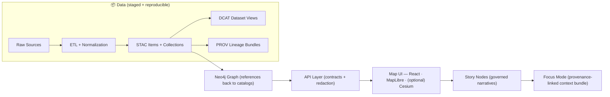

# 📚 docs/ — Kansas Frontier Matrix Documentation 🗺️


> 🧭 **The map behind the map.**  
> KFM docs are **governed**, **evidence-first**, **contract-first**, and **provenance-first**.

---

## 🧭 Jump links
- [🚦 Start here](#-start-here)
- [🧱 The governed docs contract](#-the-governed-docs-contract)
- [🗺️ KFM pipeline mental model](#️-kfm-pipeline-mental-model)
- [🗂️ docs/ directory map](#️-docs-directory-map)
- [🧩 Templates](#-templates-dont-freestyle)
- [📦 Adding a new data domain](#-adding-a-new-data-domain-docs--data-checklist)
- [✍️ Story Nodes rules](#️-writing-rules-for-story-nodes-and-narrative-docs)
- [🤖 Focus Mode + AI notes](#-focus-mode--ai-notes-for-doc-authors)
- [🎨 Cartography + metadata expectations](#-cartography--metadata-expectations-why-docs-care)
- [📚 Reference Library](#-reference-library-project-files)

---

## 🚦 Start here

### 🧩 Core entry points (canonical paths inside `docs/`)
- **📘 Master Guide (primary):** [`./MASTER_GUIDE_v13.md`](./MASTER_GUIDE_v13.md)
- **🏗️ Architecture & blueprints:**
  - [`./architecture/`](./architecture/)
  - [`./architecture/KFM_REDESIGN_BLUEPRINT_v13.md`](./architecture/KFM_REDESIGN_BLUEPRINT_v13.md)
  - [`./architecture/KFM_NEXT_STAGES_BLUEPRINT.md`](./architecture/KFM_NEXT_STAGES_BLUEPRINT.md)
  - [`./architecture/KFM_VISION_FULL_ARCHITECTURE.md`](./architecture/KFM_VISION_FULL_ARCHITECTURE.md)
- **⚖️ Governance (rules + review gates):**
  - [`./governance/`](./governance/)
  - [`./governance/ROOT_GOVERNANCE.md`](./governance/ROOT_GOVERNANCE.md)
  - [`./governance/ETHICS.md`](./governance/ETHICS.md)
  - [`./governance/SOVEREIGNTY.md`](./governance/SOVEREIGNTY.md)
- **🌐 Standards & Profiles (STAC/DCAT/PROV + protocols):** [`./standards/`](./standards/)
  - **Work protocol:** [`./standards/KFM_MARKDOWN_WORK_PROTOCOL.md`](./standards/KFM_MARKDOWN_WORK_PROTOCOL.md)
- **🧩 Templates (universal docs, Story Nodes, API changes):** [`./templates/`](./templates/)
- **🧠 Story Nodes (draft/published):** [`./reports/story_nodes/`](./reports/story_nodes/)
- **🗃️ Data domain runbooks:** [`./data/`](./data/) *(domain READMEs live here)*
- **🧾 Glossary (if present):** [`./glossary.md`](./glossary.md)

> [!TIP]
> If you only open one thing: **`MASTER_GUIDE_v13.md`** → then jump to **architecture** → then **standards**.

### 👥 “I’m here for…”
- **🧱 Maintainers / system builders:** `MASTER_GUIDE_v13.md` → `architecture/` → `standards/` → `governance/`
- **🗃️ Domain stewards (historians/scientists):** `docs/data/<domain>/README.md` → `templates/` → `standards/`
- **🧠 Narrative editors:** `reports/story_nodes/` → `templates/TEMPLATE__STORY_NODE_V3.md`
- **🔌 API contributors:** `templates/TEMPLATE__API_CONTRACT_EXTENSION.md` + `architecture/` (boundary rules + redaction)
- **🧭 UX/cartography:** `architecture/` + `standards/` + “Cartography + metadata expectations” below 🎨

---

## 🧱 The governed docs contract

KFM documentation is not “extra.” It is part of the system’s **trust surface** 🛡️  
If it ships without provenance, it doesn’t ship.

### ✅ Non‑negotiable invariants (don’t fight these)
- **Pipeline ordering is absolute:** *ETL → Catalogs (STAC/DCAT/PROV) → Graph → API → UI → Story Nodes → Focus Mode.*
- **Contract-first:** schemas + API contracts are first-class; breaking changes require **versioning + checks**.
- **Evidence-first narrative:** no unsourced narrative in Story Nodes or Focus Mode.
- **Graph is not the source of truth:** the graph **references** catalog artifacts; catalogs remain authoritative.
- **API boundary rule:** UI must not query the graph directly; it must go through the governed API (redaction + policy).

> [!IMPORTANT]
> Assume **CI will validate**: structure, schemas, catalogs (STAC/DCAT/PROV), provenance completeness, and Story Node requirements.

<details>
<summary>🧪 What CI/review gates typically enforce (expand)</summary>

- ✅ **Contract/schema tests** (API contracts + JSON schema validation)  
- ✅ **Pipeline determinism checks** (repeat runs yield stable outputs/hashes)  
- ✅ **Data integrity checks** (STAC/DCAT/PROV validation + provenance completeness)  
- ✅ **Story Node validation** (required sections, citations, entity refs)  
- ✅ **Security scans** (SAST + dependency audits)  
- ✅ **Breaking change discipline** (versioned contract updates + migration notes)

</details>

<details>
<summary>⚖️ When governance review is automatically triggered (expand)</summary>

- New external data sources (license + attribution + provenance review)
- New or altered API endpoints that change access patterns or sensitivity handling
- New narrative surfaces (Story Nodes / Focus Mode) that present interpretation
- Anything touching **sensitive locations**, sovereignty constraints, or redaction rules
- Any AI-generated layer or summary intended for end users (must be transparent + sourced)

</details>

---

## 🗺️ KFM pipeline mental model



> [!NOTE]
> If the diagram doesn’t render, view this file in GitHub’s renderer or a Mermaid viewer.

---

## 🧭 What belongs where (docs vs data vs code)

KFM is a monorepo: **docs + data + code evolve together** 🧬  
This keeps provenance traceable through Git history and standardized paths.

### 🧾 Quick placement guide
- **Docs & governance** → `docs/`
- **Data (raw/work/processed + catalogs + prov)** → `data/` *(repo root)*
- **ETL pipelines / graph build / API** → `src/` *(repo root)*
- **Schemas (STAC/DCAT/PROV + API contracts)** → `schemas/` *(repo root)*
- **Methods & experiments (if used)** → `mcp/` *(repo root)*

---

## 🗂️ docs/ directory map

> This is the **documentation home** for governed guides, standards, templates, and narrative content.

```text
docs/
├── 🧭 README.md                     # you are here
├── 📘 MASTER_GUIDE_v13.md           # primary entrypoint
├── 🧾 glossary.md                   # shared vocabulary (if present)
├── 🧠 INDEX.md                      # docs portal (optional)
├── 🏗️ architecture/                # system design docs, blueprints, ADRs
├── ⚖️ governance/                  # ethics, sovereignty, review gates
├── 🌐 standards/                   # KFM profiles (STAC/DCAT/PROV), protocols
├── 🧩 templates/                   # governed templates (universal doc, story node, API)
├── 🧠 reports/
│   └── story_nodes/
│       ├── 🧩 templates/           # story templates (draft/published conventions)
│       ├── 🚧 draft/               # works-in-progress (review required)
│       └── ✅ published/           # reviewed + provenance-complete stories
└── 🗃️ data/                        # domain READMEs / runbooks (one folder per domain)
```

---

## 🧩 Templates (don’t freestyle)

Templates keep docs **machine-readable**, **reviewable**, and **consistent** at scale 🔧

- **📄 Universal doc template:** `./templates/TEMPLATE__KFM_UNIVERSAL_DOC.md`
- **🧠 Story Node template:** `./templates/TEMPLATE__STORY_NODE_V3.md`
- **🔌 API contract extension template:** `./templates/TEMPLATE__API_CONTRACT_EXTENSION.md`

> [!TIP]
> Templates aren’t bureaucracy — they’re how KFM stays automatable (validators, CI gates, ingestion, and UI rendering).

---

## 📦 Adding a new data domain (docs + data checklist)

When you add a new domain, you are adding **evidence pipelines**, not just files 🧾🧱

### ✅ Minimum “domain done” checklist
- [ ] Create **domain runbook**: `docs/data/<domain>/README.md`
- [ ] Stage inputs + outputs (repo root):
  - [ ] Raw inputs → `data/raw/<domain>/`
  - [ ] Intermediate products (if needed) → `data/work/<domain>/`
  - [ ] Final outputs → `data/processed/<domain>/`
- [ ] Emit boundary artifacts (required before “published”):
  - [ ] **STAC** (collections + items) → `data/stac/collections/` and `data/stac/items/`
  - [ ] **DCAT** dataset entry → `data/catalog/dcat/` *(JSON-LD)*
  - [ ] **PROV** lineage bundle → `data/prov/`
- [ ] Confirm **cross-layer linkage**:
  - [ ] STAC → points to actual assets + includes attribution/license
  - [ ] DCAT → links to STAC and/or distribution downloads
  - [ ] PROV → links raw → work → processed + includes run/config identifiers
  - [ ] Graph → stores references (e.g., STAC IDs), not bulk payloads
- [ ] Treat **derived / AI-generated outputs** as first-class **evidence artifacts**:
  - [ ] Stored like any processed dataset
  - [ ] Cataloged (STAC/DCAT) with “derived/AI-generated” flags
  - [ ] Fully traced in PROV (inputs, methods, parameters, confidence)
  - [ ] Exposed only via governed API (never hardcoded into UI)
- [ ] Link the domain README from the appropriate index docs (often the Master Guide)

---

## ✍️ Writing rules for Story Nodes and narrative docs

Story Nodes are **machine-ingestible storytelling** 🧠🗺️

### ✅ Narrative requirements
- **Every factual claim must be traceable** to cataloged evidence.
- **Fact vs interpretation** must be explicitly separated.
- **Entity references** should point to stable IDs (catalog/graph identifiers), not only free text.
- Story metadata (author, date, sources) should be carried with the story (front matter or adjacent metadata file).
- Drafts live in `reports/story_nodes/draft/` until review gates are satisfied.

### ✅ “Published” requirements (hard gate)
- Citations are complete and clickable in UI (linking to datasets, STAC/DCAT views, or PROV logs).
- Provenance is complete for all referenced artifacts.
- Sensitive content handling (redaction/labels) is respected.
- Reviewer approval recorded via PR flow.

---

## 🤖 Focus Mode + AI notes (for doc authors)

KFM supports AI augmentation, but it is **policy-governed** 🧷

### ✅ AI rules of the road
- AI is a **tool-using analyst**, not an oracle:
  - It must retrieve from allowed sources and **show citations**.
  - If reasoning traces are requested, they should be auditable and tied into provenance logs.
- AI-generated layers/summaries intended for users must be:
  - **Opt-in** (when appropriate)
  - **Transparent** (clearly labeled)
  - **Source-backed** (no black-box claims)

> [!CAUTION]
> If an AI output is user-facing, treat it like a dataset: **STAC/DCAT/PROV + governed API** — every time.

---

## 🎨 Cartography + metadata expectations (why docs care)

Even when you’re “just making a map,” KFM treats presentation as part of evidence integrity 🎛️🗺️

### 🧾 Metadata expectations (minimum shape)
Docs introducing a dataset/map layer should capture:
- Identification (what is it, why it exists)
- Quality (limits, uncertainty, resolution, completeness)
- Spatial organization (vector/raster; schema)
- Spatial reference (CRS, coordinate system, projection)
- Entities & attributes (data dictionary)
- Distribution + use policy (license, access rules)
- Citation guidance (how to cite)
- Temporal coverage (when collected, updated)
- Contacts (who owns/maintains it)

### 🪪 Rights & reuse expectations
- Map **representations** can be copyrighted even if the underlying **facts** are not.
- Document sources and avoid copying protected representations; prefer licensed/open data and regenerate outputs.

### 🧭 Navigation / “read the map” reminders (when relevant)
- When publishing navigation-like or field-map layers, include basic orientation notes (e.g., declination awareness, grid conventions) and any CRS-specific caveats.

---

## 📚 Reference Library (project files)

These are “foundation texts” used to shape KFM’s design + implementation choices 📖  
*(Not all are normative standards; some are conceptual scaffolding.)*

### 🧠 AI / Knowledge systems
- `Kansas Frontier Matrix (KFM) – Comprehensive Technical Blueprint.pdf` — system invariants, tool-using AI posture, provenance-first design
- `Comprehensive Guide to Ollama and Its Supported Open-Source LLMs.pdf` — local-first LLM ops + model runner workflows
- `Various AI Concepts & Information.pdf` — working notes and concept atlas

### 🗺️ GIS / Cartography / Navigation
- `making-maps-a-visual-guide-to-map-design-for-gis.pdf` — map design, metadata discipline, copyright/representation caveats
- `Map Reading & Land Navigation.pdf` — grids, declination, marginalia, foundational map literacy *(⚠️ verify distribution constraints before sharing externally)*
- `Map Projections Used by the U.S. Geological Survey.pdf` — projection reference for USGS workflows
- `Archaeological 3D GIS.pdf` — 3D GIS patterns, archaeological representation
- `Mobile Mapping - project_muse.pdf` — mobile mapping framing + field capture context

### 🛰️ Remote sensing + geospatial computation
- `Cloud-Based Remote Sensing with Google Earth Engine-Fundamentals and Applications.pdf` — Earth Engine workflows + cloud scale patterns
- `GIS-Mapping-Geocomputation-Python.pdf` — Python geospatial patterns
- `KFM- python-geospatial-analysis-cookbook-over-60-recipes-to-work-with-topology-overlays-indoor-routing-and-web-application-analysis-with-python.pdf` — practical recipes (topology, routing, web analysis)

### 📈 Visualization + methods
- `Visualization of Time-Oriented Data.pdf` — timelines, time series, time-based UI patterns
- `Introduction to Digital Humanism.pdf` — interpretive framing and human-centered systems thinking
- `Understanding Statistics & Experimental Design.pdf` — experimental hygiene, claims discipline
- `graphical-data-analysis-with-r.pdf` — EDA patterns and statistical visualization

### 🕸️ Graphs + structure + optimization (use selectively)
- `Spectral Geometry of Graphs.pdf` — graph structure + spectral viewpoints (for advanced graph reasoning/quality)
- `Generalized Topology Optimization for Structural Design.pdf` — optimization perspectives (transferable thinking, not GIS-specific)

### 🗄️ Data systems at scale (pipeline + API performance thinking)
- `Database Performance at Scale.pdf`
- `Scalable Data Management for Future Hardware.pdf`
- `Data Spaces.pdf` — governance, trust, sovereignty patterns for data sharing ecosystems

### 🧰 Engineering & programming bundles
- `Programming Resources.pdf` — multi-doc programming shelf (treat as a “library omnibus”)
- `UI-TypeScript-WebDesign-API-Android-iPhone-Html5-CSS-SVG-ReactJS-NodeJs-RestFull Web services.pdf`
- `Data Mining-Data Sciences-Deep Learning-Python Geographin Data Analysis-Social Enginering Hacking-OCaml-Psychology of fake news-vuejs-web app security-Computational algorithms.pdf`

---

## 🧰 Suggested next docs to add (if missing)
- `docs/STYLEGUIDE.md` — writing style + diagrams + citation norms + naming conventions
- `docs/INDEX.md` — narrative “docs portal” for non-technical users
- `docs/CONTRIBUTING_DOCS.md` — doc PR checklist + what CI will check + review rubric
- `docs/standards/VALIDATION_MATRIX.md` — single page mapping artifacts → validators → owners

---

<!--
GROUNDING / SOURCES USED (hidden to keep README clean)

Key KFM doc invariants + CI gates + structure:
- Canonical pipeline order + graph-as-index + API boundary + evidence-first narrative + Focus Mode hard gate:
   [oai_citation:0‡MARKDOWN_GUIDE_v13.md.gdoc](file-service://file-UYVruFXfueR8veHMUKeugU)
- CI gates (schema/contracts, determinism, STAC/DCAT/PROV validation, story validation, security scans):
   [oai_citation:1‡MARKDOWN_GUIDE_v13.md.gdoc](file-service://file-UYVruFXfueR8veHMUKeugU)
- Governance review triggers (external sources, narratives, sensitive locations, AI user-facing outputs):
   [oai_citation:2‡MARKDOWN_GUIDE_v13.md.gdoc](file-service://file-UYVruFXfueR8veHMUKeugU)

Data staging + boundary artifacts + domain expansion + evidence artifacts:
- Staging areas + STAC/DCAT/PROV canonical output locations + domain README runbook expectations:
   [oai_citation:3‡MARKDOWN_GUIDE_v13.md.gdoc](file-service://file-UYVruFXfueR8veHMUKeugU)
- Evidence artifact pattern (AI/analysis outputs treated as first-class datasets, catalog + PROV + API exposure):
   [oai_citation:4‡MARKDOWN_GUIDE_v13.md.gdoc](file-service://file-UYVruFXfueR8veHMUKeugU)

Focus Mode + AI tool-use + citations + provenance traces:
- Focus Mode AI uses tool calls, returns citations, can produce reasoning traces recorded in PROV logs:
   [oai_citation:5‡Kansas Frontier Matrix (KFM) – Comprehensive Technical Blueprint.pdf](sediment://file_000000006dbc71f89a5094ce310a452d)
- Provenance-first principle + black-box outputs unacceptable:
   [oai_citation:6‡Kansas Frontier Matrix (KFM) – Comprehensive Technical Blueprint.pdf](sediment://file_000000006dbc71f89a5094ce310a452d)

Cartography + metadata + copyright/representation:
- Metadata components + interoperability framing + copyright vs facts distinction:
   [oai_citation:7‡making-maps-a-visual-guide-to-map-design-for-gis.pdf](sediment://file_00000000602471f786dfbbaac9329fb9)
- Coordinate systems and UTM basics (supporting CRS awareness section):
   [oai_citation:8‡Visualization of Time-Oriented Data.pdf](sediment://file_000000001468722f929b8752236e5a72)

Navigation + declination/map literacy reminder:
- Orienting a map + declination diagram reference:
   [oai_citation:9‡Map Reading & Land Navigation.pdf](sediment://file_00000000b14c7230b1b262ddd9df4e5d)

Data spaces governance framing:
- Data spaces as trustworthy data sharing ecosystems + rule/policy enforcement:
   [oai_citation:10‡Data Spaces.pdf](sediment://file_0000000053c071f5a9733b1b09cc9f76)

FILECITE MARKERS (tool surfacing; keep hidden for GitHub cleanliness):
-  [oai_citation:11‡Data Spaces.pdf](sediment://file_0000000053c071f5a9733b1b09cc9f76)  Data Spaces.pdf
-  [oai_citation:12‡Introduction to Digital Humanism.pdf](sediment://file_0000000090a071f5afd5c78c4383e488)  Introduction to Digital Humanism.pdf
-  [oai_citation:13‡Visualization of Time-Oriented Data.pdf](sediment://file_000000001468722f929b8752236e5a72)  Visualization of Time-Oriented Data.pdf
-  [oai_citation:14‡Cloud-Based Remote Sensing with Google Earth Engine-Fundamentals and Applications.pdf](sediment://file_00000000a58071f586f00793dee712d6)  Cloud-Based Remote Sensing with Google Earth Engine-Fundamentals and Applications.pdf
-  [oai_citation:15‡Kansas Frontier Matrix (KFM) – Comprehensive Technical Blueprint.pdf](sediment://file_000000006dbc71f89a5094ce310a452d)   Kansas Frontier Matrix (KFM) – Comprehensive Technical Blueprint.pdf
-  [oai_citation:16‡making-maps-a-visual-guide-to-map-design-for-gis.pdf](sediment://file_00000000602471f786dfbbaac9329fb9)   making-maps-a-visual-guide-to-map-design-for-gis.pdf
-  [oai_citation:17‡Map Reading & Land Navigation.pdf](sediment://file_00000000b14c7230b1b262ddd9df4e5d)   Map Reading & Land Navigation.pdf
-->