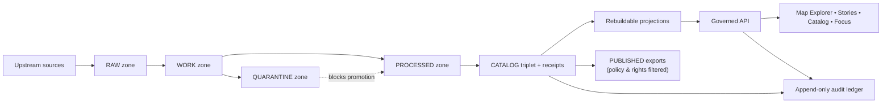

<!-- [KFM_META_BLOCK_V2]
doc_id: kfm://doc/2e7a0e0b-5c0a-4cb0-9fd6-7b3f4bbf67b1
title: docs/ — Governed Documentation Hub
type: standard
version: v2
status: draft
owners: KFM Maintainers (resolve via CODEOWNERS)
created: 2026-02-24
updated: 2026-02-27
policy_label: public
related:
  - ../README.md
  - ../.github/README.md
  - ../CONTRIBUTING.md
  - ../SECURITY.md
  - ../configs/README.md
  - ../contracts/README.md
  - ./adr/README.md
  - ./governance/README.md
  - ./runbooks/README.md
  - ./standards/README.md
tags:
  - kfm
  - docs
  - governance
  - evidence-first
  - cite-or-abstain
notes:
  - Upgraded from scaffold to governed doc index aligned to KFM vNext invariants.
  - Corrected folder references (governance vs policies) and aligned system map to truth path + catalog triplet.
  - Treat repo-specific structure as UNKNOWN until verified; fail-closed on missing referenced files.
[/KFM_META_BLOCK_V2] -->

<a id="top"></a>

# `docs/` — Governed Documentation Hub
**Map-first • time-aware • governed • evidence-first • cite-or-abstain**

This directory is **documentation-as-production** for Kansas Frontier Matrix (KFM). Anything here is expected to be:
- **reviewable** (small diffs, stable IDs, clear owners),
- **testable where applicable** (linkcheck, schema examples, policy fixtures),
- **safe under policy** (default-deny posture; no sensitive leakage),
- **traceable** (claims link back to resolvable evidence or are marked Unknown).


> [!IMPORTANT]
> **Trust membrane rule:** docs must never become a bypass.  
> Do not include secrets, restricted coordinates, or “just trust me” claims.  
> If a claim can’t be supported by evidence, **abstain** or mark it **UNKNOWN** with verification steps.

---

## Quick navigation

- [Truth status legend](#truth-status-legend)
- [Directory contract](#directory-contract)
- [Documentation stance](#documentation-stance)
- [Where docs fit in KFM](#where-docs-fit-in-kfm)
- [Directory layout](#directory-layout)
- [System map](#system-map)
- [Doc templates](#doc-templates)
- [CI gates for docs](#ci-gates-for-docs)
- [Definition of Done](#definition-of-done)
- [Contribution workflow](#contribution-workflow)
- [Glossary](#glossary)
- [Reference library](#reference-library)

---

## Truth status legend

Use explicit truth labels to keep docs evidence-first and fail-closed:

- **CONFIRMED (repo):** backed by artifacts in this repository (paths, schemas, tests, receipts)
- **CONFIRMED (design):** a KFM invariant/contract (must hold regardless of implementation)
- **PROPOSED:** a recommended template/pattern (adopt only after review)
- **UNKNOWN (repo):** not verified on this branch; include verification steps

> [!NOTE]
> If you reference a file that doesn’t exist, treat that as **missing and merge-blocking** if the reference is required by contract.

<p align="right"><a href="#top">Back to top ↑</a></p>

---

## Directory contract

### Purpose
`docs/` is the canonical home for:
- architecture and boundary contracts
- governance standards and review workflows
- operational runbooks
- narrative standards (Story Nodes)
- specs and examples that support enforcement (schemas, fixtures, checklists)

### What belongs in `docs/`
- **Architecture docs:** system overview, layering, trust membrane, canonical vs rebuildable
- **Governance docs:** policy labels, obligations, promotion gates, review triggers, roles
- **Runbooks:** incident response, pipeline operations, promotion procedures, rollback
- **Standards:** doc standards, schema/profile standards, catalog profile references
- **Narrative specs:** Story Node spec(s), citation conventions, evidence drawer expectations
- **Evidence artifacts (bounded):** example receipts/manifests, redacted QA reports, validation examples

### What must not go in `docs/`
- **Secrets** (tokens, keys, credentials), even in examples
- **Raw or sensitive data** (default-deny): use redacted samples + digests + EvidenceRefs
- **Large binaries/build outputs** unless explicitly required and size-controlled
- **Unverifiable assertions**: if it can’t be cited, label it **UNKNOWN** and add verification steps
- **Policy enforcement logic** (belongs in `policy/` and runtime services), except for human-facing documentation of policy behavior

> [!WARNING]
> If it would be unsafe to paste into a public issue, it does not belong in public-labeled docs.

<p align="right"><a href="#top">Back to top ↑</a></p>

---

## Documentation stance

### Truth discipline
Every statement should be treated as one of:
- **Confirmed:** backed by repo artifacts or resolvable evidence
- **Proposed:** a design option with rationale + tradeoffs
- **Unknown:** not verified; must include **minimum verification steps**

> [!IMPORTANT]
> Do not “fill gaps” by inventing repo state. Prefer TODOs, explicit Unknowns, and small verification checklists.

### Safety posture
- **Default-deny** when sensitivity/permissions are unclear.
- If content could enable harm (e.g., vulnerable sites), publish only generalized detail.
- If a doc is governance-sensitive (e.g., security operations, internal escalation), label it `restricted|internal` and ensure review routing via CODEOWNERS.

### Cite-or-abstain applies to docs too
If a document makes factual claims that would influence decisions (policy, security, promotion eligibility), it should:
- cite in-repo artifacts (contracts, receipts, manifests, validators) **or**
- cite governed evidence references **or**
- mark the claim as **UNKNOWN**.

<p align="right"><a href="#top">Back to top ↑</a></p>

---

## Where docs fit in KFM

Docs sit alongside the enforceable artifacts and should point to them:

- **Contracts:** `contracts/` defines enforceable interfaces (OpenAPI, schemas, profiles, gates)
- **Configs:** `configs/` defines governed configuration inputs (labels, obligations, gate thresholds)
- **Data truth path:** `data/` holds canonical specs/registries/manifests/catalogs/receipts/digests
- **Governance:** `.github/` + `docs/governance/` define merge-time + human review posture

> [!NOTE]
> If this repo serves docs via governed APIs, the `policy_label` in the MetaBlock determines who can see the doc.
> If docs are “git-only,” still keep the label—it is a governance signal and can be enforced later.

---

## Directory layout

> [!NOTE]
> This is a **target structure** aligned to the KFM vNext operating model.  
> If your branch differs, update this README and any linkcheck/validators together.

```text
docs/                                              # Governed docs hub (production docs)
├─ README.md                                       # You are here: index + rules + “what goes where”
│
├─ adr/                                            # Architecture Decision Records
│  ├─ README.md                                    # ADR index + naming conventions
│  ├─ ADR-0001-<slug>.md
│  └─ ADR-0002-<slug>.md
│
├─ architecture/                                   # System architecture + invariants + diagrams
│  ├─ README.md                                    # Overview + layering + trust membrane
│  ├─ system_overview.md
│  ├─ trust_membrane.md
│  ├─ canonical_vs_rebuildable.md
│  └─ diagrams/
│     ├─ flow_truth_path.mmd
│     └─ flow_evidence_resolution.mmd
│
├─ governance/                                     # Policy + roles + obligations + promotion review workflows
│  ├─ README.md
│  ├─ policy_labels.md                             # Controlled vocabulary + semantics
│  ├─ obligations.md                               # Obligation catalog (human-facing)
│  ├─ promotion_contract.md                        # Gates A–F mapping + review triggers
│  ├─ review_workflows.md                          # Steward review rules + escalation
│  └─ sensitive_location_handling.md               # Default-deny + generalization posture
│
├─ standards/                                      # Writing and engineering standards (doc-as-prod)
│  ├─ README.md
│  ├─ doc_meta_block_v2.md                         # MetaBlock v2 rules (no YAML frontmatter)
│  ├─ citations_and_evidence.md                    # EvidenceRef conventions + cite-or-abstain
│  ├─ catalog_profiles.md                          # DCAT/STAC/PROV profile expectations (human view)
│  └─ api_versioning.md                            # Contract changes + compatibility posture
│
├─ runbooks/                                       # Operational procedures (production-grade)
│  ├─ README.md
│  ├─ incident_response.md
│  ├─ pipeline_operations.md
│  ├─ promotion_runbook.md
│  └─ rollback_runbook.md
│
├─ guides/                                         # Onboarding + how-to (developer, steward, operator)
│  ├─ README.md
│  ├─ onboarding.md
│  ├─ add_a_dataset.md
│  ├─ publish_a_story.md
│  └─ focus_mode_eval.md
│
├─ stories/                                        # Story Nodes and narrative standards (policy-labeled, review-gated)
│  ├─ README.md
│  ├─ story_node_spec.md                           # Story Node format (markdown + sidecar + citations)
│  ├─ templates/
│  │  ├─ story_node.md
│  │  └─ story_node.sidecar.json
│  └─ published/                                   # OPTIONAL: curated, promoted story nodes (if stored in docs/)
│
├─ investigations/                                 # Discover-mode notes (not user-visible until promoted)
│  ├─ README.md
│  └─ <investigation-slug>/
│     ├─ README.md
│     └─ notes.md
│
├─ schemas/                                        # Human-facing schema docs/examples (not canonical schemas)
│  ├─ README.md
│  ├─ run_receipt.md
│  ├─ promotion_manifest.md
│  ├─ evidence_bundle.md
│  └─ examples/
│
└─ diagrams/                                       # Shared diagrams (mermaid/mmd/svg) referenced across docs
   ├─ README.md
   └─ <diagram-files>
```

> [!TIP]
> Keep “canonical schemas” and validators under `contracts/` and `tools/`.  
> Keep `docs/schemas/` as **human-readable explanations + examples**, not the enforcement source of truth.

<p align="right"><a href="#top">Back to top ↑</a></p>

---

## System map

KFM is governed end-to-end:

**Upstream → RAW → WORK/QUARANTINE → PROCESSED → CATALOG (DCAT/STAC/PROV + receipts) → projections → governed API → Map/Story/Focus → audit**



### Architecture invariants (CONFIRMED — design)
- UI/clients never access storage/DB directly; **all access goes through governed APIs + policy boundary**.
- Core logic never bypasses repositories to reach storage.
- Catalogs/provenance are canonical; projections are rebuildable.
- Promotion gates fail closed.
- Focus Mode answers cite-or-abstain; citation verification is a hard gate.

---

## Doc templates

### MetaBlock v2 header (required)
All governed docs should start with MetaBlock v2 (no YAML frontmatter):

```md
<!-- [KFM_META_BLOCK_V2]
doc_id: kfm://doc/<uuid>
title: <Title>
type: standard|guide|adr|runbook|story|dataset_spec
version: v1
status: draft|review|published
owners: <team or names>
created: YYYY-MM-DD
updated: YYYY-MM-DD
policy_label: public|restricted|internal|embargoed|...
related:
  - <paths or kfm:// ids>
tags:
  - kfm
notes:
  - <short notes>
[/KFM_META_BLOCK_V2] -->
```

**Rules:**
- `doc_id` must be stable (do not regenerate on edits).
- `updated` must change on meaningful edits.
- `policy_label` must reflect the most restrictive content in the doc (default-deny if unsure).

### ADR template
```md
<!-- [KFM_META_BLOCK_V2]
doc_id: kfm://doc/<uuid>
title: ADR-XXXX: <decision title>
type: adr
version: v1
status: draft|accepted|rejected|superseded
owners: <team>
created: YYYY-MM-DD
updated: YYYY-MM-DD
policy_label: internal
related:
  - <link to impacted contracts/docs>
tags: [kfm, adr]
notes:
  - <optional>
[/KFM_META_BLOCK_V2] -->

# ADR-XXXX: <decision title>

## Context

## Decision

## Consequences

## Alternatives considered

## Verification
- [ ] Tests updated/added
- [ ] Migration/rollback documented
- [ ] Security/policy review completed (if applicable)
```

### Story Node template note
Story Nodes are governed narratives:
- markdown body (human)
- sidecar metadata JSON (map state, citations, policy label, review state)

Publishing gate: all citations must resolve through the evidence resolver.

---

## CI gates for docs

Docs are only safe at scale if they’re continuously validated.

Recommended doc CI gates (PROPOSED):
- **MetaBlock lint:** required fields present; `doc_id` stable; dates parse
- **Internal linkcheck:** relative links resolve; no broken anchors
- **Policy label lint:** policy_label must exist; forbidden content patterns flagged for public docs
- **Secret scan:** prevent tokens/keys from landing in docs
- **Diagram render checks:** mermaid blocks parse (at least basic lint)
- **Story citation checks (when applicable):** citations resolve (or are marked UNKNOWN with verification)

> [!IMPORTANT]
> Fail-closed posture: if a doc is required by contract (e.g., runbook referenced in release workflow) and linkcheck fails, merging should be blocked.

---

## Definition of Done

A doc change is ready to merge when:

- [ ] MetaBlock v2 is present and correct (including `policy_label` and `owners`)
- [ ] Any user-facing or decision-driving claim is traceable (links to contracts/configs/receipts/manifests)
- [ ] Unknowns are explicitly labeled and include **minimum verification steps**
- [ ] No secrets, credentials, or sensitive coordinates are present
- [ ] Links are valid (or intentionally marked TODO with an owner and plan)
- [ ] Diagrams render (Mermaid) and are readable
- [ ] If governance/policy behavior changed, related gates/tests/docs are updated together

---

## Contribution workflow

1. Create or update a doc in the appropriate subfolder.
2. Add/refresh the MetaBlock v2 header.
3. Keep changes small and reversible (prefer additive glue over sweeping rewrites).
4. If you introduce a new requirement, point to (or add) the validator/test/gate that makes it enforceable.
5. Route review via CODEOWNERS (especially for governance, security, and promotion-related docs).

> [!TIP]
> For long docs, use `<details>` appendices so the main narrative stays scannable.

---

## Glossary

- **Trust membrane:** enforced boundary where governed policy + evidence controls what can be claimed or served.
- **Promotion gate:** required checklist + evidence bundle before a DatasetVersion can be surfaced.
- **Policy label:** sensitivity classification that drives allow/deny + obligations.
- **EvidenceRef:** stable scheme reference (dcat://, stac://, prov://, doc://, …) resolvable without guessing.
- **EvidenceBundle:** resolved evidence package (policy decision + license + provenance + digests + audit ref).
- **Canonical vs rebuildable:** catalogs/provenance/artifacts are canonical; DB/search/tiles/graph are rebuildable.
- **Cite-or-abstain:** if citations can’t be verified and policy-allowed, abstain or reduce scope.

---

## Reference library

Some KFM workstreams maintain a reference library (GIS/cartography, pipelines, security, standards).

**Policy-safe posture:**
- Prefer a **bibliography/index** (titles + notes + pointers) over committing copyrighted PDFs.
- If a PDF must be included, ensure rights allow redistribution, and label it appropriately.

> [!NOTE]
> If a “project library index” exists, treat it as a helper, not a contract.
> Do not accidentally publish copyrighted materials by bundling them into a public repo.

---

<p align="right"><a href="#top">Back to top ↑</a></p>
