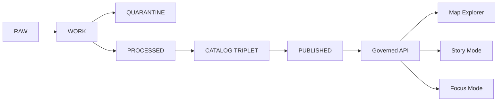

# KFM docs

Map-first, time-aware, governed documentation for Kansas Frontier Matrix.

**Status:** Draft  
**Owners:** TBD  
**Badges:** `status:draft` `policy:public` `map-first` `time-aware` `evidence-first` `contract-first`

**Jump to:** [Start here](#start-here) · [Docs map](#docs-map) · [Principles](#principles) · [Data lifecycle](#data-lifecycle) · [Writing rules](#writing-rules) · [Definition of done](#definition-of-done)

> **Note**
> This file is intentionally small and link-heavy. When you add docs, update this index instead of creating parallel entry points.

## Start here

1. Project overview: [`../README.md`](../README.md)
2. Master guide: [`./MASTER_GUIDE_v13.md`](./MASTER_GUIDE_v13.md)  
   If you don’t have v13 in your branch, link the newest `MASTER_GUIDE_*.md` here.
3. Glossary: [`./glossary.md`](./glossary.md)
4. Governance and review gates: [`./governance/`](./governance/)
5. Architecture: [`./architecture/`](./architecture/)
6. Standards: [`./standards/`](./standards/)
7. Templates: [`./templates/`](./templates/)
8. API and schema contracts: [`../contracts/`](../contracts/)
9. Policy-as-code bundles: [`../policy/`](../policy/)

## Docs map

| Area | Where | What it contains |
| --- | --- | --- |
| Guides | [`./guides/`](./guides/) | Playbooks and runbooks |
| Standards | [`./standards/`](./standards/) | Repo standards, schema/profiles, validation rules |
| Architecture | [`./architecture/`](./architecture/) | Blueprints, diagrams, module boundaries |
| Decisions | [`./adr/`](./adr/) or [`./architecture/adr/`](./architecture/adr/) | ADRs and decision history |
| Governance | [`./governance/`](./governance/) | Ethics, sovereignty, roles, review gates |
| Templates | [`./templates/`](./templates/) | Canonical templates for docs, Story Nodes, contracts |
| Story Nodes | [`./story/`](./story/) or [`./reports/story_nodes/`](./reports/story_nodes/) | Draft and published Story Node sets |

<details>
<summary>Reference layout for docs and repo</summary>

Docs layout pattern:

```text
docs/
  README.md
  MASTER_GUIDE_v13.md
  glossary.md
  guides/
  architecture/
    diagrams/
    adr/
  standards/
  templates/
  governance/
  reports/
    story_nodes/
      templates/
      draft/
      published/
```

Repo layout target:

```text
repo/
  README.md
  docs/
    guides/
    standards/
    adr/
    story/
  data/
    raw/
    work/
    processed/
    catalog/
  policy/
    rego/
    fixtures/
    tests/
  contracts/
    openapi/
    schemas/
    graphql/           # optional
  src/
    api/
    evidence/
    catalog/
    ingest/
    indexers/
    domain/
  tools/
    validators/
    linkcheck/
    hash/
  tests/
    unit/
    integration/
    e2e/
  .github/
    workflows/
```

</details>

## Principles

### Governance is enforceable

- **Trust membrane:** clients never bypass governed APIs and policy enforcement.
- **Default deny:** if rights or sensitivity are unclear, do not promote or publish.
- **Policy-as-code:** policy decisions are testable and consistent in CI and runtime.

### Catalogs are contract surfaces

For promoted dataset versions, the catalog triplet is the interface:

- **DCAT** answers what the dataset is and how it can be reused.
- **STAC** inventories spatiotemporal assets and where files live.
- **PROV** records lineage: inputs, transforms, tools, parameters.

### Evidence is first-class

- Map + timeline are primary navigation.
- Story nodes bind narrative claims to map state and citations.
- Focus Mode must **cite evidence or abstain**.

## Data lifecycle

Data moves through a governed truth path. Promotion is blocked unless gates pass.



### Zones

| Zone | Allowed actions | Typical artifacts |
| --- | --- | --- |
| RAW | Append-only acquisition | Source snapshots, checksums, terms snapshots |
| WORK | Iterative transforms | Normalized formats, QA reports, redaction candidates |
| QUARANTINE | No promotion | Failed validation, unclear rights, sensitivity concerns |
| PROCESSED | Publishable outputs | Approved formats plus derived runtime metadata |
| CATALOG TRIPLET | Validate and cross-link | DCAT + STAC + PROV plus run receipts |
| PUBLISHED | Serve via governed surfaces | Only promoted versions |

### Promotion gates

Minimum gates to promote, failing closed:

- Identity and versioning
- Licensing and rights
- Sensitivity and redaction obligations
- Catalog triplet validation
- Run receipts and checksums
- Policy and contract tests
- Operational readiness

## Writing rules

### Use MetaBlock v2

All production docs, Story Nodes, dataset specs, ADRs, and run receipts include MetaBlock v2:

- No YAML frontmatter
- Stable `doc_id`
- `policy_label` reflects who can read the doc in governed delivery

### Prefer stable IDs over brittle prose

When referencing:

- Datasets: `kfm://dataset/<slug>@<version>` and link to the dataset’s catalog record.
- Evidence: use stable EvidenceRef IDs or evidence bundle IDs when available.
- APIs: link to contract artifacts under `contracts/`.

### Keep docs policy-safe

- Don’t embed precise coordinates for culturally sensitive or vulnerable sites unless policy explicitly allows.
- Don’t leak restricted metadata in “helpful” examples.
- Treat redaction and generalization as first-class, provenance-recorded transforms.

## Definition of done

When you add or materially change a document:

- [ ] MetaBlock v2 present and `updated` date changed
- [ ] `policy_label` set correctly
- [ ] In-repo links resolve
- [ ] External facts have citations or are clearly labeled as assumptions
- [ ] Any dataset/story references use stable IDs
- [ ] Sensitive-location handling reviewed
- [ ] If the doc changes behavior or governance, required reviewers were included

---

[Back to top](#kfm-docs)
