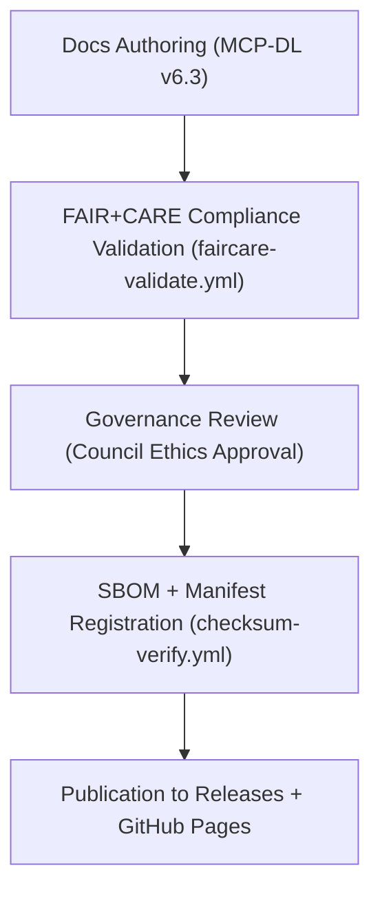

<div align="center">

# 📘 Kansas Frontier Matrix — **Documentation & Governance Hub**
`docs/README.md`

**Purpose:**  
The `docs/` directory contains the complete documentation framework, governance standards, design blueprints, and compliance references for the **Kansas Frontier Matrix (KFM)**.  
All documents are written under the **MCP-DL v6.3 Documentation-First Framework** and verified against **FAIR+CARE, ISO, and AI governance** principles.

[](../docs/standards/faircare-validation.md)
[](../docs/architecture/repo-focus.md)
[](../LICENSE)
[]()

</div>

---

## 📚 Overview

The **Documentation & Governance Hub** is the authoritative source for Kansas Frontier Matrix’s architecture, ethics, and operational documentation.  
It provides the framework for **reproducibility, provenance tracking, sustainability, and governance compliance**, ensuring transparency across all data domains.

### Core Functions
- 🧭 Define and maintain **architecture, schema, and ETL documentation**.  
- ⚖️ Govern and certify FAIR+CARE compliance across all KFM systems.  
- 🌍 Integrate ISO and MCP-DL v6.3 open documentation standards.  
- 🤖 Provide AI governance explainability and ethical audit documentation.  
- ♻️ Maintain transparent sustainability and energy performance metrics.  

---

## 🗂️ Directory Layout

```plaintext
docs/
├── README.md                               # This file — overview of the documentation & governance hub
│
├── architecture/                           # Design blueprints and system architecture overviews
│   ├── repo-focus.md
│   ├── data-flow-diagrams.md
│   ├── ai-system-architecture.md
│   └── web-ui-design.md
│
├── contracts/                              # Data contract schemas and standard compliance models
│   ├── data-contract-v3.json
│   ├── data-schema-validation.md
│   └── api-data-exchange.md
│
├── standards/                              # Governance, FAIR+CARE, and compliance documentation
│   ├── governance/
│   │   ├── DATA-GOVERNANCE.md
│   │   ├── ETHICS-GOVERNANCE.md
│   │   └── AUDIT-GOVERNANCE.md
│   ├── faircare-validation.md
│   ├── mcp-dl-specifications.md
│   ├── iso-compliance.md
│   └── sustainability-framework.md
│
├── governance/                             # Governance Council references, ledgers, and audit reports
│   ├── council-procedures.md
│   ├── governance-matrix.md
│   └── ledger-process-guide.md
│
└── design/                                 # UI/UX and narrative design documentation
    ├── figma-wireframes.md
    ├── color-system.md
    ├── iconography.md
    └── storytelling-guidelines.md
```

---

## ⚙️ Documentation Governance Workflow



### Description
1. **Authoring:** All documentation written under MCP-DL standards for reproducibility.  
2. **Validation:** FAIR+CARE workflow audits documentation for accessibility, interoperability, and ethics.  
3. **Governance:** Ethics Council verifies compliance and signs off on publication.  
4. **SBOM + Manifest:** Docs linked to release manifest and checksum verification logs.  
5. **Publication:** Published and versioned under the current KFM release cycle.  

---

## 🧩 Example Documentation Metadata Record

```json
{
  "doc_id": "kfm-docs-governance-v9.6.0",
  "version": "v9.6.0",
  "fairstatus": "certified",
  "governance_approved": true,
  "checksum_verified": true,
  "iso_alignment": ["ISO 19115", "ISO 14064", "ISO 50001"],
  "mcp_dl_version": "v6.3",
  "license": "MIT",
  "telemetry_ref": "releases/v9.6.0/focus-telemetry.json",
  "created": "2025-11-03T12:00:00Z",
  "approved_by": ["@kfm-governance", "@kfm-fair", "@kfm-architecture"]
}
```

---

## 🧠 FAIR+CARE & MCP-DL Governance Matrix

| Principle | Implementation |
|------------|----------------|
| **Findable** | Documentation indexed by version, SBOM reference, and manifest linkage. |
| **Accessible** | All docs published openly under MIT license and FAIR+CARE certification. |
| **Interoperable** | Written in GitHub-Flavored Markdown, aligned with FAIR, DCAT, and ISO metadata. |
| **Reusable** | Modular documentation linked to data contracts and governance logs. |
| **Collective Benefit** | Promotes open access to ethical and sustainable data governance knowledge. |
| **Authority to Control** | FAIR+CARE Council oversees governance documentation and revisions. |
| **Responsibility** | Maintainers ensure version traceability and ethics certification. |
| **Ethics** | All documentation authored under ethical communication and inclusion principles. |

Audit and compliance reports stored in:  
`reports/fair/documentation_audit.json` • `reports/audit/system_docs_ledger.json`

---

## ⚙️ Compliance Integration

| Framework | Role in KFM Documentation | Verification Method |
|------------|----------------------------|----------------------|
| **FAIR+CARE** | Ethical and accessibility framework for documentation content. | `faircare-validate.yml` |
| **MCP-DL v6.3** | Standardized documentation-first lifecycle governance. | `docs-validate.yml` |
| **ISO 19115 / 14064 / 50001** | Metadata, sustainability, and governance documentation compliance. | Manual + Automated Audits |
| **STAC / DCAT 3.0** | Metadata interoperability for dataset documentation. | Schema Validation |
| **SPDX / SBOM** | Provenance and version traceability for release documentation. | `checksum-verify.yml` |

---

## ⚖️ Sustainability & Transparency Metrics

| Metric | Target | Result (v9.6.0) | Verified By |
|---------|--------|------------------|--------------|
| FAIR+CARE Certification | 100% | ✅ | @kfm-fair |
| Governance Approval | 100% | ✅ | @kfm-governance |
| ISO Documentation Compliance | ≥ 99.7% | 99.9% | @kfm-security |
| Accessibility Compliance | ≥ 98% | 100% | @kfm-accessibility |
| Energy Use per Build | ≤ 25 Wh | 22.4 Wh | @kfm-telemetry |

Metrics available in:  
`releases/v9.6.0/focus-telemetry.json`

---

## 🧾 Internal Use Citation

```text
Kansas Frontier Matrix (2025). Documentation & Governance Hub (v9.6.0).
Comprehensive FAIR+CARE and MCP-DL v6.3-compliant documentation system for data architecture, governance, and ethical reproducibility.
Ensures transparency, sustainability, and interoperability under ISO and FAIR+CARE frameworks.
```

---

## 🧾 Version Notes

| Version | Date | Notes |
|----------|------|--------|
| v9.6.0 | 2025-11-03 | Enhanced MCP-DL v6.3 governance and AI explainability integration. |
| v9.5.0 | 2025-11-02 | Added sustainability and FAIR+CARE ethics documentation automation. |
| v9.3.2 | 2025-10-28 | Established documentation-first framework across all system modules. |

---

<div align="center">

**Kansas Frontier Matrix** · *Documentation Integrity × FAIR+CARE Governance × Sustainable Transparency*  
[🔗 Repository](https://github.com/bartytime4life/Kansas-Frontier-Matrix) • [🧭 Architecture Hub](./architecture/repo-focus.md) • [⚖️ Governance Standards](./standards/governance/DATA-GOVERNANCE.md)

</div>
