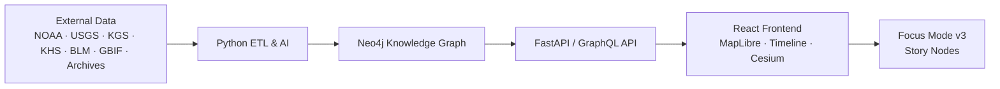

<div align="center">

# 🌾 **Kansas Frontier Matrix**  

`README.md`

**A semantic historical–geospatial platform weaving Kansas data into an interactive map, timeline, and narrative knowledge graph.**

  
<!-- Badge Row -->


</div>

---

## 🧭 Overview

Kansas Frontier Matrix (KFM) is an open-source, semantic geospatial–historical platform that fuses Kansas’s environmental, cultural, and historical data into a unified interactive experience. It combines:

- A **map** (MapLibre GL) synchronized with a **timeline**.  
- An **AI-enriched ETL pipeline** that turns raw archives into structured facts.  
- A **Neo4j knowledge graph** aligned with CIDOC-CRM, OWL-Time, GeoSPARQL, and PROV-O.  
- A **React frontend** with **Focus Mode v3** and **Story Nodes** for narrative exploration.  
- A **predictive analytics layer** extending from deep past into plausible future scenarios.

The goal is a **“living atlas” of Kansas** — where you can see wagon trails, treaties, floods, railroads, prairies, fossils, and future climate projections in one coherent, explorable system.

---

## 🗂️ Monorepo Layout (Canonical)

```text
📁 KansasFrontierMatrix/                    — Monorepo root
│
📁 docs/                                    — Documentation (standards, guides, analyses)
│   📄 README.md                            — Documentation index
│   📁 standards/                           — Governance, Markdown, FAIR+CARE, geo, security, etc.
│   📁 pipelines/                           — Pipelines overview + domain-specific docs
│   📁 architecture/                        — System & subsystem architecture
│   📁 data/                                — Data contracts, STAC/DCAT catalogs, provenance docs
│   📁 analyses/                            — Domain analyses and case studies
│   📄 glossary.md                          — Shared terminology
│
📁 src/                                     — Application & ETL code
│   📁 pipelines/                           — ETL, watchers, updaters, domain pipelines
│   │   📁 watchers/                        — “Watchers” that monitor upstream sources
│   │   📁 updater/                         — Updater Runners (schedulers, webhooks)
│   │   📁 meteorology/                     — HRRR, NDFD, atmospheric ETL
│   │   📁 hydrology/                       — Streamflow, reservoirs, WID, bathymetry ETL
│   │   📁 hazards/                         — Severe weather, wildfire, drought ETL
│   │   📁 archaeology/                     — Geophysics & archaeological spatial ETL
│   📁 graph/                               — Neo4j schema, load scripts, query APIs
│   📁 api/                                 — FastAPI apps, GraphQL gateway, REST endpoints
│   📁 tools/                               — CLI utilities and helper scripts
│
📁 web/                                     — Frontend (React + MapLibre + Cesium)
│   📁 src/                                 — UI components, Focus Mode, Story Node viewers
│   📁 public/                              — Static assets
│
📁 data/                                    — Data lifecycle (raw → work → processed → catalogs)
│   📄 README.md                            — Data directory overview
│   📄 ARCHITECTURE.md                      — Data system architecture
│   📁 sources/                             — Source manifests (URLs, providers, policies)
│   📁 raw/                                 — Immutable source data (DVC/LFS tracked)
│   📁 work/                                — Normalized & enriched intermediates
│   📁 processed/                           — Analysis-ready outputs
│   📁 stac/                                — STAC catalog, collections, items
│   📁 dcat/                                — DCAT datasets & distributions
│   📁 archive/                             — Retired/snapshotted data
│   📁 checksums/                           — SHA-256 lineage registries
│   📁 reports/                             — Validation, FAIR+CARE, audit reports
│   📁 tmp/                                 — Scratch (ignored for production)
│
📁 schemas/                                 — JSON/SHACL/telemetry schemas
│   📁 json/
│   📁 telemetry/
│
📁 .github/                                 — CI/CD workflows, policy-as-code
│   📁 workflows/
│
📄 LICENSE                                  — MIT License for code
📄 CONTRIBUTING.md                          — Contribution guidelines
📄 CODE_OF_CONDUCT.md                       — Community expectations
```

This layout ensures every pipeline, dataset, and document has a **predictable, FAIR+CARE-friendly home**.

---

## 🧱 Architecture Overview

KFM follows a layered, metadata-first architecture:

- **Data Sources**  
  Historical documents, maps, Kansas GIS archives, climate and hydrology datasets, BLM land patents, biodiversity and archaeology data, local & tribal archives.

- **Backend ETL & AI Pipeline (Python)**  
  Deterministic workflows that:
  - Fetch raw data (files, APIs, GIS services)  
  - OCR and parse text  
  - Run NLP (NER, geoparsing, summarization)  
  - Normalize dates, places, people, events  
  - Upsert entities and relationships into Neo4j with PROV-O lineage

- **Knowledge Graph (Neo4j)**  
  A semantic graph of:
  - **Entities**: `Person`, `Place`, `Event`, `Document`, `Dataset`, `StoryNode`, `AtmosphericVariable`, `Hazard`, etc.  
  - **Relationships**: `ATTENDED`, `LOCATED_AT`, `MENTIONS`, `CITED_BY`, `PART_OF`, `CAUSES`, `AFFECTS`, etc.  
  - Temporal and spatial semantics mapped to OWL-Time and GeoSPARQL.

- **API Layer (FastAPI / GraphQL)**  
  - Exposes graph & dataset queries.  
  - Powers the map, timeline, Focus Mode, Story Node calls.  
  - Offers stable contract for external integrations.

- **Frontend (React + MapLibre + Cesium)**  
  - Synchronized 2D map and timeline.  
  - 3D Cesium globe for time-aware terrain overlays.  
  - Focus Mode v3 and Story Nodes for narrative exploration.  
  - Accessibility-aware design (WCAG 2.1 AA+).

High-level flow:



---

## 🗺 Interactive Map & Timeline

At the core of KFM is the **linked map + timeline**:

- **Map (MapLibre GL)**  
  - Base layers: modern basemaps, Kansas boundaries, elevation, hydrology.  
  - Historical overlays: topographic maps, county atlases, treaty boundaries, trails, land surveys.  
  - Themed layers: forts, towns, reservations, railroads, archaeological sites, wildlife distributions.

- **Timeline**  
  - Zoomable time axis from deep past to present (and scenario futures).  
  - Events grouped and color-coded by theme.  
  - Fully synchronized:
    - Moving the timeline filters visible features.  
    - Selecting an event highlights its spatial footprint.

Examples:

- Drag across **1854–1861** → see Kansas Territory, forts, early towns, and “Bleeding Kansas” events.  
- Select **Dust Bowl (1930s)** → vegetation, soil erosion proxies, and historical news overlays appear.  
- Explore **Cretaceous Kansas** → Western Interior Seaway shorelines and fossil discovery sites.

The map + timeline stack is designed to be **accessible**, with keyboard focus, alt-text, and high-contrast options.

---

## 🎯 Focus Mode (v3)

**Focus Mode v3** is a context lens:

- You pick a **focus entity** (`Place`, `Person`, `Event`, `Tribe`, `Trail`, `Treaty`, `StoryNode`, etc.).  
- The backend pulls the **subgraph neighborhood**, including linked entities and datasets.  
- The UI reconfigures:
  - Timeline zooms to relevant intervals.  
  - Map highlights associated locations.  
  - Focus panel shows:
    - Data-grounded summary.  
    - Linked events, documents, people, datasets.  
    - Navigable “edges” across time & space.

All Focus Mode outputs:

- Are backed by underlying graph data.  
- Carry PROV-O provenance references.  
- Obey FAIR+CARE, sovereignty rules, and AI guardrails (no hallucinated facts).

---

## 📚 Story Nodes — Narrative Layer

**Story Nodes** encode curated narratives:

- Combine:
  - Spatiotemporal envelopes (GeoJSON + OWL-Time intervals).  
  - Linked graph entities (people, places, events, datasets).  
  - Human-written text with optional AI assistance (documented).  

Examples:

- **“Santa Fe Trail”** — route-focused narrative linking diaries, forts, maps.  
- **“Bleeding Kansas”** — political violence and abolitionist history.  
- **“Ecological Change on the Plains”** — prairies, agriculture, and wildlife.

Story Nodes are:

- Versioned, with lineage.  
- Designed to be exportable and re-usable in other platforms.  
- Fully integrated into Focus Mode and UI.

---

## 🌐 Standards & Governance

KFM is driven by:

- **MCP-DL v6.3** (Master Coder Protocol – Documentation-Led)  
- **KFM-MDP v11.2.2** (Markdown protocol)  
- **KFM-OP v11** (Ontology protocol)  
- **KFM-STAC v11** (STAC profile)  
- **KFM-DCAT v11** (DCAT profile)  
- **FAIR+CARE** (Findable, Accessible, Interoperable, Reusable + ethical, sovereign use)  

Governance is enforced by:

- FAIR+CARE Council  
- Focus Mode Board  
- Geo Standards, Pipelines, and Security working groups  
- CI/CD workflows that validate:
  - Docs  
  - STAC/DCAT  
  - Data contracts  
  - Sovereignty + CARE labels  
  - Supply-chain security (SLSA, SBOM, Cosign)

---

## 🤝 Contributions & Community

We welcome contributions from:

- Historians, archaeologists, tribal historians  
- Geographers, ecologists, hydrologists  
- Data and software engineers  
- Students, educators, and interested community members  

To contribute:

- Read `CONTRIBUTING.md`  
- Follow Markdown and data standards in `docs/standards/`  
- Open issues with clear context and goals  
- Use MCP-DL v6.3 patterns: **doc → design → code → tests → lineage**  

---

## 🕰 Version History

| Version | Date       | Summary                                                                                             |
|--------:|------------|-----------------------------------------------------------------------------------------------------|
| v11.2.2 | 2025-11-27 | Upgraded to KFM-MDP v11.2.2; canonical layout; badge/footer alignment; telemetry schema updated.   |
| v11.0.0 | 2025-11-18 | Initial v11 root README; established monorepo overview and architecture narrative.                 |

---

<div align="center">

## 🌾 **Kansas Frontier Matrix — Monorepo Overview (v11.2.2)**  
*Ad astra per data — to the stars through Kansas data.*

  


  
© 2025 Kansas Frontier Matrix — MIT License  
MCP-DL v6.3 · KFM-MDP v11.2.2 · FAIR+CARE Certified · Diamond⁹ Ω / Crown∞Ω  

[📚 Documentation Home](docs/README.md) ·  
[📐 System Architecture](docs/architecture/README.md) ·  
[⚖ Governance Charter](docs/standards/governance/ROOT-GOVERNANCE.md)

</div>
