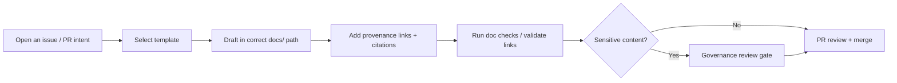

# docs/ — KFM Documentation Hub 📚

[](#governance--sensitivity)
[](#evidence--citations)
[](#faircare--governance)
[](#story-nodes--focus-mode)

> [!IMPORTANT]
> **This is a governed documentation area.** Documentation here is expected to be **template-aligned**, **pipeline-synced**, **evidence-first**, and **CI-ready**.  
> If something is unknown or unverified, explicitly mark it as **“(not confirmed in repo)”** rather than guessing.

---

## 🔗 Quick links

- **Start here (reading order)** → [🚦 Start here](#-start-here-recommended-reading-order)
- **Where things live** → [🗂️ Directory layout](#️-directory-layout) + [🧩 Document types](#-document-types-and-where-they-belong)
- **How to write** → [✍️ Writing rules](#️-writing-rules) + [Evidence & citations](#evidence--citations)
- **How to ship** → [🧪 Validation & CI](#-validation--ci) + [✅ Definition of Done](#-definition-of-done-for-docs)
- **Governance** → [⚖️ Governance & sensitivity](#governance--sensitivity) + [FAIR+CARE](#faircare--governance)
- **Focus Mode** → [🧠 Story Nodes](#story-nodes--focus-mode)

---

## 🏷️ Doc metadata

| Field | Value |
|---|---|
| File | `docs/README.md` |
| Status | Governed (documentation hub) |
| Audience | Contributors, maintainers, governance reviewers |
| Last updated | 2026-02-10 |
| Source of truth | `docs/MASTER_GUIDE_v13.md` *(or latest Master Guide in this repo)* |
| Change control | Treat edits as governance-relevant; keep links + templates stable |

> [!NOTE]
> **If multiple Master Guides exist**, treat the **highest `vN`** as canonical unless a newer doc explicitly supersedes it *(not confirmed in repo)*.

---

## 📘 Overview

### Purpose

This folder contains **KFM’s governed documentation**: system guides, standards, governance policies, templates, Story Nodes (for Focus Mode), and reports/runbooks.

Use this README as a **map** to canonical docs and to the rules that keep KFM documentation **trustworthy**, **auditable**, and **safe**.

### What this README is

- A **navigation hub** (where docs live).
- A **governance contract** (minimum expectations for governed docs).
- A **contributor on-ramp** (how to add or change docs without breaking CI).

### What this README is not

- It is **not** the full architectural blueprint—see [`docs/architecture/`](#-document-types-and-where-they-belong).
- It is **not** a replacement for templates—always start from [`docs/templates/`](#️-writing-rules).

---

## ✅ Non‑negotiables

Docs in `docs/` must not contradict these system rules:

- **Evidence-first**: every substantive factual claim needs provenance (dataset ID, catalog ID, doc reference, or external citation).  
- **Trust membrane**: UI and external clients do **not** access databases directly; access is mediated through governed APIs; core backend logic uses repository abstractions (no direct DB calls from core logic).  
- **FAIR + CARE**: handle sensitive/culturally restricted data carefully; generalize/redact and flag for review rather than leaking specifics.

---

## 🧭 Doc status and lifecycle

Use these statuses consistently (in doc metadata tables and PR descriptions):

| Status | Meaning | Allowed to cite as “truth”? | Notes |
|---|---|---:|---|
| **Draft** | In-progress, not reviewed | ❌ | May contain placeholders and **(not confirmed in repo)** |
| **Proposed** | Ready for review | ⚠️ | Cite cautiously; expect changes |
| **Governed** | Reviewed, approved, stable | ✅ | Default expectation for `docs/` hub + standards |
| **Deprecated** | Superseded/retired | ❌ | Keep for provenance; add pointers to replacements |

> [!TIP]
> If you must keep older versions (e.g., `v12`, `v13`), mark older versions as **Deprecated** inside the doc header and link to the canonical version.

---

## 🚦 Start here (recommended reading order)

1. **Master Guide (canonical pipeline + repo structure)**  
   - `docs/MASTER_GUIDE_v13.md` *(or latest available)*

2. **Markdown & documentation standards**  
   - `docs/standards/`

3. **Templates (copy first, then fill in)**  
   - `docs/templates/`

4. **Governance (review gates, ethics, sovereignty)**  
   - `docs/governance/`

5. **Story Nodes & Focus Mode**  
   - Preferred: `docs/reports/story_nodes/` *(v13 expected)*  
   - Possible alternate: `docs/story-nodes/` *(not confirmed in repo — verify)*

---

## 🗂️ Directory layout

> [!NOTE]
> The tree below reflects the **expected** `docs/` structure.  
> If your repo differs, update this README to match the actual tree and keep the Master Guide authoritative.

```text
docs/
├── README.md
├── MASTER_GUIDE_v12.md
├── MASTER_GUIDE_v13.md
├── glossary.md
├── architecture/
│   ├── KFM_REDESIGN_BLUEPRINT_v13.md
│   ├── KFM_VISION_FULL_ARCHITECTURE.md
│   ├── diagrams/
│   └── adr/
├── standards/
│   ├── KFM_MARKDOWN_WORK_PROTOCOL.md
│   ├── KFM_REPO_STRUCTURE_STANDARD.md
│   ├── KFM_STAC_PROFILE.md
│   ├── KFM_DCAT_PROFILE.md
│   └── KFM_PROV_PROFILE.md
├── templates/
│   ├── TEMPLATE__KFM_UNIVERSAL_DOC.md
│   ├── TEMPLATE__STORY_NODE_V3.md
│   └── TEMPLATE__API_CONTRACT_EXTENSION.md
├── governance/
│   ├── ROOT_GOVERNANCE.md
│   ├── ETHICS.md
│   ├── SOVEREIGNTY.md
│   └── REVIEW_GATES.md
├── reference/
│   └── REFERENCE_LIBRARY.md
├── ci/
│   └── checklists/
│       └── PR_CHECKLIST.md
└── reports/
    └── story_nodes/
        ├── templates/
        ├── draft/
        └── published/
            └── <story_slug>/
                ├── story.md
                └── assets/
```

### Naming and path conventions

- Prefer **one** canonical Story Node location (avoid splitting between `story_nodes` and `story-nodes`).  
- Prefer **stable, lowercase folder names**; avoid mixing `snake_case` and `kebab-case` for the same concept.  
- Versioned files (e.g., `*_v13.md`) should state **canonical status** and link across versions.

---

## 🧭 Key docs index

> [!IMPORTANT]
> Links below are **expected locations** based on the canonical structure. If a file doesn’t exist, mark it **(not confirmed in repo)** and either:
> 1) create it using the correct template, or  
> 2) update the link to the actual location.

| Area | Canonical doc(s) | Why it matters |
|---|---|---|
| Master Guide | `docs/MASTER_GUIDE_v13.md` | Source of truth for repo structure + pipeline |
| Architecture | `docs/architecture/…` | System boundaries, API contracts, ADRs |
| Standards | `docs/standards/…` | Lintable conventions; governance-critical |
| Templates | `docs/templates/…` | Required heading order + schema alignment |
| Governance | `docs/governance/…` | Review gates; ethics; sovereignty |
| Story Nodes | `docs/reports/story_nodes/…` | Focus Mode ingestion; narrative provenance |
| CI docs | `docs/ci/checklists/PR_CHECKLIST.md` | Preflight for doc PRs |

---

## 🧩 Document types and where they belong

| Doc type | Where it lives | Template | Notes |
|---|---|---|---|
| System / architecture guide | `docs/architecture/` | Universal Doc | Keep stable links; avoid duplicating “source of truth” docs |
| ADR (decision records) | `docs/architecture/adr/` | Universal Doc (ADR variant if present) | Each ADR should include decision + alternatives + consequences |
| Standards / protocols | `docs/standards/` | Universal Doc | Treat as governance-critical (review carefully) |
| Governance / ethics / sovereignty | `docs/governance/` | Universal Doc | May require governance sign-off |
| Story Nodes (Focus Mode narratives) | `docs/reports/story_nodes/…` | Story Node v3 | Must be machine-ingestible, citation-complete |
| API contract changes | `docs/` or `docs/architecture/` *(Master Guide decides)* | API contract extension | Pair with OpenAPI/GraphQL changes |
| Runbooks / reports | `docs/reports/` | Universal Doc | Prefer checklists + reproducible steps |
| Reference library | `docs/reference/` | N/A | Curated reading list / sources |

---

## ✍️ Writing rules

### Template-first

1. Pick the right template in `docs/templates/`.
2. Copy it into the correct folder.
3. Fill it in **without changing required heading order** (unless the template marks headings optional).

> [!WARNING]
> Changing required heading order can break ingestion (Focus Mode), schema validation, and automated governance checks.

---

## Evidence & citations

### Evidence requirements

Provide provenance for:

- Facts, numbers, timelines, maps, coordinates, geocoding decisions
- Claims about system behavior (pipelines, APIs, UI rendering, storage, indexing)
- Quotes and summaries of sources
- Any AI-assisted synthesis that could be mistaken for “ground truth”

If you cannot locate a required reference, explicitly write: **“(not confirmed in repo)”**.

### Preferred provenance hierarchy

1. **Repo-internal provenance**
   - dataset/catalog IDs (DCAT/STAC/PROV artifacts)
   - doc paths + commit hashes
   - stable graph IDs (for Story Nodes)
2. **External citations**
   - authoritative primary sources
   - stable URLs where possible
   - include license/terms when relevant

### Provenance block pattern

> [!TIP]
> When a doc mentions a dataset or map layer, add a “Source / Provenance” subsection with the fields below.

```markdown
### Source / Provenance
- Dataset ID: <dataset_id> (not confirmed in repo)
- Catalog path(s): <stac_or_dcat_path> (not confirmed in repo)
- Lineage (PROV): <prov_record_path_or_id> (not confirmed in repo)
- License / terms: <license_or_terms> (not confirmed in repo)
- Notes: <sampling, redaction, transformations>
```

---

## FAIR+CARE & governance

> [!IMPORTANT]
> KFM documentation must support **FAIR** (Findable, Accessible, Interoperable, Reusable) and **CARE** (Collective benefit, Authority to control, Responsibility, Ethics) considerations—especially when docs influence datasets, narratives, or UI behavior.

### Minimum FAIR expectations (docs)

- Findable: stable paths and headings; predictable naming; glossary links
- Accessible: avoid paywalled references as sole evidence (when possible)
- Interoperable: consistent identifiers (datasets, places, events, entities)
- Reusable: explicit terms/constraints; versioning; provenance retained

### Minimum CARE expectations (docs)

- Collective benefit: avoid extractive framing; document intended benefits
- Authority to control: respect community restrictions; do not publish restricted knowledge
- Responsibility: include governance triggers + review notes when needed
- Ethics: minimize harm (esp. trauma narratives, living persons, sensitive locations)

---

## 🧪 Validation & CI

Docs are expected to pass automated checks such as:

- Markdown linting
- Link integrity checks
- Structure/schema validation (template headings, Story Node schema, etc.)
- Sensitivity flags (content warnings / restricted info indicators)

**Before opening a PR**, use the checklist:
- `docs/ci/checklists/PR_CHECKLIST.md`

<details>
<summary><strong>Recommended preflight checks (repo commands may vary)</strong></summary>

- [ ] Run the repo’s doc lint and link-check commands *(see Master Guide; commands not confirmed in repo)*
- [ ] Confirm all relative links resolve in GitHub UI
- [ ] Confirm Mermaid renders (no syntax errors)
- [ ] Confirm Story Node template fields match ingestion expectations

</details>

---

## ⚖️ Governance & sensitivity

> [!WARNING]
> If your doc contains **precise locations**, **culturally restricted knowledge**, or other sensitive content:
> - **generalize or redact** sensitive detail
> - add a **governance review note** in the doc
> - ensure CARE principles are followed (Authority to Control, Responsibility, Ethics)

### Practical sensitivity guidance

- **Coordinates**: prefer bounding boxes, generalized regions, or centroid-with-uncertainty unless precision is explicitly permitted.
- **Living persons**: minimize personal data; avoid doxxing vectors; keep claims evidence-backed.
- **Traumatic events**: separate fact vs interpretation; avoid sensationalism; add content warnings where appropriate.
- **Culturally restricted knowledge**: do not publish restricted details; flag for governance review.

### Quick governance triggers (non-exhaustive)

- New datasets, especially community-contributed or culturally sensitive datasets
- New Story Nodes about traumatic events or living persons
- New UI features that might expose exact coordinates or personal data
- Any change that affects trust boundaries (API ↔ UI ↔ storage)

---

## 🧠 Story Nodes & Focus Mode

Story Nodes are governed narrative artifacts designed to be **machine-ingestible** and safely rendered in **Focus Mode**.

### Where they live

Preferred (v13 expected): `docs/reports/story_nodes/`  
Some repo states may also contain: `docs/story-nodes/` *(not confirmed in repo — verify)*

### Minimum Story Node expectations

- **Provenance for every claim**
- **Graph entity links** for important people/places/events *(as required by template)*
- **Fact vs interpretation** clearly separated (especially for AI-assisted text)
- **Safe rendering**: no sensitive coordinates or restricted knowledge unless explicitly authorized

> [!TIP]
> Treat Story Nodes as **public-facing by default** unless explicitly labeled otherwise *(not confirmed in repo)*.

---

## 🔁 Suggested workflow for doc changes



---

## ✅ Definition of Done for docs

- [ ] Correct template used and required headings preserved
- [ ] Every substantive claim has provenance (or is marked **(not confirmed in repo)**)
- [ ] Links are valid (relative links preferred for repo docs)
- [ ] Sensitive content is generalized/redacted and flagged for governance review
- [ ] Passes CI doc checks (lint, schema, link integrity)

---

## 🕰️ Version history

| Date | Change | Author |
|---|---|---|
| 2026-02-10 | Refined docs hub README: clearer status lifecycle, stronger provenance patterns, clarified path conventions, added key-doc index | KFM Assistant (generated) |
| 2026-02-09 | (Re)written docs hub README with governance + templates + layout map | KFM Assistant (generated) |