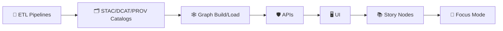

# 🧩 `src/` — Kansas Frontier Matrix (KFM) Executable Source Code


> Canonical home for **auditable**, **reproducible** KFM source code:  
> **🧪 ETL Pipelines → 🗂️ Catalogs (STAC/DCAT/PROV) → 🕸️ Graph → 🛡️ APIs** ✅

---

## 🔗 Quick links
- 🧭 Project overview (root): **[`../README.md`](../README.md)**
- 🤝 Collaboration & automation: **[`../.github/README.md`](../.github/README.md)**
- 📦 Data + metadata boundary: **[`../data/README.md`](../data/README.md)**

---

## 🧭 Quick Navigation
- [📘 Overview](#-overview)
- [🧠 Core invariants](#-core-invariants)
- [🗂️ Directory layout](#️-directory-layout)
- [📌 Where does this go?](#-where-does-this-go)
- [🧱 Architecture](#-architecture)
  - [🧪 Pipelines](#-pipelines-srcpipelines)
  - [🕸️ Graph](#-graph-srcgraph)
  - [🛡️ Server](#-server-srcserver)
  - [📜 Contracts](#-contracts-srcservercontracts)
- [🧪 Local dev norms](#-local-dev-norms)
- [🧪 Validation & CI/CD](#-validation--cicd)
- [⚖️ FAIR+CARE & governance](#️-faircare--governance)
- [📚 Reference library](#-reference-library)
- [🕰️ Version history](#️-version-history)

---

## 📘 Overview

### ✅ Purpose
`src/` is the **canonical home** for Kansas Frontier Matrix (KFM) executable source code. It implements the layers that must remain **auditable**, **contracted**, and **reproducible**:

- **🧪 Pipelines**: ingestion + ETL + normalization + metadata generation (STAC/DCAT/PROV) + validators
- **🕸️ Graph**: knowledge graph build/load utilities (**from cataloged outputs**, not ad‑hoc inserts)
- **🛡️ Server**: the governed API boundary (REST/GraphQL contracts + policy enforcement)

### 🎯 Design bias
We optimize for:
- ✅ *traceability* (outputs point back to inputs)
- ✅ *determinism* (stable IDs, repeatable runs)
- ✅ *contract-first change* (APIs and data interfaces are explicit and versionable)
- ✅ *governance safety* (classification/sensitivity propagation)

### ✅ In scope for `src/`
- Code that produces `data/raw/ → data/work/ → data/processed/` **and** emits catalogs (`data/stac`, `data/catalog/dcat`, `data/prov`)
- Code that builds/loads graph structures **from** the catalogs
- API services and contract schemas consumed by UI + Focus Mode

### 🚫 Out of scope for `src/`
- Governed documentation → `docs/`
- Data assets / outputs → `data/`
- Schema registries (JSON Schema, profiles) → `schemas/`
- Frontend UI → `web/`
- One-off notebooks that write “mystery outputs” without catalogs/PROV → `notebooks/` (and must still follow provenance rules)

---

## 🧠 Core invariants

> [!IMPORTANT]
> KFM enforces this **non-negotiable** order:
>
> **ETL → STAC/DCAT/PROV Catalogs → Graph → APIs → UI → Story Nodes → Focus Mode**



### ✅ Implications for `src/` contributors
- ✅ **Nothing enters the graph or UI unless it passed ETL and has catalog records.**
- ✅ **UI must never query the graph directly**; all access is via the governed API.
- ✅ **Derived products** (joins, interpolations, AI/ML outputs, simulations) are *data*, and require lineage (PROV) + cataloging.
- ✅ **Outputs cannot be less restricted than inputs** without an explicit, reviewed redaction/handling step.

### 🚫 Constraints you must not break
- **No out-of-band data:** if it isn’t produced via ETL and cataloged, it doesn’t belong in graph/UI.
- **Contract-first APIs:** clients integrate via contracts (OpenAPI/GraphQL), not internal DB schema.
- **Provenance-first:** log lineage + parameters + run IDs; store uncertainty/limits when relevant.
- **Sensitivity propagation:** classification must carry through catalogs → graph → API → UI.

---

## 🗂️ Directory layout

### 🧭 Repository context (expected shape)
This tree is a readable **target layout** for KFM (v13+). Keep what exists today, but bias toward converging on this shape.

```text
📁 docs/                 # 📚 governed documentation (standards, policies, architecture)
📁 src/                  # 🧩 executable source (this folder)
📁 data/                 # 📦 raw → work → processed + STAC/DCAT/PROV
📁 schemas/              # 📐 machine-validated profiles/schemas (STAC/DCAT/PROV + extensions)
📁 web/                  # 🌐 UI (maps + timeline + Focus Mode)
📁 .github/              # 🤝 workflows, templates, CODEOWNERS, governance automation
📁 releases/             # 📦 packaged release artifacts (optional)
```

### 🧩 `src/` layout (canonical homes)
Minimum canonical homes (must exist conceptually even if implementations evolve):

```text
📁 src/
├── 🧪 pipelines/            # ETL + catalog writers/validators (STAC/DCAT/PROV)
├── 🕸️ graph/                # graph build/load tools (from cataloged outputs)
└── 🛡️ server/               # API boundary (policy + services)
    └── 📜 contracts/         # OpenAPI + GraphQL contracts (source of truth)
```

### ⭐ Recommended internal layering (clean boundaries)
You can keep `src/` “flat,” but this structure scales best:

```text
src/server/
  domain/                    # 🧠 core types + rules (no framework imports)
  application/               # 🧰 use-cases/services (orchestrate domain logic)
  adapters/                  # 🔌 db/http/graph adapters (translation layer)
  infrastructure/            # 🧱 framework glue (FastAPI/Flask, auth, DI, config)
  contracts/                 # 📜 OpenAPI/GraphQL (source of truth)
```

> [!TIP]
> Keep file paths stable once clients depend on them (especially contracts + schema versions).  
> If it’s part of a contract, treat it like an API. 🧷

---

## 📌 Where does this go?

Use this map when you’re unsure:

| You are adding… | Put it in… | Why |
|---|---|---|
| Ingestion/ETL logic, transforms, validators | `src/pipelines/` | Produces reproducible outputs + catalogs |
| STAC/DCAT/PROV writers + validators | `src/pipelines/` | Catalogs are the gate into graph + UI |
| Graph build artifacts + loaders/migrations | `src/graph/` | Graph is derived from cataloged products |
| REST/GraphQL API implementation | `src/server/` | API is the only boundary for clients |
| OpenAPI / GraphQL schemas | `src/server/contracts/` | Contracts are the source of truth |
| Docs, templates, standards | `docs/` | Governed documentation lives here |
| Data outputs and catalogs | `data/` | Data lifecycle root |
| JSON schemas / profiles | `schemas/` | Machine-validation registry |
| UI / frontend | `web/` | Client-side consumers |

---

## 🧱 Architecture

### 🧪 Pipelines (`src/pipelines/`)
What goes here:
- 🔽 downloaders / loaders / connectors
- 🧼 transforms (CRS fixes, time normalization, schema harmonization)
- 🧾 **catalog writers**: STAC/DCAT/PROV
- ✅ validators + quality gates (schema checks, link checks, determinism/idempotency checks)

What should *not* go here:
- ❌ manual edits to graph databases
- ❌ UI logic
- ❌ one-off scripts that write outputs without metadata/PROV

Expected I/O contract:
- Inputs: `data/raw/` + trusted upstream sources
- Intermediate: `data/work/`
- Published outputs: `data/processed/`
- Catalogs: `data/stac/`, `data/catalog/dcat/`
- Lineage: `data/prov/`

> [!IMPORTANT]
> “Published” in KFM means: **asset exists + STAC/DCAT exists + PROV exists**.  
> If any of those are missing, the output is staging-only. 🚧

---

### 🕸️ Graph (`src/graph/`)
What goes here:
- building graph-ready artifacts from **cataloged datasets**
- graph load scripts (idempotent) and migrations
- graph validation utilities (ontology alignment, referential integrity)

Hard rule:
- Graph loads are driven from **catalog outputs** (STAC/DCAT IDs + PROV run IDs), not ad‑hoc inserts.

Preferred pattern:
- Graph stores **references** to catalog IDs and “thin” relationship edges; it should not become a duplicate data warehouse.

---

### 🛡️ Server (`src/server/`)
What goes here:
- API service implementation (REST/GraphQL)
- authn/authz + policy enforcement hooks (classification + redaction)
- “bundle” endpoints for evidence retrieval (Focus Mode = citations-first)
- telemetry/logging at the API boundary

Hard rule:
- Clients integrate through the API boundary. No direct DB/Graph access from UI.

---

### 📜 Contracts (`src/server/contracts/`)
Contracts are the stable interface between KFM internals and the outside world:
- REST (OpenAPI)
- GraphQL (SDL/schema)
- shared types for evidence bundles + provenance display

Treat contracts as:
- versioned, reviewed, and backward compatible (when possible)
- the place where breaking changes are explicitly managed

> [!TIP]
> Prefer **contract changes first**, then adapters, then implementation.  
> If you can’t write a contract test for it, it’s not ready to ship. ✅

---

## 🧪 Local dev norms

These are **recommended norms** (implement via `Makefile`, `Taskfile`, or scripts as your repo prefers):

### ✅ Minimal dev commands (recommended surface)
```bash
# quality gates
make lint
make test

# pipeline jobs
make pipeline-run JOB=<job-id>           # produces data/* + catalogs + prov
make pipeline-validate                   # validates STAC/DCAT/PROV + links

# graph
make graph-build                         # builds graph artifacts from catalogs
make graph-load                          # idempotent load into graph store

# server
make serve                               # starts API server
```

### 🧭 “If it runs in CI, it should run locally”
- Prefer containers for parity (`docker compose`) 🐳
- Pin tool versions when possible
- Keep pipeline runs reproducible (config snapshots + stable IDs)

---

## 🧪 Validation & CI/CD

### CI intent (conceptual minimum bar)
KFM CI should enforce:
- formatting + linting
- schema validation (STAC/DCAT/PROV + governed doc front-matter when applicable)
- contract checks (OpenAPI/GraphQL)
- safety/governance checks (FAIR+CARE labeling; no secrets; no accidental PII; no classification downgrades)

### Contributor checklist (before opening a PR)
- [ ] Outputs are deterministic (stable IDs; repeatable runs)
- [ ] Pipeline outputs land correctly (`raw/` → `work/` → `processed/`)
- [ ] STAC/DCAT/PROV are emitted + validated
- [ ] Graph loads are driven from catalogs (no manual inserts)
- [ ] Contracts updated first (if API surface changed)
- [ ] Tests added/updated for contracts + pipeline outputs
- [ ] Sensitivity/classification propagates end-to-end

> [!CAUTION]
> “Green CI” is a merge requirement. If CI fails, fix the root cause — don’t ship flaky behavior. 🤖🚫

---

## ⚖️ FAIR+CARE & governance

`src/` changes can have governance impact when they affect:
- how sensitivity/classification is computed or propagated
- how provenance is generated or displayed
- how AI/ML derived outputs are created, stored, and surfaced
- how Story Nodes and Focus Mode retrieve evidence bundles

When in doubt:
- treat changes as governance-relevant ✅
- prefer conservative defaults (redact/generalize; require review)
- keep Focus Mode strict: **uncited content must be hidden or flagged**

---

## 📚 Reference library
Implementation guidance only — contracts and governance win.

- See the curated reading map in the root README: **[`../README.md#-project-reference-library-all-included-project-files`](../README.md#-project-reference-library-all-included-project-files)** 📚

> [!NOTE]
> Before committing PDFs into the repo, confirm redistribution rights.  
> If licensing is unclear, store only a citation/manifest pointer (not the file). 🧾

---

## 🕰️ Version history

| Version | Date | Summary of Changes | Author |
|---:|---|---|---|
| v1.1.0 | 2026-01-06 | Aligned `src/` doc with contract-first + provenance-first rules; added clean-boundary layout guidance; added local dev norms; strengthened governance guardrails. | KFM Engineering |
| v1.0.1 | 2026-01-06 | Polished structure + navigation; added contributor checklist; clarified contract-first + governance guardrails. | KFM Engineering |
| v1.0.0 | 2025-12-31 | Initial `src/README.md` created from Master Guide v13 + KFM docs; added emoji directory layout and subsystem guide. | KFM Engineering |
