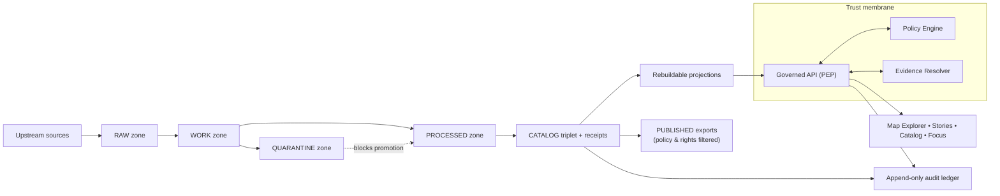

<!-- [KFM_META_BLOCK_V2]
doc_id: kfm://doc/2e7a0e0b-5c0a-4cb0-9fd6-7b3f4bbf67b1
title: docs/ — Governed Documentation Hub
type: standard
version: v2
status: draft
owners: KFM Maintainers (resolve via CODEOWNERS)
created: 2026-02-24
updated: 2026-02-28
policy_label: public
related:
  - ../README.md
  - ../.github/README.md
  - ../CONTRIBUTING.md
  - ../SECURITY.md
  - ../configs/README.md
  - ../contracts/README.md
  - ./adr/README.md
  - ./governance/README.md
  - ./runbooks/README.md
  - ./standards/README.md
tags:
  - kfm
  - docs
  - governance
  - evidence-first
  - cite-or-abstain
notes:
  - Upgraded from scaffold to governed doc index aligned to KFM vNext invariants.
  - Aligned language to truth path + trust membrane + EvidenceRef semantics; clarified “repo-root vs deeper paths” verification posture.
  - Added slots for templates + domain docs + quality docs (target structure; fail-closed if referenced by contract).
  - Treat repo-specific structure as UNKNOWN until verified; fail-closed on missing referenced files.
[/KFM_META_BLOCK_V2] -->

<a id="top"></a>

# `docs/` — Governed Documentation Hub
**Map-first • time-aware • governed • evidence-first • cite-or-abstain**

This directory is **documentation-as-production** for Kansas Frontier Matrix (KFM). Anything here is expected to be:
- **reviewable** (small diffs, stable IDs, clear owners),
- **testable where applicable** (linkcheck, schema examples, policy fixtures),
- **safe under policy** (default-deny posture; no sensitive leakage),
- **traceable** (claims link back to resolvable evidence or are marked Unknown).


> [!IMPORTANT]
> **Trust membrane rule:** docs must never become a bypass.  
> Do not include secrets, restricted coordinates, or “just trust me” claims.  
> If a claim can’t be supported by evidence, **abstain** or mark it **UNKNOWN** with verification steps.

---

## Quick navigation

- [Truth status legend](#truth-status-legend)
- [Directory contract](#directory-contract)
- [Documentation stance](#documentation-stance)
- [Where docs fit in KFM](#where-docs-fit-in-kfm)
- [Repo context](#repo-context)
- [Directory layout](#directory-layout)
- [System map](#system-map)
- [Doc templates](#doc-templates)
- [CI gates for docs](#ci-gates-for-docs)
- [Definition of Done](#definition-of-done)
- [Contribution workflow](#contribution-workflow)
- [Glossary](#glossary)
- [Reference library](#reference-library)

---

## Truth status legend

Use explicit truth labels to keep docs evidence-first and fail-closed:

- **CONFIRMED (repo):** backed by artifacts in this repository (paths, schemas, tests, receipts)
- **CONFIRMED (repo-root snapshot):** backed by a repository inventory snapshot; deeper module paths still require verification
- **CONFIRMED (design):** a KFM invariant/contract (must hold regardless of implementation)
- **PROPOSED:** a recommended template/pattern (adopt only after review)
- **UNKNOWN (repo):** not verified on this branch; include verification steps

> [!NOTE]
> If you reference a file that doesn’t exist, treat that as **missing and merge-blocking** if the reference is required by contract.

<p align="right"><a href="#top">Back to top ↑</a></p>

---

## Directory contract

### Purpose
`docs/` is the canonical home for:
- architecture and boundary contracts (human-readable)
- governance standards and review workflows
- operational runbooks
- narrative standards (Story Nodes)
- specs and examples that support enforcement (schemas, fixtures, checklists)

### What belongs in `docs/`
- **Architecture docs:** system overview, layering, trust membrane, canonical vs rebuildable
- **Governance docs:** policy labels, obligations, promotion gates, review triggers, roles
- **Runbooks:** incident response, pipeline operations, promotion procedures, rollback
- **Standards:** doc standards, schema/profile standards, catalog profile references
- **Narrative specs:** Story Node spec(s), citation conventions, evidence drawer expectations
- **Templates:** universal doc, story node, and API extension templates (governed + versioned)
- **Quality docs:** checklists, threat model prompts, and validation explainers (human-facing)
- **Evidence artifacts (bounded):** example receipts/manifests, redacted QA reports, validation examples

### What must not go in `docs/`
- **Secrets** (tokens, keys, credentials), even in examples
- **Raw or sensitive data** (default-deny): use redacted samples + digests + EvidenceRefs
- **Large binaries/build outputs** unless explicitly required and size-controlled
- **Unverifiable assertions**: if it can’t be cited, label it **UNKNOWN** and add verification steps
- **Policy enforcement logic** (belongs in `policy/` and runtime services), except for human-facing documentation of policy behavior

> [!WARNING]
> If it would be unsafe to paste into a public issue, it does not belong in public-labeled docs.

<p align="right"><a href="#top">Back to top ↑</a></p>

---

## Documentation stance

### Truth discipline
Every statement should be treated as one of:
- **Confirmed:** backed by repo artifacts or resolvable evidence
- **Proposed:** a design option with rationale + tradeoffs
- **Unknown:** not verified; must include **minimum verification steps**

> [!IMPORTANT]
> Do not “fill gaps” by inventing repo state. Prefer TODOs, explicit Unknowns, and small verification checklists.

### Safety posture
- **Default-deny** when sensitivity/permissions are unclear.
- If content could enable harm (e.g., vulnerable sites), publish only generalized detail.
- If a doc is governance-sensitive (e.g., security operations, internal escalation), label it `restricted|internal` and ensure review routing via CODEOWNERS.

### Cite-or-abstain applies to docs too
If a document makes factual claims that would influence decisions (policy, security, promotion eligibility), it should:
- cite in-repo artifacts (contracts, receipts, manifests, validators) **or**
- cite governed evidence references (EvidenceRefs) **or**
- mark the claim as **UNKNOWN**.

<p align="right"><a href="#top">Back to top ↑</a></p>

---

## Where docs fit in KFM

Docs sit alongside the enforceable artifacts and should point to them:

- **Contracts:** `contracts/` defines enforceable interfaces (OpenAPI, schemas, profiles, gates)
- **Policy:** `policy/` defines default-deny rules + obligations + test fixtures (enforced in CI and at runtime)
- **Configs:** `configs/` defines governed configuration inputs (labels, obligations, gate thresholds)
- **Data truth path:** `data/` holds canonical specs/registries/manifests/catalogs/receipts/digests
- **Governance:** `.github/` + `docs/governance/` define merge-time + human review posture
- **Tooling:** `tools/` + `tests/` make rules enforceable (validators, link checkers, fixtures)

> [!NOTE]
> If docs are served via governed APIs, the `policy_label` in the MetaBlock determines who can see the doc.
> If docs are “git-only,” still keep the label—it is a governance signal and can be enforced later.

<p align="right"><a href="#top">Back to top ↑</a></p>

---

## Repo context

`docs/` is only one surface of the system. To avoid overreach, treat any repo layout claims as **branch/commit-specific**:

- **Do not** assume deep module paths exist just because they’re shown in a target layout.
- Prefer **repo-root inventory** + **minimum verification steps** before writing “CONFIRMED (repo).”

Minimum verification steps (example):
- `ls -1` at repo root (confirm top-level folders)
- `tree -L 2 docs/` (confirm doc subfolders)
- run `linkcheck` / `MetaBlock lint` (confirm docs gates)

> [!TIP]
> If a doc is referenced by a contract, CI workflow, or release checklist, a missing link should be treated as merge-blocking.

<p align="right"><a href="#top">Back to top ↑</a></p>

---

## Directory layout

> [!NOTE]
> This is a **target structure** aligned to the KFM vNext operating model.  
> If your branch differs, update this README and any linkcheck/validators together.

```text
docs/                                                              # Governed docs hub (production docs; PR-reviewed; linkcheck-clean)
├─ README.md                                                       # Docs hub index + rules + “what goes where” + doc taxonomy + review gates
│
├─ architecture/                                                   # Architecture docs (invariants, decisions, diagrams, contracts)
│  ├─ README.md                                                    # Index + invariants + quick-nav + “start here” reading order
│  ├─ overview/                                                    # High-level architecture narrative (what/why/how)
│  │  ├─ README.md                                                 # How to read the architecture set + link map + glossary pointer + “normative vs informative”
│  │  ├─ system-context.md                                         # C4-ish context: external actors, upstream sources, infra deps, trust boundaries
│  │  ├─ actors-and-trust-surfaces.md                              # Humans/services + UI trust surfaces; “who can touch what” (high-level)
│  │  ├─ layering.md                                               # Layering model (Domain → Use cases → Interfaces → Infra) + dependency rules
│  │  ├─ component-decomposition.md                                # Components/services/modules + responsibility boundaries
│  │  ├─ deployment-topology.md                                    # Conceptual topology (envs, gateways, networks, secrets posture; no creds)
│  │  ├─ trust-membrane.md                                         # Boundary rules + enforcement points (PEP/PDP, adapters, UI trust components)
│  │  ├─ policy-boundary.md                                        # Decision IO (allow/deny/obligations), redaction semantics, audit outputs
│  │  ├─ evidence-and-claims.md                                    # Claim model + EvidenceRef/EvidenceBundle meaning + linking/resolvability rules
│  │  ├─ focus-mode-constraints.md                                 # Cite-or-abstain contract + failure modes + “no evidence → no claim”
│  │  ├─ truth-path.md                                             # Truth path zones + invariants (RAW→WORK→…→PUBLISHED)
│  │  ├─ promotion-contract.md                                     # Promotion gates (executable contract) + required artifacts + fail behavior
│  │  ├─ provenance-and-audit.md                                   # Run receipts, audit ledger, provenance graph, reproducibility expectations
│  │  ├─ canonical-vs-rebuildable.md                               # Canonical truth vs projections (search/tiles/graph) + rebuild triggers
│  │  ├─ identity-and-hashing.md                                   # Deterministic IDs, spec_hash rules, canonicalization, collisions
│  │  ├─ time-model.md                                             # Event/valid/transaction time conventions + required fields
│  │  ├─ time-queries-and-snapshots.md                             # As-of queries, snapshots, version pinning, UI implications (view_state)
│  │  ├─ security-and-privacy.md                                   # Cross-cutting posture: secrets, least privilege, redaction, safe defaults
│  │  ├─ sensitive-locations.md                                    # Sensitive sites: no exact coords, generalization, obligations, leakage tests
│  │  ├─ observability.md                                          # Logs/metrics/traces conventions + audit correlation + policy-safe dimensions
│  │  └─ glossary.md                                               # Canonical architecture terms used across docs/contracts/errors
│  ├─ decisions/                                                   # ADRs (small, reversible, versioned decisions)
│  │  ├─ README.md                                                 # ADR process + statuses + linking rules (code/tests/contracts)
│  │  ├─ adr-0000-template.md                                      # ADR template (copy/paste; ideally includes MetaBlock v2)
│  │  ├─ adr-0001-example.md                                       # Complete example ADR (illustrative)
│  │  ├─ adr-0002-trust-membrane-enforcement.md                    # Decision: where/how invariants are enforced (CI/runtime/UI)
│  │  ├─ adr-0003-policy-engine-integration.md                     # Decision: PDP integration, obligations model, caching posture
│  │  ├─ adr-0004-evidence-resolution.md                           # Decision: evidence resolver contract, redaction guarantees, errors
│  │  ├─ adr-0005-canonical-vs-rebuildable-stores.md               # Decision: storage vs projections + rebuild receipts + drift checks
│  │  ├─ adr-0006-time-model.md                                    # Decision: time semantics + schema/API/UI impacts
│  │  └─ adr-index.yml                                             # Optional: machine ADR registry (id/title/status/links) for tooling
│  ├─ diagrams/                                                    # Mermaid sources (linted; exported optionally)
│  │  ├─ README.md                                                 # Diagram style rules + naming + export policy + review checklist
│  │  ├─ system-context.mmd                                        # Actors + boundaries + dependencies diagram
│  │  ├─ layering.mmd                                              # Allowed dependency direction + interface seams diagram
│  │  ├─ truth-path.mmd                                            # Zones + promotion gates diagram
│  │  ├─ contracts.mmd                                             # Contract surfaces + validation flow diagram
│  │  ├─ pep-pdp-obligations.mmd                                   # PEP/PDP decision + obligations emission flow
│  │  ├─ evidence-flow.mmd                                         # EvidenceRef → resolve → EvidenceBundle → UI rendering/verification flow
│  │  ├─ time-model.mmd                                            # Time relationships + as-of query + version pinning flow
│  │  ├─ deployment.mmd                                            # Conceptual deployment + trust boundaries + secret handling posture
│  │  └─ exports/                                                  # OPTIONAL: rendered exports (generated; never hand-edited)
│  │     ├─ .gitkeep                                               # Keep folder if exports are generated in CI
│  │     └─ README.md                                              # How exports are generated/verified and when committed
│  ├─ contracts/                                                   # Stable contracts (human + machine; link to /contracts when canonical)
│  │  ├─ README.md                                                 # Overview + versioning + normative language rules + drift policy
│  │  ├─ api-contract.md                                           # Normative API behavior summary (auth, pagination, receipts, errors)
│  │  ├─ api-versioning-and-compat.md                              # Deprecation/compat rules + breaking-change gates + migration notes
│  │  ├─ api-error-model.md                                        # Error envelope semantics (policy-safe), trace IDs, retryability, UX mapping
│  │  ├─ authn-authz-contract.md                                   # Auth expectations (roles/scopes), audit requirements, denial semantics
│  │  ├─ policy-contract.md                                        # Policy contract (labels, decisions, obligations, fail-closed defaults)
│  │  ├─ policy-labels.vocab.json                                  # Labels vocab mirror/pointer (definitions + stability rules)
│  │  ├─ obligations.vocab.yml                                     # Obligations vocab mirror/pointer (types + required params)
│  │  ├─ evidence-resolver-contract.md                             # Resolver contract (inputs/outputs, verification, obligations, errors)
│  │  ├─ evidence-ref.schema.json                                  # EvidenceRef schema mirror/pointer (schemes + required fields)
│  │  ├─ evidence-bundle.schema.json                               # EvidenceBundle schema mirror/pointer (safe render fields + hashes)
│  │  ├─ run-receipt.schema.json                                   # Run receipt schema mirror/pointer (audit_ref, checks, inputs/outputs)
│  │  ├─ run-receipt.example.json                                  # Golden example referenced by docs + CI
│  │  ├─ promotion-manifest.schema.json                            # Promotion manifest schema mirror/pointer (artifacts, digests, approvals)
│  │  ├─ promotion-manifest.example.json                           # Golden example referenced by docs + CI
│  │  ├─ story-node.schema.json                                    # StoryNode schema mirror/pointer (or doc explaining canonical location)
│  │  ├─ claim.schema.json                                         # Claim schema (statement + evidence links + policy refs + time bounds)
│  │  └─ fixtures/                                                 # Small canonical examples used across docs/tests (policy-safe)
│  │     ├─ example-evidence-ref.json
│  │     ├─ example-evidence-bundle.json
│  │     ├─ example-claim.json
│  │     └─ example-story-node.json
│  ├─ enforcement/                                                 # How invariants become CI/runtime gates (make it testable)
│  │  ├─ README.md                                                 # How to add/modify enforcement (tests/tools/policy) + fail-closed guidance
│  │  ├─ invariants.md                                             # Normative invariants list (each links to a test/tool gate)
│  │  ├─ policy-enforcement-points.md                              # PEP inventory: location, endpoints, required context, expected outputs
│  │  ├─ contract-testing.md                                       # Contract testing strategy (OpenAPI/schema, fixtures, drift detection)
│  │  ├─ data-promotion-gates.md                                   # Gate mapping → checks → artifacts → failure semantics
│  │  ├─ redaction-and-generalization-tests.md                     # Testing posture for sensitive locations + no-leakage guarantees
│  │  └─ ci-checks.md                                              # CI job mapping (workflow → tools/tests → required artifacts)
│  ├─ registries/                                                  # Machine-readable indexes that keep architecture docs honest
│  │  ├─ README.md                                                 # What registries are + how validated + ownership rules
│  │  ├─ boundary-surface-registry.yml                             # Trust surfaces list (UI/API/batch/Focus/admin) + owners + labels
│  │  ├─ service-catalog.yml                                       # Services/modules catalog (owners, contracts, data touched, PEPs)
│  │  ├─ contract-index.yml                                        # Contract → canonical source → version → tests/tools that validate it
│  │  ├─ pep-registry.yml                                          # PEP locations + endpoints + auth requirements + audit hooks
│  │  └─ policy-label-registry.yml                                 # Human-friendly label index mirroring machine vocab
│  ├─ templates/                                                   # Architecture templates (reviewed; stable entrypoints)
│  │  ├─ README.md                                                 # Template usage rules + what must be customized before merge
│  │  ├─ kfm-meta-block-v2.txt                                     # Authoritative MetaBlock v2 snippet
│  │  ├─ standard-doc.template.md                                  # Standard doc skeleton (Context → Contract → Verification → DoD)
│  │  ├─ adr.template.md                                           # ADR skeleton (mirrors ADR template)
│  │  ├─ contract-doc.template.md                                  # Contract doc skeleton (normative language + examples + tests)
│  │  ├─ diagram.template.mmd                                      # Mermaid boilerplate (styles + lint-friendly patterns)
│  │  └─ review-checklist.md                                       # Architecture review checklist (what reviewers must verify)
│  └─ threat-model/                                                # Threat modeling (assets, actors, risks, mitigations)
│     ├─ README.md                                                 # Overview + cadence + acceptance criteria + “how to update”
│     ├─ scope-and-assets.md                                       # Protected assets + explicit out-of-scope items + trust boundaries
│     ├─ actors-and-entrypoints.md                                 # Threat actors + entry points (UI/API/batch/tools) + assumptions
│     ├─ data-classification-and-handling.md                       # Data classes + handling rules + default-deny + logging/redaction posture
│     ├─ abuse-cases.md                                            # Misuse scenarios + expected system response (deny/abstain/audit)
│     ├─ control-mapping.md                                        # Controls mapped to threats (policy, contracts, tests, infra controls)
│     ├─ risk-register.md                                          # Risk register (likelihood/impact/mitigation/owner/status)
│     └─ residual-risk.md                                          # Accepted risks + monitoring plan + revisit triggers
│
├─ adr/                                                           # Repo-wide ADRs (governed; shared entrypoint)
│  ├─ README.md                                                   # ADR process + rules + statuses + index
│  ├─ TEMPLATE.md                                                 # ADR template (single-source)
│  ├─ ADR-REVIEW-CHECKLIST.md                                     # PR checklist for ADRs (evidence/rollback/verification/labels)
│  ├─ ADR-STYLE-GUIDE.md                                          # Optional: short style rules
│  ├─ INDEX.md                                                    # Optional: canonical ADR index (recommended if auto-generated)
│  ├─ _generated/                                                 # Optional: generated artifacts (never hand-edited)
│  │  ├─ adr-index.json                                           # Machine-readable ADR index (UI/search tooling)
│  │  └─ adr-index.md                                             # Generated markdown ADR index
│  ├─ tools/                                                      # Optional: scripts to enforce ADR invariants
│  │  ├─ adr-next-number.sh                                       # Next ADR number allocator (fails on collision)
│  │  ├─ adr-lint.js                                              # Lints required sections/links/status vocabulary
│  │  └─ adr-indexer.js                                           # Regenerates INDEX.md/_generated/* from filesystem scan
│  ├─ assets/                                                     # Optional: ADR supporting assets (rare; must be policy-safe)
│  │  ├─ diagrams/
│  │  └─ screenshots/
│  ├─ archive/                                                    # Optional: imported legacy ADRs (keep original filenames)
│  │  └─ 20xx-legacy/
│  └─ (ADRs live flat here)                                       # 0001-*.md, 0002-*.md, ...
│
├─ governance/                                                    # Governance hub (human docs + checklists + policy fixtures)
│  ├─ README.md                                                   # Governance entrypoint + responsibilities + review triggers
│  ├─ ROOT_GOVERNANCE.md                                          # Charter: roles, decision process, escalation, “fail-closed” defaults
│  ├─ ETHICS.md                                                   # Ethical commitments + prohibited uses + data dignity posture
│  ├─ SOVEREIGNTY.md                                              # CARE-aligned rules + restricted knowledge handling
│  ├─ REVIEW_GATES.md                                             # Review gates + required approvers + promotion checklists
│  ├─ GLOSSARY.md                                                 # Governance glossary (shared vocabulary)
│  ├─ CHANGELOG.md                                                # Governance changes log (human-readable; dated)
│  ├─ roles/                                                      # Stewardship and ownership documentation
│  │  ├─ OWNERSHIP.md                                             # Ownership map (datasets/services/policies/catalogs) + escalation path
│  │  ├─ ROLE_MODEL.md                                            # Role taxonomy + expectations + allowed actions (high-level)
│  │  ├─ RBAC_MATRIX.md                                           # RBAC matrix (high-level; canonical truth may be policy-as-code)
│  │  └─ REVIEWERS.md                                             # Review quorum rules + CODEOWNERS alignment notes
│  ├─ labels/                                                     # Label taxonomy + sensitivity handling guidance
│  │  ├─ POLICY_LABEL_TAXONOMY.md                                 # Policy label definitions + required metadata + defaults
│  │  ├─ SENSITIVITY_GUIDE.md                                     # How to classify fields/locations/media (examples + anti-examples)
│  │  ├─ REDACTION_GENERALIZATION.md                              # Redaction/generalization rules + testing expectations
│  │  └─ examples/
│  ├─ gates/                                                      # Governance gates (CI + runtime + promotion)
│  │  ├─ PROMOTION_CONTRACT.md
│  │  ├─ CI_GATES.md
│  │  ├─ RUNTIME_GATES.md
│  │  ├─ FOCUS_MODE_EVALUATION.md
│  │  └─ waivers/
│  ├─ records/                                                    # Auditable records (decisions/reviews/incidents)
│  ├─ templates/                                                  # Governance workflow templates
│  └─ policy/                                                     # Policy docs + fixtures + parity test planning (code lives elsewhere)
│
├─ standards/                                                     # Non-negotiable standards (CI-enforced where configured)
│  ├─ README.md                                                   # Standards index + update process + deprecation rules
│  ├─ registry/                                                   # Machine-readable inventory of standards + deprecations
│  ├─ authoring/                                                  # Authoring standards (MetaBlock, normative language, citations, diagrams)
│  ├─ repo/                                                       # Repo/process standards (branching, release, versioning)
│  ├─ catalog/                                                    # Catalog standards (triplet linking + profiles)
│  ├─ policy/                                                     # Policy standards (labels, obligations, redaction)
│  ├─ evidence/                                                   # Evidence standards (refs, bundles, receipts)
│  ├─ api/                                                        # API standards (contracts, pagination, errors)
│  ├─ ui/                                                         # UI standards (evidence-first UX, accessibility)
│  └─ _archive/                                                   # Deprecated/old versions (never referenced by CI)
│
├─ templates/                                                     # Governed templates (docs-as-prod; reviewed; stable entrypoints)
│  ├─ README.md                                                   # Template index + usage rules + required customization checklist
│  ├─ TEMPLATE__KFM_UNIVERSAL_DOC.md                              # Universal doc template (Context→Contract→Verification→DoD)
│  ├─ TEMPLATE__STORY_NODE_V3.md                                  # Story Node v3 template (MetaBlock + claims + EvidenceRefs)
│  └─ TEMPLATE__API_CONTRACT_EXTENSION.md                         # API contract extension template (normative language + examples)
│
├─ runbooks/                                                      # Operational runbooks (step-by-step; production-grade)
│  ├─ README.md                                                   # Runbooks index + incident flow + “how to use during outages”
│  ├─ _registry/                                                  # Optional: machine-checkable completeness + ownership
│  ├─ templates/                                                  # Runbook templates (copy/paste)
│  ├─ incidents/                                                  # Incident playbooks + comms + drills
│  ├─ change/                                                     # Change management runbooks
│  ├─ pipelines/                                                  # Pipeline operations runbooks
│  ├─ data/                                                       # Data stewardship operations runbooks
│  ├─ catalog/                                                    # Catalog operations runbooks
│  ├─ evidence/                                                   # Evidence operations runbooks
│  ├─ indexing/                                                   # Indexing operations runbooks
│  ├─ api/                                                        # API operations runbooks
│  ├─ ui/                                                         # UI operations runbooks
│  ├─ policy/                                                     # Policy operations runbooks
│  ├─ governance/                                                 # Governance operations runbooks
│  ├─ platform/                                                   # Platform operations runbooks
│  ├─ observability/                                              # Observability operations runbooks
│  └─ _assets/                                                    # Supporting assets (prefer Mermaid + text)
│
├─ guides/                                                        # Onboarding + how-to (developer, steward, operator)
│  ├─ README.md                                                   # Guides index + recommended learning path
│  ├─ onboarding.md                                               # New contributor/operator onboarding checklist
│  ├─ add_a_dataset.md                                            # Dataset onboarding walkthrough (specs → pipelines → promotion gates)
│  ├─ publish_a_story.md                                          # Story authoring + review + publish workflow (EvidenceRefs required)
│  └─ focus_mode_eval.md                                          # Focus evals + reports interpretation + regression triage
│
├─ data/                                                          # Data documentation (manifests, schemas, QA, provenance, promotion evidence)
│  ├─ README.md                                                   # How data docs map to registries + promotion gates + where canonical “truth” lives
│  ├─ CONTRIBUTING.md                                             # How to add/update a dataset_id folder (PR checklist, naming rules)
│  ├─ GLOSSARY.md                                                 # Shared terms: dataset_id, dataset_version, run_id, extents, zones, etc.
│  │
│  ├─ _templates/                                                 # Copy/paste starters (kept in sync with _schemas)
│  │  ├─ manifest.yaml                                            # Template: identity/license/sensitivity/extents/owners
│  │  ├─ sources.yaml                                             # Template: upstream acquisition metadata + checksums/etags
│  │  ├─ checks.yaml                                              # Template: QA rules + thresholds + failure semantics
│  │  ├─ publish_receipt.json                                     # Template: audit record + checksums + policy decisions + artifact list
│  │  ├─ data_dictionary.md                                       # Template: human-friendly data dictionary starter
│  │  └─ lineage.mmd                                              # Template: Mermaid lineage diagram starter
│  │
│  ├─ _schemas/                                                   # Machine-validation for docs in this folder (CI uses these)
│  │  ├─ manifest.schema.json                                     # JSON Schema for datasets/*/manifest.yaml
│  │  ├─ sources.schema.json                                      # JSON Schema for datasets/*/provenance/sources.yaml
│  │  ├─ checks.schema.json                                       # JSON Schema for datasets/*/qa/checks.yaml
│  │  ├─ receipt.schema.json                                      # JSON Schema for datasets/*/receipts/*.json
│  │  └─ naming.schema.md                                         # Human rules: dataset_id format, dates, run_id format, file naming
│  │
│  ├─ governance/                                                 # Human-readable policy guidance (not dataset-specific)
│  │  ├─ licenses.md                                              # How to interpret license fields + compatibility notes
│  │  ├─ sensitivity.md                                           # Labels + handling requirements + “no exact coords” rules (if applicable)
│  │  ├─ redaction.md                                             # Redaction/obligation patterns + examples + testing expectations
│  │  ├─ retention.md                                             # Retention expectations by zone (docs-only; enforcement elsewhere)
│  │  └─ access.md                                                # How to request access / escalation path for restricted datasets
│  │
│  ├─ promotion/                                                  # Promotion Contract helpers (what must exist to move zones)
│  │  ├─ gates.md                                                 # Gate overview (Identity → Schema → QA → Provenance → Receipt)
│  │  ├─ checklists/                                              # Gate-by-gate review checklists (human + CI mapping)
│  │  │  ├─ gate-a-identity.md                                    # Minimum artifacts + identity/owners/license checks
│  │  │  ├─ gate-b-schema.md                                      # Schema present + validated + versioned rules
│  │  │  ├─ gate-c-qa.md                                          # QA checks + thresholds + baseline/drift posture
│  │  │  ├─ gate-d-provenance.md                                  # Provenance completeness + source checksum requirements
│  │  │  └─ gate-e-publish-receipt.md                             # Publish receipt minimums (digests, policy, artifact inventory)
│  │  └─ examples/                                                # Golden-path examples (tiny, policy-compliant)
│  │     ├─ example_dataset/                                      # A tiny “golden path” dataset folder showing best practice
│  │     └─ example_receipts/                                     # Example receipts for reviews/tests
│  │        └─ publish_YYYY-MM-DD.json
│  │
│  ├─ registries/                                                 # Optional global reference indices (human-readable)
│  │  ├─ datasets.csv                                             # Optional master index (or pointer to canonical registry elsewhere)
│  │  ├─ sources.csv                                              # Optional upstream sources index (APIs, agencies, partners)
│  │  ├─ owners.yaml                                              # Optional owner/team directory for routing reviews
│  │  ├─ tags.yaml                                                # Optional controlled tags vocabulary
│  │  └─ vocabulary/                                              # Optional shared vocabularies used by docs
│  │     ├─ geometry_types.md                                     # Geometry types vocabulary (human-facing)
│  │     ├─ measurement_units.md                                  # Units vocabulary (human-facing)
│  │     └─ place_names.md                                        # Place-name conventions (human-facing)
│  │
│  ├─ datasets/                                                   # One folder per dataset_id (human-facing docs + evidence pointers)
│  │  └─ <dataset_id>/                                            # Dataset-specific documentation bucket
│  │     ├─ README.md                                             # Dataset overview (purpose, intended use, caveats, how to cite)
│  │     ├─ manifest.yaml                                         # REQUIRED: identity, license, sensitivity, extents, owners
│  │     ├─ CHANGELOG.md                                          # Human changelog for schema/meaning changes (not every run)
│  │     ├─ access.md                                             # OPTIONAL: dataset-specific access notes (if restricted/sensitive)
│  │     │
│  │     ├─ extents/                                              # OPTIONAL: explicit extents artifacts (policy-compliant)
│  │     │  ├─ bbox.json                                          # Machine-friendly bbox + CRS note (coarse if sensitive)
│  │     │  └─ footprint.geojson                                  # Coarse footprint (avoid precise geometry if sensitive)
│  │     │
│  │     ├─ schema/                                               # REQUIRED: schema artifacts (what the data looks like)
│  │     │  ├─ schema.json                                        # JSON Schema / Arrow schema / etc. (repo convention)
│  │     │  ├─ ddl.sql                                            # Optional: PostGIS/Postgres DDL (if relevant)
│  │     │  ├─ dictionary.md                                      # Optional: human-friendly data dictionary
│  │     │  └─ mappings/                                          # Optional: upstream → canonical mappings
│  │     │     ├─ source_to_canonical.csv                         # Field mapping table (reviewer-friendly)
│  │     │     └─ codebooks/                                      # Value mappings for coded domains
│  │     │        └─ <field>.md
│  │     │
│  │     ├─ pipeline/                                             # OPTIONAL but strongly recommended: “how it is produced”
│  │     │  ├─ ingest.yaml                                        # Inputs, fetch method, cadence, auth notes (NO secrets)
│  │     │  ├─ transform.yaml                                     # Transform steps, tool versions, parameters (high level)
│  │     │  ├─ publish.yaml                                       # Publishing rules (tiling/indexing/catalog actions)
│  │     │  └─ runbook.md                                         # Incident response / refresh / backfill steps
│  │     │
│  │     ├─ qa/                                                   # REQUIRED before promotion beyond WORK
│  │     │  ├─ checks.yaml                                        # Validation rules + thresholds (what “good” means)
│  │     │  ├─ expectations.md                                    # Optional: narrative rationale for checks
│  │     │  ├─ baselines/                                         # Optional: known-good baselines for drift detection
│  │     │  │  └─ 2026-02-01.json
│  │     │  └─ reports/                                           # QA outputs (prefer folder-per-run)
│  │     │     └─ 2026-02-24/
│  │     │        ├─ report.json                                  # Machine QA report (metrics, pass/fail, inputs/outputs)
│  │     │        ├─ report.md                                    # Optional: human QA summary (high-signal findings)
│  │     │        └─ artifacts/                                   # Optional: plots/extracts (policy-compliant, small)
│  │     │
│  │     ├─ provenance/                                           # REQUIRED: lineage + sources (traceability)
│  │     │  ├─ sources.yaml                                       # Acquisition details (where/how, checksums, timestamps)
│  │     │  ├─ retrieval/                                         # Optional: per-run retrieval metadata (headers/etags; safe)
│  │     │  │  └─ 2026-02-24.json
│  │     │  ├─ lineage.mmd                                        # Lineage diagram (Mermaid)
│  │     │  └─ citations.bib                                      # Optional: scholarly citations used in narratives
│  │     │
│  │     ├─ receipts/                                             # REQUIRED for PUBLISHED: “what shipped and why”
│  │     │  ├─ ingest_2026-02-24.json                              # Acquisition → RAW receipt (who/what/when + checks)
│  │     │  ├─ promote_work_2026-02-24.json                        # Optional: RAW → WORK promotion receipt
│  │     │  ├─ promote_processed_2026-02-24.json                   # Optional: WORK → PROCESSED promotion receipt
│  │     │  └─ publish_2026-02-24.json                             # REQUIRED: checksums + policy decisions + artifact inventory
│  │     │
│  │     ├─ versions/                                             # OPTIONAL: dataset_version history (schema/meaning evolution)
│  │     │  └─ <dataset_version>/                                 # e.g., v2026-02-24 or semver-like v1.3.0
│  │     │     ├─ manifest.lock.json                               # Locked manifest snapshot used by the run
│  │     │     ├─ schema.lock.json                                 # Locked schema snapshot validated in that version
│  │     │     ├─ qa/                                              # Pointers or copies of QA reports for that version
│  │     │     ├─ provenance/                                      # Pointers or copies of provenance for that version
│  │     │     └─ receipts/                                        # Receipts that produced/published this version
│  │     │
│  │     └─ examples/                                             # OPTIONAL: safe consumption examples (no exfil patterns)
│  │        ├─ queries.sql                                        # Example PostGIS queries (avoid sensitive filters)
│  │        ├─ api.http                                           # Example API calls (HTTP file for tooling)
│  │        ├─ notebook.md                                        # “Safe notebook” instructions (no data exfil)
│  │        └─ viz.md                                             # Cartography notes / symbology defaults
│  │
│  └─ samples/                                                   # Tiny, policy-compliant samples for docs/tests (never sensitive)
│     ├─ README.md                                               # Sample rules (size cap, redaction/generalization requirements)
│     ├─ _generated/                                             # Optional: CI-generated samples (tiny + scrubbed)
│     └─ <dataset_id>/                                           # Sample bucket keyed by dataset_id
│        ├─ sample.csv
│        ├─ sample.geojson                                       # Only if permitted by sensitivity/licensing
│        └─ sample.md                                            # What was redacted/generalized and why (traceable rationale)
│
├─ stories/                                                      # Story Nodes + narrative standards (policy-labeled, review-gated)
│  ├─ README.md                                                  # Story docs index + authoring rules + review workflow
│  ├─ story_node_spec.md                                         # Story node spec (human-facing; points to canonical schema)
│  ├─ templates/
│  │  ├─ story_node.md
│  │  └─ story_node.sidecar.json
│  └─ published/                                                 # OPTIONAL: curated promoted story nodes stored in docs/
│
├─ investigations/                                               # Discover-mode notes (not user-visible until promoted)
│  ├─ README.md                                                  # Rules: drafts only; promotion path into architecture/guides/standards
│  └─ <investigation-slug>/
│     ├─ README.md                                               # Summary + hypotheses + next steps
│     └─ notes.md                                                # Working notes (dated; cite sources; mark unknowns)
│
├─ quality/                                                      # Human-facing QA checklists + explainers (maps to CI gates)
│  ├─ README.md                                                  # Quality docs index + pointers into tests/tools
│  ├─ threat_model_checklist.md                                  # Checklist linking to architecture/threat-model/*
│  └─ ...
│
├─ schemas/                                                      # Human-facing schema docs/examples (NOT canonical machine schemas)
│  ├─ README.md                                                  # Where canonical schemas live (/contracts) + how to read examples safely
│  ├─ run_receipt.md                                             # Field-by-field explanation + examples + common failures
│  ├─ promotion_manifest.md                                      # Explanation + examples + compatibility notes
│  ├─ evidence_bundle.md                                         # Explanation + safe rendering guidance + verification expectations
│  └─ examples/
│
└─ diagrams/                                                     # Shared diagrams referenced across docs (mermaid/mmd/svg)
   ├─ README.md                                                  # Cross-doc diagram conventions + naming + export rules
   └─ <diagram-files>
```

> [!TIP]
> Keep “canonical schemas” and validators under `contracts/` and `tools/`.  
> Keep `docs/schemas/` as **human-readable explanations + examples**, not the enforcement source of truth.

<p align="right"><a href="#top">Back to top ↑</a></p>

---

## System map

KFM is governed end-to-end:

**Upstream → RAW → WORK/QUARANTINE → PROCESSED → CATALOG (DCAT/STAC/PROV + receipts) → projections → trust membrane (PEP + policy + evidence) → UI → audit**



### Architecture invariants (CONFIRMED — design)
- UI/clients never access storage/DB directly; **all access goes through governed APIs + policy boundary**.
- Policy enforcement is evaluated at the **PEP**; no “static bypass” via object storage links.
- Core logic never bypasses repositories to reach storage.
- Catalogs/provenance are canonical; projections are rebuildable.
- Promotion gates fail closed.
- Focus Mode answers cite-or-abstain; citation verification is a hard gate; governed runs emit receipts.

---

## Doc templates

### MetaBlock v2 header (required)
All governed docs should start with MetaBlock v2 (no YAML frontmatter):

```md
<!-- [KFM_META_BLOCK_V2]
doc_id: kfm://doc/<uuid>
title: <Title>
type: guide|standard|story|dataset_spec|adr|runbook|run_receipt
version: v1
status: draft|review|published
owners: <team or names>
created: YYYY-MM-DD
updated: YYYY-MM-DD
policy_label: public|restricted|internal|embargoed|...
related:
  - kfm://dataset/<slug>@<version>
  - kfm://story/<id>@<version>
  - <paths or other kfm:// ids>
tags:
  - kfm
notes:
  - <short notes>
[/KFM_META_BLOCK_V2] -->
```

**Rules:**
- `doc_id` must be stable (do not regenerate on edits).
- `updated` must change on meaningful edits.
- `policy_label` must reflect the most restrictive content in the doc (default-deny if unsure).

### Template registry (PROPOSED)
If `docs/templates/` exists, treat templates as governed artifacts (reviewed, versioned, link-checked):

- `docs/templates/TEMPLATE__KFM_UNIVERSAL_DOC.md`
- `docs/templates/TEMPLATE__STORY_NODE_V3.md`
- `docs/templates/TEMPLATE__API_CONTRACT_EXTENSION.md`

### ADR template
```md
<!-- [KFM_META_BLOCK_V2]
doc_id: kfm://doc/<uuid>
title: ADR-XXXX: <decision title>
type: adr
version: v1
status: draft|accepted|rejected|superseded
owners: <team>
created: YYYY-MM-DD
updated: YYYY-MM-DD
policy_label: internal
related:
  - <link to impacted contracts/docs>
tags: [kfm, adr]
notes:
  - <optional>
[/KFM_META_BLOCK_V2] -->

# ADR-XXXX: <decision title>

## Context

## Decision

## Consequences

## Alternatives considered

## Verification
- [ ] Tests updated/added
- [ ] Migration/rollback documented
- [ ] Security/policy review completed (if applicable)
```

### Story Node template note
Story Nodes are governed narratives:
- markdown body (human)
- sidecar metadata JSON (map state, citations, policy label, review state)

Publishing gate: all citations must resolve through the evidence resolver.

---

## CI gates for docs

Docs are only safe at scale if they’re continuously validated.

Recommended doc CI gates (PROPOSED):
- **MetaBlock lint:** required fields present; `doc_id` stable; dates parse
- **Internal linkcheck:** relative links resolve; no broken anchors
- **Policy label lint:** policy_label must exist; forbidden content patterns flagged for public docs
- **Secret scan:** prevent tokens/keys from landing in docs
- **Diagram render checks:** mermaid blocks parse (at least basic lint)
- **Story citation checks (when applicable):** citations resolve (or are marked UNKNOWN with verification)

> [!IMPORTANT]
> Fail-closed posture: if a doc is required by contract (e.g., runbook referenced in release workflow) and linkcheck fails, merging should be blocked.

---

## Definition of Done

A doc change is ready to merge when:

- [ ] MetaBlock v2 is present and correct (including `policy_label` and `owners`)
- [ ] Any user-facing or decision-driving claim is traceable (links to contracts/configs/receipts/manifests)
- [ ] Unknowns are explicitly labeled and include **minimum verification steps**
- [ ] No secrets, credentials, or sensitive coordinates are present
- [ ] Links are valid (or intentionally marked TODO with an owner and plan)
- [ ] Diagrams render (Mermaid) and are readable
- [ ] If governance/policy behavior changed, related gates/tests/docs are updated together

---

## Contribution workflow

1. Create or update a doc in the appropriate subfolder.
2. Add/refresh the MetaBlock v2 header.
3. Keep changes small and reversible (prefer additive glue over sweeping rewrites).
4. If you introduce a new requirement, point to (or add) the validator/test/gate that makes it enforceable.
5. Route review via CODEOWNERS (especially for governance, security, and promotion-related docs).

> [!TIP]
> For long docs, use `<details>` appendices so the main narrative stays scannable.

---

## Glossary

- **Trust membrane:** enforced boundary where governed policy + evidence controls what can be claimed or served.
- **PEP (Policy Enforcement Point):** the API boundary that evaluates policy on every request; clients never bypass it.
- **Policy Engine:** the policy decision mechanism (e.g., OPA/Rego), invoked by the PEP.
- **Promotion gate:** required checklist + evidence bundle before a DatasetVersion can be surfaced.
- **Policy label:** sensitivity classification that drives allow/deny + obligations.
- **EvidenceRef:** stable scheme reference (dcat://, stac://, prov://, doc://, …) resolvable without guessing.
- **EvidenceBundle:** resolved evidence package (policy decision + license + provenance + digests + audit ref).
- **Canonical vs rebuildable:** catalogs/provenance/artifacts are canonical; DB/search/tiles/graph are rebuildable.
- **Cite-or-abstain:** if citations can’t be verified and policy-allowed, abstain or reduce scope.

---

## Reference library

Some KFM workstreams maintain a reference library (GIS/cartography, pipelines, security, standards).

**Policy-safe posture:**
- Prefer a **bibliography/index** (titles + notes + pointers) over committing copyrighted PDFs.
- If a PDF must be included, ensure rights allow redistribution, and label it appropriately.

> [!NOTE]
> If a “project library index” exists, treat it as a helper, not a contract.
> Do not accidentally publish copyrighted materials by bundling them into a public repo.

---

<p align="right"><a href="#top">Back to top ↑</a></p>
