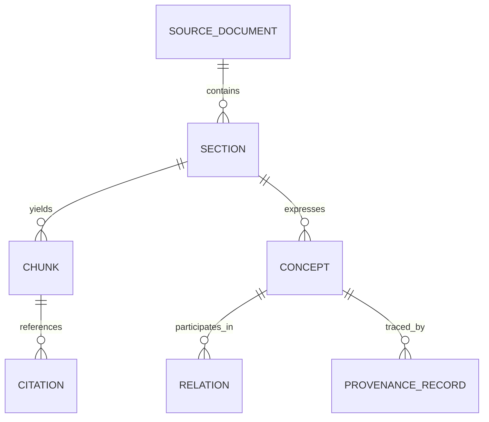
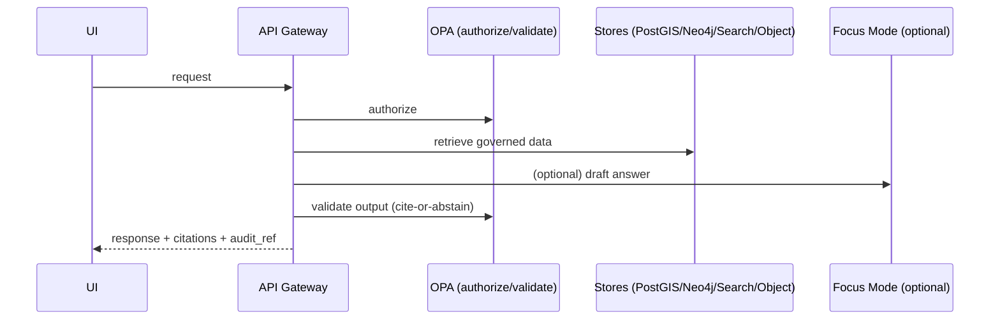
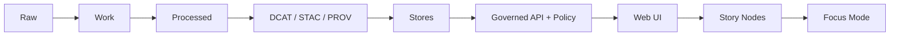

<!--
GOVERNED ARTIFACT NOTICE
This README is part of the KFM trust boundary (documentation system).
If you change meaning (not just phrasing), route through the governance review path (CODEOWNERS + CI gates).
-->

# 🧭 `docs/` — Governed Documentation (Kansas Frontier Matrix)


> **Scope:** Everything in `docs/` is a **governed artifact**: architecture, standards, templates, governance rules, runbooks, and Story Nodes (narratives) that power KFM’s public understanding and operational correctness.  
> **Audience:** engineering leads, data stewards, governance reviewers, and contributors authoring or reviewing governed artifacts.

---

## Governance header

| Field | Value |
|---|---|
| Document | `docs/README.md` |
| Status | **Governed** |
| Applies to | documentation templates, story narratives, governance rules, ops runbooks, public narrative surfaces |
| Version | `v2.0.0-draft` |
| Effective date | 2026-02-15 |
| Owners | `.github/CODEOWNERS` *(required; if missing, treat as governance gap)* |
| Review triggers | any change affecting trust membrane, policy defaults, promotion rules, evidence/citation behavior, sensitivity handling |

> [!WARNING]
> **Fail-closed rule:** if required validation surfaces are missing (templates/validators/citation resolution rules), docs changes must not weaken governance expectations.

---

## 📌 Non-negotiables (stop-the-line)

These invariants apply to **all** documentation and narrative content:

1) **Trust membrane:** UI/external clients never access databases directly — access is only through the governed API + policy boundary.  
2) **Fail-closed posture:** default deny on policy; deny when uncertain or missing required proofs.  
3) **Promotion Contract:** Raw → Work → Processed; promotion requires **receipts + checksums + catalogs** (**DCAT always; STAC conditional; PROV required**) plus validation gates.  
4) **Cite-or-abstain:** Story Nodes and Focus Mode must cite resolvable evidence or abstain; responses include an **audit reference** and citations must be resolvable to human-readable evidence views.  
5) **Deterministic identity:** governed specs and receipts must be reproducible (`spec_hash = sha256(JCS(spec))` using RFC 8785 canonical JSON).  
6) **No sensitive leakage:** do not publish restricted fields or precise sensitive locations unless explicitly governed and policy-permitted.

> [!WARNING]
> If any document conflicts with these non-negotiables, the document is wrong. Fix it or flag it for governance review.

---

## 🧭 Quick navigation

- [What belongs in `docs/`](#what-belongs-in-docs)
- [What does not belong in `docs/`](#what-does-not-belong-in-docs)
- [`docs/` directory map](#docs-directory-map)
- [How `docs/` relates to `data/` and evidence](#how-docs-relates-to-data-and-evidence)
- [Documentation types](#documentation-types)
- [Templates](#templates-required)
- [Standards](#standards-required)
- [Governance & review gates](#governance--review-gates)
- [Evidence & citations](#evidence--citations)
- [Sensitivity & redaction](#sensitivity--redaction)
- [Story Nodes](#story-nodes)
- [Document ingestion (PDF/scans/OCR) as evidence](#document-ingestion-pdfscansocr-as-evidence)
- [Quality gates & CI expectations](#quality-gates--ci-expectations)
- [Contribution workflow](#contribution-workflow)
- [Definition of Done](#definition-of-done-docs-pr)
- [Troubleshooting](#troubleshooting)
- [Appendix: boundary reminders](#appendix-boundary-reminders)
- [References](#references-internal)

---

## What belongs in `docs/`

`docs/` is the **governed documentation system** for KFM:

- system architecture docs, ADRs, diagrams
- standards and profiles (STAC/DCAT/PROV, repo standards, markdown protocol)
- templates defining required headings/ordering for governed docs
- governance policies (ethics, sovereignty, review gates)
- ops runbooks and incident response playbooks
- domain runbooks (`docs/data/<domain>/README.md`) describing how datasets are ingested/validated/published
- Story Nodes (draft/published) with assets and resolvable citations

**Rule of thumb:** if it affects system behavior, public narrative, dataset/catalog behavior, policy behavior, or Focus Mode behavior → it belongs here and is governed.

---

## What does not belong in `docs/`

To keep architecture boundaries clean:

- **raw/work/processed data artifacts** → `data/**` (never embed datasets in docs)
- **primary source documents as evidence** (PDFs/scans/images/OCR corpora) → treat as datasets and store/catalog via `data/` + STAC/DCAT/PROV  
  - docs may *describe* and *cite* them, but must not replace them
- **executable pipeline code** → `pipelines/` or `src/pipelines/`
- **API implementation** → `src/server/`
- **UI implementation** → `web/`
- **policy code (OPA/Rego)** → `policy/`

> [!NOTE]
> `docs/` can reference these subsystems, but must not blur boundaries (no “UI should query PostGIS directly” guidance).

---

## `docs/` directory map

> [!IMPORTANT]
> Keep this map accurate. When you add a doc subtree, update this README.

```text
docs/
├── README.md                               # this file (governed)
├── glossary.md                             # canonical terms (humans + tooling)
│
├── master_guides/                          # authoritative guides (versioned)
│   ├── MASTER_GUIDE_v12.md                 # legacy (if retained)
│   └── MASTER_GUIDE_v13.md                 # canonical repo + pipeline reference
│
├── architecture/                           # system design + decision records
│   ├── overview.md                         # high-level architecture summary
│   ├── c4/                                 # C4 diagrams (optional)
│   ├── diagrams/                           # Mermaid/SVG/PNG diagrams (with alt text)
│   └── adr/                                # Architecture Decision Records
│
├── standards/                              # build constraints (not suggestions)
│   ├── KFM_MARKDOWN_WORK_PROTOCOL.md
│   ├── KFM_REPO_STRUCTURE_STANDARD.md
│   ├── KFM_STAC_PROFILE.md
│   ├── KFM_DCAT_PROFILE.md
│   └── KFM_PROV_PROFILE.md
│
├── templates/                              # governed templates (machine-validated)
│   ├── TEMPLATE__KFM_UNIVERSAL_DOC.md
│   ├── TEMPLATE__STORY_NODE_V3.md
│   └── TEMPLATE__API_CONTRACT_EXTENSION.md
│
├── governance/                             # rules for safe operation & authorship
│   ├── ROOT_GOVERNANCE.md
│   ├── ETHICS.md
│   ├── SOVEREIGNTY.md
│   └── REVIEW_GATES.md
│
├── runbooks/                               # operational docs (production-grade)
│   ├── oncall/
│   ├── incident-response/
│   ├── backups/
│   ├── upgrades/
│   └── governance/
│
├── data/                                   # domain runbooks (NOT actual data)
│   └── <domain>/
│       └── README.md                       # sources, ETL, validation gates, policy labels, catalog links
│
└── reports/
    └── story_nodes/                        # governed narrative system
        ├── templates/                      # helper snippets / scaffolds
        ├── draft/                          # work-in-progress narratives
        │   └── <story_slug>/
        │       ├── story.md
        │       └── assets/
        └── published/                      # reviewed + publishable narratives
            └── <story_slug>/
                ├── story.md
                └── assets/
```

> [!NOTE]
> Your repo may currently have `docs/reports/story_nodes/` or a different Story Node root. That’s acceptable—document the mapping and keep the draft/published lifecycle.

---

## How `docs/` relates to `data/` and evidence

KFM treats sources (including documents) as governed datasets with explicit versioning and promotion gates.

| Concern | Canonical home | What “done” means |
|---|---|---|
| Raw inputs | `data/**/raw/` | deterministic manifests + checksums |
| Intermediate work | `data/**/work/` | reproducible transforms + receipts |
| Published outputs | `data/**/processed/` | only source of truth for serving |
| Catalogs | `data/catalog/{dcat,stac,prov}/` | valid DCAT/STAC/PROV, cross-linked |
| Domain runbook | `docs/data/<domain>/README.md` | documents lifecycle, gates, IDs, catalogs, policy |
| Story Nodes | `docs/reports/story_nodes/**` | validated template + citations + sensitivity checks |
| AI/evidence artifacts | `data/**/processed/` | treated like datasets: catalogs + PROV + policy |

> [!IMPORTANT]
> Docs may explain evidence; they must never *become* evidence by copying raw source content without cataloging/provenance.

---

## Documentation types

Use the right doc type and template.

| Doc type | Use it for | Canonical home | Template |
|---|---|---|---|
| **Universal Doc** | most designs, specs, runbooks | `docs/**` | `TEMPLATE__KFM_UNIVERSAL_DOC.md` |
| **Story Node v3** | narratives powering UI/Focus Mode | `docs/reports/story_nodes/**/story.md` | `TEMPLATE__STORY_NODE_V3.md` |
| **API Contract Extension** | changes to API behavior/contracts | `docs/architecture/**` or `docs/standards/**` | `TEMPLATE__API_CONTRACT_EXTENSION.md` |
| **ADR** | decisions with context & tradeoffs | `docs/architecture/adr/` | repo ADR standard |
| **Domain module README** | per-domain data runbook | `docs/data/<domain>/README.md` | Universal Doc (+ domain sections) |

---

## Templates (required)

> [!IMPORTANT]
> Do not improvise headings for governed docs. Templates keep docs machine-parseable and CI-checkable.

- `docs/templates/TEMPLATE__KFM_UNIVERSAL_DOC.md`
- `docs/templates/TEMPLATE__STORY_NODE_V3.md`
- `docs/templates/TEMPLATE__API_CONTRACT_EXTENSION.md`

If you need a new template:
1) add it under `docs/templates/`
2) update this README
3) extend CI validation rules to recognize and validate it

---

## Standards (required)

Standards are build constraints, not suggestions.

- `docs/standards/KFM_MARKDOWN_WORK_PROTOCOL.md`
- `docs/standards/KFM_REPO_STRUCTURE_STANDARD.md`
- `docs/standards/KFM_STAC_PROFILE.md`
- `docs/standards/KFM_DCAT_PROFILE.md`
- `docs/standards/KFM_PROV_PROFILE.md`

If implementation diverges from a standard, either:
- fix the implementation, or
- update the standard via governance review (with rationale + migration plan)

---

## Governance & review gates

Governance docs define how KFM prevents drift, uncited narratives, and sensitivity violations:

- `docs/governance/ROOT_GOVERNANCE.md`
- `docs/governance/ETHICS.md`
- `docs/governance/SOVEREIGNTY.md`
- `docs/governance/REVIEW_GATES.md`

### Expectations for doc authors
- Treat any doc that affects system behavior as a production change.
- Prefer minimal, reversible changes.
- When uncertain, explicitly label:
  - assumptions
  - risks
  - tradeoffs
  - verification steps

### Policy posture reminder (default deny)
Illustrative example (policy remains source-of-truth in `policy/`):

```rego
package kfm.ai
default allow := false

allow if {
  input.answer.has_citations == true
  input.answer.sensitivity_ok == true
}
```

---

## Evidence & citations

### Evidence-first contract (docs, stories, Focus Mode)
- Every user-visible factual claim must be supported by resolvable evidence.
- If evidence cannot be resolved, narratives and Focus Mode must abstain rather than guess.
- Citations must be precise enough that evidence UX can locate what you referenced in **≤ 2 API calls**.

### Citation shape (recommended)
Citations are objects, not just URLs. A citation should point to one of:
- DCAT dataset metadata
- STAC item/collection for spatial/media assets
- PROV chain (lineage)
- document spans (page/char offsets or image bounding boxes)
- graph refs (concept/edge provenance)

Illustrative citation object:

```json
{
  "ref": "prov://run/run_2026-02-15T12:34:56Z",
  "kind": "prov",
  "locator": {
    "dataset_id": "kfm.example_dataset",
    "dataset_version": "sha256:...",
    "record_ids": ["..."],
    "doc_id": "kfm.doc.primary.000123",
    "page_range": [12, 13],
    "char_span": [4410, 5122]
  }
}
```

### Evidence bundles in Story Nodes (recommended)
Story Nodes may carry bundle/digest references for rapid resolution:

```yaml
evidence_bundle:
  digest: "sha256:..."
  refs:
    - "dcat://dataset/kfm.example_dataset"
    - "stac://collection/kfm.example_dataset"
    - "prov://run/run_..."
```

---

## Sensitivity & redaction

Some content must be treated as sensitive (private ownership, precise archaeology sites, culturally restricted knowledge).

### Recommended sensitivity classes
- **Public** — safe to publish without redaction  
- **Restricted** — role-based access required  
- **Sensitive-location** — coordinates must be generalized/suppressed  
- **Aggregate-only** — publish only above thresholds  

### Redaction as a first-class transformation
If a doc references redacted/generalized data, it must state:
- what was redacted/generalized
- why (policy label)
- how (transformation)
- provenance references for the redacted derivative (PROV + dataset/version IDs)

> [!CAUTION]
> Never paste restricted fields or precise sensitive coordinates into issues, PRs, logs, screenshots, or fixtures.

---

## Story Nodes

Story Nodes are the narrative core of KFM’s public understanding. They must be citable, reproducible, and reviewable.

### Where Story Nodes live
- Draft: `docs/reports/story_nodes/draft/<story_slug>/story.md`
- Published: `docs/reports/story_nodes/published/<story_slug>/story.md`
- Assets: `docs/reports/story_nodes/**/<story_slug>/assets/`

### Authoring rules
- Must use `docs/templates/TEMPLATE__STORY_NODE_V3.md`
- Must include citations for factual claims (or abstain)
- Must avoid sensitive-location disclosure unless explicitly allowed by governance + policy
- Must remain compatible with StoryViewer + evidence resolver UX

---

## Document ingestion (PDF/scans/OCR) as evidence

Many KFM sources are documents (maps, scans, newspapers). Treat these as **data artifacts**, not “docs documentation.”

### Rules of engagement
- keep original scans and OCR outputs
- treat OCR cleanup + extraction as derivative artifacts with explicit provenance
- citations must point to page/item/issue IDs and spans/bboxes
- publish document artifacts through Raw → Work → Processed with catalogs and PROV

### Knowledge layer extraction graph (recommended model)



Minimum provenance fields for extracted artifacts:
- `source_doc_id`
- page range
- char span (or bounding boxes)
- method/tool version

---

## Quality gates & CI expectations

`docs/` is governed and must be validated like code.

### Minimum gates expected for docs changes
- Markdown linting/format checks
- Link-check (no broken internal references)
- Template validation (required headings/order)
- Story Node schema validation (for Story Nodes)
- Citation resolution checks (where tooling exists)
- Sensitivity scans (no sensitive-location leakage in text/fixtures)
- Policy regression expectations when docs impact policy behavior

> [!TIP]
> Governance should be enforced by validators/CI wherever possible, with human review triggered by sensitivity flags and high-impact changes.

---

## Contribution workflow

### Where to start
1) Read the Master Guide (`docs/master_guides/MASTER_GUIDE_v13.md` if present)  
2) Read the relevant standard(s) in `docs/standards/`  
3) Pick the correct template from `docs/templates/`

### Editing rules (practical)
- prefer small PRs
- if changing a standard, include rationale + migration notes + acceptance criteria
- if adding new directories, update the directory map in this README

### Suggested PR labels (optional)
- `docs:governed`
- `docs:story-node`
- `docs:standards`
- `governance-review-required`
- `sensitivity-review-required`

---

## Definition of Done (Docs PR)

- [ ] correct doc type chosen (Universal Doc / Story Node / API Contract Extension / ADR)
- [ ] correct template used; required headings preserved
- [ ] evidence-first: claims supported with resolvable citations (or explicit abstention)
- [ ] no sensitive leakage (or explicitly governed)
- [ ] link-check clean (internal links + referenced assets)
- [ ] markdown lint clean
- [ ] any new diagrams/assets stored in the right subtree with attribution/license notes where required
- [ ] if doc changes system behavior: acceptance criteria included + CI gates identified/updated
- [ ] if doc touches data publication: promotion invariants respected (receipts + catalogs expectations)

---

## Troubleshooting

### “My doc failed validation”
Common causes:
- missing required headings (template mismatch)
- broken relative links
- assets stored outside expected subtree
- citations missing where required by tooling
- Story Node schema mismatch

### “I don’t know where this doc belongs”
Use this rule:
- architecture/decisions → `docs/architecture/` (and `adr/` for decisions)
- standards/profiles → `docs/standards/`
- templates → `docs/templates/`
- governance → `docs/governance/`
- narrative content → `docs/reports/story_nodes/`
- domain runbooks → `docs/data/<domain>/README.md`
- ops runbooks → `docs/runbooks/`

If still unclear, place it under `docs/architecture/` as a draft and flag for governance review.

---

## Appendix: boundary reminders

### Trust membrane (never bypass)



### Truth path (no leapfrogging)



---

## References (internal)

- `docs/master_guides/MASTER_GUIDE_v13.md` — canonical repo + pipeline structure (supersedes v12)
- `docs/architecture/**` — architecture docs + ADRs
- `docs/standards/**` — STAC/DCAT/PROV + markdown + repo standards
- `docs/templates/**` — governed templates (universal doc, story node v3, API contract extension)
- `docs/governance/**` — governance, ethics, sovereignty, review gates
