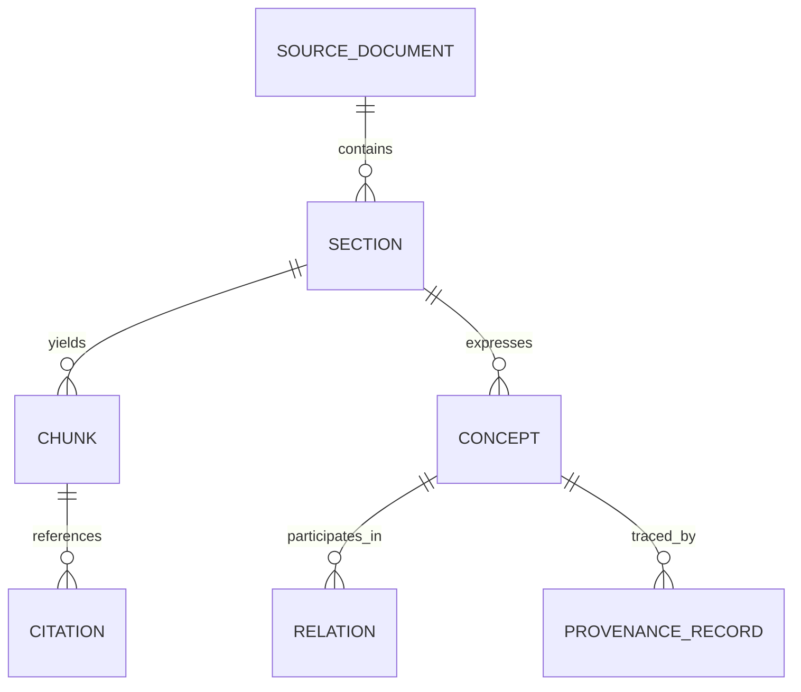
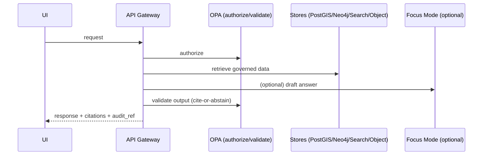
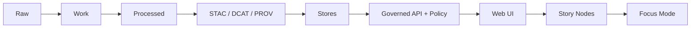

# 🧭 `docs/` — Governed Documentation (Kansas Frontier Matrix)


> **Scope:** Everything in `docs/` is a **governed artifact**: architecture, standards, templates, domain runbooks, and Story Nodes (narratives) that power the KFM public understanding.
>
> **Audience:** engineering leads, data stewards, governance reviewers, and contributors authoring or reviewing governed artifacts.

---

## 📌 Non-negotiables (Boss Mode / Stop-the-line)

These invariants apply to **all** documentation and narrative content:

1) **Trust membrane:** UI/external clients never access databases directly — access is **only** through the governed API + policy boundary.  
2) **Fail-closed posture:** default deny on policy; deny when uncertain.  
3) **Dataset promotion gates:** Raw → Work → Processed; promotion requires **checksums + STAC/DCAT/PROV catalogs** and validation gates.  
4) **Cite-or-abstain:** Story Nodes and Focus Mode must cite evidence or abstain; responses include an **audit reference** and citations must be resolvable (evidence view).

> [!WARNING]
> If any document conflicts with these non-negotiables, the document is wrong. Fix it or flag it for governance review.

---

## 🧭 Quick navigation

- [What belongs in `docs/`](#what-belongs-in-docs)
- [What does **not** belong in `docs/`](#what-does-not-belong-in-docs)
- [`docs/` directory map](#docs-directory-map)
- [How `docs/` relates to `data/` and evidence](#how-docs-relates-to-data-and-evidence)
- [Documentation types](#documentation-types)
- [Templates](#templates-required)
- [Standards](#standards-required)
- [Governance & review gates](#governance--review-gates)
- [Evidence & citations](#evidence--citations)
- [Sensitivity & redaction](#sensitivity--redaction)
- [Story Nodes](#story-nodes)
- [Document ingestion (PDF/scans/OCR) as evidence](#document-ingestion-pdfscansocr-as-evidence)
- [Quality gates & CI expectations](#quality-gates--ci-expectations)
- [Contribution workflow](#contribution-workflow)
- [Definition of Done](#definition-of-done-docs-pr)
- [Troubleshooting](#troubleshooting)
- [Appendix: boundary reminders](#appendix-boundary-reminders)
- [References](#references-internal)

---

## What belongs in `docs/`

`docs/` is the **governed documentation system** for KFM:

- system architecture docs, ADRs, diagrams
- standards and profiles (STAC/DCAT/PROV, repo standards, markdown protocol)
- templates that define required headings/ordering for governed docs
- governance policies (ethics, sovereignty, review gates)
- **domain runbooks** (`docs/data/<domain>/README.md`) that document how datasets are ingested/validated/published
- Story Nodes (narratives) in draft/published form with assets and citations

**Rule of thumb:** if it affects system behavior, public narrative, datasets/catalog behavior, or Focus Mode output behavior → it belongs here and is governed.

---

## What does not belong in `docs/`

To keep architecture boundaries clean:

- **Raw data, intermediate outputs, processed artifacts** → `data/<domain>/{raw,work,processed}/`
- **Primary source documents used as evidence** (PDF scans, images, OCR corpora) → treat as data artifacts and store/certify/catalog them via `data/` + STAC/DCAT/PROV (docs should describe and link to them, not replace them)
- **Executable pipeline code** → `src/pipelines/`
- **API implementation and contracts** → `src/server/` (contracts may be generated/derived from docs, but runtime source-of-truth stays in server contracts)
- **UI code** → `web/`
- **Policy code (OPA/Rego)** → policy subsystem (repo-defined)

> [!NOTE]
> `docs/` can *reference* these subsystems, but must not blur boundaries (no “UI should query PostGIS directly” instructions).

---

## `docs/` directory map

> **Keep this map accurate.** When you add a new doc subtree, update this README.

```text
docs/
├── README.md                               # This file (governed)
├── MASTER_GUIDE_v12.md                     # Legacy (if retained)
├── MASTER_GUIDE_v13.md                     # Canonical repo + pipeline reference
├── glossary.md                             # Canonical terms (humans + tooling)
│
├── architecture/
│   ├── KFM_REDESIGN_BLUEPRINT_v13.md       # v13 redesign rationale
│   ├── KFM_NEXT_STAGES_BLUEPRINT.md        # roadmap / extension points
│   ├── KFM_VISION_FULL_ARCHITECTURE.md     # long-term vision
│   ├── diagrams/                           # Mermaid/SVG/PNG diagrams
│   └── adr/                                # Architecture Decision Records
│
├── standards/
│   ├── KFM_MARKDOWN_WORK_PROTOCOL.md       # governed markdown rules for KFM docs
│   ├── KFM_REPO_STRUCTURE_STANDARD.md      # canonical folder conventions + invariants
│   ├── KFM_STAC_PROFILE.md                 # STAC profile requirements
│   ├── KFM_DCAT_PROFILE.md                 # DCAT profile requirements
│   └── KFM_PROV_PROFILE.md                 # PROV lineage requirements
│
├── templates/
│   ├── TEMPLATE__KFM_UNIVERSAL_DOC.md      # default governed doc template (required)
│   ├── TEMPLATE__STORY_NODE_V3.md          # Story Node template (required)
│   └── TEMPLATE__API_CONTRACT_EXTENSION.md # governed API contract change template
│
├── governance/
│   ├── ROOT_GOVERNANCE.md                  # top-level governance rules
│   ├── ETHICS.md                           # ethics requirements & constraints
│   ├── SOVEREIGNTY.md                      # FAIR/CARE, authority to control, stewardship
│   └── REVIEW_GATES.md                     # how docs/data/policy changes are approved
│
├── data/                                   # Domain documentation modules (NOT actual data)
│   └── <domain>/
│       └── README.md                       # domain runbook: sources, ETL, catalogs, policy labels
│
└── reports/
    └── story_nodes/
        ├── templates/                      # story helper snippets / scaffolds
        ├── draft/                          # work-in-progress narratives
        └── published/                      # published story nodes (reviewed)
            └── <story_slug>/
                ├── story.md                # the story node itself
                └── assets/                 # images/maps/figures used by the story
```

---

## How `docs/` relates to `data/` and evidence

KFM treats sources (including documents) as governed datasets with explicit versioning and promotion gates.

| Concern | Canonical home | What “done” means |
|---|---|---|
| Raw inputs | `data/<domain>/raw/` | deterministic manifests + checksums |
| Intermediate work | `data/<domain>/work/` | reproducible transformations |
| Published outputs | `data/<domain>/processed/` | only source of truth for serving |
| Catalogs | `data/stac/`, `data/catalog/dcat/`, `data/prov/` | valid STAC/DCAT/PROV, link-check clean |
| Domain runbook | `docs/data/<domain>/README.md` | documents ETL + validation gates + policy labels |
| Story Nodes | `docs/reports/story_nodes/**` | validated template + citations + sensitivity checks |
| AI/evidence artifacts | `data/<domain>/processed/` | treated like datasets: catalogs + PROV + policy |

---

## Documentation types

Use the right doc “type” and the right template.

| Doc type | Use it for | Canonical home | Template |
|---|---|---|---|
| **Universal Doc** | most designs, runbooks, specs | `docs/**` | `TEMPLATE__KFM_UNIVERSAL_DOC.md` |
| **Story Node v3** | narratives powering UI/Focus Mode | `docs/reports/story_nodes/**/story.md` | `TEMPLATE__STORY_NODE_V3.md` |
| **API Contract Extension** | changes to API behavior/contracts | `docs/architecture/**` or `docs/standards/**` | `TEMPLATE__API_CONTRACT_EXTENSION.md` |
| **ADR** | decisions with context & tradeoffs | `docs/architecture/adr/` | (repo ADR standard) |
| **Domain module README** | per-domain data runbook | `docs/data/<domain>/README.md` | Universal Doc (plus domain sections) |

---

## Templates (required)

> [!IMPORTANT]
> **Do not improvise headings** for governed docs. Templates exist to keep docs machine-parseable and CI-checkable.

- `docs/templates/TEMPLATE__KFM_UNIVERSAL_DOC.md`
- `docs/templates/TEMPLATE__STORY_NODE_V3.md`
- `docs/templates/TEMPLATE__API_CONTRACT_EXTENSION.md`

If you need a new template:
1) add it under `docs/templates/`
2) update this README
3) add/extend CI validation rules to recognize and validate it

---

## Standards (required)

Standards are **build constraints**, not suggestions.

- `docs/standards/KFM_MARKDOWN_WORK_PROTOCOL.md`
- `docs/standards/KFM_REPO_STRUCTURE_STANDARD.md`
- `docs/standards/KFM_STAC_PROFILE.md`
- `docs/standards/KFM_DCAT_PROFILE.md`
- `docs/standards/KFM_PROV_PROFILE.md`

If an implementation diverges from a standard, either:
- fix the implementation, or
- update the standard via governance review (with explicit rationale + migration plan)

---

## Governance & review gates

Governance docs define how KFM prevents repo drift, uncited narratives, and sensitivity violations:

- `docs/governance/ROOT_GOVERNANCE.md`
- `docs/governance/ETHICS.md`
- `docs/governance/SOVEREIGNTY.md`
- `docs/governance/REVIEW_GATES.md`

### Governance expectations for doc authors

- Treat any doc that affects system behavior as a production change.
- Prefer minimal, reversible changes.
- When uncertain, explicitly label:
  - assumptions
  - risks
  - tradeoffs
  - verification steps (minimum work to confirm unknowns)

### Policy posture reminder (default deny)

The default posture is fail-closed. For example, “AI output allowed” only when citations exist and sensitivity checks pass:

```rego
package kfm.ai
default allow := false

allow if {
  input.answer.has_citations == true
  input.answer.sensitivity_ok == true
}
```

---

## Evidence & citations

### Evidence-first contract (docs, stories, Focus Mode)

KFM requires evidence-first behavior:

- Every **user-visible factual claim** must be supported by **resolvable evidence** (dataset version, record IDs, doc spans).
- If evidence cannot be resolved, narratives and Focus Mode must **abstain** rather than guess.
- Citations must be precise enough that the evidence UX can locate what you referenced in **≤2 API calls**.

### Citation “shape” (recommended)

Citations are objects, not just URLs. A citation should point to one of:
- DCAT dataset metadata
- STAC item/collection for spatial/media assets
- PROV chain (lineage)
- Document span (page/char offsets)
- Graph refs (concept/edge provenance)

Example (illustrative):

```json
{
  "ref": "cit:01J0...XYZ",
  "kind": "doc|stac|dcat|prov|graph",
  "locator": {
    "dataset_id": "kfm.historical.treaties",
    "dataset_version": "sha256:…",
    "record_ids": ["…"],
    "doc_id": "kfm.doc.primary.000123",
    "page_range": [12, 13],
    "char_span": [4410, 5122]
  }
}
```

### Evidence bundle in Story Nodes (recommended)

Story Nodes should optionally carry an evidence bundle for rapid resolution:

```yaml
evidence_bundle:
  stac: ["stac:collection:…", "stac:item:…"]
  dcat: ["dcat:dataset:…"]
  prov: ["prov:bundle:…"]
  graph: ["graph:concept:…"]
```

---

## Sensitivity & redaction

Some content must be treated as sensitive (e.g., private ownership, precise archaeological locations, culturally restricted knowledge).

### Recommended sensitivity classes

- **Public** — safe to publish without redaction  
- **Restricted** — role-based access required (e.g., parcel ownership)  
- **Sensitive-location** — coordinates must be generalized/suppressed (e.g., archaeology, sensitive species)  
- **Aggregate-only** — publish only above thresholds (e.g., small-count indicators)

### Redaction as a first-class transformation

If a doc references redacted/generalized data, it must state:
- what was redacted/generalized
- why (policy label)
- how (transformation)
- provenance references for the redacted derivative (PROV + dataset version IDs)

---

## Story Nodes

Story Nodes are the narrative core of KFM’s public understanding. They must be citable, reproducible, and reviewable.

### Where Story Nodes live

- Draft: `docs/reports/story_nodes/draft/<story_slug>/story.md`
- Published: `docs/reports/story_nodes/published/<story_slug>/story.md`
- Assets: `docs/reports/story_nodes/**/<story_slug>/assets/`

### Authoring rules

- Must use `docs/templates/TEMPLATE__STORY_NODE_V3.md`
- Must include citations for factual claims (or abstain)
- Must avoid sensitive-location disclosure unless explicitly allowed by governance + policy
- Must remain compatible with StoryViewer + evidence resolver UX

---

## Document ingestion (PDF/scans/OCR) as evidence

Many KFM sources are documents (maps, scans, newspapers, treaties, plats). Treat these as **data artifacts**, not “docs/ documentation.”

### Rules of engagement

- Keep **original scans** and OCR outputs.
- Treat OCR cleanup + entity extraction as **derivative artifacts** with explicit provenance.
- Index full-text for retrieval, but citations must point to the specific **page/item/issue ID** used.
- Publish document artifacts through the same Raw → Work → Processed lifecycle, with catalogs and PROV.

### Knowledge layer (extraction graph) — recommended model

To connect documentation, Story Nodes, and evidence, KFM may maintain an extraction graph tying documents to sections/chunks/concepts/citations.



Minimum provenance fields for extracted artifacts should include:
- `source_doc_id`
- page range
- char span (or bounding boxes for images)
- method / tool version (for OCR/extraction)

---

## Quality gates & CI expectations

`docs/` is governed and must be validated like code.

### Minimum gates expected for docs changes

- Markdown linting / formatting rules (governed)
- Link-check (no broken internal references)
- Template validation (required headings/order)
- Story Node schema validation (for Story Nodes)
- Catalog validation (STAC/DCAT/PROV) when docs change relates to data publication
- OPA/policy regression expectations when docs affect policy behavior
- Security and governance scans (secrets, PII, sensitive-location leakage)

> [!TIP]
> Governance should be enforced **by validators/CI** wherever possible, with human review triggered by sensitivity flags and high-impact changes.

---

## Contribution workflow

### Where to start

1) Read: `docs/MASTER_GUIDE_v13.md`  
2) Read the relevant standard(s) in `docs/standards/`  
3) Pick the correct template from `docs/templates/`

### Editing rules (practical)

- Prefer small PRs (reviewable, reversible).
- If changing a standard, include:
  - rationale
  - migration notes
  - acceptance criteria/tests (or CI gate updates)
- If adding new directories, update the directory map in this README.

### Suggested PR labels (optional)

- `docs:governed`
- `docs:story-node`
- `docs:standards`
- `governance-review-required`
- `sensitivity-review-required`

---

## Definition of Done (Docs PR)

Use this checklist before requesting review:

- [ ] Correct doc type chosen (Universal Doc / Story Node / API Contract Extension / ADR)
- [ ] Correct template used; required headings preserved
- [ ] Front-matter present and valid (per markdown protocol)
- [ ] No sensitive-location leakage (or explicitly governed)
- [ ] Evidence-first: claims are supported with resolvable citations
- [ ] Link-check clean (internal links + referenced assets)
- [ ] Markdown lint clean
- [ ] Any referenced diagrams/assets committed to the right folder
- [ ] If doc changes system behavior: acceptance criteria included + CI gates identified/updated
- [ ] If doc touches policy behavior: OPA/policy regression expectations noted
- [ ] If doc touches data publication: Raw/Work/Processed + STAC/DCAT/PROV invariants respected

---

## Troubleshooting

### “My doc failed validation”

Common causes:
- missing required headings (template mismatch)
- broken relative links
- assets stored outside the expected subtree
- citations missing where required by tooling
- Story Node schema mismatch

### “I don’t know where this doc belongs”

Use this rule:
- Architecture/decisions → `docs/architecture/` (and `adr/` for decisions)
- Standards/profiles → `docs/standards/`
- Reusable formats → `docs/templates/`
- Governance/policy rules → `docs/governance/`
- Narrative content → `docs/reports/story_nodes/`
- Domain runbooks → `docs/data/<domain>/README.md`

If still unclear, place it under `docs/architecture/` as a draft and flag for governance review.

---

## Appendix: boundary reminders

### Trust membrane (never bypass)



### Truth path (no leapfrogging)



---

## References (internal)

- `docs/MASTER_GUIDE_v13.md` — canonical repo + pipeline structure (supersedes v12)
- `docs/architecture/KFM_REDESIGN_BLUEPRINT_v13.md` — v13 redesign decisions
- `docs/standards/*` — STAC/DCAT/PROV + markdown + repo structure standards
- `docs/templates/*` — governed templates (universal doc, story node v3, API contract extension)
- `docs/governance/*` — governance, ethics, sovereignty, review gates