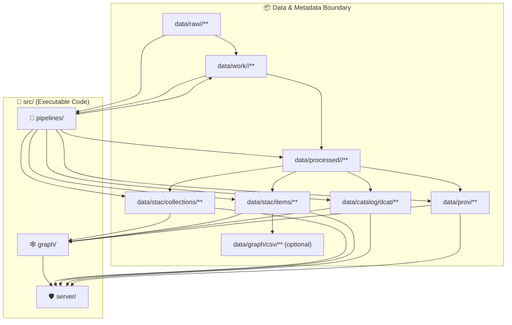

<!--
📌 This README documents the *canonical* executable code boundary for KFM.
🗓️ Last updated: 2026-01-08
-->

# 🧩 `src/` — Kansas Frontier Matrix (KFM) Executable Source Code 🧭🗺️


> Canonical home for **auditable**, **reproducible**, **governed** KFM executable code:  
> **🧪 ETL Pipelines → 🗂️ Catalogs (STAC/DCAT/PROV) → 🕸️ Graph (Neo4j) → 🛡️ APIs (FastAPI/GraphQL)** ✅  
> Everything else (governed docs, data assets, UI, story content) lives outside this boundary.

> [!IMPORTANT]
> **KFM’s non‑negotiable order:**  
> **ETL → STAC/DCAT/PROV Catalogs → Graph → APIs → UI → Story Nodes → Focus Mode**  
> If your change breaks this ordering (even “temporarily”), it’s not mergeable. 🚫

---

## 🔗 Quick links
- 🧭 Repo overview: **[`../README.md`](../README.md)**
- 📘 Master Guide (canonical): **[`../docs/MASTER_GUIDE_v13.md`](../docs/MASTER_GUIDE_v13.md)** *(recommended)*
- 🧠 Glossary: **[`../docs/glossary.md`](../docs/glossary.md)** *(if present)*
- 📦 Data + metadata boundary: **[`../data/README.md`](../data/README.md)**
- 📐 Schemas registry: **[`../schemas/`](../schemas/)** *(if present)*
- ✅ Tests: **[`../tests/`](../tests/)** *(if present)*
- 🧰 Tools/validators: **[`../tools/`](../tools/)** *(if present)*
- 🛰️ API boundary (backend): **[`./server/README.md`](./server/README.md)** *(preferred)* or **[`../api/README.md`](../api/README.md)** *(legacy, if present)*
- 🌐 Web UI boundary: **[`../web/README.md`](../web/README.md)** *(if present)*
- 📚 Story Nodes (governed narratives): **[`../docs/reports/story_nodes/`](../docs/reports/story_nodes/)** *(preferred)* or **[`../web/story_nodes/`](../web/story_nodes/)** *(legacy, if present)*
- 🤝 CI/CD + collaboration: **[`../.github/README.md`](../.github/README.md)** *(if present)*
- 🧾 Governance/SOPs: **[`../mcp/`](../mcp/)** *(or `../mcp/MCP-README.md` if present)*

---

## 🧭 Quick navigation
- [📘 Overview](#-overview)
- [🧭 v13 alignment](#-v13-alignment-contract-first--evidence-first)
- [🧠 Core invariants](#-core-invariants)
- [🧷 Subsystem contracts](#-subsystem-contracts-minimum-bar)
- [📌 Repository boundaries](#-repository-boundaries-what-goes-where)
- [🧱 Architecture](#-architecture)
  - [🧪 Pipelines](#-pipelines-srcpipelines)
  - [🏷️ Catalog writers & validators](#-catalog-writers--validators-stacdcatprov)
  - [🕸️ Graph](#-graph-srcgraph)
  - [🛡️ Server](#-server-srcserver)
  - [📜 Contracts](#-contracts-srcservercontracts)
- [🗂️ Canonical paths](#️-canonical-paths-data--metadata)
- [🗂️ Directory layout](#️-directory-layout)
- [🔀 Legacy layout & migration notes](#-legacy-layout--migration-notes)
- [🏁 Golden paths](#-golden-paths-most-common-workflows)
- [🧪 Local dev norms](#-local-dev-norms)
- [✅ Validation & CI/CD](#-validation--cicd)
- [🔒 Security & hostile inputs](#-security--hostile-inputs)
- [📈 Modeling & simulation discipline](#-modeling--simulation-discipline)
- [⚙️ Scaling & data management](#️-scaling--data-management)
- [📚 Project reference library influence map](#-project-reference-library-influence-map)
- [🕰️ Version history](#️-version-history)

---

## 🧾 Doc metadata

| Field | Value |
|---|---|
| Doc | `src/README.md` |
| Status | Active ✅ |
| Last updated | **2026-01-08** |
| Audience | Contributors shipping pipelines, catalogs, graph loaders, and API services |
| Prime directive | If it changes “spatial truth,” it must be **traceable + contractable + testable** 🧾 |

---

## 📘 Overview

### ✅ Purpose
`src/` is the canonical home for KFM **executable source code** that must remain:

- 🧾 **auditable** (what changed, why, by whom)
- 🧬 **reproducible** (same inputs + config → same outputs)
- 🧷 **contracted** (explicit interfaces between stages)
- 🔐 **governed** (classification propagation, redaction readiness, evidence links)

### 🎯 What belongs in `src/`
- 🧪 ETL/pipeline code that turns **`data/raw/** → data/work/** → data/processed/**`**
- 🏷️ Catalog emitters & validators producing **STAC/DCAT/PROV** (the gate to graph/UI)
- 🕸️ Graph build/load utilities **from catalog outputs** (never from ad‑hoc “mystery data”)
- 🛡️ API boundary code (or server layer) that enforces **contracts + governance**

### 🚫 What does *not* belong in `src/`
- 📚 governed docs → `docs/`
- 📦 data assets & metadata artifacts → `data/`
- 🌐 UI/web client → `web/`
- 🎬 Story Node authoring → `docs/reports/story_nodes/` *(preferred)* or `web/story_nodes/` *(legacy)*
- 🧪 experiments → `mcp/` or `notebooks/` *(and anything “real” must graduate into `src/` + catalogs + tests)*

> [!TIP]
> If you can’t explain lineage (inputs → transforms → outputs) in one paragraph, your code probably isn’t ready to live in `src/`. 🧾

---

## 🧭 v13 alignment: contract-first + evidence-first

KFM v13 (Master Guide) makes two ideas **non‑optional** across the whole repo:

- 🧷 **Contract-first**: schemas + API contracts are first‑class artifacts; implementation follows the contract.
- 🧾 **Evidence-first**: no narrative/UI/graph usage unless the dataset is **cataloged (STAC/DCAT) + traced (PROV)**.

Also: **one canonical home per subsystem** (no “shadow copies” of pipelines or contracts in random folders). ✅

---

## 🧠 Core invariants

> [!IMPORTANT]
> KFM enforces this pipeline ordering end‑to‑end:
>
> **ETL → STAC/DCAT/PROV Catalogs → Graph (Neo4j) → APIs → UI → Story Nodes → Focus Mode**

```mermaid
flowchart LR
  A[🧪 ETL Pipelines] --> B[🗂️ STAC/DCAT/PROV Catalogs]
  B --> C[🕸️ Graph Build/Load (Neo4j)]
  C --> D[🛡️ APIs (contracts + redaction)]
  D --> E[🖥️ UI (React • MapLibre • optional Cesium)]
  E --> F[📚 Story Nodes (governed narratives)]
  F --> G[🎯 Focus Mode (provenance-linked context)]
```

### ✅ What this means for contributors
- ✅ **Nothing enters the graph/UI unless it has catalog records.**
- ✅ **Graph references catalog IDs** — graph nodes/edges must point back to STAC/DCAT/PROV identifiers.
- ✅ **UI never queries internal stores directly** — only via governed APIs.
- ✅ **Derived products** (joins, AI/ML outputs, simulations) are treated as datasets:
  - stored in `data/processed/**`
  - cataloged (STAC/DCAT)
  - traced (PROV)
- ✅ **No privacy downgrade:** outputs cannot be less restricted than inputs without an explicit, reviewed redaction step.

### 🚫 Things you must not do
- ❌ “Quick hack” ETL outputs without catalogs/PROV
- ❌ Manual graph inserts that bypass catalog IDs
- ❌ Contract-breaking API changes without versioning
- ❌ Silent projection/unit changes (CRS + units must be explicit)

---

## 🧷 Subsystem contracts (minimum bar)

These are the “you don’t get to skip this” expectations. If you touch a subsystem, you must honor its contract.

| Subsystem | Canonical home | Contract artifacts | Non‑negotiables ✅ |
|---|---|---|---|
| 🧪 Pipelines | `src/pipelines/` | job config schema; QA gates; determinism rules | idempotent, config-driven, stable IDs/hashes, outputs staged to raw→work→processed |
| 🗂️ Catalogs | `data/stac/**`, `data/catalog/dcat/**`, `data/prov/**` | STAC/DCAT/PROV profiles + JSON schemas | catalogs exist **before** graph/API/UI usage; cross-links resolve |
| 🕸️ Graph | `src/graph/` | ontology bindings; loader contract; integrity tests | graph references catalogs; loaders idempotent; no orphan IDs |
| 🛡️ API boundary | `src/server/` *(preferred)* / `api/` *(legacy)* | OpenAPI + GraphQL SDL; error model; auth/redaction rules | contract-first; deny-by-default; classification propagation |
| 🌐 UI | `web/` | UI layer registry config; story playback contract | UI consumes APIs only; payload budgets; progressive loading |
| 📚 Story Nodes | `docs/reports/story_nodes/` *(preferred)* | story template + schema | machine‑ingestible; every claim points to evidence (catalog IDs) |
| 🎯 Focus Mode | `web/` + `src/server/` | focus context bundle contract | no unsourced narrative; provenance always visible; AI suggestions labeled |
| ✅ Validation | `.github/` + `tests/` + `tools/` | CI gates + validators | “green CI” required; schema/link/security scans enforced |

> [!TIP]
> If you’re unsure which contract applies: treat **catalog + provenance** as the interface, and treat everything else as an implementation detail. 🧾

---

## 📌 Repository boundaries: what goes where?

Use this when you’re unsure:

| You are adding… | Put it in… | Why |
|---|---|---|
| ETL + transforms + QA validators | `src/pipelines/` | Deterministic outputs + catalog emission |
| STAC/DCAT/PROV writers | `src/pipelines/` | Catalogs are the gate to graph & UI |
| Graph build/load + ontology mapping | `src/graph/` | Graph is a derived reference index |
| API services + policy enforcement | `src/server/` *(preferred)* / `api/` *(legacy)* | Single client boundary (auth/redaction/contracts) |
| Contracts (OpenAPI/GraphQL) | `src/server/contracts/` | Stable integration surface |
| Docs/runbooks/standards | `docs/` | Governed writing lives here |
| Domain runbooks | `docs/data/<domain>/README.md` | Domain stewardship + repeatable ETL |
| Data & metadata artifacts | `data/` | Canonical lifecycle + publication boundary |
| Schemas/profiles | `schemas/` + `docs/standards/` | Machine validation registry + human standards |
| UI client | `web/` | View + interaction boundary |
| Story Nodes | `docs/reports/story_nodes/` | Governed narratives with citations |

---

## 🧱 Architecture

KFM is “clean boundaries first”: domain logic stays pure; IO and frameworks stay at the edges.



### 🧪 Pipelines (`src/pipelines/`)
What goes here:
- 🔌 connectors (downloaders, scrapers, importers, exporters)
- 🧼 transforms (CRS fixes, cleaning, normalization, georeferencing)
- 🧾 catalog writers: STAC/DCAT/PROV
- ✅ validation gates (schema, links, determinism, QA reports)
- 🛰️ “heavy work” patterns that run offline (e.g., remote sensing exports, OCR, model runs)

**Hard rule:** outputs are not “publishable” unless catalogs + PROV exist.

### 🏷️ Catalog writers & validators (STAC/DCAT/PROV)
Catalogs are *interfaces* downstream systems trust:
- **STAC**: spatial/temporal + asset indexing (collections + items)
- **DCAT**: dataset discovery + distributions (JSON‑LD)
- **PROV**: lineage (inputs → activity → outputs) + config + run identity

**Hard rule:** graph and API must reference **catalog IDs**, not local ad-hoc paths.

### 🕸️ Graph (`src/graph/`)
What goes here:
- graph-ready artifact builders **from catalogs**
- idempotent loaders/migrations (Neo4j)
- validation utilities (referential integrity, ontology alignment)

Graph is:
- ✅ a relationship index + navigation accelerator  
- ❌ not a second data warehouse

> [!NOTE]
> The KFM knowledge graph is designed to support semantic queries (e.g., Person–Event–Place links) while remaining anchored to source data and catalogs. Keep it *regeneratable*.

### 🛡️ Server (`src/server/`)
What goes here:
- API boundary (REST/GraphQL)
- authn/authz + redaction + classification propagation
- evidence bundles for Story Nodes & Focus Mode
- telemetry at the boundary (request IDs; safe logs; audit events)

**Hard rule:** clients integrate via contracts; they don’t bind to DB/graph schemas.

### 📜 Contracts (`src/server/contracts/`)
Contracts are the stable interface between KFM internals and the outside world:
- versioned
- reviewed
- testable
- explicit about error semantics and provenance pointers

> [!TIP]
> Contract change → tests → implementation.  
> If you can’t write a contract test, it’s not ready to ship. ✅

---

## 🗂️ Canonical paths: data & metadata

These are the “everyone agrees” locations your code must honor.

### 📦 Staging (required)
- `data/raw/<domain>/...` *(ingested sources; treat as read-only once landed)*
- `data/work/<domain>/...` *(intermediate artifacts; safe to delete/regenerate)*
- `data/processed/<domain>/...` *(publishable artifacts; versioned outputs)*

### 🗂️ Publication boundary (required)
- `data/stac/collections/` *(STAC Collections)*
- `data/stac/items/` *(STAC Items)*
- `data/catalog/dcat/` *(DCAT catalog outputs, JSON‑LD)*
- `data/prov/` *(PROV bundles per run/dataset)*

### 🕸️ Graph artifacts (optional but common)
- `data/graph/csv/` *(Neo4j import CSV exports)*
- `data/graph/cypher/` *(post-import scripts or constraints)*

> [!CAUTION]
> If you output something that affects UI/Story/Focus, it must pass through the publication boundary first (STAC/DCAT/PROV). No exceptions.

---

## 🗂️ Directory layout

### 🧭 Repo context (target v13 shape)
```text
📁 .github/               # 🤝 CI/CD + templates + CODEOWNERS + automation
📁 docs/                  # 📚 governed docs (policies, standards, architecture)
📁 data/                  # 📦 raw → work → processed + STAC/DCAT/PROV (+ graph exports)
📁 schemas/               # 📐 machine-validated schemas (STAC/DCAT/PROV/story/ui/telemetry)
📁 src/                   # 🧩 executable source (this folder)
📁 tests/                 # ✅ automated tests (unit + integration + contract)
📁 tools/                 # 🧰 validators + dev utilities
📁 web/                   # 🌐 UI (maps + timeline + Focus Mode)
📁 releases/              # 📦 packaged releases (manifests, SBOM, bundles)
```

### 🧩 `src/` (canonical homes)
```text
📁 src/
├── 🧪 pipelines/            # ETL + catalog writers/validators (STAC/DCAT/PROV)
├── 🕸️ graph/                # graph build/load tools (from cataloged outputs)
└── 🛡️ server/               # API boundary (policy + services)
    └── 📜 contracts/         # OpenAPI/GraphQL contracts (source of truth)
```

### ⭐ Recommended internal layering (clean boundaries)
```text
src/server/
  domain/                    # 💠 types + invariants (no framework imports)
  application/               # 🧠 use-cases/services (calls ports)
  adapters/                  # 🔌 db/http/graph adapters (translation layer)
  infrastructure/            # 🧱 framework glue (FastAPI, auth, DI, config)
  contracts/                 # 📜 OpenAPI/GraphQL (source of truth)
```

---

## 🔀 Legacy layout & migration notes

Some older documents and repo snapshots may use different “homes.” If you see these, treat them as **legacy**, and prefer v13 canonical locations.

| Legacy | Preferred (v13) | Notes |
|---|---|---|
| `api/` (backend) | `src/server/` | Keep contract-first; migrate incrementally (contracts first). |
| `web/story_nodes/` | `docs/reports/story_nodes/` | Move narrative authoring under governed docs; UI should ingest published story bundles. |
| `data/catalog/` (mixed catalogs) | `data/stac/` + `data/catalog/dcat/` + `data/prov/` | Split by standard for validation + clarity. |
| Ad-hoc scripts folder | `tools/` + `src/pipelines/` | Scripts that affect truth must graduate into pipelines + catalogs + tests. |

> [!TIP]
> Migration rule of thumb: **move contracts first**, then migrate implementations, then delete legacy paths. 🧹

---

## 🏁 Golden paths (most common workflows)

### 1) Add a new pipeline job ✅
1. 🧾 Define inputs + outputs + classification expectations (document in code + domain README)
2. 🧪 Implement transforms (deterministic, config-driven)
3. 📦 Write outputs to `data/processed/<domain>/...`
4. 🏷️ Emit:
   - STAC (Collection + Items) → `data/stac/collections/` + `data/stac/items/`
   - DCAT dataset entry → `data/catalog/dcat/`
   - PROV run bundle → `data/prov/`
5. ✅ Add validators (schema + link checks + “no downgrade” checks)
6. 🧪 Add tests (unit + fixtures + at least one end-to-end “mini run”)
7. 📘 Add/refresh domain runbook → `docs/data/<domain>/README.md`

### 2) Add a new graph relationship type ✅
1. 🏷️ Confirm catalog IDs represent what you need (STAC/DCAT/PROV links exist)
2. 🕸️ Update graph schema/ontology layer (Neo4j model + constraints)
3. 🔁 Update loader to ingest references (idempotent)
4. ✅ Validate referential integrity (no orphan IDs)
5. 🧪 Add graph validation tests

### 3) Add or change an API endpoint ✅
1. 📜 Update contracts **first** (`src/server/contracts/`)
2. 🧠 Add/modify use-case in `application/`
3. 🔌 Implement adapters/repositories if needed (PostGIS/Neo4j/file-store)
4. 🛡️ Enforce auth + redaction + classification
5. 🧪 Add tests (contract + route + auth regression)
6. 📈 Add telemetry (request IDs, safe logs)

---

## 🧪 Local dev norms

> Goal: **“If it runs in CI, it should run locally.”** 🐳

### ✅ Suggested command surface *(example)*
```bash
# quality gates
make lint
make test

# pipelines
make pipeline-run JOB=<job-id>
make pipeline-validate

# graph
make graph-build
make graph-load

# server
make serve
```

### 🧭 Reproducibility defaults
- pin dependency versions where feasible
- record run configs + hashes (write into PROV)
- seed randomness for modeling/simulation paths
- keep environments consistent (Docker recommended)
- prefer “batchable” jobs for heavy work (workers), keep APIs responsive

---

## ✅ Validation & CI/CD

### CI intent (minimum bar)
- 🧹 lint + formatting
- ✅ unit + integration tests
- 🤝 contract tests (OpenAPI/GraphQL)
- 🧾 schema validation (STAC/DCAT/PROV)
- 🔗 link checks (assets exist; IDs resolve)
- 🔐 security scans (secrets; common foot-guns; dependency checks)
- 🧷 governance checks (classification propagation; redaction regressions)

### PR self-check (before opening)
- [ ] outputs deterministic (stable IDs + hashes)
- [ ] outputs land correctly (`raw/` → `work/` → `processed/`)
- [ ] STAC/DCAT/PROV emitted + validated
- [ ] graph loads driven from catalogs (no ad-hoc inserts)
- [ ] contract updated first (if API surface changed)
- [ ] tests added/updated
- [ ] classification propagates end-to-end

> [!CAUTION]
> “Green CI” is a merge requirement. If CI fails, fix the root cause — don’t ship flaky behavior. 🤖🚫

---

## 🔒 Security & hostile inputs

KFM processes “files from the world” (maps, PDFs, imagery, exports). Assume inputs are hostile by default. 🧯

### ✅ Required safety posture
- 🔐 Never commit secrets; never log secrets
- 🧼 Validate and sanitize all untrusted inputs (files, URLs, metadata)
- 🧯 Guard against:
  - path traversal (uploads/extractors)
  - SSRF (any URL fetching)
  - decompression bombs (archives / images)
  - parser exploitation (complex formats, PDFs, office docs)
- 🧷 Deny-by-default classification: if unsure, treat as restricted until proven otherwise
- 🧪 Add security regression tests for every “new surface”

### “Worst-case” question to ask
> “If someone malicious controls this input, what’s the maximum harm?”  
If the answer is “exfiltrate data / run code / crash the system,” add guards **before** merging.

---

## 📈 Modeling & simulation discipline

KFM treats models as **decision-support**, not truth generators.

### ✅ Minimum expectations for any model/simulation code in `src/`
- define objective + assumptions explicitly
- record parameters + seeds
- report uncertainty (not just point estimates)
- validate (unit tests + sanity checks) and verify (V&V mindset)
- publish outputs as governed evidence artifacts:
  - store in `data/processed/**`
  - catalog (STAC/DCAT)
  - trace (PROV)

### 🧪 “Evidence artifact” rule (AI/analysis outputs)
If analysis generates new artifacts (OCR corpus, predictions, simulations), treat them as first-class datasets:
- ✅ catalog them (STAC/DCAT)
- ✅ trace them (PROV)
- ✅ load into graph only with explicit provenance pointers
- ✅ expose via APIs only (never “hard-code into UI”)

### 🧪 “Model hygiene” checklist
- [ ] train/test split recorded (or reason why not)
- [ ] diagnostics captured (residuals, calibration, error bars)
- [ ] sensitivity analysis for key parameters
- [ ] artifacts versioned (plots/metrics/model cards)
- [ ] provenance pointers included in outputs

---

## ⚙️ Scaling & data management

The KFM stack should scale from “small demo” to “Kansas-wide spatiotemporal workloads” without architectural rewrites.

### ✅ Practical scaling rules
- keep data formats web-friendly (COG, tiles, compact GeoJSON/TopoJSON)
- index spatial data (PostGIS) rather than brute-force scanning
- separate compute from serving (jobs/workers for heavy work)
- keep metadata as the interface (catalogs are first-class)
- design for partitioning (time slices, tiles) and locality (avoid huge monolith files)

> [!NOTE]
> KFM’s architecture intentionally leaves room for future high-performance advances (e.g., adaptive query compilation, heterogeneous acceleration) *without breaking the contract boundaries*. ⚙️

---

## 📚 Project reference library influence map

> [!NOTE]
> These project files inform *how we design and review* `src/` code: reproducibility, governance, security, data management, modeling rigor, and visualization constraints.

<details>
<summary><strong>📦 Expand: All project files → what they influence in <code>src/</code></strong></summary>

### 🧭 Canonical KFM docs (highest priority)
| Project file | Primary lens | How it upgrades `src/` decisions |
|---|---|---|
| `docs/MASTER_GUIDE_v13.md` / `MARKDOWN_GUIDE_v13.md.gdoc` | 🧭 Canonical repo law | Defines contract-first + evidence-first + “one canonical home per subsystem”; sets canonical data/catalog paths and Story/Focus gates. |
| `Kansas Frontier Matrix (KFM) – Comprehensive Technical Documentation.docx` | 🧱 System blueprint | Clarifies backend/UI/DB roles (FastAPI/GraphQL, PostGIS, Neo4j) and the standards-forward architecture mindset. |
| `Kansas-Frontier-Matrix_ Open-Source Geospatial Historical Mapping Hub Design.pdf` | 🗺️ Mapping hub design | Reinforces MapLibre/Leaflet/Cesium constraints, timeline UI needs, and why heavy analysis must run offline (pipeline) then publish artifacts. |
| `Comprehensive Markdown Guide_ Syntax, Extensions, and Best Practices.docx` | ✍️ Authoring quality | Improves doc hygiene: consistent headings, admonitions, diagrams, and link discipline across repo markdown. |

### 🛰️ Geospatial pipelines, cartography, and web constraints
| Project file | Primary lens | How it upgrades `src/` decisions |
|---|---|---|
| `Cloud-Based Remote Sensing with Google Earth Engine-Fundamentals and Applications.pdf` | 🛰️ RS pipelines | Informs ETL patterns for EO time-series, export workflows, and treating derived indices as publishable datasets (with provenance). |
| `python-geospatial-analysis-cookbook.pdf` (+ KFM copy) | 🗺️ GIS engineering | Guides CRS hygiene, vector/raster IO, PostGIS integration, and “do transforms at boundaries” discipline. |
| `making-maps-a-visual-guide-to-map-design-for-gis.pdf` | 🎨 Cartography | Reminds that symbology/aggregation choices shape meaning; pipeline outputs should be honest for downstream visualization. |
| `Mobile Mapping_ Space, Cartography and the Digital - 9789048535217.pdf` | 📱 Mobile/offline | Reinforces constraints that matter upstream: simplify, tile, cache, offline/low-bandwidth friendliness. |
| `responsive-web-design-with-html5-and-css3.pdf` | 🌐 Web constraints | Encourages web-friendly assets (sizes, payload budgets, progressive loading) and documentation that respects real devices. |
| `webgl-programming-guide-interactive-3d-graphics-programming-with-webgl.pdf` | 🧊 GPU/3D | Informs dense spatial data preparation (tiling/LOD) and why coordinate conventions must be explicit. |
| `compressed-image-file-formats-jpeg-png-gif-xbm-bmp.pdf` | 🖼️ Image pipelines | Helps upstream choices for thumbnails, QA screenshots, compression, and avoiding bloated artifacts. |

### 🐘 Data systems, interoperability, performance
| Project file | Primary lens | How it upgrades `src/` decisions |
|---|---|---|
| `PostgreSQL Notes for Professionals - PostgreSQLNotesForProfessionals.pdf` | 🐘 Data store | Shapes Postgres conventions: schema discipline, indexes, migrations, role separation, import/export patterns. |
| `Scalable Data Management for Future Hardware.pdf` | ⚙️ Performance | Encourages thinking in partitions, locality, concurrency, and metadata-driven access patterns that scale with new hardware. |
| `Data Spaces.pdf` | 🔗 Interop & federation | Supports “catalogs as interfaces” and treating data products as discoverable, governed assets across domains. |

### 🧪 Modeling, statistics, uncertainty
| Project file | Primary lens | How it upgrades `src/` decisions |
|---|---|---|
| `Scientific Modeling and Simulation_ A Comprehensive NASA-Grade Guide.pdf` | 🧪 V&V discipline | Brings verification/validation, sensitivity analysis, and simulation ethics into modeling code reviews. |
| `Understanding Statistics & Experimental Design.pdf` | 📊 Rigor | Reminds about bias, confounders, experimental design, and when “pretty results” are misleading. |
| `regression-analysis-with-python.pdf` + `Regression analysis using Python - slides-linear-regression.pdf` | 📈 Baselines | Guides baseline modeling, diagnostics, reproducible regression workflows, careful interpretation. |
| `graphical-data-analysis-with-r.pdf` | 📉 EDA instincts | Encourages visualization-driven sanity checks and spotting artifacts early (before publishing outputs). |
| `think-bayes-bayesian-statistics-in-python.pdf` | 🎲 Uncertainty | Encourages Bayesian thinking, posterior uncertainty reporting, and explicit priors when appropriate. |

### 🕸️ Graph & optimization
| Project file | Primary lens | How it upgrades `src/` decisions |
|---|---|---|
| `Spectral Geometry of Graphs.pdf` | 🕸️ Graph analytics | Supports cautious graph metrics use as “signals,” not facts; encourages validation and interpretability. |
| `Generalized Topology Optimization for Structural Design.pdf` | 🧮 Optimization | Informs structuring optimization jobs as reproducible workflows with constraints, objectives, and audit trails. |

### ⚖️ Governance, human-centered design, AI risk
| Project file | Primary lens | How it upgrades `src/` decisions |
|---|---|---|
| `Introduction to Digital Humanism.pdf` | ❤️ Human-centered | Reinforces accountability, transparency, dignity, and human-in-the-loop defaults. |
| `On the path to AI Law’s prophecies and the conceptual foundations of the machine learning age.pdf` | ⚖️ AI governance | Encourages labeling of AI-assisted outputs, traceability, risk framing, and decision-support boundaries. |
| `Principles of Biological Autonomy - book_9780262381833.pdf` | 🧠 Systems thinking | Encourages feedback-loop awareness, stability, resilience in pipeline + governance design. |

### 🛡️ Security & concurrency
| Project file | Primary lens | How it upgrades `src/` decisions |
|---|---|---|
| `Gray Hat Python - Python Programming for Hackers and Reverse Engineers (2009).pdf` | 🛡️ Security mindset | Reinforces hostile-input handling and secure coding posture (especially for parsers/pipelines). |
| `ethical-hacking-and-countermeasures-secure-network-infrastructures.pdf` | 🧯 Threat modeling | Informs privilege boundaries, defensive assumptions for ingest/integration code. |
| `concurrent-real-time-and-distributed-programming-in-java-threads-rtsj-and-rmi.pdf` | 🧵 Concurrency | Reminds concurrency is hard; supports careful worker/orchestration design and avoiding race conditions. |

### 🧰 General polyglot references
| Project file | Primary lens | How it upgrades `src/` decisions |
|---|---|---|
| `A programming Books.pdf` → `U-X programming Books.pdf` | 🧰 Polyglot reference | General language/tooling reference; supports choosing the right tool while keeping boundaries and quality consistent. |

</details>

---

## 🕰️ Version history

| Version | Date | Summary of changes | Author |
|---:|---|---|---|
| v1.3.0 | 2026-01-08 | Aligned `src/README.md` with Master Guide v13: added contract-first + evidence-first framing, canonical catalog paths (`data/stac/**`, `data/catalog/dcat/**`, `data/prov/**`), subsystem contract table, Story Node preferred home (`docs/reports/story_nodes/`), and legacy→v13 migration notes. | KFM Engineering |
| v1.2.0 | 2026-01-07 | Strengthened `src/` as an executable governance boundary; added “golden paths,” hostile-input security posture, modeling/simulation discipline, scaling notes, and a full project-file influence map. | KFM Engineering |
| v1.1.0 | 2026-01-06 | Aligned `src/` doc with contract-first + provenance-first rules; added clean-boundary layout guidance; added local dev norms; strengthened governance guardrails. | KFM Engineering |
| v1.0.1 | 2026-01-06 | Polished structure + navigation; added contributor checklist; clarified contract-first + governance guardrails. | KFM Engineering |
| v1.0.0 | 2025-12-31 | Initial `src/README.md` created from Master Guide v13 + KFM docs; added emoji directory layout and subsystem guide. | KFM Engineering |