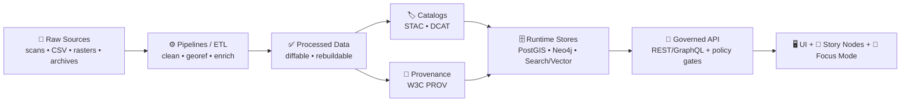

<div align="center">

<!-- 🌀 Animated seal (add file at: docs/assets/branding/kfm-seal-animated-320.gif) -->


# 📚 Kansas Frontier Matrix — Docs Hub

**Evidence-first documentation** for an open, governed geospatial knowledge platform 🌎🧭  
<sub><em>“The map behind the map” — every layer, chart, story, and AI answer should trace back to sources.</em></sub>

<br/>


-7c3aed?style=for-the-badge)


<br/>

<a href="../README.md">🏠 Project Home</a> •
<a href="#-start-here-reading-order">🧭 Start Here</a> •
<a href="#-docs-to-system-alignment-truth-path">🧱 Truth Path</a> •
<a href="#-docs-map-where-things-live">🗂️ Docs Map</a> •
<a href="#-writing-rules-evidence-citations-and-diagrams">✍️ Writing Rules</a> •
<a href="#-contributing-to-docs-docops">🤝 Contribute</a> •
<a href="#-reference-shelf-curated-pdfs">📚 Reference Shelf</a>

</div>

---

> [!WARNING]
> 🚧 **Under Construction**
> - Some pages referenced here may be **draft**, **moving**, or **not created yet**.
> - If you find a missing doc or broken link: open an issue and tag `area:docs` + `status:needs-review`.
> - Our rule still applies during construction: **no bypassing governance** (Raw → … → UI/AI). 🔒

---

## 🧭 Start here (reading order)

If you only read a few pages, start with these (in this order):

1. 🏗 **System Architecture** → `./architecture/system_overview.md`  
2. 🧠 **AI / Focus Mode Overview** → `./architecture/AI_SYSTEM_OVERVIEW.md`  
3. 🐙 **Ollama Integration** → `./architecture/ai/OLLAMA_INTEGRATION.md`  
4. 🧩 **Next Stages Blueprint** → `./architecture/KFM_NEXT_STAGES_BLUEPRINT.md`  
5. 🏛️ **Governance Council** → `./governance/council-structure.md`  

🔎 Nearby hubs (high signal):
- 📦 Data vault rules → `../data/README.md`
- 🛰️ API gateway rules → `../api/README.md` *(or `../src/server/api/README.md` depending on repo layout)*
- 🏭 Pipelines rules → `../pipelines/README.md`
- 🧰 Tooling helpers → `../tools/kfm/README.md`

---

## 🌾 What this documentation is for

Kansas Frontier Matrix (KFM) is a **geospatial knowledge + modeling platform** that integrates:

- 🗺️ GIS layers (vector + raster + time)
- 📚 historical records + narrative “Story Nodes”
- 🧪 reproducible analysis artifacts
- 🤖 **Focus Mode**: a governed, retrieval-grounded assistant with **citations enforced**

This `docs/` folder exists to make KFM:
- **understandable** (architecture + boundaries),
- **auditable** (provenance + citations),
- **extendable** (templates + standards),
- **governed** (fail-closed gates + ethics).

> 🧫 The API is the “trust membrane.” The docs are the “trust manual.”  
> If we can’t describe it clearly, we can’t govern it reliably.

---

## 🧱 Docs-to-system alignment: Truth Path

KFM is intentionally designed so nothing “teleports” into the UI, stories, or AI outputs.



✅ **Canonical order:** `Raw → Processed → Catalog/PROV → Databases → API → UI/AI`  
🚫 If a doc describes a workflow that bypasses this sequence, it’s describing a **bug** or a **risk** — not a feature.

---

## 🗂️ Docs map: where things live

> This map is the **intent**. Keep it aligned with the actual repo as it evolves.

```text
📁 docs/
├─ 📄 README.md                              ⭐ you are here (Docs Hub)
│
├─ 🏗️ architecture/                          System boundaries + data flow
│  ├─ 📄 system_overview.md
│  ├─ 📄 AI_SYSTEM_OVERVIEW.md
│  ├─ 📄 KFM_NEXT_STAGES_BLUEPRINT.md
│  └─ 🤖 ai/
│     └─ 📄 OLLAMA_INTEGRATION.md
│
├─ 🏛️ governance/                             Roles • review gates • ethics • council
│  └─ 📄 council-structure.md
│
├─ 📐 standards/                              🧾 “contracts for writing & data”
│  ├─ 📄 KFM_STAC_PROFILE.md                  (if present) metadata profile
│  ├─ 📄 KFM_DCAT_PROFILE.md                  (if present) metadata profile
│  ├─ 📄 KFM_PROV_PROFILE.md                  (planned) lineage profile
│  ├─ 📄 doc_style_guide.md                   (planned) tone + formatting rules
│  ├─ 📄 citation_and_provenance.md           (planned) how to cite STAC/DCAT/PROV
│  └─ 📄 glossary.md                          (planned) shared language
│
├─ 🧩 templates/                              📄 governed templates for consistent docs
│  ├─ 📄 TEMPLATE__KFM_UNIVERSAL_DOC.md       (if present)
│  ├─ 📄 TEMPLATE__STORY_NODE_V3.md           (if present)
│  └─ 📄 TEMPLATE__API_CONTRACT_EXTENSION.md  (if present)
│
├─ 📚 stories/                                 Narrative content + publishing workflow
│  ├─ 📄 story_template.md                     (optional / legacy)
│  └─ 📁 published/
│
└─ 📖 reference/                               Curated PDFs + notes (keep trimmed)
   ├─ 📄 reading_list.md                       (planned)
   └─ 📁 pdfs/
```

> [!TIP]
> **Docs are part of the product.** The same discipline applies:
> versioning, review, reproducibility, and governance alignment.

---

## 🧑‍🤝‍🧑 Reading paths by role

### 🧑‍💻 Backend / frontend developer
- 1) `architecture/system_overview.md` 🏗️  
- 2) API hub (`../api/README.md` or `../src/server/api/README.md`) 🛰️  
- 3) `governance/` (RBAC, policy gates, fail-closed rules) 🛡️  
- 4) AI docs if touching Focus Mode 🤖  

### 🗺️ GIS / data contributor
- 1) Truth Path + data invariants (this page + `../data/README.md`) 🧱  
- 2) Catalog + provenance standards (STAC/DCAT/PROV profiles) 🏷️🔗  
- 3) Governance: licenses + sensitivity labels + review gates 🔐  

### 🤖 AI / ML contributor
- 1) `architecture/AI_SYSTEM_OVERVIEW.md` 🧠  
- 2) `architecture/ai/OLLAMA_INTEGRATION.md` 🐙  
- 3) Policy enforcement + audit expectations 🧾✅  
- 4) Evaluation harness + citation rules (standards) 🧪  

### 🏫 Educator / story author / historian
- 1) Story Node templates + publishing rules 📚  
- 2) Citation & provenance guide 🔎  
- 3) Governance ethics (especially for sensitive topics) ⚖️  

---

## 🧾 What counts as “documentation” in KFM?

KFM docs are more than prose. We treat these as **first-class artifacts**:

- 📌 **Architecture docs** — boundaries, data flow, invariants
- 📜 **Contracts** — schemas, OpenAPI, GraphQL SDL, UI config contracts
- 🧪 **Runbooks** — “how to run pipelines / recover / validate”
- 🧩 **Standards** — profiles for STAC/DCAT/PROV + writing/citation rules
- 📚 **Story Nodes** — governed narratives that cite evidence
- 🧯 **Postmortems** — when we break invariants, we document causes + fixes

> [!IMPORTANT]
> If a doc claims something about the system, it must point to:
> **(a)** code, **(b)** catalog/provenance artifacts, or **(c)** an authoritative external source.

---

## ✍️ Writing rules: evidence, citations, and diagrams

### ✅ The evidence rule (golden rule)
> **If it sounds factual, it needs a source.**

Preferred sources (strongest → weakest):
1. 🏷️ STAC/DCAT catalog entries *(what it is, where/when, license, access)*  
2. 🔗 PROV lineage bundles *(how it was made, inputs/outputs, parameters)*  
3. 🧪 Pipeline logs/manifests + tests *(how it was validated)*  
4. 🏛️ Authoritative external sources *(state/federal agencies, archives, peer-reviewed)*  

### 🔗 Citation pattern (KFM-friendly)
Use a “source bundle” format so readers can audit quickly:

```text
Sources:
- Dataset: kfm.<domain>.<topic>.<year_or_version>
  - DCAT: data/catalog/dcat/<id>.jsonld
  - STAC: data/stac/items/<id>.json
  - PROV: data/prov/<id>.prov.json
```

And when referencing code behavior:

```text
Implementation:
- API: src/server/api/... (endpoint)
- Policy: policies/... (rego rule)
- Tests: .../tests/... (validation)
```

### 🧩 Diagrams (preferred)
- ✅ Use **Mermaid** for architecture diagrams (diffable + reviewable).
- ✅ Use **sequence diagrams** for Focus Mode flows.
- ✅ Keep diagrams aligned with the Truth Path and the API boundary rule.

> [!TIP]
> If a diagram shows UI touching DB directly, it’s wrong. 😄

---

## 🔐 Governance mindset: what docs must reflect

KFM treats governance as a product feature:

- 🔒 **Fail closed**: missing metadata / unclear policy ⇒ **deny/block**
- 👤 **RBAC**: role-scoped permissions (public vs contributor vs maintainer vs admin)
- 🧾 **Policy-as-code**: centralized rules (OPA-style) for data + AI outputs
- 🔗 **Provenance required**: publishable content must have lineage
- 🧭 **API boundary rule**: UI/AI consume data only through the governed API

### 🌱 FAIR + CARE (stewardship)
We aim for data that is:
- **FAIR**: Findable, Accessible, Interoperable, Reusable  
- **CARE**: Collective Benefit, Authority to Control, Responsibility, Ethics  

> [!CAUTION]
> CARE is not optional “nice to have.”  
> If a dataset/story touches Indigenous lands, communities, or culturally sensitive sites, documentation must include:
> - sensitivity classification,
> - handling/visibility rules,
> - community engagement notes (where appropriate),
> - and explicit license/rights context.

---

## 🤝 Contributing to docs (DocOps)

### ✅ PR checklist (docs)
- [ ] I used **relative links** (works in forks/offline)
- [ ] I cited sources for factual claims (catalog/prov/code/external)
- [ ] I did **not** describe workflows that bypass **Raw → … → UI/AI**
- [ ] I updated this hub if I added a new top-level section
- [ ] I added/updated diagrams when system boundaries changed
- [ ] I avoided secrets, private URLs, or sensitive coordinates

### 🧩 “Good first doc PRs”
- Add missing standards pages under `docs/standards/`
- Add a Story Node template that enforces citations
- Add a runbook for a pipeline domain
- Convert “tribal knowledge” Slack notes into auditable docs 😅

### 🧰 Docs site (optional / planned)
If we later publish docs via MkDocs/Docusaurus:
- this hub stays the repo’s canonical index,
- the site becomes the browseable frontend,
- and CI should validate links + Mermaid + required front matter (if used).

---

## 📚 Reference shelf (curated PDFs)

> The “support shelf” 📖 — design, GIS, DevOps, AI, scientific tooling.  
> Keep this curated: **add notes**, remove duplicates, prefer best sources.

<details>
<summary><b>🗺️ GIS • Cartography • Spatial design</b> (click to expand)</summary>

- `making-maps-a-visual-guide-to-map-design-for-gis.pdf` 🧭  
- `Mapping Urban Spaces.pdf` 🏙️  
- `Archaeological 3D GIS.pdf` 🏺🧊  
- `GIS-Mapping-Topology.pdf` 🧩🗺️  

</details>

<details>
<summary><b>🤖 AI • ML • Statistics • Visualization</b> (click to expand)</summary>

- `Neural Nerworks-Build Ai-Statistical Learning-Deep Learing-AI Safety-Linear Regression-bayesian.pdf` 🧠  
- `Artificial Intelligence & Machine Learning in Health Care & Medical Sciences.pdf` 🏥  
- `MATLAB-PyTorch-Numpy-SciPy-Statisctics-Programming Science Tools.pdf` 📈  
- `graphical-data-analysis-with-r.pdf` 📊  

</details>

<details>
<summary><b>🐳 DevOps • CI/CD • Security • Performance</b> (click to expand)</summary>

- `Database-Docker-CI-Pipeline-DevOps-Security-Git-Shell-PowerShell.pdf` 🐳🔐  
- `foundations-of-software-and-system-performance-engineering-process-performance-modeling-requirements-testing-scalability-and-practice.pdf` ⚙️  
- `Various Programming Concepts.pdf` 🧩  
- `Programming Design-Flexibility-Machine Learning-Test Development-Verilog-Software Qualify Assurance.pdf` 🧪  

</details>

<details>
<summary><b>🌐 Web • UI • UX</b> (click to expand)</summary>

- `Web Design.pdf` 🎨  
- `professional-web-design-techniques-and-templates.pdf` 🧱  
- `learn-to-code-html-and-css-develop-and-style-websites.pdf` 🧷  
- `CSS-HTML-JAVA-WebDesign.pdf` 🕸️  
- `Node.js-React-CSS-HTML.pdf` ⚛️  

</details>

<details>
<summary><b>🧭 Ethics • Data sovereignty</b> (click to expand)</summary>

- `Indigenous Statistics.pdf` 🧡📊 *(CARE, governance, Indigenous Data Sovereignty framing)*  
- *(Optional)* AI governance references for human-centric, accountable AI systems  

</details>

---

## 🧾 Glossary (starter)

- **STAC** 🏷️ — SpatioTemporal Asset Catalog (asset metadata standard)  
- **DCAT** 🗂️ — Data Catalog Vocabulary (dataset discovery metadata)  
- **W3C PROV** 🔗 — provenance standard (inputs → process → outputs)  
- **OPA** 🧾 — Open Policy Agent (policy-as-code enforcement)  
- **PostGIS** 🗺️ — PostgreSQL extension for spatial queries + tiling  
- **Neo4j** 🕸️ — graph database for entities/relationships/events  
- **RAG** 🔎 — Retrieval-Augmented Generation (LLM answers from retrieved evidence)  
- **Focus Mode** 🎯 — KFM’s governed AI assistant (API-mediated + citation enforced)

---

<div align="center">

### 🏁 Goal of this docs folder
**Make KFM understandable, auditable, and easy to extend — without breaking provenance.** ✅

</div>

---

<details>
<summary><b>📎 Source material used to shape this Docs Hub</b> (audit trail)</summary>

These files informed the architecture/governance framing and terminology:

- KFM technical blueprint:  [oai_citation:0‡Kansas Frontier Matrix (KFM) – Comprehensive Technical Blueprint.pdf](sediment://file_000000006dbc71f89a5094ce310a452d)  
- KFM system documentation:  [oai_citation:1‡Kansas Frontier Matrix Comprehensive System Documentation.pdf](sediment://file_00000000ef40722faf17987b69730695)  [oai_citation:2‡Kansas Frontier Matrix Comprehensive System Documentation.pdf](sediment://file_00000000ef40722faf17987b69730695)  
- v13 repository governance guide:  [oai_citation:3‡MARKDOWN_GUIDE_v13.md.gdoc](file-service://file-UYVruFXfueR8veHMUKeugU)  [oai_citation:4‡MARKDOWN_GUIDE_v13.md.gdoc](file-service://file-UYVruFXfueR8veHMUKeugU)  
- Indigenous data sovereignty / CARE framing:  [oai_citation:5‡Indigenous Statistics.pdf](sediment://file_0000000033ec72308e1f791a79f61bfe)  
- Markdown patterns (Mermaid/details/admonitions):  [oai_citation:6‡Comprehensive Markdown Guide_ Syntax, Extensions, and Best Practices.docx](file-service://file-J6rFRcp4ExCCeCdTevQjxz)  

</details>
