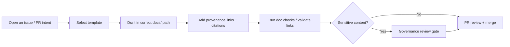

# docs/ — KFM Documentation Hub 📚

[](#governance--sensitivity)
[](#evidence--citations)
[](#faircare--governance)
[](#story-nodes--focus-mode)

> [!IMPORTANT]
> **This is a governed documentation area.** Documentation here is expected to be **template-aligned**, **pipeline-synced**, **evidence-first**, and **CI-ready**.
> If something is unknown or unverified, explicitly mark it as **“(not confirmed in repo)”** rather than guessing.

---

## 🏷️ Doc metadata

| Field | Value |
|---|---|
| File | `docs/README.md` |
| Status | Governed (documentation hub) |
| Audience | Contributors, maintainers, governance reviewers |
| Last updated | 2026-02-09 |
| Source of truth | `docs/MASTER_GUIDE_v13.md` (or latest Master Guide in this repo) |

---

## 📘 Overview

### Purpose

This folder contains **KFM’s governed documentation**: system guides, standards, governance policies, templates, Story Nodes (for Focus Mode), and reports/runbooks.

Use this README as a **map** to the canonical docs and to the rules that keep KFM’s documentation trustworthy, auditable, and safe.

### Scope

This README is about **where documentation lives** and **how to write it** so it passes governance and CI checks.

It is *not* the architectural blueprint—see the architecture docs listed below.

### Non‑negotiables (docs must not contradict)

- **Evidence-first**: every substantive factual claim needs provenance (dataset ID, catalog ID, document reference, or external citation).  
- **Trust membrane**: the UI and external clients do **not** access databases directly; access is mediated through governed APIs; core backend logic uses repository abstractions (no direct DB calls from core logic).  
- **FAIR + CARE**: handle sensitive/culturally restricted data carefully; generalize/redact and flag for review rather than leaking specifics.

---

## 🚦 Start here (recommended reading order)

1. **Master Guide (canonical pipeline + repo structure)**  
   - `docs/MASTER_GUIDE_v13.md` *(or latest available)*

2. **Markdown & documentation standards**  
   - `docs/standards/` (see below)

3. **Templates (copy first, then fill in)**  
   - `docs/templates/`

4. **Governance (review gates, ethics, sovereignty)**  
   - `docs/governance/`

5. **Story Nodes & Focus Mode**  
   - `docs/reports/story_nodes/` *(v13 expected)* and/or `docs/story-nodes/` *(may exist in some repo states — verify)*

---

## 🗂️ Directory layout

> [!NOTE]
> The tree below reflects the **expected** `docs/` structure.  
> If your repo differs, update this README to match the actual tree and keep the Master Guide authoritative.

```text
docs/
├── MASTER_GUIDE_v12.md
├── MASTER_GUIDE_v13.md
├── glossary.md
├── architecture/
│   ├── KFM_REDESIGN_BLUEPRINT_v13.md
│   ├── KFM_VISION_FULL_ARCHITECTURE.md
│   ├── diagrams/
│   └── adr/
├── standards/
│   ├── KFM_MARKDOWN_WORK_PROTOCOL.md
│   ├── KFM_REPO_STRUCTURE_STANDARD.md
│   ├── KFM_STAC_PROFILE.md
│   ├── KFM_DCAT_PROFILE.md
│   └── KFM_PROV_PROFILE.md
├── templates/
│   ├── TEMPLATE__KFM_UNIVERSAL_DOC.md
│   ├── TEMPLATE__STORY_NODE_V3.md
│   └── TEMPLATE__API_CONTRACT_EXTENSION.md
├── governance/
│   ├── ROOT_GOVERNANCE.md
│   ├── ETHICS.md
│   ├── SOVEREIGNTY.md
│   └── REVIEW_GATES.md
├── reference/
│   └── REFERENCE_LIBRARY.md
├── ci/
│   └── checklists/
│       └── PR_CHECKLIST.md
└── reports/
    └── story_nodes/
        ├── templates/
        ├── draft/
        └── published/
            └── <story_slug>/
                ├── story.md
                └── assets/
```

---

## 🧩 Document types and where they belong

| Doc type | Where it lives | Template | Notes |
|---|---|---|---|
| System / architecture guide | `docs/architecture/` | Universal Doc | Keep stable links; avoid duplicating “source of truth” docs |
| Standards / protocols | `docs/standards/` | Universal Doc | Treat as governance-critical (review carefully) |
| Governance / ethics / sovereignty | `docs/governance/` | Universal Doc | May require governance sign-off |
| Story Nodes (Focus Mode narratives) | `docs/reports/story_nodes/…` | Story Node v3 | Must be machine-ingestible, citation-complete |
| API contract changes | `docs/` or `docs/architecture/` (as decided by Master Guide) | API contract extension | Pair with OpenAPI/GraphQL changes |
| Runbooks / reports | `docs/reports/` | Universal Doc | Prefer checklists + reproducible steps |
| Reference library | `docs/reference/` | N/A | Curated reading list / sources |

---

## ✍️ Writing rules

### Template-first

1. Pick the right template in `docs/templates/`.
2. Copy it into the correct folder.
3. Fill it in **without changing required heading order** (unless the template says optional).

### Evidence & citations

- Provide provenance for:
  - Facts, numbers, timelines, maps, coordinates, claims about system behavior
  - Quotes and summaries of sources
  - Any AI-assisted synthesis that could be mistaken for “ground truth”
- If you cannot locate a required reference, explicitly write: **“(not confirmed in repo)”**.
- Prefer repo-internal provenance:
  - dataset/catalog IDs (DCAT/STAC/PROV artifacts)
  - doc paths + commit hashes
  - stable graph IDs (for Story Nodes)

> [!TIP]
> When a doc mentions a dataset or map layer, add a “Source / Provenance” subsection with:
> - **Dataset ID**
> - **Catalog path(s)** (STAC/DCAT)
> - **PROV lineage record**
> - **License/terms** (if applicable)

### Render-optimized Markdown

Use (tastefully):
- Tables (registries, dictionaries)
- Task lists (Definition of Done)
- Admonitions (`[!NOTE]`, `[!WARNING]`, etc.)
- Footnotes for citations
- Mermaid diagrams for flows
- Collapsible sections for long supporting content

---

## 🧪 Validation & CI

Docs are expected to pass automated checks such as:
- Markdown linting
- Link integrity checks
- Structure/schema validation (template headings, Story Node schema, etc.)
- Sensitivity flags (content warnings / restricted info indicators)

**Before opening a PR**, use the checklist:
- `docs/ci/checklists/PR_CHECKLIST.md`

---

## ⚖️ Governance & sensitivity

> [!WARNING]
> If your doc contains **precise locations**, **culturally restricted knowledge**, or other sensitive content:
> - **generalize or redact** the sensitive detail
> - add a **governance review note** in the doc
> - ensure CARE principles are followed (Authority to Control, Responsibility, Ethics)

### Quick governance triggers (non-exhaustive)

- New datasets, especially community-contributed or culturally sensitive datasets
- New Story Nodes about traumatic events or living persons
- New UI features that might expose exact coordinates or personal data
- Any change that affects trust boundaries (API ↔ UI ↔ storage)

---

## 🧠 Story Nodes & Focus Mode

Story Nodes are governed narrative artifacts designed to be **machine-ingestible** and safely rendered in **Focus Mode**.

### Where they live

Preferred (v13 expected): `docs/reports/story_nodes/`  
Some repo states may also contain: `docs/story-nodes/` *(not confirmed in repo — verify)*

### Minimum Story Node expectations

- **Provenance for every claim**
- **Graph entity links** for important people/places/events
- **Fact vs interpretation** clearly separated (especially for AI-assisted text)

---

## 🔁 Suggested workflow for doc changes



---

## ✅ Definition of Done for docs

- [ ] Correct template used and required headings preserved
- [ ] Every substantive claim has provenance (or is marked **(not confirmed in repo)**)
- [ ] Links are valid (relative links preferred for repo docs)
- [ ] Sensitive content is generalized/redacted and flagged for governance review
- [ ] Passes CI doc checks (lint, schema, link integrity)

---

## 🕰️ Version history

| Date | Change | Author |
|---|---|---|
| 2026-02-09 | (Re)written docs hub README with governance + templates + layout map | KFM Assistant (generated) |