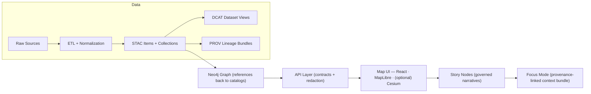

# 📚 docs/ — Kansas Frontier Matrix Documentation

> 🗺️ **The map behind the map.**  
> KFM docs are **governed**, **evidence-first**, **contract-first**, and **provenance-first**.

---

## 🧭 Start here

### 🚦 Core entry points
- **📘 Master Guide (canonical):** [`./MASTER_GUIDE_v13.md`](./MASTER_GUIDE_v13.md)
- **🏗️ Architecture:** [`./architecture/`](./architecture/)
- **⚖️ Governance:** [`./governance/`](./governance/)
- **🌐 Standards & Profiles (STAC/DCAT/PROV):** [`./standards/`](./standards/)
- **🧩 Templates (universal docs, Story Nodes, API changes):** [`./templates/`](./templates/)
- **🧠 Story Nodes (draft/published):** [`./reports/story_nodes/`](./reports/story_nodes/)
- **🗃️ Data domain runbooks:** [`./data/`](./data/) *(domain READMEs live here)*

### 👥 “I’m here for…”
- **Maintainers / system builders:** `MASTER_GUIDE_v13.md` → `architecture/` → `standards/`
- **Domain stewards (historians/scientists):** `data/<domain>/README.md` → `templates/`
- **Narrative editors:** `reports/story_nodes/` → `templates/TEMPLATE__STORY_NODE_V3.md`
- **API contributors:** `templates/TEMPLATE__API_CONTRACT_EXTENSION.md` + `architecture/` (for boundary rules)
- **UX/cartography:** `architecture/` + `standards/` + (see “Reference Library” below)

---

## 🧱 What makes KFM docs “governed”

KFM documentation is not just explanatory text. It is part of the system’s **trust surface**.

### ✅ Non‑negotiable invariants
- **Pipeline ordering is absolute:** *ETL → Catalogs (STAC/DCAT/PROV) → Graph → API → UI → Story Nodes → Focus Mode.*
- **Contract-first:** schemas and API contracts are first-class artifacts; breaking changes require versioning and checks.
- **Evidence-first narrative:** no unsourced narrative in Story Nodes or Focus Mode.
- **API boundary rule:** the UI should not query the graph directly; it must go through the governed API.

> 💡 If your change adds data, a story, or an endpoint, assume **CI will validate** structure, schemas, links, and governance gates.

---

## 🗺️ KFM pipeline (mental model)



> 🧩 If the diagram doesn’t render in your viewer, open this file in GitHub’s renderer or a Mermaid viewer.

---

## 🗂️ docs/ directory map

> This is the **documentation home** for governed guides, standards, templates, and narrative content.

```text
docs/
├── 🏗️ architecture/                # system design docs, blueprints, ADRs
├── ⚖️ governance/                  # ethics, sovereignty, review gates
├── 🌐 standards/                   # KFM profiles (STAC/DCAT/PROV), protocols
├── 🧩 templates/                   # governed templates (universal doc, story node, API)
├── 🧠 reports/
│   └── story_nodes/
│       ├── 🧩 templates/           # story templates (draft/published conventions)
│       ├── 🚧 draft/               # works-in-progress (review required)
│       └── ✅ published/           # reviewed + provenance-complete stories
└── 🗃️ data/                        # domain READMEs / runbooks (one folder per domain)
```

---

## 🧩 Templates you should use (don’t freestyle)

When writing new docs, prefer templates so structure + metadata stays consistent.

- **Universal doc template:** `./templates/TEMPLATE__KFM_UNIVERSAL_DOC.md`
- **Story Node template:** `./templates/TEMPLATE__STORY_NODE_V3.md`
- **API contract extension template:** `./templates/TEMPLATE__API_CONTRACT_EXTENSION.md`

> 🧰 Templates aren’t bureaucracy — they’re how KFM stays machine-readable and reviewable at scale.

---

## 📦 Adding a new data domain (docs + data checklist)

When you add a new domain, you are adding **evidence pipelines**, not just files.

### ✅ Minimum “domain done” checklist
- [ ] Create **domain runbook**: `docs/data/<domain>/README.md`
- [ ] Place raw inputs under `data/raw/<domain>/`
- [ ] Use `data/work/<domain>/` for intermediate products (if needed)
- [ ] Publish final outputs to `data/processed/<domain>/`
- [ ] Emit boundary artifacts:
  - [ ] STAC (items + collections)
  - [ ] DCAT dataset entry
  - [ ] PROV lineage bundle
- [ ] Make sure any **derived/AI-generated outputs** are treated as **evidence artifacts** (same metadata + lineage expectations)
- [ ] Link your domain README from the relevant index doc(s) (usually the Master Guide)

---

## ✍️ Writing rules for Story Nodes and narrative docs

Story Nodes are designed to be **machine-ingestible storytelling**:
- **Every factual claim must be traceable** to cataloged evidence.
- **Fact vs interpretation** must be clearly separated.
- **Entity references** should point to stable IDs (graph/catalog identifiers), not just free text.
- **Focus Mode is a hard gate:** it only displays provenance-linked content; AI content must be opt-in and transparent.

---

## 🤖 Focus Mode + AI notes (for doc authors)

KFM supports an AI-augmented workflow, but it is **policy-governed**:
- AI should operate through **approved tools / endpoints** (no silent “magic knowledge”).
- AI outputs intended for users should include **source-backed citations** and respect sensitivity rules.
- AI can assist with contribution coaching (raising submission quality), but maintainers remain the final reviewers.

---

## 🎨 Cartography + metadata expectations (why docs care)

Even when you’re “just making a map,” KFM treats presentation as part of evidence integrity:

- **Metadata matters:** identification, quality, spatial reference, temporal coverage, distribution/use policy, and citation info should travel with the dataset.
- **Interoperability matters:** follow standards so data can be exchanged and used consistently across subsystems.
- **Rights & reuse matter:** map *representations* can be copyrighted even when underlying facts are not — document sources and avoid copying protected representations.

> 🧷 If your doc introduces a new dataset/map layer, it should also state license constraints and attribution requirements.

---

## 📚 Reference Library (project files)

These are “foundation texts” used to shape KFM’s approach. Treat this list as a **design + implementation bookshelf** (not all are normative standards).

### 🧠 AI / Knowledge Systems
- **Ollama + local LLM operations:** `Comprehensive Guide to Ollama and Its Supported Open-Source LLMs.pdf`
- **AI concepts & system notes:** `Various AI Concepts & Information.pdf`

### 🗺️ GIS / Cartography / Navigation
- **Map design + metadata/copyright context:** `making-maps-a-visual-guide-to-map-design-for-gis.pdf`
- **Land navigation + map reading fundamentals:** `Map Reading & Land Navigation.pdf`
- **3D GIS in archaeological contexts:** `Archaeological 3D GIS.pdf`

### 🛰️ Remote sensing + geospatial computation
- **Earth Engine & cloud-based remote sensing workflows:** `Cloud-Based Remote Sensing with Google Earth Engine-Fundamentals and Applications.pdf`
- **Python geospatial analysis patterns:** `KFM- python-geospatial-analysis-cookbook-...-with-python.pdf`

### 📈 Visualization + methods
- **Time-oriented visualization concepts:** `Visualization of Time-Oriented Data.pdf`
- **Digital humanism framing:** `Introduction to Digital Humanism.pdf`
- **Statistics & experimental design:** `Understanding Statistics & Experimental Design.pdf`

### 🗄️ Data systems at scale (for pipeline + API performance thinking)
- `Database Performance at Scale.pdf`
- `Scalable Data Management for Future Hardware.pdf`
- `Data Spaces.pdf`

---

## 🧰 Suggested next docs to add (if missing)

- `docs/glossary.md` — shared vocabulary (STAC, DCAT, PROV, Story Node, Focus Mode, etc.)
- `docs/STYLEGUIDE.md` — writing style + diagrams + citation norms
- `docs/INDEX.md` — a more narrative “docs portal” for non-technical users

---

<!--
GROUNDING / SOURCES USED (hidden to keep README clean)

KFM + governed pipeline + structure:
- MARKDOWN_GUIDE_v13.md.gdoc: canonical pipeline ordering + contract/evidence-first + directory layout + invariants + CI gates [oai_citation:0‡MARKDOWN_GUIDE_v13.md.gdoc](file-service://file-UYVruFXfueR8veHMUKeugU) [oai_citation:1‡MARKDOWN_GUIDE_v13.md.gdoc](file-service://file-UYVruFXfueR8veHMUKeugU) [oai_citation:2‡MARKDOWN_GUIDE_v13.md.gdoc](file-service://file-UYVruFXfueR8veHMUKeugU) [oai_citation:3‡MARKDOWN_GUIDE_v13.md.gdoc](file-service://file-UYVruFXfueR8veHMUKeugU)
- MARKDOWN_GUIDE_v13.md.gdoc: diagram + staging + catalogs (stac/dcat/prov) [oai_citation:4‡MARKDOWN_GUIDE_v13.md.gdoc](file-service://file-UYVruFXfueR8veHMUKeugU)
- KFM blueprint: pipeline–catalog–database–API–UI + scrollytelling timeline + AI integration principles [oai_citation:5‡Kansas Frontier Matrix (KFM) – Comprehensive Technical Blueprint.pdf](sediment://file_000000006dbc71f89a5094ce310a452d) [oai_citation:6‡Kansas Frontier Matrix (KFM) – Comprehensive Technical Blueprint.pdf](sediment://file_000000006dbc71f89a5094ce310a452d)

Focus Mode + AI governance:
- Focus Mode hard gate + opt-in AI + sensitive location rules [oai_citation:7‡MARKDOWN_GUIDE_v13.md.gdoc](file-service://file-UYVruFXfueR8veHMUKeugU)
- Focus Mode + AI policy engine + citations + tools-only access [oai_citation:8‡Kansas Frontier Matrix (KFM) – Comprehensive Technical Blueprint.pdf](sediment://file_000000006dbc71f89a5094ce310a452d) [oai_citation:9‡Kansas Frontier Matrix (KFM) – Comprehensive Technical Blueprint.pdf](sediment://file_000000006dbc71f89a5094ce310a452d)

Ollama:
- Local-first model runner + privacy/offline posture [oai_citation:10‡Comprehensive Guide to Ollama and Its Supported Open-Source LLMs.pdf](file-service://file-WLPhJVNoBxYKcy3utQSwBi)

Cartography/metadata/copyright:
- Metadata components + interoperability framing + copyright caveats [oai_citation:11‡making-maps-a-visual-guide-to-map-design-for-gis.pdf](sediment://file_00000000602471f786dfbbaac9329fb9)

Map reading / navigation:
- Declination + orienting the map fundamentals [oai_citation:12‡Map Reading & Land Navigation.pdf](sediment://file_00000000b14c7230b1b262ddd9df4e5d)

File surface links (tool markers):
- MARKDOWN_GUIDE_v13.md.gdoc  [oai_citation:13‡MARKDOWN_GUIDE_v13.md.gdoc](file-service://file-UYVruFXfueR8veHMUKeugU)
- Kansas Frontier Matrix (KFM) – Comprehensive Technical Blueprint.pdf  [oai_citation:14‡Kansas Frontier Matrix (KFM) – Comprehensive Technical Blueprint.pdf](sediment://file_000000006dbc71f89a5094ce310a452d)
- Ollama guide  [oai_citation:15‡Comprehensive Guide to Ollama and Its Supported Open-Source LLMs.pdf](file-service://file-WLPhJVNoBxYKcy3utQSwBi)
- Making Maps  [oai_citation:16‡making-maps-a-visual-guide-to-map-design-for-gis.pdf](sediment://file_00000000602471f786dfbbaac9329fb9)
- Map Reading & Land Navigation  [oai_citation:17‡Map Reading & Land Navigation.pdf](sediment://file_00000000b14c7230b1b262ddd9df4e5d)

Additional project-library markers:
- Spectral Geometry of Graphs  [oai_citation:18‡Spectral Geometry of Graphs.pdf](sediment://file_00000000cedc71f5a7af8031244dcd32)
- Introduction to Digital Humanism  [oai_citation:19‡Introduction to Digital Humanism.pdf](sediment://file_0000000090a071f5afd5c78c4383e488)
- Visualization of Time-Oriented Data  [oai_citation:20‡Visualization of Time-Oriented Data.pdf](sediment://file_000000001468722f929b8752236e5a72)
- Cloud-Based Remote Sensing with Google Earth Engine  [oai_citation:21‡Cloud-Based Remote Sensing with Google Earth Engine-Fundamentals and Applications.pdf](sediment://file_00000000a58071f586f00793dee712d6)
-->