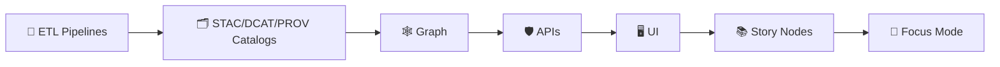

<a id="top"></a>

# 📚 `docs/` — Kansas Frontier Matrix (KFM) Governed Documentation 📜🧭


> Canonical home for KFM’s **governed documentation**:  
> **architecture + standards + templates + runbooks + governance + story nodes** — written so decisions are **auditable**, claims are **citable**, and change is **reviewable**.  
> This is where KFM stays explainable as it scales. 🧠🗺️
>
> 📌 Start with:  
> - **System map** → `docs/MASTER_GUIDE_v13.md` *(canonical architecture + repo shape)*  
> - **Governance posture** → `docs/governance/ROOT_GOVERNANCE.md` *(review triggers + authority)*  
> - **Library index** → `docs/library/README.md` *(license-aware reference map; pointers > payload)*  
> - **Reality checks / audits** → keep under `docs/reports/` *(or `docs/architecture/ADR/` if it becomes a decision)*

> [!IMPORTANT]
> **KFM’s non-negotiable order (docs must reinforce it):**  
> **ETL → STAC/DCAT/PROV Catalogs → Graph → APIs → UI → Story Nodes → Focus Mode**  
> If a doc encourages bypassing the ordering (even as a “temporary shortcut”), it’s wrong.

---

## 🔗 Quick links
- 🧭 Repo overview: **[`../README.md`](../README.md)**
- 📘 Master system map: **[`./MASTER_GUIDE_v13.md`](./MASTER_GUIDE_v13.md)** *(if present)*
- 📖 Canonical glossary: **[`./glossary.md`](./glossary.md)** *(if present)*
- 🏛️ Governance charter: **[`./governance/ROOT_GOVERNANCE.md`](./governance/ROOT_GOVERNANCE.md)**
- 📚 Library index (license-aware): **[`./library/README.md`](./library/README.md)** *(if present)*
- 📦 Data + metadata boundary: **[`../data/README.md`](../data/README.md)**
- 🧪 MCP (methods + receipts): **[`../mcp/README.md`](../mcp/README.md)** *(if present)*
- 📐 Schemas registry: **[`../schemas/README.md`](../schemas/README.md)** *(if present)*
- 🧩 Pipelines boundary: **[`../src/pipelines/README.md`](../src/pipelines/README.md)** *(if present)*
- 🕸️ Graph build boundary: **[`../src/graph/README.md`](../src/graph/README.md)** *(if present)*
- 🛡️ API boundary: **[`../src/server/README.md`](../src/server/README.md)** *(if present)*
- 🌐 Web UI boundary: **[`../web/README.md`](../web/README.md)** *(if present)*
- 🧪 Tests boundary: **[`../tests/README.md`](../tests/README.md)** *(if present)*
- 📓 Notebooks boundary: **[`../notebooks/README.md`](../notebooks/README.md)** *(if present)*
- 🧰 Tools boundary: **[`../tools/README.md`](../tools/README.md)** *(if present)*
- 🧾 Releases boundary: **[`../releases/README.md`](../releases/README.md)** *(if present)*
- 🤝 CI/CD + templates: **[`../.github/README.md`](../.github/README.md)** *(if present)*

---

## 🧭 Quick navigation
- [📘 Overview](#-overview)
- [🧾 Doc metadata](#-doc-metadata)
- [🧠 Core invariants](#-core-invariants)
- [🧫 Data lifecycle and artifact locations](#-data-lifecycle-and-artifact-locations)
- [📖 Glossary](#-glossary-kfm-terms-used-in-docs)
- [🗂️ What goes in `docs/`](#️-what-goes-in-docs)
- [🧱 Directory layout](#-directory-layout)
- [🏁 Golden paths](#-golden-paths-most-common-doc-workflows)
- [✅ Doc quality gates](#-doc-quality-gates-definition-of-done)
- [🧾 Evidence, citations, and provenance pointers](#-evidence-citations-and-provenance-pointers)
- [📚 Story Nodes and Focus Mode rules](#-story-nodes-and-focus-mode-rules)
- [🔒 Security, sovereignty, and sensitive info](#-security-sovereignty-and-sensitive-info)
- [🧪 Modeling, simulation, and inference documentation](#-modeling-simulation-and-inference-documentation)
- [🤖 Machine learning and AI documentation](#-machine-learning-and-ai-documentation)
- [⚙️ Scaling and data management documentation](#️-scaling-and-data-management-documentation)
- [🕸️ Graph and ontology documentation](#️-graph-and-ontology-documentation)
- [🎨 Visualization and UX documentation](#-visualization-and-ux-documentation)
- [📚 Project reference library influence map](#-project-reference-library-influence-map)
- [📚 Library intake policy](#-library-intake-policy-license-aware)
- [🕰️ Version history](#️-version-history)

---

## 🧾 Doc metadata

| Field | Value |
|---|---|
| Doc | `docs/README.md` |
| Status | Active ✅ |
| Version | **v1.3.0** |
| Last updated | **2026-01-13** |
| Audience | Contributors writing standards, runbooks, Story Nodes, ADRs, and governance policies |
| Prime directive | If it changes what people *believe* about the map/story/data, it must be **reviewable + citable + reversible** |
| Repo posture | **Evidence-first** + **Contract-first** + **Sovereignty-aware** + **License-aware** |

> [!NOTE]
> The YAML front-matter is authoritative for protocol versions and governance posture.  
> This table is a human-friendly snapshot.

---

## 📘 Overview

### ✅ Purpose
`docs/` exists so KFM remains:
- **understandable** (clear architecture + vocabulary)
- **governable** (policy and review gates are explicit)
- **auditable** (why a decision happened, and when)
- **evidence-first** (claims point to cataloged evidence)
- **contract-first** (schemas + API contracts define reality; docs explain it)
- **humane** (transparent impacts, consent, dignity, and accountability) ❤️
- **change-friendly** (structured docs that evolve with requirements instead of fossilizing) 🔁
- **license-aware** (meaning + metadata must respect legal/ethical constraints) 🪪

### 🚫 What `docs/` is not
- not a dumping ground for generated outputs *(those belong under `data/**` and catalogs)*
- not a substitute for contracts *(schemas and API contracts live under `schemas/**` and `api/**`)*
- not a place for secrets, tokens, credentials, internal hostnames, or private URLs 🚫
- not a “shadow API” (docs explain; contracts enforce)

---

## 🧠 Core invariants

> [!IMPORTANT]
> **Docs are part of the system boundary.**  
> When a subsystem changes, docs should change **in the same PR** whenever feasible. Docs are “shipped,” not “updated later.”



### ✅ Docs must reinforce these rules

- ✅ **Pipeline ordering is absolute:** no leapfrogging stages.
- ✅ **Evidence-first narrative:** no unsourced claims in Story Nodes or Focus Mode.
- ✅ **Contract-first changes:** schemas and API contracts are first-class; docs must link to them and respect versioning.
- ✅ **One canonical home per thing:** avoid duplicate “shadow docs”; archive deprecated docs instead of copy/pasting.
- ✅ **API boundary is real:** UI **must not** talk directly to the graph/DB; it goes through governed APIs only. 🛡️
- ✅ **Monotonic governance:** derived outputs **cannot** be *less* restricted than inputs (classification, consent, license, or sensitivity).
- ✅ **Stable identifiers:** avoid “meaningful IDs” that break when naming shifts; use stable IDs and versioned mapping layers.
- ✅ **Sovereignty-aware behavior:** docs must not leak sensitive locations (including via screenshots, tiles, or “helpful examples”).
- ✅ **Deny-by-default mindset:** treat user-provided files and internet metadata as hostile inputs; recommend validation, not trust-by-assumption. 🧯

### ✅ Minimum validation intent (KFM-MDP v11.2.6 baseline)

KFM’s documentation posture assumes (or aspires to) automated validation gates such as:

- **Markdown protocol checks** (YAML front-matter + required sections)
- **Link/reference validation** (no broken internal links or unresolved anchors)
- **Schema validation** for structured artifacts referenced by docs (STAC/DCAT/PROV, Story Node metadata)
- **Security/governance scans** (secrets, PII, sensitive location leakage, classification downgrades)
- **License/attribution checks** where docs reference external works or derived artifacts

> [!NOTE]
> If CI isn’t fully wired yet, treat these as *required local checks* for doc changes that influence decisions or public meaning.

---

## 🧫 Data lifecycle and artifact locations

KFM’s docs are “pointer-first”: we document **where artifacts live** and **how to prove lineage**, not how to smuggle payloads into markdown.

### 🧪 Canonical data lifecycle (recommended)
```text
📁 data/
├── 📁 raw/                      # raw inputs (immutable; checksummed; access controlled)
├── 📁 work/                     # scratch/temporary intermediates (rebuildable)
├── 📁 processed/                # validated outputs used by the system
│
├── 📁 stac/                     # STAC catalogs (items/collections)
├── 📁 catalog/
│   └── 📁 dcat/                 # DCAT datasets/distributions (interoperability)
└── 📁 prov/                     # PROV bundles (lineage, derivations, agents, activities)
```

### ✅ Doc rule
If a doc references an artifact that could influence decisions (model output, derived raster, OCR corpus, metric, map tile, extracted entities):
- **Do not embed it** in `docs/`
- **Do point to it** via STAC/DCAT/PROV identifiers + stable paths
- **Do state** assumptions (CRS, units, thresholds, filters, time range)

---

## 📖 Glossary (KFM terms used in docs)

**Catalog artifacts (STAC/DCAT/PROV)**  
Machine-readable metadata + lineage that makes datasets *discoverable, traceable, and governable*.

**Contract artifacts**  
Schemas and API contracts that define what the system accepts/serves (e.g., JSON Schemas in `schemas/`, OpenAPI/GraphQL in `api/contracts/**`).

**Evidence artifacts**  
Any derived output that can influence decisions (models, simulations, OCR corpora, derived rasters). Evidence artifacts must live in `data/processed/**` and be cataloged + provenance-linked.

**Story Node**  
A governed narrative unit that is machine-ingestible and evidence-linked. It references evidence (catalog IDs) and graph entities (stable IDs) and separates fact from interpretation.

**Focus Mode**  
The trust-preserving reading context where users experience story + map + timeline together. Focus Mode hard-gates provenance and sensitivity: *no new narrative without sources; no data without provenance; no sensitive location leaks.*

**Reference Pack**  
The project’s *license-aware* reading shelf (books/papers/audits) used to shape standards and review decisions. The pack is indexed under `docs/library/` but should **not** be blindly mirrored into git.

---

## 🗂️ What goes in `docs/`

KFM expects `docs/` to be organized by **governed intent** (not by author preference).

### ✅ Belongs here
- 🧱 **Architecture**: designs, diagrams, ADRs, blueprints (`docs/architecture/`)
- 📏 **Standards**: profiles + conventions (STAC/DCAT/PROV profiles, ontology rules, naming, CRS/unit rules) (`docs/standards/`)
- 🔐 **Security**: threat models, incident response, secure ingestion guidance (`docs/security/`)
- 🧭 **Governance**: FAIR/CARE/sovereignty policy, review gates, ethics, redaction rules (`docs/governance/`)
- 🧰 **Templates**: universal doc, ADR, Story Node, API contract extension (`docs/templates/`)
- 🧑‍🔧 **Runbooks**: “how to operate / debug / recover” (`docs/runbooks/`)
- 📰 **Reports & Story Nodes**: curated narrative content, with draft vs published separation (`docs/reports/story_nodes/`)
- 🗺️ **Domain modules**: per-domain documentation (sources, caveats, risks, ETL expectations) (`docs/data/<domain>/`)
- 📚 **Reference library (index only)**: citations + reading map + license notes (`docs/library/`)

### 🚫 Does not belong here
- generated dataset outputs → `data/**`
- executable code → `src/**` / `api/**` / `web/**`
- schema definitions → `schemas/**` *(docs explain; schemas enforce)*
- private credentials / internal endpoints → nowhere in git 🚫
- fulltext copies of copyrighted books/articles unless license explicitly allows redistribution 🚫

---

## 🧱 Directory layout

### 🧭 Expected shape (KFM-style)

> [!NOTE]
> Not all repos have every file yet. This is the **target** structure that the doc protocol assumes.  
> For the *full repo* target shape, see `docs/MASTER_GUIDE_v13.md` (if present).

```text
📁 docs/
├── 📄 README.md                          # you are here ✅
├── 📘 MASTER_GUIDE_v13.md                # canonical system map (if present)
├── 📄 glossary.md                        # canonical term definitions (if present)
│
├── 🧱 architecture/
│   ├── 📄 README.md
│   ├── 📁 ADR/                           # 🧾 Architecture Decision Records
│   ├── 📄 KFM_REDESIGN_BLUEPRINT_v13.md   # blueprint (draft/active)
│   └── 🗺️ diagrams/                      # mermaid / svg / drawio exports (no secrets)
│
├── 📏 standards/
│   ├── 📄 README.md
│   ├── 📄 KFM_STAC_PROFILE.md
│   ├── 📄 KFM_DCAT_PROFILE.md
│   ├── 📄 KFM_PROV_PROFILE.md
│   ├── 📄 KFM_MARKDOWN_WORK_PROTOCOL.md   # KFM-MDP authoring rules
│   └── 🕸️ ontology/                      # graph/ontology conventions + mapping rules
│
├── 🧭 governance/
│   ├── 📄 ROOT_GOVERNANCE.md              # what requires review, by whom, and why
│   ├── 📄 ETHICS.md
│   ├── 📄 SOVEREIGNTY.md
│   └── 📄 REVIEW_GATES.md                 # optional: explicit review triggers
│
├── 🔐 security/
│   ├── 📄 README.md
│   ├── 📄 threat-model.md
│   └── 📄 incident-response.md
│
├── 🧰 templates/
│   ├── 📄 TEMPLATE__KFM_UNIVERSAL_DOC.md
│   ├── 📄 TEMPLATE__ADR.md
│   ├── 📄 TEMPLATE__STORY_NODE_V3.md
│   └── 📄 TEMPLATE__API_CONTRACT_EXTENSION.md
│
├── 🧑‍🔧 runbooks/
│   ├── 📄 README.md
│   ├── 📄 pipeline-ops.md
│   ├── 📄 graph-ops.md
│   ├── 📄 api-ops.md
│   └── 📄 ui-ops.md
│
├── 📰 reports/
│   └── 📚 story_nodes/
│       ├── 🧪 draft/
│       ├── ✅ published/
│       └── 🖼️ assets/                     # images/maps used by story nodes (no sensitive leaks)
│
├── 🗺️ data/
│   └── <domain>/
│       └── 📄 README.md                   # domain module (sources, caveats, ETL expectations)
│
├── 📚 library/
│   ├── 📄 README.md                       # license-aware index only (preferred)
│   ├── 📄 influence-map.md                # “why this book/paper matters” crosswalk
│   └── 📁 bib/                            # optional: citation files (BibTeX, CSL JSON, etc.)
│
└── 🗃️ 99_archive/                         # deprecated docs retained for traceability
```

> [!TIP]
> If you can’t decide where a new doc goes:
> **Does it define behavior?** → `standards/` or `governance/`  
> **Does it explain structure?** → `architecture/`  
> **Does it teach action steps?** → `runbooks/`  
> **Is it narrative evidence?** → `reports/story_nodes/`  
> **Is it domain-specific context + caveats?** → `data/<domain>/`

---

## 🏁 Golden paths (most common doc workflows)

### 1) Add a new data domain (doc + evidence alignment) ✅
When you add a new domain, create:
- `docs/data/<domain>/README.md` *(scope, sources, licensing, sensitivity, known caveats)*
- links/pointers to the domain’s catalog artifacts *(STAC/DCAT/PROV paths or IDs)*
- updates to `docs/standards/` **only** if the domain introduces new conventions

**Rule:** the domain becomes “real” only after `data/processed/**` + catalogs + provenance exist.

> [!TIP]
> If a domain touches oral histories, Indigenous narratives, or community-contributed knowledge:  
> **treat governance as a feature** (consent, attribution, scope-of-use, redaction rules).

### 2) Add an ADR (Architecture Decision Record) ✅
Use an ADR when you decide something that affects:
- pipeline ordering or evidence boundaries
- metadata/provenance standards
- ontology/graph model changes
- API boundary behavior (authZ, redaction, classification propagation)
- public-facing meaning (maps, metrics, interpretations)

ADR should include: **context → decision → alternatives → consequences → rollback plan**.

### 3) Add or change a standard (profiles + conventions) ✅
Standards are **normative**. They must:
- be explicit and testable
- link to the machine schema (in `schemas/` / `api/contracts/`)
- define versioning rules and migration expectations
- clarify what breaks downstream (graph/API/UI/story)

### 4) Add a Story Node (governed narrative) ✅
Story Nodes are treated like data products:
- template-driven
- evidence-linked (catalog pointers)
- graph-aware (stable IDs)
- fact vs interpretation separated
- published only after review gates pass

### 5) Add/modify an API contract (contract-first) ✅
If you add or change an endpoint:
- update the contract first (OpenAPI/GraphQL + examples)
- document authZ/redaction/classification behavior
- update tests and release notes where applicable

### 6) Add a new reference (license-aware) ✅
When a book/paper/audit meaningfully influences KFM decisions:
- add an index entry under `docs/library/`
- record **license posture** (✅ commit-safe / ⚠️ verify / 🚫 do not commit)
- record **what it influences** (which docs/standards/runbooks it upgrades)
- store **pointers** (publisher link / DOI / legal acquisition path), not pirate copies

---

## ✅ Doc quality gates (Definition of Done)

> [!CAUTION]
> Docs can break trust just as fast as broken code.  
> **Uncited claims** and **ambiguous language** are defects.

### ✅ Minimum DoD (for any doc PR)
- [ ] correct folder placement (matches doc intent)
- [ ] YAML front-matter present and valid *(title/path/version/status/last_updated at minimum)*
- [ ] clear audience + scope + non-goals
- [ ] glossary/definitions for new terms (or link to canonical glossary)
- [ ] evidence pointers for factual claims (prefer STAC/DCAT/PROV and stable IDs)
- [ ] explicit assumptions (especially modeling, projections, CRS, units)
- [ ] “safety review” note if content touches sensitive locations, identities, or sovereignty
- [ ] license/attribution notes where the doc relies on external works or derived artifacts
- [ ] no secrets, tokens, internal URLs, or exposed system internals
- [ ] links work (relative links preferred)
- [ ] updated `last_updated` + version history entry when meaning changes

### 🧾 Recommended metadata extras (optional but powerful)
If your doc defines behavior or makes claims that must survive time:
```yaml
doc_uuid: "uuid-v4-here"
commit_ref: "git-sha-here"
checksum: "sha256:..."
reviewed_by: ["@handle1", "@handle2"]
```

### 🔍 Recommended automation checks for docs
- markdown lint + style checks (headings, lists, code fences)
- link checker (relative links + anchors)
- YAML front-matter validation + required-sections check
- mermaid render check (where used)
- “no secrets / no PII” scanners
- optional spell check (domain dictionary)
- optional license scanner for bundled references/artifacts

---

## 🧾 Evidence, citations, and provenance pointers

### ✅ Rule: cite with *system-native pointers*
Prefer citing:
1. **Catalog artifacts** (STAC Item/Collection, DCAT dataset, PROV bundle)
2. **Graph entity IDs** (stable node IDs)
3. **External sources** only if they are also indexed in `docs/library/` (and ideally referenced in catalogs)

### ✅ Footnotes pattern (recommended)
```markdown
The 1870–1875 corridor shows increased settlement density.[^e1]

[^e1]: Evidence: DCAT `kfm.ks.historical.settlement_density`; STAC `kfm.ks.historical.settlement_density`; PROV `kfm.prov.etl_1875_...`
```

### 🧾 Repository-level citation hygiene (recommended)
- Add `CITATION.cff` at repo root for project citation
- Prefer stable identifiers (DOI/ARK) for published data releases
- Never “cite the screenshot” — cite the catalog item that the screenshot renders

> [!TIP]
> If a reader can’t click from a claim → evidence → lineage, the doc is incomplete.

---

## 📚 Story Nodes and Focus Mode rules

Story Nodes turn narrative into a governed data product: machine-ingestible, evidence-linked, and graph-aware.

### ✅ Story Node requirements
- **Provenance for every claim** (citations to evidence)
- **Graph entity references** (stable IDs for people/places/events/docs)
- **Fact vs interpretation** separation (especially for AI-assisted narrative)
- **Draft vs published** separation (don’t mix)

### 🎯 Focus Mode hard gates (trust preservation)
- Only provenance-linked content can appear
- AI content must be **opt-in**, clearly labeled, and paired with uncertainty/confidence
- No sensitive location leaks (generalize/omit where required)
- No side-channel bypass of sovereignty/classification rules

> [!IMPORTANT]
> Focus Mode is where users *experience* KFM. If it’s not traceable there, it doesn’t belong there.

---

## 🔒 Security, sovereignty, and sensitive info

Docs are a security surface. Treat them as if they could become public.

### ✅ Required posture
- 🚫 no secrets, tokens, private endpoints, internal hostnames
- 🧭 sovereignty-aware: avoid exposing exact coordinates for sensitive sites
- 🧯 no “how to exploit” instructions or vulnerable configuration examples
- 🧾 do not paste raw sensitive data into docs — reference catalog IDs instead
- 🧊 use screenshots carefully: they can leak coordinates, filenames, user accounts, or private tiles
- 🧬 **no governance downgrades:** derived outputs cannot reduce restrictions

> [!NOTE]
> Keep security references in a **defensive posture**: threat modeling, hardening, secure ingestion, and safe ops — not exploitation.

---

## 🧪 Modeling, simulation, and inference documentation

KFM treats models as decision-support, not truth generators. Documentation must:
- state assumptions clearly
- define objectives + constraints
- report uncertainty (not just point estimates)
- record parameters + seeds + software versions
- define verification/validation (V&V) checks
- document bias risks and failure modes when models touch human narratives
- describe interpretability boundaries (“what this model cannot tell you”)

### 🧮 Optimization runs (special case)
For optimization-heavy work (e.g., topology optimization / routing / allocation):
- define objective functions and constraints explicitly
- include feasibility checks and convergence criteria
- capture solver settings (tolerances, step sizes, termination)
- ensure provenance includes input datasets + parameter files + run IDs

---

## 🤖 Machine learning and AI documentation

If ML/AI is used anywhere in KFM (classification, extraction, summarization, ranking, or narrative assist), docs must treat it as **evidence-producing software** with governance requirements.

### ✅ Minimum ML/AI documentation requirements
- **Data provenance** (training + evaluation sets) and scope-of-use constraints
- **Labeling & consent** posture (what is allowed to be inferred vs not inferred)
- **Evaluation** (metrics, baselines, error analysis, uncertainty)
- **Failure modes** (bias, confounders, leakage, distribution shift)
- **Reproducibility** (model version, code commit, seeds, environment)
- **Output governance**: AI-assisted outputs must be labeled, attributable, and provenance-linked

### 🚫 ML/AI anti-patterns (do not document as “acceptable”)
- “We’ll add provenance later”
- “Temporary unlogged manual edits”
- “Auto-generated story nodes without citations”
- “Model outputs that bypass classification/sovereignty rules”

---

## ⚙️ Scaling and data management documentation

When documenting performance/scaling behavior:
- specify data sizes, partitions, and indexing assumptions
- document storage formats and query patterns
- document concurrency and operational risks (race conditions, idempotency)
- document database conventions and migration strategy
- capture workload characterization (read/write mix, latency budgets, hot paths)

### ✅ High-value runbook topics (recommended)
- PostGIS indexing conventions (GiST/SP-GiST), VACUUM/ANALYZE cadence
- ETL idempotency + retry strategy
- graph rebuild strategy (incremental vs full rebuild)
- API caching strategy and invalidation policy
- telemetry/audit events (especially for redaction + Focus Mode)

---

## 🕸️ Graph and ontology documentation

The graph is KFM’s “meaning layer,” but it is **not the source of truth** — catalogs + provenance are.

### ✅ Graph documentation requirements
- ontology versioning rules (and how to migrate)
- stable ID strategy (no “meaningful IDs” baked into node keys)
- mapping rules: catalog IDs → graph nodes/edges (deterministic, testable)
- graph metrics are *interpretive tools*, not facts (document what is signal vs story)

### 🧭 Ontology governance
Ontology changes should trigger:
- an ADR (why, alternatives, consequences)
- a migration plan
- downstream impact notes (API/UI/story nodes)

---

## 🎨 Visualization and UX documentation

Maps and UI are meaning-making machines. Docs should capture:
- symbology decisions and aggregation choices (and why) 🎨
- web performance constraints (payload budgets, progressive loading) 🌐
- tiling/LOD considerations for dense spatial data
- image compression rules for doc assets (avoid repo bloat; keep renders readable) 🖼️
- 3D coordinate conventions + GPU constraints when relevant 🧊
- mobile/field realities and “mapping beyond the map” concerns 📱
- UI→API boundary rules (no direct graph/DB access)

### 🧊 3D + time-enabled content (extra cautions)
- document vertical datum assumptions (if any)
- document time semantics (instant vs interval, timezone, calendar)
- document simplification/decimation steps (what details were removed)

---

## 📚 Project reference library influence map

> [!NOTE]
> These project files influence how we write and review KFM documentation: governance, evidence, security, modeling rigor, scaling discipline, visualization honesty, and human-centered practice.  
> The goal here is **traceable influence**, not “book dumping.” 📚🧭

<details>
<summary><strong>📦 Expand: Reference library → what it influences in <code>docs/</code></strong></summary>

### 🧭 Core KFM system, audits, and documentation governance
| Reference file (project pack) | Primary lens | How it upgrades `docs/` decisions |
|---|---|---|
| `Kansas Frontier Matrix (KFM) – Comprehensive Technical Documentation.pdf` | 🧭 System blueprint | Reinforces repo boundaries, pipeline ordering, evidence-first posture, and Focus Mode trust gates. |
| `Kansas-Frontier-Matrix Design Audit – Gaps and Enhancement Opportunities.pdf` | 🧯 Reality check | Forces explicit “what exists vs what’s aspirational,” highlights missing runbooks/standards, and tracks design gaps. |
| `MARKDOWN_GUIDE_v13.md.gdoc` | 🧾 Doc protocol | Aligns directory layout, invariants (API boundary, monotonic governance), and doc gating expectations. |
| `Comprehensive Markdown Guide_ Syntax, Extensions, and Best Practices.docx` | ✍️ Authoring craft | Improves readability, consistency, front-matter hygiene, and scannability. |

### 🛰️ Geospatial, EO/RS, cartography, and web mapping
| Reference file (project pack) | Primary lens | How it upgrades `docs/` decisions |
|---|---|---|
| `python-geospatial-analysis-cookbook.pdf` | 🗺️ GIS engineering | Promotes CRS/unit hygiene, PostGIS patterns, geoprocessing conventions, and testable workflows. |
| `Cloud-Based Remote Sensing with Google Earth Engine-Fundamentals and Applications.pdf` | 🛰️ EO workflows | Informs RS domain docs: exports, time-series, derived raster governance, and cloud-scale constraints. |
| `making-maps-a-visual-guide-to-map-design-for-gis.pdf` | 🎨 Cartography ethics | Forces documentation of symbology/aggregation as meaning decisions, not “just styling.” |
| `Mobile Mapping_ Space, Cartography and the Digital - 9789048535217.pdf` | 📱 Field constraints | Drives doc guidance for offline/low-bandwidth UX constraints and upstream asset preparation. |
| `Archaeological 3D GIS_26_01_12_17_53_09.pdf` | 🧊 3D GIS practice | Encourages careful documentation of 3D interpretation, uncertainty, and representation choices. |

### 🌐 UI engineering + 3D rendering + asset hygiene
| Reference file (project pack) | Primary lens | How it upgrades `docs/` decisions |
|---|---|---|
| `responsive-web-design-with-html5-and-css3.pdf` | 🌐 Web reality | Encourages realistic device constraints, progressive loading, and accessible UI documentation. |
| `webgl-programming-guide-interactive-3d-graphics-programming-with-webgl.pdf` | 🧊 3D constraints | Promotes documenting coordinate conventions, LOD rules, and GPU-friendly asset preparation. |
| `compressed-image-file-formats-jpeg-png-gif-xbm-bmp.pdf` | 🖼️ Media hygiene | Sets expectations for doc assets: compression, thumbnails, and avoiding repo bloat. |

### 📊 Statistics, modeling, simulation, optimization, and graph analytics
| Reference file (project pack) | Primary lens | How it upgrades `docs/` decisions |
|---|---|---|
| `Scientific Modeling and Simulation_ A Comprehensive NASA-Grade Guide.pdf` | 🧪 V&V discipline | Elevates simulation docs with verification/validation, sensitivity analysis, and UQ expectations. |
| `Understanding Statistics & Experimental Design.pdf` | 📊 Rigor | Strengthens claims: confounders, bias, experimental design, and uncertainty framing. |
| `graphical-data-analysis-with-r.pdf` | 📉 EDA instincts | Encourages pre-publication sanity checks, diagnostics, and surfacing anomalies. |
| `regression-analysis-with-python.pdf` | 📈 Baselines | Normalizes reproducible modeling writeups: diagnostics, leakage checks, assumptions. |
| `Regression analysis using Python - slides-linear-regression.pdf` | 🧪 Quick checks | Reinforces what must be documented for regressions (residuals, scaling, assumptions). |
| `think-bayes-bayesian-statistics-in-python.pdf` | 🎲 Uncertainty | Promotes explicit priors, posterior uncertainty reporting, and calibrated decisions. |
| `Generalized Topology Optimization for Structural Design.pdf` | 🧮 Optimization | Improves optimization run documentation: objectives, constraints, reproducibility, audit trails. |
| `Spectral Geometry of Graphs.pdf` | 🕸️ Graph thinking | Encourages careful interpretation of graph metrics (signal vs story) and provenance expectations. |

### 🗄️ Data systems, scaling, interoperability, and concurrency
| Reference file (project pack) | Primary lens | How it upgrades `docs/` decisions |
|---|---|---|
| `Database Performance at Scale.pdf` | ⚙️ Practical performance | Encourages workload characterization, index/partition discipline, and measurement-driven tuning docs. |
| `PostgreSQL Notes for Professionals - PostgreSQLNotesForProfessionals.pdf` | 🐘 Store discipline | Strengthens DB runbooks: schema discipline, indexing, migrations, operational conventions. |
| `Scalable Data Management for Future Hardware.pdf` | 🧵 Future scaling | Promotes docs that capture locality, heterogeneous execution assumptions, and scaling risks. |
| `Data Spaces.pdf` | 🔗 Interop mindset | Reinforces metadata-as-interface thinking: stable IDs, provenance, pointer-over-payload discipline. |
| `concurrent-real-time-and-distributed-programming-in-java-threads-rtsj-and-rmi.pdf` | 🧵 Concurrency | Encourages docs that warn about race conditions and enforce idempotent operational patterns. |

### 🔐 Security mindset (defensive orientation)
| Reference file (project pack) | Primary lens | How it upgrades `docs/` decisions |
|---|---|---|
| `ethical-hacking-and-countermeasures-secure-network-infrastructures.pdf` | 🧯 Defense | Improves threat modeling language, least privilege posture, incident thinking. |
| `Gray Hat Python - Python Programming for Hackers and Reverse Engineers (2009).pdf` | 🛡️ Hostile inputs | Reinforces secure-ingestion posture and parser skepticism (without teaching exploitation). |

### ❤️ Human-centered practice + AI governance + autonomy
| Reference file (project pack) | Primary lens | How it upgrades `docs/` decisions |
|---|---|---|
| `Introduction to Digital Humanism.pdf` | ❤️ Human impact | Improves transparency/accountability language and keeps humans in control of meaning-making. |
| `On the path to AI Law’s prophecies and the conceptual foundations of the machine learning age.pdf` | ⚖️ Restraint | Strengthens labeling of AI-assisted outputs, provenance expectations, and restraint under uncertainty. |
| `Principles of Biological Autonomy - book_9780262381833.pdf` | 🧠 Systems | Encourages feedback-loop awareness and resilience thinking in governance/architecture docs. |

### 📚 Programming reference shelves (multi-book packs)
> [!NOTE]
> The “Programming Books” PDFs are **compilations** (multiple books/chapters per file).  
> Treat them as a **reference shelf**, and index meaningful items under `docs/library/` rather than copying chunks into standards.

| Reference file (project pack) | What it supports in KFM docs |
|---|---|
| `A programming Books.pdf` | General programming craft references across stack |
| `B-C programming Books.pdf` | Ops + scripting (incl. Bash), fundamentals, early ML math primers |
| `D-E programming Books.pdf` | Data engineering references and tooling breadth |
| `F-H programming Books.pdf` | Flexibility/change-resilience, ML theory references, platform docs |
| `I-L programming Books.pdf` | Language implementation and platform references |
| `M-N programming Books.pdf` | Numerical workflows (incl. MATLAB) and mid-stack tooling |
| `O-R programming Books.pdf` | Platform breadth (incl. Objective-C), runtime/tooling references |
| `S-T programming Books.pdf` | SQL/querying references and general stack breadth |
| `U-X programming Books.pdf` | Remaining toolchain/platform references across stack |

</details>

---

## 📚 Library intake policy (license-aware)

> [!IMPORTANT]
> `docs/library/` should contain **indexes, citations, and influence notes** — not automatically a mirror of PDFs.  
> If a reference is not redistributable, keep it **out of git** and store only:
> - bibliographic metadata (title/authors/year/publisher/license)
> - a short abstract in your own words
> - what it influences in KFM (standards/runbooks/architecture)
> - where the team can obtain it legally

### 🪪 Recommended license posture tags
| Tag | Meaning | Repo action |
|---|---|---|
| ✅ Commit-safe | clearly redistributable (e.g., CC BY / CC0) | OK to store under `docs/library/` if desired |
| ⚠️ Verify | unclear or limited license | index only until confirmed |
| 🚫 Do not commit | personal use / restricted redistribution | index only; do not add PDF to git |

> [!NOTE]
> Examples from the current pack:
> - `Database Performance at Scale.pdf` → ✅ CC BY 4.0  
> - `Archaeological 3D GIS_26_01_12_17_53_09.pdf` → ⚠️ CC BY-NC-ND 4.0 (check repo’s distribution intent)  
> - Some compiled “Programming Books” content may include **non-redistributable** materials → treat as 🚫 unless confirmed.

### ✅ Recommended library structure
- `docs/library/README.md` → “what we rely on + why”
- `docs/library/influence-map.md` → crosswalk from references → KFM docs
- `docs/library/bib/refs.bib` *(optional)* → BibTeX for citations

---

## 🕰️ Version history

| Version | Date       | Summary of changes | Author |
| ------: | ---------- | ------------------ | ------ |
|  v1.3.0 | 2026-01-13 | Aligned `docs/README.md` with v13 repo/layout guidance (data lifecycle staging + API boundary invariant); expanded governance invariants (monotonic restrictions, license-aware posture); added ML/AI + graph/ontology documentation sections; rebuilt influence map to include **all current project reference pack files**; added license posture tags and improved library intake policy. | KFM Engineering |
|  v1.2.0 | 2026-01-12 | Aligned with **KFM-MDP v11.2.6** front-matter; fixed mermaid fence; clarified library intake policy (license-aware); tightened DoD language; added explicit citations to project reference pack. | KFM Engineering |
|  v1.1.0 | 2026-01-11 | Added YAML front-matter; aligned directory layout + templates to v13 doc protocol; clarified catalog/contract/evidence terms; strengthened Focus Mode hard gates; expanded influence map to include known reference files. | KFM Engineering |
|  v1.0.0 | 2026-01-09 | Created canonical `docs/README.md` defining governed documentation boundaries, directory layout, doc quality gates, evidence/citation norms, Story Node + Focus Mode rules, and reference-library influence mapping. | KFM Engineering |

---

### 🔚 Footer
- ⬅️ Back to repo root: [`../README.md`](../README.md)
- 🧱 Data architecture: [`../data/README.md`](../data/README.md)
- 🧭 Governance charter: [`./governance/ROOT_GOVERNANCE.md`](./governance/ROOT_GOVERNANCE.md)

<a id="bottom"></a>