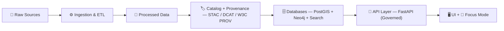
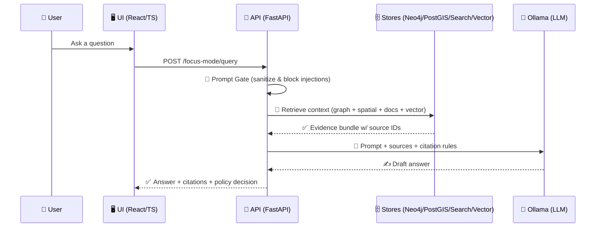

<div align="center">

# 📚 Kansas Frontier Matrix — Docs Hub

**Evidence-first documentation** for an open, governed geospatial knowledge platform 🌎🧭  
_“The map behind the map” — every layer, chart, and AI answer should trace back to sources._


</div>

---

## 🧭 Start here (recommended reading order)

> If you’re new: **read the architecture overview first**, then jump to governance, then AI.

### 🔗 Quick links
- 🏗 **System architecture**: `./architecture/system_overview.md`
- 🤖 **AI architecture**: `./architecture/AI_SYSTEM_OVERVIEW.md`
- 🧠 **Ollama integration** (Focus Mode): `./architecture/ai/OLLAMA_INTEGRATION.md`
- 🧩 **Future roadmap / next stages**: `./architecture/KFM_NEXT_STAGES_BLUEPRINT.md`
- 🏛️ **Governance council structure**: `./governance/council-structure.md`

---

## 🌾 What this documentation is for

Kansas Frontier Matrix (KFM) is a **geospatial knowledge & modeling platform** that integrates:
- 🗺️ Maps + geospatial layers  
- 📚 Historical records + narratives  
- 🧪 Data-driven analysis  
- 🤖 AI-assisted Q&A (“Focus Mode”)  

…inside a **provenance-first framework** where outputs are **traceable** and **auditable**.

This `docs/` folder is the **single place** to:
- explain how KFM works (architecture, AI, governance),
- document how to add data, stories, and features safely,
- standardize how we write, cite, and review knowledge.

---

## 🧱 The “Truth Path” (non-negotiable)

KFM is explicitly designed so **nothing bypasses the provenance pipeline**.



✅ **Canonical order:** `Raw → Processed → Catalog/Prov → Database → API → UI`  
🚫 Any feature that “shortcuts” this path is considered flawed unless proven otherwise.

---

## 🗂️ Documentation map (what belongs where)

> This tree is a *guide*; keep it aligned with the actual folder layout as it evolves.

```text
📁 docs/
├─ 📄 README.md                         ← (you are here) docs index + rules
│
├─ 📁 architecture/                     ← system design, “truth path”, service boundaries
│  ├─ 📄 system_overview.md
│  ├─ 📄 AI_SYSTEM_OVERVIEW.md
│  ├─ 📄 KFM_NEXT_STAGES_BLUEPRINT.md
│  └─ 📁 ai/
│     └─ 📄 OLLAMA_INTEGRATION.md
│
├─ 📁 governance/                       ← policy, roles, review gates, council structure
│  └─ 📄 council-structure.md
│
├─ 📁 standards/                        ← (recommended) writing, citations, metadata, diagrams
│  ├─ 📄 doc_style_guide.md
│  ├─ 📄 citation_and_provenance.md
│  └─ 📄 glossary.md
│
├─ 📁 stories/                          ← (recommended) narrative “Story Nodes” + templates
│  ├─ 📄 story_template.md
│  └─ 📁 published/
│
└─ 📁 reference/                        ← (optional) curated research PDFs + reading list
   ├─ 📄 reading_list.md
   └─ 📁 pdfs/
```

---

## 👥 Reading paths by role

### 🧑‍💻 Developer (backend / frontend)
1. `./architecture/system_overview.md` 🏗  
2. `./governance/council-structure.md` 🏛  
3. API docs (often live near code, e.g. `src/server/api/README.md`) 🔌  
4. UI docs (often live near `web/` or `src/`) 🖥️  

### 🗺️ GIS / Data contributor
1. Architecture overview (to understand the pipeline gates) 🧱  
2. Data catalog + metadata standards (STAC/DCAT/PROV) 🏷️  
3. Governance policies (licenses, sensitivity labels, approvals) 🔐  

### 🤖 AI / ML contributor (Focus Mode)
1. `./architecture/AI_SYSTEM_OVERVIEW.md` 🧠  
2. `./architecture/ai/OLLAMA_INTEGRATION.md` 🐙  
3. Governance + safety gates (prompt gate, citation rule, audit log) ✅  

### 🏫 Educator / Story author
1. Stories overview + templates (see `docs/stories/`) 📚  
2. Citation & provenance guide (how to link sources clearly) 🔎  

---

## 🤖 Focus Mode (AI) — what docs must enforce

Focus Mode is not an ungoverned chatbot. It is designed as a **governed RAG pipeline** where:
- the UI calls the backend (not the model),
- the backend retrieves evidence from official stores,
- the model must answer using those sources with citations.

### 🧠 High-level flow


### ✅ Doc implication
When documenting Focus Mode behavior:
- Always specify **what store(s)** provide truth (Neo4j, PostGIS, search index, vectors).
- Always specify **what policy gate** enforces the rule.
- Always show **where audit logs / provenance** live (so it’s reproducible).

---

## 🔐 Governance mindset (docs must reflect it)

KFM treats governance as a **first-class feature**:
- “Fail closed” by default: if metadata/policy is missing → block the operation 🛑  
- Role-based access control (RBAC) with scoped permissions 👤  
- Policy-as-code enforcement (e.g., OPA policy packs) 🧾  
- Mandatory provenance records (W3C PROV) for publishable datasets 🔗  

**Docs should never describe a workflow that bypasses governance.**  
If you discover a bypass: document it as a **bug / risk** and route it through the governance process.

---

## ✍️ Documentation rules of engagement

### ✅ The evidence rule (golden rule)
> If it sounds factual, it needs a source.

**Preferred sources in descending order:**
1. 🏷️ Dataset catalog entry (STAC/DCAT)  
2. 🔗 Provenance record (W3C PROV)  
3. 📄 Pipeline code output / manifest logs  
4. 🧾 External authoritative source (state/federal agency, archive)  

### 🧩 Cross-linking rules
- Use **relative links** inside `docs/` so forks and offline builds work.
- Link to code with **stable paths** (and optional line ranges when possible).
- Avoid “dead-end docs”: every page should link back to the hub or neighbors.

### 🧱 Page structure template (recommended)
Copy/paste when creating a new doc page:

```markdown
# 📌 Title

## 🎯 Purpose
What problem does this doc solve?

## 🧱 System context
Where does this sit in the Truth Path?

## 🔌 Interfaces
Inputs/outputs, APIs, schemas, contracts.

## ✅ Governance & safety
What policies/gates apply?

## 🔎 Provenance & citations
Where are sources recorded? How is this auditable?

## 🧪 Examples
Concrete examples (requests, responses, configs).

## 🧭 Next steps
TODOs, open questions, follow-ups.
```

### ✅ PR checklist for docs
- [ ] I used **relative links** (not absolute local paths)
- [ ] I included **sources / provenance pointers** for factual claims
- [ ] I didn’t describe any workflow that bypasses **Raw → … → UI**
- [ ] I updated `docs/README.md` if I added a new top-level doc section
- [ ] I added/updated diagrams (Mermaid) where architecture changed

---

## 📚 Reference library (project PDFs)

> These are the “support shelf” 📖 — design, GIS, DevOps, AI, and scientific tooling references.
> Keep this list curated (add short notes, remove duplicates, prefer the best source).

### 🗺️ GIS, cartography, mapping design
- `making-maps-a-visual-guide-to-map-design-for-gis.pdf` 🧭
- `Mapping Urban Spaces.pdf` 🏙️
- `Archaeological 3D GIS.pdf` 🏺🧊
- `GIS-Mapping-Topology.pdf` 🧩🗺️

### 🤖 AI, ML, statistics
- `Neural Nerworks-Build Ai-Statistical Learning-Deep Learing-AI Safety-Linear Regression-bayesian.pdf` 🧠
- `Artificial Intelligence & Machine Learning in Health Care & Medical Sciences.pdf` 🏥
- `MATLAB-PyTorch-Numpy-SciPy-Statisctics-Programming Science Tools.pdf` 📈
- `graphical-data-analysis-with-r.pdf` 📊

### 🧰 Engineering, performance, pipelines
- `foundations-of-software-and-system-performance-engineering-process-performance-modeling-requirements-testing-scalability-and-practice.pdf` ⚙️
- `Database-Docker-CI-Pipeline-DevOps-Security-Git-Shell-PowerShell.pdf` 🐳🔐
- `Various Programming Concepts.pdf` 🧩
- `Programming Design-Flexibility-Machine Learning-Test Development-Verilog-Software Qualify Assurance.pdf` 🧪

### 🌐 Web / UI building blocks
- `Web Design.pdf` 🎨
- `professional-web-design-techniques-and-templates.pdf` 🧱
- `learn-to-code-html-and-css-develop-and-style-websites.pdf` 🧷
- `CSS-HTML-JAVA-WebDesign.pdf` 🕸️
- `Node.js-React-CSS-HTML.pdf` ⚛️

### 🧮 MATLAB / scientific computing
- `Applications from Engineering with MATLAB Concepts.pdf` 🧮
- `Hands-On Accelerator Physics Using MATLAB.pdf` 🧲

### 🧠 Creativity / semantics / misc applied research
- `ssoar-2022-zipp-Programming_Creativity_Semantics_and_Organisation.pdf` ✨
- `Data Science-Data Engineering-Machine Learing-Steganography-Bilogical Atonomy-PYthon Scripting-Sine Cosine Algorithm-People Anylitics-Experimental Design-Visualizations of Time-Oriented Data-Creativity.pdf` 🧠🧪

---

## 🧾 Glossary (starter)

- **STAC** 🏷️ — SpatioTemporal Asset Catalog (dataset/asset metadata standard)  
- **DCAT** 🗂️ — Data Catalog Vocabulary (dataset discovery metadata)  
- **W3C PROV** 🔗 — provenance standard (lineage: inputs → process → outputs)  
- **OPA** 🧾 — Open Policy Agent (policy-as-code enforcement)  
- **PostGIS** 🗺️ — spatial database extension for PostgreSQL  
- **Neo4j** 🧩 — graph database for entities, relationships, events  
- **RAG** 🔎 — Retrieval-Augmented Generation (LLM answers from retrieved evidence)  
- **Focus Mode** 🤖 — KFM’s governed AI assistant (runs through the API + policies)

---

## ✅ Next improvements (good “first doc PRs”)

- 🧾 Add `docs/standards/doc_style_guide.md`
- 🔎 Add `docs/standards/citation_and_provenance.md` with examples (STAC/DCAT/PROV linking)
- 📚 Add `docs/reference/reading_list.md` with “what to read for what task”
- 🧱 Add a “Docs Build/Publish” note if we generate a docs site (MkDocs/Docusaurus/etc.)

---

<div align="center">

### 🏁 Goal of this docs folder
**Make KFM understandable, auditable, and easy to extend — without breaking provenance.** ✅

</div>
