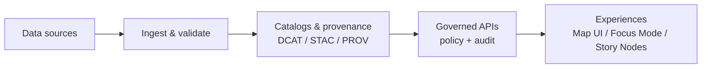

# docs

**Kansas Frontier Matrix — Governed Documentation Hub**

_This folder is part of the system. Docs are governed artifacts._

---

## What this folder is

`docs/` contains the **canonical, governed documentation** for KFM: guides, designs, standards, templates, runbooks, and Story Nodes.

Documentation is treated as a first-class system component:
- It defines system invariants and contracts.
- It enables CI validation gates.
- It provides auditability and safe sharing workflows.

---

## How KFM fits together

---

## Quick navigation

### Start here
- **Master guide**: `docs/MASTER_GUIDE_v13.md`
- **Glossary**: `docs/glossary.md`
- **Governance**: `docs/governance/`

### Common “I need to…”
- Understand system architecture → `docs/architecture/`
- Follow repo + doc rules → `docs/standards/`
- Write a new governed doc → `docs/templates/`
- Draft/publish a Story Node → `docs/reports/story_nodes/`
- Find pipeline specs/runbooks → `docs/pipelines/`, `docs/runbooks/`
- Understand search/retrieval behavior → `docs/search/`
- Review research source notes → `docs/research/`

> If you add a new doc area, add a `README.md` inside it **and** update the directory table below.

---

## Non-negotiables for all documentation

### Evidence-first
- If a claim is not supported by an approved source or governed system output, label it clearly:
  - **`(not confirmed in repo)`**
  - or **`(hypothesis)`**
- Prefer concrete provenance: dataset IDs, version IDs, catalogs, run IDs, schema links.

### Trust membrane
- **Frontend and external clients never access databases directly.**
- All reads/writes crossing the boundary must pass through policy evaluation, query shaping/redaction, and audit logging.

### Promotion mindset
Treat documentation changes as “promotion-significant” when they affect:
- contracts and schemas
- policy behavior
- pipeline gates
- Focus Mode rules
- Story Node publication standards

---

## Directory map

> This is the documentation “surface area” of the repo. Keep it clean, linkable, and reviewable.

| Area | Path | What belongs here | Notes |
|---|---|---|---|
| Master guides | `docs/MASTER_GUIDE_v*.md` | Canonical repository + pipeline overview, invariants | Prefer latest major version |
| Glossary | `docs/glossary.md` | Defined terms, governed vocabulary | Link from every major doc |
| Architecture | `docs/architecture/` | System design docs, blueprints, ADRs, diagrams | Use ADRs for decisions |
| Standards | `docs/standards/` | Repo structure rules, Markdown protocol, STAC/DCAT/PROV profiles | “How we do it” |
| Templates | `docs/templates/` | Universal Doc, Story Node v3, API contract extension | Copy first, then edit |
| Governance | `docs/governance/` | Root governance, ethics, sovereignty, review gates | Default-deny posture |
| Story Nodes | `docs/reports/story_nodes/` | Draft + published story content, assets | Draft ≠ published |
| Pipelines | `docs/pipelines/` | Pipeline specifications, domain ETL notes | Keep per-domain READMEs |
| Runbooks | `docs/runbooks/` | Reliability + operations runbooks | Incident-friendly format |
| Search | `docs/search/` | Search system overview, DRIFT docs, retrieval rules | Redaction-safe examples |
| Research | `docs/research/` | Source summaries, evaluations, drafts | Keep attachments isolated |
| Security | `docs/security/` | Supply chain, threat modeling, vulnerability notes | Security docs are gated |
| Patterns | `docs/patterns/` | Reusable patterns for QA/ETL/governance | Prefer thin, buildable slices |

---

## Governed document types

### Use templates
All “system-impacting” docs should start from a template in `docs/templates/`.

| Doc type | Template | Best for |
|---|---|---|
| Universal Doc | `docs/templates/TEMPLATE__KFM_UNIVERSAL_DOC.md` | specs, runbooks, designs, standards |
| Story Node v3 | `docs/templates/TEMPLATE__STORY_NODE_V3.md` | narrative content that is machine-ingestible |
| API contract extension | `docs/templates/TEMPLATE__API_CONTRACT_EXTENSION.md` | endpoint/GraphQL additions + policy hooks |

---

## Authoring workflow

### 1) Pick the right home
- Standards go to `docs/standards/`
- Architecture decisions go to `docs/architecture/adr/`
- Operational procedures go to `docs/runbooks/`
- Story content goes to `docs/reports/story_nodes/`

### 2) Start from a template
Copy the relevant template and keep heading order stable.

### 3) Add provenance
At minimum, include:
- Source identifiers (dataset ID / doc ID / URL if allowed)
- Version / date
- Processing run ID (if applicable)
- Any policy labels or sensitivity flags

### 4) Keep it link-check friendly
- Prefer relative links within the repo.
- Add a local `README.md` in new subfolders.
- Avoid “TODO links” that break link checks.

---

## Sensitive information

KFM uses FAIR+CARE thinking. If content may be sensitive (precise locations, culturally restricted knowledge, private individuals):
- generalize or redact
- flag for governance review
- avoid publishing details that increase risk

See `docs/governance/` for review triggers and decision gates.

---

## Definition of done for doc PRs

- [ ] Correct folder placement and naming
- [ ] Uses the right template (if applicable)
- [ ] Claims have citations or are explicitly labeled as not confirmed
- [ ] Links are valid (relative preferred)
- [ ] No leakage of sensitive details (or redaction rules documented)
- [ ] Any system-impacting change includes the impacted interfaces/contracts and verification steps

---

## Conventions

- Keep sections readable: short paragraphs, use lists/tables where helpful.
- Prefer stable identifiers and slugs for anything referenced by tooling.
- Treat docs as code: reviewed changes, clear diffs, no “drive-by” edits to core governance docs.

---

**Back to top** ↑

