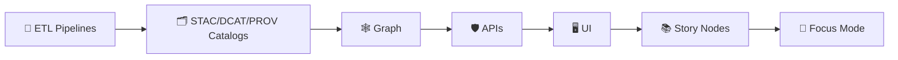

<a id="top"></a>

# 📚 `docs/` — Kansas Frontier Matrix (KFM) Governed Documentation 📜🧭


> Canonical home for KFM’s **governed documentation**:  
> **architecture + standards + templates + runbooks + governance + story nodes** — written so decisions are **auditable**, claims are **citable**, and change is **reviewable**.  
> This is where KFM stays explainable as it scales. 🧠🗺️  
>
> System blueprint context (project master doc):  [oai_citation:0‡🌟 Kansas Frontier Matrix – Latest Ideas & Future Proposals.docx](file-service://file-QrXwct2pX9kFpqgjtBiijR)  
> Repo gap audit / completeness lens:  [oai_citation:1‡Audit of the Kansas Frontier Matrix (KFM) Repository.pdf](file-service://file-1RwSrWXaDb5fnJ5gZX5kS3)

> [!IMPORTANT]
> **KFM’s non-negotiable order (docs must reinforce it):**  
> **ETL → STAC/DCAT/PROV Catalogs → Graph → APIs → UI → Story Nodes → Focus Mode**  
> If a doc encourages bypassing the ordering (even as a “temporary shortcut”), it’s wrong.

---

## 🔗 Quick links
- 🧭 Repo overview: **[`../README.md`](../README.md)**
- 📦 Data + metadata boundary: **[`../data/README.md`](../data/README.md)**
- 🧪 MCP (methods + receipts): **[`../mcp/README.md`](../mcp/README.md)** *(if present)*
- 🧩 Executable code boundary: **[`../src/README.md`](../src/README.md)** *(if present)*
- 🧾 Pipelines boundary: **[`../src/pipelines/README.md`](../src/pipelines/README.md)** *(if present)*
- 🧪 Tests boundary: **[`../tests/README.md`](../tests/README.md)** *(if present)*
- 📓 Notebooks boundary: **[`../notebooks/README.md`](../notebooks/README.md)** *(if present)*
- 📐 Schemas registry: **[`../schemas/README.md`](../schemas/README.md)** *(if present)*
- 🌐 Web UI boundary: **[`../web/README.md`](../web/README.md)** *(if present)*
- 🤝 CI/CD + templates: **[`../.github/README.md`](../.github/README.md)** *(if present)*

---

## 🧭 Quick navigation
- [📘 Overview](#-overview)
- [🧾 Doc metadata](#-doc-metadata)
- [🧠 Core invariants](#-core-invariants)
- [📖 Glossary](#-glossary-kfm-terms-used-in-docs)
- [🗂️ What goes in `docs/`](#️-what-goes-in-docs)
- [🧱 Directory layout](#-directory-layout)
- [🏁 Golden paths](#-golden-paths-most-common-doc-workflows)
- [✅ Doc quality gates](#-doc-quality-gates-definition-of-done)
- [🧾 Evidence, citations, and provenance pointers](#-evidence-citations-and-provenance-pointers)
- [📚 Story Nodes and Focus Mode rules](#-story-nodes-and-focus-mode-rules)
- [🔒 Security, sovereignty, and sensitive info](#-security-sovereignty-and-sensitive-info)
- [🧪 Modeling and simulation documentation](#-modeling-and-simulation-documentation)
- [⚙️ Scaling and data management documentation](#️-scaling-and-data-management-documentation)
- [🎨 Visualization and UX documentation](#-visualization-and-ux-documentation)
- [📚 Project reference library influence map](#-project-reference-library-influence-map)
- [🕰️ Version history](#️-version-history)

---

## 🧾 Doc metadata

| Field | Value |
|---|---|
| Doc | `docs/README.md` |
| Status | Active ✅ |
| Last updated | **2026-01-12** |
| Audience | Contributors writing standards, runbooks, story nodes, ADRs, and governance policies |
| Prime directive | If it changes what people *believe* about the map/story/data, it must be **reviewable + citable + reversible** |
| Repo posture | **Evidence-first** + **Contract-first** + **Sovereignty-aware** |

> [!NOTE]
> The YAML front-matter is authoritative for protocol versions and governance posture.  
> This table is a human-friendly snapshot.

---

## 📘 Overview

### ✅ Purpose
`docs/` exists so KFM remains:
- **understandable** (clear architecture + vocabulary)
- **governable** (policy and review gates are explicit)
- **auditable** (why a decision happened, and when)
- **evidence-first** (claims point to cataloged evidence)
- **humane** (transparent impacts, consent, dignity, and accountability)  [oai_citation:2‡Introduction to Digital Humanism.pdf](file-service://file-HC311tLjkcn1yRbyTBLJQQ)
- **change-friendly** (structured docs that evolve with requirements instead of becoming fossilized)  [oai_citation:3‡F-H programming Books.pdf](file-service://file-QofzooQDG9grJwh9nFN9SY)

### 🚫 What `docs/` is not
- not a dumping ground for generated outputs *(those belong under `data/**` and catalogs)*
- not a substitute for contracts *(schemas and API contracts live under `schemas/**` and `api/**`)*
- not a place for secrets, tokens, credentials, internal hostnames, or private URLs 🚫
- not a “shadow API” (docs explain; contracts enforce)

---

## 🧠 Core invariants

> [!IMPORTANT]
> **Docs are part of the system boundary.**  
> When a subsystem changes, docs should change **in the same PR** whenever feasible. Docs are “shipped,” not “updated later.”



### ✅ Docs must reinforce these rules

- ✅ **Pipeline ordering is absolute:** no leapfrogging stages.
- ✅ **Evidence-first narrative:** no unsourced claims in Story Nodes or Focus Mode.
- ✅ **Contract-first changes:** schemas and API contracts are first-class; docs must link to them and respect versioning.
- ✅ **One canonical home per thing:** avoid duplicate “shadow docs”; archive deprecated docs instead of copy/pasting.
- ✅ **Sovereignty-aware behavior:** docs must not leak sensitive locations (including via screenshots, tiles, or “helpful examples”).
- ✅ **Deny-by-default mindset:** treat user-provided files and internet metadata as hostile inputs; recommend validation, not trust-by-assumption.  [oai_citation:4‡Gray Hat Python - Python Programming for Hackers and Reverse Engineers (2009).pdf](file-service://file-Mu6zixTqF9Lubf5QMjepRg)  [oai_citation:5‡compressed-image-file-formats-jpeg-png-gif-xbm-bmp.pdf](file-service://file-Y6V94sFtV6sy3w63LDy9fi)

### ✅ Minimum validation intent (KFM-MDP v11.2.6 baseline)

KFM’s documentation posture assumes (or aspires to) automated validation gates such as:

- **Markdown protocol checks** (YAML front-matter + required sections)
- **Link/reference validation** (no broken internal links or unresolved citations)
- **Schema validation** for structured artifacts referenced by docs (STAC/DCAT/PROV, Story Node metadata)
- **Security/governance scans** (secrets, PII, sensitive location leakage, classification downgrades)

> [!NOTE]
> If CI isn’t fully wired yet, treat these as *required local checks* for doc changes that influence decisions or public meaning.

---

## 📖 Glossary (KFM terms used in docs)

**Catalog artifacts (STAC/DCAT/PROV)**  
Machine-readable metadata + lineage that makes datasets *discoverable, traceable, and governable*.

**Contract artifacts**  
Schemas and API contracts that define what the system accepts/serves (e.g., JSON Schemas in `schemas/`, OpenAPI/GraphQL in `api/contracts/**`).

**Evidence artifacts**  
Any derived output that can influence decisions (models, simulations, OCR corpora, derived rasters). Evidence artifacts must live in `data/processed/**` and be cataloged + provenance-linked.

**Story Node**  
A governed narrative unit that is machine-ingestible and evidence-linked. It references evidence (catalog IDs) and graph entities (stable IDs) and separates fact from interpretation.

**Focus Mode**  
The trust-preserving reading context where users experience story + map + timeline together. Focus Mode hard-gates provenance and sensitivity: *no new narrative without sources; no data without provenance; no sensitive location leaks.*

---

## 🗂️ What goes in `docs/`

KFM expects `docs/` to be organized by **governed intent** (not by author preference).

### ✅ Belongs here
- 🧱 **Architecture**: designs, diagrams, ADRs, blueprints (`docs/architecture/`)
- 📏 **Standards**: profiles + conventions (STAC/DCAT/PROV profiles, ontology rules, naming, CRS/unit rules) (`docs/standards/`)
- 🔐 **Security**: threat models, incident response, secure ingestion guidance (`docs/security/`)
- 🧭 **Governance**: FAIR/CARE/sovereignty policy, review gates, ethics, redaction rules (`docs/governance/`)
- 🧰 **Templates**: universal doc, ADR, Story Node, API contract extension (`docs/templates/`)
- 🧑‍🔧 **Runbooks**: “how to operate / debug / recover” (`docs/runbooks/`)
- 📰 **Reports & Story Nodes**: curated narrative content, with draft vs published separation (`docs/reports/story_nodes/`)
- 🗺️ **Domain modules**: per-domain documentation (sources, caveats, risks, ETL expectations) (`docs/data/<domain>/`)
- 📚 **Reference library (index only)**: citations + reading map + license notes (`docs/library/`)

### 🚫 Does not belong here
- generated dataset outputs → `data/**`
- executable code → `src/**` / `api/**` / `web/**`
- schema definitions → `schemas/**` *(docs explain; schemas enforce)*
- private credentials / internal endpoints → nowhere in git 🚫
- fulltext copies of copyrighted books/articles unless license explicitly allows redistribution 🚫

---

## 🧱 Directory layout

### 🧭 Expected shape (KFM-style)

> [!NOTE]
> Not all repos have every file yet. This is the **target** structure that the doc protocol assumes.

```text
📁 docs/
├── 📄 README.md                          # you are here ✅
├── 📘 MASTER_GUIDE_v13.md                # canonical system map (if present)
├── 📄 glossary.md                        # canonical term definitions (if present)
│
├── 🧱 architecture/
│   ├── 📄 README.md
│   ├── 📁 ADR/                           # 🧾 Architecture Decision Records
│   ├── 📄 KFM_REDESIGN_BLUEPRINT_v13.md   # blueprint (draft/active)
│   └── 🗺️ diagrams/                      # mermaid / svg / drawio exports (no secrets)
│
├── 📏 standards/
│   ├── 📄 README.md
│   ├── 📄 KFM_STAC_PROFILE.md
│   ├── 📄 KFM_DCAT_PROFILE.md
│   ├── 📄 KFM_PROV_PROFILE.md
│   ├── 📄 KFM_MARKDOWN_WORK_PROTOCOL.md   # KFM-MDP authoring rules
│   └── 🕸️ ontology/                      # graph/ontology conventions + mapping rules
│
├── 🧭 governance/
│   ├── 📄 ROOT_GOVERNANCE.md              # what requires review, by whom, and why
│   ├── 📄 ETHICS.md
│   ├── 📄 SOVEREIGNTY.md
│   └── 📄 REVIEW_GATES.md                 # optional: explicit review triggers
│
├── 🔐 security/
│   ├── 📄 README.md
│   ├── 📄 threat-model.md
│   └── 📄 incident-response.md
│
├── 🧰 templates/
│   ├── 📄 TEMPLATE__KFM_UNIVERSAL_DOC.md
│   ├── 📄 TEMPLATE__ADR.md
│   ├── 📄 TEMPLATE__STORY_NODE_V3.md
│   └── 📄 TEMPLATE__API_CONTRACT_EXTENSION.md
│
├── 🧑‍🔧 runbooks/
│   ├── 📄 README.md
│   ├── 📄 pipeline-ops.md
│   ├── 📄 graph-ops.md
│   ├── 📄 api-ops.md
│   └── 📄 ui-ops.md
│
├── 📰 reports/
│   └── 📚 story_nodes/
│       ├── 🧪 draft/
│       ├── ✅ published/
│       └── 🖼️ assets/                     # images/maps used by story nodes (no sensitive leaks)
│
├── 🗺️ data/
│   └── <domain>/
│       └── 📄 README.md                   # domain module (sources, caveats, ETL expectations)
│
├── 📚 library/
│   ├── 📄 README.md                       # license-aware index only (preferred)
│   └── 📄 influence-map.md                # “why this book/paper matters” links
│
└── 🗃️ 99_archive/                         # deprecated docs retained for traceability
```

> [!TIP]
> If you can’t decide where a new doc goes:
> **Does it define behavior?** → `standards/` or `governance/`  
> **Does it explain structure?** → `architecture/`  
> **Does it teach action steps?** → `runbooks/`  
> **Is it narrative evidence?** → `reports/story_nodes/`  
> **Is it domain-specific context + caveats?** → `data/<domain>/`

---

## 🏁 Golden paths (most common doc workflows)

### 1) Add a new data domain (doc + evidence alignment) ✅
When you add a new domain, create:
- `docs/data/<domain>/README.md` *(scope, sources, licensing, sensitivity, known caveats)*
- links/pointers to the domain’s catalog artifacts *(STAC/DCAT/PROV paths or IDs)*
- updates to `docs/standards/` **only** if the domain introduces new conventions

**Rule:** the domain becomes “real” only after `data/processed/**` + catalogs + provenance exist.

### 2) Add an ADR (Architecture Decision Record) ✅
Use an ADR when you decide something that affects:
- pipeline ordering or evidence boundaries
- metadata/provenance standards
- ontology/graph model changes
- API boundary behavior (authZ, redaction, classification propagation)
- public-facing meaning (maps, metrics, interpretations)

ADR should include: **context → decision → alternatives → consequences → rollback plan**.

### 3) Add or change a standard (profiles + conventions) ✅
Standards are **normative**. They must:
- be explicit and testable
- link to the machine schema (in `schemas/` / `api/contracts/`)
- define versioning rules and migration expectations
- clarify what breaks downstream (graph/API/UI/story)

### 4) Add a Story Node (governed narrative) ✅
Story Nodes are treated like data products:
- template-driven
- evidence-linked (catalog pointers)
- graph-aware (stable IDs)
- fact vs interpretation separated
- published only after review gates pass

### 5) Add/modify an API contract (contract-first) ✅
If you add or change an endpoint:
- update the contract first (OpenAPI/GraphQL + examples)
- document authZ/redaction/classification behavior
- update tests and release notes where applicable

---

## ✅ Doc quality gates (Definition of Done)

> [!CAUTION]
> Docs can break trust just as fast as broken code.  
> **Uncited claims** and **ambiguous language** are defects.

### ✅ Minimum DoD (for any doc PR)
- [ ] correct folder placement (matches doc intent)
- [ ] YAML front-matter present and valid *(title/path/version/status/last_updated at minimum)*
- [ ] clear audience + scope + non-goals
- [ ] glossary/definitions for new terms (or link to canonical glossary)
- [ ] evidence pointers for factual claims (prefer STAC/DCAT/PROV and stable IDs)
- [ ] explicit assumptions (especially modeling, projections, CRS, units)
- [ ] “safety review” note if content touches sensitive locations, identities, or sovereignty
- [ ] no secrets, tokens, internal URLs, or exposed system internals
- [ ] links work (relative links preferred)
- [ ] updated `last_updated` + version history entry when meaning changes

### 🔍 Recommended automation checks for docs
- markdown lint + style checks (headings, lists, code fences)
- link checker (relative links + anchors)
- YAML front-matter validation + required-sections check
- mermaid render check (where used)
- “no secrets / no PII” scanners
- optional spell check (domain dictionary)

---

## 🧾 Evidence, citations, and provenance pointers

### ✅ Rule: cite with *system-native pointers*
Prefer citing:
1. **Catalog artifacts** (STAC Item/Collection, DCAT dataset, PROV bundle)
2. **Graph entity IDs** (stable node IDs)
3. **External sources** only if they are also referenced in catalogs or the project library index

### ✅ Footnotes pattern (recommended)
```markdown
The 1870–1875 corridor shows increased settlement density.[^e1]

[^e1]: Evidence: DCAT `kfm.ks.historical.settlement_density`; STAC `kfm.ks.historical.settlement_density`; PROV `kfm.prov.etl_1875_...`
```

> [!TIP]
> If a reader can’t click from a claim → evidence → lineage, the doc is incomplete.

---

## 📚 Story Nodes and Focus Mode rules

Story Nodes turn narrative into a governed data product: machine-ingestible, evidence-linked, and graph-aware.

### ✅ Story Node requirements
- **Provenance for every claim** (citations to evidence)
- **Graph entity references** (stable IDs for people/places/events/docs)
- **Fact vs interpretation** separation (especially for AI-assisted narrative)
- **Draft vs published** separation (don’t mix)

### 🎯 Focus Mode hard gates (trust preservation)
- Only provenance-linked content can appear
- AI content must be **opt-in**, clearly labeled, and paired with uncertainty/confidence  [oai_citation:6‡Regression analysis using Python - slides-linear-regression.pdf](file-service://file-Ekbky5FwpaPHfZC2ttv6xR)  [oai_citation:7‡Introduction to Digital Humanism.pdf](file-service://file-HC311tLjkcn1yRbyTBLJQQ)
- No sensitive location leaks (generalize/omit where required)
- No side-channel bypass of sovereignty/classification rules

> [!IMPORTANT]
> Focus Mode is where users *experience* KFM. If it’s not traceable there, it doesn’t belong there.

---

## 🔒 Security, sovereignty, and sensitive info

Docs are a security surface. Treat them as if they could become public.

### ✅ Required posture
- 🚫 no secrets, tokens, private endpoints, internal hostnames
- 🧭 sovereignty-aware: avoid exposing exact coordinates for sensitive sites
- 🧯 no “how to exploit” instructions or vulnerable configuration examples
- 🧾 do not paste raw sensitive data into docs — reference catalog IDs instead
- 🧊 use screenshots carefully: they can leak coordinates, filenames, user accounts, or private tiles

> [!NOTE]
> Security mindset references (defensive orientation only):  [oai_citation:8‡Gray Hat Python - Python Programming for Hackers and Reverse Engineers (2009).pdf](file-service://file-Mu6zixTqF9Lubf5QMjepRg)  [oai_citation:9‡compressed-image-file-formats-jpeg-png-gif-xbm-bmp.pdf](file-service://file-Y6V94sFtV6sy3w63LDy9fi)  [oai_citation:10‡ethical-hacking-and-countermeasures-secure-network-infrastructures.pdf](file-service://file-Q7EeqPb17SD9sV8Fb12LQX)

---

## 🧪 Modeling and simulation documentation

KFM treats models as decision-support, not truth generators. Documentation must:
- state assumptions clearly
- define objectives + constraints
- report uncertainty (not just point estimates)
- record parameters + seeds
- define verification/validation (V&V) checks
- document bias risks and failure modes when models touch human narratives

Reference lenses for rigor + V&V discipline:  [oai_citation:11‡Scientific Modeling and Simulation_ A Comprehensive NASA-Grade Guide.pdf](file-service://file-LuWF23hffNAZJaZm2Gzvcd)  [oai_citation:12‡Understanding Statistics & Experimental Design.pdf](file-service://file-SdX6LMgi1uDRk5kd4H4Bg3)  [oai_citation:13‡ethical-hacking-and-countermeasures-secure-network-infrastructures.pdf](file-service://file-Q7EeqPb17SD9sV8Fb12LQX)  [oai_citation:14‡regression-analysis-with-python.pdf](file-service://file-NCS6ThhvajwNUm4crVVcGM)  [oai_citation:15‡think-bayes-bayesian-statistics-in-python.pdf](file-service://file-LXwJApPMVhRZgyqLb9eg7c)

---

## ⚙️ Scaling and data management documentation

When documenting performance/scaling behavior:
- specify data sizes, partitions, and indexing assumptions
- document storage formats and query patterns
- document concurrency and operational risks (race conditions, idempotency)
- document database conventions and migration strategy

Reference lenses for data systems + scaling:  [oai_citation:16‡Scalable Data Management for Future Hardware.pdf](file-service://file-GZ8gMsQ8hxu7GWEVd3csNE)  [oai_citation:17‡PostgreSQL Notes for Professionals - PostgreSQLNotesForProfessionals.pdf](file-service://file-742sw3gADJniEdmC19JeAC)  [oai_citation:18‡Data Spaces.pdf](file-service://file-7UnZyJ7eCK1egnsyuYJaFq)  [oai_citation:19‡concurrent-real-time-and-distributed-programming-in-java-threads-rtsj-and-rmi.pdf](file-service://file-Y45SvXbmLoZL1MNmrcyqz6)

---

## 🎨 Visualization and UX documentation

Maps and UI are meaning-making machines. Docs should capture:
- symbology decisions and aggregation choices (and why)  [oai_citation:20‡making-maps-a-visual-guide-to-map-design-for-gis.pdf](file-service://file-51FgWTn7uFXenxztXw29bP)
- web performance constraints (payload budgets, progressive loading)  [oai_citation:21‡responsive-web-design-with-html5-and-css3.pdf](file-service://file-Heg28TVM2nReDYTQ7nPhAK)
- tiling/LOD considerations for dense spatial data
- image compression rules for doc assets (avoid repo bloat; keep renders readable)  [oai_citation:22‡Mobile Mapping_ Space, Cartography and the Digital - 9789048535217.pdf](file-service://file-AkVmsLhdFzwie5Gco3zgYj)
- 3D coordinate conventions + GPU constraints when relevant  [oai_citation:23‡webgl-programming-guide-interactive-3d-graphics-programming-with-webgl.pdf](file-service://file-7quELMw4FrspPczB9Y3BTp)
- mobile/field realities and “mapping beyond the map” concerns  [oai_citation:24‡Kansas Frontier Matrix (KFM) – Comprehensive Technical Documentation.docx](file-service://file-PaBDqECcJe7NbC8hvXNGDS)

---

## 📚 Project reference library influence map

> [!NOTE]
> These project files influence how we write and review KFM documentation: governance, evidence, security, modeling rigor, scaling discipline, visualization honesty, and human-centered practice.

<details>
<summary><strong>📦 Expand: Reference library → what it influences in <code>docs/</code></strong></summary>

### 🧭 Core KFM system + documentation protocols
| Project file | Primary lens | How it upgrades `docs/` decisions |
|---|---|---|
| `Kansas Frontier Matrix (KFM) – Comprehensive Technical Documentation.docx`  [oai_citation:25‡🌟 Kansas Frontier Matrix – Latest Ideas & Future Proposals.docx](file-service://file-QrXwct2pX9kFpqgjtBiijR) | 🧭 System blueprint | Reinforces repo boundaries, pipeline ordering, governance posture, Story Nodes + Focus Mode constraints. |
| `Audit of the Kansas Frontier Matrix (KFM) Repository.pdf`  [oai_citation:26‡Audit of the Kansas Frontier Matrix (KFM) Repository.pdf](file-service://file-1RwSrWXaDb5fnJ5gZX5kS3) | 🧯 Reality check | Forces explicit “what exists vs what’s aspirational,” prioritizes missing runbooks/templates/gates. |
| `🌟 Kansas Frontier Matrix – Latest Ideas & Future Proposals.docx`  [oai_citation:27‡D-E programming Books.pdf](file-service://file-6Lmmw9aqHnfP2mo9cSrNeg) | 🧪 Roadmap notes | Encourages clear draft-vs-canonical separation; capture ideas without letting them masquerade as standards. |
| `Flexible Software Design: Systems Development for Changing Requirements.pdf`  [oai_citation:28‡F-H programming Books.pdf](file-service://file-QofzooQDG9grJwh9nFN9SY) | 🔁 Change-resilience | Encourages modular, versioned, migration-aware docs (avoid brittle “one-off” rules). |

### 🛰️ Geospatial, EO/RS, cartography, and web mapping
| Project file | Primary lens | How it upgrades `docs/` decisions |
|---|---|---|
| `python-geospatial-analysis-cookbook.pdf`  [oai_citation:29‡python-geospatial-analysis-cookbook.pdf](file-service://file-HT14njz1MhrTZCE7Pwm5Cu) | 🗺️ GIS engineering | Promotes CRS/unit hygiene, IO discipline, PostGIS patterns, and testable geoprocessing conventions. |
| `Cloud-Based Remote Sensing with Google Earth Engine-Fundamentals and Applications.pdf`  [oai_citation:30‡On the path to AI Law’s prophecies and the conceptual foundations of the machine learning age.pdf](file-service://file-NtashtRjti9J1THyYXkhAv) | 🛰️ EO workflows | Informs RS domain docs: exports, time-series, derived raster governance, and cloud-scale constraints. |
| `making-maps-a-visual-guide-to-map-design-for-gis.pdf`  [oai_citation:31‡making-maps-a-visual-guide-to-map-design-for-gis.pdf](file-service://file-51FgWTn7uFXenxztXw29bP) | 🎨 Cartography ethics | Forces documentation of symbology/aggregation as “meaning decisions,” not just styling. |
| `Mobile Mapping_ Space, Cartography and the Digital - 9789048535217.pdf`  [oai_citation:32‡Kansas Frontier Matrix (KFM) – Comprehensive Technical Documentation.docx](file-service://file-PaBDqECcJe7NbC8hvXNGDS) | 📱 Field constraints | Drives doc guidance for offline/low-bandwidth UX constraints and upstream asset preparation. |
| `responsive-web-design-with-html5-and-css3.pdf`  [oai_citation:33‡responsive-web-design-with-html5-and-css3.pdf](file-service://file-Heg28TVM2nReDYTQ7nPhAK) | 🌐 Web reality | Encourages realistic device constraints, progressive loading, and accessible UI documentation. |
| `webgl-programming-guide-interactive-3d-graphics-programming-with-webgl.pdf`  [oai_citation:34‡webgl-programming-guide-interactive-3d-graphics-programming-with-webgl.pdf](file-service://file-7quELMw4FrspPczB9Y3BTp) | 🧊 3D constraints | Promotes documenting coordinate conventions, LOD/tiling rules, and GPU-friendly asset prep. |
| `compressed-image-file-formats-jpeg-png-gif-xbm-bmp.pdf`  [oai_citation:35‡Mobile Mapping_ Space, Cartography and the Digital - 9789048535217.pdf](file-service://file-AkVmsLhdFzwie5Gco3zgYj) | 🖼️ Media hygiene | Sets expectations for doc assets: compression, thumbnails, and avoiding repo bloat. |

### 📊 Statistics, modeling, simulation, and inference hygiene
| Project file | Primary lens | How it upgrades `docs/` decisions |
|---|---|---|
| `Understanding Statistics & Experimental Design.pdf`  [oai_citation:36‡Understanding Statistics & Experimental Design.pdf](file-service://file-SdX6LMgi1uDRk5kd4H4Bg3) | 📊 Rigor | Strengthens claims: confounders, bias, experimental design, and uncertainty framing. |
| `graphical-data-analysis-with-r.pdf`  [oai_citation:37‡graphical-data-analysis-with-r.pdf](file-service://file-K7oxq5mFmdE9HrPPev6c7L) | 📉 EDA instincts | Encourages pre-publication sanity checks, diagnostics, and surfacing anomalies. |
| `regression-analysis-with-python.pdf`  [oai_citation:38‡regression-analysis-with-python.pdf](file-service://file-NCS6ThhvajwNUm4crVVcGM) | 📈 Baselines | Normalizes reproducible modeling writeups: diagnostics, leakage checks, assumptions. |
| `Regression analysis using Python - slides-linear-regression.pdf`  [oai_citation:39‡concurrent-real-time-and-distributed-programming-in-java-threads-rtsj-and-rmi.pdf](file-service://file-Y45SvXbmLoZL1MNmrcyqz6) | 📈 Quick checks | Reinforces what must be documented for regressions (residuals, scaling, assumptions). |
| `think-bayes-bayesian-statistics-in-python.pdf`  [oai_citation:40‡ethical-hacking-and-countermeasures-secure-network-infrastructures.pdf](file-service://file-Q7EeqPb17SD9sV8Fb12LQX) | 🎲 Uncertainty | Promotes explicit priors, posterior uncertainty reporting, and calibrated decisions. |
| `Scientific Modeling and Simulation_ A Comprehensive NASA-Grade Guide.pdf`  [oai_citation:41‡Scientific Modeling and Simulation_ A Comprehensive NASA-Grade Guide.pdf](file-service://file-LuWF23hffNAZJaZm2Gzvcd) | 🧪 V&V discipline | Elevates simulation docs with verification/validation, sensitivity analysis, and UQ expectations. |
| `Generalized Topology Optimization for Structural Design.pdf`  [oai_citation:42‡Generalized Topology Optimization for Structural Design.pdf](file-service://file-PzydVyvSPdXWqYrXeFCNzj) | 🧮 Optimization | Improves optimization run documentation: objectives, constraints, reproducibility, audit trails. |
| `Spectral Geometry of Graphs.pdf`  [oai_citation:43‡Spectral Geometry of Graphs.pdf](file-service://file-DWxRbQDZGktGtiWtzAQxs8) | 🕸️ Graph thinking | Encourages careful interpretation of graph metrics (signal vs fact) and provenance expectations. |

### 🗄️ Data systems, scaling, and interoperability
| Project file | Primary lens | How it upgrades `docs/` decisions |
|---|---|---|
| `PostgreSQL Notes for Professionals - PostgreSQLNotesForProfessionals.pdf`  [oai_citation:44‡PostgreSQL Notes for Professionals - PostgreSQLNotesForProfessionals.pdf](file-service://file-742sw3gADJniEdmC19JeAC) | 🐘 Store discipline | Strengthens DB runbooks: schema discipline, indexing, migrations, operational conventions. |
| `Scalable Data Management for Future Hardware.pdf`  [oai_citation:45‡Scalable Data Management for Future Hardware.pdf](file-service://file-GZ8gMsQ8hxu7GWEVd3csNE) | ⚙️ Performance | Promotes docs that capture partitions/locality, concurrency assumptions, and scaling risks. |
| `Data Spaces.pdf`  [oai_citation:46‡Data Spaces.pdf](file-service://file-7UnZyJ7eCK1egnsyuYJaFq) | 🔗 Interop | Reinforces metadata-as-interface mindset: stable IDs, provenance, pointer-over-payload discipline. |

### 🤖 AI governance + human-centered practice + security mindset
| Project file | Primary lens | How it upgrades `docs/` decisions |
|---|---|---|
| `Introduction to Digital Humanism.pdf`  [oai_citation:47‡Introduction to Digital Humanism.pdf](file-service://file-HC311tLjkcn1yRbyTBLJQQ) | ❤️ Human impact | Improves transparency/accountability language and keeps humans in control of meaning-making. |
| `On the path to AI Law’s prophecies and the conceptual foundations of the machine learning age.pdf`  [oai_citation:48‡Regression analysis using Python - slides-linear-regression.pdf](file-service://file-Ekbky5FwpaPHfZC2ttv6xR) | ⚖️ Restraint | Strengthens labeling of AI-assisted outputs, provenance expectations, and restraint under uncertainty. |
| `Principles of Biological Autonomy - book_9780262381833.pdf`  [oai_citation:49‡Principles of Biological Autonomy - book_9780262381833.pdf](file-service://file-PwPXcX5554FpuRsF3iXTCf) | 🧠 Systems | Encourages feedback-loop awareness and resilience thinking in governance/architecture docs. |
| `ethical-hacking-and-countermeasures-secure-network-infrastructures.pdf`  [oai_citation:50‡Gray Hat Python - Python Programming for Hackers and Reverse Engineers (2009).pdf](file-service://file-Mu6zixTqF9Lubf5QMjepRg) | 🧯 Defense | Improves defensive documentation: least privilege, incident thinking, safe operational posture. |
| `Gray Hat Python - Python Programming for Hackers and Reverse Engineers (2009).pdf`  [oai_citation:51‡compressed-image-file-formats-jpeg-png-gif-xbm-bmp.pdf](file-service://file-Y6V94sFtV6sy3w63LDy9fi) | 🛡️ Hostile inputs | Reinforces secure-ingestion posture and parser skepticism (without teaching exploitation). |

### 📚 Programming reference shelves (craft support across the stack)
| Project file | Lens | How it upgrades `docs/` decisions |
|---|---|---|
| `concurrent-real-time-and-distributed-programming-in-java-threads-rtsj-and-rmi.pdf`  [oai_citation:52‡think-bayes-bayesian-statistics-in-python.pdf](file-service://file-LXwJApPMVhRZgyqLb9eg7c) | 🧵 Concurrency | Encourages docs that warn about race conditions and enforce idempotent operational patterns. |
| `Implementing Programming Languages.pdf`  [oai_citation:53‡I-L programming Books.pdf](file-service://file-T9sYu87k1GPNNKMLddx41a) | 🧩 Tooling literacy | Helps write precise parser/DSL specs and avoid “hand-wavy” language about compilers. |
| `Objective-C Notes for Professionals.pdf`  [oai_citation:54‡O-R programming Books.pdf](file-service://file-M6zCNBGmJbot7A2aaUUy9M) | 🧰 Breadth | Supports documentation for platform-specific edge cases and tooling. |
| `Bash Notes for Professionals.pdf`  [oai_citation:55‡B-C programming Books.pdf](file-service://file-7V9zHZSJakZZrJAw9ASCMJ) | 🧰 Ops craft | Encourages safe scripting patterns in runbooks (quoting, exits, pipelines). |
| `MATLAB Notes for Professionals.pdf`  [oai_citation:56‡M-N programming Books.pdf](file-service://file-EYCp5md89QY2cy5PCYS18e) | 🧮 Numerics | Useful for legacy workflows and validating numerical expectations in docs. |

</details>

---

## 📚 Library intake policy (license-aware)

> [!IMPORTANT]
> `docs/library/` should contain **indexes, citations, and influence notes** — not automatically a mirror of PDFs.  
> If a reference is not redistributable, keep it **out of git** and store only:
> - bibliographic metadata (title/authors/year/publisher/license)
> - a short abstract in your own words
> - what it influences in KFM (standards/runbooks/architecture)
> - where the team can obtain it legally

Recommended pattern:
- `docs/library/README.md` → “what we rely on + why”
- `docs/library/influence-map.md` → crosswalk from references → KFM docs
- `docs/library/bib/refs.bib` *(optional)* → BibTeX for citations

---

## 🕰️ Version history

| Version | Date       | Summary of changes | Author |
| ------: | ---------- | ------------------ | ------ |
|  v1.2.0 | 2026-01-12 | Aligned with **KFM-MDP v11.2.6** front-matter; fixed mermaid fence; clarified library intake policy (license-aware); tightened DoD language; added explicit citations to project reference pack. | KFM Engineering |
|  v1.1.0 | 2026-01-11 | Added YAML front-matter; aligned directory layout + templates to v13 doc protocol; clarified catalog/contract/evidence terms; strengthened Focus Mode hard gates; expanded influence map to include known reference files. | KFM Engineering |
|  v1.0.0 | 2026-01-09 | Created canonical `docs/README.md` defining governed documentation boundaries, directory layout, doc quality gates, evidence/citation norms, Story Node + Focus Mode rules, and reference-library influence mapping. | KFM Engineering |

---

### 🔚 Footer
- ⬅️ Back to repo root: [`../README.md`](../README.md)
- 🧱 Data architecture: [`../data/README.md`](../data/README.md)
- 🧭 Governance charter: [`./governance/ROOT_GOVERNANCE.md`](./governance/ROOT_GOVERNANCE.md)

<a id="bottom"></a>
