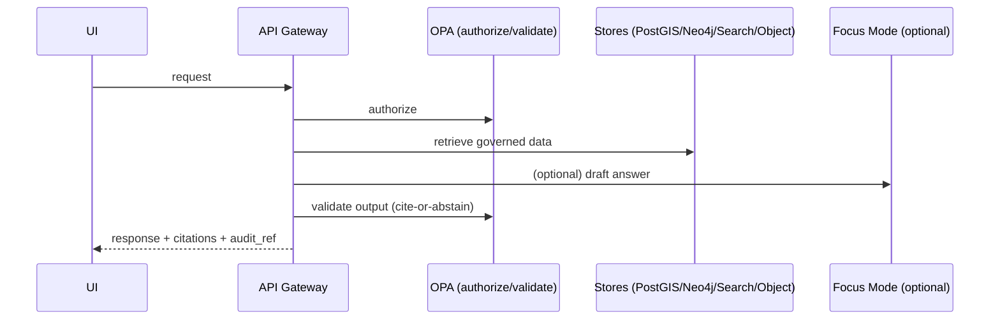
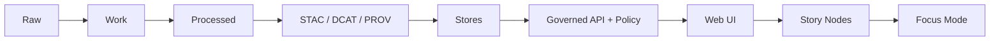

# 🧭 `docs/` — Governed Documentation (Kansas Frontier Matrix)


> **Scope:** This README covers **everything** in `docs/`: governed documentation, standards, templates, and Story Nodes (narratives) that power KFM’s public-facing understanding.
>
> **Audience:** engineering leads, data stewards, governance reviewers, and contributors authoring or reviewing governed artifacts.

---

## 📌 Non-negotiables (Boss Mode)

These are “stop-the-line” rules for **all** documentation and story content:

1) **Trust membrane:** UI/external clients never access databases directly — access is only via the governed API + policy boundary.  
2) **Fail-closed policy** on every request (data, Story Nodes, AI).  
3) **Dataset promotion gates:** Raw → Work → Processed; promotion requires checksums + STAC/DCAT/PROV catalogs.  
4) **Focus Mode must cite or abstain;** every answer produces an audit reference.

> If a document conflicts with these, the document is wrong. Fix the doc or flag for governance review.

---

## 🧭 Quick navigation

- [What belongs in `docs/`](#what-belongs-in-docs)
- [`docs/` directory map](#docs-directory-map)
- [Documentation types](#documentation-types)
- [Templates (required)](#templates-required)
- [Standards (required)](#standards-required)
- [Governance & review gates](#governance--review-gates)
- [Evidence & citations](#evidence--citations)
- [Sensitivity handling & redaction](#sensitivity-handling--redaction)
- [Story Nodes](#story-nodes)
- [Quality gates & CI expectations](#quality-gates--ci-expectations)
- [Contribution workflow](#contribution-workflow)
- [Definition of Done (Docs PR)](#definition-of-done-docs-pr)
- [Troubleshooting](#troubleshooting)

---

## What belongs in `docs/`

`docs/` is the **governed documentation system** for KFM:

- architecture docs, ADRs, diagrams
- standards and profiles (STAC/DCAT/PROV, repo standards, markdown protocol)
- templates that define required headings/ordering for governed docs
- governance policies (ethics, sovereignty, review gates)
- Story Nodes (narrative content) in draft/published form with assets and citations

**Rule of thumb:** if it changes system behavior, public narrative, datasets/catalog behavior, or Focus Mode output behavior → it must be documented here as a governed artifact.

---

## `docs/` directory map

> **Keep this map accurate.** When you add a new doc subtree, update this README.

```text
docs/
├── MASTER_GUIDE_v12.md                      # (legacy) prior canonical guide (if retained)
├── MASTER_GUIDE_v13.md                      # canonical repository + pipeline structure reference
├── glossary.md                              # canonical terms (used by humans + tooling)
│
├── architecture/
│   ├── KFM_REDESIGN_BLUEPRINT_v13.md        # design rationale + structure updates
│   ├── KFM_VISION_FULL_ARCHITECTURE.md      # long-term system architecture vision
│   ├── diagrams/                            # diagrams (Mermaid, SVG, PNG) used by docs
│   └── adr/                                 # Architecture Decision Records (ADRs)
│
├── standards/
│   ├── KFM_MARKDOWN_WORK_PROTOCOL.md        # governed markdown rules for KFM docs
│   ├── KFM_REPO_STRUCTURE_STANDARD.md       # canonical folder conventions + invariants
│   ├── KFM_STAC_PROFILE.md                  # STAC profile requirements
│   ├── KFM_DCAT_PROFILE.md                  # DCAT profile requirements
│   └── KFM_PROV_PROFILE.md                  # PROV lineage requirements
│
├── templates/
│   ├── TEMPLATE__KFM_UNIVERSAL_DOC.md       # default governed doc template (required headings)
│   ├── TEMPLATE__STORY_NODE_V3.md           # story node template (required headings)
│   └── TEMPLATE__API_CONTRACT_EXTENSION.md  # governed API contract change template
│
├── governance/
│   ├── ROOT_GOVERNANCE.md                   # top-level governance rules
│   ├── ETHICS.md                            # ethics requirements & constraints
│   ├── SOVEREIGNTY.md                       # FAIR/CARE, authority to control, stewardship
│   └── REVIEW_GATES.md                      # how docs/data/policy changes are approved
│
└── reports/
    └── story_nodes/
        ├── templates/                       # story-specific scaffolds, helper snippets
        ├── draft/                           # work-in-progress narratives
        └── published/                       # published story nodes (reviewed)
            └── <story_slug>/
                ├── story.md                 # the story node itself
                └── assets/                  # images/maps/figures used by the story
```

---

## Documentation types

KFM documentation falls into a few governed “types.” Use the right type and template.

| Doc type | Use it for | Canonical home | Must use template |
|---|---|---|---|
| **Universal Doc** | most design docs, runbooks, specs | `docs/…` | ✅ `docs/templates/TEMPLATE__KFM_UNIVERSAL_DOC.md` |
| **Story Node v3** | narratives powering UI/Focus Mode | `docs/reports/story_nodes/**/story.md` | ✅ `docs/templates/TEMPLATE__STORY_NODE_V3.md` |
| **API Contract Extension** | changes to API behavior/contracts | `docs/…` (usually `docs/architecture/` or `docs/standards/`) | ✅ `docs/templates/TEMPLATE__API_CONTRACT_EXTENSION.md` |
| **ADR** | decisions with context & tradeoffs | `docs/architecture/adr/` | (ADR format governed by repo standard) |

---

## Templates (required)

> **Do not improvise headings** for governed docs. Templates exist to keep docs machine-parseable and CI-checkable.

- `docs/templates/TEMPLATE__KFM_UNIVERSAL_DOC.md`
- `docs/templates/TEMPLATE__STORY_NODE_V3.md`
- `docs/templates/TEMPLATE__API_CONTRACT_EXTENSION.md`

**If you need a new template:**
1) add it under `docs/templates/`
2) update this README
3) add a CI rule/gate to validate it (template validators must be updated)

---

## Standards (required)

Standards are **build constraints**, not suggestions:

- `docs/standards/KFM_MARKDOWN_WORK_PROTOCOL.md`
- `docs/standards/KFM_REPO_STRUCTURE_STANDARD.md`
- `docs/standards/KFM_STAC_PROFILE.md`
- `docs/standards/KFM_DCAT_PROFILE.md`
- `docs/standards/KFM_PROV_PROFILE.md`

> If an implementation diverges from a standard, either:
> - fix the implementation, or  
> - update the standard via governance review (with explicit rationale + migration plan).

---

## Governance & review gates

Governance docs define how KFM prevents “repo drift,” uncited narratives, and sensitivity violations:

- `docs/governance/ROOT_GOVERNANCE.md`
- `docs/governance/ETHICS.md`
- `docs/governance/SOVEREIGNTY.md`
- `docs/governance/REVIEW_GATES.md`

### Governance expectations for doc authors

- Treat any doc that affects system behavior as a production change.
- Prefer minimal, reversible changes.
- When uncertain, explicitly label:
  - assumptions
  - risks
  - tradeoffs
  - verification steps (minimum work to confirm unknowns)

---

## Evidence & citations

### Evidence-first contract (applies to docs, stories, and Focus Mode)

KFM requires evidence-first behavior:

- Every **user-visible claim** must link to a dataset version and the exact record(s) used.
- If evidence cannot be resolved, the system (and narratives) must **abstain** rather than guessing.

### What “good citations” look like

A citation is **not** just a URL. It should support reproducibility:

- dataset identifier + version (or content hash)
- record identifiers (when applicable)
- page/line/offset spans when referencing documents
- license/attribution captured (and carried into evidence views)

> **Docs should be written so an evidence resolver can locate what you referenced in ≤2 API calls** once the evidence UX is wired.

---

## Sensitivity handling & redaction

Some content must be treated as sensitive (examples include: private ownership, precise archaeological site locations, some health/public-safety indicators). Documentation must never leak restricted information.

### Recommended sensitivity classes

- **Public:** safe to publish without redaction  
- **Restricted:** role-based access required (e.g., parcel ownership)  
- **Sensitive-location:** coordinates must be generalized or suppressed (e.g., archaeology, sensitive species)  
- **Aggregate-only:** publish only above thresholds (e.g., small-count health/crime)

### Redaction as a first-class transformation

If a doc references redacted or generalized data, it must state:
- what was redacted/generalized
- why (policy label)
- how (transformation)
- provenance references for the redacted derivative

---

## Story Nodes

Story Nodes are the narrative core of KFM’s public understanding. They must be **citable, reproducible, and reviewable**.

### Where Story Nodes live

- Draft: `docs/reports/story_nodes/draft/<story_slug>/story.md` (or within `draft/` conventions)
- Published: `docs/reports/story_nodes/published/<story_slug>/story.md`
- Assets: `docs/reports/story_nodes/**/<story_slug>/assets/`

### Story Node authoring rules

- Must use `docs/templates/TEMPLATE__STORY_NODE_V3.md`
- Must include citations and evidence references for each claim
- Must avoid sensitive-location disclosure unless explicitly allowed by governance + policy

---

## Quality gates & CI expectations

`docs/` is governed and must be validated like code.

### Minimum gates expected for docs changes

- Markdown linting / formatting rules (governed)
- Link-check (no broken internal references)
- Template validation (required headings/order)
- Citation checks (where tooling is available)
- Story Node schema validation (for Story Nodes)
- Policy-as-code regression suite (when docs change touches policy behavior)

### Architecture boundary reminder (trust membrane)

Documentation must never instruct clients to bypass the trust membrane.



### “Truth path” reminder (docs must match system reality)



---

## Contribution workflow

### Where to start

1) Read: `docs/MASTER_GUIDE_v13.md`  
2) Read the relevant standard(s) in `docs/standards/`  
3) Pick the correct template from `docs/templates/`

### Editing rules (practical)

- Prefer small PRs (reviewable, reversible).
- If changing a standard, include:
  - rationale
  - migration notes
  - acceptance criteria/tests (or CI gate updates)
- If adding new directories, update the directory map in this README.

### Suggested PR labels (optional, but helpful)

- `docs:governed`
- `docs:story-node`
- `docs:standards`
- `governance-review-required`
- `sensitivity-review-required`

---

## Definition of Done (Docs PR)

Use this checklist before requesting review:

- [ ] Correct doc type chosen (Universal Doc / Story Node / API Contract Extension / ADR)
- [ ] Correct template used; required headings preserved
- [ ] No sensitive-location leakage (or explicitly governed)
- [ ] Evidence-first: claims are supported with resolvable citations
- [ ] Link-check clean (internal links + referenced assets)
- [ ] Markdown lint clean
- [ ] Any referenced diagrams/assets committed to the right folder
- [ ] If doc changes system behavior: acceptance criteria included + CI gates identified/updated
- [ ] If doc touches policy behavior: OPA/policy regression expectations noted
- [ ] If doc touches data publication: Raw/Work/Processed + STAC/DCAT/PROV invariants respected

---

## Troubleshooting

### “My doc failed validation”

Common causes:
- missing required headings (template mismatch)
- broken relative links
- assets stored outside the expected subtree
- citations missing where required by tooling
- Story Node schema mismatch

### “I don’t know where this doc belongs”

Use this rule:
- Architecture/decisions → `docs/architecture/` (and `adr/` for decisions)
- Standards/profiles → `docs/standards/`
- Reusable formats → `docs/templates/`
- Governance/policy rules → `docs/governance/`
- Narrative content → `docs/reports/story_nodes/`

If still unclear, place it under `docs/architecture/` as a **draft** and flag it for governance review.

---

## Appendix: Canonical repo boundary reminder (context)

KFM’s canonical layout separates concerns (docs/data/src/web/policy) and enforces governance checks per area. Don’t mix code/data/policy guidance into docs in a way that blurs boundaries — link to the correct subsystem instead.