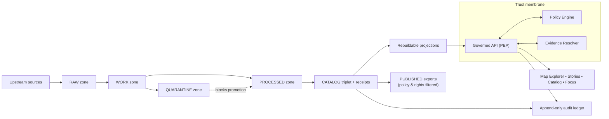

<!-- [KFM_META_BLOCK_V2]
doc_id: kfm://doc/2e7a0e0b-5c0a-4cb0-9fd6-7b3f4bbf67b1
title: docs/ — Governed Documentation Hub
type: standard
version: v2
status: draft
owners: KFM Maintainers (resolve via CODEOWNERS)
created: 2026-02-24
updated: 2026-02-28
policy_label: public
related:
  - ../README.md
  - ../.github/README.md
  - ../CONTRIBUTING.md
  - ../SECURITY.md
  - ../configs/README.md
  - ../contracts/README.md
  - ./adr/README.md
  - ./governance/README.md
  - ./runbooks/README.md
  - ./standards/README.md
tags:
  - kfm
  - docs
  - governance
  - evidence-first
  - cite-or-abstain
notes:
  - Upgraded from scaffold to governed doc index aligned to KFM vNext invariants.
  - Aligned language to truth path + trust membrane + EvidenceRef semantics; clarified “repo-root vs deeper paths” verification posture.
  - Added slots for templates + domain docs + quality docs (target structure; fail-closed if referenced by contract).
  - Treat repo-specific structure as UNKNOWN until verified; fail-closed on missing referenced files.
[/KFM_META_BLOCK_V2] -->

<a id="top"></a>

# `docs/` — Governed Documentation Hub
**Map-first • time-aware • governed • evidence-first • cite-or-abstain**

This directory is **documentation-as-production** for Kansas Frontier Matrix (KFM). Anything here is expected to be:
- **reviewable** (small diffs, stable IDs, clear owners),
- **testable where applicable** (linkcheck, schema examples, policy fixtures),
- **safe under policy** (default-deny posture; no sensitive leakage),
- **traceable** (claims link back to resolvable evidence or are marked Unknown).


> [!IMPORTANT]
> **Trust membrane rule:** docs must never become a bypass.  
> Do not include secrets, restricted coordinates, or “just trust me” claims.  
> If a claim can’t be supported by evidence, **abstain** or mark it **UNKNOWN** with verification steps.

---

## Quick navigation

- [Truth status legend](#truth-status-legend)
- [Directory contract](#directory-contract)
- [Documentation stance](#documentation-stance)
- [Where docs fit in KFM](#where-docs-fit-in-kfm)
- [Repo context](#repo-context)
- [Directory layout](#directory-layout)
- [System map](#system-map)
- [Doc templates](#doc-templates)
- [CI gates for docs](#ci-gates-for-docs)
- [Definition of Done](#definition-of-done)
- [Contribution workflow](#contribution-workflow)
- [Glossary](#glossary)
- [Reference library](#reference-library)

---

## Truth status legend

Use explicit truth labels to keep docs evidence-first and fail-closed:

- **CONFIRMED (repo):** backed by artifacts in this repository (paths, schemas, tests, receipts)
- **CONFIRMED (repo-root snapshot):** backed by a repository inventory snapshot; deeper module paths still require verification
- **CONFIRMED (design):** a KFM invariant/contract (must hold regardless of implementation)
- **PROPOSED:** a recommended template/pattern (adopt only after review)
- **UNKNOWN (repo):** not verified on this branch; include verification steps

> [!NOTE]
> If you reference a file that doesn’t exist, treat that as **missing and merge-blocking** if the reference is required by contract.

<p align="right"><a href="#top">Back to top ↑</a></p>

---

## Directory contract

### Purpose
`docs/` is the canonical home for:
- architecture and boundary contracts (human-readable)
- governance standards and review workflows
- operational runbooks
- narrative standards (Story Nodes)
- specs and examples that support enforcement (schemas, fixtures, checklists)

### What belongs in `docs/`
- **Architecture docs:** system overview, layering, trust membrane, canonical vs rebuildable
- **Governance docs:** policy labels, obligations, promotion gates, review triggers, roles
- **Runbooks:** incident response, pipeline operations, promotion procedures, rollback
- **Standards:** doc standards, schema/profile standards, catalog profile references
- **Narrative specs:** Story Node spec(s), citation conventions, evidence drawer expectations
- **Templates:** universal doc, story node, and API extension templates (governed + versioned)
- **Quality docs:** checklists, threat model prompts, and validation explainers (human-facing)
- **Evidence artifacts (bounded):** example receipts/manifests, redacted QA reports, validation examples

### What must not go in `docs/`
- **Secrets** (tokens, keys, credentials), even in examples
- **Raw or sensitive data** (default-deny): use redacted samples + digests + EvidenceRefs
- **Large binaries/build outputs** unless explicitly required and size-controlled
- **Unverifiable assertions**: if it can’t be cited, label it **UNKNOWN** and add verification steps
- **Policy enforcement logic** (belongs in `policy/` and runtime services), except for human-facing documentation of policy behavior

> [!WARNING]
> If it would be unsafe to paste into a public issue, it does not belong in public-labeled docs.

<p align="right"><a href="#top">Back to top ↑</a></p>

---

## Documentation stance

### Truth discipline
Every statement should be treated as one of:
- **Confirmed:** backed by repo artifacts or resolvable evidence
- **Proposed:** a design option with rationale + tradeoffs
- **Unknown:** not verified; must include **minimum verification steps**

> [!IMPORTANT]
> Do not “fill gaps” by inventing repo state. Prefer TODOs, explicit Unknowns, and small verification checklists.

### Safety posture
- **Default-deny** when sensitivity/permissions are unclear.
- If content could enable harm (e.g., vulnerable sites), publish only generalized detail.
- If a doc is governance-sensitive (e.g., security operations, internal escalation), label it `restricted|internal` and ensure review routing via CODEOWNERS.

### Cite-or-abstain applies to docs too
If a document makes factual claims that would influence decisions (policy, security, promotion eligibility), it should:
- cite in-repo artifacts (contracts, receipts, manifests, validators) **or**
- cite governed evidence references (EvidenceRefs) **or**
- mark the claim as **UNKNOWN**.

<p align="right"><a href="#top">Back to top ↑</a></p>

---

## Where docs fit in KFM

Docs sit alongside the enforceable artifacts and should point to them:

- **Contracts:** `contracts/` defines enforceable interfaces (OpenAPI, schemas, profiles, gates)
- **Policy:** `policy/` defines default-deny rules + obligations + test fixtures (enforced in CI and at runtime)
- **Configs:** `configs/` defines governed configuration inputs (labels, obligations, gate thresholds)
- **Data truth path:** `data/` holds canonical specs/registries/manifests/catalogs/receipts/digests
- **Governance:** `.github/` + `docs/governance/` define merge-time + human review posture
- **Tooling:** `tools/` + `tests/` make rules enforceable (validators, link checkers, fixtures)

> [!NOTE]
> If docs are served via governed APIs, the `policy_label` in the MetaBlock determines who can see the doc.
> If docs are “git-only,” still keep the label—it is a governance signal and can be enforced later.

<p align="right"><a href="#top">Back to top ↑</a></p>

---

## Repo context

`docs/` is only one surface of the system. To avoid overreach, treat any repo layout claims as **branch/commit-specific**:

- **Do not** assume deep module paths exist just because they’re shown in a target layout.
- Prefer **repo-root inventory** + **minimum verification steps** before writing “CONFIRMED (repo).”

Minimum verification steps (example):
- `ls -1` at repo root (confirm top-level folders)
- `tree -L 2 docs/` (confirm doc subfolders)
- run `linkcheck` / `MetaBlock lint` (confirm docs gates)

> [!TIP]
> If a doc is referenced by a contract, CI workflow, or release checklist, a missing link should be treated as merge-blocking.

<p align="right"><a href="#top">Back to top ↑</a></p>

---

## Directory layout

> [!NOTE]
> This is a **target structure** aligned to the KFM vNext operating model.  
> If your branch differs, update this README and any linkcheck/validators together.

```text
docs/                                                              # Governed docs hub (production docs; PR-reviewed; linkcheck-clean)
├─ README.md                                                       # Docs hub index + rules + “what goes where” + doc taxonomy + review gates
│
├─ architecture/                                                   # Architecture docs (invariants, decisions, diagrams, contracts)
│  ├─ README.md                                                    # Index + invariants + quick-nav + “start here” reading order
│  │                                                               # Includes: trust membrane summary, truth path overview, promotion contract pointers
│  │
│  ├─ overview/                                                    # High-level architecture narrative (what/why/how)
│  │  ├─ README.md                                                 # How to read this set + link map + glossary pointer + “normative vs informative”
│  │  ├─ system-context.md                                         # C4-ish context: external actors, upstream data sources, infra deps, trust boundaries
│  │  ├─ actors-and-trust-surfaces.md                              # Humans/services + UI trust surfaces; “who can touch what” matrix (high-level)
│  │  ├─ layering.md                                               # Clean architecture layering + dependency rules + anti-patterns (no IO in domain)
│  │  ├─ component-decomposition.md                                # Major components (API, apps, pipelines, tools) + responsibilities + interfaces
│  │  ├─ deployment-topology.md                                    # Conceptual deployment: envs, gateways, networks, secrets posture (no credentials)
│  │  ├─ trust-membrane.md                                         # Boundary rules + enforcement points (PEP/PDP, adapters, UI trust components)
│  │  ├─ policy-boundary.md                                        # Policy decision IO (allow/deny/obligations), redaction semantics, audit outputs
│  │  ├─ evidence-and-claims.md                                    # Claim model + EvidenceRef/EvidenceBundle meaning + resolvability/linking rules
│  │  ├─ focus-mode-constraints.md                                 # Cite-or-abstain contract, failure modes, “no evidence → no claim” behavior
│  │  ├─ truth-path.md                                             # Truth path zones (RAW→WORK→QUARANTINE→PROCESSED→CATALOG→PUBLISHED) + invariants
│  │  ├─ promotion-contract.md                                     # Promotion gates (A–G) + required artifacts + how failures are reported (fail-closed)
│  │  ├─ provenance-and-audit.md                                   # Run receipts, audit ledger, correlation IDs, provenance graph expectations
│  │  ├─ canonical-vs-rebuildable.md                               # Canonical truth vs rebuildable projections (search/tiles/graph) + rebuild triggers
│  │  ├─ identity-and-hashing.md                                   # Deterministic IDs, spec_hash rules, canonicalization, collision strategy
│  │  ├─ time-model.md                                             # Event/valid/transaction time definitions + required fields + conventions
│  │  ├─ time-queries-and-snapshots.md                             # As-of queries, snapshot semantics, version pinning, UI implications (view_state)
│  │  ├─ security-and-privacy.md                                   # Cross-cutting posture: secrets, least privilege, logging redaction, safe defaults
│  │  ├─ sensitive-locations.md                                    # Sensitive site handling: no precise coords, generalization, obligations, leakage tests
│  │  ├─ observability.md                                          # Logs/metrics/traces conventions + audit correlation + policy-safe dimensions
│  │  └─ glossary.md                                               # Canonical terms (used across docs/contracts/errors; reduces ambiguity)
│  │
│  ├─ decisions/                                                   # ADRs (small, reversible, versioned decisions)
│  │  ├─ README.md                                                 # ADR process, required sections, statuses, linking rules (code/tests/contracts)
│  │  ├─ adr-0000-template.md                                      # ADR template (decision record format; copy/paste)
│  │  ├─ adr-0001-example.md                                       # Worked example of a complete ADR (illustrative)
│  │  ├─ adr-0002-trust-membrane-enforcement.md                    # Decision: where/how invariants are enforced (CI + runtime + UI)
│  │  ├─ adr-0003-policy-engine-integration.md                     # Decision: PDP choice/integration, obligations model, caching posture
│  │  ├─ adr-0004-evidence-resolution.md                           # Decision: evidence resolver contracts, redaction guarantees, failure modes
│  │  ├─ adr-0005-canonical-vs-rebuildable-stores.md               # Decision: canonical stores vs projections, rebuild receipts + drift checks
│  │  ├─ adr-0006-time-model.md                                    # Decision: time semantics + API/schema/UI implications
│  │  └─ adr-index.yml                                             # Optional registry (id/title/status/links) for automation/search
│  │
│  ├─ diagrams/                                                    # Mermaid sources (kept close to narrative; linted; exported optionally)
│  │  ├─ README.md                                                 # Diagram conventions: style, naming, allowed icons, export policy, review rules
│  │  ├─ system-context.mmd                                        # System context diagram (actors + boundaries + key dependencies)
│  │  ├─ layering.mmd                                              # Layering diagram (allowed dependency direction + interfaces)
│  │  ├─ truth-path.mmd                                            # Truth path + promotion gates diagram (zones + required artifacts)
│  │  ├─ contracts.mmd                                             # Contract surfaces + validation flow diagram (contracts/ ↔ tools/tests)
│  │  ├─ pep-pdp-obligations.mmd                                   # PEP/PDP decision + obligations emission flow
│  │  ├─ evidence-flow.mmd                                         # EvidenceRef → resolve → EvidenceBundle → UI rendering + verification
│  │  ├─ time-model.mmd                                            # Time relationships + as-of query flow + version pinning
│  │  ├─ deployment.mmd                                            # Deployment topology (conceptual) + trust boundaries + secret handling
│  │  └─ exports/                                                  # OPTIONAL: rendered exports (generated; never hand-edited)
│  │     ├─ .gitkeep                                               # Keep folder when exports are generated in CI
│  │     └─ README.md                                              # How exports are generated (commands), verified, and when committed
│  │
│  ├─ contracts/                                                   # Stable contracts (human + machine; link to /contracts when canonical)
│  │  ├─ README.md                                                 # Contract set overview + versioning rules + normative language conventions
│  │  ├─ api-contract.md                                           # Normative API behavior summary (auth, pagination, filtering, receipts)
│  │  ├─ api-versioning-and-compat.md                              # Compatibility rules, deprecations, breaking-change gates, migration notes
│  │  ├─ api-error-model.md                                        # Error envelope semantics (policy-safe), trace IDs, retryability, UX mapping
│  │  ├─ authn-authz-contract.md                                   # Auth expectations (roles/scopes), audit requirements, denial semantics
│  │  ├─ policy-contract.md                                        # Policy contract (labels, decisions, obligations, fail-closed defaults)
│  │  ├─ policy-labels.vocab.json                                  # Machine vocab mirror/pointer (labels + descriptions + stability rules)
│  │  ├─ obligations.vocab.yml                                     # Machine vocab mirror/pointer (obligation types + required parameters)
│  │  ├─ evidence-resolver-contract.md                             # Evidence resolver contract (inputs/outputs, verification, obligations)
│  │  ├─ evidence-ref.schema.json                                  # EvidenceRef schema mirror/pointer (schemes + required fields)
│  │  ├─ evidence-bundle.schema.json                               # EvidenceBundle schema mirror/pointer (safe render fields + hashes)
│  │  ├─ run-receipt.schema.json                                   # Run receipt schema mirror/pointer (audit_ref, checks, inputs/outputs)
│  │  ├─ run-receipt.example.json                                  # Golden example (used in docs + CI validation)
│  │  ├─ promotion-manifest.schema.json                            # Promotion manifest schema mirror/pointer (artifacts, digests, approvals)
│  │  ├─ promotion-manifest.example.json                           # Golden example (used in docs + CI validation)
│  │  ├─ story-node.schema.json                                    # StoryNode schema mirror/pointer (or doc explaining canonical location)
│  │  ├─ claim.schema.json                                         # Claim schema (statement + evidence links + policy refs + time bounds)
│  │  └─ fixtures/                                                 # Tiny canonical examples referenced by docs/tests (policy-safe)
│  │     ├─ example-evidence-ref.json                              # Example EvidenceRef (valid + minimal)
│  │     ├─ example-evidence-bundle.json                           # Example EvidenceBundle (valid + minimal)
│  │     ├─ example-claim.json                                     # Example Claim (valid + minimal)
│  │     └─ example-story-node.json                                # Example Story Node (valid + minimal)
│  │
│  ├─ enforcement/                                                 # “Make it testable”: how invariants become CI/runtime gates
│  │  ├─ README.md                                                 # How to add/modify enforcement (tests/tools/policy), with “fail-closed” guidance
│  │  ├─ invariants.md                                             # Normative invariants list (each links to a test/tool gate)
│  │  ├─ policy-enforcement-points.md                              # PEP inventory: location, endpoints, required context, expected outputs
│  │  ├─ contract-testing.md                                       # Contract testing strategy (OpenAPI/schema, fixtures, drift detection)
│  │  ├─ data-promotion-gates.md                                   # Gate mapping (A–G) → checks → artifacts → failure semantics
│  │  ├─ redaction-and-generalization-tests.md                     # Testing posture for sensitive locations + no-leakage guarantees
│  │  └─ ci-checks.md                                              # CI job mapping (workflow → tools/tests → required artifacts)
│  │
│  ├─ registries/                                                  # Machine-readable indexes that keep architecture docs honest
│  │  ├─ README.md                                                 # What registries are + how validated + ownership rules
│  │  ├─ boundary-surface-registry.yml                             # Trust surfaces list (UI/API/batch/Focus/admin) + owners + labels
│  │  ├─ service-catalog.yml                                       # Services/modules catalog (owners, contracts, data touched, PEPs)
│  │  ├─ contract-index.yml                                        # Contract → canonical source → version → tests/tools that validate it
│  │  ├─ pep-registry.yml                                          # PEP locations (routes/middleware) + auth requirements + audit hooks
│  │  └─ policy-label-registry.yml                                 # Human label index mirroring machine vocab (definitions + examples)
│  │
│  ├─ templates/                                                   # Copy/paste templates (cheap to extend; reviewed like code)
│  │  ├─ README.md                                                 # Template usage rules + what must be customized before merge
│  │  ├─ kfm-meta-block-v2.txt                                     # MetaBlock v2 authoritative snippet (do not fork lightly)
│  │  ├─ standard-doc.template.md                                  # Standard doc skeleton (Context → Contract → Verification → DoD)
│  │  ├─ adr.template.md                                           # ADR skeleton (mirrors adr-0000-template.md)
│  │  ├─ contract-doc.template.md                                  # Contract doc skeleton (normative language + examples + tests)
│  │  ├─ diagram.template.mmd                                      # Mermaid boilerplate (styles + lint-friendly patterns)
│  │  └─ review-checklist.md                                       # Architecture review checklist (what reviewers must verify)
│  │
│  └─ threat-model/                                                # Threat modeling (assets, actors, risks, mitigations)
│     ├─ README.md                                                 # Threat model overview + cadence + acceptance criteria + “how to update”
│     ├─ scope-and-assets.md                                       # Protected assets + explicit out-of-scope items + trust boundaries
│     ├─ actors-and-entrypoints.md                                 # Threat actors + entry points (UI/API/batch/tools) + assumptions
│     ├─ data-classification-and-handling.md                       # Data classes + handling rules + default-deny + logging/redaction posture
│     ├─ abuse-cases.md                                            # Abuse/misuse cases + expected system response (deny/abstain/audit)
│     ├─ control-mapping.md                                        # Controls mapped to threats (policy, contracts, tests, infra controls)
│     ├─ risk-register.md                                          # Risk register (likelihood/impact/mitigation/owner/status; reviewed)
│     └─ residual-risk.md                                          # Accepted risks + monitoring plan + revisit triggers
│
├─ adr/                                                           # Architecture Decision Records (ADRs) for KFM (governed; repo-wide)
│  ├─ README.md                                                   # ADR process + rules + status definitions + index (single entrypoint)
│  ├─ TEMPLATE.md                                                 # ADR template (single-source; copy/paste)
│  ├─ ADR-REVIEW-CHECKLIST.md                                     # PR checklist for ADRs (evidence, rollback, verification, labels)
│  ├─ ADR-STYLE-GUIDE.md                                          # Optional: short style rules for consistency
│  ├─ INDEX.md                                                    # Optional: canonical ADR index (recommended if auto-generated)
│  ├─ _generated/                                                 # Optional: generated artifacts (never hand-edited)
│  │  ├─ adr-index.json                                           # Machine-readable ADR index for UI/search tooling
│  │  └─ adr-index.md                                             # Generated markdown ADR index (if automated)
│  ├─ tools/                                                      # Optional: scripts to enforce ADR invariants
│  │  ├─ adr-next-number.sh                                       # Next ADR number allocator (fail on collision)
│  │  ├─ adr-lint.js                                              # ADR lint (required sections, links, status vocab)
│  │  └─ adr-indexer.js                                           # ADR index generator (INDEX.md/_generated)
│  ├─ assets/                                                     # Optional: ADR supporting assets (rare)
│  │  ├─ diagrams/                                                # Exported diagrams when Mermaid is insufficient
│  │  └─ screenshots/                                             # Screenshots (avoid; must be policy-safe)
│  ├─ archive/                                                    # Optional: legacy ADRs (historical)
│  │  └─ 20xx-legacy/                                             # Imported ADRs (keep names; add notes instead of rewriting)
│  ├─ 0001-example-decision.md                                    # Example ADR (placeholder)
│  ├─ 0002-another-decision.md                                    # Example ADR (placeholder)
│  ├─ 0003-data-zones-and-promotion-contract.md                   # Planned decision placeholder
│  ├─ 0004-dataset-identity-versioning-and-hashing.md             # Planned decision placeholder
│  ├─ 0005-catalog-triplet-dcat-stac-prov-strategy.md             # Planned decision placeholder
│  ├─ 0006-evidence-ref-and-bundle-resolution.md                  # Planned decision placeholder
│  ├─ 0007-policy-labels-redaction-and-obligations.md             # Planned decision placeholder
│  ├─ 0008-governed-api-boundary-and-pep-enforcement.md           # Planned decision placeholder
│  ├─ 0009-search-index-tiles-and-rebuildability.md               # Planned decision placeholder
│  ├─ 0010-focus-mode-cite-or-abstain-guardrails.md               # Planned decision placeholder
│  ├─ 0011-run-receipts-and-audit-ledger-minimums.md              # Planned decision placeholder
│  └─ 0012-secrets-management-and-rotation.md                     # Planned decision placeholder
│
├─ governance/                                                    # Governance hub (human docs + checklists + policy fixtures)
│  ├─ README.md                                                   # Governance entrypoint + responsibilities + review triggers
│  ├─ ROOT_GOVERNANCE.md                                          # Charter: roles, decision process, escalation, “fail-closed” defaults
│  ├─ ETHICS.md                                                   # Ethical commitments + prohibited uses + data dignity posture
│  ├─ SOVEREIGNTY.md                                              # CARE-aligned sovereignty rules + restricted knowledge handling
│  ├─ REVIEW_GATES.md                                             # Review gates + required approvers + promotion checklists
│  ├─ GLOSSARY.md                                                 # Governance glossary (shared vocabulary)
│  ├─ CHANGELOG.md                                                # Governance changes log (human-readable; dated)
│  ├─ roles/                                                      # Stewardship and ownership documentation
│  │  ├─ OWNERSHIP.md                                             # Ownership map (datasets/services/policies/catalogs) + escalation path
│  │  ├─ ROLE_MODEL.md                                            # Role taxonomy + expectations + allowed actions (high-level)
│  │  ├─ RBAC_MATRIX.md                                           # RBAC matrix (high-level; canonical truth may be policy-as-code)
│  │  └─ REVIEWERS.md                                             # Review quorum rules + CODEOWNERS alignment notes
│  ├─ labels/                                                     # Label taxonomy + sensitivity handling guidance
│  │  ├─ POLICY_LABEL_TAXONOMY.md                                 # Policy label definitions + required metadata + defaults
│  │  ├─ SENSITIVITY_GUIDE.md                                     # How to classify fields/locations/media (examples + anti-examples)
│  │  ├─ REDACTION_GENERALIZATION.md                              # Redaction/generalization rules + testing expectations
│  │  └─ examples/                                                # Worked examples (policy-safe)
│  │     ├─ public_generalized_example.md
│  │     ├─ restricted_location_example.md
│  │     └─ mixed_sensitivity_story_example.md
│  ├─ gates/                                                      # Governance gates (CI + runtime + promotion)
│  │  ├─ PROMOTION_CONTRACT.md                                    # Human-readable promotion requirements + sign-offs
│  │  ├─ CI_GATES.md                                              # Required CI checks + what they validate
│  │  ├─ RUNTIME_GATES.md                                         # Runtime checks (PEPs, obligations, audit receipts)
│  │  ├─ FOCUS_MODE_EVALUATION.md                                 # Focus eval protocol + goldens + regression rules
│  │  └─ waivers/                                                 # Waiver policy + records templates
│  │     ├─ WAIVER_POLICY.md                                      # When waivers are allowed + expiry + mitigations
│  │     └─ WAIVER_RECORD_TEMPLATE.md                             # Waiver record (who/why/expiry/mitigations/audit)
│  ├─ records/                                                    # Durable records (auditable decisions/reviews/incidents)
│  │  ├─ decisions/                                               # Governance decision records (non-ADR)
│  │  │  ├─ README.md                                             # Lifecycle: draft→approved→superseded
│  │  │  └─ GDR_TEMPLATE.md                                       # Governance decision record template
│  │  ├─ reviews/                                                 # Review records (PR/change-id keyed)
│  │  │  └─ (YYYY)/
│  │  │     └─ (PR-or-change-id).md
│  │  └─ incidents/                                               # Incident records + retrospectives
│  │     ├─ INCIDENT_TEMPLATE.md
│  │     └─ (YYYY)/...
│  ├─ templates/                                                  # Governance workflow templates (copy/paste)
│  │  ├─ GOVERNANCE_REVIEW_RECORD.md                              # Standard review record template
│  │  ├─ DATASET_INTAKE_CHECKLIST.md                              # Dataset intake checklist
│  │  ├─ SOVEREIGNTY_ASSESSMENT.md                                # Sovereignty assessment template
│  │  ├─ AI_FEATURE_RISK_REVIEW.md                                # AI feature risk review template
│  │  └─ PUBLICATION_SIGNOFF.md                                   # Publication sign-off template
│  └─ policy/                                                     # Policy docs + fixtures + parity test planning (code lives elsewhere)
│     ├─ README.md                                                # Policy boundary: CI == runtime semantics + pointers to code
│     ├─ POLICY_MODEL.md                                          # PDP/PEP model + decision envelope + failure modes
│     ├─ OBLIGATIONS.md                                           # Obligation types + semantics + UI expectations
│     ├─ INPUT_CONTEXT.md                                         # Policy context schema: required/optional fields
│     ├─ schemas/                                                 # Schemas for policy fixtures/decision envelopes
│     │  ├─ policy_context.schema.json
│     │  ├─ policy_decision.schema.json
│     │  └─ obligation.schema.json
│     ├─ fixtures/                                                # Deterministic fixtures (safe; synthetic; versioned)
│     │  ├─ allow_deny/                                           # Allow/deny fixtures by role
│     │  ├─ redaction_generalization/                             # Redaction/generalization cases + expected outputs
│     │  └─ focus_mode/                                           # Focus-specific policy fixtures (goldens/leakage tests)
│     ├─ testplan/                                                # Test plans (CI + runtime parity expectations)
│     │  ├─ ci_policy_tests.md
│     │  ├─ runtime_policy_parity.md
│     │  └─ coverage_expectations.md
│     └─ mappings/                                                # Mapping docs (where policy lives + where enforced)
│        ├─ policy_code_locations.md
│        └─ enforcement_points.md
│
├─ standards/                                                    # Non-negotiable standards (CI-enforced where configured)
│  ├─ README.md                                                  # Standards index + update process + deprecation rules
│  ├─ KFM_MARKDOWN_WORK_PROTOCOL.md                              # Docs protocol (formatting, linkcheck, review discipline)
│  ├─ KFM_REPO_STRUCTURE_STANDARD.md                             # Repo structure invariants (paths, naming, registries)
│  ├─ KFM_STAC_PROFILE.md                                        # STAC conformance standard (human-facing summary)
│  ├─ KFM_DCAT_PROFILE.md                                        # DCAT conformance standard (human-facing summary)
│  ├─ KFM_PROV_PROFILE.md                                        # PROV conformance standard (human-facing summary)
│  ├─ registry/                                                  # Machine-readable inventory of standards + deprecations
│  │  ├─ README.md
│  │  ├─ standards.registry.yaml                                 # Canonical standards inventory (owners, scope, status)
│  │  └─ deprecations.yaml                                       # Deprecation ledger (superseded docs + pointers)
│  ├─ authoring/                                                 # Authoring standards (normative language, citations, diagrams)
│  │  ├─ README.md
│  │  ├─ KFM_META_BLOCK_V2_STANDARD.md                           # MetaBlock v2 requirements + examples
│  │  ├─ KFM_NORMATIVE_LANGUAGE_STANDARD.md                      # MUST/SHOULD/MAY rules + how to write normative text
│  │  ├─ KFM_CITATION_PROTOCOL.md                                # Citation rules (EvidenceRef, links, when to abstain)
│  │  ├─ KFM_DIAGRAM_MERMAID_STANDARD.md                         # Mermaid style/lint rules + safe diagram practices
│  │  └─ examples/
│  │     ├─ good/
│  │     └─ bad/
│  ├─ repo/                                                      # Repo/process standards (branching, release, versions)
│  │  ├─ README.md
│  │  ├─ KFM_BRANCHING_RELEASE_STANDARD.md                       # Branching model + release cadence + required gates
│  │  ├─ KFM_VERSIONING_DEPRECATION_STANDARD.md                  # Versioning + deprecation policy
│  │  └─ examples/
│  │     └─ repo_trees/
│  ├─ catalog/                                                   # Catalog standards (triplet linking + profiles)
│  │  ├─ README.md
│  │  ├─ triplet/
│  │  │  ├─ KFM_TRIPLET_LINKING_STANDARD.md                      # Required DCAT↔STAC↔PROV links + invariants
│  │  │  └─ examples/
│  │  │     ├─ minimal_triplet/
│  │  │     └─ complex_triplet/
│  │  ├─ stac/
│  │  │  ├─ README.md
│  │  │  ├─ CONFORMANCE.md                                       # Conformance checklist + common failures
│  │  │  └─ examples/
│  │  ├─ dcat/
│  │  │  ├─ README.md
│  │  │  ├─ CONFORMANCE.md
│  │  │  └─ examples/
│  │  └─ prov/
│  │     ├─ README.md
│  │     ├─ CONFORMANCE.md
│  │     └─ examples/
│  ├─ policy/                                                    # Policy standards (labels, obligations, redaction)
│  │  ├─ README.md
│  │  ├─ KFM_POLICY_LABEL_STANDARD.md                            # Labels standard (required metadata + defaults)
│  │  ├─ KFM_REDACTION_OBLIGATIONS_STANDARD.md                   # Obligation semantics + redaction/generalization expectations
│  │  └─ examples/
│  │     ├─ public/
│  │     └─ restricted/
│  ├─ evidence/                                                  # Evidence standards (refs, bundles, receipts)
│  │  ├─ README.md
│  │  ├─ KFM_EVIDENCE_REF_STANDARD.md                            # EvidenceRef schemes + formatting + resolvability rules
│  │  ├─ KFM_EVIDENCE_BUNDLE_STANDARD.md                         # EvidenceBundle required fields + safe rendering rules
│  │  ├─ KFM_RUN_RECEIPT_STANDARD.md                             # Run receipt minimums + deterministic fields
│  │  └─ examples/
│  ├─ api/                                                       # API standards (contracts, pagination, errors)
│  │  ├─ README.md
│  │  ├─ KFM_API_CONTRACT_EXTENSION.md                           # Extensions/conventions for OpenAPI + DTOs
│  │  ├─ KFM_ERROR_MODEL_STANDARD.md                             # Policy-safe error envelope standard
│  │  ├─ KFM_PAGINATION_FILTERING_STANDARD.md                    # Pagination/filtering conventions (stable, consistent)
│  │  └─ examples/
│  ├─ ui/                                                        # UI standards (evidence-first UX, story nodes, accessibility)
│  │  ├─ README.md
│  │  ├─ KFM_STORY_NODE_STANDARD.md                              # Story Node authoring/rendering requirements
│  │  ├─ KFM_EVIDENCE_FIRST_UX_STANDARD.md                       # Evidence-first UX requirements (drawer/badges/abstain UX)
│  │  └─ accessibility/
│  │     └─ KFM_A11Y_MINIMUM_STANDARD.md                         # Minimum accessibility baseline (keyboard, contrast, ARIA)
│  └─ _archive/                                                  # Deprecated/old versions (never referenced by CI)
│     ├─ README.md                                               # Archive rules (do not link from active docs)
│     └─ 2026-02-xx/
│
├─ templates/                                                    # Governed templates (docs-as-prod; reviewed; stable entrypoints)
│  ├─ README.md                                                  # Template index + usage rules + required customization checklist
│  ├─ TEMPLATE__KFM_UNIVERSAL_DOC.md                             # Universal doc template (Context→Contract→Verification→DoD)
│  ├─ TEMPLATE__STORY_NODE_V3.md                                 # Story Node v3 template (MetaBlock + claims + EvidenceRefs)
│  └─ TEMPLATE__API_CONTRACT_EXTENSION.md                        # API contract extension template (normative language + examples)
│
├─ runbooks/                                                     # Operational runbooks (step-by-step; production-grade)
│  ├─ README.md                                                  # Runbooks index + incident flow + “how to use during outages”
│  ├─ _registry/                                                 # Optional: machine-checkable completeness + ownership
│  │  ├─ runbooks.yml                                            # Runbook registry (id, owners, scope, last_reviewed)
│  │  ├─ runbooks.schema.json                                    # Schema for runbooks.yml
│  │  └─ owners.yml                                              # Owner aliases for registry validation/CODEOWNERS sync
│  ├─ templates/                                                 # Runbook templates (copy/paste)
│  ├─ incidents/                                                 # Incident playbooks + comms + drills (SEV-aligned)
│  ├─ change/                                                    # Change management runbooks (intake→execute→rollback→closeout)
│  ├─ pipelines/                                                 # Pipeline ops (rerun/backfill/quarantine/promote/receipts verify)
│  ├─ data/                                                      # Data stewardship ops (QA failures/redaction/schema change/restore/tombstone)
│  ├─ catalog/                                                   # Catalog ops (build/validate/publish/rebuild/deprecate)
│  ├─ evidence/                                                  # Evidence ops (bundle create/resolve/redaction/retention/audit append)
│  ├─ indexing/                                                  # Indexing ops (search/tiles/graph rebuild + freshness verification)
│  ├─ api/                                                       # API ops (deploy/rollback/migrations/rate limits/read-only modes)
│  ├─ ui/                                                        # UI ops (deploy/flags/cache/emergency banners/style updates)
│  ├─ policy/                                                    # Policy ops (bundle build/publish/regression triage/emergency deny-all)
│  ├─ governance/                                                # Governance ops (access grants/revokes/release approvals/notes)
│  ├─ platform/                                                  # Platform ops (backup/restore/DR/k8s upgrades/cert rotate/storage expand)
│  ├─ observability/                                             # Observability ops (alerts/dashboards/retention/SLOs/sampling)
│  └─ _assets/                                                   # Supporting assets (diagrams/samples; prefer text + Mermaid)
│
├─ guides/                                                      # Onboarding + how-to (developer, steward, operator)
│  ├─ README.md                                                  # Guides index + recommended learning path
│  ├─ onboarding.md                                              # New contributor/operator onboarding checklist
│  ├─ add_a_dataset.md                                           # Dataset onboarding walkthrough (specs → pipelines → promotion gates)
│  ├─ publish_a_story.md                                         # Story authoring + review + publish workflow (EvidenceRefs required)
│  └─ focus_mode_eval.md                                         # How to run Focus Mode evals + interpret reports + triage regressions
│
├─ data/                                                        # Domain docs (NOT the data truth-path zone; explanatory only)
│  ├─ README.md                                                  # Domain map + what belongs here + pointers to canonical datasets
│  └─ <domain-slug>/                                             # One domain’s docs (e.g., hydrology, soils, roads, weather)
│     ├─ README.md                                               # Domain overview + datasets catalog + policy posture + known gaps
│     └─ ...                                                     # Additional domain-specific notes, glossaries, and link maps
│
├─ stories/                                                     # Story Nodes + narrative standards (policy-labeled, review-gated)
│  ├─ README.md                                                  # Story docs index + authoring rules + review workflow
│  ├─ story_node_spec.md                                         # Story node spec (human-facing; points to canonical schema)
│  ├─ templates/                                                 # Copy/paste story templates
│  │  ├─ story_node.md                                           # Markdown story template (MetaBlock + claims)
│  │  └─ story_node.sidecar.json                                 # Sidecar template (StoryNode v3 schema)
│  └─ published/                                                 # OPTIONAL: curated promoted story nodes stored in docs/
│
├─ investigations/                                              # Discover-mode notes (not user-visible until promoted)
│  ├─ README.md                                                  # Rules: drafts only; promotion path into architecture/guides/standards
│  └─ <investigation-slug>/                                      # Investigation bucket
│     ├─ README.md                                               # Summary + hypotheses + next steps
│     └─ notes.md                                                # Working notes (dated; cite sources; mark unknowns)
│
├─ quality/                                                     # Human-facing QA checklists + explainers (non-code quality posture)
│  ├─ README.md                                                  # Quality docs index + how they map to CI gates
│  ├─ threat_model_checklist.md                                  # Checklist that points into architecture/threat-model/*
│  └─ ...                                                       # Additional checklists (release readiness, documentation QA, etc.)
│
├─ schemas/                                                     # Human-facing schema docs/examples (NOT canonical machine schemas)
│  ├─ README.md                                                  # How to read schemas + where canonical JSON schemas live (/contracts)
│  ├─ run_receipt.md                                             # Run receipt explanation + field-by-field notes + examples
│  ├─ promotion_manifest.md                                      # Promotion manifest explanation + examples
│  ├─ evidence_bundle.md                                         # EvidenceBundle explanation + safe rendering guidance
│  └─ examples/                                                  # Worked examples (policy-safe; small; deterministic)
│
└─ diagrams/                                                    # Shared diagrams referenced across docs (mermaid/mmd/svg)
   ├─ README.md                                                  # Cross-doc diagram conventions + naming + export rules
   └─ <diagram-files>                                            # Shared diagram sources/exports used outside architecture/
```

> [!TIP]
> Keep “canonical schemas” and validators under `contracts/` and `tools/`.  
> Keep `docs/schemas/` as **human-readable explanations + examples**, not the enforcement source of truth.

<p align="right"><a href="#top">Back to top ↑</a></p>

---

## System map

KFM is governed end-to-end:

**Upstream → RAW → WORK/QUARANTINE → PROCESSED → CATALOG (DCAT/STAC/PROV + receipts) → projections → trust membrane (PEP + policy + evidence) → UI → audit**



### Architecture invariants (CONFIRMED — design)
- UI/clients never access storage/DB directly; **all access goes through governed APIs + policy boundary**.
- Policy enforcement is evaluated at the **PEP**; no “static bypass” via object storage links.
- Core logic never bypasses repositories to reach storage.
- Catalogs/provenance are canonical; projections are rebuildable.
- Promotion gates fail closed.
- Focus Mode answers cite-or-abstain; citation verification is a hard gate; governed runs emit receipts.

---

## Doc templates

### MetaBlock v2 header (required)
All governed docs should start with MetaBlock v2 (no YAML frontmatter):

```md
<!-- [KFM_META_BLOCK_V2]
doc_id: kfm://doc/<uuid>
title: <Title>
type: guide|standard|story|dataset_spec|adr|runbook|run_receipt
version: v1
status: draft|review|published
owners: <team or names>
created: YYYY-MM-DD
updated: YYYY-MM-DD
policy_label: public|restricted|internal|embargoed|...
related:
  - kfm://dataset/<slug>@<version>
  - kfm://story/<id>@<version>
  - <paths or other kfm:// ids>
tags:
  - kfm
notes:
  - <short notes>
[/KFM_META_BLOCK_V2] -->
```

**Rules:**
- `doc_id` must be stable (do not regenerate on edits).
- `updated` must change on meaningful edits.
- `policy_label` must reflect the most restrictive content in the doc (default-deny if unsure).

### Template registry (PROPOSED)
If `docs/templates/` exists, treat templates as governed artifacts (reviewed, versioned, link-checked):

- `docs/templates/TEMPLATE__KFM_UNIVERSAL_DOC.md`
- `docs/templates/TEMPLATE__STORY_NODE_V3.md`
- `docs/templates/TEMPLATE__API_CONTRACT_EXTENSION.md`

### ADR template
```md
<!-- [KFM_META_BLOCK_V2]
doc_id: kfm://doc/<uuid>
title: ADR-XXXX: <decision title>
type: adr
version: v1
status: draft|accepted|rejected|superseded
owners: <team>
created: YYYY-MM-DD
updated: YYYY-MM-DD
policy_label: internal
related:
  - <link to impacted contracts/docs>
tags: [kfm, adr]
notes:
  - <optional>
[/KFM_META_BLOCK_V2] -->

# ADR-XXXX: <decision title>

## Context

## Decision

## Consequences

## Alternatives considered

## Verification
- [ ] Tests updated/added
- [ ] Migration/rollback documented
- [ ] Security/policy review completed (if applicable)
```

### Story Node template note
Story Nodes are governed narratives:
- markdown body (human)
- sidecar metadata JSON (map state, citations, policy label, review state)

Publishing gate: all citations must resolve through the evidence resolver.

---

## CI gates for docs

Docs are only safe at scale if they’re continuously validated.

Recommended doc CI gates (PROPOSED):
- **MetaBlock lint:** required fields present; `doc_id` stable; dates parse
- **Internal linkcheck:** relative links resolve; no broken anchors
- **Policy label lint:** policy_label must exist; forbidden content patterns flagged for public docs
- **Secret scan:** prevent tokens/keys from landing in docs
- **Diagram render checks:** mermaid blocks parse (at least basic lint)
- **Story citation checks (when applicable):** citations resolve (or are marked UNKNOWN with verification)

> [!IMPORTANT]
> Fail-closed posture: if a doc is required by contract (e.g., runbook referenced in release workflow) and linkcheck fails, merging should be blocked.

---

## Definition of Done

A doc change is ready to merge when:

- [ ] MetaBlock v2 is present and correct (including `policy_label` and `owners`)
- [ ] Any user-facing or decision-driving claim is traceable (links to contracts/configs/receipts/manifests)
- [ ] Unknowns are explicitly labeled and include **minimum verification steps**
- [ ] No secrets, credentials, or sensitive coordinates are present
- [ ] Links are valid (or intentionally marked TODO with an owner and plan)
- [ ] Diagrams render (Mermaid) and are readable
- [ ] If governance/policy behavior changed, related gates/tests/docs are updated together

---

## Contribution workflow

1. Create or update a doc in the appropriate subfolder.
2. Add/refresh the MetaBlock v2 header.
3. Keep changes small and reversible (prefer additive glue over sweeping rewrites).
4. If you introduce a new requirement, point to (or add) the validator/test/gate that makes it enforceable.
5. Route review via CODEOWNERS (especially for governance, security, and promotion-related docs).

> [!TIP]
> For long docs, use `<details>` appendices so the main narrative stays scannable.

---

## Glossary

- **Trust membrane:** enforced boundary where governed policy + evidence controls what can be claimed or served.
- **PEP (Policy Enforcement Point):** the API boundary that evaluates policy on every request; clients never bypass it.
- **Policy Engine:** the policy decision mechanism (e.g., OPA/Rego), invoked by the PEP.
- **Promotion gate:** required checklist + evidence bundle before a DatasetVersion can be surfaced.
- **Policy label:** sensitivity classification that drives allow/deny + obligations.
- **EvidenceRef:** stable scheme reference (dcat://, stac://, prov://, doc://, …) resolvable without guessing.
- **EvidenceBundle:** resolved evidence package (policy decision + license + provenance + digests + audit ref).
- **Canonical vs rebuildable:** catalogs/provenance/artifacts are canonical; DB/search/tiles/graph are rebuildable.
- **Cite-or-abstain:** if citations can’t be verified and policy-allowed, abstain or reduce scope.

---

## Reference library

Some KFM workstreams maintain a reference library (GIS/cartography, pipelines, security, standards).

**Policy-safe posture:**
- Prefer a **bibliography/index** (titles + notes + pointers) over committing copyrighted PDFs.
- If a PDF must be included, ensure rights allow redistribution, and label it appropriately.

> [!NOTE]
> If a “project library index” exists, treat it as a helper, not a contract.
> Do not accidentally publish copyrighted materials by bundling them into a public repo.

---

<p align="right"><a href="#top">Back to top ↑</a></p>
