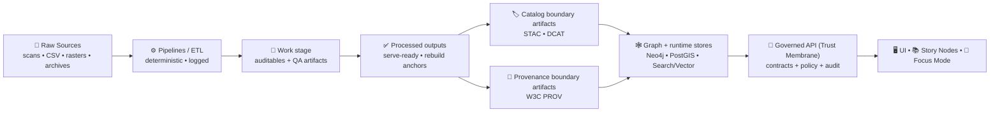

<div align="center">

<picture>
  <source media="(prefers-reduced-motion: reduce)" srcset="./assets/kfm-seal-320.png">
  
</picture>

# 📚 `docs/` — Kansas Frontier Matrix Documentation Hub

**Evidence-first documentation** for a governed geospatial knowledge & modeling platform for Kansas 🌎🧭  
<sub><em>“The map behind the map” — every layer, chart, story, and Focus Mode answer traces back to sources.</em></sub>

<br/>

<!-- Status / Alignment -->


<br/>


<br/>

<a href="../README.md">🏠 Project Home</a> •
<a href="./MASTER_GUIDE_v13.md">🧭 Master Guide (v13)</a> •
<a href="#-start-here-reading-order">📖 Start Here</a> •
<a href="#-docs-to-system-alignment-truth-path">🧱 Truth Path</a> •
<a href="#-docs-map-v13-canonical">🗂️ Docs Map</a> •
<a href="#-writing-rules-evidence-citations-and-diagrams">✍️ Writing Rules</a> •
<a href="#-contributing-to-docs-docops">🤝 Contribute</a>

</div>

---

> [!WARNING]
> 🚧 **Under Construction (DocOps active).**
> - Some links may be **draft**, **moving**, or **not created yet**.
> - If you find a broken link: open an issue and tag `area:docs` + `status:needs-review`.
> - This rule applies even during construction: **no bypassing governance** (Raw → … → API → UI/AI). 🔒

---

<a id="-start-here-reading-order"></a>

## 🧭 Start here (reading order)

If you only read a handful of documents, use this order:

1) 🧭 **Master Guide v13 (canonical structure + invariants)** → `./MASTER_GUIDE_v13.md`  
2) 🏗️ **Redesign blueprint (v13)** → `./architecture/KFM_REDESIGN_BLUEPRINT_v13.md`  
3) 🧱 **System overview** → `./architecture/system_overview.md`  
4) 🤖 **AI / Focus Mode overview** → `./architecture/AI_SYSTEM_OVERVIEW.md`  
5) 🦙 **Ollama integration** → `./architecture/ai/OLLAMA_INTEGRATION.md`  
6) ⚖️ **Root governance** → `./governance/ROOT_GOVERNANCE.md`  
7) 🌱 **Ethics + Sovereignty** → `./governance/ETHICS.md` and `./governance/SOVEREIGNTY.md`  
8) 📜 **Standards & profiles (STAC/DCAT/PROV + FAIR/CARE)** → `./standards/`  
9) 🧩 **Templates (Universal Doc, Story Node, contract extensions)** → `./templates/`  
10) 📚 **Story Nodes hub** → `./reports/story_nodes/`

> [!TIP]
> **Docs are production infrastructure.** If a doc describes a contract, boundary, or governance rule, treat it like code:
> reviewable, testable (where possible), and versioned.

---

## 🌾 What this documentation is for

KFM integrates:

- 🗺️ GIS layers (vector + raster + time)
- 📚 historical records + narrative **Story Nodes**
- 🧪 reproducible analysis artifacts
- 🤖 **Focus Mode**: retrieval-grounded answers with **citations enforced**
- 🛡️ governance gates that are **fail-closed** by default

This `docs/` folder exists to make KFM:
- **understandable** (architecture + boundaries),
- **auditable** (provenance + citations),
- **extendable** (templates + standards),
- **governed** (review gates + ethics + sovereignty).

> 🧫 The API is the “trust membrane.”  
> 📚 These docs are the “trust manual.”  
> If we can’t describe it clearly, we can’t govern it reliably.

---

<a id="-docs-to-system-alignment-truth-path"></a>

## 🧱 Docs-to-system alignment: Truth Path

KFM is intentionally designed so nothing “teleports” into the UI, Story Nodes, or Focus Mode outputs.



✅ **Invariant:** `Raw → Work → Processed → (STAC/DCAT/PROV) → Graph/Stores → API → UI/AI`  
🚫 If a document recommends a workflow that bypasses this sequence, it’s describing a **bug**, a **risk**, or a **legacy exception** that should be retired.

---

<a id="-docs-map-v13-canonical"></a>

## 🗂️ Docs map (v13 canonical)

This is the **canonical intent** for docs structure. Keep it aligned with the repository map.

```text
docs/
├─ README.md                                 ⭐ you are here (Docs Hub)
├─ MASTER_GUIDE_v13.md                       🧭 canonical repo structure & ordering (v13)
├─ MASTER_GUIDE_v12.md                       🧱 legacy reference (keep until fully retired)
├─ glossary.md                               📖 shared language (link from docs + UI when needed)
│
├─ architecture/                              🏗️ system boundaries + data flow + ADRs
│  ├─ KFM_REDESIGN_BLUEPRINT_v13.md
│  ├─ KFM_VISION_FULL_ARCHITECTURE.md
│  ├─ system_overview.md
│  ├─ AI_SYSTEM_OVERVIEW.md
│  ├─ diagrams/                               (optional)
│  ├─ adr/                                    (optional)
│  └─ ai/
│     └─ OLLAMA_INTEGRATION.md
│
├─ standards/                                 📜 profiles + protocols (STAC/DCAT/PROV + FAIR/CARE)
│  ├─ faircare.md                             🌱 stewardship framing
│  ├─ KFM_STAC_PROFILE.md                     🗂️ (if present)
│  ├─ KFM_DCAT_PROFILE.md                     🗂️ (if present)
│  └─ KFM_PROV_PROFILE.md                     🧾 (if present)
│
├─ governance/                                ⚖️ ethics, sovereignty, review gates
│  ├─ ROOT_GOVERNANCE.md
│  ├─ ETHICS.md
│  ├─ SOVEREIGNTY.md
│  └─ REVIEW_GATES.md                         ✅ (if present)
│
├─ templates/                                 🧩 governed templates (docs + stories + contracts)
│  ├─ TEMPLATE__KFM_UNIVERSAL_DOC.md
│  ├─ TEMPLATE__STORY_NODE_V3.md
│  └─ TEMPLATE__API_CONTRACT_EXTENSION.md
│
├─ reports/
│  └─ story_nodes/                            📚 narratives designed for review + provenance linkage
│     ├─ templates/
│     ├─ draft/
│     └─ published/
│        └─ <story_slug>/
│           ├─ story.md
│           └─ assets/
│
└─ assets/
   ├─ branding/                               🖼️ global visuals (used across docs/UI)
   └─ (other small assets)
```

> [!IMPORTANT]
> **One fact, one place.** If you find yourself duplicating the same rule in multiple docs, promote it to:
> `MASTER_GUIDE_v13.md`, `standards/`, or `governance/`, and then link to it.

---

## 🧑‍🤝‍🧑 Reading paths by role

### 🧑‍💻 Backend / frontend developer
- `./MASTER_GUIDE_v13.md` (contracts + canonical layout)
- `./architecture/system_overview.md`
- API boundary: `../src/server/` (v13) *(or `../api/` if your repo still uses a top-level API folder)*
- Policy pack: `../policy/`
- If touching Focus Mode: `./architecture/AI_SYSTEM_OVERVIEW.md` + `./architecture/ai/OLLAMA_INTEGRATION.md`

### 🗺️ GIS / data contributor
- Truth Path + data invariants: `../data/README.md`
- Standards: `./standards/` (STAC/DCAT/PROV profiles)
- Governance: `./governance/` (licensing, sensitivity, review gates)
- Pipelines (where the work happens): `../src/pipelines/`

### 🤖 AI / ML contributor
- `./architecture/AI_SYSTEM_OVERVIEW.md`
- `./architecture/ai/OLLAMA_INTEGRATION.md`
- Governance + policy gates: `./governance/` and `../policy/`
- Evidence discipline: `../data/README.md` (catalog + PROV expectations)

### 🏫 Educator / story author / historian
- Story Nodes hub: `./reports/story_nodes/`
- Story Node template: `./templates/TEMPLATE__STORY_NODE_V3.md`
- Governance ethics/sovereignty: `./governance/`

---

## 🧾 What counts as “documentation” in KFM?

KFM “docs” are more than prose. Treat these as first-class artifacts:

- 🏗️ **Architecture docs** — boundaries, invariants, data flow diagrams
- 📜 **Standards & profiles** — STAC/DCAT/PROV extensions + repo protocols
- ⚖️ **Governance** — ethics, sovereignty, review gates, decision rules
- 🧩 **Templates** — enforce consistency and evidence requirements
- 📚 **Story Nodes** — narratives that cite datasets and sources (reviewable like code)
- 🧯 **Runbooks & postmortems** — how to operate, validate, and recover

> [!IMPORTANT]
> If a doc claims something factual about the system, it must point to:
> **(a)** code, **(b)** validated catalog/provenance artifacts, or **(c)** an authoritative external source.

---

<a id="-writing-rules-evidence-citations-and-diagrams"></a>

## ✍️ Writing rules: evidence, citations, and diagrams

### ✅ The evidence rule (golden rule)
> **If it sounds factual, it needs a source.**

Preferred sources (strongest → weakest):
1) 🗂️ **Catalog boundary artifacts** (STAC/DCAT) — what it is, where/when, license, access classification  
2) 🧾 **Provenance boundary artifacts** (PROV) — how it was made, inputs/outputs, parameters, agents  
3) 🧪 **Pipelines + manifests + tests** — how it was validated and reproduced  
4) 🏛️ **Authoritative external sources** — agencies, archives, peer-reviewed references

### 🔗 KFM citation “bundle” pattern
When citing datasets/artifacts in docs (and especially Story Nodes), prefer a bundle that enables audit:

```text
Sources:
- Dataset: kfm.<domain>.<topic>.<time_or_version>
  - DCAT: data/catalog/dcat/<id>.jsonld
  - STAC: data/stac/items/<id>.json
  - PROV: data/prov/<id>.prov.json
```

When referencing system behavior, cite implementation:

```text
Implementation:
- API: src/server/... (endpoints, middleware)
- Policy: policy/... (rego rules + tests)
- Pipelines: src/pipelines/... (deterministic jobs)
- Tests: tests/... (contract + validation)
```

### 🧩 Diagrams (preferred)
- ✅ Use **Mermaid** for architecture (diffable + reviewable).
- ✅ Use **sequence diagrams** for Focus Mode and policy gating.
- ✅ Keep diagrams aligned with:
  - the Truth Path invariant, and
  - the “API boundary / trust membrane” rule.

> [!TIP]
> If a diagram shows UI touching PostGIS/Neo4j directly, it’s wrong (and should be fixed). 😄

---

## 🔐 Governance mindset: what docs must reflect

KFM treats governance as a product feature:

- 🔒 **Fail closed:** missing metadata / unclear policy ⇒ deny/block
- 👤 **Role-aware access:** public vs contributor vs maintainer vs admin
- 🧾 **Policy-as-code:** centralized decisions (OPA-style) for data + AI outputs
- 🔗 **Provenance required:** publishable content must have lineage
- 🧫 **API boundary rule:** UI/AI consume data only through the governed API

### 🌱 FAIR + CARE (stewardship)
We aim for data that is:
- **FAIR** — Findable, Accessible, Interoperable, Reusable  
- **CARE** — Collective Benefit, Authority to Control, Responsibility, Ethics

> [!CAUTION]
> CARE is not optional.  
> If a dataset/story touches Indigenous lands, communities, or culturally sensitive sites, documentation must include:
> sensitivity classification, handling/visibility rules, and explicit rights/licensing context.

---

<a id="-contributing-to-docs-docops"></a>

## 🤝 Contributing to docs (DocOps)

### ✅ PR checklist (docs)
- [ ] I used **relative links** (works in forks/offline)
- [ ] I cited sources for factual claims (catalog/prov/code/external)
- [ ] I did **not** describe workflows that bypass `Raw → … → API → UI/AI`
- [ ] I updated this hub if I added a new top-level docs section
- [ ] I added/updated diagrams when boundaries or flows changed
- [ ] I avoided secrets, private URLs, or sensitive coordinates

### 🧩 “Good first doc PRs”
- Add missing standards pages under `docs/standards/`
- Convert implicit rules into explicit governance gates in `docs/governance/`
- Add runbooks for domain pipelines (and link from the domain folder in `data/`)
- Improve Story Node author guidance (citations + reviewable structure)

> [!NOTE]
> Treat doc changes that affect governance/standards/templates like high-blast-radius changes:
> they should receive the same level of review as CI/policy edits.

---

## 📚 Reference shelf (curated PDFs)

> Keep this shelf curated: add notes, remove duplicates, prefer best sources.
> If large PDFs are kept in-repo, prefer a single canonical home (example: `docs/reference/pdfs/`) and link from a `reading_list.md`.

<details>
<summary><b>🗺️ GIS • Cartography • Spatial design</b></summary>

- `making-maps-a-visual-guide-to-map-design-for-gis.pdf`
- `Mapping Urban Spaces.pdf`
- `Archaeological 3D GIS.pdf`
- `GIS-Mapping-Topology.pdf`

</details>

<details>
<summary><b>🤖 AI • ML • Statistics • Visualization</b></summary>

- `Neural Nerworks-Build Ai-Statistical Learning-Deep Learing-AI Safety-Linear Regression-bayesian.pdf`
- `Artificial Intelligence & Machine Learning in Health Care & Medical Sciences.pdf`
- `MATLAB-PyTorch-Numpy-SciPy-Statisctics-Programming Science Tools.pdf`
- `graphical-data-analysis-with-r.pdf`

</details>

<details>
<summary><b>🐳 DevOps • CI/CD • Security • Performance</b></summary>

- `Database-Docker-CI-Pipeline-DevOps-Security-Git-Shell-PowerShell.pdf`
- `foundations-of-software-and-system-performance-engineering-process-performance-modeling-requirements-testing-scalability-and-practice.pdf`
- `Various Programming Concepts.pdf`
- `Programming Design-Flexibility-Machine Learning-Test Development-Verilog-Software Qualify Assurance.pdf`

</details>

<details>
<summary><b>🌐 Web • UI • UX</b></summary>

- `Web Design.pdf`
- `professional-web-design-techniques-and-templates.pdf`
- `learn-to-code-html-and-css-develop-and-style-websites.pdf`
- `CSS-HTML-JAVA-WebDesign.pdf`
- `Node.js-React-CSS-HTML.pdf`

</details>

<details>
<summary><b>🪶 Ethics • Data sovereignty</b></summary>

- `Indigenous Statistics.pdf` *(CARE, governance, Indigenous Data Sovereignty framing)*

</details>

---

## 🧾 Glossary (starter)

Prefer the canonical glossary if present: `./glossary.md`

Starter terms:
- **STAC** — SpatioTemporal Asset Catalog
- **DCAT** — Data Catalog Vocabulary
- **W3C PROV** — provenance standard (inputs → process → outputs)
- **OPA** — Open Policy Agent (policy-as-code)
- **PostGIS** — PostgreSQL extension for spatial queries + tiling
- **Neo4j** — graph DB for entities/relationships/events
- **RAG** — Retrieval-Augmented Generation
- **Focus Mode** — governed AI assistant (API-mediated + citation enforced)

---

<div align="center">

### 🏁 Goal of this docs folder
**Make KFM understandable, auditable, and easy to extend — without breaking provenance.** ✅

</div>