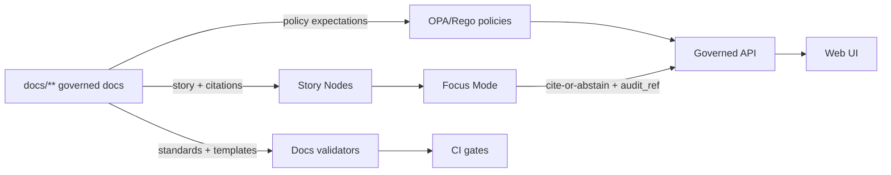
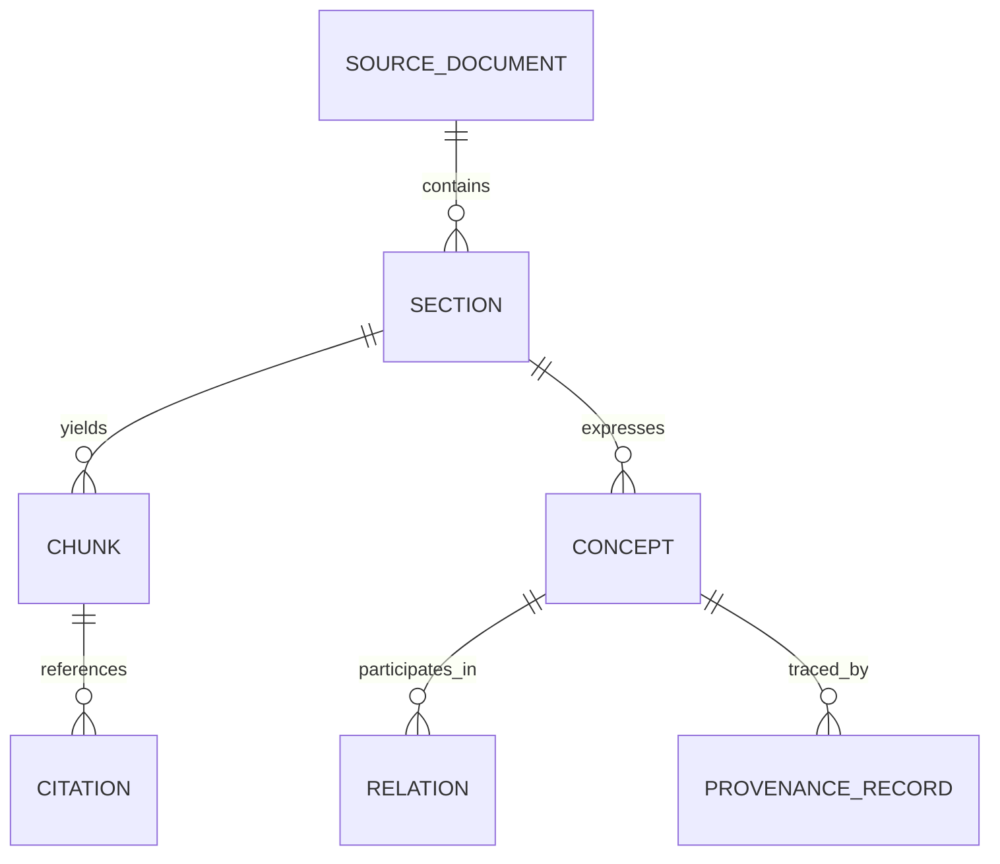
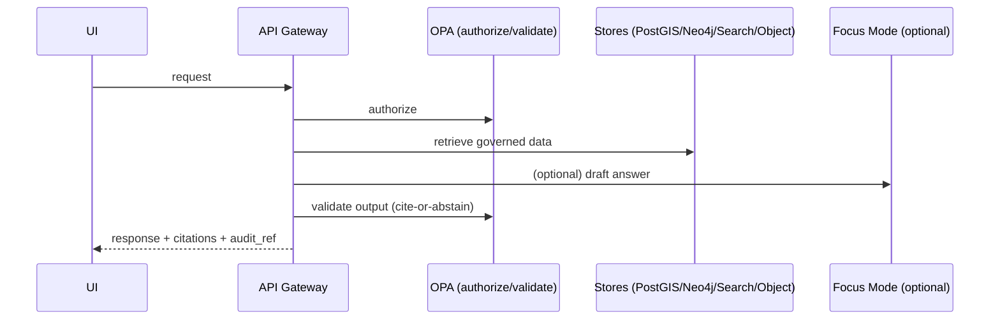
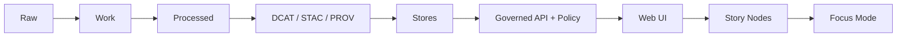

<!--
GOVERNED ARTIFACT NOTICE
This README is part of the KFM trust boundary (documentation system).
If you change meaning (not just phrasing), route through the governance review path (CODEOWNERS + CI gates).
-->

# 🧭 `docs/` — Governed Documentation System (Kansas Frontier Matrix)


> `docs/` is not “nice-to-have.” It is KFM’s **constitutional layer**: the place where the system’s trust boundary,
> governance posture, templates, standards, and narrative rules are defined — and therefore where they must
> be reviewed, validated, and protected like production code.

**If you’re here to…**
- **Add or edit a governed doc** → use the correct template, preserve headings, keep citations resolvable.
- **Add a Story Node** → use Story Node v3, keep claims citation-backed, run the Story validations.
- **Change standards, policy expectations, or promotion rules** → treat it as a production change; expect governance review.
- **Find where something belongs** → see [Where things go](#where-things-go) and [Docs directory map](#docs-directory-map).
- **Wire docs into CI** → see [Quality gates and CI expectations](#quality-gates-and-ci-expectations) and [Docs gate matrix](#docs-gate-matrix).

---

## Governance header

| Field | Value |
|---|---|
| Document | `docs/README.md` |
| Doc ID | `kfm.docs.readme` |
| Status | **Governed** |
| Scope | docs templates, standards, governance rules, runbooks, Story Nodes, public narrative surfaces |
| Version | `v3.1.0-draft` |
| Effective date | 2026-02-16 |
| Owners | `.github/CODEOWNERS` *(required; if missing, treat as a governance gap)* |
| Review triggers | any change affecting trust membrane, policy defaults, promotion rules, citation behavior, sensitivity handling, template structure, CI validation expectations |
| Critical dependency | **Docs validators + policy gates** (fail-closed) |
| Default posture | **deny / abstain** when evidence or validators are missing |

> [!WARNING]
> **Fail-closed rule (docs):** if required validation surfaces are missing (templates / validators / citation resolution rules),
> documentation changes must not weaken governance expectations. When in doubt: block merge and route to governance review.

---

## Non-negotiables

These invariants apply to **all** documentation, narrative content, and any description of KFM system behavior.

1) **Trust membrane**  
   Frontend and external clients never access databases or object stores directly — access is only through the **governed API + policy boundary**.

2) **Fail-closed posture**  
   **Default deny** at policy. If a rule is missing, evidence is missing, or validation is inconclusive → **deny / abstain**.

3) **Promotion Contract**  
   **Raw → Work → Processed** is KFM’s truth path. Promotion requires:  
   - deterministic manifests + checksums  
   - receipts/run records  
   - machine-valid catalogs (**DCAT always; STAC conditional; PROV required**)  
   - validation gates that pass **before** anything becomes “servable truth”

4) **Cite-or-abstain**  
   Story Nodes and Focus Mode must cite resolvable evidence or abstain. Output must include an **audit reference**.

5) **Deterministic identity**  
   Governed specs, receipts, and catalog artifacts must be reproducible (e.g., `spec_hash = sha256(JCS(spec))` using RFC 8785 canonical JSON).

6) **No sensitive leakage**  
   Never publish restricted fields or precise sensitive locations unless explicitly governed and policy-permitted. If unsure: redact/generalize and flag for review.

> [!CAUTION]
> If any document conflicts with these non-negotiables, the document is wrong. Fix it or flag it for governance review.

---

## Quick navigation

- [Purpose of `docs/`](#purpose-of-docs)
- [How docs participates in the trust boundary](#how-docs-participates-in-the-trust-boundary)
- [What belongs in `docs/`](#what-belongs-in-docs)
- [What does not belong in `docs/`](#what-does-not-belong-in-docs)
- [Where things go](#where-things-go)
- [`docs/` directory map](#docs-directory-map)
- [Documentation types](#documentation-types)
- [Templates](#templates-required)
- [Standards](#standards-required)
- [Docs lifecycle and versioning](#docs-lifecycle-and-versioning)
- [Evidence and citations](#evidence-and-citations)
- [Sensitivity and redaction](#sensitivity-and-redaction)
- [Diagrams and assets](#diagrams-and-assets)
- [Story Nodes](#story-nodes)
- [Document corpora as evidence](#document-corpora-as-evidence)
- [Docs gate matrix](#docs-gate-matrix)
- [Quality gates and CI expectations](#quality-gates-and-ci-expectations)
- [Contribution workflow](#contribution-workflow)
- [Definition of Done](#definition-of-done)
- [Troubleshooting](#troubleshooting)
- [References](#references-internal)

---

## Purpose of `docs/`

`docs/` exists to keep KFM **governable** and **inspectable** as it scales.

KFM is not a “dashboard with data.” It is an evidence-first system where:
- datasets have provenance and promotion receipts,
- APIs enforce policy,
- narratives and AI answers are grounded in resolvable citations,
- and the public-facing interpretation of Kansas frontier history does not drift into uncited claims.

`docs/` is the home of the written contracts that make that possible.

---

## How docs participates in the trust boundary

Docs are “code that defines allowed reality.” They influence:

- **Policy posture** (what is permitted vs denied)
- **Promotion rules** (what becomes “servable truth”)
- **Narrative behavior** (Story Nodes + Focus Mode grounding requirements)
- **Validator expectations** (what CI blocks/permits)

### Trust boundary surfaces touched by `docs/`



> [!IMPORTANT]
> Any doc change that alters how **validators**, **policy**, **promotion**, or **citations** behave is a production change.
> Treat it with the same review rigor as backend policy or schema changes.

---

## What belongs in `docs/`

`docs/` is the **governed documentation system** for KFM. It should contain:

- **Architecture**: system overview, flows, data lifecycle, boundary diagrams, ADRs
- **Standards**: repo structure, markdown protocol, STAC/DCAT/PROV profiles, schema conventions
- **Templates**: machine-validated document skeletons (Universal Doc, Story Node v3, API Contract Extension)
- **Governance**: non-negotiables, ethics/CARE/FAIR alignment, sovereignty, review gates, sensitivity rules
- **Runbooks**: operational procedures (oncall, incident response, backups, upgrades, governance operations)
- **Domain runbooks**: per-domain ingestion/validation/promotion narratives (what datasets are, how they move)
- **Story Nodes**: draft and published narratives with evidence bundles and resolvable citations

**Rule of thumb:** if it affects system behavior, public narrative, dataset/catalog behavior, policy behavior, or Focus Mode behavior → it belongs here and is governed.

---

## What does not belong in `docs/`

To preserve clean architecture layers and governance boundaries:

- **Raw / Work / Processed data artifacts** → `data/**`  
  *Never embed datasets in docs.*

- **Primary source documents as evidence** (PDFs, scans, photos, OCR corpora, map sheets) → treat as datasets and store/catalog through `data/**`  
  Docs may **describe and cite** evidence — but must not replace evidence.

- **Executable pipeline code** → `pipelines/` or `src/pipelines/`
- **API implementation** → `src/server/`
- **UI implementation** → `web/`
- **Policy code (OPA/Rego)** → `policy/`

> [!IMPORTANT]
> `docs/` may reference other subsystems, but must not blur boundaries. Any guidance like “the UI should query PostGIS directly”
> is automatically invalid.

---

## Where things go

Use this decision table when creating or moving documents.

| You are writing… | Put it here | And use… |
|---|---|---|
| System overview, C4 diagrams, data lifecycle flow | `docs/architecture/` | Universal Doc template |
| A decision with tradeoffs | `docs/architecture/adr/` | ADR template (repo standard) |
| A hard constraint / profile / standard | `docs/standards/` | Standard doc format + change control |
| A template that must be machine-validated | `docs/templates/` | Template governance rules |
| Governance model, ethics, sovereignty, review gates | `docs/governance/` | Universal Doc template |
| Operational “how-to” (restore backup, rotate keys, incident response) | `docs/runbooks/` | Runbook format |
| Domain ingestion and validation rules | `docs/data/<domain>/README.md` | Universal Doc (+ domain contract sections) |
| Narrative content used in UI / Focus Mode | `docs/reports/story_nodes/**` | Story Node v3 template |

---

## Docs directory map

> [!IMPORTANT]
> Keep this map accurate. When you add or rename a subtree, update this README in the same PR.

```text
docs/                                                # Governed documentation hub (standards + templates + runbooks + narratives)
├─ README.md                                         # (This file) docs governance + navigation
├─ glossary.md                                       # Canonical terms (humans + tooling)
│
├─ master_guides/                                    # Authoritative guides (versioned)
│  ├─ MASTER_GUIDE_v12.md                            # Legacy reference (keep only if still needed)
│  └─ MASTER_GUIDE_v13.md                            # Canonical repo + pipeline reference
│
├─ architecture/                                     # System design + decisions
│  ├─ overview.md                                    # High-level architecture (trust membrane + truth path)
│  ├─ c4/                                            # C4 diagrams (Context/Container/Component) - Mermaid/SVG as source-of-truth
│  ├─ diagrams/                                      # Shared diagrams (Mermaid/SVG/PNG; include sources + alt text)
│  └─ adr/                                           # Architecture Decision Records (ADRs)
│
├─ standards/                                        # Build constraints (not suggestions)
│  ├─ KFM_MARKDOWN_WORK_PROTOCOL.md                  # Formatting + doc hygiene rules (CI-enforced where configured)
│  ├─ KFM_REPO_STRUCTURE_STANDARD.md                 # Canonical repo layout + invariants
│  ├─ KFM_STAC_PROFILE.md                            # STAC constraints used by validators (when STAC applies)
│  ├─ KFM_DCAT_PROFILE.md                            # DCAT constraints used by validators (always)
│  └─ KFM_PROV_PROFILE.md                            # PROV constraints used by validators (always)
│
├─ templates/                                        # Governed templates (machine-validated)
│  ├─ TEMPLATE__KFM_UNIVERSAL_DOC.md                 # Default template for governed docs
│  ├─ TEMPLATE__STORY_NODE_V3.md                     # Story Node v3 authoring template
│  └─ TEMPLATE__API_CONTRACT_EXTENSION.md            # Contract extension template (endpoints/schemas/examples)
│
├─ governance/                                       # Rules for safe operation & authorship
│  ├─ ROOT_GOVERNANCE.md                             # Top-level governance model + non-negotiables
│  ├─ ETHICS.md                                      # Ethics + safety commitments (CARE/FAIR alignment)
│  ├─ SOVEREIGNTY.md                                 # Data sovereignty + stewardship rules
│  └─ REVIEW_GATES.md                                # Required reviews + CI gates (what blocks merges)
│
├─ runbooks/                                         # Operational docs (production-grade)
│  ├─ oncall/                                        # Oncall playbooks, dashboards, alert runbooks
│  ├─ incident-response/                             # Incident process + templates + postmortems
│  ├─ backups/                                       # Backup/restore procedures + verification drills
│  ├─ upgrades/                                      # Upgrade procedures (deps, platform, services)
│  └─ governance/                                    # Governance operations (policy changes, approvals, emergency switches)
│
├─ data/                                             # Domain runbooks (NOT actual datasets)
│  └─ <domain>/                                      # One per domain (hydrology, parcels, railroads, newspapers, etc.)
│     └─ README.md                                   # Sources, ETL, validation gates, policy labels, catalog links
│
└─ reports/                                          # Governed reports + narrative outputs (citation-backed)
   └─ story_nodes/                                   # Narrative system (draft → reviewed → published)
      ├─ draft/                                      # Work-in-progress narratives (not authoritative)
      │  └─ <story_slug>/                             # Kebab-case slug (stable once published)
      │     ├─ story.md                               # Draft story (citations required where claims are made)
      │     └─ assets/                                # Supporting assets (derived, small, include provenance notes)
      └─ published/                                   # Reviewed + publishable narratives (authoritative)
         └─ <story_slug>/
            ├─ story.md                               # Final story (passes policy gates + review)
            └─ assets/                                # Frozen assets (changes require republish/version bump)
```

> [!NOTE]
> If your repository currently uses a different Story Node root, that’s allowed — but it must be documented
> (mapping + lifecycle) and the **draft/published** semantics must remain.

---

## Documentation types

Use the right doc type, in the right place, with the right template.

| Doc type | What it is | Used for | Canonical home | Template |
|---|---|---|---|---|
| **Universal Doc** | The default governed doc | most designs, specs, runbooks, governance docs | `docs/**` | `TEMPLATE__KFM_UNIVERSAL_DOC.md` |
| **Story Node v3** | Narrative that powers UI / Focus Mode | place-based stories, timelines, guided analysis | `docs/reports/story_nodes/**/story.md` | `TEMPLATE__STORY_NODE_V3.md` |
| **API Contract Extension** | Contract addendum | endpoint behaviors, schemas, examples, errors | `docs/architecture/**` or `docs/standards/**` | `TEMPLATE__API_CONTRACT_EXTENSION.md` |
| **ADR** | Decision record | tradeoffs + decision rationale | `docs/architecture/adr/` | ADR template |
| **Domain runbook README** | Per-domain integration contract | sources → ETL → gates → catalogs → policy labels | `docs/data/<domain>/README.md` | Universal Doc + domain sections |

---

## Templates required

> [!IMPORTANT]
> Do not improvise headings for governed docs. Templates keep docs machine-parseable and CI-checkable.

- `docs/templates/TEMPLATE__KFM_UNIVERSAL_DOC.md`
- `docs/templates/TEMPLATE__STORY_NODE_V3.md`
- `docs/templates/TEMPLATE__API_CONTRACT_EXTENSION.md`

If you need a new template:
1) add it under `docs/templates/`
2) update this README
3) extend validation rules so CI recognizes and validates it
4) add CODEOWNERS protections for the new template

---

## Standards required

Standards are build constraints, not suggestions.

- `docs/standards/KFM_MARKDOWN_WORK_PROTOCOL.md`
- `docs/standards/KFM_REPO_STRUCTURE_STANDARD.md`
- `docs/standards/KFM_STAC_PROFILE.md`
- `docs/standards/KFM_DCAT_PROFILE.md`
- `docs/standards/KFM_PROV_PROFILE.md`

If implementation diverges from a standard, either:
- fix the implementation, or
- update the standard via governance review (with rationale + migration plan + acceptance criteria)

> [!WARNING]
> “We’ll document the exception later” is not a valid strategy for a governed system.

---

## Docs lifecycle and versioning

### “Docs as code” lifecycle

Governed docs must be reviewable and testable. Treat changes as production changes when they:
- change constraints (policy defaults, promotion requirements, sensitivity rules),
- change contract shapes (templates, schema fragments, required fields),
- or change public narratives (Story Nodes).

Recommended doc statuses:
- **Draft**: not authoritative; used to iterate
- **Reviewed**: vetted by CODEOWNERS and governance reviewers
- **Published**: user-facing / relied on as operating truth
- **Superseded**: replaced by a newer doc (link to replacement)

### Versioning rules (recommended)

- Standards and templates should use **SemVer semantics**:
  - MAJOR: meaning/contract changes, required headings changed, policy expectation changes
  - MINOR: additive, backward-compatible improvements
  - PATCH: typos/formatting, non-semantic changes
- Story Nodes should version when meaning changes, citations change, or assets change.

> [!TIP]
> If a document is “machine depended upon” (template, validator rule docs, schema fragments), treat it like an API.

### Review path for governed docs (minimum)

> [!IMPORTANT]
> This is an operational expectation. Repository enforcement is configured in `.github/` (CODEOWNERS + branch protection).

1) Author opens PR with a narrow scope + checklist
2) CI runs required docs validators (lint/link/template/story/citation where available)
3) CODEOWNERS review is required for governed paths
4) If sensitivity/policy surfaces are touched → governance reviewers must sign off
5) Merge only after all required checks pass (fail-closed)

---

## Evidence and citations

KFM’s promise depends on **resolvable evidence**. Documentation exists to *describe* evidence, not to replace it.

### Evidence-first contract

- Every user-visible factual claim must be supported by resolvable evidence.
- If evidence cannot be resolved, narratives and Focus Mode must **abstain rather than guess**.
- Citations must be resolvable to human-readable views quickly (goal: **≤ 2 API calls per citation** in the evidence resolver).

### What counts as a “claim”?

Treat these as claims that require citations in Story Nodes and Focus Mode:
- dates, counts, boundaries, “first/most/least” statements
- causal assertions (“because,” “led to,” “resulted in”)
- any statement that would meaningfully change a reader’s understanding if false

### Citation object shape (recommended)

Citations are structured objects, not bare links.

```json
{
  "ref": "prov://run/run_2026-02-15T12:34:56Z",
  "kind": "prov",
  "locator": {
    "dataset_id": "kfm.example_dataset",
    "dataset_version": "sha256:...",
    "record_ids": ["..."],
    "doc_id": "kfm.doc.primary.000123",
    "page_range": [12, 13],
    "char_span": [4410, 5122]
  }
}
```

### Evidence bundles (recommended)

Story Nodes may include an evidence bundle digest for fast resolution:

```yaml
evidence_bundle:
  digest: "sha256:..."
  refs:
    - "dcat://dataset/kfm.example_dataset"
    - "stac://collection/kfm.example_dataset"
    - "prov://run/run_..."
```

> [!IMPORTANT]
> Citations must be precise enough to land a reviewer on the correct evidence span (page/section/record) without guessing.

---

## Sensitivity and redaction

KFM must handle sensitive content safely: private ownership data, culturally restricted knowledge, and sensitive locations (e.g., archaeology).

### Recommended sensitivity classes

- **Public** — safe to publish without redaction  
- **Restricted** — role-based access required  
- **Sensitive-location** — coordinates must be generalized/suppressed  
- **Aggregate-only** — publish only above thresholds  

### Redaction is a first-class transformation

If a doc references redacted/generalized data, it must state:
- what was redacted/generalized
- why (policy label)
- how (transformation)
- which derived artifact is being referenced (dataset/version + PROV)

> [!CAUTION]
> Never paste restricted fields or precise sensitive coordinates into PRs, issues, logs, screenshots, or test fixtures.

---

## Diagrams and assets

Diagrams and assets are governed because they affect understanding and can accidentally leak sensitive information.

### Diagrams as code (recommended)

- **Mermaid source is canonical** for architecture/story flows when feasible.
- If you export to SVG/PNG, keep the source alongside it.
- Diagrams that embed data extracts must follow the same sensitivity rules as datasets.

**Recommended storage pattern:**
```text
docs/architecture/diagrams/
├─ trust-membrane.mmd
├─ trust-membrane.svg
└─ trust-membrane.md      # provenance + meaning + change log
```

### Asset hygiene rules (minimum)

- Every image must have **alt text** in the referencing doc.
- Avoid screenshots with:
  - names/emails/addresses
  - exact coordinates for sensitive sites
  - secrets/tokens/keys
- Prefer **small derived assets** in `docs/**/assets/`.
- Primary evidence belongs in `data/**` with catalogs + provenance.

---

## Story Nodes

Story Nodes are the narrative core of KFM’s public understanding. They must be citable, reproducible, and reviewable.

### Where Story Nodes live

- Draft: `docs/reports/story_nodes/draft/<story_slug>/story.md`
- Published: `docs/reports/story_nodes/published/<story_slug>/story.md`
- Assets: `docs/reports/story_nodes/**/<story_slug>/assets/`

### Authoring rules

- Must use `docs/templates/TEMPLATE__STORY_NODE_V3.md`
- Must include citations for factual claims (or abstain)
- Must avoid sensitive-location disclosure unless explicitly allowed by governance + policy
- Must remain compatible with Story Viewer + evidence resolver UX

### Story Node asset rules

- Assets should be **small**, **derived**, and **explainable**
- Every non-trivial asset should have a provenance note (how it was produced, from what sources)
- If an asset is large or primary evidence (scan, full report, OCR corpus): it belongs in `data/**`, not `docs/**`

---

## Document corpora as evidence

Many KFM sources are documents (maps, scans, newspapers). Treat these as **data artifacts**, not “documentation about documentation.”

### Rules of engagement

- preserve original scans and OCR outputs
- treat OCR cleanup and extraction as derivative artifacts with explicit provenance
- citations must point to stable IDs and spans (page + char-span or bounding boxes)
- publish document artifacts through Raw → Work → Processed with catalogs + PROV

### Recommended extraction graph (conceptual)



Minimum provenance fields for extracted artifacts:
- `source_doc_id`
- page range
- char span (or bounding boxes)
- method/tool version
- operator identity (human or automation)

---

## Docs gate matrix

This matrix describes **what should block merges** (fail-closed). Exact wiring is implemented in `.github/` workflows.

| Path(s) changed | Typical impact | Minimum required checks | Required reviewers |
|---|---|---|---|
| `docs/templates/**` | Machine-validated contracts | lint + link-check + template-structure validation + downstream schema tests | CODEOWNERS + governance reviewers |
| `docs/standards/**` | Build constraints | lint + link-check + standards diff review checklist | CODEOWNERS + governance reviewers |
| `docs/governance/**` | Policy posture | lint + link-check + governance review gate | CODEOWNERS + governance reviewers |
| `docs/reports/story_nodes/**` | Public narrative | lint + link-check + story-node schema validation + citation resolution (when available) + sensitivity scan | CODEOWNERS + story reviewers + sensitivity reviewer if flagged |
| `docs/runbooks/**` | Ops behavior | lint + link-check + runbook checklist | CODEOWNERS + ops reviewer |
| `docs/architecture/**` | System contract | lint + link-check + ADR checks where applicable | CODEOWNERS + architecture reviewer |

> [!NOTE]
> If any required validator is missing in the repo, treat that as a governance gap: do not reduce expectations;
> add the missing validator or block merge.

---

## Quality gates and CI expectations

`docs/` is governed and must be validated like code.

### Minimum gates expected for docs changes

- Markdown linting/format checks
- Link-check (no broken internal references)
- Template validation (required headings/order)
- Story Node schema validation (for Story Nodes)
- Citation resolution checks (where tooling exists)
- Sensitivity scans (no sensitive-location leakage in text/fixtures)
- Policy regression expectations when docs impact policy behavior

> [!WARNING]
> Governance should be enforced by validators/CI wherever possible, with human review triggered by sensitivity flags and high-impact changes.

### Repository protection expectations (recommended)

Because docs are within the trust boundary, repository protection matters:
- CODEOWNERS-required reviews for governed paths
- branch protection rules (required checks before merge, no force-push on protected branches)
- secret scanning and push protection
- pinned workflow dependencies where possible
- least-privilege CI tokens (read-only by default; elevate only per job need)

> [!NOTE]
> This section describes a recommended hardening baseline; the repository’s actual enforcement is defined by
> `.github/` configuration and CI wiring.

### Local validation (recommended)

> [!IMPORTANT]
> Exact commands depend on your repo wiring. If you don’t have these scripts/targets, treat it as an action item:
> add them and wire them into CI (fail-closed).

Suggested targets (examples):
- `make docs-lint`
- `make docs-links`
- `make docs-templates-validate`
- `make docs-story-validate`
- `make docs-citations-validate`
- `make docs-sensitivity-scan`

---

## Contribution workflow

### Where to start

1) Read the Master Guide (prefer the latest version under `docs/master_guides/`)
2) Read relevant standards in `docs/standards/`
3) Pick the correct template from `docs/templates/`
4) Make a small PR with clear scope and a “Definition of Done” checklist

### Editing rules (practical)

- prefer small, reversible PRs
- preserve template headings for governed docs
- do not paste large evidence artifacts into docs
- if you change a standard: include rationale + migration notes + acceptance criteria
- if you add new directories: update the directory map in this README

### Suggested PR labels (optional)

- `docs:governed`
- `docs:story-node`
- `docs:standards`
- `governance-review-required`
- `sensitivity-review-required`

---

## Definition of Done

Use this as the default checklist for any docs PR that touches governed content.

- [ ] Correct doc type chosen (Universal Doc / Story Node / API Contract Extension / ADR)
- [ ] Correct template used; required headings preserved
- [ ] Evidence-first: claims supported with resolvable citations (or explicit abstention)
- [ ] No sensitive leakage (or explicitly governed with approved policy labels)
- [ ] Link-check clean (internal links + referenced assets)
- [ ] Markdown lint clean
- [ ] New diagrams/assets stored in the right subtree with source + alt text
- [ ] If doc changes system behavior: acceptance criteria included + CI gates identified/updated
- [ ] If doc touches data publication: promotion invariants respected (receipts + catalogs + provenance expectations)

---

## Troubleshooting

### “My doc failed validation”

Common causes:
- missing required headings (template mismatch)
- broken relative links
- assets stored outside expected subtree
- citations missing where required by tooling
- Story Node schema mismatch

Fix:
- start by comparing your doc to the template
- run lint/link-check locally if available
- treat missing validators as a fail-closed condition (route to governance review)

### “I don’t know where this doc belongs”

Use this rule:
- architecture/decisions → `docs/architecture/` (and `adr/` for decisions)
- standards/profiles → `docs/standards/`
- templates → `docs/templates/`
- governance → `docs/governance/`
- narrative content → `docs/reports/story_nodes/`
- domain runbooks → `docs/data/<domain>/README.md`
- ops runbooks → `docs/runbooks/`

If still unclear, place it under `docs/architecture/` as a **draft** and flag for governance review.

---

## Appendix: boundary reminders

### Trust membrane



### Truth path



---

## References internal

- `docs/master_guides/` — canonical repo + pipeline structure
- `docs/architecture/**` — architecture docs + ADRs
- `docs/standards/**` — STAC/DCAT/PROV + markdown + repo standards
- `docs/templates/**` — governed templates (Universal Doc, Story Node v3, API Contract Extension)
- `docs/governance/**` — governance, ethics, sovereignty, review gates
- `docs/runbooks/**` — operational procedures and incident response
- `docs/reports/story_nodes/**` — draft/published narratives and their assets
