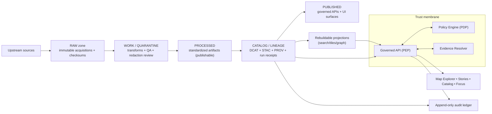

<!-- [KFM_META_BLOCK_V2]
doc_id: kfm://doc/2e7a0e0b-5c0a-4cb0-9fd6-7b3f4bbf67b1
title: docs/ — Governed Documentation Hub
type: standard
version: v2
status: draft
owners: KFM Maintainers (resolve via CODEOWNERS)
created: 2026-02-24
updated: 2026-03-01
policy_label: public
related:
  - ../README.md
  - ../.github/README.md
  - ../CONTRIBUTING.md
  - ../SECURITY.md
  - ../configs/README.md
  - ../contracts/README.md
  - ./adr/README.md
  - ./governance/README.md
  - ./runbooks/README.md
  - ./standards/README.md
tags:
  - kfm
  - docs
  - governance
  - evidence-first
  - cite-or-abstain
notes:
  - Upgraded from scaffold to governed doc index aligned to KFM vNext invariants.
  - Aligned truth tagging + MetaBlock v2 example to the vNext guide; tightened “Unknown → default + verification” rule.
  - Added truth path + Focus Mode control-loop summary; clarified “safe to assert invariants; unsafe to assert implementations.”
  - Reduced deep directory enumeration to avoid drift; each subtree owns its own detailed README.
[/KFM_META_BLOCK_V2] -->

<a id="top"></a>

# `docs/` — Governed Documentation Hub
**Map-first • time-aware • governed • evidence-first • cite-or-abstain**

This directory is **documentation-as-production** for Kansas Frontier Matrix (KFM). Anything here is expected to be:
- **reviewable** (small diffs, stable IDs, clear owners),
- **testable where applicable** (linkcheck, schema examples, policy fixtures),
- **safe under policy** (default-deny posture; no sensitive leakage),
- **traceable** (claims link back to resolvable evidence or are labeled Unknown with verification steps).


> [!IMPORTANT]
> **Trust membrane rule:** docs must never become a bypass.  
> Do not include secrets, restricted coordinates, or “just trust me” claims.  
> If a claim can’t be supported by evidence, **abstain** or label it **UNKNOWN / DECISION NEEDED** with a default path + verification steps.

---

## Quick navigation

- [Truth tags and labeling](#truth-tags-and-labeling)
- [Directory contract](#directory-contract)
- [Documentation stance](#documentation-stance)
- [Where docs fit in KFM](#where-docs-fit-in-kfm)
- [Repo context](#repo-context)
- [Directory layout](#directory-layout)
- [System map](#system-map)
- [Doc templates](#doc-templates)
- [CI gates for docs](#ci-gates-for-docs)
- [Definition of Done](#definition-of-done)
- [Contribution workflow](#contribution-workflow)
- [Glossary](#glossary)
- [Reference library](#reference-library)

---

## Truth tags and labeling

To avoid accidental overreach, use **explicit truth tags**:

- **CONFIRMED:** evidence-backed (repo artifacts, receipts, validated contracts) *or* a non-negotiable invariant/contract that MUST hold.
- **PROPOSED:** a recommended default or pattern (must include rationale + tradeoffs).
- **UNKNOWN / DECISION NEEDED:** not verified; **must include** (1) a recommended default path and (2) minimum verification steps.

Optional qualifiers (use only when helpful):
- **CONFIRMED (repo):** backed by current repo artifacts
- **CONFIRMED (snapshot):** backed by a repo-root inventory snapshot; deep paths still need verification
- **CONFIRMED (design):** an invariant/contract independent of implementation details

> [!NOTE]
> **Safe vs unsafe statements**
> - Safe: asserting invariants/required gates as requirements (“must fail closed”, “clients never bypass policy boundary”).
> - Unsafe unless evidenced: concrete implementation details (exact module decomposition, specific stores, deployed topology, precise directory trees).
>
> If a reference target doesn’t exist, treat it as **missing** and **merge-blocking** *only if the reference is required by contract*.

<p align="right"><a href="#top">Back to top ↑</a></p>

---

## Directory contract

### Purpose
`docs/` is the canonical home for:
- architecture and boundary contracts (human-readable)
- governance standards and review workflows
- operational runbooks
- narrative standards (Story Nodes)
- specs and examples that support enforcement (schemas, fixtures, checklists)

### What belongs in `docs/`
- **Architecture docs:** system overview, layering, trust membrane, canonical vs rebuildable
- **Governance docs:** policy labels, obligations, promotion gates, review triggers, roles
- **Runbooks:** incident response, pipeline ops, promotion procedures, rollback
- **Standards:** doc standards, schema/profile standards, catalog profile references
- **Narrative specs:** Story Node standards, citation conventions, evidence drawer expectations
- **Templates:** governed templates for docs/ADRs/stories/contracts (versioned; link-checked)
- **Quality docs:** checklists, threat modeling prompts, validation explainers
- **Evidence artifacts (bounded):** example receipts/manifests, redacted QA reports, validation examples

### What must not go in `docs/`
- **Secrets** (tokens, keys, credentials), even in examples
- **Raw or sensitive data** (default-deny): use redacted samples + digests + EvidenceRefs
- **Large binaries/build outputs** unless explicitly required and size-controlled
- **Unverifiable assertions**: if it can’t be cited, label it **UNKNOWN / DECISION NEEDED** and add verification steps
- **Policy enforcement logic** (belongs in `policy/` and runtime services), except for human-facing documentation of policy behavior

> [!WARNING]
> If it would be unsafe to paste into a public issue, it does not belong in public-labeled docs.

<p align="right"><a href="#top">Back to top ↑</a></p>

---

## Documentation stance

### Normative language
- Use **MUST / SHOULD / MAY** for normative requirements.
- Separate **normative** (enforceable) from **informative** (explanatory) sections.
- If you add a MUST-level requirement, link it to the validator/test/gate that enforces it (or create one).

### Truth discipline
Every statement should be tagged as:
- **CONFIRMED:** backed by repo artifacts or a declared invariant/contract
- **PROPOSED:** design option with rationale + tradeoffs
- **UNKNOWN / DECISION NEEDED:** not verified; include default + verification steps

> [!IMPORTANT]
> Governance intent that is not enforced (CI + runtime) eventually becomes “optional,” and trust collapses.  
> Prefer merge-blocking gates and fail-closed behavior for contract-critical docs.

### Safety posture
- **Default-deny** when sensitivity/permissions are unclear.
- If content could enable harm (e.g., vulnerable sites), publish only generalized detail.
- If a doc is governance-sensitive (e.g., security ops, internal escalation), label it `restricted` (or more restrictive) and route review via CODEOWNERS.

### Cite-or-abstain applies to docs too
If a document makes factual claims that influence decisions (policy, security, promotion eligibility), it should:
- cite in-repo artifacts (contracts, receipts, manifests, validators) **or**
- cite governed evidence references (EvidenceRefs) **or**
- mark the claim as **UNKNOWN / DECISION NEEDED**.

<p align="right"><a href="#top">Back to top ↑</a></p>

---

## Where docs fit in KFM

Docs sit alongside enforceable artifacts and should point to them:

- **Contracts:** `contracts/` defines enforceable interfaces (OpenAPI, schemas, profiles, gates)
- **Policy:** `policy/` defines default-deny rules + obligations + test fixtures (enforced in CI and at runtime)
- **Configs:** `configs/` defines governed configuration inputs (labels, obligations, thresholds)
- **Data truth path:** `data/` holds canonical artifacts by zone (raw/work/processed/catalog) with receipts
- **Governance:** `.github/` + `docs/governance/` define merge-time + review posture
- **Tooling:** `tools/` + `tests/` make rules enforceable (validators, link checkers, fixtures)

**Key repo rules (treat as CONFIRMED — design):**
- `data/` should not be modified without a run receipt and promotion manifest.
- `contracts/` are production artifacts and validated in CI.
- `policy/` is a governed codebase with CODEOWNERS and required reviews.

> [!NOTE]
> If docs are served via governed APIs, the `policy_label` in the MetaBlock is a first-class access-control signal.

<p align="right"><a href="#top">Back to top ↑</a></p>

---

## Repo context

`docs/` is only one surface of the system. To avoid overreach, treat any repo layout claims as **branch/commit-specific**:

- **Do not** assume deep module paths exist just because they’re shown in a target layout.
- Prefer **repo-root inventory** + **minimum verification steps** before writing “CONFIRMED (repo).”

### Minimum verification steps (PROPOSED)
Use these before marking deep paths or behavior as CONFIRMED (repo):

1. Record the exact commit/branch you’re documenting.
2. Inventory repo-root (folders + key governance files) and capture a `tree -L 2 docs/` snapshot.
3. Identify the actual doc CI gates (MetaBlock lint, linkcheck, secret scan, etc).
4. Verify that references required by contract exist (or fail closed with a merge-blocking error).
5. When claims touch promotion/policy/evidence: confirm at least one end-to-end run emits the expected receipts/manifests and that citation resolution is enforced.

> [!TIP]
> If a doc is referenced by a contract, CI workflow, or release checklist, a missing link should be treated as merge-blocking.

<p align="right"><a href="#top">Back to top ↑</a></p>

---

## Directory layout

This README keeps the **top-level taxonomy** to minimize drift. Each subdirectory MUST include its own `README.md` documenting:
- purpose,
- where it fits,
- acceptable inputs,
- exclusions,
- contract links and gates (if any).

### Reference repository layout (recommended; CONFIRMED — design)

```text
repo/
  README.md
  docs/
    guides/
    standards/
    adr/
    story/                # some repos may use stories/ (verify and document)
  data/
    raw/
    work/
    processed/
    catalog/
  policy/
    rego/
    fixtures/
    tests/
  contracts/
    openapi/
    schemas/
    graphql/              (optional)
  src/
    api/
    evidence/
    catalog/
    ingest/
    indexers/
    domain/
  tools/
    validators/
    linkcheck/
    hash/
  tests/
    unit/
    integration/
    e2e/
  .github/
    workflows/
```

### `docs/` taxonomy (verify in repo; PROPOSED default)

```text
docs/
├─ README.md                          # Hub + rules + navigation (this file)
│
├─ architecture/                      # System architecture docs + diagrams + invariants
│  ├─ README.md                       # "Start here" + reading order + invariants index
│  ├─ overview/                       # Human narrative (C4-ish context → components → flows)
│  │  ├─ README.md
│  │  ├─ system-context.md
│  │  ├─ layering.md
│  │  ├─ trust-membrane.md
│  │  ├─ truth-path.md
│  │  ├─ canonical-vs-rebuildable.md
│  │  ├─ evidence-and-claims.md
│  │  ├─ focus-mode-constraints.md
│  │  └─ time-model.md
│  ├─ enforcement/                    # "Make it testable"—mapping invariants → gates/tools/tests
│  │  ├─ README.md
│  │  ├─ invariants.md                # Normative list (each links to a validator/test)
│  │  ├─ ci-checks.md                 # CI job mapping (workflow → checks → artifacts)
│  │  ├─ policy-enforcement-points.md # PEP inventory (where policy is enforced)
│  │  └─ redaction-tests.md           # How to test “no sensitive coords leak”
│  ├─ registries/                     # Machine-readable indexes to keep docs honest (lintable)
│  │  ├─ README.md
│  │  ├─ service-catalog.yml
│  │  ├─ pep-registry.yml
│  │  ├─ contract-index.yml
│  │  └─ boundary-surface-registry.yml
│  ├─ diagrams/                       # Mermaid sources (linted); exports are generated
│  │  ├─ README.md
│  │  ├─ system-context.mmd
│  │  ├─ truth-path.mmd
│  │  ├─ trust-membrane.mmd
│  │  └─ exports/                     # OPTIONAL: generated artifacts (never hand-edit)
│  │     ├─ .gitkeep
│  │     └─ README.md
│  ├─ threat-model/                   # Threat modeling docs + risk register
│  │  ├─ README.md
│  │  ├─ scope-and-assets.md
│  │  ├─ actors-and-entrypoints.md
│  │  ├─ abuse-cases.md
│  │  ├─ control-mapping.md
│  │  └─ risk-register.md
│  └─ templates/                      # Architecture templates (reviewed, versioned)
│     ├─ README.md
│     ├─ standard-doc.template.md
│     ├─ contract-doc.template.md
│     ├─ diagram.template.mmd
│     └─ review-checklist.md
│
├─ standards/                         # Non-negotiable standards (CI-enforced where configured)
│  ├─ README.md                       # Index + versioning/deprecation rules
│  ├─ authoring/                      # MetaBlock, citations, diagrams, normative language
│  │  ├─ README.md
│  │  ├─ KFM_META_BLOCK_V2_STANDARD.md
│  │  ├─ KFM_NORMATIVE_LANGUAGE_STANDARD.md
│  │  ├─ KFM_CITATION_PROTOCOL.md
│  │  └─ KFM_DIAGRAM_MERMAID_STANDARD.md
│  ├─ evidence/                       # EvidenceRef/EvidenceBundle/run receipt standards
│  │  ├─ README.md
│  │  ├─ KFM_EVIDENCE_REF_STANDARD.md
│  │  ├─ KFM_EVIDENCE_BUNDLE_STANDARD.md
│  │  └─ KFM_RUN_RECEIPT_STANDARD.md
│  ├─ api/                            # API contract extension + error model + pagination
│  │  ├─ README.md
│  │  ├─ KFM_API_CONTRACT_EXTENSION.md
│  │  ├─ KFM_ERROR_MODEL_STANDARD.md
│  │  └─ KFM_PAGINATION_FILTERING_STANDARD.md
│  ├─ ui/                             # Story Node standard + evidence-first UX + a11y minimums
│  │  ├─ README.md
│  │  ├─ KFM_STORY_NODE_STANDARD.md
│  │  ├─ KFM_EVIDENCE_FIRST_UX_STANDARD.md
│  │  └─ accessibility/
│  │     └─ KFM_A11Y_MINIMUM_STANDARD.md
│  └─ registry/                       # Machine-readable standards registry (lintable)
│     ├─ README.md
│     ├─ standards.registry.yaml
│     └─ deprecations.yaml
│
├─ adr/                               # Architecture Decision Records (governed, indexed)
│  ├─ README.md                       # ADR process + statuses + index entrypoint
│  ├─ TEMPLATE.md                     # Single-source ADR template
│  ├─ ADR-REVIEW-CHECKLIST.md         # Reviewer checklist (evidence, rollback, gates)
│  ├─ INDEX.md                        # Optional canonical index (or generated)
│  ├─ _generated/                     # Generated artifacts (never hand-edit)
│  │  ├─ adr-index.json
│  │  └─ adr-index.md
│  └─ tools/                          # Optional: lints/index builders for ADRs
│     ├─ adr-lint.js
│     └─ adr-indexer.js
│
├─ governance/                        # Charter, ethics, sovereignty, gates, review workflows
│  ├─ README.md
│  ├─ ROOT_GOVERNANCE.md
│  ├─ ETHICS.md
│  ├─ SOVEREIGNTY.md
│  ├─ REVIEW_GATES.md
│  ├─ roles/
│  │  ├─ ROLE_MODEL.md
│  │  └─ RBAC_MATRIX.md
│  ├─ labels/
│  │  ├─ POLICY_LABEL_TAXONOMY.md
│  │  ├─ SENSITIVITY_GUIDE.md
│  │  └─ REDACTION_GENERALIZATION.md
│  ├─ gates/
│  │  ├─ CI_GATES.md
│  │  ├─ RUNTIME_GATES.md
│  │  └─ PROMOTION_CONTRACT.md
│  ├─ records/                        # Durable sign-offs + decisions + incidents
│  │  ├─ decisions/
│  │  ├─ reviews/
│  │  └─ incidents/
│  └─ templates/                      # Governance templates (review records, waivers, etc.)
│     ├─ DATASET_INTAKE_CHECKLIST.md
│     ├─ AI_FEATURE_RISK_REVIEW.md
│     └─ WAIVER_RECORD_TEMPLATE.md
│
├─ runbooks/                          # Operational runbooks (incident/pipeline/promotion/etc)
│  ├─ README.md
│  ├─ _registry/                      # Optional: machine-checkable runbook registry
│  │  ├─ runbooks.yml
│  │  └─ runbooks.schema.json
│  ├─ templates/
│  │  ├─ runbook-template.md
│  │  └─ postmortem-template.md
│  ├─ incidents/
│  │  ├─ rb-incident-triage.md
│  │  ├─ rb-incident-comms.md
│  │  └─ playbooks/
│  ├─ pipelines/
│  │  ├─ rb-pipeline-rerun.md
│  │  ├─ rb-pipeline-backfill.md
│  │  └─ rb-pipeline-receipt-verify.md
│  └─ governance/
│     ├─ rb-access-review.md
│     └─ rb-release-promotion-approve.md
│
├─ guides/                            # How-to workflows (opinionated, practical)
│  ├─ README.md
│  ├─ _shared/                        # Shared guide-level references (keep consistent)
│  │  ├─ glossary.md
│  │  ├─ conventions.md
│  │  └─ promotion-contract.md
│  ├─ _templates/                     # Small copy/paste starters for guides
│  │  ├─ guide-template.md
│  │  └─ checklist-template.md
│  ├─ onboarding/
│  │  ├─ README.md
│  │  ├─ 00-overview.md
│  │  ├─ 10-intake-triage.md
│  │  ├─ 20-dataset-identity.md
│  │  └─ checklists/
│  ├─ pipelines/
│  │  ├─ README.md
│  │  ├─ 00-overview.md
│  │  └─ receipts/
│  ├─ catalogs/
│  │  ├─ README.md
│  │  ├─ 10-stac.md
│  │  ├─ 20-dcat.md
│  │  └─ 30-prov.md
│  ├─ apis/
│  │  ├─ README.md
│  │  ├─ 10-contract-first.md
│  │  └─ checklists/
│  └─ ui/
│     ├─ README.md
│     ├─ 10-evidence-first-ux.md
│     └─ 40-focus-mode.md
│
├─ data/                              # Dataset documentation helpers (schemas, templates, explainers)
│  ├─ README.md
│  ├─ CONTRIBUTING.md
│  ├─ GLOSSARY.md
│  ├─ _templates/                     # Copy/paste starters
│  ├─ _schemas/                       # CI-validated shapes for docs/data/*
│  ├─ governance/                     # Human policy guidance (licenses, sensitivity, retention)
│  ├─ promotion/                      # Gate checklists + examples
│  ├─ registries/                     # Optional human-readable indices
│  ├─ datasets/                       # One folder per dataset_id (docs + evidence pointers)
│  └─ samples/                        # Policy-safe sample extracts
│
├─ stories/                           # Story Nodes authoring + rules (verify story/ vs stories/)
│  ├─ README.md
│  ├─ _schemas/                       # CI validation for story packs + sidecars
│  ├─ _registry/                      # Story index for UI discovery
│  ├─ _lint/                          # Markdown/story lint configs
│  ├─ _templates/                     # Story Node v3 starters
│  ├─ draft/                          # Not authoritative
│  ├─ review/                          # Pre-publish freeze + receipts
│  └─ published/                      # Authoritative published stories + versions
│
├─ templates/                         # Governed templates (copy/paste starters)
│  ├─ README.md
│  ├─ TEMPLATE__KFM_UNIVERSAL_DOC.md
│  ├─ TEMPLATE__STORY_NODE_V3.md
│  ├─ TEMPLATE__API_CONTRACT_EXTENSION.md
│  ├─ _partials/                      # Snippets to avoid drift (MetaBlock, badges, quick nav)
│  ├─ standard/                       # Directory README/runbook/ADR/release templates
│  ├─ data/                           # Dataset + catalog templates
│  ├─ evidence/                       # EvidenceRef/Bundles/citations templates
│  ├─ api/                            # OpenAPI module/error model templates
│  ├─ policy/                         # Policy-as-code + decision record templates
│  └─ ux/                             # UI copy + evidence surface templates
│
├─ diagrams/                          # Shared diagrams used across docs
│  ├─ README.md
│  ├─ truth-path.mmd
│  └─ trust-membrane.mmd
│
├─ domains/                           # Domain/topic docs (not datasets; policy-safe)
│  ├─ README.md
│  └─ <domain-slug>/
│     ├─ README.md
│     └─ glossary.md
│
├─ investigations/                    # Draft working notes (promotion path required)
│  ├─ README.md
│  └─ <investigation-slug>/
│     ├─ README.md
│     └─ notes.md
│
├─ quality/                           # Human-facing QA checklists + explainers (maps to CI gates)
│  ├─ README.md
│  ├─ doc-quality-checklist.md
│  ├─ promotion-readiness-checklist.md
│  └─ threat-model-checklist.md
│
└─ schemas/                           # Human-readable schema explainers + examples (not canonical machine schemas)
   ├─ README.md
   ├─ run_receipt.md
   ├─ promotion_manifest.md
   ├─ evidence_bundle.md
   └─ examples/
```

> [!TIP]
> Keep “canonical schemas” and validators under `contracts/` and `tools/`.  
> Keep `docs/schemas/` as **human-readable explanations + examples**, not the enforcement source of truth.

<p align="right"><a href="#top">Back to top ↑</a></p>

---

## System map

KFM is governed end-to-end across the truth path:

**Upstream → Raw → Work/Quarantine → Processed → Catalog/Lineage → Published (governed APIs + UI surfaces)**



### Truth path mental model (CONFIRMED — design)
- **Raw:** immutable copy of acquisitions with checksums and terms snapshots.
- **Work/Quarantine:** intermediate transforms and QA where failures, rights issues, or sensitivity concerns block promotion.
- **Processed:** standardized artifacts ready for publication.
- **Catalog/Lineage:** DCAT/STAC/PROV + receipts linking versions, artifacts, and provenance.
- **Published:** governed APIs and UI surfaces backed only by promoted artifacts.

### Focus Mode control loop (CONFIRMED — design)
Focus Mode is a governed workflow:
1. **Policy pre-check** (fail closed)
2. **Admissible evidence retrieval**
3. **Evidence bundle creation** (digest + policy decision)
4. **Answer synthesis**
5. **Citation verification hard gate** (no evidence → no claim)
6. **Audit/run receipt emission**

### Architecture invariants (CONFIRMED — design)
- UI/clients never access storage/DB directly; **all access goes through governed APIs + policy boundary**.
- Policy enforcement is evaluated at the **PEP**; no “static bypass” via object storage links.
- Core logic never bypasses repositories to reach storage.
- Catalogs/provenance are canonical; projections are rebuildable.
- Promotion gates fail closed.
- Focus Mode answers cite-or-abstain; citation verification is a hard gate; governed runs emit receipts.

<p align="right"><a href="#top">Back to top ↑</a></p>

---

## Doc templates

### MetaBlock v2 header (required)
All governed docs should start with MetaBlock v2 (no YAML frontmatter):

```md
<!-- [KFM_META_BLOCK_V2]
doc_id: kfm://doc/<uuid>
title: <Title>
type: <guide|standard|story|dataset_spec|adr|run_receipt>
version: v1
status: draft|review|published
owners: <team or names>
created: YYYY-MM-DD
updated: YYYY-MM-DD
policy_label: public|restricted|...
related:
  - kfm://dataset/<slug>@<version>
  - kfm://story/<id>@<version>
  - <paths or other kfm:// ids>
tags:
  - kfm
notes:
  - <short notes>
[/KFM_META_BLOCK_V2] -->
```

**Rules:**
- `doc_id` must be stable (do not regenerate on edits).
- `updated` must change on meaningful edits.
- `policy_label` must reflect the most restrictive content in the doc (default-deny if unsure).

> [!NOTE]
> If you introduce additional `type` or `status` vocabulary (e.g., runbooks as a first-class `type`), update the MetaBlock linter/standard and registries together.

### Template registry (PROPOSED)
If `docs/templates/` exists, treat templates as governed artifacts (reviewed, versioned, link-checked):

- `docs/templates/TEMPLATE__KFM_UNIVERSAL_DOC.md`
- `docs/templates/TEMPLATE__STORY_NODE_V3.md`
- `docs/templates/TEMPLATE__API_CONTRACT_EXTENSION.md`

### ADR template (aligned to MetaBlock v2)
```md
<!-- [KFM_META_BLOCK_V2]
doc_id: kfm://doc/<uuid>
title: ADR-XXXX: <decision title>
type: adr
version: v1
status: draft|review|published
owners: <team>
created: YYYY-MM-DD
updated: YYYY-MM-DD
policy_label: restricted
related:
  - <link to impacted contracts/docs>
tags: [kfm, adr]
notes:
  - <optional>
[/KFM_META_BLOCK_V2] -->

# ADR-XXXX: <decision title>

**Decision status:** draft | accepted | rejected | superseded

## Context

## Decision

## Consequences

## Alternatives considered

## Verification
- [ ] Tests updated/added
- [ ] Migration/rollback documented
- [ ] Security/policy review completed (if applicable)
```

### Story Node template note
Story Nodes are governed narratives:
- markdown body (human)
- sidecar metadata JSON (map state, citations, policy label, review state)

Publishing gate: all citations must resolve through the evidence resolver.

<p align="right"><a href="#top">Back to top ↑</a></p>

---

## CI gates for docs

Docs are only safe at scale if they’re continuously validated.

Recommended doc CI gates (PROPOSED):
- **MetaBlock lint:** required fields present; `doc_id` stable; dates parse
- **Internal linkcheck:** relative links resolve; no broken anchors
- **Policy label lint:** policy_label must exist; forbidden patterns flagged for public docs
- **Secret scan:** prevent tokens/keys from landing in docs
- **Diagram checks:** mermaid blocks parse (basic lint)
- **Story citation checks (when applicable):** citations resolve (or are marked UNKNOWN / DECISION NEEDED with verification)

> [!IMPORTANT]
> Fail-closed posture: if a doc is required by contract (e.g., runbook referenced in release workflow) and linkcheck fails, merging should be blocked.

<p align="right"><a href="#top">Back to top ↑</a></p>

---

## Definition of Done

A doc change is ready to merge when:

- [ ] MetaBlock v2 is present and correct (including `policy_label` and `owners`)
- [ ] Any user-facing or decision-driving claim is traceable (links to contracts/configs/receipts/manifests)
- [ ] Unknowns are explicitly labeled **UNKNOWN / DECISION NEEDED** and include:
  - a recommended default path, and
  - minimum verification steps
- [ ] No secrets, credentials, or sensitive coordinates are present
- [ ] Links are valid (or intentionally marked TODO with an owner and plan)
- [ ] Diagrams render (Mermaid) and are readable
- [ ] If governance/policy behavior changed, related gates/tests/docs are updated together

<p align="right"><a href="#top">Back to top ↑</a></p>

---

## Contribution workflow

1. Create or update a doc in the appropriate subfolder.
2. Add/refresh the MetaBlock v2 header.
3. Keep changes small and reversible (prefer additive glue over sweeping rewrites).
4. If you introduce a new requirement, point to (or add) the validator/test/gate that makes it enforceable.
5. Route review via CODEOWNERS (especially for governance, security, and promotion-related docs).

> [!TIP]
> For long docs, use `<details>` appendices so the main narrative stays scannable.

<p align="right"><a href="#top">Back to top ↑</a></p>

---

## Glossary

- **Focus Mode:** governed AI assistant that must cite admissible evidence or abstain.
- **Policy label:** sensitivity/access classification applied to datasets, artifacts, stories, and responses.
- **Obligation:** policy-required action (e.g., generalize geometry, show notice, suppress export).
- **Promotion:** act of moving dataset outputs into processed + catalog zones and publishing a dataset version.
- **Quarantine:** zone/state for artifacts that cannot be promoted due to validation, rights, or sensitivity issues.
- **Spec_hash:** deterministic hash derived from canonical dataset spec; used to identify dataset versions.
- **Story Node:** versioned narrative bound to map state and citations.
- **Trust membrane:** boundary that prevents clients from bypassing policy enforcement and provenance.
- **Valid time:** time period when an assertion is true (e.g., a boundary exists).
- **Transaction time:** time when KFM recorded or published data.

- **PEP (Policy Enforcement Point):** the API boundary that evaluates policy on every request; clients never bypass it.
- **Policy Engine (PDP):** the policy decision mechanism (e.g., OPA/Rego), invoked by the PEP.
- **Promotion gate:** required checklist + evidence bundle before a DatasetVersion can be surfaced.
- **EvidenceRef:** stable reference scheme (dcat://, stac://, prov://, doc://, …) resolvable without guessing.
- **EvidenceBundle:** resolved evidence package (policy decision + license + provenance + digests + audit ref).
- **Canonical vs rebuildable:** catalogs/provenance/artifacts are canonical; DB/search/tiles/graph are rebuildable.
- **Cite-or-abstain:** if citations can’t be verified and policy-allowed, abstain or reduce scope.

<p align="right"><a href="#top">Back to top ↑</a></p>

---

## Reference library

Some KFM workstreams maintain a reference library (GIS/cartography, pipelines, security, standards).

**Policy-safe posture:**
- Prefer a **bibliography/index** (titles + notes + pointers) over committing copyrighted PDFs.
- If a PDF must be included, ensure rights allow redistribution, and label it appropriately.

> [!NOTE]
> Do not mirror unlicensed or proprietary content into public repos. Prefer metadata-only references.

<p align="right"><a href="#top">Back to top ↑</a></p>
