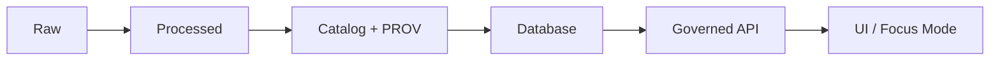

# KFM Documentation (`docs/`) 📚

> [!IMPORTANT]
> This directory contains **governed** Kansas Frontier Matrix (KFM) documentation. Treat docs as part of the system’s contract: **template-first**, **evidence-first**, and **CI-validated**. If something cannot be verified from project artifacts, label it **“(not confirmed in repo)”** rather than guessing.

<details>
<summary><strong>What you’ll find in this README</strong></summary>

- 📘 Overview (how docs are governed + how to use this folder)
- 🗂️ Directory Layout (canonical documentation placement)
- 🧭 Context (non‑negotiable invariants)
- 🗺️ Diagrams (workflow + canonical pipeline)
- 📦 Data & Metadata (provenance + citation patterns)
- 🌐 STAC, DCAT & PROV Alignment (standards expectations)
- 🧱 Architecture (where technical design docs belong)
- 🧠 Story Node & Focus Mode Integration (narratives + UI consumption)
- 🧪 Validation & CI/CD (what must pass before merge)
- ⚖️ FAIR+CARE & Governance (sensitivity + review triggers)
- 🕰️ Version History

</details>

---

## 📘 Overview

### Purpose
This README is the **entry point for `docs/`**. It explains:
- where different kinds of KFM documentation belong,
- how to keep docs **governed, consistent, and reviewable**,
- what checks must pass for documentation changes.

### Scope
This covers **Markdown documentation** living under `docs/` (system docs, standards, templates, governance, Story Nodes, reports, API docs). Non-Markdown sources (PDFs, DOCX, external research) are typically treated as **references** unless explicitly promoted to canonical docs.

### Audience
- **Contributors** (engineers, data stewards, story authors)
- **Reviewers** (governance/ethics/sovereignty, maintainers)
- **Auditors/partners** who need traceability and reproducibility

### Definitions (working)
- **Governed document:** Markdown that follows an approved structure and is subject to CI validation.
- **Provenance linkages:** explicit references to datasets, catalogs, commits, or documents that substantiate claims.
- **Story Node:** narrative Markdown that is template-structured and evidence-linked for UI/Focus Mode consumption.
- **Focus Mode:** a read-only narrative + evidence view that depends on structured Story Nodes to render citations and context without unsourced claims.

### Key artifacts & references (expected paths)
> These are *expected* homes per KFM documentation standards. If your repo differs, reconcile with the project’s canonical guidance and update this README accordingly.

- Standards & protocols: `docs/standards/`
- Templates: `docs/templates/`
- Governance policies: `docs/governance/`
- CI checklists/guides: `docs/ci/`
- Architecture/system guides: `docs/architecture/` and other topical subfolders
- Reference library: `docs/reference/`
- Story Nodes: `docs/reports/<topic>/story_nodes/` *(preferred in v13-era guidance; align to your canonical convention if different)*

### Definition of Done ✅ (for doc changes)
A documentation change is “merge-ready” when:

- [ ] **Template structure** is followed (appropriate sections/headings for doc type; consistent ordering).
- [ ] **Provenance exists for every substantive claim** (dataset ID, catalog ID, document ref, commit hash, etc.).
- [ ] Any unknowns are labeled **“(not confirmed in repo)”** (not guessed).
- [ ] **Governance & sensitivity** handling is explicit where relevant (redaction/generalization; review flags).
- [ ] **Advanced Markdown** is used where it improves readability and machine/UI consumption (tables, task lists, callouts, Mermaid, footnotes, collapsible details).
- [ ] **Validation passes** (lint, structure/schema checks, link integrity, sensitivity scanning, accessibility checks).

---

## 🗂️ Directory Layout

### Documentation placement in the repository
All official KFM Markdown documentation lives under `docs/`, organized by purpose.

### Canonical `docs/` map (recommended)
> [!NOTE]
> This is a canonical *documentation* layout. The repository may include other top-level folders (e.g., `data/`, `src/`, `web/`, `.github/`). If the current repo differs, update this tree and/or align the repo to the canonical structure.

```text
docs/
  README.md                          # (this file) docs navigation + governance rules for docs/
  standards/                         # protocols, work rules, writing rules, contracts
  templates/                         # governed templates (universal doc, story node v3, api extension)
  governance/                        # ROOT_GOVERNANCE, ETHICS, SOVEREIGNTY, review triggers
  architecture/                      # system overviews, redesign blueprints, subsystem contracts
  api/                               # human-readable API docs; link to schemas living elsewhere
  data/                              # domain data docs, data dictionaries, dataset notes
  reports/                           # run logs, curation notes, validation summaries, topic bundles
    <topic>/
      story_nodes/                   # preferred story node home (topic-scoped)
      provenance/                    # (optional) provenance logs or exports for that topic
  ci/                                # checklists + doc validation guidance
    checklists/
  reference/                         # external standards, bibliography, supporting references
  archive/                           # (optional) retired/merged docs kept for traceability (not confirmed in repo)
```

### Folder responsibilities (quick registry)

| Folder | What belongs here | What must be true |
|---|---|---|
| `docs/standards/` | Cross-cutting protocols (Markdown rules, AI-assist rules, data contract standards) | “Rules of the road” for contributors; should be stable and versioned |
| `docs/templates/` | Official templates (Universal doc, Story Node v3, API contract extension) | Template-first authoring; changes require extra scrutiny |
| `docs/governance/` | Governance & ethics policies | Must not be contradicted elsewhere; include review triggers |
| `docs/architecture/` | System architecture, redesign plans, subsystem boundaries | Must reflect canonical pipeline + trust boundaries |
| `docs/api/` | API usage docs, contract notes, change proposals | Must align with actual OpenAPI/GraphQL schemas (wherever stored) |
| `docs/data/` | Dataset docs, domain glossaries, dictionaries | Must cite dataset/catalog identifiers and lineage |
| `docs/reports/` | Validation logs, provenance exports, curation notes | Prefer machine-readable structure; include run IDs where applicable |
| `docs/reports/<topic>/story_nodes/` | Story Nodes used by UI/Focus Mode | Must follow Story Node v3 template and evidence rules |
| `docs/reference/` | External standards and reading library | Don’t treat as canonical system truth unless promoted |
| `docs/archive/` | Deprecated or superseded docs | Keep with clear deprecation notices and pointers forward |

### File naming & organization rules
- Use descriptive names (full words; underscores or hyphens).
- Include version in filename when the doc is versioned materially (e.g., `MASTER_GUIDE_v13.md`).
- Template files should be prefixed `TEMPLATE__...`.
- Keep a **single canonical home** for each subject area; avoid duplicate “truths” across multiple files.

---

## 🧭 Context

### Why documentation is “governed”
KFM documentation is treated as part of the platform’s contract. Drift or ambiguity can cause:
- pipeline misuse,
- incorrect attributions,
- governance oversights,
- UI/Focus Mode narrative errors.

### Non-negotiable invariants (must not regress)
> [!IMPORTANT]
> If a proposal or doc implies breaking one of these, it must be explicitly justified and reviewed; otherwise it is presumed incorrect.

- **Evidence-first:** substantive claims require provenance linkages.
- **Canonical pipeline ordering:** data must flow through a staged pipeline (see diagram below).
- **Trust boundary (“trust membrane”):** clients must not bypass governed APIs to reach data stores.
- **Template-first authoring:** new docs start from official templates; deviations require template changes.
- **Cite-or-abstain posture for narratives:** if evidence is missing, omit or mark uncertainty instead of filling gaps.

---

## 🗺️ Diagrams

### Documentation contribution workflow (governed)
```mermaid
flowchart TD
  A[Start from template] --> B[Write content]
  B --> C[Add provenance for claims]
  C --> D[Add governance notes / sensitivity handling]
  D --> E[Self-review: structure, links, accessibility]
  E --> F[Run local checks]
  F --> G[Open PR]
  G --> H[Review: maintainers + governance (as needed)]
  H --> I{CI validation passes?}
  I -->|Yes| J[Merge]
  I -->|No| K[Fix + iterate]
```

### Canonical pipeline (high-level)


---

## 📦 Data & Metadata

### Provenance expectations
When a doc states something factual (a dataset meaning, a layer’s origin, a boundary decision, a narrative claim), it should include **at least one** of:
- dataset/catalog identifier (e.g., STAC Collection ID, DCAT dataset ID),
- provenance artifact reference (PROV export, run log, transformation note),
- document reference (canonical design doc or policy),
- commit hash / PR reference (for implementation claims).

> [!TIP]
> Prefer **short, stable identifiers** in the text and put full citation details in footnotes.

### Practical citation patterns (examples)
Use footnotes to keep main text readable:

- “This layer is derived from X and filtered to Y.”[^cite-example]
- “Sensitive site locations are generalized per governance policy.”[^gov-example]

> [!WARNING]
> Do not include precise locations for culturally sensitive or vulnerable sites in public docs unless explicitly cleared. Default to generalization and governance review.

### Structured registries belong in tables
Examples of content that should be tabular:
- layer registries,
- dataset inventories,
- contract/interface registries,
- review-trigger matrices.

---

## 🌐 STAC, DCAT & PROV Alignment

When writing docs that describe datasets, catalogs, or pipeline steps:
- use consistent standards terminology (STAC, DCAT, PROV),
- describe how identifiers link across layers (catalog ↔ DB ↔ API ↔ UI),
- document versioning expectations and lineage.

> [!NOTE]
> If your doc is *not* data-related (e.g., a UI style guide), you may omit this section. If it is data/pipeline-related, include it.

---

## 🧱 Architecture

### Where architecture docs should live
- System and subsystem architecture: `docs/architecture/`
- Cross-cutting design guidance: `docs/` root or a topic folder (e.g., `docs/design/` if used)
- API contract narratives: `docs/api/`

### Architecture boundary reminders (trust membrane)
- Frontends/external clients should access data only via governed APIs.
- Backend logic should respect defined interfaces/ports rather than bypassing governance controls.

> [!TIP]
> If you introduce a new subsystem, add:
> - a short architecture doc in `docs/architecture/`,
> - an interface/contract note (API or internal port),
> - and update this `docs/README.md` if it changes doc placement.

---

## 🧠 Story Node & Focus Mode Integration

### What Story Nodes are for
Story Nodes are the narrative layer that ties evidence to interpretation in a structured, machine-ingestible way so the UI can render:
- citations,
- attributions,
- context and key entities,
- and governance labels.

### Where Story Nodes live
Preferred convention:
- `docs/reports/<topic>/story_nodes/`

If your repository currently uses a different convention, reconcile it with the project’s canonical guidance and keep one canonical home.

### Story Node authoring rules (minimum)
- Start from the **Story Node v3** template (`docs/templates/...`).
- Every narrative claim must be evidence-linked or explicitly labeled as uncertain.
- Include governance notes where sensitive content might exist.
- Ensure the Story Node can be rendered without external context (Focus Mode consumption).

---

## 🧪 Validation & CI/CD

### Common checks (expected)
Docs should pass automated checks, such as:
- Markdown linting
- Structure/schema validation (template compliance)
- Link integrity (no broken links/images)
- Sensitivity scanning
- Accessibility checks (alt text, heading hierarchy, table headers)

### Local workflow tips (before PR)
- [ ] Run local checks (example: `pre-commit run --all-files`)
- [ ] Preview Markdown rendering (GitHub/VS Code)
- [ ] Verify links/references
- [ ] Update Version History for non-trivial changes

> [!IMPORTANT]
> If checks fail, the doc should be revised until it is validation-clean.

---

## ⚖️ FAIR+CARE & Governance

KFM documentation is written with **FAIR** (Findable, Accessible, Interoperable, Reusable) and **CARE** (Collective Benefit, Authority to Control, Responsibility, Ethics) values.

### Practical governance rules for docs
- **Findable:** consistent structure and clear headings; avoid duplicating canonical truth.
- **Accessible:** descriptive link text; alt text for images; avoid walls of text.
- **Interoperable:** consistent standards terminology and identifiers.
- **Reusable:** version history; explicit assumptions; evidence that supports reuse.

### Sensitivity & review triggers
> [!WARNING]
> If content may reveal culturally sensitive information (including precise locations of sacred/vulnerable sites), **generalize/redact** and add a clear note that governance review is required.

Include a “Governance review required” note when:
- culturally sensitive information may be present,
- restrictions or access controls are implied,
- community authority-to-control considerations apply.

---

## 🕰️ Version History

| Version | Date | Summary of Changes | Author |
|---|---:|---|---|
| v1.0.0 | 2026-02-11 | Initial `docs/README.md` created (governed docs orientation + directory map). | (AI-assisted; reviewer TBD) |

---

## Footnotes

[^cite-example]: Example placeholder citation. Replace with a dataset/catalog ID, provenance artifact reference, or doc/commit reference that supports the claim.
[^gov-example]: Example placeholder citation. Replace with the governing policy document reference (e.g., sovereignty/ethics policy) that dictates sensitivity handling.