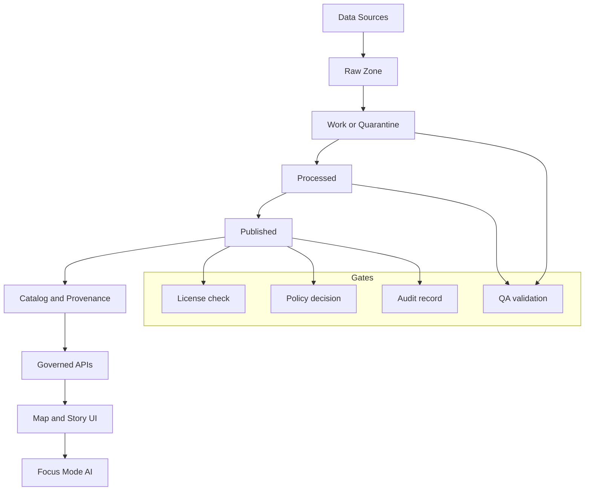

<!-- [KFM_META_BLOCK_V2]
doc_id: kfm://doc/2e7a0e0b-5c0a-4cb0-9fd6-7b3f4bbf67b1
title: docs/ — Kansas-Matrix-System Documentation
type: standard
version: v1
status: draft
owners: ["KFM Maintainers"]
created: 2026-02-24
updated: 2026-02-24
policy_label: public
related:
  - "../README.md"          # TODO: confirm root README path
  - "./adr/README.md"       # TODO: create if missing
  - "./policies/README.md"  # TODO: create if missing
tags: [kfm, docs]
notes:
  - "Scaffold README. Replace TODOs after confirming repo tree + CI gates."
[/KFM_META_BLOCK_V2] -->

# docs/

**Purpose:** governed, evidence-bound documentation for the Kansas‑Matrix‑System (KFM).


> **Trust membrane rule:** every user-facing claim should be traceable to evidence *and* to the policy decisions that allowed it.

## Quick navigation

- [What belongs in docs/](#what-belongs-in-docs)
- [Documentation stance](#documentation-stance)
- [Directory layout](#directory-layout)
- [System map](#system-map)
- [Doc templates](#doc-templates)
- [Definition of done](#definition-of-done)
- [Contribution workflow](#contribution-workflow)
- [Glossary](#glossary)

---

## What belongs in docs/

This directory is **documentation-as-production**: everything here should be reviewable, testable (where applicable), and safe to publish under its **policy label**.

### Fits in the repo

- `docs/` is the **canonical home** for architecture, governance, runbooks, and contracts.
- `docs/` is **not** the canonical home for executable code, datasets, or large binaries.

### Acceptable inputs

- **System docs**: architecture overviews, diagrams, decision records (ADRs), runbooks, onboarding.
- **Contracts**: API specs (OpenAPI/GraphQL), event schemas, error models.
- **Data governance**: catalog entries, provenance/provenance rules, sensitivity classification, release criteria.
- **Evidence**: validation receipts, promotion gate checklists, reproducible run manifests.
- **UI narrative**: Story node specs, map/story content guidelines, accessibility guidance.

### Exclusions

- **Secrets** (tokens, keys, credentials), even in examples.
- **Raw or sensitive data** (default-deny): use *redacted* samples and reference governed storage.
- **Generated artifacts** (build outputs) unless explicitly required and size-controlled.
- **Unverifiable claims**: if it can’t be cited or reproduced, label it **Unknown** and add verification steps.

---

## Documentation stance

### Truth discipline

Every statement in docs should be tagged mentally (and sometimes explicitly) as one of:

- **Confirmed**: backed by repo artifacts or linked evidence.
- **Proposed**: a design option with rationale + tradeoffs.
- **Unknown**: needs verification; must include *minimum verification steps*.

> **Rule:** do not “fill gaps” with invented repo state. Prefer TODOs, explicit Unknowns, and small verification checklists.

### Safety posture

- **Default-deny** when sensitivity/permissions are unclear.
- If content could enable harm (e.g., targeting vulnerable sites), publish only generalized detail.

---

## Directory layout

> ⚠️ **Scaffold:** adjust to match the actual repo tree.

```text
docs/
  README.md                 # you are here
  adr/                      # architecture decision records
    README.md               # ADR index (TODO)
  architecture/             # system architecture + invariants
    overview.md             # layered architecture, trust membrane (TODO)
  governance/               # policies, roles, promotion gates
    policy_labels.md        # public/restricted/etc. (TODO)
    promotion_gates.md      # Raw→Work→Processed→Published (TODO)
  data/                     # catalogs, schemas, provenance
    catalog/                # dataset identity + schema + extents + license
    receipts/               # validation + QA outputs (redacted)
  api/                      # governed interface contracts
    openapi/                # OpenAPI specs (if applicable)
    graphql/                # GraphQL schema + conventions (if applicable)
  ui/                       # map/story + focus-mode interaction docs
    story-node-v3.md        # spec (TODO, if used)
  runbooks/                 # operational procedures
    incident_response.md    # (TODO)
  contributing/             # doc standards + style guides
    writing_standards.md    # (TODO)
```

---

## System map

The system is governed end-to-end:

**data → pipelines → catalogs/provenance → storage/indexing → governed APIs → map/story UI → focus-mode AI**



### Architecture invariants

These should be enforced by tests and CI gates (not memory):

- UI/clients never access databases directly; **all access goes through governed APIs + policy boundary**.
- Core logic never bypasses repositories to reach storage.
- Gates fail closed.

---

## Doc templates

### MetaBlock header

All “standard” docs should start with the MetaBlock header (copy/paste):

```md
<!-- [KFM_META_BLOCK_V2]
doc_id: kfm://doc/<uuid>
title: <Title>
type: standard
version: v1
status: draft|review|published
owners: <team or names>
created: YYYY-MM-DD
updated: YYYY-MM-DD
policy_label: public|restricted|...
related:
  - <paths or kfm:// ids>
tags: [kfm]
notes:
  - <short notes>
[/KFM_META_BLOCK_V2] -->
```

### ADR template

```md
<!-- [KFM_META_BLOCK_V2]
doc_id: kfm://doc/<uuid>
title: ADR-XXXX: <decision title>
type: adr
version: v1
status: draft|accepted|rejected|superseded
owners: <team>
created: YYYY-MM-DD
updated: YYYY-MM-DD
policy_label: internal
related:
  - <link to impacted contracts/docs>
tags: [kfm, adr]
notes:
  - <optional>
[/KFM_META_BLOCK_V2] -->

# ADR-XXXX: <decision title>

## Context

## Decision

## Consequences

## Alternatives considered

## Verification
- [ ] Tests updated/added
- [ ] Migration/rollback documented
- [ ] Security/policy review completed (if applicable)
```

---

## Definition of done

A doc change is ready to merge when:

- [ ] **Policy label** is present and appropriate.
- [ ] **Owners** are listed.
- [ ] Any user-facing claim is **traceable** (links to evidence, configs, outputs, or receipts).
- [ ] Unknowns are explicitly labeled and include **minimum verification steps**.
- [ ] No secrets, credentials, or sensitive coordinates are present.
- [ ] Diagrams render (Mermaid) and links are valid.

---

## Contribution workflow

1. Create or update a doc in the appropriate subfolder.
2. Add/refresh the **MetaBlock** header.
3. If you introduce a new requirement, add a **gate** or **test** reference.
4. Keep changes **small and reversible** (prefer additive glue over rewrites).

> TIP: For large documents, use `<details>` sections for appendices to keep the main narrative scannable.

---

## Glossary

- **Trust membrane**: the enforced boundary where governed policy + evidence controls what can be claimed or served.
- **Promotion gate**: a required checklist + evidence bundle before data/docs move to a more public/consumable zone.
- **Policy label**: sensitivity classification that controls exposure and detail.

---

## Reference library

Some KFM workstreams use a bundled PDF reference library for fast lookup while designing pipelines, APIs, UI, GIS/cartography, and governance.

- If present, start with **`KFM_Project_Library_Index.pdf`** (a navigable index of the bundled PDFs).
- Treat large PDFs as **external inputs** (or use an approved large-file strategy). Do not accidentally publish copyrighted materials.

---

### Back to top

[Back to top](#docs)
