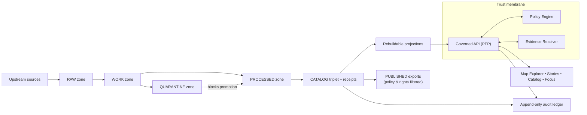

<!-- [KFM_META_BLOCK_V2]
doc_id: kfm://doc/2e7a0e0b-5c0a-4cb0-9fd6-7b3f4bbf67b1
title: docs/ — Governed Documentation Hub
type: standard
version: v2
status: draft
owners: KFM Maintainers (resolve via CODEOWNERS)
created: 2026-02-24
updated: 2026-02-28
policy_label: public
related:
  - ../README.md
  - ../.github/README.md
  - ../CONTRIBUTING.md
  - ../SECURITY.md
  - ../configs/README.md
  - ../contracts/README.md
  - ./adr/README.md
  - ./governance/README.md
  - ./runbooks/README.md
  - ./standards/README.md
tags:
  - kfm
  - docs
  - governance
  - evidence-first
  - cite-or-abstain
notes:
  - Upgraded from scaffold to governed doc index aligned to KFM vNext invariants.
  - Aligned language to truth path + trust membrane + EvidenceRef semantics; clarified “repo-root vs deeper paths” verification posture.
  - Added slots for templates + domain docs + quality docs (target structure; fail-closed if referenced by contract).
  - Treat repo-specific structure as UNKNOWN until verified; fail-closed on missing referenced files.
[/KFM_META_BLOCK_V2] -->

<a id="top"></a>

# `docs/` — Governed Documentation Hub
**Map-first • time-aware • governed • evidence-first • cite-or-abstain**

This directory is **documentation-as-production** for Kansas Frontier Matrix (KFM). Anything here is expected to be:
- **reviewable** (small diffs, stable IDs, clear owners),
- **testable where applicable** (linkcheck, schema examples, policy fixtures),
- **safe under policy** (default-deny posture; no sensitive leakage),
- **traceable** (claims link back to resolvable evidence or are marked Unknown).


> [!IMPORTANT]
> **Trust membrane rule:** docs must never become a bypass.  
> Do not include secrets, restricted coordinates, or “just trust me” claims.  
> If a claim can’t be supported by evidence, **abstain** or mark it **UNKNOWN** with verification steps.

---

## Quick navigation

- [Truth status legend](#truth-status-legend)
- [Directory contract](#directory-contract)
- [Documentation stance](#documentation-stance)
- [Where docs fit in KFM](#where-docs-fit-in-kfm)
- [Repo context](#repo-context)
- [Directory layout](#directory-layout)
- [System map](#system-map)
- [Doc templates](#doc-templates)
- [CI gates for docs](#ci-gates-for-docs)
- [Definition of Done](#definition-of-done)
- [Contribution workflow](#contribution-workflow)
- [Glossary](#glossary)
- [Reference library](#reference-library)

---

## Truth status legend

Use explicit truth labels to keep docs evidence-first and fail-closed:

- **CONFIRMED (repo):** backed by artifacts in this repository (paths, schemas, tests, receipts)
- **CONFIRMED (repo-root snapshot):** backed by a repository inventory snapshot; deeper module paths still require verification
- **CONFIRMED (design):** a KFM invariant/contract (must hold regardless of implementation)
- **PROPOSED:** a recommended template/pattern (adopt only after review)
- **UNKNOWN (repo):** not verified on this branch; include verification steps

> [!NOTE]
> If you reference a file that doesn’t exist, treat that as **missing and merge-blocking** if the reference is required by contract.

<p align="right"><a href="#top">Back to top ↑</a></p>

---

## Directory contract

### Purpose
`docs/` is the canonical home for:
- architecture and boundary contracts (human-readable)
- governance standards and review workflows
- operational runbooks
- narrative standards (Story Nodes)
- specs and examples that support enforcement (schemas, fixtures, checklists)

### What belongs in `docs/`
- **Architecture docs:** system overview, layering, trust membrane, canonical vs rebuildable
- **Governance docs:** policy labels, obligations, promotion gates, review triggers, roles
- **Runbooks:** incident response, pipeline operations, promotion procedures, rollback
- **Standards:** doc standards, schema/profile standards, catalog profile references
- **Narrative specs:** Story Node spec(s), citation conventions, evidence drawer expectations
- **Templates:** universal doc, story node, and API extension templates (governed + versioned)
- **Quality docs:** checklists, threat model prompts, and validation explainers (human-facing)
- **Evidence artifacts (bounded):** example receipts/manifests, redacted QA reports, validation examples

### What must not go in `docs/`
- **Secrets** (tokens, keys, credentials), even in examples
- **Raw or sensitive data** (default-deny): use redacted samples + digests + EvidenceRefs
- **Large binaries/build outputs** unless explicitly required and size-controlled
- **Unverifiable assertions**: if it can’t be cited, label it **UNKNOWN** and add verification steps
- **Policy enforcement logic** (belongs in `policy/` and runtime services), except for human-facing documentation of policy behavior

> [!WARNING]
> If it would be unsafe to paste into a public issue, it does not belong in public-labeled docs.

<p align="right"><a href="#top">Back to top ↑</a></p>

---

## Documentation stance

### Truth discipline
Every statement should be treated as one of:
- **Confirmed:** backed by repo artifacts or resolvable evidence
- **Proposed:** a design option with rationale + tradeoffs
- **Unknown:** not verified; must include **minimum verification steps**

> [!IMPORTANT]
> Do not “fill gaps” by inventing repo state. Prefer TODOs, explicit Unknowns, and small verification checklists.

### Safety posture
- **Default-deny** when sensitivity/permissions are unclear.
- If content could enable harm (e.g., vulnerable sites), publish only generalized detail.
- If a doc is governance-sensitive (e.g., security operations, internal escalation), label it `restricted|internal` and ensure review routing via CODEOWNERS.

### Cite-or-abstain applies to docs too
If a document makes factual claims that would influence decisions (policy, security, promotion eligibility), it should:
- cite in-repo artifacts (contracts, receipts, manifests, validators) **or**
- cite governed evidence references (EvidenceRefs) **or**
- mark the claim as **UNKNOWN**.

<p align="right"><a href="#top">Back to top ↑</a></p>

---

## Where docs fit in KFM

Docs sit alongside the enforceable artifacts and should point to them:

- **Contracts:** `contracts/` defines enforceable interfaces (OpenAPI, schemas, profiles, gates)
- **Policy:** `policy/` defines default-deny rules + obligations + test fixtures (enforced in CI and at runtime)
- **Configs:** `configs/` defines governed configuration inputs (labels, obligations, gate thresholds)
- **Data truth path:** `data/` holds canonical specs/registries/manifests/catalogs/receipts/digests
- **Governance:** `.github/` + `docs/governance/` define merge-time + human review posture
- **Tooling:** `tools/` + `tests/` make rules enforceable (validators, link checkers, fixtures)

> [!NOTE]
> If docs are served via governed APIs, the `policy_label` in the MetaBlock determines who can see the doc.
> If docs are “git-only,” still keep the label—it is a governance signal and can be enforced later.

<p align="right"><a href="#top">Back to top ↑</a></p>

---

## Repo context

`docs/` is only one surface of the system. To avoid overreach, treat any repo layout claims as **branch/commit-specific**:

- **Do not** assume deep module paths exist just because they’re shown in a target layout.
- Prefer **repo-root inventory** + **minimum verification steps** before writing “CONFIRMED (repo).”

Minimum verification steps (example):
- `ls -1` at repo root (confirm top-level folders)
- `tree -L 2 docs/` (confirm doc subfolders)
- run `linkcheck` / `MetaBlock lint` (confirm docs gates)

> [!TIP]
> If a doc is referenced by a contract, CI workflow, or release checklist, a missing link should be treated as merge-blocking.

<p align="right"><a href="#top">Back to top ↑</a></p>

---

## Directory layout

> [!NOTE]
> This is a **target structure** aligned to the KFM vNext operating model.  
> If your branch differs, update this README and any linkcheck/validators together.

```text
docs/                                                              # Governed docs hub (production docs; PR-reviewed; linkcheck-clean)
├─ README.md                                                       # Docs hub index + rules + “what goes where” + doc taxonomy + review gates
│
├─ architecture/                                                   # Architecture docs (invariants, decisions, diagrams, contracts)
│  ├─ README.md                                                    # Index + invariants + quick-nav + “start here” reading order (trust membrane + truth path + promotion pointers)
│  │
│  ├─ overview/                                                    # High-level architecture narrative (what/why/how)
│  │  ├─ README.md                                                 # Reading order + link map + glossary pointer + “normative vs informative” note
│  │  ├─ system-context.md                                         # System context (actors/dependencies/trust boundaries; C4-ish)
│  │  ├─ actors-and-trust-surfaces.md                              # Humans/services + UI trust surfaces; “who can touch what” matrix (high-level)
│  │  ├─ layering.md                                               # Clean architecture layering + dependency rules + anti-patterns (no IO in domain)
│  │  ├─ component-decomposition.md                                # Major components (API/apps/pipelines/tools) + responsibilities + interfaces
│  │  ├─ deployment-topology.md                                    # Conceptual deployment: envs/gateways/networks/secrets posture (no credentials)
│  │  ├─ trust-membrane.md                                         # Boundary rules + enforcement points (PEP/PDP, adapters, UI trust components)
│  │  ├─ policy-boundary.md                                        # Policy decision IO (allow/deny/obligations) + redaction semantics + audit outputs
│  │  ├─ evidence-and-claims.md                                    # Claim model + EvidenceRef/EvidenceBundle meaning + resolvability/linking rules
│  │  ├─ focus-mode-constraints.md                                 # Cite-or-abstain contract + failure modes + “no evidence → no claim”
│  │  ├─ truth-path.md                                             # Truth path zones (RAW→WORK→QUARANTINE→PROCESSED→CATALOG→PUBLISHED) + invariants
│  │  ├─ promotion-contract.md                                     # Promotion gates (executable contract) + required artifacts + fail-closed behavior
│  │  ├─ provenance-and-audit.md                                   # Run receipts + audit ledger + correlation IDs + provenance graph expectations
│  │  ├─ canonical-vs-rebuildable.md                               # Canonical truth vs rebuildable projections (search/tiles/graph) + rebuild triggers/parity checks
│  │  ├─ identity-and-hashing.md                                   # Deterministic IDs + spec_hash rules + canonicalization + collision strategy
│  │  ├─ time-model.md                                             # Event/valid/transaction time definitions + required fields + conventions
│  │  ├─ time-queries-and-snapshots.md                             # As-of queries + snapshots + version pinning + UI implications (view_state)
│  │  ├─ security-and-privacy.md                                   # Cross-cutting posture: secrets, least privilege, logging redaction, safe defaults
│  │  ├─ sensitive-locations.md                                    # Sensitive site handling: no precise coords, generalization, obligations, leakage tests
│  │  ├─ observability.md                                          # Logs/metrics/traces conventions + audit correlation IDs + policy-safe dimensions
│  │  └─ glossary.md                                               # Canonical terms (shared vocabulary across docs/contracts/errors)
│  │
│  ├─ decisions/                                                   # ADRs scoped to architecture (small, reversible, versioned)
│  │  ├─ README.md                                                 # ADR process + statuses + linking rules (code/tests/contracts)
│  │  ├─ adr-0000-template.md                                      # ADR template (copy/paste; ideally includes MetaBlock v2)
│  │  ├─ adr-0001-example.md                                       # Worked example ADR (illustrative completeness)
│  │  ├─ adr-0002-trust-membrane-enforcement.md                    # Decision: where/how invariants are enforced (CI + runtime + UI)
│  │  ├─ adr-0003-policy-engine-integration.md                     # Decision: PDP integration choice + obligations model + caching posture
│  │  ├─ adr-0004-evidence-resolution.md                           # Decision: evidence resolver contract + redaction guarantees + error semantics
│  │  ├─ adr-0005-canonical-vs-rebuildable-stores.md               # Decision: canonical stores vs projections + rebuild receipts + drift checks
│  │  ├─ adr-0006-time-model.md                                    # Decision: time semantics + schema/API/UI implications
│  │  └─ adr-index.yml                                             # Optional machine ADR registry (id/title/status/links) for tooling/search
│  │
│  ├─ diagrams/                                                    # Mermaid sources (linted; exports generated optionally)
│  │  ├─ README.md                                                 # Diagram style rules + naming + export policy + review checklist
│  │  ├─ system-context.mmd                                        # Mermaid: actors + boundaries + dependencies
│  │  ├─ layering.mmd                                              # Mermaid: dependency direction + interface seams
│  │  ├─ truth-path.mmd                                            # Mermaid: zones + promotion gates
│  │  ├─ contracts.mmd                                             # Mermaid: contract surfaces + validation flow (contracts/ ↔ tools/tests)
│  │  ├─ pep-pdp-obligations.mmd                                   # Mermaid: PEP/PDP decision flow + obligations emission
│  │  ├─ evidence-flow.mmd                                         # Mermaid: EvidenceRef → resolve → EvidenceBundle → UI verification surfaces
│  │  ├─ time-model.mmd                                            # Mermaid: time relationships + as-of query + version pinning
│  │  ├─ deployment.mmd                                            # Mermaid: conceptual deployment + trust boundaries + secret handling posture
│  │  └─ exports/                                                  # OPTIONAL: rendered exports (generated; never hand-edited)
│  │     ├─ .gitkeep                                               # Keep exports folder present if CI generates/commits exports
│  │     └─ README.md                                              # How exports are generated/verified and when/if committed
│  │
│  ├─ contracts/                                                   # Stable contracts (human + machine; mirror/pointer to /contracts when canonical)
│  │  ├─ README.md                                                 # Contract set overview + versioning + normative language rules + drift policy
│  │  ├─ api-contract.md                                           # Human-readable API contract summary (normative behavior)
│  │  ├─ api-versioning-and-compat.md                              # Compatibility rules, deprecations, breaking-change gates, migration notes
│  │  ├─ api-error-model.md                                        # Policy-safe error envelopes + trace IDs + retryability + UX mapping
│  │  ├─ authn-authz-contract.md                                   # Auth expectations (roles/scopes) + audit requirements + denial semantics
│  │  ├─ policy-contract.md                                        # Policy contract (labels/decisions/obligations/fail-closed defaults)
│  │  ├─ policy-labels.vocab.json                                  # Machine vocab mirror/pointer (labels + meanings + stability rules)
│  │  ├─ obligations.vocab.yml                                     # Machine vocab mirror/pointer (obligation types + required parameters)
│  │  ├─ evidence-resolver-contract.md                             # Resolver contract (inputs/outputs, verification, obligations, errors)
│  │  ├─ evidence-ref.schema.json                                  # EvidenceRef schema mirror/pointer (schemes + required fields)
│  │  ├─ evidence-bundle.schema.json                               # EvidenceBundle schema mirror/pointer (safe render fields + hashes)
│  │  ├─ run-receipt.schema.json                                   # Run receipt schema mirror/pointer (audit_ref, checks, inputs/outputs)
│  │  ├─ run-receipt.example.json                                  # Golden example referenced by docs + CI
│  │  ├─ promotion-manifest.schema.json                            # Promotion manifest schema mirror/pointer (artifacts, digests, approvals)
│  │  ├─ promotion-manifest.example.json                           # Golden example referenced by docs + CI
│  │  ├─ story-node.schema.json                                    # StoryNode schema mirror/pointer (or doc explaining canonical location)
│  │  ├─ claim.schema.json                                         # Claim schema (statement + evidence links + policy refs + time bounds)
│  │  └─ fixtures/                                                 # Small canonical examples used across docs/tests (policy-safe)
│  │     ├─ example-evidence-ref.json                              # Minimal valid EvidenceRef example
│  │     ├─ example-evidence-bundle.json                           # Minimal valid EvidenceBundle example
│  │     ├─ example-claim.json                                     # Minimal valid Claim example
│  │     └─ example-story-node.json                                # Minimal valid StoryNode example
│  │
│  ├─ enforcement/                                                 # How invariants become CI/runtime gates (make it testable)
│  │  ├─ README.md                                                 # Where to add checks + how to link invariants to tests/tools (fail-closed)
│  │  ├─ invariants.md                                             # Normative invariants list (each links to a test/tool gate)
│  │  ├─ policy-enforcement-points.md                              # PEP inventory: location/endpoints/context/expected decision artifacts
│  │  ├─ contract-testing.md                                       # Contract testing strategy (OpenAPI/schema validation; fixtures; drift detection)
│  │  ├─ data-promotion-gates.md                                   # Gate mapping → checks → artifacts → failure semantics
│  │  ├─ redaction-and-generalization-tests.md                     # How to test “no sensitive coords leak” + obligation application
│  │  └─ ci-checks.md                                              # CI job mapping (workflow → tools/tests → required artifacts)
│  │
│  ├─ registries/                                                  # Machine-readable indexes that keep architecture docs honest
│  │  ├─ README.md                                                 # Registry purpose + validation + ownership + update rules
│  │  ├─ boundary-surface-registry.yml                             # Trust surfaces (UI/API/batch/Focus/admin) + owners + policy labels
│  │  ├─ service-catalog.yml                                       # Services/modules + owners + contracts + data touched + PEPs
│  │  ├─ contract-index.yml                                        # Contract → canonical source → version → tests/tools that validate it
│  │  ├─ pep-registry.yml                                          # PEP locations + endpoints + auth requirements + audit hooks
│  │  └─ policy-label-registry.yml                                 # Human-friendly label index mirroring machine vocab (definitions + examples)
│  │
│  ├─ templates/                                                   # Architecture templates (reviewed; stable entrypoints)
│  │  ├─ README.md                                                 # Template usage rules + what must be customized before merge
│  │  ├─ kfm-meta-block-v2.txt                                     # Authoritative MetaBlock v2 snippet (avoid drift)
│  │  ├─ standard-doc.template.md                                  # Standard doc skeleton (Context → Contract → Verification → DoD)
│  │  ├─ adr.template.md                                           # ADR skeleton (mirrors ADR template)
│  │  ├─ contract-doc.template.md                                  # Contract doc skeleton (normative language + examples + tests)
│  │  ├─ diagram.template.mmd                                      # Mermaid boilerplate (styles + lint-friendly patterns)
│  │  └─ review-checklist.md                                       # Architecture review checklist (what reviewers must verify)
│  │
│  └─ threat-model/                                                # Threat modeling (assets, actors, risks, mitigations)
│     ├─ README.md                                                 # Threat model overview + cadence + acceptance criteria + update workflow
│     ├─ scope-and-assets.md                                       # Protected assets + explicit out-of-scope items + trust boundaries
│     ├─ actors-and-entrypoints.md                                 # Threat actors + entry points (UI/API/batch/tools) + assumptions
│     ├─ data-classification-and-handling.md                       # Sensitivity classes + handling rules + default-deny + logging/redaction posture
│     ├─ abuse-cases.md                                            # Misuse scenarios + expected system response (deny/abstain/audit)
│     ├─ control-mapping.md                                        # Controls mapped to threats (policy, contracts, tests, infra controls)
│     ├─ risk-register.md                                          # Risk register (likelihood/impact/mitigation/owner/status)
│     └─ residual-risk.md                                          # Accepted risks + monitoring plan + revisit triggers
│
├─ adr/                                                           # Repo-wide ADRs (governed; shared entrypoint)
│  ├─ README.md                                                   # ADR process + rules + status definitions + index (human entrypoint)
│  ├─ TEMPLATE.md                                                 # Single-source ADR template (copy/paste; can embed MetaBlock v2)
│  ├─ ADR-REVIEW-CHECKLIST.md                                     # PR checklist: evidence links, rollback, verification gates, policy label, etc.
│  ├─ ADR-STYLE-GUIDE.md                                          # Optional: short style rules (tense, headings, decision statement format)
│  ├─ INDEX.md                                                    # Optional: canonical index (recommended if auto-generated)
│  ├─ _generated/                                                 # Generated artifacts (never hand-edited)
│  │  ├─ adr-index.json                                           # Machine-readable ADR index (for UI/search tooling)
│  │  └─ adr-index.md                                             # Generated markdown ADR index (for humans)
│  ├─ tools/                                                      # Glue scripts to enforce ADR invariants (optional but recommended)
│  │  ├─ adr-next-number.sh                                       # Print next available NNNN (fail if collision)
│  │  ├─ adr-lint.js                                              # Lint required sections/links/status vocabulary
│  │  └─ adr-indexer.js                                           # Regenerate INDEX.md and/or _generated/* via filesystem scan
│  ├─ assets/                                                     # Optional: ADR supporting assets (rare; must be policy-safe)
│  │  ├─ diagrams/                                                # Exported diagrams when Mermaid is insufficient
│  │  └─ screenshots/                                             # Screenshots (use sparingly; ensure no sensitive info)
│  ├─ archive/                                                    # Optional: imported legacy ADRs (kept for history)
│  │  └─ 20xx-legacy/                                             # Legacy ADRs grouped by year (keep original filenames)
│  ├─ 0001-example-decision.md                                    # Example ADR placeholder (demonstrates structure)
│  ├─ 0002-another-decision.md                                    # Example ADR placeholder (demonstrates structure)
│  ├─ 0003-data-zones-and-promotion-contract.md                   # Planned decision placeholder (truth path + promotion contract)
│  ├─ 0004-dataset-identity-versioning-and-hashing.md             # Planned decision placeholder (identity + hashing)
│  ├─ 0005-catalog-triplet-dcat-stac-prov-strategy.md             # Planned decision placeholder (triplet strategy)
│  ├─ 0006-evidence-ref-and-bundle-resolution.md                  # Planned decision placeholder (evidence resolver)
│  ├─ 0007-policy-labels-redaction-and-obligations.md             # Planned decision placeholder (labels + obligations)
│  ├─ 0008-governed-api-boundary-and-pep-enforcement.md           # Planned decision placeholder (PEP boundary)
│  ├─ 0009-search-index-tiles-and-rebuildability.md               # Planned decision placeholder (projections posture)
│  ├─ 0010-focus-mode-cite-or-abstain-guardrails.md               # Planned decision placeholder (Focus constraints)
│  ├─ 0011-run-receipts-and-audit-ledger-minimums.md              # Planned decision placeholder (receipts + audit)
│  └─ 0012-secrets-management-and-rotation.md                     # Planned decision placeholder (secrets posture)
│
├─ governance/                                                    # Canonical governance docs (normative; maps to policy-as-code and CI gates)
│  ├─ README.md                                                   # Entrypoint + directory contract + navigation
│  ├─ ROOT_GOVERNANCE.md                                          # Charter: roles, decision process, definitions, escalation
│  ├─ ETHICS.md                                                   # Ethical commitments + “we will not do”
│  ├─ SOVEREIGNTY.md                                              # CARE-aligned sovereignty rules + restricted knowledge handling
│  ├─ REVIEW_GATES.md                                             # Review triggers + sign-off rules + promotion checklist pointers
│  ├─ GLOSSARY.md                                                 # Canonical governance terms (shared vocabulary)
│  ├─ CHANGELOG.md                                                # Governance policy changes (human-readable; dated)
│  ├─ roles/                                                      # Ownership + role model + reviewer quorum
│  │  ├─ OWNERSHIP.md                                             # Who owns what (datasets, services, policies, catalogs)
│  │  ├─ ROLE_MODEL.md                                            # Role taxonomy (public/staff/researcher/admin)
│  │  ├─ RBAC_MATRIX.md                                           # Role → permissions matrix (high-level)
│  │  └─ REVIEWERS.md                                             # Required reviewers / quorum rules
│  ├─ labels/                                                     # Policy label taxonomy + sensitivity handling (human)
│  │  ├─ POLICY_LABEL_TAXONOMY.md                                 # Definitions + required fields + defaults (fail-closed)
│  │  ├─ SENSITIVITY_GUIDE.md                                     # How to classify layers/fields/locations/media
│  │  ├─ REDACTION_GENERALIZATION.md                              # Redaction/generalization rules as first-class transforms
│  │  └─ examples/                                                # Worked examples (policy-safe)
│  │     ├─ public_generalized_example.md                         # Example: public + generalized output
│  │     ├─ restricted_location_example.md                        # Example: restricted/sensitive location handling
│  │     └─ mixed_sensitivity_story_example.md                    # Example: mixed sensitivity story patterns
│  ├─ gates/                                                      # CI + runtime + promotion gates (human-readable)
│  │  ├─ PROMOTION_CONTRACT.md                                    # Minimum promotion requirements (zones, artifacts, receipts)
│  │  ├─ CI_GATES.md                                              # What CI must enforce (tests/tools/validators)
│  │  ├─ RUNTIME_GATES.md                                         # What runtime must enforce (PEPs, obligations, audit)
│  │  ├─ FOCUS_MODE_EVALUATION.md                                 # Cite-or-abstain eval cases + regression expectations
│  │  └─ waivers/                                                 # Waiver policy + templates
│  │     ├─ WAIVER_POLICY.md                                      # When waivers are allowed + required approvals + expiry rules
│  │     └─ WAIVER_RECORD_TEMPLATE.md                             # Waiver record format (who/why/expiry/mitigations)
│  ├─ records/                                                    # Durable governance decisions + sign-offs (auditable)
│  │  ├─ decisions/
│  │  │  ├─ README.md                                             # Lifecycle: draft→approved→superseded
│  │  │  └─ GDR_TEMPLATE.md                                       # Governance decision record template
│  │  ├─ reviews/
│  │  │  └─ (YYYY)/
│  │  │     └─ (PR-or-change-id).md                               # Review record (auditable signoffs)
│  │  └─ incidents/
│  │     ├─ INCIDENT_TEMPLATE.md                                  # Incident record template
│  │     └─ (YYYY)/...                                            # Incident records by year
│  ├─ templates/                                                  # Governance templates used across workflows
│  │  ├─ GOVERNANCE_REVIEW_RECORD.md                              # Governance review record template
│  │  ├─ DATASET_INTAKE_CHECKLIST.md                              # Dataset intake checklist template
│  │  ├─ SOVEREIGNTY_ASSESSMENT.md                                # Sovereignty assessment template
│  │  ├─ AI_FEATURE_RISK_REVIEW.md                                # AI feature risk review template
│  │  └─ PUBLICATION_SIGNOFF.md                                   # Publication signoff template
│  └─ policy/                                                     # Policy documentation + fixtures + parity test planning (code may live elsewhere)
│     ├─ README.md                                                # Policy boundary: CI == runtime semantics; where code lives
│     ├─ POLICY_MODEL.md                                          # PDP/PEP model + decision IO + failure modes
│     ├─ OBLIGATIONS.md                                           # Obligation types + semantics
│     ├─ INPUT_CONTEXT.md                                         # What context is evaluated by policy
│     ├─ schemas/                                                 # Schemas used for policy docs/fixtures
│     │  ├─ policy_context.schema.json                            # Context schema
│     │  ├─ policy_decision.schema.json                           # Decision envelope schema
│     │  └─ obligation.schema.json                                # Obligation schema
│     ├─ fixtures/                                                # Policy fixtures (synthetic; deterministic)
│     │  ├─ allow_deny/                                           # Allow/deny fixtures (role/scenario)
│     │  ├─ redaction_generalization/                             # Redaction/generalization cases
│     │  └─ focus_mode/                                           # Focus policy cases (goldens/leakage)
│     ├─ testplan/                                                # Policy testing plans (CI + runtime parity)
│     │  ├─ ci_policy_tests.md
│     │  ├─ runtime_policy_parity.md
│     │  └─ coverage_expectations.md
│     └─ mappings/                                                # Pointers/mappings to code and enforcement locations
│        ├─ policy_code_locations.md
│        └─ enforcement_points.md
│
├─ standards/                                                     # Non-negotiable standards (CI-enforced where configured)
│  ├─ README.md                                                   # Index + how standards are reviewed/updated + versioning/deprecation rules
│  ├─ KFM_MARKDOWN_WORK_PROTOCOL.md                               # Docs protocol (formatting, linkcheck, review discipline)
│  ├─ KFM_REPO_STRUCTURE_STANDARD.md                              # Repo structure invariants (paths, naming, registries)
│  ├─ KFM_STAC_PROFILE.md                                         # STAC conformance standard (human-facing summary)
│  ├─ KFM_DCAT_PROFILE.md                                         # DCAT conformance standard (human-facing summary)
│  ├─ KFM_PROV_PROFILE.md                                         # PROV conformance standard (human-facing summary)
│  ├─ registry/                                                   # Machine-readable inventory (CI validation)
│  │  ├─ README.md                                                # How the standards registry works + validation rules
│  │  ├─ standards.registry.yaml                                  # Canonical standards inventory (owners, scope, status)
│  │  └─ deprecations.yaml                                        # Deprecation ledger (superseded docs + pointers)
│  ├─ authoring/                                                  # Authoring rules (MetaBlock, citations, diagrams, normative language)
│  │  ├─ README.md                                                # Authoring standards index
│  │  ├─ KFM_META_BLOCK_V2_STANDARD.md                            # MetaBlock v2 requirements + examples
│  │  ├─ KFM_NORMATIVE_LANGUAGE_STANDARD.md                       # MUST/SHOULD/MAY rules + tagging patterns
│  │  ├─ KFM_CITATION_PROTOCOL.md                                 # Citation rules (EvidenceRef, when to abstain)
│  │  ├─ KFM_DIAGRAM_MERMAID_STANDARD.md                          # Mermaid rules (lint-friendly, policy-safe)
│  │  └─ examples/                                                # Good/bad examples for reviewers and linting
│  │     ├─ good/                                                 # Examples that should pass
│  │     └─ bad/                                                  # Examples that should fail
│  ├─ repo/                                                       # Repo/process standards (branching, release, versioning)
│  │  ├─ README.md
│  │  ├─ KFM_BRANCHING_RELEASE_STANDARD.md
│  │  ├─ KFM_VERSIONING_DEPRECATION_STANDARD.md
│  │  └─ examples/
│  │     └─ repo_trees/
│  ├─ catalog/                                                    # Catalog standards (triplet linking + profiles)
│  │  ├─ README.md
│  │  ├─ triplet/
│  │  │  ├─ KFM_TRIPLET_LINKING_STANDARD.md
│  │  │  └─ examples/
│  │  │     ├─ minimal_triplet/
│  │  │     └─ complex_triplet/
│  │  ├─ stac/
│  │  │  ├─ README.md
│  │  │  ├─ CONFORMANCE.md
│  │  │  └─ examples/
│  │  ├─ dcat/
│  │  │  ├─ README.md
│  │  │  ├─ CONFORMANCE.md
│  │  │  └─ examples/
│  │  └─ prov/
│  │     ├─ README.md
│  │     ├─ CONFORMANCE.md
│  │     └─ examples/
│  ├─ policy/
│  │  ├─ README.md
│  │  ├─ KFM_POLICY_LABEL_STANDARD.md
│  │  ├─ KFM_REDACTION_OBLIGATIONS_STANDARD.md
│  │  └─ examples/
│  │     ├─ public/
│  │     └─ restricted/
│  ├─ evidence/
│  │  ├─ README.md
│  │  ├─ KFM_EVIDENCE_REF_STANDARD.md
│  │  ├─ KFM_EVIDENCE_BUNDLE_STANDARD.md
│  │  ├─ KFM_RUN_RECEIPT_STANDARD.md
│  │  └─ examples/
│  ├─ api/
│  │  ├─ README.md
│  │  ├─ KFM_API_CONTRACT_EXTENSION.md
│  │  ├─ KFM_ERROR_MODEL_STANDARD.md
│  │  ├─ KFM_PAGINATION_FILTERING_STANDARD.md
│  │  └─ examples/
│  ├─ ui/
│  │  ├─ README.md
│  │  ├─ KFM_STORY_NODE_STANDARD.md
│  │  ├─ KFM_EVIDENCE_FIRST_UX_STANDARD.md
│  │  └─ accessibility/
│  │     └─ KFM_A11Y_MINIMUM_STANDARD.md
│  └─ _archive/                                                  # Deprecated/old versions (never referenced by CI)
│     ├─ README.md
│     └─ 2026-02-xx/
│
├─ templates/                                                     # Governed templates (docs-as-prod; reviewed; stable entrypoints)
│  ├─ README.md                                                  # Template index + usage rules + “must customize before merge” checklist
│  ├─ TEMPLATE__KFM_UNIVERSAL_DOC.md                              # Universal governed doc template (Context→Contract→Verification→DoD)
│  ├─ TEMPLATE__STORY_NODE_V3.md                                  # Story Node v3 markdown skeleton (MetaBlock + claims + EvidenceRefs)
│  ├─ TEMPLATE__API_CONTRACT_EXTENSION.md                         # API contract extension template (normative language + examples)
│  ├─ _partials/                                                  # Reusable snippets to keep templates consistent (avoid drift)
│  │  ├─ PARTIAL__KFM_META_BLOCK_V2.md                             # Copy/paste MetaBlock v2 (authoritative snippet)
│  │  ├─ PARTIAL__BADGES_ROW.md                                    # Standard badges row (status, policy, owners, etc.)
│  │  ├─ PARTIAL__QUICK_NAV.md                                     # “Jump to…” anchors block for long docs
│  │  ├─ PARTIAL__NORMATIVE_LANGUAGE.md                            # MUST/SHOULD/MAY legend + tagging pattern
│  │  ├─ PARTIAL__GOVERNANCE_CALLOUTS.md                           # NOTE/TIP/WARNING callouts for policy/evidence guidance
│  │  ├─ PARTIAL__MERMAID_TRUTH_PATH.mmd                           # Truth path Mermaid snippet (RAW→…→PUBLISHED)
│  │  └─ PARTIAL__MERMAID_TRUST_MEMBRANE.mmd                       # Trust membrane Mermaid snippet (clients→API→policy→stores)
│  ├─ standard/                                                   # General “house” templates used across the repo
│  │  ├─ TEMPLATE__DIRECTORY_README.md                             # Directory README standard (purpose/inputs/exclusions/contracts/DoD)
│  │  ├─ TEMPLATE__RUNBOOK.md                                      # Operational runbook template (SLOs, alerts, rollback, contacts)
│  │  ├─ TEMPLATE__ADR.md                                          # ADR skeleton (decision, context, consequences, verification)
│  │  ├─ TEMPLATE__CHANGELOG_ENTRY.md                              # Changelog fragment format (traceable + reversible)
│  │  ├─ TEMPLATE__RELEASE_NOTES.md                                # Release notes format (what changed + evidence + gates)
│  │  └─ TEMPLATE__CHECKLIST.md                                    # Generic checklist skeleton (DoD / gates / signoffs)
│  ├─ data/                                                       # Dataset-facing templates (registry/specs/QA/catalog/prov)
│  │  ├─ TEMPLATE__DATASET_REGISTRY_ENTRY.yml
│  │  ├─ TEMPLATE__DATASET_SPEC.md
│  │  ├─ TEMPLATE__SOURCE_SNAPSHOT.md
│  │  ├─ TEMPLATE__QA_REPORT.md
│  │  ├─ TEMPLATE__PROMOTION_REQUEST.md
│  │  ├─ TEMPLATE__PROMOTION_RECEIPT.md
│  │  ├─ TEMPLATE__STAC_COLLECTION.json
│  │  ├─ TEMPLATE__STAC_ITEM.json
│  │  ├─ TEMPLATE__DCAT_DATASET.ttl
│  │  └─ TEMPLATE__PROV_ACTIVITY.jsonld
│  ├─ evidence/                                                   # Evidence binding + resolution artifact templates
│  │  ├─ TEMPLATE__EVIDENCE_REF.md
│  │  ├─ TEMPLATE__EVIDENCE_BUNDLE.json
│  │  ├─ TEMPLATE__CITATION_BLOCK.md
│  │  └─ TEMPLATE__REDACTION_LOG.md
│  ├─ api/                                                        # API governance + contract supporting doc templates
│  │  ├─ TEMPLATE__OPENAPI_MODULE.yml
│  │  ├─ TEMPLATE__API_ERROR_MODEL.md
│  │  ├─ TEMPLATE__AUTH_MATRIX.md
│  │  ├─ TEMPLATE__DEPRECATION_POLICY.md
│  │  └─ TEMPLATE__ENDPOINT_REVIEW.md
│  ├─ policy/                                                     # Policy-as-code + decision record templates
│  │  ├─ TEMPLATE__POLICY_LABELS.yml
│  │  ├─ TEMPLATE__OPA_POLICY.rego
│  │  ├─ TEMPLATE__OPA_TEST.rego
│  │  ├─ TEMPLATE__POLICY_DECISION_RECORD.md
│  │  └─ TEMPLATE__OBLIGATION_HANDLING.md
│  ├─ ux/                                                         # UI/Story/Map copy + accessibility pattern templates
│  │  ├─ TEMPLATE__DATASET_PAGE_COPY.md
│  │  ├─ TEMPLATE__LAYER_METADATA_PANEL.md
│  │  ├─ TEMPLATE__FOCUS_MODE_ANSWER_CARD.md
│  │  └─ TEMPLATE__A11Y_CHECKLIST.md
│  └─ examples/                                                   # Filled-in examples for fast adoption + testing
│     ├─ EXAMPLE__UNIVERSAL_DOC__PUBLISHED.md
│     ├─ EXAMPLE__STORY_NODE_V3__PUBLISHED.md
│     ├─ EXAMPLE__DATASET_REGISTRY_ENTRY.yml
│     ├─ EXAMPLE__STAC_COLLECTION.json
│     ├─ EXAMPLE__RUN_RECEIPT.json
│     └─ EXAMPLE__POLICY_DECISION_RECORD.md
│
├─ runbooks/                                                      # Operational runbooks (production-grade, step-by-step)
│  ├─ README.md                                                   # Runbooks index + standards + incident flow + promotion gate references
│  ├─ _registry/                                                  # Optional: machine-checkable completeness + ownership
│  │  ├─ runbooks.yml                                             # Runbook registry (id, owners, scope, last_reviewed)
│  │  ├─ runbooks.schema.json                                     # Schema for runbooks.yml
│  │  └─ owners.yml                                               # Owner aliases (routing reviews; CODEOWNERS sync input)
│  ├─ templates/                                                  # Runbook templates (copy/paste; consistent sections)
│  │  ├─ runbook-template.md
│  │  ├─ evidence-bundle-template.md
│  │  ├─ incident-notes-template.md
│  │  ├─ comms-update-template.md
│  │  ├─ postmortem-template.md
│  │  └─ change-record-template.md
│  ├─ incidents/                                                  # Incident runbooks (triage, severity, comms, drills)
│  │  ├─ rb-incident-triage.md
│  │  ├─ rb-incident-sev1.md
│  │  ├─ rb-incident-comms.md
│  │  ├─ rb-incident-evidence-capture.md
│  │  ├─ rb-incident-escalation.md
│  │  ├─ rb-incident-postmortem.md
│  │  ├─ playbooks/
│  │  │  ├─ rb-incident-api-5xx-spike.md
│  │  │  ├─ rb-incident-auth-failure.md
│  │  │  ├─ rb-incident-policy-regression.md
│  │  │  ├─ rb-incident-pipeline-stuck.md
│  │  │  ├─ rb-incident-data-integrity.md
│  │  │  ├─ rb-incident-index-lag.md
│  │  │  ├─ rb-incident-ui-outage.md
│  │  │  └─ rb-incident-storage-quota.md
│  │  └─ drills/
│  │     ├─ rb-drill-sev1-sim.md
│  │     └─ rb-drill-data-promotion-fail.md
│  ├─ change/
│  │  ├─ rb-change-intake.md
│  │  ├─ rb-change-execute.md
│  │  ├─ rb-change-rollback.md
│  │  └─ rb-change-closeout.md
│  ├─ pipelines/
│  │  ├─ rb-pipeline-rerun.md
│  │  ├─ rb-pipeline-backfill.md
│  │  ├─ rb-pipeline-promote-zone.md
│  │  ├─ rb-pipeline-quarantine.md
│  │  ├─ rb-pipeline-receipt-verify.md
│  │  ├─ rb-pipeline-scheduler-pause.md
│  │  ├─ rb-pipeline-scheduler-resume.md
│  │  └─ rb-pipeline-hotfix.md
│  ├─ data/
│  │  ├─ rb-data-qa-failures.md
│  │  ├─ rb-data-redaction-review.md
│  │  ├─ rb-data-sensitivity-assess.md
│  │  ├─ rb-data-schema-change.md
│  │  ├─ rb-data-diff-compare.md
│  │  ├─ rb-data-restore-from-raw.md
│  │  └─ rb-data-tombstone.md
│  ├─ catalog/
│  │  ├─ rb-catalog-build.md
│  │  ├─ rb-catalog-validate.md
│  │  ├─ rb-catalog-publish.md
│  │  ├─ rb-catalog-rebuild-all.md
│  │  └─ rb-catalog-deprecate-dataset.md
│  ├─ evidence/
│  │  ├─ rb-evidence-bundle-create.md
│  │  ├─ rb-evidence-ref-resolve.md
│  │  ├─ rb-evidence-redaction-apply.md
│  │  ├─ rb-evidence-retention.md
│  │  └─ rb-audit-ledger-append.md
│  ├─ indexing/
│  │  ├─ rb-index-rebuild.md
│  │  ├─ rb-index-backfill.md
│  │  ├─ rb-index-search-rebuild.md
│  │  ├─ rb-index-tiles-rebuild.md
│  │  ├─ rb-index-graph-rebuild.md
│  │  ├─ rb-index-warmup.md
│  │  └─ rb-index-verify-freshness.md
│  ├─ api/
│  │  ├─ rb-api-deploy.md
│  │  ├─ rb-api-rollback.md
│  │  ├─ rb-api-migrations.md
│  │  ├─ rb-api-rate-limit-change.md
│  │  ├─ rb-api-cache-invalidate.md
│  │  ├─ rb-api-schema-contract-change.md
│  │  └─ rb-api-emergency-readonly.md
│  ├─ ui/
│  │  ├─ rb-ui-deploy.md
│  │  ├─ rb-ui-feature-flag.md
│  │  ├─ rb-ui-cache-purge.md
│  │  ├─ rb-ui-emergency-banner.md
│  │  ├─ rb-ui-map-style-update.md
│  │  └─ rb-ui-story-node-publish.md
│  ├─ policy/
│  │  ├─ rb-policy-bundle-build.md
│  │  ├─ rb-policy-bundle-publish.md
│  │  ├─ rb-policy-regression-triage.md
│  │  ├─ rb-policy-obligation-change.md
│  │  └─ rb-policy-emergency-deny-all.md
│  ├─ governance/
│  │  ├─ rb-policy-label-change.md
│  │  ├─ rb-access-review.md
│  │  ├─ rb-access-grant.md
│  │  ├─ rb-access-revoke.md
│  │  ├─ rb-release-promotion-approve.md
│  │  └─ rb-data-release-notes.md
│  ├─ platform/
│  │  ├─ rb-platform-backup.md
│  │  ├─ rb-platform-restore.md
│  │  ├─ rb-platform-dr-failover.md
│  │  ├─ rb-platform-k8s-upgrade.md
│  │  ├─ rb-platform-cert-rotate.md
│  │  ├─ rb-platform-storage-expand.md
│  │  └─ rb-platform-secrets-rotation.md
│  ├─ observability/
│  │  ├─ rb-observability-alert-triage.md
│  │  ├─ rb-observability-dashboard-create.md
│  │  ├─ rb-observability-log-retention.md
│  │  ├─ rb-observability-slo-review.md
│  │  ├─ rb-observability-trace-sampling.md
│  │  └─ rb-observability-metrics-gap.md
│  └─ _assets/
│     ├─ diagrams/
│     │  ├─ incident-flow.mmd
│     │  ├─ promotion-flow.mmd
│     │  └─ trust-membrane.mmd
│     ├─ screenshots/
│     └─ samples/
│        ├─ evidence-bundle-example/
│        └─ receipt-example/
│
├─ guides/                                                        # Guides hub (how-to; workflow docs; opinionated but practical)
│  ├── README.md                                                  # Index: what lives here, how guides are structured, how to contribute
│  ├── onboarding.md                                              # (Compat) Short onboarding entrypoint (links into guides/onboarding/)
│  ├── add_a_dataset.md                                           # (Compat) Short dataset add guide (links into guides/onboarding/ + docs/data/)
│  ├── publish_a_story.md                                         # (Compat) Short story publish guide (links into docs/stories/ + guides/ui/)
│  ├── focus_mode_eval.md                                         # (Compat) Short Focus eval guide (links into guides/pipelines/ + tests/eval/)
│  │
│  ├── _shared/                                                   # Cross-cutting reference used by all guides
│  │   ├── README.md                                              # How shared references are maintained + link policy
│  │   ├── conventions.md                                         # Filenames, numbering, linking, “Confirmed/Proposed/Unknown”
│  │   ├── glossary.md                                            # Canonical definitions + synonyms (domain + platform)
│  │   ├── decision-log.md                                        # Lightweight ADR index (links only)
│  │   ├── evidence-model.md                                      # EvidenceRef/EvidenceBundle patterns (how to cite in UI)
│  │   ├── policy-labels.md                                       # Policy label taxonomy + redaction expectations (guide-level)
│  │   ├── promotion-contract.md                                  # Minimum gates per zone + required receipts (guide-level)
│  │   └── diagrams/
│  │       ├── truth-path.mmd                                     # Mermaid source (guide-friendly truth path)
│  │       └── system-boundaries.mmd                              # Mermaid source (guide-friendly system boundaries)
│  │
│  ├── _templates/                                                # Copy/paste starters (kept tiny; referenced everywhere)
│  │   ├── README.md                                              # How to use templates + when to fork vs reference
│  │   ├── meta-block-v2.md                                       # HTML comment MetaBlock v2 template + examples
│  │   ├── guide-template.md                                      # Standard guide skeleton (purpose, scope, exclusions, verification)
│  │   ├── checklist-template.md                                  # Yes/No checklist with evidence link fields
│  │   ├── runbook-template.md                                    # Preconditions, steps, rollback, verification
│  │   ├── adr-template.md                                        # Short ADR template (problem, decision, tradeoffs)
│  │   └── receipts/
│  │       ├── run-receipt.schema.json                            # Doc copy of receipt shape (canonical source may live elsewhere)
│  │       ├── receipt.example.json                               # Example receipt for teaching/testing
│  │       └── receipt.fields.md                                  # Field-by-field notes for receipt readers
│  │
│  ├── onboarding/                                                # Dataset onboarding + domain bootstrap
│  │   ├── README.md                                              # Onboarding guide index + roles (steward/engineer/reviewer)
│  │   ├── 00-overview.md                                         # What “onboarding” means in KFM, who does what
│  │   ├── 10-intake-triage.md                                    # Fast screen: license, sensitivity, viability, owner
│  │   ├── 20-dataset-identity.md                                 # IDs, versioning, hashing, naming rules
│  │   ├── 30-schema-and-samples.md                               # Schema capture, sample rows, spatial/temporal extents
│  │   ├── 40-sensitivity-and-redaction.md                        # Default-deny, what to redact/generalize
│  │   ├── 50-qa-rules.md                                         # QA checks + thresholds + acceptance criteria
│  │   ├── 60-promotion-readiness.md                              # “Ready to promote” checklist + required artifacts
│  │   ├── checklists/
│  │   │   ├── dataset-intake-checklist.md
│  │   │   ├── license-attribution-checklist.md
│  │   │   ├── sensitivity-review-checklist.md
│  │   │   └── publish-readiness-checklist.md
│  │   ├── templates/
│  │   │   ├── dataset-entry.yaml.example
│  │   │   ├── dataset-spec.md.example
│  │   │   ├── qa-spec.yaml.example
│  │   │   └── provenance-notes.md.example
│  │   └── examples/
│  │       ├── example-public-dataset/
│  │       │   ├── dataset-entry.yaml
│  │       │   ├── dataset-spec.md
│  │       │   ├── qa-spec.yaml
│  │       │   └── receipt.example.json
│  │       └── example-restricted-dataset/
│  │           ├── dataset-entry.yaml
│  │           ├── redaction-notes.md
│  │           └── receipt.example.json
│  │
│  ├── pipelines/                                                 # ETL/build pipelines and run receipts
│  │   ├── README.md
│  │   ├── 00-overview.md
│  │   ├── 10-pipeline-design-patterns.md
│  │   ├── 20-run-receipts.md
│  │   ├── 30-validation-and-gates.md
│  │   ├── 40-reproducibility.md
│  │   ├── 50-observability.md
│  │   ├── 60-troubleshooting.md
│  │   ├── patterns/
│  │   │   ├── ingestion/
│  │   │   │   ├── pull-based.md
│  │   │   │   ├── push-based.md
│  │   │   │   └── incremental-refresh.md
│  │   │   ├── transforms/
│  │   │   │   ├── raster-pipeline.md
│  │   │   │   ├── vector-pipeline.md
│  │   │   │   └── time-series-pipeline.md
│  │   │   └── publishing/
│  │   │       ├── stac-build.md
│  │   │       ├── dcat-build.md
│  │   │       └── prov-build.md
│  │   ├── receipts/
│  │   │   ├── receipt-spec.md
│  │   │   ├── examples/
│  │   │   │   ├── success.json
│  │   │   │   ├── failed-validation.json
│  │   │   │   └── partial-run.json
│  │   │   └── queries.md
│  │   └── ci/
│  │       ├── required-checks.md
│  │       └── local-dev.md
│  │
│  ├── catalogs/                                                  # STAC/DCAT/PROV publishing + link checks
│  │   ├── README.md
│  │   ├── 00-overview.md
│  │   ├── 10-stac.md
│  │   ├── 20-dcat.md
│  │   ├── 30-prov.md
│  │   ├── 40-link-checks.md
│  │   ├── 50-versioning.md
│  │   ├── schemas/
│  │   │   ├── stac-profile.md
│  │   │   ├── dcat-profile.md
│  │   │   └── prov-profile.md
│  │   ├── checklists/
│  │   │   ├── stac-validation-checklist.md
│  │   │   ├── dcat-validation-checklist.md
│  │   │   └── prov-validation-checklist.md
│  │   └── examples/
│  │       ├── minimal-stac/
│  │       ├── full-stac/
│  │       └── dcat-plus-stac-plus-prov/
│  │
│  ├── apis/                                                      # Contract-first API patterns + policy boundary
│  │   ├── README.md
│  │   ├── 00-overview.md
│  │   ├── 10-contract-first.md
│  │   ├── 20-authn-authz.md
│  │   ├── 30-obligations.md
│  │   ├── 40-error-model.md
│  │   ├── 50-pagination-filtering.md
│  │   ├── 60-audit-and-logging.md
│  │   ├── patterns/
│  │   │   ├── dataset-apis.md
│  │   │   ├── stac-apis.md
│  │   │   ├── evidence-apis.md
│  │   │   └── focus-mode-apis.md
│  │   ├── checklists/
│  │   │   ├── api-review-checklist.md
│  │   │   ├── policy-boundary-checklist.md
│  │   │   └── breaking-change-checklist.md
│  │   └── examples/
│  │       ├── openapi-snippets/
│  │       └── policy-test-fixtures/
│  │
│  ├── ui/                                                        # Map/Story/Focus UI usage + evidence surfaces
│  │   ├── README.md
│  │   ├── 00-overview.md
│  │   ├── 10-evidence-first-ux.md
│  │   ├── 20-map-patterns.md
│  │   ├── 30-story-nodes.md
│  │   ├── 40-focus-mode.md
│  │   ├── 50-accessibility.md
│  │   ├── 60-performance.md
│  │   ├── design/
│  │   │   ├── component-inventory.md
│  │   │   ├── interaction-model.md
│  │   │   └── visual-style.md
│  │   ├── checklists/
│  │   │   ├── evidence-surface-checklist.md
│  │   │   ├── story-publish-checklist.md
│  │   │   └── a11y-checklist.md
│  │   └── examples/
│  │       ├── map-recipes/
│  │       ├── story-recipes/
│  │       └── focus-mode-recipes/
│  │
│  └── governance/                                                # Review workflows, policy labels, obligations (guide-level)
│      ├── README.md
│      ├── 00-overview.md
│      ├── 10-policy-labels.md
│      ├── 20-review-workflows.md
│      ├── 30-obligations-catalog.md
│      ├── 40-exceptions.md
│      ├── 50-audit-ledger.md
│      ├── checklists/
│      │   ├── promotion-gate-checklist.md
│      │   ├── redaction-approval-checklist.md
│      │   └── release-approval-checklist.md
│      ├── templates/
│      │   ├── review-request.md
│      │   ├── policy-decision-record.md
│      │   └── incident-postmortem.md
│      └── examples/
│          ├── sample-policy-decision/
│          └── sample-redaction-review/
│
├─ data/                                                          # Data documentation (manifests, schemas, QA, provenance, promotion evidence)
│  ├─ README.md                                                   # How data docs map to registry + promotion gates + where canonical “truth” lives
│  ├─ CONTRIBUTING.md                                             # How to add/update a dataset_id folder (PR checklist, naming rules)
│  ├─ GLOSSARY.md                                                 # Shared terms: dataset_id, dataset_version, run_id, extents, checks, zones, etc.
│  ├─ _templates/                                                 # Copy/paste starters (kept in sync with _schemas)
│  │  ├─ manifest.yaml                                            # Template: identity/license/sensitivity/extents/owners
│  │  ├─ sources.yaml                                             # Template: upstream acquisition metadata + checksums/etags
│  │  ├─ checks.yaml                                              # Template: QA rules + thresholds + failure semantics
│  │  ├─ publish_receipt.json                                     # Template: audit record + checksums + policy decisions + artifact list
│  │  ├─ data_dictionary.md                                       # Template: human-friendly data dictionary starter
│  │  └─ lineage.mmd                                              # Template: Mermaid lineage diagram starter
│  ├─ _schemas/                                                   # Machine-validation for docs in this folder (CI uses these)
│  │  ├─ manifest.schema.json
│  │  ├─ sources.schema.json
│  │  ├─ checks.schema.json
│  │  ├─ receipt.schema.json
│  │  └─ naming.schema.md
│  ├─ governance/                                                 # Human-readable policy guidance (not dataset-specific)
│  │  ├─ licenses.md
│  │  ├─ sensitivity.md
│  │  ├─ redaction.md
│  │  ├─ retention.md
│  │  └─ access.md
│  ├─ promotion/                                                  # Promotion Contract helpers (what must exist to move zones)
│  │  ├─ gates.md
│  │  ├─ checklists/
│  │  │  ├─ gate-a-identity.md
│  │  │  ├─ gate-b-schema.md
│  │  │  ├─ gate-c-qa.md
│  │  │  ├─ gate-d-provenance.md
│  │  │  └─ gate-e-publish-receipt.md
│  │  └─ examples/
│  │     ├─ example_dataset/
│  │     └─ example_receipts/
│  │        └─ publish_YYYY-MM-DD.json
│  ├─ registries/                                                 # Optional global reference indices (human-readable)
│  │  ├─ datasets.csv
│  │  ├─ sources.csv
│  │  ├─ owners.yaml
│  │  ├─ tags.yaml
│  │  └─ vocabulary/
│  │     ├─ geometry_types.md
│  │     ├─ measurement_units.md
│  │     └─ place_names.md
│  ├─ datasets/                                                   # Recommended: one folder per dataset_id (human-facing docs + evidence pointers)
│  │  └─ <dataset_id>/
│  │     ├─ README.md
│  │     ├─ manifest.yaml
│  │     ├─ CHANGELOG.md
│  │     ├─ access.md
│  │     ├─ extents/
│  │     │  ├─ bbox.json
│  │     │  └─ footprint.geojson
│  │     ├─ schema/
│  │     │  ├─ schema.json
│  │     │  ├─ ddl.sql
│  │     │  ├─ dictionary.md
│  │     │  └─ mappings/
│  │     │     ├─ source_to_canonical.csv
│  │     │     └─ codebooks/
│  │     │        └─ <field>.md
│  │     ├─ pipeline/
│  │     │  ├─ ingest.yaml
│  │     │  ├─ transform.yaml
│  │     │  ├─ publish.yaml
│  │     │  └─ runbook.md
│  │     ├─ qa/
│  │     │  ├─ checks.yaml
│  │     │  ├─ expectations.md
│  │     │  ├─ baselines/
│  │     │  │  └─ 2026-02-01.json
│  │     │  └─ reports/
│  │     │     └─ 2026-02-24/
│  │     │        ├─ report.json
│  │     │        ├─ report.md
│  │     │        └─ artifacts/
│  │     ├─ provenance/
│  │     │  ├─ sources.yaml
│  │     │  ├─ retrieval/
│  │     │  │  └─ 2026-02-24.json
│  │     │  ├─ lineage.mmd
│  │     │  └─ citations.bib
│  │     ├─ receipts/
│  │     │  ├─ ingest_2026-02-24.json
│  │     │  ├─ promote_work_2026-02-24.json
│  │     │  ├─ promote_processed_2026-02-24.json
│  │     │  └─ publish_2026-02-24.json
│  │     ├─ versions/
│  │     │  └─ <dataset_version>/
│  │     │     ├─ manifest.lock.json
│  │     │     ├─ schema.lock.json
│  │     │     ├─ qa/
│  │     │     ├─ provenance/
│  │     │     └─ receipts/
│  │     └─ examples/
│  │        ├─ queries.sql
│  │        ├─ api.http
│  │        ├─ notebook.md
│  │        └─ viz.md
│  └─ samples/
│     ├─ README.md
│     ├─ _generated/
│     └─ <dataset_id>/
│        ├─ sample.csv
│        ├─ sample.geojson
│        └─ sample.md
│
├─ stories/                                                       # Story Nodes: narratives + map state + citations (policy-labeled, review-gated)
│  ├─ README.md                                                   # Authoring + review + publish rules (gates + invariants)
│  ├─ story_node_spec.md                                          # (Compat) Human-facing pointer to canonical StoryNode schema/standard
│  ├─ templates/                                                  # (Compat) Simple entrypoint templates (may forward to _templates/story_node_v3)
│  │  ├─ story_node.md                                            # (Compat) Markdown template wrapper (legacy links)
│  │  └─ story_node.sidecar.json                                  # (Compat) Sidecar template wrapper (legacy links)
│  ├─ _schemas/                                                   # JSON Schemas (CI validates story packs + sidecars)
│  │  ├─ story_node.schema.json
│  │  ├─ story_sidecar.schema.json
│  │  ├─ media_attribution.schema.json
│  │  └─ story_index.schema.json
│  ├─ _registry/                                                  # Lightweight catalog/index of stories for UI + discovery
│  │  ├─ stories.index.json
│  │  ├─ tags.vocab.json
│  │  └─ policy_labels.vocab.json
│  ├─ _lint/                                                      # Repo-local lint config for story QA
│  │  ├─ linkcheck.allowlist.txt
│  │  ├─ markdownlint.json
│  │  └─ story_rules.yaml
│  ├─ _shared/                                                    # Shared, non-story-specific assets (optional)
│  │  ├─ media/
│  │  └─ snippets/
│  ├─ _templates/                                                 # Copy/paste starters (aligned to Story Node v3)
│  │  └─ story_node_v3/
│  │     ├─ story.md
│  │     ├─ story.json
│  │     ├─ media_attribution.md
│  │     └─ review_checklist.md
│  ├─ draft/                                                      # Proposed stories (NOT authoritative)
│  │  └─ <story_slug>/
│  │     ├─ story.md
│  │     ├─ story.json
│  │     ├─ story.lock.json
│  │     ├─ evidence/
│  │     │  ├─ evidence_refs.json
│  │     │  ├─ claim_map.json
│  │     │  └─ notes.md
│  │     ├─ map/
│  │     │  ├─ map_state.json
│  │     │  ├─ layer_overrides.json
│  │     │  └─ bookmarks.json
│  │     ├─ media/
│  │     │  ├─ src/
│  │     │  ├─ derived/
│  │     │  └─ thumbnails/
│  │     ├─ media_attribution.md
│  │     ├─ review/
│  │     │  ├─ checklist.md
│  │     │  ├─ signoff.yaml
│  │     │  └─ discussion.md
│  │     └─ exports/
│  │        ├─ preview.html
│  │        └─ figures/
│  ├─ review/                                                     # Stories in formal review (pre-publish freeze)
│  │  └─ <story_slug>/
│  │     ├─ story.md
│  │     ├─ story.json
│  │     ├─ story.lock.json
│  │     ├─ review/
│  │     │  ├─ checklist.md
│  │     │  ├─ signoff.yaml
│  │     │  └─ decision_log.md
│  │     └─ receipts/
│  │        ├─ lint_report.json
│  │        ├─ linkcheck_report.json
│  │        ├─ schema_validation.json
│  │        └─ policy_check.json
│  ├─ published/                                                  # Published stories (authoritative)
│  │  └─ <story_slug>/
│  │     ├─ story.md
│  │     ├─ story.json
│  │     ├─ story.manifest.json
│  │     ├─ story.receipt.json
│  │     ├─ media/
│  │     │  └─ …
│  │     ├─ media_attribution.md
│  │     ├─ versions/
│  │     │  ├─ v1/
│  │     │  │  ├─ story.md
│  │     │  │  ├─ story.json
│  │     │  │  ├─ story.manifest.json
│  │     │  │  ├─ story.receipt.json
│  │     │  │  └─ media/…
│  │     │  └─ v2/
│  │     │     └─ …
│  │     └─ CHANGELOG.md
│  ├─ withdrawn/                                                  # Removed from publication (policy/quality/rights reasons)
│  │  └─ <story_slug>/
│  │     ├─ tombstone.md
│  │     ├─ withdrawal_receipt.json
│  │     └─ references/
│  └─ _archive/                                                   # Deprecated structures or retired templates (keep minimal)
│     └─ …
│
├─ domains/                                                       # Domain/topic documentation (NOT datasets; avoids collision with docs/data)
│  ├─ README.md                                                   # Domain doc index + what belongs here + pointers to datasets/stories/standards
│  └─ <domain-slug>/                                              # Domain bucket (e.g., hydrology, soils, roads, weather, ecology)
│     ├─ README.md                                                # Domain overview + dataset list + policy posture + known gaps
│     └─ ...                                                     # Additional domain notes, glossaries, and link maps (policy-safe)
│
├─ investigations/                                                # Discover-mode notes (not user-visible until promoted)
│  ├─ README.md                                                   # Rules: drafts only; promotion path into architecture/guides/standards
│  └─ <investigation-slug>/
│     ├─ README.md                                                # Summary + hypotheses + next steps
│     └─ notes.md                                                 # Working notes (dated; cite sources; mark unknowns)
│
├─ quality/                                                       # Human-facing QA checklists + explainers (maps to CI gates)
│  ├─ README.md                                                   # Quality docs index + pointers into tests/tools
│  ├─ threat_model_checklist.md                                   # Checklist linking to architecture/threat-model/*
│  └─ ...                                                        # Additional quality docs (release readiness, doc QA, etc.)
│
├─ schemas/                                                       # Human-facing schema docs/examples (NOT canonical machine schemas)
│  ├─ README.md                                                   # Where canonical schemas live (/contracts) + how to read examples safely
│  ├─ run_receipt.md                                              # Field-by-field explanation + examples + common failures
│  ├─ promotion_manifest.md                                       # Explanation + examples + compatibility notes
│  ├─ evidence_bundle.md                                          # Explanation + safe rendering guidance + verification expectations
│  └─ examples/                                                   # Policy-safe examples referenced by docs/tests
│
└─ diagrams/                                                      # Shared diagrams referenced across docs (mermaid/mmd/svg)
   ├─ README.md                                                   # Cross-doc diagram conventions + naming + export rules
   └─ <diagram-files>                                             # Shared diagram sources/exports used outside architecture/
```

> [!TIP]
> Keep “canonical schemas” and validators under `contracts/` and `tools/`.  
> Keep `docs/schemas/` as **human-readable explanations + examples**, not the enforcement source of truth.

<p align="right"><a href="#top">Back to top ↑</a></p>

---

## System map

KFM is governed end-to-end:

**Upstream → RAW → WORK/QUARANTINE → PROCESSED → CATALOG (DCAT/STAC/PROV + receipts) → projections → trust membrane (PEP + policy + evidence) → UI → audit**



### Architecture invariants (CONFIRMED — design)
- UI/clients never access storage/DB directly; **all access goes through governed APIs + policy boundary**.
- Policy enforcement is evaluated at the **PEP**; no “static bypass” via object storage links.
- Core logic never bypasses repositories to reach storage.
- Catalogs/provenance are canonical; projections are rebuildable.
- Promotion gates fail closed.
- Focus Mode answers cite-or-abstain; citation verification is a hard gate; governed runs emit receipts.

---

## Doc templates

### MetaBlock v2 header (required)
All governed docs should start with MetaBlock v2 (no YAML frontmatter):

```md
<!-- [KFM_META_BLOCK_V2]
doc_id: kfm://doc/<uuid>
title: <Title>
type: guide|standard|story|dataset_spec|adr|runbook|run_receipt
version: v1
status: draft|review|published
owners: <team or names>
created: YYYY-MM-DD
updated: YYYY-MM-DD
policy_label: public|restricted|internal|embargoed|...
related:
  - kfm://dataset/<slug>@<version>
  - kfm://story/<id>@<version>
  - <paths or other kfm:// ids>
tags:
  - kfm
notes:
  - <short notes>
[/KFM_META_BLOCK_V2] -->
```

**Rules:**
- `doc_id` must be stable (do not regenerate on edits).
- `updated` must change on meaningful edits.
- `policy_label` must reflect the most restrictive content in the doc (default-deny if unsure).

### Template registry (PROPOSED)
If `docs/templates/` exists, treat templates as governed artifacts (reviewed, versioned, link-checked):

- `docs/templates/TEMPLATE__KFM_UNIVERSAL_DOC.md`
- `docs/templates/TEMPLATE__STORY_NODE_V3.md`
- `docs/templates/TEMPLATE__API_CONTRACT_EXTENSION.md`

### ADR template
```md
<!-- [KFM_META_BLOCK_V2]
doc_id: kfm://doc/<uuid>
title: ADR-XXXX: <decision title>
type: adr
version: v1
status: draft|accepted|rejected|superseded
owners: <team>
created: YYYY-MM-DD
updated: YYYY-MM-DD
policy_label: internal
related:
  - <link to impacted contracts/docs>
tags: [kfm, adr]
notes:
  - <optional>
[/KFM_META_BLOCK_V2] -->

# ADR-XXXX: <decision title>

## Context

## Decision

## Consequences

## Alternatives considered

## Verification
- [ ] Tests updated/added
- [ ] Migration/rollback documented
- [ ] Security/policy review completed (if applicable)
```

### Story Node template note
Story Nodes are governed narratives:
- markdown body (human)
- sidecar metadata JSON (map state, citations, policy label, review state)

Publishing gate: all citations must resolve through the evidence resolver.

---

## CI gates for docs

Docs are only safe at scale if they’re continuously validated.

Recommended doc CI gates (PROPOSED):
- **MetaBlock lint:** required fields present; `doc_id` stable; dates parse
- **Internal linkcheck:** relative links resolve; no broken anchors
- **Policy label lint:** policy_label must exist; forbidden content patterns flagged for public docs
- **Secret scan:** prevent tokens/keys from landing in docs
- **Diagram render checks:** mermaid blocks parse (at least basic lint)
- **Story citation checks (when applicable):** citations resolve (or are marked UNKNOWN with verification)

> [!IMPORTANT]
> Fail-closed posture: if a doc is required by contract (e.g., runbook referenced in release workflow) and linkcheck fails, merging should be blocked.

---

## Definition of Done

A doc change is ready to merge when:

- [ ] MetaBlock v2 is present and correct (including `policy_label` and `owners`)
- [ ] Any user-facing or decision-driving claim is traceable (links to contracts/configs/receipts/manifests)
- [ ] Unknowns are explicitly labeled and include **minimum verification steps**
- [ ] No secrets, credentials, or sensitive coordinates are present
- [ ] Links are valid (or intentionally marked TODO with an owner and plan)
- [ ] Diagrams render (Mermaid) and are readable
- [ ] If governance/policy behavior changed, related gates/tests/docs are updated together

---

## Contribution workflow

1. Create or update a doc in the appropriate subfolder.
2. Add/refresh the MetaBlock v2 header.
3. Keep changes small and reversible (prefer additive glue over sweeping rewrites).
4. If you introduce a new requirement, point to (or add) the validator/test/gate that makes it enforceable.
5. Route review via CODEOWNERS (especially for governance, security, and promotion-related docs).

> [!TIP]
> For long docs, use `<details>` appendices so the main narrative stays scannable.

---

## Glossary

- **Trust membrane:** enforced boundary where governed policy + evidence controls what can be claimed or served.
- **PEP (Policy Enforcement Point):** the API boundary that evaluates policy on every request; clients never bypass it.
- **Policy Engine:** the policy decision mechanism (e.g., OPA/Rego), invoked by the PEP.
- **Promotion gate:** required checklist + evidence bundle before a DatasetVersion can be surfaced.
- **Policy label:** sensitivity classification that drives allow/deny + obligations.
- **EvidenceRef:** stable scheme reference (dcat://, stac://, prov://, doc://, …) resolvable without guessing.
- **EvidenceBundle:** resolved evidence package (policy decision + license + provenance + digests + audit ref).
- **Canonical vs rebuildable:** catalogs/provenance/artifacts are canonical; DB/search/tiles/graph are rebuildable.
- **Cite-or-abstain:** if citations can’t be verified and policy-allowed, abstain or reduce scope.

---

## Reference library

Some KFM workstreams maintain a reference library (GIS/cartography, pipelines, security, standards).

**Policy-safe posture:**
- Prefer a **bibliography/index** (titles + notes + pointers) over committing copyrighted PDFs.
- If a PDF must be included, ensure rights allow redistribution, and label it appropriately.

> [!NOTE]
> If a “project library index” exists, treat it as a helper, not a contract.
> Do not accidentally publish copyrighted materials by bundling them into a public repo.

---

<p align="right"><a href="#top">Back to top ↑</a></p>
