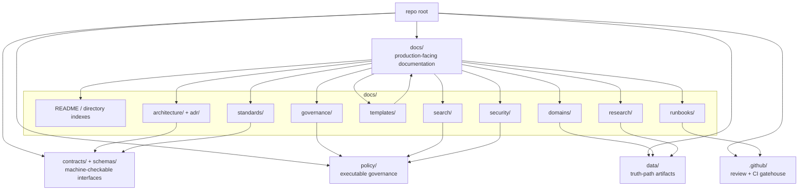

<!-- [KFM_META_BLOCK_V2]
doc_id: kfm://doc/NEEDS-VERIFICATION
title: docs
type: standard
version: v1
status: draft
owners: NEEDS VERIFICATION
created: NEEDS VERIFICATION
updated: NEEDS VERIFICATION
policy_label: NEEDS VERIFICATION
related: [../README.md, ./governance/, ./runbooks/, ./standards/, ./templates/]
tags: [kfm, docs, documentation, governance, runbooks, standards, templates]
notes: [Current session directly verified a PDF-only workspace under /mnt/data; live docs subtree, owners, dates, labels, and exact README presence still require mounted-checkout inspection before commit.]
[/KFM_META_BLOCK_V2] -->

# docs

Governed documentation index for Kansas Frontier Matrix (KFM): doctrine, architecture, governance, runbooks, templates, and adjacent documentation surfaces that keep the system inspectable.

> **Status:** experimental — live checkout verification still pending  
> **Owners:** `NEEDS VERIFICATION` — confirm against `../.github/CODEOWNERS` before commit  
>       
> **Quick jumps:** [Scope](#scope) · [Repo fit](#repo-fit) · [Accepted inputs](#accepted-inputs) · [Exclusions](#exclusions) · [Evidence boundary](#current-evidence-boundary) · [Baseline](#baseline-and-doctrinal-anchor) · [Directory tree](#source-reported-docs-footprint) · [Quickstart](#quickstart) · [Usage](#usage) · [Diagram](#diagram) · [Tables](#tables) · [Task list](#task-list--definition-of-done) · [FAQ](#faq) · [Appendix](#appendix)

> [!IMPORTANT]
> In KFM, documentation is not ornamental packaging. It is a production-facing trust surface that should move with contracts, policy, tests, release evidence, and correction material.

## Scope

`docs/` is the human-readable operating layer for KFM.

Its job is to make doctrine, architecture, standards, review rules, templates, and operator procedures legible **without** pretending that prose is the same thing as enforcement. In KFM terms, `docs/` should clarify the governed system, not become a quiet shortcut around contracts, policy bundles, release gates, or runtime controls.

## Repo fit

**Path target:** `docs/README.md`  
**Path status:** `NEEDS VERIFICATION` in a mounted checkout

**Upstream neighbors:** [repo root](../README.md) · [`../contracts/`](../contracts/) · [`../policy/`](../policy/) · [`../data/`](../data/) · [`../apps/`](../apps/) · [`../packages/`](../packages/) · [`../.github/`](../.github/)

**Primary downstream hubs:** [governance](./governance/) · [runbooks](./runbooks/) · [standards](./standards/) · [templates](./templates/)

**Other documentation families supported by source-reported inventories:** [architecture](./architecture/) · [adr](./adr/) · [domains](./domains/) · [research](./research/) · [search](./search/) · [security](./security/)

**Why this directory matters:** it keeps doctrine, review, and operating knowledge close to the same evidence-first, fail-closed system the rest of KFM is trying to enforce.

## Accepted inputs

Content that belongs in `docs/` includes:

- directory indexes and README files
- doctrine, architecture notes, ADRs, and decision packets
- standards, profiles, metadata guidance, authoring rules, and template-backed documentation protocol material
- governance, ethics, sovereignty, review, rights, and sensitivity guidance
- runbooks, rollback steps, correction playbooks, and steward/operator procedures
- reusable documentation templates
- research summaries, source summaries, search-method notes, evaluation material, and trust-visible explanatory content
- diagrams, examples, glossary material, and human-readable schema/profile notes that explain governed behavior already enforced or intended elsewhere in the repo

## Exclusions

The following do **not** belong here as the authoritative source of truth:

- machine-enforced schemas, route contracts, DTO definitions, and controlled vocabularies  
  → keep in [`../contracts/`](../contracts/) and [`../schemas/`](../schemas/)
- policy bundles, decision tests, deny-by-default enforcement logic, and runtime policy evaluation  
  → keep in [`../policy/`](../policy/)
- canonical data artifacts, source descriptors, receipts, manifests, and release outputs  
  → keep on the truth path under [`../data/`](../data/) or the owning artifact home
- runtime code, worker logic, UI implementation, and service behavior  
  → keep in the owning code surface
- secrets, credentials, signed URLs, or sensitive coordinates  
  → never store those in docs
- prose that quietly upgrades `UNKNOWN` implementation state into “already running” fact  
  → keep it explicit, staged, and reviewable

> [!NOTE]
> KFM may place human-readable standards, schema notes, or profile guidance in `docs/`, but explanation must not silently replace the machine-checkable contract or policy artifact that actually governs behavior.

## Evidence labels used in this index

| Label | Meaning here |
| --- | --- |
| **CONFIRMED** | Directly supported by current-session filesystem inspection or by the mounted March 2026 KFM source corpus |
| **INFERRED** | Strongly implied by repeated KFM source patterns, but not directly re-opened in a live repo checkout |
| **PROPOSED** | Added here as a repo-native organization, wording, or review improvement |
| **UNKNOWN** | Not supported strongly enough in this session to present as current repo reality |
| **NEEDS VERIFICATION** | Exact live path, owner, date, label, related link, or implementation linkage should be checked before merge |

## Current evidence boundary

This index is intentionally explicit about what the current session **did** and **did not** prove.

| Observation | Status | Why it changes this README |
| --- | --- | --- |
| The directly visible workspace exposed a mounted PDF corpus under `/mnt/data`, not a mounted KFM repository checkout | **CONFIRMED** | Exact subtree contents, CODEOWNERS values, workflow wiring, and file-presence claims remain `NEEDS VERIFICATION` |
| The March 2026 master design manual tells reviewers to treat implementation-specific details as hypotheses until mounted workspace evidence is inspected | **CONFIRMED** | This README should keep certainty narrow instead of presenting source-reported structure as live tree fact |
| KFM treats docs, ADRs, and runbooks as production surfaces rather than side-channel commentary | **CONFIRMED** | The index should frame `docs/` as operational, not decorative |
| Source-reported repo inventories describe `docs/` as a production-facing area for human-readable docs, ADRs, runbooks, governance, architecture, and domain material | **CONFIRMED** *(source-reported)* | The index can describe roles and neighboring doc families, but not claim a fresh tree dump |
| Source-reported support-file inventories list concrete descendants under `docs/research/`, `docs/search/`, `docs/security/`, and `docs/runbooks/reliability/` | **CONFIRMED** *(source-reported)* | The tree below can name concrete subpaths without pretending they were just re-checked live |
| Some late-2025 source-reported materials use nested governance paths under standards while the target path here assumes `docs/governance/` | **NEEDS VERIFICATION** | Current placement should be reconciled before normalizing cross-links |

> [!CAUTION]
> Treat the tree below as a **source-reported documentation footprint synthesized from mounted KFM materials**, not as a direct `find docs/` dump from the current checkout.

## Baseline and doctrinal anchor

No live `docs/README.md` or adjacent docs subtree was directly inspectable in this session, so this revision uses a **baseline pair** rather than inventing certainty:

1. **KFM Master Design Manual (2026-03-20)** as the primary doctrinal anchor for evidence boundary, review posture, and the rule that docs, ADRs, and runbooks are production surfaces.
2. **KFM Comprehensive Master Documentation Compendium (2026-03-06)** as the strongest repo/documentation inventory source and trust-weighting guide for documentation families.

Supporting evidence sharpens, but does not override, that pair:

- the KFM Support File contributes concrete source-reported descendant paths
- the Unified Geospatial Architecture Manual reinforces that documentation quality itself is part of the production system
- the broader March 2026 KFM manuals stabilize terminology such as **truth path**, **trust membrane**, **EvidenceRef**, **EvidenceBundle**, **Focus Mode**, **Evidence Drawer**, **cite-or-abstain**, and **fail-closed**

This README therefore behaves as a **governed index draft anchored in doctrine plus source-reported inventory**, not as a claim that the live checkout has already been reverified line by line.

## Source-reported docs footprint

```text
docs/
├── README.md                                              # target of this index revision; live presence NEEDS VERIFICATION
├── architecture/                                          # production-facing family; exact contents NEEDS VERIFICATION
├── adr/                                                   # production-facing family; exact contents NEEDS VERIFICATION
├── governance/                                            # target sibling from this task; exact contents NEEDS VERIFICATION
├── standards/                                             # target sibling from this task; exact contents NEEDS VERIFICATION
├── templates/                                             # target sibling from this task; exact contents NEEDS VERIFICATION
├── domains/                                               # production-facing family; exact contents NEEDS VERIFICATION
├── runbooks/
│   └── reliability/
│       ├── trigger-retry-matrix.md
│       └── trigger-mechanisms/
│           └── README.md
├── research/
│   ├── source_summaries/
│   │   ├── README.md
│   │   └── by_type/
│   │       ├── README.md
│   │       ├── books/README.md
│   │       ├── maps/README.md
│   │       └── web/README.md
│   └── evaluations/
│       └── assets/README.md
├── search/
│   ├── README.md
│   └── drift/
│       ├── README.md
│       ├── graph-queries/README.md
│       ├── stac/README.md
│       ├── examples/README.md
│       ├── hyde/README.md
│       └── embeddings/README.md
└── security/
    ├── README.md
    ├── ai-supply-chain/README.md
    ├── prompt-injection/README.md
    ├── react2shell/README.md
    ├── react2shell-advisory/README.md
    ├── supply-chain/
    │   ├── sigstore-cosign-v3/README.md
    │   └── reference-repos/README.md
    └── vulns/README.md
```

## Quickstart

Use a verification-first sequence before editing or expanding `docs/`.

> [!WARNING]
> The commands below are **repo-local verification examples**. They are the right next checks once a live checkout is mounted, but they are not proof that those paths already existed in the current PDF-only workspace.

```bash
# Inspect the docs subtree first
find docs -maxdepth 5 -type f | sort

# Open the directory index and likely core hubs
sed -n '1,240p' docs/README.md
find docs/governance docs/runbooks docs/standards docs/templates docs/architecture docs/adr docs/domains \
  -maxdepth 4 -type f 2>/dev/null | sort

# Re-check machine-enforced neighbors before documenting behavior as fact
find contracts schemas policy -maxdepth 4 -type f 2>/dev/null | sort | sed -n '1,240p'

# Confirm repo-level ownership and review boundaries
sed -n '1,200p' .github/CODEOWNERS 2>/dev/null
find .github -maxdepth 3 -type f 2>/dev/null | sort

# Search for stable KFM doctrine terms that should not drift between docs and enforcement
grep -RIn "trust membrane\|EvidenceBundle\|cite-or-abstain\|fail-closed\|authoritative-versus-derived" \
  docs contracts policy schemas 2>/dev/null

# Reconcile the source-reported footprint with the actual checkout
find docs/research docs/search docs/security docs/runbooks -maxdepth 5 -type f 2>/dev/null | sort
```

## Usage

### Read `docs/` in this order

1. Start here to understand the docs boundary, authority posture, and current verification limit.
2. Read [`./governance/`](./governance/) when a change affects review, rights, ethics, sovereignty, withholding, escalation, or public-release conditions.
3. Read [`./standards/`](./standards/) when the question is “what must be true?”
4. Read [`./templates/`](./templates/) before creating new governed docs or changing document structure.
5. Read [`./runbooks/`](./runbooks/) when the question is “how do we operate, recover, or contain this safely?”
6. Read adjacent families such as [`./architecture/`](./architecture/), [`./adr/`](./adr/), [`./domains/`](./domains/), [`./research/`](./research/), [`./search/`](./search/), or [`./security/`](./security/) only after the owning boundary is clear.

### Documentation update rule

When a change is behavior-significant, `docs/` should not move alone and should not lag behind.

| If you changed... | Re-check alongside docs |
| --- | --- |
| public meaning, DTO-visible behavior, or evidence drill-through expectations | contracts, schemas, policy, tests, and release evidence |
| review or publication gates | governance docs, runbooks, policy bundles, proof-object expectations, and approval paths |
| authoring patterns or README structure | templates, standards, and neighboring directory indexes |
| trust-visible UX, shell rules, Evidence Drawer behavior, or Focus outcomes | app doctrine, UI doctrine, example payloads, screenshots or diagrams if owned here |
| rollback, correction, supersession, or stale-state handling | runbooks, migration/correction materials, release/correction artifacts, and observability joins |
| source families, lane definitions, or publication burdens | domain/source atlas docs and any linked standards or rights guidance |

### Writing rule

Keep explanation downstream of evidence. `docs/` can clarify, constrain, and guide, but it should not become the only place where a critical contract, policy rule, runtime guarantee, or review obligation “exists.”

## Diagram


```mermaid
flowchart TD
    ROOT["repo root"] --> DOCS["docs/<br/>production-facing documentation"]
    ROOT --> CONTRACTS["contracts/ + schemas/<br/>machine-checkable interfaces"]
    ROOT --> POLICY["policy/<br/>executable governance"]
    ROOT --> DATA["data/<br/>truth-path artifacts"]
    ROOT --> GATE[".github/<br/>review + CI gatehouse"]

    subgraph D["docs/"]
        IDX["README / directory indexes"]
        ARCH["architecture/ + adr/"]
        GOV["governance/"]
        STD["standards/"]
        TMP["templates/"]
        DOM["domains/"]
        RUN["runbooks/"]
        RES["research/"]
        SRCH["search/"]
        SEC["security/"]
    end

    DOCS --> IDX
    DOCS --> ARCH
    DOCS --> GOV
    DOCS --> STD
    DOCS --> TMP
    DOCS --> DOM
    DOCS --> RUN
    DOCS --> RES
    DOCS --> SRCH
    DOCS --> SEC

    ARCH --> CONTRACTS
    GOV --> POLICY
    STD --> CONTRACTS
    TMP --> DOCS
    DOM --> DATA
    RUN --> GATE
    RES --> DATA
    SRCH --> POLICY
    SEC --> POLICY
```

## Tables

### Documentation placement matrix

| Artifact or change | Primary home | Why |
| --- | --- | --- |
| Doctrine, invariants, architecture law, authority order | [`./architecture/`](./architecture/), [`./adr/`](./adr/), [`./standards/`](./standards/) | These explain what the system claims and why |
| Governance, ethics, sovereignty, review, rights, and sensitivity handling | [`./governance/`](./governance/) | These decide what may be promoted, withheld, generalized, or denied |
| Operator procedures, rollback, correction, supersession, and recovery | [`./runbooks/`](./runbooks/) | These make failure and recovery reproducible |
| Reusable document scaffolds and authoring protocol | [`./templates/`](./templates/) | These keep documentation consistent and reviewable |
| Domain and source-family orientation | [`./domains/`](./domains/) | These keep domain language and source burdens stable |
| Research summaries, evaluations, and source summaries | [`./research/`](./research/) | These support discovery and synthesis without becoming sovereign truth |
| Search-system notes and DRIFT patterns | [`./search/`](./search/) | These support retrieval and bounded search behavior |
| Security advisories, hardening notes, and supply-chain guidance | [`./security/`](./security/) | These concentrate hardening and trust-preserving risk guidance |
| Machine-enforced schemas, route contracts, reason-code registries | [`../contracts/`](../contracts/), [`../schemas/`](../schemas/) | These are machine-checkable interfaces |
| Policy bundles and policy tests | [`../policy/`](../policy/) | These are executable governance surfaces |
| Raw/work/processed/catalog/published artifacts, manifests, receipts, proofs | [`../data/`](../data/) or the owning artifact home | These belong on the truth path, not in prose |

### Trust obligations by docs surface

| Surface | Primary question | Minimum obligation |
| --- | --- | --- |
| `docs/README.md` | Where do I start, and what is verified versus source-reported? | Keep the evidence boundary visible |
| `docs/governance/` | What is allowed, reviewed, withheld, or escalated? | Match fail-closed doctrine and review posture |
| `docs/standards/` | What must be true? | Stay stable, version-aware, and cross-linked to enforcement |
| `docs/templates/` | How should we author governed docs? | Keep metadata, review posture, and promotion context explicit |
| `docs/runbooks/` | How do we operate and recover safely? | Include prerequisites, validation, rollback, and resulting artifacts |
| `docs/domains/` | How do domain lanes and source burdens stay legible? | Keep scope, rights, and publication burdens explicit |
| `docs/research/` | How do working notes and source summaries stay traceable? | Keep provenance and claims-vs-interpretation visible |
| `docs/search/` | How does retrieval stay bounded and inspectable? | Keep safety, determinism, and evidence linkage visible |
| `docs/security/` | How are risk, advisories, and hardening documented? | Preserve supply-chain, runtime, and release-security consequences |

### Current evidence basis for this index

| Evidence source | What it supports | How this README uses it |
| --- | --- | --- |
| current-session container inspection | PDF-only workspace; no mounted repo checkout visible | keeps live-tree certainty narrow |
| `KFM_Master_Design_Manual_2026-03-20.pdf` | evidence boundary, review posture, docs/ADRs/runbooks as production surfaces | anchors the truth posture and verification warnings |
| `KFM_Comprehensive_Master_Documentation_Compendium_v1.pdf` | repo/documentation inventory, docs-as-production invariant, docs families | grounds repo-fit language and directory roles |
| `Kansas Frontier Matrix Support File.pdf` | source-reported path inventory for `research/`, `search/`, `security/`, and `runbooks/reliability/` | upgrades the tree from generic to concrete |
| `kfm_unified_geospatial_architecture_manual_extended.pdf` | documentation quality as part of the production system | sharpens maintenance and update discipline |

## Task list / Definition of done

Use this checklist before treating `docs/README.md` as ready for commit.

- [ ] Resolve `doc_id`, owners, created date, updated date, and `policy_label`
- [ ] Verify the live `docs/` subtree from a mounted repo checkout
- [ ] Confirm whether `docs/governance/` is the current path, or whether some materials still nest governance under `docs/standards/`
- [ ] Confirm whether `./governance/README.md`, `./runbooks/README.md`, `./standards/README.md`, and `./templates/README.md` exist, or keep directory-level links instead
- [ ] Reconcile the source-reported tree above with `find docs -maxdepth ...` output from the live repo
- [ ] Confirm ownership in `../.github/CODEOWNERS`
- [ ] Confirm relative links render correctly on GitHub
- [ ] Re-check whether any human-readable schema/profile notes live under `docs/` and point machine-enforced files to `contracts/` / `schemas/`
- [ ] Confirm whether `docs/architecture/`, `docs/adr/`, and `docs/domains/` exist as live directories in the current checkout
- [ ] Remove or keep every `NEEDS VERIFICATION` marker deliberately — never by accident

## FAQ

### Why does this index use so many verification markers?

Because the current session exposed doctrine-rich PDFs and source-reported inventories, not a mounted repo checkout. KFM’s own truth posture prefers visible incompleteness over polished overclaiming.

### Why are several links directory-level instead of file-level?

Because directory roles are well supported by the mounted documentation corpus, but exact live file presence was not re-checked in a mounted repository tree during this session.

### Why keep `docs/` distinct from `contracts/`, `schemas/`, and `policy/`?

Because KFM separates explanation from enforcement. `docs/` explains, guides, and records; contracts and policy enforce.

### Why call docs a production surface?

Because KFM doctrine treats documentation, runbooks, evidence access, and user-facing interpretive surfaces as part of the trust system. Stale docs are not cosmetic drift; they are governance drift.

## Appendix

<details>
<summary>Mounted source signals used to build this index</summary>

| Source | Signal retained here |
| --- | --- |
| `KFM_Master_Design_Manual_2026-03-20.pdf` | treat live implementation claims cautiously; docs, ADRs, and runbooks belong near the repo center |
| `KFM_Comprehensive_Master_Documentation_Compendium_v1.pdf` | `docs/` is a first-class repo area; docs are a production surface; the interface is part of the evidence contract |
| `Kansas Frontier Matrix Support File.pdf` | concrete source-reported subpaths under research, search, security, and reliability runbooks |
| `kfm_unified_geospatial_architecture_manual_extended.pdf` | documentation quality is part of the production system, not a post-hoc packaging step |

</details>

<details>
<summary>Current-session limits that still matter before merge</summary>

- The directly visible workspace exposed PDFs only.
- No live repo subtree, `.github/CODEOWNERS`, workflow YAML, schemas, tests, manifests, or runtime logs were directly inspected.
- This index is therefore **review-ready**, not falsely “fully verified.”
- Any conflicting live-tree reality should outrank this source-reported footprint once a mounted checkout is available.

</details>

<details>
<summary>Path variants to reconcile before commit</summary>

A small but important cleanup task remains: some late-2025 source-reported materials use governance links nested under `docs/standards/`, while the target path for this README and related links assumes `docs/governance/`. Resolve that mismatch from the live repo tree before hardening links or moving directories.

</details>

[Back to top](#docs)
