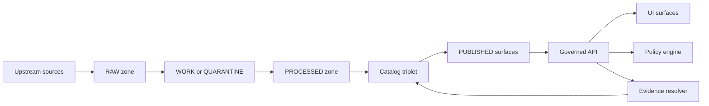
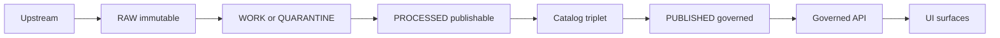
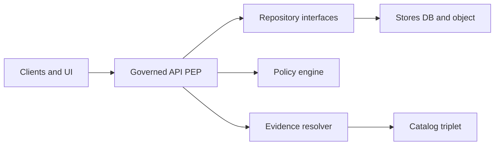

<!-- [KFM_META_BLOCK_V2]
doc_id: kfm://doc/1f731fb8-1614-4a01-a1a5-f8e5ed39c7e1
title: docs/ — Documentation hub
type: standard
version: v2
status: draft
owners: TBD
created: 2026-03-03
updated: 2026-03-05
policy_label: public
related:
  - docs/MASTER_GUIDE_v13.md
  - docs/governance/ROOT_GOVERNANCE.md
tags: [kfm, docs]
notes:
  - Entry point for repository documentation.
  - This README defines the TARGET docs/ layout for KFM vNext (normative intent), but the checkout may not match yet.
  - Update tree + links only after verifying the repo structure (fail-closed; no “assume it exists”).
[/KFM_META_BLOCK_V2] -->

<a id="top"></a>

# docs/ — Documentation hub
Governed, human-readable documentation for the Kansas Frontier Matrix (KFM).

> **[PROPOSED] Purpose:** `docs/` is the canonical hub for **governed documentation**: architecture blueprints, standards/profiles, governance policy, templates, specs, and narrative artifacts (Story Packs / Story Nodes).  
> **[CONFIRMED] Rule:** if a claim cannot be grounded, label it **[UNKNOWN]** and list the smallest verification step.

---

## IMPACT
- **Status:** draft
- **Owners:** TBD (**[UNKNOWN]** until `CODEOWNERS` is verified/defined)
- **Policy label:** public
- **[CONFIRMED] Hard exclusions:** secrets, raw datasets/binaries, and unreviewed sensitive details (especially precise vulnerable locations).

[](./README.md)
[](#impact)
[](#metablock-v2-and-document-metadata)
[](#review-gates-and-definition-of-done)
[](#docs-registry-and-discovery)
[](#local-preview--checks)

**Quick links:** [Start here](#start-here) · [Scope](#kfm-project-map-what-is-in-scope) · [Where docs fit](#where-docs-fit-truth-path-and-trust-membrane) · [Docs layout](#required-docs-layout) · [Docs registry](#docs-registry-and-discovery) · [MetaBlock v2](#metablock-v2-and-document-metadata) · [Gates](#review-gates-and-definition-of-done) · [Add a doc](#how-to-add-a-new-document) · [Unknowns](#unknowns-to-verify)

---

## Quick navigation
- [Evidence legend](#evidence-legend)
- [Start here](#start-here)
- [KFM project map](#kfm-project-map-what-is-in-scope)
- [Where docs fit: truth path and trust membrane](#where-docs-fit-truth-path-and-trust-membrane)
- [Docs authority levels](#docs-authority-levels)
- [Acceptable inputs](#acceptable-inputs-for-docs)
- [Exclusions](#exclusions-what-must-not-go-in-docs)
- [Required docs layout](#required-docs-layout)
- [Directory responsibilities](#directory-responsibilities-human-routing-table)
- [Docs registry and discovery](#docs-registry-and-discovery)
- [Docs taxonomy and routing](#docs-taxonomy-and-routing)
- [MetaBlock v2 and document metadata](#metablock-v2-and-document-metadata)
- [Standards and profiles](#standards-and-profiles)
- [Specs and component design docs](#specs-and-component-design-docs)
- [AI and MCP docs](#ai-and-mcp-documentation)
- [Knowledge graph docs](#knowledge-graph-and-ontology-documentation)
- [Reference docs](#reference-contracts-schemas-and-apis)
- [Stories](#stories-story-nodes-and-story-packs)
- [Review gates and definition of done](#review-gates-and-definition-of-done)
- [Local preview and checks](#local-preview--checks)
- [Unknowns to verify](#unknowns-to-verify)
- [FAQ](#faq)
- [Appendix](#appendix)
- [Back to top](#back-to-top)

---

## Evidence legend
KFM docs are governed. Every meaningful claim should be labeled:

- **[CONFIRMED]** = enforced invariant or documented requirement (in governance/standards, or in accepted architecture invariants).
- **[PROPOSED]** = recommended pattern; may not yet be implemented or adopted.
- **[UNKNOWN]** = not verified in this checkout; list the smallest verification step.

> **[CONFIRMED] Rule:** If you can’t ground it, mark it **[UNKNOWN]** and list the smallest verification step.

---

## Start here
This is the orientation path **if the referenced docs exist in your checkout**:

1) `docs/MASTER_GUIDE_v13.md` — overview + doc map (**[UNKNOWN]** until verified present).  
2) `docs/governance/ROOT_GOVERNANCE.md` — governance charter (**[UNKNOWN]** until verified present).  
3) `docs/architecture/README.md` — architecture boundaries + invariants (**[UNKNOWN]** until verified present).  
4) `docs/standards/README.md` — standards/profiles index (**[UNKNOWN]** until verified present).  
5) `docs/specs/README.md` — component specs index (**[PROPOSED]** surface).  
6) `docs/stories/README.md` — story authoring + publishing workflow (**[PROPOSED]** surface).  
7) `docs/quality/README.md` — gates, conformance checks, test strategy (**[PROPOSED]** surface).

### Root layout note
- **[CONFIRMED]** `docs/` root is reserved for high-signal entrypoints (hub docs + major indexes).
- **[CONFIRMED]** Seed/imported materials that are useful reference inputs are grouped under `docs/reference/source-material/`.

> **[CONFIRMED] Fail-closed behavior:** if a linked file/folder is missing, treat it as docs debt (create a stub) *or* update this README **only after verifying** the intended canonical location.

---

## KFM project map: what is in scope
This section describes the **intended** KFM system slices. If your checkout differs, mark it **[UNKNOWN]** and verify.

### What KFM is
- **[CONFIRMED]** KFM is a **pipeline → catalog → governed API → UI** system: upstream data becomes immutable artifacts, validated catalogs, and governed runtime surfaces.
- **[CONFIRMED]** KFM treats **evidence, provenance, and policy** as first-class runtime constraints.
- **[PROPOSED]** KFM may provide multiple UX “trust surfaces” (e.g., map, story, focus); treat exact UI modules as **[UNKNOWN]** until verified in your repo.

### What KFM is not
- **[CONFIRMED]** Not a “upload-and-forget portal.”
- **[CONFIRMED]** Not a UI that directly queries databases or storage.
- **[CONFIRMED]** Not an ungoverned chatbot (AI surfaces are policy-bounded; cite-or-abstain).

### System slices (conceptual model)

```mermaid
flowchart LR
  Up[Upstream sources] --> RAW[RAW zone]
  RAW --> WORK[WORK or QUARANTINE]
  WORK --> PROCESSED[PROCESSED zone]
  PROCESSED --> CATALOG[Catalog triplet]
  CATALOG --> PUBLISHED[PUBLISHED surfaces]

  PUBLISHED --> API[Governed API]
  API --> UI[UI surfaces]
  API --> POL[Policy engine]
  API --> EV[Evidence resolver]
  EV --> CATALOG
```

> **[CONFIRMED] Interlock:** docs must never propose shortcuts that bypass policy enforcement or evidence resolution.

### Repo surfaces KFM expects (outside docs)
> **[UNKNOWN]** The exact repo tree in *this checkout* must be verified before treating any of these as real paths.

**[PROPOSED]** Expected top-level repository slices (orientation only):

| Path | Role | Docs should link to |
|---|---|---|
| `apps/` | runnable services (API, UI, workers, CLI) | `docs/architecture/`, `docs/guides/`, `docs/runbooks/` |
| `packages/` | core modules (ingest, catalog, evidence, policy, indexers) | `docs/specs/`, `docs/architecture/interfaces/` |
| `contracts/` | machine contracts (OpenAPI, JSON Schema, vocab) | `docs/reference/OPENAPI_INDEX.md`, `docs/reference/SCHEMA_REGISTRY.md` |
| `policy/` | policy bundles + tests | `docs/standards/policy/`, `docs/guides/policy/` |
| `data/` | lifecycle zones + dataset specs + catalogs | `docs/data/` (documentation only) |
| `tools/` | validators, linters, linkcheckers | `docs/quality/`, `docs/reference/TOOLING_INDEX.md` |
| `infra/` | deployment (K8s/Terraform/GitOps) | `docs/architecture/DEPLOYMENT_TOPOLOGY.md`, `docs/runbooks/DEPLOY.md` |
| `configs/` | config templates (env, pipelines, UI) | `docs/guides/onboarding/DEV_ENV_SETUP.md` |
| `migrations/` | DB schema migrations | `docs/runbooks/BACKUP_RESTORE.md` |
| `examples/` | sample datasets/stories/policies | `docs/reference/` and `docs/stories/_templates/` |
| `tests/` | unit/integration/e2e | `docs/quality/` |
| `mcp/` | AI artifacts (model cards, evals, gates) | `docs/ai/` + `docs/templates/TEMPLATE__MODEL_CARD.md` |

---

## Where docs fit: truth path and trust membrane

### Truth path lifecycle (data zones)
**[CONFIRMED]** KFM uses a gated lifecycle (“truth path”) that documentation must not contradict:


```mermaid
flowchart LR
  Up[Upstream] --> RAW[RAW immutable]
  RAW --> WORK[WORK or QUARANTINE]
  WORK --> PROCESSED[PROCESSED publishable]
  PROCESSED --> CAT[Catalog triplet]
  CAT --> PUB[PUBLISHED governed]
  PUB --> API[Governed API]
  API --> UI[UI surfaces]
```

- **[CONFIRMED]** RAW is append-only immutable acquisition + checksums.
- **[CONFIRMED]** WORK/QUARANTINE is where QA and redaction/generalization candidates happen.
- **[CONFIRMED]** PROCESSED holds publishable artifacts + checksums.
- **[CONFIRMED]** The catalog surface is cross-linked **DCAT + STAC + PROV** (plus run receipts where applicable).
- **[CONFIRMED]** PUBLISHED surfaces may only serve promoted versions that passed gates.

### Trust membrane (policy boundary)
**[CONFIRMED]** The trust membrane is the enforced boundary that prevents bypass:


```mermaid
flowchart LR
  C[Clients and UI] --> PEP[Governed API PEP]
  PEP --> REPO[Repository interfaces]
  REPO --> STORES[Stores DB and object]
  PEP --> PDP[Policy engine]
  PEP --> EV[Evidence resolver]
  EV --> CAT[Catalog triplet]
```

- **[CONFIRMED]** Clients/UI never access DB/object storage directly.
- **[CONFIRMED]** Backend domain logic must not bypass repository interfaces to reach storage directly.
- **[CONFIRMED]** Policy evaluation applies at the PEP and gates what can be returned.

> **[CONFIRMED] Doc rule:** If a document proposes behavior that breaks this membrane, it is incorrect by definition.

---

## Docs authority levels
This prevents “random docs” from becoming de-facto policy.

- **[PROPOSED] Authority classes (minimum):**
  1) **Standards/Profiles** (`docs/standards/`) — normative. “MUST/SHALL” language allowed.
  2) **Governance** (`docs/governance/`) — normative. Overrides everything except enforced repo policy.
  3) **Architecture** (`docs/architecture/`) — high authority; boundaries + invariants + interfaces.
  4) **Specs** (`docs/specs/`) — buildable design docs; must link to contracts/tests.
  5) **Guides/Runbooks** (`docs/guides/`, `docs/runbooks/`) — operational; non-normative unless referenced by governance.
  6) **Investigations** (`docs/investigations/`) — explicitly non-authoritative.

- **[PROPOSED] Rule:** any doc intended to constrain behavior must be either:
  - a **Standard**, or
  - a **Spec** referenced by a Standard and guarded by CI/tests.

---

## Acceptable inputs for docs/
Docs are a production surface; keep them stable, reviewable, and retrieval-friendly.

**[CONFIRMED] Acceptable:**
- Architecture docs (diagrams, subsystem boundaries, contracts in human-readable form)
- Standards/profiles (STAC/DCAT/PROV profiles; repo conventions; doc protocol)
- Governance and review policy (non-secret)
- Specs (component-level buildable design documents)
- Templates (MetaBlock v2 docs, Story Nodes, contract extensions)
- Published narrative artifacts (Story Packs)

---

## Exclusions: what must NOT go in docs/
**[CONFIRMED] Never put in `docs/`:**
- Secrets (API keys, credentials, tokens)
- Raw datasets, large binaries, or lifecycle artifacts (RAW/WORK/PROCESSED belong under `data/`)
- Unreviewed sensitive details (precise vulnerable locations, restricted archeological sites, etc.)

**[PROPOSED] Avoid unless explicitly approved:**
- Generated build outputs (static site builds, compiled docs)
- Vendor bundles that should be fetched via tooling instead

---

## Required docs layout
This README defines the **target, encompass-all** documentation layout for KFM vNext.

> **[CONFIRMED] Fail-closed expectation:** Do **not** claim a path exists unless you verified it. If this tree does not match your checkout, mark mismatches **[UNKNOWN]** and update only after verifying the repo structure.

```text
docs/                                                   # Documentation hub (normative intent): governance, architecture, standards, operations, and narrative artifacts
├─ README.md                                             # This file
├─ MASTER_GUIDE_v13.md                                   # (UNKNOWN) Canonical overview + doc map (verify exists if referenced)
├─ glossary.md                                           # (PROPOSED) Domain vocabulary (single source of truth)
├─ CHANGELOG.md                                          # (PROPOSED) Docs-surface changelog (renames, restructuring, governance shifts)
│
├─ _registry/                                            # (PROPOSED) Machine-readable doc indices (doc_id → path/title/status/labels)
│  ├─ README.md
│  ├─ docs.index.yml
│  └─ docs.index.schema.json
│
├─ adr/                                                  # (PROPOSED) Architecture Decision Records (canonical home; stable IDs)
│  ├─ README.md
│  ├─ ADR-0001-template.md
│  └─ ADR-0002-<decision-slug>.md
│
├─ architecture/                                         # (PROPOSED) Blueprints + invariants + subsystem contracts
│  ├─ README.md
│  ├─ TRUST_MEMBRANE.md
│  ├─ TRUTH_PATH_LIFECYCLE.md
│  ├─ SYSTEM_CONTEXT.md
│  ├─ DEPLOYMENT_TOPOLOGY.md
│  ├─ interfaces/
│  │  ├─ README.md
│  │  ├─ API_LAYER_CONTRACT.md
│  │  ├─ POLICY_ENGINE_CONTRACT.md
│  │  ├─ EVIDENCE_RESOLVER_CONTRACT.md
│  │  ├─ REPOSITORY_LAYER_CONTRACT.md
│  │  └─ CATALOG_TRIPLET_CONTRACT.md
│  ├─ diagrams/
│  │  └─ README.md
│  └─ adr/                                               # OPTIONAL stub if ADRs are kept elsewhere (prefer redirect to docs/adr/)
│     └─ README.md
│
├─ standards/                                            # (PROPOSED) Normative standards/profiles + repo conventions
│  ├─ README.md
│  ├─ KFM_MARKDOWN_WORK_PROTOCOL.md
│  ├─ KFM_REPO_STRUCTURE_STANDARD.md
│  ├─ KFM_STAC_PROFILE.md
│  ├─ KFM_DCAT_PROFILE.md
│  ├─ KFM_PROV_PROFILE.md
│  │
│  ├─ docs/
│  │  ├─ README.md
│  │  ├─ DOC_IDS_AND_METADATA.md
│  │  ├─ LINKING_AND_ANCHORS.md
│  │  └─ DIAGRAMS_STYLE_GUIDE.md
│  │
│  ├─ identity/
│  │  ├─ README.md
│  │  ├─ IDENTIFIERS_AND_NAMING.md
│  │  └─ HASHING_AND_DIGESTS.md
│  │
│  ├─ policy/
│  │  ├─ README.md
│  │  ├─ POLICY_PACK_STANDARD.md
│  │  └─ REGO_V1_MIGRATION.md
│  │
│  ├─ api/
│  │  ├─ README.md
│  │  └─ API_VERSIONING_AND_ERRORS.md
│  │
│  ├─ evidence/
│  │  ├─ README.md
│  │  └─ EVIDENCE_REF_STANDARD.md
│  │
│  ├─ catalog/
│  │  ├─ README.md
│  │  └─ CATALOG_TRIPLET_STANDARD.md
│  │
│  ├─ geo/                                               # (PROPOSED) Geospatial formats + CRS + tiling norms
│  │  ├─ README.md
│  │  ├─ CRS_AND_PROJECTIONS.md
│  │  ├─ RASTER_FORMATS_COG.md
│  │  ├─ VECTOR_FORMATS_GEOPARQUET.md
│  │  └─ TILE_FORMATS_PMTILES.md
│  │
│  ├─ telemetry/                                         # (PROPOSED) Telemetry naming + schemas + retention rules
│  │  ├─ README.md
│  │  ├─ TELEMETRY_EVENT_NAMING.md
│  │  ├─ PIPELINE_RUN_TELEMETRY.md
│  │  └─ UI_TELEMETRY.md
│  │
│  ├─ oci/                                               # (PROPOSED) Publishing artifacts to OCI (mediaTypes, referrers, attestations)
│  │  ├─ README.md
│  │  ├─ OCI_GEOSPATIAL_ARTIFACTS.md
│  │  ├─ MEDIA_TYPES_REGISTRY.md
│  │  └─ DELTA_REFERRERS_STANDARD.md
│  │
│  ├─ supply_chain/                                      # (PROPOSED) SBOM, SLSA, signing/verification
│  │  ├─ README.md
│  │  ├─ SBOM_STANDARD.md
│  │  ├─ SLSA_ATTESTATION_STANDARD.md
│  │  └─ SIGNING_AND_VERIFICATION.md
│  │
│  ├─ ui/
│  │  ├─ README.md
│  │  └─ UI_TRUST_SURFACES_STANDARD.md
│  │
│  ├─ ai/
│  │  ├─ README.md
│  │  ├─ MODEL_CARD_STANDARD.md
│  │  ├─ RAG_RETRIEVAL_STANDARD.md
│  │  └─ AI_EVAL_AND_REDTEAM_STANDARD.md
│  │
│  └─ ontology/
│     ├─ README.md
│     └─ KFM_ONTOLOGY_PROFILE.md
│
├─ templates/                                            # (PROPOSED) Authoring templates
│  ├─ README.md
│  ├─ TEMPLATE__KFM_UNIVERSAL_DOC.md
│  ├─ TEMPLATE__STORY_NODE_V3.md
│  ├─ TEMPLATE__API_CONTRACT_EXTENSION.md
│  ├─ TEMPLATE__ADR.md
│  ├─ TEMPLATE__RUNBOOK.md
│  ├─ TEMPLATE__MODEL_CARD.md
│  ├─ TEMPLATE__DATASET_ENTRY.md
│  ├─ TEMPLATE__RUN_RECEIPT.md
│  ├─ TEMPLATE__POLICY_CHANGE.md
│  └─ TEMPLATE__COMPONENT_SPEC.md
│
├─ governance/                                           # (PROPOSED) Governance charter, ethics, sovereignty, review gates
│  ├─ README.md
│  ├─ ROOT_GOVERNANCE.md
│  ├─ ETHICS.md
│  ├─ SOVEREIGNTY.md
│  ├─ REVIEW_GATES.md
│  ├─ DATA_CLASSIFICATION.md
│  ├─ SENSITIVE_LOCATIONS_PLAYBOOK.md
│  ├─ WAIVERS_AND_EXCEPTIONS.md
│  └─ ROLES_AND_RACI.md
│
├─ specs/                                                # (PROPOSED) Buildable component specs
│  ├─ README.md
│  ├─ agents/
│  │  ├─ README.md
│  │  ├─ WATCHER_CONTRACT.md
│  │  ├─ PLANNER_CONTRACT.md
│  │  └─ EXECUTOR_CONTRACT.md
│  ├─ pipelines/
│  │  ├─ README.md
│  │  ├─ ingestion/
│  │  ├─ hydrology/
│  │  ├─ hazards/
│  │  └─ climate/
│  ├─ ui/
│  │  └─ README.md
│  ├─ storage/
│  │  └─ README.md
│  └─ observability/
│     └─ README.md
│
├─ ai/                                                   # (PROPOSED) AI surfaces docs
│  ├─ README.md
│  ├─ FOCUS_MODE_OVERVIEW.md
│  ├─ OLLAMA_INTEGRATION.md
│  ├─ MODEL_CARDS_INDEX.md
│  └─ EVALUATION_AND_BENCHMARKS.md
│
├─ knowledge_graph/                                      # (PROPOSED) Knowledge graph docs
│  ├─ README.md
│  ├─ GRAPH_DATA_MODEL.md
│  ├─ ONTOLOGY_AND_VOCAB.md
│  ├─ GRAPH_RAG_PATTERNS.md
│  └─ NEO4J_OPERATIONS.md
│
├─ reference/                                            # (PROPOSED) Indices into machine surfaces
│  ├─ README.md
│  ├─ OPENAPI_INDEX.md
│  ├─ SCHEMA_REGISTRY.md
│  ├─ POLICY_BUNDLE_INDEX.md
│  └─ TOOLING_INDEX.md
│
├─ guides/                                               # (PROPOSED) Procedural guides (human-operated)
│  ├─ README.md
│  ├─ onboarding/
│  ├─ acquisition/
│  ├─ geo/
│  ├─ pipelines/
│  ├─ catalogs/
│  ├─ apis/
│  ├─ policy/
│  ├─ observability/
│  ├─ ui/
│  └─ security/
│
├─ runbooks/                                             # (PROPOSED) Ops playbooks
│  ├─ README.md
│  ├─ LOCAL_STACK.md
│  ├─ DEPLOY.md
│  ├─ BACKUP_RESTORE.md
│  ├─ INCIDENT_RESPONSE.md
│  ├─ DATA_PROMOTION_RUNBOOK.md
│  ├─ POLICY_CHANGE_RUNBOOK.md
│  └─ DR_AND_ROLLBACK.md
│
├─ quality/                                              # (PROPOSED) Gates, conformance, determinism
│  ├─ README.md
│  ├─ GATES_DEFINITION_OF_DONE.md
│  ├─ CONTRACT_TESTS.md
│  ├─ DETERMINISM_AND_REPRO.md
│  ├─ PERFORMANCE_SLOS.md
│  └─ SECURITY_BASELINE.md
│
├─ data/                                                 # (PROPOSED) Data-system documentation (NOT the datasets)
│  ├─ README.md
│  ├─ DATA_LIFECYCLE.md
│  ├─ DATASET_REGISTRY.md
│  ├─ PROVENANCE_AND_RECEIPTS.md
│  └─ LICENSING_AND_ATTRIBUTION.md
│
├─ domains/                                              # (PROPOSED) Domain-specific docs
│  ├─ README.md
│  ├─ hydrology/
│  ├─ soils/
│  ├─ air/
│  └─ hazards/
│
├─ diagrams/                                             # (PROPOSED) Shared diagrams
│  ├─ README.md
│  ├─ architecture/
│  ├─ pipelines/
│  ├─ ui/
│  ├─ governance/
│  └─ domains/
│
├─ investigations/                                       # (PROPOSED) Sandbox notes + experiments (non-authoritative)
│  ├─ README.md
│  └─ <topic>/
│
├─ stories/                                              # (PROPOSED) Story Packs (canonical location must be verified)
│  ├─ README.md
│  ├─ CODEOWNERS
│  ├─ _schemas/
│  ├─ _registry/
│  ├─ _governance/
│  ├─ _lint/
│  ├─ _shared/
│  ├─ _templates/
│  ├─ draft/
│  ├─ review/
│  ├─ published/
│  └─ withdrawn/
│
└─ reports/                                              # OPTIONAL: Generated/curated reports OR a stub redirect
   └─ README.md
```

---

## Directory responsibilities: human routing table

| Folder | Role | What good looks like | What must not happen |
|---|---|---|---|
| `docs/` | Hub + canonical entry points | MASTER_GUIDE + glossary stay current | Becomes a dumping ground |
| `docs/_registry/` | (PROPOSED) Machine indices | CI-valid index enables retrieval | Index drifts silently |
| `docs/architecture/` | Boundaries + invariants + diagrams + interface contracts | Stable invariants + interface docs + diagrams | Architecture changes without ADR/spec |
| `docs/adr/` | Decisions | Each “why” documented w/ rollback path | Decisions hidden in chat |
| `docs/standards/` | Standards/profiles + repo conventions | MUST/SHALL mapped to validators/tests | Standards drift without gates |
| `docs/specs/` | (PROPOSED) Buildable design specs | PR-ready specs that link to contracts + tests | “Specs” become wishlists |
| `docs/governance/` | Governance rules and review gates | Clear “who approves what” + escalation | Informal policy in Slack |
| `docs/guides/` | How-to docs | Steps are runnable; safe defaults | Confuses “how-to” with “must” |
| `docs/runbooks/` | Ops runbooks | Triage + restore + rollback are clear | No incident plan |
| `docs/quality/` | Gates + conformance | Fail-closed maps to CI checks | “Quality” undocumented |
| `docs/data/` | Data-system docs | Registry + receipts + licensing are clear | Datasets stored here |
| `docs/domains/` | Domain documentation | Each domain has sources + pipelines | Domain knowledge scattered |
| `docs/ai/` | (PROPOSED) AI system docs | Focus boundaries + eval + safety | Ungoverned prompts/evals |
| `docs/knowledge_graph/` | (PROPOSED) Graph modeling + ops | Ontology, graph patterns, GraphRAG | Ad-hoc labels/relations |
| `docs/reference/` | (PROPOSED) Pointers to machine contracts | Humans can find schemas/contracts fast | Duplicates machine sources |
| `docs/stories/` | (PROPOSED) Story Packs | published is immutable + cited + governed | Drafts treated as published |
| `docs/investigations/` | Sandbox notes | Explicitly non-authoritative | Research mistaken as policy |

---

## Docs registry and discovery
**[PROPOSED]** Add a docs index so humans and AI can reliably discover “the right doc” without guessing.

### Why
- **[CONFIRMED]** KFM depends on evidence-first retrieval; discovery surfaces must be stable.
- **[PROPOSED]** A machine-readable docs index reduces link rot and enables validation (“no published doc missing MetaBlock”).

### Minimal structure (proposal)
- `docs/_registry/docs.index.yml` with one entry per doc containing:
  - `doc_id`, `path`, `title`, `type`, `status`, `owners`, `policy_label`, `tags`, `related`.
- Validate in CI against `docs/_registry/docs.index.schema.json`.

> **[UNKNOWN]** Whether the repo already has a docs index mechanism must be verified. If a different index exists, keep one canonical home and redirect.

---

## Docs taxonomy and routing

Use this matrix when adding a new file:

| Doc type | Put it here | Must include | Gate sensitivity |
|---|---|---|---|
| Canonical guide | `docs/` | MetaBlock v2, stable headings, links | Medium |
| Architecture overview | `docs/architecture/` | diagrams + boundaries + invariants | High |
| ADR | `docs/adr/` | decision, alternatives, consequences, rollback | High |
| Standard/profile | `docs/standards/` | normative language, test hooks, versioning | High |
| Spec (buildable) | `docs/specs/` | contract links + test hooks + rollout/rollback | High |
| Governance policy | `docs/governance/` | roles, gates, enforcement intent | Highest |
| Template | `docs/templates/` | how-to-use + example | Medium |
| How-to guide | `docs/guides/` | runnable steps + safety notes | Medium |
| Runbook | `docs/runbooks/` | triage + rollback + verify | Highest |
| Model card | `mcp/model_cards/` (or `docs/ai/`) | version pinning + eval + governance | Highest |
| Story Pack | `docs/stories/` | citations + review state + policy label | Highest |
| Investigation note | `docs/investigations/` | marked non-authoritative | Low |

---

## MetaBlock v2 and document metadata
**[CONFIRMED]** KFM uses **MetaBlock v2** (HTML comment) for docs, Story Packs, and dataset specs.

### Minimal MetaBlock v2 template
```html
<!-- [KFM_META_BLOCK_V2]
doc_id: kfm://doc/<uuid>
title: <Title>
type: <guide|standard|story|dataset_spec|adr|run_receipt|spec|model_card>
version: v1
status: draft|review|published
owners: <team or names>
created: YYYY-MM-DD
updated: YYYY-MM-DD
policy_label: public|restricted|...
related:
  - kfm://dataset/<slug>@<version>
  - kfm://story/<id>@<version>
tags: [kfm]
notes: [<short notes>]
[/KFM_META_BLOCK_V2] -->
```

### MetaBlock rules
- **[CONFIRMED]** `doc_id` is stable — do not regenerate on edits.
- **[CONFIRMED]** bump `updated:` on meaningful edits.
- **[CONFIRMED]** `policy_label` is a governance input (especially if docs are served through governed APIs).
- **[PROPOSED]** Use `related:` to link to datasets, Story Packs, ADRs, contracts, and policies by stable IDs.

---

## Standards and profiles
Standards under `docs/standards/` define what is “valid” in KFM. Treat them as contracts.

### Minimum set (target)
- `KFM_MARKDOWN_WORK_PROTOCOL.md`
- `KFM_REPO_STRUCTURE_STANDARD.md`
- `KFM_STAC_PROFILE.md`
- `KFM_DCAT_PROFILE.md`
- `KFM_PROV_PROFILE.md`

> **[PROPOSED] Test enforcement rule:** every normative MUST/SHALL in a profile should map to a validator or CI check (or be explicitly marked “manual gate”).

---

## Specs and component design docs
**[PROPOSED]** `docs/specs/` is where you put “buildable” design docs that become work items and can be enforced by contracts/tests.

### What belongs in specs
- watcher/planner/executor automation patterns (auditable, PR-only mutation)
- pipeline run contracts (inputs/outputs/idempotency keys)
- UI component specs for cross-cutting trust surfaces
- storage/distribution specs (OCI publishing, delta graphs, integrity proofs)

### What does not belong in specs
- “maybe someday” ideas with no owners, no contracts, and no path to enforcement  
  → put those in `docs/investigations/`.

---

## AI and MCP documentation
**[PROPOSED]** AI system documentation needs a dedicated surface because it has unique governance risks.

Minimum required AI docs (proposal):
- Focus Mode overview: retrieval → evidence → synthesis → citation gate
- Model governance: model cards, version pinning, allowed/prohibited uses
- Evaluation: benchmarks, red-team scenarios, abstention rules, regression gates
- Runtime operations: local LLM runtime runbook (if applicable), install/update/rollback

> **[CONFIRMED] Rule:** AI access is mediated by the governed API; docs must not imply the UI calls models directly or bypasses policy.

---

## Knowledge graph and ontology documentation
**[PROPOSED]** If Neo4j/graph semantics are core, you need an explicit place to define:
- canonical ontology/vocabulary
- node/relationship naming conventions
- constraints/index patterns
- ingestion mapping rules
- graph-based retrieval patterns (GraphRAG)

> **[CONFIRMED] Rule:** ontology changes that affect meaning should require an ADR and an update to tests/policy (fail-closed).

---

## Reference: contracts, schemas, and APIs
**[PROPOSED]** Humans need a “map” to machine contracts without hunting through directories.

Minimum reference indices (proposal):
- OpenAPI index
- Schema registry
- Policy bundle index
- Tooling index

> **[CONFIRMED]** Do not duplicate machine contracts in prose; link to them and explain intent, compatibility, and enforcement points.

---

## Stories (Story Nodes and Story Packs)
**[PROPOSED]** `docs/stories/` is the preferred home for governed narrative artifacts (verify canonical location in your checkout).

### Lifecycle (docs-side)
- `_templates/` — reusable story patterns and rubrics  
- `draft/` — WIP stories (not published)  
- `review/` — under governance review  
- `published/<story_slug>/` — immutable published story pack  

### Published Story Pack (required shape)
A published story pack is a directory:

- `story.md` — narrative markdown (claims → citations)
- `story.json` — optional map choreography/state
- `assets/` — only approved, licensed, policy-labeled media/data excerpts

> **[CONFIRMED] Publishing gate:** a story cannot be published unless citations resolve and the review state is captured.

---

## Review gates and definition of done
KFM is fail-closed: missing evidence blocks promotion/publishing.

### Docs-only gates (minimum)
- **[CONFIRMED]** MetaBlock v2 present and valid.
- **[CONFIRMED]** No secrets / no sensitive leakage.
- **[PROPOSED]** Link integrity: internal links resolve or are marked TODO with an issue reference.
- **[PROPOSED]** Ownership: governance-impacting docs require `CODEOWNERS` approval.
- **[PROPOSED]** Docs index updated (if `docs/_registry/` is adopted).

### Standards/profile gates (minimum)
- **[CONFIRMED]** Changes to STAC/DCAT/PROV profiles must be paired with validator/test updates (or a documented manual gate).
- **[PROPOSED]** Add a “profile change note” section describing how to migrate.

### Specs gates (minimum)
- **[PROPOSED]** Specs must name owners and link to:
  - contracts they depend on
  - tests/validators that enforce them
  - rollout + rollback strategy

### Story gates (minimum)
- **[CONFIRMED]** citations are resolvable, policy-allowed, and stable.
- **[CONFIRMED]** review state recorded (draft/review/published) with owners.
- **[PROPOSED]** “narrative drift” checks: claims remain backed by promoted dataset versions.

### Copy/paste checklist (PR-ready)
- [ ] **[CONFIRMED]** MetaBlock v2 present and `updated:` bumped
- [ ] **[CONFIRMED]** No secrets, no sensitive location leakage
- [ ] **[PROPOSED]** Links validated (or explicit TODO + issue)
- [ ] **[PROPOSED]** If doc changes governance/standards, ADR created and owners approve
- [ ] **[PROPOSED]** If story, citations resolve and review state is captured
- [ ] **[PROPOSED]** If using docs registry, update `docs/_registry/docs.index.yml`

---

## How to add a new document
1) Choose the smallest correct home (architecture vs standards vs governance vs specs vs templates vs stories vs guides/runbooks)  
2) Create the file from a template (`docs/templates/*`)  
3) Add MetaBlock v2 at top  
4) Update the nearest index README (and `docs/MASTER_GUIDE_v13.md` if it is the canonical map)  
5) Update registries (if used)  
6) Run local checks (or closest equivalent)  
7) Route review via `CODEOWNERS` (and governance owners if policy changes)

---

## Local preview / checks
### Minimal, repo-agnostic checks (runnable)
```bash
# show docs tree (fallback to find if tree is unavailable)
command -v tree >/dev/null && tree -L 4 docs || find docs -maxdepth 4 -type f | sort

# confirm MetaBlock presence (at least once per doc)
grep -R --line-number --fixed-string "[KFM_META_BLOCK_V2]" docs | head -n 200

# quick internal link scan (cheap heuristic; not a real linkcheck)
grep -R --line-number -E '\]\(\.\/|^\[.*\]: \.\/' docs | head -n 200
```

### Repo-specific checks (pseudocode — rename to match your repo)
```bash
# pseudocode: replace with real targets if present in your repo
make docs.check
make linkcheck
make docs.lint
```

---

## Unknowns to verify
These are **[UNKNOWN] until verified in your checkout**:

1) Do the required paths exist exactly as specified in [Required docs layout](#required-docs-layout)?
   - Smallest step:
     ```bash
     find docs -maxdepth 3 -type d | sort
     ```

2) Is MetaBlock validation enforced in CI?
   - Smallest step: search workflows for `MetaBlock` / `linkcheck` / `markdownlint`:
     ```bash
     ls -la .github/workflows 2>/dev/null
     grep -R --line-number -E "MetaBlock|linkcheck|markdownlint" .github/workflows 2>/dev/null || true
     ```

3) Who are the canonical docs owners?
   - Smallest step: check for a `CODEOWNERS` file (repo root or `.github/CODEOWNERS`) and set `owners:` here and in child READMEs.

4) Do you already have a discovery/index mechanism for docs (for Focus Mode retrieval)?
   - Smallest step: search for `docs.index`, `registry`, `manifest`, `doc_id`.

5) Which directory is canonical for Story Nodes today?
   - Smallest step: check whether `docs/stories/` exists and whether an alternative canonical location exists; add a redirect stub if needed:
     ```bash
     ls -la docs/stories 2>/dev/null
     ```

---

## FAQ
**Can I put PDFs, screenshots, or datasets in `docs/`?**  
**[CONFIRMED]** Not as a substitute for governed lifecycle artifacts. Small illustrative images are fine; datasets belong under `data/` zones. If you keep PDFs as references, treat them as **non-authoritative** and link them from a reference index rather than embedding policy in PDFs.

**What if I’m unsure whether something is sensitive?**  
**[CONFIRMED]** Redact/generalize, mark “needs governance review,” and do not publish precise locations until policy explicitly allows.

**Can I claim a folder exists if I haven’t verified it?**  
**[CONFIRMED]** No. Mark it **[UNKNOWN]** and list the smallest verification step.

**Where do machine contracts live?**  
**[PROPOSED]** Keep machine contracts in `contracts/` and maintain human indices in `docs/reference/` so people can find them quickly.

---

## Appendix

<details>
  <summary>Optional extensions (PROPOSED) if your repo needs them</summary>

If you need more separation, consider adding:

- `docs/releases/` — release notes, versioning strategy, deprecation policy
- `docs/accessibility/` — map/story accessibility and WCAG guidance
- `docs/compliance/` — FAIR+CARE operationalization, retention, privacy
- `docs/training/` — contributor training modules and exercises (non-authoritative)

If you add any of these, update:
- the doc map (`docs/MASTER_GUIDE_v13.md`, if it is canonical)
- this README’s tree
- `CODEOWNERS` routing for the new surfaces

</details>

---

## Back to top
⬆️ <a href="#top">Back to top</a>
