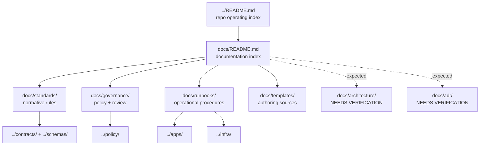

<!-- [KFM_META_BLOCK_V2]
doc_id: kfm://doc/NEEDS-VERIFICATION
title: docs
type: standard
version: v1
status: draft
owners: NEEDS VERIFICATION
created: NEEDS VERIFICATION
updated: NEEDS VERIFICATION
policy_label: NEEDS VERIFICATION
related: [../README.md, ./governance/README.md, ./runbooks/README.md, ./standards/README.md, ./templates/README.md]
tags: [kfm, docs, governance, runbooks, standards, templates]
notes: [Converted from minimal directory placeholder, resolve doc_id/owners/dates before commit, keep unverified paths visibly marked]
[/KFM_META_BLOCK_V2] -->

# docs

Canonical governed documentation index for Kansas Frontier Matrix (KFM).

> **Status:** experimental  
> **Owners:** NEEDS VERIFICATION — check [`../.github/CODEOWNERS`](../.github/CODEOWNERS)  
>       
> **Quick jumps:** [Scope](#scope) · [Repo fit](#repo-fit) · [Accepted inputs](#accepted-inputs) · [Exclusions](#exclusions) · [Current verified snapshot](#current-verified-snapshot) · [Directory tree](#directory-tree) · [Quickstart](#quickstart) · [Usage](#usage) · [Diagram](#diagram) · [Tables](#tables) · [Task list](#task-list--definition-of-done) · [FAQ](#faq) · [Appendix](#appendix)

> [!IMPORTANT]
> `docs/` is part of KFM’s trust model, not a dumping ground for miscellaneous notes. Behavior-significant changes should update documentation, examples, and operational instructions in the same governed change stream as code, contracts, policy, and tests.

## Scope

`docs/` is the home of canonical governed documentation for KFM: long-form architecture guidance, standards, governance rules, runbooks, templates, and other reference material that helps humans operate the same evidence-first system enforced elsewhere in the repo.

This directory should make KFM legible without becoming a second truth path. It exists to explain boundaries, operating rules, review procedures, and decision context — not to replace machine-enforced contracts, policy bundles, or runtime evidence.

## Repo fit

| Item | Value |
| --- | --- |
| Path | `/docs/README.md` |
| Directory role | Human-facing operating index for KFM documentation surfaces |
| Upstream anchors | [`../README.md`](../README.md), [`../CONTRIBUTING.md`](../CONTRIBUTING.md), [`../.github/README.md`](../.github/README.md), [`../contracts/`](../contracts/), [`../schemas/`](../schemas/), [`../policy/`](../policy/) |
| Confirmed downstream anchors | [`./governance/README.md`](./governance/README.md), [`./runbooks/README.md`](./runbooks/README.md), [`./standards/README.md`](./standards/README.md), [`./templates/README.md`](./templates/README.md) |
| Expected downstream anchors | `./architecture/`, `./adr/`, `./guides/`, `./reports/` — **NEEDS VERIFICATION** |
| Why this directory matters | It keeps doctrine, process, and operational instructions aligned with KFM’s truth path, trust membrane, and fail-closed release posture |

## Accepted inputs

Content that belongs in `docs/` includes:

- directory indexes and governed README files
- architecture notes and ADRs
- standards and profile docs
- governance, review, and stewardship guidance
- runbooks, rollback procedures, and operator checklists
- template sources and authoring conventions
- evidence-aware examples, diagrams, and explanatory reference material
- long-form guidance that clarifies behavior already enforced or intended elsewhere in the repo

## Exclusions

The following do **not** belong here as authoritative source of truth:

- runtime service code, ingestion logic, UI components, or model-serving code  
  → keep in repo code surfaces such as `../apps/`, `../packages/`, or equivalent
- machine-enforced schemas, OpenAPI definitions, policy bundles, and validation vocabularies  
  → keep in `../contracts/`, `../schemas/`, and `../policy/`
- generated receipts, manifests, evidence bundles, or promotion artifacts  
  → keep on the truth path or in release/evidence surfaces
- secrets, tokens, internal-only URLs, or sensitive coordinates  
  → keep in secured systems of record, never in public docs
- prose that implies live behavior without proof  
  → keep it `UNKNOWN` or `NEEDS VERIFICATION` until the branch proves it

## Status markers used in this README

| Marker | Meaning here |
| --- | --- |
| **CONFIRMED** | Grounded in current repo-visible documentation or stable KFM doctrine |
| **PROPOSED** | Repo-native direction that fits KFM doctrine but is not proven as current branch behavior |
| **UNKNOWN** | Not established strongly enough to present as current implementation fact |
| **NEEDS VERIFICATION** | Placeholder path, owner, label, or repo detail that should be checked before commit |

## Current verified snapshot

The current repo-visible documentation surface confirms these `docs/` homes:

| Surface | Status | Verified role |
| --- | --- | --- |
| [`./governance/README.md`](./governance/README.md) | **CONFIRMED** | Policy, gates, sovereignty, and review semantics |
| [`./runbooks/README.md`](./runbooks/README.md) | **CONFIRMED** | Operational playbooks, rollback posture, and escalation flow |
| [`./standards/README.md`](./standards/README.md) | **CONFIRMED** | Normative “what must be true” documentation and standards profiles |
| [`./templates/README.md`](./templates/README.md) | **CONFIRMED** | Template-source home for governed docs and MetaBlock-driven authoring |
| `./architecture/`, `./adr/`, `./guides/`, `./reports/` | **NEEDS VERIFICATION** | Referenced by neighboring docs as likely homes, but not directly verified here |

> [!NOTE]
> Neighboring docs already treat `docs/` as the home of canonical governed documentation. Keep that role sharp: docs explain and guide the system, while contracts, schemas, policy, and code make it executable.

## Directory tree

The tree below separates what is currently confirmed from what is expected but not yet verified.

```text
docs/
├── README.md                         # This index
├── governance/                       # CONFIRMED
│   └── README.md
├── runbooks/                         # CONFIRMED
│   └── README.md
├── standards/                        # CONFIRMED
│   └── README.md
├── templates/                        # CONFIRMED
│   └── README.md
├── architecture/                     # NEEDS VERIFICATION — referenced as a target home
├── adr/                              # NEEDS VERIFICATION — referenced by repo docs
├── guides/                           # NEEDS VERIFICATION — referenced by runbook docs
└── reports/                          # NEEDS VERIFICATION — referenced by template docs
```

## Quickstart

Use a verification-first sequence before editing or expanding `docs/`.

```bash
# Inspect the current documentation surface
find docs -maxdepth 2 -type f | sort

# Read the verified directory guides first
sed -n '1,120p' docs/README.md
sed -n '1,120p' docs/standards/README.md
sed -n '1,120p' docs/governance/README.md
sed -n '1,120p' docs/runbooks/README.md
sed -n '1,120p' docs/templates/README.md

# Check adjacent contract and policy surfaces before writing behavior claims
find contracts schemas policy -maxdepth 2 -type f 2>/dev/null | sort | sed -n '1,120p'

# Look for evidence- and governance-significant vocabulary
grep -RIn "CONFIRMED\|PROPOSED\|UNKNOWN\|NEEDS VERIFICATION" docs || true
grep -RIn "EvidenceRef\|EvidenceBundle\|policy_label\|STAC\|DCAT\|PROV" docs contracts schemas policy 2>/dev/null || true
```

> [!WARNING]
> Do not promote a doc claim from `PROPOSED` or `UNKNOWN` to `CONFIRMED` just because a neighboring README suggests the path should exist. Verify the actual checkout first.

## Usage

### Read `docs/` in this order

1. Start here for the directory contract and current verification boundary.
2. Read [`./standards/README.md`](./standards/README.md) when the question is “what must be true?”
3. Read [`./governance/README.md`](./governance/README.md) when the change affects policy, rights, sensitivity, review, or promotion.
4. Read [`./runbooks/README.md`](./runbooks/README.md) when the question is “how do we execute, recover, or contain this safely?”
5. Read [`./templates/README.md`](./templates/README.md) before creating new governed docs or expanding README structure.

### What `docs/` is

`docs/` is:

- the human-readable operating layer for KFM doctrine
- the place where architecture, governance, standards, and runbook guidance stay coherent
- the bridge between repo-wide posture and directory- or system-specific detail
- a production surface that should change in step with behavior-significant code, contracts, policy, and release practice

### What `docs/` is not

`docs/` is not:

- the authoritative home of runtime code or enforcement logic
- a replacement for `contracts/`, `schemas/`, or `policy/`
- a safe place to hide unverified implementation claims
- a narrative layer allowed to drift away from the governed system it describes

### When to add or move a document

Use `docs/` when the artifact is explanatory, procedural, or governance-bearing. Move or author elsewhere when the artifact is machine-enforced, generated, or runtime-owned.

## Diagram


```mermaid
flowchart TD
    ROOT["../README.md<br/>repo operating index"] --> DOCS["docs/README.md<br/>documentation index"]
    DOCS --> STD["docs/standards/<br/>normative rules"]
    DOCS --> GOV["docs/governance/<br/>policy + review"]
    DOCS --> RUN["docs/runbooks/<br/>operational procedures"]
    DOCS --> TMP["docs/templates/<br/>authoring sources"]

    STD --> CONTRACTS["../contracts/ + ../schemas/"]
    GOV --> POLICY["../policy/"]
    RUN --> APPS["../apps/"]
    RUN --> INFRA["../infra/"]

    DOCS -. expected .-> ARCH["docs/architecture/<br/>NEEDS VERIFICATION"]
    DOCS -. expected .-> ADR["docs/adr/<br/>NEEDS VERIFICATION"]
```

## Tables

### Documentation placement matrix

| Content type | Primary home | Why |
| --- | --- | --- |
| Normative rules and profile docs | [`./standards/`](./standards/) | These define what must be true |
| Review, rights, sovereignty, and policy guidance | [`./governance/`](./governance/) | These explain what can be promoted, withheld, generalized, or escalated |
| Step-by-step operating procedures | [`./runbooks/`](./runbooks/) | These keep operations reproducible, auditable, and fail-closed |
| Template sources and reusable authoring scaffolds | [`./templates/`](./templates/) | These standardize KFM doc structure and metadata capture |
| Runtime-enforced contracts and schemas | [`../contracts/`](../contracts/), [`../schemas/`](../schemas/) | These are executable, versioned contract surfaces |
| Policy-as-code, fixtures, and policy tests | [`../policy/`](../policy/) | These are enforcement surfaces, not narrative docs |

### Trust obligations by docs surface

| Surface | Primary question | Minimum trust obligation |
| --- | --- | --- |
| `docs/README.md` | Where do I start and what is verified? | Keep the directory contract and verification boundary explicit |
| `docs/standards/` | What must be true? | Stay normative, version-aware, and link to enforcement where possible |
| `docs/governance/` | What is allowed, reviewed, or blocked? | Match CI/runtime semantics and fail-closed posture |
| `docs/runbooks/` | How do we execute or recover safely? | Include prerequisites, validation, rollback, and audit outputs |
| `docs/templates/` | How should we author governed docs? | Keep MetaBlock, evidence slots, and review posture consistent |

## Task list / Definition of done

Use this checklist before treating `docs/README.md` as finished.

- [ ] Resolve `doc_id`, owners, dates, and policy label in the MetaBlock or intentionally leave them as reviewed placeholders
- [ ] Verify every linked child path against the actual repo tree
- [ ] Keep confirmed paths and expected-but-unverified paths visibly distinct
- [ ] Ensure the directory tree matches the checkout
- [ ] Ensure relative links render correctly on GitHub
- [ ] Keep behavior-significant documentation changes in the same PR or change stream as code, contracts, policy, or tests
- [ ] Avoid claiming runtime, CI, or release behavior that the active branch does not prove
- [ ] Confirm the Mermaid diagram renders on GitHub
- [ ] Re-check adjacent surfaces (`contracts/`, `schemas/`, `policy/`, `apps/`, `infra/`) before documenting cross-directory behavior as fact

## FAQ

### Why is this index so explicit about `CONFIRMED`, `PROPOSED`, and `UNKNOWN`?

Because KFM treats documentation as part of the trust model. A polished README that overclaims repo behavior weakens the same trust membrane the code is supposed to protect.

### Why are some downstream docs paths marked `NEEDS VERIFICATION`?

Because neighboring docs reference likely homes such as `docs/architecture/`, `docs/adr/`, `docs/guides/`, and `docs/reports/`, but this index should not promote those paths to current repo fact until the checkout confirms them.

### Why are contracts, schemas, and policy linked here but not documented as living under `docs/`?

Because they are machine-enforced surfaces. `docs/` explains and governs them; it does not replace them.

### Why keep templates under `docs/`?

Because KFM’s template layer is part of the documentation system itself. It standardizes metadata capture, evidence slots, and review posture before a new document becomes “live.”

### When should a docs change block release?

Whenever the change is behavior-significant and leaving docs stale would create drift between how KFM actually behaves and how operators, reviewers, or contributors are told it behaves.

## Appendix

<details>
<summary>Verified inputs and remaining checks</summary>

### Verified inputs used for this index

- [`../README.md`](../README.md) — root operating index and top-level repo contract
- [`../.github/README.md`](../.github/README.md) — directory README benchmark for evidence-bounded repo docs
- [`./governance/README.md`](./governance/README.md) — governance surface and policy-review home
- [`./runbooks/README.md`](./runbooks/README.md) — operational procedures index
- [`./standards/README.md`](./standards/README.md) — normative standards index
- [`./templates/README.md`](./templates/README.md) — template-source home and MetaBlock-oriented authoring guidance

### Remaining checks before calling the subtree fully verified

- confirm whether `docs/architecture/`, `docs/adr/`, `docs/guides/`, and `docs/reports/` currently exist
- confirm owners from `../.github/CODEOWNERS`
- confirm whether the repository carries a stable docs policy label convention for directory indexes
- confirm whether any additional docs homes should be linked from this index

### Maintenance rule

Keep this file focused on:

- the `docs/` directory contract
- verified child surfaces
- documentation boundaries
- verification-first navigation
- the minimum definition of done for governed docs

Push detailed subsystem behavior into the owning child README or long-form doc once that home exists and is verified.

</details>

[Back to top](#docs)