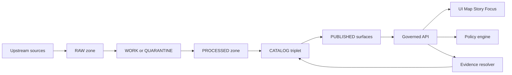
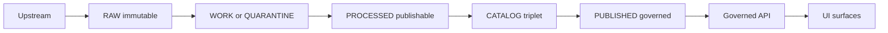
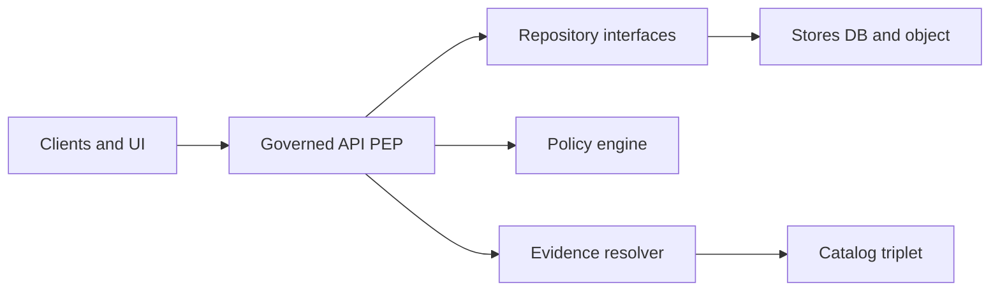

<!-- [KFM_META_BLOCK_V2]
doc_id: kfm://doc/1f731fb8-1614-4a01-a1a5-f8e5ed39c7e1
title: docs/ — Documentation hub
type: standard
version: v1
status: draft
owners: TBD
created: 2026-03-03
updated: 2026-03-04
policy_label: public
related:
  - docs/MASTER_GUIDE_v13.md
  - docs/governance/ROOT_GOVERNANCE.md
tags: [kfm, docs]
notes:
  - Entry point for repository documentation.
  - This README defines the REQUIRED docs/ layout for KFM vNext. If your checkout differs, update the tree and links after verifying the repo structure.
[/KFM_META_BLOCK_V2] -->

<a id="top"></a>

# docs/ — Documentation hub
**Governed, human-readable documentation for the Kansas Frontier Matrix (KFM).**

> **[CONFIRMED] Purpose:** `docs/` is the authoritative home for **governed documentation**: architecture blueprints, standards/profiles, governance policy, templates, and published narrative artifacts (“Story Nodes”).

---

## IMPACT
- **Status:** draft
- **Owners:** TBD (set via `CODEOWNERS`)
- **Policy label:** public
- **This hub enforces the KFM “non-negotiables” in writing:** truth path lifecycle, trust membrane, catalog triplet, cite-or-abstain.
- **Hard exclusions:** secrets, raw datasets/binaries, and unreviewed sensitive details (especially precise vulnerable locations).

[](./README.md)
[](#impact)
[](#metablock-v2-and-document-metadata)
[](#review-gates-and-definition-of-done)
[](#local-preview--checks)

**Quick links:** [Start here](#start-here) · [Project map](#kfm-project-map-what-is-in-scope) · [Docs layout](#required-docs-layout) · [MetaBlock v2](#metablock-v2-and-document-metadata) · [Gates](#review-gates-and-definition-of-done) · [Add a doc](#how-to-add-a-new-document) · [Unknowns](#unknowns-to-verify)

---

## Quick navigation
- [Evidence legend](#evidence-legend)
- [Start here](#start-here)
- [KFM project map](#kfm-project-map-what-is-in-scope)
- [Where docs fit: truth path and trust membrane](#where-docs-fit-truth-path-and-trust-membrane)
- [Acceptable inputs](#acceptable-inputs-for-docs)
- [Exclusions](#exclusions-what-must-not-go-in-docs)
- [Required docs layout](#required-docs-layout)
- [Docs taxonomy and routing](#docs-taxonomy-and-routing)
- [MetaBlock v2 and document metadata](#metablock-v2-and-document-metadata)
- [Standards and profiles](#standards-and-profiles)
- [Templates](#templates)
- [Reports and Story Nodes](#reports-and-story-nodes)
- [Review gates and definition of done](#review-gates-and-definition-of-done)
- [Local preview and checks](#local-preview--checks)
- [Unknowns to verify](#unknowns-to-verify)
- [FAQ](#faq)
- [Appendix](#appendix)
- [Back to top](#back-to-top)

---

## Evidence legend
KFM docs are governed. Every meaningful claim is explicitly labeled:

- **[CONFIRMED]** = enforced invariant or documented requirement.
- **[PROPOSED]** = recommended pattern; may not yet be implemented.
- **[UNKNOWN]** = not verified in this checkout; list the smallest verification step.

> **[CONFIRMED] Rule:** If you can’t ground it, mark it **[UNKNOWN]** and list the smallest verification step.

---

## Start here
Read these in order (or use as your quick orientation map):

1) **`docs/MASTER_GUIDE_v13.md`** — canonical overview + doc map (if present).  
2) **`docs/governance/ROOT_GOVERNANCE.md`** — governance charter and “how changes are approved.”  
3) **`docs/architecture/README.md`** — architecture boundaries, diagrams, and ADR index.  
4) **`docs/standards/README.md`** — standards/profiles that define “valid” in KFM.  
5) **`docs/reports/story_nodes/`** — published narrative artifacts and their workflow.

> **[UNKNOWN]** If any linked file/folder is missing in your checkout, treat it as **a required gap** and create a placeholder stub (or update this README to match the verified tree).

---

## KFM project map: what is in scope
This section is a **project assessment** (what KFM contains, and what it explicitly must not be).

### What KFM is
- **[CONFIRMED]** KFM is a **pipeline → catalog → governed API → UI** system. It turns upstream data into immutable artifacts, validated catalogs, and governed runtime surfaces.
- **[CONFIRMED]** KFM includes **Map Explorer**, **Story Mode**, and **Focus Mode** (AI-assisted Q&A) where user-visible claims must be evidence-backed.
- **[CONFIRMED]** KFM treats **evidence, provenance, and policy** as first-class runtime constraints, not afterthoughts.

### What KFM is not
- **[CONFIRMED]** Not a “upload-and-forget portal.”
- **[CONFIRMED]** Not a UI that directly queries databases.
- **[CONFIRMED]** Not an ungoverned chatbot (Focus Mode is constrained by policy and citation gates).

### System slices (what exists conceptually)
Use this mental model when writing docs or adding features:


```mermaid
flowchart LR
  Up[Upstream sources] --> RAW[RAW zone]
  RAW --> WORK[WORK or QUARANTINE]
  WORK --> PROCESSED[PROCESSED zone]
  PROCESSED --> CATALOG[CATALOG triplet]
  CATALOG --> PUBLISHED[PUBLISHED surfaces]

  PUBLISHED --> API[Governed API]
  API --> UI[UI Map Story Focus]

  API --> POL[Policy engine]
  API --> EV[Evidence resolver]
  EV --> CATALOG
```

**[CONFIRMED] Interlock:** docs must never propose shortcuts that bypass policy enforcement or the evidence resolver.

### Repo surfaces KFM expects (outside docs)
> **[UNKNOWN]** The exact repo tree in *this checkout* must be verified. (This README links to target locations; update after running `tree -L 3`.)

**[PROPOSED]** Expected top-level repository slices (for orientation only):
- `apps/` — runnable services (API, UI, workers).
- `packages/` — core modules (domain logic, ingestion, catalog, evidence, policy adapters).
- `contracts/` — schemas and API contracts (OpenAPI, JSON Schema, vocab).
- `policy/` — OPA/Rego policy bundles and tests.
- `data/` — lifecycle zones + dataset specs + catalogs (NOT in `docs/`).
- `tools/` — validators, linkcheckers, spec hashers.
- `tests/` — unit/integration/e2e tests.

---

## Where docs fit: truth path and trust membrane

### Truth path lifecycle (data zones)
**[CONFIRMED]** KFM uses a gated lifecycle (“truth path”) that documentation must not contradict:


```mermaid
flowchart LR
  Up[Upstream] --> RAW[RAW immutable]
  RAW --> WORK[WORK or QUARANTINE]
  WORK --> PROCESSED[PROCESSED publishable]
  PROCESSED --> CAT[CATALOG triplet]
  CAT --> PUB[PUBLISHED governed]

  PUB --> API[Governed API]
  API --> UI[UI surfaces]
```

- **[CONFIRMED]** RAW is append-only immutable acquisition + checksums.
- **[CONFIRMED]** WORK/QUARANTINE is where QA and redaction/generalization candidates happen.
- **[CONFIRMED]** PROCESSED holds publishable artifacts + checksums.
- **[CONFIRMED]** CATALOG is cross-linked **DCAT + STAC + PROV** plus run receipts.
- **[CONFIRMED]** PUBLISHED surfaces may only serve promoted versions that passed gates.

### Trust membrane (policy boundary)
**[CONFIRMED]** The trust membrane is the enforced boundary that prevents bypass:


```mermaid
flowchart LR
  C[Clients and UI] --> PEP[Governed API PEP]
  PEP --> REPO[Repository interfaces]
  REPO --> STORES[Stores DB and object]
  PEP --> PDP[Policy engine]
  PEP --> EV[Evidence resolver]
  EV --> CAT[Catalog triplet]
```

- **[CONFIRMED]** Clients/UI never access DB/object storage directly.
- **[CONFIRMED]** Backend domain logic must not bypass repository interfaces to reach storage directly.
- **[CONFIRMED]** Policy evaluation applies at the PEP and gates what can be returned.

> **[CONFIRMED] Doc rule:** If a document proposes behavior that breaks this membrane, it is incorrect by definition.

---

## Acceptable inputs for docs/
Docs are a production surface; keep them stable, reviewable, and retrieval-friendly.

**[CONFIRMED] Acceptable:**
- Architecture docs (diagrams, subsystem boundaries, contracts in human-readable form)
- Standards/profiles (STAC/DCAT/PROV profiles; repo conventions; doc protocol)
- Governance and review policy (non-secret)
- Templates (MetaBlock v2 docs, Story Nodes, contract extensions)
- Curated reports and published story artifacts (under `docs/reports/`)

---

## Exclusions: what must NOT go in docs/
**[CONFIRMED] Never put in `docs/`:**
- Secrets (API keys, credentials, tokens)
- Raw datasets, large binaries, or lifecycle artifacts (RAW/WORK/PROCESSED belong under `data/`)
- Unreviewed sensitive details (precise vulnerable locations, restricted archeological sites, etc.)

**[PROPOSED] Avoid unless explicitly approved:**
- Generated build outputs (site builds, compiled docs)
- Vendor bundles that should be fetched via tooling instead

---

## Required docs layout
This README defines the **target, “encompass-all-things”** documentation layout for KFM.

> **[CONFIRMED] Expectation:** Each major directory has its own `README.md` index.  
> **[CONFIRMED] Expectation:** Any missing path in this tree is a “docs debt” item (create stubs or adjust links after verification).

```text
docs/
  README.md                      # this file (docs hub)

  MASTER_GUIDE_v13.md            # canonical overview + doc map
  glossary.md                    # domain vocabulary

  architecture/                  # blueprints + diagrams + subsystem contracts
    README.md
    diagrams/                    # architecture diagrams (Mermaid, SVG, PNG)
    adr/                         # Architecture Decision Records (or use docs/adr/ if preferred)
      README.md

  standards/                     # standards/profiles + repo conventions
    README.md
    KFM_MARKDOWN_WORK_PROTOCOL.md
    KFM_REPO_STRUCTURE_STANDARD.md
    KFM_STAC_PROFILE.md
    KFM_DCAT_PROFILE.md
    KFM_PROV_PROFILE.md

  templates/                     # doc templates (universal doc, story node, contract extension)
    README.md
    TEMPLATE__KFM_UNIVERSAL_DOC.md
    TEMPLATE__STORY_NODE_V3.md
    TEMPLATE__API_CONTRACT_EXTENSION.md

  governance/                    # governance charter, ethics, sovereignty, review gates
    ROOT_GOVERNANCE.md
    ETHICS.md
    SOVEREIGNTY.md
    REVIEW_GATES.md

  reports/                       # curated reports; story nodes as published artifacts
    story_nodes/
      templates/                 # reusable story patterns, rubrics, checklists
      draft/                     # WIP story nodes (not published)
      published/
        <story_slug>/
          story.md               # published story node markdown (governed)
          assets/                # images/data excerpts approved for that story
```

### Directory responsibilities (human routing table)

| Folder | Role | What good looks like | What must not happen |
|---|---|---|---|
| `docs/` | Hub + canonical entry points | MASTER_GUIDE and glossary stay current | Becomes a dumping ground |
| `docs/architecture/` | Architecture boundaries + diagrams + ADR index | At least one “system overview” diagram and stable contracts | Architecture changes without ADR |
| `docs/standards/` | Standards/profiles + repo conventions | Profiles align to validators/tests | Profiles drift without tests |
| `docs/templates/` | Templates used to create governed artifacts | Templates are current, minimal, versioned | People copy old templates forever |
| `docs/governance/` | Governance rules and review gates | Clear “who approves what” | Informal policy hidden in Slack |
| `docs/reports/` | Curated reports + published story artifacts | Story nodes have citations + review state | Drafts treated as published |

---

## Docs taxonomy and routing

Use this matrix when adding a new file:

| Doc type | Put it here | Must include | Gate sensitivity |
|---|---|---|---|
| Canonical guide | `docs/` | MetaBlock v2, stable headings, links | Medium |
| Architecture overview | `docs/architecture/` | diagrams + boundaries + invariants | High |
| ADR | `docs/architecture/adr/` | decision, alternatives, consequences, rollback | High |
| Standard/profile | `docs/standards/` | normative language, test hooks, versioning | High |
| Template | `docs/templates/` | how-to-use section, example | Medium |
| Governance policy | `docs/governance/` | roles, gates, enforcement intent | Highest |
| Story Node | `docs/reports/story_nodes/` | citations, review state, policy label, assets | Highest |

---

## MetaBlock v2 and document metadata
**[CONFIRMED]** KFM uses **MetaBlock v2** (HTML comment) for docs, Story Nodes, and dataset specs.

### Minimal MetaBlock v2 template
```html
<!-- [KFM_META_BLOCK_V2]
doc_id: kfm://doc/<uuid>
title: <Title>
type: <guide|standard|story|dataset_spec|adr|run_receipt>
version: v1
status: draft|review|published
owners: <team or names>
created: YYYY-MM-DD
updated: YYYY-MM-DD
policy_label: public|restricted|...
related:
  - kfm://dataset/<slug>@<version>
  - kfm://story/<id>@<version>
tags: [kfm]
notes: [<short notes>]
[/KFM_META_BLOCK_V2] -->
```

### MetaBlock rules
- **[CONFIRMED]** `doc_id` is stable — do not regenerate on edits.
- **[CONFIRMED]** bump `updated:` on meaningful edits.
- **[CONFIRMED]** `policy_label` is an input to governance (especially if docs are served through governed APIs).
- **[PROPOSED]** Use `related:` to link to datasets, story nodes, ADRs, contracts, and policies by stable IDs.

---

## Standards and profiles
Standards under `docs/standards/` define what is “valid” in KFM. Treat them as contracts.

### Minimum set (required by this layout)
- `KFM_MARKDOWN_WORK_PROTOCOL.md`  
  **[CONFIRMED]** How to write KFM docs: headings, evidence labels, link discipline, templates, and doc gates.

- `KFM_REPO_STRUCTURE_STANDARD.md`  
  **[CONFIRMED]** The monorepo layout and boundaries: where data lives vs docs vs code; what must never cross the policy boundary.

- `KFM_STAC_PROFILE.md`  
  **[CONFIRMED]** KFM-specific STAC expectations (collections/items/assets + cross-links).

- `KFM_DCAT_PROFILE.md`  
  **[CONFIRMED]** KFM dataset-level metadata expectations (license, publisher, distribution, themes).

- `KFM_PROV_PROFILE.md`  
  **[CONFIRMED]** KFM provenance expectations for pipelines and story publishing.

> **[PROPOSED] Test enforcement rule:** every normative MUST/SHALL in a profile should map to a validator or CI check (or be explicitly marked “manual gate”).

---

## Templates
Templates make governed work fast and consistent.

### Required templates
- `TEMPLATE__KFM_UNIVERSAL_DOC.md`
  - **Use for:** any new guide/standard/runbook.
  - **Includes:** MetaBlock v2 + scope + where it fits + inputs/exclusions + gates.

- `TEMPLATE__STORY_NODE_V3.md`
  - **Use for:** a story node draft/publish workflow.
  - **Includes:** claims section, citations list, map state sidecar convention (if used), review state.

- `TEMPLATE__API_CONTRACT_EXTENSION.md`
  - **Use for:** adding a contract field, API endpoint, or schema extension.
  - **Includes:** compatibility notes + versioning + tests + rollout/rollback.

---

## Reports and Story Nodes
`docs/reports/story_nodes/` is where narrative artifacts live when they become governed publications.

### Story Node lifecycle (docs-side)
- `templates/` — patterns and rubrics
- `draft/` — WIP stories (not published)
- `published/<story_slug>/` — published story node package

### Published Story Node package (required)
A published story node is a directory:

- `story.md` — the narrative markdown (with citations and evidence references)
- `assets/` — only approved media/data excerpts that are allowed to ship with the story

> **[CONFIRMED] Publishing gate:** a Story Node cannot be published unless citations resolve and the review state is captured.

---

## Review gates and definition of done
KFM is fail-closed: missing evidence blocks promotion/publishing.

### Docs-only gates (minimum)
- **[CONFIRMED] MetaBlock v2** present and valid.
- **[CONFIRMED] No secrets / no sensitive leakage.**
- **[PROPOSED] Link integrity**: internal links resolve or are marked TODO with an issue reference.
- **[PROPOSED] Ownership**: governance-impacting docs require `CODEOWNERS` approval.

### Standards/profile gates (minimum)
- **[CONFIRMED]** Changes to STAC/DCAT/PROV profiles must be paired with validator/test updates (or a documented manual gate).
- **[PROPOSED]** Add a “profile change note” section to each profile describing how to migrate.

### Story Node gates (minimum)
- **[CONFIRMED]** citations are resolvable, policy-allowed, and stable.
- **[CONFIRMED]** review state recorded (draft/review/published) with owners.
- **[PROPOSED]** “narrative drift” checks: claims remain backed by promoted dataset versions.

### Copy/paste checklist (PR-ready)
- [ ] **[CONFIRMED]** MetaBlock v2 present and `updated:` bumped
- [ ] **[CONFIRMED]** No secrets, no sensitive location leakage
- [ ] **[PROPOSED]** Links validated (or explicit TODO + issue)
- [ ] **[PROPOSED]** If doc changes governance/standards, ADR created and owners approve
- [ ] **[PROPOSED]** If Story Node, citations resolve and review state is captured

---

## How to add a new document
1) **Choose the smallest correct home**  
   - architecture vs standards vs governance vs templates vs reports
2) **Create the file from a template**  
   - prefer `docs/templates/*`
3) **Add MetaBlock v2** at top  
4) **Update the nearest index README**  
   - and update `docs/MASTER_GUIDE_v13.md` if it is the canonical map
5) **Run local checks** (or closest equivalent)  
6) **Route review** via `CODEOWNERS` (and governance owners if policy changes)

---

## Local preview / checks
### Minimal, repo-agnostic checks (runnable)
```bash
# show docs tree (fallback to find if tree is unavailable)
command -v tree >/dev/null && tree -L 4 docs || find docs -maxdepth 4 -type f | sort

# confirm MetaBlock presence (at least once per doc)
grep -R --line-number --fixed-string "[KFM_META_BLOCK_V2]" docs | head -n 100

# quick internal link scan (cheap heuristic; not a real linkcheck)
grep -R --line-number -E '\]\(\.\/|^\[.*\]: \.\/' docs | head -n 100
```

### Repo-specific checks (pseudocode — rename to match your repo)
```bash
# pseudocode: replace with real targets if present in your repo
make docs.check
make linkcheck
make docs.lint
```

---

## Unknowns to verify
These are **[UNKNOWN] until verified in your checkout**:

1) Do the required paths exist exactly as specified in [Required docs layout](#required-docs-layout)?
   - Smallest step:
     ```bash
     find docs -maxdepth 3 -type d | sort
     ```

2) Is MetaBlock validation enforced in CI?
   - Smallest step: search `.github/workflows` for `MetaBlock` / `linkcheck` / `markdownlint`.

3) Who are the canonical docs owners?
   - Smallest step: check `.github/CODEOWNERS`; then set `owners:` in this README and directory READMEs.

4) What is the authoritative docs set vs background/research?
   - Smallest step: define a governance rule (in `docs/governance/ROOT_GOVERNANCE.md`) that lists doc classes and their authority level.

---

## FAQ
**Can I put PDFs, screenshots, or datasets in `docs/`?**  
**[CONFIRMED]** Not as a substitute for governed lifecycle artifacts. Small illustrative images are fine; datasets belong under `data/` zones. Curated reports belong under `docs/reports/`.

**What if I’m unsure whether something is sensitive?**  
**[CONFIRMED]** Redact/generalize, mark “needs governance review,” and do not publish precise locations until policy explicitly allows.

**Can I claim a folder exists if I haven’t verified it?**  
**[CONFIRMED]** No. Mark it **[UNKNOWN]** and list the smallest verification step.

---

## Appendix

<details>
  <summary>Optional extensions (PROPOSED) if your repo needs them</summary>

If you need more separation, consider adding:

- `docs/runbooks/` — operational runbooks (triage, restore, incident response)
- `docs/quality/` — promotion gates, QA profiles, checklists, receipt examples
- `docs/security/` — threat models, supply-chain policy, authn/z decisions
- `docs/research/` — non-authoritative notes and literature summaries

If you add any of these, update:
- `docs/MASTER_GUIDE_v13.md` (doc map)
- this README’s tree
- `CODEOWNERS` routing for the new surfaces

</details>

---

## Back to top
⬆️ <a href="#top">Back to top</a>
