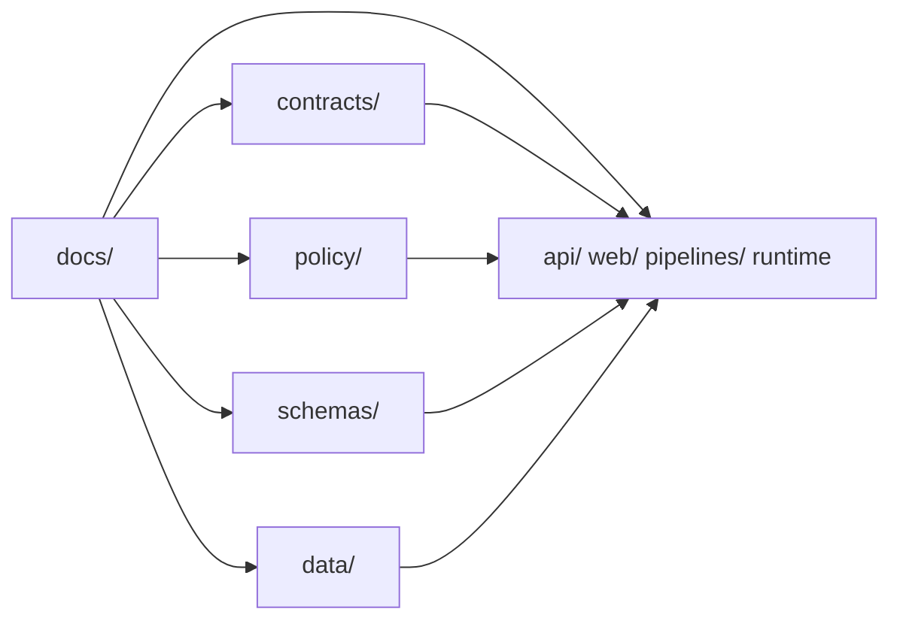
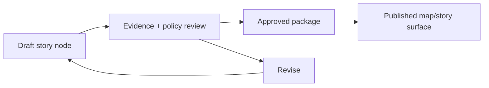

<!-- [KFM_META_BLOCK_V2]
doc_id: kfm://doc/7c2d8b8b-5c56-4cb7-a66f-1e0b7f8f6d21
title: docs/ — Documentation hub
type: standard
version: v1
status: draft
owners: TBD
created: 2026-03-07
updated: 2026-03-07
policy_label: public
related: [../README.md, ../contracts/, ../data/, ../policy/, ../schemas/, ./templates/]
tags: [kfm, docs, governance, evidence]
notes: [Expanded from uploaded KFM manuals. Current checkout-level docs/ subtree beyond this root remains UNKNOWN unless verified in the live repository.]
[/KFM_META_BLOCK_V2] -->

<a id="top"></a>

# docs/ — Documentation hub
Governed, human-readable documentation for the Kansas Frontier Matrix (KFM).


**Status:** active draft  
**Owners:** TBD  
**Repo fit:** `docs/` is KFM’s human-readable control surface beside machine-readable truth in `contracts/`, `policy/`, `schemas/`, and governed data/state under the truth path.  
**Accepted inputs:** architecture docs, ADRs, standards, governance rules, design specs, contributor guides, runbooks, templates, reference indices, dataset documentation, and governed narrative/story documentation.  
**Exclusions:** secrets, raw datasets, promoted data payloads, canonical policy code, canonical schemas, unchecked runtime claims, or documentation that bypasses evidence, policy, or review gates.

**Quick jump:** [Truth status legend](#truth-status-legend) · [Purpose](#purpose) · [Governing posture](#governing-posture) · [Authority and routing](#authority-and-routing) · [Verification posture](#verification-posture) · [Target layout](#target-layout-proposed) · [Story node publication](#story-node-publication) · [Quickstart](#quickstart) · [Review gates](#review-gates) · [Definition of done](#definition-of-done) · [FAQ](#faq)

---

## Truth status legend

- **CONFIRMED** = supported by the uploaded KFM source corpus
- **PROPOSED** = recommended target structure or workflow, not yet checkout-verified
- **UNKNOWN** = not yet verified in the current live repository checkout

---

## Purpose

`docs/` exists so KFM can explain itself without weakening governance.

This directory is the human-readable layer that helps maintainers, reviewers, contributors, operators, educators, and public readers answer:

1. What the platform is trying to do.
2. Which rules are normative versus explanatory.
3. Where a new document belongs.
4. Which review gates must pass before a document can influence a public or operational surface.
5. How narrative, evidence, policy, and implementation stay aligned.

KFM documentation is not decorative project prose. It is part of the governed system.

---

## Governing posture

> **[CONFIRMED]** KFM source documents treat documentation as a governed production surface, not as free-form commentary.

Documentation in `docs/` must preserve these non-negotiables:

- **Truth path:** docs must not normalize shortcuts around RAW → WORK / QUARANTINE → PROCESSED → CATALOG / TRIPLET → PUBLISHED.
- **Trust membrane:** docs must never imply direct browser or client access to internal stores, databases, buckets, or graph engines.
- **Cite-or-abstain:** narrative, map, and Focus-facing documentation must assume visible claims resolve to evidence or are narrowed/withheld.
- **Fail-closed:** unclear rights, provenance, sensitivity, or review state blocks publication language rather than allowing optimistic wording.
- **Docs update with behavior:** if lifecycle, policy, evidence, UX, contributor workflow, or trust-surface behavior changes, nearby docs must change in the same change set or explicitly justify why not.

### What docs must never do

- describe the UI as if it can bypass the API or policy layer
- copy canonical schema or policy logic and let the copy drift
- present target architecture as current repo fact without verification
- publish uncited story content as settled truth
- bury rights/sensitivity uncertainty in footnotes
- confuse a draft design with a released implementation

---

## Authority and routing

Documentation explains system truth. It does not replace it.


```mermaid
flowchart LR
  docs["docs/"]
  contracts["contracts/"]
  policy["policy/"]
  schemas["schemas/"]
  data["data/"]
  runtime["api/ web/ pipelines/ runtime"]

  docs --> runtime
  docs --> contracts
  docs --> policy
  docs --> schemas
  docs --> data

  contracts --> runtime
  policy --> runtime
  schemas --> runtime
  data --> runtime
```

### Neighbor matrix

| Path | Relationship to `docs/` | Rule |
|---|---|---|
| `../README.md` | repository entry point | `docs/README.md` must align with the root posture and not contradict it |
| `../contracts/` | machine-readable interface truth | docs may explain contracts but must not become their authority |
| `../policy/` | enforcement rules | governance docs must not drift from actual policy behavior |
| `../schemas/` | validation truth | docs should link to canonical schemas instead of forking them |
| `../data/` | governed data lifecycle | docs may describe evidence/data flow, but not replace data artifacts |
| `api/`, `web/`, `pipelines/`, runtime services | implementation surfaces | docs should map these clearly without bypass language |

### Documentation authority model

| Area | Typical authority | Purpose | Notes |
|---|---:|---|---|
| `docs/governance/` | high | rights, sensitivity, review, escalation, publication posture | should stay tightly aligned to policy behavior |
| `docs/architecture/` | high | boundaries, trust membrane, truth path, component responsibilities | explanatory, but core to system shape |
| `docs/standards/` | high | metadata, markdown, naming, profiles, citation rules | keeps contributions consistent |
| `docs/templates/` | medium-high | approved starting points | prevents structure drift |
| `docs/reports/story_nodes/` | high | governed story/publication artifacts | must remain citation-backed and review-gated |
| `docs/data/` | medium-high | human-readable dataset documentation | not a replacement for raw or processed data |
| `docs/reference/` | medium | human index into canonical truth | **PROPOSED** until checkout verified |
| `docs/runbooks/` | high | operations and recovery procedures | **PROPOSED** until checkout verified |

---

## Verification posture

> **[CONFIRMED]** The uploaded KFM manuals define `docs/` as a documentation hub and controlled publication surface.

> **[UNKNOWN]** The current checkout-level `docs/` subtree beyond this root file has not been verified here. Do not describe any subdirectory below as present unless checked in the live repo.

> **[PROPOSED]** The layout below is the canonical target shape this README should route contributors toward unless the live repo has deliberately chosen a different verified structure.

### Path reconciliation

Older KFM source material uses a `docs/stories/` vocabulary for governed narrative content.  
This README normalizes that into a stronger target lane:

- **Legacy reference:** `docs/stories/`
- **Preferred target:** `docs/reports/story_nodes/`

Treat that normalization as **PROPOSED** until the live repo is checked and any migration/redirect plan is documented.

---

## Placement rules

### Put these in `docs/`

- architecture and system-boundary documents
- governance and review guidance
- standards, conventions, and writing protocols
- dataset documentation and source notes
- contributor guides and onboarding flows
- templates and examples
- governed story/publication packages
- operator runbooks and recovery procedures
- reference indices into contracts, schemas, registries, and catalogs

### Do not put these in `docs/`

- raw or processed data payloads
- secrets or private credentials
- canonical schema definitions
- canonical policy code
- unpublished runtime facts presented as settled truth
- ad hoc analyst notes masquerading as approved documentation
- UI-bypass instructions
- evidence that belongs in `../data/` or machine-readable catalog/provenance paths

---

## Target layout (PROPOSED)

```text
docs/
├── README.md
├── architecture/
│   └── README.md
├── governance/
│   └── README.md
├── standards/
│   └── README.md
├── templates/
│   └── README.md
├── reports/
│   └── story_nodes/
│       ├── README.md
│       ├── draft/
│       ├── review/
│       └── published/
├── data/
│   ├── README.md
│   └── <domain>/
├── reference/              # PROPOSED; verify before materializing
└── runbooks/               # PROPOSED; verify before materializing
```

### Target directory responsibilities

| Directory | Purpose | Accepted inputs | Exclusions |
|---|---|---|---|
| `architecture/` | explain system shape and invariants | trust membrane, truth path, component boundaries, diagrams | feature wishlists with no architectural consequence |
| `governance/` | document policy-facing rules | rights, sensitivity, review, escalation, stewardship | executable policy code |
| `standards/` | define cross-repo consistency rules | metadata profiles, markdown conventions, citation rules, naming | one-off local preferences |
| `templates/` | provide approved starting points | README templates, story templates, design doc templates | finished production docs |
| `reports/story_nodes/` | hold governed narrative packages | markdown narrative, map choreography, citations, review metadata | uncited public narrative |
| `data/` | explain datasets for humans | source notes, access notes, field meanings, QA interpretation | raw or processed data payloads |
| `reference/` | point to canonical truth | indices into contracts, schemas, registries, APIs | duplicated canonical content |
| `runbooks/` | document operational procedures | deploy, restore, rollback, incident, recovery | architecture essays |

---

## Story node publication

> **[CONFIRMED]** KFM source material requires story/publication content to remain evidence-backed and review-gated.

Story nodes should be treated as governed publication artifacts, not blog posts.

### Minimum story-node package

A story node should include:

- a narrative markdown file
- explicit title, status, authorship, and review state
- resolvable citations for factual claims
- map/timeline choreography metadata when interactive presentation is required
- rights/attribution for images, media, and community-supplied materials
- any necessary content warnings or sensitivity flags

### Story-node progression


```mermaid
flowchart LR
  draft["Draft story node"] --> review["Evidence + policy review"]
  review --> approved["Approved package"]
  approved --> published["Published map/story surface"]
  review --> revise["Revise"]
  revise --> draft
```

### Story-node rules

- factual statements require evidence links or explicit uncertainty
- review state must be visible
- interactive map states must not point to unpublished or policy-blocked data
- public publication must fail closed on unresolved rights or sensitivity
- legacy `docs/stories/` references should be reconciled into `docs/reports/story_nodes/` unless the live repo explicitly proves another path

---

## Authoring workflow

1. Choose the directory by **authority**, not convenience.
2. Start from a template when a template exists.
3. Add the MetaBlock v2 header where supported.
4. State purpose, repo fit, accepted inputs, and exclusions near the top.
5. Link to canonical contracts, schemas, policy, and catalog artifacts instead of duplicating them as authority.
6. Mark meaningful uncertainty as `CONFIRMED`, `PROPOSED`, or `UNKNOWN`.
7. Update adjacent docs when behavior changes.
8. Keep narrative, evidence, and review state synchronized.

### Required top-of-file minimums

Every README-like document in `docs/` should include:

- title
- one-line purpose
- repo fit
- accepted inputs
- exclusions
- status
- owners
- quick navigation

---

## Review gates

| Gate | Reviewer question | Block condition |
|---|---|---|
| Placement | Is the document in the correct authority zone? | mixed authority or wrong directory |
| MetaBlock | Does the file identify itself consistently? | missing or stale metadata |
| Truth posture | Are claims scoped and labeled correctly? | repo/runtime overclaiming |
| Trust membrane | Does the text imply unsafe access patterns? | UI or client bypass language |
| Evidence posture | Can factual claims resolve to sources? | uncited or decorative citations |
| Policy safety | Are rights/sensitivity issues handled fail-closed? | ambiguous rights or sensitive detail exposure |
| Story publication | For narrative docs, are review and citation requirements explicit? | uncited narrative treated as publishable |
| Adjacent updates | Were nearby docs/templates/standards updated when needed? | behavior changed but docs drift remains |

---

## Quickstart

```bash
# Inspect the docs tree in a local checkout
find docs -maxdepth 3 -print | sort

# Find unresolved documentation markers
git grep -nE 'TODO|TBD|UNKNOWN|FIXME' docs || true

# Review local changes before opening a PR
git diff -- docs

# Optional: inspect whether common governance files exist
test -f CONTRIBUTING.md && sed -n '1,200p' CONTRIBUTING.md || true
test -f CODEOWNERS && sed -n '1,200p' CODEOWNERS || true
```

### Useful maintenance habits

- keep diagrams close to the docs they explain
- prefer relative links for internal references
- update docs in the same PR as behavior changes
- treat review comments on evidence and policy as blockers, not polish

---

## Definition of done

- [ ] correct directory chosen
- [ ] MetaBlock v2 included where supported
- [ ] title and one-line purpose present
- [ ] repo fit stated
- [ ] accepted inputs stated
- [ ] exclusions stated
- [ ] truth status posture is explicit
- [ ] at least one diagram included where it clarifies structure or workflow
- [ ] documentation does not weaken trust membrane or truth path
- [ ] story/publication docs are citation-backed and review-gated
- [ ] related templates/standards/guides updated if behavior changed
- [ ] links are relative where possible
- [ ] current repo facts do not outrun verified evidence

---

## FAQ

### When should `docs/README.md` change?
Update it when the routing logic for documentation changes, when canonical documentation lanes move, or when new review expectations affect multiple doc areas.

### Should docs duplicate contracts, schemas, or policy logic?
No. Explain them, summarize them, and link to them. Do not let documentation become a drifting second authority.

### Can drafts live in `docs/`?
Yes, if the draft status is obvious and the content does not present itself as approved publication.

### Where should story publication packages live?
Prefer `docs/reports/story_nodes/` as the target publication lane. Treat older `docs/stories/` references as legacy until checkout verification says otherwise.

### Where should dataset payloads go?
Not in `docs/`. Human-readable dataset explanation belongs in `docs/data/`; raw or processed payloads belong under governed data paths.

### Where do deploy/restore/incident procedures belong?
`docs/runbooks/` if that path is materialized in the repo. Until then, treat it as a target lane, not a verified current path.

---

## Appendix

<details>
<summary>Maintenance notes and anti-drift rules</summary>

### Anti-patterns

- documenting desired behavior as if already implemented
- copying schema or policy fragments into markdown and forgetting to update them
- placing story publication guidance in random feature docs instead of a governed publication lane
- publishing narrative without explicit source resolution rules
- hiding unresolved rights or sensitivity behind vague “TBD” wording

### Recommended naming posture

- prefer stable, human-readable directory names
- prefer one README per directory-level contract
- keep templates explicitly named as templates
- keep story-node lifecycle states obvious (`draft`, `review`, `published`)

### Open verification items

The next repo-reality pass should verify:

1. actual current `docs/` subtree
2. CODEOWNERS or real owner names
3. whether `reference/` and `runbooks/` exist or should be created
4. whether `docs/stories/` still exists and needs migration notes
5. whether a `docs/data/` subtree already exists and what domains it contains

### Maintenance posture

This file is intentionally fail-closed:
- source-backed routing is written as `CONFIRMED`
- target structure not yet checkout-verified is written as `PROPOSED`
- current repo facts not yet inspected stay `UNKNOWN`

</details>

[Back to top](#top)
