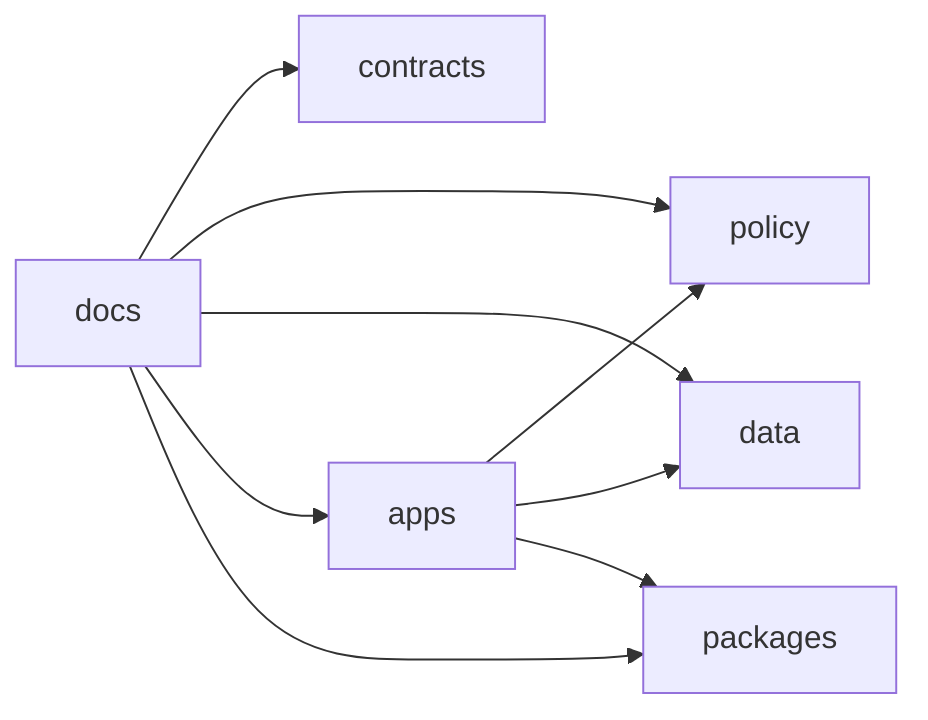

<!-- [KFM_META_BLOCK_V2]
doc_id: kfm://doc/1f731fb8-1614-4a01-a1a5-f8e5ed39c7e1
title: docs/ — Documentation hub
type: standard
version: v1
status: draft
owners: TBD
created: 2026-03-03
updated: 2026-03-03
policy_label: public
related:
  - docs/MASTER_GUIDE_v13.md
  - docs/governance/ROOT_GOVERNANCE.md
tags: [kfm, docs]
notes:
  - Entry point for repository documentation.
  - Links and directory map may contain TODOs until the repo structure is finalized.
[/KFM_META_BLOCK_V2] -->

# docs/ — Documentation Hub

> **[Confirmed] Purpose:** This folder is the home for **human-readable documentation** (guides, runbooks, ADRs, standards, architecture diagrams) that explain how KFM works and how to change it safely.

**Status:** draft • **Owners:** TBD (set via CODEOWNERS / governance)

[](./README.md)
[](#metablock-and-document-metadata)
[](#review-gates-for-docs)
[](#local-preview--checks)

---

## Quick navigation

- [Start here](#start-here)
- [Where docs fit in the repo](#where-docs-fit-in-the-repo)
- [What belongs in docs](#what-belongs-in-docs)
- [What must not go in docs](#what-must-not-go-in-docs)
- [Directory map](#directory-map)
- [MetaBlock and document metadata](#metablock-and-document-metadata)
- [Authoring rules](#authoring-rules)
- [Review gates for docs](#review-gates-for-docs)
- [How to add a new doc](#how-to-add-a-new-doc)
- [Unknowns to verify](#unknowns-to-verify)

---

## Evidence legend (required in KFM docs)

- **[Confirmed]** = grounded in KFM documentation and/or enforced policy.
- **[Proposed]** = recommended pattern; may not yet be implemented.
- **[Unknown]** = not verified in this repo snapshot; see “Unknowns to verify” for the smallest verification steps.

---

## Start here

- **[Proposed]** If you’re new, start with the “Master Guide” (e.g., `docs/MASTER_GUIDE_v13.md`) for the canonical pipeline, invariants, and the doc map.
- **[Proposed]** If you are changing governance or safety behavior, start with `docs/governance/ROOT_GOVERNANCE.md` (and related ethics/sovereignty docs if present).
- **[Proposed]** If you are changing system structure, start with `docs/architecture/` (blueprints, diagrams, subsystem contracts).
- **[Proposed]** If you are changing how quality/promotion works, start with `docs/quality/` (profiles, gates, checklists).

> **[Unknown]** If any of the paths above do not exist in your repo, keep this README as the index and update the links to match your actual structure.

---

## Where docs fit in the repo

**[Confirmed]** The repo is organized into modular layers (documentation, contracts, policy, data, apps, packages). `docs/` is the documentation layer; it explains the system and the rules, but does not replace the system-of-record artifacts (schemas, policies, datasets).


```mermaid
flowchart LR
  Docs[docs]
  Contracts[contracts]
  Policy[policy]
  Data[data]
  Apps[apps]
  Packages[packages]

  Docs --> Contracts
  Docs --> Policy
  Docs --> Data
  Docs --> Apps
  Docs --> Packages

  Apps --> Policy
  Apps --> Data
  Apps --> Packages
```

- **[Confirmed]** `docs/` explains **what** and **why** (architecture, governance, runbooks, ADRs).
- **[Proposed]** `contracts/` is the system-of-record for API/schemas (OpenAPI/JSON Schema/SHACL).
- **[Proposed]** `policy/` is the system-of-record for policy-as-code (OPA/Rego + tests).
- **[Proposed]** `data/` is the system-of-record for data lifecycle zones and catalogs.
- **[Proposed]** `apps/` and `packages/` implement the governed APIs, UI, and pipeline code.

---

## What belongs in docs/

- **[Confirmed]** Architecture docs (diagrams, subsystem contracts, sequence flows).
- **[Confirmed]** Governance docs (policy intent, review gates, safety rules).
- **[Confirmed]** ADRs (decision records with “why”, alternatives, and consequences).
- **[Confirmed]** Runbooks (how to operate, troubleshoot, recover).
- **[Confirmed]** Standards and profiles (e.g., STAC/DCAT/PROV alignment expectations, doc conventions).
- **[Proposed]** Templates (doc templates, ADR template, Story Node template) used to keep docs consistent.

---

## What must NOT go in docs/

- **[Confirmed]** Secrets (API keys, tokens, credentials) — ever.
- **[Confirmed]** Raw datasets or large binary artifacts that belong in `data/` zones or release bundles.
- **[Confirmed]** Unreviewed sensitive details (e.g., precise vulnerable locations). If in doubt: redact/generalize and route to governance review.
- **[Proposed]** Generated build outputs (unless they are versioned, attestable release artifacts with explicit governance approval).

---

## Directory map

> **[Proposed]** The structure below is a recommended *documentation* layout. Update to match your repo.

```text
docs/
  README.md                         # This file (docs index)

  MASTER_GUIDE_v13.md               # Canonical overview + doc map (if used)

  architecture/                     # Architecture blueprints, diagrams, subsystem contracts
    README.md

  governance/                       # Governance charter, ethics, sovereignty, review gates
    ROOT_GOVERNANCE.md
    REVIEW_GATES.md
    ETHICS.md
    SOVEREIGNTY.md

  standards/                        # Profiles + standards (STAC/DCAT/PROV, doc protocol, vocab)
    README.md
    KFM_DCAT_PROFILE.md
    KFM_STAC_PROFILE.md
    KFM_PROV_PROFILE.md
    KFM_MARKDOWN_WORK_PROTOCOL.md

  adr/                              # Architecture Decision Records
    README.md
    0001-example-adr.md

  runbooks/                         # Operator runbooks and recovery guides
    README.md

  quality/                          # Promotion gates, checklists, DQ profiles, receipt examples
    README.md
    profiles/
    checklists/
    examples/

  security/                         # Security standards, supply-chain, threat models
    README.md

  templates/                        # Doc templates (universal doc, story node, API extension)
    README.md

  research/                         # Source summaries and research notes
    README.md

  data/                             # Documentation *about* domains (NOT datasets themselves)
    README.md
    soils/
    air-quality/
    historical/
```

---

## MetaBlock and document metadata

- **[Confirmed]** KFM docs use a **MetaBlock** header to link documents to governance and provenance surfaces.
- **[Confirmed]** Quality/promotion gates require **structure + metadata** checks, including MetaBlock presence.

**[Proposed]** Minimal MetaBlock v2 for new docs:

```html
<!-- [KFM_META_BLOCK_V2]
doc_id: kfm://doc/<uuid>
title: <Title>
type: standard
version: v1
status: draft|review|published
owners: <team or names>
created: YYYY-MM-DD
updated: YYYY-MM-DD
policy_label: public|restricted|...
related:
  - <paths or kfm:// ids>
tags: [kfm]
notes:
  - <short notes>
[/KFM_META_BLOCK_V2] -->
```

---

## Authoring rules

- **[Confirmed]** Treat documentation as a **production surface**: it must remain reviewable, stable, and consistent with enforced policy.
- **[Confirmed]** Use “cite-or-abstain” behavior in specs/runbooks: if a process requires evidence artifacts (catalogs, receipts, policies), link to them or state what is missing.
- **[Proposed]** Keep sections “LLM-ingestible”: short paragraphs, explicit definitions, stable headings, runnable snippets.

### ADR minimum checklist (for `docs/adr/`)

- **[Proposed]** Problem statement
- **[Proposed]** Decision
- **[Proposed]** Alternatives considered
- **[Proposed]** Consequences
- **[Proposed]** Policy impact (what changes at the trust boundary)
- **[Proposed]** Rollback plan (if operationally significant)

---

## Review gates for docs

> **[Confirmed]** KFM quality defines “quality” as the absence of ambiguity plus the presence of evidence, with fail-closed gates.

### Gate expectations (docs-focused subset)

- **[Confirmed]** **Structure & Metadata**: correct location + MetaBlock present/valid.
- **[Confirmed]** **Policy & Sensitivity**: no sensitive leakage; license/sensitivity is declared where needed.
- **[Proposed]** **Link checking**: internal links resolve (or are explicitly marked TODO).
- **[Proposed]** **Change control**: CODEOWNERS / stewards approve governance-impacting docs.

### Docs change checklist (copy/paste)

- [ ] **[Confirmed]** MetaBlock v2 added/updated (`updated:` date bumped)
- [ ] **[Confirmed]** No secrets / no sensitive location leakage
- [ ] **[Proposed]** Links validated (or TODOs are explicit and tracked)
- [ ] **[Proposed]** If doc changes policy behavior, an ADR exists and governance owners approved
- [ ] **[Proposed]** If doc references datasets/schemas/policies, the referenced IDs/paths exist (or are tracked)

---

## How to add a new doc

1) **[Proposed]** Pick the smallest appropriate home (architecture vs governance vs runbook vs standard vs ADR).
2) **[Confirmed]** Add a MetaBlock v2 at the top.
3) **[Proposed]** Prefer a template from `docs/templates/` if available.
4) **[Proposed]** Add/refresh links from the closest README index (and update this `docs/README.md` if needed).
5) **[Proposed]** Run local checks (or the closest equivalent CI job).
6) **[Proposed]** Route to appropriate reviewers (CODEOWNERS + governance if policy/sensitivity changes).

---

## Local preview / checks

- **[Unknown]** Whether `make qa` or a docs-specific target exists in *this* repo snapshot.
- **[Proposed]** If present, run a single “front door” quality target (example names): `make qa`, `make check_structure`, `make linkcheck`.

---

## Unknowns to verify

These items are **[Unknown]** until you verify them in your repo:

1) Do `docs/governance/ROOT_GOVERNANCE.md` and `docs/MASTER_GUIDE_v13.md` exist?
   - Smallest verification step: `ls docs/governance docs | grep -E "ROOT_GOVERNANCE|MASTER_GUIDE"`.

2) Are MetaBlock checks enforced in CI?
   - Smallest verification step: search CI workflows for `MetaBlock` / `check_structure`.

3) What is the canonical docs owner group?
   - Smallest verification step: check `.github/CODEOWNERS` and set `owners:` in this file’s MetaBlock accordingly.

---

### Back to top

⬆️ Back to top: <a href="#docs---documentation-hub">docs/README</a>
