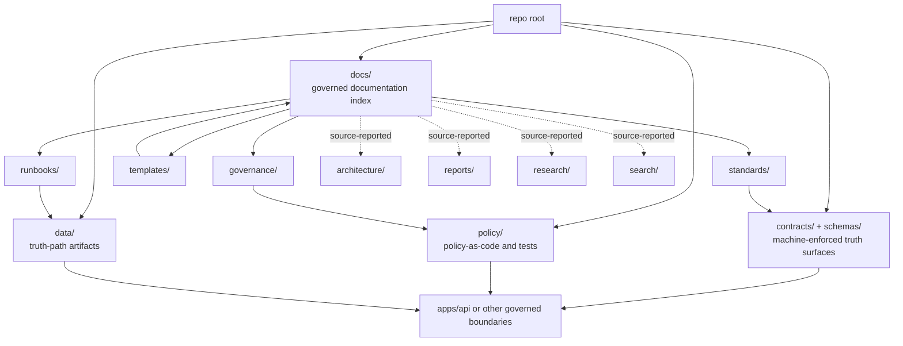

<!-- [KFM_META_BLOCK_V2]
doc_id: kfm://doc/NEEDS-VERIFICATION
title: docs
type: standard
version: v1
status: draft
owners: NEEDS VERIFICATION
created: NEEDS VERIFICATION
updated: NEEDS VERIFICATION
policy_label: NEEDS VERIFICATION
related: [../README.md, ./governance/, ./runbooks/, ./standards/, ./templates/]
tags: [kfm, docs, documentation, governance, runbooks, standards, templates]
notes: [Revised against attached KFM doctrine and source-reported repo inventories, current session exposed PDF corpus only rather than a mounted repo checkout, exact subtree paths/owners/dates still require direct verification before commit]
[/KFM_META_BLOCK_V2] -->

# docs

Governed documentation index for Kansas Frontier Matrix (KFM): architecture, standards, governance, runbooks, templates, and adjacent doc-native operating surfaces.

> **Status:** experimental  
> **Owners:** NEEDS VERIFICATION — review `../.github/CODEOWNERS` before commit  
>       
> **Quick jumps:** [Scope](#scope) · [Repo fit](#repo-fit) · [Accepted inputs](#accepted-inputs) · [Exclusions](#exclusions) · [Evidence boundary](#current-evidence-boundary) · [Directory tree](#source-reported-docs-footprint) · [Quickstart](#quickstart) · [Usage](#usage) · [Diagram](#diagram) · [Tables](#tables) · [Task list](#task-list--definition-of-done) · [FAQ](#faq) · [Appendix](#appendix)

> [!IMPORTANT]
> `docs/` is part of KFM’s governed delivery surface. It should explain the system without weakening the trust membrane, and behavior-significant changes should update docs, examples, and runbooks in the same change stream as contracts, policy, code, and tests.

## Scope

`docs/` is the human-readable operating layer for KFM.

Its job is to make doctrine, architecture, review rules, standards, procedures, and authoring conventions legible to maintainers without pretending that prose is the same thing as enforcement. In KFM terms, `docs/` should clarify the governed system, not become a second truth path or a backdoor around contracts, policy, and runtime controls.

## Repo fit

**Path:** `docs/README.md`

**Upstream anchors:** [repo root](../README.md) · [contracts](../contracts/) · [policy](../policy/) · [data](../data/) · [.github](../.github/)

**Core downstream hubs:** [governance](./governance/) · [standards](./standards/) · [templates](./templates/) · [runbooks](./runbooks/)

**Broader docs surfaces referenced in source-reported repo inventories:** [architecture](./architecture/) · [reports](./reports/) · [research](./research/) · [search](./search/) · [analyses](./analyses/) · [security](./security/) · [pipelines](./pipelines/)

**Why this directory matters:** it keeps doctrine, process, and reviewable operating knowledge close to the same evidence-first system that the rest of KFM is trying to enforce.

## Accepted inputs

Content that belongs in `docs/` includes:

- directory indexes and README files
- architecture notes, blueprints, and ADRs
- standards, profiles, and documentation protocol material
- governance, ethics, sovereignty, and review guidance
- runbooks, rollback instructions, and operator procedures
- reusable documentation templates
- story/report scaffolding and trust-visible explanatory material
- diagrams, examples, and reference notes that clarify governed behavior already enforced or intended elsewhere in the repo

## Exclusions

The following do **not** belong here as the authoritative source of truth:

- machine-enforced schemas, API contracts, and vocabularies  
  → keep in `../contracts/` and `../schemas/`
- policy bundles, policy tests, and deny-by-default enforcement logic  
  → keep in `../policy/`
- canonical data artifacts, source descriptors, receipts, manifests, and release outputs  
  → keep on the truth path under `../data/`, release surfaces, or other owning artifact homes
- runtime code, UI implementation, workers, or internal service logic  
  → keep in `../apps/`, `../packages/`, `../web/`, or the owning code surface
- secrets, credentials, signed URLs, or sensitive coordinates  
  → never store those in docs
- prose that quietly upgrades `UNKNOWN` implementation state into “already running” fact  
  → keep it explicit, staged, and reviewable

## Evidence labels used in this index

| Label | Meaning here |
| --- | --- |
| **CONFIRMED** | Supported by attached KFM doctrine or current-session workspace inspection |
| **INFERRED** | Source-reported by repo inventories, structure guides, or subordinate doc examples, but not directly re-opened in a mounted checkout |
| **PROPOSED** | Added here as a repo-native organizational improvement or safer wording |
| **UNKNOWN** | Not supported strongly enough to present as current repo reality |
| **NEEDS VERIFICATION** | Exact path, owner, date, README presence, or current implementation detail should be checked before merge |

## Current evidence boundary

This README is intentionally explicit about what the current session **did** and **did not** prove.

| Observation | Status | Why it changes this README |
| --- | --- | --- |
| Current-session workspace inspection exposed attached PDFs, not a directly mounted KFM repo checkout | **CONFIRMED** | Exact subtree contents, owners, README files, and workflow wiring stay visible as `NEEDS VERIFICATION` |
| `docs/` is source-reported as a top-level repo surface for human-readable docs, ADRs, runbooks, and related guidance | **INFERRED** | This index can describe role and boundaries without claiming direct tree verification |
| KFM doctrine treats documentation as a production surface tied to contracts, examples, runbooks, and release discipline | **CONFIRMED** | This README should frame docs as operational, not decorative |
| Governance, standards, templates, runbooks, reports/story nodes, research, and architecture surfaces are repeatedly referenced in repo-shape and template materials | **INFERRED** | The tree below uses a source-reported footprint rather than a falsely “verified” live tree |
| Exact files like `docs/governance/README.md`, `docs/runbooks/README.md`, `docs/standards/README.md`, and `docs/templates/README.md` were not directly inspected in this session | **NEEDS VERIFICATION** | Directory links are safer than overconfident file-level links in the index body |

> [!CAUTION]
> Treat the tree below as a **source-reported docs footprint**, not as a substitute for `find docs/` in a mounted checkout.

## Source-reported docs footprint

```text
docs/
├── README.md                                  # This index (target of the present revision)
├── architecture/                              # INFERRED
│   ├── ... architecture guides / blueprints
│   └── adr/                                   # INFERRED in some structure guides
├── governance/                                # INFERRED
│   ├── ROOT_GOVERNANCE.md
│   ├── ETHICS.md
│   ├── SOVEREIGNTY.md
│   └── REVIEW_GATES.md
├── standards/                                 # INFERRED
│   ├── ... STAC / DCAT / PROV / protocol profiles
│   └── ... repo/documentation standards
├── templates/                                 # INFERRED
│   ├── TEMPLATE__KFM_UNIVERSAL_DOC.md
│   ├── TEMPLATE__STORY_NODE_V3.md
│   └── TEMPLATE__API_CONTRACT_EXTENSION.md
├── runbooks/                                  # INFERRED
│   └── reliability/
│       └── trigger-mechanisms/README.md       # source-reported example
├── reports/                                   # INFERRED
│   └── story_nodes/
├── research/                                  # INFERRED
├── search/                                    # INFERRED
├── analyses/                                  # INFERRED
├── security/                                  # INFERRED
└── pipelines/                                 # INFERRED
```

## Quickstart

Use a verification-first sequence before editing or expanding `docs/`.

> [!WARNING]
> The commands below are **repo-local verification examples**. They are the right next checks once a live checkout is mounted, but they are not proof that those paths already existed in the current PDF-only workspace.

```bash
# Inspect the docs subtree
find docs -maxdepth 3 -type f | sort

# Open the directory index and the most likely core hubs
sed -n '1,200p' docs/README.md
find docs/governance docs/standards docs/templates docs/runbooks -maxdepth 2 -type f 2>/dev/null | sort

# Re-check the machine-enforced neighbors before documenting behavior as fact
find contracts schemas policy -maxdepth 3 -type f 2>/dev/null | sort | sed -n '1,200p'

# Check release-facing ownership and repo-level expectations
sed -n '1,200p' .github/CODEOWNERS 2>/dev/null
sed -n '1,200p' .github/README.md 2>/dev/null
sed -n '1,200p' README.md 2>/dev/null

# Search for trust and publication vocabulary that should stay terminologically stable
grep -RIn "trust membrane\|EvidenceBundle\|promotion\|cite-or-abstain\|fail-closed" docs contracts policy schemas 2>/dev/null
```

## Usage

### Read `docs/` in this order

1. Start here to understand the docs boundary, evidence posture, and current verification limits.
2. Read [`./governance/`](./governance/) when the change affects review, rights, ethics, sovereignty, withholding, escalation, or release conditions.
3. Read [`./standards/`](./standards/) when the question is “what must be true?”
4. Read [`./templates/`](./templates/) before creating new governed docs or changing document structure.
5. Read [`./runbooks/`](./runbooks/) when the question is “how do we operate, recover, or contain this safely?”
6. Read source-reported neighboring homes such as [`./architecture/`](./architecture/), [`./reports/`](./reports/), or [`./research/`](./research/) only after the owning boundary is clear.

### Change rule

When a change is behavior-significant, `docs/` should not move alone. The expected companion surfaces are:

| If you changed... | Re-check alongside docs |
| --- | --- |
| behavior or public meaning | contracts, schemas, policy, tests, release evidence |
| review or publication gates | governance docs, runbooks, policy bundles, approval paths |
| authoring patterns or README structure | templates, standards, neighboring directory indexes |
| trust-visible UX or evidence flows | UI doctrine, runtime envelopes, example payloads, screenshots/diagrams if owned here |
| failure, rollback, or correction posture | runbooks, release/correction artifacts, observability join points |

## Diagram


```mermaid
flowchart TD
    ROOT["repo root"] --> DOCS["docs/<br/>governed documentation index"]
    ROOT --> CONTRACTS["contracts/ + schemas/<br/>machine-enforced truth surfaces"]
    ROOT --> POLICY["policy/<br/>policy-as-code and tests"]
    ROOT --> DATA["data/<br/>truth-path artifacts"]

    DOCS --> GOV["governance/"]
    DOCS --> STD["standards/"]
    DOCS --> TMP["templates/"]
    DOCS --> RUN["runbooks/"]

    DOCS -. source-reported .-> ARCH["architecture/"]
    DOCS -. source-reported .-> RPT["reports/"]
    DOCS -. source-reported .-> RES["research/"]
    DOCS -. source-reported .-> SRCH["search/"]

    GOV --> POLICY
    STD --> CONTRACTS
    RUN --> DATA
    TMP --> DOCS

    CONTRACTS --> API["apps/api or other governed boundaries"]
    POLICY --> API
    DATA --> API
```

## Tables

### Documentation placement matrix

| Artifact or change | Primary home | Why |
| --- | --- | --- |
| Normative profiles, repo/document standards, metadata guidance | [`./standards/`](./standards/) | These define expected truth and structure |
| Governance, ethics, sovereignty, review, and rights handling | [`./governance/`](./governance/) | These decide what may be promoted, withheld, generalized, or denied |
| Operator procedures, rollback steps, stale-state handling, correction flow | [`./runbooks/`](./runbooks/) | These make failure and recovery reproducible |
| Reusable documentation scaffolds | [`./templates/`](./templates/) | These keep authoring consistent and reviewable |
| Story/report narrative artifacts | [`./reports/`](./reports/) | These are presentation surfaces, not policy or schema homes |
| Architecture notes and ADRs | [`./architecture/`](./architecture/) | These explain structure and decisions without replacing contracts |
| API contracts, schemas, controlled vocabularies | [`../contracts/`](../contracts/), [`../schemas/`](../schemas/) | These are machine-enforced interfaces |
| Policy bundles and policy tests | [`../policy/`](../policy/) | These are executable enforcement surfaces |
| Raw/work/processed/catalog/release artifacts | [`../data/`](../data/) or owning artifact homes | These belong on the truth path, not in docs prose |

### Trust obligations by docs surface

| Surface | Primary question | Minimum obligation |
| --- | --- | --- |
| `docs/README.md` | Where do I start, and what is verified versus inferred? | Keep the evidence boundary visible |
| `docs/governance/` | What is allowed, reviewed, withheld, or escalated? | Match policy posture and fail-closed doctrine |
| `docs/standards/` | What must be true? | Stay stable, version-aware, and cross-linked to enforcement |
| `docs/templates/` | How should we author governed docs? | Keep metadata, review posture, and promotion paths explicit |
| `docs/runbooks/` | How do we operate and recover safely? | Include prerequisites, validation, rollback, and output artifacts |
| Source-reported wider docs areas | What context do supporting surfaces add? | Avoid outranking doctrine or implying unverified runtime reality |

## Task list / Definition of done

Use this checklist before treating `docs/README.md` as ready for commit.

- [ ] Resolve `doc_id`, owners, created date, updated date, and `policy_label`
- [ ] Verify the live `docs/` subtree from a mounted repo checkout
- [ ] Confirm whether `./governance/README.md`, `./runbooks/README.md`, `./standards/README.md`, and `./templates/README.md` exist, or keep directory-level links instead
- [ ] Reconcile the source-reported wider docs footprint with the real tree
- [ ] Confirm ownership in `../.github/CODEOWNERS`
- [ ] Confirm relative links render correctly on GitHub
- [ ] Keep docs/examples/runbooks synchronized with any behavior-significant change in contracts, policy, code, or tests
- [ ] Confirm the Mermaid diagram still matches the mounted tree
- [ ] Re-check whether any additional top-level docs hubs belong in the index
- [ ] Remove or keep `NEEDS VERIFICATION` markers deliberately — not by accident

## FAQ

### Why does this index use so many verification markers?

Because the current session exposed doctrine-rich PDFs, not a directly mounted repo checkout. KFM’s own truth posture prefers visible incompleteness over polished overclaiming.

### Why are there directory links instead of exact `README.md` links in several places?

Because the directory role is well supported by source-reported repo inventories, but several exact child README files were not directly opened in this session.

### Why keep `docs/` distinct from `contracts/`, `schemas/`, and `policy/`?

Because KFM separates explanation from enforcement. `docs/` explains and guides; contracts and policy enforce.

### When should a docs change block release?

Whenever behavior changed materially enough that stale docs, examples, or runbooks would cause operators, reviewers, or contributors to misunderstand what the system now does.

## Appendix

<details>
<summary>Source-reported wider docs examples</summary>

The examples below are useful because they show how broad the `docs/` plane already is in attached repo inventories and doc-structure materials, even though the current session did not directly mount that tree.

| Source-reported area | Example path(s) |
| --- | --- |
| Governance | `docs/governance/ROOT_GOVERNANCE.md`, `docs/governance/ETHICS.md`, `docs/governance/SOVEREIGNTY.md`, `docs/governance/REVIEW_GATES.md` |
| Templates | `docs/templates/TEMPLATE__KFM_UNIVERSAL_DOC.md`, `docs/templates/TEMPLATE__STORY_NODE_V3.md`, `docs/templates/TEMPLATE__API_CONTRACT_EXTENSION.md` |
| Runbooks | `docs/runbooks/reliability/trigger-mechanisms/README.md`, `docs/runbooks/reliability/trigger-retry-matrix.md` |
| Research | `docs/research/README.md`, `docs/research/drafts/README.md`, `docs/research/source_summaries/...` |
| Search | `docs/search/README.md`, `docs/search/drift/...` |
| Analyses | `docs/analyses/.../README.md` |
| Reports | `docs/reports/story_nodes/...` |
| Pipelines | `docs/pipelines/...` |
| Architecture | `docs/architecture/...`, sometimes with `adr/` or `diagrams/` underneath in structure guides |

</details>

<details>
<summary>Current-session limits that still matter before merge</summary>

- The mounted filesystem visible in this session exposed PDFs only.
- No live repo subtree, README files, CODEOWNERS contents, workflows, schemas, tests, manifests, or runtime logs were directly inspected.
- This README therefore aims to be **review-ready**, not falsely “fully verified.”

</details>

[Back to top](#docs)