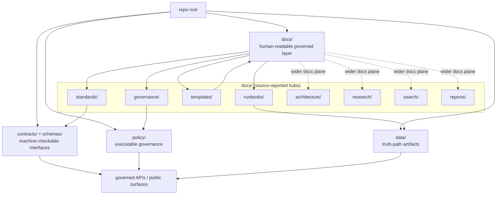

<!-- [KFM_META_BLOCK_V2]
doc_id: kfm://doc/NEEDS-VERIFICATION
title: docs
type: standard
version: v1
status: draft
owners: NEEDS VERIFICATION
created: NEEDS VERIFICATION
updated: NEEDS VERIFICATION
policy_label: NEEDS VERIFICATION
related: [../README.md, ./governance/, ./runbooks/, ./standards/, ./templates/]
tags: [kfm, docs, documentation, governance, runbooks, standards, templates]
notes: [Current session directly verified PDF corpus only; live docs subtree, owners, dates, labels, and exact child README presence still require checkout inspection before commit.]
[/KFM_META_BLOCK_V2] -->

# docs

Governed documentation index for Kansas Frontier Matrix (KFM): architecture, standards, governance, runbooks, templates, and adjacent doc-native operating surfaces.

> **Status:** experimental  
> **Owners:** NEEDS VERIFICATION — review `../.github/CODEOWNERS` before commit  
>       
> **Quick jumps:** [Scope](#scope) · [Repo fit](#repo-fit) · [Accepted inputs](#accepted-inputs) · [Exclusions](#exclusions) · [Evidence boundary](#current-evidence-boundary) · [Directory tree](#source-reported-docs-footprint) · [Quickstart](#quickstart) · [Usage](#usage) · [Diagram](#diagram) · [Tables](#tables) · [Task list](#task-list--definition-of-done) · [FAQ](#faq) · [Appendix](#appendix)

> [!IMPORTANT]
> `docs/` is part of KFM’s governed delivery surface. It should explain the system without weakening the trust membrane, and behavior-significant changes should update docs, examples, runbooks, and adjacent verification material in the same change stream as contracts, policy, code, and tests.

## Scope

`docs/` is the human-readable operating layer for KFM.

Its job is to make doctrine, architecture, review rules, standards, procedures, and authoring conventions legible to maintainers without pretending that prose is the same thing as enforcement. In KFM terms, `docs/` should clarify the governed system, not become a second truth path or a backdoor around contracts, policy, and runtime controls.

## Repo fit

**Path target:** `docs/README.md`  
**Path status:** `NEEDS VERIFICATION` in a live checkout

**Source-reported upstream anchors:** [repo root](../README.md) · [contracts](../contracts/) · [policy](../policy/) · [data](../data/) · [.github](../.github/)

**Core downstream hubs:** [governance](./governance/) · [standards](./standards/) · [templates](./templates/) · [runbooks](./runbooks/)

**Broader docs surfaces referenced in source-reported inventories:** [architecture](./architecture/) · [reports](./reports/) · [research](./research/) · [search](./search/) · [analyses](./analyses/) · [security](./security/) · [pipelines](./pipelines/)

**Why this directory matters:** it keeps doctrine, process, and reviewable operating knowledge close to the same evidence-first system that the rest of KFM is trying to enforce.

## Accepted inputs

Content that belongs in `docs/` includes:

- directory indexes and README files
- architecture notes, blueprints, and ADRs
- standards, profiles, and documentation protocol material
- governance, ethics, sovereignty, and review guidance
- runbooks, rollback instructions, and operator procedures
- reusable documentation templates
- story/report scaffolding and trust-visible explanatory material
- diagrams, examples, and reference notes that clarify governed behavior already enforced or intended elsewhere in the repo

## Exclusions

The following do **not** belong here as the authoritative source of truth:

- machine-enforced schemas, API contracts, and controlled vocabularies  
  → keep in `../contracts/` and `../schemas/`
- policy bundles, decision tests, and deny-by-default enforcement logic  
  → keep in `../policy/`
- canonical data artifacts, source descriptors, receipts, manifests, and release outputs  
  → keep on the truth path under `../data/` or the owning artifact home
- runtime code, worker logic, UI implementation, or internal service behavior  
  → keep in the owning code surface
- secrets, credentials, signed URLs, or sensitive coordinates  
  → never store those in docs
- prose that quietly upgrades `UNKNOWN` implementation state into “already running” fact  
  → keep it explicit, staged, and reviewable

> [!NOTE]
> Older source-reported inventories sometimes mention “schemas” under `docs/` as human-readable support material. This index treats **machine-enforced** schemas as contract surfaces and reserves `docs/` for explanatory, review, and operational prose.

## Evidence labels used in this index

| Label | Meaning here |
| --- | --- |
| **CONFIRMED** | Supported by attached KFM doctrine or direct current-session workspace inspection |
| **INFERRED** | Source-reported by repo inventories, support files, or subordinate doc examples, but not directly re-opened in a mounted checkout |
| **PROPOSED** | Added here as a repo-native organizational improvement or safer wording |
| **UNKNOWN** | Not supported strongly enough to present as current repo reality |
| **NEEDS VERIFICATION** | Exact path, owner, date, README presence, or current implementation detail should be checked before merge |

## Current evidence boundary

This index is intentionally explicit about what the current session **did** and **did not** prove.

| Observation | Status | Why it changes this README |
| --- | --- | --- |
| Current-session workspace inspection exposed attached PDFs, not a directly mounted KFM repo checkout | **CONFIRMED** | Exact subtree contents, owners, README files, and workflow wiring stay visible as `NEEDS VERIFICATION` |
| D1 and D2 are repeatedly identified as the strongest doctrinal anchors in the attached KFM corpus | **CONFIRMED** | This index should follow KFM’s evidence-first, trust-membrane, and authoritative-versus-derived vocabulary |
| Documentation is treated by KFM as a production surface tied to release evidence, runbooks, and tests | **CONFIRMED** | This README should frame docs as operational, not decorative |
| Wider `docs/` areas such as governance, standards, templates, runbooks, research, search, and related README surfaces are source-reported in attached inventories and support files | **INFERRED** | The tree below is presented as a source-reported footprint, not as a falsely “live” filesystem dump |
| Exact child files such as `docs/governance/README.md`, `docs/runbooks/README.md`, `docs/standards/README.md`, and `docs/templates/README.md` were not directly inspected in this session | **NEEDS VERIFICATION** | Directory-level links are safer than overconfident file-level links in the index body |
| Some older/supporting materials describe repo layouts and module placements in implementation-shaped language | **CONFIRMED** | This index keeps repo-structure claims proportional and does not treat them as current mounted fact |

> [!CAUTION]
> Treat the tree below as a **source-reported docs footprint**, not as a substitute for `find docs/` in a mounted checkout.

## Source-reported docs footprint

```text
docs/
├── README.md                                  # target of this index revision
├── governance/                                # INFERRED
│   ├── ROOT_GOVERNANCE.md
│   ├── ETHICS.md
│   └── SOVEREIGNTY.md
├── runbooks/                                  # INFERRED
│   └── reliability/
│       ├── trigger-mechanisms/README.md
│       └── trigger-retry-matrix.md
├── standards/                                 # INFERRED
│   └── ... standards, profiles, and protocol docs
├── templates/                                 # INFERRED
│   ├── TEMPLATE__KFM_UNIVERSAL_DOC.md
│   ├── TEMPLATE__STORY_NODE_V3.md
│   └── TEMPLATE__API_CONTRACT_EXTENSION.md
├── architecture/                              # INFERRED
├── reports/                                   # INFERRED
│   └── story_nodes/
├── research/                                  # INFERRED
│   ├── README.md
│   └── source_summaries/
│       ├── README.md
│       └── by_type/
│           ├── README.md
│           ├── books/README.md
│           ├── maps/README.md
│           └── web/README.md
├── search/                                    # INFERRED
│   ├── README.md
│   └── drift/
│       ├── README.md
│       ├── embeddings/README.md
│       ├── examples/README.md
│       ├── graph-queries/README.md
│       ├── hyde/README.md
│       └── stac/README.md
├── analyses/                                  # INFERRED
├── security/                                  # INFERRED
└── pipelines/                                 # INFERRED
```

## Quickstart

Use a verification-first sequence before editing or expanding `docs/`.

> [!WARNING]
> The commands below are **repo-local verification examples**. They are the right next checks once a live checkout is mounted, but they are not proof that those paths already existed in the current PDF-only workspace.

```bash
# Inspect the docs subtree
find docs -maxdepth 4 -type f | sort

# Open the directory index and the most likely core hubs
sed -n '1,220p' docs/README.md
find docs/governance docs/standards docs/templates docs/runbooks -maxdepth 3 -type f 2>/dev/null | sort

# Re-check machine-enforced neighbors before documenting behavior as fact
find contracts schemas policy -maxdepth 4 -type f 2>/dev/null | sort | sed -n '1,220p'

# Confirm repo-level ownership and contribution expectations
sed -n '1,200p' .github/CODEOWNERS 2>/dev/null
find .github -maxdepth 2 -type f 2>/dev/null | sort

# Search for terminology that should remain stable across docs
grep -RIn "trust membrane\|EvidenceBundle\|cite-or-abstain\|authoritative-versus-derived\|fail-closed" \
  docs contracts policy schemas 2>/dev/null

# Check for source-reported template and governance refs
grep -RIn "TEMPLATE__KFM_UNIVERSAL_DOC\|ROOT_GOVERNANCE.md\|ETHICS.md\|SOVEREIGNTY.md" \
  docs .github 2>/dev/null
```

## Usage

### Read `docs/` in this order

1. Start here to understand the docs boundary, evidence posture, and current verification limits.
2. Read [`./governance/`](./governance/) when the change affects review, rights, ethics, sovereignty, withholding, escalation, or release conditions.
3. Read [`./standards/`](./standards/) when the question is “what must be true?”
4. Read [`./templates/`](./templates/) before creating new governed docs or changing document structure.
5. Read [`./runbooks/`](./runbooks/) when the question is “how do we operate, recover, or contain this safely?”
6. Read wider source-reported areas such as [`./architecture/`](./architecture/), [`./reports/`](./reports/), or [`./research/`](./research/) only after the owning boundary is clear.

### Documentation update rule

When a change is behavior-significant, `docs/` should not move alone and it should not lag behind.

| If you changed... | Re-check alongside docs |
| --- | --- |
| public meaning or API-visible behavior | contracts, schemas, policy, tests, release evidence |
| review or publication gates | governance docs, runbooks, policy bundles, approval paths |
| authoring patterns or README structure | templates, standards, neighboring directory indexes |
| trust-visible UX or evidence flows | UI doctrine, example payloads, diagrams, screenshots if owned here |
| failure, rollback, stale-state handling, or correction behavior | runbooks, release/correction artifacts, observability join points |

### Writing rule

Keep explanation downstream of evidence. `docs/` can clarify, constrain, and guide, but it should not silently become the only place where a critical contract, policy rule, or runtime guarantee “exists.”

## Diagram


```mermaid
flowchart TD
    ROOT["repo root"] --> DOCS["docs/<br/>human-readable governed layer"]
    ROOT --> CONTRACTS["contracts/ + schemas/<br/>machine-checkable interfaces"]
    ROOT --> POLICY["policy/<br/>executable governance"]
    ROOT --> DATA["data/<br/>truth-path artifacts"]

    subgraph D["docs/ (source-reported hubs)"]
        GOV["governance/"]
        STD["standards/"]
        TMP["templates/"]
        RUN["runbooks/"]
        ARCH["architecture/"]
        RES["research/"]
        SRCH["search/"]
        RPT["reports/"]
    end

    DOCS --> GOV
    DOCS --> STD
    DOCS --> TMP
    DOCS --> RUN
    DOCS -. wider docs plane .-> ARCH
    DOCS -. wider docs plane .-> RES
    DOCS -. wider docs plane .-> SRCH
    DOCS -. wider docs plane .-> RPT

    GOV --> POLICY
    STD --> CONTRACTS
    RUN --> DATA
    TMP --> DOCS

    CONTRACTS --> PUB["governed APIs / public surfaces"]
    POLICY --> PUB
    DATA --> PUB
```

## Tables

### Documentation placement matrix

| Artifact or change | Primary home | Why |
| --- | --- | --- |
| Normative profiles, repo/document standards, metadata guidance | [`./standards/`](./standards/) | These define expected truth and structure |
| Governance, ethics, sovereignty, review, and rights handling | [`./governance/`](./governance/) | These decide what may be promoted, withheld, generalized, or denied |
| Operator procedures, rollback steps, stale-state handling, correction flow | [`./runbooks/`](./runbooks/) | These make failure and recovery reproducible |
| Reusable documentation scaffolds | [`./templates/`](./templates/) | These keep authoring consistent and reviewable |
| Story/report narrative artifacts | [`./reports/`](./reports/) | These are presentation surfaces, not contract or schema homes |
| Architecture notes and ADRs | [`./architecture/`](./architecture/) | These explain structure and decisions without replacing contracts |
| API contracts, schemas, controlled vocabularies | [`../contracts/`](../contracts/), [`../schemas/`](../schemas/) | These are machine-enforced interfaces |
| Policy bundles and policy tests | [`../policy/`](../policy/) | These are executable enforcement surfaces |
| Raw/work/processed/catalog/release artifacts | [`../data/`](../data/) or owning artifact homes | These belong on the truth path, not in docs prose |

### Trust obligations by docs surface

| Surface | Primary question | Minimum obligation |
| --- | --- | --- |
| `docs/README.md` | Where do I start, and what is verified versus inferred? | Keep the evidence boundary visible |
| `docs/governance/` | What is allowed, reviewed, withheld, or escalated? | Match fail-closed doctrine and policy posture |
| `docs/standards/` | What must be true? | Stay stable, version-aware, and cross-linked to enforcement |
| `docs/templates/` | How should we author governed docs? | Keep metadata, review posture, and promotion paths explicit |
| `docs/runbooks/` | How do we operate and recover safely? | Include prerequisites, validation, rollback, and resulting artifacts |
| Wider source-reported docs areas | What context do supporting surfaces add? | Avoid outranking doctrine or implying unverified runtime reality |

### Source-reported conventions visible in adjacent docs

| Pattern | Example path(s) | Status | Why it matters here |
| --- | --- | --- | --- |
| README-heavy subtree indexes | `docs/runbooks/reliability/trigger-mechanisms/README.md`, `docs/search/README.md`, `docs/search/drift/README.md`, `docs/research/source_summaries/by_type/README.md` | **INFERRED** | Supports this file behaving as a navigational docs index |
| Governance cross-links | `docs/governance/ROOT_GOVERNANCE.md`, `docs/governance/ETHICS.md`, `docs/governance/SOVEREIGNTY.md` | **INFERRED** | Suggests docs commonly tie prose back to governing review surfaces |
| Governed templates | `docs/templates/TEMPLATE__KFM_UNIVERSAL_DOC.md`, `docs/templates/TEMPLATE__STORY_NODE_V3.md`, `docs/templates/TEMPLATE__API_CONTRACT_EXTENSION.md` | **INFERRED** | Indicates template-backed documentation culture rather than ad hoc prose |
| Structured metadata/front matter | version/status/path/governance refs in source-reported docs examples | **INFERRED** | Suggests a documentation protocol exists, even though exact live repo standards still need checkout verification |
| Validation expectations | rendering checks, broken-link avoidance, no secrets, path/location consistency | **INFERRED** | Justifies a stronger definition-of-done for docs changes |

## Task list / Definition of done

Use this checklist before treating `docs/README.md` as ready for commit.

- [ ] Resolve `doc_id`, owners, created date, updated date, and `policy_label`
- [ ] Verify the live `docs/` subtree from a mounted repo checkout
- [ ] Confirm whether `./governance/README.md`, `./runbooks/README.md`, `./standards/README.md`, and `./templates/README.md` exist, or keep directory-level links instead
- [ ] Reconcile the source-reported wider docs footprint with the real tree
- [ ] Confirm ownership in `../.github/CODEOWNERS`
- [ ] Confirm relative links render correctly on GitHub
- [ ] Re-check whether any human-readable schema/profile notes live under `docs/` and point machine-enforced files to `contracts/` / `schemas/`
- [ ] Keep docs/examples/runbooks synchronized with any behavior-significant change in contracts, policy, code, or tests
- [ ] Confirm the Mermaid diagram still matches the mounted tree
- [ ] Remove or keep `NEEDS VERIFICATION` markers deliberately — not by accident

## FAQ

### Why does this index use so many verification markers?

Because the current session exposed doctrine-rich PDFs, not a directly mounted repo checkout. KFM’s own truth posture prefers visible incompleteness over polished overclaiming.

### Why are several links directory-level instead of file-level?

Because the directory role is well supported by source-reported repo inventories, but several exact child README files were not directly opened in this session.

### Why keep `docs/` distinct from `contracts/`, `schemas/`, and `policy/`?

Because KFM separates explanation from enforcement. `docs/` explains and guides; contracts and policy enforce.

### When should a docs change block release?

When behavior changed materially enough that stale docs, examples, diagrams, or runbooks would cause contributors, operators, reviewers, or users to misunderstand what the system now does.

## Appendix

<details>
<summary>Source-reported wider docs examples</summary>

The examples below are useful because they show how broad the `docs/` plane already appears in attached inventories and support materials, even though the current session did not directly mount that tree.

| Source-reported area | Example path(s) |
| --- | --- |
| Governance | `docs/governance/ROOT_GOVERNANCE.md`, `docs/governance/ETHICS.md`, `docs/governance/SOVEREIGNTY.md` |
| Templates | `docs/templates/TEMPLATE__KFM_UNIVERSAL_DOC.md`, `docs/templates/TEMPLATE__STORY_NODE_V3.md`, `docs/templates/TEMPLATE__API_CONTRACT_EXTENSION.md` |
| Runbooks | `docs/runbooks/reliability/trigger-mechanisms/README.md`, `docs/runbooks/reliability/trigger-retry-matrix.md` |
| Research | `docs/research/README.md`, `docs/research/source_summaries/README.md`, `docs/research/source_summaries/by_type/{books,maps,web}/README.md` |
| Search | `docs/search/README.md`, `docs/search/drift/{README.md,graph-queries/README.md,hyde/README.md,embeddings/README.md,examples/README.md,stac/README.md}` |
| Reports | `docs/reports/story_nodes/...` |
| Analyses / security / pipelines | source-reported in wider inventories and notes, exact paths still `NEEDS VERIFICATION` |

</details>

<details>
<summary>Current-session limits that still matter before merge</summary>

- The mounted filesystem directly visible in this session exposed PDFs only.
- No live repo subtree, README files, CODEOWNERS contents, workflows, schemas, tests, manifests, or runtime logs were directly inspected.
- This index therefore aims to be **review-ready**, not falsely “fully verified.”
- Any conflicting live-tree reality should outrank this source-reported footprint once a mounted checkout is available.

</details>

[Back to top](#docs)
