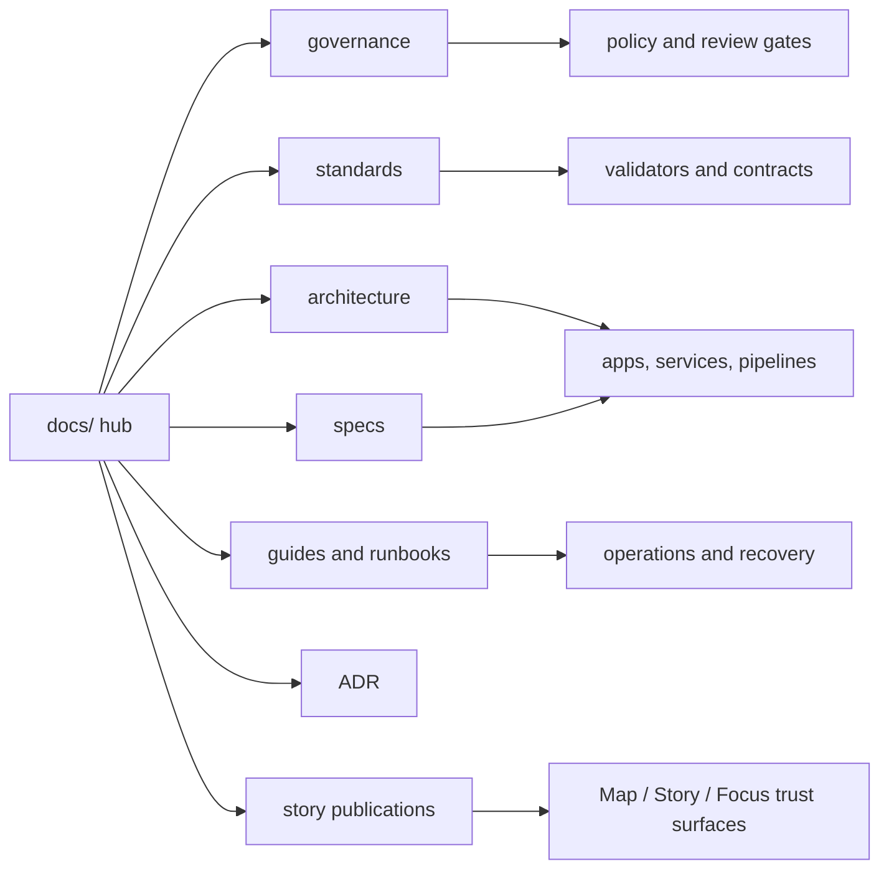

<!-- [KFM_META_BLOCK_V2]
doc_id: kfm://doc/1f731fb8-1614-4a01-a1a5-f8e5ed39c7e1
title: docs/ — Documentation hub
type: standard
version: v2
status: draft
owners: TBD
created: 2026-03-03
updated: 2026-03-06
policy_label: public
related:
  - docs/MASTER_GUIDE_v13.md
  - docs/governance/ROOT_GOVERNANCE.md
tags: [kfm, docs]
notes:
  - Root documentation hub for repo-side governed documentation.
  - Branch-specific paths remain UNKNOWN until verified on the active checkout.
[/KFM_META_BLOCK_V2] -->

<a id="top"></a>

# `docs/`
Governed documentation hub for how Kansas Frontier Matrix is explained, constrained, operated, and published.


## Impact

**Status:** draft  
**Owners:** TBD (verify with `CODEOWNERS`)  
**Policy label:** public  
**Repo path:** `docs/`  

**Quick links:** [Purpose](#purpose) · [Non-negotiables](#non-negotiables) · [Where docs fit](#where-docs-fit) · [Directory map](#directory-map) · [Add a document](#add-a-document) · [Review gates](#review-gates)

## Purpose

**CONFIRMED:** `docs/` is a production surface, not a dumping ground.

This directory exists to make KFM governable in human-readable form. It is where contributors, reviewers, operators, and editors should be able to answer four questions quickly:

1. What is authoritative?
2. Where does a new document belong?
3. What review or CI gates apply?
4. What should never be published or implied here?

**UNKNOWN:** the exact branch layout, file names, and index structure on the active checkout.

## Non-negotiables

- **CONFIRMED — docs as production surface:** behavior changes update docs, templates, tests, and runbooks together.
- **CONFIRMED — trust membrane:** no document may describe or normalize UI or client behavior that bypasses governed APIs and policy.
- **CONFIRMED — truth path:** docs must not imply publication paths that skip lifecycle zones, receipts, catalogs, or policy review.
- **CONFIRMED — cite-or-abstain:** documentation for Story and Focus surfaces must assume resolvable evidence, or abstention.
- **CONFIRMED — default-deny:** if rights, sensitivity, or evidence are unclear, the document must fail closed rather than sound more certain than the system is.

## Where docs fit

`docs/` is the repo’s human-facing control plane. It explains and constrains what happens elsewhere.


```mermaid
flowchart LR
  A[docs/ hub] --> B[governance]
  A --> C[standards]
  A --> D[architecture]
  A --> E[specs]
  A --> F[guides and runbooks]
  A --> G[ADR]
  A --> H[story publications]

  B --> I[policy and review gates]
  C --> J[validators and contracts]
  D --> K[apps, services, pipelines]
  E --> K
  F --> L[operations and recovery]
  H --> M[Map / Story / Focus trust surfaces]
```

**CONFIRMED:** `docs/` sits beside `contracts/`, `policy/`, `data/`, and application code.  
**PROPOSED:** `docs/` should explain those systems and point to their machine-readable truth, not replace it.

## What belongs here

Use `docs/` for governed, human-readable material such as:

- architecture and subsystem boundaries
- governance rules, review triggers, ethics, and sovereignty guidance
- standards and profiles
- ADRs and major decision history
- buildable design specs
- contributor guides and operator runbooks
- templates for governed documents and Story Nodes
- reference indices that help humans find contracts, schemas, APIs, and catalogs
- governed narrative artifacts, if the branch stores Story Nodes under `docs/`

## What stays out

Do not use `docs/` for:

- secrets, tokens, or credentials
- raw datasets, promoted data artifacts, or large generated outputs
- unrestricted publication of sensitive locations or culturally restricted details
- authoritative machine contracts when `contracts/` or `policy/` is the source of truth
- branch-state claims that have not been verified

## Authority model

Not all documents carry the same authority.

| Area | Role | Authority | Typical use |
|---|---|---|---|
| `governance/` | policy, review, ethics, sovereignty | highest | what is allowed, blocked, or escalated |
| `standards/` | norms, profiles, repo conventions | high | what must conform and how it is checked |
| `architecture/` | boundaries, responsibilities, invariants | high | how the system is structured |
| `adr/` | recorded decisions and rationale | high | why a major choice exists |
| `specs/` | buildable design documents | medium-high | what should be implemented and tested |
| `guides/` | contributor how-to material | medium | how recurring work is done |
| `runbooks/` | operator procedures | high for operations | how to deploy, restore, roll back, and respond |
| `templates/` | approved document starting points | medium | how new docs should be authored |
| `reference/` | human index into machine contracts | medium | where to find schemas, APIs, and registries |
| `story/` or `stories/` | governed narrative publication | highest for public narrative | what can ship to public trust surfaces |

## Directory map

**PROPOSED target shape:** keep the hub small, obvious, and reviewable.

```text
docs/
├── README.md
├── adr/
├── architecture/
├── governance/
├── standards/
├── specs/
├── guides/
├── runbooks/
├── templates/
├── reference/
└── story/ or stories/   # verify branch convention before standardizing
```

### Directory responsibilities

| Directory | Put this here | Do not put this here |
|---|---|---|
| `architecture/` | system context, trust membrane, subsystem boundaries, diagrams | speculative ideas with no owner or enforcement path |
| `governance/` | policy labels, review rules, ethics, sovereignty, escalation | informal advice that weakens gates |
| `standards/` | normative profiles and conventions | one-off local tips |
| `adr/` | recorded decisions, tradeoffs, rollback implications | rationale hidden only in chat or PR comments |
| `specs/` | buildable design docs linked to contracts/tests | wishlists with no path to implementation |
| `guides/` | contributor workflows and onboarding | incident or recovery steps that need runbook rigor |
| `runbooks/` | deploy, restore, rollback, incident, maintenance | architecture theory |
| `templates/` | approved skeletons and examples | completed production docs |
| `reference/` | human index to APIs, schemas, vocabularies, catalogs | duplicate machine truth |
| `story/` / `stories/` | governed narrative artifacts with citations and review state | casual drafts presented as published history |

## Narrative publication rules

**CONFIRMED:** Story Nodes are governed publications, not just markdown pages.

A publishable story must:

- declare scope
- separate factual observation from interpretation
- include citations for factual claims
- include licensing and attribution for embedded media
- include `policy_label` and `review_state`
- avoid restricted coordinates and unresolved rights

If a story touches Indigenous histories, restricted sites, archaeological locations, or other sensitive places, governance review is required.

If permissions are unclear, the safe default is a restricted draft, not publication.

## Document requirements

Every governed document should meet these minimums:

- stable MetaBlock v2 header
- clear title and one-line purpose
- correct home in the directory map
- explicit ownership or an explicit owner gap
- meaningful headings and relative links
- reviewable changes that can be connected to code, policy, or process changes

### MetaBlock v2

```html
<!-- [KFM_META_BLOCK_V2]
doc_id: kfm://doc/<uuid>
title: <Title>
type: <guide|standard|story|dataset_spec|adr|run_receipt>
version: v1
status: draft|review|published
owners: <team or names>
created: YYYY-MM-DD
updated: YYYY-MM-DD
policy_label: public|restricted|...
related:
  - <path or kfm:// id>
tags:
  - kfm
notes:
  - <short notes>
[/KFM_META_BLOCK_V2] -->
```

### Rules

- **CONFIRMED:** `doc_id` stays stable across edits.
- **CONFIRMED:** `updated` changes on meaningful edits.
- **CONFIRMED:** `policy_label` matters when docs are served through governed surfaces.
- **PROPOSED:** use `related` to point to datasets, stories, ADRs, and contracts by stable ID where possible.

## Add a document

1. Choose the smallest correct home.
2. Start from the nearest approved template.
3. Add MetaBlock v2 before writing substantial content.
4. Link the new file from the closest relevant README or index.
5. If the doc is normative, update the related validator, test, or explicit manual gate.
6. Route review through the right owners before treating it as authoritative.

## Review gates

Use these as the minimum Definition of Done for docs changes.

- [ ] Correct directory and authority level
- [ ] MetaBlock v2 present and current
- [ ] No secrets and no accidental sensitive-location leakage
- [ ] Links and referenced paths checked
- [ ] Behavior changes reflected in docs, templates, tests, and runbooks where relevant
- [ ] Normative changes paired with validators, policy updates, or an explicit manual gate note
- [ ] Story publication changes include resolvable citations, review state, and rights handling
- [ ] Any unverified branch-specific claim marked `UNKNOWN` until verified

## Quickstart

Verify the branch before you document it as fact.

```bash
find docs -maxdepth 3 -type d | sort
find docs -maxdepth 3 -type f | sort | head -n 200
grep -R --line-number --fixed-string "[KFM_META_BLOCK_V2]" docs | head -n 200
ls -la .github/workflows 2>/dev/null || true
grep -RIn "linkcheck\|markdownlint\|MetaBlock\|lychee" .github/workflows 2>/dev/null || true
```

Use those results to answer:

- Which directories actually exist?
- Which docs are authoritative today?
- Which CI checks already protect docs?
- Which paths in this README need to be updated to match reality?

## Start here

When present, read in this order:

1. `docs/README.md`
2. `docs/governance/`
3. `docs/standards/`
4. `docs/architecture/`
5. `docs/runbooks/`
6. `docs/story/` or `docs/stories/`

That order mirrors how KFM works: policy first, then standards, then architecture, then operations, then public narrative.

## Unknowns to verify

These should be resolved against the current branch before this file is hardened:

- exact `docs/` tree
- current owners and `CODEOWNERS` routing
- whether the repo uses `story/` or `stories/`
- whether a docs index or registry already exists
- which docs checks are merge-blocking in CI
- whether `docs/MASTER_GUIDE_v13.md` is still the canonical map or has been replaced

## Back to top

[↑ Back to top](#top)
