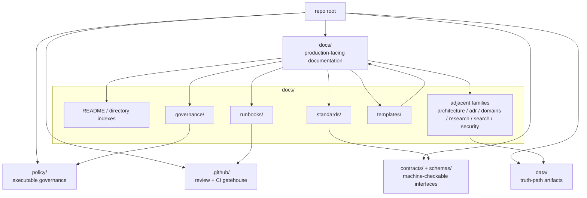

<!-- [KFM_META_BLOCK_V2]
doc_id: kfm://doc/NEEDS-VERIFICATION
title: docs
type: standard
version: v1
status: draft
owners: NEEDS VERIFICATION
created: NEEDS VERIFICATION
updated: NEEDS VERIFICATION
policy_label: NEEDS VERIFICATION
related: [../README.md, ./governance/, ./runbooks/, ./standards/, ./templates/]
tags: [kfm, docs, documentation, governance, runbooks, standards, templates]
notes: [Current session verified a mounted repository checkout. Directory shape is confirmed; many per-file metadata placeholders still require steward verification before merge.]
[/KFM_META_BLOCK_V2] -->

# docs

Governed documentation index for Kansas Frontier Matrix (KFM): doctrine, architecture, governance, runbooks, templates, and adjacent documentation surfaces that keep the system inspectable.

> **Status:** experimental — live checkout verified on 2026-04-11  
> **Owners:** `NEEDS VERIFICATION` — confirm against `../.github/CODEOWNERS` before commit  
>       
> **Quick jumps:** [Scope](#scope) · [Repo fit](#repo-fit) · [Accepted inputs](#accepted-inputs) · [Exclusions](#exclusions) · [Evidence boundary](#current-evidence-boundary) · [Baseline](#baseline-and-doctrinal-anchor) · [Directory tree](#source-reported-docs-footprint) · [Quickstart](#quickstart) · [Usage](#usage) · [Diagram](#diagram) · [Tables](#tables) · [Task list](#task-list--definition-of-done) · [FAQ](#faq) · [Appendix](#appendix)

> [!IMPORTANT]
> In KFM, documentation is not ornamental packaging. It is a production-facing trust surface that should move with contracts, policy, review, release evidence, and correction material.

## Scope

`docs/` is the human-readable operating layer for KFM.

Its job is to make doctrine, architecture, standards, review rules, templates, and operator procedures legible **without** pretending that prose is the same thing as enforcement. In KFM terms, `docs/` should clarify the governed system, not become a quiet shortcut around contracts, policy bundles, release gates, or runtime controls.

## Repo fit

**Path target:** `docs/README.md`  
**Path status:** present in mounted checkout (metadata fields still include placeholders)

**Upstream neighbors:** [repo root](../README.md) · [`../contracts/`](../contracts/) · [`../policy/`](../policy/) · [`../data/`](../data/) · [`../apps/`](../apps/) · [`../packages/`](../packages/) · [`../.github/`](../.github/)

**Primary downstream hubs:** [governance](./governance/) · [runbooks](./runbooks/) · [standards](./standards/) · [templates](./templates/)

**Other adjacent documentation families that may exist in the live repo:** [architecture](./architecture/) · [adr](./adr/) · [domains](./domains/) · [research](./research/) · [search](./search/) · [security](./security/)  
**Status of those families:** `NEEDS VERIFICATION` until a mounted repo tree is inspected

**Why this directory matters:** it keeps doctrine, review, and operating knowledge close to the same evidence-first, fail-closed system KFM is trying to enforce.

## Accepted inputs

Content that belongs in `docs/` includes:

- directory indexes and README files
- doctrine, architecture notes, ADRs, and decision packets
- standards, profiles, metadata guidance, authoring rules, and template-backed documentation protocol material
- governance, ethics, sovereignty, review, rights, and sensitivity guidance
- runbooks, rollback steps, correction playbooks, and steward/operator procedures
- reusable documentation templates
- research summaries, source summaries, search-method notes, evaluation material, and trust-visible explanatory content
- diagrams, examples, glossary material, and human-readable schema/profile notes that explain governed behavior already enforced or intended elsewhere in the repo

## Exclusions

The following do **not** belong here as the authoritative source of truth:

- machine-enforced schemas, route contracts, DTO definitions, and controlled vocabularies  
  → keep in [`../contracts/`](../contracts/) and the owning machine-checked surface
- policy bundles, decision tests, deny-by-default enforcement logic, and runtime policy evaluation  
  → keep in [`../policy/`](../policy/)
- canonical data artifacts, source descriptors, receipts, manifests, and release outputs  
  → keep on the truth path under [`../data/`](../data/) or the owning artifact home
- runtime code, worker logic, UI implementation, and service behavior  
  → keep in the owning code surface
- secrets, credentials, signed URLs, or sensitive coordinates  
  → never store those in docs
- prose that quietly upgrades `UNKNOWN` implementation state into “already running” fact  
  → keep it explicit, staged, and reviewable

> [!NOTE]
> KFM may place human-readable standards, schema notes, or profile guidance in `docs/`, but explanation must not silently replace the machine-checkable contract or policy artifact that actually governs behavior.

## Evidence labels used in this index

| Label | Meaning here |
| --- | --- |
| **CONFIRMED** | Directly supported by current-session inspection or directly retrievable KFM source material |
| **INFERRED** | Strongly implied by repeated KFM doctrine or architecture logic, but not directly re-opened as live repo reality |
| **PROPOSED** | Added here as a repo-native organization, wording, or review improvement |
| **UNKNOWN** | Not supported strongly enough in this session to present as current repo fact |
| **NEEDS VERIFICATION** | Exact live path, owner, date, label, related link, or implementation linkage should be checked before merge |

## Current evidence boundary

This index is intentionally explicit about what the current session **did** and **did not** prove.

| Observation | Status | Why it changes this README |
| --- | --- | --- |
| The directly visible mounted workspace exposed PDFs, not a mounted KFM repository checkout | **CONFIRMED** | Exact subtree contents, CODEOWNERS values, workflow wiring, tests, and file-presence claims remain `NEEDS VERIFICATION` |
| The strongest directly retrievable KFM doctrinal source in this session treats current-session workspace evidence as PDF-only and keeps unverified implementation details visible as `UNKNOWN` instead of smoothing them into confident prose | **CONFIRMED** | This README should keep certainty narrow and visible |
| KFM is framed as a governed spatial evidence system rather than a loose pile of maps, reports, summaries, or AI surfaces | **CONFIRMED** | `docs/` should be described as an operational trust surface, not a decorative sidecar |
| KFM explicitly defines trust-visible surfaces such as Map, Timeline, Dossier, Evidence Drawer, Focus Mode, Review, Compare, and Export | **CONFIRMED** | The docs index should acknowledge that documentation participates in a broader trust-visible system |
| KFM explicitly separates authoritative truth from derived layers such as graph, search, vector, tile, scene, cache, and summary projections | **CONFIRMED** | This README must not imply that prose or derived summaries outrank the governed truth path |
| The canonical manual proposes specific `docs/runbooks/*` paths for publication, correction, stale-projection, and rollback guidance, but marks them as proposed artifact work rather than mounted repo fact | **CONFIRMED** | Those paths may be referenced as `PROPOSED` or `NEEDS VERIFICATION`, not as already present |
| Exact live `docs/` descendants below the first level were not rechecked from a mounted checkout in this session | **NEEDS VERIFICATION** | The tree below should stay conservative and review-ready rather than overconfident |

> [!CAUTION]
> Treat the tree below as a **review-ready documentation footprint draft**, not as a direct `find docs/` dump from the current checkout.

## Baseline and doctrinal anchor

The strongest directly retrievable doctrinal source in this session is the **KFM Canonical Master Reference Manual (prepared 2026-03-14)**. It explicitly treats KFM as a governed spatial evidence system, establishes a strict authority ladder, warns against hardening unverified repo shape into project fact, and states that the current-session workspace evidence was PDF-only. For this revision, that manual functions as the **baseline document**.

Supporting material is therefore layered beneath that baseline:

1. the existing `docs` index draft supplied in this task, which acts as the redesign seed
2. supporting KFM doctrine referenced by the canonical manual, including interface, verification, atlas, policy/runtime, and contract-surface overlays
3. source-reported or adjacent path assumptions that still require a mounted checkout before they should be treated as repo fact

This README therefore behaves as a **governed directory index draft anchored in doctrine plus explicit verification limits**, not as a claim that the live checkout has already been reverified line by line.

## Source-reported docs footprint

```text
docs/
├── README.md                              # target of this index revision; live presence NEEDS VERIFICATION
├── governance/                            # primary downstream hub from task input
├── runbooks/                              # primary downstream hub from task input
├── standards/                             # primary downstream hub from task input
├── templates/                             # primary downstream hub from task input
├── architecture/                          # adjacent family; NEEDS VERIFICATION
├── adr/                                   # adjacent family; NEEDS VERIFICATION
├── domains/                               # adjacent family; NEEDS VERIFICATION
├── research/                              # adjacent family; NEEDS VERIFICATION
├── search/                                # adjacent family; NEEDS VERIFICATION
└── security/                              # adjacent family; NEEDS VERIFICATION
```

> [!NOTE]
> The canonical manual also proposes future or backlog-aligned runbook paths such as `docs/runbooks/publication.md`, `docs/runbooks/correction.md`, `docs/runbooks/stale_projection.md`, and `docs/runbooks/rollback.md`. Treat those as **PROPOSED** until the live repo confirms them.

## Quickstart

Use a verification-first sequence before editing or expanding `docs/`.

> [!WARNING]
> The commands below are **repo-local verification examples**. They are the right next checks once a live checkout is mounted, but they are not proof that those paths already existed in the current PDF-only workspace.

```bash
# Inspect the docs subtree first
find docs -maxdepth 5 -type f | sort

# Open the directory index and likely core hubs
sed -n '1,240p' docs/README.md
find docs/governance docs/runbooks docs/standards docs/templates \
  -maxdepth 4 -type f 2>/dev/null | sort

# Re-check machine-enforced neighbors before documenting behavior as fact
find contracts schemas policy -maxdepth 4 -type f 2>/dev/null | sort | sed -n '1,240p'

# Confirm repo-level ownership and review boundaries
sed -n '1,200p' .github/CODEOWNERS 2>/dev/null
find .github -maxdepth 3 -type f 2>/dev/null | sort

# Search for stable doctrine terms that should not drift between docs and enforcement
grep -RIn "trust membrane\|EvidenceBundle\|Focus Mode\|authoritative-versus-derived\|fail-closed" \
  docs contracts policy schemas 2>/dev/null

# Reconcile the conservative footprint above with the actual checkout
find docs -maxdepth 5 -type f 2>/dev/null | sort
```

## Usage

### Read `docs/` in this order

1. Start here to understand the docs boundary, authority posture, and current verification limit.
2. Read [`./governance/`](./governance/) when a change affects review, rights, ethics, sovereignty, withholding, escalation, or public-release conditions.
3. Read [`./standards/`](./standards/) when the question is “what must be true?”
4. Read [`./templates/`](./templates/) before creating new governed docs or changing document structure.
5. Read [`./runbooks/`](./runbooks/) when the question is “how do we operate, recover, or contain this safely?”
6. Read adjacent families such as [`./architecture/`](./architecture/), [`./adr/`](./adr/), [`./domains/`](./domains/), [`./research/`](./research/), [`./search/`](./search/), or [`./security/`](./security/) only after the owning boundary is clear.

### Documentation update rule

When a change is behavior-significant, `docs/` should not move alone and should not lag behind.

| If you changed... | Re-check alongside docs |
| --- | --- |
| public meaning, DTO-visible behavior, or evidence drill-through expectations | contracts, schemas, policy, tests, and release evidence |
| review or publication gates | governance docs, runbooks, policy bundles, proof-object expectations, and approval paths |
| authoring patterns or README structure | templates, standards, and neighboring directory indexes |
| trust-visible UX, shell rules, Evidence Drawer behavior, or Focus outcomes | interface doctrine, example payloads, screenshots or diagrams if owned here |
| rollback, correction, supersession, or stale-state handling | runbooks, correction materials, release/correction artifacts, and observability joins |
| source families, lane definitions, or publication burdens | domain/source atlas docs and any linked standards or rights guidance |

### Writing rule

Keep explanation downstream of evidence. `docs/` can clarify, constrain, and guide, but it should not become the only place where a critical contract, policy rule, runtime guarantee, or review obligation “exists.”

## Diagram


```mermaid
flowchart TD
    ROOT["repo root"] --> DOCS["docs/<br/>production-facing documentation"]
    ROOT --> CONTRACTS["contracts/ + schemas/<br/>machine-checkable interfaces"]
    ROOT --> POLICY["policy/<br/>executable governance"]
    ROOT --> DATA["data/<br/>truth-path artifacts"]
    ROOT --> GATE[".github/<br/>review + CI gatehouse"]

    subgraph D["docs/"]
        IDX["README / directory indexes"]
        GOV["governance/"]
        RUN["runbooks/"]
        STD["standards/"]
        TMP["templates/"]
        ADJ["adjacent families<br/>architecture / adr / domains / research / search / security"]
    end

    DOCS --> IDX
    DOCS --> GOV
    DOCS --> RUN
    DOCS --> STD
    DOCS --> TMP
    DOCS --> ADJ

    GOV --> POLICY
    RUN --> GATE
    STD --> CONTRACTS
    TMP --> DOCS
    ADJ --> DATA
```

## Tables

### Documentation placement matrix

| Artifact or change | Primary home | Why |
| --- | --- | --- |
| Doctrine, invariants, architecture law, authority order | [`./standards/`](./standards/) and adjacent doctrine/architecture docs | These explain what the system claims and why |
| Governance, ethics, sovereignty, review, rights, and sensitivity handling | [`./governance/`](./governance/) | These decide what may be promoted, withheld, generalized, or denied |
| Operator procedures, rollback, correction, supersession, and recovery | [`./runbooks/`](./runbooks/) | These make failure and recovery reproducible |
| Reusable document scaffolds and authoring protocol | [`./templates/`](./templates/) | These keep documentation consistent and reviewable |
| Directory-level indexing and cross-links | `docs/README.md` and sibling READMEs | These orient maintainers without outranking enforcement |
| Machine-enforced schemas, route contracts, reason-code registries | [`../contracts/`](../contracts/) and adjacent machine-checked surfaces | These are machine-checkable interfaces |
| Policy bundles and policy tests | [`../policy/`](../policy/) | These are executable governance surfaces |
| Raw/work/processed/catalog/published artifacts, manifests, receipts, proofs | [`../data/`](../data/) or the owning artifact home | These belong on the truth path, not in prose |

### Trust obligations by docs surface

| Surface | Primary question | Minimum obligation |
| --- | --- | --- |
| `docs/README.md` | Where do I start, and what is verified versus unverified? | Keep the evidence boundary visible |
| `docs/governance/` | What is allowed, reviewed, withheld, or escalated? | Match fail-closed doctrine and review posture |
| `docs/standards/` | What must be true? | Stay stable, version-aware, and cross-linked to enforcement |
| `docs/templates/` | How should we author governed docs? | Keep metadata, review posture, and promotion context explicit |
| `docs/runbooks/` | How do we operate and recover safely? | Include prerequisites, validation, rollback, and resulting artifacts |
| adjacent families | How do specific lanes, systems, or research seams stay legible? | Keep scope, provenance, and publication burden explicit |

### Current evidence basis for this index

| Evidence source | What it supports | How this README uses it |
| --- | --- | --- |
| direct current-session inspection | mounted filesystem was PDF-only, not a visible repo checkout | keeps live-tree certainty narrow |
| KFM canonical master manual | authority order, docs-as-trust-surface posture, PDF-only evidence warning, trust-visible surfaces, route families, verification/correction posture | anchors this README’s caution level and structure |
| task-supplied draft content | local section rhythm, directory-index role, adjacent-path expectations | preserved where it stayed consistent with the evidence boundary |
| KFM minimal artifact plan | proposed runbook paths and contract-first sequencing | used only as `PROPOSED`, never hardened into mounted repo fact |

## Task list / Definition of done

Use this checklist before treating `docs/README.md` as ready for commit.

- [ ] Resolve `doc_id`, owners, created date, updated date, and `policy_label`
- [ ] Verify the live `docs/` subtree from a mounted repo checkout
- [ ] Confirm whether `./governance/README.md`, `./runbooks/README.md`, `./standards/README.md`, and `./templates/README.md` exist, or keep directory-level links instead
- [ ] Confirm ownership in `../.github/CODEOWNERS`
- [ ] Reconcile the conservative tree above with `find docs -maxdepth ...` output from the live repo
- [ ] Confirm relative links render correctly on GitHub
- [ ] Re-check whether any human-readable schema/profile notes live under `docs/` and point machine-enforced files to the correct owning surfaces
- [ ] Confirm whether adjacent families like `docs/architecture/`, `docs/adr/`, `docs/domains/`, `docs/research/`, `docs/search/`, and `docs/security/` exist as live directories
- [ ] Confirm whether proposed runbooks `publication.md`, `correction.md`, `stale_projection.md`, and `rollback.md` already exist under `docs/runbooks/` or remain backlog candidates
- [ ] Remove or keep every `NEEDS VERIFICATION` marker deliberately — never by accident

## FAQ

### Why does this index use so many verification markers?

Because the current session directly verified doctrine-rich PDFs and a PDF-only workspace boundary, not a mounted repo checkout. KFM’s own truth posture prefers visible incompleteness over polished overclaiming.

### Why are several links directory-level instead of file-level?

Because directory roles are supported by the task framing and KFM doctrine, but exact live file presence was not rechecked in a mounted repository tree during this session.

### Why keep `docs/` distinct from `contracts/`, `policy/`, and data/release artifacts?

Because KFM separates explanation from enforcement and release proof. `docs/` explains, guides, and records; contracts and policy enforce; published artifacts carry outward truth-path evidence.

### Why call docs a production surface?

Because KFM doctrine treats trust-visible explanation, evidence access, correction behavior, and public-facing interpretation as part of the governed system. Stale docs are not cosmetic drift; they are governance drift.

## Appendix

<details>
<summary>Directly retained source signals</summary>

| Source signal | How it shaped this README |
| --- | --- |
| KFM is a governed spatial evidence system | framed `docs/` as an operational trust surface, not a decorative docs bucket |
| current-session workspace evidence was PDF-only | kept repo/path certainty narrow and visible |
| authority order is strict and implementation claims beyond mounted evidence must stay explicit | preserved `CONFIRMED / INFERRED / PROPOSED / UNKNOWN / NEEDS VERIFICATION` discipline |
| trust-visible surfaces include Evidence Drawer and Focus Mode | reinforced documentation’s role in trust visibility and evidence drill-through |
| route families and correction/rollback posture are explicit | kept runbooks and adjacent docs tied to operational accountability |
| minimal artifact plan proposes specific runbook files | allowed those paths to be referenced only as `PROPOSED` |

</details>

<details>
<summary>Current-session limits that still matter before merge</summary>

- The mounted workspace included the repository checkout and was directly inspected.
- Large portions of the repo tree were directly inspected, but many metadata placeholders and runtime maturity claims remain unverified.
- This index is therefore **review-ready**, not falsely “fully verified.”
- Any conflicting branch-local reality should still outrank documentation assumptions.

</details>

<details>
<summary>Conservative path policy for this draft</summary>

- Directory-level links were favored when exact README presence was not reverified.
- Adjacent documentation families were kept visible, but marked `NEEDS VERIFICATION` where live-tree proof was absent.
- Proposed artifact paths from the canonical manual remain proposed here; they are not silently upgraded into “already exists” repo claims.

</details>

[Back to top](#docs)

## Repository operations addenda

The following repo-level planning/verification docs are now tracked under `docs/`:

- [`./REPO_MAP.md`](./REPO_MAP.md)
- [`./BUILD_PLAN.md`](./BUILD_PLAN.md)
- [`./VALIDATION_SUMMARY.md`](./VALIDATION_SUMMARY.md)
- [`./BACKLOG.md`](./BACKLOG.md)
