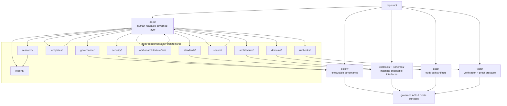

<!-- [KFM_META_BLOCK_V2]
doc_id: kfm://doc/NEEDS-VERIFICATION
title: docs
type: standard
version: v1
status: draft
owners: NEEDS VERIFICATION
created: NEEDS VERIFICATION
updated: NEEDS VERIFICATION
policy_label: NEEDS VERIFICATION
related: [../README.md, ./governance/, ./runbooks/, ./standards/, ./templates/]
tags: [kfm, docs, documentation, governance, runbooks, standards, templates]
notes: [Current session directly verified a PDF-only workspace under /mnt/data and source-reported documentation inventories; live docs subtree, owners, dates, labels, and exact README presence still require checkout inspection before commit.]
[/KFM_META_BLOCK_V2] -->

# docs

Governed documentation index for Kansas Frontier Matrix (KFM): doctrine, architecture, governance, runbooks, templates, and adjacent documentation surfaces that keep the system inspectable.

> **Status:** experimental — live checkout verification still pending  
> **Owners:** `NEEDS VERIFICATION` — check `../.github/CODEOWNERS` before commit  
>       
> **Quick jumps:** [Scope](#scope) · [Repo fit](#repo-fit) · [Accepted inputs](#accepted-inputs) · [Exclusions](#exclusions) · [Evidence boundary](#current-evidence-boundary) · [Baseline](#baseline-and-doctrinal-anchor) · [Directory tree](#source-reported-docs-footprint) · [Quickstart](#quickstart) · [Usage](#usage) · [Diagram](#diagram) · [Tables](#tables) · [Task list](#task-list--definition-of-done) · [FAQ](#faq) · [Appendix](#appendix)

> [!IMPORTANT]
> In KFM, documentation is part of the governed system, not ornamental packaging. Contracts, schemas, diagrams, examples, runbooks, proof objects, and correction notes all sit on the trust surface. Behavior-significant changes should therefore update documentation in the same governed stream as contracts, policy, tests, release evidence, and correction material.

## Scope

`docs/` is the human-readable operating layer for KFM.

Its job is to make doctrine, architecture, standards, review rules, templates, and operator procedures legible **without** pretending that prose is the same thing as enforcement. In KFM terms, `docs/` should clarify the governed system, not become a shortcut around contracts, policy, release evidence, or runtime controls.

## Repo fit

**Path target:** `docs/README.md`  
**Path status:** `NEEDS VERIFICATION` in a mounted checkout

**Upstream neighbors:** [repo root](../README.md) · [`../contracts/`](../contracts/) · [`../policy/`](../policy/) · [`../data/`](../data/) · [`../.github/`](../.github/)

**Primary downstream hubs:** [governance](./governance/) · [runbooks](./runbooks/) · [standards](./standards/) · [templates](./templates/)

**Other documentation families repeatedly described across source-reported KFM materials:** [architecture](./architecture/) · `adr/` or `architecture/adr/` (`NEEDS VERIFICATION`) · [research](./research/) · [search](./search/) · [security](./security/) · [reports](./reports/) · [domains](./domains/)

**Why this directory matters:** it keeps doctrine, review, and operating knowledge close to the same evidence-first, fail-closed system that the rest of KFM is trying to enforce.

## Accepted inputs

Content that belongs in `docs/` includes:

- directory indexes and README files
- doctrine, architecture notes, ADRs, and decision packets
- standards, profiles, authoring guidance, and template-backed documentation protocol material
- governance, ethics, sovereignty, review, rights, and sensitivity guidance
- runbooks, rollback steps, correction playbooks, and steward/operator procedures
- reusable documentation templates
- research summaries, search-method notes, evaluation material, and trust-visible explanatory content
- diagrams, examples, and reference notes that explain governed behavior already enforced or intended elsewhere in the repo

## Exclusions

The following do **not** belong here as the authoritative source of truth:

- machine-enforced schemas, route contracts, DTO definitions, and controlled vocabularies  
  → keep in [`../contracts/`](../contracts/) and [`../schemas/`](../schemas/)
- policy bundles, decision tests, deny-by-default enforcement logic, and runtime policy evaluation  
  → keep in [`../policy/`](../policy/)
- canonical data artifacts, source descriptors, receipts, manifests, and release outputs  
  → keep on the truth path under [`../data/`](../data/) or the owning artifact home
- runtime code, worker logic, UI implementation, and service behavior  
  → keep in the owning code surface
- secrets, credentials, signed URLs, or sensitive coordinates  
  → never store those in docs
- prose that quietly upgrades `UNKNOWN` implementation state into “already running” fact  
  → keep it explicit, staged, and reviewable

> [!NOTE]
> KFM uses `docs/` broadly for human-readable support material, but it still distinguishes explanation from enforcement. When a file must function as a contract, registry, policy artifact, or proof object, it should not be quietly downgraded into prose-only documentation.

## Evidence labels used in this index

| Label | Meaning here |
| --- | --- |
| **CONFIRMED** | Directly supported by current-session filesystem inspection or by the mounted March 2026 KFM source corpus |
| **INFERRED** | Strongly implied by repeated KFM source patterns, but not directly re-opened in a live repo checkout |
| **PROPOSED** | Added here as a repo-native organization, wording, or review improvement |
| **UNKNOWN** | Not supported strongly enough in this session to present as current repo reality |
| **NEEDS VERIFICATION** | Exact live path, owner, date, label, README presence, or implementation linkage should be checked before merge |

## Current evidence boundary

This index is intentionally explicit about what the current session **did** and **did not** prove.

| Observation | Status | Why it changes this README |
| --- | --- | --- |
| The directly visible workspace exposed a mounted PDF corpus under `/mnt/data`, not a mounted KFM repository checkout | **CONFIRMED** | Exact subtree contents, CODEOWNERS values, workflow wiring, and file-presence claims remain `NEEDS VERIFICATION` |
| The strongest current KFM manuals treat documentation as a production surface tied to contracts, proofs, review, release evidence, and correction | **CONFIRMED** | This README should frame `docs/` as operational, not decorative |
| The doctrine separates doctrine, realization, and mounted implementation evidence, and warns that documentation maturity does not prove implementation maturity | **CONFIRMED** | The index must keep `CONFIRMED`, `INFERRED`, `PROPOSED`, `UNKNOWN`, and `NEEDS VERIFICATION` visible |
| Source-reported repo inventories describe `docs/` as housing human-readable docs, ADRs, runbooks, schemas, standards, templates, governance, and story/report material | **CONFIRMED** *(source-reported)* | The index can describe the documentation architecture, but should not claim a live tree dump |
| Specific subpaths under `docs/research/`, `docs/search/`, `docs/security/`, and `docs/runbooks/reliability/` are listed in a support-file inventory | **CONFIRMED** *(source-reported)* | The tree below can be more specific than a generic docs outline |
| Exact live presence of `docs/README.md`, current child README files, and owners in `../.github/CODEOWNERS` was not directly inspected in a mounted checkout during this session | **NEEDS VERIFICATION** | Keep file-level certainty narrow and reviewable |

> [!CAUTION]
> Treat the tree below as a **source-reported documentation footprint synthesized from mounted KFM materials**, not as a direct `find docs/` dump from the current checkout.

## Baseline and doctrinal anchor

No single mounted `docs/README.md` or docs-specific canonical index was directly inspectable in this session, so this README is anchored to the **current March 2026 doctrinal manuals collectively**, with repo-inventory and directory-map materials used as secondary evidence.

That means this index follows three layers:

1. **Doctrinal baseline:** current KFM replacement-grade manuals that define truth posture, trust membrane, authoritative-versus-derived separation, map-first/time-aware operation, bounded AI, and docs-as-production behavior.
2. **Source-reported repo inventory:** KFM documentation compendia and support-file inventories that name repo areas and documentation families.
3. **Documentation-shape corroboration:** KFM master-guide and markdown-guide materials that show expected `docs/` structure, standards/templates/governance paths, and story-node/report placement.

This README therefore behaves as a **governed index draft**, not as a claim that the live checkout has already been reverified line by line.

## Source-reported docs footprint

```text
docs/
├── README.md                                              # target of this index revision; live presence NEEDS VERIFICATION
├── architecture/                                          # source-reported
│   ├── KFM_REDESIGN_BLUEPRINT_v13.md                      # older guide pattern
│   ├── KFM_VISION_FULL_ARCHITECTURE.md                    # older guide pattern
│   ├── diagrams/                                          # source-reported
│   └── adr/                                               # source-reported in older guide patterns
├── adr/                                                   # ALSO source-reported in newer architecture language; exact placement NEEDS VERIFICATION
├── governance/                                            # source-reported
│   ├── ROOT_GOVERNANCE.md
│   ├── ETHICS.md
│   ├── SOVEREIGNTY.md
│   └── REVIEW_GATES.md
├── standards/                                             # source-reported
│   ├── KFM_MARKDOWN_WORK_PROTOCOL.md
│   ├── KFM_REPO_STRUCTURE_STANDARD.md
│   ├── KFM_STAC_PROFILE.md
│   ├── KFM_DCAT_PROFILE.md
│   ├── KFM_PROV_PROFILE.md
│   └── kfm-mdp-enforcement.md                             # draft/source-reported standard; exact live placement NEEDS VERIFICATION
├── templates/                                             # source-reported
│   ├── TEMPLATE__KFM_UNIVERSAL_DOC.md
│   ├── TEMPLATE__STORY_NODE_V3.md
│   └── TEMPLATE__API_CONTRACT_EXTENSION.md
├── runbooks/                                              # source-reported
│   └── reliability/
│       ├── trigger-retry-matrix.md
│       └── trigger-mechanisms/
│           └── README.md
├── domains/                                               # source-reported as a documentation family
├── research/                                              # source-reported
│   ├── README.md
│   ├── drafts/README.md
│   ├── drafts/assets/README.md
│   ├── drafts/literature/README.md
│   ├── evaluations/README.md
│   ├── evaluations/assets/README.md
│   ├── evaluations/assets/diagrams/README.md
│   └── source_summaries/
│       ├── README.md
│       ├── _attachments/README.md
│       ├── by_domain/README.md
│       └── by_type/
│           ├── README.md
│           ├── books/README.md
│           ├── maps/README.md
│           └── web/README.md
├── search/                                                # source-reported
│   ├── README.md
│   └── drift/
│       ├── README.md
│       ├── graph-queries/README.md
│       ├── stac/README.md
│       ├── examples/README.md
│       ├── hyde/README.md
│       └── embeddings/README.md
├── security/                                              # source-reported
│   ├── README.md
│   ├── ai-supply-chain/README.md
│   ├── prompt-injection/README.md
│   ├── react2shell/README.md
│   ├── react2shell-advisory/README.md
│   ├── supply-chain/
│   │   ├── sigstore-cosign-v3/README.md
│   │   └── reference-repos/README.md
│   └── vulns/README.md
└── reports/                                               # source-reported
    └── story_nodes/
        ├── templates/
        ├── draft/
        └── published/
            └── <story_slug>/
                ├── story.md
                └── assets/
```

## Quickstart

Use a verification-first sequence before editing or expanding `docs/`.

> [!WARNING]
> The commands below are **repo-local verification examples**. They are the right next checks once a live checkout is mounted, but they are not proof that those paths already existed in the current PDF-only workspace.

```bash
# Inspect the docs subtree first
find docs -maxdepth 5 -type f | sort

# Open the directory index and likely core hubs
sed -n '1,240p' docs/README.md
find docs/governance docs/runbooks docs/standards docs/templates -maxdepth 4 -type f 2>/dev/null | sort

# Re-check machine-enforced neighbors before documenting behavior as fact
find contracts schemas policy -maxdepth 4 -type f 2>/dev/null | sort | sed -n '1,240p'

# Confirm repo-level ownership and review boundaries
sed -n '1,200p' .github/CODEOWNERS 2>/dev/null
find .github -maxdepth 3 -type f 2>/dev/null | sort

# Search for stable KFM doctrine terms that should not drift between docs and enforcement
grep -RIn "trust membrane\|EvidenceBundle\|cite-or-abstain\|fail-closed\|authoritative-versus-derived" \
  docs contracts policy schemas 2>/dev/null

# Reconcile the source-reported docs footprint with the actual checkout
find docs/research docs/search docs/security docs/runbooks -maxdepth 5 -type f 2>/dev/null | sort
```

## Usage

### Read `docs/` in this order

1. Start here to understand the docs boundary, authority posture, and current verification limit.
2. Read [`./governance/`](./governance/) when a change affects review, rights, ethics, sovereignty, withholding, escalation, or public-release conditions.
3. Read [`./standards/`](./standards/) when the question is “what must be true?”
4. Read [`./templates/`](./templates/) before creating new governed docs or changing document structure.
5. Read [`./runbooks/`](./runbooks/) when the question is “how do we operate, recover, or contain this safely?”
6. Read adjacent families such as [`./architecture/`](./architecture/), [`./research/`](./research/), [`./search/`](./search/), [`./security/`](./security/), [`./reports/`](./reports/), or [`./domains/`](./domains/) only after the owning boundary is clear.

### Documentation update rule

When a change is behavior-significant, `docs/` should not move alone and should not lag behind.

| If you changed... | Re-check alongside docs |
| --- | --- |
| public meaning, DTO-visible behavior, or evidence drill-through expectations | contracts, schemas, policy, tests, and release evidence |
| review or publication gates | governance docs, runbooks, policy bundles, proof-object expectations, and approval paths |
| authoring patterns or README structure | templates, standards, and neighboring directory indexes |
| trust-visible UX, shell rules, Evidence Drawer behavior, or Focus outcomes | app doctrine, UI doctrine, example payloads, screenshots/diagrams if owned here |
| rollback, correction, supersession, or stale-state handling | runbooks, migration/correction materials, release/correction artifacts, and observability joins |
| source families, lane definitions, or publication burdens | domain/source atlas docs and any linked standards or rights guidance |

### Writing rule

Keep explanation downstream of evidence. `docs/` can clarify, constrain, and guide, but it should not become the only place where a critical contract, policy rule, runtime guarantee, or review obligation “exists.”

## Diagram


```mermaid
flowchart TD
    ROOT["repo root"] --> DOCS["docs/<br/>human-readable governed layer"]
    ROOT --> CONTRACTS["contracts/ + schemas/<br/>machine-checkable interfaces"]
    ROOT --> POLICY["policy/<br/>executable governance"]
    ROOT --> DATA["data/<br/>truth-path artifacts"]
    ROOT --> TESTS["tests/<br/>verification + proof pressure"]

    subgraph D["docs/ (documentation architecture)"]
        GOV["governance/"]
        STD["standards/"]
        TMP["templates/"]
        RUN["runbooks/"]
        ARCH["architecture/"]
        ADR["adr/ or architecture/adr/"]
        RES["research/"]
        SRCH["search/"]
        SEC["security/"]
        RPT["reports/"]
        DOM["domains/"]
    end

    DOCS --> GOV
    DOCS --> STD
    DOCS --> TMP
    DOCS --> RUN
    DOCS --> ARCH
    DOCS --> ADR
    DOCS --> RES
    DOCS --> SRCH
    DOCS --> SEC
    DOCS --> RPT
    DOCS --> DOM

    GOV --> POLICY
    STD --> CONTRACTS
    TMP --> DOCS
    RUN --> TESTS
    ARCH --> CONTRACTS
    ADR --> DOCS
    RES --> RPT
    SRCH --> DOCS
    SEC --> POLICY
    DOM --> DATA

    POLICY --> PUB["governed APIs / public surfaces"]
    CONTRACTS --> PUB
    DATA --> PUB
    TESTS --> PUB
```

## Tables

### Documentation placement matrix

| Artifact or change | Primary home | Why |
| --- | --- | --- |
| Doctrine, invariants, documentation law, authority order | master design / canonical working / primary documentation manuals | These state what the system claims as project law |
| Normative standards, profiles, metadata guidance, authoring rules | [`./standards/`](./standards/) | These define expected structure and stability |
| Governance, ethics, sovereignty, review, rights, and sensitivity handling | [`./governance/`](./governance/) | These decide what may be promoted, withheld, generalized, or denied |
| Operator procedures, rollback, correction, supersession, and recovery | [`./runbooks/`](./runbooks/) | These make failure and recovery reproducible |
| Reusable document scaffolds and doc protocol | [`./templates/`](./templates/) | These keep documentation consistent and reviewable |
| Architecture notes, migration playbooks, and ADRs | [`./architecture/`](./architecture/) and `adr/` / `architecture/adr/` | These explain structural choices without replacing contracts |
| Research/source summaries and evaluation material | [`./research/`](./research/) | These support discovery and evidence work without becoming sovereign truth |
| Search-system notes and DRIFT patterns | [`./search/`](./search/) | These support retrieval and bounded search behavior |
| Security and supply-chain advisories | [`./security/`](./security/) | These concentrate hardening, advisories, and security operating guidance |
| Story/report narrative surfaces | [`./reports/`](./reports/) | These are presentation surfaces, not contract or schema homes |
| Machine-enforced schemas, route contracts, reason-code registries | [`../contracts/`](../contracts/), [`../schemas/`](../schemas/) | These are machine-checkable interfaces |
| Policy bundles and policy tests | [`../policy/`](../policy/) | These are executable governance surfaces |
| Raw/work/processed/catalog/release artifacts | [`../data/`](../data/) or owning artifact homes | These belong on the truth path, not in prose |

### Trust obligations by docs surface

| Surface | Primary question | Minimum obligation |
| --- | --- | --- |
| `docs/README.md` | Where do I start, and what is verified versus source-reported? | Keep the evidence boundary visible |
| `docs/governance/` | What is allowed, reviewed, withheld, or escalated? | Match fail-closed doctrine and review posture |
| `docs/standards/` | What must be true? | Stay stable, version-aware, and cross-linked to enforcement |
| `docs/templates/` | How should we author governed docs? | Keep metadata, review posture, and promotion context explicit |
| `docs/runbooks/` | How do we operate and recover safely? | Include prerequisites, validation, rollback, and resulting artifacts |
| `docs/research/` | How do working notes and source summaries stay traceable? | Keep provenance, boundaries, and claims-vs-interpretation explicit |
| `docs/search/` | How does retrieval stay bounded and inspectable? | Keep safety, determinism, and evidence linkage visible |
| `docs/security/` | How are risk, advisories, and hardening documented? | Preserve supply-chain, runtime, and release-security consequences |
| `docs/reports/` | How do narrative surfaces stay evidence-linked? | Keep citation resolution and review state visible |

### Current evidence basis for this index

| Evidence source | What it supports | How this README uses it |
| --- | --- | --- |
| current-session filesystem inspection | PDF-only workspace; no mounted repo checkout visible | keeps the live-tree certainty narrow |
| March 2026 KFM master / canonical / expanded manuals | doctrine, truth posture, docs-as-production expectations | sets the baseline and the warning against overclaiming |
| `KFM_Comprehensive_Master_Documentation_Compendium_v1.pdf` | repo inventory language; `docs/` as docs/ADRs/runbooks/schemas; docs move with behavior | grounds the docs role and top-level placement |
| `Kansas Frontier Matrix Support File.pdf` | source-reported path inventory for `research/`, `search/`, `security/`, and `runbooks/reliability/` | upgrades the tree from generic to specific |
| `MARKDOWN_GUIDE_v13.md` / related guide material | source-reported standards/templates/governance/report-story structure | sharpens the docs footprint without pretending mounted proof |

## Task list / Definition of done

Use this checklist before treating `docs/README.md` as ready for commit.

- [ ] Resolve `doc_id`, owners, created date, updated date, and `policy_label`
- [ ] Verify the live `docs/` subtree from a mounted repo checkout
- [ ] Confirm whether `docs/adr/` or `docs/architecture/adr/` is the current ADR home
- [ ] Confirm whether `./governance/README.md`, `./runbooks/README.md`, `./standards/README.md`, and `./templates/README.md` exist, or keep directory-level links instead
- [ ] Reconcile the source-reported tree above with `find docs -maxdepth ...` output from the live repo
- [ ] Confirm ownership in `../.github/CODEOWNERS`
- [ ] Confirm relative links render correctly on GitHub
- [ ] Re-check whether any human-readable schema/profile notes live under `docs/` and point machine-enforced files to `contracts/` / `schemas/`
- [ ] Keep docs/examples/runbooks synchronized with any behavior-significant change in contracts, policy, code, tests, release evidence, or correction flow
- [ ] Confirm the Mermaid diagram still matches the mounted tree
- [ ] Remove or keep every `NEEDS VERIFICATION` marker deliberately — never by accident

## FAQ

### Why does this index use so many verification markers?

Because the current session exposed doctrine-rich PDFs and source-reported inventories, not a mounted repo checkout. KFM’s own truth posture prefers visible incompleteness over polished overclaiming.

### Why are several links directory-level instead of file-level?

Because directory roles are strongly supported by the mounted documentation architecture, but exact live file presence was not re-checked in a mounted repository tree during this session.

### Why keep `docs/` distinct from `contracts/`, `schemas/`, and `policy/`?

Because KFM separates explanation from enforcement. `docs/` explains, guides, and records; contracts and policy enforce.

### When should a docs change block release?

When behavior changed materially enough that stale docs, examples, diagrams, or runbooks would cause contributors, operators, reviewers, or users to misunderstand what the governed system now does.

## Appendix

<details>
<summary>Mounted source signals used to build this index</summary>

The most useful documentation signals visible in the mounted corpus were:

| Source | Signal retained here |
| --- | --- |
| current March 2026 KFM master/canonical manuals | documentation is part of the production trust surface; implementation certainty must stay proportional |
| `KFM_Comprehensive_Master_Documentation_Compendium_v1.pdf` | `docs/` described as a first-class repo layer containing docs, ADRs, runbooks, and schemas |
| `Kansas Frontier Matrix Support File.pdf` | source-reported path inventory for research, search, security, and reliability runbooks |
| `MARKDOWN_GUIDE_v13.md` and related guide material | governance, standards, templates, reports/story_nodes, and canonical docs layout patterns |
| geospatial/UI doctrine manuals | Evidence Drawer, map-first shell, correction visibility, and runbook freshness as trust obligations |

</details>

<details>
<summary>Current-session limits that still matter before merge</summary>

- The directly visible workspace exposed PDFs only.
- No live repo subtree, `.github/CODEOWNERS`, workflow YAML, schemas, tests, manifests, or runtime logs were directly inspected.
- This index is therefore **review-ready**, not falsely “fully verified.”
- Any conflicting live-tree reality should outrank this source-reported footprint once a mounted checkout is available.

</details>

[Back to top](#docs)
