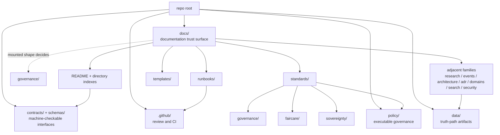

<!-- [KFM_META_BLOCK_V2]
doc_id: kfm://doc/NEEDS-VERIFICATION
title: docs
type: standard
version: v1
status: draft
owners: NEEDS VERIFICATION
created: NEEDS VERIFICATION
updated: NEEDS VERIFICATION
policy_label: NEEDS VERIFICATION
related: [../README.md, ./governance/, ./runbooks/, ./standards/, ./templates/]
tags: [kfm, docs, documentation, governance, runbooks, standards, templates]
notes: [Current session evidence was PDF-rich rather than a directly surfaced repo tree; reconcile ./governance/ with any deeper ./standards/governance/ layout before merge.]
[/KFM_META_BLOCK_V2] -->

# docs

Governed documentation index for Kansas Frontier Matrix (KFM): doctrine, standards, runbooks, templates, and adjacent documentation surfaces that keep the system inspectable.

> **Status:** experimental — subtree recheck still pending  
> **Owners:** `NEEDS VERIFICATION` — confirm against `../.github/CODEOWNERS` before commit  
>       
> **Quick jumps:** [Scope](#scope) · [Repo fit](#repo-fit) · [Accepted inputs](#accepted-inputs) · [Exclusions](#exclusions) · [Evidence boundary](#current-evidence-boundary) · [Baseline](#baseline-and-doctrinal-anchor) · [Directory tree](#review-ready-docs-footprint) · [Quickstart](#quickstart) · [Usage](#usage) · [Diagram](#diagram) · [Tables](#tables) · [Task list](#task-list--definition-of-done) · [FAQ](#faq) · [Appendix](#appendix)

> [!IMPORTANT]
> In KFM, documentation is not ornamental packaging. It is a production-facing trust surface that should move with contracts, policy, review, release evidence, correction material, and operator reality.

## Scope

`docs/` is the human-readable operating layer for KFM.

Its job is to make doctrine, architecture, standards, review rules, templates, and procedures legible **without** pretending that prose is the same thing as enforcement. In KFM terms, `docs/` should clarify the governed system, not become a quiet shortcut around contracts, policy bundles, release gates, or runtime controls.

## Repo fit

**Path target:** `docs/README.md`  
**Path status:** target of this revision; exact live subtree still needs direct repo verification

**Upstream neighbors expected in a standard KFM repo layout:** [repo root](../README.md) · [`../contracts/`](../contracts/) · [`../policy/`](../policy/) · [`../data/`](../data/) · [`../apps/`](../apps/) · [`../packages/`](../packages/) · [`../.github/`](../.github/)  
**Status of those exact relative paths in this session:** `NEEDS VERIFICATION`

**Draft-assumed primary downstream hubs from the existing docs index draft:** [governance](./governance/) · [runbooks](./runbooks/) · [standards](./standards/) · [templates](./templates/)

**Example-supported deeper families visible in attached KFM doc examples:** [standards/governance](./standards/governance/) · [standards/faircare](./standards/faircare/) · [standards/sovereignty](./standards/sovereignty/) · [research](./research/) · [events](./events/)

**Other adjacent documentation families mentioned in the draft or supporting corpus:** [architecture](./architecture/) · [adr](./adr/) · [domains](./domains/) · [search](./search/) · [security](./security/)  
**Status of all exact descendants above:** `NEEDS VERIFICATION` until a mounted checkout is rechecked

> [!NOTE]
> The strongest attached signals support a `docs/standards/*` subtree for governance, FAIR+CARE, and sovereignty material. The task draft also expects a top-level `docs/governance/` hub. Keep both visible for review until the mounted repo resolves the actual shape.

## Accepted inputs

Content that belongs in `docs/` includes:

- directory indexes and README files
- doctrine, architecture notes, ADRs, and decision packets
- standards, metadata guidance, authoring rules, and template-backed documentation protocols
- governance, ethics, sovereignty, review, rights, and sensitivity guidance
- runbooks, rollback steps, correction playbooks, and steward/operator procedures
- reusable documentation templates
- research summaries, source summaries, evaluation material, and explanatory content
- event summaries, lane overviews, diagrams, glossary material, and human-readable notes that explain governed behavior already enforced or intended elsewhere in the repo

## Exclusions

The following do **not** belong here as the authoritative source of truth:

- machine-enforced schemas, DTOs, route contracts, and controlled vocabularies  
  → keep in [`../contracts/`](../contracts/) or the owning machine-checked surface
- policy bundles, deny-by-default enforcement logic, and runtime policy evaluation  
  → keep in [`../policy/`](../policy/)
- canonical data artifacts, source descriptors, manifests, receipts, proof packs, and released outputs  
  → keep on the truth path under [`../data/`](../data/) or the owning artifact home
- runtime code, worker logic, UI implementation, and service behavior  
  → keep in the owning code surface
- secrets, credentials, signed URLs, or sensitive coordinates  
  → never store those in docs
- prose that quietly upgrades `UNKNOWN` implementation state into “already running” fact  
  → keep the uncertainty explicit and reviewable

> [!CAUTION]
> KFM may place human-readable standards, schema notes, or profile guidance in `docs/`, but explanation must not silently replace the machine-checkable artifact that actually governs behavior.

## Evidence labels used in this index

| Label | Meaning here |
| --- | --- |
| **CONFIRMED** | Directly supported by attached KFM documents or explicit current-session evidence |
| **INFERRED** | Strongly implied by repeated KFM doctrine or example-backed doc patterns, but not reverified as mounted repo fact |
| **PROPOSED** | Recommended wording, organization, or next-step packaging that fits the corpus but is not proven implementation |
| **UNKNOWN** | Not supported strongly enough in this session to present as current repo fact |
| **NEEDS VERIFICATION** | Exact live path, owner, date, label, or implementation linkage should be checked before merge |

## Current evidence boundary

This index is intentionally explicit about what the current session **did** and **did not** prove.

| Observation | Status | Why it changes this README |
| --- | --- | --- |
| Current-session workspace evidence was PDF-rich rather than a directly surfaced repository tree | **CONFIRMED** | Exact subtree contents, CODEOWNERS values, workflow wiring, tests, and file-presence claims stay `NEEDS VERIFICATION` |
| The freshest attached working-manual layer is the 11 April 2026 successor working edition, which keeps doctrine, realization guidance, and evidence limits visibly separated | **CONFIRMED** | This README should use that conservative posture rather than claiming “live checkout verified” |
| KFM is framed as a governed spatial evidence and publication system rather than a loose set of maps, reports, summaries, or model outputs | **CONFIRMED** | `docs/` should be described as an operational trust surface, not a decorative sidecar |
| Trust-visible shell surfaces include Map, Timeline, Dossier, Story, Evidence Drawer, Focus, Review, Compare, and Export | **CONFIRMED** | The docs index should acknowledge that documentation participates in a wider trust-visible system |
| The corpus names first-wave proof and contract families such as `SourceDescriptor`, `IngestReceipt`, `ValidationReport`, `DatasetVersion`, `CatalogClosure`, `DecisionEnvelope`, `ReviewRecord`, `ReleaseManifest`, `EvidenceBundle`, `RuntimeResponseEnvelope`, and `CorrectionNotice` | **CONFIRMED** | `docs/` should stay synchronized with proof objects and release/correction behavior rather than drifting into free prose |
| The canonical manual proposes runbook paths such as `docs/runbooks/publication.md`, `docs/runbooks/correction.md`, `docs/runbooks/stale_projection.md`, and `docs/runbooks/rollback.md` | **CONFIRMED** | Those paths may be referenced as `PROPOSED` or `NEEDS VERIFICATION`, not as already present |
| Supporting attached doc examples show deeper standards and adjacent-doc families such as `docs/standards/governance/`, `docs/standards/faircare/`, `docs/standards/sovereignty/`, `docs/research/`, and `docs/events/` | **CONFIRMED** | The tree below should keep those families visible while still marking exact live presence as unverified |
| Exact live `docs/` descendants below the first level were not rechecked from a mounted checkout in this session | **NEEDS VERIFICATION** | The tree below remains review-ready rather than a direct `find docs/` dump |

> [!WARNING]
> Treat the tree below as a **review-ready documentation footprint draft**, not as direct proof that the mounted repo already has exactly this shape.

## Baseline and doctrinal anchor

The nearest attached **working-manual spine** for this revision is the **11 April 2026 successor working edition**. It explicitly builds upward from the 8 April 2026 strengthened working edition and integrates the attached Pass 13 synthesis and the expanded atlas while keeping implementation depth visibly bounded.

The deeper **doctrinal anchor** remains the **March 2026 canonical master reference manual**, especially for authority order, truth posture, trust-visible shell law, and starter contract families.

This README therefore follows a layered baseline:

1. the existing `docs` index draft supplied in this task, preserved where it was already strong
2. the 11 April 2026 successor working edition as the nearest replacement-grade working spine
3. the March 2026 canonical master manual for authority order, truth posture, trust-visible surfaces, and contract families
4. the expanded atlas, Pass 13, and attached doc examples as supporting evidence for directory families, lane burdens, and documentation consequences

That means this file behaves as a **repo-ready docs index draft anchored in doctrine plus explicit verification limits**, not as a claim that the live checkout has already been reverified line by line.

## Review-ready docs footprint

```text
docs/
├── README.md                              # target of this revision; live subtree recheck pending
├── governance/                            # task-supplied hub; mounted presence NEEDS VERIFICATION
├── runbooks/                              # repeatedly supported family; exact contents NEEDS VERIFICATION
├── standards/                             # repeatedly supported family; exact contents NEEDS VERIFICATION
│   ├── governance/                        # example-supported deeper subtree; NEEDS VERIFICATION
│   ├── faircare/                          # example-supported deeper subtree; NEEDS VERIFICATION
│   └── sovereignty/                       # example-supported deeper subtree; NEEDS VERIFICATION
├── templates/                             # task-supplied / example-supported; NEEDS VERIFICATION
├── research/                              # example-supported family; NEEDS VERIFICATION
├── events/                                # example-supported family; NEEDS VERIFICATION
├── architecture/                          # adjacent family from existing draft; NEEDS VERIFICATION
├── adr/                                   # adjacent family from existing draft; NEEDS VERIFICATION
├── domains/                               # adjacent family from existing draft; NEEDS VERIFICATION
├── search/                                # adjacent family from existing draft; NEEDS VERIFICATION
└── security/                              # adjacent family from existing draft; NEEDS VERIFICATION
```

> [!NOTE]
> If the mounted repo proves only one governance placement—either `docs/governance/` or `docs/standards/governance/`—collapse the other. Until then, leaving both visible is safer than silently choosing the wrong structure.

## Quickstart

Use a verification-first sequence before editing or expanding `docs/`.

> [!WARNING]
> The commands below are **repo-local verification examples**. They are the right next checks once a live checkout is mounted, but they are not proof that those paths already existed in the current PDF-only workspace.

```bash
# Inspect the docs subtree first
find docs -maxdepth 5 \( -type d -o -type f \) 2>/dev/null | sort

# Open the directory index candidate
sed -n '1,260p' docs/README.md 2>/dev/null

# Reconcile governance-path ambiguity and first-wave hubs
find docs -maxdepth 4 \( \
  -path 'docs/governance*' -o \
  -path 'docs/runbooks*' -o \
  -path 'docs/standards*' -o \
  -path 'docs/templates*' \
\) 2>/dev/null | sort

# Recheck adjacent families surfaced by supporting examples or the current draft
find docs -maxdepth 4 \( \
  -path 'docs/research*' -o \
  -path 'docs/events*' -o \
  -path 'docs/architecture*' -o \
  -path 'docs/adr*' -o \
  -path 'docs/domains*' -o \
  -path 'docs/search*' -o \
  -path 'docs/security*' \
\) 2>/dev/null | sort

# Recheck machine-enforced neighbors before documenting behavior as fact
find contracts schemas policy .github -maxdepth 4 -type f 2>/dev/null | sort | sed -n '1,240p'

# Confirm repo-level ownership and review boundaries
sed -n '1,200p' .github/CODEOWNERS 2>/dev/null

# Search for doctrine terms docs should not drift away from
grep -RIn "Evidence Drawer\|Focus Mode\|run_receipt\|CorrectionNotice\|authoritative-versus-derived\|fail-closed" \
  docs contracts policy schemas 2>/dev/null
```

## Usage

### Read `docs/` in this order

1. Start here to understand the docs boundary, evidence posture, and current verification limit.
2. Read [`./standards/`](./standards/) and any mounted governance subtrees when the question is “what must be true?” or “what is allowed?”
3. Read [`./runbooks/`](./runbooks/) when the question is “how do we operate, recover, correct, or rollback safely?”
4. Read [`./templates/`](./templates/) before creating new governed docs or changing document structure.
5. Read [`./research/`](./research/) and [`./events/`](./events/) only as adjacent explanatory surfaces unless the mounted repo shows they have already been promoted into a stronger governed role.
6. Read [`./governance/`](./governance/) as a separate top-level family only if the mounted repo proves it exists that way; otherwise follow the deeper [`./standards/governance/`](./standards/governance/) layout.

### Documentation update rule

When a change is behavior-significant, `docs/` should not move alone and should not lag behind.

| If you changed... | Re-check alongside docs |
| --- | --- |
| public meaning, DTO-visible behavior, or evidence drill-through expectations | contracts, schemas, policy, tests, and release evidence |
| review, promotion, correction, or rollback behavior | runbooks, policy bundles, release manifests, proof packs, and correction artifacts |
| trust-visible UX, Evidence Drawer payloads, or Focus outcomes | shell doctrine, runtime response envelopes, examples, and screenshots/flows if owned here |
| source families, lane burdens, or admissibility language | source descriptors, standards, atlas docs, and rights/sensitivity guidance |
| authoring patterns or README structure | templates, neighboring directory indexes, and any repo-wide doc protocol |
| governance path placement (`docs/governance/` vs `docs/standards/governance/`) | mounted subtree, cross-links, and any standards references that assume one layout or the other |

### Writing rule

Keep explanation downstream of evidence. `docs/` can clarify, constrain, and guide, but it should not become the only place where a critical contract, policy rule, runtime guarantee, or review obligation “exists.”

## Diagram


```mermaid
flowchart TD
    ROOT["repo root"] --> DOCS["docs/<br/>documentation trust surface"]
    ROOT --> CONTRACTS["contracts/ + schemas/<br/>machine-checkable interfaces"]
    ROOT --> POLICY["policy/<br/>executable governance"]
    ROOT --> DATA["data/<br/>truth-path artifacts"]
    ROOT --> GH[".github/<br/>review and CI"]

    DOCS --> IDX["README + directory indexes"]
    DOCS -. mounted shape decides .-> GOV["governance/"]
    DOCS --> RUN["runbooks/"]
    DOCS --> STD["standards/"]
    DOCS --> TMP["templates/"]
    DOCS --> ADJ["adjacent families<br/>research / events / architecture / adr / domains / search / security"]

    STD --> SG["governance/"]
    STD --> FC["faircare/"]
    STD --> SV["sovereignty/"]

    RUN --> GH
    STD --> POLICY
    IDX --> CONTRACTS
    ADJ --> DATA
```

## Tables

### Documentation placement matrix

| Artifact or change | Primary home | Why |
| --- | --- | --- |
| Doctrine, invariants, architecture law, authority order | [`./standards/`](./standards/) and adjacent doctrine/architecture docs | These explain what the system claims and why |
| Governance, rights, ethics, sovereignty, and review posture | mounted governance subtree (`./governance/` or `./standards/governance/`) | These decide what may be promoted, withheld, generalized, or denied |
| FAIR+CARE and sovereignty guidance | likely under [`./standards/`](./standards/) subtrees | Attached examples support deeper standards placement for these policy-bearing docs |
| Operator procedures, rollback, correction, and recovery | [`./runbooks/`](./runbooks/) | These make failure and recovery reproducible |
| Reusable document scaffolds and authoring protocol | [`./templates/`](./templates/) | These keep documentation consistent and reviewable |
| Research spikes, literature notes, and design studies | [`./research/`](./research/) when present | These stay useful without silently becoming governed contracts |
| Event summaries and lane-adjacent explanatory docs | [`./events/`](./events/) when present | These can explain domain behavior without replacing contracts or release truth |
| Machine-enforced schemas, route contracts, reason-code registries | [`../contracts/`](../contracts/) and adjacent machine-checked surfaces | These are machine-checkable interfaces |
| Policy bundles and policy tests | [`../policy/`](../policy/) | These are executable governance surfaces |
| Raw/work/processed/catalog/published artifacts, manifests, receipts, proofs | [`../data/`](../data/) or the owning artifact home | These belong on the truth path, not in prose |

### Trust obligations by docs surface

| Surface | Primary question | Minimum obligation |
| --- | --- | --- |
| `docs/README.md` | Where do I start, and what is verified versus unverified? | Keep the evidence boundary visible |
| governance subtree | What is allowed, reviewed, withheld, or escalated? | Match fail-closed doctrine and rights/sensitivity posture |
| `docs/standards/` | What must be true? | Stay stable, version-aware, and cross-linked to enforcement |
| `docs/templates/` | How should we author governed docs? | Keep metadata, review posture, and promotion context explicit |
| `docs/runbooks/` | How do we operate and recover safely? | Include prerequisites, validation, rollback, and resulting artifacts |
| `docs/research/` | What is exploratory rather than normative? | Make non-normative status explicit |
| `docs/events/` | What domain-facing explanation belongs near operational truth? | Keep evidence, dates, and status visible without overstating governance state |

### Current evidence basis for this index

| Evidence source | What it supports | How this README uses it |
| --- | --- | --- |
| task-supplied draft content | local section rhythm, initial hub set, and directory-index role | preserved where consistent with the evidence boundary |
| 11 April 2026 successor working edition | freshest replacement-grade working-manual posture and stronger explicit evidence restraint | sets the caution level and baseline packaging |
| March 2026 canonical master manual | authority order, trust-visible surfaces, truth-path law, and starter contract families | anchors terminology and operational doctrine |
| 8 April 2026 working edition | release/correction/runbook synchronization and verification backlog framing | keeps docs tied to correction and rollback consequences |
| expanded atlas and Pass 13 | lane/source burden logic and current synthesis pressure | keeps docs indexed against domain and source consequences rather than generic “documentation” talk |
| attached doc examples | deeper standards, research, events, and runbooks families already used in examples | keeps likely docs families visible without claiming mounted tree proof |

## Task list / Definition of done

Use this checklist before treating `docs/README.md` as ready for commit.

- [ ] Resolve `doc_id`, owners, created date, updated date, and `policy_label`
- [ ] Recheck the live `docs/` subtree from a mounted repo checkout
- [ ] Confirm whether `docs/governance/` exists as a top-level family, or whether governance lives only under `docs/standards/governance/`
- [ ] Confirm whether `./runbooks/README.md`, `./standards/README.md`, and `./templates/README.md` exist, or keep links directory-level
- [ ] Confirm whether `./research/` and `./events/` exist as live families rather than example-only paths
- [ ] Confirm ownership in `../.github/CODEOWNERS`
- [ ] Reconcile the review-ready tree above with `find docs -maxdepth ...` output from the live repo
- [ ] Verify relative links render correctly on GitHub
- [ ] Recheck whether human-readable standards already live under `docs/standards/governance/`, `docs/standards/faircare/`, and `docs/standards/sovereignty/`
- [ ] Confirm whether adjacent families like `docs/architecture/`, `docs/adr/`, `docs/domains/`, `docs/search/`, and `docs/security/` are actually present
- [ ] Confirm whether proposed runbooks `publication.md`, `correction.md`, `stale_projection.md`, and `rollback.md` already exist under `docs/runbooks/` or remain backlog candidates
- [ ] Remove or keep every `NEEDS VERIFICATION` marker deliberately — never by accident

## FAQ

### Why does this index use so many verification markers?

Because the current session directly surfaced a PDF-rich corpus, not a mounted repo tree. KFM’s own truth posture prefers visible incompleteness over polished overclaiming.

### Why keep both `./governance/` and `./standards/governance/` visible?

Because the task draft expects a top-level governance hub, while attached KFM doc examples support a deeper `docs/standards/*` subtree. Until the mounted repo resolves the exact layout, hiding one of those paths would create false certainty.

### Why are several links directory-level instead of file-level?

Because directory roles are supported by the task framing and supporting examples, but exact README presence was not rechecked in a mounted repository tree during this session.

### Why keep `docs/` distinct from `contracts/`, `policy/`, and data/release artifacts?

Because KFM separates explanation from enforcement and from released truth-path evidence. `docs/` explains, guides, and records; contracts and policy enforce; released artifacts carry outward evidence.

### Why call docs a production surface?

Because KFM doctrine treats trust-visible explanation, evidence access, correction behavior, and public interpretation as part of the governed system. Stale docs are not cosmetic drift; they are governance drift.

## Appendix

<details>
<summary><strong>Directly retained source signals</strong></summary>

| Source signal | How it shaped this README |
| --- | --- |
| KFM is a governed spatial evidence and publication system | framed `docs/` as an operational trust surface, not a decorative docs bucket |
| current-session workspace evidence was PDF-rich rather than a surfaced repo tree | kept repo/path certainty narrow and visible |
| trust-visible surfaces include Map, Timeline, Story, Evidence Drawer, Focus, Review, Compare, and Export | reinforced documentation’s role in trust visibility and evidence drill-through |
| typed proof objects and contract families are part of the doctrine now | tied docs to release, correction, and runtime accountability rather than generic prose |
| canonical manual proposes specific runbook paths for publication, correction, stale projection, and rollback | allowed those paths to stay visible only as `PROPOSED` / `NEEDS VERIFICATION` |
| supporting doc examples use deeper standards, research, events, and runbooks families | expanded the directory footprint without hardening it into mounted fact |

</details>

<details>
<summary><strong>Current-session limits that still matter before merge</strong></summary>

- No mounted repo tree, schema registry, workflow YAML inventory, tests, deployment manifests, dashboards, or runtime traces were directly surfaced in this session.
- This index is therefore **review-ready**, not falsely “fully verified.”
- Any conflicting mounted-repo reality should outrank path assumptions in this draft.
- Historical document references to older or alternative file paths should stay historical until reverified.

</details>

<details>
<summary><strong>Conservative path policy for this draft</strong></summary>

- Directory-level links were favored where exact README presence was not reverified.
- Both top-level and deeper governance placements were kept visible where the source set points in both directions.
- Proposed artifact paths from the canonical manual remain proposed here; they are not silently upgraded into “already exists” repo claims.
- Adjacent families were included only when they were either present in the supplied draft or supported by attached KFM doc examples.

</details>

[Back to top](#docs)
