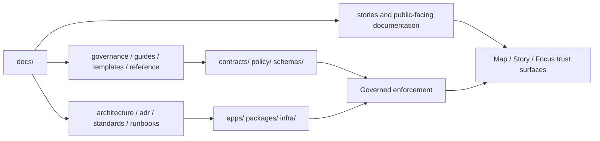

<!-- [KFM_META_BLOCK_V2]
doc_id: kfm://doc/7c2d8b8b-5c56-4cb7-a66f-1e0b7f8f6d21
title: docs/ — Documentation hub
type: standard
version: v1
status: draft
owners: TBD
created: 2026-03-07
updated: 2026-03-07
policy_label: public
related: [../README.md, ../contracts/, ../data/, ../policy/, ../schemas/, ./templates/]
tags: [kfm, docs, governance, evidence]
notes: [Current public repo confirms docs/ exists and has a minimal README; deeper docs/ subtree remains partly unverified without checkout-level inspection.]
[/KFM_META_BLOCK_V2] -->

<a id="top"></a>

# docs/ — Documentation hub
Governed, human-readable documentation for Kansas Frontier Matrix (KFM).

**Status:** active draft  
**Owners:** TBD  
**Repo fit:** `docs/` is the human-readable control surface beside machine-readable truth in `contracts/`, `policy/`, `schemas/`, and governed data/state under the truth path.  
**Accepted inputs:** architecture docs, ADRs, standards, governance rules, design specs, contributor guides, runbooks, templates, reference indices, and governed narrative/story documentation.  
**Exclusions:** secrets, raw datasets, promoted data artifacts, policy code, canonical schemas, unchecked operational claims, or documentation that bypasses evidence, policy, or review gates.


**Quick jump:** [Truth status legend](#truth-status-legend) · [Purpose](#purpose) · [Current verified baseline](#current-verified-baseline) · [Non-negotiables](#non-negotiables) · [Repo fit](#repo-fit) · [Placement rules](#placement-rules) · [Target layout](#target-layout-proposed) · [Quickstart](#quickstart) · [Review gates](#review-gates) · [FAQ](#faq)

## Truth status legend

- **CONFIRMED** = verified in the currently visible public repo or in uploaded KFM source documents
- **PROPOSED** = recommended target structure or rule, not yet verified in the checked-out repo
- **UNKNOWN** = not yet verified

## Purpose

`docs/` is where KFM explains itself without weakening governance.

This directory exists so a maintainer, contributor, reviewer, steward, or operator can answer:

1. What belongs in documentation versus contracts, policy, schemas, or data?
2. Which documentation is authoritative, and which is explanatory?
3. What constraints apply before documentation can influence a public or operational surface?
4. What must never be implied, published, or normalized here?

KFM documentation is part of the governed system, not decorative text.

## Current verified baseline

> **[CONFIRMED]** The public repository root contains `docs/` alongside root neighbors such as `.github/`, `apps/`, `contracts/`, `data/`, `infra/`, `packages/`, `policy/`, `schemas/`, `tests/`, and `tools/`.

> **[CONFIRMED]** The currently visible public `docs/README.md` is minimal and describes `docs/` as the home for architecture docs, ADRs, standards, runbooks, and long-form guidance.

> **[UNKNOWN]** The full checked-out `docs/` subtree has not been fully verified from the public fetch alone. Do not treat any unverified subdirectory below as current repo fact unless confirmed in checkout.

## Non-negotiables

> **[CONFIRMED]** KFM documentation must respect the same hard invariants as the rest of the platform.

- **Truth path:** docs must not describe or normalize shortcuts around RAW → WORK / QUARANTINE → PROCESSED → catalog/triplet → governed publication.
- **Trust membrane:** docs must not imply direct UI/client access to storage, databases, or internal stores.
- **Cite-or-abstain:** narrative, Story, and Focus-facing docs must assume that visible claims resolve to evidence or abstain.
- **Default-deny / fail-closed:** where rights, sensitivity, provenance, or review state are unclear, docs should block, escalate, redact, or quarantine rather than sound more certain than the system is.
- **Docs are a production surface:** behavior changes that affect lifecycle, policy, evidence, UX, or contributor workflow should update the relevant docs in the same change set.

## Repo fit

Documentation explains system behavior; it does not replace machine truth.


```mermaid
flowchart LR
  A["docs/"] --> B["architecture / adr / standards / runbooks"]
  A --> C["governance / guides / templates / reference"]
  A --> D["stories and public-facing documentation"]
  B --> E["apps/ packages/ infra/"]
  C --> F["contracts/ policy/ schemas/"]
  D --> G["Map / Story / Focus trust surfaces"]
  F --> H["Governed enforcement"]
  E --> H
  H --> G
```

### Neighbor matrix

| Path | Relationship to `docs/` | Rule |
|---|---|---|
| `README.md` | repo entry point | `docs/README.md` should align with root repo posture, not contradict it |
| `contracts/` | machine-readable interface truth | docs may explain contracts but must not become their authority |
| `policy/` | enforcement rules | governance docs must not drift from actual policy behavior |
| `schemas/` | validation truth | docs should link to canonical schemas instead of forking them |
| `data/` | lifecycle and publication boundary | docs must respect governed promotion and publication rules |
| `apps/`, `packages/`, `infra/` | implementation surfaces | architecture/spec docs should map to these without bypass claims |
| `tests/`, `tools/` | verification surfaces | doc-changing behavior should update tests, linters, or operational guidance when needed |

## Placement rules

### Put these in `docs/`

- architecture and boundary documents
- ADRs and recorded design decisions
- governance and review guidance
- standards, conventions, and writing protocols
- buildable design specs
- onboarding guides and contributor workflows
- operator runbooks
- reference indices into APIs, schemas, registries, vocabularies, and catalogs
- templates for governed docs
- governed narrative/story documentation

### Do not put these in `docs/`

- secrets, credentials, or private tokens
- raw or processed data payloads
- promoted artifacts that belong in governed data/publication paths
- authoritative policy logic that belongs in `policy/`
- authoritative contracts that belong in `contracts/`
- canonical schemas that belong in `schemas/`
- unsupported claims about repo state, CI state, deployment state, or enforcement depth
- unreviewed analyst notes presented as settled truth

## Authority model

| Area | Typical authority | Purpose | Notes |
|---|---:|---|---|
| `docs/governance/` | high | ethics, rights, sensitivity, review, escalation | should align tightly to policy behavior |
| `docs/architecture/` | high | boundaries, responsibilities, invariants | explanatory, but critical to system shape |
| `docs/adr/` | high | durable design decisions | records why a change happened |
| `docs/standards/` | high | formats, conventions, profiles | keeps docs and contributors consistent |
| `docs/specs/` | medium-high | buildable design documents | must map to implementation and tests |
| `docs/runbooks/` | high | operator procedures | deploy, restore, rollback, incident, maintenance |
| `docs/guides/` | medium | contributor workflows | how to do recurring work safely |
| `docs/templates/` | medium | approved starting points | keeps documentation shape stable |
| `docs/reference/` | medium | human index to machine truth | should point outwards, not duplicate canonical data |
| `docs/stories/` | high | governed publication docs | public-facing material must stay evidence-linked |

## Current tree

> **[CONFIRMED]** From the current public fetch, `docs/` is verified to contain `README.md`.

```text
docs/
└── README.md
```

> **[UNKNOWN]** Additional checked-in directories or files under `docs/` have not been fully verified from the public fetch used for this draft.

## Target layout (PROPOSED)

The following is a recommended target layout for KFM, grounded in the uploaded manuals and the current minimal scope statement in the public `docs/README.md`.

```text
docs/
├── README.md
├── CHANGELOG.md
├── adr/
├── architecture/
├── governance/
├── guides/
├── reference/
├── runbooks/
├── specs/
├── standards/
├── stories/
└── templates/
```

### Target directory responsibilities

| Directory | Purpose | Accepted inputs | Exclusions |
|---|---|---|---|
| `adr/` | record major design choices | ADRs, tradeoffs, consequences, rollback notes | informal chat-only rationale |
| `architecture/` | explain structure and invariants | trust membrane, truth path, service boundaries, diagrams | feature wishlists without owners |
| `governance/` | review and policy-facing guidance | sensitivity rules, rights guidance, review matrices, escalation | executable policy code |
| `guides/` | contributor how-to docs | onboarding, workflows, checklists | incident procedures needing runbook rigor |
| `reference/` | human index into canonical truth | API references, schema links, vocabularies, registries | duplicated canonical data |
| `runbooks/` | operator procedures | deploy, rollback, restore, incident, maintenance | architecture essays |
| `specs/` | buildable design docs | feature specs, acceptance criteria, dependency notes | vague ideation with no delivery path |
| `standards/` | consistency rules | metadata rules, markdown rules, style conventions, compliance profiles | one-off local preferences |
| `stories/` | governed publication docs | Story Node rules, publication checklists, citation requirements | uncited public narrative |
| `templates/` | approved starting points | README templates, ADR templates, runbook templates, story templates | finished production docs |

## Story and narrative rule set

> **[CONFIRMED]** KFM source materials require evidence-backed publication and resolvable citations on narrative/public trust surfaces.

Public-facing story documentation should:

- declare scope, audience, and review state
- distinguish factual statement from interpretation
- require resolvable citations for factual claims
- document attribution and rights for media
- include policy labeling where applicable
- describe what blocks publication
- define correction or rollback behavior

If a document touches sensitive locations, Indigenous histories, archaeological context, or unresolved rights, governance review is required before publication.

## Quickstart

```bash
# Inspect the local docs tree after checkout
find docs -maxdepth 3 -print | sort

# Review repo contribution rules
sed -n '1,200p' CONTRIBUTING.md
sed -n '1,200p' CODEOWNERS 2>/dev/null || true

# Find unresolved documentation markers
git grep -nE 'TODO|TBD|UNKNOWN|FIXME' docs || true

# Review current docs changes before opening a PR
git diff -- docs
```

## Authoring rules

1. Choose the directory based on authority, not convenience.
2. Start from `docs/templates/` when a template exists.
3. Include MetaBlock v2 where supported.
4. State purpose, repo fit, accepted inputs, and exclusions near the top.
5. Link to canonical contracts, policy, schemas, and registries instead of copying them as authority.
6. Mark meaningful uncertainty as `CONFIRMED`, `PROPOSED`, or `UNKNOWN`.
7. Update nearby runbooks, standards, or templates when behavior changes.
8. Do not describe bypasses around policy, provenance, or review.

## Review gates

| Gate | Reviewer question | Block condition |
|---|---|---|
| Placement | Is this in the correct directory? | mixed authority or wrong directory |
| Truth posture | Are claims labeled or scoped appropriately? | overclaiming repo or runtime facts |
| Trust membrane | Does the doc imply unsafe access patterns? | direct DB/storage/client bypass language |
| Lifecycle alignment | Does it preserve truth path and promotion gates? | publish-first or shortcut lifecycle language |
| Policy safety | Are rights, sensitivity, and review needs handled fail-closed? | ambiguous rights or sensitive detail exposure |
| Maintenance | Were related docs/templates/runbooks updated? | behavior changed but docs drift remains |
| Public trust | For Story/AI docs, are citations and abstention expectations explicit? | uncited claims normalized |

## Definition of done

- [ ] correct directory chosen
- [ ] MetaBlock v2 added where supported
- [ ] title and one-line purpose present
- [ ] repo fit stated
- [ ] accepted inputs stated
- [ ] exclusions stated
- [ ] at least one diagram included when helpful
- [ ] claims do not outrun verified system state
- [ ] related templates/guides/runbooks updated when behavior changed
- [ ] links are relative where possible
- [ ] documentation does not weaken policy or evidence posture

## FAQ

### When should `docs/README.md` change?
Update it when the role of `docs/`, its routing guidance, or its expected structure changes.

### Should documentation duplicate contracts, schemas, or policy?
No. Explain, summarize, and link to the canonical source of truth.

### Can drafts live in `docs/`?
Yes, if they are clearly labeled and do not masquerade as reviewed publication.

### Where do incident, restore, and rollback procedures belong?
`docs/runbooks/`

### Where should narrative publication rules live?
Normative rules belong in `docs/governance/` and `docs/stories/` once those paths are verified or created.

## Appendix

<details>
<summary>Maintenance notes</summary>

This README is intentionally fail-closed.

- Verified public facts are marked `CONFIRMED`.
- Target structure that fits KFM’s source corpus but is not yet checkout-verified is marked `PROPOSED`.
- Anything not yet verified is `UNKNOWN`.

When the local repo checkout is available, replace unknowns with verified tree data and tighten links to real paths.

Major documentation shape changes should update this file, any affected templates, and nearby standards/runbooks in the same change set.

</details>

[Back to top](#top)
