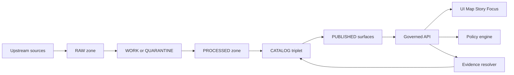
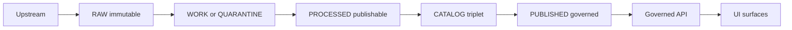
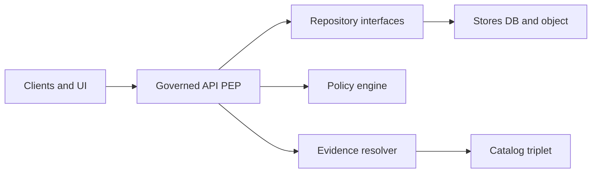

<!-- [KFM_META_BLOCK_V2]
doc_id: kfm://doc/1f731fb8-1614-4a01-a1a5-f8e5ed39c7e1
title: docs/ — Documentation hub
type: standard
version: v2
status: draft
owners: TBD
created: 2026-03-03
updated: 2026-03-04
policy_label: public
related:
  - docs/MASTER_GUIDE_v13.md
  - docs/governance/ROOT_GOVERNANCE.md
tags: [kfm, docs]
notes:
  - Entry point for repository documentation.
  - This README defines the REQUIRED docs/ layout for KFM vNext.
  - If your checkout differs, update the tree + links only after verifying the repo structure.
[/KFM_META_BLOCK_V2] -->

<a id="top"></a>

# docs/ — Documentation hub
**Governed, human-readable documentation for the Kansas Frontier Matrix (KFM).**

> **[CONFIRMED] Purpose:** `docs/` is the authoritative home for **governed documentation**: architecture blueprints, standards/profiles, governance policy, templates, specs, and published narrative artifacts (“Story Packs / Story Nodes”).

---

## IMPACT
- **Status:** draft
- **Owners:** TBD (set via `CODEOWNERS`)
- **Policy label:** public
- **[CONFIRMED] This hub exists to prevent “tribal-memory architecture.”**
- **[CONFIRMED] Hard exclusions:** secrets, raw datasets/binaries, and unreviewed sensitive details (especially precise vulnerable locations).

[](./README.md)
[](#impact)
[](#metablock-v2-and-document-metadata)
[](#review-gates-and-definition-of-done)
[](#docs-registry-and-discovery)
[](#local-preview--checks)

**Quick links:** [Start here](#start-here) · [Project map](#kfm-project-map-what-is-in-scope) · [Docs layout](#required-docs-layout) · [Docs registry](#docs-registry-and-discovery) · [Specs](#specs-and-component-design-docs) · [MetaBlock v2](#metablock-v2-and-document-metadata) · [Gates](#review-gates-and-definition-of-done) · [Add a doc](#how-to-add-a-new-document) · [Unknowns](#unknowns-to-verify)

---

## Quick navigation
- [Evidence legend](#evidence-legend)
- [Start here](#start-here)
- [KFM project map](#kfm-project-map-what-is-in-scope)
- [Where docs fit: truth path and trust membrane](#where-docs-fit-truth-path-and-trust-membrane)
- [Docs authority levels](#docs-authority-levels)
- [Acceptable inputs](#acceptable-inputs-for-docs)
- [Exclusions](#exclusions-what-must-not-go-in-docs)
- [Required docs layout](#required-docs-layout)
- [Directory responsibilities](#directory-responsibilities-human-routing-table)
- [Docs registry and discovery](#docs-registry-and-discovery)
- [Docs taxonomy and routing](#docs-taxonomy-and-routing)
- [MetaBlock v2 and document metadata](#metablock-v2-and-document-metadata)
- [Standards and profiles](#standards-and-profiles)
- [Specs and component design docs](#specs-and-component-design-docs)
- [AI and MCP docs](#ai-and-mcp-documentation)
- [Knowledge graph docs](#knowledge-graph-and-ontology-documentation)
- [Reference docs](#reference-contracts-schemas-and-apis)
- [Stories](#stories-story-nodes-and-story-packs)
- [Review gates and definition of done](#review-gates-and-definition-of-done)
- [Local preview and checks](#local-preview--checks)
- [Unknowns to verify](#unknowns-to-verify)
- [FAQ](#faq)
- [Appendix](#appendix)
- [Back to top](#back-to-top)

---

## Evidence legend
KFM docs are governed. Every meaningful claim is explicitly labeled:

- **[CONFIRMED]** = enforced invariant or documented requirement.
- **[PROPOSED]** = recommended pattern; may not yet be implemented.
- **[UNKNOWN]** = not verified in this checkout; list the smallest verification step.

> **[CONFIRMED] Rule:** If you can’t ground it, mark it **[UNKNOWN]** and list the smallest verification step.

---

## Start here
Read these in order (or use as your quick orientation map):

1) **`docs/MASTER_GUIDE_v13.md`** — canonical overview + doc map (if present).  
2) **`docs/governance/ROOT_GOVERNANCE.md`** — governance charter and “how changes are approved.”  
3) **`docs/architecture/README.md`** — architecture boundaries, invariants, diagrams, and ADR index.  
4) **`docs/standards/README.md`** — standards/profiles that define “valid” in KFM.  
5) **`docs/specs/README.md`** — component-level design specs that become buildable work (if present).  
6) **`docs/stories/README.md`** — Story authoring + publishing workflow (governed narrative artifacts).  
7) **`docs/quality/README.md`** — gates, conformance checks, test strategy, determinism expectations.

> **[UNKNOWN]** If any linked file/folder is missing in your checkout, treat it as **a required gap** and create a placeholder stub (or update this README to match the verified tree).

---

## KFM project map: what is in scope
This section is a **project assessment** (what KFM contains, and what it explicitly must not be).

### What KFM is
- **[CONFIRMED]** KFM is a **pipeline → catalog → governed API → UI** system. It turns upstream data into immutable artifacts, validated catalogs, and governed runtime surfaces.
- **[CONFIRMED]** KFM includes **Map Explorer**, **Story Mode**, and **Focus Mode** (AI-assisted Q&A) where user-visible claims must be evidence-backed.
- **[CONFIRMED]** KFM treats **evidence, provenance, and policy** as first-class runtime constraints, not afterthoughts.

### What KFM is not
- **[CONFIRMED]** Not a “upload-and-forget portal.”
- **[CONFIRMED]** Not a UI that directly queries databases.
- **[CONFIRMED]** Not an ungoverned chatbot (Focus Mode is constrained by policy and citation gates).

### System slices (what exists conceptually)
Use this mental model when writing docs or adding features:


```mermaid
flowchart LR
  Up[Upstream sources] --> RAW[RAW zone]
  RAW --> WORK[WORK or QUARANTINE]
  WORK --> PROCESSED[PROCESSED zone]
  PROCESSED --> CATALOG[CATALOG triplet]
  CATALOG --> PUBLISHED[PUBLISHED surfaces]

  PUBLISHED --> API[Governed API]
  API --> UI[UI Map Story Focus]

  API --> POL[Policy engine]
  API --> EV[Evidence resolver]
  EV --> CATALOG
```

**[CONFIRMED] Interlock:** docs must never propose shortcuts that bypass policy enforcement or the evidence resolver.

### Repo surfaces KFM expects (outside docs)
> **[UNKNOWN]** The exact repo tree in *this checkout* must be verified. (This README links to target locations; update after running `tree -L 3`.)

**[PROPOSED]** Expected top-level repository slices (for orientation only):

| Path | Role | Docs should link to |
|---|---|---|
| `apps/` | runnable services (API, UI, workers, CLI) | `docs/architecture/`, `docs/guides/`, `docs/runbooks/` |
| `packages/` | core modules (ingest, catalog, evidence, policy, indexers) | `docs/specs/`, `docs/architecture/interfaces/` |
| `contracts/` | machine contracts (OpenAPI, JSON Schema, vocab) | `docs/reference/OPENAPI_INDEX.md`, `docs/reference/SCHEMA_REGISTRY.md` |
| `policy/` | OPA/Rego bundles + tests | `docs/standards/policy/`, `docs/guides/policy/` |
| `data/` | lifecycle zones + dataset specs + catalogs | `docs/data/` (documentation only) |
| `tools/` | validators, linters, spec hashers, linkcheckers | `docs/quality/`, `docs/reference/TOOLING_INDEX.md` |
| `infra/` | deployment (K8s/Terraform/GitOps) | `docs/architecture/DEPLOYMENT_TOPOLOGY.md`, `docs/runbooks/DEPLOY.md` |
| `configs/` | config templates (env, pipelines, UI) | `docs/guides/onboarding/DEV_ENV_SETUP.md` |
| `migrations/` | DB schema migrations | `docs/runbooks/BACKUP_RESTORE.md` + DB runbooks |
| `examples/` | sample datasets/stories/policies | `docs/reference/` and `docs/stories/_templates/` |
| `tests/` | unit/integration/e2e | `docs/quality/` |
| `mcp/` | AI artifacts (model cards, experiments, gates) | `docs/ai/` + `docs/templates/TEMPLATE__MODEL_CARD.md` |

---

## Where docs fit: truth path and trust membrane

### Truth path lifecycle (data zones)
**[CONFIRMED]** KFM uses a gated lifecycle (“truth path”) that documentation must not contradict:


```mermaid
flowchart LR
  Up[Upstream] --> RAW[RAW immutable]
  RAW --> WORK[WORK or QUARANTINE]
  WORK --> PROCESSED[PROCESSED publishable]
  PROCESSED --> CAT[CATALOG triplet]
  CAT --> PUB[PUBLISHED governed]

  PUB --> API[Governed API]
  API --> UI[UI surfaces]
```

- **[CONFIRMED]** RAW is append-only immutable acquisition + checksums.
- **[CONFIRMED]** WORK/QUARANTINE is where QA and redaction/generalization candidates happen.
- **[CONFIRMED]** PROCESSED holds publishable artifacts + checksums.
- **[CONFIRMED]** CATALOG is cross-linked **DCAT + STAC + PROV** plus run receipts.
- **[CONFIRMED]** PUBLISHED surfaces may only serve promoted versions that passed gates.

### Trust membrane (policy boundary)
**[CONFIRMED]** The trust membrane is the enforced boundary that prevents bypass:


```mermaid
flowchart LR
  C[Clients and UI] --> PEP[Governed API PEP]
  PEP --> REPO[Repository interfaces]
  REPO --> STORES[Stores DB and object]
  PEP --> PDP[Policy engine]
  PEP --> EV[Evidence resolver]
  EV --> CAT[Catalog triplet]
```

- **[CONFIRMED]** Clients/UI never access DB/object storage directly.
- **[CONFIRMED]** Backend domain logic must not bypass repository interfaces to reach storage directly.
- **[CONFIRMED]** Policy evaluation applies at the PEP and gates what can be returned.

> **[CONFIRMED] Doc rule:** If a document proposes behavior that breaks this membrane, it is incorrect by definition.

---

## Docs authority levels
This prevents “random docs” from becoming de-facto policy.

- **[CONFIRMED] Authority classes (minimum):**
  1) **Standards/Profiles** (`docs/standards/`) — normative. “MUST/SHALL” language allowed.
  2) **Governance** (`docs/governance/`) — normative. Overrides everything except repo policy enforcement.
  3) **Architecture** (`docs/architecture/`) — high authority; design boundaries + invariants + interfaces.
  4) **Specs** (`docs/specs/`) — buildable design docs; must link to contracts/tests.
  5) **Guides/Runbooks** (`docs/guides/`, `docs/runbooks/`) — operational; non-normative unless referenced by governance.
  6) **Investigations** (`docs/investigations/`) — explicitly non-authoritative.

- **[PROPOSED] Rule:** any doc intended to constrain behavior must be either:
  - a **Standard**, or
  - a **Spec** that is referenced by a Standard and guarded by CI/tests.

---

## Acceptable inputs for docs/
Docs are a production surface; keep them stable, reviewable, and retrieval-friendly.

**[CONFIRMED] Acceptable:**
- Architecture docs (diagrams, subsystem boundaries, contracts in human-readable form)
- Standards/profiles (STAC/DCAT/PROV profiles; repo conventions; doc protocol)
- Governance and review policy (non-secret)
- Specs (component-level buildable design documents)
- Templates (MetaBlock v2 docs, Story Nodes, contract extensions)
- Published narrative artifacts (Story Packs)

---

## Exclusions: what must NOT go in docs/
**[CONFIRMED] Never put in `docs/`:**
- Secrets (API keys, credentials, tokens)
- Raw datasets, large binaries, or lifecycle artifacts (RAW/WORK/PROCESSED belong under `data/`)
- Unreviewed sensitive details (precise vulnerable locations, restricted archeological sites, etc.)

**[PROPOSED] Avoid unless explicitly approved:**
- Generated build outputs (static site builds, compiled docs)
- Vendor bundles that should be fetched via tooling instead

---

## Required docs layout
This README defines the **target, “encompass-all-things”** documentation layout for KFM.

> **[CONFIRMED] Expectation:** Each major directory has its own `README.md` index.  
> **[CONFIRMED] Expectation:** Any missing path in this tree is a “docs debt” item (create stubs or adjust links after verification).

```text
docs/                                                   # Documentation hub: canonical human-readable source for KFM governance, architecture, standards, and operations
├─ README.md                                             # Docs hub index + rules (how docs fit, evidence discipline, linking, ownership, and where to start)
├─ MASTER_GUIDE_v13.md                                   # Canonical overview + doc map (MUST exist if referenced; keep links current)
├─ glossary.md                                           # Domain vocabulary (single source of truth; terms used across contracts/policy/stories)
├─ CHANGELOG.md                                          # (PROPOSED) Docs-surface changelog (major doc restructures, renamed standards, governance shifts)
│
├─ _registry/                                            # (PROPOSED) Machine-readable doc indices for retrieval + CI validation (doc_id → path/title/status/labels)
│  ├─ README.md                                          # Registry intent, update workflow, and how CI validates completeness/uniqueness
│  ├─ docs.index.yml                                     # Doc index (doc_id → path/title/status/policy_label/tags/owners/related)
│  └─ docs.index.schema.json                             # Schema for docs.index.yml (fail-closed validation: required keys, enums, formats)
│
├─ adr/                                                  # Architecture Decision Records (canonical home; stable IDs; decision history)
│  ├─ README.md                                          # ADR process (when to write, numbering, templates, linking to code/policy/contracts)
│  ├─ ADR-0001-template.md                               # ADR authoring template (problem, decision, alternatives, consequences, verification)
│  └─ ADR-0002-<decision-slug>.md                        # Example/placeholder ADR (copy pattern; keep numbering sequential)
│
├─ architecture/                                         # Blueprints + invariants + subsystem contracts (human-readable system design)
│  ├─ README.md                                          # Architecture entry map + how to navigate (context → invariants → interfaces → diagrams)
│  ├─ TRUST_MEMBRANE.md                                  # Invariant: UI → governed API only (no bypass); PEP/PDP boundaries; default-deny posture
│  ├─ TRUTH_PATH_LIFECYCLE.md                             # Invariant: Upstream → RAW → WORK → PROCESSED → CATALOG → PUBLISHED (+ AUDIT trail)
│  ├─ SYSTEM_CONTEXT.md                                   # “C4 L1” narrative (actors, systems, boundaries, trust zones)
│  ├─ DEPLOYMENT_TOPOLOGY.md                               # Local-first + cloud-scale topology (services, data stores, network boundaries)
│  ├─ interfaces/                                         # Subsystem interface contracts (human-readable; complements machine contracts/)
│  │  ├─ README.md                                        # Interface index + relationship to contracts/, policy/, and packages/
│  │  ├─ API_LAYER_CONTRACT.md                            # API boundary rules (routing, authn/authz, obligations, error shaping, versioning)
│  │  ├─ POLICY_ENGINE_CONTRACT.md                        # PDP/OPA contract (inputs/outputs, reason codes, obligations, caching, parity tests)
│  │  ├─ EVIDENCE_RESOLVER_CONTRACT.md                    # Evidence resolution semantics (EvidenceRef/Bundles, resolvability, failure modes)
│  │  ├─ REPOSITORY_LAYER_CONTRACT.md                     # Storage/repo contract (ports, adapters, determinism, idempotence, receipts)
│  │  └─ CATALOG_TRIPLET_CONTRACT.md                      # DCAT+STAC+PROV cross-link expectations + integrity rules
│  ├─ diagrams/                                           # Architecture diagrams (Mermaid sources + rendered exports as needed)
│  │  └─ README.md                                        # Diagram conventions, export rules, and how diagrams are referenced from docs
│  └─ adr/                                                # OPTIONAL: stub if ADRs are kept here (prefer redirect to docs/adr/)
│     └─ README.md                                        # Redirect/stub pointing to canonical ADR home (docs/adr/)
│
├─ standards/                                            # Normative standards/profiles + repo conventions (CI-enforced where possible)
│  ├─ README.md                                          # Standards index + how standards map to validators/tests and enforcement points
│  ├─ KFM_MARKDOWN_WORK_PROTOCOL.md                      # Markdown authoring protocol (structure, headings, anchors, cite-or-abstain rules)
│  ├─ KFM_REPO_STRUCTURE_STANDARD.md                     # Repo structure contract (what lives where; boundaries; naming; ownership)
│  ├─ KFM_STAC_PROFILE.md                                # STAC profile guidance (KFM-specific constraints + required fields)
│  ├─ KFM_DCAT_PROFILE.md                                # DCAT profile guidance (KFM-specific constraints + required fields)
│  ├─ KFM_PROV_PROFILE.md                                # PROV profile guidance (KFM-specific lineage requirements)
│  │
│  ├─ docs/                                              # (PROPOSED) Doc-level standards beyond Markdown protocol (IDs, linking, diagram rules)
│  │  ├─ README.md                                       # Doc standards index + enforcement strategy (lint/linkcheck/CI)
│  │  ├─ DOC_IDS_AND_METADATA.md                         # doc_id scheme + metadata blocks (required fields, uniqueness, registry integration)
│  │  ├─ LINKING_AND_ANCHORS.md                          # Stable linking/anchors rules (no link rot; relative links; section IDs)
│  │  └─ DIAGRAMS_STYLE_GUIDE.md                         # Diagram conventions (Mermaid style, export naming, accessibility notes)
│  │
│  ├─ identity/
│  │  ├─ README.md                                       # Identity standards index (IDs + naming + hashing)
│  │  ├─ IDENTIFIERS_AND_NAMING.md                       # dataset_id, evidence_ref, story_slug, artifact IDs (formats + stability rules)
│  │  └─ HASHING_AND_DIGESTS.md                          # sha256/spec_hash rules + canonicalization expectations (avoid hash drift)
│  │
│  ├─ policy/
│  │  ├─ README.md                                       # Policy standards index (bundle structure + parity + migrations)
│  │  ├─ POLICY_PACK_STANDARD.md                         # Policy bundle structure, entrypoints, testing requirements, versioning expectations
│  │  └─ REGO_V1_MIGRATION.md                             # How/when to migrate policy modules/tests without breaking parity
│  │
│  ├─ api/
│  │  ├─ README.md                                       # API standards index (versioning, envelopes, pagination)
│  │  └─ API_VERSIONING_AND_ERRORS.md                    # Error model + pagination + stability guarantees + reason codes/obligations surfacing
│  │
│  ├─ evidence/
│  │  ├─ README.md                                       # Evidence standards index (refs, bundles, resolver semantics)
│  │  └─ EVIDENCE_REF_STANDARD.md                        # EvidenceRef syntax + resolver guarantees + policy/evidence coupling rules
│  │
│  ├─ catalog/
│  │  ├─ README.md                                       # Catalog standards index (triplet, crosslinks, validation)
│  │  └─ CATALOG_TRIPLET_STANDARD.md                     # DCAT+STAC+PROV cross-linking expectations + integrity checks
│  │
│  ├─ geo/                                               # (PROPOSED) Geospatial formats + CRS + tiling norms (interoperability + safety)
│  │  ├─ README.md                                       # Geo standards index (CRS, raster/vector formats, tiling)
│  │  ├─ CRS_AND_PROJECTIONS.md                          # CRS rules + reprojection norms + precision considerations
│  │  ├─ RASTER_FORMATS_COG.md                           # Cloud-Optimized GeoTIFF norms (metadata, overviews, tiling, validation)
│  │  ├─ VECTOR_FORMATS_GEOPARQUET.md                    # GeoParquet norms (schema, geometry encoding, partitioning, validation)
│  │  └─ TILE_FORMATS_PMTILES.md                         # PMTiles norms (zoom bounds, attribution, caching, policy-aware tiling)
│  │
│  ├─ telemetry/                                         # (PROPOSED) Telemetry event naming + schemas + retention rules (policy-safe observability)
│  │  ├─ README.md                                       # Telemetry standards index + data minimization stance
│  │  ├─ TELEMETRY_EVENT_NAMING.md                       # Event naming rules (namespaces, versioning, cardinality constraints)
│  │  ├─ PIPELINE_RUN_TELEMETRY.md                       # Pipeline run telemetry (fields, reason codes, linkage to receipts)
│  │  └─ UI_TELEMETRY.md                                 # UI telemetry (trust-surface interactions; denial UX; no sensitive leakage)
│  │
│  ├─ oci/                                               # (PROPOSED) Publishing artifacts to OCI (mediaTypes, referrers, attestations)
│  │  ├─ README.md                                       # OCI standards index + why OCI is used (distribution + integrity)
│  │  ├─ OCI_GEOSPATIAL_ARTIFACTS.md                     # OCI packaging patterns for geospatial artifacts (tiles, catalogs, deltas)
│  │  ├─ MEDIA_TYPES_REGISTRY.md                         # Media types registry (canonical names, versions, validation expectations)
│  │  └─ DELTA_REFERRERS_STANDARD.md                     # Referrers/attestations/deltas model (linking, discovery, verification)
│  │
│  ├─ supply_chain/                                      # (PROPOSED) SBOM, SLSA, signing/verification expectations
│  │  ├─ README.md                                       # Supply chain standards index + enforcement touchpoints in CI
│  │  ├─ SBOM_STANDARD.md                                # SBOM expectations (formats, scope, generation, retention)
│  │  ├─ SLSA_ATTESTATION_STANDARD.md                    # Attestation expectations (provenance, build steps, artifact binding)
│  │  └─ SIGNING_AND_VERIFICATION.md                     # Signing/verifying artifacts (keys, trust roots, verification policy)
│  │
│  ├─ ui/
│  │  ├─ README.md                                       # UI standards index (trust surfaces + safe defaults)
│  │  └─ UI_TRUST_SURFACES_STANDARD.md                   # What UI may render; citation UX rules; policy badge/obligation rendering norms
│  │
│  ├─ ai/
│  │  ├─ README.md                                       # AI standards index (model cards, retrieval, eval/redteam)
│  │  ├─ MODEL_CARD_STANDARD.md                          # Model card requirements (data, risks, policy bounds, evaluation, limitations)
│  │  ├─ RAG_RETRIEVAL_STANDARD.md                       # Retrieval standards (indexing, grounding, citation requirements, policy constraints)
│  │  └─ AI_EVAL_AND_REDTEAM_STANDARD.md                 # Evaluation/redteam standards (datasets, safety tests, regression thresholds)
│  │
│  └─ ontology/
│     ├─ README.md                                       # Ontology standards index (graph vocab + mapping rules)
│     └─ KFM_ONTOLOGY_PROFILE.md                         # Graph vocab/mapping + time/geo semantics (alignment with catalogs and evidence)
│
├─ templates/                                            # Authoring templates (make “good docs” the path of least resistance)
│  ├─ README.md                                          # Template index + how to copy/use + required metadata conventions
│  ├─ TEMPLATE__KFM_UNIVERSAL_DOC.md                     # Universal doc template (MetaBlock, status tags, owners, citations, verification steps)
│  ├─ TEMPLATE__STORY_NODE_V3.md                         # Story node template (claims→citations, map layers, policy labels/obligations, review checklist)
│  ├─ TEMPLATE__API_CONTRACT_EXTENSION.md                # Template for extending/adding API contracts (OpenAPI + schema + tests + migration notes)
│  ├─ TEMPLATE__ADR.md                                   # ADR template (decision record for architecture/governance choices)
│  ├─ TEMPLATE__RUNBOOK.md                               # Runbook template (symptoms, actions, rollback, escalation, verification)
│  ├─ TEMPLATE__MODEL_CARD.md                            # Model card template (training/eval/safety/policy bounds)
│  ├─ TEMPLATE__DATASET_ENTRY.md                         # Dataset registry entry template (source, license, sensitivity, cadence, stewardship)
│  ├─ TEMPLATE__RUN_RECEIPT.md                           # Run receipt template (inputs/outputs/digests/tools/versions/outcome)
│  ├─ TEMPLATE__POLICY_CHANGE.md                         # Policy change template (what changed, why, fixtures updated, risk, rollout/rollback)
│  └─ TEMPLATE__COMPONENT_SPEC.md                        # (PROPOSED) Component spec template for docs/specs/* (buildable, versioned, testable)
│
├─ governance/                                           # Governance charter, ethics, sovereignty, review gates, and override mechanisms
│  ├─ README.md                                          # Governance entry map + how decisions/waivers/gates/roles interlock
│  ├─ ROOT_GOVERNANCE.md                                 # Governance constitution (principles, decision rights wiring, escalation)
│  ├─ ETHICS.md                                          # Ethics commitments (harm minimization, transparency, evidence discipline)
│  ├─ SOVEREIGNTY.md                                     # Data sovereignty rules (jurisdiction, stewardship, access constraints)
│  ├─ REVIEW_GATES.md                                    # Review gate definitions (who reviews what; required artifacts; pass/fail semantics)
│  ├─ DATA_CLASSIFICATION.md                             # Policy labels + handling rules (classification taxonomy, obligations, review triggers)
│  ├─ SENSITIVE_LOCATIONS_PLAYBOOK.md                    # Redaction/generalization rules for sensitive locations (methods + required obligations)
│  ├─ WAIVERS_AND_EXCEPTIONS.md                          # Override process (time-bounded waivers, compensating controls, audit trail requirements)
│  └─ ROLES_AND_RACI.md                                  # (PROPOSED) Explicit roles + RACI + approval matrix (aligns to CODEOWNERS/policy)
│
├─ specs/                                                # (PROPOSED) Buildable component specs (versioned, reviewable; closer to “executable docs”)
│  ├─ README.md                                          # Spec doctrine (what is a spec, required sections, how specs map to code/tests)
│  ├─ agents/                                            # Governed automation patterns (watcher/planner/executor) with clear contracts
│  │  ├─ README.md                                       # Agent spec index + lifecycle (inputs/outputs, policy bounds, receipts)
│  │  ├─ WATCHER_CONTRACT.md                             # Watcher contract (triggers, polling, dedupe, receipts)
│  │  ├─ PLANNER_CONTRACT.md                             # Planner contract (plans, constraints, evidence requirements, approvals)
│  │  └─ EXECUTOR_CONTRACT.md                            # Executor contract (actions, rollbacks, safety checks, audit linkage)
│  ├─ pipelines/                                         # Pipeline specs (beyond guides; intended to be buildable/verified)
│  │  ├─ README.md                                       # Pipeline spec index + how to structure per-domain specs
│  │  ├─ ingestion/                                      # Connector/pipeline specs (cross-cutting)
│  │  ├─ hydrology/                                      # Domain pipeline specs (hydrology)
│  │  ├─ hazards/                                        # Domain pipeline specs (hazards)
│  │  └─ climate/                                        # Domain pipeline specs (climate)
│  ├─ ui/                                                # UI component specs (map/story/focus) for buildable trust surfaces
│  │  └─ README.md                                       # UI specs index + how specs map to components/tests
│  ├─ storage/                                           # Storage/distribution specs (object store, OCI, deltas)
│  │  └─ README.md                                       # Storage specs index + integrity/retention expectations
│  └─ observability/
│     └─ README.md                                       # Observability specs index (events, SLOs, audit expectations)
│
├─ ai/                                                   # (PROPOSED) AI surfaces: Focus Mode, local models, evaluation, safety
│  ├─ README.md                                          # AI docs index + policy boundaries for AI behavior
│  ├─ FOCUS_MODE_OVERVIEW.md                             # Focus Mode goals + trust model (cite-or-abstain, policy enforcement, evaluation)
│  ├─ OLLAMA_INTEGRATION.md                              # Local model integration notes (if used) + constraints + safety posture
│  ├─ MODEL_CARDS_INDEX.md                               # Index of model cards (what models exist, where cards live, status)
│  └─ EVALUATION_AND_BENCHMARKS.md                       # Evaluation design (golden queries, metrics, regression gates, redteam)
│
├─ knowledge_graph/                                      # (PROPOSED) Knowledge graph layer: Neo4j + ontology + graph ingestion/query patterns
│  ├─ README.md                                          # KG docs index + how KG relates to catalogs/evidence/policy
│  ├─ GRAPH_DATA_MODEL.md                                # Graph data model (nodes/edges, IDs, time/geo modeling, provenance)
│  ├─ ONTOLOGY_AND_VOCAB.md                              # Ontology + vocab alignment (mapping to contract vocab + controlled lists)
│  ├─ GRAPH_RAG_PATTERNS.md                              # Graph-RAG patterns (retrieval, grounding, citation linking)
│  └─ NEO4J_OPERATIONS.md                                # Neo4j operations (backups, migrations, performance, policy-safe access)
│
├─ reference/                                            # (PROPOSED) Indices into machine surfaces (contracts/schemas/policy/tools) for quick navigation
│  ├─ README.md                                          # Reference index + how indices are generated/maintained
│  ├─ OPENAPI_INDEX.md                                   # Maps OpenAPI files → endpoints → owners (and compatibility notes)
│  ├─ SCHEMA_REGISTRY.md                                 # Maps JSON schemas → purpose → validators/tests that enforce them
│  ├─ POLICY_BUNDLE_INDEX.md                              # Maps policy bundles → gates → owners → fixtures/tests
│  └─ TOOLING_INDEX.md                                   # Validator/linters index + how to run (local/CI), inputs/outputs, artifacts emitted
│
├─ guides/                                               # Procedural “how do I do X safely?” docs (human-operated workflows)
│  ├─ README.md                                          # Guides index + common entrypoints
│  ├─ onboarding/
│  │  ├─ README.md                                       # Onboarding guide map + suggested path
│  │  ├─ DEV_ENV_SETUP.md                                # Developer environment setup (local stack, tooling, prerequisites)
│  │  ├─ FIRST_DATASET_WALKTHROUGH.md                    # First dataset end-to-end (registry → ingest → validate → catalog → publish)
│  │  └─ FIRST_STORY_WALKTHROUGH.md                      # First story end-to-end (claims → citations → review → publish)
│  ├─ acquisition/
│  │  ├─ README.md                                       # Acquisition guides index
│  │  ├─ CONNECTOR_AUTHORING.md                          # How to author a connector (inputs, snapshots, receipts, licensing checks)
│  │  └─ RAW_INGEST_PLAYBOOK.md                          # RAW ingest playbook (snapshots, checksums, provenance, quarantine triggers)
│  ├─ geo/                                               # (PROPOSED) GIS-centric how-tos (raster/vector/tiling/CRS)
│  │  ├─ README.md                                       # Geo how-to index
│  │  ├─ VECTOR_ETL_PIPELINES.md                         # Vector ETL how-to (validation, partitioning, indexing, policy labels)
│  │  ├─ RASTER_ETL_PIPELINES.md                         # Raster ETL how-to (COG norms, overviews, tiling, performance checks)
│  │  └─ HYDROLOGY_WORKFLOWS.md                          # Hydrology workflows (domain-specific how-to; cite data sources)
│  ├─ pipelines/
│  │  ├─ README.md                                       # Pipeline guides index
│  │  ├─ BUILD_A_PIPELINE_STEP.md                        # Step-by-step pipeline build guide (configs, receipts, tests, promotion gates)
│  │  └─ PROMOTION_FLOW.md                               # Promotion flow guide (A–F(+G) gates, artifacts, failure handling)
│  ├─ catalogs/
│  │  ├─ README.md                                       # Catalog guides index
│  │  ├─ EMIT_STAC_DCAT_PROV.md                          # How to emit the catalog triplet + crosslinks + receipts
│  │  └─ VALIDATE_CATALOGS.md                            # How to validate catalogs (schemas/profiles/linkcheck; common failures)
│  ├─ apis/
│  │  ├─ README.md                                       # API guides index
│  │  ├─ ADD_NEW_ENDPOINT.md                             # Add endpoint guide (OpenAPI + DTOs + tests + policy wiring)
│  │  └─ FOCUS_MODE_ENDPOINTS.md                         # Focus endpoints guide (policy constraints, cite-or-abstain, eval harness)
│  ├─ policy/
│  │  ├─ README.md                                       # Policy guides index
│  │  ├─ WRITE_A_POLICY.md                               # How to write policy (rego patterns, fixtures, reason codes, obligations)
│  │  └─ DEBUG_POLICY_DENIALS.md                         # Debug denials (reason codes, fixtures reproduction, policy-safe tracing)
│  ├─ observability/
│  │  ├─ README.md                                       # Observability guides index
│  │  ├─ TRACE_A_REQUEST.md                              # Trace a request end-to-end (request_id, spans, audit linkage)
│  │  └─ READ_RUN_RECEIPTS.md                            # Read receipts (what they mean, how to verify determinism, common anomalies)
│  ├─ ui/
│  │  ├─ README.md                                       # UI guides index
│  │  ├─ RUN_UI_LOCALLY.md                               # Run UI locally (dev server, API wiring, auth stubs)
│  │  └─ STORY_AUTHORING.md                              # Story authoring guide (claims→citations, review, obligation surfacing)
│  └─ security/
│     ├─ README.md                                       # Security guides index
│     ├─ SECRETS_AND_OIDC.md                             # Secrets posture + OIDC flows (where secrets live; never in repo)
│     └─ THREAT_MODELING_HOWTO.md                        # Threat modeling how-to (actors/assets/controls; policy-safe design)
│
├─ runbooks/                                             # Ops-owned “the system is on fire / needs operation” playbooks (actionable + rollback)
│  ├─ README.md                                          # Runbooks index + escalation norms
│  ├─ LOCAL_STACK.md                                     # Local stack operations (compose, seed/reset, debugging)
│  ├─ DEPLOY.md                                          # Deployment runbook (environments, rollouts, canaries, verification)
│  ├─ BACKUP_RESTORE.md                                  # Backup/restore procedures (what is backed up, how to verify restores)
│  ├─ INCIDENT_RESPONSE.md                               # Incident response (triage, comms, containment, postmortem, audit references)
│  ├─ DATA_PROMOTION_RUNBOOK.md                          # Data promotion operations (gate artifacts, retries, quarantine handling)
│  ├─ POLICY_CHANGE_RUNBOOK.md                           # Policy change operations (fixture updates, rollout, parity checks, rollback)
│  └─ DR_AND_ROLLBACK.md                                 # Disaster recovery + rollback (RTO/RPO goals, drill procedures)
│
├─ quality/                                              # Gates, conformance, and test strategy (fail-closed defaults)
│  ├─ README.md                                          # Quality model index (what “done” means; how checks map to gates)
│  ├─ GATES_DEFINITION_OF_DONE.md                        # Promotion gates + CI mapping (required artifacts, pass criteria)
│  ├─ CONTRACT_TESTS.md                                  # Contract test strategy (OpenAPI/schemas/profiles/crosslinks)
│  ├─ DETERMINISM_AND_REPRO.md                           # Reproducibility expectations (canonicalization, hashing, receipts, reruns)
│  ├─ PERFORMANCE_SLOS.md                                # API/pipeline SLOs (if applicable) + measurement posture (policy-safe telemetry)
│  └─ SECURITY_BASELINE.md                               # Doc-level security baseline (SBOM/vuln scan expectations; minimum controls)
│
├─ data/                                                 # Data-system documentation (NOT the datasets themselves)
│  ├─ README.md                                          # Data docs index + links to truth-path zones and governance touchpoints
│  ├─ DATA_LIFECYCLE.md                                  # Lifecycle narrative (acquire → validate → publish) + failure/quarantine rules
│  ├─ DATASET_REGISTRY.md                                # How dataset registry works (fields, stewardship, licensing, sensitivity)
│  ├─ PROVENANCE_AND_RECEIPTS.md                         # Provenance model + receipts/manifests (what must be recorded and why)
│  └─ LICENSING_AND_ATTRIBUTION.md                       # Licensing/attribution guidance (rights checks, obligations, export constraints)
│
├─ domains/                                              # Domain-specific docs (hydrology, soils, air, hazards, etc.)
│  ├─ README.md                                          # Domain docs index + how to add a domain package
│  ├─ hydrology/
│  │  ├─ README.md                                       # Hydrology domain overview (scope, datasets, stewards)
│  │  ├─ DATA_SOURCES.md                                 # Hydrology data sources (links, licensing notes, provenance anchors)
│  │  └─ PIPELINES.md                                    # Hydrology pipelines (specs, configs, receipts, validation expectations)
│  ├─ soils/
│  │  ├─ README.md                                       # Soils domain overview
│  │  ├─ DATA_SOURCES.md                                 # Soils data sources
│  │  └─ PIPELINES.md                                    # Soils pipelines
│  ├─ air/
│  │  ├─ README.md                                       # Air domain overview
│  │  ├─ DATA_SOURCES.md                                 # Air data sources
│  │  └─ PIPELINES.md                                    # Air pipelines
│  └─ hazards/
│     ├─ README.md                                       # Hazards domain overview
│     ├─ DATA_SOURCES.md                                 # Hazards data sources
│     └─ PIPELINES.md                                    # Hazards pipelines
│
├─ diagrams/                                             # Shared diagrams (cross-cutting; referenced by many docs)
│  ├─ README.md                                          # Diagram index + conventions (sources vs exports; naming; accessibility)
│  ├─ architecture/                                      # Cross-cutting architecture diagrams (system context, trust membrane, topology)
│  ├─ pipelines/                                         # Pipeline diagrams (truth-path flows, promotion gates, receipts)
│  ├─ ui/                                                # UI diagrams (trust surfaces, evidence drawer, denial UX, map/story/focus flows)
│  ├─ governance/                                        # Governance diagrams (roles, decision rights, waivers, gate flows)
│  └─ domains/                                           # Domain diagrams (hydrology/soils/air/hazards etc.)
│
├─ investigations/                                       # Sandbox notes + experiments (explicitly not authoritative/published outputs)
│  ├─ README.md                                          # What belongs here, retention rules, and how to promote learnings into standards/specs
│  └─ <topic>/                                           # One investigation topic (time-bounded; clearly labeled)
│     ├─ README.md                                       # Investigation scope, hypotheses, and “what would make this confirmed”
│     ├─ notes.md                                        # Working notes (cite sources; label assumptions)
│     └─ artifacts/                                      # Small, non-sensitive samples only (no PII, no secrets, no authoritative releases)
│
├─ stories/                                              # Canonical Story Node home (governed narrative artifacts for docs-side story packs)
│  ├─ README.md                                          # Story pack overview + how stories relate to /stories (repo root) if both exist
│  ├─ CODEOWNERS                                         # Optional: route story reviews to approvers (stewards/editors/security as needed)
│  ├─ _schemas/                                          # Story pack schemas for CI validation (story.md sidecars, story.json, assets manifests)
│  ├─ _registry/                                         # Story index for UI discovery (story_slug → status/policy_label/tags/paths)
│  ├─ _governance/                                       # Story-specific governance helpers (checklists, waivers links, publish rules)
│  ├─ _lint/                                             # Story lint config (style, required sections, citation rules)
│  ├─ _shared/                                           # Shared story utilities (partials, shared assets, reusable snippets)
│  ├─ _templates/                                        # Story templates (reusable patterns for narrative + map choreography)
│  ├─ draft/                                             # WIP stories (not published; clearly marked; safe fixtures only)
│  ├─ review/                                            # Under governance review (checklists, required citations, obligations review)
│  ├─ published/                                         # Immutable published story packs (versioned; citations locked; obligations enforced)
│  │  └─ <story_slug>/
│  │     ├─ story.md                                     # Story narrative (claims → citations; policy-safe language)
│  │     ├─ story.json                                   # Optional map choreography/state (if used; schema-validated)
│  │     └─ assets/                                      # Approved media/data excerpts for the story (small, licensed, policy-labeled)
│  └─ withdrawn/                                         # Removed from publish surface (keep audit trail + reason codes + links to waiver/decision)
│
└─ reports/                                              # OPTIONAL: Generated/curated reports (non-story) OR a stub redirect
   └─ README.md                                          # If stories/reports live elsewhere, make this a redirect to the canonical home
```

---

## Directory responsibilities: human routing table

| Folder | Role | What good looks like | What must not happen |
|---|---|---|---|
| `docs/` | Hub + canonical entry points | MASTER_GUIDE + glossary stay current | Becomes a dumping ground |
| `docs/_registry/` | (PROPOSED) Machine indices | CI-valid index enables Focus Mode retrieval | Index drifts silently |
| `docs/architecture/` | Boundaries + invariants + diagrams + interface contracts | Stable invariants + interface docs + diagrams | Architecture changes without ADR/spec |
| `docs/adr/` | Decisions | Each “why” documented w/ rollback path | Decisions hidden in chat |
| `docs/standards/` | Standards/profiles + repo conventions | MUST/SHALL mapped to validators/tests | Standards drift without gates |
| `docs/specs/` | (PROPOSED) Buildable design specs | PR-ready specs that link to contracts + tests | “Specs” become wishlists |
| `docs/governance/` | Governance rules and review gates | Clear “who approves what” + escalation | Informal policy in Slack |
| `docs/guides/` | How-to docs | Steps are runnable; safe defaults | Confuses “how-to” with “must” |
| `docs/runbooks/` | Ops runbooks | Triage + restore + rollback are clear | No incident plan |
| `docs/quality/` | Gates + conformance | Fail-closed maps to CI checks | “Quality” undocumented |
| `docs/data/` | Data-system docs | Registry + receipts + licensing are clear | Datasets stored here |
| `docs/domains/` | Domain documentation | Each domain has sources + pipelines | Domain knowledge scattered |
| `docs/ai/` | (PROPOSED) AI system docs | Focus Mode boundaries + eval + safety | Ungoverned prompts/evals |
| `docs/knowledge_graph/` | (PROPOSED) graph modeling + ops | Ontology, graph patterns, GraphRAG | Ad-hoc labels/relations |
| `docs/reference/` | (PROPOSED) pointers to machine contracts | Humans can find schemas/contracts fast | Duplicates machine sources |
| `docs/stories/` | Story Packs | published is immutable + cited + governed | Drafts treated as published |
| `docs/investigations/` | Sandbox notes | Explicitly non-authoritative | Research gets mistaken as policy |

---

## Docs registry and discovery
**[PROPOSED]** Add a **docs index** so Focus Mode and humans can reliably discover “the right doc” without guessing.

### Why
- **[CONFIRMED]** KFM depends on evidence-first retrieval; discovery surfaces must be stable.
- **[PROPOSED]** A machine-readable docs index reduces link rot, improves search relevance, and enables validation (e.g., “no published doc missing MetaBlock”).

### Minimal structure (proposal)
- `docs/_registry/docs.index.yml` with one entry per doc containing:
  - `doc_id`, `path`, `title`, `type`, `status`, `owners`, `policy_label`, `tags`, `related`.
- Validate in CI against `docs/_registry/docs.index.schema.json`.

> **[UNKNOWN]** Whether the repo already has an index mechanism must be verified. If a different index exists, keep one canonical home and redirect.

---

## Docs taxonomy and routing

Use this matrix when adding a new file:

| Doc type | Put it here | Must include | Gate sensitivity |
|---|---|---|---|
| Canonical guide | `docs/` | MetaBlock v2, stable headings, links | Medium |
| Architecture overview | `docs/architecture/` | diagrams + boundaries + invariants | High |
| ADR | `docs/adr/` | decision, alternatives, consequences, rollback | High |
| Standard/profile | `docs/standards/` | normative language, test hooks, versioning | High |
| Spec (buildable) | `docs/specs/` | contract links + test hooks + rollout/rollback | High |
| Governance policy | `docs/governance/` | roles, gates, enforcement intent | Highest |
| Template | `docs/templates/` | how-to-use + example | Medium |
| How-to guide | `docs/guides/` | runnable steps + safety notes | Medium |
| Runbook | `docs/runbooks/` | triage + rollback + verify | Highest |
| Model card | `mcp/model_cards/` (or `docs/ai/`) | version pinning + eval + governance | Highest |
| Story Pack | `docs/stories/` | citations + review state + policy label | Highest |
| Investigation note | `docs/investigations/` | marked non-authoritative | Low |

---

## MetaBlock v2 and document metadata
**[CONFIRMED]** KFM uses **MetaBlock v2** (HTML comment) for docs, Story Packs, and dataset specs.

### Minimal MetaBlock v2 template
```html
<!-- [KFM_META_BLOCK_V2]
doc_id: kfm://doc/<uuid>
title: <Title>
type: <guide|standard|story|dataset_spec|adr|run_receipt|spec|model_card>
version: v1
status: draft|review|published
owners: <team or names>
created: YYYY-MM-DD
updated: YYYY-MM-DD
policy_label: public|restricted|...
related:
  - kfm://dataset/<slug>@<version>
  - kfm://story/<id>@<version>
tags: [kfm]
notes: [<short notes>]
[/KFM_META_BLOCK_V2] -->
```

### MetaBlock rules
- **[CONFIRMED]** `doc_id` is stable — do not regenerate on edits.
- **[CONFIRMED]** bump `updated:` on meaningful edits.
- **[CONFIRMED]** `policy_label` is an input to governance (especially if docs are served through governed APIs).
- **[PROPOSED]** Use `related:` to link to datasets, Story Packs, ADRs, contracts, and policies by stable IDs.

---

## Standards and profiles
Standards under `docs/standards/` define what is “valid” in KFM. Treat them as contracts.

### Minimum set (required by this layout)
- `KFM_MARKDOWN_WORK_PROTOCOL.md`  
  **[CONFIRMED]** How to write KFM docs: headings, evidence labels, link discipline, templates, and doc gates.

- `KFM_REPO_STRUCTURE_STANDARD.md`  
  **[CONFIRMED]** The monorepo layout and boundaries: where data lives vs docs vs code; what must never cross the policy boundary.

- `KFM_STAC_PROFILE.md`  
  **[CONFIRMED]** KFM-specific STAC expectations (collections/items/assets + cross-links).

- `KFM_DCAT_PROFILE.md`  
  **[CONFIRMED]** KFM dataset-level metadata expectations (license, publisher, distribution, themes).

- `KFM_PROV_PROFILE.md`  
  **[CONFIRMED]** KFM provenance expectations for pipelines and story publishing.

> **[PROPOSED] Test enforcement rule:** every normative MUST/SHALL in a profile should map to a validator or CI check (or be explicitly marked “manual gate”).

---

## Specs and component design docs
**[PROPOSED]** `docs/specs/` is where you put “buildable” design docs that become work items and can be enforced by contracts/tests.

### What belongs in specs
- watcher/planner/executor automation patterns (auditable, PR-only mutation)
- pipeline-specific run contracts (inputs/outputs/idempotency keys)
- UI component specs that crosscut Map/Story/Focus
- storage/distribution specs (OCI publishing, delta graphs, integrity proofs)

### What does not belong in specs
- “maybe someday” ideas with no owners, no contracts, and no path to enforcement  
  → put those in `docs/investigations/`.

---

## AI and MCP documentation
**[PROPOSED]** AI system documentation needs a dedicated surface because it has unique governance risks.

Minimum required AI docs (proposal):
- **Focus Mode overview**: retrieval → evidence → synthesis → citation gate
- **Model governance**: model cards, version pinning, allowed uses, prohibited uses
- **Evaluation**: benchmarks, red-team scenarios, abstention rules, regression gates
- **Runtime operations**: local LLM runtime runbook (e.g., Ollama), model install/update, rollback

> **[CONFIRMED] Rule:** Focus Mode docs must never imply the UI calls models directly; model access is mediated by the governed API.

---

## Knowledge graph and ontology documentation
**[PROPOSED]** If Neo4j/graph semantics are core, you need an explicit place to define:
- the canonical ontology/vocabulary
- node/relationship naming conventions
- constraints/index patterns
- ingestion mapping rules
- graph-based retrieval patterns (GraphRAG)

> **[CONFIRMED] Rule:** ontology changes that affect meaning should require an ADR and an update to policy/tests (fail-closed).

---

## Reference: contracts, schemas, and APIs
**[PROPOSED]** Humans need a “map” to machine contracts without hunting through directories.

Minimum reference indices (proposal):
- **OpenAPI index**: where API specs live, ownership, versioning, endpoints
- **Schema registry**: JSON schemas + what they validate + how to run validators
- **Policy index**: bundles, gates, and ownership
- **Tooling index**: validators/linters + invocation patterns

> **[CONFIRMED]** Do not duplicate machine contracts in prose; instead, link to them and explain intent, compatibility, and enforcement points.

---

## Stories (Story Nodes and Story Packs)
`docs/stories/` is the canonical home for governed narrative artifacts.

### Lifecycle (docs-side)
- `_templates/` — reusable story patterns and rubrics  
- `draft/` — WIP stories (not published)  
- `review/` — under governance review  
- `published/<story_slug>/` — immutable published story pack  

### Published Story Pack (required)
A published story pack is a directory:

- `story.md` — narrative markdown (with citations and evidence references)
- `story.json` — optional map choreography/state
- `assets/` — only approved media/data excerpts that are allowed to ship with the story

> **[CONFIRMED] Publishing gate:** a story cannot be published unless citations resolve and the review state is captured.

---

## Review gates and definition of done
KFM is fail-closed: missing evidence blocks promotion/publishing.

### Docs-only gates (minimum)
- **[CONFIRMED] MetaBlock v2** present and valid.
- **[CONFIRMED] No secrets / no sensitive leakage.**
- **[PROPOSED] Link integrity**: internal links resolve or are marked TODO with an issue reference.
- **[PROPOSED] Ownership**: governance-impacting docs require `CODEOWNERS` approval.
- **[PROPOSED] Docs index updated** (if `docs/_registry/` is adopted).

### Standards/profile gates (minimum)
- **[CONFIRMED]** Changes to STAC/DCAT/PROV profiles must be paired with validator/test updates (or a documented manual gate).
- **[PROPOSED]** Add a “profile change note” section to each profile describing how to migrate.

### Specs gates (minimum)
- **[PROPOSED]** Specs must name owners and link to:
  - contracts they depend on
  - tests/validators that enforce them
  - rollout + rollback strategy

### Story gates (minimum)
- **[CONFIRMED]** citations are resolvable, policy-allowed, and stable.
- **[CONFIRMED]** review state recorded (draft/review/published) with owners.
- **[PROPOSED]** “narrative drift” checks: claims remain backed by promoted dataset versions.

### Copy/paste checklist (PR-ready)
- [ ] **[CONFIRMED]** MetaBlock v2 present and `updated:` bumped
- [ ] **[CONFIRMED]** No secrets, no sensitive location leakage
- [ ] **[PROPOSED]** Links validated (or explicit TODO + issue)
- [ ] **[PROPOSED]** If doc changes governance/standards, ADR created and owners approve
- [ ] **[PROPOSED]** If story, citations resolve and review state is captured
- [ ] **[PROPOSED]** If using docs registry, update `docs/_registry/docs.index.yml`

---

## How to add a new document
1) **Choose the smallest correct home**  
   - architecture vs standards vs governance vs specs vs templates vs stories vs guides/runbooks
2) **Create the file from a template**  
   - prefer `docs/templates/*`
3) **Add MetaBlock v2** at top  
4) **Update the nearest index README**  
   - and update `docs/MASTER_GUIDE_v13.md` if it is the canonical map
5) **Update registries** (if used)  
   - `docs/_registry/docs.index.yml`, `docs/stories/_registry/`, etc.
6) **Run local checks** (or closest equivalent)  
7) **Route review** via `CODEOWNERS` (and governance owners if policy changes)

---

## Local preview / checks
### Minimal, repo-agnostic checks (runnable)
```bash
# show docs tree (fallback to find if tree is unavailable)
command -v tree >/dev/null && tree -L 4 docs || find docs -maxdepth 4 -type f | sort

# confirm MetaBlock presence (at least once per doc)
grep -R --line-number --fixed-string "[KFM_META_BLOCK_V2]" docs | head -n 200

# quick internal link scan (cheap heuristic; not a real linkcheck)
grep -R --line-number -E '\]\(\.\/|^\[.*\]: \.\/' docs | head -n 200
```

### Repo-specific checks (pseudocode — rename to match your repo)
```bash
# pseudocode: replace with real targets if present in your repo
make docs.check
make linkcheck
make docs.lint
```

---

## Unknowns to verify
These are **[UNKNOWN] until verified in your checkout**:

1) Do the required paths exist exactly as specified in [Required docs layout](#required-docs-layout)?
   - Smallest step:
     ```bash
     find docs -maxdepth 3 -type d | sort
     ```

2) Is MetaBlock validation enforced in CI?
   - Smallest step: search `.github/workflows` for `MetaBlock` / `linkcheck` / `markdownlint`.

3) Who are the canonical docs owners?
   - Smallest step: check `.github/CODEOWNERS`; then set `owners:` in this README and directory READMEs.

4) Do you already have a discovery/index mechanism for docs (for Focus Mode retrieval)?
   - Smallest step: search for `docs.index`, `registry`, or a docs manifest JSON/YAML and identify the canonical one.

5) Which directory is canonical for Story Nodes today: `docs/stories/` or `docs/reports/story_nodes/`?
   - Smallest step: run:
     ```bash
     ls -la docs/stories docs/reports/story_nodes 2>/dev/null
     ```

---

## FAQ
**Can I put PDFs, screenshots, or datasets in `docs/`?**  
**[CONFIRMED]** Not as a substitute for governed lifecycle artifacts. Small illustrative images are fine; datasets belong under `data/` zones. If you keep PDFs as references, treat them as **non-authoritative** and link them from `docs/reference/` rather than embedding policy in PDFs.

**What if I’m unsure whether something is sensitive?**  
**[CONFIRMED]** Redact/generalize, mark “needs governance review,” and do not publish precise locations until policy explicitly allows.

**Can I claim a folder exists if I haven’t verified it?**  
**[CONFIRMED]** No. Mark it **[UNKNOWN]** and list the smallest verification step.

**Where do machine contracts live?**  
**[PROPOSED]** Keep machine contracts in `contracts/` and maintain human indices in `docs/reference/` so people can find them quickly.

---

## Appendix

<details>
  <summary>Optional extensions (PROPOSED) if your repo needs them</summary>

If you need more separation, consider adding:

- `docs/releases/` — release notes, versioning strategy, deprecation policy
- `docs/accessibility/` — map/story accessibility and WCAG guidance
- `docs/compliance/` — FAIR+CARE operationalization, retention, privacy
- `docs/training/` — contributor training modules and exercises (non-authoritative)

If you add any of these, update:
- `docs/MASTER_GUIDE_v13.md` (doc map)
- this README’s tree
- `CODEOWNERS` routing for the new surfaces

</details>

---

## Back to top
⬆️ <a href="#top">Back to top</a>
