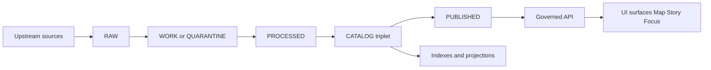
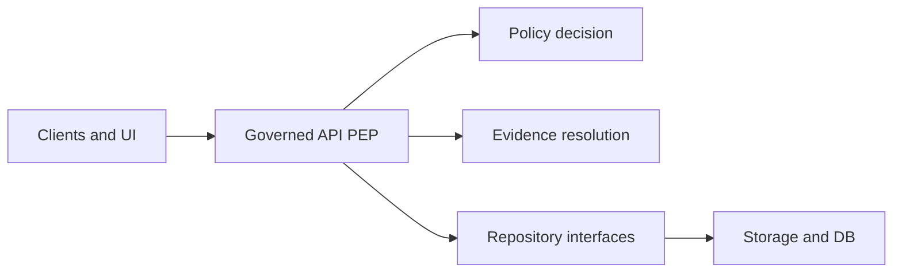
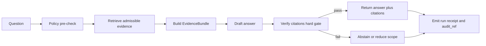

<!-- [KFM_META_BLOCK_V2]
doc_id: kfm://doc/1f731fb8-1614-4a01-a1a5-f8e5ed39c7e1
title: docs/ — Documentation hub
type: standard
version: v2
status: draft
owners: TBD
created: 2026-03-03
updated: 2026-03-03
policy_label: public
related:
  - ./MASTER_GUIDE_v13.md
  - ./governance/ROOT_GOVERNANCE.md
tags: [kfm, docs]
notes:
  - Entry point for repository documentation.
  - This hub is normative about documentation governance and indexing conventions.
  - Any repo-structure claims are explicitly labeled CONFIRMED / PROPOSED / UNKNOWN.
[/KFM_META_BLOCK_V2] -->

<a id="top"></a>

# docs/ — Documentation Hub
**Human-readable, governed documentation for the Kansas Frontier Matrix (KFM).**

> **CONFIRMED Purpose:** `docs/` is the home for **governed, human-readable documentation**—guides, runbooks, ADRs, standards, diagrams, templates—that explains how KFM works and how to change it safely.

---

## IMPACT
- **Status:** draft
- **Owners:** TBD (set via `CODEOWNERS` / governance; see [Ownership](#ownership-and-review))
- **Policy label:** public
- **CONFIRMED Non‑negotiables this hub must reflect:**  
  1) **Truth Path lifecycle** (RAW → WORK/QUAR → PROCESSED → CATALOG triplet → PUBLISHED)  
  2) **Trust membrane** (policy + evidence boundary; no direct client ↔ storage)  
  3) **Catalog triplet** (**DCAT + STAC + PROV**, cross‑linked and validated)  
  4) **Cite‑or‑abstain** (citation verification is a hard gate; emit run receipts)
- **CONFIRMED Hard exclusions:** secrets, raw datasets/binaries, and unreviewed sensitive details (especially precise vulnerable locations).

[](./README.md)
[](#impact)
[](#metablock-v2-and-document-metadata)
[](#review-gates-for-docs)
[](#local-preview--checks)
[](#local-preview--checks)

**Quick links:**  
[Start here](#start-here) · [Reading paths](#reading-paths-by-role) · [Where docs fit](#where-docs-fit-truth-path--trust-membrane) · [Directory map](#directory-map) · [Add a doc](#how-to-add-a-new-doc) · [Review gates](#review-gates-for-docs) · [Unknowns](#unknowns-to-verify)

---

## Quick navigation
- [Evidence legend](#evidence-legend-required)
- [Start here](#start-here)
- [Reading paths by role](#reading-paths-by-role)
- [Where docs fit: truth path & trust membrane](#where-docs-fit-truth-path--trust-membrane)
- [Authority levels: what is normative](#authority-levels-what-is-normative)
- [What belongs in docs](#what-belongs-in-docs)
- [What must NOT go in docs](#what-must-not-go-in-docs)
- [Directory map](#directory-map)
- [Docs taxonomy](#docs-taxonomy-routing-table)
- [MetaBlock v2 and document metadata](#metablock-v2-and-document-metadata)
- [Linking conventions](#linking-conventions-and-identifiers)
- [Authoring rules](#authoring-rules)
- [Ownership and review](#ownership-and-review)
- [Review gates for docs](#review-gates-for-docs)
- [How to add a new doc](#how-to-add-a-new-doc)
- [Local preview / checks](#local-preview--checks)
- [Unknowns to verify](#unknowns-to-verify)
- [FAQ](#faq)

---

## Evidence legend (required)
KFM docs use explicit evidence labels:

- **CONFIRMED** = grounded in KFM requirements/standards (normative intent), or in verified repo artifacts.
- **PROPOSED** = recommended pattern; may not yet be implemented in this checkout.
- **UNKNOWN** = not verified in this checkout (or not evidenced); the doc must list the smallest verification step.

> **CONFIRMED Rule:** If you can’t ground it, mark it **UNKNOWN** and list the smallest verification step.

---

## Start here
**CONFIRMED** This hub is an index. It should help you:
1) learn the system safely,
2) find the authoritative docs quickly,
3) understand what’s enforceable vs advisory,
4) contribute without breaking the trust membrane.

### Minimal first reads
- **UNKNOWN** `docs/MASTER_GUIDE_v13.md` — canonical “how KFM works” + doc map (verify path exists).
- **UNKNOWN** `docs/governance/ROOT_GOVERNANCE.md` — governance charter + review rules (verify path exists).
- **PROPOSED** `docs/architecture/README.md` — architecture index + invariants by subsystem (create if missing).
- **PROPOSED** `docs/standards/README.md` — standards index (profiles, naming, IDs, metadata) (create if missing).

---

## Reading paths by role
Use this table as a **routing guide**. If a path is missing, treat it as **UNKNOWN** and update the link after verifying the tree.

| Role / goal | Read first | Then | Typical edits you will make |
|---|---|---|---|
| **New contributor** (learn the system) | `docs/MASTER_GUIDE_v13.md` (UNKNOWN) | `docs/glossary.md` (UNKNOWN) | Clarify docs, add diagrams, add examples |
| **Data contributor** (add/refresh a dataset) | Governance + standards | Data-domain docs | Dataset specs, mapping docs, run receipts references |
| **Policy steward** (change access rules) | `docs/governance/ROOT_GOVERNANCE.md` (UNKNOWN) | Policy standards | Governance docs, OPA/Rego policy docs, ADRs |
| **Platform engineer** (run infra) | `docs/runbooks/` (PROPOSED) | `docs/architecture/` | Runbooks, SLOs, backup/restore, incident notes |
| **UI engineer** (Map/Story/Focus) | `docs/architecture/` | `docs/standards/` | UI contracts, evidence drawer behavior, story templates |
| **AI/ML engineer** (Focus Mode, model cards) | Focus Mode + governance | `mcp/` + standards | Model cards, evaluation notes, usage boundaries |

---

## Where docs fit: truth path & trust membrane

### Why this section exists
**CONFIRMED** Docs must not contradict KFM’s enforced invariants. If a doc proposes a shortcut that breaks an invariant, the doc is wrong by definition and must be corrected or quarantined.

---

## Truth path (data lifecycle) — the system must remain auditable
**CONFIRMED** KFM uses an auditable lifecycle (“truth path”) with gates at each transition.


```mermaid
flowchart LR
  Up[Upstream sources] --> RAW[RAW]
  RAW --> WORK[WORK or QUARANTINE]
  WORK --> PROC[PROCESSED]
  PROC --> CAT[CATALOG triplet]
  CAT --> PUB[PUBLISHED]

  CAT --> IDX[Indexes and projections]
  PUB --> API[Governed API]
  API --> UI[UI surfaces Map Story Focus]
```

**CONFIRMED Zone meanings**
- **RAW:** immutable acquisition (manifest, artifacts, checksums, terms snapshot).
- **WORK or QUARANTINE:** normalization + QA + candidate redactions; quarantine blocks promotion.
- **PROCESSED:** publishable artifacts in approved formats with checksums and derived runtime metadata.
- **CATALOG triplet:** DCAT + STAC + PROV + run receipts (cross‑linked and validated).
- **PUBLISHED:** governed runtime surfaces serve only promoted dataset versions.

### Canonical vs rebuildable stores
**CONFIRMED** KFM distinguishes:
- **Canonical:** object store + catalogs + provenance (truth).
- **Rebuildable projections:** DB/search/graph/tiles/indexes (derivable views).

> **CONFIRMED Doc rule:** Docs must treat projections as rebuildable and never as the ultimate source of truth.

---

## Trust membrane — the policy and provenance boundary
**CONFIRMED** The trust membrane is the boundary that prevents leakage and enforces policy.


```mermaid
flowchart LR
  C[Clients and UI] --> PEP[Governed API PEP]
  PEP --> PDP[Policy decision]
  PEP --> ER[Evidence resolution]
  PEP --> REPO[Repository interfaces]
  REPO --> S[Storage and DB]
```

**CONFIRMED Invariants**
- Clients must not access DB/object storage directly.
- Backend logic must not bypass repository interfaces to reach storage directly.
- Policy is evaluated at the PEP; evidence resolution is policy‑aware.

---

## Cite‑or‑abstain Focus Mode (docs must match runtime intent)
**CONFIRMED** Focus Mode is a governed workflow: policy pre‑check → admissible evidence retrieval → evidence bundle → answer synthesis → citation verification (hard gate) → run receipt. If citations can’t be verified (or policy denies), the system must abstain or reduce scope.


```mermaid
flowchart LR
  Q[Question] --> P[Policy pre-check]
  P --> R[Retrieve admissible evidence]
  R --> B[Build EvidenceBundle]
  B --> A[Draft answer]
  A --> V[Verify citations hard gate]
  V -->|pass| O[Return answer plus citations]
  V -->|fail| X[Abstain or reduce scope]
  O --> Z[Emit run receipt and audit_ref]
  X --> Z
```

> **CONFIRMED Doc rule:** Any doc describing Focus Mode must include the **hard citation verification gate** and the **abstain path**.

---

## Authority levels: what is normative
KFM benefits from “RFC‑like” clarity: some docs define rules; others are references or background.

### Document authority matrix
| Authority class | Meaning | Expected tone | Review expectation |
|---|---|---|---|
| **Normative** (enforced) | Defines rules that CI/policy/gates must enforce | “MUST/SHALL”; explicit thresholds | Requires steward approval; should link to tests/policy |
| **Operational** (runbook) | How to operate/restore/triage safely | Step-by-step, reversible | On-call/ops review; rollback required |
| **Design** (architecture) | Defines boundaries, interfaces, invariants | Diagrams + contracts | Architecture review; ADRs for changes |
| **Informative** (research) | Background notes, exploration | “May/Consider”; clearly non-canonical | Lightweight review; must not be mistaken for policy |

**PROPOSED Implementation hint:** Put a banner at the top of every doc stating whether it is **Normative / Operational / Design / Informative**.

---

## What belongs in docs/
- **CONFIRMED** Architecture docs: blueprints, diagrams, interface boundaries, contracts (human-readable).
- **CONFIRMED** Governance docs: policy intent, review workflow, sensitivity/risk handling (non-secret).
- **CONFIRMED** ADRs: decisions + rationale + consequences + rollback (when ops-significant).
- **CONFIRMED** Runbooks: operate, troubleshoot, recover.
- **CONFIRMED** Standards/profiles: conventions and required fields (DCAT/STAC/PROV expectations, doc conventions).
- **PROPOSED** Templates: MetaBlock v2 template, ADR template, Story Node template, runbook template.

---

## What must NOT go in docs/
- **CONFIRMED** Secrets (API keys, tokens, credentials) — never.
- **CONFIRMED** Raw datasets or large binaries that belong in lifecycle zones (`data/raw`, etc.) or release bundles.
- **CONFIRMED** Unreviewed sensitive details (e.g., precise vulnerable locations). If unsure: redact/generalize and route for governance review.
- **PROPOSED** Generated build outputs (unless explicitly approved as versioned, attestable release artifacts).

---

## Directory map

### Repo map (reference)
**CONFIRMED** KFM’s repo structure is intended to separate: docs, schemas/contracts, code, governance/policy, and lifecycle data.  
**UNKNOWN** Exact realization in *this checkout* must be verified before treating subdirectories as present.

**PROPOSED verification command**
```bash
ls -la
tree -L 3 docs || true
```

### docs/ directory layout (reference map; verify in repo)
**CONFIRMED** The v13 documentation map (as documented in KFM structure guidance) includes the following major docs surfaces.  
**UNKNOWN** Whether each item exists in your current checkout.

```text
docs/
  README.md                      # this file (docs hub)

  MASTER_GUIDE_v13.md            # canonical overview + doc map
  glossary.md                    # domain vocabulary

  architecture/                  # blueprints + diagrams + subsystem contracts
    README.md
    diagrams/
    adr/                         # ADRs may live here or in docs/adr/

  standards/                     # standards/profiles + repo conventions
    README.md
    KFM_MARKDOWN_WORK_PROTOCOL.md
    KFM_REPO_STRUCTURE_STANDARD.md
    KFM_STAC_PROFILE.md
    KFM_DCAT_PROFILE.md
    KFM_PROV_PROFILE.md

  templates/                     # doc templates (universal doc, story node, contract extension)
    README.md
    TEMPLATE__KFM_UNIVERSAL_DOC.md
    TEMPLATE__STORY_NODE_V3.md
    TEMPLATE__API_CONTRACT_EXTENSION.md

  governance/                    # governance charter, ethics, sovereignty, review gates
    ROOT_GOVERNANCE.md
    ETHICS.md
    SOVEREIGNTY.md
    REVIEW_GATES.md

  reports/                       # curated reports; story nodes as published artifacts
    story_nodes/
      templates/
      draft/
      published/
        <story_slug>/
          story.md
          assets/
```

> **PROPOSED:** If your repo differs, update this section to match `tree docs/` and keep the “reference map” in an appendix.

---

## Docs taxonomy (routing table)
Use this as a “where does this doc go?” checklist.

| Doc type | Suggested location | When to use | Required metadata / evidence |
|---|---|---|---|
| Hub / Index | `docs/README.md`, `docs/**/README.md` | Navigation + scope + exclusions | MetaBlock v2; ownership |
| Guide | `docs/` or `docs/guides/` | Onboarding, walkthroughs | MetaBlock v2; links to standards/contracts |
| Standard/Profile | `docs/standards/` | Rules to be enforced | MetaBlock v2; must link to CI/policy gates |
| ADR | `docs/adr/` or `docs/architecture/adr/` | A decision that changes architecture/policy/ops | MetaBlock v2; alternatives + consequences + rollback |
| Runbook | `docs/runbooks/` | Operate/restore/triage | MetaBlock v2; SLOs + rollback steps |
| Template | `docs/templates/` | Standardized doc forms | MetaBlock v2; “how to use” section |
| Research note | `docs/research/` | Non-canonical exploration | MetaBlock v2; prominent “informative only” note |
| Report / Story | `docs/reports/` | Published narrative artifacts | MetaBlock v2; citations + policy_label |

---

## MetaBlock v2 and document metadata
**CONFIRMED** KFM uses **MetaBlock v2** (HTML comment) for docs, Story Nodes, and dataset specs. MetaBlock v2 is structured metadata **without YAML frontmatter**.

### Minimal MetaBlock v2 template
```html
<!-- [KFM_META_BLOCK_V2]
doc_id: kfm://doc/<uuid>
title: <Title>
type: <guide|standard|story|dataset_spec|adr|run_receipt>
version: v1
status: draft|review|published
owners: <team or names>
created: YYYY-MM-DD
updated: YYYY-MM-DD
policy_label: public|restricted|...
related:
  - kfm://dataset/<slug>@<version>
  - kfm://story/<id>@<version>
tags:
  - kfm
notes:
  - <short notes>
[/KFM_META_BLOCK_V2] -->
```

### MetaBlock rules
- **CONFIRMED** `doc_id` is stable — do not regenerate on edits.
- **CONFIRMED** bump `updated:` on meaningful edits.
- **CONFIRMED** `policy_label` is a governance input (especially if docs are served through governed APIs).

---

## Linking conventions and identifiers

### Relative links
**CONFIRMED** Prefer **relative links** within the repo for stability across forks/branches.

### Canonical identifiers
**PROPOSED** Use KFM URIs where stable IDs matter:
- `kfm://doc/<uuid>`
- `kfm://dataset/<slug>@<version>`
- `kfm://story/<slug>@<version>`

### Evidence-first linking
**CONFIRMED** When describing a user-visible claim path, link to:
- the catalog triplet (DCAT/STAC/PROV),
- receipts/attestations (if applicable),
- and the policy/gates that enforce admissibility.

> **PROPOSED** If an evidence artifact is not yet present, mark it **UNKNOWN** and add a TODO that points to the work item that will create it.

---

## Authoring rules
**CONFIRMED** Docs are a **production surface**: they must remain reviewable, stable, and consistent with enforced policy and invariants.

### Style rules (LLM- and human-friendly)
- **CONFIRMED** Use stable headings and consistent vocabulary (define terms once; link to glossary).
- **CONFIRMED** Keep paragraphs short; avoid ambiguous pronouns.
- **CONFIRMED** Code blocks must be runnable or explicitly labeled `pseudocode`.
- **CONFIRMED** Include at least one diagram (Mermaid preferred) in index-level docs.
- **PROPOSED** Prefer tables for registries and matrices; avoid overly wide tables.

### Safety rules
- **CONFIRMED** Never include secrets.
- **CONFIRMED** Do not publish precise sensitive/vulnerable locations unless policy explicitly allows it.
- **CONFIRMED** If permissions/sensitivity are unclear: redact/generalize and mark “needs governance review.”

### “Cite-or-abstain” writing rule
- **CONFIRMED** If a doc depends on evidence artifacts (catalogs, receipts, policies), link to them or mark the claim as **UNKNOWN**.
- **PROPOSED** Prefer the pattern: **Claim → Evidence link(s) → Policy label → Scope limits**.

---

## Ownership and review
**CONFIRMED** Ownership must be explicit for any doc that is normative or operationally significant.

### Ownership mechanism
- **UNKNOWN** Whether `CODEOWNERS` is set in this checkout.
- **PROPOSED** Add `CODEOWNERS` entries for:
  - `docs/governance/**` (governance stewards)
  - `docs/standards/**` (standards council)
  - `docs/runbooks/**` (ops/on-call)
  - `docs/architecture/**` (architecture owners)

---

## Review gates for docs
> **CONFIRMED** KFM governance is **fail-closed**: if required evidence is missing, promotion/publishing is blocked.

### Docs-focused gates (minimum)
| Gate | What it checks | Fail-closed rule |
|---|---|---|
| D0 — Metadata | MetaBlock v2 present + valid | Missing/invalid MetaBlock → fail |
| D1 — Safety | No secrets; no sensitive leakage | Any violation → fail |
| D2 — Consistency | Does not contradict truth path / trust membrane | Contradiction → fail |
| D3 — Link integrity | Internal links resolve (or are explicitly TODO) | Broken links in normative docs → fail (PROPOSED) |
| D4 — Change control | Required owners approve | Missing approvals → fail |
| D5 — Evidence alignment | Normative docs link to tests/policies | Missing enforcement mapping → fail (PROPOSED) |

### Docs change checklist (copy/paste)
- [ ] **CONFIRMED** MetaBlock v2 present; `updated:` bumped
- [ ] **CONFIRMED** No secrets; no sensitive location leakage
- [ ] **CONFIRMED** No contradictions with truth path / trust membrane / cite-or-abstain
- [ ] **PROPOSED** Links validated (or explicit TODOs with tracking)
- [ ] **PROPOSED** If the doc changes enforced behavior: ADR exists + policy/tests updated
- [ ] **PROPOSED** If the doc references datasets/schemas/policies: referenced IDs/paths exist (or are tracked)

---

## How to add a new doc
1) **PROPOSED** Choose the smallest appropriate home (architecture vs governance vs runbook vs standard vs ADR).
2) **CONFIRMED** Add a MetaBlock v2 at the top (doc_id stable).
3) **PROPOSED** Start from a template in `docs/templates/` if available.
4) **PROPOSED** Update the nearest README index (and this hub if needed).
5) **PROPOSED** Run local checks (or the closest equivalent CI job).
6) **PROPOSED** Route to appropriate reviewers (CODEOWNERS + governance if trust membrane / policy changes).

---

## Local preview / checks

### Minimal, repo-agnostic checks (runnable)
```bash
# List docs files (first 200 entries)
find docs -type f | sort | sed -n '1,200p'

# Confirm MetaBlock presence
grep -R --line-number --fixed-string "[KFM_META_BLOCK_V2]" docs | sed -n '1,80p'
```

### Optional checks (rename to match your repo)
**UNKNOWN** Whether these exact tools/targets exist in this checkout.

```bash
# pseudocode (adjust to repo):
make docs.check
make linkcheck
```

**PROPOSED** If you don’t have these yet, add:
- markdown lint (e.g., `markdownlint-cli2`)
- link checker (e.g., `lychee`)
- MetaBlock validator (simple parser + required fields)
- mermaid syntax validation (CI step)

---

## Unknowns to verify
These items are **UNKNOWN** until verified in your current checkout:

1) Do `docs/governance/ROOT_GOVERNANCE.md` and `docs/MASTER_GUIDE_v13.md` exist?
   - Smallest step:
     ```bash
     ls docs/governance docs | grep -E "ROOT_GOVERNANCE|MASTER_GUIDE_v13"
     ```

2) Which docs are **normative** vs **informative**?
   - Smallest step: add a short policy section in governance docs defining authority classes.

3) Are MetaBlock checks enforced in CI?
   - Smallest step: search workflows for `MetaBlock` / `KFM_META_BLOCK_V2` / “frontmatter”.

4) What is the canonical docs owner group?
   - Smallest step: check `.github/CODEOWNERS` and update this file’s `owners:`.

5) Is there a docs publication path (served via governed APIs)?
   - Smallest step: search for “docs indexer”, “evidence resolver”, or “docs serve” in `src/` and `web/`.

---

## FAQ

**Q: Can I put screenshots, PDFs, or large datasets in `docs/`?**  
**A:** **CONFIRMED** Not as a substitute for governed data artifacts. Small illustrative images are fine; large artifacts belong in lifecycle zones or releases.

**Q: What if I’m unsure whether something is sensitive?**  
**A:** **CONFIRMED** Redact/generalize, mark “needs governance review,” and do not publish precise locations until policy explicitly allows.

**Q: Should I write “CONFIRMED” statements about repo structure?**  
**A:** **CONFIRMED** Only if verified in the current checkout. Otherwise mark **UNKNOWN** and list the smallest verification step.

---

<details>
  <summary>Appendix: Suggested templates to add under <code>docs/templates/</code> (PROPOSED)</summary>

- **Universal doc template** (MetaBlock v2 + required sections)
- **ADR template** (problem/decision/alternatives/consequences/policy impact/rollback)
- **Runbook template** (symptoms → checks → mitigations → rollback → recovery verification)
- **Story Node template** (claim → citations → map state → policy_label → review status)
- **Standard/Profile template** (scope → required fields → examples → enforcement hooks)

</details>

---

### Back to top
⬆️ <a href="#top">Back to top</a>
