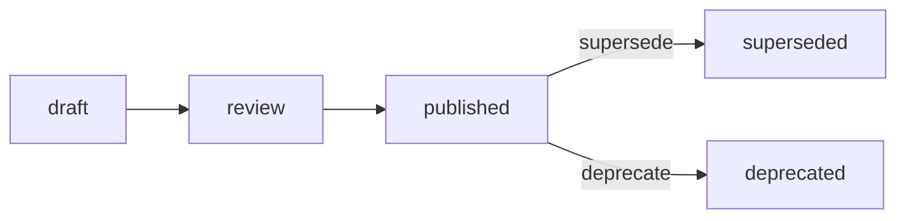
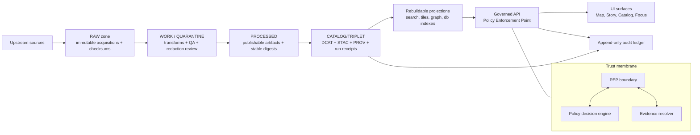

<!-- [KFM_META_BLOCK_V2]
doc_id: kfm://doc/2e7a0e0b-5c0a-4cb0-9fd6-7b3f4bbf67b1
title: docs/ — Governed Documentation Hub
type: standard
version: v3
status: draft
owners: KFM Maintainers (resolve via CODEOWNERS)
created: 2026-02-24
updated: 2026-03-02
policy_label: public
related:
  - ../README.md
  - ../.github/README.md
  - ../CONTRIBUTING.md
  - ../SECURITY.md
  - ../configs/README.md
  - ../contracts/README.md
  - ./adr/README.md
  - ./governance/README.md
  - ./runbooks/README.md
  - ./standards/README.md
tags:
  - kfm
  - docs
  - governance
  - evidence-first
  - cite-or-abstain
notes:
  - v3: aligned truth path naming to RAW → WORK/QUARANTINE → PROCESSED → CATALOG/TRIPLET → PUBLISHED.
  - v3: clarified “citation” semantics (EvidenceRef → EvidenceBundle), not pasted URLs.
  - v3: added doc lifecycle guidance + doc registry pattern to prevent drift; moved deep reference taxonomy into <details>.
[/KFM_META_BLOCK_V2] -->

<a id="top"></a>

# `docs/` — Governed Documentation Hub
**Map-first • time-aware • governed • evidence-first • cite-or-abstain**


> [!IMPORTANT]
> **Trust membrane rule:** documentation must never become a bypass.
>
> - Do **not** include secrets, tokens, credentials, or restricted coordinates.
> - Do **not** publish “just trust me” claims.
> - If a claim can’t be supported by evidence, **abstain** or label it **UNKNOWN / DECISION NEEDED** with:
>   1) a default path, and 2) minimum verification steps.

---

## Quick navigation

- [Truth tags and labeling](#truth-tags-and-labeling)
- [Directory contract](#directory-contract)
- [Documentation stance](#documentation-stance)
- [Doc lifecycle](#doc-lifecycle)
- [Evidence and citations](#evidence-and-citations)
- [Where docs fit in KFM](#where-docs-fit-in-kfm)
- [Repo context and verification](#repo-context-and-verification)
- [Directory layout](#directory-layout)
- [System map](#system-map)
- [Doc templates](#doc-templates)
- [CI gates for docs](#ci-gates-for-docs)
- [Definition of Done](#definition-of-done)
- [Contribution workflow](#contribution-workflow)
- [Glossary](#glossary)
- [Reference library](#reference-library)

---

## Truth tags and labeling

To prevent accidental overreach, every doc MUST use explicit truth tags where decisions depend on a claim:

- **CONFIRMED:** evidence-backed (repo artifacts, receipts, validated contracts) **or** an invariant/contract that MUST hold.
- **PROPOSED:** a recommended default or pattern (must include rationale + tradeoffs).
- **UNKNOWN / DECISION NEEDED:** not verified; MUST include:
  - recommended default path, and
  - minimum verification steps to convert UNKNOWN → CONFIRMED.

Optional qualifiers (use sparingly):

- **CONFIRMED (design):** an invariant that must hold independent of implementation
- **CONFIRMED (repo):** backed by current repo artifacts at a specific commit
- **CONFIRMED (snapshot):** backed by a captured inventory snapshot; deep paths still require verification

> [!NOTE]
> **Safe vs unsafe statements**
>
> Safe:
> - “The system MUST fail closed.”
> - “Clients MUST NOT bypass policy enforcement.”
>
> Unsafe unless evidenced:
> - concrete module paths, deployed topology, specific stores, “this endpoint exists,” “this workflow runs in CI.”

<p align="right"><a href="#top">Back to top ↑</a></p>

---

## Directory contract

### Purpose

`docs/` is documentation-as-production for Kansas Frontier Matrix (KFM). Anything here is expected to be:

- **reviewable** (small diffs, stable IDs, clear owners),
- **testable where applicable** (lint, linkcheck, schema examples, policy fixtures),
- **safe under policy** (default-deny; no sensitive leakage),
- **traceable** (evidence-linked claims or explicitly tagged UNKNOWN with verification).

### What belongs in `docs/`

- **Architecture:** system overview, layering, trust membrane, truth path, canonical vs rebuildable
- **Governance:** policy labels, obligations, promotion gates, review triggers, roles
- **Runbooks:** incident response, pipeline ops, promotion/rollback procedures
- **Standards:** authoring standards, evidence/citation rules, schema/profile explainers
- **Narratives:** Story Node standards, evidence-first UX requirements
- **Templates:** governed templates for docs, ADRs, runbooks, stories
- **Quality:** checklists, threat modeling prompts, validation explainers
- **Bounded evidence artifacts:** redacted receipts/manifests/examples (policy-safe)

### What must not go in `docs/`

- **Secrets** (tokens/keys/credentials), even in examples
- **Raw or sensitive data**: use redacted samples + digests + EvidenceRefs
- **Large binaries/build outputs** unless explicitly required and size-controlled
- **Unverifiable assertions**: label UNKNOWN with default + verification steps
- **Policy enforcement logic** (belongs in runtime + policy-as-code), except for *human-facing* documentation of policy behavior

> [!WARNING]
> If it would be unsafe to paste into a public issue, it does not belong in `policy_label: public` docs.

<p align="right"><a href="#top">Back to top ↑</a></p>

---

## Documentation stance

### Normative language

- Use **MUST / SHOULD / MAY** for enforceable requirements.
- Separate **normative** requirements from **informative** explanation.
- If you add a MUST-level requirement, link it to the validator/test/gate that enforces it (or add one).

### Safety posture

- **Default-deny** when sensitivity/permissions are unclear.
- For vulnerable sites (cultural resources, sensitive species, private facilities): publish only generalized detail.
- If a doc is governance-sensitive (security ops, internal escalation, restricted datasets), set `policy_label: restricted`
  and route review via CODEOWNERS.

### Cite-or-abstain applies to docs

If a document makes claims that influence decisions (policy/security/promotion eligibility), it MUST:

- cite in-repo artifacts (contracts, receipts, manifests, validators), **or**
- cite governed EvidenceRefs (resolvable via evidence resolver), **or**
- mark the claim **UNKNOWN / DECISION NEEDED**.

<p align="right"><a href="#top">Back to top ↑</a></p>

---

## Doc lifecycle

Documentation is governed content. Treat publishing as a controlled promotion.


```mermaid
flowchart LR
  D["draft"] --> R["review"]
  R --> P["published"]
  P -->|supersede| S["superseded"]
  P -->|deprecate| X["deprecated"]
```

**Rules (normative):**
- Draft docs MAY be incomplete but MUST NOT masquerade as “current truth.”
- Review docs MUST identify owners + reviewers and list all remaining UNKNOWNs.
- Published docs MUST be internally consistent, link-valid, and policy-safe.
- Deprecation MUST point to the replacement doc (or ADR) and include a sunset plan.

> [!NOTE]
> If your linter only supports `draft|review|published`, record deprecation in a registry entry (preferred) or in `notes`
> until the linter vocabulary is upgraded.

<p align="right"><a href="#top">Back to top ↑</a></p>

---

## Evidence and citations

### What “citation” means in KFM

In KFM, a citation is **not** a URL pasted into text.

A citation is an **EvidenceRef** that resolves (via the evidence resolver) into an **EvidenceBundle** containing:
- dataset version identifiers,
- license/rights,
- policy label + obligations applied,
- provenance/run receipt links,
- artifact digests and inspectable metadata.

**Doc authoring rule (normative):**
- If you cite something that should be inspectable, prefer **EvidenceRef → EvidenceBundle** over raw URLs.

### Recommended citation forms in docs

Use what is supported in your repo today; these are **PROPOSED defaults**:

- Link to in-repo artifacts with relative links:
  - `contracts/...`, `policy/...`, `data/...`, `docs/...`
- Use explicit EvidenceRefs when referencing promoted artifacts:
  - `dcat://...`, `stac://...`, `prov://...`, `doc://...` (exact schemes and resolver rules are repo-defined)

### Unknown handling

If a citation can’t be made resolvable today, mark it:

- **UNKNOWN / DECISION NEEDED:** “No EvidenceRef exists yet for X.”
- Default path: “Create EvidenceRef + resolver mapping under contracts + evidence resolver.”
- Minimum verification: “Add resolver test; ensure policy filtering; confirm bundle digests.”

<p align="right"><a href="#top">Back to top ↑</a></p>

---

## Where docs fit in KFM

Docs sit alongside enforceable artifacts and MUST point to them:

- **Contracts:** `contracts/` defines enforceable interfaces (OpenAPI, schemas, profiles, gates)
- **Policy:** `policy/` defines default-deny rules + obligations + test fixtures (enforced in CI and runtime)
- **Configs:** `configs/` defines governed configuration inputs (labels, obligations, thresholds)
- **Truth path:** `data/` holds canonical artifacts by zone with receipts/manifests
- **Tooling:** `tools/` + `tests/` make rules enforceable (validators, link checkers, fixtures)

**Key repo rules (CONFIRMED — design):**
- `data/` should never be modified without a run receipt and promotion manifest.
- `contracts/` are production artifacts and validated in CI.
- `policy/` is a governed codebase with required reviews.

> [!TIP]
> If a doc is referenced by a contract, CI workflow, or release checklist, a missing link should be treated as merge-blocking.

<p align="right"><a href="#top">Back to top ↑</a></p>

---

## Repo context and verification

Repo layouts and implementations are branch/commit-specific.

**Rules (normative):**
- Do not claim deep module paths exist unless verified against the current commit.
- Prefer repo-root inventories + minimum verification steps before marking anything CONFIRMED (repo).

### Minimum verification steps (PROPOSED)

1. Record exact commit/branch being documented.
2. Capture repo-root inventory and a shallow `docs/` tree (e.g., `tree -L 2 docs/`).
3. Extract doc CI gates from `.github/workflows` (or equivalent) and list which are merge-blocking.
4. Verify that contract-required references exist (or fail closed if required by contract).
5. For promotion/policy/evidence claims: confirm at least one end-to-end run emits receipts/manifests and that citation resolution is enforced.

<p align="right"><a href="#top">Back to top ↑</a></p>

---

## Directory layout

This hub README keeps a **stable top-level taxonomy** to minimize drift.
Each subdirectory MUST include its own `README.md` documenting:
- purpose,
- where it fits,
- acceptable inputs,
- exclusions,
- links to contracts/gates (if any).

### Top-level taxonomy

| Subtree | Purpose | Notes |
|---|---|---|
| `docs/architecture/` | Architecture narratives + invariants + diagrams | Prefer invariants → enforcement links |
| `docs/standards/` | Non-negotiable authoring/evidence/API/UI standards | Keep versioning + deprecation policy here |
| `docs/adr/` | Architecture Decision Records | ADRs should be indexed and reviewable |
| `docs/governance/` | Policy labels, gates, roles, ethics, sovereignty | Often `policy_label: restricted` |
| `docs/runbooks/` | Operational procedures | Should be actionable + kept current |
| `docs/guides/` | How-to workflows (onboarding, pipelines, cataloging, UI) | Opinionated + practical |
| `docs/story/` or `docs/stories/` | Story Node authoring + publish workflow | Choose one; enforce consistently |
| `docs/templates/` | Governed templates (docs/ADRs/runbooks/stories) | Treat as production assets |
| `docs/diagrams/` | Shared Mermaid sources | Prefer source-of-truth `.mmd` |
| `docs/quality/` | Human-facing checklists + QA explainers | Map items to CI gates where possible |
| `docs/schemas/` | Human-readable schema explainers | Canonical machine schemas belong in `contracts/` |

> [!NOTE]
> If the repo already uses a different taxonomy, prefer documenting the *actual* structure and mapping it to this intent.

### Reference taxonomy

<details>
<summary><strong>PROPOSED reference taxonomy (expand)</strong></summary>

```text
docs/
  README.md

  architecture/
    README.md
    overview/
    enforcement/
    registries/
    diagrams/
    threat-model/
    templates/

  standards/
    README.md
    authoring/
    evidence/
    api/
    ui/
    registry/

  adr/
    README.md
    TEMPLATE.md
    ADR-REVIEW-CHECKLIST.md
    INDEX.md
    _generated/
    tools/

  governance/
    README.md
    ROOT_GOVERNANCE.md
    ETHICS.md
    SOVEREIGNTY.md
    REVIEW_GATES.md
    roles/
    labels/
    gates/
    records/
    templates/

  runbooks/
    README.md
    templates/
    incidents/
    pipelines/
    governance/

  guides/
    README.md
    _shared/
    _templates/
    onboarding/
    pipelines/
    catalogs/
    apis/
    ui/

  story/                  # or stories/ (pick one; verify)
    README.md
    _schemas/
    _registry/
    _templates/
    draft/
    review/
    published/

  templates/
    README.md
    TEMPLATE__KFM_UNIVERSAL_DOC.md
    TEMPLATE__STORY_NODE_V3.md
    TEMPLATE__API_CONTRACT_EXTENSION.md
    _partials/

  diagrams/
    README.md
    truth-path.mmd
    trust-membrane.mmd

  quality/
    README.md
    doc-quality-checklist.md
    promotion-readiness-checklist.md
    threat-model-checklist.md

  schemas/
    README.md
    examples/
```
</details>

<p align="right"><a href="#top">Back to top ↑</a></p>

---

## System map

KFM is governed end-to-end across the truth path:

**Upstream → RAW → WORK/QUARANTINE → PROCESSED → CATALOG/TRIPLET → Projections → Governed APIs → UI**


```mermaid
flowchart LR
  S["Upstream sources"] --> RAW["RAW zone<br/>immutable acquisitions + checksums"]
  RAW --> WQ["WORK / QUARANTINE<br/>transforms + QA + redaction review"]
  WQ --> P["PROCESSED<br/>publishable artifacts + stable digests"]
  P --> CT["CATALOG/TRIPLET<br/>DCAT + STAC + PROV + run receipts"]
  CT --> PRJ["Rebuildable projections<br/>search, tiles, graph, db indexes"]
  PRJ --> API["Governed API<br/>Policy Enforcement Point"]
  API --> UI["UI surfaces<br/>Map, Story, Catalog, Focus"]
  API --> AUD["Append-only audit ledger"]
  CT --> AUD

  subgraph TM["Trust membrane"]
    PEP["PEP boundary"]
    PDP["Policy decision engine"]
    ER["Evidence resolver"]
    PEP <--> PDP
    PEP <--> ER
  end

  API --- TM
```

### Truth path mental model

- **RAW:** immutable acquisition (manifests, artifacts, checksums, terms snapshot)
- **WORK/QUARANTINE:** transforms + QA + candidate redactions; failures block promotion
- **PROCESSED:** publishable artifacts in approved formats with checksums
- **CATALOG/TRIPLET:** cross-linked DCAT + STAC + PROV plus run receipts
- **PUBLISHED:** governed runtime surfaces served through the policy boundary

### Focus Mode control loop

1. Policy pre-check (fail closed)
2. Retrieval plan (using view state + intent)
3. Retrieve admissible evidence (catalog/search/graph/db)
4. Build evidence bundle (resolve EvidenceRefs; apply obligations)
5. Synthesize answer grounded in bundles
6. Citation verification (hard gate)
7. Emit audit receipt/run record

### Architecture invariants

- Clients never access storage/DB directly; all access goes through governed APIs + policy boundary.
- Projections are rebuildable; catalogs/provenance/artifacts are canonical.
- Promotion gates fail closed.
- Focus Mode and Story publishing are cite-or-abstain; citation verification is a hard gate.

<p align="right"><a href="#top">Back to top ↑</a></p>

---

## Doc templates

### MetaBlock v2 header

All governed docs SHOULD start with MetaBlock v2 (no YAML frontmatter).

```md
<!-- [KFM_META_BLOCK_V2]
doc_id: kfm://doc/<uuid>
title: <Title>
type: <guide|standard|story|dataset_spec|adr|run_receipt>
version: v1
status: draft|review|published
owners: <team or names>
created: YYYY-MM-DD
updated: YYYY-MM-DD
policy_label: public|restricted|...
related:
  - kfm://dataset/<slug>@<version>
  - kfm://story/<id>@<version>
  - <paths or other kfm:// ids>
tags:
  - kfm
notes:
  - <short notes>
[/KFM_META_BLOCK_V2] -->
```

**Rules (normative):**
- `doc_id` MUST be stable (do not regenerate on edits).
- `updated` MUST change on meaningful edits.
- `policy_label` MUST reflect the most restrictive content in the doc (default-deny if unsure).

> [!NOTE]
> If you introduce new `type` or `status` vocabulary, update the MetaBlock linter/standard and registries together.

### Directory README template

Each directory README MUST include:
- title + one-line purpose
- where it fits in the repo
- acceptable inputs
- exclusions
- links to gates/validators/tests (if any)

### ADR template

Keep ADRs compact, reversible, and test-linked. Prefer a single-source `docs/adr/TEMPLATE.md` and a generated index.

### Story Node template note

Story Nodes are governed narratives:
- markdown body (human)
- sidecar metadata (map state, citations, policy label, review state)

Publishing gate: all citations MUST resolve through the evidence resolver.

<p align="right"><a href="#top">Back to top ↑</a></p>

---

## CI gates for docs

Docs are only safe at scale if they’re continuously validated.

Recommended doc CI gates (PROPOSED):

| Gate | What it checks | Fail-closed behavior |
|---|---|---|
| MetaBlock lint | required fields present; dates parse; doc_id stable | block merge on malformed headers |
| Doc registry lint | doc_id uniqueness; required tags/labels | block merge on collisions |
| Linkcheck | relative links + anchors resolve | block merge on broken required links |
| Secret scan | no tokens/keys/credentials | block merge |
| Policy label lint | public docs forbid restricted patterns | block merge |
| Mermaid lint | diagrams parse | block merge |
| Story citation gate | citations resolve + are policy-allowed | block publish/merge for Story packages |

> [!IMPORTANT]
> Fail-closed posture: if a doc is required by contract (runbook referenced in release workflow) and linkcheck fails,
> merging SHOULD be blocked.

<p align="right"><a href="#top">Back to top ↑</a></p>

---

## Definition of Done

A doc change is ready to merge when:

- [ ] MetaBlock v2 is present and correct (including `policy_label` and `owners`)
- [ ] Any decision-driving claim is traceable (links to contracts/configs/receipts/manifests)
- [ ] Unknowns are explicitly labeled **UNKNOWN / DECISION NEEDED** and include:
  - recommended default path, and
  - minimum verification steps
- [ ] No secrets, credentials, or sensitive coordinates are present
- [ ] Links are valid (or intentionally marked TODO with an owner and plan)
- [ ] Diagrams render and are readable
- [ ] If governance/policy behavior changed, related gates/tests/docs are updated together

<p align="right"><a href="#top">Back to top ↑</a></p>

---

## Contribution workflow

1. Create or update a doc in the appropriate subfolder.
2. Add/refresh the MetaBlock v2 header.
3. Keep changes small and reversible (prefer additive glue over sweeping rewrites).
4. If you introduce a new MUST-level requirement, point to (or add) the validator/test/gate that enforces it.
5. Route review via CODEOWNERS (especially governance/security/promotion content).

> [!TIP]
> For long docs, use `<details>` appendices so the main narrative stays scannable.

<p align="right"><a href="#top">Back to top ↑</a></p>

---

## Glossary

- **Focus Mode:** governed AI assistant that must cite admissible evidence or abstain.
- **Policy label:** sensitivity/access classification applied to datasets, artifacts, stories, and responses.
- **Obligation:** policy-required action (generalize geometry, show notice, suppress export).
- **Promotion:** act of moving dataset outputs into processed + catalog zones and publishing a dataset version.
- **Quarantine:** zone/state for artifacts that cannot be promoted due to validation, rights, or sensitivity issues.
- **Spec_hash:** deterministic hash derived from canonical dataset spec; used to identify dataset versions.
- **Story Node:** versioned narrative bound to map state and citations.
- **Trust membrane:** boundary that prevents bypassing policy enforcement and provenance.
- **Valid time:** time period when an assertion is true.
- **Transaction time:** time when KFM recorded/published data.

- **PEP:** policy enforcement point at the API boundary.
- **PDP:** policy decision point/engine (evaluates policy).
- **EvidenceRef:** stable reference that resolves to an inspectable EvidenceBundle.
- **EvidenceBundle:** resolved evidence package (policy decision + license + provenance + digests + audit ref).
- **Canonical vs rebuildable:** catalogs/provenance/artifacts are canonical; indexes/tiles/search/graph are rebuildable.

<p align="right"><a href="#top">Back to top ↑</a></p>

---

## Reference library

Some KFM workstreams maintain a reference library (GIS/cartography, pipelines, security, standards).

**Policy-safe posture:**
- Prefer a bibliography/index (titles + notes + pointers) over committing copyrighted PDFs.
- If a PDF must be included, ensure redistribution rights allow it, and label it appropriately.

> [!NOTE]
> Do not mirror unlicensed or proprietary content into public repos. Prefer metadata-only references.

<p align="right"><a href="#top">Back to top ↑</a></p>
