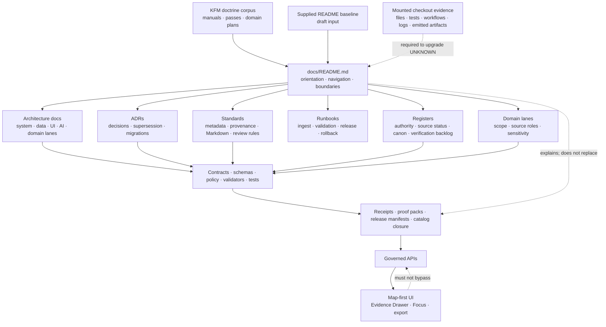

<!-- [KFM_META_BLOCK_V2]
doc_id: kfm://doc/NEEDS-VERIFICATION/docs-readme
title: KFM Documentation Hub
type: readme
version: v1
status: draft
owners: NEEDS_VERIFICATION
created: NEEDS_VERIFICATION
updated: 2026-04-26
policy_label: NEEDS_VERIFICATION
related: [../README.md, ../.github/CODEOWNERS, ../.github/workflows/README.md, ./standards/README.md, ./runbooks/repository-next-steps.md, ./architecture/README.md, ./adr/README.md, ./domains/README.md, ./registers/README.md, ../contracts/README.md, ../schemas/README.md, ../schemas/contracts/README.md, ../schemas/contracts/v1/README.md, ../policy/README.md, ../tests/README.md, ../tools/ci/README.md, ../data/README.md, ../release/README.md]
tags: [kfm, docs, documentation, governance, evidence, readme, control-plane, traceability]
notes: [Replacement-grade docs/README.md draft prepared from supplied KFM doctrine and supplied README baseline; no mounted local KFM Git checkout was available in this drafting workspace; owner, created date, exact adjacent paths, internal policy label, branch protections, workflow enforcement, emitted proof objects, and link health require active-checkout verification before promotion.]
[/KFM_META_BLOCK_V2] -->

<a id="top"></a>

# KFM Documentation Hub

A governed entry point for documentation that explains, routes, constrains, and preserves Kansas Frontier Matrix doctrine without turning prose into unreviewed implementation proof.


> [!IMPORTANT]
> **Impact block**  
> **Status:** `draft` until a mounted KFM checkout confirms path parity, owners, link health, workflow enforcement, policy labels, registry coverage, and adjacent README conventions.  
> **Path:** intended target is `docs/README.md`.  
> **Authority class:** documentation control-plane landing page. This file may define documentation posture and contributor routing, but it is **not** a schema, policy rule, release manifest, proof pack, runtime log, branch-protection receipt, or implementation test.  
> **Core reader promise:** every consequential doc claim should make its evidence boundary visible enough to verify, correct, supersede, or abstain.  
> **Quick jumps:** [Scope](#scope) · [Evidence posture](#evidence-posture) · [Repo fit](#repo-fit) · [Inputs](#inputs) · [Exclusions](#exclusions) · [Directory map](#directory-map) · [Quickstart](#quickstart) · [Usage](#usage) · [Diagram](#diagram) · [Operating tables](#operating-tables) · [PR checklist](#pr-checklist--definition-of-done) · [FAQ](#faq) · [Appendix](#appendix)

> [!WARNING]
> **Current drafting boundary:** this README was prepared from supplied KFM doctrine and a supplied `docs/README.md` draft. The drafting workspace did **not** expose a mounted local KFM Git checkout. Treat existing path claims, owners, branch-local state, hosted GitHub settings, workflow enforcement, emitted proof objects, runtime behavior, dashboards, source registries, and exact link health as `NEEDS VERIFICATION` until checked in the active repository.

---

## Scope

`docs/` is the human-facing documentation control plane for Kansas Frontier Matrix (KFM).

It helps maintainers and contributors answer five questions without guessing:

1. **What is this document allowed to claim?**
2. **What evidence, policy, review, release, and correction state backs the claim?**
3. **Which files describe intended doctrine, and which repo artifacts prove current behavior?**
4. **What must be validated before a source, layer, model output, map view, story, export, or public release is trusted?**
5. **What should be reverted, corrected, quarantined, generalized, or abstained from when evidence is weak?**

KFM documentation is not decorative prose. It records doctrine, decisions, boundaries, source status, proof obligations, implementation limits, known unknowns, sensitivity posture, rollback paths, and correction lineage.

### What this README does

| Function | Meaning |
|---|---|
| Orient | Tells contributors where documentation belongs and how to read it. |
| Constrain | Keeps docs from bypassing evidence, policy, contracts, schemas, tests, and release gates. |
| Route | Points contributors toward architecture docs, ADRs, standards, runbooks, registers, domain lanes, tests, schemas, policies, and release artifacts. |
| Preserve | Keeps canon, lineage, exploratory ideas, references, reports, generated artifacts, and current implementation evidence from collapsing into one undifferentiated pile. |
| Review | Gives maintainers a checklist for truth labels, sensitivity, links, rollback, adjacent docs, and PR readiness. |

### What this README does **not** prove

| Not proved here | Required proof source |
|---|---|
| Current repository tree, branch, dirty state, or path existence | Mounted checkout evidence and `git` commands. |
| CI status, required checks, Actions permissions, branch protection, or deployment approvals | Hosted platform settings, workflow run logs, and release/platform receipts. |
| Runtime API behavior, route names, DTOs, dashboards, or observability | Source files, tests, runtime logs, traces, dashboards, and generated artifacts. |
| Source registry contents, exact data lifecycle artifacts, proof packs, or release manifests | Current repo files and emitted proof/release objects. |
| Owners or policy labels | Active CODEOWNERS, policy registry, stewardship records, and review state. |

[Back to top](#top)

---

## Evidence posture

Use this table before upgrading any statement in this README from `PROPOSED` or `NEEDS VERIFICATION` to `CONFIRMED`.

| Area | Status in this draft | Meaning |
|---|---:|---|
| KFM doctrine | `CONFIRMED` from supplied project doctrine | KFM is governed, evidence-first, map-first, time-aware, policy-aware, and publication-aware. |
| Supplied README baseline | `CONFIRMED` as supplied draft input | A complete draft was provided and used as the revision baseline. |
| Target file path | `PROPOSED_TARGET` | Intended target is `docs/README.md`; active checkout must confirm. |
| Mounted local checkout | `UNKNOWN` / unavailable in drafting workspace | No branch, dirty state, local path existence, tests, or workflow results can be claimed from this run. |
| Public repo claims in supplied draft | `NEEDS VERIFICATION` | Prior public-main observations are useful context, not working-branch proof. |
| Owners | `NEEDS VERIFICATION` | The supplied draft named `@bartytime4life`; active CODEOWNERS should confirm before promotion. |
| Workflow enforcement | `NEEDS VERIFICATION` | Checked-in YAML or README text does not prove branch protection or required checks. |
| Proof objects and release artifacts | `UNKNOWN` | Must be confirmed through emitted artifacts or current repo evidence. |
| Link health | `NEEDS VERIFICATION` | Relative links must be checked from `docs/README.md` in the target branch. |

> [!TIP]
> A documentation sentence can be perfectly useful while still being `PROPOSED`. KFM trust comes from honest state, not from making every plan sound implemented.

[Back to top](#top)

---

## Repo fit

The targets below are expected relationships for a mature KFM checkout. In this draft, they are **routing intent** until active repository inspection verifies them.

| Relationship | Target | Status | Notes |
|---|---|---:|---|
| This file | [`docs/README.md`](./README.md) | `PROPOSED_TARGET` | Landing page for the documentation directory. |
| Upstream landing | [`../README.md`](../README.md) | `NEEDS VERIFICATION` | Root orientation, baseline verification, execution-plan routing, and project-level status. |
| Ownership routing | [`../.github/CODEOWNERS`](../.github/CODEOWNERS) | `NEEDS VERIFICATION` | Confirms doc owner coverage and review routing when inspected in the active branch. |
| Workflow documentation | [`../.github/workflows/README.md`](../.github/workflows/README.md) | `NEEDS VERIFICATION` | Documents workflow intent only; enforcement needs platform and run evidence. |
| Architecture lane | [`./architecture/README.md`](./architecture/README.md) | `NEEDS VERIFICATION` | Durable system boundaries, trust membrane, and subsystem architecture. |
| ADR lane | [`./adr/README.md`](./adr/README.md) | `NEEDS VERIFICATION` | Decisions affecting file homes, schemas, policy, public surfaces, release, or exposure posture. |
| Standards lane | [`./standards/README.md`](./standards/README.md) | `NEEDS VERIFICATION` | Cross-cutting standards, profiles, doc protocols, and lane-local standard boundaries. |
| Domain lanes | [`./domains/README.md`](./domains/README.md) | `NEEDS VERIFICATION` | Lane-specific scope, evidence burdens, sensitivity, source roles, and public posture. |
| Runbook priority lane | [`./runbooks/repository-next-steps.md`](./runbooks/repository-next-steps.md) | `NEEDS VERIFICATION` | Immediate execution plan and safe operational procedures. |
| Register lane | [`./registers/README.md`](./registers/README.md) | `PROPOSED` / `NEEDS VERIFICATION` | Authority ladder, canon/lineage/exploratory status, verification backlog, and object-map routing. |
| Machine contract docs | [`../contracts/README.md`](../contracts/README.md) | `NEEDS VERIFICATION` | Human-readable contract guidance; do not duplicate machine meaning here. |
| Schema docs | [`../schemas/README.md`](../schemas/README.md) · [`../schemas/contracts/README.md`](../schemas/contracts/README.md) · [`../schemas/contracts/v1/README.md`](../schemas/contracts/v1/README.md) | `NEEDS VERIFICATION` | Versioned schema/contract lane if present; schema-home authority must stay explicit. |
| Policy docs | [`../policy/README.md`](../policy/README.md) | `NEEDS VERIFICATION` | Deny-by-default posture, obligations, release/sensitivity policy, and policy tests. |
| Verification docs | [`../tests/README.md`](../tests/README.md) | `NEEDS VERIFICATION` | Tests and fixtures provide executable verification, not narrative confidence. |
| CI tooling | [`../tools/ci/README.md`](../tools/ci/README.md) | `NEEDS VERIFICATION` | Inspect scripts before relying on commands or badge meaning. |
| Data lifecycle | [`../data/README.md`](../data/README.md) | `NEEDS VERIFICATION` | Data lifecycle, receipts, proofs, catalogs, triplets, and publication artifacts belong outside `docs/`. |
| Release evidence | [`../release/README.md`](../release/README.md) | `PROPOSED` / `NEEDS VERIFICATION` | Release manifests, correction notes, withdrawal, and rollback references should remain separate from prose docs. |

> [!CAUTION]
> Link presence is not enforcement proof. A checked-in README can document an intended path, but branch protection, required checks, deployment approvals, secrets, emitted artifacts, and runtime behavior require direct inspection.

[Back to top](#top)

---

## Inputs

Documentation belongs in `docs/` when it improves governability, reviewability, traceability, implementation discipline, public trust, or contributor comprehension.

| Accepted input | Belongs here when… | Required posture |
|---|---|---|
| Architecture docs | They explain durable boundaries, object families, lifecycle, subsystem responsibilities, trust membranes, renderer boundaries, or AI/runtime limits. | Separate doctrine from implementation evidence. |
| ADRs | A decision changes file homes, trust boundaries, schemas, policy, source roles, release behavior, public surfaces, or exposure posture. | Include alternatives, consequences, validation, rollback, supersession, and truth posture. |
| Standards | The repo needs repeatable rules for Markdown, metadata, source status, truth labels, contracts, profiles, provenance, or release artifacts. | Keep rules checkable and route machine validation to contracts, schemas, policy, tests, or tools. |
| Domain lane docs | A lane such as hydrology, habitat, fauna, flora, soil, archaeology, geology, atmosphere, roads/transport, settlements, agriculture, hazards, or people/land needs governed scope. | Preserve lane-specific burden, sensitivity, source roles, uncertainty, temporal basis, and public-release posture. |
| Source and document registers | A source, packet, dataset, external standard, generated artifact, report, or document needs authority, status, caveats, lineage, or supersession recorded. | Do not collapse exploratory inputs into canon. |
| Runbooks | Operators or stewards need safe, repeatable procedures. | Include prerequisites, gates, expected outputs, failure modes, rollback, and correction path. |
| Release and correction docs | Public or steward-facing publication requires review, proof, receipts, manifests, correction, withdrawal, or rollback context. | Preserve release state and auditability; do not convert proof into prose-only summaries. |
| Examples | A small example makes a contract, payload, review flow, trust-label rule, or policy outcome understandable. | Mark examples `illustrative` unless they come from verified fixtures or generated artifacts. |
| Reports | A bounded inspection, synthesis, audit, or generated result must be preserved with its evidence boundary. | Include source basis, command evidence where applicable, unknowns, and non-proof warning. |
| Templates | Reusable structure helps new docs stay consistent. | Keep templates minimal, explicit, and tied to validation where practical. |

> [!TIP]
> Good KFM docs make a future reviewer faster **and** safer. A reader should see what is confirmed, what is proposed, what is unknown, and what would prove the next stronger claim.

[Back to top](#top)

---

## Exclusions

The `docs/` directory should not become a dumping ground for raw sources, generated artifacts, secrets, free-form model output, or proof substitutes.

| Do not put in `docs/` | Use instead | Reason |
|---|---|---|
| RAW source data, source PDFs, scraped pages, source exports | `../data/raw/` or the repo’s verified source-intake path | Raw material must enter through governed source intake, rights, and sensitivity review. |
| WORK or QUARANTINE artifacts | `../data/work/` and `../data/quarantine/` after path verification | These may be incomplete, sensitive, failed, rights-unclear, or unreviewed. |
| Processed or published derivatives | `../data/processed/`, `../data/published/`, `../artifacts/`, `../release/`, or release-approved homes | Derived layers are rebuildable outputs, not documentation truth. |
| Machine schemas as hidden prose only | `../schemas/`, `../schemas/contracts/v1/`, and/or `../contracts/` according to settled schema-home ADR | Contracts must be machine-checkable; docs may explain them but should not silently replace them. |
| Policy rules only described narratively | `../policy/` plus fixtures/tests | High-impact policy needs enforceable rules, deny reasons, obligations, and review. |
| Secrets, tokens, credentials, private keys, private endpoints, personal data | Never commit; use approved secret management and deployment docs | Prevents accidental exposure. |
| Runtime logs, dashboards, traces | Verified observability, receipt, proof, or platform-state locations | Docs may link to retained evidence; logs are not prose. |
| Free-form model outputs | Governed AI receipt/review path after verification | AI is interpretive; outputs need evidence, policy, citation validation, and finite outcomes. |
| Exact sensitive locations without review | Controlled/restricted access path | Archaeology, rare species, critical infrastructure, living-person, DNA, cultural, and private-property contexts fail closed. |
| GitHub workflow enforcement claims without settings proof | Verification backlog or platform-state docs | Checked-in YAML alone cannot prove required checks, branch protection, or approvals. |
| Visual realism as proof | Evidence bundles, provenance, validation, and review | 3D scenes, tiles, maps, dashboards, and digital twins can communicate but do not become evidence by looking convincing. |

[Back to top](#top)

---

## Directory map

> [!IMPORTANT]
> The tree below is a **truth-labeled documentation map**, not a complete file inventory. Verify the actual checkout before moving files, creating new lanes, or treating a path as canonical.

```text
docs/
├── README.md                         # PROPOSED_TARGET: this documentation hub
├── architecture/                     # NEEDS VERIFICATION: durable architecture and trust boundaries
├── adr/                              # NEEDS VERIFICATION: decision records and supersession
├── domains/                          # NEEDS VERIFICATION: domain-lane documentation
├── runbooks/                         # NEEDS VERIFICATION: safe procedures and rollback/correction flows
├── standards/                        # NEEDS VERIFICATION: cross-cutting documentation and artifact standards
├── backlog/                          # NEEDS VERIFICATION: explicit unresolved work
├── reports/                          # NEEDS VERIFICATION: bounded reports and generated summaries
├── sources/                          # NEEDS VERIFICATION: source-system docs and source-role guidance
├── templates/                        # NEEDS VERIFICATION: reusable doc shapes
└── registers/                        # PROPOSED / NEEDS VERIFICATION: authority, canon, lineage, verification backlog
```

### Suggested responsibilities

| Zone | Purpose | First thing to verify |
|---|---|---|
| `architecture/` | Stable doctrine, subsystem boundaries, trust membrane, lifecycle, UI/AI/runtime/data architecture. | Existing architecture index and current source-of-truth hierarchy. |
| `adr/` | Decisions that change trust boundaries, file homes, schemas, source roles, release behavior, public UI, or exposure posture. | ADR numbering, status vocabulary, supersession practice, and owner expectations. |
| `domains/` | Lane-specific scope, source burdens, policy implications, sensitivity, uncertainty, and public-release rules. | Existing lane names and whether each domain has a stewarded README. |
| `runbooks/` | Repeatable operating procedures for validation, release, rollback, correction, source intake, and local verification. | Whether the root-linked next-step runbook is current. |
| `standards/` | Cross-cutting standards and profiles: documentation, STAC, DCAT, PROV, governance, sovereignty, FAIR+CARE, provenance, and related rules. | Whether the standards README reflects current file inventory and validation tooling. |
| `backlog/` | Explicit unresolved work and verification backlog items. | Whether backlog files are canonical, report-like, or issue-derived. |
| `reports/` | Reviewer-facing reports and generated or semi-generated documentation summaries. | Which reports are generated, hand-authored, archival, or superseded. |
| `sources/` | Source-system documentation, source-role standards, refresh caveats, and external source guidance. | Source descriptor schema and registry linkage. |
| `templates/` | Reusable standard-doc, README, ADR, runbook, register, and report patterns. | Whether templates are generated, hand-maintained, or enforced. |
| `registers/` | Authority ladder, canon/lineage/exploratory register, verification backlog, object-map routing, and supersession index. | `PROPOSED`: create only after confirming it does not conflict with an existing registry home. |

[Back to top](#top)

---

## Quickstart

Run these checks from the repository root before changing documentation. They are read-only unless the target script says otherwise.

```bash
# Confirm this is the intended checkout and inspect current branch state.
git status --short
git branch --show-current
git rev-parse --show-toplevel

# Inventory documentation and adjacent control surfaces.
find docs -maxdepth 2 -type f | sort
find .github contracts schemas policy tools tests apps packages data release \
  -maxdepth 2 -type f 2>/dev/null | sort | sed -n '1,240p'

# Inspect current ownership and root-level execution guidance.
sed -n '1,220p' .github/CODEOWNERS 2>/dev/null || true
sed -n '1,260p' README.md 2>/dev/null || true
```

After read-only inspection, use the root README’s current baseline commands only after reviewing what the scripts do in the branch under review.

```bash
# Example only. Review before running in a new environment.
tools/ci/run_repo_baseline_local.sh

# Example test slice named in supplied draft context. Confirm before relying on it.
python3 -m pytest -q tests/ci
```

### Verification commands for this README

```bash
# Confirm target file and metadata block.
test -f docs/README.md
sed -n '1,80p' docs/README.md

# Check Markdown-facing links with your repo's preferred checker if one exists.
# Replace with repo-native command after inspection.
find docs -name '*.md' -maxdepth 3 -print | sort

# Search for accidental overclaims.
grep -RInE 'branch protection|required checks|runtime behavior|production|deployed|emitted proof|CONFIRMED' docs/README.md
```

> [!CAUTION]
> These commands prove only what they inspect or execute in the active checkout. They do not prove hosted GitHub branch protection, required status checks, environment approvals, secret settings, deployment posture, or current production behavior.

[Back to top](#top)

---

## Usage

When editing or adding documentation, use the smallest reversible change that preserves KFM’s evidence-first posture.

### Documentation loop

1. **Identify the doc role.** README-like, standard doc, ADR, runbook, register, release/correction note, report, template, or domain lane doc.
2. **Inspect adjacent conventions.** Match local heading patterns, metadata blocks, badges, owner markers, link style, and truth labels.
3. **Classify evidence.** Use `CONFIRMED`, `INFERRED`, `PROPOSED`, `UNKNOWN`, or `NEEDS VERIFICATION` where confidence materially matters.
4. **Preserve doctrine.** Keep KFM’s governed, evidence-first, map-first, time-aware, policy-aware publication posture intact.
5. **Separate truth from interpretation.** EvidenceBundle, release state, policy posture, and proof objects outrank summaries, generated text, tiles, scenes, indexes, and narrative polish.
6. **Route executable meaning.** Contracts, schemas, policies, validators, fixtures, CI, receipts, proof packs, and release manifests belong in their own verified homes.
7. **Update related control surfaces.** ADRs, registers, schemas, policy docs, runbooks, tests, and release notes should stay synchronized when behavior changes.
8. **Validate links and examples.** Prefer relative links after confirming paths. Mark illustrative examples clearly.
9. **Leave a rollback path.** State what to revert, what links change, and what downstream docs or controls need repair.

### Change routing

| Change type | Route first | Review emphasis |
|---|---|---|
| README-like doc | Purpose, repo fit, inputs, exclusions, status, owners, quick jumps, diagram, task list. | Navigation and non-overclaiming. |
| Architecture doc | Boundary, invariant, lifecycle, source authority, affected surfaces. | Whether the doc is doctrine, realization guidance, or implementation evidence. |
| ADR | Context, decision, alternatives, consequences, validation, rollback, supersession. | Whether a decision changed a trust boundary, schema home, file home, or release behavior. |
| Standard | Rule scope, companion contract/schema/policy/test, enforcement path. | Whether prose is checkable. |
| Runbook | Preconditions, exact safe steps, expected outputs, failure modes, rollback. | Operator safety and reversibility. |
| Register | Authority labels, source status, lineage, supersession, update cadence. | Preventing accidental canon drift. |
| Domain lane doc | Scope, source roles, sensitivity, public posture, evidence burden. | Fail-closed behavior and lane-specific risk. |
| Report | Evidence inspected, source ledger, command results, generated artifacts, limitations. | Avoiding report-to-implementation overclaiming. |
| Release/correction doc | Release state, proof, receipt, rollback, withdrawal, correction lineage. | Public trust and reversibility. |

### Domain caution quick map

| Domain/material | Default posture in docs |
|---|---|
| Archaeology, sacred sites, burials, cultural heritage | Deny public exact location by default; require steward/cultural review and public-safe transforms. |
| Rare species, fauna, flora, habitat | Fail closed on exact occurrence exposure; require geoprivacy transform and sensitivity review. |
| People, genealogy, DNA/genomics, land ownership | Separate assertions from canonical records; restrict living-person and DNA/genomic material by default; assessor/tax records are not title truth. |
| Critical infrastructure, roads, rail, facilities, hazards | Keep operational warnings, regulatory layers, observations, models, and resilience summaries distinct; do not become an emergency alert system. |
| Hydrology, soils, geology, atmosphere, agriculture | Preserve source role, observation/model/regulatory distinction, temporal basis, units, uncertainty, and source terms. |
| 3D, scenes, digital twins, dashboards | Treat as evidence carriers or derived views; visual realism does not imply evidentiary certainty. |
| AI summaries and Focus Mode | Evidence-subordinate, policy-checked, citation-validating, finite-outcome interpretation only. |

[Back to top](#top)

---

## Diagram


```mermaid
flowchart TB
    doctrine["KFM doctrine corpus<br/>manuals · passes · domain plans"] --> docs["docs/README.md<br/>orientation · navigation · boundaries"]
    supplied["Supplied README baseline<br/>draft input"] --> docs
    checkout["Mounted checkout evidence<br/>files · tests · workflows · logs · emitted artifacts"] -. "required to upgrade UNKNOWN" .-> docs

    docs --> arch["Architecture docs<br/>system · data · UI · AI · domain lanes"]
    docs --> adr["ADRs<br/>decisions · supersession · migrations"]
    docs --> standards["Standards<br/>metadata · provenance · Markdown · review rules"]
    docs --> runbooks["Runbooks<br/>ingest · validation · release · rollback"]
    docs --> registers["Registers<br/>authority · source status · canon · verification backlog"]
    docs --> domains["Domain lanes<br/>scope · source roles · sensitivity"]

    arch --> gates["Contracts · schemas · policy · validators · tests"]
    adr --> gates
    standards --> gates
    registers --> gates
    domains --> gates

    gates --> proof["Receipts · proof packs · release manifests · catalog closure"]
    proof --> api["Governed APIs"]
    api --> ui["Map-first UI<br/>Evidence Drawer · Focus · export"]

    docs -. "explains; does not replace" .-> proof
    ui -. "must not bypass" .-> api
```

The core boundary is simple: `docs/` may explain doctrine, route contributors, and record decisions, but KFM truth must remain anchored in governed evidence, policy, contracts, fixtures, review state, and release objects.

[Back to top](#top)

---

## Operating tables

### Truth labels

Use the narrowest truthful label. Do not upgrade uncertainty by tone.

| Label | Use when… | Example |
|---|---|---|
| `CONFIRMED` | Verified from current repo evidence, attached governing docs, generated artifacts, tests, logs, public-repo inspection labeled as such, or visible command output. | `CONFIRMED: this supplied draft includes KFM_META_BLOCK_V2.` |
| `INFERRED` | Strongly suggested by source patterns, but not directly proven. | `INFERRED: docs/ is intended as a documentation control plane.` |
| `PROPOSED` | A recommendation, plan, file home, contract, route, workflow, or design not verified as implemented. | `PROPOSED: add docs/registers/AUTHORITY_LADDER.md.` |
| `UNKNOWN` | Not verifiable with available evidence. | `UNKNOWN: hosted branch-protection settings.` |
| `NEEDS VERIFICATION` | A concrete check must occur before relying on a claim. | `NEEDS VERIFICATION: emitted proof-object examples.` |
| `CONFLICTED` | Evidence or conventions disagree. | `CONFLICTED: contracts-vs-schemas authority requires ADR resolution.` |
| `LINEAGE` | Older material preserves history or rationale but is not equal current authority. | `LINEAGE: older domain scaffold report.` |
| `EXPLORATORY` | Packet, idea, or sketch that may influence future work but does not prove current behavior. | `EXPLORATORY: New Ideas packet until promoted.` |
| `DENY` | Policy/safety boundary blocks the requested publication, exposure, answer, or action. | `DENY: exact archaeological site location in public doc.` |
| `ABSTAIN` | Evidence is insufficient to make the requested claim. | `ABSTAIN: no EvidenceBundle resolves for the requested claim.` |
| `ERROR` | A technical or process failure prevents a reliable result. | `ERROR: validator failed before policy decision could be made.` |

> [!CAUTION]
> Repeated appearance of an object name in prior reports is continuity evidence, not implementation proof. A schema, API, route, workflow, validator, dashboard, or release artifact becomes `CONFIRMED` only after current repo or runtime evidence supports it.

### Documentation rules that preserve KFM

| Rule | Documentation consequence |
|---|---|
| Cite or abstain | Consequential claims should identify their evidence path or explicitly abstain. |
| Keep the lifecycle visible | `RAW -> WORK / QUARANTINE -> PROCESSED -> CATALOG / TRIPLET -> PUBLISHED`; promotion is a governed state transition, not a file move. |
| Keep public surfaces downstream | Public clients, UI surfaces, exports, and model-assisted outputs should consume governed APIs, released artifacts, and evidence-resolving payloads. |
| Keep AI interpretive | AI may synthesize, navigate, evaluate, or propose; it does not become the root truth source. |
| Keep renderer boundaries clear | MapLibre, Cesium, tiles, PMTiles, scenes, styles, and derived layers are delivery and interaction mechanisms, not sovereign truth. |
| Keep corrections possible | Preserve supersession, correction lineage, withdrawal, rollback, and verification gaps. |
| Fail closed on high-risk material | Rights-unclear, culturally sensitive, precise-location, living-person, DNA, critical-infrastructure, or steward-controlled topics should not be normalized into public docs without review. |
| Do not turn docs into proof substitutes | Docs can point to proof objects; they should not stand in for receipts, manifests, tests, source records, or release evidence. |

### Documentation surfaces

| Surface | What it should answer | Must not become |
|---|---|---|
| README | Where am I, what belongs here, what does not, and how do I proceed safely? | A generic marketing page. |
| Architecture doc | What is the boundary, invariant, lifecycle, and responsibility split? | A wishlist detached from proof. |
| ADR | What decision was made, why, alternatives, validation, and rollback? | A hidden opinion log. |
| Standard | What rule applies consistently across docs/artifacts? | A prose-only substitute for validators. |
| Register | Which sources/docs/policies/validators exist, with what status and caveats? | A bibliography without authority labels. |
| Runbook | What exact safe procedure should a maintainer follow? | An optimistic checklist without failure modes. |
| Domain doc | What is the lane scope, burden, source-role model, sensitivity, and public posture? | A raw dataset catalog or broad topic essay. |
| Report | What was inspected, generated, or concluded under a specific evidence boundary? | Current implementation proof without direct evidence. |
| Release/correction doc | What changed, what proof supports it, and how can it be reversed or corrected? | A changelog that strips trust context. |

[Back to top](#top)

---

## PR checklist & definition of done

A documentation PR is not ready until a reviewer can check these items without reconstructing the author’s assumptions.

- [ ] The file has `KFM_META_BLOCK_V2` or a documented exception.
- [ ] Status, owners, policy label, and related links are confirmed or visibly marked `TODO` / `NEEDS VERIFICATION`.
- [ ] README-like docs include purpose, repo fit, accepted inputs, exclusions, quick jumps, badges, evidence posture, diagram, and directory-aware task list.
- [ ] Claims about current implementation are backed by current repo evidence, tests, workflows, logs, generated artifacts, public-repo inspection labeled as such, or direct command output.
- [ ] Proposed paths, schemas, routes, contracts, policies, workflows, DTOs, validators, UI components, and proof objects are clearly labeled `PROPOSED`.
- [ ] Sensitive, rights-unclear, culturally sensitive, precise-location, living-person, DNA/genomics, critical-infrastructure, and steward-controlled topics fail closed.
- [ ] Relative links have been checked from the target file location.
- [ ] Code fences are language-tagged and non-destructive commands are marked read-only when appropriate.
- [ ] Diagrams describe real or explicitly proposed structure; they are not decorative filler.
- [ ] Adjacent docs, ADRs, registers, schemas, policies, runbooks, tests, and release notes are updated or explicitly listed as follow-up work.
- [ ] Rollback or correction expectations are documented when publication, policy, contracts, or public-facing claims are affected.
- [ ] The PR does not delete lineage material without a supersession pointer or archive rationale.
- [ ] The doc does not imply that generated language, maps, tiles, scenes, dashboards, or AI output are sovereign truth.

### Rollback and correction

| Situation | Minimal rollback/correction |
|---|---|
| Broken doc link | Fix the link or restore prior target; add a note if a path moved. |
| Overclaimed implementation maturity | Downgrade to `PROPOSED`, `UNKNOWN`, or `NEEDS VERIFICATION`; add the verification task. |
| Wrong owner or policy label | Correct metadata and impact block; update CODEOWNERS only if review routing actually changes. |
| Misplaced doc | Move with redirect/supersession note; update related links and parent README. |
| Public-sensitive content exposure | Remove or generalize content, record correction, and route through policy/sensitivity review. |
| Conflicting schema/policy wording | Open or update an ADR; do not resolve by silent prose edits. |
| AI output treated as proof | Replace with EvidenceBundle-backed claim or abstain; record correction if public. |
| Generated report treated as implementation proof | Reclassify as `LINEAGE`, `REPORT`, or `PROPOSED`; add current-repo verification task. |

[Back to top](#top)

---

## FAQ

### Is documentation a source of truth?

Documentation is a governed control surface. It can define doctrine, record decisions, explain contracts, and point to proof. It does not override current implementation evidence for what the repo actually does.

### Can a doc mention a path that does not exist yet?

Yes, but only as `PROPOSED`, `PROPOSED_TARGET`, or `NEEDS VERIFICATION`. Do not phrase future file homes as current repository inventory.

### Can examples be invented?

Use examples only when they clarify a real KFM pattern. Label them `illustrative` unless they come from verified fixtures or generated artifacts.

### Should public-facing docs hide uncertainty?

No. KFM’s trust posture depends on making scope, evidence, policy, freshness, review, release, and correction state visible enough to challenge.

### Should `docs/` explain contracts, schemas, policy, or proof objects?

Yes, but it should not become their authority home. Docs may orient and cross-link; executable meaning belongs in the repo’s verified contract, schema, policy, fixture, validator, proof, receipt, catalog, and release surfaces.

### When should docs use `CONFIRMED`?

Use `CONFIRMED` only when the claim has direct support from current repo evidence, attached governing docs, command output, generated artifacts, tests, logs, or labeled public-repo inspection. Use a weaker label when the evidence is only memory, prior report repetition, or a plausible path name.

### What is the most common documentation failure?

The common failure is making a good design sound implemented. In KFM, persuasive prose without evidence should be downgraded, not polished into certainty.

[Back to top](#top)

---

## Appendix

<details>
<summary>Minimum standard-doc skeleton</summary>

Use this shape for standard docs unless a local template says otherwise.

```markdown
<!-- [KFM_META_BLOCK_V2]
doc_id: kfm://doc/NEEDS-VERIFICATION
title: <Title>
type: standard
version: v1
status: draft
owners: <owner-or-NEEDS-VERIFICATION>
created: NEEDS_VERIFICATION
updated: YYYY-MM-DD
policy_label: NEEDS_VERIFICATION
related: [<relative paths or kfm:// ids>]
tags: [kfm]
notes: [<short notes, including unresolved placeholders>]
[/KFM_META_BLOCK_V2] -->

# <Title>

One-line purpose.

> [!IMPORTANT]
> Status, owners, evidence basis, and verification limits.

## Scope

## Repo fit

## Inputs

## Exclusions

## Evidence basis

## Requirements or guidance

## Validation

## Rollback or correction

## Open questions
```

</details>

<details>
<summary>README-like doc skeleton</summary>

```markdown
# <Area> README

One-line role in the repo.

> [!IMPORTANT]
> Impact block: status, path, owner, authority class, evidence boundary.

## Scope

## Evidence posture

## Repo fit

## Inputs

## Exclusions

## Directory map

## Quickstart

## Usage

## Validation

## Rollback and correction

## Open questions
```

</details>

<details>
<summary>ADR skeleton for file-home or trust-boundary decisions</summary>

```markdown
# ADR-XXXX: <Decision>

Status: PROPOSED | ACCEPTED | SUPERSEDED | WITHDRAWN  
Date: YYYY-MM-DD  
Owners: NEEDS_VERIFICATION  
Affected surfaces: docs, schemas, contracts, policy, tests, release, UI, API, data lifecycle

## Context

## Decision

## Alternatives considered

## Consequences

## Validation

## Rollback

## Supersession / migration notes

## Open verification gaps
```

</details>

<details>
<summary>Review prompts for maintainers</summary>

Use these questions during review:

1. What exact claim would become false if the repo is inspected?
2. Which sections are doctrine, and which are current implementation behavior?
3. Are all proposed files, paths, APIs, workflows, schemas, policies, routes, UI components, and validators labeled honestly?
4. Does this doc preserve the trust membrane?
5. Does any public or semi-public guidance expose sensitive locations, rights-unclear material, private data, or unreviewed AI output?
6. Would a new contributor know where the doc fits and what not to put here?
7. Is rollback or correction possible if this doc becomes wrong?
8. Did the change update adjacent docs, ADRs, registers, contracts, schemas, policies, tests, runbooks, and release notes where needed?
9. Are examples clearly marked as illustrative unless fixture-backed?
10. Does the doc abstain when EvidenceBundle resolution, policy posture, or release state is missing?

</details>

<details>
<summary>Suggested follow-up verification backlog</summary>

| Item | Why it matters | Status |
|---|---|---:|
| Confirm target path `docs/README.md` in active checkout | Prevents replacing or linking the wrong file. | `NEEDS VERIFICATION` |
| Assign stable `doc_id` for this file | Enables durable cross-reference and registry lookup. | `NEEDS VERIFICATION` |
| Confirm `created` date | Prevents metadata drift. | `NEEDS VERIFICATION` |
| Confirm owner and CODEOWNERS routing | Prevents false review-routing claims. | `NEEDS VERIFICATION` |
| Confirm internal `policy_label` | Public GitHub visibility is not the same as KFM policy classification. | `NEEDS VERIFICATION` |
| Link-check all relative links from `docs/README.md` | Prevents landing-page rot. | `NEEDS VERIFICATION` |
| Confirm branch protection and required checks | Workflow docs are not enforcement proof. | `NEEDS VERIFICATION` |
| Confirm emitted proof/receipt/release examples | Prevents proof-object language from staying rhetorical. | `NEEDS VERIFICATION` |
| Confirm whether `docs/registers/` exists or should be created | Documentation architecture repeatedly proposes an authority/canon register lane. | `PROPOSED` / `NEEDS VERIFICATION` |
| Re-run baseline verification in mounted checkout | Aligns supplied draft claims with local branch reality. | `NEEDS VERIFICATION` |

</details>

[Back to top](#top)
