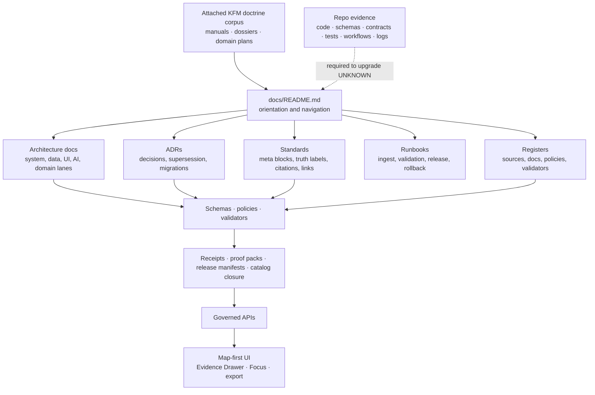

<!-- [KFM_META_BLOCK_V2]
doc_id: TODO(assign kfm://doc/<uuid> during documentation registry intake)
title: KFM Documentation Hub
type: standard
version: v1
status: draft
owners: TODO(confirm docs owners or stewardship team)
created: TODO(confirm initial commit date)
updated: 2026-04-22
policy_label: TODO(confirm public/restricted label before publication)
related: [TODO(confirm root README, documentation registry, ADR index, source ledger)]
tags: [kfm, docs, governance, evidence, spatial, map-first]
notes: [draft generated from attached KFM doctrine and current workspace scan; no mounted repo tree was visible; placeholders require steward review]
[/KFM_META_BLOCK_V2] -->

<a id="top"></a>

# KFM Documentation Hub

A governed entry point for documentation that explains, preserves, and verifies Kansas Frontier Matrix doctrine without turning docs into unreviewed implementation claims.

<p>
  
  
  
  
</p>

> [!IMPORTANT]
> **Impact block**
>
> **Status:** `experimental` until the real repository tree, owners, doc registry, links, workflows, and adjacent README conventions are verified.  
> **Owners:** `TODO(confirm docs owners or stewardship team)`.  
> **Quick jumps:** [Scope](#scope) · [Repo fit](#repo-fit) · [Inputs](#inputs) · [Exclusions](#exclusions) · [Directory map](#directory-map) · [Working flow](#working-flow) · [Done gates](#done-gates)

> [!WARNING]
> **Current evidence limit:** this draft is grounded in the attached KFM doctrine corpus and a visible workspace scan that did **not** expose a mounted KFM Git repository. Treat every path below, except this target file path `docs/README.md`, as `NEEDS VERIFICATION` until confirmed in the actual checkout.

---

## Scope

`docs/` is the human-facing documentation control plane for Kansas Frontier Matrix (KFM).

It should help maintainers answer four questions without guessing:

1. **What is KFM allowed to claim?**
2. **What evidence, policy, review, and release state backs that claim?**
3. **Which docs describe intended doctrine, and which repo artifacts prove current behavior?**
4. **What must be validated before a source, layer, model output, story, export, or public release is trusted?**

KFM documentation is not decorative prose. It is part of the governed system: it records doctrine, decisions, boundaries, source status, proof obligations, known unknowns, and rollback/correction paths.

### Current draft posture

| Area | Status | Meaning |
|---|---:|---|
| KFM doctrine | `CONFIRMED` | The attached corpus consistently frames KFM as governed, evidence-first, map-first, time-aware, and publication-aware. |
| `docs/README.md` target | `PROPOSED` | This file is drafted as the `docs/` landing page. |
| Current repo topology | `UNKNOWN` | No mounted Git repository was visible in this drafting session. |
| Adjacent docs, owners, badges, links, CI | `NEEDS VERIFICATION` | Confirm in the real checkout before publishing. |
| File homes beyond this README | `PROPOSED` | Use as orientation only; do not create blindly. |

[Back to top](#top)

---

## Repo fit

| Relationship | Target | Status | Notes |
|---|---|---:|---|
| This file | `docs/README.md` | `PROPOSED` | Landing page for the documentation directory. |
| Upstream landing page | `TODO(link after confirming ../README.md)` | `NEEDS VERIFICATION` | Expected root repo orientation, but not visible in this session. |
| Documentation registry | `TODO(link after confirming docs/registers or equivalent)` | `NEEDS VERIFICATION` | Should list canonical, lineage, exploratory, superseded, and deferred docs. |
| ADR index | `TODO(link after confirming docs/adr or equivalent)` | `NEEDS VERIFICATION` | Should record schema-home, source-role, release, UI, AI, and exposure decisions. |
| Schema/contract docs | `TODO(link after confirming schemas/contracts home)` | `NEEDS VERIFICATION` | Schema authority is not safe to assume without repo inspection. |
| Policy docs | `TODO(link after confirming policy home)` | `NEEDS VERIFICATION` | Public release, sensitivity, rights, and deny reasons belong behind reviewable policy. |
| Release/proof docs | `TODO(link after confirming release/proof locations)` | `NEEDS VERIFICATION` | Receipts, proofs, manifests, and catalog closure should remain distinct. |

### How this directory should relate to the rest of KFM


```mermaid
flowchart TB
  corpus["Attached KFM doctrine corpus<br/>manuals · dossiers · domain plans"] --> docs["docs/README.md<br/>orientation and navigation"]
  repo["Repo evidence<br/>code · schemas · contracts · tests · workflows · logs"] -. "required to upgrade UNKNOWN" .-> docs

  docs --> arch["Architecture docs<br/>system, data, UI, AI, domain lanes"]
  docs --> adr["ADRs<br/>decisions, supersession, migrations"]
  docs --> std["Standards<br/>meta blocks, truth labels, citations, links"]
  docs --> runbooks["Runbooks<br/>ingest, validation, release, rollback"]
  docs --> registers["Registers<br/>sources, docs, policies, validators"]

  arch --> gates["Schemas · policies · validators"]
  adr --> gates
  std --> gates
  registers --> gates
  gates --> release["Receipts · proof packs · release manifests · catalog closure"]
  release --> api["Governed APIs"]
  api --> ui["Map-first UI<br/>Evidence Drawer · Focus · export"]
```

[Back to top](#top)

---

## Inputs

Documentation belongs in `docs/` when it improves governability, reviewability, traceability, implementation discipline, or user comprehension.

Accepted inputs include:

| Input type | Belongs here when… | Required posture |
|---|---|---|
| Architecture docs | They explain durable boundaries, object families, lifecycle, or subsystem responsibilities. | Separate doctrine from implementation evidence. |
| ADRs | A decision changes file homes, trust boundaries, schemas, policy, release behavior, or public surfaces. | Include alternatives, consequences, validation, and rollback. |
| Standards | The repo needs repeatable rules for Markdown, metadata, source status, truth labels, contracts, or release artifacts. | Keep rules checkable. |
| Domain lane docs | A lane such as hydrology, habitat, fauna, soil, archaeology, geology, atmosphere, roads, settlements, agriculture, or people/land needs governed scope. | Preserve lane-specific burden and sensitivity. |
| Source and document registers | A source, packet, dataset, external standard, or document needs authority, status, caveats, and lineage recorded. | Do not collapse exploratory inputs into canon. |
| Runbooks | Operators or stewards need safe, repeatable procedures. | Include prerequisites, gates, expected outputs, failure modes, and rollback. |
| Release and correction docs | Public or steward-facing publication requires review, proof, receipts, manifests, correction, withdrawal, or rollback context. | Preserve release state and auditability. |
| Examples | A small example makes a contract, payload, or review flow understandable. | Mark illustrative examples unless they come from verified fixtures. |

> [!TIP]
> Good KFM docs should make a future reviewer faster **and** safer. A reader should be able to see what is confirmed, what is proposed, what is unknown, and what would prove the next stronger claim.

[Back to top](#top)

---

## Exclusions

The `docs/` directory should not become a dumping ground for raw sources, generated artifacts, secrets, or proof substitutes.

| Do not put in `docs/` | Put it here instead | Reason |
|---|---|---|
| RAW source data, source PDFs, scraped pages, source exports | `TODO(confirm data/raw or source-intake home)` | Raw material must enter through governed source intake, rights, and sensitivity review. |
| WORK or QUARANTINE artifacts | `TODO(confirm work/quarantine lifecycle homes)` | These are not public documentation and may be incomplete, sensitive, or unreviewed. |
| Generated tiles, scenes, indexes, embeddings, summaries, caches | `TODO(confirm processed/published artifact homes)` | Derived layers are rebuildable outputs, not documentation truth. |
| Machine schemas as hidden prose only | `TODO(confirm schemas/contracts authority)` | Contracts must be machine-checkable; docs may explain them but should not silently replace them. |
| Policy rules only described narratively | `TODO(confirm policy-as-code home)` | High-impact policy needs enforceable rules, deny reasons, fixtures, and review. |
| Secrets, tokens, credentials, private keys, personal data | Never commit to docs | Exposure risk; document handling patterns, not secrets. |
| Runtime logs, dashboards, traces | `TODO(confirm observability or receipts location)` | Docs may link to retained evidence, but logs are not prose. |
| Free-form model outputs | `TODO(confirm AI receipt/review path)` | AI is interpretive; outputs need evidence, policy, citation validation, and finite outcomes. |
| Exact sensitive locations without review | Controlled/restricted access path | Archaeology, rare species, critical infrastructure, living-person, DNA, cultural, and private-property contexts fail closed. |

[Back to top](#top)

---

## Directory map

> [!IMPORTANT]
> The tree below is an orientation model, **not confirmed current repository inventory**. Verify the actual checkout before creating, moving, or linking files.

```text
docs/
├── README.md                         # this landing page
├── adr/                              # NEEDS VERIFICATION: architectural decision records
├── architecture/                     # NEEDS VERIFICATION: system and subsystem architecture
├── standards/                        # NEEDS VERIFICATION: Markdown, metadata, source, contract standards
├── domains/                          # NEEDS VERIFICATION: governed domain-lane docs
├── registers/                        # NEEDS VERIFICATION: doc/source/policy/validator registers
├── runbooks/                         # NEEDS VERIFICATION: operator and steward procedures
├── release/                          # NEEDS VERIFICATION: publication, correction, rollback docs
└── templates/                        # NEEDS VERIFICATION: reusable doc templates
```

### Suggested directory responsibilities

| Zone | Purpose | First thing to verify |
|---|---|---|
| `adr/` | Decisions that change trust boundaries, file homes, schemas, source roles, release behavior, or public UI. | Existing ADR naming and numbering. |
| `architecture/` | Stable doctrine and subsystem boundaries. | Whether master architecture docs already exist elsewhere. |
| `standards/` | Repo-wide documentation and artifact rules. | Whether KFM Meta Block v2 is already captured in a template. |
| `domains/` | Lane-specific scope, sources, burdens, policies, and public-safety notes. | Existing domain docs and naming conventions. |
| `registers/` | Navigation for source/document/status/control-plane inventories. | Canonical register format and owner. |
| `runbooks/` | Repeatable operating procedures. | Existing operator docs and safety conventions. |
| `release/` | Publication, proof, correction, withdrawal, rollback, and release notes. | Where proof packs and release manifests actually live. |
| `templates/` | Reusable standard-doc, README, ADR, runbook, and register patterns. | Whether templates are generated or hand-maintained. |

[Back to top](#top)

---

## Working flow

Before editing a doc, inspect the repo evidence first.

```bash
# Read-only orientation checks. Run from the repository root.
git status --short
git branch --show-current

find docs -maxdepth 2 -type f | sort
find .github contracts schemas policy tools tests apps packages data release \
  -maxdepth 2 -type f 2>/dev/null | sort | sed -n '1,200p'
```

Then apply the KFM documentation loop:

1. **Identify the doc role.** README-like, standard doc, ADR, runbook, register, release note, or domain lane doc.
2. **Check adjacent conventions.** Match local heading patterns, metadata, badges, owner markers, and link style.
3. **Classify evidence.** Use `CONFIRMED`, `INFERRED`, `PROPOSED`, `UNKNOWN`, or `NEEDS VERIFICATION` where confidence matters.
4. **Preserve doctrine.** Keep KFM’s evidence-first, map-first, time-aware, policy-aware, governed publication posture intact.
5. **Separate truth from interpretation.** EvidenceBundle and release state outrank summaries, generated text, tiles, scenes, indexes, and narrative polish.
6. **Update related control surfaces.** ADRs, registers, schemas, policy docs, runbooks, and release notes should stay synchronized when behavior changes.
7. **Validate links and examples.** Prefer relative links after confirming paths. Mark illustrative examples clearly.

[Back to top](#top)

---

## Truth labels

Use the narrowest truthful label. Do not upgrade uncertainty by tone.

| Label | Use when… | Example |
|---|---|---|
| `CONFIRMED` | Verified from current repo evidence, attached governing docs, generated artifacts, tests, logs, or visible command output. | `CONFIRMED: this README targets docs/README.md.` |
| `INFERRED` | Strongly suggested by source patterns, but not directly proven. | `INFERRED: docs/ is intended as a control-plane directory.` |
| `PROPOSED` | A recommendation, plan, file home, contract, or design not verified as implemented. | `PROPOSED: add docs/registers/SOURCE_LEDGER.md.` |
| `UNKNOWN` | Not verifiable with the available evidence. | `UNKNOWN: actual schema home before repo inspection.` |
| `NEEDS VERIFICATION` | A specific check must occur before relying on a claim. | `NEEDS VERIFICATION: owner, policy label, root README link.` |

> [!CAUTION]
> Repeated appearance of an object name in prior reports is continuity evidence, not implementation proof. A schema, API, route, workflow, validator, dashboard, or release artifact becomes `CONFIRMED` only after current repo or runtime evidence supports it.

[Back to top](#top)

---

## Documentation rules that preserve KFM

### 1. Cite or abstain

Consequential claims should identify their evidence path or explicitly abstain. Do not publish confident prose that cannot be traced.

### 2. Keep the lifecycle visible

KFM’s lifecycle posture is:

```text
RAW -> WORK / QUARANTINE -> PROCESSED -> CATALOG / TRIPLET -> PUBLISHED
```

Promotion is a governed state transition, not a file move. Documentation should not blur this boundary.

### 3. Keep public surfaces downstream

Public clients, ordinary UI surfaces, exports, and model-assisted outputs should consume governed APIs, released artifacts, and evidence-resolving payloads. They should not read RAW, WORK, QUARANTINE, canonical stores, internal graph projections, or model endpoints directly.

### 4. Keep AI interpretive

AI may help synthesize, navigate, evaluate, or propose. It does not become the root truth source. Focus-like surfaces should produce bounded outcomes such as `ANSWER`, `ABSTAIN`, `DENY`, or `ERROR`, with evidence and policy context visible.

### 5. Keep renderer boundaries clear

MapLibre, Cesium, tile packages, PMTiles, scenes, styles, and derived layers are delivery and interaction mechanisms. They are not sovereign truth. A map can render a feature without proving it is publishable.

### 6. Keep corrections possible

Docs should preserve supersession, correction lineage, withdrawal, rollback, and known verification gaps. A polished document that hides uncertainty is not KFM-ready.

[Back to top](#top)

---

## Documentation surfaces

| Surface | What it should answer | Must not become |
|---|---|---|
| README | Where am I, what belongs here, what does not, and how do I proceed safely? | A generic marketing page. |
| Architecture doc | What is the boundary, invariant, lifecycle, and responsibility split? | A wishlist detached from proof. |
| ADR | What decision was made, why, alternatives, validation, and rollback? | A hidden opinion log. |
| Standard | What rule applies consistently across docs/artifacts? | A prose-only substitute for validators. |
| Register | Which sources/docs/policies/validators exist, with what status and caveats? | A bibliography without authority labels. |
| Runbook | What exact safe procedure should a maintainer follow? | An optimistic checklist without failure modes. |
| Domain doc | What is the lane scope, burden, source-role model, sensitivity, and public posture? | A raw dataset catalog or broad topic essay. |
| Release/correction doc | What changed, what proof supports it, and how can it be reversed or corrected? | A changelog that strips trust context. |

[Back to top](#top)

---

## Done gates

A documentation PR is not ready until the reviewer can check these items without reconstructing the author’s assumptions.

- [ ] The file has the required metadata block or a documented exception.
- [ ] Status, owners, policy label, and related links are either confirmed or visibly marked `TODO` / `NEEDS VERIFICATION`.
- [ ] README-like docs include purpose, repo fit, accepted inputs, and exclusions.
- [ ] Claims about current implementation are backed by current repo evidence, tests, workflows, logs, generated artifacts, or direct command output.
- [ ] Proposed paths, schemas, routes, contracts, policies, and workflows are clearly labeled `PROPOSED`.
- [ ] Sensitive, rights-unclear, culturally sensitive, precise-location, living-person, DNA, and critical-infrastructure topics fail closed.
- [ ] Relative links have been checked from the target file location.
- [ ] Code fences are language-tagged and non-destructive commands are marked as read-only when appropriate.
- [ ] Diagrams describe real or explicitly proposed structure; they are not decorative filler.
- [ ] Adjacent docs, ADRs, registers, schemas, policies, runbooks, and release notes are updated or explicitly listed as follow-up work.
- [ ] Rollback or correction expectations are documented when publication, policy, or contracts are affected.

[Back to top](#top)

---

## FAQ

### Is documentation a source of truth?

Documentation is a governed control surface. It can define doctrine, record decisions, explain contracts, and point to proof. It does not override current implementation evidence for what the repo actually does.

### Can a doc mention a path that does not exist yet?

Yes, but only as `PROPOSED` or `NEEDS VERIFICATION`. Do not phrase future file homes as current repository inventory.

### Can examples be invented?

Use examples only when they clarify a real KFM pattern. Label them `illustrative` unless they come from verified fixtures or generated artifacts.

### Should public-facing docs hide uncertainty?

No. KFM’s trust posture depends on making scope, evidence, policy, freshness, review, release, and correction state visible enough to challenge.

[Back to top](#top)

---

<details>
<summary>Appendix: Minimum standard-doc skeleton</summary>

Use this shape for standard docs unless a local template says otherwise.

```markdown
<!-- [KFM_META_BLOCK_V2]
doc_id: TODO(assign kfm://doc/<uuid>)
title: <Title>
type: standard
version: v1
status: draft
owners: TODO(confirm)
created: TODO(confirm)
updated: YYYY-MM-DD
policy_label: TODO(confirm)
related: [TODO(confirm)]
tags: [kfm]
notes: [TODO(confirm placeholders before publish)]
[/KFM_META_BLOCK_V2] -->

# <Title>

One-line purpose.

> [!IMPORTANT]
> Status, owners, evidence basis, and verification limits.

## Scope

## Repo fit

## Inputs

## Exclusions

## Evidence basis

## Requirements or guidance

## Validation

## Rollback or correction

## Open questions
```

</details>

<details>
<summary>Appendix: Review prompts for maintainers</summary>

Use these questions during review:

1. What exact claim would become false if the repo is inspected?
2. Which sections are doctrine, and which are current implementation behavior?
3. Are all proposed files, paths, APIs, workflows, schemas, and policies labeled honestly?
4. Does this doc preserve the trust membrane?
5. Does any public or semi-public guidance expose sensitive locations, rights-unclear material, private data, or unreviewed AI output?
6. Would a new contributor know where the doc fits and what not to put here?
7. Is rollback or correction possible if this doc becomes wrong?

</details>
