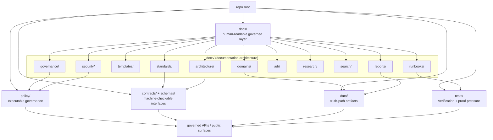

<!-- [KFM_META_BLOCK_V2]
doc_id: kfm://doc/NEEDS-VERIFICATION
title: docs
type: standard
version: v1
status: draft
owners: NEEDS VERIFICATION
created: NEEDS VERIFICATION
updated: NEEDS VERIFICATION
policy_label: NEEDS VERIFICATION
related: [../README.md, ./governance/, ./runbooks/, ./standards/, ./templates/]
tags: [kfm, docs, documentation, governance, runbooks, standards, templates]
notes: [Current session directly verified mounted PDF corpus and source-reported documentation inventories only; live docs subtree, owners, dates, labels, and exact child README presence still require checkout inspection before commit.]
[/KFM_META_BLOCK_V2] -->

# docs

Governed documentation index for Kansas Frontier Matrix (KFM): doctrine, architecture, governance, runbooks, templates, and adjacent documentation surfaces that help the system stay inspectable.

> **Status:** experimental — `NEEDS VERIFICATION` in a live checkout  
> **Owners:** `NEEDS VERIFICATION` — review `../.github/CODEOWNERS` before commit  
>       
> **Quick jumps:** [Scope](#scope) · [Repo fit](#repo-fit) · [Accepted inputs](#accepted-inputs) · [Exclusions](#exclusions) · [Evidence boundary](#current-evidence-boundary) · [Directory tree](#source-reported-docs-footprint) · [Quickstart](#quickstart) · [Usage](#usage) · [Diagram](#diagram) · [Tables](#tables) · [Task list](#task-list--definition-of-done) · [FAQ](#faq) · [Appendix](#appendix)

> [!IMPORTANT]
> In KFM, documentation is part of the governed system, not ornamental packaging. Contracts, schemas, diagrams, examples, runbooks, proof-object inventories, and correction notes are part of the trust surface, so behavior-significant changes should update documentation in the same governed stream as contracts, policy, tests, release evidence, and correction material.

## Scope

`docs/` is the human-readable operating layer for KFM.

Its job is to make doctrine, architecture, review rules, standards, templates, and operator procedures legible **without** pretending prose is the same thing as enforcement. In KFM terms, `docs/` should clarify the governed system, not become a second truth path or a shortcut around contracts, policy, release evidence, or runtime controls.

## Repo fit

**Path target:** `docs/README.md`  
**Path status:** `NEEDS VERIFICATION` in a mounted checkout

**Upstream neighbors:** [repo root](../README.md) · [`.github/`](../.github/) · [`../contracts/`](../contracts/) · [`../policy/`](../policy/) · [`../data/`](../data/)

**Primary downstream hubs:** [governance](./governance/) · [runbooks](./runbooks/) · [standards](./standards/) · [templates](./templates/)

**Other documentation families repeatedly described across the mounted corpus:** [architecture](./architecture/) · [domains](./domains/) · [adr](./adr/) · [research](./research/) · [search](./search/) · [security](./security/) · [reports](./reports/)

**Why this directory matters:** it keeps doctrine, review, and operating knowledge close to the same evidence-first, fail-closed system that the rest of KFM is trying to enforce.

## Accepted inputs

Content that belongs in `docs/` includes:

- directory indexes and README files
- doctrine, architecture notes, ADRs, and decision packets
- standards, profiles, authoring guidance, and template-backed documentation protocol material
- governance, ethics, sovereignty, review, rights, and sensitivity guidance
- runbooks, rollback steps, correction playbooks, and steward/operator procedures
- reusable documentation templates
- research summaries, search-method notes, report/story scaffolding, and trust-visible explanatory material
- diagrams, examples, and reference notes that explain governed behavior already enforced or intended elsewhere in the repo

## Exclusions

The following do **not** belong here as the authoritative source of truth:

- machine-enforced schemas, route contracts, DTO definitions, and controlled vocabularies  
  → keep in [`../contracts/`](../contracts/) and [`../schemas/`](../schemas/)
- policy bundles, decision tests, deny-by-default enforcement logic, and runtime policy evaluation  
  → keep in [`../policy/`](../policy/)
- canonical data artifacts, source descriptors, receipts, manifests, and release outputs  
  → keep on the truth path under [`../data/`](../data/) or the owning artifact home
- runtime code, worker logic, UI implementation, and service behavior  
  → keep in the owning code surface
- secrets, credentials, signed URLs, or sensitive coordinates  
  → never store those in docs
- prose that quietly upgrades `UNKNOWN` implementation state into “already running” fact  
  → keep it explicit, staged, and reviewable

> [!NOTE]
> The mounted corpus sometimes uses `docs/` broadly for human-readable support material, but KFM still distinguishes explanatory documentation from machine-checkable enforcement. When a file needs to function as a contract, registry, policy artifact, or proof object, it should not be quietly downgraded into prose-only documentation.

## Evidence labels used in this index

| Label | Meaning here |
| --- | --- |
| **CONFIRMED** | Directly supported by the mounted March 2026 KFM PDF corpus or by direct current-session filesystem inspection |
| **INFERRED** | Strongly implied by mounted documentation inventories, continuity material, or adjacent manuals, but not directly re-opened in a live repo checkout |
| **PROPOSED** | Added here as a repo-native organization, wording, or review improvement |
| **UNKNOWN** | Not supported strongly enough in this session to present as current repo reality |
| **NEEDS VERIFICATION** | Exact live path, owner, date, label, README presence, or implementation linkage should be checked before merge |

## Current evidence boundary

This index is intentionally explicit about what the current session **did** and **did not** prove.

| Observation | Status | Why it changes this README |
| --- | --- | --- |
| The directly visible workspace exposed a mounted PDF corpus under `/mnt/data`, not a mounted KFM repository checkout | **CONFIRMED** | Exact subtree contents, CODEOWNERS values, workflow wiring, and file-presence claims remain `NEEDS VERIFICATION` |
| The March 18–19 replacement-grade KFM manuals repeatedly treat documentation as a production surface tied to contracts, proofs, review, release evidence, and correction | **CONFIRMED** | This README should frame `docs/` as operational, not decorative |
| The strongest current doctrine separates doctrine, realization, and mounted implementation evidence, and warns that documentation maturity does not prove implementation maturity | **CONFIRMED** | The index must keep `CONFIRMED`, `INFERRED`, `PROPOSED`, `UNKNOWN`, and `NEEDS VERIFICATION` visible |
| Documentation families for doctrine, contracts, policy, verification, app/surface doctrine, domain atlases, operational guides, migration/correction, release evidence, and runbooks are explicitly described in the March 19 primary documentation manual | **CONFIRMED** | The index should follow a layered documentation architecture instead of flattening everything into one undifferentiated docs tree |
| Concrete docs paths for research, search, runbooks, and security are listed in a mounted support-file inventory; governance, standards, templates, and story/report paths appear in continuity and notebook-style documentation materials | **INFERRED** | The tree below is a **source-reported footprint**, not a substitute for `find docs/` in a live checkout |
| Exact current child README presence for `./governance/`, `./runbooks/`, `./standards/`, and `./templates/` was not directly inspected in a mounted repository tree during this session | **NEEDS VERIFICATION** | Directory-level links are safer than overconfident file-level links in the index body |

> [!CAUTION]
> Treat the tree below as a **documentation inventory synthesized from mounted KFM materials**, not as a direct filesystem dump from the current repo checkout.

## Source-reported docs footprint

```text
docs/
├── README.md                                          # target of this index revision; live presence NEEDS VERIFICATION
├── governance/                                        # INFERRED
│   ├── ROOT_GOVERNANCE.md                             # inventory-reported
│   ├── ETHICS.md                                      # inventory-reported
│   └── SOVEREIGNTY.md                                 # inventory-reported
├── standards/                                         # INFERRED
│   ├── README.md                                      # NEEDS VERIFICATION
│   ├── KFM_STAC_PROFILE.md                            # older source-reported pattern
│   ├── KFM_DCAT_PROFILE.md                            # older source-reported pattern
│   └── KFM_PROV_PROFILE.md                            # older source-reported pattern
├── templates/                                         # INFERRED
│   ├── TEMPLATE__KFM_UNIVERSAL_DOC.md                 # source-reported
│   ├── TEMPLATE__STORY_NODE_V3.md                     # source-reported
│   └── TEMPLATE__API_CONTRACT_EXTENSION.md            # source-reported
├── runbooks/                                          # INFERRED
│   └── reliability/
│       ├── trigger-mechanisms/README.md               # inventory-reported
│       └── trigger-retry-matrix.md                    # inventory-reported
├── architecture/                                      # INFERRED
│   └── ... playbooks, blueprints, and design notes
├── adr/                                               # INFERRED
├── domains/                                           # INFERRED
├── research/                                          # INFERRED
│   ├── README.md                                      # inventory-reported
│   └── source_summaries/
│       ├── README.md                                  # inventory-reported
│       └── by_type/
│           ├── README.md                              # inventory-reported
│           ├── books/README.md                        # inventory-reported
│           ├── maps/README.md                         # inventory-reported
│           └── web/README.md                          # inventory-reported
├── search/                                            # INFERRED
│   ├── README.md                                      # inventory-reported
│   └── drift/
│       ├── README.md                                  # inventory-reported
│       ├── embeddings/README.md                       # inventory-reported
│       ├── examples/README.md                         # inventory-reported
│       ├── graph-queries/README.md                    # inventory-reported
│       ├── hyde/README.md                             # inventory-reported
│       └── stac/README.md                             # inventory-reported
├── security/                                          # INFERRED
│   ├── README.md                                      # inventory-reported
│   ├── ai-supply-chain/README.md                      # inventory-reported
│   ├── prompt-injection/README.md                     # inventory-reported
│   ├── react2shell/README.md                          # inventory-reported
│   ├── react2shell-advisory/README.md                 # inventory-reported
│   ├── supply-chain/sigstore-cosign-v3/README.md     # inventory-reported
│   └── vulns/README.md                                # inventory-reported
└── reports/                                           # INFERRED
    └── story_nodes/                                   # older source-reported pattern
```

## Quickstart

Use a verification-first sequence before editing or expanding `docs/`.

> [!WARNING]
> The commands below are **repo-local verification examples**. They are the right next checks once a live checkout is mounted, but they are not proof that those paths already existed in the current PDF-only workspace.

```bash
# Inspect the docs subtree first
find docs -maxdepth 4 -type f | sort

# Open the directory index and likely core hubs
sed -n '1,240p' docs/README.md
find docs/governance docs/runbooks docs/standards docs/templates -maxdepth 3 -type f 2>/dev/null | sort

# Re-check machine-enforced neighbors before documenting behavior as fact
find contracts schemas policy -maxdepth 4 -type f 2>/dev/null | sort | sed -n '1,240p'

# Confirm repo-level ownership and review boundaries
sed -n '1,200p' .github/CODEOWNERS 2>/dev/null
find .github -maxdepth 2 -type f 2>/dev/null | sort

# Search for stable KFM doctrine terms that should not drift between docs and contracts
grep -RIn "trust membrane\|EvidenceBundle\|cite-or-abstain\|authoritative-versus-derived\|fail-closed" \
  docs contracts policy schemas 2>/dev/null

# Check whether source-reported template and governance files are present as mounted paths
grep -RIn "TEMPLATE__KFM_UNIVERSAL_DOC\|TEMPLATE__STORY_NODE_V3\|TEMPLATE__API_CONTRACT_EXTENSION\|ROOT_GOVERNANCE.md\|ETHICS.md\|SOVEREIGNTY.md" \
  docs .github 2>/dev/null
```

## Usage

### Read `docs/` in this order

1. Start here to understand the docs boundary, evidence posture, and current verification limit.
2. Read [`./governance/`](./governance/) when the change affects review, rights, ethics, sovereignty, withholding, escalation, or public-release conditions.
3. Read [`./standards/`](./standards/) when the question is “what must be true?”
4. Read [`./templates/`](./templates/) before creating new governed docs or changing document structure.
5. Read [`./runbooks/`](./runbooks/) when the question is “how do we operate, recover, or contain this safely?”
6. Read adjacent families such as [`./architecture/`](./architecture/), [`./domains/`](./domains/), [`./adr/`](./adr/), [`./research/`](./research/), [`./search/`](./search/), [`./security/`](./security/), or [`./reports/`](./reports/) only after the owning boundary is clear.

### Documentation update rule

When a change is behavior-significant, `docs/` should not move alone and should not lag behind.

| If you changed... | Re-check alongside docs |
| --- | --- |
| public meaning, DTO-visible behavior, or evidence drill-through expectations | contracts, schemas, policy, tests, and release evidence |
| review or publication gates | governance docs, runbooks, policy bundles, proof-object expectations, and approval paths |
| authoring patterns or README structure | templates, standards, and neighboring directory indexes |
| trust-visible UX, shell rules, Evidence Drawer behavior, or Focus outcomes | app doctrine, UI doctrine, example payloads, screenshots/diagrams if owned here |
| rollback, correction, supersession, or stale-state handling | runbooks, migration/correction manuals, release/correction artifacts, and observability joins |
| source families, lane definitions, or publication burdens | domain/source atlas docs and any linked standards or rights guidance |

### Writing rule

Keep explanation downstream of evidence. `docs/` can clarify, constrain, and guide, but it should not become the only place where a critical contract, policy rule, runtime guarantee, or review obligation “exists.”

## Diagram


```mermaid
flowchart TD
    ROOT["repo root"] --> DOCS["docs/<br/>human-readable governed layer"]
    ROOT --> CONTRACTS["contracts/ + schemas/<br/>machine-checkable interfaces"]
    ROOT --> POLICY["policy/<br/>executable governance"]
    ROOT --> DATA["data/<br/>truth-path artifacts"]
    ROOT --> TESTS["tests/<br/>verification + proof pressure"]

    subgraph D["docs/ (documentation architecture)"]
        GOV["governance/"]
        STD["standards/"]
        TMP["templates/"]
        RUN["runbooks/"]
        ARCH["architecture/"]
        DOM["domains/"]
        ADR["adr/"]
        RES["research/"]
        SRCH["search/"]
        SEC["security/"]
        RPT["reports/"]
    end

    DOCS --> GOV
    DOCS --> STD
    DOCS --> TMP
    DOCS --> RUN
    DOCS --> ARCH
    DOCS --> DOM
    DOCS --> ADR
    DOCS --> RES
    DOCS --> SRCH
    DOCS --> SEC
    DOCS --> RPT

    GOV --> POLICY
    STD --> CONTRACTS
    RUN --> TESTS
    ARCH --> CONTRACTS
    DOM --> DATA
    SEC --> POLICY
    RPT --> DATA

    POLICY --> PUB["governed APIs / public surfaces"]
    CONTRACTS --> PUB
    DATA --> PUB
    TESTS --> PUB
```

## Tables

### Documentation placement matrix

| Artifact or change | Primary home | Why |
| --- | --- | --- |
| Doctrine, invariants, documentation law, authority order | primary documentation/source-of-truth manuals | These state what the system claims as project law |
| Normative standards, profiles, metadata guidance, authoring rules | [`./standards/`](./standards/) | These define expected structure and stability |
| Governance, ethics, sovereignty, review, rights, and sensitivity handling | [`./governance/`](./governance/) | These decide what may be promoted, withheld, generalized, or denied |
| Operator procedures, rollback, correction, supersession, and recovery | [`./runbooks/`](./runbooks/) | These make failure and recovery reproducible |
| Reusable document scaffolds and doc protocol | [`./templates/`](./templates/) | These keep documentation consistent and reviewable |
| Architecture notes, migration playbooks, and ADRs | [`./architecture/`](./architecture/), [`./adr/`](./adr/) | These explain structural choices without replacing contracts |
| Domain/source burden notes and Kansas lane guidance | [`./domains/`](./domains/) | These preserve source-role distinctions and publication burden |
| Research/source summaries and DRIFT/search notes | [`./research/`](./research/), [`./search/`](./search/) | These support discovery and evidence work without becoming sovereign truth |
| Story/report narrative surfaces | [`./reports/`](./reports/) | These are presentation surfaces, not contract or schema homes |
| Security and supply-chain advisories | [`./security/`](./security/) | These concentrate hardening, advisories, and security operating guidance |
| Machine-enforced schemas, route contracts, reason-code registries | [`../contracts/`](../contracts/), [`../schemas/`](../schemas/) | These are machine-checkable interfaces |
| Policy bundles and policy tests | [`../policy/`](../policy/) | These are executable governance surfaces |
| Raw/work/processed/catalog/release artifacts | [`../data/`](../data/) or owning artifact homes | These belong on the truth path, not in prose |

### Trust obligations by docs surface

| Surface | Primary question | Minimum obligation |
| --- | --- | --- |
| `docs/README.md` | Where do I start, and what is verified versus inferred? | Keep the evidence boundary visible |
| `docs/governance/` | What is allowed, reviewed, withheld, or escalated? | Match fail-closed doctrine and review posture |
| `docs/standards/` | What must be true? | Stay stable, version-aware, and cross-linked to enforcement |
| `docs/templates/` | How should we author governed docs? | Keep metadata, review posture, and promotion context explicit |
| `docs/runbooks/` | How do we operate and recover safely? | Include prerequisites, validation, rollback, and resulting artifacts |
| `docs/research/` / `docs/search/` | How do source summaries and retrieval notes stay traceable? | Keep provenance, boundaries, and claims-vs-interpretation explicit |
| `docs/security/` | How are risk, advisories, and trust boundaries documented? | Preserve supply-chain, runtime, and release-security consequences |
| `docs/reports/` | How do narrative surfaces stay evidence-linked? | Keep citation resolution and review state visible |

### Current evidence basis for this index

| Evidence source | What it supports | How this README uses it |
| --- | --- | --- |
| `KFM_Master_Manual_Reissued_2026-03-18.pdf` | current-session truth posture, authority ordering, and PDF-only evidence boundary | establishes the doctrinal baseline and visible uncertainty |
| `KFM_Primary_Documentation_Source_of_Truth_Refined_2026-03-19.pdf` | documentation as production surface, documentation families, and documentation law | drives the structure and placement logic of this index |
| `KFM_Testing_Verification_Refined_2026-03-19.pdf` | documentation/accessibility as verification surfaces and direct-authority cleanup discipline | justifies the explicit verification backlog |
| `Kansas Frontier Matrix — Unified Master Reference, Governed Delivery, and CI_CD Doctrine.pdf` | repository-truth rule, CODEOWNERS/reviewer expectations, docs/runbooks/examples changing with behavior | drives the “docs move with code/policy/tests” rule |
| `Kansas Frontier Matrix Support File.pdf` | inventory-reported paths under `docs/runbooks/`, `docs/search/`, `docs/research/`, and `docs/security/` | supports the source-reported tree without pretending current file-presence proof |
| continuity / notebook-style documentation materials | governance, standards, template, and report/story path patterns | used only as supporting inventory evidence and clearly kept below current mounted doctrine |

## Task list / Definition of done

Use this checklist before treating `docs/README.md` as ready for commit.

- [ ] Resolve `doc_id`, owners, created date, updated date, and `policy_label`
- [ ] Verify the live `docs/` subtree from a mounted repo checkout
- [ ] Confirm whether `./governance/README.md`, `./runbooks/README.md`, `./standards/README.md`, and `./templates/README.md` exist, or keep directory-level links instead
- [ ] Reconcile the source-reported tree above with `find docs -maxdepth ...` output from the live repo
- [ ] Confirm ownership in `../.github/CODEOWNERS`
- [ ] Confirm relative links render correctly on GitHub
- [ ] Re-check whether any human-readable schema/profile notes live under `docs/` and point machine-enforced files to `contracts/` / `schemas/`
- [ ] Keep docs/examples/runbooks synchronized with any behavior-significant change in contracts, policy, code, tests, release evidence, or correction flow
- [ ] Confirm the Mermaid diagram still matches the mounted tree
- [ ] Remove or keep every `NEEDS VERIFICATION` marker deliberately — never by accident

## FAQ

### Why does this index use so many verification markers?

Because the current session exposed doctrine-rich PDFs, not a mounted repo checkout. KFM’s own truth posture prefers visible incompleteness over polished overclaiming.

### Why are several links directory-level instead of file-level?

Because directory roles are strongly supported by the mounted documentation architecture, but several exact child README files were not directly inspected in a live repository tree during this session.

### Why keep `docs/` distinct from `contracts/`, `schemas/`, and `policy/`?

Because KFM separates explanation from enforcement. `docs/` explains, guides, and records; contracts and policy enforce.

### When should a docs change block release?

When behavior changed materially enough that stale docs, examples, diagrams, or runbooks would cause contributors, operators, reviewers, or users to misunderstand what the governed system now does.

## Appendix

<details>
<summary>Mounted source signals used to build this index</summary>

The most useful documentation-specific signals visible in the mounted corpus were:

| Source | Signal retained here |
| --- | --- |
| `KFM_Primary_Documentation_Source_of_Truth_Refined_2026-03-19.pdf` | documentation is a production surface; layered documentation families; doc updates move with behavior |
| `KFM_Testing_Verification_Refined_2026-03-19.pdf` | documentation/accessibility gates are part of verification; UNKNOWN must stay visible |
| `Kansas Frontier Matrix — Unified Master Reference, Governed Delivery, and CI_CD Doctrine.pdf` | repository-truth rule; CODEOWNERS/review boundaries; docs/runbooks/examples change with behavior |
| `Kansas Frontier Matrix Support File.pdf` | source-reported docs paths for runbooks, research, search, and security |
| continuity / notebook-style materials | source-reported template, standards, governance, and story/report path patterns |

</details>

<details>
<summary>Current-session limits that still matter before merge</summary>

- The directly visible workspace exposed PDFs only.
- No live repo subtree, README files, `.github/CODEOWNERS` contents, workflows, schemas, tests, manifests, or runtime logs were directly inspected.
- This index is therefore **review-ready**, not falsely “fully verified.”
- Any conflicting live-tree reality should outrank this source-reported footprint once a mounted checkout is available.

</details>

[Back to top](#docs)
